
# arxiv digest (quant-ph + cond-mat) — 2026-09-10

*155 papers · 19 relevant · 4 highlighted*

## 🔥 Most relevant (19)

*Every paper with at least one nonzero topic score, sorted by best-matching score. 🔥 marks scores ≥4/5. Click the title to jump to the full entry below; click [arXiv] to open the paper page. `(secondary)` marks papers from de-prioritized cond-mat archives.*

Show 19 relevant papers

- [Prethermal ripplons in quenched binary Bose-Einstein condensates](#paper-2609.09464) [[arXiv]](http://arxiv.org/abs/2609.09464v1) — 🔥 `scars & prethermalization` **5/5** · `analog quantum simulation` **3/5** · `driven-dissipative phase transition` **3/5** · `non-equilibrium universality` **3/5** · `Keldysh / 2PI / non-Gaussian methods` **2/5** · `methods for driven-dissipative` **2/5** · `Frenkel-Kontorova` **1/5** · `correlated / nonlocal dissipation` **1/5**
- [Fractional Chern Insulators in Twisted Bilayer Optical Lattices](#paper-2609.09733) [[arXiv]](http://arxiv.org/abs/2609.09733v1) — 🔥 `analog quantum simulation` **5/5**
- ⭐ [Faster Quantum Monte Carlo Simulation by Random Compilation](#paper-2609.10486) [[arXiv]](http://arxiv.org/abs/2609.10486v1) — 🔥 `methods for driven-dissipative` **4/5** · `Keldysh / 2PI / non-Gaussian methods` **3/5** · `quantum measurements` **3/5** · `correlated / nonlocal dissipation` **2/5** · `driven-dissipative phase transition` **2/5** · `non-equilibrium universality` **1/5**
- [Information capacity of quantum statistics: Fock-state tests of a discrete binary-sequence model on cloud photonic quantum processors](#paper-2609.10216) [[arXiv]](http://arxiv.org/abs/2609.10216v1) — 🔥 `QC/QI experiment` **4/5** · 🔥 `quantum optics experiment` **4/5** · `Full counting statistics` **2/5** · `analog quantum simulation` **2/5** · `quantum measurements` **2/5** · `interference shaping light` **1/5**
- ⭐ [Phase transitions in first-detection statistics of monitored long-range quantum walks](#paper-2609.10510) [[arXiv]](http://arxiv.org/abs/2609.10510v1) — 🔥 `quantum measurements` **4/5** · `driven-dissipative phase transition` **3/5** · `non-equilibrium universality` **3/5** · `Full counting statistics` **1/5** · `Keldysh / 2PI / non-Gaussian methods` **1/5** · `correlated / nonlocal dissipation` **1/5** · `methods for driven-dissipative` **1/5**
- [Transient and universal regimes in quantum reaction-transport kinetics](#paper-2609.09305) [[arXiv]](http://arxiv.org/abs/2609.09305v1) — 🔥 `Keldysh / 2PI / non-Gaussian methods` **4/5** · `non-equilibrium universality` **3/5** · `analog quantum simulation` **1/5** · `correlated / nonlocal dissipation` **1/5** · `driven-dissipative phase transition` **1/5** · `methods for driven-dissipative` **1/5** · `scars & prethermalization` **1/5**
- [Electrically tunable, two-photon interference from remote silicon-vacancy centers in industrial silicon carbide](#paper-2609.09805) [[arXiv]](http://arxiv.org/abs/2609.09805v1) — 🔥 `interference shaping light` **4/5** · `QC/QI experiment` **3/5** · `quantum optics experiment` **3/5** · `quantum measurements` **1/5**
- [Quantum computational resources and validation protocols for a three-mode non-Gaussian trilinear Hamiltonian](#paper-2609.10043) [[arXiv]](http://arxiv.org/abs/2609.10043v1) — 🔥 `QC/QI experiment` **4/5** · `analog quantum simulation` **3/5** · `quantum measurements` **3/5** · `quantum optics experiment` **1/5**
- [In situ characterization of a photon-subtraction device via heralding counts and homodyne detection](#paper-2609.10100) [[arXiv]](http://arxiv.org/abs/2609.10100v1) — 🔥 `quantum measurements` **4/5** · `Full counting statistics` **3/5** · `quantum optics experiment` **3/5**
- [Certified measurement and control of an entanglement-breaking index on programmable hardware](#paper-2609.09350) [[arXiv]](http://arxiv.org/abs/2609.09350v1) — 🔥 `quantum measurements` **4/5** · `QC/QI experiment` **3/5** · `driven-dissipative phase transition` **1/5** · `methods for driven-dissipative` **1/5**
- [Fast Synergetic Simulation to Study Slow Evolution of Soliton Patterns in Optical Resonators](#paper-2609.10389) [[arXiv]](http://arxiv.org/abs/2609.10389v1) `(secondary)` — 🔥 `methods for driven-dissipative` **4/5** · `Keldysh / 2PI / non-Gaussian methods` **1/5** · `correlated / nonlocal dissipation` **1/5** · `driven-dissipative phase transition` **1/5** · `non-equilibrium universality` **1/5** · `scars & prethermalization` **1/5**
- [Temperature-induced effective topology in many-body ultracold atomic quantum systems](#paper-2609.09463) [[arXiv]](http://arxiv.org/abs/2609.09463v1) — 🔥 `analog quantum simulation` **4/5** · `methods for driven-dissipative` **3/5** · `Rydberg arrays` **1/5**
- [Loss-correcting fault-tolerant quantum computing architecture for neutral atoms](#paper-2609.10079) [[arXiv]](http://arxiv.org/abs/2609.10079v1) — 🔥 `QC/QI experiment` **4/5** · `Rydberg arrays` **1/5** · `analog quantum simulation` **1/5** · `quantum measurements` **1/5**
- [Realization Theory for Quantum Filtering: Classifying Continuously Monitored Bosonic Systems](#paper-2609.09663) [[arXiv]](http://arxiv.org/abs/2609.09663v1) — 🔥 `quantum measurements` **4/5** · `correlated / nonlocal dissipation` **1/5** · `driven-dissipative phase transition` **1/5** · `methods for driven-dissipative` **1/5**
- [Apparent Zero-Momentum Signals from Magnon--Magnon Interference in Near-Field Spin-Wave Imaging](#paper-2609.09922) [[arXiv]](http://arxiv.org/abs/2609.09922v1) `(secondary)` — 🔥 `interference shaping light` **4/5** · `quantum measurements` **2/5**
- [Materials for Quantum Information Science: Roles in the Quantum Evolution 2.0](#paper-2609.09371) [[arXiv]](http://arxiv.org/abs/2609.09371v1) — 🔥 `QC/QI experiment` **4/5** · `analog quantum simulation` **1/5** · `correlated / nonlocal dissipation` **1/5**
- [Certifying bipartite entanglement on a superconducting processor from a corrected QAOA cost layer](#paper-2609.09495) [[arXiv]](http://arxiv.org/abs/2609.09495v1) — 🔥 `QC/QI experiment` **4/5** · `quantum measurements` **1/5**
- [Haar-Bayesian Pure-State Prediction under Relative-Entropy Loss: Arbitrary-Effect Reduction and Global Optimality](#paper-2609.10072) [[arXiv]](http://arxiv.org/abs/2609.10072v1) — 🔥 `quantum measurements` **4/5**
- [Why three? A two-level system with four mutually unbiased questions](#paper-2609.10078) [[arXiv]](http://arxiv.org/abs/2609.10078v1) — 🔥 `quantum measurements` **4/5**

## ⭐ Highlighted (4)

*Papers by authors on your watch list. Click the title to jump to the full entry below; click [arXiv] to open the paper page.*

Show 4 highlighted papers

- ⭐ [Faster Quantum Monte Carlo Simulation by Random Compilation](#paper-2609.10486) [[arXiv]](http://arxiv.org/abs/2609.10486v1) — Andrew J. Daley
- ⭐ [Phase transitions in first-detection statistics of monitored long-range quantum walks](#paper-2609.10510) [[arXiv]](http://arxiv.org/abs/2609.10510v1) — Giovanna Morigi
- ⭐ [Distinguishability Transitions from Global Quantum Snapshots](#paper-2609.09296) [[arXiv]](http://arxiv.org/abs/2609.09296v1) — Sarang Gopalakrishnan
- ⭐ [Non-equilibrium dissipative stabilization of s- and d-wave superconductivity](#paper-2609.10062) [[arXiv]](http://arxiv.org/abs/2609.10062v1) — Zala Lenarčič

## All papers (103, sorted by relevance)

*Papers from quant-ph and your primary cond-mat archives (quant-gas, stat-mech, str-el, dis-nn). Highlighted papers (⭐) come first, then everything else sorted by topic-relevance score, highest first.*

### ⭐ [Faster Quantum Monte Carlo Simulation by Random Compilation](http://arxiv.org/abs/2609.10486v1)

**Highlighted author(s):** Andrew J. Daley  
**Authors:** John M. Martyn, Joshua Lin, Neill C. Warrington, Isaac L. Chuang, Andrew J. Daley  
**Type:** theory · **Category:** numerical methods · **PDF:** <https://arxiv.org/pdf/2609.10486v1>  
**Analysis basis:** full PDF text, analyzed in chunks
**Topic relevance:** 🔥 `methods for driven-dissipative` **4/5** · `Keldysh / 2PI / non-Gaussian methods` **3/5** · `quantum measurements` **3/5** · `correlated / nonlocal dissipation` **2/5** · `driven-dissipative phase transition` **2/5** · `non-equilibrium universality` **1/5**

↔ Scroll figures horizontally

<figure class="paper-figure-card">
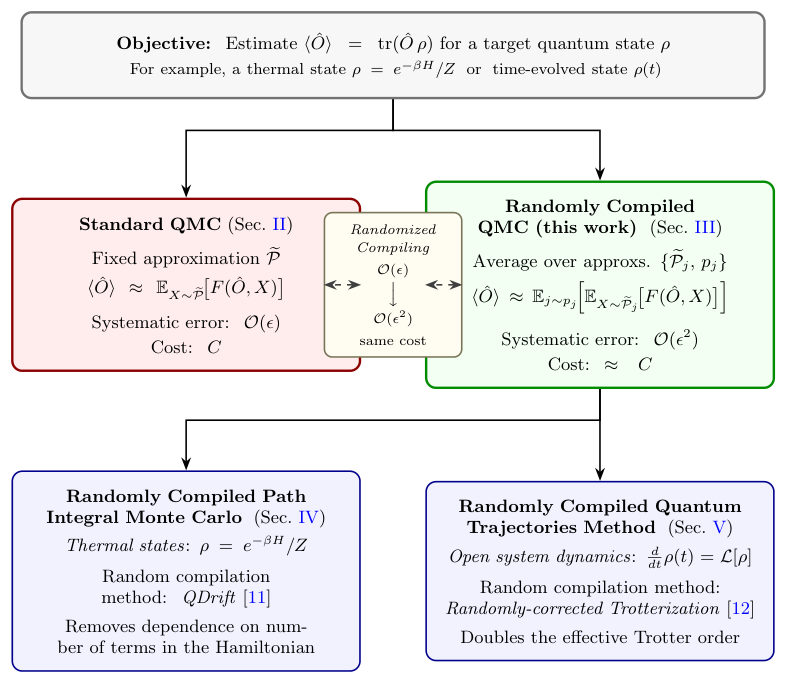
<figcaption class="paper-figure-caption"><b>Fig 1.</b> FIG. 1. Overview of the randomly compiled QMC (RC-QMC) framework. Standard QMC algorithms estimate an observable ⟨ˆO⟩by averaging an estimator function F( ˆO, X) over a random variable X sampled from a fixed approximate distribution eP (see Eq. (4)), incurring systematic error O(ϵ). RC-QMC instead averages over a collection of approximate distributions { ePj} weighted by probabilities pj (see Eq. (17)), which suppresses the systematic error to O(ϵ2) at essentially the same computational cost. This improvement is demonstrated in two settings: Randomly Compiled Path Integral Monte Carlo for thermal state estimation, where QDrift replaces the standard Trotter decomposition and eliminates the...</figcaption>
</figure>
<figure class="paper-figure-card">
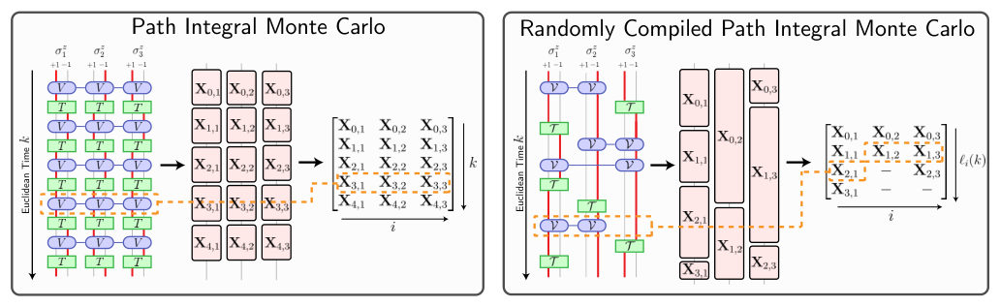
<figcaption class="paper-figure-caption"><b>Fig 2.</b> FIG. 2. (Left) Standard path integral Monte Carlo on 3 sites: Trotterization is used to decompose e−βH into a product of evolution under the potential (V ) and kinetic (T) energies, and particle positions take values ±1 in the σz basis at each time step k. The particle paths are then aggregated into an array X, indexed by site i and time step k. The dashed orange line depicts the mapping of a single time step to a particle configuration in X. (Right) Randomly compiled path integral Monte Carlo on 3 sites: individual potential (V) and kinetic (T ) energy terms are sampled according to QDrift, and a particle’s position can change only when its corresponding kinetic term is sampled. The paths...</figcaption>
</figure>
<figure class="paper-figure-card">
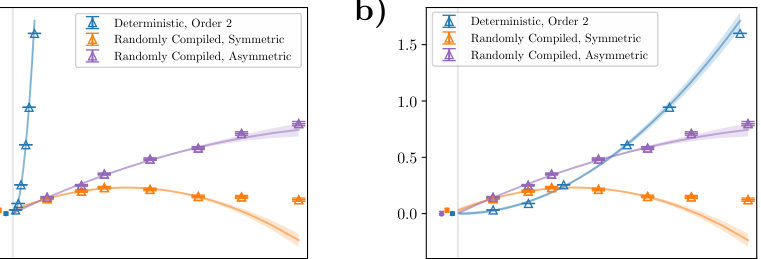
<figcaption class="paper-figure-caption"><b>Fig 3.</b> FIG. 3. Comparison of error in the observable ⟨ˆV ⟩between standard path integral Monte Carlo (using 2nd-order Trotterization) and randomly compiled path integral Monte Carlo (using symmetric and asymmetric approaches), where the error has been defined relative to the continuum limit of the standard algorithm (denoted ⟨ˆV ⟩cont). Inner error bars for the randomly compiled methods denote the MCMC sampling errors within QDrift sequences, and outer error bars are the total error estimate including the variance due to averaging over different QDrift sequences (as described in Appendix I). Continuum limit extrapolated values are shown at slightly negative offset values for clarity. a): Here the...</figcaption>
</figure>
<figure class="paper-figure-card">
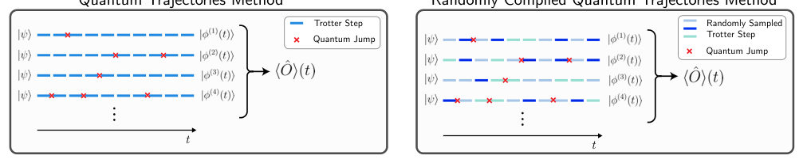
<figcaption class="paper-figure-caption"><b>Fig 4.</b> FIG. 4. An illustration of the quantum trajectories method (left), and the randomly compiled quantum trajectories method (right). Here, pure state trajectories are simulated by time-evolving an initial state |ψ⟩using Trotterization (denoted by blue rectangles), with intermediate quantum jumps applied randomly (denoted by red crosses). In the standard algorithm, each Trotter step is taken to be the same approximation. In the randomly compiled algorithm, each Trotter step is randomly sampled from a set of approximations. At the end of evolution, the trajectories are aggregated together to estimate an observable ⟨ˆO⟩(t) according to Eqs. (13) and (38).</figcaption>
</figure>
<figure class="paper-figure-card">

<figcaption class="paper-figure-caption"><b>Fig 5.</b> FIG. 5. Comparison between the standard (deterministic) and randomly compiled quantum trajectories methods applied to the dissipative Bose-Hubbard model. a): Simulations conducted on N = 10 spins with dissipation rate γ = 0.05, using Trotterization of various orders. We illustrate the time series for energy and the correlation function ⟨a† N/2aN/2+1⟩+ h.c. at a fixed number of Trotter steps (r = 40) (top), and the corresponding RMS error as a function of computational cost (bottom). b): Simulations conducted on N = 30 spins with dissipation rates γ = 0.04 (top) and γ = 0.08 (bottom), using 2nd-order Trotterization. Here we illustrate the time series for energy at a fixed number of Trotter...</figcaption>
</figure>

**Summary.** This paper introduces Randomly Compiled Quantum Monte Carlo (RC-QMC), a general framework designed to suppress systematic errors in QMC simulations by averaging over multiple approximations. By leveraging principles from randomized compiling, the method achieves a significant accuracy boost (e.g., from $O(\epsilon)$ to $O(\epsilon^2)$) for calculating thermal and time-dependent quantum expectation values with minimal added computational cost.

**Why it may be interesting.** This work provides a general, systematic algorithmic improvement for simulating complex quantum dynamics, which is highly relevant for researchers working on open quantum systems or many-body physics where systematic errors from time-stepping or approximation schemes are major bottlenecks.

Detailed structure

**Main problem.** The primary goal is to improve the accuracy and efficiency of Quantum Monte Carlo (QMC) simulations by mitigating systematic errors inherent in fixed approximations.

**Main result.** The proposed Randomly Compiled QMC (RC-QMC) framework suppresses systematic errors from $O(\epsilon)$ to $O(\epsilon^2)$ while maintaining computational costs comparable to standard QMC methods.

**Method.** The authors introduce RC-QMC, which averages over a family of approximations derived from randomized compiling principles, applying this to standard QMC techniques like Path Integral QMC and quantum trajectory simulations.

**Model / system.** The methods are applied to general quantum systems, including estimating thermal states ($
ho = e^{-eta H}/Z$) and simulating open system dynamics governed by the Lindblad master equation.

**Key observables.** Expectation values $\langle \hat{O} 
angle = 	ext{tr}(\hat{O}
ho)$, thermal expectation values, and time-dependent observables for open systems.

**Important parameters / regimes.** Systematic error scaling ($\epsilon$ vs $\epsilon^2$), computational cost ($C$), inverse temperature ($eta$), and time step ($\Delta t$).

**Assumptions / limitations.** RC-QMC only mitigates systematic error, not statistical sampling errors or the sign problem. The analysis relies on bounding errors in the 1-norm.

**Figures summary.** Figures compare standard QMC (Systematic error $O(\epsilon)$, Cost $C$) against RC-QMC (Systematic error $O(\epsilon^2)$, Cost $\approx C$). Other figures illustrate the error reduction in Trotterization and the interpolating sequence used in the error proof.

**Paper structure.** The paper establishes the general QMC framework, identifies the sources of systematic error, introduces RC-QMC via randomized compiling, and then applies and proves the advantage of this framework for specific physical problems like PIMC and open system dynamics.

Abstract

Quantum Monte Carlo (QMC) algorithms are among the most powerful classical methods for simulating quantum systems, yet their accuracy is often limited by the systematic errors in the approximations used, such as Trotterization. Here we introduce randomly compiled quantum Monte Carlo (RC-QMC) as a general framework that suppresses these systematic errors by averaging over a family of approximations rather than relying on a single fixed one. This strategy is grounded in the concept of randomized compiling from quantum computing, which suppresses errors by sampling over quantum gates, at essentially no additional computational cost. Consequently, our framework achieves a computational advantage over standard QMC methods when estimating a target state to a desired level of accuracy. We illustrate this advantage on two key Monte Carlo algorithms: (1) path integral quantum Monte Carlo for estimating thermal states, and (2) the quantum trajectories method for simulating open system dynamics. In aggregate, these results represent a cross-fertilization of quantum and classical algorithms, are readily generalizable to other QMC methods, and suggest wider applications in classical simulation.

[↑ back to top](#top)

### ⭐ [Phase transitions in first-detection statistics of monitored long-range quantum walks](http://arxiv.org/abs/2609.10510v1)

**Highlighted author(s):** Giovanna Morigi  
**Authors:** Sayan Roy, Shamik Gupta, Giovanna Morigi, Gabriele Perfetto  
**Type:** theory · **Category:** statistical mechanics · **PDF:** <https://arxiv.org/pdf/2609.10510v1>  
**Analysis basis:** full PDF text, analyzed in chunks
**Topic relevance:** 🔥 `quantum measurements` **4/5** · `driven-dissipative phase transition` **3/5** · `non-equilibrium universality` **3/5** · `Full counting statistics` **1/5** · `Keldysh / 2PI / non-Gaussian methods` **1/5** · `correlated / nonlocal dissipation` **1/5** · `methods for driven-dissipative` **1/5**

↔ Scroll figures horizontally

<figure class="paper-figure-card">
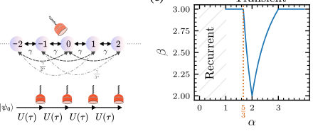
<figcaption class="paper-figure-caption"><b>Fig 1.</b> FIG. 1. (a) A walker coherently hops along a ring with hopping amplitude decaying as d−α with the distance d. (b) A detector monitors stroboscopically the initial site |0⟩, a positive detection event terminates the dynamics. We show that the first-detection probability decays algebraically as Fn ∼n−β, where β depends critically on α, as visible in (c), identifying different regimes of the transient quantum walk. The nonanalytic points at α = 1, 2, 3 reflect a phase transition in the spectrum of the long-range model. Instead, the nonanalytic point at α = 5/3 is due to the projective effect of measurements.</figcaption>
</figure>
<figure class="paper-figure-card">
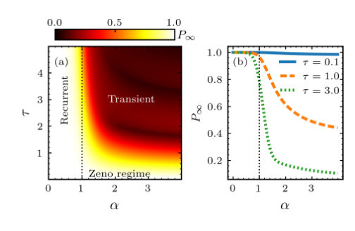
<figcaption class="paper-figure-caption"><b>Fig 2.</b> FIG. 2. Recurrent to transient transition. (a) Density plot of the total detection probability P∞= P</figcaption>
</figure>
<figure class="paper-figure-card">
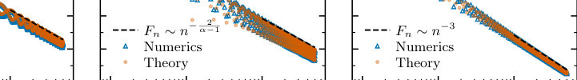
<figcaption class="paper-figure-caption"><b>Fig 3.</b> FIG. 3. Long-time algebraic decay in the transient phase. Log-log plot of the first-detection probability Fn as a function of number of measurement n. The panels correspond to different regimes of hopping exponent (a) 2 &lt; α &lt; 3 with α = 2.4, (b) 5/3 ≤α &lt; 2 with α = 1.8 and (c) 1 &lt; α ≤5/3 with α = 1.5. Blue triangles represent the result from exact numerical evaluations based on the quantum renewal equation with N = 106, γ = 1, τ = 1. Orange circles represent the corresponding theoretical predictions for the long-time asymptotics. Black dashed lines are obtained from numerical fitting according to the power-law model indicated in the corresponding panel.</figcaption>
</figure>

**Summary.** This work investigates how monitoring a quantum walker causes phase transitions in its return statistics based on the long-range hopping exponent $\alpha$. It establishes that $\alpha=1$ marks the transition between localized (recurrent) and spreading (transient) quantum walks. The decay rate of the detection probability is highly sensitive to $\alpha$, revealing interference effects between different energy modes.

**Why it may be interesting.** The study connects measurement back-action (non-unitary dynamics) to fundamental critical phenomena, providing an experimentally tunable mechanism to probe spectral properties via quantum walks.

Detailed structure

**Main problem.** The paper characterizes the phase transitions governing the First-Detection Return Probability (FDRP) of quantum walks when the walker is monitored by a detector.

**Main result.** The long-range hopping exponent $\alpha$ critically determines the walk's behavior, separating recurrent ($\alpha < 1$) from transient ($\alpha > 1$) regimes via a continuous phase transition.

**Method.** The analysis uses generating functions and asymptotic analysis of the Loschmidt amplitude, distinguishing between contributions from infrared (IR) and ultraviolet (UV) energy modes.

**Model / system.** The model is a quantum walker on a chain undergoing unitary evolution interrupted by projective measurements (monitoring). The hopping strength decays as $d^{-\alpha}$, controlled by the exponent $\alpha$.

**Key observables.** First-Detection Return Probability ($F_n$), Total detection probability ($P_\infty$), and the decay exponent $\beta(\alpha)$ of $F_n \sim n^{-\beta}$.

**Important parameters / regimes.** The hopping exponent $\alpha$, which dictates the transition point at $\alpha=1$.

**Assumptions / limitations.** The analysis relies on the continuum limit and the asymptotic behavior derived from the generating function, assuming distinct branch points except at resonant times.

**Figures summary.** Figures illustrate how $\alpha$ controls the walk's nature, showing the phase boundary at $\alpha=1$ for $P_\infty$, and mapping the dependence of the decay exponent $\beta$ on $\alpha$.

**Paper structure.** The paper systematically analyzes the FDRP using the quantum renewal equation, deriving asymptotic forms for the Loschmidt amplitude in different $\alpha$ regimes, and mapping out the resulting decay laws for $F_n$ across various critical points.

Abstract

In a quantum walk, the first-detection return probability (FDRP) characterizes salient features, determining whether the quantum walk is transient or recurrent. We study the FDRP of quantum walks on a chain where the initial site is stroboscopically monitored by a detector and the walker performs long-range hopping between sites. We assume that the hopping strength decays with the distance $d$ as $d^{-α}$ and $α\geq 0$ and show that the power-law exponent $α$ critically determines the behavior of the FDRP. The value $α=1$ separates recurrent ($α<1$) from transient ($α>1$) quantum walks through a continuous phase transition in the total detection probability. For $α<1$, strong long-range hopping induces localization, resulting in unit total detection probability. Instead, for $α>1$ the long-range walk is transient and the return probability decays algebraically as a function of time as $t^{-β}$. The associated decay exponent $β$ features nonanalytic points as a function of $α$. Such singularities are not exclusively determined by the low-energy spectrum, but are caused by the interference between infrared and ultraviolet energy modes induced by projective measurements, signalling the emergence of critical behavior intrinsic to the non-unitary dynamics. These dynamics are solely controlled by tuning the long-range exponent $α$ and can thus be experimentally probed in atomic and molecular systems.

[↑ back to top](#top)

### ⭐ [Non-equilibrium dissipative stabilization of s- and d-wave superconductivity](http://arxiv.org/abs/2609.10062v1)

**Highlighted author(s):** Zala Lenarčič  
**Authors:** Aleksey Lunkin, Yury Holubeu, Denis Golež, Zala Lenarčič  
**Type:** theory · **Category:** statistical mechanics · **PDF:** <https://arxiv.org/pdf/2609.10062v1>  
**Analysis basis:** full PDF text, analyzed in chunks
**Topic relevance:** `driven-dissipative phase transition` **3/5** · `methods for driven-dissipative` **3/5** · `non-equilibrium universality` **3/5** · `Keldysh / 2PI / non-Gaussian methods` **2/5** · `correlated / nonlocal dissipation` **1/5** · `quantum measurements` **1/5**

↔ Scroll figures horizontally

<figure class="paper-figure-card">
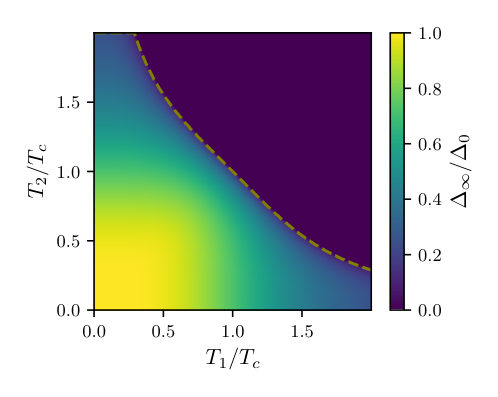
<figcaption class="paper-figure-caption"><b>Fig 1.</b> FIG. 1. Steady-state gap ∆∞(in units of zero temperature gap ∆0) as a function of temperatures of the first bath T1 and second bath T2. For an s-wave superconductor, we find new non-equilibrium solutions at T1 ̸= T2 with finite gap despite one of the baths being at a temperature larger than the critical temperature Tc in the equilibrium. The olive line represents the second-order phase-transition line.</figcaption>
</figure>
<figure class="paper-figure-card">

<figcaption class="paper-figure-caption"><b>Fig 2.</b> FIG. 2. Steady-state gap as a function of temperatures of the first bath T1 and second bath T2 for an s-wave supercon- ductor with strong inherent scattering γ1 ≈γ0, leading to a steady state well described by a temperature determined by the stationarity of energy, Eq. (12).</figcaption>
</figure>
<figure class="paper-figure-card">

<figcaption class="paper-figure-caption"><b>Fig 3.</b> FIG. 3. Different steady state distribution of quasiparticles at the bath temperatures T1/Tc = 0.6 and T2/Tc = 1.2. Red curve (GGE) corresponds to the non-equilibrium steady state, stabilized by the interplay of the two baths, Eq (9). Dashed line (GE) represents the thermal occupation obtained from the energy rate equation (12) in case of strong inherent scat- tering γ1 ∼γ0. The blue and green curves correspond to thermal distributions at the temperatures of the two baths, reached if system would be coupled to only one of them.</figcaption>
</figure>
<figure class="paper-figure-card">

<figcaption class="paper-figure-caption"><b>Fig 4.</b> FIG. 4. (a) Steady-state gap ∆∞/∆0 as a function two tem- perature baths T1 and T2 for d-wave superconductor. Dis- tribution of quasiparticles in the equilibrium at T1/Tc = T2/Tc = 0.1 (b), and in the steady state with T1/Tc = 1.7 and T2/Tc = 0.3 (c).</figcaption>
</figure>
<figure class="paper-figure-card">

<figcaption class="paper-figure-caption"><b>Fig 5.</b> FIG. 5. Dependence of the steady state gap on the relative strength α = α+−/(α++ + α−−) of scattering and two-particle creation/annihilation term for the s-wave pairing case. Results for α = 1/4, 4 are comparable to the α = 1 considered in the main text, emphasising that our results are not fine tuned to a specific choice of α.</figcaption>
</figure>

**Summary.** This work explores stabilizing superconductivity in non-equilibrium steady states by coupling a BCS superconductor to two baths at potentially different temperatures. By solving the master equation using a Generalized Gibbs Ensemble, the authors show that the superconducting gap can remain finite even when one bath is super-critical. This highlights a powerful method for engineering quantum phases using controlled dissipation.

**Why it may be interesting.** The use of non-equilibrium steady states to engineer quantum phases is a key topic in open quantum systems, providing a concrete example of how thermal baths can be utilized beyond simple thermalization.

Detailed structure

**Main problem.** The paper investigates how to stabilize superconducting states beyond their equilibrium critical temperatures by coupling the system to two distinct thermal baths.

**Main result.** A finite superconducting order parameter can be maintained even when one bath is at a temperature above the equilibrium critical temperature, demonstrating non-equilibrium stabilization.

**Method.** The analysis employs the Generalized Gibbs Ensemble (GGE) approach, solving self-consistency equations derived from the Lindblad master equation governing quasiparticle occupation numbers.

**Model / system.** The system is a BCS superconductor (s- and d-wave) coupled to two thermal baths ($T_1, T_2$). The dynamics are modeled using a Lindblad master equation and solved via time propagation or steady-state self-consistency.

**Key observables.** The superconducting order parameter (gap function, $\Delta$), and the steady-state quasiparticle occupation numbers ($n_{p,\sigma}$).

**Important parameters / regimes.** Bath temperatures ($T_1, T_2$), coupling strengths ($\gamma_0$), and the imbalance parameter $\alpha$.

**Assumptions / limitations.** The primary assumption is the validity of the GGE Ansatz, which assumes quasiparticles are well-defined on intermediate timescales.

**Figures summary.** Figures demonstrate the finite steady-state gap ($\Delta_\infty$) for s-wave superconductors when $T_1 
eq T_2$, and compare GGE predictions against thermal Gibbs Ensemble results.

**Paper structure.** The paper progresses from setting up the non-equilibrium master equation and GGE ansatz, deriving the steady-state self-consistency equations, and finally analyzing the results for both s-wave and d-wave symmetries across varying bath temperatures and coupling parameters.

Abstract

Stabilizing superconductivity beyond its equilibrium regime has been one of the quests of nonequilibrium state engineering. We report the presence of nonthermal pairing gap in BCS superconductors coupled to two thermal baths, where one of the baths can be at a temperature well above the equilibrium $T_c$. Superconducting state is enabled by a highly non-equilibrium steady state stabilized by weak coupling to baths that break detailed balance condition. The steady-state is well described by a generalized Gibbs ensemble parametrized with chemical potentials for associated Bogoliubov quasiparticle. A strong, non-perturbative effect is reported for both $s$-wave and $d$-wave superconductors, and its possible realization in cavity-based experiments is discussed.

[↑ back to top](#top)

### ⭐ [Distinguishability Transitions from Global Quantum Snapshots](http://arxiv.org/abs/2609.09296v1)

**Highlighted author(s):** Sarang Gopalakrishnan  
**Authors:** Catherine McCarthy, Sarang Gopalakrishnan, Romain Vasseur  
**Type:** theory · **Category:** statistical mechanics · **PDF:** <https://arxiv.org/pdf/2609.09296v1>  
**Analysis basis:** full PDF text, analyzed in chunks
**Topic relevance:** `quantum measurements` **3/5**

↔ Scroll figures horizontally

<figure class="paper-figure-card">
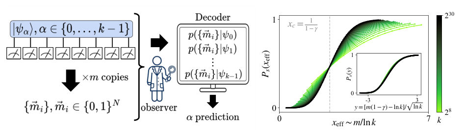
<figcaption class="paper-figure-caption"><b>Fig 1.</b> FIG. 1. Left: Protocol for distinguishing k random states with m global snapshots. In this setup, an observer is presented with m copies of a random state |ψα⟩with α ∈{0, . . . , k −1} and provided with exact knowledge of all k states. After measuring each site of each of the m copies in the computational basis to obtain a set of bitstrings {⃗mi}, the observer queries a decoder in order to guess the label α. Here we take the decoder to be an optimal Bayesian classifier that outputs the label α associated with the largest probability p({⃗mi}|ψα), where p({⃗mi}|ψj) is computed for all j ∈{0, . . . , k −1} from the Born probabilities associated with the bitstrings {⃗mi}. Right: Decoder success...</figcaption>
</figure>
<figure class="paper-figure-card">

<figcaption class="paper-figure-caption"><b>Fig 2.</b> FIG. 2. Success probability Ps(σ, N) of decoding an N- qubit random state subject to random coherent errors act- ing on each site j as Uj = e−iϵjXj, where ϵj are indepen- dently drawn from a Gaussian distribution of variance σ2. The success probability decays towards 1/2 for large values of σN 1/2. Inset: for a state under a global depolarizing channel of strength p, the decoder success probability takes the form Ps(p) = (3 −p)/4.</figcaption>
</figure>
<figure class="paper-figure-card">
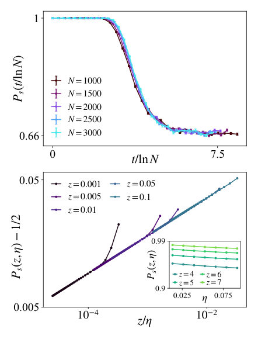
<figcaption class="paper-figure-caption"><b>Fig 3.</b> FIG. 3. Top: onset of anti-concentration in finite-depth Clifford circuits. The decoder success probability Ps(t, N) decays from one to the expected value for random Clifford circuits Ps(t →∞, N) = 2/3 as the depth t of the circuit is increased. The curves for different system sizes collapse neatly when rescaling by t/ ln(N), indicating that anti-concentration sets in on logarithmic timescales. Bottom: The success prob- ability of an RMPO displays z/η scaling with η the rescaled noise strength in the small-z (deep) limit, and is indepen- dent of η in the large-z (shallow) limit (inset). The scaling in these two regimes is consistent with behavior seen in the linear XEB.</figcaption>
</figure>
<figure class="paper-figure-card">
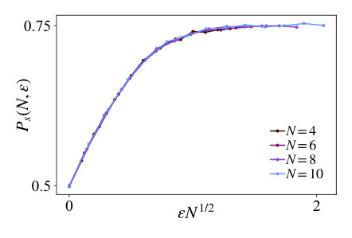
<figcaption class="paper-figure-caption"><b>Fig 4.</b> FIG. 4. Success probability of phase-random states measured in a basis defined by the rotation U = N</figcaption>
</figure>

**Summary.** This work analyzes how effectively one can distinguish between many random quantum states using limited global measurements. It establishes a precise phase transition governed by the ratio of shots to the logarithm of the number of states. The findings reveal that global measurements are surprisingly powerful, setting fundamental limits on quantum state distinguishability.

**Why it may be interesting.** The concept of distinguishing quantum states via global measurements touches upon fundamental resource theories and information capacity, which has implications for quantum characterization and quantum metrology.

Detailed structure

**Main problem.** The paper investigates the fundamental limits on distinguishing between a large number of random quantum states using only a small number of global measurement outcomes.

**Main result.** A phase transition is identified in the distinguishability, controlled by the ratio $x = m/\ln k$, with a critical threshold $x_c = 1/(1-\gamma)$.

**Method.** The analysis employs Bayesian classification theory, calculating the success probability $P_s$ by analyzing the exponential decay of the misclassification probability in the large-shot limit.

**Model / system.** The model involves $k$ candidate quantum states, $|\psi_\alpha
angle$, assumed to be Haar-random or generated by random quantum circuits. Measurements are restricted to the computational basis, yielding global snapshots.

**Key observables.** Success probability ($P_s$) of the Bayesian decoder, and the critical scaling variable $x = m/\ln k$.

**Important parameters / regimes.** Number of states ($k$), number of shots ($m$), and the effective ratio $x = m/\ln k$.

**Assumptions / limitations.** The analysis assumes the availability of a classical model to compute the Born probabilities $p(\vec{m}|\psi_\alpha)$ for the decoder. Specific results rely on the Haar-random state assumption or the structure of Clifford circuits.

**Figures summary.** Figures illustrate the phase transition of $P_s$ vs. $x_{	ext{eff}}$, showing the transition at $x_c$. Other figures compare $P_s$ against circuit depth and noise parameters.

**Paper structure.** The paper first establishes the general framework using Bayesian classifiers for distinguishing random states, deriving the critical scaling $m \sim \ln k$. It then extends this analysis to specific physical regimes, including low-depth, noisy, and phase-random circuits, deriving specific limiting values like $2/3$ for Clifford circuits.

Abstract

Quantum states generated by generic time evolution are locally featureless: local measurements return random outcomes that are identical for all states. However, global snapshots in the computational basis are surprisingly effective at distinguishing between quantum states. We explore the ability of Bayesian classifiers to discriminate between many random quantum states using a small number of measurement outcomes. We identify a phase transition in the ability of the classifier to distinguish between $k$ candidate states with $m$ shots controlled by the variable $x = m / \ln k$, and derive the threshold value $x_c$. We extend our results to low-depth circuits near the onset of anti-concentration, as well as to noisy circuits and phase-random states.

[↑ back to top](#top)

### [Prethermal ripplons in quenched binary Bose-Einstein condensates](http://arxiv.org/abs/2609.09464v1)

**Authors:** Yanda Geng, Stephen Eckel, Gretchen K. Campbell, Ian B. Spielman  
**Type:** both · **Category:** statistical mechanics · **PDF:** <https://arxiv.org/pdf/2609.09464v1>  
**Analysis basis:** full PDF text, analyzed in chunks
**Topic relevance:** 🔥 `scars & prethermalization` **5/5** · `analog quantum simulation` **3/5** · `driven-dissipative phase transition` **3/5** · `non-equilibrium universality` **3/5** · `Keldysh / 2PI / non-Gaussian methods` **2/5** · `methods for driven-dissipative` **2/5** · `Frenkel-Kontorova` **1/5** · `correlated / nonlocal dissipation` **1/5**

↔ Scroll figures horizontally

<figure class="paper-figure-card">
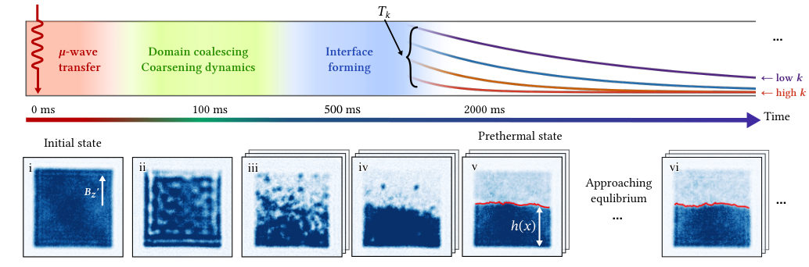
<figcaption class="paper-figure-caption"><b>Fig 1.</b> FIG. 1. The long road to equilibrium. A schematic illustration of the relaxation process (top) is shown along with representative spin-selective images of the |↑⟩density (bottom). (i) A microwave pulse at t = 0 transfers an initially spin-polarized BEC into an equal superposition of |↑⟩(dark blue) and |↓⟩. The orientation of a magnetic field gradient is indicated. (ii) Initial spin structure forms nearly deterministically; (iii) small initial fluctuations then seed random droplet patterns that coalesce and coarsen. (iv) After about 500 ms an interface forms and (v) becomes single-valued by 2000 ms (red curves). Ripplons with different wavenumber k combine to give the observed interface...</figcaption>
</figure>
<figure class="paper-figure-card">
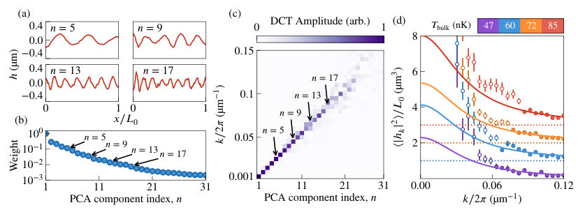
<figcaption class="paper-figure-caption"><b>Fig 2.</b> FIG. 2. Fluctuations of a prethermal interface, with thold = 2.0 s. (a) PCA components of h(x) for n = 5, 9, 13, and 17. (b) Normalized PCA weights. (c) DCT amplitudes of each PCA component. (d) Power spectrum ⟨|hk|2⟩, measured at four bulk temperatures (vertically offset for clarity) using ≈70 experimental realizations per temperature, plotted along with the corresponding equilibrium prediction (no free parameters).</figcaption>
</figure>
<figure class="paper-figure-card">

<figcaption class="paper-figure-caption"><b>Fig 3.</b> Figure 3(b) extends this analysis over the full range of k and for hold times 1 s to 4 s. The resulting Tk val- ues show that only high-k ripplon modes equilibrate with the bulk; at low-k, the mode temperatures exceed Tbulk and we empirically find that excessive temperature is well described by a power-law (Tk−Tbulk)/T0 = k−α, with ex- ponent α = 1.42(5) and prethermal temperature scale T0; the resulting data-collapse is shown in Fig. 3(b). These low-k modes decay extremely slowly, with a 5(1) s mea- sured decay time—much slower than the ∼10−1 s equi- libration timescale of the phonon bath, highlighting the prethermal nature of the interface system. The excess low-k occupation and slow...</figcaption>
</figure>
<figure class="paper-figure-card">
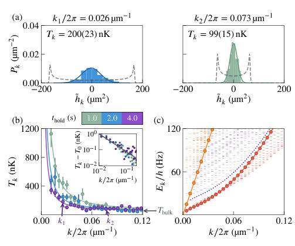
<figcaption class="paper-figure-caption"><b>Fig 4.</b> FIG. 3. Distribution functions and equilibration at Tbulk = 56 nK. (a) PDFs Pk for k1/(2π) = 0.026 µm−1 and k2/(2π) = 0.073 µm−1 at thold = 4 s. The histograms plot experi- mental data with corresponding normal distributions (solid curves). Dashed curves show the PDF corresponding to a phase-averaged ripplon coherent state with the same ripplon occupation. (b) Mode temperature as a function of k for three hold times. Solid curves show power-law fits with a common exponent and offset. Inset: log-log plot in terms of dimension- less quantities ¯Tk and ¯k showing data collapse. (c) Scattering processes in our L0 × L0 box. Circles connected by curves plot the energy of ripplons (red) and...</figcaption>
</figure>
<figure class="paper-figure-card">

<figcaption class="paper-figure-caption"><b>Fig 5.</b> FIG. 4. Minority thermal atom thermometry. (a) Effective potentials for thermal spin-↑atoms in the lowest three local transverse modes (solid curves), compared with the chemi- cal potential µ↑(dotted line). The shaded curves plot the condensate densities n↑/↓in blue/yellow respectively. (b) Spin-↑density profiles. Markers plot the measured total den- sity (thermal plus condensed) along with fits (solid curve) to our theoretical model, yielding the annotated temperatures. The shaded region shows the computed condensate density and highlights its vast difference in scale. Inset: Tbulk versus Tripplon obtained by fitting the high-k ripplon tail in Fig. 2(d) using Eq. (2) with Tripplon as the...</figcaption>
</figure>

**Summary.** This work experimentally and theoretically examines prethermalization in the ripplons at the interface of two immiscible BECs. The authors demonstrate that the system enters a long-lived non-equilibrium state where low-momentum excitations retain excess energy relative to the bulk thermal bath. This behavior is attributed to kinematic isolation, highlighting the importance of conservation laws in determining relaxation pathways.

**Why it may be interesting.** It provides a clean, experimentally verifiable platform (BEC interfaces) to study fundamental non-equilibrium dynamics, offering insights into energy relaxation mechanisms beyond simple thermalization assumptions.

Detailed structure

**Main problem.** The paper investigates how far-from-equilibrium quantum systems, such as interfacial waves in BECs, approach thermal equilibrium, focusing on the phenomenon of prethermalization.

**Main result.** Low-momentum ripplon modes exhibit long-lived prethermal states with elevated temperatures, decoupled from the bulk phonon bath due to kinematic isolation, while high-momentum modes thermalize rapidly.

**Method.** The study combines theoretical modeling using Hamiltonian derivations (Bogoliubov formalism) with experimental measurements of time-evolving interface height profiles and mode temperature diagnostics.

**Model / system.** The system is a 1D interface between immiscible 2D Bose-Einstein condensates (BECs). The dynamics are governed by ripplon excitations, which are analyzed using a Hamiltonian derived from continuum limits of coupled oscillators.

**Key observables.** Interface height profile $h(x)$, power spectral density $\langle|h_k|^2
angle$, and mode temperatures $T_k$ derived from minority spin atom thermometry.

**Important parameters / regimes.** Interfacial tension ($\sigma$), capillary length ($\xi$), and the ratio of low-momentum to high-momentum mode relaxation timescales.

**Assumptions / limitations.** The analysis assumes the applicability of the equipartition theorem for thermal equilibrium and relies on the concept of kinematic isolation due to the absence of specific energy- and momentum-conserving relaxation processes.

**Figures summary.** Figures illustrate the relaxation process from initial quench to prethermal state, compare measured and predicted power spectra, and show probability density functions (PDFs) confirming Gaussian behavior for individual modes.

**Paper structure.** The paper first derives the Hamiltonian for the ripplon field, then analyzes the relaxation dynamics, showing that high-k modes thermalize quickly while low-k modes remain trapped in a non-equilibrium, prethermal state.

Abstract

Prethermal states--long-lived quasi-equilibrium configurations--occur in a wide range of physical systems that exhibit fast dephasing or reconfiguration followed by slow relaxation towards thermal equilibrium. We experimentally studied the 1D interface between immiscible 2D Bose-Einstein condensates (BECs); following a quench, the interfacial capillary waves (ripplons) quickly relaxed into a long-lived prethermal state characterized by a persistent non-equipartition of energy, evoking the classic Fermi-Pasta-Ulam-Tsingou problem. We directly measured the interface's height profile as it evolved in time, identified the contribution of individual ripplon modes, and find that, though their individual amplitudes are thermally distributed, they are not in thermal equilibrium--high-momentum modes rapidly equilibrated with the bulk phonon modes of the 2D BEC, while lower momentum modes remained at elevated temperatures, forming a long-lived prethermal configuration for the whole system. We attribute this to kinematic isolation: the absence of energy- and momentum-conserving relaxation processes in our system at ultracold temperature.

[↑ back to top](#top)

### [Fractional Chern Insulators in Twisted Bilayer Optical Lattices](http://arxiv.org/abs/2609.09733v1)

**Authors:** Yan-Bin Yang, Jiong-Hao Wang, Shicheng Ma, Yong Xu  
**Type:** theory · **Category:** quantum gases · **PDF:** <https://arxiv.org/pdf/2609.09733v1>  
**Analysis basis:** full PDF text, analyzed in chunks
**Topic relevance:** 🔥 `analog quantum simulation` **5/5**

↔ Scroll figures horizontally

<figure class="paper-figure-card">

<figcaption class="paper-figure-caption"><b>Fig 1.</b> FIG. 1. The schematics of twisted bilayer optical lattices composed of two spin-dependent honeycomb lattices relatively rotated by a twist angle θ. (a) The optical potential profiles V1(r) and V2(r) felt by two spin states |↑⟩, |↓⟩simulating the two layers. The two spin states are coupled by a microwave field with the Rabi frequency Ωsimulating interlayer tunneling. (b) The moir´e lattice structure in real space with the rotation axis placed at a sublattice site. (c) The moir´e reciprocal lattice in momentum space. The grey area denotes a moir´e Brillouin zone. K↑and K↓are the high-symmetry momenta of bare BZs for two spin states, respectively. Here, we set the twist angle to a commensurate...</figcaption>
</figure>
<figure class="paper-figure-card">
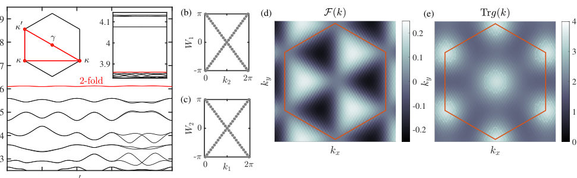
<figcaption class="paper-figure-caption"><b>Fig 2.</b> FIG. 2. The single-particle band properties. (a) The moir´e band structure along high-symmetry lines in moir´e BZ. The inset shows the band structure in a larger energy range. The red lines highlight two-fold quasi-degenerate bands with narrow band dispersion below a large gap. (b,c) The Wilson loop spectra of the two nearly flat bands along two reciprocal basis vectors. (d,e) The distribution of the Berry curvature F(k) and the trace of quantum metric Trg(k) of the flat-band subspace over the moir´e BZ. Here, both Trg(k) and F(k) are multiplied by a factor of SBZ/(2π) (SBZ is the area of the moir´e BZ).</figcaption>
</figure>
<figure class="paper-figure-card">
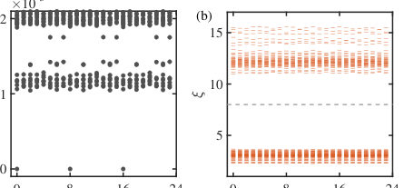
<figcaption class="paper-figure-caption"><b>Fig 3.</b> FIG. 4. (a) The many-body energy spectrum obtained from ED for U = 1. The ground-state manifold has three-fold de- generacy with the total momenta (indexed by K) predicted by the generalized Pauli principle. (b) The particle entanglement spectrum of the ground states of N = 8 with a subsystem of NA = 3 particles. There are 1088 states below a entangle- ment gap denoted by the dashed line, in agreement with the counting of (1, 3) generalized Pauli principle. We perform the ED calculation for a system size of (N1, N2) = (4, 6).</figcaption>
</figure>
<figure class="paper-figure-card">
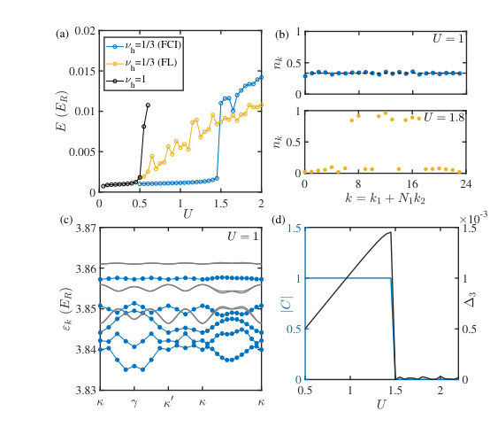
<figcaption class="paper-figure-caption"><b>Fig 4.</b> FIG. 3. (a) The ground-state energy from ED (subtracted by a constant for clarity) with respect to the interaction strength U for three different HF ansatz: fractional-Chern-insulator (FCI) ansatz, Fermi-liquid (FL) ansatz, and integer filling ansatz. (b) The occupation of mean-field states in momentum space for the ground state of the ansatz with lowest energy. (c) The mean-field band structure along high-symmetry lines obtained from SCHF calculation for U = 1 using the FCI ansatz. For comparison, the bare dispersion is plotted as grey lines. (d) The absolute value of Chern number (blue line) of the isolated mean-field band from SCHF and the many-body gap ∆3 = E4 −E3 (black line) from ED...</figcaption>
</figure>

**Summary.** This theoretical study explores the possibility of realizing a fractional Chern insulator using cold atoms in twisted bilayer optical lattices. By incorporating atomic interactions into the model, the authors show that the system can develop a non-trivial Chern band, leading to a predicted FCI phase. This work highlights the potential of highly tunable optical lattice systems to host strongly correlated topological matter.

**Why it may be interesting.** This work directly bridges the gap between ultracold atomic physics (cold atoms in optical lattices) and advanced condensed matter topological physics (FCIs), providing a highly tunable platform for realizing exotic quantum states.

Detailed structure

**Main problem.** The study investigates the theoretical realization of strongly correlated topological phases, specifically the fractional Chern insulator (FCI), within cold atoms trapped in twisted bilayer optical lattices.

**Main result.** The authors demonstrate that atomic interactions can induce a non-zero Chern number in the mean-field description, leading to a predicted fractional Chern insulator phase at fractional filling.

**Method.** The research employs a combination of single-particle band structure calculations, self-consistent Hartree-Fock (SCHF) approximations, and exact diagonalization (ED) for the many-body problem.

**Model / system.** The system is cold atoms confined in a twisted bilayer optical lattice, modeled by a Hamiltonian incorporating single-particle hopping and an interspin contact interaction. The lattice geometry is defined by a specific, small twist angle.

**Key observables.** Chern number, Berry curvature, quantum geometric tensor, many-body gap ($\Delta_3$), and particle entanglement spectrum (PES).

**Important parameters / regimes.** Interaction strength ($U$), fractional filling ($
u$), and the specific commensurate twist angle ($	heta \approx 5.086^\circ$).

**Assumptions / limitations.** The analysis relies on projecting the full Hamiltonian onto the Hilbert space spanned by valence bands and utilizing mean-field approximations (HF ansatz) to tackle strong correlations.

**Figures summary.** Figures illustrate the moiré band structure, Wilson loop spectra, distributions of Berry curvature and quantum metric trace, and energy comparisons between different mean-field ansatze.

**Paper structure.** The paper progresses from establishing the physical platform (twisted lattices) and single-particle properties (trivial bands) to applying interaction theory via SCHF, culminating in the identification and characterization of the FCI phase using ED and gap analysis.

Abstract

Twisted bilayer materials provide a versatile platform for realizing novel topological states. Motivated by recent experimental realization of atomic Bose-Einstein condensates in twisted bilayer optical lattices, we theoretically investigate topological states for cold atoms trapped in such a system. At single-particle level, the system hosts nearly flat moiré bands under appropriate experimental parameters. Although these noninteracting bands are topologically trivial in the Altland-Zirnbauer classification, we find that atomic interactions can induce a flat Chern band based on self-consistent Hartree-Fock calculations. Furthermore, exact diagonalization identifies a fractional Chern insulator phase at fractional filling. Our work thus paves the way for exploring strongly correlated topological phases in highly tunable twisted bilayer optical lattices.

[↑ back to top](#top)

### [Information capacity of quantum statistics: Fock-state tests of a discrete binary-sequence model on cloud photonic quantum processors](http://arxiv.org/abs/2609.10216v1)

**Authors:** Chiran Wijesundara, Octavia T. Volpe, Dejan Stojkovic, Herbert Fotso, Tim Thomay  
**Type:** experiment · **Category:** quantum information and computing · **PDF:** <https://arxiv.org/pdf/2609.10216v1>  
**Analysis basis:** full PDF text, analyzed in chunks
**Topic relevance:** 🔥 `QC/QI experiment` **4/5** · 🔥 `quantum optics experiment` **4/5** · `Full counting statistics` **2/5** · `analog quantum simulation` **2/5** · `quantum measurements` **2/5** · `interference shaping light` **1/5**

↔ Scroll figures horizontally

<figure class="paper-figure-card">
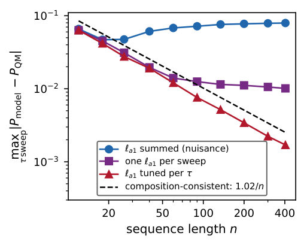
<figcaption class="paper-figure-caption"><b>Fig 1.</b> FIG. 2. Maximum partition-probability deviation from QM against sequence length n. Published parametrization (|2, 0⟩ input, mid-τ sweep): ℓa1 summed (plateau), one ℓa1 per sweep (1/n to a ∼1% floor), and ℓa1 tuned per setting (clean 1/n). The composition-consistent parametrization (black dashed) makes a single prediction, 1.02/n for |2, 0⟩over the full grid.</figcaption>
</figure>
<figure class="paper-figure-card">
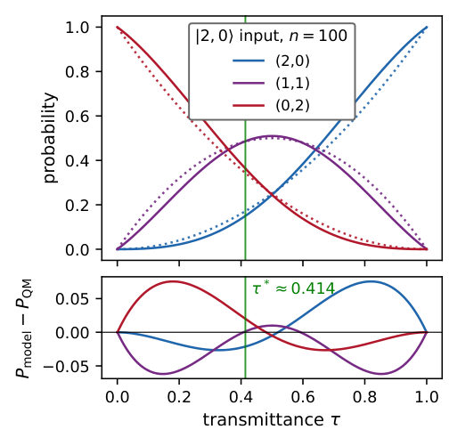
<figcaption class="paper-figure-caption"><b>Fig 2.</b> FIG. 1. Sequence-model (solid) and QM (dotted) partition probabilities for a |2, 0⟩input at n = 100, with their differ- ence below. The green line marks the null-differential working point τ ∗= 0.414 where the model and QM agree for the (1, 1) outcome while disagreeing for (2, 0) and (0, 2).</figcaption>
</figure>
<figure class="paper-figure-card">

<figcaption class="paper-figure-caption"><b>Fig 3.</b> FIG. 3. Granularity signature: the QM probability of the outcome that the finite-n model forbids in the last rational grid gap τ ∈(cos2(π/2n), 1) falls as n−4.</figcaption>
</figure>
<figure class="paper-figure-card">
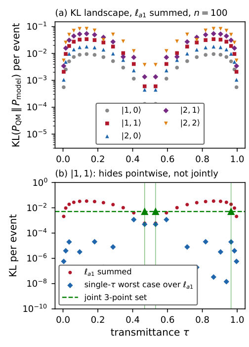
<figcaption class="paper-figure-caption"><b>Fig 4.</b> FIG. 4. Experiment-design optimization. (a) Discrimination landscape: per-event KL divergence between QM and the un- conditioned model (n = 100) for candidate input states. (b) For |1, 1⟩, the conditioned model evades any single-τ test by tuning ℓa1 (dots), but no single ℓa1 fits a set of transmittances jointly: the optimal 3-point set (triangles, dashed level) re- stores percent-scale discriminability.</figcaption>
</figure>
<figure class="paper-figure-card">
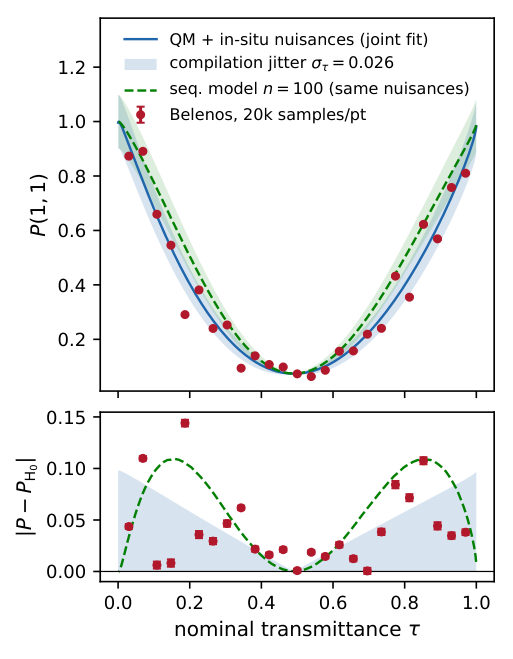
<figcaption class="paper-figure-caption"><b>Fig 5.</b> FIG. 5. Belenos full-curve campaign: P(1, 1) for the native |1, 1⟩input across 25 transmittances (20 000 samples each; statistical error bars are smaller than the symbols), against QM with jointly fitted in-situ nuisances (blue) and the uncon- ditioned sequence model at n = 100 under the same nuisances, in the published linear parametrization, evaluated on its na- tive rational transmittance grid (green). Shaded bands show the per-job compilation reproducibility (στ = 0.026, mea- sured from the scatter of the run itself) around each hypothe- sis; the lower panel shows the magnitude of the residuals with the same band around QM. The model requires a coherent +0.10–0.12 excess at both flanks;...</figcaption>
</figure>

**Summary.** This paper uses cloud photonic quantum processors to test the hypothesis that quantum mechanics emerges as a statistical limit from a discrete underlying theory. By analyzing photon Fock state measurements, the authors constrain the information capacity of the physical register, ruling out simpler discrete models and demonstrating that this capacity can be experimentally quantified.

**Why it may be interesting.** This work directly bridges quantum foundations with experimental quantum optics, providing a concrete, measurable test for the fundamental nature of quantum statistics using current photonic hardware.

Detailed structure

**Main problem.** The paper investigates whether quantum mechanics is the statistical limit of a more fundamental discrete theory by quantifying the information capacity of the underlying physical system.

**Main result.** Experimental tests using cloud photonic quantum processors exclude discrete models with information capacities less than $10^2$, establishing that information capacity is an experimentally boundable quantity.

**Method.** The authors employed random-effects likelihood analysis and differential tests on photon Fock states measured on programmable interferometers to compare measured outcome probabilities against predictions from the discrete binary-sequence model versus quantum mechanics.

**Model / system.** The physical system is commercial cloud photonic quantum processors utilizing photon Fock states. The theoretical model tested is the binary-sequence model of Powers et al., which predicts quantum statistics in the limit of infinite sequence length ($n 	o \infty$).

**Key observables.** Outcome probabilities, deviation from the quantum partition law, and the sequence length $n$ (interpreted as information capacity).

**Important parameters / regimes.** The information capacity bound ($>10^2$), the scaling of deviations ($1.24/n$), and the statistical floor ($10^{-3}$).

**Assumptions / limitations.** Systematics (like calibration offsets and source indistinguishability) are determined *in situ* and treated as nuisance parameters; the composition-consistent parametrization is assumed to be the correct physical description.

**Figures summary.** Figures compare sequence-model vs. QM partition probabilities for various inputs and show the dependence of model deviation on sequence length $n$ and different analysis conditions.

**Paper structure.** The paper progresses by establishing the theoretical premise (QM as a statistical limit), detailing the experimental setup and model (binary-sequence model), presenting rigorous statistical tests (random-effects likelihood, differential tests), and concluding with the quantitative bounds on information capacity.

Abstract

Our central premise is that quantum mechanics may be the statistical limit of a more fundamental discrete theory: any such theory equips a physical system with a finite information capacity, and its departure from quantum statistics is controlled by how much of that capacity the system uses. We show that commercial cloud photonic quantum processors have reached the precision required to bound this capacity from below, using the binary-sequence model of Powers et al. as the concrete test theory: outcome probabilities arise from counting discrete sequences of length $n$, quantum mechanics is recovered as $n \to \infty$, and $n$ measures the information capacity of the register behind a prepared state. Photon Fock states $|1\rangle$, $|1,1\rangle$, heralded $|2\rangle$, and cascaded beam-splitter pairs are measured on programmable interferometers with dominant systematics determined in situ. The model's composition-consistent parametrization, singled out by requiring that rotations compose, recovers quantum mechanics with deviations $1.24/n$; a random-effects likelihood analysis calibrated by parametric bootstrap excludes all $n \le 100$: the information capacity of the register carrying the two-photon state, if finite, exceeds $10^2$. Cascaded beam splitters test the composition law directly: the data are split-invariant, excluding naive count composition at $8σ$ and confirming the interference-sign rule. Model-independently, curve-averaged deviations from the quantum partition law larger than $2.3\times10^{-2}$ are excluded at 95% CL, and the originally published linear parametrization is excluded outright. Because the compilation offset is frozen per circuit it is calibratable, opening the $10^{-3}$ floor ($n \sim 10^3$) to current hardware: cloud photonic processors are quantitative instruments for quantum foundations, and information capacity an experimentally boundable quantity.

[↑ back to top](#top)

### [Transient and universal regimes in quantum reaction-transport kinetics](http://arxiv.org/abs/2609.09305v1)

**Authors:** Hossein Hosseinabadi, Roderich Moessner  
**Type:** theory · **Category:** statistical mechanics · **PDF:** <https://arxiv.org/pdf/2609.09305v1>  
**Analysis basis:** full PDF text, analyzed in chunks
**Topic relevance:** 🔥 `Keldysh / 2PI / non-Gaussian methods` **4/5** · `non-equilibrium universality` **3/5** · `analog quantum simulation` **1/5** · `correlated / nonlocal dissipation` **1/5** · `driven-dissipative phase transition` **1/5** · `methods for driven-dissipative` **1/5** · `scars & prethermalization` **1/5**

↔ Scroll figures horizontally

<figure class="paper-figure-card">

<figcaption class="paper-figure-caption"><b>Fig 1.</b> FIG. 1. Schematic kinetic-regime diagram as a function of spatial dimension D and loss strength Γ/J. In D = 1, the asymptotic dynamics is transport-limited with n ∼t−1/2, although weak loss can produce a long transient reaction- limited regime. D = 2 is marginal, with n ∼(ln t)/t, while for D &gt; 2 the mean-field decay n ∼t−1 is asymptotically restored. At strong loss and D &gt; 1, emergent elastic collisions can rapidly redistribute particles and establish a quasi-stationary thermal state.</figcaption>
</figure>
<figure class="paper-figure-card">
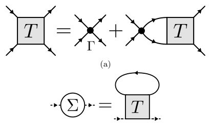
<figcaption class="paper-figure-caption"><b>Fig 2.</b> FIG. 3. (a) Self-consistent diagrammatic equation for the T- matrix. (b) Boson self-energy in terms of the T-matrix.</figcaption>
</figure>
<figure class="paper-figure-card">

<figcaption class="paper-figure-caption"><b>Fig 3.</b> FIG. 4. (a) Time evolution of the momentum distribution normalized by the average density in one dimension for J = Γ. Higher-momentum modes decay more rapidly, causing the surviving population to concentrate near k = 0. (b) Density evolution for different hopping strengths. The asymptotic decay follows n ∼t−1/2 for all J/Γ, while for strong hopping a parametrically long transient mean-field regime n ∼t−1 can precede the asymptotic scaling.</figcaption>
</figure>
<figure class="paper-figure-card">

<figcaption class="paper-figure-caption"><b>Fig 4.</b> FIG. 1. Leading-order correction to the 2-particle vertex in the particle-hole channel. Each row separately vanishes in the vacuum.</figcaption>
</figure>
<figure class="paper-figure-card">

<figcaption class="paper-figure-caption"><b>Fig 5.</b> FIG. 2. Leading-order correction to the 2-particle vertex in the pairing channel.</figcaption>
</figure>

**Summary.** This work analyzes the long-time kinetics of quantum particle annihilation in varying spatial dimensions. It shows that dimensionality dictates the asymptotic decay law, revealing that fluctuations dominate the dynamics for $D<2$. The methodology uses advanced field theory techniques to derive dimension-specific scaling laws for the particle density.

**Why it may be interesting.** The study provides a detailed, dimension-dependent classification of non-equilibrium dynamics, which is crucial for understanding how dimensionality fundamentally alters relaxation processes in interacting quantum many-body systems, relevant to quantum gases and open quantum systems.

Detailed structure

**Main problem.** The paper investigates the universal long-time kinetic behavior of quantum reaction-transport systems, specifically how dimensionality affects the relaxation process.

**Main result.** The system's asymptotic kinetics are highly dependent on the spatial dimension $D$, showing deviations from simple mean-field expectations below $D=2$. For $D>2$, the density decays as $n(t) \propto t^{-1}$, while $D=1$ yields $n(t) \propto t^{-1/2}$.

**Method.** The analysis employs Keldysh field theory and derives kinetic equations for momentum occupations, systematically analyzing the renormalization of reaction vertices and the emergence of effective collision terms.

**Model / system.** The model is quantum binary annihilation ($A+A 	o \emptyset$) of bosons on a $D$-dimensional lattice, governed by a Hamiltonian and subjected to particle loss ($\Gamma$) and coherent hopping ($J$).

**Key observables.** Occupation number $n_k(t)$, total density $n(t)$, and the temperature $T(t)$ of the system.

**Important parameters / regimes.** Spatial dimension $D$, loss strength $\Gamma$, and hopping rate $J$. The upper critical dimension is $D_c=2$.

**Assumptions / limitations.** The analysis relies on approximations, such as retaining terms up to quadratic order in occupations, and analyzing the system in the continuum limit.

**Figures summary.** Figures illustrate the kinetic-regime diagram showing dependence on $D$ and $\Gamma/J$, and depict diagrams related to the pair annihilation vertex and boson self-energy.

**Paper structure.** The paper systematically derives the kinetic equation in momentum space, analyzes the asymptotic behavior by examining the infrared divergence of the pair propagator in different dimensions ($D=1, 2, >2$), and solves the resulting rate equations to determine the scaling laws for $n(t)$.

Abstract

Quantum reaction-transport systems consist of coherently propagating particles that irreversibly react upon encounter. Their relaxation is commonly classified as reaction-limited or transport-limited, depending on the relative timescales of reaction and particle transport. We show that this expectation fails in low dimensions by studying the quantum binary annihilation, $A+A \to \emptyset$, where reaction processes acquire singular fluctuation corrections below the upper critical dimension $D_c=2$. Consequently, fluctuations dominate the asymptotic kinetics for $D<2$. In one dimension, they render mean-field relaxation transient and drive the system toward a transport-limited regime with $n\sim t^{-1/2}$, governed by a quantum-Zeno scale even for arbitrarily weak loss. At $D=2$, the kinetics acquires logarithmic corrections, whereas above two dimensions mean-field scaling is asymptotically restored. At and below the upper critical dimension, mean-field behavior can nevertheless persist over parametrically long crossover times before the asymptotic fluctuation-dominated regime emerges. We also show that the same fluctuations generate effective elastic collisions despite the absence of microscopic coherent interactions. In $D>1$, these collisions redistribute momentum populations and are parametrically faster than losses in the transport-limited regime, allowing the system to approach a quasi-stationary thermal state.

[↑ back to top](#top)

### [Electrically tunable, two-photon interference from remote silicon-vacancy centers in industrial silicon carbide](http://arxiv.org/abs/2609.09805v1)

**Authors:** Fedor Dzmitryevich Hrunski, Daniel Scheller, Maximilian Hollendonner, Kim Ullerich, Shravan Kumar Parthasarathy, Chiun Fu, Andre Pointner, Wolfgang Knolle, Florian Kaiser, Durga Bhaktavatsala Rao Dasari, Roland Nagy  
**Type:** experiment · **Category:** quantum information and computing · **PDF:** <https://arxiv.org/pdf/2609.09805v1>  
**Analysis basis:** full PDF text, analyzed in chunks
**Topic relevance:** 🔥 `interference shaping light` **4/5** · `QC/QI experiment` **3/5** · `quantum optics experiment` **3/5** · `quantum measurements` **1/5**

↔ Scroll figures horizontally

<figure class="paper-figure-card">

<figcaption class="paper-figure-caption"><b>Fig 1.</b> Fig. 1| Single VSi centers in industrial 4H SiC p-i-n diode structures and their electrical tuning.</figcaption>
</figure>
<figure class="paper-figure-card">
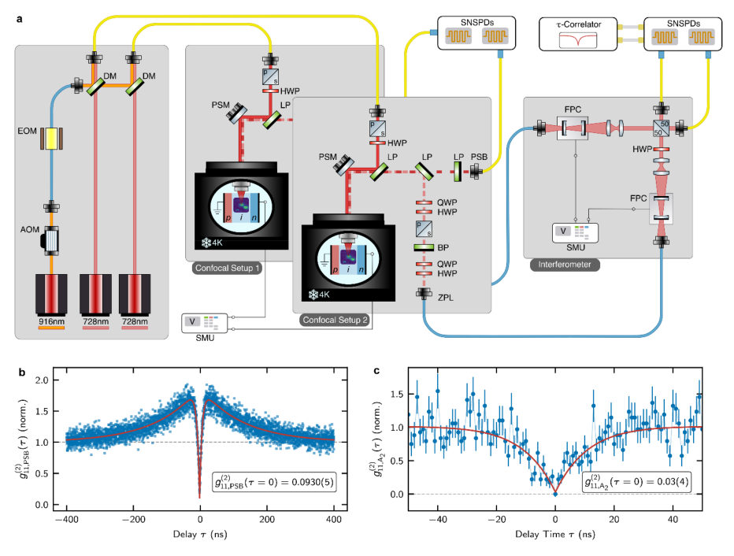
<figcaption class="paper-figure-caption"><b>Fig 2.</b> Fig. 2| Setup for two-photon interference between two spatially separated VSi centers and single photon</figcaption>
</figure>
<figure class="paper-figure-card">
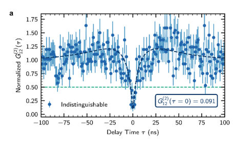
<figcaption class="paper-figure-caption"><b>Fig 3.</b> Fig.3| Two-photon interference between remote VSi centers in two separate 4H-SiC samples.</figcaption>
</figure>
<figure class="paper-figure-card">
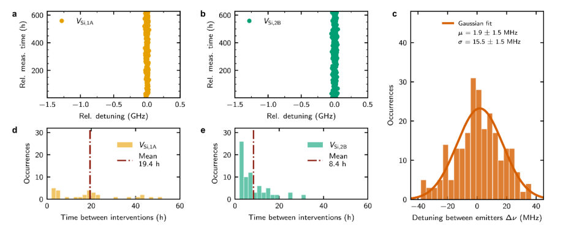
<figcaption class="paper-figure-caption"><b>Fig 4.</b> Fig.4| Long-term spectral stability of interfered VSi centers and distribution of deduced two-photon</figcaption>
</figure>

**Summary.** This paper demonstrates the use of electrically tunable silicon vacancy (V_Si) centers in industrial silicon carbide (SiC) as robust quantum nodes. By achieving high-visibility two-photon interference over a 26-day period, the authors establish this platform as a scalable and stable building block for future distributed quantum networks.

**Why it may be interesting.** This work provides a highly scalable, solid-state platform for quantum networking, directly addressing the engineering hurdles (stability, integration) that limit the deployment of quantum repeaters.

Detailed structure

**Main problem.** The core challenge is establishing high-visibility, spectrally stable two-photon interference from spatially separated quantum emitters, which is crucial for building functional distributed quantum networks.

**Main result.** The authors successfully demonstrated high-quality two-photon interference with raw visibilities of 82% over a 26-day measurement campaign, using VSi centers embedded in industrially available SiC diodes.

**Method.** The experiment utilized Hong-Ou-Mandel (HOM) interferometry between two remote quantum emitters, combined with active electrical biasing to maintain spectral stability over long periods.

**Model / system.** The physical system is the silicon vacancy (V_Si) color center embedded in industrial-grade 4H silicon carbide (SiC) p-i-n diodes. These centers act as solid-state quantum nodes whose emission can be tuned and stabilized electrically.

**Key observables.** Two-photon interference visibility (82%), spectral linewidths (below 60 MHz), and long-term stability (bias readjustment every 8.4 hours).

**Important parameters / regimes.** Two-meter spatial separation, 26-day measurement duration, and the linear tuning coefficient of the A2 transition frequency with voltage bias.

**Assumptions / limitations.** The analysis relies on modeling the cross-correlation data using established quantum interference formulas, and the stability is demonstrated through long-term electrical control of the emitter frequency.

**Figures summary.** Figures illustrate the VSi center's optical contrast, the p-i-n diode structure, PLE spectra showing linewidths, and the experimental setup for the two-photon interference measurement across separated cryostats.

**Paper structure.** The paper progresses from characterizing the VSi centers' tunability and spectral narrowing in SiC diodes, to demonstrating single-photon purity, and finally to performing and analyzing the two-photon interference measurement over an extended, stable period.

Abstract

Distributed quantum networks rely on spatially separated, independently operated quantum systems as network nodes, whose emitted photons must be interfered with high visibility to establish end-to-end entanglement. Crucially, for network-relevant applications, high visibilities must be achieved over prolonged timescales to reduce overheads for error correction, and to increase network rates. Here, we demonstrate experimentally that silicon vacancy $\mathrm{V_{Si}}$ color centers in silicon carbide (SiC) achieve these requirements, notably in a mass-deployable fashion. We integrate $\mathrm{V_{Si}}$ centers in different industrial-grade SiC p-i-n diodes, which are controlled via voltage biassing. This way, we demonstrate both, spectral overlapping of 19 randomly selected $\mathrm{V_{Si}}$ centers in different diodes, as well as spectral narrowing close to the lifetime limit, i.e., typically below 60 MHz. Notably, these performance parameters are long-term stable, e.g., readjusting the p-i-n diode bias is required only every 8.4 hours, which reduces significantly the overall experimental overhead. We then use these assets to demonstrate high-quality two-photon interference between $\mathrm{V_{Si}}$ centers located in two different cryostat setups, which are spatially separated by two meters. Notably, we perform a 26-days long measurement campaign, demonstrating two-photon interference with state-of-the-art raw interference visibilities of 82%, which aligns with the current state-of-the-art. These results establish $\mathrm{V_{Si}}$ centers in industry-grade SiC devices as a scalable, spectrally stable building block for distributed quantum networks.

[↑ back to top](#top)

### [Quantum computational resources and validation protocols for a three-mode non-Gaussian trilinear Hamiltonian](http://arxiv.org/abs/2609.10043v1)

**Authors:** Niccolò Laurora, Matteo Bina, Giulia Ferrini, Alessandro Ferraro  
**Type:** both · **Category:** quantum information and computing · **PDF:** <https://arxiv.org/pdf/2609.10043v1>  
**Analysis basis:** full PDF text, analyzed in chunks
**Topic relevance:** 🔥 `QC/QI experiment` **4/5** · `analog quantum simulation` **3/5** · `quantum measurements` **3/5** · `quantum optics experiment` **1/5**

↔ Scroll figures horizontally

<figure class="paper-figure-card">

<figcaption class="paper-figure-caption"><b>Fig 1.</b> FIG. 1. (a) Optimal parameter B3 as a function of the initial-state seeding amplitude α under the action of the trigemini unitary ˆUT. Different colors correspond to the initial states |α, 0, 0⟩, |α, α, 0⟩and |α, α, α⟩, and different line styles correspond to the couplings κt = 0.02 (solid), 0.06 (dashed), 0.1 (dotted). (b) Optimal phase-space coordinates (β, β′) (solid/hollow markers, respectively) at α = 0.6, 0.8, 1.0 for which the initial three-seeded configuration |α, α, α⟩violates (27), for the different considered couplings.</figcaption>
</figure>
<figure class="paper-figure-card">
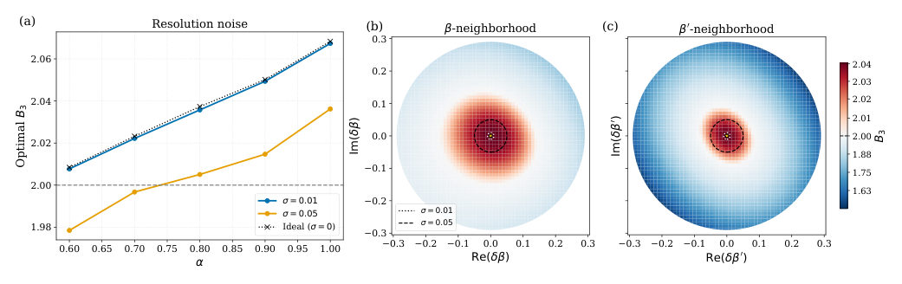
<figcaption class="paper-figure-caption"><b>Fig 2.</b> FIG. 2. (a) Optimal B3 (27) as a function of the seeding parameter α for the state ˆUT|α, α, α⟩at κt = 0.1, degraded by resolution noise of increasing width σ, with the ideal curve (σ = 0) as a comparison. Non-locality properties still occur for standard deviations up to 5%. (b), (c) Bell factor B3 in a disk of radius R = 0.3 around the optimal violation coordinates (β, β′) for κt = 0.1, α = 0.8 (gold central star, B3 = 2.037), with (b) systematic perturbation δβ with β′ fixed at its optimum, and (c) systematic perturbation δβ′ with β fixed at its optimum. The dotted and dashed black circles mark regions within Gaussian errors σ = 0.01 and σ = 0.05, respectively, considered in panel (a).</figcaption>
</figure>
<figure class="paper-figure-card">
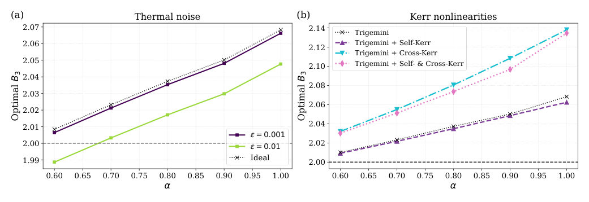
<figcaption class="paper-figure-caption"><b>Fig 3.</b> FIG. 3. Optimal B3 (27) as a function of the seeding parameter α for the state ˆUT|α, α, α⟩at κt = 0.1, with the ideal curve for the state without noise as a comparison in both panels. (a): Detrimental effect of the thermal noise due to increasing admixture values ε from 0.001 to 0.01. The effect of the average thermal excitation ¯n is negligible. (b): Effects of the presence of self- and cross-Kerr terms in the Hamiltonian model. The addition of a self-Kerr term slightly lowers the violation. The presence of a cross-Kerr interaction is beneficial and enhances non-local properties of the state.</figcaption>
</figure>
<figure class="paper-figure-card">
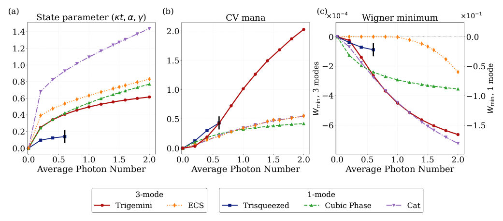
<figcaption class="paper-figure-caption"><b>Fig 4.</b> FIG. 4. Quantifiers of Wigner negativity of the trigemini state compared with the reference states, all as functions of the average photon number. (a) Conversion plot between the native state parameters (κt, α, γ) required to generate each state: trigemini, trisqueezed (34), CPS (35), cat (36) and ECS (37). (b) CV mana of the same states on a common vertical scale. (c) Global minimum of the Wigner function on two vertical scales: the left axis refers to the three-mode states (trigemini and ECS), whose negativity stays within the order of 10−4, the right axis to the single-mode ones (trisqueezed, CPS and cat), which are about two orders of magnitude deeper. In every panel, the trisqueezed...</figcaption>
</figure>
<figure class="paper-figure-card">
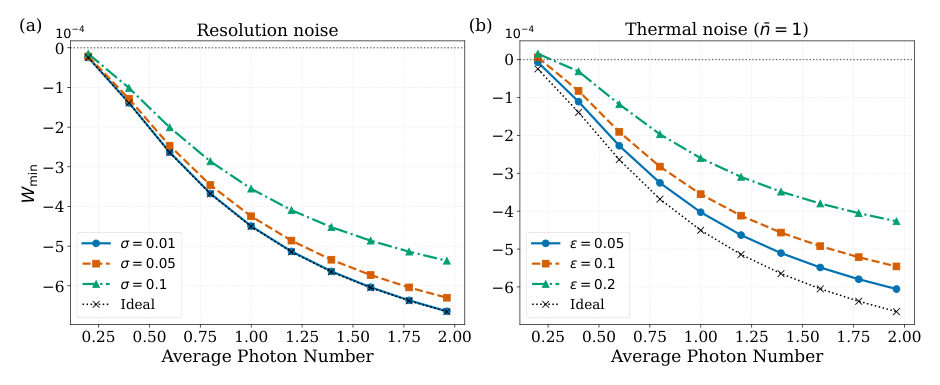
<figcaption class="paper-figure-caption"><b>Fig 5.</b> FIG. 5. Robustness of the global Wigner minimum of the trigemini state, in both panels as a function of the average photon number. (a) Thermal noise: minimum of the Wigner function of the state (30), with ¯n = 1 and ε = 0.05, 0.1, 0.2 (different colors). (b) Resolution noise: minimum of the Wigner function smoothed by a Gaussian kernel of width σ, for σ = 0.01, 0.05, 0.1 (different colors). In both panels the black dotted line is the noiseless reference (trigemini state).</figcaption>
</figure>

**Summary.** This paper analyzes a three-mode non-Gaussian Hamiltonian relevant to superconducting circuits, focusing on its ability to generate key quantum resources like entanglement and Wigner negativity. The authors provide theoretical proofs and, crucially, introduce a measurement-efficient protocol to experimentally verify the Hamiltonian's operation without requiring computationally intensive full state tomography. This advances the practical realization of continuous-variable quantum computation.

**Why it may be interesting.** It directly tackles the experimental bottleneck in quantum computation by providing a resource-based certification method that minimizes required measurements, which is crucial for implementing complex quantum gates.

Detailed structure

**Main problem.** The paper addresses the challenge of experimentally characterizing and validating the computational resources generated by non-Gaussian interactions, specifically using a three-mode trilinear Hamiltonian.

**Main result.** The authors demonstrate that the Hamiltonian generates both multipartite entanglement and Wigner negativity, and they propose a measurement-efficient protocol to certify this without full Wigner function reconstruction.

**Method.** The work combines theoretical analysis of resource generation (entanglement witnesses, negativity quantification) with the proposal of an experimental validation protocol based on measuring zero-variance observables and targeted phase-space measurements.

**Model / system.** The system is a three-mode quantum system whose dynamics are governed by a non-Gaussian trilinear Hamiltonian ($\hat{H}_T$), realized in superconducting microwave platforms.

**Key observables.** Multipartite entanglement (certified via displaced-parity Bell tests) and Wigner negativity (quantified by Wigner logarithmic negativity).

**Important parameters / regimes.** The coupling strength $\kappa$ and time $t$ governing the Hamiltonian evolution.

**Assumptions / limitations.** The primary assumption is that the proposed measurement protocol significantly reduces experimental overhead compared to full Wigner function reconstruction.

**Figures summary.** Figures compare numerical results for the Wigner function cross-section for known states (ECS) and the vacuum-seeded state, showing agreement between analytical and numerical methods across different truncation cut-offs.

**Paper structure.** The paper systematically moves from describing the Hamiltonian's features and symmetries, to analyzing the generated computational resources (entanglement and negativity), and finally presenting the measurement-efficient validation protocols.

Abstract

Non-Gaussian interactions are a key ingredient for achieving universality in continuous-variable quantum computation, yet their experimental characterization and the validation of their correct implementation remain challenging tasks. In this work, we focus on a three-mode non-Gaussian trilinear Hamiltonian that has recently been realized in superconducting microwave platforms, and present a comprehensive theoretical analysis of the computational resources it generates, together with experimentally accessible protocols to validate their presence. We systematically investigate its ability to generate two key resources for quantum computation: multipartite entanglement and Wigner negativity. In particular, using displaced-parity Bell tests, we demonstrate the generation of nonlocal states and thereby provide an operational certification of multipartite entanglement in the non-Gaussian states produced by the dynamics. We further quantify the Wigner logarithmic negativity and benchmark it against that of established non-Gaussian resource states. Building on this resource-based characterization, we introduce a measurement-efficient protocol for the experimental validation of the Hamiltonian implementation without requiring full reconstruction of the Wigner function. The protocol combines the measurement of zero-variance observables (nullifiers and stabilizers) with a limited number of targeted phase-space measurements, leading to a drastic reduction of the experimental overhead.

[↑ back to top](#top)

### [In situ characterization of a photon-subtraction device via heralding counts and homodyne detection](http://arxiv.org/abs/2609.10100v1)

**Authors:** Priyanka Sharma, Matteo G. A. Paris, Stefano Olivares  
**Type:** theory · **Category:** quantum information and computing · **PDF:** <https://arxiv.org/pdf/2609.10100v1>  
**Analysis basis:** full PDF text, analyzed in chunks
**Topic relevance:** 🔥 `quantum measurements` **4/5** · `Full counting statistics` **3/5** · `quantum optics experiment` **3/5**

↔ Scroll figures horizontally

<figure class="paper-figure-card">
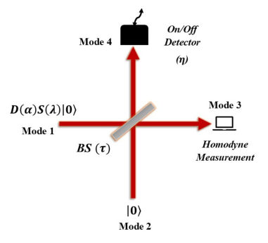
<figcaption class="paper-figure-caption"><b>Fig 1.</b> FIG. 1. Sketch of the estimation setup. A displaced squeezed state (mode 1) is mixed with the vacuum state (mode</figcaption>
</figure>
<figure class="paper-figure-card">

<figcaption class="paper-figure-caption"><b>Fig 2.</b> FIG. 2. Sloppiness S as a function of the homodyne phase ϕ ∈[0, π/2], for different values of τ and η. Panels (a)</figcaption>
</figure>
<figure class="paper-figure-card">

<figcaption class="paper-figure-caption"><b>Fig 3.</b> FIG. 3. Sloppiness S as a function of the input energy N for different values of τ and η with nearly no squeezing</figcaption>
</figure>
<figure class="paper-figure-card">

<figcaption class="paper-figure-caption"><b>Fig 4.</b> FIG. 4. Plots of CF ,  F−1</figcaption>
</figure>
<figure class="paper-figure-card">

<figcaption class="paper-figure-caption"><b>Fig 5.</b> Fig. 4 shows the dependence of CF ,  F−1</figcaption>
</figure>

**Summary.** This paper proposes a novel, in situ method to simultaneously characterize the key imperfections ($	au$ and $\eta$) of a photon-subtraction device using only its operational measurement data. By applying multi-parameter estimation theory, the authors prove that a joint estimation strategy is statistically superior to sequential methods for accurately determining these critical device parameters.

**Why it may be interesting.** This work provides rigorous theoretical tools (Fisher information, sloppiness) to assess the practical limitations and optimal measurement protocols for quantum state generation resources, which is crucial for advancing quantum information processing.

Detailed structure

**Main problem.** The paper addresses the need for an experimentally feasible method to simultaneously estimate the transmissivity ($	au$) of a beam splitter and the quantum efficiency ($\eta$) of a heralding detector in a photon-subtraction device.

**Main result.** The joint estimation strategy using combined homodyne and click statistics provides a lower estimation bound than sequential estimation, proving it is the superior method for characterizing the device parameters.

**Method.** The authors employ classical multi-parameter estimation theory, deriving the total Fisher information matrix by combining contributions from detector click statistics and conditional homodyne measurements.

**Model / system.** The system is a photon-subtraction device where a displaced squeezed state interacts with vacuum at a beam splitter. The measurement involves homodyne detection on the transmitted mode and counting clicks in the reflected mode.

**Key observables.** Detector click statistics, homodyne measurement results (quadrature distribution), and the Fisher information matrix.

**Important parameters / regimes.** Beam splitter transmissivity ($	au$), detector quantum efficiency ($\eta$), squeezing fraction ($eta$), and mean photon number ($N$).

**Assumptions / limitations.** The analysis assumes the output state remains Gaussian due to the linear mode transformation, and it compares the joint estimation bound against the sequential estimation bound.

**Figures summary.** Figures illustrate the dependence of the sloppiness parameter ($S$) on the homodyne phase ($\phi$), the comparison of estimation bounds between joint and sequential methods, and the effect of squeezing ($eta$) on the estimation uncertainty.

**Paper structure.** The paper first introduces the problem and the measurement setup. It then develops the theoretical framework using Fisher information for both 'on' and 'off' detection events. The core of the work compares the statistical performance of joint vs. sequential estimation strategies, concluding with analyses on parameter dependence (e.g., on squeezing or photon number).

Abstract

Photon subtraction is one of the most important techniques for generating non-Gaussian optical states and constitutes a key resource for quantum information processing and quantum metrology. The practical performance of a photon-subtraction device is primarily determined by the transmissivity of the beam splitter and the quantum efficiency of the heralding detector. Accurate knowledge of these parameters is therefore essential for assessing the quality of the generated non-classical states. In this work, we propose an experimentally feasible in situ scheme for the simultaneous estimation of these two parameters using only the measurement data produced during the operation of the device. Our protocol combines the click statistics of an on/off heralding detector with homodyne measurements performed on the transmitted mode of the beam splitter when fed by a displaced squeezed state. Within the framework of classical multi-parameter estimation theory, we derive the corresponding Fisher information matrix and investigate both joint and sequential estimation strategies. For simultaneous measurement of parameters, we evaluate the sloppiness of the underlying statistical model and analyze its dependence on the measured quadrature, probe photon number, squeezing fraction, beam splitter transmissivity, and detector efficiency. Our analysis proves that an appropriate choice of the homodyne quadrature substantially reduces parameter degeneracy and enables efficient simultaneous estimation. Furthermore, we show that the joint estimation strategy consistently provides a lower estimation bound than the sequential estimation approach over a broad range of experimentally relevant parameters.

[↑ back to top](#top)

### [Certified measurement and control of an entanglement-breaking index on programmable hardware](http://arxiv.org/abs/2609.09350v1)

**Authors:** Eran Kopel  
**Type:** both · **Category:** quantum information and computing · **PDF:** <https://arxiv.org/pdf/2609.09350v1>  
**Analysis basis:** full PDF text, analyzed in chunks
**Topic relevance:** 🔥 `quantum measurements` **4/5** · `QC/QI experiment` **3/5** · `driven-dissipative phase transition` **1/5** · `methods for driven-dissipative` **1/5**

↔ Scroll figures horizontally

<figure class="paper-figure-card">

<figcaption class="paper-figure-caption"><b>Fig 1.</b> Low-resolution page preview, page 2</figcaption>
</figure>
<figure class="paper-figure-card">
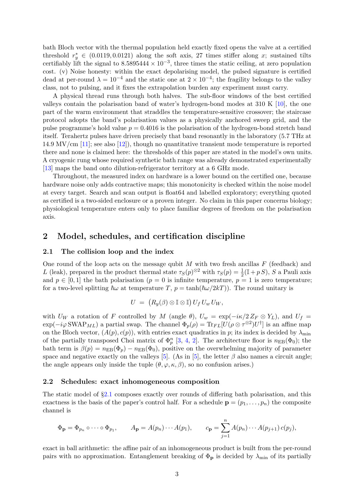
<figcaption class="paper-figure-caption"><b>Fig 2.</b> Low-resolution page preview, page 3</figcaption>
</figure>
<figure class="paper-figure-card">
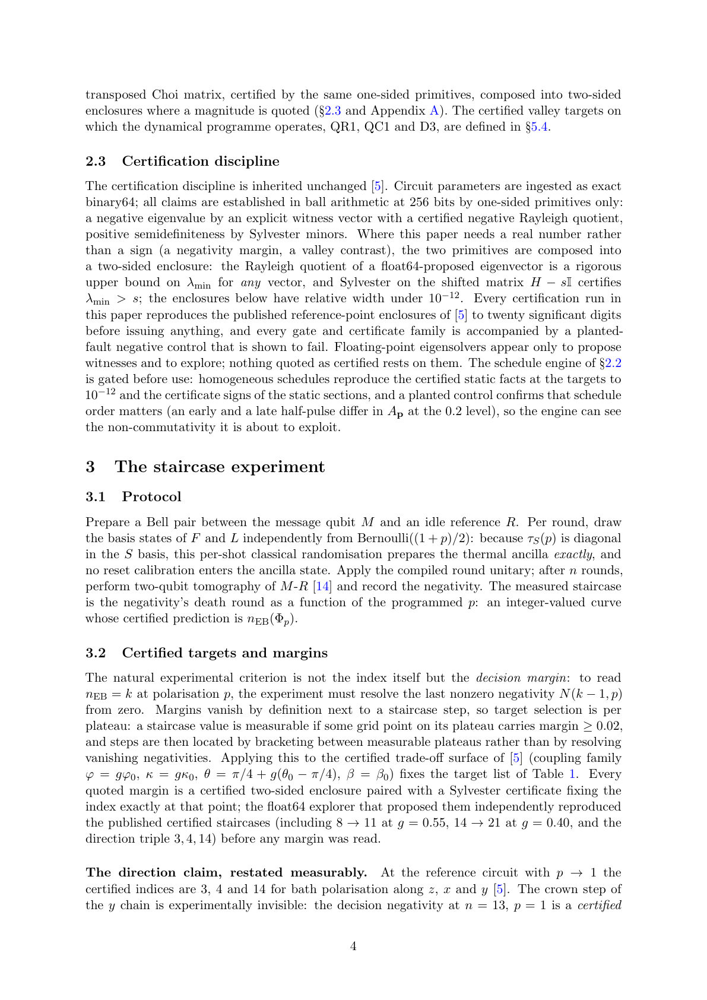
<figcaption class="paper-figure-caption"><b>Fig 3.</b> Low-resolution page preview, page 4</figcaption>
</figure>
<figure class="paper-figure-card">
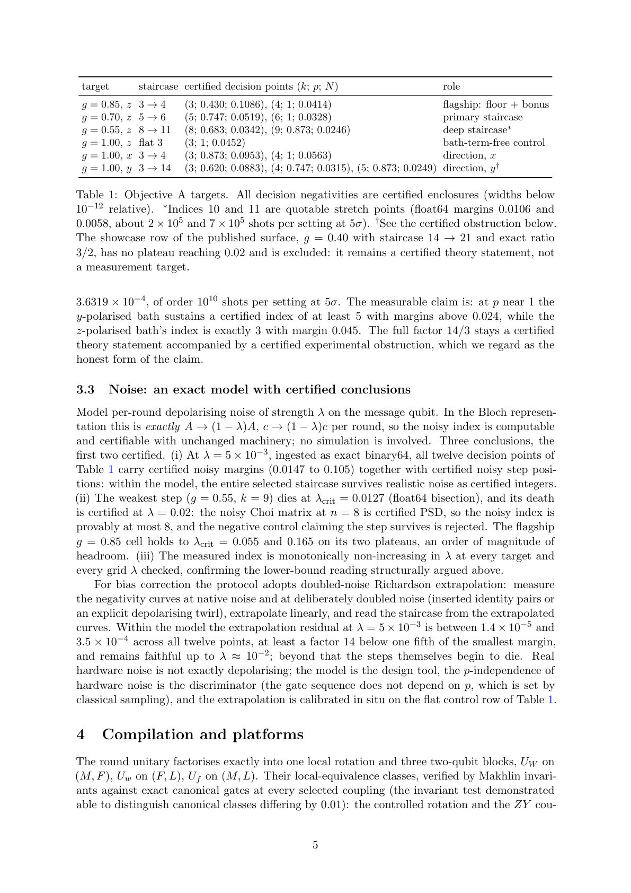
<figcaption class="paper-figure-caption"><b>Fig 4.</b> Low-resolution page preview, page 5</figcaption>
</figure>
<figure class="paper-figure-card">
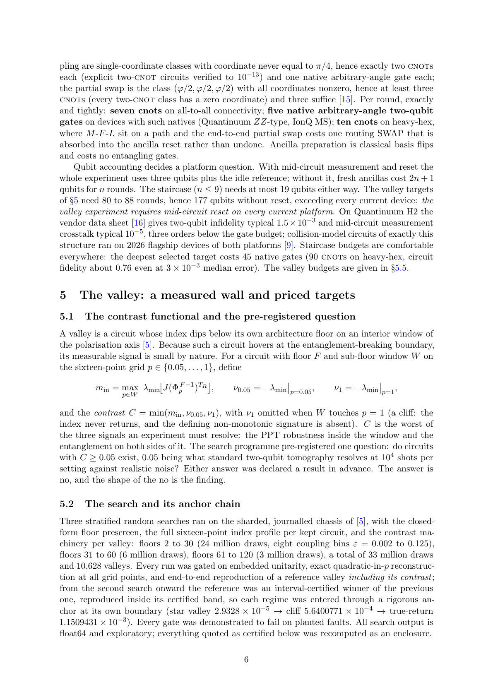
<figcaption class="paper-figure-caption"><b>Fig 5.</b> Low-resolution page preview, page 6</figcaption>
</figure>

**Summary.** This work introduces a method to certify the measurement and control of the entanglement-breaking index of a quantum channel on programmable hardware. By utilizing a thermal collision feedback loop, the authors demonstrate that pulsed operations and coherent field tilts can significantly enhance the measurable signal compared to static protocols. The entire framework is underpinned by rigorous mathematical certification using advanced interval arithmetic.

**Why it may be interesting.** The rigorous application of certified computation techniques (ball arithmetic) to a fundamental quantum information measure like $n_{EB}$ provides a powerful blueprint for verifying complex quantum properties on near-term hardware.

Detailed structure

**Main problem.** The paper addresses the challenge of measuring and controlling the entanglement-breaking index, $n_{EB}(\Phi)$, of a quantum channel, an index previously unmeasurable.

**Main result.** They demonstrate that this index can be certified as measurable and controllable on current programmable hardware using a thermal collision feedback loop, achieving improvements via pulsed operations and coherent control.

**Method.** The methodology relies heavily on rigorous mathematical certification using ball arithmetic (256 bits) to establish bounds on observables like negativity, combined with experimental simulation techniques like gated search and circuit compilation.

**Model / system.** The system models a quantum channel $\Phi$ acting on a message qubit, whose properties are controlled by varying the bath polarization $p$ via a collision feedback loop. The process is simulated on programmable hardware using specific unitary gates (CNOTs, arbitrary-angle gates).

**Key observables.** Entanglement-breaking index ($n_{EB}$), Negativity, Bath Polarization ($p$), and the contrast of the 'thermal valley'.

**Important parameters / regimes.** Noise strength ($\lambda$), decision-point margins (0.025 to 0.109), and the number of rounds/pulse depth (e.g., 53 rounds).

**Assumptions / limitations.** The certification relies on exact arithmetic in ball arithmetic, and the measured index is only a lower bound due to hardware noise.

**Figures summary.** The notes reference tables detailing objective targets for the staircase measurement and comparisons between pulsed, static, and coherently tilted signal strengths.

**Paper structure.** The paper progresses from defining the unmeasurable index to proposing a measurable protocol using a collision feedback loop. It details measurement techniques (staircase, noise resilience), control mechanisms (pulsing, coherent tilt), and concludes with the quantitative results demonstrating the superiority of pulsed/coherent methods.

Abstract

The entanglement-breaking index of a quantum channel, the number of self-compositions after which the channel destroys all entanglement with any reference, has to our knowledge never been measured. We show that a certified thermal collision feedback loop makes this integer both measurable and controllable on current programmable hardware, every load-bearing quantity delivered as an interval-arithmetic certificate. On the measurement side: a target list for the integer staircase n_EB(p) with decision-point negativities certified at margins 0.025 to 0.109; an exact per-round depolarising model in which the selected staircase survives realistic noise as certified integers; an exact, tight compilation of the round unitary (seven CNOTs all-to-all, five native arbitrary-angle gates, ten on heavy-hex); and a 33-million-draw gated search bounding the thermal valley's contrast by a wall with an interior maximum, a certified 2.85x10^-3 near floor 89. On the control side: the model composes rounds of differing bath polarisation exactly, so the valley becomes a pulsed valve, switching at a certified minimal pulse of exactly eight rounds; the optimal pulsed signal, a certified 3.43x10^-3, beats the static protocol, so the best valley measurement is intrinsically pulsed; and a coherent tilt of the bath Bloch vector lifts the signal to a certified 8.6x10^-3, three times the static ceiling, at zero population cost. Valley signatures certifiably die near per-round noise strength 10^-4, fixing the error-extrapolation burden. The staircase is a near-term experiment; the pulsed valley a precisely priced one.

[↑ back to top](#top)

### [Temperature-induced effective topology in many-body ultracold atomic quantum systems](http://arxiv.org/abs/2609.09463v1)

**Authors:** Nitya Cuzzuol, Michele Miotto, Arianna Montorsi, Giacomo Valtolina, Luca Barbiero  
**Type:** theory · **Category:** other · **PDF:** <https://arxiv.org/pdf/2609.09463v1>  
**Analysis basis:** full PDF text, analyzed in chunks
**Topic relevance:** 🔥 `analog quantum simulation` **4/5** · `methods for driven-dissipative` **3/5** · `Rydberg arrays` **1/5**

↔ Scroll figures horizontally

<figure class="paper-figure-card">
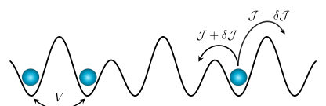
<figcaption class="paper-figure-caption"><b>Fig 1.</b> Figure 1. Schematic illustration of optical superlattice poten- tial for experimental realization of the dimerized model de- fined in Eq. (2), where bosons experience dimerized hopping amplitudes J ± δJ and nearest neighbor density-density in- teraction V .</figcaption>
</figure>
<figure class="paper-figure-card">
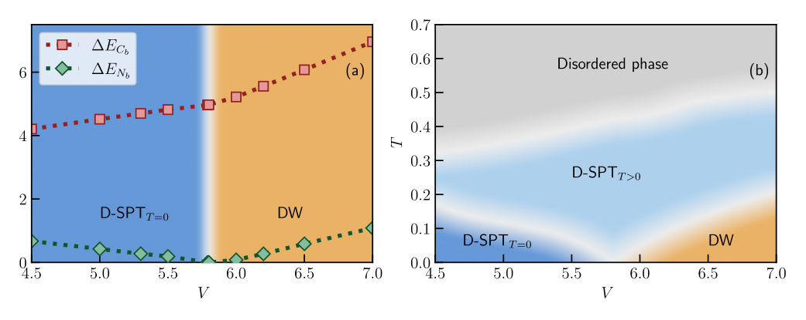
<figcaption class="paper-figure-caption"><b>Fig 2.</b> Figure 2. (a) Charge gap ∆ECb Eq. (4) (red) and neutral gap ∆ENb Eq. (5) (green) at T = 0 of the model HSSH Eq. (2) as a function of V for fixed δJ = 0.5. For values of V in the blue region, the model exhibits a D-SPTT =0 ground state, while in the orange region we observe a density wave phase. The neutral gap closes at V = 5.8 in correspondence to the phase transition between the D-SPTT =0 and the DW. The values of the energy gaps are obtained by fitting data from different chain lengths towards the thermodynamical limit. (b) Phase diagram of the same model at finite temperature. For low values of T, the two ground state phases extend to finite temperatures (D-SPTT =0 in the dark blue...</figcaption>
</figure>
<figure class="paper-figure-card">

<figcaption class="paper-figure-caption"><b>Fig 3.</b> Figure 3. Left: Order parameters as a function of temperature for model Eq. (2) at V = 5.3 (blue) and V = 6.5 (orange). Crosses indicate the corresponding ground-state values at T = 0, obtained via DMRG. (a) Staggered magnetization Eq. (7) and (b) degeneracy order parameter Eq. (1) (extrapolated to large system sizes to minimize boundary effects on bulk quantities). (c) Local edge magnetization Eq. (3) extrapolated to zero field applied at the edges of a chain of length L = 300. Right: String correlation functions O(z) S,odd(r) (dotted dark lines) and O(x) S,odd(r) (dashed lines), and two-point correlation function CDW(r) (dash-dotted light lines), as a function of distance for different...</figcaption>
</figure>
<figure class="paper-figure-card">
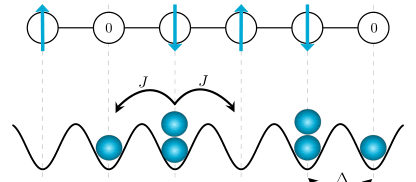
<figcaption class="paper-figure-caption"><b>Fig 4.</b> Figure 4. Schematic illustration of the spin-1 model defined in Eq. (9) and of its constrained-boson representation in an optical-lattice potential. The spin model features a trans- verse spin-exchange coupling J and a longitudinal antifer- romagnetic interaction ∆. The local spin states |Sz i ⟩are mapped onto the bosonic occupation states |ni⟩according to |Sz i = +1⟩↔|ni = 0⟩, |Sz i = 0⟩↔|ni = 1⟩, and |Sz i = −1⟩↔|ni = 2⟩, as prescribed by the Holstein– Primakoff transformation [97].</figcaption>
</figure>
<figure class="paper-figure-card">

<figcaption class="paper-figure-caption"><b>Fig 5.</b> Figure 5. (a) Neutral gap ∆EN (blue) and spin gap ∆ES (red) at T = 0 for HXXZ as a function of ∆. For values of ∆ in the green region, the model exhibits the SPT phase HIT =0 in the ground state, while in the orange region we observe an antiferromagnetic phase. The neutral gap closes at ∆≃1.18 in correspondence to the phase transition between the HIT =0 and the AF. The values of the energy gaps are obtained by fitting data from different chain lengths towards the thermodynamical limit. (b) Phase diagram of the same model at finite temperature. For low values of T, the two ground state phases extend to finite temperatures (HIT =0 in the green region, AF in the orange one), while for large...</figcaption>
</figure>

**Summary.** This paper demonstrates that temperature can act as a powerful control parameter to engineer effective topological phases in ultracold atomic quantum simulators. By analyzing models like the SSH chain using finite-temperature MPS methods, the authors show that intermediate temperature windows can stabilize topological features absent at absolute zero. This establishes a new route for exploring quantum phases using thermal fluctuations in cold atom setups.

**Why it may be interesting.** This work directly bridges the gap between zero-temperature topological order and finite-temperature physics, suggesting that thermal control is a viable, experimentally accessible knob for quantum phase engineering in AMO platforms.

Detailed structure

**Main problem.** To investigate whether temperature itself can serve as a resource for engineering effective topological quantum phases in many-body quantum systems, potentially yielding phases that do not exist at zero temperature.

**Main result.** The study identifies a novel mechanism where finite-temperature thermal fluctuations can induce effective topological phases (SPT phases) in systems that are topologically trivial or possess different phases at T=0.

**Method.** The research employs finite-temperature matrix-product-state (MPS) calculations and compares results with zero-temperature DMRG analyses to track topological markers.

**Model / system.** The work focuses on ultracold atomic quantum systems, modeling specific Hamiltonians like the interacting bosonic Su-Schrieffer-Heeger (SSH) chain and spin-1 XXZ chain, which are implementable in optical lattices or Rydberg atom arrays.

**Key observables.** Long-range order (LRO) of non-local string correlation functions (SCFs), excitation gaps ($\Delta E_{Cb}, \Delta E_{Nb}$), and the degeneracy of the entanglement spectrum.

**Important parameters / regimes.** Temperature ($T>0$) relative to zero temperature ($T=0$), and the magnitude of various excitation gaps which define intermediate-temperature windows.

**Assumptions / limitations.** The analysis relies on the MPS method to simulate the thermal state via purification and assumes that the topological signatures observed at finite T are robust indicators of effective phases.

**Figures summary.** Figures schematically illustrate the optical superlattice potential for the dimerized model, showing hopping amplitudes and interaction terms, and likely compare gap structures across different temperature regimes.

**Paper structure.** The paper progresses by introducing the physical platform and models, detailing the necessary theoretical tools (MPS, correlation functions), presenting the core finding—that temperature controls topology—through specific model analyses (SSH, XXZ), and concluding with the general implications for realizing effective topological phases.

Abstract

Ultracold atomic quantum systems offer an unprecedentedly powerful platform for exploring interacting symmetry-protected topological phases. Here, we show that their characteristic control over temperature provides a resource for engineering effective topological regimes with no zero-temperature counterpart. Employing finite-temperature matrix-product-state calculations, we investigate experimentally accessible Hamiltonians - the interacting bosonic Su-Schrieffer-Heeger and spin-1 XXZ chains - that host a topological phase at zero temperature, as well as a fermionic dipolar ladder model whose ground state exhibits no topological order. By tracking complementary topological markers, we identify an intriguing mechanism rooted in the structure of the zero-temperature phase diagrams: in finite-size systems, excitation gaps with different magnitudes define an intermediate-temperature window where the correlations associated with the lower gap are suppressed, while those protected by the larger gap persist. This enables the emergence of effective finite-temperature regimes exhibiting topological features that are either absent or qualitatively different from those at zero temperature. Our results establish a novel route toward exploring effective topological phases in ultracold atomic quantum systems.

[↑ back to top](#top)

### [Loss-correcting fault-tolerant quantum computing architecture for neutral atoms](http://arxiv.org/abs/2609.10079v1)

**Authors:** Sanaa Sharma, Yutaka Hirano, Akihisa Goban, Hayata Yamasaki, Shinichi Sunami, Prakash Murali  
**Type:** theory · **Category:** quantum information and computing · **PDF:** <https://arxiv.org/pdf/2609.10079v1>  
**Analysis basis:** full PDF text, analyzed in chunks
**Topic relevance:** 🔥 `QC/QI experiment` **4/5** · `Rydberg arrays` **1/5** · `analog quantum simulation` **1/5** · `quantum measurements` **1/5**

↔ Scroll figures horizontally

<figure class="paper-figure-card">

<figcaption class="paper-figure-caption"><b>Fig 1.</b> Fig. 1: a) Loss-aware layout: all logical operations happen inside the compute zone, where logical qubits are shuttled across other qubits for transversal CXs/ T-state routing. Ancilla qubits are measured in readout zone, and reused following a reinitialization in storage zone. b) Loss-aware layout modeling and compilation framework. Starred boxes: this work’s contribution.</figcaption>
</figure>
<figure class="paper-figure-card">
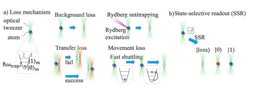
<figcaption class="paper-figure-caption"><b>Fig 2.</b> Fig. 2: Atom loss mechanisms and state-selective readout.</figcaption>
</figure>
<figure class="paper-figure-card">
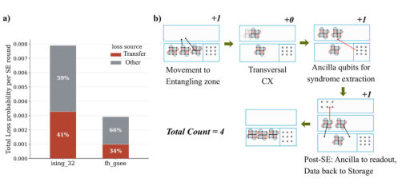
<figcaption class="paper-figure-caption"><b>Fig 3.</b> Fig. 4: a) Transfer loss is a major source of loss because of recurrent movement between AOD-SLM traps. b) In zoned layout, transfer loss for each qubit is counted 4× per gate.</figcaption>
</figure>
<figure class="paper-figure-card">
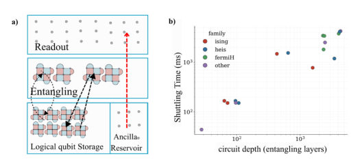
<figcaption class="paper-figure-caption"><b>Fig 4.</b> Fig. 3: a) Current zoned architecture layout: entangling op- erations take place in a separate zone, increasing the routing overhead. b) Shuttling time scales with circuit depth.</figcaption>
</figure>
<figure class="paper-figure-card">
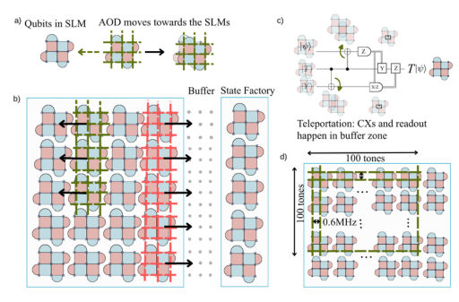
<figcaption class="paper-figure-caption"><b>Fig 5.</b> Fig. 5: a) Transversal gate implementation in compute zone. b) Two movements facilitated by AODs in compute zone: Transversal gates (green crossed AODs) and T-state routing to buffer zone (red crossed AODs). c) S and T Gate teleportation takes place in buffer zone. d) Maximum number of RF tones enable parallel gate movements by an AOD.</figcaption>
</figure>

**Summary.** This paper presents a novel, loss-aware framework for designing fault-tolerant quantum computers using neutral atoms. It overcomes the limitation of existing architectures by treating qubit loss as a dynamic resource budget rather than a fixed error parameter. By co-designing the layout, compilation, and decoding process, the authors achieve significant reductions in both accumulated loss and logical error rates.

**Why it may be interesting.** This work directly addresses the critical gap between theoretical fault-tolerance requirements and the practical, loss-dominated realities of physical quantum hardware, providing actionable architectural guidelines for neutral atom platforms.

Detailed structure

**Main problem.** The primary challenge is developing a fault-tolerant quantum computing architecture for neutral atoms that can effectively manage and correct for qubit loss, which is a dominant error source ignored by standard error correction and compilation methods.

**Main result.** The proposed loss-aware framework improves accumulated loss per syndrome-extraction round by up to 2.15X and reduces logical error rates by over two orders of magnitude compared to current zoned architectures.

**Method.** The authors developed a comprehensive, end-to-end loss-aware pipeline that co-designs the physical layout, compiler optimizations, and decoding strategy to treat loss as a dynamic, controllable budget.

**Model / system.** The system utilizes neutral-atom arrays trapped in optical tweezers, employing a loss-tolerant transversal-gate architecture that minimizes physical shuttling by keeping operations localized within the compute zone.

**Key observables.** Accumulated loss per syndrome-extraction round, logical error rates, and CX routing time.

**Important parameters / regimes.** RF tone budget, AOD bandwidth constraints, and the required continuous atom reloading rates (up to $10^7$ atoms/s for certain benchmarks).

**Assumptions / limitations.** The analysis assumes that optimizing the system to operate in situ (without separate storage/entangling zones) is feasible and that the loss budget can be controlled end-to-end.

**Figures summary.** Figures illustrate the proposed loss-aware layout, the end-to-end compilation pipeline, and quantitative comparisons showing improvements in loss and routing time versus zoned baselines.

**Paper structure.** The paper first identifies the failure of existing models to account for loss, then proposes the loss-aware framework, detailing the co-design of layout, compilation, and decoding, and finally presenting quantitative results showing significant performance gains.

Abstract

Neutral-atom arrays are a leading qubit technology for large-scale, fault-tolerant quantum computing (FTQC). A dominant error source on this platform is qubit loss, which accrues with every operation and movement. The presence of loss undermines the promises of existing architectural work. Standard error correction targets stochastic Pauli errors and cannot correct loss, so most FTQC performance analyses are not directly compatible with it. Moreover, compilation and routing decisions, which strongly affect overall loss, are typically optimized against Pauli-error cost models and often remain loss-agnostic, potentially increasing exposure to the loss channel.   In this work, we comprehensively model the effect of qubit loss on neutral-atom FTQC and develop a loss-tolerant transversal-gate architecture. We treat loss not as a predetermined error parameter but as a dynamic budget spent across a whole program, allowing us to control it by co-designing layout, compilation, and decoding. We target a physical implementation with no separate storage and entangling zones, eliminating the repeated SLM-AOD handoffs and long-distance shuttling that dominate loss in other layouts. We develop compiler optimizations that maximize gate parallelism while respecting the RF tone budget and AOD bandwidth constraints. Our work couples these with a loss-aware, delayed-erasure decoder and an end-to-end loss-aware magic state cultivation protocol. Overall, we improve accumulated loss per syndrome-extraction round by up to 2.15X against a zoned baseline and reduce logical error rates by over two orders of magnitude versus current architectures. Our framework also informs concrete device targets such as continuous reloading rates, AOD counts, and shuttling trajectory choices. We expect these insights to matter for system architects as neutral-atom hardware scales.

[↑ back to top](#top)

### [Realization Theory for Quantum Filtering: Classifying Continuously Monitored Bosonic Systems](http://arxiv.org/abs/2609.09663v1)

**Authors:** Jacob Emerson  
**Type:** theory · **Category:** other · **PDF:** <https://arxiv.org/pdf/2609.09663v1>  
**Analysis basis:** full PDF text, analyzed in chunks
**Topic relevance:** 🔥 `quantum measurements` **4/5** · `correlated / nonlocal dissipation` **1/5** · `driven-dissipative phase transition` **1/5** · `methods for driven-dissipative` **1/5**

↔ Scroll figures horizontally

<figure class="paper-figure-card">

<figcaption class="paper-figure-caption"><b>Fig 1.</b> FIG. 1. Single-mode schematic of the finite-rank and infinite- rank Hamiltonian sectors. Each lattice point (ℓ, k) repre- sents a Weyl-ordered monomial Sym(XℓP k) appearing in the Hamiltonian. The finite sectors shown are the Gaussian class and the CMM classes aligned with X- and P-homodyne mon- itoring. Monomials outside these sectors mix the measured and conjugate quadratures in a way that produces infinite observable Hankel rank in the classification theorem.</figcaption>
</figure>
<figure class="paper-figure-card">

<figcaption class="paper-figure-caption"><b>Fig 2.</b> FIG. 2. Exact and effective observable memory on physical records. (a) Relative singular spectra for two finite exact controls and two nonlinear mixing systems. The Gaussian and CMM responses terminate after two directions, whereas Kerr and Duffing retain decaying tails. (b) Median and 10th–90th percentile Kerr spectra over 24 physical homodyne records. (c) The corresponding effective dimension dϵ. (d) Direct central-finite-difference validation of the discrete response kernel. All panels use ideal monitoring and separated past and future windows. Exact zeros of the analytic CMM kernel are shown at the plotting floor.</figcaption>
</figure>
<figure class="paper-figure-card">

<figcaption class="paper-figure-caption"><b>Fig 3.</b> FIG. 3. Finite prediction in the Hankel-selected coordinates. Median scaled trajectory error E(r) versus L2 record-perturbation radius r for (a) Kerr and (b) Duffing physical records. The quadratic and cubic curves use the same d = d10−3 coordinates as the linear response; their shading spans the 10th–90th percentiles, while the linear curve is a median-only baseline. (c) Response along the first omitted direction when d −1, d, or d + 1 directions are retained at r = 0.03; upper error bars reach the 90th percentile. (d) Empirical counts of the independently selected local dimensions over 24 Kerr and 20 Duffing records. The dotted line marks the target error 10−3.</figcaption>
</figure>
<figure class="paper-figure-card">

<figcaption class="paper-figure-caption"><b>Fig 4.</b> FIG. 4. Poisson–Charlier approximation of monitored Kerr dynamics. (a) Phase-aligned endpoint state error over 40 physical heterodyne Kerr records. (b) Real variables required by the Charlier response and by the optimal rank-d response approximation on the same record. (c) Accuracy-matched Fock and Charlier state dimensions at fixed accumulated mean-field phase. (d) Their separately measured online times for a batch of 128 trajectories, with reusable operator construction excluded. Panels (c) and (d) use a common 90th-percentile state tolerance of 10−6.</figcaption>
</figure>
<figure class="paper-figure-card">
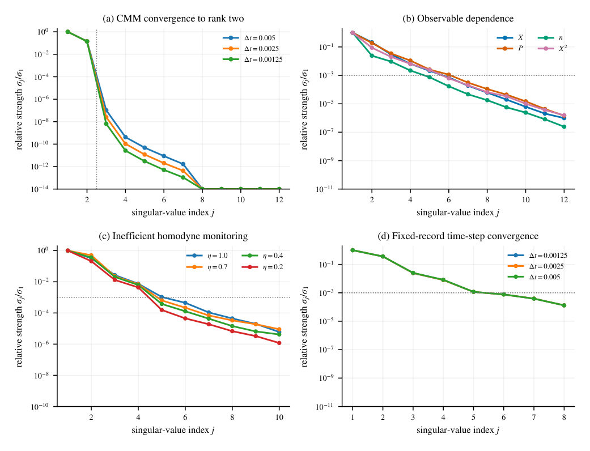
<figcaption class="paper-figure-caption"><b>Fig 5.</b> FIG. 5. Additional checks of the observable-response spectrum. (a) For the cubic CMM control, the first two singular values remain finite while the apparent third decreases by approximately four under each time-step halving, as expected for an exact rank-two response computed with a second-order step. (b) Median Kerr spectra for the future observables X, P, N, and X2</figcaption>
</figure>

**Summary.** This paper develops a realization theory framework to classify continuously monitored bosonic systems based on whether their observable evolution can be captured by a finite-dimensional filter. By introducing the Hankel operator, the authors establish a sharp boundary: only Gaussian and Conditional Momentum Moment systems admit exact finite filters. The singular values of this operator quantify the optimal approximation error when the system exceeds this finite boundary.

**Why it may be interesting.** This work provides a rigorous, mathematical boundary for what can be described by simple, low-dimensional filters in open quantum systems, which is crucial for designing practical quantum control and measurement schemes.

Detailed structure

**Main problem.** The paper addresses the fundamental question of determining whether a continuously monitored quantum system admits an exact, finite-dimensional filter describing its observable evolution.

**Main result.** The realizability is classified by the rank of the linearized observable Hankel operator ($\mathcal{K}_O$); Gaussian and Conditional Momentum Moment systems admit finite filters, while generic nonlinear dynamics lead to infinite response rank.

**Method.** The authors formulate the problem as a realization theory problem, utilizing the Hankel operator $\mathcal{K}_O$ to provide a coordinate-independent diagnostic for the required dimensionality of the filter.

**Model / system.** The system analyzed is a continuously monitored bosonic system whose dynamics are governed by a Hamiltonian $H$ derived from a polynomial $h(x, p)$ and subject to damping and homodyne monitoring.

**Key observables.** The linearized observable Hankel operator ($\mathcal{K}_O$), the singular values of $\mathcal{K}_O$, and the conditional expectation values of observables ($\langle O 
angle_t$).

**Important parameters / regimes.** Damping rate ($\kappa$), detection efficiency ($\eta$), bath occupation ($ar{n}$), and the polynomial degree of the Hamiltonian.

**Assumptions / limitations.** The analysis relies on viewing the problem through the lens of realization theory and analyzing the structure of the observable response map, particularly for polynomial Hamiltonians.

**Figures summary.** Figures illustrate the convergence of the observable-response spectrum (Kerr spectra) under varying time steps, monitoring efficiencies, and for different observables, confirming the theoretical predictions.

**Paper structure.** The paper establishes the realization problem, introduces the Hankel operator $\mathcal{K}_O$ as the diagnostic tool, classifies the finite-dimensional systems (Gaussian/CMM), and then uses numerical examples (Kerr/Duffing oscillators) to demonstrate the quantitative measure of approximation error beyond the exact finite classes.

Abstract

Exact finite-dimensional descriptions exist for a few important classes of continuously monitored quantum systems, but there is no general criterion separating systems that admit such filters from those that do not. We formulate this question as a realization problem and introduce the linearized observable Hankel operator $K_O$, which maps changes in the past measurement record to changes in a future conditional observable. For polynomial bosonic systems under continuous quadrature monitoring, this gives a sharp boundary between finite and infinite realizability. Gaussian dynamics and the Conditional Momentum Moment class admit exact finite-dimensional filters, while nonlinear dynamics outside these classes generically produce infinitely many independent response directions and admit no robust finite-dimensional $C^1$ observable- or state-level filter. The singular values of $K_O$ then extend the same realization framework to approximation, giving the optimal rank-$d$ local-response error beyond the finite classes. Numerical experiments with the Kerr and Duffing oscillators, together with a dynamics-adapted Poisson--Charlier construction for Kerr dynamics, show how this observable-level benchmark interacts with concrete reduced representations. Together, these results identify the boundary of exact quantum filtering and quantify finite-dimensional approximation beyond it.

[↑ back to top](#top)

### [Materials for Quantum Information Science: Roles in the Quantum Evolution 2.0](http://arxiv.org/abs/2609.09371v1)

**Authors:** Thang Pham, Vsevolod Ivanov, Dominic P. Goronzy, Abhiram Devata, Joshua Feldon, David Barton, You Zhou  
**Type:** both · **Category:** quantum information and computing · **PDF:** <https://arxiv.org/pdf/2609.09371v1>  
**Analysis basis:** full PDF text, analyzed in chunks
**Topic relevance:** 🔥 `QC/QI experiment` **4/5** · `analog quantum simulation` **1/5** · `correlated / nonlocal dissipation` **1/5**

↔ Scroll figures horizontally

<figure class="paper-figure-card">
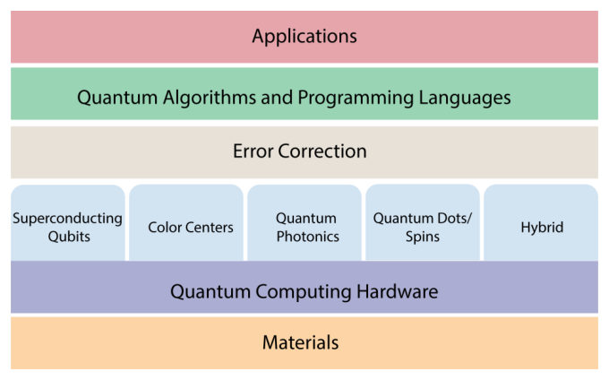
<figcaption class="paper-figure-caption"><b>Fig 1.</b> Figure 1: Ecosystem of Quantum Evolution 2.0. The &quot;Materials&quot; block is the focus of this review. Images adapted and modified with permission from ref2 .</figcaption>
</figure>
<figure class="paper-figure-card">

<figcaption class="paper-figure-caption"><b>Fig 2.</b> Figure 2: Superconducting qubit performance is a function of the properties of the constituent materials and the surfaces and interfaces within the qubit device. The future of improved performance lies in understand these structure-property-performance relationships and developing novel materials and fabrication strategies to mitigate decoherence.</figcaption>
</figure>
<figure class="paper-figure-card">
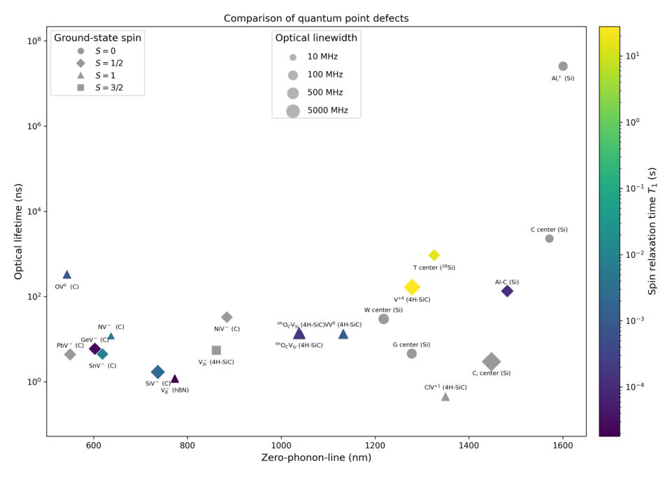
<figcaption class="paper-figure-caption"><b>Fig 3.</b> Figure 3: Comparison of some experimentally validated color center defect properties in diamond (C), 4H silicon carbide (4H-SiC), silicon (Si), and hexagonal boron nitride (hBN). The plot compares the optical radiative lifetime against the zero-phonon-line emission for each defect. For each defect, the marker shape indicates the spin state, the marker size represents the smallest experimentally measured linewidth on a logarithmic scale, and the marker color corresponds to the T1 spin-relaxation time (if known).</figcaption>
</figure>
<figure class="paper-figure-card">
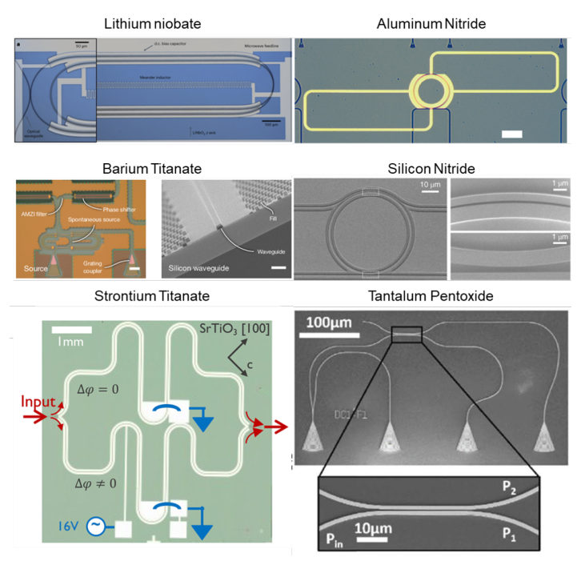
<figcaption class="paper-figure-caption"><b>Fig 4.</b> Figure 4: Integrated waveguide materials primarily discussed in this review. Active materials include wide bandgap oxides and nitrides that feature nonlinear susceptibilities that can leverage external elec- tric fields to control optical properties. Passive materials, including tantalum pentoxide, offer potential advantages as low loss and low noise quantum photonic systems. Images taken adapted with permission from:164(lithium niobate),165(barium titanate),166(strontium titanate),167(aluminum nitride),168(silicon ni- tride), and169(tantalum pentoxide).</figcaption>
</figure>
<figure class="paper-figure-card">

<figcaption class="paper-figure-caption"><b>Fig 5.</b> Figure 5: photorefraction and drift in thin film lithium niobate. a) photorefraction is observed in nanocavities with nearly single photon level tuning. b) dielectric relaxation, as measured as a frequency dependence of the electro-optic response of a modulator, depends on both device geometry and chemistries used to etch and define the contact interface. c) Charge dynamics play a significant role in unwanted time-dependent responses in modulators. UV light modifies conductivity and reported lower activation energies in differing materials defines the magnitude of drift. These phenomena motivate a materials-level characterization of device response improvements, correlating device outcomes...</figcaption>
</figure>

**Summary.** This review analyzes the materials science challenges hindering the scaling of quantum processors across various platforms, including superconducting circuits and 2D materials. It argues that performance is now limited by poorly controlled interfaces and defects, necessitating a fundamental understanding of structure-coherence relationships. The paper calls for new characterization tools and mechanistic theories to advance quantum computing hardware.

**Why it may be interesting.** It directly addresses the physical realization bottleneck for solid-state quantum computation, linking fundamental condensed matter physics (defects, interfaces) to device-level quantum performance metrics.

Detailed structure

**Main problem.** The field of Quantum Information Science is transitioning to building scalable multi-qubit processors, where performance is now limited by poorly controlled surfaces, interfaces, and defects in underlying materials.

**Main result.** A shared 'structure-coherence problem' exists across superconducting circuits, 2D materials, and other quantum platforms, requiring a bottom-up materials approach to control atomic structure.

**Method.** The review surveys materials challenges across multiple quantum platforms, identifying dominant decoherence mechanisms and proposing necessary cross-platform characterization methodologies.

**Model / system.** The paper covers superconducting circuits (e.g., transmon qubits), quantum defects, 2D materials (e.g., graphene, TMDs), and heterostructures. The core focus is on the material science limitations governing coherence in these solid-state quantum systems.

**Key observables.** Decoherence time ($T_2$), Quality factor ($Q$), low-power loss (TLS loss), and quantized electronic/magnetic properties.

**Important parameters / regimes.** Atomic-scale structure, interface chemistry, disorder, and the energy scales associated with defects (e.g., TLS).

**Assumptions / limitations.** The primary limitation is the inability to quantitatively connect a specific atomic-scale structure to a measured change in coherence across all platforms.

**Figures summary.** Figure 1 illustrates the 'Ecosystem of Quantum Evolution 2.0' with materials at the center; Figure 2 shows that qubit performance depends critically on material properties and interface quality.

**Paper structure.** The review progresses by first establishing the shift to Quantum Evolution 2.0, then detailing materials challenges for specific platforms (superconducting circuits, 2D materials), identifying common material chemistry issues, and concluding with three necessary future advancements.

Abstract

Quantum information science is entering a second phase, the Quantum Evolution 2.0, in which the challenge has shifted from demonstrating coherent control of individual quantum states to building scalable multi-qubit processors and networks. This transition places materials science at the center of the field. Across superconducting circuits, quantum defects, quantum photonic devices, and emerging materials platforms, including two-dimensional materials and heterostructures, performance is now limited less by device design than by poorly controlled surfaces, buried interfaces, and defects whose atomic identities remain incompletely known. This review surveys the materials challenges of these quantum platforms together with the characterization methods needed to resolve them. For each platform we identify the dominant decoherence mechanisms, the current state of materials understanding, and the most pressing open materials problems. A cross-platform comparison then reveals a shared structure-coherence problem. The implicated material chemistry recurs across platforms, involving light elements in disordered or buried environments, yet no platform can quantitatively connect a specific atomic-scale structure to a measured change in coherence. We close by identifying three needs, mechanistic understanding of decoherence at the atomistic level, high-throughput proxy metrics predictive of device performance, and characterization tools built for quantum materials, whose resolution would advance coherence, scalability, and integration across all platforms.

[↑ back to top](#top)

### [Certifying bipartite entanglement on a superconducting processor from a corrected QAOA cost layer](http://arxiv.org/abs/2609.09495v1)

**Authors:** Carlos-Miguel Lorenzo  
**Type:** experiment · **Category:** quantum information and computing · **PDF:** <https://arxiv.org/pdf/2609.09495v1>  
**Analysis basis:** full PDF text, analyzed in chunks
**Topic relevance:** 🔥 `QC/QI experiment` **4/5** · `quantum measurements` **1/5**

↔ Scroll figures horizontally

<figure class="paper-figure-card">

<figcaption class="paper-figure-caption"><b>Fig 1.</b> Figure 1: Entanglement is certified on the good coupler at depth one and nowhere else. (a) Per-arm two-qubit reduced-state negativity from tomography, day-level mean with 95% confidence interval over six calibrations: the good edge 4-5 at p = 1 certifies (cold and warm), while the p = 3 arm, the coupling-off J = 0 twin and the degraded 6-8 edge are separable. (b) The independent randomized-measurement p3-PPT witness W = p2 2 −p3 on the good edge on a later calibration: W = 0.0105 with BCa 95% CI, clear of the Werner PPT-boundary null but — at this magnitude — underpowered against a near-pure-separable null, so reported as consistent with entanglement.</figcaption>
</figure>
<figure class="paper-figure-card">
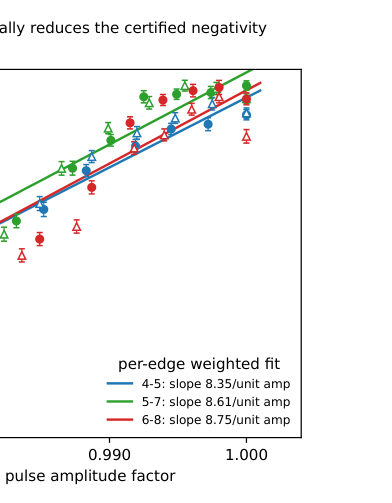
<figcaption class="paper-figure-caption"><b>Fig 2.</b> Figure 2: Reducing the manipulated CZ drive amplitude reduces the certified negativity along a positive, well-fit slope over the probed ladder. Certified two-qubit negativity (PSD, BCa) against the manipulated CZ pulse amplitude factor (the single knob we set), for three couplers of component B (4-5, 5-7, 6-8), two calibration sessions each (filled circles, session 1; open triangles, session 2). Lines are the per-edge weighted fits over the rung window; the legend gives the per-edge slope in certified negativity per unit fractional amplitude. The fits are local linearisations: the drive-to-phase map overshoots π at the nominal amplitude and the certified negativity peaks at |ζ| = π, so the...</figcaption>
</figure>
<figure class="paper-figure-card">

<figcaption class="paper-figure-caption"><b>Fig 3.</b> Figure 3: The certificate collapses by depth three on b08; separately, the depth-three ensemble shows no optimisation signal. Left: the good-edge negativity present at p = 1 is separable by p = 3 (instance b08, day- level over six calibrations) — a within-instance depth collapse. Right: across the N = 16 ensemble measured at p = 3 only, per-instance optimum mass Popt sits at the uniform (1/32) and device-marginal Bernoulli floors (one-sided Wilcoxon versus Bernoulli p = 0.15, not significant); this speaks to p = 3 alone and is not evidence of a decline with depth.</figcaption>
</figure>
<figure class="paper-figure-card">
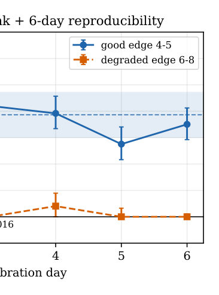
<figcaption class="paper-figure-caption"><b>Fig 4.</b> Figure 4: The good coupler certifies on every calibration; the degraded coupler never does. Raw two-qubit negativity of the good edge 4-5 (upper) and the degraded edge 6-8 (lower) across the six daily calibrations, with the good-edge grand-mean band. Good above bad on 6/6 days; the separation is reported through the two per-edge day-level intervals (good BCa CI [0.065, 0.091], degraded TOST-equivalent to zero), because the pre-registered paired test is a secondary hypothesis that does not survive multiplicity correction (see text). Between-day standard deviation 0.016.</figcaption>
</figure>
<figure class="paper-figure-card">
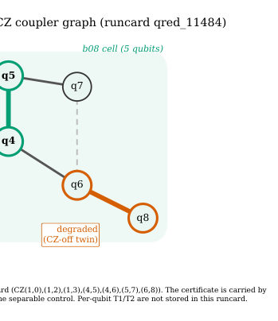
<figcaption class="paper-figure-caption"><b>Fig 5.</b> Figure 5: Component B of Red and its couplers. The calibrated connectivity read live from the runcard on 4 August 2026: nine qubits, seven CZ couplers, and the absent 3-4 bridge that splits the chip into components A = {0, 1, 2, 3} and B = {4, 5, 6, 7, 8}. Component B carries the primary instance b08, the good edge 4-5, the degraded edge 6-8 and the 5-7 coupler used in the causal experiment.</figcaption>
</figure>

**Summary.** This paper rigorously certifies bipartite entanglement in a QAOA cost layer on a superconducting processor by measuring two-qubit negativity. Crucially, it establishes a causal, quantitative relationship showing that the measured entanglement strength decreases predictably as the physical CZ pulse amplitude is reduced. This moves quantum hardware characterization beyond simple benchmarking to understanding fundamental physical control.

**Why it may be interesting.** This work provides a crucial, quantitative link between abstract quantum algorithm requirements (like entanglement depth) and the measurable, physical parameters (like pulse amplitude) of real-world superconducting hardware, offering a roadmap for device characterization.

Detailed structure

**Main problem.** To move beyond simple benchmarking of near-term quantum algorithms by rigorously certifying the physical entanglement generated on superconducting hardware and determining which physical device parameter controls this entanglement.

**Main result.** The authors certified bipartite entanglement in the QAOA cost layer and demonstrated a causal, measurable dependence of this entanglement on the CZ pulse amplitude, showing that reducing the amplitude reduces the certified negativity.

**Method.** The study used two-qubit tomographic negativity to certify entanglement on a superconducting processor, combined with a pre-registered manipulation experiment varying the CZ pulse amplitude to establish a dose-response relationship.

**Model / system.** The experiment was conducted on a nine-qubit superconducting processor ('Red') at the Barcelona Supercomputing Center. The physics is modeled using the QAOA cost layer, which is implemented via controlled-Z (CZ) gates between coupled qubits.

**Key observables.** Bipartite entanglement certified via two-qubit tomographic negativity (e.g., 0.077); the slope of negativity vs. CZ pulse amplitude; and the fidelity of statevector reconstruction.

**Important parameters / regimes.** The CZ pulse amplitude (the control knob); the depth of the QAOA circuit (depth one vs. depth three); and the specific coupling couplers (e.g., the 'good coupler' 4-5).

**Assumptions / limitations.** The analysis relies heavily on pre-registration and provenance tracking to ensure the experimental design preceded data collection. The authors caution that the observed entanglement is not claimed to demonstrate quantum advantage.

**Figures summary.** Figures illustrate the connectivity graph of the superconducting chip, the reconstructed two-qubit density matrix showing coherences, and tables summarize the calculated slopes and confidence intervals derived from the dose-response analysis across different couplers.

**Paper structure.** The paper establishes the physical context and the need for rigorous certification. It details the entanglement measurement using negativity, followed by the core experimental section where the CZ pulse amplitude is systematically varied to map out the physical control law. Finally, it discusses the limitations, including depth collapse and the lack of quantum advantage.

Abstract

The Quantum Approximate Optimisation Algorithm is the canonical near-term heuristic, yet on real superconducting hardware its behaviour is set by device physics, not by the algorithm. Hardware demonstrations rarely prove the intended coupling is realised, that genuine entanglement is prepared, or what controls it. We report a pre-registered single-device study on the nine-qubit superconducting processor Red at the Barcelona Supercomputing Center, using its five-qubit component. Across six calibrations we certify bipartite entanglement of a corrected QAOA cost layer on the good coupler at depth one by two-qubit tomographic negativity: 0.077, BCa 95% CI [0.065, 0.091], excluding zero every day, while the coupling-off twin stays separable and the degraded coupler equals zero. We then measure the device physics directly: in a pre-registered manipulation on a fixed Bell preparation (not the QAOA layer), reducing the CZ pulse amplitude causally reduces the certified negativity along a positive, well-fit slope (R^2 = 0.83-0.96), every rung-level interval excluding zero and surviving Holm and Benjamini-Hochberg correction. This is a local linearisation of a peaked response, not a global monotone law: the negativity peaks at conditional phase |zeta| = pi, which the nominal amplitude overshoots. The J=0 twin is a separate off-state control and the fringe visibility is constant, so the effect is coherent. The average gate fidelity is non-monotone in the drive and is reported only as a diagnostic. A per-circuit statevector guardrail excludes a diagonal compilation fault we disclose and repair. A randomized-measurement witness is consistent with entanglement but underpowered. The certificate collapses by depth three, and a pre-registered sixteen-instance depth-three ensemble shows no optimisation signal (one-sided Wilcoxon p = 0.15). We claim no advantage; the instances are classically trivial.

[↑ back to top](#top)

### [Haar-Bayesian Pure-State Prediction under Relative-Entropy Loss: Arbitrary-Effect Reduction and Global Optimality](http://arxiv.org/abs/2609.10072v1)

**Authors:** Masahito Hayashi, Ayanava Dasgupta, Naqueeb Ahmad Warsi  
**Type:** theory · **Category:** quantum information and computing · **PDF:** <https://arxiv.org/pdf/2609.10072v1>  
**Analysis basis:** full PDF text, analyzed in chunks
**Topic relevance:** 🔥 `quantum measurements` **4/5**

↔ Scroll figures horizontally

<figure class="paper-figure-card">
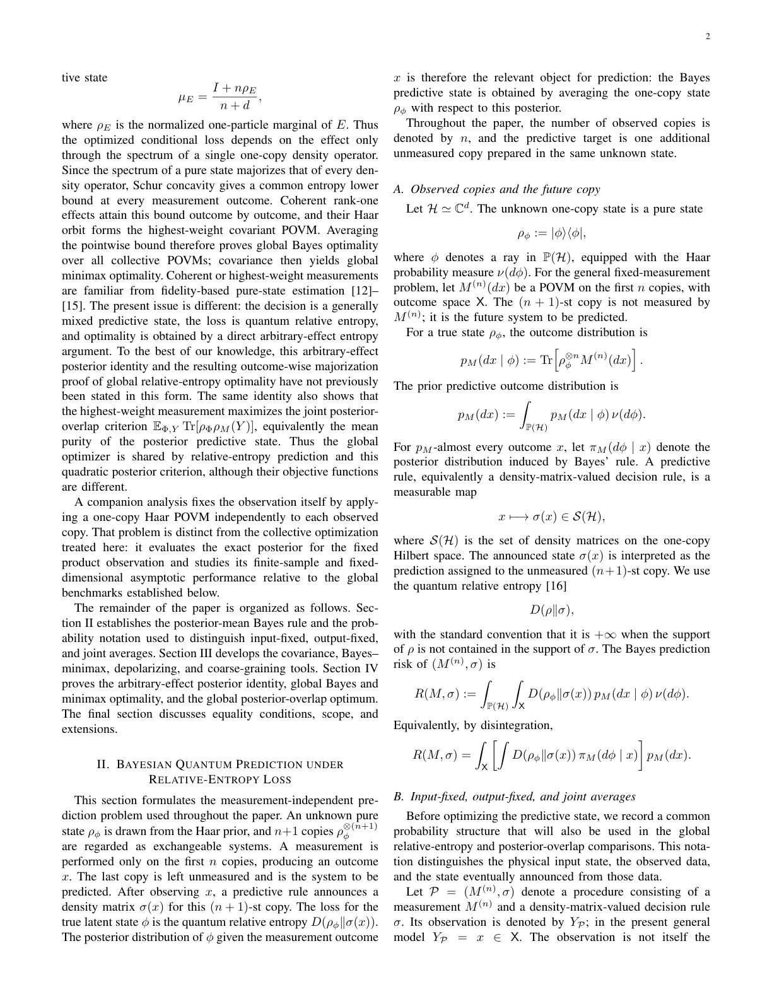
<figcaption class="paper-figure-caption"><b>Fig 1.</b> Low-resolution page preview, page 2</figcaption>
</figure>
<figure class="paper-figure-card">

<figcaption class="paper-figure-caption"><b>Fig 2.</b> Low-resolution page preview, page 3</figcaption>
</figure>
<figure class="paper-figure-card">
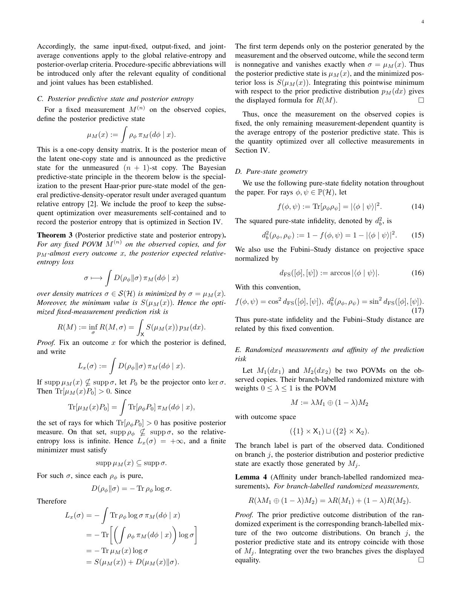
<figcaption class="paper-figure-caption"><b>Fig 3.</b> Low-resolution page preview, page 4</figcaption>
</figure>
<figure class="paper-figure-card">
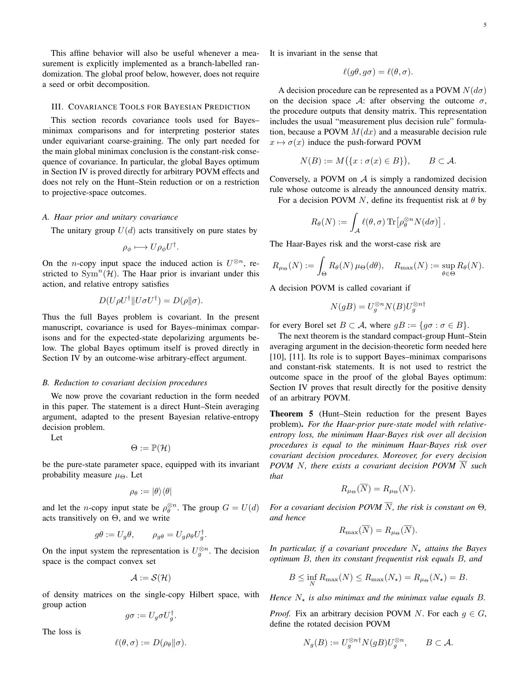
<figcaption class="paper-figure-caption"><b>Fig 4.</b> Low-resolution page preview, page 5</figcaption>
</figure>
<figure class="paper-figure-card">

<figcaption class="paper-figure-caption"><b>Fig 5.</b> Low-resolution page preview, page 6</figcaption>
</figure>

**Summary.** This theoretical paper solves the problem of optimally predicting an unknown pure quantum state given multiple measurements. It proves that the highest-weight covariant Positive Operator-Valued Measure (POVM) achieves the global minimum risk when using the quantum relative entropy as the loss function. This result establishes a fundamental benchmark for quantum state estimation protocols.

**Why it may be interesting.** The rigorous derivation of global optimality for quantum state estimation under relative entropy loss provides fundamental tools for quantum measurement theory, which underpins quantum communication and computation.

Detailed structure

**Main problem.** The paper determines the optimal measurement strategy (POVM) and subsequent decision rule for predicting an unmeasured copy of an unknown pure quantum state, minimizing the quantum relative-entropy loss.

**Main result.** The highest-weight covariant POVM is proven to be globally Bayes optimal over all collective measurements, achieving a specific, calculable minimum risk.

**Method.** The analysis employs the 'arbitrary-effect reduction' identity to simplify the problem, allowing the optimization to be performed by comparing the risk to a derived entropy lower bound.

**Model / system.** The system involves an unknown pure state $\rho_\phi$ drawn from the Haar distribution in a finite-dimensional Hilbert space of dimension $d$. The process models quantum state estimation using $n$ observed copies and predicting one unmeasured copy.

**Key observables.** Quantum relative entropy loss, Bayes prediction risk, and the mean posterior purity.

**Important parameters / regimes.** The number of observed copies ($n$), the dimension of the Hilbert space ($d$), and the ratio $r = (n+1)/(n+d)$.

**Assumptions / limitations.** The analysis assumes a uniform (Haar) prior over the pure states and relies heavily on the 'arbitrary-effect identity' to simplify the optimization landscape.

**Figures summary.** Not specified.

**Paper structure.** The paper builds from establishing the optimal decision rule for a fixed measurement, then uses the arbitrary-effect identity to generalize this to optimize over all POVMs, culminating in the proof of global Bayes and minimax optimality.

Abstract

We study Haar-Bayesian prediction of one unmeasured copy of an unknown finite-dimensional pure quantum state after an arbitrary collective measurement on $n$ observed copies. Performance is evaluated by quantum relative entropy. For a fixed measurement, the Bayes predictive state is the posterior mean and the optimized conditional loss is its entropy. We then optimize the measurement over all POVMs on the symmetric subspace. For every nonzero positive effect $E$, the corresponding posterior predictive state is $μ_E=(I+nρ_E)/(n+d)$, where $ρ_E$ is the normalized one-particle marginal of $E$. Since a pure spectrum majorizes every density-operator spectrum, this identity gives an outcome-wise entropy lower bound. Coherent rank-one effects attain the bound, and their Haar orbit yields the highest-weight covariant POVM. Hence this POVM is globally Bayes optimal over all collective measurements and, by covariance, globally minimax. Its exact risk is $h_d((n+1)/(n+d))$, where $h_d(r)=-r\log r-(1-r)\log((1-r)/(d-1))$. The same arbitrary-effect reduction shows that the highest-weight POVM also maximizes the joint overlap between the latent pure state and its posterior predictive state, equivalently the mean posterior purity, with optimum $((n+1)^2+d-1)/(n+d)^2$.

[↑ back to top](#top)

### [Why three? A two-level system with four mutually unbiased questions](http://arxiv.org/abs/2609.10078v1)

**Authors:** Jonte R. Hance  
**Type:** theory · **Category:** quantum information and computing · **PDF:** <https://arxiv.org/pdf/2609.10078v1>  
**Analysis basis:** full PDF text, analyzed in chunks
**Topic relevance:** 🔥 `quantum measurements` **4/5**

↔ Scroll figures horizontally

<figure class="paper-figure-card">
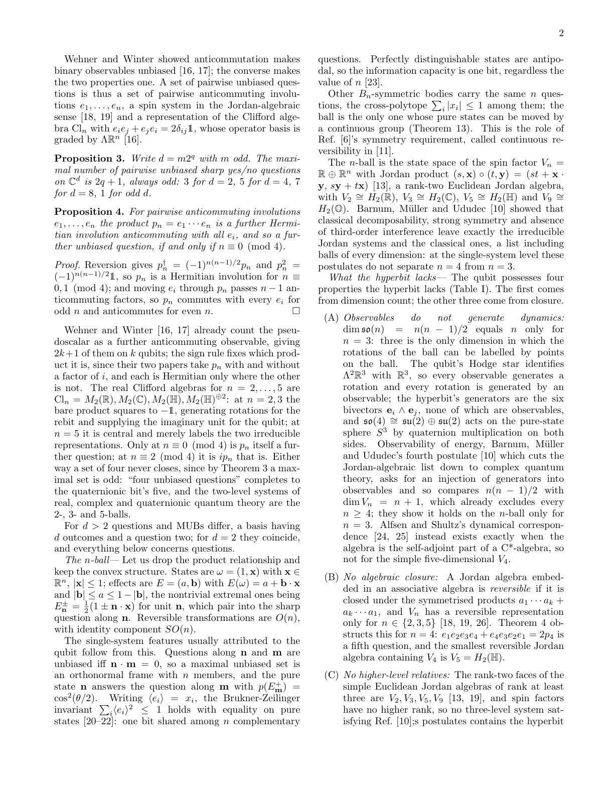
<figcaption class="paper-figure-caption"><b>Fig 1.</b> Low-resolution page preview, page 2</figcaption>
</figure>
<figure class="paper-figure-card">

<figcaption class="paper-figure-caption"><b>Fig 2.</b> Low-resolution page preview, page 3</figcaption>
</figure>
<figure class="paper-figure-card">

<figcaption class="paper-figure-caption"><b>Fig 3.</b> Low-resolution page preview, page 4</figcaption>
</figure>
<figure class="paper-figure-card">
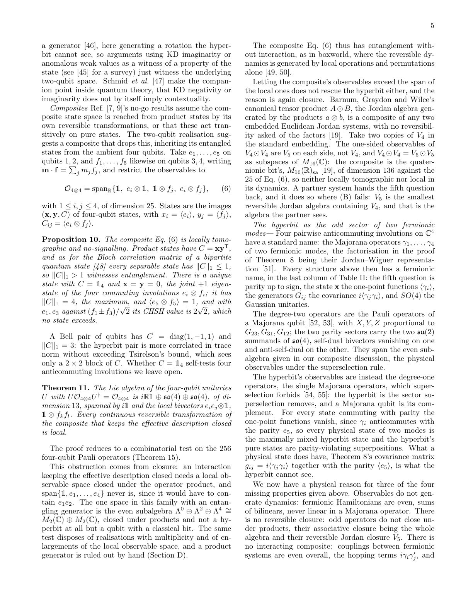
<figcaption class="paper-figure-caption"><b>Fig 4.</b> Low-resolution page preview, page 5</figcaption>
</figure>
<figure class="paper-figure-card">

<figcaption class="paper-figure-caption"><b>Fig 5.</b> Low-resolution page preview, page 6</figcaption>
</figure>

**Summary.** This paper explores the theoretical limits of quantum measurement by examining systems supporting four mutually unbiased questions (the hyperbit), contrasting it with the standard qubit. It shows that while the hyperbit can be mathematically constructed, it fails to satisfy several key physical postulates (like generating dynamics) that the qubit possesses. The work uses advanced tools from algebra and quantum information theory to delineate the boundaries between different quantum models.

**Why it may be interesting.** It provides a deep theoretical exploration of the limits of quantum measurement theory, extending the concept of MUBs beyond standard qubit models and linking algebraic structure to physical realizability.

Detailed structure

**Main problem.** The paper investigates the maximum number of mutually unbiased questions (MUBs) a two-level system can support, contrasting the standard result of three with the theoretical possibility of four.

**Main result.** While standard operator algebra restricts MUBs to an odd number (2, 3, or 5), a hypothetical 'hyperbit' with four MUBs can be constructed, but it lacks key physical properties like dynamics generation and algebraic closure compared to a standard qubit.

**Method.** The analysis combines algebraic constraints (Clifford algebras, anticommuting involutions) with geometric modeling (Bloch balls, 24-cell) and quantum information diagnostics (contextuality proofs, Kirkwood-Dirac distributions).

**Model / system.** The primary models are the standard qubit (two-level system) and the hypothetical hyperbit (a four-level system), which is shown to embed into a two-qubit system.

**Key observables.** Mutually Unbiased Questions (MUBs), Clifford algebra structure, preparation contextuality (measured via inequalities), and the imaginary part of the Kirkwood-Dirac correlation function.

**Important parameters / regimes.** The number of MUBs ($n=2, 3, 4, 5$), the dimension of the state space (Bloch ball dimension), and the contextuality threshold ($\lambda > 2/3$).

**Assumptions / limitations.** The analysis often assumes preparation noncontextuality when deriving bounds on correlations, and it compares the hyperbit against the full set of single-system postulates.

**Figures summary.** TABLE I compares four key properties (A-D) across systems with $n=2, 3, 4, 5$, illustrating the structural differences between the qubit and the hyperbit.

**Paper structure.** The paper first establishes the algebraic constraints on MUBs, then introduces the geometric model of the hyperbit, compares its properties to the qubit using diagnostic criteria, and finally analyzes its embedding and contextuality within a two-qubit framework.

Abstract

Two sharp yes/no questions are mutually unbiased if and only if their involutions anticommute. A set of unbiased questions is therefore a Clifford algebra, whose maximal size is odd, meaning four anticommuting questions typically imply a fifth: the two-level systems of real, complex and quaternionic quantum theory allow two, three and five questions, while four is skipped. Without this operator product restriction, a two-level system with four unbiased questions exists as the four-dimensional Bloch ball, the hyperbit. The single-system postulates that pick out the Jordan state spaces allow such a model, and only energy observability rules it out. We show what it lacks, and realise it inside two qubits: its Kirkwood-Dirac imaginary parts are hidden $\mathfrak{so}(4)$ generators, its composites allow entanglement but no interaction, and its 24-cell of states stays Spekkens preparation contextual down to depolarising strength $2/3$. In fermionic terms, the four questions are the Majorana operators of two modes while the fifth is parity: the four-question system is therefore the sector removed by parity superselection.

[↑ back to top](#top)

### [Non-Hermitian topology in driven-dissipative systems: correspondence with quantum correlations and a resource for entanglement](http://arxiv.org/abs/2609.09312v1)

**Authors:** Niladri Chakraborty, Clara C. Wanjura  
**Type:** theory · **Category:** other · **PDF:** <https://arxiv.org/pdf/2609.09312v1>  
**Analysis basis:** full PDF text, analyzed in chunks
**Topic relevance:** `analog quantum simulation` **3/5** · `correlated / nonlocal dissipation` **3/5** · `driven-dissipative phase transition` **3/5** · `methods for driven-dissipative` **3/5** · `Keldysh / 2PI / non-Gaussian methods` **2/5** · `non-equilibrium universality` **2/5** · `Tavis-Cummings & cavity-many-emitter` **1/5** · `quantum measurements` **1/5**

↔ Scroll figures horizontally

<figure class="paper-figure-card">
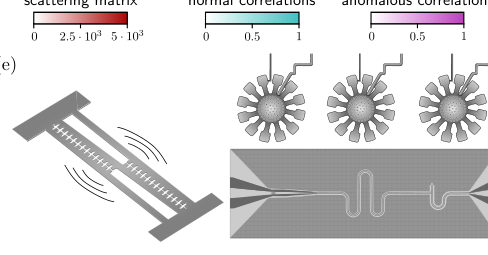
<figcaption class="paper-figure-caption"><b>Fig 1.</b> FIG. 1. Directional topological amplifiers generate long-range correlations in their output fields. (a) We consider systems of cou- pled bosonic modes, here, concretely, two sets of bosonic modes ˆaj and ˆbj are coupled with complex hopping and two-mode squeezing (TMS) interactions, see Eq. (7). Waveguides couple input fields as well as input noise into each of the modes. (b) For certain parame- ter regimes, such chains exhibit non-trivial non-Hermitian topology in the form of a winding number, Eq. (3). Here, regimes of non- trivial topology are soley determined through the cooperativity C, the competition between two-mode squeezing and local dissipation and the phase controlling...</figcaption>
</figure>
<figure class="paper-figure-card">
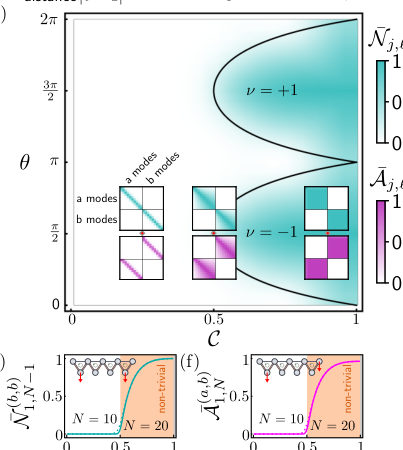
<figcaption class="paper-figure-caption"><b>Fig 2.</b> FIG. 2. Emergence of correlations in non-trivial non-Hermitian topological phases. (a)-c Normal and anomalous correlations, Eq. (11), are a witness of non-Hermitian topological phase transi- tions, Eq. (17). (a) In the trivial phase, the correlations are ex- ponentially attenuated as a function of the distance between the modes, while in non-trivial phase, the correlations Mj,ℓgrow exponentially as a function of distance between modes (for any ν(j −ℓ) &gt; 0). At the transition, the correlations are uniform across the system. For clarity, we only show the normal correla- tions between ˆaj modes, N (a,a) j,ℓ here; normal correlations N (b,b) j,ℓ between ˆbj modes and anomalous correlations...</figcaption>
</figure>
<figure class="paper-figure-card">

<figcaption class="paper-figure-caption"><b>Fig 3.</b> FIG. 3. Understanding entanglement through competing correlations and mode occupations. (a) When the local squeezing of the output state Aj,j = 0 is zero, the the condition for bi-partite entanglement for a given mode occupation ratio Υj,ℓ, Eq. (24), is purely determined by the normalised correlations, ¯ Aj,ℓand ¯ Nj,ℓ. The colour gradient in the set of entangled state denotes the value of the entanglement monotone logarithmic negativity, which is 0 in the separable region and positive in the entangled region. In the separable region, we instead plot the smallest symplectic eigenvalue with µ−1 = 1/2 corresponding to vacuum, i.e., minimal uncertainty. The state at the apex (red star) also...</figcaption>
</figure>
<figure class="paper-figure-card">

<figcaption class="paper-figure-caption"><b>Fig 4.</b> FIG. 4. Entanglement generation in different operation regimes. (a)-(c) Logarithmic negativity and smallest symplectic eigenvalue µ−1 as a function of the cooperativity for (a) the perfectly unidi- rectional amplifier chain (θ = π</figcaption>
</figure>
<figure class="paper-figure-card">
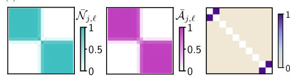
<figcaption class="paper-figure-caption"><b>Fig 5.</b> FIG. 5. Correlations and entanglement in the bosonic Kitaev Chain. (a) In the bosonic Kitaev chain [69], Eq. (25), neighbouring modes are connected via beamsplitter and two-mode-squeezing in- teractions. (b) Correlations N N</figcaption>
</figure>

**Summary.** This paper establishes a quantum generalization of the connection between non-Hermitian topology and directional amplification. It shows that non-trivial topology generates long-range quantum correlations in driven-dissipative systems, while entanglement remains localized. This provides a powerful theoretical tool for designing quantum devices based on topological principles.

**Why it may be interesting.** This work provides a deep theoretical link between topological invariants (non-Hermitian geometry) and measurable quantum resources (correlations/entanglement) in open quantum systems, directly applicable to cavity optomechanics and superconducting circuits.

Detailed structure

**Main problem.** The paper extends the understanding of non-Hermitian topology from classical mean-field responses to the quantum realm by analyzing quantum fluctuations, correlations, and entanglement in driven-dissipative systems.

**Main result.** Non-trivial non-Hermitian topology leads to exponentially growing, long-range quantum correlations, while entanglement remains local, governed by the competition between these correlations and mode occupation asymmetry.

**Method.** The authors utilize quantum Langevin equations, analyzing second moments to calculate normal and anomalous correlations, and employing the winding number to characterize the non-Hermitian topology.

**Model / system.** The study focuses on driven-dissipative bosonic chains, exemplified by phase-preserving amplifiers and the bosonic Kitaev chain. The dynamics are governed by a non-Hermitian dynamic matrix H.

**Key observables.** Normal and anomalous correlations, entanglement (logarithmic negativity), correlation length ($\xi$), and the topological winding number ($
u$).

**Important parameters / regimes.** Cooperativity ($C$), system size ($N$), and the topological phase transition point.

**Assumptions / limitations.** The analysis often assumes a directional, cascaded evolution structure for the correlation analysis, and the initial correspondence was limited to mean fields.

**Figures summary.** Figures illustrate directional topological amplifiers, the dependence of correlations on distance (showing divergence at phase transitions), and the evolution of entanglement at system boundaries.

**Paper structure.** The work progresses from establishing the classical mean-field correspondence to deriving analytic expressions for quantum correlations, analyzing the divergence of the correlation length, and finally detailing the local nature of entanglement in specific models like the Kitaev chain.

Abstract

Directional amplification, in which signals are amplified selectively depending on their propagation direction, is a key resource for quantum information processing and stands in one-to-one correspondence with non-trivial non-Hermitian topology. So far, this correspondence has concerned the mean fields, and thus classical response. Here we turn to the quantum fluctuations, giving access to correlations and entanglement. For phase-preserving amplifiers, we derive analytic expressions for the normal and anomalous correlations, showing that non-trivial topology produces correlations that grow exponentially with the distance between modes and approach the largest values compatible with the uncertainty relations. The associated correlation length diverges at the topological phase transition. Entanglement nonetheless remains local, set by the competition between normalised anomalous correlations and the asymmetry of the mode occupations. For the bosonic Kitaev chain, a phase-sensitive amplifier, the system instead splits into two halves that are internally fully correlated yet mutually uncorrelated. Our work prepares the ground for exploring the quantum properties of non-Hermitian topological systems with state-of-the-art platforms such as cavity optomechanics and superconducting circuits.

[↑ back to top](#top)

### [Energy Transport Structure and Fluctuation Theorem in Nonreciprocal Harmonic Chains](http://arxiv.org/abs/2609.09593v1)

**Authors:** Ziwei Cheng, Geng Li, Zhanchun Tu  
**Type:** theory · **Category:** statistical mechanics · **PDF:** <https://arxiv.org/pdf/2609.09593v1>  
**Analysis basis:** full PDF text, analyzed in chunks
**Topic relevance:** `Full counting statistics` **3/5** · `non-equilibrium universality` **3/5** · `Keldysh / 2PI / non-Gaussian methods` **2/5** · `correlated / nonlocal dissipation` **2/5** · `driven-dissipative phase transition` **2/5** · `methods for driven-dissipative` **2/5** · `Frenkel-Kontorova` **1/5** · `analog quantum simulation` **1/5** · `quantum measurements` **1/5**

↔ Scroll figures horizontally

<figure class="paper-figure-card">

<figcaption class="paper-figure-caption"><b>Fig 1.</b> FIG. 1. Schematic of the nonreciprocal harmonic chain cou- pled to two thermal reservoirs at temperatures TL and TR. The chain consists of N particles with asymmetric nearest- neighbor couplings kbi and kci, where i = 1, 2, . . . , N −1. The couplings kbi and kci characterize the interactions in opposite directions. Nonreciprocity corresponds to kbi ̸= kci.</figcaption>
</figure>
<figure class="paper-figure-card">
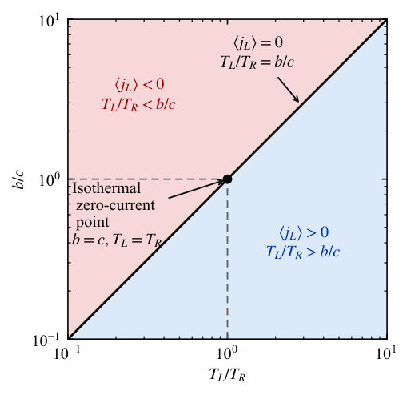
<figcaption class="paper-figure-caption"><b>Fig 2.</b> FIG. 2. Transport regimes in the parameter plane spanned by the temperature ratio TL/TR and the effective directional- coupling ratio b/c. The line TL/TR = b/c corresponds to ⟨jL⟩= ⟨jR⟩= 0 and separates the two regimes with opposite reservoir heat-current directions. The black dot at TL/TR = b/c = 1 denotes the isothermal zero-current point. It coin- cides with the reciprocal equilibrium state when kbi = kci for every bond.</figcaption>
</figure>
<figure class="paper-figure-card">

<figcaption class="paper-figure-caption"><b>Fig 3.</b> FIG. 3. Numerical verification of the analytical predic- tions for the steady-state energy transport in a three-particle nonreciprocal harmonic chain. Open symbols represent the ensemble-averaged steady-state energy currents obtained from Langevin Monte Carlo simulations, while the dashed curves denote the corresponding exact theoretical predic- tions. The upper panel compares the left heat current ⟨jL⟩, the opposite of the right heat current −⟨jR⟩, and the non- reciprocal power current ⟨jP ⟩as functions of the effective directional-coupling ratio b/c. The vertical dotted line in- dicates the transport-symmetric point b/c = 1, whereas the vertical dashed line marks the current-reversal...</figcaption>
</figure>
<figure class="paper-figure-card">

<figcaption class="paper-figure-caption"><b>Fig 4.</b> FIG. 4. Steady-state joint probability distribution Pτ(jL, jR) obtained from Langevin simulations. The probability density is concentrated around the transport manifold cjL + bjR = 0, in agreement with the analytical prediction.</figcaption>
</figure>
<figure class="paper-figure-card">
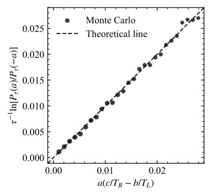
<figcaption class="paper-figure-caption"><b>Fig 5.</b> FIG. 5. Numerical verification of the projected fluctuation relation. The Monte Carlo results (symbols) are compared with the theoretical prediction line (dashed line).</figcaption>
</figure>

**Summary.** This work develops a comprehensive theoretical framework for energy transport in non-reciprocal harmonic chains. It shows that directional asymmetry allows for active control over heat flow, enabling phenomena like cold-to-hot transport. Furthermore, it derives a joint fluctuation theorem, providing a deep connection between the steady-state energy balance and the underlying stochastic dynamics.

**Why it may be interesting.** The explicit derivation of a joint fluctuation theorem for energy currents in a non-equilibrium setting provides powerful, quantitative tools for understanding energy flow control, which is highly relevant to quantum thermal machines and open quantum systems.

Detailed structure

**Main problem.** The paper investigates how nonreciprocal interactions fundamentally alter energy transport and establish a unified fluctuation framework for heat flow in harmonic chains.

**Main result.** Nonreciprocity introduces an additional power current and allows the direction of heat flow to be controlled by the competition between temperature bias and effective directional asymmetry, leading to a joint Gallavotti-Cohen fluctuation relation.

**Method.** The analysis employs Green-function techniques, spectral analysis, and stochastic thermodynamics to derive steady-state heat currents and the joint scaled cumulant generating function.

**Model / system.** The model is a one-dimensional harmonic chain of N particles coupled to two thermal reservoirs ($T_L, T_R$). The dynamics are governed by a Langevin equation where the coupling matrix is explicitly made asymmetric ($\Phi = \Phi_S + \Phi_A$).

**Key observables.** Steady-state heat currents ($\langle j_L 
angle, \langle j_R 
angle$), the nonreciprocal power current ($\langle j_P 
angle$), and the joint scaled cumulant generating function.

**Important parameters / regimes.** Temperature bias ($T_L/T_R$) and the ratio of directional coupling strengths ($b/c$).

**Assumptions / limitations.** The analysis is restricted to the harmonic limit, one-dimensionality, and nearest-neighbor coupling. It assumes Gaussian white noise for the thermal bath.

**Figures summary.** Figure 1 schematically shows the setup. Figure 4 displays the steady-state joint probability distribution $P_	au(j_L, j_R)$ concentrated around a specific transport manifold. Figure 5 numerically verifies the derived joint fluctuation relation.

**Paper structure.** The paper first establishes the energy balance by deriving explicit formulas for the three coupled currents ($\langle j_L 
angle, \langle j_R 
angle, \langle j_P 
angle$). It then moves to the fluctuation level, deriving the joint scaled cumulant generating function and establishing the final joint Gallavotti-Cohen fluctuation relation.

Abstract

Nonreciprocal interactions fundamentally alter energy transport by breaking the symmetry between forward and backward responses. Here, we uncover an exact transport structure for a one-dimensional harmonic chain with asymmetric nearest-neighbor couplings. Using a Green-function approach, we demonstrate that the direction of heat transport is determined not solely by the temperature bias, but by its competition with an effective directional asymmetry. This competition can reverse the direction of heat flow, enabling cold-to-hot transport. We further show that nonreciprocity introduces an additional power channel associated with the antisymmetric sector of the interaction, leading to a generalized steady-state energy balance involving two reservoir heat currents and a nonreciprocal power current. At the fluctuation level, the heat exchanges with the two reservoirs constitute correlated yet distinct stochastic currents, whose joint scaled cumulant generating function obeys an exact Gallavotti-Cohen symmetry. Together, these results establish a unified energetic and fluctuation framework for nonreciprocal heat transport and demonstrate that directional interactions can serve as an active resource for controlling nonequilibrium energy flows.

[↑ back to top](#top)

### [Coherent advantage in the computational expressivity of excitonic networks](http://arxiv.org/abs/2609.10448v1)

**Authors:** Matthew Du, Carlos Floyd, Dipti Jasrasaria, Suriyanarayanan Vaikuntanathan  
**Type:** theory · **Category:** other · **PDF:** <https://arxiv.org/pdf/2609.10448v1>  
**Analysis basis:** full PDF text, analyzed in chunks
**Topic relevance:** `analog quantum simulation` **3/5** · `correlated / nonlocal dissipation` **3/5** · `driven-dissipative phase transition` **3/5** · `methods for driven-dissipative` **3/5** · `non-equilibrium universality` **2/5** · `Keldysh / 2PI / non-Gaussian methods` **1/5** · `Tavis-Cummings & cavity-many-emitter` **1/5**

↔ Scroll figures horizontally

<figure class="paper-figure-card">

<figcaption class="paper-figure-caption"><b>Fig 1.</b> FIG. 1. Overview: computational expressivity of open quantum networks. (a) In an excitonic network of molecular chromophores, excitations become delocalized through coherent (wave-like) transport mediated by dipole- dipole coupling. Using a scaffold (e.g., protein or DNA), the couplings can be tuned by adjusting the position or orienta- tions of the chromophores. (b) The computational expressiv- ity of an artificial neural network increases with model size. Here the expressivity is measured by the number of turning points. (c) Excitonic network as a computational platform. Each site is associated with a transition energy of excitation and couplings to other sites. Excitations are pumped into...</figcaption>
</figure>
<figure class="paper-figure-card">
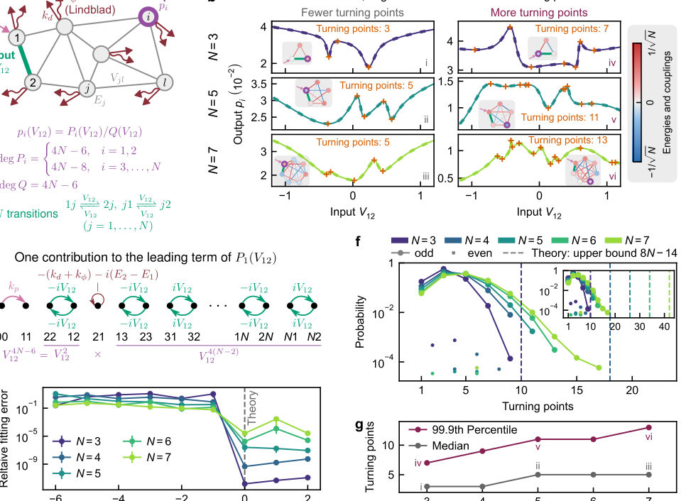
<figcaption class="paper-figure-caption"><b>Fig 2.</b> FIG. 2. Computational expressivity grows with system size in the coherent regime. (a) Model of excitonic networks as a computational platform. An excitation on site j = 1, . . . , N has transition energy Ej and can hop to site l according to coupling Vjl = V ∗ lj. Excitations are pumped into site 1 at rate kp and decay from any site at rate kd. Excitations at each site also dephase at a constant rate kφ, as described by the Lindblad master equation. The input of the computation is the coupling V12 between the pumped site 1 and a not-pumped site 2, and the output is the excitation probability pi of a site i at steady state. (b) Examples of computational input-output relations pi(V12) for...</figcaption>
</figure>
<figure class="paper-figure-card">

<figcaption class="paper-figure-caption"><b>Fig 3.</b> FIG. 3. Coherent advantage in computational expressivity. (a, b) Computational expressivity of excitonic networks in the coherent regime of low dephasing (a) and the incoherent regime of high dephasing (b). The input-output relation pi(V12) is given by a rational function whose degree and thus expressivity grows with system size N in the coherent regime (a) but is independent of N in the incoherent regime. The dependence on N can be understood in terms of the number of 1 ↔2 transitions (i.e., mediated by V12) in each regime. (c) Examples of input-output relation for varying dephasing rate kφ (in units of the maximum absolute coupling Vmax). The dashed lines are a fit to rational functions,...</figcaption>
</figure>
<figure class="paper-figure-card">
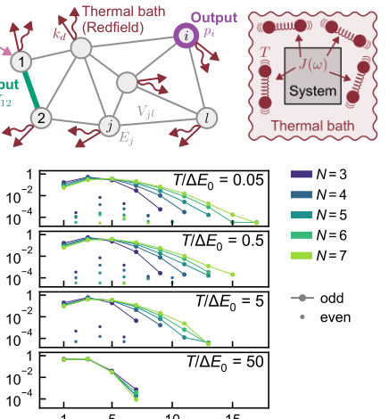
<figcaption class="paper-figure-caption"><b>Fig 4.</b> FIG. 4. Coherent advantage in computational expres- sivity occurs at lower temperatures. (a) Model of ex- citonic network as a computational platform in the pres- ence of dephasing induced by a thermal bath. The dephas- ing is characterized by temperature T and spectral density J(ω), as described by the Redfield master equation. (b) His- togram of turning points in the input-output relations of ran- dom excitonic networks for varying T (in units of ∆E0 = 2Vmax √</figcaption>
</figure>

**Summary.** This paper treats excitonic networks as quantum computational substrates, demonstrating that the ability to compute complex functions (computational expressivity) critically depends on maintaining quantum coherence. Mathematically, coherence allows the input-output mapping to be represented by high-degree rational functions whose complexity scales with system size, a feature lost in the presence of strong dephasing.

**Why it may be interesting.** This work provides a concrete physical realization—molecular excitons—where quantum coherence is mathematically shown to be a necessary resource for achieving complex, scalable computational functions, bridging quantum optics and computation theory.

Detailed structure

**Main problem.** The study investigates how coherence in open quantum systems, specifically excitonic networks, dictates the computational expressivity of the system's input-output mapping.

**Main result.** Coherence enables the computational expressivity to scale with the network size ($N$), mirroring the scaling seen in artificial neural networks, whereas strong dephasing suppresses this scaling.

**Method.** The analysis involves deriving the input-output relation ($\pi_i(V_{12})$) as a rational function of the coupling $V_{12}$ and analyzing the degree of the resulting polynomials.

**Model / system.** The system is an excitonic network of molecular chromophores, modeled using a Lindblad master equation describing coherent and dissipative dynamics. The input is the intersite coupling $\{V_{jl}\}$, and the output is the steady-state excitation probability.

**Key observables.** Computational expressivity, quantified by the number of turning points in the input-output relation $\pi_i(V_{12})$, and the degree of the rational function representing the steady state.

**Important parameters / regimes.** Dephasing rate ($k_\phi$), network size ($N$), and the coupling strength ($V_{12}$).

**Assumptions / limitations.** The analysis distinguishes between the coherent regime (low dephasing) and the incoherent limit (high dephasing), and the steady state is assumed to be unique due to decay pathways.

**Figures summary.** Figures illustrate the contrast between coherent (wave-like) and incoherent (dissipative) dynamics, showing that expressivity scales with $N$ only when coherence is maintained.

**Paper structure.** The paper first establishes the physical model and the computational mapping. It then analytically derives that the steady-state population is a rational function of the couplings. The core result compares the polynomial degrees in the coherent vs. incoherent limits, concluding that coherence is the resource for large-scale computation.

Abstract

The rising energy consumption of AI has generated interest in physical systems as alternative substrates for trainable computation. Recent experimental advances have enabled precise control over the couplings between molecular chromophores, which give rise to coherent excitation dynamics. Here, we study driven-dissipative excitonic networks as a computational platform, where the intersite couplings define the input and the steady state defines the output. We show that coherence enables computational expressivity to scale with network size, analogous to artificial neural networks. Both this scaling and the overall expressivity are suppressed by strong dephasing. Our work establishes coherence as a resource for expressive computation in nonequilibrium quantum systems.

[↑ back to top](#top)

### [Thermodynamic and Statistical Signatures of Modality Changes in Concentration Distributions Driven by Stochastic Switching Between Two Activity States](http://arxiv.org/abs/2609.09979v1)

**Authors:** Aindrila Deb, Pintu Patra  
**Type:** theory · **Category:** statistical mechanics · **PDF:** <https://arxiv.org/pdf/2609.09979v1>  
**Analysis basis:** full PDF text, analyzed in chunks
**Topic relevance:** `driven-dissipative phase transition` **3/5** · `non-equilibrium universality` **3/5** · `Full counting statistics` **2/5** · `Keldysh / 2PI / non-Gaussian methods` **2/5** · `methods for driven-dissipative` **2/5** · `analog quantum simulation` **1/5** · `correlated / nonlocal dissipation` **1/5** · `quantum measurements` **1/5**

↔ Scroll figures horizontally

<figure class="paper-figure-card">

<figcaption class="paper-figure-caption"><b>Fig 1.</b> FIG. 1: Stochastic switching between two activity states coupled to accumulation dynamics. (a) We consider a genetic state that stochastically transitions between the ON (active) and OFF (inactive) activity states and vice versa with rates kon and koff, respectively. In each state, the molecular copy number, n, undergoes production at rates αon or αoff, and linear degradation at rates βonn or βoffn. (b) The joint state space (S, n) illustrates different transitions. Horizontal transitions represent intra-state production and degradation processes, while vertical transitions represent discrete switching between the two activity states. The dashed circles show the local steady-state...</figcaption>
</figure>
<figure class="paper-figure-card">

<figcaption class="paper-figure-caption"><b>Fig 2.</b> FIG. 2: Variation of mean, Fano factor components, and EPR with degradation rate. (a) Variation of mean molecular copy number (⟨n⟩) with the degradation rate (β). The grey dashed line corresponds to the first term (weighted average) in the mean expression (Eq. 7). (b) Variation of each term in Fano factor expression (Eq. 8) (which contributes to the excess Fano factor, (F −1)⟨n⟩ (ϕon−ϕoff)2 ) with degradation rate β. The curves (dashed and</figcaption>
</figure>
<figure class="paper-figure-card">
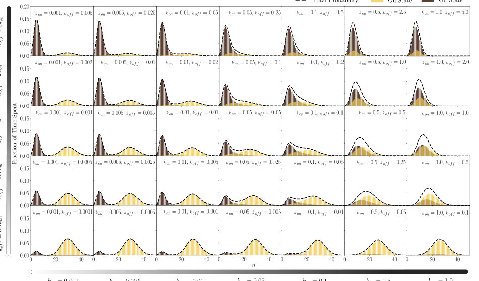
<figcaption class="paper-figure-caption"><b>Fig 3.</b> FIG. 3: Steady-state probability distributions across the different switching rates. Each panel shows the exact analytical steady-state distributions for the ON state (Pn, yellow), OFF state (Qn, brown), and the total probability (ψn = Pn + Qn, black dashed curve), computed from Eqs. 5–6. The base switching rate kon increases along the horizontal axis (left to right), and the switching bias koff/kon increases along the vertical axis (bottom to top). Parameters are fixed at αon = 3.0, αoff = 1.0, βon = 0.1, βoff = 0.2, giving intrinsic levels ϕon = 30.0 and ϕoff = 5.0.</figcaption>
</figure>
<figure class="paper-figure-card">
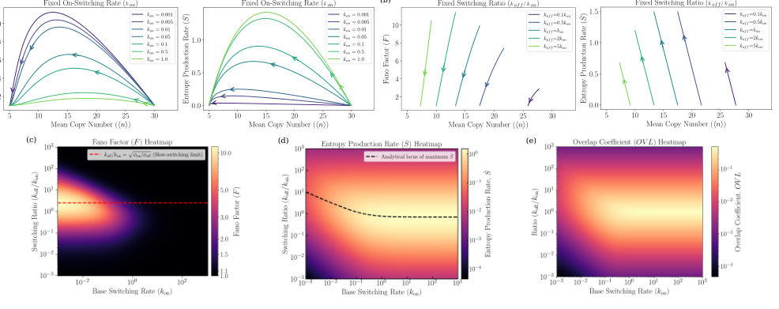
<figcaption class="paper-figure-caption"><b>Fig 4.</b> FIG. 4: Variation of Fano factor and EPR. (a) Fano factor F (left sub-panel) and entropy production rate ˙S (right sub-panel) plotted against the mean copy number ⟨n⟩as parametric curves, with the base switching rate kon fixed and the bias koff/kon is varied (arrows indicate the direction of increasing koff). Each curve traces a characteristic curve: at extreme bias one state dominates, the distribution is near-Poissonian, and both F ≈1 and ˙S ≈0; at intermediate bias both states are substantially occupied, F and ˙S reach their respective maxima. (b) Fano factor F (left sub-panel) and EPR ˙S (right sub-panel) plotted with the switching ratio koff/kon fixed and both kon and koff are varied...</figcaption>
</figure>

**Summary.** This theoretical work analyzes molecular accumulation in a system that stochastically switches between two activity states. By deriving exact analytical solutions, the authors quantify how kinetic parameters control the resulting molecular distribution, noise level (Fano factor), and thermodynamic dissipation (EPR). This framework provides deep insights into non-equilibrium stochastic processes applicable across biology and physics.

**Why it may be interesting.** The rigorous application of non-equilibrium thermodynamics (EPR) and fluctuation analysis (Fano factor) to a stochastic switching model provides a powerful, generalizable framework for analyzing non-equilibrium dynamics in complex systems, relevant to open quantum systems modeling.

Detailed structure

**Main problem.** The paper investigates the thermodynamic and statistical signatures of changes in molecular concentration distributions caused by stochastic switching between two distinct activity states.

**Main result.** The study establishes a generalized framework showing how kinetic parameters dictate molecular distributions, noise (Fano factor), and dissipation (Entropy Production Rate) during these stochastic transitions.

**Method.** The authors use the Chemical Master Equation (CME) formalism, employing Probability Generating Functions (PGF) to derive exact analytical expressions for steady-state properties.

**Model / system.** The model is a generalized two-state promoter switching system for mRNA accumulation, where the copy number dynamics are governed by state-dependent stochastic production and degradation rates.

**Key observables.** Steady-state probability distribution, Mean concentration, Fano factor (noise measure), and Entropy Production Rate (EPR/dissipation).

**Important parameters / regimes.** Stochastic switching rates ($k_{on}, k_{off}$), state-dependent production/degradation rates ($\alpha, eta$), and the resulting kinetic regimes (fast vs. slow switching).

**Assumptions / limitations.** The analysis assumes first-order degradation kinetics and utilizes the CME framework to track the joint probability distribution across the two states.

**Figures summary.** Figures illustrate the conceptual state switching, the joint state space, representative stochastic trajectories showing relaxation, and heatmaps mapping Fano factor and EPR across varying switching rates.

**Paper structure.** The paper proceeds by deriving exact analytical expressions for the steady-state distribution and key metrics using PGFs, followed by characterizing how these metrics vary across the parameter space by varying the switching rates to identify specific physical regimes.

Abstract

Stochastic switching between gene expression states, coupled with production and degradation dynamics, governs the accumulation of mRNA and proteins in cells. The concentrations of these accumulated entities dictate the phenotypic distribution of genetically identical cells. The underlying accumulation dynamics are well-captured by a two-state promoter switching model, with statistical and thermodynamic properties quantified via the Fano factor and entropy production rates. However, how these measures correlate with concentration distributions and their shifts under varying kinetic parameters remains largely unexplored. To this end, we use chemical master equations to study a generalized model of mRNA accumulation dynamics in the presence of stochastic switching between two activity states and state-dependent production and degradation rates. We derive exact expressions for the steady-state probability distribution and analytically compute the mean concentration, Fano factor, and entropy production rate (EPR). Simplifying these expressions, we identify contributions arising from stochastic switching rates and relaxation dynamics toward equilibrium in each activity state. Next, using our theoretical results, we characterize the variation in the Fano factor and EPR as a function of mean expression during modality changes of the distributions mediated by the variation of switching rates. We also identify the conditions in kinetic parameters that achieve the highest Fano factor and entropy production rates. Our findings establish a generalized framework for examining stochastic accumulation dynamics, clarifying how kinetic parameters dictate molecular distributions, noise, and dissipation. These insights extend readily to broader contexts coupling stochastic switching with accumulation, including protein burst dynamics, phenotype-switching-mediated drug intake, and queuing theory.

[↑ back to top](#top)

### [Image recognition based on optical spike processing with exciton-polaritons](http://arxiv.org/abs/2609.09939v1)

**Authors:** Olgierd Jeziorski, Jakub Rogala, Krzysztof Tyszka  
**Type:** theory · **Category:** disordered systems and neural networks · **PDF:** <https://arxiv.org/pdf/2609.09939v1>  
**Analysis basis:** full PDF text, analyzed in chunks
**Topic relevance:** `analog quantum simulation` **3/5** · `driven-dissipative phase transition` **3/5** · `methods for driven-dissipative` **3/5** · `Tavis-Cummings & cavity-many-emitter` **2/5** · `Keldysh / 2PI / non-Gaussian methods` **1/5** · `correlated / nonlocal dissipation` **1/5** · `non-equilibrium universality` **1/5**

↔ Scroll figures horizontally

<figure class="paper-figure-card">
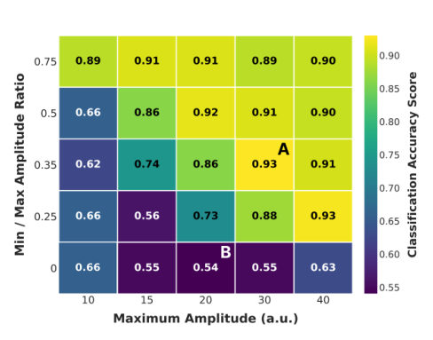
<figcaption class="paper-figure-caption"><b>Fig 1.</b> Fig. 1 shows a diagonal region of optimal performance. Performance degrades outside this regime due to two failure modes:</figcaption>
</figure>
<figure class="paper-figure-card">

<figcaption class="paper-figure-caption"><b>Fig 2.</b> Fig. 6 compares the classification accuracy across four distinct models: a base linear model trained on raw pixels, a model using pure condensate features, a combined model using condensate features concatenated with raw pixels, and a Feed-Forward Network (FFN). In the combined model, the N-dimensional temporal feature vector extracted from the condensate is concatenated directly with the original M-dimensional raw pixel array, extending the</figcaption>
</figure>
<figure class="paper-figure-card">

<figcaption class="paper-figure-caption"><b>Fig 3.</b> Fig. 9 illustrates the classification performance when raw pixel data is combined with the condensate features. Re- markably, the accuracy remains stable and high across all tested values of N for both the 10-digit and 2-digit tasks. This highlights a critical practical advantage: while capturing the fine details of standalone linear processing requires high temporal resolution, the most beneficial nonlinear processing occurs over longer, macroscopic timescales. As a result, the system can utilize the condensate’s powerful nonlinear pro-</figcaption>
</figure>

**Summary.** This work demonstrates image recognition using the transient dynamics of exciton-polariton condensates, proposing a fully optical neuromorphic computing platform. By encoding images as optical pulses, the system's nonlinear response generates rich temporal features that achieve high classification accuracy. This validates the use of polariton dynamics for ultrafast, nonlinear information processing.

**Why it may be interesting.** It demonstrates a direct application of nonlinear, non-equilibrium many-body physics (polariton dynamics) to solve a complex computational problem (image recognition), providing a blueprint for optical computation.

Detailed structure

**Main problem.** The paper addresses the need for fully optical, energy-efficient, and fast neuromorphic computing systems, specifically for image recognition, to overcome limitations of classical architectures.

**Main result.** Exciton-polariton dynamics can be effectively utilized to perform image recognition with high accuracy (up to 93.2%) by extracting useful nonlinear temporal features.

**Method.** The MNIST dataset is encoded into time-varying optical pulse sequences that drive the dynamics of an exciton-polariton condensate, and the resulting temporal features are fed into a linear classifier.

**Model / system.** The physical system is an exciton-polariton condensate in semiconductor microcavities. The dynamics are modeled by coupled ordinary differential equations describing the condensate population, active reservoir, and inactive reservoir.

**Key observables.** Classification accuracy, condensate density $n_C(t)$, and the resulting feature vector derived from temporal integration.

**Important parameters / regimes.** Optimal operational parameters ($\Delta t \approx 30 	ext{ ps}$, width $\approx 5 	ext{ ps}$), and the comparison between optimal, under-stimulated, and saturated operational regimes.

**Assumptions / limitations.** The analysis uses a single-mode approximation focusing only on temporal evolution, and the MNIST dataset is noted as being largely linearly separable.

**Figures summary.** Figures illustrate the optimal regime showing strong nonlinear spiking, contrasting with under-stimulated (noisy) and saturated (linear) regimes. Accuracy comparisons show the combined feature set outperforms raw pixels and FFNs.

**Paper structure.** The paper first establishes the physical model and dynamics, then details the data encoding process, followed by presenting the classification results comparing various feature sets and operational regimes.

Abstract

Exciton-polariton condensates combine ultrafast dynamics with strong optical nonlinearities, making them promising for optical neuromorphic computing. Here, we numerically demonstrate image recognition using the transient response of an exciton-polariton condensate. Downscaled MNIST images are encoded as optical pulse sequences, and the resulting condensate dynamics are sampled and processed by a linear classifier. For ten-class classification, condensate features achieve 92.2% accuracy, compared with 91.4% for raw-pixel linear classification. Combining both feature sets increases the accuracy to 93.2%. For the challenging binary classification of digits 7 and 9, the combined model reaches 97.3%, exceeding both the linear (95.5%) and feed-forward neural-network (96.6%) baselines. These results demonstrate that polariton dynamics can extract useful nonlinear features for ultrafast optical information processing.

[↑ back to top](#top)

### [Topological instability and reentrant crystallization in active solids](http://arxiv.org/abs/2609.09500v1)

**Authors:** Zory Davoyan, Aditya Jha, Anton Souslov  
**Type:** theory · **Category:** statistical mechanics · **PDF:** <https://arxiv.org/pdf/2609.09500v1>  
**Analysis basis:** full PDF text, analyzed in chunks
**Topic relevance:** `driven-dissipative phase transition` **3/5** · `non-equilibrium universality` **3/5** · `Keldysh / 2PI / non-Gaussian methods` **2/5** · `methods for driven-dissipative` **2/5** · `Frenkel-Kontorova` **1/5** · `analog quantum simulation` **1/5** · `correlated / nonlocal dissipation` **1/5** · `quantum measurements` **1/5**

↔ Scroll figures horizontally

<figure class="paper-figure-card">
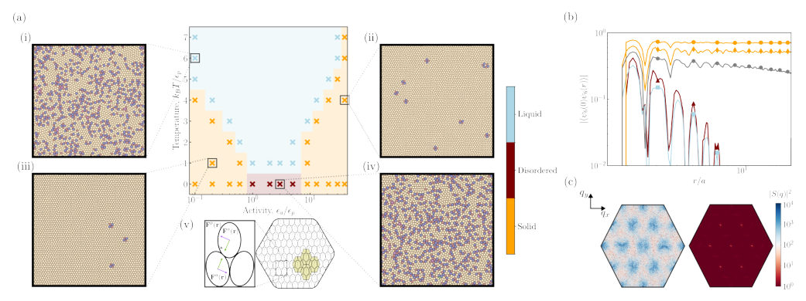
<figcaption class="paper-figure-caption"><b>Fig 1.</b> FIG. 1. (a) Numerical phase diagram of the odd Cosserat solid. The activity is defined as the ratio between the strengths of the microscopic nonconservative and conservative forces, ϵa and ϵp, respectively. The molecular dynamics simulations were performed for a total of 104 particles interacting with conservative Gay-Berne forces with an aspect ratio of ∼1.2. Activity was introduced through nonconservative pairwise chiral forces with spherical symmetry. Further details of the simulation procedure are given in End Matter. (i)-(iv) Snapshots of Voronoi diagrams showing the prevalence of blue (7-fold) and red (5-fold) defects for various values of activity and temperature. (v) Schematic of...</figcaption>
</figure>
<figure class="paper-figure-card">
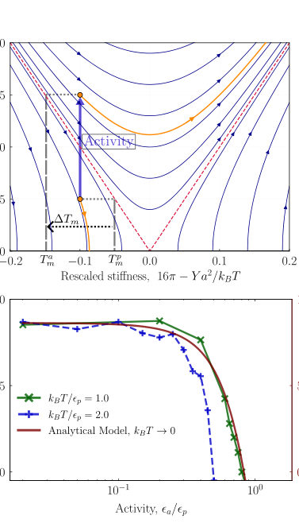
<figcaption class="paper-figure-caption"><b>Fig 2.</b> FIG. 2. (a) Renormalization group flow of the active Cosserat solid to linear order in activity. The active stresses provide a tuning parameter for the bare defect fugacity driving melt- ing transitions at otherwise stable parameter values. (b) A comparison of the analytical core energy and the rate of de- fect creation in simulations. Each data point is the average number of defects, N, observed over 104 simulation time steps and N0 is the number of defects observed at the spontaneous destabilization point. The expression for the analytical model is the zero-temperature limit −α2(log ma/2 + ˜γ) + C. C is a constant such that the core energy at ϵa/ϵp = 0 coincides with the numerical values,...</figcaption>
</figure>

**Summary.** This work analyzes the melting transition in active solids by extending defect-mediated theories to include non-reciprocal and micropolar elastic effects. The key finding is the prediction of a 'topological instability' mechanism at strong activity, leading to reentrant crystallization. This suggests that activity can stabilize quasi-long-range order in ways not predicted by equilibrium statistical mechanics.

**Why it may be interesting.** The concept of topological instability driven by non-equilibrium activity provides a novel, non-equilibrium route to phase transitions, which has parallels in driven quantum many-body systems.

Detailed structure

**Main problem.** The paper investigates the melting mechanism in active solids, extending KTHNY theory to include non-reciprocal elasticity and micropolar coupling.

**Main result.** Strong non-reciprocity leads to a topological instability mechanism for 2D melting, which surprisingly results in reentrant crystallization where quasi-long-range order persists above the equilibrium melting temperature.

**Method.** The authors employ a combination of field theory, Renormalization Group (RG) analysis, and simulations to characterize defect-mediated transitions.

**Model / system.** The system is an active solid modeled by a continuum theory incorporating micropolar degrees of freedom and odd elasticity. The dynamics are governed by overdamped equations of motion.

**Key observables.** Hexatic order parameter ($\psi_6$), structure factor peaks, defect-pair fugacity, and renormalized elastic moduli.

**Important parameters / regimes.** Non-reciprocity strength, activity level ($\epsilon_a/\epsilon_p$), and core energy shift ($\Delta E_c$).

**Assumptions / limitations.** The theory relies on extending existing theories (KTHNY) and making approximations regarding the relaxation rates of different degrees of freedom.

**Figures summary.** Figures illustrate the phase diagram dependence on activity, the decay of the hexatic order parameter, and comparisons of structure factors between reentrant and equilibrium crystals.

**Paper structure.** The paper builds from extending the constitutive relations to include odd and micropolar terms, develops the defect interaction potential and RG flow equations, and finally analyzes the resulting phase transitions and reentrant behavior.

Abstract

We extend the KTHNY theory of defect-mediated melting in two dimensions to the case of active solids exhibiting both non-reciprocal (odd) elasticity and Cosserat (micropolar) coupling. For perturbatively small values of non-reciprocity, melting still proceeds via defect unbinding, but the melting temperature shifts due to activity. However, at a threshold value of non-reciprocity, we discover a qualitatively distinct mechanism for 2D melting, which we call topological instability. This melting occurs through the proliferation of defect pairs at any temperature. We use a combination of field theory and simulations to characterize this zero-temperature transition in terms of the defect-pair fugacity. Surprisingly, for higher activity values, we find reentrant crystallization, where the quasi-long-range order survives even at temperatures for which the equilibrium crystal would melt. Although active solids present one realization of this topological instability, we envision core-energy-driven defect proliferation as a generic and unexplored route for two-dimensional melting.

[↑ back to top](#top)

### [A machine-learned dynamical phase diagram of the one-dimensional nonlinear Schrödinger equation with quasiperiodic disorder and a static field](http://arxiv.org/abs/2609.10045v1)

**Authors:** Marcos Pérez  
**Type:** theory · **Category:** disordered systems and neural networks · **PDF:** <https://arxiv.org/pdf/2609.10045v1>  
**Analysis basis:** full PDF text, analyzed in chunks
**Topic relevance:** `analog quantum simulation` **3/5** · `methods for driven-dissipative` **3/5** · `driven-dissipative phase transition` **2/5** · `non-equilibrium universality` **2/5** · `Frenkel-Kontorova` **1/5** · `Keldysh / 2PI / non-Gaussian methods` **1/5** · `scars & prethermalization` **1/5**

↔ Scroll figures horizontally

<figure class="paper-figure-card">
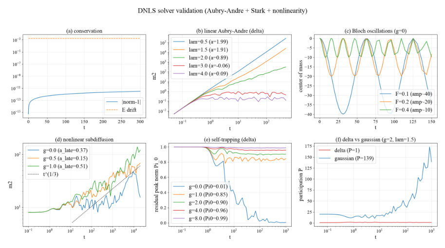
<figcaption class="paper-figure-caption"><b>Fig 1.</b> Figure 1: Solver validation: (a) norm and energy conservation; (b) the linear Aubry–Andr´e metal–insulator transition at λ = 2; (c) Bloch oscillations with center-of-mass amplitude 4/F; (d) interaction-induced destruction of quasiperiodic localization; (e) self-trapping of a delta state at strong interaction; (f) the delta-vs-Gaussian self-trapping contrast of Larcher, Dalfovo and Mod- ugno [6].</figcaption>
</figure>
<figure class="paper-figure-card">
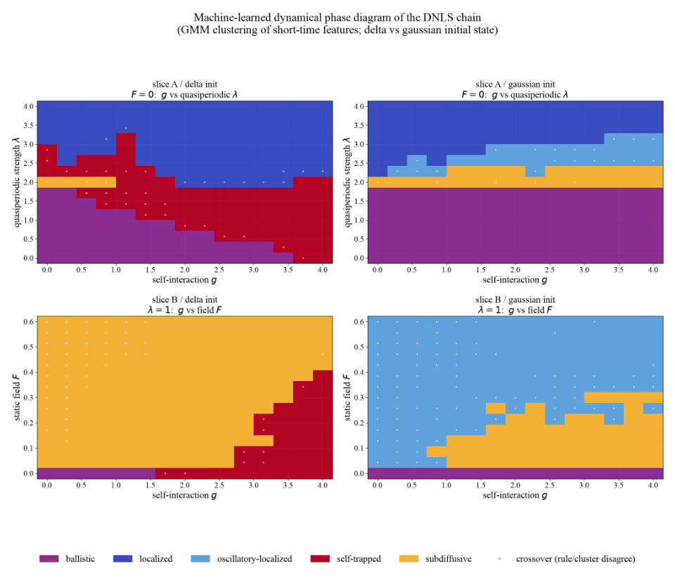
<figcaption class="paper-figure-caption"><b>Fig 2.</b> Figure 2: Machine-learned dynamical phase diagrams. Rows: slices A (F = 0, g vs. λ) and B (λ = 1, g vs. F). Columns: delta and Gaussian initial states. White dots mark crossover cells, where the per-point threshold rule disagrees with its cluster’s majority-vote name (Sec. 4.4).</figcaption>
</figure>
<figure class="paper-figure-card">
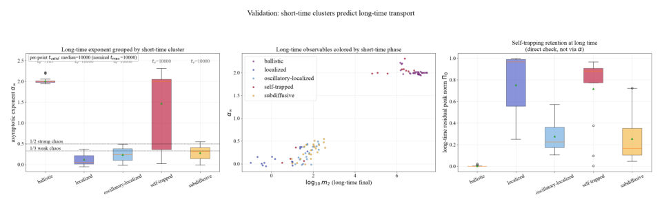
<figcaption class="paper-figure-caption"><b>Fig 3.</b> Figure 3: Validation against long-time ground truth. Left: asymptotic exponent α∞by short-time cluster (dashed lines mark the weak- and strong-chaos values 1/3 and 1/2; tv annotations give the median achieved tvalid per phase). Center: long-time (log10 m2, α∞) colored by short-time phase. Right: long-time residual peak norm Π0 by short-time cluster, the direct self-trapping check that does not rely on α∞.</figcaption>
</figure>
<figure class="paper-figure-card">

<figcaption class="paper-figure-caption"><b>Fig 4.</b> Figure 4: PCA of the standardized short-time feature matrix, by initial state (rows), with cluster identity colored (left) and PCA loadings (right).</figcaption>
</figure>
<figure class="paper-figure-card">

<figcaption class="paper-figure-caption"><b>Fig 5.</b> Figure 4 shows the first two principal components of the standardized feature matrix, which together capture most of its variance (66%+19% delta, 80%+12% gaussian). PC1 is dominated by the delocalization block (αm2, log m2, log P, growth) and PC2 by the retention/oscillation block (peak- drop, Bloch score, center-of-mass). The two physically independent axes, “how far/fast” and “what stayed behind”, emerge from the clustering without being hand-specified, even though the cluster names are (Sec. 4.4). The self-trapped cluster in the delta panel visibly splits into two PC1- separated clouds, the geometric signature of the α∞bimodality quantified in Sec. 5.3.</figcaption>
</figure>

**Summary.** This work develops a machine-learning framework to map the dynamical phase diagram of a nonlinear wave equation with quasiperiodic disorder. By using short-time simulations and clustering, the authors efficiently delineate five distinct transport regimes. The results reveal crucial differences in dynamics based on the initial state, providing quantitative phase boundaries for understanding wave packet evolution in complex quantum media.

**Why it may be interesting.** The combination of nonlinear dynamics, quasiperiodic disorder, and machine learning to map high-dimensional phase spaces is highly relevant for understanding complex quantum many-body systems where direct simulation is intractable.

Detailed structure

**Main problem.** The paper aims to map the complex dynamical phase diagram of a wave packet evolving under a nonlinear Schrödinger equation subjected to quasiperiodic disorder and a static field.

**Main result.** Five distinct transport regimes (ballistic, localized, subdiffusive, etc.) are identified, and the study highlights a striking contrast in behavior between delta and Gaussian initial states.

**Method.** It employs a computationally efficient strategy using short-time simulations combined with Gaussian-mixture clustering to partition the parameter space, followed by validation using long-time asymptotic simulations.

**Model / system.** The system is modeled by the one-dimensional discrete nonlinear Schrödinger (Gross-Pitaevskii) equation, incorporating a quasiperiodic Aubry-André potential and a static (Stark) field. The dynamics are studied for two initial conditions: a delta function and a Gaussian wave packet.

**Key observables.** Spreading exponent ($\alpha_\infty$), long-time residual peak norm ($\Pi_0$), second moment ($m_2$), and participation number ($P$).

**Important parameters / regimes.** Self-interaction strength ($g$), static field ($F$), and quasiperiodic strength ($\lambda$).

**Assumptions / limitations.** The physical identity of the clusters is assigned semi-supervisingly using hand-calibrated rules, as the clustering itself is unsupervised.

**Figures summary.** Figures display space-time density portraits and the evolution of the second moment ($m_2(t)$) for representative points across the identified dynamical regimes.

**Paper structure.** The paper first introduces the physical model and the computational bottleneck. It then details the machine-learning approach (short-time feature extraction and clustering) and validates the resulting phase map against long-time asymptotic simulations, concluding with specific regime analyses for different initial states.

Abstract

We map the transport regimes of a wave packet evolving under the one-dimensional discrete nonlinear Schrödinger (Gross-Pitaevskii) equation with a quasiperiodic Aubry-André potential and a static (Stark) field, as a function of self-interaction $g$, field $F$, and quasiperiodic strength $λ$, for two initial states (delta and Gaussian). Instead of one expensive long-time simulation per grid point, we run 3600 short simulations, reduce each to eight dynamical features, and cluster parameter space with a Gaussian mixture model. Clustering finds the boundaries between regimes unsupervised; each cluster's name is then assigned by a hand-calibrated rule, and an ablation shows clustering measurably smooths those boundaries rather than merely relabeling them. The five resulting regimes (ballistic, localized, oscillatory-localized, subdiffusive, and self-trapped) are validated against 100 long runs on a lattice eight times larger than the short sweep, so the validation window is longer than the training window even for the fastest-spreading regime. The short-time clusters predict the long-time asymptotic spreading exponent ($α_\infty = 2.01\pm0.07$ ballistic, $0.28\pm0.16$ subdiffusive, consistent with the weak-chaos prediction $α=1/3$) and, independently, a long-time retention $Π_0=0.72\pm0.32$ for the self-trapped cluster, whose exponent alone is not diagnostic. The initial-state contrast is striking: the delta state develops a broad self-trapping wedge (onset at $g=3.907\pm0.017$ at $λ=0$) that invades the ballistic and localized regions as $g$ grows, while the Gaussian state shows no self-trapping, instead opening a subdiffusive corridor along the Aubry-André critical line that widens with $g$. The scheme yields a full $15\times15$ phase map in minutes per slice, where direct asymptotic simulation ($t\gtrsim10^6$ per point) is prohibitive.

[↑ back to top](#top)

### [Quench dynamics in nonreciprocal Aubry-André-Harper model](http://arxiv.org/abs/2609.10342v1)

**Authors:** Zhiyu Pei, Yongxu Fu, Gao Xianlong  
**Type:** theory · **Category:** disordered systems and neural networks · **PDF:** <https://arxiv.org/pdf/2609.10342v1>  
**Analysis basis:** full PDF text, analyzed in chunks
**Topic relevance:** `driven-dissipative phase transition` **3/5** · `non-equilibrium universality` **3/5** · `analog quantum simulation` **2/5** · `methods for driven-dissipative` **2/5** · `Frenkel-Kontorova` **1/5** · `Keldysh / 2PI / non-Gaussian methods` **1/5** · `scars & prethermalization` **1/5**

↔ Scroll figures horizontally

<figure class="paper-figure-card">
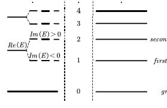
<figcaption class="paper-figure-caption"><b>Fig 1.</b> FIG. 1: 1D nonreciprocal AAH model. (a) Complex en- ergy spectrum as a function of λ at δ = 0.5 for N = 233. (b) Phase diagram of the mean inverse participation ra- tio (MIPR) in the λ–δ plane for N = 233, where the color encodes the localization strength. (c) Parity-sorting scheme: in the extended phase (λ &lt; 2 + 2δ), eigenstates are ordered by ReE in ascending order, then by ImE for degenerate real parts; even (odd) indices correspond to positive (negative) imaginary parts.</figcaption>
</figure>
<figure class="paper-figure-card">
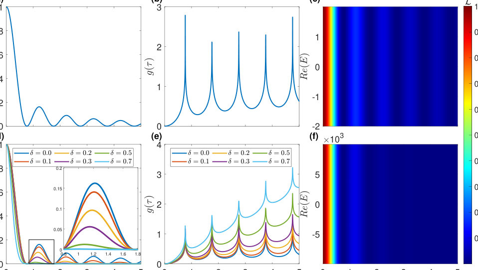
<figcaption class="paper-figure-caption"><b>Fig 2.</b> FIG. 2: Time-resolved quench dynamics between the strongly localized and deeply extended limits. (a)-(c) Quenches from the deeply extended state (λ = 0) to the strongly localized one (λ →∞). (d)-(f) Quenches from the strongly localized to the deeply extended state. (a), (b) Analytical results for Loschmidt echo L(τ) and the corresponding rate function g(τ) at δ = 0.2. (d), (e) Analytical results for L(τ) and the rate function g(τ) for multiple values of δ. (c), (f) Numerical L(τ) from the full spectrum of the initial Hamiltonian, demonstrating the energy-independent behavior for N = 233.</figcaption>
</figure>
<figure class="paper-figure-card">

<figcaption class="paper-figure-caption"><b>Fig 3.</b> FIG. 3: Time-resolved quench dynamics starting from a deeply extended initial state (λi = 0). The vertical axis denotes the eigenstate index sorted according to the scheme in Fig. 1(c), and the horizontal axis represents the evolution time τ. The system is quenched from λi = 0 to (a) λf = 2 (extended phase), (b) λf = 3 (critical regime), and (c) λf = 5 (localized phase). To emphasize the distinction between even- and odd-index eigenstates, the contributions in (a)-(c) are replotted separately in (d)-(f) and (g)-(i) for the even and odd sectors, respectively. The region near the dashed lines corresponds to the gap of the postquench Hamiltonian. The region near the dashed lines corresponds to...</figcaption>
</figure>
<figure class="paper-figure-card">

<figcaption class="paper-figure-caption"><b>Fig 4.</b> FIG. 4: Time-resolved quench dynamics starting from a strongly localized initial state (λi = 10000). The system is quenched from λi = 10000 to (a) λf = 2 (extended phase), (b) λf = 3 (critical regime), and (c) λf = 5 (localized phase). Same notation and line styles as in Fig. 3, with δ = 0.5 and N = 233.</figcaption>
</figure>
<figure class="paper-figure-card">

<figcaption class="paper-figure-caption"><b>Fig 5.</b> FIG. 5: Diffusion dynamics in the nonreciprocal AAH model. (a) Phase diagram of the diffusion exponent β in the λ-δ plane, colored by β, which divides the phase di- agram into four distinct regions: (I) localized phase, (II) critical phase, (III) reciprocal diffusive phase, and (IV) nonreciprocal diffusive phase. (b) Wavepacket spreading σ(τ) at δ = 0.5, for representative λ values along the dashed line in (a): λ = 0 (deeply diffusive phase), λ = 2 (diffusive phase), λ = 3 (critical phase), and λ = 4 (lo- calized phase). Insets show the double-logarithmic fits of log σ(τ) versus log τ, where the slope gives the diffusion exponent β. The system size is N = 233.</figcaption>
</figure>

**Summary.** This work analyzes quench dynamics in the nonreciprocal Aubry-André-Harper model, revealing that nonreciprocity fundamentally alters transport properties. By studying wavepacket diffusion and DQPTs, the authors show that the critical phase becomes ballistic, contrasting sharply with the Hermitian case. This establishes nonreciprocity as a key mechanism for controlling quantum transport in quasiperiodic systems.

**Why it may be interesting.** The findings provide a detailed understanding of how non-Hermiticity and nonreciprocity fundamentally alter transport regimes (e.g., promoting ballistic transport at criticality) compared to standard Hermitian models, which is crucial for designing quantum devices.

Detailed structure

**Main problem.** The study investigates anomalous transport properties and dynamical quantum phase transitions (DQPTs) in nonreciprocal quasiperiodic systems.

**Main result.** Nonreciprocity reverses the standard transport hierarchy, causing the critical phase to become ballistic ($eta=1$) while suppressing transport in the delocalized phase.

**Method.** The analysis combines the study of DQPTs using the biorthogonal Loschmidt echo and characterizing wavepacket diffusion via the long-time scaling exponent ($eta$) of the root-mean-square displacement.

**Model / system.** The system is the one-dimensional nonreciprocal Aubry-André-Harper (AAH) model, characterized by non-Hermitian hopping terms ($t_R 
eq t_L$) and a quasiperiodic potential.

**Key observables.** Diffusion exponent $eta$ ($\sigma(	au) \propto 	au^eta$), Loschmidt echo $L(	au)$, and the energy-resolved nature of DQPTs.

**Important parameters / regimes.** Nonreciprocity parameter $\delta$, quasiperiodic potential strength $\lambda$, and the golden ratio $\alpha$.

**Assumptions / limitations.** The analysis relies on classifying the energy spectrum using a parity-sorted scheme that encodes generalized $\mathcal{PT}$ symmetry.

**Figures summary.** Figures illustrate the complex energy spectrum, the phase diagram based on Mean Inverse Participation Ratio (MIPR), and quench dynamics comparing perturbative and numerical results for even/odd states.

**Paper structure.** The paper develops two complementary diagnostic tools: energy-resolved DQPT analysis using parity-sorted spectra, and the $eta$-phase diagram derived from wavepacket diffusion, both highlighting the role of nonreciprocity.

Abstract

The critical phase of a non-Hermitian quasicrystal can support stronger transport than its surrounding delocalized phase. We demonstrate this anomalous behavior in the one-dimensional nonreciprocal Aubry-André-Harper model through a combined study of dynamical quantum phase transitions (DQPTs) and wavepacket diffusion. Using a parity-sorted energy-spectrum classification that directly encodes the generalized $\mathcal{PT}$ symmetry, we find that DQPTs in this system are energy-resolved, in contrast to the energy-independent DQPTs of Hermitian quasicrystals. The energy-resolved features are most pronounced when the initial and final Hamiltonians belong to different phases (localized or extended), and they are tied to the even-odd index structure of the spectrum, which we exploit to organize the quench-dynamical landscape. For wavepacket dynamics after a single-site quench, the diffusion exponent $β$, extracted from the long-time power-law scaling of the root-mean-square displacement $σ(τ)$, partitions the phase diagram into four distinct regimes. In the Hermitian limit the extended phase is ballistic ($β=1$), the critical phase is normally diffusive ($β=0.5$), and the localized phase yields $β\to 0$. Nonreciprocity reverses this hierarchy: the extended phase becomes normally diffusive, while the critical phase turns ballistic. We trace the anomalous $β=1$ at criticality to the self-similar multifractal structure of the critical eigenstates, whose nodal positions are organized by the golden ratio. A finite-size scaling ansatz built on the wave-front propagation yields $σ(τ)\proptoτ$. The parity-resolved DQPTs and the $β$-phase diagram establish two complementary dynamical diagnostics of nonreciprocal quasicrystals, in which nonreciprocity promotes transport at the critical point and suppresses it in the delocalized phase.

[↑ back to top](#top)

### [Intermittent continuous-time random walks under renewal reset mechanism](http://arxiv.org/abs/2609.09738v1)

**Authors:** Guohua Li, Hong Zhang, Yuexiong Liu  
**Type:** theory · **Category:** statistical mechanics · **PDF:** <https://arxiv.org/pdf/2609.09738v1>  
**Analysis basis:** full PDF text, analyzed in chunks
**Topic relevance:** `non-equilibrium universality` **3/5** · `Keldysh / 2PI / non-Gaussian methods` **2/5** · `methods for driven-dissipative` **2/5** · `analog quantum simulation` **1/5** · `correlated / nonlocal dissipation` **1/5** · `driven-dissipative phase transition` **1/5** · `quantum measurements` **1/5** · `scars & prethermalization` **1/5**

↔ Scroll figures horizontally

<figure class="paper-figure-card">

<figcaption class="paper-figure-caption"><b>Fig 1.</b> Figure 1: Results of Monte-Carlo simulations (symbols) versus the analytical solutions (solid curves) for the shape (78) of the stationary state (removed the last item containing the generalized function δ(x)) in panel (a) and the MSDs (79) in panel (b) for the intermittent CTRWs with exponential distributed jump length (67) for the exponential jump and reset WTDs (29). The simulation results were plotted at the diffusion time t = 100 (including simulation for the shape of the stationary state) and averaged over N = 105 trajectories of the particles. In panel (c) the analytical results of MFAT (81) at the target position x0 = 5 as the parameter λs varies to show the existence of its minimum...</figcaption>
</figure>
<figure class="paper-figure-card">

<figcaption class="paper-figure-caption"><b>Fig 2.</b> Figure 2: The analytical solutions for the shape (84) of the stationary state (removed the last item containing the generalized function δ(x)) in panel (a) and the MSDs (85) in panel (b) for the intermittent CTRWs with power-law jump WTD and exponential reset WTD. In panel (c) the analytical results of MFAT (88) at the target position x0 = 8 as the reset parameter λs varies. The values of relevant model parameters are provided in the legend.</figcaption>
</figure>
<figure class="paper-figure-card">

<figcaption class="paper-figure-caption"><b>Fig 3.</b> Figure 3: The distribution in non-equilibrium stationary state (90)(removed the last item con- taining the generalized function δ(x)) in panel (a) and the MSDs (91) in panel (b) for the intermittent CTRWs with power-law reset WTD. In panel (c) the analytical results of MFAT (93) at the target position x0 = 5 as the reset power-law distribution exponent α varies. The values of relevant model parameters are provided in the legend.</figcaption>
</figure>
<figure class="paper-figure-card">

<figcaption class="paper-figure-caption"><b>Fig 4.</b> Figure 4: The stationary distribution (95) in panel (a) and the MSD (96) in panel (b) of the intermittent CTRW with the power-law jump and reset WTDs. The values of relevant model parameters are provided in the legend.</figcaption>
</figure>
<figure class="paper-figure-card">
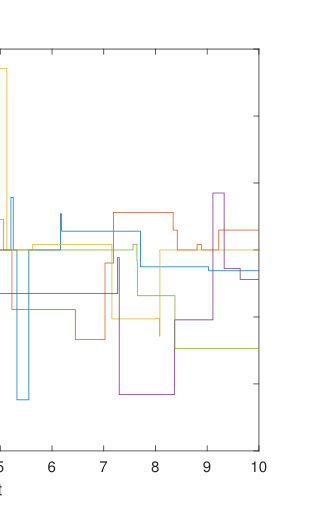
<figcaption class="paper-figure-caption"><b>Fig 5.</b> Figure 5: The particle trajectories of intermittent CTRW under stochastic resetting to original position. The exponential jump and reset WTDs with frequency parameters λd = 1.2 and λs = 0.4 individually and the Gaussian distributed jump length with standard deviation σ = 1.</figcaption>
</figure>

**Summary.** This paper analyzes Intermittent Continuous-Time Random Walks (CTRWs) where movement is governed by a competition between random jumps and resets. It derives the governing equations and proves the existence of non-equilibrium stationary states. The work quantifies search efficiency by calculating the Mean First Arrival Time, showing the model's applicability to physical scenarios like animal foraging.

**Why it may be interesting.** The study of non-equilibrium steady states and search efficiency in disordered media using generalized random walk models has connections to open quantum systems dynamics and energy landscape exploration.

Detailed structure

**Main problem.** The paper investigates efficient search strategies in complex and disordered environments by modeling stochastic resetting.

**Main result.** It proves the existence of non-equilibrium stationary states and calculates the Mean First Arrival Time (MFAT) for intermittent Continuous-Time Random Walks (CTRWs) under a renewal reset mechanism.

**Method.** The analysis involves deriving and solving the governing equation and the Montroll-Weiss equation in Laplace and Fourier space for the particle density.

**Model / system.** The model is an Intermittent CTRW where the next event (jump or reset) is governed by the minimum of two independent waiting times, $	au = \min\{	au_d, 	au_s\}$, representing a competition mechanism.

**Key observables.** Mean Square Displacements (MSDs), Mean First Arrival Time (MFAT), and the stationary particle density.

**Important parameters / regimes.** The distributions of the jump and reset waiting times (e.g., exponential, power-law, Gaussian).

**Assumptions / limitations.** The system proceeds with new waiting times regardless of previous histories after a renewal event, and the jump/reset waiting times are independent.

**Figures summary.** Figures show the PDF of particles at the stationary state and the MSDs for various power-law jump and reset waiting time distributions.

**Paper structure.** The paper develops the governing equation and Montroll-Weiss equation for the renewal resetting mechanism, analyzes specific distributions (exponential, power-law), and calculates key metrics like MSD and MFAT.

Abstract

Stochastic resetting as a practical and efficient search strategy in complex and disordered environments has long been a topic of interest to researchers. Based on the competition between jumping and resetting, this article proposes and investigates intermittent continuous-time random walks (CTRWs) under stochastic resetting, using the smaller waiting time for jump and reset as the renewal time, where the waiting times for both jump and reset can have arbitrary distributions. After each renewal event, the system will proceed with new waiting times for jump and reset regardless of their previous histories. We study the governing equation and Montroll-Weiss equation with renewal resetting, as well as the Markovian resetting for intermittent CTRWs. We prove the existence of non-equilibrium stationary states within the renewal reset mechanism when the jump and reset waiting times follow any exponential and power law distributions. For exponential and Gaussian distributed jump lengths, we examine the mean square displacements (MSDs) of particles to determine their monotonicity and asymptotic stability. Moreover, we calculate the first-arrival time to quantify search efficiency, and validate the intermittent CTRWs under renewal resetting lead to a finite mean first-arrival time (MFAT) to any fixed position for exponential jump and reset waiting time distributions (WTDs), power-law jump and exponential reset WTDs, as well as exponential jump and power-law reset WTDs. However, the MFAT diverges for power-law jump and reset WTDs. The intermittent CTRW model, which is based on the competition mechanism, can be applied to many physical scenarios, such as the foraging strategy of animals that return to their nests after an unsuccessful foraging attempt, or the work planning of intelligent robots that return to energy replenishment points after prolonged operation.

[↑ back to top](#top)

### [Field quantization in rotating frames: coordinate covariance and the circular-detector response](http://arxiv.org/abs/2609.10390v1)

**Authors:** Sidney Natzuka Junior, Carlos Augusto Domingues Zarro, Matheus dos Santos Soares  
**Type:** theory · **Category:** other · **PDF:** <https://arxiv.org/pdf/2609.10390v1>  
**Analysis basis:** full PDF text, analyzed in chunks
**Topic relevance:** `quantum measurements` **3/5** · `Keldysh / 2PI / non-Gaussian methods` **2/5** · `Full counting statistics` **1/5** · `correlated / nonlocal dissipation` **1/5** · `driven-dissipative phase transition` **1/5** · `methods for driven-dissipative` **1/5** · `non-equilibrium universality` **1/5**

↔ Scroll figures horizontally

<figure class="paper-figure-card">
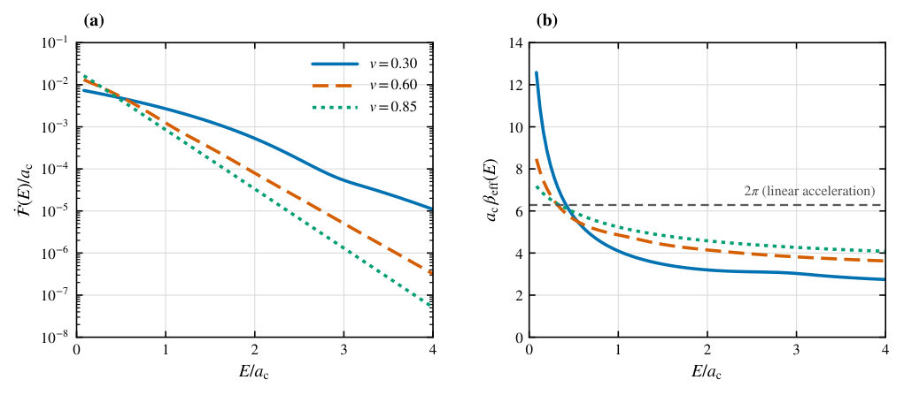
<figcaption class="paper-figure-caption"><b>Fig 1.</b> FIG. 1. Massless circular-detector response in the Minkowski vacuum, at fixed proper acceleration ac, computed from the Hadamard-subtracted expression (110). (a) The excitation rate ˙F(E)/ac, as a function of E/ac, is nonzero for E &gt; 0, but it is not a Planck spectrum. (b) The gap-dependent inverse temperature acβeff(E), with βeff(E) = E−1 ln[ ˙F(−E)/ ˙F(E)]. A KMS state would give a horizontal curve; 2π, the value for linear acceleration at the same proper acceleration, is shown only as a reference. Line color and dashing both identify the tangential speed.</figcaption>
</figure>

**Summary.** This paper rigorously analyzes quantum field quantization and detector response in rotating reference frames, comparing different mathematical formalisms. It establishes that even when the concept of a globally selected vacuum state breaks down due to the rotating geometry, a local detector still registers a measurable, non-thermal response to the vacuum fluctuations. This demonstrates a deep consistency between local measurements and global field theory concepts.

**Why it may be interesting.** This work is highly relevant to open quantum systems and quantum optics as it rigorously analyzes how local measurements (detector response) can reveal physical effects (like vacuum fluctuations) even when global symmetries or ground states are ill-defined due to non-inertial motion.

Detailed structure

**Main problem.** The paper provides a unified analysis of scalar-field quantization and detector response in relativistic rotating frames, comparing rigid and Trocheris-Takeno (TT) descriptions in unbounded Minkowski spacetime.

**Main result.** The authors show that while neither rotating time flow selects a global ground state, a circular Unruh-DeWitt detector in the Minkowski vacuum exhibits a stationary, non-thermal response, demonstrating consistency between vanishing Bogoliubov mixing and detector excitation.

**Method.** The analysis involves comparing quantization modes (rigid vs. TT) using Bogoliubov coefficients, calculating the detector response using Hadamard subtraction, and analyzing the spectral properties of the vacuum.

**Model / system.** The system is a real scalar field quantized in the Minkowski vacuum, coupled to a two-level Unruh–DeWitt detector. The analysis is performed in relativistic rotating frames, comparing different quantization formalisms.

**Key observables.** Bogoliubov beta coefficients, detector excitation rate spectrum, Minkowski Wightman function, and the detector response function.

**Important parameters / regimes.** The analysis is performed in the Minkowski vacuum, focusing on the comparison between inertial and rotating coordinate representations.

**Assumptions / limitations.** The analysis assumes the use of the Unruh–DeWitt detector model and focuses on the vacuum state in 3+1 dimensions.

**Paper structure.** The paper is structured around distinguishing three often-conflated issues: state representation in rotating coordinates, selection of a global ground state by time evolution, and the detector response to the vacuum. It proceeds by showing that while the first two can fail, the third (detector response) remains non-zero and non-thermal.

Abstract

We provide a unified analysis of scalar-field quantization and detector response in relativistic rotating frames, comparing rigid and Trocheris-Takeno (TT) descriptions in unbounded Minkowski spacetime. We distinguish three questions that are often conflated: (i) how a fixed quantum state is represented in rotating coordinates, (ii) whether rotating time evolution selects a global ground state, and (iii) how a rotating detector responds to the vacuum. Coordinate-transformed rigid and TT modes span the same positive-frequency subspace as inertial modes: their Bogoliubov beta coefficients vanish and their mode sums reproduce the Minkowski Wightman function. Neither rotating time flow selects a global scalar ground state, although for different reasons: the rigid generator is not globally timelike and is unbounded below, whereas TT time translation is not a Killing symmetry. Nevertheless, a circular Unruh-DeWitt detector in the Minkowski vacuum has a stationary, nonzero response. We relate this response to negative corotating frequencies, evaluate it after an explicit Hadamard subtraction, and show that it is nonthermal. Thus vanishing Bogoliubov mixing, the absence of a symmetry-selected rotating vacuum, and detector excitation are mutually consistent.

[↑ back to top](#top)

### [Information-geometric bounds on nonequilibrium relaxation in quantum Markov dynamics](http://arxiv.org/abs/2609.09599v1)

**Authors:** Xiao-Kan Guo, Zhiqiang Huang  
**Type:** theory · **Category:** statistical mechanics · **PDF:** <https://arxiv.org/pdf/2609.09599v1>  
**Analysis basis:** full PDF text, analyzed in chunks
**Topic relevance:** `non-equilibrium universality` **3/5** · `Keldysh / 2PI / non-Gaussian methods` **2/5** · `methods for driven-dissipative` **2/5** · `correlated / nonlocal dissipation` **1/5** · `driven-dissipative phase transition` **1/5**

↔ Scroll figures horizontally

<figure class="paper-figure-card">

<figcaption class="paper-figure-caption"><b>Fig 1.</b> FIG. 1. Exact identity on the qutrit: the definition-based di- rect extraction ξdirect Q (complex-step mixed fourth derivative)</figcaption>
</figure>
<figure class="paper-figure-card">
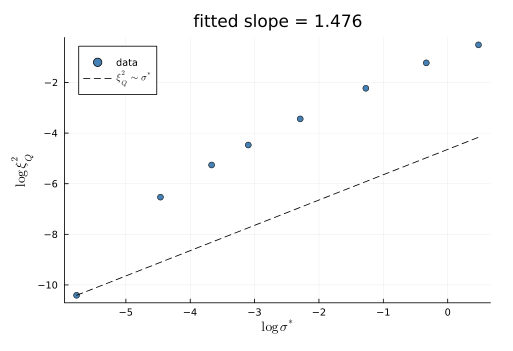
<figcaption class="paper-figure-caption"><b>Fig 2.</b> FIG. 4. Drive scaling: log ξ2 Q versus log σ∗for Ωd ∈[0.05, 1.2]</figcaption>
</figure>
<figure class="paper-figure-card">
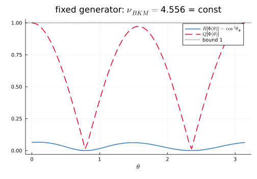
<figcaption class="paper-figure-caption"><b>Fig 3.</b> FIG. 2. Normalized ratio at fixed generator: R[Φ(θ)] = cos2 θΦ and Q[Φ(θ)] = 2|ξQ|/(ϵ2νBKM∥Φ∥2π) along the family con- necting the two eigendirections of [K‡, K] with eigenvalues ±νBKM; Q sweeps [0.013, 0.9999] while νBKM = 4.56 is con- stant.</figcaption>
</figure>
<figure class="paper-figure-card">

<figcaption class="paper-figure-caption"><b>Fig 4.</b> FIG. 3. Semiclassical entropy-production bound: his- togram of ξ2 Q/(4ϵ4T3Σ σ∗) over 128 perturbations of the two- dimensional anisotropic NESS; all values lie below 1 (maxi- mum 0.089).</figcaption>
</figure>

**Summary.** This work establishes a quantum information-geometric framework to bound the deviation from equilibrium during short-time relaxation in quantum Markov systems. By generalizing classical inequalities, the authors derive an exact identity linking the relaxation curvature correction to the commutator structure of the system's generator. This provides a powerful, general tool for analyzing non-equilibrium dynamics in quantum physics.

**Why it may be interesting.** It provides a rigorous, information-geometric framework for understanding non-equilibrium steady states, linking fundamental concepts like generator non-normality to measurable relaxation bounds.

Detailed structure

**Main problem.** The paper investigates the quantum information-geometric structure governing short-time nonequilibrium relaxation in quantum Markov dynamics.

**Main result.** It derives an exact identity showing the nonequilibrium curvature correction is related to the commutator of the dissipative and transport parts of the generator, and establishes a Cauchy-Schwarz bound for this correction.

**Method.** The analysis uses the von Neumann relative entropy as a quantum divergence, linearizes the dynamics around the steady state, and employs the Kubo-Mori map to define a BKM inner product.

**Model / system.** The study focuses on Quantum Markov Semigroups (QMS) dynamics, analyzing relaxation from a perturbed state towards a stationary state, and testing the results on qubit and qutrit models.

**Key observables.** Nonequilibrium correction to the short-time relaxation curvature ($\xi_Q$), BKM non-normality, and the ratio $R[\Phi]$ quantifying sector coupling.

**Important parameters / regimes.** Perturbation amplitude ($\epsilon$), temperature ($T$), and the full-rank nature of the stationary state.

**Assumptions / limitations.** The analysis is based on the quadratic expansion of the relative entropy and assumes the QMS has a full-rank stationary state.

**Figures summary.** Figures confirm the identity and the bound numerically for a 2D anisotropic NESS, showing the ratio $\xi^2_Q / (4\epsilon^4 T^3 \Sigma \sigma^*)$ remains below 1.

**Paper structure.** The paper develops the theory by generalizing classical inequalities, deriving the quadratic curvature identity using the BKM inner product, establishing the Cauchy-Schwarz bound, and verifying the results in various physical limits and models.

Abstract

In this paper, we study the quantum information-geometric structure underlying short-time nonequilibrium relaxation in quantum Markov dynamics, and derive bounds on the nonequilibrium correction to the short-time relaxation curvature. These bounds generalize the information-geometric structure underlying Auconi's classical nonequilibrium relaxation inequality to quantum Markov dynamics. We consider the von Neumann relative entropy as quantum divergence, and parametrize perturbations through the Kubo-Mori map, which converts the second-order expansion of the relative entropy into the Bogoliubov-Kubo-Mori (BKM) inner product at all temperatures. For a quantum Markov semigroup with full-rank stationary state, the induced tangent-space generator admits a canonical decomposition into a BKM-symmetric and a BKM-antisymmetric part, and the leading nonequilibrium curvature correction takes the exact form of the expectation of the commutator between the dissipative and the transport part of the generator. This correction is bounded by the product of a BKM-symmetric dissipative activity and a transport-sector activity. The bound is verified on a noncommuting qubit model and a driven-dissipative qutrit, and the full chain is confirmed numerically on a two-dimensional Fokker-Planck steady state. In the high-temperature and overdamped limit the quantum formula reduces to the position-space Fokker-Planck expression and reproduces Auconi's entropy-production bound with the correct temperature factor.

[↑ back to top](#top)

### [Split-Step Dirac Cellular Automata for Continuous-Time Dirac Dynamics on Finite Spatial Lattices](http://arxiv.org/abs/2609.09779v1)

**Authors:** Wei-Ting Wang, Pei-Ming Ho, Ching-Ray Chang  
**Type:** both · **Category:** quantum information and computing · **PDF:** <https://arxiv.org/pdf/2609.09779v1>  
**Analysis basis:** full PDF text, analyzed in chunks
**Topic relevance:** `QC/QI experiment` **3/5** · `analog quantum simulation` **3/5** · `methods for driven-dissipative` **2/5** · `interference shaping light` **1/5**

↔ Scroll figures horizontally

<figure class="paper-figure-card">
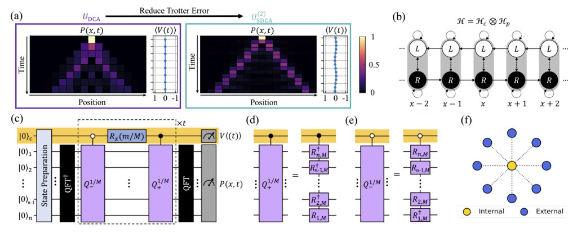
<figcaption class="paper-figure-caption"><b>Fig 1.</b> FIG. 1. (a) Comparison of DCA and SDCA through spacetime diagrams and velocity expectation values. The initial state of the particle is |Ψ(t = 0)⟩= 1 √</figcaption>
</figure>
<figure class="paper-figure-card">

<figcaption class="paper-figure-caption"><b>Fig 2.</b> FIG. 2. Comparison of Dirac dynamics simulated using the DCA and the SDCA (M = 2) against the exact continuous-time limit of a highly localized state |Ψ(0)⟩= (cos(θ/2)|0⟩c +eiϕ sin(θ/2)|1⟩c)⊗|x = 0⟩with mass m = π/8 on a finite spatial lattice. Top panels: Time evolution of the Pauli matrix expectation values (⟨σx⟩, ⟨σy⟩, ⟨σz⟩) and the entanglement entropy S with (a) θ = π/2, ϕ = 0, and (b) θ = π/2, ϕ = π/2. Bottom panels: Heatmaps displaying ⟨σz⟩and S at time step t = 5 as a function of the initial state angles θ and ϕ for the (c) exact continuous limit, (d) DCA, and (e) SDCA.</figcaption>
</figure>
<figure class="paper-figure-card">

<figcaption class="paper-figure-caption"><b>Fig 3.</b> FIG. 3. Experimental results of the DCA for a highly localized initial state. Top Panel: Comparison of results executed on heavy hexagon (ibm kingston) and square (ibm miami) lattice backends. (a) Two-qubit gate depth scaling for single-step DCA circuits as a function of the external space size n. Insets illustrate the physical connectivity graphs of the respective hardware topologies. (b) Time evolution of the three Pauli expectation values (⟨σx⟩, ⟨σy⟩, ⟨σz⟩) and the entanglement entropy (S) for the particle state |Ψ(0)⟩= |0⟩c ⊗|x = 0⟩with mass m = π/2. The insets show the specific physical qubit mappings on the devices. Bottom Panel: Performance comparison of standard unitary and dynamic...</figcaption>
</figure>
<figure class="paper-figure-card">

<figcaption class="paper-figure-caption"><b>Fig 4.</b> FIG. 4. Experimental results of the SDCA for a highly localized initial state executed on the ibm aachen quantum processor. (a) Time evolution of the internal space Pauli expectation values (⟨σx⟩, ⟨σy⟩, ⟨σz⟩) and the corresponding entanglement entropy (S) for the initial state |Ψ(0)⟩= |0⟩c ⊗|x = 0⟩with mass m = π/2. (b) and (c) Experimental spacetime probability diagrams, P(x, t) of the initial state |Ψ(0)⟩c = 1 √</figcaption>
</figure>
<figure class="paper-figure-card">

<figcaption class="paper-figure-caption"><b>Fig 5.</b> FIG. 5. The time-dependent functions (a) Fm(k, t) and (b) Gm(k, t) plotted over the Brillouin zone with t = 2. Both functions exhibit anti-symmetry under a k →k + π momen- tum shift.</figcaption>
</figure>

**Summary.** This paper introduces the Split-Step Dirac Cellular Automaton (SDCA) to overcome a fundamental limitation of standard DCA: artificial phase-matching symmetries that suppress key quantum interference effects. By employing a fractional-step evolution scheme, SDCA enables accurate simulation of continuous-time Dirac dynamics at fixed spatial resolution. The authors demonstrate this capability both analytically and experimentally on quantum processors, providing a practical tool for studying relativistic quantum physics on near-term quantum hardware.

**Why it may be interesting.** The work directly addresses the practical limitations of simulating relativistic quantum dynamics on current quantum hardware by proposing a method (SDCA) that enhances temporal resolution while keeping the spatial register fixed, which is crucial for many quantum simulation tasks.

Detailed structure

**Main problem.** Standard Dirac Cellular Automata (DCA) suffer from artificial phase-matching symmetries on finite grids, suppressing key interference phenomena like Zitterbewegung.

**Main result.** The proposed Split-Step DCA (SDCA) breaks this symmetry, successfully recovering continuous-time interference dynamics and allowing for improved temporal resolution on near-term quantum devices.

**Method.** The authors use a Trotterized fractional-step scheme in the momentum representation to implement SDCA, which is then benchmarked on actual IBM Quantum processors.

**Model / system.** The system models Dirac dynamics for a spin-1/2 particle on a finite spatial lattice. The Hamiltonian is related to the continuous Dirac equation, and the dynamics are approximated using both standard DCA and the novel SDCA.

**Key observables.** Zitterbewegung oscillations, entanglement entropy ($S$), and the expectation value of velocity ($\langle V 
angle$).

**Important parameters / regimes.** Fixed spatial discretization ($\delta x$) while improving temporal resolution ($\delta t$), and the number of fractional steps ($M$).

**Assumptions / limitations.** The standard DCA requires $\delta t = \delta x$, limiting temporal resolution; the SDCA implementation on NISQ devices requires managing trade-offs between circuit depth and error rates.

**Figures summary.** Figures compare spacetime diagrams and velocity expectation values for DCA vs. SDCA, showing SDCA recovers dynamics. Other figures detail quantum circuit implementations for QFT and show time evolution of observables on quantum hardware.

**Paper structure.** The paper first identifies the limitations of DCA due to phase-matching symmetries. It then introduces and details the SDCA formulation using fractional steps. The core of the work involves benchmarking SDCA by simulating observables (like entanglement entropy and velocity) on quantum hardware, comparing results against the continuous limit.

Abstract

Dirac Cellular Automata (DCA) provide a framework for simulating Dirac dynamics, yet the rigid coupling between spatial and temporal resolutions can introduce artificial phase-matching symmetries on finite grids that suppress interference phenomena such as Zitterbewegung. In this work, we propose a Split-Step Dirac Cellular Automaton (SDCA) that enables continuous-time Dirac evolution at fixed spatial discretization. By employing a Trotterized fractional-step scheme in the momentum representation, SDCA breaks the phase-matching cancellation present in the standard DCA and recovers the interference dynamics of the continuous-time limit. We benchmark the SDCA through analytical and numerical studies and demonstrate its implementation on IBM Quantum processors. Despite the increased circuit depth required for finer temporal resolution, the NISQ implementation reproduces the characteristic velocity oscillations and entanglement-entropy dynamics of the continuous-time model. We further investigate hardware-topology trade-offs and dynamic circuit implementations of the Quantum Fourier Transform (QFT), highlighting the competing effects of gate errors, measurement, and feed-forward latency. These results demonstrate that SDCA provides a practical framework for improving temporal resolution while maintaining a fixed spatial quantum register, enabling the exploration of relativistic quantum dynamics on near-term quantum devices.

[↑ back to top](#top)

### [A Block Tensor Train Burer-Monteiro Framework for Low-Rank Quantum State Tomography](http://arxiv.org/abs/2609.09457v1)

**Authors:** Shakir Showkat Sofi, Charlotte Vermeylen, Fatemeh Mohammadi, Lieven De Lathauwer  
**Type:** theory · **Category:** numerical methods · **PDF:** <https://arxiv.org/pdf/2609.09457v1>  
**Analysis basis:** full PDF text, analyzed in chunks
**Topic relevance:** `methods for driven-dissipative` **3/5** · `analog quantum simulation` **2/5** · `quantum measurements` **2/5**

↔ Scroll figures horizontally

<figure class="paper-figure-card">
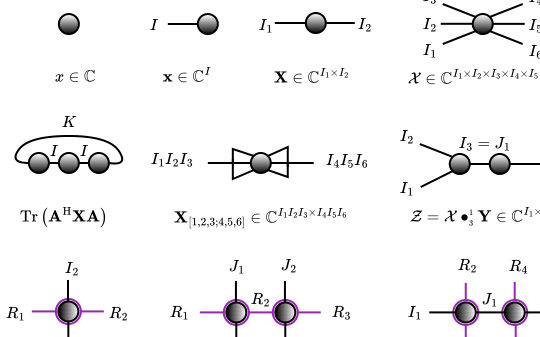
<figcaption class="paper-figure-caption"><b>Fig 1.</b> Fig. 2.1: Basic tensor network diagrams. In the bottom row, double-ring nodes rep- resent block matrices with purple block-layout edges and black inner-matrix edges; block matrices are linked by a purple edge in the strong Kronecker product and a black edge in the C-product.</figcaption>
</figure>
<figure class="paper-figure-card">

<figcaption class="paper-figure-caption"><b>Fig 2.</b> Fig. 2.2: (Left) TTM representation of a matrix X ∈ CI1I2···IN×J1J2···JN . (Right) Block−n−TT representation of a tall matrix X ∈CI1I2···IN×K, or equiva- lently, as a collection of K TT vectors that share all cores, except for the nth core.</figcaption>
</figure>
<figure class="paper-figure-card">
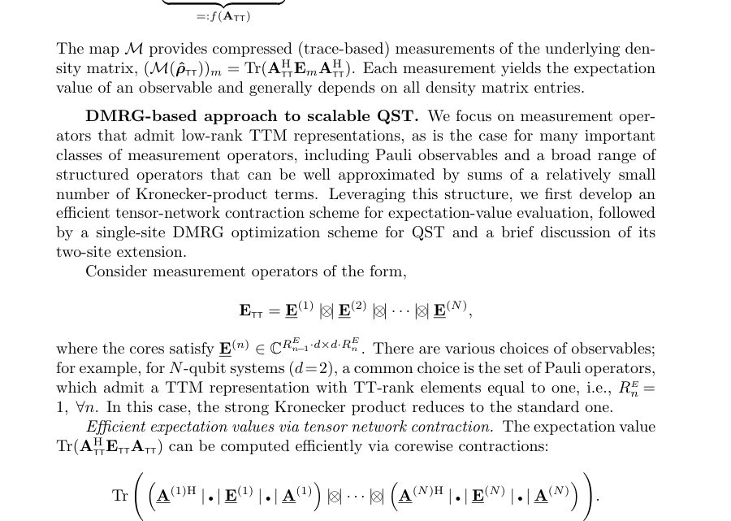
<figcaption class="paper-figure-caption"><b>Fig 3.</b> Figure 3.2 visualizes the tensor network diagram for this operation: the overall contraction between the Block-TT parameterized density operator and the (TTM) measurement operators (left), alongside its equivalent effective-operator form (right).</figcaption>
</figure>
<figure class="paper-figure-card">
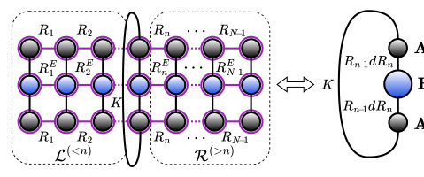
<figcaption class="paper-figure-caption"><b>Fig 4.</b> Fig. 3.2: (Left) Core-wise contraction of the tensor network representing the ex- pectation value computation, i.e., Tr(AH TT ETT ATT). (Right) Equivalent tensor net- work representation of the same operation in terms of an effective operator, i.e., Tr(A(n)H [1,2,4;3] E(n) eff A(n) [1,2,4;3]), where E(n) eff = AH ̸=n ETT A̸=n ∈CRn−1dRn×Rn−1dRn.</figcaption>
</figure>
<figure class="paper-figure-card">
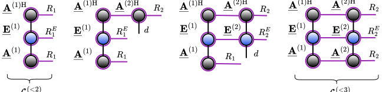
<figcaption class="paper-figure-caption"><b>Fig 5.</b> Fig. 3.3: Optimal ordering of the tensor network contractions needed to compute the left and right environments recursively; see (3.6).</figcaption>
</figure>

**Summary.** This paper introduces a novel, scalable framework for Quantum State Tomography using a Block Tensor Train (Block-TT) factorization. By parameterizing the density matrix in this low-rank tensor-network format, it overcomes the exponential scaling problem inherent in standard QST. The resulting methods allow for accurate state reconstruction of large quantum systems using efficient, physically constrained tensor-network algorithms.

**Why it may be interesting.** This work is highly relevant to AMO physics and open quantum systems because it provides a scalable numerical tool (DMRG/Tensor Networks) to characterize the full state ($
ho$) of complex, interacting quantum systems, moving beyond simple expectation value measurements.

Detailed structure

**Main problem.** The primary challenge is performing Quantum State Tomography (QST) for large quantum systems, which suffers from an exponential increase in computational cost with the number of qubits.

**Main result.** The authors propose a Block Tensor Train (Block-TT) Burer-Monteiro framework that parameterizes the density matrix, reducing the optimization variables from exponential to linear in the number of qubits while guaranteeing physical constraints.

**Method.** The core method involves representing the density matrix using a Block-TT factorization, which is a tensor-network approach analogous to the Burer-Monteiro factorization. They develop novel single-site and two-site DMRG algorithms that operate directly on this compressed parameterization.

**Model / system.** The system is a general quantum system whose state is described by a density matrix ($
ho$). The framework is designed to handle $N$-qubit or $N$-qudit systems, assuming the state is low-rank and can be accurately approximated by a tensor network structure.

**Key observables.** The primary observable is the density matrix ($
ho$), and the goal is to reconstruct it from measurement statistics $\{y_m\}$ derived from measurement operators $\{E_m\}$.

**Important parameters / regimes.** The key parameters involve the rank of the state, the window width ($w$), and the stride ($s$) used in local measurement operator generation for 1D chains.

**Assumptions / limitations.** The framework assumes that the quantum state is low-rank and can be accurately represented by the Block-TT factorization. Furthermore, accurate reconstruction requires sufficient spatial overlap between measurement windows.

**Figures summary.** The notes mention figures illustrating tensor network diagrams (Block-TT structure) and tables comparing reconstruction fidelity versus measurement overlap/budget for different window-stride configurations.

**Paper structure.** The paper first establishes the problem of QST and its exponential scaling. It then introduces the Block-TT Burer-Monteiro framework as a solution. The methodology details the development of DMRG algorithms operating on this compressed format, followed by numerical experiments demonstrating its efficiency and accuracy compared to conventional methods.

Abstract

Quantum state tomography is a fundamental technique for estimating the state of a quantum system from measured data and plays a crucial role in evaluating the performance of quantum devices. However, standard estimation methods become computationally prohibitive as the system size increases due to the exponential growth of the density matrix, describing a quantum state, with the number of qubits. We propose a low-rank tensor-network framework for mixed-state quantum state tomography based on a block tensor train (Block-TT) factorization. Specifically, the density matrix is represented as the contraction of a Block-TT with its Hermitian transpose, yielding a TT analogue of the Burer-Monteiro factorization. This parameterization guarantees Hermiticity and positive semidefiniteness by construction while compressing the number of optimization variables from exponential to linear in the number of qubits. Building on this representation, we develop single-site and two-site density matrix renormalization group (DMRG) algorithms for estimating quantum states from compressed measurements. The resulting methods operate directly on the compressed parameterization, support adaptive rank refinement, and exploit efficient tensor-network contractions for expectation-value evaluation. The framework is applicable to a broad class of low-rank quantum states, including pure states, nearly pure states, and ground states that admit accurate tensor-network approximations. Numerical experiments demonstrate accurate state reconstruction from limited measurements together with substantial reductions in memory requirements and computational cost compared with conventional low-rank tomography methods.

[↑ back to top](#top)

### [Gap-controlled thermalization in a SSH model version of the Fermi-Pasta-Ulam-Tsingou chain](http://arxiv.org/abs/2609.09498v1)

**Authors:** José A. Aké, Gerardo G. Naumis  
**Type:** theory · **Category:** statistical mechanics · **PDF:** <https://arxiv.org/pdf/2609.09498v1>  
**Analysis basis:** full PDF text, analyzed in chunks
**Topic relevance:** `scars & prethermalization` **3/5** · `Frenkel-Kontorova` **2/5** · `analog quantum simulation` **1/5** · `non-equilibrium universality` **1/5**

↔ Scroll figures horizontally

<figure class="paper-figure-card">

<figcaption class="paper-figure-caption"><b>Fig 1.</b> Figure 1. Schematic of the alternating FPUT chain with spring con- stants 𝜅𝐴= 1 + Δ𝜅and 𝜅𝐵= 1 −Δ𝜅connecting identical masses. As 𝜅𝐵→0, the system is dimerized in pairs of masses joined by the non linear spring with stiffness 𝜅𝐴. The optical branch corresponds to the oscillations of such 𝑁/2 dimers, while the other 𝑁/2 modes become the center of mass movement of each dimer, with zero frequency os- cillations. Thus the system becomes flexible in the sense of rigidity theory as the acoustic branch is made by 𝑁/2 floppy modes.</figcaption>
</figure>
<figure class="paper-figure-card">

<figcaption class="paper-figure-caption"><b>Fig 2.</b> Figure 2. Dispersion relation [Eq. (10)] for varying Δ𝜅, showing the frequency gap at 𝑘= 𝜋/𝑎plotted in the reduced zone scheme. The gap grows as Δ𝜅grows, setting the frequency barrier that must be bridged by nonlinear resonances for interbranch energy transfer to occur.</figcaption>
</figure>
<figure class="paper-figure-card">
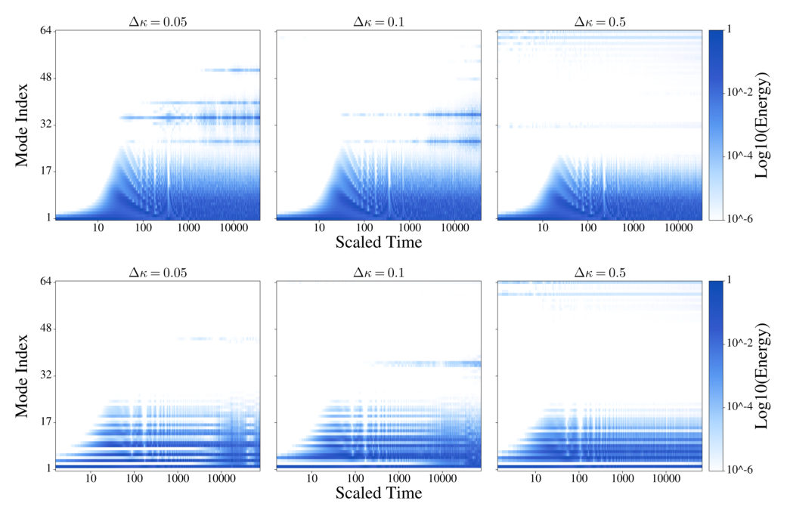
<figcaption class="paper-figure-caption"><b>Fig 3.</b> Figure 3. Modal energy heat maps for 𝛼-type nonlinearity, 𝑁= 64, 𝜖= 0.0069. 𝛼= 0.1 Top panel: FBC (first-mode excitation). Bottom panel: PBC (second-mode excitation). Observe how for the Δ𝜅= 0.5 case, the highest frequency optical mode is excited due to the first available umklapp process.</figcaption>
</figure>
<figure class="paper-figure-card">
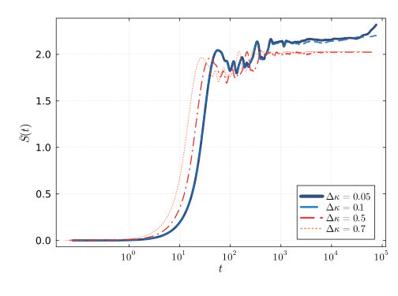
<figcaption class="paper-figure-caption"><b>Fig 4.</b> Figure 4. Time-averaged spectral entropy ¯𝑆(𝑡) vs. time for FBC, first- mode excitation, 𝛼= 0.1, 𝑁= 64, 𝜖= 0.0069. Below the isolation threshold (Δ𝜅= 0.05, thick blue), the system shows relaxation within 𝑡∼102 periods. At and above the threshold (Δ𝜅= 0.5 and 0.7, thin red), ¯𝑆(𝑡) saturates at lower plateaus.</figcaption>
</figure>
<figure class="paper-figure-card">

<figcaption class="paper-figure-caption"><b>Fig 5.</b> Figure 7. Contour plot of the resonance condition manifold |𝜔−(𝑘1)+ 𝜔−(𝑘2) −𝜔+(𝑘3)| &lt; 𝛾for 𝛾&lt;&lt; 10−6 for different Δ𝜅values and for the 𝛼-type nonlinearity. This shows how the accessible resonant triads depend on Δ𝜅. The momentum conservation and gap width controls the density of resonances connecting acoustic and optical modes. The resonance manifold disappears as Δ𝜅→0.5, establishing a hard gap-isolation threshold. The value Δ𝜅= 0.5 signals the emergence of the first possible umklapp process. The shaded area corresponds to the possible umklapp processes allowed by momentum conservation. The red dotted lines indicates the limits of such region.</figcaption>
</figure>

**Summary.** This work examines how spectral gaps in a dimerized FPUT chain control nonlinear energy transport and thermalization. By simulating the system, the authors find that the gap creates a sharp threshold, effectively isolating energy modes above this point. This suggests a general mechanism for controlling energy flow in topologically gapped nonlinear lattices.

**Why it may be interesting.** The concept of a gap acting as a tunable filter for energy transport in nonlinear lattices is highly relevant to understanding energy dissipation and thermalization in complex quantum or classical many-body systems.

Detailed structure

**Main problem.** The study investigates whether a spectral gap in a dimerized classical anharmonic lattice hinders or promotes long-time thermalization.

**Main result.** The phononic gap acts as a tunable, momentum-selective filter for nonlinear energy transport, establishing a sharp isolation threshold that controls the onset of energy mixing.

**Method.** The authors use long-time symplectic simulations to track modal energies and spectral entropy, analyzing three-wave scattering resonances in the classical Hamiltonian.

**Model / system.** The system is a dimerized Fermi-Pasta-Ulam-Tsingou (FPUT) chain, modeled as a classical SSH analogue with alternating spring constants and cubic nonlinearity. The dynamics are governed by a Hamiltonian involving kinetic and potential energy terms.

**Key observables.** Spectral entropy S(t), modal energies E_{k,\sigma}(t), and the magnitude of three-wave coupling coefficients $|\Gamma_{\sigma_1} \sigma_2 \sigma_3|$.

**Important parameters / regimes.** Dimerization strength ($\Delta\kappa$), nonlinearity type ($\alpha$-type/cubic), and boundary conditions (Fixed vs. Periodic).

**Assumptions / limitations.** The analysis focuses on the weakly nonlinear regime and utilizes the classical Hamiltonian framework, treating the gap as the primary control mechanism.

**Figures summary.** Figures illustrate the energy dispersion relation showing the gap opening at the Brillouin zone boundary, and heatmaps show the magnitude of three-wave coupling coefficients depending on the dimerization strength.

**Paper structure.** The paper first establishes the model and the gap's existence. It then analyzes the energy cascade and entropy evolution under varying dimerization strengths, identifying the critical threshold where energy transfer is suppressed by the gap.

Abstract

In classical anharmonic lattices, the resonance structure driving nonlinear mode mixing is reshaped by band gaps. However, it remains unclear whether a spectral gap hinders or promotes long-time thermalization. Here we study a dimerized Fermi-Pasta-Ulam-Tsingou chain - a classical SSH model analogue with alternating spring constants - and quantify how the acoustic-optical gap controls relaxation under alpha-type (cubic) nonlinearity. Tracking modal energies and spectral entropy via long-time symplectic simulations, we find a sharp isolation threshold when the dimerization strength reaches half its maximum value, set by the onset of the first umklapp process that allows two zone-boundary acoustic phonons to fuse into a zone-center optical phonon; below this threshold, three-wave acoustic-acoustic-optical scattering activates the optical branch on timescales of order 1e4 oscillation periods, while above it the bands remain dynamically isolated. We further show that boundary conditions reshape this picture, producing long-lived sticky states for specific mode excitations. These results establish the phononic gap as a tunable, momentum-selective filter for nonlinear energy transport, suggesting a general route to controlling thermalization in dimerized or topologically gapped nonlinear lattices.

[↑ back to top](#top)

### [Spectral Core-Tail Architecture for Locally Certified Gibbs-State Preparation](http://arxiv.org/abs/2609.09291v1)

**Authors:** Rui-Hao Li  
**Type:** theory · **Category:** statistical mechanics · **PDF:** <https://arxiv.org/pdf/2609.09291v1>  
**Analysis basis:** full PDF text, analyzed in chunks
**Topic relevance:** `analog quantum simulation` **3/5** · `Keldysh / 2PI / non-Gaussian methods` **2/5** · `methods for driven-dissipative` **2/5**

↔ Scroll figures horizontally

<figure class="paper-figure-card">

<figcaption class="paper-figure-caption"><b>Fig 1.</b> FIG. 1. SCTA architecture in a purification-based implemen- tation. The spectral core first loads amplitudes p</figcaption>
</figure>
<figure class="paper-figure-card">

<figcaption class="paper-figure-caption"><b>Fig 2.</b> FIG. 2. Physical- and core-frame representation of a deformation of an exact anchor. Adding λV deforms H0 into Hλ, and conjugation by the anchor tail U0 expresses the deformed Hamiltonian as HC,0 + λVC in the core frame. The correction Wλ is chosen so that the transformed core-frame Hamiltonian separates into the corrected loadable core HC,λ and the residual Rλ. Equivalently, the corrected physical tail is Uλ = U0Wλ.</figcaption>
</figure>
<figure class="paper-figure-card">

<figcaption class="paper-figure-caption"><b>Fig 3.</b> FIG. 3. Local residual scaling for the graph-stabilizer bench- mark. (a) Pauli incident strength εP of the bare and first-order residuals versus |λ| at N = 12; markers are the computed val- ues, dashed lines are power-law fits over the complete sampled range, and the adjacent labels give the fitted exponents, includ- ing one-standard-error uncertainties. (b) Incident strength versus system size at fixed λ = 0.05, showing that the first- order result saturates by N = 12 in the tested size sequence. The bare and first-order constructions are indicated by gray squares and blue circles, respectively.</figcaption>
</figure>
<figure class="paper-figure-card">

<figcaption class="paper-figure-caption"><b>Fig 4.</b> FIG. 4. Physical local Gibbs-state accuracy at N = 8. (a) Maximum trace-norm distance D1 between contiguous two- site marginals of the exact Gibbs state and those of the bare or first-order state, versus |λ| for three inverse temperatures β ∈{0.5, 1, 2}. (b) Maximum error ∆ZZ in the corresponding ZiZi+1 expectation values. In both panels, markers are the computed values and dashed curves are grouped power-law fits over all nine sampled couplings; each grouped fit uses a common exponent and a temperature-dependent prefactor, and the adjacent labels give the common exponent with its one-standard-error uncertainty. The common legends encode inverse temperature by color—orange for β = 0.5,...</figcaption>
</figure>
<figure class="paper-figure-card">
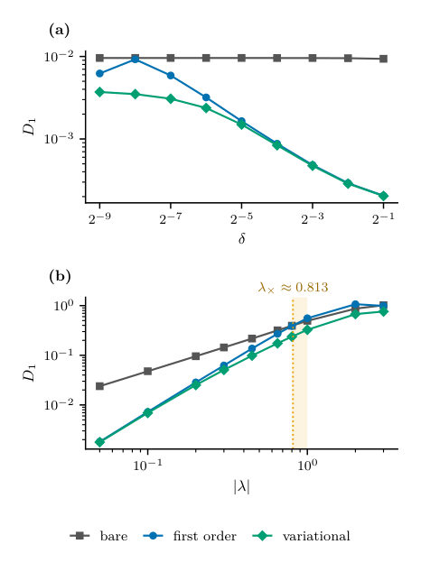
<figcaption class="paper-figure-caption"><b>Fig 5.</b> FIG. 5. Variational performance in the two regimes where the first-order construction loses perturbative control, evaluated at N = 8 and β = 1. (a) Maximum nearest-neighbor trace-norm error D1 versus the field staggering δ at fixed λ = 0.02, with resonance approached toward the left. (b) The same error versus |λ| at fixed δ = 0.25; the orange band marks the first sampled bracket 0.8 ≤λ ≤1 in which the first-order corrected error becomes larger than the bare error, and the dotted line marks λ× ≃0.813, obtained by linear interpolation in ln λ within that bracket. In both panels, the bare, first-order corrected, and variational constructions are indicated by gray squares, blue circles, and...</figcaption>
</figure>

**Summary.** This paper introduces the Spectral Core-Tail Architecture (SCTA) as a rigorous framework for preparing quantum Gibbs states. It develops error bounds and uses Schrieffer-Wolff-like techniques to show that state preparation errors scale quadratically with small Hamiltonian deformations. This provides a theoretically controlled method for simulating thermal physics in many-body quantum systems.

**Why it may be interesting.** This work provides a powerful, systematically improvable theoretical tool (SCTA) for simulating thermal equilibrium states in complex quantum systems, which is central to understanding many condensed matter phenomena.

Detailed structure

**Main problem.** The core problem is developing a rigorous framework, the Spectral Core-Tail Architecture (SCTA), to accurately prepare quantum Gibbs states, $
ho_eta(H)$, which requires capturing both the thermal distribution and the full many-body eigenspace structure.

**Main result.** The authors show that for small deformations of an exact anchor Hamiltonian, the resulting error in the Gibbs state preparation scales quadratically with the deformation strength, which is a significant improvement over linear scaling.

**Method.** The work formalizes the state preparation using SCTA, separating the Hamiltonian into a structured core and a unitary tail, and employs Schrieffer-Wolff-type reductions to handle perturbations.

**Model / system.** The analysis is applied to quantum many-body systems, specifically testing on deformed graph-stabilizer Hamiltonians on a lattice. The goal is to approximate the thermal Gibbs state $
ho_eta(H)$.

**Key observables.** Local Gibbs-state error, Hamiltonian-level mismatch, and the free-energy density $f_eta$.

**Important parameters / regimes.** Inverse temperature $eta$, deformation strength $\lambda$, and the locality radius $r$.

**Assumptions / limitations.** The analysis relies on uniform locality and solvability assumptions, and the core-tail separation requires the Kubo-Mori response to be shell summable.

**Figures summary.** Not specified, but the notes mention Figure 1 illustrates the purification-based implementation of SCTA, showing core loading and tail action.

**Paper structure.** The paper is structured around developing the operational framework (SCTA), establishing exact anchor constructions, analyzing perturbative deformations using local reductions, and concluding with numerical tests on specific Hamiltonians.

Abstract

Preparing a quantum Gibbs state requires reproducing both its thermal distribution and the associated many-body eigenspaces. In this work, we formalize the spectral core-tail architecture (SCTA) as a framework comprising a structured thermal core, a geometrically characterized unitary tail, and an exact residual measuring the remaining core-frame Hamiltonian mismatch. We derive a local Gibbs-state error bound separating core-preparation, tail-implementation, and modeling errors. The modeling contribution is volume uniform when its Kubo-Mori response meets the shell summability condition and the relevant local data remain uniform. We then highlight three anchor Hamiltonian classes which admit exact core-tail constructions with zero residuals. For small deformations of an exact anchor, we employ a Schrieffer-Wolff reduction procedure to construct a corrected core-tail pair that formally removes the deformation order by order. Under uniform locality and solvability assumptions, we show that the first-order reduction yields a residual that remains bounded and is quadratic in the deformation strength. Furthermore, we numerically test the first-order reduction on deformed graph-stabilizer Hamiltonians. The numerical results show approximately quadratic suppression of both the Hamiltonian-level mismatch and the local Gibbs-state error in the perturbative regime. We also find that the constructed correction circuit structure remains useful as a variational ansatz beyond perturbative control, often improving on both the bare and prescribed first-order states.

[↑ back to top](#top)

### [Constant-depth global shadow estimation](http://arxiv.org/abs/2609.10408v1)

**Authors:** Qingyue Zhang, Zhou You, Dayue Qin, Xiaopeng Li, Jens Eisert, You Zhou  
**Type:** theory · **Category:** quantum information and computing · **PDF:** <https://arxiv.org/pdf/2609.10408v1>  
**Analysis basis:** full PDF text, analyzed in chunks
**Topic relevance:** `QC/QI experiment` **3/5** · `quantum measurements` **3/5**

↔ Scroll figures horizontally

<figure class="paper-figure-card">
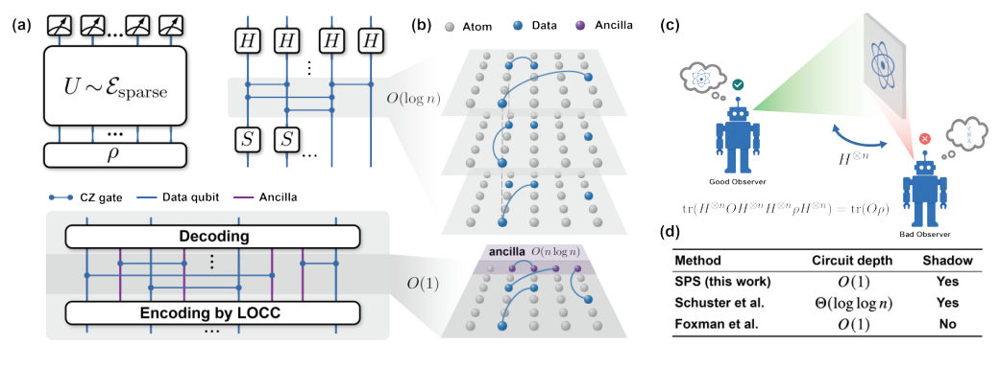
<figcaption class="paper-figure-caption"><b>Fig 1.</b> FIG. 1. Overview of shallow phase shadows. (a) Global shadow estimation of an unknown state 𝜌using sparse Clifford-IQP 𝑆-𝐶𝑍- 𝐻circuits. (b) The sampled sparse circuit can be implemented either in constant depth on all-to-all architectures using LOCC-assisted encoding and decoding with 𝑂(𝑛log 𝑛) auxiliary systems or in logarithmic depth without auxiliary systems. (c) The second-look principle measures two complementary global observables 𝑂and 𝐻⊗𝑛𝑂𝐻⊗𝑛. We then select the lower-bias track in post-processing, enabling accurate shadow estimation. (d) SPS achieves constant-depth shadow estimation beyond the light-cone restriction of the gluing framework [39], while existing constant-depth...</figcaption>
</figure>
<figure class="paper-figure-card">
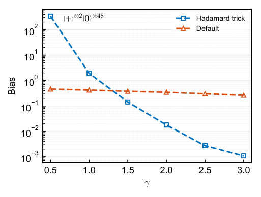
<figcaption class="paper-figure-caption"><b>Fig 2.</b> FIG. 2. Scaling of the estimation bias with respect to the parameter 𝛾for the worst-case state vector |+⟩⊗2 |0⟩⊗𝑛−2 with 𝑛= 50. The performance of the Hadamard-conjugated task (𝜌′, 𝑂′, blue squares) is compared with the default task (orange triangles).</figcaption>
</figure>
<figure class="paper-figure-card">
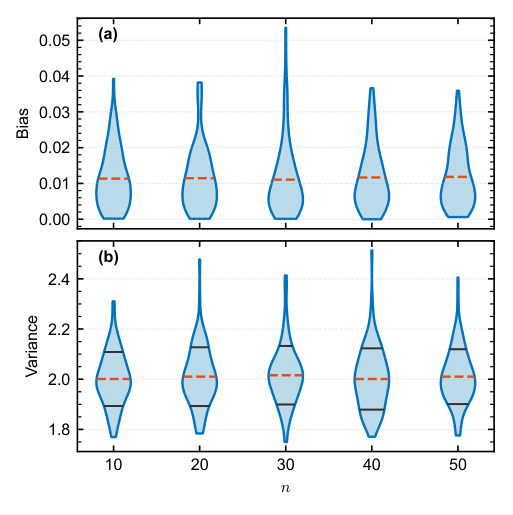
<figcaption class="paper-figure-caption"><b>Fig 3.</b> FIG. 3. Statistical distribution of the estimation bias and variance with respect to qubit number 𝑛. Data are collected from 100 independently sampled random stabilizer states with 𝛾= 2 and 104 shots for each state. The violin plots illustrate the variation in estimator performance among different quantum states. The dashed lines indicate the mean value of bias and variance, and the solid black lines in (b) represent the standard deviation range.</figcaption>
</figure>
<figure class="paper-figure-card">

<figcaption class="paper-figure-caption"><b>Fig 4.</b> FIG. 4. Comparison of the estimation bias against two-qubit gate count (see Appendix G 2) for three shallow shadow schemes: 1D brickwork circuits (blue circles, [37]), Gluing circuits (orange squares, [39]), and SPS (yellow triangles, our approach). Notice that the logarithmic-depth one-dimensional (1D) brickwork baseline exhibits relative-error approximate state 2-design behavior established in Ref. [84, 85]. The results are shown for (a) the tensor product state vector |+⟩⊗𝑛, (b) |+⟩⊗𝑛/2 |0⟩⊗𝑛/2, with 𝑛= 48 and 2 × 104 shots and (c) the 1D cluster state. For SPS, the bias drops rapidly below the statistical noise floor (∼10−2), making the measurement error the dominant source of...</figcaption>
</figure>
<figure class="paper-figure-card">

<figcaption class="paper-figure-caption"><b>Fig 5.</b> FIG. 6. Schematic organization of the permutation sectors used in the variance bound. The sectors are indexed by an odd label 𝜋1 and an even label 𝜋2. We choose two dominant sectors with different row and column labels, of sizes 𝑚1 and 𝑚2, whose product is maximal. This maximality bounds the relevant non-dominant sectors by √𝑚1𝑚2, so that after grouping sites by odd labels the two smaller groups have sizes</figcaption>
</figure>

**Summary.** This paper presents Shallow Phase Shadows (SPS), a novel protocol for estimating global quantum states with significantly reduced circuit depth compared to existing methods. By adapting the measurement randomness to the specific task, SPS achieves constant-depth implementation using only CZ gates. This makes scalable quantum readout feasible on current, long-range connectivity quantum hardware.

**Why it may be interesting.** It provides a concrete, resource-aware protocol for quantum characterization that is directly relevant to the hardware limitations (connectivity, gate type) faced by experimentalists working with trapped ions or neutral atoms.

Detailed structure

**Main problem.** Developing scalable and efficient readout strategies for quantum processors to estimate global quantum state information.

**Main result.** The proposed Shallow Phase Shadows (SPS) protocol achieves global shadow estimation with constant circuit depth, significantly outperforming conventional methods that require deep circuits.

**Method.** The protocol introduces SPS, which utilizes a sparse Clifford-IQP ensemble and a 'second-look principle' to estimate stabilizer-state fidelities without requiring the ensemble to form an approximate relative-error design.

**Model / system.** The work is applicable to quantum processors, specifically mentioning platforms like trapped ions and neutral atoms, and is formulated using the sparse Clifford-IQP circuit ensemble.

**Key observables.** Stabilizer-state fidelities, estimation bias, and circuit depth.

**Important parameters / regimes.** The sparsity parameter $\gamma$, system size $n$, and the required depth (constant vs. logarithmic).

**Assumptions / limitations.** The protocol is proven for stabilizer-state observables, and the analysis relies on the structural properties of the sparse Clifford-IQP ensemble.

**Figures summary.** Figures compare depth requirements (SPS vs. gluing frameworks) and show numerical simulations comparing the two-qubit gate count for SPS against other shallow-shadow schemes.

**Paper structure.** The paper first identifies the bottleneck of deep circuits in global estimation, then introduces SPS using the sparse Clifford-IQP ensemble. It proves constant-depth feasibility, analyzes the variance bound (showing sub-exponential decay), and concludes with resource comparisons.

Abstract

Reliable and scalable readout strategies are essential for quantum technologies. As quantum processors grow, extracting useful information must remain feasible without measurement circuits becoming a dominant bottleneck. Randomized measurements and classical shadows provide a powerful route, but global estimation is conventionally associated with highly random ensembles that require increasing circuit depth and hence substantial experimental overhead. In this work, we show that substantially less randomness suffices when the readout is meaningfully adapted to the quantities being estimated. We introduce shallow phase shadows, based on a sparse Clifford-IQP ensemble, and prove efficient global estimation of stabilizer-state fidelities despite the ensemble not forming an approximate relative-error design. On all-to-all architectures, the protocol admits a constant-depth implementation using mid-circuit measurements and classical feedforward, or logarithmic depth without auxiliary systems. The protocol requires only controlled-phase entangling gates and offers a tunable trade-off between circuit resources and estimation accuracy, making it particularly amenable to experimentally relevant architectures with long-range connectivity. Our results show that scalable quantum readout need not reproduce generic randomness: task-adapted randomization can enable substantially shallower global characterization protocols.

[↑ back to top](#top)

### [Exact asymptotic equivalence between precisions of record-times and integrated currents](http://arxiv.org/abs/2609.09479v1)

**Authors:** Alberto Garilli  
**Type:** theory · **Category:** statistical mechanics · **PDF:** <https://arxiv.org/pdf/2609.09479v1>  
**Analysis basis:** full PDF text, analyzed in chunks
**Topic relevance:** `Full counting statistics` **3/5** · `non-equilibrium universality` **2/5** · `quantum measurements` **1/5**

↔ Scroll figures horizontally

<figure class="paper-figure-card">

<figcaption class="paper-figure-caption"><b>Fig 1.</b> FIG. 1. a) An example of a network of states connected by transitions. The bi-directional transition connecting states α and β is observable, while we assume to have no knowledge about the hidden states and transitions (not necessarily bi-directional) occurring in the rest of the system (black dots and dashed lines inside the cloud). b) The associated trans-transition network. Each arrow indicates a possible succession of visible transitions, and it is associated with a trans-transition probability pℓ′ℓ and an inter-transition time τℓ′ℓ. c) Example of a trajectory of the observable current Ct along α ↔β. The evolution of the auxiliary inter-record process Mt is highlighted by a red dashed...</figcaption>
</figure>
<figure class="paper-figure-card">
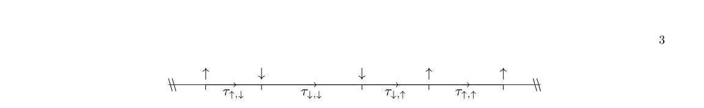
<figcaption class="paper-figure-caption"><b>Fig 2.</b> FIG. 2. Graphical representation of the temporal succession ↑→↓→↓→↑→↑of visible transitions with the corresponding inter- transition times. The time-series of the total integrated current Ct can be represented as a succession of visible transitions ↑ (which increase Ct) and ↓(which decrease Ct). The time between two visible transitions ℓ′ and ℓis denoted by τℓ′,ℓ.</figcaption>
</figure>
<figure class="paper-figure-card">
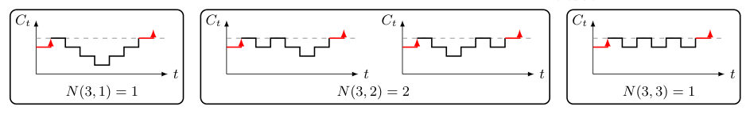
<figcaption class="paper-figure-caption"><b>Fig 3.</b> FIG. 3. Construction of the Laplace transform Eq. (17). a) An excursion ∆T is defined as the time interval between two successive increments of the auxiliary process Mt (red arrows). Each excursion is decomposed into elementary time intervals τi, with i = 1, . . . , ˜l, where ˜l is the total number of intervals in the excursion. Each interval is identified with an inter-transition time, while the last one, τincr, is necessarily associated with the succession ↑→↑. Since the inter-transition times are independent, the Laplace transform of the distribution of ∆T factorizes into the product of the Laplace transforms of the individual inter- transition-time distributions. This yields the general...</figcaption>
</figure>

**Summary.** This theoretical paper proves a precise mathematical identity linking the fluctuation measure (Fano factor) of a measurable current in a Markov process to the fluctuation measure of the time intervals between record-setting events. By showing that record events induce a renewal process governed by combinatorial numbers, the authors provide a unified framework for analyzing non-equilibrium current fluctuations in complex networks.

**Why it may be interesting.** This result provides a powerful, unified probabilistic tool to characterize non-equilibrium fluctuations in complex systems (like molecular motors or interacting particles) by relating macroscopic current statistics to the statistics of rare, record-setting events.

Detailed structure

**Main problem.** The paper establishes an exact asymptotic equivalence between the fluctuations of integrated currents and the temporal statistics of current record events in continuous-time Markov jump processes.

**Main result.** The Fano factor of the integrated current ($F_C$) is exactly equal to the squared coefficient of variation of the inter-record waiting times ($P_{\Delta T}$), i.e., $|F_C| = P_{\Delta T}$.

**Method.** The equivalence is derived by showing that inter-record times induce a renewal structure, allowing the use of generating functions related to Narayana numbers to compare the moments of both fluctuation measures.

**Model / system.** The analysis concerns continuous-time Markov jump processes on finite-state graphs, focusing on an integrated current $C_t$ along a bidirectional channel ($\alpha \leftrightarrow eta$).

**Key observables.** Integrated Current ($C_t$), Fano Factor ($F_C$), Inter-record Waiting Times ($\Delta T_m$), and the Squared Coefficient of Variation of $\Delta T_m$ ($P_{\Delta T}$).

**Important parameters / regimes.** The analysis is asymptotic ($t 	o \infty$) and requires the observed dynamics to be irreducible and the channel to be bidirectional.

**Assumptions / limitations.** The primary assumptions include the existence of a renewal structure for inter-record times and the requirement of hidden irreducibility for the underlying graph.

**Figures summary.** Figures illustrate the network structure, the temporal succession of visible transitions, and the mathematical construction of the Laplace transform for the inter-record time distribution.

**Paper structure.** The paper develops the equivalence by first defining the observables, then showing that record events create a renewal process whose generating function is governed by Narayana numbers, leading to the final identity $|F_C| = P_{\Delta T}$.

Abstract

We establish an exact equivalence between the fluctuations of integrated currents and the temporal statistics of current record events in continuous-time Markov jump processes. Specifically, we show that, under minimal assumptions, the Fano factor of an integrated current coincides exactly with the squared coefficient of variation of the inter-record waiting times. This result is obtained by showing that inter-record times induce a renewal structure, since each record event resets the system to a fixed state, and that their generating function can be expressed exactly in terms of a combinatorial organization governed by Narayana numbers. The equivalence extends previous results obtained for unicyclic networks to arbitrary finite-state graphs and provides a unified representation of current fluctuations in terms of record-time observables. The results are derived within a purely probabilistic framework and clarify the structural origin of current precision in terms of first-passage-like event statistics.

[↑ back to top](#top)

### [Gauge mean-field theories of the underscreened Kondo lattice](http://arxiv.org/abs/2609.10443v1)

**Authors:** Ewan Scott, Michal Kwasigroch  
**Type:** theory · **Category:** strongly correlated electrons · **PDF:** <https://arxiv.org/pdf/2609.10443v1>  
**Analysis basis:** full PDF text, analyzed in chunks
**Topic relevance:** `Keldysh / 2PI / non-Gaussian methods` **3/5** · `methods for driven-dissipative` **3/5**

↔ Scroll figures horizontally

<figure class="paper-figure-card">
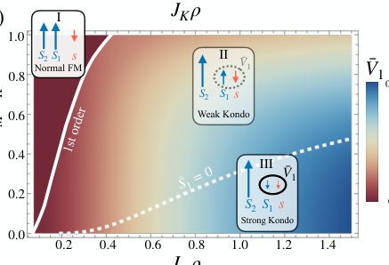
<figcaption class="paper-figure-caption"><b>Fig 1.</b> FIG. 1. Ground state phase diagrams showing three phases: I – The normal FM state with local moments maximally polar- ized ¯S1,2 = 1/2 and no hybridization ¯V1 = 0, II – Weak Kondo ferromagnet with magnetization of the hybridized f-moment ¯S1 &gt; 0 and weak hybridization ¯V1 &gt; 0, III – Strong Kondo ferromagnet with weak magnetization of the hybridized f- moment ¯S1 &lt; 0 and strong hybridization, ¯V1 &gt; 0. The un- hybridized f-moment has a magnetization ¯S1 = 1/2 in all phases. Plot (a) shows the magnetic moment of the hybridized f-electron ¯S1 as a function of the dimensionless Kondo cou- pling JKρ and the relative strength of the coupling in the magnetic exchange channel JM = 2JK</figcaption>
</figure>
<figure class="paper-figure-card">
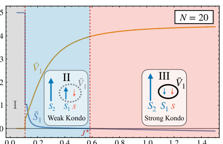
<figcaption class="paper-figure-caption"><b>Fig 2.</b> FIG. 2. A plot of the groundstate order parameters ¯S1 and ¯V1, magnetization and hybridization of the f1-fermion respec- tively for N = 20. The unhybridized f2-fermion always has a magnetization of ¯S2 = 1</figcaption>
</figure>
<figure class="paper-figure-card">
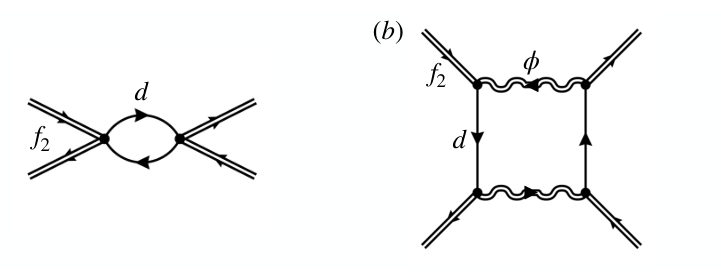
<figcaption class="paper-figure-caption"><b>Fig 3.</b> FIG. 3. Feynman diagrams for the (a) RKKY interaction between unhybridized f2-fermions, (b) the Hund’s interaction between f2-fermions, and (c) the diagrammatic expansion of the ϕ propagator Gϕϕ(ω) = ⟨ϕ†(ω)ϕ(ω)⟩in the RPA approximation. The double lines indicate the unhybridised f2-fermions, d are the heavy fermions (superposition of the hybridized f1-fermions and conduction electrons) and wavy lines are the ϕ gauge fields.</figcaption>
</figure>

**Summary.** This work develops a unified gauge mean-field theory to study the spin-1 underscreened Kondo lattice. By using a single control parameter N, the authors reconcile previous theoretical approaches and map out the ground state phase diagram. The findings clarify the interplay between magnetic order and Kondo screening in this complex correlated electron system.

**Why it may be interesting.** The rigorous theoretical treatment of competing magnetic and Kondo interactions in a strongly correlated lattice is highly relevant to understanding heavy fermion materials and quantum criticality.

Detailed structure

**Main problem.** The paper addresses the challenging problem of the spin-1 underscreened Kondo lattice (UKL) model, where magnetic order and Kondo hybridization can coexist.

**Main result.** The authors develop a unifying variational theory that maps out the ground state phase diagram, revealing crucial differences between previously proposed mean-field theories regarding hybridization strength and total magnetization.

**Method.** The study employs gauge mean-field theories (gMFT) using a single control parameter N and an unbiased variational ansatz, calculating fluctuation corrections to the large-N saddle-point.

**Model / system.** The system is the spin-1 UKL model, described by a Hamiltonian involving Kondo coupling and fermionic spin moments. The analysis utilizes an N-replica generalization of the model, controlled by the parameter N.

**Key observables.** Magnetic moments ($ar{S}_1, ar{S}_2$), hybridization fields ($ar{V}_1$), and the ground state phase diagram.

**Important parameters / regimes.** The control parameter N, the Kondo coupling ($J_K$), and the ratio of Kondo to RKKY energy scales ($T_K$ vs $T_{RKKY}$).

**Assumptions / limitations.** The analysis relies on the large-N expansion and the variational approximation, which simplifies the complex gauge field dynamics.

**Figures summary.** Figures illustrate ground state phase diagrams showing three distinct phases (Normal FM, Weak Kondo FM, Strong Kondo FM) based on the relative strengths of coupling parameters.

**Paper structure.** The paper introduces the model and the gMFT framework, develops the unifying variational ansatz, calculates fluctuation corrections, maps the phase diagram, and compares the results to prior mean-field theories.

Abstract

Various mean-field decoupling schemes have been introduced thus far to study the important and challenging problem of the spin-$1$ underscreened Kondo lattice where magnetic order can coexist with Kondo hybridization. We use a single control parameter $N$ and an unbiased variational ansatz to unify and connect the previously proposed decouplings to standard Read-Newns theory, where fluctuations are small in $1/N$. We compute the corrections around the large-$N$ limit. In particular, we make contact with Nozières strong-coupling theory by finding the residual ferromagnetic Hund interaction that decays logarithmically in the case of a heavy-fermion metal. We map out the ground state phase diagram as a function of $N$ and the Kondo coupling. We find crucial differences between the previously proposed mean-field theories in the strength of the hybridization and total magnetization of the coexistent phase. We show that, within our unifying variational theory, the previously proposed decouplings correspond to either taking $N=2$ from the start, or performing a $1/N$ expansion and then extrapolating to $N=2$. Finally, we summarize the generalization of our theory to $S>1$.

[↑ back to top](#top)

### [Multivariate quantum state preparation with optimized tensor networks](http://arxiv.org/abs/2609.09304v1)

**Authors:** Matthew L. Sims-Goh, Lukasz Cincio, Annina Z. Lieberherr, Mekena McGrew, Thomas R. Bromley  
**Type:** theory · **Category:** numerical methods · **PDF:** <https://arxiv.org/pdf/2609.09304v1>  
**Analysis basis:** full PDF text, analyzed in chunks
**Topic relevance:** `methods for driven-dissipative` **3/5** · `analog quantum simulation` **2/5** · `quantum measurements` **1/5**

↔ Scroll figures horizontally

<figure class="paper-figure-card">
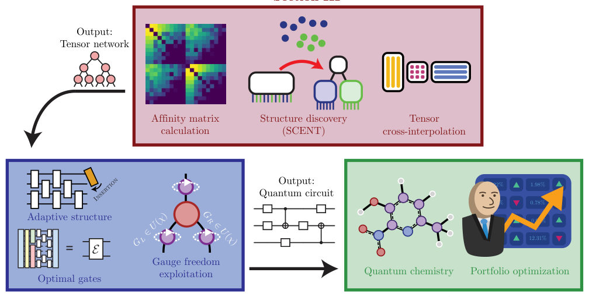
<figcaption class="paper-figure-caption"><b>Fig 1.</b> FIG. 1. Summary of our approach. (a) Our approach to tensor network structure discovery (Section III) begins with the calculation of affinity matrices (left), which quantify the correlation between qubits for the desired state. These are used to recursively partition qubits (middle), assigning qubit indices to branches in a way that seeks to minimize graph distance between highly entangled qubits. This tree structure is then employed in tensor cross-interpolation (right), yielding an interpolative tensor network approximation of the desired function. (b) We demonstrate how to synthesize a quantum circuit from this tensor network (Section IV). Our approach adaptively modifies circuit...</figcaption>
</figure>
<figure class="paper-figure-card">

<figcaption class="paper-figure-caption"><b>Fig 2.</b> FIG. 2. Tensor networks for function encoding. (a) The interleaved (top) and serial (bottom) representations, de- picted for D = 2 dimensions. (b) Distance between closely correlated bits of the same variable. We depict how sequen- tial bits of the same variable are separated by D bonds in the interleaved representation, while the serial representation will separate the highest-significance bits of two adjacent vari- ables by B bonds. In both cases, this leads to many bond crossings that may be avoided by more problem-tailored net- work topologies. (c) Examples of the diverse range of tensor network structures common in the literature. Pictured are MPS (linear chain structure), TTN (acyclic...</figcaption>
</figure>
<figure class="paper-figure-card">

<figcaption class="paper-figure-caption"><b>Fig 3.</b> FIG. 3. Comparison of tensor network structures on an example problem. We demonstrate the approximation of a 40-qubit quantum state encoding a strongly correlated (η = 1) quadrivariate normal distribution N(⃗µ,Σ)(a, b, c, d), for a single realization of Σ ∼LKJD=4(η = 1) at B = 10 bits of precision per variable. TCI is performed with an MPS (blue), comb TTN (orange), and scent-optimized TTN (green) at tolerance ϵid = 10−8. (a) Convergence of the ten- sor network size in TCI — all three topologies converge within 5 sweeps, their sizes plateauing. Relative to MPS, the comb TTN compresses the function by a factor of 23, whereas the scent-optimized TTN compresses it by a factor of 58. (b)...</figcaption>
</figure>
<figure class="paper-figure-card">

<figcaption class="paper-figure-caption"><b>Fig 4.</b> FIG. 5. Convergence of Monte Carlo sampling to con- struct the affinity matrix. Here, we study the approxima- tion of a 40-qubit quantum state encoding a strongly corre- lated quadrivariate normal distribution N(⃗µ,Σ)(a, b, c, d), for a single realization of Σ ∼LKJD=4(η = 1) (as in Figure 3) using both Monte Carlo and exact methods for scent. (a) Single-variable submatrices of affinity matrices constructed with Monte Carlo for Ns = 5 × 102 samples (left), Ns = 104 samples (middle), and noiseless tensor network methods (right). (b) Convergence traces for TCI using network struc- tures determined with scent for varying Monte Carlo sample counts Ns. As a point of comparison, we also plot the...</figcaption>
</figure>
<figure class="paper-figure-card">
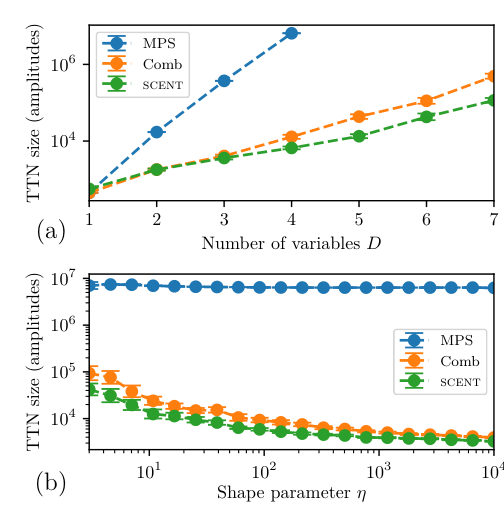
<figcaption class="paper-figure-caption"><b>Fig 5.</b> FIG. 4. Effect of variable count and correlation strength on tensor network function construction. We study systematically the effect of the number of variables D and inverse correlation strength η on multivariate normal dis- tributions N(⃗µ,Σ)(⃗x). For each data point, 20 random covari- ance matrices are sampled from Σ ∼LKJD(η), and 10 sweeps of TCI (sufficient for convergence, see e.g. Figure 3(c)) are performed to tolerance ϵid = 10−8 with B = 10 bits of pre- cision per variable. Error bars represent bootstrapped 95% confidence intervals in the logarithmic mean. (a) The effect of variable count D on tensor network size at moderate corre- lation η = 50. (b) The effect of correlation...</figcaption>
</figure>

**Summary.** This paper presents SCENT, a novel protocol to optimize the structure of Tree Tensor Networks (TTNs) for encoding complex, multivariate quantum states. By using spectral clustering on entanglement metrics, it overcomes the limitations of standard MPS methods. The resulting optimized TTN structure is then compiled into an efficient quantum circuit, demonstrating high fidelity for problems in quantum chemistry and finance.

**Why it may be interesting.** The development of scalable tensor network methods that move beyond linear chains (MPS) to handle complex, multi-variable correlations is crucial for simulating quantum many-body systems and complex quantum processes.

Detailed structure

**Main problem.** The primary challenge is efficiently preparing quantum states corresponding to multivariate functions, which is difficult for standard tensor network representations like MPS due to topological limitations.

**Main result.** The authors introduce SCENT, a protocol that uses spectral clustering on entanglement metrics to derive an optimal Tree Tensor Network (TTN) structure, leading to state preparation circuits with high fidelity and reduced gate counts.

**Method.** The approach involves three main stages: using entanglement metrics (like Boolean Fourier entropy) to build an affinity matrix, applying spectral clustering to find an optimal TTN topology, and finally compiling this TTN structure into a quantum circuit using environment-tensor methods.

**Model / system.** The model is quantum state preparation, where a multivariate function is encoded into a quantum state $|\psi
angle$ represented by a Tensor Network (specifically, a TTN). The system involves qubits and the associated Hilbert space.

**Key observables.** Fidelity, number of CNOT gates, circuit depth, and the entanglement metrics (QMI, Boolean Fourier entropy) used for structure discovery.

**Important parameters / regimes.** Bond dimension ($\chi$), target decomposition error ($\epsilon$), and the number of variables (e.g., 20 variables in the flagship demo).

**Assumptions / limitations.** The method assumes that the optimal structure can be found by minimizing the mean inter-cluster affinity using spectral clustering, and that the TTN can be accurately compiled into a quantum circuit via isometric gauge techniques.

**Figures summary.** Figures illustrate the overall pipeline: structure discovery using affinity matrices leading to TTN approximation via TCI, and the subsequent circuit synthesis for applications in quantum chemistry and portfolio optimization.

**Paper structure.** The paper progresses by first identifying the limitations of MPS for multivariate functions, introducing SCENT for optimal TTN discovery, detailing the TCI approximation and isometric gauge placement, and concluding with the circuit compilation algorithm and benchmarking on physical problems.

Abstract

Quantics tensor trains are attracting intense interest for quantum-inspired computing and quantum state preparation. These methods, which approximate continuum functions by representing their amplitude encoding as a matrix product state (MPS), are exceedingly powerful for univariate functions but rapidly become challenging when handling multivariate functions, since the linear chain topology leads to a large distance between highly-entangled qubits. We overcome this limitation by introducing SCENT (Spectral Clustering for Entanglement miNimizing Trees). SCENT is a protocol that utilizes efficiently-computable pairwise entanglement metrics to determine a suitable tree tensor network (TTN) structure, which can then be efficiently approximated using tensor cross-interpolation (TCI); we find that it substantially outperforms MPS methods and improves upon previous TTN methods. We then apply these optimized TTNs to state preparation, introducing an approximate circuit compilation method based on environment-tensor methods without significantly conceding overall accuracy. Importantly, the inherent gauge freedom of TTNs can be directly exploited in this method, resulting in higher fidelity at a given circuit depth. We demonstrate this quantum state-preparation pipeline on archetypal state-preparation problems in quantum chemistry and financial portfolio optimization. In our flagship demonstration, we encode a 20-variable probability distribution with long-ranged, non-nearest neighbor inter-variable correlations in a 200-qubit state-preparation circuit with infidelity $7.44\times 10^{-9}$ using only 43284 CNOTs; depth and fidelity can be traded, allowing the same distribution to be prepared to infidelity $10^{-3}$ with as few as 5584 CNOTs.

[↑ back to top](#top)

### [Python in the front, party in the Backline: compiling quantum workloads across CPUs, GPUs, and FPGAs](http://arxiv.org/abs/2609.09270v1)

**Authors:** Joseph K. L. Lee, Mehrdad Malekmohammadi, Hong-Sheng Zheng, Shuli Shu, Cheick Doumbia, Kalman Szenes, Mehran Zamani Abnili, Thomas Ainsworth, Matthew Seymour, Thomas Germain, Leonhard Neuhaus, Josh Izaac, Lee J. O'Riordan  
**Type:** both · **Category:** quantum information and computing · **PDF:** <https://arxiv.org/pdf/2609.09270v1>  
**Analysis basis:** full PDF text, analyzed in chunks
**Topic relevance:** `QC/QI experiment` **3/5** · `quantum measurements` **3/5**

↔ Scroll figures horizontally

<figure class="paper-figure-card">

<figcaption class="paper-figure-caption"><b>Fig 1.</b> Fig. 1: High-level overview of the PennyLane program lowering process.</figcaption>
</figure>
<figure class="paper-figure-card">
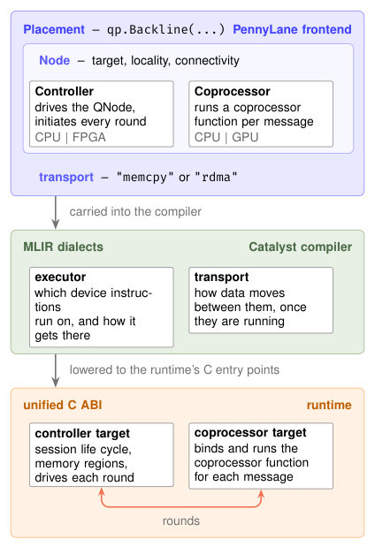
<figcaption class="paper-figure-caption"><b>Fig 2.</b> Fig. 2: The Backline abstractions and how they compose.</figcaption>
</figure>
<figure class="paper-figure-card">
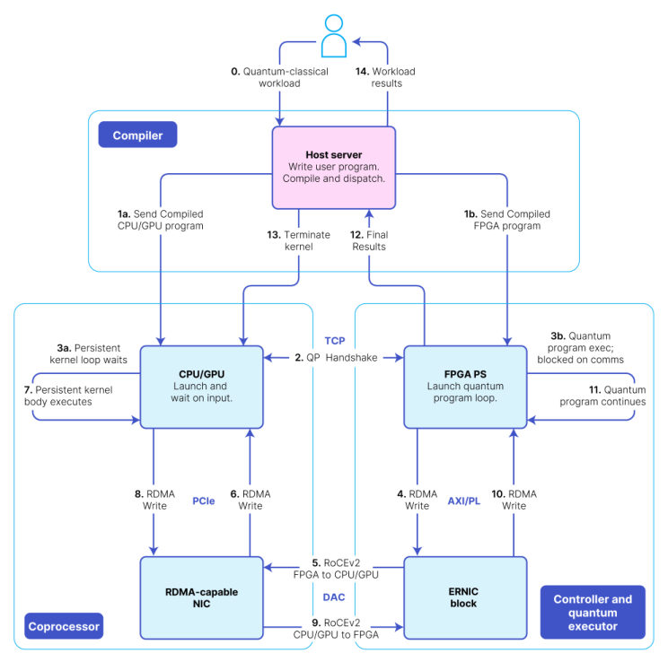
<figcaption class="paper-figure-caption"><b>Fig 3.</b> Fig. 4: Life cycle of a heterogeneous workload in Backline across a host, FPGA controller, and GPU coprocessor. Numbers indicate execution order. Steps 0-2 occur once per session. Steps 3-11 are one correction round and repeat for every decode. Steps 12-14 return results and tear down.</figcaption>
</figure>
<figure class="paper-figure-card">
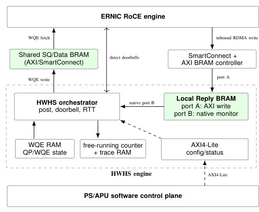
<figcaption class="paper-figure-caption"><b>Fig 4.</b> Fig. 5: Architecture of the VPK120 hardware-handshake engine, which connects the APU control plane, ERNIC, local request/reply storage, and hardware orchestrator.</figcaption>
</figure>
<figure class="paper-figure-card">
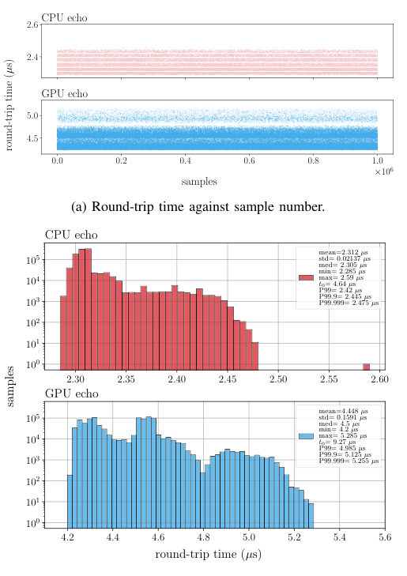
<figcaption class="paper-figure-caption"><b>Fig 5.</b> Fig. 6: Baseline steady-state round-trip latency over 106 −1 rounds from FPGA controller to and from CPU or GPU copro- cessor. Timing is measured by the FPGA clock domain, with the first warm-up sample excluded from all plots. Statistical quantities are given in the legend of each distribution plot, with the excluded warm-up value given by t0.</figcaption>
</figure>

**Summary.** This paper presents Backline, a novel framework designed to bridge the gap between high-level quantum algorithm design in Python and the low-latency execution demands of fault-tolerant quantum computing. By compiling workloads through MLIR, it enables seamless, vendor-agnostic execution across CPUs, GPUs, and FPGAs. The results demonstrate microsecond-scale synchronous co-processing, which is crucial for realizing utility-scale quantum systems.

**Why it may be interesting.** This work is highly relevant as it tackles the critical engineering bottleneck of scaling quantum computation by providing the necessary software stack to manage heterogeneous, low-latency classical control required for fault tolerance.

Detailed structure

**Main problem.** The primary challenge is transitioning quantum workloads from research prototypes to production-grade, fault-tolerant systems requiring extremely low-latency classical control.

**Main result.** The authors demonstrated microsecond-scale synchronous co-processing by compiling and executing quantum-classical workloads across CPUs, GPUs, and FPGAs using a novel framework.

**Method.** They introduced Backline, a heterogeneous compilation and runtime framework that allows high-level Python programming to compile down through MLIR to execute on diverse, low-latency hardware accelerators.

**Model / system.** The system targets Fault-Tolerant Quantum Computing (FTQC) architectures, requiring tight feedback loops for Quantum Error Correction (QEC). The physical demonstration uses an AMD VPK120 FPGA board controlling communication over RoCE v2 to an AMD Ryzen CPU and AMD Instinct GPU.

**Key observables.** Median steady-state round-trip latencies (e.g., 2.305 $\mu$s to CPU, 4.5 $\mu$s to GPU) and cycle-accurate RTT profiling.

**Important parameters / regimes.** Latency budgets for QEC decoders (1 ns–1 $\mu$s for real-time control) and the ability to handle various message-issuing cadences (back-to-back vs. random-delayed).

**Assumptions / limitations.** The framework assumes the ability to abstract hardware complexity while maintaining control over low-level timing requirements, and the benchmarking relies on dedicated hardware-paced measurement paths.

**Figures summary.** Figures illustrate the high-level compilation flow, state transition diagrams for the hardware orchestrator, and comparative traces showing how steady-state latencies shift when varying the message-issuing cadence (e.g., random-delayed vs. back-to-back).

**Paper structure.** The paper details the necessity of the framework (QEC/hardware constraints), the existing tools (PennyLane/Catalyst), the technical design of Backline for interop, and concludes with detailed usage demonstrations and benchmarks.

Abstract

Moving from quantum research and development to production-grade, fault-tolerant quantum workload execution remains one of the most significant challenges facing quantum platform builders. While Python frameworks have enabled an easy entry point for quantum algorithm design, the low-latency requirements for real-time quantum error correction (QEC) demand performance that traditional interpreted environments cannot provide. FPGAs and ASICs play a central role at these layers, but their specialized programming models make development rigid and time-consuming. CPUs, GPUs, and other accelerators introduce a different challenge: as infrastructure becomes increasingly heterogeneous, programming across different devices and their associated abstractions becomes more complex. Allowing researchers to write workloads in high-level languages that map to low-latency execution across diverse distributed target platforms will enable the development of key infrastructure for utility-scale quantum systems. For this, we introduce $\textit{Backline}$, a heterogeneous compilation and runtime framework built within PennyLane and Catalyst. Backline allows us to design and build quantum-classical workloads for high-performance and low-latency devices, with compilation directly from a Python interface through MLIR. We demonstrate the compilation and execution of several quantum workloads with low-latency data movement across a mix of CPUs, GPUs, and FPGAs, for both local and distributed remote hardware targets, all from a vendor-agnostic Python frontend. With an AMD VPK120 FPGA board as the controller, issuing each round from its hardware-handshake engine, we measured median steady-state round-trip latencies over RoCE v2 of $2.305~μ$s to an AMD Ryzen Threadripper PRO CPU and $4.5~μ$s to an AMD Instinct MI210 GPU across $10^6-1$ rounds per path, demonstrating microsecond-scale synchronous co-processing.

[↑ back to top](#top)

### [Semi-device-independent quantum randomness certification in semiconductor spin-noise measurements](http://arxiv.org/abs/2609.10037v1)

**Authors:** Hamid Tebyanian, Marius Cizauskas, Manfred Bayer, Marc Assmann, Alex Greilich  
**Type:** both · **Category:** quantum information and computing · **PDF:** <https://arxiv.org/pdf/2609.10037v1>  
**Analysis basis:** full PDF text, analyzed in chunks
**Topic relevance:** `quantum optics experiment` **3/5** · `quantum measurements` **2/5** · `QC/QI experiment` **1/5**

↔ Scroll figures horizontally

<figure class="paper-figure-card">

<figcaption class="paper-figure-caption"><b>Fig 1.</b> Figure 1: Source-adversarial certification of semiconductor spin noise. A, Sources: bulk n-GaAs and a charged (In, Ga)As quantum-dot ensemble in a microcavity, in transverse field Bx; probe Faraday rotation δθF (t) from equilibrium spin fluctuations generates the orthogonally polarised signal. B, Trust boundary. The source and any adversary ρAE with memory E are untrusted, bounded only by the tested mean-photon-number and declared analogue range; the receiver (GT analyzer, nPBS, balanced photoreceiver BPR, ADC) is trusted and calibrated. Two-phase test rounds fix ¯ntest; the truncated-Fock SDP returns h∗ cert, which sets the extractor output. C, Three regimes (Table 1): spin-noise-matched...</figcaption>
</figure>
<figure class="paper-figure-card">
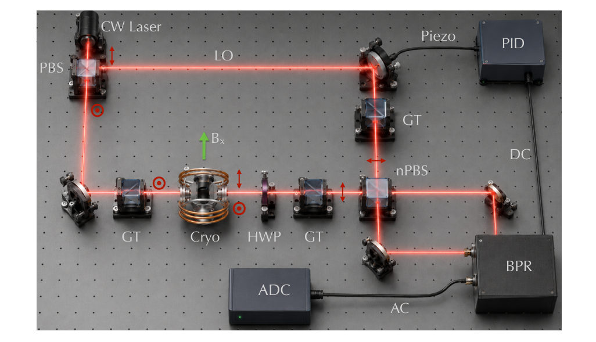
<figcaption class="paper-figure-caption"><b>Fig 2.</b> Figure 2: Experimental setup. A continuous-wave laser is split into a probe, which measures spin noise via Faraday rotation in the sample (held at 6 K in a transverse magnetic field Bx), and a local oscillator (LO) routed around the sample. The orthogonal-polarisation component after the sample interferes with the LO on a 50/50 non-polarizing beamsplitter (nPBS) and is detected by a balanced photoreceiver (BPR). The differential DC output drives the phase lock; the AC component is amplified, filtered, and digitized.</figcaption>
</figure>
<figure class="paper-figure-card">

<figcaption class="paper-figure-caption"><b>Fig 3.</b> Figure 3: Two spectral regimes in the stored spin-noise data. A, Normalised FPGA spectra stored for n-GaAs at 40 mW for the two saved lock settings (maximum- and minimum-spin- noise), showing the phase-selective narrow spin-noise resonance. B, Corresponding quantum-dot spectra at 20 mW: the spin-noise excess fills the analysed receiver band; the marker indicates an isolated 30.3% technical line outside the displayed range. Thin curves show the stored ratios; thick curves show frequency-binned medians for visibility. C, Full-band variance contrast ∆V of Eq. (1) from the 1.31 ms digitiser records at each recorded probe power; error bars are temporal-block standard errors from 128 contiguous...</figcaption>
</figure>
<figure class="paper-figure-card">

<figcaption class="paper-figure-caption"><b>Fig 4.</b> Figure 4: Narrowband and broadband spin-noise excess. Spectral excess 100 (Ssig − SLO)/SLO, at the maximum-spin-noise lock setting, obtained from Hann-windowed 1 µs blocks of the 1.31 ms records and collected into 10 MHz bins. A, n-GaAs. Traces are offset by 7% per probe power; dashed lines indicate their zero levels. The narrow Larmor signal increases with probe power within the predeclared matched band, 121 MHz to 131 MHz, shaded in grey. Filled circles give the matched-band excess. B, (In, Ga)As quantum dots, shown without offsets. The spin-noise excess extends across the receiver band and reaches its largest broadband value near 30 mW. Shaded bands and error bars denote ±1 standard...</figcaption>
</figure>
<figure class="paper-figure-card">
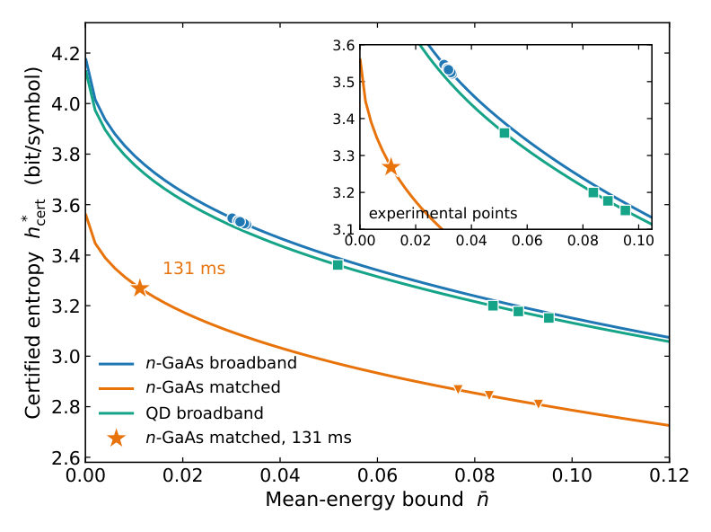
<figcaption class="paper-figure-caption"><b>Fig 5.</b> Figure 5: Certified entropy versus tested source energy. Certified per-symbol min- entropy h∗ cert as a function of the mean-energy bound ¯n for the three calibrated receiver modes, all obtained using the same truncated-Fock SDP with the corresponding noisy-homodyne POVM. Markers: experimental tested-energy operating points; star: the 131ms GaAs matched acquisition; inset: enlarged experimental region. GaAs broadband points form the vacuum-limited receiver benchmark, GaAs matched points the narrowband spin-noise-attributed certificates, and quantum-dot points the broadband signal-resolved certificates.</figcaption>
</figure>

**Summary.** This paper introduces a semi-device-independent method to certify the quantum randomness generated by semiconductor spin noise. By using SDP constrained only by measurable energy bounds, the authors demonstrate high, record-breaking entropy rates from quantum dot and GaAs spin noise sources. This advances the field by providing a practical, model-agnostic certification for solid-state quantum random number generators.

**Why it may be interesting.** This work directly addresses the practical implementation of quantum information protocols by providing a robust, model-independent certification method for a solid-state quantum source, bridging theory and experimental quantum optics.

Detailed structure

**Main problem.** The core challenge is certifying the quantum randomness generated by complex solid-state spin noise sources without needing a full, microscopic model of the underlying physics.

**Main result.** The authors achieved high certified entropy rates (up to 3.4 Gbit/s for quantum dots) from spin noise, significantly exceeding previous benchmarks.

**Method.** They employ a semi-device-independent (SDI) certification framework using Semidefinite Programming (SDP) to bound the conditional min-entropy, constrained only by measurable quantities like mean-photon-number bounds.

**Model / system.** The system utilizes semiconductor spin noise from platforms like (In,Ga)As quantum-dot ensembles and n-GaAs epilayers, measured via homodyne detection.

**Key observables.** Certified entropy rate ($h^*_{	ext{cert}}$), mean-photon-number bound ($ar{n}$), and measured noise variances ($\sigma^2$).

**Important parameters / regimes.** Achieved rates: 3.2–3.4 Gbit/s (QD) and 33 Mbit/s (GaAs); the certification tolerates resolved source energy contributions.

**Assumptions / limitations.** The analysis relies on rigorous Fock-space truncation and assumes the source is constrained by an experimentally tested mean-photon-number bound, rather than requiring full microscopic knowledge.

**Figures summary.** Figures illustrate the certification architecture, compare different spectral regimes (broadband vs. matched mode), and show the experimental setup using balanced photoreceivers.

**Paper structure.** The paper establishes the problem, details the SDI certification methodology using SDP, presents results across multiple solid-state platforms (QD and GaAs), and concludes with performance comparisons against other QRNG sources.

Abstract

Complex solid-state systems are promising platforms for scalable, high-bandwidth quantum random-number generation, yet certifying the quantum origin of their fluctuations remains difficult because the underlying microscopic dynamics are hard to model and validate. Here we demonstrate semi-device-independent quantum randomness certification from semiconductor spin noise, to our knowledge the first such certificate on any spin-noise source, without relying on a microscopic model of the spin system. The untrusted optical source is constrained by an experimentally tested mean-photon-number bound together with a declared analogue-range and per-sample clipping ceiling, while the trusted receiver is described as a calibrated, noisy, coarse-grained homodyne measurement. Using a semidefinite programme with rigorously controlled Fock-space truncation, we certify randomness that remains private against an adversary holding arbitrary quantum side information. Offline analysis yields certified entropy rates of $3.2$--$3.4$\,Gbit/s from a singly charged (In,Ga)As quantum-dot ensemble and $33$\,Mbit/s from $n$-GaAs in a spin-noise-matched detection mode. This exceeds the certified entropy rate of earlier spin-noise generators by more than two orders of magnitude, and the certificate tolerates a resolved per-symbol energy contribution from the solid-state emitter itself rather than requiring a near-vacuum input.

[↑ back to top](#top)

### [Cascade-induced high-performance nonreciprocal quantum batteries](http://arxiv.org/abs/2609.09690v1)

**Authors:** Niaz Ali Khan, Dahai He  
**Type:** theory · **Category:** other · **PDF:** <https://arxiv.org/pdf/2609.09690v1>  
**Analysis basis:** full PDF text, analyzed in chunks
**Topic relevance:** `methods for driven-dissipative` **3/5** · `correlated / nonlocal dissipation` **1/5** · `driven-dissipative phase transition` **1/5**

↔ Scroll figures horizontally

<figure class="paper-figure-card">
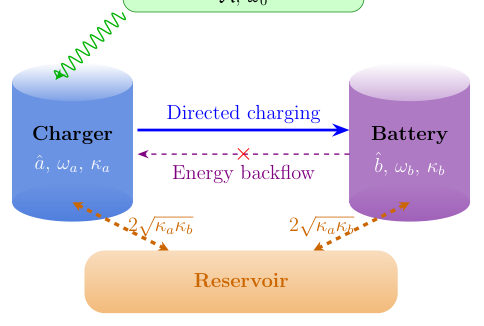
<figcaption class="paper-figure-caption"><b>Fig 1.</b> Figure 1. Schematic of the Cascaded QB model. The charger and battery are single-mode harmonic oscillators with fre- quencies ωa and ωb and local decay rates κa and κb, respec- tively. The charger is driven by a coherent laser of ampli- tude A and frequency ω0. The reservoir engineering induces a direct coupling √κaκb between the two systems, leading to unidirectional flow of energy from the charger to the battery.</figcaption>
</figure>
<figure class="paper-figure-card">
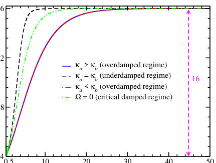
<figcaption class="paper-figure-caption"><b>Fig 2.</b> Figure 3. Energy efficiency (nonreciprocal-to-reciprocal stored energy ratio) versus rescaled time τ of the QB system. The system’s parameters are κa = 0.2ω, κb = 0.01ω (blue bold); κa = κb = 0.01ω (black dashed); κa = 0.01ω, κb = 0.2ω (red dotted-dashed); and Ω≈0 (green dotted-dashed). To enable a fair comparison, the coupling strength is set to √κaκb for reciprocal configurations.</figcaption>
</figure>
<figure class="paper-figure-card">
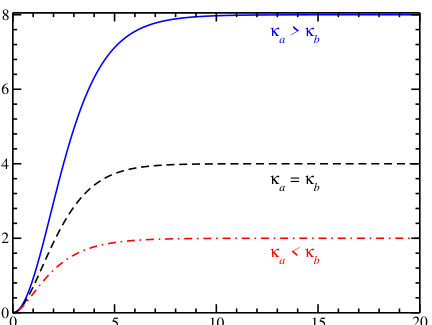
<figcaption class="paper-figure-caption"><b>Fig 3.</b> Figure 2. Energy efficiency (battery-to-charger energy ratio) of the nonreciprocal QB system as a function of rescaled time τ. The system’s parameters are κa = 0.02ω, κb = 0.01ω (blue bold); κa = κb (black dashed); and κa = 0.01ω, κb = 0.02ω (red dotted-dashed).</figcaption>
</figure>

**Summary.** This paper advances the theory of nonreciprocal quantum batteries by replacing an inconsistent theoretical framework with a mathematically rigorous cascaded open quantum systems formalism. The authors demonstrate a significant improvement in energy storage efficiency, achieving a sixteen-fold advantage over prior benchmarks. This establishes a reliable theoretical foundation for high-performance quantum energy storage devices.

**Why it may be interesting.** This work directly addresses open quantum systems dynamics, energy harvesting, and the rigorous mathematical treatment of dissipation, which are core topics in AMO physics and quantum optics.

Detailed structure

**Main problem.** To develop a mathematically rigorous framework for nonreciprocal quantum batteries that surpasses previously reported energy accumulation benchmarks.

**Main result.** The authors achieved a regime-independent sixteen-fold steady-state nonreciprocal energy advantage over reciprocal systems, establishing the cascaded formalism as the correct physical foundation.

**Method.** The study employs the rigorously established cascaded open quantum systems formalism, using the Lindblad master equation to model energy transfer dynamics.

**Model / system.** The model consists of a quantum battery and a charger, both modeled as single-mode harmonic oscillators coupled to a shared reservoir, governed by a Lindblad master equation.

**Key observables.** Energy Storage Capacity ($E_b(t)$), Useful Work (Ergotropy, $W_b(t)$), and Battery-to-Charger Energy Efficiency ($\eta$).

**Important parameters / regimes.** Damping rates ($\kappa_a, \kappa_b$), coupling strengths, and the ratio of these rates ($\kappa_a/\kappa_b$).

**Assumptions / limitations.** The primary assumption is that the cascaded formalism provides the correct physical description, correcting inconsistencies found in the Metelmann–Clerk formalism.

**Figures summary.** Figures illustrate the QB model, showing energy efficiency vs. time under various damping conditions, comparing nonreciprocal versus reciprocal energy storage.

**Paper structure.** The paper critiques prior work using the Metelmann–Clerk formalism, introduces the cascaded open quantum systems approach, derives time-dependent solutions for energy and efficiency, and compares the results against the established benchmarks.

Abstract

Nonreciprocal quantum batteries harness reservoir engineering for controlled energy transfer, heralding a paradigm shift for quantum energy storage. A prior study utilizing the Metelmann-Clerk formalism reported a fourfold enhancement in nonreciprocal energy accumulation over reciprocal counterparts. This fourfold enhancement, however, appears to stem from a Lindblad master equation that exhibits fundamental inconsistencies, which may systematically understate the actual nonreciprocal advantage. Our approach is rooted in the rigorously established cascaded open quantum systems formalism, which ensures both mathematical consistency and physical fidelity. Remarkably, we surpass the previously reported fourfold benchmark, attaining a regime-independent sixteenfold steady-state nonreciprocal energy advantage over reciprocal systems. We further uncover a dissipation-dependent battery-to-charger efficiency, fourfold under symmetric damping, surpassing this benchmark when the battery is less dissipative, and lower otherwise. This work establishes the cascaded formalism as a mathematically rigorous and experimentally viable foundation for high-performance quantum energy storage.

[↑ back to top](#top)

### [Convex-Gaussianity of fermionic Gibbs states in perturbation theory](http://arxiv.org/abs/2609.09608v1)

**Authors:** Kaifeng Bu, Yuanjie Ren  
**Type:** theory · **Category:** strongly correlated electrons · **PDF:** <https://arxiv.org/pdf/2609.09608v1>  
**Analysis basis:** full PDF text, analyzed in chunks
**Topic relevance:** `analog quantum simulation` **3/5** · `Keldysh / 2PI / non-Gaussian methods` **2/5**

↔ Scroll figures horizontally

<figure class="paper-figure-card">

<figcaption class="paper-figure-caption"><b>Fig 1.</b> FIG. 1. The weak- and strong-coupling windows for the 2- dim Fermi–Hubbard model on a square lattice. The solid curve is read on the left axis and the dashed curve on the right axis. The asymptotic labels refer to the bounds before compactification.</figcaption>
</figure>

**Summary.** This work rigorously determines the parameter regimes, particularly the inverse temperature $eta$, for which the Gibbs state of interacting fermions remains convex-Gaussian. It achieves this by developing distinct perturbative methods for both weak and strong coupling limits of the Fermi-Hubbard model. The findings provide deep structural insights into the quantum phases of correlated electron systems.

**Why it may be interesting.** The rigorous characterization of when quantum states retain simple mathematical structures (like being convex combinations of Gaussian states) is crucial for understanding entanglement structure and computational complexity in strongly correlated quantum materials.

Detailed structure

**Main problem.** The paper investigates the conditions under which the Gibbs state of weakly perturbed interacting fermionic systems remains convex-Gaussian.

**Main result.** It establishes precise, distinct bounds on the inverse temperature ($eta$) for convex-Gaussianity in both the weak-coupling (perturbing around free fermions) and strong-coupling (perturbing around atomic limits) regimes of the Fermi-Hubbard model.

**Method.** The analysis employs perturbation theory, utilizing Majorana operators and establishing membership in the Convex-Gaussian Cone (FGC) through structured expansions and inductive proofs.

**Model / system.** The primary model is the Fermi-Hubbard model, $H = tH_{	ext{hop}} + U V_{	ext{int}}$, studied on a general graph. The analysis is generalized to sparse Hamiltonians $H=H_0+V$ where $H_0$ is quadratic.

**Key observables.** Convex-Gaussianity of the Gibbs state $
ho_eta$, and the expectation values of dressed single-string factors.

**Important parameters / regimes.** Inverse temperature ($eta$), hopping strength ($|t|$), interaction strength ($|U|$), and the coupling ratio $\epsilon = |U|/(4|t|)$.

**Assumptions / limitations.** The analysis is restricted to specific perturbative regimes (weak or strong coupling) and relies on the Hamiltonian being sparse or having specific structural properties.

**Figures summary.** Figure 1 illustrates the distinct weak-coupling and strong-coupling boundaries for the 2D Fermi-Hubbard model, showing the parameter regimes where convex-Gaussianity is maintained.

**Paper structure.** The paper develops results sequentially: first for general sparse Hamiltonians, then applying these results to derive specific bounds for the weak-coupling regime, and finally developing a separate framework for the strong-coupling regime.

Abstract

We study the structure of Gibbs states in weakly perturbed interacting fermionic systems. First, for a sparse Hamiltonian $H=H_0+V$ with a quadratic term $H_0$ and a non-quadratic perturbation $V$ of scale $ε$, we show that the Gibbs state $ρ_β$ decomposes into a convex combination of Gaussian states whenever the inverse temperature satisfies $β\le O(\log(1/ε))$. Moreover, we prove that this bound is asymptotically tight by establishing that $β\le Θ(\log(1/ε))$ is necessary for certain sparse Hamiltonians. This general framework applies directly to the weak-coupling (small-$\vert{}U\vert{}$) regime of the Fermi--Hubbard model with hopping $t$ and on-site interaction $U$ on any graph of maximum degree $D$. Complementarily, in the strong-coupling (small-$\vert{}t\vert{}$) regime, we show that the Gibbs state remains convex-Gaussian up to $β\le O\big(\vert{}U\vert{}^{-1}\log(\vert{}U\vert{}/(D\vert{}t\vert{}))\big)$, revealing a mechanism for convex-Gaussianity distinct from the weak-coupling setting.

[↑ back to top](#top)

### [Multiparameter quantum bounds for entanglement-assisted aperture synthesis](http://arxiv.org/abs/2609.10111v1)

**Authors:** Kalaga Madhav, Pieter Kok, Nic Scott  
**Type:** theory · **Category:** quantum information and computing · **PDF:** <https://arxiv.org/pdf/2609.10111v1>  
**Analysis basis:** full PDF text, analyzed in chunks
**Topic relevance:** `interference shaping light` **3/5** · `quantum measurements` **2/5**

↔ Scroll figures horizontally

<figure class="paper-figure-card">
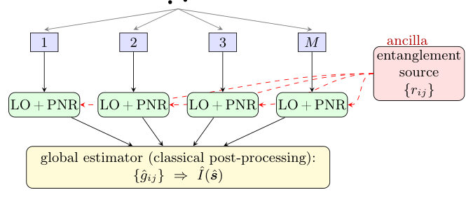
<figcaption class="paper-figure-caption"><b>Fig 1.</b> Figure 1. Entanglement-assisted aperture synthesis and the achievable receiver (Sec. 3). (1) Each of M telescopes collects starlight. An entanglement source distributes shared single-photon-entangled ancillas, rij pairs to baseline (i, j). (2) At each station a local receiver—linear optics (a quantum Fourier transform) and photon-number-resolving (PNR) detection—realizes the per-baseline factor f(r) of Eq. (5) using local operations and classical communication (LOCC). (3) A global classical estimator combines the outcomes into visibilities {ˆgij} and the image ˆI(ˆs); approaching the Holevo bound is expected to require this stage to act jointly across baselines (Sec. 5).</figcaption>
</figure>
<figure class="paper-figure-card">

<figcaption class="paper-figure-caption"><b>Fig 2.</b> Figure 2. Incompatibility R versus separation in units of the resolution element λ/Bmax, for generic M-station arrays and the real CHARA array. R = 0 (desirable) means the SLD bound is attainable and per-baseline processing is optimal; R &gt; 0 means an unavoidable multiparameter penalty [Holevo bound ≤(1 + R)× SLD]. A point source gives R = 0; every extended-source model examined gives R &gt; 0. Numerical details in App. A.</figcaption>
</figure>
<figure class="paper-figure-card">

<figcaption class="paper-figure-caption"><b>Fig 3.</b> Figure 3. Weighted parameter variance Tr[WJ −1] (per photon) versus source separation for an explicit collective (global QFT) receiver, an explicit pairwise (beam-splitter) receiver, and the SLD (QFI) bound, for a two-point source on a generic M = 6 array. The collective receiver tracks the SLD bound to within ∼7%; the pairwise receiver is ∼10× worse. App. A.</figcaption>
</figure>
<figure class="paper-figure-card">

<figcaption class="paper-figure-caption"><b>Fig 4.</b> Figure 4. Noisy-resource advantage threshold. (a) Per-baseline phase QFI versus baseline length L: direct interferometry decays with fibre loss, while entanglement assistance is set by the (length-independent) repeater efficiency; they cross at L⋆≈20 km. (b) Break-even baseline L⋆of Eq. (11) over the Bell-fidelity/repeater-efficiency plane.</figcaption>
</figure>
<figure class="paper-figure-card">
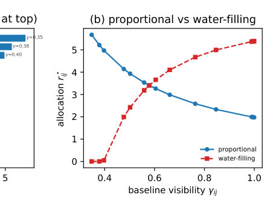
<figcaption class="paper-figure-caption"><b>Fig 5.</b> Figure 5. Entanglement allocation on the CHARA array (15 baselines, two-point source at 1 mas). (a) Proportional rule (12) per baseline, sorted by visibility (lowest γij on top, annotated). (b) Proportional versus true water-filling allocation. Numerical details in App. A.</figcaption>
</figure>

**Summary.** This work tackles the quantum limits for imaging with large interferometer arrays by treating the problem as a collective multiparameter estimation task. It shows that optimal measurement requires a global, collective receiver, which significantly beats standard pairwise measurements. The results provide actionable design guidelines, including a threshold determining when distributed entanglement surpasses direct optical links.

**Why it may be interesting.** It provides concrete quantum limits and design targets for quantum sensing in large-scale optical arrays, directly relevant to quantum optics and quantum metrology.

Detailed structure

**Main problem.** The paper formulates and solves the multiparameter quantum estimation problem for aperture synthesis using an M-station optical array.

**Main result.** A collective receiver measurement significantly outperforms pairwise receivers, and the optimal entanglement allocation follows a square-root law favoring low-visibility baselines.

**Method.** The analysis uses the Quantum Fisher Information (QFI) matrix, comparing the Holevo bound to the achievable variance using collective measurement strategies.

**Model / system.** The system is an M-station optical interferometry setup analyzing the coherence matrix G to estimate the brightness distribution I(s) across multiple baselines.

**Key observables.** Quantum Fisher Information (QFI) matrix, mean Uhlmann curvature, weighted parameter variance, and the incompatibility factor R.

**Important parameters / regimes.** The break-even baseline (L*), the entanglement resource factor f(r) = r/(1+r), and the number of stations M.

**Assumptions / limitations.** The analysis relies on the weak thermal light assumption and neglects several effects like transmission loss and finite detector efficiency.

**Figures summary.** Figures illustrate the incompatibility R for point vs. extended sources, compare weighted parameter variance for different receivers (collective vs. pairwise), and show the crossover defining the entanglement advantage threshold L*.

**Paper structure.** The paper progresses from formulating the multiparameter QFI problem, deriving the reduction lemma, comparing measurement strategies (collective vs. pairwise), determining the resource threshold, and finally solving the optimal entanglement allocation as a convex program.

Abstract

Entanglement-assisted optical interferometry promises diffraction-limited imaging over baselines where light cannot be physically combined, but existing theory treats only a single visibility on one two-station baseline. This work formulates the multiparameter estimation problem for an M-station array imaging an extended scene. A reduction lemma shows that the multimode quantum Fisher information (QFI) equals the mean photon number times the QFI of a single delocalized photon, collapsing the problem to a finite-dimensional one. The local photon-number superselection rule (SSR) erases all phase information from the bare state, while shared entanglement restores a fraction f(r)=r/(1+r) of the QFI on a baseline supplied with r pairs -- a factor shown to be achievable, since the reduced two-mode state of any pair is exactly the two-station weak-thermal state. The QFI matrix and its mean Uhlmann curvature reveal numerically that a point source is measurement-compatible, whereas for every extended-source model examined it is incompatible, the Holevo bound exceeding the symmetric-logarithmic-derivative (SLD) bound by up to ~74%. An explicit collective receiver -- a global mode-sorting (quantum Fourier transform) measurement -- then attains a weighted variance within ~7% of the SLD bound and roughly an order of magnitude below an explicit pairwise receiver, and a noisy-resource advantage threshold gives the break-even baseline (~20 km for near-term parameters) beyond which repeater-distributed entanglement beats direct transmission. Finally, the optimal allocation of a finite entanglement budget is a convex program with a closed-form proportional (square-root-law) solution favoring low-visibility baselines. These results recast quantum aperture synthesis as collective multiparameter estimation and give concrete design targets, illustrated on the CHARA array.

[↑ back to top](#top)

### [Universal correlations in the Abelian sandpile model](http://arxiv.org/abs/2609.10352v1)

**Authors:** Qiyu Liu, Jan-Niklas Herre, Prajit Baruah, Sebastian Dreizler, Christoph Karrasch, Wioletta Ruszel, Dirk Schuricht  
**Type:** theory · **Category:** statistical mechanics · **PDF:** <https://arxiv.org/pdf/2609.10352v1>  
**Analysis basis:** full PDF text, analyzed in chunks
**Topic relevance:** `non-equilibrium universality` **3/5** · `analog quantum simulation` **1/5** · `driven-dissipative phase transition` **1/5**

↔ Scroll figures horizontally

<figure class="paper-figure-card">

<figcaption class="paper-figure-caption"><b>Fig 1.</b> Figure 1: Toppling dynamics of the ASM on a 4 × 4 square lattice with wired boundary conditions, ie, all boundary sites being connected to an additional vertex which we call the sink. Closed (bulk) sites are shown in blue, open (boundary) sites in orange, and the surrounding box represents the sink; dotted lines indicate edges connecting boundary sites to the sink. (a) A stable configuration to which one grain has been added at an interior bulk site, which is thereby becomes unstable (hi = 5 &gt; z∗ i = 4, red ring). (b) After relaxation the system reaches the stable configuration C: the unstable site has toppled (losing z∗ i = 4 grains, dropping to h = 1) and each of its four neighbours has...</figcaption>
</figure>
<figure class="paper-figure-card">
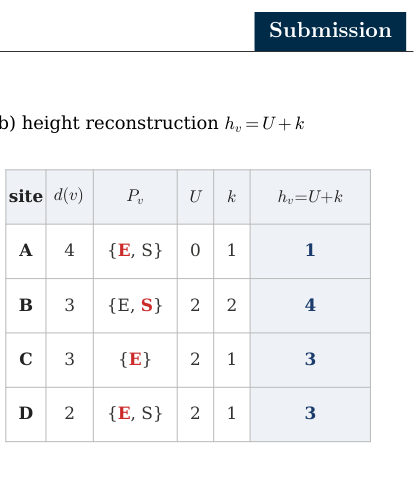
<figcaption class="paper-figure-caption"><b>Fig 2.</b> Figure 2: The Majumdar–Dhar burning bijection for the recurrent configuration C of Figure 1(b). (a) The sink-rooted spanning tree T = σ(C): arrows point from each site to its tree parent (towards the sink), and each site is labelled by its burning time d(v), equal to its depth in T. Only the tree edges are drawn (as arrows); the four closed (bulk) sites are marked A–D. (b) Reconstruction of the height at each bulk site. Reading the neighbours’ burning times from panel (a), U counts the neighbours that burn at time ≥d(v). The column Pv lists the previous-layer neighbours (those in burning layer d(v)−1) as a subset of {E, N, W, S} written in this fixed canonical order (one can analogously...</figcaption>
</figure>
<figure class="paper-figure-card">

<figcaption class="paper-figure-caption"><b>Fig 3.</b> Figure 2(b) tabulates d(v), Pv, U, k and the reconstructed hv for the four bulk sites A–D of the tree in Figure 2(a); the heights agree with those of C [Figure 1(b)], establishing the bijection T ↔C. The correspondence has a natural interpretation: both spanning trees and recurrent configurations encode global connectivity to the sink without frozen regions. A spanning tree provides every vertex with a unique path to the sink, while a recurrent configuration contains no FSC—no cluster of sites is so depleted that it can never be activated by avalanches from the boundary. The burning process bridges these viewpoints: the tree dictates the order in which fire propagates from the sink, and the...</figcaption>
</figure>
<figure class="paper-figure-card">

<figcaption class="paper-figure-caption"><b>Fig 4.</b> Figure 3 shows the three planar lattices studied in this work. Each lattice is characterised by its coordination number z (the number of nearest neighbours per bulk site) and the number of sites per unit cell:</figcaption>
</figure>
<figure class="paper-figure-card">

<figcaption class="paper-figure-caption"><b>Fig 5.</b> Figure 3: The three planar lattices studied in this work. (a) Square lattice (z = 4). (b) Honeycomb lattice (z = 3). (c) Kagome lattice (z = 4); the honeycomb and kagome do- mains are hexagonal, reflecting the natural boundary of the underlying triangular Bravais lattice. In each panel L is the linear system size (the domain diameter for the hexagonal cases), measured in nearest-neighbour (bond-length ℓ) units. A single nearest-neighbour bond of length ℓis highlighted (red) in each panel; we set ℓ= 1 throughout, so all dis- tances and system sizes are quoted in these units. Writing a for the lattice constant (a = ℓ square, a = √</figcaption>
</figure>

**Summary.** This work provides a comprehensive numerical and analytical study of the Abelian sandpile model on multiple lattices, aiming to characterize its universal correlations. By employing advanced sampling techniques and comparing results against Logarithmic CFT predictions, the authors confirm consistent scaling behavior across different geometries, including a first systematic study on the kagome lattice.

**Why it may be interesting.** While focused on classical statistical mechanics, the study of critical phenomena, scaling laws, and the connection to CFT provides deep insights into non-equilibrium dynamics and critical exponents, which are foundational concepts in quantum many-body physics.

Detailed structure

**Main problem.** The paper investigates the universal correlations and statistical properties of the Abelian sandpile model (ASM) on various 2D lattices.

**Main result.** The numerical and analytical results confirm that the ASM exhibits universal scaling behavior consistent with predictions from Logarithmic Conformal Field Theory (LCFT) across square, honeycomb, and kagome lattices.

**Method.** The authors combine advanced numerical sampling techniques (Wilson's algorithm with Majumdar-Dhar bijection) with analytical derivations using lattice Green functions to study bulk correlation functions.

**Model / system.** The system is the Abelian sandpile model (ASM) defined on planar lattices (square, honeycomb, kagome). The dynamics are governed by local toppling rules, and the focus is on the resulting recurrent, stable configurations.

**Key observables.** Bulk correlation functions (two-point), height probabilities (e.g., height-1 probability), and universal scaling exponents ($\Delta$).

**Important parameters / regimes.** The lattice structure (coordination number $z$) and the correlation length $\xi 	o \infty$ (criticality).

**Assumptions / limitations.** The analysis assumes the validity of the LCFT framework for describing the critical scaling limit, and for the kagome lattice, specific regularization choices for Green function calculations are made.

**Figures summary.** Figures illustrate the sandpile dynamics, the Majumdar–Dhar burning bijection, and show data plots of rescaled correlation functions versus $\log r$ or $\log^2 r$ for the kagome lattice.

**Paper structure.** The paper progresses from defining the ASM and its recurrence properties, establishing the mapping between recurrent configurations and spanning trees, presenting numerical studies on multiple lattices, and finally deriving analytical results for specific lattice types like the kagome lattice via Green functions.

Abstract

We numerically study the bulk correlation functions in the two-dimensional Abelian sandpile model, aiming both to compare with the predictions of logarithmic conformal field theory and to extend the analysis to lattices where analytical methods are difficult to apply. Wilson's algorithm efficiently generates large-scale uniform spanning trees in parallel, which can be mapped to independent recurrent configurations via the Majumdar--Dhar burning bijection, eliminating sample autocorrelations and yielding fast convergence. On the square (single-sublattice) and honeycomb (two-sublattice) lattices our results agree well with the analytical predictions. For the kagome lattice we provide the first systematic numerical study of the bulk correlation functions, and cross-check the bulk height-1 probability against a closed-form analytical expression that we also derive here via the lattice Green function.

[↑ back to top](#top)

### [Dual-unitary Circuits as a Platform for Quantum Reservoir Computing](http://arxiv.org/abs/2609.09292v1)

**Authors:** Gabriel O. Alves, Pieter W. Claeys  
**Type:** theory · **Category:** disordered systems and neural networks · **PDF:** <https://arxiv.org/pdf/2609.09292v1>  
**Analysis basis:** full PDF text, analyzed in chunks
**Topic relevance:** `analog quantum simulation` **3/5** · `methods for driven-dissipative` **1/5**

↔ Scroll figures horizontally

<figure class="paper-figure-card">
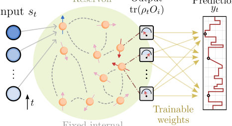
<figcaption class="paper-figure-caption"><b>Fig 1.</b> FIG. 1. An illustration of a quantum reservoir computer. The data (blue), e.g. a time series st, is encoded into a system which displays intricate internal dynamics. By evolving, the system processes the data in a nonlinear way and with memory. By performing measure- ments on the system, features are extracted which are then used to train the weights W by fitting the target function (red) yt. Unlike standard neural network architectures, the “internal weights” in the reservoir are fixed and set by the choice of reservoir, and the train- ing procedure reduces to a linear optimization on the single output layer. This picture represents a simplified QRC protocol where all the input data is...</figcaption>
</figure>
<figure class="paper-figure-card">

<figcaption class="paper-figure-caption"><b>Fig 2.</b> FIG. 2. Dynamical phase diagram for the DU XXZ circuit follow- ing the parametrization in Eq. (2). By varying the Trotter step we can move towards and away from the DU line at ∆t = π/4. The in- set details the behavior of the circuit at this point. First, by turning off the on-site disorder with ϵ = 0 (green edge), we have an inter- acting integrable circuit. The circuit displays solitons in this regime, which lead to unique behavior and memory effects, as we discuss in Sec. V A. Meanwhile, at Jz = 1 the circuit is non-interacting (red edge). The circuit is in the chaotic regime (blue region) for Jz , 1 and nonvanishing on-site disorder (ϵ &gt; 0).</figcaption>
</figure>
<figure class="paper-figure-card">
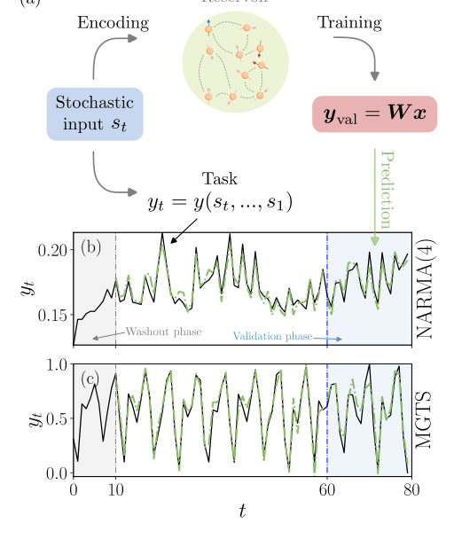
<figcaption class="paper-figure-caption"><b>Fig 3.</b> FIG. 3. (a) The stochastic input st is fed into Eq. (21) to encode its value into the system; simultaneously, it also serves as an argument for the chosen benchmark yt from Sec. III B [any of Eqs. (28)-(32)]. The feature matrix x is computed through Eq. (24), which allows for the calculation of the weight vector W in Eq. (25). Finally, the validation results are calculated through Eq. (26), where we try to fit the target time-series yt. We plot some basic numerical results to illustrate the framework, where we compare the analytical time- series (solid black line) with the numerical predictions (dashed green line), for both the (b) NARMA(4) and (c) the MGTS tasks. The data is split into...</figcaption>
</figure>
<figure class="paper-figure-card">

<figcaption class="paper-figure-caption"><b>Fig 4.</b> FIG. 4. An illustration of the sine-square task. The gray dotted line depicts the stochastic inputs st, which belong either to a square or sine wave. The corresponding classification yt = y(st) ∈{0, 1}, given by Eq. (31), is drawn with the solid black line. As a further guide to the eye, we also shade these regions with red and green colors on the background. The value Nss = 20 is the number of points per packet. Finally, the blue dashed line displays an example for the fitted function.</figcaption>
</figure>
<figure class="paper-figure-card">

<figcaption class="paper-figure-caption"><b>Fig 5.</b> FIG. 5. Information processing capacity as a function of the delay for: [top row, panels (a) and (b)] the STM task [Eq. (28)], [middle row, panels (c) and (d)] the parity check task [Eq. (29)], and [bot- tom row, panels (e) and (f)] the NARMA(τ + 3) task [Eq. (30)]. We plot the results for the integrable (left column, ϵ = 0) and ergodic regimes (right column, ϵ = 1), for four values of the Trotter step, ∆t = π/4 (the dual-unitary point) through π/7, indicated by a color gradient from green/blue (at ∆t = π/4) to pink (away from dual- unitarity); marker shapes indicate the task (diamonds: STM, circles: parity check, triangles: NARMA). The dashed vertical line marks τ = L. The presence of...</figcaption>
</figure>

**Summary.** This work proposes utilizing dual-unitary circuits as a superior physical platform for Quantum Reservoir Computing. By leveraging the inherent properties of dual-unitarity, the authors demonstrate enhanced memory retention and nonlinear processing power while simultaneously improving robustness against quantum noise. This bridges advanced quantum circuit design with practical quantum machine learning applications.

**Why it may be interesting.** The connection between the mathematical structure of dual-unitary operators (a topic in quantum control/geometry) and the practical requirements of machine learning (QRC) provides a deep theoretical link between quantum information theory and artificial intelligence.

Detailed structure

**Main problem.** The paper explores using dual-unitary (DU) circuits as a novel, physically realizable platform for Quantum Reservoir Computing (QRC). It aims to show that this specific circuit structure enhances the performance of QRC compared to generic quantum circuits.

**Main result.** DU circuits are shown to improve memory effects, enhance nonlinear processing capabilities, and provide inherent protection against finite-shot noise compared to standard reservoir models.

**Method.** The analysis combines theoretical characterization of DU properties with numerical verification of QRC performance metrics, such as Information Processing Capacity (IPC).

**Model / system.** The model is a quantum reservoir built using a 1D lattice of qubits evolving under a Floquet unitary $U_F$, which is constructed from a core gate $V$ based on the XXZ spin chain Hamiltonian. The QRC process follows an erase-input protocol.

**Key observables.** Memory effects (related to solitons), nonlinear processing capability, protection against exponential concentration, and Information Processing Capacity (IPC).

**Important parameters / regimes.** Anisotropy ($J_z$), Trotter step ($\Delta t$), and on-site disorder ($\epsilon$). Specific regimes include interacting integrable ($\epsilon=0, \Delta t=\pi/4$) and chaotic regimes.

**Assumptions / limitations.** The analysis relies on the assumption that the DU property provides a beneficial structure for the reservoir dynamics, and it uses the folded representation for analyzing the unitary evolution.

**Figures summary.** Figure 1 illustrates the general QRC protocol flow. Figure 2 shows a dynamical phase diagram mapping out different operational regimes based on system parameters. Figure 3 details the full QRC protocol flow (Washout $
ightarrow$ Training $
ightarrow$ Validation).

**Paper structure.** The paper reviews the QRC protocol, investigates the role of dual-unitarity and the Trotter step, analyzes memory effects via solitons, examines nonlinear processing, and concludes by quantifying the noise resilience of the DU platform.

Abstract

Quantum reservoir computing (QRC) is a machine learning approach which employs the internal dynamics of a physical system (the reservoir) to encode and process information. In this work, we explore the use of dual-unitary circuits in a brickwork architecture as a platform for QRC, well suited to current noisy intermediate-scale quantum devices. Dual-unitary circuits present both practical and conceptual advantages. Our results indicate that, under appropriate conditions, dual-unitarity can lead to an enhanced regime of operation: we numerically verify that it improves memory effects and nonlinear processing, and shields against finite-shot noise, mitigating exponential concentration. Moreover, dual unitarity offers an intuitive picture of how operator dynamics gives rise to memory and nonlinear processing in circuit-based reservoirs.

[↑ back to top](#top)

### [Effect of Spherical Confinement on the 2-TIPS of Soft Repulsive Spherocylinders](http://arxiv.org/abs/2609.10014v1)

**Authors:** Jaydeep Mandal, Chandan Dasgupta, Prabal K. Maiti  
**Type:** theory · **Category:** statistical mechanics · **PDF:** <https://arxiv.org/pdf/2609.10014v1>  
**Analysis basis:** full PDF text, analyzed in chunks
**Topic relevance:** `non-equilibrium universality` **3/5** · `driven-dissipative phase transition` **1/5**

↔ Scroll figures horizontally

<figure class="paper-figure-card">
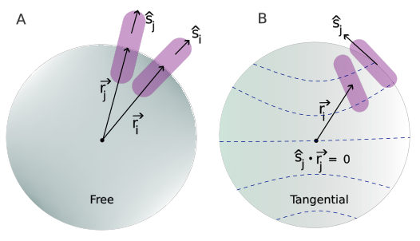
<figcaption class="paper-figure-caption"><b>Fig 1.</b> Fig. 1 A) The free anchoring of the SRS on a sphere - only the center of mass (COM) positions (⃗r) are confined on the sphere, the particles can rotate freely. B) The tangential anchoring condition - The COM positions (⃗r) are confined on the sphere, and the orientations (ˆs) are tangential on the spherical surface.</figcaption>
</figure>
<figure class="paper-figure-card">
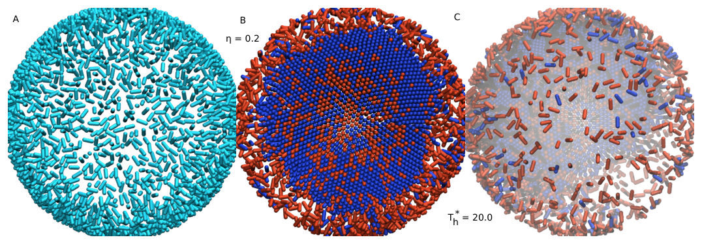
<figcaption class="paper-figure-caption"><b>Fig 2.</b> Fig. 2 Structures of the spherical monolayer of SRS: A) The initial configuration of the LC phase at a packing fraction of η = 0.2 for a system with A = 2.0,N = 2500,T ∗= 1.0. The equilibrated structure shows a small but finite orientational order even at such a low packing fraction. The particles are shown in cyan color. When 2-Temperature driven activity is introduced in the system, it shows a steady state structure of a co-existing dense (B) and dilute (C) regions. The representative snapshot is for (T ∗ c = 2.0,T ∗ h = 20.0). The hot particles are shown in red, whereas the cold ones are shown in blue. B) shows the top view, highlighting the dense cluster, which is composed of both hot...</figcaption>
</figure>
<figure class="paper-figure-card">
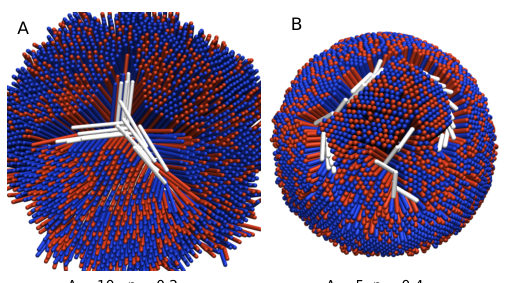
<figcaption class="paper-figure-caption"><b>Fig 3.</b> Fig. 3 Effect of aspect ratios on the structure of the coexisting phases in a spherical monolayer: A) The orientational defects arising in the phase- separated cold zone is shown in white. The red and blue particles indicate ‘hot’ and ‘cold’ respectively. Snapshot taken for a system of SRS with aspect ratio A = 10.0 at a packing fraction of η = 0.2. This occurrence of defect structures with long rods at lower packing fractions can be attributed to the steric strain at the tail ends of the SRSs inside the sphere. B) Similar orientational defect structures, shown in white, arise for even smaller rods (A = 5.0) at a higher packing fraction of η = 0.4. The red and blue colors indicate the ‘hot’...</figcaption>
</figure>
<figure class="paper-figure-card">
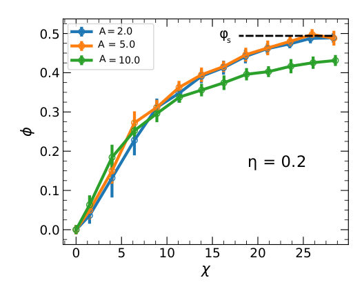
<figcaption class="paper-figure-caption"><b>Fig 4.</b> Fig. 4 Effect of aspect ratios on the phase separation in the spherical monolayer system: for a specific packing fraction η = 0.2, the phase separation order parameter φ is plotted with activity χ for different aspect ratios of the rods, A = 2.0,5.0 and 10.0. Phase separation increases with activity for all cases, but the saturation value of the order parameter (φs) reduces as the rods become longer. φs is indicated in the figure for A = 2.0.</figcaption>
</figure>
<figure class="paper-figure-card">
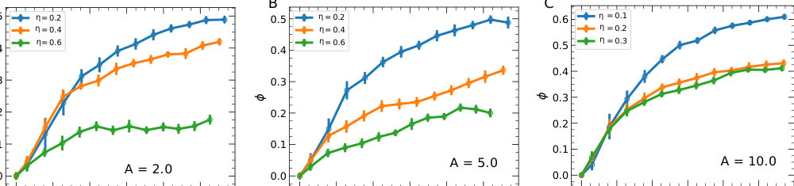
<figcaption class="paper-figure-caption"><b>Fig 5.</b> Fig. 5 Effect of packing fraction on the phase separation in the spherical monolayer system: The phase separation order parameter is plotted against the activity χ at different packing fractions η = 0.2,0.4, and 0.6 for A) short rods A = 2.0, B) medium rods A = 5.0 and C) long rods A = 10.0. For all the figures A) B) and C), the value at which the phase separation order parameter saturates decreases with packing fraction. This can be attributed to the enhanced trapping with packing fraction in confined systems.</figcaption>
</figure>

**Summary.** This work models the phase separation of soft repulsive spherocylinders confined to a sphere under non-equilibrium conditions (2-TIPS). Using MD simulations, the authors demonstrate that confinement alters the phase diagram, leading to dense-dilute coexistence. The research highlights the critical role of curvature in suppressing expected nematic ordering, providing valuable insights for soft matter physics.

**Why it may be interesting.** The study provides insights into how geometric confinement (spherical curvature) fundamentally modifies phase separation dynamics, offering analogies to non-equilibrium processes relevant in active matter and complex fluids.

Detailed structure

**Main problem.** The study investigates the 2-Temperature induced phase separation (2-TIPS) in a system of soft repulsive spherocylinders confined on a spherical surface.

**Main result.** The system exhibits phase separation into coexisting dense and dilute regions, with confinement significantly altering the expected phase behavior, such as suppressing nematic ordering.

**Method.** Molecular Dynamics (MD) simulations were employed in the NVT ensemble, utilizing a 2-temperature framework to model non-equilibrium activity.

**Model / system.** The system consists of soft repulsive spherocylinders (SRS) confined either as a spherical monolayer or a spherical shell. Interactions are modeled using the WCA potential, and the non-equilibrium state is induced by coupling subsystems at different temperatures.

**Key observables.** Phase separation extent quantified by the order parameter $\varphi$, local density distribution, and orientational ordering analyzed via the probability density distribution of the angle $\psi$.

**Important parameters / regimes.** Packing fraction ($\eta$), rod aspect ratio ($A$), and the activity difference ($\chi$) are key parameters varied across different confinement geometries.

**Assumptions / limitations.** The analysis assumes the validity of the 2-temperature model for inducing non-equilibrium activity and notes limitations regarding the systematic study of the nematic phase across all aspect ratios.

**Figures summary.** Figures illustrate the coexisting dense/dilute regions (hot/cold) upon 2-TIPS, showing defect structures and the bimodal density distribution confirming phase coexistence.

**Paper structure.** The paper systematically compares results between free and tangential anchoring conditions on the spherical surface, detailing the phase separation mechanism and contrasting the findings with bulk 3D systems.

Abstract

We studied the 2-Temperature induced phase separation (2-TIPS) in a system of soft repulsive sphe rocylinders (SRS), confined on the surface of a sphere. We used two different anchoring conditions for the SRS on the spherical surface- free and tangential. For the free anchoring, increasing either the packing fraction or the rod aspect ratio suppresses phase separation between the active and passive subsystems, and the system corresponds to a dense-dilute phase co-existence. These phenomena can be explained via the trapping effect and are emergent due to the confinement. For the tangential anchoring, the system phase separates from its initial isotropic state into a locally ordered dense region and a disordered dilute region. Our work provides useful insights into phase separation in binary mixtures under spherical confinement.

[↑ back to top](#top)

### [Optimal Intermediate Hamiltonians for Non-Equilibrium Free Energy Calculations: A Numerical Study of Markov Models](http://arxiv.org/abs/2609.10519v1)

**Authors:** David Beyer, Helmut Grubmüller  
**Type:** theory · **Category:** statistical mechanics · **PDF:** <https://arxiv.org/pdf/2609.10519v1>  
**Analysis basis:** full PDF text, analyzed in chunks
**Topic relevance:** `methods for driven-dissipative` **3/5** · `quantum measurements` **1/5**

↔ Scroll figures horizontally

<figure class="paper-figure-card">

<figcaption class="paper-figure-caption"><b>Fig 1.</b> FIG. 1. Schematic representation of the discrete-time Markov models studied in this work. The discrete states are arranged on a line, and transitions are allowed only between neighboring states. Transition probabilities are given by the Glauber transition matrix elements π(x →y;τ) (Equation 6), which depend on the time-dependent Hamiltonian H(x,τ +1).</figcaption>
</figure>
<figure class="paper-figure-card">

<figcaption class="paper-figure-caption"><b>Fig 2.</b> FIG. 2. Optimal intermediate Hamiltonians H(2,τ) for the two-state system with an initial energy of Ei = −8. (a): H(2,τ) for N = 10 intermediates and different final energies Ef. (b): H(2,τ) for a final energy of Ef = 8 and different numbers of intermediates N. The MC time was normalized by the total number of steps N +1. The inset magnifies the initial jump.</figcaption>
</figure>
<figure class="paper-figure-card">
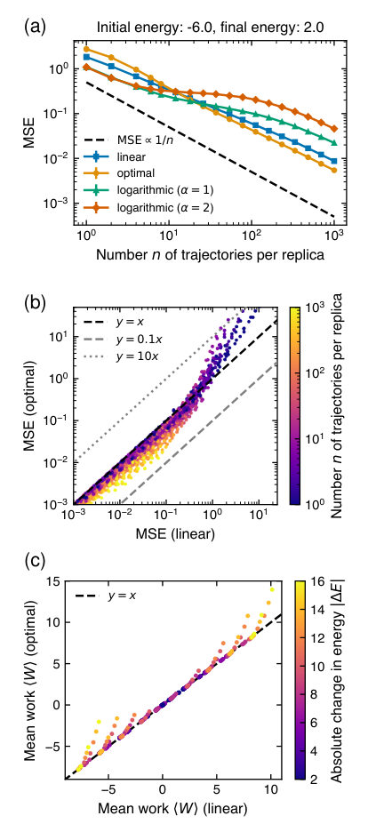
<figcaption class="paper-figure-caption"><b>Fig 3.</b> FIG. 3. Performance of optimal intermediates for a two-state sys- tem. (a): Dependence of the MSE for linear, logarithmic, and opti- mal intermediates on the number n of trajectories per replica. The initial energy is set to Ei = −6, the final energy is set to Ef = 2, and the number of intermediate steps is N = 10. The black dashed line shows the expected power-law decay MSE ∝1/n for n →∞. (b): Correlation plot of the MSE for linear and optimal intermediates. (c): Correlation plot of the mean work performed on the system for linear and optimal intermediates. In all subfigures (a)–(c), error bars corresponding to the standard error of the mean of the shown quanti- ties are included, but...</figcaption>
</figure>
<figure class="paper-figure-card">

<figcaption class="paper-figure-caption"><b>Fig 4.</b> FIG. 4. Optimal intermediates and their performance for the double-well potential. (a): Toy model for a double-well potential with barrier heights ∆1 and ∆2. (b): Optimal intermediate Hamiltonian for a double-well potential with ∆1 = 6, ∆2 = 3, and N = 100 intermediate MC steps. (c): Correlation plot of the MSE for linear and optimal intermediates. (d): Correlation plot of the mean work performed on the system for linear and optimal intermediates. For subfigures (c) and (d), error bars corresponding to the standard error of the mean of the shown quantities are included, but smaller than the symbol size.</figcaption>
</figure>
<figure class="paper-figure-card">
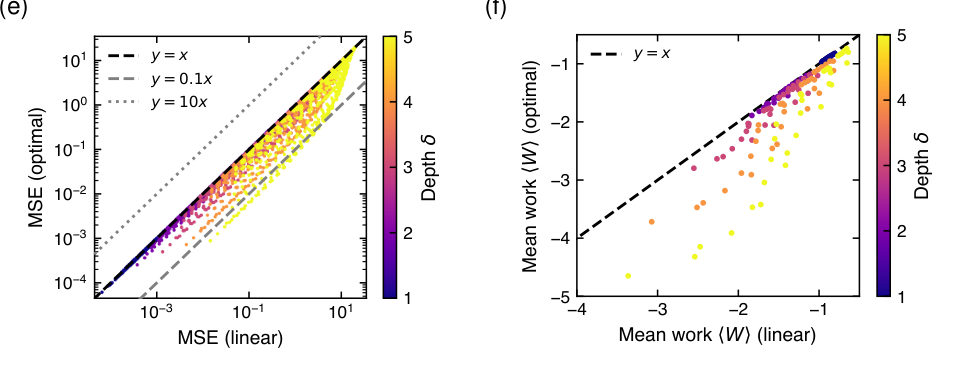
<figcaption class="paper-figure-caption"><b>Fig 5.</b> FIG. 5. Optimal intermediates and their performance for the shifted potential well. (a): Toy model for a potential well of depth δ that is shifted from x = 1 at time τ = 0 to x = m at time τ = N +1. (b): Optimal intermediate Hamiltonian for a shifted potential well of depth δ = 5, with m = 10 states and N = 100 intermediate MC steps. The insets show magnified views of the initial and final jumps. (c): Mean position ⟨x⟩as a function of τ for δ = 5, m = 10 states, and N = 100, shown for optimal, linear, and logarithmic (α = 1 and α = 2) intermediates. (d): Correlation plot of the time-dependent mean position ⟨x⟩obtained for optimal and linear intermediates. The curves are colored according to...</figcaption>
</figure>

**Summary.** This paper develops a method to find optimal time-dependent Hamiltonians that significantly improve the convergence of free energy estimates derived from non-equilibrium simulations. By minimizing the Mean Squared Error (MSE) of the Jarzynski estimator for Markov models, the authors show that these optimal Hamiltonians can drastically outperform simple linear or logarithmic interpolations. This offers a powerful new tool for calculating free energy barriers in complex physical systems.

**Why it may be interesting.** This work provides concrete, computationally derived heuristics for improving non-equilibrium free energy calculations, which is crucial for simulating processes in molecular dynamics and condensed matter systems where rare events dominate.

Detailed structure

**Main problem.** The paper addresses the poor convergence of free energy estimates derived from non-equilibrium, finite-time switching simulations using the Jarzynski relation.

**Main result.** Optimal intermediate Hamiltonians, determined by minimizing the Mean Squared Error (MSE), can reduce the MSE by over an order of magnitude compared to simple interpolations.

**Method.** The authors use gradient-based minimization techniques applied to an exact tilted-master-equation representation of the MSE for discrete-time Markov models.

**Model / system.** The study uses discrete-time Markov models defined on a line of $m$ states, whose evolution is governed by a time-dependent Hamiltonian $H(x, 	au)$ within a master equation framework.

**Key observables.** Mean Squared Error (MSE) of the Jarzynski estimator, mean work ($\langle W 
angle$), and mean position ($\langle x 
angle$).

**Important parameters / regimes.** The complexity is varied by changing the number of states ($m$), the depth ($\delta$) of the potential well, and the number of intermediate steps ($N$).

**Assumptions / limitations.** The analysis is restricted to discrete-time Markov models, and the optimization relies on the large-sample limit ($n \gg 1$) for the MSE calculation.

**Figures summary.** Figures systematically compare the calculated mean position ($\langle x 
angle$) and the MSE for various intermediate Hamiltonians (optimal vs. linear/logarithmic) across different model parameters ($\delta, m, N$).

**Paper structure.** The paper first establishes the problem using the Jarzynski relation for Markov models. It then develops the mathematical framework to minimize the MSE using tilted-master-equations. Finally, it applies this method to complex model systems like the shifted potential well, comparing optimal results against standard interpolation schemes.

Abstract

The Jarzynski relation enables the estimation of equilibrium free energy differences from non-equilibrium, finite-time switching simulations. These estimates usually converge poorly because rare trajectories dominate the exponential work average. Here, we numerically determined and explored the sequence of intermediate Hamiltonians connecting initial and final states that minimize the mean squared error (MSE) of the Jarzynski estimator and thereby enhance convergence. For discrete-time Markov models, an exact tilted-master-equation representation of the MSE in the large-sample limit, combined with automatic differentiation, enables efficient gradient-based minimization over all intermediate energies. We applied our approach to three model systems of increasing complexity: a two-state model, a double-well potential, and a shifted potential well. In all three systems, the optimal intermediate Hamiltonians jump at the initial and final times. Extensive Monte Carlo simulations show that optimal intermediates can reduce the MSE by more than an order of magnitude compared with linear and logarithmic interpolation, most strongly for large changes in the energy landscape. Remarkably, they need not dissipate less work than intermediates yielding larger errors. Our results suggest heuristics for more efficient non-equilibrium free energy calculations of realistic molecular systems: optimal intermediate Hamiltonians jump at the initial and final times; for barrier-crossing problems, the barrier should be lowered rapidly and raised again later; and minimizing dissipation does not guarantee faster convergence.

[↑ back to top](#top)

### [A Separation between Full-Rank PVM and Assumption-free Self-Testing](http://arxiv.org/abs/2609.10013v1)

**Authors:** Ranyiliu Chen  
**Type:** theory · **Category:** quantum information and computing · **PDF:** <https://arxiv.org/pdf/2609.10013v1>  
**Analysis basis:** full PDF text, analyzed in chunks
**Topic relevance:** `quantum measurements` **3/5**

↔ Scroll figures horizontally

<figure class="paper-figure-card">
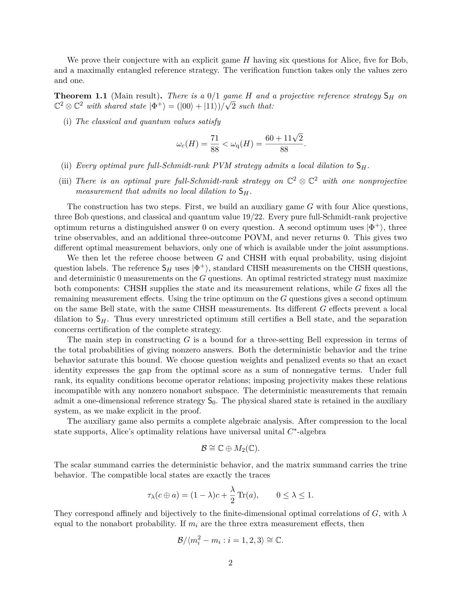
<figcaption class="paper-figure-caption"><b>Fig 1.</b> Low-resolution page preview, page 2</figcaption>
</figure>
<figure class="paper-figure-card">
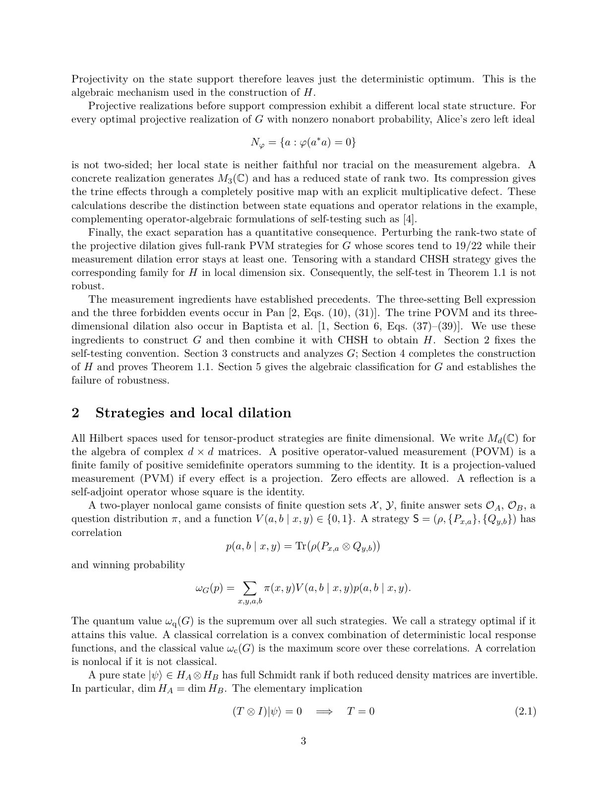
<figcaption class="paper-figure-caption"><b>Fig 2.</b> Low-resolution page preview, page 3</figcaption>
</figure>
<figure class="paper-figure-card">
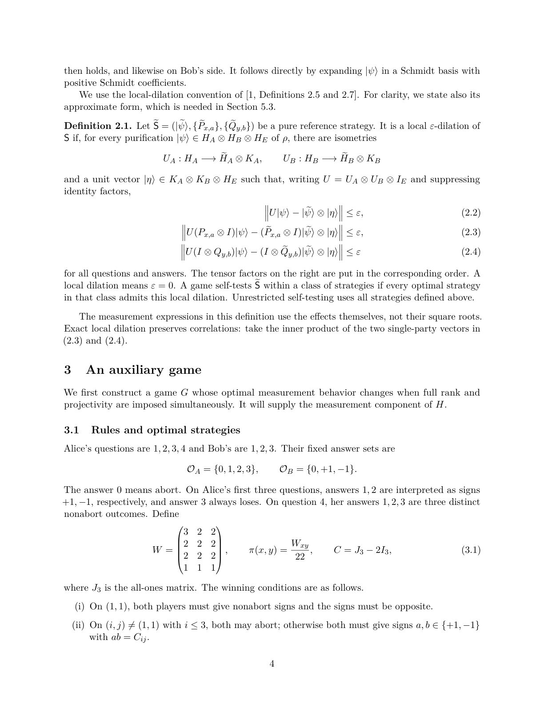
<figcaption class="paper-figure-caption"><b>Fig 3.</b> Low-resolution page preview, page 4</figcaption>
</figure>
<figure class="paper-figure-card">

<figcaption class="paper-figure-caption"><b>Fig 4.</b> Low-resolution page preview, page 5</figcaption>
</figure>
<figure class="paper-figure-card">
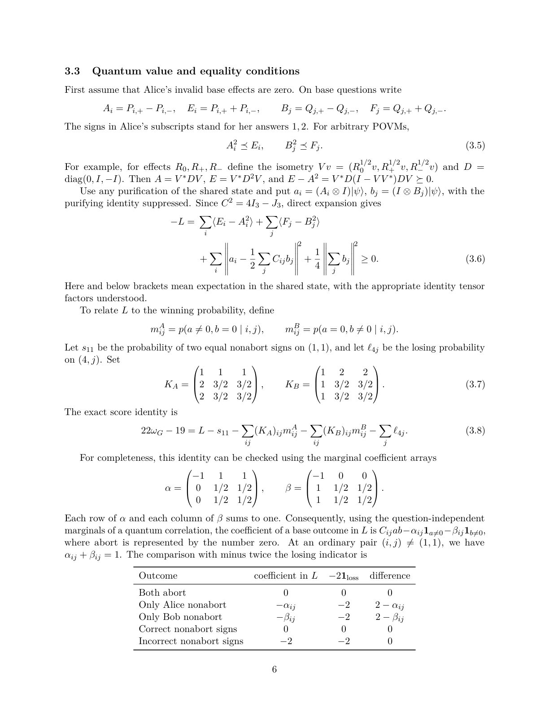
<figcaption class="paper-figure-caption"><b>Fig 5.</b> Low-resolution page preview, page 6</figcaption>
</figure>

**Summary.** This paper rigorously demonstrates that the self-testing of maximally entangled qubit strategies is not robust when restricted only to full-rank Projective Measurements (PVMs). By constructing a specific nonlocal game, the authors show that optimal correlations achievable with nonprojective measurements are fundamentally different from those achievable under the strict PVM assumption.

**Why it may be interesting.** This work provides a deep theoretical understanding of the limitations of self-testing protocols in quantum information theory, showing that imposing physical constraints (like projectivity) can fundamentally alter the set of achievable correlations.

Detailed structure

**Main problem.** The paper investigates the robustness of self-testing protocols for maximally entangled qubit strategies when restricted to pure, full-Schmidt-rank Projective Measurements (PVMs). It aims to resolve a conjecture regarding the simultaneous imposition of full rank and projectivity.

**Main result.** The authors prove a separation: an optimal strategy using a nonprojective measurement can be found that does not admit a local dilation to the reference state, demonstrating that the full-rank PVM self-test is not robust.

**Method.** The analysis constructs a nonlocal game $H$ combining CHSH with an auxiliary game $G$. The core method involves comparing the algebraic structure of optimal correlations derived from PVMs versus those from nonprojective measurements, utilizing local dilation concepts.

**Model / system.** The study uses qubits ($\mathbb{C}^2 \otimes \mathbb{C}^2$) and the maximally entangled state $|\Phi^+
angle$ within the framework of nonlocal games. The analysis heavily relies on the algebraic structure of optimal correlations, involving $C^*$-algebras like $C \oplus M_2(C)$.

**Key observables.** The quantum value ($\omega_q(H)$) and classical value ($\omega_c(H)$) of the constructed game $H$; the local dilation error.

**Important parameters / regimes.** The parameter $t \in (0, 1)$ controlling the deviation from the reference state; the specific correlation values like $19/22$ and $71/88$.

**Assumptions / limitations.** The argument hinges on the algebraic difference between deterministic optima (from projectivity) and trine optima (from nonprojectivity) in the auxiliary game $G$.

**Paper structure.** The paper first analyzes the auxiliary game $G$ to establish a discrepancy between its projective and nonprojective optima. It then combines $G$ with the CHSH game to construct $H$, culminating in the proof of the separation theorem showing the non-robustness of the PVM self-test.

Abstract

We construct a nonlocal game that self-tests a maximally entangled qubit strategy among pure full-Schmidt-rank projective strategies, but admits an inequivalent optimum using one nonprojective measurement. This resolves a conjecture of Baptista et al. on imposing full rank and projectivity simultaneously. The construction combines CHSH with an auxiliary game $G$ that forces deterministic answers under these assumptions and admits a trine POVM optimum without them. We classify the optimal correlations of $G$ as a line segment parametrized by the tracial states of $\mathbb{C}\oplus M_2(\mathbb{C})$. Projectivity on the state support removes the matrix summand, whereas projective dilations with nonzero nonabort probability have a nontracial local state whose zero left ideal is not two-sided. Finally, a family in local dimension six shows that the full-rank PVM self-test is not robust.

[↑ back to top](#top)

### [Bell tests for collider decay processes](http://arxiv.org/abs/2609.09294v1)

**Authors:** Danilo M. Fucci, Alexandre C. Orthey, Alan J. Barr, Christopher G. Timpson  
**Type:** theory · **Category:** other · **PDF:** <https://arxiv.org/pdf/2609.09294v1>  
**Analysis basis:** full PDF text, analyzed in chunks
**Topic relevance:** `quantum measurements` **3/5**

↔ Scroll figures horizontally

<figure class="paper-figure-card">
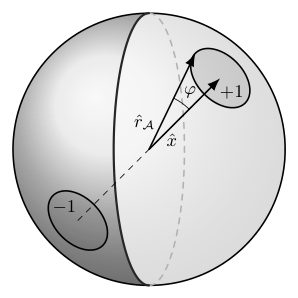
<figcaption class="paper-figure-caption"><b>Fig 1.</b> Figure 1. Geometric coarse graining defined by the analysis axis ˆx. The shaded antipodal caps of angular radius φ give outcomes +1 and −1; directions outside them give the geo- metric no-click outcome ∅. The vector ˆrA is drawn on the boundary of the +1 cap, so that φ is the angle between ˆrA and ˆx. The cutaway is only illustrative.</figcaption>
</figure>

**Summary.** This work proposes a novel Bell test framework for analyzing data from particle collider decays. It tackles the inherent loophole caused by postselection by requiring operational equivalence across measurement settings. A violation of the derived Bell inequality provides evidence for quantum nonlocality or measurement contextuality in this high-energy physics context.

**Why it may be interesting.** While focused on particle physics, the rigorous development of contextuality constraints based on operational equivalence in a measurement setting is highly relevant to foundational quantum information theory and loophole-free tests.

Detailed structure

**Main problem.** The paper develops a framework to perform Bell tests using data recorded from high-energy collider decays, addressing the challenge of measurement settings being determined by detector acceptance rather than freely chosen.

**Main result.** A violation of a derived Bell inequality, under assumptions of measurement independence and operational equivalence, witnesses either Bell nonlocality or joint-acceptance contextuality.

**Method.** The authors derive a continuous-input Bell inequality and analyze the loophole opened by postselection, showing that operational equivalence constrains local hidden variable models.

**Model / system.** The system involves the decay of unstable qubits in a collider, where daughter momenta act as spin analyzers. The test uses independently sampled analysis axes to define accepted spherical caps for binary outcomes.

**Key observables.** The Bell functional B = -<x . y a b>, the local acceptance probability q_A, and the joint acceptance event D.

**Important parameters / regimes.** Spin-analyzing power (eta_A), the cap radius (phi), and the bound violation condition mu_A mu_B > 3/4.

**Assumptions / limitations.** Measurement independence (lambda-independence) and the operational equivalence of joint-acceptance events across all settings are crucial assumptions.

**Figures summary.** Figure 1 illustrates the geometric coarse-graining defined by the analysis axis, showing the accepted caps (+1, -1) and the no-click region (empty set).

**Paper structure.** The paper progresses from defining the Bell test framework for collider data, addressing the postselection loophole, deriving the contextuality constraint via operational equivalence, and finally presenting the specific Bell inequality and its quantum prediction.

Abstract

We propose Bell tests for collider decays using independently sampled analysis axes as settings and detector regions to assign binary or null outcomes. We show that a Bell violation requires postselection, opening a loophole. However, under measurement independence and operational equivalence of acceptance events across settings, any local model exploiting the loophole must be nonclassical in the sense of measurement contextuality. We derive a Bell inequality violated by singlet correlations when the effective spin-analyzing powers are sufficiently high. Its violation then witnesses Bell nonlocality or measurement contextuality.

[↑ back to top](#top)

### [Coded Clifford Measurements for Multiqubit Magic-State Cultivation](http://arxiv.org/abs/2609.09994v1)

**Authors:** Gunsik Min, Jun Heo  
**Type:** theory · **Category:** quantum information and computing · **PDF:** <https://arxiv.org/pdf/2609.09994v1>  
**Analysis basis:** full PDF text, analyzed in chunks
**Topic relevance:** `quantum measurements` **3/5**

↔ Scroll figures horizontally

<figure class="paper-figure-card">
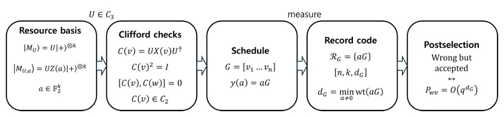
<figcaption class="paper-figure-caption"><b>Fig 1.</b> FIG. 1. Logical-level code–cultivation correspondence. A third-level resource basis provides commuting Clifford checks C(v). Choosing check labels vt defines the measurement schedule G = [v1 · · · vn] and the valid record code RG = {aG}. Postselection accepts only valid records; a wrong accepted branch therefore requires a nonzero displacement e ∈RG, so the record-code distance dG sets the accepted record-error order, Pwv = O(qdG).</figcaption>
</figure>
<figure class="paper-figure-card">
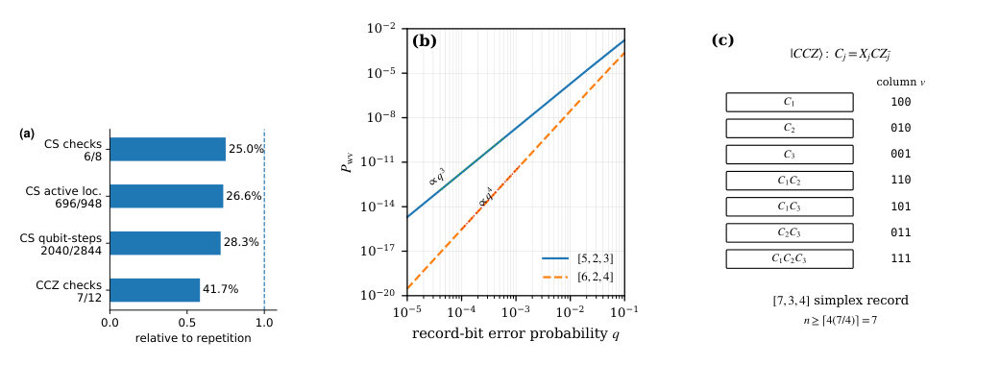
<figcaption class="paper-figure-caption"><b>Fig 2.</b> FIG. 2. Consequences of coded Clifford records. (a) For distance four, coding reduces the CS schedule from 8 to 6 logical checks, from 948 to 696 compiled-core active locations, and from 2844 to 2040 active-qubit gate steps; the CCZ schedule falls from 12 to 7 logical checks. (b) The optimal [5, 2, 3] and [6, 2, 4] two-bit records give cubic and quartic wrong-acceptance scaling. (c) The [7, 3, 4] CCZ simplex schedule reaches the minimum length allowed for any binary record.</figcaption>
</figure>
<figure class="paper-figure-card">
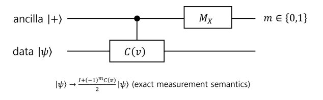
<figcaption class="paper-figure-caption"><b>Fig 3.</b> FIG. 1. Exact semantics of one logical record measurement. The circuit realizes the projectors in Eq. (48); it is an algebraic reference circuit, not a claim of low fault-tolerant overhead.</figcaption>
</figure>
<figure class="paper-figure-card">

<figcaption class="paper-figure-caption"><b>Fig 4.</b> FIG. 2. Live Steane-boundary diagnostics after removing the final ideal code-space projection. Left: record-and-midpoint acceptance. Right: mean weight of the canonical two-block Steane boundary representative among accepted shots. Error bars show one standard error. These are boundary-quality diagnostics, not full-factory logical-error estimates.</figcaption>
</figure>

**Summary.** This paper develops a theoretical framework showing that error suppression during magic-state cultivation can be modeled exactly by a binary linear code. By using coded Clifford measurements, the authors demonstrate substantial physical savings in required resources (like gate steps and active locations) compared to naive repetition schemes. This provides a concrete, resource-efficient pathway for building fault-tolerant quantum computation.

**Why it may be interesting.** While focused on quantum computation, the rigorous application of coding theory bounds (like the Plotkin bound) to physical measurement constraints provides a powerful theoretical framework for optimizing resource overhead in any complex quantum system.

Detailed structure

**Main problem.** The paper addresses the need for efficient, fault-tolerant methods to cultivate necessary quantum resources, specifically magic states, by suppressing errors through measurement of logical Clifford symmetries.

**Main result.** Implementing the measurement schedule using coded Clifford observables allows for significant resource savings (e.g., 26.6% reduction in active locations) compared to independent repetition schedules, while maintaining the required error suppression distance.

**Method.** The authors map the error-suppressing measurement process onto a binary linear code structure, using commuting Hermitian Clifford observables derived from the resource state symmetries.

**Model / system.** The model is fault-tolerant quantum computation, focusing on resource state preparation (magic states like $|CS
angle$ and $|CCZ
angle$) and error correction via measurement of logical symmetries within the Clifford group $\mathcal{C}_3$.

**Key observables.** Record-error fault order ($d_{	ext{record}}$), active locations, qubit-steps, and the resulting logical error probability $P_{	ext{wv}} = O(q^d)$.

**Important parameters / regimes.** Code distance ($d$), resource type ($|CS
angle, |CCZ
angle$), and the physical error rate ($p$).

**Assumptions / limitations.** The analysis focuses on the logical-level code-cultivation correspondence, and the results are noted to be diagnostics rather than full-factory logical-error estimates.

**Figures summary.** Figures illustrate the logical-level code-cultivation correspondence, quantifying resource reductions (e.g., gate steps, logical checks) achieved by coded schedules versus independent repetition schedules for various resource types.

**Paper structure.** The paper establishes the link between error suppression and linear codes, derives the measurement observables $C(v)$, compares resource costs (active locations/qubit-steps) between coded and non-coded methods, and concludes with optimization results for minimum-cost schedules.

Abstract

Magic-state cultivation suppresses errors by measuring logical Clifford symmetries and discarding inconsistent outcomes. For an entangled resource several branches are accepted, so the retained branch carries a multibit classical record whose corruption produces a logical-frame error. We show that this record layer is exactly a binary linear code. For any third-level Clifford-hierarchy unitary $U \in \mathcal{C}_3$, the branches $UZ(a)|+\rangle^{\otimes k}$ are resolved by commuting Hermitian Clifford observables $C(v) = UX(v)U^{\dagger}$, so a measurement schedule is a generator matrix and postselection on valid records gives $P_{\mathrm{wv}} = O(q^{d})$ at record distance $d$. A Plotkin bound then limits every binary record, linear or not. The physically realizable Clifford family already saturates it: at distance four, six logical measurements suffice for $|CS\rangle$ and seven for $|CCZ\rangle$, against eight and twelve for independent repetition. Restricting to fault-tolerantly measurable parities therefore costs nothing in record length. The saving survives compilation: in a native-CZZ-assisted Steane realization the $[6,2,4]$ CS schedule is the unique minimum-cost distance-four solution, reducing the cultivation core by 26.6\% in active locations, and exact state-vector simulation without a final ideal code-space projection confirms higher acceptance and roughly half the residual Steane-boundary weight. Coding thus reduces logical redundancy and compiled overhead together.

[↑ back to top](#top)

### [Fidelity-Aware Scheduling of Quantum Circuits on Multi-QPU Systems](http://arxiv.org/abs/2609.09980v1)

**Authors:** Innocenzo Fulginiti, Antonio Tudisco, Salvatore Zammuto, Patrick Hopf, Deborah Volpe, Helmut Seidl, Giovanna Turvani, Robert Wille, Christian B. Mendl, Martin Schulz  
**Type:** both · **Category:** quantum information and computing · **PDF:** <https://arxiv.org/pdf/2609.09980v1>  
**Analysis basis:** full PDF text, analyzed in chunks
**Topic relevance:** `QC/QI experiment` **3/5**

↔ Scroll figures horizontally

<figure class="paper-figure-card">
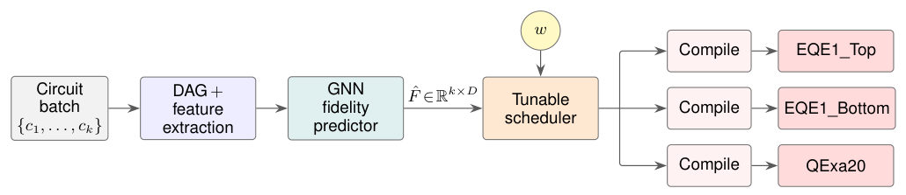
<figcaption class="paper-figure-caption"><b>Fig 1.</b> Fig. 1: End-to-end pipeline of the proposed framework. A user-submitted batch of k high-level quantum circuits is converted into Directed Acyclic Graphs with per-node feature vectors and fed to the GNN fidelity predictor, which produces an estimated fidelity matrix ˆF over all k × D circuit-device pairs. The tunable scheduler, parameterized by the fidelity weight w, routes each circuit to one of the available QPU backends; each assigned circuit is then transpiled against the target device’s native gate set and connectivity, and then executed on the corresponding backend.</figcaption>
</figure>
<figure class="paper-figure-card">
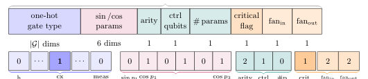
<figcaption class="paper-figure-caption"><b>Fig 2.</b> Fig. 2: Conversion from circuit to DAG. A quantum circuit (a) is translated into a DAG (b), whose nodes are gates and measurements and whose edges encode data dependencies; each node is then mapped to the feature vector of (c), shown for a CX gate.</figcaption>
</figure>
<figure class="paper-figure-card">

<figcaption class="paper-figure-caption"><b>Fig 3.</b> Fig. 3: Logic of a single dispatch tick within the QMS. The broker constructs an immutable snapshot of the queue and per-device state, invokes the scheduling policy to produce a device-to-circuit mapping, and dispatches each circuit to its assigned backend for transpilation and execution. The dashed arrow indicates the tick-based cycle.</figcaption>
</figure>
<figure class="paper-figure-card">
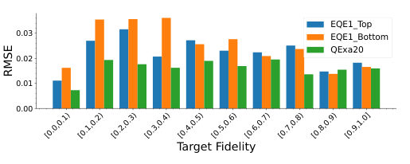
<figcaption class="paper-figure-caption"><b>Fig 4.</b> Fig. 5: RMSE of the model on the test set, grouped by target fidelity.</figcaption>
</figure>
<figure class="paper-figure-card">

<figcaption class="paper-figure-caption"><b>Fig 5.</b> Fig. 4: Coupling maps of the target devices.</figcaption>
</figure>

**Summary.** This paper introduces a novel, low-overhead scheduling framework for quantum circuits running on multi-QPU systems. It uses a Graph Neural Network (GNN) to predict the execution fidelity on various hardware devices before compilation. By incorporating a tunable weight, the scheduler effectively balances the trade-off between achieving the highest possible fidelity and maximizing the utilization of all available quantum processing units.

**Why it may be interesting.** This work directly addresses the practical challenges of running quantum algorithms on real, noisy, and heterogeneous hardware, which is a major bottleneck for applying quantum computing to physics simulations.

Detailed structure

**Main problem.** The core problem is developing a scheduling framework for quantum circuits on heterogeneous multi-QPU systems that maximizes execution fidelity while balancing this fidelity against the need for high parallelism.

**Main result.** The proposed GNN-based framework successfully approximates exhaustive fidelity-based assignment, achieving significant speedups in scheduling overhead compared to brute-force methods while maintaining high mean batch fidelity.

**Method.** The authors propose an end-to-end pipeline using a Graph Neural Network (GNN) to predict the expected fidelity of a circuit on any given QPU *before* compilation. A tunable scheduler then uses this prediction to balance fidelity maximization against workload distribution.

**Model / system.** The system involves multi-QPU platforms exposed in HPCQC environments, where each QPU has unique characteristics (size, topology, noise). The input circuit is converted into a graph representation (DAG) for the GNN to process.

**Key observables.** Execution Fidelity ($f_{c,d}$), Mean Batch Fidelity, Fidelity Regret ($r(c)$), and Wall-Clock Scheduling Overhead.

**Important parameters / regimes.** The tunable scheduling weight $w \in [0, 1]$, which controls the trade-off between fidelity and parallelism.

**Assumptions / limitations.** The fidelity calculation used is an approximation that neglects factors like idle-time decoherence, crosstalk, and calibration drift.

**Figures summary.** Figures illustrate the end-to-end pipeline, the graph conversion process, and comparisons showing mean ground-truth fidelity vs. weight $w$, and median scheduling cost comparing exhaustive vs. GNN-predicted selection.

**Paper structure.** The paper follows a structure detailing the problem (multi-QPU scheduling), presenting the solution (GNN prediction + tunable scheduler), and validating it through rigorous comparisons against exhaustive baselines regarding both fidelity and computational overhead.

Abstract

High Performance Computing-Quantum Computing (HPCQC) platforms expose multiple Quantum Processing Units (QPUs) that may differ in size, topology, native gates, and noise characteristics. For current noisy devices, errors compound along the compiled circuits quickly, and minimizing them, that is, maximizing the circuits' execution fidelity, is essential for reliable results. Fidelity depends on the compilation to a specific target device: the same high-level circuit may produce different executables and, therefore, different expected fidelities across QPUs. We present a low-overhead fidelity-aware scheduling framework for multi-QPU systems based on a Graph Neural Network (GNN) that estimates, before compilation, the expected fidelity of each circuit on each available QPU. Then, a tunable scheduler uses these estimates to control the trade-off between execution fidelity and parallelism. Results show that this framework allows for approximating an exhaustive fidelity-based assignment, saving computational resources compared to a brute-force approach that compiles each circuit on every device.

[↑ back to top](#top)

### [Infinite ergodic theory and functional statistics of non-confined Feller process](http://arxiv.org/abs/2609.10106v1)

**Authors:** Vicenç Méndez  
**Type:** theory · **Category:** statistical mechanics · **PDF:** <https://arxiv.org/pdf/2609.10106v1>  
**Analysis basis:** full PDF text, analyzed in chunks
**Topic relevance:** `non-equilibrium universality` **3/5**

↔ Scroll figures horizontally

<figure class="paper-figure-card">
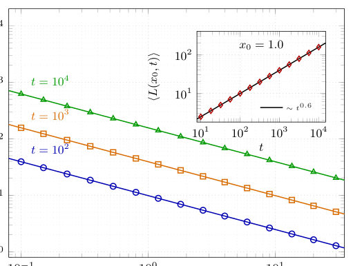
<figcaption class="paper-figure-caption"><b>Fig 1.</b> FIG. 1. Main panel: Log-log plot of the mean local time ⟨L(x, t)⟩as a function of position x for</figcaption>
</figure>
<figure class="paper-figure-card">
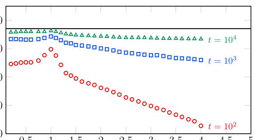
<figcaption class="paper-figure-caption"><b>Fig 2.</b> FIG. 2. Spatial correlation function R(x1, x2, t) as a function of the ratio x2/x1 for x1 = 1.0 and</figcaption>
</figure>
<figure class="paper-figure-card">
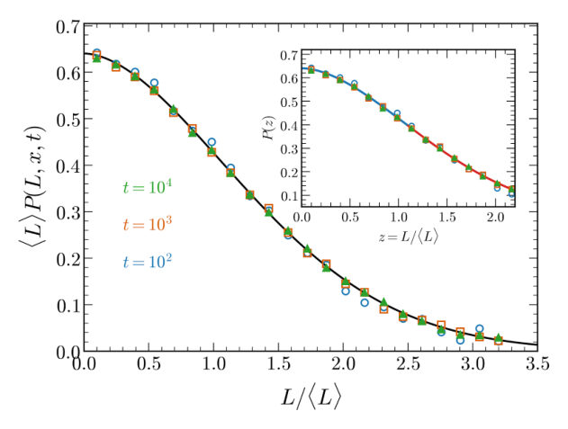
<figcaption class="paper-figure-caption"><b>Fig 3.</b> FIG. 3. Rescaled probability density ⟨L⟩P(L, x, t) versus L/⟨L(x, t)⟩. Symbols represent numerical</figcaption>
</figure>
<figure class="paper-figure-card">
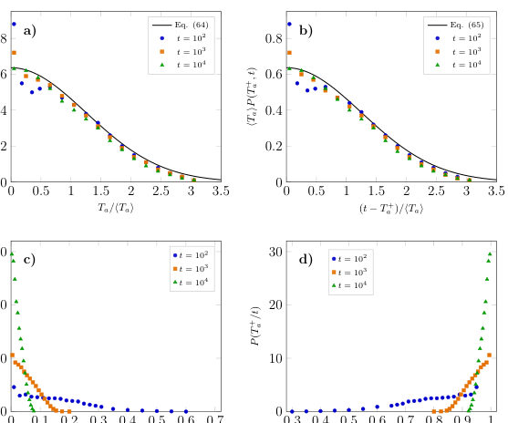
<figcaption class="paper-figure-caption"><b>Fig 4.</b> FIG. 4. (a) Rescaled probability density of Ta(t), ⟨Ta⟩P(Ta, t), as a function of Ta/⟨Ta⟩, compared</figcaption>
</figure>
<figure class="paper-figure-card">
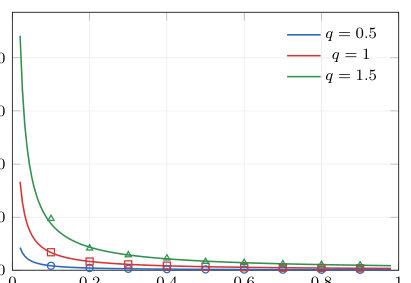
<figcaption class="paper-figure-caption"><b>Fig 5.</b> FIG. 5. Ergodicity breaking parameter of Aq(t) as a function of θ. Solid lines denote theoretical</figcaption>
</figure>

**Summary.** This paper investigates the long-time statistical behavior of a non-confined Feller process, a model exhibiting broken ergodicity. The authors derive an asymptotic factorization for the local-time field, showing its spatial structure is governed by a deterministic profile while temporal fluctuations follow a Mittag-Leffler distribution. This work establishes a unifying framework for analyzing complex, non-equilibrium dynamics in systems with singular invariant measures.

**Why it may be interesting.** The concept of infinite ergodic theory and the resulting universal scaling laws for local-time fields provide powerful mathematical tools for understanding non-equilibrium dynamics in complex physical systems, which has parallels in open quantum systems.

Detailed structure

**Main problem.** The study focuses on the spatial structure and multi-point correlation properties of the local-time field for non-confined Feller processes within the framework of Infinite Ergodic Theory.

**Main result.** The local-time field exhibits an asymptotic spatiotemporal factorization, and normalized spatial correlations converge to a universal constant independent of the observation levels.

**Method.** The analysis uses asymptotic methods, including the derivation of factorization laws and the comparison of time averages in ergodic versus non-ergodic regimes.

**Model / system.** The primary model is the non-confined Feller process, which is a diffusion process characterized by multiplicative noise and possesses a non-normalizable stationary probability density.

**Key observables.** Local-time field L(x, t), occupation times, two-point spatial cross-correlation function, and non-integrable power observables A_q(t).

**Important parameters / regimes.** The analysis is focused on the non-confined regime ($0 < 	heta < 1$) and the long-time limit ($t 	o \infty$).

**Assumptions / limitations.** The analysis assumes the process can be mapped to a squared Bessel process after deterministic rescaling, and it relies on the framework of infinite ergodic theory.

**Figures summary.** Figures illustrate the collapse of probability density functions for occupation times and the convergence of correlation functions to universal constants.

**Paper structure.** The paper develops the theory by first establishing the asymptotic factorization of the local-time field, then analyzing the convergence of occupation times, and finally contrasting the scaling behavior of integrable versus non-integrable observables.

Abstract

We study additive observables of a non-confined Feller process characterized by a non- normalizable stationary probability density and return times with infinite mean. The process is equivalent, after a deterministic rescaling, to a squared Bessel process, but we focus here on a question: the spatial structure of its local-time field. We show that the local time admits a fac- torization in the long time limit. Its spatial profile is governed by the non-normalizable stationary density, whereas its temporal fluctuations are controlled by a single Mittag-Leffler random ampli- tude. As a consequence, normalized spatial correlations of the local time converge to a universal constant independent of the two observation levels. Occupation times of finite intervals follow as corollaries and display Darling-Kac fluctuations. In contrast, non-integrable power observables exhibit self-similar squared-Bessel-type limits rather than Mittag-Leffler statistics. This spatial- field perspective provides a unifying framework for infinite ergodic theory under state-dependent multiplicative noise.

[↑ back to top](#top)

### [Optimal Low-Rank Quantum State Tomography with Bounded-Sample Joint Measurements](http://arxiv.org/abs/2609.10514v1)

**Authors:** Ashwin Nayak, Xingyu Zhou  
**Type:** theory · **Category:** quantum information and computing · **PDF:** <https://arxiv.org/pdf/2609.10514v1>  
**Analysis basis:** full PDF text, analyzed in chunks
**Topic relevance:** `quantum measurements` **3/5**

↔ Scroll figures horizontally

<figure class="paper-figure-card">

<figcaption class="paper-figure-caption"><b>Fig 1.</b> Low-resolution page preview, page 2</figcaption>
</figure>
<figure class="paper-figure-card">

<figcaption class="paper-figure-caption"><b>Fig 2.</b> Low-resolution page preview, page 3</figcaption>
</figure>
<figure class="paper-figure-card">
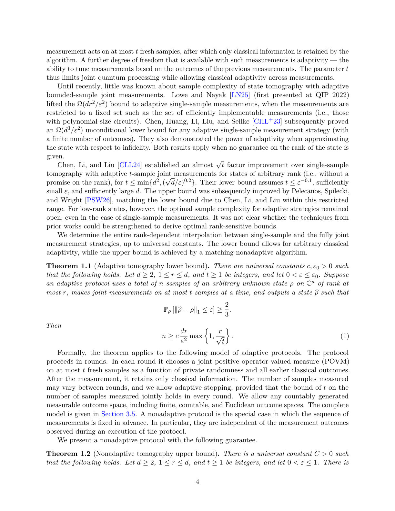
<figcaption class="paper-figure-caption"><b>Fig 3.</b> Low-resolution page preview, page 4</figcaption>
</figure>
<figure class="paper-figure-card">
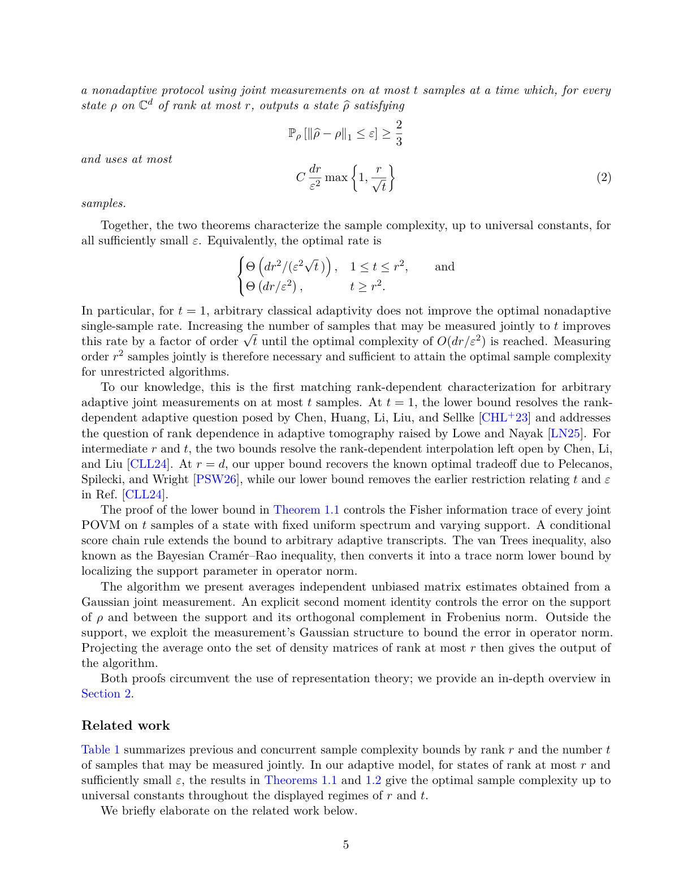
<figcaption class="paper-figure-caption"><b>Fig 4.</b> Low-resolution page preview, page 5</figcaption>
</figure>
<figure class="paper-figure-card">

<figcaption class="paper-figure-caption"><b>Fig 5.</b> Low-resolution page preview, page 6</figcaption>
</figure>

**Summary.** This work establishes the optimal sample complexity for reconstructing low-rank quantum states using limited joint measurements. It derives a precise scaling law dependent on the state rank, ambient dimension, and the maximum number of samples per measurement. The results provide crucial theoretical benchmarks for quantum state tomography protocols.

**Why it may be interesting.** It provides rigorous, quantitative bounds on the experimental resources (samples) needed to characterize quantum states, which is fundamental for designing quantum characterization experiments in any quantum platform.

Detailed structure

**Main problem.** The paper determines the optimal sample complexity required for low-rank quantum state tomography when measurements are restricted to jointly sampling at most $t$ instances.

**Main result.** The required sample complexity is $\Theta\left(rac{dr}{\epsilon^2} \max\left(1, rac{r}{\sqrt{t}}
ight)
ight)$, establishing a matching lower and upper bound.

**Method.** The lower bound uses the van Trees inequality applied to the Fisher information trace, while the upper bound constructs a nonadaptive protocol based on Gaussian joint measurements.

**Model / system.** The system is an unknown quantum state $
ho$ on $\mathbb{C}^d$ assumed to have a rank of at most $r$. The goal is to estimate this state to a trace norm error $\epsilon$ using measurements that jointly sample up to $t$ instances.

**Key observables.** Trace norm error ($\epsilon$), sample complexity ($n$), Fisher information trace.

**Important parameters / regimes.** Ambient dimension ($d$), state rank ($r$), maximum joint samples ($t$), target error ($\epsilon$).

**Assumptions / limitations.** The analysis assumes the protocol can choose measurements adaptively (for the lower bound) and considers the case of sufficiently small $\epsilon$.

**Figures summary.** Not specified.

**Paper structure.** The paper develops the lower bound using adaptive Fisher chain rules and the van Trees inequality, and establishes the matching upper bound via a nonadaptive Gaussian joint measurement protocol.

Abstract

We determine the optimal sample complexity of low-rank quantum state tomography when each measurement may act jointly on at most $t$ samples. For sufficiently small $\varepsilon$, estimating an unknown state on $\mathbb{C}^d$ of rank at most $r$ to trace norm error $\varepsilon$ with constant success probability requires, and is achievable with, $$   Θ\left(   \frac{dr}{\varepsilon^2}   \max\left\{1,\frac r{\sqrt t}\right\}   \right)$$ samples. The lower bound allows the protocol to choose each joint measurement adaptively using all previous classical outcomes; the matching upper bound is nonadaptive. Thus joint measurements on at most $t$ samples improve the complexity of algorithms making single-sample measurements by at most a factor $\sqrt t$. Further, measuring order $r^2$ samples jointly is necessary and sufficient to attain the unrestricted collective rate.   For the lower bound, we vary the support of a state with fixed uniform spectrum and bound the Fisher information trace of every joint measurement on $t$ samples. The adaptive Fisher chain rule and the van Trees inequality then give the trace norm lower bound. For the upper bound, we construct and analyze a nonadaptive tomography protocol based on a Gaussian joint measurement. An explicit second moment identity and a conditional Gaussian law outside the state's support give a rank-dependent error analysis, yielding the matching rate.

[↑ back to top](#top)

### [Perfect State Transfer from a Localised Two-Excitation State to a Dicke State via Static Spin-Network Hamiltonians](http://arxiv.org/abs/2609.09654v1)

**Authors:** Soumyojyoti Dutta  
**Type:** theory · **Category:** quantum information and computing · **PDF:** <https://arxiv.org/pdf/2609.09654v1>  
**Analysis basis:** full PDF text, analyzed in chunks
**Topic relevance:** `analog quantum simulation` **3/5**

↔ Scroll figures horizontally

<figure class="paper-figure-card">

<figcaption class="paper-figure-caption"><b>Fig 1.</b> FIG. 1. The cubic Q(z) for four system sizes, plotted as sgn(Q) |Q|1/3 so that the crossing is visible against the cu- bic growth, and normalised to unit maximum on the window shown. The dashed line marks z = −2, the boundary be- tween real and complex x = q/p; x is real only in the shaded regions |z| ≥2. In every case Q(−2) &lt; 0 (Lemma 4), while A &lt; 0 — which Lemma 5 supplies for n large enough — makes Q(z) →+∞as z →−∞. A real root z∗&lt; −2 follows; the markers show it.</figcaption>
</figure>
<figure class="paper-figure-card">

<figcaption class="paper-figure-caption"><b>Fig 2.</b> FIG. 2. Transfer residual ∥e−iHe0 −v∥and eigenvector resid- ual ∥Hx+∥for the Hamiltonian produced by the construction of Theorem 1, for every N = 4, . . . , 102. All 99 cases succeed at machine precision. These are an independent check of a symbolic construction, not evidence for the theorem.</figcaption>
</figure>
<figure class="paper-figure-card">

<figcaption class="paper-figure-caption"><b>Fig 3.</b> FIG. 3. Numerical behaviour of the construction across N. For a given n the sextic may have several admissible roots; here one is fixed by the convention of taking the most negative z∗&lt; −2 for the smallest odd n with A &lt; 0. This is a numerical convention and not a distinguished branch — the theorem asserts only that some admissible root exists — and it is discontinuous where n increments. Left: the root z∗stays below −2 as required. Centre: the corresponding coupling ratio x∗= q/p, on the |x| ≥1 representative of the reciprocal pair {x∗, 1/x∗} exchanged by the p ↔q symmetry of Eq. (13). Right: the smallest odd n satisfying A &lt; 0 remains small, taking only the values 3, 5, 7, 9 over this...</figcaption>
</figure>

**Summary.** This paper constructs a static, real-valued spin-network Hamiltonian that perfectly transfers a localized two-excitation state to the symmetric Dicke state for any system size $N \ge 4$. The existence proof is purely symbolic, relying on solving polynomial equations derived from symmetry constraints. It offers a novel, fixed-Hamiltonian approach to quantum state transfer, contrasting with time-dependent or measurement-based protocols.

**Why it may be interesting.** This work provides a purely algebraic, non-optimization-based construction for achieving quantum state transfer using a fixed Hamiltonian, which is highly valuable for designing physical quantum simulators or quantum computing architectures.

Detailed structure

**Main problem.** The paper aims to construct a time-independent, excitation-preserving spin Hamiltonian that achieves Perfect State Transfer (PST) from a localized two-excitation state to the symmetric two-excitation Dicke state for any system size $N \ge 4$.

**Main result.** The authors prove the existence of such a Hamiltonian for all $N \ge 4$ using purely symbolic mathematical methods, establishing a constrained analogue of PST.

**Method.** The construction involves exploiting an $S_{N-2}$ permutation symmetry to reduce the dynamics to a 4D subspace, followed by solving an inverse spectral problem that reduces to finding a real root of a cubic polynomial.

**Model / system.** The system is an $N$-qubit spin chain governed by a spin-network Hamiltonian $H = \sum_{i<j} J_{ij} (\sigma_i^+ \sigma_j^- + \sigma_j^+ \sigma_i^-) + \sum_i \epsilon_i n_i$. The dynamics are confined to the two-excitation sector.

**Key observables.** The transfer fidelity, which must equal 1, and the required spectral structure $\{(-n, -1, 0, 1)\pi\}$ for the Hamiltonian eigenvalues.

**Important parameters / regimes.** System size $N \ge 4$, the odd integer parameter $n$, and the free coupling parameters determined by solving the polynomial equations.

**Assumptions / limitations.** The Hamiltonian must arise from an excitation-preserving spin-network form, which is a stricter constraint than general real symmetric matrices. The result is only proven for two excitations ($k=2$).

**Figures summary.** Figures illustrate the existence of a required real root $z^* < -2$ via sign analysis (Intermediate Value Theorem) and show numerical validation of the construction for $N=4$ to $102$ with small residuals.

**Paper structure.** The paper establishes the physical problem, reduces the dynamics using symmetry, formulates the problem as an inverse spectral problem, solves the resulting polynomial equations symbolically to prove existence, and concludes by comparing this static method to other PST protocols.

Abstract

I construct a family of time-independent, excitation-preserving spin Hamiltonians that realises perfect state transfer from a localised two-excitation state to the symmetric two-excitation Dicke state, for every system size $N \ge 4$. The Hamiltonian has the physical form $H = \sum_{i<j} J_{ij} (σ_i^+ σ_j^- + σ_j^+ σ_i^-) + \sum_i ε_i n_i$ with real couplings, and satisfies $e^{-iHt} |110\cdots0\rangle = e^{iφ} |D_N^{(2)}\rangle$ at a finite time. The construction exploits an $S_{N-2}$ permutation symmetry acting on the initially unoccupied spins, which reduces the dynamics to a four-dimensional invariant subspace. Requiring $(|ψ_0\rangle + |D_N^{(2)}\rangle)/2$ to be a zero eigenvector determines the on-site energies in closed form and leaves three coupling parameters free. The remaining inverse spectral problem reduces to two polynomial equations in two dimensionless coupling ratios; eliminating one ratio yields a degree-six reciprocal polynomial, which the substitution $z = x + x^{-1}$ converts to a cubic. For the spectral family $(-n,-1,1)$, with $n$ an odd integer, an explicit factorisation of the leading coefficient together with a boundary evaluation at $z=-2$ shows that for every $N \ge 4$ an odd $n$ can be chosen large enough that a real root with $z < -2$ exists; a subresultant argument supplies a real lift of that root to the original system. The existence proof is entirely symbolic and does not rely on numerical optimisation; direct propagation is used only as independent validation. The result is a constrained analogue of perfect state transfer: unlike the general real-state problem, where an unconstrained real symmetric matrix suffices, here the Hamiltonian is required to arise from an excitation-preserving spin-network form.

[↑ back to top](#top)

### [Quantifying Information Hierarchy for Neutrino Oscillation Parameters at JUNO](http://arxiv.org/abs/2609.10383v1)

**Authors:** Yu-han Shu, Neetu Raj Singh Chundawat, Luis A. Delgadillo, Yu-Feng Li  
**Type:** theory · **Category:** other · **PDF:** <https://arxiv.org/pdf/2609.10383v1>  
**Analysis basis:** full PDF text, analyzed in chunks
**Topic relevance:** `quantum measurements` **3/5**

↔ Scroll figures horizontally

<figure class="paper-figure-card">
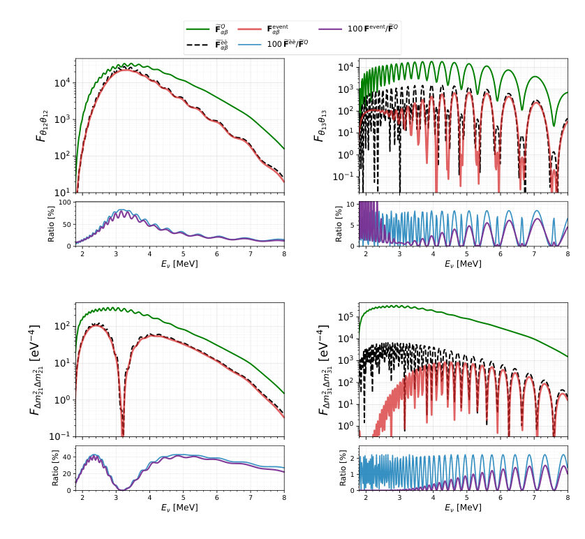
<figcaption class="paper-figure-caption"><b>Fig 1.</b> FIG. 1. Diagonal Fisher-information elements for JUNO with 3% energy resolution including signal and background contributions, shown for NO. Each subplot corresponds to one oscillation parameter: θ12, θ13, ∆m2 21, and ∆m2 31. The upper panels show the event-weighted QFI eFQ αα, the event-weighted electron flavor-FI eF¯e¯e αα, and the event-level Fisher information Fevent αα as functions of the true antineutrino energy Eν. The lower panels show the corresponding information fractions, eF¯e¯e αα/eFQ αα(blue) and Fevent αα /eFQ αα (purple).</figcaption>
</figure>
<figure class="paper-figure-card">
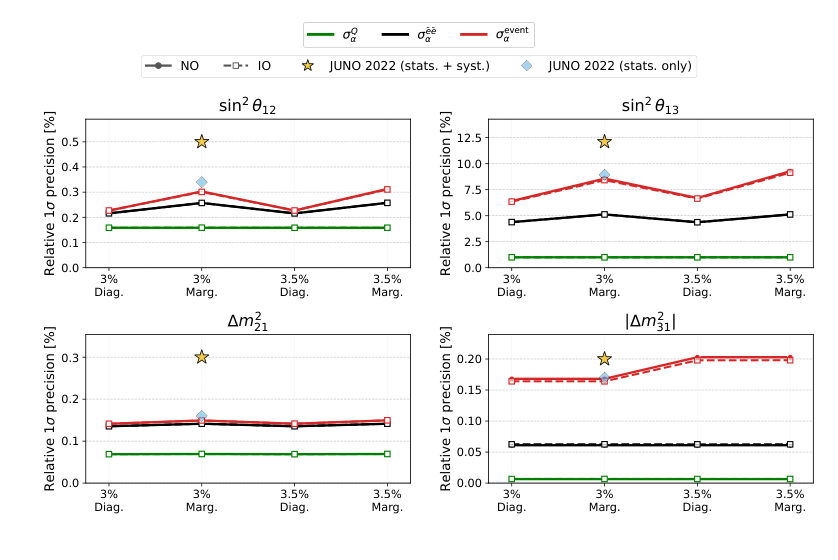
<figcaption class="paper-figure-caption"><b>Fig 2.</b> FIG. 2. Relative 1σ precision for the four oscillation parameters in JUNO, comparing diagonal and marginalized constraints for both NO and IO, as well as energy resolutions of 3% and 3.5%. The diagonal values are extracted from the diagonal elements of the Fisher information matrix, while the marginalized values account for correlations via the inverse of the full Fisher matrix. Blue diamond markers indicate the statistics-only precision, whereas star markers denote the full statistics plus systematics projected six-year precision reported by the JUNO Collaboration [26].</figcaption>
</figure>
<figure class="paper-figure-card">

<figcaption class="paper-figure-caption"><b>Fig 3.</b> FIG. 3. Energy dependence of the single-neutrino QFI matrix elements for an electron antineutrino propagating in vacuum at the JUNO baseline.</figcaption>
</figure>
<figure class="paper-figure-card">

<figcaption class="paper-figure-caption"><b>Fig 4.</b> FIG. 4. Energy dependence of the ten independent elements of the electron-flavor Fisher information matrix obtained from the survival probability P¯e¯e for the four oscillation parameters considered in the JUNO analysis.</figcaption>
</figure>

**Summary.** This work develops an 'information ladder' to quantify how well neutrino oscillation parameters can be measured using reactor antineutrinos at the JUNO experiment. By comparing Quantum, Flavor, and Event-level Fisher Information, the authors show that while some parameters are well-constrained, others suffer significant information loss due to detector limitations. Despite this, the remaining information is sufficient for high-precision measurements.

**Why it may be interesting.** The rigorous application of quantum information theory (QFI) to particle physics measurements provides a powerful, general framework for assessing experimental limits, which is relevant for any field involving quantum state estimation.

Detailed structure

**Main problem.** The paper quantifies how information about neutrino oscillation parameters is encoded in the quantum state and how efficiently this information can be extracted through measurement.

**Main result.** While information on solar parameters approaches the optimal statistical limit, information on $\theta_{13}$ and $\Delta m_{31}^{2}$ is significantly degraded by detector effects, though sufficient for sub-percent precision on $\Delta m_{31}^{2}$ at JUNO.

**Method.** It establishes an 'information ladder' by comparing three levels of Fisher Information: Quantum Fisher Information (QFI), classical flavor Fisher information, and event-level Fisher information.

**Model / system.** The analysis uses the framework of neutrino oscillations, specifically modeling reactor antineutrino states propagating to the JUNO detector baseline.

**Key observables.** The relative information retained at different levels ($	ext{e}F_{	ext{flavor}}/	ext{e}F_{	ext{Q}}$ and $F_{	ext{event}}/F_{	ext{Q}}$) and the resulting $1\sigma$ precision for the oscillation parameters.

**Important parameters / regimes.** Oscillation parameters: $\theta_{12}, \theta_{13}, \Delta m_{21}^2, \Delta m_{31}^2$. The analysis is performed for the JUNO setup (20 kton, 52.5 km, 6 years).

**Assumptions / limitations.** The analysis models energy resolution using a Gaussian function and neglects matter effects in some calculations.

**Figures summary.** Figures illustrate the energy dependence of the diagonal Fisher-information elements for the four parameters across the three information levels, showing the hierarchy and parameter dependence.

**Paper structure.** The paper develops the theoretical framework by deriving the QFI matrix elements, compares this to the flavor-FI derived from the survival probability, and finally incorporates detector effects to yield the event-level FI, establishing the information hierarchy.

Abstract

Since neutrinos are quantum systems inherently, the precision with which oscillation parameters can be estimated ultimately depends on how much information about these parameters is encoded in the neutrino state and how efficiently that information can be extracted through measurement. In this work, we quantify how information encoded in reactor antineutrino states flows through the measurement process to the events observed at the detector, using quantum and classical Fisher information. We establish the information ladder for JUNO, revealing that the loss of precision across different information levels is strongly parameter dependent. We demonstrate that the JUNO configuration approaches the optimal statistical limit for the oscillation parameters of the solar sector, while information on $θ_{13}$ and $Δm_{31}^{2}$ is significantly degraded by the measurement strategy and detector effects. Despite this information loss, the remaining information is sufficient for JUNO to achieve sub-percent precision on $Δm_{31}^{2}$ within six years.

[↑ back to top](#top)

### [SIM-GRAPH: A universal guide to symmetric interactions](http://arxiv.org/abs/2609.09996v1)

**Authors:** R. C. Verstraten, C. Morais Smith  
**Type:** theory · **Category:** strongly correlated electrons · **PDF:** <https://arxiv.org/pdf/2609.09996v1>  
**Analysis basis:** full PDF text, analyzed in chunks
**Topic relevance:** `analog quantum simulation` **3/5**

↔ Scroll figures horizontally

<figure class="paper-figure-card">
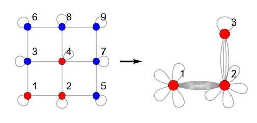
<figcaption class="paper-figure-caption"><b>Fig 1.</b> FIG. 1. Graph reduction of a 3x3 square lattice with NN (links) and local (loops) interactions. The symmetry group is generated by a 90 degree rotation along site 4. The three dis- tinct symmetric representations Si are highlighted in red on the left hand side. On the right hand side, we see the reduced graph, where all interactions are projected to the symmetric subset and the other sites are removed. The remaining sites are relabeled to a counting order.</figcaption>
</figure>
<figure class="paper-figure-card">

<figcaption class="paper-figure-caption"><b>Fig 2.</b> FIG. 2. The average ground-state magnetization of the TFIM on the 3 × 3 square lattice is presented at V/Ω= 10 for both NN and VdW interactions, computed using both ED and SIM-GRAPH. For better visual comparison, the exact results are plotted using larger points, with the SIM-GRAPH results overlaid in points half the size. For both NN and VdW interactions, we find excellent agreement with only minor de- viations from the exact results.</figcaption>
</figure>
<figure class="paper-figure-card">
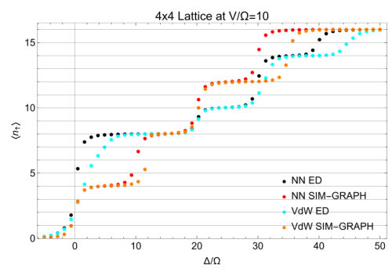
<figcaption class="paper-figure-caption"><b>Fig 3.</b> FIG. 3. The average ground-state magnetization of the TFIM on the 4 × 4 square lattice is presented at V/Ω= 10 for both NN and VdW interactions, computed on 50 points using both ED and SIM-GRAPH. For both NN and VdW interactions, we find deviations up to 4 spins away from the exact results. Besides the high and low ∆/Ωlimits, we find only one region of agreement at ⟨n↑⟩= 8, which corresponds to the checker- board states.</figcaption>
</figure>
<figure class="paper-figure-card">
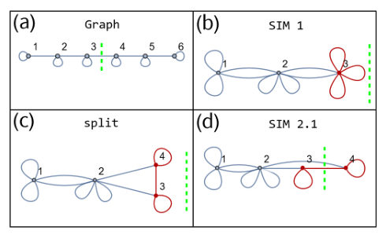
<figcaption class="paper-figure-caption"><b>Fig 4.</b> FIG. 4. (a) The NN interaction graph for a chain of 6 spins. The dashed green line indicates the symmetry axis. (b) The reduced graph based on SIM1. (c) Opening of the 3 to 4 link, which allows for a superposition across the symmetry axis. (d) The reduced graph based on SIM2.1. In (b)-(d), the red highlight indicates the difference between SIM1 and SIM2.1.</figcaption>
</figure>
<figure class="paper-figure-card">
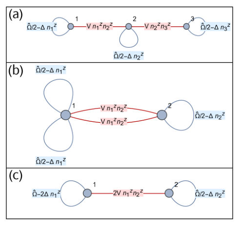
<figcaption class="paper-figure-caption"><b>Fig 5.</b> FIG. 5. The NN interaction graph for a chain of 3 spins is shown and projected according to the SIM-GRAPH proce- dure. Here, ˆΩ= ΩP</figcaption>
</figure>

**Summary.** This paper introduces SIM-GRAPH, a novel computational method that leverages underlying symmetries in quantum Hamiltonians to drastically reduce the effective size of the system being simulated. By projecting interactions onto a symmetric subspace, it achieves an exponential speedup over standard exact diagonalization for calculating ground-state properties. It is highly valuable for studying large, interacting quantum spin systems like the TFIM on various complex lattices.

**Why it may be interesting.** The technique of exploiting underlying symmetries to reduce the effective dimensionality of the Hilbert space is highly relevant for simulating complex quantum materials where symmetries are known or suspected.

Detailed structure

**Main problem.** The primary challenge is efficiently calculating ground-state observables of interacting quantum many-body systems, which typically suffer from exponentially scaling Hilbert space dimensions.

**Main result.** The SIM-GRAPH method provides an exponential speedup over standard exact diagonalization by projecting interactions onto a symmetry-reduced graph, achieving high accuracy on various lattices.

**Method.** The method, SIM-GRAPH, maps the Hamiltonian onto a graph, uses group theory to identify symmetries, and constructs a symmetry-reduced Hamiltonian by projecting interactions onto the symmetric subset of sites.

**Model / system.** The method is applied to interacting quantum many-body systems, specifically modeling the Transverse Field Ising Model (TFIM) on various lattices (1D chains, 2D square lattices, Sierpinski triangles).

**Key observables.** Ground-state observables, notably the average ground-state magnetization ($\langle n_\uparrow 
angle$).

**Important parameters / regimes.** The ratio of transverse field ($\Omega$) to coupling strength ($\Delta$), and the size/geometry of the lattice (e.g., 3x3, 4x4).

**Assumptions / limitations.** The method is projective, meaning computed eigenenergies are guaranteed to be greater than or equal to the true eigenenergies, and it assumes that the ground state can be accurately represented by the symmetric subspace.

**Figures summary.** Figures illustrate the graph reduction process for lattices (e.g., 3x3), compare ground-state magnetization vs. field ratio for different lattices (1D and 2D), and show convergence studies using various SIM2.n methods.

**Paper structure.** The paper introduces SIM-GRAPH, details its application to the TFIM on various geometries (1D, 2D, Sierpinski), and systematically compares its results against Exact Diagonalization (ED) using increasingly refined projection techniques (SIM2.n and SIM3).

Abstract

Symmetry plays a central role throughout physics, from Fourier analysis on discrete lattices to the classification of elementary particles in the standard model. In finite quantum systems, symmetries are often discrete, such as reflection and rotational symmetries. Here, we present the SIM-GRAPH method (Symmetric Ising Models - Graph Reduction And Projected Hamiltonians), which uses such symmetries to efficiently calculate ground-state observables of interacting quantum systems. By projecting all interactions onto a symmetric subset of the system, the method effectively reduces the number of sites, thus providing an exponential speedup over standard exact diagonalization. Furthermore, we introduce two extensions that broaden the applicability of the method and allow for a controlled trade-off between computational cost and accuracy.

[↑ back to top](#top)

### [Tuning Charge Density Wave transitions through lattice strain in NbSe3](http://arxiv.org/abs/2609.09375v1)

**Authors:** Antoine Gallo Frantz, Aleksander Sinchenko, Luc Ortega, Pavel Grigoriev, Vladislav Kochev, Pierre Godard, Pierre Olivier Renault, Dominique Thiaudiere, David Le Bolloch, Vincent Jacques  
**Type:** experiment · **Category:** strongly correlated electrons · **PDF:** <https://arxiv.org/pdf/2609.09375v1>  
**Analysis basis:** full PDF text, analyzed in chunks
**Topic relevance:** `Frenkel-Kontorova` **3/5**

↔ Scroll figures horizontally

<figure class="paper-figure-card">
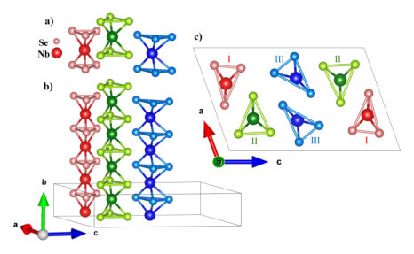
<figcaption class="paper-figure-caption"><b>Fig 1.</b> FIG. 1. NbSe3 crystal structure with a) the three different types of prisms for type I, II and III chains. b) 3D crys- tal structure made of three different and weakly coupled 1D chains along b. c) Projection of the unit cell in the (a, c) plane.</figcaption>
</figure>
<figure class="paper-figure-card">
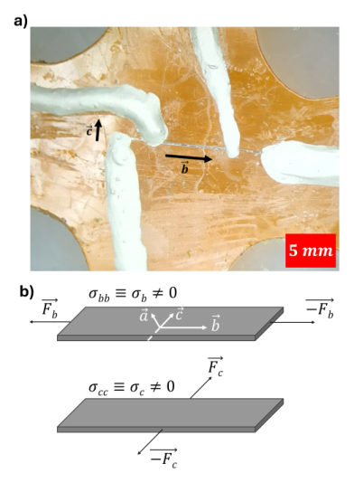
<figcaption class="paper-figure-caption"><b>Fig 2.</b> FIG. 2. a) NbSe3 sample (narrow metallic-grey line) glued on the cross-shaped deformable substrate with the b and c crys- tallographic axis aligned with the substrate branches. Four silver paint electrical contact are made for current injection and voltage measurement in four-bar geometry. b) Schematic drawing of NbSe3 under applied stresses along b and c.</figcaption>
</figure>
<figure class="paper-figure-card">

<figcaption class="paper-figure-caption"><b>Fig 3.</b> FIG. 3. Normalized intensities obtained around the 800, 8¯10 and 601 Bragg reflections at 300 K as a function of 2θ for different sets of applied stresses: ∼20 N along b only (green curves), ∼20 N along c only (blue curves) and without stress (black curves). Each Bragg reflection displays two peaks cor- responding to the two components Kα1 and Kα2 of the x-ray beam.</figcaption>
</figure>
<figure class="paper-figure-card">

<figcaption class="paper-figure-caption"><b>Fig 4.</b> FIG. 4. Evolution of the 6 lattice parameters a, b, c, α, β and γ as a function -Fb and Fc. Two different linear functions are used to fit the curves as a function of -Fb and Fc (colored dashed lines) for all curves. A black dashed line corresponding to the average angles is plotted for α, β and γ.</figcaption>
</figure>
<figure class="paper-figure-card">
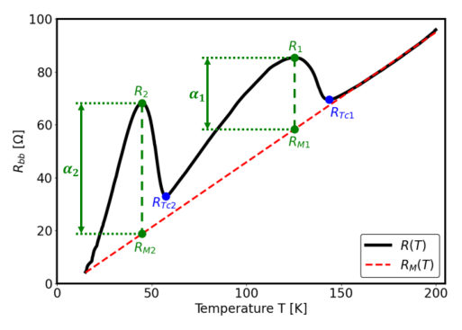
<figcaption class="paper-figure-caption"><b>Fig 5.</b> FIG. 5. R(T) curve measured in the pristine state (black solid line) and linear extrapolation RM(T) from the metallic part of R(T) (red dotted line). The resistance values at critical temperatures RT c1 and RT c2 are marked with blue dots while the resistance increments α1 and α2 and the resistance values R1, R2, RM1 and RM2 used to compute them (see text) are marked with green dots.</figcaption>
</figure>

**Summary.** This work experimentally demonstrates that applying mechanical strain to the CDW material NbSe3 can tune its electronic phase transitions. By combining XRD and transport measurements, the authors establish a strong, quantifiable link between the material's lattice structure and the critical temperatures of the CDW states. This highlights the profound interplay between lattice dynamics and electronic correlations in low-dimensional conductors.

**Why it may be interesting.** The strong coupling observed between mechanical strain (a classical/structural input) and the electronic phase transition temperature (CDW) provides a tangible experimental platform for studying emergent quantum phases in correlated materials.

Detailed structure

**Main problem.** The study investigates how applying mechanical lattice strain tunes the Charge Density Wave (CDW) transitions in the quasi-one-dimensional material NbSe3.

**Main result.** The CDW critical temperatures ($T_{c1}$ and $T_{c2}$) are found to be strongly correlated with the applied lattice strain and resulting lattice parameters, demonstrating a direct coupling between structure and electronic phase transitions.

**Method.** The research combines in-situ X-ray diffraction (XRD) measurements under uniaxial tensile stress with electrical transport measurements to probe both structural changes and electronic properties.

**Model / system.** The system is NbSe3, a prototypical quasi-one-dimensional conductor exhibiting multiple CDW transitions. The analysis involves relating macroscopic mechanical properties (Young's moduli, Poisson's coefficients) to the electronic susceptibility and CDW critical temperatures.

**Key observables.** CDW critical temperatures ($T_{c1}, T_{c2}$), lattice parameters ($a, b, c$), electrical resistance $R(T)$, and elastic constants (Young's moduli, Poisson's coefficients).

**Important parameters / regimes.** Applied tensile stresses ($\sigma_b, \sigma_c$), strain ($\epsilon$), and the characteristic temperatures of the two CDW transitions (145 K and 59 K).

**Assumptions / limitations.** The analysis assumes linear elastic behavior and that shear strains are negligible during the deformation process.

**Figures summary.** Figures illustrate the evolution of lattice parameters and XRD intensities under applied stresses, and show the temperature dependence of resistance curves ($R(T)$) before and after stress application.

**Paper structure.** The paper proceeds by first characterizing the mechanical response of NbSe3 under strain using XRD, then correlating these structural changes with the observed shifts in the CDW transition temperatures derived from transport measurements, and finally discussing the underlying electronic mechanisms.

Abstract

The Charge Density Wave (CDW) state is a perfect example of a combined structural and electronic state, both characterized by a periodic lattice distortion and an electronic modulation of condensed electrons, resulting from electron-phonon coupling. They are thus prone to be tuned by lattice strain. NbSe3 is a prototypical example of CDW states, with a chain-like structure displaying two CDWs at 145K and 59K, with wavevectors along and inclined with respect to the chain axis b. Here, we report on the evolution of the lattice structure and CDW properties in the quasi-one-dimensional charge-density-wave system NbSe3 under tensile stresses applied along and perpendicular to the chains axis b by a combination of X-ray diffraction and transport measurements. We find that the lattice structure show exotic Poissons coefficients and strongly anisotropic Youngs moduli while the evolution of the electrical resistance demonstrates shifts of both charge-density-wave critical temperatures that are strongly correlated with the lattice parameters. The two CDW transitions display different behaviours under applied stresses, and suggest that a modification of the band curvature leads to the observed transport signatures.

[↑ back to top](#top)

### [Topology-dependent mixing of knots in flexible polymer chains](http://arxiv.org/abs/2609.10188v1)

**Authors:** Souradeep Sengupta, Garima Mishra  
**Type:** theory · **Category:** statistical mechanics · **PDF:** <https://arxiv.org/pdf/2609.10188v1>  
**Analysis basis:** full PDF text, analyzed in chunks
**Topic relevance:** `analog quantum simulation` **2/5** · `driven-dissipative phase transition` **2/5** · `methods for driven-dissipative` **2/5** · `non-equilibrium universality` **2/5** · `Frenkel-Kontorova` **1/5** · `Keldysh / 2PI / non-Gaussian methods` **1/5** · `quantum measurements` **1/5** · `scars & prethermalization` **1/5**

↔ Scroll figures horizontally

<figure class="paper-figure-card">
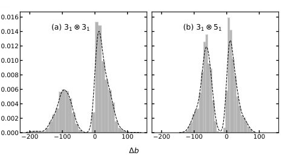
<figcaption class="paper-figure-caption"><b>Fig 1.</b> Figure 2: Probability distributions P(∆b) of the contour-based knot-separation coordinate for two knot pairs: (a) 31 ⊗31 and (b) 31 ⊗51, both initialized from partially overlapping configurations. The coordinate ∆b characterizes the relative contour organization of the localized knot regions. For classification, configurations with ∆b &lt; ∆bc are assigned to the mixed configuration, whereas those with ∆b &gt; ∆bc are assigned to the demixed configuration, where ∆bc ≃−20. Homogeneous knots (31 ⊗31) exhibit greater statistical weight in the demixed region than heterogeneous knots (31 ⊗51) at fixed normalized wall distances (x = 0.15). (The histograms are smoothed using a Gaussian kernel density...</figcaption>
</figure>
<figure class="paper-figure-card">
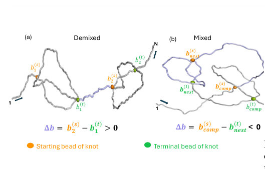
<figcaption class="paper-figure-caption"><b>Fig 2.</b> Figure 1: Schematic definition of the contour-based knot-separation coordinate ∆b. Orange and green markers denote the starting and terminal beads, respectively. (a) In a demixed configuration, the localized knot regions are separated along the polymer contour, and ∆b = b(s) 2 −b(t) 1 &gt; 0 gives the contour gap between them. (b) In a fully mixed configuration, the outer boundaries define a composite knotted region, while one constituent knot is independently localized within it. In this case, ∆b = b(s) comp −b(t) nest &lt; 0, and |∆b| provides a boundary-based measure of nesting rather than an overlap length between two independently localized constituent intervals.</figcaption>
</figure>
<figure class="paper-figure-card">

<figcaption class="paper-figure-caption"><b>Fig 3.</b> Figure 4: Color maps of the probability distributions of the contour-based knot-separation coordinate as a function of normalized wall separation x for (a) 31 ⊗31 and (b) 31 ⊗51. Positive ∆b corresponds to non-overlapping knot regions, whereas negative ∆b reflects overlap or nesting. Both systems exhibit distinct positive-∆b and negative-∆b branches whose relative statistical weights vary with normalized end separation. The 31 ⊗31 pair shows greater sampled statistical weight in the demixed branch, while the negative-∆b branch is comparatively more pronounced for 31 ⊗51 at intermediate normalized separation. In both systems, the negative-∆b branch shifts toward ∆b = 0 with increasing x,...</figcaption>
</figure>
<figure class="paper-figure-card">

<figcaption class="paper-figure-caption"><b>Fig 4.</b> Figure 3: Representative time-evolution dynamics of a pair of knots for homogeneous 31 ⊗31 knots (top row) and heterogeneous 31 ⊗51 knots (bottom row), both initialized from partially overlapping configurations. The trajectories illustrate the evolution toward either mixed or demixed configurations: panels (a,c) illustrate trajectories that evolve toward mixed states, while panels (b,d) illustrate trajectories that evolve toward demixed states. The upper subpanel in each case shows the corresponding time evolution of the boundary-separation coordinate ∆b; ∆b &lt; ∆bc identifies mixed configuration, whereas ∆b &gt; ∆bc identifies demixed configuration. The lower subpanel shows the time evolution...</figcaption>
</figure>
<figure class="paper-figure-card">
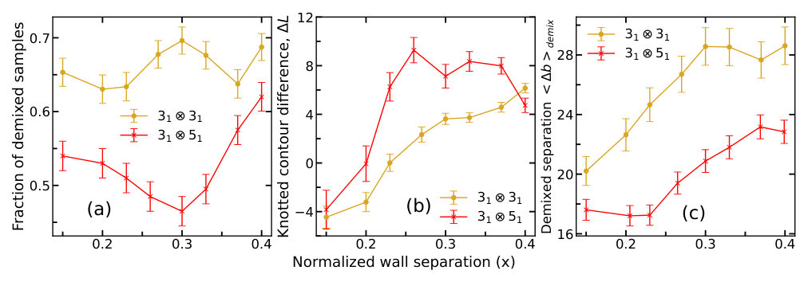
<figcaption class="paper-figure-caption"><b>Fig 5.</b> Figure 5: (a) Fraction of sampled configurations in the demixed state as a function of the normalized wall separation x for the 31 ⊗31 and 31 ⊗51 knot pairs, obtained from the corresponding P(∆b) distributions in Figure 4. (b) Contour occupancy reduction upon mixing, ∆L = L1 + L2 −Lcomp, as a function of x for the two knot pairs. The heterogeneous knot-pair exhibits a substantially larger contour-occupancy reduction than the homogeneous pair over the intermediate range of normalized end separation. (c) Average contour separation of the two localized knots within the demixed state as a function of normalized end separation x, for the homogeneous (31 ⊗31) and heterogeneous (31 ⊗51) knot...</figcaption>
</figure>

**Summary.** This work simulates the organization of multiple knots on a flexible polymer chain, comparing homogeneous and heterogeneous knot pairs. The simulations reveal that the initial topology strongly dictates whether the knots remain separated or mix into a composite state. Crucially, the heterogeneous pair shows a pronounced tendency to mix, achieving this state while occupying less polymer contour than when separated.

**Why it may be interesting.** While focused on polymer physics, the study uses advanced simulation techniques to characterize complex, non-equilibrium phase behavior (mixing/demixing) driven by topological constraints, which shares conceptual links with understanding entanglement in quantum many-body systems.

Detailed structure

**Main problem.** The study investigates how the inherent topology of constituent knots influences the process of mixing or demixing when multiple knots are confined within a flexible polymer chain.

**Main result.** Heterogeneous knot pairs ($3_1 \otimes 5_1$) show a greater tendency to mix and achieve a composite state that occupies significantly less polymer contour than the separated state, suggesting topology dictates organizational efficiency.

**Method.** The research employs coarse-grained Brownian-dynamics simulations to track the time evolution and probability distribution of knot configurations.

**Model / system.** The system is a flexible polymer chain modeled by beads connected by harmonic springs and confined between two opposing walls using a WCA potential. Two specific knot pairs, homogeneous ($3_1 \otimes 3_1$) and heterogeneous ($3_1 \otimes 5_1$), are studied.

**Key observables.** Frequency of mixed vs. demixed configurations, contour occupancy reduction ($\Delta L$), and the boundary-based knot separation metric ($\Delta b$).

**Important parameters / regimes.** Normalized wall separation ($x = d/L$), which controls the degree of end-to-end stretching.

**Assumptions / limitations.** The analysis relies on the boundary-based metric $\Delta b$ for state classification, and simulations are performed in the overdamped limit.

**Figures summary.** Figures show the probability distribution of the knot separation coordinate ($\Delta b$) versus wall separation ($x$), and quantify the reduction in contour occupancy ($\Delta L$) upon mixing for both knot types.

**Paper structure.** The paper systematically compares the dynamics of $3_1 \otimes 3_1$ and $3_1 \otimes 5_1$ pairs across varying wall separations, quantifying the transition between mixed and demixed states and measuring the structural consequences of mixing.

Abstract

The organization of multiple knots along a polymer contour can depend sensitively on the topology of the constituent knots. Using coarse-grained Brownian-dynamics simulations, we investigate topology-dependent mixing of two knots in a flexible polymer at controlled normalized wall separation. We compare homogeneous ($3_1\otimes 3_1$) and heterogeneous ($3_1\otimes 5_1$) knot pairs using a contour-based coordinate that distinguishes mixed and demixed configurations. Starting from partially overlapping configurations, the $3_1\otimes 5_1$ pair is observed in mixed configurations more frequently over the simulation time window than the $3_1\otimes 3_1$ pair at intermediate wall separation. We further find that, over the intermediate range of normalized wall separation, mixing of the $3_1\otimes5_1$ pair produces a composite knotted region that occupies substantially less polymer contour than the two constituent knots collectively occupy in demixed configurations. The corresponding reduction in contour occupancy is much smaller for the $3_1\otimes3_1$ pair. This indicates that the heterogeneous constituent topologies can be accommodated within a smaller portion of the polymer contour in the composite configuration. These results establish that constituent topology can strongly influence multiple-knot organization in flexible polymers.

[↑ back to top](#top)

### [Renewal process's guide to fractional Navier-Stokes equations](http://arxiv.org/abs/2609.09620v1)

**Authors:** Hong Zhang  
**Type:** theory · **Category:** statistical mechanics · **PDF:** <https://arxiv.org/pdf/2609.09620v1>  
**Analysis basis:** full PDF text, analyzed in chunks
**Topic relevance:** `Keldysh / 2PI / non-Gaussian methods` **2/5** · `correlated / nonlocal dissipation` **2/5** · `methods for driven-dissipative` **2/5** · `analog quantum simulation` **1/5** · `driven-dissipative phase transition` **1/5** · `non-equilibrium universality` **1/5** · `quantum measurements` **1/5**

↔ Scroll figures horizontally

<figure class="paper-figure-card">
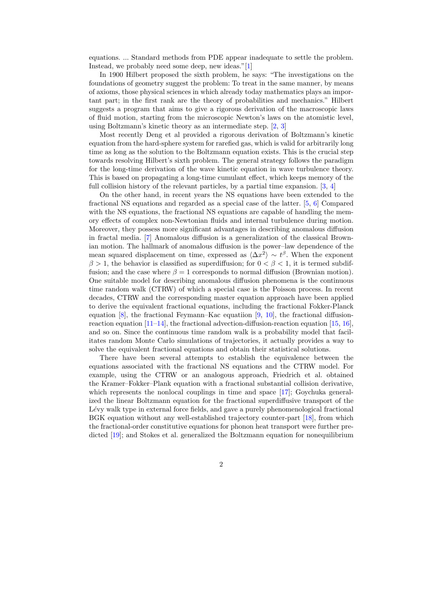
<figcaption class="paper-figure-caption"><b>Fig 1.</b> Low-resolution page preview, page 2</figcaption>
</figure>
<figure class="paper-figure-card">
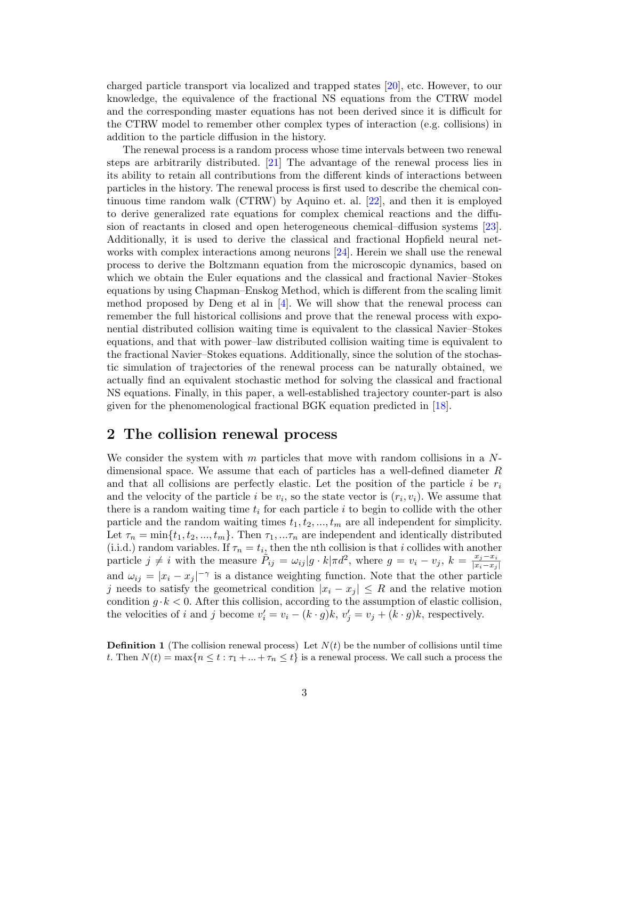
<figcaption class="paper-figure-caption"><b>Fig 2.</b> Low-resolution page preview, page 3</figcaption>
</figure>
<figure class="paper-figure-card">
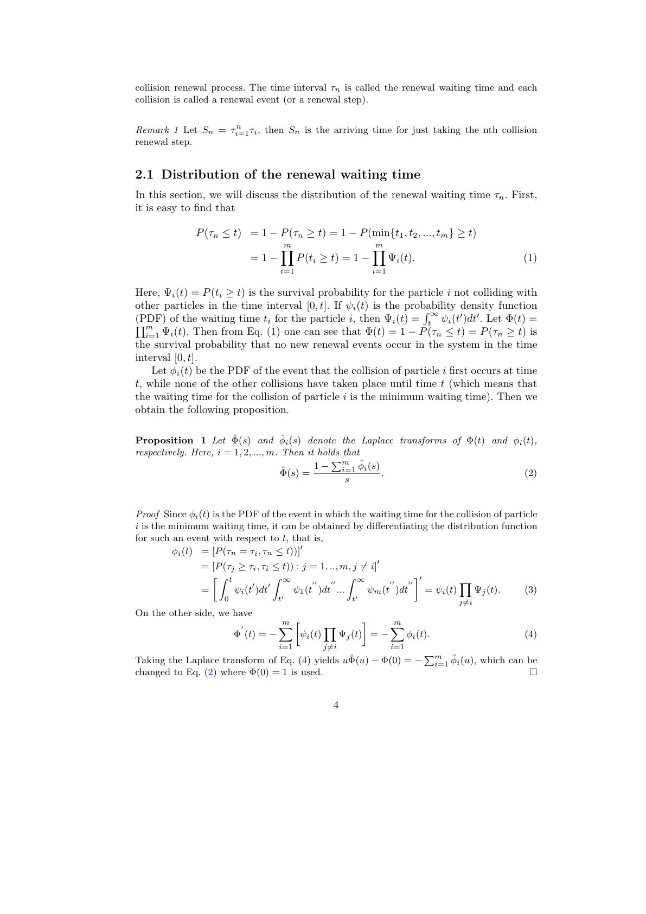
<figcaption class="paper-figure-caption"><b>Fig 3.</b> Low-resolution page preview, page 4</figcaption>
</figure>
<figure class="paper-figure-card">
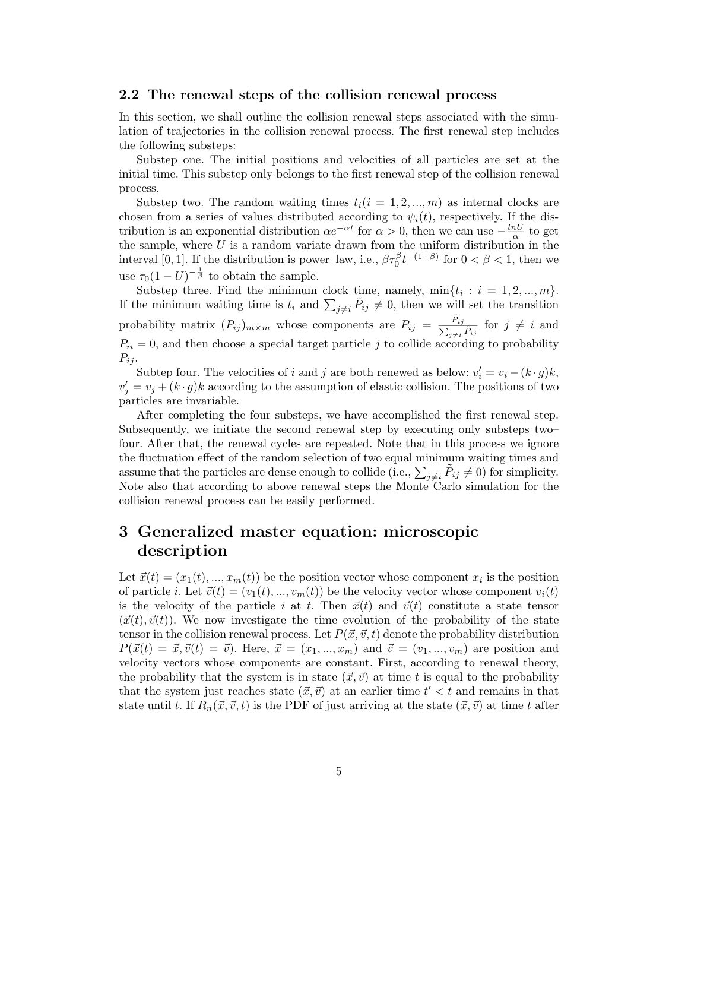
<figcaption class="paper-figure-caption"><b>Fig 4.</b> Low-resolution page preview, page 5</figcaption>
</figure>
<figure class="paper-figure-card">

<figcaption class="paper-figure-caption"><b>Fig 5.</b> Low-resolution page preview, page 6</figcaption>
</figure>

**Summary.** This paper develops a kinetic theory approach to solve the Navier-Stokes equations by modeling particle collisions using a collision renewal process. By analyzing the waiting time distribution, the authors demonstrate that power-law waiting times lead to fractional dynamics, successfully deriving the fractional Navier-Stokes equations from first principles.

**Why it may be interesting.** While focused on classical fluid dynamics, the use of fractional calculus and renewal processes to model non-Markovian memory effects is highly relevant to open quantum systems and anomalous diffusion in quantum many-body physics.

Detailed structure

**Main problem.** The paper addresses the unsolved Millennium problem of finding solutions to the Navier-Stokes (NS) equations in fluid mechanics.

**Main result.** It derives the fractional Navier-Stokes equations by showing that a collision renewal process with power-law waiting times leads to the fractional Boltzmann equation, which in turn yields the fractional NS equations.

**Method.** The approach uses renewal theory to derive generalized master equations for the probability distribution of particle states, followed by applying the Chapman-Enskog expansion to reach macroscopic fluid equations.

**Model / system.** The model is a system of particles undergoing perfectly elastic collisions, modeled via a collision renewal process. The state evolution is governed by probability distributions $P(\vec{x}, \vec{v}, t)$ and related rate equations.

**Key observables.** Probability distribution $P(\vec{x}, \vec{v}, t)$, single-particle probability $n_l(x_a, v_b, t)$, and macroscopic fluid variables like density ($
ho$), velocity ($\mathbf{u}$), and stress ($	ilde{p}$).

**Important parameters / regimes.** The waiting time distribution is key: exponential time yields classical NS, while power-law waiting times ($\psi_l(t) \sim t^{-1-eta}$) yield fractional NS equations.

**Assumptions / limitations.** Assumptions include perfectly elastic collisions, the state independence of particles for rate equation derivation, and the applicability of the Chapman-Enskog expansion for the macroscopic limit.

**Figures summary.** Not specified in the notes, but the structure implies derivations leading to generalized master equations, the fractional BGK equation, and finally the fractional NS equations.

**Paper structure.** The paper progresses from establishing the collision renewal process framework to deriving a generalized master equation, specializing this for exponential and power-law waiting times, and finally applying the Chapman-Enskog method to reduce the fractional kinetic equation to the macroscopic fractional Navier-Stokes equations.

Abstract

The Navier-Stokes equations, which remain unsolved, are crucial equations in fluid mechanics. Discovering the solutions to the Navier-Stokes equations is one of the challenging Millennium problems. In 1900, Hilbert proposed a potential approach to tackle this problem by establishing the relationship between microscopic dynamics and the macroscopic continuum equations. The key bridge is the derivation of Boltzmann equation and the theory of probability. In this paper, we shall use the collision renewal process with arbitrarily distributed waiting times to derive the Boltzmann equation for the time evolution of the probability of the velocity and the displacement of the particle, based on which we prove that the renewal process with exponential collision waiting time is equivalent to the classical Navier-Stokes equations, and that with power-law waiting time is equivalent to the fractional Navier-Stokes equations. Since the collision renewal process with arbitrarily distributed waiting times is a random process and is easy to perform the stochastic simulations of trajectories to obtain the corresponding solution, we actually find a stochastic approach to solve the classical and fractional Navier-Stokes equations.

[↑ back to top](#top)

### [Finite-Particle Quantum Reduction of Thermodynamic Irreversibility](http://arxiv.org/abs/2609.10211v1)

**Authors:** Borhan Ahmadi  
**Type:** theory · **Category:** statistical mechanics · **PDF:** <https://arxiv.org/pdf/2609.10211v1>  
**Analysis basis:** full PDF text, analyzed in chunks
**Topic relevance:** `analog quantum simulation` **2/5** · `non-equilibrium universality` **2/5** · `quantum measurements` **2/5** · `Keldysh / 2PI / non-Gaussian methods` **1/5** · `correlated / nonlocal dissipation` **1/5** · `methods for driven-dissipative` **1/5**

↔ Scroll figures horizontally

<figure class="paper-figure-card">

<figcaption class="paper-figure-caption"><b>Fig 1.</b> FIG. 1. Matched quantum–classical construction. (a) The finite-particle Bose–Hubbard model and its number-conserving classical-field counterpart have the same coherent-state energy landscape and undergo the same confinement protocol. (b) The classical right-half coordinate is divided so that each region has the same invariant weight as the matching quantum occupation sector. (c) Three states associated with the same microscopic situation. The exact state ρ contains the full information. The record-only representative ¯ρR keeps only the spatial probabilities. The energy-and-record representative ¯ρE,R also keeps the exact mean energy. The difference ¯ρE,R −¯ρR is the refinement supplied by...</figcaption>
</figure>
<figure class="paper-figure-card">
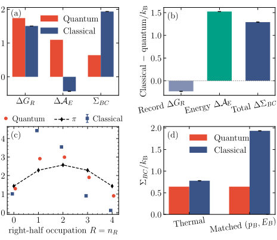
<figcaption class="paper-figure-caption"><b>Fig 2.</b> FIG. 2. Why the finite-particle quantum process is less ir- reversible. (a) Change in the information hidden from the spatial record, the part resolved by adding the mean energy, and the resulting process entropy generation for the strict ini- tial matching. (b) Classical-minus-quantum process gap split into record and energy-resolved parts. The record part alone favors the classical system, while the energy-resolved part pro- duces the quantum advantage. (c) Endpoint record distribu- tions and the common multiplicity reference. The quantum record is more relaxed even though the combined energy-and- record description leaves a smaller residual information gap. (d) Process entropy generation...</figcaption>
</figure>
<figure class="paper-figure-card">
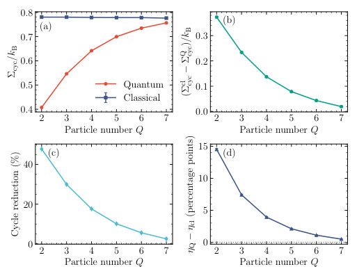
<figcaption class="paper-figure-caption"><b>Fig 3.</b> FIG. 3. Crossover toward the classical-field regime. (a) Quantum and classical entropy generation of the complete cycle. The retained (E, R) ledger assigns the nonzero pro- cess term to B →C−, while the physical microscopic ledger realizes the same amount during C+ →¯C. The two are not added. (b) Classical-minus-quantum cycle entropy-generation gap. (c) Relative reduction of the cycle entropy generation. (d) Efficiency advantage at matched hot heat input and reser- voir temperatures. No asymptotic power law is fitted.</figcaption>
</figure>
<figure class="paper-figure-card">
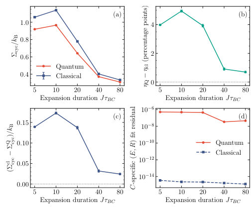
<figcaption class="paper-figure-caption"><b>Fig 4.</b> FIG. 4. Robustness to the duration of the isolated ex- pansion. (a) Quantum and classical cycle entropy genera- tion as JτBC is varied. (b) Efficiency advantage at matched cycle resources. (c) Classical-minus-quantum cycle entropy- generation gap. (d) Constraint residual of the energy-and- record reconstruction at each new endpoint C−. The rep- resentative and controlled Hamiltonian are rebuilt for every duration before the cold-side closure is defined.</figcaption>
</figure>

**Summary.** This work compares the thermodynamic irreversibility costs between a finite quantum Bose-Hubbard chain and its classical counterpart when information is limited to coarse measurements. The authors demonstrate that retaining mean energy alongside the spatial record allows the quantum system to generate less entropy and extract more work. This quantum advantage is robustly confirmed across various numerical tests but vanishes in the classical limit.

**Why it may be interesting.** It provides a rigorous, information-theoretic framework for quantifying the quantum advantage in non-equilibrium thermodynamics, particularly when system size is finite and coarse measurements are necessary.

Detailed structure

**Main problem.** The paper investigates whether the operational reduction of information (coarse-graining) in a finite quantum system incurs less thermodynamic irreversibility cost compared to its matched classical counterpart.

**Main result.** The quantum system exhibits smaller entropy generation and higher work output during thermodynamic cycles compared to the classical field, an advantage that diminishes as the particle number approaches the classical limit.

**Method.** The analysis uses information-theoretic tools, comparing entropy generation ($\Sigma$) across different coarse-grained descriptions (spatial record $R$ vs. combined energy and record $(E, R)$) for a heat-engine cycle.

**Model / system.** The study compares a finite-particle Bose-Hubbard quantum chain with its number-conserving classical-field counterpart, using matched Hamiltonians for comparison.

**Key observables.** Entropy generation ($\Sigma_{Q}^{BC}$ vs. $\Sigma_{cl}^{BC}$), work output, and the information gaps ($G_R, A_E, I_{E,R}$).

**Important parameters / regimes.** Particle number ($Q$), interaction strength ($g/J$), and the thermal bath temperature ($T_h$).

**Assumptions / limitations.** The comparison is restricted to the information contained in the record $(E, R)$, not full state tomography, and the advantage fades as $Q$ increases.

**Figures summary.** Figures illustrate the matched quantum-classical construction, the three relevant states ($
ho, ar{
ho}_R, ar{
ho}_{E,R}$), and the quantitative comparison of entropy generation across different protocols and parameter variations.

**Paper structure.** The paper establishes the theoretical framework by defining information reduction via entropy gaps, applies this to a heat-engine cycle comparison between quantum and classical systems, and then rigorously tests the resulting inequality ($\Sigma_Q < \Sigma_{cl}$) through various numerical and physical robustness checks.

Abstract

Thermodynamics is useful because it lets us predict and control complex systems from a few accessible quantities when microscopic reconstruction is impractical. We ask whether this operational reduction can be less costly in a finite quantum system than in a matched classical one. We compare a few-boson Bose--Hubbard chain with its number-conserving classical-field counterpart under the same driving and the same coarse spatial record. The quantum system relaxes more in the observed particle distribution, yet the retained mean energy resolves more of the microscopic structure hidden by that record, leaving less information unusable and smaller entropy generation. We then close the process into a heat-engine cycle whose controls use only the measured mean energy and spatial record, not full state tomography; at matched thermal resources, the smaller entropy generation gives more work and higher efficiency. The advantage fades as the particle number grows toward the classical-field regime.

[↑ back to top](#top)

### [Quantifying cell shape and density fluctuations in epithelial tissue in vivo](http://arxiv.org/abs/2609.09874v1)

**Authors:** Jake Turley, Helen Weavers, Paul Martin, Isaac V. Chenchiah, Tanniemola B. Liverpool  
**Type:** both · **Category:** statistical mechanics · **PDF:** <https://arxiv.org/pdf/2609.09874v1>  
**Analysis basis:** full PDF text, analyzed in chunks
**Topic relevance:** `Keldysh / 2PI / non-Gaussian methods` **2/5** · `methods for driven-dissipative` **2/5** · `Frenkel-Kontorova` **1/5** · `correlated / nonlocal dissipation` **1/5** · `driven-dissipative phase transition` **1/5** · `non-equilibrium universality` **1/5**

↔ Scroll figures horizontally

<figure class="paper-figure-card">
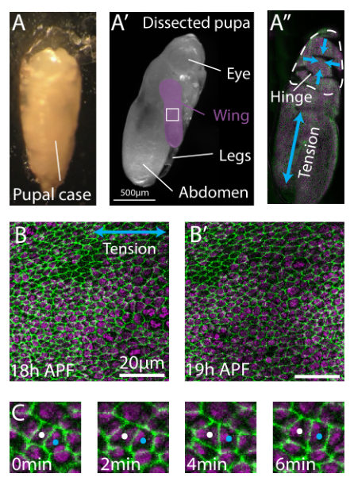
<figcaption class="paper-figure-caption"><b>Fig 1.</b> Figure 1. Drosophila pupal wing tissue and cell shape fluctuations. A) a pupa inside its puparium. A’) Bright field image of an 18hour APF (after puparium formation) pupa with the wing highlighted in magenta. B-B’) Snap shots from a movie of the epithelium at timepoints indicated. E- cadherin-GFP (green) shows cell boundaries and Histone2- RFP (red) labels cell nuclei. C) Epithelial cells with fluctu- ating boundaries over time.</figcaption>
</figure>
<figure class="paper-figure-card">
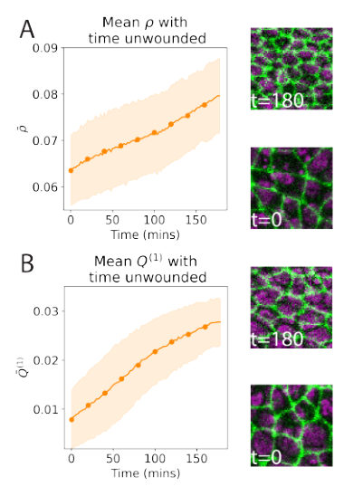
<figcaption class="paper-figure-caption"><b>Fig 2.</b> Figure 3. Mean of cell density and elongation over time. A) The mean ρ over time with orange shaded region, showing the standard deviation. B) The mean Q(1) over time with orange shaded region, showing the standard deviation.</figcaption>
</figure>
<figure class="paper-figure-card">
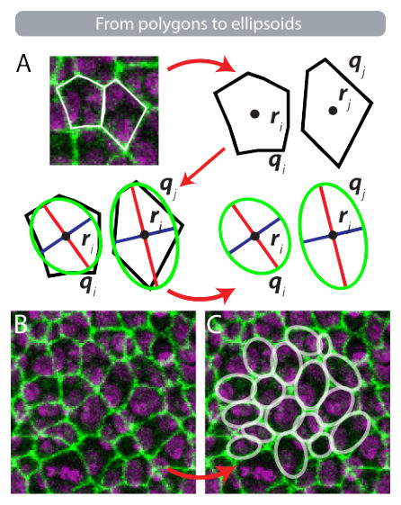
<figcaption class="paper-figure-caption"><b>Fig 3.</b> Figure 2. Epithelial cells as soft ellipsoids. A) Cell shapes can be approximated by polygons which we subsequently map to ellipses. Each ellipse can be assigned a position (geometric centre) as well as a long (red) and short (blue) axis computed via a q-tensor evaluated from the polygonal cell shape. B) Zoom in of wing tissue. E-cadherin-GFP (green) shows cell boundaries and Histone2-RFP (red) labels cell nuclei. A) Ep- ithelial cells with white overlay of ellipsoids.</figcaption>
</figure>
<figure class="paper-figure-card">

<figcaption class="paper-figure-caption"><b>Fig 4.</b> Figure 4. Spatio-temporal density correlations func- tions from experiments matches theoretical models predictions. A) Same time correlation, where R &gt; 0, separa- tion between cells is non-zero, but evaluated at the same same time point. B) Same position correlation, where the time in- terval between events is non-zero, T &gt; 0 but R = 0, position is fixed. C) Spatio-temporal correlation function diagram now varying both separation of positions R &gt; 0 and time-interval T &gt; 0. D) Heatmap of the space and time correlation of density fluctuations. Red regions indicate relatively high pos- itive correlation between the two properties and blue areas negative correlation. White parts of the map show...</figcaption>
</figure>
<figure class="paper-figure-card">

<figcaption class="paper-figure-caption"><b>Fig 5.</b> Figure 5. Fitting model parameters to correlation of cell shape. Correlations of cell shape for A, B) δQ(1) and C, D) δQ(2) for fixed T and R respectively. Graphs show the ex- perimental data (blue), fitted parameters for individual cases (green), model using averaged parameters (orange) and the standard deviation of the averaged model parameters (gray).</figcaption>
</figure>

**Summary.** This work develops a theoretical framework to analyze cell shape and density fluctuations in living epithelial tissues. By coarse-graining microscopic cell interactions into continuum stochastic equations, the authors quantify how active remodeling and passive stiffness govern tissue mechanics. The results demonstrate that these parameters can be extracted from measured correlation functions, providing quantitative insights into biological processes like wound healing.

**Why it may be interesting.** While focused on biology, the mathematical machinery—deriving continuum stochastic equations and correlation functions from microscopic particle interactions—is highly relevant to non-equilibrium statistical mechanics, active matter, and many-body dynamics in soft matter systems.

Detailed structure

**Main problem.** The study quantifies cell shape and density fluctuations in epithelial tissue in vivo to gain insights into the underlying mechanical properties, such as effective tissue stiffness.

**Main result.** The theoretical framework successfully distinguishes between active cell shape remodeling and passive tissue stiffness, showing that active remodeling is crucial for rapid wound healing.

**Method.** The authors developed a theoretical framework by coarse-graining microscopic equations of motion into continuum stochastic differential equations, allowing for the derivation of spatial-temporal correlation functions.

**Model / system.** The system is epithelial tissue, modeled by interacting soft ellipsoids. The dynamics are described by continuum fields for local cell density ($\hat{
ho}$) and cell shape ($\hat{\mathbf{Q}}$), derived from microscopic interactions.

**Key observables.** Cell density correlation function ($C_{
ho
ho}$), cell shape correlation function ($C_{qq}$), and derived parameters like active remodeling strength ($A$) and effective stiffness ($L$).

**Important parameters / regimes.** Active shape change parameter ($A$), effective tissue stiffness ($L$), cell density ($
ho$), and mean $q$-tensor ($ar{Q}$).

**Assumptions / limitations.** The approach relies on linearization around mean fields and using leading-order terms in the continuum limit; it also assumes accurate measurement of cell shapes via deep learning.

**Figures summary.** Figures illustrate cell shape fluctuations in the *Drosophila* wing, show time evolution of mean density and shape parameters, and compare correlation decay rates in wild-type versus mutant tissues near wounds.

**Paper structure.** The paper moves from defining the physical problem and microscopic model to deriving continuum stochastic equations via coarse-graining. It then analyzes the resulting correlation functions to fit and extract key mechanical parameters ($A$ and $L$) by comparing predictions against experimental data from wounded and perturbed tissues.

Abstract

Controlling changes in cell shape are crucial for many biological processes, such as tissue development and wound healing. Tissues typically are heterogeneous with a variety of cell shapes and sizes. Of particular interest are local deviations from an average cell shape and size. These fluctuations may extend and transmit across tissues, potentially offering valuable insights into tissue characteristics such as variations in effective "stiffness" or rigidity. In this study, we present a theoretical framework that captures the dynamics of epithelial cell shapes within tissue, incorporating both their average behaviour and fluctuation patterns. We model cells as interacting soft ellipsoids of varying size and aspect ratio. Coarse-graining our model, we obtain a set of continuum stochastic differential equations from which we derive spatial-temporal correlation functions. These correlation functions fit with our experimental data from the developmental process of the \textit{Drosophila} pupal wing. From the correlation functions, critical parameters representing active cell shape changes and effective tissue "stiffness" can be determined.

[↑ back to top](#top)

### [Dynamic Observable Subspaces: Fast Simulation of Observable Quantum Dynamics](http://arxiv.org/abs/2609.09806v1)

**Authors:** Hannes Leipold  
**Type:** theory · **Category:** numerical methods · **PDF:** <https://arxiv.org/pdf/2609.09806v1>  
**Analysis basis:** full PDF text, analyzed in chunks
**Topic relevance:** `Keldysh / 2PI / non-Gaussian methods` **2/5** · `methods for driven-dissipative` **2/5** · `quantum measurements` **2/5** · `analog quantum simulation` **1/5**

↔ Scroll figures horizontally

<figure class="paper-figure-card">

<figcaption class="paper-figure-caption"><b>Fig 1.</b> Figure 1: Observable Subspace of Quantum Dynamics. In the case that iO ∈g for observable O, the measurable dynamics of a quantum system are captured inside the Dynamic Lie Algebra g such that Tr (O ρ(T)) = Tr  O projg(ρ(T))  .</figcaption>
</figure>
<figure class="paper-figure-card">
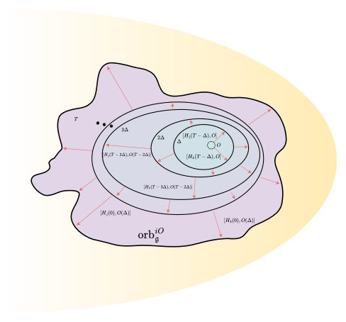
<figcaption class="paper-figure-caption"><b>Fig 2.</b> Figure 2: Liouville von Neumann Dynamics in the Heisenberg Picture. In the skew Heisenberg picture, an observable iO evolves by a Hamiltonian H(t) = P</figcaption>
</figure>
<figure class="paper-figure-card">

<figcaption class="paper-figure-caption"><b>Fig 3.</b> Figure 3: Dynamic Subspace of the Adjoint Operator. Top depicts the dynamic action of two adjoint operators adjiQ and adjiP with projCom(iQ) and projCom(iP ) as the outside space that is left stationary respectively. Bottom depicts eiθQ : ρ(t) →ρ(t + 1) where support inside proj⊥ Com(Q) colored blue is transformed while support outside (in projCom(iQ)) colored red is left stationary.</figcaption>
</figure>
<figure class="paper-figure-card">
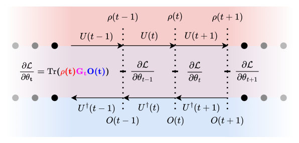
<figcaption class="paper-figure-caption"><b>Fig 4.</b> Figure 4: Meeting of Schr¨odinger iρ(t) and Heisenberg iO(t) at time t. In the mixed Schr¨odinger Heisenberg picture, iρ(t) and iO(t) meet at time t through the action of generator Gt, allowing us to compute each entry ∂ ∂θt L = ⟨iϱ(t) Gt, iO(t) ⟩in a single pass of (reverse) evolving iϱ and iO.</figcaption>
</figure>
<figure class="paper-figure-card">
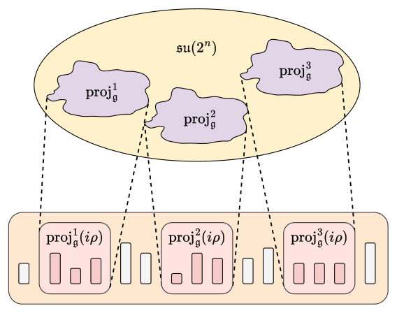
<figcaption class="paper-figure-caption"><b>Fig 5.</b> Figure 5: Decomposition into Multiple Dynamic Observable Subspaces. Given an observable O = v1 O1 + v2 O2 + v3 O3, we can define the DOS for each Oj and simulate them separately.</figcaption>
</figure>

**Summary.** This paper introduces the Dynamic Observable Subspace (DOS) framework to achieve fast, classical simulations of quantum dynamics. By restricting the evolution to the subspace spanned by relevant observables, it allows for polynomial-time calculation of expectation values and gradients for VQAs. This significantly enhances the feasibility of simulating large, complex quantum systems by avoiding the computational bottlenecks of full Hilbert space evolution.

**Why it may be interesting.** This work provides a powerful, mathematically rigorous tool for simulating quantum dynamics that goes beyond standard tensor network or circuit simulation methods by exploiting the algebraic structure of the observable evolution, making it highly relevant for analyzing complex many-body dynamics.

Detailed structure

**Main problem.** The paper addresses the challenge of simulating complex quantum dynamics and calculating gradients for variational quantum algorithms (VQAs) efficiently.

**Main result.** It introduces the Dynamic Observable Subspace (DOS) framework, which allows for polynomial-bounded classical simulation of quantum dynamics by projecting the evolution onto a relevant, smaller subspace.

**Method.** The core method involves constructing the DOS, which is the smallest subspace invariant under commutation with system generators, and then using projection operators and adjoint methods to simulate time evolution and compute gradients within this restricted space.

**Model / system.** The framework is applied to general quantum systems whose dynamics are governed by unitary evolution, exemplified by Pauli string generators and the TFXY model. The dynamics are analyzed in the Heisenberg picture via expectation values.

**Key observables.** The primary observables are the time-evolved observable $	ext{iO}(t)$ and the projected density operator $	ext{i}\varrho(t)$, whose expectation values are calculated within the DOS.

**Important parameters / regimes.** The complexity is bounded by the polynomial size of the Dynamic Lie Algebra (DLA) associated with the generators.

**Assumptions / limitations.** The method assumes that the relevant dynamics can be captured within a polynomially sized DOS, allowing for classical tractability.

**Figures summary.** Figures illustrate the concept of the Observable Subspace and how nested commutation defines the DOS, while other figures compare energy landscapes for TFXY circuits using different parameter sharing schemes.

**Paper structure.** The paper builds conceptually from defining the DOS via Lie algebra decomposition, establishing theorems proving the invariance of the observable and density operator within this subspace, and finally detailing algorithms for simulating time evolution and computing gradients using the adjoint method.

Abstract

By decomposing quantum dynamics across the Lie orbits of a list of observables, we find polynomial bounded classical simulations for the dynamics of the quantum system given a polynomial sized dynamic Lie algebra (DLA) for the generators of the quantum system. To do so, we describe how to construct the Dynamic Observable Subspace (DOS) that captures all the relevant dynamics for calculating expectation values for a specific observable for Pauli strings, diffusor mixers, and general local generators. Efficient sparse matrix representation, decoupling nonlinearity from such representation and basis construction with permissible pruning allows us to simulate the closed dynamics of such systems with hundreds of qubits. Moreover, we find that while restricted DOS circuits may not express the space of an associated Hamiltonian, they can dramatically outperform a fully expressive circuit due to the absence of the Barren Plateau. While classically simulatable, such circuits can still exhibit a form of quantum advantage through inference, act as warm starting for more expressive circuits, and find high quality trial states for Quantum Amplitude Amplification or Quantum Phase Estimation. In the simulation of quantum dynamics, we find that our restricted circuit can be simulated in polynomial time while producing high quality guiding state for downstream tasks like Quantum Phase Estimation with significantly lower energy than circuits with full expressivity.

[↑ back to top](#top)

### [BRST quantization for the restoration of broken symmetries: a pedagogical example](http://arxiv.org/abs/2609.10172v1)

**Authors:** Pranav Sharma, R. J. Furnstahl  
**Type:** theory · **Category:** other · **PDF:** <https://arxiv.org/pdf/2609.10172v1>  
**Analysis basis:** full PDF text, analyzed in chunks
**Topic relevance:** `Keldysh / 2PI / non-Gaussian methods` **2/5** · `methods for driven-dissipative` **2/5** · `analog quantum simulation` **1/5** · `quantum measurements` **1/5**

↔ Scroll figures horizontally

<figure class="paper-figure-card">

<figcaption class="paper-figure-caption"><b>Fig 1.</b> FIG. 1: There are multiple physically equivalent trajectories (gauge orbits) in the phase space of a gauge theory. A gauge fixing condition (red line) picks just one point along each set of gauge orbits, defining a “gauge slice”. Figure adapted from [14].</figcaption>
</figure>
<figure class="paper-figure-card">
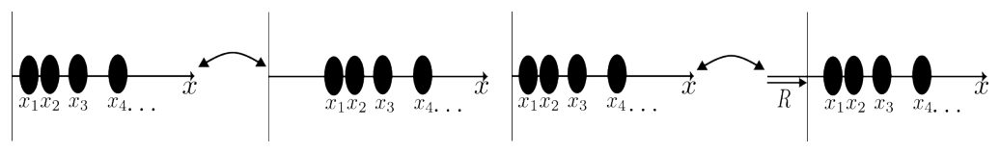
<figcaption class="paper-figure-caption"><b>Fig 2.</b> FIG. 2: a) The original system of particles has a global translational symmetry: the system can be uniformly translated to any location on the x axis and have the same intrinsic dynamics. (b) The system can now be moved arbitrarily at each moment in time, with an adjustment in R keeping it fixed as if it is at the same point on the line.</figcaption>
</figure>
<figure class="paper-figure-card">

<figcaption class="paper-figure-caption"><b>Fig 3.</b> FIG. 3: (a) The coordinate portion of the extended phase space for the two-body system, with the plane defined by the collective coordinate R and the CoM of the original DoFs X = (x1 + x2)/2 highlighted. Physically equivalent configurations of the system generated by the constraint Eq. (7) (also known as gauge orbits) lie on such a plane. (b) The CoM and collective coordinate plane with several options for gauge-fixing illustrated (c.f. the red line in Fig. 1). The choice X = 0 corresponds to the gauge-fixing choice used to exactly diagonalize the Hamiltonian in Sec. IV. The choice R = 0 reduces us back to the original problem.</figcaption>
</figure>
<figure class="paper-figure-card">

<figcaption class="paper-figure-caption"><b>Fig 4.</b> FIG. 4: Energy as a function of variational parameter α for a Gaussian potential well with (a) a Lorentzian product ansatz and (b) a super-Gaussian product ansatz. Results for VAP, Hint, and plain H are compared to the exact result and PAV evaluated with α∗ H and α∗ Hint.</figcaption>
</figure>
<figure class="paper-figure-card">

<figcaption class="paper-figure-caption"><b>Fig 5.</b> FIG. 5: Energy as a function of variational parameter α for a Woods-Saxon potential well with (a) a Lorentzian product ansatz and (b) a super-Gaussian product ansatz. Results for VAP, Hint, and plain H are compared to the exact result and PAV evaluated with H and Hint.</figcaption>
</figure>

**Summary.** This paper provides a pedagogical guide to using BRST quantization to restore broken symmetries in quantum many-body systems. By treating symmetry breaking as a gauge redundancy, the authors develop both Hamiltonian and path integral methods. This framework offers a systematic alternative to traditional projection techniques for ensuring physical consistency in complex quantum calculations.

**Why it may be interesting.** The systematic application of gauge theory tools (BRST) to non-relativistic, many-body quantum mechanics provides powerful, generalizable techniques for ensuring physical observables are independent of unphysical gauge choices.

Detailed structure

**Main problem.** The paper addresses the theoretical challenge of restoring symmetries (like translational invariance) in many-body quantum systems when using approximate reference state methods that inherently break these symmetries.

**Main result.** It demonstrates that BRST quantization provides a systematic, gauge-theoretic framework to handle symmetry restoration, offering a potential alternative to conventional, complex projection methods.

**Method.** The authors employ both Hamiltonian and path integral formulations, treating the broken symmetry as a gauge symmetry and utilizing the BRST formalism involving ghost fields.

**Model / system.** The primary demonstration system is a simple one-dimensional two-body interacting system, but the formalism is designed to be generalizable to higher dimensions and more complex many-body contexts.

**Key observables.** Gauge invariant observables, the intrinsic spectrum of the system, and the cancellation of symmetry-breaking errors in calculated expectation values.

**Important parameters / regimes.** The analysis involves the collective coordinate $R$, the gauge-fixing parameter $\mu$, and the structure of the BRST charge $Q$.

**Assumptions / limitations.** The analysis assumes that the BRST approach correctly captures the physics, and it compares results derived from different gauge-fixing prescriptions (e.g., Lagrange multipliers vs. width parameters).

**Figures summary.** Figures illustrate the existence of gauge orbits in the extended phase space and compare variational energy calculations using different ansatze (VAP, Hint, recentered gauge-slice) for the $N=2$ system.

**Paper structure.** The paper progresses from a pedagogical introduction using a simple two-body model to developing the Hamiltonian and path integral formalisms. It then compares different gauge-fixing techniques, culminating in variational energy comparisons.

Abstract

We present a pedagogical showcase of BRST quantization for restoring symmetries in nuclear many-body systems as a reformulation and potential alternative to conventional projection methods. The formalism is illustrated using translational invariance for a simple system of two interacting masses in one dimension, but with an eye toward generalizing to more particles, higher dimensions, and other symmetries. We explain the considerations underlying particular choices within the BRST construction, and develop both Hamiltonian and path integral formulations to provide guidance for the variety of many-body and effective field theory contexts where gauge fixing for symmetry restoration might be useful. For the demonstration system we show how to diagonalize within the extended BRST phase space, how variation after projection is recovered for product reference states, how the corresponding gauge-fixed functional integral is constructed, and how collective zero modes are isolated and controlled. Throughout, we keep in mind extensions of BRST symmetry to various approximation schemes as a guide for consistent symmetry restoration.

[↑ back to top](#top)

### [Programmable photonic state fusion via heralded storage of asynchronously generated resources](http://arxiv.org/abs/2609.10312v1)

**Authors:** Mustafa Gündoğan, Dennis Rätzel  
**Type:** theory · **Category:** quantum information and computing · **PDF:** <https://arxiv.org/pdf/2609.10312v1>  
**Analysis basis:** full PDF text, analyzed in chunks
**Topic relevance:** `analog quantum simulation` **2/5** · `interference shaping light` **1/5** · `methods for driven-dissipative` **1/5** · `quantum measurements` **1/5**

↔ Scroll figures horizontally

<figure class="paper-figure-card">
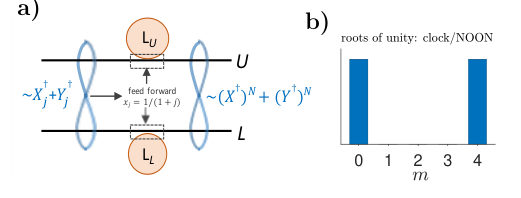
<figcaption class="paper-figure-caption"><b>Fig 1.</b> FIG. 1. Bosonic fusion for the clock-state implementation. (a) A specific realization of our fusion scheme for generating the photonic clock state considered for clock interferometry in [16, 17]. Once an elementary block ∼X† j + Y † j is heralded, the herald is fed forward to the tunable loop couplers, which are set to the programmed coupling xj. Successful loading places the newly generated photons into the same circulat- ing modes as the previously stored photons, removing their generation-time labels. Repeating the procedure for N suc- cessful loads yields the fused output. (b) Mode-occupation amplitudes obtained with the roots-of-unity phase settings for the case of N = 4. The index m...</figcaption>
</figure>
<figure class="paper-figure-card">

<figcaption class="paper-figure-caption"><b>Fig 2.</b> FIG. 2. Performance of the nb = 2 path–frequency realization. (a) Detected rates from Eq. (15) for frep = 10 MHz, ph = 10−2, η = 0.9, and ideal dump-port monitoring. The curves corre- spond to round-trip losses of 1.2%, 0.5%, and 0.2% per stored photon. The 1.2% value is a reference loss rather than a demonstrated end-to-end operating point. (b) Waiting sur- vival SN,2 as a function of ph/λ for N = 2, . . . , 5. The dashed lines mark SN,2 = 1/2 and the reference ratio ph/λ ≃0.83.</figcaption>
</figure>
<figure class="paper-figure-card">
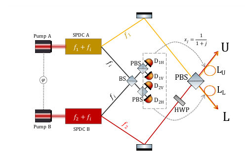
<figcaption class="paper-figure-caption"><b>Fig 3.</b> FIG. 3. Source and storage architecture for the multiphoton clock state. Two coherently driven SPDC sources produce signal–idler pairs with signal frequencies f1 and f2, respec- tively, while the idlers share the same frequency fi. The idlers are interfered in a linear-optical Bell-state analyzer, and the accepted BSM outcome heralds the corresponding signal su- perposition. A half-wave plate in the f2 signal arm, followed by the final PBS, maps the two polarization alternatives onto the path–frequency configurations X† j and Y † j . The BSM her- ald is fed forward to the couplers of the U and L storage loops, LU and LL, which are operated at the programmed loading strength xj = 1/(1 + j)....</figcaption>
</figure>

**Summary.** This paper details a novel protocol for fusing multiple, independently generated photonic quantum states into a single, highly entangled resource using active quantum storage loops. By mathematically modeling the state accumulation via polynomial factorization, the authors overcome the challenge of asynchronous generation times. This technique is demonstrated for creating NOON states, crucial for enhancing sensitivity in quantum metrology applications like photonic clock interferometry.

**Why it may be interesting.** This work provides a detailed theoretical blueprint for building large-scale quantum resources (like high-photon-number entangled states) from weak, probabilistic sources, which is central to quantum networking and quantum simulation.

Detailed structure

**Main problem.** The core challenge is fusing photonic quantum states generated probabilistically in asynchronous trials into a single, highly entangled state required for multiphoton protocols.

**Main result.** The authors propose a fusion protocol using active storage loops that successfully constructs programmable multi-photon entangled states, such as NOON states, by removing generation-time labels.

**Method.** The method involves sequentially loading independently heralded photonic states into storage loops, modeled by polynomial factorization, and optimizing the loading coupling strength for efficiency.

**Model / system.** The system is based on photonic state fusion utilizing active quantum memory loops (U and L modes) and heralded sources (SPDC). The state evolution is mathematically described by successive loading operations leading to a product of linear factors.

**Key observables.** The detected rate ($R_{	ext{out},N}$) of the final entangled state, the survival probability ($S_{N,n_b}$), and the resulting NOON-type state coefficients.

**Important parameters / regimes.** Loading step index ($j$), storage loop coupling strength, source waiting time, and round-trip loss ($\lambda$).

**Assumptions / limitations.** The two alternatives ($X$ and $Y$) undergo the same loading transformation, and the analysis relies on specific optimal scheduling conditions for loading probability.

**Figures summary.** Figures illustrate the bosonic fusion scheme, showing the process flow through tunable couplers, and depict mode-occupation amplitudes demonstrating the formation of the NOON state.

**Paper structure.** The paper develops the fusion protocol by first addressing the temporal mismatch, deriving the mathematical framework using polynomial factorization, and finally applying this to calculate the achievable rate for photonic clock interferometry.

Abstract

Probabilistic photonic sources generate elementary states in different trials, whereas multiphoton protocols require them to interfere in common temporal modes. We propose a fusion protocol that overcomes this mismatch by successively loading independently heralded photonic states into active storage loops. Conditioning on vacuum in monitored dump modes selects events in which each newly generated state is transferred into the same circulating modes as the photons already stored, thereby removing its generation time label. Provided the two alternatives of each elementary state undergo the same loading transformation, the accumulated state is described by a product of programmable linear factors, allowing a target superposition to be constructed by polynomial factorization. Adjusting the storage loop coupling as the state grows substantially improves the loading efficiency, changing the faster-than-exponential penalty of fixed balanced couplers to exponential scaling. We apply the protocol to two-photon path--frequency states for photonic clock interferometry and estimate the detected rate including source waiting time and round-trip loss.

[↑ back to top](#top)

### [pyeCE: A Python Implementation of the Embedded Cluster Expansion](http://arxiv.org/abs/2609.10190v1)

**Authors:** Yann L. Müller, Claire A. Paetsch, Anirudh Raju Natarajan  
**Type:** theory · **Category:** statistical mechanics · **PDF:** <https://arxiv.org/pdf/2609.10190v1>  
**Analysis basis:** full PDF text, analyzed in chunks
**Topic relevance:** `analog quantum simulation` **2/5** · `methods for driven-dissipative` **2/5** · `Keldysh / 2PI / non-Gaussian methods` **1/5**

↔ Scroll figures horizontally

<figure class="paper-figure-card">

<figcaption class="paper-figure-caption"><b>Fig 1.</b> FIG. 2. Schematic of the embedded cluster expansion formalism. Given the neighborhood configuration ⃗σi of site i, the site-basis functions φ are projected onto the embedded site-basis functions ˜φ through the learned transformation T . Symmetry-invariant site descriptors ⃗Θ are then computed as in a conventional cluster expan- sion. These descriptors serve as input to a feedforward neural net- work that evaluates the site property xi. The dependence of these quantities on the configuration is suppressed for clarity.</figcaption>
</figure>
<figure class="paper-figure-card">

<figcaption class="paper-figure-caption"><b>Fig 2.</b> FIG. 1. General workflow of pyeCE. (1) The eCE model is con- structed from the site-basis embedding, the site descriptors, and the site energy model. (2) A training set of symmetrically distinct or- derings is enumerated, evaluated with first-principles calculations, and mapped onto the parent lattice. (3) The model is trained using PyTorch by simultaneously optimizing the transformation matrix T and the site energy model. (4) Finite-temperature properties are predicted by Monte Carlo simulations.</figcaption>
</figure>
<figure class="paper-figure-card">

<figcaption class="paper-figure-caption"><b>Fig 3.</b> FIG. 3. Illustration of the embedded site-basis functions that map c = 4 species onto k = 3. The four chemical species are represented by four colors (yellow, blue, red, and green). Each species maps to one of four linearly dependent vectors (1, ˜φ1, ˜φ2)T in R3.</figcaption>
</figure>
<figure class="paper-figure-card">

<figcaption class="paper-figure-caption"><b>Fig 4.</b> FIG. 4. Illustration of the construction of the input matrix η. The example configuration contains 4 atomic sites (1, 2, 3, and 4). The neighborhood of each site consists of the site itself (A) and its 4 near- est neighbors (B, C, D, and E). Element ηij of the input matrix holds the chemical species at neighborhood position j of the ith atomic site.</figcaption>
</figure>
<figure class="paper-figure-card">

<figcaption class="paper-figure-caption"><b>Fig 5.</b> FIG. 6. Illustration of a site property feedforward neural network. The input layer corresponds to the site descriptors ⃗Θ. The neural network is composed of 2 hidden layers. The final hidden layer pro- duces the latent features ⃗f. The final neuron outputs the site prop- erty xi. The weights w = {w1, w2, w3} and biases in each layer are the trainable parameters.</figcaption>
</figure>

**Summary.** This paper introduces pyeCE, a Python library implementing the embedded cluster expansion (eCE) to overcome the computational limitations of modeling high-entropy alloys. By using machine learning to reduce the complexity of chemical species, it accurately predicts thermodynamic properties like short-range order and hydrogen solubility. This provides a powerful, modular tool for studying complex, disordered materials.

**Why it may be interesting.** While focused on condensed matter thermodynamics, the use of machine learning (NNs) to parametrize complex many-body interactions and the development of a modular simulation framework are highly relevant to developing advanced Hamiltonians or effective potentials for quantum simulation studies.

Detailed structure

**Main problem.** Predicting the finite-temperature thermodynamics of complex alloys, especially high-entropy alloys, which are intractable using conventional cluster expansion methods.

**Main result.** The pyeCE library successfully models short-range order and hydrogen solubility in complex multi-component alloys by employing an embedded cluster expansion formalism.

**Method.** The authors developed an open-source library implementing the embedded cluster expansion (eCE), which uses machine learning to map many chemical species onto a smaller set of effective species.

**Model / system.** The model is applied to multi-component alloys (e.g., 9-component refractory alloys, Mo-Nb-W systems) to calculate thermodynamic properties. The eCE uses neural networks trained on DFT data to predict site properties based on symmetry-adapted descriptors.

**Key observables.** Short-range order, hydrogen uptake ($\langle H/M 
angle$), local coordination preferences, and total energy.

**Important parameters / regimes.** Temperature (finite-temperature simulations), chemical potentials ($\mu_H$), and the dimensionality reduction factor ($k$).

**Assumptions / limitations.** The conventional cluster expansion becomes intractable for systems with more than four chemical species, necessitating the eCE embedding approach. Metal atoms are assumed immobile during hydrogen dissolution simulations.

**Figures summary.** Figures illustrate the general workflow (eCE construction $
ightarrow$ training $
ightarrow$ MC sampling), the mathematical steps of the embedding process, and specific results showing how alloy chemistry controls hydrogen solubility and local H-M pair preferences.

**Paper structure.** The paper introduces the eCE formalism, details the computational workflow (descriptor construction, NN training, MC sampling), and validates the method on two distinct material systems: a 9-component refractory alloy and a hydrogen-dissolving Mo-Nb-W alloy.

Abstract

The cluster expansion is a widely used approach for predicting the finite-temperature thermodynamics of alloys from zero-kelvin first-principles calculations, but its conventional formulation becomes intractable for materials with more than three or four chemical species. High-entropy alloys have therefore remained largely out of reach. We present pyeCE, an open-source Python library that implements the embedded cluster expansion (eCE), in which machine learning maps many chemical species onto a smaller set of effective species and thereby limits the growth in the number of cluster functions. pyeCE provides the complete modeling workflow, including the construction of symmetry-adapted descriptors with a learnable per-sublattice chemical embedding, a neural-network energy model, ladder-based training, uncertainty quantification, and finite-temperature simulations through Monte Carlo sampling. Built on the PyTorch and pymatgen libraries, it supports systems with multiple species on multiple sublattices and runs on graphics processing units. We demonstrate the package on two material systems. In the first, a single model spanning the full composition space of a 9-component refractory alloy resolves short-range order and order--disorder behavior. This model enables rapid screening for compositions with strong Cr clustering, a feature linked to the formation of a continuous, corrosion-resistant oxide scale. In the second, a model of hydrogen dissolution in a Mo--Nb--W alloy reproduces the composition dependence of hydrogen uptake and resolves the interstitial environments that hydrogen occupies. The modular design of pyeCE allows it to be extended to problems beyond alloy thermodynamics, including kinetics, defect energetics, and the coupling of chemical order to magnetic and vibrational degrees of freedom.

[↑ back to top](#top)

### [The Role of Concentration in Determining NaCl Nucleation Mechanism: A Story of Pathways Coexistence](http://arxiv.org/abs/2609.09518v1)

**Authors:** Porhouy Minh, Sapna Sarupria  
**Type:** theory · **Category:** statistical mechanics · **PDF:** <https://arxiv.org/pdf/2609.09518v1>  
**Analysis basis:** full PDF text, analyzed in chunks
**Topic relevance:** `methods for driven-dissipative` **2/5** · `quantum measurements` **2/5** · `Keldysh / 2PI / non-Gaussian methods` **1/5**

↔ Scroll figures horizontally

<figure class="paper-figure-card">
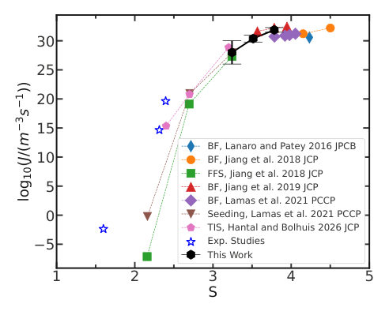
<figcaption class="paper-figure-caption"><b>Fig 1.</b> Figure 1: Nucleation rate, log10(J/(m−3s−1)), as a function of level of supersaturation, S. Results from this work (black hexagons) are provided in context of previous simulation studies using BF [15, 16, 19, 30], FFS [15], TIS [20] and seeding methods [19], as well as experimental measurements [27–29]. Error bars denote the uncertainty in the computed nucleation rates.</figcaption>
</figure>
<figure class="paper-figure-card">

<figcaption class="paper-figure-caption"><b>Fig 2.</b> Figure 2: (A-C) Average pB projection of configurations from systems at (A) 12, (B) 13, and (C) 14 mol/kg onto ntf (x-axis) and θntf (y-axis). The plots are colored by the committor value from 0 to 1. The bin size for the x-axis is 1, and 0.02 for the y-axis. The representative snapshots shown in the insets of Panels A-C correspond to the configuration marked by the green star. The snapshot configurations have an ntf value of 26. Na+ and Cl−ions of ntf are represented in blue and cyan, respectively. Amorphous ions in nAO that do not overlap with ntf are shown in gray. (D-E) nAO distribution of transition state configurations (0.45 ≤pB ≤0.55) at (D) 12, (E) 13, and (F) 14 mol/kg.</figcaption>
</figure>
<figure class="paper-figure-card">
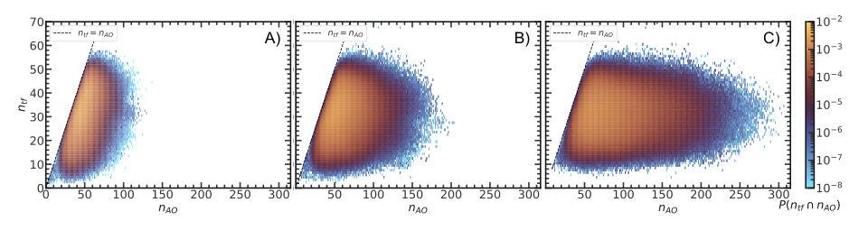
<figcaption class="paper-figure-caption"><b>Fig 3.</b> Figure 3: Joint probability distribution from nucleation trajectories of the largest crystalline nucleus (ntf) and the largest amorphous aggregate overlapping with ntf (nAO) for systems at (A) 12, (B) 13, and (C) 14 mol/kg. The joint probability is computed from RPE-weighted configurations sampled along reactive trajectories using bin widths of one in both order parameters.</figcaption>
</figure>
<figure class="paper-figure-card">

<figcaption class="paper-figure-caption"><b>Fig 4.</b> Figure 4: Conditional probability distribution from nucleation trajectories of ntf for a given nAO size for systems at (A) 12, (B) 13, and (C) 14 mol/kg. The green crosses mark the maximum of each conditional probability along a given nAO bin. The conditional probability is calculated from the joint probability distributions shown in Fig. 3.</figcaption>
</figure>
<figure class="paper-figure-card">

<figcaption class="paper-figure-caption"><b>Fig 5.</b> Figure 4 shows the conditional probability distributions for the three concentrations studied. If nucleation proceeds predominantly through a one-step mechanism, the maxima of P(ntf|nAO) are expected to remain close to the ntf = nAO line, reflecting concerted growth in both dense ion aggregation and crystallinity. In contrast, deviation of the maxima away from this diagonal indicates increasing decoupling between dense cluster formation and crystalline ordering, consistent with two-step-like growth behavior.</figcaption>
</figure>

**Summary.** This work investigates the nucleation mechanism of NaCl in solution by analyzing reactive pathways across varying supersaturations. Using advanced path sampling techniques, the authors demonstrate that the mechanism is not strictly one-step or two-step, but rather an ensemble of competing pathways whose relative probabilities change continuously with concentration. This provides a unified view that resolves previous mechanistic disagreements in chemical physics.

**Why it may be interesting.** While focused on classical nucleation, the methodology—using advanced path sampling and analyzing the continuous evolution of competing reactive pathways—provides a powerful framework for understanding phase transitions in complex, non-equilibrium systems relevant to AMO physics.

Detailed structure

**Main problem.** The study aims to resolve the long-standing debate regarding the microscopic mechanism of crystal nucleation in aqueous sodium chloride (NaCl), specifically whether the process is a simple one-step aggregation or a more complex, two-step process involving amorphous intermediates.

**Main result.** The nucleation mechanism is not fixed but exists as an ensemble of competing reactive pathways whose relative probabilities vary continuously with the supersaturation level, reconciling previous contradictory reports.

**Method.** The authors employed unbiased path sampling techniques ($\infty$RETIS) combined with advanced analysis tools like reaction coordinate analysis, joint/conditional probability distributions, and free energy landscape mapping to characterize the reactive trajectories.

**Model / system.** The system studied is the nucleation of crystalline sodium chloride (NaCl) from an aqueous solution, investigated across three distinct supersaturation regimes (12, 13, and 14 mol/kg).

**Key observables.** Nucleation rate ($J$), crystalline nucleus size ($ntf$), crystalline ordering ($	heta_{ntf}$), amorphous aggregate size ($nAO$), and the committor probability ($p_B$).

**Important parameters / regimes.** Supersaturation ($S$) levels (3.2 to 3.8), which control the relative probability of different reactive pathways.

**Assumptions / limitations.** The analysis assumes that the system can be described by an ensemble of competing reactive pathways rather than requiring distinct, isolated metastable free energy basins.

**Figures summary.** Figures compare calculated nucleation rates against prior studies, and joint/conditional probability distributions show how the coupling between amorphous and crystalline growth changes with concentration, moving from coupled (one-step) to decoupled (two-step-like) behavior.

**Paper structure.** The paper progresses by first establishing the general framework using path sampling, then using order parameters and probability distributions to diagnose the coupling between amorphous and crystalline growth, and finally synthesizing these findings to propose a continuous ensemble view of the nucleation process.

Abstract

Deciphering the microscopic details of crystal nucleation remains a key open problem in chemical physics. For aqueous sodium chloride (NaCl), the extent to which nucleation involves amorphous ion aggregation, and the supersaturation regime in which two-step-like behavior emerges, remains actively debated. In this work, we examine NaCl nucleation at 12, 13, and 14 mol/kg ($S = 3.2, 3.5, 3.8$) using unbiased path sampling with $\infty$RETIS. Through a combination of reaction coordinate analysis, joint and conditional probability distributions, diffusion tensor analysis, and conditional free energy landscapes, we identify nucleation pathways without a priori mechanistic assumptions. While all concentrations are governed by the same reaction coordinate, indicating that nucleus growth and structural ordering are central to crossing the barrier, the nature of reactive trajectories changes with supersaturation. At lower concentrations, nucleation mainly occurs via tightly coupled increases in cluster size and ordering, compatible with a one-step-like mechanism. As concentration increases, amorphous aggregation becomes increasingly decoupled from crystallization, and pathways involving substantial amorphous growth prior to crystallization become progressively more probable. Importantly, these pathways coexist within a single broad reaction channel rather than proceeding through distinct metastable intermediate states. Together, these results reconcile earlier, contradictory reports on NaCl nucleation mechanisms and support a view of nucleation as an ensemble of competing reactive pathways whose relative probabilities vary continuously with supersaturation. More broadly, our findings illustrate that substantial mechanistic diversity can emerge within a classical nucleation framework, without requiring distinct non-classical descriptions.

[↑ back to top](#top)

### [Fast, Accurate, and Scalable Fermionic Neural Networks via Translation Equivariance](http://arxiv.org/abs/2609.10186v1)

**Authors:** David D. Dai, Yen-Ting Lin, Marin Soljačić  
**Type:** theory · **Category:** strongly correlated electrons · **PDF:** <https://arxiv.org/pdf/2609.10186v1>  
**Analysis basis:** full PDF text, analyzed in chunks
**Topic relevance:** `analog quantum simulation` **2/5** · `methods for driven-dissipative` **2/5**

↔ Scroll figures horizontally

<figure class="paper-figure-card">
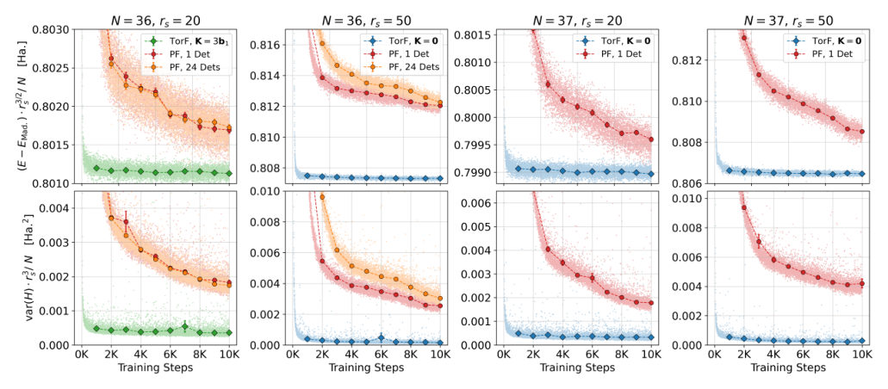
<figcaption class="paper-figure-caption"><b>Fig 1.</b> FIG. 1. Medium-system comparison of TorFormer (TorF) and Psiformer (PF)’s expected energy and energy variance versus training steps. Error bars every 1K steps show inference energies estimated from fresh Markov chains, while the scatter plots show training estimates logged at each step. TorFormer is both faster and more accurate.</figcaption>
</figure>
<figure class="paper-figure-card">

<figcaption class="paper-figure-caption"><b>Fig 2.</b> FIG. 3. TorFormer’s energy per particle and Bragg peak height for sectors K = 3b1 and K = 0, plotted as a function of density parameter rs. The symmetry-protected crossing at rs = 39 causes a jump in the static structure factor, which is a finite-size realization of the phase transition.</figcaption>
</figure>
<figure class="paper-figure-card">

<figcaption class="paper-figure-caption"><b>Fig 3.</b> FIG. 2. Pair correlation function (top row) and static struc- ture factor (bottom row) for rs = 20.0 (left column) and rs = 50.0 (right column). The expected phase is apparent in both observables.</figcaption>
</figure>
<figure class="paper-figure-card">

<figcaption class="paper-figure-caption"><b>Fig 4.</b> FIG. 4. N = 91, rs = 40.0 training curves. Top panel: energy comparison between TorFormer, the previous best NQS (Psi- former+SWPA), and Slater-Jastrow-backflow diffusion Monte Carlo. TorFormer is more accurate than Psiformer+SWPA while using less than a tenth of the training steps. Bottom: TorFormer is a near-exact eigenstate of the triangular lattice point-group generators with eigenvalue −1 for both.</figcaption>
</figure>
<figure class="paper-figure-card">

<figcaption class="paper-figure-caption"><b>Fig 5.</b> FIG. 5. N = 91, rs = 40.0 correlations. Top left: pair cor- relation. The pattern is smeared, because the model learned a superposition of the (6, 5) and (5, 6) crystal embeddings. Top right: 2D map of static structure factor. Each of the two crystal embeddings contributes a set of six Bragg peaks for twelve total. Bottom: symmetry-averaged static structure factor versus wavevector norm, showing the Bragg peak.</figcaption>
</figure>

**Summary.** This paper introduces TorFormer, a novel neural quantum state designed to incorporate exact symmetries, specifically total momentum, into the wavefunction ansatz. By enforcing translation equivariance, it achieves superior training speed and significantly lower variational energies for the 2D electron gas compared to prior methods. This work demonstrates that symmetry-aware neural networks can provide an accurate and efficient route to solving large-scale, strongly correlated quantum many-body problems.

**Why it may be interesting.** While focused on 2DEG, the emphasis on symmetry-enforced neural networks for strongly correlated systems provides a powerful, generalizable tool for simulating complex quantum matter beyond standard QMC or DMRG limitations.

Detailed structure

**Main problem.** Developing fast, accurate, and scalable methods to solve the many-electron Schrödinger equation for strongly correlated systems using Neural Quantum States (NQS).

**Main result.** The proposed TorFormer architecture significantly improves both training speed and final variational energy compared to previous state-of-the-art NQS methods.

**Method.** The authors introduce TorFormer, a neural network wavefunction designed to be an exact eigenstate of the total momentum, enforcing translation equivariance by construction.

**Model / system.** The study focuses on the 2D electron gas, governed by a Hamiltonian involving kinetic and Coulomb interaction terms, and investigates the phase transition between Fermi liquid and Wigner crystal states.

**Key observables.** Variational energy, energy variance, pair correlation function, and static structure factor.

**Important parameters / regimes.** Density parameter $r_s$ (tested at 30.0 and 40.0) and particle number $N$ (tested up to $N=91$).

**Assumptions / limitations.** The method assumes the Hamiltonian commutes with translation, allowing the use of total momentum as a symmetry operator.

**Figures summary.** Figures compare energy convergence curves (TorFormer vs. Psiformer), show pair correlation functions diagnosing liquid/crystal phases, and plot energy vs. $r_s$ to identify symmetry-protected crossings.

**Paper structure.** The paper introduces the problem, details the TorFormer architecture leveraging momentum eigenstates, presents quantitative comparisons of energy convergence and final energies against benchmarks like Psiformer and DMC, and concludes by demonstrating the method's scalability.

Abstract

We demonstrate that designing a neural quantum state to be an exact eigenstate of the Hamiltonian's symmetries significantly improves both training speed and final variational energy. For the 2D electron gas, we design TorFormer, a neural network wavefunction which is an exact eigenstate of the total momentum. TorFormer describes both the Fermi liquid and Wigner crystal with no supervision and significantly outperforms Psiformer-based references up to large system sizes. For $r_s = 30.0$ and $40.0$ at $N=91$, we compare TorFormer trained for $8\mathrm{K}$ steps against the previous best NQS, which required $100\mathrm{K}$ training steps. Our improvement to the total energy at $r_s = 40.0$, excluding the trivial Madelung part, is $0.12\%$---enormous compared to the tiny differences separating phases. Relative to Slater-Jastrow-backflow diffusion Monte Carlo, TorFormer's energy decrease is roughly $9.8$ times that of the previous best NQS. Our work demonstrates that neural quantum states can both accurately and efficiently solve large-scale problems.

[↑ back to top](#top)

### [Orbital-selective electronic modes induced by doping and originating from distinct spin excitations: an essential feature of orbital-selective Mott transition](http://arxiv.org/abs/2609.09741v1)

**Authors:** Masanori Kohno  
**Type:** theory · **Category:** strongly correlated electrons · **PDF:** <https://arxiv.org/pdf/2609.09741v1>  
**Analysis basis:** full PDF text, analyzed in chunks
**Topic relevance:** `analog quantum simulation` **2/5** · `Keldysh / 2PI / non-Gaussian methods` **1/5** · `methods for driven-dissipative` **1/5**

↔ Scroll figures horizontally

<figure class="paper-figure-card">

<figcaption class="paper-figure-caption"><b>Fig 1.</b> FIG. 1: Am δ=0(k, ω)t1 [(a), (d)] and Am δ=0.05(k, ω)t1 [(b), (c), (e), (f)] for the 1st orbital (m = 1) [(a)–(c)] and 2nd orbital (m = 2) [(d)–(f)]. The blue curves on the right-hand side show ρ(ω)t1 calculated from Am δ (k, ω)t1 on the left in (a), (b), (d), and (e). The dispersion relations of the doping- induced modes, ω = eS+ k−π</figcaption>
</figure>
<figure class="paper-figure-card">
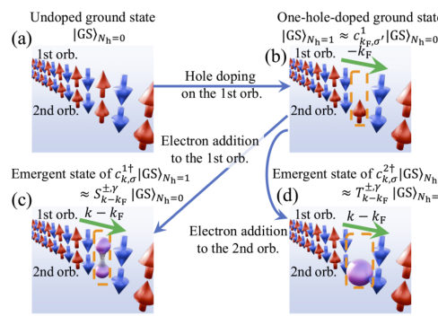
<figcaption class="paper-figure-caption"><b>Fig 2.</b> FIG. 2: Emergence mechanism of spin excited states as elec- tronic excited states upon doping. (a) Undoped ground state |GS⟩Nh=0. (b) One-hole-doped ground state |GS⟩Nh=1, which has significant overlap with the state obtained by removing an electron with Fermi momentum kF from the first orbital of |GS⟩Nh=0. The doped site is enclosed by the dashed or- ange line. (c), (d) States obtained by adding an electron with momentum k to the doped orbital [(c)] and undoped orbital [(d)] at the doped site in |GS⟩Nh=1, which have sig- nificant overlap with spin excited states S±,γ k−kF|GS⟩Nh=0 [(c)] and T ±,γ k−kF|GS⟩Nh=0 [(d)], respectively, at half filling. The states enclosed by the dashed orange...</figcaption>
</figure>
<figure class="paper-figure-card">
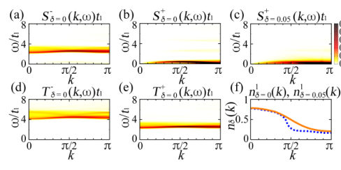
<figcaption class="paper-figure-caption"><b>Fig 3.</b> FIG. 3: (a) S− δ=0(k, ω)t1. (b) S+ δ=0(k, ω)t1. (c) S+ δ=0.05(k, ω)t1. (d) T − δ=0(k, ω)t1. (e) T + δ=0(k, ω)t1. (f) n1 δ=0(k) (solid orange curve) and n1 δ=0.05(k) (dashed blue curve).</figcaption>
</figure>

**Summary.** This theoretical study investigates the Orbital-Selective Mott Transition (OSMT) in a spin-1 antiferromagnetic insulator using the Kanamori-Hubbard model. The authors demonstrate that doping induces orbital-selective electronic modes in the band gap. These emergent modes are fundamentally linked to distinct spin excitations—low-energy modes in the doped orbital and inter-orbital modes in the undoped orbital—providing a key signature of the OSMT.

**Why it may be interesting.** The explicit link drawn between emergent electronic modes and underlying spin excitations provides a concrete, calculable mechanism for understanding Mott transitions in multiorbital systems, which is highly relevant to strongly correlated materials studied in AMO/condensed matter.

Detailed structure

**Main problem.** The study aims to elucidate the fundamental nature of the Orbital-Selective Mott Transition (OSMT) in correlated electron systems.

**Main result.** The OSMT is characterized by the emergence of orbital-selective electronic modes in the band gap upon doping, which are directly traceable to distinct spin excitation mechanisms in different orbitals.

**Method.** The research employs theoretical analysis using the Non-Abelian Dynamical Density-Matrix Renormalization Group (DDMRG) method applied to the Kanamori-Hubbard model.

**Model / system.** The system is modeled by a spin-1 antiferromagnetic insulator described by the Kanamori-Hubbard model (KHM) in one dimension, incorporating orbital degeneracy and Hund's coupling.

**Key observables.** Spectral function ($A_m^\delta(k, \omega)$), momentum distribution function ($n_m^\delta(k)$), and dynamical spin structure factors ($S^\pm_\delta(k, \omega)$ and $T^\pm_\delta(k, \omega)$).

**Important parameters / regimes.** Doping concentration ($\delta$), and coupling ratios like $U/t_1$, $U'/t_1$, and $J_H/t_1$.

**Assumptions / limitations.** The analysis assumes the ground state at half filling has zero momentum and total spin, and that the overlap between added-electron states and spin-excited states is significant.

**Figures summary.** Figures illustrate the emergence of doping-induced dispersion relations in the spectral function for both orbitals, comparing the undoped and doped ground states to spin-excited states.

**Paper structure.** The paper introduces the KHM model and the problem of OSMT, develops the theoretical framework using DDMRG, presents results showing orbital-selective mode emergence linked to spin excitations, and concludes by confirming this feature as essential to the OSMT.

Abstract

The nature of the orbital-selective Mott transition (OSMT) remains elusive. This study shows that, by doping an orbitally degenerate spin-1 antiferromagnetic insulator in the Kanamori-Hubbard model, electronic modes emerge in the band gap in an orbital-selective manner, exhibiting momentum-shifted spin-mode dispersion relations. Electronic modes originating from conventional spin excitations, including the low-energy one, appear in the doped orbital, while those from inter-orbital spin excitations appear in the undoped orbital. These emergent modes constitute an essential feature of the OSMT.

[↑ back to top](#top)

### [Thermal Quantum Sensing: Fisher Information and Work Beyond Gaussian Signals](http://arxiv.org/abs/2609.09583v1)

**Authors:** Yash Chitgopekar, Nikolaos Koukoulekidis, Iman Marvian  
**Type:** theory · **Category:** statistical mechanics · **PDF:** <https://arxiv.org/pdf/2609.09583v1>  
**Analysis basis:** full PDF text, analyzed in chunks
**Topic relevance:** `quantum measurements` **2/5** · `Keldysh / 2PI / non-Gaussian methods` **1/5** · `analog quantum simulation` **1/5**

↔ Scroll figures horizontally

<figure class="paper-figure-card">
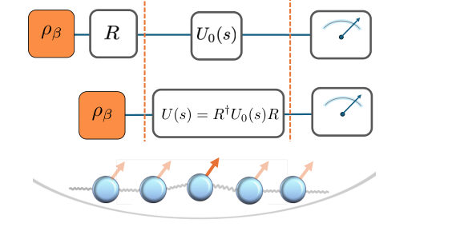
<figcaption class="paper-figure-caption"><b>Fig 1.</b> FIG. 1. Thermal Quantum Sensing. Top: A standard sensing protocol: the sensor is prepared in the Gibbs state ρβ, transformed by a unitary R to obtain the desired initial probe state, evolved under the parameter-dependent unitary U0(s), and finally measured. Middle: An equivalent description used throughout this work, in which the preparation unitary is ab- sorbed into the signal: the sensor is prepared in the Gibbs state ρβ and evolves under U(s) = R†U0(s)R. We study its sensitivity, quantified by various quantum Fisher information metrics, and the work performed by the signal as functions of temperature β−1. Bottom: For continuous-variable sen- sors, such as the motional bosonic modes of...</figcaption>
</figure>
<figure class="paper-figure-card">

<figcaption class="paper-figure-caption"><b>Fig 2.</b> FIG. 2. Hierarchy of information metrics and a finite infinite-temperature limit. As an example, we consider a thermal state of a translationally invariant harmonic chain of N quantum harmonic oscillators in a 1D lattice with periodic boundary conditions and nearest-neighbor interactions as de- scribed by Eq. (163) with N = 10 and coupling κ = 5 · 10−3</figcaption>
</figure>
<figure class="paper-figure-card">
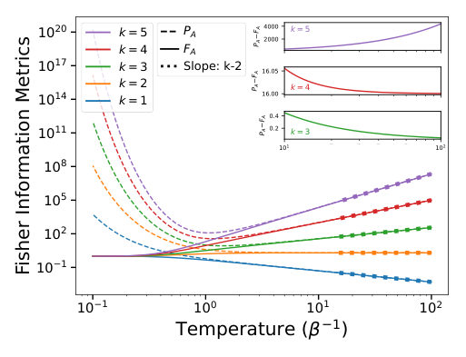
<figcaption class="paper-figure-caption"><b>Fig 3.</b> FIG. 3. Extremal QFI metrics of a single harmonic oscillator for polynomial signals. We plot, as a function of temperature β−1, the minimal (SLD) and maximal (RLD) QFI metrics FAk, PAk for a thermal state of the harmonic oscillator with H = (X2 + P 2)/2 and a signal generated by Ak = ckXk for k = 1, · · · , 5. The normalization factors ck are chosen such that, for every k, the SLD at zero temperature, which is four times the variance of Ak in the ground state, is equal to 1 (see Sec. G for details). In the limit of high temper- ature, the difference between PAk(ρβ) and FAk(ρβ) vanishes for k ≤3, tends to a positive constant for k = 4, and diverges for k ≥5. The slope of the curves for both...</figcaption>
</figure>
<figure class="paper-figure-card">
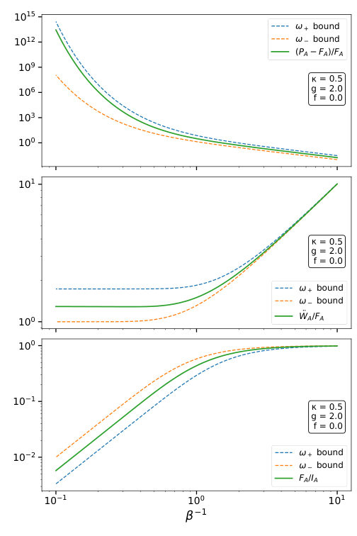
<figcaption class="paper-figure-caption"><b>Fig 4.</b> FIG. 4. Bounds on ratios of QFI metrics. We plot the bounds from Eqs. (67), (68) and (70) in the top, middle, and bottom panels respectively as functions of temperature for the harmonic chain described in Eq. (163) with N = 10 and cou- pling coefficient κ = 0.5 and a uniform signal Eq. (153). For g = 2.0 and f = 0, the signal A = P</figcaption>
</figure>
<figure class="paper-figure-card">
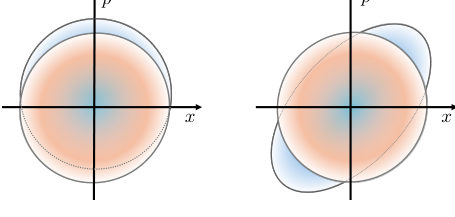
<figcaption class="paper-figure-caption"><b>Fig 5.</b> FIG. 5. Difference between linear and quadratic sig- nals. We depict phase-space representations of the Gibbs state ρβ and its evolved state e−iAsρβeiAs, for a fixed small value of s. For the linear signal A = X (left), the evolution produces a fixed displacement in the momentum direction. In- creasing the temperature broadens the thermal distribution, with its variance scaling as nβ + 1/2, while the displacement remains fixed. Consequently, the displacement becomes negli- gible relative to the width of the distribution, explaining why the QFI vanishes in the infinite-temperature limit. For the quadratic signal A = X2 (right), the evolution produces a squeezing deformation in phase space....</figcaption>
</figure>

**Summary.** This paper develops a general theoretical framework connecting quantum sensing sensitivity (measured by various QFI metrics) to the work done by a signal in thermal quantum states. It derives that at high temperatures, these metrics converge to a universal quantity related to the signal's fluctuation variance. This provides crucial, quantitative bounds for improving quantum measurements in the presence of thermal noise.

**Why it may be interesting.** This work provides deep theoretical connections between quantum metrology (QFI) and quantum thermodynamics (work), offering quantitative bounds on sensing precision under realistic thermal conditions, which is crucial for experimental quantum sensing platforms like trapped ions.

Detailed structure

**Main problem.** The paper addresses how thermal fluctuations modify quantum-enhanced sensing and establishes general relationships between the work done by a signal and the information acquired by a sensor in quantum thermodynamics.

**Main result.** In the high-temperature limit, various Quantum Fisher Information (QFI) metrics coincide to a universal quantity related to the variance of the signal generator. For quadratic Gaussian signals, the infinite-temperature QFI is at least twice the zero-temperature SLD QFI.

**Method.** The authors establish general theoretical relations between different QFI metrics (SLD, BKM, RLD, $I_A$) and the work done, analyzing these relationships across different temperature regimes.

**Model / system.** The analysis uses the Gibbs state $
ho_eta = e^{-eta H}/Z_eta$ for the probe, which is probed by a unitary signal $U(s) = e^{-iAs}$. Specific models include harmonic chains of bosonic modes relevant to trapped-ion platforms and continuous-variable systems.

**Key observables.** Quantum Fisher Information metrics (SLD, BKM, RLD, $I_A$), induced work $W(s)$, and the variance of the signal generator $	ext{Var}_{
ho_eta}(\dot{A})$.

**Important parameters / regimes.** Temperature ($T$ or $eta$), signal generator $A$, and the intrinsic Hamiltonian $H$. The high-temperature limit ($eta 	o 0^+$) is a key focus.

**Assumptions / limitations.** The probe is assumed to be prepared in the Gibbs state $
ho_eta$. The analysis relies on relating QFI metrics to the second derivative of the work done.

**Figures summary.** Figures illustrate the sensing protocol and plot various QFI metrics (SLD, BKM, RLD, $I_A$) as functions of temperature, demonstrating their hierarchy and high-temperature convergence.

**Paper structure.** The paper first establishes the general framework relating QFI metrics to work in thermal quantum sensing. It then analyzes the high-temperature limit, deriving the universal quantity $I_A(
ho_eta)$, and applies these findings to specific bosonic and harmonic chain models.

Abstract

Understanding how thermal fluctuations modify or suppress quantum-enhanced sensing is a central problem in quantum metrology. Closely related questions arise in quantum thermodynamics, particularly regarding the relation between the work induced by a signal and the information acquired by a sensor. Here, we establish general relations among the sensitivity of thermal quantum states, as quantified by different quantum Fisher information metrics, their temperature dependence, and the work induced by a unitary signal. We further show that, at high temperature, all monotone QFI metrics coincide to leading order with a universal quantity that can be expressed as the variance of a simple observable and itself defines a lesser-known QFI metric. This emergent uniqueness is reminiscent of the uniqueness of classical Fisher information in information geometry. In continuous-variable systems, the infinite-temperature limit is finite and generically non-zero for quadratic Gaussian signals, while it diverges for higher-degree signals. Remarkably, for any purely quadratic signal generator, the infinite-temperature QFI is at least twice the zero-temperature SLD QFI or, equivalently, at least eight times the ground-state variance of the generator. Consequently, the Cramér--Rao lower bound on the estimator variance is reduced by at least a factor of two. We illustrate these results using harmonic chains of bosonic modes relevant to trapped-ion platforms and quantum field-theoretic models.

[↑ back to top](#top)

### [Finite-Temperature Flat-Band Ferromagnetism in the Kagome Hubbard Model](http://arxiv.org/abs/2609.09289v1)

**Authors:** Alon Strugatsky, Roser Valení, Jonas B. Profe  
**Type:** theory · **Category:** strongly correlated electrons · **PDF:** <https://arxiv.org/pdf/2609.09289v1>  
**Analysis basis:** full PDF text, analyzed in chunks
**Topic relevance:** `Keldysh / 2PI / non-Gaussian methods` **2/5** · `analog quantum simulation` **1/5**

↔ Scroll figures horizontally

<figure class="paper-figure-card">

<figcaption class="paper-figure-caption"><b>Fig 1.</b> Figure 1. (a) The kagome lattice in reciprocal and real space with a single unit cell highlighted by blue shading. (b) The non-interacting bandstructure and density of states. (c) Mean- field spin-split band structure at nF B = 1/8 into a majority spin band (light green) and a minority spin band (dark green), with the Fermi level crossing the van-Hove singularity of the minority spin band.</figcaption>
</figure>
<figure class="paper-figure-card">

<figcaption class="paper-figure-caption"><b>Fig 2.</b> Figure 2. Single-site DMFT results. (a) Evolution of the normalized impurity magnetization as a function of the flat-band filling nF B for different interaction strengths, indicated by the curve colors, at T/t = 0.02. The four regimes discussed in the text are indicated above the plot: from left to right, the paramagnetic (purple), onset magnetization (magenta), dispersive demagnetization (orange), and flat-band (FB) demagnetization (dark yellow) regimes. (b) Temperature dependence of the normalized magnetization at U/t = 10 in the four regimes. Saturation is reached only at T →0, indicating strong competition between the ferromagnetic order and thermal fluctuations. For larger fillings the...</figcaption>
</figure>
<figure class="paper-figure-card">

<figcaption class="paper-figure-caption"><b>Fig 3.</b> Figure 3. Spin-resolved local density of states (DOS) for the majority (a) and minority (b) spin channels, together with the momentum-resolved spectral functions (c)-(f) obtained from DMFT. The Fermi level is set to EF = 0. In the onset regime, the minority-spin channel exhibits a strong loss of quasiparticle weight near the Fermi level (Fig. 3(d)). In contrast, in the saturated regime, the minority-spin quasiparticles remain fully coherent ((e,f)).</figcaption>
</figure>

**Summary.** This work investigates correlated magnetism in Kagome metals using the single-orbital Kagome-Hubbard model within the framework of Dynamical Mean-Field Theory. The authors demonstrate strong evidence for flat-band ferromagnetism and identify an unconventional quasi-ordered state. This state is marked by persistent local spin fluctuations down to zero temperature, which they attribute to the inherent degeneracy of the flat band.

**Why it may be interesting.** The concept of persistent, anomalous spin fluctuations arising purely from the degeneracy of a flat band provides a novel mechanism for magnetic instability that could be relevant to understanding strongly correlated quantum materials.

Detailed structure

**Main problem.** The paper aims to elucidate the microscopic origin of correlated electronic phases in Kagome metals, specifically focusing on the physics within the flat-band regime.

**Main result.** The study finds strong signatures of flat-band ferromagnetism and uncovers an unconventional quasi-ordered phase characterized by persistent local spin fluctuations down to zero temperature.

**Method.** The primary theoretical tool used is Dynamical Mean-Field Theory (DMFT), which maps the lattice problem to a quantum impurity problem solved using advanced techniques like CT-HYB QMC and ED.

**Model / system.** The system studied is the single-orbital Kagome-Hubbard model, described by a Hamiltonian incorporating hopping and on-site Coulomb repulsion (U). The focus is on partial fillings of the flat band.

**Key observables.** Normalized magnetization ($	ilde{m}_z$), local spin susceptibility ($\chi_{	ext{conn}}^{	ext{loc}}$), and the temperature dependence of magnetization ($	ilde{m}(T)$).

**Important parameters / regimes.** The analysis hinges on the filling factor ($n_{FB}$) and the ratio of interaction strength to hopping ($U/t$).

**Assumptions / limitations.** DMFT assumes the effective impurity bath is determined solely by the local non-interacting DOS, simplifying the cluster problem by retaining only diagonal contributions to the self-energy.

**Figures summary.** Figures illustrate the Kagome lattice structure and band structure, showing the onset and flat-band demagnetization regimes. They also plot the temperature dependence of magnetization and the local spin susceptibility ($\chi_{	ext{conn}}^{	ext{loc}}$) across different magnetic regimes.

**Paper structure.** The paper develops the analysis by first establishing the model and methods (DMFT), then analyzing the magnetization and temperature dependence across different filling regimes, and finally investigating the persistent spin fluctuations via the local spin susceptibility.

Abstract

Kagome metals exhibit a rich interplay of topology, electronic correlations, and lattice dynamics. Recent discoveries of Kagome materials with a flat band near the Fermi level have revealed a variety of correlated electronic phases. However, elucidating their microscopic origin remains challenging, as realistic descriptions require accounting for multiple orbitals and competing interactions on an equal footing. To disentangle correlation effects from material-specific details and identify the essential physics of the flat-band regime, we study the single-orbital Kagome-Hubbard model at flat-band fillings using dynamical mean-field theory. We find strong signatures of flat-band ferromagnetism, consistent with exact and mean-field ground-state results. Moreover, we uncover an unconventional quasi-ordered phase in which a partially filled spin-polarized flat band pinned at the Fermi level gives rise to persistent local spin fluctuations down to zero temperature, in striking contrast to the classical behavior expected for a conventional ferromagnet. Our results demonstrate that these anomalous fluctuations are an intrinsic consequence of the flat-band degeneracy and establish a minimal framework for understanding correlation effects in flat-band Kagome systems.

[↑ back to top](#top)

### [For Whom Does Bell Hold?](http://arxiv.org/abs/2609.10535v1)

**Authors:** Daniel Green, Kshitij Gupta, Qiya Zhang  
**Type:** theory · **Category:** other · **PDF:** <https://arxiv.org/pdf/2609.10535v1>  
**Analysis basis:** full PDF text, analyzed in chunks
**Topic relevance:** `Keldysh / 2PI / non-Gaussian methods` **2/5** · `analog quantum simulation` **1/5**

↔ Scroll figures horizontally

<figure class="paper-figure-card">

<figcaption class="paper-figure-caption"><b>Fig 1.</b> Figure 1: Illustration of the structural differences between quantum and classical theories. Both the quantum and classical theories have spins placed in the magnetic fields that cause spins to precess. The quantum theory (left) is placed in the ground state. The measurement of the spin in z-direction is random. When the spins are coupled via a Hamiltonian Hint, the resulting correlations are time-independent with an amplitude set by the total energy Etot = E1 +E2 +E3, where the energies Ei are the gaps between the ground state and excited state of each spin. For the classical theory (right) to produce random spins in the z direction, the spins are precessing in time with a frequency Ei and...</figcaption>
</figure>

**Summary.** This paper proposes a generalized Bell-type test that uses the pattern of statistical correlations in time evolution to distinguish quantum from classical physics. It shows that quantum vacuum fluctuations yield unique, stable correlations governed by energy gaps, unlike classical systems whose correlations exhibit resonant behavior followed by dephasing. This offers a new theoretical avenue to detect quantum effects in macroscopic, seemingly classical settings.

**Why it may be interesting.** This work provides a powerful, general diagnostic tool—analyzing time-dependent correlations—to probe the quantum nature of time evolution itself, which is highly relevant for open quantum systems and quantum gravity phenomenology.

Detailed structure

**Main problem.** The paper aims to generalize the use of statistical correlations as a Bell-type test to distinguish between fundamentally quantum and classical time evolution, especially in macroscopic settings where standard Bell tests fail.

**Main result.** Quantum vacuum fluctuations produce unique statistical correlations that are time-independent and controlled by energy gaps, which are distinct from the resonant, dephasing-dominated correlations exhibited by classical Hamiltonian systems.

**Method.** The authors analyze the statistical correlations of observables in closed systems undergoing Hamiltonian evolution, comparing the predictions of quantum field theory vacuum fluctuations against those of classical Hamiltonian dynamics.

**Model / system.** The comparison is made between quantum and classical systems undergoing Hamiltonian evolution, using spin-like observables as an illustration. The focus is on the vacuum state correlations in closed quantum systems.

**Key observables.** Statistical correlations of observables, energy gap ($\Delta E$), and the presence/absence of apparent poles in correlators.

**Important parameters / regimes.** The energy gap ($\Delta E$) between the ground and excited states, and the time scale over which dephasing occurs.

**Assumptions / limitations.** The analysis assumes the system is closed and undergoing Hamiltonian evolution, and it seeks to generalize the concept of non-classicality beyond standard Bell tests.

**Figures summary.** Figure 1 illustrates the structural differences in correlations between quantum (time-independent, gap-controlled) and classical (precession-based, resonant/decaying) theories involving spins in magnetic fields.

**Paper structure.** The paper progresses by first establishing the failure of standard Bell tests in certain physical regimes (like cosmology), then generalizing the test to time evolution itself, and finally contrasting the unique, time-independent correlations of the quantum vacuum against the resonant, dephasing behavior of classical systems.

Abstract

Violations of Bell's inequalities offer a definitive signal of non-classical (quantum) behavior in local deterministic systems. Yet, in many physical settings where quantum mechanics is expected to play an important role, one cannot construct a Bell-type test using the available observables. Cosmology offers one concrete example, where cosmic structure may have originated from quantum vacuum fluctuations yet all observations are effectively classical. Nevertheless, recent work suggests that quantum and classical time evolution may still be differentiated by the pattern of statistical correlations of these observables. In this paper, we explore and generalize the use of correlations as Bell-type test of the nature of time evolution. We show that quantum vacuum fluctuations of closed systems undergoing Hamiltonian evolution produce unique correlations that are not mimicked by classical Hamiltonian systems. Correlations in the quantum vacuum are generally time-independent and are controlled by the energy gap between the ground and exited states. Classical systems exhibit apparent poles at physical frequencies that do not arise in the quantum vacuum. As one approaches the poles, the evolution becomes dominated by a resonant Hamiltonian giving rise to time dependent correlations that eventually decay through dephasing. Finally, we show that this behavior is distinct from other signals of quantum evolution, including applications to quantum optics, quantum walks, and quantum search.

[↑ back to top](#top)

### [Reconstructing fluid velocity fields from sparse sensors using a variational quantum algorithm](http://arxiv.org/abs/2609.09268v1)

**Authors:** Nhat-Quang Nguyen, Mohammad Mehedi Hasan Akash, Kourosh Shoele, Yanzhu Chen, Huixuan Wu  
**Type:** theory · **Category:** quantum information and computing · **PDF:** <https://arxiv.org/pdf/2609.09268v1>  
**Analysis basis:** full PDF text, analyzed in chunks
**Topic relevance:** `quantum measurements` **2/5** · `Keldysh / 2PI / non-Gaussian methods` **1/5**

↔ Scroll figures horizontally

<figure class="paper-figure-card">
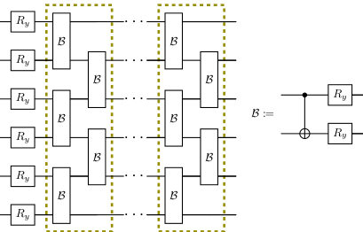
<figcaption class="paper-figure-caption"><b>Fig 1.</b> FIG. 1: The hardware-efficient ansatz with repeated layers of entangling unit circuits B arranged in a brickwall pattern. Repeating the unit circuit B more times increases the expressivity of the ansatz. All the Ry gates in the circuit are defined by parameters independent of each other. One dashed brown box is a brickwall layer.</figcaption>
</figure>
<figure class="paper-figure-card">

<figcaption class="paper-figure-caption"><b>Fig 2.</b> FIG. 2: The circuit in the top panel illustrates the effect of the index-shifting operator ˆAs. The state index of the top register is to be shifted and the bottom register with the dash-dotted wire encodes the value of the shift. For convenience, we define another operator ˆA(1) s , which is shifting the index by 1, as shown in the bottom panel.</figcaption>
</figure>
<figure class="paper-figure-card">

<figcaption class="paper-figure-caption"><b>Fig 3.</b> FIG. 4: (a) Circuit for evaluating a representative term in Eq. (15), P</figcaption>
</figure>
<figure class="paper-figure-card">

<figcaption class="paper-figure-caption"><b>Fig 4.</b> FIG. 7: Numerically simulated baseline and VQA-reconstructed velocity fields with higher space or temporal resolution for ν = 0.05. Each solid line connects the baseline velocities at different spatial coordinates for a given time. Unfilled circles are the velocities reconstructed by the proposed VQA. Panels (a) and (b) show the results for the Burgers equation with the sinusoidal (using nt + ns = 4 + 4 qubits) and Gaussian initial wave profiles (using nt + ns = 6 + 6 qubits), respectively. Panel (c) shows the results for the KS equation with nt + ns = 5 + 3 qubits.</figcaption>
</figure>
<figure class="paper-figure-card">
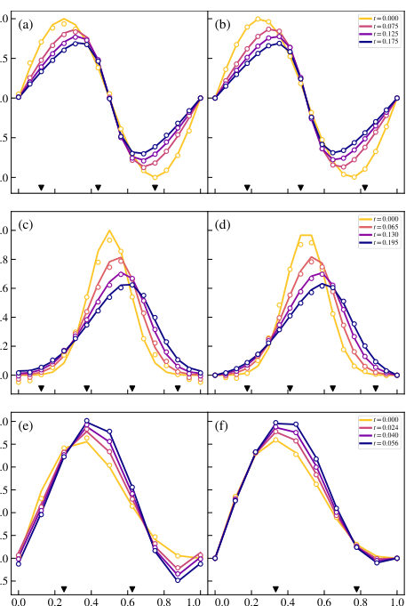
<figcaption class="paper-figure-caption"><b>Fig 5.</b> FIG. 6: Numerically simulated baseline and VQA-reconstructed velocity fields with viscosity ν = 0.05. Triangles on the x-axis indicate the sensor locations used for the reconstruction. Each solid line connects the baseline velocities at different spatial coordinates for a given time. Unfilled circles are the velocities reconstructed by the proposed VQA. Panels (a)(b) and (c)(d) show the results for the Burgers equation with the sinusoidal and Gaussian initial wave profiles, respectively. Panels (e) and (f) show the results for the KS equation. Panels (a), (c), and (e) are results from the real-space approach and Panels (b), (d), and (f) are results from the Galerkin-reduced-basis approach.</figcaption>
</figure>

**Summary.** This paper introduces a variational quantum algorithm to reconstruct fluid velocity fields from sparse sensor data by encoding the entire spacetime solution into a single quantum state. It minimizes a cost function that simultaneously enforces the governing nonlinear PDE and matches sparse measurements. The method shows promise for quantum-enhanced solutions to complex, time-dependent physical inverse problems.

**Why it may be interesting.** This work directly applies quantum computation to solve a complex, continuous, non-equilibrium physics problem (PDEs), offering a quantum-enhanced approach to inverse problems in fluid dynamics.

Detailed structure

**Main problem.** The core challenge is reconstructing continuous physical fields governed by nonlinear Partial Differential Equations (PDEs) when measurements are available only at sparse locations.

**Main result.** The authors demonstrate that a variational quantum algorithm employing a spacetime-encoding scheme can successfully reconstruct globally consistent spacetime fields from sparse observations with low Root-Mean-Square (RMS) error.

**Method.** They propose a VQA framework where the entire discrete spacetime solution is encoded into a single quantum state, optimizing all time points jointly by minimizing a cost function combining PDE violation and measurement mismatch.

**Model / system.** The method is applied to fluid velocity fields, specifically modeling the one-dimensional Burgers and Kuramoto-Sivashinsky (KS) equations under periodic boundary conditions.

**Key observables.** Root-Mean-Square (RMS) error quantifying reconstruction accuracy; the reconstructed velocity field u(t, x).

**Important parameters / regimes.** Viscosity parameter ($\nu$); time and space discretization steps ($\Delta t, \Delta x$); the weighting hyperparameter ($w$) balancing PDE and measurement constraints.

**Assumptions / limitations.** The solution must admit a sparse representation within the Hilbert space accessible by the chosen quantum ansatz; the real-space approach uses first-order finite-difference approximations for derivatives.

**Figures summary.** Figures show reconstructed velocity fields for the Burgers and KS equations under varying resolutions, and a comparison of final-time wave profiles for both equations.

**Paper structure.** The paper progresses from the general inverse problem challenge to proposing the VQA framework. It details two implementation strategies (real-space vs. Galerkin-reduced-basis) for encoding the physics constraint into the quantum cost function, culminating in numerical simulations and results.

Abstract

Reconstructing fields governed by nonlinear partial differential equations (PDEs) from sparse measurements is a challenging task because the governing equations are strongly nonlinear and observations are available at only a few locations. Fluid velocity fields are a representative case. In this paper, we propose a variational quantum algorithm that reconstructs the solution over the entire spacetime domain at once. Rather than marching in time, the method encodes the full discrete spacetime solution in a single variational quantum state, so that all time points are optimized jointly. The cost function combines a sparse-measurement mismatch term with a physics-informed PDE violation term, letting data and the governing equation constrain the solution simultaneously. We demonstrate the method on the one-dimensional Burgers and Kuramoto--Sivashinsky equations using numerical simulations. The results suggest that variational quantum algorithms with a spacetime encoding scheme offer a compact framework for reconstructing nonlinear PDE dynamics.

[↑ back to top](#top)

### [Anizotropic Ising Model on 2D Kagomé Lattice as an Inhomogeneous XYZ Integrable Model](http://arxiv.org/abs/2609.10163v1)

**Authors:** Shahane A. Khachatryan, Hrachya Babujian, Ara G. Sedrakyan  
**Type:** theory · **Category:** statistical mechanics · **PDF:** <https://arxiv.org/pdf/2609.10163v1>  
**Analysis basis:** full PDF text, analyzed in chunks
**Topic relevance:** `analog quantum simulation` **2/5**

↔ Scroll figures horizontally

<figure class="paper-figure-card">

<figcaption class="paper-figure-caption"><b>Fig 1.</b> Figure 2: Critical subsurfaces on the real coordinate space J1, J2, J3</figcaption>
</figure>

**Summary.** This paper analyzes an inhomogeneous Ising model on the Kagomé lattice by mapping it onto an integrable eight-vertex R-matrix formulation. By analyzing specific coupling limits, the authors derive corresponding one-dimensional quantum spin chain Hamiltonians. The work successfully calculates thermodynamic properties like the specific heat, providing deep insights into the critical behavior of this complex lattice system.

**Why it may be interesting.** The rigorous connection between a 2D lattice model (Ising on Kagomé) and integrable 1D quantum spin chains via the Yang-Baxter equation is highly relevant for understanding quantum critical points and exactly solvable models in condensed matter theory.

Detailed structure

**Main problem.** The study investigates the integrable structure and thermodynamic properties of a generalized inhomogeneous Ising model defined on the two-dimensional Kagomé lattice.

**Main result.** The analysis successfully derives the free energy and specific heat for partially anisotropic cases, yielding specific quantum spin chain Hamiltonians for two distinct coupling regimes ($J'_i = J_i$ and $J'_i = -J_i$).

**Method.** The primary methods involve mapping local Boltzmann weights to a non-symmetric eight-vertex R-matrix, verifying the free-fermion condition, and analyzing the Yang-Baxter structure in the anisotropic limit.

**Model / system.** The system is an inhomogeneous Ising model on the Kagomé lattice, characterized by alternating nearest-neighbor couplings ($J_i$ and $J'_i$) along its three lattice directions. The partition function is derived from these couplings.

**Key observables.** Free energy, specific heat, and the resulting one-dimensional quantum spin Hamiltonians.

**Important parameters / regimes.** The coupling constants $J_i$ and $J'_i$, and the anisotropic limit parameters.

**Assumptions / limitations.** The analysis assumes nearest-neighbor interactions and often proceeds by taking the anisotropic or continuum limit to reduce the problem to 1D quantum chains.

**Figures summary.** Figure 1 illustrates the Kagomé lattice structure; Figure 2 shows the critical subsurfaces in the parameter space ($J_1, J_2, J_3$) for the two analyzed coupling regimes.

**Paper structure.** The paper first establishes the general partition function and its connection to the eight-vertex model via the R-matrix. It then analyzes specific coupling limits ($J'_i = \pm J_i$) to derive 1D quantum models and finally calculates thermodynamic quantities like free energy and specific heat for partially anisotropic cases.

Abstract

We investigate a generalized inhomogeneous two-dimensional Ising model on the kagomé lattice with two alternating couplings $J_i$ and $J'_i$, $i=1,2,3$, along the three lattice directions. The local Boltzmann weights are mapped onto a non-symmetric eight-vertex $R$-matrix satisfying the free-fermion condition for arbitrary values of the six couplings. We analyze the Yang--Baxter structure for the cases $J'_i=J_i$ and $J'_i=-J_i$ and derive the corresponding one-dimensional quantum spin chains in the anisotropic limit. The first case yields a transverse-field Ising-type Hamiltonian, while the second leads to a modified chain with a graded permutation structure and shifted partition-function zeros. For a partially anisotropic model, we also obtain the free energy and specific heat.

[↑ back to top](#top)

### [Emergent Electronic Bond-Order Wave in a Quasi-One-Dimensional Chain](http://arxiv.org/abs/2609.09383v1)

**Authors:** Honghao Wang, Tristan R. Cao, Pedro Schlottmann, Gang Cao  
**Type:** both · **Category:** strongly correlated electrons · **PDF:** <https://arxiv.org/pdf/2609.09383v1>  
**Analysis basis:** full PDF text, analyzed in chunks
**Topic relevance:** `Frenkel-Kontorova` **2/5**

↔ Scroll figures horizontally

<figure class="paper-figure-card">
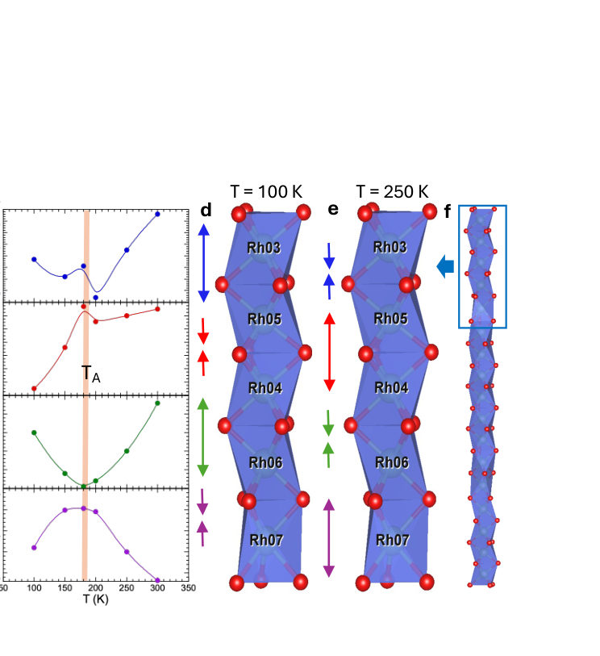
<figcaption class="paper-figure-caption"><b>Fig 1.</b> Figure 1</figcaption>
</figure>
<figure class="paper-figure-card">

<figcaption class="paper-figure-caption"><b>Fig 2.</b> Figure 2</figcaption>
</figure>
<figure class="paper-figure-card">
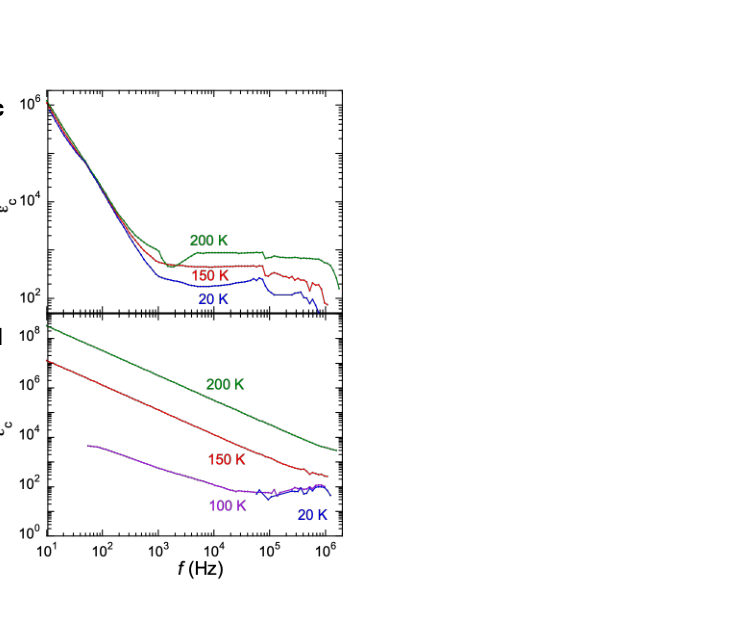
<figcaption class="paper-figure-caption"><b>Fig 3.</b> Figure 3</figcaption>
</figure>
<figure class="paper-figure-card">
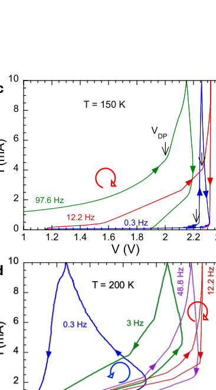
<figcaption class="paper-figure-caption"><b>Fig 4.</b> Figure 4</figcaption>
</figure>
<figure class="paper-figure-card">

<figcaption class="paper-figure-caption"><b>Fig 5.</b> Figure 5</figcaption>
</figure>

**Summary.** This paper reports the discovery of an electronic Bond-Order Wave (BOW) in the quasi-1D material $	ext{Ba}_9	ext{Rh}_8	ext{O}_{24}$ below a critical temperature $T_A$. The transition is marked by a structural bond inversion, which stabilizes a rigid electronic order, evidenced by correlated anomalies in dielectric and non-linear transport measurements. This establishes bond-centered order as a novel organizing principle for correlated quantum matter.

**Why it may be interesting.** The work provides an experimental realization of bond-centered electronic order, offering a platform to study correlated electron physics in low dimensions where conventional CDW or magnetic ordering might fail.

Detailed structure

**Main problem.** The primary challenge addressed is stabilizing collective electronic order in one dimension, a regime prone to fluctuations that suppress symmetry-breaking states.

**Main result.** The authors report the emergence of a Bond-Order Wave (BOW) in $	ext{Ba}_9	ext{Rh}_8	ext{O}_{24}$, characterized by a structural bond inversion at $T_A \approx 180 	ext{ K}$ and confirmed by correlated anomalies in dielectric and transport measurements.

**Method.** The study combines single-crystal X-ray diffraction to track structural bond changes with multiple electrical and thermodynamic measurements (dielectric response, heat capacity, I-V curves) to diagnose the electronic state transition.

**Model / system.** The physical system is the quasi-one-dimensional material $	ext{Ba}_9	ext{Rh}_8	ext{O}_{24}$, whose electronic behavior is modeled by considering bond-centered electronic order, which overcomes 1D fluctuations.

**Key observables.** Bond inversion (short $\leftrightarrow$ long Rh-Rh bonds), heat-capacity anomaly, suppression of dielectric loss ($\epsilon''$), and nonlinear/memristive I-V hysteresis.

**Important parameters / regimes.** Transition temperature $T_A \approx 180 	ext{ K}$; the system transitions from a dynamic bond liquid to a rigid BOW state.

**Assumptions / limitations.** The observed electrical behavior is attributed to an intrinsic collective reorganization of the bond network, rather than purely thermal effects.

**Figures summary.** Figures illustrate the bond inversion via X-ray diffraction, the coincidence of anomalies in heat capacity and dielectric response near $T_A$, and the development of nonvolatile memristive switching below $T_A$.

**Paper structure.** The paper systematically links structural evidence (bond inversion) with thermodynamic (heat capacity) and electronic transport signatures (dielectric/I-V) to establish a unified picture of the transition into a rigid BOW state.

Abstract

Collective order is notoriously difficult to stabilize in one dimension, where strong fluctuations suppress symmetry-breaking states. Here we report the emergence of an electronic bond-order wave (BOW) in the quasi-one-dimensional (1D) material Ba9Rh8O24, in which structural bonds become active electronic degrees of freedom that overcome 1D fluctuations to establish long-range order. Single-crystal X-ray diffraction uncovers a striking inversion of inequivalent Rh-Rh bonds across a transition TA = 180 K, where short and long bonds interchange their identities rather than undergoing conventional Peierls dimerization. This bond inversion coincides with a heat-capacity anomaly and a profound reorganization of the dielectric response with strong suppression of dielectric loss upon cooling. The BOW exhibits strongly nonlinear, frequency-dependent I-V characteristics, clockwise hysteresis, and nonvolatile memristive switching. These findings uncover an unprecedented transformation from a dynamic bond liquid to a rigid yet electrically reconfigurable BOW, establishing bond-centered electronic order as a new organizing principle for 1D quantum matter.

[↑ back to top](#top)

### [Execution-transcript privacy for fault-tolerant surface-code memories](http://arxiv.org/abs/2609.09334v1)

**Authors:** Jiachen Shen, Hui Zhong  
**Type:** both · **Category:** quantum information and computing · **PDF:** <https://arxiv.org/pdf/2609.09334v1>  
**Analysis basis:** full PDF text, analyzed in chunks
**Topic relevance:** `quantum measurements` **2/5**

↔ Scroll figures horizontally

<figure class="paper-figure-card">
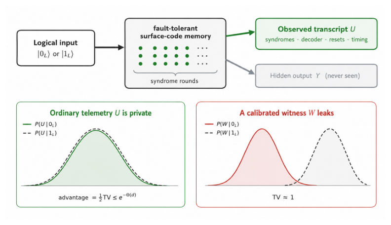
<figcaption class="paper-figure-caption"><b>Fig 1.</b> Figure 1: The transcript privacy channel and the two regimes. A logical input enters a surface-code memory that emits the non-output transcript U while the output Y stays hidden. The two input-conditioned laws of ordinary U nearly coincide (private), while a calibrated witness W separates them (leaks).</figcaption>
</figure>
<figure class="paper-figure-card">
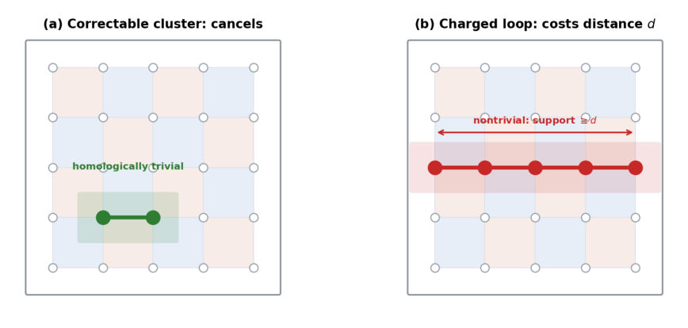
<figcaption class="paper-figure-caption"><b>Fig 2.</b> Figure 2: The mechanism. (a) By Knill–Laflamme, a bra–ket fault pair K† bKa with homo- logically trivial support multiplies the code space by a scalar within its syndrome sector and cancels in the two transcript laws. The condition is trivial homology, not weight below d (Remark 5). (b) An input-sensitive contribution must therefore carry a homologically nontrivial cycle, whose support is ≥d, so logical information enters only through a charged region of size ≥d/ℓ∗. The schematic is spatial only, and the expansion runs over spacetime detector regions.</figcaption>
</figure>
<figure class="paper-figure-card">

<figcaption class="paper-figure-caption"><b>Fig 3.</b> Figure 3: An adversarial null for the honest transcript (bootstrap 95% CIs; circuit-level depolarizing noise at p = 0.005, minimum-weight perfect-matching decoder, logistic adversary on the full detector record, held-out split). (a) An adversary given the full detector record stays at chance for honest U across d = 3, 5, 7 and reaches near one with a charged witness W. (b) The same adversary stays at chance under coherent and leakage noise in an exact statevector simulation at d = 3 (five noise models).</figcaption>
</figure>
<figure class="paper-figure-card">
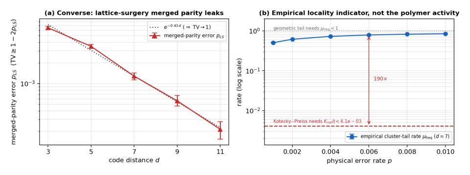
<figcaption class="paper-figure-caption"><b>Fig 4.</b> Figure 4: The converse and the locality indicator (bootstrap 95% CIs). (a) The lattice-surgery merged-parity error pLS decays exponentially in d (MWPM decoder), so the converse bound 1 −2pLS rises toward one. (b) The empirical cluster-tail rate µfreq, fitted to the sizes of the observed fired-detector components Robs, which are not the fault-support regions Rlat the theorem is stated for. This rate also differs from the polymer activity. The Kotecký–Preiss condition ea &lt; 1 requires Krod¯η &lt; 1/(e3 deg) ≈4.1 × 10−3 at detector degree 12, a threshold drawn as the dashed line, while the measured indicator sits about 190× above it. A geometric tail with µfreq &lt; 1 supports the form PWTS assumes....</figcaption>
</figure>
<figure class="paper-figure-card">
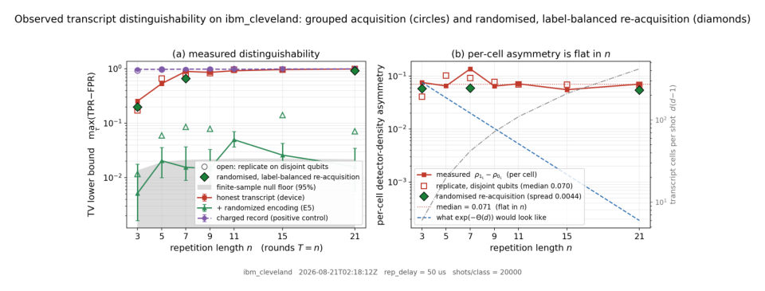
<figcaption class="paper-figure-caption"><b>Fig 5.</b> Figure 5: Measured transcript privacy on ibm_cleveland. Filled circles are the original grouped acquisition. The filled diamonds are the randomised, label-balanced re- acquisition at n = 3, 7, 21, which is the acquisition used for the headline number. (a) Total- variation lower bound against code repetition length for the honest transcript, randomized encoding, and a deliberately planted charged record. The shaded band is the finite-sample null floor, and open markers repeat the whole sweep on a disjoint qubit set. Randomisation moves n = 21 from 0.949 to 0.927 and n = 7 from 0.880 to 0.660, and the second change provides the control that detects acquisition-order contamination without...</figcaption>
</figure>

**Summary.** This work analyzes the privacy leakage from the control logs (transcripts) of fault-tolerant quantum memories. It proves that while fault tolerance protects the final output, the execution record leaks information proportional to the code's $Z$-distance. The findings are critical for understanding the security boundaries of quantum computation hardware.

**Why it may be interesting.** It provides a rigorous, quantitative measure of privacy leakage in near-term quantum hardware, which is crucial for building trustworthy quantum cloud services.

Detailed structure

**Main problem.** The paper investigates whether the classical telemetry stream (syndromes, decoder actions, timing) generated during fault-tolerant quantum computation can leak information about the secret logical input state.

**Main result.** Fault tolerance does not guarantee transcript privacy; the leakage is governed by the code's $Z$-distance ($d_Z$), not the overall code distance ($d_{\min}$).

**Method.** The analysis uses information-theoretic tools, comparing the transcript laws for $|0_L
angle$ and $|1_L
angle$ using the total variation distance, and drawing parallels to correctability-privacy duality.

**Model / system.** The model is a fault-tolerant quantum memory based on the rotated surface code, simulated over $T=\Theta(d)$ rounds and subjected to amplitude damping noise.

**Key observables.** Total variation distance ($	ext{TV}$) between transcript laws, $Z$-distance ($d_Z$), and the leakage exponent ($	ext{O}(\gamma^{d_Z})$).

**Important parameters / regimes.** Code distance ($d$), number of rounds ($T$), amplitude damping probability ($\gamma$), and the specific code type (e.g., repetition code).

**Assumptions / limitations.** The theoretical analysis relies on hypotheses like sector-scalar honest backbone and transcript locality, though experimental results show discrepancies with current hardware.

**Figures summary.** Figure 1 illustrates the privacy channel, contrasting the observed transcript $U$ with the hidden output $Y$. Figure 2 illustrates the mechanism of leakage cancellation based on homological properties.

**Paper structure.** The paper establishes the theoretical bound using duality, analyzes specific code types (repetition, phase-flip) to derive the leakage order $	ext{O}(\gamma^{d_Z})$, and concludes with experimental measurements on superconducting processors.

Abstract

A fault-tolerant quantum computer runs behind a telemetry stream logging syndromes, decoder actions, resets and timing separately from the answer. Can it reveal the logical input? For a distance-$d$ rotated surface-code memory on a fixed schedule of $T=Θ(d)$ rounds, under three stated hypotheses (sector-scalar honest backbone, transcript locality, Kotecky-Preiss smallness), the channel from logical qubit to transcript is $e^{-Θ(d)}$-close in diamond norm to one that ignores the input. A statement of this kind follows generically from correctability-privacy duality. Anisotropy does not. Each logical axis pays the distance of its own coset, so under amplitude damping the computational-basis label is governed by the code's $Z$-distance $d_Z\ge d_{\min}$ and not by the code distance. Two codes of quantum distance $1$ make the gap concrete. A phase-flip code's $X$-syndrome transcript is exactly input-independent under unobserved damping, while a repetition code leaks at first order. A matched converse identifies the records that do expose it, among them a lattice-surgery parity readout. On a 156-qubit superconducting processor our sufficient certificate misses by $21.5\times$, so the theorem cannot be invoked there. Measured directly, a $d_Z=1$ memory's record identifies its input with total variation $\ge 0.927$ under randomised, label-balanced acquisition. Holding the code fixed and varying the damping exposure reproduces the parameter-free law, with exponent $0.85\pm0.03$ against a predicted $0.86$. Randomized encoding returns the statistic to the floor at no two-qubit-gate cost. Fault tolerance does not grant transcript privacy. It relocates it, and only to the logical state, not to the circuit's identity.

[↑ back to top](#top)

### [From Block-encoding to Generalized Quantum Signal Processing: Principles, Algorithms and Applications](http://arxiv.org/abs/2609.09977v1)

**Authors:** Tal Gurfinkel, Kaushika De Silva, Anuradha Mahasinghe, Jens Renders, Jack Blyth, James Greenwell, Archie Butterworth, Yusen Wu, Lyle Noakes, Miloud Bessafi, Frederic Cadet, Jingbo Wang  
**Type:** theory · **Category:** quantum information and computing · **PDF:** <https://arxiv.org/pdf/2609.09977v1>  
**Analysis basis:** full PDF text, analyzed in chunks
**Topic relevance:** `analog quantum simulation` **2/5**

↔ Scroll figures horizontally

<figure class="paper-figure-card">

<figcaption class="paper-figure-caption"><b>Fig 1.</b> Figure 1: Sparse-access block-encoding circuit for an s-sparse matrix, where m = ⌈log2 s⌉. The upper two registers form the signal register, and compression onto |0⟩|0m⟩yields the unnormalized post- selected branch corresponding to A |ψ⟩, with normalization factor 2m.</figcaption>
</figure>
<figure class="paper-figure-card">

<figcaption class="paper-figure-caption"><b>Fig 2.</b> Figure 7: Degree-d QSP circuit in the W(x) convention. The circuit contains d applications of the signal unitary W(x) interleaved with d+1 phase rotations, and the |0⟩-signal amplitude of the output is P(x).</figcaption>
</figure>
<figure class="paper-figure-card">

<figcaption class="paper-figure-caption"><b>Fig 3.</b> Figure 8: Ancilla-mediated phase-kickback implementation of the QET sequence UeΦ(WH) from The- orem 2.15 [3]. The implemented angles satisfy bϕk = eϕk + π/2 for 0 ≤k &lt; d and bϕd = eϕd. Each non- terminal phase operation followed by UH realizes i eieϕkRWH. Hence, the complete circuit implements idUeΦ(WH), differing from the desired sequence only by the known global phase id. The open controls jointly condition on the block-encoding ancillae being in |0a⟩and represent signal-controlled NOT C(q) Π defined in Eq. (59), where Π = |0a⟩⟨0a|⊗I. Each pair of C(q) Π , combined with e−iϕjZ, implements the projected phase eiϕj(2Π−I), while returning the kickback qubit q coherently to |0⟩....</figcaption>
</figure>
<figure class="paper-figure-card">

<figcaption class="paper-figure-caption"><b>Fig 4.</b> Figure 9: Explicit phase-kickback implementation of the odd- and even-degree QSVT sequences [1]. Each pair of open-controlled NOT gates is conditioned on the block-encoding ancillae being in |0⟩⊗a. Together with e−iϕjZ, the pair implements the projected phase eiϕj(2Π−I), where Π = |0a⟩⟨0a| ⊗I, while returning the kickback qubit q coherently to |0⟩. The gates U and U† act jointly on the block- encoding ancillae and the system register. Post-selecting the block-encoding ancillae on |0a⟩outputs P(H/α)|ψ⟩ ∥P(H/α)|ψ⟩∥with probability psucc = ∥P(H/α) |ψ⟩∥2 on the system register.</figcaption>
</figure>
<figure class="paper-figure-card">
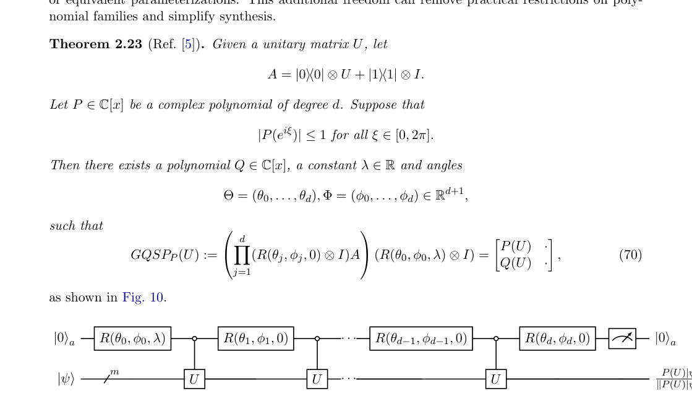
<figcaption class="paper-figure-caption"><b>Fig 5.</b> Figure 10: GQSP circuit with a zero-controlled signal unitary U [5]. The upper qubit is the signal ancilla, and each open control applies U when this ancilla is in |0⟩. Post-selection on |0⟩a outputs P(U)|ψ⟩ ∥P(U)|ψ⟩∥with psucc = ∥P(U) |ψ⟩∥2 on the system register.</figcaption>
</figure>

**Summary.** This paper presents a unified theoretical framework for designing quantum algorithms to compute functions of matrices. It systematically connects several key techniques—including block-encoding, QSP, and QSVT—into a single pipeline. This allows researchers to choose the optimal method for implementing complex linear algebra tasks on quantum hardware.

**Why it may be interesting.** While highly algorithmic, the focus on general operator transformations and spectral methods provides a powerful mathematical toolkit that underpins many quantum simulation techniques relevant to AMO physics.

Detailed structure

**Main problem.** The core problem is implementing complex, often non-unitary, matrix functions (like inverses or matrix exponentials) using quantum computation, which is fundamentally unitary.

**Main result.** The paper develops a unified, systematic framework connecting block-encoding, qubitization, QSP, QSVT, and GQSP to construct quantum circuits for arbitrary operator transformations.

**Method.** The methodology involves an end-to-end pipeline: identifying the target function, constructing a block-encoding, determining the spectral domain, approximating the function with a polynomial, and synthesizing the final quantum circuit.

**Model / system.** The model is general quantum computation applied to linear algebra problems, focusing on transforming operators and singular values rather than simulating specific physical Hamiltonians.

**Key observables.** Success probability of block-encoding, absolute errors of polynomial approximations, and the spectral information encoded in eigenphases.

**Important parameters / regimes.** The choice between GQSP, QSVT, or qubitization depends on the operator structure and the desired polynomial approximation.

**Assumptions / limitations.** The framework relies on the ability to construct efficient block-encodings and the assumption that polynomial approximations can achieve sufficient accuracy for the target function.

**Figures summary.** Figures compare polynomial approximations (Chebyshev vs. power-basis) to exact functions and show comparisons of solutions for financial problems (Black-Scholes) using various numerical and quantum methods.

**Paper structure.** The paper builds from foundational tools (block-encoding, QSP) to advanced generalizations (QSVT, GQSP), culminating in a systematic decision workflow that guides the design of quantum algorithms for matrix functions.

Abstract

Modern quantum algorithms are increasingly formulated as coherent procedures for implementing polynomial transformations of operators and singular values. This perspective provides a powerful and unifying language for quantum algorithm design, connecting a wide range of distinct problems through five closely related key tools: block-encoding, qubitization, QSP, QSVT and GQSP. Block-encoding embeds non-unitary matrices into larger unitaries; qubitization converts block-encodings into structured operators; QSP, QSVT and GQSP enable polynomial transformations with near-optimal query complexity. Together, these techniques form a general toolkit for transforming matrix functions into implementable quantum circuits. This paper develops these techniques from first principles as a unified framework for constructing quantum algorithms. We apply this framework to representative applications to highlight design principles and demonstrate how distinct algorithms can be constructed from a unified sequence of operator transformations.   A central contribution is a systematic decision workflow for selecting the appropriate approach according to the operator structure and the desired transformation polynomial. This perspective clarifies when direct GQSP or through qubitization, or Laurent expansion, or QSVT is most appropriate. We organize algorithmic design into an end-to-end pipeline: identifying the target matrix function, constructing an appropriate block-encoding, determining the relevant spectral domain, designing a polynomial or Laurent-polynomial approximation, synthesizing the phase factors, and translating the transformation into an executable quantum circuit. By applying this unified framework to example applications, we showcase a practical methodology for reasoning, designing, and implementing quantum algorithms based on polynomial transformations.

[↑ back to top](#top)

### [From the Unknown to the Desired: Transforming Unknown Initial States in the Resource Theory of Work and Heat](http://arxiv.org/abs/2609.09352v1)

**Authors:** Tanmoy Biswas, Andreas Winter  
**Type:** theory · **Category:** statistical mechanics · **PDF:** <https://arxiv.org/pdf/2609.09352v1>  
**Analysis basis:** full PDF text, analyzed in chunks
**Topic relevance:** `quantum measurements` **2/5**

↔ Scroll figures horizontally

<figure class="paper-figure-card">

<figcaption class="paper-figure-caption"><b>Fig 1.</b> FIG. 1. Conversion of an n-copy i.i.d. state ρ⊗n into its charge– entropy normal form by a unitary V that depends only on the charge– entropy equivalence class containing ρ. The first component is max- imally mixed, with its dimension and associated charges determined solely by the entropy and average charges of ρ, whereas the second component retains the explicit dependence on ρ, with its associated charge operators depending explicitly on the total charges L×n c .</figcaption>
</figure>
<figure class="paper-figure-card">

<figcaption class="paper-figure-caption"><b>Fig 2.</b> FIG. 2. Transformation of ρ⊗n into σ⊗n, where ρ and σ belong to the same charge–entropy equivalence class, assisted by a sublinear- sized ancilla. The unitary V maps ρ⊗n to the charge–entropy normal form τ(E) ⊗η(K) ρ with error at most δ(ϵn). Since the linearly supported component τ(E) is identical for states within the same charge–entropy equivalence class, the desired transformation is achieved by swap- ping η(K) ρ with an ancilla prepared in the state η(K) σ , followed by V†. The total transformation error is at most 2δ(ϵn), accounting for the errors incurred in applying V and V†.</figcaption>
</figure>
<figure class="paper-figure-card">

<figcaption class="paper-figure-caption"><b>Fig 3.</b> FIG. 3. Schematic illustration of universal thermodynamic state transformations from unknown quantum states. Given n copies of an unknown initial state ρ⊗n, one first performs a charge-preserving measurement to estimate the entropy and average charges. Once these quantities are determined, one applies a state-transformation protocol that depends only on the estimated entropy and average charges. Combining these two steps—estimation of the entropy and average charges, followed by the corresponding state-transformation protocol—yields a universal transformation protocol.</figcaption>
</figure>
<figure class="paper-figure-card">
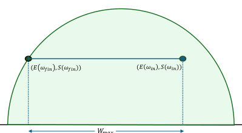
<figcaption class="paper-figure-caption"><b>Fig 4.</b> FIG. 4. Energy–entropy diagram illustrating the maximum ex- tractable work per copy from ρ. The diagram shows that, to extract the maximum amount of work from ρ, one must transform it into the Gibbs state τρ that has the same entropy as ρ and is defined with re- spect to the same Hamiltonian.</figcaption>
</figure>

**Summary.** This theoretical work develops a universal framework for quantum thermodynamics applicable when the initial quantum state is unknown. By analyzing the state within a 'charge-entropy equivalence class,' the authors show that optimal work extraction remains achievable asymptotically. The key breakthrough is developing measurement protocols that estimate necessary state parameters with minimal disturbance, thus extending resource theory beyond state-aware settings.

**Why it may be interesting.** This work provides a powerful generalization of resource theories, showing that fundamental thermodynamic limits can be robustly established even when experimental measurements are inherently limited by incomplete state knowledge.

Detailed structure

**Main problem.** The paper addresses how to perform thermodynamic state transformations (work and heat) when the initial quantum state is unknown, moving beyond protocols that require full state knowledge.

**Main result.** A universal, reference-frame-free framework is established showing that optimal work extraction can be achieved asymptotically even without microscopic knowledge of the initial state.

**Method.** The authors develop protocols based on the charge-entropy equivalence class, utilizing coarse-grained measurements on multiple copies of the state to estimate necessary thermodynamic parameters.

**Model / system.** The study concerns quantum thermodynamic state transformations for i.i.d. copies of a quantum state $
ho$ in a general Hilbert space, analyzed within the resource theory of work and heat.

**Key observables.** Entropy $S(
ho)$, expectation values of mutually commuting conserved charges $	ext{Tr}(
ho L_i)$, and the transformation error (quantified by trace distance).

**Important parameters / regimes.** The number of system copies ($n$), the decay rate of the transformation error (super-polynomial decay), and the required accuracy of state estimation.

**Assumptions / limitations.** The analysis assumes the existence of a charge-entropy equivalence class and relies on the ability to estimate entropy and charges with vanishingly small disturbance using coarse-grained measurements.

**Figures summary.** Figure 1 illustrates the conversion of an $n$-copy state into its charge–entropy normal form; Figure 2 illustrates the transformation between two states in the same class using an ancilla, showing the error decay.

**Paper structure.** The paper progresses by first defining the universal framework for state transformations within an equivalence class, then developing techniques to estimate the necessary state parameters (entropy and charges) from unknown copies, and finally applying this to demonstrate universal work extraction.

Abstract

We study thermodynamic state transformations in the resource theory of work and heat when the initial quantum state is unknown. Moving beyond state-dependent protocols, we develop a universal framework in which a single transformation applies to all admissible input states. For mutually commuting conserved charges, we construct charge-conserving protocols whose transformation error, quantified by trace distance, decays super-polynomially with the number of system copies. As an application, we demonstrate universal work extraction: asymptotically optimal work can be extracted without microscopic knowledge of the initial state, with a super-polynomially small error. Our results show that thermodynamic state transformations remain achievable under limited prior information and establish a universal framework for resource-theoretic thermodynamics beyond the state-aware setting.

[↑ back to top](#top)

### [Information Causality Characterizes the Set of Quantum Correlations in the Simplest Bell Scenario](http://arxiv.org/abs/2609.10508v1)

**Authors:** Mariami Gachechiladze, Nikolai Miklin  
**Type:** theory · **Category:** other · **PDF:** <https://arxiv.org/pdf/2609.10508v1>  
**Analysis basis:** full PDF text, analyzed in chunks
**Topic relevance:** `quantum measurements` **2/5**

↔ Scroll figures horizontally

<figure class="paper-figure-card">

<figcaption class="paper-figure-caption"><b>Fig 1.</b> Figure 1. The scenario of information causality. Alice receives two random bits x0, x1, which may be correlated. Bob re- ceives a random bit y independent of x0 and x1. In this work, the parties communicate through a noisy channel that takes the tuple (x0, x1, a) as input and produces a bit outcome m′. The parties assist their communication with a shared non- signaling resource with binary inputs and outputs.</figcaption>
</figure>

**Summary.** This paper uses the Information Causality principle to derive precise mathematical constraints on quantum correlations in a simple Bell test setting. The authors successfully show that this generalized IC principle is a stronger constraint than previously known bounds, such as Macroscopic Locality. This work strengthens the theoretical understanding of how information flow limits nonlocality in quantum physics.

**Why it may be interesting.** While the focus is on Bell nonlocality, the rigorous derivation of fundamental constraints using information-theoretic principles provides a systematic methodology applicable to understanding resource theories in quantum information and open quantum systems.

Detailed structure

**Main problem.** The paper aims to determine if the physical principle of Information Causality (IC) can precisely characterize the boundary of quantum correlations in the simplest bipartite Bell scenario, surpassing existing bounds like Uffink's inequality.

**Main result.** The generalized Information Causality principle was shown to exactly characterize the quantum correlation region for two binary measurements, leading directly to the Tsirelson-Landau-Masanes (TLM) criterion. Furthermore, the authors proved that generalized IC is strictly stronger than Macroscopic Locality in this scenario.

**Method.** The analysis combines a generalized formulation of IC for correlated inputs with a novel communication protocol, utilizing the vanishing channel capacity limit and advanced mathematical techniques like L'Hopital's rule to derive constraints.

**Model / system.** The study focuses on the simplest bipartite Bell scenario involving two binary measurements per party (Alice and Bob) and analyzing the constraints imposed by information flow through a noisy communication channel.

**Key observables.** Information mutual information terms (I), the Tsirelson-Landau-Masanes (TLM) criterion, and the correlators $\langle a^x b^y 
angle$.

**Important parameters / regimes.** The channel capacity limit ($C 	o 0$), and the noise strength parameter $\epsilon_c$.

**Assumptions / limitations.** The derivation relies on specific parametrizations of the communication channel and the ability to take limits using L'Hopital's rule.

**Figures summary.** Figure 1 illustrates the setup for information causality involving correlated inputs, a noisy channel output, and a shared non-signaling resource output.

**Paper structure.** The paper progresses by first establishing the general IC constraint, then applying it to the simplest Bell scenario, deriving the TLM criterion, and finally comparing the strength of generalized IC against Macroscopic Locality by constructing specific violating correlations.

Abstract

Information causality (IC) was introduced as a physical principle constraining correlations in non-signaling theories. Whether it can recover the exact quantum correlation boundary, beyond Uffink's inequality, has remained an open question. Here, we combine its generalized formulation for correlated inputs with a new communication protocol to derive quantum Bell inequalities that exactly characterize the quantum correlations in the simplest bipartite Bell scenario, with two binary measurements. In particular, we derive the Tsirelson-Landau-Masanes criterion directly from IC. Thus, the generalized IC implies macroscopic locality, while we also present macroscopically local correlations that violate the generalized IC. This establishes that generalized IC is a strictly stronger principle in this scenario. Together with our earlier result that generalized IC implies a nontrivial communication complexity principle, these findings strengthen the role of information causality in explaining the limits of quantum nonlocality and provide a systematic route to deriving tighter bounds on the set of quantum correlations in more general Bell scenarios.

[↑ back to top](#top)

### [Quantum Barankin bounds beyond local unbiasedness: Analytic results for Gaussian states via a right-division framework](http://arxiv.org/abs/2609.10157v1)

**Authors:** Maximilian Reichert, Javier Navarro, Gerardo Adesso, Manuel Gessner, Mikel Sanz  
**Type:** theory · **Category:** other · **PDF:** <https://arxiv.org/pdf/2609.10157v1>  
**Analysis basis:** full PDF text, analyzed in chunks
**Topic relevance:** `quantum measurements` **2/5**

↔ Scroll figures horizontally

<figure class="paper-figure-card">
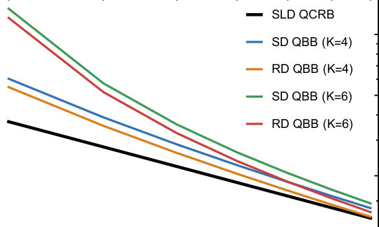
<figcaption class="paper-figure-caption"><b>Fig 1.</b> FIG. 1: Comparison of the RD QBB, SD QBB, and SLD QCRB for qubit phase estimation with parameters n = (0, 0, 1), r0 = 1 10(0, 3, 0) and λ = π/4. The y-axis shows the MSE while the x-axis shows the number of copies N. To avoid the potential divergences studied in [40, 41], we only show the region where the bound is finite (N &gt; 2). The K test points are equidistributed in the interval [0, π</figcaption>
</figure>
<figure class="paper-figure-card">
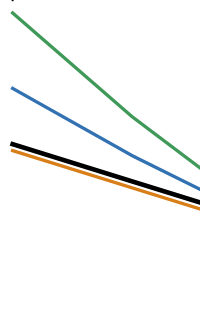
<figcaption class="paper-figure-caption"><b>Fig 2.</b> FIG. 2: Single mode phase estimation with λ = π</figcaption>
</figure>
<figure class="paper-figure-card">

<figcaption class="paper-figure-caption"><b>Fig 3.</b> FIG. 3: Quantum thermometry with N copies, assuming ω = 1 and a true parameter value λ = 2. For all RD QBB the value of γ is chosen to force the unbiasedness condition at all test points.</figcaption>
</figure>
<figure class="paper-figure-card">
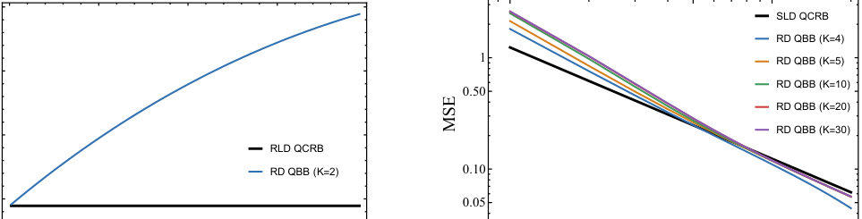
<figcaption class="paper-figure-caption"><b>Fig 4.</b> FIG. 4: Loss sensing with N copies, assuming a true transmissivity λ = 1/4 and displacement amplitude α = 1/2. For all RD QBB the value of γ is chosen to force the unbiasedness condition at all test points.</figcaption>
</figure>

**Summary.** This theoretical paper develops a quantum generalization of the Barankin bound for quantum parameter estimation, offering a tighter lower bound than the standard Quantum Cramér-Rao Bound. By utilizing a novel non-symmetric right-division superoperator, the authors derive analytic formulas specifically for Gaussian states. This improved bound is particularly useful for analyzing quantum sensing scenarios exhibiting threshold effects in the few-shot regime.

**Why it may be interesting.** It provides a rigorous, analytically tractable tool (the right-division bound) to set fundamental limits on measurement precision that can surpass the standard QCRB, which is crucial for designing optimal quantum sensing protocols.

Detailed structure

**Main problem.** The paper aims to establish a quantum version of the Barankin bound as a superior alternative to the standard Quantum Cramér-Rao Bound (QCRB) for quantum parameter estimation.

**Main result.** The authors derive a novel quantum Barankin bound using a non-symmetric right-division superoperator, yielding analytic expressions for Gaussian states that are shown to be tighter than previous bounds.

**Method.** The methodology involves extending classical bounding techniques (like the Barankin bound) into the quantum domain using concepts like right-division superoperators and analyzing the structure of the resulting matrices for Gaussian states.

**Model / system.** The theory is applied to general quantum parameter estimation problems, with specific analytical derivations focused on systems whose states are Gaussian (e.g., those described by exponential operators).

**Key observables.** Mean Squared Error (MSE) of estimators, Quantum Fisher Information (QFI), and the Barankin matrix ($\mathbf{Q}(R)_{	ext{BB}}$).

**Important parameters / regimes.** The bound's performance in the few-shot regime, where standard QCRB approaches fail to capture certain physical effects (threshold effect).

**Assumptions / limitations.** The derivation relies on the existence and properties of the right-division superoperator and the assumption that certain required traces are trace-class.

**Figures summary.** Not specified in the notes, but the structure implies comparisons between different bounds (QCRB vs. Barankin bounds) for various examples.

**Paper structure.** The paper progresses by first introducing the quantum Barankin bound concept, deriving the novel bound using the right-division operator, comparing it to existing symmetric bounds, and finally applying the derived analytic formulas to specific examples, particularly Gaussian states.

Abstract

We propose a quantum version of the Barankin bound as an alternative to the quantum Cramér-Rao bound for quantum parameter estimation. The quantum Barankin bound provides a lower bound on the mean squared error of estimators satisfying arbitrarily chosen bias constraints at arbitrarily chosen parameter points. In particular, unbiasedness over the entire parameter space can be imposed, yielding precision limits for globally unbiased quantum parameter estimation. In contrast to the recently derived quantum Barankin bound, which is based on a symmetric division superoperator, our bound is based on a nonsymmetric right-division superoperator. This formulation enables us to find analytic expressions for the Barankin matrix for Gaussian states, which allows for an efficient calculation of the bound. We demonstrate the usefulness of our results by applying them to various examples that exhibit the threshold effect in the few-shot regime, which is invisible to the standard quantum Cramér-Rao bound approach.

[↑ back to top](#top)

### [Revealing the Quantum Signature of Gravity via Gravitational Waves](http://arxiv.org/abs/2609.09931v1)

**Authors:** Partha Nandi  
**Type:** theory · **Category:** other · **PDF:** <https://arxiv.org/pdf/2609.09931v1>  
**Analysis basis:** full PDF text, analyzed in chunks
**Topic relevance:** `quantum measurements` **2/5**

↔ Scroll figures horizontally

<figure class="paper-figure-card">

<figcaption class="paper-figure-caption"><b>Fig 1.</b> Low-resolution page preview, page 2</figcaption>
</figure>
<figure class="paper-figure-card">

<figcaption class="paper-figure-caption"><b>Fig 2.</b> Low-resolution page preview, page 3</figcaption>
</figure>
<figure class="paper-figure-card">

<figcaption class="paper-figure-caption"><b>Fig 3.</b> Low-resolution page preview, page 4</figcaption>
</figure>
<figure class="paper-figure-card">

<figcaption class="paper-figure-caption"><b>Fig 4.</b> Low-resolution page preview, page 5</figcaption>
</figure>
<figure class="paper-figure-card">

<figcaption class="paper-figure-caption"><b>Fig 5.</b> Low-resolution page preview, page 6</figcaption>
</figure>

**Summary.** This work establishes a quantum information framework to test quantum gravity using gravitational waves. By analyzing the quantum dynamics of coupled detectors, the authors show that only quantized gravitational fields can generate genuine entanglement between detectors. This provides a concrete, measurable signature for quantum gravity effects mediated by spacetime ripples.

**Why it may be interesting.** It provides a clear, information-theoretic diagnostic tool—detecting entanglement—to distinguish between classical and quantum gravitational interactions, which is highly relevant for quantum optics and open quantum systems.

Detailed structure

**Main problem.** The paper investigates whether propagating gravitational waves can serve as operational probes to detect the quantum nature of gravity, moving beyond classical spacetime perturbations.

**Main result.** Quantized gravitational waves coherently mediate entanglement between spatially separated detectors, a signature absent when the field is treated classically as a stochastic background.

**Method.** The authors develop a unified framework combining spacetime geometry, quantum information theory, and gravitational-wave physics, analyzing the quantum dynamics of coupled detector subsystems.

**Model / system.** The model involves localized quantum oscillators (detectors) coupled to a propagating gravitational field, starting from the geodesic deviation equation in linearized General Relativity.

**Key observables.** Entanglement (e.g., negativity), quantum coherence, quantum memory, and the comparison between mixedness (classical) and genuine quantum correlations (quantized).

**Important parameters / regimes.** The analysis is performed in the weak-field regime of linearized General Relativity, focusing on the comparison between classical and quantum field treatments.

**Assumptions / limitations.** The study relies on perturbative treatments, a single-mode description, and is an operational study rather than a full theory of quantum gravity.

**Paper structure.** The paper builds a theoretical framework by deriving the detector Hamiltonian from geometry, constructing the full quantum dynamics, and then comparing the resulting quantum correlations (entanglement) against the predictions of a purely classical stochastic field.

Abstract

Can propagating gravitational waves serve as operational probes of the quantum nature of gravity? We address this question by developing a unified theoretical framework that combines spacetime geometry, quantum information, and gravitational-wave physics. Starting from the geodesic deviation equation in linearized General Relativity, we derive the effective detector Hamiltonian directly from spacetime geometry and construct the complete quantum dynamics for detector subsystems interacting with both classical and quantized propagating gravitational-wave fields. This unified formulation enables a direct comparison between classical and quantum descriptions of gravitational radiation within the same physical framework. We demonstrate that classical gravitational-wave backgrounds can induce mixedness in the detector state but cannot generate genuine quantum correlations between the detector subsystems. In contrast, quantized gravitational waves coherently mediate gravity-induced entanglement, quantum coherence, quantum memory, and nonclassical correlations, providing clear operational signatures of the quantum nature of propagating gravitational radiation. We further discuss how mesoscopic quantum mechanical oscillators offer a promising route towards experimentally probing these effects. Our results establish a geometric and quantum-information-based framework for exploring quantum gravity through propagating gravitational waves.

[↑ back to top](#top)

### [Robust Device-Independent Certification of Boolean-Phase Gates](http://arxiv.org/abs/2609.09836v1)

**Authors:** Yunguang Han, Xingyuan Bu, Aleksandra Gočanin, Jiabing Yuan  
**Type:** theory · **Category:** quantum information and computing · **PDF:** <https://arxiv.org/pdf/2609.09836v1>  
**Analysis basis:** full PDF text, analyzed in chunks
**Topic relevance:** `quantum measurements` **2/5**

↔ Scroll figures horizontally

<figure class="paper-figure-card">
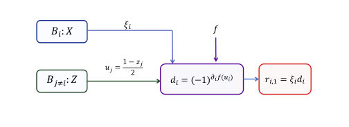
<figcaption class="paper-figure-caption"><b>Fig 1.</b> FIG. 1. Boolean-derivative scoring for the ith Bell term. Party Bi measures X, while the remaining Bj parties measure Z. The latter outcomes are mapped to bits uj = (1 −zj)/2, from which the verifier evaluates the derivative sign di = (−1)∂if(u¯i). Combining this sign with the X-measurement outcome ξi gives the postprocessed output ri,1 = ξidi.</figcaption>
</figure>
<figure class="paper-figure-card">

<figcaption class="paper-figure-caption"><b>Fig 2.</b> FIG. 2. Independent-source network for gate certification. Each source Si distributes systems to the reference party Ai and to the channel input Qi. For e = 0, the Qi systems are routed directly to the Bi stations, whereas for e = 1 they pass through the physical channel E, producing output systems Ri. The route choice e is not supplied to the reference parties.</figcaption>
</figure>
<figure class="paper-figure-card">

<figcaption class="paper-figure-caption"><b>Fig 3.</b> FIG. 3. Comparison of the uniform Boolean-phase and CCZ-specific fidelity bounds in the symmetric two-route score model. The upper curves show the squared Choi-state fidelity obtained from a single state test, while the lower curves show the squared Choi fidelity of the effective channel obtained by composing the input and output certificates. Dashed curves use the uniform coefficient cZ, and solid curves use the im- proved CCZ coefficient cCCZ. The CCZ analysis lowers the nontrivial state-fidelity threshold from 0.869825 to 0.829681 and the channel-fidelity threshold from 0.934913 to 0.914840, without changing the Bell expression or measurement set- tings.</figcaption>
</figure>

**Summary.** This paper presents a robust, device-independent method to certify the fidelity of Boolean-phase quantum gates. It achieves this by transforming the gate's phase dependence into classical constraints evaluated via Bell inequalities using only local measurements. The resulting fidelity bound is explicit and uniform over all Boolean functions, providing a powerful tool for quantum device characterization.

**Why it may be interesting.** The technique of translating gate-specific quantum information into classical constraints on local measurements is highly generalizable and provides a powerful tool for verifying quantum hardware fidelity in a resource-efficient manner.

Detailed structure

**Main problem.** The paper develops a robust, device-independent certification scheme for Boolean-phase gates, addressing the issue that self-testing the output Choi state alone is insufficient.

**Main result.** They derive a closed-form Choi-fidelity bound for an effective n-qubit channel by combining an identity test and a gate-output test in an independent-source network.

**Method.** The core method involves using Boolean differentiation to convert gate-dependent phase information into classical signs, which are then evaluated using Bell tests built from CHSH blocks with only local measurements.

**Model / system.** The system under study is the Boolean-phase gate, defined by a Boolean function f on n qubits, represented as a diagonal unitary matrix. The certification is performed using an independent-source network structure.

**Key observables.** The normalized Choi state, the Bell expression $B_f$, and the extracted-state squared fidelity $F^2(
ho_{	ext{ext}}, |\Psi_f
angle\langle\Psi_f|)$.

**Important parameters / regimes.** The Bell deficit $\epsilon$, which quantifies the deviation from maximal violation, and the number of qubits $n$.

**Assumptions / limitations.** The analysis assumes the ability to combine an identity test and a gate-output test using the same physical observables, and that the B-side extraction preserves every physical Z-measurement exactly.

**Figures summary.** Figure 1 illustrates the Boolean-derivative scoring for a Bell term, mapping outcomes to bits and the derivative sign. Figure 2 illustrates the independent-source network structure used for the combined test.

**Paper structure.** The paper first introduces the problem and the Boolean-derivative technique. It then establishes self-testing bounds (Theorem 1) and derives a robust fidelity bound (Theorem 2) using an independent-source network. Finally, it applies this framework to the CCZ gate using a joint six-party analysis.

Abstract

Device-independent certification of a quantum gate requires the input and output tests to identify the same reference qubits. Self-testing the output Choi state alone does not guarantee this consistency. We develop a robust certification scheme for Boolean-phase gates, a broad family of computational-basis diagonal gates specified by Boolean functions. Boolean derivatives convert the target-dependent phase information into classical signs that can be evaluated from local measurement outcomes. This leads to Bell tests built from CHSH blocks using two binary measurements per party and no entangling measurements. At maximal violation, the tests self-test the normalized Choi state and the measured observables. Away from the maximum, they give an explicit affine lower bound on the extracted-state squared fidelity that is uniform over all Boolean functions and valid in arbitrary local dimensions. We then combine an identity test and a gate-output test in an independent-source network in which the reference devices use the same physical observables, obtaining a closed-form Choi-fidelity bound for an effective \(n\)-qubit channel. For CCZ, a joint six-party analysis gives a stronger robustness bound without changing the Bell expression or measurement settings. The construction shows how the algebraic structure of a gate can shift target-dependent information from quantum measurement design to classical processing of local outcomes.

[↑ back to top](#top)

### [Small-Bias Quantum Approximate Counting via the Multiplicative Adversary Method](http://arxiv.org/abs/2609.09804v1)

**Authors:** Albert Lin, Han-Hsuan Lin  
**Type:** theory · **Category:** quantum information and computing · **PDF:** <https://arxiv.org/pdf/2609.09804v1>  
**Analysis basis:** full PDF text, analyzed in chunks
**Topic relevance:** `quantum measurements` **2/5**

↔ Scroll figures horizontally

<figure class="paper-figure-card">
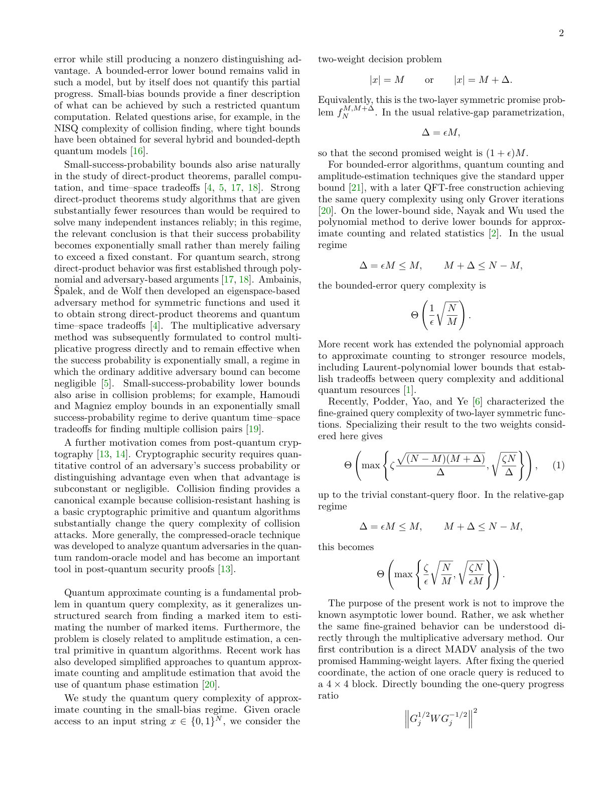
<figcaption class="paper-figure-caption"><b>Fig 1.</b> Low-resolution page preview, page 2</figcaption>
</figure>
<figure class="paper-figure-card">

<figcaption class="paper-figure-caption"><b>Fig 2.</b> Low-resolution page preview, page 3</figcaption>
</figure>
<figure class="paper-figure-card">

<figcaption class="paper-figure-caption"><b>Fig 3.</b> Low-resolution page preview, page 4</figcaption>
</figure>
<figure class="paper-figure-card">
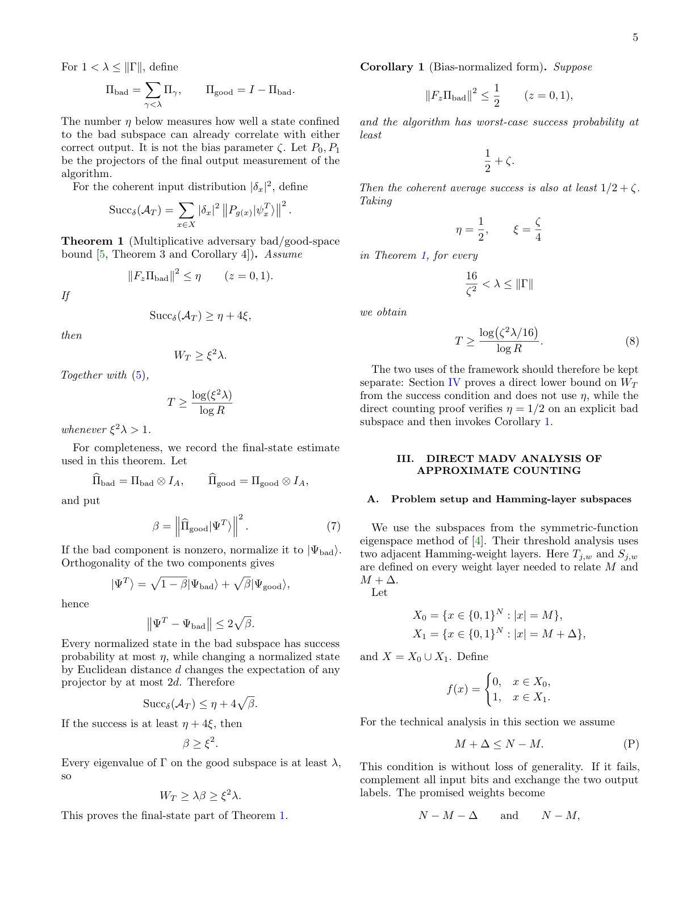
<figcaption class="paper-figure-caption"><b>Fig 4.</b> Low-resolution page preview, page 5</figcaption>
</figure>
<figure class="paper-figure-card">

<figcaption class="paper-figure-caption"><b>Fig 5.</b> Low-resolution page preview, page 6</figcaption>
</figure>

**Summary.** This paper derives lower bounds for the quantum query complexity required to distinguish between two specific Hamming weights ($M$ vs $M+\Delta$) in the small-bias regime. It achieves this by employing the Multiplicative Adversary Method (MADV) and reducing the problem to the Unique OR problem. The resulting bound provides a fine-grained understanding of the computational difficulty for these quantum counting tasks.

**Why it may be interesting.** While focused on query complexity, the rigorous application of the multiplicative adversary method to derive fine-grained bounds provides powerful theoretical tools applicable to understanding the limits of quantum information processing protocols.

Detailed structure

**Main problem.** The paper studies the quantum query complexity of distinguishing between two specific Hamming weights ($M$ vs $M+\Delta$) in the small-bias regime ($	ext{success probability} = 1/2 + \zeta$).

**Main result.** It establishes a lower bound for the required number of queries, $Q$, which is $\Omega\left( \max \left( rac{\zeta}{p} rac{(N-M)(M+\Delta)}{\Delta}, rac{r}{\zeta} rac{N}{\Delta}!
ight) 
ight)$.

**Method.** The primary technique is the Multiplicative Adversary Method (MADV), which is applied to the counting problem and reduced from the Unique OR problem.

**Model / system.** The analysis is performed in the abstract quantum query model, involving oracles that probe the Hamming weight of an input string $x \in \{0,1\}^N$. The structure involves relating subspaces corresponding to different Hamming weights.

**Key observables.** The success probability advantage $\zeta$, the query complexity $Q$, and the coherence measure $eta_T$ are key observables.

**Important parameters / regimes.** The total number of bits $N$, the two weights $M$ and $M+\Delta$, and the difference $\Delta$ are crucial parameters.

**Assumptions / limitations.** The analysis assumes the condition $M + \Delta \le N - M$ for the reduction steps to hold simply.

**Paper structure.** The paper develops the lower bound by first analyzing the Unique OR problem using MADV, then reducing the two-weight counting problem to Unique OR, and finally combining these results to state the main, fine-grained lower bound.

Abstract

We study the two-weight decision version of quantum approximate counting: given oracle access to $x\in\{0,1\}^N$, distinguish $|x|=M$ from $|x|=M+Δ$ with success probability $1/2+ζ$. Using the multiplicative adversary method, we prove $Ω\left(\max\left\{ζ\sqrt{(N-M)(M+Δ)}/Δ,\sqrt{ζN/Δ}\right\}\right)$. The same parameter dependence follows from the polynomial-method characterization of the two-layer symmetric function by Podder, Yao, and Ye. Our contribution is a multiplicative-adversary derivation that tracks the progress produced by individual oracle queries. For the first term, after complementing the input if necessary, we assume $M+Δ\le N-M$. We use the Hamming-layer subspaces from the eigenspace method of Ambainis, Spalek, and de Wolf and compose their adjacent-layer unitary maps to relate the two nonadjacent promise layers. After fixing the queried coordinate, the analysis block-diagonalizes into four-dimensional subspaces. An exact calculation of the one-query progress ratio gives the first lower bound. The same estimate also implies $\left\|(I-\widehatΠ_{\mathrm{bad}})\lvertΨ^T\rangle\right\|^2=O\left(T^2Δ^2/((N-M)(M+Δ))\right)$ for the coherent input superposition used in the adversary argument. For the second term, we prove directly using a three-eigenvalue multiplicative adversary that unique OR on $n$ bits with success probability $1/2+ζ$ requires $Ω(\sqrt{ζn})$ queries, and then reduce unique OR to the two-weight counting problem.

[↑ back to top](#top)

### [Sub-extensive non-stabilizerness in the Dyck-Fredkin spin chain](http://arxiv.org/abs/2609.09545v1)

**Authors:** Yasunori Lee  
**Type:** theory · **Category:** statistical mechanics · **PDF:** <https://arxiv.org/pdf/2609.09545v1>  
**Analysis basis:** full PDF text, analyzed in chunks
**Topic relevance:** `analog quantum simulation` **2/5**

↔ Scroll figures horizontally

<figure class="paper-figure-card">

<figcaption class="paper-figure-caption"><b>Fig 1.</b> Figure 1: An example of a Dyck path for N = 10 and the corresponding spin/qubit configuration.</figcaption>
</figure>
<figure class="paper-figure-card">

<figcaption class="paper-figure-caption"><b>Fig 2.</b> Figure 2: Stabilizer α-Rényi entropy Mα(|ψDF 0 (1)⟩) of the ground state of the (undeformed) Dyck-</figcaption>
</figure>
<figure class="paper-figure-card">

<figcaption class="paper-figure-caption"><b>Fig 3.</b> Figure 3: Stabilizer 2-Rényi entropy M2(|ψDF 0 (t)⟩) of the ground state of the deformed Dyck-</figcaption>
</figure>

**Summary.** This work analyzes the stabilizer Rényi entropy (SRE) of the Dyck-Fredkin spin chain under a deformation parameter $t$. The SRE reveals three distinct scaling regimes—linear, logarithmic, and constant—depending on $t$. This demonstrates that non-stabilizerness can serve as a sensitive diagnostic tool, potentially offering new insights into quantum many-body criticality compared to entanglement entropy.

**Why it may be interesting.** The clear distinction in scaling behavior ($\Theta(N)$ vs $\Theta(\log N)$ vs $\Theta(1)$) based on a simple parameter $t$ provides a powerful, quantifiable tool to characterize different types of quantum criticality beyond standard entanglement measures.

Detailed structure

**Main problem.** The study investigates the scaling behavior of non-stabilizerness, quantified by the stabilizer Rényi entropy (SRE), in quantum many-body systems to probe their critical properties.

**Main result.** The SRE exhibits distinct scaling behaviors ($\Theta(N)$, $\Theta(\log N)$, or $\Theta(1)$) depending on the deformation parameter $t$, suggesting non-stabilizerness offers a unique diagnostic tool distinct from entanglement entropy.

**Method.** The authors employ numerically exact finite-size calculations and asymptotic analysis on the SRE, which is derived from the ground state of the spin chain.

**Model / system.** The system analyzed is the spin-1/2 Dyck-Fredkin chain and its $t$-deformation, a local frustration-free model whose ground state is a weighted superposition of Dyck-path states.

**Key observables.** Stabilizer Rényi entropy ($\alpha$-SRE), entanglement entropy, and the spectral gap.

**Important parameters / regimes.** The deformation parameter $t$, which dictates three distinct scaling regimes: $t<1$, $t=1$, and $t>1$.

**Assumptions / limitations.** The analysis relies on exploiting the combinatorial structure of the ground state and performing asymptotic approximations for the normalization factor $C(t)$.

**Figures summary.** Figure 2 shows the $\alpha$-SRE scaling for the undeformed chain ($\log N$ scaling). Figure 3 illustrates the three distinct scaling regimes ($t<1$, $t=1$, $t>1$) for the deformed chain.

**Paper structure.** The paper introduces the SRE as a measure of non-stabilizerness, derives the necessary formulas using replica methods, and then performs numerical and asymptotic calculations to map the scaling behavior across the parameter $t$.

Abstract

The stabilizer Rényi entropy is a quantitative measure of non-stabilizerness, or magic, and has typically been found to scale extensively with system size $N$ (i.e., $Θ(N)$) for a variety of many-body quantum states. In this note, we study the stabilizer Rényi entropy of the ground state of the spin-$\frac{1}{2}$ Dyck-Fredkin chain and its $t$-deformation, a local frustration-free model with unusual spectral-gap scaling. Exploiting the combinatorial structure, we carry out numerically exact finite-size calculations, which indicate asymptotic behavior depending on $t$: $Θ(N)$ for $t<1$, $Θ(\log N)$ at $t=1$, and $Θ(1)$ for $t>1$. The scaling at $t=1$ could be another manifestation of the unconventional criticality of the model, while the contrast with the behavior of the entanglement entropy suggests that non-stabilizerness might provide a new window into quantum many-body systems.

[↑ back to top](#top)

### [The Sample Complexity of Quantum Entanglement Allocation](http://arxiv.org/abs/2609.10141v1)

**Authors:** Nathan Roll  
**Type:** both · **Category:** quantum information and computing · **PDF:** <https://arxiv.org/pdf/2609.10141v1>  
**Analysis basis:** full PDF text, analyzed in chunks
**Topic relevance:** `quantum measurements` **2/5**

↔ Scroll figures horizontally

<figure class="paper-figure-card">

<figcaption class="paper-figure-caption"><b>Fig 1.</b> Figure 1: (a) Three-qubit encodings at request probabilities (1/4, 1/2, 1/4). Groups share en- tanglement; filled squares recover the bit, empty squares are uninformative. All four codes pre- serve the stored bit. (b) Ideal prediction error when π(XXX) = 1/2, π(ZZI) = pL and π(IZZ) = 1/2 −pL; black selects the better pair. (c) Native 15-qubit commissioning on ibm_marrakesh favors the full chain. Even/odd are fixed product allocations. Each mean uses 1,920 shots over all 15 queries and both bits; bars are simultaneous 95% Hoeffding bounds for four means, conditional on independent shots in this one job. The allocations in (c) are fixed before ac- quisition.</figcaption>
</figure>
<figure class="paper-figure-card">

<figcaption class="paper-figure-caption"><b>Fig 2.</b> Figure 2: Depth changes the error scale as well as the request requirement. (a) On the budget- indexed hard family, both empirical and data-free periodic allocations follow a square-root rate. The task probabilities change with the budget. (b) On fixed Dirichlet workloads, only the empirical learner improves. Solid lines show empirical optima; dotted lines show uniform periodic allocations. Each line averages four dimension means, each based on 64 independent seeds; shading spans those dimension means, not confidence intervals. The dashed line is 0.025x−1/2, an unfitted slope guide, not a theorem constant. Every risk uses the exact same-depth physical optimum as comparator.</figcaption>
</figure>
<figure class="paper-figure-card">

<figcaption class="paper-figure-caption"><b>Fig 3.</b> Figure 3: More requests cannot remove a calibration floor. (a) Request learning at three fixed calibration budgets; the dashed curve supplies the true channel. (b) Calibration learning at three fixed request budgets; the dashed curve supplies the true workload. Both panels use 63-qubit heterogeneous-noise instances and the smoothed Joint estimator. Excess is relative to the true- workload, true-channel oracle in the same circuit family. Bands are pointwise 95% bootstrap inter- vals over 32 independent instances, after averaging four request streams and four calibration panels. Calibration costs 125B observations, separately from m.</figcaption>
</figure>
<figure class="paper-figure-card">

<figcaption class="paper-figure-caption"><b>Fig 4.</b> Figure 4: (a) Fresh random requests and chosen repair queries have different call costs. Points reproduce Bell coverage q = .8 from a product probe. (b) Cost comparison at 80% power and 5% false alarms for known (e0, e1) = (.02, .164). GHZ uses 18 calls and 111.6 logical CNOTs; a product-initialized repeated-query policy uses 19.6 expected calls and 75.6 CNOTs. The boundary includes extra GHZ startup cost per episode. These are two attaining policies, not the full adaptive frontier.</figcaption>
</figure>
<figure class="paper-figure-card">

<figcaption class="paper-figure-caption"><b>Fig 5.</b> Figure 5: (a) Exact empirical co-location on structured tables, with requests scaled by rk. Curves average r ∈{1, 4} and k ∈{1, 2, 3}, with 32 instances per cell; bands bootstrap training instances. (b) Complete-basket locality on the public Online Retail trace, with 3,922 records and eight shards of capacity 512. Learned methods share a training prefix; fixed key range uses none. Bands bootstrap 16 request streams conditional on the fixed catalogue and test trace. All three capacities and the exact small-schema study appear in Appendix Q.</figcaption>
</figure>

**Summary.** This work develops theoretical bounds on how much historical data (sample complexity) is needed to optimally allocate quantum entanglement resources. It analyzes the problem using quantum information theory, deriving specific error scaling laws for different graph structures. The findings are relevant for understanding the practical limits of quantum computation in resource-constrained environments.

**Why it may be interesting.** The rigorous analysis of resource allocation and sample complexity in quantum settings provides theoretical tools for understanding the limits of quantum machine learning and resource management.

Detailed structure

**Main problem.** The paper investigates the sample complexity required to optimally allocate quantum entanglement resources among qubits based on sequential query history.

**Main result.** The required sample complexity depends on the specific allocation choices, and the excess error for path-like structures scales according to a derived minimax bound.

**Method.** The authors use information-theoretic techniques, characterizing attainable prediction-contrast regions via convex hulls and deriving concentration bounds for learning from i.i.d. queries.

**Model / system.** The model involves a quantum memory storing a classical bit, queried by commuting Pauli operators (X- and Z-type), and is analyzed using graph-state structures like paths and bicliques.

**Key observables.** Minimax excess error, prediction-contrast, and the required sample size ($m$).

**Important parameters / regimes.** Number of qubits ($d$), entanglement budget ($k$), number of requests ($m$), and calibration trials ($B$).

**Assumptions / limitations.** The detector is assumed to preserve coherence within measured sectors, and initial analyses rely on independent, commuting Pauli generators.

**Figures summary.** Figures illustrate encoding schemes, prediction error vs. best pair choice, and comparisons of locality performance across different data structures (e.g., full chain vs. basket search).

**Paper structure.** The paper progresses from characterizing the fundamental sample complexity for Pauli queries to deriving specific error bounds for paths and general graphs, and finally applying these concepts to structured data and hardware testing.

Abstract

How many past requests are needed to decide which qubits should share entanglement? We show that the answer depends on the allocation choices created by the queries: a larger memory can require no more data. The memory stores a classical bit and answers requests through a fixed detector that preserves coherence within each measured sector. For independent commuting $X$- and $Z$-type Pauli queries, we characterize the full attainable prediction-contrast region and construct encodings that preserve the bit at every nonzero vertex. With sharp reports, a $d$-qubit path and groups of at most $k$ qubits have minimax excess error after $m$ requests proportional to $k^{-1}\min\{1,\sqrt{d\log(k+1)/m}\}$, uniformly for $2\leq k<d$. Connected biclique regions can grow without increasing sample demand when depth, region count and connections per region stay bounded. Preparation noise introduces a separate calibration requirement. We derive an exact tradeoff with extra fresh detector calls and transfer the learning law to structured transaction co-location. Population-risk experiments test the statistical predictions. We also compare encodings on a native 15-qubit device and learned partitions on public purchase baskets. The full chain wins on the device; frequency grouping outperforms basket search in the largest-capacity retail setting.

[↑ back to top](#top)

### [Unbounded degree overhead for Alice-conditioned quantum Bell certificates](http://arxiv.org/abs/2609.10162v1)

**Authors:** Fumin Wang  
**Type:** theory · **Category:** quantum information and computing · **PDF:** <https://arxiv.org/pdf/2609.10162v1>  
**Analysis basis:** full PDF text, analyzed in chunks
**Topic relevance:** `quantum measurements` **2/5**

↔ Scroll figures horizontally

<figure class="paper-figure-card">

<figcaption class="paper-figure-caption"><b>Fig 1.</b> FIG. 1. Unbounded cost of restricting certificate structure. The purple staircase is the proved lower bound dos ≥k + 1 whenever 0 &lt; ϵ &lt; tk. It bounds the exact conditioned degree. Orange points show numerical saturation within 10−6, a distinct finite-tolerance quantity; they do not certify exact closure. Standard degree remains two. The green segment marks the separately proved interval where conditioned degree is exactly three. Both axes are logarithmic. The SM reports solver residuals and the sensitivity of the numerical points.</figcaption>
</figure>
<figure class="paper-figure-card">
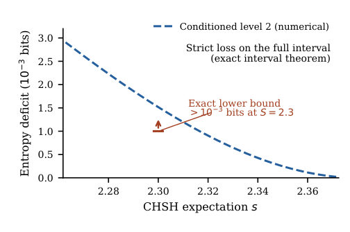
<figcaption class="paper-figure-caption"><b>Fig 2.</b> FIG. 2. Deficit in the conditional min-entropy certified by Alice-conditioned level two: log2[Gos 2 (s)/GQ(s)]. Strict positiv- ity throughout the displayed interval follows from Theorem 3; the dashed curve is numerical. The arrow at s = 2.3 marks the exact lower bound 10−3 bits, not the optimum of the relaxation. Standard level two and conditioned level three certify the exact quantum tradeoff throughout this interval.</figcaption>
</figure>
<figure class="paper-figure-card">
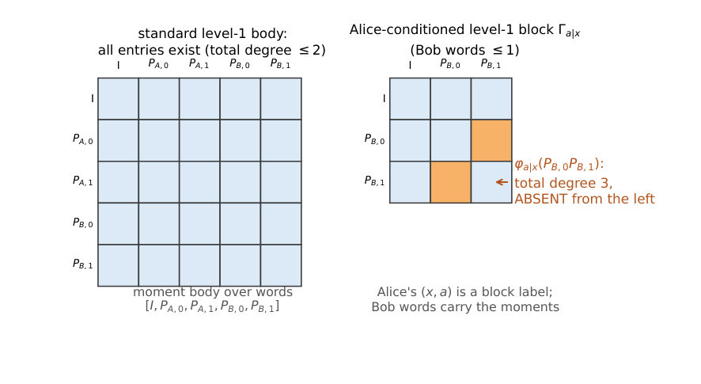
<figcaption class="paper-figure-caption"><b>Fig 3.</b> Figure 1: The level-one filtration obstruction (Remark 2.6). Left: the standard level-one moment body contains moments of total degree at most two. Right: an Alice-conditioned level-one block Γa|x, indexed by Bob words of length at most one, contains the corner moments φa|x(PB,0PB,1) — total degree three once the Alice label is counted — which the standard level-one body cannot supply.</figcaption>
</figure>
<figure class="paper-figure-card">

<figcaption class="paper-figure-caption"><b>Fig 4.</b> Figure 2: Level-one separation of tilted CHSH (Theorems 3.4 and 3.7). The standard level-one value is exactly 2 √</figcaption>
</figure>
<figure class="paper-figure-card">
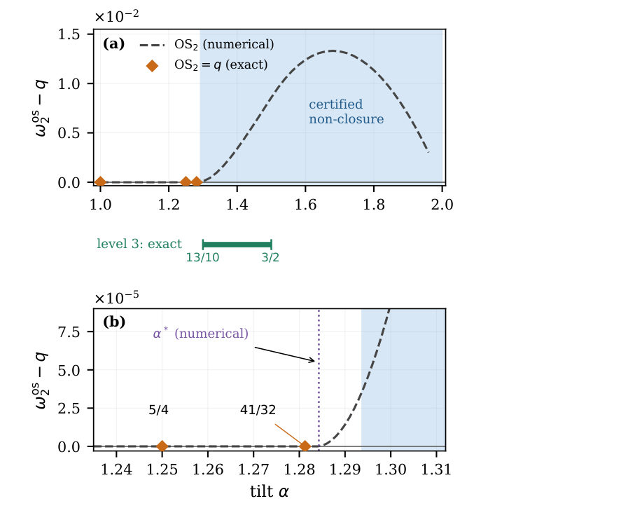
<figcaption class="paper-figure-caption"><b>Fig 5.</b> Figure 3: Exact quantum-bound certification. Orange diamonds are exact level-two closure points. The separate green strip marks an interval of exact level-three closure; it is not plotted on the level-two gap axis. The blue open interval shows the finite witness fan at level two; section 8 additionally extends non-closure to every α ∈(α−, 2). Dashed curves and the candidate boundary near 1.28427 are numerical; the existence of a unique transition is not proved.</figcaption>
</figure>

**Summary.** This paper rigorously analyzes the resource cost associated with certifying quantum Bell inequalities when the certification process is conditioned on a single measurement choice by Alice. It proves that this conditioning introduces an unbounded overhead in the required degree of the polynomial certificate compared to standard methods. The findings help separate the computational resources needed for different structural assumptions in quantum information theory.

**Why it may be interesting.** This work provides rigorous mathematical tools to quantify the computational complexity of verifying quantum nonlocality, which is fundamental to quantum information theory and device-independent security protocols.

Detailed structure

**Main problem.** The paper investigates the additional degree overhead required when certifying quantum Bell inequalities using certificates conditioned on a single measurement choice by Alice.

**Main result.** It proves that the required conditioned certification level grows unboundedly as the system approaches certain limits, separating the resource requirements of single-question conditioning from standard SOS degree bounds.

**Method.** The authors use Semidefinite Programming (SDP) relaxations formulated as Sum-of-Squares (SOS) polynomials, constructing explicit counterexamples using truncated positive functionals on the infinite dihedral group.

**Model / system.** The analysis focuses on quantum Bell inequalities, specifically the CHSH inequality, analyzed through the Navascués–Pironio–Acín (NPA) hierarchy and its specialized Alice-conditioned variants.

**Key observables.** The primary observables are the SDP values ($\omega_{std}^k$ vs. $\omega_{os}^k$) for standard and Alice-conditioned Bell certificates, and the resulting quantum-bound curve $\alpha(u)$.

**Important parameters / regimes.** Key parameters include the conditioning parameter $\alpha$, the certificate level $k$, and the distance $\epsilon$ to the endpoint tilt.

**Assumptions / limitations.** The analysis relies on comparing the required degree for exact certification against the standard degree, and distinguishing between exact closure and finite-tolerance numerical saturation.

**Figures summary.** Figure 1 illustrates the unbounded cost, showing the required conditioned degree diverging from the standard degree as the distance to the endpoint decreases.

**Paper structure.** The paper develops results by first showing the unbounded overhead (Theorem 1), then establishing continuous exact certification over an interval (Theorem 2), and finally refuting conjectures about fixed-level containment (Theorem 8.2).

Abstract

Requiring each sum-of-squares term to involve only one of Alice's measurement questions can impose an unbounded certification cost. In the simplest Bell scenario, we prove that no finite level of the Alice-conditioned NPA hierarchy contains all standard level-two Bell certificates. An explicit family of truncated positive functionals on the infinite dihedral group exceeds the tilted-CHSH quantum bound at every prescribed finite level, while a standard degree-two certificate is exact. A Fejer-weighted trace reduces positivity to a rank-one subtraction from a moving-average Gram matrix. The required conditioned level grows at least as $(2-α)^{-1/2}$ near the endpoint tilt. This bounds the degree of exact nice-SOS inputs to compiled-game soundness proofs. Consequently, no finite conditioned level certifies the entire optimal CHSH randomness tradeoff against quantum side information, although standard level two does. Away from the endpoint, we prove a sharp one-level cost throughout $α\in[13/10,3/2]$, using optimal-strategy kernels and exact Bernstein matrix positivity to certify a continuous interval. The results separate ordinary SOS degree from the resources keyed by single-question certificate structure.

[↑ back to top](#top)

### [Noether Symmetries Generate Deterministic Energy-Harvesting Protocols](http://arxiv.org/abs/2609.10533v1)

**Authors:** Ali Akil, M. Hamed Mohammady, Zihan Wang, Oscar Dahlsten  
**Type:** theory · **Category:** other · **PDF:** <https://arxiv.org/pdf/2609.10533v1>  
**Analysis basis:** full PDF text, analyzed in chunks
**Topic relevance:** `Keldysh / 2PI / non-Gaussian methods` **1/5** · `analog quantum simulation` **1/5** · `correlated / nonlocal dissipation` **1/5** · `driven-dissipative phase transition` **1/5** · `methods for driven-dissipative` **1/5** · `non-equilibrium universality` **1/5** · `quantum measurements` **1/5**

↔ Scroll figures horizontally

<figure class="paper-figure-card">
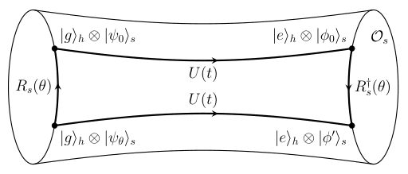
<figcaption class="paper-figure-caption"><b>Fig 1.</b> FIG. 1: Noether symmetry R generates orbits over different source states that jointly achieve DEH. The points in the figure depict source-harvester states, which undergo evolutions R or U. R = Rh ⊗Rs has two properties (i) Noether symmetry: R†UR = U, (ii) Leaves harvester energy eigenstates invariant: R |g/e⟩h |ψ⟩s = |g/e⟩h |ψ′⟩s. Suppose |ψ0⟩s achieves DEH such that U |g⟩h |ψ0⟩s = |e⟩h |ϕ⟩s. As depicted, if another ini- tial source state differs only by R, and is in that sense on the same orbit Os as |ψ0⟩s, after U being applied the harvester is also then in state |e⟩h: UR |g⟩h |ψ0⟩s = RU |g⟩h |ψ0⟩s = |e⟩h |ϕ′⟩s.</figcaption>
</figure>
<figure class="paper-figure-card">

<figcaption class="paper-figure-caption"><b>Fig 2.</b> FIG. 2: Non-Abelian DEH protocol with con- served total angular momentum. A five-level har- vester is coupled to a source of five spin-1/2 particles through the interaction Hamiltonian in Eq. (14). The horizontal axis shows the dimensionless time Ωe t, where Ωe is the harvester transition frequency between |g⟩h and |e⟩h; equivalently, Ee −Eg = ℏΩe. The curves show the ground-state, auxiliary-level, and excited-state popula- tions Pg, Pa, and Pe, respectively. The solid Pe curve corresponds to the unrotated source state (α, β, γ) = (0, 0, 0), while the circles, triangles, and squares repre- sent three globally SU(2)-rotated source states with Euler angles specified in the legend. Their...</figcaption>
</figure>
<figure class="paper-figure-card">

<figcaption class="paper-figure-caption"><b>Fig 3.</b> FIG. 1. Three spin XX chain example.</figcaption>
</figure>
<figure class="paper-figure-card">
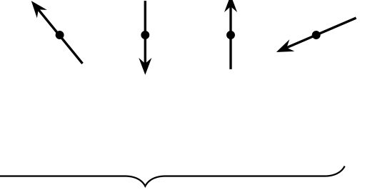
<figcaption class="paper-figure-caption"><b>Fig 4.</b> FIG. 2. Non-abelian DEH example. There is a 5 dimensional harvester and a 25-dimensional source.</figcaption>
</figure>
<figure class="paper-figure-card">
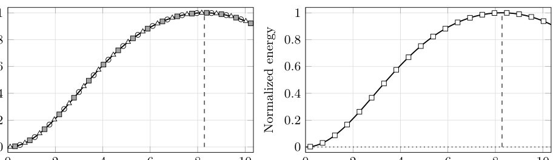
<figcaption class="paper-figure-caption"><b>Fig 5.</b> FIG. 3. Classical deterministic energy harvesting. (a) Normalized harvester energy gain for different initial phases ϕ0 of the classical source field. All phase-dependent results coincide and reach unity at the common transfer time T, indicated by the vertical dashed line. (b) Corresponding energy partitioning for a representative initial phase. The harvester energy gain equals the source energy loss, while the interaction energy remains zero along the selected seed source state trajectory.</figcaption>
</figure>

**Summary.** This paper develops a general theory showing that deterministic energy harvesting (DEH) is governed by the symmetries of the source-harvester system. By applying Noether's theorem, the authors prove that a single symmetry can generate an infinite family of source states, all capable of performing the exact same energy transfer. This establishes a fundamental, symmetry-protected principle for quantum energy extraction.

**Why it may be interesting.** This work provides a powerful, fundamental constraint (symmetry protection) on non-equilibrium quantum processes like energy harvesting, connecting deep mathematical principles (Noether's theorem) to practical quantum engineering problems.

Detailed structure

**Main problem.** The paper seeks to determine the general theoretical conditions under which deterministic energy harvesting (DEH) is possible from fluctuating quantum sources.

**Main result.** It establishes that Noether's theorem provides a general principle: a continuous symmetry of the joint source-harvester dynamics guarantees that an entire orbit of source states can perform the same deterministic energy transfer.

**Method.** The authors employ Noether's theorem to link continuous symmetries (and conserved charges) to the existence of multiple source states that yield identical, deterministic energy transfer outcomes on the harvester.

**Model / system.** The system involves a coupled quantum source and harvester described by a Hamiltonian $H = H_h + H_s + H_{int}$. The analysis is generalized to include classical and phase-space dynamics.

**Key observables.** Deterministic energy transfer ($
ho_i^h 	o 
ho_f^h$), source asymmetry ($I(\sigma)$), and the conserved Noether charges ($Q_\alpha$).

**Important parameters / regimes.** The time evolution $	au$, the symmetry generators $R(g)$, and the source asymmetry $I(\sigma)$.

**Assumptions / limitations.** The primary assumptions for the main theorem are the existence of an exact Noether symmetry for the joint dynamics and the exact invariance of the harvester boundary states under this symmetry.

**Figures summary.** Figures illustrate how Noether symmetry generates orbits of source states that jointly achieve DEH, and show population dynamics for non-Abelian DEH protocols.

**Paper structure.** The paper progresses from defining DEH and identifying the role of symmetries, proving the main theorem using Noether's theorem, illustrating the concept with specific models (Jaynes-Cummings, XX chain), and finally generalizing the findings to other physical theories.

Abstract

We consider the general principles for when deterministic energy harvesting (DEH) is possible. DEH means absorbing energy from a fluctuating source without entropy being absorbed. We show that the symmetry structure of the source--harvester dynamics gives a general route beyond existing examples to identify DEH capable source states. Any continuous symmetry with a conserved Noether charge induces a source-side orbit of states that all implement the same deterministic harvester transition, provided the harvester boundary states are symmetry invariant. Consequently, one DEH capable source state with nonzero asymmetry between charge sectors can generate infinitely many simultaneously DEH capable source states. A Jaynes-Cummings model, a three-spin XX chain, and an SU(2) model illustrate the construction. We further extend Noether's theorem to generalised probabilistic theories and thereby generalise our main result. We further establish an asymmetry bound for harvesting, showing that source asymmetry cannot increase on average, while DEH saturates the bound exactly preserving asymmetry.

[↑ back to top](#top)

### [Symmetry structure dependent diagnostic of the Quantum Mpemba Effect](http://arxiv.org/abs/2609.10470v1)

**Authors:** Tamizhselvan S, Manju C, Bijay Kumar Agarwalla, Uma Divakaran  
**Type:** theory · **Category:** statistical mechanics · **PDF:** <https://arxiv.org/pdf/2609.10470v1>  
**Analysis basis:** full PDF text, analyzed in chunks
**Topic relevance:** `analog quantum simulation` **1/5** · `correlated / nonlocal dissipation` **1/5** · `driven-dissipative phase transition` **1/5** · `methods for driven-dissipative` **1/5** · `non-equilibrium universality` **1/5** · `quantum measurements` **1/5** · `scars & prethermalization` **1/5**

↔ Scroll figures horizontally

<figure class="paper-figure-card">
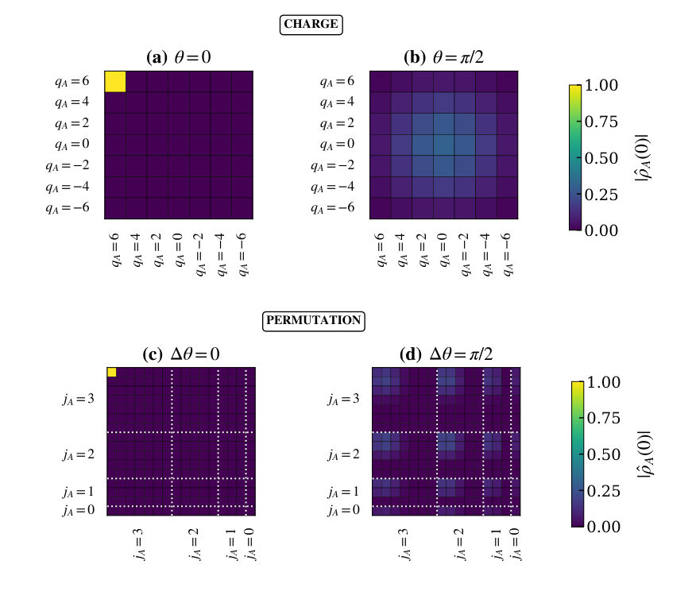
<figcaption class="paper-figure-caption"><b>Fig 1.</b> FIG. 1. Structure of the initial reduced density matrix ˆρA(0) in the symmetry-resolved basis for the charge and permutational- symmetry cases. Panels (a,b) show magnitude of ˆρA(0), denoted as |ˆρA(0)|, in the subsystem-charge qA basis for the tilted ferromagnetic initial state, as given in Eq. (7) with (a) θ = 0, and (b) θ = π/2, respectively, demonstrating support over several qA sectors when θ = π/2 . Panels (c,d) show the corresponding reduced density matrix in the subsystem total-spin jA basis for the initial state given in Eq. (8) with (c) ∆θ = 0 and (d) ∆θ = π/2, respectively, with ∆θ = π/2 showing support and coherences across different jA sectors. These plots correspond to N = 80...</figcaption>
</figure>
<figure class="paper-figure-card">

<figcaption class="paper-figure-caption"><b>Fig 2.</b> FIG. 2. Initial values of the entanglement asymmetry ∆SA(t=0) and trace distance ∆(ˆρA)(t=0) for charge and permutation- symmetry-breaking initial states. Panels (a,b) correspond to the charge symmetry-breaking initial state (Eq. (7)), and the diagnostics are plotted as a function of the tilt angle θ. The reduced diagonal ensemble ρA DE is constructed with respect to the charge-symmetric Hamiltonian in Eq. (2) with α = 1/N and p = π/2. Panels (c,d) correspond to the permutational symmetry-breaking initial state in Eq. (8) where the diagnostics are plotted as functions of the polar angle difference ∆θ. Here, ρA DE is constructed with respect to Hamiltonian in Eq. (1), with α1 = 1/N, α2 =...</figcaption>
</figure>
<figure class="paper-figure-card">

<figcaption class="paper-figure-caption"><b>Fig 3.</b> FIG. 3. Charge symmetry-breaking dynamics : (a) Time evolution of the entanglement asymmetry ∆SA(t) and the (b) trace distance ∆(ρA)(t) for charge symmetry case. The three curves correspond to different symmetry-breaking parameters, i.e. initial tilt angle θ. For larger θ, the initial value of both diagnostics is larger but the decay is faster. The results are obtained by exact diagonalization for N = 80 , NA = 2, with the Hamiltonian in Eq. (2) and parameters set to α = 1/N , p = π/2</figcaption>
</figure>
<figure class="paper-figure-card">

<figcaption class="paper-figure-caption"><b>Fig 4.</b> FIG. 4. Permutational symmetry-breaking dynamics : (a) Time evolution of the entanglement asymmetry ∆SA(t) and (b) trace distance ∆(ρA)(t) for the permutational symmetry case. The three curves correspond to different symmetry-breaking parameter ∆θ. The results are obtained by exact diagonalization for N = 80 , NA = 2, by drawing subsystem from the middle of the spin chain, for the Hamiltonian in Eq. (1) with parameters α1 = 1/N, α2 = 2/N, and p = π/2. The insets magnify the indicated intermediate and late time regions to clearly highlight the differences between the curves.</figcaption>
</figure>
<figure class="paper-figure-card">
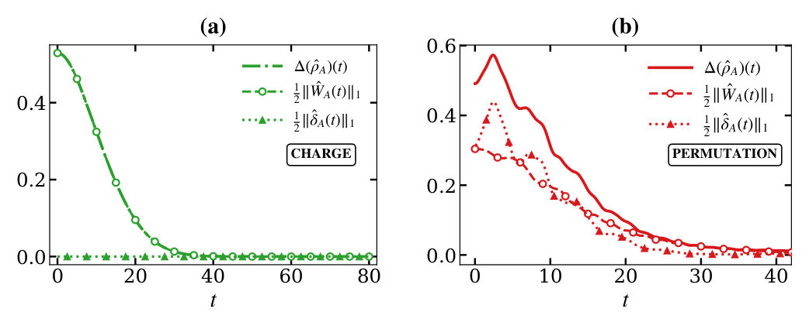
<figcaption class="paper-figure-caption"><b>Fig 5.</b> FIG. 5. Comparison of the contributions from ˆ WA(t) and ˆδA(t) to the trace distance ∆(ˆρA)(t) dynamics for (a) charge and (b) permutation symmetries. The charge symmetry broken initial state has θ = 0.3π, and is evolved with the Hamiltonian</figcaption>
</figure>

**Summary.** This paper compares two diagnostics, entanglement asymmetry and trace distance, to determine when they both accurately describe the symmetry restoration dynamics linked to the Quantum Mpemba Effect in spin systems. By analyzing charge versus permutation symmetries, the authors show that the reliability of energy-based measures depends strongly on the underlying symmetry structure. This clarifies the distinct physical information encoded by different quantum diagnostics.

**Why it may be interesting.** This work provides a rigorous theoretical framework for distinguishing between different types of quantum information measures (entanglement vs. energy-based) in non-equilibrium dynamics, which is crucial for understanding relaxation processes in complex quantum many-body systems.

Detailed structure

**Main problem.** The paper investigates the conditions under which conventional energy-based diagnostics, like the trace distance, accurately capture the symmetry-restoration dynamics associated with the Quantum Mpemba Effect (QME) when compared to entanglement asymmetry.

**Main result.** The diagnostic used depends critically on the symmetry structure: for charge symmetry, the trace distance effectively tracks entanglement asymmetry, but for permutation symmetry, a significant residual contribution causes them to evolve differently.

**Method.** The study combines numerical simulations with an analytical decomposition of the trace distance into symmetry-coherence and residual contributions to compare its dynamics against entanglement asymmetry.

**Model / system.** The analysis is performed on closed spin-1/2 quantum systems, utilizing Hamiltonians exhibiting different symmetries, specifically charge symmetry and permutation symmetry. Initial states are prepared as symmetry-breaking product states.

**Key observables.** Entanglement asymmetry ($\Delta S_A$) and Trace distance ($\Delta(\hat{
ho}_A)(t)$).

**Important parameters / regimes.** Symmetry-breaking parameters (e.g., tilt angle $	heta$ for charge symmetry; polar-angle difference $\Delta	heta$ for permutation symmetry).

**Assumptions / limitations.** The analysis relies on decomposing the trace distance and comparing the time evolution of two distinct symmetry-breaking scenarios (charge vs. permutation).

**Figures summary.** Figures compare the time evolution of $\Delta S_A(t)$ and $\Delta(\hat{
ho}_A)(t)$ for different symmetry-breaking initial states, showing qualitative agreement for charge symmetry but divergence for permutation symmetry.

**Paper structure.** The paper first introduces the problem by comparing two diagnostics ($\Delta S_A$ vs. Trace Distance) in spin systems. It then analyzes specific symmetry cases (charge vs. permutation) by decomposing the trace distance. Finally, it establishes the conditions under which the energy-based diagnostic is reliable.

Abstract

Understanding symmetry restoration in isolated quantum many-body systems is an important problem in nonequilibrium many-body quantum physics. Recent studies have shown that the quantum Mpemba effect can be characterized through entanglement asymmetry, where states with stronger initial symmetry breaking restore symmetry faster. However, it remains unclear whether conventional energy-based measures, such as the trace distance, capture the same phenomenon. We investigate this question in closed spin-$1/2$ quantum systems with different symmetries by analyzing the dynamics of symmetry-breaking initial states. Combining numerical simulations with an analytical decomposition of the trace distance into symmetry-coherence and residual contributions, we identify the conditions under which trace distance tracks entanglement asymmetry and reproduces the Mpemba--like behavior observed in it. For charge symmetry, the residual contribution is negligible, making the trace distance effectively governed by symmetry-sector coherences. In contrast, for permutation symmetry, a significant residual contribution leads to qualitatively different relaxation dynamics. Our results establish when conventional energy-based diagnostics reliably capture symmetry-restoration dynamics and clarify the distinct physical information encoded by entanglement asymmetry and trace distance.

[↑ back to top](#top)

### [Efficient protocol for the Markovian Mpemba effect in $N$-level systems](http://arxiv.org/abs/2609.09988v1)

**Authors:** David Gelbwaser-Klimovsky  
**Type:** theory · **Category:** statistical mechanics · **PDF:** <https://arxiv.org/pdf/2609.09988v1>  
**Analysis basis:** full PDF text, analyzed in chunks
**Topic relevance:** `correlated / nonlocal dissipation` **1/5** · `driven-dissipative phase transition` **1/5** · `methods for driven-dissipative` **1/5** · `non-equilibrium universality` **1/5** · `scars & prethermalization` **1/5**

↔ Scroll figures horizontally

<figure class="paper-figure-card">

<figcaption class="paper-figure-caption"><b>Fig 1.</b> FIG. 1. Each point inside the triangle represents a state of the 3LS population, {p1, p2, p3}. The corners are pure states of levels 1, 2 or 3, respectively. The thermal states are repre- sented by one of the color lines, whose shape depends on the energy level distribution through r.</figcaption>
</figure>
<figure class="paper-figure-card">
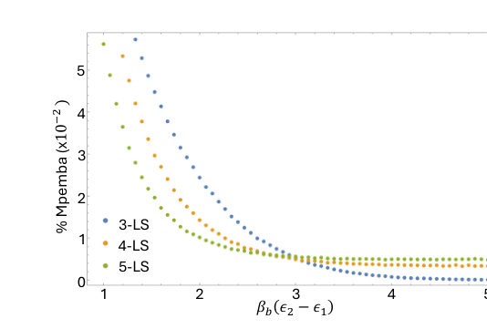
<figcaption class="paper-figure-caption"><b>Fig 2.</b> FIG. 2. Probability for N-level Markovian Mpemba effect as a function of the normalized bath inverse temperature. We considered bounded values of transition rates (0 &lt; aij &lt; 1). As shown in the plot, the probability decreases with bath tem- perature. 3-, 4-, and 5-level systems are shown in the figure. The convergence of the results was assessed by increasing the number of realizations and confirming that this did not signif- icantly alter the plot. For the transition rates, we considered values from 0.001 to 1 and for βbϵi from 0 to 5N. Each point in the graphs is based in 106 random realizations.</figcaption>
</figure>
<figure class="paper-figure-card">
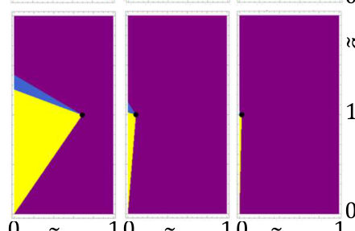
<figcaption class="paper-figure-caption"><b>Fig 3.</b> FIG. 4. Markovian Mpemba effect for the lowest three hydrogen-like energy levels, r &lt; 1, as a function of the normal- ized transition rates. The upper plots show the area (in dark blue) of Mechanism 4, the only mechanism for the Markovian Mpemba effect for r &lt; 1. The bottom plots show the region of the inverse Markovian Mpemba effect (yellow) and the direct Markovian Mpemba effect (blue). Each plot column corre- sponds to a different βb. See Figure 3 for other details of the color coding. The energy levels are (arbitrary units): -5,-5/4,- 5/9.</figcaption>
</figure>
<figure class="paper-figure-card">
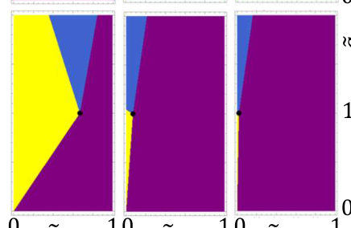
<figcaption class="paper-figure-caption"><b>Fig 4.</b> FIG. 3. Markovian Mpemba effect for the lowest three rota- tional energy levels, r &gt; 1, as a function of the normalized transition rates. The upper plots show the different mecha- nisms: Mechanism 1 (red), Mechanism 2 (light orange), and Mechanism 3 (Dark orange). The lower plots show the regions of the inverse (yellow) and direct (blue) Markovian Mpemba effect. In all plots, the purple regions correspond to parame- ter values without the Markovian Mpemba effect, and a black point represents the singular point. Each plot column corre- sponds to a different βb. The energy levels are 2, 6 and 12 (in arbitrary units).</figcaption>
</figure>
<figure class="paper-figure-card">
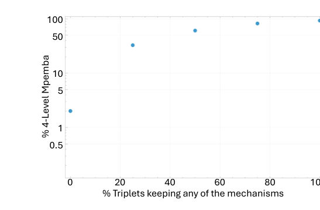
<figcaption class="paper-figure-caption"><b>Fig 5.</b> FIG. 5. Probability of a 4-level system exhibiting the Marko- vian Mpemba effect as a function of how many of its triplets exhibit any of the 3LS Markovian Mpemba mechanisms. No- tice that even in the case that all the triplets keep one of the 3LS mechanisms, the 4-level system may not exhibit the Markovian Mpemba effect. In this case, the probability is ∼93%. The convergence of the results was assessed by in- creasing the number of realizations and confirming that this did not significantly alter the plot. For the transition rates, we considered values from 0.001 to 1 and for βbϵi from 0 to 5. 5 × 105 realizations were used for the whole plot.</figcaption>
</figure>

**Summary.** This work provides a comprehensive theoretical framework to understand the rare Mpemba effect in quantum systems. By first solving the necessary and sufficient conditions for 3-level systems, the authors develop an efficient Single Pair of States Deviation (SPSD) protocol. This protocol allows for the systematic search of parameters to realize and predict the Mpemba effect in large N-level quantum systems.

**Why it may be interesting.** The Mpemba effect is a non-monotonic phenomenon in thermalization dynamics, which is a key topic in non-equilibrium statistical mechanics. The development of a general protocol for finding its parameters in large systems is highly valuable for theoretical modeling.

Detailed structure

**Main problem.** The paper investigates the necessary and sufficient conditions for the Markovian Mpemba effect in general N-level quantum systems.

**Main result.** The authors derive an efficient protocol to determine the parameters for the Mpemba effect in N-level systems by analyzing the behavior near a 'singular point' derived from 3-level system analysis.

**Method.** The analysis uses the Pauli rate equation, eigenvalue analysis of the transition matrix, and develops a Single Pair of States Deviation (SPSD) protocol to efficiently map the parameter space.

**Model / system.** The study focuses on non-degenerate N-level systems (starting with 3-level systems) undergoing thermalization governed by the Pauli rate equation, assuming detailed balance.

**Key observables.** The probability of the Markovian Mpemba effect, the fast eigenvector angle, and the success rate of the SPSD protocol.

**Important parameters / regimes.** The energy level spacing parameter r, the bath inverse temperature $\beta_b$, and the transition rates (e.g., $\tilde{a}_{23}, \tilde{a}_{13}$).

**Assumptions / limitations.** The analysis relies on the Pauli rate equation and Markovian approximations, and often assumes detailed balance for deriving necessary conditions.

**Figures summary.** Figures show the probability of the effect vs. temperature for 3-, 4-, and 5-level systems, and matrix plots illustrate how rate deviations affect the effect type (direct/inverse Mpemba) for various temperatures.

**Paper structure.** The paper progresses from establishing necessary and sufficient conditions for the 3-level case, to developing the general SPSD protocol for N-level systems, and finally demonstrating the protocol's efficiency and temperature dependence.

Abstract

The Mpemba effect is an anomalous phenomenon in which the time to thermalize does not depend monotonically on the distance from equilibrium, allowing systems with an initially larger temperature difference to thermalize before those with a smaller one. The rarity of the effect makes it hard to find parameters that produce it, complicating the design of experiments and the development of applications. Here, we find necessary and sufficient conditions for the Markovian Mpemba effect in three-level systems and explain its underlying physical mechanisms. Based on our understanding of the three-level case, we develop an efficient algorithm to determine the parameters for the effect in $N$-level systems. This protocol could open the door for the realization of Mpemba experiments and related applications in large systems.

[↑ back to top](#top)

### [Configurational-space separation and structure selection in three hard squares](http://arxiv.org/abs/2609.09936v1)

**Authors:** Yuheng Yang, Meng Xiao, Duanduan Wan  
**Type:** theory · **Category:** statistical mechanics · **PDF:** <https://arxiv.org/pdf/2609.09936v1>  
**Analysis basis:** full PDF text, analyzed in chunks
**Topic relevance:** `analog quantum simulation` **1/5** · `methods for driven-dissipative` **1/5** · `scars & prethermalization` **1/5**

↔ Scroll figures horizontally

<figure class="paper-figure-card">
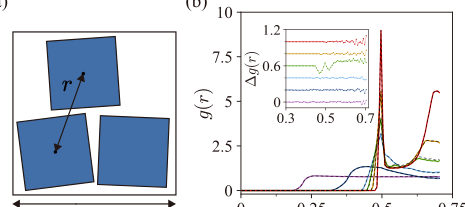
<figcaption class="paper-figure-caption"><b>Fig 1.</b> FIG. 1. (a) Schematic illustration of three hard squares in a two-dimensional periodic box. The variable r denotes the center-to-center distance between two squares. (b) Ra- dial distribution function g(r) for packing fractions ϕ = 0.1, 0.3, 0.55, 0.6, 0.65, and 0.7 (increasing from bottom to top). Gray dashed lines show the results from uniform inser- tion sampling, while solid lines correspond to MCMC results. Inset: the difference ∆g(r) between the two methods; curves are vertically offset by 0.2 for clarity.</figcaption>
</figure>
<figure class="paper-figure-card">
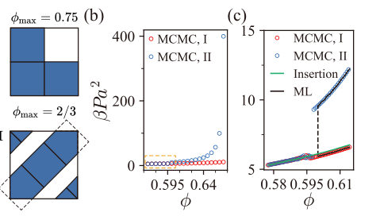
<figcaption class="paper-figure-caption"><b>Fig 2.</b> FIG. 2. (a) Maximally packed configurations for two distinct configuration classes, I and II, with ϕmax = 0.75 and 2/3, re- spectively. (b) Pressure βPa2 as a function of packing fraction ϕ, obtained from MCMC simulations initialized from config- uration classes I and II, respectively. (c) Zoomed-in view of the region highlighted by the orange dashed box in (b), with additional simulation points. The green line shows the results obtained from the uniform insertion method. The black lines indicate the two branches classified by machine learning. The vertical dashed black line marks ϕ = 0.6.</figcaption>
</figure>
<figure class="paper-figure-card">
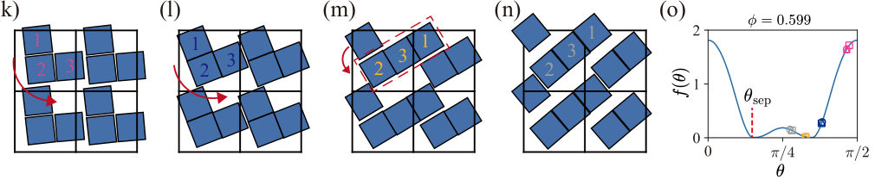
<figcaption class="paper-figure-caption"><b>Fig 3.</b> FIG. 3. Transition pathways between the two configuration classes. (a)–(d) Representative configurations along an MCMC transition from the larger configuration-space region associated with class I to the smaller region associated with class II at ϕ = 0.59. In (a) and (b), the red arrows indicate the subsequent rotation of square 3. In (c), the three squares have nearly the same orientation, as highlighted by the dashed red rectangle; the red arrow indicates their subsequent collective rotation. (e) Area-normalized probability density f(θ) of the square orientation angle θ at ϕ = 0.59, obtained from uniform insertion sampling and normalized such that R π/2 0 f(θ) dθ = 1. Here, θ is defined...</figcaption>
</figure>
<figure class="paper-figure-card">
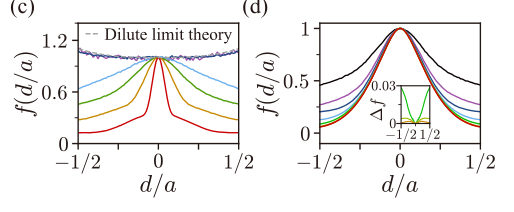
<figcaption class="paper-figure-caption"><b>Fig 4.</b> FIG. 4. Definition and distributions of the local order pa- rameter d/a. (a) Definition of d. For a reference square, we consider its four adjacent square regions, indicated by dashed outlines. If the center of mass of another square or one of its periodic images lies within one of these regions, it is projected perpendicularly onto the corresponding side of the reference square. The signed distance between the projection point and the midpoint of that side is defined as d (red segment), with the positive direction chosen to follow the clockwise orienta- tion around the reference square. (b) Representative config- urations with d = 0 and d = a/2. (c) Normalized frequency f(d/a) as a...</figcaption>
</figure>

**Summary.** This work analyzes how excluded-volume geometry dictates the accessible configuration space for three hard squares, revealing a sharp separation in the allowed phase space at $\phi=3/5$. The study uses advanced simulation techniques to map out the transition between two distinct structural regimes, demonstrating how simple geometric rules can govern complex, many-body ordering signatures even in a minimal system.

**Why it may be interesting.** Although focused on classical hard-body physics, the concept of configurational space bottlenecks and emergent structure selection from minimal constraints is highly relevant to understanding phase transitions and ordering in complex quantum many-body systems.

Detailed structure

**Main problem.** The study investigates the configurational-space separation and the emergence of structure selection in a minimal system of three hard squares confined in 2D.

**Main result.** The system exhibits a clear separation in its allowed configurational space at a density $\phi_{sep}=3/5$, and local structure selection favors L-shaped arrangements characteristic of higher-density ordering.

**Method.** The analysis combines Monte Carlo simulations (MCMC) with uniform non-overlapping insertion sampling to probe configurational space connectivity and measure pressure.

**Model / system.** The model consists of three hard squares confined within a two-dimensional periodic box. The complexity arises from excluded-volume constraints governing particle interactions.

**Key observables.** Radial distribution functions $g(r)$, pressure ($eta P a^2$), local order parameter $d/a$, and the identification of two distinct configuration classes (Class I and Class II).

**Important parameters / regimes.** Packing fraction ($\phi$), the critical separation density ($\phi_{sep} = 3/5$), and the particle number ($N=3$).

**Assumptions / limitations.** The analysis assumes that the discrepancy between MCMC and uniform sampling is due to configurational space separation, and that the dilute-limit calculation can neglect correlations beyond pair excluded-volume constraints.

**Figures summary.** Figures compare $g(r)$ from different sampling methods, show pressure divergence confirming space separation, and illustrate transition pathways between configuration classes (I and II) near $\phi=0.6$.

**Paper structure.** The paper first establishes the discrepancy between simulation methods at intermediate densities, identifying the separation density $\phi_{sep}$. It then characterizes the two disconnected configuration classes and uses geometric arguments and machine learning classifiers to map the transition pathways connecting them. Finally, it derives the dilute-limit reference curve for angular measures.

Abstract

Self-assembly of hard particles with diverse shapes gives rise to a rich variety of structures through excluded-volume constraints alone. Here we show that even a minimal system of three hard squares confined in a two-dimensional periodic box exhibits nontrivial configurational behavior relevant to structure selection. As the packing fraction increases, radial distribution functions obtained from Markov-chain Monte Carlo and uniform non-overlapping insertion sampling agree at low densities, deviate markedly over an intermediate range, and converge again at higher densities. Pressure measurements provide strong numerical evidence that the discrepancy originates from the separation of the allowed configurational space into two disconnected regions above a characteristic density. We identify the separation density as $φ_{\rm sep}=3/5$, construct explicit overlap-free transition pathways connecting the two regions immediately below it, and quantify their relative configurational-space volumes. At higher packing fractions, an approximately L-shaped arrangement of the particle centers becomes strongly favored over a staggered one, revealing a structural motif characteristic of tetratic and square-lattice ordering in larger hard-square systems. These results show that excluded-volume geometry can govern both configurational connectivity and local structure selection even in a three-particle system, revealing how signatures of many-particle self-assembly can already emerge in the few-particle limit.

[↑ back to top](#top)

### [Coarse-graining to create minimalist models for dynamic, end-linked star-polymer networks](http://arxiv.org/abs/2609.09594v1)

**Authors:** Tyla R. Holoman, C. Levi Petix, Michael P. Howard, Thomas M. Truskett  
**Type:** theory · **Category:** statistical mechanics · **PDF:** <https://arxiv.org/pdf/2609.09594v1>  
**Analysis basis:** full PDF text, analyzed in chunks
**Topic relevance:** `Keldysh / 2PI / non-Gaussian methods` **1/5** · `methods for driven-dissipative` **1/5**

↔ Scroll figures horizontally

<figure class="paper-figure-card">
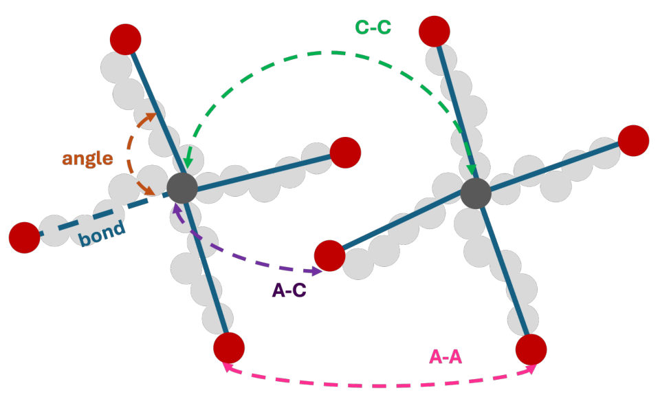
<figcaption class="paper-figure-caption"><b>Fig 1.</b> FIG. 1. Schematic of fine-grained (FG) and coarse-grained (CG) models for tetra-PEG.</figcaption>
</figure>
<figure class="paper-figure-card">
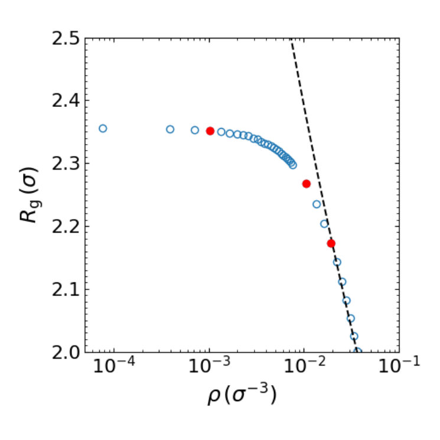
<figcaption class="paper-figure-caption"><b>Fig 2.</b> FIG. 2. Crossover from dilute to semidilute conditions. Radius of gyration for the FG</figcaption>
</figure>
<figure class="paper-figure-card">
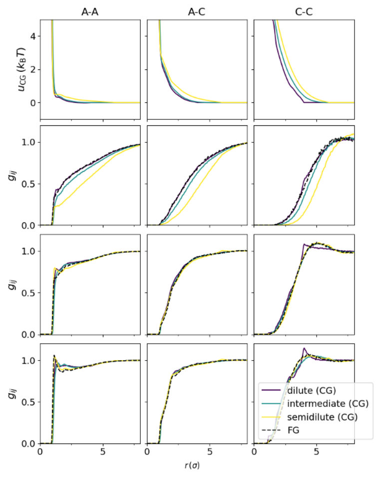
<figcaption class="paper-figure-caption"><b>Fig 3.</b> FIG. 3. Transferability of CG model. Top row: CG pair potential uCG as a function of</figcaption>
</figure>
<figure class="paper-figure-card">
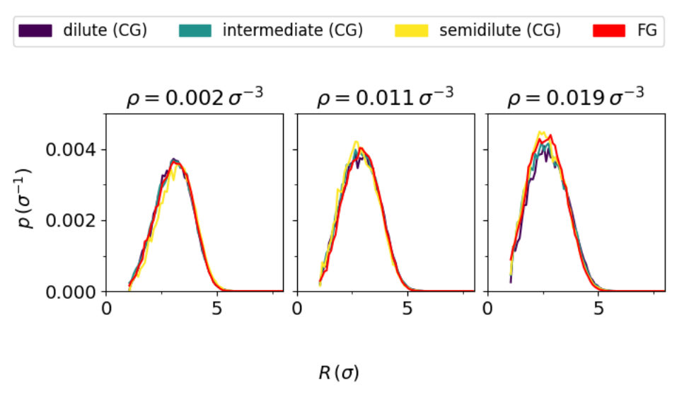
<figcaption class="paper-figure-caption"><b>Fig 4.</b> FIG. 4. Intra-star correlations. Probability density p of arm length R in the CG and FG models</figcaption>
</figure>
<figure class="paper-figure-card">
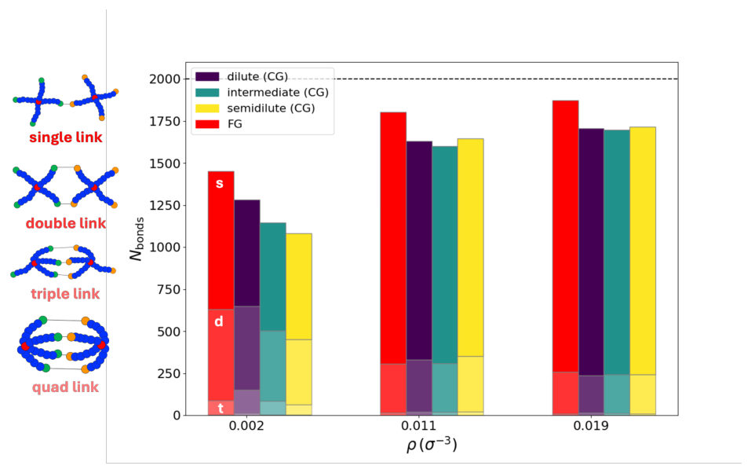
<figcaption class="paper-figure-caption"><b>Fig 5.</b> FIG. 5. Inter-star bonding motifs. Total number of bonds and number of bonds for different</figcaption>
</figure>

**Summary.** This work addresses the challenge of modeling complex star-polymer networks by developing a simplified, coarse-grained model using relative-entropy coarse-graining. By comparing the simple model's predictions against a high-resolution simulation, the authors demonstrate how to create computationally efficient representations while quantifying the inherent trade-offs in accuracy and transferability.

**Why it may be interesting.** While the focus is on polymer physics, the rigorous application of relative entropy and systematic model reduction techniques (coarse-graining) is a powerful, generalizable tool in statistical mechanics for multiscale modeling, which has parallels in quantum many-body systems.

Detailed structure

**Main problem.** The goal is to develop simple, minimalist models for dynamic, end-linked star-polymer networks to accurately predict their macroscopic behavior while minimizing computational complexity.

**Main result.** The study successfully validates a 5-bead coarse-grained model by comparing its predictions (e.g., phase behavior) against a finer-grained bead-spring model, while also quantifying the trade-offs in model accuracy versus computational efficiency.

**Method.** Relative-entropy coarse-graining is employed, minimizing the relative entropy between the fine-grained and coarse-grained ensembles using simulation data from various concentrations.

**Model / system.** The system involves dynamic, end-associating four-armed poly(ethylene glycol) (tetra-PEG) macromers forming gel networks. The model compares a detailed bead-spring representation (FG) to a simplified 5-bead model (CG) incorporating specific potentials for bonding and interactions.

**Key observables.** Structural correlations, network connectivity, phase behavior, and the root mean squared radius of gyration ($\langle R_g^2 
angle^{1/2}$).

**Important parameters / regimes.** Three distinct concentrations (dilute, intermediate, semidilute) are used for parameterization; the relative entropy minimization is performed across these states.

**Assumptions / limitations.** The CG parameters are determined by minimizing relative entropy based on FG simulations performed *without* star-star bonding, which introduces inherent limitations on transferability.

**Figures summary.** Figure 1 schematically compares the FG and CG interaction potentials for tetra-PEG. Figure 2 illustrates the dependence of $\langle R_g^2 
angle^{1/2}$ on density ($
ho$) for the FG model, guiding the selection of parametrization densities.

**Paper structure.** The paper systematically develops the coarse-graining methodology using relative entropy minimization, validates the resulting 5-bead model by comparing structural and phase properties against the high-resolution model, and concludes by discussing the inherent trade-offs between model simplicity and physical accuracy.

Abstract

Although minimalist models for patchy attractive particles have revealed powerful design rules for how particle valence directs colloidal assembly, less work has focused on comparably simple models of reversible, network-forming star polymers. Here, we use relative-entropy coarse-graining and simulation results from finer-resolution bead--spring star polymers to generate 5-bead models of dynamic, end-associating four-armed poly(ethylene glycol) macromers. Our results comparing structural correlations, network connectivity, and phase behavior of the coarse- and fine-grained models provide insight into how the accuracy and transferability of the coarse-grained models depend on the state point chosen for coarse-graining. The results also reveal intrinsic trade-offs between reducing degrees of freedom and expanding the range of effective interactions in coarse-graining that impact the total number of pairwise interactions in the resulting model, with implications for its computational efficiency.

[↑ back to top](#top)

### [Momentum-resolved quantum noise spectroscopy using ensembles of diamond quantum sensors](http://arxiv.org/abs/2609.09571v1)

**Authors:** Zeeshawn Kazi, Kai-Hung Cheng, Jared Rovny, Nathalie P. de Leon  
**Type:** experiment · **Category:** strongly correlated electrons · **PDF:** <https://arxiv.org/pdf/2609.09571v1>  
**Analysis basis:** full PDF text, analyzed in chunks
**Topic relevance:** `QC/QI experiment` **1/5** · `quantum measurements` **1/5**

↔ Scroll figures horizontally

<figure class="paper-figure-card">

<figcaption class="paper-figure-caption"><b>Fig 1.</b> FIG. 1. Momentum-resolved magnetic noise spectral density. (a) Schematic of a correlated, dynamic material system directly on top of a diamond hosting NV centers. (b) Zoomed in schematic showing correlated dynamics of the system sensed by a shallow NV center ensemble. (c) Fluorescence images record the magnetic noise measured by NV centers across the imaging field of view. Each pixel records the signals sensed by hundreds of NV centers (𝑁𝑥by 𝑁𝑦pixels), and 𝑀shots are taken. (d) High-fidelity imaging of NV center signals enables the construction of 𝑁𝑥× 𝑁𝑦maps of two-point magnetic noise correlators. Each map represents the correlation at a given pixel with respect to a reference pixel...</figcaption>
</figure>
<figure class="paper-figure-card">
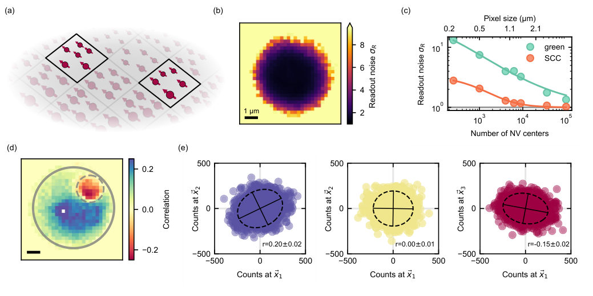
<figcaption class="paper-figure-caption"><b>Fig 2.</b> FIG. 2. High-fidelity, wide-field readout enables massively multiplexed correlation measurements. (a) Schematic of camera readout of a high-density NV center ensemble. (b) Map of spin state readout noise 𝜎𝑅, where each pixel is used as an individual sensor. (c) The readout noise 𝜎𝑅scales with the number of NV centers in the pixel. Spin-to-charge conversion (SCC) strongly outperforms green readout for low numbers of NV centers. The lines are fit to a power law lower bounded by 1. (d) Correlation map resulting from global driven Rabi oscillations. Sensors in the dashed circle are prepared in the opposite spin state to those in the solid circle only. (e) Photon count distributions...</figcaption>
</figure>
<figure class="paper-figure-card">
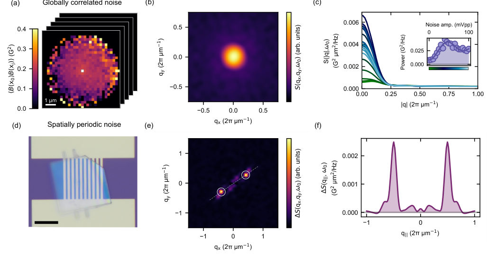
<figcaption class="paper-figure-caption"><b>Fig 3.</b> FIG. 3. Momentum-resolved magnetic noise spectroscopy reveals the spatial structure of magnetic noise. (a) Two-point magnetic noise correlations at each pixel with respect to the white pixel across the imaging field of view, caused by globally applied noise from an RF coil. (b) The Fourier transform of multiplexed correlator measurements results in the momentum-resolved magnetic noise spectral density 𝑆(q, 𝜔0). (c) Radially averaged 𝑆(|𝑞|, 𝜔0) profiles (color indicates applied noise amplitude). A Gaussian fit to each returns FWHM|𝑞| ≈2𝜋× 0.2 µm−1, corresponding to the inverse of the imaging field of view (5 µm). Inset: total noise power from integrating each profile from 𝑞= 0 to 𝑞max; the...</figcaption>
</figure>
<figure class="paper-figure-card">

<figcaption class="paper-figure-caption"><b>Fig 4.</b> FIG. 4. Tunable momentum filter functions beyond the diffraction limit. (a) Measuring correlations between NV center orientations A and B below the diffraction limit. Confocal lasers initialize the charge and spin states; a doughnut pulse then ionizes NV centers in a ring, leaving sensors within a diameter 𝐷. A sensing sequence measures correlations within the volume and is read out by spin-to-charge conversion. (b) Spin state readout noise 𝜎𝑅for each orientation scales strongly with decreasing sensing volume diameter. (c) Covariance between orientations A and B in a single spot, caused by applied noise at 2.5 MHz, versus sensing volume. Error bars, standard error of the variance for...</figcaption>
</figure>

**Summary.** This paper details a technique using diamond NV centers to measure the momentum-resolved magnetic noise spectral density in correlated matter. By combining wide-field imaging with continuous tuning of the sensing volume, the authors overcome limitations in spatial and temporal resolution simultaneously. This allows for the direct mapping of low-energy, long-wavelength fluctuations crucial for understanding strongly correlated electronic phases.

**Why it may be interesting.** This work provides a novel, highly sensitive, and tunable experimental platform to measure dynamic correlations in condensed matter systems, bridging the gap between bulk measurements and nanoscale probing.

Detailed structure

**Main problem.** Characterizing spatiotemporal fluctuations across multiple scales in strongly correlated matter, which is difficult because conventional probes lack simultaneous high spatial and temporal resolution.

**Main result.** The developed technique allows mapping the full magnetic noise spectral density $S(\mathbf{q}, \omega)$ across tunable momentum and frequency bands, enabling the study of long-wavelength fluctuations.

**Method.** The authors use high-fidelity wide-field imaging of diamond NV ensembles to measure momentum and frequency power spectral density of magnetic fluctuations, employing Fourier transforms of two-point correlation functions.

**Model / system.** The physical system is a dense ensemble of nitrogen vacancy (NV) centers embedded in diamond. The measurement probes magnetic noise fluctuations, allowing access to momentum space ($\mathbf{q}$) and frequency ($\omega$) spectra.

**Key observables.** Momentum and frequency power spectral density of magnetic fluctuations, $S(\mathbf{q}, \omega_0)$; two-point magnetic field correlators $\langle B_{\omega_0}(\mathbf{x}_i)B_{\omega_0}(\mathbf{x}_j) 
angle$.

**Important parameters / regimes.** Spatial wavevectors ($\mathbf{q}$) spanning from $\mathbf{q}_{	ext{min}} \approx 2\pi 	imes 0.25 \mu	ext{m}^{-1}$ to $\mathbf{q}_{	ext{max}} \approx 2\pi 	imes 2 \mu	ext{m}^{-1}$; tunable frequency bands; sensing volume size ($D$).

**Assumptions / limitations.** The analysis relies on relating the measured spectral density to the true spectrum via specific momentum filter functions derived for different geometries (wide-field vs. single-spot).

**Figures summary.** Figures illustrate the process of mapping magnetic field correlations and computing the Fourier transform to resolve features at finite momenta, and detail the wide-field spin-to-charge conversion readout.

**Paper structure.** The paper systematically develops methods to measure the momentum-resolved spectral density $S(q, \omega)$ by relating it to measurable quantities (correlations, variances) using specific filter functions derived for different geometries (single center vs. ensemble vs. wide-field).

Abstract

Spatiotemporal fluctuations across multiple scales govern and characterize the emergent properties, phase boundaries, and low-energy excitations of strongly correlated matter. However, capturing these dynamics has remained a major experimental challenge, as conventional probes typically offer either high spatial or temporal resolution, but not both simultaneously. Here, we leverage high-fidelity wide-field imaging of dense diamond nitrogen vacancy center ensembles to measure the momentum and frequency power spectral density of magnetic fluctuations. To access spatial wavevectors below the diffraction limit, we tune the sensing volume continuously through optical depletion. This approach enables study of equilibrium and driven fluctuations across three orders of magnitude in spatial scale and tunable frequency bands, providing a direct means to map low-energy, long-wavelength fluctuations in correlated systems.

[↑ back to top](#top)

### [Protected domains and the cost of cooperation on weighted networks](http://arxiv.org/abs/2609.10463v1)

**Authors:** Abhishek Chowdhury  
**Type:** theory · **Category:** statistical mechanics · **PDF:** <https://arxiv.org/pdf/2609.10463v1>  
**Analysis basis:** full PDF text, analyzed in chunks
**Topic relevance:** `Keldysh / 2PI / non-Gaussian methods` **1/5** · `quantum measurements` **1/5**

↔ Scroll figures horizontally

<figure class="paper-figure-card">
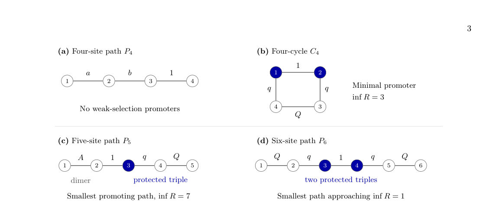
<figcaption class="paper-figure-caption"><b>Fig 1.</b> FIG. 1. Small supports distinguish establishment mechanisms. P4 represents the paths with at most four sites that do not promote at weak selection. C4 is a minimal promoter, P5 the smallest promoting path, and P6 the smallest path approaching threshold one. Edge labels are relative weights; line thickness does not encode their magnitude. Filled sites are dynamically protected pins, not fixed external spins. The limits are q →∞, q2/Q →0 on C4; 1 ≪q ≪A ≪Q on P5; and q →∞, q/Q →0 on P6. The six-site construction extends to every fixed longer path.</figcaption>
</figure>
<figure class="paper-figure-card">
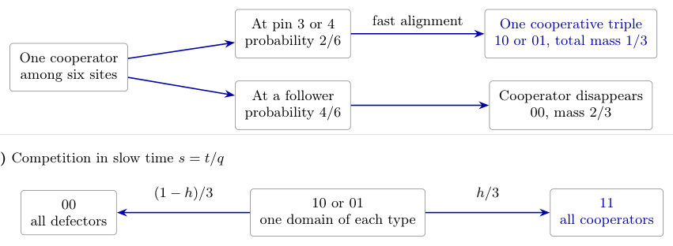
<figcaption class="paper-figure-caption"><b>Fig 2.</b> FIG. 2. The initial individual and the eventual domain competitor. The upper panel distinguishes pin introductions, which establish an aligned triple in the hierarchy limit, from follower introductions, which disappear. The lower panel is the resulting four-state process in slow time s = t/q; its arrows are rates in that clock. The entrance weights belong to the original uniform- singleton experiment. A pin is slowly overwritten, not externally fixed at finite weights.</figcaption>
</figure>
<figure class="paper-figure-card">
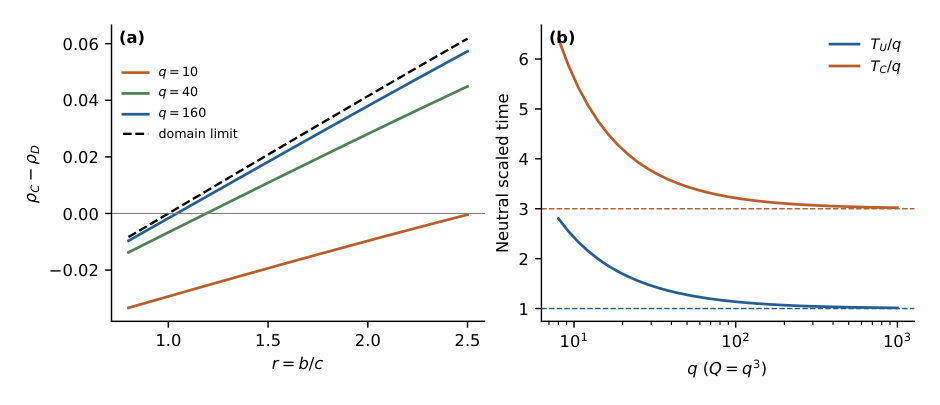
<figcaption class="paper-figure-caption"><b>Fig 3.</b> FIG. 3. Finite microscopic checks on (q3, q, 1, q, q3). (a) The complete committor calculation for exponential fecundity at κ = δc = 0.25, compared with the limiting advantage 1 3 tanh[κ(b/c −1)/2]. (b) Neutral mean absorption times approach TU/q = 1 and TC/q = 3. The two panels test selected fixation and neutral time separately. This family illustrates the mechanism; the optimal contact design is determined below.</figcaption>
</figure>
<figure class="paper-figure-card">
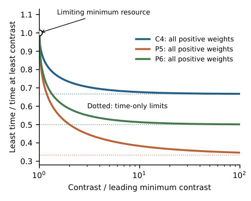
<figcaption class="paper-figure-caption"><b>Fig 4.</b> FIG. 4. The analytical leading time–contrast frontiers, nor- malized by each support’s least-contrast design. Extra con- trast shortens the invasion while retaining its threshold tar- get. Dotted lines indicate the time-only limiting infima. Each curve concerns its own threshold floor and the same global at- tempt clock.</figcaption>
</figure>
<figure class="paper-figure-card">
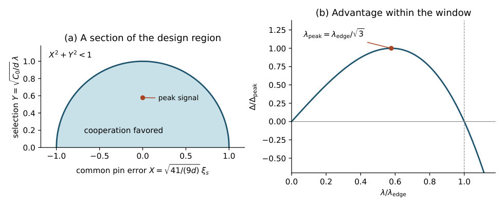
<figcaption class="paper-figure-caption"><b>Fig 5.</b> FIG. 5. The leading joint tolerance and signal. (a) With saturated cores and no pin imbalance, X = p</figcaption>
</figure>

**Summary.** This theoretical paper analyzes the conditions for the spread of costly cooperation on weighted networks using a donation game model. It calculates precise weak-selection thresholds for various network topologies, showing that cooperation's success depends critically on the network's structure and the observation time. The work employs advanced stochastic analysis to quantify the trade-offs between cooperation benefit, cost, and network heterogeneity.

**Why it may be interesting.** The rigorous mathematical treatment of cooperation dynamics, using fluctuation theorems and threshold analysis, provides a powerful framework applicable to non-equilibrium processes in complex systems, which has parallels in open quantum systems where environmental coupling drives selection.

Detailed structure

**Main problem.** The paper investigates the conditions under which costly cooperation can spread and persist within a population structured on a weighted network.

**Main result.** It determines specific weak-selection thresholds (e.g., $b/c=3$ on a four-cycle) required for cooperation to be favored, showing that achieving higher advantages requires increasing network heterogeneity and observation time.

**Method.** The analysis uses exact fluctuation response theory and fluctuation analysis on stochastic processes defined by a donation game on a graph. It involves comparing fixation probabilities of cooperators versus defectors.

**Model / system.** The model is a donation game played on a finite, weighted, undirected network. Individuals inherit traits via copying, and the dynamics are governed by payoff-dependent rates on the network structure.

**Key observables.** Fixation advantage ($\Delta = 
ho_C - 
ho_D$), weak-selection threshold ($b/c$), and the susceptibility ($S$).

**Important parameters / regimes.** The benefit-to-cost ratio ($b/c$), network topology (cycles, paths), and the small-selection parameter $\epsilon$.

**Assumptions / limitations.** The analysis is restricted to the source-first updating rule and relies on identifying protected domains through fluctuation analysis.

**Figures summary.** Figures illustrate small supports ($P_4, C_4, P_5, P_6$) and demonstrate how different network structures relate to the minimum required promotion thresholds ($\inf R$).

**Paper structure.** The paper progresses from defining the game and network dynamics to calculating fixation probabilities using advanced stochastic methods. It then performs detailed optimization analysis on specific small supports to derive quantitative thresholds and scaling laws for the invasion advantage.

Abstract

A costly inherited trait can spread when its descendants create a favorable local environment. We ask which finite contact structures sustain such a collective competitor and what their advantage costs. Individuals play a donation game, conferring benefit $b$ at cost $c$. Reciprocal weighted contacts determine averaged payoffs and copying recipients, while sources are chosen globally according to payoff. Cooperation is favored when a uniformly introduced cooperator takes over more often than a defector in the complementary experiment. Exact fluctuation response and elimination of fast configurations identify the formation and competition of protected domains as the controlling processes. The sharp weak-selection threshold infima are $b/c=3$ on the four-cycle, $7$ on the five-site path, and $1$ on every fixed path with at least six sites. On the six-site path, a global bound forces near-barrier designs into this domain hierarchy. Polynomial relations among the contact ratios then control unrestricted optimization and imply eventual exact reflection symmetry. Reaching threshold $1+ε$ requires minimum contact contrast $656ε^{-2}[1+O(ε)]$ and neutral absorption time of order $ε^{-1}$. We determine their tradeoff and the associated design tolerance. Finite selection consumes the same margin. Within the controlled small-selection window, the maximal fixation advantage is of order $ε^{5/2}$ when the contrast exceeds its exact minimum by order $ε^{-1}$. Thus an improving invasion threshold can require increasing contact heterogeneity, precision and observation time.

[↑ back to top](#top)

### [Balancing Expressivity and Overfitting in Quantum Gaussian Process Regression](http://arxiv.org/abs/2609.09407v1)

**Authors:** Saasha Joshi, Udson C. Mendes, Luke C. G. Govia  
**Type:** both · **Category:** quantum information and computing · **PDF:** <https://arxiv.org/pdf/2609.09407v1>  
**Analysis basis:** full PDF text, analyzed in chunks
**Topic relevance:** `quantum measurements` **1/5**

↔ Scroll figures horizontally

<figure class="paper-figure-card">
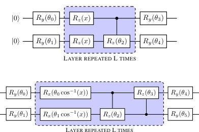
<figcaption class="paper-figure-caption"><b>Fig 1.</b> Fig. 1. Quantum feature maps considered in this work: (a) Simple feature map with repeated linear entanglement, and (b) Chebyshev feature map with repeated circular entanglement. Redrawn from [11].</figcaption>
</figure>
<figure class="paper-figure-card">
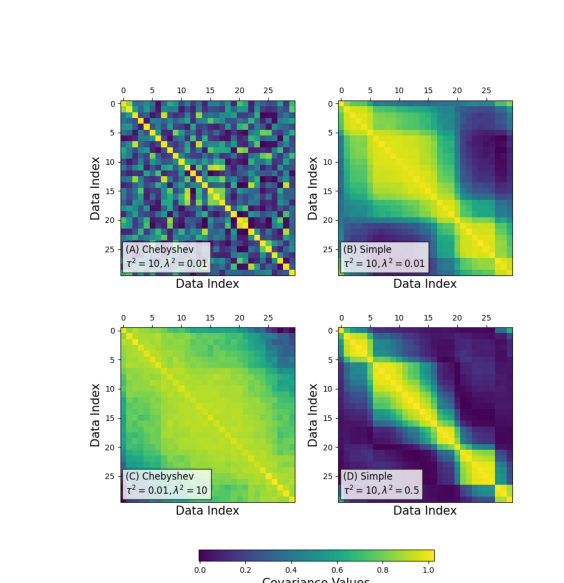
<figcaption class="paper-figure-caption"><b>Fig 2.</b> Fig. 2. Normalized covariance matrices obtained after training the QGPR surrogate. (A) Displays overfitting in the τ 2 &gt; λ2 regime. (B) Shows limited expressivity. (C) Shows underfitting with τ 2 &lt; λ2. (D) Displays balanced performance.</figcaption>
</figure>
<figure class="paper-figure-card">
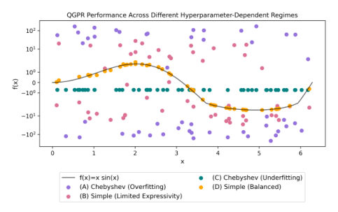
<figcaption class="paper-figure-caption"><b>Fig 3.</b> Fig. 3. QGPR performance across the four hyperparameter-dependent regimes. The colored dots depict the QGPR mean prediction for each model.</figcaption>
</figure>

**Summary.** This work explores Quantum Gaussian Process Regression (QGPR) for modeling complex functions using quantum kernels. The authors demonstrate that successful performance hinges on carefully tuning regularization hyperparameters to balance the kernel's expressive power against overfitting. This provides crucial guidelines for applying quantum machine learning techniques in active learning settings.

**Why it may be interesting.** It provides a concrete, applied example of using quantum circuits (feature maps) to enhance classical machine learning techniques (GPR), which is highly relevant for near-term quantum algorithm development.

Detailed structure

**Main problem.** The paper investigates how to effectively use quantum kernels within Gaussian Process Regression (GPR) for active learning to model expensive black-box functions.

**Main result.** Performance critically depends on balancing the kernel's expressivity against overfitting, requiring careful regularization selection, especially for quantum fidelity kernels.

**Method.** The authors simulate QGPR using quantum feature maps (Simple/Chebyshev) and optimize hyperparameters ($	au^2, \lambda^2$) via SPSA to minimize the Negative Log Marginal Likelihood.

**Model / system.** The model is Quantum Gaussian Process Regression (QGPR), which uses a quantum kernel derived from the fidelity between quantum states $|\phi(x)
angle$ generated by parameterized quantum circuits.

**Key observables.** Mean Squared Error (MSE) on a test set, and the structure of the learned covariance matrix (diagnosing overfitting, underfitting, or balance).

**Important parameters / regimes.** Hyperparameters $	au^2$ (signal variance) and $\lambda^2$ (noise variance); kernel type (Simple vs. Chebyshev); and the training regime (single-shot vs. iterative).

**Assumptions / limitations.** The study focuses on low-dimensional kernels and does not explore the quantum advantage regime with high-dimensional feature maps.

**Figures summary.** Figure 2 illustrates the four performance regimes (Overfitting, Limited Expressivity, Underfitting, Balanced) via normalized covariance matrices, while Figure 3 shows mean predictions across these regimes.

**Paper structure.** The paper establishes the active learning/GPR framework, details the quantum kernel construction, and then systematically analyzes performance across different hyperparameter regimes and kernel types, culminating in diagnostic visualizations.

Abstract

Active learning is a paradigm of machine learning that can be utilized to model expensive black-box functions by training a surrogate model from actively queried training points. The performance of this framework depends heavily on the choice of the surrogate model. When the surrogate is Gaussian Process Regression (GPR), its performance is largely determined by the expressivity of the underlying kernel. In this work, we investigate the peculiarities of using a quantum kernel to change the computational dynamics of active learning with GPR, focusing on the sensitivity to regularization by hyperparameter tuning. While generic, unstructured kernels suffer from exponential concentration at large scale, we empirically demonstrate that even at small scale overfitting can collapse GPR performance. Kernel regularization can be used to counteract this effect, but due to the smoothness of the quantum fidelity kernel, regularization must be carefully chosen to balance expressivity and overfitting. Our qualitative results transfer to the practical application of restricted quantum kernels designed to avoid exponential concentration and also present the kinds of noise that may be valuable to kernel training in near-term quantum devices.

[↑ back to top](#top)

### [Eight-unit-cell electronic modulations in cuprates originating from local molecular orbitals](http://arxiv.org/abs/2609.09615v1)

**Authors:** Zhiheng Yao, Sixuan Chen, Jianfa Zhao, Shusen Ye, Weixiang Qu, Ning Xia, Yuling Dai, Luchuan Shi, Hongrui Zhang, Zhenqi Hao, Changqing Jin, Shuo Yang, Yayu Wang  
**Type:** both · **Category:** strongly correlated electrons · **PDF:** <https://arxiv.org/pdf/2609.09615v1>  
**Analysis basis:** full PDF text, analyzed in chunks
**Topic relevance:** `Frenkel-Kontorova` **1/5**

↔ Scroll figures horizontally

<figure class="paper-figure-card">

<figcaption class="paper-figure-caption"><b>Fig 1.</b> FIG. 1. Eight-unit-cell modulation in the superconducting p = 0.10 sample. (a) Large-scale topographic image of the p = 0.10 sample acquired at T = 5 K. (b) Spatially averaged dI/dV spectrum showing the superconducting gap and pseudogap. The inset is the -d3I/dV3 curve from -40 mV to 40 mV, where the superconducting gap can be clearly resolved. (c) to (d) dI/dV maps at bias Vb = 10 mV and 150 mV. (e) to (f) FT maps of (c)-(d) , revealing peaks at q ≈ 1/4 and q ≈ 1/8. (g) Line profiles along the Bragg directions in (e)-(f), highlighting both wavevectors. (h) Zoomed-in region of the red square in (c) and (d). (i) to (j) dI/dV spectra and color plot along the magenta arrow in (h), showing...</figcaption>
</figure>
<figure class="paper-figure-card">
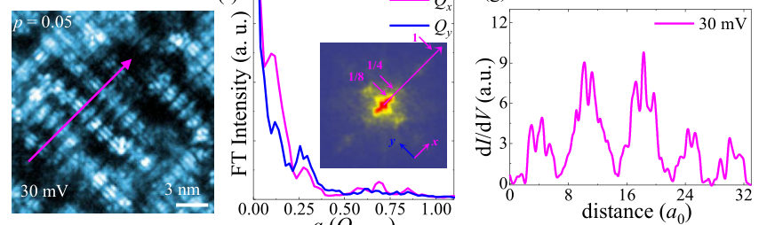
<figcaption class="paper-figure-caption"><b>Fig 2.</b> FIG. 2. Eight-unit-cell modulation in the underdoped p = 0.05 sample. (a) to (b) dI/dV maps on the p = 0.05 sample at bias Vb = 30 and 200 mV acquired at T = 5 K, revealing the formation of molecular orbitals with energy-dependent internal structures. The region of red square highlights chain-like assemblies of 4a0 plaquettes separated by intervals of approximately 4a0. (c) to (d) dI/dV spectra and corresponding color plot along the red arrow, exhibiting an 8a0 modulation over three periods. (e) dI/dV map at bias Vb = 30 mV for another FOV with unidirectional 8a0 modulation. (f) FT map (inset) of (e) and its line profiles along the Bragg peaks. (g) The magenta linecut revealing the...</figcaption>
</figure>
<figure class="paper-figure-card">

<figcaption class="paper-figure-caption"><b>Fig 3.</b> FIG. 3. Emergence of 4a0 plaquette and 8a0 modulation in the p = 0.03 sample. (a) Topographic image of p = 0.03 sample acquired at T = 23 K. (b) dI/dV map at bias Vb = 25 mV, showing the formation of almost isolated plaquettes and short chains. (c) Linecut along the magenta arrow in (b), revealing the formation of 4a0 plaquette. (d) to (e) Similar dataset as (a)-(b) at another FOV of the same sample with slightly higher local dopant concentration. (f) Linecut along the red arrow in (e), revealing the emergence of 8a0 modulation and the internal stripes of the 4a0 plaquettes.</figcaption>
</figure>
<figure class="paper-figure-card">
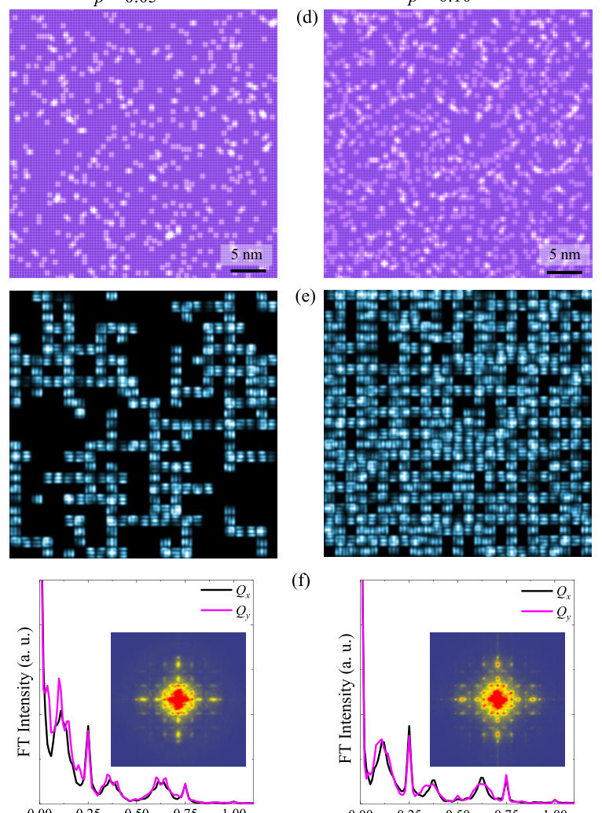
<figcaption class="paper-figure-caption"><b>Fig 4.</b> FIG. 4. Monte Carlo simulation illustrating the emergence of 8a0 modulations from the self- organization of 4a0 molecular orbitals. (a) Impurity potential generated by randomly distributed dopants for p = 0.05. (b) Representative low-temperature configurations of 4a0 plaquettes, showing the formation of plaquette chains. (c) The line profiles along the corresponding FT (inset), revealing the dominant 4a0 periodicity and the accompanying 8a0 modulation. (d) to (f) The same set of results as in (a)-(c) for p = 0.10. The plaquette chains become longer because of the increased coverage of molecular orbitals. Both the 4a0 and 8a0 periodicities are clearly observed.</figcaption>
</figure>

**Summary.** This research uses STM experiments and MCMC simulations to investigate the origin of the 8a0 electronic modulation in cuprates. The authors argue that this modulation arises fundamentally from the self-assembly of molecular orbitals structured around a 4a0 plaquette unit. This provides a strong real-space picture for the charge order, distinguishing it from conventional pairing theories.

**Why it may be interesting.** The work provides a detailed real-space mechanism for charge ordering in high-Tc superconductors, linking it to local orbital physics rather than purely momentum-space pairing theories, which is relevant for understanding emergent collective electronic states.

Detailed structure

**Main problem.** The paper investigates the origin and nature of the eight-unit-cell (8a0) electronic modulation observed in cuprate superconductors, aiming to determine if it is the primary order or a secondary feature.

**Main result.** The 8a0 modulation is proposed to be a spatial subharmonic arising from the self-organization of molecular orbitals built upon a fundamental 4a0 x 4a0 plaquette unit, rather than solely from finite momentum pairing.

**Method.** The study combines experimental spectroscopic imaging scanning tunneling microscopy (STM) measurements with theoretical modeling using Markov Chain Monte Carlo (MCMC) simulations.

**Model / system.** The physical system is hole-doped cuprates, studied across the insulator-superconductor phase boundary. The theoretical model treats the plaquette as the elementary degree of freedom, governed by an energy functional incorporating impurity and nearest-neighbor interaction terms.

**Key observables.** 8a0 spatial modulations observed in dI/dV maps, Fourier transform peaks at q ~ 1/8, and the correlation between 8a0 and 1.3a0 modulations.

**Important parameters / regimes.** Hole doping levels (p=0.03, p=0.05, p=0.10), and simulation parameters like g_beta and W.

**Assumptions / limitations.** The 8a0 modulation is not tightly bound to well-defined d-wave pairing, and the $4a_0 	imes 4a_0$ plaquette is identified as the fundamental building block.

**Figures summary.** Figures show dI/dV maps revealing stripe- and ladder-shaped molecular orbital patterns, and FT analyses confirming both 4a0 and 8a0 periodicities, with simulations mapping the phase diagram dependence on interaction parameters.

**Paper structure.** The paper progresses by first presenting STM evidence of 8a0 modulations in both superconducting and insulating regimes. It then develops a theoretical framework using plaquette models and MCMC simulations to explain the 8a0 periodicity as a subharmonic of the 4a0 molecular orbital structure, confirming this mechanism through parameter sweeps.

Abstract

The pair density wave (PDW) state with eight-unit-cell (8a0) periodicity has been widely regarded as the primary order in cuprates, yet its existence and origin remain subjects of intense debate. Using spectroscopic imaging scanning tunneling microscopy, we observe spatial modulations of the electronic states with approximately 8a0 periodicity in both the superconducting and insulating regimes of hole-doped Ca2CuO2Cl2 cuprate. We find that the 8a0 spatial patterns are generated by the formation of molecular orbitals by doped holes, which organize into 4a0*4a0 plaquettes as the basic unit. Our results identify the 4a0 molecular orbital as the fundamental electronic building block in cuprates, while the 8a0 PDW represents a spatial subharmonic that emerges at sufficiently high doping.

[↑ back to top](#top)

### [Entanglement Entropy of Interacting Scalar Theories on Fuzzy Spaces](http://arxiv.org/abs/2609.10027v1)

**Authors:** A. Allouche, D. Dou  
**Type:** theory · **Category:** statistical mechanics · **PDF:** <https://arxiv.org/pdf/2609.10027v1>  
**Analysis basis:** full PDF text, analyzed in chunks
**Topic relevance:** `Keldysh / 2PI / non-Gaussian methods` **1/5**

↔ Scroll figures horizontally

<figure class="paper-figure-card">
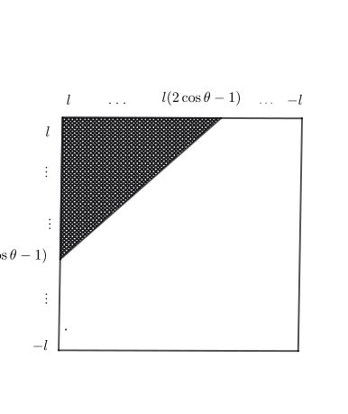
<figcaption class="paper-figure-caption"><b>Fig 1.</b> Figure 1: Degrees of freedom on the sphere and their matrix counterparts.</figcaption>
</figure>
<figure class="paper-figure-card">

<figcaption class="paper-figure-caption"><b>Fig 2.</b> Figure 2: The rescaled dimensionless function µ3fn(µ, N) as a function of N, for different values of the mass parameters and n = 2.</figcaption>
</figure>
<figure class="paper-figure-card">
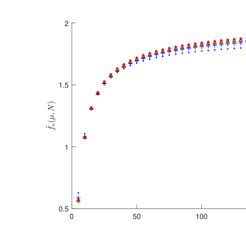
<figcaption class="paper-figure-caption"><b>Fig 3.</b> Figure 3: The zero-mode-projected rescaled function ˜fn(µ, N) plotted as a function of N for µ = 0.001 and different values of n.</figcaption>
</figure>
<figure class="paper-figure-card">

<figcaption class="paper-figure-caption"><b>Fig 4.</b> Figure 4: The rescaled dimensionless function fn(q, µ, N) plotted as a function of q for µ = 0.001, different values of n, and N = 220.</figcaption>
</figure>
<figure class="paper-figure-card">

<figcaption class="paper-figure-caption"><b>Fig 5.</b> Figure 4 shows fn(µ, q, N) for n = 2, 3, 4, 5, with µ = 0.001 and N = 220, as a function of q over the range 80 ≤q ≤180. It is readily apparent that the three curves corresponding to different values of n are well fitted by straight lines with nearly identical slopes. As n</figcaption>
</figure>

**Summary.** This work analyzes the entanglement entropy of an interacting scalar field theory on fuzzy spaces. By calculating the first-order correction from a $\lambda\phi^4$ interaction, the authors show that the interaction introduces an extensive bulk contribution, fundamentally altering the area-law scaling observed in the free theory. The findings connect the divergence structure to the theoretical concept of UV/IR mixing in non-commutative quantum field theories.

**Why it may be interesting.** The study of entanglement entropy in non-commutative or geometrically constrained systems like fuzzy spaces provides insights into how background geometry and interactions modify fundamental quantum information measures, which is relevant for understanding quantum field theory in curved or non-commutative spacetimes.

Detailed structure

**Main problem.** The paper investigates how self-interactions modify the entanglement entropy of a scalar field theory defined on fuzzy spaces.

**Main result.** The interaction correction introduces an extensive bulk contribution to the entanglement entropy, deviating from the area law expected in the free theory.

**Method.** The calculation uses a first-order perturbative expansion via the Green's function approach to compute the Rényi entropy correction.

**Model / system.** The system is a scalar field theory ($\lambda\phi^4$ interaction) on $(2+1)$-dimensional spacetimes whose spatial sections are modeled by fuzzy spaces (fuzzy sphere and fuzzy disc).

**Key observables.** Rényi and entanglement entropies (EE), and the scaling behavior (area law vs. bulk contribution) of the entanglement entropy.

**Important parameters / regimes.** The noncommutativity parameter ($	heta$), the coupling constant ($\lambda$), and the size/curvature of the fuzzy space (e.g., $N$ for the fuzzy sphere).

**Assumptions / limitations.** The analysis requires projecting out the zero mode for the fuzzy sphere to obtain a physically meaningful result, and the connection to UV/IR mixing is discussed theoretically.

**Paper structure.** The paper systematically calculates the free theory EE (showing area law scaling) and then computes the first-order correction due to $\lambda\phi^4$. It analyzes the scaling of this correction in different limits (commutative, Moyal plane) and discusses the physical implications regarding IR divergences and UV/IR mixing.

Abstract

We investigate the impact of self-interactions on the Rényi and entanglement entropies of a scalar field on $(2+1)$-dimensional spacetimes, whose spatial sections are modeled by fuzzy spaces, specifically the fuzzy sphere and the fuzzy disc. We compute the first-order perturbative correction induced by a $λφ^4$ interaction using the Green's function approach. In contrast to the free theory, where the entanglement entropy is dominated by degrees of freedom near the entangling boundary and obeys an area law, we find that the interaction correction has an extensive bulk contribution, receiving significant contributions from degrees of freedom throughout the fuzzy space. For the fuzzy sphere, the correction exhibits strong infrared sensitivity associated with the zero mode. We isolate and resolve this zero-mode IR divergence by projecting out the zero mode, thereby obtaining a physically meaningful quantity. In the commutative continuum limit, the interaction correction has the same degree of UV divergence as the free entropy but does not obey a pure area law. Furthermore, we analyze the Moyal plane limit, where the interaction correction exhibits a distinct IR divergence. We discuss the physical origin of these extensive bulk features and examine their possible connection to the celebrated UV/IR mixing phenomenon in noncommutative quantum field theories.

[↑ back to top](#top)

### [Fermionic quantum cellular automata in 2d are trivial](http://arxiv.org/abs/2609.09317v1)

**Authors:** Jeffrey Kwan, David M. Long, Jeongwan Haah  
**Type:** theory · **Category:** other · **PDF:** <https://arxiv.org/pdf/2609.09317v1>  
**Analysis basis:** full PDF text, analyzed in chunks
**Topic relevance:** `analog quantum simulation` **1/5**

↔ Scroll figures horizontally

<figure class="paper-figure-card">
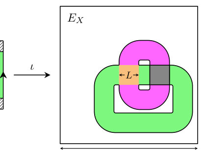
<figcaption class="paper-figure-caption"><b>Fig 1.</b> Figure 1. Immersion of the punctured 2-torus in R2.</figcaption>
</figure>
<figure class="paper-figure-card">
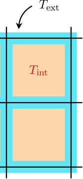
<figcaption class="paper-figure-caption"><b>Fig 2.</b> Figure 2. Copies of [0, 1000ℓ] × [0, 1000ℓ] tiling the plane.</figcaption>
</figure>
<figure class="paper-figure-card">
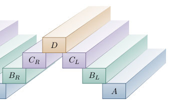
<figcaption class="paper-figure-caption"><b>Fig 3.</b> Figure 3. Ancilla (fermion) removal. Any finite depth circuit of local automor- phisms can be rewritten with 4k layers U1, U2, . . . , U4k, where each Uj is a circuit supported on the union Rj of far separated regions (strips in 2d). Each Rj takes up a fraction at most 1/k of all sites. Any (fermionic) ancilla used by layer ja with ja ∈[1, k] can be borrowed from a nearby ancilla in R2k+1 ∪· · · ∪R3k and immediately returned. Each layer just needs O(1) strips to borrow ancillas from, but we give a big enough pool of ancillas by taking k large. The ancillas used by layers jb ∈[k + 1, 2k] are borrowed from R3k+1 ∪· · · ∪R4k; those used by layers jc ∈[2k + 1, 3k] are from R1 ∪· · · ∪Rk;...</figcaption>
</figure>
<figure class="paper-figure-card">
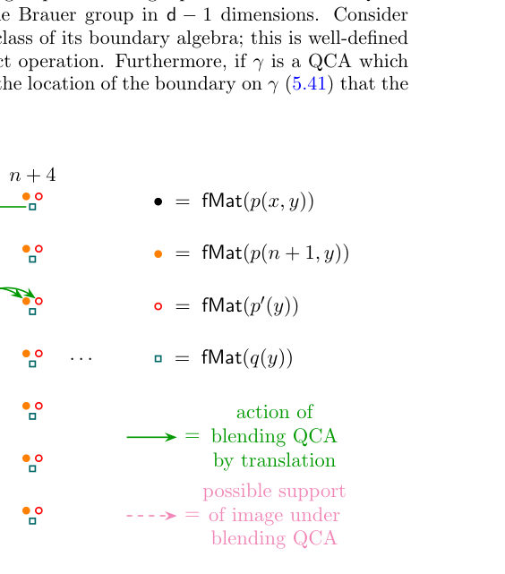
<figcaption class="paper-figure-caption"><b>Fig 4.</b> Figure 4. Blending QCA γ from α on the left with a trivial Brauer boundary algebra B into bilayer shift QCA β = β1 ⊗β2 on the right. The construction is transcription of the following line of thought. The green squares are mapped according to ϕ onto the fermionic commutant A of B, where ϕ is provided by the Brauer triviality. Then, ϕ take up a part of the codomain so any other potential image must live elsewhere. In particular, the on-site algebras at x = n, n + 1 must map out of that region, so we send them out to the right. This incurs cascading surplus and deficit of local algebras, leading to a chain of local shifts, resulting in β1 and β2.</figcaption>
</figure>
<figure class="paper-figure-card">
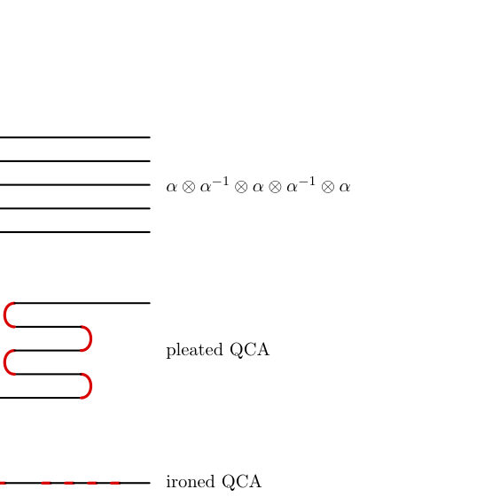
<figcaption class="paper-figure-caption"><b>Fig 5.</b> Figure 5. The pleating and ironing construction used in 6.10. Any QCA α is equivalent to α ⊗(α−1 ⊗α)⊗n (top panel with n = 2 layers). By removing local automorphisms in the circuit for α ⊗α−1 or α−1 ⊗α, adjacent pairs of layers can be blended to the identity in alternating ways, creating a pleating of α [34]. The red segments indicate positions where the action of the pleated QCA differs from a tensor product of α or α−1. This pleating can then be flattened and compressed (or ironed out), simply by rearranging local algebras in space. The result is a QCA β ◦(α ⊗id), where β is a circuit, such that β ◦(α ⊗id) has a reduced spread along the direction of the pleat.</figcaption>
</figure>

**Summary.** This theoretical paper proves that fermionic Quantum Cellular Automata in two dimensions are mathematically trivial. The authors achieve this by developing deep algebraic tools concerning fermionic operator algebras and applying an inductive proof technique involving geometric manipulations of the QCA structure. The result significantly constrains the possible dynamics of fermionic systems modeled by QCAs.

**Why it may be interesting.** The result provides a strong structural constraint on quantum dynamics modeled by local operators, suggesting that in 2D, complex dynamics are highly restricted, which has implications for topological order and quantum computation.

Detailed structure

**Main problem.** The paper aims to prove that fermionic Quantum Cellular Automata (QCA) in two dimensions are mathematically trivial.

**Main result.** It is proven that every 2-dimensional fermionic QCA on a locally finite-dimensional algebra is merely a composition of local automorphisms and a simple fermionic shift.

**Method.** The proof utilizes advanced abstract algebra, specifically analyzing the structure of fermionic invertible subalgebras and employing inductive techniques involving 'hemming,' 'pleating,' and 'ironing' operations.

**Model / system.** The model is the Fermionic Quantum Cellular Automaton (QCA), which is mathematically defined as a $*$-automorphism of local fermionic operator algebras ($\mathbb{Z}_2$-graded superalgebras) with bounded spread.

**Key observables.** The primary observables are the algebraic structure (e.g., Brauer triviality, central elements) and the dimensionality of the QCA (2D, 3D).

**Important parameters / regimes.** Dimensionality (2D, 3D), the initial 'hole radius' ($r_0$), and the spread ($\ell$) of the QCA.

**Assumptions / limitations.** The analysis assumes the local algebras are locally finite-dimensional, and the proof relies on the algebraic properties of spectrally nondegenerate fermionic algebras.

**Figures summary.** Figure 7 illustrates the iterative process of expanding a QCA with a hole using the techniques of hemming, pleating, and ironing.

**Paper structure.** The paper builds from foundational algebraic definitions of fermionic algebras (Chunk 2) to establishing structural theorems for 1D subalgebras, culminating in an inductive proof (Chunk 3) that shows the 2D QCA must be trivial.

Abstract

Fermionic quantum cellular automata (QCA) are automorphisms of local fermionic operator algebras ($\mathbb Z_2$-graded superalgebras) that have bounded spread: they map local operators to nearby operators. We prove that every 2-dimensional fermionic QCA on a locally finite-dimensional algebra is a composition of local automorphisms and a fermionic shift. This is implied by our result that every locally finite-dimensional fermionic invertible subalgebra in a one-dimensional lattice is Brauer trivial, \textit{i.e.}, it is stably bounded-spread isomorphic to a tensor product fermionic algebra.

[↑ back to top](#top)

### [Italian Business-to-Business Invoicing Data: A Network Analysis](http://arxiv.org/abs/2609.10227v1)

**Authors:** Valerio Astuti, Daniele Piras  
**Type:** theory · **Category:** statistical mechanics · **PDF:** <https://arxiv.org/pdf/2609.10227v1>  
**Analysis basis:** full PDF text, analyzed in chunks
**Topic relevance:** `analog quantum simulation` **1/5**

↔ Scroll figures horizontally

<figure class="paper-figure-card">

<figcaption class="paper-figure-caption"><b>Fig 1.</b> Figure 1: Flows between categories in terms of aggregated gross transaction amount. Bars’ height represents the total gross transaction amount of invoices by type of entity. Our analysis will focus on the transactions where both the seller and buyer are firms of type B, the flow in darker blue.</figcaption>
</figure>
<figure class="paper-figure-card">
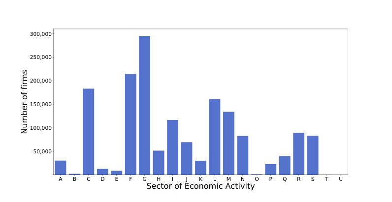
<figcaption class="paper-figure-caption"><b>Fig 2.</b> Figure 2: Number of firms per sector of economic activity. See Appendix F.1 for the full mapping between one-letter and 2-digit sectors. Sector U is the least represented, with fewer than 100 firms in the dataset.</figcaption>
</figure>
<figure class="paper-figure-card">
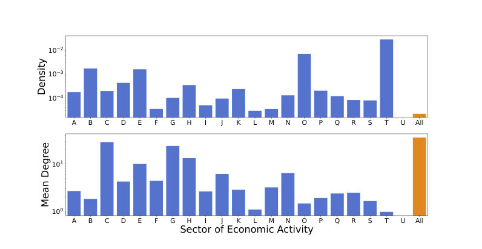
<figcaption class="paper-figure-caption"><b>Fig 3.</b> Figure 3: Density (upper plot) and mean degree (lower plot) of the networks of transactions within the same sector of economic activity, compared to the value for the whole network (re- ported in orange).</figcaption>
</figure>
<figure class="paper-figure-card">

<figcaption class="paper-figure-caption"><b>Fig 4.</b> Figure 4: Plot of density (left hand side) and mean degree (right hand side) as a function of the number of nodes in the sub-networks of transactions within the same sector of economic activity.</figcaption>
</figure>
<figure class="paper-figure-card">
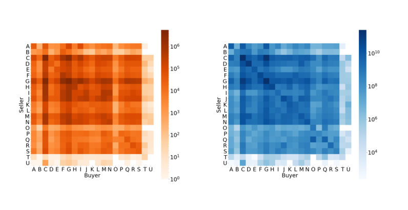
<figcaption class="paper-figure-caption"><b>Fig 5.</b> Figure 5: Distribution of number of connections (left hand side) and total gross amount of the invoices (right hand side) between sectors.</figcaption>
</figure>

**Summary.** This paper analyzes the structure of the Italian B2B commercial network using electronic invoicing data. By applying network science, it finds the network is scale-free, meaning a few highly connected firms dominate the economy. The study provides detailed insights into the concentration of economic importance across sectors and regions.

**Why it may be interesting.** While the subject is economics, the methodology relies heavily on complex network theory, power-law scaling, and structural analysis of connectivity, which shares mathematical parallels with critical phenomena and complex systems studied in statistical mechanics.

Detailed structure

**Main problem.** The paper characterizes the structure of the Italian production network by analyzing the B2B commercial relationships derived from electronic invoices.

**Main result.** The network exhibits a scale-free structure, indicated by heavy-tailed distributions for buyer/seller counts and centrality, with distinct differences observed between upstream and downstream connections.

**Method.** Network analysis techniques are employed, including calculating network metrics (density, mean degree), analyzing degree distributions via power-law fitting, and computing various global centrality measures (e.g., PageRank).

**Model / system.** The system is the directed, weighted network of Italian Business-to-Business (B2B) commercial relationships, where firms are nodes and invoices represent weighted, directed links.

**Key observables.** Distribution of buyers/sellers per firm, network centrality measures, tail exponents of degree distributions, network density, and mean degree.

**Important parameters / regimes.** The analysis is sensitive to the transaction threshold (invoice amount), which dictates the connectivity of the network.

**Assumptions / limitations.** The analysis is based on the assumption that the B2B invoicing data provides a comprehensive view of the production system, though the structure is noted to be vulnerable to targeted shocks.

**Figures summary.** Figures summarize global centrality measures (by province/sector), the variation of network metrics with transaction thresholds, and the fitting of degree distributions to power laws.

**Paper structure.** The paper moves from establishing the data source and general network properties (density, mean degree) to detailed analyses of centrality measures, sector-by-sector and province-by-province breakdowns, and finally, structural analysis based on transaction thresholds.

Abstract

We present a comprehensive description of the network of Italian Business-to-Business commercial relationships, based on the universe of electronic invoices collected by the Italian Tax Office. The firm-to-firm detail of the data is exploited to describe the distribution of the numbers of buyers (customers) and sellers (suppliers) per firm, the centrality of each firm in the production network, and the average distance between firms. We characterize for the first time the firm-to-firm network describing the Italian production system, and present its geographic and sectoral breakdown. The analysis reveals heavy tailed distributions for the numbers of buyers and sellers per firm, implying a scale-free structure of the network. The distributions of centrality values display heavy tails as well, indicating a strong concentration of importance in a relatively small number of firms. We estimate the tail exponents for all these distributions, finding in all cases lower exponents for downstream (buyer-side) distributions than for the upstream (seller-side) ones.

[↑ back to top](#top)

### [Minimax games for quantum channel discrimination](http://arxiv.org/abs/2609.09839v1)

**Authors:** Kun Fang, Michael X. Cao, Hao-Chung Cheng, Li Gao, Masahito Hayashi  
**Type:** theory · **Category:** quantum information and computing · **PDF:** <https://arxiv.org/pdf/2609.09839v1>  
**Analysis basis:** full PDF text, analyzed in chunks
**Topic relevance:** `quantum measurements` **1/5**

↔ Scroll figures horizontally

<figure class="paper-figure-card">

<figcaption class="paper-figure-caption"><b>Fig 1.</b> Figure 1: Tester-input, jammer-input, and minimax-input configurations. The central grey box G denotes the channel under test. Tester systems are shown in blue, and jammer systems in orange. In (a), the tester controls the channel input and final test, while the jammer input is absent. In (b), the jammer controls the channel input, while the tester performs the final test and has no input control. In (c), the tester and jammer control separate channel inputs, and the tester performs the final test.</figcaption>
</figure>
<figure class="paper-figure-card">

<figcaption class="paper-figure-caption"><b>Fig 2.</b> Figure 2: Four information patterns of the jammer. Rows indicate whether the jammer’s input-selection rule is public or secret, while columns indicate whether the jammer is hypothesis-unaware or hypothesis- aware. In the public row, the dashed orange arrow denotes that the jammer’s rule is disclosed before the tester acts. In the hypothesis-aware column, the jammer may use σ when N is active and ω when M is active; in the hypothesis-unaware column, it must use the same state τ under both hypotheses.</figcaption>
</figure>
<figure class="paper-figure-card">

<figcaption class="paper-figure-caption"><b>Fig 3.</b> Figure 3: Three input structures for n parallel channel uses. The tester’s systems are shown in blue and the jammer’s systems in orange. In (a), both players may prepare entangled inputs. In (b), the tester is restricted to IID inputs, whereas the jammer may still prepare entangled inputs. In (c), both players are restricted to IID inputs. All tests are performed on the tester’s systems and can be entangled.</figcaption>
</figure>
<figure class="paper-figure-card">

<figcaption class="paper-figure-caption"><b>Fig 4.</b> Figure 4: Summary of the main results. At finite blocklength, the twelve game models reduce to nine hypothesis-testing divergences (Definition 12). Asymptotically, they reduce to five Umegaki relative entropy rates (Definition 14). Solid and dashed connectors indicate strong- and weak-converse results, respectively. For a replacer alternative, all Stein exponents reduce to the same single-letter value.</figcaption>
</figure>

**Summary.** This work establishes a comprehensive game-theoretic framework for quantum channel discrimination, modeling the interaction between a tester and an adversarial jammer. By analyzing twelve distinct game models, the authors derive precise asymptotic limits (Stein exponents) for distinguishing quantum channels. This advances the field by resolving open problems in composite hypothesis testing and providing a general tool for studying competing roles in quantum information tasks.

**Why it may be interesting.** The rigorous game-theoretic approach to channel discrimination provides a powerful, general tool for analyzing fundamental limits in quantum resource verification, applicable to any quantum process where adversarial interference is possible.

Detailed structure

**Main problem.** The paper develops a comprehensive game-theoretic framework to characterize the fundamental limits of quantum channel discrimination when both the tester and a jammer control separate inputs.

**Main result.** It derives exact finite blocklength characterizations and asymptotic Stein exponents for twelve distinct game models, establishing strong converse properties for several previously open problems.

**Method.** The authors employ minimax game theory, combining input structures (entangled vs. IID) with information patterns (visibility and hypothesis awareness) to analyze the trade-off between testing and jamming.

**Model / system.** The system is quantum channel discrimination between two hypotheses ($N$ and $M$). The model involves a tester and a jammer playing competing roles by controlling separate, potentially correlated, inputs over multiple uses.

**Key observables.** Asymptotic Stein exponents, quantum relative entropy divergences ($D(\cdot\|\cdot)$), and error probabilities ($\alpha_T, eta_T$).

**Important parameters / regimes.** Blocklength ($n$), error tolerance ($\epsilon$), and the specific structure of the inputs (entangled vs. IID).

**Assumptions / limitations.** The analysis relies on establishing minimax identities and developing a general argument to upgrade achievability results to strong converse statements.

**Figures summary.** Figure 1 illustrates the three input structures (tester-input, jammer-input, minimax). Figure 2 details the four information patterns based on jammer visibility and hypothesis awareness. Table 1 summarizes the twelve resulting Stein exponents.

**Paper structure.** The paper first introduces the general minimax game framework, detailing the twelve possible models based on input structures and information patterns. It then derives the exact finite blocklength characterizations and asymptotic exponents for these models, culminating in the development of a general technique to prove strong converse bounds.

Abstract

Quantum channel discrimination is a primitive task for identifying, verifying, and benchmarking quantum dynamics. Previous studies have primarily considered either the best-case tester-input setting or the worst-case jammer-input setting. Here, we introduce a game-theoretic framework in which both the tester and jammer control separate inputs. Combining three input structures, characterized by whether the tester and jammer use entangled inputs or IID inputs across channel uses, with four information patterns, determined by the visibility of the jammer's strategy and its knowledge of the true hypothesis, yields twelve game models. We provide exact finite blocklength hypothesis testing characterizations of all twelve models in terms of nine minimax hypothesis testing divergences and derive their asymptotic Stein exponents. Notably, for entangled jammers, neither the visibility of the jammer's strategy nor its knowledge of the true hypothesis affects the asymptotic Stein exponent, whereas the information pattern remains consequential for IID jammers. As an example, we study the discrimination of a general channel from a replacer channel and show that all asymptotic Stein exponents coincide with the same additive, single letter quantity. We further develop a general argument that upgrades achievability results to strong converse results, thereby establishing strong converse properties for several game models, resolving an open problem in composite hypothesis testing posed by Berta et al. [Commun. Math. Phys. 385, 55 (2021)], and strengthening several recent results of Lami [arXiv:2510.06340]. The framework and techniques developed here may support future studies of quantum information tasks involving competing roles.

[↑ back to top](#top)

### [Probing quantum chaos near a wormhole throat with a circular string](http://arxiv.org/abs/2609.09613v1)

**Authors:** Ai-chen Li, Xin-Fei Li, Xuanting Ji  
**Type:** theory · **Category:** other · **PDF:** <https://arxiv.org/pdf/2609.09613v1>  
**Analysis basis:** full PDF text, analyzed in chunks
**Topic relevance:** `Keldysh / 2PI / non-Gaussian methods` **1/5**

↔ Scroll figures horizontally

<figure class="paper-figure-card">
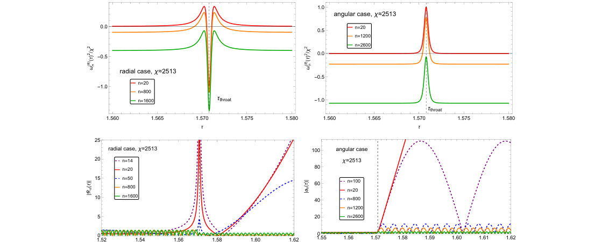
<figcaption class="paper-figure-caption"><b>Fig 1.</b> Figure 1: Effective frequency profiles and the corresponding mode-function response for the Ellis-Bronnikov wormhole. The upper panels show the time dependence of ω(R) n (τ)2</figcaption>
</figure>
<figure class="paper-figure-card">

<figcaption class="paper-figure-caption"><b>Fig 2.</b> Figure 2: Representative OTOC amplitudes for the Ellis-Bronnikov wormhole, computed from (3.36) and (3.37). The numerical parameters are the same as those used in Fig. 1. The shaded intervals indicate the growth windows used to fit the logarithm of the unequal-time commutator, and the short black dashed segments show the corresponding linear fits. The black vertical dashed lines mark the world-sheet times τthroat = (2k + 1)π/2 at which the probe string reaches the wormhole throat, whereas the red vertical dash-dotted lines mark the times τturning = kπ at which its radial velocity vanishes at the distant turning points, with k ∈Z.</figcaption>
</figure>
<figure class="paper-figure-card">

<figcaption class="paper-figure-caption"><b>Fig 3.</b> Figure 3: Dimensionless physical-time Lyapunov rate r0λt as a function of the throat parameter χ = κ2E/r0 for the Ellis-Bronnikov wormhole. The upper and lower panels show the radial and angular fluctuation channels, respectively. For each value of χ, the OTOC amplitude is evolved as in Fig. 2, and the world-sheet Lyapunov exponent λτ is extracted from the first growth window associated with the initial passage through the throat. Since t = κ2Eτ + t0, the Lyapunov exponent defined with respect to the physical time is λt = λτ/(κ2E). In natural units λt has dimensions of inverse time, or equivalently energy, so multiplication by r0 gives the dimensionless combination r0λt = λτ/χ. This...</figcaption>
</figure>
<figure class="paper-figure-card">

<figcaption class="paper-figure-caption"><b>Fig 4.</b> Figure 4: Dimensionless physical-time Lyapunov rate r0λt as a function of χ = κ2E/r0 for the global-monopole wormhole. The upper and lower panels show the radial and an- gular fluctuation channels, respectively, while the different curves display the effect of the topological defect through representative values of α0 = p</figcaption>
</figure>
<figure class="paper-figure-card">

<figcaption class="paper-figure-caption"><b>Fig 5.</b> Figure 5: Dependence of the time-dependent effective frequency profiles on the deficit factor α0 for the global-monopole wormhole. The upper and lower panels show ω(R) n (τ)2/χ2</figcaption>
</figure>

**Summary.** This theoretical paper examines quantum chaos by analyzing the OTOC growth of a probe string traversing a wormhole throat. Using a quadratic approximation of the world-sheet action, the authors demonstrate that even when classical motion is stable, quantum fluctuations can exhibit finite-time exponential growth. This provides a transferable diagnostic tool for studying quantum dynamics in curved, non-black-hole spacetimes.

**Why it may be interesting.** The methodology provides a non-holographic, covariant framework to apply quantum chaos diagnostics (OTOCs) to quantum probes in curved spacetimes, offering insights into information scrambling in regular, horizonless settings.

Detailed structure

**Main problem.** The study investigates whether quantum fluctuations of a circular probe string develop a quantum-chaotic response while traversing a wormhole throat, despite the classical motion being stable.

**Main result.** Finite-time Out-of-Time-Ordered Correlator (OTOC) growth, indicative of local dynamical sensitivity, was observed for both polarizations near the wormhole throat. This growth is suppressed by increasing the solid-angle deficit in the global-monopole extension.

**Method.** The authors canonically quantized the transverse fluctuations of the string by expanding the world-sheet action to quadratic order and constructing OTOC amplitudes from unequal-time commutators.

**Model / system.** The system involves a circular probe string moving through traversable wormholes, specifically the Ellis–Bronnikov and global-monopole geometries. The analysis focuses on the quantum fluctuations of the string embedded in the curved spacetime.

**Key observables.** Out-of-Time-Ordered Correlator (OTOC) amplitudes and the corresponding dimensionless physical-time growth rate.

**Important parameters / regimes.** The solid-angle deficit ($\alpha_0$) and the ratio of probe energy to the throat scale ($\chi = \kappa^2 E/r_0$).

**Assumptions / limitations.** The analysis is restricted to the quadratic approximation of the world-sheet action and characterizes finite-time sensitivity, not asymptotic many-body chaos.

**Figures summary.** Figures illustrate the finite intervals of exponential OTOC growth associated with the first throat passage and show how the solid-angle deficit tunes the magnitude of these growth rates across different polarizations.

**Paper structure.** The paper follows a progression from deriving classical dynamics, to quantizing the fluctuations via the quadratic action, and finally performing numerical analysis on specific wormhole geometries to extract the OTOC signatures.

Abstract

We investigate whether quantum fluctuations of a circular probe string develop a quantum-chaotic response while traversing a wormhole throat. The classical circular-string embedding is periodic and radially stable, but its two physical transverse polarizations experience time-dependent tidal potentials. Expanding the world-sheet action to quadratic order, we canonically quantize these modes and construct out-of-time-ordered correlator(OTOC) amplitudes from their unequal-time commutators. For the Ellis--Bronnikov wormhole, both polarizations exhibit finite intervals of approximately exponential OTOC growth associated with the first throat passage. The corresponding dimensionless rate measured with respect to physical time is positive over the parameter range studied and generally decreases as the probe energy is increased relative to the throat scale. In the global-monopole extension, increasing the solid-angle deficit narrows the band of locally amplifiable modes and suppresses the extracted rates; a sufficiently strong defect can nearly quench the radial signal, while the angular channel retains a polarization-dependent non-monotonic structure when the energy-to-throat-scale ratio is small. These quantities characterize finite-time dynamical sensitivity in the Gaussian fluctuation sector and should not be identified with asymptotic many-body chaos or a thermodynamic phase transition. Although the numerical analysis uses two representative wormhole geometries, the construction depends only on covariant world-sheet fluctuations and real-time commutators. It therefore provides a transferable, non-holographic framework for applying quantum-chaos diagnostics directly to quantum probes in curved spacetimes.

[↑ back to top](#top)

### [Quantum Feature Engineering for Credit Default Prediction: When and Why IQP Circuits Help Linear Classifiers](http://arxiv.org/abs/2609.10505v1)

**Authors:** Menachem Finkelstein, Diana Legziel Levy, Zohar Yakhini, Sarel Cohen  
**Type:** theory · **Category:** quantum information and computing · **PDF:** <https://arxiv.org/pdf/2609.10505v1>  
**Analysis basis:** full PDF text, analyzed in chunks
**Topic relevance:** `quantum measurements` **1/5**

↔ Scroll figures horizontally

<figure class="paper-figure-card">
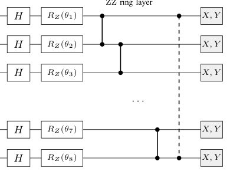
<figcaption class="paper-figure-caption"><b>Fig 1.</b> Fig. 1. The 8-qubit IQP feature extractor (five of the eight wires shown; qubits 4–6 and the couplings (3, 4) . . . (6, 7) are elided). Left to right: a Hadamard superposition layer, an RZ(θi) data-encoding layer, and an ISINGZZ entanglement layer. Each qubit is then measured in the Pauli X and Y bases, producing 2n = 16 output features; that transverse read-out plays the role of the canonical IQP form’s closing basis change, and is why ⟨Z⟩is identically zero and excluded. Topology: the ZZ couplings form a ring on the 8 qubits—exactly the 8 edges (1, 2), (2, 3), . . . , (7, 8), (8, 1), each applied at its own time step. The dashed line is the wrap-around edge (8, 1) that closes the ring; it...</figcaption>
</figure>

**Summary.** This work explores using quantum circuits to generate enhanced features for credit default prediction. By mapping classical data through an 8-qubit IQP circuit, the authors generated 16 features that significantly boosted a linear classifier's performance over the best classical alternatives. This suggests that quantum feature mapping can provide a measurable advantage in structured data classification tasks.

**Why it may be interesting.** It demonstrates a concrete, application-driven use case for quantum feature mapping, showing how quantum circuits can potentially enhance classical machine learning models by accessing complex correlations inaccessible to standard classical feature engineering.

Detailed structure

**Main problem.** The paper investigates whether quantum feature engineering using IQP circuits can significantly improve the performance of linear classifiers for credit default prediction compared to classical methods.

**Main result.** Appending 16 quantum features derived from an 8-qubit IQP circuit raised the F1 score of a Logistic Regression model from 0.462 to 0.517, outperforming Kernel PCA and surviving rigorous statistical correction.

**Method.** The authors encode classical financial attributes as rotation angles and map them through an $n$-qubit IQP circuit to generate $2n$ expectation value features, which are then used as input to a linear classifier.

**Model / system.** The model utilizes an $n$-qubit IQP circuit (Hadamard $
ightarrow R_Z(	heta_i) 
ightarrow ZZ$ ring entanglement) to map classical data into a high-dimensional quantum feature space. The output features are the expectation values of Pauli X and Y observables.

**Key observables.** F1 score, expectation values $\langle X_i 
angle$ and $\langle Y_i 
angle$, and the statistical significance (p-values) of the performance gains.

**Important parameters / regimes.** Number of qubits ($n=8$), number of features ($2n=16$), and the feature budget constraint used for comparison.

**Assumptions / limitations.** The comparison is performed on a classical simulator, and the quantum advantage is argued to be specific to the linear-expressivity mechanism of the classifier.

**Figures summary.** Figure 1 illustrates the 8-qubit IQP feature extractor sequence: Hadamard superposition, $R_Z(	heta_i)$ data-encoding, and $ZZ$ ring entanglement layer, followed by measurement in X and Y bases.

**Paper structure.** The paper establishes the problem (credit default prediction), details the quantum feature extraction method using IQP circuits, compares the resulting features against classical alternatives (KPCA, PCA), and analyzes the statistical significance of the performance gains using multiple testing corrections.

Abstract

Credit default prediction is a tabular classification problem in which modest gains in F1 translate directly into reduced financial exposure. We ask whether Instantaneous Quantum Polynomial-time (IQP) circuits can produce features that improve a classifier over both its raw classical baseline and Kernel PCA - the strongest unsupervised classical non-linear alternative - at an equal feature budget. The dataset provides 23 financial attributes per client; for an n-qubit circuit we select n of them, encode each as a rotation angle, and read 2n expectation values back out as new features. The motivation for using a quantum circuit is computational: an n-qubit IQP circuit runs in constant depth and encodes feature correlations in a 2^n-dimensional Hilbert space, whereas classical simulation of its exact output statistics scales exponentially in n. Using the UCI Default of Credit Card Clients dataset and five-fold cross-validation, we find that appending 16 IQP features (n = 8 qubits) to a Logistic Regression model raises F1 from 0.462 to 0.517 (+0.055, p < 0.0001). Kernel PCA, the next-best method, reaches only 0.493 at the same feature count; the gap survives Benjamini-Hochberg correction across 12 tests (p = 0.00007). No other classifier - Random Forest, SVM, XGBoost, or k-NN - benefits, which points to a linear-expressivity mechanism rather than a generic improvement. We also show that how the 8 input features are chosen matters: Random Forest importance-guided selection reaches F1 = 0.523, while encoding maximally uncorrelated features drops it to 0.496, demonstrating that the circuit amplifies informative structure rather than creating it from scratch.

[↑ back to top](#top)

### [Signature of Short-Range Order in Static Response of the Three-Dimensional Electron Gas](http://arxiv.org/abs/2609.10006v1)

**Authors:** Muhammed H. Güneş, Yubo Yang, Vitaly Gorelov, Miguel A. Morales, Matteo Gatti, Lucia Reining, Shiwei Zhang  
**Type:** theory · **Category:** strongly correlated electrons · **PDF:** <https://arxiv.org/pdf/2609.10006v1>  
**Analysis basis:** full PDF text, analyzed in chunks
**Topic relevance:** `Keldysh / 2PI / non-Gaussian methods` **1/5**

↔ Scroll figures horizontally

<figure class="paper-figure-card">

<figcaption class="paper-figure-caption"><b>Fig 1.</b> FIG. 1. Local field factor G(q) of the electron gas for (a)–(e) rs = 5, 30, 50, 70, and 100. DMC data are shown as circles, obtained with Ne = 54 electrons, except for rs = 70, where Ne = 162. The solid line is our fit defined in Eq. (2), and dashdotted line is the analytical parametrization extrapolated by Ref. [24]. Dashed lines represent the low- and high-q limits.</figcaption>
</figure>
<figure class="paper-figure-card">
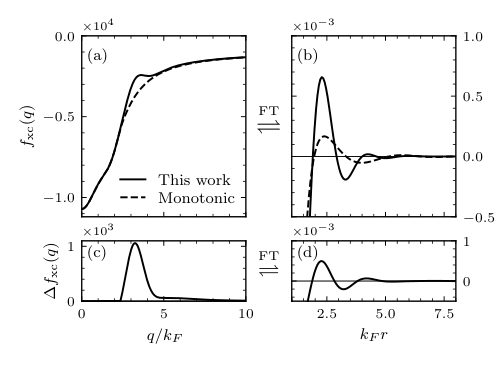
<figcaption class="paper-figure-caption"><b>Fig 2.</b> FIG. 2. Exchange-correlation kernel fxc at rs = 90. The solid line is obtained from our fitted G(q), while the dashed line is obtained by manually removing the feature from the solid curve. Panel (a) shows fxc as a function of wave vector, while panel (c) shows the difference between the solid and dashed lines in (a). Panels (b) and (d) are the Fourier trans- forms of (a) and (c), respectively.</figcaption>
</figure>
<figure class="paper-figure-card">

<figcaption class="paper-figure-caption"><b>Fig 3.</b> FIG. 3. (a) Static density response function χ(q) of the elec- tron gas for rs = 20–100 calculated from the analytical fit to our DMC data [Eq. (2)]. The dashed line shows the non- interacting response χ0(q). (b) The ratio χ(q)/χ0(q) of the curves in (a). (c) Static structure factor S(q) at rs = 100. Circles: direct computation (via equal-time pair correlation from separate DMC with Ne = 250), solid and dash-dotted lines: SMA results obtained through our χ(q) and the Cor- radini et al. parametrization, respectively. In all panels, the black arrows mark the first and second peak positions; red arrows mark the midpoint between the peaks. SMA results are scaled for better visibility.</figcaption>
</figure>
<figure class="paper-figure-card">

<figcaption class="paper-figure-caption"><b>Fig 4.</b> FIG. 4. (a) Dynamic structure factor S(q, ω) for rs = 90 calculated using the static G(q) as the xc kernel in the linear- response χ(q, ω). Solid orange line: collective mode dispersion from the peak of S(q, ω). Dashed line: the non-interacting dis- persion, ω0q = q2/2. Data points: collective mode dispersion using DMC S(q) as input for SMA, i.e. ωq = q2/[2S(q)]. (b) The solid orange line in (a) divided by ω0q. The white and red arrows mark the dips and peaks, respectively.</figcaption>
</figure>

**Summary.** This work uses Diffusion Monte Carlo simulations to calculate the static response functions of the 3D electron gas in highly correlated regimes. The authors identify a distinct structural feature in the local field factor G(q) that serves as a fingerprint of short-range order. This finding provides a crucial, benchmark result for improving theoretical descriptions of electronic structure in strongly interacting quantum matter.

**Why it may be interesting.** The rigorous calculation of correlation functions like G(q) in the strongly coupled regime is crucial for developing accurate theoretical models for materials where electron-electron interactions dominate, which is relevant for understanding correlated phases in quantum materials.

Detailed structure

**Main problem.** The study aims to accurately determine the wave-vector-dependent static local field factor G(q) and the static density-density response function for the 3D electron gas, especially in the strongly coupled regime where benchmarks are lacking.

**Main result.** The calculations reveal a pronounced structure in G(q) at intermediate wave vectors, identified as a fingerprint of short-range order, which is necessary to correctly reproduce the static structure factor S(q).

**Method.** Diffusion Monte Carlo (DMC) simulations are employed to calculate the static density-density response function, from which G(q) is derived using the Dyson equation.

**Model / system.** The system modeled is the three-dimensional electron gas (HEG), a fundamental model in condensed matter physics used as a starting point for ab initio calculations.

**Key observables.** Static local field factor G(q), static density-density response function $\chi(q)$, and the static structure factor S(q).

**Important parameters / regimes.** The analysis focuses on the strongly coupled regime (low density, high correlation, $r_s > 10$) and intermediate wave vectors ($q/k_F \sim 1-4$).

**Assumptions / limitations.** The analysis utilizes the Single-Mode Approximation (SMA) for calculating S(q) and develops a parametrization for G(q) valid across the entire liquid phase.

**Figures summary.** Figures show G(q) for various $r_s$ comparing DMC data to fits, and also illustrate the evolution of $\chi(q)$, $S(q)$, and the dynamic structure factor $S(q, \omega)$ across different correlation regimes.

**Paper structure.** The paper establishes the computational challenge, presents the DMC results for $\chi(q)$ and $G(q)$, identifies the structural feature as the fingerprint of short-range order, and concludes by developing a comprehensive parametrization for G(q) that also predicts low-energy resonant modes.

Abstract

The three-dimensional electron gas is a fundamental model in condensed matter physics and quantum chemistry, and the exchange-correlation energy derived from it serves as the starting point of \textit{ab initio} computations of materials. However, the wave-vector-dependent response, and hence the static local field factor $G(q)$, has remained without accurate ground-state benchmark in the strongly coupled regime for three decades. Using diffusion Monte Carlo, we calculate $G(q)$ and the static density-density response function across the liquid phase and find a pronounced structure in $G(q)$ at intermediate wave vectors, already visible at metallic densities and growing with increasing interaction strength. We identify it as a fingerprint of short-range order by showing that it is required to reproduce the static structure factor. Our parametrization, valid in the entire liquid phase, predicts a low-energy resonant mode inside the particle-hole continuum.

[↑ back to top](#top)

### [The Arithmetic of Spectra: Factorization, Statistics, and Symmetric Functions](http://arxiv.org/abs/2609.10391v1)

**Authors:** A. Chaudhary  
**Type:** theory · **Category:** statistical mechanics · **PDF:** <https://arxiv.org/pdf/2609.10391v1>  
**Analysis basis:** full PDF text, analyzed in chunks
**Topic relevance:** `analog quantum simulation` **1/5**

↔ Scroll figures horizontally

<figure class="paper-figure-card">

<figcaption class="paper-figure-caption"><b>Fig 1.</b> FIG. 1. The eight descent sets for n = 4, arranged in complementary pairs. Each panel shows the lowest-energy configuration compatible with its constraint set in (22), together with the total energies for a linear spectrum, P</figcaption>
</figure>

**Summary.** This paper develops a combinatorial framework by studying how the single-particle spectrum of non-interacting quantum systems can be factorized. It uses symmetric function theory to derive explicit, related formulas for the canonical Bose and Fermi partition functions. This provides a systematic mathematical tool for understanding quantum statistics based on the underlying spectral structure.

**Why it may be interesting.** The deep connection between spectral factorization, combinatorial identities (symmetric functions), and the fundamental difference between Bose and Fermi statistics provides a powerful, unified mathematical tool for analyzing quantum many-body systems.

Detailed structure

**Main problem.** The paper studies the factorization properties of the single-particle spectrum of non-interacting quantum systems and how these factorizations determine the resulting many-particle Bose and Fermi statistics.

**Main result.** It establishes a consolidated combinatorial framework showing that product spectra lead to specific, related forms for the canonical Bose and Fermi partition functions, linking them via symmetric function identities and descent set complementation.

**Method.** The authors use spectral factorization, mapping tensor factorizations of the single-particle kernel to multiplicative factorizations of a formal alphabet, and employing advanced symmetric function theory (Schur functions, $\lambda$-rings).

**Model / system.** The analysis is general for non-interacting systems, initially focusing on the imaginary-time propagator ($e^{-eta H_1}$) but generalizing to arbitrary trace-class one-particle kernels $K$. Specific examples include harmonic traps and separable energy spectra.

**Key observables.** Canonical Bose and Fermi partition functions ($Z_{n,B}, Z_{n,F}$), the single-particle partition function $Z_1(eta)$, and the spectral alphabet $X$.

**Important parameters / regimes.** The dimensionality $d$ of the system (especially for harmonic traps), and the temperature parameter $eta$.

**Assumptions / limitations.** The analysis relies on the ability to factorize the spectral alphabet $X$ into simpler components ($\hat{X}, \hat{Y}$), and the mathematical framework is built upon identities derived from the underlying spectral structure.

**Figures summary.** The notes mention specific identities (Cauchy identities, dual Cauchy identities) and relationships involving major indices ($	ext{maj}(D)$) for harmonic traps, distinguishing between bosonic and fermionic sums.

**Paper structure.** The paper progresses from defining the spectral factorization framework, establishing the relationship between Bose and Fermi statistics via descent sets, and then applying these concepts to specific physical models like the harmonic trap and general separable systems.

Abstract

We study factorizations of the single-particle spectrum of non-interacting quantum systems and their consequences for many-particle statistics. Representing the single-particle partition function by a spectral alphabet, tensor factorizations become multiplicative factorizations of the alphabet, which can be lifted to canonical Bose and Fermi partition functions using standard symmetric-function and $λ$-ring identities. We show how product spectra arise from different factorizations, how antisymmetrization can be assigned across an odd number of factors, and which tensor factorizations are compatible with a fixed spectrum. The paper therefore studies spectral factorization and provides a consolidated combinatorial framework for canonical Bose and Fermi partition functions.

[↑ back to top](#top)

### [When Does a Quantum Speedup Survive End-to-End?](http://arxiv.org/abs/2609.09850v1)

**Authors:** Pablo Herrero Gómez, Antonio Jimeno Morenilla, David Muñoz Hernández, Higinio Mora Mora  
**Type:** theory · **Category:** quantum information and computing · **PDF:** <https://arxiv.org/pdf/2609.09850v1>  
**Analysis basis:** full PDF text, analyzed in chunks
**Topic relevance:** `quantum measurements` **1/5**

↔ Scroll figures horizontally

<figure class="paper-figure-card">
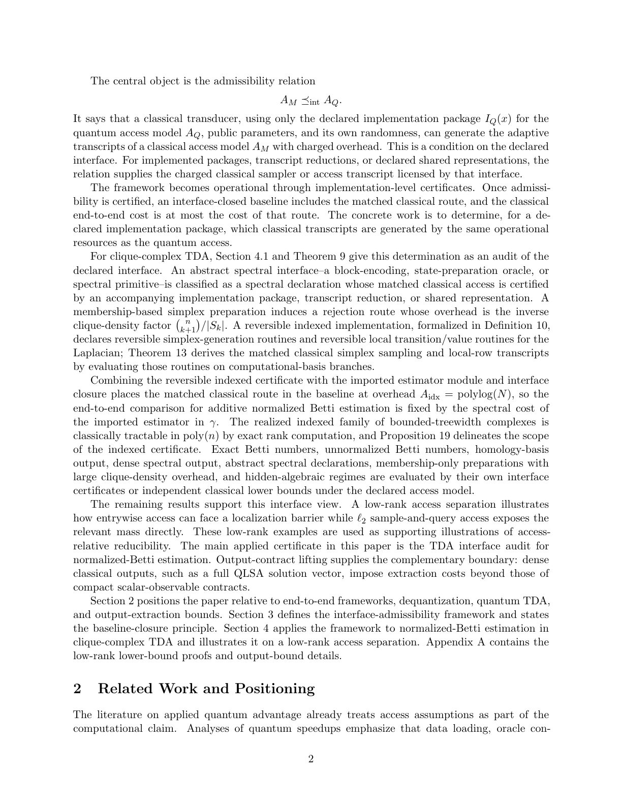
<figcaption class="paper-figure-caption"><b>Fig 1.</b> Low-resolution page preview, page 2</figcaption>
</figure>
<figure class="paper-figure-card">
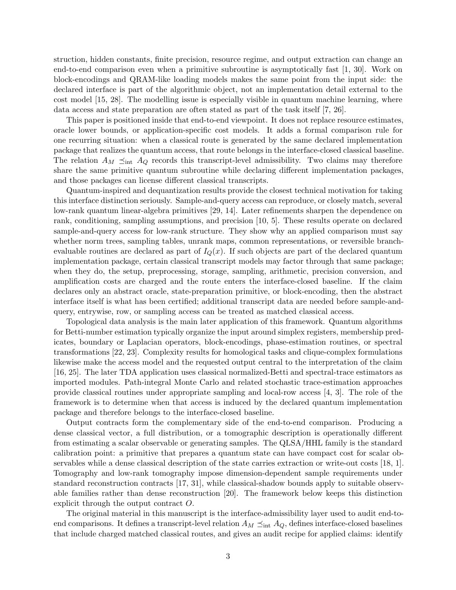
<figcaption class="paper-figure-caption"><b>Fig 2.</b> Low-resolution page preview, page 3</figcaption>
</figure>
<figure class="paper-figure-card">
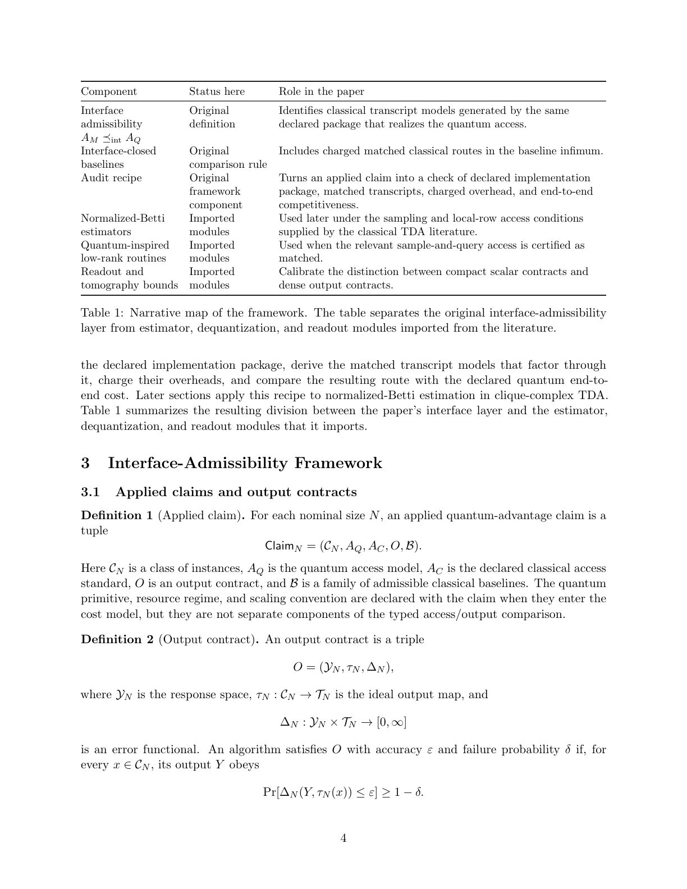
<figcaption class="paper-figure-caption"><b>Fig 3.</b> Low-resolution page preview, page 4</figcaption>
</figure>
<figure class="paper-figure-card">

<figcaption class="paper-figure-caption"><b>Fig 4.</b> Low-resolution page preview, page 5</figcaption>
</figure>
<figure class="paper-figure-card">
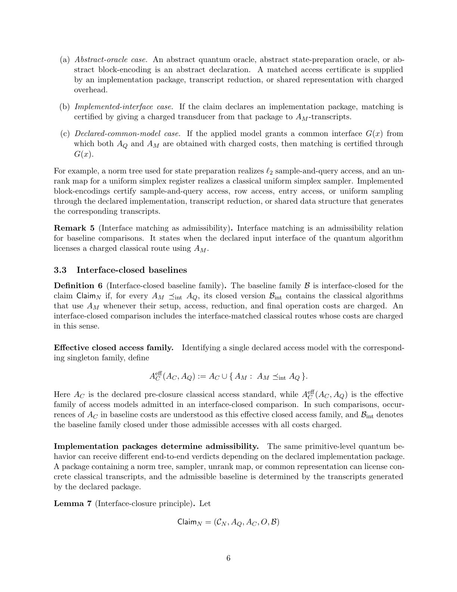
<figcaption class="paper-figure-caption"><b>Fig 5.</b> Low-resolution page preview, page 6</figcaption>
</figure>

**Summary.** This paper develops a rigorous theoretical framework to determine if a claimed quantum speedup survives when all practical overheads, including input access and output requirements, are accounted for. By introducing an 'interface-admissibility' audit, it provides a formal method to compare quantum algorithms against a matched classical baseline, showing that the advantage is highly dependent on the specific computational context.

**Why it may be interesting.** While the application is TDA, the underlying methodology—creating a rigorous, overhead-aware comparison between quantum and classical complexity—is a foundational theoretical tool relevant to assessing quantum advantage in any physical simulation or computation.

Detailed structure

**Main problem.** The paper addresses the fundamental question of when a quantum computational speedup remains valid when considering the entire end-to-end process, which is shown to be dependent on the specific input access and output contract.

**Main result.** It establishes a formal framework, the admissibility relation, to audit quantum claims by comparing them against a rigorously defined, interface-closed classical baseline, showing that the advantage is highly context-dependent.

**Method.** The authors introduce an interface-admissibility relation and an 'interface audit' procedure to formally charge all setup, transcript-generation, and precision overheads associated with matching classical and quantum access models.

**Model / system.** The framework is highly abstract, dealing with general quantum access models ($	ext{AQ}$), classical access models ($	ext{AM}$), and output contracts ($	ext{O}$). It is applied specifically to the operational audit of normalized-Betti estimation in Topological Data Analysis (TDA) for clique-complexes.

**Key observables.** Quantum speedup, Betti numbers, end-to-end cost ($	ext{T}_{	ext{E2E}}$), and overheads ($\Gamma_M$).

**Important parameters / regimes.** The gap $\gamma$ (spectral dependence), the structure of the declared implementation package ($	ext{IQ}(x)$), and the nature of the output contract (e.g., scalar vs. dense vector).

**Assumptions / limitations.** The analysis relies on the explicit definition and certification of the interface-admissibility relation and the assumption that the comparison must use an 'interface-closed' classical baseline.

**Figures summary.** The notes reference a narrative map (Table 1) summarizing the framework components and a canonical case summary (Table 4) comparing various tasks (e.g., TDA Betti, QPCA) across different contracts and regimes.

**Paper structure.** The paper develops a general framework for auditing quantum claims by defining the admissibility relation, applying this audit to specific physical problems like TDA, and concluding with a summary table comparing various computational tasks.

Abstract

Primitive quantum speedups are interface-relative: they depend on the input access used to run the primitive and on the output contract used to consume its state or samples. This paper introduces a transcript-level admissibility relation \(A_M\preceq_{\mathrm{int}}A_Q\), defined relative to the declared implementation package of the quantum interface. It identifies which adaptive classical access transcripts that same package licenses, with all setup, transcript-generation, and precision overheads charged.   The main application is an operational audit for normalized-Betti estimation in clique-complex TDA, separating three declared-interface regimes. Reversible indexed simplex interfaces certify matched classical simplex sampling and local Laplacian row access by evaluating their reversible routines on single computational branches. Membership-based preparations induce a rejection route of overhead \(\binom{n}{k+1}/|S_k|\). Abstract spectral or block-encoding interfaces require an accompanying implementation package, transcript reduction, or shared representation. Under the indexed certificate and interface closure, the end-to-end cost is fixed by the imported estimator's spectral dependence on the gap \(γ\); the concretely realized bounded-treewidth family already admits exact \(\mathrm{poly}(n)\) classical Betti computation by rank over \(\mathbb{Q}\). A low-rank separation supports the role of access and output contracts.

[↑ back to top](#top)

## Other papers (29)

*Papers from primary archives without highlighted authors or any topic match. Click to expand.*

Show other papers

### [A Sum-of-Squares Hierarchy with Quadratic Convergence for Quantum Channel Coding](http://arxiv.org/abs/2609.09629v1)

**Authors:** Hoang Ta, Hoang Anh Tran  
**Type:** theory · **Category:** quantum information and computing · **PDF:** <https://arxiv.org/pdf/2609.09629v1>  
**Analysis basis:** full PDF text, analyzed in chunks

↔ Scroll figures horizontally

<figure class="paper-figure-card">

<figcaption class="paper-figure-caption"><b>Fig 1.</b> Figure 1: Construction of the SOS hierarchy (upper row) and feasible certificates for its convergence analysis (lower row). The kernel is used in the proof; solving the finite SDP does not require knowing the optimal field Y∗or the value P.</figcaption>
</figure>
<figure class="paper-figure-card">

<figcaption class="paper-figure-caption"><b>Fig 2.</b> Figure 2: First-level bounds for 40 random qubit-to-qutrit channels. Panels (a) and (b) compare the computed values with ηref for Choi ranks 6 and 3. Panel (c) shows the gaps on a logarithmic scale, with channels sorted by ηref within each rank group. SOS values include numerical certificate repair.</figcaption>
</figure>

**Summary.** This work develops a novel Hermitian Sum-of-Squares (SOS) hierarchy to provide upper bounds on the optimal success probability for quantum channel coding. By employing advanced techniques involving positive polynomial kernels, the authors prove that this hierarchy exhibits quadratic convergence, significantly improving upon existing error estimates. This provides a powerful, computationally tractable tool for analyzing fundamental limits in quantum communication theory.

**Why it may be interesting.** The development of polynomial-time, rapidly converging mathematical tools (SOS hierarchies) to solve fundamental, hard problems in quantum information theory is highly relevant for theoretical quantum physicists.

Detailed structure

**Main problem.** The paper addresses the NP-hard problem of computing the optimal success probability for transmitting classical messages through a single use of a quantum channel.

**Main result.** The authors construct a Hermitian Sum-of-Squares (SOS) hierarchy that achieves quadratic convergence for bounding this success probability.

**Method.** The approach combines state-discrimination duality with positive polynomial kernels on products of spheres to construct feasible polynomial dual certificates for the SOS hierarchy.

**Model / system.** The system involves a quantum channel $\Phi: L(A) 	o L(B)$ acting on finite-dimensional complex Hilbert spaces, where the goal is to maximize the average success probability $P_{	ext{succ}}(\Phi, k)$.

**Key observables.** Optimal success probability $P_{	ext{succ}}(\Phi, k)$ and the trace-norm contraction coefficient $\eta_{	ext{tr}}(\Phi)$.

**Important parameters / regimes.** The level $L$ of the hierarchy, and the dimension parameters $d_A$ and $d_B$ of the input and output spaces.

**Assumptions / limitations.** The analysis relies on the structure of the sphere ideal and the use of positive squared-polynomial kernels to establish the convergence rate.

**Figures summary.** Figure 1 summarizes the construction, contrasting the SOS hierarchy with the feasible certificates used for convergence analysis.

**Paper structure.** The paper builds from defining the NP-hard problem and existing SDP bounds, to introducing the novel Hermitian SOS hierarchy, and finally proving the quadratic convergence rate using advanced polynomial and kernel techniques.

Abstract

Computing the optimal success probability for transmitting classical messages through a single use of a quantum channel is NP-hard, even for two messages. An existing semidefinite programming hierarchy based on symmetric extensions provides convergent upper bounds with an a priori error estimate that decays as the inverse square root of the extension level. In this work, we construct a Hermitian sum-of-squares hierarchy for an arbitrary number of messages and prove quadratic convergence in its level. The error bound is proportional to the advantage over random guessing. Our approach combines state-discrimination duality with positive polynomial kernels on products of spheres to construct feasible polynomial dual certificates. For binary messages, the resulting bounds give a multiplicative approximation from above of the trace-norm contraction coefficient.

[↑ back to top](#top)

### [Accelerating A*-Based Algorithms for Decoding Quantum Low-Density Parity-Check Codes](http://arxiv.org/abs/2609.10056v1)

**Authors:** Lamia Yous, Francisco Garcia Herrero, Mark F. Flanagan  
**Type:** theory · **Category:** quantum information and computing · **PDF:** <https://arxiv.org/pdf/2609.10056v1>  
**Analysis basis:** full PDF text, analyzed in chunks

↔ Scroll figures horizontally

<figure class="paper-figure-card">
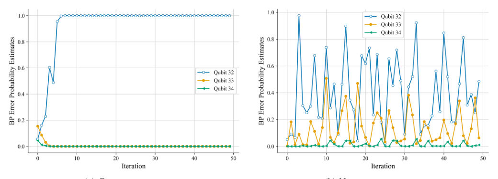
<figcaption class="paper-figure-caption"><b>Fig 1.</b> Fig. 1. Evolution of the estimated error probability from BP for a set of three sample qubits. The horizontal axis shows the BP iteration number, while the vertical axis shows the estimated probability of error. Each colored curve represents a different qubit in the Tanner graph. The curves are shown for qubits 32, 33 and 34 as these are representative of general qubit behavior.</figcaption>
</figure>
<figure class="paper-figure-card">

<figcaption class="paper-figure-caption"><b>Fig 2.</b> Fig. 2. Mean pflip values for correct and incorrect qubits versus physical error rate, p than transient fluctuations, which commonly occur in the early stages of BP decoding. As evidenced by the behavior of qubit 33 in Figure 1a, such early oscillations often stabilize as the decoder converges and should therefore not be penalized. The average step change is calculated as</figcaption>
</figure>
<figure class="paper-figure-card">
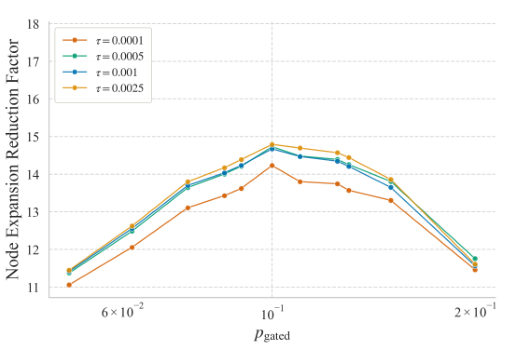
<figcaption class="paper-figure-caption"><b>Fig 3.</b> Fig. 3. Node expansion reduction factor versus pgated values for varying τ at a fixed physical error rate of p = 0.05. The node expansion reduction factor is defined as the ratio of the number of nodes expanded by the stand-alone Tesseract to those expanded by the BP-Tesseract hybrid decoder. is too high, too many qubits are not gated, which degrades the information given to Tesseract. If τ is too low, too many qubits are gated, reducing the amount of useful information available and thus increasing the number of node expansions. If pgated is too low, gated qubits are only slightly penalized, and their cost is not much higher than the reliable qubits, while if the value for pgated is too...</figcaption>
</figure>
<figure class="paper-figure-card">
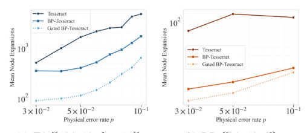
<figcaption class="paper-figure-caption"><b>Fig 4.</b> Fig. 4. Mean number of node expansions versus physical error rate for the stand-alone Tesseract decoder, the BP-Tesseract decoder, and the gated BP- Tesseract decoder.</figcaption>
</figure>
<figure class="paper-figure-card">
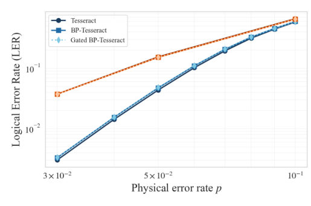
<figcaption class="paper-figure-caption"><b>Fig 5.</b> Fig. 5. LER performance versus physical error rate for the stand-alone Tesseract decoder, the BP-Tesseract decoder, and the gated BP-Tesseract decoder, for the T1 and BB codes. directly to Tesseract without any filtering is not optimal in non-convergent cases. While the reduction in node expansions is substantial, it is also important to assess the impact on the logical error rate (LER) performance. Figure 5 presents the LER results for all three decoders for the T1 and bicycle bivariate codes. In both cases, the LER for the proposed decoder is extremely close to that of the original Tesseract. These results indicate that the proposed decoder achieves an effective balance be- tween...</figcaption>
</figure>

**Summary.** This paper introduces a novel, hybrid decoding framework for Quantum Low-Density Parity-Check (QLDPC) codes by combining Belief Propagation (BP) with the A*-based Tesseract decoder. A reliability-based gating mechanism filters the output of the fast BP stage to guide the Tesseract search on a reduced problem. This significantly accelerates decoding complexity (up to 15x reduction) while preserving the high performance of the full Tesseract decoder.

**Why it may be interesting.** This work directly addresses the computational bottleneck in quantum error correction, which is crucial for scaling up quantum computation. The hybrid approach suggests a general methodology for combining fast, approximate methods with rigorous, but slow, exact solvers.

Detailed structure

**Main problem.** The core problem is developing an efficient decoding algorithm for Quantum Low-Density Parity-Check (QLDPC) codes to enable reliable, large-scale quantum computation.

**Main result.** The proposed hybrid BP-Tesseract decoder significantly reduces the computational complexity of decoding by at least 5x, while successfully maintaining the logical error rate of the standalone Tesseract decoder.

**Method.** A two-stage decoding framework is proposed: Belief Propagation (BP) acts as a fast preprocessing step to generate initial estimates, and a reliability-based gating mechanism filters uncertain results before passing the residual problem to the A*-based Tesseract decoder.

**Model / system.** The work focuses on QLDPC codes, which are quantum error correction codes often constructed using the CSS framework. The decoding process is modeled using the Tanner graph structure inherent to these codes.

**Key observables.** Decoding complexity (measured by expanded nodes in the Tesseract search graph) and the Logical Error Rate (LER).

**Important parameters / regimes.** Physical error rate ($p$), the gating threshold ($	au$), and the fixed prior probability ($p_{	ext{gated}}$).

**Assumptions / limitations.** The primary assumption is that the high speed of BP decoding can effectively preprocess the syndrome, allowing the computationally intensive Tesseract search to operate on a much smaller, refined problem.

**Figures summary.** Figures compare the mean number of node expansions and the LER for stand-alone Tesseract, BP-Tesseract, and the proposed gated BP-Tesseract decoder across various physical error rates.

**Paper structure.** The paper first establishes the limitations of stand-alone Tesseract (high overhead) and BP (convergence issues). It then introduces the hybrid BP-Tesseract framework, detailing the reliability gating mechanism using metrics like $p_{	ext{flip}}$ and $\Delta_{	ext{mean}}$, and finally presents numerical results demonstrating the performance gains.

Abstract

Quantum low-density parity-check (QLDPC) codes represent a promising approach for error correction in quantum computing. The recently proposed Tesseract decoder uses the A* search algorithm that guarantees finding the most likely error pattern. However, practical implementations of Tesseract often involve an extremely large graph, and the inherently sequential nature of the search results in high computational overhead and long runtime. To improve decoding efficiency, we propose a two-stage decoding framework. First, a belief propagation (BP) decoder efficiently processes the syndrome. This step generates hard decisions (a binary error vector) and soft information (per-qubit confidence levels). In non-convergent BP cases, a gating mechanism examines the BP decoder's output to identify and filter out qubits with oscillating confidence values. In these cases, the refined output serves as input to Tesseract, which then attempts to identify and correct any residual errors. This hybrid approach leverages the high speed of BP decoding and delegates the more challenging decoding instances to Tesseract. Numerical results demonstrate a substantial reduction in overall decoding complexity while maintaining the logical error rate (LER) of the stand-alone Tesseract. Across all tested physical error rates, the proposed method achieves at least 5x reduction in the number of expanded nodes in the Tesseract, with a peak reduction of nearly 15x at a physical error rate of p = 0.05 for the [[126, 12, d < 11]] T1 code, and approximately 8.8x at p = 0.05 for the [[72, 12, 6]] bicycle bivariate (BB) code.

[↑ back to top](#top)

### [An analysis of iterative refinement for quantum linear system solvers](http://arxiv.org/abs/2609.10250v1)

**Authors:** Adrian Harkness, Mohammadhossein Mohammadisiahroudi, Brandon Augustino, Giacomo Nannicini, Tamás Terlaky  
**Type:** both · **Category:** quantum information and computing · **PDF:** <https://arxiv.org/pdf/2609.10250v1>  
**Analysis basis:** full PDF text, analyzed in chunks

↔ Scroll figures horizontally

<figure class="paper-figure-card">

<figcaption class="paper-figure-caption"><b>Fig 1.</b> Figure 1. Residual norm convergence for an 8-variable linear system with q P t3, 4, 5u QPE qubits over 12 iterative refinement iterations. (a) Noise-free simulation, in which each ad- ditional QPE qubit accelerates convergence. (b) The same three configurations executed on the IBM Pittsburgh quantum computer.</figcaption>
</figure>
<figure class="paper-figure-card">

<figcaption class="paper-figure-caption"><b>Fig 2.</b> Figure 1 shows the residual norm log10 }Axpkq´b}2 as a function of the IR iteration index k. In noise-free simulation (panel (a)) the convergence rate is ordered by the precision of the quantum oracle as expected. Initializing the algorithm with a 10´9</figcaption>
</figure>
<figure class="paper-figure-card">

<figcaption class="paper-figure-caption"><b>Fig 3.</b> Figure 2. Cumulative circuit depth required to reach the residual threshold }Ax´b}2 ď ε, with and without iterative refinement. Solid curves with filled markers are measured transpiled depths: HHL + IR at the target ε “ 10´6, and direct HHL at the relaxed threshold ε “ 10´2, for which the required QPE register sizes are directly compilable. The dashed curve with hollow markers is the extrapolated direct-HHL depth at ε “ 10´6, obtained from a fitted depth model; the shaded band is the fit’s 95% prediction interval. Boxed labels indicate the required QPE register size q on each plateau.</figcaption>
</figure>
<figure class="paper-figure-card">
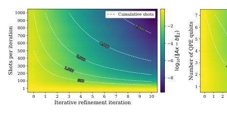
<figcaption class="paper-figure-caption"><b>Fig 4.</b> Figure 3. Trade-offs between iterative refinement iterations and quantum resources for solving a 64-variable linear system to a desired residual using HHL. Color encodes the resulting residual at each parameter combination as log10p}Ax ´ b}2q, and contour lines show cumulative quantum resources across all IR iterations. In the left plot, 6 QPE qubits are used for the HHL circuit, and in the right plot, 106 shots are used to readout x from |xy at each iteration of iterative refinement.</figcaption>
</figure>

**Summary.** This paper introduces an Iterative Refinement (IR) framework to solve quantum linear systems, overcoming a major limitation where standard methods suffer from polynomial resource scaling with required precision. By using repeated, fixed-precision quantum circuits, the IR scheme maintains polylogarithmic resource scaling, making high-accuracy quantum computation more feasible. The analysis validates this approach across various quantum hardware models.

**Why it may be interesting.** This work directly addresses the practical bottleneck of achieving high-precision results in quantum simulation and computation by providing a resource-efficient algorithmic structure.

Detailed structure

**Main problem.** The primary challenge is mitigating the polynomial dependence on target precision ($\epsilon^{-1}$) that arises when combining quantum linear system algorithms (QLSA) with quantum state tomography (QTA).

**Main result.** The authors propose an Iterative Refinement (IR) framework that retains polylogarithmic dependence on the inverse error tolerance throughout the entire process.

**Method.** The IR scheme solves a sequence of related linear systems using only fixed-precision quantum subroutines, progressively refining the solution to achieve high accuracy.

**Model / system.** The analysis is conducted within the framework of quantum computation, specifically addressing the Quantum Linear System Problem (QLSP) for solving $A\mathbf{x}=\mathbf{b}$. The framework is tested across three input models: QRAM, LCU, and sparse-access oracles.

**Key observables.** Residual error ($\|x - A^{-1}b\| \le \epsilon$), cumulative circuit depth, and resource scaling (QRAM accesses, oracle queries).

**Important parameters / regimes.** Condition number ($\kappa_A$), sparsity ($s$), and target precision ($\epsilon$).

**Assumptions / limitations.** The analysis assumes the success of quantum algorithms with probability $\ge 1 - \delta$ and relies on the ability to perform fixed-precision quantum subroutines repeatedly.

**Figures summary.** Figures compare the cumulative circuit depth of direct HHL versus HHL+IR, showing IR maintains a constant per-iteration cost while achieving higher precision, avoiding the staircase depth scaling of direct methods.

**Paper structure.** The paper first establishes the limitation of current QLSAs regarding precision scaling, then introduces and analyzes the IR framework across multiple input models, followed by numerical validation on simulators and hardware.

Abstract

We present and analyze an iterative refinement (IR) framework for improving the precision dependence of algorithms that combine a quantum linear system algorithm (QLSA) with quantum state tomography. Existing QLSAs achieve polylogarithmic dependence on the inverse error tolerance to prepare a quantum state encoding the solution, but extracting a classical description of such a state via tomography typically introduces a polynomial dependence on the target precision. To retain polylogarithmic dependence in the inverse error tolerance throughout the entire process, we develop an IR scheme that solves a sequence of related linear systems to progressively refine the solution while requiring only fixed-precision quantum subroutines, finally obtaining a classical description of a high-precision solution. We analyze the proposed framework under three input models: quantum-read/classical-write RAM (QRAM), linear combinations of unitaries (LCU), and sparse-access oracles. We evaluate the proposed scheme through numerical experiments on both quantum simulators and real quantum hardware. The results demonstrate that iterative refinement efficiently improves the precision of the solution and exhibits robustness to hardware noise.

[↑ back to top](#top)

### [Anomalous Hall Response Induced by Correlated Disorder in the Breathing Kagome Lattice Mn$_{3}$Sn](http://arxiv.org/abs/2609.09699v1)

**Authors:** Tsung-Han Yang, Seng Huat Lee, Hengxin Tan, Yuanpeng Zhang, Benjamin A. Frandsen, Václav Petříček, Huibo Cao, Daniel Olds, Matthew G. Tucker, Jiaqiang Yan, Binghai Yan, Zhiqiang Mao, Qiang Zhang  
**Type:** both · **Category:** strongly correlated electrons · **PDF:** <https://arxiv.org/pdf/2609.09699v1>  
**Analysis basis:** full PDF text, analyzed in chunks

↔ Scroll figures horizontally

<figure class="paper-figure-card">

<figcaption class="paper-figure-caption"><b>Fig 1.</b> FIG. 1. Crystal and magnetic structures from diffraction and magnetization measurements. (a) and (b) show top and side views, respectively at 295 K. (c) Temperature-dependent neu- tron powder diffraction at POWGEN showing the emergence of incommensurate magnetic reflections below TN2. (d) Tem- perature dependence of the integrated intensity of the (101) reflection, revealing the magnetic phase transitions at TN1 and TN2. (e) Temperature dependence of the magnetization for H ∥x, y, and z, showing the magnetic transition at TN2. (f) Temperature dependence of the lattice parameters obtained from synchrotron powder x-ray diffraction performed at 28- ID-1 (PDF) beamline.</figcaption>
</figure>
<figure class="paper-figure-card">
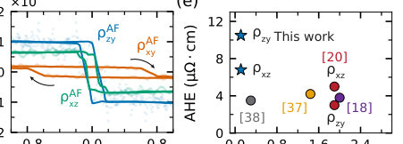
<figcaption class="paper-figure-caption"><b>Fig 2.</b> FIG. 2. Magnetic field dependence of the AHE in nearly sto- ichiometric Mn3Sn at 300 K. (a) Schematics of the three con- figurations used for AHE measurements on σyz, σyx and σzx. (b) Field-dependent Hall conductivity components measured at 300 K. (c) Anomalous Hall resistivity ∆ρH = ρH −R0µ0H plotted as a function of magnetization M. (d) Field de- pendence of the antiferromagnetic Hall component, ρAF H = ρH −R0µ0H −Rsµ0M, obtained by subtracting the ordi- nary and magnetization-linear contributions. (e) Comparison of the anomalous Hall resistivity and carrier density n for Mn3+δSn reported in this work and previous studies.</figcaption>
</figure>
<figure class="paper-figure-card">

<figcaption class="paper-figure-caption"><b>Fig 3.</b> FIG. 3. Anomalous Hall conductivity and magnetic-field- induced spin rotation of Mn3Sn. (a) DFT-calculated intrinsic AHC components for the average hexagonal structure. (b) Reference magnetic structure used for the DFT calculations of the intrinsic AHC. (c) Schematic rotation of the noncollinear Mn moments under H ∥x, generating σyz.</figcaption>
</figure>
<figure class="paper-figure-card">
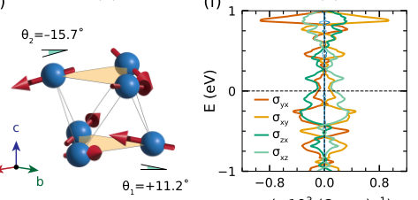
<figcaption class="paper-figure-caption"><b>Fig 4.</b> FIG. 4. Local structural distortion and spin canting in Mn3Sn. (a) Local structural motif of Mn3Sn at 500 K pre- sented in a hexagonal cell. The tilted Mn–Mn–Mn triangles within the kagome plane are resolved, revealing a bond-length disproportionation of 0.2 Å and asymmetric bond angles of 123◦and 117◦, which breaks hexagonal symmetry. (b) RMC modeling results of GK(r) compared to experimental data. (c) Partial pair distribution function for individual atomic pairs, showing well-resolved Mn–Mn and Mn–Sn atomic pairs near 2.7 Å. (d) Magnetic PDF fits showing a substantial mPDF sig- nal. (e) Local magnetic-moment motif at 300 K from mPDF refinement. (f) DFT-calculated intrinsic AHC components...</figcaption>
</figure>
<figure class="paper-figure-card">

<figcaption class="paper-figure-caption"><b>Fig 5.</b> FIG. 5. Single-crystal neutron diffraction and low-T mag- netic structure of Mn3Sn below TN2. (a) Reconstruction of the (H0L) plane near the (−101) nuclear reflection at 6 K, showing magnetic satellites with k1 and k2 and their higher harmonics; the corresponding L profile is shown at right. (b) Observed and calculated structure-factor amplitudes for nu- clear (blue) and magnetic (red) reflections. (c) Refined mag- netic structure combining the k1, k2, and 2k1 + k2 compo- nents. (d) Decomposition into the individual k1, k2, and components.</figcaption>
</figure>

**Summary.** This study investigates the anomalous Hall response in $	ext{Mn}_3	ext{Sn}$, finding a finite, symmetry-forbidden $\sigma_{yx}$ component in a specific magnetic phase. The authors argue that this response is not due to the average crystal symmetry but rather arises from correlated local lattice distortions and noncoplanar magnetic moments. This establishes correlated disorder as a crucial, symmetry-breaking degree of freedom enabling topological transport.

**Why it may be interesting.** This work is highly relevant as it bridges macroscopic transport properties (AHE) with microscopic structural/magnetic details, providing a concrete example of how local symmetry breaking can manifest topological phenomena, which is a key concept in modern condensed matter theory.

Detailed structure

**Main problem.** The study investigates how correlated disorder can activate anomalous Hall responses ($\sigma_{yx}$) in the Kagome antiferromagnetic Weyl semimetal $	ext{Mn}_3	ext{Sn}$, components otherwise forbidden by the average crystallographic symmetry.

**Main result.** The finite, hysteretic $\sigma_{yx}$ observed in the intermediate magnetic phase is attributed to correlated local orthorhombic distortions and noncoplanar Mn moments, demonstrating that local symmetry breaking can enable topological transport inaccessible from the Bragg-average structure.

**Method.** The research combines experimental measurements (Hall transport, neutron/X-ray diffraction, PDF analysis) with first-principles DFT calculations incorporating local structural and magnetic distortions.

**Model / system.** The system is the nearly stoichiometric $	ext{Mn}_3	ext{Sn}$ crystal, a Kagome antiferromagnet exhibiting multiple magnetic transitions. The analysis focuses on the interplay between the average hexagonal symmetry and local symmetry breaking induced by lattice distortions and noncoplanar magnetic ordering.

**Key observables.** Anomalous Hall conductivity components ($\sigma_{yx}, \sigma_{zx}, \sigma_{yz}$), magnetic transition temperatures ($T_{N1}, T_{N2}$), and local structural/magnetic parameters (e.g., canting angles).

**Important parameters / regimes.** Temperature regimes ($T_{N2} < T < T_{N1}$), magnetic field dependence, and the degree of lattice distortion (orthorhombic).

**Assumptions / limitations.** The core assumption is that electronic transport is sensitive to local symmetry breaking over finite length scales, even when the average structure maintains higher symmetry.

**Figures summary.** Figures show temperature dependence of Hall conductivity (with hysteresis), structural/magnetic phase diagrams, and comparisons between DFT predictions using average vs. distorted structures.

**Paper structure.** The paper progresses by first establishing the symmetry constraints (average structure predicts $\sigma_{yx}=0$), then presenting experimental evidence of finite, hysteretic $\sigma_{yx}$ in the intermediate phase, and finally using local structure/magnetism analysis (PDF, DFT) to theoretically explain the activation mechanism via correlated disorder.

Abstract

Macroscopic transport tensors are generally constrained by the average crystallographic and magnetic symmetries of a material. In the kagome antiferromagnetic Weyl semimetals Mn$_{3+δ}X$ ($X=$~Sn or Ge), previous studies showed that the anomalous Hall conductivity $σ_{yx}$ is forbidden by the average \hexsg{} structure and coplanar inverse-triangular magnetic order. Here we report that nearly stoichiometric Mn$_3$Sn nevertheless exhibits a finite $σ_{yx}$ with large hysteresis, together with enhanced $σ_{zx}$ and $σ_{yz}$, in the inverse-triangular phase below $T_{\mathrm{N1}}\approx 440~\mathrm{K}$, whereas all AHE components vanish in the amplitude-modulated conical phase below $T_{\mathrm{N2}}\approx 280~\mathrm{K}$. Total scattering and magnetic pair distribution function analysis reveal correlated orthorhombic distortions and noncoplanar Mn moments. First-principles calculations show that this coupled lattice-spin distortion activates the average symmetry forbidden $σ_{yx}$ within the inverse-triangular phase. Its disappearance below $T_{\mathrm{N2}}$ indicates that the correlated disorder must cooperate with a long-range inverse-triangular antiferromagnetic order capable of supporting Berry curvature. Our results establish correlated disorder as an active symmetry-breaking degree of freedom that enables topological transport inaccessible from the Bragg-average structure alone.

[↑ back to top](#top)

### [Conditions for Global Optimality in Quantum Arimoto-Blahut Algorithms](http://arxiv.org/abs/2609.09731v1)

**Authors:** Geng Liu, Masahito Hayashi  
**Type:** theory · **Category:** quantum information and computing · **PDF:** <https://arxiv.org/pdf/2609.09731v1>  
**Analysis basis:** full PDF text, analyzed in chunks

↔ Scroll figures horizontally

<figure class="paper-figure-card">
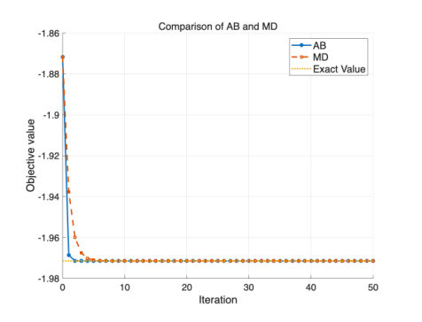
<figcaption class="paper-figure-caption"><b>Fig 1.</b> Fig. 1. Comparison of AB and MD iterative behavior in the unconstrained case. The vertical axis shows the value of f(ρ). The horizontal axis shows the number of iterations. The blue line represents the iterative behavior of the AB algorithm. The orange line represents the iterative behavior of the MD algorithm. The yellow line represents the theoretical value of −D(Ddeph∥Dp).</figcaption>
</figure>
<figure class="paper-figure-card">

<figcaption class="paper-figure-caption"><b>Fig 2.</b> Fig. 2. Comparison of AB and MD iterative behavior in the constrained case. The vertical axis shows the value of f(ρ). The horizontal axis shows the number of iterations. The blue line represents the iterative behavior of the AB algorithm. The orange line represents the iterative behavior of the MD algorithm. The yellow line represents the theoretical value of −D(Ddeph∥Dp).</figcaption>
</figure>
<figure class="paper-figure-card">
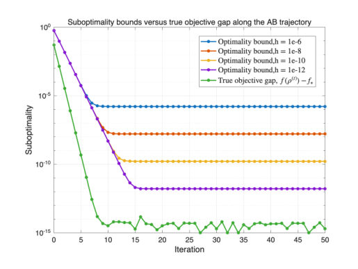
<figcaption class="paper-figure-caption"><b>Fig 3.</b> Fig. 3. Comparison of certified suboptimality bounds and the true objective gap along the AB trajectory in the unconstrained case. The vertical axis shows the suboptimality on a logarithmic scale. The horizontal axis shows the number of iterations. The blue, orange, yellow, and purple lines represent the certified bounds obtained with h = 10−6, 10−8, 10−10, and 10−12, respectively. The green line represents the true objective gap f(ρ(t)) −f∗.</figcaption>
</figure>
<figure class="paper-figure-card">

<figcaption class="paper-figure-caption"><b>Fig 4.</b> Fig. 5. Comparison of AB and MD iterative behavior associated with D(Dad∥Dp). The vertical axis shows the value of f(ρ). The horizontal axis shows the number of iterations. The blue line represents the iterative behavior of the AB algorithm. The orange line represents the iterative behavior of the MD algorithm.</figcaption>
</figure>
<figure class="paper-figure-card">

<figcaption class="paper-figure-caption"><b>Fig 5.</b> Fig. 4. Comparison of certified suboptimality bounds and the true objective gap along the AB trajectory in the constrained case. The vertical axis shows the suboptimality on a logarithmic scale. The horizontal axis shows the number of iterations. The blue, orange, yellow, and purple lines represent the certified bounds obtained with h = 10−4, 10−6, 10−8, and 10−10, respectively. The green line represents the true objective gap f(ρ(t)) −f∗.</figcaption>
</figure>

**Summary.** This theoretical paper develops structural criteria to determine when quantum optimization algorithms, specifically the Arimoto-Blahut (AB) method, achieve global optimality. It establishes that optimality depends on a precise relationship between the AB update direction and the objective gradient relative to the constraint space. The findings provide powerful, computable certificates for assessing the reliability of quantum optimization routines.

**Why it may be interesting.** This work provides rigorous, computable criteria for assessing convergence in quantum optimization algorithms, which is crucial for designing reliable quantum information processing protocols.

Detailed structure

**Main problem.** The paper establishes necessary and sufficient conditions for the global optimality of fixed points generated by generalized Arimoto-Blahut (AB) algorithms when optimizing quantum objectives.

**Main result.** Global optimality is guaranteed if and only if the AB update direction and the objective gradient differ by an element of the constraint normal space. Furthermore, an *a posteriori* certificate based on feasible directional derivatives can detect suboptimal fixed points.

**Method.** The authors compare the AB iterative update rule with the Mirror Descent (MD) update rule, deriving algebraic conditions for their equivalence and developing finite-difference certificates for optimality.

**Model / system.** The analysis focuses on optimizing objective functions $f(
ho) = 	ext{Tr} \ 
ho \Omega(
ho)$ over quantum states $
ho$ constrained to a manifold $M$ in a finite-dimensional Hilbert space $H$. The context involves quantum channels and relative entropy minimization.

**Key observables.** The objective function $f(
ho)$, the AB update direction $\Omega(
ho)$, the gradient $
abla f(
ho)$, and the diagnostic quantity $	ext{Tr}[(
ho - b
ho_H)\Omega(
ho)]$.

**Important parameters / regimes.** The structure of the linear constraints defining the manifold $M$, and the specific parameters of the quantum channels analyzed (e.g., dephasing vs. depolarizing).

**Assumptions / limitations.** The analysis assumes the objective function is convex and differentiable, and it notes that monotonic objective decrease and numerical stabilization are insufficient guarantees for global optimality.

**Figures summary.** Not specified in the notes, but the analysis relies on deriving explicit gradient formulas (e.g., Equation (229)) and proving strict positivity of diagnostic quantities away from the fixed point.

**Paper structure.** The paper proceeds by first establishing the necessary and sufficient algebraic conditions for AB and MD equivalence. It then develops *a posteriori* optimality certificates using feasible directional derivatives, culminating in proofs of uniqueness for the global minimizer in specific channel models.

Abstract

Generalized Arimoto--Blahut (AB) algorithms are widely used in information theory and quantum optimization, but monotonic objective decrease and numerical stabilization do not guarantee global optimality. We establish necessary and sufficient conditions for the global optimality of full-rank AB fixed points for convex differentiable objectives under linear constraints. An AB fixed point is globally optimal if and only if the AB update direction and the objective gradient differ by an element of the constraint normal space at that point. The same compatibility condition characterizes agreement between individual AB and mirror-descent (MD) updates, whereas pathwise equivalence requires it along the entire common trajectory. Thus, an AB algorithm may follow a trajectory different from MD and still reach the global optimum. We also develop a posteriori optimality certificates based on feasible directional derivatives, including finite-difference upper bounds on the objective gap that require only objective evaluations. For channel relative entropy between dephasing and depolarizing channels, we analytically identify the global minimizer as the unique full-rank AB fixed point, although pathwise equivalence fails. Numerical experiments illustrate convergence of AB and MD along different trajectories and validate the certificates. By contrast, an amplitude-damping example shows that a monotone AB iteration can stabilize at a suboptimal fixed point, whose nonoptimality is detected by the finite-difference certificate. These results provide structural and computable criteria for assessing global optimality in quantum AB algorithms.

[↑ back to top](#top)

### [Direct Cultivation of Entangled $|CS\rangle$ Magic States](http://arxiv.org/abs/2609.09993v1)

**Authors:** Gunsik Min, Jun Heo  
**Type:** theory · **Category:** quantum information and computing · **PDF:** <https://arxiv.org/pdf/2609.09993v1>  
**Analysis basis:** full PDF text, analyzed in chunks

↔ Scroll figures horizontally

<figure class="paper-figure-card">
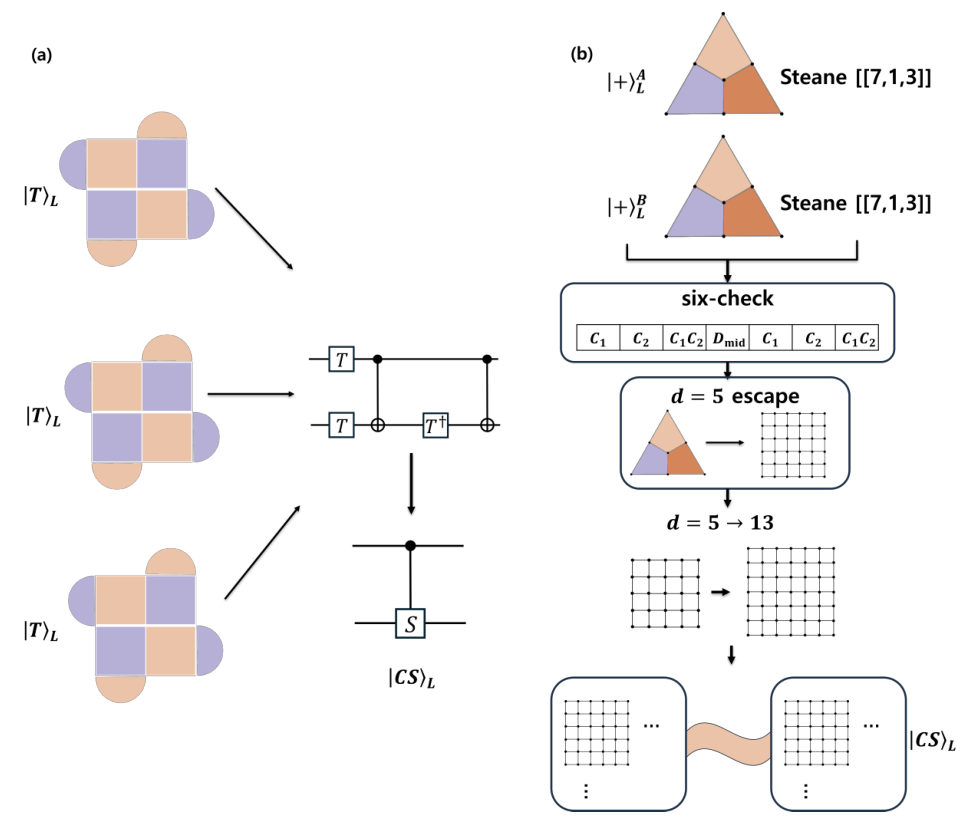
<figcaption class="paper-figure-caption"><b>Fig 1.</b> FIG. 1. Architecture overview and indirect comparator. (a) The indirect route prepares three logical |T⟩L resources and converts them to |CS⟩L with a Clifford+T circuit. (b) The direct route starts from two Steane [[7, 1, 3]] blocks in |+⟩L, applies the six-check sequence C1, C2, C12 | Dmid | C1, C2, C12, and immediately transfers the accepted state through the Steane-to-d = 5 escape and direct d = 5→13 surface-code growth. The three-T route is used only as a resource comparator.</figcaption>
</figure>
<figure class="paper-figure-card">
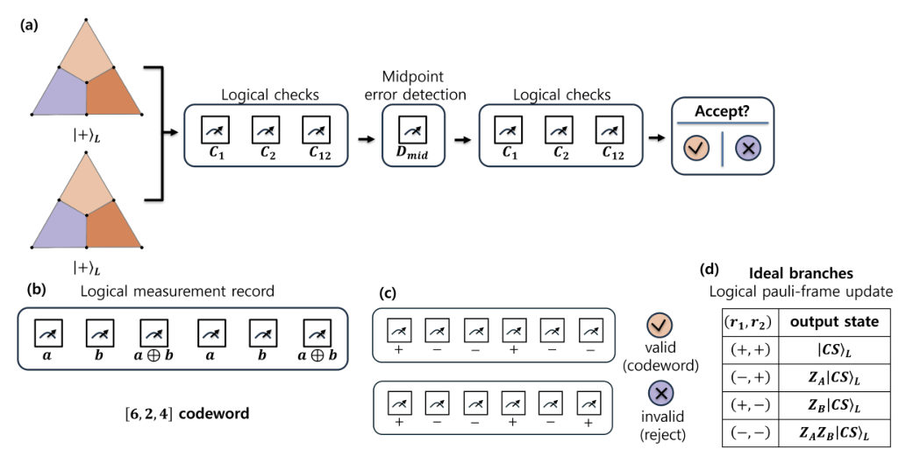
<figcaption class="paper-figure-caption"><b>Fig 2.</b> FIG. 2. Six-check measurement sequence and coded record. (a) The two Steane blocks undergo C1, C2, and C12 measurements, midpoint error detection Dmid, and a second measurement triple. (b) The ideal history g6(a, b) = (a, b, a ⊕ b, a, b, a ⊕b) forms a [6, 2, 4] record code. (c) Records outside the four valid codewords are rejected. (d) All four ideal branches are usable and differ only by the Pauli-frame update Za AZb B.</figcaption>
</figure>
<figure class="paper-figure-card">

<figcaption class="paper-figure-caption"><b>Fig 3.</b> FIG. 3. Steane-coordinate checks and CZZ-based compilation. (a) Matching coordinates of Steane blocks A and B realize the logical checks C1, C2, and C12 through transversal products of the local operators. (b) A cat ancilla controls G∗= C(H ⊗H), synthesized from one CZZ interaction and local Ry(π/4) rotations. Clifford wrappers Q1, Q2, and Q12 give the three coordinate checks. The six-check core contains 42 CZZ, 56 CX, and 224 one-qubit locations.</figcaption>
</figure>
<figure class="paper-figure-card">
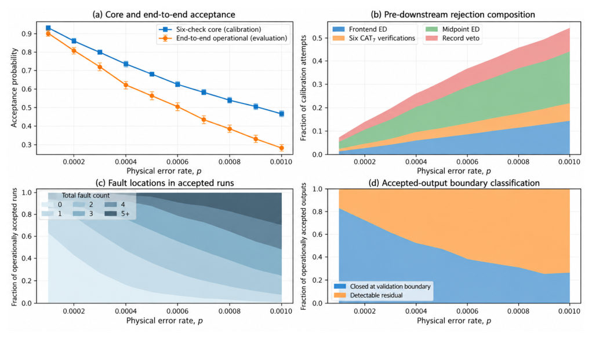
<figcaption class="paper-figure-caption"><b>Fig 4.</b> FIG. 4. Factory yield and accepted-output classification. (a) Acceptance of the six-check core and the complete factory. The two curves use independent calibration and evaluation samples. (b) Sources of rejection before the downstream stage. (c) Number of sampled fault locations in operationally accepted runs. (d) Accepted outputs are classified as either closed at the validation boundary or containing a detectable residual syndrome. Detectable residuals are not retrospectively rejected.</figcaption>
</figure>
<figure class="paper-figure-card">
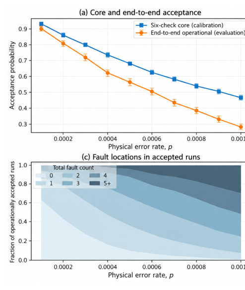
<figcaption class="paper-figure-caption"><b>Fig 5.</b> Figure 5(b) shows how decoder workload changes with p. The fraction of nontrivial records that reach the four- coset BP+OSD stage grows from about 4.7% at 10−4 to 44.7% at 10−3, while the median gap falls from 13.24 to 6.91. Every audited record has full four-coset coverage and no BP+OSD decoding failure is observed. The trend therefore reflects increasing ambiguity at higher p.</figcaption>
</figure>

**Summary.** This paper details a novel, fault-tolerant architecture for directly generating the entangled magic state $|CS
angle$ required for quantum computation. By employing a protected branch record and advanced error correction gadgets, the authors demonstrate that this direct method can be significantly more resource-efficient than established indirect preparation methods at low noise levels. This advances the practical feasibility assessment of fault-tolerant quantum computation.

**Why it may be interesting.** It provides a concrete, resource-cost analysis for generating a crucial non-Clifford resource state, which is fundamental for universal quantum computation protocols.

Detailed structure

**Main problem.** The paper addresses the challenge of developing a direct, fault-tolerant quantum circuit architecture for cultivating the entangled non-Clifford magic state $|CS
angle$. It aims to compare this direct method against established indirect resource preparation routes.

**Main result.** The direct cultivation route was shown to be operationally cheaper than the three-T route at two lower-noise benchmark points, demonstrating a viable, fault-tolerant method for generating the required non-Clifford resource.

**Method.** The authors employed detailed quantum error correction analysis, including the use of a minimal six-check classical record, verified CAT7 gadgets, and advanced decoding algorithms like four-coset BP+OSD.

**Model / system.** The work is situated in the context of fault-tolerant quantum computation, specifically utilizing Steane error detection and expanding from smaller surface code patches ($d=5$) to larger ones ($d=13$).

**Key observables.** Operation count (active locations), Logical Error Rate (LER), and the fault order of the certified output channel (order three).

**Important parameters / regimes.** Physical error rate ($p$), logical error rate ($L_g(p)$), and the required resource overhead (e.g., 263 detector bits).

**Assumptions / limitations.** The analysis is performed under the active-location stochastic-Pauli model, and comparisons often rely on assumptions regarding pre-existing output patches for the indirect route.

**Figures summary.** Figures compare the resource costs (active locations) and logical error rates between the direct cultivation route and the indirect three-T route across varying noise levels.

**Paper structure.** The paper progresses from defining the target state and its projection, detailing the error protection mechanism using a six-check record, presenting the full factory architecture, and concluding with a quantitative comparison of resource costs and error performance against the standard indirect method.

Abstract

Magic-state cultivation has so far focused mainly on single-qubit non-Clifford resources. We develop a direct cultivation architecture for the entangled state $|CS\rangle=CS|++\rangle$. Two commuting Clifford involutions project onto four usable branches related by Pauli-frame updates. A minimal six-bit $[6,2,4]$ record protects the branch label against readout errors that map one valid record to another. Verified CAT$_7$ gadgets, Steane error detection, CZZ-based controlled checks, and immediate Steane-to-surface expansion form the complete factory. The decoder uses 263 operational detector bits, while 168 additional bits are withheld for later validation. Decoding proceeds through exact low-order resolution, a precomputed higher-order catalogue, and four-coset BP+OSD. Under the stated active-location stochastic-Pauli model, exact enumeration finds no accepted closed-boundary logical-failure mechanism through fault order two, while explicit order-three failure mechanisms exist. Finite-$p$ simulations quantify acceptance, residual syndromes, and decoder workload, and targeted sampling of order-three faults estimates the leading logical-error channels. Optimizing the direct $d=5\rightarrow13$ expansion reduces accepted-output operation count by approximately 35--37\%. We compare the two routes at the same binary logical-error rate. Direct CS remains cheaper in operation count at the two lower-noise benchmark points even when the three-$T$ route is given pre-existing output patches. The ordering reverses between $8\times10^{-4}$ and $9\times10^{-4}$. These results show that an entangled non-Clifford state can be cultivated directly with a protected branch record and an explicitly certified fault-order-three output channel.

[↑ back to top](#top)

### [ECDSA.Fail: Open Autoresearch for Optimizing Elliptic-Curve Point Addition in Shor's Algorithm](http://arxiv.org/abs/2609.09582v1)

**Authors:** Jieyi Long, Theodore Pender, Zhao Huang, Manuel B. Santos, Samrendra Kumar Singh, Bartosz Naskręcki, Bit Wonka, Joe Doyle, Pierre-Luc Dallaire-Demers, Francesco Giannicola, Ruben M. L. Paschoarelli, Oli Freuler, Jackie Chia-Hsun Lee, Vasily Gnuchev, Gopi Kannappan, John Boyer, Xavier Butler, Akash Balasubramani, Jordan Newman, Bereket Dereje, Alexander Hertlein, Robert Kodra, Lucas Levy, Shaan Patel, JT Rose, Matt Zweil, Okechukwu Wisdom, Tarek El-Eter, Edison Lee, Michael Dong, Alan Li, Anto Joseph, Gajesh Naik, Gautham Anant, Soubhik Deb, Justin Drake  
**Type:** theory · **Category:** quantum information and computing · **PDF:** <https://arxiv.org/pdf/2609.09582v1>  
**Analysis basis:** full PDF text, analyzed in chunks

↔ Scroll figures horizontally

<figure class="paper-figure-card">

<figcaption class="paper-figure-caption"><b>Fig 1.</b> Fig. 1: Evolution of the best ECDSA.Fail Q × T score, from the 10.75B baseline to 1.496B at the data cutoff, an 86.1% reduction. The dashed line marks the re- ported Google/Babbush et al. [3] operating point of 2.993B. The challenge score is more than 50% lower, although differing interfaces and accounting conventions make the comparison contextual.</figcaption>
</figure>
<figure class="paper-figure-card">

<figcaption class="paper-figure-caption"><b>Fig 2.</b> Fig. 2: ECDSA.Fail qubit–Toffoli Pareto frontier. White points are challenge sub- missions; orange and purple circles are promoted and non-promoted admitted Pareto points; the cyan dotted curve marks the best observed Q × T; and dia- monds mark the Google/Babbush [3] (blue) and Schrottenloher [59] (pink) op- erating points. External points are contextual because interfaces and accounting conventions differ; see Tables 2 and 3.</figcaption>
</figure>
<figure class="paper-figure-card">
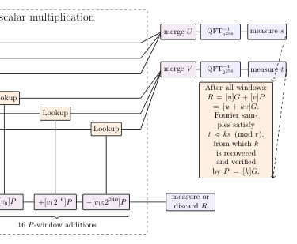
<figcaption class="paper-figure-caption"><b>Fig 3.</b> Fig. 3: Placement of the point-addition kernel within a power-of-two implemen- tation of windowed Shor ECDLP. The coherent exponent registers are pre- pared over Z2256 and split into 16-bit windows. Each window coherently selects a precomputed multiple of G or P and adds it to the accumulator, yielding R = [u]G + [v]P before inverse power-of-two Fourier transforms and measure- ment. Unlike the idealized formulation over Z2 r, the measured Fourier samples need not satisfy the annihilator relation exactly; they concentrate near it and re- quire classical postprocessing followed by verification of the recovered candidate k. The figure shows the coherent-register formulation; an iterative...</figcaption>
</figure>
<figure class="paper-figure-card">

<figcaption class="paper-figure-caption"><b>Fig 4.</b> Fig. 4: The two point-addition interfaces used to compute one scalar multipli- cation [s]B, where (s, B) denotes either (u, G) or (v, P). (a) In the double- and-add approach, each scalar bit si controls a mixed addition of the fixed, classically known point [2i]B to the accumulator |R⟩; this addend is fixed at circuit-construction time and does not occupy a quantum register. (b) In the windowed approach, the scalar is divided into 16-bit words ji = s16i:16i+16. Each |ji⟩indexes a QROM lookup into the precomputed table T (i) B , and the selected point T (i) B [ji] is added coherently to |R⟩. The selected addend is therefore quan- tum data entangled with the window register.</figcaption>
</figure>
<figure class="paper-figure-card">

<figcaption class="paper-figure-caption"><b>Fig 5.</b> Fig. 5: The generic open autoresearch discovery loop. Independent human–agent teams select a current-best, Pareto, or deliberately off-frontier base from the shared repository, propose a change, and submit it to a machine-checkable evalu- ator. Verified improvements become shared bases; rejected candidates are logged with their diagnoses and revised. This makes the search cumulative without re- quiring prior coordination beyond the shared objective, evaluator, and public artifacts.</figcaption>
</figure>

**Summary.** This paper introduces 'Open Autoresearch,' a novel paradigm for quantum circuit optimization, applied to the bottleneck of elliptic-curve point addition required for Shor's algorithm. By leveraging AI agents and human collaboration on a public leaderboard, participants achieved massive reductions in resource estimates ($Q 	imes T$), pushing the state-of-the-art for quantum cryptanalysis.

**Why it may be interesting.** While focused on cryptography, the methodology—using AI agents in a public, verifiable autoresearch loop to optimize complex quantum circuits—is highly relevant to developing efficient quantum algorithms for general quantum information processing tasks.

Detailed structure

**Main problem.** The paper focuses on optimizing the reversible secp256k1 point-addition circuit, which represents a critical computational bottleneck in implementing Shor's algorithm for breaking elliptic-curve cryptography.

**Main result.** Participants in the Open Autoresearch benchmark reduced the spacetime-inspired score $S=Q	imes T$ by 86.1% compared to the baseline, achieving scores significantly lower than previously published thresholds.

**Method.** The authors propose and utilize 'Open Autoresearch,' a paradigm where human and AI agents iteratively improve solutions on a public, machine-checkable leaderboard to optimize quantum circuits.

**Model / system.** The model is a quantum circuit designed to perform elliptic-curve point addition on the secp256k1 curve. Optimization targets the minimization of the product of peak logical qubit width ($Q$) and average executed Toffoli count ($T$).

**Key observables.** The primary observable is the score $S = Q 	imes T$. Other key metrics include the peak logical qubit width ($Q$), the average executed Toffoli count ($T$), and the empirical success probability ($\hat{p}$).

**Important parameters / regimes.** The optimization is benchmarked against specific cryptographic standards (secp256k1) and compares results against published thresholds from Google and Schrottenloher.

**Assumptions / limitations.** Comparisons to external benchmarks are noted to be contextual due to differing interfaces, accounting conventions, and validation scopes. The benchmark supplies one addend classically, requiring a specific circuit variant.

**Figures summary.** Figure 1 illustrates the dramatic reduction in the best ECDSA.Fail $Q 	imes T$ score over time, showing a reduction from a 10.75B baseline to 1.496B at the data cutoff.

**Paper structure.** The paper introduces the Open Autoresearch framework, details the ECDSA.Fail benchmark for point addition optimization, presents the iterative results showing performance improvements, and discusses the implications of these resource reductions for quantum cryptanalysis.

Abstract

We propose Open Autoresearch, a paradigm in which humans and AI agents publish evaluator-verified improvements to a public leaderboard. We instantiate it in ECDSA.Fail, optimizing reversible secp256k1 point-addition circuits, a bottleneck in Shor's algorithm for elliptic-curve cryptography. The benchmark minimizes the spacetime-inspired score $S=Q\times T$, where $Q$ is peak logical qubit width and $T$ is average executed Toffoli count. Participants reduced $S$ by 86.1%. At the data cutoff (26 July 2026), the best-scoring circuit uses 1,151 qubits and 1,299,453 average executed Toffoli gates, giving $Q\times T\approx1.496$ billion. This is more than 50% below Google's published point-addition score thresholds (arXiv:2603.28846), under different accounting conventions. Because the benchmark supplies one addend classically, we construct a coherent windowed-addition-compatible variant implementing the single-call interface required by windowed Shor. It uses 1,162 qubits and 1,684,161 average executed Toffoli gates. On 100,000 random inputs, its empirical success probability is $\hat{p}=0.99809$, giving $Q\times T/\hat{p}\approx1.961$ billion under an independently rerunnable per-call sensitivity model, not a full-Shor success estimate. Its qubit and Toffoli counts lie below Google's published thresholds and Schrottenloher's reported operating points (arXiv:2606.02235), although differing interfaces, accounting conventions, and validation scope preclude formal dominance. After the cutoff, the score was further reduced to 1.259 billion, while a separate low-width circuit reached 813 qubits. The public record shows AI agents complementing human judgment, providing evidence for open autoresearch on efficiently evaluable, machine-checkable objectives.

[↑ back to top](#top)

### [Enhancing Pauli Correlation Encoding for quantum optimization via systematic expressivity analysis](http://arxiv.org/abs/2609.09718v1)

**Authors:** Riku Usuki, Don Arai, Ken N. Okada, Keisuke Fujii  
**Type:** theory · **Category:** quantum information and computing · **PDF:** <https://arxiv.org/pdf/2609.09718v1>  
**Analysis basis:** full PDF text, analyzed in chunks

↔ Scroll figures horizontally

<figure class="paper-figure-card">
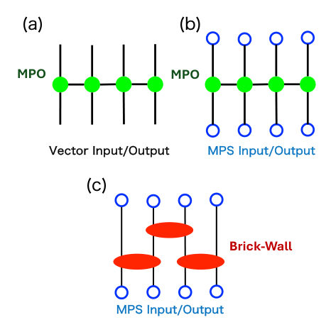
<figcaption class="paper-figure-caption"><b>Fig 1.</b> FIG. 1. Three comparative models based on tensor networks introduced in this study. (a) MPO-based model, (b) MPS- based model, and (c) Brick-wall model. These models are designed so that their internal structures progressively ap- proach the topology of the PCE circuit.</figcaption>
</figure>
<figure class="paper-figure-card">
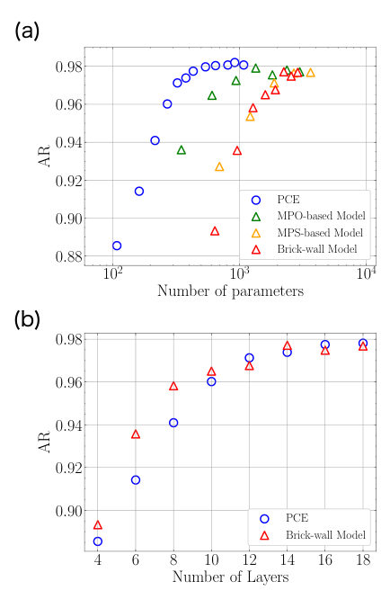
<figcaption class="paper-figure-caption"><b>Fig 2.</b> FIG. 2. Performance evaluation of the comparative models on the G14 benchmark instance (|V | = 800). (a) Parame- ter Efficiency: The relationship between the total number of parameters (log scale) and the achieved approximation ratio across all models. (b) Structural Comparison: The approxi- mation ratio as a function of the number of layers, comparing the PCE Brick-wall ansatz and the Brick-wall model based on tensor networks, both sharing the same brick-wall connec- tivity.</figcaption>
</figure>
<figure class="paper-figure-card">

<figcaption class="paper-figure-caption"><b>Fig 3.</b> FIG. 3. Approximation ratio as a function of circuit depth p for conventional unsupervised PCE and supervised optimiza- tion. Each point represents the approximation ratio averaged over three G-set instances with 800 vertices, G6, G11, and G18. For each instance, the best result obtained over five random initializations is used. Error bars indicate the stan- dard deviation across the three instances.</figcaption>
</figure>
<figure class="paper-figure-card">

<figcaption class="paper-figure-caption"><b>Fig 4.</b> FIG. 4. Optimization trajectories starting from circuit pa- rameters that reproduce the best-known solution (AR= 1 at iteration 0). Different choices of (α, β) lead to markedly dif- ferent stability near this solution-reproducing region on the G1 instance.</figcaption>
</figure>
<figure class="paper-figure-card">

<figcaption class="paper-figure-caption"><b>Fig 5.</b> Figure 3 shows that supervised optimization reaches AR = 1.0 with only five layers, whereas unsupervised optimization saturates at a lower AR despite using the same ansatz. This indicates that the ansatz is expres- sive enough to represent strong solutions, and that the main limitation in the conventional setting is not insuffi- cient expressivity but poor trainability under the relaxed unsupervised objective function. This further suggests that performance gains may be possible if one can design unsupervised objective functions that induce optimiza- tion dynamics similar to those of the supervised objective function.</figcaption>
</figure>

**Summary.** This paper analyzes the performance limitations of Pauli Correlation Encoding (PCE) for quantum optimization problems like Max-Cut. The authors find that the primary bottleneck is not the circuit's expressive power but the difficulty in training the objective function. They propose a multistage continuation framework that successfully guides the optimization process, leading to performance improvements competitive with advanced classical Graph Neural Network methods.

**Why it may be interesting.** It provides a concrete, actionable strategy (multistage optimization) to boost the performance of quantum algorithms like PCE, which is crucial for making near-term quantum devices more effective for optimization tasks.

Detailed structure

**Main problem.** The paper aims to improve the performance of Pauli Correlation Encoding (PCE) for quantum optimization, specifically addressing the issue of performance saturation.

**Main result.** The primary bottleneck limiting PCE performance is identified as poor trainability under the conventional objective function, not insufficient representational power (expressivity). A proposed multistage continuation framework significantly outperforms conventional PCE and is competitive with state-of-the-art Graph Neural Network (GNN) methods.

**Method.** The authors employ a systematic analysis comparing PCE to classical tensor network models and propose a multistage continuation framework to guide the optimization process from a smooth relaxed objective to a sharper, discrete target objective.

**Model / system.** The work focuses on optimizing combinatorial problems, such as Max-Cut on a graph G=(V, E), using the Pauli Correlation Encoding (PCE) framework, which maps optimization variables to expectation values of Pauli strings in a parameterized quantum circuit.

**Key observables.** Solution quality (Max-Cut value), parameter efficiency (number of trainable parameters), and the ability of the objective function to guide optimization (trainability).

**Important parameters / regimes.** The number of layers in the quantum circuit, the regularization parameters ($\alpha, eta$), and the number of stages ($K$) in the continuation framework.

**Assumptions / limitations.** The main limitation of conventional PCE is assumed to be the objective function's inability to guide optimization toward high-cut-value parameter regions, rather than the circuit's expressivity.

**Figures summary.** Figures compare PCE's parameter efficiency against classical tensor network models and show the performance improvement achieved by the multistage approach over conventional PCE when benchmarked against GNNs.

**Paper structure.** The paper reviews PCE, compares it to classical tensor networks, performs a diagnostic expressivity test, proposes the multistage continuation framework, and finally benchmarks the improved method against GNNs.

Abstract

Quantum approaches for combinatorial optimization problems have attracted considerable attention in recent years. Among these approaches, Pauli Correlation Encoding (PCE) has emerged as a promising framework for quantum devices with limited qubit resources because it embeds optimization variables in expectation values of Pauli strings. However, the mechanisms underlying its performance and the reasons for its saturation remain unclear. In this work, we investigate these questions through a systematic analysis of expressivity and trainability. First, we compare PCE with classical surrogate models based on tensor networks whose structures progressively approach the topology of the PCE circuit. The results show that PCE attains comparable solution quality with substantially fewer trainable parameters, indicating strong parameter efficiency. Second, to determine whether the performance saturation of conventional PCE is caused by insufficient expressivity or by optimization difficulty, we perform a diagnostic expressivity test in which the circuit is trained toward reference configurations for Max-Cut. The results show that even shallow PCE circuits can represent strong solutions, indicating that the main bottleneck is not the representational power of the ansatz, but the trainability under the relaxed objective function. Motivated by this finding, we propose a multistage continuation framework that gradually transforms a smooth relaxed objective into a sharper objective that more closely approximates the target discrete problem. Numerical experiments on G-set instances with 800 vertices show that the proposed method consistently outperforms conventional PCE and is competitive with representative graph neural network (GNN) methods. These results clarify the main factors behind PCE performance and provide a practical strategy for improving PCE on quantum devices with limited qubit resources.

[↑ back to top](#top)

### [Faster Computation with the Generalized Laplacian Quantum Walk](http://arxiv.org/abs/2609.10429v1)

**Authors:** Jonas Duda, Thomas G. Wong  
**Type:** theory · **Category:** quantum information and computing · **PDF:** <https://arxiv.org/pdf/2609.10429v1>  
**Analysis basis:** full PDF text, analyzed in chunks

↔ Scroll figures horizontally

<figure class="paper-figure-card">

<figcaption class="paper-figure-caption"><b>Fig 1.</b> FIG. 1. A complete bipartite graph with N1 = 7 and N2 = 5 vertices in each partite set, of which k1 = 3 and k2 = 2 vertices are marked in the respective sets, as shown by the double circles. Identically evolving vertices are identically colored and labeled.</figcaption>
</figure>
<figure class="paper-figure-card">

<figcaption class="paper-figure-caption"><b>Fig 2.</b> FIG. 2. Success probability versus time for search on complete bipartite graphs at γ = γa(3). The solid black curve is when α = −5, the red dashed curve is when α = −1, the green dotted curve is when α = 2 and the blue dot-dashed curve is when α = 5.</figcaption>
</figure>
<figure class="paper-figure-card">

<figcaption class="paper-figure-caption"><b>Fig 3.</b> FIG. 3. The probability at each type of vertex versus time for search on the complete bipartite graph with N1 = 5000, N2 = 2000 vertices, of which k1 = 2 and k2 = 3 are marked, with γ = γa (3) α = −1. The solid black curve is the probability in |a⟩, the red dashed curve is |b⟩(which is near 0 the entire evolution), the green dotted curve is |c⟩, and the blue dot- dashed curve is |d⟩.</figcaption>
</figure>

**Summary.** This paper analyzes quantum search algorithms on bipartite graphs using a quantum walk defined by a generalized Laplacian. The authors prove that by tuning the Laplacian with a degree matrix term (controlled by $\alpha$), the quantum walk can achieve search times that approach the theoretical optimum. This suggests the generalized Laplacian provides a powerful tool for designing faster quantum algorithms.

**Why it may be interesting.** The explicit derivation of how modifying the underlying graph Laplacian structure (via $\alpha$) can systematically improve the computational speed of a quantum search algorithm is highly relevant to designing novel quantum protocols.

Detailed structure

**Main problem.** To prove that a continuous-time quantum walk governed by a generalized Laplacian can solve a specific computational search problem faster than standard quantum walks.

**Main result.** The generalized Laplacian quantum walk achieves the optimal search time scaling, outperforming walks governed by the standard Laplacian or adjacency matrix, especially in the asymptotic limit of large graph sizes.

**Method.** The analysis involves deriving the time evolution of the quantum state using the Hamiltonian associated with the generalized Laplacian, followed by asymptotic analysis of the resulting probabilities.

**Model / system.** The model is a quantum walk on a complete bipartite graph, whose evolution is governed by a Hamiltonian derived from the generalized Laplacian $L_\alpha = L + \alpha D$.

**Key observables.** Success probability at marked vertices, and the minimum time $t^*$ required for the success probability to approach unity.

**Important parameters / regimes.** The parameter $\alpha$ controlling the degree matrix contribution, and the graph sizes $N_1, N_2$ relative to the number of marked vertices $k_1, k_2$.

**Assumptions / limitations.** The analysis relies on the asymptotic limit where the graph sizes $N_1$ and $N_2$ are large, and the parameter $|\alpha|$ tends to infinity.

**Figures summary.** Figure 2 demonstrates the shortening of the search runtime as the magnitude of $\alpha$ increases, confirming the superior performance of the generalized Laplacian walk.

**Paper structure.** The paper establishes the quantum walk model using the generalized Laplacian, derives the time evolution equations, and then analyzes the asymptotic behavior of the runtime $t^*$ by calculating its dependence on $\alpha$.

Abstract

Quantum walks are the quantum analogues of classical random walks or Markov chains. They are universal models of quantum computing, and they underpin a variety of quantum algorithms. We prove that a continuous-time quantum walk effected by a generalized Laplacian, which can arise in spin chains, can solve a computational problem more quickly than typical quantum walks governed by the standard Laplacian or adjacency matrix. This generalized Laplacian consists of the standard Laplacian plus a real-valued multiple of the degree matrix, and we prove that as the magnitude of the multiple of the degree matrix is increased, its corresponding quantum walk can search the complete bipartite graph with multiple marked vertices in time that approaches the optimal. This raises the potential for the generalized Laplacian quantum walk to be a useful method for developing additional faster quantum algorithms.

[↑ back to top](#top)

### [From Certifying Rank $k$ Projectors To Non-Positivity, Entanglement, And Non-Hermitian Witnesses Through Traces Of Matrix Powers](http://arxiv.org/abs/2609.09557v1)

**Authors:** H. F. Chau  
**Type:** theory · **Category:** quantum information and computing · **PDF:** <https://arxiv.org/pdf/2609.09557v1>  
**Analysis basis:** full PDF text, analyzed in chunks

↔ Scroll figures horizontally

<figure class="paper-figure-card">
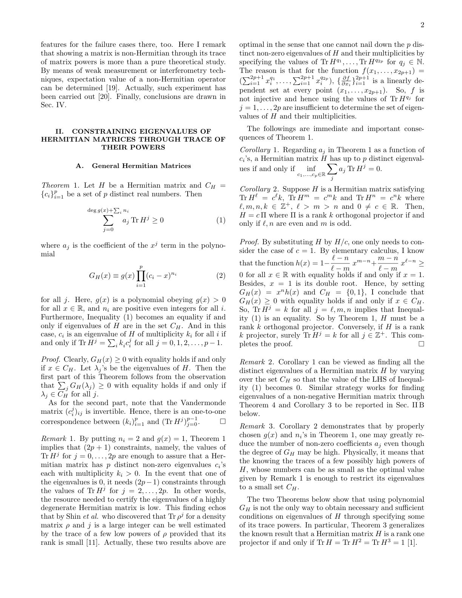
<figcaption class="paper-figure-caption"><b>Fig 1.</b> Low-resolution page preview, page 2</figcaption>
</figure>
<figure class="paper-figure-card">
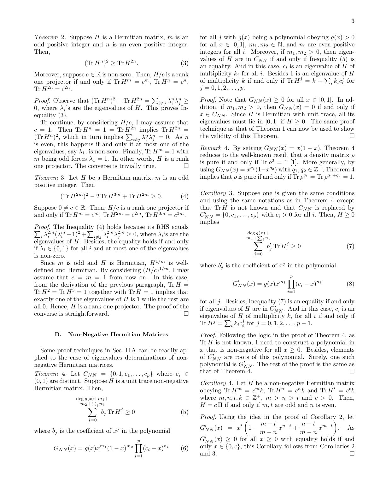
<figcaption class="paper-figure-caption"><b>Fig 2.</b> Low-resolution page preview, page 3</figcaption>
</figure>
<figure class="paper-figure-card">
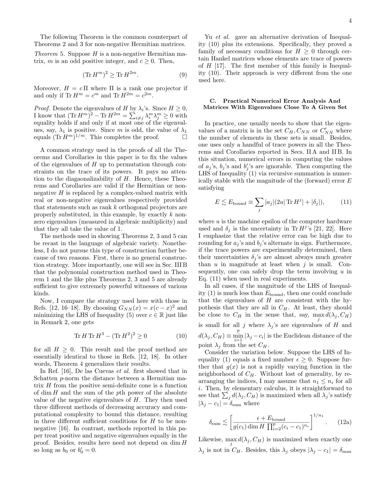
<figcaption class="paper-figure-caption"><b>Fig 3.</b> Low-resolution page preview, page 4</figcaption>
</figure>
<figure class="paper-figure-card">

<figcaption class="paper-figure-caption"><b>Fig 4.</b> Low-resolution page preview, page 5</figcaption>
</figure>
<figure class="paper-figure-card">

<figcaption class="paper-figure-caption"><b>Fig 5.</b> Low-resolution page preview, page 6</figcaption>
</figure>

**Summary.** This paper develops a general mathematical framework to test spectral properties of quantum operators using only the traces of their powers. It establishes various 'witnesses' derived from these traces that can certify crucial quantum features like entanglement or non-positivity. This provides a powerful, resource-efficient diagnostic tool for quantum state characterization.

**Why it may be interesting.** This work provides rigorous, purely algebraic tools derived from moment calculations to diagnose fundamental quantum properties (like entanglement or non-negativity) without requiring full knowledge of the Hamiltonian or state preparation.

Detailed structure

**Main problem.** The paper systematically studies necessary and sufficient conditions to constrain the eigenvalues of Hermitian matrices using the traces of their powers.

**Main result.** These trace-based conditions serve as powerful witnesses to certify quantum state properties, such as entanglement, non-positivity, and non-Hermiticity.

**Method.** The core method involves deriving and analyzing polynomial inequalities involving $	ext{Tr} H^j$ to place constraints on the spectrum of the matrix $H$.

**Model / system.** The analysis focuses on Hermitian matrices ($H$) and density matrices ($
ho$) relevant to quantum information theory. The results generalize the purity condition ($	ext{Tr} 
ho^2 = 1$) to broader spectral constraints.

**Key observables.** The primary observables are the traces of matrix powers ($	ext{Tr} H^j$), which are used to diagnose properties like purity, rank, non-negativity, and Hermiticity.

**Important parameters / regimes.** The analysis considers the dimension of the matrix ($	ext{dim } H$), the number of distinct eigenvalues ($p$), and the impact of measurement uncertainty ($\delta$) and machine epsilon ($u$).

**Assumptions / limitations.** The authors address limitations regarding the number of traces needed to determine the spectrum and the practical challenges posed by numerical stability and measurement errors.

**Figures summary.** The notes mention tables (Table II, III, IV) summarizing the performance of various witnesses (UTNPW, NPW, EW) for certifying non-positivity and entanglement across different dimensions.

**Paper structure.** The paper builds from generalizing the purity condition to establishing general theorems (Theorem 1) for eigenvalue constraints, then developing specific witnesses (NHW, UTNPW, NPW, EW) for physical properties, and concluding with a discussion of performance and open questions.

Abstract

We all know that a density matrix $ρ$ is pure if and only if $\mathrm{Tr} \,ρ^2 = 1$. But is this the only way to prove the purity of $ρ$ using the trace of its powers? Here I systematically study the necessary and sufficient conditions of the more general question of guaranteeing that all eigenvalues of a Hermitian matrix belong to a specified set through its trace of powers. More importantly, these characterization results are automatically witnesses certifying a quantum state as entangled, a Hermitian operator has least one negative eigenvalue and a linear operator as non-Hermitian. I demonstrate the effectiveness of these witnesses, analyze their performance, and study their strength, weakness together with resource requirement through numerical simulation as well as analytical work. I also discuss briefly the effects of numerical stability, uncertainty in measurement and rounding errors on these problems.

[↑ back to top](#top)

### [Generalized Fidelity and the Data Processing Inequality](http://arxiv.org/abs/2609.09753v1)

**Authors:** Reza Rajaei  
**Type:** theory · **Category:** quantum information and computing · **PDF:** <https://arxiv.org/pdf/2609.09753v1>  
**Analysis basis:** full PDF text, analyzed in chunks

↔ Scroll figures horizontally

<figure class="paper-figure-card">
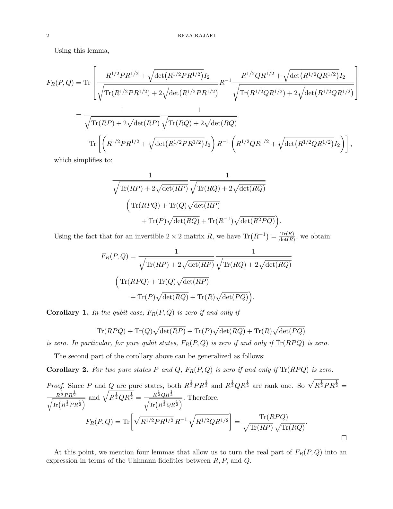
<figcaption class="paper-figure-caption"><b>Fig 1.</b> Low-resolution page preview, page 2</figcaption>
</figure>
<figure class="paper-figure-card">

<figcaption class="paper-figure-caption"><b>Fig 2.</b> Low-resolution page preview, page 3</figcaption>
</figure>
<figure class="paper-figure-card">
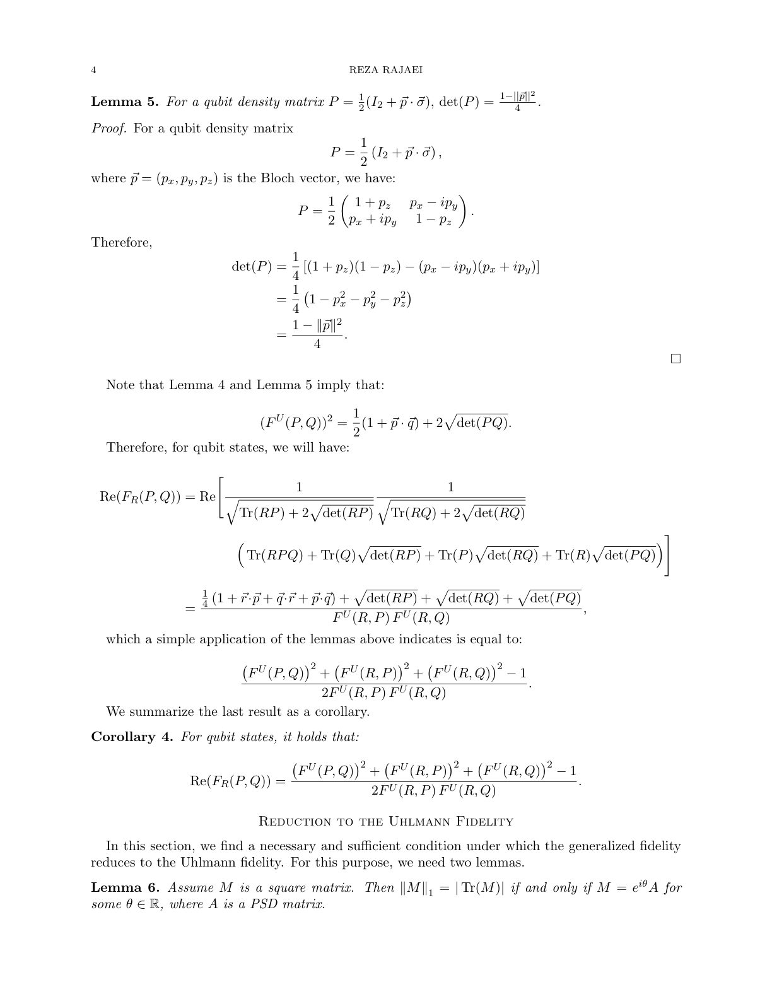
<figcaption class="paper-figure-caption"><b>Fig 3.</b> Low-resolution page preview, page 4</figcaption>
</figure>
<figure class="paper-figure-card">

<figcaption class="paper-figure-caption"><b>Fig 4.</b> Low-resolution page preview, page 5</figcaption>
</figure>
<figure class="paper-figure-card">
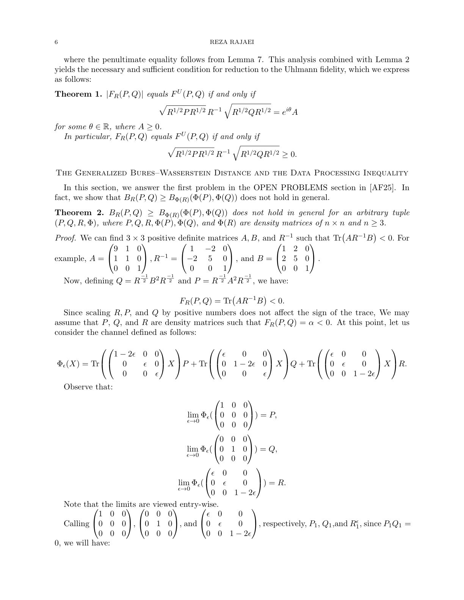
<figcaption class="paper-figure-caption"><b>Fig 5.</b> Low-resolution page preview, page 6</figcaption>
</figure>

**Summary.** This theoretical work analyzes the generalized Bures--Wasserstein distance derived from the generalized fidelity, finding that it generally violates the Data Processing Inequality in dimensions higher than two. For qubits, the authors provide specific conditions under which the DPI holds, offering deeper insights into the robustness of quantum distance measures under noisy quantum channels.

**Why it may be interesting.** The study of distance metrics and their monotonicity under quantum operations (like channels) is fundamental to understanding quantum information capacity and process fidelity, making it highly relevant to quantum information theory.

Detailed structure

**Main problem.** The paper investigates whether the generalized Bures--Wasserstein distance, induced by the generalized fidelity, satisfies the Data Processing Inequality (DPI) for quantum channels.

**Main result.** The distance fails to satisfy the DPI in dimensions greater than two, but sufficient conditions for the DPI are derived for the two-dimensional (qubit) case.

**Method.** The authors use explicit formulas for the generalized fidelity, Pauli matrix representations, and construct counterexamples using block matrices to test the DPI.

**Model / system.** The analysis focuses on quantum states represented by positive semi-definite matrices, particularly in the qubit case (2x2 matrices), and their evolution under quantum channels.

**Key observables.** Generalized Fidelity (FR), Squared generalized Bures--Wasserstein distance (BR), and Uhlmann fidelity (Fu).

**Important parameters / regimes.** Dimensionality ($n \geq 2$), and the specific structure of the quantum channels ($\Phi$).

**Assumptions / limitations.** For the qubit case, the analysis relies on specific algebraic properties derived from the structure of the fidelity and the assumption of specific relationships between fidelities.

**Figures summary.** Not specified.

**Paper structure.** The paper first establishes the non-satisfaction of DPI for $n \geq 3$. It then derives sufficient conditions for the DPI in $n=2$ using explicit formulas. Finally, it analyzes the relationship between the generalized fidelity and the Uhlmann fidelity, and examines the DPI failure using channel operations.

Abstract

In this note, we show that the generalized Bures--Wasserstein distance induced by the generalized fidelity does not satisfy the data processing inequality in dimensions greater than two. In dimension two, although we do not settle the DPI in full generality, we derive two sufficient conditions guaranteeing it by using an explicit formula for the real part of the generalized fidelity. Furthermore, we find a necessary and sufficient condition under which the generalized fidelity reduces to the Uhlmann fidelity.

[↑ back to top](#top)

### [Induced random mixed states are symmetric Dirichlet mixtures](http://arxiv.org/abs/2609.09421v1)

**Authors:** Brian T. Kirby, Alexander C. B. Greenwood, Sanjaya Lohani, Joseph M. Lukens  
**Type:** theory · **Category:** other · **PDF:** <https://arxiv.org/pdf/2609.09421v1>  
**Analysis basis:** full PDF text, analyzed in chunks

↔ Scroll figures horizontally

<figure class="paper-figure-card">
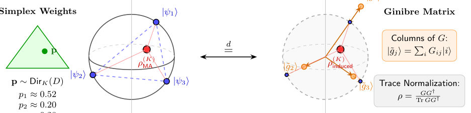
<figcaption class="paper-figure-caption"><b>Fig 1.</b> FIG. 1. Geometric illustration of the equivalence between the Mai-Alquier (MA) construction (left) and the induced-state construction (right) for a qubit system (D = 2) and environment dimension K = 3. Left: A mixed state is formed by convexly combining K independent Haar-random pure states |ψj⟩with weights p ∼DirK(D). Right: The columns |˜gj⟩of a 2 × 3 Ginibre matrix (plotted as orange circles) determine normalized directions |ψj⟩= |˜gj⟩/∥|˜gj⟩∥(plotted as blue circles) and radial weights through trace normalization of GG†. Under this decomposition, the normalized radial variables generate the same Dirichlet law for the mixture weights, yielding the same random density-matrix distribution.</figcaption>
</figure>

**Summary.** This work establishes a deep mathematical connection between random mixed states generated by tracing out an environment and the statistically defined Mai-Alquier distribution. This equivalence recasts difficult quantum expectation value calculations into solvable problems involving Dirichlet moments. It offers a unified computational perspective for analyzing observables like purity and overlaps in open quantum systems.

**Why it may be interesting.** It provides a powerful, unified mathematical tool to calculate complex expectation values for open quantum systems by mapping them onto well-understood statistical distributions (Dirichlet).

Detailed structure

**Main problem.** The paper establishes an exact distributional equivalence between random mixed states induced by partial tracing over an environment and the Mai-Alquier (MA) distribution.

**Main result.** This equivalence allows calculations of expectation values for quantum observables (like purity moments and determinants) to be recast into manageable calculations involving Dirichlet moments and low-order Haar averages.

**Method.** The authors use the mathematical framework connecting partial traces over Haar-random pure states to the structure of the symmetric Dirichlet distribution, particularly when the Dirichlet parameter matches the system dimension.

**Model / system.** The system involves a D-dimensional quantum system coupled to a K-dimensional environment, prepared in a Haar-random global pure state. The resulting mixed state is analyzed using the MA ensemble model.

**Key observables.** Purity moments ($	ext{Tr} 
ho^m$), mean Hilbert-Schmidt distance, and the determinant ($\det 
ho$).

**Important parameters / regimes.** System dimension (D), Environment dimension (K), and the Dirichlet concentration parameter ($\alpha=D$).

**Assumptions / limitations.** The equivalence holds under the condition that the Dirichlet concentration parameter $\alpha$ equals the system dimension $D$.

**Figures summary.** Figure 1 illustrates the geometric equivalence for a qubit system, showing both the MA construction and the induced state construction using Ginibre matrix columns leading to the same Dirichlet law.

**Paper structure.** The paper proceeds by proving the distributional equivalence, then systematically applying this equivalence to derive exact formulas for key quantum observables, including purity moments, distance metrics, and the determinant.

Abstract

We establish an exact equivalence in distribution between $D$-dimensional random mixed states induced by partial traces over $K$-dimensional environments and the Mai-Alquier distribution, a mixture of $K$ independent Haar-random pure states weighted by a symmetric Dirichlet distribution. This identification recasts a class of expectation values for induced ensembles into calculations involving Dirichlet moments and low-order Haar averages on a single-system state space. As applications, we recover exact purity moments up to fourth order, derive the mean Hilbert--Schmidt distance between independent induced ensembles with possibly different environment dimensions, and obtain exact average determinants. These results provide a unified and constructive perspective on induced random mixed states and on the evaluation of quantities such as purity moments, overlaps, and determinants.

[↑ back to top](#top)

### [Josephson energy of superconducting junctions: amorphous versus crystalline tunnel barriers](http://arxiv.org/abs/2609.09426v1)

**Authors:** Wanting Zhang, Aldilene Saraiva-Souza, Félix Beaudoin, Xianghua Kong, Hong Guo, Yu Zhu  
**Type:** theory · **Category:** quantum information and computing · **PDF:** <https://arxiv.org/pdf/2609.09426v1>  
**Analysis basis:** full PDF text, analyzed in chunks

↔ Scroll figures horizontally

<figure class="paper-figure-card">

<figcaption class="paper-figure-caption"><b>Fig 1.</b> Figure 1: Atomic structures of the Josephson-junction models. (a) Junction with a crystalline Al2O3 tunnel barrier. (b) Junction with an amorphous Al2O3 tunnel barrier of the same oxide thickness. Blue and red spheres represent Al and O atoms, respectively.</figcaption>
</figure>
<figure class="paper-figure-card">
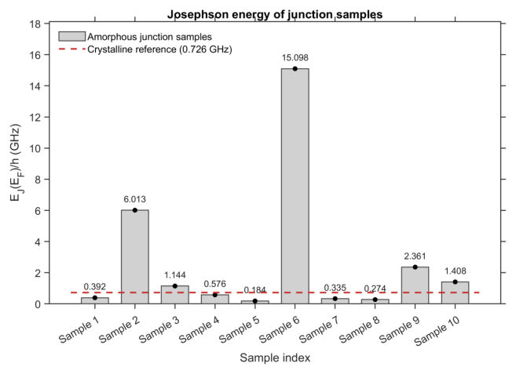
<figcaption class="paper-figure-caption"><b>Fig 2.</b> Figure 2: Josephson energies of the ten amorphous junction samples (bars), estimated from the calculated Fermi-level transmission using the Ambegaokar–Baratoff relation with ∆= 0.18 meV and a device area of 200 × 200 nm2. Each junction is scaled using its corresponding transverse simulation-cell area A0. The dashed line marks the crystalline reference junction (EJ/h ≈0.73 GHz).</figcaption>
</figure>
<figure class="paper-figure-card">
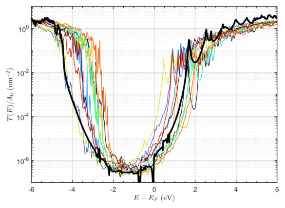
<figcaption class="paper-figure-caption"><b>Fig 3.</b> Figure 3: Area-normalized energy-dependent transmission T(E)/A0 on a logarithmic scale, where A0 is the transverse area of the corresponding simulation cell. The thick black curve is the crystalline junction; the colored curves are the ten amorphous junctions. Normalization by A0 accounts for the different transverse supercell areas of the crystalline and amorphous models. All curves exhibit a similar transmission-valley structure, while their values near the Fermi level vary substantially among samples.</figcaption>
</figure>
<figure class="paper-figure-card">
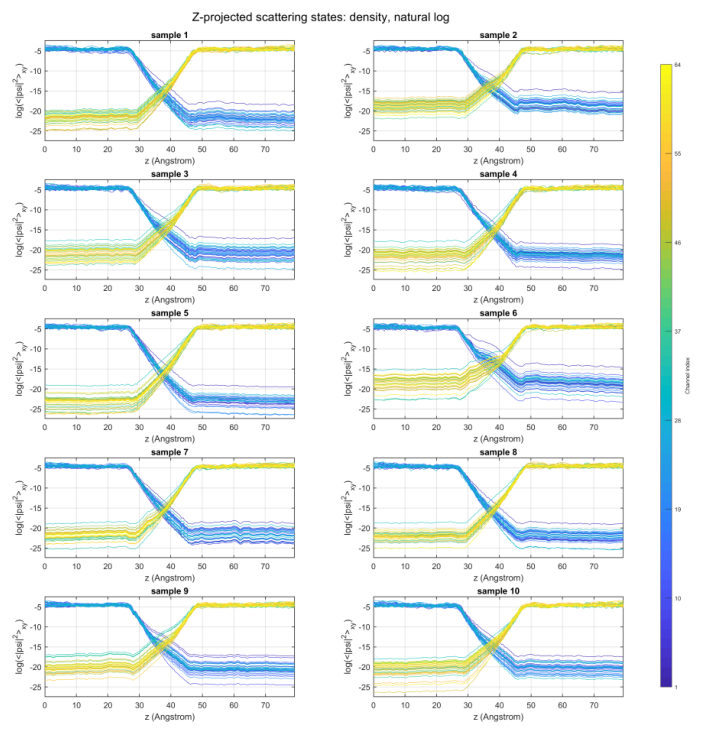
<figcaption class="paper-figure-caption"><b>Fig 4.</b> Figure 4: Probability of the Fermi-level scattering states (natural-log scale), averaged over the transverse xy dimensions, for all 64 transport channels in each of the ten amorphous junction samples. The panels correspond to Samples 1–10, and the color denotes the transport-channel index. The approximately linear decay within the oxide on the logarithmic scale is characteristic of quantum tunneling; the different decay rates show that some channels are considerably more conductive than others.</figcaption>
</figure>
<figure class="paper-figure-card">

<figcaption class="paper-figure-caption"><b>Fig 5.</b> Figure 5 visualizes two representative scattering states in real space: (a) the least conductive channel of Sample 5, the lowest-transmission junction, and (b) the most conductive channel of Sample 6, the highest-transmission junction. In the least conductive case, the wave function remains confined to the incident electrode and interface region and dies out inside the oxide; in the most conductive case, it penetrates the barrier and retains substantial amplitude on the transmitted side. These observations suggest the following physical picture. Amorphous Al2O3 has a spatially nonuniform stoichiometry: Al-rich regions have a lower effective tunnel-barrier height, while O-rich regions have a...</figcaption>
</figure>

**Summary.** This work quantitatively models the Josephson energy in superconducting junctions by comparing crystalline and amorphous oxide barriers. Using NEGF-DFT, the authors find that amorphous barriers lead to highly variable and generally higher $E_J$ values due to percolation paths. This establishes a detailed, atomistic understanding of how oxide microstructure dictates superconducting circuit performance.

**Why it may be interesting.** The direct link established between the atomic-scale disorder (amorphous structure) and a macroscopic circuit parameter ($E_J$) provides crucial physical insight for designing superconducting quantum circuits.

Detailed structure

**Main problem.** The paper investigates how the atomic microstructure of the tunnel barrier affects the Josephson energy ($E_J$) in superconducting junctions, a critical parameter for transmon qubits.

**Main result.** Amorphous barriers exhibit a mean $E_J/h$ significantly higher than crystalline barriers, with the large variability attributed to percolation-like tunneling pathways formed by stoichiometric inhomogeneity.

**Method.** The study employs first-principles quantum-transport calculations using the NEGF-DFT method to compute the critical current and subsequently $E_J$ via the Ambegaokar–Baratoff relation.

**Model / system.** The system is an Al/AlO_x/Al Josephson junction. The analysis compares junctions with a crystalline Al2O3 barrier against multiple realizations of an amorphous Al2O3 barrier.

**Key observables.** Josephson energy ($E_J$), normal-state conductance ($G_{A/N}$), and critical current ($I_c$).

**Important parameters / regimes.** The oxide barrier thickness (1-2 nm), the superconducting gap ($\Delta = 0.18 	ext{ meV}$), and the junction area ($200 	imes 200 	ext{ nm}^2$).

**Assumptions / limitations.** Transport is assumed to be quantum tunneling, and the analysis relies on mapping the junction to a representative large area to average out local fluctuations.

**Figures summary.** Figures compare the atomic structures of crystalline vs. amorphous barriers, show the distribution of calculated $E_J$ values for multiple amorphous samples, and visualize the energy-dependent transmission coefficients.

**Paper structure.** The paper follows a computational workflow: first, calculating the transmission coefficient $T(E)$ using NEGF-DFT; second, determining the normal-state conductance $G_{A/N}$; and finally, calculating $E_J$ using the Ambegaokar–Baratoff relation.

Abstract

The Josephson energy $E_J$ is a key parameter governing the properties of transmon superconducting qubits. In Al/AlO$_x$/Al junctions, $E_J$ is set by electron tunneling through an ultrathin oxide barrier and therefore depends exponentially on the atomic structure of the barrier. We compute $E_J$ by first-principles device modeling based on the NEGF-DFT quantum-transport method, comparing a junction with a crystalline Al$_2$O$_3$ barrier against ten junctions with melt--quenched amorphous Al$_2$O$_3$ barriers of the same thickness. From the Fermi-level transmission and the Ambegaokar--Baratoff relation, we obtain a mean $E_J/h$ of $2.78$ GHz for the amorphous ensemble, with a standard deviation of $4.67$ GHz, compared with $0.73$ GHz for the crystalline reference; individual amorphous values span nearly two orders of magnitude. Scattering-state analysis shows that transport is quantum tunneling and that the variability originates from stoichiometric inhomogeneity of the amorphous oxide: Al-rich, low-barrier regions can connect into percolation-like tunneling pathways that strongly enhance the conductance. A realistic $200\times200$ nm$^2$ junction self-averages over more than $2\times10^4$ such microscopic regions. These results establish a quantitative atomistic route from oxide microstructure to the superconducting-circuit energy scale $E_J$.

[↑ back to top](#top)

### [Multipole splats for optimized and inverted effective potentials](http://arxiv.org/abs/2609.09280v1)

**Authors:** Matija Medvidović, Angel Rubio, Juan Carrasquilla  
**Type:** theory · **Category:** strongly correlated electrons · **PDF:** <https://arxiv.org/pdf/2609.09280v1>  
**Analysis basis:** full PDF text, analyzed in chunks

↔ Scroll figures horizontally

<figure class="paper-figure-card">

<figcaption class="paper-figure-caption"><b>Fig 1.</b> FIG. 1. A schematic of the variational potential optimization enabled by multipole splat potentials. We use floating Gaussian monopoles and dipoles to exactly control the asymptotic decay and generate the optimized effective potential as an electrostatic potential of a fictitious charge distribution. Both optimized effective potentials and inverted exact Kohn-Sham potentials can then be recovered by direct optimization.</figcaption>
</figure>
<figure class="paper-figure-card">

<figcaption class="paper-figure-caption"><b>Fig 2.</b> FIG. 2. Left: The OEP and IKS potentials and their XC source densities for the silicon monoxide (SiO) molecule using the EXX, B3LYP and PBE0 functionals as well as the IKS with respect to the independently computed CCSD(T) reference density. The orbitals were represented using the aug-cc-pVQZ (quadruple-zeta) basis. In the bottom panel, we show the density TV contributions along the axis of the molecule, demonstrating density matching between OEP (IKS) and GKS (CCSD(T)). Center: Similar to the left panel, computed on the carbon monoxide (CO) molecule. Right: The radial dependence and the asymptotic decay of neon (Ne) atom effective potentials. We observe the expected asymptotic decay from...</figcaption>
</figure>
<figure class="paper-figure-card">
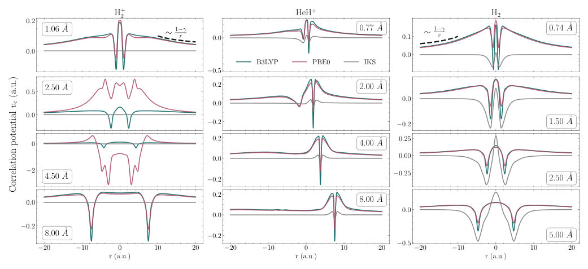
<figcaption class="paper-figure-caption"><b>Fig 3.</b> FIG. 3. Effective correlation potentials vc = vxc −vEXX, defined in Eq. 34, plotted along the molecular axis for H+ 2 (left), HeH+ (center), and H2 (right). Internuclear separation increases downward and is labeled in each panel. Hybrid OEP results (B3LYP, PBE0) are contrasted with the inverted (INV) potential obtained from a CCSD(T) reference density, serving as a high-level finite-basis reference. Dashed lines mark the (1−γ)/r asymptote inherited from the missing fraction of exact exchange. For H+ 2 , the exact vc vanishes identically. Vertical scales are independent across panels.</figcaption>
</figure>
<figure class="paper-figure-card">

<figcaption class="paper-figure-caption"><b>Fig 4.</b> FIG. 4. Left: Neon atom Rydberg ns (l = 0) and nd (l = 2) series εn, plotted against 1/2n2. Reference experimental values and quantum-defect fits ˆµs ≈1.351 and ˆµd ≈0.006 from Eq. 35 are highlighted. OEP eigenvalues and their GKS or HF counterparts are plotted as well. Center: Converged OEP potentials on a logarithmic radial scale, sharing the energy axis with the left panel. Horizontal lines mark the ns and nd eigenvalues, with classical turning points marked. Upper right: HOMO eigenvalues against CCSD(T) ionization potentials IP for the selected 60 GW100 systems with N ≤40 electrons. Mean absolute errors |εHOMO +IP | for EXX (≈17 mHa) and HF (≈27 mHa) are shown, averaged over these...</figcaption>
</figure>
<figure class="paper-figure-card">
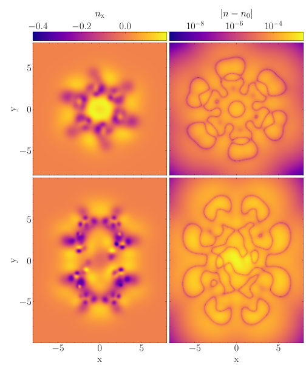
<figcaption class="paper-figure-caption"><b>Fig 5.</b> FIG. 5. Exact exchange OEP results for benzene (top) and naphthalene (bottom), evaluated on a plane 1 Bohr above the molecular plane. Left: The exchange source density, read directly off the converged multipole splat parameters, resolv- ing the delocalized π system of benzene and the inequivalent bonding regions of naphthalene. Right: The pointwise den- sity variation |n −n0| against the GKS reference n0.</figcaption>
</figure>

**Summary.** This paper introduces 'multipole splats,' a novel mathematical technique to overcome the numerical instability plaguing the calculation of optimized effective potentials (OEP) and inverted Kohn-Sham (IKS) potentials in DFT. By reformulating these problems as stable nonlinear optimizations, the authors provide a robust method to derive highly accurate, physically meaningful effective potentials for correlated electron systems.

**Why it may be interesting.** This work provides a robust, mathematically stable framework for calculating highly accurate, non-local effective potentials, which is crucial for simulating real-time dynamics and response properties in quantum materials.

Detailed structure

**Main problem.** Modern DFT methods using hybrid functionals generate nonlocal and orbital-dependent effective potentials that introduce systematic errors in response properties and real-time dynamics.

**Main result.** The authors introduce 'multipole splats,' a novel potential parametrization that recasts the difficult OEP and IKS problems into stable, nonlinear optimization tasks, yielding improved potentials for various DFT failure modes.

**Method.** The method uses multipole splats—a trial potential built from Gaussian monopoles and dipoles—to stabilize the optimization of effective potentials, bypassing the numerical fragility associated with inverting the KS response function.

**Model / system.** The work is situated within Kohn-Sham Density Functional Theory (DFT) applied to many-electron systems. It focuses on constructing optimized effective potentials (OEP) and inverted Kohn-Sham (IKS) potentials to accurately represent the exchange-correlation potential.

**Key observables.** Effective potentials ($v_{xc}$), HOMO eigenvalues ($\epsilon_{	ext{HOMO}}$), localization energy ($E_{loc}$), and the asymptotic decay of the potential ($v_{xc} \sim -1/r$).

**Important parameters / regimes.** The number of splats ($N_1, N_2$), regularization strength ($\lambda$), and the choice of hybrid functional (e.g., B3LYP, PBE0).

**Assumptions / limitations.** The approach assumes that OEP and IKS can be formulated as stable, supervised nonlinear optimization problems directly solvable in standard orbital basis sets.

**Figures summary.** Figures show converged $v_{xc}$ potentials for various molecules (e.g., CO, SiO) along the internuclear axis, demonstrating the potential's structure and asymptotic decay. Tables compare calculated HOMO eigenvalues across different potential construction methods.

**Paper structure.** The paper first establishes the limitations of current DFT potentials, then introduces the multipole splats as a stable variational/supervised learning framework. It details the application to OEP and IKS, benchmarks the method against established potentials (TG, KLI), and finally demonstrates its capability by calculating potentials for larger systems and recovering spectral properties like the Rydberg series.

Abstract

Approximate single-particle descriptions of correlated matter remain the principal source of actionable predictions in quantum science. In modern density functional theory (DFT), hybrid effective Hamiltonians are constructed to reproduce equilibrium densities and forces. However, their nonlocal and orbital-dependent potentials leave systematic errors in response properties and real-time dynamics. Local optimized effective potentials (OEP) or inverted Kohn-Sham (IKS) potentials would remove this limitation, but the numerical fragility in finite orbital bases has long prevented their wide adoption. We introduce multipole splats, a class of trial potentials that carry the correct asymptotic decay by construction. By showing that OEP and IKS map to variational and supervised variants of Hamiltonian learning, we recast both problems as stable nonlinear optimization formulated directly in standard orbital basis sets and applicable to any hybrid functional approximation. We show improvements to three canonical DFT failure modes. Firstly, by comparing approximate and near-exact inverted effective correlation potentials, we isolate the spatial signatures of self-interaction, delocalization, and static correlation errors. Secondly, we recover the Rydberg series without empirical asymptotic corrections, demonstrating access to precise spectral properties. Finally, we compute exact-exchange potentials for larger $π$-conjugated systems, establishing scaling capacity. Multipole splats extract new first-principles insights from established approximations and provide capacity for robust dataset generation for downstream processing and learning.

[↑ back to top](#top)

### [Noise Limits on Fault-Tolerant Fermionic Quantum Computing](http://arxiv.org/abs/2609.09467v1)

**Authors:** Owen Allison, Luke Coffman  
**Type:** theory · **Category:** quantum information and computing · **PDF:** <https://arxiv.org/pdf/2609.09467v1>  
**Analysis basis:** full PDF text, analyzed in chunks

↔ Scroll figures horizontally

<figure class="paper-figure-card">

<figcaption class="paper-figure-caption"><b>Fig 1.</b> FIG. 1. The noise model under consideration: First we apply the two qubit resourceful gate U, then apply local depolarizing noise D⊗2 p .</figcaption>
</figure>
<figure class="paper-figure-card">
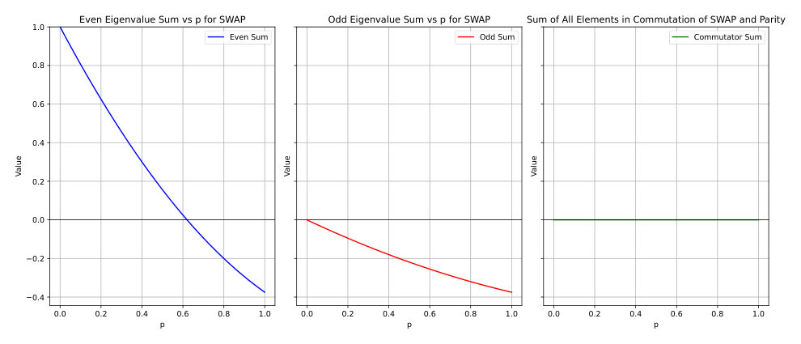
<figcaption class="paper-figure-caption"><b>Fig 2.</b> FIG. 2. Numerical results implementing Algorithm 1 for SWAP. The left two graphs show the value for ∆± for different probabilities of depolarization p. The third graph shows that [ρU,p, P] = 0 regardless of noise.</figcaption>
</figure>

**Summary.** This work establishes a theoretical upper bound on the noise tolerance for fault-tolerant fermionic quantum computation. By analyzing the channel's properties using fermionic Choi states and concurrences, the authors derive a limit of approximately 62% for the depolarizing noise. This result is significant as it sets a new benchmark for the resilience of fermionic quantum hardware.

**Why it may be interesting.** It provides a rigorous, quantitative measure of hardware resilience for a specific, physically relevant quantum computing model (fermions), which is crucial for designing practical quantum processors.

Detailed structure

**Main problem.** The paper determines the maximum noise level that fault-tolerant quantum circuits can sustain while maintaining universal quantum computation capabilities.

**Main result.** The derived upper bound for fermionic quantum computing using the matchgate is approximately 62%, which is claimed to be the best known bound for fermionic systems.

**Method.** The analysis uses Uhlmann-Wootters concurrences applied to the fermionic Choi state to test when the combined noisy channel becomes convex Gaussian, signaling a loss of computational power.

**Model / system.** The system is fermionic quantum computing, which utilizes a matchgate with a non-Gaussian resource universal gate set. The noise model applied is local depolarizing noise.

**Key observables.** Uhlmann-Wootters concurrences ($C_{\pm}(U, p)$) and the condition for the combined channel to be convex Gaussian.

**Important parameters / regimes.** The noise probability $p$, with the critical limit found to be $p = (8 - 2\sqrt{6})/5 \approx 62\%$.

**Assumptions / limitations.** The analysis assumes the gate $U$ is parity preserving and that the noise model (local depolarizing noise) is the primary source of decoherence.

**Figures summary.** Figures illustrate the noise model (gate followed by local depolarizing noise) and show numerical results confirming the relationship between the noise parameter $p$ and the diagnostic measures ($\Delta_{\pm}$).

**Paper structure.** The paper builds from establishing the general problem of noise thresholds, detailing the mathematical framework using parity projection operators and the Choi state, and finally deriving the specific concurrence bounds that yield the 62% limit.

Abstract

Determining the highest amount of noise that quantum circuits can handle is an interesting and crucial task in the development of fault-tolerant quantum computation. Previous work has constrained this upper limit for local depolarizing noise to $\approx 45~\%$ for circuits constructed using the universal Clifford with T gate set by finding the noise threshold where the gate set loses universality. In this work, we use a similar method with the matchgate with non-Gaussian resource universal gate set to find a limit of $p=(8 - 2 \sqrt{6})/5$ or $\approx 62~\%$ for fermionic quantum computing that is independent of circuit depth. To do this, we use Uhlmann-Wootters concurrences for a 4-mode fermionic Choi state representing a resourceful gate combined with local depolarizing noise to determine when the combined channel is convex Gaussian. These bounds are not directly comparable due to differences in noise model making the bound of $\approx 62~\%$ the best known for fermions.

[↑ back to top](#top)

### [Non-Multiplicativity of the Holevo Barycenter of Quantum Channels](http://arxiv.org/abs/2609.09373v1)

**Authors:** Sayantan Chakraborty, Stefano Mancini, Leonardo Rossetti, Andreas Winter  
**Type:** theory · **Category:** quantum information and computing · **PDF:** <https://arxiv.org/pdf/2609.09373v1>  
**Analysis basis:** full PDF text, analyzed in chunks

↔ Scroll figures horizontally

<figure class="paper-figure-card">

<figcaption class="paper-figure-caption"><b>Fig 1.</b> Low-resolution page preview, page 2</figcaption>
</figure>
<figure class="paper-figure-card">

<figcaption class="paper-figure-caption"><b>Fig 2.</b> Low-resolution page preview, page 3</figcaption>
</figure>
<figure class="paper-figure-card">
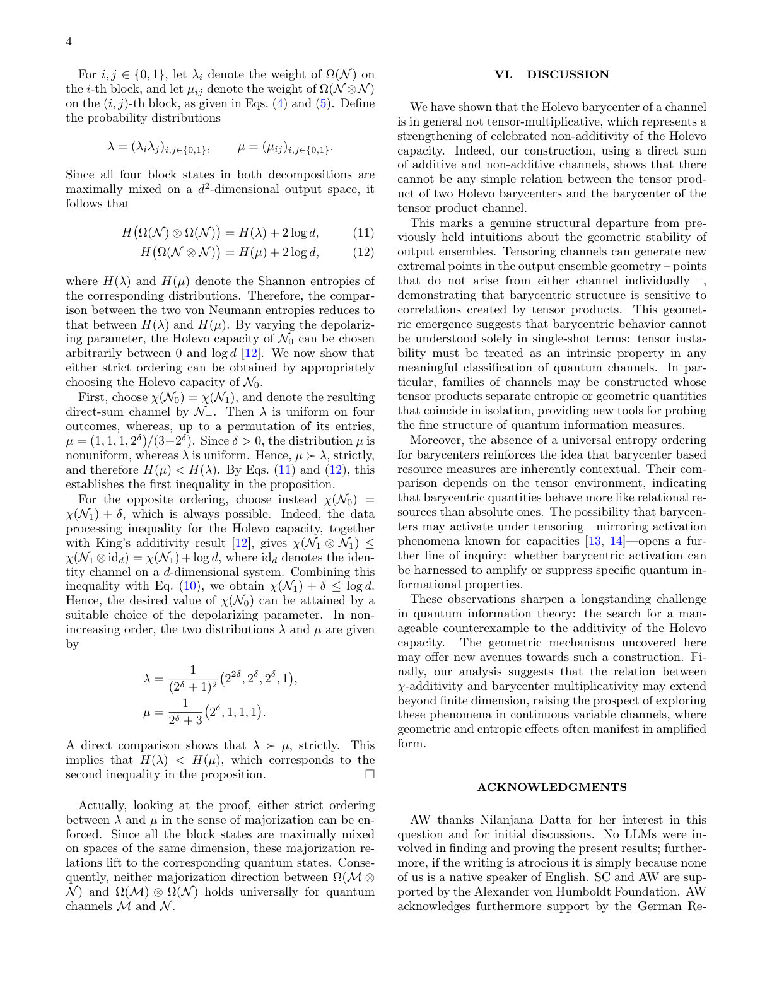
<figcaption class="paper-figure-caption"><b>Fig 3.</b> Low-resolution page preview, page 4</figcaption>
</figure>
<figure class="paper-figure-card">

<figcaption class="paper-figure-caption"><b>Fig 4.</b> Low-resolution page preview, page 5</figcaption>
</figure>

**Summary.** This paper tackles the multiplicativity problem for the Holevo barycenter of quantum channels, a concept related to the additivity of the Holevo capacity. The authors demonstrate that this barycenter is generally not multiplicative, providing explicit counterexamples. This result shows that the geometric structure of optimal quantum measurements is sensitive to the tensor product structure of the underlying channels.

**Why it may be interesting.** This work delves into the fundamental structural properties of quantum information measures, showing that even when capacity fails to be additive, the associated geometric structure (the barycenter) can fail to be multiplicative, highlighting deep non-linearities in quantum resource theories.

Detailed structure

**Main problem.** The paper investigates the multiplicativity problem for the Holevo barycenter of quantum channels, asking if the barycenter of a product channel equals the tensor product of the individual barycenters.

**Main result.** The authors prove that the Holevo barycenter is generally not multiplicative, providing counterexamples where $\Omega(N \otimes N) 
eq \Omega(N) \otimes \Omega(N)$. They also show the entropy of the barycenter is neither universally subadditive nor superadditive.

**Method.** The analysis involves constructing specific quantum channels using direct sums and tensor products, comparing derived block weights, and analyzing the von Neumann entropy of the output ensemble.

**Model / system.** The study concerns general quantum channels $N: L(H) 	o L(K)$ acting on finite-dimensional Hilbert spaces, relating concepts like Holevo capacity and the Holevo barycenter.

**Key observables.** Holevo Capacity ($\chi(N)$), Holevo Barycenter ($\Omega(N)$), Von Neumann entropy of the output ensemble ($\mathcal{H}(\Omega)$), and Shannon entropies of associated probability distributions.

**Important parameters / regimes.** The analysis relies on constructing channels exhibiting superadditive Holevo capacity ($\chi(\mathcal{N}_1 \otimes \mathcal{N}_2) = \chi(\mathcal{N}_1) + \chi(\mathcal{N}_2) + \delta$).

**Assumptions / limitations.** The analysis is restricted to finite-dimensional Hilbert spaces.

**Figures summary.** Not specified by the notes.

**Paper structure.** The paper reviews the relationship between additivity/multiplicativity and the barycenter, establishes formulas for direct-sum and tensor-product channels, and then constructs specific counterexamples to disprove universal multiplicativity.

Abstract

The Holevo barycenter of a quantum channel is the unique output state obtained as the average output of any ensemble achieving the Holevo capacity. Given two quantum channels, the multiplicativity problem asks whether this barycenter tensorizes under parallel composition, namely whether the barycenter of the product channel coincides with the tensor product of the individual barycenters. This question is closely related to the additivity problem for the Holevo capacity: additivity implies tensorization of the Holevo barycenter, while tensorization alone is not sufficient for additivity. Although a construction is known that demonstrates the existence of channels with non-additive Holevo capacity, their corresponding Holevo barycenters still tensorize, leaving open whether multiplicativity might ultimately hold universally. Here, we answer this question in the negative by exhibiting channels for which the Holevo barycenter is not multiplicative under the tensor product of the channel with itself. Moreover, we show that the entropy of the Holevo barycenter is neither universally subadditive nor universally superadditive under tensor product.

[↑ back to top](#top)

### [Noncommutative sharp Hausdorff-Young inequality](http://arxiv.org/abs/2609.10424v1)

**Authors:** Hongsen Qiu, Xiao Xiong  
**Type:** theory · **Category:** other · **PDF:** <https://arxiv.org/pdf/2609.10424v1>  
**Analysis basis:** full PDF text, analyzed in chunks

↔ Scroll figures horizontally

<figure class="paper-figure-card">

<figcaption class="paper-figure-caption"><b>Fig 1.</b> Low-resolution page preview, page 2</figcaption>
</figure>
<figure class="paper-figure-card">
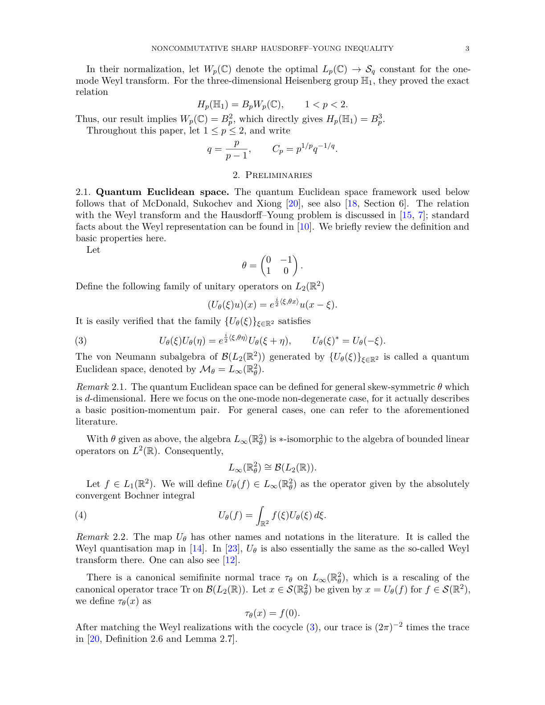
<figcaption class="paper-figure-caption"><b>Fig 2.</b> Low-resolution page preview, page 3</figcaption>
</figure>
<figure class="paper-figure-card">

<figcaption class="paper-figure-caption"><b>Fig 3.</b> Low-resolution page preview, page 4</figcaption>
</figure>
<figure class="paper-figure-card">

<figcaption class="paper-figure-caption"><b>Fig 4.</b> Low-resolution page preview, page 5</figcaption>
</figure>
<figure class="paper-figure-card">

<figcaption class="paper-figure-caption"><b>Fig 5.</b> Low-resolution page preview, page 6</figcaption>
</figure>

**Summary.** This theoretical paper establishes the sharp Hausdorff-Young inequality on the quantum Euclidean space, a key result in noncommutative harmonic analysis. The authors employ advanced techniques from operator calculus, including analyzing operator-valued flows and Fréchet derivatives. The result provides sharp constants for fundamental transforms like the Weyl transform and extends to defining noncommutative convolution inequalities.

**Why it may be interesting.** While the core topic is harmonic analysis, the use of operator calculus, non-commutative geometry, and connections to quantum transforms (like the Weyl transform) makes it highly relevant to theoretical quantum physics, especially in areas dealing with non-commutative quantum field theories or quantum phase space representations.

Detailed structure

**Main problem.** The paper aims to prove the sharp Hausdorff-Young inequality in a noncommutative setting, specifically on the quantum Euclidean space.

**Main result.** The authors successfully prove the sharp inequality $\|U_	heta(f)\|_{L^q(\mathbb{R}^2_	heta)} \le B_{2,p} \|f\|_{L^p(\mathbb{R}^2)}$ for $1 \le p \le 2$, which implies sharp constants for the Weyl transform and the Heisenberg group.

**Method.** The proof heavily relies on operator calculus, utilizing novel operator-valued flows related to the Gabor transform and analyzing the Fréchet derivatives of the associated $L^p$-norms.

**Model / system.** The analysis is conducted on the quantum Euclidean space, modeled by the von Neumann subalgebra $M_	heta = L^\infty(\mathbb{R}^2_	heta)$, which involves unitary operators $U_	heta(\xi)$ acting on $L^2(\mathbb{R}^2)$. The framework is generalized to higher dimensions ($\mathbb{R}^d_	heta$).

**Key observables.** The norms $\|U_	heta(f)\|_{L^q(\mathbb{R}^2_	heta)}$ and $\|f\|_{L^p(\mathbb{R}^2)}$, and the associated constants $B_{2,p}$ and $C_p$.

**Important parameters / regimes.** The parameters $p$ and $q$ (conjugate exponents) and the deformation parameter $	heta$ characterizing the noncommutativity.

**Assumptions / limitations.** The final steps rely on the assumption that the relevant function $\Phi$ is twice continuously Fréchet differentiable for $q>2$.

**Paper structure.** The paper builds from establishing the inequality on the quantum Euclidean space using operator calculus and flow analysis (Chunks 1 & 2), generalizing the result to higher dimensions and convolution inequalities (Chunk 3), and finally deriving explicit formulas for related operators using commutation relations (Chunk 4).

Abstract

We prove the sharp Hausdorff--Young inequality on the quantum Euclidean space. Meanwhile, our result implies the sharp Hausdorff-Young constants for the Weyl transform, as well as that for the Heisenberg group. The key ingredient is a novel operator-valued flow related to the Gabor transform. Our method is mainly based on operator calculus and hence generally applicable to similar problems. Finally, we give the definition of noncommutative convolution and include the partial results for the sharp Young's inequality.

[↑ back to top](#top)

### [Observation of Magnetic-Anisotropy Crossover and High-Temperature Skyrmions in the Dirac Magnet Fe3Ge with a Distorted Kagome Lattice](http://arxiv.org/abs/2609.10081v1)

**Authors:** Yalei Huang, Xiaowei Lv, Bin Li, Chunqiang Xu, Dhanarajagopal Alltrin, Xiaoxuan Ma, Wanting Yang, Wei Zhou, Xiangzhuo Xing, Wen-Chin Lin, Raman Sankar, Michael Smidman, Shixun Cao, Dong Qian, Renchao Che, Xiaofeng Xu  
**Type:** both · **Category:** strongly correlated electrons · **PDF:** <https://arxiv.org/pdf/2609.10081v1>  
**Analysis basis:** full PDF text, analyzed in chunks

↔ Scroll figures horizontally

<figure class="paper-figure-card">

<figcaption class="paper-figure-caption"><b>Fig 1.</b> Figure 1. Crystal structures and characterizations of Fe3Ge. a Crystallographic unit cell of Fe3Ge. Fe and Ge</figcaption>
</figure>
<figure class="paper-figure-card">
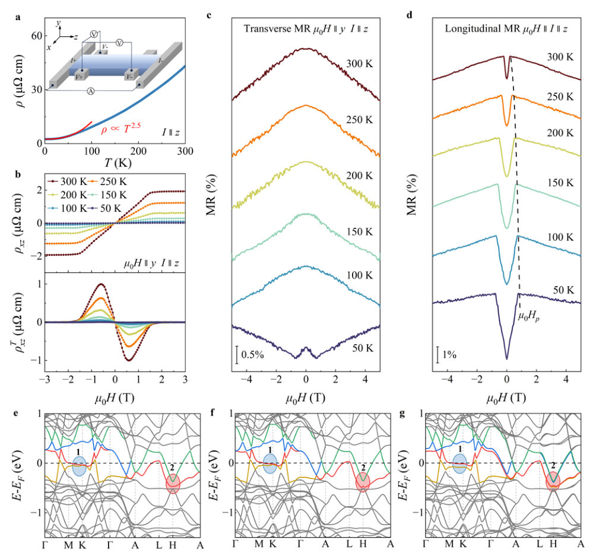
<figcaption class="paper-figure-caption"><b>Fig 2.</b> Figure 2. Magneto-transport measurements and band structures of Fe3Ge single crystals. a Temperature-</figcaption>
</figure>
<figure class="paper-figure-card">

<figcaption class="paper-figure-caption"><b>Fig 3.</b> Figure 3. Magnetic properties of Fe3Ge single crystals. a Temperature-dependent magnetization under an applied</figcaption>
</figure>
<figure class="paper-figure-card">
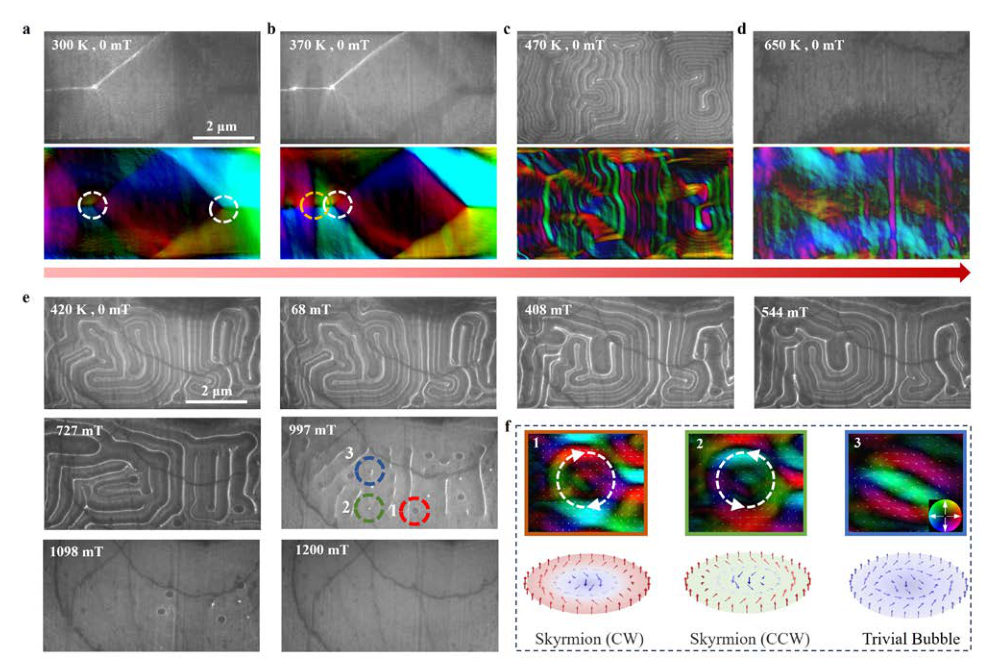
<figcaption class="paper-figure-caption"><b>Fig 4.</b> Figure 4. Spin textures of Fe3Ge single crystals. a-d LTEM images (top row) and the corresponding magnetic</figcaption>
</figure>
<figure class="paper-figure-card">
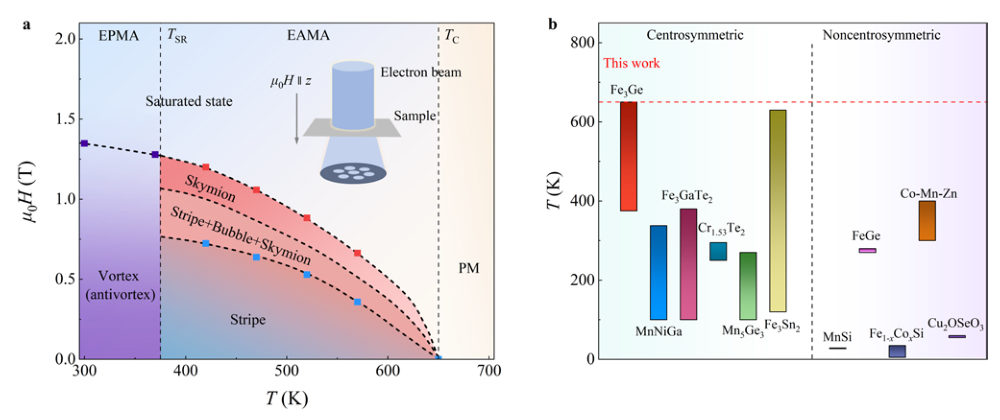
<figcaption class="paper-figure-caption"><b>Fig 5.</b> Figure 5. Magnetic phase diagram. a Magnetic phase diagram of Fe3Ge sketching the evolution of spin textures as</figcaption>
</figure>

**Summary.** This work reports the discovery of robust, high-temperature skyrmions in the Dirac magnet $	ext{Fe}_3	ext{Ge}$. By analyzing magnetic anisotropy crossovers and topological transport measurements, the authors demonstrate that $	ext{Fe}_3	ext{Ge}$ maintains stable skyrmion phases up to its Curie temperature ($\sim 650 	ext{ K}$). This positions the material as a leading candidate for advanced spintronic applications.

**Why it may be interesting.** The combination of high Curie temperature, topological electronic structure, and stable magnetic textures makes this material highly relevant for developing next-generation spintronic devices, bridging fundamental condensed matter physics with applied quantum technology.

Detailed structure

**Main problem.** The study investigates the interplay between magnetic anisotropy, electronic band topology, and the stability of skyrmions in the Dirac magnet $	ext{Fe}_3	ext{Ge}$.

**Main result.** The authors report observing robust skyrmions in $	ext{Fe}_3	ext{Ge}$ that persist over a wide temperature range (375 K to 650 K), establishing it as a promising platform for high-temperature spintronics.

**Method.** The research combines experimental techniques like Lorentz TEM and magneto-transport measurements with theoretical calculations using methods like FPLAPW.

**Model / system.** The physical system is the $	ext{Fe}_3	ext{Ge}$ single crystal, which possesses a distorted Kagome lattice and exhibits Dirac magnetic properties. The analysis focuses on the magnetic phase transitions and the resulting topological electronic structure.

**Key observables.** High Curie temperature ($\sim 650 	ext{ K}$), large intrinsic Anomalous Hall Conductivity ($\sim 380 \ \Omega^{-1}	ext{cm}^{-1}$), Spin Reorientation Transition ($\sim 375 	ext{ K}$), and stable mesoscopic skyrmions.

**Important parameters / regimes.** Temperature range (375 K to 650 K), magnetic anisotropy constants ($K_{	ext{eff}}$), and the material's intrinsic electronic topology.

**Assumptions / limitations.** The electronic structure is linked to nontrivial band topology, and the magnetic behavior is governed by the crossover between easy-plane and easy-axis anisotropy.

**Figures summary.** Figures illustrate crystal structure confirmation (XRD, STEM), transport measurements ($
ho-T$, $
ho_{xy}-H$), magnetic properties ($M-T$, $K_{	ext{eff}}$), and LTEM images visualizing the temperature-dependent spin textures and skyrmions.

**Paper structure.** The paper follows a standard structure: structural characterization, measurement of transport and magnetic properties across temperature, identification of the magnetic anisotropy crossover, and finally, visualization and confirmation of high-temperature skyrmion stability using LTEM.

Abstract

Topological materials that simultaneously host robust high-temperature skyrmions and nontrivial electronic band structures have attracted tremendous interest owing to their distinctive advantages for both fundamental research and prospective technological applications. Here, we report the observation of robust skyrmions in the Dirac kagome magnet Fe3Ge, which exhibits a high Curie temperature of ~ 650 K. At room temperature, Fe3Ge shows a large intrinsic anomalous Hall conductivity of ~ 380 Ω-1cm-1, originating from its nontrivial electronic band topology. Systematic magnetization measurements reveal a spin reorientation transition at ~ 375 K, indicating a crossover from easy-plane to easy-axis magnetic anisotropy. Below the spin reorientation temperature, a large topological Hall effect is observed, arising from microscopic noncoplanar spin structures. Lorentz transmission electron microscopy shows that mesoscopic skyrmions are stabilized in the easy-axis magnetic anisotropy regime and persist over an exceptionally wide temperature window of 375-650 K, far exceeding that of most previously reported skyrmion-hosting materials. These results establish Fe3Ge as a promising platform for exploring diverse topological properties, with strong potential for advancing future high-temperature spintronic applications, ranging from next-generation information storage to logic computing devices.

[↑ back to top](#top)

### [On the Limits of Quantum Multiparty Simultaneous Communication](http://arxiv.org/abs/2609.10289v1)

**Authors:** Pedro Montealegre, Ivan Rapaport, Jorge Valenzuela  
**Type:** theory · **Category:** quantum information and computing · **PDF:** <https://arxiv.org/pdf/2609.10289v1>  
**Analysis basis:** full PDF text, analyzed in chunks

↔ Scroll figures horizontally

<figure class="paper-figure-card">
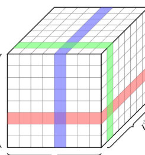
<figcaption class="paper-figure-caption"><b>Fig 1.</b> Figure 1</figcaption>
</figure>

**Summary.** This work rigorously establishes a multipartite exponential separation between classical public randomness and unentangled quantum communication in the SMP model. By generalizing the Index Coordination problem, the authors prove that quantum communication lacks an asymptotic advantage over private randomness in this setting. This demonstrates that quantum superposition cannot efficiently simulate the coordination power of public randomness across multiple parties.

**Why it may be interesting.** The results provide fundamental, quantitative limits on how quantum superposition can simulate classical coordination mechanisms, which has implications for quantum cryptography and communication complexity.

Detailed structure

**Main problem.** The paper establishes a multiparty exponential separation between classical shared randomness (public coins) and unentangled quantum communication in the Simultaneous Message Passing (SMP) model.

**Main result.** It shows that quantum communication without shared entanglement cannot efficiently simulate the coordination provided by public randomness, yielding strong lower bounds scaling as $\Omega(n^{1-1/k})$ in the unambiguous regime.

**Method.** The authors use generalizations of state identification theorems, leveraging the factorization of orthogonal complements of subspaces in tensor product settings, combined with information-theoretic inequalities like AM-GM.

**Model / system.** The analysis is conducted within the Simultaneous Message Passing (SMP) model, generalizing the Index Coordination problem ($	ext{IC}_{k,n}$) to $k$ spatially separated players communicating to a central referee.

**Key observables.** Message length (in bits or qubits), success probability, and the scaling of lower bounds with the number of players ($k$) and input size ($n$).

**Important parameters / regimes.** The separation holds for arbitrary $k=k(n)\ge2$, and the complexity matches $\Theta(n)$ when $k$ grows sufficiently fast with $n$.

**Assumptions / limitations.** The quantum communication is restricted to unentangled messages (no shared entanglement) and the analysis focuses on the unambiguous and bounded-error regimes.

**Figures summary.** Not specified.

**Paper structure.** The paper builds upon the two-player Index Coordination separation, generalizes it to $k$ parties ($	ext{IC}_{k,n}$), and derives lower bounds by analyzing the factorization of the orthogonal complement of the 'wrong' subspace in the quantum state space.

Abstract

The Simultaneous Message Passing (SMP) model provides a fundamental framework for comparing classical and quantum communication. For two players, Gavinsky et al. (STOC 2006) established a separation underlying the incomparability of shared randomness and quantum communication: \textsc{Index Coordination} needs $O(\log n)$ public-coin bits but $Ω(n^{1/3})$ bounded-error qubits.   In this work, we establish a multiparty exponential separation through $\operatorname{IC}_{k,n}$, a natural $k$-party generalization of \textsc{Index Coordination}. Public-coin protocols solve it unambiguously with maximum message length $O(\log n)$ bits. In contrast, quantum SMP protocols without shared entanglement or public coins require maximum message length $Ω(n^{1-1/k})$ qubits in the unambiguous regime and $Ω(n^{(k-1)/(k+1)})$ qubits in the bounded-error regime. A classical private-coin protocol matches the unambiguous bound, so quantum communication provides no asymptotic advantage over private randomness in this regime. For fixed error parameters, all constants are independent of $k$, establishing the exponential separation for every integer-valued function $k=k(n)\ge2$, without restricting its growth. Both quantum lower bounds become $Ω(n)$ when $k\ge c\log n$ for any fixed $c>0$, matching the full-input protocol and yielding tight linear complexity in both regimes.   Our results demonstrate that quantum superposition cannot efficiently simulate the coordination afforded by public randomness, extending this separation to arbitrary $k$. To bound success probabilities for multiparty product states, we prove an exact factorization theorem for unambiguous quantum state identification, which may be of independent mathematical interest.

[↑ back to top](#top)

### [One Relative Phase Orders Operational Thresholds of Noisy Bell Pairs](http://arxiv.org/abs/2609.10034v1)

**Authors:** Xuan Du Trinh  
**Type:** theory · **Category:** quantum information and computing · **PDF:** <https://arxiv.org/pdf/2609.10034v1>  
**Analysis basis:** full PDF text, analyzed in chunks

↔ Scroll figures horizontally

<figure class="paper-figure-card">

<figcaption class="paper-figure-caption"><b>Fig 1.</b> FIG. 1. Schematic cross-section of ability-absence sets for two-qubit states. CHSH-local means that the CHSH value, optimized over local measurement settings, does not exceed the local bound 2. Separable states lie in every depicted set. The teleportation-useless and unsteerable sets lie inside the CHSH-local set [5, 20]. The teleportation-useless and unsteer- able sets overlap without either containing the other [4]. The segment is the Bell-mixing line of Eq. (1) from Φ+ at λ = 1 to σ at λ = 0, and each colored point marks an edge of the cor- responding ability-absence interval. The figure illustrates an example in which σ is steerable and teleportation-useful but CHSH-local. Thus, the...</figcaption>
</figure>
<figure class="paper-figure-card">

<figcaption class="paper-figure-caption"><b>Fig 2.</b> FIG. 2. The operational thresholds are nondecreasing in the relative coherence phase θ. Analytic curves give the entangle- ment and coincident teleportation usefulness thresholds, the three-setting CJWR witness threshold, the CHSH-nonlocal threshold, and the threshold for a positive key rate in one-way BB84 with CSS codes. The last three are each optimized over the local measurements. At λ = 1</figcaption>
</figure>

**Summary.** This paper develops a general framework to determine the operational thresholds of quantum abilities in noisy Bell pairs. It proves that these thresholds are governed by the X-part of the noise and exhibit a nondecreasing dependence on the relative phase between noise and coherence. This provides powerful tools for certifying quantum capabilities even when closed-form criteria are unknown.

**Why it may be interesting.** The rigorous mathematical framework developed for characterizing thresholds based on phase dependence and partial tomography is highly general and applicable to understanding noise resilience in quantum communication protocols.

Detailed structure

**Main problem.** The paper determines the operational thresholds at which quantum communication abilities (like entanglement or steerability) are lost in noisy Bell pairs.

**Main result.** It establishes a monotonicity law showing that the ability threshold is nondecreasing with the relative phase between the noise and Bell coherences, and that the X-part of the noise provides a tight upper bound on this threshold.

**Method.** The analysis uses bounding techniques based on the X-part of the noise and establishes monotonicity laws by analyzing the dependence of the threshold on the relative phase $\theta$.

**Model / system.** The system models noisy Bell pairs described by a mixture $\rho_\lambda(\sigma) = \lambda \Phi_+ + (1 - \lambda) \sigma$, where $\sigma$ is the noise state characterized by its X-part $\sigma_X$.

**Key observables.** Operational thresholds ($\lambda_K$), the relative phase $\theta$, and the X-part of the noise ($\sigma_X$).

**Important parameters / regimes.** Bell weight $\lambda$ ($0 \le \lambda \le 1$) and the relative phase $\theta$ ($0 \le \theta \le \pi$).

**Assumptions / limitations.** The analysis assumes the operational ability's failing states form a convex set closed under local unitaries, and it relies on the X-part approximation for bounding.

**Figures summary.** Figures illustrate the nondecreasing nature of operational thresholds (e.g., entanglement, CHSH-nonlocal) as a function of the relative phase $\theta$, showing certified intervals for these thresholds.

**Paper structure.** The paper first establishes the X-part upper bound and the general monotonicity law for any suitable ability. It then focuses on the phase dependence, proving that the threshold increases monotonically with $\theta$, and finally applies these techniques to specific abilities like steerability.

Abstract

Unlike the two-qubit entangled and CHSH-nonlocal sets, the steerable and Bell-nonlocal ones have no known general closed-form criterion. For any such operational ability whose failing states form a convex set closed under local unitaries, and for a Bell mixture with arbitrary noise, the $X$ part of the noise gives an upper bound on the definitive threshold, the Bell weight above which the mixture attains the ability. That bound is the tightest that the seven of the fifteen Pauli expectation values fixing the $X$ part can support. The same theorem shows that a state has the ability whenever its $X$ part does, so partial tomography of a state can certify its ability. When noise is of $X$ form, the mixture carries a relative phase between the noise and Bell coherences that cannot be gauged away by local unitaries, and it controls the threshold through interference. We prove a monotonicity law: the threshold is nondecreasing in this phase, whether or not a closed-form criterion for the ability exists.

[↑ back to top](#top)

### [Private communication via zero-private-capacity quantum channels](http://arxiv.org/abs/2609.10520v1)

**Authors:** Chengkai Zhu, Xin Wang  
**Type:** theory · **Category:** quantum information and computing · **PDF:** <https://arxiv.org/pdf/2609.10520v1>  
**Analysis basis:** full PDF text, analyzed in chunks

↔ Scroll figures horizontally

<figure class="paper-figure-card">

<figcaption class="paper-figure-caption"><b>Fig 1.</b> Figure 1: Logical dependencies of the formalized argument for 1/2 ≤p &lt; 1. Arrows run from proof ingredients to conclusions, with each box grouping the relevant Lean declarations. The final capacity statement uses the regularized information formula.</figcaption>
</figure>

**Summary.** This paper tackles the superactivation problem in quantum information by showing that two quantum channels, each individually incapable of supporting private communication, can jointly achieve a positive secure rate. The authors demonstrate this using a specific combination of a four-level and an erasure channel. This result proves that secure communication capacity is not solely determined by the private capacity of the individual channels.

**Why it may be interesting.** It provides a deep theoretical result showing that local capacity measures fail to capture global security properties, which is a fundamental concept in quantum communication theory.

Detailed structure

**Main problem.** The paper resolves the open problem of whether two quantum channels, each having zero individual private capacity, can jointly enable private communication (superactivation).

**Main result.** The joint use of a four-level channel and a qubit erasure channel, both with zero private capacity, achieves a positive private rate, demonstrating that channel private capacity alone is insufficient to determine secure communication capability.

**Method.** The analysis uses information-theoretic bounds, specifically Holevo information and entropy calculations, to establish a positive information difference between the received signal and the environmental leakage.

**Model / system.** The model involves two independent, memoryless quantum channels: a four-level channel and a qubit erasure channel. The analysis is highly mathematical, involving quantum information theory concepts like private capacity and joint measurements.

**Key observables.** Private capacity, information gain $I(U:Y)$, and environmental leakage $\chi(U:E'E)$.

**Important parameters / regimes.** The erasure probability $p$ (specifically $1/2 \le p < 1$), and the achievable rate, which is shown to be positive.

**Assumptions / limitations.** The result relies on a fixed joint measurement and classical coding across uses, and the formalization is built upon established quantum information theorems.

**Figures summary.** Figure 1 summarizes the logical dependencies of the formalized argument for $1/2 \leq p < 1$, detailing proof ingredients and conclusions.

**Paper structure.** The paper develops the problem by defining the private capacity, constructing a specific physical example (the two channels), deriving the positive rate through information bounds, and formalizing the entire argument in Lean 4.

Abstract

Private communication over a noisy quantum channel requires reliable transmission to the receiver and secrecy from the environment. Whether two channels with zero private capacity can jointly enable private communication is a longstanding open problem in quantum information theory. Here we resolve this problem by exhibiting a four-level channel and a qubit erasure channel with half erasure probability, each with zero private capacity, whose joint use achieves more than 0.0001903 private bits per product use. The encoding gives the receiver a linear information gain with at most quadratic environmental leakage, enabling privacy through a fixed joint measurement and classical coding. This superactivation, impossible for independent classical memoryless wiretap channels, shows that a channel's private capacity alone does not determine its value for secure communication. The initial activation example was identified through interactions with large language models, and the result has been formalized in Lean 4.

[↑ back to top](#top)

### [Quantifying translational and bond-orientational order metrics in hyperuniform and nonhyperuniform many-particle systems](http://arxiv.org/abs/2609.10359v1)

**Authors:** Anirban Mukherjee, Salvatore Torquato  
**Type:** theory · **Category:** statistical mechanics · **PDF:** <https://arxiv.org/pdf/2609.10359v1>  
**Analysis basis:** full PDF text, analyzed in chunks

↔ Scroll figures horizontally

<figure class="paper-figure-card">
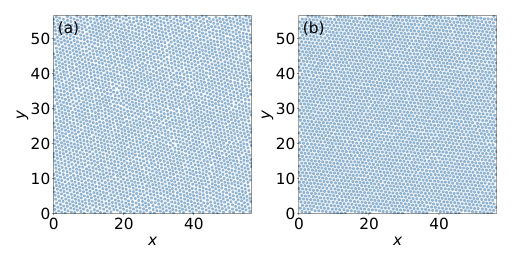
<figcaption class="paper-figure-caption"><b>Fig 1.</b> FIG. 2. Representative crystal-branch configurations of 2D equilibrium hard disks at (a) ϕ = 0.75 and (b) ϕ = 0.81, each displaying the same area and containing approximately 3200 disk centers. The density of lattice defects is lower at the higher packing fraction.</figcaption>
</figure>
<figure class="paper-figure-card">
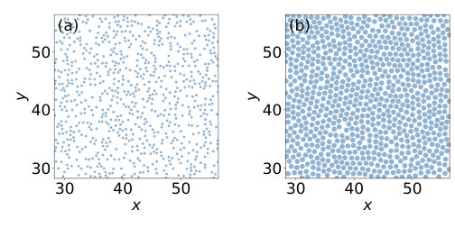
<figcaption class="paper-figure-caption"><b>Fig 2.</b> FIG. 1. Representative fluid-branch configurations of 2D equilibrium hard disks at (a) ϕ = 0.20 and (b) ϕ = 0.68, each displaying the same area and containing approximately 800 disk centers. The higher-packing-fraction configuration exhibits stronger short-range positional correlations.</figcaption>
</figure>
<figure class="paper-figure-card">
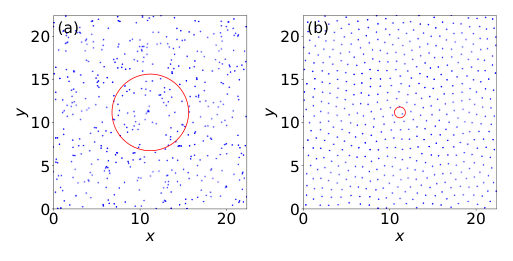
<figcaption class="paper-figure-caption"><b>Fig 3.</b> FIG. 4. Representative 2D disordered SHU ground-state con- figurations at (a) χ = 0.01 and (b) χ = 0.495. Each panel displays the same area and contains approximately 500 points. The circle indicates the stealthy wavelength λ = 2π/K. The greater structural regularity at the larger value of χ is visible.</figcaption>
</figure>
<figure class="paper-figure-card">
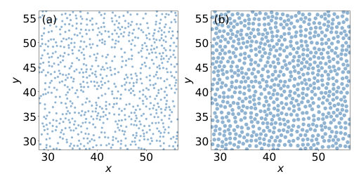
<figcaption class="paper-figure-caption"><b>Fig 4.</b> FIG. 3. Representative 2D RSA hard-disk configurations at (a) ϕ = 0.20 and (b) ϕ = 0.54, each displaying the same area and containing approximately 800 disk centers. The higher- packing-fraction configuration exhibits stronger short-range exclusion-induced correlations.</figcaption>
</figure>
<figure class="paper-figure-card">
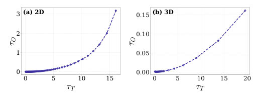
<figcaption class="paper-figure-caption"><b>Fig 5.</b> FIG. 5. Parametric relation between τO and τT along the stable fluid branches of (a) 2D equilibrium hard disks and (b) 3D equilibrium hard spheres. In both dimensions, τO increases monotonically with τT along the sampled branches.</figcaption>
</figure>

**Summary.** This work introduces two metrics, $	au_T$ and $	au_O$, to quantify translational and bond-orientational order in many-particle systems. By applying these metrics to hard-sphere packings and hyperuniform states, the authors demonstrate that structural order is highly dependent on the system's preparation history. The resulting $(	au_T, 	au_O)$ pair offers a versatile tool for characterizing phase transitions and structural pathways in condensed matter physics.

**Why it may be interesting.** The development of robust, quantifiable metrics like $(	au_T, 	au_O)$ provides a powerful, generalized coordinate system for mapping complex phase diagrams, which is highly relevant for understanding structural transitions in soft matter and amorphous materials.

Detailed structure

**Main problem.** The paper addresses the fundamental challenge of quantifying the degree of structural order (both translational and bond-orientational) in complex many-particle systems.

**Main result.** The pair of metrics $(	au_T, 	au_O)$ successfully places both forms of order on a common statistical footing, revealing preparation-dependent structural differences between equilibrium and non-equilibrium states.

**Method.** The authors introduce and compute two metrics: $	au_T$ (based on the total correlation function $h(r)$) and $	au_O$ (its bond-orientational analogue), both defined via squared $L^2$ norms in real or Fourier space.

**Model / system.** The study analyzes sphere-packing models (hard spheres/disks) in 2D and 3D, comparing equilibrium states, non-equilibrium Random Sequential Addition (RSA) packings, and disordered stealthy hyperuniform (SHU) ground states.

**Key observables.** Translational order metric ($	au_T$), Bond-orientational order metric ($	au_O$), and the ratio $	au_O/	au_T$.

**Important parameters / regimes.** Packing fraction ($\phi$), stealthiness parameter ($\chi$), and system dimensionality (2D vs 3D).

**Assumptions / limitations.** The metrics are constructed from two-point correlation functions, and the analysis often requires careful handling of system size cutoffs ($L$) and wavevector cutoffs ($K_c$).

**Figures summary.** Figures compare correlation functions and structure factors ($S(k)$ vs $SO(k)$) across various phases (fluid, crystal, SHU) and demonstrate the system-size dependence of the metrics.

**Paper structure.** The paper introduces the metrics, applies them to nonhyperuniform systems (hard spheres/disks) to show preparation dependence, examines the SHU phase, and concludes by establishing the positive correlation between $	au_T$ and $	au_O$ across all studied regimes.

Abstract

Quantifying the degree of order/disorder in many-particle systems remains an outstanding problem in physics, materials science, and mathematics. To this end, we consider the translational order metric $τ_T$, defined as the squared $L^2$ norm of the total correlation function $h(\mathbf{r})$, and introduce its bond-orientational analogue $τ_O$, defined from the weighted total correlation function $h_{\mathbf{f}}(\mathbf{r})$ using local orientational weights (S. Torquato et al., Phys. Rev. X 16, 011042 (2026)). The pair $(τ_T,τ_O)$ places both forms of order on a common two-point statistical footing. We compute both metrics for two nonhyperuniform sphere-packing models in 2D and 3D as functions of packing fraction $φ$: 1) equilibrium hard particles and 2) nonequilibrium random sequential addition (RSA) packings. For the nonhyperuniform systems, bond-orientational order remains subdominant along the equilibrium-fluid and RSA configurations; however, its magnitude relative to the translational metric increases near the upper end of the equilibrium-fluid branches, much more strongly in 2D than in 3D, and the two metrics become comparable along the sampled crystal branches. At common packing fractions, equilibrium fluids and RSA packings trace distinct $(τ_T,τ_O)$ trajectories, revealing preparation-dependent differences in structural order. As a representative hyperuniform family, we study 2D disordered stealthy hyperuniform (SHU) ground states for $0<χ<1/2$, where $χ$ is the stealthiness parameter. Within the disordered SHU phase, bond-orientational order remains subdominant, but its magnitude relative to the translational metric increases toward the disorder-to-order threshold. In all three models, $τ_T$ and $τ_O$ are positively correlated beyond the Poisson-reference regime: $τ_O$ increases monotonically with $τ_T$ across the sampled state points.

[↑ back to top](#top)

### [Semi-Dirac States and Quantum Linear Magnetoresistance in Helimagnetic Pnictide MnP](http://arxiv.org/abs/2609.09781v1)

**Authors:** Prasanta Chowdhury, Jyotirmoy Sau, Sanat Kumar Adhikari, Sourav Chowdhury, Peter Bencok, Matthias Gutmann, Souvik Chatterjee, Saurav Giri, Manoranjan Kumar, Subham Majumdar  
**Type:** both · **Category:** strongly correlated electrons · **PDF:** <https://arxiv.org/pdf/2609.09781v1>  
**Analysis basis:** full PDF text, analyzed in chunks

↔ Scroll figures horizontally

<figure class="paper-figure-card">

<figcaption class="paper-figure-caption"><b>Fig 1.</b> FIG. 1. Phase diagram. (a), (b) and (c) Shows the standard phase diagram (µ0H vs T) of MnP for field applied along [0 0 1], [1 0 0] and [0 1 0] direction with different magnetic phase marked.</figcaption>
</figure>
<figure class="paper-figure-card">
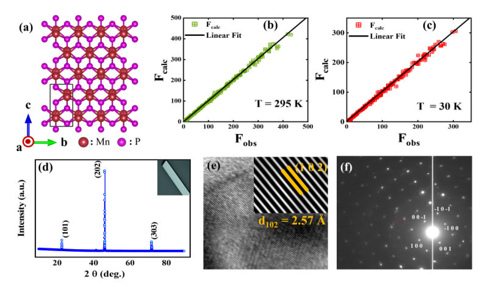
<figcaption class="paper-figure-caption"><b>Fig 2.</b> FIG. 2. Structural characterization of single-crystalline MnP. (a) Crystal structure of MnP. (b) and (c) Observed (Fobs) vs calculated (Fcalc) structure factors of SCXRD data at T = 295 K and T = 30 K respectively. (d) XRD pattern of single crystalline MnP showing (h 0 l) diffraction peaks. (e) Enlarged HRTEM image displaying (1 0 2) plane. (f) SAED pattern displaying different planes.</figcaption>
</figure>
<figure class="paper-figure-card">

<figcaption class="paper-figure-caption"><b>Fig 3.</b> FIG. 3. Magnetic properties of MnP. (a) Temperature (T) dependence of magnetization (M) in field-cooled (FC) protocols under µ0H= 0.01 T. The inset shows the temperature derivative of M(T) for µ0H ∥[1 0 1] direction. (b) M vs. T data under different fields (µ0H=0.1 T, 1 T, 3 T, 6 T) for µ0H ∥[1 0 1] direction. (c) M vs. T data in field-cooled (FC) and field-cooled-heating (FCH) protocol under µ0H= 0.01 T for µ0H ∥[0 1 0] direction and the inset shows the FC curve under µ0H= 1 T. (d) M vs. µ0H curve at 2 K for µ0H ∥[1 0 1] direction and the inset shows M vs. µ0H curve at 70 K. (e) M vs. µ0H curve at different constant T with µ0H ∥[1 0 1] direction. (f) M vs. µ0H curve at different constant T...</figcaption>
</figure>
<figure class="paper-figure-card">

<figcaption class="paper-figure-caption"><b>Fig 4.</b> FIG. 4. XAS and XMCD of MnP. (a) Mn L2,3-edge XAS and XMCD spectra of MnP measured at 20 K with µ0H ∥ [1 0 1]. (b) Comparison of the Mn L2,3-edge XAS spectra of MnP, MnO, and Mn2O3. (c) Mn L2,3-edge XMCD spectra measured at 20, 50, and 100 K. (d) Comparison of the field dependence of the Mn L3-edge XMCD intensity (left panel) and the bulk magnetization (right panel) measured at 50 K.</figcaption>
</figure>
<figure class="paper-figure-card">
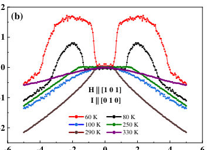
<figcaption class="paper-figure-caption"><b>Fig 5.</b> FIG. 6. Magnetoresistance of MnP. (a) Shows the MR % vs µ0H data at different constant T measured between ±15 T with different region marked. (b) Shows MR % vs µ0H data for T &gt; 50 K measured between ±5 T.</figcaption>
</figure>

**Summary.** This work investigates the large linear magnetoresistance observed in the helimagnetic pnictide MnP. By combining detailed magnetotransport experiments with first-principles calculations, the authors propose that the effect arises from a small, semi-Dirac-like Fermi pocket that becomes accessible under high magnetic fields. This provides a quantum-mechanical framework for understanding magnetotransport in complex magnetic topological materials.

**Why it may be interesting.** The strong coupling between complex magnetism (noncollinear spins) and electronic transport (MR) is a hallmark of strongly correlated electron systems, providing a concrete platform to test theories of quantum transport in magnetic materials.

Detailed structure

**Main problem.** The paper investigates the origin of large linear positive magnetoresistance (LPMR) in complex magnetic materials, specifically addressing the role of spin-dependent scattering in noncollinear spin systems.

**Main result.** The observed LPMR is microscopically explained by a small Fermi pocket formed by a semi-Dirac-like band crossing near the Y point, which allows the system to access the extreme quantum-limit regime.

**Method.** The study combines comprehensive experimental magnetotransport measurements (Hall, MR) with first-principles electronic structure calculations.

**Model / system.** The physical system is Manganese phosphide (MnP), a helimagnetic binary pnictide exhibiting multiple field-induced magnetic transitions (SCR, FAN, FM2).

**Key observables.** Large, non-saturating LPMR (up to 800%), Anomalous Hall Effect (AHE), Topological Hall Effect (THE), and the evolution of the semi-Dirac-like band structure.

**Important parameters / regimes.** Low temperatures ($4 	ext{ K}$), high magnetic fields ($15 	ext{ T}$), and the magnetic phase transitions (SCR $	o$ FAN $	o$ FM2).

**Assumptions / limitations.** The LPMR is modeled using Abrikosov's quantum magnetoresistance theory, and the electronic structure is derived from first-principles calculations.

**Figures summary.** Figures detail the magnetic phase diagram, structural characterization (XRD, TEM), and magnetotransport measurements showing the field dependence of MR.

**Paper structure.** The paper follows a structure of characterizing the complex magnetic phase diagram using structural and magnetization measurements, followed by detailed magnetotransport measurements, and concluding with theoretical calculations linking the observed MR to the electronic band structure.

Abstract

Large linear positive magnetoresistance (LPMR) in topological and magnetic materials remains a subject of intense debate, particularly in noncollinear spin systems where spin-dependent scattering complicates charge transport. Manganese phosphide (MnP), a helimagnetic binary pnictide with multiple field-induced magnetic transitions, provides a useful platform to investigate the interplay between complex magnetism and electronic topology. Here, we present a comprehensive experimental and theoretical investigation of phase-dependent magnetotransport in high-quality MnP single crystals. Hall measurements reveal an anomalous Hall effect dominated by skew scattering at high temperatures and a finite topological Hall effect in the noncollinear fan (FAN) and low-temperature screw (SCR) phases. At low temperatures, we observe a large, non-saturating LPMR reaching nearly 800 percent at 4 K and 15 T, with a pronounced linear field dependence in the field-polarized ferromagnetic (FM2) state. First-principles calculations reveal a strongly anisotropic semi-Dirac-like band at the Y point that progressively approaches the Fermi level from the SCR to FAN and FM2 states. Our analysis indicates that the resulting small Fermi pocket can access the extreme quantum-limit regime at experimentally accessible fields, providing a microscopic framework for the observed LPMR within Abrikosov's quantum magnetoresistance theory.

[↑ back to top](#top)

### [Simple QKD keyrate computations from tangent-line bounds](http://arxiv.org/abs/2609.09847v1)

**Authors:** Jun Hui Goh, Ernest Y. -Z. Tan  
**Type:** theory · **Category:** quantum information and computing · **PDF:** <https://arxiv.org/pdf/2609.09847v1>  
**Analysis basis:** full PDF text, analyzed in chunks

↔ Scroll figures horizontally

<figure class="paper-figure-card">

<figcaption class="paper-figure-caption"><b>Fig 1.</b> FIG. 1. Keyrate as a function of the number of tangent lines. The grid search used to plot this graph was 40 × 40. The plot is not monotone because for each ntangent we took the tangent lines at uniformly spaced points over Q ∈[0, 1], which results in the set of tangent lines for each ntangent not being a subset of those for ntangent + 1.</figcaption>
</figure>
<figure class="paper-figure-card">
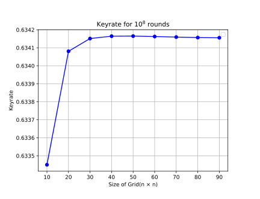
<figcaption class="paper-figure-caption"><b>Fig 2.</b> FIG. 2. Plot of keyrate value as the grid size of the grid search increases. 100 tangent lines were used in the approximation of the convex optimisation.</figcaption>
</figure>
<figure class="paper-figure-card">
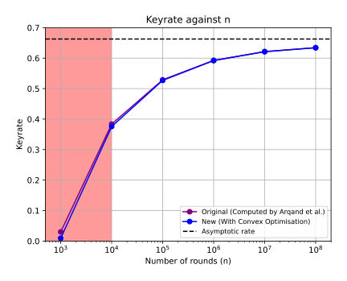
<figcaption class="paper-figure-caption"><b>Fig 3.</b> FIG. 3. Plot comparing the achievable keyrate com- puted by the original authors to that computed by our proposed methodology, using the values of α and γ found in [1]. The purple graph plots the values com- puted by the original authors. The blue graph plots the val- ues computed using the proposed methodology, with the val- ues of α and γ found in [1]. The dashed black line shows the asymptotic keyrate for our parameter choices, which is rasymp = 0.663. We caution however that the results dis- played for n &lt;∼104 (red region in figure) may correspond to significant abort probability during error correction; see Re- mark 1.</figcaption>
</figure>
<figure class="paper-figure-card">

<figcaption class="paper-figure-caption"><b>Fig 4.</b> FIG. 4. Plot comparing the achievable keyrate com- puted by our proposed methodology, including the grid search to find the optimal value of γ and α, using different parametrisation of β and Kα. The blue graph plots the values computed using (6). The green graph plots the values computed using (7). The dashed black line shows the asymptotic keyrate for our parameter choices, which is rasymp = 0.663. We caution however that the results dis- played for n &lt;∼104 (red region in figure) may correspond to significant abort probability during error correction; see Re- mark 1.</figcaption>
</figure>
<figure class="paper-figure-card">

<figcaption class="paper-figure-caption"><b>Fig 5.</b> FIG. 5. Plot of the optimal ∆α against the number of rounds. Linear regression was performed on the values and a R2-value of 0.9965 was found.</figcaption>
</figure>

**Summary.** This paper develops a computationally efficient method to calculate the finite-size keyrates for QKD protocols by reformulating the problem as a convex optimization solvable via tangent-line approximations. By applying this technique to BB84 and the six-state protocol, the authors provide certified lower bounds for the keyrate, simplifying complex calculations previously requiring elaborate solvers.

**Why it may be interesting.** While focused on QKD, the mathematical techniques—convex optimization bounding via tangent lines—are highly relevant to finding rigorous bounds in complex quantum information tasks.

Detailed structure

**Main problem.** The paper addresses the computational challenge of finding certified lower bounds for the finite-size keyrates in Quantum Key Distribution (QKD) protocols.

**Main result.** The authors propose a tractable method using tangent-line approximations to compute these keyrates for basic protocols like BB84 and the six-state protocol, yielding results comparable to previous work.

**Method.** The core method involves reformulating the keyrate calculation as a convex optimization problem and then employing tangent-line lower bounding techniques to solve it using off-the-shelf solvers.

**Model / system.** The analysis is applied to QKD protocols, specifically focusing on the qubit BB84 and the six-state protocol, analyzed in an entanglement-based setting.

**Key observables.** Finite-size keyrate ($\ell_{key}$), asymptotic keyrate ($	ext{r}_{asymp}$), and various Rényi entropy terms ($	ilde{H}_{\uparrow}^{\alpha}, 	ilde{H}_{\downarrow}^{\alpha}$).

**Important parameters / regimes.** The security parameter $\epsilon_{secure}$, the order of the Rényi entropy $\alpha$, and protocol-specific parameters like $Q_{thresh}$ and $\gamma$.

**Assumptions / limitations.** The method relies on obtaining suitable tangent lines to lower bound terms, which provides a guaranteed lower bound on the true keyrate.

**Figures summary.** Figures show the keyrate dependence on the number of tangent lines and the grid size, indicating that plateaus are reached when sufficient computational resources are used.

**Paper structure.** The paper first introduces the problem of keyrate computation, then details the tangent-line approximation method for simple protocols, and finally extends the approach by deriving closed-form expressions for the six-state protocol's Rényi entropies.

Abstract

Recent work in quantum key distribution (QKD) has yielded finite-size keyrates based on convex optimisation problems, using the framework of entropy accumulation. Multiple solvers have been developed to address these optimisations in recent years, but have been based on a somewhat elaborate framework using sophisticated algorithms, in order to accommodate a broad range of QKD protocols. In this work, we note that for basic QKD protocols such as qubit BB84, the keyrates can be easily computed using off-the-shelf solvers instead, by obtaining suitable tangent lines to lower bound terms in the objective function. We compute the resulting finite-size keyrates and compare them to previous work. Moreover, we extend this approach to the six-state protocol, by deriving closed-form expressions for the single-round Rényi entropies in the protocol. This should facilitate subsequent study of the six-state protocol via entropy accumulation.

[↑ back to top](#top)

### [Solving wave propagation problems via geometric quantum state preparation on dispersion manifolds](http://arxiv.org/abs/2609.10282v1)

**Authors:** Yakov Solomons, Lee Peleg, Netanel Barel, Jonathan Nemirovsky, Amit Ben-Kish, Yotam Shapira  
**Type:** theory · **Category:** quantum information and computing · **PDF:** <https://arxiv.org/pdf/2609.10282v1>  
**Analysis basis:** full PDF text, analyzed in chunks

↔ Scroll figures horizontally

<figure class="paper-figure-card">

<figcaption class="paper-figure-caption"><b>Fig 1.</b> FIG. 1. Quantum implementation of the inverse operator for the screened Poisson equation in Fourier space. The Quantum Fourier Transform (QFT) maps the state to the momentum basis, where the differential operator becomes diagonal, this corresponds to the U operation in the main text . In this basis, inversion reduces to evaluating the scalar function q(k) = 1/(k2 +C), (16). This value is computed by quantum arithmetic and then encoded into an auxiliary qubit amplitude through a controlled rotation, (17), producing the state q(k) |0⟩+ p</figcaption>
</figure>
<figure class="paper-figure-card">

<figcaption class="paper-figure-caption"><b>Fig 2.</b> FIG. 2. Illustration of the (a) real and (b) imaginary parts of Eq. (20), corresponding to the principal-value and delta- function contributions, respectively. The computation is per- formed on a discretized 64 × 64 grid over a square domain of side length L = 16λ, where λ denotes the wavelength. As seen, both terms are concentrated around the dispersion sur- face k2 = ω2/c2 = 2π/λ. Here, ϵ = 3∆kω/c</figcaption>
</figure>
<figure class="paper-figure-card">
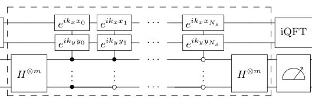
<figcaption class="paper-figure-caption"><b>Fig 3.</b> FIG. 3. Quantum circuit for the geometric quantum state preparation algorithm. The momentum registers are first initialized in the resonant state by the state-preparation procedure described in Appendix A. The source-dependent phase encoding, highlighted by the dashed box, is then implemented by controlled phase gates that apply the phases ei(kxxj+kyyj). Finally, after unpreparing the source register and post-selecting it onto |0⟩⊗m, inverse quantum Fourier transform (iQFT) is applied to the momentum registers, yielding the solution state |u(x, y)⟩.</figcaption>
</figure>
<figure class="paper-figure-card">

<figcaption class="paper-figure-caption"><b>Fig 4.</b> FIG. 4. Accuracy of the resonant-ring approximation. (a) Total overlap error, 1 −|⟨uC|uQ⟩|, between the normalized classical solution |uC⟩and the state |uQ⟩obtained from the resonant-ring approximation, as a function of the ring width, computed on a 64 × 64 spatial grid. The highlighted point corresponds to the simulation of Fig. 6. (b) Error in the real and imaginary parts of the solution, corresponding to the real (principal-value) and imaginary (delta-function) parts of q(k), respectively.</figcaption>
</figure>
<figure class="paper-figure-card">
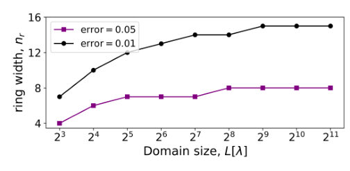
<figcaption class="paper-figure-caption"><b>Fig 5.</b> FIG. 5. Minimum resonant-ring width required to achieve target approximation errors of 0.05 and 0.01 as a function of the computational domain size. The slight increase for the smallest domains is due to the coarse Fourier discretization. At higher resolution, the required ring width approaches a constant value, indicating independence from the domain size.</figcaption>
</figure>

**Summary.** This paper presents a quantum algorithm to solve wave propagation problems by bypassing the limitations of standard quantum linear system solvers. Instead of inverting the full operator, the authors directly prepare quantum states supported on the resonant manifold defined by the wave equation's dispersion relation. This novel geometric approach removes exponential overhead, making the computation feasible regardless of the physical domain size.

**Why it may be interesting.** This work provides a concrete quantum algorithmic pathway for solving fundamental PDEs in physics (like wave equations) that are notoriously difficult for standard quantum linear solvers due to spectral singularities.

Detailed structure

**Main problem.** The paper addresses the challenge of solving wave propagation partial differential equations (PDEs) using quantum algorithms, specifically overcoming the exponential inefficiency encountered when dealing with singular operators.

**Main result.** By developing a method of geometric quantum state preparation directly on the resonant manifold, the authors eliminate the exponential overhead associated with post-selection, leading to a success probability independent of the computational domain size.

**Method.** The approach reformulates the problem from inverting the full discretized operator to preparing a quantum state whose support is restricted to the known resonant manifold, utilizing quantum comparators and arithmetic circuits.

**Model / system.** The model is wave propagation, exemplified by the Helmholtz equation, which is discretized into a linear system. The core difficulty arises from the singularity of the inverse operator on the dispersion surface $k^2 = \omega^2/c^2$.

**Key observables.** Success probability ($P_{	ext{succ}}$) for state preparation, which is shown to scale favorably with the number of sources and independently of domain size.

**Important parameters / regimes.** The condition number $\kappa(A)$ of the discretized operator, the resonant manifold itself, and the source location encoding via Fourier phases.

**Assumptions / limitations.** The method assumes the hyperbolic PDE solutions possess singular support on lower-dimensional dispersion manifolds, allowing for geometric state preparation.

**Figures summary.** Figures illustrate the quantum circuits for preparing states corresponding to geometric shapes, such as the Midpoint (Bresenham) circle algorithm and a finite-width resonant ring in momentum space.

**Paper structure.** The paper first contrasts standard Quantum Linear System Solvers (QLSS) with the wave equation's singular structure. It then introduces the novel geometric state preparation technique, detailing the quantum circuits required to construct states supported only on the resonant manifold, culminating in the derivation of the size-independent success probability.

Abstract

We present a quantum algorithm for solving partial differential equations through a linear-system formulation, focusing on wave propagation problems described by the discretized Helmholtz equation in frequency domain. Although quantum linear-system solvers offer exponential compression of the system degrees of freedom, their runtime complexity is generally governed by the condition number of the discretized operator. Exploiting the analytic structure of the differential operator can provide an alternative to explicit matrix inversion, as illustrated for the screened Poisson equation through an explicit quantum circuit. For the Helmholtz equation, however, the inverse operator becomes singular on the dispersion surface $k^2=ω^2/c^2$, rendering direct Fourier-space state-preparation methods exponentially inefficient. We address this challenge by directly preparing quantum states supported on the resonant manifold and encoding source locations through Fourier phases. The resulting algorithm eliminates the exponentially large overhead associated with post-selection on the resonant manifold, yielding a success probability that depends linearly on the number of sources and is independent of the computational domain size. More generally, our approach applies to hyperbolic differential equations whose Fourier-space solutions possess singular support on dispersion manifolds, recasting their solution as a problem of geometric quantum state preparation.

[↑ back to top](#top)

### [The Geometry of Transport in Quantum Walks and Parrondo's Paradox](http://arxiv.org/abs/2609.09269v1)

**Authors:** Jose Alfredo de Leon, Mariana Pérez-Muralles, Jan Neuser, Carlos Pineda  
**Type:** theory · **Category:** statistical mechanics · **PDF:** <https://arxiv.org/pdf/2609.09269v1>  
**Analysis basis:** full PDF text, analyzed in chunks

↔ Scroll figures horizontally

<figure class="paper-figure-card">

<figcaption class="paper-figure-caption"><b>Fig 1.</b> Figure 1. (a) Bloch sphere for a Hadamard DTQW, divided by great circle (dashed) into winning (blue, W) and losing (red, L) hemispheres of initial states ⃗r0, based on the sign of the asymptotic velocity v = ⃗T · ⃗r0; the arrow marks the transport vector ⃗T . (b) Mean position ⟨x⟩versus time t for three representative initial states, one selected from the win- ning hemisphere, the losing hemisphere, and the null equator in (a): |+⟩(blue), |+y⟩(black), and |−⟩(red), respectively. Solid lines denote the asymptotic prediction vt.</figcaption>
</figure>
<figure class="paper-figure-card">
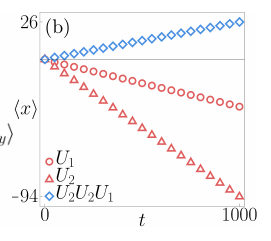
<figcaption class="paper-figure-caption"><b>Fig 2.</b> Figure 3. (a) Outcome map on the Bloch sphere of initial states ⃗r0 for U1, U2 randomly chosen, and their three-step al- ternation U2U2U1. The zero-drift great circles v = ⃗T (U)·⃗r0 = 0 partition the Bloch sphere into winning and losing initial states for U1 (dashed), U2 (dash-dotted), and U2U2U1 (solid). Solid and stippled regions indicate intuitive and paradoxical outcomes, respectively, following the colouring of the inset in Fig. 2. In particular, the stippled red region corresponds to L ◦L = W. (b) Mean position for an initial state in this region: U1 and U2 are losing (open red markers), whereas the minimal three-step alternation U2U2U1 is winning (open blue diamonds).</figcaption>
</figure>
<figure class="paper-figure-card">

<figcaption class="paper-figure-caption"><b>Fig 3.</b> Figure 2. DTQWs with initial coin state |c0⟩= (|0⟩+ eiπ/4 |1⟩)/ √</figcaption>
</figure>
<figure class="paper-figure-card">

<figcaption class="paper-figure-caption"><b>Fig 4.</b> Figure 4. (a) Pointed convex cone K = cone{⃗T1, ⃗T2} generated by the individual transport vectors ⃗Ti = ⃗T (Ui), with U1 and U2 the same operators as in Fig. 3. The transport vector ⃗T4 = ⃗T (U2U1) lies inside K, collinear with ⃗T1, whereas ⃗T3 = ⃗T (U2U2U1) lies outside. (b) The same cone embedded in the Bloch sphere. A plane through the origin separates ⃗T3 from K; it is viewed edge-on and therefore appears as a black line. Its normal ˆn defines an initial-state direction for which ⃗T3 · ˆn has the opposite sign to ⃗Ti · ˆn for every i.</figcaption>
</figure>

**Summary.** This work applies the concept of Parrondo's paradox to quantum walks, establishing a geometric criterion based on the 'transport vector' to predict when combining simple quantum operations yields unexpectedly directional motion. It shows that this paradox is possible through coin composition but not through simple alternation, providing a deep structural insight into quantum transport design.

**Why it may be interesting.** The geometric interpretation of quantum transport and the connection to classical paradoxes like Parrondo's are highly relevant to understanding non-equilibrium dynamics and directional transport in quantum systems.

Detailed structure

**Main problem.** The paper investigates Parrondo's paradox—where combining losing strategies yields a winning one—within the framework of discrete-time quantum walks.

**Main result.** The paradox is characterized by a geometric condition: it occurs if and only if the transport vector of the combined strategy falls outside the cone spanned by the individual transport vectors. This can happen via coin composition but not via simple alternation.

**Method.** The analysis uses the transport vector, derived from Fourier space analysis, to determine the asymptotic velocity of the quantum walker. The paradox is analyzed by comparing the combined transport vector against the cone generated by individual vectors.

**Model / system.** The model is a one-dimensional discrete-time quantum walk (DTQW) on a lattice, evolving via a unitary step operator $U=SC$. The dynamics are analyzed using the Bloch sphere representation for the coin state.

**Key observables.** Asymptotic velocity ($v$), Transport Vector ($\vec{T}$), and the probability of paradoxical outcomes ($P(L \circ L = W)$ vs $P(L)^2$).

**Important parameters / regimes.** The initial coin state Bloch vector ($\vec{r}_0$), the structure of the coin operators ($C_1, C_2$), and the combination protocol (composition vs. alternation).

**Assumptions / limitations.** The analysis focuses on the long-time limit (asymptotic behavior) and assumes the initial state is separable. The general criterion relies on the assumption that no coin operator is antidiagonal.

**Figures summary.** Figures illustrate the Bloch sphere division into winning/losing hemispheres based on the sign of $v = \vec{T} \cdot \vec{r}_0$. They also map out outcome regions for different combination protocols, showing where the paradox occurs.

**Paper structure.** The paper first introduces the transport vector and the paradox criterion. It then compares the paradox's emergence under coin composition versus step alternation, deriving explicit probabilities for the paradoxical set. Finally, it relates the asymptotic velocity to the coin's steady-state Bloch vector.

Abstract

We study Parrondo's paradox -- the phenomenon where combining losing strategies yields a winning one -- in a minimal discrete-time quantum walk. We introduce the transport vector, encoded in the coin's steady state, whose inner product with the initial coin state gives the walker's asymptotic velocity. More generally, the paradox emerges exactly when the transport vector of the combined strategy falls outside the cone spanned by the individual ones -- a geometric criterion valid for any combination of strategies. It explains, for instance, why composing two coin operators within a single step can produce the paradox while simple alternation between them cannot, since alternation keeps the combined vector confined to the cone. The paradoxical set has nonzero measure, and we compute its probability explicitly in representative cases. This casts the paradox as one instance of designing reachable transport in quantum walks.

[↑ back to top](#top)

### [Two-magnon response from light scattering in altermagnets](http://arxiv.org/abs/2609.09287v1)

**Authors:** Shuyi Li, Lexu Zhao, Chunjing Jia  
**Type:** theory · **Category:** strongly correlated electrons · **PDF:** <https://arxiv.org/pdf/2609.09287v1>  
**Analysis basis:** full PDF text, analyzed in chunks

↔ Scroll figures horizontally

<figure class="paper-figure-card">
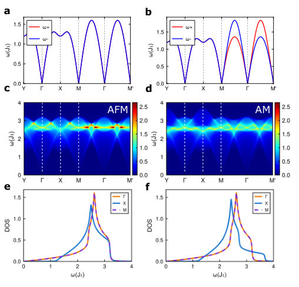
<figcaption class="paper-figure-caption"><b>Fig 1.</b> FIG. 2. Magnon band structure and two-magnon DOS within LSWT. a and b LSW magnon dispersion ω(0) ± (k) along high-symmetry paths for the conventional antiferromag- net (δJ2 = 0) and the altermagnet (δJ2 = 0.12J1), respec- tively. The red and blue lines denote the magnon branches with different chirality; they are degenerate in a, where only the blue line is visible. c and d Corresponding two-magnon DOS D(q, ω) for the conventional antiferromagnet and the altermagnet. All false-color plots use a common color scale ranging from zero to 0.8 times the global maximum intensity. e and f Constant q cuts of D(q, ω) at the Γ, M, and X points for the conventional antiferromagnet and the altermagnet;...</figcaption>
</figure>
<figure class="paper-figure-card">

<figcaption class="paper-figure-caption"><b>Fig 2.</b> FIG. 3. Two-magnon scattering intensity in the ˆx′ˆx′</figcaption>
</figure>
<figure class="paper-figure-card">
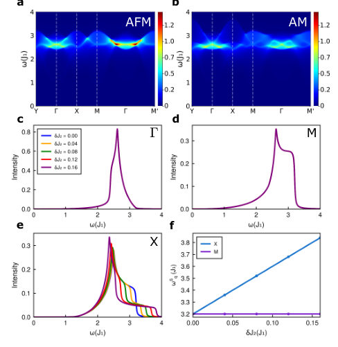
<figcaption class="paper-figure-caption"><b>Fig 3.</b> FIG. 4. Two-magnon scattering intensity in the ˆx′ˆy′</figcaption>
</figure>
<figure class="paper-figure-card">
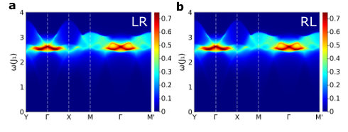
<figcaption class="paper-figure-caption"><b>Fig 4.</b> FIG. 5. Two-magnon scattering intensity in circular polarization channels within LSWT. a and b Momentum resolved intensity I(q, ω) for the LR and RL channels of the altermagnet (δJ2 = 0.12J1), respectively.</figcaption>
</figure>
<figure class="paper-figure-card">
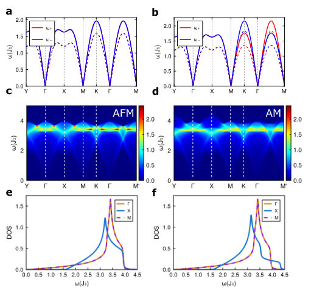
<figcaption class="paper-figure-caption"><b>Fig 5.</b> FIG. 6. 1/S-renormalized magnon band structure and two-magnon DOS. a and b Renormalized magnon dis- persions ω±(k) along high-symmetry paths for the conven- tional antiferromagnet (δJ2 = 0) and the altermagnet (δJ2 = 0.12J1), respectively. The red and blue solid lines denote the two magnon branches, which are degenerate in a, while the dashed lines show the corresponding LSW dispersions ω(0) ± (k) for comparison. c and d Two-magnon DOS D(q, ω) con- structed from the 1/S-renormalized magnon dispersions for the conventional antiferromagnet and the altermagnet. e and f Constant-q cuts of D(q, ω) at the Γ, M, and X points for the conventional antiferromagnet and the altermagnet; the Γ and M...</figcaption>
</figure>

**Summary.** This theoretical work investigates how two-magnon light scattering can serve as a fingerprint for altermagnetism in 2D magnets. By calculating the scattering intensity using spin-wave theory with quantum corrections, the authors show that the altermagnetic anisotropy ($\delta J_2$) causes a distinct, momentum-dependent shift in the two-magnon continuum edge. These findings strongly motivate using momentum-resolved inelastic X-ray scattering to probe this novel magnetic order.

**Why it may be interesting.** The work provides a concrete, measurable spectroscopic signature (momentum-dependent two-magnon splitting) that can be used to experimentally distinguish altermagnets from conventional antiferromagnets, which is highly relevant for condensed matter spectroscopy.

Detailed structure

**Main problem.** The primary challenge is identifying the unique spectroscopic fingerprints of altermagnetism, particularly through the two-magnon light scattering response.

**Main result.** The altermagnetic exchange anisotropy ($\delta J_2$) causes a measurable shift in the upper edge of the two-magnon continuum at finite momentum ($\mathbf{X}$), and it lifts the degeneracy of the two-magnon resonance at $\mathbf{K}=(\pi/2, \pi/2)$ by an amount linear in $|\delta J_2|$.

**Method.** The study employs linear spin-wave theory supplemented by leading $1/S$ quantum corrections to calculate the two-magnon light scattering intensity.

**Model / system.** The system modeled is a two-dimensional $d$-wave altermagnet, described by an effective Heisenberg model on a Lieb lattice, characterized by nearest-neighbor ($J_1$) and next-nearest-neighbor interactions ($J_{2a}, J_{2b}$).

**Key observables.** Two-magnon light scattering intensity $I(q, \omega)$, the upper edge of the two-magnon continuum, and the energy splitting of the two-magnon resonance.

**Important parameters / regimes.** The key parameter is the altermagnetic exchange anisotropy, $\delta J_2 = J_{2a} - J_{2b}$.

**Assumptions / limitations.** The analysis relies on linear spin-wave theory supplemented by leading $1/S$ quantum corrections, and approximations are made regarding higher-order terms in the magnon Hamiltonian.

**Figures summary.** Figures illustrate the Lieb lattice structure and the magnon dispersion/two-magnon DOS for both conventional antiferromagnets ($\delta J_2 = 0$) and altermagnets ($\delta J_2 
eq 0$), showing the momentum-dependent reconstruction.

**Paper structure.** The paper systematically analyzes the two-magnon response, first establishing the theoretical framework using LSWT and quantum corrections, then quantifying the momentum-dependent splitting at $\mathbf{X}$, and finally confirming the splitting via the lifting of degeneracy at $\mathbf{K}$ by comparing resonance positions derived from the interacting kernel with those from the full scattering intensity.

Abstract

Altermagnetism is a recently established class of magnetic order that combines fully compensated moments with momentum-dependent spin splitting, yet identifying its spectroscopic fingerprints remains an open challenge. In this work, we investigate finite-momentum two-magnon excitations in a two-dimensional $d$-wave altermagnet by calculating the two-magnon light scattering intensity in different polarization channels. Using linear spin-wave theory and further incorporating the leading $1/S$ quantum corrections, we demonstrate that the characteristic magnon splitting of altermagnets shifts the upper edge of the two-magnon continuum and the corresponding spectral features to higher energy at $\boldsymbol{X}=(π,0)$ relative to the conventional antiferromagnet, by an amount linear in the exchange anisotropy $|δJ_2|$, while leaving the response at the Brillouin-zone center unchanged. Although magnon-magnon interactions strongly redistribute spectral weight toward lower energies, the energy scale associated with the high-energy momentum-selective reconstruction remains robust. The interactions additionally generate a pronounced low-energy two-peak structure that has no counterpart within linear spin-wave theory. At $\boldsymbol{K}=(π/2,π/2)$, we show that the interacting two-magnon resonance is twofold degenerate in the conventional antiferromagnetic phase, while a finite altermagnetic exchange anisotropy lifts this degeneracy, producing two peaks whose separation is linear in $|δJ_2|$. The characteristic energy scales underlying both features are intrinsic to the two-magnon sector rather than to a specific scattering operator. These findings highlight the potential of finite-momentum two-magnon spectroscopy for identifying altermagnetic order in insulating magnets and motivate momentum-resolved resonant inelastic x-ray scattering studies of candidate altermagnetic materials.

[↑ back to top](#top)

### [Universal Entanglement Dynamics of Unitary Operators](http://arxiv.org/abs/2609.09276v1)

**Authors:** Ian Low, Navin McGinnis  
**Type:** theory · **Category:** quantum information and computing · **PDF:** <https://arxiv.org/pdf/2609.09276v1>  
**Analysis basis:** full PDF text, analyzed in chunks

↔ Scroll figures horizontally

<figure class="paper-figure-card">
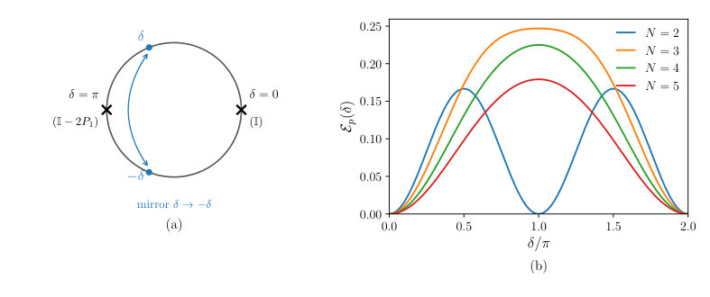
<figcaption class="paper-figure-caption"><b>Fig 1.</b> FIG. 1. (a) The two-projector unitary circle, corresponding to the boundary of Fig. 1 in Ref. [18] and parametrized by the relative phase δ. The fixed points δ = 0, π under δ →−δ are stationary by Theorem 1. (b) Entangling power of the singlet–adjoint family for N = 2, 3, 4, 5. The reflection at δ = π is a minimum for N = 2 and a maximum for N ≥3.</figcaption>
</figure>
<figure class="paper-figure-card">

<figcaption class="paper-figure-caption"><b>Fig 2.</b> FIG. 2. Entangling power near the stationary corner (δ0, δ1) = (π, 0) of the two-site spin-1 BLBQ family. (a) Entangling power in relative-phase coordinates, with the XXX (solid blue) and pure-biquadratic (dashed orange) trajectories. (b) Corresponding one-dimensional trajectories of the time-evolution: the corner is a local minimum along the XXX trajectory but a local maximum along the pure-biquadratic trajectory.</figcaption>
</figure>

**Summary.** This paper mathematically characterizes the points where the entangling power of a unitary gate is extremal. It proves that these stationary points, called 'corners,' correspond to generalized reflection gates ($U^2 \propto \mathbb{I}$). This result provides a powerful tool for understanding the entanglement properties of fundamental quantum gates in both abstract and physical models like spin chains.

**Why it may be interesting.** It provides a rigorous mathematical characterization of highly entangled, symmetry-constrained quantum gates ($U^2 \propto \mathbb{I}$), which are crucial building blocks for quantum computation and understanding gate universality.

Detailed structure

**Main problem.** To find a general statement about where the entangling power of a unitary operator is extremized.

**Main result.** The entangling power is stationary at specific points called 'corners,' which correspond to unitary gates that are generalized reflections ($U^2 \propto \mathbb{I}$).

**Method.** The analysis uses the spectral decomposition of the unitary operator and calculates the entangling power as a function of relative eigenphases, finding stationary points by setting the gradient to zero.

**Model / system.** The system involves unitary operators $U$ acting on a bipartite Hilbert space, analyzed via their spectral decomposition in terms of eigenvalues and eigen-projectors.

**Key observables.** Entangling power ($E_p$), which is the average linear entropy generated from product states.

**Important parameters / regimes.** The number of distinct eigenvalues ($n$), and the relative eigenphases ($\delta_a$).

**Assumptions / limitations.** The analysis focuses on the stationary points (corners) of the entangling power function, though other extrema may exist in the interior.

**Figures summary.** Figure 2 illustrates the entangling power near a stationary corner for a two-site spin-1 system, showing how trajectories (e.g., XXX vs. pure BQ limits) pass through these points.

**Paper structure.** The paper establishes the mathematical framework by defining $E_p$ and its dependence on relative phases. It then proves the existence of stationary points (corners) at specific phase configurations, characterizes the resulting unitary gates ($R = I - 2Q$), and illustrates the findings with examples from two-qubit gates and spin chains.

Abstract

The entangling power of a unitary operator acting on a bipartite Hilbert space measures the entanglement it generates from product states, averaged over the inputs. A finite-dimensional unitary has a spectral decomposition $U=\sum_{a=1}^{n}e^{iθ_a}P_a$, where $e^{iθ_a}$ are the eigenvalues, $P_a$ the corresponding eigen-projectors, and $n$ is the number of distinct eigenvalues. After removing an overall phase, the entangling power is a function on the $(n-1)$-torus of relative eigenphases at fixed spectral projectors. We prove that this function is stationary at all $2^{n-1}$ points on the torus where every relative phase is $0$ or $π$, which we define as \textit{corners}. Up to an overall phase, $U$ at each corner is a generalized reflection $R=\mathbb{I}-2Q$ satisfying $R^2=\mathbb{I}$, where $Q$ is the sum of spectral projectors whose relative phase is $π$. At the corner the entangling power is expressed in terms of seven local-unitary invariants of $Q$. A unitary gate $U$ can be realized as a corner of some projector family if and only if $U^2\propto\mathbb{I}$, a condition satisfied by many Clifford and non-Clifford gates. We illustrate the theorem with two-qubit gates, $SU(N)$ channel decompositions, and two-site spin chains, obtaining examples of minima, maxima, and saddle points. In addition, a corner that is a saddle point on the full phase torus can appear as a local maximum or minimum along different time-evolution trajectories.

[↑ back to top](#top)

### [Wasserstein Stability, Couplings Across Volumes, and the $1+1/d$ Moment Thresholds in the Edwards--Anderson Model](http://arxiv.org/abs/2609.09680v1)

**Authors:** Mauris Chueng, Hexiang Wang, Keheng Zhu  
**Type:** theory · **Category:** disordered systems and neural networks · **PDF:** <https://arxiv.org/pdf/2609.09680v1>  
**Analysis basis:** full PDF text, analyzed in chunks

↔ Scroll figures horizontally

<figure class="paper-figure-card">

<figcaption class="paper-figure-caption"><b>Fig 1.</b> Low-resolution page preview, page 2</figcaption>
</figure>
<figure class="paper-figure-card">
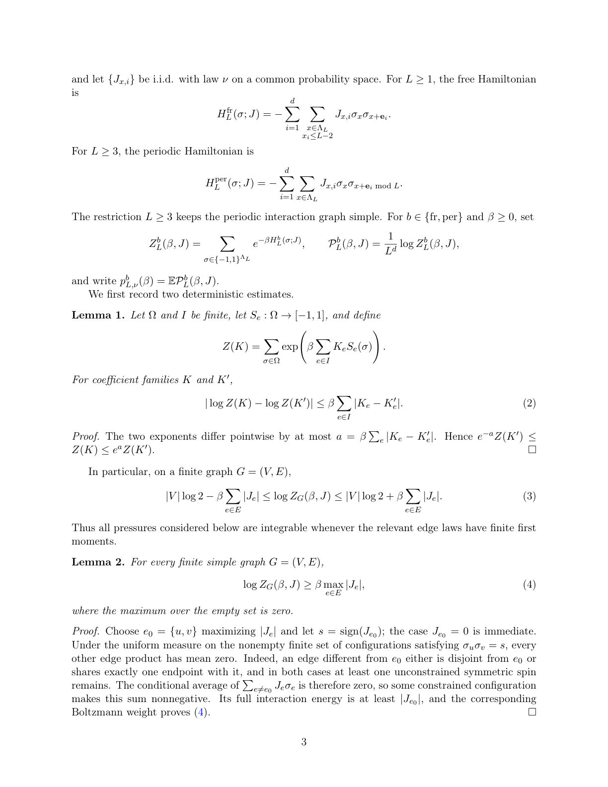
<figcaption class="paper-figure-caption"><b>Fig 2.</b> Low-resolution page preview, page 3</figcaption>
</figure>
<figure class="paper-figure-card">
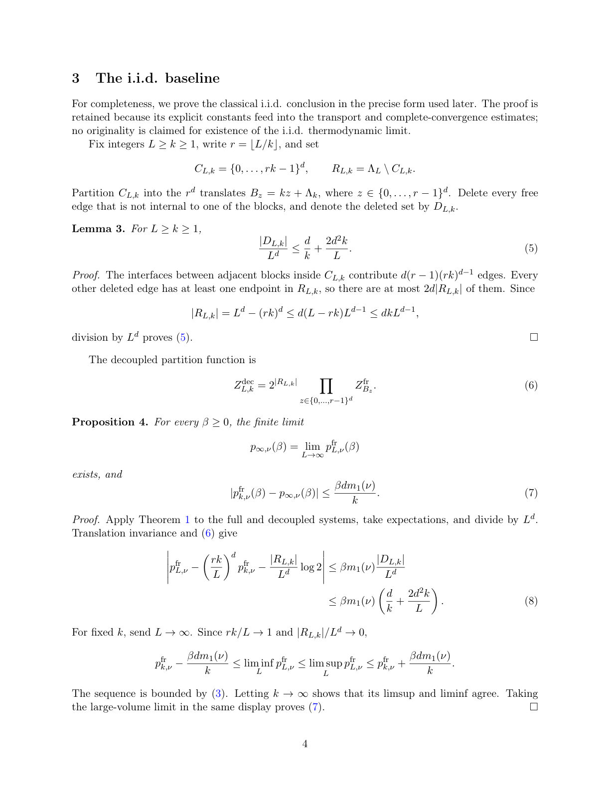
<figcaption class="paper-figure-caption"><b>Fig 3.</b> Low-resolution page preview, page 4</figcaption>
</figure>
<figure class="paper-figure-card">

<figcaption class="paper-figure-caption"><b>Fig 4.</b> Low-resolution page preview, page 5</figcaption>
</figure>
<figure class="paper-figure-card">
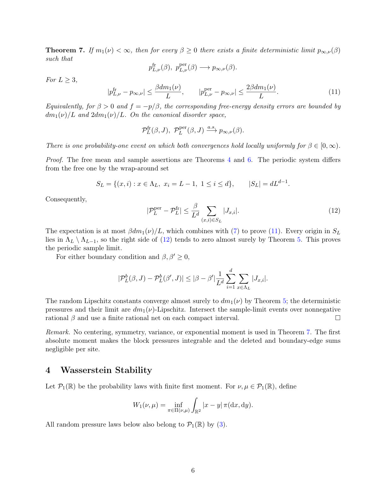
<figcaption class="paper-figure-caption"><b>Fig 5.</b> Low-resolution page preview, page 6</figcaption>
</figure>

**Summary.** This work provides a deep mathematical analysis of the Edwards-Anderson Ising model under random disorder, focusing on the convergence of its thermodynamic pressure. The authors prove that the stability of this limit depends critically on the disorder couplings having a finite moment of order $1+1/d$. This establishes a sharp, universal criterion for the existence of the thermodynamic limit across different coupling constructions.

**Why it may be interesting.** The rigorous mathematical framework developed for determining the precise moment conditions required for thermodynamic limits in disordered systems is highly relevant to understanding phase transitions and critical behavior in complex quantum materials.

Detailed structure

**Main problem.** The paper investigates the stability and convergence properties of the quenched pressure in the Edwards-Anderson Ising model under random disorder.

**Main result.** It establishes that the infinite-volume pressure exhibits Wasserstein stability and that almost-sure convergence requires the disorder couplings to satisfy the moment condition $\mathbb{E}|J|^{1+1/d} < \infty$.

**Method.** The analysis employs tools from probability theory, including Wasserstein distance, strong laws, and Borel-Cantelli lemmas, to compare thermodynamic limits under different coupling assumptions.

**Model / system.** The system is the nearest-neighbor Edwards-Anderson Ising model, analyzed using both free and periodic boundary conditions. The disorder couplings $\{J_{x,i}\}$ are random variables drawn from a law $
u$.

**Key observables.** The primary observable is the quenched pressure, $p_b^L(eta, J) = rac{1}{L^d} \log Z_b^L(eta, J)$, and its limit $p_{\infty, 
u}(eta)$.

**Important parameters / regimes.** The critical exponent is $1+1/d$, where $d$ is the spatial dimension. The coupling constant $eta$ and the disorder law $
u$ are key parameters.

**Assumptions / limitations.** The analysis relies on comparing the behavior under joint coupling versus independent resampling of disorder volumes, and the sharpness proof requires constructing specific counterexamples for sub-critical moments.

**Figures summary.** Not specified.

**Paper structure.** The paper proceeds by first establishing quantitative stability bounds using the 1-Wasserstein distance. It then proves the equivalence between almost-sure convergence under all joint couplings and the convergence of one-volume laws. Finally, it rigorously determines the optimal moment threshold, $1+1/d$, for this universal convergence.

Abstract

We study the quenched pressure of the nearest-neighbor Edwards--Anderson Ising model with free and periodic boundary conditions. First, we prove that the infinite-volume pressure is $βd$-Lipschitz in the coupling law for the $1$-Wasserstein distance, yielding quantitative thermodynamic limits for spatially inhomogeneous disorder. Second, for periodic volumes, we prove that almost-sure convergence under every joint coupling of the finite-volume disorder arrays is equivalent to complete convergence of the one-volume pressure laws. Third, we prove that $\mathbb{E}\vert{}J\vert{}^{1+1/d}<\infty$ guarantees this universal-coupling conclusion. We further show that this exponent is optimal among uniform power-moment assumptions: for every $1\leq q<1+1/d$, there is a centered symmetric law with finite $q$-th moment for which canonical nested volumes converge almost surely, whereas independently resampled volumes with the same fixed-volume marginals converge in probability but not almost surely. Finally, in dimension one, we prove that the first-moment condition is also necessary for a finite limiting pressure.

[↑ back to top](#top)

## Secondary cond-mat archives

*Papers from cond-mat.mtrl-sci, mes-hall, other, soft, supr-con. These archives are de-prioritized — they appear at the end regardless of relevance score.*

### Relevant in secondary archives (18)

### [Fast Synergetic Simulation to Study Slow Evolution of Soliton Patterns in Optical Resonators](http://arxiv.org/abs/2609.10389v1)

**Authors:** Sanzida Akter, Pradyoth Shandilya, Logan Courtright, Amir Leshem, Giuseppe D'Aguanno, Omri Gat, Curtis R. Menyuk  
**Type:** theory · **Category:** numerical methods · **PDF:** <https://arxiv.org/pdf/2609.10389v1>  
**Analysis basis:** full PDF text, analyzed in chunks
**Topic relevance:** 🔥 `methods for driven-dissipative` **4/5** · `Keldysh / 2PI / non-Gaussian methods` **1/5** · `correlated / nonlocal dissipation` **1/5** · `driven-dissipative phase transition` **1/5** · `non-equilibrium universality` **1/5** · `scars & prethermalization` **1/5**

↔ Scroll figures horizontally

<figure class="paper-figure-card">

<figcaption class="paper-figure-caption"><b>Fig 1.</b> Figure 1: (a) Schematic of a microresonator system for frequency comb generation. A microring resonator is driven by an external CW laser source to generate a train of soliton pulses or more complex patterns that form a frequency comb, as analyzed using an optical spectrum analyzer. (b) Intracavity intensity profile illustration of commonly observed optical patterns. Anomalous dispersion regime: (i) a single dissipative Kerr soliton, (ii) a soliton molecule, (iii) a perfect soliton crystal. Normal dispersion regime: (iv) a dark soliton.</figcaption>
</figure>
<figure class="paper-figure-card">
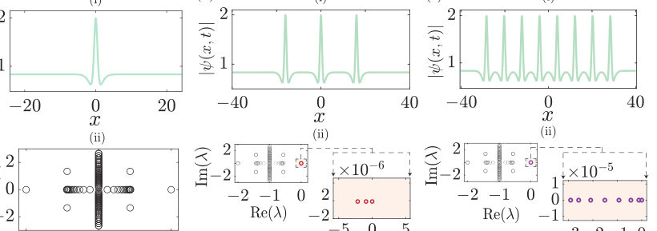
<figcaption class="paper-figure-caption"><b>Fig 2.</b> Figure 2: (a) (i) Profile of a single soliton stationary solution. (ii) The corresponding eigenvalue spectrum derived from the linearized operator. The spectrum reveals a fourfold symmetry and a single eigenvalue near zero, corresponding to translational invariance of the soliton. (b) (i) A three- soliton molecule solution and (ii) its eigenvalue profile. Here, there are three eigenvalues near zero: one represents translational invariance (similar to the single soliton), while the other two represent the slowly varying DOFs associated with the relative motion between solitons. (c) (i) An eight- soliton molecule and (ii) its eigenvalue spectrum. In this system, there are eight eigenvalues...</figcaption>
</figure>
<figure class="paper-figure-card">
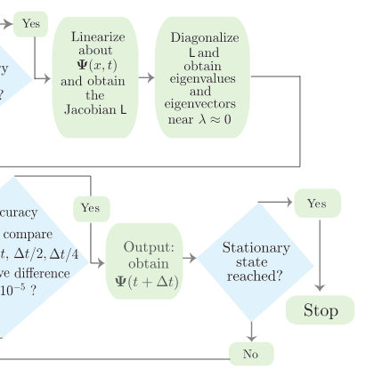
<figcaption class="paper-figure-caption"><b>Fig 3.</b> Figure 3: Synergetic method algorithm flowchart</figcaption>
</figure>
<figure class="paper-figure-card">
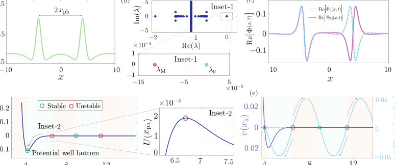
<figcaption class="paper-figure-caption"><b>Fig 4.</b> Figure 4: (a) Two-soliton molecule system where xph is half the separation distance. (b) Dynam- ical spectrum of the two-soliton molecule showing the presence of two eigenvalues near zero: λ0 corresponds to translational invariance of the soliton pair and λM is responsible for relative motion between solitons. (c) Shape of the two eigenvectors of the near-zero eigenvalues. (d) Two-soliton potential function U(xph) as a function of half the separation distance xph showing the consecutive stable and unstable equilibria. Inset-2 shows U(xph) near the potential maximum at xph = 6.7. The potential beyond this point appears nearly flat on a linear scale due to the exponential falloff of the...</figcaption>
</figure>
<figure class="paper-figure-card">
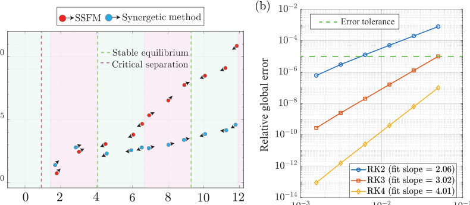
<figcaption class="paper-figure-caption"><b>Fig 5.</b> Figure 5: (a) CPU time comparison between the synergetic method and the SSFM for the two- soliton system as a function of xph(t = 0) as the solitons approach equilibrium starting at different separations. (b) Time comparison and error analysis for the synergetic method using different order explicit Runge-Kutta integrators; RK2 = second-order, RK3 = third-order, RK4 = fourth-order.</figcaption>
</figure>

**Summary.** This paper introduces the synergetic method, a novel numerical technique designed to overcome the stiffness limitations encountered when simulating systems with widely separated timescales. It applies this method to model the slow, long-term evolution of complex soliton patterns in optical microresonators. The success demonstrates the method's power for studying pattern formation in nonlinear systems on realistic, long timescales.

**Why it may be interesting.** The technique itself is a powerful, general numerical tool for analyzing complex, multi-scale physical systems, making it highly relevant for theoretical work in open quantum systems or nonlinear optics where timescale separation is common.

Detailed structure

**Main problem.** The primary challenge is simulating the slow, long-term evolution of complex soliton patterns in optical resonators, where the interaction timescales are vastly separated from the fast dissipative/loss timescales.

**Main result.** The authors successfully applied the synergetic method to model the full interaction dynamics of multi-soliton molecules (up to eight solitons) over extended laboratory timescales, achieving massive computational speedups.

**Method.** They developed and applied the 'synergetic method,' which is inspired by Haken's principle to eliminate rapidly damped degrees-of-freedom, allowing for time steps orders of magnitude larger than conventional methods.

**Model / system.** The system is based on dissipative Kerr solitons in a driven nonlinear Kerr cavity, modeled by the Lugiato-Lefever equation (a driven-damped nonlinear Schrödinger equation).

**Key observables.** Soliton patterns (single, molecule, crystal), the potential function governing relative motion, and the dynamical spectrum eigenvalues.

**Important parameters / regimes.** The separation of timescales between fast damping/dispersion and slow soliton interaction dynamics; laboratory timescales (seconds).

**Assumptions / limitations.** The method assumes a clear and large separation between the fast, damped dynamics and the slow, pattern-governing dynamics, allowing for projection onto the slow subspace.

**Figures summary.** Figures illustrate the schematic of the resonator, the resulting soliton patterns, the dynamical spectrum showing eigenvalues near zero for slow modes, and trajectory evolution converging onto potential energy minima.

**Paper structure.** The paper progresses by establishing the physical context (soliton pattern formation in Kerr cavities), identifying the computational bottleneck (stiffness due to timescale separation), proposing the synergetic method, and validating it by simulating increasing complexity (two-soliton, three-soliton, eight-soliton molecules).

Abstract

Complex patterns in physical and biological systems often emerge through slow collective dynamics governed by a small number of key variables. In nonlinear optical resonators, dissipative Kerr solitons provide an important example, where interactions between well-separated solitons can evolve over timescales far longer than the characteristic loss and gain timescales. Direct numerical simulation of these dynamics is challenging because stiffness forces conventional methods to resolve many rapidly damped degrees-of-freedom with very small time steps. We present a numerical scheme, the synergetic method, that eliminates these rapidly damped degrees-of-freedom and retains the slowly evolving modes, enabling time steps many orders of magnitude larger than those used in conventional approaches. Applied to soliton molecules in driven Kerr cavities, the method achieves speedups of $10^3$ to $10^5$ while capturing dynamics on laboratory timescales. We use it to model the full interaction dynamics of a three-soliton molecule and the evolution of an eight-soliton molecule. The approach provides an efficient framework for studying slow pattern formation in nonlinear systems with widely separated timescales.

[↑ back to top](#top)

### [Apparent Zero-Momentum Signals from Magnon--Magnon Interference in Near-Field Spin-Wave Imaging](http://arxiv.org/abs/2609.09922v1)

**Authors:** Julien Berthomier, Romain Lebrun, Vincent Cros, Jamal Ben Youssef, Karim Bouzehouane, Abdelmadjid Anane  
**Type:** both · **Category:** other · **PDF:** <https://arxiv.org/pdf/2609.09922v1>  
**Analysis basis:** full PDF text, analyzed in chunks
**Topic relevance:** 🔥 `interference shaping light` **4/5** · `quantum measurements` **2/5**

↔ Scroll figures horizontally

<figure class="paper-figure-card">
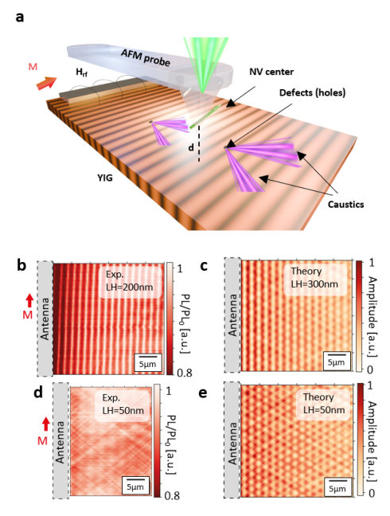
<figcaption class="paper-figure-caption"><b>Fig 1.</b> FIG. 1. Effect of NV-sample distance on phase- coherent spin-wave imaging. (a) Schematic of the experi- mental setup: a single NV center at the end of an AFM probe (QZabre) scans above a 140-nm-thick YIG film. A stripline antenna excites primarily Damon–Eshbach (DE) modes with the bias field µ0Hext = 15.9 mT applied parallel to the trans- ducer. Propagating spin waves scatter off defects, generating characteristic caustic beams. (b) Experimental NV contrast at an NV–sample distance d = 200 nm, revealing the wave- fronts of the coherently excited DE modes. (c) Corresponding near-field diffraction simulation accounting for the interfer- ence between the antenna field and the spin-wave stray...</figcaption>
</figure>
<figure class="paper-figure-card">

<figcaption class="paper-figure-caption"><b>Fig 2.</b> FIG. 2. Probing the reciprocal space of spin-wave interference at varying lift heights. (a) Fast Fourier Transform (FFT) of the experimental image at d = 200 nm [Fig. 1(b)]. The primary DE modes manifest as distinct reciprocal-space peaks; additional harmonics arise from the nonlinearity of the contrast with respect to microwave power and the spatial anharmonicity of the non-propagating microwave excitation field at the NV position. (b) FFT of the experimental image at d = 50 nm [Fig. 1(d)], where a butterfly-shaped spectral distribution emerges with prominent components near k ≈0. The expected analytical isofrequency contour is overlaid as a solid black line. The dashed curve corresponds...</figcaption>
</figure>
<figure class="paper-figure-card">
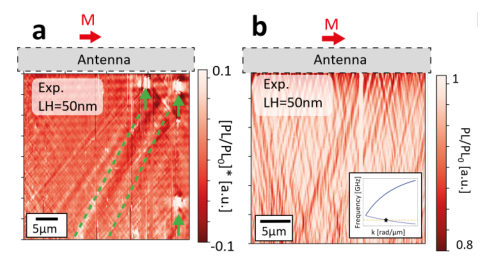
<figcaption class="paper-figure-caption"><b>Fig 3.</b> FIG. 3. Spin-wave scattering from intrinsic defects and transducer corrugations. (a) Experimental mag- netic image revealing caustic beams (dashed lines) originat- ing from scattering centers at the YIG surface (arrows). At µ0H = 17.1 mT and fNV = 2390 MHz, the excitation fre- quency intersects the DE branch, leading to high-efficiency propagation. The contrast [PL/PL0]∗denotes the signal after median-column subtraction to enhance wavefront visibility. (b-inset) Calculated dispersion relation at µ0H = 33.3 mT; at fNV = 1937 MHz, the frequency lies below the DE mani- fold but remains resonant with the backward-volume branch. (b) Experimental NV images at fNV = 1937 MHz. While primary DE...</figcaption>
</figure>
<figure class="paper-figure-card">

<figcaption class="paper-figure-caption"><b>Fig 4.</b> FIG. 4. Impact of transducer geometry on spin-wave scattering efficiency. (a)–(c) Real-space NFD simulations of spin-wave propagation excited by antennas with varying edge profiles at a fixed lift height: (a) ideal (rectilinear) edge, where only the primary DE mode is excited, (b) 1% corruga- tion width (100 nm), and (c) 4% corrugations. Insets provide a magnified view of the lithographic transducer definition. (d)–(f) Corresponding spectral distributions in k-space ob- tained via FFT of the real-space profiles. The emergence of high-momentum spectral weight correlates with the presence of edge roughness. (g) Relative amplitude ratio of a represen- tative scattered mode [kscat = (1, 2)...</figcaption>
</figure>

**Summary.** This research demonstrates that near-field imaging of spin waves does not directly map the material's eigenmode spectrum. By analyzing signals from YIG films, the authors show that apparent low-momentum signals are actually due to coherent interference between different spin-wave components. This establishes that such measurements yield an interferometric field spectrum rather than a simple eigenmode map.

**Why it may be interesting.** This work provides a crucial methodological caution for experimental condensed matter physicists studying wave phenomena, showing that advanced near-field techniques require careful deconvolution of interference effects from true material properties.

Detailed structure

**Main problem.** The standard interpretation that spatially resolved measurements of coherent waves directly map the underlying eigenmode spectrum fails when imaging multimode spin-wave transport in the near-field.

**Main result.** The observed low-momentum signals are not true eigenmodes but are instead artifacts arising from the coherent interference (beating) between directly excited spin waves and those scattered by defects or sample imperfections.

**Method.** The study combines experimental measurements using scanning nitrogen-vacancy magnetometry with theoretical modeling based on the Near-Field Diffraction (NFD) framework to decompose the total measured field.

**Model / system.** The physical system is spin-wave propagation in a yttrium iron garnet (YIG) film. The analysis models the total local microwave field as a superposition of contributions from the antenna, the primary excited spin waves, and scattered spin waves.

**Key observables.** The total local microwave field $B_{tot}(\mathbf{r})$ and its spatial Fourier components, particularly the anomalous components appearing at the difference wave vector $\Delta \mathbf{k} = \mathbf{k}_{exc} - \mathbf{k}_{scat}$.

**Important parameters / regimes.** Probe-sample distance ($d$), wave vectors ($\mathbf{k}_{exc}, \mathbf{k}_{scat}$), and the relative strength of the interference term compared to the primary excitation fields.

**Assumptions / limitations.** The analysis relies on the NFD model and assumes that the measured signal is dominated by the coherent interference cross-term when analyzing the anomalous signals.

**Figures summary.** Figures compare experimental contrast maps at different distances ($d=200$ nm vs $d=50$ nm) and show that the anomalous low-$k$ signal is reproduced by the theoretical cross-term ($\mathbf{B}_{SW,exc}\mathbf{B}_{SW,scat}$) in the NFD simulations.

**Paper structure.** The paper establishes the failure of the direct eigenmode mapping assumption, presents experimental evidence of anomalous low-$k$ signals, and then uses the NFD model to theoretically identify the origin of these signals as magnon-magnon interference terms.

Abstract

Spatially resolved measurements of coherent waves are commonly read as direct maps of the underlying eigenmode spectrum. We show that this interpretation fails in near-field imaging of multimode spin-wave transport. Scanning nitrogen-vacancy magnetometry of yttrium iron garnet reveals pronounced apparent low-wave-vector signals at frequencies for which no propagating spin-wave mode exists. By tuning the probe-sample distance and modeling the anisotropic near-field response, we identify their origin as coherent mixing between directly excited Damon-Eshbach waves and defect- or transducer-scattered spin waves: the measured signal acquires spatial Fourier components at the difference wave vector $\mathbf{k}_{\mathrm{exc}}-\mathbf{k}_{\mathrm{scat}}$, which can vanish even though both constituent waves carry finite momentum. These results establish that near-field spectra of coherent excitations are interferometric field spectra rather than eigenmode maps, providing both a caution and a framework for identifying scattering processes in nanoscale magnonic devices.

[↑ back to top](#top)

### [A First-Principles Multiscale Framework for Topological Superconductivity](http://arxiv.org/abs/2609.10381v1)

**Authors:** Christopher L. Jacobs, Baishali Mandal, Taehwan Jung, Purna P. Paudel, Jason Kawasaki, Tudor D. Stanescu, Subhasish Mandal  
**Type:** theory · **Category:** other · **PDF:** <https://arxiv.org/pdf/2609.10381v1>  
**Analysis basis:** full PDF text, analyzed in chunks
**Topic relevance:** `analog quantum simulation` **3/5** · `Keldysh / 2PI / non-Gaussian methods` **2/5** · `methods for driven-dissipative` **2/5**

↔ Scroll figures horizontally

<figure class="paper-figure-card">

<figcaption class="paper-figure-caption"><b>Fig 1.</b> FIG. 1. Materials-design strategy and candi- date platforms. (a) Multiscale workflow connecting first- principles electronic-structure calculations, Wannier-derived low-energy Hamiltonians, Bogoliubov–de Gennes (BdG) the- ory, and topological invariant calculations. (b) Materi- als/heterostructure platforms under investigation, where Bext denotes an out-of-plane magnetic field. (i) (System I) bulk- like FeTe0.5Se0.5 (10-layer film) and (ii) (System II) monolayer FeTe0.5Se0.5. The dashed SrTiO3 substrate indicates that substrate is implicitly included by fixing the FeTe0.5Se0.5 in- plane lattice parameter to the value experimentally observed for 10 UC films on SrTiO3 [102]. Interfacial...</figcaption>
</figure>
<figure class="paper-figure-card">

<figcaption class="paper-figure-caption"><b>Fig 2.</b> FIG. 2. Crystal structure and low-energy band struc- ture for Bulk-like FeTe0.5Se0.5 (System I). (a) Crystal structure. (b) Orbital-resolved DFT band structure along Γ–Z. (c), (d) Orbital-resolved electronic structure along M– Γ–X–M for kz = 0 and kz = π (units of 1/c), respectively. The color bar indicates the relative Fe-d (red) and Te/Se-p (blue) character. The chalcogen-derived band shifts toward the Fermi level between kz = 0 and kz = π, while simulta- neously acquiring stronger Fe-d weight, resulting in enhanced spin–orbit-active and superconducting orbital hybridization. µ1a and µ1b denote the representative chemical potentials used for System I at kz = 0 and kz = π, respectively....</figcaption>
</figure>
<figure class="paper-figure-card">
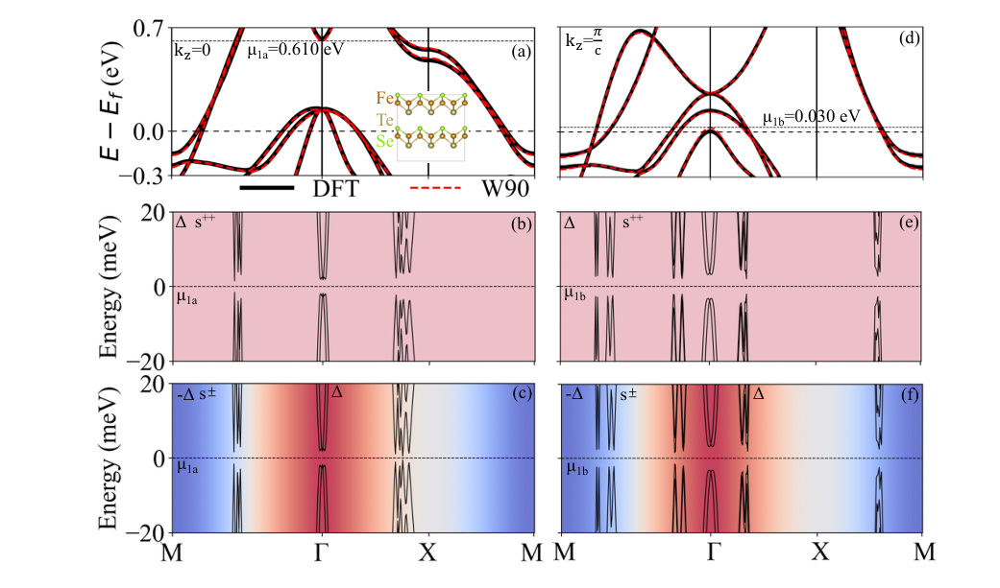
<figcaption class="paper-figure-caption"><b>Fig 3.</b> FIG. 3. Wannier representation and superconducting BdG spectra of bulk-like FeTe0.5Se0.5 (System I). (a), (d) Comparison between DFT band structures (black solid lines) and Wannier-interpolated bands (red dashed lines) for kz = 0 and kz = π, respectively. (b), (c) BdG spectra at kz = 0 for s++ and s± pairing, evaluated near the isolated chalcogen-derived band (µ = 610 meV). (e), (f) Corresponding BdG spectra at kz = π (µ = 30 meV). The color denotes the sign of the superconducting pairing potential. Calculations were performed using ∆0 = 5 meV, with Rashba coupling strengths α = 250 meV (kz = 0) and α = 150 meV (kz = π).</figcaption>
</figure>
<figure class="paper-figure-card">
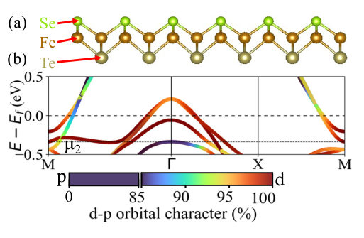
<figcaption class="paper-figure-caption"><b>Fig 4.</b> FIG. 4. Crystal structure and low-energy band structure for Monolayer FeTe0.5Se0.5 (System II). (a) Crystal structure of monolayer FeTe0.5Se0.5. (b) Orbital- resolved DFT band structure along M–Γ–X–M, with colors indicating the projected Fe-d (red) and Te/Se-p (blue) orbital weight, for fixed a = 3.88 ˚A. µ2 denotes the representative chemical potential.</figcaption>
</figure>
<figure class="paper-figure-card">
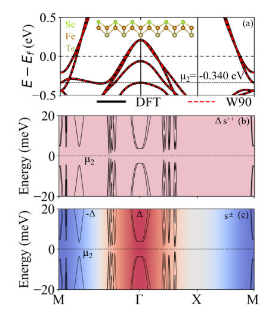
<figcaption class="paper-figure-caption"><b>Fig 5.</b> FIG. 5. Wannier representation and superconducting BdG spectra of monolayer FeTe0.5Se0.5 (System II). (a) Comparison between DFT band structures (black solid lines) and Wannier-interpolated bands (red dashed lines). (b), (c) BdG spectra for s++ and s± pairing symmetries, respec- tively. The color scale in (b-c) denotes the sign of the super- conducting pairing potential. Calculations were performed using ∆0 = 5 meV and α = 50 meV.</figcaption>
</figure>

**Summary.** This work introduces a comprehensive, multiscale computational framework to theoretically predict topological superconductivity in real materials. By combining DFT, Wannier models, and BdG theory, the authors successfully analyze Fe-based superconductors and heterostructures. The research provides a quantitative, materials-by-design route for engineering platforms capable of hosting Majorana zero modes.

**Why it may be interesting.** While focused on condensed matter, the development of a rigorous, bottom-up computational pipeline linking electronic structure (DFT) to emergent topological quantum states (BdG/Chern number) is highly relevant for simulating complex quantum many-body systems in AMO physics.

Detailed structure

**Main problem.** The primary goal is to develop a unified, materials-informed computational framework to predict and understand topological superconductivity (TSC) in real-world materials.

**Main result.** The framework successfully predicts robust TSC in Fe-based materials, highlighting FeSe/GaAs heterostructures as particularly promising platforms for engineering Majorana materials.

**Method.** The approach combines Density Functional Theory (DFT) for electronic structure, Wannier-based low-energy Hamiltonians, Bogoliubov-de Gennes (BdG) theory, and Matsubara Green's-function calculations.

**Model / system.** The study focuses on Fe-based superconductors, investigating both intrinsic TSC (e.g., bulk FeTeSe) and proximity-induced TSC in heterostructures like FeSe/GaAs. The low-energy Hamiltonian incorporates Rashba spin-orbit coupling and superconducting pairing.

**Key observables.** Topological gaps, topological invariants (Chern number), and the existence of zero-energy crossings signaling topological phase transitions.

**Important parameters / regimes.** Chemical potential ($\mu$), Zeeman field ($V_z$), and the strength of superconducting pairing ($\Delta$).

**Assumptions / limitations.** The framework assumes that key ingredients like Rashba-active states and strong orbital hybridization are necessary for robust TSC, and it builds upon established DFT/Wannier methodologies.

**Figures summary.** Figure 1 illustrates the entire multiscale workflow, connecting first-principles calculations through Wannier models to the final BdG Hamiltonian and topological invariant evaluation.

**Paper structure.** The paper follows a logical progression: defining the need for a unified framework, detailing the multiscale computational methodology (DFT $
ightarrow$ Wannier $
ightarrow$ BdG), applying this framework to specific material systems (FeTeSe, FeSe/GaAs), and finally deriving design principles for engineering Majorana materials.

Abstract

A microscopic understanding of topological superconductivity (TSC) in real materials requires a materials-informed approach that integrates first-principles electronic structure, superconductivity, and topology within a unified computational framework. Here, we develop such an approach by combining density functional theory, Wannier-based low-energy Hamiltonians, Bogoliubov-de Gennes theory, and Matsubara Green's-function-based Chern number calculations performed directly on realistic multiorbital superconducting Hamiltonians. We apply this framework to bulk-like and monolayer FeTeSe and to FeSe/GaAs heterostructures, enabling a unified investigation of both intrinsic and proximity-induced topological superconductivity. We identify key electronic-structure ingredients that promote robust TSC, including Rashba-active states near the Fermi level, strong induced superconducting pairing, and substantial orbital hybridization between spin-orbit-active and superconducting sectors. Guided by these design principles, we predict multiple topological superconducting phases in Fe-based materials and demonstrate that FeSe/GaAs heterostructures are particularly promising, exhibiting topological transitions at experimentally accessible chemical potentials and low Zeeman fields. Complementing the theoretical predictions, we demonstrate the growth and structural characterization of FeSe/GaAs heterostructures, establishing the experimental feasibility of the proposed materials platform. Our results provide a quantitative route for engineering and screening candidate Majorana materials and heterostructures directly from realistic electronic structures and establish a foundation for future materials-by-design approaches to topological superconductivity.

[↑ back to top](#top)

### [Nonlinear Edelstein effect in Rashba superconductors](http://arxiv.org/abs/2609.10212v1)

**Authors:** Hikaru Ueki, Youichi Yanase  
**Type:** theory · **Category:** other · **PDF:** <https://arxiv.org/pdf/2609.10212v1>  
**Analysis basis:** full PDF text, analyzed in chunks
**Topic relevance:** `Keldysh / 2PI / non-Gaussian methods` **3/5** · `methods for driven-dissipative` **3/5**

↔ Scroll figures horizontally

<figure class="paper-figure-card">

<figcaption class="paper-figure-caption"><b>Fig 1.</b> FIG. 1. Schematic illustration of a semi-infinite Rashba su- perconductor subjected to a uniform magnetic field (orange arrow). Owing to the Rashba spin-orbit coupling, a spin mag- netization polarized along the x direction (red circles with ar- rows) is induced near the surface at x = 0, where the Meissner current flows (blue arrow).</figcaption>
</figure>
<figure class="paper-figure-card">
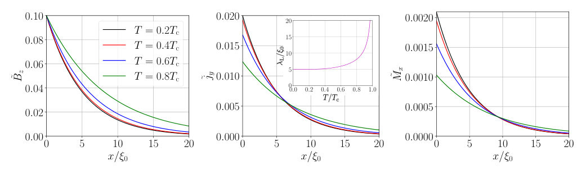
<figcaption class="paper-figure-caption"><b>Fig 2.</b> FIG. 2. Spatial dependence of the magnetic field (left), current density (center), and magnetization (right) near the surface at x = 0 in units of ℏ/2|e|ξ2 0, ℏ/2µ0|e|ξ3 0, and µBN(0)∆0, respectively, for α = 1.5∆0 at T = 0.2Tc, 0.4Tc, 0.6Tc, and 0.8Tc. The inset in the center panel shows the temperature dependence of the London penetration depth.</figcaption>
</figure>
<figure class="paper-figure-card">
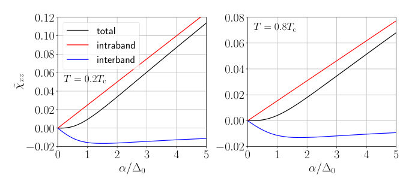
<figcaption class="paper-figure-caption"><b>Fig 3.</b> FIG. 3. Intraband (red) and interband (blue) contributions to the normalized magnetic susceptibility ˜χxz, which originates from the Edelstein effect, together with their sum (black), as functions of α/∆0 at T = 0.2Tc (left) and 0.8Tc (right). The magnetic susceptibility is normalized by 2|e|ξ2 0µBN(0)∆0/ℏ.</figcaption>
</figure>
<figure class="paper-figure-card">

<figcaption class="paper-figure-caption"><b>Fig 4.</b> FIG. 4. Superfluid-momentum dependence of the superconducting gap (left), current density (center), and magnetization (right), in units of ∆0, ℏ/2µ0|e|ξ3 0, and µBN(0)∆0, respectively, for α = 1.5∆0 at T = 0.2Tc, 0.4Tc, 0.6Tc, and 0.8Tc. Here, the unit of superfluid momentum is pc ≡∆0/vF, and the superfluid momentum psy is treated as a local control parameter. In a semi-infinite geometry, however, it should be understood as psy = psy(x; B0), determined by the nonlinear Meissner screening profile, whose effective penetration depth depends on the surface magnetic field B0 [18, 19].</figcaption>
</figure>
<figure class="paper-figure-card">

<figcaption class="paper-figure-caption"><b>Fig 5.</b> FIG. 5. Current-density dependence of the magnetization normalized by µBN(0)∆0 (left) and its nonlinear part (right) for α = 1.5∆0 at T = 0.2Tc, 0.4Tc, 0.6Tc, and 0.8Tc. The nonlinear part is defined as ˜ M NL x ≡˜ Mx −˜ M L x , where ˜ M L x denotes the part of ˜ Mx linear in the current density jy. The unit of jy is the depairing current density jd.</figcaption>
</figure>

**Summary.** This work establishes a comprehensive quasiclassical theory for the Edelstein effect in Rashba superconductors by incorporating both intraband and interband contributions. The key finding is that the nonlinear dependence of the magnetization on the supercurrent is uniquely sourced by the interband term, which is mathematically related to the Berry connection arising from the spin-orbit coupling. This suggests that the nonlinear effect can serve as a sensitive probe of quantum geometric effects in superconducting materials.

**Why it may be interesting.** The explicit separation and identification of the nonlinear response with a quantum geometric term (interband contribution) provides a novel diagnostic tool for probing the underlying band structure physics in superconductors.

Detailed structure

**Main problem.** The paper develops a quasiclassical theory to describe the Edelstein effect in superconductors, specifically accounting for both intraband and interband contributions.

**Main result.** The nonlinear dependence of the surface spin magnetization on the supercurrent arises solely from the interband contribution, which is linked to the quantum geometry (Berry connection) of the Rashba spin-orbit coupling.

**Method.** The authors derive augmented Eilenberger equations in the presence of Rashba SOC and solve them using a quasiclassical expansion in the helicity basis.

**Model / system.** The system is an s-wave Rashba superconductor, modeled using the Gor'kov equations transformed into the gauge-covariant Wigner representation.

**Key observables.** Supercurrent-induced surface spin magnetization ($\mathbf{M}$), charge density ($
ho$), and current density ($\mathbf{j}$).

**Important parameters / regimes.** Rashba SOC strength ($\alpha$), superconducting gap ($\Delta$), temperature ($T$), and supercurrent ($\mathbf{j}$).

**Assumptions / limitations.** The analysis assumes a clean s-wave Rashba model and employs a quasiclassical expansion, retaining the anomalous-velocity term while neglecting others.

**Figures summary.** Figures illustrate the dependence of magnetization and current density on the superfluid momentum ($\mathbf{p}_s$) at various temperatures, highlighting the nonlinear component.

**Paper structure.** The paper progresses from formulating the problem using Gor'kov equations in the Wigner representation, deriving augmented Eilenberger equations, calculating the intraband and interband contributions separately, and finally analyzing the nonlinear response.

Abstract

We formulate a quasiclassical theory of the Edelstein effect in superconductors that incorporates both intraband and interband contributions. To describe the interband contribution, which is absent from the conventional leading-order quasiclassical formulation, we derive augmented Eilenberger equations in the presence of antisymmetric spin-orbit coupling. The intraband contribution is evaluated using multiband Eilenberger equations. We apply these formulations to supercurrent-induced surface spin magnetization in $s$-wave Rashba superconductors and investigate its dependence on temperature, distance from the surface, spin-orbit coupling strength, and supercurrent. The intraband contribution originates from a supercurrent-induced asymmetry of quasiparticles with opposite momenta and spin polarizations, whereas the interband contribution arises from the anomalous-velocity term generated by the momentum derivative of the Rashba spin-orbit potential. In the helicity basis, this anomalous-velocity term is expressed in terms of the Berry connection associated with the momentum dependence of the Rashba eigenstates. The intraband contribution increases linearly with the spin-orbit coupling strength, whereas the interband contribution exhibits a nonmonotonic dependence and is maximized when the Rashba spin splitting is comparable to the superconducting gap. Moreover, within the clean $s$-wave Rashba model considered here, we find that the nonlinear dependence of magnetization on the supercurrent arises solely from the interband contribution. Thus, although the intraband contribution dominates the linear Edelstein effect, the nonlinear Edelstein effect can serve as a useful probe of the interband contribution originating from quantum geometry.

[↑ back to top](#top)

### [Quantum Phase Transitions and Fractional Quantized Anomalous Hall Insulators in Rhombohedral Graphene](http://arxiv.org/abs/2609.09422v1)

**Authors:** Zach Hadjri, Xinlei Yue, Tonghang Han, Yuxuan Yao, Zhengguang Lu, Shenyong Ye, Junseok Seo, Jixiang Yang, Kenji Watanabe, Takashi Taniguchi, Liang Fu, Ady Stern, Long Ju  
**Type:** experiment · **Category:** strongly correlated electrons · **PDF:** <https://arxiv.org/pdf/2609.09422v1>  
**Analysis basis:** full PDF text, analyzed in chunks
**Topic relevance:** `analog quantum simulation` **3/5**

↔ Scroll figures horizontally

<figure class="paper-figure-card">

<figcaption class="paper-figure-caption"><b>Fig 1.</b> Fig. 1. Resistivity semi-circles of FL-FCI quantum phase transitions in a pentalayer rhombohedral graphene/hBN moiré superlattice. a, Optical micrograph of the device reported on in this paper. The probe configuration used to measure 𝑅𝑥𝑥 and 𝑅𝑥𝑦 is shown. b, Color map of longitudinal resistance 𝑅𝑥𝑥 as a function of moiré filling factor 𝜈 and D. Vertical stripes corresponding to FCIs can be seen in the intermediate range of D, above (below) which is the Fermi liquid state (the correlated insulating (CI) state). The thermal activation data in Fig. 4 were taken along the dotted-dashed line. c-f, Longitudinal resistivity 𝜌𝑥𝑥 versus Hall resistivity 𝜌𝑥𝑦 plots, corresponding to the dashed lines...</figcaption>
</figure>
<figure class="paper-figure-card">

<figcaption class="paper-figure-caption"><b>Fig 2.</b> Fig. 2. Resistivity semi-circles of the FL-EQAH-FCI/CFL phase transitions. a, 𝑅𝑥𝑥 colormap showing filling factors at and above 𝜈= 1/2, and dashed lines trace the D-field-driven quantum phase transitions at 𝜈= 1/2, 4/7, 3/5. The red triangle represents a Fermi liquid state, the black pentagon the EQAH state with Chern number C = 1, the orange star represents the CFL state with 𝜌𝑥𝑦≈2ℎ/𝑒2. The purple square represents the intermediate point between the FL and EQAH state, and the green diamond represents the intermediate point between EQAH and CFL. b-d, Resistivity plots for mixing chamber temperatures of 7 to 550 mK taken along the dashed lines in</figcaption>
</figure>
<figure class="paper-figure-card">
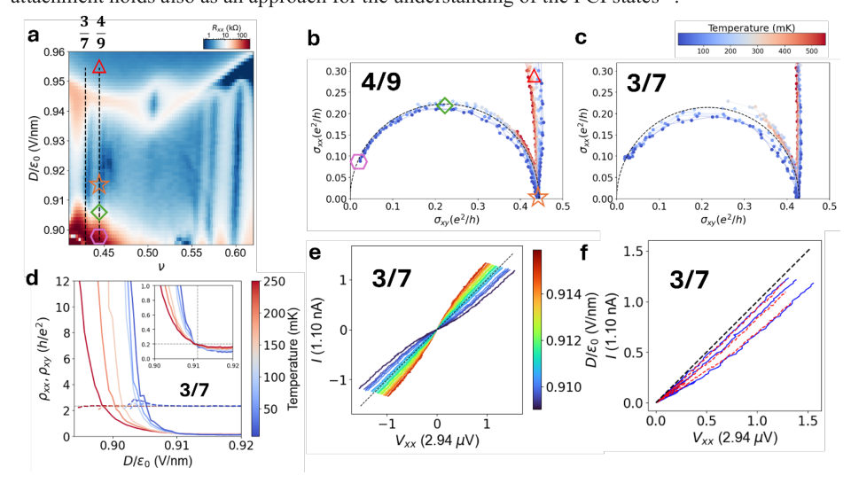
<figcaption class="paper-figure-caption"><b>Fig 3.</b> Fig. 3. Conductivity semi-circles and fractional quantized anomalous Hall insulators. a, 𝑅𝑥𝑥 color map, with black dashed lines tracing the D-field-driven quantum phase transitions at 𝜈 3/7 and 4/9. At 𝜈 4/9. The red triangle, orange star, pink hexagon, and green diamond represent a Fermi liquid, the FCI state, the insulating state, and the intermediate state, respectively. b,c, Plots of 𝜎𝑥𝑥 vs. 𝜎𝑥𝑦 at varying temperatures for 4/9 and 3/7 taken along dashed lines in a, respectively. The transitions from the FCI to the insulator agree well with the semi-circles, while the data corresponding to the FCI-FL transition develops into vertical lines with diverging conductivity. d, 𝜌𝑥𝑥 (solid...</figcaption>
</figure>
<figure class="paper-figure-card">
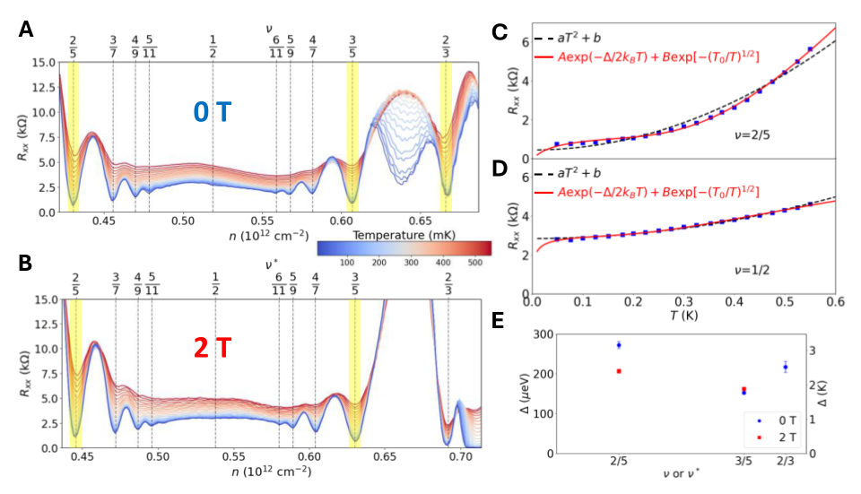
<figcaption class="paper-figure-caption"><b>Fig 4.</b> Fig. 4. Comparison with thermal activation model and transport gaps of FCI states. a,b, Temperature dependence of 𝑅𝑥𝑥 vs electron density along the dashed-dotted line in Fig. 1a, taken at 0 T and 2 T out-of-plane magnetic fields. The upper x-axis is the moiré filling factor. b, Similar to a, but at 2 T, and along a different trajectory in (𝑛, 𝐷) space (see Extended Data Fig. 5). The data are qualitatively similar at these two magnetic fields, except for the suppression of the EQAH</figcaption>
</figure>

**Summary.** This paper reports on transport measurements in graphene moiré superlattices to map out quantum phase transitions between various correlated electronic states. By analyzing the semi-circle behavior of resistivity and fitting temperature dependence, the authors confirm the existence of a fractional quantized anomalous Hall insulator phase. This work provides crucial experimental background for understanding topological quantum phenomena in tunable 2D materials.

**Why it may be interesting.** The study provides experimental evidence for highly correlated topological phases (FCI/FQAHI) in a tunable solid-state system, offering insights into emergent quantum behavior analogous to strongly correlated electron models.

Detailed structure

**Main problem.** The study investigates quantum phase transitions and the nature of fractional quantized anomalous Hall insulators (FQAHI) in rhombohedral graphene moiré superlattices.

**Main result.** Phase transitions between various correlated states (FL, FCI, CI) are characterized by semi-circle relations in resistivity/conductivity plots, confirming the existence of a new FQAHI phase.

**Method.** Systematic resistance measurements, analysis of $
ho_{xx}$ vs. $
ho_{xy}$ semi-circle trajectories, and fitting temperature-dependent resistance data to thermal activation models.

**Model / system.** The physical platform is rhombohedral pentalayer graphene/hBN moiré superlattices, which exhibit tunable quantum states controlled by a gate displacement field ($D$). The analysis uses the effective medium approximation for multi-phase transport.

**Key observables.** Longitudinal and transverse resistivities ($
ho_{xx}, 
ho_{xy}$), temperature dependence of resistance, and semi-circle trajectories in the $
ho_{xx}-
ho_{xy}$ plane.

**Important parameters / regimes.** Gate displacement field ($D$), temperature ($T$), and filling factors ($
u^*$) defining the different quantum phases.

**Assumptions / limitations.** The use of the effective medium approximation for mixtures of phases, and the assumption that the phase fractions are determined by minimizing the free energy.

**Figures summary.** Figures illustrate FL-FCI transitions via semi-circles, and show temperature-dependent transport analysis comparing thermal activation fits against $T^2$ metallic behavior for various fractional states.

**Paper structure.** The work systematically maps out phase transitions using transport measurements, employing the semi-circle law as a diagnostic tool, and then analyzes the temperature evolution of the insulating states using thermal activation models.

Abstract

Fractional quantum anomalous Hall effect (FQAHE) has been discovered in twisted MoTe$_2$ and rhombohedral graphene/hBN moiré superlattices. Such van der Waals heterostructures feature a tuning knob of gate displacement field $D$, which is absent from the conventional fractional quantum Hall systems in two-dimensional electron gases. $D$ plays a critical role in engineering FQAHE and other emergent quantum states and provides an exciting new opportunity to explore their quantum phase transitions. However, the microscopic details of such transitions and temperature-dependent transport have remained mostly elusive. Here we report systematic resistance measurements in rhombohedral pentalayer graphene/hBN moiré superlattices. We found that the displacement field-driven phase transitions between Composite Fermi liquid, Fermi liquid, Fractional Chern insulators, and insulating states are described by semi-circle relations of the longitudinal and transverse resistivities (or conductivities), largely unexplored in the fractional quantum Hall systems. This agrees with a spatially separated two-phase picture for the phase transitions and further indicates a new insulator phase--fractional quantized anomalous Hall insulator. By comparing the temperature-dependence of longitudinal resistance with the thermal activation model, we estimated the transport gap sizes in three fractional Chern insulator states. Our work shed light on the quantum and temperature evolutions of fractional Chern insulator states--providing necessary background for anyon-braiding and gate-defined junctions in rhombohedral graphene.

[↑ back to top](#top)

### [The effect of Coulomb interactions of thermoelectric characteristics of Marcus molecular junctions](http://arxiv.org/abs/2609.09581v1)

**Authors:** Natalya A. Zimbovskaya  
**Type:** theory · **Category:** other · **PDF:** <https://arxiv.org/pdf/2609.09581v1>  
**Analysis basis:** full PDF text, analyzed in chunks
**Topic relevance:** `Keldysh / 2PI / non-Gaussian methods` **2/5** · `methods for driven-dissipative` **2/5** · `analog quantum simulation` **1/5** · `correlated / nonlocal dissipation` **1/5** · `driven-dissipative phase transition` **1/5** · `non-equilibrium universality` **1/5** · `quantum measurements` **1/5**

↔ Scroll figures horizontally

<figure class="paper-figure-card">

<figcaption class="paper-figure-caption"><b>Fig 1.</b> FIG. 1: Schematics of the adopted model. When there are two electrons on the bridge, the Coulomb repulsion between them splits the bridge energy level with the energy ǫ0 in two levels with the energies ǫ0 ± U/2 . The linker is coupled to the electrodes with the coupling energies ΓL,R The rectangle represents a bath of thermalized phonon modes affecting the electron transport.</figcaption>
</figure>
<figure class="paper-figure-card">
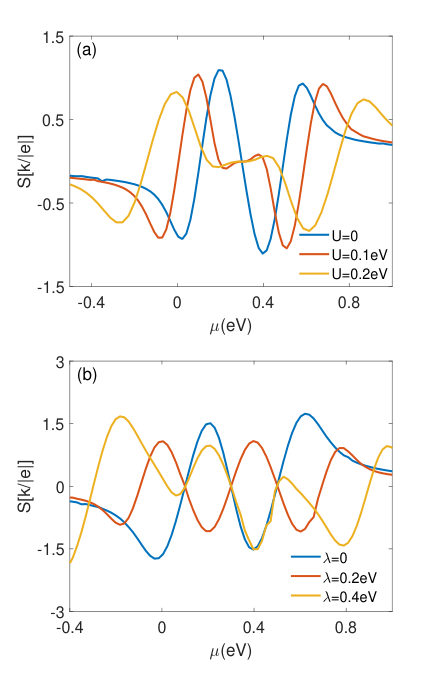
<figcaption class="paper-figure-caption"><b>Fig 2.</b> FIG. 3: The thermopower S as a function of the chemical potential µ in an unbiased Marcus SMJ computed at kT = 0.0126eV, Γ = 0.03eV, ǫ0 = 0.3eV, λ = 0.2eV (a) and U = 0.4eV (b).</figcaption>
</figure>
<figure class="paper-figure-card">
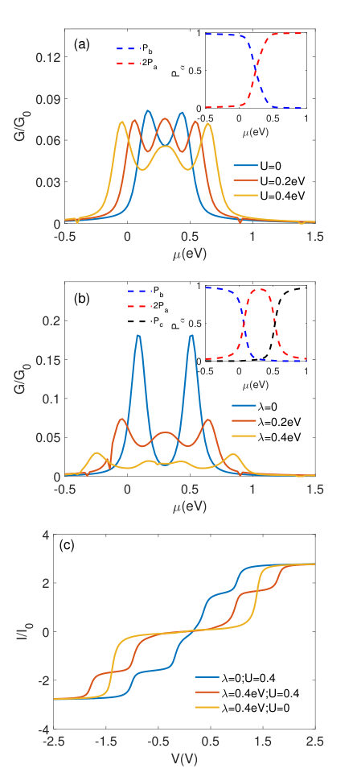
<figcaption class="paper-figure-caption"><b>Fig 3.</b> FIG. 2: Zero bias conductance computed for a Marcus SMJ asuming that kT = 0.026eV, Γ = ΓL = ΓR = 0.03eV, ǫ0 = 0.3eV, λ = 0.2eV (a) and U = 0.4eV (b). Insets show the occupation probabilities for the bridge states in the limit U → 0 (a) at U = 0.4eV (b). In the panel (c) the steady state current is presented as a function of the bias voltage  I0 = |e|Γ/ℏ  . The curves are plotted at several values of U and λ.</figcaption>
</figure>
<figure class="paper-figure-card">

<figcaption class="paper-figure-caption"><b>Fig 4.</b> FIG. 4: Power factor S2G as a function of the chemical potential of electrodes µ computed at zero bias voltage- computed at TL &gt; TR , kT = 0.0126eV, Γ = 0.03eV, ǫ0 = 0.3eV, λ = 0.2eV (a) and U = 0.4eV (b).</figcaption>
</figure>

**Summary.** This theoretical study models electron transport through molecular junctions, incorporating both Coulomb interactions and solvent reorganization effects. It demonstrates that these combined interactions significantly modify key thermoelectric metrics like the Seebeck coefficient and power factor. The findings highlight that electron-electron repulsion can counteract environmental reorganization, leading to complex, non-trivial behavior in the junction's electrical response.

**Why it may be interesting.** This work bridges molecular electronics, charge transport, and many-body physics, which is highly relevant to open quantum systems and mesoscopic physics, particularly concerning energy dissipation and correlation effects in nanoscale devices.

Detailed structure

**Main problem.** The study investigates how Coulomb interactions affect the thermoelectric properties of molecular junctions, especially when electron transport is strongly influenced by thermalized phonon modes in the surrounding molecular environment.

**Main result.** The combined effects of electron-electron interactions and solvent reorganization can significantly alter the Seebeck coefficient and power factor, sometimes causing qualitative changes in conductance and thermopower.

**Method.** The authors used a theoretical rate equation approach to determine steady-state probabilities and subsequently calculated the linear response coefficients for conductance and thermopower.

**Model / system.** The model is a Single Molecular Junction (SMJ) where the linker is coupled to electrodes and interacts with a dielectric solvent. The physics incorporates Coulomb repulsion (U) and solvent reorganization energy (lambda).

**Key observables.** Seebeck coefficient (S), power factor (S^2G), zero-bias conductance (G), and current-voltage (I-V) characteristics.

**Important parameters / regimes.** Coulomb interaction strength (U), reorganization energy (lambda), and bias voltage/chemical potential (V or mu).

**Assumptions / limitations.** The analysis assumes strong electron-phonon coupling, uses the Marcus theory framework, and operates in the linear response regime for thermal gradients.

**Figures summary.** Figures illustrate how Coulomb interactions modify zero-bias conductance (showing multiple maxima/steps) and how thermopower and power factor vary with chemical potential.

**Paper structure.** The paper establishes the physical model, derives rate equations for steady-state probabilities, calculates the current and linear response coefficients (G and S), and then analyzes the resulting dependence of thermoelectric properties on U and lambda.

Abstract

We present a theoretical study focused on the influence of Coulomb interactions on thermoelectric properties of molecular junctions assuming that electron transport is strongly affected by thermalized phonon modes in the molecular ambient. It is shown that the combined effect of Coulomb interactions between electrons on the molecular states and the reorganization processes in the ambient may significantly affect both Seebeck coefficient and the power factor. Specifically, we show that electron-electron interactions may counter-balance the effect of the ambient molecules reorganizations resulting in qualitative changes in the behavior of both zero-bias conductance and thermopower.

[↑ back to top](#top)

### [Twist and strain identification in moiré heterostructures](http://arxiv.org/abs/2609.09611v1)

**Authors:** Zhen Zhan, Federico Escudero, Dong Wang, Yiwen Liu, Ambikesh Gupta, Pierre A. Pantaleón, Francisco Guinea  
**Type:** theory · **Category:** strongly correlated electrons · **PDF:** <https://arxiv.org/pdf/2609.09611v1>  
**Analysis basis:** full PDF text, analyzed in chunks
**Topic relevance:** `analog quantum simulation` **2/5** · `Keldysh / 2PI / non-Gaussian methods` **1/5**

↔ Scroll figures horizontally

<figure class="paper-figure-card">

<figcaption class="paper-figure-caption"><b>Fig 1.</b> FIG. 1. Twist and strain identification of STM pattern with atomic resolution. (a) STM image (top panel) and dI/dV spectroscopy (bottom panel) measured at the spots marked with colored dots of TSBG moir´e pattern. Resonances at higher energy in AB regions are labeled with blue arrows. Inset: honeycomb lattice of the carbon atoms in the top layer. The scale bar in the inset is 1 nm. The results are adapted from Ref. [40]. (b) The generated moir´e pattern (top panel) using the twist and strain extracted from the experiment, and the calculated TB LDOS lines (bottom panel) at the AA (red dot) and AB (blue dot) regions. L1, L2 and L3 are the moir´e wavelengths.</figcaption>
</figure>
<figure class="paper-figure-card">

<figcaption class="paper-figure-caption"><b>Fig 2.</b> FIG. 2. Twist and strain solutions of sample two with moir´e resolution. (a) The definitions of the lattice vectors and moir´e vectors used to extract the twist and strain. We introduce the unknown orientation φ to the moir´e vectors and fix the graphene lattice vectors ai. This definition is equivalent to the way of introducing φ to ai and fixing the moir´e vectors. (b) All solutions of twist and strain for sample two with L1 = 10.56 nm, L2 = 10.65 nm, and L3 = 11.97 nm. (c) The strain components εxx+εyy (left black) and (TrE)2 /det E (right red) change with the global rotation φ. The traceless strain tensor (horizontal black dotted line) implies a pure shear solution (yellow dot). The...</figcaption>
</figure>
<figure class="paper-figure-card">

<figcaption class="paper-figure-caption"><b>Fig 3.</b> FIG. 3. Three solutions of sample two. The commensurate moir´e pattern (top panel), band structure and LDOS (bottom panel) of the (a) shear strain case, (b) uniaxial strain case, (c) biaxial-dominant strain case. The three solutions are illustrated with yellow symbols in Fig. 2. In the moir´e patterns, L1, L2 and L3 are moir´e wavelengths, which have a global rotation of φ relative to the x axis. The LDOS lines with red and blue colors are the properties calculated in the AA and AB regions. The electronic properties are calculated by the TB method with the commensurate details in Table I.</figcaption>
</figure>
<figure class="paper-figure-card">

<figcaption class="paper-figure-caption"><b>Fig 4.</b> FIG. 4. Twist and strain solutions of sample three with equal moir´e lengths. (a) Plot of the function f (ξ), which determines the moir´e length LM for the strained triangular moir´e patterns. The green vertical line at ξ = 0 corresponds to the minimum (traceless) shear strain case, at which f takes its maximum value. The magenta line corresponds to the uniaxial strain solution. (b) Evolution of the moir´e length LM (θ, ξ), and (c) elastic energy, as a function of the twist angle θ and ξ. The dashed contour curves correspond to constant moir´e lengths LM from 11 to 18 nm. The horizontal lines correspond to the shear and uniaxial solutions.</figcaption>
</figure>
<figure class="paper-figure-card">
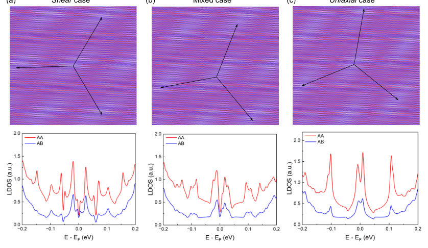
<figcaption class="paper-figure-caption"><b>Fig 5.</b> FIG. 5. Three solutions of sample three with equal moir´e length LM ≈13 nm. The commensurate moir´e pattern (top panels) and the LDOS for (a) the shear-strain case, (b) the mixed-strain case, and (c) the uniaxial-strain case. In the commensurate moir´e patterns, the three moir´e lengths are not equal due to the aligned assumption used to find the closest commensurate solutions in Sec. II C. The LDOS lines with red and blue colors are the properties calculated in the AA and AB regions. The electronic properties are calculated by the TB method with the commensurate solutions in Table II.</figcaption>
</figure>

**Summary.** This paper presents a general theoretical framework to accurately determine the twist and strain configurations in moiré heterostructures. It addresses the inherent ambiguity in extracting these parameters by incorporating physical constraints, such as minimizing elastic energy or analyzing electronic spectra. This methodology is crucial for engineering and understanding the exotic quantum electronic states found in these tunable 2D materials.

**Why it may be interesting.** The strong dependence of electronic phases (like superconductivity) on geometric parameters (strain/twist) places this work at the intersection of condensed matter theory and tunable quantum materials, relevant to understanding emergent quantum states.

Detailed structure

**Main problem.** The primary goal is to establish a general framework for accurately identifying the twist and strain configurations in moiré heterostructures, as their electronic properties are highly sensitive to these geometric parameters.

**Main result.** The authors develop a comprehensive methodology that uses constraints like minimum elastic energy or electronic spectra to resolve the non-unique identification of twist and strain from moiré images.

**Method.** The work combines continuum elasticity theory with geometric analysis, developing mathematical frameworks to relate strain tensors ($\mathbf{E}$) and lattice vectors to observable moiré patterns.

**Model / system.** The study focuses on moiré materials, such as twisted bilayer graphene, where the electronic structure is governed by the interplay of twist angle and applied/induced strain (uniaxial, biaxial, or shear).

**Key observables.** Strain tensor components ($\epsilon_{xx}, \epsilon_{yy}, \epsilon_{xy}$), moiré vectors ($\mathbf{G}_i$), and the resulting electronic properties (e.g., correlated insulating states).

**Important parameters / regimes.** Twist angle ($	heta$), strain components, and the elastic energy functional ($E_{	ext{elastic}}$).

**Assumptions / limitations.** The general approach aims to overcome the limitations of existing methods that often rely on simplifying assumptions like uniaxial heterostrain.

**Figures summary.** Not specified by the notes, but the methodology involves deriving transformation matrices and analyzing strain tensor invariants.

**Paper structure.** The paper builds from defining the physical problem (sensitivity to twist/strain) to developing the general mathematical framework, detailing strain tensor representations, and finally proposing methods using minimum elastic energy or electronic constraints to resolve ambiguity.

Abstract

The geometrical and electronic properties of moiré materials are highly sensitive to the twist and strain in the samples due to the moiré magnifying effect. Accurate identification of twist and strain in moiré materials is therefore essential. In this work, we establish a general framework to extract the twist and strain configurations from moiré images with either atomic or moiré scale resolution. With only moiré-wavelength information, we show that there is a continuous family of possible twist and strain configurations, each one accounting for different orientations of the moiré pattern. To estimate the most likely twist-strain configuration, we discuss additional constraints and methods involving the minimum elastic energy and the electronic spectra. The minimum elastic energy, in particular, reflects that shear configurations become much more favorable as the strain increases. As an example of the developed methodology, we discuss the formation and identification of strained triangular moiré patterns. Our framework provides a comprehensive approach to identify the twist and strain configurations in systems with moiré-scale resolution.

[↑ back to top](#top)

### [Fixed-mesh based approach for modeling of superconducting magnetic bearings](http://arxiv.org/abs/2609.09347v1)

**Authors:** Elias Paakkunainen, Bárbara Maria Oliveira Santos, Gabriel dos Santos, Timo Tarhasaari, Paavo Rasilo, Sebastian Schöps  
**Type:** both · **Category:** numerical methods · **PDF:** <https://arxiv.org/pdf/2609.09347v1>  
**Analysis basis:** full PDF text, analyzed in chunks
**Topic relevance:** `methods for driven-dissipative` **2/5**

↔ Scroll figures horizontally

<figure class="paper-figure-card">
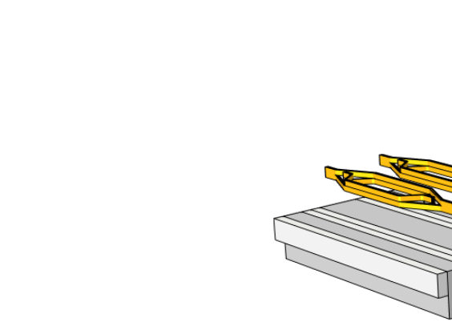
<figcaption class="paper-figure-caption"><b>Fig 1.</b> Figure 1: 3D representation of the copper-colored double-crossed loops of coated conductors over a magnetic guideway, in gray.</figcaption>
</figure>
<figure class="paper-figure-card">
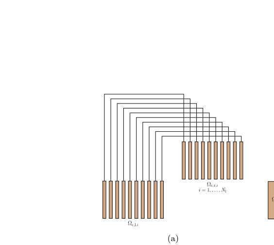
<figcaption class="paper-figure-caption"><b>Fig 2.</b> Figure 2: Illustration of a crossed loop cross-section (a) when all the CCs are resolved and (b) when homogenization is applied. The circuit coupling of the conducting domains is indicated for both cases.</figcaption>
</figure>
<figure class="paper-figure-card">
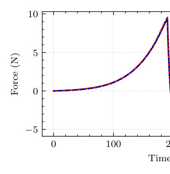
<figcaption class="paper-figure-caption"><b>Fig 3.</b> Figure 4: Comparison of the levitation force for the verification example. The simulated forces from the 2D models are scaled with a length of 67 mm to allow for comparison with the measured force from [7]. The maximum forces are for the measurements 9.37 N, for the fixed-mesh model 9.57 N, and for the remeshed model 9.48 N.</figcaption>
</figure>
<figure class="paper-figure-card">

<figcaption class="paper-figure-caption"><b>Fig 4.</b> Figure 5: Magnitude of the magnetic flux density for the verification example with the remeshed and fixed-mesh models. Left: The initial configuration for both the models at t = 0 s. Middle: The remeshed model at t = 120 s. Right: The fixed-mesh model at t = 120 s. The field plots have been zoomed in to show the HTS stacks and the PM.</figcaption>
</figure>
<figure class="paper-figure-card">
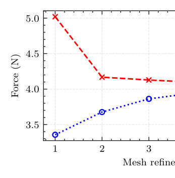
<figcaption class="paper-figure-caption"><b>Fig 5.</b> Figure 6: Mesh refinement study of the levitation force for the verification example. The force values are shown for the time t = 150 s. The number of degrees of freedom varies from 3.5k to 28.4k for the remeshed model and from 3.3k to 24.8k for the fixed- mesh model.</figcaption>
</figure>

**Summary.** This paper introduces a fixed-mesh finite element method to overcome the computational bottleneck of modeling superconducting magnetic bearings undergoing relative motion. By implementing a coordinate transformation within the material tensor rather than remeshing, the authors achieve high accuracy comparable to reference models while drastically reducing computational time and degrees of freedom.

**Why it may be interesting.** While the physics is classical electromagnetism, the core contribution is a novel, efficient numerical technique for handling moving boundaries in FEM simulations, which has analogues in simulating time-dependent quantum systems or open quantum systems where boundary conditions change.

Detailed structure

**Main problem.** The primary challenge is accurately and efficiently modeling the relative motion between superconducting components and a magnetic guideway in superconducting magnetic bearings (SMBs).

**Main result.** The proposed fixed-mesh approach accurately predicts levitation forces, matching experimental results with high $R^2$ values, while being significantly more computationally efficient than traditional remeshing methods.

**Method.** The authors developed a fixed-mesh Finite Element Method (FEM) approach by applying a coordinate transformation only to the air region, which is incorporated into a time-dependent anisotropic material tensor.

**Model / system.** The system modeled is a superconducting magnetic bearing (SMB) involving high-temperature superconductors (HTS) and a magnetic guideway, analyzed using the $j$-$a$ formulation coupled with lumped-parameter electric circuits.

**Key observables.** Levitation force ($f_x, f_y$), magnetic flux density magnitude ($|\vec{b}|$), and computational metrics (Degrees of Freedom, simulation time).

**Important parameters / regimes.** The model utilizes superconducting material properties like critical current density ($j_c$) and incorporates homogenization techniques for coated conductors.

**Assumptions / limitations.** The core assumption is that the effects of relative motion can be captured by modifying the material tensor (reluctivity) in the air region, thereby avoiding computationally expensive mesh updates.

**Figures summary.** Figures illustrate the geometry of the SMB, compare resolved versus homogenized cross-sections, and show comparisons of the predicted levitation force against experimental measurements and reference models.

**Paper structure.** The paper progresses from defining the physical problem and the need to avoid remeshing, detailing the fixed-mesh formulation via coordinate transformation, validating the approach against verification examples, and finally applying it to full SMB simulations, emphasizing computational gains.

Abstract

Numerical simulations of superconducting magnetic bearings (SMBs) are complicated by the relative motion between high temperature superconductors and the magnetic guideway, which commonly requires repeated updates of the geometry and mesh. We present a fixed-mesh based approach for modeling the motion induced effects in which a coordinate transformation is applied only to the air region between the moving regions. The transformation can be included in a time-dependent anisotropic material tensor, leaving the mesh during the simulation and the rest of the formulation unchanged. To provide numerical examples, the approach is implemented in 2D using the finite element method with the $j$-$a$ formulation and is combined with homogenization and circuit coupling for double-crossed loops of coated conductors. The open-source model implementations are made available. The proposed approach is verified and validated against existing modeling approaches and experimental results from the literature for SMBs. Two simulation examples are presented, and in both of them the levitation force predicted by the fixed-mesh model agrees with the experimental results, yielding $R^2$ values above 0.99. For a verification problem, it is shown that the fixed-mesh model converges towards the remeshed reference solution under mesh refinement as expected. For an SMB undergoing vertical and horizontal translations, the homogenized fixed-mesh model reproduces the lateral-force response of a fully resolved moving-geometry reference model. Additionally, the homogenized fixed-mesh model is computationally more efficient than the reference model, indicating a significant reduction in the number of degrees of freedom and the computation time. The results demonstrate accurate and computationally efficient simulation of translational motion with the fixed-mesh based approach.

[↑ back to top](#top)

### [Phonon-Bottleneck-Governed Ultrafast Hot-Carrier Super-Diffusion in Transition Metal Dichalcogenides](http://arxiv.org/abs/2609.10500v1)

**Authors:** Yuwei Zhang, Dongyang Wan, Tao Zhou, Hao Wu, Junpeng Lu, Zhenhua Ni  
**Type:** experiment · **Category:** other · **PDF:** <https://arxiv.org/pdf/2609.10500v1>  
**Analysis basis:** full PDF text, analyzed in chunks
**Topic relevance:** `Keldysh / 2PI / non-Gaussian methods` **1/5** · `correlated / nonlocal dissipation` **1/5** · `driven-dissipative phase transition` **1/5** · `methods for driven-dissipative` **1/5** · `non-equilibrium universality` **1/5** · `quantum measurements` **1/5**

↔ Scroll figures horizontally

<figure class="paper-figure-card">

<figcaption class="paper-figure-caption"><b>Fig 1.</b> Figure 1 | On-chip terahertz sampling of GHz-bandwidth interfacial photocurrents.</figcaption>
</figure>
<figure class="paper-figure-card">
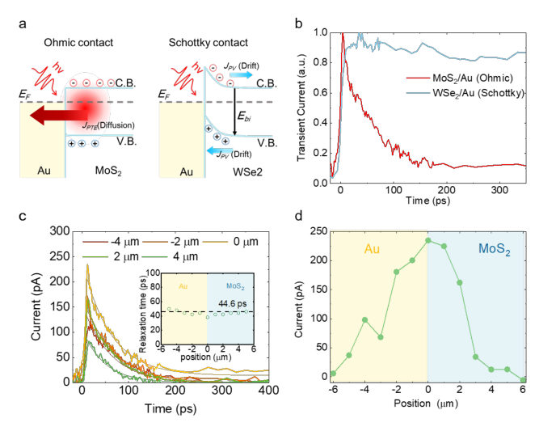
<figcaption class="paper-figure-caption"><b>Fig 2.</b> Figure 2 | Mechanistic and spatial origins of the ultrafast interfacial photocurrent.</figcaption>
</figure>
<figure class="paper-figure-card">

<figcaption class="paper-figure-caption"><b>Fig 3.</b> Figure 3 | Decoupling the photothermoelectric and photoconductive effects via time-</figcaption>
</figure>
<figure class="paper-figure-card">
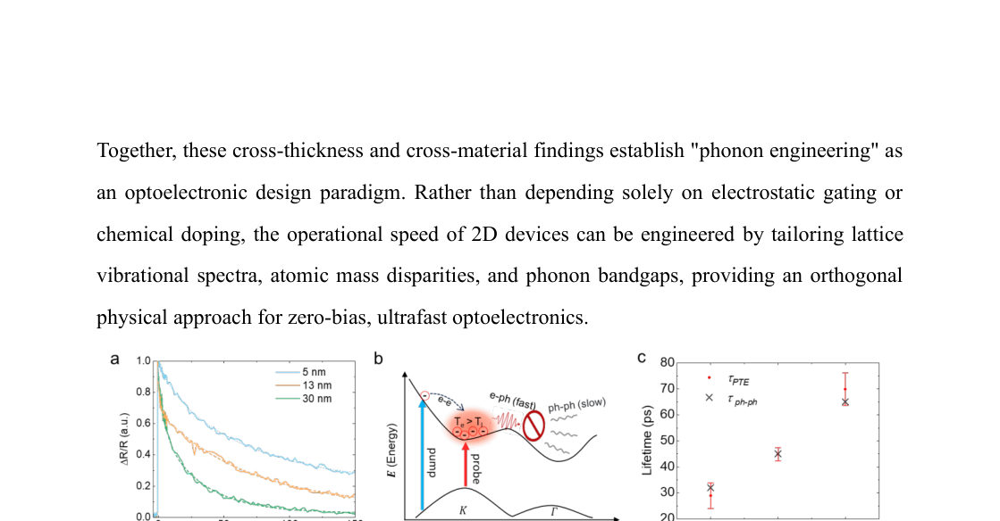
<figcaption class="paper-figure-caption"><b>Fig 4.</b> Figure 4 | Phonon bottleneck governing ultrafast photothermoelectric dynamics.</figcaption>
</figure>

**Summary.** This research demonstrates that the ultrafast response in 2D TMDC optoelectronics is not limited by conventional charge drift but by hot-carrier super-diffusion. The key finding is that the device speed is intrinsically limited by the optical-to-acoustic phonon scattering lifetime, establishing phonon engineering as a powerful new paradigm for designing high-speed, self-powered electronic devices.

**Why it may be interesting.** While primarily experimental, the work provides a clear, quantitative link between lattice vibrations (phonons) and macroscopic electronic device performance, which is a key concept in non-equilibrium many-body physics relevant to open quantum systems.

Detailed structure

**Main problem.** The operational speed of 2D transition metal dichalcogenides (TMDCs) is limited by low room-temperature mobilities and carrier transit delays, hindering their use in high-speed optoelectronics.

**Main result.** The ultrafast response is governed by hot-carrier super-diffusion, which is quantitatively limited by the intrinsic optical-to-acoustic phonon scattering lifetime (phonon bottleneck).

**Method.** The study uses on-chip terahertz optoelectronic sampling under zero bias, complemented by ultrafast pump-probe spectroscopy to measure transient photocurrents.

**Model / system.** The system involves 2D TMDCs ($	ext{MoS}_2$, $	ext{MoSe}_2$) interfaced with Ohmic metal contacts ($	ext{Au}$, $	ext{Ag}$). The physics distinguishes between drift-limited transport and hot-carrier super-diffusion driven by an interfacial electron temperature gradient.

**Key observables.** Ultrafast relaxation lifetimes (e.g., 48.5 ps), intrinsic 3-dB bandwidths (e.g., 7.5 GHz), and the quantitative synchronization between macroscopic electrical lifetime and microscopic phonon scattering lifetime.

**Important parameters / regimes.** Zero bias operation, Ohmic contacts, phonon bottleneck time scale, and the material-dependent phonon scattering rates ($	ext{MoS}_2$ vs $	ext{MoSe}_2$).

**Assumptions / limitations.** The use of Ohmic contacts and zero bias successfully eliminates external parasitic delays and conventional drift-limited transport mechanisms.

**Figures summary.** Figures illustrate time-resolved photocurrents showing clean single-exponential decay in Ohmic devices versus slow, drift-tailed transients in Schottky devices, and correlate the electrical decay time with phonon scattering times.

**Paper structure.** The paper establishes the problem (speed limits in TMDCs), presents the methodology (zero-bias, on-chip THz sampling), demonstrates the mechanism (ruling out drift via spatial/bias mapping), and concludes by linking the speed limit to the phonon bottleneck, proposing phonon engineering.

Abstract

Two-dimensional transition metal dichalcogenides (TMDCs) are promising for low-power optoelectronics, yet their operational speed is widely considered constrained by low room-temperature mobilities and carrier transit delays. Here, by combining on-chip terahertz optoelectronic sampling with thermally evaporated Ohmic contacts, we eliminate external parasitic delays and directly capture the intrinsic interfacial photoresponse in unencapsulated TMDCs under zero bias. The devices achieve ultrafast relaxation lifetimes of 48.5 ps in MoS2/Au and 14.2 ps in MoSe2/Ag, translating to intrinsic 3-dB bandwidths of 4.4 GHz and 7.5 GHz, respectively. Spatial scanning and bias-dependent measurements show that this response is position-independent and bias-immune, ruling out conventional drift-limited transport and identifying hot-carrier super-diffusion driven by an interfacial electron temperature gradient as the operative mechanism. Furthermore, ultrafast pump-probe spectroscopy reveals that the macroscopic response time is quantitatively synchronized with the microscopic optical-to-acoustic phonon scattering lifetime governed by the intrinsic phonon bottleneck. Our findings establish phonon engineering as a viable paradigm to tailor non-equilibrium optoelectronic dynamics, offering a blueprint for zero-bias, ultrafast, self-powered devices.

[↑ back to top](#top)

### [Hydrodynamic magnetotransport in a GaAs Corbino geometry](http://arxiv.org/abs/2609.10511v1)

**Authors:** A. D. Levin, A. S. Jaroshevich, Z. D. Kvon, V. A. Chitta, M. S. Aksenov, D. V. Dmitriev, A. K. Bakarov, G. M. Gusev  
**Type:** both · **Category:** other · **PDF:** <https://arxiv.org/pdf/2609.10511v1>  
**Analysis basis:** full PDF text, analyzed in chunks
**Topic relevance:** `Frenkel-Kontorova` **1/5** · `Keldysh / 2PI / non-Gaussian methods` **1/5** · `analog quantum simulation` **1/5** · `methods for driven-dissipative` **1/5** · `non-equilibrium universality` **1/5**

↔ Scroll figures horizontally

<figure class="paper-figure-card">

<figcaption class="paper-figure-caption"><b>Fig 1.</b> FIG. 1: (Color online) (a) Schematic of the Corbino disk ge- ometry. (b) Hydrodynamic velocity-flow profile in a Corbino device at low magnetic field. (c) Optical image of the small- ring sample. (d) Optical image of the large-ring sample.</figcaption>
</figure>
<figure class="paper-figure-card">

<figcaption class="paper-figure-caption"><b>Fig 2.</b> FIG. 2: (Color online) (a) Magnetoresistance of the small radius (Rb = 11µm) Corbino disk as a function of the temperature. (b) Magnetoresistance of the intermediate radius (Rb = 12µm) Corbino disk as a function of the temperature. (c) Magnetoresistance of the large radius (Rb = 18µm) Corbino disk as a function of the temperature</figcaption>
</figure>
<figure class="paper-figure-card">

<figcaption class="paper-figure-caption"><b>Fig 3.</b> FIG. 3: (Color online) Temperature dependence of the quadratic magnetoresistance coefficient α for Corbino devices with different outer radii. Two samples were studied for each device radius.</figcaption>
</figure>

**Summary.** This work reports on the observation and theoretical analysis of positive magnetoresistance in GaAs Corbino devices. By applying hydrodynamic theories, the authors successfully separate the bulk viscous transport contribution from boundary effects. The findings establish Corbino magnetotransport as a sensitive, bulk-sensitive probe for studying viscous electron flow in 2DEGs.

**Why it may be interesting.** While focused on solid-state transport, the detailed modeling of non-equilibrium, viscous, and hydrodynamic flow in mesoscopic geometries provides a rich example of continuum physics applicable to open quantum systems or complex many-body dynamics.

Detailed structure

**Main problem.** The study investigates the origin of positive magnetoresistance observed in high-mobility GaAs Corbino devices by analyzing hydrodynamic magnetotransport.

**Main result.** The observed magnetoresistance is predominantly governed by the bulk hydrodynamic response, which can be analyzed by fitting the data to theoretical models incorporating finite-slip boundary conditions.

**Method.** The authors analyze magnetoresistance measurements ($\Delta R \propto B^2$) using hydrodynamic theories that describe the crossover between diffusive and viscous electron flow in an annular geometry.

**Model / system.** The physical system is a GaAs Corbino geometry (2DEG in an annulus). The model uses hydrodynamic theories to describe current flow, incorporating finite-slip boundary conditions at current-penetrable contacts.

**Key observables.** Positive magnetoresistance ($\Delta R$) exhibiting a quadratic dependence on the perpendicular magnetic field ($B^2$), and the temperature dependence of the extracted relaxation rates.

**Important parameters / regimes.** The analysis spans regimes from the diffusive limit to the hydrodynamic Stokes limit, characterized by geometric ratios and temperature-dependent scattering rates.

**Assumptions / limitations.** The analysis assumes the validity of the hydrodynamic description and accounts for boundary effects (finite slip and field-dependent contact voltage) as separate corrections to the bulk response.

**Figures summary.** Figures show schematic geometries, magnetoresistance vs. $B^2$ plots, and temperature/radius dependence of the magnetoresistance coefficient ($\alpha$).

**Paper structure.** The paper progresses from presenting the experimental observation of quadratic magnetoresistance in Corbino devices to applying detailed hydrodynamic models that account for the crossover between different transport regimes and boundary corrections.

Abstract

We report the observation of positive magnetoresistance in high-mobility GaAs Corbino devices. Over a broad intermediate-temperature range, the resistance exhibits a quadratic dependence on perpendicular magnetic field. We analyze the data within hydrodynamic theories of magnetotransport in the Corbino geometry, which describe the crossover between the diffusive and viscous regimes, including finite-slip boundary conditions appropriate for current-penetrable contacts. The extracted relaxation rates are consistent with an approximately $T^2$ temperature dependence of the electron-electron scattering contribution. The extracted viscous relaxation parameters are consistent with those obtained from Hall-bar measurements. Comparison with theory indicates that the observed magnetoresistance is predominantly governed by the bulk hydrodynamic response, while finite slip modifies the Stokes--Ohm crossover quantitatively and the field-dependent boundary voltage provides a separate correction. These results show that Corbino magnetotransport can serve as a complementary bulk-sensitive probe of viscous electron flow.

[↑ back to top](#top)

### [Integrated Population Balance and Multiphysics Modeling for Predicting Undesired Agglomeration in Small Molecule Manufacturing](http://arxiv.org/abs/2609.10256v1)

**Authors:** Prakitr Srisuma, Peter Hou, Shashank Venkat Muddu, Neda Nazemifard, Allan S. Myerson, Richard D. Braatz  
**Type:** both · **Category:** other · **PDF:** <https://arxiv.org/pdf/2609.10256v1>  
**Analysis basis:** full PDF text, analyzed in chunks
**Topic relevance:** `Keldysh / 2PI / non-Gaussian methods` **1/5** · `analog quantum simulation` **1/5** · `methods for driven-dissipative` **1/5**

↔ Scroll figures horizontally

<figure class="paper-figure-card">
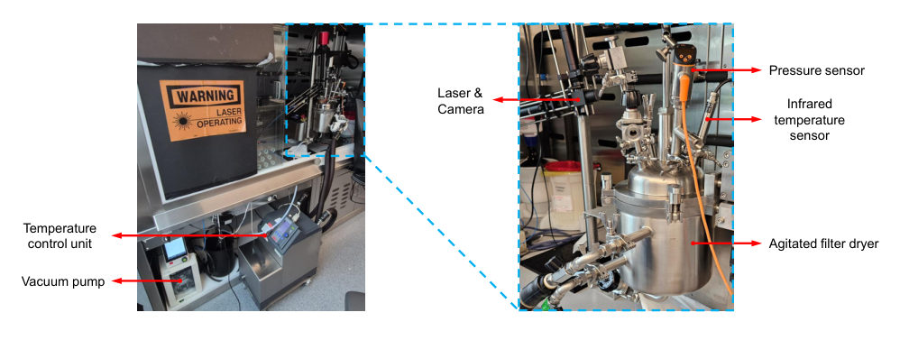
<figcaption class="paper-figure-caption"><b>Fig 1.</b> Figure 1: Our agitated filter dryer (AFD) experimental setup showing the overall system, AFD vessel, and sensors.</figcaption>
</figure>
<figure class="paper-figure-card">
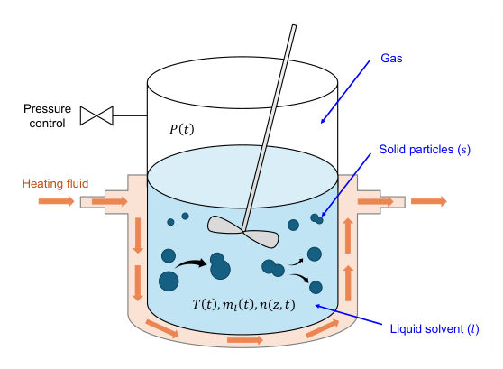
<figcaption class="paper-figure-caption"><b>Fig 2.</b> Figure 2: Schematic diagram showing the mechanistic modeling of the agitated filter drying process, where the system temperature, solvent content, and number of particles are denoted by T, ml, and n, respectively.</figcaption>
</figure>
<figure class="paper-figure-card">
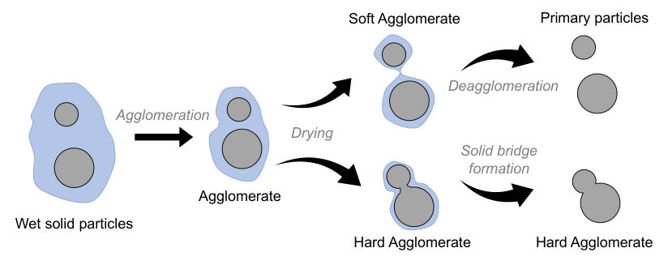
<figcaption class="paper-figure-caption"><b>Fig 3.</b> Figure 3: Schematic diagram showing the formation of hard and soft agglomerates during the agitated filter drying process.</figcaption>
</figure>
<figure class="paper-figure-card">
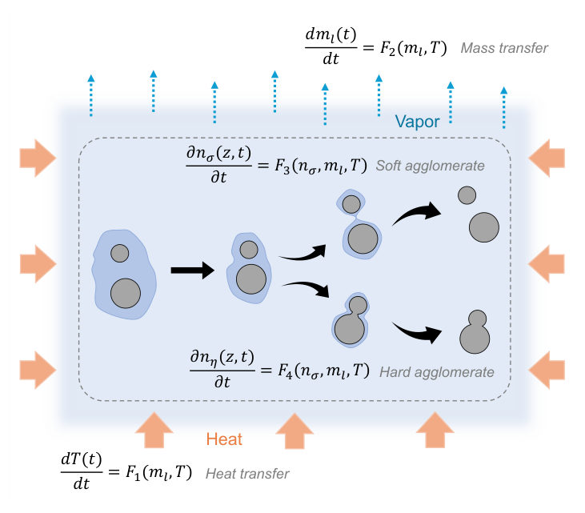
<figcaption class="paper-figure-caption"><b>Fig 4.</b> Figure 4: Schematic diagram describing the proposed mechanistic model. The nonlinear functions f1, f2, f3, and f4 are derived from energy, mass, and population balances.</figcaption>
</figure>
<figure class="paper-figure-card">

<figcaption class="paper-figure-caption"><b>Fig 5.</b> Figure 5: Comparison between the experimental data and model prediction for the system consisting of KCl and hexane (Case 1). Panel (A) shows the product temperature. Panel (B) shows the moisture content. Panel (C) shows D90 and D99.</figcaption>
</figure>

**Summary.** This paper presents a comprehensive, integrated mechanistic model combining Population Balance Modeling (PBM) with multiphysics analysis to predict particle agglomeration in agitated filter dryers. By tracking soft and hard agglomerates, the model allows for the rational design and operation of pharmaceutical drying processes to ensure consistent product quality. This work is valuable for process engineering optimization in solid-state chemical manufacturing.

**Why it may be interesting.** While the subject is chemical engineering, the rigorous application of population balance equations, coupled with complex transport phenomena modeling, shares mathematical parallels with kinetic rate processes studied in non-equilibrium statistical mechanics.

Detailed structure

**Main problem.** The primary challenge addressed is predicting and mitigating undesired agglomeration of small molecules during the agitated filter drying (AFD) process, as hard agglomerates lead to off-spec products and equipment damage.

**Main result.** The developed model successfully predicts the evolution of particle size distribution (PSD) and quantifies the impact of agglomeration, showing that process parameters like solubility and mass transfer rates significantly influence the final particle size.

**Method.** The authors developed a novel mechanistic model by integrating Population Balance Modeling (PBM) with multiphysics modeling to describe heat, mass, and particle dynamics.

**Model / system.** The system is an Agitated Filter Dryer (AFD) used in pharmaceutical manufacturing. The model couples energy balance (heat transfer), mass transfer (solvent evaporation), and a PBE that explicitly tracks the formation and breakage of soft and hard agglomerates.

**Key observables.** Product temperature (T), moisture content ($m_l$), Particle Size Distribution (PSD), and the populations of soft ($\sigma$) and hard ($\eta$) agglomerates.

**Important parameters / regimes.** Solubility, mass transfer rates, and the ratio of liquid bridge disappearance to solid bridge formation are key parameters influencing agglomeration kinetics.

**Assumptions / limitations.** The system is assumed to be well mixed due to continuous agitation, and the model makes specific functional form assumptions for the agglomeration and breakage kernels dependent on moisture content.

**Figures summary.** Figures illustrate the AFD setup, the mechanistic model components, and time evolution plots showing mass, particle number, and PSD (D90/D99) under varying conditions, confirming mass conservation.

**Paper structure.** The paper progresses from identifying the industrial problem (agglomeration in AFDs) to presenting the integrated PBM/Multiphysics framework, detailing the governing equations for energy and mass transfer, and finally validating the model against experimental data and theoretical limits.

Abstract

Agitated filter dryers (AFDs) are a crucial unit operation in small molecule manufacturing that enables simultaneous filtration, washing, and drying of active pharmaceutical ingredients. One of the key challenges in AFDs is associated with undesired agglomeration, where the presence of hard agglomerates results in off-spec products, equipment damage, and additional downstream processing. This article presents a novel mechanistic model that describes the formation of soft and hard agglomerates during agitated filter drying. By integrating population balance and multiphysics modeling, the model can accurately predict the evolution of the product temperature, moisture content, and particle size distribution, and hence quantify the extend and impact of undesired agglomeration across various operating conditions. Our proposed model-based framework enables the rational design and operation of AFDs for improving the product quality and process reliability.

[↑ back to top](#top)

### [Reconfigurable field-free spin Hall nano-oscillators enabled by crystallographic anisotropy in epitaxial Co/Pt](http://arxiv.org/abs/2609.10131v1)

**Authors:** Jong-Guk Choi, Avinash Kumar Chaurasiya, Jaimin Kang, Venkatesh Vadde, Peter G. Lim, Roman Khymyn, Ahmad A. Awad, Akash Kumar, Mark C. Hersam, Vinayak P. Dravid, Pedram Khalili Amiri, Johan Åkerman  
**Type:** both · **Category:** other · **PDF:** <https://arxiv.org/pdf/2609.10131v1>  
**Analysis basis:** full PDF text, analyzed in chunks
**Topic relevance:** `analog quantum simulation` **1/5** · `driven-dissipative phase transition` **1/5** · `non-equilibrium universality` **1/5**

↔ Scroll figures horizontally

<figure class="paper-figure-card">

<figcaption class="paper-figure-caption"><b>Fig 1.</b> Fig. 1 Epitaxial symmetry engineering of an in-plane anisotropy field in Co/Pt. a, Atomic model of the epitaxial relation between hcp Co and MgO(110), which aligns the in-plane Co[0001] crystallographic easy axis with MgO[001] and defines the anisotropy-field direction Bani ∥x. Nanoconstriction SHNOs are lithographically patterned at different current angles φI relative to this fixed crystallographic axis. The enlarged device schematic shows the epitaxial Co/Pt bilayer on MgO(110); the coloured regions schematically indicate the enhanced auto-oscillation amplitude near the nanoconstriction edges. b, Cross-sectional annular bright field scanning transmission electron microscopy images...</figcaption>
</figure>
<figure class="paper-figure-card">

<figcaption class="paper-figure-caption"><b>Fig 2.</b> Fig. 2 Effective anisotropy field and remanent-state-selected zero-field auto-oscillation. a, Spin-torque ferromagnetic resonance (STFMR) spectra of epitaxial Co/Pt measured from 14 to 30 GHz at φI = 60◦, φB = 0◦, and θB = 0◦with a positive-to-negative magnetic-field sweep. The solid lines are fits to symmetric and antisymmetric Lorentzian line shapes. The inset shows the in-plane anisotropic magnetoresistance measured at B = 2 T and Idc = 1 mA. b, Resonance frequency f as a function of resonance field Bres for magnetic-field sweeps from negative to positive field and from positive to negative field. The solid curves are fits to a Kittel relation including the in-plane anisotropy, yielding...</figcaption>
</figure>
<figure class="paper-figure-card">

<figcaption class="paper-figure-caption"><b>Fig 3.</b> Fig. 3 Micro-focused BLS imaging of nanoconstriction-localized zero-field auto-oscillation. a, Current- dependent micro-focused Brillouin light scattering (µ-BLS) intensity measured at B = 0, φI = 105◦, and Mrem ∥+x. The inset shows the spectrum at Idc = 9 mA, comprising the intense auto-oscillation mode f1 and a broader, weaker mode f2 near the ferromagnetic-resonance frequency. b,c, Spatial µ-BLS intensity maps measured at Idc = 9 mA at the frequencies f1 (b) and f2 (c) identified in the inset of a. The white outlines indicate the nanoconstriction geometry. The f1 intensity is concentrated within the nanoconstriction region, whereas the weaker f2 response is spatially extended. d,...</figcaption>
</figure>
<figure class="paper-figure-card">

<figcaption class="paper-figure-caption"><b>Fig 4.</b> Fig. 4 Crystallographic control of edge-mode synchronization. a-c, Left, measurement geometries for nanoconstriction SHNOs patterned at current angles φI = 105◦(a), 120◦(b), and 135◦(c) relative to the crystallo- graphic anisotropy axis x ∥Bani. The applied magnetic field is oriented at φB = 22◦in the film plane and θB = 70◦</figcaption>
</figure>
<figure class="paper-figure-card">

<figcaption class="paper-figure-caption"><b>Fig 5.</b> Fig. 5 Nonvolatile reconfiguration of field-free SHNO operation. a, Magnetic-field dependence of the STFMR mixing voltage Vmix, measured at frf = 1 GHz and Prf = −15 dBm. Red and blue symbols denote field sweeps from positive to negative field and from negative to positive field, respectively. The sign of the offset voltage identifies the +Mx and −Mx remanent magnetization states. b,c, Final magnetization state as a function of pulse-current amplitude Ipulse and assisting magnetic field B, starting from +Mx (b) and −Mx (c). White and black regions denote the +Mx and −Mx states, respectively, and the symbols mark the experimentally determined switching boundaries. The pulse duration is...</figcaption>
</figure>

**Summary.** This work introduces a novel spintronic device architecture using epitaxial Co/Pt films to create reconfigurable, field-free spin Hall nano-oscillators. By exploiting the large, intrinsic magnetic anisotropy derived from crystal growth, the device achieves stable, high-frequency auto-oscillations at zero applied field. This establishes crystallographic anisotropy as a powerful, non-volatile material design rule for next-generation spintronic oscillators.

**Why it may be interesting.** While focused on spintronics, the concept of using intrinsic material symmetries (crystallographic anisotropy) to engineer non-equilibrium, coherent dynamics (auto-oscillations) without external driving fields shares conceptual parallels with engineering quantum states using engineered Hamiltonians or boundary conditions in AMO physics.

Detailed structure

**Main problem.** The primary goal is to develop reconfigurable, field-free spin Hall nano-oscillators (SHNOs) to overcome the limitation of requiring a global external magnetic bias for operation.

**Main result.** The authors demonstrate that utilizing the intrinsic crystallographic anisotropy of epitaxial Co/Pt bilayers can generate a sufficient internal magnetic bias, enabling stable, high-frequency auto-oscillations above 10 GHz without external fields.

**Method.** The research combines advanced experimental techniques, including Spin-Torque Ferromagnetic Resonance (STFMR) and micro-focused Brillouin Light Scattering ($\mu$-BLS), with micromagnetic simulations.

**Model / system.** The system involves epitaxial Co/Pt bilayers grown on MgO(110), where the crystallographic anisotropy of the hexagonal Co layer dictates the magnetic easy axis and provides the necessary internal field. The device is patterned into nano-constrictions for localized spin dynamics.

**Key observables.** Field-free auto-oscillation frequency (>10 GHz), nonvolatile reconfiguration of active current polarity based on remanent magnetization, and the tuning of excitation thresholds via the angle between the current and anisotropy axes.

**Important parameters / regimes.** Anisotropy field ($	ext{B}_{	ext{ani}}$) $\approx 0.36 	ext{ T}$; oscillation frequency $>10 	ext{ GHz}$; current angle ($\phi_I$) dependence of the threshold current.

**Assumptions / limitations.** The method relies on the preservation and utilization of the large, intrinsic crystallographic anisotropy established during the epitaxial growth process.

**Figures summary.** Figures illustrate the epitaxial alignment and anisotropy confirmation via hysteresis loops, show STFMR spectra confirming field-free oscillations dependent on remanent magnetization, and use $\mu$-BLS to map the spatial confinement and angular tuning of the oscillation modes.

**Paper structure.** The paper progresses from establishing the material system and confirming the large anisotropy field (via hysteresis/STFMR) to demonstrating field-free auto-oscillations. It then details the control mechanisms, showing how the current angle tunes the excitation threshold and induces mode synchronization, culminating in the establishment of this anisotropy as a design principle.

Abstract

Spin Hall nano-oscillators (SHNOs) are nanoscale microwave sources for wireless communication, neuromorphic computing and oscillator-based Ising machines, but conventional devices require a global magnetic bias. Here we replace this bias through crystallographic anisotropy in epitaxial Co/Pt. Growth of hcp Co with its c-axis in the film plane produces an anisotropy field of about 0.36 T and enables field-free auto-oscillations above 10 GHz in nanoconstriction SHNOs. The active current polarity is selected by the remanent magnetization, providing nonvolatile reconfiguration of the oscillation state. Micro-focused Brillouin light scattering confirms that the nonlinear response is confined to the nanoconstriction region. Lithographic control of the angle between the current and anisotropy axes tunes the excitation threshold and drives two spectral branches from separated modes to a dominant single branch, consistent with mutual synchronization. These results establish epitaxial crystallographic anisotropy as a route to reconfigurable field-free spintronic oscillators and oscillator networks.

[↑ back to top](#top)

### [Photo-induced Wavelength-tuning of Telecom-band Quantum Dot Nanowires Embedded in a Phase Change Material](http://arxiv.org/abs/2609.09870v1)

**Authors:** Evangelos Sotiropoulos, Philippe Regreny, Matthieu Bugnet, Nicholas P. Blanchard, Sébastien Cueff, José Penuelas, Nicolas Chauvin  
**Type:** experiment · **Category:** other · **PDF:** <https://arxiv.org/pdf/2609.09870v1>  
**Analysis basis:** full PDF text, analyzed in chunks
**Topic relevance:** `interference shaping light` **1/5** · `quantum optics experiment` **1/5**

↔ Scroll figures horizontally

<figure class="paper-figure-card">
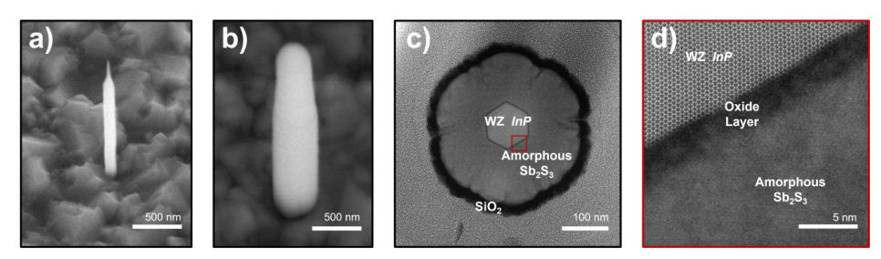
<figcaption class="paper-figure-caption"><b>Fig 1.</b> Figure 1. (a) SEM image (30° tilted) of as-grown MBE InP/InAs/InP core/GaInP shell nanowires. (b) SEM image (30° tilted) of the nanowires after Sb₂S₃ and SiO₂ deposition. (c) Low-magnification cross-sectional HAADF-STEM image of a representative nanowire. (d) High-magnification cross-sectional HAADF-STEM image of the InP core/Sb2S3 interface.</figcaption>
</figure>
<figure class="paper-figure-card">
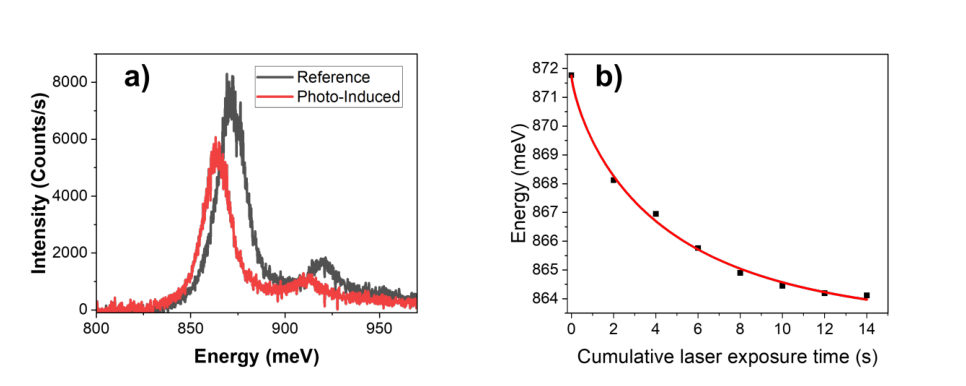
<figcaption class="paper-figure-caption"><b>Fig 2.</b> Figure 2. (a) Room Temperature μ-PL spectra of a representative QD-NW before and after the 671 nm laser, showing a persistent 7.7 meV redshift of the ground-state emission. (b) Ground-state emission energy of the same QD-NW as a function of cumulative 671 nm laser exposure time, recorded under repeated 2 s irradiation steps. The solid line corresponds to a stretched-exponential fit of the saturating redshift dynamics.</figcaption>
</figure>
<figure class="paper-figure-card">
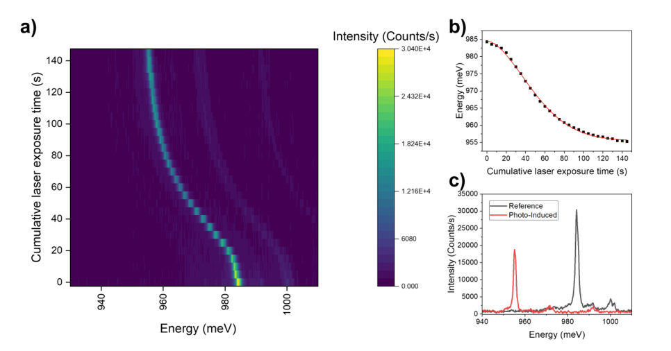
<figcaption class="paper-figure-caption"><b>Fig 3.</b> Figure 3. (a) μ-PL intensity map of a representative InAs/InP NW QD recorded at 12 K during stepwise laser exposure of the amorphous Sb₂S₃ shell. The sample was exposed</figcaption>
</figure>
<figure class="paper-figure-card">
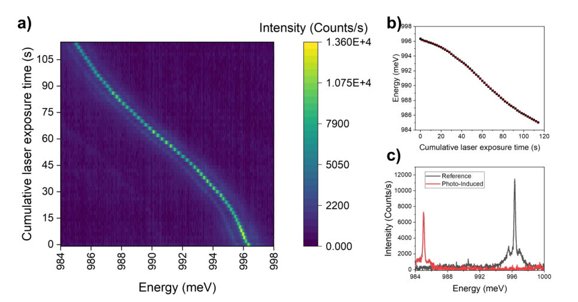
<figcaption class="paper-figure-caption"><b>Fig 4.</b> Figure 4. (a) μ-PL intensity map of a representative InAs/InP NW QD with a thicker InP core, recorded at 12 K during stepwise laser exposure of the amorphous Sb₂S₃ shell. The sample was exposed to repeated 2 s irradiation steps using a 671 nm CW laser with a power of 0.35 mW and a μ-PL spectrum was recorded after each step. (b) Extracted emission peak energy as a function of cumulative irradiation time, together with a stretched-exponential fit describing the redshift dynamics. (c) Initial and final μ-PL spectra recorded before and after irradiation, showing the total redshift associated with the local photo-induced process.</figcaption>
</figure>
<figure class="paper-figure-card">
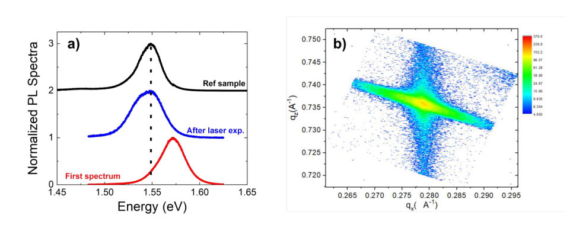
<figcaption class="paper-figure-caption"><b>Fig 5.</b> Figure 5. (a) Low temperature PL of NW samples. (b) Reciprocal-space map around the Wz InP 1 ˉ 105 reflection for the as-deposited sample.</figcaption>
</figure>

**Summary.** This research presents a novel, contact-free method to tune the emission wavelength of quantum dots by exploiting the photo-induced relaxation of strain within the surrounding amorphous shell. By monitoring the spectral redshift using photoluminescence, the authors demonstrate that this mechanism allows for precise, local wavelength control, making the system highly promising for scalable quantum photonic devices.

**Why it may be interesting.** This work provides a highly controllable, non-invasive method for tuning quantum emitter wavelengths post-fabrication, which is crucial for integrating multiple spectral sources into a single quantum photonic circuit.

Detailed structure

**Main problem.** The primary challenge is achieving spectrally matched emitters for scalable quantum-photonic technologies, due to inherent emitter-to-emitter variations in quantum dot emission energies.

**Main result.** The authors demonstrated a contact-free, post-growth spectral tuning of InAs quantum dot emission by photo-inducing strain relaxation in the surrounding amorphous Sb2S3 shell, achieving redshifts up to 28 meV at cryogenic temperatures.

**Method.** The tuning mechanism is investigated using photoluminescence (PL) spectroscopy at room and cryogenic temperatures, complemented by structural characterization via XRD and STEM.

**Model / system.** The system involves InAs quantum dots embedded in InP nanowires, coated with an amorphous Sb2S3 shell and capped with SiO2. The tuning relies on the photo-induced transformation of the chalcogenide shell, which progressively relaxes strain on the InP core.

**Key observables.** Spectral redshift ($\Delta E$) of the ground state emission, measured in meV; lattice parameters and strain components derived from XRD.

**Important parameters / regimes.** Temperature (Room Temperature vs. 12 K); Laser wavelength (e.g., 671 nm vs. 532 nm); Strain magnitude ($\sim 7-28$ meV shift).

**Assumptions / limitations.** The observed redshift is non-volatile and attributed to strain relaxation rather than transient heating or crystallization; the strain state in the QDs is estimated indirectly from the Wz InP matrix strain.

**Figures summary.** Figures show $\mu$-PL spectra demonstrating progressive redshift upon laser exposure at both RT and 12 K. Structural figures confirm the layered core-shell structure, and control experiments compare the effects of different laser wavelengths on crystallization.

**Paper structure.** The paper establishes the problem of spectral mismatch, presents the photo-tuning mechanism using $\mu$-PL measurements (showing temperature dependence), supports this with structural analysis (XRD/STEM) confirming strain changes, and finally uses control experiments to rule out simple laser-induced crystallization as the sole cause.

Abstract

Scalable quantum-photonic technologies require spatially separated emitters to emit at the same wavelength, yet epitaxially grown quantum dots naturally exhibit emitter-to-emitter variations in their emission energies. Here, we demonstrate a contact-free post-growth tuning approach for InAs quantum dots embedded in InP nanowires using the photo-induced transformation of an amorphous Sb2S3 shell. This photoinduced effect leads to a progressive relaxation of the strain imposed on the InP core, enabling controlled spectral tuning of the quantum-dot emission. The effect is observed both at room temperature and under cryogenic conditions for quantum dots emitting in the O-band of the telecommunications spectrum. Strain-induced redshifts of approximately 7 meV at room temperature and 28 meV under cryogenic conditions are observed, respectively. The use of an amorphous chalcogenide shell therefore provides a route to achieve local wavelength tuning at the single quantum-dot-in-a-nanowire level after growth. This approach could enable spectrally matched emitters for scalable quantum-photonic architectures.

[↑ back to top](#top)

### [Stable vortex soliton arrays in disclination-fractal systems](http://arxiv.org/abs/2609.09825v1)

**Authors:** Shuang Shen, Milivoj R. Belić, Ce Shang, Yongdong Li, Yiqi Zhang  
**Type:** theory · **Category:** other · **PDF:** <https://arxiv.org/pdf/2609.09825v1>  
**Analysis basis:** full PDF text, analyzed in chunks
**Topic relevance:** `analog quantum simulation` **1/5** · `interference shaping light` **1/5**

↔ Scroll figures horizontally

<figure class="paper-figure-card">

<figcaption class="paper-figure-caption"><b>Fig 1.</b> FIG. 1. Disclination-fractal waveguide array and its spectrum. (a) Sierpi´nski carpets. The first-generation Sierpi´nski carpet G(1) contains 32 waveguides. The G(ℓ) structure is constructed by iterating G(ℓ−1), forming an array of eight G(ℓ−1) units. Based on C4 symmetry, this structure can be partitioned into four identical sectors. (b) Removing one sector and bonding the remaining three sectors yields a disclination structure possessing C3 symmetry. The left panel shows structures with different shift parameter r. The newly formed domain walls are marked with magenta dashed rectangles. The right panel presents the linear spectrum b versus r. The red lines are the localized states on the...</figcaption>
</figure>
<figure class="paper-figure-card">

<figcaption class="paper-figure-caption"><b>Fig 2.</b> FIG. 2. (a) Spectra and domain wall states with r = −1.7. (b,c) Field modulus distributions of domain wall states with orthogonal polarizations. (d) Field modulus of the vortex array (left panel) and its corresponding phase distribution (right panel). (e-h) Setup is as (a-e) but for the results of C5-symmetric structure.</figcaption>
</figure>
<figure class="paper-figure-card">

<figcaption class="paper-figure-caption"><b>Fig 3.</b> FIG. 5. Maximum of the real part of the perturbation growth rate β vs propagation constant b. (a) Results for the fractal disclination lattice (blue line) and the SSH disclination (red line) lattice with C3 symmetry. (b) Setup is as (a), but for the C5-symmetric case.</figcaption>
</figure>
<figure class="paper-figure-card">

<figcaption class="paper-figure-caption"><b>Fig 4.</b> FIG. 3. Family of the vortex-soliton arrays in the C3-symmetric disclination-fractal system with its power P and peak am- plitude A shown in (a) and (b), respectively. The vertical dashed line indicates blin and the gray region includes ex- tended states. (c) Field modulus distributions (upper panels) and corresponding phases (bottom panels) of the states num- bered 1, 2, and 3 in (a).</figcaption>
</figure>
<figure class="paper-figure-card">

<figcaption class="paper-figure-caption"><b>Fig 5.</b> FIG. 4. Setup is as Fig. 3, but for the results in the C5-symmetric configuration.</figcaption>
</figure>

**Summary.** This paper investigates the stability of vortex-soliton arrays in engineered nonlinear optical lattices, specifically comparing fractal disclination structures against conventional ones. The authors prove that the unique geometry of the fractal lattice stabilizes these complex light fields, which are otherwise prone to collapse or decay. This establishes a new mechanism for controlling multi-field excitations in geometrically complex photonic systems.

**Why it may be interesting.** This work provides a concrete theoretical framework for designing photonic devices by showing how engineered fractal geometry can stabilize complex nonlinear excitations like vortex solitons, which is highly relevant to quantum optics and nonlinear wave physics.

Detailed structure

**Main problem.** The primary challenge is achieving stable vortex solitons and vortex-soliton arrays within complex, geometrically structured nonlinear media.

**Main result.** The study demonstrates that vortex-soliton arrays formed in disclination-fractal lattices are robustly stable, whereas analogous arrays in conventional disclination structures are unstable.

**Method.** The authors employed linear stability analysis and direct numerical simulations of the nonlinear paraxial wave equation to characterize the stability of the constructed soliton arrays.

**Model / system.** The system models light propagation in nonlinear waveguide arrays, specifically utilizing Sierpiński carpet-derived disclination-fractal structures. The dynamics are governed by a nonlinear Schrödinger-like equation incorporating cubic nonlinearity.

**Key observables.** Stability of the vortex-soliton arrays (determined by the sign of the perturbation growth rate $\text{Re}(\beta)$), field mode profiles, and long-distance propagation fidelity.

**Important parameters / regimes.** The geometry is defined by fractal lattice parameters, and the analysis distinguishes between topologically trivial and non-trivial phases.

**Assumptions / limitations.** The analysis assumes the system can be modeled by the paraxial wave equation and relies on the comparison between the fractal and conventional disclination geometries.

**Figures summary.** Figures illustrate the construction of the fractal and disclination structures, spectral analysis showing localized states, and crucially, propagation dynamics comparing the stable maintenance of the field in the fractal lattice versus the disintegration in the conventional SSH model.

**Paper structure.** The paper progresses by first defining the physical model and the fractal geometry, then analyzing the linear spectrum to find domain wall states, followed by incorporating nonlinearity to find the soliton arrays, and concluding with a direct stability comparison between the fractal and conventional structures.

Abstract

Vortex light fields carry orbital angular momentum and have attracted significant attention because of their wide applications in light field manipulations, optical communications, and quantum information processing. In nonlinear media, the balance between diffraction and self-action enables the formation of vortex solitons. However, achieving the stability of vortex solitons remains challenging due to radial and azimuthal modulation instabilities. Here, we report stable vortex solitons and vortex-soliton arrays in disclination-fractal configurations with different rotational symmetries, constructed by applying disclination operations to fractal lattice structures. The stable vortex-soliton arrays---composed of several vortex solitons---can exist along domain walls, resulting from the disclination operation applied to the topologically trivial phase. Their stability is verified through both linear stability analysis and direct simulations of perturbed propagation. For comparison, vortex-soliton arrays in conventional disclination configurations are found to be completely unstable, demonstrating the significance of the fractal configuration in stabilizing these nonlinear states. These findings reveal a new nonlinear excitation mechanism arising from the interplay between fractal geometry and disclination defects, thereby providing theoretical underpinnings for both the improved understanding of multi-field excitation phenomena in complex geometric systems and opening new avenues for the design of photonic devices based on fractal disclination structures.

[↑ back to top](#top)

### [A discrete Stiefel-Whitney invariant with twofold rotation symmetry](http://arxiv.org/abs/2609.09723v1)

**Authors:** Ken Shiozaki  
**Type:** theory · **Category:** other · **PDF:** <https://arxiv.org/pdf/2609.09723v1>  
**Analysis basis:** full PDF text, analyzed in chunks
**Topic relevance:** `analog quantum simulation` **1/5**

↔ Scroll figures horizontally

<figure class="paper-figure-card">

<figcaption class="paper-figure-caption"><b>Fig 1.</b> Figure 1: A C2-symmetric cover of the BZ torus. Double and triple overlaps are shown schematically as lines and junctions, respectively. The cover is chosen so that every nonempty intersection is contractible on the quotient space Q. [b] A cover with four patches, whose independent triple overlaps are UΓXY , UΓXM, UΓY M, UXY M.</figcaption>
</figure>
<figure class="paper-figure-card">
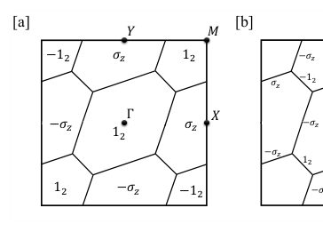
<figcaption class="paper-figure-caption"><b>Fig 2.</b> Figure 2: Calculation of νC2 2 [α] for A 1</figcaption>
</figure>
<figure class="paper-figure-card">
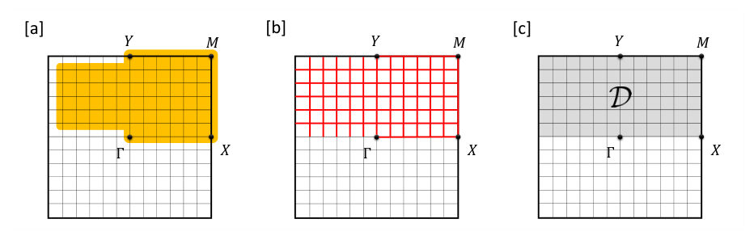
<figcaption class="paper-figure-caption"><b>Fig 3.</b> Figure 3: Vertices, edges, and plaquettes used to compute νC2 2 [α] on a discrete mesh, illustrated for L = 6. [a] Vertices V at which frames are chosen independently, shown as mesh points in the yellow region. Black dots indicate the high-symmetry points Γ, X, Y, M. [b] Edges E on which lifts are chosen independently, shown in red. [c] Half-BZ domain D over which the plaquette values are summed. The remaining boundary frames are fixed by symmetry, and the edge lifts are determined by the branch differences ∆0, ∆π, ∆x of the chosen function αk.</figcaption>
</figure>

**Summary.** This theoretical paper introduces a discrete Stiefel-Whitney invariant to characterize the topology of 2D spinful insulators with $C_2T$ symmetry. By formulating this invariant using a real bundle over the Brillouin torus quotient, the authors provide a robust tool that distinguishes between phases missed by conventional indices. This advances the stable topological classification scheme for these quantum materials.

**Why it may be interesting.** While the primary focus is condensed matter topology, the rigorous mathematical machinery involving gauge theory, characteristic classes, and discrete invariants has deep connections to topological quantum field theories relevant to quantum information.

Detailed structure

**Main problem.** The paper aims to derive and analyze a discrete Stiefel-Whitney invariant for two-dimensional spinful insulators possessing twofold rotation and time-reversal symmetries.

**Main result.** A novel discrete $\mathbb{Z}_2$ invariant, $\nu_{C_2T}[\alpha]$, is established, which is proven to be gauge-invariant and additive under direct sums, thereby refining the topological classification of these materials.

**Method.** The invariant is formulated using the second Stiefel-Whitney number of a real bundle over the quotient of the Brillouin torus, calculated via singular gauge transformations and overlaps of Bloch frames.

**Model / system.** The study focuses on two-dimensional spinful insulators characterized by $C_2T$ symmetry, specifically within the layer group $p1121'$. Examples include atomic and band insulators.

**Key observables.** The primary observables are the discrete topological invariants: the additional $\mathbb{Z}_2$ invariant $\nu_{C_2T}[\alpha]$, the filling number, and three quantized $\mathbb{Z}_2$ partial polarizations.

**Important parameters / regimes.** The classification is determined by the combination of these invariants, leading to the stable classification $\mathbb{Z} \oplus \mathbb{Z} \oplus \mathbb{Z}_4^2$.

**Assumptions / limitations.** The derivation assumes the existence of an energy gap $\Delta E > 0$ separating occupied bands from others.

**Figures summary.** The notes mention Table 1 summarizing indices for the BI example, and Table 2 comparing computed values of the invariant $\nu_{C_2, \text{dis}}^2[\alpha]$ for various insulator models.

**Paper structure.** The paper systematically reviews existing SW invariants, derives the discrete formula for the new invariant using Bloch frame overlaps, proves its invariance and additivity, and finally applies it to distinguish between different topological phases.

Abstract

We review Stiefel--Whitney invariants and give a discrete formulation of an additional $\mathbb{Z}_2$ invariant for two-dimensional spinful insulators with twofold rotation and time-reversal symmetries (layer group $p1121'$). A singular gauge transformation specifies a real bundle over the quotient of the Brillouin torus, whose second Stiefel--Whitney number defines the invariant. We derive its dependence on the choice of auxiliary gauge function and prove invariance under changes of Bloch frame and additivity under direct sums. The discrete formula uses overlaps of independently chosen Bloch frames and symmetry-compatible $\mathrm{Pin}_+$ lifts on the boundary of a half Brillouin zone. Atomic and topological-insulator models illustrate the formula and distinguish the additional invariant from the Kane--Mele index. Together with three quantized $\mathbb{Z}_2$ partial polarizations and the filling number, it labels the known stable classification $\mathbb{Z}\oplus\mathbb{Z}_2^{\oplus 4}$.

[↑ back to top](#top)

### [Composition and Surface Termination Control Band Alignments in P3HT/Perovskite Heterostructures](http://arxiv.org/abs/2609.09566v1)

**Authors:** Somayyeh Alidoust, V. Ongun Özçelik  
**Type:** theory · **Category:** other · **PDF:** <https://arxiv.org/pdf/2609.09566v1>  
**Analysis basis:** full PDF text, analyzed in chunks
**Topic relevance:** `Keldysh / 2PI / non-Gaussian methods` **1/5**

↔ Scroll figures horizontally

<figure class="paper-figure-card">
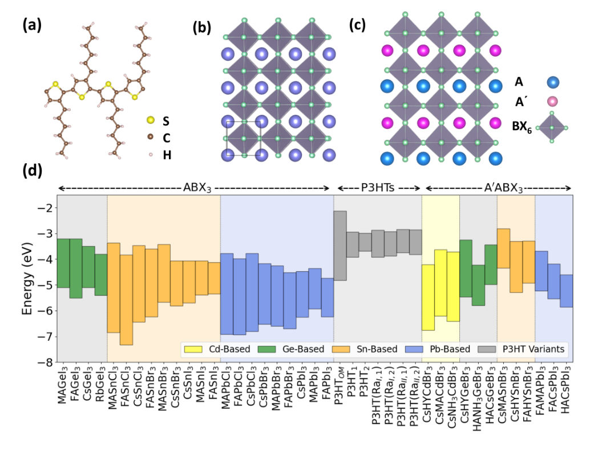
<figcaption class="paper-figure-caption"><b>Fig 1.</b> FIG. 1: (a) Crystal structure of the P3HT polymer. (b) Schematic of the mixed-cation AA′BX3 perovskite. (c) Band-edge positions of the P3HT variants compared with conventional ABX3 perovskites from the literature26,27 and the mixed-cation AA′BX3 perovskites calculated in this study. I and II denote two random alkyl-chain arrangements, while subscripts 1 and 2 indicate monolayer and bilayer P3HT, respectively.</figcaption>
</figure>
<figure class="paper-figure-card">
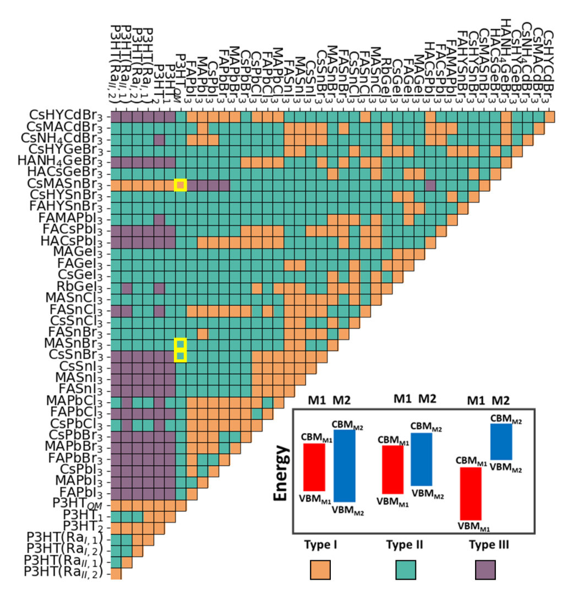
<figcaption class="paper-figure-caption"><b>Fig 2.</b> FIG. 2: Band alignment heat map for perovskites and P3HT variants. Yellow squares mark selected Sn-based perovskites (CsSnBr3, MASnBr3, CsMASnBr3) for interface modeling.</figcaption>
</figure>
<figure class="paper-figure-card">
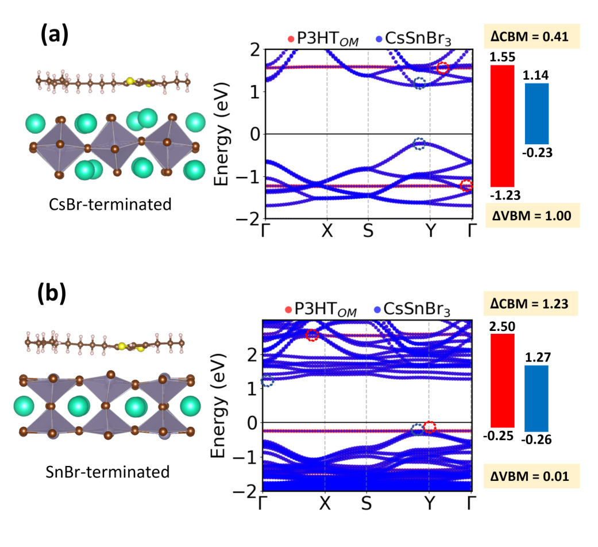
<figcaption class="paper-figure-caption"><b>Fig 3.</b> FIG. 3: Optimized interfacial atomic structures, projected band structures, and band alignments of the CsSnBr3/P3HTOM heterostructure for (a) CsBr-terminated and (b) SnBr-terminated interfaces. Dashed circles highlight the corresponding VBM and CBM positions of CsSnBr3 and P3HTOM.</figcaption>
</figure>
<figure class="paper-figure-card">

<figcaption class="paper-figure-caption"><b>Fig 4.</b> FIG. 4: Optimized interfacial atomic structures, projected band structures, and band alignments of the MASnBr3/P3HTOM heterostructure for (a) MABr-terminated and (b) SnBr-terminated interfaces. Dashed circles highlight the corresponding VBM and CBM positions of MASnBr3 and P3HTOM.</figcaption>
</figure>
<figure class="paper-figure-card">
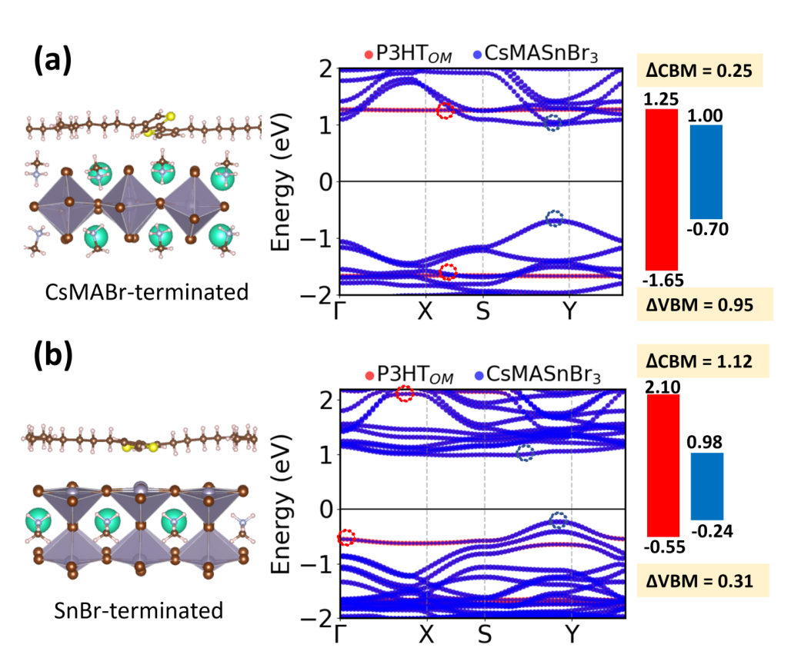
<figcaption class="paper-figure-caption"><b>Fig 5.</b> FIG. 5: Optimized interfacial atomic structures, projected band structures, and band alignments of the CsMASnBr3/P3HTOM heterostructure for (a) CsMABr-terminated and (b) SnBr-terminated interfaces. Dashed circles highlight the corresponding VBM and CBM positions of CsMASnBr3 and P3HTOM.</figcaption>
</figure>

**Summary.** This theoretical study uses first-principles calculations to map out how composition and surface termination dictate the band alignment in P3HT/perovskite interfaces. The key finding is that cation mixing in the perovskite structure can stabilize a desirable Type-I junction, and surface termination provides a powerful, tunable knob to engineer carrier confinement for optoelectronic applications.

**Why it may be interesting.** Although focused on solid-state photovoltaics, the detailed, first-principles modeling of interfacial electronic structure, band alignment, and charge confinement mechanisms is highly relevant to understanding energy transfer in quantum materials and open quantum systems.

Detailed structure

**Main problem.** The study aims to understand how the chemical composition and the specific surface termination of metal halide perovskites influence the band alignment at the interface with P3HT organic semiconductors.

**Main result.** The research found that while most perovskites exhibit Type-II or Type-III band alignments, the mixed-cation $	ext{CsMASnBr}_3$ uniquely forms a Type-I junction, and surface termination can significantly alter the resulting carrier confinement even when charge transfer is negligible.

**Method.** The work relies on high-throughput first-principles calculations, specifically using DFT with advanced functionals like HSE06 and incorporating DFT-D3 corrections for van der Waals interactions.

**Model / system.** The system modeled is the heterojunction formed between poly(3-hexylthiophene) (P3HT) variants and various tin-based metal halide perovskites ($	ext{ABX}_3$ and $	ext{AA}'	ext{BX}_3$). The calculations systematically vary the perovskite composition and the nature of the surface termination ($	ext{AX}$ vs. $	ext{BX}$).

**Key observables.** Band alignment type (Type-I, II, III), band edge positions ($	ext{VBM}$ and $	ext{CBM}$), band offsets ($\Delta	ext{CBM}$, $\Delta	ext{VBM}$), and carrier confinement strength.

**Important parameters / regimes.** Composition of the perovskite (e.g., $	ext{CsSnBr}_3$ vs. $	ext{CsMASnBr}_3$), surface termination ($	ext{AX}$ vs. $	ext{BX}$), and the polymer structure ($	ext{P3HT}$ variants).

**Assumptions / limitations.** The primary assumption is that the electronic properties are governed by band offsets and orbital coupling rather than significant net charge transfer, which is confirmed by Bader charge analysis.

**Figures summary.** Figure 1 compares crystal structures and band edges. Figure 2 is a heatmap summarizing the band-alignment types across 820 heterostructures. Figure 5 details the band alignments and structures for the $	ext{CsMASnBr}_3/	ext{P3HTOM}$ interface under different termination conditions.

**Paper structure.** The paper systematically analyzes the influence of composition (comparing pure vs. mixed-cation perovskites) and then details the effect of surface termination on the calculated band alignments, establishing design principles for interface engineering.

Abstract

Hybrid organic-inorganic perovskite heterostructures are emerging platforms for energy conversion and optoelectronic devices, yet the effects of composition and surface terminations on band alignment remain poorly understood. Here, using high-throughput first-principles calculations, we systematically reveal the effect of composition and surface termination on the band alignment of 820 heterostructures formed between poly(3-hexylthiophene) (P3HT) variants and conventional and mixed-cation metal halide perovskites. Band edge analysis predicts concentration dependent band alignments, with most Pb and Sn based perovskites exhibiting Type II and III behavior while mixed-cation CsMASnBr3 uniquely forms Type-I junctions with all P3HT variants. Explicit interface calculations reveal that surface termination can reverse the predicted alignment in conventional tin perovskites, while the mixed cation perovskite preserves Type-I alignment with P3HT regardless of termination. Despite negligible charge transfer, termination dependent band offsets produce markedly different carrier confinement, establishing design principles for engineering P3HT/perovskite interfaces.

[↑ back to top](#top)

### [Morphology and depletion force-based large-scale self-assembly of nanocubes on surface](http://arxiv.org/abs/2609.09761v1)

**Authors:** Yeonhee Lee, Seungsang Cha, Yuna Kwak, Nicholas Juntunen, Grant M. Rotskoff, Jwa-Min Nam  
**Type:** both · **Category:** statistical mechanics · **PDF:** <https://arxiv.org/pdf/2609.09761v1>  
**Analysis basis:** full PDF text, analyzed in chunks
**Topic relevance:** `Frenkel-Kontorova` **1/5**

↔ Scroll figures horizontally

<figure class="paper-figure-card">
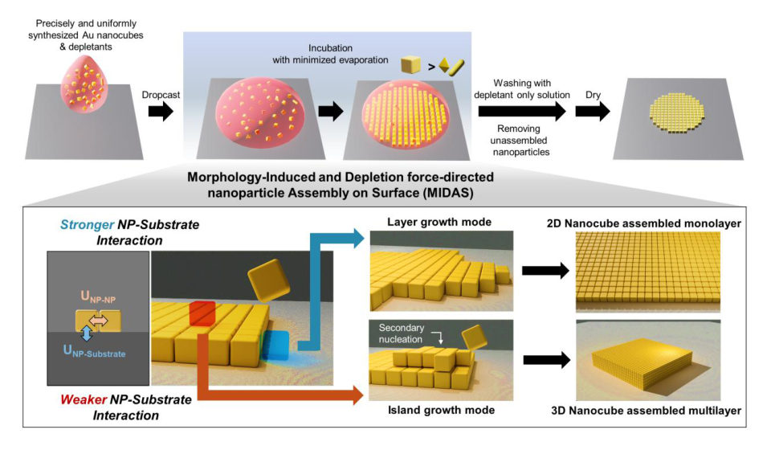
<figcaption class="paper-figure-caption"><b>Fig 1.</b> Fig. 1 | Morphology-induced and depletion force-directed nanoparticle assembly on surface (MIDAS). The mixture containing Au nanocubes (AuNCs) and depletants is dropcast on the substrate and incubated for a few hours. UNP-NP denotes the interaction potential between nanoparticles while UNP-substrate denotes the interaction potential between a nanoparticle and a substrate. The stronger attractive interaction between a nanoparticle and a substrate compared to the interaction between nanoparticles induces the faster lateral growth of AuNCs, leading to the monolayer growth. In contrast, the weaker attractive interaction between a nanoparticle and a substrate leads to the relatively slower...</figcaption>
</figure>
<figure class="paper-figure-card">

<figcaption class="paper-figure-caption"><b>Fig 2.</b> Fig. 2 | Characterization of the 2D nanocube-assembled monolayers (2D NAMs) and 3D nanocube- assembled multilayers (3D NAMs). a-b, Scanning electron microscopy (SEM) images of the assembled AuNCs on surfaces. SEM images of the 2D NAMs (a) and 3D NAMs (b), with tilted images showing 2D monolayer (a- iii) and 3D supercrystal (b-iii) formation. c, The grazing-incidence small-angle X-ray scattering (GI-SAXS) data showing crystallinity of the structures of 2D (top) and 3D (bottom) assemblies, respectively. d, 2D NAMs with varying sizes of AuNCs, 60 nm (i), 70 nm (ii), 80 nm (iii), and 90 nm (iv). e, 2D NAM formed using cetylpyridinium chloride (CPC) as the depletant. f, MIDAS-based formation of...</figcaption>
</figure>
<figure class="paper-figure-card">
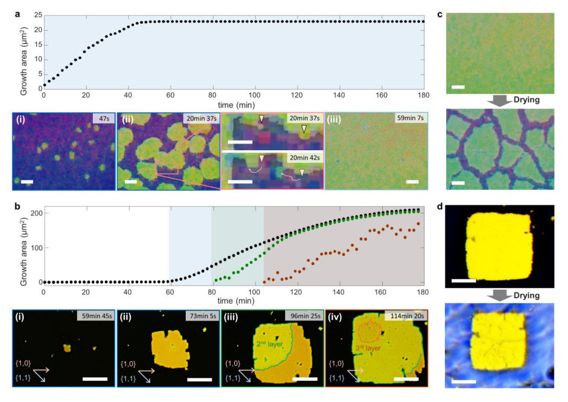
<figcaption class="paper-figure-caption"><b>Fig 3.</b> Fig. 3 | In situ monitoring of the MIDAS processes of AuNCs with a bright-field microscope. a, The average growth area of the two-dimensional assembled structure as a function of time using an in situ image sequence. The nucleation and growth stages were captured by microscopic snapshots. Nanoparticles nucleate (i) on the substrate within one minute after initiating the assembly. Subsequently, the assembly process undergoes lateral growth via deposition and diffusion (ii), resulting in the complete filling of the substrate by the monolayer (iii). b, Growth pattern of the entire three-dimensional assembled structure (black), the second layer (green), and the third layer (red) over time....</figcaption>
</figure>
<figure class="paper-figure-card">

<figcaption class="paper-figure-caption"><b>Fig 4.</b> Fig. 4 | Surface roughness effect on the MIDAS. a, Schematic figure showing how the overlapped volumes are affected by surface roughness. b, A phase diagram of the nanocube assemblies depending on depletion potential strength and surface roughness. c, A phase diagram from the mean field theory across a broad parameter range. Kinetic preference is plotted in the blue-to-green scale, and thermodynamic “No Growth” area is shown in gray. d, A phase diagram of the assemblies from kinetic Monte Carlo (KMC) simulation parameter sweep. e-f, SEM images of the 2D assemblies formed on a flat-surfaced Si wafer (Sa = 0.07) (e) and 3D assemblies formed on a rough-surfaced Si wafer (Sa = 4.62) (f). g-h,...</figcaption>
</figure>
<figure class="paper-figure-card">
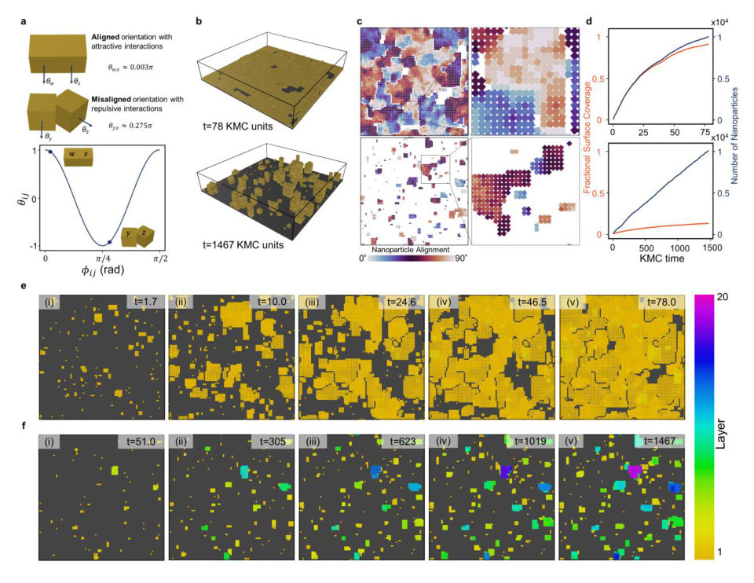
<figcaption class="paper-figure-caption"><b>Fig 5.</b> Fig. 5 | Kinetic Monte Carlo (KMC) simulations of surface morphology-controlled self-assembly of nanocubes. a, Schematic of the impact of neighboring nanoparticle orientation on interaction strength. b, Representative lattice-gas self-assembly modeling for flat (Fig. 4i) and rough (Fig. 4j) surface statistics. c, Orientation of nanoparticles deposited on the substrate. Similar colors are aligned, and dissimilar colors are misaligned. d, Growth kinetics from simulation. Data was tracked to 10,000 nanoparticles, with the gap between number of nanoparticles and fractional surface coverage indicating the degree of 3D stacking. e-f, Simulation trajectories for smooth (e) and rough (f) surfaces....</figcaption>
</figure>

**Summary.** This paper introduces the MIDAS method for controlling the self-assembly of gold nanocubes on surfaces using depletion forces. By tuning substrate properties, the authors demonstrate precise control over the resulting structure, forming either 2D monolayers or 3D multilayers. This work establishes a generalizable mechanism for building complex nanoparticle architectures at scale.

**Why it may be interesting.** The work provides a detailed physical mechanism—depletion forces—that dictates the macroscopic organization of nanoscale matter, which has parallels in understanding phase transitions and ordering in complex soft matter systems.

Detailed structure

**Main problem.** The primary challenge is achieving precise, controllable, and scalable self-assembly of nanoparticles into functional structures, overcoming limitations in current methods.

**Main result.** The MIDAS method successfully enables the selective formation of 2D and 3D nanoparticle monolayers by controlling the interplay between morphology-sensitive depletion forces and substrate interactions.

**Method.** The study combines experimental techniques (TEM, SAXS, AFM, UV-Vis-NIR spectroscopy) with theoretical modeling, including Lattice-gas modeling and Kinetic Monte Carlo simulations.

**Model / system.** The system involves gold nanocubes (AuNCs) self-assembling on various substrates (Si, borosilicate glass) driven by depletion forces generated by surfactant micelles (BDAC). The assembly mode is controlled by the relative strengths of nanoparticle-substrate versus nanoparticle-nanoparticle interactions.

**Key observables.** Assembly mode (2D monolayer vs. 3D multilayer), interparticle spacing (lattice constant), and optical resonance peaks (UV-Vis-NIR spectra).

**Important parameters / regimes.** Substrate roughness ($	ext{Sa}$), depletion potential ($U_{dep}$), and the relative strengths of electrostatic and van der Waals forces.

**Assumptions / limitations.** The assembly process is governed by the balance of multiple forces (depletion, electrostatic, van der Waals), and the 3D optical spectrum can be calculated by weighting layer spectra based on surface coverage.

**Figures summary.** Figures illustrate structural characterization (2D/3D AuNAMs) and show the dependence of assembly on surface roughness and surfactant concentration, alongside optical spectra.

**Paper structure.** The paper establishes the MIDAS method, details the physical forces governing assembly, presents experimental results showing control over 2D/3D structures via substrate tuning, and supports these findings with detailed simulations and modeling.

Abstract

Self-assembling nanoparticles is a highly efficient and facile way to form functional nano-, micro- and macrostructures. However, currently available methods lack precision and controllability in size, shape and composition, suffer from poor reproducibility and scalability, and require complex steps and expensive materials. Here, we present the uniform morphology-induced and depletion force-directed nanoparticle assembly on surface (MIDAS) method with gold nanocubes (AuNCs). Using this approach, morphology-sensitive depletion forces trigger shape-selective flocculation and assembly of the AuNCs with uniform size and shape. Importantly, the surface roughness-controlled substrate drives the large-scale formation of AuNC-assembled monolayers (2D AuNAMs) or three-dimensional AuNC-assembled multilayers (3D AuNAMs) in a highly specific manner without any complex ligand modification or preparation steps. Lattice-gas modeling and kinetic Monte Carlo simulations show the depletion force is the key parameter determining supercrystal morphology and corroborate the experimental findings. This work establishes a generalizable nanoparticle assembly mechanism and demonstrates the broad applicability of the MIDAS strategy for scalable fabrication and patterning of 2D and 3D nanoparticle architectures.

[↑ back to top](#top)

### [Origin of Flat Bands and Role of Electron Correlation in Lutetium Hydrides](http://arxiv.org/abs/2609.09446v1)

**Authors:** Anmol Lamichhane, Adam Denchfield, Hyeondeok Shin, Panchapakesan Ganesh, Russell J. Hemley, Hyowon Park  
**Type:** theory · **Category:** strongly correlated electrons · **PDF:** <https://arxiv.org/pdf/2609.09446v1>  
**Analysis basis:** full PDF text, analyzed in chunks
**Topic relevance:** `Keldysh / 2PI / non-Gaussian methods` **1/5**

↔ Scroll figures horizontally

<figure class="paper-figure-card">
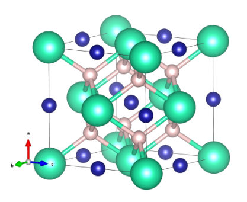
<figcaption class="paper-figure-caption"><b>Fig 1.</b> FIG. 1: Idealized fluorite structure of LuH3. Tetrahedral hydrogens (Htet) are represented by pink atoms, octahedral hydrogens (Hoct) are represented by blue atoms and Lutetium atoms are represented by turquoise atoms.</figcaption>
</figure>
<figure class="paper-figure-card">
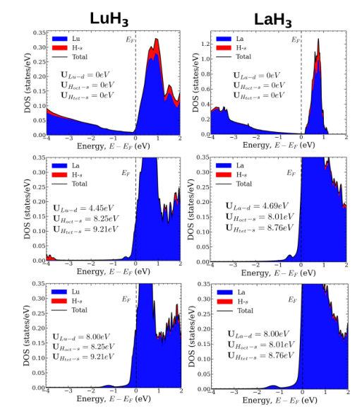
<figcaption class="paper-figure-caption"><b>Fig 2.</b> FIG. 2: Hubbard interactions alone do not gap the cubic trihydrides. Orbital-resolved DOS of LuH3 (left) and LaH3 (right) at the Wannier level (U = 0, top), from DMFT at the cRPA couplings (middle), and from DMFT with Ud = 8 eV at fixed hydrogen interactions (bottom).</figcaption>
</figure>
<figure class="paper-figure-card">

<figcaption class="paper-figure-caption"><b>Fig 3.</b> FIG. 3: Lu-H structures with different hydrogen occupation of Hoct and Htet studied and their associated DFT calculated electronic properties. For 4 Lu atoms: a) LuH1.75 has 7 Htet. b) LuH2 has 8 Htet. c) LuH2.25 has 8 Htet and 1 Hoct. d) LuH2.875 has 8 Htet and 3 Hoct. e) LuH3 has 8 Htet and 4 Hoct.</figcaption>
</figure>
<figure class="paper-figure-card">
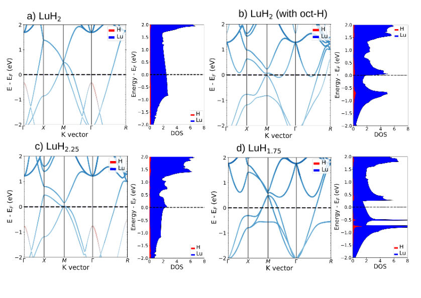
<figcaption class="paper-figure-caption"><b>Fig 4.</b> FIG. 4: Comparision of band structures of various LuHx structures showing that flat-bands and van Hove singularity can be tuned near EF . The band structures are for the following structures: (a) LuH2 with only tetrahedral-H occupancy (b) LuH1.75 with one tetrahedral-H vacancy (c) LuH2.25 with one octahedral-H occupancy (d) LuH2 with one tetrahedral-H vacancy and one octahedral-H occupancy.</figcaption>
</figure>
<figure class="paper-figure-card">
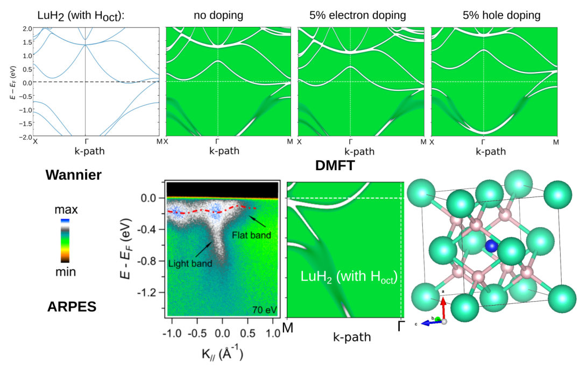
<figcaption class="paper-figure-caption"><b>Fig 5.</b> FIG. 5: Correlated electronic structure of LuH2 with Hoct: theory–experiment comparison. Top: Wannier bands and DMFT spectral function A(k, ω) along Γ–X–M, undoped and at ±5% carrier doping. Relative to the Wannier bands, DMFT produces a narrow band pinned near EF with a saddle at M, and damped flat features near −0.6 eV; doping shifts both rigidly in energy (electron doping downward, hole doping upward) without displacing them in momentum. Bottom: ARPES cuts adapted from Ref. [16], licensed under CC by 4.0, showing the near-EF flat band with its emerging light band (left), compared with the undoped DMFT spectral function along M–Γ (middle) and the model structure of LuH2 with Hoct – teal...</figcaption>
</figure>

**Summary.** This theoretical study investigates the electronic structure of superconducting Lutetium hydrides using advanced many-body techniques. The authors find that the puzzling flat bands and correlation effects are not solely due to strong electron-electron interactions, but are fundamentally controlled by the local filling of hydrogen orbitals, particularly at defect sites. This establishes orbital filling as the key organizing principle for superconductivity in this material class.

**Why it may be interesting.** The work provides a detailed, first-principles understanding of how structural defects and orbital filling dictate emergent electronic phenomena like flat bands and superconductivity in strongly correlated materials, which is highly relevant to modern condensed matter theory.

Detailed structure

**Main problem.** The study aims to determine the microscopic origin and correlation nature of puzzling flat-band regions observed in superconducting Lutetium hydrides ($	ext{LuH}_x$) and identify the fundamental principle governing their electronic behavior.

**Main result.** The flat-band features and correlation strength are fundamentally governed by the local hydrogen orbital filling at specific sites (especially anti-site defects), rather than the magnitude of the on-site Coulomb interaction itself.

**Method.** The research employs a combination of Density Functional Theory (DFT), Dynamical Mean-Field Theory (DMFT), and the Constrained Random-Phase Approximation (cRPA) to model electronic structure and correlation effects.

**Model / system.** The system under investigation is the series of Lutetium hydrides ($	ext{LuH}_x$, $1.75 \le x \le 3$), which are superconducting materials whose electronic properties are governed by the hybridization between $	ext{Lu-}d$ and $	ext{H-}s$ states.

**Key observables.** Screened on-site Coulomb interaction, correlation strength (mass enhancement, local susceptibility), electronic structure (flat bands, DOS), and orbital occupations ($	ext{H-s}$ vs $	ext{Lu-d}$).

**Important parameters / regimes.** Hydrogen orbital filling, octahedral vs tetrahedral site occupancy, and the correlation strength parameter $U$.

**Assumptions / limitations.** The analysis assumes that the electronic properties are dictated by the local orbital filling geometry, and that the system remains weakly correlated despite large interaction parameters.

**Figures summary.** Figures illustrate model structures, orbital-resolved Density of States (DOS) under varying correlation treatments, and dielectric functions showing the modification of plasma edges due to octahedral hydrogen occupancy.

**Paper structure.** The paper systematically analyzes the electronic structure by first establishing the theoretical framework (DFT/DMFT/cRPA), then calculating correlation diagnostics for different stoichiometries, identifying the role of anti-site defects, and finally concluding that orbital filling is the primary organizing principle.

Abstract

Lutetium hydrides (LuH$_x$, $1.75 \leq x \leq 3$) form a diverse series of phases, several of which superconduct under pressure. Characterizing their electronic properties has remained challenging owing to a high propensity for hydrogen defect formation, and recent angle-resolved photoemission (ARPES) measurements reveal puzzling flat-band regions that position these materials as candidates where superconductivity and flat-band physics may intersect. Here, by combining density functional theory, dynamical mean-field theory, and the constrained random-phase approximation, we uncover the microscopic origin and correlation nature of these flat bands. Across all compositions, the screened on-site Coulomb interaction is larger for H-s states than for Lu-$d$ states due to compact hydrogen orbitals. Nevertheless, these systems remain weakly correlated metals: the nearly filled H-$s$ shell admits little charge fluctuation, so its large interaction acts as a static level shift rather than a source of correlation. Although hydrogen primarily occupies tetrahedral sites at $x=2$, we discover that anti-site defects--where hydrogens occupy slightly unfavorable octahedral sites--generate both the ARPES flat-band features and the low-energy optical absorption peak, attesting to the usual defective nature of such materials in experimental samples. We further find that correlation strength is governed primarily by hydrogen orbital filling at these sites rather than the interaction magnitude itself. Consequently, we identify hydrogen orbital filling as the fundamental organizing principle dictating correlation and low-energy flat-band physics in lutetium hydrides.

[↑ back to top](#top)

### Other secondary papers (5)

Show other secondary papers

### [Comprehensive molecular dynamics study of the dynamical properties of a dense binary hard-sphere mixture](http://arxiv.org/abs/2609.09532v1)

**Authors:** Sabry G. Moustafa, Andrew J. Schultz  
**Type:** theory · **Category:** disordered systems and neural networks · **PDF:** <https://arxiv.org/pdf/2609.09532v1>  
**Analysis basis:** full PDF text, analyzed in chunks

↔ Scroll figures horizontally

<figure class="paper-figure-card">
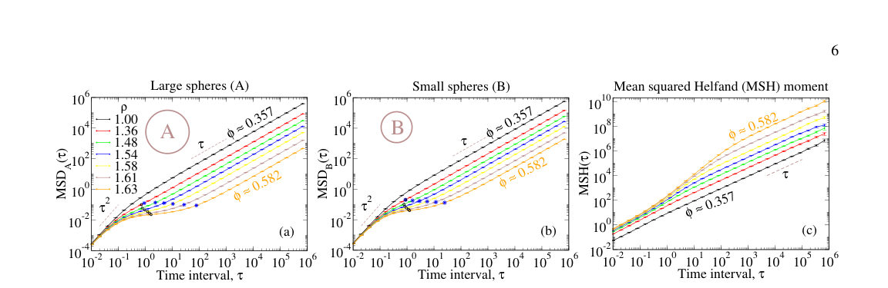
<figcaption class="paper-figure-caption"><b>Fig 1.</b> FIG. 1. Time dependence of the mean square displacement (MSD) for the large (a) and small (b) particles, and mean square Helfand (MSH) moment (c) at seven densities, for a system size of N = 3200. The ballistic, ∼τ2, and diffusive, ∼τ, regimes are indicated by dashed lines. Error bars correspond to 68% confidence limits. Lines connect the data points. In panels (a) and (b), black open circles denote the inflection points (see text) and blue stars correspond to the peak of the α2(τ) function. (see Fig. 7).</figcaption>
</figure>
<figure class="paper-figure-card">

<figcaption class="paper-figure-caption"><b>Fig 2.</b> FIG. 2. Time dependence of the total self-diffusivity (left) and shear viscosity (right) at density ρ = 1.63 (φ ≈0.582) for a system size of N = 3200. The blue curves represent fits using Eq. 3, both yielding reduced χ2 value less than unity. The red solid lines indicate the esti- mated infinite-time limits transport coefficients, with the dashed lines representing the uncertainty bounds obtained from the fits. Numbers in parentheses indicate the uncertainty in the last digit.</figcaption>
</figure>
<figure class="paper-figure-card">

<figcaption class="paper-figure-caption"><b>Fig 3.</b> Figure 3(a) shows the system-size dependence of the self- diffusivity, normalized by its thermodynamic-limit value (see Eq. 14). The data are plotted as a function of N1/3, equiva- lently the box length L, which is the natural scaling variable based on hydrodynamic arguments.37 We find that the data are well-described by a power-law form:62</figcaption>
</figure>
<figure class="paper-figure-card">
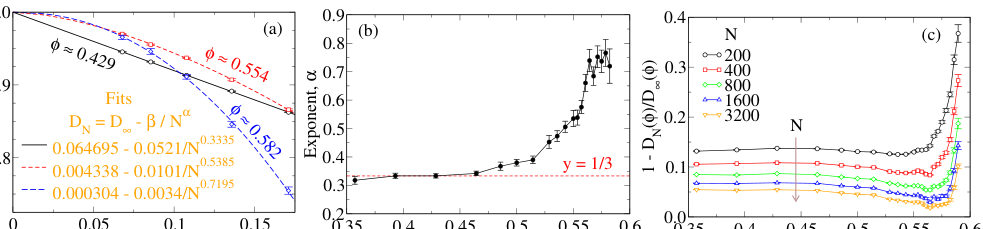
<figcaption class="paper-figure-caption"><b>Fig 4.</b> FIG. 3. (a) Finite-size effects on the total self-diffusivity for system sizes N = 200,400,800,1600,3200 at densities ρ = 1.20,1.55,1.63. Data are normalized by the thermodynamic-limit, D∞, for each density. Solid lines are WLS fits to Eq 14, with reduced χ2 values of 1.76,0.40,0.36 for the three densities, respectively. Density dependence of the fitted exponent α (b) and the normalized self-diffusivity DN/D∞at different system sizes (c), respectively. Lines connect the data points.</figcaption>
</figure>
<figure class="paper-figure-card">

<figcaption class="paper-figure-caption"><b>Fig 5.</b> FIG. 4. Finite-size effects of the shear viscosity for sys- tem sizes N = 200,400,800,1600,3200, at relatively low (left; ρ = 1.44,1.50,1.55) and high (right; ρ = 1.55,1.62,1.63) densi- ties. Data for each density are normalized by the corresponding thermodynamic-limit η∞obtained from the fits (see text). Lines con- nect the data points.</figcaption>
</figure>

**Summary.** This work presents an extensive molecular dynamics study of a dense binary hard-sphere fluid to characterize its dynamical properties near the glass transition. The researchers find that transport coefficients exhibit super-Arrhenius behavior and that dynamic heterogeneity is present, characterized by a unique spatial decay scaling. The findings establish a detailed benchmark dataset for theoretical models studying glassy dynamics in disordered matter.

**Why it may be interesting.** The detailed analysis of dynamic heterogeneity using $\chi_4(	au)$ and the identification of non-conventional scaling laws ($\lambda \sim 	au^{1/3}$) provide rigorous benchmarks for theoretical models attempting to describe glassy dynamics in dense, disordered systems.

Detailed structure

**Main problem.** The study investigates the dynamical properties and the emergence of dynamic heterogeneity in a dense hard-sphere mixture, particularly near the glass transition.

**Main result.** The system exhibits super-Arrhenius behavior for transport coefficients, the Stokes-Einstein relation breaks down, and dynamic heterogeneity is characterized by a spatial decay length scaling as $\lambda \sim 	au^{1/3}$ rather than the conventional $	au^{1/2}$.

**Method.** Molecular Dynamics (MD) simulations are employed to calculate transport coefficients and analyze higher-order correlation functions, including the four-point dynamic susceptibility ($\chi_4(	au)$).

**Model / system.** The model is a three-dimensional binary hard-sphere (BHS) fluid mixture, studied over a range of packing fractions ($\phi \approx 0.357-0.582$).

**Key observables.** Self-diffusivity ($D$), shear viscosity ($\eta$), structural relaxation time ($	au_\alpha$), non-Gaussian parameter ($\alpha_{2,s}(	au)$), and four-point dynamic susceptibility ($\chi_4(	au)$).

**Important parameters / regimes.** Packing fraction ($\phi$), system size ($N$), and time ($	au$).

**Assumptions / limitations.** The analysis involves extrapolating data to the thermodynamic limit ($N 	o \infty$), though the authors caution that simple exponential fits are insufficient for reliably estimating the critical packing fraction ($\phi_0$).

**Figures summary.** The figures summarize the finite-size effects on time-dependent $D(	au)$ and $\eta(	au)$, the evolution of $\alpha_2(	au)$ and $\chi_4(	au)$ with system size, and the monotonic increase of the compressibility factor $Z_\infty(\phi)$ with $\phi$.

**Paper structure.** The paper systematically analyzes transport coefficients, finite-size scaling of these coefficients, and then progresses to higher-order measures like $\chi_4(	au)$ to quantify dynamic heterogeneity.

Abstract

We present an extensive molecular dynamics (MD) study of the dynamical properties of a binary hard-sphere fluid over a wide range of packing fractions, $φ\approx 0.357-0.582$. The self-diffusivity, $D$, and shear viscosity, $η$, are computed using an efficient implementation of the Einstein--Helfand method. The finite-size effects in $D$ scale as $1/N^α$, with $α$ increasing from approximately $1/3$ to $3/4$ with increasing $φ$, whereas those in $η$ are negligible except for $φ\gtrsim 0.554$, where they scale as $1/N$. The data are then extrapolated to the thermodynamic limit to obtain $D_{\infty}$ and $η_{\infty}$. Both coefficients show a super-Arrhenius dependence on $φ$ for dense states, accompanied by a breakdown of the Stokes--Einstein relation. Although both $D_{\infty}(φ)$ and $η_{\infty}(φ)$ data are well described by an exponential form, we demonstrate that these fits do not provide reliable estimates of the critical packing fraction, $φ_0$, owing to the substantial extrapolation required beyond the accessible equilibrium range. We find the commonly assumed proportionality between $η$ and the structural relaxation time, $τ_α$ , to not hold for this system. For $φ\gtrsim 0.570$, the van Hove self-correlation function $G_s(r, τ)$ exhibits a spatial exponential decay at intermediate times, $τ$, signaling dynamic heterogeneity. The characteristic decay length scales as $λ\sim τ^ν$, with $ν\approx 1/3$, in contrast to the conventional square-root scaling. We also investigate temporal heterogeneity through the four-point dynamic susceptibility, $χ_4(τ)$, and its peak time, $τ_4$. These findings provide rigorous benchmark MD data for computational studies of glassy dynamics and establish a reference for testing theoretical models in dense disordered systems.

[↑ back to top](#top)

### [Intrinsic (valley) thermal Hall conductivity of phonons in graphene for integer quantum Hall phases](http://arxiv.org/abs/2609.09505v1)

**Authors:** M. Selch  
**Type:** theory · **Category:** other · **PDF:** <https://arxiv.org/pdf/2609.09505v1>  
**Analysis basis:** full PDF text, analyzed in chunks

↔ Scroll figures horizontally

<figure class="paper-figure-card">
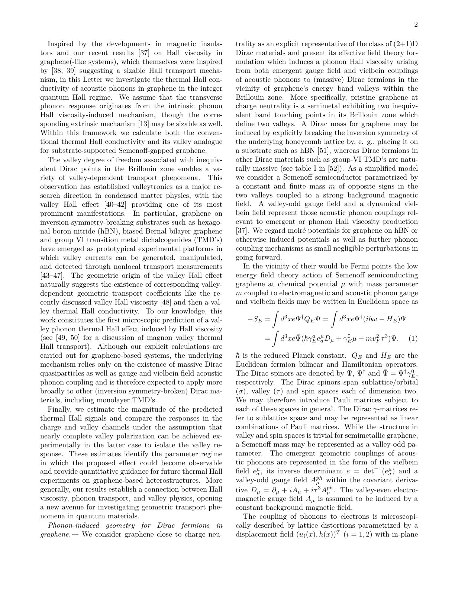
<figcaption class="paper-figure-caption"><b>Fig 1.</b> Low-resolution page preview, page 2</figcaption>
</figure>
<figure class="paper-figure-card">
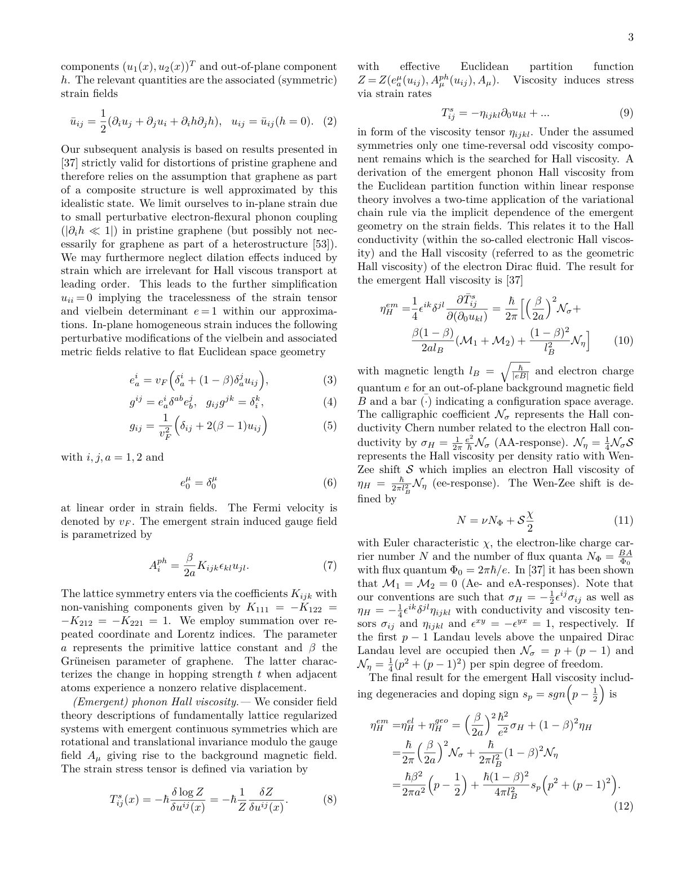
<figcaption class="paper-figure-caption"><b>Fig 2.</b> Low-resolution page preview, page 3</figcaption>
</figure>
<figure class="paper-figure-card">

<figcaption class="paper-figure-caption"><b>Fig 3.</b> Low-resolution page preview, page 4</figcaption>
</figure>
<figure class="paper-figure-card">

<figcaption class="paper-figure-caption"><b>Fig 4.</b> Low-resolution page preview, page 5</figcaption>
</figure>
<figure class="paper-figure-card">
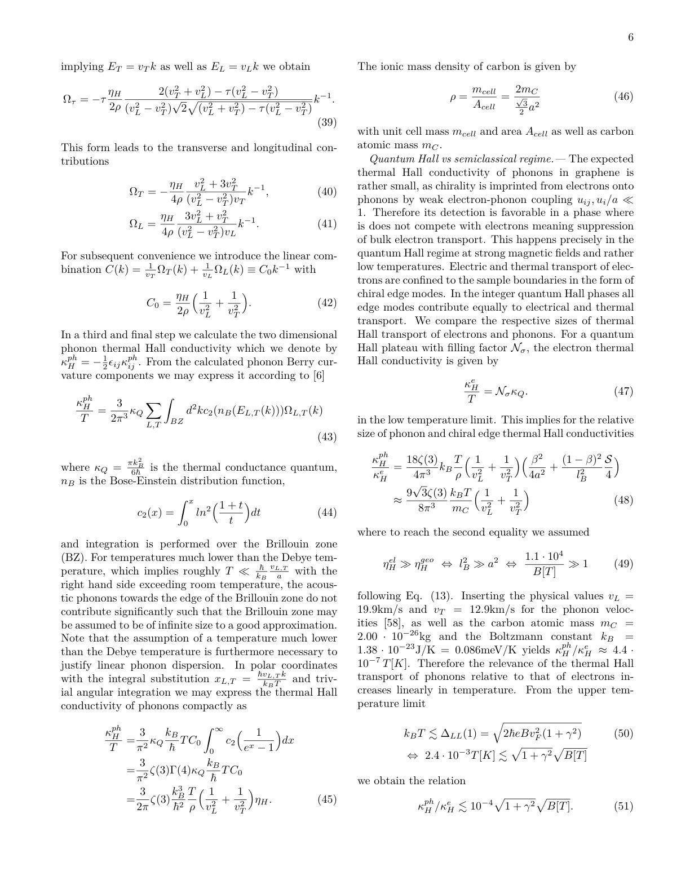
<figcaption class="paper-figure-caption"><b>Fig 5.</b> Low-resolution page preview, page 6</figcaption>
</figure>

**Summary.** This paper theoretically calculates the intrinsic thermal Hall conductivity of phonons in graphene operating in the quantum Hall regime. It shows that while the intrinsic phonon contribution is small, the valley-dependent phonon thermal Hall effect is predicted to be significant. The methodology relies on coupling electron Hall physics to lattice vibrations via emergent Hall viscosities.

**Why it may be interesting.** The work connects topological concepts (Hall viscosity, Berry curvature) from electronic transport to lattice vibrations (phonons), providing a mechanism to study valley physics in thermal transport, which is relevant to understanding emergent quantum phenomena in condensed matter.

Detailed structure

**Main problem.** Calculating the intrinsic (valley) thermal Hall conductivity of phonons in graphene when bulk electron thermal transport is suppressed in the quantum Hall regime.

**Main result.** The intrinsic phonon thermal Hall transport is predicted to be very small compared to electron transport, but the valley thermal Hall transport is predicted to be comparable in size to the charge channel transport for Dirac materials.

**Method.** The calculation uses a theoretical framework involving the phonon Berry curvature and the concept of phonon Hall viscosity, derived from geometric electron-phonon coupling.

**Model / system.** The system is graphene modeled in the quantum Hall regime, treated as a Semenoff semiconductor. The analysis involves coupling acoustic phonons to Dirac fermions via lattice distortions.

**Key observables.** Phonon thermal Hall conductivity ($\kappa_{ph}^H$), Valley thermal Hall conductivity ($\kappa_{ph}^vH$), and Phonon Hall viscosity ($\eta_{	ext{em}}^H$).

**Important parameters / regimes.** Quantum Hall regime, low temperature limit ($T \ll T_{	ext{Debye}}$), and the valley degree of freedom.

**Assumptions / limitations.** The analysis assumes the transverse phonon response originates from the intrinsic phonon Hall viscosity-induced mechanism and that graphene can be approximated by pristine graphene.

**Paper structure.** The paper progresses by first establishing the theoretical link between phonon Hall viscosity and thermal transport, then deriving the phonon Berry curvature, and finally calculating the thermal Hall conductivity in the low-temperature and quantum Hall limits.

Abstract

We calculate the intrinsic contribution to the (valley) thermal Hall conductivity of phonons in (Semenoff-gapped) graphene in the quantum Hall regime where bulk electron thermal transport is suppressed. The (valley) thermal Hall transport of phonons considered here originates from a phonon (valley) Hall viscosity induced by electron (valley) Hall conductivity and viscosity via geometric electron-phonon coupling. The so generated phonon (valley) Hall viscosity is identified with the emergent (valley) Hall viscosity recently introduced in \textit{Phys. Lett. A} \textbf{595}, 132096 (2026). While our calculations refer to graphene, they may very well be generalized to other Dirac materials like group-VI transition metal dichalcogenides. We discuss the prospect of measuring the phonon thermal Hall conductivity in graphene-based heterostructures and estimate the corresponding valley response induced by electrons in the inversion symmetry broken phase.

[↑ back to top](#top)

### [Microscopic Understanding of Thermal-magnon Transport in a Low-damping Ferrimagnetic Thin Films](http://arxiv.org/abs/2609.09674v1)

**Authors:** Lerato Takana, Katya Mikhailova, Junwei Tong, Xiangcheng Liu, Kwangyul Hu, Juan Hofer, Guanxiong Qu, Clare Yu, Ivan Schuller, Michael Flatté, Xiaoqin Li, Yuri Suzuki  
**Type:** both · **Category:** other · **PDF:** <https://arxiv.org/pdf/2609.09674v1>  
**Analysis basis:** full PDF text, analyzed in chunks

↔ Scroll figures horizontally

<figure class="paper-figure-card">

<figcaption class="paper-figure-caption"><b>Fig 1.</b> FIG. 1. (a) Mid-wave infrared (MWIR) thermal imaging of a LAFO/Pt device (d = 1 µm) under an RMS injector cur- rent of 1.4 mA. The inset shows the measured thermal map, and the dashed line indicates the direction of the extracted temperature profiles. The temperature rise above 300 K is well described by an exponential decay, yielding the thermal healing length used to define the intrinsic nonlocal transport regime. (b) Left axis: Temperature rise at the injector as a function of applied current obtained from the MWIR mea- surements, showing the expected quadratic dependence as- sociated with Joule heating. Right axis: Second-harmonic nonlocal voltage measured at 250 K and 0.3 T as a...</figcaption>
</figure>
<figure class="paper-figure-card">

<figcaption class="paper-figure-caption"><b>Fig 2.</b> FIG. 2. Magnetic-field dependence of thermal magnon transport and its microscopic origin. (a) Nonlocal thermal voltage as a function of magnetic field measured at 250 K with an injector current of 0.5 mA. The inset shows the corresponding magnetic-field dependence of the extracted magnon spin diffusion length, demonstrating that the suppression of the thermal signal is accompanied by a reduction in the magnon propagation length. (b) Backward-volume (BV) magnon dispersion of Li0.5Al1.0Fe1.5O4 measured by Brillouin light scattering (BLS) at µ0H = 284 mT and 300 K. Symbols represent the experimental data and the dashed line is a fit to Eq. (1). (c) Magnetic-field and wave-vector dependence of...</figcaption>
</figure>
<figure class="paper-figure-card">

<figcaption class="paper-figure-caption"><b>Fig 3.</b> FIG. 3. Temperature dependence of thermal magnon transport. (a) Thermal magnon voltage measured as a function of temperature at µ0H = 0.3 T and an injector current of 0.5 mA. The data are plotted on logarithmic axes to determine the power-law dependence of the thermal signal on temperature. The dashed line is a power-law fit V th ∝T p with exponent p = −1. (b) Micromagnetic simulations of the thermal magnon signal, plotted on logarithmic axes, for an RMS injector current of 1.4 mA and µ0H = 0.3 T using a temperature-dependent exchange stiffness, Aex(T) ∝[Ms(T)/Ms(0)]2. The simulated temperature dependence reproduces the experimentally observed power-law behavior, supporting...</figcaption>
</figure>

**Summary.** This research investigates how heat drives spin transport via magnons in ferrimagnetic thin films using nonlocal measurements. By combining experiments (BLS, thermal imaging) and simulations, the authors show that transport is controlled not just by the number of magnons, but critically by the magnon group velocity and the temperature dependence of the exchange stiffness. This establishes key parameters for engineering heat-driven spin currents.

**Why it may be interesting.** The work provides a detailed, microscopic link between macroscopic thermal transport measurements and fundamental magnetic parameters (like exchange stiffness and magnon dispersion), which is relevant for understanding energy transport in quantum magnetic materials.

Detailed structure

**Main problem.** The paper aims to establish a microscopic understanding of thermal magnon transport in magnetic insulators, moving beyond simple descriptions based only on the magnon population.

**Main result.** Thermal magnon transport is governed by microscopic parameters like magnon group velocity and temperature-dependent exchange stiffness, showing suppression by magnetic fields and temperature despite increasing magnon density.

**Method.** The study combines non-local spin Seebeck measurements in nanodevices with Brillouin light scattering (BLS) spectroscopy and micromagnetic simulations.

**Model / system.** The physical system is low-damping ferrimagnetic thin films, specifically Li0.5Al1.0Fe1.5O4/Pt nanodevices. The analysis utilizes nonlocal spin Seebeck geometry to isolate intrinsic magnon transport signals.

**Key observables.** Thermal magnon voltage (Vth), magnon spin diffusion length, magnon group velocity (vg), and the temperature dependence of the transport signal.

**Important parameters / regimes.** Magnetic field strength (H), temperature (T), and the temperature-dependent exchange stiffness (A_ex(T)).

**Assumptions / limitations.** The nonlocal geometry successfully separates intrinsic magnon transport from local thermoelectric effects, and that phonon-drag/interfacial contributions are negligible above 100 K for temperature analysis.

**Figures summary.** Figures demonstrate the nonlocal voltage scaling with temperature gradient, the suppression of Vth and diffusion length with magnetic field (linked to reduced vg), and the monotonic decrease of Vth with increasing temperature, which simulations reproduce using T-dependent exchange stiffness.

**Paper structure.** The paper progresses by first establishing the experimental platform (nonlocal geometry) to measure the thermal signal. It then investigates the magnetic field dependence, linking suppression to reduced magnon group velocity via BLS. Finally, it analyzes the temperature dependence, showing that the decrease in transport is due to temperature-dependent exchange stiffness, which is confirmed by simulations.

Abstract

Thermally generated magnons enable heat-driven spin transport in magnetic insulators, yet the microscopic mechanisms governing their propagation remain poorly understood. Here, we investigate thermal magnon transport in low-damping Li$_{0.5}$Al$_{1.0}$Fe$_{1.5}$O$_4$/Pt nanodevices using a nonlocal spin Seebeck geometry that separates magnon transport from local thermoelectric effects. Thermal imaging establishes a detector region outside the thermal healing length, enabling intrinsic nonlocal measurements. We find that thermal magnon transport is strongly suppressed by magnetic fields far above saturation. Brillouin light scattering reveals that increasing field reduces the group velocity of backward volume magnons, providing a microscopic origin for the observed reduction in magnon spin diffusion length. We further find that thermal magnon transport decreases with increasing temperature despite an increasing magnon population. Micromagnetic simulations reproduce this behavior only when a temperature-dependent exchange stiffness is included. These results identify magnon group velocity and exchange stiffness as key parameters governing thermal magnon transport in ferrimagnetic thin films.

[↑ back to top](#top)

### [Record-Breaking Elemental Superconductivity in Tetralayer Kagome Borophene](http://arxiv.org/abs/2609.09730v1)

**Authors:** Yingnan Liu, Yan Liu, Renyu Duan, Menghui Wang, Meiling Xu, Hanyu Liu, Shoutao Zhang  
**Type:** theory · **Category:** other · **PDF:** <https://arxiv.org/pdf/2609.09730v1>  
**Analysis basis:** full PDF text, analyzed in chunks

↔ Scroll figures horizontally

<figure class="paper-figure-card">

<figcaption class="paper-figure-caption"><b>Fig 1.</b> FIG. 1. (a) Schematic illustration of the stacking-activated out-of-plane pairing mechanism. Multilayer stacking generates interlayer B-B covalent bonds and s −pz hybridized bonding states near the EF , which couple strongly to out-of-plane (OOP) boron phonons and thereby enhance superconductivity beyond the liquid-nitrogen regime. (b) Screening workflow for multilayer kagome borophenes, including structural stability, dynamical stability, and EPC criteria.</figcaption>
</figure>
<figure class="paper-figure-card">
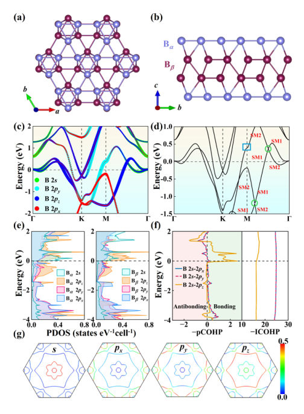
<figcaption class="paper-figure-caption"><b>Fig 2.</b> FIG. 2. (a,b) Top and side views of the tetralayer kagome borophene structure, where the two colors denote inequivalent boron sites. (c) Orbital-resolved band structure, with the horizontal dashed line marking the Fermi level. (d) Enlarged view of the band cross- ing, with the corresponding irreducible representations labeled. The green circle marks the Dirac point (DP), while the blue rectan- gle highlights the Van Hove singularity. (e) Atom-resolved pro- jected density of states (PDOS) for Bα and Bβ atoms. (f) Projected crystal orbital Hamilton populations (pCOHP) of 2s-2px, 2s-2py, and 2s-2pz pairs, together with the corresponding integrated COHP (ICOHP) in TKB. (g) Orbital-resolved FSs...</figcaption>
</figure>
<figure class="paper-figure-card">
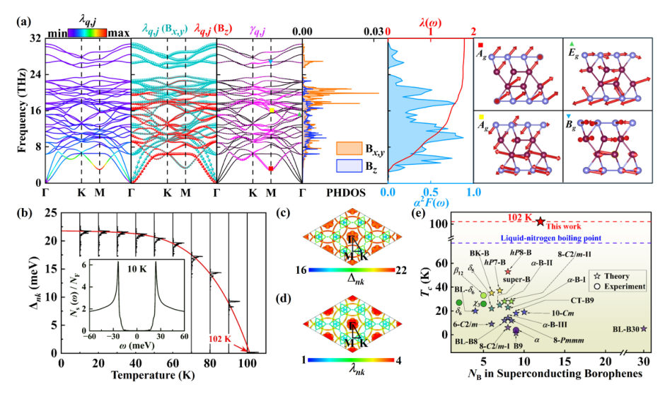
<figcaption class="paper-figure-caption"><b>Fig 3.</b> FIG. 3. (a) Phonon dispersion weighted by the mode-resolved EPC strength λqj, phonon branches associated with in-plane Bx,y and out-of- plane Bz vibrations, phonon dispersion weighted by the phonon linewidth γqj, and frequency-dependent phonon density of states (PHDOS), Eliashberg spectral function α2F(ω), and accumulated EPC strength λ(ω). Four representative phonon modes with pronounced EPC contri- butions are also illustrated. (b) Temperature dependence of the superconducting gap ∆nk. The inset shows the superconducting density of states (SDOS) at T = 10 K. (c) Momentum-resolved superconducting gap ∆nk projected onto the FS at T = 10 K. (d) Momentum-dependent EPC strength λnk projected...</figcaption>
</figure>

**Summary.** This theoretical study predicts that tetralayer kagome borophene (TKB) is a record-breaking elemental superconductor with a critical temperature of 102 K. The high $T_c$ is attributed to a novel, stacking-activated pairing mechanism involving out-of-plane $s$-$p_z$ bonding states coupled to low-frequency lattice vibrations. This work establishes covalent stacking engineering as a promising route for designing high-$T_c$ 2D materials.

**Why it may be interesting.** While focused on superconductivity, the detailed analysis of orbital-selective coupling and lattice vibrations (phonons) provides a rich model for understanding electron-phonon interactions in low-dimensional systems, which has parallels in strongly correlated electron physics.

Detailed structure

**Main problem.** The primary challenge is achieving high-temperature superconductivity in two-dimensional elemental crystals, where insufficient electron-phonon coupling (EPC) often limits $T_c$ below liquid-nitrogen temperatures.

**Main result.** The authors predict that tetralayer kagome borophene (TKB) can be a record-high-$T_c$ elemental superconductor with a critical temperature of 102 K.

**Method.** The study employs first-principles calculations combined with fully anisotropic Migdal-Eliashberg theory to model the superconducting pairing mechanism.

**Model / system.** The system analyzed is ABAB-stacked Tetralayer Kagome Borophene (TKB). The theory focuses on the electron-phonon coupling mediated by out-of-plane (OOP) $s$-$p_z$ bonding states coupled to low-frequency OOP boron vibrations.

**Key observables.** Predicted critical temperature ($T_c$) of 102 K; strong total EPC strength ($\lambda = 1.78$); pronounced anisotropy in the superconducting gap ($\Delta_{nk}$).

**Important parameters / regimes.** The optimal structure is the tetralayer configuration; the pairing mechanism relies on low-frequency OOP vibrations; the study notes the necessity of exfoliation for intrinsic measurements.

**Assumptions / limitations.** The analysis relies on theoretical predictions from first-principles calculations, and the mechanism hinges on the unique OOP pairing channel activated by the specific ABAB stacking.

**Figures summary.** Figures illustrate the schematic of the OOP pairing mechanism, the screening workflow for borophenes, the TKB structure with orbital-resolved band structures, and momentum-resolved plots showing the superconducting gap and EPC strength.

**Paper structure.** The paper first establishes the problem of high-$T_c$ in 2D elements, then details the theoretical framework using first-principles calculations and Migdal-Eliashberg theory. It presents the TKB structure and its unique OOP pairing mechanism, culminating in the prediction of the record-high $T_c$ and discussing the implications of stacking engineering.

Abstract

Superconductivity above the liquid-nitrogen temperature remains rare in two-dimensional elemental crystals, where strong covalent bonding often yields high phonon frequencies but insufficient electron-phonon coupling. Here, using first-principles calculations and fully anisotropic Migdal-Eliashberg theory, we predict tetralayer kagome borophene (TKB) stabilized by ABAB covalent stacking, as a liquid-nitrogen-temperature elemental superconductor. With a predicted critical temperature of 102 K, TKB sets a record-high value among previously reported elemental superconductors. Unlike known high-Tc boron-based superconductors dominated by in-plane sigma-bonding states and high-frequency in-plane B-B stretching modes, TKB realizes an out-of-plane s-pz-bonding-mediated pairing mechanism, in which interlayer s-pz bonding states at the Fermi level are strongly coupled to low-frequency out-of-plane vibrations of boron atoms. These results reveal a distinct out-of-plane pairing channel in multilayer borophene and establish covalent stacking engineering as a potential route for high-Tc superconductivity in two-dimensional materials.

[↑ back to top](#top)

### [WannierNLQG: A Julia package for nonlinear optical responses and quantum geometry from Wannier tight-binding models](http://arxiv.org/abs/2609.10411v1)

**Authors:** Zhuocheng Lu, Zhichao Guo, Yuanyuan Xua, Jiacheng Yao, Hua Wang  
**Type:** theory · **Category:** other · **PDF:** <https://arxiv.org/pdf/2609.10411v1>  
**Analysis basis:** full PDF text, analyzed in chunks

↔ Scroll figures horizontally

<figure class="paper-figure-card">

<figcaption class="paper-figure-caption"><b>Fig 1.</b> Figure 1: Symmetry-aware computational workflow of WannierNLQG. Model Preparation produces a Wannier model and operator bundle through either representation-constrained SAWF construction from first-principles inputs or post-hoc symmetrization of an existing WIN and tight-binding model with optional operators. In Response Setup, TaskConfig selects the response formulation and the required optical vertices, projectors, or loop quantities. The Brillouin-zone stage uses the full k mesh by default. When a matching symmetry artifact is supplied, supported q = 0 Integral tasks may instead use the symmetry-reduced k mesh, implemented using representatives of irreducible k-point orbits, orbit...</figcaption>
</figure>
<figure class="paper-figure-card">

<figcaption class="paper-figure-caption"><b>Fig 2.</b> Figure 2: GeS electronic structure, shift current comparison, and Wilson loop k-space quantities, arranged as (a, c, e) in the upper row and (b, d, f) in the lower row. (a) POSCAR-derived lattice schematic. (b) DFT and Wannier-TB band structures along Γ–X–S–Y–Γ, referenced to the valence-band maximum. (c) Integrated Re σyyy spectra from the conventional, projector, and Wilson loop formulations, denoted by σC, σP, and σW, respectively. The spectra are calculated under matched numerical settings using Wannier-center Convention II, on a 200 × 200 × 1 mesh and a 200-point 0–4 eV frequency grid, and are displayed as effective-bulk conductivities in µA V−2 using the thickness factor Lz/deff =...</figcaption>
</figure>
<figure class="paper-figure-card">
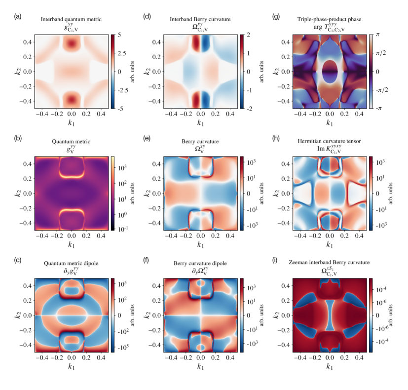
<figcaption class="paper-figure-caption"><b>Fig 3.</b> Figure 3: GeS k-slice maps recomputed from one symmetrized SAWF-gauge model using direct Fourier interpolation on a 400×400×1 mesh, with EF = −2.5 eV, Wannier-center Convention II, and q = 0. The same model bundle supplies the Hamiltonian, position, spin, and derivative operators in a common gauge. The centered fractional coordinates satisfy k = k1b1 + k2b2, with k1, k2 ∈[−0.5, 0.5], and the subspaces are V = [19, 20], C1 = [21, 22], and C2 = [23, 24]. The left column contains (a) gyy C1,V, (b) gyy V , and (c) ∂kygyy V . The middle column contains (d) Ωxy C1,V, (e) Ωxy V , and (f)</figcaption>
</figure>
<figure class="paper-figure-card">

<figcaption class="paper-figure-caption"><b>Fig 4.</b> Figure 4: 2H-bilayer MoS2 photon drag responses. (a) VESTA-rendered lattice structure and (b) DFT/SAWF band comparison. Panels (b)–(h) use the same SAWF model, with panels (c)–(h) calculated from its complete 11-operator bundle. (c) Im σyyx PDSC and (d) Re σxxx PDIC spectra for representative qx values, both displayed as effective-bulk conductivities using Lz/deff with deff = 0.950047554 nm; the PDIC spectra additionally use τ = 10−13 s. (e) 400 × 400 × 1 reciprocal-space map of Im σyyx PDSC(k), projected with the MoS2 reciprocal lattice vectors, at qx = 0.01 ˚A−1 and ℏω = 2.84 eV. (f) 400×400×1 reciprocal-space map of Re σxxx PDIC(k), projected with the same reciprocal basis, at qx = 0.01...</figcaption>
</figure>
<figure class="paper-figure-card">

<figcaption class="paper-figure-caption"><b>Fig 5.</b> Figure 5: Warm complete-task timing comparison for the full conventional shift current tensor of (a) and (d) GeS, (b) and (e) Nb3I8, and (c) and (f) GaAs. Panels (a)–(c) show the median wall time from 16 samples, with min–max ranges, for WannierBerri 26.7.0 using Ray workers and the frozen WannierNLQG snapshot using MPI ranks. The time axes use logarithmic spacing and are labeled in seconds. Panels (d)–(f) show the median paired block ratio TWB/TWNLQG, with order-stratified bootstrap 90% confidence intervals. Nunit denotes the number of Ray workers or MPI ranks. No samples or ratios are pooled across materials.</figcaption>
</figure>

**Summary.** This paper presents WannierNLQG, a new Julia package designed to compute nonlinear optical responses and quantum geometric quantities from Wannier tight-binding models. It provides a unified, gauge-consistent framework to calculate complex observables like shift and photon-drag currents, while also analyzing geometric properties like Berry curvature. This tool enables first-principles modeling of optoelectronic and spintronic phenomena in advanced materials.

**Why it may be interesting.** The focus on nonlinear optical responses and quantum geometry connects directly to advanced topics in quantum optics and the study of open quantum systems, particularly in engineered materials.

Detailed structure

**Main problem.** The core problem is understanding the deep interplay between nonlinear optical responses and quantum geometric properties in condensed matter systems.

**Main result.** The authors introduce WannierNLQG, a Julia framework capable of calculating these complex quantities, achieving significant computational speedups over existing methods.

**Method.** The framework uses Wannier tight-binding models to calculate nonlinear currents (injection, shift, photon-drag) and geometric tensors (Berry curvature, quantum metric) via gauge-consistent, degeneracy-aware methods.

**Model / system.** The calculations are performed on quantum materials modeled using Wannier tight-binding representations, allowing for extensions to various physical phenomena like moire bilayers and ferroics.

**Key observables.** Nonlinear optical responses (e.g., shift/injection currents), k-resolved Berry curvature, quantum metric, and higher-order geometric tensors.

**Important parameters / regimes.** Arbitrary orders of perturbation, finite momentum (q), and symmetry group representations.

**Assumptions / limitations.** The framework assumes the validity of Wannier interpolation from first-principles electronic structures and handles degeneracies through specialized formulations (e.g., generalized Wilson loop).

**Figures summary.** The notes do not provide a detailed figure summary, but mention workflow diagrams illustrating model preparation, response setup, and the final output calculation loop.

**Paper structure.** The paper details the mathematical formalism for model construction (Wannier gauge, symmetry adaptation), followed by the implementation of various current and geometric tensor calculations, culminating in case studies and performance comparisons.

Abstract

Nonlinear optical responses and quantum geometry are central to modern condensed matter physics and are deeply intertwined. We introduce WannierNLQG, an extensible Julia framework for computing nonlinear optical responses and quantum geometric quantities from Wannier tight-binding models. Its gauge-consistent, degeneracy-aware architecture accommodates perturbative responses at arbitrary order and additional quantum geometric quantities. The current release evaluates ordinary, spin, and photon-drag injection and shift currents, as Brillouin-zone integrals and on k slices. For shift current, a unified interface exposes four complementary formulations: the conventional method, projector trace, generalized Wilson loop, and a finite-momentum geometric loop, with the last three explicitly accommodating degenerate subspaces. The framework also provides k-resolved Berry curvature, quantum metric, their multipoles, and additional quantum geometric and mixed momentum-spin quantities. Experimental symmetry workflows additionally support symmetry-adapted Wannier construction, symmetrization of tight-binding models and real-space operators, and reduction of spatially uniform response integrals to irreducible k-point orbits and invariant tensor components. The documentation covers formula conventions, the TaskConfig interface, and auditable output formats, with GeS and bilayer MoS2 case studies illustrating method comparison, degeneracy handling, quantum geometric analysis, and photon-drag responses. Together, these capabilities enable first-principles calculations of nonlinear response and quantum geometry in realistic multiband materials, connecting quantum geometry with quantitative materials modeling for optoelectronic, spintronic, and photovoltaic applications.

[↑ back to top](#top)

