
# arxiv digest (quant-ph + cond-mat) — 2026-09-11

*155 papers · 18 relevant · 4 highlighted*

## 🔥 Most relevant (18)

*Every paper with at least one nonzero topic score, sorted by best-matching score. 🔥 marks scores ≥4/5. Click the title to jump to the full entry below; click [arXiv] to open the paper page. `(secondary)` marks papers from de-prioritized cond-mat archives.*

Show 18 relevant papers

- [Prethermal ripplons in quenched binary Bose-Einstein condensates](#paper-2609.09464) [[arXiv]](http://arxiv.org/abs/2609.09464v1) — 🔥 `scars & prethermalization` **5/5** · `analog quantum simulation` **3/5** · `driven-dissipative phase transition` **3/5** · `non-equilibrium universality` **3/5** · `Keldysh / 2PI / non-Gaussian methods` **2/5** · `methods for driven-dissipative` **2/5** · `Frenkel-Kontorova` **1/5**
- ⭐ [Non-equilibrium dissipative stabilization of s- and d-wave superconductivity](#paper-2609.10062) [[arXiv]](http://arxiv.org/abs/2609.10062v1) — 🔥 `driven-dissipative phase transition` **4/5** · 🔥 `methods for driven-dissipative` **4/5** · `Keldysh / 2PI / non-Gaussian methods` **3/5** · `correlated / nonlocal dissipation` **3/5** · `non-equilibrium universality` **3/5** · `quantum measurements` **2/5** · `analog quantum simulation` **1/5** · `scars & prethermalization` **1/5**
- [Information capacity of quantum statistics: Fock-state tests of a discrete binary-sequence model on cloud photonic quantum processors](#paper-2609.10216) [[arXiv]](http://arxiv.org/abs/2609.10216v1) — 🔥 `QC/QI experiment` **4/5** · `Full counting statistics` **3/5** · `quantum optics experiment` **3/5** · `interference shaping light` **2/5** · `quantum measurements` **2/5** · `analog quantum simulation` **1/5**
- [Quench dynamics in nonreciprocal Aubry-André-Harper model](#paper-2609.10342) [[arXiv]](http://arxiv.org/abs/2609.10342v1) — 🔥 `non-equilibrium universality` **4/5** · `analog quantum simulation` **3/5** · `driven-dissipative phase transition` **3/5** · `Frenkel-Kontorova` **1/5** · `Keldysh / 2PI / non-Gaussian methods` **1/5** · `methods for driven-dissipative` **1/5** · `scars & prethermalization` **1/5**
- [Electrically tunable, two-photon interference from remote silicon-vacancy centers in industrial silicon carbide](#paper-2609.09805) [[arXiv]](http://arxiv.org/abs/2609.09805v1) — 🔥 `QC/QI experiment` **4/5** · 🔥 `interference shaping light` **4/5** · `quantum optics experiment` **3/5** · `quantum measurements` **2/5**
- [In situ characterization of a photon-subtraction device via heralding counts and homodyne detection](#paper-2609.10100) [[arXiv]](http://arxiv.org/abs/2609.10100v1) — 🔥 `quantum measurements` **4/5** · `Full counting statistics` **3/5** · `quantum optics experiment` **3/5** · `Keldysh / 2PI / non-Gaussian methods` **1/5** · `interference shaping light` **1/5** · `methods for driven-dissipative` **1/5**
- [Transient and universal regimes in quantum reaction-transport kinetics](#paper-2609.09305) [[arXiv]](http://arxiv.org/abs/2609.09305v1) — 🔥 `Keldysh / 2PI / non-Gaussian methods` **4/5** · `non-equilibrium universality` **3/5** · `correlated / nonlocal dissipation` **1/5** · `driven-dissipative phase transition` **1/5** · `methods for driven-dissipative` **1/5** · `scars & prethermalization` **1/5**
- [Certified measurement and control of an entanglement-breaking index on programmable hardware](#paper-2609.09350) [[arXiv]](http://arxiv.org/abs/2609.09350v1) — 🔥 `quantum measurements` **4/5** · `QC/QI experiment` **3/5** · `correlated / nonlocal dissipation` **1/5** · `driven-dissipative phase transition` **1/5** · `methods for driven-dissipative` **1/5**
- [Fast Synergetic Simulation to Study Slow Evolution of Soliton Patterns in Optical Resonators](#paper-2609.10389) [[arXiv]](http://arxiv.org/abs/2609.10389v1) `(secondary)` — 🔥 `methods for driven-dissipative` **4/5** · `Keldysh / 2PI / non-Gaussian methods` **1/5** · `analog quantum simulation` **1/5** · `correlated / nonlocal dissipation` **1/5** · `driven-dissipative phase transition` **1/5** · `non-equilibrium universality` **1/5** · `scars & prethermalization` **1/5**
- ⭐ [Phase transitions in first-detection statistics of monitored long-range quantum walks](#paper-2609.10510) [[arXiv]](http://arxiv.org/abs/2609.10510v1) — 🔥 `quantum measurements` **4/5** · `Full counting statistics` **1/5** · `analog quantum simulation` **1/5** · `correlated / nonlocal dissipation` **1/5** · `driven-dissipative phase transition` **1/5** · `interference shaping light` **1/5** · `non-equilibrium universality` **1/5**
- [Temperature-induced effective topology in many-body ultracold atomic quantum systems](#paper-2609.09463) [[arXiv]](http://arxiv.org/abs/2609.09463v1) — 🔥 `analog quantum simulation` **4/5** · `methods for driven-dissipative` **3/5** · `Frenkel-Kontorova` **1/5** · `driven-dissipative phase transition` **1/5**
- [Loss-correcting fault-tolerant quantum computing architecture for neutral atoms](#paper-2609.10079) [[arXiv]](http://arxiv.org/abs/2609.10079v1) — 🔥 `QC/QI experiment` **4/5** · `Rydberg arrays` **1/5** · `analog quantum simulation` **1/5** · `quantum measurements` **1/5**
- [Realization Theory for Quantum Filtering: Classifying Continuously Monitored Bosonic Systems](#paper-2609.09663) [[arXiv]](http://arxiv.org/abs/2609.09663v1) — 🔥 `quantum measurements` **4/5** · `correlated / nonlocal dissipation` **1/5** · `driven-dissipative phase transition` **1/5** · `methods for driven-dissipative` **1/5**
- [Certifying bipartite entanglement on a superconducting processor from a corrected QAOA cost layer](#paper-2609.09495) [[arXiv]](http://arxiv.org/abs/2609.09495v1) — 🔥 `QC/QI experiment` **4/5** · `quantum measurements` **1/5**
- [Fractional Chern Insulators in Twisted Bilayer Optical Lattices](#paper-2609.09733) [[arXiv]](http://arxiv.org/abs/2609.09733v1) — 🔥 `analog quantum simulation` **4/5** · `Keldysh / 2PI / non-Gaussian methods` **1/5**
- [Bell tests for collider decay processes](#paper-2609.09294) [[arXiv]](http://arxiv.org/abs/2609.09294v1) — 🔥 `quantum measurements` **4/5**
- [Haar-Bayesian Pure-State Prediction under Relative-Entropy Loss: Arbitrary-Effect Reduction and Global Optimality](#paper-2609.10072) [[arXiv]](http://arxiv.org/abs/2609.10072v1) — 🔥 `quantum measurements` **4/5**
- [Optimal Low-Rank Quantum State Tomography with Bounded-Sample Joint Measurements](#paper-2609.10514) [[arXiv]](http://arxiv.org/abs/2609.10514v1) — 🔥 `quantum measurements` **4/5**

## ⭐ Highlighted (4)

*Papers by authors on your watch list. Click the title to jump to the full entry below; click [arXiv] to open the paper page.*

Show 4 highlighted papers

- ⭐ [Faster Quantum Monte Carlo Simulation by Random Compilation](#paper-2609.10486) [[arXiv]](http://arxiv.org/abs/2609.10486v1) — Andrew J. Daley
- ⭐ [Phase transitions in first-detection statistics of monitored long-range quantum walks](#paper-2609.10510) [[arXiv]](http://arxiv.org/abs/2609.10510v1) — Giovanna Morigi
- ⭐ [Non-equilibrium dissipative stabilization of s- and d-wave superconductivity](#paper-2609.10062) [[arXiv]](http://arxiv.org/abs/2609.10062v1) — Zala Lenarčič
- ⭐ [Distinguishability Transitions from Global Quantum Snapshots](#paper-2609.09296) [[arXiv]](http://arxiv.org/abs/2609.09296v1) — Sarang Gopalakrishnan

## All papers (108, sorted by relevance)

*Papers from quant-ph and your primary cond-mat archives (quant-gas, stat-mech, str-el, dis-nn). Highlighted papers (⭐) come first, then everything else sorted by topic-relevance score, highest first.*

### ⭐ [Non-equilibrium dissipative stabilization of s- and d-wave superconductivity](http://arxiv.org/abs/2609.10062v1)

**Highlighted author(s):** Zala Lenarčič  
**Authors:** Aleksey Lunkin, Yury Holubeu, Denis Golež, Zala Lenarčič  
**Type:** theory · **Category:** statistical mechanics · **PDF:** <https://arxiv.org/pdf/2609.10062v1>  
**Analysis basis:** full PDF text, analyzed in chunks
**Topic relevance:** 🔥 `driven-dissipative phase transition` **4/5** · 🔥 `methods for driven-dissipative` **4/5** · `Keldysh / 2PI / non-Gaussian methods` **3/5** · `correlated / nonlocal dissipation` **3/5** · `non-equilibrium universality` **3/5** · `quantum measurements` **2/5** · `analog quantum simulation` **1/5** · `scars & prethermalization` **1/5**

📷 Fig 1

 
FIG. 1. Steady-state gap ∆∞(in units of zero temperature gap ∆0) as a function of temperatures of the first bath T1 and second bath T2. For an s-wave superconductor, we find new non-equilibrium solutions at T1 ̸= T2 with finite gap despite one of the baths being at a temperature larger than the critical temperature Tc in the equilibrium. The olive line represents the second-order phase-transition line.

📷 Fig 2

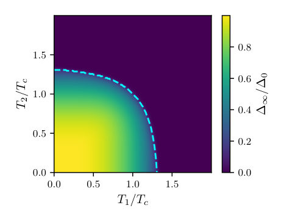 
FIG. 2. Steady-state gap as a function of temperatures of the first bath T1 and second bath T2 for an s-wave supercon- ductor with strong inherent scattering γ1 ≈γ0, leading to a steady state well described by a temperature determined by the stationarity of energy, Eq. (12).

📷 Fig 3

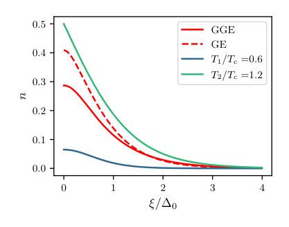 
FIG. 3. Different steady state distribution of quasiparticles at the bath temperatures T1/Tc = 0.6 and T2/Tc = 1.2. Red curve (GGE) corresponds to the non-equilibrium steady state, stabilized by the interplay of the two baths, Eq (9). Dashed line (GE) represents the thermal occupation obtained from the energy rate equation (12) in case of strong inherent scat- tering γ1 ∼γ0. The blue and green curves correspond to thermal distributions at the temperatures of the two baths, reached if system would be coupled to only one of them.

📷 Fig 4

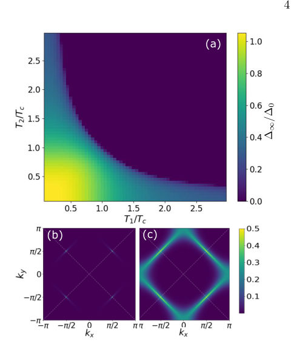 
FIG. 4. (a) Steady-state gap ∆∞/∆0 as a function two tem- perature baths T1 and T2 for d-wave superconductor. Dis- tribution of quasiparticles in the equilibrium at T1/Tc = T2/Tc = 0.1 (b), and in the steady state with T1/Tc = 1.7 and T2/Tc = 0.3 (c).

📷 Fig 5

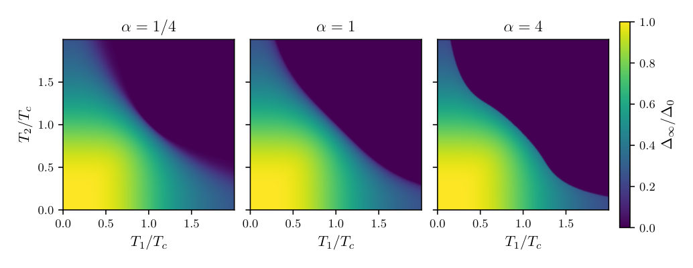 
FIG. 5. Dependence of the steady state gap on the relative strength α = α+−/(α++ + α−−) of scattering and two-particle creation/annihilation term for the s-wave pairing case. Results for α = 1/4, 4 are comparable to the α = 1 considered in the main text, emphasising that our results are not fine tuned to a specific choice of α.

**Summary.** This theoretical study explores stabilizing superconductivity in non-equilibrium steady states by coupling a BCS superconductor to two baths at different temperatures. Using a generalized Gibbs ensemble approach, the authors demonstrate that non-thermal dissipation can sustain a superconducting order parameter even when equilibrium theory predicts its absence. This mechanism is robust for both s-wave and d-wave symmetries.

**Why it may be interesting.** This work directly addresses non-equilibrium quantum dynamics, which is highly relevant to AMO physics and quantum optics, particularly in engineered superconducting circuits or superconducting qubits where external driving and dissipation are used to control quantum states.

Detailed structure

**Main problem.** The paper investigates how to stabilize superconducting order parameters (s-wave and d-wave) in non-equilibrium steady states by coupling the system to multiple thermal baths at different temperatures.

**Main result.** Non-equilibrium dissipation can induce a finite superconducting gap ($\Delta_\infty$) even when the system is in a regime where equilibrium theory predicts superconductivity is suppressed, demonstrating a 'greenhouse effect'.

**Method.** The study employs an open-system approach using a time-dependent generalized Gibbs ensemble (tGGE) formalism to solve the steady-state self-consistency equations.

**Model / system.** The system is a BCS superconductor (s-wave and d-wave) coupled to two thermal baths at temperatures $T_1$ and $T_2$. The dynamics are governed by a Lindblad master equation, leading to self-consistent equations for the gap and quasiparticle occupation numbers.

**Key observables.** Non-thermal pairing gap ($\Delta_\infty$), quasiparticle occupation numbers ($n_{p,\sigma}$), and the steady-state chemical potentials ($\mu_{p,\sigma}$).

**Important parameters / regimes.** The relative strength parameter $\alpha$, the coupling rates ($\gamma_0$), and the ratio of intrinsic to dissipative scattering rates ($\gamma_1/\gamma_0$).

**Assumptions / limitations.** The use of the Generalized Gibbs Ensemble (GGE) ansatz, which assumes quasiparticles are well-defined on intermediate timescales, and the Markovian description of the thermal baths.

**Figures summary.** Figures illustrate the finite steady-state gap ($\Delta_\infty$) existing when bath temperatures are mismatched, showing dependence on $T_1/T_c$ and $T_2/T_c$ for both s-wave and d-wave symmetries. Other figures compare GGE vs. GE distributions and show gap dependence on the parameter $\alpha$.

**Paper structure.** The paper develops the open-system formalism, derives the steady-state self-consistency equations using the tGGE, analyzes the dependence on the dissipation parameter $\alpha$, and finally presents results for s-wave and d-wave symmetries, contrasting the non-equilibrium stabilization mechanism with equilibrium predictions.

Abstract

Stabilizing superconductivity beyond its equilibrium regime has been one of the quests of nonequilibrium state engineering. We report the presence of nonthermal pairing gap in BCS superconductors coupled to two thermal baths, where one of the baths can be at a temperature well above the equilibrium $T_c$. Superconducting state is enabled by a highly non-equilibrium steady state stabilized by weak coupling to baths that break detailed balance condition. The steady-state is well described by a generalized Gibbs ensemble parametrized with chemical potentials for associated Bogoliubov quasiparticle. A strong, non-perturbative effect is reported for both $s$-wave and $d$-wave superconductors, and its possible realization in cavity-based experiments is discussed.

[↑ back to top](#top)

### ⭐ [Phase transitions in first-detection statistics of monitored long-range quantum walks](http://arxiv.org/abs/2609.10510v1)

**Highlighted author(s):** Giovanna Morigi  
**Authors:** Sayan Roy, Shamik Gupta, Giovanna Morigi, Gabriele Perfetto  
**Type:** theory · **Category:** statistical mechanics · **PDF:** <https://arxiv.org/pdf/2609.10510v1>  
**Analysis basis:** full PDF text, analyzed in chunks
**Topic relevance:** 🔥 `quantum measurements` **4/5** · `Full counting statistics` **1/5** · `analog quantum simulation` **1/5** · `correlated / nonlocal dissipation` **1/5** · `driven-dissipative phase transition` **1/5** · `interference shaping light` **1/5** · `non-equilibrium universality` **1/5**

📷 Fig 1

 
FIG. 1. (a) A walker coherently hops along a ring with hopping amplitude decaying as d−α with the distance d. (b) A detector monitors stroboscopically the initial site |0⟩, a positive detection event terminates the dynamics. We show that the first-detection probability decays algebraically as Fn ∼n−β, where β depends critically on α, as visible in (c), identifying different regimes of the transient quantum walk. The nonanalytic points at α = 1, 2, 3 reflect a phase transition in the spectrum of the long-range model. Instead, the nonanalytic point at α = 5/3 is due to the projective effect of measurements.

📷 Fig 2

 
FIG. 2. Recurrent to transient transition. (a) Density plot of the total detection probability P∞= P

📷 Fig 3

 
FIG. 3. Long-time algebraic decay in the transient phase. Log-log plot of the first-detection probability Fn as a function of number of measurement n. The panels correspond to different regimes of hopping exponent (a) 2 &lt; α &lt; 3 with α = 2.4, (b) 5/3 ≤α &lt; 2 with α = 1.8 and (c) 1 &lt; α ≤5/3 with α = 1.5. Blue triangles represent the result from exact numerical evaluations based on the quantum renewal equation with N = 106, γ = 1, τ = 1. Orange circles represent the corresponding theoretical predictions for the long-time asymptotics. Black dashed lines are obtained from numerical fitting according to the power-law model indicated in the corresponding panel.

**Summary.** This work analyzes the first-detection statistics of quantum walks with long-range hopping, showing that the hopping exponent $\alpha$ dictates the walk's fundamental nature. A continuous phase transition occurs at $\alpha=1$, separating localized (recurrent) from diffusive (transient) behavior. The decay rates are determined by complex interference effects between different energy modes, providing a tunable mechanism for controlling quantum transport.

**Why it may be interesting.** The study provides a concrete example of how measurement back-action fundamentally alters quantum transport properties, leading to critical behavior governed by spectral properties, which is highly relevant for understanding open quantum systems.

Detailed structure

**Main problem.** The paper investigates how the first-detection return probability (FDRP) of quantum walks changes and exhibits continuous phase transitions based on the long-range hopping exponent $\alpha$. It analyzes the interplay between measurement back-action and coherent quantum dynamics.

**Main result.** The exponent $\alpha=1$ marks a continuous phase transition separating recurrent ($\alpha<1$) from transient ($\alpha>1$) quantum walks. The decay exponent $\beta(\alpha)$ is non-monotonic, and the dynamics are governed by interference between infrared and ultraviolet energy modes.

**Method.** The analysis uses generating functions and asymptotic analysis of polylogarithms derived from the quantum renewal equation to determine the long-time decay laws for the FDRP.

**Model / system.** The model is a quantum walker on a chain undergoing unitary evolution interrupted by projective measurements at stroboscopic times. The hopping strength decays as $d^{-\alpha}$, controlled by the exponent $\alpha$.

**Key observables.** First-Detection Return Probability ($F_n$), Total detection probability ($P_\infty$), Decay exponent ($\beta(\alpha)$), Spectral dimension ($d_s$).

**Important parameters / regimes.** Hopping exponent $\alpha$, Stroboscopic time $\tau$, Critical values $\alpha=1, 2, 3$.

**Assumptions / limitations.** The analysis relies on asymptotic approximations for large $n$ and the use of keyhole-contour representations for polylogarithms.

**Figures summary.** Figures illustrate the dependence of FDRP on $\alpha$, highlighting phase transitions at $\alpha=1, 2, 3$, and show the comparison of theoretical decay laws with numerical data for different $\alpha$ regimes.

**Paper structure.** The paper builds the analysis by defining the quantum renewal equation, deriving the generating function for the FDRP, and then performing detailed asymptotic analysis across different regimes of $\alpha$ to map out the functional dependence of the decay exponent $\beta$.

Abstract

In a quantum walk, the first-detection return probability (FDRP) characterizes salient features, determining whether the quantum walk is transient or recurrent. We study the FDRP of quantum walks on a chain where the initial site is stroboscopically monitored by a detector and the walker performs long-range hopping between sites. We assume that the hopping strength decays with the distance $d$ as $d^{-α}$ and $α\geq 0$ and show that the power-law exponent $α$ critically determines the behavior of the FDRP. The value $α=1$ separates recurrent ($α<1$) from transient ($α>1$) quantum walks through a continuous phase transition in the total detection probability. For $α<1$, strong long-range hopping induces localization, resulting in unit total detection probability. Instead, for $α>1$ the long-range walk is transient and the return probability decays algebraically as a function of time as $t^{-β}$. The associated decay exponent $β$ features nonanalytic points as a function of $α$. Such singularities are not exclusively determined by the low-energy spectrum, but are caused by the interference between infrared and ultraviolet energy modes induced by projective measurements, signalling the emergence of critical behavior intrinsic to the non-unitary dynamics. These dynamics are solely controlled by tuning the long-range exponent $α$ and can thus be experimentally probed in atomic and molecular systems.

[↑ back to top](#top)

### ⭐ [Faster Quantum Monte Carlo Simulation by Random Compilation](http://arxiv.org/abs/2609.10486v1)

**Highlighted author(s):** Andrew J. Daley  
**Authors:** John M. Martyn, Joshua Lin, Neill C. Warrington, Isaac L. Chuang, Andrew J. Daley  
**Type:** theory · **Category:** numerical methods · **PDF:** <https://arxiv.org/pdf/2609.10486v1>  
**Analysis basis:** full PDF text, analyzed in chunks
**Topic relevance:** `methods for driven-dissipative` **3/5** · `Keldysh / 2PI / non-Gaussian methods` **1/5** · `analog quantum simulation` **1/5** · `driven-dissipative phase transition` **1/5** · `quantum measurements` **1/5**

📷 Fig 1

 
FIG. 1. Overview of the randomly compiled QMC (RC-QMC) framework. Standard QMC algorithms estimate an observable ⟨ˆO⟩by averaging an estimator function F( ˆO, X) over a random variable X sampled from a fixed approximate distribution eP (see Eq. (4)), incurring systematic error O(ϵ). RC-QMC instead averages over a collection of approximate distributions { ePj} weighted by probabilities pj (see Eq. (17)), which suppresses the systematic error to O(ϵ2) at essentially the same computational cost. This improvement is demonstrated in two settings: Randomly Compiled Path Integral Monte Carlo for thermal state estimation, where QDrift replaces the standard Trotter decomposition and eliminates the...

📷 Fig 2

 
FIG. 2. (Left) Standard path integral Monte Carlo on 3 sites: Trotterization is used to decompose e−βH into a product of evolution under the potential (V ) and kinetic (T) energies, and particle positions take values ±1 in the σz basis at each time step k. The particle paths are then aggregated into an array X, indexed by site i and time step k. The dashed orange line depicts the mapping of a single time step to a particle configuration in X. (Right) Randomly compiled path integral Monte Carlo on 3 sites: individual potential (V) and kinetic (T ) energy terms are sampled according to QDrift, and a particle’s position can change only when its corresponding kinetic term is sampled. The paths...

📷 Fig 3

 
FIG. 3. Comparison of error in the observable ⟨ˆV ⟩between standard path integral Monte Carlo (using 2nd-order Trotterization) and randomly compiled path integral Monte Carlo (using symmetric and asymmetric approaches), where the error has been defined relative to the continuum limit of the standard algorithm (denoted ⟨ˆV ⟩cont). Inner error bars for the randomly compiled methods denote the MCMC sampling errors within QDrift sequences, and outer error bars are the total error estimate including the variance due to averaging over different QDrift sequences (as described in Appendix I). Continuum limit extrapolated values are shown at slightly negative offset values for clarity. a): Here the...

📷 Fig 4

 
FIG. 4. An illustration of the quantum trajectories method (left), and the randomly compiled quantum trajectories method (right). Here, pure state trajectories are simulated by time-evolving an initial state |ψ⟩using Trotterization (denoted by blue rectangles), with intermediate quantum jumps applied randomly (denoted by red crosses). In the standard algorithm, each Trotter step is taken to be the same approximation. In the randomly compiled algorithm, each Trotter step is randomly sampled from a set of approximations. At the end of evolution, the trajectories are aggregated together to estimate an observable ⟨ˆO⟩(t) according to Eqs. (13) and (38).

📷 Fig 5

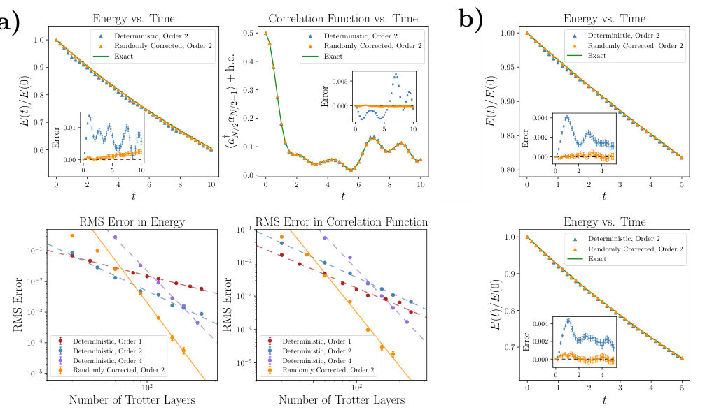 
FIG. 5. Comparison between the standard (deterministic) and randomly compiled quantum trajectories methods applied to the dissipative Bose-Hubbard model. a): Simulations conducted on N = 10 spins with dissipation rate γ = 0.05, using Trotterization of various orders. We illustrate the time series for energy and the correlation function ⟨a† N/2aN/2+1⟩+ h.c. at a fixed number of Trotter steps (r = 40) (top), and the corresponding RMS error as a function of computational cost (bottom). b): Simulations conducted on N = 30 spins with dissipation rates γ = 0.04 (top) and γ = 0.08 (bottom), using 2nd-order Trotterization. Here we illustrate the time series for energy at a fixed number of Trotter...

**Summary.** This paper introduces Randomly Compiled Quantum Monte Carlo (RC-QMC), a novel framework designed to suppress systematic errors in QMC simulations by averaging over multiple approximations. By borrowing concepts from randomized compiling, it achieves a significant reduction in systematic error scaling for simulating thermal states and open quantum dynamics with minimal computational overhead.

**Why it may be interesting.** This work provides a powerful, generalizable numerical technique for improving the accuracy of simulating complex quantum dynamics, which is crucial for modeling open quantum systems and strongly correlated materials.

Detailed structure

**Main problem.** The primary goal is to improve the accuracy and efficiency of Quantum Monte Carlo (QMC) simulations by mitigating systematic errors inherent in fixed approximations.

**Main result.** The proposed Randomly Compiled QMC (RC-QMC) framework achieves a superior systematic error scaling ($O(\epsilon^2)$ vs $O(\epsilon)$) compared to standard QMC methods, with comparable computational cost.

**Method.** RC-QMC utilizes the concept of randomized compiling, averaging over a family of approximations to suppress systematic errors, which is demonstrated via specialized techniques like randomly corrected Trotterization.

**Model / system.** The methods are applied to general quantum systems, specifically simulating thermal states (using Path Integral QMC) and open system dynamics (using the Quantum Trajectories Method).

**Key observables.** Target expectation values $\langle\hat{O}
angle = 	ext{tr}(\hat{O}
ho)$, and the systematic error scaling of the approximation.

**Important parameters / regimes.** Systematic error $\epsilon$, inverse temperature $eta$, time step $\Delta t$, and the number of Trotter steps $r$.

**Assumptions / limitations.** The error reduction applies only to systematic errors, not statistical sampling errors or the sign problem. The framework relies on constructing interpolating sequences for error bounding.

**Figures summary.** Figures illustrate the comparison between standard QMC (fixed approximation, $O(\epsilon)$ error) and RC-QMC (average over approximations, $O(\epsilon^2)$ error) at similar computational costs. Other figures detail the structure of the error bounds using interpolating sequences.

**Paper structure.** The paper establishes the general QMC framework, identifies systematic error sources (e.g., Trotterization), introduces RC-QMC via randomized compiling, and then applies this framework to derive specific error bounds for Path Integral QMC and the Quantum Trajectories Method.

Abstract

Quantum Monte Carlo (QMC) algorithms are among the most powerful classical methods for simulating quantum systems, yet their accuracy is often limited by the systematic errors in the approximations used, such as Trotterization. Here we introduce randomly compiled quantum Monte Carlo (RC-QMC) as a general framework that suppresses these systematic errors by averaging over a family of approximations rather than relying on a single fixed one. This strategy is grounded in the concept of randomized compiling from quantum computing, which suppresses errors by sampling over quantum gates, at essentially no additional computational cost. Consequently, our framework achieves a computational advantage over standard QMC methods when estimating a target state to a desired level of accuracy. We illustrate this advantage on two key Monte Carlo algorithms: (1) path integral quantum Monte Carlo for estimating thermal states, and (2) the quantum trajectories method for simulating open system dynamics. In aggregate, these results represent a cross-fertilization of quantum and classical algorithms, are readily generalizable to other QMC methods, and suggest wider applications in classical simulation.

[↑ back to top](#top)

### ⭐ [Distinguishability Transitions from Global Quantum Snapshots](http://arxiv.org/abs/2609.09296v1)

**Highlighted author(s):** Sarang Gopalakrishnan  
**Authors:** Catherine McCarthy, Sarang Gopalakrishnan, Romain Vasseur  
**Type:** theory · **Category:** statistical mechanics · **PDF:** <https://arxiv.org/pdf/2609.09296v1>  
**Analysis basis:** full PDF text, analyzed in chunks
**Topic relevance:** `quantum measurements` **3/5**

📷 Fig 1

 
FIG. 1. Left: Protocol for distinguishing k random states with m global snapshots. In this setup, an observer is presented with m copies of a random state |ψα⟩with α ∈{0, . . . , k −1} and provided with exact knowledge of all k states. After measuring each site of each of the m copies in the computational basis to obtain a set of bitstrings {⃗mi}, the observer queries a decoder in order to guess the label α. Here we take the decoder to be an optimal Bayesian classifier that outputs the label α associated with the largest probability p({⃗mi}|ψα), where p({⃗mi}|ψj) is computed for all j ∈{0, . . . , k −1} from the Born probabilities associated with the bitstrings {⃗mi}. Right: Decoder success...

📷 Fig 2

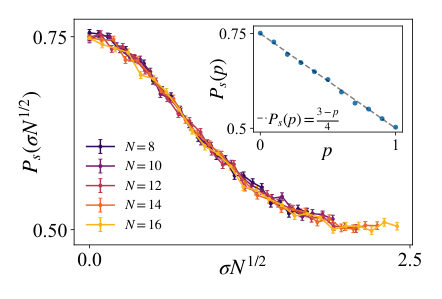 
FIG. 2. Success probability Ps(σ, N) of decoding an N- qubit random state subject to random coherent errors act- ing on each site j as Uj = e−iϵjXj, where ϵj are indepen- dently drawn from a Gaussian distribution of variance σ2. The success probability decays towards 1/2 for large values of σN 1/2. Inset: for a state under a global depolarizing channel of strength p, the decoder success probability takes the form Ps(p) = (3 −p)/4.

📷 Fig 3

 
FIG. 3. Top: onset of anti-concentration in finite-depth Clifford circuits. The decoder success probability Ps(t, N) decays from one to the expected value for random Clifford circuits Ps(t →∞, N) = 2/3 as the depth t of the circuit is increased. The curves for different system sizes collapse neatly when rescaling by t/ ln(N), indicating that anti-concentration sets in on logarithmic timescales. Bottom: The success prob- ability of an RMPO displays z/η scaling with η the rescaled noise strength in the small-z (deep) limit, and is indepen- dent of η in the large-z (shallow) limit (inset). The scaling in these two regimes is consistent with behavior seen in the linear XEB.

📷 Fig 4

 
FIG. 4. Success probability of phase-random states measured in a basis defined by the rotation U = N

**Summary.** This work analyzes the limits of distinguishing between many random quantum states using only measurements in the computational basis. It finds a sharp phase transition in the success probability of a Bayesian classifier, characterized by a critical scaling variable $x = m / \ln k$. The results provide theoretical benchmarks for quantum state tomography and characterization protocols.

**Why it may be interesting.** The study connects fundamental concepts of quantum state distinguishability, which is crucial for quantum characterization, to statistical physics concepts like phase transitions, providing a quantitative measure of how much information is encoded in global measurements.

Detailed structure

**Main problem.** The paper investigates the ability of Bayesian classifiers to distinguish between multiple random quantum states using only measurements in the computational basis.

**Main result.** A phase transition is identified in the distinguishability game, occurring when the ratio of shots to the logarithm of the number of states, $x = m / \ln k$, crosses a critical threshold $x_c$.

**Method.** The analysis uses Bayesian classification theory applied to measurement outcomes (bitstrings) from quantum states, deriving scaling laws and threshold values via saddle-point approximations.

**Model / system.** The system involves $k$ candidate quantum states $|\psi_\alpha
angle$ generated by generic time evolution (e.g., random circuits) on $N$ qubits. Measurements are restricted to the computational basis, yielding bitstrings $\vec{m}$.

**Key observables.** Success probability ($P_s$) of the Bayesian classifier, and the critical ratio $x = m / \ln k$.

**Important parameters / regimes.** Number of states ($k$), number of shots ($m$), number of qubits ($N$), and the effective variable $x_{	ext{eff}}$.

**Assumptions / limitations.** The analysis initially assumes Haar-random states, but extends to noisy and low-depth circuits. The threshold derivation relies on specific asymptotic approximations.

**Figures summary.** Figures illustrate the protocol for state discrimination, showing the success probability $P_s$ transitioning sharply at the critical value $x_c$ when plotted against the effective scaling variable $x_{	ext{eff}}$.

**Paper structure.** The paper first establishes the problem of distinguishing states via global snapshots, derives the phase transition scaling $m \sim \ln k$, and then extends this analysis to incorporate noise, low-depth circuits, and specific circuit models (like Clifford circuits) to test the robustness of the transition.

Abstract

Quantum states generated by generic time evolution are locally featureless: local measurements return random outcomes that are identical for all states. However, global snapshots in the computational basis are surprisingly effective at distinguishing between quantum states. We explore the ability of Bayesian classifiers to discriminate between many random quantum states using a small number of measurement outcomes. We identify a phase transition in the ability of the classifier to distinguish between $k$ candidate states with $m$ shots controlled by the variable $x = m / \ln k$, and derive the threshold value $x_c$. We extend our results to low-depth circuits near the onset of anti-concentration, as well as to noisy circuits and phase-random states.

[↑ back to top](#top)

### [Prethermal ripplons in quenched binary Bose-Einstein condensates](http://arxiv.org/abs/2609.09464v1)

**Authors:** Yanda Geng, Stephen Eckel, Gretchen K. Campbell, Ian B. Spielman  
**Type:** both · **Category:** statistical mechanics · **PDF:** <https://arxiv.org/pdf/2609.09464v1>  
**Analysis basis:** full PDF text, analyzed in chunks
**Topic relevance:** 🔥 `scars & prethermalization` **5/5** · `analog quantum simulation` **3/5** · `driven-dissipative phase transition` **3/5** · `non-equilibrium universality` **3/5** · `Keldysh / 2PI / non-Gaussian methods` **2/5** · `methods for driven-dissipative` **2/5** · `Frenkel-Kontorova` **1/5**

📷 Fig 1

 
FIG. 1. The long road to equilibrium. A schematic illustration of the relaxation process (top) is shown along with representative spin-selective images of the |↑⟩density (bottom). (i) A microwave pulse at t = 0 transfers an initially spin-polarized BEC into an equal superposition of |↑⟩(dark blue) and |↓⟩. The orientation of a magnetic field gradient is indicated. (ii) Initial spin structure forms nearly deterministically; (iii) small initial fluctuations then seed random droplet patterns that coalesce and coarsen. (iv) After about 500 ms an interface forms and (v) becomes single-valued by 2000 ms (red curves). Ripplons with different wavenumber k combine to give the observed interface...

📷 Fig 2

 
FIG. 2. Fluctuations of a prethermal interface, with thold = 2.0 s. (a) PCA components of h(x) for n = 5, 9, 13, and 17. (b) Normalized PCA weights. (c) DCT amplitudes of each PCA component. (d) Power spectrum ⟨|hk|2⟩, measured at four bulk temperatures (vertically offset for clarity) using ≈70 experimental realizations per temperature, plotted along with the corresponding equilibrium prediction (no free parameters).

📷 Fig 3

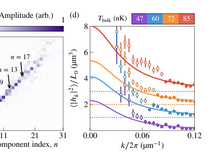 
Figure 3(b) extends this analysis over the full range of k and for hold times 1 s to 4 s. The resulting Tk val- ues show that only high-k ripplon modes equilibrate with the bulk; at low-k, the mode temperatures exceed Tbulk and we empirically find that excessive temperature is well described by a power-law (Tk−Tbulk)/T0 = k−α, with ex- ponent α = 1.42(5) and prethermal temperature scale T0; the resulting data-collapse is shown in Fig. 3(b). These low-k modes decay extremely slowly, with a 5(1) s mea- sured decay time—much slower than the ∼10−1 s equi- libration timescale of the phonon bath, highlighting the prethermal nature of the interface system. The excess low-k occupation and slow...

📷 Fig 4

 
FIG. 3. Distribution functions and equilibration at Tbulk = 56 nK. (a) PDFs Pk for k1/(2π) = 0.026 µm−1 and k2/(2π) = 0.073 µm−1 at thold = 4 s. The histograms plot experi- mental data with corresponding normal distributions (solid curves). Dashed curves show the PDF corresponding to a phase-averaged ripplon coherent state with the same ripplon occupation. (b) Mode temperature as a function of k for three hold times. Solid curves show power-law fits with a common exponent and offset. Inset: log-log plot in terms of dimension- less quantities ¯Tk and ¯k showing data collapse. (c) Scattering processes in our L0 × L0 box. Circles connected by curves plot the energy of ripplons (red) and...

📷 Fig 5

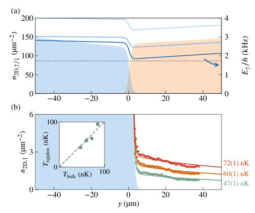 
FIG. 4. Minority thermal atom thermometry. (a) Effective potentials for thermal spin-↑atoms in the lowest three local transverse modes (solid curves), compared with the chemi- cal potential µ↑(dotted line). The shaded curves plot the condensate densities n↑/↓in blue/yellow respectively. (b) Spin-↑density profiles. Markers plot the measured total den- sity (thermal plus condensed) along with fits (solid curve) to our theoretical model, yielding the annotated temperatures. The shaded region shows the computed condensate density and highlights its vast difference in scale. Inset: Tbulk versus Tripplon obtained by fitting the high-k ripplon tail in Fig. 2(d) using Eq. (2) with Tripplon as the...

**Summary.** This work experimentally demonstrates prethermalization in the ripplons at the interface of two immiscible Bose-Einstein condensates. The authors show that while high-momentum modes rapidly thermalize with the bulk, low-momentum modes remain trapped at elevated temperatures. This slow relaxation is attributed to kinematic isolation, providing a clear realization of non-equilibrium dynamics in quantum gases.

**Why it may be interesting.** It provides a clean, experimentally accessible platform (BEC interfaces) to study fundamental non-equilibrium statistical mechanics concepts like prethermalization and energy partitioning in quantum many-body systems.

Detailed structure

**Main problem.** The paper investigates how far-from-equilibrium quantum systems, specifically interfacial waves in BECs, approach thermal equilibrium, focusing on the phenomenon of prethermalization.

**Main result.** Low-momentum ripplon modes exhibit persistent, elevated temperatures relative to the bulk phonon bath, forming a long-lived prethermal state due to kinematic isolation.

**Method.** The study combines theoretical modeling (Bogoliubov-de Gennes formalism, Hamiltonian derivation) with experimental measurements of time-evolving interface height profiles and mode temperatures.

**Model / system.** The system is a 1D interface between immiscible 2D Bose-Einstein condensates (BECs). The dynamics are modeled by interfacial capillary waves (ripplons) coupled to the bulk phonon modes.

**Key observables.** Interface height profile $h(x)$, Power Spectral Density $\langle|h_k|^2
angle$, and the effective temperature $T_k$ of individual ripplon modes.

**Important parameters / regimes.** Interfacial tension ($\sigma$), bulk temperature ($T_{	ext{bulk}}$), and the wave number $k$.

**Assumptions / limitations.** The slow relaxation of low-momentum modes is attributed to kinematic isolation, meaning the absence of energy- and momentum-conserving relaxation processes coupling them to the bulk bath.

**Figures summary.** Figures illustrate the relaxation process from initial quench to prethermal state, comparing measured power spectra to equilibrium predictions, and showing mode temperatures decaying with wave number and time.

**Paper structure.** The paper develops the Hamiltonian for the ripplon field, analyzes the dispersion relation, and then presents experimental evidence showing that high-$k$ modes thermalize quickly while low-$k$ modes remain trapped in a non-equilibrium, prethermal state.

Abstract

Prethermal states--long-lived quasi-equilibrium configurations--occur in a wide range of physical systems that exhibit fast dephasing or reconfiguration followed by slow relaxation towards thermal equilibrium. We experimentally studied the 1D interface between immiscible 2D Bose-Einstein condensates (BECs); following a quench, the interfacial capillary waves (ripplons) quickly relaxed into a long-lived prethermal state characterized by a persistent non-equipartition of energy, evoking the classic Fermi-Pasta-Ulam-Tsingou problem. We directly measured the interface's height profile as it evolved in time, identified the contribution of individual ripplon modes, and find that, though their individual amplitudes are thermally distributed, they are not in thermal equilibrium--high-momentum modes rapidly equilibrated with the bulk phonon modes of the 2D BEC, while lower momentum modes remained at elevated temperatures, forming a long-lived prethermal configuration for the whole system. We attribute this to kinematic isolation: the absence of energy- and momentum-conserving relaxation processes in our system at ultracold temperature.

[↑ back to top](#top)

### [Information capacity of quantum statistics: Fock-state tests of a discrete binary-sequence model on cloud photonic quantum processors](http://arxiv.org/abs/2609.10216v1)

**Authors:** Chiran Wijesundara, Octavia T. Volpe, Dejan Stojkovic, Herbert Fotso, Tim Thomay  
**Type:** experiment · **Category:** quantum information and computing · **PDF:** <https://arxiv.org/pdf/2609.10216v1>  
**Analysis basis:** full PDF text, analyzed in chunks
**Topic relevance:** 🔥 `QC/QI experiment` **4/5** · `Full counting statistics` **3/5** · `quantum optics experiment` **3/5** · `interference shaping light` **2/5** · `quantum measurements` **2/5** · `analog quantum simulation` **1/5**

📷 Fig 1

 
FIG. 2. Maximum partition-probability deviation from QM against sequence length n. Published parametrization (|2, 0⟩ input, mid-τ sweep): ℓa1 summed (plateau), one ℓa1 per sweep (1/n to a ∼1% floor), and ℓa1 tuned per setting (clean 1/n). The composition-consistent parametrization (black dashed) makes a single prediction, 1.02/n for |2, 0⟩over the full grid.

📷 Fig 2

 
FIG. 1. Sequence-model (solid) and QM (dotted) partition probabilities for a |2, 0⟩input at n = 100, with their differ- ence below. The green line marks the null-differential working point τ ∗= 0.414 where the model and QM agree for the (1, 1) outcome while disagreeing for (2, 0) and (0, 2).

📷 Fig 3

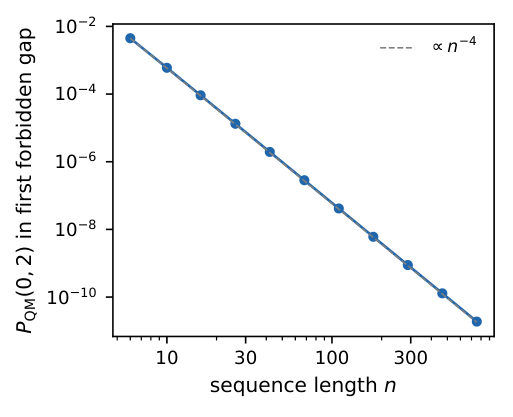 
FIG. 3. Granularity signature: the QM probability of the outcome that the finite-n model forbids in the last rational grid gap τ ∈(cos2(π/2n), 1) falls as n−4.

📷 Fig 4

 
FIG. 4. Experiment-design optimization. (a) Discrimination landscape: per-event KL divergence between QM and the un- conditioned model (n = 100) for candidate input states. (b) For |1, 1⟩, the conditioned model evades any single-τ test by tuning ℓa1 (dots), but no single ℓa1 fits a set of transmittances jointly: the optimal 3-point set (triangles, dashed level) re- stores percent-scale discriminability.

📷 Fig 5

 
FIG. 5. Belenos full-curve campaign: P(1, 1) for the native |1, 1⟩input across 25 transmittances (20 000 samples each; statistical error bars are smaller than the symbols), against QM with jointly fitted in-situ nuisances (blue) and the uncon- ditioned sequence model at n = 100 under the same nuisances, in the published linear parametrization, evaluated on its na- tive rational transmittance grid (green). Shaded bands show the per-job compilation reproducibility (στ = 0.026, mea- sured from the scatter of the run itself) around each hypothe- sis; the lower panel shows the magnitude of the residuals with the same band around QM. The model requires a coherent +0.10–0.12 excess at both flanks;...

**Summary.** This work tests the hypothesis that quantum mechanics emerges as the statistical limit of a discrete underlying theory by measuring the information capacity of photonic quantum processors. Using the binary-sequence model, the authors set stringent bounds on this capacity, demonstrating that current hardware can experimentally constrain fundamental quantum principles. The results establish photonic processors as quantitative tools for quantum foundations research.

**Why it may be interesting.** It provides a direct, quantitative experimental test of the foundations of quantum mechanics by bounding a fundamental resource—information capacity—using state-of-the-art photonic quantum hardware.

Detailed structure

**Main problem.** The paper investigates whether quantum mechanics is the statistical limit of a more fundamental discrete theory, which implies a finite information capacity for any physical system.

**Main result.** The experimental results bound the information capacity of the quantum register from below, showing it exceeds $10^2$, and confirming that the composition-consistent model is required to recover quantum mechanics.

**Method.** The authors used random-effects likelihood analysis and differential tests on cloud photonic quantum processors to compare measured photon statistics against predictions from various discrete sequence models.

**Model / system.** The physical system is a cloud photonic quantum processor using programmable interferometers to measure photon Fock states. The theoretical framework is the binary-sequence model of Powers et al., which relates outcome probabilities to counting discrete sequences of length $n$.

**Key observables.** Outcome probabilities, partition probabilities (e.g., $P(1, 1)$), and the deviation of measured statistics from the quantum partition law.

**Important parameters / regimes.** The information capacity $n$ (bounded below by $>100$), the deviation scaling factor ($1.24/n$), and the statistical floor ($1.1 	imes 10^{-3}$).

**Assumptions / limitations.** Dominant systematics (like calibration offsets) are treated as nuisance parameters, and the analysis relies on the composition-consistent parametrization being the correct physical model.

**Figures summary.** Figures compare sequence-model vs. QM partition probabilities for $|2, 0
angle$ input at $n=100$, show maximum deviation vs. $n$ for different model treatments, and illustrate the QM probability of forbidden outcomes falling as $n^{-4}$.

**Paper structure.** The paper progresses by establishing the theoretical premise (QM as a statistical limit), detailing the experimental setup on photonic processors, testing various discrete models (linear vs. composition-consistent), and finally deriving quantitative bounds on the information capacity.

Abstract

Our central premise is that quantum mechanics may be the statistical limit of a more fundamental discrete theory: any such theory equips a physical system with a finite information capacity, and its departure from quantum statistics is controlled by how much of that capacity the system uses. We show that commercial cloud photonic quantum processors have reached the precision required to bound this capacity from below, using the binary-sequence model of Powers et al. as the concrete test theory: outcome probabilities arise from counting discrete sequences of length $n$, quantum mechanics is recovered as $n \to \infty$, and $n$ measures the information capacity of the register behind a prepared state. Photon Fock states $|1\rangle$, $|1,1\rangle$, heralded $|2\rangle$, and cascaded beam-splitter pairs are measured on programmable interferometers with dominant systematics determined in situ. The model's composition-consistent parametrization, singled out by requiring that rotations compose, recovers quantum mechanics with deviations $1.24/n$; a random-effects likelihood analysis calibrated by parametric bootstrap excludes all $n \le 100$: the information capacity of the register carrying the two-photon state, if finite, exceeds $10^2$. Cascaded beam splitters test the composition law directly: the data are split-invariant, excluding naive count composition at $8σ$ and confirming the interference-sign rule. Model-independently, curve-averaged deviations from the quantum partition law larger than $2.3\times10^{-2}$ are excluded at 95% CL, and the originally published linear parametrization is excluded outright. Because the compilation offset is frozen per circuit it is calibratable, opening the $10^{-3}$ floor ($n \sim 10^3$) to current hardware: cloud photonic processors are quantitative instruments for quantum foundations, and information capacity an experimentally boundable quantity.

[↑ back to top](#top)

### [Quench dynamics in nonreciprocal Aubry-André-Harper model](http://arxiv.org/abs/2609.10342v1)

**Authors:** Zhiyu Pei, Yongxu Fu, Gao Xianlong  
**Type:** theory · **Category:** disordered systems and neural networks · **PDF:** <https://arxiv.org/pdf/2609.10342v1>  
**Analysis basis:** full PDF text, analyzed in chunks
**Topic relevance:** 🔥 `non-equilibrium universality` **4/5** · `analog quantum simulation` **3/5** · `driven-dissipative phase transition` **3/5** · `Frenkel-Kontorova` **1/5** · `Keldysh / 2PI / non-Gaussian methods` **1/5** · `methods for driven-dissipative` **1/5** · `scars & prethermalization` **1/5**

📷 Fig 1

 
FIG. 1: 1D nonreciprocal AAH model. (a) Complex en- ergy spectrum as a function of λ at δ = 0.5 for N = 233. (b) Phase diagram of the mean inverse participation ra- tio (MIPR) in the λ–δ plane for N = 233, where the color encodes the localization strength. (c) Parity-sorting scheme: in the extended phase (λ &lt; 2 + 2δ), eigenstates are ordered by ReE in ascending order, then by ImE for degenerate real parts; even (odd) indices correspond to positive (negative) imaginary parts.

📷 Fig 2

 
FIG. 2: Time-resolved quench dynamics between the strongly localized and deeply extended limits. (a)-(c) Quenches from the deeply extended state (λ = 0) to the strongly localized one (λ →∞). (d)-(f) Quenches from the strongly localized to the deeply extended state. (a), (b) Analytical results for Loschmidt echo L(τ) and the corresponding rate function g(τ) at δ = 0.2. (d), (e) Analytical results for L(τ) and the rate function g(τ) for multiple values of δ. (c), (f) Numerical L(τ) from the full spectrum of the initial Hamiltonian, demonstrating the energy-independent behavior for N = 233.

📷 Fig 3

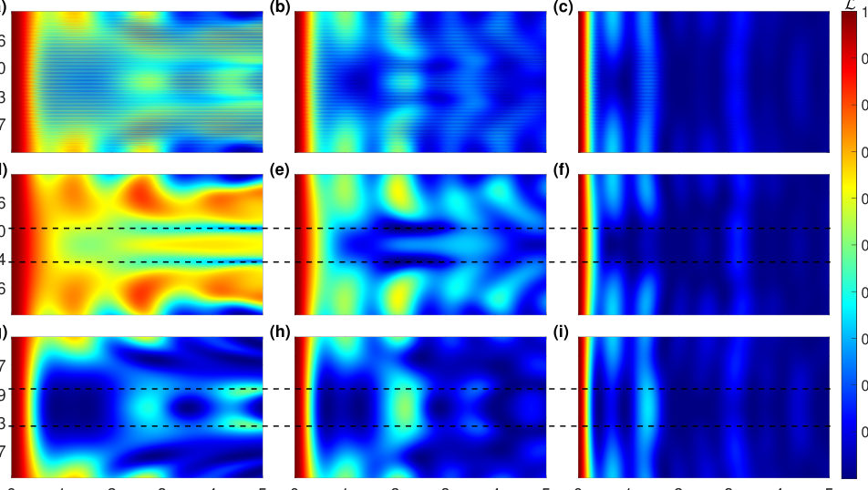 
FIG. 3: Time-resolved quench dynamics starting from a deeply extended initial state (λi = 0). The vertical axis denotes the eigenstate index sorted according to the scheme in Fig. 1(c), and the horizontal axis represents the evolution time τ. The system is quenched from λi = 0 to (a) λf = 2 (extended phase), (b) λf = 3 (critical regime), and (c) λf = 5 (localized phase). To emphasize the distinction between even- and odd-index eigenstates, the contributions in (a)-(c) are replotted separately in (d)-(f) and (g)-(i) for the even and odd sectors, respectively. The region near the dashed lines corresponds to the gap of the postquench Hamiltonian. The region near the dashed lines corresponds to...

📷 Fig 4

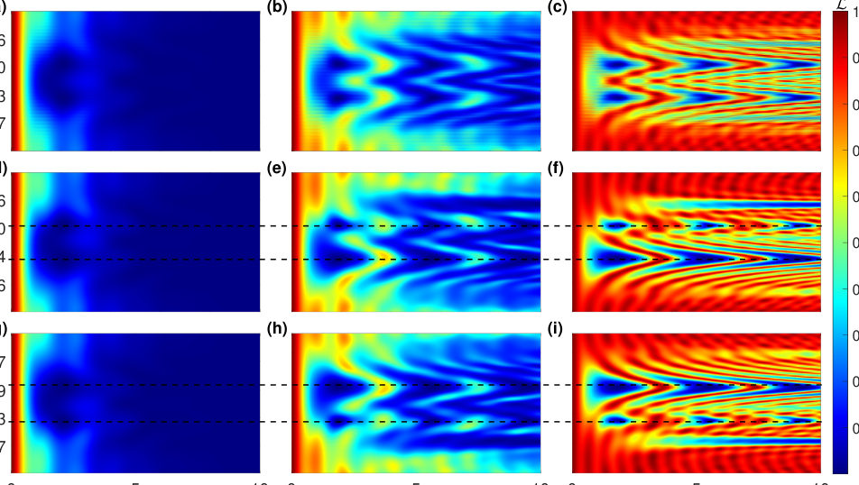 
FIG. 4: Time-resolved quench dynamics starting from a strongly localized initial state (λi = 10000). The system is quenched from λi = 10000 to (a) λf = 2 (extended phase), (b) λf = 3 (critical regime), and (c) λf = 5 (localized phase). Same notation and line styles as in Fig. 3, with δ = 0.5 and N = 233.

📷 Fig 5

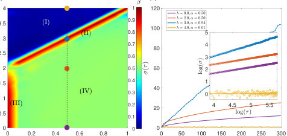 
FIG. 5: Diffusion dynamics in the nonreciprocal AAH model. (a) Phase diagram of the diffusion exponent β in the λ-δ plane, colored by β, which divides the phase di- agram into four distinct regions: (I) localized phase, (II) critical phase, (III) reciprocal diffusive phase, and (IV) nonreciprocal diffusive phase. (b) Wavepacket spreading σ(τ) at δ = 0.5, for representative λ values along the dashed line in (a): λ = 0 (deeply diffusive phase), λ = 2 (diffusive phase), λ = 3 (critical phase), and λ = 4 (lo- calized phase). Insets show the double-logarithmic fits of log σ(τ) versus log τ, where the slope gives the diffusion exponent β. The system size is N = 233.

**Summary.** This work analyzes quench dynamics in the nonreciprocal Aubry-André-Harper model, revealing that nonreciprocity dramatically alters transport behavior. By studying wavepacket diffusion and DQPTs, the authors show that the critical phase becomes ballistic, a reversal of the behavior seen in standard Hermitian systems. This establishes nonreciprocity as a key mechanism controlling quantum transport in quasiperiodic lattices.

**Why it may be interesting.** The findings provide a detailed, quantitative understanding of how breaking time-reversal symmetry (nonreciprocity) fundamentally alters transport properties at critical points in quasiperiodic systems, which is highly relevant for engineered quantum materials.

Detailed structure

**Main problem.** The study investigates how nonreciprocity affects quench dynamics and Dynamical Quantum Phase Transitions (DQPTs) in a quasiperiodic lattice.

**Main result.** Nonreciprocity reverses the transport hierarchy, causing the critical phase to become ballistic ($eta=1$) while suppressing transport in the delocalized phase.

**Method.** The analysis combines studying the Loschmidt echo for DQPTs with measuring the long-time power-law scaling exponent ($eta$) of the wavepacket root-mean-square displacement.

**Model / system.** The system is the one-dimensional nonreciprocal Aubry-André-Harper (AAH) model, characterized by non-Hermitian hopping terms ($t_R 
eq t_L$) and a quasiperiodic potential.

**Key observables.** Diffusion exponent $eta$ ($\sigma(	au) \propto 	au^eta$), Loschmidt echo $L(	au)$, and the energy-resolved nature of DQPTs.

**Important parameters / regimes.** Nonreciprocity parameter $\delta$, quasiperiodic potential strength $\lambda$, and the golden ratio $\alpha$.

**Assumptions / limitations.** The analysis relies on parity-sorted energy-spectrum classification to organize the quench landscape, and perturbative methods are used for some derivations.

**Figures summary.** Figures illustrate the complex energy spectrum, the phase diagram using MIPR, and comparisons between perturbative solutions and numerical quench dynamics for even/odd indexed states.

**Paper structure.** The paper develops two complementary diagnostics: energy-resolved DQPTs using the Loschmidt echo, and the $eta$-phase diagram derived from wavepacket diffusion, both highlighting the unique role of nonreciprocity.

Abstract

The critical phase of a non-Hermitian quasicrystal can support stronger transport than its surrounding delocalized phase. We demonstrate this anomalous behavior in the one-dimensional nonreciprocal Aubry-André-Harper model through a combined study of dynamical quantum phase transitions (DQPTs) and wavepacket diffusion. Using a parity-sorted energy-spectrum classification that directly encodes the generalized $\mathcal{PT}$ symmetry, we find that DQPTs in this system are energy-resolved, in contrast to the energy-independent DQPTs of Hermitian quasicrystals. The energy-resolved features are most pronounced when the initial and final Hamiltonians belong to different phases (localized or extended), and they are tied to the even-odd index structure of the spectrum, which we exploit to organize the quench-dynamical landscape. For wavepacket dynamics after a single-site quench, the diffusion exponent $β$, extracted from the long-time power-law scaling of the root-mean-square displacement $σ(τ)$, partitions the phase diagram into four distinct regimes. In the Hermitian limit the extended phase is ballistic ($β=1$), the critical phase is normally diffusive ($β=0.5$), and the localized phase yields $β\to 0$. Nonreciprocity reverses this hierarchy: the extended phase becomes normally diffusive, while the critical phase turns ballistic. We trace the anomalous $β=1$ at criticality to the self-similar multifractal structure of the critical eigenstates, whose nodal positions are organized by the golden ratio. A finite-size scaling ansatz built on the wave-front propagation yields $σ(τ)\proptoτ$. The parity-resolved DQPTs and the $β$-phase diagram establish two complementary dynamical diagnostics of nonreciprocal quasicrystals, in which nonreciprocity promotes transport at the critical point and suppresses it in the delocalized phase.

[↑ back to top](#top)

### [Electrically tunable, two-photon interference from remote silicon-vacancy centers in industrial silicon carbide](http://arxiv.org/abs/2609.09805v1)

**Authors:** Fedor Dzmitryevich Hrunski, Daniel Scheller, Maximilian Hollendonner, Kim Ullerich, Shravan Kumar Parthasarathy, Chiun Fu, Andre Pointner, Wolfgang Knolle, Florian Kaiser, Durga Bhaktavatsala Rao Dasari, Roland Nagy  
**Type:** experiment · **Category:** quantum information and computing · **PDF:** <https://arxiv.org/pdf/2609.09805v1>  
**Analysis basis:** full PDF text, analyzed in chunks
**Topic relevance:** 🔥 `QC/QI experiment` **4/5** · 🔥 `interference shaping light` **4/5** · `quantum optics experiment` **3/5** · `quantum measurements` **2/5**

📷 Fig 1

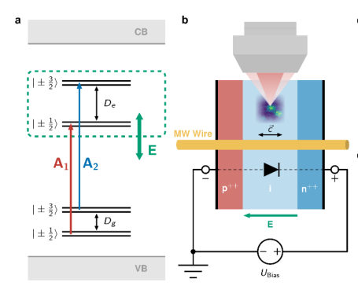 
Fig. 1| Single VSi centers in industrial 4H SiC p-i-n diode structures and their electrical tuning.

📷 Fig 2

 
Fig. 2| Setup for two-photon interference between two spatially separated VSi centers and single photon

📷 Fig 3

 
Fig.3| Two-photon interference between remote VSi centers in two separate 4H-SiC samples.

📷 Fig 4

 
Fig.4| Long-term spectral stability of interfered VSi centers and distribution of deduced two-photon

**Summary.** This paper demonstrates the feasibility of using silicon vacancy (V_Si) centers in industrial silicon carbide (SiC) as robust quantum network nodes. By electrically tuning and stabilizing the emission frequency, the researchers achieved high-visibility two-photon interference over a 26-day period between two spatially separated sources. These results establish V_Si in SiC as a scalable and stable building block for quantum communication.

**Why it may be interesting.** This work provides a concrete, scalable solid-state implementation for quantum networking nodes, directly addressing the critical engineering hurdles of spectral stability and long-term coherence required for quantum repeaters.

Detailed structure

**Main problem.** The core challenge is demonstrating high-visibility, long-term stable two-photon interference from spatially separated quantum nodes for use in distributed quantum networks.

**Main result.** The authors successfully demonstrated two-photon interference with a raw visibility of 82% over a 26-day measurement campaign using VSi centers in industrial SiC devices.

**Method.** The experiment utilized two-photon interference (HOM) measurements between two remote quantum emitters, combined with electrical biasing to achieve spectral tuning and stability.

**Model / system.** The platform consists of silicon vacancy (V_Si) color centers embedded in industrial-grade silicon carbide (SiC) p-i-n diodes. These centers are electrically controlled via voltage biasing, allowing for spectral tuning and maintaining coherence over long periods.

**Key observables.** Two-photon interference visibility (raw visibility of 82%), spectral linewidths (narrowed below 60 MHz), and long-term stability (requiring bias adjustment every 8.4 hours).

**Important parameters / regimes.** Two-meter separation distance, 26-day measurement duration, and the achievable spectral narrowing limit (e.g., 29.62 MHz).

**Assumptions / limitations.** The analysis relies on the assumption that the measured visibility is limited by the intrinsic properties of the VSi centers in the SiC matrix, which are shown to be scalable.

**Figures summary.** Figures illustrate the setup with two samples in separate cryostats, the dependence of the A2 transition frequency on reverse bias, and the characterization of multiple VSi centers across different diodes.

**Paper structure.** The paper progresses from establishing the physical platform (V_Si in SiC p-i-n diodes) to demonstrating spectral control (tuning and narrowing) and culminates in the long-term, high-visibility two-photon interference measurement between remote nodes.

Abstract

Distributed quantum networks rely on spatially separated, independently operated quantum systems as network nodes, whose emitted photons must be interfered with high visibility to establish end-to-end entanglement. Crucially, for network-relevant applications, high visibilities must be achieved over prolonged timescales to reduce overheads for error correction, and to increase network rates. Here, we demonstrate experimentally that silicon vacancy $\mathrm{V_{Si}}$ color centers in silicon carbide (SiC) achieve these requirements, notably in a mass-deployable fashion. We integrate $\mathrm{V_{Si}}$ centers in different industrial-grade SiC p-i-n diodes, which are controlled via voltage biassing. This way, we demonstrate both, spectral overlapping of 19 randomly selected $\mathrm{V_{Si}}$ centers in different diodes, as well as spectral narrowing close to the lifetime limit, i.e., typically below 60 MHz. Notably, these performance parameters are long-term stable, e.g., readjusting the p-i-n diode bias is required only every 8.4 hours, which reduces significantly the overall experimental overhead. We then use these assets to demonstrate high-quality two-photon interference between $\mathrm{V_{Si}}$ centers located in two different cryostat setups, which are spatially separated by two meters. Notably, we perform a 26-days long measurement campaign, demonstrating two-photon interference with state-of-the-art raw interference visibilities of 82%, which aligns with the current state-of-the-art. These results establish $\mathrm{V_{Si}}$ centers in industry-grade SiC devices as a scalable, spectrally stable building block for distributed quantum networks.

[↑ back to top](#top)

### [In situ characterization of a photon-subtraction device via heralding counts and homodyne detection](http://arxiv.org/abs/2609.10100v1)

**Authors:** Priyanka Sharma, Matteo G. A. Paris, Stefano Olivares  
**Type:** theory · **Category:** quantum information and computing · **PDF:** <https://arxiv.org/pdf/2609.10100v1>  
**Analysis basis:** full PDF text, analyzed in chunks
**Topic relevance:** 🔥 `quantum measurements` **4/5** · `Full counting statistics` **3/5** · `quantum optics experiment` **3/5** · `Keldysh / 2PI / non-Gaussian methods` **1/5** · `interference shaping light` **1/5** · `methods for driven-dissipative` **1/5**

📷 Fig 1

 
FIG. 1. Sketch of the estimation setup. A displaced squeezed state (mode 1) is mixed with the vacuum state (mode

📷 Fig 2

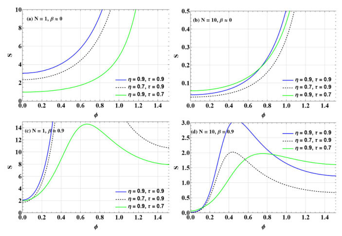 
FIG. 2. Sloppiness S as a function of the homodyne phase ϕ ∈[0, π/2], for different values of τ and η. Panels (a)

📷 Fig 3

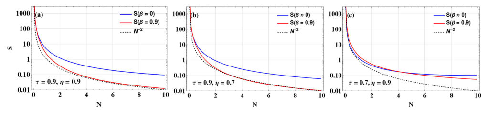 
FIG. 3. Sloppiness S as a function of the input energy N for different values of τ and η with nearly no squeezing

📷 Fig 4

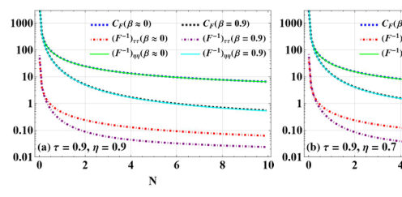 
FIG. 4. Plots of CF ,  F−1

📷 Fig 5

 
Fig. 4 shows the dependence of CF ,  F−1

**Summary.** This paper proposes a theoretical framework to simultaneously characterize the key parameters ($	au$ and $\eta$) of a photon-subtraction device using only its operational measurement data. By applying multi-parameter estimation theory, the authors demonstrate that joint estimation techniques outperform sequential methods for determining the device's quality. This has direct implications for improving the fidelity of non-Gaussian quantum states used in quantum information processing.

**Why it may be interesting.** This work provides rigorous theoretical tools (Fisher information, sloppiness parameter) to quantify the practical limitations of characterizing quantum resources, which is crucial for designing and optimizing quantum optical experiments.

Detailed structure

**Main problem.** The paper aims to develop an experimentally feasible, in situ method to simultaneously estimate the beam splitter transmissivity ($	au$) and the detector quantum efficiency ($\eta$) of a photon-subtraction device.

**Main result.** Joint estimation strategies consistently provide a lower estimation bound than sequential estimation, and the use of squeezed states significantly reduces parameter degeneracy compared to coherent probes.

**Method.** The analysis employs classical multi-parameter estimation theory, deriving and comparing the Fisher Information Matrix for joint versus sequential parameter estimation.

**Model / system.** The system involves a photon-subtraction device where a displaced squeezed state interacts with a beam splitter ($	au$) and is measured by an on/off heralding detector ($\eta$) and a homodyne detector.

**Key observables.** Click statistics of the heralding detector and continuous homodyne measurement outcomes ($x$).

**Important parameters / regimes.** Beam splitter transmissivity ($	au$), detector quantum efficiency ($\eta$), squeezing fraction ($eta$), and mean photon number ($N$).

**Assumptions / limitations.** The analysis assumes the conditional state for the 'off' event remains Gaussian, and the goal is an experimentally accessible estimation scheme.

**Figures summary.** Figures illustrate the dependence of the sloppiness parameter ($S$) on homodyne phase ($\phi$), mean photon number ($N$), and squeezing fraction ($eta$), comparing joint versus sequential estimation bounds.

**Paper structure.** The paper builds from establishing the physical setup and the need for in situ calibration, to deriving the Fisher information for both measurement outcomes, and finally comparing the theoretical bounds of joint versus sequential estimation strategies.

Abstract

Photon subtraction is one of the most important techniques for generating non-Gaussian optical states and constitutes a key resource for quantum information processing and quantum metrology. The practical performance of a photon-subtraction device is primarily determined by the transmissivity of the beam splitter and the quantum efficiency of the heralding detector. Accurate knowledge of these parameters is therefore essential for assessing the quality of the generated non-classical states. In this work, we propose an experimentally feasible in situ scheme for the simultaneous estimation of these two parameters using only the measurement data produced during the operation of the device. Our protocol combines the click statistics of an on/off heralding detector with homodyne measurements performed on the transmitted mode of the beam splitter when fed by a displaced squeezed state. Within the framework of classical multi-parameter estimation theory, we derive the corresponding Fisher information matrix and investigate both joint and sequential estimation strategies. For simultaneous measurement of parameters, we evaluate the sloppiness of the underlying statistical model and analyze its dependence on the measured quadrature, probe photon number, squeezing fraction, beam splitter transmissivity, and detector efficiency. Our analysis proves that an appropriate choice of the homodyne quadrature substantially reduces parameter degeneracy and enables efficient simultaneous estimation. Furthermore, we show that the joint estimation strategy consistently provides a lower estimation bound than the sequential estimation approach over a broad range of experimentally relevant parameters.

[↑ back to top](#top)

### [Transient and universal regimes in quantum reaction-transport kinetics](http://arxiv.org/abs/2609.09305v1)

**Authors:** Hossein Hosseinabadi, Roderich Moessner  
**Type:** theory · **Category:** statistical mechanics · **PDF:** <https://arxiv.org/pdf/2609.09305v1>  
**Analysis basis:** full PDF text, analyzed in chunks
**Topic relevance:** 🔥 `Keldysh / 2PI / non-Gaussian methods` **4/5** · `non-equilibrium universality` **3/5** · `correlated / nonlocal dissipation` **1/5** · `driven-dissipative phase transition` **1/5** · `methods for driven-dissipative` **1/5** · `scars & prethermalization` **1/5**

📷 Fig 1

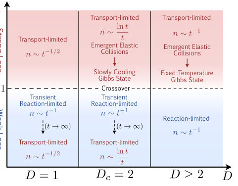 
FIG. 1. Schematic kinetic-regime diagram as a function of spatial dimension D and loss strength Γ/J. In D = 1, the asymptotic dynamics is transport-limited with n ∼t−1/2, although weak loss can produce a long transient reaction- limited regime. D = 2 is marginal, with n ∼(ln t)/t, while for D &gt; 2 the mean-field decay n ∼t−1 is asymptotically restored. At strong loss and D &gt; 1, emergent elastic collisions can rapidly redistribute particles and establish a quasi-stationary thermal state.

📷 Fig 2

 
FIG. 3. (a) Self-consistent diagrammatic equation for the T- matrix. (b) Boson self-energy in terms of the T-matrix.

📷 Fig 3

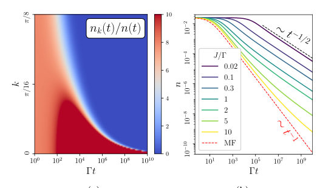 
FIG. 4. (a) Time evolution of the momentum distribution normalized by the average density in one dimension for J = Γ. Higher-momentum modes decay more rapidly, causing the surviving population to concentrate near k = 0. (b) Density evolution for different hopping strengths. The asymptotic decay follows n ∼t−1/2 for all J/Γ, while for strong hopping a parametrically long transient mean-field regime n ∼t−1 can precede the asymptotic scaling.

📷 Fig 4

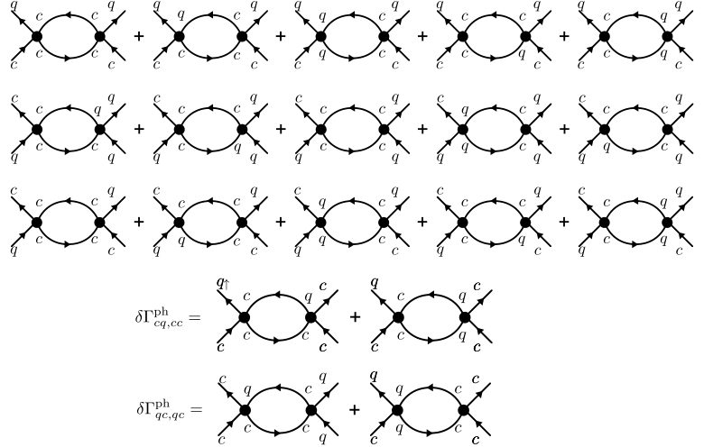 
FIG. 1. Leading-order correction to the 2-particle vertex in the particle-hole channel. Each row separately vanishes in the vacuum.

📷 Fig 5

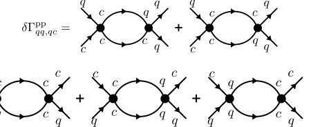 
FIG. 2. Leading-order correction to the 2-particle vertex in the pairing channel.

**Summary.** This work analyzes the long-time kinetics of quantum systems undergoing irreversible reactions, showing that the decay rate of particle density is highly sensitive to the spatial dimension D. The results reveal a dimensional crossover, where fluctuations dominate below D=2, leading to different power-law decays compared to the mean-field predictions for D>2.

**Why it may be interesting.** The dimensional crossover behavior ($D<2$ vs $D>2$) and the emergence of effective thermalization mechanisms from purely dissipative quantum processes are highly relevant to non-equilibrium statistical mechanics and open quantum systems.

Detailed structure

**Main problem.** The paper investigates the universal long-time kinetic behavior of quantum reaction-transport systems, specifically determining how particle density decays in different spatial dimensions.

**Main result.** The asymptotic decay rate of particle density depends critically on the spatial dimension D, showing $n \sim t^{-1/2}$ in 1D, logarithmic corrections in 2D, and mean-field $n \sim t^{-1}$ for $D>2$.

**Method.** The analysis employs Keldysh field theory and kinetic theory, deriving equations of motion for momentum occupations by treating the system's evolution as a competition between reaction losses and elastic collisions.

**Model / system.** The system models quantum reaction-transport kinetics using quantum binary annihilation ($A+A 	o \emptyset$) governed by a quantum master equation. The dynamics are analyzed via a kinetic equation for momentum occupations $n_k = \langle \psi_k^\dagger \psi_k 
angle$.

**Key observables.** Particle density $n(t)$, temperature $T(t)$, momentum distribution width $Q(t)$, and the renormalized reaction vertex $T(k, p)$.

**Important parameters / regimes.** Spatial dimension $D$, loss strength $\Gamma$, and the upper critical dimension $D_c=2$.

**Assumptions / limitations.** The analysis relies on the T-matrix approximation for diagrammatic resummation and often involves retaining terms up to quadratic order in occupations.

**Figures summary.** Figures illustrate the kinetic-regime diagram showing dependence on D and loss strength, and diagrammatic representations of the T-matrix derivation for pair annihilation.

**Paper structure.** The paper progresses by establishing the general kinetic framework, deriving the kinetic equation for momentum occupations, and then analyzing the asymptotic limits separately for $D=1$, $D=2$, and $D>2$ to determine the universal scaling laws.

Abstract

Quantum reaction-transport systems consist of coherently propagating particles that irreversibly react upon encounter. Their relaxation is commonly classified as reaction-limited or transport-limited, depending on the relative timescales of reaction and particle transport. We show that this expectation fails in low dimensions by studying the quantum binary annihilation, $A+A \to \emptyset$, where reaction processes acquire singular fluctuation corrections below the upper critical dimension $D_c=2$. Consequently, fluctuations dominate the asymptotic kinetics for $D<2$. In one dimension, they render mean-field relaxation transient and drive the system toward a transport-limited regime with $n\sim t^{-1/2}$, governed by a quantum-Zeno scale even for arbitrarily weak loss. At $D=2$, the kinetics acquires logarithmic corrections, whereas above two dimensions mean-field scaling is asymptotically restored. At and below the upper critical dimension, mean-field behavior can nevertheless persist over parametrically long crossover times before the asymptotic fluctuation-dominated regime emerges. We also show that the same fluctuations generate effective elastic collisions despite the absence of microscopic coherent interactions. In $D>1$, these collisions redistribute momentum populations and are parametrically faster than losses in the transport-limited regime, allowing the system to approach a quasi-stationary thermal state.

[↑ back to top](#top)

### [Certified measurement and control of an entanglement-breaking index on programmable hardware](http://arxiv.org/abs/2609.09350v1)

**Authors:** Eran Kopel  
**Type:** both · **Category:** quantum information and computing · **PDF:** <https://arxiv.org/pdf/2609.09350v1>  
**Analysis basis:** full PDF text, analyzed in chunks
**Topic relevance:** 🔥 `quantum measurements` **4/5** · `QC/QI experiment` **3/5** · `correlated / nonlocal dissipation` **1/5** · `driven-dissipative phase transition` **1/5** · `methods for driven-dissipative` **1/5**

📷 Fig 1

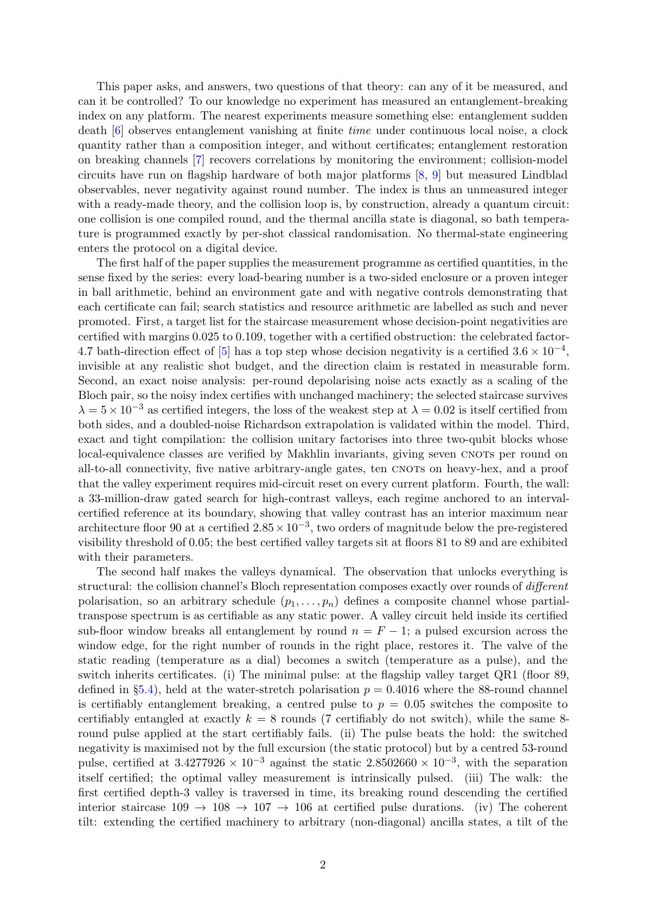 
Low-resolution page preview, page 2

📷 Fig 2

 
Low-resolution page preview, page 3

📷 Fig 3

 
Low-resolution page preview, page 4

📷 Fig 4

 
Low-resolution page preview, page 5

📷 Fig 5

 
Low-resolution page preview, page 6

**Summary.** This work provides a highly rigorous framework for measuring and controlling the entanglement-breaking index of a quantum channel on programmable hardware. By employing advanced interval arithmetic certificates, the authors prove that this index is measurable via a 'staircase' protocol and controllable using optimized pulsed operations. This advances the field by moving beyond mere simulation to certified, hardware-implementable quantum characterization.

**Why it may be interesting.** The rigorous, certificate-based approach to characterizing channel properties like entanglement breaking is highly relevant to quantum information theory, providing new tools for benchmarking quantum hardware.

Detailed structure

**Main problem.** The paper addresses the measurement and control of the entanglement-breaking index, $n_{EB}(\Phi)$, of a quantum channel, a quantity previously unmeasured.

**Main result.** The authors demonstrate that $n_{EB}(\Phi)$ can be both rigorously measured and actively controlled on current programmable hardware using certified feedback loops and pulsed operations.

**Method.** The methodology relies on advanced 'certification discipline' using ball arithmetic at 256 bits to provide rigorous, mathematically guaranteed bounds on physical observables.

**Model / system.** The system models a quantum channel $\Phi$ acting on a message qubit, which interacts with fresh two-qubit thermal ancillas via a 'collision feedback loop.' The channel evolution is parameterized by bath polarization $p$.

**Key observables.** The entanglement-breaking index $n_{EB}(\Phi)$ (an integer), negativity, and the contrast of the 'thermal valley' are key observables.

**Important parameters / regimes.** The analysis involves noise strengths ($\lambda$), bath polarizations ($p$), and specific pulse lengths (e.g., minimal pulse of exactly eight rounds).

**Assumptions / limitations.** The rigorous claims are based on the use of ball arithmetic and certified mathematical proofs; non-certified results (like the 33-million-draw search) are noted as such.

**Figures summary.** The notes refer to a 'pulse atlas' detailing minimal switching pulse requirements and tables comparing signals achieved via coherent tilts versus static thermal protocols.

**Paper structure.** The paper establishes the theoretical framework for the index, details the measurement program (staircase), and then develops the control mechanism, showing that pulsed operations outperform static ones, culminating in a comparison between thermal and coherent control.

Abstract

The entanglement-breaking index of a quantum channel, the number of self-compositions after which the channel destroys all entanglement with any reference, has to our knowledge never been measured. We show that a certified thermal collision feedback loop makes this integer both measurable and controllable on current programmable hardware, every load-bearing quantity delivered as an interval-arithmetic certificate. On the measurement side: a target list for the integer staircase n_EB(p) with decision-point negativities certified at margins 0.025 to 0.109; an exact per-round depolarising model in which the selected staircase survives realistic noise as certified integers; an exact, tight compilation of the round unitary (seven CNOTs all-to-all, five native arbitrary-angle gates, ten on heavy-hex); and a 33-million-draw gated search bounding the thermal valley's contrast by a wall with an interior maximum, a certified 2.85x10^-3 near floor 89. On the control side: the model composes rounds of differing bath polarisation exactly, so the valley becomes a pulsed valve, switching at a certified minimal pulse of exactly eight rounds; the optimal pulsed signal, a certified 3.43x10^-3, beats the static protocol, so the best valley measurement is intrinsically pulsed; and a coherent tilt of the bath Bloch vector lifts the signal to a certified 8.6x10^-3, three times the static ceiling, at zero population cost. Valley signatures certifiably die near per-round noise strength 10^-4, fixing the error-extrapolation burden. The staircase is a near-term experiment; the pulsed valley a precisely priced one.

[↑ back to top](#top)

### [Temperature-induced effective topology in many-body ultracold atomic quantum systems](http://arxiv.org/abs/2609.09463v1)

**Authors:** Nitya Cuzzuol, Michele Miotto, Arianna Montorsi, Giacomo Valtolina, Luca Barbiero  
**Type:** both · **Category:** other · **PDF:** <https://arxiv.org/pdf/2609.09463v1>  
**Analysis basis:** full PDF text, analyzed in chunks
**Topic relevance:** 🔥 `analog quantum simulation` **4/5** · `methods for driven-dissipative` **3/5** · `Frenkel-Kontorova` **1/5** · `driven-dissipative phase transition` **1/5**

📷 Fig 1

 
Figure 1. Schematic illustration of optical superlattice poten- tial for experimental realization of the dimerized model de- fined in Eq. (2), where bosons experience dimerized hopping amplitudes J ± δJ and nearest neighbor density-density in- teraction V .

📷 Fig 2

 
Figure 2. (a) Charge gap ∆ECb Eq. (4) (red) and neutral gap ∆ENb Eq. (5) (green) at T = 0 of the model HSSH Eq. (2) as a function of V for fixed δJ = 0.5. For values of V in the blue region, the model exhibits a D-SPTT =0 ground state, while in the orange region we observe a density wave phase. The neutral gap closes at V = 5.8 in correspondence to the phase transition between the D-SPTT =0 and the DW. The values of the energy gaps are obtained by fitting data from different chain lengths towards the thermodynamical limit. (b) Phase diagram of the same model at finite temperature. For low values of T, the two ground state phases extend to finite temperatures (D-SPTT =0 in the dark blue...

📷 Fig 3

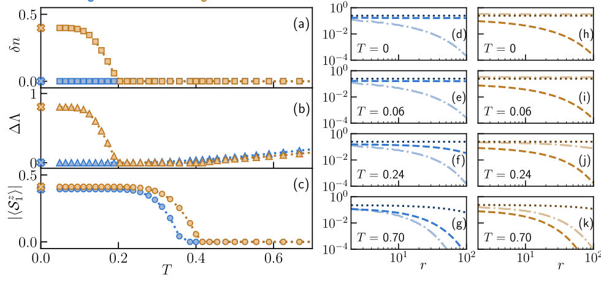 
Figure 3. Left: Order parameters as a function of temperature for model Eq. (2) at V = 5.3 (blue) and V = 6.5 (orange). Crosses indicate the corresponding ground-state values at T = 0, obtained via DMRG. (a) Staggered magnetization Eq. (7) and (b) degeneracy order parameter Eq. (1) (extrapolated to large system sizes to minimize boundary effects on bulk quantities). (c) Local edge magnetization Eq. (3) extrapolated to zero field applied at the edges of a chain of length L = 300. Right: String correlation functions O(z) S,odd(r) (dotted dark lines) and O(x) S,odd(r) (dashed lines), and two-point correlation function CDW(r) (dash-dotted light lines), as a function of distance for different...

📷 Fig 4

 
Figure 4. Schematic illustration of the spin-1 model defined in Eq. (9) and of its constrained-boson representation in an optical-lattice potential. The spin model features a trans- verse spin-exchange coupling J and a longitudinal antifer- romagnetic interaction ∆. The local spin states |Sz i ⟩are mapped onto the bosonic occupation states |ni⟩according to |Sz i = +1⟩↔|ni = 0⟩, |Sz i = 0⟩↔|ni = 1⟩, and |Sz i = −1⟩↔|ni = 2⟩, as prescribed by the Holstein– Primakoff transformation [97].

📷 Fig 5

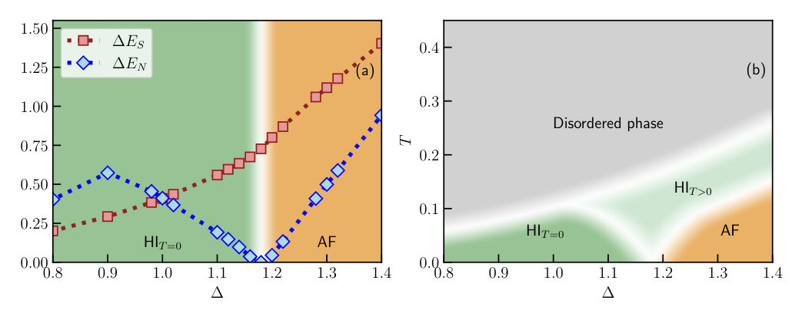 
Figure 5. (a) Neutral gap ∆EN (blue) and spin gap ∆ES (red) at T = 0 for HXXZ as a function of ∆. For values of ∆ in the green region, the model exhibits the SPT phase HIT =0 in the ground state, while in the orange region we observe an antiferromagnetic phase. The neutral gap closes at ∆≃1.18 in correspondence to the phase transition between the HIT =0 and the AF. The values of the energy gaps are obtained by fitting data from different chain lengths towards the thermodynamical limit. (b) Phase diagram of the same model at finite temperature. For low values of T, the two ground state phases extend to finite temperatures (HIT =0 in the green region, AF in the orange one), while for large...

**Summary.** This paper demonstrates that temperature can act as a tunable resource to engineer effective topological phases in ultracold atomic quantum simulators. By analyzing gap structures in models like the SSH chain, the authors show that intermediate temperatures can stabilize topological correlations that are absent or different from the zero-temperature ground state. This opens a new experimental avenue for realizing and studying topological matter.

**Why it may be interesting.** This is highly relevant for AMO physicists as it provides a concrete, experimentally accessible mechanism (temperature control) to tune and explore exotic quantum phases in ultracold atomic setups.

Detailed structure

**Main problem.** The study investigates whether temperature itself can serve as a resource to engineer effective topological quantum phases in many-body systems that do not exist at absolute zero temperature.

**Main result.** The research establishes a novel mechanism where finite-temperature thermal fluctuations can drive systems into effective topological regimes, distinct from their zero-temperature ground states.

**Method.** The analysis employs finite-temperature matrix-product-state (MPS) calculations, comparing results with zero-temperature DMRG calculations to track topological markers.

**Model / system.** The work focuses on ultracold atomic quantum systems, modeling interacting bosonic Su-Schrieffer-Heeger (SSH) chains, spin-1 XXZ chains, and fermionic dipolar ladder models.

**Key observables.** Long-range order (LRO) of non-local string correlation functions (SCFs), entanglement spectrum (ES), and the gap structure defined by different excitation gaps.

**Important parameters / regimes.** Temperature (T), interaction strengths (V, $\delta J$), and the specific gap magnitudes ($\Delta E_{Cb}, \Delta E_{Nb}$).

**Assumptions / limitations.** The analysis relies on finite-size systems and the applicability of MPS methods to the thermal state purification.

**Figures summary.** Figure 1 schematically illustrates the optical superlattice potential used for the dimerized model.

**Paper structure.** The paper progresses by first establishing the $T=0$ topological phases in specific models, then introducing finite-temperature calculations to observe how thermal fluctuations modify or induce new effective topological behaviors by selectively suppressing certain excitation gaps.

Abstract

Ultracold atomic quantum systems offer an unprecedentedly powerful platform for exploring interacting symmetry-protected topological phases. Here, we show that their characteristic control over temperature provides a resource for engineering effective topological regimes with no zero-temperature counterpart. Employing finite-temperature matrix-product-state calculations, we investigate experimentally accessible Hamiltonians - the interacting bosonic Su-Schrieffer-Heeger and spin-1 XXZ chains - that host a topological phase at zero temperature, as well as a fermionic dipolar ladder model whose ground state exhibits no topological order. By tracking complementary topological markers, we identify an intriguing mechanism rooted in the structure of the zero-temperature phase diagrams: in finite-size systems, excitation gaps with different magnitudes define an intermediate-temperature window where the correlations associated with the lower gap are suppressed, while those protected by the larger gap persist. This enables the emergence of effective finite-temperature regimes exhibiting topological features that are either absent or qualitatively different from those at zero temperature. Our results establish a novel route toward exploring effective topological phases in ultracold atomic quantum systems.

[↑ back to top](#top)

### [Loss-correcting fault-tolerant quantum computing architecture for neutral atoms](http://arxiv.org/abs/2609.10079v1)

**Authors:** Sanaa Sharma, Yutaka Hirano, Akihisa Goban, Hayata Yamasaki, Shinichi Sunami, Prakash Murali  
**Type:** theory · **Category:** quantum information and computing · **PDF:** <https://arxiv.org/pdf/2609.10079v1>  
**Analysis basis:** full PDF text, analyzed in chunks
**Topic relevance:** 🔥 `QC/QI experiment` **4/5** · `Rydberg arrays` **1/5** · `analog quantum simulation` **1/5** · `quantum measurements` **1/5**

📷 Fig 1

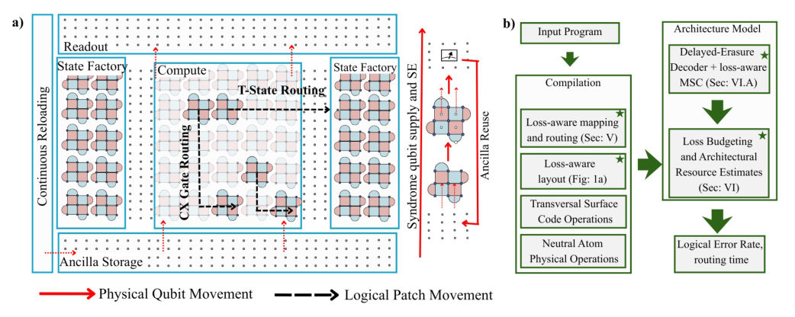 
Fig. 1: a) Loss-aware layout: all logical operations happen inside the compute zone, where logical qubits are shuttled across other qubits for transversal CXs/ T-state routing. Ancilla qubits are measured in readout zone, and reused following a reinitialization in storage zone. b) Loss-aware layout modeling and compilation framework. Starred boxes: this work’s contribution.

📷 Fig 2

 
Fig. 2: Atom loss mechanisms and state-selective readout.

📷 Fig 3

 
Fig. 4: a) Transfer loss is a major source of loss because of recurrent movement between AOD-SLM traps. b) In zoned layout, transfer loss for each qubit is counted 4× per gate.

📷 Fig 4

 
Fig. 3: a) Current zoned architecture layout: entangling op- erations take place in a separate zone, increasing the routing overhead. b) Shuttling time scales with circuit depth.

📷 Fig 5

 
Fig. 5: a) Transversal gate implementation in compute zone. b) Two movements facilitated by AODs in compute zone: Transversal gates (green crossed AODs) and T-state routing to buffer zone (red crossed AODs). c) S and T Gate teleportation takes place in buffer zone. d) Maximum number of RF tones enable parallel gate movements by an AOD.

**Summary.** This paper presents a novel, loss-aware framework for fault-tolerant quantum computing using neutral atoms. It addresses the critical failure point of qubit loss by co-designing the quantum circuit compilation, physical layout, and error decoding. The resulting architecture significantly boosts performance by minimizing costly atom shuttling and controlling the total loss budget across the computation.

**Why it may be interesting.** This work is highly relevant as it bridges the gap between theoretical quantum error correction codes and the practical, loss-dominated physical realities of neutral-atom hardware, providing actionable architectural guidelines.

Detailed structure

**Main problem.** The primary challenge is developing a fault-tolerant quantum computing architecture for neutral atoms that can effectively model and mitigate qubit loss, which is a dominant error source ignored by standard error correction and compilation methods.

**Main result.** The proposed loss-aware framework improves accumulated loss per syndrome-extraction round by up to 2.15X and reduces logical error rates by over two orders of magnitude compared to existing zoned architectures.

**Method.** The authors developed a comprehensive, end-to-end loss-aware pipeline that jointly optimizes the physical layout, the compiler's routing decisions, and the decoding process to account for dynamic loss budgets.

**Model / system.** The work focuses on neutral-atom arrays used for quantum computation, employing the surface code for error correction. The architecture is designed to operate within a compact 'compute zone' to minimize loss associated with long-distance shuttling between separate storage and entangling zones.

**Key observables.** Accumulated loss per syndrome-extraction round, logical error rates (LER), CX routing time, and required atom reloading rates.

**Important parameters / regimes.** Loss budget, code distance ($d$), AOD bandwidth constraints, and the motional excitation budget ($\Delta n$).

**Assumptions / limitations.** The framework assumes that loss can be treated as a dynamic, controllable budget rather than a fixed error parameter, and it provides concrete device targets for hardware scaling.

**Figures summary.** Figures illustrate the loss-aware layout, comparing it to zoned architectures, and show the trade-off between transport speed and accumulated loss per syndrome-extraction round.

**Paper structure.** The paper first establishes the limitations of existing loss-agnostic FTQC models, then proposes the loss-aware transversal-gate architecture, details the loss-aware compiler optimizations, and finally validates the approach by showing significant improvements in loss and logical error rates.

Abstract

Neutral-atom arrays are a leading qubit technology for large-scale, fault-tolerant quantum computing (FTQC). A dominant error source on this platform is qubit loss, which accrues with every operation and movement. The presence of loss undermines the promises of existing architectural work. Standard error correction targets stochastic Pauli errors and cannot correct loss, so most FTQC performance analyses are not directly compatible with it. Moreover, compilation and routing decisions, which strongly affect overall loss, are typically optimized against Pauli-error cost models and often remain loss-agnostic, potentially increasing exposure to the loss channel.   In this work, we comprehensively model the effect of qubit loss on neutral-atom FTQC and develop a loss-tolerant transversal-gate architecture. We treat loss not as a predetermined error parameter but as a dynamic budget spent across a whole program, allowing us to control it by co-designing layout, compilation, and decoding. We target a physical implementation with no separate storage and entangling zones, eliminating the repeated SLM-AOD handoffs and long-distance shuttling that dominate loss in other layouts. We develop compiler optimizations that maximize gate parallelism while respecting the RF tone budget and AOD bandwidth constraints. Our work couples these with a loss-aware, delayed-erasure decoder and an end-to-end loss-aware magic state cultivation protocol. Overall, we improve accumulated loss per syndrome-extraction round by up to 2.15X against a zoned baseline and reduce logical error rates by over two orders of magnitude versus current architectures. Our framework also informs concrete device targets such as continuous reloading rates, AOD counts, and shuttling trajectory choices. We expect these insights to matter for system architects as neutral-atom hardware scales.

[↑ back to top](#top)

### [Realization Theory for Quantum Filtering: Classifying Continuously Monitored Bosonic Systems](http://arxiv.org/abs/2609.09663v1)

**Authors:** Jacob Emerson  
**Type:** theory · **Category:** other · **PDF:** <https://arxiv.org/pdf/2609.09663v1>  
**Analysis basis:** full PDF text, analyzed in chunks
**Topic relevance:** 🔥 `quantum measurements` **4/5** · `correlated / nonlocal dissipation` **1/5** · `driven-dissipative phase transition` **1/5** · `methods for driven-dissipative` **1/5**

📷 Fig 1

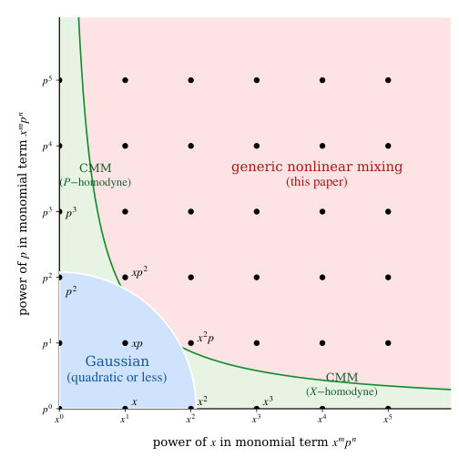 
FIG. 1. Single-mode schematic of the finite-rank and infinite- rank Hamiltonian sectors. Each lattice point (ℓ, k) repre- sents a Weyl-ordered monomial Sym(XℓP k) appearing in the Hamiltonian. The finite sectors shown are the Gaussian class and the CMM classes aligned with X- and P-homodyne mon- itoring. Monomials outside these sectors mix the measured and conjugate quadratures in a way that produces infinite observable Hankel rank in the classification theorem.

📷 Fig 2

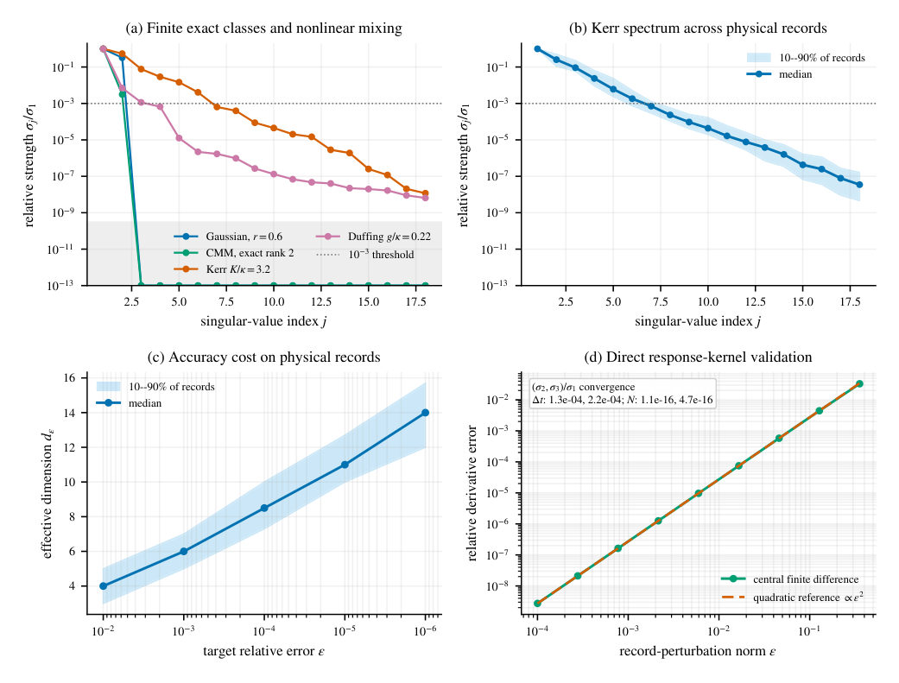 
FIG. 2. Exact and effective observable memory on physical records. (a) Relative singular spectra for two finite exact controls and two nonlinear mixing systems. The Gaussian and CMM responses terminate after two directions, whereas Kerr and Duffing retain decaying tails. (b) Median and 10th–90th percentile Kerr spectra over 24 physical homodyne records. (c) The corresponding effective dimension dϵ. (d) Direct central-finite-difference validation of the discrete response kernel. All panels use ideal monitoring and separated past and future windows. Exact zeros of the analytic CMM kernel are shown at the plotting floor.

📷 Fig 3

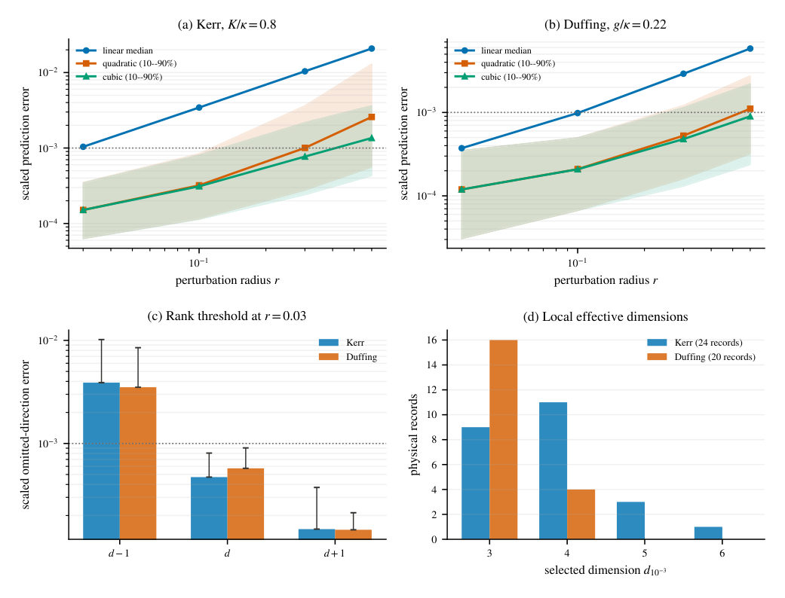 
FIG. 3. Finite prediction in the Hankel-selected coordinates. Median scaled trajectory error E(r) versus L2 record-perturbation radius r for (a) Kerr and (b) Duffing physical records. The quadratic and cubic curves use the same d = d10−3 coordinates as the linear response; their shading spans the 10th–90th percentiles, while the linear curve is a median-only baseline. (c) Response along the first omitted direction when d −1, d, or d + 1 directions are retained at r = 0.03; upper error bars reach the 90th percentile. (d) Empirical counts of the independently selected local dimensions over 24 Kerr and 20 Duffing records. The dotted line marks the target error 10−3.

📷 Fig 4

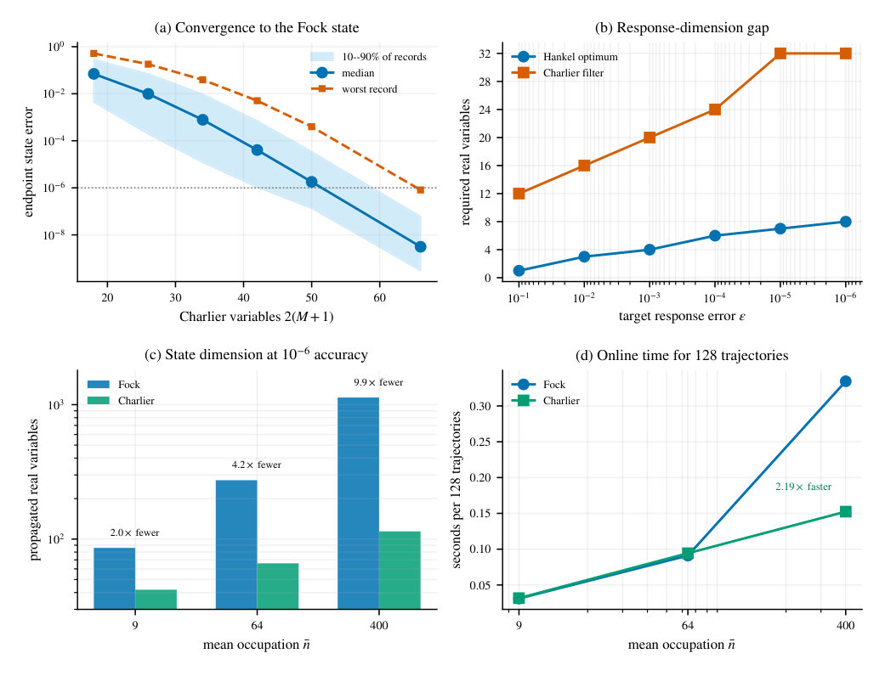 
FIG. 4. Poisson–Charlier approximation of monitored Kerr dynamics. (a) Phase-aligned endpoint state error over 40 physical heterodyne Kerr records. (b) Real variables required by the Charlier response and by the optimal rank-d response approximation on the same record. (c) Accuracy-matched Fock and Charlier state dimensions at fixed accumulated mean-field phase. (d) Their separately measured online times for a batch of 128 trajectories, with reusable operator construction excluded. Panels (c) and (d) use a common 90th-percentile state tolerance of 10−6.

📷 Fig 5

 
FIG. 5. Additional checks of the observable-response spectrum. (a) For the cubic CMM control, the first two singular values remain finite while the apparent third decreases by approximately four under each time-step halving, as expected for an exact rank-two response computed with a second-order step. (b) Median Kerr spectra for the future observables X, P, N, and X2

**Summary.** This paper develops a realization theory framework to classify continuously monitored bosonic systems based on whether they admit an exact, finite-dimensional quantum filter. By analyzing the rank of the linearized observable Hankel operator, the authors rigorously distinguish between simple, integrable systems (like Gaussian dynamics) and complex nonlinear systems that require infinite internal degrees of freedom for perfect description. This work sets a fundamental benchmark for quantum measurement theory.

**Why it may be interesting.** This work provides a rigorous, mathematically defined boundary for when quantum feedback control can be modeled by finite-dimensional systems, which is crucial for designing practical quantum measurement and control protocols.

Detailed structure

**Main problem.** The paper addresses the fundamental question of determining whether a continuously monitored quantum system admits an exact, finite-dimensional description (filter) based on its measurement record.

**Main result.** The authors establish a criterion using the linearized observable Hankel operator ($\mathcal{K}_O$): Gaussian dynamics and the Conditional Momentum Moment class admit exact finite filters, while most nonlinear dynamics lead to infinite response rank.

**Method.** The analysis reformulates quantum filtering as a realization problem, employing the Hankel operator to map past measurement record changes to future observable changes, drawing parallels with classical input-output realization theory.

**Model / system.** The system under study is a continuously monitored bosonic system, whose dynamics are governed by a stochastic master equation derived from a polynomial Hamiltonian $h(x, p)$.

**Key observables.** The linearized observable Hankel operator ($\mathcal{K}_O$), the singular values of $\mathcal{K}_O$, and the conditional expectation values $\langle O 
angle_t$.

**Important parameters / regimes.** Measurement efficiency ($\eta$), damping ($\kappa$), and the polynomial structure of the Hamiltonian $h(x, p)$.

**Assumptions / limitations.** The framework is based on analyzing the observable-level response, which provides a coordinate-independent lower bound on the required internal variables.

**Figures summary.** Figures provide quantitative evidence showing the convergence and stability of calculated spectra (Kerr spectra) under varying simulation parameters like time steps ($\Delta t$) and measurement efficiencies ($\eta$).

**Paper structure.** The paper builds from formulating the problem as a realization theory question, defining the Hankel operator, classifying the finite sectors ($\mathcal{G}$ and $\mathcal{C}X$) using rank analysis, and concluding with numerical verification on specific oscillators.

Abstract

Exact finite-dimensional descriptions exist for a few important classes of continuously monitored quantum systems, but there is no general criterion separating systems that admit such filters from those that do not. We formulate this question as a realization problem and introduce the linearized observable Hankel operator $K_O$, which maps changes in the past measurement record to changes in a future conditional observable. For polynomial bosonic systems under continuous quadrature monitoring, this gives a sharp boundary between finite and infinite realizability. Gaussian dynamics and the Conditional Momentum Moment class admit exact finite-dimensional filters, while nonlinear dynamics outside these classes generically produce infinitely many independent response directions and admit no robust finite-dimensional $C^1$ observable- or state-level filter. The singular values of $K_O$ then extend the same realization framework to approximation, giving the optimal rank-$d$ local-response error beyond the finite classes. Numerical experiments with the Kerr and Duffing oscillators, together with a dynamics-adapted Poisson--Charlier construction for Kerr dynamics, show how this observable-level benchmark interacts with concrete reduced representations. Together, these results identify the boundary of exact quantum filtering and quantify finite-dimensional approximation beyond it.

[↑ back to top](#top)

### [Certifying bipartite entanglement on a superconducting processor from a corrected QAOA cost layer](http://arxiv.org/abs/2609.09495v1)

**Authors:** Carlos-Miguel Lorenzo  
**Type:** experiment · **Category:** quantum information and computing · **PDF:** <https://arxiv.org/pdf/2609.09495v1>  
**Analysis basis:** full PDF text, analyzed in chunks
**Topic relevance:** 🔥 `QC/QI experiment` **4/5** · `quantum measurements` **1/5**

📷 Fig 1

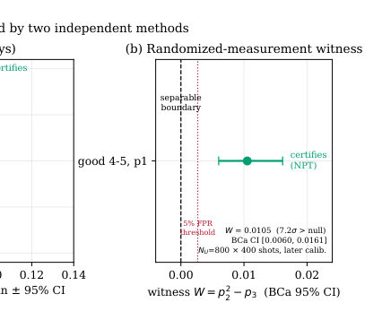 
Figure 1: Entanglement is certified on the good coupler at depth one and nowhere else. (a) Per-arm two-qubit reduced-state negativity from tomography, day-level mean with 95% confidence interval over six calibrations: the good edge 4-5 at p = 1 certifies (cold and warm), while the p = 3 arm, the coupling-off J = 0 twin and the degraded 6-8 edge are separable. (b) The independent randomized-measurement p3-PPT witness W = p2 2 −p3 on the good edge on a later calibration: W = 0.0105 with BCa 95% CI, clear of the Werner PPT-boundary null but — at this magnitude — underpowered against a near-pure-separable null, so reported as consistent with entanglement.

📷 Fig 2

 
Figure 2: Reducing the manipulated CZ drive amplitude reduces the certified negativity along a positive, well-fit slope over the probed ladder. Certified two-qubit negativity (PSD, BCa) against the manipulated CZ pulse amplitude factor (the single knob we set), for three couplers of component B (4-5, 5-7, 6-8), two calibration sessions each (filled circles, session 1; open triangles, session 2). Lines are the per-edge weighted fits over the rung window; the legend gives the per-edge slope in certified negativity per unit fractional amplitude. The fits are local linearisations: the drive-to-phase map overshoots π at the nominal amplitude and the certified negativity peaks at |ζ| = π, so the...

📷 Fig 3

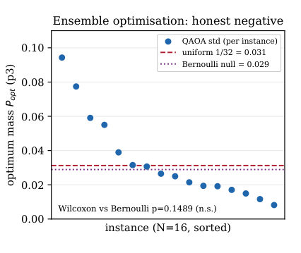 
Figure 3: The certificate collapses by depth three on b08; separately, the depth-three ensemble shows no optimisation signal. Left: the good-edge negativity present at p = 1 is separable by p = 3 (instance b08, day- level over six calibrations) — a within-instance depth collapse. Right: across the N = 16 ensemble measured at p = 3 only, per-instance optimum mass Popt sits at the uniform (1/32) and device-marginal Bernoulli floors (one-sided Wilcoxon versus Bernoulli p = 0.15, not significant); this speaks to p = 3 alone and is not evidence of a decline with depth.

📷 Fig 4

 
Figure 4: The good coupler certifies on every calibration; the degraded coupler never does. Raw two-qubit negativity of the good edge 4-5 (upper) and the degraded edge 6-8 (lower) across the six daily calibrations, with the good-edge grand-mean band. Good above bad on 6/6 days; the separation is reported through the two per-edge day-level intervals (good BCa CI [0.065, 0.091], degraded TOST-equivalent to zero), because the pre-registered paired test is a secondary hypothesis that does not survive multiplicity correction (see text). Between-day standard deviation 0.016.

📷 Fig 5

 
Figure 5: Component B of Red and its couplers. The calibrated connectivity read live from the runcard on 4 August 2026: nine qubits, seven CZ couplers, and the absent 3-4 bridge that splits the chip into components A = {0, 1, 2, 3} and B = {4, 5, 6, 7, 8}. Component B carries the primary instance b08, the good edge 4-5, the degraded edge 6-8 and the 5-7 coupler used in the causal experiment.

**Summary.** This paper rigorously certifies bipartite entanglement on a superconducting processor using the QAOA cost layer. The key achievement is demonstrating a measurable, causal relationship: deliberately reducing the CZ pulse amplitude predictably reduces the certified entanglement. This provides a deep, physics-grounded characterization of device performance rather than just algorithmic success.

**Why it may be interesting.** This work provides a highly detailed, quantitative characterization of entanglement generation on a real superconducting chip, moving beyond simple 'yes/no' demonstrations to map out the physical control landscape of quantum resources.

Detailed structure

**Main problem.** To move beyond simply reporting success against a random floor in hardware demonstrations of algorithms like QAOA, by rigorously certifying the physical entanglement generated by the device.

**Main result.** Bipartite entanglement was certified on the good coupler at depth one, and a causal dose-response law was established showing that reducing the CZ pulse amplitude causally reduces the certified negativity.

**Method.** The study used two-qubit tomographic negativity to certify entanglement and performed pre-registered manipulations varying the CZ pulse amplitude to establish a causal relationship with the measured entanglement.

**Model / system.** The experiment was conducted on a nine-qubit superconducting processor named "Red" at the Barcelona Supercomputing Center, focusing on the corrected QAOA cost layer implemented on a five-qubit component.

**Key observables.** Two-qubit tomographic negativity, CZ pulse amplitude, average gate fidelity, and the depth of the QAOA circuit.

**Important parameters / regimes.** Depth one (for entanglement certification), the CZ pulse amplitude (the control variable), and the resulting linear fit slope ($R^2 = 0.83-0.96$).

**Assumptions / limitations.** The analysis relies on pre-registration for rigor; the authors explicitly claim no quantum advantage as the tested instances are classically solvable.

**Figures summary.** Figures illustrate the connectivity of the superconducting processor, the reconstructed two-qubit density matrix showing coherences, and tables present the statistically derived dose-response slopes for certified negativity versus manipulated CZ pulse amplitude.

**Paper structure.** The paper establishes the physical system and the goal of rigorous entanglement certification. It presents the entanglement measurements, followed by the core experimental work: varying the CZ pulse amplitude to map out a causal, measurable relationship between device control and quantum resource (negativity). Finally, it discusses the limitations, depth collapse, and statistical robustness of the findings.

Abstract

The Quantum Approximate Optimisation Algorithm is the canonical near-term heuristic, yet on real superconducting hardware its behaviour is set by device physics, not by the algorithm. Hardware demonstrations rarely prove the intended coupling is realised, that genuine entanglement is prepared, or what controls it. We report a pre-registered single-device study on the nine-qubit superconducting processor Red at the Barcelona Supercomputing Center, using its five-qubit component. Across six calibrations we certify bipartite entanglement of a corrected QAOA cost layer on the good coupler at depth one by two-qubit tomographic negativity: 0.077, BCa 95% CI [0.065, 0.091], excluding zero every day, while the coupling-off twin stays separable and the degraded coupler equals zero. We then measure the device physics directly: in a pre-registered manipulation on a fixed Bell preparation (not the QAOA layer), reducing the CZ pulse amplitude causally reduces the certified negativity along a positive, well-fit slope (R^2 = 0.83-0.96), every rung-level interval excluding zero and surviving Holm and Benjamini-Hochberg correction. This is a local linearisation of a peaked response, not a global monotone law: the negativity peaks at conditional phase |zeta| = pi, which the nominal amplitude overshoots. The J=0 twin is a separate off-state control and the fringe visibility is constant, so the effect is coherent. The average gate fidelity is non-monotone in the drive and is reported only as a diagnostic. A per-circuit statevector guardrail excludes a diagonal compilation fault we disclose and repair. A randomized-measurement witness is consistent with entanglement but underpowered. The certificate collapses by depth three, and a pre-registered sixteen-instance depth-three ensemble shows no optimisation signal (one-sided Wilcoxon p = 0.15). We claim no advantage; the instances are classically trivial.

[↑ back to top](#top)

### [Fractional Chern Insulators in Twisted Bilayer Optical Lattices](http://arxiv.org/abs/2609.09733v1)

**Authors:** Yan-Bin Yang, Jiong-Hao Wang, Shicheng Ma, Yong Xu  
**Type:** theory · **Category:** quantum gases · **PDF:** <https://arxiv.org/pdf/2609.09733v1>  
**Analysis basis:** full PDF text, analyzed in chunks
**Topic relevance:** 🔥 `analog quantum simulation` **4/5** · `Keldysh / 2PI / non-Gaussian methods` **1/5**

📷 Fig 1

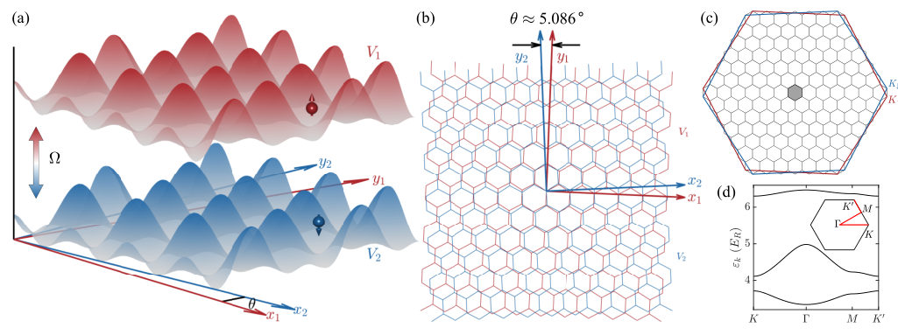 
FIG. 1. The schematics of twisted bilayer optical lattices composed of two spin-dependent honeycomb lattices relatively rotated by a twist angle θ. (a) The optical potential profiles V1(r) and V2(r) felt by two spin states |↑⟩, |↓⟩simulating the two layers. The two spin states are coupled by a microwave field with the Rabi frequency Ωsimulating interlayer tunneling. (b) The moir´e lattice structure in real space with the rotation axis placed at a sublattice site. (c) The moir´e reciprocal lattice in momentum space. The grey area denotes a moir´e Brillouin zone. K↑and K↓are the high-symmetry momenta of bare BZs for two spin states, respectively. Here, we set the twist angle to a commensurate...

📷 Fig 2

 
FIG. 2. The single-particle band properties. (a) The moir´e band structure along high-symmetry lines in moir´e BZ. The inset shows the band structure in a larger energy range. The red lines highlight two-fold quasi-degenerate bands with narrow band dispersion below a large gap. (b,c) The Wilson loop spectra of the two nearly flat bands along two reciprocal basis vectors. (d,e) The distribution of the Berry curvature F(k) and the trace of quantum metric Trg(k) of the flat-band subspace over the moir´e BZ. Here, both Trg(k) and F(k) are multiplied by a factor of SBZ/(2π) (SBZ is the area of the moir´e BZ).

📷 Fig 3

 
FIG. 4. (a) The many-body energy spectrum obtained from ED for U = 1. The ground-state manifold has three-fold de- generacy with the total momenta (indexed by K) predicted by the generalized Pauli principle. (b) The particle entanglement spectrum of the ground states of N = 8 with a subsystem of NA = 3 particles. There are 1088 states below a entangle- ment gap denoted by the dashed line, in agreement with the counting of (1, 3) generalized Pauli principle. We perform the ED calculation for a system size of (N1, N2) = (4, 6).

📷 Fig 4

 
FIG. 3. (a) The ground-state energy from ED (subtracted by a constant for clarity) with respect to the interaction strength U for three different HF ansatz: fractional-Chern-insulator (FCI) ansatz, Fermi-liquid (FL) ansatz, and integer filling ansatz. (b) The occupation of mean-field states in momentum space for the ground state of the ansatz with lowest energy. (c) The mean-field band structure along high-symmetry lines obtained from SCHF calculation for U = 1 using the FCI ansatz. For comparison, the bare dispersion is plotted as grey lines. (d) The absolute value of Chern number (blue line) of the isolated mean-field band from SCHF and the many-body gap ∆3 = E4 −E3 (black line) from ED...

**Summary.** This theoretical work explores the potential for creating fractional Chern insulators using ultracold atoms in twisted bilayer optical lattices. By applying advanced many-body techniques like Hartree-Fock and Exact Diagonalization, the authors demonstrate that atomic interactions can stabilize a topologically non-trivial phase. This paves the way for using highly tunable cold-atom systems to simulate complex correlated topological matter.

**Why it may be interesting.** This work directly bridges the gap between ultracold atom platforms (a core AMO topic) and advanced condensed matter physics concepts like topological phases, making it highly relevant for AMO theorists.

Detailed structure

**Main problem.** The paper investigates the theoretical realization of strongly correlated topological phases, specifically the fractional Chern insulator, using ultracold atoms trapped in twisted bilayer optical lattices.

**Main result.** The authors show that atomic interactions can induce a non-zero Chern number and a fractional Chern insulator phase, even though the non-interacting system is topologically trivial.

**Method.** The study employs theoretical calculations including Self-Consistent Hartree-Fock (SCHF) methods and Exact Diagonalization (ED) to analyze the interacting many-body Hamiltonian.

**Model / system.** The system is a twisted bilayer optical lattice implemented with ultracold atoms, where the layer degree of freedom is encoded in atomic spin states. The model includes single-particle hopping terms and contact interactions.

**Key observables.** Chern number, particle entanglement spectrum (PES), ground-state energy, and the many-body gap ($\Delta_3$).

**Important parameters / regimes.** Twist angle ($	heta$), dimensionless interaction strength ($U$), and fractional filling ($
u$).

**Assumptions / limitations.** The analysis relies on mean-field approximations (Hartree-Fock) and assumes specific partial occupations (e.g., fractional-Chern-insulator ansatz) for the interacting system.

**Figures summary.** Figures illustrate the moiré potential profiles, the band structure analysis showing the emergence of a Chern number via SCHF, and the PES confirming the fractional nature of the ground state.

**Paper structure.** The paper first establishes the physical platform (twisted lattices) and the Hamiltonian. It then analyzes the single-particle band structure and uses SCHF to show interaction-induced topology. Finally, it uses ED and PES analysis to confirm the fractional Chern insulator phase.

Abstract

Twisted bilayer materials provide a versatile platform for realizing novel topological states. Motivated by recent experimental realization of atomic Bose-Einstein condensates in twisted bilayer optical lattices, we theoretically investigate topological states for cold atoms trapped in such a system. At single-particle level, the system hosts nearly flat moiré bands under appropriate experimental parameters. Although these noninteracting bands are topologically trivial in the Altland-Zirnbauer classification, we find that atomic interactions can induce a flat Chern band based on self-consistent Hartree-Fock calculations. Furthermore, exact diagonalization identifies a fractional Chern insulator phase at fractional filling. Our work thus paves the way for exploring strongly correlated topological phases in highly tunable twisted bilayer optical lattices.

[↑ back to top](#top)

### [Bell tests for collider decay processes](http://arxiv.org/abs/2609.09294v1)

**Authors:** Danilo M. Fucci, Alexandre C. Orthey, Alan J. Barr, Christopher G. Timpson  
**Type:** theory · **Category:** other · **PDF:** <https://arxiv.org/pdf/2609.09294v1>  
**Analysis basis:** full PDF text, analyzed in chunks
**Topic relevance:** 🔥 `quantum measurements` **4/5**

📷 Fig 1

 
Figure 1. Geometric coarse graining defined by the analysis axis ˆx. The shaded antipodal caps of angular radius φ give outcomes +1 and −1; directions outside them give the geo- metric no-click outcome ∅. The vector ˆrA is drawn on the boundary of the +1 cap, so that φ is the angle between ˆrA and ˆx. The cutaway is only illustrative.

**Summary.** This work proposes a method to perform Bell tests using particle decay products from colliders, circumventing standard loopholes by focusing on joint acceptance events. It derives a Bell inequality whose violation proves either quantum nonlocality or measurement contextuality, provided certain operational equivalences hold true.

**Why it may be interesting.** While focused on particle physics, the rigorous mathematical framework for closing loopholes via operational equivalence and contextuality is highly relevant to foundational quantum information theory and quantum measurement theory.

Detailed structure

**Main problem.** The paper develops a theoretical framework to formulate and analyze Bell tests applicable to particle physics processes observed at colliders, specifically addressing loopholes introduced by detector acceptance.

**Main result.** A violation of a derived continuous-input Bell inequality, under assumptions of measurement independence and operational equivalence, witnesses either Bell nonlocality or joint-acceptance contextuality.

**Method.** The methodology involves deriving local hidden-variable bounds for correlations measured from joint acceptance events and comparing these bounds to quantum mechanical predictions.

**Model / system.** The system models the decay of parent qubits into daughter particles whose momenta act as spin analyzers, utilizing joint angular probability densities derived from collider decay kinematics.

**Key observables.** The Bell functional $B = -\mathbb{E}[\hat{x} \cdot \hat{y} a b]$, the effective spin-analyzing power ($\eta$), and the joint acceptance event rate ($N_D$).

**Important parameters / regimes.** The continuous input settings $\hat{x}, \hat{y} \in S^2$, and the optimal coarse-graining width ($\phi_{opt}$).

**Assumptions / limitations.** The analysis critically assumes measurement independence and the operational equivalence of local and joint-acceptance events across all measurement settings.

**Figures summary.** Figure 1 illustrates the geometric coarse-graining defined by the analysis axis $\hat{x}$, showing the antipodal caps for outcomes $+1$ and $-1$, and the no-click outcome $\emptyset$.

**Paper structure.** The paper progresses from establishing the difficulty of Bell testing in colliders to deriving the necessary conditions (operational equivalence) to close loopholes, culminating in the derivation and analysis of the continuous-input Bell inequality.

Abstract

We propose Bell tests for collider decays using independently sampled analysis axes as settings and detector regions to assign binary or null outcomes. We show that a Bell violation requires postselection, opening a loophole. However, under measurement independence and operational equivalence of acceptance events across settings, any local model exploiting the loophole must be nonclassical in the sense of measurement contextuality. We derive a Bell inequality violated by singlet correlations when the effective spin-analyzing powers are sufficiently high. Its violation then witnesses Bell nonlocality or measurement contextuality.

[↑ back to top](#top)

### [Haar-Bayesian Pure-State Prediction under Relative-Entropy Loss: Arbitrary-Effect Reduction and Global Optimality](http://arxiv.org/abs/2609.10072v1)

**Authors:** Masahito Hayashi, Ayanava Dasgupta, Naqueeb Ahmad Warsi  
**Type:** theory · **Category:** quantum information and computing · **PDF:** <https://arxiv.org/pdf/2609.10072v1>  
**Analysis basis:** full PDF text, analyzed in chunks
**Topic relevance:** 🔥 `quantum measurements` **4/5**

📷 Fig 1

 
Low-resolution page preview, page 2

📷 Fig 2

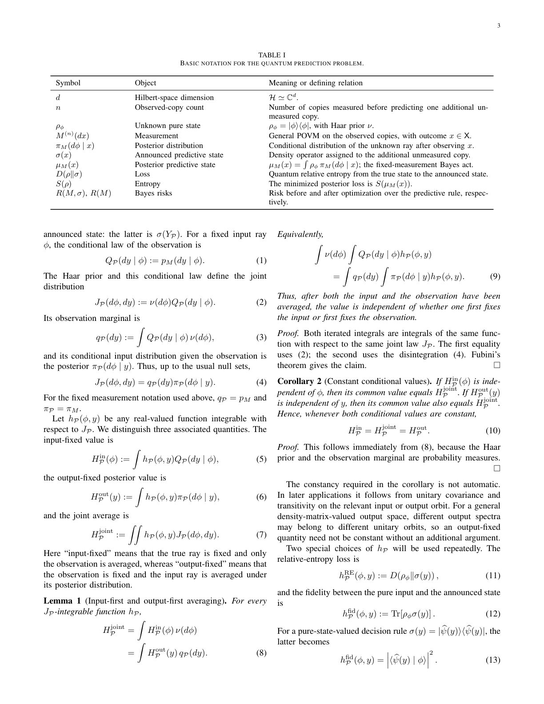 
Low-resolution page preview, page 3

📷 Fig 3

 
Low-resolution page preview, page 4

📷 Fig 4

 
Low-resolution page preview, page 5

📷 Fig 5

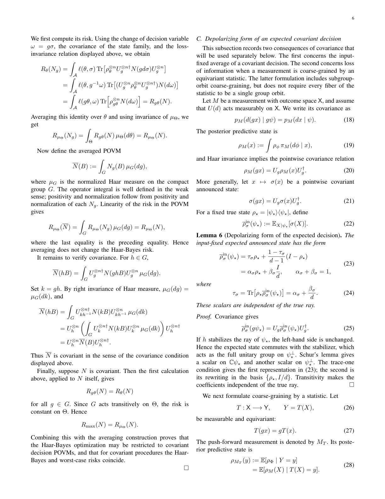 
Low-resolution page preview, page 6

**Summary.** This work solves the optimal quantum state prediction problem under a Haar prior by minimizing the quantum relative entropy loss. It proves that the optimal measurement is the highest-weight covariant POVM, which is globally Bayes optimal and minimax. The key technical tool is an 'arbitrary-effect reduction' that simplifies the complex optimization over all possible measurements.

**Why it may be interesting.** The rigorous derivation of global optimality for quantum state estimation using information-theoretic measures like relative entropy is fundamental to quantum estimation theory, providing concrete bounds for quantum measurement strategies.

Detailed structure

**Main problem.** The paper determines the optimal measurement strategy (POVM) and subsequent decision rule for predicting an unmeasured copy of a pure quantum state, minimizing the quantum relative entropy loss.

**Main result.** The global Bayes optimal measurement is the highest-weight covariant POVM, which is also globally minimax, yielding an exact minimum risk $h_d((n+1)/(n+d))$ and maximizing the mean posterior purity.

**Method.** The analysis uses an 'arbitrary-effect reduction' identity to simplify the optimization over all POVMs, showing that the optimal outcome is achieved by coherent rank-one effects.

**Model / system.** The system involves an unknown pure state $
ho_\phi$ drawn from the Haar distribution on a $d$-dimensional Hilbert space. The process models measuring $n$ copies via a POVM and predicting one unmeasured copy.

**Key observables.** Quantum relative entropy loss, Bayes prediction risk, mean posterior purity, and the posterior predictive state $\mu_E$.

**Important parameters / regimes.** The number of observed copies ($n$), the dimension of the Hilbert space ($d$), and the ratio $r = (n+1)/(n+d)$.

**Assumptions / limitations.** The analysis assumes a Haar prior distribution for the unknown pure state and relies heavily on the arbitrary-effect reduction identity.

**Figures summary.** No specific figures were described, but the notes reference TABLE I for basic notation regarding the prediction problem.

**Paper structure.** The paper establishes the problem setup, derives the optimal predictive state using the arbitrary-effect identity, proves global optimality by comparing entropy bounds, and finally identifies the highest-weight covariant POVM as the global solution.

Abstract

We study Haar-Bayesian prediction of one unmeasured copy of an unknown finite-dimensional pure quantum state after an arbitrary collective measurement on $n$ observed copies. Performance is evaluated by quantum relative entropy. For a fixed measurement, the Bayes predictive state is the posterior mean and the optimized conditional loss is its entropy. We then optimize the measurement over all POVMs on the symmetric subspace. For every nonzero positive effect $E$, the corresponding posterior predictive state is $μ_E=(I+nρ_E)/(n+d)$, where $ρ_E$ is the normalized one-particle marginal of $E$. Since a pure spectrum majorizes every density-operator spectrum, this identity gives an outcome-wise entropy lower bound. Coherent rank-one effects attain the bound, and their Haar orbit yields the highest-weight covariant POVM. Hence this POVM is globally Bayes optimal over all collective measurements and, by covariance, globally minimax. Its exact risk is $h_d((n+1)/(n+d))$, where $h_d(r)=-r\log r-(1-r)\log((1-r)/(d-1))$. The same arbitrary-effect reduction shows that the highest-weight POVM also maximizes the joint overlap between the latent pure state and its posterior predictive state, equivalently the mean posterior purity, with optimum $((n+1)^2+d-1)/(n+d)^2$.

[↑ back to top](#top)

### [Optimal Low-Rank Quantum State Tomography with Bounded-Sample Joint Measurements](http://arxiv.org/abs/2609.10514v1)

**Authors:** Ashwin Nayak, Xingyu Zhou  
**Type:** theory · **Category:** quantum information and computing · **PDF:** <https://arxiv.org/pdf/2609.10514v1>  
**Analysis basis:** full PDF text, analyzed in chunks
**Topic relevance:** 🔥 `quantum measurements` **4/5**

📷 Fig 1

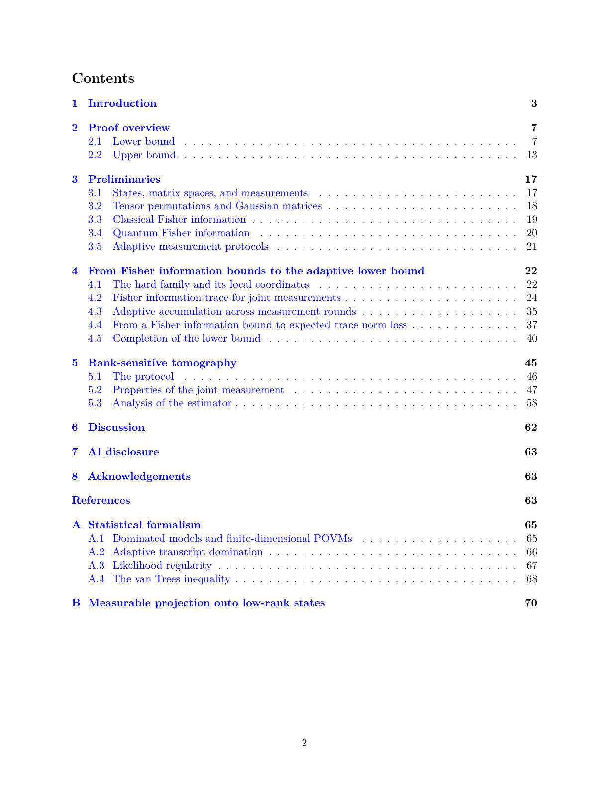 
Low-resolution page preview, page 2

📷 Fig 2

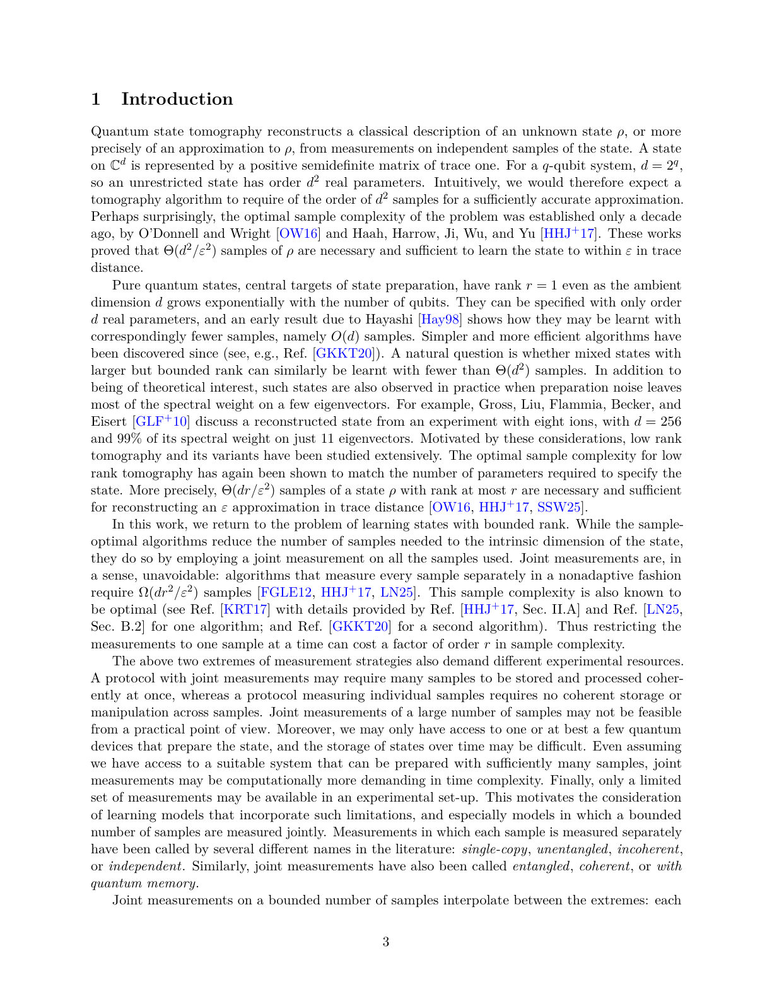 
Low-resolution page preview, page 3

📷 Fig 3

 
Low-resolution page preview, page 4

📷 Fig 4

 
Low-resolution page preview, page 5

📷 Fig 5

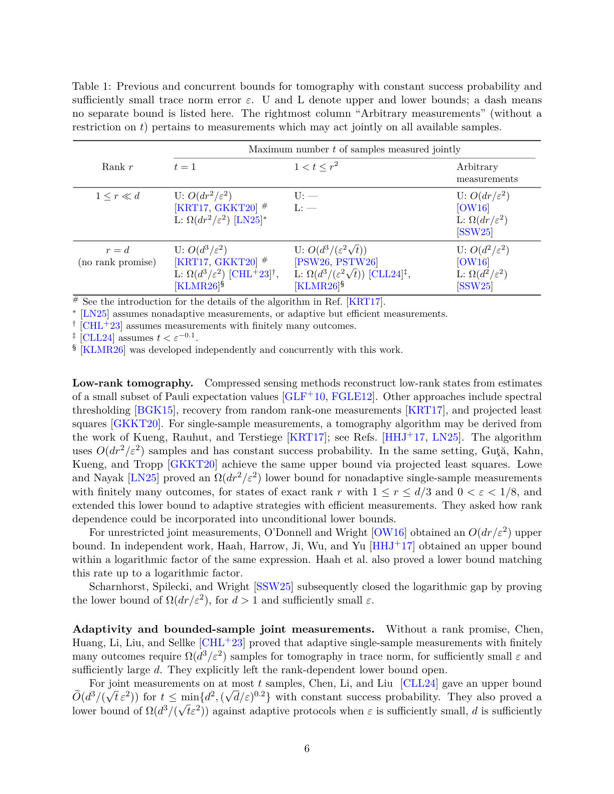 
Low-resolution page preview, page 6

**Summary.** This paper rigorously determines the optimal sample complexity for low-rank quantum state tomography when measurements are restricted to jointly sampling at most $t$ instances. It establishes a matching lower and upper bound, showing that joint measurements provide a $\sqrt{t}$ improvement over single-sample measurements. The methodology combines advanced information theory (van Trees inequality) with constructive nonadaptive protocols.

**Why it may be interesting.** This work provides fundamental, quantitative bounds on the data requirements for quantum state characterization, which is crucial for designing practical quantum tomography experiments and understanding the limits of quantum measurement.

Detailed structure

**Main problem.** Determining the optimal sample complexity required to estimate a low-rank quantum state ($	ext{rank} \le r$) given measurements that can jointly act on at most $t$ samples.

**Main result.** The optimal sample complexity is $\Theta\left(rac{dr}{\epsilon^2} \max\left(1, rac{r}{\sqrt{t}}
ight)
ight)$, matching both adaptive (lower bound) and nonadaptive (upper bound) protocols.

**Method.** The lower bound is established using the van Trees inequality applied to the Fisher information trace, while the upper bound is achieved via a nonadaptive protocol based on Gaussian joint measurements.

**Model / system.** The system involves estimating an unknown quantum state $
ho$ on $\mathbb{C}^d$ with a constrained rank $r$. The measurements are modeled as joint Positive Operator-Valued Measures (POVMs) acting on $t$ samples.

**Key observables.** Trace norm error ($\|\hat{
ho} - 
ho\|_1$), Fisher information trace, and the required sample complexity ($n$).

**Important parameters / regimes.** Ambient dimension ($d$), state rank ($r$), maximum joint samples ($t$), and target error ($\epsilon$).

**Assumptions / limitations.** The analysis assumes sufficiently small error $\epsilon$ and relies on advanced measure-theoretic tools (e.g., domination by reference measures) for the lower bound proof.

**Figures summary.** Not specified in the notes, but the paper compares various sample complexity bounds across different regimes of $r$ and $t$ (Table 1 mentioned).

**Paper structure.** The paper develops the lower bound using Fisher information and the van Trees inequality, and establishes the matching upper bound using a nonadaptive Gaussian measurement protocol. The mathematical rigor is supported by detailed appendices covering measure theory and likelihood density construction.

Abstract

We determine the optimal sample complexity of low-rank quantum state tomography when each measurement may act jointly on at most $t$ samples. For sufficiently small $\varepsilon$, estimating an unknown state on $\mathbb{C}^d$ of rank at most $r$ to trace norm error $\varepsilon$ with constant success probability requires, and is achievable with, $$   Θ\left(   \frac{dr}{\varepsilon^2}   \max\left\{1,\frac r{\sqrt t}\right\}   \right)$$ samples. The lower bound allows the protocol to choose each joint measurement adaptively using all previous classical outcomes; the matching upper bound is nonadaptive. Thus joint measurements on at most $t$ samples improve the complexity of algorithms making single-sample measurements by at most a factor $\sqrt t$. Further, measuring order $r^2$ samples jointly is necessary and sufficient to attain the unrestricted collective rate.   For the lower bound, we vary the support of a state with fixed uniform spectrum and bound the Fisher information trace of every joint measurement on $t$ samples. The adaptive Fisher chain rule and the van Trees inequality then give the trace norm lower bound. For the upper bound, we construct and analyze a nonadaptive tomography protocol based on a Gaussian joint measurement. An explicit second moment identity and a conditional Gaussian law outside the state's support give a rank-dependent error analysis, yielding the matching rate.

[↑ back to top](#top)

### [Coherent advantage in the computational expressivity of excitonic networks](http://arxiv.org/abs/2609.10448v1)

**Authors:** Matthew Du, Carlos Floyd, Dipti Jasrasaria, Suriyanarayanan Vaikuntanathan  
**Type:** theory · **Category:** other · **PDF:** <https://arxiv.org/pdf/2609.10448v1>  
**Analysis basis:** full PDF text, analyzed in chunks
**Topic relevance:** `analog quantum simulation` **3/5** · `driven-dissipative phase transition` **3/5** · `methods for driven-dissipative` **3/5** · `Tavis-Cummings & cavity-many-emitter` **2/5** · `correlated / nonlocal dissipation` **2/5** · `non-equilibrium universality` **2/5** · `Keldysh / 2PI / non-Gaussian methods` **1/5**

📷 Fig 1

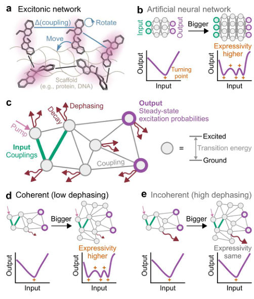 
FIG. 1. Overview: computational expressivity of open quantum networks. (a) In an excitonic network of molecular chromophores, excitations become delocalized through coherent (wave-like) transport mediated by dipole- dipole coupling. Using a scaffold (e.g., protein or DNA), the couplings can be tuned by adjusting the position or orienta- tions of the chromophores. (b) The computational expressiv- ity of an artificial neural network increases with model size. Here the expressivity is measured by the number of turning points. (c) Excitonic network as a computational platform. Each site is associated with a transition energy of excitation and couplings to other sites. Excitations are pumped into...

📷 Fig 2

 
FIG. 2. Computational expressivity grows with system size in the coherent regime. (a) Model of excitonic networks as a computational platform. An excitation on site j = 1, . . . , N has transition energy Ej and can hop to site l according to coupling Vjl = V ∗ lj. Excitations are pumped into site 1 at rate kp and decay from any site at rate kd. Excitations at each site also dephase at a constant rate kφ, as described by the Lindblad master equation. The input of the computation is the coupling V12 between the pumped site 1 and a not-pumped site 2, and the output is the excitation probability pi of a site i at steady state. (b) Examples of computational input-output relations pi(V12) for...

📷 Fig 3

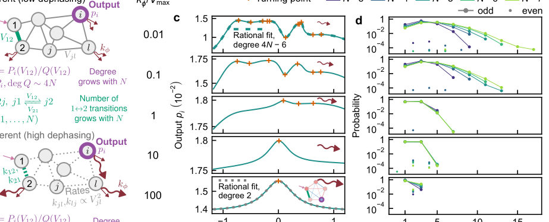 
FIG. 3. Coherent advantage in computational expressivity. (a, b) Computational expressivity of excitonic networks in the coherent regime of low dephasing (a) and the incoherent regime of high dephasing (b). The input-output relation pi(V12) is given by a rational function whose degree and thus expressivity grows with system size N in the coherent regime (a) but is independent of N in the incoherent regime. The dependence on N can be understood in terms of the number of 1 ↔2 transitions (i.e., mediated by V12) in each regime. (c) Examples of input-output relation for varying dephasing rate kφ (in units of the maximum absolute coupling Vmax). The dashed lines are a fit to rational functions,...

📷 Fig 4

 
FIG. 4. Coherent advantage in computational expres- sivity occurs at lower temperatures. (a) Model of ex- citonic network as a computational platform in the pres- ence of dephasing induced by a thermal bath. The dephas- ing is characterized by temperature T and spectral density J(ω), as described by the Redfield master equation. (b) His- togram of turning points in the input-output relations of ran- dom excitonic networks for varying T (in units of ∆E0 = 2Vmax √

**Summary.** This paper treats excitonic molecular networks as quantum computational substrates, demonstrating that the ability to compute complex functions (expressivity) depends critically on quantum coherence. By analyzing the steady-state output as a rational function of couplings, the authors prove that coherence allows this expressivity to scale with system size, a feature lost when decoherence dominates.

**Why it may be interesting.** This work directly bridges quantum optics/AMO physics with computation theory, providing a physical mechanism (coherence) that dictates the computational power of an open quantum system, which is highly relevant for quantum information science.

Detailed structure

**Main problem.** The study investigates whether coherent quantum dynamics in excitonic networks can provide a computational expressivity that scales with system size, offering an energy-efficient alternative to classical AI computation.

**Main result.** Coherence is established as a quantifiable resource for expressive computation, as the input-output relation's complexity scales linearly with network size in the coherent regime, a scaling lost in the presence of strong dephasing.

**Method.** The authors analyze the steady-state population $\pi_i(V_{12})$ by deriving its mathematical form as a rational function of the intersite couplings $V_{12}$ using the density matrix formalism.

**Model / system.** The system is a driven-dissipative excitonic network of molecular chromophores, modeled by a Lindblad master equation. The dynamics are governed by the Hamiltonian and dissipation terms, with the input being the intersite couplings $V_{jl}$ and the output being the steady-state excitation probabilities.

**Key observables.** Computational expressivity, quantified by the polynomial degrees of the rational function $\pi_i(V_{12}) = \Pi(V_{12}) / Q(V_{12})$, and the number of turning points in the output function.

**Important parameters / regimes.** The degree of dephasing ($k_\phi$) and the system size ($N$) are critical parameters; the coherent regime corresponds to low dephasing.

**Assumptions / limitations.** The analysis assumes the dynamics can be accurately described by a rational function of the couplings, and that the system is restricted to the zero- and single-excitation manifolds.

**Figures summary.** Figures illustrate the contrast between coherent (wave-like) and incoherent (dissipative) transport, showing how computational expressivity grows with $N$ in the coherent regime and confirming the rational function scaling ($\sim 4N$) in the low dephasing limit.

**Paper structure.** The paper first introduces the excitonic network as a computational platform, deriving the input-output relation $\pi_i(V_{12})$ as a rational function. It then contrasts the scaling in the coherent regime (linear growth with $N$) versus the incoherent regime (constant expressivity), concluding that coherence is the source of enhanced computational power.

Abstract

The rising energy consumption of AI has generated interest in physical systems as alternative substrates for trainable computation. Recent experimental advances have enabled precise control over the couplings between molecular chromophores, which give rise to coherent excitation dynamics. Here, we study driven-dissipative excitonic networks as a computational platform, where the intersite couplings define the input and the steady state defines the output. We show that coherence enables computational expressivity to scale with network size, analogous to artificial neural networks. Both this scaling and the overall expressivity are suppressed by strong dephasing. Our work establishes coherence as a resource for expressive computation in nonequilibrium quantum systems.

[↑ back to top](#top)

### [Non-Hermitian topology in driven-dissipative systems: correspondence with quantum correlations and a resource for entanglement](http://arxiv.org/abs/2609.09312v1)

**Authors:** Niladri Chakraborty, Clara C. Wanjura  
**Type:** theory · **Category:** quantum information and computing · **PDF:** <https://arxiv.org/pdf/2609.09312v1>  
**Analysis basis:** full PDF text, analyzed in chunks
**Topic relevance:** `analog quantum simulation` **3/5** · `correlated / nonlocal dissipation` **3/5** · `driven-dissipative phase transition` **3/5** · `methods for driven-dissipative` **3/5** · `Keldysh / 2PI / non-Gaussian methods` **2/5** · `non-equilibrium universality` **2/5**

📷 Fig 1

 
FIG. 1. Directional topological amplifiers generate long-range correlations in their output fields. (a) We consider systems of cou- pled bosonic modes, here, concretely, two sets of bosonic modes ˆaj and ˆbj are coupled with complex hopping and two-mode squeezing (TMS) interactions, see Eq. (7). Waveguides couple input fields as well as input noise into each of the modes. (b) For certain parame- ter regimes, such chains exhibit non-trivial non-Hermitian topology in the form of a winding number, Eq. (3). Here, regimes of non- trivial topology are soley determined through the cooperativity C, the competition between two-mode squeezing and local dissipation and the phase controlling...

📷 Fig 2

 
FIG. 2. Emergence of correlations in non-trivial non-Hermitian topological phases. (a)-c Normal and anomalous correlations, Eq. (11), are a witness of non-Hermitian topological phase transi- tions, Eq. (17). (a) In the trivial phase, the correlations are ex- ponentially attenuated as a function of the distance between the modes, while in non-trivial phase, the correlations Mj,ℓgrow exponentially as a function of distance between modes (for any ν(j −ℓ) &gt; 0). At the transition, the correlations are uniform across the system. For clarity, we only show the normal correla- tions between ˆaj modes, N (a,a) j,ℓ here; normal correlations N (b,b) j,ℓ between ˆbj modes and anomalous correlations...

📷 Fig 3

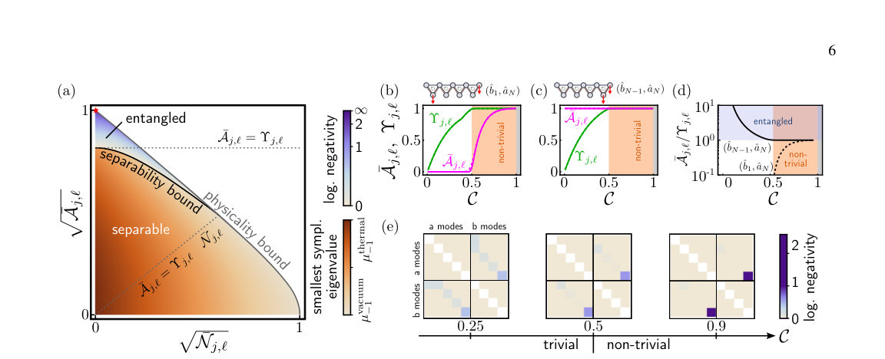 
FIG. 3. Understanding entanglement through competing correlations and mode occupations. (a) When the local squeezing of the output state Aj,j = 0 is zero, the the condition for bi-partite entanglement for a given mode occupation ratio Υj,ℓ, Eq. (24), is purely determined by the normalised correlations, ¯ Aj,ℓand ¯ Nj,ℓ. The colour gradient in the set of entangled state denotes the value of the entanglement monotone logarithmic negativity, which is 0 in the separable region and positive in the entangled region. In the separable region, we instead plot the smallest symplectic eigenvalue with µ−1 = 1/2 corresponding to vacuum, i.e., minimal uncertainty. The state at the apex (red star) also...

📷 Fig 4

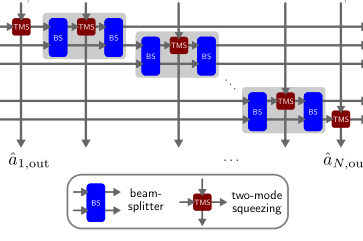 
FIG. 4. Entanglement generation in different operation regimes. (a)-(c) Logarithmic negativity and smallest symplectic eigenvalue µ−1 as a function of the cooperativity for (a) the perfectly unidi- rectional amplifier chain (θ = π

📷 Fig 5

 
FIG. 5. Correlations and entanglement in the bosonic Kitaev Chain. (a) In the bosonic Kitaev chain [69], Eq. (25), neighbouring modes are connected via beamsplitter and two-mode-squeezing in- teractions. (b) Correlations N N

**Summary.** This paper establishes a deep link between non-Hermitian topology and quantum correlations in dissipative systems. By analyzing quantum fluctuations beyond mean fields, the authors show that topological features generate long-range correlations and dictate the localized nature of entanglement. This provides a powerful theoretical tool for engineering quantum information processing in platforms like optomechanics.

**Why it may be interesting.** This work directly connects topological invariants (a robust mathematical concept) to measurable quantum resources like entanglement and correlations in open quantum systems, which is highly relevant for designing quantum devices.

Detailed structure

**Main problem.** The work extends the understanding of non-Hermitian topology, previously linked to classical mean-field response, to quantify its role in generating and characterizing quantum correlations and entanglement.

**Main result.** Non-trivial non-Hermitian topology generates quantum correlations that grow exponentially with distance, and entanglement remains localized at the boundaries of the system.

**Method.** The authors derive analytic expressions for normal and anomalous correlations by analyzing quantum fluctuations (second moments) in the system's dynamics, extending the topological framework from first moments.

**Model / system.** The study uses driven-dissipative bosonic chains, exemplified by phase-preserving directional amplifiers and the bosonic Kitaev chain, modeled by quantum Langevin equations.

**Key observables.** Normal and anomalous correlations, entanglement (logarithmic negativity), and the topological invariant (winding number $\nu$).

**Important parameters / regimes.** The correlation length, the degree of non-trivial topology ($\nu$), and the competition between anomalous correlations and mode occupation asymmetry.

**Assumptions / limitations.** The analysis often assumes a perfectly directional regime for the scattering matrix and that the system remains in a regime where anomalous correlations saturate at a physical limit.

**Figures summary.** Figures illustrate directional topological amplifiers, showing the correspondence between non-trivial topology and long-range correlations, and demonstrate the evolution of entanglement and singular vectors under boundary perturbations.

**Paper structure.** The paper first establishes the mean-field correspondence, then derives quantum correlation expressions, and finally analyzes entanglement evolution by examining boundary perturbations on the correlation structure.

Abstract

Directional amplification, in which signals are amplified selectively depending on their propagation direction, is a key resource for quantum information processing and stands in one-to-one correspondence with non-trivial non-Hermitian topology. So far, this correspondence has concerned the mean fields, and thus classical response. Here we turn to the quantum fluctuations, giving access to correlations and entanglement. For phase-preserving amplifiers, we derive analytic expressions for the normal and anomalous correlations, showing that non-trivial topology produces correlations that grow exponentially with the distance between modes and approach the largest values compatible with the uncertainty relations. The associated correlation length diverges at the topological phase transition. Entanglement nonetheless remains local, set by the competition between normalised anomalous correlations and the asymmetry of the mode occupations. For the bosonic Kitaev chain, a phase-sensitive amplifier, the system instead splits into two halves that are internally fully correlated yet mutually uncorrelated. Our work prepares the ground for exploring the quantum properties of non-Hermitian topological systems with state-of-the-art platforms such as cavity optomechanics and superconducting circuits.

[↑ back to top](#top)

### [Thermodynamic and Statistical Signatures of Modality Changes in Concentration Distributions Driven by Stochastic Switching Between Two Activity States](http://arxiv.org/abs/2609.09979v1)

**Authors:** Aindrila Deb, Pintu Patra  
**Type:** theory · **Category:** statistical mechanics · **PDF:** <https://arxiv.org/pdf/2609.09979v1>  
**Analysis basis:** full PDF text, analyzed in chunks
**Topic relevance:** `driven-dissipative phase transition` **3/5** · `methods for driven-dissipative` **3/5** · `non-equilibrium universality` **3/5** · `Full counting statistics` **2/5** · `quantum measurements` **2/5** · `Keldysh / 2PI / non-Gaussian methods` **1/5** · `correlated / nonlocal dissipation` **1/5**

📷 Fig 1

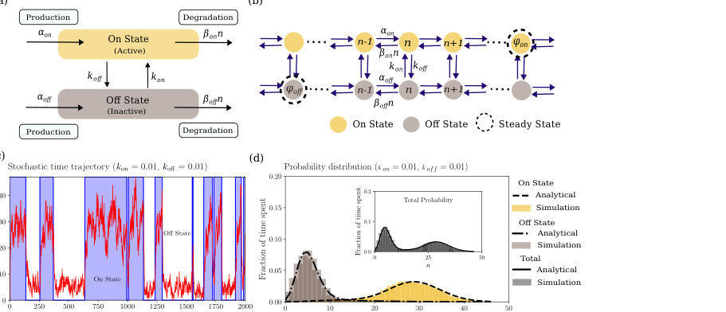 
FIG. 1: Stochastic switching between two activity states coupled to accumulation dynamics. (a) We consider a genetic state that stochastically transitions between the ON (active) and OFF (inactive) activity states and vice versa with rates kon and koff, respectively. In each state, the molecular copy number, n, undergoes production at rates αon or αoff, and linear degradation at rates βonn or βoffn. (b) The joint state space (S, n) illustrates different transitions. Horizontal transitions represent intra-state production and degradation processes, while vertical transitions represent discrete switching between the two activity states. The dashed circles show the local steady-state...

📷 Fig 2

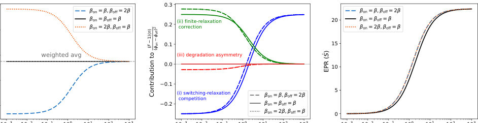 
FIG. 2: Variation of mean, Fano factor components, and EPR with degradation rate. (a) Variation of mean molecular copy number (⟨n⟩) with the degradation rate (β). The grey dashed line corresponds to the first term (weighted average) in the mean expression (Eq. 7). (b) Variation of each term in Fano factor expression (Eq. 8) (which contributes to the excess Fano factor, (F −1)⟨n⟩ (ϕon−ϕoff)2 ) with degradation rate β. The curves (dashed and

📷 Fig 3

 
FIG. 3: Steady-state probability distributions across the different switching rates. Each panel shows the exact analytical steady-state distributions for the ON state (Pn, yellow), OFF state (Qn, brown), and the total probability (ψn = Pn + Qn, black dashed curve), computed from Eqs. 5–6. The base switching rate kon increases along the horizontal axis (left to right), and the switching bias koff/kon increases along the vertical axis (bottom to top). Parameters are fixed at αon = 3.0, αoff = 1.0, βon = 0.1, βoff = 0.2, giving intrinsic levels ϕon = 30.0 and ϕoff = 5.0.

📷 Fig 4

 
FIG. 4: Variation of Fano factor and EPR. (a) Fano factor F (left sub-panel) and entropy production rate ˙S (right sub-panel) plotted against the mean copy number ⟨n⟩as parametric curves, with the base switching rate kon fixed and the bias koff/kon is varied (arrows indicate the direction of increasing koff). Each curve traces a characteristic curve: at extreme bias one state dominates, the distribution is near-Poissonian, and both F ≈1 and ˙S ≈0; at intermediate bias both states are substantially occupied, F and ˙S reach their respective maxima. (b) Fano factor F (left sub-panel) and EPR ˙S (right sub-panel) plotted with the switching ratio koff/kon fixed and both kon and koff are varied...

**Summary.** This work develops a theoretical framework to analyze molecular accumulation in systems that stochastically switch between two activity states. By solving the Chemical Master Equation, the authors analytically compute key metrics like the Fano factor and Entropy Production Rate. The results clarify how the underlying kinetic rates govern the resulting molecular noise and thermodynamic dissipation, offering broad applicability to biological and physical systems exhibiting switching behavior.

**Why it may be interesting.** The rigorous connection drawn between non-equilibrium thermodynamics (EPR) and molecular noise (Fano factor) in a switching system provides a powerful, quantitative tool applicable to open quantum systems where environmental coupling drives non-equilibrium steady states.

Detailed structure

**Main problem.** The paper investigates the thermodynamic and statistical signatures of changes in molecular concentration distributions that arise from stochastic switching between two distinct activity states.

**Main result.** It establishes a generalized framework showing how kinetic parameters dictate molecular distributions, noise (Fano factor), and dissipation (Entropy Production Rate) during these stochastic switching events.

**Method.** The authors use the Chemical Master Equation (CME) formalism, solved via the Probability Generating Function (PGF), to derive exact analytical expressions for the steady-state statistics.

**Model / system.** The model is a generalized two-state promoter switching system for mRNA accumulation, incorporating state-dependent production and degradation rates. The dynamics are governed by coupled master equations for the probabilities in the ON and OFF states.

**Key observables.** Fano factor (statistical fluctuations), Entropy Production Rate (EPR, thermodynamic dissipation), and the steady-state probability distribution (which can be unimodal or bimodal).

**Important parameters / regimes.** Stochastic switching rates ($k_{on}, k_{off}$), state-dependent production ($\alpha$) and degradation ($eta$) rates, and the ratio of these rates.

**Assumptions / limitations.** The analysis is based on the two-state model and assumes first-order kinetics for degradation, though it extends beyond the null model of constant degradation.

**Figures summary.** Figures illustrate the schematic of state switching, the joint state space, representative stochastic trajectories showing relaxation, and heatmaps visualizing the variation of the Fano factor and EPR across different switching rate regimes.

**Paper structure.** The paper first sets up the generalized two-state CME model, derives analytical solutions for key observables (mean, Fano factor, EPR) using PGFs, and then systematically analyzes how varying the switching rates modulates these statistical and thermodynamic quantities.

Abstract

Stochastic switching between gene expression states, coupled with production and degradation dynamics, governs the accumulation of mRNA and proteins in cells. The concentrations of these accumulated entities dictate the phenotypic distribution of genetically identical cells. The underlying accumulation dynamics are well-captured by a two-state promoter switching model, with statistical and thermodynamic properties quantified via the Fano factor and entropy production rates. However, how these measures correlate with concentration distributions and their shifts under varying kinetic parameters remains largely unexplored. To this end, we use chemical master equations to study a generalized model of mRNA accumulation dynamics in the presence of stochastic switching between two activity states and state-dependent production and degradation rates. We derive exact expressions for the steady-state probability distribution and analytically compute the mean concentration, Fano factor, and entropy production rate (EPR). Simplifying these expressions, we identify contributions arising from stochastic switching rates and relaxation dynamics toward equilibrium in each activity state. Next, using our theoretical results, we characterize the variation in the Fano factor and EPR as a function of mean expression during modality changes of the distributions mediated by the variation of switching rates. We also identify the conditions in kinetic parameters that achieve the highest Fano factor and entropy production rates. Our findings establish a generalized framework for examining stochastic accumulation dynamics, clarifying how kinetic parameters dictate molecular distributions, noise, and dissipation. These insights extend readily to broader contexts coupling stochastic switching with accumulation, including protein burst dynamics, phenotype-switching-mediated drug intake, and queuing theory.

[↑ back to top](#top)

### [A machine-learned dynamical phase diagram of the one-dimensional nonlinear Schrödinger equation with quasiperiodic disorder and a static field](http://arxiv.org/abs/2609.10045v1)

**Authors:** Marcos Pérez  
**Type:** theory · **Category:** disordered systems and neural networks · **PDF:** <https://arxiv.org/pdf/2609.10045v1>  
**Analysis basis:** full PDF text, analyzed in chunks
**Topic relevance:** `analog quantum simulation` **3/5** · `methods for driven-dissipative` **3/5** · `driven-dissipative phase transition` **2/5** · `non-equilibrium universality` **2/5** · `Frenkel-Kontorova` **1/5** · `Keldysh / 2PI / non-Gaussian methods` **1/5** · `quantum measurements` **1/5** · `scars & prethermalization` **1/5**

📷 Fig 1

 
Figure 1: Solver validation: (a) norm and energy conservation; (b) the linear Aubry–Andr´e metal–insulator transition at λ = 2; (c) Bloch oscillations with center-of-mass amplitude 4/F; (d) interaction-induced destruction of quasiperiodic localization; (e) self-trapping of a delta state at strong interaction; (f) the delta-vs-Gaussian self-trapping contrast of Larcher, Dalfovo and Mod- ugno [6].

📷 Fig 2

 
Figure 2: Machine-learned dynamical phase diagrams. Rows: slices A (F = 0, g vs. λ) and B (λ = 1, g vs. F). Columns: delta and Gaussian initial states. White dots mark crossover cells, where the per-point threshold rule disagrees with its cluster’s majority-vote name (Sec. 4.4).

📷 Fig 3

 
Figure 3: Validation against long-time ground truth. Left: asymptotic exponent α∞by short-time cluster (dashed lines mark the weak- and strong-chaos values 1/3 and 1/2; tv annotations give the median achieved tvalid per phase). Center: long-time (log10 m2, α∞) colored by short-time phase. Right: long-time residual peak norm Π0 by short-time cluster, the direct self-trapping check that does not rely on α∞.

📷 Fig 4

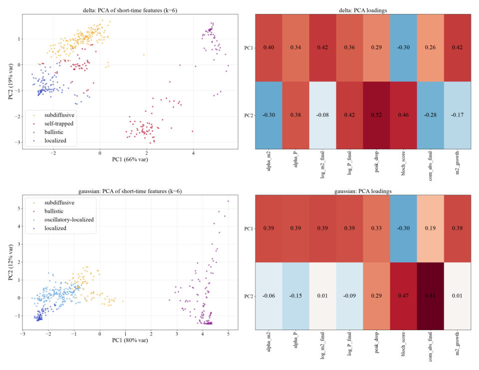 
Figure 4: PCA of the standardized short-time feature matrix, by initial state (rows), with cluster identity colored (left) and PCA loadings (right).

📷 Fig 5

 
Figure 4 shows the first two principal components of the standardized feature matrix, which together capture most of its variance (66%+19% delta, 80%+12% gaussian). PC1 is dominated by the delocalization block (αm2, log m2, log P, growth) and PC2 by the retention/oscillation block (peak- drop, Bloch score, center-of-mass). The two physically independent axes, “how far/fast” and “what stayed behind”, emerge from the clustering without being hand-specified, even though the cluster names are (Sec. 4.4). The self-trapped cluster in the delta panel visibly splits into two PC1- separated clouds, the geometric signature of the α∞bimodality quantified in Sec. 5.3.

**Summary.** This work maps the dynamical phase diagram of a nonlinear Schrödinger equation with quasiperiodic disorder using machine learning to overcome the computational bottleneck of long-time simulations. By clustering features from short runs, the authors identify five distinct transport regimes, demonstrating that the initial state significantly alters the resulting dynamics. This provides a powerful, efficient tool for characterizing complex quantum many-body systems.

**Why it may be interesting.** The combination of nonlinear wave dynamics, quasiperiodic disorder (a hallmark of localization studies), and the use of ML for phase diagram construction is highly relevant to modern research in non-equilibrium quantum dynamics.

Detailed structure

**Main problem.** The paper aims to map the complex dynamical phase diagram of a nonlinear wave equation subjected to both quasiperiodic disorder and a static field.

**Main result.** Five distinct dynamical regimes (ballistic, localized, subdiffusive, etc.) are identified, and the study highlights the crucial role of initial state (delta vs. Gaussian) in determining the long-time dynamics.

**Method.** It employs a machine-learning approach using Gaussian Mixture Models (GMM) on features extracted from numerous short-time simulations to rapidly partition the high-dimensional parameter space.

**Model / system.** The system is governed by the one-dimensional discrete nonlinear Schrödinger (Gross-Pitaevskii) equation, incorporating a quasiperiodic Aubry-André potential and a static (Stark) field.

**Key observables.** Spreading exponent ($\alpha_\infty$), long-time residual peak norm ($\Pi_0$), second moment ($m_2$), and various cluster-derived dynamical features.

**Important parameters / regimes.** Self-interaction strength ($g$), static field ($F$), and quasiperiodic strength ($\lambda$).

**Assumptions / limitations.** The physical regimes are assigned labels based on hand-calibrated rules applied to the unsupervised clustering results, and the method relies on short-time simulations predicting long-time asymptotics.

**Figures summary.** Figures illustrate space-time density portraits and corresponding $m_2(t)$ curves for representative dynamics across the identified regimes, validating the short-time predictions against long-time behavior.

**Paper structure.** The paper introduces the physical model and the computational challenge, details the ML-assisted feature extraction and clustering methodology, presents the resulting phase maps for different initial states, and validates the identified regimes against long-time simulations.

Abstract

We map the transport regimes of a wave packet evolving under the one-dimensional discrete nonlinear Schrödinger (Gross-Pitaevskii) equation with a quasiperiodic Aubry-André potential and a static (Stark) field, as a function of self-interaction $g$, field $F$, and quasiperiodic strength $λ$, for two initial states (delta and Gaussian). Instead of one expensive long-time simulation per grid point, we run 3600 short simulations, reduce each to eight dynamical features, and cluster parameter space with a Gaussian mixture model. Clustering finds the boundaries between regimes unsupervised; each cluster's name is then assigned by a hand-calibrated rule, and an ablation shows clustering measurably smooths those boundaries rather than merely relabeling them. The five resulting regimes (ballistic, localized, oscillatory-localized, subdiffusive, and self-trapped) are validated against 100 long runs on a lattice eight times larger than the short sweep, so the validation window is longer than the training window even for the fastest-spreading regime. The short-time clusters predict the long-time asymptotic spreading exponent ($α_\infty = 2.01\pm0.07$ ballistic, $0.28\pm0.16$ subdiffusive, consistent with the weak-chaos prediction $α=1/3$) and, independently, a long-time retention $Π_0=0.72\pm0.32$ for the self-trapped cluster, whose exponent alone is not diagnostic. The initial-state contrast is striking: the delta state develops a broad self-trapping wedge (onset at $g=3.907\pm0.017$ at $λ=0$) that invades the ballistic and localized regions as $g$ grows, while the Gaussian state shows no self-trapping, instead opening a subdiffusive corridor along the Aubry-André critical line that widens with $g$. The scheme yields a full $15\times15$ phase map in minutes per slice, where direct asymptotic simulation ($t\gtrsim10^6$ per point) is prohibitive.

[↑ back to top](#top)

### [Efficient protocol for the Markovian Mpemba effect in $N$-level systems](http://arxiv.org/abs/2609.09988v1)

**Authors:** David Gelbwaser-Klimovsky  
**Type:** theory · **Category:** statistical mechanics · **PDF:** <https://arxiv.org/pdf/2609.09988v1>  
**Analysis basis:** full PDF text, analyzed in chunks
**Topic relevance:** `driven-dissipative phase transition` **3/5** · `non-equilibrium universality` **3/5** · `methods for driven-dissipative` **2/5** · `scars & prethermalization` **2/5** · `Keldysh / 2PI / non-Gaussian methods` **1/5** · `analog quantum simulation` **1/5** · `correlated / nonlocal dissipation` **1/5** · `quantum measurements` **1/5**

📷 Fig 1

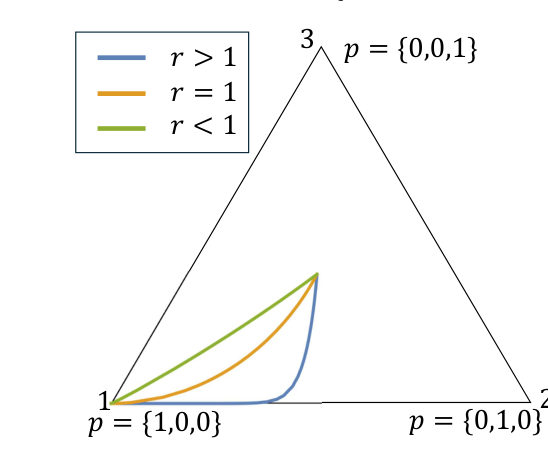 
FIG. 1. Each point inside the triangle represents a state of the 3LS population, {p1, p2, p3}. The corners are pure states of levels 1, 2 or 3, respectively. The thermal states are repre- sented by one of the color lines, whose shape depends on the energy level distribution through r.

📷 Fig 2

 
FIG. 2. Probability for N-level Markovian Mpemba effect as a function of the normalized bath inverse temperature. We considered bounded values of transition rates (0 &lt; aij &lt; 1). As shown in the plot, the probability decreases with bath tem- perature. 3-, 4-, and 5-level systems are shown in the figure. The convergence of the results was assessed by increasing the number of realizations and confirming that this did not signif- icantly alter the plot. For the transition rates, we considered values from 0.001 to 1 and for βbϵi from 0 to 5N. Each point in the graphs is based in 106 random realizations.

📷 Fig 3

 
FIG. 4. Markovian Mpemba effect for the lowest three hydrogen-like energy levels, r &lt; 1, as a function of the normal- ized transition rates. The upper plots show the area (in dark blue) of Mechanism 4, the only mechanism for the Markovian Mpemba effect for r &lt; 1. The bottom plots show the region of the inverse Markovian Mpemba effect (yellow) and the direct Markovian Mpemba effect (blue). Each plot column corre- sponds to a different βb. See Figure 3 for other details of the color coding. The energy levels are (arbitrary units): -5,-5/4,- 5/9.

📷 Fig 4

 
FIG. 3. Markovian Mpemba effect for the lowest three rota- tional energy levels, r &gt; 1, as a function of the normalized transition rates. The upper plots show the different mecha- nisms: Mechanism 1 (red), Mechanism 2 (light orange), and Mechanism 3 (Dark orange). The lower plots show the regions of the inverse (yellow) and direct (blue) Markovian Mpemba effect. In all plots, the purple regions correspond to parame- ter values without the Markovian Mpemba effect, and a black point represents the singular point. Each plot column corre- sponds to a different βb. The energy levels are 2, 6 and 12 (in arbitrary units).

📷 Fig 5

 
FIG. 5. Probability of a 4-level system exhibiting the Marko- vian Mpemba effect as a function of how many of its triplets exhibit any of the 3LS Markovian Mpemba mechanisms. No- tice that even in the case that all the triplets keep one of the 3LS mechanisms, the 4-level system may not exhibit the Markovian Mpemba effect. In this case, the probability is ∼93%. The convergence of the results was assessed by in- creasing the number of realizations and confirming that this did not significantly alter the plot. For the transition rates, we considered values from 0.001 to 1 and for βbϵi from 0 to 5. 5 × 105 realizations were used for the whole plot.

**Summary.** This paper provides a comprehensive theoretical framework to understand the Markovian Mpemba effect in $N$-level quantum systems. By first solving the problem for three-level systems, the authors develop an efficient protocol to predict the conditions required for the effect in larger systems. This work advances the understanding of non-monotonic thermalization dynamics in quantum matter.

**Why it may be interesting.** The Mpemba effect is a non-monotonic thermalization anomaly, making this work highly relevant to non-equilibrium statistical mechanics and the study of relaxation dynamics in open quantum systems.

Detailed structure

**Main problem.** The paper investigates the necessary and sufficient conditions for the Markovian Mpemba effect in general $N$-level quantum systems.

**Main result.** The authors derive specific conditions for 3-level systems and propose an efficient Single Pair of States Deviation (SPSD) protocol to determine parameters for the effect in larger $N$-level systems.

**Method.** The analysis uses the Pauli rate equation, eigenvalue analysis of the transition matrix, and develops a systematic protocol based on analyzing low-dimensional subsystems (triplets).

**Model / system.** The study focuses on $N$-level quantum systems undergoing thermalization, modeled by the Pauli rate equation ($\dot{P} = MP$). Initial analysis is performed on three-level systems (3LSs) to establish general criteria.

**Key observables.** The existence and nature (direct vs. inverse) of the Markovian Mpemba effect, diagnosed via the eigenvalues and eigenvectors of the transition matrix.

**Important parameters / regimes.** The bath inverse temperature ($eta_b$), energy level spacing ratios ($r$), and renormalized transition rates ($	ilde{a}_{23}, 	ilde{a}_{13}$).

**Assumptions / limitations.** The analysis relies on the Markovian approximation and assumes detailed balance for the transition rates.

**Figures summary.** Figures illustrate the population state locus in 3LSs, plot the probability of the Mpemba effect versus bath temperature for $N=3, 4, 5$, and show success rates for the SPSD protocol as a function of $eta_b$.

**Paper structure.** The paper first establishes necessary and sufficient conditions for 3LSs using geometric and spectral analysis. It then generalizes this understanding by developing the SPSD protocol to efficiently map the parameter space for arbitrary $N$-level systems, showing the dependence on temperature.

Abstract

The Mpemba effect is an anomalous phenomenon in which the time to thermalize does not depend monotonically on the distance from equilibrium, allowing systems with an initially larger temperature difference to thermalize before those with a smaller one. The rarity of the effect makes it hard to find parameters that produce it, complicating the design of experiments and the development of applications. Here, we find necessary and sufficient conditions for the Markovian Mpemba effect in three-level systems and explain its underlying physical mechanisms. Based on our understanding of the three-level case, we develop an efficient algorithm to determine the parameters for the effect in $N$-level systems. This protocol could open the door for the realization of Mpemba experiments and related applications in large systems.

[↑ back to top](#top)

### [Image recognition based on optical spike processing with exciton-polaritons](http://arxiv.org/abs/2609.09939v1)

**Authors:** Olgierd Jeziorski, Jakub Rogala, Krzysztof Tyszka  
**Type:** both · **Category:** disordered systems and neural networks · **PDF:** <https://arxiv.org/pdf/2609.09939v1>  
**Analysis basis:** full PDF text, analyzed in chunks
**Topic relevance:** `analog quantum simulation` **3/5** · `driven-dissipative phase transition` **3/5** · `methods for driven-dissipative` **3/5** · `Keldysh / 2PI / non-Gaussian methods` **1/5** · `Tavis-Cummings & cavity-many-emitter` **1/5** · `correlated / nonlocal dissipation` **1/5** · `non-equilibrium universality` **1/5** · `quantum optics experiment` **1/5**

📷 Fig 1

 
Fig. 1 shows a diagonal region of optimal performance. Performance degrades outside this regime due to two failure modes:

📷 Fig 2

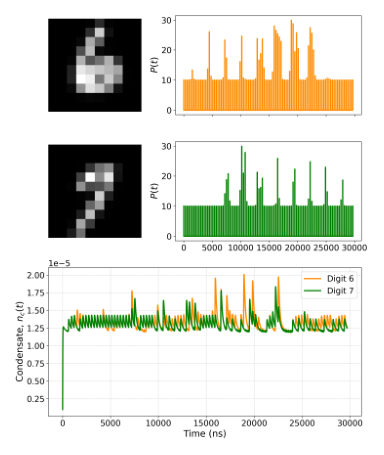 
Fig. 6 compares the classification accuracy across four distinct models: a base linear model trained on raw pixels, a model using pure condensate features, a combined model using condensate features concatenated with raw pixels, and a Feed-Forward Network (FFN). In the combined model, the N-dimensional temporal feature vector extracted from the condensate is concatenated directly with the original M-dimensional raw pixel array, extending the

📷 Fig 3

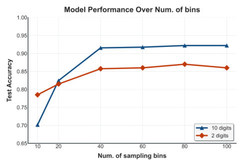 
Fig. 9 illustrates the classification performance when raw pixel data is combined with the condensate features. Re- markably, the accuracy remains stable and high across all tested values of N for both the 10-digit and 2-digit tasks. This highlights a critical practical advantage: while capturing the fine details of standalone linear processing requires high temporal resolution, the most beneficial nonlinear processing occurs over longer, macroscopic timescales. As a result, the system can utilize the condensate’s powerful nonlinear pro-

**Summary.** This study demonstrates the use of exciton-polariton condensates as a platform for optical neuromorphic computing, achieving image recognition on MNIST. By encoding images into the temporal dynamics of the condensate, the system extracts nonlinear features that significantly boost classification accuracy when combined with raw pixel data. This confirms the potential of polariton dynamics for ultrafast optical information processing.

**Why it may be interesting.** This work directly applies nonlinear, many-body physics (exciton-polaritons) to a machine learning task, demonstrating how inherent nonlinear dynamics can act as a feature extractor, which is highly relevant to open quantum systems and nonlinear optics.

Detailed structure

**Main problem.** The paper addresses the need for fully optical, energy-efficient, and fast neuromorphic computing systems capable of performing image recognition.

**Main result.** By encoding MNIST images into optical pulse sequences, the exciton-polariton condensate dynamics achieved 93.2% accuracy when combining condensate features with raw pixel data, outperforming linear baselines.

**Method.** The MNIST dataset is encoded into a time-domain pump function $P(t)$, and the resulting nonlinear dynamics of the condensate are sampled and processed by a linear classifier.

**Model / system.** The physical system is an exciton-polariton condensate governed by coupled ODEs describing condensate, active reservoir, and inactive reservoir populations. The dynamics are analyzed across optimal, under-stimulated, and saturated regimes.

**Key observables.** Classification accuracy (e.g., 92.2% baseline, 93.2% combined), condensate density $n_C(t)$, and the temporal evolution of the system variables.

**Important parameters / regimes.** Optimal operating parameters include $\Delta t \approx 30 	ext{ ps}$ and pulse width $\approx 5 	ext{ ps}$. The analysis distinguishes between optimal, under-stimulated, and saturated regimes.

**Assumptions / limitations.** The analysis uses a single-mode approximation, neglecting spatial variations, and relies on mapping pixel intensities to time-domain pump pulses.

**Figures summary.** Figures illustrate the dynamics in different operational regimes (optimal vs. under-stimulated) and compare classification accuracy across four models (raw pixels, pure condensate, combined, FFN) against varying sampling resolutions ($N$).

**Paper structure.** The paper first introduces the physical model and the encoding of image data into temporal pulses. It then analyzes the system's performance across different operational regimes, demonstrating the nonlinear feature extraction capability, and concludes with quantitative comparisons of classification accuracy.

Abstract

Exciton-polariton condensates combine ultrafast dynamics with strong optical nonlinearities, making them promising for optical neuromorphic computing. Here, we numerically demonstrate image recognition using the transient response of an exciton-polariton condensate. Downscaled MNIST images are encoded as optical pulse sequences, and the resulting condensate dynamics are sampled and processed by a linear classifier. For ten-class classification, condensate features achieve 92.2% accuracy, compared with 91.4% for raw-pixel linear classification. Combining both feature sets increases the accuracy to 93.2%. For the challenging binary classification of digits 7 and 9, the combined model reaches 97.3%, exceeding both the linear (95.5%) and feed-forward neural-network (96.6%) baselines. These results demonstrate that polariton dynamics can extract useful nonlinear features for ultrafast optical information processing.

[↑ back to top](#top)

### [Intermittent continuous-time random walks under renewal reset mechanism](http://arxiv.org/abs/2609.09738v1)

**Authors:** Guohua Li, Hong Zhang, Yuexiong Liu  
**Type:** theory · **Category:** statistical mechanics · **PDF:** <https://arxiv.org/pdf/2609.09738v1>  
**Analysis basis:** full PDF text, analyzed in chunks
**Topic relevance:** `driven-dissipative phase transition` **3/5** · `non-equilibrium universality` **3/5** · `Keldysh / 2PI / non-Gaussian methods` **2/5** · `methods for driven-dissipative` **2/5** · `analog quantum simulation` **1/5** · `correlated / nonlocal dissipation` **1/5** · `quantum measurements` **1/5** · `scars & prethermalization` **1/5**

📷 Fig 1

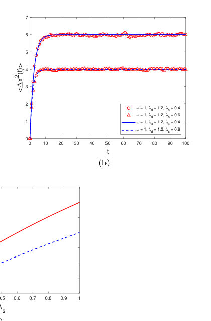 
Figure 1: Results of Monte-Carlo simulations (symbols) versus the analytical solutions (solid curves) for the shape (78) of the stationary state (removed the last item containing the generalized function δ(x)) in panel (a) and the MSDs (79) in panel (b) for the intermittent CTRWs with exponential distributed jump length (67) for the exponential jump and reset WTDs (29). The simulation results were plotted at the diffusion time t = 100 (including simulation for the shape of the stationary state) and averaged over N = 105 trajectories of the particles. In panel (c) the analytical results of MFAT (81) at the target position x0 = 5 as the parameter λs varies to show the existence of its minimum...

📷 Fig 2

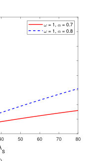 
Figure 2: The analytical solutions for the shape (84) of the stationary state (removed the last item containing the generalized function δ(x)) in panel (a) and the MSDs (85) in panel (b) for the intermittent CTRWs with power-law jump WTD and exponential reset WTD. In panel (c) the analytical results of MFAT (88) at the target position x0 = 8 as the reset parameter λs varies. The values of relevant model parameters are provided in the legend.

📷 Fig 3

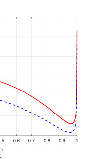 
Figure 3: The distribution in non-equilibrium stationary state (90)(removed the last item con- taining the generalized function δ(x)) in panel (a) and the MSDs (91) in panel (b) for the intermittent CTRWs with power-law reset WTD. In panel (c) the analytical results of MFAT (93) at the target position x0 = 5 as the reset power-law distribution exponent α varies. The values of relevant model parameters are provided in the legend.

📷 Fig 4

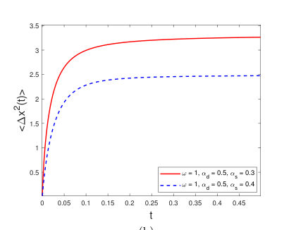 
Figure 4: The stationary distribution (95) in panel (a) and the MSD (96) in panel (b) of the intermittent CTRW with the power-law jump and reset WTDs. The values of relevant model parameters are provided in the legend.

📷 Fig 5

 
Figure 5: The particle trajectories of intermittent CTRW under stochastic resetting to original position. The exponential jump and reset WTDs with frequency parameters λd = 1.2 and λs = 0.4 individually and the Gaussian distributed jump length with standard deviation σ = 1.

**Summary.** This paper develops a theoretical model for intermittent Continuous-Time Random Walks incorporating a renewal reset mechanism based on the minimum of jump and reset waiting times. It analyzes the system's statistical properties, proving the existence of non-equilibrium steady states and quantifying search efficiency via the Mean First-Arrival Time. The results provide a refined understanding of anomalous diffusion in complex environments compared to standard resetting models.

**Why it may be interesting.** The mathematical framework for analyzing non-equilibrium dynamics, especially the derivation of generalized Montroll-Weiss equations and the study of anomalous diffusion via CTRWs, is highly relevant to open quantum systems and non-equilibrium statistical mechanics.

Detailed structure

**Main problem.** The paper investigates efficient search strategies in complex and disordered environments by modeling intermittent continuous-time random walks (CTRWs) under a renewal reset mechanism.

**Main result.** The model proves the existence of non-equilibrium stationary states and calculates the Mean First-Arrival Time (MFAT), showing it is finite for several combinations of exponential/power-law waiting time distributions, but diverges for power-law jump and reset WTDs.

**Method.** The analysis involves deriving and solving the governing equation and Montroll-Weiss equation for the intermittent CTRWs in both Laplace and Fourier space.

**Model / system.** The system is an intermittent CTRW where the next event (jump or reset) is governed by the minimum of two independent waiting times ($	au = \min\{	au_d, 	au_s\}$), representing a competition mechanism.

**Key observables.** Mean Square Displacements (MSDs), Mean First-Arrival Time (MFAT), and the stationary probability density function.

**Important parameters / regimes.** The distributions of the jump waiting times ($\psi_d(t)$) and reset waiting times ($\psi_s(t)$), including exponential and power-law forms.

**Assumptions / limitations.** The renewal event depends on the minimum of the jump and reset waiting times, and the model is compared against traditional independent resetting models.

**Figures summary.** Figures illustrate the PDF of particles at the stationary state and the MSDs for intermittent CTRWs, particularly when power-law reset WTDs are involved.

**Paper structure.** The paper details the model formulation, derives the governing equations (including the Montroll-Weiss equation), analyzes the stationary state and MSDs for various distributions (exponential/Gaussian), and concludes with the MFAT analysis and physical applications.

Abstract

Stochastic resetting as a practical and efficient search strategy in complex and disordered environments has long been a topic of interest to researchers. Based on the competition between jumping and resetting, this article proposes and investigates intermittent continuous-time random walks (CTRWs) under stochastic resetting, using the smaller waiting time for jump and reset as the renewal time, where the waiting times for both jump and reset can have arbitrary distributions. After each renewal event, the system will proceed with new waiting times for jump and reset regardless of their previous histories. We study the governing equation and Montroll-Weiss equation with renewal resetting, as well as the Markovian resetting for intermittent CTRWs. We prove the existence of non-equilibrium stationary states within the renewal reset mechanism when the jump and reset waiting times follow any exponential and power law distributions. For exponential and Gaussian distributed jump lengths, we examine the mean square displacements (MSDs) of particles to determine their monotonicity and asymptotic stability. Moreover, we calculate the first-arrival time to quantify search efficiency, and validate the intermittent CTRWs under renewal resetting lead to a finite mean first-arrival time (MFAT) to any fixed position for exponential jump and reset waiting time distributions (WTDs), power-law jump and exponential reset WTDs, as well as exponential jump and power-law reset WTDs. However, the MFAT diverges for power-law jump and reset WTDs. The intermittent CTRW model, which is based on the competition mechanism, can be applied to many physical scenarios, such as the foraging strategy of animals that return to their nests after an unsuccessful foraging attempt, or the work planning of intelligent robots that return to energy replenishment points after prolonged operation.

[↑ back to top](#top)

### [Topological instability and reentrant crystallization in active solids](http://arxiv.org/abs/2609.09500v1)

**Authors:** Zory Davoyan, Aditya Jha, Anton Souslov  
**Type:** theory · **Category:** statistical mechanics · **PDF:** <https://arxiv.org/pdf/2609.09500v1>  
**Analysis basis:** full PDF text, analyzed in chunks
**Topic relevance:** `driven-dissipative phase transition` **3/5** · `non-equilibrium universality` **3/5** · `Keldysh / 2PI / non-Gaussian methods` **2/5** · `methods for driven-dissipative` **2/5** · `Frenkel-Kontorova` **1/5** · `analog quantum simulation` **1/5** · `correlated / nonlocal dissipation` **1/5**

📷 Fig 1

 
FIG. 1. (a) Numerical phase diagram of the odd Cosserat solid. The activity is defined as the ratio between the strengths of the microscopic nonconservative and conservative forces, ϵa and ϵp, respectively. The molecular dynamics simulations were performed for a total of 104 particles interacting with conservative Gay-Berne forces with an aspect ratio of ∼1.2. Activity was introduced through nonconservative pairwise chiral forces with spherical symmetry. Further details of the simulation procedure are given in End Matter. (i)-(iv) Snapshots of Voronoi diagrams showing the prevalence of blue (7-fold) and red (5-fold) defects for various values of activity and temperature. (v) Schematic of...

📷 Fig 2

 
FIG. 2. (a) Renormalization group flow of the active Cosserat solid to linear order in activity. The active stresses provide a tuning parameter for the bare defect fugacity driving melt- ing transitions at otherwise stable parameter values. (b) A comparison of the analytical core energy and the rate of de- fect creation in simulations. Each data point is the average number of defects, N, observed over 104 simulation time steps and N0 is the number of defects observed at the spontaneous destabilization point. The expression for the analytical model is the zero-temperature limit −α2(log ma/2 + ˜γ) + C. C is a constant such that the core energy at ϵa/ϵp = 0 coincides with the numerical values,...

**Summary.** This work develops a theoretical framework to describe melting in active solids by extending classical defect-mediated theories. It introduces the concept of 'topological instability' as a non-equilibrium melting route and predicts reentrant crystallization due to high activity. The findings are significant for understanding phase transitions in non-equilibrium matter.

**Why it may be interesting.** The concept of topological instability driven by non-equilibrium forces provides a non-thermal mechanism for phase transitions, which has parallels in driven many-body systems studied in AMO physics.

Detailed structure

**Main problem.** The paper investigates the melting mechanism in active solids, extending KTHNY theory to include non-reciprocal elasticity and micropolar coupling.

**Main result.** It discovers a distinct melting mechanism called topological instability, and predicts reentrant crystallization at high activity where quasi-long-range order survives melting temperatures.

**Method.** The study employs a combination of continuum field theory, Renormalization Group (RG) flow analysis, and molecular dynamics simulations.

**Model / system.** The system is active solids, modeled using continuum theories incorporating non-reciprocal (odd) elasticity and Cosserat coupling, realized microscopically with particles subject to chiral and conservative forces.

**Key observables.** Orientational correlation function ($\psi_6$), structure factor peaks, defect-pair fugacity, and renormalized elastic constants.

**Important parameters / regimes.** Activity (ratio of nonconservative to conservative forces), non-reciprocity strength, and temperature ($T$).

**Assumptions / limitations.** The continuum theory assumes isotropy at long length scales, and the analysis often relies on approximations like assuming fast relaxation of rotational degrees of freedom.

**Figures summary.** Figures illustrate the phase diagram across different activity/temperature regimes, show RG flow of elastic constants, and compare structure factors for active versus passive force dominance.

**Paper structure.** The paper builds from extending continuum elasticity theory to active solids, analyzing defect interactions via gauge theory, deriving RG flow equations for elastic moduli, and finally predicting the topological instability and reentrant crystallization.

Abstract

We extend the KTHNY theory of defect-mediated melting in two dimensions to the case of active solids exhibiting both non-reciprocal (odd) elasticity and Cosserat (micropolar) coupling. For perturbatively small values of non-reciprocity, melting still proceeds via defect unbinding, but the melting temperature shifts due to activity. However, at a threshold value of non-reciprocity, we discover a qualitatively distinct mechanism for 2D melting, which we call topological instability. This melting occurs through the proliferation of defect pairs at any temperature. We use a combination of field theory and simulations to characterize this zero-temperature transition in terms of the defect-pair fugacity. Surprisingly, for higher activity values, we find reentrant crystallization, where the quasi-long-range order survives even at temperatures for which the equilibrium crystal would melt. Although active solids present one realization of this topological instability, we envision core-energy-driven defect proliferation as a generic and unexplored route for two-dimensional melting.

[↑ back to top](#top)

### [Energy Transport Structure and Fluctuation Theorem in Nonreciprocal Harmonic Chains](http://arxiv.org/abs/2609.09593v1)

**Authors:** Ziwei Cheng, Geng Li, Zhanchun Tu  
**Type:** theory · **Category:** statistical mechanics · **PDF:** <https://arxiv.org/pdf/2609.09593v1>  
**Analysis basis:** full PDF text, analyzed in chunks
**Topic relevance:** `non-equilibrium universality` **3/5** · `Full counting statistics` **2/5** · `Keldysh / 2PI / non-Gaussian methods` **2/5** · `driven-dissipative phase transition` **2/5** · `Frenkel-Kontorova` **1/5** · `correlated / nonlocal dissipation` **1/5** · `methods for driven-dissipative` **1/5**

📷 Fig 1

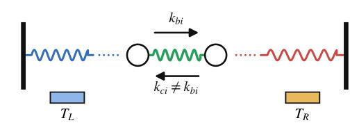 
FIG. 1. Schematic of the nonreciprocal harmonic chain cou- pled to two thermal reservoirs at temperatures TL and TR. The chain consists of N particles with asymmetric nearest- neighbor couplings kbi and kci, where i = 1, 2, . . . , N −1. The couplings kbi and kci characterize the interactions in opposite directions. Nonreciprocity corresponds to kbi ̸= kci.

📷 Fig 2

 
FIG. 2. Transport regimes in the parameter plane spanned by the temperature ratio TL/TR and the effective directional- coupling ratio b/c. The line TL/TR = b/c corresponds to ⟨jL⟩= ⟨jR⟩= 0 and separates the two regimes with opposite reservoir heat-current directions. The black dot at TL/TR = b/c = 1 denotes the isothermal zero-current point. It coin- cides with the reciprocal equilibrium state when kbi = kci for every bond.

📷 Fig 3

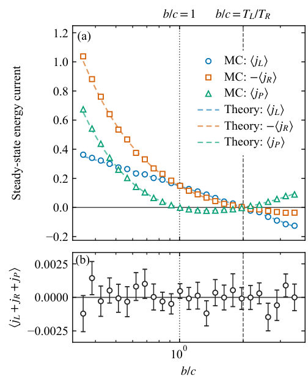 
FIG. 3. Numerical verification of the analytical predic- tions for the steady-state energy transport in a three-particle nonreciprocal harmonic chain. Open symbols represent the ensemble-averaged steady-state energy currents obtained from Langevin Monte Carlo simulations, while the dashed curves denote the corresponding exact theoretical predic- tions. The upper panel compares the left heat current ⟨jL⟩, the opposite of the right heat current −⟨jR⟩, and the non- reciprocal power current ⟨jP ⟩as functions of the effective directional-coupling ratio b/c. The vertical dotted line in- dicates the transport-symmetric point b/c = 1, whereas the vertical dashed line marks the current-reversal...

📷 Fig 4

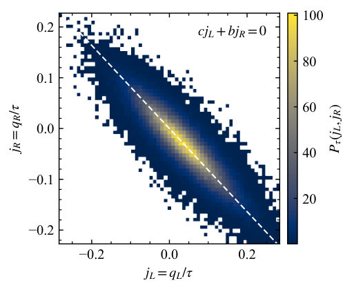 
FIG. 4. Steady-state joint probability distribution Pτ(jL, jR) obtained from Langevin simulations. The probability density is concentrated around the transport manifold cjL + bjR = 0, in agreement with the analytical prediction.

📷 Fig 5

 
FIG. 5. Numerical verification of the projected fluctuation relation. The Monte Carlo results (symbols) are compared with the theoretical prediction line (dashed line).

**Summary.** This work analyzes energy transport in harmonic chains with broken symmetry due to nonreciprocal couplings. It shows that heat flow depends on a competition between temperature bias and the intrinsic directional asymmetry, leading to a non-zero power current. Furthermore, it derives a joint fluctuation theorem, providing a comprehensive energetic and fluctuation framework for non-equilibrium heat control.

**Why it may be interesting.** The explicit derivation of a joint fluctuation theorem for energy transport in a non-equilibrium setting, controlled by directional interactions, provides a powerful tool for understanding energy flow beyond simple thermal gradients.

Detailed structure

**Main problem.** The paper investigates how nonreciprocal interactions fundamentally alter the structure of energy transport and the associated fluctuation theorems in harmonic chains.

**Main result.** It establishes a unified framework showing that nonreciprocity introduces an additional power current and that the joint heat exchange obeys an exact Gallavotti-Cohen fluctuation symmetry.

**Method.** The analysis employs Green-function techniques in the frequency domain, stochastic thermodynamics, and large deviation theory to derive steady-state currents and fluctuation relations.

**Model / system.** The model is a one-dimensional harmonic chain subjected to asymmetric nearest-neighbor couplings, coupled to two thermal reservoirs at different temperatures.

**Key observables.** Steady-state heat currents ($\langle j_L 
angle, \langle j_R 
angle$), the nonreciprocal power current ($\langle j_P 
angle$), and the joint scaled cumulant generating function.

**Important parameters / regimes.** Temperature bias ($T_L/T_R$) and the effective directional asymmetry ratio ($b/c$).

**Assumptions / limitations.** The analysis assumes harmonicity, one-dimensionality, and nearest-neighbor coupling; the fluctuation results rely on the large deviation principle.

**Figures summary.** Figures illustrate the schematic setup, the dependence of heat flow direction on the competition between temperature ratio and coupling ratio, and the joint probability distribution of heat currents.

**Paper structure.** The paper progresses from defining the nonreciprocal system and deriving the three-current energy balance ($\langle j_L 
angle + \langle j_R 
angle + \langle j_P 
angle = 0$), to analyzing the joint probability distribution, and finally deriving the joint Gallavotti-Cohen fluctuation relation.

Abstract

Nonreciprocal interactions fundamentally alter energy transport by breaking the symmetry between forward and backward responses. Here, we uncover an exact transport structure for a one-dimensional harmonic chain with asymmetric nearest-neighbor couplings. Using a Green-function approach, we demonstrate that the direction of heat transport is determined not solely by the temperature bias, but by its competition with an effective directional asymmetry. This competition can reverse the direction of heat flow, enabling cold-to-hot transport. We further show that nonreciprocity introduces an additional power channel associated with the antisymmetric sector of the interaction, leading to a generalized steady-state energy balance involving two reservoir heat currents and a nonreciprocal power current. At the fluctuation level, the heat exchanges with the two reservoirs constitute correlated yet distinct stochastic currents, whose joint scaled cumulant generating function obeys an exact Gallavotti-Cohen symmetry. Together, these results establish a unified energetic and fluctuation framework for nonreciprocal heat transport and demonstrate that directional interactions can serve as an active resource for controlling nonequilibrium energy flows.

[↑ back to top](#top)

### [Information-geometric bounds on nonequilibrium relaxation in quantum Markov dynamics](http://arxiv.org/abs/2609.09599v1)

**Authors:** Xiao-Kan Guo, Zhiqiang Huang  
**Type:** theory · **Category:** statistical mechanics · **PDF:** <https://arxiv.org/pdf/2609.09599v1>  
**Analysis basis:** full PDF text, analyzed in chunks
**Topic relevance:** `driven-dissipative phase transition` **3/5** · `non-equilibrium universality` **3/5** · `Keldysh / 2PI / non-Gaussian methods` **2/5** · `methods for driven-dissipative` **2/5** · `correlated / nonlocal dissipation` **1/5** · `quantum measurements` **1/5**

📷 Fig 1

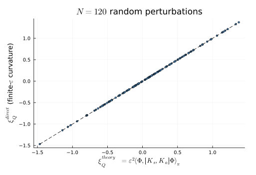 
FIG. 1. Exact identity on the qutrit: the definition-based di- rect extraction ξdirect Q (complex-step mixed fourth derivative)

📷 Fig 2

 
FIG. 4. Drive scaling: log ξ2 Q versus log σ∗for Ωd ∈[0.05, 1.2]

📷 Fig 3

 
FIG. 2. Normalized ratio at fixed generator: R[Φ(θ)] = cos2 θΦ and Q[Φ(θ)] = 2|ξQ|/(ϵ2νBKM∥Φ∥2π) along the family con- necting the two eigendirections of [K‡, K] with eigenvalues ±νBKM; Q sweeps [0.013, 0.9999] while νBKM = 4.56 is con- stant.

📷 Fig 4

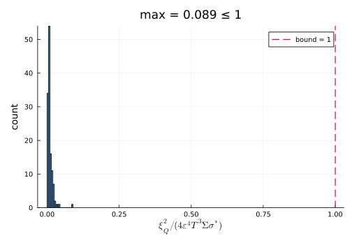 
FIG. 3. Semiclassical entropy-production bound: his- togram of ξ2 Q/(4ϵ4T3Σ σ∗) over 128 perturbations of the two- dimensional anisotropic NESS; all values lie below 1 (maxi- mum 0.089).

**Summary.** This work establishes a quantum information-geometric framework for analyzing how quantum systems relax away from equilibrium. It derives a precise formula for the nonequilibrium curvature correction, linking it to the commutator structure of the system's generator. The key achievement is deriving a quantitative bound that relates this quantum non-normality to the system's dissipative and transport activities.

**Why it may be interesting.** It provides rigorous, information-geometric bounds on relaxation dynamics, connecting non-equilibrium thermodynamics (entropy production) directly to the underlying quantum dynamics structure (generator non-normality).

Detailed structure

**Main problem.** The paper investigates the quantum information-geometric structure governing short-time nonequilibrium relaxation in quantum Markov dynamics.

**Main result.** It derives an exact identity showing the nonequilibrium curvature correction is related to the commutator of the dissipative and transport parts of the generator, and establishes a quantitative Activity-current bound for this correction.

**Method.** The analysis uses the von Neumann relative entropy as a quantum divergence, parameterizes perturbations via the Kubo-Mori map, and decomposes the induced generator into symmetric and antisymmetric parts.

**Model / system.** The study is applied to Quantum Markov Semigroups (QMS) with a full-rank stationary state, tested on models including a noncommuting qubit and a driven-dissipative qutrit.

**Key observables.** Nonequilibrium curvature correction ($\xi_Q$), BKM-symmetric/antisymmetric activities ($\Sigma_s, \Sigma_a$), and the steady-state entropy production rate ($\sigma_{ss}$).

**Important parameters / regimes.** High-temperature and overdamped limits, the perturbation parameter $\epsilon$, and the temperature $T$.

**Assumptions / limitations.** The analysis assumes the QMS has a full-rank stationary state and relies on the local quadratic structure of the relative entropy.

**Figures summary.** Figures illustrate the agreement between different methods for extracting $\xi_Q$, show the variation of the bound ratio $Q[\Phi]$ while generator non-normality is constant, and confirm the bound holds for a 2D anisotropic NESS.

**Paper structure.** The paper builds from generalizing classical relaxation inequalities to the quantum setting using the relative entropy, deriving the generator decomposition, establishing the commutator identity for $\xi_Q$, and finally proving the Activity-current bound, with appendices detailing the mathematical machinery.

Abstract

In this paper, we study the quantum information-geometric structure underlying short-time nonequilibrium relaxation in quantum Markov dynamics, and derive bounds on the nonequilibrium correction to the short-time relaxation curvature. These bounds generalize the information-geometric structure underlying Auconi's classical nonequilibrium relaxation inequality to quantum Markov dynamics. We consider the von Neumann relative entropy as quantum divergence, and parametrize perturbations through the Kubo-Mori map, which converts the second-order expansion of the relative entropy into the Bogoliubov-Kubo-Mori (BKM) inner product at all temperatures. For a quantum Markov semigroup with full-rank stationary state, the induced tangent-space generator admits a canonical decomposition into a BKM-symmetric and a BKM-antisymmetric part, and the leading nonequilibrium curvature correction takes the exact form of the expectation of the commutator between the dissipative and the transport part of the generator. This correction is bounded by the product of a BKM-symmetric dissipative activity and a transport-sector activity. The bound is verified on a noncommuting qubit model and a driven-dissipative qutrit, and the full chain is confirmed numerically on a two-dimensional Fokker-Planck steady state. In the high-temperature and overdamped limit the quantum formula reduces to the position-space Fokker-Planck expression and reproduces Auconi's entropy-production bound with the correct temperature factor.

[↑ back to top](#top)

### [Dynamic Observable Subspaces: Fast Simulation of Observable Quantum Dynamics](http://arxiv.org/abs/2609.09806v1)

**Authors:** Hannes Leipold  
**Type:** theory · **Category:** numerical methods · **PDF:** <https://arxiv.org/pdf/2609.09806v1>  
**Analysis basis:** full PDF text, analyzed in chunks
**Topic relevance:** `methods for driven-dissipative` **3/5** · `Keldysh / 2PI / non-Gaussian methods` **2/5** · `analog quantum simulation` **2/5** · `driven-dissipative phase transition` **2/5** · `quantum measurements` **1/5**

📷 Fig 1

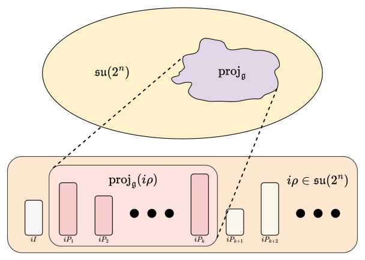 
Figure 1: Observable Subspace of Quantum Dynamics. In the case that iO ∈g for observable O, the measurable dynamics of a quantum system are captured inside the Dynamic Lie Algebra g such that Tr (O ρ(T)) = Tr  O projg(ρ(T))  .

📷 Fig 2

 
Figure 2: Liouville von Neumann Dynamics in the Heisenberg Picture. In the skew Heisenberg picture, an observable iO evolves by a Hamiltonian H(t) = P

📷 Fig 3

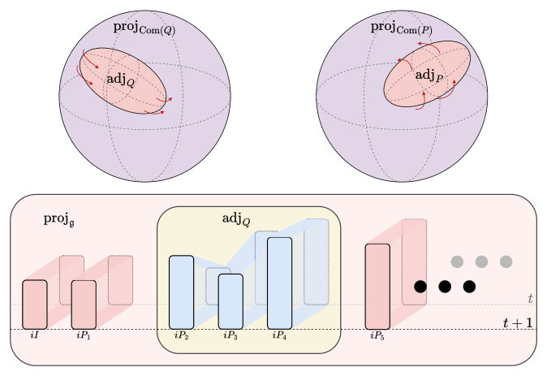 
Figure 3: Dynamic Subspace of the Adjoint Operator. Top depicts the dynamic action of two adjoint operators adjiQ and adjiP with projCom(iQ) and projCom(iP ) as the outside space that is left stationary respectively. Bottom depicts eiθQ : ρ(t) →ρ(t + 1) where support inside proj⊥ Com(Q) colored blue is transformed while support outside (in projCom(iQ)) colored red is left stationary.

📷 Fig 4

 
Figure 4: Meeting of Schr¨odinger iρ(t) and Heisenberg iO(t) at time t. In the mixed Schr¨odinger Heisenberg picture, iρ(t) and iO(t) meet at time t through the action of generator Gt, allowing us to compute each entry ∂ ∂θt L = ⟨iϱ(t) Gt, iO(t) ⟩in a single pass of (reverse) evolving iϱ and iO.

📷 Fig 5

 
Figure 5: Decomposition into Multiple Dynamic Observable Subspaces. Given an observable O = v1 O1 + v2 O2 + v3 O3, we can define the DOS for each Oj and simulate them separately.

**Summary.** This paper introduces the Dynamic Observable Subspace (DOS) method to efficiently simulate quantum dynamics by restricting the evolution to the subspace relevant for calculating specific observable expectation values. This approach allows for polynomial-time simulation, even for large systems, and provides a method to calculate gradients for variational algorithms that avoids the pitfalls of fully expressive quantum circuits. It offers a significant computational advantage for simulating complex quantum systems.

**Why it may be interesting.** This provides a powerful, mathematically rigorous framework for making quantum simulations and VQA gradient calculations tractable by exploiting the structure of the observables of interest, which is highly relevant for simulating complex many-body dynamics.

Detailed structure

**Main problem.** The paper addresses the challenge of simulating complex quantum dynamics and calculating gradients for variational quantum algorithms by restricting the dynamics to a low-dimensional subspace.

**Main result.** By constructing the Dynamic Observable Subspace (DOS), the simulation of observable quantum dynamics can be performed in polynomial time, dramatically outperforming fully expressive circuits and avoiding the Barren Plateau.

**Method.** The core method involves defining the DOS via recursive commutation relations and using projection operators to restrict the evolution of observables and density matrices to this subspace.

**Model / system.** The work applies to general quantum systems whose dynamics are governed by unitaries and observables, demonstrated with examples like Pauli strings, diffusor mixers, and the TFXY Hamiltonian.

**Key observables.** Expectation values of observables $O$, the gradient vector $
abla_	heta L$, and the projected density operator $
ho_{	ext{DOS}}(t)$.

**Important parameters / regimes.** The size of the Dynamic Lie Algebra (DLA) and the number of time steps $L$ are critical for determining polynomial tractability.

**Assumptions / limitations.** The method assumes the DLA is polynomial sized for the simulation to remain tractable, and that the relevant dynamics are captured within the DOS.

**Figures summary.** Figures illustrate the construction of the Observable Subspace and the process of nested commutation defining the DOS.

**Paper structure.** The paper builds conceptually from defining the DOS via Lie algebra decomposition, establishing theorems regarding the invariance and evolution within this subspace, and finally applying these tools to efficiently calculate gradients for time-dependent quantum circuits.

Abstract

By decomposing quantum dynamics across the Lie orbits of a list of observables, we find polynomial bounded classical simulations for the dynamics of the quantum system given a polynomial sized dynamic Lie algebra (DLA) for the generators of the quantum system. To do so, we describe how to construct the Dynamic Observable Subspace (DOS) that captures all the relevant dynamics for calculating expectation values for a specific observable for Pauli strings, diffusor mixers, and general local generators. Efficient sparse matrix representation, decoupling nonlinearity from such representation and basis construction with permissible pruning allows us to simulate the closed dynamics of such systems with hundreds of qubits. Moreover, we find that while restricted DOS circuits may not express the space of an associated Hamiltonian, they can dramatically outperform a fully expressive circuit due to the absence of the Barren Plateau. While classically simulatable, such circuits can still exhibit a form of quantum advantage through inference, act as warm starting for more expressive circuits, and find high quality trial states for Quantum Amplitude Amplification or Quantum Phase Estimation. In the simulation of quantum dynamics, we find that our restricted circuit can be simulated in polynomial time while producing high quality guiding state for downstream tasks like Quantum Phase Estimation with significantly lower energy than circuits with full expressivity.

[↑ back to top](#top)

### [Quantifying cell shape and density fluctuations in epithelial tissue in vivo](http://arxiv.org/abs/2609.09874v1)

**Authors:** Jake Turley, Helen Weavers, Paul Martin, Isaac V. Chenchiah, Tanniemola B. Liverpool  
**Type:** both · **Category:** statistical mechanics · **PDF:** <https://arxiv.org/pdf/2609.09874v1>  
**Analysis basis:** full PDF text, analyzed in chunks
**Topic relevance:** `non-equilibrium universality` **3/5** · `Keldysh / 2PI / non-Gaussian methods` **2/5** · `methods for driven-dissipative` **2/5** · `Frenkel-Kontorova` **1/5** · `correlated / nonlocal dissipation` **1/5** · `driven-dissipative phase transition` **1/5**

📷 Fig 1

 
Figure 1. Drosophila pupal wing tissue and cell shape fluctuations. A) a pupa inside its puparium. A’) Bright field image of an 18hour APF (after puparium formation) pupa with the wing highlighted in magenta. B-B’) Snap shots from a movie of the epithelium at timepoints indicated. E- cadherin-GFP (green) shows cell boundaries and Histone2- RFP (red) labels cell nuclei. C) Epithelial cells with fluctu- ating boundaries over time.

📷 Fig 2

 
Figure 3. Mean of cell density and elongation over time. A) The mean ρ over time with orange shaded region, showing the standard deviation. B) The mean Q(1) over time with orange shaded region, showing the standard deviation.

📷 Fig 3

 
Figure 2. Epithelial cells as soft ellipsoids. A) Cell shapes can be approximated by polygons which we subsequently map to ellipses. Each ellipse can be assigned a position (geometric centre) as well as a long (red) and short (blue) axis computed via a q-tensor evaluated from the polygonal cell shape. B) Zoom in of wing tissue. E-cadherin-GFP (green) shows cell boundaries and Histone2-RFP (red) labels cell nuclei. A) Ep- ithelial cells with white overlay of ellipsoids.

📷 Fig 4

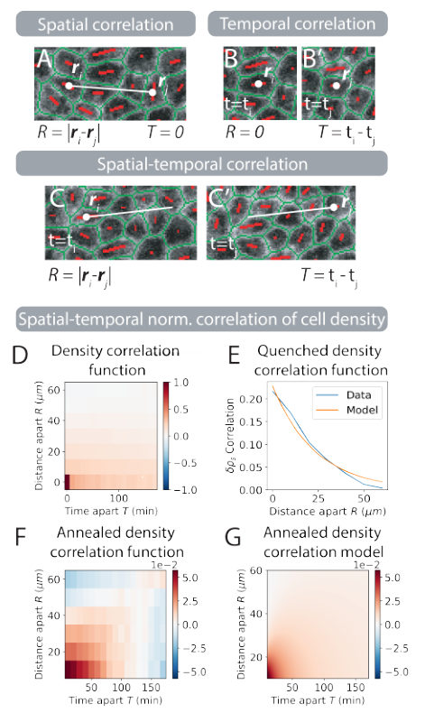 
Figure 4. Spatio-temporal density correlations func- tions from experiments matches theoretical models predictions. A) Same time correlation, where R &gt; 0, separa- tion between cells is non-zero, but evaluated at the same same time point. B) Same position correlation, where the time in- terval between events is non-zero, T &gt; 0 but R = 0, position is fixed. C) Spatio-temporal correlation function diagram now varying both separation of positions R &gt; 0 and time-interval T &gt; 0. D) Heatmap of the space and time correlation of density fluctuations. Red regions indicate relatively high pos- itive correlation between the two properties and blue areas negative correlation. White parts of the map show...

📷 Fig 5

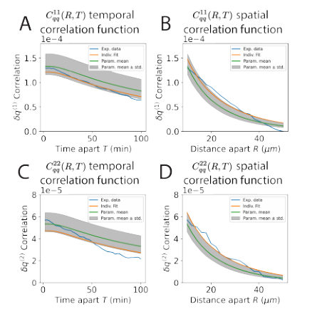 
Figure 5. Fitting model parameters to correlation of cell shape. Correlations of cell shape for A, B) δQ(1) and C, D) δQ(2) for fixed T and R respectively. Graphs show the ex- perimental data (blue), fitted parameters for individual cases (green), model using averaged parameters (orange) and the standard deviation of the averaged model parameters (gray).

**Summary.** This work develops a theoretical framework to model cell shape and density fluctuations in living epithelial tissues, using the developing Drosophila wing as an experimental system. By coarse-graining a microscopic model, the authors derive continuum stochastic equations whose parameters allow them to quantify active remodeling forces and passive tissue stiffness. The results demonstrate that these parameters can be extracted by fitting the model to measured spatial and temporal correlation functions.

**Why it may be interesting.** The rigorous application of continuum stochastic field theories to biological soft matter systems provides a powerful analogy for modeling complex, fluctuating many-body systems, which shares mathematical structure with non-equilibrium statistical mechanics problems.

Detailed structure

**Main problem.** The study quantifies cell shape and density fluctuations in epithelial tissue in vivo to gain insights into the tissue's mechanical properties, such as effective stiffness.

**Main result.** The theoretical framework successfully models the dynamics by separating active shape remodeling contributions from passive mechanical stiffness, showing that active remodeling is crucial for processes like wound healing.

**Method.** The authors developed a theoretical framework involving continuum stochastic differential equations derived from a microscopic model of interacting soft ellipsoids, which are then fitted to experimental correlation functions.

**Model / system.** The system is epithelial tissue, studied using time-lapse imaging of the developing Drosophila pupal wing. Cells are modeled as interacting soft ellipsoids, and the dynamics are coarse-grained into continuum fields for density and shape fluctuations.

**Key observables.** Density correlation function (C_rho_rho), Q-tensor correlation function (C_alpha_alpha^qq), mean density (rho), and mean elongation (Q(1)).

**Important parameters / regimes.** Active shape remodeling parameter (A), effective tissue stiffness (L), and diffusion coefficients (D_r, D_q).

**Assumptions / limitations.** The model relies on coarse-graining approximations, linearization around mean fields, and assuming the P/D axis aligns with global tension.

**Figures summary.** Figures illustrate cell shape fluctuations in the pupal wing, the soft ellipsoid model, the linear increase of mean density and elongation over time, and correlation functions showing decay rates near wounds.

**Paper structure.** The paper progresses from defining the physical problem and microscopic model to deriving continuum stochastic equations for fluctuations, calculating correlation functions in k-space, and finally applying the model to fit and interpret experimental data from wounding and genetic perturbations.

Abstract

Controlling changes in cell shape are crucial for many biological processes, such as tissue development and wound healing. Tissues typically are heterogeneous with a variety of cell shapes and sizes. Of particular interest are local deviations from an average cell shape and size. These fluctuations may extend and transmit across tissues, potentially offering valuable insights into tissue characteristics such as variations in effective "stiffness" or rigidity. In this study, we present a theoretical framework that captures the dynamics of epithelial cell shapes within tissue, incorporating both their average behaviour and fluctuation patterns. We model cells as interacting soft ellipsoids of varying size and aspect ratio. Coarse-graining our model, we obtain a set of continuum stochastic differential equations from which we derive spatial-temporal correlation functions. These correlation functions fit with our experimental data from the developmental process of the \textit{Drosophila} pupal wing. From the correlation functions, critical parameters representing active cell shape changes and effective tissue "stiffness" can be determined.

[↑ back to top](#top)

### [Quantum computational resources and validation protocols for a three-mode non-Gaussian trilinear Hamiltonian](http://arxiv.org/abs/2609.10043v1)

**Authors:** Niccolò Laurora, Matteo Bina, Giulia Ferrini, Alessandro Ferraro  
**Type:** both · **Category:** quantum information and computing · **PDF:** <https://arxiv.org/pdf/2609.10043v1>  
**Analysis basis:** full PDF text, analyzed in chunks
**Topic relevance:** `QC/QI experiment` **3/5** · `quantum measurements` **3/5** · `analog quantum simulation` **2/5** · `quantum optics experiment` **2/5**

📷 Fig 1

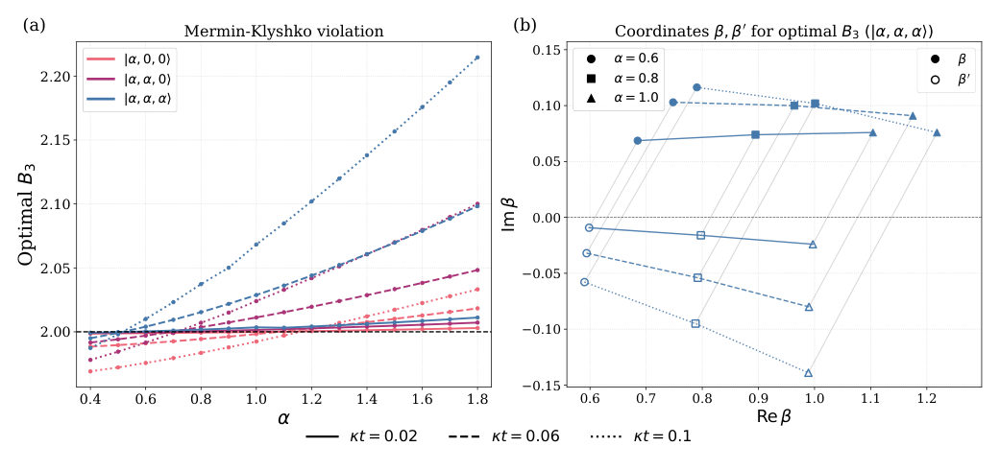 
FIG. 1. (a) Optimal parameter B3 as a function of the initial-state seeding amplitude α under the action of the trigemini unitary ˆUT. Different colors correspond to the initial states |α, 0, 0⟩, |α, α, 0⟩and |α, α, α⟩, and different line styles correspond to the couplings κt = 0.02 (solid), 0.06 (dashed), 0.1 (dotted). (b) Optimal phase-space coordinates (β, β′) (solid/hollow markers, respectively) at α = 0.6, 0.8, 1.0 for which the initial three-seeded configuration |α, α, α⟩violates (27), for the different considered couplings.

📷 Fig 2

 
FIG. 2. (a) Optimal B3 (27) as a function of the seeding parameter α for the state ˆUT|α, α, α⟩at κt = 0.1, degraded by resolution noise of increasing width σ, with the ideal curve (σ = 0) as a comparison. Non-locality properties still occur for standard deviations up to 5%. (b), (c) Bell factor B3 in a disk of radius R = 0.3 around the optimal violation coordinates (β, β′) for κt = 0.1, α = 0.8 (gold central star, B3 = 2.037), with (b) systematic perturbation δβ with β′ fixed at its optimum, and (c) systematic perturbation δβ′ with β fixed at its optimum. The dotted and dashed black circles mark regions within Gaussian errors σ = 0.01 and σ = 0.05, respectively, considered in panel (a).

📷 Fig 3

 
FIG. 3. Optimal B3 (27) as a function of the seeding parameter α for the state ˆUT|α, α, α⟩at κt = 0.1, with the ideal curve for the state without noise as a comparison in both panels. (a): Detrimental effect of the thermal noise due to increasing admixture values ε from 0.001 to 0.01. The effect of the average thermal excitation ¯n is negligible. (b): Effects of the presence of self- and cross-Kerr terms in the Hamiltonian model. The addition of a self-Kerr term slightly lowers the violation. The presence of a cross-Kerr interaction is beneficial and enhances non-local properties of the state.

📷 Fig 4

 
FIG. 4. Quantifiers of Wigner negativity of the trigemini state compared with the reference states, all as functions of the average photon number. (a) Conversion plot between the native state parameters (κt, α, γ) required to generate each state: trigemini, trisqueezed (34), CPS (35), cat (36) and ECS (37). (b) CV mana of the same states on a common vertical scale. (c) Global minimum of the Wigner function on two vertical scales: the left axis refers to the three-mode states (trigemini and ECS), whose negativity stays within the order of 10−4, the right axis to the single-mode ones (trisqueezed, CPS and cat), which are about two orders of magnitude deeper. In every panel, the trisqueezed...

📷 Fig 5

 
FIG. 5. Robustness of the global Wigner minimum of the trigemini state, in both panels as a function of the average photon number. (a) Thermal noise: minimum of the Wigner function of the state (30), with ¯n = 1 and ε = 0.05, 0.1, 0.2 (different colors). (b) Resolution noise: minimum of the Wigner function smoothed by a Gaussian kernel of width σ, for σ = 0.01, 0.05, 0.1 (different colors). In both panels the black dotted line is the noiseless reference (trigemini state).

**Summary.** This paper analyzes a three-mode non-Gaussian Hamiltonian relevant to continuous-variable quantum computing, focusing on generating and certifying quantum resources like entanglement and Wigner negativity. The authors develop a novel, measurement-efficient protocol that allows experimental validation of the Hamiltonian's action by measuring specific zero-variance observables, significantly reducing experimental overhead.

**Why it may be interesting.** It bridges fundamental quantum resource theory (entanglement, nonclassicality) with practical experimental implementation in superconducting circuits, providing concrete validation techniques for complex Hamiltonians.

Detailed structure

**Main problem.** The paper addresses the challenge of experimentally characterizing and validating the computational resources generated by non-Gaussian interactions in continuous-variable quantum computation.

**Main result.** The authors demonstrate that the three-mode Hamiltonian generates both multipartite entanglement and Wigner negativity, and they propose a measurement-efficient protocol to certify these resources without full Wigner function reconstruction.

**Method.** The work combines theoretical analysis of conserved quantities (nullifiers/stabilizers) with experimental protocols utilizing displaced-parity measurements to certify entanglement and resource quantification.

**Model / system.** The system is a three-mode quantum system governed by a non-Gaussian trilinear Hamiltonian, $\hat{H}_T$, realized in superconducting microwave platforms.

**Key observables.** Multipartite entanglement (certified via nonlocality tests), Wigner negativity (quantified via logarithmic negativity), and zero-variance observables (nullifiers and stabilizers).

**Important parameters / regimes.** The coupling strength $\kappa$ and time $t$ governing the Hamiltonian evolution are key parameters.

**Assumptions / limitations.** The primary assumption is that a measurement-efficient protocol based on zero-variance observables can substitute for the computationally intensive full reconstruction of the Wigner function.

**Figures summary.** Not specified, but the analysis involves comparing numerical results (e.g., Wigner function cross-sections) against analytical solutions for specific states.

**Paper structure.** The paper first introduces the Hamiltonian and the need for resource characterization. It then details the theoretical analysis of entanglement and negativity, followed by the proposal and validation of a measurement-efficient experimental protocol.

Abstract

Non-Gaussian interactions are a key ingredient for achieving universality in continuous-variable quantum computation, yet their experimental characterization and the validation of their correct implementation remain challenging tasks. In this work, we focus on a three-mode non-Gaussian trilinear Hamiltonian that has recently been realized in superconducting microwave platforms, and present a comprehensive theoretical analysis of the computational resources it generates, together with experimentally accessible protocols to validate their presence. We systematically investigate its ability to generate two key resources for quantum computation: multipartite entanglement and Wigner negativity. In particular, using displaced-parity Bell tests, we demonstrate the generation of nonlocal states and thereby provide an operational certification of multipartite entanglement in the non-Gaussian states produced by the dynamics. We further quantify the Wigner logarithmic negativity and benchmark it against that of established non-Gaussian resource states. Building on this resource-based characterization, we introduce a measurement-efficient protocol for the experimental validation of the Hamiltonian implementation without requiring full reconstruction of the Wigner function. The protocol combines the measurement of zero-variance observables (nullifiers and stabilizers) with a limited number of targeted phase-space measurements, leading to a drastic reduction of the experimental overhead.

[↑ back to top](#top)

### [Exact asymptotic equivalence between precisions of record-times and integrated currents](http://arxiv.org/abs/2609.09479v1)

**Authors:** Alberto Garilli  
**Type:** theory · **Category:** statistical mechanics · **PDF:** <https://arxiv.org/pdf/2609.09479v1>  
**Analysis basis:** full PDF text, analyzed in chunks
**Topic relevance:** `Full counting statistics` **3/5** · `non-equilibrium universality` **2/5** · `quantum measurements` **2/5** · `Keldysh / 2PI / non-Gaussian methods` **1/5** · `methods for driven-dissipative` **1/5**

📷 Fig 1

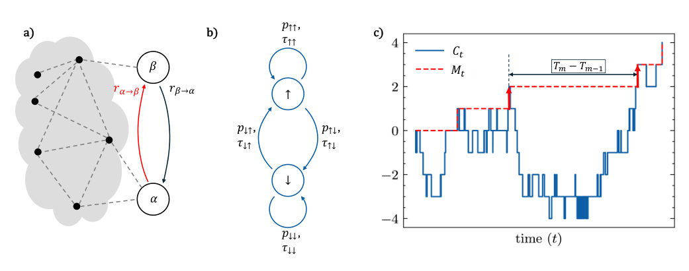 
FIG. 1. a) An example of a network of states connected by transitions. The bi-directional transition connecting states α and β is observable, while we assume to have no knowledge about the hidden states and transitions (not necessarily bi-directional) occurring in the rest of the system (black dots and dashed lines inside the cloud). b) The associated trans-transition network. Each arrow indicates a possible succession of visible transitions, and it is associated with a trans-transition probability pℓ′ℓ and an inter-transition time τℓ′ℓ. c) Example of a trajectory of the observable current Ct along α ↔β. The evolution of the auxiliary inter-record process Mt is highlighted by a red dashed...

📷 Fig 2

 
FIG. 2. Graphical representation of the temporal succession ↑→↓→↓→↑→↑of visible transitions with the corresponding inter- transition times. The time-series of the total integrated current Ct can be represented as a succession of visible transitions ↑ (which increase Ct) and ↓(which decrease Ct). The time between two visible transitions ℓ′ and ℓis denoted by τℓ′,ℓ.

📷 Fig 3

 
FIG. 3. Construction of the Laplace transform Eq. (17). a) An excursion ∆T is defined as the time interval between two successive increments of the auxiliary process Mt (red arrows). Each excursion is decomposed into elementary time intervals τi, with i = 1, . . . , ˜l, where ˜l is the total number of intervals in the excursion. Each interval is identified with an inter-transition time, while the last one, τincr, is necessarily associated with the succession ↑→↑. Since the inter-transition times are independent, the Laplace transform of the distribution of ∆T factorizes into the product of the Laplace transforms of the individual inter- transition-time distributions. This yields the general...

**Summary.** This paper proves a precise mathematical equivalence between two distinct measures of fluctuation in Markov jump processes: the Fano factor of the integrated current and the precision of the time intervals between record-setting events. By establishing this link, the authors provide a unified, purely probabilistic understanding of current noise, extending previous results to general finite-state graphs.

**Why it may be interesting.** This work provides a powerful, purely probabilistic framework to analyze non-equilibrium fluctuations in complex systems, connecting macroscopic current statistics to microscopic event timing statistics, which is relevant for open quantum systems modeling.

Detailed structure

**Main problem.** Establishing an exact asymptotic equivalence between the fluctuations of integrated currents and the temporal statistics of current record events in continuous-time Markov jump processes.

**Main result.** The Fano factor of the integrated current ($F_C$) is exactly equal to the squared coefficient of variation of the inter-record waiting times ($	ext{P}\Delta T$).

**Method.** The equivalence is derived by showing that inter-record times induce a renewal structure, allowing the use of generating functions and combinatorial tools like Narayana numbers.

**Model / system.** The study concerns continuous-time Markov jump processes on finite-state graphs, focusing on the net current crossing a specific bidirectional channel ($\alpha \leftrightarrow eta$).

**Key observables.** Fano factor of the integrated current ($F_C$), squared coefficient of variation of inter-record waiting times ($	ext{P}\Delta T$), and inter-record times ($\Delta T_m$).

**Important parameters / regimes.** The analysis requires the system to be in a stationary state and assumes the observed channel is bidirectional.

**Assumptions / limitations.** Minimal assumptions include bidirectionality on the observed channel and hidden irreducibility of the underlying graph structure.

**Figures summary.** Figures illustrate the network structure, the temporal succession of visible transitions, and the decomposition of the inter-record time $\Delta T$ into a product form involving inter-transition times.

**Paper structure.** The paper develops the equivalence by first analyzing the reduced dynamics tracking visible transitions, showing the renewal structure of inter-record times, and finally equating the resulting fluctuation measures ($F_C$ and $	ext{P}\Delta T$) using Laplace transform techniques.

Abstract

We establish an exact equivalence between the fluctuations of integrated currents and the temporal statistics of current record events in continuous-time Markov jump processes. Specifically, we show that, under minimal assumptions, the Fano factor of an integrated current coincides exactly with the squared coefficient of variation of the inter-record waiting times. This result is obtained by showing that inter-record times induce a renewal structure, since each record event resets the system to a fixed state, and that their generating function can be expressed exactly in terms of a combinatorial organization governed by Narayana numbers. The equivalence extends previous results obtained for unicyclic networks to arbitrary finite-state graphs and provides a unified representation of current fluctuations in terms of record-time observables. The results are derived within a purely probabilistic framework and clarify the structural origin of current precision in terms of first-passage-like event statistics.

[↑ back to top](#top)

### [Momentum-resolved quantum noise spectroscopy using ensembles of diamond quantum sensors](http://arxiv.org/abs/2609.09571v1)

**Authors:** Zeeshawn Kazi, Kai-Hung Cheng, Jared Rovny, Nathalie P. de Leon  
**Type:** experiment · **Category:** other · **PDF:** <https://arxiv.org/pdf/2609.09571v1>  
**Analysis basis:** full PDF text, analyzed in chunks
**Topic relevance:** `QC/QI experiment` **3/5** · `quantum measurements` **3/5** · `quantum optics experiment` **2/5** · `analog quantum simulation` **1/5**

📷 Fig 1

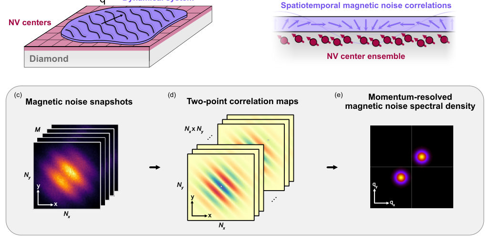 
FIG. 1. Momentum-resolved magnetic noise spectral density. (a) Schematic of a correlated, dynamic material system directly on top of a diamond hosting NV centers. (b) Zoomed in schematic showing correlated dynamics of the system sensed by a shallow NV center ensemble. (c) Fluorescence images record the magnetic noise measured by NV centers across the imaging field of view. Each pixel records the signals sensed by hundreds of NV centers (𝑁𝑥by 𝑁𝑦pixels), and 𝑀shots are taken. (d) High-fidelity imaging of NV center signals enables the construction of 𝑁𝑥× 𝑁𝑦maps of two-point magnetic noise correlators. Each map represents the correlation at a given pixel with respect to a reference pixel...

📷 Fig 2

 
FIG. 2. High-fidelity, wide-field readout enables massively multiplexed correlation measurements. (a) Schematic of camera readout of a high-density NV center ensemble. (b) Map of spin state readout noise 𝜎𝑅, where each pixel is used as an individual sensor. (c) The readout noise 𝜎𝑅scales with the number of NV centers in the pixel. Spin-to-charge conversion (SCC) strongly outperforms green readout for low numbers of NV centers. The lines are fit to a power law lower bounded by 1. (d) Correlation map resulting from global driven Rabi oscillations. Sensors in the dashed circle are prepared in the opposite spin state to those in the solid circle only. (e) Photon count distributions...

📷 Fig 3

 
FIG. 3. Momentum-resolved magnetic noise spectroscopy reveals the spatial structure of magnetic noise. (a) Two-point magnetic noise correlations at each pixel with respect to the white pixel across the imaging field of view, caused by globally applied noise from an RF coil. (b) The Fourier transform of multiplexed correlator measurements results in the momentum-resolved magnetic noise spectral density 𝑆(q, 𝜔0). (c) Radially averaged 𝑆(|𝑞|, 𝜔0) profiles (color indicates applied noise amplitude). A Gaussian fit to each returns FWHM|𝑞| ≈2𝜋× 0.2 µm−1, corresponding to the inverse of the imaging field of view (5 µm). Inset: total noise power from integrating each profile from 𝑞= 0 to 𝑞max; the...

📷 Fig 4

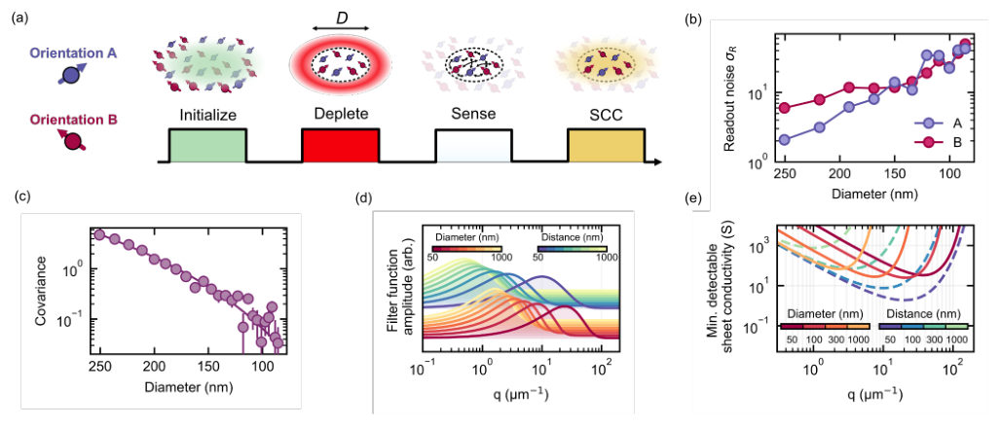 
FIG. 4. Tunable momentum filter functions beyond the diffraction limit. (a) Measuring correlations between NV center orientations A and B below the diffraction limit. Confocal lasers initialize the charge and spin states; a doughnut pulse then ionizes NV centers in a ring, leaving sensors within a diameter 𝐷. A sensing sequence measures correlations within the volume and is read out by spin-to-charge conversion. (b) Spin state readout noise 𝜎𝑅for each orientation scales strongly with decreasing sensing volume diameter. (c) Covariance between orientations A and B in a single spot, caused by applied noise at 2.5 MHz, versus sensing volume. Error bars, standard error of the variance for...

**Summary.** This work presents a novel technique using wide-field imaging of diamond NV ensembles to measure the momentum-resolved magnetic noise power spectral density. By measuring two-point correlations across large areas, the authors overcome the resolution limits of conventional probes. This allows for the direct mapping of low-energy, long-wavelength magnetic fluctuations critical for understanding strongly correlated materials.

**Why it may be interesting.** The use of quantum sensors (NV centers) to probe collective, low-energy, long-wavelength fluctuations in correlated matter bridges quantum optics, condensed matter physics, and advanced sensing techniques.

Detailed structure

**Main problem.** Characterizing spatiotemporal fluctuations in strongly correlated matter is challenging because conventional probes lack simultaneous high spatial and temporal resolution.

**Main result.** The technique successfully measures the momentum-resolved magnetic noise power spectral density, $S(\mathbf{q}, \omega_0)$, by leveraging wide-field correlation measurements.

**Method.** The authors use wide-field imaging of diamond NV ensembles to measure two-point magnetic correlations, which are then Fourier transformed to obtain the momentum-resolved spectral density.

**Model / system.** The physical system is a solid-state platform using dense ensembles of diamond nitrogen vacancy (NV) centers. The measurement probes magnetic fluctuations, relating the measured noise variance to the dynamical structure factor.

**Key observables.** Momentum-resolved magnetic noise power spectral density $S(\mathbf{q}, \omega_0)$, and real-space magnetic field correlation maps.

**Important parameters / regimes.** Spatial wavevectors ($\mathbf{q}$) spanning three orders of magnitude, and tunable frequency bands ($\omega_0$).

**Assumptions / limitations.** The method assumes the noise structure factor can be reconstructed by Fourier transforming the measured two-point correlation function, and the wide-field measurement assumes translational symmetry.

**Figures summary.** Figures illustrate the process of mapping magnetic field correlations, computing the Fourier transform to reveal finite momentum features, and detailing the wide-field spin-to-charge conversion (SCC) readout.

**Paper structure.** The paper develops the theoretical framework for measuring $S(\mathbf{q}, \omega_0)$ using correlation functions, details the wide-field and sub-diffraction measurement schemes, and presents results showing the ability to resolve anisotropic and periodic fluctuations.

Abstract

Spatiotemporal fluctuations across multiple scales govern and characterize the emergent properties, phase boundaries, and low-energy excitations of strongly correlated matter. However, capturing these dynamics has remained a major experimental challenge, as conventional probes typically offer either high spatial or temporal resolution, but not both simultaneously. Here, we leverage high-fidelity wide-field imaging of dense diamond nitrogen vacancy center ensembles to measure the momentum and frequency power spectral density of magnetic fluctuations. To access spatial wavevectors below the diffraction limit, we tune the sensing volume continuously through optical depletion. This approach enables study of equilibrium and driven fluctuations across three orders of magnitude in spatial scale and tunable frequency bands, providing a direct means to map low-energy, long-wavelength fluctuations in correlated systems.

[↑ back to top](#top)

### [The Role of Concentration in Determining NaCl Nucleation Mechanism: A Story of Pathways Coexistence](http://arxiv.org/abs/2609.09518v1)

**Authors:** Porhouy Minh, Sapna Sarupria  
**Type:** theory · **Category:** statistical mechanics · **PDF:** <https://arxiv.org/pdf/2609.09518v1>  
**Analysis basis:** full PDF text, analyzed in chunks
**Topic relevance:** `methods for driven-dissipative` **3/5** · `non-equilibrium universality` **2/5** · `quantum measurements` **2/5** · `Keldysh / 2PI / non-Gaussian methods` **1/5** · `analog quantum simulation` **1/5**

📷 Fig 1

 
Figure 1: Nucleation rate, log10(J/(m−3s−1)), as a function of level of supersaturation, S. Results from this work (black hexagons) are provided in context of previous simulation studies using BF [15, 16, 19, 30], FFS [15], TIS [20] and seeding methods [19], as well as experimental measurements [27–29]. Error bars denote the uncertainty in the computed nucleation rates.

📷 Fig 2

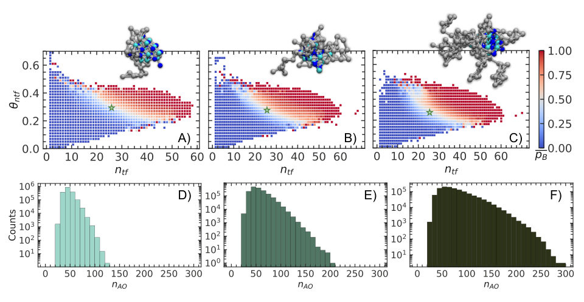 
Figure 2: (A-C) Average pB projection of configurations from systems at (A) 12, (B) 13, and (C) 14 mol/kg onto ntf (x-axis) and θntf (y-axis). The plots are colored by the committor value from 0 to 1. The bin size for the x-axis is 1, and 0.02 for the y-axis. The representative snapshots shown in the insets of Panels A-C correspond to the configuration marked by the green star. The snapshot configurations have an ntf value of 26. Na+ and Cl−ions of ntf are represented in blue and cyan, respectively. Amorphous ions in nAO that do not overlap with ntf are shown in gray. (D-E) nAO distribution of transition state configurations (0.45 ≤pB ≤0.55) at (D) 12, (E) 13, and (F) 14 mol/kg.

📷 Fig 3

 
Figure 3: Joint probability distribution from nucleation trajectories of the largest crystalline nucleus (ntf) and the largest amorphous aggregate overlapping with ntf (nAO) for systems at (A) 12, (B) 13, and (C) 14 mol/kg. The joint probability is computed from RPE-weighted configurations sampled along reactive trajectories using bin widths of one in both order parameters.

📷 Fig 4

 
Figure 4: Conditional probability distribution from nucleation trajectories of ntf for a given nAO size for systems at (A) 12, (B) 13, and (C) 14 mol/kg. The green crosses mark the maximum of each conditional probability along a given nAO bin. The conditional probability is calculated from the joint probability distributions shown in Fig. 3.

📷 Fig 5

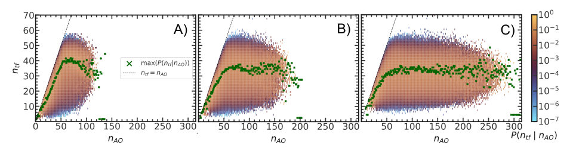 
Figure 4 shows the conditional probability distributions for the three concentrations studied. If nucleation proceeds predominantly through a one-step mechanism, the maxima of P(ntf|nAO) are expected to remain close to the ntf = nAO line, reflecting concerted growth in both dense ion aggregation and crystallinity. In contrast, deviation of the maxima away from this diagonal indicates increasing decoupling between dense cluster formation and crystalline ordering, consistent with two-step-like growth behavior.

**Summary.** This work investigates the nucleation mechanism of NaCl in solution across varying supersaturations using advanced path sampling simulations. By analyzing the joint probability distribution of crystalline and amorphous clusters, the authors show that the mechanism shifts continuously rather than abruptly changing between distinct steps. This suggests that nucleation is governed by an ensemble of competing pathways whose relative weights are tuned by the degree of supersaturation.

**Why it may be interesting.** Although focused on classical nucleation, the methodology—using advanced path sampling and analyzing the continuous ensemble of competing reactive pathways—is highly relevant to understanding non-equilibrium dynamics in complex many-body systems, which has parallels in quantum many-body physics.

Detailed structure

**Main problem.** The paper aims to resolve the long-standing debate regarding the microscopic mechanism of crystal nucleation in aqueous NaCl, specifically whether the process is a single-step or two-step pathway dependent on supersaturation.

**Main result.** Nucleation pathways are not distinct metastable states but rather coexist within a single broad reaction channel, with the relative probability of amorphous vs. crystalline growth continuously varying with increasing supersaturation.

**Method.** The study employs unbiased path sampling techniques, such as $\infty$RETIS, combined with advanced analysis tools like reaction coordinate analysis, joint/conditional probability distributions, and free energy landscape mapping.

**Model / system.** The physical system is the nucleation of sodium chloride (NaCl) from an aqueous solution, studied across three distinct supersaturation regimes (12, 13, and 14 mol/kg).

**Key observables.** Nucleation rate ($J$), joint probability $P(	ext{ntf}, 	ext{nAO})$, conditional probability $P(	ext{ntf}|	ext{nAO})$, and the optimal reaction coordinate ($	ext{ntf}	heta	ext{ntf}$).

**Important parameters / regimes.** Supersaturation ($S = 3.2, 3.5, 3.8$); cluster size ($	ext{ntf}$, $	ext{nAO}$); crystalline ordering ($	heta	ext{ntf}$).

**Assumptions / limitations.** The analysis assumes that the continuous variation in pathway probabilities within a single reaction channel is sufficient to describe the mechanism, rather than requiring distinct free energy barriers for separate metastable states.

**Figures summary.** Figures compare computed nucleation rates across methods vs. supersaturation; joint probability distributions show progressive broadening away from the diagonal line as concentration increases; and representative trajectories illustrate the transition between one-step and two-step-like growth.

**Paper structure.** The paper progresses by first establishing the need to analyze reactive trajectories over simple free energy projections. It then uses path sampling to map the joint probability landscape, demonstrating how the coupling between amorphous and crystalline growth changes systematically with supersaturation, ultimately reconciling conflicting mechanistic reports.

Abstract

Deciphering the microscopic details of crystal nucleation remains a key open problem in chemical physics. For aqueous sodium chloride (NaCl), the extent to which nucleation involves amorphous ion aggregation, and the supersaturation regime in which two-step-like behavior emerges, remains actively debated. In this work, we examine NaCl nucleation at 12, 13, and 14 mol/kg ($S = 3.2, 3.5, 3.8$) using unbiased path sampling with $\infty$RETIS. Through a combination of reaction coordinate analysis, joint and conditional probability distributions, diffusion tensor analysis, and conditional free energy landscapes, we identify nucleation pathways without a priori mechanistic assumptions. While all concentrations are governed by the same reaction coordinate, indicating that nucleus growth and structural ordering are central to crossing the barrier, the nature of reactive trajectories changes with supersaturation. At lower concentrations, nucleation mainly occurs via tightly coupled increases in cluster size and ordering, compatible with a one-step-like mechanism. As concentration increases, amorphous aggregation becomes increasingly decoupled from crystallization, and pathways involving substantial amorphous growth prior to crystallization become progressively more probable. Importantly, these pathways coexist within a single broad reaction channel rather than proceeding through distinct metastable intermediate states. Together, these results reconcile earlier, contradictory reports on NaCl nucleation mechanisms and support a view of nucleation as an ensemble of competing reactive pathways whose relative probabilities vary continuously with supersaturation. More broadly, our findings illustrate that substantial mechanistic diversity can emerge within a classical nucleation framework, without requiring distinct non-classical descriptions.

[↑ back to top](#top)

### [Optimal Intermediate Hamiltonians for Non-Equilibrium Free Energy Calculations: A Numerical Study of Markov Models](http://arxiv.org/abs/2609.10519v1)

**Authors:** David Beyer, Helmut Grubmüller  
**Type:** theory · **Category:** statistical mechanics · **PDF:** <https://arxiv.org/pdf/2609.10519v1>  
**Analysis basis:** full PDF text, analyzed in chunks
**Topic relevance:** `methods for driven-dissipative` **3/5** · `Keldysh / 2PI / non-Gaussian methods` **1/5** · `analog quantum simulation` **1/5** · `driven-dissipative phase transition` **1/5** · `non-equilibrium universality` **1/5** · `quantum measurements` **1/5**

📷 Fig 1

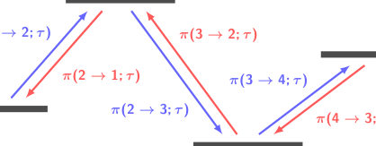 
FIG. 1. Schematic representation of the discrete-time Markov models studied in this work. The discrete states are arranged on a line, and transitions are allowed only between neighboring states. Transition probabilities are given by the Glauber transition matrix elements π(x →y;τ) (Equation 6), which depend on the time-dependent Hamiltonian H(x,τ +1).

📷 Fig 2

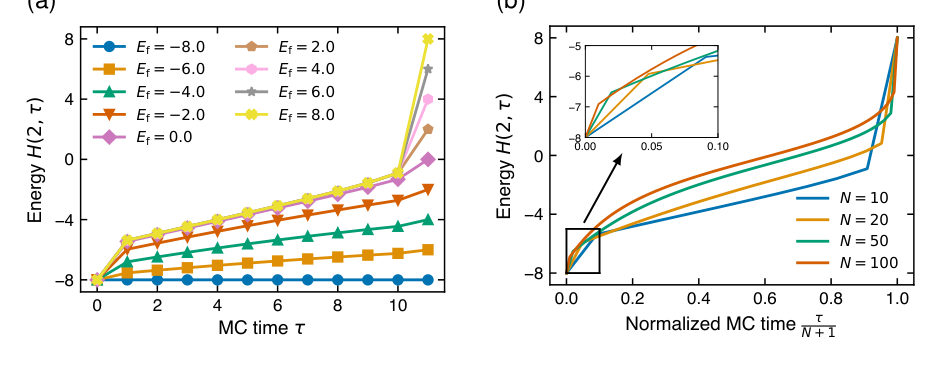 
FIG. 2. Optimal intermediate Hamiltonians H(2,τ) for the two-state system with an initial energy of Ei = −8. (a): H(2,τ) for N = 10 intermediates and different final energies Ef. (b): H(2,τ) for a final energy of Ef = 8 and different numbers of intermediates N. The MC time was normalized by the total number of steps N +1. The inset magnifies the initial jump.

📷 Fig 3

 
FIG. 3. Performance of optimal intermediates for a two-state sys- tem. (a): Dependence of the MSE for linear, logarithmic, and opti- mal intermediates on the number n of trajectories per replica. The initial energy is set to Ei = −6, the final energy is set to Ef = 2, and the number of intermediate steps is N = 10. The black dashed line shows the expected power-law decay MSE ∝1/n for n →∞. (b): Correlation plot of the MSE for linear and optimal intermediates. (c): Correlation plot of the mean work performed on the system for linear and optimal intermediates. In all subfigures (a)–(c), error bars corresponding to the standard error of the mean of the shown quanti- ties are included, but...

📷 Fig 4

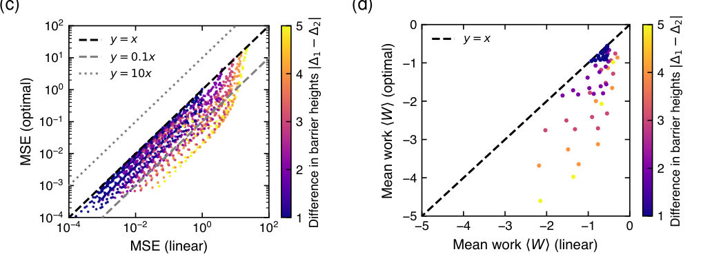 
FIG. 4. Optimal intermediates and their performance for the double-well potential. (a): Toy model for a double-well potential with barrier heights ∆1 and ∆2. (b): Optimal intermediate Hamiltonian for a double-well potential with ∆1 = 6, ∆2 = 3, and N = 100 intermediate MC steps. (c): Correlation plot of the MSE for linear and optimal intermediates. (d): Correlation plot of the mean work performed on the system for linear and optimal intermediates. For subfigures (c) and (d), error bars corresponding to the standard error of the mean of the shown quantities are included, but smaller than the symbol size.

📷 Fig 5

 
FIG. 5. Optimal intermediates and their performance for the shifted potential well. (a): Toy model for a potential well of depth δ that is shifted from x = 1 at time τ = 0 to x = m at time τ = N +1. (b): Optimal intermediate Hamiltonian for a shifted potential well of depth δ = 5, with m = 10 states and N = 100 intermediate MC steps. The insets show magnified views of the initial and final jumps. (c): Mean position ⟨x⟩as a function of τ for δ = 5, m = 10 states, and N = 100, shown for optimal, linear, and logarithmic (α = 1 and α = 2) intermediates. (d): Correlation plot of the time-dependent mean position ⟨x⟩obtained for optimal and linear intermediates. The curves are colored according to...

**Summary.** This work introduces a method to optimize the intermediate Hamiltonians used in non-equilibrium free energy calculations, specifically targeting the convergence issues of the Jarzynski estimator. By minimizing the Mean Squared Error (MSE) using gradient-based optimization on Markov models, the authors show that optimal Hamiltonians drastically improve accuracy. This provides valuable heuristics for simulating complex physical processes where rare events dominate the work average.

**Why it may be interesting.** The methodology provides a powerful, generalizable framework for improving non-equilibrium calculations, which is crucial for simulating processes like reaction rates or work extraction in complex quantum or molecular systems.

Detailed structure

**Main problem.** The paper addresses the poor convergence of the Jarzynski estimator when estimating equilibrium free energy differences from non-equilibrium, finite-time switching simulations.

**Main result.** Optimal intermediate Hamiltonians significantly reduce the Mean Squared Error (MSE) of the Jarzynski estimator by more than an order of magnitude compared to simple interpolation schemes.

**Method.** The authors developed a gradient-based minimization technique using an exact tilted-master-equation representation of the MSE for discrete-time Markov models.

**Model / system.** The study utilizes discrete-time Markov models with a finite state space arranged on a line, governed by a time-dependent Hamiltonian $H(x, 	au)$ and evolving via a master equation.

**Key observables.** Mean Squared Error (MSE) of the Jarzynski estimator, mean work $\langle W 
angle$, and mean position $\langle x 
angle$.

**Important parameters / regimes.** System size ($m$), potential well depth ($\delta$), number of intermediates ($N$), and time steps ($	au$).

**Assumptions / limitations.** The analysis relies on approximating the MSE in the large-sample limit and assumes the Jarzynski relation holds for the chosen Markov dynamics.

**Figures summary.** Figures systematically compare the structure of optimal vs. linear/logarithmic intermediate Hamiltonians across varying system parameters, and correlation plots show MSE and mean work comparisons.

**Paper structure.** The paper progresses from establishing the theoretical framework (Jarzynski relation, MSE minimization) to applying the optimization technique to various model systems (two-state, double-well, shifted potential) and rigorously benchmarking the optimal Hamiltonians against standard interpolation methods.

Abstract

The Jarzynski relation enables the estimation of equilibrium free energy differences from non-equilibrium, finite-time switching simulations. These estimates usually converge poorly because rare trajectories dominate the exponential work average. Here, we numerically determined and explored the sequence of intermediate Hamiltonians connecting initial and final states that minimize the mean squared error (MSE) of the Jarzynski estimator and thereby enhance convergence. For discrete-time Markov models, an exact tilted-master-equation representation of the MSE in the large-sample limit, combined with automatic differentiation, enables efficient gradient-based minimization over all intermediate energies. We applied our approach to three model systems of increasing complexity: a two-state model, a double-well potential, and a shifted potential well. In all three systems, the optimal intermediate Hamiltonians jump at the initial and final times. Extensive Monte Carlo simulations show that optimal intermediates can reduce the MSE by more than an order of magnitude compared with linear and logarithmic interpolation, most strongly for large changes in the energy landscape. Remarkably, they need not dissipate less work than intermediates yielding larger errors. Our results suggest heuristics for more efficient non-equilibrium free energy calculations of realistic molecular systems: optimal intermediate Hamiltonians jump at the initial and final times; for barrier-crossing problems, the barrier should be lowered rapidly and raised again later; and minimizing dissipation does not guarantee faster convergence.

[↑ back to top](#top)

### [Gap-controlled thermalization in a SSH model version of the Fermi-Pasta-Ulam-Tsingou chain](http://arxiv.org/abs/2609.09498v1)

**Authors:** José A. Aké, Gerardo G. Naumis  
**Type:** theory · **Category:** statistical mechanics · **PDF:** <https://arxiv.org/pdf/2609.09498v1>  
**Analysis basis:** full PDF text, analyzed in chunks
**Topic relevance:** `scars & prethermalization` **3/5** · `analog quantum simulation` **2/5** · `Frenkel-Kontorova` **1/5** · `non-equilibrium universality` **1/5**

📷 Fig 1

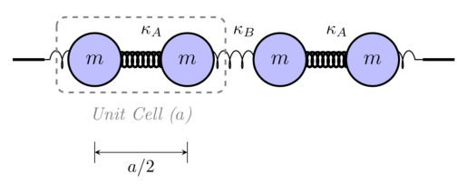 
Figure 1. Schematic of the alternating FPUT chain with spring con- stants 𝜅𝐴= 1 + Δ𝜅and 𝜅𝐵= 1 −Δ𝜅connecting identical masses. As 𝜅𝐵→0, the system is dimerized in pairs of masses joined by the non linear spring with stiffness 𝜅𝐴. The optical branch corresponds to the oscillations of such 𝑁/2 dimers, while the other 𝑁/2 modes become the center of mass movement of each dimer, with zero frequency os- cillations. Thus the system becomes flexible in the sense of rigidity theory as the acoustic branch is made by 𝑁/2 floppy modes.

📷 Fig 2

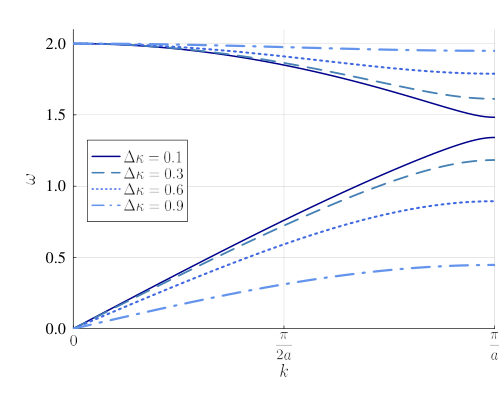 
Figure 2. Dispersion relation [Eq. (10)] for varying Δ𝜅, showing the frequency gap at 𝑘= 𝜋/𝑎plotted in the reduced zone scheme. The gap grows as Δ𝜅grows, setting the frequency barrier that must be bridged by nonlinear resonances for interbranch energy transfer to occur.

📷 Fig 3

 
Figure 3. Modal energy heat maps for 𝛼-type nonlinearity, 𝑁= 64, 𝜖= 0.0069. 𝛼= 0.1 Top panel: FBC (first-mode excitation). Bottom panel: PBC (second-mode excitation). Observe how for the Δ𝜅= 0.5 case, the highest frequency optical mode is excited due to the first available umklapp process.

📷 Fig 4

 
Figure 4. Time-averaged spectral entropy ¯𝑆(𝑡) vs. time for FBC, first- mode excitation, 𝛼= 0.1, 𝑁= 64, 𝜖= 0.0069. Below the isolation threshold (Δ𝜅= 0.05, thick blue), the system shows relaxation within 𝑡∼102 periods. At and above the threshold (Δ𝜅= 0.5 and 0.7, thin red), ¯𝑆(𝑡) saturates at lower plateaus.

📷 Fig 5

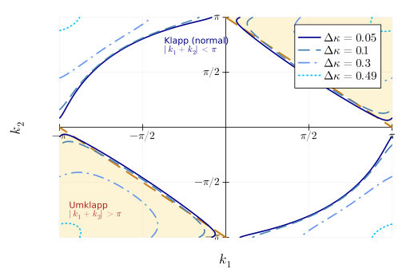 
Figure 7. Contour plot of the resonance condition manifold |𝜔−(𝑘1)+ 𝜔−(𝑘2) −𝜔+(𝑘3)| &lt; 𝛾for 𝛾&lt;&lt; 10−6 for different Δ𝜅values and for the 𝛼-type nonlinearity. This shows how the accessible resonant triads depend on Δ𝜅. The momentum conservation and gap width controls the density of resonances connecting acoustic and optical modes. The resonance manifold disappears as Δ𝜅→0.5, establishing a hard gap-isolation threshold. The value Δ𝜅= 0.5 signals the emergence of the first possible umklapp process. The shaded area corresponds to the possible umklapp processes allowed by momentum conservation. The red dotted lines indicates the limits of such region.

**Summary.** This work examines how introducing a spectral gap via dimerization in a nonlinear lattice (SSH/FPUT model) controls energy thermalization. The authors find that the gap acts as a filter, preventing energy transfer above a critical dimerization strength. This suggests a general mechanism for controlling energy dynamics in topologically gapped nonlinear materials.

**Why it may be interesting.** The concept of using engineered spectral gaps to control energy flow and suppress thermalization is highly relevant to understanding energy transport in complex quantum and classical many-body systems.

Detailed structure

**Main problem.** The study investigates whether a spectral gap in a dimerized lattice hinders or promotes long-time thermalization in a classical nonlinear system.

**Main result.** The phononic gap acts as a tunable, momentum-selective filter for nonlinear energy transport, showing that above a critical dimerization strength, the energy bands remain dynamically isolated.

**Method.** The authors use long-time symplectic simulations to track modal energies and spectral entropy, supplemented by weak-nonlinearity analysis of three-wave resonance conditions.

**Model / system.** The system is a classical anharmonic lattice modeled as a dimerized Fermi-Pasta-Ulam-Tsingou (FPUT) chain, analogous to the SSH model, featuring alternating spring constants and cubic nonlinearity.

**Key observables.** Spectral entropy S(t), modal energies, and the coupling coefficients $|\Gamma^{\sigma_1 \sigma_2 \sigma_3}|$.

**Important parameters / regimes.** Dimerization strength ($\Delta\kappa$), which controls the acoustic-optical gap; the nonlinearity type ($\alpha$-type/cubic).

**Assumptions / limitations.** The analysis relies on the existence of a spectral gap and the application of weak-nonlinearity theory to analyze resonant energy transfer channels.

**Figures summary.** Figures illustrate the energy dispersion relation showing gap opening with $\Delta\kappa$, and heatmaps show the resonance coupling coefficients $|\Gamma|$ for different dimerization strengths.

**Paper structure.** The paper progresses from defining the physical model and linear spectrum to analyzing the time evolution of energy spread using entropy and Lyapunov exponents, culminating in a detailed resonance analysis of the nonlinear coupling terms.

Abstract

In classical anharmonic lattices, the resonance structure driving nonlinear mode mixing is reshaped by band gaps. However, it remains unclear whether a spectral gap hinders or promotes long-time thermalization. Here we study a dimerized Fermi-Pasta-Ulam-Tsingou chain - a classical SSH model analogue with alternating spring constants - and quantify how the acoustic-optical gap controls relaxation under alpha-type (cubic) nonlinearity. Tracking modal energies and spectral entropy via long-time symplectic simulations, we find a sharp isolation threshold when the dimerization strength reaches half its maximum value, set by the onset of the first umklapp process that allows two zone-boundary acoustic phonons to fuse into a zone-center optical phonon; below this threshold, three-wave acoustic-acoustic-optical scattering activates the optical branch on timescales of order 1e4 oscillation periods, while above it the bands remain dynamically isolated. We further show that boundary conditions reshape this picture, producing long-lived sticky states for specific mode excitations. These results establish the phononic gap as a tunable, momentum-selective filter for nonlinear energy transport, suggesting a general route to controlling thermalization in dimerized or topologically gapped nonlinear lattices.

[↑ back to top](#top)

### [Python in the front, party in the Backline: compiling quantum workloads across CPUs, GPUs, and FPGAs](http://arxiv.org/abs/2609.09270v1)

**Authors:** Joseph K. L. Lee, Mehrdad Malekmohammadi, Hong-Sheng Zheng, Shuli Shu, Cheick Doumbia, Kalman Szenes, Mehran Zamani Abnili, Thomas Ainsworth, Matthew Seymour, Thomas Germain, Leonhard Neuhaus, Josh Izaac, Lee J. O'Riordan  
**Type:** both · **Category:** quantum information and computing · **PDF:** <https://arxiv.org/pdf/2609.09270v1>  
**Analysis basis:** full PDF text, analyzed in chunks
**Topic relevance:** `QC/QI experiment` **3/5** · `quantum measurements` **3/5** · `methods for driven-dissipative` **1/5**

📷 Fig 1

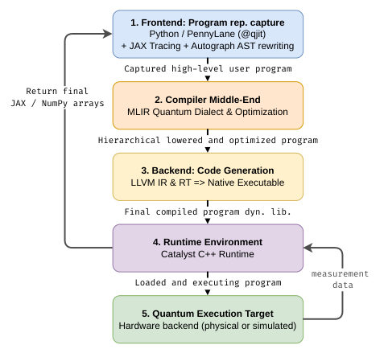 
Fig. 1: High-level overview of the PennyLane program lowering process.

📷 Fig 2

 
Fig. 2: The Backline abstractions and how they compose.

📷 Fig 3

 
Fig. 4: Life cycle of a heterogeneous workload in Backline across a host, FPGA controller, and GPU coprocessor. Numbers indicate execution order. Steps 0-2 occur once per session. Steps 3-11 are one correction round and repeat for every decode. Steps 12-14 return results and tear down.

📷 Fig 4

 
Fig. 5: Architecture of the VPK120 hardware-handshake engine, which connects the APU control plane, ERNIC, local request/reply storage, and hardware orchestrator.

📷 Fig 5

 
Fig. 6: Baseline steady-state round-trip latency over 106 −1 rounds from FPGA controller to and from CPU or GPU copro- cessor. Timing is measured by the FPGA clock domain, with the first warm-up sample excluded from all plots. Statistical quantities are given in the legend of each distribution plot, with the excluded warm-up value given by t0.

**Summary.** This paper presents Backline, a novel compilation framework that bridges the gap between high-level quantum algorithm design in Python and the low-latency demands of fault-tolerant quantum computing. By compiling workloads through MLIR, it enables efficient, vendor-agnostic execution across heterogeneous hardware like CPUs, GPUs, and FPGAs. The results demonstrate microsecond-scale synchronous co-processing, critical for next-generation quantum systems.

**Why it may be interesting.** The focus on low-latency, hardware-accelerated control loops (like QEC) is directly relevant to building scalable quantum processors, which is a core area of quantum information science.

Detailed structure

**Main problem.** The primary challenge is moving quantum workloads from research prototypes to production-grade, fault-tolerant systems that require ultra-low latency.

**Main result.** The authors demonstrated a heterogeneous compilation framework, Backline, achieving microsecond-scale synchronous co-processing latencies across CPUs, GPUs, and FPGAs.

**Method.** They introduced Backline, a framework that compiles quantum-classical workloads from a high-level Python interface down through MLIR to target diverse, low-latency hardware accelerators.

**Model / system.** The system involves quantum workloads requiring real-time Quantum Error Correction (QEC) running on heterogeneous hardware, including CPUs, GPUs, and FPGAs, orchestrated via an FPGA-based controller.

**Key observables.** Median steady-state round-trip latencies (e.g., 2.305 $\mu$s to CPU, 4.5 $\mu$s to GPU) and the full distribution of RTT under varying message-issuing cadences.

**Important parameters / regimes.** Latency Tiers (1 ns–1 $\mu$s for real-time control; 1 $\mu$s–100 $\mu$s for co-processing); $10^{6-1}$ rounds for steady-state measurements.

**Assumptions / limitations.** The design assumes the ability to use dedicated dual-ported UltraRAMs for efficient reply buffering and that the system can manage highly non-uniform timing deadlines.

**Figures summary.** Figures illustrate the high-level program lowering process, the FSM transition diagram for the hardware orchestrator, and comparative traces showing RTT distributions under back-to-back versus random-delayed message pacing.

**Paper structure.** The paper progresses from defining the need for production-grade QEC execution, detailing the architecture of Backline within PennyLane/Catalyst, demonstrating the hardware-accelerated data movement, and finally benchmarking the resulting low-latency performance.

Abstract

Moving from quantum research and development to production-grade, fault-tolerant quantum workload execution remains one of the most significant challenges facing quantum platform builders. While Python frameworks have enabled an easy entry point for quantum algorithm design, the low-latency requirements for real-time quantum error correction (QEC) demand performance that traditional interpreted environments cannot provide. FPGAs and ASICs play a central role at these layers, but their specialized programming models make development rigid and time-consuming. CPUs, GPUs, and other accelerators introduce a different challenge: as infrastructure becomes increasingly heterogeneous, programming across different devices and their associated abstractions becomes more complex. Allowing researchers to write workloads in high-level languages that map to low-latency execution across diverse distributed target platforms will enable the development of key infrastructure for utility-scale quantum systems. For this, we introduce $\textit{Backline}$, a heterogeneous compilation and runtime framework built within PennyLane and Catalyst. Backline allows us to design and build quantum-classical workloads for high-performance and low-latency devices, with compilation directly from a Python interface through MLIR. We demonstrate the compilation and execution of several quantum workloads with low-latency data movement across a mix of CPUs, GPUs, and FPGAs, for both local and distributed remote hardware targets, all from a vendor-agnostic Python frontend. With an AMD VPK120 FPGA board as the controller, issuing each round from its hardware-handshake engine, we measured median steady-state round-trip latencies over RoCE v2 of $2.305~μ$s to an AMD Ryzen Threadripper PRO CPU and $4.5~μ$s to an AMD Instinct MI210 GPU across $10^6-1$ rounds per path, demonstrating microsecond-scale synchronous co-processing.

[↑ back to top](#top)

### [Semi-device-independent quantum randomness certification in semiconductor spin-noise measurements](http://arxiv.org/abs/2609.10037v1)

**Authors:** Hamid Tebyanian, Marius Cizauskas, Manfred Bayer, Marc Assmann, Alex Greilich  
**Type:** both · **Category:** quantum information and computing · **PDF:** <https://arxiv.org/pdf/2609.10037v1>  
**Analysis basis:** full PDF text, analyzed in chunks
**Topic relevance:** `quantum measurements` **3/5** · `quantum optics experiment` **3/5** · `QC/QI experiment` **1/5**

📷 Fig 1

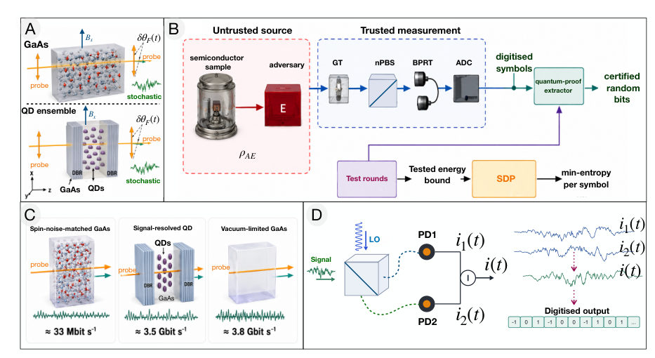 
Figure 1: Source-adversarial certification of semiconductor spin noise. A, Sources: bulk n-GaAs and a charged (In, Ga)As quantum-dot ensemble in a microcavity, in transverse field Bx; probe Faraday rotation δθF (t) from equilibrium spin fluctuations generates the orthogonally polarised signal. B, Trust boundary. The source and any adversary ρAE with memory E are untrusted, bounded only by the tested mean-photon-number and declared analogue range; the receiver (GT analyzer, nPBS, balanced photoreceiver BPR, ADC) is trusted and calibrated. Two-phase test rounds fix ¯ntest; the truncated-Fock SDP returns h∗ cert, which sets the extractor output. C, Three regimes (Table 1): spin-noise-matched...

📷 Fig 2

 
Figure 2: Experimental setup. A continuous-wave laser is split into a probe, which measures spin noise via Faraday rotation in the sample (held at 6 K in a transverse magnetic field Bx), and a local oscillator (LO) routed around the sample. The orthogonal-polarisation component after the sample interferes with the LO on a 50/50 non-polarizing beamsplitter (nPBS) and is detected by a balanced photoreceiver (BPR). The differential DC output drives the phase lock; the AC component is amplified, filtered, and digitized.

📷 Fig 3

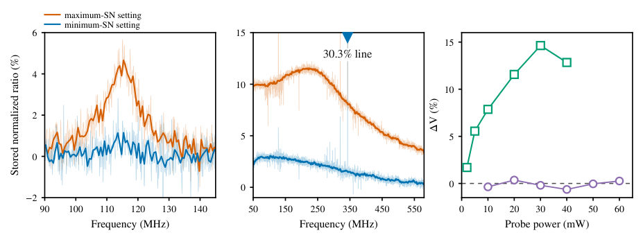 
Figure 3: Two spectral regimes in the stored spin-noise data. A, Normalised FPGA spectra stored for n-GaAs at 40 mW for the two saved lock settings (maximum- and minimum-spin- noise), showing the phase-selective narrow spin-noise resonance. B, Corresponding quantum-dot spectra at 20 mW: the spin-noise excess fills the analysed receiver band; the marker indicates an isolated 30.3% technical line outside the displayed range. Thin curves show the stored ratios; thick curves show frequency-binned medians for visibility. C, Full-band variance contrast ∆V of Eq. (1) from the 1.31 ms digitiser records at each recorded probe power; error bars are temporal-block standard errors from 128 contiguous...

📷 Fig 4

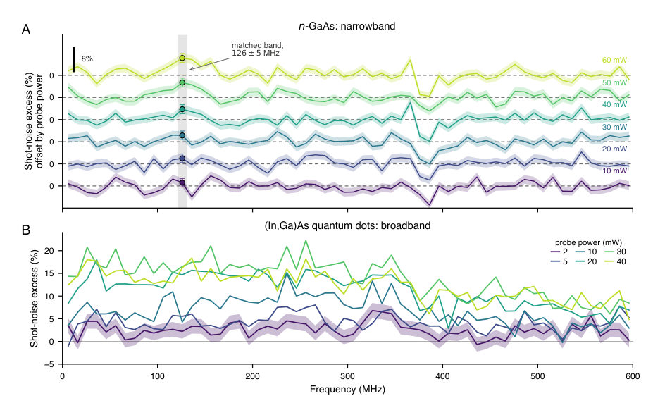 
Figure 4: Narrowband and broadband spin-noise excess. Spectral excess 100 (Ssig − SLO)/SLO, at the maximum-spin-noise lock setting, obtained from Hann-windowed 1 µs blocks of the 1.31 ms records and collected into 10 MHz bins. A, n-GaAs. Traces are offset by 7% per probe power; dashed lines indicate their zero levels. The narrow Larmor signal increases with probe power within the predeclared matched band, 121 MHz to 131 MHz, shaded in grey. Filled circles give the matched-band excess. B, (In, Ga)As quantum dots, shown without offsets. The spin-noise excess extends across the receiver band and reaches its largest broadband value near 30 mW. Shaded bands and error bars denote ±1 standard...

📷 Fig 5

 
Figure 5: Certified entropy versus tested source energy. Certified per-symbol min- entropy h∗ cert as a function of the mean-energy bound ¯n for the three calibrated receiver modes, all obtained using the same truncated-Fock SDP with the corresponding noisy-homodyne POVM. Markers: experimental tested-energy operating points; star: the 131ms GaAs matched acquisition; inset: enlarged experimental region. GaAs broadband points form the vacuum-limited receiver benchmark, GaAs matched points the narrowband spin-noise-attributed certificates, and quantum-dot points the broadband signal-resolved certificates.

**Summary.** This paper presents a novel semi-device-independent method to certify the quantum randomness generated by semiconductor spin noise. By applying semidefinite programming to the measured fluctuations, the authors establish high certified entropy rates for both quantum-dot and bulk GaAs systems. This work is significant because it provides a robust, model-free security guarantee for a scalable solid-state quantum random number generator.

**Why it may be interesting.** This work bridges quantum optics/information theory with solid-state physics by providing a rigorous, device-independent security proof for a practical quantum source, which is highly relevant for quantum networking and computation.

Detailed structure

**Main problem.** The core challenge is certifying the quantum origin of fluctuations for quantum random-number generation (QRNG) when using complex solid-state systems like semiconductor spin noise.

**Main result.** The authors achieved certified entropy rates of 3.2–3.4 Gbit/s from a quantum-dot ensemble and 33 Mbit/s from n-GaAs, significantly exceeding previous spin-noise generator rates.

**Method.** They employ a semi-device-independent quantum randomness certification framework using a Semidefinite Programme (SDP) to bound the conditional min-entropy.

**Model / system.** The physical platform is semiconductor spin noise measured via homodyne detection. The certification treats the source as untrusted, constrained only by an experimentally tested mean-photon-number bound, while the receiver is modeled as a calibrated, noisy measurement.

**Key observables.** Certified entropy rates (Gbit/s or Mbit/s), mean-photon-number bound ($ar{n}$), and the conditional min-entropy ($h^*_{	ext{cert}}$).

**Important parameters / regimes.** The achieved rates (3.2–3.4 Gbit/s for QDs; 33 Mbit/s for n-GaAs), the energy bound $ar{n}$, and the detection regimes (broadband vs. matched resonance).

**Assumptions / limitations.** The certification relies on the source being constrained by an experimentally tested mean-photon-number bound, and the receiver is modeled as a calibrated POVM. The analysis uses Fock-space truncation and assumes IID effective modes in some analyses.

**Figures summary.** Figures summarize the certification architecture, compare different detection regimes (QD vs. GaAs), and show the dependence of entropy on binning and energy constraints.

**Paper structure.** The paper introduces the problem of source certification in solid-state QRNG, details the semi-device-independent methodology using SDPs, presents the application to spin-noise measurements in both quantum-dot and bulk GaAs systems, and concludes with quantitative rate comparisons.

Abstract

Complex solid-state systems are promising platforms for scalable, high-bandwidth quantum random-number generation, yet certifying the quantum origin of their fluctuations remains difficult because the underlying microscopic dynamics are hard to model and validate. Here we demonstrate semi-device-independent quantum randomness certification from semiconductor spin noise, to our knowledge the first such certificate on any spin-noise source, without relying on a microscopic model of the spin system. The untrusted optical source is constrained by an experimentally tested mean-photon-number bound together with a declared analogue-range and per-sample clipping ceiling, while the trusted receiver is described as a calibrated, noisy, coarse-grained homodyne measurement. Using a semidefinite programme with rigorously controlled Fock-space truncation, we certify randomness that remains private against an adversary holding arbitrary quantum side information. Offline analysis yields certified entropy rates of $3.2$--$3.4$\,Gbit/s from a singly charged (In,Ga)As quantum-dot ensemble and $33$\,Mbit/s from $n$-GaAs in a spin-noise-matched detection mode. This exceeds the certified entropy rate of earlier spin-noise generators by more than two orders of magnitude, and the certificate tolerates a resolved per-symbol energy contribution from the solid-state emitter itself rather than requiring a near-vacuum input.

[↑ back to top](#top)

### [Split-Step Dirac Cellular Automata for Continuous-Time Dirac Dynamics on Finite Spatial Lattices](http://arxiv.org/abs/2609.09779v1)

**Authors:** Wei-Ting Wang, Pei-Ming Ho, Ching-Ray Chang  
**Type:** both · **Category:** other · **PDF:** <https://arxiv.org/pdf/2609.09779v1>  
**Analysis basis:** full PDF text, analyzed in chunks
**Topic relevance:** `analog quantum simulation` **3/5** · `QC/QI experiment` **2/5** · `methods for driven-dissipative` **2/5**

📷 Fig 1

 
FIG. 1. (a) Comparison of DCA and SDCA through spacetime diagrams and velocity expectation values. The initial state of the particle is |Ψ(t = 0)⟩= 1 √

📷 Fig 2

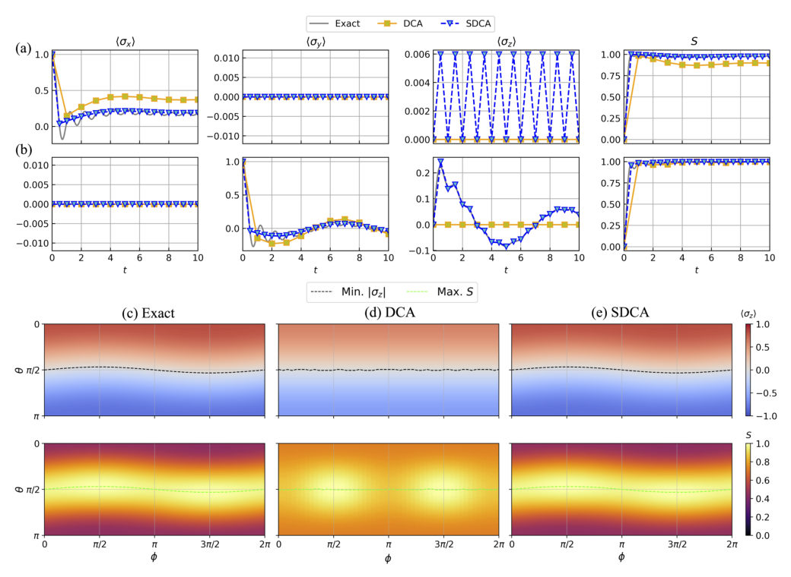 
FIG. 2. Comparison of Dirac dynamics simulated using the DCA and the SDCA (M = 2) against the exact continuous-time limit of a highly localized state |Ψ(0)⟩= (cos(θ/2)|0⟩c +eiϕ sin(θ/2)|1⟩c)⊗|x = 0⟩with mass m = π/8 on a finite spatial lattice. Top panels: Time evolution of the Pauli matrix expectation values (⟨σx⟩, ⟨σy⟩, ⟨σz⟩) and the entanglement entropy S with (a) θ = π/2, ϕ = 0, and (b) θ = π/2, ϕ = π/2. Bottom panels: Heatmaps displaying ⟨σz⟩and S at time step t = 5 as a function of the initial state angles θ and ϕ for the (c) exact continuous limit, (d) DCA, and (e) SDCA.

📷 Fig 3

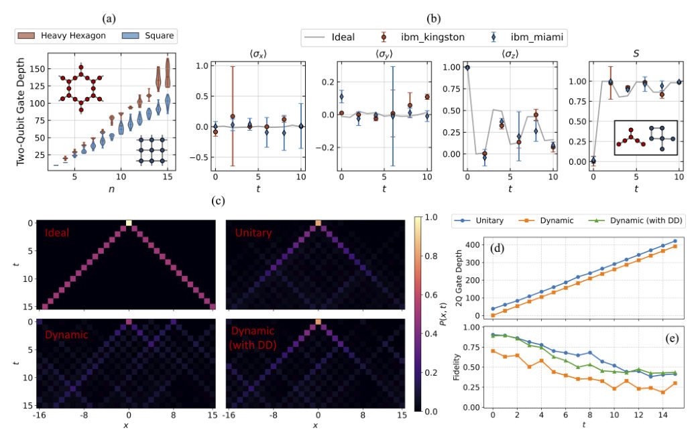 
FIG. 3. Experimental results of the DCA for a highly localized initial state. Top Panel: Comparison of results executed on heavy hexagon (ibm kingston) and square (ibm miami) lattice backends. (a) Two-qubit gate depth scaling for single-step DCA circuits as a function of the external space size n. Insets illustrate the physical connectivity graphs of the respective hardware topologies. (b) Time evolution of the three Pauli expectation values (⟨σx⟩, ⟨σy⟩, ⟨σz⟩) and the entanglement entropy (S) for the particle state |Ψ(0)⟩= |0⟩c ⊗|x = 0⟩with mass m = π/2. The insets show the specific physical qubit mappings on the devices. Bottom Panel: Performance comparison of standard unitary and dynamic...

📷 Fig 4

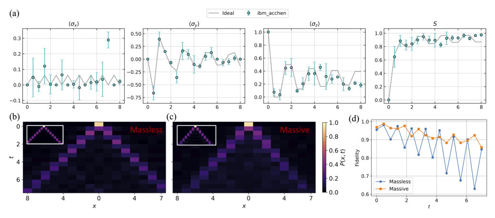 
FIG. 4. Experimental results of the SDCA for a highly localized initial state executed on the ibm aachen quantum processor. (a) Time evolution of the internal space Pauli expectation values (⟨σx⟩, ⟨σy⟩, ⟨σz⟩) and the corresponding entanglement entropy (S) for the initial state |Ψ(0)⟩= |0⟩c ⊗|x = 0⟩with mass m = π/2. (b) and (c) Experimental spacetime probability diagrams, P(x, t) of the initial state |Ψ(0)⟩c = 1 √

📷 Fig 5

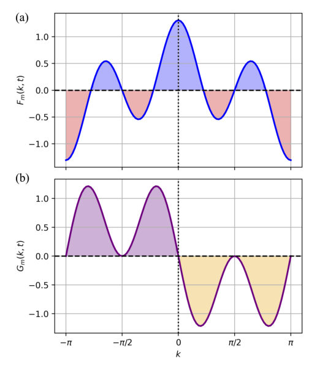 
FIG. 5. The time-dependent functions (a) Fm(k, t) and (b) Gm(k, t) plotted over the Brillouin zone with t = 2. Both functions exhibit anti-symmetry under a k →k + π momen- tum shift.

**Summary.** This work introduces the Split-Step Dirac Cellular Automaton (SDCA) to overcome artificial symmetries inherent in standard DCA simulations of Dirac dynamics on finite lattices. By using a fractional-step Trotterization, SDCA restores the correct interference physics, allowing for accurate simulation of phenomena like Zitterbewegung. The authors demonstrate this capability both numerically and experimentally on quantum processors, providing a practical blueprint for quantum simulation of relativistic matter.

**Why it may be interesting.** The ability to simulate relativistic quantum dynamics (Dirac equation) with improved temporal resolution on near-term quantum hardware, while explicitly addressing lattice artifacts, is highly relevant for quantum simulation in condensed matter.

Detailed structure

**Main problem.** Standard Dirac Cellular Automata (DCA) suffer from artificial phase-matching symmetries on finite grids that suppress crucial interference phenomena like Zitterbewegung.

**Main result.** The proposed Split-Step DCA (SDCA) breaks this symmetry by using a fractional-step Trotterization, successfully recovering the characteristic velocity oscillations and entanglement dynamics of the continuous-time Dirac model.

**Method.** The authors develop the SDCA by employing a Trotterized fractional-step scheme in the momentum representation, which is then benchmarked using quantum circuit simulations on IBM Quantum processors.

**Model / system.** The paper simulates Dirac dynamics for a spin-1/2 particle on a finite spatial lattice. The model compares the standard DCA to the improved SDCA, which approximates continuous-time evolution.

**Key observables.** Velocity expectation value ($\langle V 
angle$), entanglement entropy ($S$), and the time evolution of Pauli expectation values ($\langle\sigma_x
angle, \langle\sigma_y
angle, \langle\sigma_z
angle$).

**Important parameters / regimes.** The ratio of temporal to spatial discretization ($\delta t$ vs $\delta x$), the number of sub-steps ($M$), and the lattice size ($N$).

**Assumptions / limitations.** The primary assumption is that the SDCA framework provides a practical way to improve temporal resolution while keeping the spatial quantum register fixed, despite increased circuit depth.

**Figures summary.** Figures compare spacetime diagrams and velocity expectation values for DCA vs. SDCA; another set compares time evolution of observables and entanglement entropy across different simulation methods and hardware backends.

**Paper structure.** The paper first identifies the symmetry-breaking limitation of DCA, then introduces and details the SDCA formulation, followed by analytical and numerical benchmarking, and finally, an experimental demonstration and analysis of hardware trade-offs (e.g., QFT implementation).

Abstract

Dirac Cellular Automata (DCA) provide a framework for simulating Dirac dynamics, yet the rigid coupling between spatial and temporal resolutions can introduce artificial phase-matching symmetries on finite grids that suppress interference phenomena such as Zitterbewegung. In this work, we propose a Split-Step Dirac Cellular Automaton (SDCA) that enables continuous-time Dirac evolution at fixed spatial discretization. By employing a Trotterized fractional-step scheme in the momentum representation, SDCA breaks the phase-matching cancellation present in the standard DCA and recovers the interference dynamics of the continuous-time limit. We benchmark the SDCA through analytical and numerical studies and demonstrate its implementation on IBM Quantum processors. Despite the increased circuit depth required for finer temporal resolution, the NISQ implementation reproduces the characteristic velocity oscillations and entanglement-entropy dynamics of the continuous-time model. We further investigate hardware-topology trade-offs and dynamic circuit implementations of the Quantum Fourier Transform (QFT), highlighting the competing effects of gate errors, measurement, and feed-forward latency. These results demonstrate that SDCA provides a practical framework for improving temporal resolution while maintaining a fixed spatial quantum register, enabling the exploration of relativistic quantum dynamics on near-term quantum devices.

[↑ back to top](#top)

### [Cascade-induced high-performance nonreciprocal quantum batteries](http://arxiv.org/abs/2609.09690v1)

**Authors:** Niaz Ali Khan, Dahai He  
**Type:** theory · **Category:** other · **PDF:** <https://arxiv.org/pdf/2609.09690v1>  
**Analysis basis:** full PDF text, analyzed in chunks
**Topic relevance:** `methods for driven-dissipative` **3/5** · `correlated / nonlocal dissipation` **1/5** · `driven-dissipative phase transition` **1/5** · `quantum measurements` **1/5**

📷 Fig 1

 
Figure 1. Schematic of the Cascaded QB model. The charger and battery are single-mode harmonic oscillators with fre- quencies ωa and ωb and local decay rates κa and κb, respec- tively. The charger is driven by a coherent laser of ampli- tude A and frequency ω0. The reservoir engineering induces a direct coupling √κaκb between the two systems, leading to unidirectional flow of energy from the charger to the battery.

📷 Fig 2

 
Figure 3. Energy efficiency (nonreciprocal-to-reciprocal stored energy ratio) versus rescaled time τ of the QB system. The system’s parameters are κa = 0.2ω, κb = 0.01ω (blue bold); κa = κb = 0.01ω (black dashed); κa = 0.01ω, κb = 0.2ω (red dotted-dashed); and Ω≈0 (green dotted-dashed). To enable a fair comparison, the coupling strength is set to √κaκb for reciprocal configurations.

📷 Fig 3

 
Figure 2. Energy efficiency (battery-to-charger energy ratio) of the nonreciprocal QB system as a function of rescaled time τ. The system’s parameters are κa = 0.02ω, κb = 0.01ω (blue bold); κa = κb (black dashed); and κa = 0.01ω, κb = 0.02ω (red dotted-dashed).

**Summary.** This paper rigorously analyzes nonreciprocal quantum batteries using the cascaded open quantum systems formalism. The authors demonstrate that this method yields a sixteen-fold steady-state energy advantage, significantly surpassing previous theoretical benchmarks. It establishes the cascaded formalism as the mathematically sound foundation for designing high-performance quantum energy storage devices.

**Why it may be interesting.** This work is highly relevant as it tackles open quantum systems dynamics, specifically energy flow and dissipation engineering, which are core topics in quantum optics and AMO physics.

Detailed structure

**Main problem.** To develop a mathematically rigorous and physically consistent framework for achieving high-performance nonreciprocal energy transfer in quantum batteries.

**Main result.** The authors surpassed a previous fourfold benchmark, achieving a regime-independent sixteen-fold steady-state nonreciprocal energy advantage over reciprocal quantum systems.

**Method.** The study utilizes the rigorously established cascaded open quantum systems formalism to model the energy dynamics, contrasting it with flawed prior methods.

**Model / system.** The system models a quantum battery coupled to a charger, represented by two single-mode harmonic oscillators, whose dynamics are governed by a Lindblad master equation.

**Key observables.** Energy Storage Capacity ($E_b(t)$) and Useful Work Capacity (Ergotropy, $W_b(t)$), as well as the energy efficiency ($\eta$).

**Important parameters / regimes.** Damping rates ($\kappa_a, \kappa_b$), coupling strengths, and the ratio of dissipation rates.

**Assumptions / limitations.** The analysis relies on the Born-Markov approximation, and the primary focus is on establishing the mathematical rigor of the cascaded formalism.

**Figures summary.** Figure 1 schematically illustrates the Cascaded QB model; Figure 2 shows energy efficiency vs. time for different damping conditions; Figure 3 compares nonreciprocal vs. reciprocal energy efficiency.

**Paper structure.** The paper introduces the QB model and the need for a rigorous formalism, develops the dynamics using the cascaded approach, compares results against flawed prior methods (Metelmann-Clerk), and concludes by establishing the superior performance and mathematical validity of the cascaded formalism.

Abstract

Nonreciprocal quantum batteries harness reservoir engineering for controlled energy transfer, heralding a paradigm shift for quantum energy storage. A prior study utilizing the Metelmann-Clerk formalism reported a fourfold enhancement in nonreciprocal energy accumulation over reciprocal counterparts. This fourfold enhancement, however, appears to stem from a Lindblad master equation that exhibits fundamental inconsistencies, which may systematically understate the actual nonreciprocal advantage. Our approach is rooted in the rigorously established cascaded open quantum systems formalism, which ensures both mathematical consistency and physical fidelity. Remarkably, we surpass the previously reported fourfold benchmark, attaining a regime-independent sixteenfold steady-state nonreciprocal energy advantage over reciprocal systems. We further uncover a dissipation-dependent battery-to-charger efficiency, fourfold under symmetric damping, surpassing this benchmark when the battery is less dissipative, and lower otherwise. This work establishes the cascaded formalism as a mathematically rigorous and experimentally viable foundation for high-performance quantum energy storage.

[↑ back to top](#top)

### [pyeCE: A Python Implementation of the Embedded Cluster Expansion](http://arxiv.org/abs/2609.10190v1)

**Authors:** Yann L. Müller, Claire A. Paetsch, Anirudh Raju Natarajan  
**Type:** theory · **Category:** statistical mechanics · **PDF:** <https://arxiv.org/pdf/2609.10190v1>  
**Analysis basis:** full PDF text, analyzed in chunks
**Topic relevance:** `methods for driven-dissipative` **3/5** · `analog quantum simulation` **2/5** · `Keldysh / 2PI / non-Gaussian methods` **1/5**

📷 Fig 1

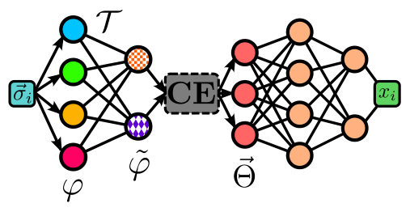 
FIG. 2. Schematic of the embedded cluster expansion formalism. Given the neighborhood configuration ⃗σi of site i, the site-basis functions φ are projected onto the embedded site-basis functions ˜φ through the learned transformation T . Symmetry-invariant site descriptors ⃗Θ are then computed as in a conventional cluster expan- sion. These descriptors serve as input to a feedforward neural net- work that evaluates the site property xi. The dependence of these quantities on the configuration is suppressed for clarity.

📷 Fig 2

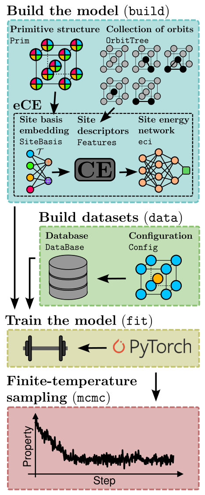 
FIG. 1. General workflow of pyeCE. (1) The eCE model is con- structed from the site-basis embedding, the site descriptors, and the site energy model. (2) A training set of symmetrically distinct or- derings is enumerated, evaluated with first-principles calculations, and mapped onto the parent lattice. (3) The model is trained using PyTorch by simultaneously optimizing the transformation matrix T and the site energy model. (4) Finite-temperature properties are predicted by Monte Carlo simulations.

📷 Fig 3

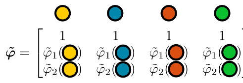 
FIG. 3. Illustration of the embedded site-basis functions that map c = 4 species onto k = 3. The four chemical species are represented by four colors (yellow, blue, red, and green). Each species maps to one of four linearly dependent vectors (1, ˜φ1, ˜φ2)T in R3.

📷 Fig 4

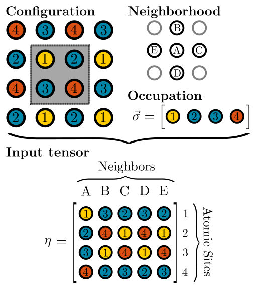 
FIG. 4. Illustration of the construction of the input matrix η. The example configuration contains 4 atomic sites (1, 2, 3, and 4). The neighborhood of each site consists of the site itself (A) and its 4 near- est neighbors (B, C, D, and E). Element ηij of the input matrix holds the chemical species at neighborhood position j of the ith atomic site.

📷 Fig 5

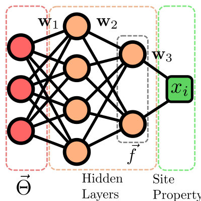 
FIG. 6. Illustration of a site property feedforward neural network. The input layer corresponds to the site descriptors ⃗Θ. The neural network is composed of 2 hidden layers. The final hidden layer pro- duces the latent features ⃗f. The final neuron outputs the site prop- erty xi. The weights w = {w1, w2, w3} and biases in each layer are the trainable parameters.

**Summary.** This paper presents pyeCE, an open-source Python library implementing the embedded Cluster Expansion (eCE) method to overcome the computational intractability of modeling high-entropy alloys. By using machine learning embeddings, it efficiently predicts finite-temperature thermodynamic properties, demonstrating its success in modeling both chemical clustering and hydrogen solubility in complex metal alloys.

**Why it may be interesting.** While focused on condensed matter thermodynamics, the use of ML to manage high-dimensional chemical space and predict complex phase behavior is relevant to understanding many-body interactions in quantum systems.

Detailed structure

**Main problem.** Predicting the finite-temperature thermodynamics of complex alloys, especially high-entropy alloys, which are intractable using conventional cluster expansion methods.

**Main result.** The authors introduce pyeCE, a library that successfully models the short-range order and composition dependence of hydrogen solubility in complex refractory alloys.

**Method.** The paper implements the embedded cluster expansion (eCE) formalism, which uses machine learning to map many chemical species onto a smaller set of effective species, allowing for the calculation of thermodynamic properties via Monte Carlo sampling.

**Model / system.** The model is applied to multicomponent alloys (e.g., 9-component refractory alloys, Mo–Nb–W systems) where the total energy is modeled by a neural network fed by symmetry-adapted descriptors derived from an embedded chemical basis.

**Key observables.** Short-range order, hydrogen uptake ($\langle H/M 
angle$), and the composition dependence of these properties.

**Important parameters / regimes.** Temperature (T), chemical potential ($\mu_H$), and the dimensionality reduction parameter ($k$) in the embedding.

**Assumptions / limitations.** The total property is assumed to be a sum of site contributions ($\sum \xi_i$), and the metal sublattice is fixed based on a high-temperature snapshot during hydrogen dissolution simulations.

**Figures summary.** Figures illustrate the general workflow of pyeCE (Embedding $
ightarrow$ Descriptors $
ightarrow$ NN $
ightarrow$ MC Simulation), and specific results show hydrogen solubility dependence on alloy chemistry and coordination preferences.

**Paper structure.** The paper introduces the limitations of conventional CE, details the eCE formalism (embedding, descriptor construction, NN input), describes the modular pyeCE implementation, and validates the method on two distinct material systems (refractory alloys and H-dissolution).

Abstract

The cluster expansion is a widely used approach for predicting the finite-temperature thermodynamics of alloys from zero-kelvin first-principles calculations, but its conventional formulation becomes intractable for materials with more than three or four chemical species. High-entropy alloys have therefore remained largely out of reach. We present pyeCE, an open-source Python library that implements the embedded cluster expansion (eCE), in which machine learning maps many chemical species onto a smaller set of effective species and thereby limits the growth in the number of cluster functions. pyeCE provides the complete modeling workflow, including the construction of symmetry-adapted descriptors with a learnable per-sublattice chemical embedding, a neural-network energy model, ladder-based training, uncertainty quantification, and finite-temperature simulations through Monte Carlo sampling. Built on the PyTorch and pymatgen libraries, it supports systems with multiple species on multiple sublattices and runs on graphics processing units. We demonstrate the package on two material systems. In the first, a single model spanning the full composition space of a 9-component refractory alloy resolves short-range order and order--disorder behavior. This model enables rapid screening for compositions with strong Cr clustering, a feature linked to the formation of a continuous, corrosion-resistant oxide scale. In the second, a model of hydrogen dissolution in a Mo--Nb--W alloy reproduces the composition dependence of hydrogen uptake and resolves the interstitial environments that hydrogen occupies. The modular design of pyeCE allows it to be extended to problems beyond alloy thermodynamics, including kinetics, defect energetics, and the coupling of chemical order to magnetic and vibrational degrees of freedom.

[↑ back to top](#top)

### [Revealing the Quantum Signature of Gravity via Gravitational Waves](http://arxiv.org/abs/2609.09931v1)

**Authors:** Partha Nandi  
**Type:** theory · **Category:** other · **PDF:** <https://arxiv.org/pdf/2609.09931v1>  
**Analysis basis:** full PDF text, analyzed in chunks
**Topic relevance:** `quantum measurements` **3/5** · `Keldysh / 2PI / non-Gaussian methods` **1/5** · `analog quantum simulation` **1/5** · `correlated / nonlocal dissipation` **1/5**

📷 Fig 1

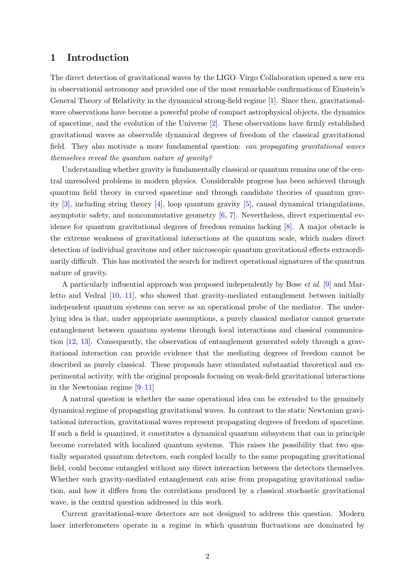 
Low-resolution page preview, page 2

📷 Fig 2

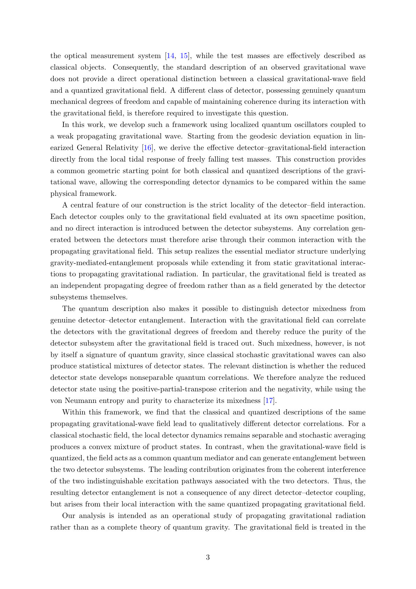 
Low-resolution page preview, page 3

📷 Fig 3

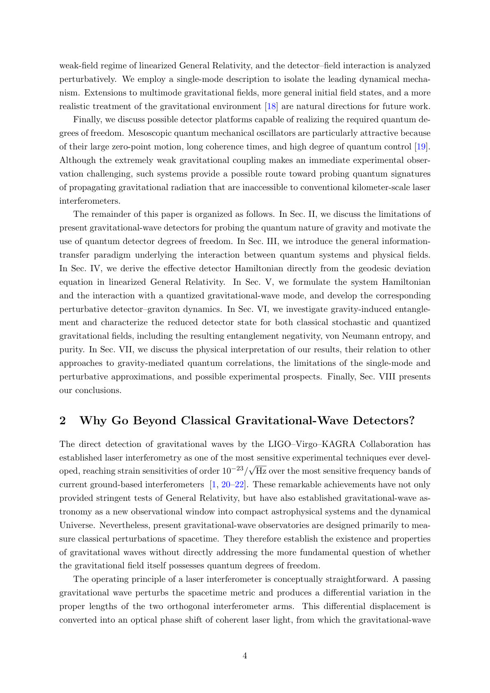 
Low-resolution page preview, page 4

📷 Fig 4

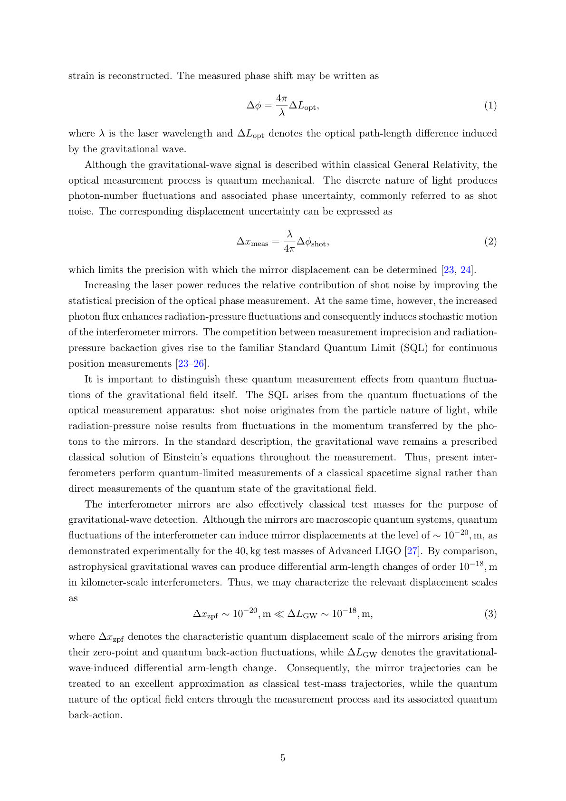 
Low-resolution page preview, page 5

📷 Fig 5

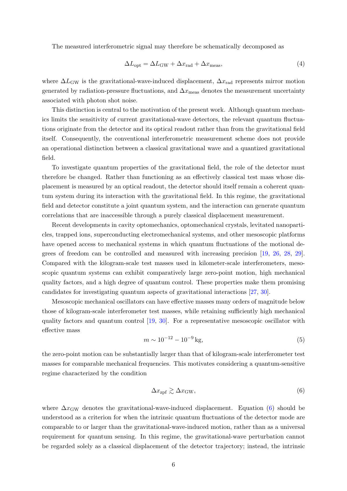 
Low-resolution page preview, page 6

**Summary.** This work establishes a quantum information-based framework to test quantum gravity using gravitational waves. By analyzing the quantum dynamics of coupled detectors, the authors show that only quantized gravitational fields can generate genuine entanglement between detectors. This provides a clear, operational signature distinguishing quantum gravity effects from classical predictions.

**Why it may be interesting.** The core mechanism—using entanglement as a diagnostic tool to distinguish quantum from classical field interactions—is highly relevant to open quantum systems and quantum optics, as it provides a concrete, measurable quantum signature.

Detailed structure

**Main problem.** The paper investigates whether propagating gravitational waves can serve as operational probes to detect the quantum nature of gravity, moving beyond classical measurements of spacetime perturbations.

**Main result.** Quantized gravitational waves can coherently mediate genuine entanglement between two spatially separated detectors, a signature that cannot be generated by classical stochastic gravitational wave backgrounds.

**Method.** The authors develop a unified theoretical framework by deriving the effective detector Hamiltonian from the geodesic deviation equation and constructing the full quantum dynamics for the detector subsystems.

**Model / system.** The model involves localized quantum oscillators (detectors) coupled to a propagating gravitational-wave field, analyzed within the weak-field regime of linearized General Relativity.

**Key observables.** Entanglement negativity, quantum coherence, quantum memory, and the comparison between detector mixedness (classical) versus entanglement (quantum).

**Important parameters / regimes.** The analysis relies on the weak-field, perturbative, and single-mode approximations.

**Assumptions / limitations.** The study is an operational analysis of propagating radiation and does not constitute a complete theory of quantum gravity.

**Paper structure.** The paper is structured around establishing the quantum information framework, deriving the Hamiltonian, formulating the dynamics, and finally comparing the entanglement generated by classical versus quantized fields.

Abstract

Can propagating gravitational waves serve as operational probes of the quantum nature of gravity? We address this question by developing a unified theoretical framework that combines spacetime geometry, quantum information, and gravitational-wave physics. Starting from the geodesic deviation equation in linearized General Relativity, we derive the effective detector Hamiltonian directly from spacetime geometry and construct the complete quantum dynamics for detector subsystems interacting with both classical and quantized propagating gravitational-wave fields. This unified formulation enables a direct comparison between classical and quantum descriptions of gravitational radiation within the same physical framework. We demonstrate that classical gravitational-wave backgrounds can induce mixedness in the detector state but cannot generate genuine quantum correlations between the detector subsystems. In contrast, quantized gravitational waves coherently mediate gravity-induced entanglement, quantum coherence, quantum memory, and nonclassical correlations, providing clear operational signatures of the quantum nature of propagating gravitational radiation. We further discuss how mesoscopic quantum mechanical oscillators offer a promising route towards experimentally probing these effects. Our results establish a geometric and quantum-information-based framework for exploring quantum gravity through propagating gravitational waves.

[↑ back to top](#top)

### [Spectral Core-Tail Architecture for Locally Certified Gibbs-State Preparation](http://arxiv.org/abs/2609.09291v1)

**Authors:** Rui-Hao Li  
**Type:** theory · **Category:** statistical mechanics · **PDF:** <https://arxiv.org/pdf/2609.09291v1>  
**Analysis basis:** full PDF text, analyzed in chunks
**Topic relevance:** `analog quantum simulation` **3/5** · `Keldysh / 2PI / non-Gaussian methods` **1/5** · `methods for driven-dissipative` **1/5** · `scars & prethermalization` **1/5**

📷 Fig 1

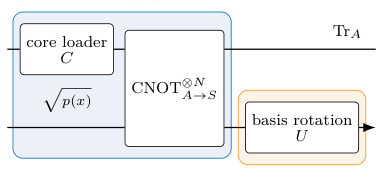 
FIG. 1. SCTA architecture in a purification-based implemen- tation. The spectral core first loads amplitudes p

📷 Fig 2

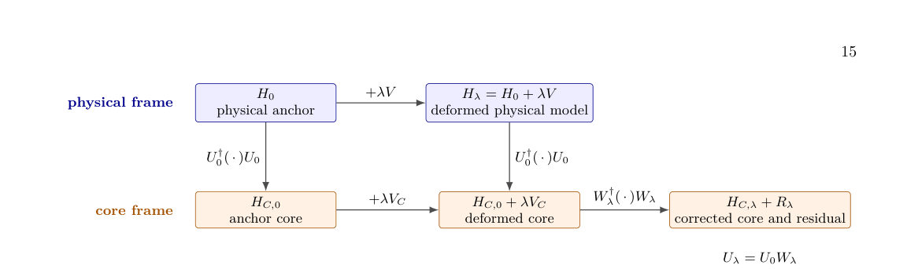 
FIG. 2. Physical- and core-frame representation of a deformation of an exact anchor. Adding λV deforms H0 into Hλ, and conjugation by the anchor tail U0 expresses the deformed Hamiltonian as HC,0 + λVC in the core frame. The correction Wλ is chosen so that the transformed core-frame Hamiltonian separates into the corrected loadable core HC,λ and the residual Rλ. Equivalently, the corrected physical tail is Uλ = U0Wλ.

📷 Fig 3

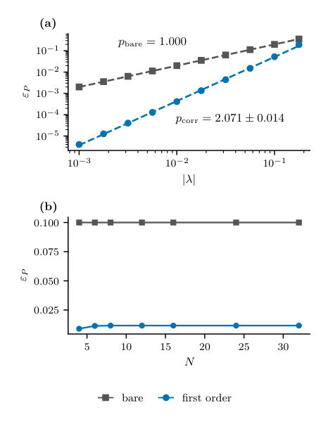 
FIG. 3. Local residual scaling for the graph-stabilizer bench- mark. (a) Pauli incident strength εP of the bare and first-order residuals versus |λ| at N = 12; markers are the computed val- ues, dashed lines are power-law fits over the complete sampled range, and the adjacent labels give the fitted exponents, includ- ing one-standard-error uncertainties. (b) Incident strength versus system size at fixed λ = 0.05, showing that the first- order result saturates by N = 12 in the tested size sequence. The bare and first-order constructions are indicated by gray squares and blue circles, respectively.

📷 Fig 4

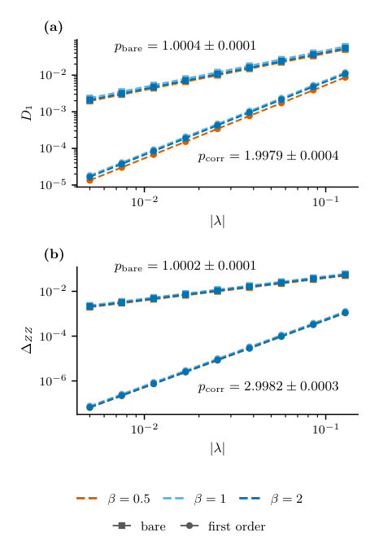 
FIG. 4. Physical local Gibbs-state accuracy at N = 8. (a) Maximum trace-norm distance D1 between contiguous two- site marginals of the exact Gibbs state and those of the bare or first-order state, versus |λ| for three inverse temperatures β ∈{0.5, 1, 2}. (b) Maximum error ∆ZZ in the corresponding ZiZi+1 expectation values. In both panels, markers are the computed values and dashed curves are grouped power-law fits over all nine sampled couplings; each grouped fit uses a common exponent and a temperature-dependent prefactor, and the adjacent labels give the common exponent with its one-standard-error uncertainty. The common legends encode inverse temperature by color—orange for β = 0.5,...

📷 Fig 5

 
FIG. 5. Variational performance in the two regimes where the first-order construction loses perturbative control, evaluated at N = 8 and β = 1. (a) Maximum nearest-neighbor trace-norm error D1 versus the field staggering δ at fixed λ = 0.02, with resonance approached toward the left. (b) The same error versus |λ| at fixed δ = 0.25; the orange band marks the first sampled bracket 0.8 ≤λ ≤1 in which the first-order corrected error becomes larger than the bare error, and the dotted line marks λ× ≃0.813, obtained by linear interpolation in ln λ within that bracket. In both panels, the bare, first-order corrected, and variational constructions are indicated by gray squares, blue circles, and...

**Summary.** This paper introduces the Spectral Core-Tail Architecture (SCTA) as a systematic framework for preparing quantum Gibbs states. It rigorously analyzes the error sources by decomposing the problem into a core, a tail, and a residual. The key achievement is demonstrating that controlled, perturbative corrections can suppress preparation errors quadratically, offering a powerful tool for simulating thermal states in complex quantum systems.

**Why it may be interesting.** This work provides a rigorous, structured approach to state preparation for thermal equilibrium states, which is fundamental to understanding quantum dynamics and thermalization in many-body systems.

Detailed structure

**Main problem.** The central problem is developing a framework to prepare a quantum Gibbs state, $
ho_eta(H)$, which requires accurately reproducing both the thermal distribution and the underlying many-body eigenspaces.

**Main result.** The authors introduce the Spectral Core-Tail Architecture (SCTA) and show that for small deformations of exact anchor Hamiltonians, the resulting Hamiltonian mismatch and local Gibbs-state error suppress quadratically in the perturbative regime.

**Method.** The methodology involves decomposing the state preparation into a structured thermal core, a unitary tail, and an error residual, followed by applying a Schrieffer-Wolff-type local reduction procedure for perturbative corrections.

**Model / system.** The work is general for quantum many-body systems described by a Hamiltonian $H$, but specific tests involve inhomogeneous transverse-field Ising chains (free-fermionic) and graph-stabilizer Hamiltonians.

**Key observables.** Local Gibbs-state error bound ($	ext{Dr}$), Hamiltonian mismatch ($R$), and the physical free-energy density ($f_eta$).

**Important parameters / regimes.** Inverse temperature ($eta$), deformation strength ($\lambda$), and locality radius ($r$).

**Assumptions / limitations.** Assumptions include uniform locality, solvability, and the ability to control the response envelope via shell summability for error bounding.

**Figures summary.** Figures illustrate the purification-based implementation of SCTA, showing core loading on an ancilla register and the subsequent action of the tail unitary.

**Paper structure.** The paper is structured around developing the operational framework (SCTA), identifying exact anchor Hamiltonians, applying perturbative deformations via local reduction, and concluding with numerical and variational tests.

Abstract

Preparing a quantum Gibbs state requires reproducing both its thermal distribution and the associated many-body eigenspaces. In this work, we formalize the spectral core-tail architecture (SCTA) as a framework comprising a structured thermal core, a geometrically characterized unitary tail, and an exact residual measuring the remaining core-frame Hamiltonian mismatch. We derive a local Gibbs-state error bound separating core-preparation, tail-implementation, and modeling errors. The modeling contribution is volume uniform when its Kubo-Mori response meets the shell summability condition and the relevant local data remain uniform. We then highlight three anchor Hamiltonian classes which admit exact core-tail constructions with zero residuals. For small deformations of an exact anchor, we employ a Schrieffer-Wolff reduction procedure to construct a corrected core-tail pair that formally removes the deformation order by order. Under uniform locality and solvability assumptions, we show that the first-order reduction yields a residual that remains bounded and is quadratic in the deformation strength. Furthermore, we numerically test the first-order reduction on deformed graph-stabilizer Hamiltonians. The numerical results show approximately quadratic suppression of both the Hamiltonian-level mismatch and the local Gibbs-state error in the perturbative regime. We also find that the constructed correction circuit structure remains useful as a variational ansatz beyond perturbative control, often improving on both the bare and prescribed first-order states.

[↑ back to top](#top)

### [Universal correlations in the Abelian sandpile model](http://arxiv.org/abs/2609.10352v1)

**Authors:** Qiyu Liu, Jan-Niklas Herre, Prajit Baruah, Sebastian Dreizler, Christoph Karrasch, Wioletta Ruszel, Dirk Schuricht  
**Type:** theory · **Category:** statistical mechanics · **PDF:** <https://arxiv.org/pdf/2609.10352v1>  
**Analysis basis:** full PDF text, analyzed in chunks
**Topic relevance:** `non-equilibrium universality` **3/5** · `analog quantum simulation` **2/5** · `driven-dissipative phase transition` **1/5**

📷 Fig 1

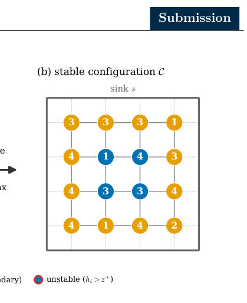 
Figure 1: Toppling dynamics of the ASM on a 4 × 4 square lattice with wired boundary conditions, ie, all boundary sites being connected to an additional vertex which we call the sink. Closed (bulk) sites are shown in blue, open (boundary) sites in orange, and the surrounding box represents the sink; dotted lines indicate edges connecting boundary sites to the sink. (a) A stable configuration to which one grain has been added at an interior bulk site, which is thereby becomes unstable (hi = 5 &gt; z∗ i = 4, red ring). (b) After relaxation the system reaches the stable configuration C: the unstable site has toppled (losing z∗ i = 4 grains, dropping to h = 1) and each of its four neighbours has...

📷 Fig 2

 
Figure 2: The Majumdar–Dhar burning bijection for the recurrent configuration C of Figure 1(b). (a) The sink-rooted spanning tree T = σ(C): arrows point from each site to its tree parent (towards the sink), and each site is labelled by its burning time d(v), equal to its depth in T. Only the tree edges are drawn (as arrows); the four closed (bulk) sites are marked A–D. (b) Reconstruction of the height at each bulk site. Reading the neighbours’ burning times from panel (a), U counts the neighbours that burn at time ≥d(v). The column Pv lists the previous-layer neighbours (those in burning layer d(v)−1) as a subset of {E, N, W, S} written in this fixed canonical order (one can analogously...

📷 Fig 3

 
Figure 2(b) tabulates d(v), Pv, U, k and the reconstructed hv for the four bulk sites A–D of the tree in Figure 2(a); the heights agree with those of C [Figure 1(b)], establishing the bijection T ↔C. The correspondence has a natural interpretation: both spanning trees and recurrent configurations encode global connectivity to the sink without frozen regions. A spanning tree provides every vertex with a unique path to the sink, while a recurrent configuration contains no FSC—no cluster of sites is so depleted that it can never be activated by avalanches from the boundary. The burning process bridges these viewpoints: the tree dictates the order in which fire propagates from the sink, and the...

📷 Fig 4

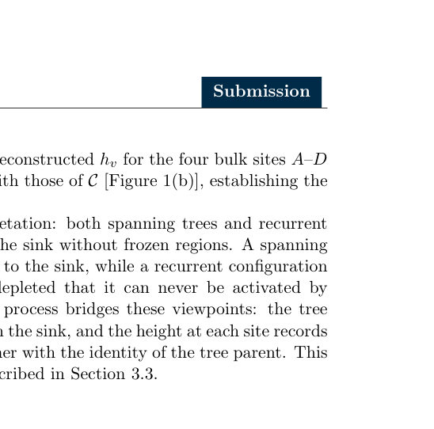 
Figure 3 shows the three planar lattices studied in this work. Each lattice is characterised by its coordination number z (the number of nearest neighbours per bulk site) and the number of sites per unit cell:

📷 Fig 5

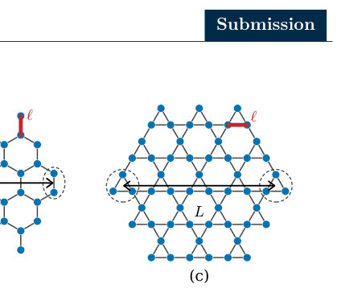 
Figure 3: The three planar lattices studied in this work. (a) Square lattice (z = 4). (b) Honeycomb lattice (z = 3). (c) Kagome lattice (z = 4); the honeycomb and kagome do- mains are hexagonal, reflecting the natural boundary of the underlying triangular Bravais lattice. In each panel L is the linear system size (the domain diameter for the hexagonal cases), measured in nearest-neighbour (bond-length ℓ) units. A single nearest-neighbour bond of length ℓis highlighted (red) in each panel; we set ℓ= 1 throughout, so all dis- tances and system sizes are quoted in these units. Writing a for the lattice constant (a = ℓ square, a = √

**Summary.** This paper provides a comprehensive numerical and analytical study of universal correlations in the Abelian sandpile model on multiple lattices, including the kagome lattice. By using advanced sampling techniques, the authors confirm that the system's bulk correlations align with predictions from logarithmic conformal field theory. This work advances the understanding of critical behavior in non-equilibrium statistical physics models.

**Why it may be interesting.** While focused on classical statistical mechanics, the study of critical phenomena, universal scaling laws, and non-equilibrium dynamics in the ASM provides deep insights into critical exponents and correlation functions relevant to quantum critical points in many-body systems.

Detailed structure

**Main problem.** The study focuses on characterizing and calculating universal correlations within the two-dimensional Abelian sandpile model (ASM) across various lattices.

**Main result.** The numerical results for the kagome lattice confirm power-law scaling consistent with logarithmic conformal field theory (LCFT) predictions, and the authors derived closed-form analytical expressions for certain observables.

**Method.** The authors employ advanced sampling techniques (Wilson's algorithm) combined with the Majumdar–Dhar burning bijection to generate independent recurrent configurations, allowing for the calculation of bulk correlation functions.

**Model / system.** The system is the Abelian sandpile model defined on planar lattices (square, honeycomb, and kagome). The dynamics are governed by local toppling rules, and the analysis focuses on the set of recurrent configurations.

**Key observables.** Bulk correlation functions (e.g., two-point height correlations $C_{a,b}(r)$) and the height-1 probability.

**Important parameters / regimes.** The lattice structure (square, honeycomb, kagome) and the scaling limit ($|V| 	o \infty$).

**Assumptions / limitations.** The analysis assumes the validity of LCFT predictions for the scaling limit and utilizes the bijection between recurrent states and spanning trees.

**Figures summary.** Figures illustrate toppling dynamics, the Majumdar–Dhar burning bijection, and show data fits for rescaled correlations on the Kagome lattice against $\log r$ and $\log^2 r$.

**Paper structure.** The paper first establishes the mathematical framework using the bijection between recurrent states and spanning trees. It then numerically computes correlation functions for different lattices, comparing them against LCFT predictions. Finally, it derives analytical results, such as Green function values, for the kagome lattice.

Abstract

We numerically study the bulk correlation functions in the two-dimensional Abelian sandpile model, aiming both to compare with the predictions of logarithmic conformal field theory and to extend the analysis to lattices where analytical methods are difficult to apply. Wilson's algorithm efficiently generates large-scale uniform spanning trees in parallel, which can be mapped to independent recurrent configurations via the Majumdar--Dhar burning bijection, eliminating sample autocorrelations and yielding fast convergence. On the square (single-sublattice) and honeycomb (two-sublattice) lattices our results agree well with the analytical predictions. For the kagome lattice we provide the first systematic numerical study of the bulk correlation functions, and cross-check the bulk height-1 probability against a closed-form analytical expression that we also derive here via the lattice Green function.

[↑ back to top](#top)

### [Finite-Temperature Flat-Band Ferromagnetism in the Kagome Hubbard Model](http://arxiv.org/abs/2609.09289v1)

**Authors:** Alon Strugatsky, Roser Valení, Jonas B. Profe  
**Type:** theory · **Category:** strongly correlated electrons · **PDF:** <https://arxiv.org/pdf/2609.09289v1>  
**Analysis basis:** full PDF text, analyzed in chunks
**Topic relevance:** `analog quantum simulation` **3/5** · `Keldysh / 2PI / non-Gaussian methods` **2/5**

📷 Fig 1

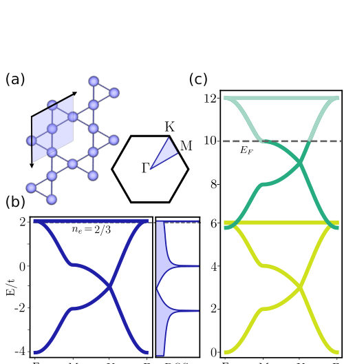 
Figure 1. (a) The kagome lattice in reciprocal and real space with a single unit cell highlighted by blue shading. (b) The non-interacting bandstructure and density of states. (c) Mean- field spin-split band structure at nF B = 1/8 into a majority spin band (light green) and a minority spin band (dark green), with the Fermi level crossing the van-Hove singularity of the minority spin band.

📷 Fig 2

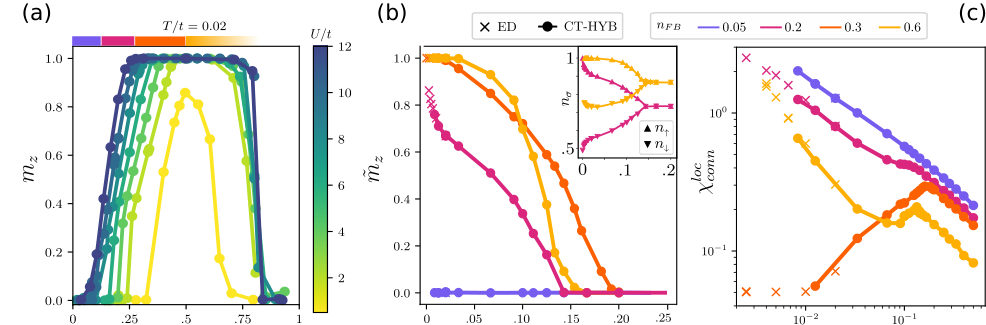 
Figure 2. Single-site DMFT results. (a) Evolution of the normalized impurity magnetization as a function of the flat-band filling nF B for different interaction strengths, indicated by the curve colors, at T/t = 0.02. The four regimes discussed in the text are indicated above the plot: from left to right, the paramagnetic (purple), onset magnetization (magenta), dispersive demagnetization (orange), and flat-band (FB) demagnetization (dark yellow) regimes. (b) Temperature dependence of the normalized magnetization at U/t = 10 in the four regimes. Saturation is reached only at T →0, indicating strong competition between the ferromagnetic order and thermal fluctuations. For larger fillings the...

📷 Fig 3

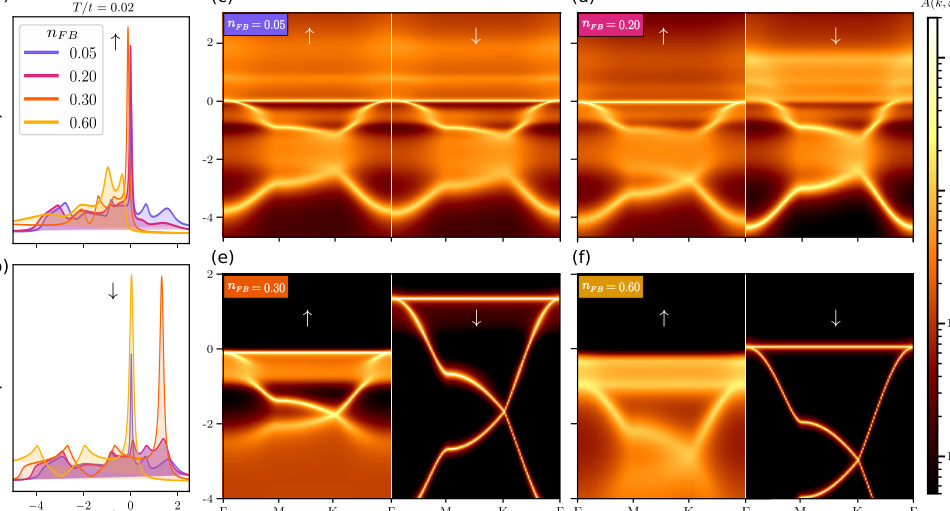 
Figure 3. Spin-resolved local density of states (DOS) for the majority (a) and minority (b) spin channels, together with the momentum-resolved spectral functions (c)-(f) obtained from DMFT. The Fermi level is set to EF = 0. In the onset regime, the minority-spin channel exhibits a strong loss of quasiparticle weight near the Fermi level (Fig. 3(d)). In contrast, in the saturated regime, the minority-spin quasiparticles remain fully coherent ((e,f)).

**Summary.** This theoretical study investigates magnetism in the Kagome Hubbard model at flat-band fillings using Dynamical Mean-Field Theory. The authors demonstrate strong flat-band ferromagnetism and identify an unconventional quasi-ordered phase. This phase is marked by persistent local spin fluctuations down to zero temperature, a behavior attributed to the macroscopic degeneracy of the flat band itself.

**Why it may be interesting.** The finding of persistent, non-classical spin fluctuations due to flat-band degeneracy provides a novel theoretical mechanism for magnetic instability in correlated systems, which is relevant to understanding exotic quantum ground states.

Detailed structure

**Main problem.** To elucidate the microscopic origin of correlated electronic phases in Kagome metals, particularly in the flat-band regime, by separating correlation effects from material-specific details.

**Main result.** The study finds strong signatures of flat-band ferromagnetism and uncovers an unconventional quasi-ordered phase characterized by persistent local spin fluctuations down to zero temperature, contrasting with classical ferromagnetism.

**Method.** Dynamical Mean-Field Theory (DMFT) is employed to map the lattice problem onto a quantum impurity problem, solved using advanced techniques like CT-HYB QMC and ED.

**Model / system.** The system studied is the single-orbital Kagome-Hubbard model, analyzed at flat-band fillings using the Hamiltonian $H = -\sum_{\langle i,j
angle,\sigma} t (c^\dagger_{i\sigma} c_{j\sigma} + 	ext{h.c.}) + \sum_i U n_{i\uparrow} n_{i\downarrow}$.

**Key observables.** Normalized Magnetization ($	ilde{m}_z$), local spin susceptibility ($\chi_{	ext{conn}}^{	ext{loc}}$), and spin-resolved spectral functions $A(\mathbf{k}, \omega)$.

**Important parameters / regimes.** Flat-Band Filling ($n_{	ext{FB}}$), Temperature ($T$), and the interaction strength ($U$).

**Assumptions / limitations.** The primary approximation is the single-site DMFT approach, which localizes the problem and neglects spatial correlations beyond the impurity site.

**Figures summary.** Figures illustrate the magnetic regimes (paramagnetic, onset, FB demagnetization) based on filling, the temperature dependence of magnetization, and the spin susceptibility ($\chi_{	ext{conn}}^{	ext{loc}}$) showing distinct Curie-like responses in the flat-band regimes.

**Paper structure.** The paper develops the analysis by first establishing the model and methods (DMFT), then analyzing the magnetic transitions across different filling regimes, and finally contrasting the resulting spin fluctuation behavior with classical expectations.

Abstract

Kagome metals exhibit a rich interplay of topology, electronic correlations, and lattice dynamics. Recent discoveries of Kagome materials with a flat band near the Fermi level have revealed a variety of correlated electronic phases. However, elucidating their microscopic origin remains challenging, as realistic descriptions require accounting for multiple orbitals and competing interactions on an equal footing. To disentangle correlation effects from material-specific details and identify the essential physics of the flat-band regime, we study the single-orbital Kagome-Hubbard model at flat-band fillings using dynamical mean-field theory. We find strong signatures of flat-band ferromagnetism, consistent with exact and mean-field ground-state results. Moreover, we uncover an unconventional quasi-ordered phase in which a partially filled spin-polarized flat band pinned at the Fermi level gives rise to persistent local spin fluctuations down to zero temperature, in striking contrast to the classical behavior expected for a conventional ferromagnet. Our results demonstrate that these anomalous fluctuations are an intrinsic consequence of the flat-band degeneracy and establish a minimal framework for understanding correlation effects in flat-band Kagome systems.

[↑ back to top](#top)

### [Gauge mean-field theories of the underscreened Kondo lattice](http://arxiv.org/abs/2609.10443v1)

**Authors:** Ewan Scott, Michal Kwasigroch  
**Type:** theory · **Category:** strongly correlated electrons · **PDF:** <https://arxiv.org/pdf/2609.10443v1>  
**Analysis basis:** full PDF text, analyzed in chunks
**Topic relevance:** `Keldysh / 2PI / non-Gaussian methods` **3/5** · `analog quantum simulation` **1/5** · `methods for driven-dissipative` **1/5**

📷 Fig 1

 
FIG. 1. Ground state phase diagrams showing three phases: I – The normal FM state with local moments maximally polar- ized ¯S1,2 = 1/2 and no hybridization ¯V1 = 0, II – Weak Kondo ferromagnet with magnetization of the hybridized f-moment ¯S1 &gt; 0 and weak hybridization ¯V1 &gt; 0, III – Strong Kondo ferromagnet with weak magnetization of the hybridized f- moment ¯S1 &lt; 0 and strong hybridization, ¯V1 &gt; 0. The un- hybridized f-moment has a magnetization ¯S1 = 1/2 in all phases. Plot (a) shows the magnetic moment of the hybridized f-electron ¯S1 as a function of the dimensionless Kondo cou- pling JKρ and the relative strength of the coupling in the magnetic exchange channel JM = 2JK

📷 Fig 2

 
FIG. 2. A plot of the groundstate order parameters ¯S1 and ¯V1, magnetization and hybridization of the f1-fermion respec- tively for N = 20. The unhybridized f2-fermion always has a magnetization of ¯S2 = 1

📷 Fig 3

 
FIG. 3. Feynman diagrams for the (a) RKKY interaction between unhybridized f2-fermions, (b) the Hund’s interaction between f2-fermions, and (c) the diagrammatic expansion of the ϕ propagator Gϕϕ(ω) = ⟨ϕ†(ω)ϕ(ω)⟩in the RPA approximation. The double lines indicate the unhybridised f2-fermions, d are the heavy fermions (superposition of the hybridized f1-fermions and conduction electrons) and wavy lines are the ϕ gauge fields.

**Summary.** This work develops a unified Gauge Mean-Field Theory to study the spin-1 underscreened Kondo lattice, a model exhibiting competition between magnetic order and Kondo screening. By utilizing a large-$N$ expansion, the authors unify disparate mean-field approaches and map out the ground state phase diagram. The results clarify the nature of the coexisting phases and highlight the role of quantum fluctuations in determining the system's ground state properties.

**Why it may be interesting.** The use of gauge fields and large-$N$ expansions to treat strong correlations and competing orders (magnetic vs. Kondo) is highly relevant to understanding complex quantum materials.

Detailed structure

**Main problem.** The paper addresses the complex problem of the spin-1 underscreened Kondo lattice (UKL), where magnetic order and Kondo hybridization can coexist.

**Main result.** The authors develop a unifying variational theory that maps out the ground state phase diagram, revealing crucial differences between previously proposed mean-field treatments.

**Method.** The study employs Gauge Mean-Field Theory (gMFT) using a large-$N$ expansion and an unbiased variational ansatz to calculate fluctuation corrections to the mean-field Hamiltonian.

**Model / system.** The system is the spin-1 UKL model, described by a Hamiltonian involving Kondo coupling ($J_K$) and generalized using $N$ replicas of fermionic spin flavors. The theory incorporates local U(1) and SU(2) gauge symmetries.

**Key observables.** Ground state phase diagram, magnetic moment ($ar{S}_1$), hybridization ($ar{V}_1$), and the strength of the residual ferromagnetic Hund interaction.

**Important parameters / regimes.** Control parameter $N$, Kondo coupling $J_K$, and the relative strengths of Kondo energy ($T_K$) versus RKKY energy ($T_{RKKY}$).

**Assumptions / limitations.** The analysis relies on the large-$N$ limit for the mean-field theory and uses Gaussian approximations for fluctuation corrections.

**Figures summary.** Figures illustrate ground state phase diagrams showing three distinct phases (Normal FM, Weak Kondo, Strong Kondo) based on local moment polarization and hybridization, alongside diagrams detailing interaction types (RKKY, Hund's).

**Paper structure.** The paper builds from defining the Hamiltonian and introducing the large-$N$ variational ansatz, proceeds to analyzing gauge field fluctuations and deriving fluctuation corrections ($\Delta H_{fluc}$), and culminates in mapping the full phase diagram and generalizing the theory to $S>1$.

Abstract

Various mean-field decoupling schemes have been introduced thus far to study the important and challenging problem of the spin-$1$ underscreened Kondo lattice where magnetic order can coexist with Kondo hybridization. We use a single control parameter $N$ and an unbiased variational ansatz to unify and connect the previously proposed decouplings to standard Read-Newns theory, where fluctuations are small in $1/N$. We compute the corrections around the large-$N$ limit. In particular, we make contact with Nozières strong-coupling theory by finding the residual ferromagnetic Hund interaction that decays logarithmically in the case of a heavy-fermion metal. We map out the ground state phase diagram as a function of $N$ and the Kondo coupling. We find crucial differences between the previously proposed mean-field theories in the strength of the hybridization and total magnetization of the coexistent phase. We show that, within our unifying variational theory, the previously proposed decouplings correspond to either taking $N=2$ from the start, or performing a $1/N$ expansion and then extrapolating to $N=2$. Finally, we summarize the generalization of our theory to $S>1$.

[↑ back to top](#top)

### [Materials for Quantum Information Science: Roles in the Quantum Evolution 2.0](http://arxiv.org/abs/2609.09371v1)

**Authors:** Thang Pham, Vsevolod Ivanov, Dominic P. Goronzy, Abhiram Devata, Joshua Feldon, David Barton, You Zhou  
**Type:** both · **Category:** quantum information and computing · **PDF:** <https://arxiv.org/pdf/2609.09371v1>  
**Analysis basis:** full PDF text, analyzed in chunks
**Topic relevance:** `QC/QI experiment` **3/5** · `analog quantum simulation` **1/5** · `correlated / nonlocal dissipation` **1/5**

📷 Fig 1

 
Figure 1: Ecosystem of Quantum Evolution 2.0. The "Materials" block is the focus of this review. Images adapted and modified with permission from ref2 .

📷 Fig 2

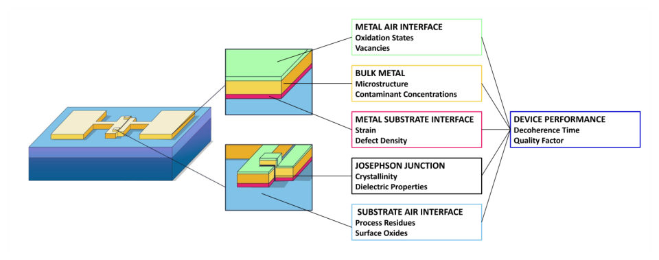 
Figure 2: Superconducting qubit performance is a function of the properties of the constituent materials and the surfaces and interfaces within the qubit device. The future of improved performance lies in understand these structure-property-performance relationships and developing novel materials and fabrication strategies to mitigate decoherence.

📷 Fig 3

 
Figure 3: Comparison of some experimentally validated color center defect properties in diamond (C), 4H silicon carbide (4H-SiC), silicon (Si), and hexagonal boron nitride (hBN). The plot compares the optical radiative lifetime against the zero-phonon-line emission for each defect. For each defect, the marker shape indicates the spin state, the marker size represents the smallest experimentally measured linewidth on a logarithmic scale, and the marker color corresponds to the T1 spin-relaxation time (if known).

📷 Fig 4

 
Figure 4: Integrated waveguide materials primarily discussed in this review. Active materials include wide bandgap oxides and nitrides that feature nonlinear susceptibilities that can leverage external elec- tric fields to control optical properties. Passive materials, including tantalum pentoxide, offer potential advantages as low loss and low noise quantum photonic systems. Images taken adapted with permission from:164(lithium niobate),165(barium titanate),166(strontium titanate),167(aluminum nitride),168(silicon ni- tride), and169(tantalum pentoxide).

📷 Fig 5

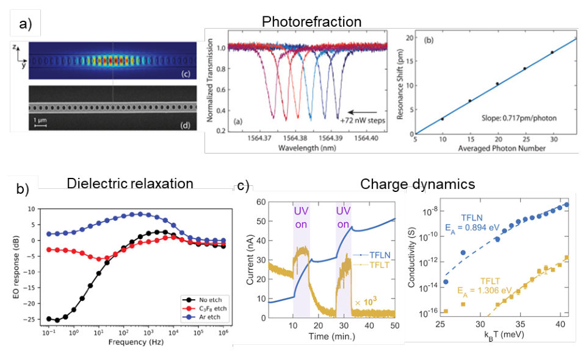 
Figure 5: photorefraction and drift in thin film lithium niobate. a) photorefraction is observed in nanocavities with nearly single photon level tuning. b) dielectric relaxation, as measured as a frequency dependence of the electro-optic response of a modulator, depends on both device geometry and chemistries used to etch and define the contact interface. c) Charge dynamics play a significant role in unwanted time-dependent responses in modulators. UV light modifies conductivity and reported lower activation energies in differing materials defines the magnitude of drift. These phenomena motivate a materials-level characterization of device response improvements, correlating device outcomes...

**Summary.** This review analyzes the materials limitations hindering the scaling of quantum processors, arguing that performance is now bottlenecked by poorly controlled interfaces rather than device design. It surveys superconducting circuits, 2D materials, and other platforms, concluding that a unified, atomistic understanding of material defects is required to advance quantum information science.

**Why it may be interesting.** It provides a crucial materials physics perspective on quantum computing, detailing how fundamental solid-state defects and interface chemistry directly dictate the achievable coherence times in superconducting qubits and other quantum hardware.

Detailed structure

**Main problem.** The scaling of quantum computation is limited by material imperfections, specifically poorly controlled surfaces, buried interfaces, and defects across various quantum platforms.

**Main result.** The materials challenges are universal across superconducting circuits, 2D materials, and quantum defects, requiring a fundamental shift toward atomistically controlled material synthesis.

**Method.** The paper reviews the materials science challenges by surveying multiple quantum platforms, identifying dominant decoherence mechanisms, and proposing necessary characterization methods.

**Model / system.** The review covers superconducting circuits (e.g., transmon qubits), quantum defects, quantum photonic devices, and 2D van der Waals heterostructures, all of which are subject to decoherence from material disorder.

**Key observables.** Decoherence time ($T_2$), Quality factor ($Q$), and structural characterization data (e.g., defect density, oxide chemistry).

**Important parameters / regimes.** Atomic-scale structure, interface chemistry, and the energy scales associated with Two-Level Systems (TLS).

**Assumptions / limitations.** The primary assumption is that future quantum performance gains require solving the materials bottleneck by understanding structure-coherence relationships.

**Figures summary.** Figure 1 illustrates the 'Ecosystem of Quantum Evolution 2.0,' positioning materials science as the central limiting factor. Other figures likely compare performance metrics across different quantum platforms.

**Paper structure.** The paper follows a platform-by-platform review (superconducting circuits, defects, photonics, 2D materials), culminating in a cross-platform comparison that identifies shared material chemistry problems and necessary future research directions.

Abstract

Quantum information science is entering a second phase, the Quantum Evolution 2.0, in which the challenge has shifted from demonstrating coherent control of individual quantum states to building scalable multi-qubit processors and networks. This transition places materials science at the center of the field. Across superconducting circuits, quantum defects, quantum photonic devices, and emerging materials platforms, including two-dimensional materials and heterostructures, performance is now limited less by device design than by poorly controlled surfaces, buried interfaces, and defects whose atomic identities remain incompletely known. This review surveys the materials challenges of these quantum platforms together with the characterization methods needed to resolve them. For each platform we identify the dominant decoherence mechanisms, the current state of materials understanding, and the most pressing open materials problems. A cross-platform comparison then reveals a shared structure-coherence problem. The implicated material chemistry recurs across platforms, involving light elements in disordered or buried environments, yet no platform can quantitatively connect a specific atomic-scale structure to a measured change in coherence. We close by identifying three needs, mechanistic understanding of decoherence at the atomistic level, high-throughput proxy metrics predictive of device performance, and characterization tools built for quantum materials, whose resolution would advance coherence, scalability, and integration across all platforms.

[↑ back to top](#top)

### [Programmable photonic state fusion via heralded storage of asynchronously generated resources](http://arxiv.org/abs/2609.10312v1)

**Authors:** Mustafa Gündoğan, Dennis Rätzel  
**Type:** theory · **Category:** quantum information and computing · **PDF:** <https://arxiv.org/pdf/2609.10312v1>  
**Analysis basis:** full PDF text, analyzed in chunks
**Topic relevance:** `interference shaping light` **3/5** · `analog quantum simulation` **1/5** · `quantum measurements` **1/5**

📷 Fig 1

 
FIG. 1. Bosonic fusion for the clock-state implementation. (a) A specific realization of our fusion scheme for generating the photonic clock state considered for clock interferometry in [16, 17]. Once an elementary block ∼X† j + Y † j is heralded, the herald is fed forward to the tunable loop couplers, which are set to the programmed coupling xj. Successful loading places the newly generated photons into the same circulat- ing modes as the previously stored photons, removing their generation-time labels. Repeating the procedure for N suc- cessful loads yields the fused output. (b) Mode-occupation amplitudes obtained with the roots-of-unity phase settings for the case of N = 4. The index m...

📷 Fig 2

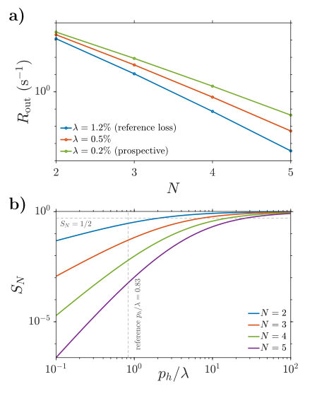 
FIG. 2. Performance of the nb = 2 path–frequency realization. (a) Detected rates from Eq. (15) for frep = 10 MHz, ph = 10−2, η = 0.9, and ideal dump-port monitoring. The curves corre- spond to round-trip losses of 1.2%, 0.5%, and 0.2% per stored photon. The 1.2% value is a reference loss rather than a demonstrated end-to-end operating point. (b) Waiting sur- vival SN,2 as a function of ph/λ for N = 2, . . . , 5. The dashed lines mark SN,2 = 1/2 and the reference ratio ph/λ ≃0.83.

📷 Fig 3

 
FIG. 3. Source and storage architecture for the multiphoton clock state. Two coherently driven SPDC sources produce signal–idler pairs with signal frequencies f1 and f2, respec- tively, while the idlers share the same frequency fi. The idlers are interfered in a linear-optical Bell-state analyzer, and the accepted BSM outcome heralds the corresponding signal su- perposition. A half-wave plate in the f2 signal arm, followed by the final PBS, maps the two polarization alternatives onto the path–frequency configurations X† j and Y † j . The BSM her- ald is fed forward to the couplers of the U and L storage loops, LU and LL, which are operated at the programmed loading strength xj = 1/(1 + j)....

**Summary.** This paper details a novel photonic state fusion protocol designed to overcome the challenge of combining asynchronously generated quantum resources. By using active storage loops, the protocol effectively removes temporal labeling, enabling the construction of highly entangled, programmable NOON-type states. This advancement significantly improves the feasibility of building complex quantum devices like photonic clocks.

**Why it may be interesting.** This work directly addresses resource limitations in quantum optics, providing a scalable theoretical framework for generating high-dimensional entangled states necessary for quantum metrology and quantum computation.

Detailed structure

**Main problem.** The core challenge is enabling multiphoton quantum interference when the elementary photonic resources are generated probabilistically and asynchronously, requiring them to interfere in common temporal modes.

**Main result.** The authors propose a fusion protocol using active storage loops that successfully removes the generation time label, allowing the construction of high-fidelity, programmable NOON-type entangled states.

**Method.** The protocol involves successively loading heralded photonic blocks into active storage loops, conditioning on vacuum modes to ensure temporal mode matching, and synthesizing the target state via polynomial factorization.

**Model / system.** The system utilizes photonic state fusion, employing active quantum memory loops and heralded sources (like SPDC) to generate and combine multiple entangled photonic blocks.

**Key observables.** The detected rate ($R_{	ext{out},N}$) of the final entangled state, and the survival probability ($S_{N,n_b}$) of the stored state.

**Important parameters / regimes.** The round-trip loss ($\lambda$), the probability of obtaining a usable block ($p_h$), and the coupling strength adjustments in the storage loop.

**Assumptions / limitations.** The elementary resources must undergo the same complex loading transformation for both alternatives, and the analysis often assumes ideal loss-less conditions for the final state derivation.

**Figures summary.** Figures illustrate the bosonic fusion scheme for clock-state implementation, showing process flow and mode-occupation amplitudes, and detail the source/storage architecture using SPDC sources and Bell-state analyzers.

**Paper structure.** The paper builds from identifying the temporal mismatch problem, proposing the storage loop loading protocol, deriving the mathematical structure of the accumulated state via polynomial factorization, and finally applying this to estimate the achievable rate for photonic clock interferometry.

Abstract

Probabilistic photonic sources generate elementary states in different trials, whereas multiphoton protocols require them to interfere in common temporal modes. We propose a fusion protocol that overcomes this mismatch by successively loading independently heralded photonic states into active storage loops. Conditioning on vacuum in monitored dump modes selects events in which each newly generated state is transferred into the same circulating modes as the photons already stored, thereby removing its generation time label. Provided the two alternatives of each elementary state undergo the same loading transformation, the accumulated state is described by a product of programmable linear factors, allowing a target superposition to be constructed by polynomial factorization. Adjusting the storage loop coupling as the state grows substantially improves the loading efficiency, changing the faster-than-exponential penalty of fixed balanced couplers to exponential scaling. We apply the protocol to two-photon path--frequency states for photonic clock interferometry and estimate the detected rate including source waiting time and round-trip loss.

[↑ back to top](#top)

### [Convex-Gaussianity of fermionic Gibbs states in perturbation theory](http://arxiv.org/abs/2609.09608v1)

**Authors:** Kaifeng Bu, Yuanjie Ren  
**Type:** theory · **Category:** strongly correlated electrons · **PDF:** <https://arxiv.org/pdf/2609.09608v1>  
**Analysis basis:** full PDF text, analyzed in chunks
**Topic relevance:** `analog quantum simulation` **3/5** · `Keldysh / 2PI / non-Gaussian methods` **1/5**

📷 Fig 1

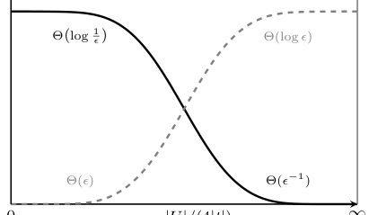 
FIG. 1. The weak- and strong-coupling windows for the 2- dim Fermi–Hubbard model on a square lattice. The solid curve is read on the left axis and the dashed curve on the right axis. The asymptotic labels refer to the bounds before compactification.

**Summary.** This work rigorously determines the temperature regimes where the Gibbs state of interacting fermions, modeled by the Fermi-Hubbard Hamiltonian, remains convex-Gaussian. By analyzing both weak and strong coupling limits, the authors provide precise bounds on the inverse temperature $eta$, offering deep insights into the structure of thermal states in correlated matter.

**Why it may be interesting.** The determination of the parameter regimes ($eta$ windows) where quantum states retain simple mathematical structures (like convex-Gaussianity) is crucial for understanding quantum simulation feasibility and thermalization in strongly correlated systems.

Detailed structure

**Main problem.** The paper investigates the conditions under which the Gibbs state of weakly perturbed interacting fermionic systems remains convex-Gaussian.

**Main result.** It establishes explicit, non-trivial bounds on the inverse temperature ($eta$) for convex-Gaussianity in both weak-coupling (small $U$) and strong-coupling (small $t$) regimes of the Fermi-Hubbard model.

**Method.** The analysis uses perturbation theory, expanding the Gibbs state in the Majorana basis, and relies on proving that the resulting expectation values belong to the Fermionic Gaussian Cone (FGC).

**Model / system.** The primary model is the interacting fermionic system, specifically the Fermi-Hubbard model ($H = tH_{	ext{hop}} + U V_{	ext{int}}$) defined on a graph. The study analyzes the structure of the Gibbs state $
ho_eta(H)$.

**Key observables.** Convex-Gaussianity of the Gibbs state $
ho_eta(H)$, which means $
ho_eta$ can be written as a convex combination of Gaussian fermionic states.

**Important parameters / regimes.** Inverse temperature ($eta$), perturbation scale ($\epsilon$), hopping amplitude ($t$), and interaction strength ($U$).

**Assumptions / limitations.** The Hamiltonian is assumed to be sparse, and the analysis often relies on small parameter expansions (weak or strong coupling) and specific bounds on local interaction strengths (e.g., $\Delta_{	ext{site}} \le 1/72$).

**Figures summary.** Figure 1 illustrates the weak- and strong-coupling boundaries for the 2D Fermi-Hubbard model, showing the respective bounds for convex-Gaussianity.

**Paper structure.** The paper develops results by first analyzing the general sparse Hamiltonian case (Theorem 3), then applying this framework to the weak-coupling limit of the Fermi-Hubbard model, and finally deriving a distinct mechanism for convex-Gaussianity in the strong-coupling limit.

Abstract

We study the structure of Gibbs states in weakly perturbed interacting fermionic systems. First, for a sparse Hamiltonian $H=H_0+V$ with a quadratic term $H_0$ and a non-quadratic perturbation $V$ of scale $ε$, we show that the Gibbs state $ρ_β$ decomposes into a convex combination of Gaussian states whenever the inverse temperature satisfies $β\le O(\log(1/ε))$. Moreover, we prove that this bound is asymptotically tight by establishing that $β\le Θ(\log(1/ε))$ is necessary for certain sparse Hamiltonians. This general framework applies directly to the weak-coupling (small-$\vert{}U\vert{}$) regime of the Fermi--Hubbard model with hopping $t$ and on-site interaction $U$ on any graph of maximum degree $D$. Complementarily, in the strong-coupling (small-$\vert{}t\vert{}$) regime, we show that the Gibbs state remains convex-Gaussian up to $β\le O\big(\vert{}U\vert{}^{-1}\log(\vert{}U\vert{}/(D\vert{}t\vert{}))\big)$, revealing a mechanism for convex-Gaussianity distinct from the weak-coupling setting.

[↑ back to top](#top)

### [Fast, Accurate, and Scalable Fermionic Neural Networks via Translation Equivariance](http://arxiv.org/abs/2609.10186v1)

**Authors:** David D. Dai, Yen-Ting Lin, Marin Soljačić  
**Type:** theory · **Category:** strongly correlated electrons · **PDF:** <https://arxiv.org/pdf/2609.10186v1>  
**Analysis basis:** full PDF text, analyzed in chunks
**Topic relevance:** `analog quantum simulation` **3/5** · `methods for driven-dissipative` **1/5**

📷 Fig 1

 
FIG. 1. Medium-system comparison of TorFormer (TorF) and Psiformer (PF)’s expected energy and energy variance versus training steps. Error bars every 1K steps show inference energies estimated from fresh Markov chains, while the scatter plots show training estimates logged at each step. TorFormer is both faster and more accurate.

📷 Fig 2

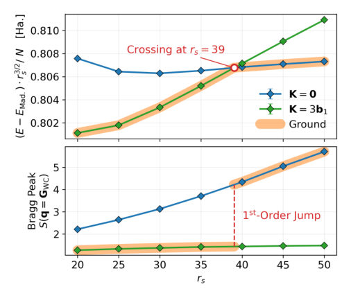 
FIG. 3. TorFormer’s energy per particle and Bragg peak height for sectors K = 3b1 and K = 0, plotted as a function of density parameter rs. The symmetry-protected crossing at rs = 39 causes a jump in the static structure factor, which is a finite-size realization of the phase transition.

📷 Fig 3

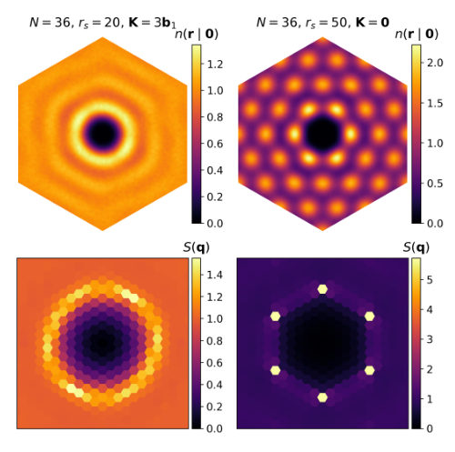 
FIG. 2. Pair correlation function (top row) and static struc- ture factor (bottom row) for rs = 20.0 (left column) and rs = 50.0 (right column). The expected phase is apparent in both observables.

📷 Fig 4

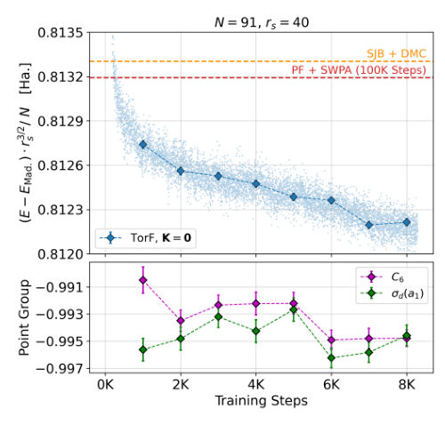 
FIG. 4. N = 91, rs = 40.0 training curves. Top panel: energy comparison between TorFormer, the previous best NQS (Psi- former+SWPA), and Slater-Jastrow-backflow diffusion Monte Carlo. TorFormer is more accurate than Psiformer+SWPA while using less than a tenth of the training steps. Bottom: TorFormer is a near-exact eigenstate of the triangular lattice point-group generators with eigenvalue −1 for both.

📷 Fig 5

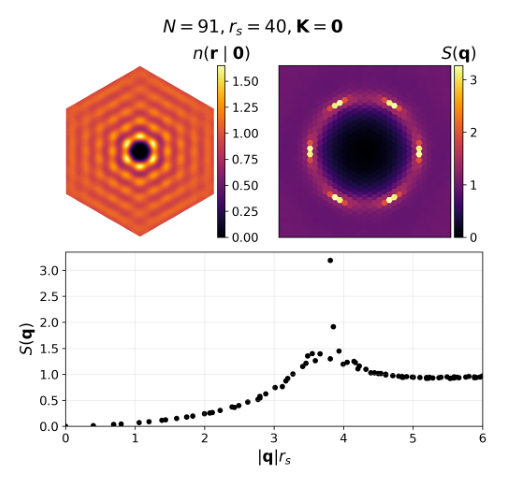 
FIG. 5. N = 91, rs = 40.0 correlations. Top left: pair cor- relation. The pattern is smeared, because the model learned a superposition of the (6, 5) and (5, 6) crystal embeddings. Top right: 2D map of static structure factor. Each of the two crystal embeddings contributes a set of six Bragg peaks for twelve total. Bottom: symmetry-averaged static structure factor versus wavevector norm, showing the Bragg peak.

**Summary.** This paper introduces TorFormer, a novel Neural Quantum State (NQS) designed using translation equivariance to solve the 2D electron gas problem. By enforcing symmetry constraints, TorFormer achieves significantly faster training convergence and higher accuracy than previous state-of-the-art methods. This demonstrates that symmetry-aware neural networks can provide an efficient and accurate tool for simulating strongly correlated quantum matter.

**Why it may be interesting.** The focus on enforcing exact symmetries (translation equivariance) within a neural network framework provides a powerful, systematic way to constrain variational wavefunctions, which is highly relevant for developing robust quantum simulation tools applicable across different physical Hamiltonians.

Detailed structure

**Main problem.** Developing fast, accurate, and scalable methods to solve the many-electron Schrödinger equation for strongly correlated systems.

**Main result.** The proposed TorFormer significantly improves both training speed and final variational energy compared to previous Neural Quantum State (NQS) methods, achieving high accuracy for both Fermi liquid and Wigner crystal phases.

**Method.** The authors employ Neural Quantum States (NQS) parameterized by a Transformer architecture (TorFormer) designed to be an exact eigenstate of the Hamiltonian's symmetries, specifically total momentum.

**Model / system.** The study focuses on the 2D electron gas (2DEG) governed by the standard electron-electron interaction Hamiltonian. The model is tested across various interaction strengths ($r_s$) and system sizes ($N$).

**Key observables.** Variational energy, energy variance, pair correlation function, and static structure factor $S(\mathbf{q})$.

**Important parameters / regimes.** Interaction strength parameter $r_s$ (e.g., 30.0 to 40.0), System size $N$ (up to 91).

**Assumptions / limitations.** The method assumes the Hamiltonian commutes with translation, allowing the enforcement of total momentum symmetry.

**Figures summary.** Figures compare energy convergence (TorFormer vs. Psiformer) showing faster and better convergence; other figures illustrate the learned phase (Fermi liquid vs. Wigner crystal) via structure factors and energy vs. $r_s$ plots.

**Paper structure.** The paper introduces the challenge of correlated electron simulation, proposes the symmetry-enforced TorFormer architecture, demonstrates its superior convergence and accuracy over benchmarks (Psiformer, SJB+DMC) across different physical regimes, and concludes with implications for scalable quantum simulation.

Abstract

We demonstrate that designing a neural quantum state to be an exact eigenstate of the Hamiltonian's symmetries significantly improves both training speed and final variational energy. For the 2D electron gas, we design TorFormer, a neural network wavefunction which is an exact eigenstate of the total momentum. TorFormer describes both the Fermi liquid and Wigner crystal with no supervision and significantly outperforms Psiformer-based references up to large system sizes. For $r_s = 30.0$ and $40.0$ at $N=91$, we compare TorFormer trained for $8\mathrm{K}$ steps against the previous best NQS, which required $100\mathrm{K}$ training steps. Our improvement to the total energy at $r_s = 40.0$, excluding the trivial Madelung part, is $0.12\%$---enormous compared to the tiny differences separating phases. Relative to Slater-Jastrow-backflow diffusion Monte Carlo, TorFormer's energy decrease is roughly $9.8$ times that of the previous best NQS. Our work demonstrates that neural quantum states can both accurately and efficiently solve large-scale problems.

[↑ back to top](#top)

### [Multiparameter quantum bounds for entanglement-assisted aperture synthesis](http://arxiv.org/abs/2609.10111v1)

**Authors:** Kalaga Madhav, Pieter Kok, Nic Scott  
**Type:** theory · **Category:** quantum information and computing · **PDF:** <https://arxiv.org/pdf/2609.10111v1>  
**Analysis basis:** full PDF text, analyzed in chunks
**Topic relevance:** `interference shaping light` **3/5** · `quantum measurements` **1/5**

📷 Fig 1

 
Figure 1. Entanglement-assisted aperture synthesis and the achievable receiver (Sec. 3). (1) Each of M telescopes collects starlight. An entanglement source distributes shared single-photon-entangled ancillas, rij pairs to baseline (i, j). (2) At each station a local receiver—linear optics (a quantum Fourier transform) and photon-number-resolving (PNR) detection—realizes the per-baseline factor f(r) of Eq. (5) using local operations and classical communication (LOCC). (3) A global classical estimator combines the outcomes into visibilities {ˆgij} and the image ˆI(ˆs); approaching the Holevo bound is expected to require this stage to act jointly across baselines (Sec. 5).

📷 Fig 2

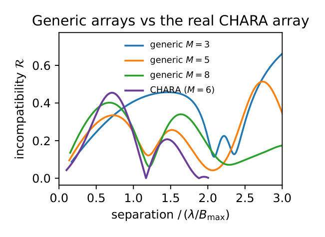 
Figure 2. Incompatibility R versus separation in units of the resolution element λ/Bmax, for generic M-station arrays and the real CHARA array. R = 0 (desirable) means the SLD bound is attainable and per-baseline processing is optimal; R &gt; 0 means an unavoidable multiparameter penalty [Holevo bound ≤(1 + R)× SLD]. A point source gives R = 0; every extended-source model examined gives R &gt; 0. Numerical details in App. A.

📷 Fig 3

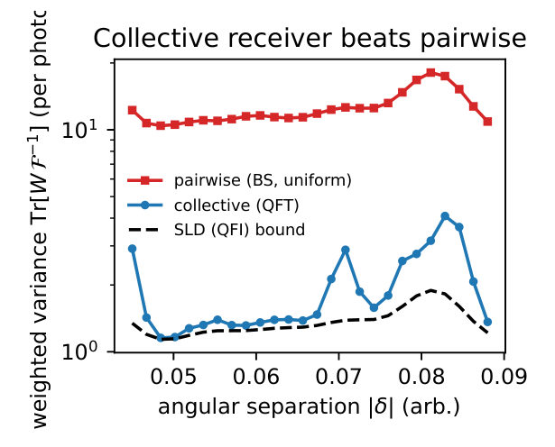 
Figure 3. Weighted parameter variance Tr[WJ −1] (per photon) versus source separation for an explicit collective (global QFT) receiver, an explicit pairwise (beam-splitter) receiver, and the SLD (QFI) bound, for a two-point source on a generic M = 6 array. The collective receiver tracks the SLD bound to within ∼7%; the pairwise receiver is ∼10× worse. App. A.

📷 Fig 4

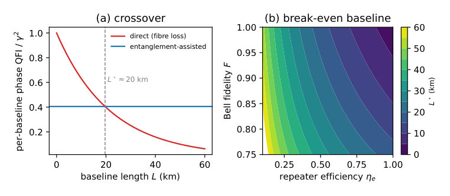 
Figure 4. Noisy-resource advantage threshold. (a) Per-baseline phase QFI versus baseline length L: direct interferometry decays with fibre loss, while entanglement assistance is set by the (length-independent) repeater efficiency; they cross at L⋆≈20 km. (b) Break-even baseline L⋆of Eq. (11) over the Bell-fidelity/repeater-efficiency plane.

📷 Fig 5

 
Figure 5. Entanglement allocation on the CHARA array (15 baselines, two-point source at 1 mas). (a) Proportional rule (12) per baseline, sorted by visibility (lowest γij on top, annotated). (b) Proportional versus true water-filling allocation. Numerical details in App. A.

**Summary.** This work develops the quantum theory for multi-parameter estimation in large-scale optical interferometry using entanglement assistance. It shows that collective measurements are superior to pairwise ones and establishes a critical baseline length where quantum repeaters become necessary. The results provide actionable design guidelines for next-generation quantum sensing arrays.

**Why it may be interesting.** It provides rigorous quantum information-theoretic bounds and concrete design targets for quantum sensing in large-scale optical arrays, directly relevant to quantum optics and quantum networking.

Detailed structure

**Main problem.** The paper formulates the multiparameter quantum estimation problem for an M-station array using entanglement-assisted optical interferometry, moving beyond single-baseline analyses.

**Main result.** The optimal collective receiver significantly outperforms pairwise receivers, and a break-even baseline exists beyond which repeater-distributed entanglement surpasses direct transmission.

**Method.** The authors use quantum Fisher Information (QFI) analysis, comparing the Holevo bound to the SLD bound, and solving a convex program for optimal entanglement resource allocation.

**Model / system.** The system is an optical interferometry setup involving an M-station array imaging an extended scene, modeled using quantum state estimation theory.

**Key observables.** Quantum Fisher Information (QFI) matrix, mean Uhlmann curvature, weighted parameter variance, and the incompatibility measure R.

**Important parameters / regimes.** Baseline length (e.g., $\sim 20$ km for the break-even threshold), number of stations (M), and entanglement budget (RE).

**Assumptions / limitations.** The analysis assumes the reduction of the multimode QFI to a single-photon problem and models entanglement restoration via the two-station weak-thermal state.

**Figures summary.** Figures illustrate the comparison of weighted parameter variance for different receivers (collective vs. pairwise), the dependence of the break-even baseline on loss, and the optimal allocation of entanglement resources.

**Paper structure.** The paper progresses by formulating the multiparameter estimation problem, deriving the reduction lemma, analyzing the achievable bounds (Holevo vs. SLD), comparing receiver strategies, and finally determining the optimal resource allocation strategy.

Abstract

Entanglement-assisted optical interferometry promises diffraction-limited imaging over baselines where light cannot be physically combined, but existing theory treats only a single visibility on one two-station baseline. This work formulates the multiparameter estimation problem for an M-station array imaging an extended scene. A reduction lemma shows that the multimode quantum Fisher information (QFI) equals the mean photon number times the QFI of a single delocalized photon, collapsing the problem to a finite-dimensional one. The local photon-number superselection rule (SSR) erases all phase information from the bare state, while shared entanglement restores a fraction f(r)=r/(1+r) of the QFI on a baseline supplied with r pairs -- a factor shown to be achievable, since the reduced two-mode state of any pair is exactly the two-station weak-thermal state. The QFI matrix and its mean Uhlmann curvature reveal numerically that a point source is measurement-compatible, whereas for every extended-source model examined it is incompatible, the Holevo bound exceeding the symmetric-logarithmic-derivative (SLD) bound by up to ~74%. An explicit collective receiver -- a global mode-sorting (quantum Fourier transform) measurement -- then attains a weighted variance within ~7% of the SLD bound and roughly an order of magnitude below an explicit pairwise receiver, and a noisy-resource advantage threshold gives the break-even baseline (~20 km for near-term parameters) beyond which repeater-distributed entanglement beats direct transmission. Finally, the optimal allocation of a finite entanglement budget is a convex program with a closed-form proportional (square-root-law) solution favoring low-visibility baselines. These results recast quantum aperture synthesis as collective multiparameter estimation and give concrete design targets, illustrated on the CHARA array.

[↑ back to top](#top)

### [Perfect State Transfer from a Localised Two-Excitation State to a Dicke State via Static Spin-Network Hamiltonians](http://arxiv.org/abs/2609.09654v1)

**Authors:** Soumyojyoti Dutta  
**Type:** theory · **Category:** quantum information and computing · **PDF:** <https://arxiv.org/pdf/2609.09654v1>  
**Analysis basis:** full PDF text, analyzed in chunks
**Topic relevance:** `analog quantum simulation` **3/5** · `Dicke superradiance` **1/5**

📷 Fig 1

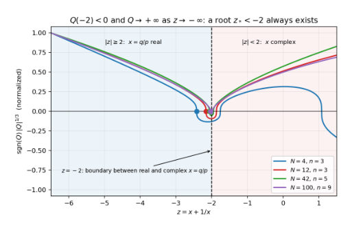 
FIG. 1. The cubic Q(z) for four system sizes, plotted as sgn(Q) |Q|1/3 so that the crossing is visible against the cu- bic growth, and normalised to unit maximum on the window shown. The dashed line marks z = −2, the boundary be- tween real and complex x = q/p; x is real only in the shaded regions |z| ≥2. In every case Q(−2) &lt; 0 (Lemma 4), while A &lt; 0 — which Lemma 5 supplies for n large enough — makes Q(z) →+∞as z →−∞. A real root z∗&lt; −2 follows; the markers show it.

📷 Fig 2

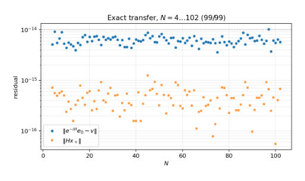 
FIG. 2. Transfer residual ∥e−iHe0 −v∥and eigenvector resid- ual ∥Hx+∥for the Hamiltonian produced by the construction of Theorem 1, for every N = 4, . . . , 102. All 99 cases succeed at machine precision. These are an independent check of a symbolic construction, not evidence for the theorem.

📷 Fig 3

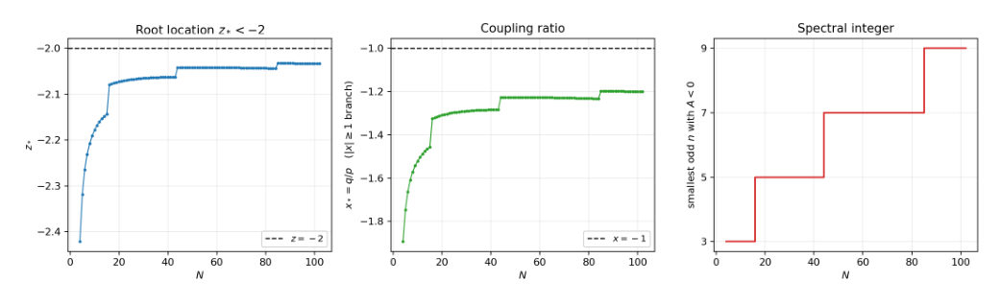 
FIG. 3. Numerical behaviour of the construction across N. For a given n the sextic may have several admissible roots; here one is fixed by the convention of taking the most negative z∗&lt; −2 for the smallest odd n with A &lt; 0. This is a numerical convention and not a distinguished branch — the theorem asserts only that some admissible root exists — and it is discontinuous where n increments. Left: the root z∗stays below −2 as required. Centre: the corresponding coupling ratio x∗= q/p, on the |x| ≥1 representative of the reciprocal pair {x∗, 1/x∗} exchanged by the p ↔q symmetry of Eq. (13). Right: the smallest odd n satisfying A &lt; 0 remains small, taking only the values 3, 5, 7, 9 over this...

**Summary.** This theoretical paper constructs a specific, time-independent spin Hamiltonian that perfectly transfers a localized two-excitation state to the symmetric Dicke state for any system size $N \ge 4$. The proof is highly algebraic, solving a constrained inverse spectral problem derived from the spin-network structure. It offers a powerful, static method for quantum state engineering in many-body systems.

**Why it may be interesting.** This work provides a constructive, static Hamiltonian approach to quantum state transfer, bypassing the need for time-dependent controls or measurements, which is highly relevant for designing robust quantum hardware protocols.

Detailed structure

**Main problem.** The paper aims to construct a time-independent, excitation-preserving spin Hamiltonian that achieves Perfect State Transfer (PST) from a localized two-excitation state to the symmetric two-excitation Dicke state for any system size $N \ge 4$.

**Main result.** The authors prove the existence of such a Hamiltonian for all $N \ge 4$ by solving a constrained inverse spectral problem derived from the spin-network structure.

**Method.** The method involves exploiting $S_{N-2}$ symmetry to reduce the dynamics to a 4D subspace, leading to an inverse spectral problem that is solved algebraically by reducing a reciprocal sextic polynomial to a cubic equation.

**Model / system.** The system is an $N$-qubit spin chain governed by a real, time-independent Hamiltonian $H = \sum_{i<j} J_{ij} (\sigma^+_i \sigma^-_j + \sigma^+_j \sigma^-_i) + \sum_i \epsilon_i n_i$. The dynamics are restricted to the two-excitation sector.

**Key observables.** The transfer fidelity, which must equal 1, and the existence of a real root $z < -2$ for the derived cubic polynomial.

**Important parameters / regimes.** System size $N \ge 4$, the odd integer parameter $n$ used in the Hamiltonian family, and the coupling ratios derived from the spectral problem.

**Assumptions / limitations.** The Hamiltonian must arise from a specific excitation-preserving spin-network form, making this a 'constrained analogue' of PST, and the result is proven only for two excitations ($k=2$).

**Figures summary.** Figures illustrate the required sign change of the polynomial $Q(z)$ for a real root $z^* < -2$ across various system sizes, and show numerical validation of the transfer fidelity for $N=4$ to $102$.

**Paper structure.** The paper establishes the physical goal, reduces the problem using symmetry to a 4D subspace, formulates the inverse spectral problem leading to a reciprocal sextic, and solves this by substitution to a cubic equation, proving existence symbolically.

Abstract

I construct a family of time-independent, excitation-preserving spin Hamiltonians that realises perfect state transfer from a localised two-excitation state to the symmetric two-excitation Dicke state, for every system size $N \ge 4$. The Hamiltonian has the physical form $H = \sum_{i<j} J_{ij} (σ_i^+ σ_j^- + σ_j^+ σ_i^-) + \sum_i ε_i n_i$ with real couplings, and satisfies $e^{-iHt} |110\cdots0\rangle = e^{iφ} |D_N^{(2)}\rangle$ at a finite time. The construction exploits an $S_{N-2}$ permutation symmetry acting on the initially unoccupied spins, which reduces the dynamics to a four-dimensional invariant subspace. Requiring $(|ψ_0\rangle + |D_N^{(2)}\rangle)/2$ to be a zero eigenvector determines the on-site energies in closed form and leaves three coupling parameters free. The remaining inverse spectral problem reduces to two polynomial equations in two dimensionless coupling ratios; eliminating one ratio yields a degree-six reciprocal polynomial, which the substitution $z = x + x^{-1}$ converts to a cubic. For the spectral family $(-n,-1,1)$, with $n$ an odd integer, an explicit factorisation of the leading coefficient together with a boundary evaluation at $z=-2$ shows that for every $N \ge 4$ an odd $n$ can be chosen large enough that a real root with $z < -2$ exists; a subresultant argument supplies a real lift of that root to the original system. The existence proof is entirely symbolic and does not rely on numerical optimisation; direct propagation is used only as independent validation. The result is a constrained analogue of perfect state transfer: unlike the general real-state problem, where an unconstrained real symmetric matrix suffices, here the Hamiltonian is required to arise from an excitation-preserving spin-network form.

[↑ back to top](#top)

### [Symplectic Hopf Insulator: Delicate Topology in Bosonic Bogoliubov-de Gennes Systems](http://arxiv.org/abs/2609.10541v1)

**Authors:** Isaac Tesfaye, Giandomenico Palumbo  
**Type:** theory · **Category:** quantum gases · **PDF:** <https://arxiv.org/pdf/2609.10541v1>  
**Analysis basis:** full PDF text, analyzed in chunks
**Topic relevance:** `analog quantum simulation` **3/5** · `Keldysh / 2PI / non-Gaussian methods` **1/5**

📷 Fig 1

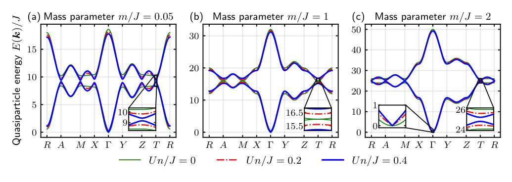 
FIG. 1. BBdG Quasiparticle energy spectrum E(k) of the symplectic Hopf insulator model (6) for different values of the mass parameter m/J ∈{0.05, 1, 2} (a)-(c) and interaction strength Un/J ∈{0, 0.2, 0.4} (colored lines) along a high-symmetry path, R–A–M–X–Γ–Y –Z–T–R, in the first Brillouin zone. The insets around T in (a) and (c) show how the Hopf-topology-preserving energy gap stays open but shrinks with increasing interaction strength Un/J while in (b) at the critical point m/J = 1 (gapless for Un/J = 0) a topologically trivial gap opens for Un/J &gt; 0 (cf. Fig. 2). The inset around the Γ point in (c) shows the emerging linear Goldstone mode for increasing Un/J. The high-symmetry points...

📷 Fig 2

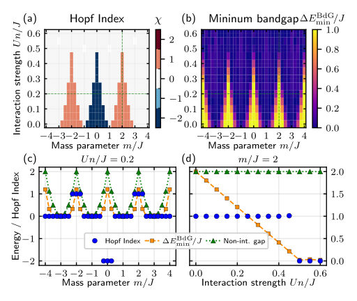 
FIG. 2. (a) Phase diagram of the symplectic Hopf insulator model (6). Symplectic Hopf index χ (13) of the upper Bogoli- ubov particle band as a function of the mass parameter m and interaction strength Un. (b) Minimum Bogoliubov-de Gennes (BdG) quasiparticle energy band gap ∆EBdG min over the same parameter range as in (a). Gap closings where ∆EBdG min →0 indicate topological phase transitions between regions of dis- tinct symplectic Hopf invariants. Slices through the phase di- agram above at fixed interaction strength Un/J = 0.2 (c) and fixed mass parameter m/J = 2 (d), as indicated by the green- colored dashed lines in (a) and (b). The symplectic Hopf in- dex χ (blue circles) and minimum...

📷 Fig 3

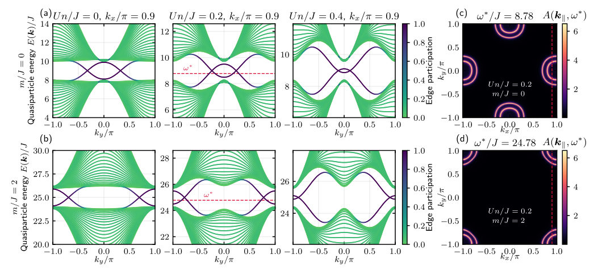 
FIG. 3. (a)-(b) BBdG Quasiparticle energy spectrum E(k) of the symplectic Hopf insulator model (6) as function of ky for fixed kx/π = 0.9 for open boundary conditions along the z-direction for two mass parameter m/J = 0 (a) and m/J = 2 (b) (rows) and different interaction strengths Un/J ∈{0, 0.2, 0.4} (columns). The color scale indicates the symplectic edge participation pj(k∥) (14), i.e., (the fraction of) the state’s probability living on the surface with the correct τz-norm with dark (bright) colors indicating localization on the surface (bulk) of the system. The bulk-boundary correspondence in the presence of finite interactions is confirmed by the appearance of topologically protected...

**Summary.** This work introduces the symplectic Hopf insulator, a novel topological phase realized in weakly interacting bosonic systems modeled by a generalized Bose-Hubbard Hamiltonian. The authors prove the existence of an integer-quantized symplectic Hopf invariant, demonstrating that this topology is robust yet delicate. This advances the understanding of topological phases in bosonic systems beyond standard classifications.

**Why it may be interesting.** It applies advanced topological concepts (Hopf invariant, Krein spaces) to bosonic systems, directly connecting to the physics of Bose-Einstein Condensates and superfluidity, which are key areas in AMO physics.

Detailed structure

**Main problem.** To construct and analyze a realization of Hopf topology within bosonic Bogoliubov-de Gennes (BBdG) systems, extending topological classification beyond the tenfold-way framework.

**Main result.** The authors establish the symplectic Hopf insulator as a robust yet delicate topological phase characterized by an integer-quantized symplectic Hopf invariant. This topology is protected by in-gap surface states at boundaries.

**Method.** The analysis involves defining and calculating the symplectic Hopf invariant using the BBdG Hamiltonian, which is derived from a Bose-Hubbard model via the Bogoliubov approximation.

**Model / system.** The system is a microscopic Bose-Hubbard generalization of the Moore-Ran-Wen model, analyzed in the Bogoliubov approximation to yield a symplectic BBdG Hamiltonian. This describes weakly interacting bosonic systems, relevant to Bose-Einstein Condensates.

**Key observables.** Symplectic Hopf invariant ($\chi$), quasiparticle energy spectrum $E(\mathbf{k})$, and topologically protected in-gap surface states.

**Important parameters / regimes.** Weak on-site interaction strength ($U$), mass parameter ($m$), and lattice structure parameters ($J$).

**Assumptions / limitations.** The Bogoliubov approximation is used, and the analysis relies on the system admitting a paraunitary (symplectic) Bogoliubov transformation acting on a Krein inner product space.

**Figures summary.** Figure 1 illustrates the BBdG quasiparticle energy spectrum $E(\mathbf{k})$ along high-symmetry paths, showing the gap behavior as a function of mass and interaction parameters.

**Paper structure.** The paper develops the theory by defining the BBdG Hamiltonian, introducing the symplectic Hopf invariant, calculating its quantization, and demonstrating the bulk-boundary correspondence via surface state analysis.

Abstract

Recent advances in topological phases have highlighted the role of symplectic (Krein-space) topology in the classification of bosonic Bogoliubov-de Gennes (BBdG) systems. In this work, we construct a BBdG realization of Hopf topology, which we dub the symplectic Hopf insulator, starting from a microscopic Bose-Hubbard generalization of the Moore-Ran-Wen model with weak on-site interactions treated within a Bogoliubov approximation. The resulting BBdG system admits a symplectic Hopf invariant, which we show to be integer-quantized for isolated bands. We establish that this topology is intrinsically delicate, requiring exactly two bosonic modes per unit cell, while remaining robust against weak interactions over a range of mass parameters. Upon terminating the three-dimensional insulator at a boundary, we find topologically protected in-gap surface states at finite excitation energy, whose protection is itself delicate. Our results establish the symplectic Hopf insulator as a robust yet delicate topological phase in weakly interacting bosonic systems lying beyond the tenfold-way classification.

[↑ back to top](#top)

### [A Separation between Full-Rank PVM and Assumption-free Self-Testing](http://arxiv.org/abs/2609.10013v1)

**Authors:** Ranyiliu Chen  
**Type:** theory · **Category:** quantum information and computing · **PDF:** <https://arxiv.org/pdf/2609.10013v1>  
**Analysis basis:** full PDF text, analyzed in chunks
**Topic relevance:** `quantum measurements` **3/5**

📷 Fig 1

 
Low-resolution page preview, page 2

📷 Fig 2

 
Low-resolution page preview, page 3

📷 Fig 3

 
Low-resolution page preview, page 4

📷 Fig 4

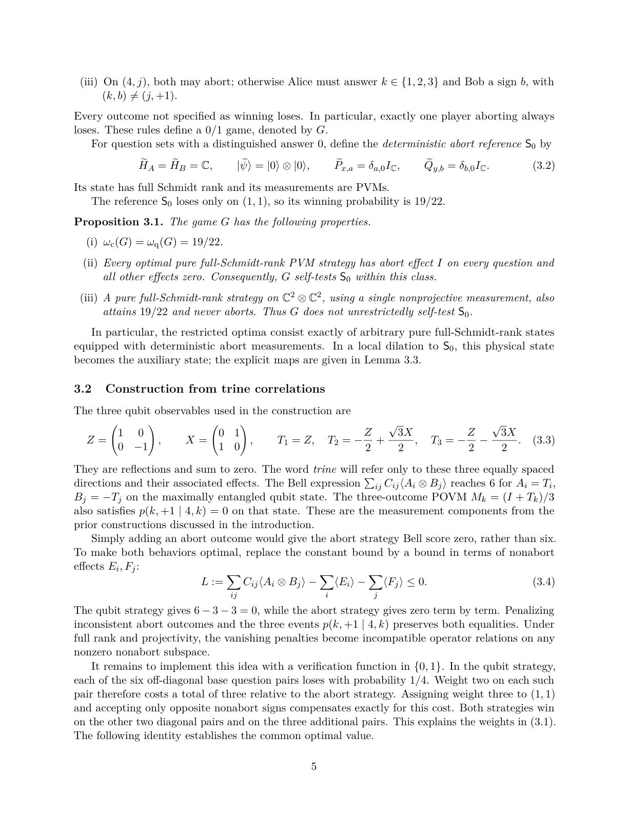 
Low-resolution page preview, page 5

📷 Fig 5

 
Low-resolution page preview, page 6

**Summary.** This paper resolves a conjecture regarding the self-testing of entangled quantum strategies by constructing a nonlocal game $H$. It proves that restricting the measurements to pure, full-rank projective measurements (PVMs) is not robust, as a nonprojective measurement can achieve superior correlations. The work relies on detailed algebraic analysis of optimal correlation structures.

**Why it may be interesting.** This work provides a rigorous, algebraic demonstration of the limitations of assuming measurement projectivity in quantum information tasks, which is crucial for understanding the fundamental boundaries of quantum correlations.

Detailed structure

**Main problem.** The paper investigates the robustness of self-testing protocols for maximally entangled qubit strategies when restricting measurements to pure full-Schmidt-rank Projective Measurements (PVMs).

**Main result.** It proves that the full-rank PVM self-test is not robust because an optimal strategy using a nonprojective measurement can achieve correlations unattainable by any pure full-rank PVM strategy.

**Method.** The authors construct a nonlocal game $H$ by combining the CHSH game with an auxiliary game $G$. They use algebraic classification of optimal correlations and the concept of local dilation to establish the separation.

**Model / system.** The study uses a nonlocal game $H$ played on a shared maximally entangled qubit state $|\Phi^+
angle$ on $\mathbb{C}^2 \otimes \mathbb{C}^2$. The analysis involves comparing correlations derived from PVMs versus those from general measurements.

**Key observables.** Quantum and classical values of the game $H$ ($\omega_q(H)$ vs $\omega_c(H)$), and the optimal correlation values for the auxiliary game $G$ ($19/22$).

**Important parameters / regimes.** The parameter $t \in (0, 1)$ controlling the deviation from a reference state $	ext{S}_0$, and the structure of the local state algebra (e.g., $\mathbb{C} \oplus M_2(\mathbb{C})$).

**Assumptions / limitations.** The core assumption being tested is the simultaneous requirement of full rank and projectivity on the measurement effects. The analysis also uses the assumption of block-diagonal measurements for the abort/nonabort subspaces.

**Paper structure.** The paper first analyzes a simpler game $G$ to show that full-rank PVMs constrain the optimal correlations to a specific subset. It then combines $G$ with the CHSH game to construct $H$, demonstrating the separation between the PVM-restricted set and the general quantum set.

Abstract

We construct a nonlocal game that self-tests a maximally entangled qubit strategy among pure full-Schmidt-rank projective strategies, but admits an inequivalent optimum using one nonprojective measurement. This resolves a conjecture of Baptista et al. on imposing full rank and projectivity simultaneously. The construction combines CHSH with an auxiliary game $G$ that forces deterministic answers under these assumptions and admits a trine POVM optimum without them. We classify the optimal correlations of $G$ as a line segment parametrized by the tracial states of $\mathbb{C}\oplus M_2(\mathbb{C})$. Projectivity on the state support removes the matrix summand, whereas projective dilations with nonzero nonabort probability have a nontracial local state whose zero left ideal is not two-sided. Finally, a family in local dimension six shows that the full-rank PVM self-test is not robust.

[↑ back to top](#top)

### [Coded Clifford Measurements for Multiqubit Magic-State Cultivation](http://arxiv.org/abs/2609.09994v1)

**Authors:** Gunsik Min, Jun Heo  
**Type:** theory · **Category:** quantum information and computing · **PDF:** <https://arxiv.org/pdf/2609.09994v1>  
**Analysis basis:** full PDF text, analyzed in chunks
**Topic relevance:** `quantum measurements` **3/5**

📷 Fig 1

 
FIG. 1. Logical-level code–cultivation correspondence. A third-level resource basis provides commuting Clifford checks C(v). Choosing check labels vt defines the measurement schedule G = [v1 · · · vn] and the valid record code RG = {aG}. Postselection accepts only valid records; a wrong accepted branch therefore requires a nonzero displacement e ∈RG, so the record-code distance dG sets the accepted record-error order, Pwv = O(qdG).

📷 Fig 2

 
FIG. 2. Consequences of coded Clifford records. (a) For distance four, coding reduces the CS schedule from 8 to 6 logical checks, from 948 to 696 compiled-core active locations, and from 2844 to 2040 active-qubit gate steps; the CCZ schedule falls from 12 to 7 logical checks. (b) The optimal [5, 2, 3] and [6, 2, 4] two-bit records give cubic and quartic wrong-acceptance scaling. (c) The [7, 3, 4] CCZ simplex schedule reaches the minimum length allowed for any binary record.

📷 Fig 3

 
FIG. 1. Exact semantics of one logical record measurement. The circuit realizes the projectors in Eq. (48); it is an algebraic reference circuit, not a claim of low fault-tolerant overhead.

📷 Fig 4

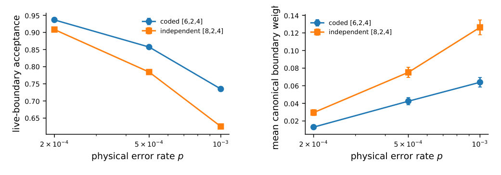 
FIG. 2. Live Steane-boundary diagnostics after removing the final ideal code-space projection. Left: record-and-midpoint acceptance. Right: mean weight of the canonical two-block Steane boundary representative among accepted shots. Error bars show one standard error. These are boundary-quality diagnostics, not full-factory logical-error estimates.

**Summary.** This work develops a theoretical framework showing how coding theory can be used to protect the measurement record during magic-state cultivation for fault-tolerant quantum computation. By mapping error detection to linear codes, the authors demonstrate that the required physical resources are significantly reduced compared to naive repetition schemes. This provides a pathway for building more resource-efficient quantum circuits.

**Why it may be interesting.** While focused on quantum computation, the rigorous application of coding theory to physical measurement constraints provides a powerful mathematical framework applicable to any physical system where measurement outcomes must be robustly correlated.

Detailed structure

**Main problem.** The paper addresses the need for efficient, fault-tolerant methods to cultivate magic quantum states required for computation by measuring logical Clifford symmetries.

**Main result.** Coded Clifford measurements provide a resource-efficient way to protect the measurement record, achieving significant reductions in required physical resources compared to independent repetition schemes.

**Method.** The authors map the error detection problem onto the theory of binary linear codes, using commuting Hermitian Clifford observables to define the measurement schedule via a generator matrix.

**Model / system.** The model involves multiqubit magic-state cultivation, where the error protection is encoded in the classical record derived from measuring logical Clifford symmetries ($C(\mathbf{v})$) associated with third-level Clifford-hierarchy unitaries ($U \in \mathcal{C}_3$).

**Key observables.** Code distance ($d_G$), active locations, qubit-steps, and the error probability scaling $P_{wv} = O(q^{d_G})$.

**Important parameters / regimes.** Target distance $d=4$, resource reduction percentages (e.g., 26.6% reduction in active locations).

**Assumptions / limitations.** The analysis assumes a specific noise model for the record layer and distinguishes between algebraically available logical gates and physically fault-tolerant implementations.

**Figures summary.** Figures illustrate the logical-level code–cultivation correspondence, quantifying resource reductions (e.g., 28.3% gate-step reduction) for distance four coding, and showing the minimum length of the $[7, 3, 4]$ simplex record.

**Paper structure.** The paper develops the logical-level code–cultivation correspondence, derives the necessary observables $C(\mathbf{v})$, establishes the code-theoretic bounds (Plotkin bound), and finally optimizes the minimum-cost schedule by solving an integer covering problem.

Abstract

Magic-state cultivation suppresses errors by measuring logical Clifford symmetries and discarding inconsistent outcomes. For an entangled resource several branches are accepted, so the retained branch carries a multibit classical record whose corruption produces a logical-frame error. We show that this record layer is exactly a binary linear code. For any third-level Clifford-hierarchy unitary $U \in \mathcal{C}_3$, the branches $UZ(a)|+\rangle^{\otimes k}$ are resolved by commuting Hermitian Clifford observables $C(v) = UX(v)U^{\dagger}$, so a measurement schedule is a generator matrix and postselection on valid records gives $P_{\mathrm{wv}} = O(q^{d})$ at record distance $d$. A Plotkin bound then limits every binary record, linear or not. The physically realizable Clifford family already saturates it: at distance four, six logical measurements suffice for $|CS\rangle$ and seven for $|CCZ\rangle$, against eight and twelve for independent repetition. Restricting to fault-tolerantly measurable parities therefore costs nothing in record length. The saving survives compilation: in a native-CZZ-assisted Steane realization the $[6,2,4]$ CS schedule is the unique minimum-cost distance-four solution, reducing the cultivation core by 26.6\% in active locations, and exact state-vector simulation without a final ideal code-space projection confirms higher acceptance and roughly half the residual Steane-boundary weight. Coding thus reduces logical redundancy and compiled overhead together.

[↑ back to top](#top)

### [Constant-depth global shadow estimation](http://arxiv.org/abs/2609.10408v1)

**Authors:** Qingyue Zhang, Zhou You, Dayue Qin, Xiaopeng Li, Jens Eisert, You Zhou  
**Type:** theory · **Category:** quantum information and computing · **PDF:** <https://arxiv.org/pdf/2609.10408v1>  
**Analysis basis:** full PDF text, analyzed in chunks
**Topic relevance:** `quantum measurements` **3/5**

📷 Fig 1

 
FIG. 1. Overview of shallow phase shadows. (a) Global shadow estimation of an unknown state 𝜌using sparse Clifford-IQP 𝑆-𝐶𝑍- 𝐻circuits. (b) The sampled sparse circuit can be implemented either in constant depth on all-to-all architectures using LOCC-assisted encoding and decoding with 𝑂(𝑛log 𝑛) auxiliary systems or in logarithmic depth without auxiliary systems. (c) The second-look principle measures two complementary global observables 𝑂and 𝐻⊗𝑛𝑂𝐻⊗𝑛. We then select the lower-bias track in post-processing, enabling accurate shadow estimation. (d) SPS achieves constant-depth shadow estimation beyond the light-cone restriction of the gluing framework [39], while existing constant-depth...

📷 Fig 2

 
FIG. 2. Scaling of the estimation bias with respect to the parameter 𝛾for the worst-case state vector |+⟩⊗2 |0⟩⊗𝑛−2 with 𝑛= 50. The performance of the Hadamard-conjugated task (𝜌′, 𝑂′, blue squares) is compared with the default task (orange triangles).

📷 Fig 3

 
FIG. 3. Statistical distribution of the estimation bias and variance with respect to qubit number 𝑛. Data are collected from 100 independently sampled random stabilizer states with 𝛾= 2 and 104 shots for each state. The violin plots illustrate the variation in estimator performance among different quantum states. The dashed lines indicate the mean value of bias and variance, and the solid black lines in (b) represent the standard deviation range.

📷 Fig 4

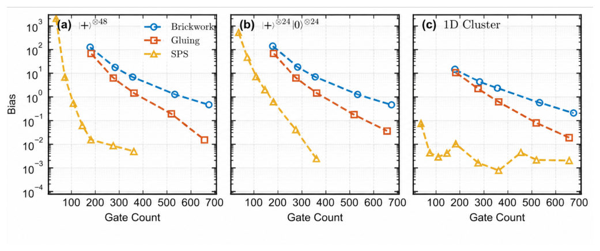 
FIG. 4. Comparison of the estimation bias against two-qubit gate count (see Appendix G 2) for three shallow shadow schemes: 1D brickwork circuits (blue circles, [37]), Gluing circuits (orange squares, [39]), and SPS (yellow triangles, our approach). Notice that the logarithmic-depth one-dimensional (1D) brickwork baseline exhibits relative-error approximate state 2-design behavior established in Ref. [84, 85]. The results are shown for (a) the tensor product state vector |+⟩⊗𝑛, (b) |+⟩⊗𝑛/2 |0⟩⊗𝑛/2, with 𝑛= 48 and 2 × 104 shots and (c) the 1D cluster state. For SPS, the bias drops rapidly below the statistical noise floor (∼10−2), making the measurement error the dominant source of...

📷 Fig 5

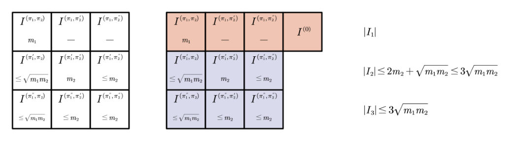 
FIG. 6. Schematic organization of the permutation sectors used in the variance bound. The sectors are indexed by an odd label 𝜋1 and an even label 𝜋2. We choose two dominant sectors with different row and column labels, of sizes 𝑚1 and 𝑚2, whose product is maximal. This maximality bounds the relevant non-dominant sectors by √𝑚1𝑚2, so that after grouping sites by odd labels the two smaller groups have sizes

**Summary.** This paper introduces Shallow Phase Shadows (SPS), a novel quantum readout technique for estimating quantum state fidelities. It achieves constant-depth global estimation on architectures with long-range connectivity, bypassing the need for deep, highly random measurement circuits. This makes quantum state characterization significantly more feasible for near-term, resource-constrained quantum hardware.

**Why it may be interesting.** It provides a concrete, resource-aware blueprint for quantum characterization, directly addressing the engineering bottleneck of measurement overhead in large-scale quantum computation.

Detailed structure

**Main problem.** Developing scalable and reliable readout strategies for quantum processors to estimate quantum states without measurement circuits becoming a bottleneck.

**Main result.** The proposed Shallow Phase Shadows (SPS) protocol achieves constant-depth global estimation of stabilizer-state fidelities on all-to-all architectures, significantly outperforming protocols requiring generic randomness.

**Method.** The protocol uses a sparse Clifford-IQP ensemble and introduces a 'second-look principle' to ensure accurate estimation while maintaining shallow circuit depth.

**Model / system.** The work applies to general quantum processors, specifically mentioning platforms like trapped ions and neutral atoms due to their native long-range connectivity.

**Key observables.** Stabilizer-state fidelities, estimation bias ($\epsilon$), and total two-qubit gate count ($N_g$).

**Important parameters / regimes.** Sparsity parameter ($\gamma$), circuit depth (constant vs. logarithmic), and system size ($n$).

**Assumptions / limitations.** The constant depth is achievable by utilizing mid-circuit measurements and classical feedforward, and the protocol circumvents the need for the ensemble to form an approximate relative-error design.

**Figures summary.** Figures compare SPS's constant-depth guarantee against other methods, show the second-look principle measuring complementary observables, and illustrate the scaling of estimation bias and resource costs.

**Paper structure.** The paper introduces the problem, details the SPS method using the sparse Clifford-IQP ensemble, proves the constant-depth feasibility, and finally analyzes the variance and compares resource costs against existing shadow estimation techniques.

Abstract

Reliable and scalable readout strategies are essential for quantum technologies. As quantum processors grow, extracting useful information must remain feasible without measurement circuits becoming a dominant bottleneck. Randomized measurements and classical shadows provide a powerful route, but global estimation is conventionally associated with highly random ensembles that require increasing circuit depth and hence substantial experimental overhead. In this work, we show that substantially less randomness suffices when the readout is meaningfully adapted to the quantities being estimated. We introduce shallow phase shadows, based on a sparse Clifford-IQP ensemble, and prove efficient global estimation of stabilizer-state fidelities despite the ensemble not forming an approximate relative-error design. On all-to-all architectures, the protocol admits a constant-depth implementation using mid-circuit measurements and classical feedforward, or logarithmic depth without auxiliary systems. The protocol requires only controlled-phase entangling gates and offers a tunable trade-off between circuit resources and estimation accuracy, making it particularly amenable to experimentally relevant architectures with long-range connectivity. Our results show that scalable quantum readout need not reproduce generic randomness: task-adapted randomization can enable substantially shallower global characterization protocols.

[↑ back to top](#top)

### [Curvature-Induced Geometric Universality in Non-Hermitian Anderson Transitions](http://arxiv.org/abs/2609.09562v1)

**Authors:** Chen Wang, Run-Qiu Yang, X. R. Wang, Hechen Ren  
**Type:** theory · **Category:** disordered systems and neural networks · **PDF:** <https://arxiv.org/pdf/2609.09562v1>  
**Analysis basis:** full PDF text, analyzed in chunks
**Topic relevance:** `non-equilibrium universality` **3/5**

📷 Fig 1

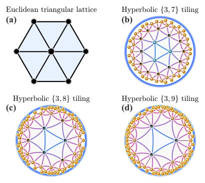 
FIG. 1. Schematic comparison of a Euclidean triangular lattice and three representative {p, q} hyperbolic tilings, where each polygon has p sides and q polygons meet at each vertex: (a) the triangular lattice with {p, q} = {3, 6}; (b–d) hyperbolic tilings with {p, q} = {3, 7}, {3, 8}, and {3, 9}, respectively. While the Euclidean lattice is flat, the hyperbolic tilings possess negative curvature and exhibit expo- nential volume growth, N(L) ∼η(p, q)L. Finite-size scaling anal- yses indicate that the non-Hermitian Anderson transitions on these hyperbolic-like lattices share a common critical exponent ν ≃1.

📷 Fig 2

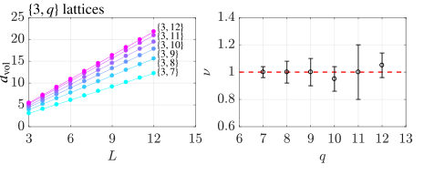 
FIG. 3. (a) Volume-growth dimension dvol of the {3, q} hyperbolic- like lattices as a function of graph distance L from the center. The slopes of these curves determine the volume-growth factors η(3, q). (b) Critical exponent ν for the {3, q} tilings, which is consistent with ν = 1 (red dashed line) within numerical uncertainty.

📷 Fig 3

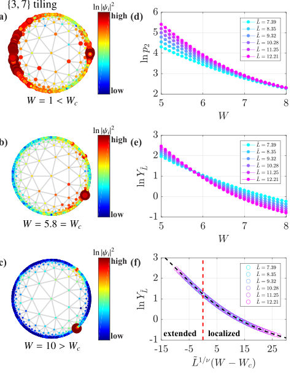 
FIG. 2. Plots of the wave-function amplitude distributions on the {3, 7} lattice and E = 0 for (a) the extended phase at W = 1 &lt; Wc, (b) the critical point at W = 5.8 = Wc, and (c) the localized phase at W = 10 &gt; Wc. The color scale encodes ln |ψi|2. One ensemble is used here. (d) ln p2 as a function of W for various ˜L of the {3, 7} lattice at energy E = 0. (e) ln Y ˜L versus W for the same data as in (d). (f) Scaling collapse of ln Y ˜L as a function of the scaling variable x = ˜L1/ν(W −Wc). The black dashed line denotes the scaling function f(x) obtained from the χ2 fit, while the red solid line marks the phase boundary between the extended and localized phases.

**Summary.** This work explores Anderson transitions on negatively curved, hyperbolic lattices, finding that the critical behavior is universal ($
u \simeq 1$) regardless of the specific tiling used. This suggests that the large-scale negative curvature of the geometry itself dictates the universality class, providing a geometric organizing principle beyond traditional symmetry rules.

**Why it may be interesting.** The concept of geometric universality suggests that fundamental physical properties (like critical exponents) can be determined by the global geometry of the embedding space, offering a powerful new organizing principle beyond standard symmetry classifications.

Detailed structure

**Main problem.** The study investigates whether the critical behavior (universality class) of Anderson transitions in non-Hermitian systems is dictated by the underlying geometry when the lattice is hyperbolic, rather than just symmetry or dimensionality.

**Main result.** The critical behavior exhibits a common critical exponent ($
u \simeq 1$) across various hyperbolic tilings, suggesting that the negative curvature of the geometry acts as a universal organizing principle.

**Method.** The analysis combines finite-size scaling of the participation ratio with a complementary phenomenological coarse-grained Landau-Ginzburg field theory approach.

**Model / system.** The system is a non-Hermitian Anderson model defined on hyperbolic-like lattices, specifically restricted patches of $\{p, q\}$ tilings. The Hamiltonian is a tight-binding model with complex, disorder-induced hopping and on-site energies.

**Key observables.** Critical disorder strength ($W_c$), critical exponent ($
u$), and the disorder-averaged participation ratio ($p_2$).

**Important parameters / regimes.** Disorder strength ($W$), hyperbolic tiling parameters ($\{p, q\}$), and the effective length scale ($	ilde{L} = \ln N$).

**Assumptions / limitations.** The critical behavior is assumed to be governed by the large-scale hyperbolic geometry, leading to exponential volume growth that suppresses critical fluctuations.

**Figures summary.** Figures compare wave-function distributions and show finite-size scaling collapses for different hyperbolic tilings, demonstrating consistent critical exponents.

**Paper structure.** The paper first establishes the model on hyperbolic lattices, then applies finite-size scaling to determine critical exponents, and finally uses a Landau-Ginzburg analysis to provide a physical rationale for the observed geometric universality.

Abstract

In Euclidean space, universality classes of Anderson transitions are primarily determined by symmetry and spatial dimensionality. Here, we present evidence for a geometry-controlled universality class of non-Hermitian Anderson transitions on hyperbolic-like lattices. In this setting, critical behavior is influenced by the large-scale hyperbolic geometry, characterized by negative curvature, exponential volume growth, and a non-Euclidean notion of spatial scaling. Finite-size scaling of participation ratios across several distinct \( \{p,q\} \) tilings reveals one-parameter scaling collapses with a common critical exponent \( ν\simeq1 \) within numerical accuracy. A complementary phenomenological coarse-grained Landau-Ginzburg analysis shows how exponential correlation-volume growth suppresses critical fluctuations, offering a rationale for the observed mean-field-like scaling. Our results suggest that spatial curvature can act as an additional organizing principle for Anderson-transition universality beyond the conventional dimensionality- and symmetry-based classification.

[↑ back to top](#top)

### [Fidelity-Aware Scheduling of Quantum Circuits on Multi-QPU Systems](http://arxiv.org/abs/2609.09980v1)

**Authors:** Innocenzo Fulginiti, Antonio Tudisco, Salvatore Zammuto, Patrick Hopf, Deborah Volpe, Helmut Seidl, Giovanna Turvani, Robert Wille, Christian B. Mendl, Martin Schulz  
**Type:** both · **Category:** quantum information and computing · **PDF:** <https://arxiv.org/pdf/2609.09980v1>  
**Analysis basis:** full PDF text, analyzed in chunks
**Topic relevance:** `QC/QI experiment` **3/5**

📷 Fig 1

 
Fig. 1: End-to-end pipeline of the proposed framework. A user-submitted batch of k high-level quantum circuits is converted into Directed Acyclic Graphs with per-node feature vectors and fed to the GNN fidelity predictor, which produces an estimated fidelity matrix ˆF over all k × D circuit-device pairs. The tunable scheduler, parameterized by the fidelity weight w, routes each circuit to one of the available QPU backends; each assigned circuit is then transpiled against the target device’s native gate set and connectivity, and then executed on the corresponding backend.

📷 Fig 2

 
Fig. 2: Conversion from circuit to DAG. A quantum circuit (a) is translated into a DAG (b), whose nodes are gates and measurements and whose edges encode data dependencies; each node is then mapped to the feature vector of (c), shown for a CX gate.

📷 Fig 3

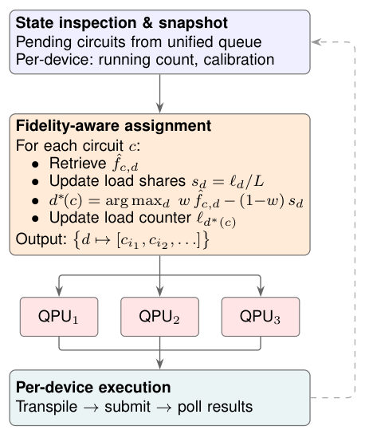 
Fig. 3: Logic of a single dispatch tick within the QMS. The broker constructs an immutable snapshot of the queue and per-device state, invokes the scheduling policy to produce a device-to-circuit mapping, and dispatches each circuit to its assigned backend for transpilation and execution. The dashed arrow indicates the tick-based cycle.

📷 Fig 4

 
Fig. 5: RMSE of the model on the test set, grouped by target fidelity.

📷 Fig 5

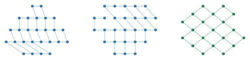 
Fig. 4: Coupling maps of the target devices.

**Summary.** This paper introduces a fidelity-aware scheduling framework for quantum circuits running on multi-QPU systems. It uses a Graph Neural Network (GNN) to predict the expected fidelity on various hardware devices before compilation. By introducing a tunable weight $w$, the scheduler effectively balances the trade-off between achieving the highest possible fidelity and maximizing the utilization of all available quantum processing units.

**Why it may be interesting.** This work directly tackles the practical challenge of compiling algorithms for real, noisy, and heterogeneous quantum hardware, which is a major bottleneck in applying quantum computation to physical systems.

Detailed structure

**Main problem.** The paper addresses the challenge of scheduling quantum circuits on heterogeneous multi-QPU systems to maximize execution fidelity while maintaining high device utilization.

**Main result.** The proposed framework achieves near ground-truth fidelity while significantly reducing the computational overhead associated with brute-force, exhaustive device selection.

**Method.** It employs a Graph Neural Network (GNN) to predict the expected fidelity of a circuit on every available QPU before compilation, which informs a tunable scheduler.

**Model / system.** The system involves multi-QPU platforms with varying topologies and noise characteristics. Circuits are modeled as graphs (DAGs) for GNN input, and fidelity is calculated based on accumulated gate error probabilities.

**Key observables.** Mean ground-truth fidelity, scheduling overhead (wall-clock time), and fidelity regret.

**Important parameters / regimes.** The tunable scheduling weight $w \in [0, 1]$, which balances the trade-off between fidelity maximization and parallelism/utilization.

**Assumptions / limitations.** The core assumption is that the GNN can accurately predict the circuit fidelity without incurring the massive computational cost of full, device-specific compilation for every possibility.

**Figures summary.** Figures illustrate the end-to-end pipeline, the conversion of circuits to graphs, and show how mean fidelity increases with $w$ (Fig. 8) while the scheduling overhead remains low compared to exhaustive methods (Fig. 9).

**Paper structure.** The paper details an end-to-end pipeline: 1) Graph construction from quantum circuits, 2) Using a GNN (with SAGE layers) to estimate fidelity on multiple QPUs, and 3) A tunable scheduler that uses these estimates based on the weight $w$ to assign circuits.

Abstract

High Performance Computing-Quantum Computing (HPCQC) platforms expose multiple Quantum Processing Units (QPUs) that may differ in size, topology, native gates, and noise characteristics. For current noisy devices, errors compound along the compiled circuits quickly, and minimizing them, that is, maximizing the circuits' execution fidelity, is essential for reliable results. Fidelity depends on the compilation to a specific target device: the same high-level circuit may produce different executables and, therefore, different expected fidelities across QPUs. We present a low-overhead fidelity-aware scheduling framework for multi-QPU systems based on a Graph Neural Network (GNN) that estimates, before compilation, the expected fidelity of each circuit on each available QPU. Then, a tunable scheduler uses these estimates to control the trade-off between execution fidelity and parallelism. Results show that this framework allows for approximating an exhaustive fidelity-based assignment, saving computational resources compared to a brute-force approach that compiles each circuit on every device.

[↑ back to top](#top)

### [Infinite ergodic theory and functional statistics of non-confined Feller process](http://arxiv.org/abs/2609.10106v1)

**Authors:** Vicenç Méndez  
**Type:** theory · **Category:** statistical mechanics · **PDF:** <https://arxiv.org/pdf/2609.10106v1>  
**Analysis basis:** full PDF text, analyzed in chunks
**Topic relevance:** `non-equilibrium universality` **3/5**

📷 Fig 1

 
FIG. 1. Main panel: Log-log plot of the mean local time ⟨L(x, t)⟩as a function of position x for

📷 Fig 2

 
FIG. 2. Spatial correlation function R(x1, x2, t) as a function of the ratio x2/x1 for x1 = 1.0 and

📷 Fig 3

 
FIG. 3. Rescaled probability density ⟨L⟩P(L, x, t) versus L/⟨L(x, t)⟩. Symbols represent numerical

📷 Fig 4

 
FIG. 4. (a) Rescaled probability density of Ta(t), ⟨Ta⟩P(Ta, t), as a function of Ta/⟨Ta⟩, compared

📷 Fig 5

 
FIG. 5. Ergodicity breaking parameter of Aq(t) as a function of θ. Solid lines denote theoretical

**Summary.** This paper investigates the long-time statistical behavior of non-confined Feller processes, which exhibit infinite ergodic behavior due to non-normalizable stationary densities. The key finding is that the local-time field factorizes into a deterministic spatial part and a random temporal part governed by Mittag-Leffler statistics. This provides a unifying framework for understanding correlations in systems where standard ergodicity breaks down.

**Why it may be interesting.** The concept of infinite ergodic theory and the resulting Mittag-Leffler statistics provide powerful tools for analyzing systems where standard time-averaging theorems fail, which is relevant for non-equilibrium dynamics in complex physical systems.

Detailed structure

**Main problem.** The study focuses on the spatial structure and multi-point correlation properties of the local-time field for non-confined Feller processes within the framework of Infinite Ergodic Theory.

**Main result.** The local-time field exhibits an asymptotic spatiotemporal factorization, $L(x, t) \propto I(x) \cdot \xi$, where the spatial profile is deterministic and the temporal fluctuations are governed by a Mittag-Leffler random amplitude.

**Method.** The analysis uses asymptotic factorization techniques, comparing the non-confined (infinite ergodic) regime to the standard ergodic regime, and analyzing scaling limits for various observables.

**Model / system.** The model is a non-confined Feller process, which is characterized by a non-normalizable stationary probability density, contrasting with confined cases where standard ergodic theory applies.

**Key observables.** Local-time field $L(x, t)$, normalized spatial correlations of local time, occupation times ($T_a(t)$), and non-integrable power observables ($A_q(t)$).

**Important parameters / regimes.** The non-confining parameter ($\alpha=0$), the spatial density exponent ($	heta$), and the observation time $t 	o \infty$.

**Assumptions / limitations.** The analysis relies on the existence of an infinite invariant density $I(x)$ when standard ergodicity breaks down.

**Figures summary.** Figures illustrate the mean local time $\langle L(x, t) 
angle$ dependence on space and time, and the convergence of normalized cross-correlations to a universal constant.

**Paper structure.** The paper progresses by defining the Feller process in both confined and non-confined settings, reviewing the transition from standard to infinite ergodic theory, and then detailing the results on local-time factorization, correlation functions, and the distinction between integrable and non-integrable observables.

Abstract

We study additive observables of a non-confined Feller process characterized by a non- normalizable stationary probability density and return times with infinite mean. The process is equivalent, after a deterministic rescaling, to a squared Bessel process, but we focus here on a question: the spatial structure of its local-time field. We show that the local time admits a fac- torization in the long time limit. Its spatial profile is governed by the non-normalizable stationary density, whereas its temporal fluctuations are controlled by a single Mittag-Leffler random ampli- tude. As a consequence, normalized spatial correlations of the local time converge to a universal constant independent of the two observation levels. Occupation times of finite intervals follow as corollaries and display Darling-Kac fluctuations. In contrast, non-integrable power observables exhibit self-similar squared-Bessel-type limits rather than Mittag-Leffler statistics. This spatial- field perspective provides a unifying framework for infinite ergodic theory under state-dependent multiplicative noise.

[↑ back to top](#top)

### [Quantifying Information Hierarchy for Neutrino Oscillation Parameters at JUNO](http://arxiv.org/abs/2609.10383v1)

**Authors:** Yu-han Shu, Neetu Raj Singh Chundawat, Luis A. Delgadillo, Yu-Feng Li  
**Type:** theory · **Category:** other · **PDF:** <https://arxiv.org/pdf/2609.10383v1>  
**Analysis basis:** full PDF text, analyzed in chunks
**Topic relevance:** `quantum measurements` **3/5**

📷 Fig 1

 
FIG. 1. Diagonal Fisher-information elements for JUNO with 3% energy resolution including signal and background contributions, shown for NO. Each subplot corresponds to one oscillation parameter: θ12, θ13, ∆m2 21, and ∆m2 31. The upper panels show the event-weighted QFI eFQ αα, the event-weighted electron flavor-FI eF¯e¯e αα, and the event-level Fisher information Fevent αα as functions of the true antineutrino energy Eν. The lower panels show the corresponding information fractions, eF¯e¯e αα/eFQ αα(blue) and Fevent αα /eFQ αα (purple).

📷 Fig 2

 
FIG. 2. Relative 1σ precision for the four oscillation parameters in JUNO, comparing diagonal and marginalized constraints for both NO and IO, as well as energy resolutions of 3% and 3.5%. The diagonal values are extracted from the diagonal elements of the Fisher information matrix, while the marginalized values account for correlations via the inverse of the full Fisher matrix. Blue diamond markers indicate the statistics-only precision, whereas star markers denote the full statistics plus systematics projected six-year precision reported by the JUNO Collaboration [26].

📷 Fig 3

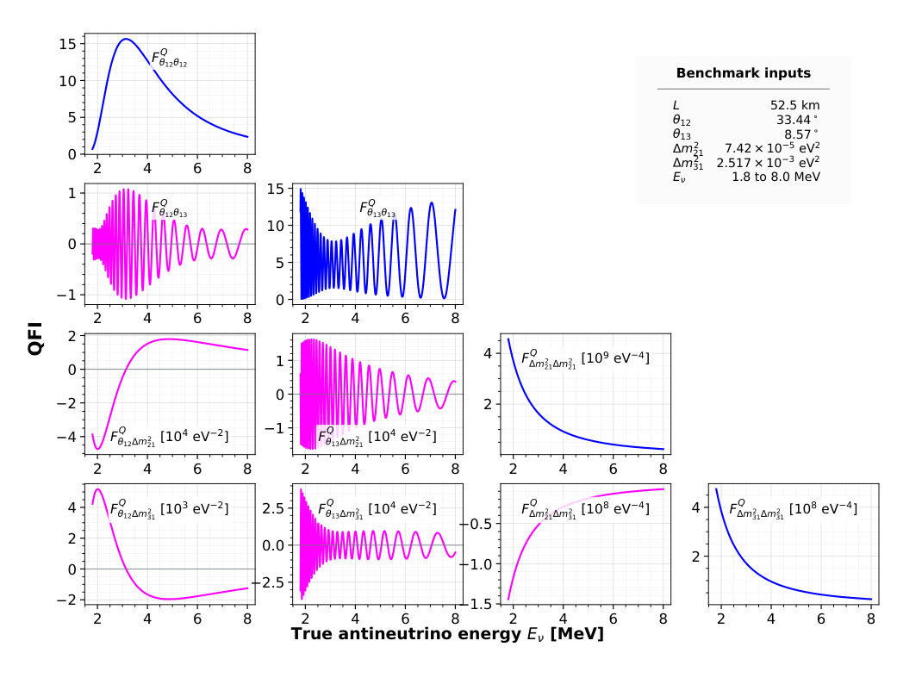 
FIG. 3. Energy dependence of the single-neutrino QFI matrix elements for an electron antineutrino propagating in vacuum at the JUNO baseline.

📷 Fig 4

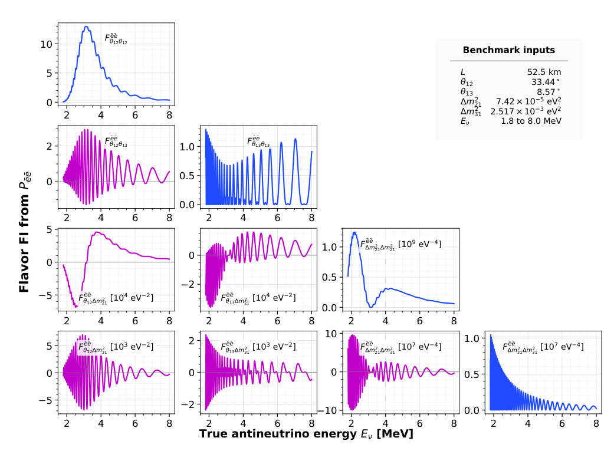 
FIG. 4. Energy dependence of the ten independent elements of the electron-flavor Fisher information matrix obtained from the survival probability P¯e¯e for the four oscillation parameters considered in the JUNO analysis.

**Summary.** This work develops an 'information ladder' to quantify how well neutrino oscillation parameters can be determined from reactor antineutrino measurements at JUNO. By comparing Quantum, Flavor, and Event-level Fisher Information, the authors map out the information loss across the measurement chain. They conclude that while some parameters suffer degradation, the experiment remains highly sensitive enough to achieve sub-percent precision on key mass splittings.

**Why it may be interesting.** The rigorous application of quantum information theory to particle physics measurements provides a powerful framework for assessing experimental potential, which is relevant to any field dealing with measurement limits in quantum systems.

Detailed structure

**Main problem.** The paper quantifies how information about neutrino oscillation parameters is encoded in the quantum state and how efficiently this information can be extracted through measurement.

**Main result.** The analysis establishes an information hierarchy (QFI $\succeq$ flavor-FI $\succeq$ event-FI), showing that while information loss occurs for certain parameters ($	heta_{13}, \Delta m_{31}^2$), the remaining information is sufficient for JUNO to achieve high precision on $\Delta m_{31}^2}$.

**Method.** It employs Quantum Estimation Theory (QET) to calculate three levels of Fisher Information: Quantum Fisher Information (QFI), classical flavor Fisher Information, and event-level Fisher Information, comparing them using Cramér-Rao bounds.

**Model / system.** The system is neutrino oscillation, modeled using the leptonic PMNS mixing matrix, analyzed in the context of reactor antineutrino measurements at the JUNO experiment.

**Key observables.** Quantum Fisher Information (QFI), classical flavor Fisher Information ($	ext{flavor-FI}$), and event-level Fisher Information ($	ext{F}_{	ext{event}}$).

**Important parameters / regimes.** Oscillation parameters: $	heta_{12}, 	heta_{13}, 	heta_{23}, \delta_{CP}, \Delta m^2_{21}, \Delta m^2_{31}$.

**Assumptions / limitations.** The analysis primarily focuses on the statistics-only case, neglecting systematic uncertainties, and sometimes neglects matter effects in specific calculations.

**Figures summary.** Figures illustrate the diagonal elements of the three Fisher information matrices ($	ext{e}	ext{F}_{	ext{Q}}$, $	ext{e}	ext{F}_{	ext{e}ar{	ext{e}}}$, $	ext{F}_{	ext{event}}$) as functions of energy, demonstrating the information hierarchy and energy dependence.

**Paper structure.** The paper develops the theoretical framework by deriving the QFI matrix elements, then calculates the flavor-specific and event-level Fisher matrices, and finally compares these metrics to quantify parameter sensitivity and information loss for JUNO.

Abstract

Since neutrinos are quantum systems inherently, the precision with which oscillation parameters can be estimated ultimately depends on how much information about these parameters is encoded in the neutrino state and how efficiently that information can be extracted through measurement. In this work, we quantify how information encoded in reactor antineutrino states flows through the measurement process to the events observed at the detector, using quantum and classical Fisher information. We establish the information ladder for JUNO, revealing that the loss of precision across different information levels is strongly parameter dependent. We demonstrate that the JUNO configuration approaches the optimal statistical limit for the oscillation parameters of the solar sector, while information on $θ_{13}$ and $Δm_{31}^{2}$ is significantly degraded by the measurement strategy and detector effects. Despite this information loss, the remaining information is sufficient for JUNO to achieve sub-percent precision on $Δm_{31}^{2}$ within six years.

[↑ back to top](#top)

### [Quantum Barankin bounds beyond local unbiasedness: Analytic results for Gaussian states via a right-division framework](http://arxiv.org/abs/2609.10157v1)

**Authors:** Maximilian Reichert, Javier Navarro, Gerardo Adesso, Manuel Gessner, Mikel Sanz  
**Type:** theory · **Category:** other · **PDF:** <https://arxiv.org/pdf/2609.10157v1>  
**Analysis basis:** full PDF text, analyzed in chunks
**Topic relevance:** `quantum measurements` **3/5**

📷 Fig 1

 
FIG. 1: Comparison of the RD QBB, SD QBB, and SLD QCRB for qubit phase estimation with parameters n = (0, 0, 1), r0 = 1 10(0, 3, 0) and λ = π/4. The y-axis shows the MSE while the x-axis shows the number of copies N. To avoid the potential divergences studied in [40, 41], we only show the region where the bound is finite (N &gt; 2). The K test points are equidistributed in the interval [0, π

📷 Fig 2

 
FIG. 2: Single mode phase estimation with λ = π

📷 Fig 3

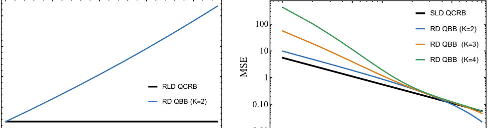 
FIG. 3: Quantum thermometry with N copies, assuming ω = 1 and a true parameter value λ = 2. For all RD QBB the value of γ is chosen to force the unbiasedness condition at all test points.

📷 Fig 4

 
FIG. 4: Loss sensing with N copies, assuming a true transmissivity λ = 1/4 and displacement amplitude α = 1/2. For all RD QBB the value of γ is chosen to force the unbiasedness condition at all test points.

**Summary.** This work introduces a quantum Barankin bound, a tighter lower bound on estimation error than the standard QCRB, by utilizing a non-symmetric right-division framework. The authors provide analytic formulas for this bound specifically for Gaussian states. This offers a more powerful tool for determining the ultimate precision limits in quantum parameter estimation, particularly in few-shot regimes.

**Why it may be interesting.** The development of tighter, analytically tractable bounds for parameter estimation is crucial for understanding the fundamental limits of quantum measurements, especially in regimes where standard QCRB fails.

Detailed structure

**Main problem.** The paper proposes a quantum generalization of the Barankin bound as an alternative to the Quantum Cramér-Rao Bound (QCRB) for quantum parameter estimation.

**Main result.** They derive a novel, non-symmetric quantum Barankin bound using a right-division superoperator, which is shown to be generally tighter than previous symmetric bounds.

**Method.** The methodology involves extending classical estimation theory bounds to the quantum domain, deriving explicit analytic formulas for Gaussian states using matrix algebra and characteristic functions.

**Model / system.** The theory applies to quantum parameter estimation for a family of quantum states $\{\hat{
ho}_{	ilde{\lambda}}\}_{	ilde{\lambda} \in \Lambda}$, with specific analytic derivations provided for Gaussian states.

**Key observables.** Mean Squared Error (MSE) of estimators, Quantum Fisher Information (QFI), and the Barankin matrix.

**Important parameters / regimes.** The parameter set $\Lambda$ and the specific structure of the Gaussian states (defined by mean vectors and covariance matrices).

**Assumptions / limitations.** The derivation relies on the existence and properties of the right-division superoperator and the assumption that the relevant operators are trace class.

**Paper structure.** The paper develops the bound by first establishing the general framework using the right-division operator, comparing it to the symmetric version, and then specializing the results to derive analytic formulas for Gaussian states.

Abstract

We propose a quantum version of the Barankin bound as an alternative to the quantum Cramér-Rao bound for quantum parameter estimation. The quantum Barankin bound provides a lower bound on the mean squared error of estimators satisfying arbitrarily chosen bias constraints at arbitrarily chosen parameter points. In particular, unbiasedness over the entire parameter space can be imposed, yielding precision limits for globally unbiased quantum parameter estimation. In contrast to the recently derived quantum Barankin bound, which is based on a symmetric division superoperator, our bound is based on a nonsymmetric right-division superoperator. This formulation enables us to find analytic expressions for the Barankin matrix for Gaussian states, which allows for an efficient calculation of the bound. We demonstrate the usefulness of our results by applying them to various examples that exhibit the threshold effect in the few-shot regime, which is invisible to the standard quantum Cramér-Rao bound approach.

[↑ back to top](#top)

### [The Sample Complexity of Quantum Entanglement Allocation](http://arxiv.org/abs/2609.10141v1)

**Authors:** Nathan Roll  
**Type:** both · **Category:** quantum information and computing · **PDF:** <https://arxiv.org/pdf/2609.10141v1>  
**Analysis basis:** full PDF text, analyzed in chunks
**Topic relevance:** `quantum measurements` **3/5**

📷 Fig 1

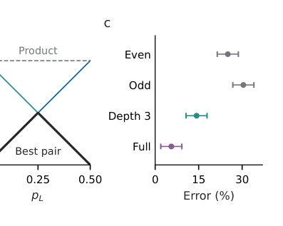 
Figure 1: (a) Three-qubit encodings at request probabilities (1/4, 1/2, 1/4). Groups share en- tanglement; filled squares recover the bit, empty squares are uninformative. All four codes pre- serve the stored bit. (b) Ideal prediction error when π(XXX) = 1/2, π(ZZI) = pL and π(IZZ) = 1/2 −pL; black selects the better pair. (c) Native 15-qubit commissioning on ibm_marrakesh favors the full chain. Even/odd are fixed product allocations. Each mean uses 1,920 shots over all 15 queries and both bits; bars are simultaneous 95% Hoeffding bounds for four means, conditional on independent shots in this one job. The allocations in (c) are fixed before ac- quisition.

📷 Fig 2

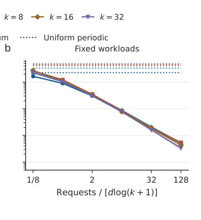 
Figure 2: Depth changes the error scale as well as the request requirement. (a) On the budget- indexed hard family, both empirical and data-free periodic allocations follow a square-root rate. The task probabilities change with the budget. (b) On fixed Dirichlet workloads, only the empirical learner improves. Solid lines show empirical optima; dotted lines show uniform periodic allocations. Each line averages four dimension means, each based on 64 independent seeds; shading spans those dimension means, not confidence intervals. The dashed line is 0.025x−1/2, an unfitted slope guide, not a theorem constant. Every risk uses the exact same-depth physical optimum as comparator.

📷 Fig 3

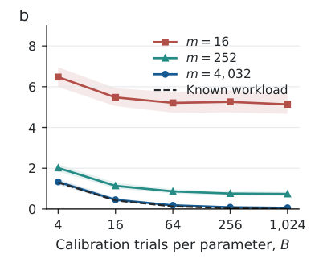 
Figure 3: More requests cannot remove a calibration floor. (a) Request learning at three fixed calibration budgets; the dashed curve supplies the true channel. (b) Calibration learning at three fixed request budgets; the dashed curve supplies the true workload. Both panels use 63-qubit heterogeneous-noise instances and the smoothed Joint estimator. Excess is relative to the true- workload, true-channel oracle in the same circuit family. Bands are pointwise 95% bootstrap inter- vals over 32 independent instances, after averaging four request streams and four calibration panels. Calibration costs 125B observations, separately from m.

📷 Fig 4

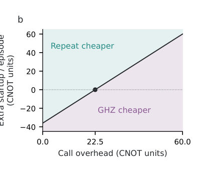 
Figure 4: (a) Fresh random requests and chosen repair queries have different call costs. Points reproduce Bell coverage q = .8 from a product probe. (b) Cost comparison at 80% power and 5% false alarms for known (e0, e1) = (.02, .164). GHZ uses 18 calls and 111.6 logical CNOTs; a product-initialized repeated-query policy uses 19.6 expected calls and 75.6 CNOTs. The boundary includes extra GHZ startup cost per episode. These are two attaining policies, not the full adaptive frontier.

📷 Fig 5

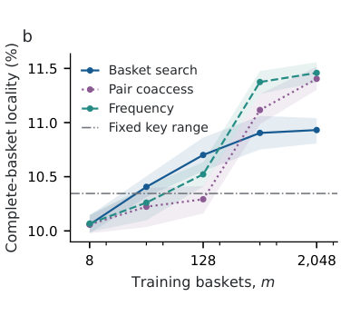 
Figure 5: (a) Exact empirical co-location on structured tables, with requests scaled by rk. Curves average r ∈{1, 4} and k ∈{1, 2, 3}, with 32 instances per cell; bands bootstrap training instances. (b) Complete-basket locality on the public Online Retail trace, with 3,922 records and eight shards of capacity 512. Learned methods share a training prefix; fixed key range uses none. Bands bootstrap 16 request streams conditional on the fixed catalogue and test trace. All three capacities and the exact small-schema study appear in Appendix Q.

**Summary.** This paper analyzes the theoretical limits on how much past data is needed to optimally allocate quantum entanglement resources for future queries. It derives sharp bounds on the sample complexity and excess error for various graph structures, combining theoretical analysis with hardware benchmarking. The findings are critical for designing robust quantum protocols that rely on sequential resource management.

**Why it may be interesting.** The work provides rigorous bounds on how much data (requests) is needed to reliably manage and allocate fragile quantum resources like entanglement, which is crucial for fault-tolerant quantum computation.

Detailed structure

**Main problem.** The paper investigates the sample complexity required to optimally allocate quantum entanglement resources among qubits based on sequential query observations.

**Main result.** The required sample complexity depends on the specific allocation choices, and error bounds for path queries scale inversely with the number of requests ($m$) and related to the connectivity ($k$).

**Method.** The authors use information-theoretic bounds, characterizing attainable prediction-contrast regions for Pauli queries and deriving minimax excess error bounds for learning optimal resource allocation.

**Model / system.** The system involves a quantum memory storing a classical bit and answering requests using a fixed detector, modeled using $d$-qubit states and graph-state queries on bipartite graphs.

**Key observables.** Minimax excess error, attainable prediction-contrast region, signed coherence measurements, and locality scores.

**Important parameters / regimes.** Number of requests ($m$), number of qubits ($d$), path depth ($k$), and calibration trials ($B$).

**Assumptions / limitations.** The analysis assumes the detector preserves coherence within measured sectors, and initial learning bounds assume exact empirical optimization.

**Figures summary.** Figures illustrate error scaling vs. requests ($m$) and calibration trials ($B$), and show coherence diagnostics for native 15-qubit paths comparing different encoding types.

**Paper structure.** The paper progresses from characterizing the theoretical sample complexity for Pauli queries to deriving explicit error bounds for paths and general graphs, concluding with experimental comparisons on hardware and classical data locality studies.

Abstract

How many past requests are needed to decide which qubits should share entanglement? We show that the answer depends on the allocation choices created by the queries: a larger memory can require no more data. The memory stores a classical bit and answers requests through a fixed detector that preserves coherence within each measured sector. For independent commuting $X$- and $Z$-type Pauli queries, we characterize the full attainable prediction-contrast region and construct encodings that preserve the bit at every nonzero vertex. With sharp reports, a $d$-qubit path and groups of at most $k$ qubits have minimax excess error after $m$ requests proportional to $k^{-1}\min\{1,\sqrt{d\log(k+1)/m}\}$, uniformly for $2\leq k<d$. Connected biclique regions can grow without increasing sample demand when depth, region count and connections per region stay bounded. Preparation noise introduces a separate calibration requirement. We derive an exact tradeoff with extra fresh detector calls and transfer the learning law to structured transaction co-location. Population-risk experiments test the statistical predictions. We also compare encodings on a native 15-qubit device and learned partitions on public purchase baskets. The full chain wins on the device; frequency grouping outperforms basket search in the largest-capacity retail setting.

[↑ back to top](#top)

### [Tuning Charge Density Wave transitions through lattice strain in NbSe3](http://arxiv.org/abs/2609.09375v1)

**Authors:** Antoine Gallo Frantz, Aleksander Sinchenko, Luc Ortega, Pavel Grigoriev, Vladislav Kochev, Pierre Godard, Pierre Olivier Renault, Dominique Thiaudiere, David Le Bolloch, Vincent Jacques  
**Type:** both · **Category:** strongly correlated electrons · **PDF:** <https://arxiv.org/pdf/2609.09375v1>  
**Analysis basis:** full PDF text, analyzed in chunks
**Topic relevance:** `Frenkel-Kontorova` **3/5**

📷 Fig 1

 
FIG. 1. NbSe3 crystal structure with a) the three different types of prisms for type I, II and III chains. b) 3D crys- tal structure made of three different and weakly coupled 1D chains along b. c) Projection of the unit cell in the (a, c) plane.

📷 Fig 2

 
FIG. 2. a) NbSe3 sample (narrow metallic-grey line) glued on the cross-shaped deformable substrate with the b and c crys- tallographic axis aligned with the substrate branches. Four silver paint electrical contact are made for current injection and voltage measurement in four-bar geometry. b) Schematic drawing of NbSe3 under applied stresses along b and c.

📷 Fig 3

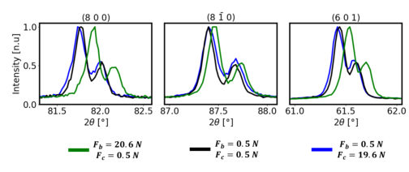 
FIG. 3. Normalized intensities obtained around the 800, 8¯10 and 601 Bragg reflections at 300 K as a function of 2θ for different sets of applied stresses: ∼20 N along b only (green curves), ∼20 N along c only (blue curves) and without stress (black curves). Each Bragg reflection displays two peaks cor- responding to the two components Kα1 and Kα2 of the x-ray beam.

📷 Fig 4

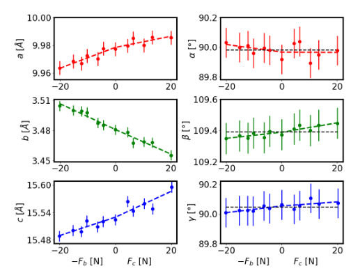 
FIG. 4. Evolution of the 6 lattice parameters a, b, c, α, β and γ as a function -Fb and Fc. Two different linear functions are used to fit the curves as a function of -Fb and Fc (colored dashed lines) for all curves. A black dashed line corresponding to the average angles is plotted for α, β and γ.

📷 Fig 5

 
FIG. 5. R(T) curve measured in the pristine state (black solid line) and linear extrapolation RM(T) from the metallic part of R(T) (red dotted line). The resistance values at critical temperatures RT c1 and RT c2 are marked with blue dots while the resistance increments α1 and α2 and the resistance values R1, R2, RM1 and RM2 used to compute them (see text) are marked with green dots.

**Summary.** This work experimentally demonstrates that applying uniaxial lattice strain to NbSe3 significantly tunes its two distinct Charge Density Wave (CDW) transitions. By combining X-ray diffraction with transport measurements, the authors establish a quantitative, linear correlation between the material's structural parameters and the critical temperatures of the CDW states. This highlights the extreme sensitivity of correlated electronic phases to mechanical boundary conditions.

**Why it may be interesting.** The strong coupling between mechanical strain and electronic phase transitions (CDW) is a key area of condensed matter physics. Understanding how external mechanical fields can tune correlated electronic states provides insights applicable to designing novel electronic materials.

Detailed structure

**Main problem.** The study investigates how applying mechanical lattice strain (tensile stress) tunes the Charge Density Wave (CDW) transitions in the quasi-one-dimensional material NbSe3.

**Main result.** The CDW critical temperatures ($T_{c1}, T_{c2}$) show strong, predictable linear correlations with the applied strain and resulting lattice parameters, suggesting the CDW state is highly sensitive to lattice geometry.

**Method.** The research combines *in-situ* X-ray diffraction (XRD) to measure lattice strain and elastic constants with transport measurements to track the temperature-dependent electrical resistance anomalies associated with the CDW transitions.

**Model / system.** The system is NbSe3, a prototypical quasi-1D conductor known for exhibiting multiple CDW states. The analysis models the coupling between structural distortions (lattice strain) and electronic instabilities (CDW formation) using elastic theory and electronic susceptibility calculations.

**Key observables.** CDW critical temperatures ($T_{c1}=145	ext{ K}, T_{c2}=59	ext{ K}$), electrical resistance changes ($\alpha_1, \alpha_2$), lattice parameters ($a, b, c, \alpha, eta, \gamma$), and elastic constants (Young's moduli, Poisson's coefficients).

**Important parameters / regimes.** Applied uniaxial tensile stresses ($\sigma_b, \sigma_c$), lattice strain ($\epsilon$), and the ratio of lattice parameters ($c/a$, $1/b$).

**Assumptions / limitations.** The analysis assumes the linear elastic regime for strain calculations and that the changes in conductivity are dominated by modifications to the band curvature rather than just the superconducting gap magnitude.

**Figures summary.** Figures illustrate the evolution of the six lattice parameters versus applied forces, and show the temperature dependence of resistance curves under varying tensile stresses, mapping out the shifts in $T_c$ and resistance jumps.

**Paper structure.** The paper systematically presents mechanical characterization (XRD/elastic constants) followed by electronic characterization (transport measurements), establishing a quantitative link between the measured structural changes and the resulting shifts in the CDW transition temperatures and associated transport signatures.

Abstract

The Charge Density Wave (CDW) state is a perfect example of a combined structural and electronic state, both characterized by a periodic lattice distortion and an electronic modulation of condensed electrons, resulting from electron-phonon coupling. They are thus prone to be tuned by lattice strain. NbSe3 is a prototypical example of CDW states, with a chain-like structure displaying two CDWs at 145K and 59K, with wavevectors along and inclined with respect to the chain axis b. Here, we report on the evolution of the lattice structure and CDW properties in the quasi-one-dimensional charge-density-wave system NbSe3 under tensile stresses applied along and perpendicular to the chains axis b by a combination of X-ray diffraction and transport measurements. We find that the lattice structure show exotic Poissons coefficients and strongly anisotropic Youngs moduli while the evolution of the electrical resistance demonstrates shifts of both charge-density-wave critical temperatures that are strongly correlated with the lattice parameters. The two CDW transitions display different behaviours under applied stresses, and suggest that a modification of the band curvature leads to the observed transport signatures.

[↑ back to top](#top)

### [Why three? A two-level system with four mutually unbiased questions](http://arxiv.org/abs/2609.10078v1)

**Authors:** Jonte R. Hance  
**Type:** theory · **Category:** quantum information and computing · **PDF:** <https://arxiv.org/pdf/2609.10078v1>  
**Analysis basis:** full PDF text, analyzed in chunks
**Topic relevance:** `quantum measurements` **3/5**

📷 Fig 1

 
Low-resolution page preview, page 2

📷 Fig 2

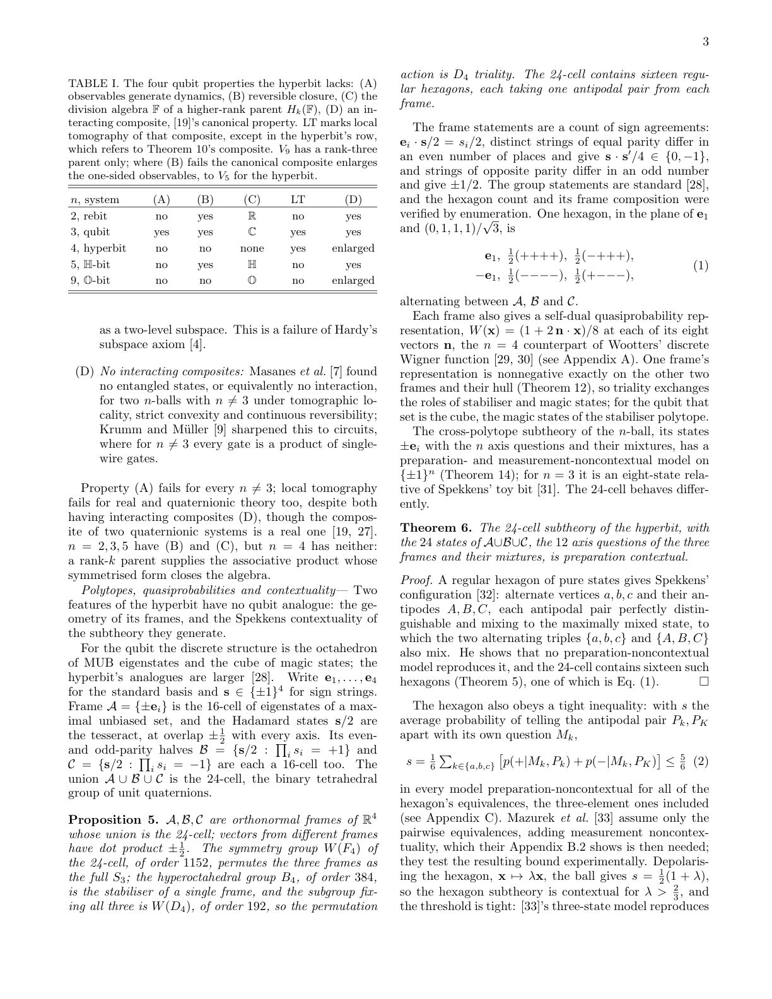 
Low-resolution page preview, page 3

📷 Fig 3

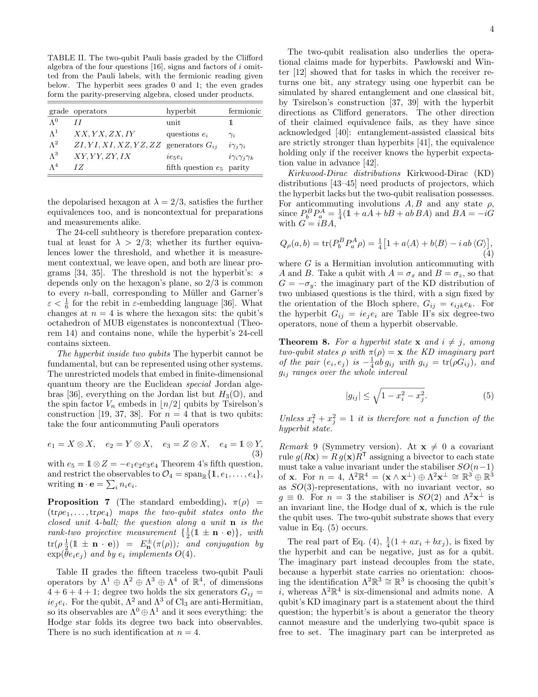 
Low-resolution page preview, page 4

📷 Fig 4

 
Low-resolution page preview, page 5

📷 Fig 5

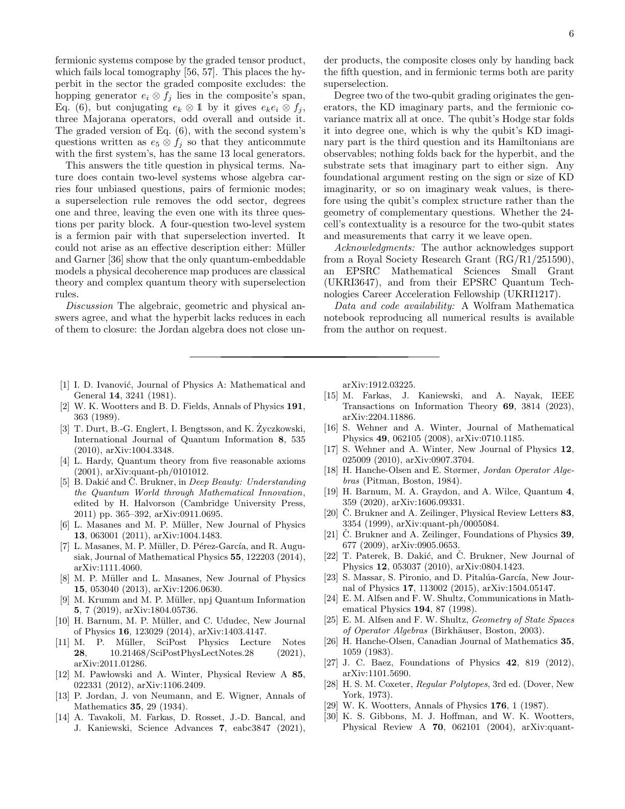 
Low-resolution page preview, page 6

**Summary.** This paper explores the theoretical limits of measurement in quantum mechanics by examining the concept of mutually unbiased questions (MUBs). It shows that while a four-question system (hyperbit) can be mathematically constructed, it fails to satisfy several fundamental physical criteria—such as those governing dynamics or algebraic closure—that are inherent to the standard qubit model. This suggests that the structure of quantum theory strongly constrains the number and nature of possible measurements.

**Why it may be interesting.** It provides a deep theoretical constraint on the structure of quantum measurements, suggesting that physical reality might enforce specific algebraic symmetries (like those found in qubits) that are violated by mathematically possible, but physically inconsistent, extensions.

Detailed structure

**Main problem.** The paper investigates the maximum number of mutually unbiased questions (MUBs) a two-level system can support, contrasting the standard quantum mechanical result (three for a qubit) with potential extensions.

**Main result.** The algebraic structure dictates that the maximum number of unbiased questions is always odd (e.g., 3 or 5), suggesting that a hypothetical four-question system (hyperbit) lacks key physical properties of a true quantum system.

**Method.** The analysis combines algebraic constraints (Clifford algebras, anticommuting involutions) with geometric modeling (Bloch balls, 24-cell) and quantum information diagnostics (contextuality testing, Kirkwood-Dirac distributions).

**Model / system.** The primary model is the two-level system, extended to a hypothetical 'hyperbit' supporting four MUBs, which is mathematically realized as a four-dimensional Bloch ball. The analysis often embeds this into a two-qubit system for physical realization.

**Key observables.** Mutual Unbiased Questions (MUBs), preparation contextuality (tested via the hexagon subtheory), Kirkwood-Dirac imaginary parts, and the four properties (A-D) that distinguish qubits from the hyperbit.

**Important parameters / regimes.** The number of questions ($n=2, 3, 4, 5$), the contextuality threshold ($\lambda > 2/3$), and the algebraic structure of the underlying operators.

**Assumptions / limitations.** The analysis assumes the validity of single-system postulates for the hyperbit, while the core argument relies on identifying which properties (like energy observability or algebraic closure) are violated when moving from $n=3$ to $n=4$.

**Figures summary.** Table I summarizes four key properties (A-D) that are compared across different systems (rebit, qubit, hyperbit, H-bit, O-bit), highlighting the failure of the hyperbit to satisfy all of them.

**Paper structure.** The paper progresses by establishing the algebraic condition for MUBs, deriving the structural limitations (odd number of questions), constructing the mathematical hyperbit, and then rigorously testing this model against known physical constraints (dynamics, closure, composability) using diagnostic tools.

Abstract

Two sharp yes/no questions are mutually unbiased if and only if their involutions anticommute. A set of unbiased questions is therefore a Clifford algebra, whose maximal size is odd, meaning four anticommuting questions typically imply a fifth: the two-level systems of real, complex and quaternionic quantum theory allow two, three and five questions, while four is skipped. Without this operator product restriction, a two-level system with four unbiased questions exists as the four-dimensional Bloch ball, the hyperbit. The single-system postulates that pick out the Jordan state spaces allow such a model, and only energy observability rules it out. We show what it lacks, and realise it inside two qubits: its Kirkwood-Dirac imaginary parts are hidden $\mathfrak{so}(4)$ generators, its composites allow entanglement but no interaction, and its 24-cell of states stays Spekkens preparation contextual down to depolarising strength $2/3$. In fermionic terms, the four questions are the Majorana operators of two modes while the fifth is parity: the four-question system is therefore the sector removed by parity superselection.

[↑ back to top](#top)

### [Finite-Particle Quantum Reduction of Thermodynamic Irreversibility](http://arxiv.org/abs/2609.10211v1)

**Authors:** Borhan Ahmadi  
**Type:** theory · **Category:** statistical mechanics · **PDF:** <https://arxiv.org/pdf/2609.10211v1>  
**Analysis basis:** full PDF text, analyzed in chunks
**Topic relevance:** `Keldysh / 2PI / non-Gaussian methods` **2/5** · `analog quantum simulation` **2/5** · `non-equilibrium universality` **2/5** · `quantum measurements` **2/5** · `correlated / nonlocal dissipation` **1/5** · `driven-dissipative phase transition` **1/5** · `methods for driven-dissipative` **1/5**

📷 Fig 1

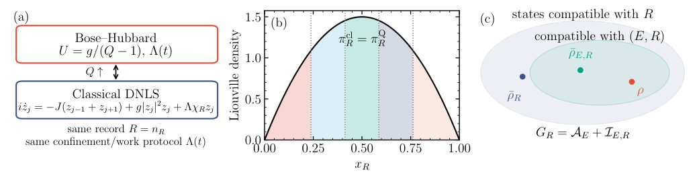 
FIG. 1. Matched quantum–classical construction. (a) The finite-particle Bose–Hubbard model and its number-conserving classical-field counterpart have the same coherent-state energy landscape and undergo the same confinement protocol. (b) The classical right-half coordinate is divided so that each region has the same invariant weight as the matching quantum occupation sector. (c) Three states associated with the same microscopic situation. The exact state ρ contains the full information. The record-only representative ¯ρR keeps only the spatial probabilities. The energy-and-record representative ¯ρE,R also keeps the exact mean energy. The difference ¯ρE,R −¯ρR is the refinement supplied by...

📷 Fig 2

 
FIG. 2. Why the finite-particle quantum process is less ir- reversible. (a) Change in the information hidden from the spatial record, the part resolved by adding the mean energy, and the resulting process entropy generation for the strict ini- tial matching. (b) Classical-minus-quantum process gap split into record and energy-resolved parts. The record part alone favors the classical system, while the energy-resolved part pro- duces the quantum advantage. (c) Endpoint record distribu- tions and the common multiplicity reference. The quantum record is more relaxed even though the combined energy-and- record description leaves a smaller residual information gap. (d) Process entropy generation...

📷 Fig 3

 
FIG. 3. Crossover toward the classical-field regime. (a) Quantum and classical entropy generation of the complete cycle. The retained (E, R) ledger assigns the nonzero pro- cess term to B →C−, while the physical microscopic ledger realizes the same amount during C+ →¯C. The two are not added. (b) Classical-minus-quantum cycle entropy-generation gap. (c) Relative reduction of the cycle entropy generation. (d) Efficiency advantage at matched hot heat input and reser- voir temperatures. No asymptotic power law is fitted.

📷 Fig 4

 
FIG. 4. Robustness to the duration of the isolated ex- pansion. (a) Quantum and classical cycle entropy genera- tion as JτBC is varied. (b) Efficiency advantage at matched cycle resources. (c) Classical-minus-quantum cycle entropy- generation gap. (d) Constraint residual of the energy-and- record reconstruction at each new endpoint C−. The rep- resentative and controlled Hamiltonian are rebuilt for every duration before the cold-side closure is defined.

**Summary.** This work compares the thermodynamic irreversibility of a finite-particle quantum system (Bose-Hubbard model) against its classical field analog. By analyzing entropy generation during a heat-engine cycle, the authors show that retaining energy information beyond just the spatial record allows the quantum system to perform work with lower entropy cost. This quantum advantage, however, vanishes in the large particle number limit.

**Why it may be interesting.** It provides a rigorous, quantitative comparison of quantum vs. classical thermodynamics in the context of finite, non-equilibrium processes, directly addressing the role of quantum coherence in thermodynamic efficiency.

Detailed structure

**Main problem.** The paper investigates whether the operational reduction of information in a finite quantum system, compared to its classical counterpart, leads to a less costly thermodynamic process regarding entropy generation.

**Main result.** The quantum system exhibits smaller entropy generation and achieves higher work efficiency than the classical system under matched thermal resources, although this advantage diminishes as the particle number increases toward the classical limit.

**Method.** The analysis uses a heat-engine cycle comparison, quantifying information loss via entropy gaps derived from comparing state representations constrained by the spatial record (R) versus the combined energy and record (E, R).

**Model / system.** The study compares a finite-particle Bose–Hubbard chain (quantum system) with its number-conserving classical-field counterpart. The Hamiltonians are matched by setting specific coupling constants.

**Key observables.** Entropy generation ($\Sigma$), work extracted, information gaps ($G_R, A_E, I_{E,R}$), and the comparison of $\Sigma_Q$ vs $\Sigma_{cl}$.

**Important parameters / regimes.** Total number of bosons ($Q$), number of sites ($L$), and the confinement parameter ($\Lambda$).

**Assumptions / limitations.** The comparison assumes matched thermal resources, and the advantage of the quantum system is shown to fade as $Q$ grows.

**Figures summary.** Figures illustrate the matched quantum-classical construction, showing the three state representations ($
ho, ar{
ho}_R, ar{
ho}_{E,R}$) and the corresponding entropy gaps, while supplementary figures confirm numerical stability and robustness.

**Paper structure.** The paper establishes the problem by defining the quantum and classical models, develops the theoretical framework using entropy decomposition identities ($G_R = A_E + I_{E,R}$), applies this to a heat-engine cycle comparison, and concludes by analyzing the resulting entropy costs and their dependence on particle number.

Abstract

Thermodynamics is useful because it lets us predict and control complex systems from a few accessible quantities when microscopic reconstruction is impractical. We ask whether this operational reduction can be less costly in a finite quantum system than in a matched classical one. We compare a few-boson Bose--Hubbard chain with its number-conserving classical-field counterpart under the same driving and the same coarse spatial record. The quantum system relaxes more in the observed particle distribution, yet the retained mean energy resolves more of the microscopic structure hidden by that record, leaving less information unusable and smaller entropy generation. We then close the process into a heat-engine cycle whose controls use only the measured mean energy and spatial record, not full state tomography; at matched thermal resources, the smaller entropy generation gives more work and higher efficiency. The advantage fades as the particle number grows toward the classical-field regime.

[↑ back to top](#top)

### [Symmetry structure dependent diagnostic of the Quantum Mpemba Effect](http://arxiv.org/abs/2609.10470v1)

**Authors:** Tamizhselvan S, Manju C, Bijay Kumar Agarwalla, Uma Divakaran  
**Type:** theory · **Category:** statistical mechanics · **PDF:** <https://arxiv.org/pdf/2609.10470v1>  
**Analysis basis:** full PDF text, analyzed in chunks
**Topic relevance:** `analog quantum simulation` **2/5** · `Keldysh / 2PI / non-Gaussian methods` **1/5** · `correlated / nonlocal dissipation` **1/5** · `driven-dissipative phase transition` **1/5** · `methods for driven-dissipative` **1/5** · `non-equilibrium universality` **1/5** · `quantum measurements` **1/5** · `scars & prethermalization` **1/5**

📷 Fig 1

 
FIG. 1. Structure of the initial reduced density matrix ˆρA(0) in the symmetry-resolved basis for the charge and permutational- symmetry cases. Panels (a,b) show magnitude of ˆρA(0), denoted as |ˆρA(0)|, in the subsystem-charge qA basis for the tilted ferromagnetic initial state, as given in Eq. (7) with (a) θ = 0, and (b) θ = π/2, respectively, demonstrating support over several qA sectors when θ = π/2 . Panels (c,d) show the corresponding reduced density matrix in the subsystem total-spin jA basis for the initial state given in Eq. (8) with (c) ∆θ = 0 and (d) ∆θ = π/2, respectively, with ∆θ = π/2 showing support and coherences across different jA sectors. These plots correspond to N = 80...

📷 Fig 2

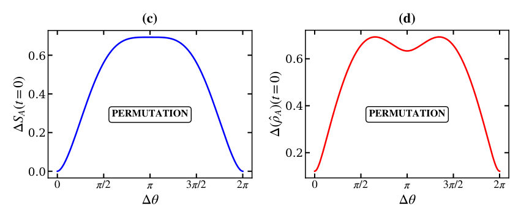 
FIG. 2. Initial values of the entanglement asymmetry ∆SA(t=0) and trace distance ∆(ˆρA)(t=0) for charge and permutation- symmetry-breaking initial states. Panels (a,b) correspond to the charge symmetry-breaking initial state (Eq. (7)), and the diagnostics are plotted as a function of the tilt angle θ. The reduced diagonal ensemble ρA DE is constructed with respect to the charge-symmetric Hamiltonian in Eq. (2) with α = 1/N and p = π/2. Panels (c,d) correspond to the permutational symmetry-breaking initial state in Eq. (8) where the diagnostics are plotted as functions of the polar angle difference ∆θ. Here, ρA DE is constructed with respect to Hamiltonian in Eq. (1), with α1 = 1/N, α2 =...

📷 Fig 3

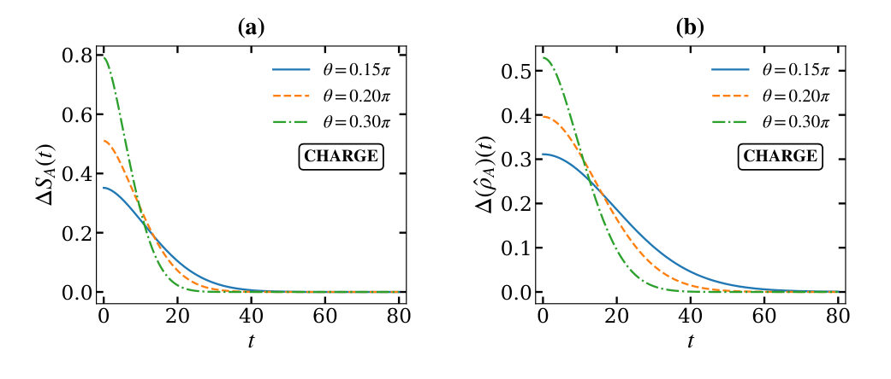 
FIG. 3. Charge symmetry-breaking dynamics : (a) Time evolution of the entanglement asymmetry ∆SA(t) and the (b) trace distance ∆(ρA)(t) for charge symmetry case. The three curves correspond to different symmetry-breaking parameters, i.e. initial tilt angle θ. For larger θ, the initial value of both diagnostics is larger but the decay is faster. The results are obtained by exact diagonalization for N = 80 , NA = 2, with the Hamiltonian in Eq. (2) and parameters set to α = 1/N , p = π/2

📷 Fig 4

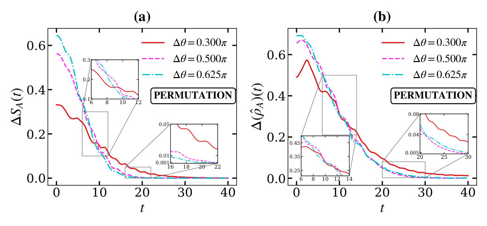 
FIG. 4. Permutational symmetry-breaking dynamics : (a) Time evolution of the entanglement asymmetry ∆SA(t) and (b) trace distance ∆(ρA)(t) for the permutational symmetry case. The three curves correspond to different symmetry-breaking parameter ∆θ. The results are obtained by exact diagonalization for N = 80 , NA = 2, by drawing subsystem from the middle of the spin chain, for the Hamiltonian in Eq. (1) with parameters α1 = 1/N, α2 = 2/N, and p = π/2. The insets magnify the indicated intermediate and late time regions to clearly highlight the differences between the curves.

📷 Fig 5

 
FIG. 5. Comparison of the contributions from ˆ WA(t) and ˆδA(t) to the trace distance ∆(ˆρA)(t) dynamics for (a) charge and (b) permutation symmetries. The charge symmetry broken initial state has θ = 0.3π, and is evolved with the Hamiltonian

**Summary.** This paper compares two diagnostic tools—entanglement asymmetry and trace distance—to study symmetry restoration dynamics, particularly in the context of the Quantum Mpemba Effect. By analyzing spin-1/2 systems with different symmetries, the authors establish precise conditions under which energy-based measures reliably reflect the underlying symmetry-driven quantum dynamics. This clarifies the distinct physical information contained in different quantum observables.

**Why it may be interesting.** This work provides a rigorous theoretical framework for distinguishing between different types of quantum information encoded in symmetry measures versus energy-based measures, which is crucial for interpreting experimental results in open quantum systems.

Detailed structure

**Main problem.** The paper investigates whether conventional energy-based diagnostics, such as the trace distance, accurately capture the dynamics of symmetry restoration observed via entanglement asymmetry in quantum many-body systems.

**Main result.** The diagnostic used depends critically on the system's symmetry: for charge symmetry, the trace distance effectively tracks entanglement asymmetry, but for permutation symmetry, a significant residual contribution causes the two diagnostics to diverge.

**Method.** The authors combine numerical simulations with an analytical decomposition of the trace distance into symmetry-coherence and residual contributions to compare its evolution against entanglement asymmetry.

**Model / system.** The study analyzes closed spin-1/2 quantum systems, employing Hamiltonians that can exhibit either charge symmetry or permutation symmetry. Initial states are engineered to break these symmetries, allowing for the study of relaxation dynamics.

**Key observables.** Entanglement asymmetry ($\Delta S_A$), Trace Distance ($\Delta(\hat{
ho}_A)(t)$), Symmetry-coherence, and Residual contributions.

**Important parameters / regimes.** The degree of initial symmetry breaking, controlled by parameters like the tilt angle $	heta$ or $\Delta	heta$.

**Assumptions / limitations.** The analysis is performed on closed spin-1/2 quantum systems, and the comparison hinges on the mathematical decomposition of the trace distance.

**Figures summary.** Figures compare the time evolution of $\Delta S_A(t)$ and $\Delta(\hat{
ho}_A)(t)$ for both charge and permutation symmetries, showing qualitative agreement for charge symmetry but divergence for permutation symmetry.

**Paper structure.** The paper first introduces the problem by comparing two diagnostics for the Quantum Mpemba Effect. It then analyzes the dynamics for two distinct symmetry types (charge vs. permutation), deriving the necessary mathematical decompositions and presenting comparative results.

Abstract

Understanding symmetry restoration in isolated quantum many-body systems is an important problem in nonequilibrium many-body quantum physics. Recent studies have shown that the quantum Mpemba effect can be characterized through entanglement asymmetry, where states with stronger initial symmetry breaking restore symmetry faster. However, it remains unclear whether conventional energy-based measures, such as the trace distance, capture the same phenomenon. We investigate this question in closed spin-$1/2$ quantum systems with different symmetries by analyzing the dynamics of symmetry-breaking initial states. Combining numerical simulations with an analytical decomposition of the trace distance into symmetry-coherence and residual contributions, we identify the conditions under which trace distance tracks entanglement asymmetry and reproduces the Mpemba--like behavior observed in it. For charge symmetry, the residual contribution is negligible, making the trace distance effectively governed by symmetry-sector coherences. In contrast, for permutation symmetry, a significant residual contribution leads to qualitatively different relaxation dynamics. Our results establish when conventional energy-based diagnostics reliably capture symmetry-restoration dynamics and clarify the distinct physical information encoded by entanglement asymmetry and trace distance.

[↑ back to top](#top)

### [Field quantization in rotating frames: coordinate covariance and the circular-detector response](http://arxiv.org/abs/2609.10390v1)

**Authors:** Sidney Natzuka Junior, Carlos Augusto Domingues Zarro, Matheus dos Santos Soares  
**Type:** theory · **Category:** other · **PDF:** <https://arxiv.org/pdf/2609.10390v1>  
**Analysis basis:** full PDF text, analyzed in chunks
**Topic relevance:** `Keldysh / 2PI / non-Gaussian methods` **2/5** · `quantum measurements` **2/5** · `Full counting statistics` **1/5** · `methods for driven-dissipative` **1/5** · `non-equilibrium universality` **1/5**

📷 Fig 1

 
FIG. 1. Massless circular-detector response in the Minkowski vacuum, at fixed proper acceleration ac, computed from the Hadamard-subtracted expression (110). (a) The excitation rate ˙F(E)/ac, as a function of E/ac, is nonzero for E &gt; 0, but it is not a Planck spectrum. (b) The gap-dependent inverse temperature acβeff(E), with βeff(E) = E−1 ln[ ˙F(−E)/ ˙F(E)]. A KMS state would give a horizontal curve; 2π, the value for linear acceleration at the same proper acceleration, is shown only as a reference. Line color and dashing both identify the tangential speed.

**Summary.** This theoretical paper rigorously analyzes quantum field quantization in rotating frames, comparing different mathematical descriptions (rigid vs. TT). It resolves the apparent conflict between the lack of a symmetry-selected vacuum state and the detection of a non-zero, non-thermal signal from a detector in the vacuum. The findings establish a consistent framework for understanding vacuum fluctuations in non-inertial settings.

**Why it may be interesting.** This work directly addresses the subtleties of defining vacuum states and thermalization in non-inertial frames, which is critical for understanding quantum field theory in curved or accelerating backgrounds relevant to quantum optics and open quantum systems.

Detailed structure

**Main problem.** The paper provides a unified analysis of scalar-field quantization and detector response in relativistic rotating frames, comparing rigid and Trocheris-Takeno (TT) descriptions in Minkowski spacetime.

**Main result.** The authors show that while neither rotating time flow selects a global ground state, a circular Unruh-DeWitt detector in the Minkowski vacuum exhibits a stationary, non-thermal response, demonstrating the mutual consistency of these seemingly disparate effects.

**Method.** The analysis employs mode decomposition using Bogoliubov coefficients, compares different coordinate representations (rigid vs. TT), and calculates the detector response using Hadamard subtraction.

**Model / system.** The system involves a real scalar field quantized in the Minkowski vacuum, coupled to a two-level Unruh-DeWitt detector, analyzed under the influence of rotating coordinates.

**Key observables.** Bogoliubov beta coefficients, detector excitation rate spectrum, Minkowski Wightman function, and the non-thermal nature of the detector response.

**Important parameters / regimes.** The analysis is performed in the context of Minkowski spacetime, focusing on the comparison between inertial, rigid, and TT modes.

**Assumptions / limitations.** The analysis assumes the Minkowski vacuum and makes a crucial distinction between the state definition, time evolution selection, and detector response.

**Paper structure.** The paper proceeds by establishing quantization requirements, comparing rigid and TT transformations, demonstrating the failure of these flows to select a global ground state, confirming the mode equivalence via vanishing Bogoliubov coefficients, and finally calculating the non-thermal detector response.

Abstract

We provide a unified analysis of scalar-field quantization and detector response in relativistic rotating frames, comparing rigid and Trocheris-Takeno (TT) descriptions in unbounded Minkowski spacetime. We distinguish three questions that are often conflated: (i) how a fixed quantum state is represented in rotating coordinates, (ii) whether rotating time evolution selects a global ground state, and (iii) how a rotating detector responds to the vacuum. Coordinate-transformed rigid and TT modes span the same positive-frequency subspace as inertial modes: their Bogoliubov beta coefficients vanish and their mode sums reproduce the Minkowski Wightman function. Neither rotating time flow selects a global scalar ground state, although for different reasons: the rigid generator is not globally timelike and is unbounded below, whereas TT time translation is not a Killing symmetry. Nevertheless, a circular Unruh-DeWitt detector in the Minkowski vacuum has a stationary, nonzero response. We relate this response to negative corotating frequencies, evaluate it after an explicit Hadamard subtraction, and show that it is nonthermal. Thus vanishing Bogoliubov mixing, the absence of a symmetry-selected rotating vacuum, and detector excitation are mutually consistent.

[↑ back to top](#top)

### [Thermal Quantum Sensing: Fisher Information and Work Beyond Gaussian Signals](http://arxiv.org/abs/2609.09583v1)

**Authors:** Yash Chitgopekar, Nikolaos Koukoulekidis, Iman Marvian  
**Type:** theory · **Category:** statistical mechanics · **PDF:** <https://arxiv.org/pdf/2609.09583v1>  
**Analysis basis:** full PDF text, analyzed in chunks
**Topic relevance:** `quantum measurements` **2/5** · `Keldysh / 2PI / non-Gaussian methods` **1/5** · `analog quantum simulation` **1/5** · `driven-dissipative phase transition` **1/5** · `methods for driven-dissipative` **1/5** · `non-equilibrium universality` **1/5**

📷 Fig 1

 
FIG. 1. Thermal Quantum Sensing. Top: A standard sensing protocol: the sensor is prepared in the Gibbs state ρβ, transformed by a unitary R to obtain the desired initial probe state, evolved under the parameter-dependent unitary U0(s), and finally measured. Middle: An equivalent description used throughout this work, in which the preparation unitary is ab- sorbed into the signal: the sensor is prepared in the Gibbs state ρβ and evolves under U(s) = R†U0(s)R. We study its sensitivity, quantified by various quantum Fisher information metrics, and the work performed by the signal as functions of temperature β−1. Bottom: For continuous-variable sen- sors, such as the motional bosonic modes of...

📷 Fig 2

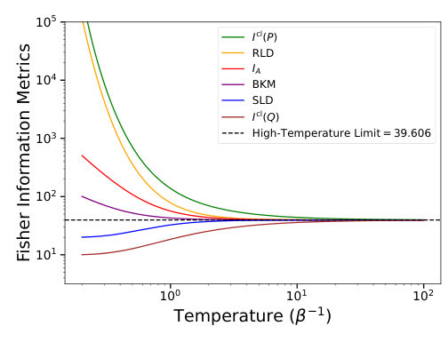 
FIG. 2. Hierarchy of information metrics and a finite infinite-temperature limit. As an example, we consider a thermal state of a translationally invariant harmonic chain of N quantum harmonic oscillators in a 1D lattice with periodic boundary conditions and nearest-neighbor interactions as de- scribed by Eq. (163) with N = 10 and coupling κ = 5 · 10−3

📷 Fig 3

 
FIG. 3. Extremal QFI metrics of a single harmonic oscillator for polynomial signals. We plot, as a function of temperature β−1, the minimal (SLD) and maximal (RLD) QFI metrics FAk, PAk for a thermal state of the harmonic oscillator with H = (X2 + P 2)/2 and a signal generated by Ak = ckXk for k = 1, · · · , 5. The normalization factors ck are chosen such that, for every k, the SLD at zero temperature, which is four times the variance of Ak in the ground state, is equal to 1 (see Sec. G for details). In the limit of high temper- ature, the difference between PAk(ρβ) and FAk(ρβ) vanishes for k ≤3, tends to a positive constant for k = 4, and diverges for k ≥5. The slope of the curves for both...

📷 Fig 4

 
FIG. 4. Bounds on ratios of QFI metrics. We plot the bounds from Eqs. (67), (68) and (70) in the top, middle, and bottom panels respectively as functions of temperature for the harmonic chain described in Eq. (163) with N = 10 and cou- pling coefficient κ = 0.5 and a uniform signal Eq. (153). For g = 2.0 and f = 0, the signal A = P

📷 Fig 5

 
FIG. 5. Difference between linear and quadratic sig- nals. We depict phase-space representations of the Gibbs state ρβ and its evolved state e−iAsρβeiAs, for a fixed small value of s. For the linear signal A = X (left), the evolution produces a fixed displacement in the momentum direction. In- creasing the temperature broadens the thermal distribution, with its variance scaling as nβ + 1/2, while the displacement remains fixed. Consequently, the displacement becomes negli- gible relative to the width of the distribution, explaining why the QFI vanishes in the infinite-temperature limit. For the quadratic signal A = X2 (right), the evolution produces a squeezing deformation in phase space....

**Summary.** This paper develops a theoretical framework to understand quantum sensing in the presence of thermal noise by relating sensing sensitivity (QFI) to the work done. It establishes universal high-temperature limits for various QFI metrics, providing quantitative bounds on how thermal fluctuations affect measurement precision in bosonic systems.

**Why it may be interesting.** This work provides rigorous theoretical tools to quantify the fundamental limits of quantum sensing in realistic, noisy (thermal) environments, connecting metrology directly to quantum thermodynamics.

Detailed structure

**Main problem.** The paper addresses how thermal fluctuations modify quantum-enhanced sensing and establishes general relationships between sensing sensitivity (QFI) and the work done by a signal in quantum thermodynamics.

**Main result.** At high temperatures, various QFI metrics converge to a universal quantity related to the variance of a simple observable, and for quadratic signals, the high-temperature QFI is bounded by the zero-temperature SLD QFI.

**Method.** The authors establish general relations between different Quantum Fisher Information (QFI) metrics and the work done, analyzing the system's behavior in the high-temperature limit ($eta 	o 0^+$).

**Model / system.** The analysis uses thermal quantum states (Gibbs state $
ho_eta$) subjected to unitary signals $U(s)$. Specific models include 1D harmonic chains of bosonic modes relevant to trapped-ion platforms and continuous-variable Gaussian systems.

**Key observables.** Quantum Fisher Information metrics (SLD, RLD, BKM, IA), induced work $W(s)$, and the Purity of Coherence $P_A(
ho_eta)$.

**Important parameters / regimes.** Temperature ($T$ or $eta$), signal strength ($s$), and coupling constants ($\kappa, g, f$).

**Assumptions / limitations.** The analysis often relies on the high-temperature limit ($eta 	o 0^+$) or the quadratic nature of the signal generator in continuous-variable systems.

**Figures summary.** Figures illustrate the sensing protocol and plot various QFI metrics versus temperature, showing their convergence behavior. Tables summarize extremal Bohr frequencies ($\omega_{\pm}$) for different signal types.

**Paper structure.** The paper develops general relations connecting QFI metrics to work, analyzes the high-temperature limit for bosonic systems, and applies these concepts to specific models like harmonic chains using both uniform and single-site signal generators.

Abstract

Understanding how thermal fluctuations modify or suppress quantum-enhanced sensing is a central problem in quantum metrology. Closely related questions arise in quantum thermodynamics, particularly regarding the relation between the work induced by a signal and the information acquired by a sensor. Here, we establish general relations among the sensitivity of thermal quantum states, as quantified by different quantum Fisher information metrics, their temperature dependence, and the work induced by a unitary signal. We further show that, at high temperature, all monotone QFI metrics coincide to leading order with a universal quantity that can be expressed as the variance of a simple observable and itself defines a lesser-known QFI metric. This emergent uniqueness is reminiscent of the uniqueness of classical Fisher information in information geometry. In continuous-variable systems, the infinite-temperature limit is finite and generically non-zero for quadratic Gaussian signals, while it diverges for higher-degree signals. Remarkably, for any purely quadratic signal generator, the infinite-temperature QFI is at least twice the zero-temperature SLD QFI or, equivalently, at least eight times the ground-state variance of the generator. Consequently, the Cramér--Rao lower bound on the estimator variance is reduced by at least a factor of two. We illustrate these results using harmonic chains of bosonic modes relevant to trapped-ion platforms and quantum field-theoretic models.

[↑ back to top](#top)

### [A Block Tensor Train Burer-Monteiro Framework for Low-Rank Quantum State Tomography](http://arxiv.org/abs/2609.09457v1)

**Authors:** Shakir Showkat Sofi, Charlotte Vermeylen, Fatemeh Mohammadi, Lieven De Lathauwer  
**Type:** theory · **Category:** numerical methods · **PDF:** <https://arxiv.org/pdf/2609.09457v1>  
**Analysis basis:** full PDF text, analyzed in chunks
**Topic relevance:** `methods for driven-dissipative` **2/5** · `quantum measurements` **2/5** · `analog quantum simulation` **1/5**

📷 Fig 1

 
Fig. 2.1: Basic tensor network diagrams. In the bottom row, double-ring nodes rep- resent block matrices with purple block-layout edges and black inner-matrix edges; block matrices are linked by a purple edge in the strong Kronecker product and a black edge in the C-product.

📷 Fig 2

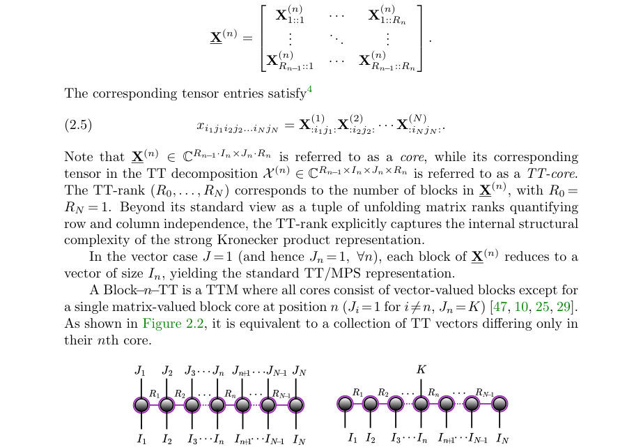 
Fig. 2.2: (Left) TTM representation of a matrix X ∈ CI1I2···IN×J1J2···JN . (Right) Block−n−TT representation of a tall matrix X ∈CI1I2···IN×K, or equiva- lently, as a collection of K TT vectors that share all cores, except for the nth core.

📷 Fig 3

 
Figure 3.2 visualizes the tensor network diagram for this operation: the overall contraction between the Block-TT parameterized density operator and the (TTM) measurement operators (left), alongside its equivalent effective-operator form (right).

📷 Fig 4

 
Fig. 3.2: (Left) Core-wise contraction of the tensor network representing the ex- pectation value computation, i.e., Tr(AH TT ETT ATT). (Right) Equivalent tensor net- work representation of the same operation in terms of an effective operator, i.e., Tr(A(n)H [1,2,4;3] E(n) eff A(n) [1,2,4;3]), where E(n) eff = AH ̸=n ETT A̸=n ∈CRn−1dRn×Rn−1dRn.

📷 Fig 5

 
Fig. 3.3: Optimal ordering of the tensor network contractions needed to compute the left and right environments recursively; see (3.6).

**Summary.** This paper introduces a novel Block Tensor Train (Block-TT) framework to perform Quantum State Tomography (QST) for high-dimensional quantum systems. By parameterizing the density matrix using a low-rank tensor network, it bypasses the exponential scaling problem inherent in standard methods. This allows for accurate state reconstruction using efficient, physically constrained tensor-network algorithms.

**Why it may be interesting.** This work directly addresses the computational bottleneck in characterizing quantum states, which is crucial for simulating and understanding complex quantum many-body systems beyond the reach of full density matrix methods.

Detailed structure

**Main problem.** The core problem is Quantum State Tomography (QST): reconstructing a quantum state ($
ho$) from measurement data, which is computationally intractable due to the exponential growth of the density matrix size with the number of qubits.

**Main result.** The authors propose a Block Tensor Train (Block-TT) Burer-Monteiro framework that parameterizes the density matrix, reducing the optimization variables from exponential to linear in the number of qubits while guaranteeing physical constraints.

**Method.** The method employs a low-rank tensor-network factorization (Block-TT) applied to the density matrix, enabling the use of efficient tensor-network contractions and developing DMRG-like algorithms for state estimation.

**Model / system.** The system is a general quantum system whose state is described by a density matrix ($
ho$). The model focuses on representing this state using a low-rank tensor-network structure (Block-TT) to manage high dimensionality.

**Key observables.** The density matrix ($
ho$), expectation values ($	ext{Tr}(
ho E_m)$), and local Bloch vectors.

**Important parameters / regimes.** The rank of the tensor decomposition, the number of qubits ($N$), and the measurement settings (e.g., window/stride configurations in simulations).

**Assumptions / limitations.** The primary assumption is that the quantum state ($
ho$) is low-rank, allowing for the successful application of the Block-TT factorization.

**Figures summary.** Figure 2.1 illustrates basic tensor network diagrams showing block matrices linked by strong Kronecker products and C-products, which are fundamental to the tensor representation.

**Paper structure.** The paper establishes the QST problem and its dimensionality curse, introduces the Block-TT Burer-Monteiro factorization as the solution, details the resulting DMRG-like algorithms, and validates the method using numerical experiments on state reconstruction.

Abstract

Quantum state tomography is a fundamental technique for estimating the state of a quantum system from measured data and plays a crucial role in evaluating the performance of quantum devices. However, standard estimation methods become computationally prohibitive as the system size increases due to the exponential growth of the density matrix, describing a quantum state, with the number of qubits. We propose a low-rank tensor-network framework for mixed-state quantum state tomography based on a block tensor train (Block-TT) factorization. Specifically, the density matrix is represented as the contraction of a Block-TT with its Hermitian transpose, yielding a TT analogue of the Burer-Monteiro factorization. This parameterization guarantees Hermiticity and positive semidefiniteness by construction while compressing the number of optimization variables from exponential to linear in the number of qubits. Building on this representation, we develop single-site and two-site density matrix renormalization group (DMRG) algorithms for estimating quantum states from compressed measurements. The resulting methods operate directly on the compressed parameterization, support adaptive rank refinement, and exploit efficient tensor-network contractions for expectation-value evaluation. The framework is applicable to a broad class of low-rank quantum states, including pure states, nearly pure states, and ground states that admit accurate tensor-network approximations. Numerical experiments demonstrate accurate state reconstruction from limited measurements together with substantial reductions in memory requirements and computational cost compared with conventional low-rank tomography methods.

[↑ back to top](#top)

### [Coarse-graining to create minimalist models for dynamic, end-linked star-polymer networks](http://arxiv.org/abs/2609.09594v1)

**Authors:** Tyla R. Holoman, C. Levi Petix, Michael P. Howard, Thomas M. Truskett  
**Type:** theory · **Category:** statistical mechanics · **PDF:** <https://arxiv.org/pdf/2609.09594v1>  
**Analysis basis:** full PDF text, analyzed in chunks
**Topic relevance:** `Keldysh / 2PI / non-Gaussian methods` **2/5** · `analog quantum simulation` **1/5** · `methods for driven-dissipative` **1/5**

📷 Fig 1

 
FIG. 1. Schematic of fine-grained (FG) and coarse-grained (CG) models for tetra-PEG.

📷 Fig 2

 
FIG. 2. Crossover from dilute to semidilute conditions. Radius of gyration for the FG

📷 Fig 3

 
FIG. 3. Transferability of CG model. Top row: CG pair potential uCG as a function of

📷 Fig 4

 
FIG. 4. Intra-star correlations. Probability density p of arm length R in the CG and FG models

📷 Fig 5

 
FIG. 5. Inter-star bonding motifs. Total number of bonds and number of bonds for different

**Summary.** This work develops a coarse-grained model for dynamic star-polymer networks by mapping a detailed bead-spring simulation onto a much simpler 5-bead model using relative-entropy minimization. The authors demonstrate that the simplified model accurately predicts key structural and phase behaviors of the complex system across different concentrations. This research highlights the fundamental trade-offs inherent in multiscale modeling, balancing computational efficiency against physical accuracy.

**Why it may be interesting.** While focused on classical polymer physics, the rigorous application of relative entropy and the systematic reduction of degrees of freedom mirrors techniques used in developing effective Hamiltonians in quantum many-body systems, which is relevant for understanding complex quantum dynamics.

Detailed structure

**Main problem.** The primary goal is to develop and validate minimalist, coarse-grained models for complex, dynamic star-polymer networks to predict their macroscopic behavior while managing the trade-off between model simplicity and accuracy.

**Main result.** The coarse-grained model successfully reproduces the structural correlations and phase behavior of the fine-grained model across various densities, demonstrating the transferability of the mapping.

**Method.** The study employs relative-entropy coarse-graining, minimizing the relative entropy between the fine-grained and coarse-grained ensembles to derive effective parameters for the simplified model.

**Model / system.** The system consists of dynamic, end-associating four-armed poly(ethylene glycol) (tetra-PEG) macromers forming gel networks. Two models are compared: a detailed bead-spring (fine-grained) model and a simplified 5-bead (coarse-grained) model.

**Key observables.** Structural correlations, network connectivity, phase behavior, and the root mean squared radius of gyration ($\langle R_g^2 
angle^{1/2}$).

**Important parameters / regimes.** Concentrations ($
ho$) at dilute, intermediate, and semidilute regimes; the relative entropy $S_{rel}(	heta)$.

**Assumptions / limitations.** The coarse-graining mapping assigns specific beads from the fine-grained model to the coarse-grained beads, and the parametrization relies on minimizing relative entropy.

**Figures summary.** Figure 1 schematically compares the bead representations and potentials of the FG and CG models. Figure 2 shows the $\langle R_g^2 
angle^{1/2}$ dependence on density for the FG model, highlighting the parametrization points.

**Paper structure.** The paper first introduces the physical system and the need for simplification. It details the relative-entropy coarse-graining methodology, followed by simulations comparing the two model types across different densities. The discussion focuses on the resulting trade-offs between model complexity and predictive power.

Abstract

Although minimalist models for patchy attractive particles have revealed powerful design rules for how particle valence directs colloidal assembly, less work has focused on comparably simple models of reversible, network-forming star polymers. Here, we use relative-entropy coarse-graining and simulation results from finer-resolution bead--spring star polymers to generate 5-bead models of dynamic, end-associating four-armed poly(ethylene glycol) macromers. Our results comparing structural correlations, network connectivity, and phase behavior of the coarse- and fine-grained models provide insight into how the accuracy and transferability of the coarse-grained models depend on the state point chosen for coarse-graining. The results also reveal intrinsic trade-offs between reducing degrees of freedom and expanding the range of effective interactions in coarse-graining that impact the total number of pairwise interactions in the resulting model, with implications for its computational efficiency.

[↑ back to top](#top)

### [Emergent Electronic Bond-Order Wave in a Quasi-One-Dimensional Chain](http://arxiv.org/abs/2609.09383v1)

**Authors:** Honghao Wang, Tristan R. Cao, Pedro Schlottmann, Gang Cao  
**Type:** experiment · **Category:** strongly correlated electrons · **PDF:** <https://arxiv.org/pdf/2609.09383v1>  
**Analysis basis:** full PDF text, analyzed in chunks
**Topic relevance:** `Frenkel-Kontorova` **2/5** · `analog quantum simulation` **1/5** · `driven-dissipative phase transition` **1/5**

📷 Fig 1

 
Figure 1

📷 Fig 2

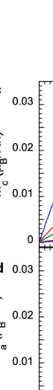 
Figure 2

📷 Fig 3

 
Figure 3

📷 Fig 4

 
Figure 4

📷 Fig 5

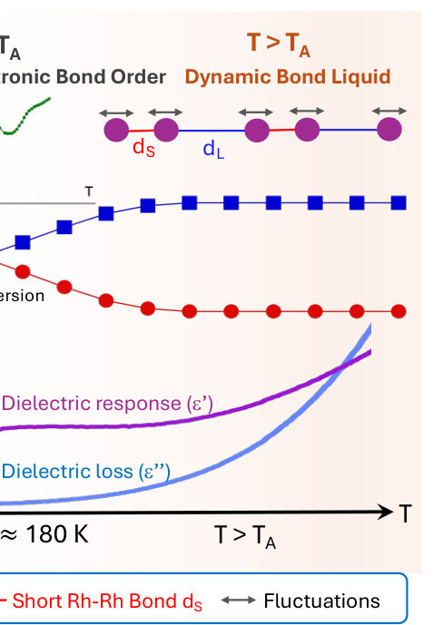 
Figure 5

**Summary.** This work investigates the emergence of a Bond-Order Wave (BOW) in the 1D material $	ext{Ba}_9	ext{Rh}_8	ext{O}_{24}$, demonstrating that structural bonds become active electronic degrees of freedom. A transition at $T_A \approx 180 	ext{ K}$ is marked by a unique bond inversion and the development of nonvolatile, memory-effect electrical switching. This establishes bond-centered electronic order as a key organizing principle for quantum matter in low dimensions.

**Why it may be interesting.** The concept of bond-centered electronic order as a new organizing principle, which can be probed via structural changes and electrical switching, offers an analogy to charge density wave physics but with a distinct structural signature (bond inversion).

Detailed structure

**Main problem.** The primary challenge addressed is stabilizing collective electronic order in one dimension (1D) against strong thermal fluctuations that typically suppress symmetry-breaking states.

**Main result.** The authors report the emergence of a Bond-Order Wave (BOW) in $	ext{Ba}_9	ext{Rh}_8	ext{O}_{24}$, characterized by a structural bond inversion across a transition temperature $T_A \approx 180 	ext{ K}$. This transition establishes bond-centered electronic order, leading to nonvolatile memristive switching.

**Method.** The study employs a combination of techniques, including single-crystal X-ray diffraction, heat-capacity measurements, dielectric response analysis, and nonlinear transport measurements.

**Model / system.** The physical system is the quasi-one-dimensional material $	ext{Ba}_9	ext{Rh}_8	ext{O}_{24}$, which is analyzed in the context of electronic bond order, suggesting a connection to the extended Hubbard model.

**Key observables.** Bond inversion (short $\leftrightarrow$ long bond interchange), heat-capacity anomaly, suppression of dielectric loss ($\epsilon''$), and nonlinear I-V hysteresis loops with remnant voltage ($V_m$).

**Important parameters / regimes.** Transition temperature $T_A \approx 180 	ext{ K}$; the system operates in a regime where structural bonds become active electronic degrees of freedom.

**Assumptions / limitations.** The transition is argued to be a condensation from a dynamic bond liquid to a rigid BOW, distinct from conventional Peierls dimerization or purely magnetic ordering.

**Figures summary.** Figures illustrate the structural bond inversion across $T_A$, the suppression of dielectric response ($\epsilon'$ and $\epsilon''$) below $T_A$, and the development of characteristic clockwise hysteresis in I-V curves below $T_A$.

**Paper structure.** The paper systematically analyzes anomalies across multiple probes (structural, thermodynamic, dielectric, transport) near $T_A$, building a case that the common origin is the reorganization of the Rh-Rh bond network into a rigid BOW state.

Abstract

Collective order is notoriously difficult to stabilize in one dimension, where strong fluctuations suppress symmetry-breaking states. Here we report the emergence of an electronic bond-order wave (BOW) in the quasi-one-dimensional (1D) material Ba9Rh8O24, in which structural bonds become active electronic degrees of freedom that overcome 1D fluctuations to establish long-range order. Single-crystal X-ray diffraction uncovers a striking inversion of inequivalent Rh-Rh bonds across a transition TA = 180 K, where short and long bonds interchange their identities rather than undergoing conventional Peierls dimerization. This bond inversion coincides with a heat-capacity anomaly and a profound reorganization of the dielectric response with strong suppression of dielectric loss upon cooling. The BOW exhibits strongly nonlinear, frequency-dependent I-V characteristics, clockwise hysteresis, and nonvolatile memristive switching. These findings uncover an unprecedented transformation from a dynamic bond liquid to a rigid yet electrically reconfigurable BOW, establishing bond-centered electronic order as a new organizing principle for 1D quantum matter.

[↑ back to top](#top)

### [Configurational-space separation and structure selection in three hard squares](http://arxiv.org/abs/2609.09936v1)

**Authors:** Yuheng Yang, Meng Xiao, Duanduan Wan  
**Type:** theory · **Category:** statistical mechanics · **PDF:** <https://arxiv.org/pdf/2609.09936v1>  
**Analysis basis:** full PDF text, analyzed in chunks
**Topic relevance:** `analog quantum simulation` **2/5** · `methods for driven-dissipative` **1/5**

📷 Fig 1

 
FIG. 1. (a) Schematic illustration of three hard squares in a two-dimensional periodic box. The variable r denotes the center-to-center distance between two squares. (b) Ra- dial distribution function g(r) for packing fractions ϕ = 0.1, 0.3, 0.55, 0.6, 0.65, and 0.7 (increasing from bottom to top). Gray dashed lines show the results from uniform inser- tion sampling, while solid lines correspond to MCMC results. Inset: the difference ∆g(r) between the two methods; curves are vertically offset by 0.2 for clarity.

📷 Fig 2

 
FIG. 2. (a) Maximally packed configurations for two distinct configuration classes, I and II, with ϕmax = 0.75 and 2/3, re- spectively. (b) Pressure βPa2 as a function of packing fraction ϕ, obtained from MCMC simulations initialized from config- uration classes I and II, respectively. (c) Zoomed-in view of the region highlighted by the orange dashed box in (b), with additional simulation points. The green line shows the results obtained from the uniform insertion method. The black lines indicate the two branches classified by machine learning. The vertical dashed black line marks ϕ = 0.6.

📷 Fig 3

 
FIG. 3. Transition pathways between the two configuration classes. (a)–(d) Representative configurations along an MCMC transition from the larger configuration-space region associated with class I to the smaller region associated with class II at ϕ = 0.59. In (a) and (b), the red arrows indicate the subsequent rotation of square 3. In (c), the three squares have nearly the same orientation, as highlighted by the dashed red rectangle; the red arrow indicates their subsequent collective rotation. (e) Area-normalized probability density f(θ) of the square orientation angle θ at ϕ = 0.59, obtained from uniform insertion sampling and normalized such that R π/2 0 f(θ) dθ = 1. Here, θ is defined...

📷 Fig 4

 
FIG. 4. Definition and distributions of the local order pa- rameter d/a. (a) Definition of d. For a reference square, we consider its four adjacent square regions, indicated by dashed outlines. If the center of mass of another square or one of its periodic images lies within one of these regions, it is projected perpendicularly onto the corresponding side of the reference square. The signed distance between the projection point and the midpoint of that side is defined as d (red segment), with the positive direction chosen to follow the clockwise orienta- tion around the reference square. (b) Representative config- urations with d = 0 and d = a/2. (c) Normalized frequency f(d/a) as a...

**Summary.** This work analyzes the structural behavior of three hard squares in 2D, demonstrating that excluded-volume interactions cause the system's available configuration space to split into two disconnected regions above a critical packing fraction ($\phi_{sep}=3/5$). The study uses advanced simulation techniques to map these distinct structural classes, showing how simple geometry dictates complex structural ordering reminiscent of lattice formation.

**Why it may be interesting.** Although the system is classical, the demonstration that signatures of many-body self-assembly (like lattice ordering) emerge robustly from simple excluded-volume geometry in a few-particle limit provides a powerful analogy for understanding complex many-body quantum ground states.

Detailed structure

**Main problem.** The study investigates how excluded-volume constraints alone can govern configurational connectivity and local structure selection in a minimal, few-particle system.

**Main result.** The system exhibits a clear separation in its allowed configurational space at a critical packing fraction ($\phi_{sep}=3/5$), leading to distinct structural motifs (L-shaped vs. staggered) at higher densities.

**Method.** The research employs Monte Carlo simulations (MCMC) and uniform non-overlapping insertion sampling to probe the configurational space, supplemented by geometric analysis and machine learning classification.

**Model / system.** The model consists of three hard squares confined within a two-dimensional periodic box, allowing the study of excluded-volume interactions.

**Key observables.** Radial distribution functions ($g(r)$), pressure measurements, configurational-space volume ratios, and local order parameters ($d/a$).

**Important parameters / regimes.** Packing fraction ($\phi$), the separation density ($\phi_{sep} = 3/5$), and the particle number ($N=3$).

**Assumptions / limitations.** The discrepancy between MCMC and uniform sampling at intermediate densities is interpreted as the MCMC sampling being confined to one disconnected region of the allowed phase space.

**Figures summary.** Figures compare $g(r)$ from different sampling methods, show pressure vs. $\phi$ revealing two distinct branches (Class I and Class II), and illustrate explicit transition pathways connecting the two configuration classes.

**Paper structure.** The paper progresses by first observing discrepancies in statistical measurements ($g(r)$, pressure) near $\phi=0.6$, attributing this to configurational separation. It then constructs explicit transition pathways and uses classification methods to map the two distinct configuration classes (Class I and Class II) that govern the system's behavior above $\phi_{sep}$.

Abstract

Self-assembly of hard particles with diverse shapes gives rise to a rich variety of structures through excluded-volume constraints alone. Here we show that even a minimal system of three hard squares confined in a two-dimensional periodic box exhibits nontrivial configurational behavior relevant to structure selection. As the packing fraction increases, radial distribution functions obtained from Markov-chain Monte Carlo and uniform non-overlapping insertion sampling agree at low densities, deviate markedly over an intermediate range, and converge again at higher densities. Pressure measurements provide strong numerical evidence that the discrepancy originates from the separation of the allowed configurational space into two disconnected regions above a characteristic density. We identify the separation density as $φ_{\rm sep}=3/5$, construct explicit overlap-free transition pathways connecting the two regions immediately below it, and quantify their relative configurational-space volumes. At higher packing fractions, an approximately L-shaped arrangement of the particle centers becomes strongly favored over a staggered one, revealing a structural motif characteristic of tetratic and square-lattice ordering in larger hard-square systems. These results show that excluded-volume geometry can govern both configurational connectivity and local structure selection even in a three-particle system, revealing how signatures of many-particle self-assembly can already emerge in the few-particle limit.

[↑ back to top](#top)

### [Entanglement Entropy of Interacting Scalar Theories on Fuzzy Spaces](http://arxiv.org/abs/2609.10027v1)

**Authors:** A. Allouche, D. Dou  
**Type:** theory · **Category:** statistical mechanics · **PDF:** <https://arxiv.org/pdf/2609.10027v1>  
**Analysis basis:** full PDF text, analyzed in chunks
**Topic relevance:** `Keldysh / 2PI / non-Gaussian methods` **2/5** · `analog quantum simulation` **1/5**

📷 Fig 1

 
Figure 1: Degrees of freedom on the sphere and their matrix counterparts.

📷 Fig 2

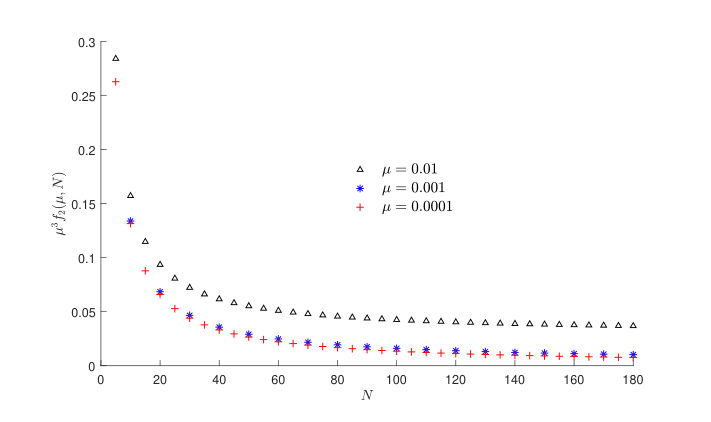 
Figure 2: The rescaled dimensionless function µ3fn(µ, N) as a function of N, for different values of the mass parameters and n = 2.

📷 Fig 3

 
Figure 3: The zero-mode-projected rescaled function ˜fn(µ, N) plotted as a function of N for µ = 0.001 and different values of n.

📷 Fig 4

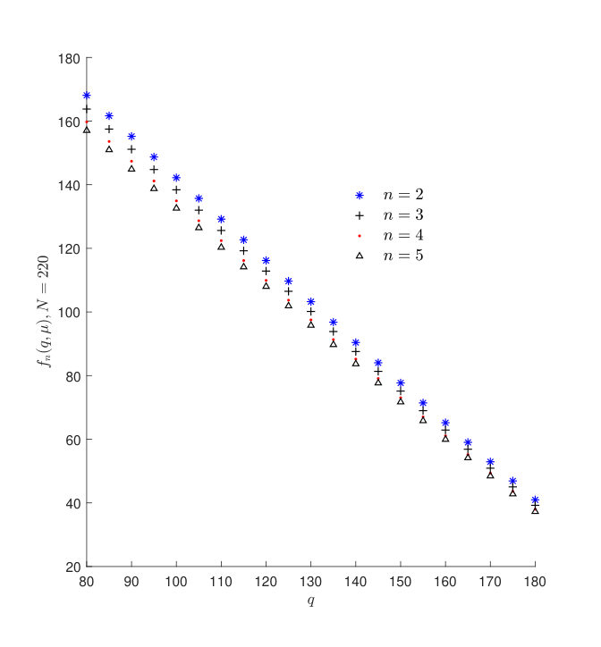 
Figure 4: The rescaled dimensionless function fn(q, µ, N) plotted as a function of q for µ = 0.001, different values of n, and N = 220.

📷 Fig 5

 
Figure 4 shows fn(µ, q, N) for n = 2, 3, 4, 5, with µ = 0.001 and N = 220, as a function of q over the range 80 ≤q ≤180. It is readily apparent that the three curves corresponding to different values of n are well fitted by straight lines with nearly identical slopes. As n

**Summary.** This work calculates the first-order correction to the entanglement entropy for a scalar field theory on fuzzy spaces due to quartic self-interactions. The key finding is that interactions introduce an extensive bulk contribution to the entropy, deviating from the free theory's area law scaling. The analysis connects these bulk features to the phenomenon of UV/IR mixing in noncommutative quantum field theories.

**Why it may be interesting.** The study of entanglement entropy in non-commutative or fuzzy geometries provides theoretical tools for understanding how spatial quantization affects fundamental quantum information measures, which is relevant to quantum gravity and condensed matter models.

Detailed structure

**Main problem.** The paper investigates how self-interactions modify the entanglement entropy of a scalar field theory defined on fuzzy spaces.

**Main result.** The interaction correction introduces an extensive bulk contribution to the entanglement entropy, departing from the area law characteristic of the free theory.

**Method.** The authors use a first-order perturbative correction calculation based on the Green's function approach and spectral sums over the fuzzy Laplacian.

**Model / system.** The system is a scalar field theory on (2+1)-dimensional spacetimes whose spatial sections are modeled by fuzzy spaces, specifically the fuzzy sphere and fuzzy disc. The interaction is modeled by a $\lambda\phi^4$ term.

**Key observables.** Rényi and entanglement entropies ($S_n$, $S_{ent}$), and the perturbative correction $\delta S^{(1)}_{ent}$.

**Important parameters / regimes.** The noncommutativity parameter ($	heta$), the coupling constant ($\lambda$), and the zero-mode projection.

**Assumptions / limitations.** The calculation is restricted to the first-order perturbative correction, and the zero-mode IR divergence must be explicitly projected out to yield physical results.

**Paper structure.** The paper first establishes the free theory entanglement entropy (area law) and then calculates the first-order correction due to $\lambda\phi^4$ interactions. It analyzes this correction in different limits (commutative continuum and Moyal plane) and discusses the implications for UV/IR mixing.

Abstract

We investigate the impact of self-interactions on the Rényi and entanglement entropies of a scalar field on $(2+1)$-dimensional spacetimes, whose spatial sections are modeled by fuzzy spaces, specifically the fuzzy sphere and the fuzzy disc. We compute the first-order perturbative correction induced by a $λφ^4$ interaction using the Green's function approach. In contrast to the free theory, where the entanglement entropy is dominated by degrees of freedom near the entangling boundary and obeys an area law, we find that the interaction correction has an extensive bulk contribution, receiving significant contributions from degrees of freedom throughout the fuzzy space. For the fuzzy sphere, the correction exhibits strong infrared sensitivity associated with the zero mode. We isolate and resolve this zero-mode IR divergence by projecting out the zero mode, thereby obtaining a physically meaningful quantity. In the commutative continuum limit, the interaction correction has the same degree of UV divergence as the free entropy but does not obey a pure area law. Furthermore, we analyze the Moyal plane limit, where the interaction correction exhibits a distinct IR divergence. We discuss the physical origin of these extensive bulk features and examine their possible connection to the celebrated UV/IR mixing phenomenon in noncommutative quantum field theories.

[↑ back to top](#top)

### [Multivariate quantum state preparation with optimized tensor networks](http://arxiv.org/abs/2609.09304v1)

**Authors:** Matthew L. Sims-Goh, Lukasz Cincio, Annina Z. Lieberherr, Mekena McGrew, Thomas R. Bromley  
**Type:** theory · **Category:** numerical methods · **PDF:** <https://arxiv.org/pdf/2609.09304v1>  
**Analysis basis:** full PDF text, analyzed in chunks
**Topic relevance:** `methods for driven-dissipative` **2/5** · `analog quantum simulation` **1/5**

📷 Fig 1

 
FIG. 1. Summary of our approach. (a) Our approach to tensor network structure discovery (Section III) begins with the calculation of affinity matrices (left), which quantify the correlation between qubits for the desired state. These are used to recursively partition qubits (middle), assigning qubit indices to branches in a way that seeks to minimize graph distance between highly entangled qubits. This tree structure is then employed in tensor cross-interpolation (right), yielding an interpolative tensor network approximation of the desired function. (b) We demonstrate how to synthesize a quantum circuit from this tensor network (Section IV). Our approach adaptively modifies circuit...

📷 Fig 2

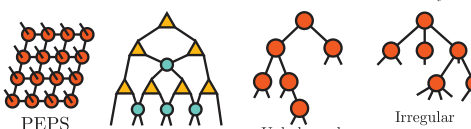 
FIG. 2. Tensor networks for function encoding. (a) The interleaved (top) and serial (bottom) representations, de- picted for D = 2 dimensions. (b) Distance between closely correlated bits of the same variable. We depict how sequen- tial bits of the same variable are separated by D bonds in the interleaved representation, while the serial representation will separate the highest-significance bits of two adjacent vari- ables by B bonds. In both cases, this leads to many bond crossings that may be avoided by more problem-tailored net- work topologies. (c) Examples of the diverse range of tensor network structures common in the literature. Pictured are MPS (linear chain structure), TTN (acyclic...

📷 Fig 3

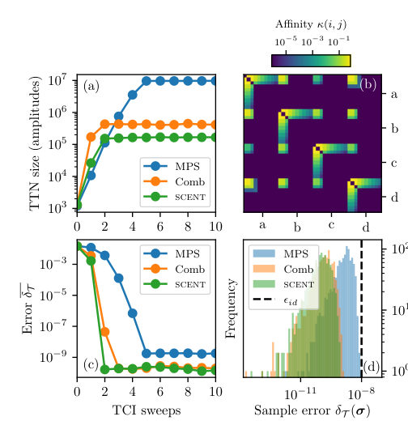 
FIG. 3. Comparison of tensor network structures on an example problem. We demonstrate the approximation of a 40-qubit quantum state encoding a strongly correlated (η = 1) quadrivariate normal distribution N(⃗µ,Σ)(a, b, c, d), for a single realization of Σ ∼LKJD=4(η = 1) at B = 10 bits of precision per variable. TCI is performed with an MPS (blue), comb TTN (orange), and scent-optimized TTN (green) at tolerance ϵid = 10−8. (a) Convergence of the ten- sor network size in TCI — all three topologies converge within 5 sweeps, their sizes plateauing. Relative to MPS, the comb TTN compresses the function by a factor of 23, whereas the scent-optimized TTN compresses it by a factor of 58. (b)...

📷 Fig 4

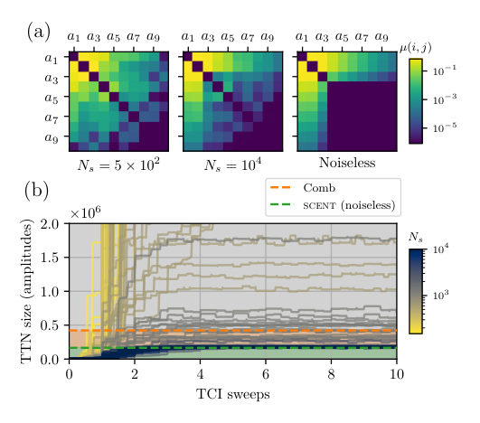 
FIG. 5. Convergence of Monte Carlo sampling to con- struct the affinity matrix. Here, we study the approxima- tion of a 40-qubit quantum state encoding a strongly corre- lated quadrivariate normal distribution N(⃗µ,Σ)(a, b, c, d), for a single realization of Σ ∼LKJD=4(η = 1) (as in Figure 3) using both Monte Carlo and exact methods for scent. (a) Single-variable submatrices of affinity matrices constructed with Monte Carlo for Ns = 5 × 102 samples (left), Ns = 104 samples (middle), and noiseless tensor network methods (right). (b) Convergence traces for TCI using network struc- tures determined with scent for varying Monte Carlo sample counts Ns. As a point of comparison, we also plot the...

📷 Fig 5

 
FIG. 4. Effect of variable count and correlation strength on tensor network function construction. We study systematically the effect of the number of variables D and inverse correlation strength η on multivariate normal dis- tributions N(⃗µ,Σ)(⃗x). For each data point, 20 random covari- ance matrices are sampled from Σ ∼LKJD(η), and 10 sweeps of TCI (sufficient for convergence, see e.g. Figure 3(c)) are performed to tolerance ϵid = 10−8 with B = 10 bits of pre- cision per variable. Error bars represent bootstrapped 95% confidence intervals in the logarithmic mean. (a) The effect of variable count D on tensor network size at moderate corre- lation η = 50. (b) The effect of correlation...

**Summary.** This paper presents SCENT, a novel protocol to optimize the structure of Tree Tensor Networks (TTNs) for representing complex, multivariate quantum states. By determining the optimal tree topology using entanglement metrics, the authors enable an efficient, high-fidelity quantum state preparation pipeline. This method significantly improves resource scaling compared to traditional Matrix Product State approaches for challenging quantum simulations.

**Why it may be interesting.** The ability to efficiently encode complex, high-dimensional correlations (like those in quantum chemistry or finance) into quantum circuits using optimized tensor network structures is crucial for simulating many-body quantum systems beyond current computational limits.

Detailed structure

**Main problem.** The core challenge is efficiently preparing general quantum states, especially those derived from multivariate functions, which is exponentially hard using standard methods.

**Main result.** The authors introduce SCENT, a protocol that optimizes the Tree Tensor Network (TTN) structure, leading to a quantum state preparation pipeline that substantially outperforms MPS and previous TTN methods.

**Method.** The approach involves using SCENT to determine an optimal TTN structure based on pairwise entanglement metrics, followed by Tensor Cross-Interpolation (TCI) and an environment-tensor based circuit compilation method.

**Model / system.** The model is quantum state preparation for amplitude-encoded functions, represented by tensor networks (MPS and TTNs). The system is generalized to handle complex, multivariate correlations beyond the limitations of linear chain topologies.

**Key observables.** Fidelity (e.g., $7.44	imes 10^{-9}$ infidelity), CNOT gate count (e.g., 43284 CNOTs), and circuit depth.

**Important parameters / regimes.** Bond dimension ($\chi$), target decomposition error ($\epsilon$), and the choice of entanglement metric (e.g., Boolean Fourier entropy $\kappa(i, j)$).

**Assumptions / limitations.** The method assumes that the underlying function correlations can be effectively mapped onto a tree-like structure (TTN) rather than a linear chain (MPS).

**Figures summary.** Figures illustrate the structural discovery process using affinity matrices, the comparison of different entanglement metrics, and the multi-step process of compiling isometries into quantum circuits.

**Paper structure.** The paper progresses from identifying the limitations of MPS for multivariate functions to introducing SCENT for optimal TTN structure discovery, detailing the TCI approximation, and finally presenting a multi-stage algorithm for compiling the resulting TTN into a minimal-gate quantum circuit.

Abstract

Quantics tensor trains are attracting intense interest for quantum-inspired computing and quantum state preparation. These methods, which approximate continuum functions by representing their amplitude encoding as a matrix product state (MPS), are exceedingly powerful for univariate functions but rapidly become challenging when handling multivariate functions, since the linear chain topology leads to a large distance between highly-entangled qubits. We overcome this limitation by introducing SCENT (Spectral Clustering for Entanglement miNimizing Trees). SCENT is a protocol that utilizes efficiently-computable pairwise entanglement metrics to determine a suitable tree tensor network (TTN) structure, which can then be efficiently approximated using tensor cross-interpolation (TCI); we find that it substantially outperforms MPS methods and improves upon previous TTN methods. We then apply these optimized TTNs to state preparation, introducing an approximate circuit compilation method based on environment-tensor methods without significantly conceding overall accuracy. Importantly, the inherent gauge freedom of TTNs can be directly exploited in this method, resulting in higher fidelity at a given circuit depth. We demonstrate this quantum state-preparation pipeline on archetypal state-preparation problems in quantum chemistry and financial portfolio optimization. In our flagship demonstration, we encode a 20-variable probability distribution with long-ranged, non-nearest neighbor inter-variable correlations in a 200-qubit state-preparation circuit with infidelity $7.44\times 10^{-9}$ using only 43284 CNOTs; depth and fidelity can be traded, allowing the same distribution to be prepared to infidelity $10^{-3}$ with as few as 5584 CNOTs.

[↑ back to top](#top)

### [A Sum-of-Squares Hierarchy with Quadratic Convergence for Quantum Channel Coding](http://arxiv.org/abs/2609.09629v1)

**Authors:** Hoang Ta, Hoang Anh Tran  
**Type:** theory · **Category:** quantum information and computing · **PDF:** <https://arxiv.org/pdf/2609.09629v1>  
**Analysis basis:** full PDF text, analyzed in chunks
**Topic relevance:** `quantum measurements` **2/5**

📷 Fig 1

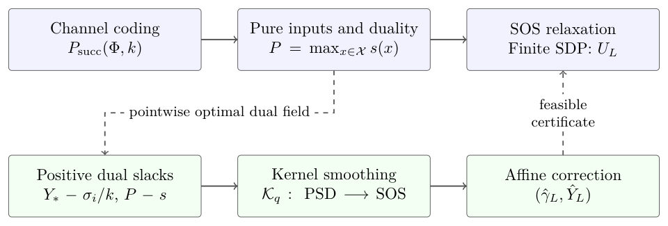 
Figure 1: Construction of the SOS hierarchy (upper row) and feasible certificates for its convergence analysis (lower row). The kernel is used in the proof; solving the finite SDP does not require knowing the optimal field Y∗or the value P.

📷 Fig 2

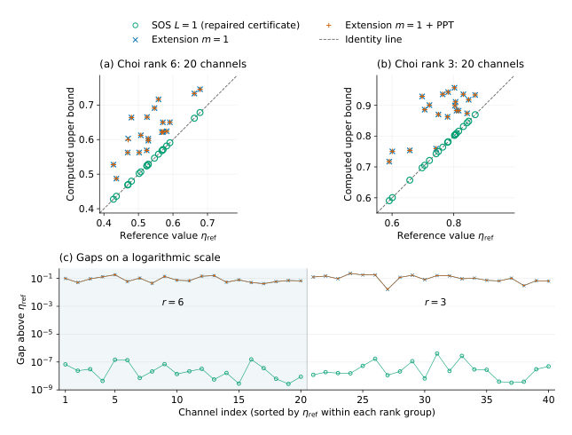 
Figure 2: First-level bounds for 40 random qubit-to-qutrit channels. Panels (a) and (b) compare the computed values with ηref for Choi ranks 6 and 3. Panel (c) shows the gaps on a logarithmic scale, with channels sorted by ηref within each rank group. SOS values include numerical certificate repair.

**Summary.** This work develops a novel Hermitian sum-of-squares (SOS) hierarchy to compute upper bounds on the optimal success probability for quantum channel coding. By leveraging state-discrimination duality and positive polynomial kernels, the authors prove that this hierarchy exhibits quadratic convergence. This provides a significant theoretical advancement for bounding quantum channel capacities, which is crucial for quantum communication theory.

**Why it may be interesting.** The development of polynomial hierarchy methods (SOS) to solve classically hard problems in quantum information theory provides powerful, generalizable tools for bounding quantum channel capacities.

Detailed structure

**Main problem.** The paper addresses the NP-hard problem of computing the optimal success probability for transmitting classical messages through a single use of a quantum channel.

**Main result.** The authors construct a Hermitian sum-of-squares (SOS) hierarchy that achieves quadratic convergence for bounding this success probability, providing strong theoretical tools for quantum channel capacity estimation.

**Method.** The core method involves combining state-discrimination duality with positive polynomial kernels on products of spheres to construct feasible polynomial dual certificates within an SOS framework.

**Model / system.** The system analyzed is a general quantum channel $\Phi: \mathcal{L}(A) 	o \mathcal{L}(B)$ acting on finite-dimensional complex Hilbert spaces $A$ and $B$. The problem is framed in terms of optimizing input states and POVMs for message transmission.

**Key observables.** Optimal success probability $P_{	ext{succ}}(\Phi, k)$, the trace-norm contraction coefficient $\eta_{	ext{tr}}(\Phi)$, and the upper bounds $U_L(\Phi, k)$ derived from the hierarchy.

**Important parameters / regimes.** The number of messages $k$, the dimension parameters $d_A$ and $d_B$, and the hierarchy level $L$.

**Assumptions / limitations.** The analysis assumes finite-dimensional Hilbert spaces and relies on replacing pointwise positivity constraints with finite-degree SOS certificates.

**Figures summary.** Figure 1 summarizes the construction, showing the SOS hierarchy and the feasible certificates used for convergence analysis.

**Paper structure.** The paper builds upon existing SDP hierarchies, introduces the SOS formulation using state-discrimination duality, and rigorously proves the quadratic convergence rate of the resulting bounds.

Abstract

Computing the optimal success probability for transmitting classical messages through a single use of a quantum channel is NP-hard, even for two messages. An existing semidefinite programming hierarchy based on symmetric extensions provides convergent upper bounds with an a priori error estimate that decays as the inverse square root of the extension level. In this work, we construct a Hermitian sum-of-squares hierarchy for an arbitrary number of messages and prove quadratic convergence in its level. The error bound is proportional to the advantage over random guessing. Our approach combines state-discrimination duality with positive polynomial kernels on products of spheres to construct feasible polynomial dual certificates. For binary messages, the resulting bounds give a multiplicative approximation from above of the trace-norm contraction coefficient.

[↑ back to top](#top)

### [Anizotropic Ising Model on 2D Kagomé Lattice as an Inhomogeneous XYZ Integrable Model](http://arxiv.org/abs/2609.10163v1)

**Authors:** Shahane A. Khachatryan, Hrachya Babujian, Ara G. Sedrakyan  
**Type:** theory · **Category:** statistical mechanics · **PDF:** <https://arxiv.org/pdf/2609.10163v1>  
**Analysis basis:** full PDF text, analyzed in chunks
**Topic relevance:** `analog quantum simulation` **2/5**

📷 Fig 1

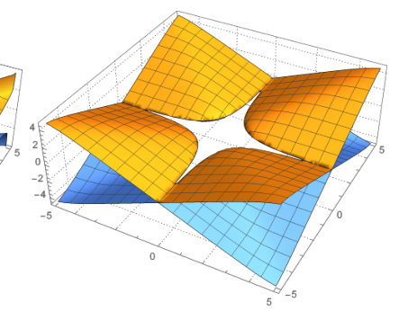 
Figure 2: Critical subsurfaces on the real coordinate space J1, J2, J3

**Summary.** This work analyzes an inhomogeneous Ising model on the Kagomé lattice by mapping it onto an integrable eight-vertex R-matrix structure. The authors derive corresponding one-dimensional quantum spin chain Hamiltonians for specific coupling limits and calculate the free energy and specific heat in the partially anisotropic regime. It provides a rigorous theoretical framework connecting lattice statistical mechanics to quantum integrability.

**Why it may be interesting.** The deep connection between lattice statistical mechanics (Ising model) and integrable quantum systems (Yang-Baxter equation, Bethe ansatz) provides powerful mathematical tools applicable to understanding critical phenomena in complex quantum materials.

Detailed structure

**Main problem.** The paper investigates the integrability and thermodynamic properties of a generalized inhomogeneous Ising model situated on the two-dimensional Kagomé lattice.

**Main result.** The analysis derives specific quantum spin chain Hamiltonians for different coupling limits and calculates the free energy and specific heat for partially anisotropic regimes.

**Method.** The methodology involves mapping local Boltzmann weights to a non-symmetric eight-vertex R-matrix, analyzing the Yang-Baxter structure, and utilizing free-fermion conditions.

**Model / system.** The system is an inhomogeneous Ising model on the Kagomé lattice, generalized by incorporating two alternating coupling constants ($J_i$ and $J'_i$) along the three lattice directions.

**Key observables.** Free energy per site ($F$), specific heat ($C$), and the partition function ($Z$).

**Important parameters / regimes.** The alternating coupling constants ($J_i, J'_i$), and the anisotropic limit parameters.

**Assumptions / limitations.** The analysis assumes nearest-neighbor interactions and relies on taking specific limits (e.g., anisotropic limit, continuum limit) to derive quantum Hamiltonians.

**Figures summary.** Figure 1 illustrates the Kagomé lattice structure; Figure 2 likely shows the critical surface condition for the anisotropic Kagomé lattice.

**Paper structure.** The paper progresses from defining the inhomogeneous model and its partition function via an R-matrix formulation, establishing its integrability via the free-fermion condition, analyzing special cases ($J'_i = \pm J_i$) to derive 1D quantum chains, and finally calculating thermodynamic quantities like free energy and specific heat in the partially anisotropic limit.

Abstract

We investigate a generalized inhomogeneous two-dimensional Ising model on the kagomé lattice with two alternating couplings $J_i$ and $J'_i$, $i=1,2,3$, along the three lattice directions. The local Boltzmann weights are mapped onto a non-symmetric eight-vertex $R$-matrix satisfying the free-fermion condition for arbitrary values of the six couplings. We analyze the Yang--Baxter structure for the cases $J'_i=J_i$ and $J'_i=-J_i$ and derive the corresponding one-dimensional quantum spin chains in the anisotropic limit. The first case yields a transverse-field Ising-type Hamiltonian, while the second leads to a modified chain with a graded permutation structure and shifted partition-function zeros. For a partially anisotropic model, we also obtain the free energy and specific heat.

[↑ back to top](#top)

### [Dual-unitary Circuits as a Platform for Quantum Reservoir Computing](http://arxiv.org/abs/2609.09292v1)

**Authors:** Gabriel O. Alves, Pieter W. Claeys  
**Type:** theory · **Category:** disordered systems and neural networks · **PDF:** <https://arxiv.org/pdf/2609.09292v1>  
**Analysis basis:** full PDF text, analyzed in chunks
**Topic relevance:** `analog quantum simulation` **2/5**

📷 Fig 1

 
FIG. 1. An illustration of a quantum reservoir computer. The data (blue), e.g. a time series st, is encoded into a system which displays intricate internal dynamics. By evolving, the system processes the data in a nonlinear way and with memory. By performing measure- ments on the system, features are extracted which are then used to train the weights W by fitting the target function (red) yt. Unlike standard neural network architectures, the “internal weights” in the reservoir are fixed and set by the choice of reservoir, and the train- ing procedure reduces to a linear optimization on the single output layer. This picture represents a simplified QRC protocol where all the input data is...

📷 Fig 2

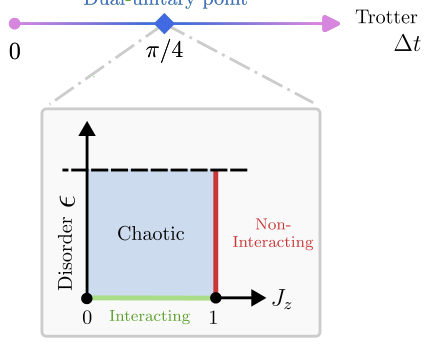 
FIG. 2. Dynamical phase diagram for the DU XXZ circuit follow- ing the parametrization in Eq. (2). By varying the Trotter step we can move towards and away from the DU line at ∆t = π/4. The in- set details the behavior of the circuit at this point. First, by turning off the on-site disorder with ϵ = 0 (green edge), we have an inter- acting integrable circuit. The circuit displays solitons in this regime, which lead to unique behavior and memory effects, as we discuss in Sec. V A. Meanwhile, at Jz = 1 the circuit is non-interacting (red edge). The circuit is in the chaotic regime (blue region) for Jz , 1 and nonvanishing on-site disorder (ϵ &gt; 0).

📷 Fig 3

 
FIG. 3. (a) The stochastic input st is fed into Eq. (21) to encode its value into the system; simultaneously, it also serves as an argument for the chosen benchmark yt from Sec. III B [any of Eqs. (28)-(32)]. The feature matrix x is computed through Eq. (24), which allows for the calculation of the weight vector W in Eq. (25). Finally, the validation results are calculated through Eq. (26), where we try to fit the target time-series yt. We plot some basic numerical results to illustrate the framework, where we compare the analytical time- series (solid black line) with the numerical predictions (dashed green line), for both the (b) NARMA(4) and (c) the MGTS tasks. The data is split into...

📷 Fig 4

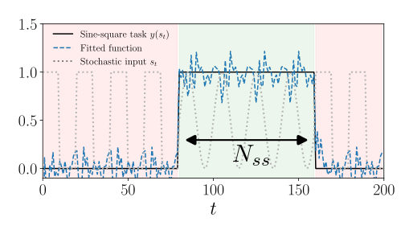 
FIG. 4. An illustration of the sine-square task. The gray dotted line depicts the stochastic inputs st, which belong either to a square or sine wave. The corresponding classification yt = y(st) ∈{0, 1}, given by Eq. (31), is drawn with the solid black line. As a further guide to the eye, we also shade these regions with red and green colors on the background. The value Nss = 20 is the number of points per packet. Finally, the blue dashed line displays an example for the fitted function.

📷 Fig 5

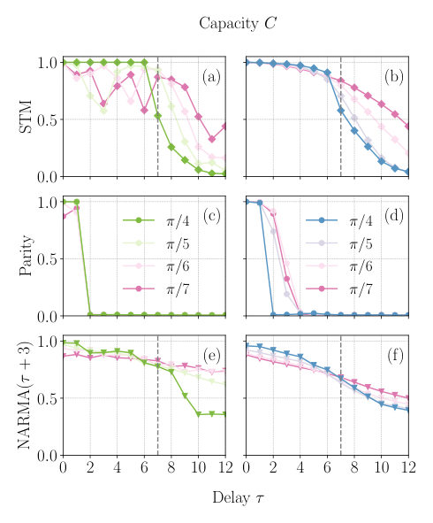 
FIG. 5. Information processing capacity as a function of the delay for: [top row, panels (a) and (b)] the STM task [Eq. (28)], [middle row, panels (c) and (d)] the parity check task [Eq. (29)], and [bot- tom row, panels (e) and (f)] the NARMA(τ + 3) task [Eq. (30)]. We plot the results for the integrable (left column, ϵ = 0) and ergodic regimes (right column, ϵ = 1), for four values of the Trotter step, ∆t = π/4 (the dual-unitary point) through π/7, indicated by a color gradient from green/blue (at ∆t = π/4) to pink (away from dual- unitarity); marker shapes indicate the task (diamonds: STM, circles: parity check, triangles: NARMA). The dashed vertical line marks τ = L. The presence of...

**Summary.** This work proposes using dual-unitary circuits, derived from the XXZ spin chain, as a superior physical platform for Quantum Reservoir Computing. The authors show that the inherent properties of dual-unitarity enhance memory retention and nonlinear processing while providing resilience against noise. This bridges quantum many-body physics with advanced machine learning applications.

**Why it may be interesting.** The connection between the mathematical structure of dual-unitary operators (which are often studied in quantum control/information) and the practical requirements of machine learning (reservoir computing) provides a novel physical realization for complex computation.

Detailed structure

**Main problem.** The paper explores using dual-unitary (DU) circuits as a robust and theoretically advantageous platform for Quantum Reservoir Computing (QRC).

**Main result.** DU circuits improve memory effects and nonlinear processing compared to generic circuits, and they provide enhanced shielding against finite-shot noise.

**Method.** The analysis combines theoretical derivation of DU circuits with numerical verification of dynamical properties, including the study of solitons and information processing capacity.

**Model / system.** The model is based on a 1D lattice of qubits whose dynamics are governed by a Floquet unitary derived from a Trotterization of the XXZ spin chain, forming the DU circuit.

**Key observables.** Memory effects, nonlinear processing capability, exponential concentration, and Information Processing Capacity (IPC).

**Important parameters / regimes.** Anisotropy ($J_z$), Trotter step ($\Delta t$), and the presence of on-site disorder ($\epsilon$).

**Assumptions / limitations.** The analysis assumes an odd circuit size $L$ and utilizes the 'erase-input' protocol for the QRC readout.

**Figures summary.** Figure 1 illustrates the general QRC protocol flow. Figure 2 presents a dynamical phase diagram for the DU XXZ circuit, mapping out different operational regimes.

**Paper structure.** The paper reviews the QRC protocol, details the construction of the DU circuit using the XXZ model, analyzes the dynamical features (memory, nonlinearity) in different parameter regimes, and concludes by quantifying the performance benefits of dual-unitarity.

Abstract

Quantum reservoir computing (QRC) is a machine learning approach which employs the internal dynamics of a physical system (the reservoir) to encode and process information. In this work, we explore the use of dual-unitary circuits in a brickwork architecture as a platform for QRC, well suited to current noisy intermediate-scale quantum devices. Dual-unitary circuits present both practical and conceptual advantages. Our results indicate that, under appropriate conditions, dual-unitarity can lead to an enhanced regime of operation: we numerically verify that it improves memory effects and nonlinear processing, and shields against finite-shot noise, mitigating exponential concentration. Moreover, dual unitarity offers an intuitive picture of how operator dynamics gives rise to memory and nonlinear processing in circuit-based reservoirs.

[↑ back to top](#top)

### [Execution-transcript privacy for fault-tolerant surface-code memories](http://arxiv.org/abs/2609.09334v1)

**Authors:** Jiachen Shen, Hui Zhong  
**Type:** theory · **Category:** quantum information and computing · **PDF:** <https://arxiv.org/pdf/2609.09334v1>  
**Analysis basis:** full PDF text, analyzed in chunks
**Topic relevance:** `quantum measurements` **2/5**

📷 Fig 1

 
Figure 1: The transcript privacy channel and the two regimes. A logical input enters a surface-code memory that emits the non-output transcript U while the output Y stays hidden. The two input-conditioned laws of ordinary U nearly coincide (private), while a calibrated witness W separates them (leaks).

📷 Fig 2

 
Figure 2: The mechanism. (a) By Knill–Laflamme, a bra–ket fault pair K† bKa with homo- logically trivial support multiplies the code space by a scalar within its syndrome sector and cancels in the two transcript laws. The condition is trivial homology, not weight below d (Remark 5). (b) An input-sensitive contribution must therefore carry a homologically nontrivial cycle, whose support is ≥d, so logical information enters only through a charged region of size ≥d/ℓ∗. The schematic is spatial only, and the expansion runs over spacetime detector regions.

📷 Fig 3

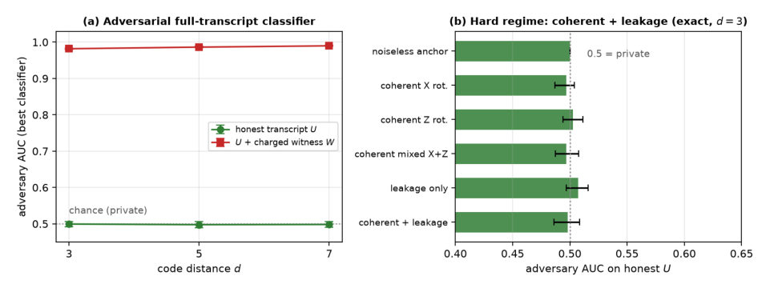 
Figure 3: An adversarial null for the honest transcript (bootstrap 95% CIs; circuit-level depolarizing noise at p = 0.005, minimum-weight perfect-matching decoder, logistic adversary on the full detector record, held-out split). (a) An adversary given the full detector record stays at chance for honest U across d = 3, 5, 7 and reaches near one with a charged witness W. (b) The same adversary stays at chance under coherent and leakage noise in an exact statevector simulation at d = 3 (five noise models).

📷 Fig 4

 
Figure 4: The converse and the locality indicator (bootstrap 95% CIs). (a) The lattice-surgery merged-parity error pLS decays exponentially in d (MWPM decoder), so the converse bound 1 −2pLS rises toward one. (b) The empirical cluster-tail rate µfreq, fitted to the sizes of the observed fired-detector components Robs, which are not the fault-support regions Rlat the theorem is stated for. This rate also differs from the polymer activity. The Kotecký–Preiss condition ea &lt; 1 requires Krod¯η &lt; 1/(e3 deg) ≈4.1 × 10−3 at detector degree 12, a threshold drawn as the dashed line, while the measured indicator sits about 190× above it. A geometric tail with µfreq &lt; 1 supports the form PWTS assumes....

📷 Fig 5

 
Figure 5: Measured transcript privacy on ibm_cleveland. Filled circles are the original grouped acquisition. The filled diamonds are the randomised, label-balanced re- acquisition at n = 3, 7, 21, which is the acquisition used for the headline number. (a) Total- variation lower bound against code repetition length for the honest transcript, randomized encoding, and a deliberately planted charged record. The shaded band is the finite-sample null floor, and open markers repeat the whole sweep on a disjoint qubit set. Randomisation moves n = 21 from 0.949 to 0.927 and n = 7 from 0.880 to 0.660, and the second change provides the control that detects acquisition-order contamination without...

**Summary.** This work rigorously analyzes the privacy leakage from the classical execution records of fault-tolerant quantum memories. It proves that while fault tolerance protects the logical state, the syndrome transcript itself can leak input information, with the leakage rate determined by the code's Z-distance. This has significant implications for the security assessment of quantum hardware.

**Why it may be interesting.** It provides rigorous theoretical bounds on the security of quantum computation against side-channel attacks based on measurement leakage, which is crucial for building trustworthy quantum hardware.

Detailed structure

**Main problem.** The paper investigates whether the classical telemetry stream generated during fault-tolerant quantum computation can leak information about the initial logical input state.

**Main result.** Fault tolerance does not guarantee transcript privacy; the leakage is quantified and shown to be governed by the code's Z-distance ($d_Z$) under amplitude damping noise.

**Method.** The analysis uses information-theoretic tools, including the diamond norm and total variation distance, drawing on concepts like correctability-privacy duality and homology.

**Model / system.** The model is a fault-tolerant quantum memory implemented using a distance-$d$ rotated surface code, operating over $\Theta(d)$ rounds.

**Key observables.** Total Variation Distance ($	ext{TV}$), diamond norm distance, and the leakage rate quantified by $d_Z$.

**Important parameters / regimes.** Code distance ($d$), Z-distance ($d_Z$), amplitude damping rate ($\gamma$), and the number of rounds ($T$).

**Assumptions / limitations.** The results are conditional on specific hypotheses (e.g., transcript locality) and the analysis distinguishes between idealized theoretical bounds and practical measurement limitations.

**Figures summary.** Figures illustrate the transcript privacy channel, showing the separation between the ordinary transcript and a calibrated witness that leaks the input.

**Paper structure.** The paper develops theoretical bounds on leakage, analyzes specific code types (repetition, phase-flip), and discusses the implications of different noise models and measurement techniques.

Abstract

A fault-tolerant quantum computer runs behind a telemetry stream logging syndromes, decoder actions, resets and timing separately from the answer. Can it reveal the logical input? For a distance-$d$ rotated surface-code memory on a fixed schedule of $T=Θ(d)$ rounds, under three stated hypotheses (sector-scalar honest backbone, transcript locality, Kotecky-Preiss smallness), the channel from logical qubit to transcript is $e^{-Θ(d)}$-close in diamond norm to one that ignores the input. A statement of this kind follows generically from correctability-privacy duality. Anisotropy does not. Each logical axis pays the distance of its own coset, so under amplitude damping the computational-basis label is governed by the code's $Z$-distance $d_Z\ge d_{\min}$ and not by the code distance. Two codes of quantum distance $1$ make the gap concrete. A phase-flip code's $X$-syndrome transcript is exactly input-independent under unobserved damping, while a repetition code leaks at first order. A matched converse identifies the records that do expose it, among them a lattice-surgery parity readout. On a 156-qubit superconducting processor our sufficient certificate misses by $21.5\times$, so the theorem cannot be invoked there. Measured directly, a $d_Z=1$ memory's record identifies its input with total variation $\ge 0.927$ under randomised, label-balanced acquisition. Holding the code fixed and varying the damping exposure reproduces the parameter-free law, with exponent $0.85\pm0.03$ against a predicted $0.86$. Randomized encoding returns the statistic to the floor at no two-qubit-gate cost. Fault tolerance does not grant transcript privacy. It relocates it, and only to the logical state, not to the circuit's identity.

[↑ back to top](#top)

### [From Block-encoding to Generalized Quantum Signal Processing: Principles, Algorithms and Applications](http://arxiv.org/abs/2609.09977v1)

**Authors:** Tal Gurfinkel, Kaushika De Silva, Anuradha Mahasinghe, Jens Renders, Jack Blyth, James Greenwell, Archie Butterworth, Yusen Wu, Lyle Noakes, Miloud Bessafi, Frederic Cadet, Jingbo Wang  
**Type:** theory · **Category:** quantum information and computing · **PDF:** <https://arxiv.org/pdf/2609.09977v1>  
**Analysis basis:** full PDF text, analyzed in chunks
**Topic relevance:** `analog quantum simulation` **2/5**

📷 Fig 1

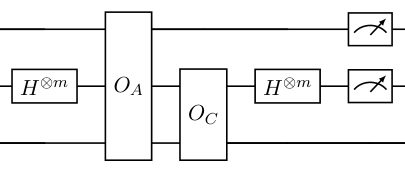 
Figure 1: Sparse-access block-encoding circuit for an s-sparse matrix, where m = ⌈log2 s⌉. The upper two registers form the signal register, and compression onto |0⟩|0m⟩yields the unnormalized post- selected branch corresponding to A |ψ⟩, with normalization factor 2m.

📷 Fig 2

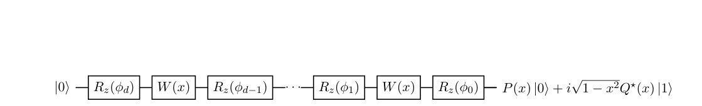 
Figure 7: Degree-d QSP circuit in the W(x) convention. The circuit contains d applications of the signal unitary W(x) interleaved with d+1 phase rotations, and the |0⟩-signal amplitude of the output is P(x).

📷 Fig 3

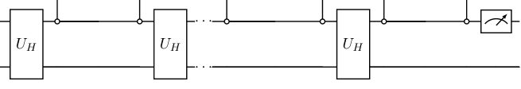 
Figure 8: Ancilla-mediated phase-kickback implementation of the QET sequence UeΦ(WH) from The- orem 2.15 [3]. The implemented angles satisfy bϕk = eϕk + π/2 for 0 ≤k &lt; d and bϕd = eϕd. Each non- terminal phase operation followed by UH realizes i eieϕkRWH. Hence, the complete circuit implements idUeΦ(WH), differing from the desired sequence only by the known global phase id. The open controls jointly condition on the block-encoding ancillae being in |0a⟩and represent signal-controlled NOT C(q) Π defined in Eq. (59), where Π = |0a⟩⟨0a|⊗I. Each pair of C(q) Π , combined with e−iϕjZ, implements the projected phase eiϕj(2Π−I), while returning the kickback qubit q coherently to |0⟩....

📷 Fig 4

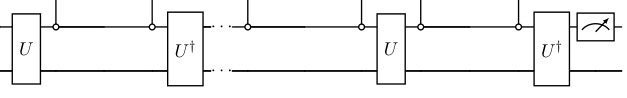 
Figure 9: Explicit phase-kickback implementation of the odd- and even-degree QSVT sequences [1]. Each pair of open-controlled NOT gates is conditioned on the block-encoding ancillae being in |0⟩⊗a. Together with e−iϕjZ, the pair implements the projected phase eiϕj(2Π−I), where Π = |0a⟩⟨0a| ⊗I, while returning the kickback qubit q coherently to |0⟩. The gates U and U† act jointly on the block- encoding ancillae and the system register. Post-selecting the block-encoding ancillae on |0a⟩outputs P(H/α)|ψ⟩ ∥P(H/α)|ψ⟩∥with probability psucc = ∥P(H/α) |ψ⟩∥2 on the system register.

📷 Fig 5

 
Figure 10: GQSP circuit with a zero-controlled signal unitary U [5]. The upper qubit is the signal ancilla, and each open control applies U when this ancilla is in |0⟩. Post-selection on |0⟩a outputs P(U)|ψ⟩ ∥P(U)|ψ⟩∥with psucc = ∥P(U) |ψ⟩∥2 on the system register.

**Summary.** This paper unifies the design of quantum algorithms for computing functions of matrices by introducing a comprehensive toolkit comprising block-encoding, Qubitization, QSP, QSVT, and GQSP. It provides a systematic workflow for choosing the right technique based on the operator structure. This framework is vital for advancing quantum linear algebra and designing practical quantum simulations.

**Why it may be interesting.** This work provides a powerful, general algorithmic toolkit for quantum computation, directly impacting how one designs algorithms for simulating quantum dynamics or solving linear systems, which is crucial for AMO and open quantum systems.

Detailed structure

**Main problem.** The core challenge is implementing non-unitary matrix functions (like inverses or matrix exponentials) using quantum circuits, which are fundamentally unitary.

**Main result.** The paper establishes a unified, systematic framework using block-encoding, qubitization, QSP, QSVT, and GQSP to construct quantum algorithms for matrix function evaluation with near-optimal query complexity.

**Method.** The authors develop an end-to-end pipeline: identifying the target function, constructing a block-encoding, selecting the spectral domain, approximating the function with a polynomial, and synthesizing the final quantum circuit.

**Model / system.** The focus is on abstract quantum operators and matrices, treating the problem as a general quantum linear algebra task rather than a specific physical Hamiltonian simulation.

**Key observables.** Spectral information, eigenvalues, singular values, and the required polynomial or rational function $f(A)$.

**Important parameters / regimes.** Query complexity, normalization factor ($\alpha$) in block-encoding, and the structure of the target matrix function.

**Assumptions / limitations.** The primary assumption is that the required matrix function can be accurately approximated by a polynomial or Laurent polynomial, and that the necessary block-encoding can be constructed efficiently.

**Figures summary.** Figures compare polynomial approximations (Chebyshev vs. power-basis) to exact functions and compare quantum simulation results against classical solvers like Crank–Nicolson.

**Paper structure.** The paper builds from first principles, introducing the key tools (block-encoding, Qubitization, QSP, QSVT, GQSP) and culminates in a systematic decision workflow (flowchart) for applying these techniques to various matrix function problems.

Abstract

Modern quantum algorithms are increasingly formulated as coherent procedures for implementing polynomial transformations of operators and singular values. This perspective provides a powerful and unifying language for quantum algorithm design, connecting a wide range of distinct problems through five closely related key tools: block-encoding, qubitization, QSP, QSVT and GQSP. Block-encoding embeds non-unitary matrices into larger unitaries; qubitization converts block-encodings into structured operators; QSP, QSVT and GQSP enable polynomial transformations with near-optimal query complexity. Together, these techniques form a general toolkit for transforming matrix functions into implementable quantum circuits. This paper develops these techniques from first principles as a unified framework for constructing quantum algorithms. We apply this framework to representative applications to highlight design principles and demonstrate how distinct algorithms can be constructed from a unified sequence of operator transformations.   A central contribution is a systematic decision workflow for selecting the appropriate approach according to the operator structure and the desired transformation polynomial. This perspective clarifies when direct GQSP or through qubitization, or Laurent expansion, or QSVT is most appropriate. We organize algorithmic design into an end-to-end pipeline: identifying the target matrix function, constructing an appropriate block-encoding, determining the relevant spectral domain, designing a polynomial or Laurent-polynomial approximation, synthesizing the phase factors, and translating the transformation into an executable quantum circuit. By applying this unified framework to example applications, we showcase a practical methodology for reasoning, designing, and implementing quantum algorithms based on polynomial transformations.

[↑ back to top](#top)

### [From Certifying Rank $k$ Projectors To Non-Positivity, Entanglement, And Non-Hermitian Witnesses Through Traces Of Matrix Powers](http://arxiv.org/abs/2609.09557v1)

**Authors:** H. F. Chau  
**Type:** theory · **Category:** quantum information and computing · **PDF:** <https://arxiv.org/pdf/2609.09557v1>  
**Analysis basis:** full PDF text, analyzed in chunks
**Topic relevance:** `quantum measurements` **2/5**

📷 Fig 1

 
Low-resolution page preview, page 2

📷 Fig 2

 
Low-resolution page preview, page 3

📷 Fig 3

 
Low-resolution page preview, page 4

📷 Fig 4

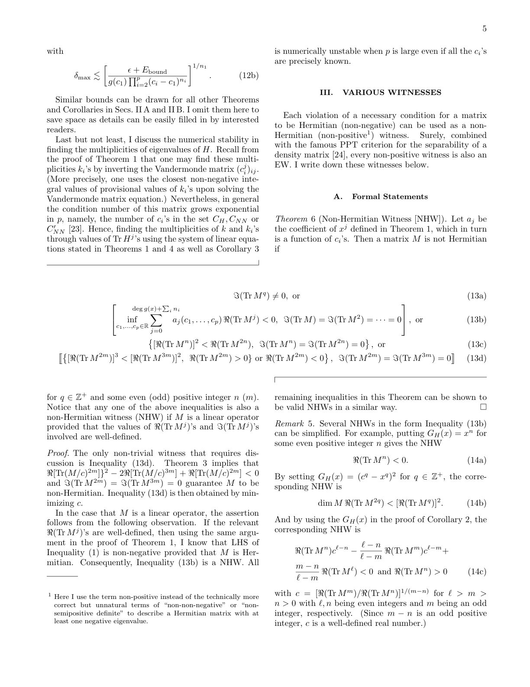 
Low-resolution page preview, page 5

📷 Fig 5

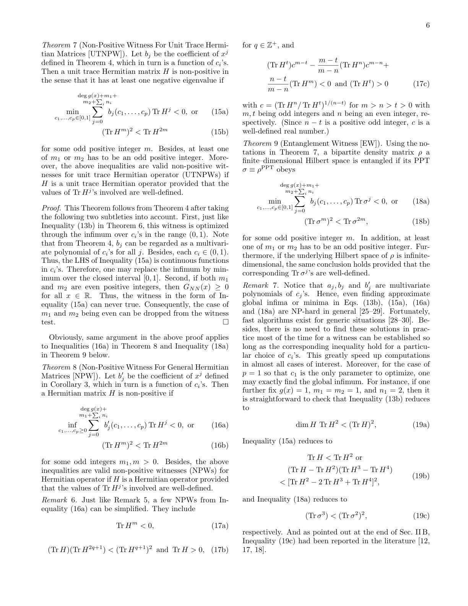 
Low-resolution page preview, page 6

**Summary.** This paper develops a systematic framework to determine the properties of quantum states and operators by analyzing the traces of their matrix powers. It establishes that these traces can act as powerful mathematical witnesses to certify entanglement, non-positivity, and non-Hermiticity. The work is significant for quantum information theory as it provides robust, measurable diagnostic tools for characterizing quantum systems.

**Why it may be interesting.** This work provides fundamental mathematical tools—the trace of powers—to diagnose complex quantum properties (like entanglement or non-Hermiticity) using only measurable quantities, which is crucial for experimental quantum information science.

Detailed structure

**Main problem.** The paper systematically investigates necessary and sufficient conditions to constrain the eigenvalues of a Hermitian matrix using only the traces of its matrix powers.

**Main result.** These trace constraints can serve as powerful, general witnesses to certify properties like quantum state purity, entanglement, non-positivity, and non-Hermiticity.

**Method.** The authors derive polynomial constraints involving $	ext{Tr} H^j$ and develop specific witness criteria (e.g., UTNPW, EW) based on these trace identities.

**Model / system.** The analysis focuses on Hermitian matrices ($H$) and density matrices ($
ho$), which are central to quantum information theory. The methods are general but are applied to diagnose quantum state properties.

**Key observables.** Traces of matrix powers ($	ext{Tr} H^j$), purity ($	ext{Tr} 
ho^2$), and the values derived from various quantum witnesses.

**Important parameters / regimes.** The dimension of the matrix ($D$), the number of required trace constraints ($2p+1$), and the measurement uncertainty/rounding error.

**Assumptions / limitations.** The analysis addresses practical limitations, including numerical stability and measurement uncertainty, suggesting that the required accuracy for certification is very high.

**Figures summary.** The notes mention tables summarizing the performance of the NPW and EW algorithms across different dimensions, showing success probabilities.

**Paper structure.** The paper builds from establishing general eigenvalue constraints using traces of powers, to deriving specific witnesses (NHW, UTNPW, EW), and concluding with a systematic analysis of the strengths, weaknesses, and limitations of these certification techniques.

Abstract

We all know that a density matrix $ρ$ is pure if and only if $\mathrm{Tr} \,ρ^2 = 1$. But is this the only way to prove the purity of $ρ$ using the trace of its powers? Here I systematically study the necessary and sufficient conditions of the more general question of guaranteeing that all eigenvalues of a Hermitian matrix belong to a specified set through its trace of powers. More importantly, these characterization results are automatically witnesses certifying a quantum state as entangled, a Hermitian operator has least one negative eigenvalue and a linear operator as non-Hermitian. I demonstrate the effectiveness of these witnesses, analyze their performance, and study their strength, weakness together with resource requirement through numerical simulation as well as analytical work. I also discuss briefly the effects of numerical stability, uncertainty in measurement and rounding errors on these problems.

[↑ back to top](#top)

### [From the Unknown to the Desired: Transforming Unknown Initial States in the Resource Theory of Work and Heat](http://arxiv.org/abs/2609.09352v1)

**Authors:** Tanmoy Biswas, Andreas Winter  
**Type:** theory · **Category:** statistical mechanics · **PDF:** <https://arxiv.org/pdf/2609.09352v1>  
**Analysis basis:** full PDF text, analyzed in chunks
**Topic relevance:** `quantum measurements` **2/5**

📷 Fig 1

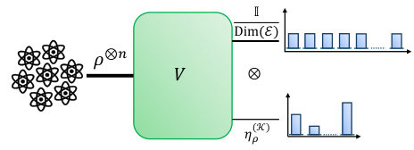 
FIG. 1. Conversion of an n-copy i.i.d. state ρ⊗n into its charge– entropy normal form by a unitary V that depends only on the charge– entropy equivalence class containing ρ. The first component is max- imally mixed, with its dimension and associated charges determined solely by the entropy and average charges of ρ, whereas the second component retains the explicit dependence on ρ, with its associated charge operators depending explicitly on the total charges L×n c .

📷 Fig 2

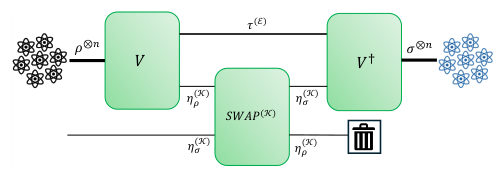 
FIG. 2. Transformation of ρ⊗n into σ⊗n, where ρ and σ belong to the same charge–entropy equivalence class, assisted by a sublinear- sized ancilla. The unitary V maps ρ⊗n to the charge–entropy normal form τ(E) ⊗η(K) ρ with error at most δ(ϵn). Since the linearly supported component τ(E) is identical for states within the same charge–entropy equivalence class, the desired transformation is achieved by swap- ping η(K) ρ with an ancilla prepared in the state η(K) σ , followed by V†. The total transformation error is at most 2δ(ϵn), accounting for the errors incurred in applying V and V†.

📷 Fig 3

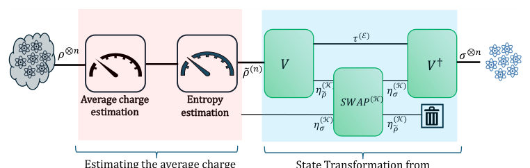 
FIG. 3. Schematic illustration of universal thermodynamic state transformations from unknown quantum states. Given n copies of an unknown initial state ρ⊗n, one first performs a charge-preserving measurement to estimate the entropy and average charges. Once these quantities are determined, one applies a state-transformation protocol that depends only on the estimated entropy and average charges. Combining these two steps—estimation of the entropy and average charges, followed by the corresponding state-transformation protocol—yields a universal transformation protocol.

📷 Fig 4

 
FIG. 4. Energy–entropy diagram illustrating the maximum ex- tractable work per copy from ρ. The diagram shows that, to extract the maximum amount of work from ρ, one must transform it into the Gibbs state τρ that has the same entropy as ρ and is defined with re- spect to the same Hamiltonian.

**Summary.** This paper develops a universal theory for performing thermodynamic state transformations when the initial quantum state is only partially known. By constructing protocols based on the charge-entropy normal form, the authors prove that optimal work extraction can be achieved asymptotically despite the lack of full state knowledge. This advances resource-theoretic thermodynamics beyond idealized, state-aware settings.

**Why it may be interesting.** This work provides a rigorous, resource-theoretic framework for thermodynamics that explicitly handles the practical limitation of incomplete knowledge about the initial state, which is crucial for realistic quantum engine designs.

Detailed structure

**Main problem.** Developing a universal framework for thermodynamic state transformations (work and heat) when the initial quantum state is unknown, moving beyond state-dependent protocols.

**Main result.** A universal scheme is established showing that optimal work extraction can be achieved asymptotically even when the initial state is unknown, with a super-polynomially small error.

**Method.** The authors develop protocols based on the charge-entropy normal form, utilizing techniques like gentle tomography to estimate unknown state parameters while minimizing disturbance.

**Model / system.** The study analyzes quantum state transformations within the resource theory of work and heat, focusing on $n$ independent and identically distributed (i.i.d.) copies of a state $
ho$ governed by mutually commuting conserved charges.

**Key observables.** Von Neumann entropy $S(
ho)$ and the expectation values of conserved charges $	ext{Tr}(
ho L_i)$.

**Important parameters / regimes.** The number of copies $n$, the error decay rate (super-polynomial), and the sublinear scaling of ancillary resources.

**Assumptions / limitations.** The analysis assumes the existence of mutually commuting conserved charges and relies on coarse-grained measurements to estimate unknown state properties.

**Figures summary.** Figure 1 illustrates the conversion of an $n$-copy state to its charge–entropy normal form. Figure 2 shows the transformation between two states using an ancilla system.

**Paper structure.** The paper builds from establishing the charge-entropy normal form for states, to proving that states in the same class are asymptotically transformable, and finally detailing the protocols for estimating the necessary state parameters (entropy and charges) with minimal disturbance.

Abstract

We study thermodynamic state transformations in the resource theory of work and heat when the initial quantum state is unknown. Moving beyond state-dependent protocols, we develop a universal framework in which a single transformation applies to all admissible input states. For mutually commuting conserved charges, we construct charge-conserving protocols whose transformation error, quantified by trace distance, decays super-polynomially with the number of system copies. As an application, we demonstrate universal work extraction: asymptotically optimal work can be extracted without microscopic knowledge of the initial state, with a super-polynomially small error. Our results show that thermodynamic state transformations remain achievable under limited prior information and establish a universal framework for resource-theoretic thermodynamics beyond the state-aware setting.

[↑ back to top](#top)

### [Information Causality Characterizes the Set of Quantum Correlations in the Simplest Bell Scenario](http://arxiv.org/abs/2609.10508v1)

**Authors:** Mariami Gachechiladze, Nikolai Miklin  
**Type:** theory · **Category:** quantum information and computing · **PDF:** <https://arxiv.org/pdf/2609.10508v1>  
**Analysis basis:** full PDF text, analyzed in chunks
**Topic relevance:** `quantum measurements` **2/5**

📷 Fig 1

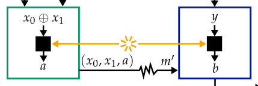 
Figure 1. The scenario of information causality. Alice receives two random bits x0, x1, which may be correlated. Bob re- ceives a random bit y independent of x0 and x1. In this work, the parties communicate through a noisy channel that takes the tuple (x0, x1, a) as input and produces a bit outcome m′. The parties assist their communication with a shared non- signaling resource with binary inputs and outputs.

**Summary.** This paper uses the Information Causality principle to derive a precise characterization of quantum correlations in the simplest Bell test setting, recovering the known Tsirelson-Landau-Masanes criterion. Crucially, the authors prove that generalized IC is a strictly stronger constraint than Macroscopic Locality, providing a powerful tool for bounding quantum nonlocality.

**Why it may be interesting.** While focused on Bell tests, the rigorous connection between information-theoretic principles (IC) and fundamental physical constraints (like quantum nonlocality) provides a systematic theoretical framework applicable to understanding resource theories in quantum information.

Detailed structure

**Main problem.** The paper investigates whether the physical principle of Information Causality (IC) is sufficient to derive the exact boundary for quantum correlations in the simplest bipartite Bell scenario, surpassing existing bounds like Uffink's inequality.

**Main result.** The authors prove that the generalized IC characterizes the quantum correlations in this scenario, yielding the Tsirelson-Landau-Masanes criterion. Furthermore, they establish that generalized IC is a strictly stronger principle than Macroscopic Locality (ML).

**Method.** The analysis combines the generalized IC formulation with a new communication protocol and involves taking limits (specifically, the vanishing channel capacity limit) to derive constraints on the correlators.

**Model / system.** The system is the simplest bipartite Bell scenario involving two binary measurements per party (Alice and Bob) and is analyzed through the lens of information-theoretic constraints imposed by a noisy communication channel.

**Key observables.** Correlators $\langle a_x b_y 
angle$, the Tsirelson-Landau-Masanes (TLM) criterion, and the generalized Information Causality (IC) constraint.

**Important parameters / regimes.** The analysis heavily relies on the limit of vanishing channel capacity ($\epsilon_c 	o 0$) and the structure of the communication channel parameters.

**Assumptions / limitations.** The derivation relies on specific parameterizations for the input distribution and the noisy channel, and the equivalence between the IC constraint and the TLM criterion is shown in the vanishing capacity limit.

**Figures summary.** Figure 1 schematically illustrates the information causality setup with correlated inputs and a noisy channel output. The TLM criterion is presented in Equation (3).

**Paper structure.** The paper first establishes that generalized IC implies the TLM criterion in the simplest Bell scenario. It then compares IC to ML, demonstrating that ML is a weaker constraint by finding correlations that satisfy ML but violate IC. The core mathematical work involves deriving the constraint from the IC inequality via limiting procedures.

Abstract

Information causality (IC) was introduced as a physical principle constraining correlations in non-signaling theories. Whether it can recover the exact quantum correlation boundary, beyond Uffink's inequality, has remained an open question. Here, we combine its generalized formulation for correlated inputs with a new communication protocol to derive quantum Bell inequalities that exactly characterize the quantum correlations in the simplest bipartite Bell scenario, with two binary measurements. In particular, we derive the Tsirelson-Landau-Masanes criterion directly from IC. Thus, the generalized IC implies macroscopic locality, while we also present macroscopically local correlations that violate the generalized IC. This establishes that generalized IC is a strictly stronger principle in this scenario. Together with our earlier result that generalized IC implies a nontrivial communication complexity principle, these findings strengthen the role of information causality in explaining the limits of quantum nonlocality and provide a systematic route to deriving tighter bounds on the set of quantum correlations in more general Bell scenarios.

[↑ back to top](#top)

### [Robust Device-Independent Certification of Boolean-Phase Gates](http://arxiv.org/abs/2609.09836v1)

**Authors:** Yunguang Han, Xingyuan Bu, Aleksandra Gočanin, Jiabing Yuan  
**Type:** theory · **Category:** quantum information and computing · **PDF:** <https://arxiv.org/pdf/2609.09836v1>  
**Analysis basis:** full PDF text, analyzed in chunks
**Topic relevance:** `quantum measurements` **2/5**

📷 Fig 1

 
FIG. 1. Boolean-derivative scoring for the ith Bell term. Party Bi measures X, while the remaining Bj parties measure Z. The latter outcomes are mapped to bits uj = (1 −zj)/2, from which the verifier evaluates the derivative sign di = (−1)∂if(u¯i). Combining this sign with the X-measurement outcome ξi gives the postprocessed output ri,1 = ξidi.

📷 Fig 2

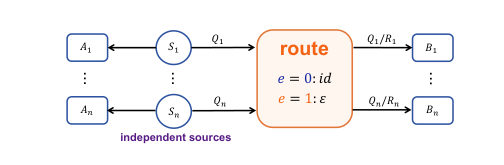 
FIG. 2. Independent-source network for gate certification. Each source Si distributes systems to the reference party Ai and to the channel input Qi. For e = 0, the Qi systems are routed directly to the Bi stations, whereas for e = 1 they pass through the physical channel E, producing output systems Ri. The route choice e is not supplied to the reference parties.

📷 Fig 3

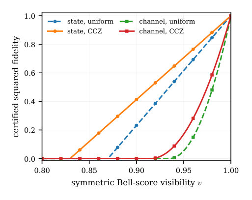 
FIG. 3. Comparison of the uniform Boolean-phase and CCZ-specific fidelity bounds in the symmetric two-route score model. The upper curves show the squared Choi-state fidelity obtained from a single state test, while the lower curves show the squared Choi fidelity of the effective channel obtained by composing the input and output certificates. Dashed curves use the uniform coefficient cZ, and solid curves use the im- proved CCZ coefficient cCCZ. The CCZ analysis lowers the nontrivial state-fidelity threshold from 0.869825 to 0.829681 and the channel-fidelity threshold from 0.934913 to 0.914840, without changing the Bell expression or measurement set- tings.

**Summary.** This work presents a robust, device-independent method to certify the fidelity of Boolean-phase quantum gates. It achieves this by using a novel 'Boolean derivative' to translate gate-specific phase information into classical constraints suitable for Bell tests. This allows for the derivation of rigorous, quantifiable lower bounds on the gate's fidelity based purely on local measurement outcomes.

**Why it may be interesting.** The technique of translating gate-dependent quantum information into classical constraints via the Boolean derivative is a powerful tool for device-independent characterization, applicable to any gate whose structure can be mapped to local classical measurements.

Detailed structure

**Main problem.** The paper develops a robust, device-independent certification scheme for Boolean-phase gates, addressing the limitation that self-testing the output Choi state alone is insufficient.

**Main result.** They derive an explicit affine lower bound on the extracted-state squared fidelity for Boolean-phase gates, and provide a closed-form Choi-fidelity bound for an effective n-qubit channel using an independent-source network.

**Method.** The core method uses the Boolean derivative to convert gate-dependent phase information into classical signs, enabling the construction of a Bell test built from CHSH blocks using only local measurements.

**Model / system.** The system involves certifying Boolean-phase gates, defined by arbitrary Boolean functions $f: \{0, 1\}^n 	o \{0, 1\}$, which are computational-basis diagonal gates.

**Key observables.** The normalized Choi state $|\Psi_f
angle$, the Bell expression $B_f$, and the extracted-state squared fidelity $F^2$.

**Important parameters / regimes.** The Bell deficit $\epsilon$, and the fidelity bound coefficients $c_Z$ and $c_{CCZ}$.

**Assumptions / limitations.** The analysis assumes the ability to combine an identity test and a gate-output test in an independent-source network using the same physical observables for reference.

**Figures summary.** Figure 1 illustrates the Boolean-derivative scoring for a Bell term, while Figure 2 depicts the independent-source network structure used for gate certification.

**Paper structure.** The paper first introduces the problem of device-independent certification, then develops the Boolean derivative to build a classical Bell test. It extends this to an independent-source network to derive the fidelity bound, culminating in a specific joint analysis for the CCZ gate.

Abstract

Device-independent certification of a quantum gate requires the input and output tests to identify the same reference qubits. Self-testing the output Choi state alone does not guarantee this consistency. We develop a robust certification scheme for Boolean-phase gates, a broad family of computational-basis diagonal gates specified by Boolean functions. Boolean derivatives convert the target-dependent phase information into classical signs that can be evaluated from local measurement outcomes. This leads to Bell tests built from CHSH blocks using two binary measurements per party and no entangling measurements. At maximal violation, the tests self-test the normalized Choi state and the measured observables. Away from the maximum, they give an explicit affine lower bound on the extracted-state squared fidelity that is uniform over all Boolean functions and valid in arbitrary local dimensions. We then combine an identity test and a gate-output test in an independent-source network in which the reference devices use the same physical observables, obtaining a closed-form Choi-fidelity bound for an effective \(n\)-qubit channel. For CCZ, a joint six-party analysis gives a stronger robustness bound without changing the Bell expression or measurement settings. The construction shows how the algebraic structure of a gate can shift target-dependent information from quantum measurement design to classical processing of local outcomes.

[↑ back to top](#top)

### [SIM-GRAPH: A universal guide to symmetric interactions](http://arxiv.org/abs/2609.09996v1)

**Authors:** R. C. Verstraten, C. Morais Smith  
**Type:** theory · **Category:** strongly correlated electrons · **PDF:** <https://arxiv.org/pdf/2609.09996v1>  
**Analysis basis:** full PDF text, analyzed in chunks
**Topic relevance:** `analog quantum simulation` **2/5**

📷 Fig 1

 
FIG. 1. Graph reduction of a 3x3 square lattice with NN (links) and local (loops) interactions. The symmetry group is generated by a 90 degree rotation along site 4. The three dis- tinct symmetric representations Si are highlighted in red on the left hand side. On the right hand side, we see the reduced graph, where all interactions are projected to the symmetric subset and the other sites are removed. The remaining sites are relabeled to a counting order.

📷 Fig 2

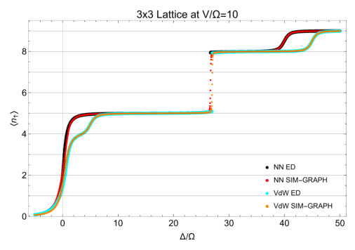 
FIG. 2. The average ground-state magnetization of the TFIM on the 3 × 3 square lattice is presented at V/Ω= 10 for both NN and VdW interactions, computed using both ED and SIM-GRAPH. For better visual comparison, the exact results are plotted using larger points, with the SIM-GRAPH results overlaid in points half the size. For both NN and VdW interactions, we find excellent agreement with only minor de- viations from the exact results.

📷 Fig 3

 
FIG. 3. The average ground-state magnetization of the TFIM on the 4 × 4 square lattice is presented at V/Ω= 10 for both NN and VdW interactions, computed on 50 points using both ED and SIM-GRAPH. For both NN and VdW interactions, we find deviations up to 4 spins away from the exact results. Besides the high and low ∆/Ωlimits, we find only one region of agreement at ⟨n↑⟩= 8, which corresponds to the checker- board states.

📷 Fig 4

 
FIG. 4. (a) The NN interaction graph for a chain of 6 spins. The dashed green line indicates the symmetry axis. (b) The reduced graph based on SIM1. (c) Opening of the 3 to 4 link, which allows for a superposition across the symmetry axis. (d) The reduced graph based on SIM2.1. In (b)-(d), the red highlight indicates the difference between SIM1 and SIM2.1.

📷 Fig 5

 
FIG. 5. The NN interaction graph for a chain of 3 spins is shown and projected according to the SIM-GRAPH proce- dure. Here, ˆΩ= ΩP

**Summary.** This paper introduces SIM-GRAPH, a novel method that leverages underlying symmetries in quantum Hamiltonians to drastically reduce the computational complexity of finding ground-state properties. By projecting the system onto a symmetry-reduced graph, it achieves exponential speedups over standard exact diagonalization for models like the TFIM. This makes the study of large, complex quantum magnetic systems computationally feasible.

**Why it may be interesting.** The technique provides a powerful, symmetry-based computational shortcut for strongly correlated models, offering insights into how symmetries constrain the low-energy physics of magnetic materials.

Detailed structure

**Main problem.** The primary challenge is efficiently calculating ground-state observables for interacting quantum many-body systems, which typically suffer from exponential scaling when using exact diagonalization.

**Main result.** The SIM-GRAPH method provides an exponential speedup by projecting interactions onto a symmetry-reduced graph, allowing for the study of large systems previously intractable.

**Method.** The method uses group theory to identify symmetries, reducing the system Hamiltonian by projecting interactions onto a smaller, symmetric subset of the lattice sites, resulting in a reduced Hamiltonian.

**Model / system.** The method is applied to interacting quantum spin systems, specifically using the Transverse Field Ising Model (TFIM) on various lattices, including 1D chains, 2D square lattices, and Sierpinski triangles.

**Key observables.** Ground-state observables, such as average magnetization ($\langle n_{\uparrow} 
angle$) and ground-state energy.

**Important parameters / regimes.** The size and geometry of the lattice (e.g., 3x3, 4x4, 1D chains); the symmetry group $S$ used for reduction.

**Assumptions / limitations.** The method assumes that the ground-state observables are not significantly affected by spontaneous symmetry breaking, and that the lowest energy symmetric state is sufficient for accurate results.

**Figures summary.** Figures illustrate the graph reduction process for lattices (e.g., 3x3 square lattice, 1D chain), comparing results from Exact Diagonalization (ED) against SIM-GRAPH variants ($	ext{SIM}1, 	ext{SIM}2.1, 	ext{SIM}2.4$) for magnetization.

**Paper structure.** The paper introduces the core SIM-GRAPH technique, details its extensions (SIM2 for superpositions, SIM3 for partial symmetries), and validates its performance across various geometries (1D, 2D, Sierpinski) by comparing results against ED benchmarks.

Abstract

Symmetry plays a central role throughout physics, from Fourier analysis on discrete lattices to the classification of elementary particles in the standard model. In finite quantum systems, symmetries are often discrete, such as reflection and rotational symmetries. Here, we present the SIM-GRAPH method (Symmetric Ising Models - Graph Reduction And Projected Hamiltonians), which uses such symmetries to efficiently calculate ground-state observables of interacting quantum systems. By projecting all interactions onto a symmetric subset of the system, the method effectively reduces the number of sites, thus providing an exponential speedup over standard exact diagonalization. Furthermore, we introduce two extensions that broaden the applicability of the method and allow for a controlled trade-off between computational cost and accuracy.

[↑ back to top](#top)

### [Sub-extensive non-stabilizerness in the Dyck-Fredkin spin chain](http://arxiv.org/abs/2609.09545v1)

**Authors:** Yasunori Lee  
**Type:** theory · **Category:** statistical mechanics · **PDF:** <https://arxiv.org/pdf/2609.09545v1>  
**Analysis basis:** full PDF text, analyzed in chunks
**Topic relevance:** `analog quantum simulation` **2/5**

📷 Fig 1

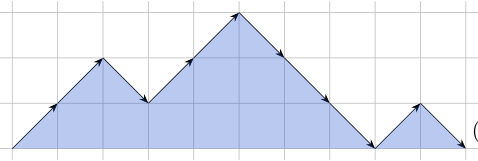 
Figure 1: An example of a Dyck path for N = 10 and the corresponding spin/qubit configuration.

📷 Fig 2

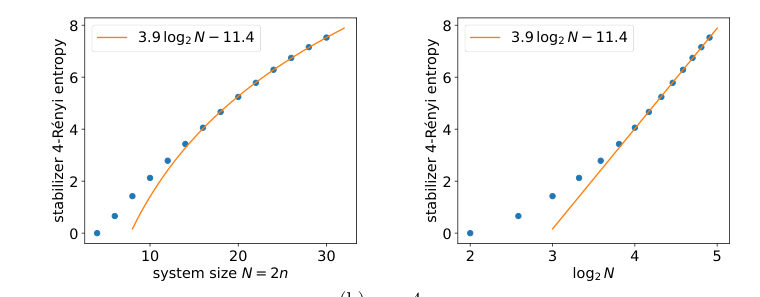 
Figure 2: Stabilizer α-Rényi entropy Mα(|ψDF 0 (1)⟩) of the ground state of the (undeformed) Dyck-

📷 Fig 3

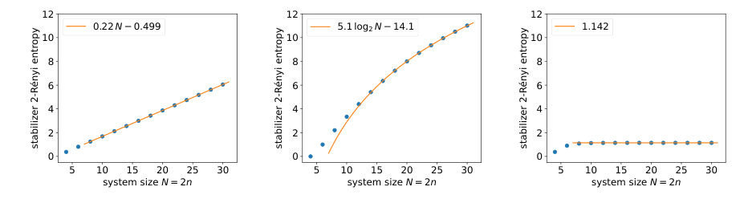 
Figure 3: Stabilizer 2-Rényi entropy M2(|ψDF 0 (t)⟩) of the ground state of the deformed Dyck-

**Summary.** This work analyzes the scaling of the stabilizer Rényi entropy in the Dyck-Fredkin spin chain under a deformation parameter $t$. The key finding is that the SRE displays distinct scaling laws ($\Theta(N)$, $\Theta(\log N)$, or $\Theta(1)$) depending on $t$. This suggests that non-stabilizerness is a powerful diagnostic tool capable of revealing unique signatures of quantum criticality beyond what entanglement entropy can measure.

**Why it may be interesting.** The finding that SRE exhibits anomalous logarithmic scaling at $t=1$, while entanglement entropy does not, suggests that non-stabilizerness can reveal unique aspects of unconventional quantum criticality not captured by standard entanglement measures.

Detailed structure

**Main problem.** The study investigates the scaling behavior of the stabilizer Rényi entropy (SRE) as a quantitative measure of non-stabilizerness in quantum many-body systems.

**Main result.** The SRE exhibits distinct scaling behaviors ($\Theta(N)$, $\Theta(\log N)$, or $\Theta(1)$) depending on the deformation parameter $t$ of the Dyck-Fredkin chain, suggesting non-stabilizerness provides a unique probe for criticality.

**Method.** The authors use numerical exact finite-size calculations, employing the replica formulation of the SRE, to analyze the asymptotic scaling of the ground state entropy.

**Model / system.** The system analyzed is the spin-1/2 Dyck-Fredkin chain and its $t$-deformation, a local frustration-free model with unusual spectral-gap scaling.

**Key observables.** Stabilizer Rényi entropy ($\alpha$-SRE), entanglement entropy, and the spectral gap ($\Delta E$).

**Important parameters / regimes.** The deformation parameter $t$, which defines three distinct regimes: $t < 1$, $t = 1$, and $t > 1$.

**Assumptions / limitations.** The analysis relies on the assumption that the SRE provides a physically meaningful measure of non-stabilizerness that can distinguish critical points from entanglement entropy.

**Figures summary.** Figure 3 illustrates the 2-SRE scaling for the deformed chain, showing linear ($t<1$), logarithmic ($t=1$), and constant ($t>1$) behavior, contrasting with entanglement entropy scaling.

**Paper structure.** The paper introduces SRE as a measure of non-stabilizerness, details the numerical methods for calculating the entropy, and then presents the core results by analyzing the scaling of SRE across the three regimes defined by the parameter $t$.

Abstract

The stabilizer Rényi entropy is a quantitative measure of non-stabilizerness, or magic, and has typically been found to scale extensively with system size $N$ (i.e., $Θ(N)$) for a variety of many-body quantum states. In this note, we study the stabilizer Rényi entropy of the ground state of the spin-$\frac{1}{2}$ Dyck-Fredkin chain and its $t$-deformation, a local frustration-free model with unusual spectral-gap scaling. Exploiting the combinatorial structure, we carry out numerically exact finite-size calculations, which indicate asymptotic behavior depending on $t$: $Θ(N)$ for $t<1$, $Θ(\log N)$ at $t=1$, and $Θ(1)$ for $t>1$. The scaling at $t=1$ could be another manifestation of the unconventional criticality of the model, while the contrast with the behavior of the entanglement entropy suggests that non-stabilizerness might provide a new window into quantum many-body systems.

[↑ back to top](#top)

### [Noether Symmetries Generate Deterministic Energy-Harvesting Protocols](http://arxiv.org/abs/2609.10533v1)

**Authors:** Ali Akil, M. Hamed Mohammady, Zihan Wang, Oscar Dahlsten  
**Type:** theory · **Category:** statistical mechanics · **PDF:** <https://arxiv.org/pdf/2609.10533v1>  
**Analysis basis:** full PDF text, analyzed in chunks
**Topic relevance:** `Keldysh / 2PI / non-Gaussian methods` **1/5** · `Tavis-Cummings & cavity-many-emitter` **1/5** · `analog quantum simulation` **1/5** · `correlated / nonlocal dissipation` **1/5** · `driven-dissipative phase transition` **1/5** · `methods for driven-dissipative` **1/5** · `non-equilibrium universality` **1/5** · `quantum measurements` **1/5**

📷 Fig 1

 
FIG. 1: Noether symmetry R generates orbits over different source states that jointly achieve DEH. The points in the figure depict source-harvester states, which undergo evolutions R or U. R = Rh ⊗Rs has two properties (i) Noether symmetry: R†UR = U, (ii) Leaves harvester energy eigenstates invariant: R |g/e⟩h |ψ⟩s = |g/e⟩h |ψ′⟩s. Suppose |ψ0⟩s achieves DEH such that U |g⟩h |ψ0⟩s = |e⟩h |ϕ⟩s. As depicted, if another ini- tial source state differs only by R, and is in that sense on the same orbit Os as |ψ0⟩s, after U being applied the harvester is also then in state |e⟩h: UR |g⟩h |ψ0⟩s = RU |g⟩h |ψ0⟩s = |e⟩h |ϕ′⟩s.

📷 Fig 2

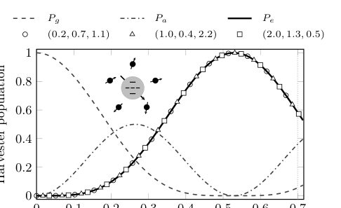 
FIG. 2: Non-Abelian DEH protocol with con- served total angular momentum. A five-level har- vester is coupled to a source of five spin-1/2 particles through the interaction Hamiltonian in Eq. (14). The horizontal axis shows the dimensionless time Ωe t, where Ωe is the harvester transition frequency between |g⟩h and |e⟩h; equivalently, Ee −Eg = ℏΩe. The curves show the ground-state, auxiliary-level, and excited-state popula- tions Pg, Pa, and Pe, respectively. The solid Pe curve corresponds to the unrotated source state (α, β, γ) = (0, 0, 0), while the circles, triangles, and squares repre- sent three globally SU(2)-rotated source states with Euler angles specified in the legend. Their...

📷 Fig 3

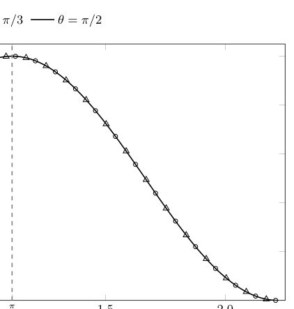 
FIG. 1. Three spin XX chain example.

📷 Fig 4

 
FIG. 2. Non-abelian DEH example. There is a 5 dimensional harvester and a 25-dimensional source.

📷 Fig 5

 
FIG. 3. Classical deterministic energy harvesting. (a) Normalized harvester energy gain for different initial phases ϕ0 of the classical source field. All phase-dependent results coincide and reach unity at the common transfer time T, indicated by the vertical dashed line. (b) Corresponding energy partitioning for a representative initial phase. The harvester energy gain equals the source energy loss, while the interaction energy remains zero along the selected seed source state trajectory.

**Summary.** This theoretical paper establishes that the symmetry structure of a quantum source-harvester system dictates whether deterministic energy harvesting (DEH) is possible. By applying Noether's theorem, the authors prove that a single symmetry can generate an infinite family of source states, all of which perform the identical energy transfer. This provides a powerful, general framework for understanding energy extraction constrained by fundamental symmetries.

**Why it may be interesting.** This work provides a powerful, general mathematical tool (Noether's theorem) to constrain non-equilibrium processes like energy harvesting, linking fundamental symmetries directly to thermodynamic constraints in open quantum systems.

Detailed structure

**Main problem.** The paper seeks to determine the general, symmetry-based conditions under which deterministic energy harvesting (DEH) is possible in source-harvester quantum dynamics.

**Main result.** The existence of a continuous Noether symmetry in the joint dynamics guarantees that an entire orbit of source states will implement the exact same deterministic energy harvesting transition.

**Method.** The authors utilize Noether's theorem, extending it to generalized probabilistic theories, to link continuous symmetries (conserved Noether charges) to the realization of deterministic energy transfer.

**Model / system.** The system is modeled by a composite Hamiltonian $H = H_h + H_s + H_{int}$, describing the interaction between a 'harvester' subsystem and a 'source' subsystem. Examples include Jaynes-Cummings and SU(2) models.

**Key observables.** Deterministic output state ($
ho_f^h$), source asymmetry ($I$), and the conserved Noether charge ($Q_\alpha$).

**Important parameters / regimes.** The symmetry generator $g$, the time evolution $	au$, and the resonance condition ($\Omega = \omega$) in the classical limit.

**Assumptions / limitations.** The primary theorems assume the existence of an exact Noether symmetry for the joint dynamics and exact invariance of the harvester boundary states.

**Figures summary.** Figures illustrate the generation of DEH-capable source states via symmetry orbits (Figure 1) and show population dynamics confirming the coincidence of outcomes for different symmetry-rotated source states (Figure 2).

**Paper structure.** The paper builds from defining DEH and establishing the general principle using Noether's theorem (Theorem 1), providing concrete quantum examples (Jaynes-Cummings, SU(2)), generalizing the framework to classical and probabilistic theories, and finally deriving constraints on source asymmetry.

Abstract

We consider the general principles for when deterministic energy harvesting (DEH) is possible. DEH means absorbing energy from a fluctuating source without entropy being absorbed. We show that the symmetry structure of the source--harvester dynamics gives a general route beyond existing examples to identify DEH capable source states. Any continuous symmetry with a conserved Noether charge induces a source-side orbit of states that all implement the same deterministic harvester transition, provided the harvester boundary states are symmetry invariant. Consequently, one DEH capable source state with nonzero asymmetry between charge sectors can generate infinitely many simultaneously DEH capable source states. A Jaynes-Cummings model, a three-spin XX chain, and an SU(2) model illustrate the construction. We further extend Noether's theorem to generalised probabilistic theories and thereby generalise our main result. We further establish an asymmetry bound for harvesting, showing that source asymmetry cannot increase on average, while DEH saturates the bound exactly preserving asymmetry.

[↑ back to top](#top)

### [Orbital-selective electronic modes induced by doping and originating from distinct spin excitations: an essential feature of orbital-selective Mott transition](http://arxiv.org/abs/2609.09741v1)

**Authors:** Masanori Kohno  
**Type:** theory · **Category:** strongly correlated electrons · **PDF:** <https://arxiv.org/pdf/2609.09741v1>  
**Analysis basis:** full PDF text, analyzed in chunks
**Topic relevance:** `Keldysh / 2PI / non-Gaussian methods` **1/5** · `analog quantum simulation` **1/5** · `methods for driven-dissipative` **1/5**

📷 Fig 1

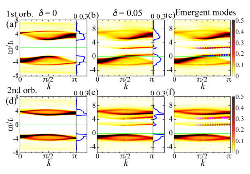 
FIG. 1: Am δ=0(k, ω)t1 [(a), (d)] and Am δ=0.05(k, ω)t1 [(b), (c), (e), (f)] for the 1st orbital (m = 1) [(a)–(c)] and 2nd orbital (m = 2) [(d)–(f)]. The blue curves on the right-hand side show ρ(ω)t1 calculated from Am δ (k, ω)t1 on the left in (a), (b), (d), and (e). The dispersion relations of the doping- induced modes, ω = eS+ k−π

📷 Fig 2

 
FIG. 2: Emergence mechanism of spin excited states as elec- tronic excited states upon doping. (a) Undoped ground state |GS⟩Nh=0. (b) One-hole-doped ground state |GS⟩Nh=1, which has significant overlap with the state obtained by removing an electron with Fermi momentum kF from the first orbital of |GS⟩Nh=0. The doped site is enclosed by the dashed or- ange line. (c), (d) States obtained by adding an electron with momentum k to the doped orbital [(c)] and undoped orbital [(d)] at the doped site in |GS⟩Nh=1, which have sig- nificant overlap with spin excited states S±,γ k−kF|GS⟩Nh=0 [(c)] and T ±,γ k−kF|GS⟩Nh=0 [(d)], respectively, at half filling. The states enclosed by the dashed orange...

📷 Fig 3

 
FIG. 3: (a) S− δ=0(k, ω)t1. (b) S+ δ=0(k, ω)t1. (c) S+ δ=0.05(k, ω)t1. (d) T − δ=0(k, ω)t1. (e) T + δ=0(k, ω)t1. (f) n1 δ=0(k) (solid orange curve) and n1 δ=0.05(k) (dashed blue curve).

**Summary.** This theoretical study investigates the Orbital-Selective Mott Transition (OSMT) in a two-orbital Hubbard model by doping an antiferromagnetic insulator. Using DDMRG, the authors show that doping induces distinct electronic modes in the band gap, which are not arbitrary but originate specifically from low-energy and inter-orbital spin excitations. This provides a detailed, mechanism-based understanding of the OSMT.

**Why it may be interesting.** The explicit link drawn between emergent electronic modes and underlying spin excitations provides a detailed mechanism for the OSMT, which is crucial for understanding correlated materials relevant to superconductivity and magnetism.

Detailed structure

**Main problem.** The paper aims to elucidate the fundamental nature of the Orbital-Selective Mott Transition (OSMT) in correlated electron systems.

**Main result.** The OSMT is characterized by the emergence of orbital-selective electronic modes in the band gap upon doping, which are directly traceable to distinct low-energy and inter-orbital spin excitations.

**Method.** The study employs theoretical analysis using the Non-Abelian dynamical density-matrix renormalization group (DDMRG) method applied to the 1D Kanamori-Hubbard Model.

**Model / system.** The system is modeled using the 1D two-orbital Kanamori-Hubbard Model (KHM), investigating the physics of an orbitally degenerate spin-1 antiferromagnetic insulator subjected to hole doping.

**Key observables.** Spectral function ($A_m^\delta(k, \omega)$), electronic density of states ($
ho(\omega)$), and dynamical spin structure factors ($S^\pm_\delta(k, \omega)$ and $T^\pm_\delta(k, \omega)$).

**Important parameters / regimes.** Doping concentration ($\delta$), and Hamiltonian parameters such as $U/t_1 = 6$, $U'/t_1 = 3.6$, $J_H/t_1 = 2.4$, and $t_2/t_1 = 0.5$.

**Assumptions / limitations.** The analysis assumes the momentum and total spin of the $\delta=0$ ground state are zero, and it relies on relating emergent electronic modes to specific spin excitation channels.

**Figures summary.** Figures illustrate the doping-induced electronic mode dispersion relations in the band gap, showing their overlap and origin from spin excitations ($S^\pm$ and $T^\pm$) when comparing the undoped and doped states.

**Paper structure.** The paper progresses by first establishing the Mott insulating ground state ($\delta=0$), then demonstrating the emergence of orbital-selective electronic modes upon doping ($\delta>0$), and finally attributing the origin of these modes to specific spin excitation channels within the KHM framework.

Abstract

The nature of the orbital-selective Mott transition (OSMT) remains elusive. This study shows that, by doping an orbitally degenerate spin-1 antiferromagnetic insulator in the Kanamori-Hubbard model, electronic modes emerge in the band gap in an orbital-selective manner, exhibiting momentum-shifted spin-mode dispersion relations. Electronic modes originating from conventional spin excitations, including the low-energy one, appear in the doped orbital, while those from inter-orbital spin excitations appear in the undoped orbital. These emergent modes constitute an essential feature of the OSMT.

[↑ back to top](#top)

### [Effect of Spherical Confinement on the 2-TIPS of Soft Repulsive Spherocylinders](http://arxiv.org/abs/2609.10014v1)

**Authors:** Jaydeep Mandal, Chandan Dasgupta, Prabal K. Maiti  
**Type:** theory · **Category:** statistical mechanics · **PDF:** <https://arxiv.org/pdf/2609.10014v1>  
**Analysis basis:** full PDF text, analyzed in chunks
**Topic relevance:** `driven-dissipative phase transition` **1/5** · `non-equilibrium universality` **1/5**

📷 Fig 1

 
Fig. 1 A) The free anchoring of the SRS on a sphere - only the center of mass (COM) positions (⃗r) are confined on the sphere, the particles can rotate freely. B) The tangential anchoring condition - The COM positions (⃗r) are confined on the sphere, and the orientations (ˆs) are tangential on the spherical surface.

📷 Fig 2

 
Fig. 2 Structures of the spherical monolayer of SRS: A) The initial configuration of the LC phase at a packing fraction of η = 0.2 for a system with A = 2.0,N = 2500,T ∗= 1.0. The equilibrated structure shows a small but finite orientational order even at such a low packing fraction. The particles are shown in cyan color. When 2-Temperature driven activity is introduced in the system, it shows a steady state structure of a co-existing dense (B) and dilute (C) regions. The representative snapshot is for (T ∗ c = 2.0,T ∗ h = 20.0). The hot particles are shown in red, whereas the cold ones are shown in blue. B) shows the top view, highlighting the dense cluster, which is composed of both hot...

📷 Fig 3

 
Fig. 3 Effect of aspect ratios on the structure of the coexisting phases in a spherical monolayer: A) The orientational defects arising in the phase- separated cold zone is shown in white. The red and blue particles indicate ‘hot’ and ‘cold’ respectively. Snapshot taken for a system of SRS with aspect ratio A = 10.0 at a packing fraction of η = 0.2. This occurrence of defect structures with long rods at lower packing fractions can be attributed to the steric strain at the tail ends of the SRSs inside the sphere. B) Similar orientational defect structures, shown in white, arise for even smaller rods (A = 5.0) at a higher packing fraction of η = 0.4. The red and blue colors indicate the ‘hot’...

📷 Fig 4

 
Fig. 4 Effect of aspect ratios on the phase separation in the spherical monolayer system: for a specific packing fraction η = 0.2, the phase separation order parameter φ is plotted with activity χ for different aspect ratios of the rods, A = 2.0,5.0 and 10.0. Phase separation increases with activity for all cases, but the saturation value of the order parameter (φs) reduces as the rods become longer. φs is indicated in the figure for A = 2.0.

📷 Fig 5

 
Fig. 5 Effect of packing fraction on the phase separation in the spherical monolayer system: The phase separation order parameter is plotted against the activity χ at different packing fractions η = 0.2,0.4, and 0.6 for A) short rods A = 2.0, B) medium rods A = 5.0 and C) long rods A = 10.0. For all the figures A) B) and C), the value at which the phase separation order parameter saturates decreases with packing fraction. This can be attributed to the enhanced trapping with packing fraction in confined systems.

**Summary.** This paper investigates how temperature gradients induce phase separation in soft, rod-like particles confined to a spherical surface. By comparing free and tangential anchoring conditions, the authors show that confinement strongly dictates the phase behavior, leading to distinct dense-dilute coexisting states. The findings offer insights into active matter physics under geometric constraints.

**Why it may be interesting.** The work provides a detailed study of non-equilibrium phase transitions in confined active matter, drawing parallels between 2D/spherical confinement effects and bulk active matter models, which is relevant for understanding complex many-body dynamics.

Detailed structure

**Main problem.** The study investigates the 2-Temperature induced phase separation (2-TIPS) in soft repulsive spherocylinders confined to a spherical surface.

**Main result.** The system exhibits phase separation into dense and dilute regions, with the degree of ordering in the dense phase being significantly influenced by the confinement geometry and the activity parameter.

**Method.** The research employs Molecular Dynamics (MD) simulations within a 2-Temperature model to study active-passive mixtures.

**Model / system.** The system consists of soft repulsive spherocylinders (SRS) confined either to a spherical monolayer (free anchoring) or a spherical shell (tangential anchoring). Interactions are modeled using a WCA potential, and activity is introduced via a temperature difference between two subsystems.

**Key observables.** Phase separation extent ($\varphi$), local density distribution, and orientational order parameter ($\psi$).

**Important parameters / regimes.** Packing fraction ($\eta$), rod aspect ratio ($A$), and the activity parameter ($\chi$ or $\Delta T$).

**Assumptions / limitations.** The study assumes the applicability of the 2-Temperature model and focuses on the geometric constraints imposed by the spherical confinement.

**Figures summary.** Figures illustrate the structural differences between free and tangential anchoring, showing coexisting dense/dilute clusters and the emergence of orientational defects in the phase-separated regions.

**Paper structure.** The paper systematically analyzes the 2-TIPS phenomenon by comparing results from two distinct anchoring conditions (free vs. tangential) on the spherical surface, detailing how particle shape and density affect phase coexistence.

Abstract

We studied the 2-Temperature induced phase separation (2-TIPS) in a system of soft repulsive sphe rocylinders (SRS), confined on the surface of a sphere. We used two different anchoring conditions for the SRS on the spherical surface- free and tangential. For the free anchoring, increasing either the packing fraction or the rod aspect ratio suppresses phase separation between the active and passive subsystems, and the system corresponds to a dense-dilute phase co-existence. These phenomena can be explained via the trapping effect and are emergent due to the confinement. For the tangential anchoring, the system phase separates from its initial isotropic state into a locally ordered dense region and a disordered dilute region. Our work provides useful insights into phase separation in binary mixtures under spherical confinement.

[↑ back to top](#top)

### [For Whom Does Bell Hold?](http://arxiv.org/abs/2609.10535v1)

**Authors:** Daniel Green, Kshitij Gupta, Qiya Zhang  
**Type:** theory · **Category:** other · **PDF:** <https://arxiv.org/pdf/2609.10535v1>  
**Analysis basis:** full PDF text, analyzed in chunks
**Topic relevance:** `Keldysh / 2PI / non-Gaussian methods` **1/5** · `analog quantum simulation` **1/5**

📷 Fig 1

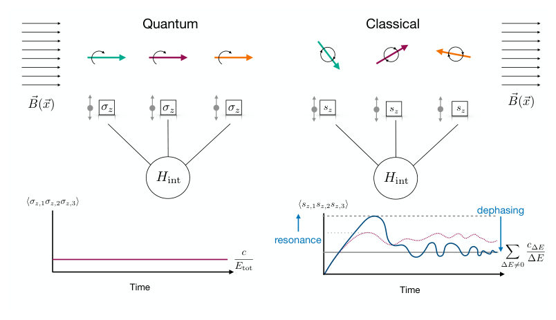 
Figure 1: Illustration of the structural differences between quantum and classical theories. Both the quantum and classical theories have spins placed in the magnetic fields that cause spins to precess. The quantum theory (left) is placed in the ground state. The measurement of the spin in z-direction is random. When the spins are coupled via a Hamiltonian Hint, the resulting correlations are time-independent with an amplitude set by the total energy Etot = E1 +E2 +E3, where the energies Ei are the gaps between the ground state and excited state of each spin. For the classical theory (right) to produce random spins in the z direction, the spins are precessing in time with a frequency Ei and...

**Summary.** This paper proposes a generalized test using statistical correlations to distinguish quantum from classical time evolution, moving beyond traditional Bell inequalities. It shows that quantum vacuum fluctuations yield unique, time-independent correlations governed by the energy gap. These quantum signatures are distinct from the time-dependent, decaying correlations predicted by classical Hamiltonian systems.

**Why it may be interesting.** It provides a powerful, general theoretical tool—analyzing correlation patterns over time—to probe the quantum nature of physical processes in regimes (like cosmology) where standard non-locality tests are difficult to implement.

Detailed structure

**Main problem.** The paper aims to generalize the use of statistical correlations as a Bell-type test to definitively distinguish between quantum and classical time evolution, especially in macroscopic settings where standard Bell tests fail.

**Main result.** Quantum vacuum fluctuations produce unique, generally time-independent correlations controlled by the energy gap, whereas classical systems exhibit time-dependent correlations that decay via dephasing, particularly near resonant poles.

**Method.** The authors compare statistical correlations derived from quantum Hamiltonian evolution versus classical Hamiltonian evolution, focusing on the behavior of correlation functions over time.

**Model / system.** The analysis uses closed systems undergoing Hamiltonian evolution, comparing quantum vacuum fluctuations to classical Hamiltonian systems, often illustrated using spin precession models.

**Key observables.** Statistical correlations of observables over time, energy gap ($\Delta E$), and the presence/absence of apparent poles in correlation functions.

**Important parameters / regimes.** The energy gap ($\Delta E$) between ground and excited states, and the time scale over which correlations are measured.

**Assumptions / limitations.** The test is designed to be model-independent, generalizing previous proposals, and it assumes the ability to measure correlations in systems where standard Bell tests are inapplicable.

**Figures summary.** Figure 1 illustrates the structural difference: quantum theory shows time-independent correlations set by total energy, while classical theory shows time-dependent precession with correlations suppressed unless at resonance, where they decay via dephasing.

**Paper structure.** The paper progresses by first establishing the failure of standard Bell tests in certain physical regimes, then generalizing the concept to time evolution, and finally presenting the distinct signatures of quantum vacuum fluctuations versus classical dynamics.

Abstract

Violations of Bell's inequalities offer a definitive signal of non-classical (quantum) behavior in local deterministic systems. Yet, in many physical settings where quantum mechanics is expected to play an important role, one cannot construct a Bell-type test using the available observables. Cosmology offers one concrete example, where cosmic structure may have originated from quantum vacuum fluctuations yet all observations are effectively classical. Nevertheless, recent work suggests that quantum and classical time evolution may still be differentiated by the pattern of statistical correlations of these observables. In this paper, we explore and generalize the use of correlations as Bell-type test of the nature of time evolution. We show that quantum vacuum fluctuations of closed systems undergoing Hamiltonian evolution produce unique correlations that are not mimicked by classical Hamiltonian systems. Correlations in the quantum vacuum are generally time-independent and are controlled by the energy gap between the ground and exited states. Classical systems exhibit apparent poles at physical frequencies that do not arise in the quantum vacuum. As one approaches the poles, the evolution becomes dominated by a resonant Hamiltonian giving rise to time dependent correlations that eventually decay through dephasing. Finally, we show that this behavior is distinct from other signals of quantum evolution, including applications to quantum optics, quantum walks, and quantum search.

[↑ back to top](#top)

### [Reconstructing fluid velocity fields from sparse sensors using a variational quantum algorithm](http://arxiv.org/abs/2609.09268v1)

**Authors:** Nhat-Quang Nguyen, Mohammad Mehedi Hasan Akash, Kourosh Shoele, Yanzhu Chen, Huixuan Wu  
**Type:** theory · **Category:** quantum information and computing · **PDF:** <https://arxiv.org/pdf/2609.09268v1>  
**Analysis basis:** full PDF text, analyzed in chunks
**Topic relevance:** `Keldysh / 2PI / non-Gaussian methods` **1/5** · `quantum measurements` **1/5**

📷 Fig 1

 
FIG. 1: The hardware-efficient ansatz with repeated layers of entangling unit circuits B arranged in a brickwall pattern. Repeating the unit circuit B more times increases the expressivity of the ansatz. All the Ry gates in the circuit are defined by parameters independent of each other. One dashed brown box is a brickwall layer.

📷 Fig 2

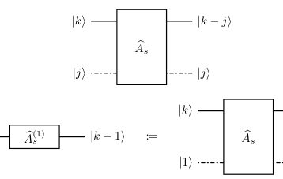 
FIG. 2: The circuit in the top panel illustrates the effect of the index-shifting operator ˆAs. The state index of the top register is to be shifted and the bottom register with the dash-dotted wire encodes the value of the shift. For convenience, we define another operator ˆA(1) s , which is shifting the index by 1, as shown in the bottom panel.

📷 Fig 3

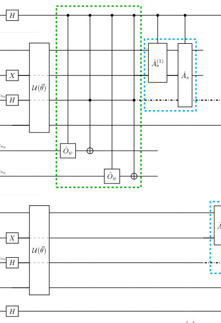 
FIG. 4: (a) Circuit for evaluating a representative term in Eq. (15), P

📷 Fig 4

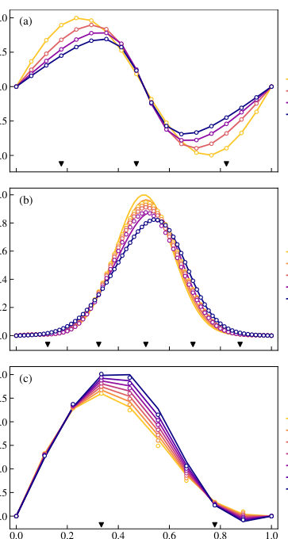 
FIG. 7: Numerically simulated baseline and VQA-reconstructed velocity fields with higher space or temporal resolution for ν = 0.05. Each solid line connects the baseline velocities at different spatial coordinates for a given time. Unfilled circles are the velocities reconstructed by the proposed VQA. Panels (a) and (b) show the results for the Burgers equation with the sinusoidal (using nt + ns = 4 + 4 qubits) and Gaussian initial wave profiles (using nt + ns = 6 + 6 qubits), respectively. Panel (c) shows the results for the KS equation with nt + ns = 5 + 3 qubits.

📷 Fig 5

 
FIG. 6: Numerically simulated baseline and VQA-reconstructed velocity fields with viscosity ν = 0.05. Triangles on the x-axis indicate the sensor locations used for the reconstruction. Each solid line connects the baseline velocities at different spatial coordinates for a given time. Unfilled circles are the velocities reconstructed by the proposed VQA. Panels (a)(b) and (c)(d) show the results for the Burgers equation with the sinusoidal and Gaussian initial wave profiles, respectively. Panels (e) and (f) show the results for the KS equation. Panels (a), (c), and (e) are results from the real-space approach and Panels (b), (d), and (f) are results from the Galerkin-reduced-basis approach.

**Summary.** This paper proposes using a variational quantum algorithm to reconstruct entire spacetime fields governed by nonlinear PDEs from only sparse sensor measurements. By encoding the full solution into a single quantum state and minimizing a cost function that enforces both the physics and the data, the authors show a compact quantum framework for solving challenging inverse problems in fluid dynamics.

**Why it may be interesting.** This work directly applies quantum algorithms to solve inverse problems in classical physics (PDEs), providing a template for using quantum computation to constrain and solve complex, high-dimensional physical dynamics.

Detailed structure

**Main problem.** Reconstructing complex, nonlinear physical fields, such as fluid velocity, from sparse, limited measurements.

**Main result.** The authors demonstrate that a variational quantum algorithm using a spacetime encoding scheme can reconstruct globally consistent solutions for nonlinear PDEs like Burgers and KS equations with low error.

**Method.** They formulate the reconstruction as a constrained optimization problem solved by minimizing a cost function combining PDE violation and measurement mismatch, encoded into a parameterized quantum circuit.

**Model / system.** The system involves fluid velocity fields governed by nonlinear PDEs (e.g., Burgers, KS equations) defined over a spacetime domain. The reconstruction is performed using quantum states to encode the full solution.

**Key observables.** Reconstructed velocity field $u(t, x)$; Root-Mean-Square (RMS) error.

**Important parameters / regimes.** Viscosity ($
u$); Time and space discretization steps ($\Delta t, \Delta x$); Weighting hyperparameter ($w$).

**Assumptions / limitations.** The solution admits a sparse representation in the accessible Hilbert space; the real-space approach uses finite-difference approximations, while the Galerkin approach assumes a sufficient basis (sine-only).

**Figures summary.** Figures show reconstructed velocity fields for the Burgers and KS equations at various resolutions, demonstrating the method's ability to recover the full field profile.

**Paper structure.** The paper introduces the challenge of sparse PDE reconstruction, details two VQA encoding methods (real-space and Galerkin-reduced-basis), formulates the combined cost function, and validates the approach using numerical simulations on Burgers and KS equations.

Abstract

Reconstructing fields governed by nonlinear partial differential equations (PDEs) from sparse measurements is a challenging task because the governing equations are strongly nonlinear and observations are available at only a few locations. Fluid velocity fields are a representative case. In this paper, we propose a variational quantum algorithm that reconstructs the solution over the entire spacetime domain at once. Rather than marching in time, the method encodes the full discrete spacetime solution in a single variational quantum state, so that all time points are optimized jointly. The cost function combines a sparse-measurement mismatch term with a physics-informed PDE violation term, letting data and the governing equation constrain the solution simultaneously. We demonstrate the method on the one-dimensional Burgers and Kuramoto--Sivashinsky equations using numerical simulations. The results suggest that variational quantum algorithms with a spacetime encoding scheme offer a compact framework for reconstructing nonlinear PDE dynamics.

[↑ back to top](#top)

### [Renewal process's guide to fractional Navier-Stokes equations](http://arxiv.org/abs/2609.09620v1)

**Authors:** Hong Zhang  
**Type:** theory · **Category:** statistical mechanics · **PDF:** <https://arxiv.org/pdf/2609.09620v1>  
**Analysis basis:** full PDF text, analyzed in chunks
**Topic relevance:** `Keldysh / 2PI / non-Gaussian methods` **1/5** · `correlated / nonlocal dissipation` **1/5**

📷 Fig 1

 
Low-resolution page preview, page 2

📷 Fig 2

 
Low-resolution page preview, page 3

📷 Fig 3

 
Low-resolution page preview, page 4

📷 Fig 4

 
Low-resolution page preview, page 5

📷 Fig 5

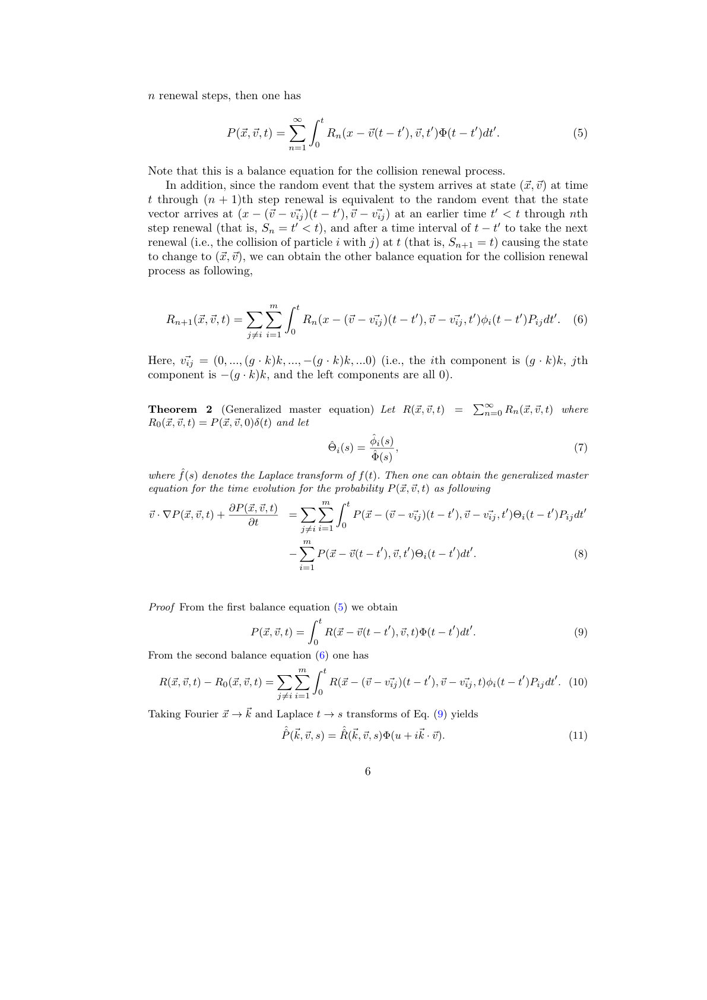 
Low-resolution page preview, page 6

**Summary.** This paper develops a kinetic theory approach to solve the notoriously difficult Navier-Stokes equations using a collision renewal process. By analyzing the waiting time distribution, the authors show that exponential waiting times recover classical fluid dynamics, while power-law waiting times naturally lead to the fractional Navier-Stokes equations. This provides a stochastic, simulation-friendly framework for modeling anomalous fluid transport.

**Why it may be interesting.** While focused on classical fluid dynamics, the rigorous connection between stochastic processes (renewal processes) and fractional derivatives provides a powerful, non-standard toolset for modeling non-Markovian dynamics relevant in open quantum systems or complex many-body relaxation processes.

Detailed structure

**Main problem.** The paper tackles the unsolved Navier-Stokes (NS) equations, a major challenge in fluid mechanics, by deriving a kinetic theory approach.

**Main result.** It proves that using a collision renewal process with exponential waiting times yields the classical NS equations, while power-law waiting times lead to the fractional NS equations.

**Method.** The derivation involves using the collision renewal process to establish a generalized master equation, followed by applying the Chapman-Enskog expansion method to reduce the kinetic equation to macroscopic fluid dynamics.

**Model / system.** The model is the collision renewal process, which describes particle dynamics through collisions. This process is used to derive the Boltzmann equation, which then leads to both classical and fractional descriptions of fluid flow.

**Key observables.** Probability distribution of the state tensor P(x, v, t); macroscopic quantities like density (rho), bulk velocity (u), and energy (E).

**Important parameters / regimes.** The waiting time distribution (exponential vs. power-law) dictates whether the resulting equations are classical or fractional.

**Assumptions / limitations.** Key assumptions include the use of the collision renewal process, the application of the Chapman-Enskog expansion, and assuming state independence for deriving the rate equation.

**Paper structure.** The paper progresses by defining the collision renewal process, deriving the generalized master equation for the probability distribution, specializing the analysis for exponential (classical) and power-law (fractional) waiting times, and finally applying the Chapman-Enskog method to obtain the macroscopic NS equations.

Abstract

The Navier-Stokes equations, which remain unsolved, are crucial equations in fluid mechanics. Discovering the solutions to the Navier-Stokes equations is one of the challenging Millennium problems. In 1900, Hilbert proposed a potential approach to tackle this problem by establishing the relationship between microscopic dynamics and the macroscopic continuum equations. The key bridge is the derivation of Boltzmann equation and the theory of probability. In this paper, we shall use the collision renewal process with arbitrarily distributed waiting times to derive the Boltzmann equation for the time evolution of the probability of the velocity and the displacement of the particle, based on which we prove that the renewal process with exponential collision waiting time is equivalent to the classical Navier-Stokes equations, and that with power-law waiting time is equivalent to the fractional Navier-Stokes equations. Since the collision renewal process with arbitrarily distributed waiting times is a random process and is easy to perform the stochastic simulations of trajectories to obtain the corresponding solution, we actually find a stochastic approach to solve the classical and fractional Navier-Stokes equations.

[↑ back to top](#top)

### [Semi-Dirac States and Quantum Linear Magnetoresistance in Helimagnetic Pnictide MnP](http://arxiv.org/abs/2609.09781v1)

**Authors:** Prasanta Chowdhury, Jyotirmoy Sau, Sanat Kumar Adhikari, Sourav Chowdhury, Peter Bencok, Matthias Gutmann, Souvik Chatterjee, Saurav Giri, Manoranjan Kumar, Subham Majumdar  
**Type:** both · **Category:** strongly correlated electrons · **PDF:** <https://arxiv.org/pdf/2609.09781v1>  
**Analysis basis:** full PDF text, analyzed in chunks
**Topic relevance:** `analog quantum simulation` **1/5** · `quantum measurements` **1/5**

📷 Fig 1

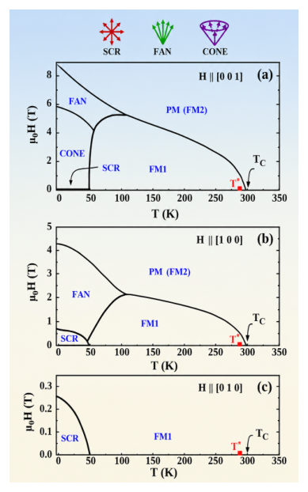 
FIG. 1. Phase diagram. (a), (b) and (c) Shows the standard phase diagram (µ0H vs T) of MnP for field applied along [0 0 1], [1 0 0] and [0 1 0] direction with different magnetic phase marked.

📷 Fig 2

 
FIG. 2. Structural characterization of single-crystalline MnP. (a) Crystal structure of MnP. (b) and (c) Observed (Fobs) vs calculated (Fcalc) structure factors of SCXRD data at T = 295 K and T = 30 K respectively. (d) XRD pattern of single crystalline MnP showing (h 0 l) diffraction peaks. (e) Enlarged HRTEM image displaying (1 0 2) plane. (f) SAED pattern displaying different planes.

📷 Fig 3

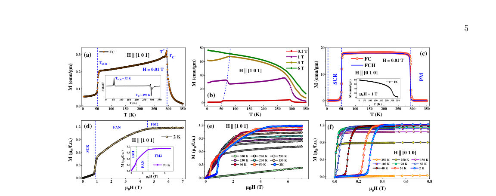 
FIG. 3. Magnetic properties of MnP. (a) Temperature (T) dependence of magnetization (M) in field-cooled (FC) protocols under µ0H= 0.01 T. The inset shows the temperature derivative of M(T) for µ0H ∥[1 0 1] direction. (b) M vs. T data under different fields (µ0H=0.1 T, 1 T, 3 T, 6 T) for µ0H ∥[1 0 1] direction. (c) M vs. T data in field-cooled (FC) and field-cooled-heating (FCH) protocol under µ0H= 0.01 T for µ0H ∥[0 1 0] direction and the inset shows the FC curve under µ0H= 1 T. (d) M vs. µ0H curve at 2 K for µ0H ∥[1 0 1] direction and the inset shows M vs. µ0H curve at 70 K. (e) M vs. µ0H curve at different constant T with µ0H ∥[1 0 1] direction. (f) M vs. µ0H curve at different constant T...

📷 Fig 4

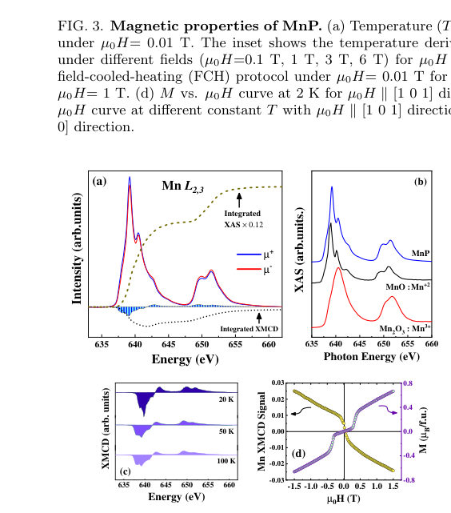 
FIG. 4. XAS and XMCD of MnP. (a) Mn L2,3-edge XAS and XMCD spectra of MnP measured at 20 K with µ0H ∥ [1 0 1]. (b) Comparison of the Mn L2,3-edge XAS spectra of MnP, MnO, and Mn2O3. (c) Mn L2,3-edge XMCD spectra measured at 20, 50, and 100 K. (d) Comparison of the field dependence of the Mn L3-edge XMCD intensity (left panel) and the bulk magnetization (right panel) measured at 50 K.

📷 Fig 5

 
FIG. 6. Magnetoresistance of MnP. (a) Shows the MR % vs µ0H data at different constant T measured between ±15 T with different region marked. (b) Shows MR % vs µ0H data for T &gt; 50 K measured between ±5 T.

**Summary.** This work investigates the magnetotransport properties of the helimagnetic material MnP, focusing on the origin of large linear positive magnetoresistance. By combining detailed experiments with first-principles calculations, the authors propose that the LPMR arises from a small Fermi pocket associated with a semi-Dirac-like band structure that is highly sensitive to the material's magnetic phase. This provides a unified, microscopic framework for understanding complex magnetotransport in topological magnets.

**Why it may be interesting.** While focused on condensed matter magnetism, the interplay between magnetic order, electronic topology (semi-Dirac bands), and quantum transport phenomena is highly relevant to understanding correlated electron behavior in novel quantum materials.

Detailed structure

**Main problem.** The paper investigates the origin of large linear positive magnetoresistance (LPMR) in complex, magnetically ordered topological materials.

**Main result.** The LPMR is microscopically explained by a small Fermi pocket formed by a semi-Dirac-like band crossing near the Fermi level, allowing access to the quantum-limit regime.

**Method.** The study combines comprehensive experimental magnetotransport measurements (Hall, MR) with first-principles electronic structure calculations.

**Model / system.** The system is Manganese phosphide (MnP), a helimagnetic binary pnictide exhibiting multiple field-induced magnetic transitions (SCR, FAN, FM2).

**Key observables.** Large, non-saturating LPMR (up to 800%), Anomalous/Topological Hall Effects, and the evolution of semi-Dirac-like electronic bands.

**Important parameters / regimes.** Low temperatures (4 K), high magnetic fields (15 T), and the magnetic phase state (SCR, FAN, FM2).

**Assumptions / limitations.** The LPMR can be framed within Abrikosov's quantum magnetoresistance theory, and the electronic structure is governed by field-induced magnetic ordering.

**Figures summary.** Figures illustrate the magnetic phase diagram, structural characterization, and the temperature/field dependence of magnetization and magnetoresistance.

**Paper structure.** The paper proceeds by characterizing the complex magnetic phase diagram using magnetization and structural data, followed by detailed magnetotransport measurements (Hall/MR), and finally, theoretical modeling using first-principles calculations to link the electronic structure to the observed transport anomalies.

Abstract

Large linear positive magnetoresistance (LPMR) in topological and magnetic materials remains a subject of intense debate, particularly in noncollinear spin systems where spin-dependent scattering complicates charge transport. Manganese phosphide (MnP), a helimagnetic binary pnictide with multiple field-induced magnetic transitions, provides a useful platform to investigate the interplay between complex magnetism and electronic topology. Here, we present a comprehensive experimental and theoretical investigation of phase-dependent magnetotransport in high-quality MnP single crystals. Hall measurements reveal an anomalous Hall effect dominated by skew scattering at high temperatures and a finite topological Hall effect in the noncollinear fan (FAN) and low-temperature screw (SCR) phases. At low temperatures, we observe a large, non-saturating LPMR reaching nearly 800 percent at 4 K and 15 T, with a pronounced linear field dependence in the field-polarized ferromagnetic (FM2) state. First-principles calculations reveal a strongly anisotropic semi-Dirac-like band at the Y point that progressively approaches the Fermi level from the SCR to FAN and FM2 states. Our analysis indicates that the resulting small Fermi pocket can access the extreme quantum-limit regime at experimentally accessible fields, providing a microscopic framework for the observed LPMR within Abrikosov's quantum magnetoresistance theory.

[↑ back to top](#top)

### [Topology-dependent mixing of knots in flexible polymer chains](http://arxiv.org/abs/2609.10188v1)

**Authors:** Souradeep Sengupta, Garima Mishra  
**Type:** theory · **Category:** statistical mechanics · **PDF:** <https://arxiv.org/pdf/2609.10188v1>  
**Analysis basis:** full PDF text, analyzed in chunks
**Topic relevance:** `Frenkel-Kontorova` **1/5** · `analog quantum simulation` **1/5**

📷 Fig 1

 
Figure 2: Probability distributions P(∆b) of the contour-based knot-separation coordinate for two knot pairs: (a) 31 ⊗31 and (b) 31 ⊗51, both initialized from partially overlapping configurations. The coordinate ∆b characterizes the relative contour organization of the localized knot regions. For classification, configurations with ∆b &lt; ∆bc are assigned to the mixed configuration, whereas those with ∆b &gt; ∆bc are assigned to the demixed configuration, where ∆bc ≃−20. Homogeneous knots (31 ⊗31) exhibit greater statistical weight in the demixed region than heterogeneous knots (31 ⊗51) at fixed normalized wall distances (x = 0.15). (The histograms are smoothed using a Gaussian kernel density...

📷 Fig 2

 
Figure 1: Schematic definition of the contour-based knot-separation coordinate ∆b. Orange and green markers denote the starting and terminal beads, respectively. (a) In a demixed configuration, the localized knot regions are separated along the polymer contour, and ∆b = b(s) 2 −b(t) 1 &gt; 0 gives the contour gap between them. (b) In a fully mixed configuration, the outer boundaries define a composite knotted region, while one constituent knot is independently localized within it. In this case, ∆b = b(s) comp −b(t) nest &lt; 0, and |∆b| provides a boundary-based measure of nesting rather than an overlap length between two independently localized constituent intervals.

📷 Fig 3

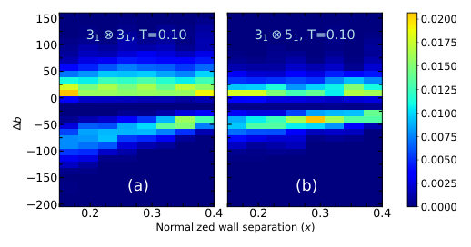 
Figure 4: Color maps of the probability distributions of the contour-based knot-separation coordinate as a function of normalized wall separation x for (a) 31 ⊗31 and (b) 31 ⊗51. Positive ∆b corresponds to non-overlapping knot regions, whereas negative ∆b reflects overlap or nesting. Both systems exhibit distinct positive-∆b and negative-∆b branches whose relative statistical weights vary with normalized end separation. The 31 ⊗31 pair shows greater sampled statistical weight in the demixed branch, while the negative-∆b branch is comparatively more pronounced for 31 ⊗51 at intermediate normalized separation. In both systems, the negative-∆b branch shifts toward ∆b = 0 with increasing x,...

📷 Fig 4

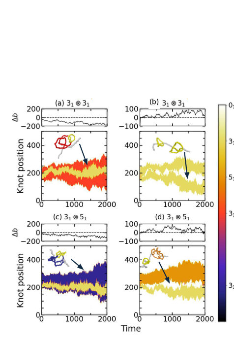 
Figure 3: Representative time-evolution dynamics of a pair of knots for homogeneous 31 ⊗31 knots (top row) and heterogeneous 31 ⊗51 knots (bottom row), both initialized from partially overlapping configurations. The trajectories illustrate the evolution toward either mixed or demixed configurations: panels (a,c) illustrate trajectories that evolve toward mixed states, while panels (b,d) illustrate trajectories that evolve toward demixed states. The upper subpanel in each case shows the corresponding time evolution of the boundary-separation coordinate ∆b; ∆b &lt; ∆bc identifies mixed configuration, whereas ∆b &gt; ∆bc identifies demixed configuration. The lower subpanel shows the time evolution...

📷 Fig 5

 
Figure 5: (a) Fraction of sampled configurations in the demixed state as a function of the normalized wall separation x for the 31 ⊗31 and 31 ⊗51 knot pairs, obtained from the corresponding P(∆b) distributions in Figure 4. (b) Contour occupancy reduction upon mixing, ∆L = L1 + L2 −Lcomp, as a function of x for the two knot pairs. The heterogeneous knot-pair exhibits a substantially larger contour-occupancy reduction than the homogeneous pair over the intermediate range of normalized end separation. (c) Average contour separation of the two localized knots within the demixed state as a function of normalized end separation x, for the homogeneous (31 ⊗31) and heterogeneous (31 ⊗51) knot...

**Summary.** This work simulates the organization of multiple knots on a flexible polymer chain, comparing homogeneous and heterogeneous knot pairs. The simulations reveal that the constituent knot topology strongly dictates the system's tendency to mix or remain separated. Specifically, the heterogeneous pair exhibits enhanced mixing and a structural advantage by occupying less contour space when interpenetrated.

**Why it may be interesting.** The findings provide insights into how topological constraints can mediate non-trivial collective behavior in complex polymeric systems, which has parallels in understanding entanglement or topological defects in quantum many-body systems.

Detailed structure

**Main problem.** The study investigates how the inherent topology of multiple knots influences their organization (mixing vs. demixing) within a flexible polymer chain.

**Main result.** Heterogeneous knot pairs ($3_1 \otimes 5_1$) show a greater tendency to mix and achieve a composite state that occupies less polymer contour than the constituent knots separatedly, compared to homogeneous pairs ($3_1 \otimes 3_1$).

**Method.** Coarse-grained Brownian-dynamics simulations are employed to track the time evolution and probability distribution of the knot configuration.

**Model / system.** The system is a flexible polymer chain confined between two opposing walls, modeled using a potential energy function including bond, excluded volume (WCA), and wall potentials.

**Key observables.** Relative frequency of mixed vs. demixed configurations, contour occupancy reduction upon mixing ($\Delta L$), and the boundary-based knot-separation coordinate ($\Delta b$).

**Important parameters / regimes.** Normalized wall separation ($x = d/L$) and the specific topologies of the constituent knots ($3_1$ and $5_1$).

**Assumptions / limitations.** The analysis relies on coarse-grained dynamics and uses a boundary-based metric ($\Delta b$) to classify topological states, which is assumed to be robust.

**Figures summary.** Figures illustrate probability distributions of the knot separation coordinate ($\Delta b$) versus wall separation ($x$), and show how the contour occupancy reduction ($\Delta L$) differs between the two knot pairs.

**Paper structure.** The paper systematically compares the statistical sampling of mixed versus demixed states for two knot pairs ($3_1 \otimes 3_1$ vs. $3_1 \otimes 5_1$) across varying wall separations, focusing on the structural consequences of mixing.

Abstract

The organization of multiple knots along a polymer contour can depend sensitively on the topology of the constituent knots. Using coarse-grained Brownian-dynamics simulations, we investigate topology-dependent mixing of two knots in a flexible polymer at controlled normalized wall separation. We compare homogeneous ($3_1\otimes 3_1$) and heterogeneous ($3_1\otimes 5_1$) knot pairs using a contour-based coordinate that distinguishes mixed and demixed configurations. Starting from partially overlapping configurations, the $3_1\otimes 5_1$ pair is observed in mixed configurations more frequently over the simulation time window than the $3_1\otimes 3_1$ pair at intermediate wall separation. We further find that, over the intermediate range of normalized wall separation, mixing of the $3_1\otimes5_1$ pair produces a composite knotted region that occupies substantially less polymer contour than the two constituent knots collectively occupy in demixed configurations. The corresponding reduction in contour occupancy is much smaller for the $3_1\otimes3_1$ pair. This indicates that the heterogeneous constituent topologies can be accommodated within a smaller portion of the polymer contour in the composite configuration. These results establish that constituent topology can strongly influence multiple-knot organization in flexible polymers.

[↑ back to top](#top)

### [Eight-unit-cell electronic modulations in cuprates originating from local molecular orbitals](http://arxiv.org/abs/2609.09615v1)

**Authors:** Zhiheng Yao, Sixuan Chen, Jianfa Zhao, Shusen Ye, Weixiang Qu, Ning Xia, Yuling Dai, Luchuan Shi, Hongrui Zhang, Zhenqi Hao, Changqing Jin, Shuo Yang, Yayu Wang  
**Type:** both · **Category:** strongly correlated electrons · **PDF:** <https://arxiv.org/pdf/2609.09615v1>  
**Analysis basis:** full PDF text, analyzed in chunks
**Topic relevance:** `Frenkel-Kontorova` **1/5**

📷 Fig 1

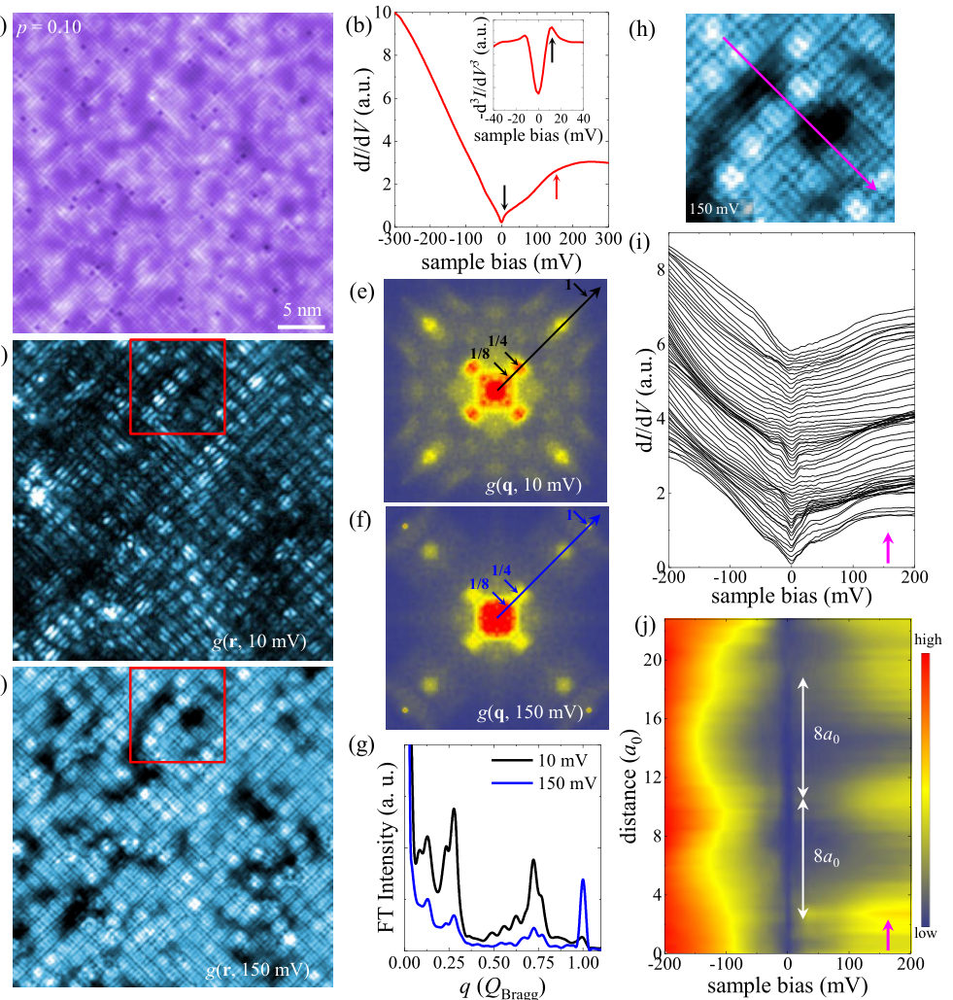 
FIG. 1. Eight-unit-cell modulation in the superconducting p = 0.10 sample. (a) Large-scale topographic image of the p = 0.10 sample acquired at T = 5 K. (b) Spatially averaged dI/dV spectrum showing the superconducting gap and pseudogap. The inset is the -d3I/dV3 curve from -40 mV to 40 mV, where the superconducting gap can be clearly resolved. (c) to (d) dI/dV maps at bias Vb = 10 mV and 150 mV. (e) to (f) FT maps of (c)-(d) , revealing peaks at q ≈ 1/4 and q ≈ 1/8. (g) Line profiles along the Bragg directions in (e)-(f), highlighting both wavevectors. (h) Zoomed-in region of the red square in (c) and (d). (i) to (j) dI/dV spectra and color plot along the magenta arrow in (h), showing...

📷 Fig 2

 
FIG. 2. Eight-unit-cell modulation in the underdoped p = 0.05 sample. (a) to (b) dI/dV maps on the p = 0.05 sample at bias Vb = 30 and 200 mV acquired at T = 5 K, revealing the formation of molecular orbitals with energy-dependent internal structures. The region of red square highlights chain-like assemblies of 4a0 plaquettes separated by intervals of approximately 4a0. (c) to (d) dI/dV spectra and corresponding color plot along the red arrow, exhibiting an 8a0 modulation over three periods. (e) dI/dV map at bias Vb = 30 mV for another FOV with unidirectional 8a0 modulation. (f) FT map (inset) of (e) and its line profiles along the Bragg peaks. (g) The magenta linecut revealing the...

📷 Fig 3

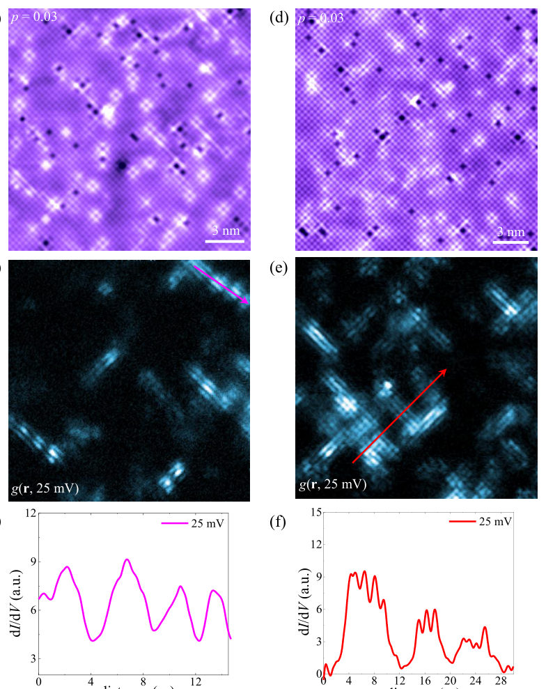 
FIG. 3. Emergence of 4a0 plaquette and 8a0 modulation in the p = 0.03 sample. (a) Topographic image of p = 0.03 sample acquired at T = 23 K. (b) dI/dV map at bias Vb = 25 mV, showing the formation of almost isolated plaquettes and short chains. (c) Linecut along the magenta arrow in (b), revealing the formation of 4a0 plaquette. (d) to (e) Similar dataset as (a)-(b) at another FOV of the same sample with slightly higher local dopant concentration. (f) Linecut along the red arrow in (e), revealing the emergence of 8a0 modulation and the internal stripes of the 4a0 plaquettes.

📷 Fig 4

 
FIG. 4. Monte Carlo simulation illustrating the emergence of 8a0 modulations from the self- organization of 4a0 molecular orbitals. (a) Impurity potential generated by randomly distributed dopants for p = 0.05. (b) Representative low-temperature configurations of 4a0 plaquettes, showing the formation of plaquette chains. (c) The line profiles along the corresponding FT (inset), revealing the dominant 4a0 periodicity and the accompanying 8a0 modulation. (d) to (f) The same set of results as in (a)-(c) for p = 0.10. The plaquette chains become longer because of the increased coverage of molecular orbitals. Both the 4a0 and 8a0 periodicities are clearly observed.

**Summary.** This research uses STM and theoretical modeling to argue that the prominent eight-unit-cell electronic modulation in cuprates is not a conventional pair density wave, but rather a spatial subharmonic. This modulation arises from the self-assembly of local electronic states into fundamental four-unit-cell plaquettes, establishing the plaquette as the primary electronic building block.

**Why it may be interesting.** The work provides a concrete, real-space mechanism (molecular orbital self-organization) to explain a key feature of high-Tc superconductivity, offering a potential alternative to purely momentum-space descriptions of pairing order.

Detailed structure

**Main problem.** The paper investigates the nature and origin of the eight-unit-cell (8a0) electronic modulation observed in cuprate superconductors, challenging the conventional view of the pair density wave (PDW).

**Main result.** The 8a0 modulation is proposed to be a spatial subharmonic arising from the self-organization of local molecular orbitals, which are fundamentally built from $4a_0 	imes 4a_0$ plaquettes, rather than a simple finite-momentum pairing instability.

**Method.** The study combines spectroscopic imaging scanning tunneling microscopy (STM) experiments with theoretical modeling using Markov Chain Monte Carlo (MCMC) simulations.

**Model / system.** The system is hole-doped cuprates ($	ext{Ca}_2	ext{CuO}_2	ext{Cl}_2$), modeled using a statistical framework where the elementary degree of freedom is the $4a_0$ plaquette, governed by interaction energies between nearest-neighbor plaquettes.

**Key observables.** Spatial modulations with $8a_0$ periodicity, $4a_0$ plaquettes, and the correlation between these modulations and internal stripe patterns.

**Important parameters / regimes.** Doping levels ($p=0.03, p=0.05, p=0.10$), temperature ($T$), and interaction parameters ($g_\alpha, g_eta, W$).

**Assumptions / limitations.** The $4a_0$ plaquette is the fundamental electronic building block, and the $8a_0$ modulation originates from the depletion regions separating these plaquettes.

**Figures summary.** Figures show STM $	ext{d}I/	ext{d}V$ maps and Fourier transform analyses confirming $4a_0$ and $8a_0$ modulations in both superconducting and insulating regimes, alongside MCMC simulations reproducing these periodicity peaks.

**Paper structure.** The paper progresses from experimental observation of $8a_0$ modulations in STM to proposing the $4a_0$ plaquette as the basic unit, and finally developing and testing a statistical model (MCMC) to confirm that the $8a_0$ periodicity is a geometric consequence of the plaquette arrangement.

Abstract

The pair density wave (PDW) state with eight-unit-cell (8a0) periodicity has been widely regarded as the primary order in cuprates, yet its existence and origin remain subjects of intense debate. Using spectroscopic imaging scanning tunneling microscopy, we observe spatial modulations of the electronic states with approximately 8a0 periodicity in both the superconducting and insulating regimes of hole-doped Ca2CuO2Cl2 cuprate. We find that the 8a0 spatial patterns are generated by the formation of molecular orbitals by doped holes, which organize into 4a0*4a0 plaquettes as the basic unit. Our results identify the 4a0 molecular orbital as the fundamental electronic building block in cuprates, while the 8a0 PDW represents a spatial subharmonic that emerges at sufficiently high doping.

[↑ back to top](#top)

### [Fermionic quantum cellular automata in 2d are trivial](http://arxiv.org/abs/2609.09317v1)

**Authors:** Jeffrey Kwan, David M. Long, Jeongwan Haah  
**Type:** theory · **Category:** strongly correlated electrons · **PDF:** <https://arxiv.org/pdf/2609.09317v1>  
**Analysis basis:** full PDF text, analyzed in chunks
**Topic relevance:** `analog quantum simulation` **1/5**

📷 Fig 1

 
Figure 1. Immersion of the punctured 2-torus in R2.

📷 Fig 2

 
Figure 2. Copies of [0, 1000ℓ] × [0, 1000ℓ] tiling the plane.

📷 Fig 3

 
Figure 3. Ancilla (fermion) removal. Any finite depth circuit of local automor- phisms can be rewritten with 4k layers U1, U2, . . . , U4k, where each Uj is a circuit supported on the union Rj of far separated regions (strips in 2d). Each Rj takes up a fraction at most 1/k of all sites. Any (fermionic) ancilla used by layer ja with ja ∈[1, k] can be borrowed from a nearby ancilla in R2k+1 ∪· · · ∪R3k and immediately returned. Each layer just needs O(1) strips to borrow ancillas from, but we give a big enough pool of ancillas by taking k large. The ancillas used by layers jb ∈[k + 1, 2k] are borrowed from R3k+1 ∪· · · ∪R4k; those used by layers jc ∈[2k + 1, 3k] are from R1 ∪· · · ∪Rk;...

📷 Fig 4

 
Figure 4. Blending QCA γ from α on the left with a trivial Brauer boundary algebra B into bilayer shift QCA β = β1 ⊗β2 on the right. The construction is transcription of the following line of thought. The green squares are mapped according to ϕ onto the fermionic commutant A of B, where ϕ is provided by the Brauer triviality. Then, ϕ take up a part of the codomain so any other potential image must live elsewhere. In particular, the on-site algebras at x = n, n + 1 must map out of that region, so we send them out to the right. This incurs cascading surplus and deficit of local algebras, leading to a chain of local shifts, resulting in β1 and β2.

📷 Fig 5

 
Figure 5. The pleating and ironing construction used in 6.10. Any QCA α is equivalent to α ⊗(α−1 ⊗α)⊗n (top panel with n = 2 layers). By removing local automorphisms in the circuit for α ⊗α−1 or α−1 ⊗α, adjacent pairs of layers can be blended to the identity in alternating ways, creating a pleating of α [34]. The red segments indicate positions where the action of the pleated QCA differs from a tensor product of α or α−1. This pleating can then be flattened and compressed (or ironed out), simply by rearranging local algebras in space. The result is a QCA β ◦(α ⊗id), where β is a circuit, such that β ◦(α ⊗id) has a reduced spread along the direction of the pleat.

**Summary.** This theoretical paper proves that fermionic Quantum Cellular Automata (QCA) in two dimensions are mathematically trivial. The authors achieve this by employing sophisticated algebraic tools related to fermionic superalgebras and an inductive geometric process involving 'hemming' and 'pleating.' The result significantly constrains the possible dynamics that can be modeled by local fermionic interactions in 2D lattices.

**Why it may be interesting.** This work provides a deep structural classification of quantum dynamics (automorphisms) on fermionic systems, which is crucial for understanding the limitations and symmetries of quantum computation models based on local interactions.

Detailed structure

**Main problem.** The paper aims to prove that fermionic Quantum Cellular Automata (QCA) in two dimensions are mathematically trivial.

**Main result.** Every 2-dimensional fermionic QCA on a locally finite-dimensional algebra is shown to be a composition of local automorphisms and a simple fermionic shift.

**Method.** The proof utilizes advanced algebraic techniques, specifically establishing that certain fermionic invertible subalgebras in 1D lattices are 'Brauer trivial,' which then leads to the classification of the 2D QCA.

**Model / system.** The system modeled is the fermionic Quantum Cellular Automaton (QCA), which is defined as a $*$-automorphism of local fermionic operator algebras ($\mathbb{Z}_2$-graded superalgebras) possessing bounded spread.

**Key observables.** The primary observables are the algebraic structure (e.g., $\mathbb{Z}_2$-grading, spectral nondegeneracy) and the geometric property of 'spread' (locality) of the automorphism.

**Important parameters / regimes.** Dimensionality (focus on 2D), the size of the initial 'hole' ($r_0$), and the spread ($\ell$) of the QCA.

**Assumptions / limitations.** The analysis relies on the assumption of spectral nondegeneracy for the underlying fermionic algebras and requires the initial hole radius to be sufficiently large relative to the spread.

**Figures summary.** Figure 7 illustrates the inductive process of expanding a QCA with a hole using operations like hemming, pleating, and ironing to simplify the structure.

**Paper structure.** The paper builds mathematically by first developing the algebraic machinery for fermionic algebras (spectral nondegeneracy, fermionic commutators), then applying this to finite-dimensional algebras, and finally using an inductive process involving geometric operations (hemming, pleating, ironing) to prove the triviality of the 2D QCA.

Abstract

Fermionic quantum cellular automata (QCA) are automorphisms of local fermionic operator algebras ($\mathbb Z_2$-graded superalgebras) that have bounded spread: they map local operators to nearby operators. We prove that every 2-dimensional fermionic QCA on a locally finite-dimensional algebra is a composition of local automorphisms and a fermionic shift. This is implied by our result that every locally finite-dimensional fermionic invertible subalgebra in a one-dimensional lattice is Brauer trivial, \textit{i.e.}, it is stably bounded-spread isomorphic to a tensor product fermionic algebra.

[↑ back to top](#top)

### [Josephson energy of superconducting junctions: amorphous versus crystalline tunnel barriers](http://arxiv.org/abs/2609.09426v1)

**Authors:** Wanting Zhang, Aldilene Saraiva-Souza, Félix Beaudoin, Xianghua Kong, Hong Guo, Yu Zhu  
**Type:** theory · **Category:** quantum information and computing · **PDF:** <https://arxiv.org/pdf/2609.09426v1>  
**Analysis basis:** full PDF text, analyzed in chunks
**Topic relevance:** `Keldysh / 2PI / non-Gaussian methods` **1/5**

📷 Fig 1

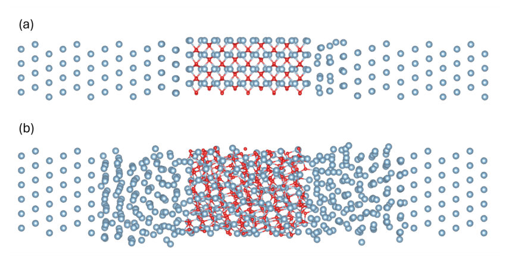 
Figure 1: Atomic structures of the Josephson-junction models. (a) Junction with a crystalline Al2O3 tunnel barrier. (b) Junction with an amorphous Al2O3 tunnel barrier of the same oxide thickness. Blue and red spheres represent Al and O atoms, respectively.

📷 Fig 2

 
Figure 2: Josephson energies of the ten amorphous junction samples (bars), estimated from the calculated Fermi-level transmission using the Ambegaokar–Baratoff relation with ∆= 0.18 meV and a device area of 200 × 200 nm2. Each junction is scaled using its corresponding transverse simulation-cell area A0. The dashed line marks the crystalline reference junction (EJ/h ≈0.73 GHz).

📷 Fig 3

 
Figure 3: Area-normalized energy-dependent transmission T(E)/A0 on a logarithmic scale, where A0 is the transverse area of the corresponding simulation cell. The thick black curve is the crystalline junction; the colored curves are the ten amorphous junctions. Normalization by A0 accounts for the different transverse supercell areas of the crystalline and amorphous models. All curves exhibit a similar transmission-valley structure, while their values near the Fermi level vary substantially among samples.

📷 Fig 4

 
Figure 4: Probability of the Fermi-level scattering states (natural-log scale), averaged over the transverse xy dimensions, for all 64 transport channels in each of the ten amorphous junction samples. The panels correspond to Samples 1–10, and the color denotes the transport-channel index. The approximately linear decay within the oxide on the logarithmic scale is characteristic of quantum tunneling; the different decay rates show that some channels are considerably more conductive than others.

📷 Fig 5

 
Figure 5 visualizes two representative scattering states in real space: (a) the least conductive channel of Sample 5, the lowest-transmission junction, and (b) the most conductive channel of Sample 6, the highest-transmission junction. In the least conductive case, the wave function remains confined to the incident electrode and interface region and dies out inside the oxide; in the most conductive case, it penetrates the barrier and retains substantial amplitude on the transmitted side. These observations suggest the following physical picture. Amorphous Al2O3 has a spatially nonuniform stoichiometry: Al-rich regions have a lower effective tunnel-barrier height, while O-rich regions have a...

**Summary.** This theoretical study quantifies the Josephson energy in superconducting junctions by comparing crystalline and amorphous oxide barriers. Using NEGF-DFT, the authors find that amorphous barriers show high variability and a higher mean $E_J$ due to percolation pathways. This work provides a crucial atomistic understanding of how oxide disorder dictates superconducting circuit performance.

**Why it may be interesting.** The direct link established between the nanoscale, disordered microstructure (amorphous oxide) and a macroscopic circuit parameter ($E_J$) is highly relevant for designing reliable quantum hardware.

Detailed structure

**Main problem.** The paper investigates how the atomic structure of the tunnel barrier affects the Josephson energy ($E_J$) in superconducting junctions, a critical parameter for transmon qubits.

**Main result.** Amorphous barriers exhibit a significantly higher mean $E_J$ compared to crystalline barriers, with variability arising from percolation-like tunneling paths due to stoichiometric inhomogeneity.

**Method.** The Josephson energy is calculated using first-principles quantum transport modeling based on the NEGF-DFT method, combined with the Ambegaokar–Baratoff relation.

**Model / system.** The system is an Al/AlOx/Al Josephson junction, modeled using the Hamiltonian relevant to transmon qubits. The comparison is made between a perfectly crystalline $	ext{Al}_2	ext{O}_3$ barrier and multiple realizations of melt-quenched amorphous $	ext{Al}_2	ext{O}_3$ barriers.

**Key observables.** Josephson energy ($E_J$), normal-state conductance ($G_{A/N}$), and the transmission coefficient $T(E)$.

**Important parameters / regimes.** The superconducting gap ($\Delta$), the junction area ($200 	imes 200 	ext{ nm}^2$), and the ratio $E_J/h$.

**Assumptions / limitations.** The analysis assumes that the superconducting properties are governed by the Ambegaokar–Baratoff relation and that the transport mechanism is quantum tunneling.

**Figures summary.** Figures compare the atomic structures of crystalline versus amorphous barriers, show the calculated $E_J$ values for multiple amorphous samples against the crystalline reference, and visualize the probability of Fermi-level scattering states.

**Paper structure.** The paper follows a computational workflow: first, calculating the transmission coefficient $T(E)$ via NEGF-DFT; second, determining the critical current $I_c$ via the Ambegaokar–Baratoff relation; and finally, calculating $E_J$ for both crystalline and various amorphous barrier structures.

Abstract

The Josephson energy $E_J$ is a key parameter governing the properties of transmon superconducting qubits. In Al/AlO$_x$/Al junctions, $E_J$ is set by electron tunneling through an ultrathin oxide barrier and therefore depends exponentially on the atomic structure of the barrier. We compute $E_J$ by first-principles device modeling based on the NEGF-DFT quantum-transport method, comparing a junction with a crystalline Al$_2$O$_3$ barrier against ten junctions with melt--quenched amorphous Al$_2$O$_3$ barriers of the same thickness. From the Fermi-level transmission and the Ambegaokar--Baratoff relation, we obtain a mean $E_J/h$ of $2.78$ GHz for the amorphous ensemble, with a standard deviation of $4.67$ GHz, compared with $0.73$ GHz for the crystalline reference; individual amorphous values span nearly two orders of magnitude. Scattering-state analysis shows that transport is quantum tunneling and that the variability originates from stoichiometric inhomogeneity of the amorphous oxide: Al-rich, low-barrier regions can connect into percolation-like tunneling pathways that strongly enhance the conductance. A realistic $200\times200$ nm$^2$ junction self-averages over more than $2\times10^4$ such microscopic regions. These results establish a quantitative atomistic route from oxide microstructure to the superconducting-circuit energy scale $E_J$.

[↑ back to top](#top)

### [Minimax games for quantum channel discrimination](http://arxiv.org/abs/2609.09839v1)

**Authors:** Kun Fang, Michael X. Cao, Hao-Chung Cheng, Li Gao, Masahito Hayashi  
**Type:** theory · **Category:** quantum information and computing · **PDF:** <https://arxiv.org/pdf/2609.09839v1>  
**Analysis basis:** full PDF text, analyzed in chunks
**Topic relevance:** `quantum measurements` **1/5**

📷 Fig 1

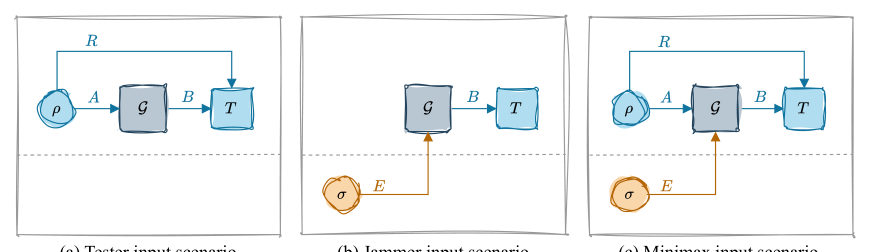 
Figure 1: Tester-input, jammer-input, and minimax-input configurations. The central grey box G denotes the channel under test. Tester systems are shown in blue, and jammer systems in orange. In (a), the tester controls the channel input and final test, while the jammer input is absent. In (b), the jammer controls the channel input, while the tester performs the final test and has no input control. In (c), the tester and jammer control separate channel inputs, and the tester performs the final test.

📷 Fig 2

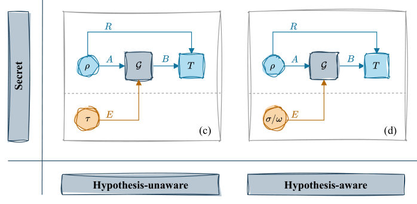 
Figure 2: Four information patterns of the jammer. Rows indicate whether the jammer’s input-selection rule is public or secret, while columns indicate whether the jammer is hypothesis-unaware or hypothesis- aware. In the public row, the dashed orange arrow denotes that the jammer’s rule is disclosed before the tester acts. In the hypothesis-aware column, the jammer may use σ when N is active and ω when M is active; in the hypothesis-unaware column, it must use the same state τ under both hypotheses.

📷 Fig 3

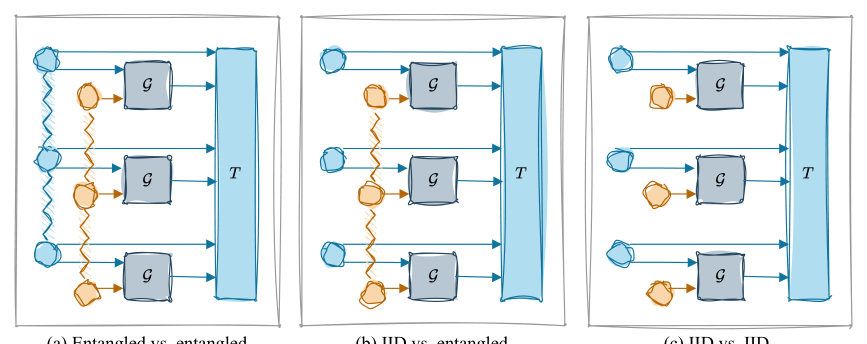 
Figure 3: Three input structures for n parallel channel uses. The tester’s systems are shown in blue and the jammer’s systems in orange. In (a), both players may prepare entangled inputs. In (b), the tester is restricted to IID inputs, whereas the jammer may still prepare entangled inputs. In (c), both players are restricted to IID inputs. All tests are performed on the tester’s systems and can be entangled.

📷 Fig 4

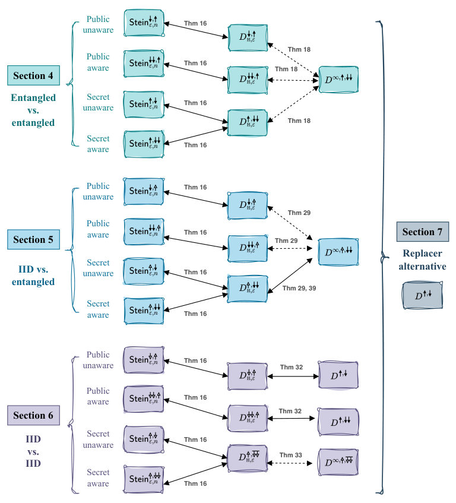 
Figure 4: Summary of the main results. At finite blocklength, the twelve game models reduce to nine hypothesis-testing divergences (Definition 12). Asymptotically, they reduce to five Umegaki relative entropy rates (Definition 14). Solid and dashed connectors indicate strong- and weak-converse results, respectively. For a replacer alternative, all Stein exponents reduce to the same single-letter value.

**Summary.** This work develops a comprehensive minimax game-theoretic framework to analyze quantum channel discrimination, treating the problem as a game between a tester and a jammer. By combining input structures and information patterns, the authors derive exact characterizations and asymptotic exponents for twelve distinct models. This advances the understanding of fundamental limits in quantum hypothesis testing and resolves several open problems in the field.

**Why it may be interesting.** The rigorous game-theoretic modeling of adversarial quantum tasks, especially the derivation of strong converse bounds, provides powerful tools applicable to understanding the fundamental limits of quantum communication and verification protocols.

Detailed structure

**Main problem.** The paper addresses quantum channel discrimination, which is a fundamental task for verifying quantum dynamics, by developing a comprehensive game-theoretic framework.

**Main result.** It characterizes the asymptotic Stein exponents for twelve distinct minimax game models, establishing strong converse properties for several previously open problems in composite hypothesis testing.

**Method.** The authors employ a minimax game-theoretic approach, combining input structures (entangled vs. IID) with information patterns (visibility and hypothesis awareness) to derive exact finite blocklength characterizations using minimax hypothesis testing divergences.

**Model / system.** The system involves distinguishing between candidate quantum channels ($\mathcal{G}$) using inputs controlled by both a tester and a jammer in a game-theoretic setting.

**Key observables.** Asymptotic Stein exponents, minimax hypothesis testing divergences, and error probabilities ($\alpha_T, eta_T$).

**Important parameters / regimes.** Blocklength ($n$), error tolerance ($\epsilon$), and the structure of the inputs (entangled vs. IID).

**Assumptions / limitations.** The framework analyzes twelve specific game models derived from combinations of input structures and information patterns; some results rely on specific assumptions regarding the jammer's input preparation.

**Figures summary.** Figure 1 illustrates the three input configurations (Tester, Jammer, Minimax). Figure 2 details the four information patterns based on jammer visibility and hypothesis awareness. Table 1 summarizes the twelve resulting Stein exponents.

**Paper structure.** The paper first establishes the general minimax game-theoretic framework for channel discrimination. It then analyzes the resulting twelve models, deriving exact characterizations and asymptotic exponents. Finally, it develops general arguments to upgrade achievability to strong converse results, resolving specific open problems.

Abstract

Quantum channel discrimination is a primitive task for identifying, verifying, and benchmarking quantum dynamics. Previous studies have primarily considered either the best-case tester-input setting or the worst-case jammer-input setting. Here, we introduce a game-theoretic framework in which both the tester and jammer control separate inputs. Combining three input structures, characterized by whether the tester and jammer use entangled inputs or IID inputs across channel uses, with four information patterns, determined by the visibility of the jammer's strategy and its knowledge of the true hypothesis, yields twelve game models. We provide exact finite blocklength hypothesis testing characterizations of all twelve models in terms of nine minimax hypothesis testing divergences and derive their asymptotic Stein exponents. Notably, for entangled jammers, neither the visibility of the jammer's strategy nor its knowledge of the true hypothesis affects the asymptotic Stein exponent, whereas the information pattern remains consequential for IID jammers. As an example, we study the discrimination of a general channel from a replacer channel and show that all asymptotic Stein exponents coincide with the same additive, single letter quantity. We further develop a general argument that upgrades achievability results to strong converse results, thereby establishing strong converse properties for several game models, resolving an open problem in composite hypothesis testing posed by Berta et al. [Commun. Math. Phys. 385, 55 (2021)], and strengthening several recent results of Lami [arXiv:2510.06340]. The framework and techniques developed here may support future studies of quantum information tasks involving competing roles.

[↑ back to top](#top)

### [Multipole splats for optimized and inverted effective potentials](http://arxiv.org/abs/2609.09280v1)

**Authors:** Matija Medvidović, Angel Rubio, Juan Carrasquilla  
**Type:** theory · **Category:** strongly correlated electrons · **PDF:** <https://arxiv.org/pdf/2609.09280v1>  
**Analysis basis:** full PDF text, analyzed in chunks
**Topic relevance:** `Keldysh / 2PI / non-Gaussian methods` **1/5**

📷 Fig 1

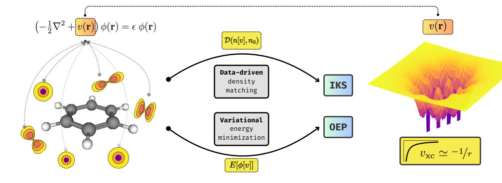 
FIG. 1. A schematic of the variational potential optimization enabled by multipole splat potentials. We use floating Gaussian monopoles and dipoles to exactly control the asymptotic decay and generate the optimized effective potential as an electrostatic potential of a fictitious charge distribution. Both optimized effective potentials and inverted exact Kohn-Sham potentials can then be recovered by direct optimization.

📷 Fig 2

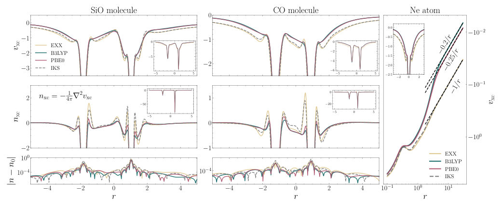 
FIG. 2. Left: The OEP and IKS potentials and their XC source densities for the silicon monoxide (SiO) molecule using the EXX, B3LYP and PBE0 functionals as well as the IKS with respect to the independently computed CCSD(T) reference density. The orbitals were represented using the aug-cc-pVQZ (quadruple-zeta) basis. In the bottom panel, we show the density TV contributions along the axis of the molecule, demonstrating density matching between OEP (IKS) and GKS (CCSD(T)). Center: Similar to the left panel, computed on the carbon monoxide (CO) molecule. Right: The radial dependence and the asymptotic decay of neon (Ne) atom effective potentials. We observe the expected asymptotic decay from...

📷 Fig 3

 
FIG. 3. Effective correlation potentials vc = vxc −vEXX, defined in Eq. 34, plotted along the molecular axis for H+ 2 (left), HeH+ (center), and H2 (right). Internuclear separation increases downward and is labeled in each panel. Hybrid OEP results (B3LYP, PBE0) are contrasted with the inverted (INV) potential obtained from a CCSD(T) reference density, serving as a high-level finite-basis reference. Dashed lines mark the (1−γ)/r asymptote inherited from the missing fraction of exact exchange. For H+ 2 , the exact vc vanishes identically. Vertical scales are independent across panels.

📷 Fig 4

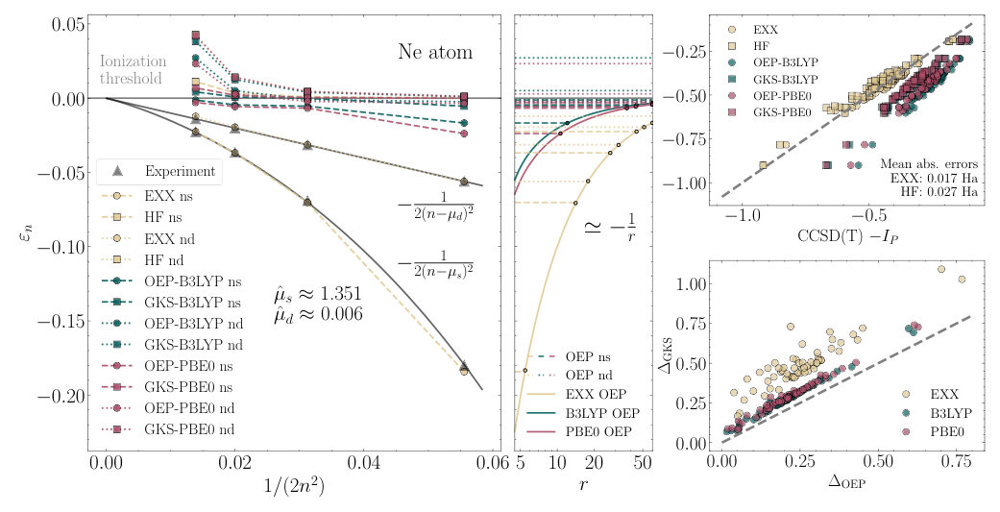 
FIG. 4. Left: Neon atom Rydberg ns (l = 0) and nd (l = 2) series εn, plotted against 1/2n2. Reference experimental values and quantum-defect fits ˆµs ≈1.351 and ˆµd ≈0.006 from Eq. 35 are highlighted. OEP eigenvalues and their GKS or HF counterparts are plotted as well. Center: Converged OEP potentials on a logarithmic radial scale, sharing the energy axis with the left panel. Horizontal lines mark the ns and nd eigenvalues, with classical turning points marked. Upper right: HOMO eigenvalues against CCSD(T) ionization potentials IP for the selected 60 GW100 systems with N ≤40 electrons. Mean absolute errors |εHOMO +IP | for EXX (≈17 mHa) and HF (≈27 mHa) are shown, averaged over these...

📷 Fig 5

 
FIG. 5. Exact exchange OEP results for benzene (top) and naphthalene (bottom), evaluated on a plane 1 Bohr above the molecular plane. Left: The exchange source density, read directly off the converged multipole splat parameters, resolv- ing the delocalized π system of benzene and the inequivalent bonding regions of naphthalene. Right: The pointwise den- sity variation |n −n0| against the GKS reference n0.

**Summary.** This paper introduces 'multipole splats,' a novel potential ansatz, to overcome the numerical instability inherent in calculating optimized and inverted effective potentials in DFT. By reformulating the OEP and IKS problems as stable nonlinear optimizations, the authors provide a robust tool to diagnose systematic errors like self-interaction error and achieve accurate spectral predictions for complex quantum systems.

**Why it may be interesting.** The development of robust, numerically stable methods for calculating effective potentials is crucial for accurately modeling long-range correlation effects and real-time dynamics in quantum systems, which is highly relevant for AMO physics.

Detailed structure

**Main problem.** Modern DFT methods using hybrid functionals introduce nonlocal and orbital-dependent potentials that cause systematic errors in response properties and real-time dynamics.

**Main result.** The introduction of 'multipole splats' allows OEP and IKS potentials to be formulated as stable, differentiable nonlinear optimization problems, yielding improved diagnostics for correlation errors and accurate spectral properties.

**Method.** The authors recast the OEP and IKS problems as stable nonlinear optimization tasks by using a novel trial potential ansatz (multipole splats) that ensures correct asymptotic decay, bypassing numerical fragility.

**Model / system.** The work focuses on electronic structure calculations within the Kohn-Sham DFT framework, particularly addressing the challenges posed by orbital-dependent exchange-correlation (XC) functionals in molecular and condensed matter systems.

**Key observables.** Effective potentials ($v_{xc}$), self-interaction error (SIE) signatures, delocalization errors, static correlation errors, and the Rydberg series eigenvalues.

**Important parameters / regimes.** The number of monopoles and dipoles in the splat ansatz, the regularization strength ($\lambda$), and the choice of basis set (e.g., $	ext{aug-cc-pVQZ}$).

**Assumptions / limitations.** The method assumes that the OEP and IKS problems can be mapped onto stable, differentiable optimization formulations using the multipole splat ansatz.

**Figures summary.** Figures compare converged $v_{xc}$ potentials (EXX vs. IKS vs. hybrid) showing the correct $-1/r$ tail, and illustrate hyperparameter stability across various molecular systems.

**Paper structure.** The paper first establishes the theoretical limitations of current DFT potentials, then introduces multipole splats as a stable optimization framework for OEP/IKS, and finally demonstrates its application by analyzing error signatures and calculating accurate Rydberg series.

Abstract

Approximate single-particle descriptions of correlated matter remain the principal source of actionable predictions in quantum science. In modern density functional theory (DFT), hybrid effective Hamiltonians are constructed to reproduce equilibrium densities and forces. However, their nonlocal and orbital-dependent potentials leave systematic errors in response properties and real-time dynamics. Local optimized effective potentials (OEP) or inverted Kohn-Sham (IKS) potentials would remove this limitation, but the numerical fragility in finite orbital bases has long prevented their wide adoption. We introduce multipole splats, a class of trial potentials that carry the correct asymptotic decay by construction. By showing that OEP and IKS map to variational and supervised variants of Hamiltonian learning, we recast both problems as stable nonlinear optimization formulated directly in standard orbital basis sets and applicable to any hybrid functional approximation. We show improvements to three canonical DFT failure modes. Firstly, by comparing approximate and near-exact inverted effective correlation potentials, we isolate the spatial signatures of self-interaction, delocalization, and static correlation errors. Secondly, we recover the Rydberg series without empirical asymptotic corrections, demonstrating access to precise spectral properties. Finally, we compute exact-exchange potentials for larger $π$-conjugated systems, establishing scaling capacity. Multipole splats extract new first-principles insights from established approximations and provide capacity for robust dataset generation for downstream processing and learning.

[↑ back to top](#top)

### [Noncommutative sharp Hausdorff-Young inequality](http://arxiv.org/abs/2609.10424v1)

**Authors:** Hongsen Qiu, Xiao Xiong  
**Type:** theory · **Category:** other · **PDF:** <https://arxiv.org/pdf/2609.10424v1>  
**Analysis basis:** full PDF text, analyzed in chunks
**Topic relevance:** `analog quantum simulation` **1/5**

📷 Fig 1

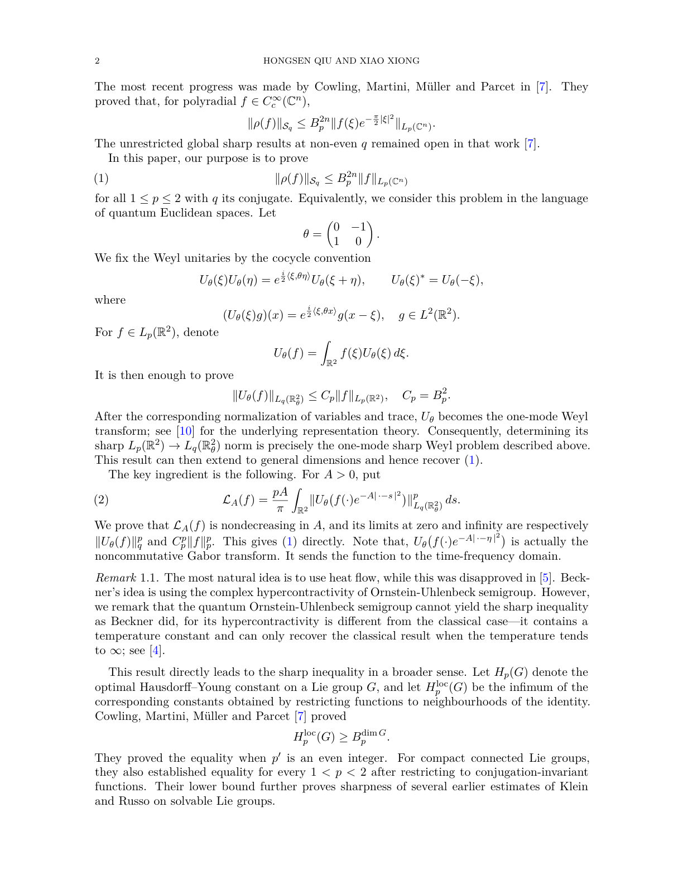 
Low-resolution page preview, page 2

📷 Fig 2

 
Low-resolution page preview, page 3

📷 Fig 3

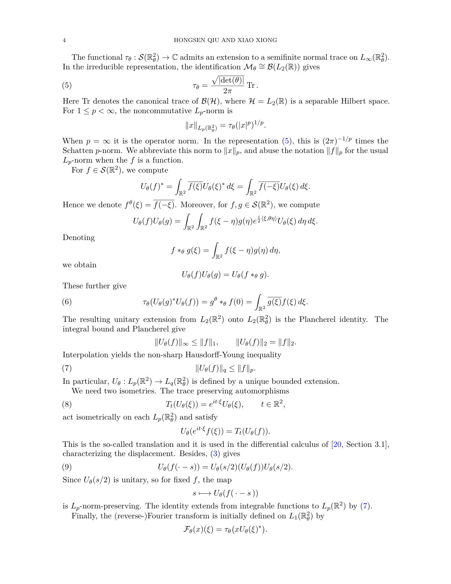 
Low-resolution page preview, page 4

📷 Fig 4

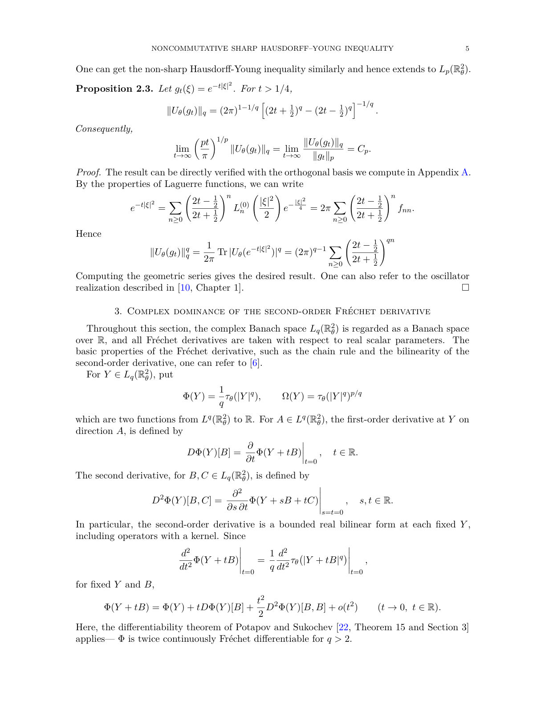 
Low-resolution page preview, page 5

📷 Fig 5

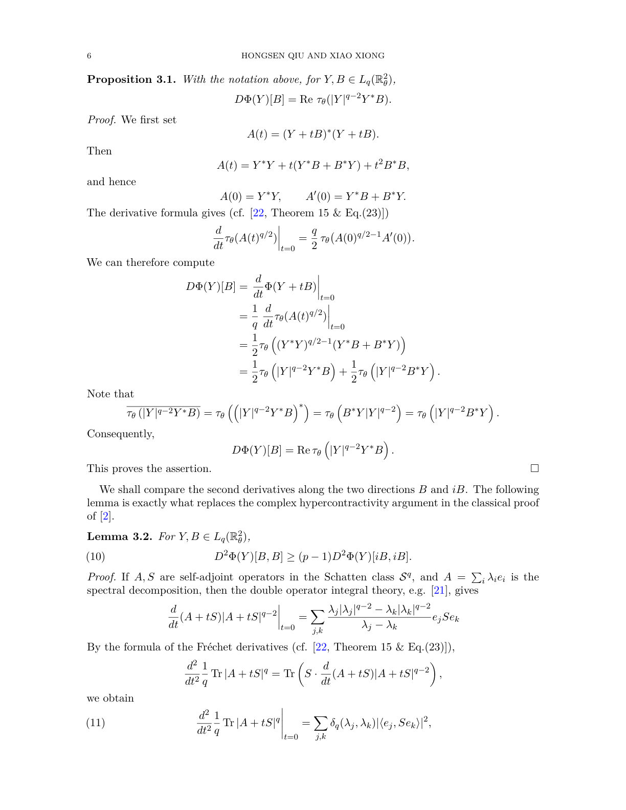 
Low-resolution page preview, page 6

**Summary.** This paper proves the sharp Hausdorff-Young inequality on the quantum Euclidean space using advanced operator calculus techniques involving a Gabor transform-related flow. The result establishes sharp bounds for the Weyl transform and extends these findings to derive the sharp Young's Convolution Inequality in the noncommutative setting.

**Why it may be interesting.** While the core topic is harmonic analysis, the use of operator calculus on quantum spaces and the generalization of classical inequalities to noncommutative settings is highly relevant to quantum probability and quantum information theory.

Detailed structure

**Main problem.** The paper aims to prove the sharp Hausdorff-Young inequality in a noncommutative setting, extending classical harmonic analysis results to quantum spaces.

**Main result.** The sharp Hausdorff-Young inequality, $\lVert U_	heta(f) 
Vert_{L^q(\mathbb{R}^2_	heta)} \le C_p \lVert f 
Vert_{L^p(\mathbb{R}^2)}$, is established, which also yields sharp constants for the Weyl transform and the Heisenberg group.

**Method.** The proof heavily relies on operator calculus, utilizing a novel operator-valued flow related to the Gabor transform and analyzing the monotonicity of associated functions via Fréchet differentiation.

**Model / system.** The analysis is conducted on the quantum Euclidean space, modeled by the von Neumann subalgebra $M_	heta = L^\infty(\mathbb{R}^2_	heta)$, which is related to the Weyl transform and noncommutative $L^p$ norms.

**Key observables.** The norms $\lVert U_	heta(f) 
Vert_{L^q(\mathbb{R}^2_	heta)}$ and $\lVert f 
Vert_{L^p(\mathbb{R}^2)}$, and the associated constants $C_p$.

**Important parameters / regimes.** The conjugate exponents $p$ and $q$ ($1/p + 1/q = 1$), and the deformation parameter $	heta$.

**Assumptions / limitations.** The method assumes the applicability of operator calculus and requires $q>2$ for certain differentiability theorems to hold.

**Paper structure.** The paper develops the proof by first establishing the monotonicity of a function $L_A(f)$ using heat flow arguments, leading to the sharp inequality (Theorem 4.4). It then generalizes this to prove the sharp Young's Convolution Inequality (Theorem 5.3) by relating convolution to pointwise multiplication in the appropriate function space.

Abstract

We prove the sharp Hausdorff--Young inequality on the quantum Euclidean space. Meanwhile, our result implies the sharp Hausdorff-Young constants for the Weyl transform, as well as that for the Heisenberg group. The key ingredient is a novel operator-valued flow related to the Gabor transform. Our method is mainly based on operator calculus and hence generally applicable to similar problems. Finally, we give the definition of noncommutative convolution and include the partial results for the sharp Young's inequality.

[↑ back to top](#top)

### [Observation of Magnetic-Anisotropy Crossover and High-Temperature Skyrmions in the Dirac Magnet Fe3Ge with a Distorted Kagome Lattice](http://arxiv.org/abs/2609.10081v1)

**Authors:** Yalei Huang, Xiaowei Lv, Bin Li, Chunqiang Xu, Dhanarajagopal Alltrin, Xiaoxuan Ma, Wanting Yang, Wei Zhou, Xiangzhuo Xing, Wen-Chin Lin, Raman Sankar, Michael Smidman, Shixun Cao, Dong Qian, Renchao Che, Xiaofeng Xu  
**Type:** both · **Category:** strongly correlated electrons · **PDF:** <https://arxiv.org/pdf/2609.10081v1>  
**Analysis basis:** full PDF text, analyzed in chunks
**Topic relevance:** `analog quantum simulation` **1/5**

📷 Fig 1

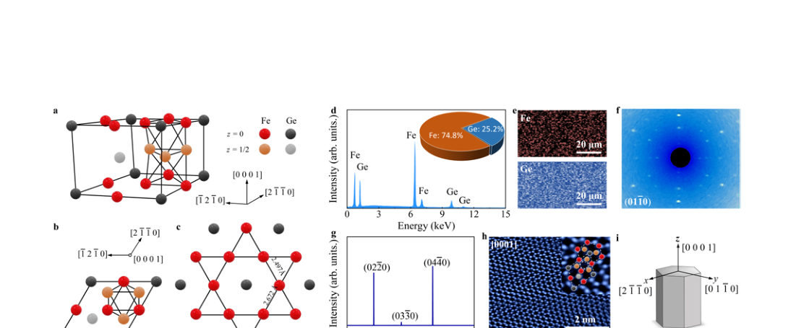 
Figure 1. Crystal structures and characterizations of Fe3Ge. a Crystallographic unit cell of Fe3Ge. Fe and Ge

📷 Fig 2

 
Figure 2. Magneto-transport measurements and band structures of Fe3Ge single crystals. a Temperature-

📷 Fig 3

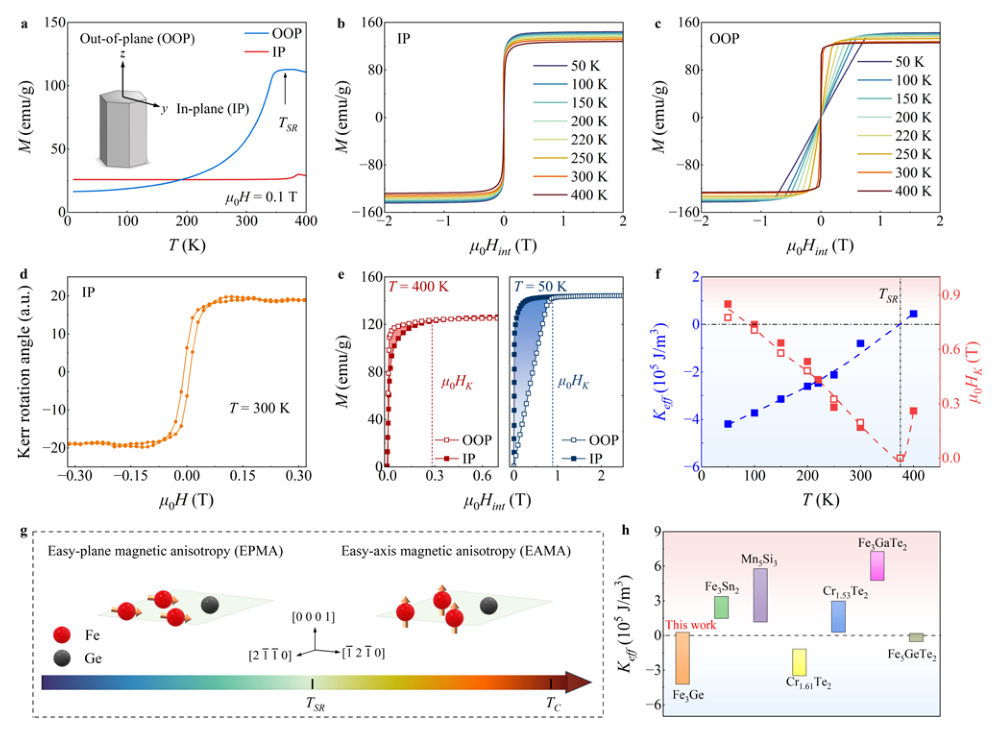 
Figure 3. Magnetic properties of Fe3Ge single crystals. a Temperature-dependent magnetization under an applied

📷 Fig 4

 
Figure 4. Spin textures of Fe3Ge single crystals. a-d LTEM images (top row) and the corresponding magnetic

📷 Fig 5

 
Figure 5. Magnetic phase diagram. a Magnetic phase diagram of Fe3Ge sketching the evolution of spin textures as

**Summary.** This work reports on the discovery of robust, high-temperature skyrmions in the Dirac magnet Fe3Ge. The material exhibits a unique combination of a high Curie temperature, large intrinsic anomalous Hall effect, and a temperature-dependent magnetic anisotropy crossover. By combining advanced transport measurements with LTEM, the authors establish Fe3Ge as a leading candidate for high-temperature spintronics.

**Why it may be interesting.** The combination of high operating temperature, topological electronic effects (AHE), and stable magnetic textures (skyrmions) in a single material system is highly relevant for designing next-generation spintronic devices, which often involves complex many-body interactions.

Detailed structure

**Main problem.** The study aims to observe and understand the coexistence of robust, high-temperature skyrmions and nontrivial electronic band structures in a magnetic material.

**Main result.** The Dirac magnet Fe3Ge was shown to host stable skyrmions up to a high Curie temperature (~650 K) while simultaneously exhibiting a large intrinsic anomalous Hall conductivity, making it a promising spintronic platform.

**Method.** The research combines experimental measurements (magnetotransport, LTEM, magnetization) with theoretical calculations (FPLAPW, tight-binding models) to characterize the magnetic and electronic properties.

**Model / system.** The physical system is the Dirac magnet Fe3Ge, which possesses a distorted Kagome lattice structure. The analysis covers its magnetic anisotropy crossover (easy-plane to easy-axis) and its topological electronic band structure.

**Key observables.** High Curie temperature (~650 K), large intrinsic anomalous Hall conductivity (~380 Ω-1cm-1), spin reorientation transition (~375 K), and visualization of mesoscopic skyrmions via LTEM.

**Important parameters / regimes.** Temperature (especially the transition points 375 K and 650 K), magnetic field strength, and the material's lattice structure (distorted Kagome).

**Assumptions / limitations.** The analysis assumes that the observed AHE is intrinsic, linked to Berry curvature, and that the observed skyrmion stability window is robust across the measured temperature range.

**Figures summary.** Figures detail structural characterizations (EDX, STEM), transport measurements ($
ho-T$, Hall resistivity), magnetic hysteresis loops, and LTEM images showing the evolution of magnetic textures like vortices and skyrmions across different temperatures.

**Paper structure.** The paper systematically presents structural confirmation, followed by transport measurements revealing topological effects and anisotropy changes. It then uses LTEM and theoretical modeling to visualize and confirm the existence and stability of skyrmion phases across the temperature-dependent magnetic anisotropy crossover.

Abstract

Topological materials that simultaneously host robust high-temperature skyrmions and nontrivial electronic band structures have attracted tremendous interest owing to their distinctive advantages for both fundamental research and prospective technological applications. Here, we report the observation of robust skyrmions in the Dirac kagome magnet Fe3Ge, which exhibits a high Curie temperature of ~ 650 K. At room temperature, Fe3Ge shows a large intrinsic anomalous Hall conductivity of ~ 380 Ω-1cm-1, originating from its nontrivial electronic band topology. Systematic magnetization measurements reveal a spin reorientation transition at ~ 375 K, indicating a crossover from easy-plane to easy-axis magnetic anisotropy. Below the spin reorientation temperature, a large topological Hall effect is observed, arising from microscopic noncoplanar spin structures. Lorentz transmission electron microscopy shows that mesoscopic skyrmions are stabilized in the easy-axis magnetic anisotropy regime and persist over an exceptionally wide temperature window of 375-650 K, far exceeding that of most previously reported skyrmion-hosting materials. These results establish Fe3Ge as a promising platform for exploring diverse topological properties, with strong potential for advancing future high-temperature spintronic applications, ranging from next-generation information storage to logic computing devices.

[↑ back to top](#top)

### [One Relative Phase Orders Operational Thresholds of Noisy Bell Pairs](http://arxiv.org/abs/2609.10034v1)

**Authors:** Xuan Du Trinh  
**Type:** theory · **Category:** quantum information and computing · **PDF:** <https://arxiv.org/pdf/2609.10034v1>  
**Analysis basis:** full PDF text, analyzed in chunks
**Topic relevance:** `correlated / nonlocal dissipation` **1/5**

📷 Fig 1

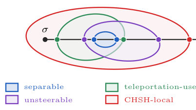 
FIG. 1. Schematic cross-section of ability-absence sets for two-qubit states. CHSH-local means that the CHSH value, optimized over local measurement settings, does not exceed the local bound 2. Separable states lie in every depicted set. The teleportation-useless and unsteerable sets lie inside the CHSH-local set [5, 20]. The teleportation-useless and unsteer- able sets overlap without either containing the other [4]. The segment is the Bell-mixing line of Eq. (1) from Φ+ at λ = 1 to σ at λ = 0, and each colored point marks an edge of the cor- responding ability-absence interval. The figure illustrates an example in which σ is steerable and teleportation-useful but CHSH-local. Thus, the...

📷 Fig 2

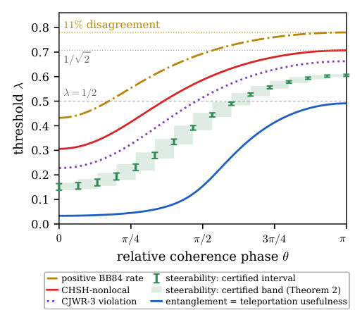 
FIG. 2. The operational thresholds are nondecreasing in the relative coherence phase θ. Analytic curves give the entangle- ment and coincident teleportation usefulness thresholds, the three-setting CJWR witness threshold, the CHSH-nonlocal threshold, and the threshold for a positive key rate in one-way BB84 with CSS codes. The last three are each optimized over the local measurements. At λ = 1

**Summary.** This work develops theoretical tools to precisely determine the operational thresholds for quantum abilities in noisy Bell pairs. It establishes that these thresholds are governed by the relative phase between the noise and coherence terms, proving a general monotonicity law. This provides a powerful, general method for certifying quantum capabilities even when exact analytical criteria are unknown.

**Why it may be interesting.** The rigorous mathematical framework developed for analyzing thresholds based on phase dependence and convexity is highly relevant for understanding noise resilience in quantum communication protocols.

Detailed structure

**Main problem.** The paper determines the operational thresholds at which quantum communication abilities (like entanglement or steerability) are lost or regained in noisy Bell pairs.

**Main result.** It proves a monotonicity law showing that the operational threshold is nondecreasing with the relative phase between the noise and Bell coherences, even when a closed-form criterion is unavailable.

**Method.** The analysis uses the X-part approximation of the noise state and relies on the convexity and local-unitary closure of the ability-absence set to establish bounds and monotonicity theorems.

**Model / system.** The system is modeled by noisy Bell pairs represented by a Bell mixture $
ho_\lambda(\sigma) = \lambda\Phi_+ + (1 - \lambda)\sigma$, where $\sigma$ is the noise state.

**Key observables.** Operational thresholds ($\lambda_K$), the relative phase ($	heta$), and the critical radius ($R$) for steerability.

**Important parameters / regimes.** Bell weight ($\lambda$), relative phase ($	heta$), and the seven Pauli expectation values defining the X-part of the noise.

**Assumptions / limitations.** The analysis assumes the ability-absence set $K$ is convex and closed under local unitaries, and it often relies on approximating the noise state by its X-part ($\sigma_X$).

**Figures summary.** Figures illustrate the loss/recovery of various quantum abilities along the Bell-mixing line, showing distinct thresholds, and demonstrate that these thresholds are nondecreasing functions of the relative phase $	heta$.

**Paper structure.** The paper progresses by first establishing the X-part approximation for bounding the threshold, then proving the general monotonicity law concerning the relative phase $	heta$, and finally applying this framework to specific abilities like steerability using geometric constraints.

Abstract

Unlike the two-qubit entangled and CHSH-nonlocal sets, the steerable and Bell-nonlocal ones have no known general closed-form criterion. For any such operational ability whose failing states form a convex set closed under local unitaries, and for a Bell mixture with arbitrary noise, the $X$ part of the noise gives an upper bound on the definitive threshold, the Bell weight above which the mixture attains the ability. That bound is the tightest that the seven of the fifteen Pauli expectation values fixing the $X$ part can support. The same theorem shows that a state has the ability whenever its $X$ part does, so partial tomography of a state can certify its ability. When noise is of $X$ form, the mixture carries a relative phase between the noise and Bell coherences that cannot be gauged away by local unitaries, and it controls the threshold through interference. We prove a monotonicity law: the threshold is nondecreasing in this phase, whether or not a closed-form criterion for the ability exists.

[↑ back to top](#top)

### [Probing quantum chaos near a wormhole throat with a circular string](http://arxiv.org/abs/2609.09613v1)

**Authors:** Ai-chen Li, Xin-Fei Li, Xuanting Ji  
**Type:** theory · **Category:** other · **PDF:** <https://arxiv.org/pdf/2609.09613v1>  
**Analysis basis:** full PDF text, analyzed in chunks
**Topic relevance:** `Keldysh / 2PI / non-Gaussian methods` **1/5**

📷 Fig 1

 
Figure 1: Effective frequency profiles and the corresponding mode-function response for the Ellis-Bronnikov wormhole. The upper panels show the time dependence of ω(R) n (τ)2

📷 Fig 2

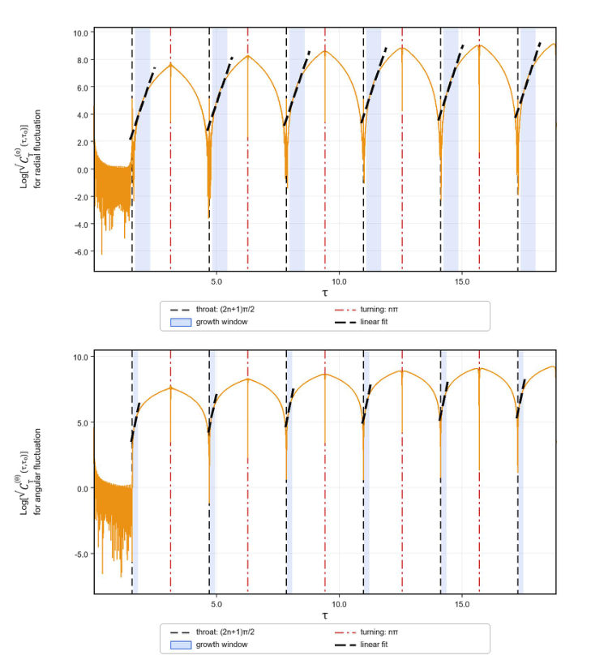 
Figure 2: Representative OTOC amplitudes for the Ellis-Bronnikov wormhole, computed from (3.36) and (3.37). The numerical parameters are the same as those used in Fig. 1. The shaded intervals indicate the growth windows used to fit the logarithm of the unequal-time commutator, and the short black dashed segments show the corresponding linear fits. The black vertical dashed lines mark the world-sheet times τthroat = (2k + 1)π/2 at which the probe string reaches the wormhole throat, whereas the red vertical dash-dotted lines mark the times τturning = kπ at which its radial velocity vanishes at the distant turning points, with k ∈Z.

📷 Fig 3

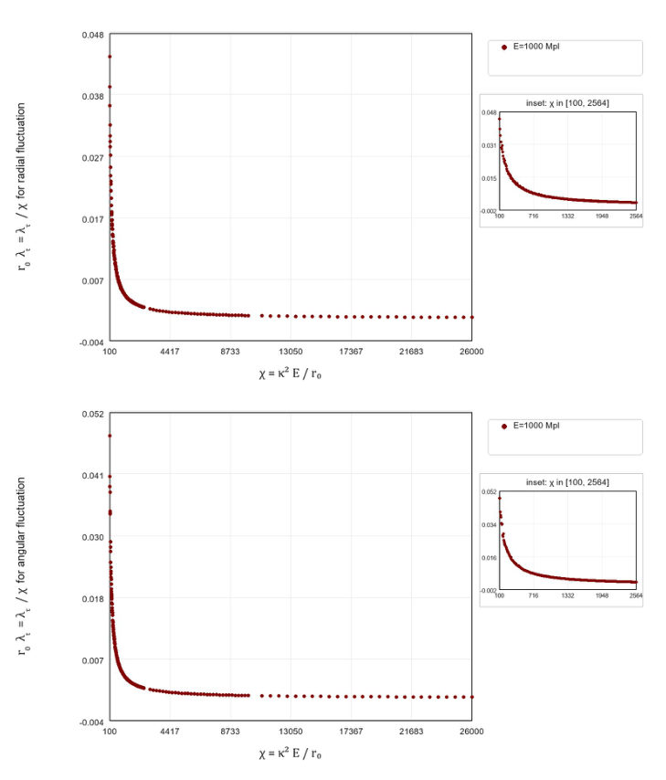 
Figure 3: Dimensionless physical-time Lyapunov rate r0λt as a function of the throat parameter χ = κ2E/r0 for the Ellis-Bronnikov wormhole. The upper and lower panels show the radial and angular fluctuation channels, respectively. For each value of χ, the OTOC amplitude is evolved as in Fig. 2, and the world-sheet Lyapunov exponent λτ is extracted from the first growth window associated with the initial passage through the throat. Since t = κ2Eτ + t0, the Lyapunov exponent defined with respect to the physical time is λt = λτ/(κ2E). In natural units λt has dimensions of inverse time, or equivalently energy, so multiplication by r0 gives the dimensionless combination r0λt = λτ/χ. This...

📷 Fig 4

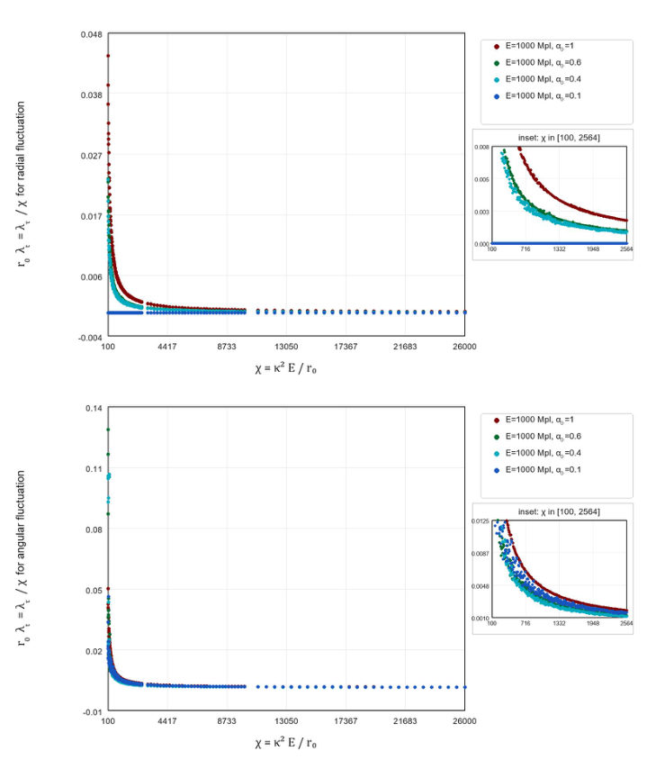 
Figure 4: Dimensionless physical-time Lyapunov rate r0λt as a function of χ = κ2E/r0 for the global-monopole wormhole. The upper and lower panels show the radial and an- gular fluctuation channels, respectively, while the different curves display the effect of the topological defect through representative values of α0 = p

📷 Fig 5

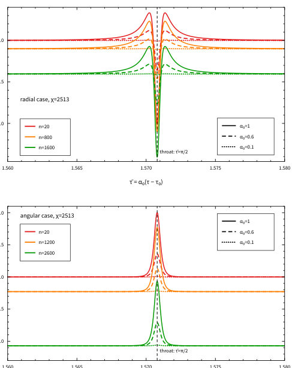 
Figure 5: Dependence of the time-dependent effective frequency profiles on the deficit factor α0 for the global-monopole wormhole. The upper and lower panels show ω(R) n (τ)2/χ2

**Summary.** This paper examines quantum chaos near traversable wormhole throats by analyzing the OTOC growth of quantum fluctuations of a probe string. Using a quadratic approximation of the world-sheet action, the authors find evidence of finite-time exponential growth in the OTOCs for both polarizations. This work establishes a transferable, non-holographic diagnostic tool for probing quantum dynamics in regular, curved spacetimes.

**Why it may be interesting.** The methodology—applying OTOC diagnostics to a regular, horizonless geometry—provides a non-holographic, transferable framework for studying quantum chaos in curved spacetimes, which is highly relevant for theoretical work on quantum gravity and spacetime dynamics.

Detailed structure

**Main problem.** The study investigates whether quantum fluctuations of a circular probe string develop a quantum-chaotic response while traversing a wormhole throat, even when the classical radial motion is stable.

**Main result.** Both the Ellis–Bronnikov and global-monopole wormholes show finite intervals of exponential Out-of-Time-Ordered Correlator (OTOC) growth associated with the first throat passage. This indicates local dynamical sensitivity distinct from asymptotic chaos.

**Method.** The authors canonically quantize the transverse fluctuation modes by expanding the world-sheet action to quadratic order and constructing OTOC amplitudes from unequal-time commutators.

**Model / system.** The system involves a circular probe string embedded in curved spacetimes, specifically analyzing the Ellis–Bronnikov and global-monopole wormhole geometries. The analysis uses the Polyakov action and focuses on the quadratic fluctuations around a stable classical trajectory.

**Key observables.** Out-of-Time-Ordered Correlator (OTOC) amplitudes and the corresponding dimensionless rate of exponential growth.

**Important parameters / regimes.** Probe energy relative to the throat scale, and the solid-angle deficit ($\Delta$) in the global-monopole extension.

**Assumptions / limitations.** The analysis is restricted to the quadratic approximation of the world-sheet action and the circular background ansatz, meaning the results characterize the Gaussian fluctuation sector.

**Figures summary.** Figures illustrate the effective frequency profiles distinguishing polarizations, showing finite intervals of exponential OTOC growth at the throat, and summarizing the dependence of the dimensionless physical-time rates on the solid-angle deficit.

**Paper structure.** The paper establishes the physical problem by contrasting the regular classical motion with the potential for quantum chaos. It details the mathematical framework by quantizing the transverse fluctuations via the quadratic action, calculates the OTOCs, and presents results for specific wormhole models, concluding with a discussion of the physical interpretation and limitations.

Abstract

We investigate whether quantum fluctuations of a circular probe string develop a quantum-chaotic response while traversing a wormhole throat. The classical circular-string embedding is periodic and radially stable, but its two physical transverse polarizations experience time-dependent tidal potentials. Expanding the world-sheet action to quadratic order, we canonically quantize these modes and construct out-of-time-ordered correlator(OTOC) amplitudes from their unequal-time commutators. For the Ellis--Bronnikov wormhole, both polarizations exhibit finite intervals of approximately exponential OTOC growth associated with the first throat passage. The corresponding dimensionless rate measured with respect to physical time is positive over the parameter range studied and generally decreases as the probe energy is increased relative to the throat scale. In the global-monopole extension, increasing the solid-angle deficit narrows the band of locally amplifiable modes and suppresses the extracted rates; a sufficiently strong defect can nearly quench the radial signal, while the angular channel retains a polarization-dependent non-monotonic structure when the energy-to-throat-scale ratio is small. These quantities characterize finite-time dynamical sensitivity in the Gaussian fluctuation sector and should not be identified with asymptotic many-body chaos or a thermodynamic phase transition. Although the numerical analysis uses two representative wormhole geometries, the construction depends only on covariant world-sheet fluctuations and real-time commutators. It therefore provides a transferable, non-holographic framework for applying quantum-chaos diagnostics directly to quantum probes in curved spacetimes.

[↑ back to top](#top)

### [The Arithmetic of Spectra: Factorization, Statistics, and Symmetric Functions](http://arxiv.org/abs/2609.10391v1)

**Authors:** A. Chaudhary  
**Type:** theory · **Category:** statistical mechanics · **PDF:** <https://arxiv.org/pdf/2609.10391v1>  
**Analysis basis:** full PDF text, analyzed in chunks
**Topic relevance:** `analog quantum simulation` **1/5**

📷 Fig 1

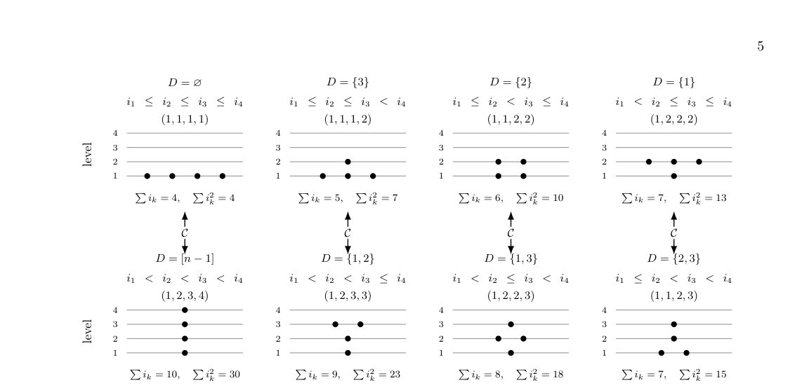 
FIG. 1. The eight descent sets for n = 4, arranged in complementary pairs. Each panel shows the lowest-energy configuration compatible with its constraint set in (22), together with the total energies for a linear spectrum, P

**Summary.** This paper develops a comprehensive mathematical framework to study how the factorization of a quantum system's single-particle spectrum determines its many-body statistics. By translating spectral properties into algebraic identities involving symmetric functions, it systematically relates bosonic and fermionic partition functions. The work is significant for providing a unified combinatorial calculus for quantum statistical mechanics.

**Why it may be interesting.** This work provides a deep mathematical link between spectral theory, combinatorics (symmetric functions), and fundamental quantum statistics, which is highly relevant for understanding correlation functions in many-body quantum systems.

Detailed structure

**Main problem.** The paper studies the arithmetic structure of spectra, focusing on how factorizations of the single-particle spectrum dictate the resulting many-particle statistics (Bose-Einstein vs. Fermi-Dirac). It aims to provide a unified combinatorial framework for calculating canonical partition functions.

**Main result.** The bosonic and fermionic statistics are systematically related through spectral factorization identities, which can be mapped onto combinatorial structures like descent sets or occupation matrices. The framework successfully relates product spectra to specific algebraic structures governing the partition functions.

**Method.** The methodology involves representing the spectrum via a formal alphabet and utilizing spectral factorization, connecting tensor factorizations to multiplicative factorizations. Advanced tools include symmetric functions, $\lambda$-rings, and the RSK correspondence to translate spectral properties into combinatorial identities.

**Model / system.** The analysis is applied to non-interacting quantum systems, generalizing from the imaginary-time propagator ($e^{-eta H_1}$) to an arbitrary trace-class one-particle kernel. Concrete examples include the harmonic trap and the rectangular infinite well, where the spectrum is separable into multiple sectors.

**Key observables.** Canonical partition functions ($Z_{n,B}, Z_{n,F}$), the spectral alphabet $X$, and cumulants ($\kappa_j$).

**Important parameters / regimes.** Temperature ($eta$), dimension ($d$), and the structure of the underlying one-particle kernel $K$.

**Assumptions / limitations.** The analysis assumes the underlying physical structure can be described by spectral alphabets and their arithmetic operations, though limitations exist regarding the natural infinite spectrum.

**Figures summary.** The notes detail mathematical relationships (Equations 13, 15, 18, 20, 21) showing how additive and product spectra lead to specific forms for bosonic and fermionic partition functions, and how these relate to combinatorial objects like descent sets.

**Paper structure.** The paper progresses by first establishing the general framework using spectral alphabets and factorizations for non-interacting systems. It then details the relationship between bosonic and fermionic statistics using symmetric functions and combinatorial tools (like descent sets). Finally, it applies this to specific physical models, such as the harmonic trap, to derive concrete results regarding symmetry and dimensionality.

Abstract

We study factorizations of the single-particle spectrum of non-interacting quantum systems and their consequences for many-particle statistics. Representing the single-particle partition function by a spectral alphabet, tensor factorizations become multiplicative factorizations of the alphabet, which can be lifted to canonical Bose and Fermi partition functions using standard symmetric-function and $λ$-ring identities. We show how product spectra arise from different factorizations, how antisymmetrization can be assigned across an odd number of factors, and which tensor factorizations are compatible with a fixed spectrum. The paper therefore studies spectral factorization and provides a consolidated combinatorial framework for canonical Bose and Fermi partition functions.

[↑ back to top](#top)

### [The Geometry of Transport in Quantum Walks and Parrondo's Paradox](http://arxiv.org/abs/2609.09269v1)

**Authors:** Jose Alfredo de Leon, Mariana Pérez-Muralles, Jan Neuser, Carlos Pineda  
**Type:** theory · **Category:** statistical mechanics · **PDF:** <https://arxiv.org/pdf/2609.09269v1>  
**Analysis basis:** full PDF text, analyzed in chunks
**Topic relevance:** `analog quantum simulation` **1/5**

📷 Fig 1

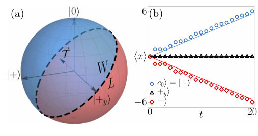 
Figure 1. (a) Bloch sphere for a Hadamard DTQW, divided by great circle (dashed) into winning (blue, W) and losing (red, L) hemispheres of initial states ⃗r0, based on the sign of the asymptotic velocity v = ⃗T · ⃗r0; the arrow marks the transport vector ⃗T . (b) Mean position ⟨x⟩versus time t for three representative initial states, one selected from the win- ning hemisphere, the losing hemisphere, and the null equator in (a): |+⟩(blue), |+y⟩(black), and |−⟩(red), respectively. Solid lines denote the asymptotic prediction vt.

📷 Fig 2

 
Figure 3. (a) Outcome map on the Bloch sphere of initial states ⃗r0 for U1, U2 randomly chosen, and their three-step al- ternation U2U2U1. The zero-drift great circles v = ⃗T (U)·⃗r0 = 0 partition the Bloch sphere into winning and losing initial states for U1 (dashed), U2 (dash-dotted), and U2U2U1 (solid). Solid and stippled regions indicate intuitive and paradoxical outcomes, respectively, following the colouring of the inset in Fig. 2. In particular, the stippled red region corresponds to L ◦L = W. (b) Mean position for an initial state in this region: U1 and U2 are losing (open red markers), whereas the minimal three-step alternation U2U2U1 is winning (open blue diamonds).

📷 Fig 3

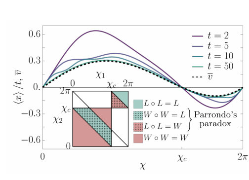 
Figure 2. DTQWs with initial coin state |c0⟩= (|0⟩+ eiπ/4 |1⟩)/ √

📷 Fig 4

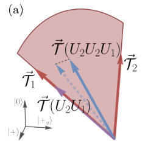 
Figure 4. (a) Pointed convex cone K = cone{⃗T1, ⃗T2} generated by the individual transport vectors ⃗Ti = ⃗T (Ui), with U1 and U2 the same operators as in Fig. 3. The transport vector ⃗T4 = ⃗T (U2U1) lies inside K, collinear with ⃗T1, whereas ⃗T3 = ⃗T (U2U2U1) lies outside. (b) The same cone embedded in the Bloch sphere. A plane through the origin separates ⃗T3 from K; it is viewed edge-on and therefore appears as a black line. Its normal ˆn defines an initial-state direction for which ⃗T3 · ˆn has the opposite sign to ⃗Ti · ˆn for every i.

**Summary.** This work applies the concept of Parrondo's paradox to quantum walks, reformulating the problem as a geometric condition on the transport vector. It shows that the paradox arises when the combined transport vector lies outside the cone spanned by the individual strategies. This provides a powerful, general criterion for understanding how quantum interference can lead to counter-intuitive macroscopic behavior.

**Why it may be interesting.** The connection between quantum walk transport geometry and classical paradoxes provides a novel, physically measurable diagnostic tool for analyzing non-trivial quantum dynamics, relevant to open quantum systems.

Detailed structure

**Main problem.** The paper investigates Parrondo's paradox—where combining losing strategies yields a winning one—within the framework of quantum transport.

**Main result.** The paradox is recast as a geometric condition: it occurs if and only if the composite transport vector falls outside the convex cone spanned by the individual strategy vectors.

**Method.** The analysis uses the transport vector, derived from the coin's steady state in discrete-time quantum walks, to establish a geometric criterion for the paradox.

**Model / system.** The model is a 1D discrete-time quantum walk (DTQW) governed by a unitary step operator $U=SC$, analyzed using Bloch sphere representations for initial states and transport vectors.

**Key observables.** Asymptotic velocity ($v$), Transport Vector ($\vec{T}$), Stationary Bloch vector ($\vec{r}_{	ext{stat}}$), and the probability of paradoxical outcomes.

**Important parameters / regimes.** The initial coin state ($\vec{r}_0$), the structure of the combined operators (composition vs. alternation), and the critical rotation angle ($\chi_c$).

**Assumptions / limitations.** The analysis focuses on the long-time, asymptotic limit of the quantum walk dynamics, and certain calculations assume Haar-distributed independence of coin operators.

**Figures summary.** Figures illustrate the Bloch sphere being divided into winning/losing hemispheres based on the sign of the asymptotic velocity, and show the mean position $\langle x 
angle$ vs. time $t$ for different initial states.

**Paper structure.** The paper progresses by defining the transport vector, establishing its geometric interpretation, comparing the conditions for paradox in coin composition versus simple alternation, and finally calculating the joint probabilities of outcomes.

Abstract

We study Parrondo's paradox -- the phenomenon where combining losing strategies yields a winning one -- in a minimal discrete-time quantum walk. We introduce the transport vector, encoded in the coin's steady state, whose inner product with the initial coin state gives the walker's asymptotic velocity. More generally, the paradox emerges exactly when the transport vector of the combined strategy falls outside the cone spanned by the individual ones -- a geometric criterion valid for any combination of strategies. It explains, for instance, why composing two coin operators within a single step can produce the paradox while simple alternation between them cannot, since alternation keeps the combined vector confined to the cone. The paradoxical set has nonzero measure, and we compute its probability explicitly in representative cases. This casts the paradox as one instance of designing reachable transport in quantum walks.

[↑ back to top](#top)

### [Unbounded degree overhead for Alice-conditioned quantum Bell certificates](http://arxiv.org/abs/2609.10162v1)

**Authors:** Fumin Wang  
**Type:** theory · **Category:** quantum information and computing · **PDF:** <https://arxiv.org/pdf/2609.10162v1>  
**Analysis basis:** full PDF text, analyzed in chunks
**Topic relevance:** `quantum measurements` **1/5**

📷 Fig 1

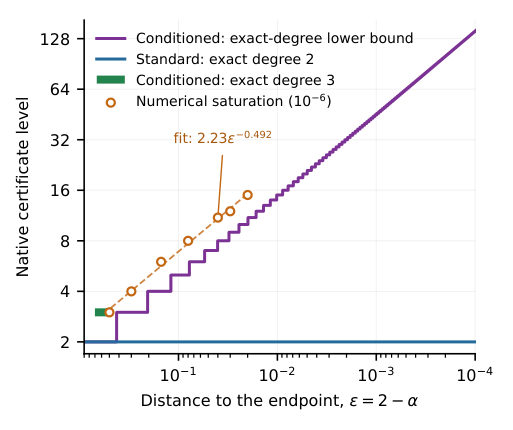 
FIG. 1. Unbounded cost of restricting certificate structure. The purple staircase is the proved lower bound dos ≥k + 1 whenever 0 &lt; ϵ &lt; tk. It bounds the exact conditioned degree. Orange points show numerical saturation within 10−6, a distinct finite-tolerance quantity; they do not certify exact closure. Standard degree remains two. The green segment marks the separately proved interval where conditioned degree is exactly three. Both axes are logarithmic. The SM reports solver residuals and the sensitivity of the numerical points.

📷 Fig 2

 
FIG. 2. Deficit in the conditional min-entropy certified by Alice-conditioned level two: log2[Gos 2 (s)/GQ(s)]. Strict positiv- ity throughout the displayed interval follows from Theorem 3; the dashed curve is numerical. The arrow at s = 2.3 marks the exact lower bound 10−3 bits, not the optimum of the relaxation. Standard level two and conditioned level three certify the exact quantum tradeoff throughout this interval.

📷 Fig 3

 
Figure 1: The level-one filtration obstruction (Remark 2.6). Left: the standard level-one moment body contains moments of total degree at most two. Right: an Alice-conditioned level-one block Γa|x, indexed by Bob words of length at most one, contains the corner moments φa|x(PB,0PB,1) — total degree three once the Alice label is counted — which the standard level-one body cannot supply.

📷 Fig 4

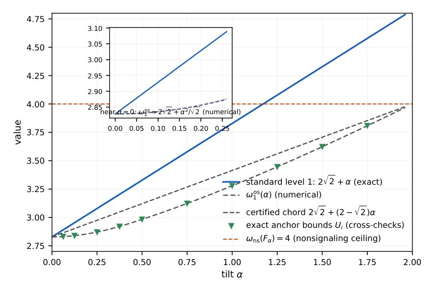 
Figure 2: Level-one separation of tilted CHSH (Theorems 3.4 and 3.7). The standard level-one value is exactly 2 √

📷 Fig 5

 
Figure 3: Exact quantum-bound certification. Orange diamonds are exact level-two closure points. The separate green strip marks an interval of exact level-three closure; it is not plotted on the level-two gap axis. The blue open interval shows the finite witness fan at level two; section 8 additionally extends non-closure to every α ∈(α−, 2). Dashed curves and the candidate boundary near 1.28427 are numerical; the existence of a unique transition is not proved.

**Summary.** This paper rigorously analyzes the resource cost of certifying quantum Bell inequalities when measurements are conditioned on one party's outcomes. It proves that this conditioning imposes an unbounded overhead in the required algebraic degree compared to standard certification methods. The work significantly separates the complexity of standard quantum bounds from those requiring single-question structure.

**Why it may be interesting.** It provides deep theoretical insights into the limitations of polynomial methods (like SOS/NPA) to capture the full complexity of quantum correlations, which is fundamental to quantum information theory.

Detailed structure

**Main problem.** The paper investigates the resource overhead required to certify quantum Bell inequalities when conditioning the test on one party's measurements (Alice-conditioned certificates). It aims to compare this overhead against standard certification methods.

**Main result.** The required certification degree for Alice-conditioned certificates grows unboundedly as the Bell test approaches certain endpoints, demonstrating a separation between the resources needed for standard versus conditioned certification.

**Method.** The authors use the framework of the NPA hierarchy, formulating the problem as a Sum-of-Squares (SOS) decomposition problem, and employ techniques like Fejér-weighted traces and Gram matrix analysis.

**Model / system.** The study focuses on quantum Bell inequalities, specifically using the CHSH scenario, and analyzing the required levels of the NPA hierarchy to certify quantum correlations.

**Key observables.** The primary observables are the minimum required certificate levels ($d_{std}$ vs. $d_{os}$) and the resulting bounds on the CHSH expectation value ($s$).

**Important parameters / regimes.** The parameter $\alpha$ controls the specific Bell test instance, and the analysis examines behavior near endpoint tilts ($\epsilon 	o 0$).

**Assumptions / limitations.** The analysis relies on the assumption that the optimal certificate lies on the boundary of the PSD cone, and it distinguishes between numerical saturation fits and true exact upper bounds.

**Figures summary.** Figures illustrate the divergence of the required conditioned degree (purple staircase) from the standard, fixed degree line as the test parameter approaches an endpoint.

**Paper structure.** The paper develops results by first establishing the unbounded overhead for conditioned certificates (Theorem 1), then characterizing finite exactness intervals (Theorem 2), and finally providing rigorous, solver-free verification of these optimal bounds.

Abstract

Requiring each sum-of-squares term to involve only one of Alice's measurement questions can impose an unbounded certification cost. In the simplest Bell scenario, we prove that no finite level of the Alice-conditioned NPA hierarchy contains all standard level-two Bell certificates. An explicit family of truncated positive functionals on the infinite dihedral group exceeds the tilted-CHSH quantum bound at every prescribed finite level, while a standard degree-two certificate is exact. A Fejer-weighted trace reduces positivity to a rank-one subtraction from a moving-average Gram matrix. The required conditioned level grows at least as $(2-α)^{-1/2}$ near the endpoint tilt. This bounds the degree of exact nice-SOS inputs to compiled-game soundness proofs. Consequently, no finite conditioned level certifies the entire optimal CHSH randomness tradeoff against quantum side information, although standard level two does. Away from the endpoint, we prove a sharp one-level cost throughout $α\in[13/10,3/2]$, using optimal-strategy kernels and exact Bernstein matrix positivity to certify a continuous interval. The results separate ordinary SOS degree from the resources keyed by single-question certificate structure.

[↑ back to top](#top)

### [Wasserstein Stability, Couplings Across Volumes, and the $1+1/d$ Moment Thresholds in the Edwards--Anderson Model](http://arxiv.org/abs/2609.09680v1)

**Authors:** Mauris Chueng, Hexiang Wang, Keheng Zhu  
**Type:** theory · **Category:** disordered systems and neural networks · **PDF:** <https://arxiv.org/pdf/2609.09680v1>  
**Analysis basis:** full PDF text, analyzed in chunks
**Topic relevance:** `analog quantum simulation` **1/5**

📷 Fig 1

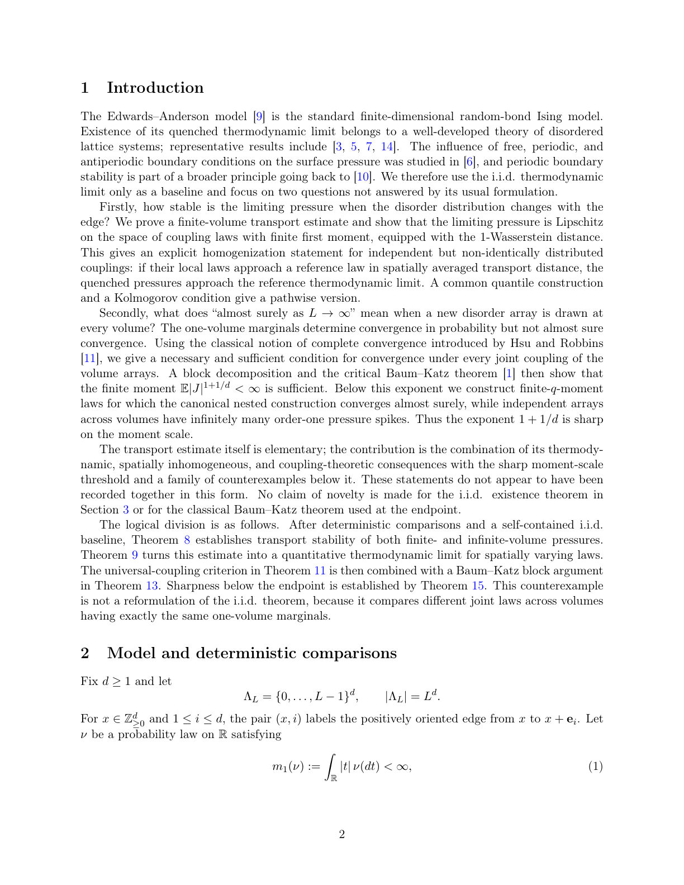 
Low-resolution page preview, page 2

📷 Fig 2

 
Low-resolution page preview, page 3

📷 Fig 3

 
Low-resolution page preview, page 4

📷 Fig 4

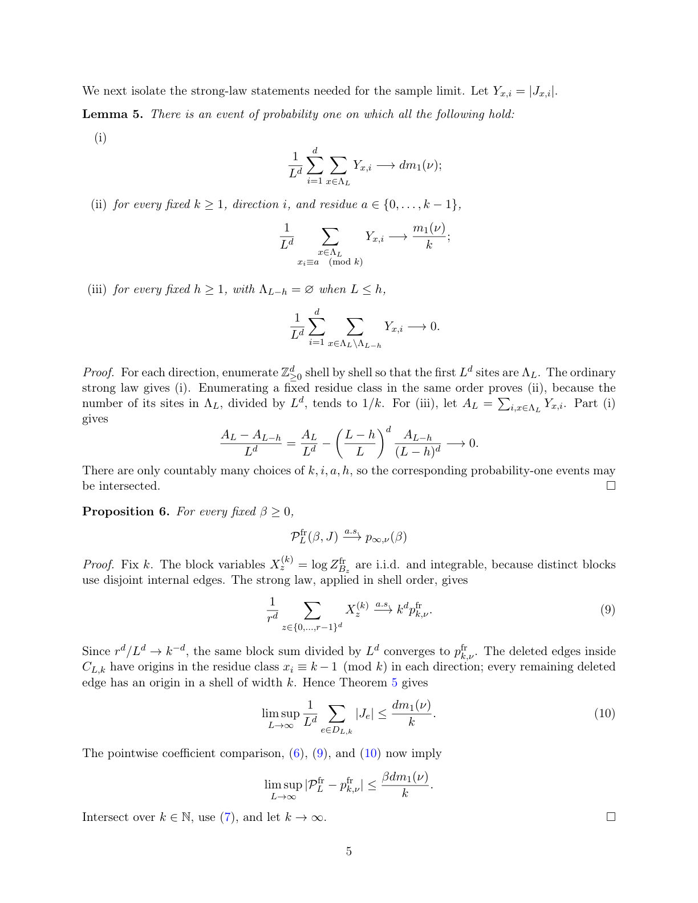 
Low-resolution page preview, page 5

📷 Fig 5

 
Low-resolution page preview, page 6

**Summary.** This paper rigorously analyzes the thermodynamic limit of the Edwards-Anderson Ising model under random disorder. It proves that the convergence of the system's pressure to a stable infinite-volume limit depends critically on the disorder couplings having a finite moment of order $1+1/d$. This threshold exponent is shown to be sharp, providing deep mathematical insight into the role of disorder fluctuations.

**Why it may be interesting.** While focused on classical statistical mechanics, the rigorous mathematical tools developed—especially the analysis of convergence thresholds based on moment conditions and coupling stability—are highly relevant to understanding critical phenomena in complex, disordered quantum systems.

Detailed structure

**Main problem.** The paper investigates the stability and convergence of the quenched pressure in the Edwards-Anderson Ising model when the disorder couplings are spatially inhomogeneous.

**Main result.** It establishes that the existence of a universal-coupling limit for the pressure requires the disorder couplings to satisfy the moment condition $\mathbb{E}|J|^{1+1/d} < \infty$, and this exponent is proven to be optimal.

**Method.** The analysis combines concepts from probability theory, specifically using the 1-Wasserstein distance to quantify stability, and employing strong limit theorems (like Borel-Cantelli) to relate convergence in probability to almost sure convergence.

**Model / system.** The system is the nearest-neighbor Edwards-Anderson Ising model, characterized by random couplings $J_{x,i}$ on a lattice $\Lambda_L$. The study focuses on the quenched pressure, defined as the normalized logarithm of the partition function, $p^L(eta, J)$.

**Key observables.** The quenched pressure, $p_b^L(eta, J)$, and its convergence properties under different boundary conditions (free vs. periodic).

**Important parameters / regimes.** The spatial dimension $d$, the inverse temperature $eta$, and the critical moment exponent $1+1/d$.

**Assumptions / limitations.** The disorder $\{J_{x,i}\}$ is assumed to be i.i.d. initially, but the core results extend to spatially inhomogeneous disorder, requiring analysis via joint couplings across volumes.

**Paper structure.** The paper first establishes basic convergence results using the 1-Wasserstein distance for the free/periodic pressures. It then develops the universal-coupling criterion, culminating in the proof that the $1+1/d$ moment condition is necessary and sufficient for this strong convergence property.

Abstract

We study the quenched pressure of the nearest-neighbor Edwards--Anderson Ising model with free and periodic boundary conditions. First, we prove that the infinite-volume pressure is $βd$-Lipschitz in the coupling law for the $1$-Wasserstein distance, yielding quantitative thermodynamic limits for spatially inhomogeneous disorder. Second, for periodic volumes, we prove that almost-sure convergence under every joint coupling of the finite-volume disorder arrays is equivalent to complete convergence of the one-volume pressure laws. Third, we prove that $\mathbb{E}\vert{}J\vert{}^{1+1/d}<\infty$ guarantees this universal-coupling conclusion. We further show that this exponent is optimal among uniform power-moment assumptions: for every $1\leq q<1+1/d$, there is a centered symmetric law with finite $q$-th moment for which canonical nested volumes converge almost surely, whereas independently resampled volumes with the same fixed-volume marginals converge in probability but not almost surely. Finally, in dimension one, we prove that the first-moment condition is also necessary for a finite limiting pressure.

[↑ back to top](#top)

### [When Does a Quantum Speedup Survive End-to-End?](http://arxiv.org/abs/2609.09850v1)

**Authors:** Pablo Herrero Gómez, Antonio Jimeno Morenilla, David Muñoz Hernández, Higinio Mora Mora  
**Type:** theory · **Category:** quantum information and computing · **PDF:** <https://arxiv.org/pdf/2609.09850v1>  
**Analysis basis:** full PDF text, analyzed in chunks
**Topic relevance:** `quantum measurements` **1/5**

📷 Fig 1

 
Low-resolution page preview, page 2

📷 Fig 2

 
Low-resolution page preview, page 3

📷 Fig 3

 
Low-resolution page preview, page 4

📷 Fig 4

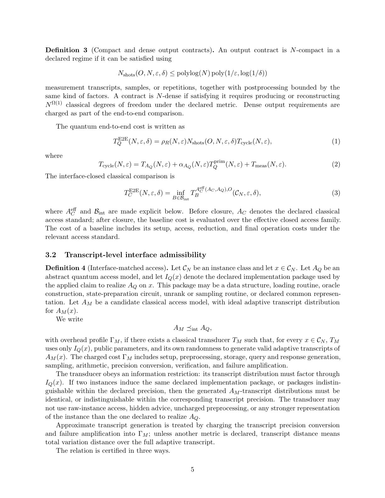 
Low-resolution page preview, page 5

📷 Fig 5

 
Low-resolution page preview, page 6

**Summary.** This paper develops a formal 'interface-admissibility' framework to audit quantum speedup claims by rigorously comparing quantum and classical end-to-end costs. It shows that the advantage is highly context-dependent, requiring that the classical overheads associated with the quantum interface be fully accounted for. This provides a necessary theoretical tool for assessing the practical viability of quantum algorithms in fields like TDA.

**Why it may be interesting.** It provides a rigorous, formal framework for quantum algorithm assessment, moving beyond simple gate counts to account for the entire computational stack, which is crucial for practical quantum advantage claims.

Detailed structure

**Main problem.** The paper addresses the fundamental question of when a quantum computational speedup remains valid when considering the entire end-to-end process, as such speedups are found to be highly dependent on the specific quantum interface used.

**Main result.** The end-to-end cost is fixed by the spectral dependence of the imported estimator on the gap $\gamma$ under the established interface-closed baseline, suggesting that classical tractability can be recovered under specific certification conditions.

**Method.** It introduces an 'admissibility relation' $	ext{AM} \preceq_{	ext{int}} 	ext{AQ}$ to audit quantum claims by determining which classical access transcripts can be generated using the same declared quantum implementation package, thereby charging all associated overheads.

**Model / system.** The framework is applied to operational audits for normalized-Betti estimation in clique-complex Topological Data Analysis (TDA), analyzing the costs associated with various quantum access models and output contracts.

**Key observables.** End-to-end cost ($	ext{T}_{	ext{E2E}}$), admissibility relation ($	ext{AM} \preceq_{	ext{int}} 	ext{AQ}$), and the spectral dependence on the gap $\gamma$.

**Important parameters / regimes.** The structure of the input access, the output contract (e.g., compact vs. dense), and the overheads ($\Gamma_M$) associated with the implementation package.

**Assumptions / limitations.** The speedup is conditional on the declared input access and output contract, and the comparison relies on the accurate certification of admissibility and the charging of all associated overheads.

**Figures summary.** The notes reference tables summarizing the framework, mapping specific tasks (like TDA Betti) to their required contracts and evidence status, rather than describing visual figures.

**Paper structure.** The paper establishes the interface-admissibility framework, applies it to TDA Betti estimation, and analyzes the cost implications based on the type of certified access (e.g., reversible indexed simplex interfaces).

Abstract

Primitive quantum speedups are interface-relative: they depend on the input access used to run the primitive and on the output contract used to consume its state or samples. This paper introduces a transcript-level admissibility relation \(A_M\preceq_{\mathrm{int}}A_Q\), defined relative to the declared implementation package of the quantum interface. It identifies which adaptive classical access transcripts that same package licenses, with all setup, transcript-generation, and precision overheads charged.   The main application is an operational audit for normalized-Betti estimation in clique-complex TDA, separating three declared-interface regimes. Reversible indexed simplex interfaces certify matched classical simplex sampling and local Laplacian row access by evaluating their reversible routines on single computational branches. Membership-based preparations induce a rejection route of overhead \(\binom{n}{k+1}/|S_k|\). Abstract spectral or block-encoding interfaces require an accompanying implementation package, transcript reduction, or shared representation. Under the indexed certificate and interface closure, the end-to-end cost is fixed by the imported estimator's spectral dependence on the gap \(γ\); the concretely realized bounded-treewidth family already admits exact \(\mathrm{poly}(n)\) classical Betti computation by rank over \(\mathbb{Q}\). A low-rank separation supports the role of access and output contracts.

[↑ back to top](#top)

## Other papers (24)

*Papers from primary archives without highlighted authors or any topic match. Click to expand.*

Show other papers

### [Accelerating A*-Based Algorithms for Decoding Quantum Low-Density Parity-Check Codes](http://arxiv.org/abs/2609.10056v1)

**Authors:** Lamia Yous, Francisco Garcia Herrero, Mark F. Flanagan  
**Type:** theory · **Category:** quantum information and computing · **PDF:** <https://arxiv.org/pdf/2609.10056v1>  
**Analysis basis:** full PDF text, analyzed in chunks

📷 Fig 1

 
Fig. 1. Evolution of the estimated error probability from BP for a set of three sample qubits. The horizontal axis shows the BP iteration number, while the vertical axis shows the estimated probability of error. Each colored curve represents a different qubit in the Tanner graph. The curves are shown for qubits 32, 33 and 34 as these are representative of general qubit behavior.

📷 Fig 2

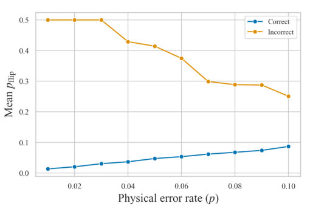 
Fig. 2. Mean pflip values for correct and incorrect qubits versus physical error rate, p than transient fluctuations, which commonly occur in the early stages of BP decoding. As evidenced by the behavior of qubit 33 in Figure 1a, such early oscillations often stabilize as the decoder converges and should therefore not be penalized. The average step change is calculated as

📷 Fig 3

 
Fig. 3. Node expansion reduction factor versus pgated values for varying τ at a fixed physical error rate of p = 0.05. The node expansion reduction factor is defined as the ratio of the number of nodes expanded by the stand-alone Tesseract to those expanded by the BP-Tesseract hybrid decoder. is too high, too many qubits are not gated, which degrades the information given to Tesseract. If τ is too low, too many qubits are gated, reducing the amount of useful information available and thus increasing the number of node expansions. If pgated is too low, gated qubits are only slightly penalized, and their cost is not much higher than the reliable qubits, while if the value for pgated is too...

📷 Fig 4

 
Fig. 4. Mean number of node expansions versus physical error rate for the stand-alone Tesseract decoder, the BP-Tesseract decoder, and the gated BP- Tesseract decoder.

📷 Fig 5

 
Fig. 5. LER performance versus physical error rate for the stand-alone Tesseract decoder, the BP-Tesseract decoder, and the gated BP-Tesseract decoder, for the T1 and BB codes. directly to Tesseract without any filtering is not optimal in non-convergent cases. While the reduction in node expansions is substantial, it is also important to assess the impact on the logical error rate (LER) performance. Figure 5 presents the LER results for all three decoders for the T1 and bicycle bivariate codes. In both cases, the LER for the proposed decoder is extremely close to that of the original Tesseract. These results indicate that the proposed decoder achieves an effective balance be- tween...

**Summary.** This paper introduces a novel, hybrid decoding framework for QLDPC codes by combining the speed of Belief Propagation (BP) with the accuracy of the A*-based Tesseract decoder. A key component is a reliability-based gating mechanism that filters uncertain BP outputs, allowing Tesseract to focus only on the most challenging residual errors. This significantly reduces computational overhead while preserving high error correction performance.

**Why it may be interesting.** The development of faster, more robust decoding algorithms is crucial for scaling up quantum computers, making this work highly relevant to the theoretical understanding of fault-tolerant quantum computation.

Detailed structure

**Main problem.** The primary challenge is developing an efficient decoder for Quantum Low-Density Parity-Check (QLDPC) codes to enable reliable, large-scale quantum computation.

**Main result.** The proposed hybrid BP-Tesseract decoding framework achieves substantial reductions in decoding complexity (up to 15x fewer expanded nodes) while maintaining the logical error rate of the stand-alone Tesseract decoder.

**Method.** A two-stage hybrid approach is used: Belief Propagation (BP) runs first to generate soft information and hard decisions; if BP fails to converge, a reliability-based gating mechanism filters the output, which then guides the A*-based Tesseract search on the residual error.

**Model / system.** The system involves QLDPC codes used for Quantum Error Correction (QEC), often constructed via the CSS framework. Decoding is performed on the Tanner graph structure associated with these codes.

**Key observables.** Decoding Complexity (number of expanded nodes), Logical Error Rate (LER), Syndrome ($s$), and soft information (per-qubit confidence levels).

**Important parameters / regimes.** Physical error rate ($p$), reliability threshold ($	au$), and the gating parameter ($p_{	ext{gated}}$).

**Assumptions / limitations.** The core assumption is that combining the speed of BP with the guaranteed accuracy of Tesseract, guided by a reliability filter, overcomes the computational bottlenecks of the standalone Tesseract decoder.

**Figures summary.** Figures compare the node expansion reduction factor, mean number of node expansions, and LER performance across the three decoder types (Tesseract, BP-Tesseract, and the proposed gated BP-Tesseract) for T1 and BB codes.

**Paper structure.** The paper establishes the need for efficient QEC decoders, reviews existing methods (BP and Tesseract) highlighting their weaknesses, and then proposes and validates the hybrid BP-Tesseract framework using a reliability-based gating mechanism.

Abstract

Quantum low-density parity-check (QLDPC) codes represent a promising approach for error correction in quantum computing. The recently proposed Tesseract decoder uses the A* search algorithm that guarantees finding the most likely error pattern. However, practical implementations of Tesseract often involve an extremely large graph, and the inherently sequential nature of the search results in high computational overhead and long runtime. To improve decoding efficiency, we propose a two-stage decoding framework. First, a belief propagation (BP) decoder efficiently processes the syndrome. This step generates hard decisions (a binary error vector) and soft information (per-qubit confidence levels). In non-convergent BP cases, a gating mechanism examines the BP decoder's output to identify and filter out qubits with oscillating confidence values. In these cases, the refined output serves as input to Tesseract, which then attempts to identify and correct any residual errors. This hybrid approach leverages the high speed of BP decoding and delegates the more challenging decoding instances to Tesseract. Numerical results demonstrate a substantial reduction in overall decoding complexity while maintaining the logical error rate (LER) of the stand-alone Tesseract. Across all tested physical error rates, the proposed method achieves at least 5x reduction in the number of expanded nodes in the Tesseract, with a peak reduction of nearly 15x at a physical error rate of p = 0.05 for the [[126, 12, d < 11]] T1 code, and approximately 8.8x at p = 0.05 for the [[72, 12, 6]] bicycle bivariate (BB) code.

[↑ back to top](#top)

### [An analysis of iterative refinement for quantum linear system solvers](http://arxiv.org/abs/2609.10250v1)

**Authors:** Adrian Harkness, Mohammadhossein Mohammadisiahroudi, Brandon Augustino, Giacomo Nannicini, Tamás Terlaky  
**Type:** both · **Category:** quantum information and computing · **PDF:** <https://arxiv.org/pdf/2609.10250v1>  
**Analysis basis:** full PDF text, analyzed in chunks

📷 Fig 1

 
Figure 1. Residual norm convergence for an 8-variable linear system with q P t3, 4, 5u QPE qubits over 12 iterative refinement iterations. (a) Noise-free simulation, in which each ad- ditional QPE qubit accelerates convergence. (b) The same three configurations executed on the IBM Pittsburgh quantum computer.

📷 Fig 2

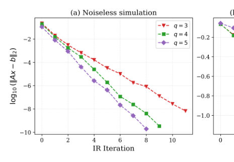 
Figure 1 shows the residual norm log10 }Axpkq´b}2 as a function of the IR iteration index k. In noise-free simulation (panel (a)) the convergence rate is ordered by the precision of the quantum oracle as expected. Initializing the algorithm with a 10´9

📷 Fig 3

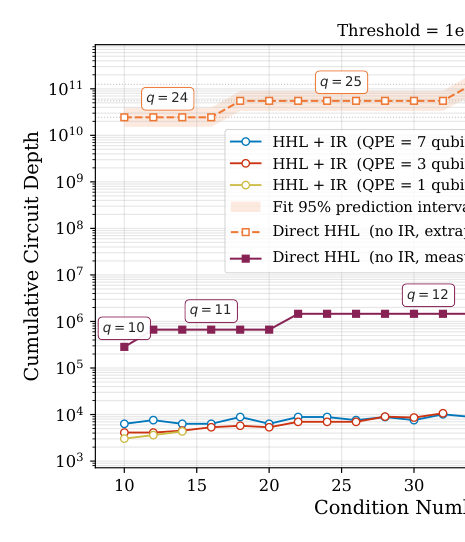 
Figure 2. Cumulative circuit depth required to reach the residual threshold }Ax´b}2 ď ε, with and without iterative refinement. Solid curves with filled markers are measured transpiled depths: HHL + IR at the target ε “ 10´6, and direct HHL at the relaxed threshold ε “ 10´2, for which the required QPE register sizes are directly compilable. The dashed curve with hollow markers is the extrapolated direct-HHL depth at ε “ 10´6, obtained from a fitted depth model; the shaded band is the fit’s 95% prediction interval. Boxed labels indicate the required QPE register size q on each plateau.

📷 Fig 4

 
Figure 3. Trade-offs between iterative refinement iterations and quantum resources for solving a 64-variable linear system to a desired residual using HHL. Color encodes the resulting residual at each parameter combination as log10p}Ax ´ b}2q, and contour lines show cumulative quantum resources across all IR iterations. In the left plot, 6 QPE qubits are used for the HHL circuit, and in the right plot, 106 shots are used to readout x from |xy at each iteration of iterative refinement.

**Summary.** This paper introduces an Iterative Refinement (IR) framework to overcome a major hurdle in quantum linear system solving: the polynomial resource scaling when high precision is required via tomography. By structuring the computation as a sequence of low-precision steps, the authors achieve polylogarithmic scaling in the inverse error tolerance, making high-accuracy quantum computation more feasible.

**Why it may be interesting.** It provides a crucial algorithmic tool for achieving high-accuracy quantum simulations by decoupling the resource scaling of precision from the circuit depth, which is vital for practical quantum simulation of physical systems.

Detailed structure

**Main problem.** The paper addresses the limitation in quantum algorithms that combine Quantum Linear System Algorithms (QLSA) with quantum state tomography (QTA), where the required precision introduces a polynomial dependence on the inverse error tolerance.

**Main result.** An Iterative Refinement (IR) framework is proposed that reduces the overall dependence on the target precision from polynomial to polylogarithmic, allowing high-precision solutions using only fixed-precision quantum subroutines.

**Method.** The core method is applying classical iterative refinement techniques to the quantum computation process, solving a sequence of related, low-precision linear systems to progressively refine the solution.

**Model / system.** The analysis focuses on solving the linear system problem (LSP): Ax = b, within the framework of quantum computation. It analyzes performance across three input models: QRAM, LCU, and sparse-access oracles.

**Key observables.** Residual error ($\|Ax' - b\|^2$), cumulative circuit depth, and the dependence of complexity on the inverse error tolerance ($\epsilon^{-1}$).

**Important parameters / regimes.** Condition number ($\kappa_A$), target precision ($\epsilon$), and the number of required iterations ($O(\log(1/\epsilon))$).

**Assumptions / limitations.** The analysis assumes the ability to perform fixed-precision quantum solves and tomography steps, and that the residual reduction is geometric at each step.

**Figures summary.** Figures compare the cumulative circuit depth of direct HHL vs. HHL+IR, showing IR maintains a much lower, stable depth, and heatmaps illustrate the resource trade-off between IR iterations and QPE qubits/shots.

**Paper structure.** The paper reviews QLSA advancements, details the IR algorithm, provides a complexity analysis under various input models, and validates the framework using numerical experiments on both simulators and hardware.

Abstract

We present and analyze an iterative refinement (IR) framework for improving the precision dependence of algorithms that combine a quantum linear system algorithm (QLSA) with quantum state tomography. Existing QLSAs achieve polylogarithmic dependence on the inverse error tolerance to prepare a quantum state encoding the solution, but extracting a classical description of such a state via tomography typically introduces a polynomial dependence on the target precision. To retain polylogarithmic dependence in the inverse error tolerance throughout the entire process, we develop an IR scheme that solves a sequence of related linear systems to progressively refine the solution while requiring only fixed-precision quantum subroutines, finally obtaining a classical description of a high-precision solution. We analyze the proposed framework under three input models: quantum-read/classical-write RAM (QRAM), linear combinations of unitaries (LCU), and sparse-access oracles. We evaluate the proposed scheme through numerical experiments on both quantum simulators and real quantum hardware. The results demonstrate that iterative refinement efficiently improves the precision of the solution and exhibits robustness to hardware noise.

[↑ back to top](#top)

### [Anomalous Hall Response Induced by Correlated Disorder in the Breathing Kagome Lattice Mn$_{3}$Sn](http://arxiv.org/abs/2609.09699v1)

**Authors:** Tsung-Han Yang, Seng Huat Lee, Hengxin Tan, Yuanpeng Zhang, Benjamin A. Frandsen, Václav Petříček, Huibo Cao, Daniel Olds, Matthew G. Tucker, Jiaqiang Yan, Binghai Yan, Zhiqiang Mao, Qiang Zhang  
**Type:** both · **Category:** strongly correlated electrons · **PDF:** <https://arxiv.org/pdf/2609.09699v1>  
**Analysis basis:** full PDF text, analyzed in chunks

📷 Fig 1

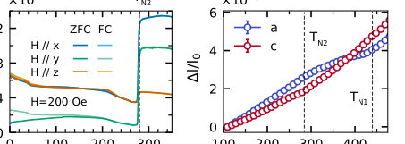 
FIG. 1. Crystal and magnetic structures from diffraction and magnetization measurements. (a) and (b) show top and side views, respectively at 295 K. (c) Temperature-dependent neu- tron powder diffraction at POWGEN showing the emergence of incommensurate magnetic reflections below TN2. (d) Tem- perature dependence of the integrated intensity of the (101) reflection, revealing the magnetic phase transitions at TN1 and TN2. (e) Temperature dependence of the magnetization for H ∥x, y, and z, showing the magnetic transition at TN2. (f) Temperature dependence of the lattice parameters obtained from synchrotron powder x-ray diffraction performed at 28- ID-1 (PDF) beamline.

📷 Fig 2

 
FIG. 2. Magnetic field dependence of the AHE in nearly sto- ichiometric Mn3Sn at 300 K. (a) Schematics of the three con- figurations used for AHE measurements on σyz, σyx and σzx. (b) Field-dependent Hall conductivity components measured at 300 K. (c) Anomalous Hall resistivity ∆ρH = ρH −R0µ0H plotted as a function of magnetization M. (d) Field de- pendence of the antiferromagnetic Hall component, ρAF H = ρH −R0µ0H −Rsµ0M, obtained by subtracting the ordi- nary and magnetization-linear contributions. (e) Comparison of the anomalous Hall resistivity and carrier density n for Mn3+δSn reported in this work and previous studies.

📷 Fig 3

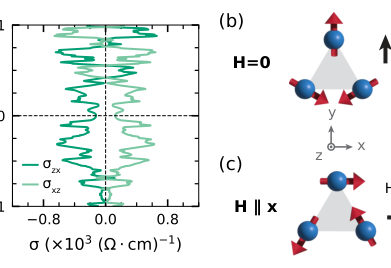 
FIG. 3. Anomalous Hall conductivity and magnetic-field- induced spin rotation of Mn3Sn. (a) DFT-calculated intrinsic AHC components for the average hexagonal structure. (b) Reference magnetic structure used for the DFT calculations of the intrinsic AHC. (c) Schematic rotation of the noncollinear Mn moments under H ∥x, generating σyz.

📷 Fig 4

 
FIG. 4. Local structural distortion and spin canting in Mn3Sn. (a) Local structural motif of Mn3Sn at 500 K pre- sented in a hexagonal cell. The tilted Mn–Mn–Mn triangles within the kagome plane are resolved, revealing a bond-length disproportionation of 0.2 Å and asymmetric bond angles of 123◦and 117◦, which breaks hexagonal symmetry. (b) RMC modeling results of GK(r) compared to experimental data. (c) Partial pair distribution function for individual atomic pairs, showing well-resolved Mn–Mn and Mn–Sn atomic pairs near 2.7 Å. (d) Magnetic PDF fits showing a substantial mPDF sig- nal. (e) Local magnetic-moment motif at 300 K from mPDF refinement. (f) DFT-calculated intrinsic AHC components...

📷 Fig 5

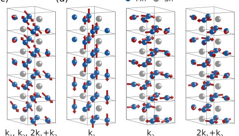 
FIG. 5. Single-crystal neutron diffraction and low-T mag- netic structure of Mn3Sn below TN2. (a) Reconstruction of the (H0L) plane near the (−101) nuclear reflection at 6 K, showing magnetic satellites with k1 and k2 and their higher harmonics; the corresponding L profile is shown at right. (b) Observed and calculated structure-factor amplitudes for nu- clear (blue) and magnetic (red) reflections. (c) Refined mag- netic structure combining the k1, k2, and 2k1 + k2 compo- nents. (d) Decomposition into the individual k1, k2, and components.

**Summary.** This study investigates the anomalous Hall effect in $	ext{Mn}_3	ext{Sn}$, finding that the transport tensor component $\sigma_{yx}$ is finite despite the average crystal symmetry forbidding it. The key mechanism identified is the activation of this response by correlated, local lattice-spin distortions, demonstrating that disorder acts as a crucial, symmetry-breaking degree of freedom for topological transport.

**Why it may be interesting.** The work provides a concrete example of how local, correlated disorder can induce topological electronic responses inaccessible through standard symmetry analysis based on long-range crystal averages, which is a key concept in modern condensed matter theory.

Detailed structure

**Main problem.** The study investigates how correlated disorder can activate anomalous Hall responses ($\sigma_{yx}$) in $	ext{Mn}_3	ext{Sn}$, a Kagome antiferromagnetic Weyl semimetal, even when the average crystal symmetry forbids such transport.

**Main result.** A finite, hysteretic $\sigma_{yx}$ is observed in the inverse-triangular phase, which is attributed to local, correlated lattice-spin distortions that break symmetry locally, establishing disorder as an active degree of freedom for topological transport.

**Method.** The research combines experimental measurements (Hall effect, neutron diffraction, total scattering PDF analysis) with first-principles calculations (DFT using the Berry-curvature Kubo-formula) to link local structural/magnetic details to macroscopic transport properties.

**Model / system.** The system is the nearly stoichiometric $	ext{Mn}_3	ext{Sn}$ crystal, which undergoes magnetic transitions from a high-symmetry phase to an inverse-triangular phase, exhibiting correlated orthorhombic lattice distortions and noncoplanar Mn magnetic moments.

**Key observables.** Anomalous Hall conductivities ($\sigma_{yx}, \sigma_{zx}, \sigma_{yz}$), lattice parameters, magnetic pair distribution functions (PDF), and local symmetry descriptions ($Ama2$).

**Important parameters / regimes.** Transition temperatures ($T_{N1} \approx 440 	ext{ K}, T_{N2} \approx 280 	ext{ K}$), magnetic field strength ($H$), and the degree of local lattice distortion.

**Assumptions / limitations.** The analysis assumes that electronic transport is sensitive to local symmetry breaking over finite length scales, which is captured by analyzing local structure via total scattering and mPDF, rather than just the Bragg-average structure.

**Figures summary.** Figures show temperature dependence of AHE components, lattice parameter changes across transitions, and comparisons between DFT predictions for average vs. distorted structures.

**Paper structure.** The paper systematically analyzes the anomalous Hall response across magnetic transitions, using structural refinement (PDF) and DFT calculations to pinpoint the role of local symmetry breaking (correlated disorder) in enabling symmetry-forbidden transport channels.

Abstract

Macroscopic transport tensors are generally constrained by the average crystallographic and magnetic symmetries of a material. In the kagome antiferromagnetic Weyl semimetals Mn$_{3+δ}X$ ($X=$~Sn or Ge), previous studies showed that the anomalous Hall conductivity $σ_{yx}$ is forbidden by the average \hexsg{} structure and coplanar inverse-triangular magnetic order. Here we report that nearly stoichiometric Mn$_3$Sn nevertheless exhibits a finite $σ_{yx}$ with large hysteresis, together with enhanced $σ_{zx}$ and $σ_{yz}$, in the inverse-triangular phase below $T_{\mathrm{N1}}\approx 440~\mathrm{K}$, whereas all AHE components vanish in the amplitude-modulated conical phase below $T_{\mathrm{N2}}\approx 280~\mathrm{K}$. Total scattering and magnetic pair distribution function analysis reveal correlated orthorhombic distortions and noncoplanar Mn moments. First-principles calculations show that this coupled lattice-spin distortion activates the average symmetry forbidden $σ_{yx}$ within the inverse-triangular phase. Its disappearance below $T_{\mathrm{N2}}$ indicates that the correlated disorder must cooperate with a long-range inverse-triangular antiferromagnetic order capable of supporting Berry curvature. Our results establish correlated disorder as an active symmetry-breaking degree of freedom that enables topological transport inaccessible from the Bragg-average structure alone.

[↑ back to top](#top)

### [BRST quantization for the restoration of broken symmetries: a pedagogical example](http://arxiv.org/abs/2609.10172v1)

**Authors:** Pranav Sharma, R. J. Furnstahl  
**Type:** theory · **Category:** other · **PDF:** <https://arxiv.org/pdf/2609.10172v1>  
**Analysis basis:** full PDF text, analyzed in chunks

📷 Fig 1

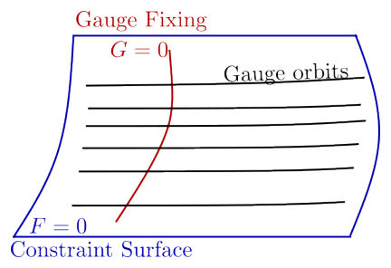 
FIG. 1: There are multiple physically equivalent trajectories (gauge orbits) in the phase space of a gauge theory. A gauge fixing condition (red line) picks just one point along each set of gauge orbits, defining a “gauge slice”. Figure adapted from [14].

📷 Fig 2

 
FIG. 2: a) The original system of particles has a global translational symmetry: the system can be uniformly translated to any location on the x axis and have the same intrinsic dynamics. (b) The system can now be moved arbitrarily at each moment in time, with an adjustment in R keeping it fixed as if it is at the same point on the line.

📷 Fig 3

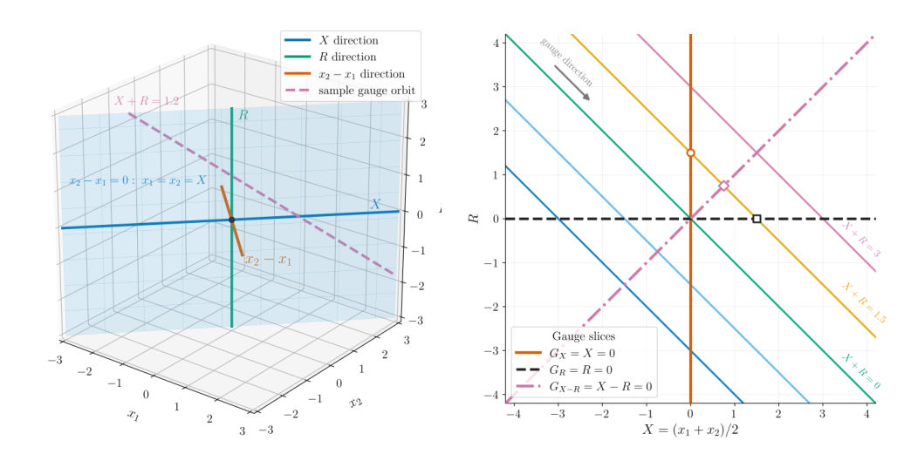 
FIG. 3: (a) The coordinate portion of the extended phase space for the two-body system, with the plane defined by the collective coordinate R and the CoM of the original DoFs X = (x1 + x2)/2 highlighted. Physically equivalent configurations of the system generated by the constraint Eq. (7) (also known as gauge orbits) lie on such a plane. (b) The CoM and collective coordinate plane with several options for gauge-fixing illustrated (c.f. the red line in Fig. 1). The choice X = 0 corresponds to the gauge-fixing choice used to exactly diagonalize the Hamiltonian in Sec. IV. The choice R = 0 reduces us back to the original problem.

📷 Fig 4

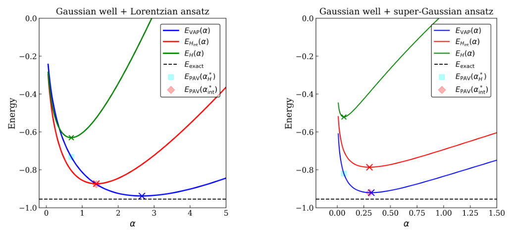 
FIG. 4: Energy as a function of variational parameter α for a Gaussian potential well with (a) a Lorentzian product ansatz and (b) a super-Gaussian product ansatz. Results for VAP, Hint, and plain H are compared to the exact result and PAV evaluated with α∗ H and α∗ Hint.

📷 Fig 5

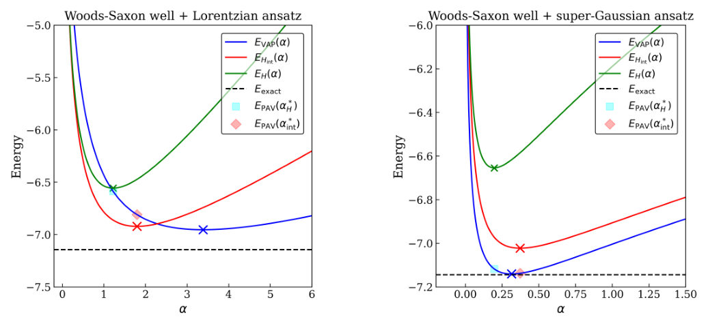 
FIG. 5: Energy as a function of variational parameter α for a Woods-Saxon potential well with (a) a Lorentzian product ansatz and (b) a super-Gaussian product ansatz. Results for VAP, Hint, and plain H are compared to the exact result and PAV evaluated with H and Hint.

**Summary.** This paper introduces BRST quantization as a rigorous, systematic method to restore broken symmetries in quantum many-body systems, using a simple two-body model for illustration. It shows that by treating the symmetry as a local gauge symmetry, the formalism correctly cancels spurious degrees of freedom in both Hamiltonian and path integral treatments. This offers a powerful alternative to traditional projection techniques for effective field theories.

**Why it may be interesting.** The systematic handling of gauge symmetries via BRST quantization is a powerful, general technique applicable to any physical system where approximate methods break continuous symmetries, making it relevant for advanced many-body theory.

Detailed structure

**Main problem.** The paper addresses the theoretical challenge of restoring symmetries in many-body quantum systems when using approximate reference state methods that inherently break these symmetries.

**Main result.** It demonstrates that BRST quantization provides a systematic and consistent alternative to conventional projection methods for handling symmetry restoration, particularly by converting global symmetries into local gauge symmetries.

**Method.** The core method involves promoting global symmetries to local gauge symmetries, applying the BRST formalism (using ghost variables), and developing both Hamiltonian and path integral formulations to ensure gauge invariance in observables.

**Model / system.** The analysis uses a pedagogical two-body system of interacting masses in one dimension, which serves as a model to illustrate the general mechanism applicable to complex many-body systems and effective field theories.

**Key observables.** Gauge invariant observables, the intrinsic energy spectrum (viewed from the collective rest frame), and the cancellation of spurious dynamics related to the center of mass.

**Important parameters / regimes.** The coupling constant of the potential V, the variational parameter alpha, and the limit $\mu 	o 0$ in the path integral formulation.

**Assumptions / limitations.** The primary assumption is that the BRST mechanism correctly handles the cancellation of spurious degrees of freedom, and the path integral results are strictly valid only in the limit where the gauge-fixing width parameter $\mu$ vanishes.

**Figures summary.** Figures illustrate the redundancy of gauge orbits in phase space, the transition from global to local symmetry via collective coordinates, and the comparison of energy minimization results using various variational ansätze.

**Paper structure.** The paper progresses from identifying the symmetry restoration problem to reformulating the system using collective coordinates, applying the BRST formalism to derive both Hamiltonian and path integral treatments, and finally comparing the consistency of gauge fixing methods.

Abstract

We present a pedagogical showcase of BRST quantization for restoring symmetries in nuclear many-body systems as a reformulation and potential alternative to conventional projection methods. The formalism is illustrated using translational invariance for a simple system of two interacting masses in one dimension, but with an eye toward generalizing to more particles, higher dimensions, and other symmetries. We explain the considerations underlying particular choices within the BRST construction, and develop both Hamiltonian and path integral formulations to provide guidance for the variety of many-body and effective field theory contexts where gauge fixing for symmetry restoration might be useful. For the demonstration system we show how to diagonalize within the extended BRST phase space, how variation after projection is recovered for product reference states, how the corresponding gauge-fixed functional integral is constructed, and how collective zero modes are isolated and controlled. Throughout, we keep in mind extensions of BRST symmetry to various approximation schemes as a guide for consistent symmetry restoration.

[↑ back to top](#top)

### [Conditions for Global Optimality in Quantum Arimoto-Blahut Algorithms](http://arxiv.org/abs/2609.09731v1)

**Authors:** Geng Liu, Masahito Hayashi  
**Type:** theory · **Category:** quantum information and computing · **PDF:** <https://arxiv.org/pdf/2609.09731v1>  
**Analysis basis:** full PDF text, analyzed in chunks

📷 Fig 1

 
Fig. 1. Comparison of AB and MD iterative behavior in the unconstrained case. The vertical axis shows the value of f(ρ). The horizontal axis shows the number of iterations. The blue line represents the iterative behavior of the AB algorithm. The orange line represents the iterative behavior of the MD algorithm. The yellow line represents the theoretical value of −D(Ddeph∥Dp).

📷 Fig 2

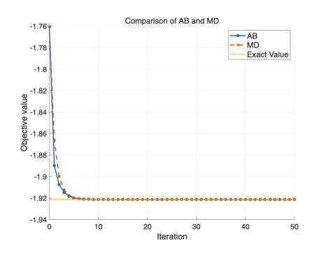 
Fig. 2. Comparison of AB and MD iterative behavior in the constrained case. The vertical axis shows the value of f(ρ). The horizontal axis shows the number of iterations. The blue line represents the iterative behavior of the AB algorithm. The orange line represents the iterative behavior of the MD algorithm. The yellow line represents the theoretical value of −D(Ddeph∥Dp).

📷 Fig 3

 
Fig. 3. Comparison of certified suboptimality bounds and the true objective gap along the AB trajectory in the unconstrained case. The vertical axis shows the suboptimality on a logarithmic scale. The horizontal axis shows the number of iterations. The blue, orange, yellow, and purple lines represent the certified bounds obtained with h = 10−6, 10−8, 10−10, and 10−12, respectively. The green line represents the true objective gap f(ρ(t)) −f∗.

📷 Fig 4

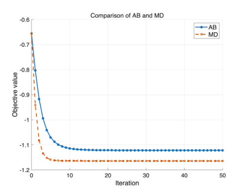 
Fig. 5. Comparison of AB and MD iterative behavior associated with D(Dad∥Dp). The vertical axis shows the value of f(ρ). The horizontal axis shows the number of iterations. The blue line represents the iterative behavior of the AB algorithm. The orange line represents the iterative behavior of the MD algorithm.

📷 Fig 5

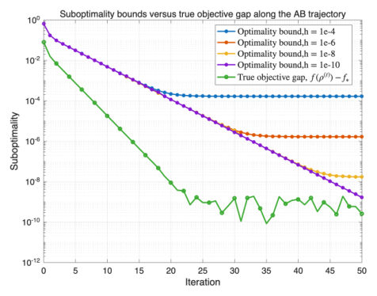 
Fig. 4. Comparison of certified suboptimality bounds and the true objective gap along the AB trajectory in the constrained case. The vertical axis shows the suboptimality on a logarithmic scale. The horizontal axis shows the number of iterations. The blue, orange, yellow, and purple lines represent the certified bounds obtained with h = 10−4, 10−6, 10−8, and 10−10, respectively. The green line represents the true objective gap f(ρ(t)) −f∗.

**Summary.** This work provides structural criteria to determine when quantum optimization algorithms, specifically the Arimoto-Blahut method, achieve global optimality. It shows that global optimality can be verified by checking a condition involving the objective gradient and the update direction, even if the algorithm's path differs from other known methods. This offers a powerful, computable diagnostic tool for quantum information theory.

**Why it may be interesting.** It provides rigorous mathematical tools to assess the convergence quality of iterative quantum optimization algorithms (like AB) without needing to assume the algorithm follows the path of a known, more complex method (like MD).

Detailed structure

**Main problem.** The paper establishes necessary and sufficient conditions for the global optimality of fixed points generated by generalized Arimoto-Blahut (AB) algorithms when optimizing quantum objectives.

**Main result.** Global optimality at a full-rank AB fixed point is equivalent to a structural condition relating the AB update direction and the objective gradient to the constraint normal space. This condition is weaker than requiring pathwise equivalence between AB and Mirror Descent (MD) updates.

**Method.** The authors derive structural criteria by comparing the variational forms of the AB and MD updates, and they develop *a posteriori* optimality certificates based on feasible directional derivatives requiring only objective function evaluations.

**Model / system.** The analysis focuses on optimizing functions (like quantum relative entropy) over quantum states $
ho$ constrained to a manifold $M$ defined by linear constraints, often involving quantum channels.

**Key observables.** AB fixed points ($
ho^*$), the objective gradient ($
abla f(
ho)$), and the objective gap, which is bounded by finite-difference certificates.

**Important parameters / regimes.** The structure of the linear constraints defining the state manifold $M$, and the specific form of the objective function $\Omega(
ho)$.

**Assumptions / limitations.** The analysis assumes the objective function is convex and differentiable, and it distinguishes between one-step equivalence and pathwise equivalence.

**Figures summary.** The notes do not provide a summary of figures, but mention numerical experiments illustrating convergence along different trajectories and validating the optimality certificates.

**Paper structure.** The paper builds from establishing the general optimality condition ($\Omega(
ho^*) - 
abla f(
ho^*) \in N_M$) to comparing AB and MD algorithms, and finally developing computable, objective-evaluation-based optimality certificates.

Abstract

Generalized Arimoto--Blahut (AB) algorithms are widely used in information theory and quantum optimization, but monotonic objective decrease and numerical stabilization do not guarantee global optimality. We establish necessary and sufficient conditions for the global optimality of full-rank AB fixed points for convex differentiable objectives under linear constraints. An AB fixed point is globally optimal if and only if the AB update direction and the objective gradient differ by an element of the constraint normal space at that point. The same compatibility condition characterizes agreement between individual AB and mirror-descent (MD) updates, whereas pathwise equivalence requires it along the entire common trajectory. Thus, an AB algorithm may follow a trajectory different from MD and still reach the global optimum. We also develop a posteriori optimality certificates based on feasible directional derivatives, including finite-difference upper bounds on the objective gap that require only objective evaluations. For channel relative entropy between dephasing and depolarizing channels, we analytically identify the global minimizer as the unique full-rank AB fixed point, although pathwise equivalence fails. Numerical experiments illustrate convergence of AB and MD along different trajectories and validate the certificates. By contrast, an amplitude-damping example shows that a monotone AB iteration can stabilize at a suboptimal fixed point, whose nonoptimality is detected by the finite-difference certificate. These results provide structural and computable criteria for assessing global optimality in quantum AB algorithms.

[↑ back to top](#top)

### [Direct Cultivation of Entangled $|CS\rangle$ Magic States](http://arxiv.org/abs/2609.09993v1)

**Authors:** Gunsik Min, Jun Heo  
**Type:** theory · **Category:** quantum information and computing · **PDF:** <https://arxiv.org/pdf/2609.09993v1>  
**Analysis basis:** full PDF text, analyzed in chunks

📷 Fig 1

 
FIG. 1. Architecture overview and indirect comparator. (a) The indirect route prepares three logical |T⟩L resources and converts them to |CS⟩L with a Clifford+T circuit. (b) The direct route starts from two Steane [[7, 1, 3]] blocks in |+⟩L, applies the six-check sequence C1, C2, C12 | Dmid | C1, C2, C12, and immediately transfers the accepted state through the Steane-to-d = 5 escape and direct d = 5→13 surface-code growth. The three-T route is used only as a resource comparator.

📷 Fig 2

 
FIG. 2. Six-check measurement sequence and coded record. (a) The two Steane blocks undergo C1, C2, and C12 measurements, midpoint error detection Dmid, and a second measurement triple. (b) The ideal history g6(a, b) = (a, b, a ⊕ b, a, b, a ⊕b) forms a [6, 2, 4] record code. (c) Records outside the four valid codewords are rejected. (d) All four ideal branches are usable and differ only by the Pauli-frame update Za AZb B.

📷 Fig 3

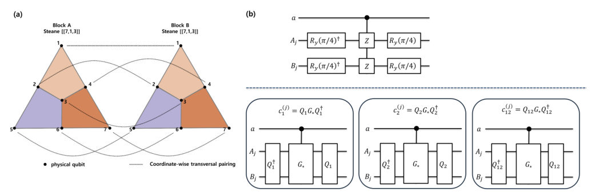 
FIG. 3. Steane-coordinate checks and CZZ-based compilation. (a) Matching coordinates of Steane blocks A and B realize the logical checks C1, C2, and C12 through transversal products of the local operators. (b) A cat ancilla controls G∗= C(H ⊗H), synthesized from one CZZ interaction and local Ry(π/4) rotations. Clifford wrappers Q1, Q2, and Q12 give the three coordinate checks. The six-check core contains 42 CZZ, 56 CX, and 224 one-qubit locations.

📷 Fig 4

 
FIG. 4. Factory yield and accepted-output classification. (a) Acceptance of the six-check core and the complete factory. The two curves use independent calibration and evaluation samples. (b) Sources of rejection before the downstream stage. (c) Number of sampled fault locations in operationally accepted runs. (d) Accepted outputs are classified as either closed at the validation boundary or containing a detectable residual syndrome. Detectable residuals are not retrospectively rejected.

📷 Fig 5

 
Figure 5(b) shows how decoder workload changes with p. The fraction of nontrivial records that reach the four- coset BP+OSD stage grows from about 4.7% at 10−4 to 44.7% at 10−3, while the median gap falls from 13.24 to 6.91. Every audited record has full four-coset coverage and no BP+OSD decoding failure is observed. The trend therefore reflects increasing ambiguity at higher p.

**Summary.** This paper presents a detailed, fault-tolerant protocol for generating an entangled non-Clifford magic state, $|CS\rangle$. It develops a direct cultivation architecture utilizing advanced error correction techniques and rigorously compares its resource cost against an established indirect method. The results confirm the feasibility and operational advantage of the direct approach at low noise levels.

**Why it may be interesting.** The rigorous, quantitative comparison of resource costs between two distinct state preparation pathways (direct vs. indirect) provides critical engineering benchmarks for scaling fault-tolerant quantum computation.

Detailed structure

**Main problem.** The paper addresses the challenge of developing a fault-tolerant, direct architecture for cultivating an entangled non-Clifford magic state, $|CS\rangle$, which is a crucial resource for quantum computation.

**Main result.** The authors demonstrate that $|CS\rangle$ can be cultivated directly using a protected branch record and an explicitly certified fault-order-three output channel. This direct route proves operationally superior to an indirect three-T resource route at lower noise levels.

**Method.** The methodology involves constructing a complex error-correcting factory using a minimal six-check classical record, verified CAT gadgets, Steane error detection, and a multi-stage decoder (low-order resolution, catalogue lookup, and four-coset BP+OSD).

**Model / system.** The system is modeled using fault-tolerant quantum computation principles, specifically employing surface codes and building upon Steane error detection gadgets to achieve the target entangled state $|CS\rangle$.

**Key observables.** Acceptance rate, residual syndromes, decoder workload, and the comparison of operational counts between the direct and indirect cultivation routes.

**Important parameters / regimes.** Physical error rate ($p$), fault order (up to three), and the logical error rate (LER) used for comparison.

**Assumptions / limitations.** The analysis is based on the active-location stochastic-Pauli model, and comparisons rely on specific assumptions regarding the availability of pre-existing output patches.

**Figures summary.** Figures illustrate the comparison between the indirect (three $|T\rangle_L$ resources) and direct cultivation routes, detailing the architectural components from Steane blocks to $d=5 	o 13$ growth.

**Paper structure.** The paper progresses by first establishing the necessary error-correcting components (e.g., the six-check code), detailing the fault-tolerance audits (up to order three), and finally comparing the resource costs and performance metrics of the direct versus indirect state preparation routes.

Abstract

Magic-state cultivation has so far focused mainly on single-qubit non-Clifford resources. We develop a direct cultivation architecture for the entangled state $|CS\rangle=CS|++\rangle$. Two commuting Clifford involutions project onto four usable branches related by Pauli-frame updates. A minimal six-bit $[6,2,4]$ record protects the branch label against readout errors that map one valid record to another. Verified CAT$_7$ gadgets, Steane error detection, CZZ-based controlled checks, and immediate Steane-to-surface expansion form the complete factory. The decoder uses 263 operational detector bits, while 168 additional bits are withheld for later validation. Decoding proceeds through exact low-order resolution, a precomputed higher-order catalogue, and four-coset BP+OSD. Under the stated active-location stochastic-Pauli model, exact enumeration finds no accepted closed-boundary logical-failure mechanism through fault order two, while explicit order-three failure mechanisms exist. Finite-$p$ simulations quantify acceptance, residual syndromes, and decoder workload, and targeted sampling of order-three faults estimates the leading logical-error channels. Optimizing the direct $d=5\rightarrow13$ expansion reduces accepted-output operation count by approximately 35--37\%. We compare the two routes at the same binary logical-error rate. Direct CS remains cheaper in operation count at the two lower-noise benchmark points even when the three-$T$ route is given pre-existing output patches. The ordering reverses between $8\times10^{-4}$ and $9\times10^{-4}$. These results show that an entangled non-Clifford state can be cultivated directly with a protected branch record and an explicitly certified fault-order-three output channel.

[↑ back to top](#top)

### [ECDSA.Fail: Open Autoresearch for Optimizing Elliptic-Curve Point Addition in Shor's Algorithm](http://arxiv.org/abs/2609.09582v1)

**Authors:** Jieyi Long, Theodore Pender, Zhao Huang, Manuel B. Santos, Samrendra Kumar Singh, Bartosz Naskręcki, Bit Wonka, Joe Doyle, Pierre-Luc Dallaire-Demers, Francesco Giannicola, Ruben M. L. Paschoarelli, Oli Freuler, Jackie Chia-Hsun Lee, Vasily Gnuchev, Gopi Kannappan, John Boyer, Xavier Butler, Akash Balasubramani, Jordan Newman, Bereket Dereje, Alexander Hertlein, Robert Kodra, Lucas Levy, Shaan Patel, JT Rose, Matt Zweil, Okechukwu Wisdom, Tarek El-Eter, Edison Lee, Michael Dong, Alan Li, Anto Joseph, Gajesh Naik, Gautham Anant, Soubhik Deb, Justin Drake  
**Type:** theory · **Category:** quantum information and computing · **PDF:** <https://arxiv.org/pdf/2609.09582v1>  
**Analysis basis:** full PDF text, analyzed in chunks

📷 Fig 1

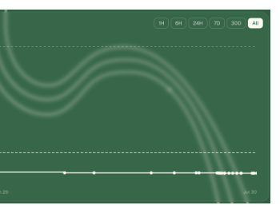 
Fig. 1: Evolution of the best ECDSA.Fail Q × T score, from the 10.75B baseline to 1.496B at the data cutoff, an 86.1% reduction. The dashed line marks the re- ported Google/Babbush et al. [3] operating point of 2.993B. The challenge score is more than 50% lower, although differing interfaces and accounting conventions make the comparison contextual.

📷 Fig 2

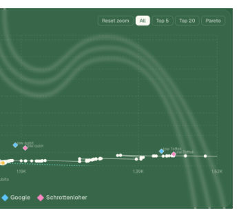 
Fig. 2: ECDSA.Fail qubit–Toffoli Pareto frontier. White points are challenge sub- missions; orange and purple circles are promoted and non-promoted admitted Pareto points; the cyan dotted curve marks the best observed Q × T; and dia- monds mark the Google/Babbush [3] (blue) and Schrottenloher [59] (pink) op- erating points. External points are contextual because interfaces and accounting conventions differ; see Tables 2 and 3.

📷 Fig 3

 
Fig. 3: Placement of the point-addition kernel within a power-of-two implemen- tation of windowed Shor ECDLP. The coherent exponent registers are pre- pared over Z2256 and split into 16-bit windows. Each window coherently selects a precomputed multiple of G or P and adds it to the accumulator, yielding R = [u]G + [v]P before inverse power-of-two Fourier transforms and measure- ment. Unlike the idealized formulation over Z2 r, the measured Fourier samples need not satisfy the annihilator relation exactly; they concentrate near it and re- quire classical postprocessing followed by verification of the recovered candidate k. The figure shows the coherent-register formulation; an iterative...

📷 Fig 4

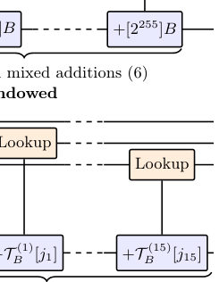 
Fig. 4: The two point-addition interfaces used to compute one scalar multipli- cation [s]B, where (s, B) denotes either (u, G) or (v, P). (a) In the double- and-add approach, each scalar bit si controls a mixed addition of the fixed, classically known point [2i]B to the accumulator |R⟩; this addend is fixed at circuit-construction time and does not occupy a quantum register. (b) In the windowed approach, the scalar is divided into 16-bit words ji = s16i:16i+16. Each |ji⟩indexes a QROM lookup into the precomputed table T (i) B , and the selected point T (i) B [ji] is added coherently to |R⟩. The selected addend is therefore quan- tum data entangled with the window register.

📷 Fig 5

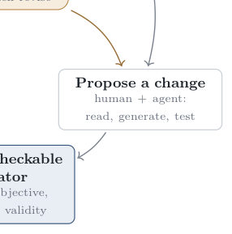 
Fig. 5: The generic open autoresearch discovery loop. Independent human–agent teams select a current-best, Pareto, or deliberately off-frontier base from the shared repository, propose a change, and submit it to a machine-checkable evalu- ator. Verified improvements become shared bases; rejected candidates are logged with their diagnoses and revised. This makes the search cumulative without re- quiring prior coordination beyond the shared objective, evaluator, and public artifacts.

**Summary.** This paper details the successful application of an 'Open Autoresearch' methodology to optimize quantum circuits for elliptic-curve point addition, a key subroutine in Shor's algorithm. By leveraging collaborative human and AI efforts, the community drastically reduced the required quantum resources, demonstrating a powerful new paradigm for advancing quantum algorithm efficiency.

**Why it may be interesting.** While focused on cryptography, the methodology—using open, AI-augmented, and machine-checkable optimization challenges—is highly relevant to developing scalable quantum algorithms and resource estimation techniques applicable across quantum information science.

Detailed structure

**Main problem.** The paper focuses on optimizing the reversible secp256k1 point-addition circuit, which is identified as a critical computational bottleneck in implementing Shor's algorithm for breaking elliptic-curve cryptography.

**Main result.** Through an open autoresearch paradigm involving human and AI contributions, the community significantly reduced the benchmark score $S=Q	imes T$ by 86.1%, achieving resource estimates substantially lower than previously published thresholds.

**Method.** The research employs an 'Open Autoresearch' framework, where iterative, verifiable improvements are made to a public leaderboard to minimize a spacetime-inspired resource score $S=Q	imes T$. Optimization techniques include advanced circuit design methods like Jump-2 Euclidean Algorithm and Karatsuba Squaring.

**Model / system.** The model is a quantum circuit designed to perform elliptic-curve point addition on the secp256k1 curve. The optimization targets the resource cost measured by the product of peak logical qubit width ($Q$) and average executed Toffoli count ($T$).

**Key observables.** The primary observable is the resource score $S = Q 	imes T$. Other key metrics include the peak logical qubit width ($Q$), the average executed Toffoli count ($T$), and the empirical success probability ($\hat{p}$).

**Important parameters / regimes.** The optimization is benchmarked against specific thresholds set by Google and Schrottenloher, with the best reported score being significantly lower than these benchmarks.

**Assumptions / limitations.** Comparisons with prior work are noted to be contextual, as differing interfaces, accounting conventions, and validation scopes preclude claims of formal dominance.

**Figures summary.** Figure 1 illustrates the dramatic reduction of the best ECDSA.Fail $Q 	imes T$ score over time, showing the evolution from a high baseline to the current state-of-the-art value. Figure 2 likely maps the Pareto frontier of the qubit-Toffoli trade-off.

**Paper structure.** The paper introduces the Open Autoresearch paradigm, details the specific optimization problem (ECDSA.Fail for point addition), presents the quantitative results showing massive score reductions, and discusses the implications for quantum cryptanalysis feasibility.

Abstract

We propose Open Autoresearch, a paradigm in which humans and AI agents publish evaluator-verified improvements to a public leaderboard. We instantiate it in ECDSA.Fail, optimizing reversible secp256k1 point-addition circuits, a bottleneck in Shor's algorithm for elliptic-curve cryptography. The benchmark minimizes the spacetime-inspired score $S=Q\times T$, where $Q$ is peak logical qubit width and $T$ is average executed Toffoli count. Participants reduced $S$ by 86.1%. At the data cutoff (26 July 2026), the best-scoring circuit uses 1,151 qubits and 1,299,453 average executed Toffoli gates, giving $Q\times T\approx1.496$ billion. This is more than 50% below Google's published point-addition score thresholds (arXiv:2603.28846), under different accounting conventions. Because the benchmark supplies one addend classically, we construct a coherent windowed-addition-compatible variant implementing the single-call interface required by windowed Shor. It uses 1,162 qubits and 1,684,161 average executed Toffoli gates. On 100,000 random inputs, its empirical success probability is $\hat{p}=0.99809$, giving $Q\times T/\hat{p}\approx1.961$ billion under an independently rerunnable per-call sensitivity model, not a full-Shor success estimate. Its qubit and Toffoli counts lie below Google's published thresholds and Schrottenloher's reported operating points (arXiv:2606.02235), although differing interfaces, accounting conventions, and validation scope preclude formal dominance. After the cutoff, the score was further reduced to 1.259 billion, while a separate low-width circuit reached 813 qubits. The public record shows AI agents complementing human judgment, providing evidence for open autoresearch on efficiently evaluable, machine-checkable objectives.

[↑ back to top](#top)

### [Enhancing Pauli Correlation Encoding for quantum optimization via systematic expressivity analysis](http://arxiv.org/abs/2609.09718v1)

**Authors:** Riku Usuki, Don Arai, Ken N. Okada, Keisuke Fujii  
**Type:** theory · **Category:** quantum information and computing · **PDF:** <https://arxiv.org/pdf/2609.09718v1>  
**Analysis basis:** full PDF text, analyzed in chunks

📷 Fig 1

 
FIG. 1. Three comparative models based on tensor networks introduced in this study. (a) MPO-based model, (b) MPS- based model, and (c) Brick-wall model. These models are designed so that their internal structures progressively ap- proach the topology of the PCE circuit.

📷 Fig 2

 
FIG. 2. Performance evaluation of the comparative models on the G14 benchmark instance (|V | = 800). (a) Parame- ter Efficiency: The relationship between the total number of parameters (log scale) and the achieved approximation ratio across all models. (b) Structural Comparison: The approxi- mation ratio as a function of the number of layers, comparing the PCE Brick-wall ansatz and the Brick-wall model based on tensor networks, both sharing the same brick-wall connec- tivity.

📷 Fig 3

 
FIG. 3. Approximation ratio as a function of circuit depth p for conventional unsupervised PCE and supervised optimiza- tion. Each point represents the approximation ratio averaged over three G-set instances with 800 vertices, G6, G11, and G18. For each instance, the best result obtained over five random initializations is used. Error bars indicate the stan- dard deviation across the three instances.

📷 Fig 4

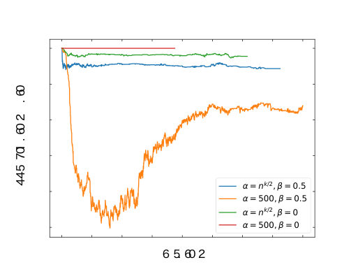 
FIG. 4. Optimization trajectories starting from circuit pa- rameters that reproduce the best-known solution (AR= 1 at iteration 0). Different choices of (α, β) lead to markedly dif- ferent stability near this solution-reproducing region on the G1 instance.

📷 Fig 5

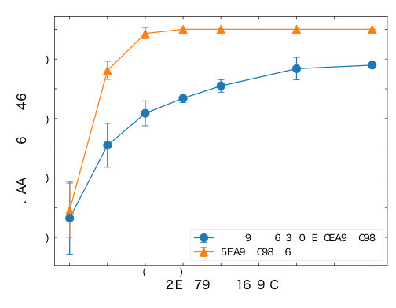 
Figure 3 shows that supervised optimization reaches AR = 1.0 with only five layers, whereas unsupervised optimization saturates at a lower AR despite using the same ansatz. This indicates that the ansatz is expres- sive enough to represent strong solutions, and that the main limitation in the conventional setting is not insuffi- cient expressivity but poor trainability under the relaxed unsupervised objective function. This further suggests that performance gains may be possible if one can design unsupervised objective functions that induce optimiza- tion dynamics similar to those of the supervised objective function.

**Summary.** This paper investigates the limitations of Pauli Correlation Encoding (PCE) for quantum optimization problems like Max-Cut. The authors diagnose that the primary bottleneck is not the circuit's representational power but the difficulty in training the system using standard relaxed objectives. They propose and validate a multistage continuation framework that successfully enhances PCE performance, making it competitive with advanced classical methods.

**Why it may be interesting.** It provides a concrete, actionable algorithmic improvement (multistage optimization) for variational quantum algorithms applied to combinatorial optimization, which is highly relevant for near-term quantum hardware.

Detailed structure

**Main problem.** The paper aims to understand and enhance the performance of Pauli Correlation Encoding (PCE) for quantum optimization, specifically addressing performance saturation.

**Main result.** The authors propose a multistage continuation framework that significantly improves PCE performance, showing it is limited by trainability under the relaxed objective function, not by the ansatz's expressivity.

**Method.** They systematically analyze PCE by comparing it to classical tensor network models and introduce a multistage optimization procedure to guide the training from a smooth to a sharp objective function.

**Model / system.** The work focuses on quantum optimization problems, particularly Max-Cut, solved using PCE, which embeds optimization variables in the expectation values of Pauli strings.

**Key observables.** Max-Cut cut value, parameter efficiency (comparison to classical models), and gradient norms during optimization stages.

**Important parameters / regimes.** The number of vertices (e.g., 800 for G-set instances), the number of stages in the continuation framework (e.g., K=6), and the regularization parameters ($\alpha, eta$).

**Assumptions / limitations.** The primary assumption challenged is that performance saturation is due to insufficient expressivity; the paper argues it is due to optimization difficulty (trainability).

**Figures summary.** Figures compare PCE performance against classical tensor network models (MPO, MPS, Brick-wall) regarding parameter count and layer depth, demonstrating parameter efficiency and convergence.

**Paper structure.** The paper proceeds by first establishing PCE's promise, then diagnosing the performance bottleneck (identifying trainability over expressivity), and finally proposing and testing the multistage continuation framework to overcome this limitation.

Abstract

Quantum approaches for combinatorial optimization problems have attracted considerable attention in recent years. Among these approaches, Pauli Correlation Encoding (PCE) has emerged as a promising framework for quantum devices with limited qubit resources because it embeds optimization variables in expectation values of Pauli strings. However, the mechanisms underlying its performance and the reasons for its saturation remain unclear. In this work, we investigate these questions through a systematic analysis of expressivity and trainability. First, we compare PCE with classical surrogate models based on tensor networks whose structures progressively approach the topology of the PCE circuit. The results show that PCE attains comparable solution quality with substantially fewer trainable parameters, indicating strong parameter efficiency. Second, to determine whether the performance saturation of conventional PCE is caused by insufficient expressivity or by optimization difficulty, we perform a diagnostic expressivity test in which the circuit is trained toward reference configurations for Max-Cut. The results show that even shallow PCE circuits can represent strong solutions, indicating that the main bottleneck is not the representational power of the ansatz, but the trainability under the relaxed objective function. Motivated by this finding, we propose a multistage continuation framework that gradually transforms a smooth relaxed objective into a sharper objective that more closely approximates the target discrete problem. Numerical experiments on G-set instances with 800 vertices show that the proposed method consistently outperforms conventional PCE and is competitive with representative graph neural network (GNN) methods. These results clarify the main factors behind PCE performance and provide a practical strategy for improving PCE on quantum devices with limited qubit resources.

[↑ back to top](#top)

### [Faster Computation with the Generalized Laplacian Quantum Walk](http://arxiv.org/abs/2609.10429v1)

**Authors:** Jonas Duda, Thomas G. Wong  
**Type:** theory · **Category:** quantum information and computing · **PDF:** <https://arxiv.org/pdf/2609.10429v1>  
**Analysis basis:** full PDF text, analyzed in chunks

📷 Fig 1

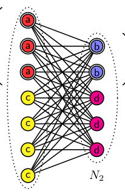 
FIG. 1. A complete bipartite graph with N1 = 7 and N2 = 5 vertices in each partite set, of which k1 = 3 and k2 = 2 vertices are marked in the respective sets, as shown by the double circles. Identically evolving vertices are identically colored and labeled.

📷 Fig 2

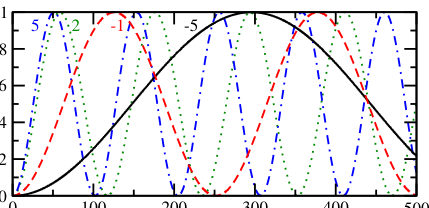 
FIG. 2. Success probability versus time for search on complete bipartite graphs at γ = γa(3). The solid black curve is when α = −5, the red dashed curve is when α = −1, the green dotted curve is when α = 2 and the blue dot-dashed curve is when α = 5.

📷 Fig 3

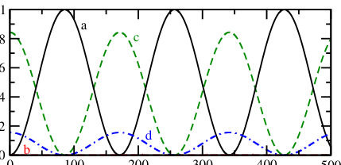 
FIG. 3. The probability at each type of vertex versus time for search on the complete bipartite graph with N1 = 5000, N2 = 2000 vertices, of which k1 = 2 and k2 = 3 are marked, with γ = γa (3) α = −1. The solid black curve is the probability in |a⟩, the red dashed curve is |b⟩(which is near 0 the entire evolution), the green dotted curve is |c⟩, and the blue dot- dashed curve is |d⟩.

**Summary.** This paper analyzes quantum search algorithms on bipartite graphs using a quantum walk defined by a generalized Laplacian. The authors prove that by tuning the Laplacian via a parameter $\alpha$, the quantum walk's search time can be made to approach the theoretical optimum. This suggests the generalized Laplacian provides a powerful tool for developing faster quantum algorithms.

**Why it may be interesting.** The explicit derivation of how tuning a system parameter ($\alpha$) can push a quantum walk towards an optimal computational limit is highly relevant for designing robust quantum algorithms.

Detailed structure

**Main problem.** To prove that a quantum walk governed by a generalized Laplacian can solve a search problem on a complete bipartite graph faster than standard quantum walks.

**Main result.** The generalized Laplacian quantum walk achieves an optimal search time scaling, approaching the theoretical minimum time $t^* = rac{\pi}{2} \min \left(rac{N_1}{k_1}, rac{N_2}{k_2}
ight)$ in the limit where the parameter $\alpha 	o \pm\infty$.

**Method.** The analysis involves deriving the time evolution operator for the quantum walk Hamiltonian, using asymptotic analysis, and employing perturbation theory to study the behavior as the parameter $\alpha$ becomes very large.

**Model / system.** The model is a continuous-time quantum walk on a complete bipartite graph, governed by a Hamiltonian derived from a generalized Laplacian $L_\alpha = L + \alpha D$. The evolution is tracked by analyzing the probability amplitudes at different vertex types.

**Key observables.** Success probability at marked vertices, and the optimal search runtime $t^*$.

**Important parameters / regimes.** The parameter $\alpha$ (controlling the degree matrix contribution), the graph sizes ($N_1, N_2$), and the number of marked vertices ($k_1, k_2$).

**Assumptions / limitations.** The analysis relies on asymptotic approximations, particularly for large graph sizes ($N_1, N_2$) when applying perturbation theory.

**Figures summary.** Figure 2 shows the success probability vs. time for various $\alpha$ values, demonstrating the speedup. Figure 3 illustrates the time evolution of probabilities at different vertex types for a specific case.

**Paper structure.** The paper establishes the quantum walk model using the generalized Laplacian, analyzes the time evolution using the Hamiltonian in a reduced basis, and derives the optimal runtime by taking limits on the parameter $\alpha$.

Abstract

Quantum walks are the quantum analogues of classical random walks or Markov chains. They are universal models of quantum computing, and they underpin a variety of quantum algorithms. We prove that a continuous-time quantum walk effected by a generalized Laplacian, which can arise in spin chains, can solve a computational problem more quickly than typical quantum walks governed by the standard Laplacian or adjacency matrix. This generalized Laplacian consists of the standard Laplacian plus a real-valued multiple of the degree matrix, and we prove that as the magnitude of the multiple of the degree matrix is increased, its corresponding quantum walk can search the complete bipartite graph with multiple marked vertices in time that approaches the optimal. This raises the potential for the generalized Laplacian quantum walk to be a useful method for developing additional faster quantum algorithms.

[↑ back to top](#top)

### [Generalized Fidelity and the Data Processing Inequality](http://arxiv.org/abs/2609.09753v1)

**Authors:** Reza Rajaei  
**Type:** theory · **Category:** quantum information and computing · **PDF:** <https://arxiv.org/pdf/2609.09753v1>  
**Analysis basis:** full PDF text, analyzed in chunks

📷 Fig 1

 
Low-resolution page preview, page 2

📷 Fig 2

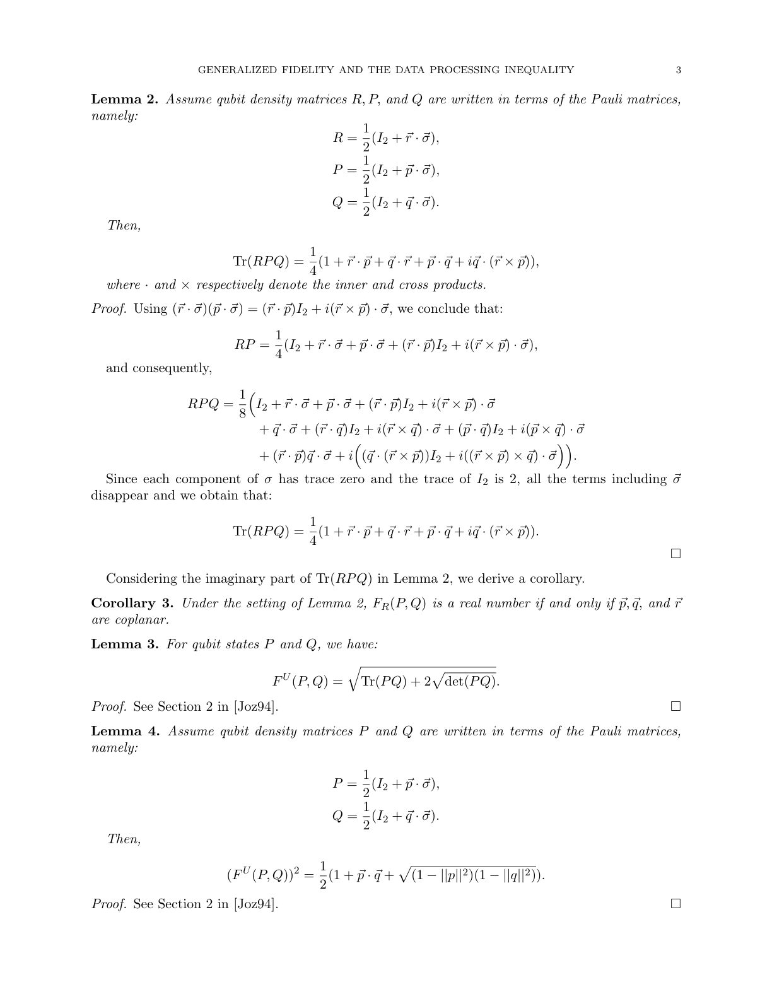 
Low-resolution page preview, page 3

📷 Fig 3

 
Low-resolution page preview, page 4

📷 Fig 4

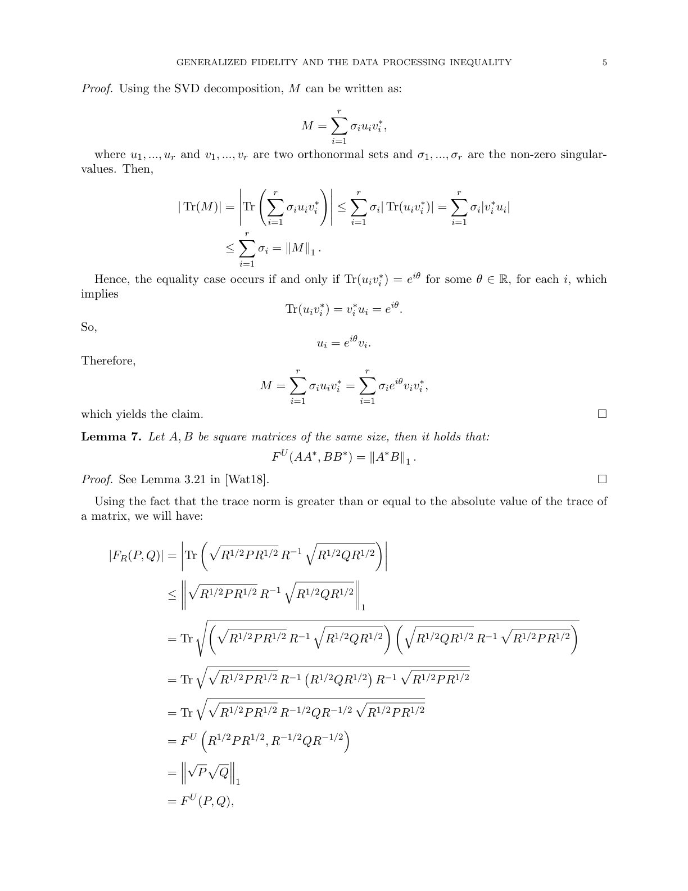 
Low-resolution page preview, page 5

📷 Fig 5

 
Low-resolution page preview, page 6

**Summary.** This theoretical note examines the generalized Bures-Wasserstein distance derived from the generalized fidelity in quantum information. The authors prove that this distance fails the Data Processing Inequality in dimensions higher than two. For the qubit case, they establish specific sufficient conditions under which the DPI holds, providing deeper insights into quantum channel characterization.

**Why it may be interesting.** The study of distance metrics and their monotonicity properties (like DPI) is fundamental in quantum information theory, especially when analyzing the robustness of quantum channels.

Detailed structure

**Main problem.** The paper investigates whether the generalized Bures-Wasserstein distance, induced by the generalized fidelity, satisfies the Data Processing Inequality (DPI) for quantum channels.

**Main result.** The distance fails to satisfy the DPI in dimensions greater than two, but sufficient conditions for the DPI are derived for the qubit case (dimension two).

**Method.** The authors use explicit formulas for the generalized fidelity, derived using Pauli matrix representations for qubits, and construct counterexamples to test the DPI.

**Model / system.** The analysis focuses on quantum states represented by positive semi-definite matrices, particularly restricting the investigation to the qubit case (2x2 matrices).

**Key observables.** Generalized Fidelity ($F_R(P, Q)$), Squared Generalized Bures-Wasserstein Distance ($B_R(P, Q)$), and the Uhlmann fidelity ($F_U$).

**Important parameters / regimes.** The dimension of the system ($n$), and the specific matrices defining the generalized fidelity.

**Assumptions / limitations.** The analysis provides sufficient conditions for the qubit case, but the DPI is not settled in full generality for dimension two.

**Paper structure.** The paper first establishes the definitions for the generalized fidelity and distance. It then proves the failure of the DPI for $n \ge 3$ using counterexamples. Finally, it derives sufficient conditions for the DPI in the qubit case and determines when the generalized fidelity reduces to the Uhlmann fidelity.

Abstract

In this note, we show that the generalized Bures--Wasserstein distance induced by the generalized fidelity does not satisfy the data processing inequality in dimensions greater than two. In dimension two, although we do not settle the DPI in full generality, we derive two sufficient conditions guaranteeing it by using an explicit formula for the real part of the generalized fidelity. Furthermore, we find a necessary and sufficient condition under which the generalized fidelity reduces to the Uhlmann fidelity.

[↑ back to top](#top)

### [Induced random mixed states are symmetric Dirichlet mixtures](http://arxiv.org/abs/2609.09421v1)

**Authors:** Brian T. Kirby, Alexander C. B. Greenwood, Sanjaya Lohani, Joseph M. Lukens  
**Type:** theory · **Category:** quantum information and computing · **PDF:** <https://arxiv.org/pdf/2609.09421v1>  
**Analysis basis:** full PDF text, analyzed in chunks

📷 Fig 1

 
FIG. 1. Geometric illustration of the equivalence between the Mai-Alquier (MA) construction (left) and the induced-state construction (right) for a qubit system (D = 2) and environment dimension K = 3. Left: A mixed state is formed by convexly combining K independent Haar-random pure states |ψj⟩with weights p ∼DirK(D). Right: The columns |˜gj⟩of a 2 × 3 Ginibre matrix (plotted as orange circles) determine normalized directions |ψj⟩= |˜gj⟩/∥|˜gj⟩∥(plotted as blue circles) and radial weights through trace normalization of GG†. Under this decomposition, the normalized radial variables generate the same Dirichlet law for the mixture weights, yielding the same random density-matrix distribution.

**Summary.** This paper proves a deep mathematical equivalence between random mixed quantum states generated by tracing out an environment and a statistical mixture called the Mai-Alquier distribution. This identification is highly valuable because it allows researchers to calculate complex quantum observables, such as purity moments and determinants, using simpler tools from the theory of Dirichlet distributions and Haar averages. It unifies the theoretical understanding of induced random mixed states.

**Why it may be interesting.** This work provides a powerful mathematical tool to simplify calculations in open quantum systems by mapping physical environmental tracing processes onto well-understood statistical ensembles (Dirichlet mixtures).

Detailed structure

**Main problem.** The paper establishes an exact equivalence between random mixed states induced by tracing out an environment and a specific statistical mixture known as the Mai-Alquier (MA) distribution.

**Main result.** This equivalence allows complex calculations involving induced random mixed states (like purity moments and determinants) to be recast into manageable calculations involving Dirichlet moments and low-order Haar averages.

**Method.** The authors use properties of the Ginibre ensemble and the Gamma distribution to show that the induced state distribution matches the Dirichlet-weighted mixture distribution when the Dirichlet parameter equals the system dimension.

**Model / system.** The model involves a D-dimensional system coupled to a K-dimensional environment, prepared in a Haar-random pure global state, followed by tracing out the environment to yield the induced mixed state.

**Key observables.** Purity moments ($	ext{Tr} 
ho^m$), mean Hilbert-Schmidt distance between ensembles, and the determinant ($\det 
ho$).

**Important parameters / regimes.** D (system dimension), K (environment dimension), and the Dirichlet concentration parameter $\alpha$ (which must equal D for equivalence).

**Assumptions / limitations.** The equivalence holds under the condition that the Dirichlet concentration parameter $\alpha$ matches the system dimension $D$.

**Figures summary.** Figure 1 illustrates the geometric equivalence for a qubit system, showing both the MA construction (convex combination) and the induced state construction using Ginibre matrix columns leading to the same Dirichlet law.

**Paper structure.** The paper first defines the induced state via partial traces over a random environment, then derives the statistical properties showing the equivalence to the MA distribution. It then applies this equivalence to derive exact formulas for key observables like purity moments, distance, and determinants.

Abstract

We establish an exact equivalence in distribution between $D$-dimensional random mixed states induced by partial traces over $K$-dimensional environments and the Mai-Alquier distribution, a mixture of $K$ independent Haar-random pure states weighted by a symmetric Dirichlet distribution. This identification recasts a class of expectation values for induced ensembles into calculations involving Dirichlet moments and low-order Haar averages on a single-system state space. As applications, we recover exact purity moments up to fourth order, derive the mean Hilbert--Schmidt distance between independent induced ensembles with possibly different environment dimensions, and obtain exact average determinants. These results provide a unified and constructive perspective on induced random mixed states and on the evaluation of quantities such as purity moments, overlaps, and determinants.

[↑ back to top](#top)

### [Italian Business-to-Business Invoicing Data: A Network Analysis](http://arxiv.org/abs/2609.10227v1)

**Authors:** Valerio Astuti, Daniele Piras  
**Type:** theory · **Category:** statistical mechanics · **PDF:** <https://arxiv.org/pdf/2609.10227v1>  
**Analysis basis:** full PDF text, analyzed in chunks

📷 Fig 1

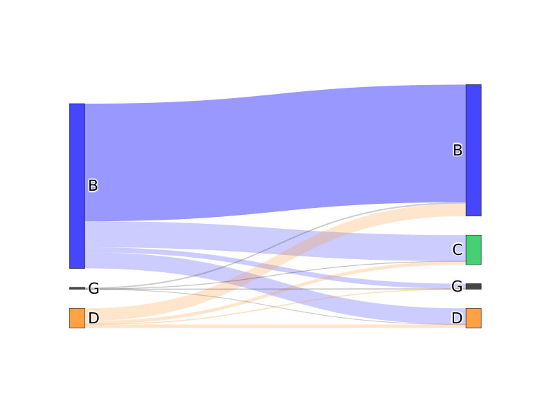 
Figure 1: Flows between categories in terms of aggregated gross transaction amount. Bars’ height represents the total gross transaction amount of invoices by type of entity. Our analysis will focus on the transactions where both the seller and buyer are firms of type B, the flow in darker blue.

📷 Fig 2

 
Figure 2: Number of firms per sector of economic activity. See Appendix F.1 for the full mapping between one-letter and 2-digit sectors. Sector U is the least represented, with fewer than 100 firms in the dataset.

📷 Fig 3

 
Figure 3: Density (upper plot) and mean degree (lower plot) of the networks of transactions within the same sector of economic activity, compared to the value for the whole network (re- ported in orange).

📷 Fig 4

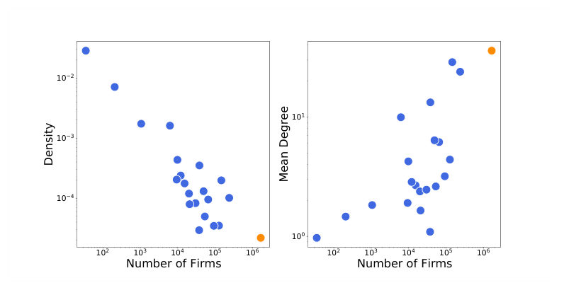 
Figure 4: Plot of density (left hand side) and mean degree (right hand side) as a function of the number of nodes in the sub-networks of transactions within the same sector of economic activity.

📷 Fig 5

 
Figure 5: Distribution of number of connections (left hand side) and total gross amount of the invoices (right hand side) between sectors.

**Summary.** This paper analyzes the structure of the Italian B2B commercial network using massive invoicing data, modeling firms as nodes and transactions as weighted edges. It finds the network possesses a scale-free structure and characterizes how economic importance (centrality) is unevenly distributed among a few key firms. The findings offer quantitative insights into the underlying connectivity and vulnerabilities of the national production system.

**Why it may be interesting.** The application of complex network theory, which shares mathematical tools with statistical physics (e.g., power-law distributions, critical phenomena), to a real-world economic system provides a model for analyzing emergent collective behavior in non-physical systems.

Detailed structure

**Main problem.** The paper characterizes the structure of the Italian production network using comprehensive firm-to-firm commercial transaction data to derive insights into the Italian economy.

**Main result.** The network exhibits a scale-free structure, indicated by heavy-tailed distributions for buyer/seller counts and centrality measures. Furthermore, the tail exponents for buyer-side distributions are found to be lower than those for seller-side distributions.

**Method.** Network analysis techniques are employed, treating firms as nodes and invoices as weighted, directed edges. Key metrics analyzed include degree distributions, network centrality (Eigenvector, Katz, PageRank), and structural properties like assortativity.

**Model / system.** The system is the network of Italian Business-to-Business (B2B) commercial relationships, constructed from electronic invoicing data from the Italian Tax Office. Nodes are firms, and edges are weighted by the total monetary amount exchanged.

**Key observables.** Distribution of buyers/sellers per firm, network centrality measures, tail exponents of degree distributions, network density, and mean degree.

**Important parameters / regimes.** The analysis is based on the 2019 Italian electronic invoicing data, focusing on the B2B subset of transactions.

**Assumptions / limitations.** The analysis is static, and while the data coverage is comprehensive, the comparison of network metrics across different international datasets is cautioned against due to potential methodological variations.

**Figures summary.** Figures illustrate the flow of transactions between entity types, the number of firms per economic sector (NACE), and maps showing regional/sectoral variations in centrality measures. Tables compare network metrics across different countries.

**Paper structure.** The paper establishes the economic importance of micro-structure, details the unique B2B dataset, analyzes fundamental network statistics (scale-free, small-world), and concludes with detailed sectoral and geographical breakdowns of centrality.

Abstract

We present a comprehensive description of the network of Italian Business-to-Business commercial relationships, based on the universe of electronic invoices collected by the Italian Tax Office. The firm-to-firm detail of the data is exploited to describe the distribution of the numbers of buyers (customers) and sellers (suppliers) per firm, the centrality of each firm in the production network, and the average distance between firms. We characterize for the first time the firm-to-firm network describing the Italian production system, and present its geographic and sectoral breakdown. The analysis reveals heavy tailed distributions for the numbers of buyers and sellers per firm, implying a scale-free structure of the network. The distributions of centrality values display heavy tails as well, indicating a strong concentration of importance in a relatively small number of firms. We estimate the tail exponents for all these distributions, finding in all cases lower exponents for downstream (buyer-side) distributions than for the upstream (seller-side) ones.

[↑ back to top](#top)

### [Noise Limits on Fault-Tolerant Fermionic Quantum Computing](http://arxiv.org/abs/2609.09467v1)

**Authors:** Owen Allison, Luke Coffman  
**Type:** theory · **Category:** quantum information and computing · **PDF:** <https://arxiv.org/pdf/2609.09467v1>  
**Analysis basis:** full PDF text, analyzed in chunks

📷 Fig 1

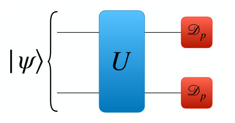 
FIG. 1. The noise model under consideration: First we apply the two qubit resourceful gate U, then apply local depolarizing noise D⊗2 p .

📷 Fig 2

 
FIG. 2. Numerical results implementing Algorithm 1 for SWAP. The left two graphs show the value for ∆± for different probabilities of depolarization p. The third graph shows that [ρU,p, P] = 0 regardless of noise.

**Summary.** This paper calculates the noise threshold for fault-tolerant fermionic quantum computation using a specific non-Gaussian gate set. By analyzing the channel's structure via Uhlmann-Wootters concurrences, the authors establish a new, high upper bound of approximately 62% for the tolerable noise level. This result is crucial for designing robust quantum hardware based on fermionic physics.

**Why it may be interesting.** The rigorous application of entanglement measures (concurrences) to diagnose the breakdown of non-Gaussianity in fermionic systems provides a powerful theoretical tool for assessing hardware viability in quantum computation.

Detailed structure

**Main problem.** The paper aims to determine the maximum noise level a quantum circuit can tolerate while remaining fault-tolerant for fermionic quantum computation.

**Main result.** The upper bound limit for fermionic quantum computing using the matchgate set is found to be approximately 62%, which is independent of circuit depth.

**Method.** The authors use Uhlmann-Wootters concurrences applied to the fermionic Choi state to test when the combined channel becomes 'convex Gaussian,' signaling a loss of non-Gaussian support.

**Model / system.** The system is fermionic quantum computing, which utilizes the matchgate with a non-Gaussian resource universal gate set. The analysis incorporates parity superselection and models noise using local depolarizing noise.

**Key observables.** Uhlmann-Wootters concurrences ($C_+(U, p)$ and $C_-(U, p)$) are used to diagnose the convex Gaussian nature of the noisy channel.

**Important parameters / regimes.** The noise probability $p$ is the key parameter, with the derived limit being $p = (8 - 2\sqrt{6})/5 \approx 62\%$.

**Assumptions / limitations.** The bound is not directly comparable to previous work due to differences in the noise model applied to the gate set.

**Figures summary.** Figures illustrate the noise model (gate followed by local depolarizing noise) and show numerical results plotting diagnostic quantities ($\Delta_{\pm}$ and commutator sums) against the noise parameter $p$.

**Paper structure.** The paper establishes the problem of noise thresholds, details the mathematical framework using fermionic Choi states and parity projections, derives the necessary concurrence formulas, and finally solves for the critical noise parameter $p$.

Abstract

Determining the highest amount of noise that quantum circuits can handle is an interesting and crucial task in the development of fault-tolerant quantum computation. Previous work has constrained this upper limit for local depolarizing noise to $\approx 45~\%$ for circuits constructed using the universal Clifford with T gate set by finding the noise threshold where the gate set loses universality. In this work, we use a similar method with the matchgate with non-Gaussian resource universal gate set to find a limit of $p=(8 - 2 \sqrt{6})/5$ or $\approx 62~\%$ for fermionic quantum computing that is independent of circuit depth. To do this, we use Uhlmann-Wootters concurrences for a 4-mode fermionic Choi state representing a resourceful gate combined with local depolarizing noise to determine when the combined channel is convex Gaussian. These bounds are not directly comparable due to differences in noise model making the bound of $\approx 62~\%$ the best known for fermions.

[↑ back to top](#top)

### [Non-Multiplicativity of the Holevo Barycenter of Quantum Channels](http://arxiv.org/abs/2609.09373v1)

**Authors:** Sayantan Chakraborty, Stefano Mancini, Leonardo Rossetti, Andreas Winter  
**Type:** theory · **Category:** quantum information and computing · **PDF:** <https://arxiv.org/pdf/2609.09373v1>  
**Analysis basis:** full PDF text, analyzed in chunks

📷 Fig 1

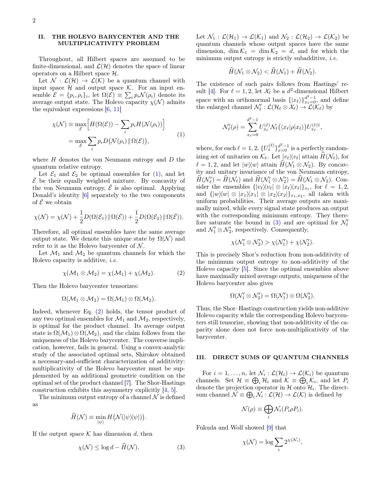 
Low-resolution page preview, page 2

📷 Fig 2

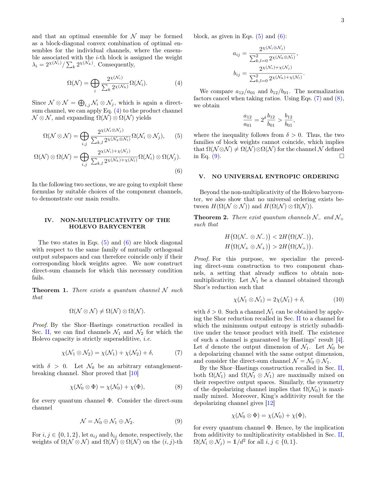 
Low-resolution page preview, page 3

📷 Fig 3

 
Low-resolution page preview, page 4

📷 Fig 4

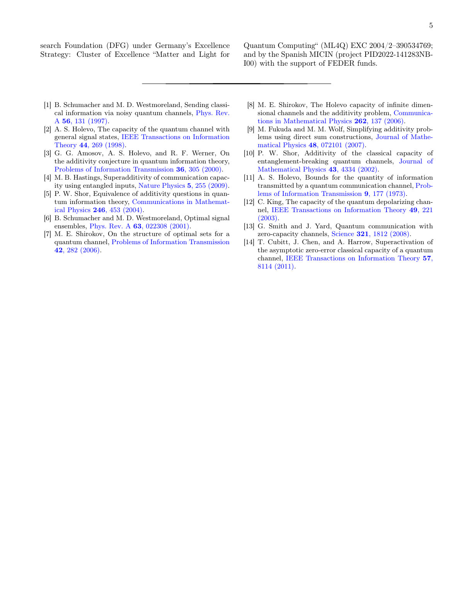 
Low-resolution page preview, page 5

**Summary.** This theoretical paper proves that the Holevo barycenter of a quantum channel is generally not multiplicative under the tensor product. By constructing specific channels, the authors show that the barycenter of the product channel does not equal the tensor product of the individual barycenters. This result deepens our understanding of quantum channel capacities by demonstrating that simple algebraic rules fail even when related concepts like capacity additivity are studied.

**Why it may be interesting.** The findings challenge simple tensor product assumptions in quantum information theory, suggesting that complex resource measures like the Holevo barycenter exhibit non-trivial, context-dependent behavior when composing channels.

Detailed structure

**Main problem.** The paper investigates the multiplicativity problem for the Holevo barycenter of quantum channels, asking if the barycenter of a product channel equals the tensor product of the individual barycenters.

**Main result.** The Holevo barycenter is proven to be non-multiplicative under the tensor product of the channel with itself, and the entropy of the barycenter is neither universally subadditive nor universally superadditive.

**Method.** The authors use theoretical derivations comparing block weights derived from the product channel ($\Omega(N \otimes N)$) against the tensor product of the individual barycenters ($\Omega(N) \otimes \Omega(N)$).

**Model / system.** The study concerns general quantum channels $N: L(H) 	o L(K)$ acting on finite-dimensional Hilbert spaces, often analyzed using direct-sum constructions ($N = N_0 \oplus N_1 \oplus N_2$).

**Key observables.** Holevo Capacity ($\chi(N)$), Holevo Barycenter ($\Omega(N)$), Von Neumann Entropy ($H(\cdot)$), and block weights derived from channel compositions.

**Important parameters / regimes.** The analysis depends on the structure of the channels, particularly comparing cases where $\chi(N_0) = \chi(N_1)$ versus $\chi(N_0) = \chi(N_1) + \delta$.

**Assumptions / limitations.** All Hilbert spaces are assumed to be finite-dimensional. The entropy comparisons rely on specific structural assumptions about the block states.

**Paper structure.** The paper establishes the context by relating Holevo capacity additivity to barycenter tensorization. It then constructs specific channels and uses entropy and block weight comparisons to prove the non-multiplicativity of the barycenter and the lack of universal entropic ordering.

Abstract

The Holevo barycenter of a quantum channel is the unique output state obtained as the average output of any ensemble achieving the Holevo capacity. Given two quantum channels, the multiplicativity problem asks whether this barycenter tensorizes under parallel composition, namely whether the barycenter of the product channel coincides with the tensor product of the individual barycenters. This question is closely related to the additivity problem for the Holevo capacity: additivity implies tensorization of the Holevo barycenter, while tensorization alone is not sufficient for additivity. Although a construction is known that demonstrates the existence of channels with non-additive Holevo capacity, their corresponding Holevo barycenters still tensorize, leaving open whether multiplicativity might ultimately hold universally. Here, we answer this question in the negative by exhibiting channels for which the Holevo barycenter is not multiplicative under the tensor product of the channel with itself. Moreover, we show that the entropy of the Holevo barycenter is neither universally subadditive nor universally superadditive under tensor product.

[↑ back to top](#top)

### [On the Limits of Quantum Multiparty Simultaneous Communication](http://arxiv.org/abs/2609.10289v1)

**Authors:** Pedro Montealegre, Ivan Rapaport, Jorge Valenzuela  
**Type:** theory · **Category:** quantum information and computing · **PDF:** <https://arxiv.org/pdf/2609.10289v1>  
**Analysis basis:** full PDF text, analyzed in chunks

📷 Fig 1

 
Figure 1

**Summary.** This work analyzes the communication complexity of a multiparty coordination problem, showing that while public randomness offers a significant advantage, unentangled quantum communication does not surpass the power of classical private randomness in the bounded-error regime. The research establishes an exponential separation based on the number of players, providing deep insights into the role of shared randomness versus quantum superposition.

**Why it may be interesting.** The findings provide fundamental limits on how quantum information can simulate classical coordination mechanisms, which has implications for quantum cryptography and distributed quantum computation protocols.

Detailed structure

**Main problem.** The paper establishes an exponential separation between the communication power of classical shared randomness (public coins) and unentangled quantum communication in a multiparty setting.

**Main result.** It shows that for the generalized Index Coordination problem, quantum communication without shared entanglement offers no asymptotic advantage over classical private randomness in the bounded-error regime, while public randomness provides a significant advantage.

**Method.** The authors employ techniques like the Parity Collapse method and information-pooling arguments, utilizing the Arithmetic Mean-Geometric Mean inequality to derive lower bounds on message size.

**Model / system.** The study uses the Simultaneous Message Passing (SMP) model generalized to $k$ players, comparing the resources of classical private randomness, classical public randomness, and unentangled quantum superposition.

**Key observables.** Maximum message length required by the players, measured in bits (public coins) or qubits (quantum communication).

**Important parameters / regimes.** The number of players ($k$), the input size ($n$), and the error parameter ($\epsilon$).

**Assumptions / limitations.** The quantum protocols considered lack shared entanglement or public coins, and the results hold for fixed error parameters $\epsilon$.

**Figures summary.** Not specified in the notes, but the paper relies on summarizing bounds in a table (Table 1) comparing message lengths across different models.

**Paper structure.** The paper first generalizes the Index Coordination problem to $k$ parties. It then derives lower bounds for the unambiguous and bounded-error regimes using techniques like the RAC inequality and AM-GM inequality, culminating in the explicit separation results.

Abstract

The Simultaneous Message Passing (SMP) model provides a fundamental framework for comparing classical and quantum communication. For two players, Gavinsky et al. (STOC 2006) established a separation underlying the incomparability of shared randomness and quantum communication: \textsc{Index Coordination} needs $O(\log n)$ public-coin bits but $Ω(n^{1/3})$ bounded-error qubits.   In this work, we establish a multiparty exponential separation through $\operatorname{IC}_{k,n}$, a natural $k$-party generalization of \textsc{Index Coordination}. Public-coin protocols solve it unambiguously with maximum message length $O(\log n)$ bits. In contrast, quantum SMP protocols without shared entanglement or public coins require maximum message length $Ω(n^{1-1/k})$ qubits in the unambiguous regime and $Ω(n^{(k-1)/(k+1)})$ qubits in the bounded-error regime. A classical private-coin protocol matches the unambiguous bound, so quantum communication provides no asymptotic advantage over private randomness in this regime. For fixed error parameters, all constants are independent of $k$, establishing the exponential separation for every integer-valued function $k=k(n)\ge2$, without restricting its growth. Both quantum lower bounds become $Ω(n)$ when $k\ge c\log n$ for any fixed $c>0$, matching the full-input protocol and yielding tight linear complexity in both regimes.   Our results demonstrate that quantum superposition cannot efficiently simulate the coordination afforded by public randomness, extending this separation to arbitrary $k$. To bound success probabilities for multiparty product states, we prove an exact factorization theorem for unambiguous quantum state identification, which may be of independent mathematical interest.

[↑ back to top](#top)

### [Private communication via zero-private-capacity quantum channels](http://arxiv.org/abs/2609.10520v1)

**Authors:** Chengkai Zhu, Xin Wang  
**Type:** theory · **Category:** quantum information and computing · **PDF:** <https://arxiv.org/pdf/2609.10520v1>  
**Analysis basis:** full PDF text, analyzed in chunks

📷 Fig 1

 
Figure 1: Logical dependencies of the formalized argument for 1/2 ≤p &lt; 1. Arrows run from proof ingredients to conclusions, with each box grouping the relevant Lean declarations. The final capacity statement uses the regularized information formula.

**Summary.** This paper tackles the superactivation problem in quantum information theory by demonstrating that two quantum channels, each having zero private capacity, can jointly support private communication. The authors achieve this by constructing a specific joint channel that yields a positive secure rate. This result proves that secure communication capacity cannot be determined by analyzing the private capacity of the individual channels in isolation.

**Why it may be interesting.** It provides a deep theoretical result showing that local capacity measures are insufficient for characterizing secure quantum communication, which is a fundamental question in quantum information theory.

Detailed structure

**Main problem.** The paper resolves the 'private-capacity superactivation' problem: determining if two quantum channels, each with zero individual private capacity, can jointly enable private communication.

**Main result.** The joint use of a four-level channel and a qubit erasure channel, both having zero private capacity, was shown to achieve a positive private rate, demonstrating that channel private capacity alone is insufficient to determine secure communication capability.

**Method.** The analysis involves constructing specific quantum channels and applying information-theoretic bounds, utilizing concepts like Holevo information and classical coding over multiple uses to establish a positive lower bound on the achievable private rate.

**Model / system.** The model uses two independent, memoryless quantum channels: a four-level channel and a qubit erasure channel. The analysis is highly abstract, relying on mathematical constructions and formal proofs in Lean 4.

**Key observables.** Private bits per product use, Holevo information ($\chi$), and the achievable rate $P(E_{2,p} \otimes N)$.

**Important parameters / regimes.** Erasure probability $p$ (specifically $p=1/2$), and the positive rate exceeding $1.9030 	imes 10^{-4}$ bits.

**Assumptions / limitations.** The proof relies on bounding the environment's leakage using a 'Classical coin bound' and assumes the applicability of the private coding theorem.

**Figures summary.** Figure 1 summarizes the logical dependencies of the formalized argument, while Table 1 provides a detailed correspondence between paper statements and their Lean declarations.

**Paper structure.** The paper develops the problem by first establishing the necessary information-theoretic bounds (using Holevo information and entropy curvature) and then constructing a concrete example (the joint channel use) to achieve a positive rate, culminating in a formalization within the Lean proof assistant.

Abstract

Private communication over a noisy quantum channel requires reliable transmission to the receiver and secrecy from the environment. Whether two channels with zero private capacity can jointly enable private communication is a longstanding open problem in quantum information theory. Here we resolve this problem by exhibiting a four-level channel and a qubit erasure channel with half erasure probability, each with zero private capacity, whose joint use achieves more than 0.0001903 private bits per product use. The encoding gives the receiver a linear information gain with at most quadratic environmental leakage, enabling privacy through a fixed joint measurement and classical coding. This superactivation, impossible for independent classical memoryless wiretap channels, shows that a channel's private capacity alone does not determine its value for secure communication. The initial activation example was identified through interactions with large language models, and the result has been formalized in Lean 4.

[↑ back to top](#top)

### [Protected domains and the cost of cooperation on weighted networks](http://arxiv.org/abs/2609.10463v1)

**Authors:** Abhishek Chowdhury  
**Type:** theory · **Category:** statistical mechanics · **PDF:** <https://arxiv.org/pdf/2609.10463v1>  
**Analysis basis:** full PDF text, analyzed in chunks

📷 Fig 1

 
FIG. 1. Small supports distinguish establishment mechanisms. P4 represents the paths with at most four sites that do not promote at weak selection. C4 is a minimal promoter, P5 the smallest promoting path, and P6 the smallest path approaching threshold one. Edge labels are relative weights; line thickness does not encode their magnitude. Filled sites are dynamically protected pins, not fixed external spins. The limits are q →∞, q2/Q →0 on C4; 1 ≪q ≪A ≪Q on P5; and q →∞, q/Q →0 on P6. The six-site construction extends to every fixed longer path.

📷 Fig 2

 
FIG. 2. The initial individual and the eventual domain competitor. The upper panel distinguishes pin introductions, which establish an aligned triple in the hierarchy limit, from follower introductions, which disappear. The lower panel is the resulting four-state process in slow time s = t/q; its arrows are rates in that clock. The entrance weights belong to the original uniform- singleton experiment. A pin is slowly overwritten, not externally fixed at finite weights.

📷 Fig 3

 
FIG. 3. Finite microscopic checks on (q3, q, 1, q, q3). (a) The complete committor calculation for exponential fecundity at κ = δc = 0.25, compared with the limiting advantage 1 3 tanh[κ(b/c −1)/2]. (b) Neutral mean absorption times approach TU/q = 1 and TC/q = 3. The two panels test selected fixation and neutral time separately. This family illustrates the mechanism; the optimal contact design is determined below.

📷 Fig 4

 
FIG. 4. The analytical leading time–contrast frontiers, nor- malized by each support’s least-contrast design. Extra con- trast shortens the invasion while retaining its threshold tar- get. Dotted lines indicate the time-only limiting infima. Each curve concerns its own threshold floor and the same global at- tempt clock.

📷 Fig 5

 
FIG. 5. The leading joint tolerance and signal. (a) With saturated cores and no pin imbalance, X = p

**Summary.** This work analyzes the conditions for the spread of costly cooperation on weighted networks by modeling a donation game. It derives sharp mathematical thresholds for the benefit-to-cost ratio required for cooperation to invade. The methodology uses advanced techniques from non-equilibrium statistical mechanics to quantify the structural requirements for collective traits to persist against natural selection.

**Why it may be interesting.** The rigorous mathematical framework for analyzing the emergence of cooperation via selection thresholds on complex networks connects concepts from statistical physics (non-equilibrium dynamics, critical phenomena) to evolutionary game theory.

Detailed structure

**Main problem.** The paper investigates the conditions under which costly cooperation can spread and persist within a population structured on a weighted network.

**Main result.** It determines sharp weak-selection thresholds for cooperation, finding specific ratios of benefit to cost ($b/c$) required for fixation on different network structures like cycles and paths.

**Method.** The analysis employs techniques from non-equilibrium statistical mechanics, including fluctuation response, first-passage time calculations, and optimization over network weights.

**Model / system.** The model is a donation game played on a finite, weighted, undirected graph where traits (cooperator/defector) are inherited via copying based on weighted contacts.

**Key observables.** Weak-selection threshold ($b/c$), fixation advantage ($\Delta$), and the minimal contact contrast required for a given threshold.

**Important parameters / regimes.** The selection strength ($\epsilon$), the benefit ($b$), the cost ($c$), and the network topology (e.g., $C_4, P_5, P_6$).

**Assumptions / limitations.** The analysis is restricted to the source-first, averaged-payoff process, and comparisons are made between individual payoff dominance and population-level fixation advantage.

**Figures summary.** Figures illustrate small supports, showing the minimal promoter structures for cooperation on a four-cycle ($C_4$), five-site path ($P_5$), and six-site path ($P_6$).

**Paper structure.** The paper progresses from defining the game and dynamics on weighted networks, to calculating fixation probabilities and susceptibility, and finally performing rigorous optimization to find the minimal structural requirements for sustained cooperation.

Abstract

A costly inherited trait can spread when its descendants create a favorable local environment. We ask which finite contact structures sustain such a collective competitor and what their advantage costs. Individuals play a donation game, conferring benefit $b$ at cost $c$. Reciprocal weighted contacts determine averaged payoffs and copying recipients, while sources are chosen globally according to payoff. Cooperation is favored when a uniformly introduced cooperator takes over more often than a defector in the complementary experiment. Exact fluctuation response and elimination of fast configurations identify the formation and competition of protected domains as the controlling processes. The sharp weak-selection threshold infima are $b/c=3$ on the four-cycle, $7$ on the five-site path, and $1$ on every fixed path with at least six sites. On the six-site path, a global bound forces near-barrier designs into this domain hierarchy. Polynomial relations among the contact ratios then control unrestricted optimization and imply eventual exact reflection symmetry. Reaching threshold $1+ε$ requires minimum contact contrast $656ε^{-2}[1+O(ε)]$ and neutral absorption time of order $ε^{-1}$. We determine their tradeoff and the associated design tolerance. Finite selection consumes the same margin. Within the controlled small-selection window, the maximal fixation advantage is of order $ε^{5/2}$ when the contrast exceeds its exact minimum by order $ε^{-1}$. Thus an improving invasion threshold can require increasing contact heterogeneity, precision and observation time.

[↑ back to top](#top)

### [Quantum Feature Engineering for Credit Default Prediction: When and Why IQP Circuits Help Linear Classifiers](http://arxiv.org/abs/2609.10505v1)

**Authors:** Menachem Finkelstein, Diana Legziel Levy, Zohar Yakhini, Sarel Cohen  
**Type:** theory · **Category:** quantum information and computing · **PDF:** <https://arxiv.org/pdf/2609.10505v1>  
**Analysis basis:** full PDF text, analyzed in chunks

📷 Fig 1

 
Fig. 1. The 8-qubit IQP feature extractor (five of the eight wires shown; qubits 4–6 and the couplings (3, 4) . . . (6, 7) are elided). Left to right: a Hadamard superposition layer, an RZ(θi) data-encoding layer, and an ISINGZZ entanglement layer. Each qubit is then measured in the Pauli X and Y bases, producing 2n = 16 output features; that transverse read-out plays the role of the canonical IQP form’s closing basis change, and is why ⟨Z⟩is identically zero and excluded. Topology: the ZZ couplings form a ring on the 8 qubits—exactly the 8 edges (1, 2), (2, 3), . . . , (7, 8), (8, 1), each applied at its own time step. The dashed line is the wrap-around edge (8, 1) that closes the ring; it...

**Summary.** This work tests if quantum feature engineering, implemented via an IQP circuit, can boost credit default prediction accuracy beyond what is achievable with classical feature extraction methods like Kernel PCA. By appending 16 quantum features to a Logistic Regression model, the authors achieved a statistically significant performance gain, suggesting that quantum circuits can effectively map classical data into a richer feature space beneficial for linear classifiers.

**Why it may be interesting.** It explores the practical application of quantum feature mapping in a real-world, high-stakes classification problem, providing quantitative evidence for the potential utility of quantum circuits in enhancing classical machine learning models.

Detailed structure

**Main problem.** The paper investigates whether quantum feature engineering using Instantaneous Quantum Polynomial-time (IQP) circuits can provide a statistically significant advantage in improving a linear classifier for credit default prediction over classical methods.

**Main result.** Appending 16 IQP features to a Logistic Regression model raised the F1 score by +0.055, significantly outperforming Kernel PCA (0.493) and the raw baseline (0.462), with the advantage surviving rigorous statistical correction.

**Method.** The authors encode classical financial features into rotation angles ($	heta_i$) and use an $n$-qubit IQP circuit (Hadamard $
ightarrow R_Z 
ightarrow ZZ$ ring) to generate $2n$ expectation values as quantum features, which are then used in a Logistic Regression model.

**Model / system.** The model is an $n$-qubit IQP circuit, which runs in constant depth and encodes feature correlations in a $2^n$-dimensional Hilbert space. The quantum features are appended to the original classical features for classification.

**Key observables.** F1 score, Accuracy, AUC, and the expectation values $\langle X_i 
angle$ and $\langle Y_i 
angle$ for each qubit.

**Important parameters / regimes.** Number of qubits ($n=8$), number of features (16 quantum features), and the feature budget constraint used for comparison.

**Assumptions / limitations.** The quantum advantage is demonstrated on a classical simulator, and the comparison is specifically limited to improving a linear classifier, suggesting a mechanism of external non-linearity injection.

**Figures summary.** Figure 1 illustrates the 8-qubit IQP feature extractor sequence: Hadamard superposition $
ightarrow R_Z$ data-encoding $
ightarrow ZZ$ ring entanglement, followed by X and Y basis measurements.

**Paper structure.** The paper establishes the problem (credit risk), details the quantum feature construction (IQP circuit), compares the resulting features against classical benchmarks (KPCA, linear transformations) using rigorous statistical testing (BH correction), and analyzes the mechanism of improvement (linearity).

Abstract

Credit default prediction is a tabular classification problem in which modest gains in F1 translate directly into reduced financial exposure. We ask whether Instantaneous Quantum Polynomial-time (IQP) circuits can produce features that improve a classifier over both its raw classical baseline and Kernel PCA - the strongest unsupervised classical non-linear alternative - at an equal feature budget. The dataset provides 23 financial attributes per client; for an n-qubit circuit we select n of them, encode each as a rotation angle, and read 2n expectation values back out as new features. The motivation for using a quantum circuit is computational: an n-qubit IQP circuit runs in constant depth and encodes feature correlations in a 2^n-dimensional Hilbert space, whereas classical simulation of its exact output statistics scales exponentially in n. Using the UCI Default of Credit Card Clients dataset and five-fold cross-validation, we find that appending 16 IQP features (n = 8 qubits) to a Logistic Regression model raises F1 from 0.462 to 0.517 (+0.055, p < 0.0001). Kernel PCA, the next-best method, reaches only 0.493 at the same feature count; the gap survives Benjamini-Hochberg correction across 12 tests (p = 0.00007). No other classifier - Random Forest, SVM, XGBoost, or k-NN - benefits, which points to a linear-expressivity mechanism rather than a generic improvement. We also show that how the 8 input features are chosen matters: Random Forest importance-guided selection reaches F1 = 0.523, while encoding maximally uncorrelated features drops it to 0.496, demonstrating that the circuit amplifies informative structure rather than creating it from scratch.

[↑ back to top](#top)

### [Signature of Short-Range Order in Static Response of the Three-Dimensional Electron Gas](http://arxiv.org/abs/2609.10006v1)

**Authors:** Muhammed H. Güneş, Yubo Yang, Vitaly Gorelov, Miguel A. Morales, Matteo Gatti, Lucia Reining, Shiwei Zhang  
**Type:** theory · **Category:** strongly correlated electrons · **PDF:** <https://arxiv.org/pdf/2609.10006v1>  
**Analysis basis:** full PDF text, analyzed in chunks

📷 Fig 1

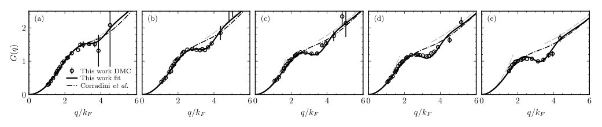 
FIG. 1. Local field factor G(q) of the electron gas for (a)–(e) rs = 5, 30, 50, 70, and 100. DMC data are shown as circles, obtained with Ne = 54 electrons, except for rs = 70, where Ne = 162. The solid line is our fit defined in Eq. (2), and dashdotted line is the analytical parametrization extrapolated by Ref. [24]. Dashed lines represent the low- and high-q limits.

📷 Fig 2

 
FIG. 2. Exchange-correlation kernel fxc at rs = 90. The solid line is obtained from our fitted G(q), while the dashed line is obtained by manually removing the feature from the solid curve. Panel (a) shows fxc as a function of wave vector, while panel (c) shows the difference between the solid and dashed lines in (a). Panels (b) and (d) are the Fourier trans- forms of (a) and (c), respectively.

📷 Fig 3

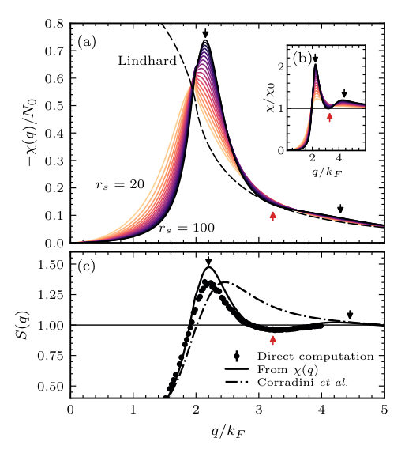 
FIG. 3. (a) Static density response function χ(q) of the elec- tron gas for rs = 20–100 calculated from the analytical fit to our DMC data [Eq. (2)]. The dashed line shows the non- interacting response χ0(q). (b) The ratio χ(q)/χ0(q) of the curves in (a). (c) Static structure factor S(q) at rs = 100. Circles: direct computation (via equal-time pair correlation from separate DMC with Ne = 250), solid and dash-dotted lines: SMA results obtained through our χ(q) and the Cor- radini et al. parametrization, respectively. In all panels, the black arrows mark the first and second peak positions; red arrows mark the midpoint between the peaks. SMA results are scaled for better visibility.

📷 Fig 4

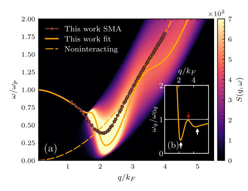 
FIG. 4. (a) Dynamic structure factor S(q, ω) for rs = 90 calculated using the static G(q) as the xc kernel in the linear- response χ(q, ω). Solid orange line: collective mode dispersion from the peak of S(q, ω). Dashed line: the non-interacting dis- persion, ω0q = q2/2. Data points: collective mode dispersion using DMC S(q) as input for SMA, i.e. ωq = q2/[2S(q)]. (b) The solid orange line in (a) divided by ω0q. The white and red arrows mark the dips and peaks, respectively.

**Summary.** This work uses Diffusion Monte Carlo simulations to calculate the static response functions of the 3D electron gas in the strongly coupled regime. The authors identify a distinct structural feature in the local field factor G(q) at intermediate wave vectors. This feature is argued to be a direct signature of short-range order, providing a crucial benchmark for understanding electronic correlations beyond simple approximations.

**Why it may be interesting.** The study provides benchmark data on electronic correlations in a fundamental model, which is crucial for developing accurate theoretical inputs for many-body calculations relevant to correlated materials.

Detailed structure

**Main problem.** The study aims to accurately determine the wave-vector-dependent static local field factor G(q) and the static density-density response function for the 3D electron gas, particularly in the strongly coupled (low-density) regime.

**Main result.** The calculations reveal a pronounced, non-trivial structure in G(q) at intermediate wave vectors, which is identified as a fingerprint of short-range order and is necessary to correctly reproduce the static structure factor.

**Method.** The primary method involves using Diffusion Monte Carlo (DMC) simulations to calculate the response functions, which are then analyzed using theoretical parametrizations.

**Model / system.** The system modeled is the three-dimensional electron gas (HEG), a fundamental model in condensed matter physics used as a starting point for ab initio calculations of materials.

**Key observables.** Static local field factor G(q), static density-density response function $\chi(q)$, and the static structure factor $S(q)$.

**Important parameters / regimes.** The Wigner-Seitz radius ($r_s$), which controls the coupling strength, is varied across the strongly coupled regime ($r_s > 10$).

**Assumptions / limitations.** The analysis relies on DMC calculations for benchmark data and utilizes the Single-Mode Approximation (SMA) for certain derived quantities.

**Figures summary.** Figures illustrate G(q) vs $r_s$ showing the structural feature, the exchange-correlation kernel $f_{	ext{xc}}(r)$ confirming real-space structure, and $\chi(q)$ and $S(q)$ showing the correlated structure.

**Paper structure.** The paper establishes the physical problem, presents DMC calculations of $\chi(q)$ and $G(q)$ across various densities, identifies the structural feature in $G(q)$ required by $S(q)$, and discusses the implications for low-energy resonant modes.

Abstract

The three-dimensional electron gas is a fundamental model in condensed matter physics and quantum chemistry, and the exchange-correlation energy derived from it serves as the starting point of \textit{ab initio} computations of materials. However, the wave-vector-dependent response, and hence the static local field factor $G(q)$, has remained without accurate ground-state benchmark in the strongly coupled regime for three decades. Using diffusion Monte Carlo, we calculate $G(q)$ and the static density-density response function across the liquid phase and find a pronounced structure in $G(q)$ at intermediate wave vectors, already visible at metallic densities and growing with increasing interaction strength. We identify it as a fingerprint of short-range order by showing that it is required to reproduce the static structure factor. Our parametrization, valid in the entire liquid phase, predicts a low-energy resonant mode inside the particle-hole continuum.

[↑ back to top](#top)

### [Simple QKD keyrate computations from tangent-line bounds](http://arxiv.org/abs/2609.09847v1)

**Authors:** Jun Hui Goh, Ernest Y. -Z. Tan  
**Type:** theory · **Category:** quantum information and computing · **PDF:** <https://arxiv.org/pdf/2609.09847v1>  
**Analysis basis:** full PDF text, analyzed in chunks

📷 Fig 1

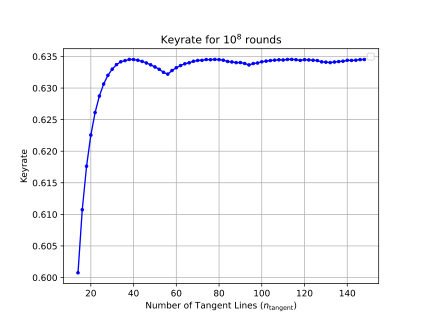 
FIG. 1. Keyrate as a function of the number of tangent lines. The grid search used to plot this graph was 40 × 40. The plot is not monotone because for each ntangent we took the tangent lines at uniformly spaced points over Q ∈[0, 1], which results in the set of tangent lines for each ntangent not being a subset of those for ntangent + 1.

📷 Fig 2

 
FIG. 2. Plot of keyrate value as the grid size of the grid search increases. 100 tangent lines were used in the approximation of the convex optimisation.

📷 Fig 3

 
FIG. 3. Plot comparing the achievable keyrate com- puted by the original authors to that computed by our proposed methodology, using the values of α and γ found in [1]. The purple graph plots the values com- puted by the original authors. The blue graph plots the val- ues computed using the proposed methodology, with the val- ues of α and γ found in [1]. The dashed black line shows the asymptotic keyrate for our parameter choices, which is rasymp = 0.663. We caution however that the results dis- played for n &lt;∼104 (red region in figure) may correspond to significant abort probability during error correction; see Re- mark 1.

📷 Fig 4

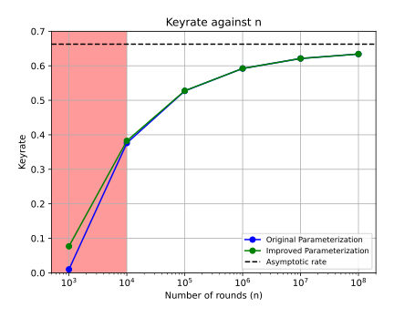 
FIG. 4. Plot comparing the achievable keyrate com- puted by our proposed methodology, including the grid search to find the optimal value of γ and α, using different parametrisation of β and Kα. The blue graph plots the values computed using (6). The green graph plots the values computed using (7). The dashed black line shows the asymptotic keyrate for our parameter choices, which is rasymp = 0.663. We caution however that the results dis- played for n &lt;∼104 (red region in figure) may correspond to significant abort probability during error correction; see Re- mark 1.

📷 Fig 5

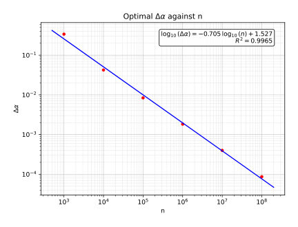 
FIG. 5. Plot of the optimal ∆α against the number of rounds. Linear regression was performed on the values and a R2-value of 0.9965 was found.

**Summary.** This paper develops a novel, computationally efficient method to calculate certified lower bounds on the keyrates for QKD protocols like BB84. By reformulating complex optimization problems using tangent-line approximations, the authors make these calculations tractable for standard convex solvers. This advances the theoretical understanding of achievable secure key rates in quantum cryptography.

**Why it may be interesting.** The rigorous mathematical techniques developed for bounding keyrates using convex optimization and tangent lines provide powerful, generalizable tools for analyzing information-theoretic security in quantum communication.

Detailed structure

**Main problem.** The paper addresses the computation of finite-size keyrates for Quantum Key Distribution (QKD) protocols, aiming to provide certified lower bounds.

**Main result.** The authors propose using tangent-line approximations to transform complex, non-convex optimization problems into computationally tractable convex forms, yielding certified lower bounds for the keyrate.

**Method.** The core method involves reformulating the keyrate optimization problem to utilize convex optimization solvers by deriving suitable tangent lines to the lower bound terms in the objective function.

**Model / system.** The analysis focuses on QKD protocols, specifically the qubit BB84 and the six-state protocol, often modeled using entanglement-based forms and Werner states.

**Key observables.** Finite-size keyrate ($\ell_{	ext{key}}$), Rényi entropy ($	ext{H}^{\uparrow}_{\alpha}, 	ext{H}^{\downarrow}_{\alpha}$), and the asymptotic keyrate ($	ext{r}_{	ext{asymp}}$).

**Important parameters / regimes.** Rényi entropy parameter ($\alpha$), security parameter ($\varepsilon_{	ext{secure}}$), and test-round probability ($\gamma$).

**Assumptions / limitations.** The keyrate bound is derived using a tangent-line lower bound approximation, meaning the computed rate is guaranteed to be less than or equal to the true achievable rate.

**Figures summary.** Figures illustrate the convergence of the computed keyrate as the number of tangent lines or the grid size increases, showing the rate plateaus at sufficient computational effort.

**Paper structure.** The paper first introduces the general problem of keyrate computation via convex optimization, then details the tangent-line approximation technique for simple protocols like BB84, and finally extends this to derive closed-form entropy expressions for the six-state protocol.

Abstract

Recent work in quantum key distribution (QKD) has yielded finite-size keyrates based on convex optimisation problems, using the framework of entropy accumulation. Multiple solvers have been developed to address these optimisations in recent years, but have been based on a somewhat elaborate framework using sophisticated algorithms, in order to accommodate a broad range of QKD protocols. In this work, we note that for basic QKD protocols such as qubit BB84, the keyrates can be easily computed using off-the-shelf solvers instead, by obtaining suitable tangent lines to lower bound terms in the objective function. We compute the resulting finite-size keyrates and compare them to previous work. Moreover, we extend this approach to the six-state protocol, by deriving closed-form expressions for the single-round Rényi entropies in the protocol. This should facilitate subsequent study of the six-state protocol via entropy accumulation.

[↑ back to top](#top)

### [Small-Bias Quantum Approximate Counting via the Multiplicative Adversary Method](http://arxiv.org/abs/2609.09804v1)

**Authors:** Albert Lin, Han-Hsuan Lin  
**Type:** theory · **Category:** quantum information and computing · **PDF:** <https://arxiv.org/pdf/2609.09804v1>  
**Analysis basis:** full PDF text, analyzed in chunks

📷 Fig 1

 
Low-resolution page preview, page 2

📷 Fig 2

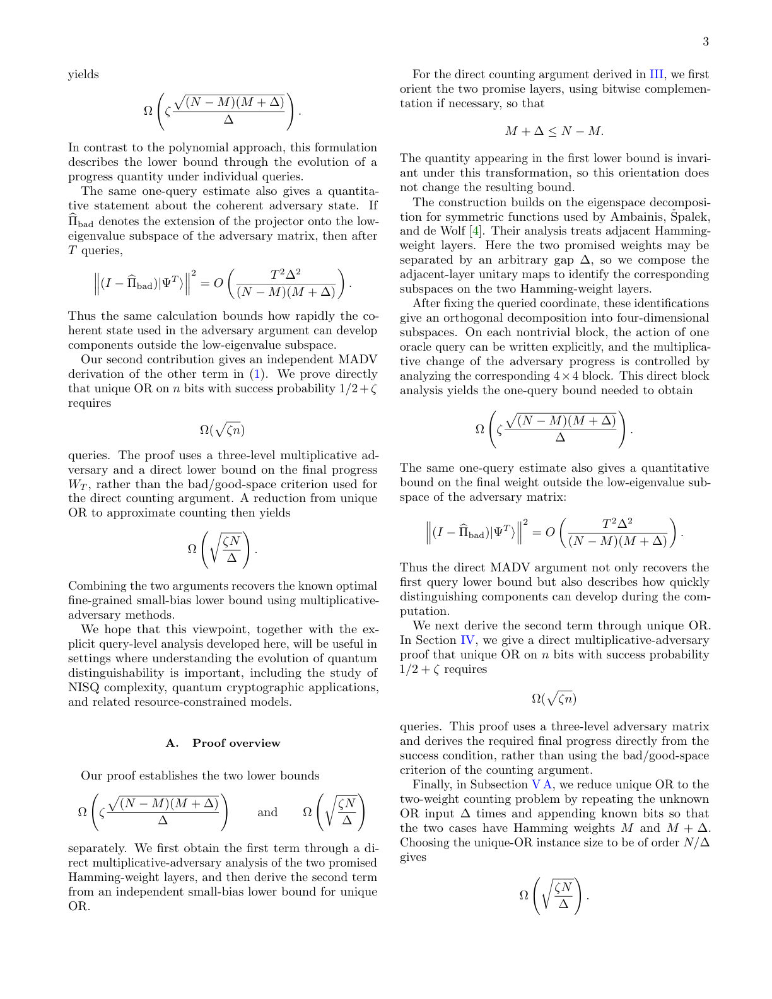 
Low-resolution page preview, page 3

📷 Fig 3

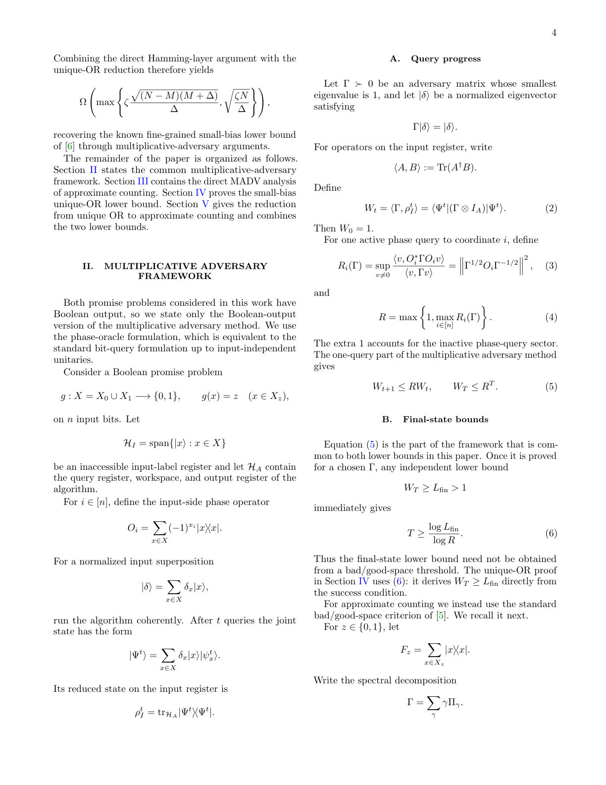 
Low-resolution page preview, page 4

📷 Fig 4

 
Low-resolution page preview, page 5

📷 Fig 5

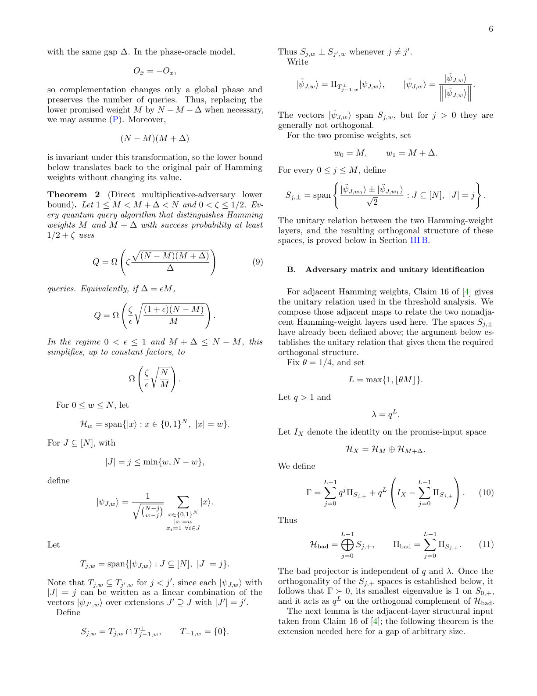 
Low-resolution page preview, page 6

**Summary.** This paper derives tight, fine-grained lower bounds for the quantum query complexity of distinguishing between two Hamming weights using the Multiplicative Adversary Method. By relating this problem to the unique OR problem, the authors establish a complex lower bound that precisely characterizes the required number of quantum queries in the small-bias regime.

**Why it may be interesting.** The rigorous application of the multiplicative adversary method to derive fine-grained lower bounds provides a powerful, query-by-query understanding of quantum distinguishability, which is relevant for understanding resource scaling in quantum algorithms.

Detailed structure

**Main problem.** The paper studies the quantum query complexity required to distinguish between two specific Hamming weights, $|x|=M$ versus $|x|=M+\Delta$, in the small-bias regime.

**Main result.** It establishes a fine-grained lower bound for this quantum counting problem, showing the complexity scales with a maximum of two terms derived from the multiplicative adversary method.

**Method.** The primary technique is the Multiplicative Adversary Method (MADV), which is applied to analyze the progress of quantum distinguishability across different Hamming-weight layers.

**Model / system.** The model is a quantum query algorithm operating on an input space $\{0,1\}^N$, where the goal is to distinguish between two subsets defined by their Hamming weights. The analysis uses concepts from the eigenspace method for symmetric functions.

**Key observables.** The success probability margin $\zeta$, and the quantum query complexity $Q$ (or $T$).

**Important parameters / regimes.** Total bits $N$, the two weights $M$ and $M+\Delta$, and the bias parameter $\zeta$.

**Assumptions / limitations.** The analysis assumes the success probability is at least $1/2 + \zeta$, and often assumes $M+\Delta \le N-M$ for the primary derivation.

**Paper structure.** The paper builds the lower bound by first analyzing the unique OR problem using MADV, then reducing this to the two-weight counting problem, and finally combining these results to yield the overall complexity bound.

Abstract

We study the two-weight decision version of quantum approximate counting: given oracle access to $x\in\{0,1\}^N$, distinguish $|x|=M$ from $|x|=M+Δ$ with success probability $1/2+ζ$. Using the multiplicative adversary method, we prove $Ω\left(\max\left\{ζ\sqrt{(N-M)(M+Δ)}/Δ,\sqrt{ζN/Δ}\right\}\right)$. The same parameter dependence follows from the polynomial-method characterization of the two-layer symmetric function by Podder, Yao, and Ye. Our contribution is a multiplicative-adversary derivation that tracks the progress produced by individual oracle queries. For the first term, after complementing the input if necessary, we assume $M+Δ\le N-M$. We use the Hamming-layer subspaces from the eigenspace method of Ambainis, Spalek, and de Wolf and compose their adjacent-layer unitary maps to relate the two nonadjacent promise layers. After fixing the queried coordinate, the analysis block-diagonalizes into four-dimensional subspaces. An exact calculation of the one-query progress ratio gives the first lower bound. The same estimate also implies $\left\|(I-\widehatΠ_{\mathrm{bad}})\lvertΨ^T\rangle\right\|^2=O\left(T^2Δ^2/((N-M)(M+Δ))\right)$ for the coherent input superposition used in the adversary argument. For the second term, we prove directly using a three-eigenvalue multiplicative adversary that unique OR on $n$ bits with success probability $1/2+ζ$ requires $Ω(\sqrt{ζn})$ queries, and then reduce unique OR to the two-weight counting problem.

[↑ back to top](#top)

### [Solving wave propagation problems via geometric quantum state preparation on dispersion manifolds](http://arxiv.org/abs/2609.10282v1)

**Authors:** Yakov Solomons, Lee Peleg, Netanel Barel, Jonathan Nemirovsky, Amit Ben-Kish, Yotam Shapira  
**Type:** theory · **Category:** quantum information and computing · **PDF:** <https://arxiv.org/pdf/2609.10282v1>  
**Analysis basis:** full PDF text, analyzed in chunks

📷 Fig 1

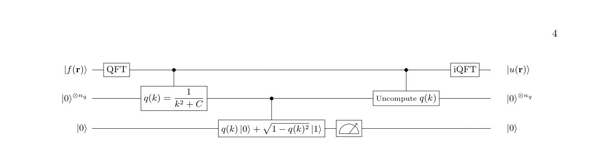 
FIG. 1. Quantum implementation of the inverse operator for the screened Poisson equation in Fourier space. The Quantum Fourier Transform (QFT) maps the state to the momentum basis, where the differential operator becomes diagonal, this corresponds to the U operation in the main text . In this basis, inversion reduces to evaluating the scalar function q(k) = 1/(k2 +C), (16). This value is computed by quantum arithmetic and then encoded into an auxiliary qubit amplitude through a controlled rotation, (17), producing the state q(k) |0⟩+ p

📷 Fig 2

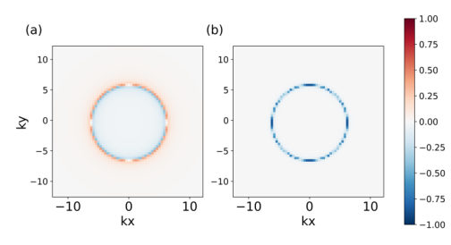 
FIG. 2. Illustration of the (a) real and (b) imaginary parts of Eq. (20), corresponding to the principal-value and delta- function contributions, respectively. The computation is per- formed on a discretized 64 × 64 grid over a square domain of side length L = 16λ, where λ denotes the wavelength. As seen, both terms are concentrated around the dispersion sur- face k2 = ω2/c2 = 2π/λ. Here, ϵ = 3∆kω/c

📷 Fig 3

 
FIG. 3. Quantum circuit for the geometric quantum state preparation algorithm. The momentum registers are first initialized in the resonant state by the state-preparation procedure described in Appendix A. The source-dependent phase encoding, highlighted by the dashed box, is then implemented by controlled phase gates that apply the phases ei(kxxj+kyyj). Finally, after unpreparing the source register and post-selecting it onto |0⟩⊗m, inverse quantum Fourier transform (iQFT) is applied to the momentum registers, yielding the solution state |u(x, y)⟩.

📷 Fig 4

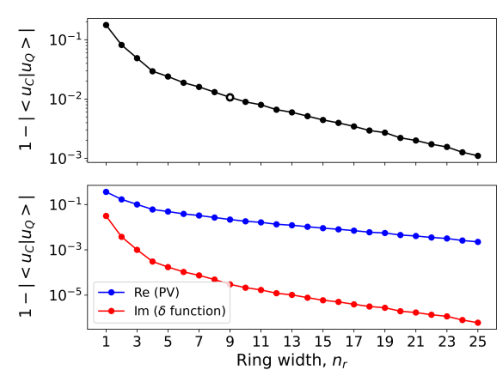 
FIG. 4. Accuracy of the resonant-ring approximation. (a) Total overlap error, 1 −|⟨uC|uQ⟩|, between the normalized classical solution |uC⟩and the state |uQ⟩obtained from the resonant-ring approximation, as a function of the ring width, computed on a 64 × 64 spatial grid. The highlighted point corresponds to the simulation of Fig. 6. (b) Error in the real and imaginary parts of the solution, corresponding to the real (principal-value) and imaginary (delta-function) parts of q(k), respectively.

📷 Fig 5

 
FIG. 5. Minimum resonant-ring width required to achieve target approximation errors of 0.05 and 0.01 as a function of the computational domain size. The slight increase for the smallest domains is due to the coarse Fourier discretization. At higher resolution, the required ring width approaches a constant value, indicating independence from the domain size.

**Summary.** This paper presents a quantum algorithm to solve wave propagation PDEs by reformulating the problem as geometric quantum state preparation. It overcomes the exponential inefficiency of standard Fourier-space methods, which fail due to singularities on the resonant manifold. The resulting technique allows for efficient computation whose success probability scales favorably with the number of sources but remains independent of the system size.

**Why it may be interesting.** This work provides a concrete quantum algorithmic approach to solving fundamental physics problems (wave propagation) where standard quantum simulation techniques fail due to inherent mathematical singularities, offering a path toward practical quantum simulation.

Detailed structure

**Main problem.** The paper addresses the challenge of using quantum algorithms to solve wave propagation partial differential equations (PDEs), particularly the Helmholtz equation, which suffer from singularities in the frequency domain.

**Main result.** The authors propose a novel method that bypasses the exponential overhead of standard Fourier-space solvers by directly preparing quantum states supported on the resonant manifold, yielding a success probability independent of the domain size.

**Method.** The core method involves recasting the PDE solution as a geometric quantum state preparation problem, utilizing quantum circuits to construct superpositions over the resonant manifold rather than inverting the full discretized operator.

**Model / system.** The model is wave propagation governed by PDEs like the Helmholtz equation. The problem is discretized and analyzed in the frequency domain, leading to a linear system whose inverse is singular on the dispersion surface $k^2 = \omega^2/c^2$.

**Key observables.** Success probability of state preparation ($P_{	ext{res}}$), which is shown to be independent of the computational domain size.

**Important parameters / regimes.** The condition number of the discretized operator ($\kappa(A)$), the resonant manifold ($k^2 = \omega^2/c^2$), and the number of sources.

**Assumptions / limitations.** The method relies on approximating the inverse operator structure and assumes the ability to perform complex arithmetic evaluation and post-selection on amplitude coefficients.

**Figures summary.** Figures illustrate the quantum circuits for preparing a resonant state, including implementing a quantum analogue of the Midpoint circle algorithm and extending this to construct a finite-width resonant ring.

**Paper structure.** The paper first contrasts standard Quantum Linear System Solvers (QLSS) with the limitations imposed by the condition number. It then details the failure of direct Fourier-space methods due to singularities, culminating in the proposal and derivation of the geometric quantum state preparation technique.

Abstract

We present a quantum algorithm for solving partial differential equations through a linear-system formulation, focusing on wave propagation problems described by the discretized Helmholtz equation in frequency domain. Although quantum linear-system solvers offer exponential compression of the system degrees of freedom, their runtime complexity is generally governed by the condition number of the discretized operator. Exploiting the analytic structure of the differential operator can provide an alternative to explicit matrix inversion, as illustrated for the screened Poisson equation through an explicit quantum circuit. For the Helmholtz equation, however, the inverse operator becomes singular on the dispersion surface $k^2=ω^2/c^2$, rendering direct Fourier-space state-preparation methods exponentially inefficient. We address this challenge by directly preparing quantum states supported on the resonant manifold and encoding source locations through Fourier phases. The resulting algorithm eliminates the exponentially large overhead associated with post-selection on the resonant manifold, yielding a success probability that depends linearly on the number of sources and is independent of the computational domain size. More generally, our approach applies to hyperbolic differential equations whose Fourier-space solutions possess singular support on dispersion manifolds, recasting their solution as a problem of geometric quantum state preparation.

[↑ back to top](#top)

### [Two-magnon response from light scattering in altermagnets](http://arxiv.org/abs/2609.09287v1)

**Authors:** Shuyi Li, Lexu Zhao, Chunjing Jia  
**Type:** theory · **Category:** strongly correlated electrons · **PDF:** <https://arxiv.org/pdf/2609.09287v1>  
**Analysis basis:** full PDF text, analyzed in chunks

📷 Fig 1

 
FIG. 2. Magnon band structure and two-magnon DOS within LSWT. a and b LSW magnon dispersion ω(0) ± (k) along high-symmetry paths for the conventional antiferromag- net (δJ2 = 0) and the altermagnet (δJ2 = 0.12J1), respec- tively. The red and blue lines denote the magnon branches with different chirality; they are degenerate in a, where only the blue line is visible. c and d Corresponding two-magnon DOS D(q, ω) for the conventional antiferromagnet and the altermagnet. All false-color plots use a common color scale ranging from zero to 0.8 times the global maximum intensity. e and f Constant q cuts of D(q, ω) at the Γ, M, and X points for the conventional antiferromagnet and the altermagnet;...

📷 Fig 2

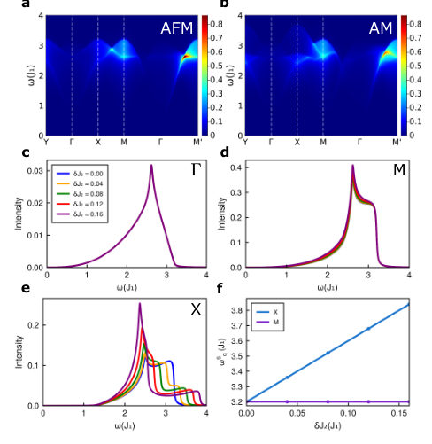 
FIG. 3. Two-magnon scattering intensity in the ˆx′ˆx′

📷 Fig 3

 
FIG. 4. Two-magnon scattering intensity in the ˆx′ˆy′

📷 Fig 4

 
FIG. 5. Two-magnon scattering intensity in circular polarization channels within LSWT. a and b Momentum resolved intensity I(q, ω) for the LR and RL channels of the altermagnet (δJ2 = 0.12J1), respectively.

📷 Fig 5

 
FIG. 6. 1/S-renormalized magnon band structure and two-magnon DOS. a and b Renormalized magnon dis- persions ω±(k) along high-symmetry paths for the conven- tional antiferromagnet (δJ2 = 0) and the altermagnet (δJ2 = 0.12J1), respectively. The red and blue solid lines denote the two magnon branches, which are degenerate in a, while the dashed lines show the corresponding LSW dispersions ω(0) ± (k) for comparison. c and d Two-magnon DOS D(q, ω) con- structed from the 1/S-renormalized magnon dispersions for the conventional antiferromagnet and the altermagnet. e and f Constant-q cuts of D(q, ω) at the Γ, M, and X points for the conventional antiferromagnet and the altermagnet; the Γ and M...

**Summary.** This theoretical study investigates how altermagnetism, characterized by a specific magnetic anisotropy ($\delta J_2$), alters the two-magnon light scattering spectrum. The authors demonstrate that this anisotropy causes a distinct, momentum-dependent shift in the two-magnon continuum edges and lifts degeneracies in the resonance peaks. These findings establish a powerful spectroscopic tool for identifying altermagnetic order in insulating magnets.

**Why it may be interesting.** The work provides a concrete, measurable spectroscopic signature (momentum-dependent two-magnon shift) that can be sought using advanced techniques like RIXS to distinguish altermagnets from other magnetic phases.

Detailed structure

**Main problem.** The primary challenge is identifying the unique spectroscopic fingerprints of altermagnetism, particularly through multi-magnon excitations.

**Main result.** The altermagnetic exchange anisotropy ($\delta J_2$) causes a measurable, momentum-dependent shift in the upper edge of the two-magnon continuum and lifts degeneracies in the two-magnon resonance.

**Method.** The study uses linear spin-wave theory supplemented by leading 1/S quantum corrections and calculates the two-magnon light scattering intensity.

**Model / system.** The system is a two-dimensional d-wave altermagnet modeled by an effective Heisenberg Hamiltonian on a Lieb lattice, characterized by the anisotropy parameter $\delta J_2 = J_{2a} - J_{2b}$.

**Key observables.** Two-magnon light scattering intensity, the energy shift of the upper continuum edge at $\mathbf{X}=(\pi,0)$, and the splitting of the two-magnon resonance at $\mathbf{K}=(\pi/2,\pi/2)$.

**Important parameters / regimes.** The anisotropy parameter $|\delta J_2|$ dictates the magnitude of the spectral shifts, which are found to be linear in $|\delta J_2|$.

**Assumptions / limitations.** The calculations rely on linear spin-wave theory extended with leading $1/S$ quantum corrections and treating magnon-magnon interactions within the ladder approximation.

**Figures summary.** Figures illustrate the Lieb lattice structure and the momentum-dependent shifts in the two-magnon continuum edges and resonance splitting as a function of $\delta J_2$.

**Paper structure.** The paper first establishes the theoretical framework using spin-wave theory to calculate the two-magnon scattering intensity. It then presents quantitative results showing the momentum-selective shifts caused by $\delta J_2$ compared to conventional antiferromagnets, followed by detailed analysis of the resonance splitting.

Abstract

Altermagnetism is a recently established class of magnetic order that combines fully compensated moments with momentum-dependent spin splitting, yet identifying its spectroscopic fingerprints remains an open challenge. In this work, we investigate finite-momentum two-magnon excitations in a two-dimensional $d$-wave altermagnet by calculating the two-magnon light scattering intensity in different polarization channels. Using linear spin-wave theory and further incorporating the leading $1/S$ quantum corrections, we demonstrate that the characteristic magnon splitting of altermagnets shifts the upper edge of the two-magnon continuum and the corresponding spectral features to higher energy at $\boldsymbol{X}=(π,0)$ relative to the conventional antiferromagnet, by an amount linear in the exchange anisotropy $|δJ_2|$, while leaving the response at the Brillouin-zone center unchanged. Although magnon-magnon interactions strongly redistribute spectral weight toward lower energies, the energy scale associated with the high-energy momentum-selective reconstruction remains robust. The interactions additionally generate a pronounced low-energy two-peak structure that has no counterpart within linear spin-wave theory. At $\boldsymbol{K}=(π/2,π/2)$, we show that the interacting two-magnon resonance is twofold degenerate in the conventional antiferromagnetic phase, while a finite altermagnetic exchange anisotropy lifts this degeneracy, producing two peaks whose separation is linear in $|δJ_2|$. The characteristic energy scales underlying both features are intrinsic to the two-magnon sector rather than to a specific scattering operator. These findings highlight the potential of finite-momentum two-magnon spectroscopy for identifying altermagnetic order in insulating magnets and motivate momentum-resolved resonant inelastic x-ray scattering studies of candidate altermagnetic materials.

[↑ back to top](#top)

### [Universal Entanglement Dynamics of Unitary Operators](http://arxiv.org/abs/2609.09276v1)

**Authors:** Ian Low, Navin McGinnis  
**Type:** theory · **Category:** quantum information and computing · **PDF:** <https://arxiv.org/pdf/2609.09276v1>  
**Analysis basis:** full PDF text, analyzed in chunks

📷 Fig 1

 
FIG. 1. (a) The two-projector unitary circle, corresponding to the boundary of Fig. 1 in Ref. [18] and parametrized by the relative phase δ. The fixed points δ = 0, π under δ →−δ are stationary by Theorem 1. (b) Entangling power of the singlet–adjoint family for N = 2, 3, 4, 5. The reflection at δ = π is a minimum for N = 2 and a maximum for N ≥3.

📷 Fig 2

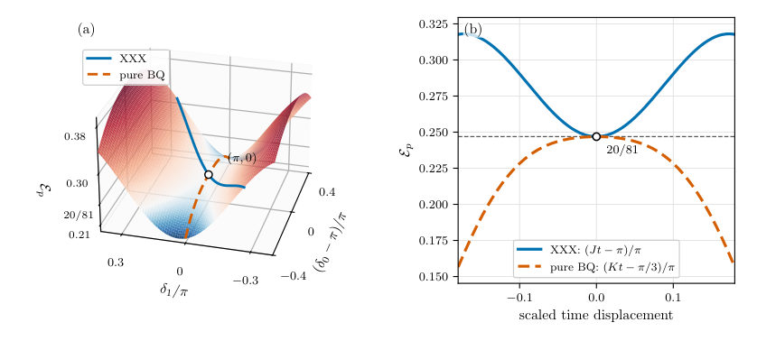 
FIG. 2. Entangling power near the stationary corner (δ0, δ1) = (π, 0) of the two-site spin-1 BLBQ family. (a) Entangling power in relative-phase coordinates, with the XXX (solid blue) and pure-biquadratic (dashed orange) trajectories. (b) Corresponding one-dimensional trajectories of the time-evolution: the corner is a local minimum along the XXX trajectory but a local maximum along the pure-biquadratic trajectory.

**Summary.** This theoretical paper determines the locations where the entangling power of a unitary quantum gate reaches an extremum. It proves that these stationary points occur at specific 'corner' configurations defined by the relative eigenphases of the unitary. This work provides a powerful tool for classifying quantum gates based on their entanglement properties.

**Why it may be interesting.** It provides a rigorous mathematical characterization of when and where entanglement generation is extremal for quantum gates, linking fundamental algebraic properties ($U^2 \propto \mathbb{I}$) to physical observables.

Detailed structure

**Main problem.** The paper investigates the stationary points of the entangling power generated by a unitary operator acting on a bipartite Hilbert space.

**Main result.** The entangling power is proven to be stationary at specific 'corner' points in the relative eigenphase torus, where the unitary takes the form of a generalized reflection $R = \mathbb{I} - 2Q$.

**Method.** The analysis uses the spectral decomposition of the unitary operator and calculates the entangling power as a function of relative eigenphases, identifying critical points via differentiation.

**Model / system.** The system is a bipartite Hilbert space acted upon by a finite-dimensional unitary operator $U$. The analysis is illustrated using two-qubit gates and two-site spin chains.

**Key observables.** Entangling power ($E_p$), which is defined using the average linear entropy $\langle E(|\psi
angle) 
angle$.

**Important parameters / regimes.** The relative eigenphases ($\delta_a$) of the unitary operator, and the invariants ($\alpha, eta$) derived from the spectral projectors.

**Assumptions / limitations.** The analysis assumes the unitary can be parameterized by relative eigenphases, and the theorem only locates stationary points, not classifying them fully.

**Figures summary.** Figures illustrate the entangling power $E_p$ near stationary corners for specific physical models, such as the two-site spin-1 BLBQ Hamiltonian, showing how the extremum type depends on the trajectory.

**Paper structure.** The paper establishes the general mathematical framework by analyzing the dependence of $E_p$ on relative phases, proves the existence of stationary points at the corners, derives the form of the corner unitaries ($R_m$), and then applies these results to concrete physical examples like two-qubit gates and spin chains.

Abstract

The entangling power of a unitary operator acting on a bipartite Hilbert space measures the entanglement it generates from product states, averaged over the inputs. A finite-dimensional unitary has a spectral decomposition $U=\sum_{a=1}^{n}e^{iθ_a}P_a$, where $e^{iθ_a}$ are the eigenvalues, $P_a$ the corresponding eigen-projectors, and $n$ is the number of distinct eigenvalues. After removing an overall phase, the entangling power is a function on the $(n-1)$-torus of relative eigenphases at fixed spectral projectors. We prove that this function is stationary at all $2^{n-1}$ points on the torus where every relative phase is $0$ or $π$, which we define as \textit{corners}. Up to an overall phase, $U$ at each corner is a generalized reflection $R=\mathbb{I}-2Q$ satisfying $R^2=\mathbb{I}$, where $Q$ is the sum of spectral projectors whose relative phase is $π$. At the corner the entangling power is expressed in terms of seven local-unitary invariants of $Q$. A unitary gate $U$ can be realized as a corner of some projector family if and only if $U^2\propto\mathbb{I}$, a condition satisfied by many Clifford and non-Clifford gates. We illustrate the theorem with two-qubit gates, $SU(N)$ channel decompositions, and two-site spin chains, obtaining examples of minima, maxima, and saddle points. In addition, a corner that is a saddle point on the full phase torus can appear as a local maximum or minimum along different time-evolution trajectories.

[↑ back to top](#top)

## Secondary cond-mat archives

*Papers from  mes-hall, other, soft, supr-con. These archives are de-prioritized — they appear at the end regardless of relevance score.*

### Relevant in secondary archives (20)

### [Fast Synergetic Simulation to Study Slow Evolution of Soliton Patterns in Optical Resonators](http://arxiv.org/abs/2609.10389v1)

**Authors:** Sanzida Akter, Pradyoth Shandilya, Logan Courtright, Amir Leshem, Giuseppe D'Aguanno, Omri Gat, Curtis R. Menyuk  
**Type:** theory · **Category:** numerical methods · **PDF:** <https://arxiv.org/pdf/2609.10389v1>  
**Analysis basis:** full PDF text, analyzed in chunks
**Topic relevance:** 🔥 `methods for driven-dissipative` **4/5** · `Keldysh / 2PI / non-Gaussian methods` **1/5** · `analog quantum simulation` **1/5** · `correlated / nonlocal dissipation` **1/5** · `driven-dissipative phase transition` **1/5** · `non-equilibrium universality` **1/5** · `scars & prethermalization` **1/5**

📷 Fig 1

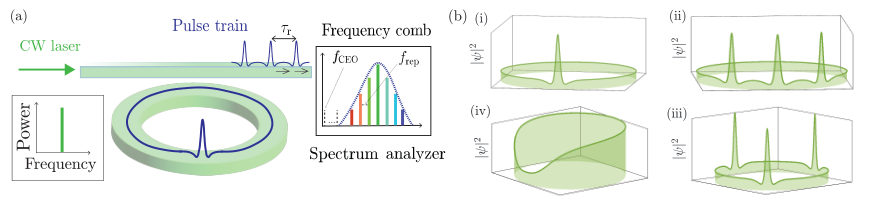 
Figure 1: (a) Schematic of a microresonator system for frequency comb generation. A microring resonator is driven by an external CW laser source to generate a train of soliton pulses or more complex patterns that form a frequency comb, as analyzed using an optical spectrum analyzer. (b) Intracavity intensity profile illustration of commonly observed optical patterns. Anomalous dispersion regime: (i) a single dissipative Kerr soliton, (ii) a soliton molecule, (iii) a perfect soliton crystal. Normal dispersion regime: (iv) a dark soliton.

📷 Fig 2

 
Figure 2: (a) (i) Profile of a single soliton stationary solution. (ii) The corresponding eigenvalue spectrum derived from the linearized operator. The spectrum reveals a fourfold symmetry and a single eigenvalue near zero, corresponding to translational invariance of the soliton. (b) (i) A three- soliton molecule solution and (ii) its eigenvalue profile. Here, there are three eigenvalues near zero: one represents translational invariance (similar to the single soliton), while the other two represent the slowly varying DOFs associated with the relative motion between solitons. (c) (i) An eight- soliton molecule and (ii) its eigenvalue spectrum. In this system, there are eight eigenvalues...

📷 Fig 3

 
Figure 3: Synergetic method algorithm flowchart

📷 Fig 4

 
Figure 4: (a) Two-soliton molecule system where xph is half the separation distance. (b) Dynam- ical spectrum of the two-soliton molecule showing the presence of two eigenvalues near zero: λ0 corresponds to translational invariance of the soliton pair and λM is responsible for relative motion between solitons. (c) Shape of the two eigenvectors of the near-zero eigenvalues. (d) Two-soliton potential function U(xph) as a function of half the separation distance xph showing the consecutive stable and unstable equilibria. Inset-2 shows U(xph) near the potential maximum at xph = 6.7. The potential beyond this point appears nearly flat on a linear scale due to the exponential falloff of the...

📷 Fig 5

 
Figure 5: (a) CPU time comparison between the synergetic method and the SSFM for the two- soliton system as a function of xph(t = 0) as the solitons approach equilibrium starting at different separations. (b) Time comparison and error analysis for the synergetic method using different order explicit Runge-Kutta integrators; RK2 = second-order, RK3 = third-order, RK4 = fourth-order.

**Summary.** This paper introduces the synergetic method, a novel numerical technique designed to overcome the computational stiffness encountered when simulating systems with widely separated timescales. By projecting the dynamics onto the slowly evolving modes, the method efficiently models the long-term interaction and pattern formation of solitons in optical resonators, enabling simulations on realistic laboratory timescales.

**Why it may be interesting.** This work presents a powerful, generalizable numerical technique for analyzing complex, slow dynamics in nonlinear physical systems, which is highly relevant to open quantum systems and nonlinear wave physics.

Detailed structure

**Main problem.** The primary challenge is numerically simulating the slow, long-term evolution of complex soliton patterns in optical resonators, where the dynamics are governed by timescales vastly different from the rapid damping timescales.

**Main result.** The authors developed and applied the 'synergetic method' to simulate multi-soliton interactions, achieving speedups of $10^3$ to $10^5$ times over conventional methods and modeling dynamics on laboratory timescales.

**Method.** The synergetic method, inspired by Haken's framework, eliminates rapidly damped degrees-of-freedom by analyzing the Jacobian of the evolution equation, projecting the dynamics onto the slow, dominant eigenmodes.

**Model / system.** The system is based on dissipative Kerr solitons in a driven nonlinear Kerr cavity, modeled by the Lugiato-Lefever equation (a driven-damped nonlinear Schrödinger equation).

**Key observables.** Inter-soliton separations ($p_1, p_2$), the potential function $U(p_1, p_2)$, and the dynamical spectrum (eigenvalues) of the linearized operator.

**Important parameters / regimes.** The separation between fast (damping) and slow (pattern evolution) timescales, and the ability to simulate dynamics over laboratory timescales (e.g., seconds).

**Assumptions / limitations.** The method assumes that the long-term behavior is governed by a small cluster of eigenvalues near zero, corresponding to the slow collective dynamics.

**Figures summary.** Figures illustrate the system's dynamics, showing the evolution of soliton patterns (single, molecule, crystal) and mapping the potential energy landscape $U(p_1, p_2)$ that governs the slow convergence of the system.

**Paper structure.** The paper establishes the physical context (solitons in microresonators), identifies the computational bottleneck (stiffness due to timescale separation), proposes the synergetic method based on Jacobian analysis, and validates it by simulating complex multi-soliton interactions and mapping their potential energy surfaces.

Abstract

Complex patterns in physical and biological systems often emerge through slow collective dynamics governed by a small number of key variables. In nonlinear optical resonators, dissipative Kerr solitons provide an important example, where interactions between well-separated solitons can evolve over timescales far longer than the characteristic loss and gain timescales. Direct numerical simulation of these dynamics is challenging because stiffness forces conventional methods to resolve many rapidly damped degrees-of-freedom with very small time steps. We present a numerical scheme, the synergetic method, that eliminates these rapidly damped degrees-of-freedom and retains the slowly evolving modes, enabling time steps many orders of magnitude larger than those used in conventional approaches. Applied to soliton molecules in driven Kerr cavities, the method achieves speedups of $10^3$ to $10^5$ while capturing dynamics on laboratory timescales. We use it to model the full interaction dynamics of a three-soliton molecule and the evolution of an eight-soliton molecule. The approach provides an efficient framework for studying slow pattern formation in nonlinear systems with widely separated timescales.

[↑ back to top](#top)

### [Morphology and depletion force-based large-scale self-assembly of nanocubes on surface](http://arxiv.org/abs/2609.09761v1)

**Authors:** Yeonhee Lee, Seungsang Cha, Yuna Kwak, Nicholas Juntunen, Grant M. Rotskoff, Jwa-Min Nam  
**Type:** both · **Category:** statistical mechanics · **PDF:** <https://arxiv.org/pdf/2609.09761v1>  
**Analysis basis:** full PDF text, analyzed in chunks
**Topic relevance:** `analog quantum simulation` **3/5** · `driven-dissipative phase transition` **2/5** · `methods for driven-dissipative` **2/5** · `non-equilibrium universality` **2/5** · `Frenkel-Kontorova` **1/5** · `Keldysh / 2PI / non-Gaussian methods` **1/5** · `quantum measurements` **1/5** · `scars & prethermalization` **1/5**

📷 Fig 1

 
Fig. 1 | Morphology-induced and depletion force-directed nanoparticle assembly on surface (MIDAS). The mixture containing Au nanocubes (AuNCs) and depletants is dropcast on the substrate and incubated for a few hours. UNP-NP denotes the interaction potential between nanoparticles while UNP-substrate denotes the interaction potential between a nanoparticle and a substrate. The stronger attractive interaction between a nanoparticle and a substrate compared to the interaction between nanoparticles induces the faster lateral growth of AuNCs, leading to the monolayer growth. In contrast, the weaker attractive interaction between a nanoparticle and a substrate leads to the relatively slower...

📷 Fig 2

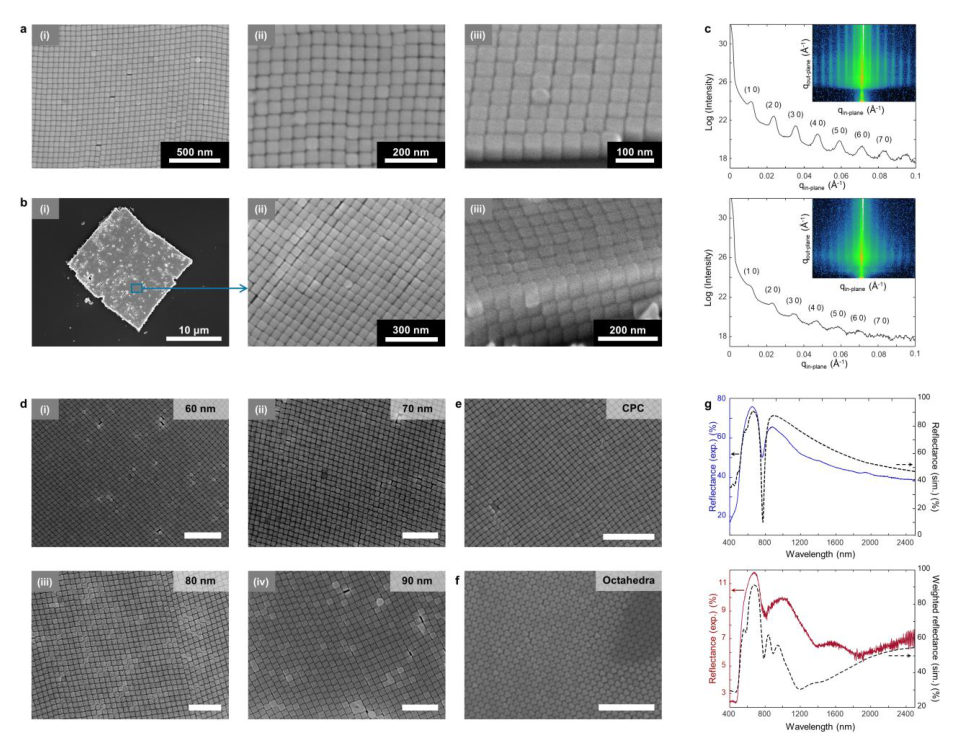 
Fig. 2 | Characterization of the 2D nanocube-assembled monolayers (2D NAMs) and 3D nanocube- assembled multilayers (3D NAMs). a-b, Scanning electron microscopy (SEM) images of the assembled AuNCs on surfaces. SEM images of the 2D NAMs (a) and 3D NAMs (b), with tilted images showing 2D monolayer (a- iii) and 3D supercrystal (b-iii) formation. c, The grazing-incidence small-angle X-ray scattering (GI-SAXS) data showing crystallinity of the structures of 2D (top) and 3D (bottom) assemblies, respectively. d, 2D NAMs with varying sizes of AuNCs, 60 nm (i), 70 nm (ii), 80 nm (iii), and 90 nm (iv). e, 2D NAM formed using cetylpyridinium chloride (CPC) as the depletant. f, MIDAS-based formation of...

📷 Fig 3

 
Fig. 3 | In situ monitoring of the MIDAS processes of AuNCs with a bright-field microscope. a, The average growth area of the two-dimensional assembled structure as a function of time using an in situ image sequence. The nucleation and growth stages were captured by microscopic snapshots. Nanoparticles nucleate (i) on the substrate within one minute after initiating the assembly. Subsequently, the assembly process undergoes lateral growth via deposition and diffusion (ii), resulting in the complete filling of the substrate by the monolayer (iii). b, Growth pattern of the entire three-dimensional assembled structure (black), the second layer (green), and the third layer (red) over time....

📷 Fig 4

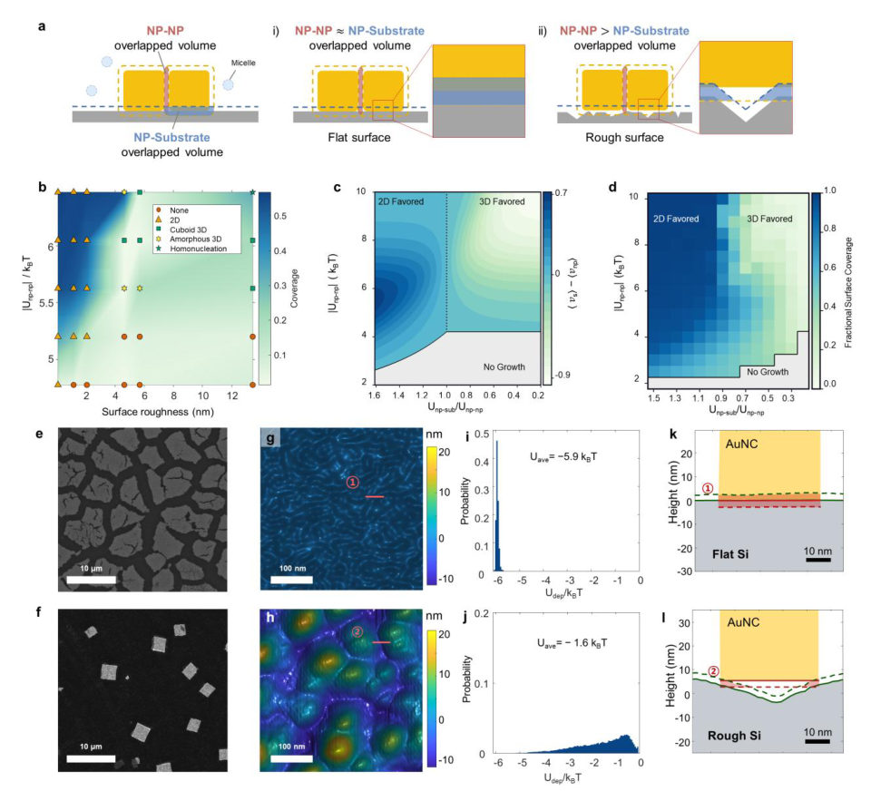 
Fig. 4 | Surface roughness effect on the MIDAS. a, Schematic figure showing how the overlapped volumes are affected by surface roughness. b, A phase diagram of the nanocube assemblies depending on depletion potential strength and surface roughness. c, A phase diagram from the mean field theory across a broad parameter range. Kinetic preference is plotted in the blue-to-green scale, and thermodynamic “No Growth” area is shown in gray. d, A phase diagram of the assemblies from kinetic Monte Carlo (KMC) simulation parameter sweep. e-f, SEM images of the 2D assemblies formed on a flat-surfaced Si wafer (Sa = 0.07) (e) and 3D assemblies formed on a rough-surfaced Si wafer (Sa = 4.62) (f). g-h,...

📷 Fig 5

 
Fig. 5 | Kinetic Monte Carlo (KMC) simulations of surface morphology-controlled self-assembly of nanocubes. a, Schematic of the impact of neighboring nanoparticle orientation on interaction strength. b, Representative lattice-gas self-assembly modeling for flat (Fig. 4i) and rough (Fig. 4j) surface statistics. c, Orientation of nanoparticles deposited on the substrate. Similar colors are aligned, and dissimilar colors are misaligned. d, Growth kinetics from simulation. Data was tracked to 10,000 nanoparticles, with the gap between number of nanoparticles and fractional surface coverage indicating the degree of 3D stacking. e-f, Simulation trajectories for smooth (e) and rough (f) surfaces....

**Summary.** This work introduces the MIDAS method for self-assembling gold nanocubes on surfaces, achieving high control over the resulting 2D or 3D superstructures. The assembly mechanism is governed by depletion forces interacting with the substrate's surface morphology. This establishes a generalizable framework for fabricating ordered nanoparticle arrays for plasmonic applications.

**Why it may be interesting.** While focused on classical colloidal assembly, the underlying principles of controlled self-organization, phase transitions driven by external fields (depletion potential), and the use of computational models (KMC, lattice-gas) are highly relevant to understanding many-body dynamics in quantum systems.

Detailed structure

**Main problem.** The primary challenge is achieving precise, controllable, and scalable large-scale self-assembly of nanoparticles into functional structures, overcoming limitations in current methods.

**Main result.** The MIDAS method successfully enables the facile, selective formation of 2D and 3D nanoparticle arrays whose structure is dictated by the interplay between depletion forces and substrate surface roughness.

**Method.** The study combines experimental assembly using gold nanocubes (AuNCs) with theoretical modeling, including lattice-gas modeling and kinetic Monte Carlo simulations.

**Model / system.** The system involves AuNCs assembling on various substrates (Si, glass) driven by depletion forces generated by a depletant (BDAC micelles). The assembly mode (2D vs 3D) is controlled by the substrate's surface roughness and interaction strength.

**Key observables.** 2D and 3D assembled monolayers/multilayers (AuNAMs), lattice constants, interparticle gaps, and UV-Vis reflectance spectra.

**Important parameters / regimes.** Substrate surface roughness ($	ext{Sa}$), depletion potential ($U_{dep}$), and the relative strength of nanoparticle-substrate vs. nanoparticle-nanoparticle interactions.

**Assumptions / limitations.** The growth mode is determined by comparing the attractive nanoparticle-substrate interactions against the nanoparticle-nanoparticle interactions, which is further refined by surface roughness control.

**Figures summary.** Figures illustrate the assembly process (dropcasting) and the resulting structures, showing 2D AuNAMs on smooth Si and 3D AuNAMs on less smooth glass.

**Paper structure.** The paper establishes the MIDAS method, details the role of depletion forces and substrate properties in determining the growth regime (2D vs 3D), and validates these findings using both in situ microscopy and computational modeling.

Abstract

Self-assembling nanoparticles is a highly efficient and facile way to form functional nano-, micro- and macrostructures. However, currently available methods lack precision and controllability in size, shape and composition, suffer from poor reproducibility and scalability, and require complex steps and expensive materials. Here, we present the uniform morphology-induced and depletion force-directed nanoparticle assembly on surface (MIDAS) method with gold nanocubes (AuNCs). Using this approach, morphology-sensitive depletion forces trigger shape-selective flocculation and assembly of the AuNCs with uniform size and shape. Importantly, the surface roughness-controlled substrate drives the large-scale formation of AuNC-assembled monolayers (2D AuNAMs) or three-dimensional AuNC-assembled multilayers (3D AuNAMs) in a highly specific manner without any complex ligand modification or preparation steps. Lattice-gas modeling and kinetic Monte Carlo simulations show the depletion force is the key parameter determining supercrystal morphology and corroborate the experimental findings. This work establishes a generalizable nanoparticle assembly mechanism and demonstrates the broad applicability of the MIDAS strategy for scalable fabrication and patterning of 2D and 3D nanoparticle architectures.

[↑ back to top](#top)

### [Quantum Phase Transitions and Fractional Quantized Anomalous Hall Insulators in Rhombohedral Graphene](http://arxiv.org/abs/2609.09422v1)

**Authors:** Zach Hadjri, Xinlei Yue, Tonghang Han, Yuxuan Yao, Zhengguang Lu, Shenyong Ye, Junseok Seo, Jixiang Yang, Kenji Watanabe, Takashi Taniguchi, Liang Fu, Ady Stern, Long Ju  
**Type:** both · **Category:** strongly correlated electrons · **PDF:** <https://arxiv.org/pdf/2609.09422v1>  
**Analysis basis:** full PDF text, analyzed in chunks
**Topic relevance:** `analog quantum simulation` **3/5** · `driven-dissipative phase transition` **2/5** · `non-equilibrium universality` **2/5** · `Keldysh / 2PI / non-Gaussian methods` **1/5** · `methods for driven-dissipative` **1/5**

📷 Fig 1

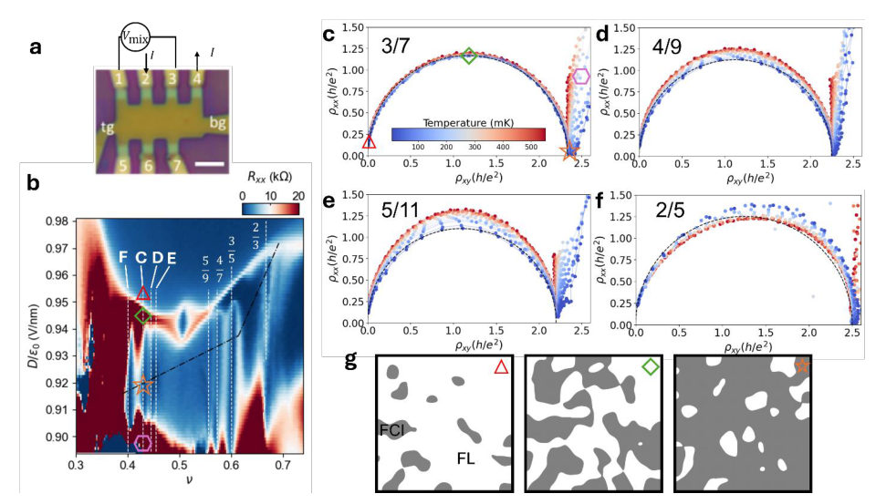 
Fig. 1. Resistivity semi-circles of FL-FCI quantum phase transitions in a pentalayer rhombohedral graphene/hBN moiré superlattice. a, Optical micrograph of the device reported on in this paper. The probe configuration used to measure 𝑅𝑥𝑥 and 𝑅𝑥𝑦 is shown. b, Color map of longitudinal resistance 𝑅𝑥𝑥 as a function of moiré filling factor 𝜈 and D. Vertical stripes corresponding to FCIs can be seen in the intermediate range of D, above (below) which is the Fermi liquid state (the correlated insulating (CI) state). The thermal activation data in Fig. 4 were taken along the dotted-dashed line. c-f, Longitudinal resistivity 𝜌𝑥𝑥 versus Hall resistivity 𝜌𝑥𝑦 plots, corresponding to the dashed lines...

📷 Fig 2

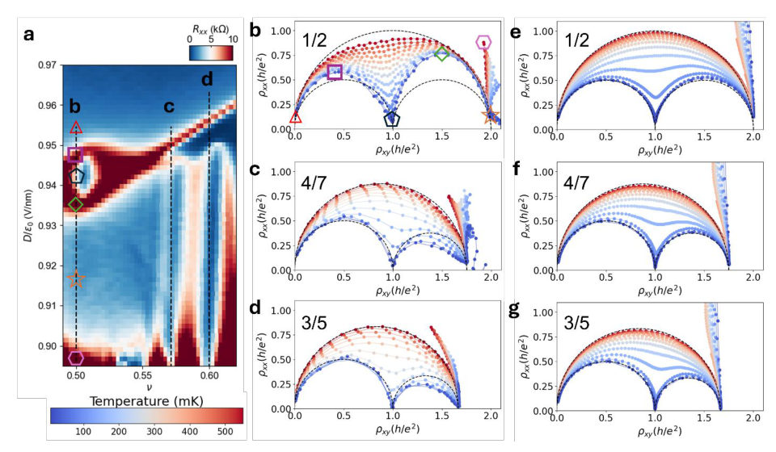 
Fig. 2. Resistivity semi-circles of the FL-EQAH-FCI/CFL phase transitions. a, 𝑅𝑥𝑥 colormap showing filling factors at and above 𝜈= 1/2, and dashed lines trace the D-field-driven quantum phase transitions at 𝜈= 1/2, 4/7, 3/5. The red triangle represents a Fermi liquid state, the black pentagon the EQAH state with Chern number C = 1, the orange star represents the CFL state with 𝜌𝑥𝑦≈2ℎ/𝑒2. The purple square represents the intermediate point between the FL and EQAH state, and the green diamond represents the intermediate point between EQAH and CFL. b-d, Resistivity plots for mixing chamber temperatures of 7 to 550 mK taken along the dashed lines in

📷 Fig 3

 
Fig. 3. Conductivity semi-circles and fractional quantized anomalous Hall insulators. a, 𝑅𝑥𝑥 color map, with black dashed lines tracing the D-field-driven quantum phase transitions at 𝜈 3/7 and 4/9. At 𝜈 4/9. The red triangle, orange star, pink hexagon, and green diamond represent a Fermi liquid, the FCI state, the insulating state, and the intermediate state, respectively. b,c, Plots of 𝜎𝑥𝑥 vs. 𝜎𝑥𝑦 at varying temperatures for 4/9 and 3/7 taken along dashed lines in a, respectively. The transitions from the FCI to the insulator agree well with the semi-circles, while the data corresponding to the FCI-FL transition develops into vertical lines with diverging conductivity. d, 𝜌𝑥𝑥 (solid...

📷 Fig 4

 
Fig. 4. Comparison with thermal activation model and transport gaps of FCI states. a,b, Temperature dependence of 𝑅𝑥𝑥 vs electron density along the dashed-dotted line in Fig. 1a, taken at 0 T and 2 T out-of-plane magnetic fields. The upper x-axis is the moiré filling factor. b, Similar to a, but at 2 T, and along a different trajectory in (𝑛, 𝐷) space (see Extended Data Fig. 5). The data are qualitatively similar at these two magnetic fields, except for the suppression of the EQAH

**Summary.** This work reports on the quantum phase transitions in rhombohedral graphene moiré superlattices, identifying the Fractional Quantized Anomalous Hall Insulator (FQAHI) phase. By analyzing transport measurements, the authors show that phase boundaries follow predictable semi-circle relations, and by fitting temperature dependence, they estimate the energy gaps in these exotic correlated insulating states.

**Why it may be interesting.** The study provides experimental evidence for highly correlated insulating states (FCIs/FQAHI) in a tunable 2D platform, which is crucial for understanding topological phases relevant to quantum simulation and emergent quantum phenomena.

Detailed structure

**Main problem.** The paper investigates quantum phase transitions and characterizes novel insulating states, specifically the Fractional Quantized Anomalous Hall Insulator (FQAHI), in rhombohedral graphene moiré superlattices.

**Main result.** Phase transitions between various correlated states (FL, FCI, CI) are described by semi-circle relations in resistivity/conductivity space, confirming the existence of a new FQAHI phase.

**Method.** The study combines systematic transport measurements (resistivity/conductivity) with theoretical modeling, employing the effective medium approximation and fitting temperature-dependent data to thermal activation models.

**Model / system.** The physical system is rhombohedral pentalayer graphene/hBN moiré superlattices, which exhibit tunable electronic properties via an external gate-displacement field (D). The analysis covers transitions between Composite Fermi liquid, Fermi liquid, and Fractional Chern Insulator states.

**Key observables.** Longitudinal and transverse resistivities/conductivities ($
ho_{xx}, 
ho_{xy}$), which exhibit semi-circle trajectories; temperature-dependent resistance ($R_{xx}$); and estimated transport gap sizes.

**Important parameters / regimes.** Gate-displacement field ($D$), filling factor ($
u$), and temperature ($T$).

**Assumptions / limitations.** The semi-circle law is assumed to hold for two-phase coexistence, and the analysis relies on fitting data to specific functional forms (e.g., thermal activation or $T^2$ dependence).

**Figures summary.** Figures illustrate semi-circle transitions in $(
ho_{xx}, 
ho_{xy})$ and $(\sigma_{xx}, \sigma_{xy})$ planes for different filling factors, alongside Arrhenius plots comparing thermal activation fits to metallic temperature dependencies.

**Paper structure.** The paper systematically analyzes transport measurements across different filling factors, first establishing the semi-circle law for phase transitions, then detailing the FCI-CI transition suggesting the FQAHI, and finally using temperature-dependent fits to estimate transport gaps.

Abstract

Fractional quantum anomalous Hall effect (FQAHE) has been discovered in twisted MoTe$_2$ and rhombohedral graphene/hBN moiré superlattices. Such van der Waals heterostructures feature a tuning knob of gate displacement field $D$, which is absent from the conventional fractional quantum Hall systems in two-dimensional electron gases. $D$ plays a critical role in engineering FQAHE and other emergent quantum states and provides an exciting new opportunity to explore their quantum phase transitions. However, the microscopic details of such transitions and temperature-dependent transport have remained mostly elusive. Here we report systematic resistance measurements in rhombohedral pentalayer graphene/hBN moiré superlattices. We found that the displacement field-driven phase transitions between Composite Fermi liquid, Fermi liquid, Fractional Chern insulators, and insulating states are described by semi-circle relations of the longitudinal and transverse resistivities (or conductivities), largely unexplored in the fractional quantum Hall systems. This agrees with a spatially separated two-phase picture for the phase transitions and further indicates a new insulator phase--fractional quantized anomalous Hall insulator. By comparing the temperature-dependence of longitudinal resistance with the thermal activation model, we estimated the transport gap sizes in three fractional Chern insulator states. Our work shed light on the quantum and temperature evolutions of fractional Chern insulator states--providing necessary background for anyon-braiding and gate-defined junctions in rhombohedral graphene.

[↑ back to top](#top)

### [Apparent Zero-Momentum Signals from Magnon--Magnon Interference in Near-Field Spin-Wave Imaging](http://arxiv.org/abs/2609.09922v1)

**Authors:** Julien Berthomier, Romain Lebrun, Vincent Cros, Jamal Ben Youssef, Karim Bouzehouane, Abdelmadjid Anane  
**Type:** both · **Category:** other · **PDF:** <https://arxiv.org/pdf/2609.09922v1>  
**Analysis basis:** full PDF text, analyzed in chunks
**Topic relevance:** `interference shaping light` **3/5** · `quantum measurements` **2/5**

📷 Fig 1

 
FIG. 1. Effect of NV-sample distance on phase- coherent spin-wave imaging. (a) Schematic of the experi- mental setup: a single NV center at the end of an AFM probe (QZabre) scans above a 140-nm-thick YIG film. A stripline antenna excites primarily Damon–Eshbach (DE) modes with the bias field µ0Hext = 15.9 mT applied parallel to the trans- ducer. Propagating spin waves scatter off defects, generating characteristic caustic beams. (b) Experimental NV contrast at an NV–sample distance d = 200 nm, revealing the wave- fronts of the coherently excited DE modes. (c) Corresponding near-field diffraction simulation accounting for the interfer- ence between the antenna field and the spin-wave stray...

📷 Fig 2

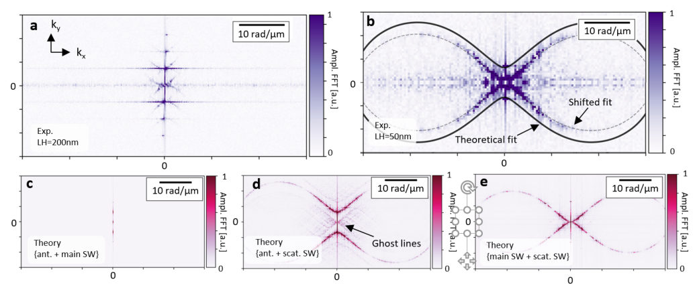 
FIG. 2. Probing the reciprocal space of spin-wave interference at varying lift heights. (a) Fast Fourier Transform (FFT) of the experimental image at d = 200 nm [Fig. 1(b)]. The primary DE modes manifest as distinct reciprocal-space peaks; additional harmonics arise from the nonlinearity of the contrast with respect to microwave power and the spatial anharmonicity of the non-propagating microwave excitation field at the NV position. (b) FFT of the experimental image at d = 50 nm [Fig. 1(d)], where a butterfly-shaped spectral distribution emerges with prominent components near k ≈0. The expected analytical isofrequency contour is overlaid as a solid black line. The dashed curve corresponds...

📷 Fig 3

 
FIG. 3. Spin-wave scattering from intrinsic defects and transducer corrugations. (a) Experimental mag- netic image revealing caustic beams (dashed lines) originat- ing from scattering centers at the YIG surface (arrows). At µ0H = 17.1 mT and fNV = 2390 MHz, the excitation fre- quency intersects the DE branch, leading to high-efficiency propagation. The contrast [PL/PL0]∗denotes the signal after median-column subtraction to enhance wavefront visibility. (b-inset) Calculated dispersion relation at µ0H = 33.3 mT; at fNV = 1937 MHz, the frequency lies below the DE mani- fold but remains resonant with the backward-volume branch. (b) Experimental NV images at fNV = 1937 MHz. While primary DE...

📷 Fig 4

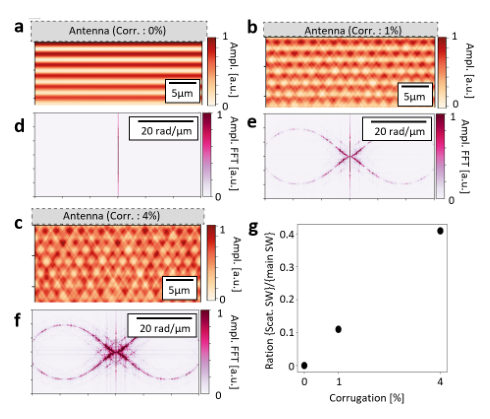 
FIG. 4. Impact of transducer geometry on spin-wave scattering efficiency. (a)–(c) Real-space NFD simulations of spin-wave propagation excited by antennas with varying edge profiles at a fixed lift height: (a) ideal (rectilinear) edge, where only the primary DE mode is excited, (b) 1% corruga- tion width (100 nm), and (c) 4% corrugations. Insets provide a magnified view of the lithographic transducer definition. (d)–(f) Corresponding spectral distributions in k-space ob- tained via FFT of the real-space profiles. The emergence of high-momentum spectral weight correlates with the presence of edge roughness. (g) Relative amplitude ratio of a represen- tative scattered mode [kscat = (1, 2)...

**Summary.** This work demonstrates that near-field imaging of spin waves does not provide a direct map of the material's eigenmodes. By analyzing the interference between different spin-wave components, the authors show that apparent zero-momentum signals are artifacts of magnon-magnon interference, providing a necessary framework for interpreting complex wave measurements in magnonics.

**Why it may be interesting.** The concept of interpreting measured fields as interferometric spectra rather than intrinsic mode spectra is crucial for understanding wave phenomena in nanoscale devices, which has parallels in quantum optics and condensed matter wave physics.

Detailed structure

**Main problem.** The standard interpretation that spatially resolved measurements of coherent waves directly map the underlying eigenmode spectrum fails in near-field imaging of multimode spin-wave transport.

**Main result.** The observed low-momentum signals are not due to true propagating modes but arise from coherent magnon-magnon interference between directly excited and scattered spin waves.

**Method.** The study combines scanning nitrogen-vacancy (NV) magnetometry experiments with advanced theoretical modeling, including the Near-Field Diffraction (NFD) framework and Biot-Savart law calculations.

**Model / system.** The system is spin-wave transport in a yttrium iron garnet (YIG) film, probed by a local, phase-coherent microwave-field sensor (NV magnetometry). The signal is modeled as the superposition of multiple interfering magnetic fields.

**Key observables.** The measured signal's spatial Fourier components, particularly the anomalous components appearing near zero wave vector ($\mathbf{k} \approx 0$).

**Important parameters / regimes.** Probe-sample distance ($d$), excitation wave vectors ($\mathbf{k}_{	ext{exc}}$) and scattering wave vectors ($\mathbf{k}_{	ext{scat}}$), and the difference wave vector $\Delta\mathbf{k} = \mathbf{k}_{	ext{exc}} - \mathbf{k}_{	ext{scat}}$.

**Assumptions / limitations.** The analysis assumes the measured signal is proportional to the local microwave power and utilizes the quasi-magnetostatic approximation for field calculations.

**Figures summary.** Figures show experimental contrast at varying probe distances, FFTs revealing anomalous low-k components, and simulations confirming these components originate from the cross-term interference.

**Paper structure.** The paper first establishes the failure of the direct eigenmode mapping assumption, then models the total field as a sum of interfering components, and finally uses simulations and experiments to isolate the interference term as the source of apparent zero-momentum signals.

Abstract

Spatially resolved measurements of coherent waves are commonly read as direct maps of the underlying eigenmode spectrum. We show that this interpretation fails in near-field imaging of multimode spin-wave transport. Scanning nitrogen-vacancy magnetometry of yttrium iron garnet reveals pronounced apparent low-wave-vector signals at frequencies for which no propagating spin-wave mode exists. By tuning the probe-sample distance and modeling the anisotropic near-field response, we identify their origin as coherent mixing between directly excited Damon-Eshbach waves and defect- or transducer-scattered spin waves: the measured signal acquires spatial Fourier components at the difference wave vector $\mathbf{k}_{\mathrm{exc}}-\mathbf{k}_{\mathrm{scat}}$, which can vanish even though both constituent waves carry finite momentum. These results establish that near-field spectra of coherent excitations are interferometric field spectra rather than eigenmode maps, providing both a caution and a framework for identifying scattering processes in nanoscale magnonic devices.

[↑ back to top](#top)

### [Photo-induced Wavelength-tuning of Telecom-band Quantum Dot Nanowires Embedded in a Phase Change Material](http://arxiv.org/abs/2609.09870v1)

**Authors:** Evangelos Sotiropoulos, Philippe Regreny, Matthieu Bugnet, Nicholas P. Blanchard, Sébastien Cueff, José Penuelas, Nicolas Chauvin  
**Type:** experiment · **Category:** other · **PDF:** <https://arxiv.org/pdf/2609.09870v1>  
**Analysis basis:** full PDF text, analyzed in chunks
**Topic relevance:** `quantum optics experiment` **3/5** · `interference shaping light` **1/5** · `quantum measurements` **1/5**

📷 Fig 1

 
Figure 1. (a) SEM image (30° tilted) of as-grown MBE InP/InAs/InP core/GaInP shell nanowires. (b) SEM image (30° tilted) of the nanowires after Sb₂S₃ and SiO₂ deposition. (c) Low-magnification cross-sectional HAADF-STEM image of a representative nanowire. (d) High-magnification cross-sectional HAADF-STEM image of the InP core/Sb2S3 interface.

📷 Fig 2

 
Figure 2. (a) Room Temperature μ-PL spectra of a representative QD-NW before and after the 671 nm laser, showing a persistent 7.7 meV redshift of the ground-state emission. (b) Ground-state emission energy of the same QD-NW as a function of cumulative 671 nm laser exposure time, recorded under repeated 2 s irradiation steps. The solid line corresponds to a stretched-exponential fit of the saturating redshift dynamics.

📷 Fig 3

 
Figure 3. (a) μ-PL intensity map of a representative InAs/InP NW QD recorded at 12 K during stepwise laser exposure of the amorphous Sb₂S₃ shell. The sample was exposed

📷 Fig 4

 
Figure 4. (a) μ-PL intensity map of a representative InAs/InP NW QD with a thicker InP core, recorded at 12 K during stepwise laser exposure of the amorphous Sb₂S₃ shell. The sample was exposed to repeated 2 s irradiation steps using a 671 nm CW laser with a power of 0.35 mW and a μ-PL spectrum was recorded after each step. (b) Extracted emission peak energy as a function of cumulative irradiation time, together with a stretched-exponential fit describing the redshift dynamics. (c) Initial and final μ-PL spectra recorded before and after irradiation, showing the total redshift associated with the local photo-induced process.

📷 Fig 5

 
Figure 5. (a) Low temperature PL of NW samples. (b) Reciprocal-space map around the Wz InP 1 ˉ 105 reflection for the as-deposited sample.

**Summary.** This research presents a novel, contact-free method to tune the emission wavelength of quantum dots embedded in nanowires by utilizing a photo-induced strain relaxation mechanism in an overlying amorphous shell. By controlling the local strain environment, the authors achieve significant, persistent spectral shifts, enabling the creation of spectrally matched emitters for quantum photonic applications.

**Why it may be interesting.** This work is highly relevant to quantum optics and open quantum systems because it presents a robust, external method to engineer the energy levels (emission wavelength) of solid-state emitters post-fabrication, which is crucial for building integrated quantum circuits.

Detailed structure

**Main problem.** The primary challenge addressed is achieving spectrally matched emitters for scalable quantum-photonic technologies, due to inherent emitter-to-emitter variations in quantum dot emission energies.

**Main result.** The authors demonstrate a contact-free, post-growth spectral tuning of quantum dot emission by inducing a photo-driven relaxation of strain within the surrounding amorphous chalcogenide shell.

**Method.** The tuning is achieved by exposing the InAs quantum dot nanowires, coated with amorphous Sb2S3, to specific wavelengths of laser light, which modifies the local strain environment.

**Model / system.** The system consists of InAs quantum dots embedded in InP nanowires, which are coated with an amorphous Sb2S3 shell. The tuning mechanism is attributed to the photo-induced transformation of the amorphous shell, leading to progressive strain relaxation on the InP core.

**Key observables.** Spectral redshift of the QD emission energy ($\sim 7 	ext{ meV}$ at RT; $\sim 28 	ext{ meV}$ at 12 K); lattice parameters and strain components derived from XRD; optical contrast changes upon laser irradiation.

**Important parameters / regimes.** Temperature (Room Temperature vs. 12 K); Laser wavelengths (532 nm vs. 671 nm); Strain magnitude ($	ext{meV}$ shifts).

**Assumptions / limitations.** The observed redshift is primarily due to strain relaxation caused by the photo-induced structural change in the amorphous shell, rather than simple heating or crystallization.

**Figures summary.** Figures show $\mu$-PL spectra demonstrating persistent redshifts after laser exposure, and STEM/XRD data are used to quantify the strain changes induced by the shell deposition and subsequent photo-treatment.

**Paper structure.** The paper progresses from establishing the need for spectral matching to detailing the photo-induced tuning effect, quantifying the redshift at different temperatures, and finally elucidating the mechanism by comparing different laser wavelengths and observing structural changes.

Abstract

Scalable quantum-photonic technologies require spatially separated emitters to emit at the same wavelength, yet epitaxially grown quantum dots naturally exhibit emitter-to-emitter variations in their emission energies. Here, we demonstrate a contact-free post-growth tuning approach for InAs quantum dots embedded in InP nanowires using the photo-induced transformation of an amorphous Sb2S3 shell. This photoinduced effect leads to a progressive relaxation of the strain imposed on the InP core, enabling controlled spectral tuning of the quantum-dot emission. The effect is observed both at room temperature and under cryogenic conditions for quantum dots emitting in the O-band of the telecommunications spectrum. Strain-induced redshifts of approximately 7 meV at room temperature and 28 meV under cryogenic conditions are observed, respectively. The use of an amorphous chalcogenide shell therefore provides a route to achieve local wavelength tuning at the single quantum-dot-in-a-nanowire level after growth. This approach could enable spectrally matched emitters for scalable quantum-photonic architectures.

[↑ back to top](#top)

### [Twist and strain identification in moiré heterostructures](http://arxiv.org/abs/2609.09611v1)

**Authors:** Zhen Zhan, Federico Escudero, Dong Wang, Yiwen Liu, Ambikesh Gupta, Pierre A. Pantaleón, Francisco Guinea  
**Type:** theory · **Category:** strongly correlated electrons · **PDF:** <https://arxiv.org/pdf/2609.09611v1>  
**Analysis basis:** full PDF text, analyzed in chunks
**Topic relevance:** `analog quantum simulation` **3/5** · `Frenkel-Kontorova` **1/5** · `Keldysh / 2PI / non-Gaussian methods` **1/5**

📷 Fig 1

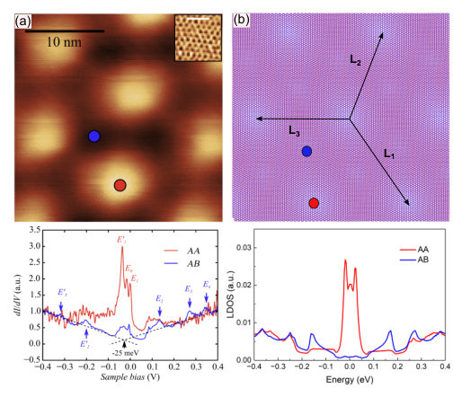 
FIG. 1. Twist and strain identification of STM pattern with atomic resolution. (a) STM image (top panel) and dI/dV spectroscopy (bottom panel) measured at the spots marked with colored dots of TSBG moir´e pattern. Resonances at higher energy in AB regions are labeled with blue arrows. Inset: honeycomb lattice of the carbon atoms in the top layer. The scale bar in the inset is 1 nm. The results are adapted from Ref. [40]. (b) The generated moir´e pattern (top panel) using the twist and strain extracted from the experiment, and the calculated TB LDOS lines (bottom panel) at the AA (red dot) and AB (blue dot) regions. L1, L2 and L3 are the moir´e wavelengths.

📷 Fig 2

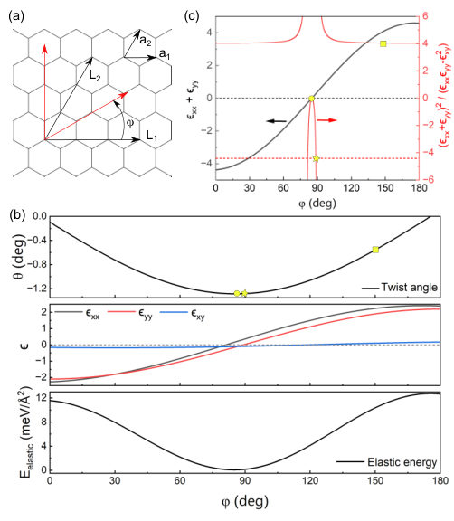 
FIG. 2. Twist and strain solutions of sample two with moir´e resolution. (a) The definitions of the lattice vectors and moir´e vectors used to extract the twist and strain. We introduce the unknown orientation φ to the moir´e vectors and fix the graphene lattice vectors ai. This definition is equivalent to the way of introducing φ to ai and fixing the moir´e vectors. (b) All solutions of twist and strain for sample two with L1 = 10.56 nm, L2 = 10.65 nm, and L3 = 11.97 nm. (c) The strain components εxx+εyy (left black) and (TrE)2 /det E (right red) change with the global rotation φ. The traceless strain tensor (horizontal black dotted line) implies a pure shear solution (yellow dot). The...

📷 Fig 3

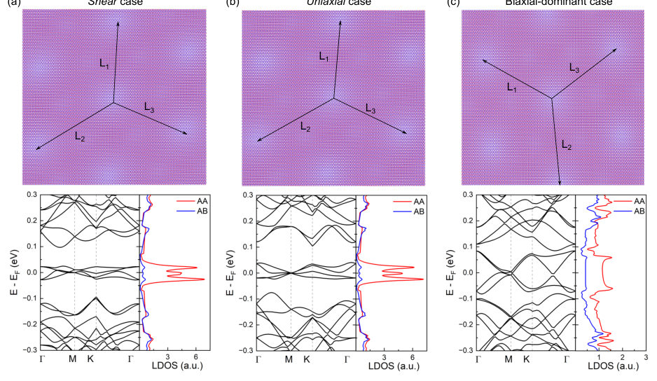 
FIG. 3. Three solutions of sample two. The commensurate moir´e pattern (top panel), band structure and LDOS (bottom panel) of the (a) shear strain case, (b) uniaxial strain case, (c) biaxial-dominant strain case. The three solutions are illustrated with yellow symbols in Fig. 2. In the moir´e patterns, L1, L2 and L3 are moir´e wavelengths, which have a global rotation of φ relative to the x axis. The LDOS lines with red and blue colors are the properties calculated in the AA and AB regions. The electronic properties are calculated by the TB method with the commensurate details in Table I.

📷 Fig 4

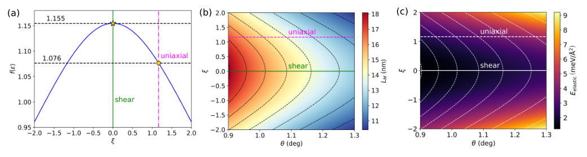 
FIG. 4. Twist and strain solutions of sample three with equal moir´e lengths. (a) Plot of the function f (ξ), which determines the moir´e length LM for the strained triangular moir´e patterns. The green vertical line at ξ = 0 corresponds to the minimum (traceless) shear strain case, at which f takes its maximum value. The magenta line corresponds to the uniaxial strain solution. (b) Evolution of the moir´e length LM (θ, ξ), and (c) elastic energy, as a function of the twist angle θ and ξ. The dashed contour curves correspond to constant moir´e lengths LM from 11 to 18 nm. The horizontal lines correspond to the shear and uniaxial solutions.

📷 Fig 5

 
FIG. 5. Three solutions of sample three with equal moir´e length LM ≈13 nm. The commensurate moir´e pattern (top panels) and the LDOS for (a) the shear-strain case, (b) the mixed-strain case, and (c) the uniaxial-strain case. In the commensurate moir´e patterns, the three moir´e lengths are not equal due to the aligned assumption used to find the closest commensurate solutions in Sec. II C. The LDOS lines with red and blue colors are the properties calculated in the AA and AB regions. The electronic properties are calculated by the TB method with the commensurate solutions in Table II.

**Summary.** This work presents a comprehensive theoretical framework to precisely determine the twist and strain configurations in moiré heterostructures. It addresses the non-uniqueness of the solution by incorporating physical constraints, notably the minimum elastic energy and electronic structure. This methodology is crucial for accurately modeling and predicting the correlated electronic phases in twisted 2D materials.

**Why it may be interesting.** The strong dependence of electronic states (e.g., flat bands, correlated phases) on strain and twist makes this highly relevant to understanding emergent quantum phenomena in engineered 2D materials.

Detailed structure

**Main problem.** The paper establishes a general framework to accurately identify the twist and strain configurations in moiré heterostructures, as these parameters critically govern the electronic properties.

**Main result.** The identification process is constrained by minimizing the elastic energy and incorporating electronic structure information, moving beyond simple moiré-wavelength analysis.

**Method.** The authors develop a general methodology using strain tensor analysis and elastic energy minimization to constrain the infinite family of possible twist-strain configurations.

**Model / system.** The study focuses on moiré materials, particularly twisted bilayer graphene (TSBG), where the electronic properties are highly sensitive to lattice misalignment (twist) and mechanical deformation (strain).

**Key observables.** Strain tensor components ($\epsilon_{xx}, \epsilon_{yy}, \epsilon_{xy}$), minimum elastic energy, and electronic spectra.

**Important parameters / regimes.** Twist angle ($	heta$), strain tensor ($\mathbf{E}$), and moiré lattice vectors.

**Assumptions / limitations.** The general solution for twist and strain is non-unique, necessitating additional physical constraints like minimum elastic energy or electronic measurements for a unique determination.

**Paper structure.** The paper progresses from identifying the necessity of accurate twist/strain determination to developing the general framework, discussing the limitations of simple geometric analysis, and finally proposing constraints using elastic energy and electronic spectra.

Abstract

The geometrical and electronic properties of moiré materials are highly sensitive to the twist and strain in the samples due to the moiré magnifying effect. Accurate identification of twist and strain in moiré materials is therefore essential. In this work, we establish a general framework to extract the twist and strain configurations from moiré images with either atomic or moiré scale resolution. With only moiré-wavelength information, we show that there is a continuous family of possible twist and strain configurations, each one accounting for different orientations of the moiré pattern. To estimate the most likely twist-strain configuration, we discuss additional constraints and methods involving the minimum elastic energy and the electronic spectra. The minimum elastic energy, in particular, reflects that shear configurations become much more favorable as the strain increases. As an example of the developed methodology, we discuss the formation and identification of strained triangular moiré patterns. Our framework provides a comprehensive approach to identify the twist and strain configurations in systems with moiré-scale resolution.

[↑ back to top](#top)

### [Nonlinear Edelstein effect in Rashba superconductors](http://arxiv.org/abs/2609.10212v1)

**Authors:** Hikaru Ueki, Youichi Yanase  
**Type:** theory · **Category:** other · **PDF:** <https://arxiv.org/pdf/2609.10212v1>  
**Analysis basis:** full PDF text, analyzed in chunks
**Topic relevance:** `Keldysh / 2PI / non-Gaussian methods` **3/5** · `methods for driven-dissipative` **1/5**

📷 Fig 1

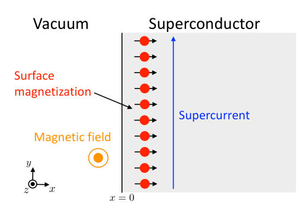 
FIG. 1. Schematic illustration of a semi-infinite Rashba su- perconductor subjected to a uniform magnetic field (orange arrow). Owing to the Rashba spin-orbit coupling, a spin mag- netization polarized along the x direction (red circles with ar- rows) is induced near the surface at x = 0, where the Meissner current flows (blue arrow).

📷 Fig 2

 
FIG. 2. Spatial dependence of the magnetic field (left), current density (center), and magnetization (right) near the surface at x = 0 in units of ℏ/2|e|ξ2 0, ℏ/2µ0|e|ξ3 0, and µBN(0)∆0, respectively, for α = 1.5∆0 at T = 0.2Tc, 0.4Tc, 0.6Tc, and 0.8Tc. The inset in the center panel shows the temperature dependence of the London penetration depth.

📷 Fig 3

 
FIG. 3. Intraband (red) and interband (blue) contributions to the normalized magnetic susceptibility ˜χxz, which originates from the Edelstein effect, together with their sum (black), as functions of α/∆0 at T = 0.2Tc (left) and 0.8Tc (right). The magnetic susceptibility is normalized by 2|e|ξ2 0µBN(0)∆0/ℏ.

📷 Fig 4

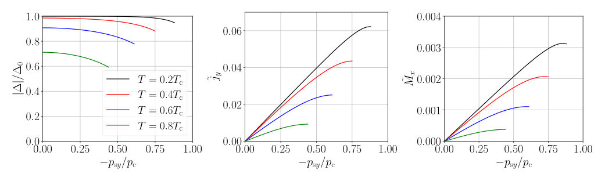 
FIG. 4. Superfluid-momentum dependence of the superconducting gap (left), current density (center), and magnetization (right), in units of ∆0, ℏ/2µ0|e|ξ3 0, and µBN(0)∆0, respectively, for α = 1.5∆0 at T = 0.2Tc, 0.4Tc, 0.6Tc, and 0.8Tc. Here, the unit of superfluid momentum is pc ≡∆0/vF, and the superfluid momentum psy is treated as a local control parameter. In a semi-infinite geometry, however, it should be understood as psy = psy(x; B0), determined by the nonlinear Meissner screening profile, whose effective penetration depth depends on the surface magnetic field B0 [18, 19].

📷 Fig 5

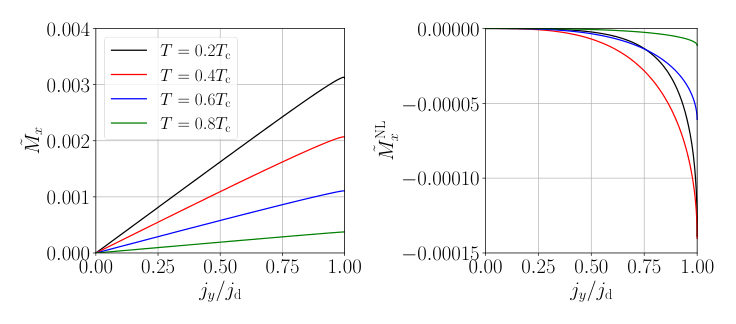 
FIG. 5. Current-density dependence of the magnetization normalized by µBN(0)∆0 (left) and its nonlinear part (right) for α = 1.5∆0 at T = 0.2Tc, 0.4Tc, 0.6Tc, and 0.8Tc. The nonlinear part is defined as ˜ M NL x ≡˜ Mx −˜ M L x , where ˜ M L x denotes the part of ˜ Mx linear in the current density jy. The unit of jy is the depairing current density jd.

**Summary.** This work develops a comprehensive quasiclassical theory for the Edelstein effect in Rashba superconductors, distinguishing between intraband and interband contributions. It demonstrates that while the linear response is dominated by intraband effects, the nonlinear magnetization response is uniquely sourced by the interband contribution, which is mathematically linked to the Berry connection arising from spin-orbit coupling. This suggests that nonlinear measurements can serve as a sensitive probe of quantum geometric effects in superconducting materials.

**Why it may be interesting.** The explicit derivation linking the nonlinear response to quantum geometric terms (Berry connection) provides a novel theoretical tool for probing superconducting order parameters beyond simple linear response.

Detailed structure

**Main problem.** The paper develops a quasiclassical theory to describe the Edelstein effect in superconductors, specifically focusing on incorporating both intraband and interband contributions to understand the nonlinear dependence of magnetization on supercurrent.

**Main result.** The nonlinear dependence of magnetization on supercurrent in clean s-wave Rashba superconductors arises solely from the interband contribution, which is linked to the anomalous-velocity term derived from the Berry connection associated with the Rashba spin-orbit potential.

**Method.** The authors employ augmented Eilenberger equations, derived from the Gor’kov equations via the Wigner transform, to separate and calculate the contributions from intraband and interband terms.

**Model / system.** The study analyzes s-wave superconductors featuring Rashba spin-orbit coupling. The theoretical framework utilizes quasiclassical Green's functions and expands in the small parameter $\delta = \hbar/p_F\xi_0$.

**Key observables.** Supercurrent-induced surface spin magnetization ($\mathbf{M}$), charge density ($
ho$), and current density ($\mathbf{j}$).

**Important parameters / regimes.** Rashba spin-orbit coupling strength ($\alpha$), superconducting gap ($\Delta$), temperature ($T/T_c$), and supercurrent density ($\mathbf{j}$).

**Assumptions / limitations.** The analysis is performed in the clean s-wave Rashba model, and approximations are made in the quasiclassical expansion and in the London limit.

**Figures summary.** Figures illustrate the dependence of the superconducting gap, current density, and magnetization on supercurrent and temperature, highlighting the distinct nonlinear contribution from the interband term.

**Paper structure.** The paper builds the theory by deriving augmented Eilenberger equations, separating the calculation into intraband (using multi-band equations) and interband (using augmented equations involving the Berry connection) contributions, and finally analyzing the resulting nonlinear current-magnetization relationship.

Abstract

We formulate a quasiclassical theory of the Edelstein effect in superconductors that incorporates both intraband and interband contributions. To describe the interband contribution, which is absent from the conventional leading-order quasiclassical formulation, we derive augmented Eilenberger equations in the presence of antisymmetric spin-orbit coupling. The intraband contribution is evaluated using multiband Eilenberger equations. We apply these formulations to supercurrent-induced surface spin magnetization in $s$-wave Rashba superconductors and investigate its dependence on temperature, distance from the surface, spin-orbit coupling strength, and supercurrent. The intraband contribution originates from a supercurrent-induced asymmetry of quasiparticles with opposite momenta and spin polarizations, whereas the interband contribution arises from the anomalous-velocity term generated by the momentum derivative of the Rashba spin-orbit potential. In the helicity basis, this anomalous-velocity term is expressed in terms of the Berry connection associated with the momentum dependence of the Rashba eigenstates. The intraband contribution increases linearly with the spin-orbit coupling strength, whereas the interband contribution exhibits a nonmonotonic dependence and is maximized when the Rashba spin splitting is comparable to the superconducting gap. Moreover, within the clean $s$-wave Rashba model considered here, we find that the nonlinear dependence of magnetization on the supercurrent arises solely from the interband contribution. Thus, although the intraband contribution dominates the linear Edelstein effect, the nonlinear Edelstein effect can serve as a useful probe of the interband contribution originating from quantum geometry.

[↑ back to top](#top)

### [Comprehensive molecular dynamics study of the dynamical properties of a dense binary hard-sphere mixture](http://arxiv.org/abs/2609.09532v1)

**Authors:** Sabry G. Moustafa, Andrew J. Schultz  
**Type:** theory · **Category:** statistical mechanics · **PDF:** <https://arxiv.org/pdf/2609.09532v1>  
**Analysis basis:** full PDF text, analyzed in chunks
**Topic relevance:** `non-equilibrium universality` **2/5** · `analog quantum simulation` **1/5** · `scars & prethermalization` **1/5**

📷 Fig 1

 
FIG. 1. Time dependence of the mean square displacement (MSD) for the large (a) and small (b) particles, and mean square Helfand (MSH) moment (c) at seven densities, for a system size of N = 3200. The ballistic, ∼τ2, and diffusive, ∼τ, regimes are indicated by dashed lines. Error bars correspond to 68% confidence limits. Lines connect the data points. In panels (a) and (b), black open circles denote the inflection points (see text) and blue stars correspond to the peak of the α2(τ) function. (see Fig. 7).

📷 Fig 2

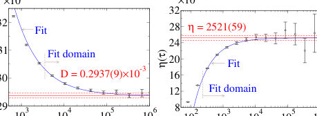 
FIG. 2. Time dependence of the total self-diffusivity (left) and shear viscosity (right) at density ρ = 1.63 (φ ≈0.582) for a system size of N = 3200. The blue curves represent fits using Eq. 3, both yielding reduced χ2 value less than unity. The red solid lines indicate the esti- mated infinite-time limits transport coefficients, with the dashed lines representing the uncertainty bounds obtained from the fits. Numbers in parentheses indicate the uncertainty in the last digit.

📷 Fig 3

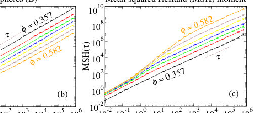 
Figure 3(a) shows the system-size dependence of the self- diffusivity, normalized by its thermodynamic-limit value (see Eq. 14). The data are plotted as a function of N1/3, equiva- lently the box length L, which is the natural scaling variable based on hydrodynamic arguments.37 We find that the data are well-described by a power-law form:62

📷 Fig 4

 
FIG. 3. (a) Finite-size effects on the total self-diffusivity for system sizes N = 200,400,800,1600,3200 at densities ρ = 1.20,1.55,1.63. Data are normalized by the thermodynamic-limit, D∞, for each density. Solid lines are WLS fits to Eq 14, with reduced χ2 values of 1.76,0.40,0.36 for the three densities, respectively. Density dependence of the fitted exponent α (b) and the normalized self-diffusivity DN/D∞at different system sizes (c), respectively. Lines connect the data points.

📷 Fig 5

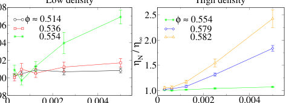 
FIG. 4. Finite-size effects of the shear viscosity for sys- tem sizes N = 200,400,800,1600,3200, at relatively low (left; ρ = 1.44,1.50,1.55) and high (right; ρ = 1.55,1.62,1.63) densi- ties. Data for each density are normalized by the corresponding thermodynamic-limit η∞obtained from the fits (see text). Lines con- nect the data points.

**Summary.** This paper presents an extensive molecular dynamics study of a dense binary hard-sphere fluid to characterize its dynamical properties near jamming. Key findings include the breakdown of the Stokes–Einstein relation and evidence of dynamic heterogeneity characterized by specific spatial decay laws. The work provides rigorous benchmark data for testing theoretical models of glassy dynamics in disordered systems.

**Why it may be interesting.** While focused on classical hard spheres, the rigorous analysis of dynamic heterogeneity ($\chi_4(	au)$) and the breakdown of simple scaling relations provides a crucial benchmark for theoretical models of glassy dynamics applicable to quantum many-body systems.

Detailed structure

**Main problem.** To comprehensively study the dynamical properties and dynamic heterogeneity of a dense binary hard-sphere mixture, particularly near the glass transition.

**Main result.** The study finds that transport coefficients exhibit super-Arrhenius dependence and that the Stokes–Einstein relation breaks down, while dynamic heterogeneity is signaled by specific scaling laws in the van Hove function.

**Method.** Molecular Dynamics (MD) simulations are used to compute transport coefficients and correlation functions, followed by extrapolation to the thermodynamic limit.

**Model / system.** The system modeled is a three-dimensional binary hard-sphere (BHS) fluid mixture, studied over a range of packing fractions ($\phi \approx 0.357-0.582$).

**Key observables.** Self-diffusivity ($D$), shear viscosity ($\eta$), van Hove self-correlation function ($G_s(r,	au)$), four-point dynamic susceptibility ($\chi_4(	au)$), and structural relaxation time ($	au_a$).

**Important parameters / regimes.** Packing fraction ($\phi$), system size ($N$), and time ($	au$).

**Assumptions / limitations.** The analysis addresses finite-size effects (FSE) and critiques the reliability of simple exponential fits for estimating the critical packing fraction ($\phi_0$).

**Figures summary.** Figures summarize the system-size dependence of $D(	au)$ and $\eta(	au)$, the non-Gaussian parameter $\alpha_2(	au)$, and the relaxation behavior of $F_s(	au)$ and $\chi_4(	au)$ as system size increases.

**Paper structure.** The paper systematically analyzes transport coefficients, investigates finite-size effects across multiple dynamic and thermodynamic properties, and concludes by establishing benchmark data for glassy dynamics.

Abstract

We present an extensive molecular dynamics (MD) study of the dynamical properties of a binary hard-sphere fluid over a wide range of packing fractions, $φ\approx 0.357-0.582$. The self-diffusivity, $D$, and shear viscosity, $η$, are computed using an efficient implementation of the Einstein--Helfand method. The finite-size effects in $D$ scale as $1/N^α$, with $α$ increasing from approximately $1/3$ to $3/4$ with increasing $φ$, whereas those in $η$ are negligible except for $φ\gtrsim 0.554$, where they scale as $1/N$. The data are then extrapolated to the thermodynamic limit to obtain $D_{\infty}$ and $η_{\infty}$. Both coefficients show a super-Arrhenius dependence on $φ$ for dense states, accompanied by a breakdown of the Stokes--Einstein relation. Although both $D_{\infty}(φ)$ and $η_{\infty}(φ)$ data are well described by an exponential form, we demonstrate that these fits do not provide reliable estimates of the critical packing fraction, $φ_0$, owing to the substantial extrapolation required beyond the accessible equilibrium range. We find the commonly assumed proportionality between $η$ and the structural relaxation time, $τ_α$ , to not hold for this system. For $φ\gtrsim 0.570$, the van Hove self-correlation function $G_s(r, τ)$ exhibits a spatial exponential decay at intermediate times, $τ$, signaling dynamic heterogeneity. The characteristic decay length scales as $λ\sim τ^ν$, with $ν\approx 1/3$, in contrast to the conventional square-root scaling. We also investigate temporal heterogeneity through the four-point dynamic susceptibility, $χ_4(τ)$, and its peak time, $τ_4$. These findings provide rigorous benchmark MD data for computational studies of glassy dynamics and establish a reference for testing theoretical models in dense disordered systems.

[↑ back to top](#top)

### [A First-Principles Multiscale Framework for Topological Superconductivity](http://arxiv.org/abs/2609.10381v1)

**Authors:** Christopher L. Jacobs, Baishali Mandal, Taehwan Jung, Purna P. Paudel, Jason Kawasaki, Tudor D. Stanescu, Subhasish Mandal  
**Type:** theory · **Category:** other · **PDF:** <https://arxiv.org/pdf/2609.10381v1>  
**Analysis basis:** full PDF text, analyzed in chunks
**Topic relevance:** `analog quantum simulation` **2/5** · `Keldysh / 2PI / non-Gaussian methods` **1/5**

📷 Fig 1

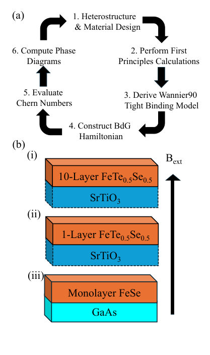 
FIG. 1. Materials-design strategy and candi- date platforms. (a) Multiscale workflow connecting first- principles electronic-structure calculations, Wannier-derived low-energy Hamiltonians, Bogoliubov–de Gennes (BdG) the- ory, and topological invariant calculations. (b) Materi- als/heterostructure platforms under investigation, where Bext denotes an out-of-plane magnetic field. (i) (System I) bulk- like FeTe0.5Se0.5 (10-layer film) and (ii) (System II) monolayer FeTe0.5Se0.5. The dashed SrTiO3 substrate indicates that substrate is implicitly included by fixing the FeTe0.5Se0.5 in- plane lattice parameter to the value experimentally observed for 10 UC films on SrTiO3 [102]. Interfacial...

📷 Fig 2

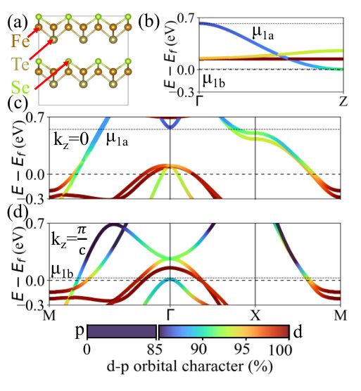 
FIG. 2. Crystal structure and low-energy band struc- ture for Bulk-like FeTe0.5Se0.5 (System I). (a) Crystal structure. (b) Orbital-resolved DFT band structure along Γ–Z. (c), (d) Orbital-resolved electronic structure along M– Γ–X–M for kz = 0 and kz = π (units of 1/c), respectively. The color bar indicates the relative Fe-d (red) and Te/Se-p (blue) character. The chalcogen-derived band shifts toward the Fermi level between kz = 0 and kz = π, while simulta- neously acquiring stronger Fe-d weight, resulting in enhanced spin–orbit-active and superconducting orbital hybridization. µ1a and µ1b denote the representative chemical potentials used for System I at kz = 0 and kz = π, respectively....

📷 Fig 3

 
FIG. 3. Wannier representation and superconducting BdG spectra of bulk-like FeTe0.5Se0.5 (System I). (a), (d) Comparison between DFT band structures (black solid lines) and Wannier-interpolated bands (red dashed lines) for kz = 0 and kz = π, respectively. (b), (c) BdG spectra at kz = 0 for s++ and s± pairing, evaluated near the isolated chalcogen-derived band (µ = 610 meV). (e), (f) Corresponding BdG spectra at kz = π (µ = 30 meV). The color denotes the sign of the superconducting pairing potential. Calculations were performed using ∆0 = 5 meV, with Rashba coupling strengths α = 250 meV (kz = 0) and α = 150 meV (kz = π).

📷 Fig 4

 
FIG. 4. Crystal structure and low-energy band structure for Monolayer FeTe0.5Se0.5 (System II). (a) Crystal structure of monolayer FeTe0.5Se0.5. (b) Orbital- resolved DFT band structure along M–Γ–X–M, with colors indicating the projected Fe-d (red) and Te/Se-p (blue) orbital weight, for fixed a = 3.88 ˚A. µ2 denotes the representative chemical potential.

📷 Fig 5

 
FIG. 5. Wannier representation and superconducting BdG spectra of monolayer FeTe0.5Se0.5 (System II). (a) Comparison between DFT band structures (black solid lines) and Wannier-interpolated bands (red dashed lines). (b), (c) BdG spectra for s++ and s± pairing symmetries, respec- tively. The color scale in (b-c) denotes the sign of the super- conducting pairing potential. Calculations were performed using ∆0 = 5 meV and α = 50 meV.

**Summary.** This paper introduces a comprehensive, first-principles computational framework to study topological superconductivity in realistic materials. By integrating DFT, Wannier models, and BdG theory, the authors successfully predict TSC in Fe-based superconductors and heterostructures. This work provides a quantitative, materials-by-design pathway for engineering candidate platforms for Majorana physics.

**Why it may be interesting.** While focused on condensed matter, the development of a rigorous, multi-scale computational framework that links electronic structure (DFT) to topological invariants (Chern number) is highly relevant for modeling complex quantum phenomena in engineered quantum systems.

Detailed structure

**Main problem.** The core problem is developing a unified, materials-informed computational framework to theoretically predict and understand topological superconductivity (TSC) in real-world materials.

**Main result.** The framework successfully predicts multiple topological superconducting phases in Fe-based materials, highlighting FeSe/GaAs heterostructures as particularly promising platforms for realizing TSC.

**Method.** The approach combines Density Functional Theory (DFT) for electronic structure, Wannier-based low-energy Hamiltonians, Bogoliubov-de Gennes (BdG) theory, and Chern number calculations.

**Model / system.** The study applies this framework to bulk-like and monolayer FeTeSe, and to FeSe/GaAs heterostructures, investigating both intrinsic and proximity-induced TSC.

**Key observables.** Topological gaps, topological invariants (Chern number), and the presence of robust Majorana zero modes (MZMs).

**Important parameters / regimes.** Chemical potential ($\mu$), Zeeman field ($V_z$), and the presence of Rashba-active states and strong superconducting pairing.

**Assumptions / limitations.** The framework assumes that the low-energy physics can be captured by combining DFT results into effective Hamiltonians, though challenges remain in fully self-consistently treating unconventional pairing.

**Figures summary.** Figure 1(a) illustrates the complete multiscale workflow, connecting DFT calculations through Wannier-based models to the final topological invariant evaluations.

**Paper structure.** The paper follows a logical progression: first, establishing the need for a unified framework; second, detailing the combination of DFT, Wannierization, BdG theory, and topological analysis; and finally, applying this methodology to specific material systems like FeTeSe and FeSe/GaAs to derive design principles.

Abstract

A microscopic understanding of topological superconductivity (TSC) in real materials requires a materials-informed approach that integrates first-principles electronic structure, superconductivity, and topology within a unified computational framework. Here, we develop such an approach by combining density functional theory, Wannier-based low-energy Hamiltonians, Bogoliubov-de Gennes theory, and Matsubara Green's-function-based Chern number calculations performed directly on realistic multiorbital superconducting Hamiltonians. We apply this framework to bulk-like and monolayer FeTeSe and to FeSe/GaAs heterostructures, enabling a unified investigation of both intrinsic and proximity-induced topological superconductivity. We identify key electronic-structure ingredients that promote robust TSC, including Rashba-active states near the Fermi level, strong induced superconducting pairing, and substantial orbital hybridization between spin-orbit-active and superconducting sectors. Guided by these design principles, we predict multiple topological superconducting phases in Fe-based materials and demonstrate that FeSe/GaAs heterostructures are particularly promising, exhibiting topological transitions at experimentally accessible chemical potentials and low Zeeman fields. Complementing the theoretical predictions, we demonstrate the growth and structural characterization of FeSe/GaAs heterostructures, establishing the experimental feasibility of the proposed materials platform. Our results provide a quantitative route for engineering and screening candidate Majorana materials and heterostructures directly from realistic electronic structures and establish a foundation for future materials-by-design approaches to topological superconductivity.

[↑ back to top](#top)

### [Hydrodynamic magnetotransport in a GaAs Corbino geometry](http://arxiv.org/abs/2609.10511v1)

**Authors:** A. D. Levin, A. S. Jaroshevich, Z. D. Kvon, V. A. Chitta, M. S. Aksenov, D. V. Dmitriev, A. K. Bakarov, G. M. Gusev  
**Type:** both · **Category:** other · **PDF:** <https://arxiv.org/pdf/2609.10511v1>  
**Analysis basis:** full PDF text, analyzed in chunks
**Topic relevance:** `Keldysh / 2PI / non-Gaussian methods` **2/5** · `methods for driven-dissipative` **1/5**

📷 Fig 1

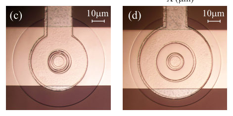 
FIG. 1: (Color online) (a) Schematic of the Corbino disk ge- ometry. (b) Hydrodynamic velocity-flow profile in a Corbino device at low magnetic field. (c) Optical image of the small- ring sample. (d) Optical image of the large-ring sample.

📷 Fig 2

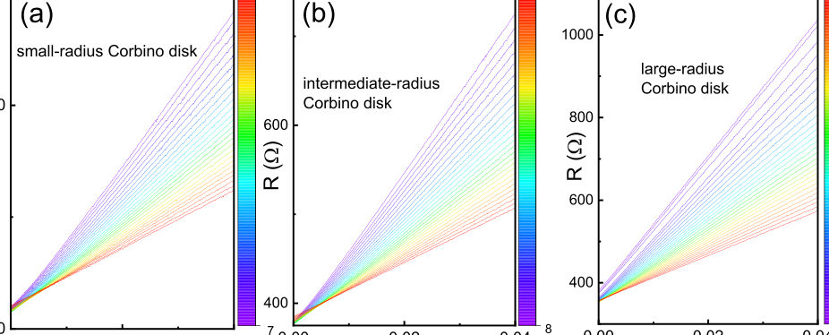 
FIG. 2: (Color online) (a) Magnetoresistance of the small radius (Rb = 11µm) Corbino disk as a function of the temperature. (b) Magnetoresistance of the intermediate radius (Rb = 12µm) Corbino disk as a function of the temperature. (c) Magnetoresistance of the large radius (Rb = 18µm) Corbino disk as a function of the temperature

📷 Fig 3

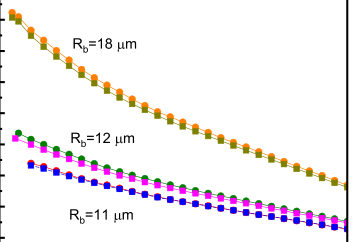 
FIG. 3: (Color online) Temperature dependence of the quadratic magnetoresistance coefficient α for Corbino devices with different outer radii. Two samples were studied for each device radius.

**Summary.** This work analyzes the magnetoresistance in GaAs Corbino devices using hydrodynamic theories to probe electron transport. By fitting the observed quadratic magnetoresistance to models incorporating finite-slip boundary conditions, the authors confirm that the signal is dominated by bulk viscous flow. This establishes the Corbino geometry as a powerful tool for studying bulk transport properties in 2DEGs.

**Why it may be interesting.** While focused on solid-state transport, the rigorous application of continuum hydrodynamics to electron flow, including boundary physics (finite slip), provides a detailed example of non-equilibrium transport modeling relevant to open quantum systems.

Detailed structure

**Main problem.** The study investigates the origin of positive magnetoresistance observed in high-mobility GaAs Corbino devices by analyzing hydrodynamic magnetotransport effects.

**Main result.** The observed magnetoresistance is predominantly governed by the bulk hydrodynamic response, allowing Corbino geometry to serve as a complementary bulk-sensitive probe of viscous electron flow.

**Method.** The analysis employs hydrodynamic theories of magnetotransport, specifically modeling the crossover between diffusive and viscous regimes using finite-slip boundary conditions.

**Model / system.** The physical system is a two-dimensional electron gas (2DEG) in a GaAs Corbino geometry. The model incorporates hydrodynamic descriptions of current flow, accounting for momentum relaxation and viscous effects.

**Key observables.** Positive magnetoresistance exhibiting a quadratic dependence on the perpendicular magnetic field ($B^2$), and the temperature dependence of the magnetoresistance coefficient ($\alpha$).

**Important parameters / regimes.** The analysis distinguishes between the diffusive limit (momentum relaxation) and the hydrodynamic/Stokes limit (viscosity), and examines the quantitative modification due to finite-slip boundary conditions.

**Assumptions / limitations.** The analysis assumes the applicability of hydrodynamic theories and successfully separates the contributions from the bulk response, finite-slip boundary effects, and contact voltages.

**Figures summary.** Figures show magnetoresistance ($R$ vs $B^2$) for varying Corbino disk radii and temperatures, illustrating the dependence of the quadratic magnetoresistance coefficient ($\alpha$) on both radius and temperature.

**Paper structure.** The paper develops the theoretical framework by deriving the general magnetoresistance expression incorporating finite-slip boundary conditions, analyzing the limiting cases (diffusive vs. hydrodynamic), and finally applying this model to fit multiple experimental data sets simultaneously to constrain physical parameters.

Abstract

We report the observation of positive magnetoresistance in high-mobility GaAs Corbino devices. Over a broad intermediate-temperature range, the resistance exhibits a quadratic dependence on perpendicular magnetic field. We analyze the data within hydrodynamic theories of magnetotransport in the Corbino geometry, which describe the crossover between the diffusive and viscous regimes, including finite-slip boundary conditions appropriate for current-penetrable contacts. The extracted relaxation rates are consistent with an approximately $T^2$ temperature dependence of the electron-electron scattering contribution. The extracted viscous relaxation parameters are consistent with those obtained from Hall-bar measurements. Comparison with theory indicates that the observed magnetoresistance is predominantly governed by the bulk hydrodynamic response, while finite slip modifies the Stokes--Ohm crossover quantitatively and the field-dependent boundary voltage provides a separate correction. These results show that Corbino magnetotransport can serve as a complementary bulk-sensitive probe of viscous electron flow.

[↑ back to top](#top)

### [Reconfigurable field-free spin Hall nano-oscillators enabled by crystallographic anisotropy in epitaxial Co/Pt](http://arxiv.org/abs/2609.10131v1)

**Authors:** Jong-Guk Choi, Avinash Kumar Chaurasiya, Jaimin Kang, Venkatesh Vadde, Peter G. Lim, Roman Khymyn, Ahmad A. Awad, Akash Kumar, Mark C. Hersam, Vinayak P. Dravid, Pedram Khalili Amiri, Johan Åkerman  
**Type:** both · **Category:** other · **PDF:** <https://arxiv.org/pdf/2609.10131v1>  
**Analysis basis:** full PDF text, analyzed in chunks
**Topic relevance:** `analog quantum simulation` **2/5** · `driven-dissipative phase transition` **1/5**

📷 Fig 1

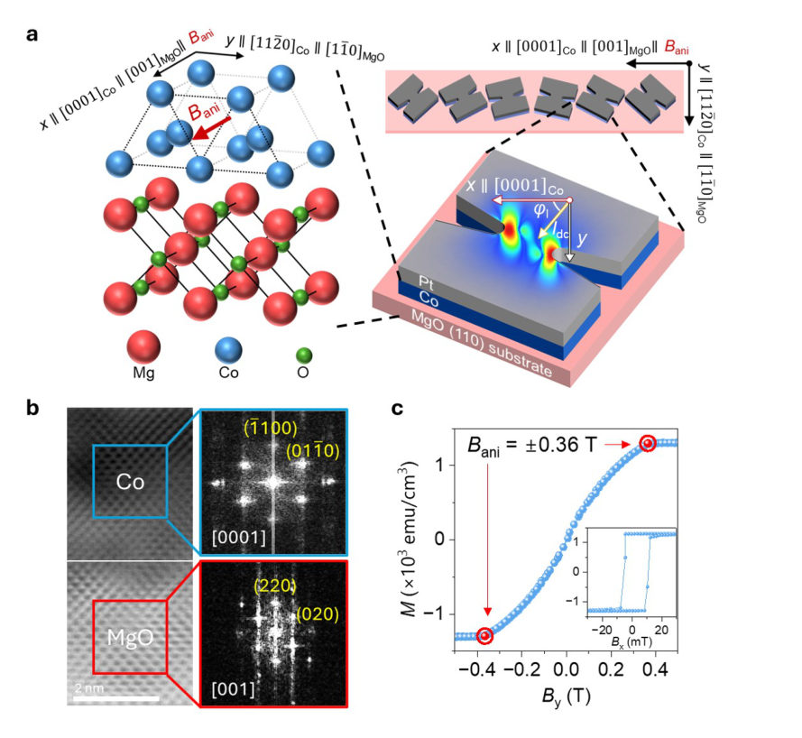 
Fig. 1 Epitaxial symmetry engineering of an in-plane anisotropy field in Co/Pt. a, Atomic model of the epitaxial relation between hcp Co and MgO(110), which aligns the in-plane Co[0001] crystallographic easy axis with MgO[001] and defines the anisotropy-field direction Bani ∥x. Nanoconstriction SHNOs are lithographically patterned at different current angles φI relative to this fixed crystallographic axis. The enlarged device schematic shows the epitaxial Co/Pt bilayer on MgO(110); the coloured regions schematically indicate the enhanced auto-oscillation amplitude near the nanoconstriction edges. b, Cross-sectional annular bright field scanning transmission electron microscopy images...

📷 Fig 2

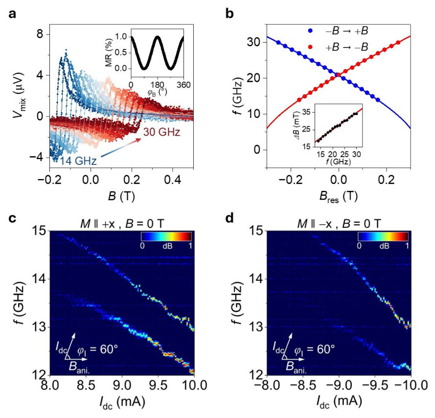 
Fig. 2 Effective anisotropy field and remanent-state-selected zero-field auto-oscillation. a, Spin-torque ferromagnetic resonance (STFMR) spectra of epitaxial Co/Pt measured from 14 to 30 GHz at φI = 60◦, φB = 0◦, and θB = 0◦with a positive-to-negative magnetic-field sweep. The solid lines are fits to symmetric and antisymmetric Lorentzian line shapes. The inset shows the in-plane anisotropic magnetoresistance measured at B = 2 T and Idc = 1 mA. b, Resonance frequency f as a function of resonance field Bres for magnetic-field sweeps from negative to positive field and from positive to negative field. The solid curves are fits to a Kittel relation including the in-plane anisotropy, yielding...

📷 Fig 3

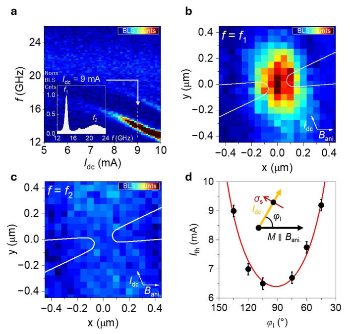 
Fig. 3 Micro-focused BLS imaging of nanoconstriction-localized zero-field auto-oscillation. a, Current- dependent micro-focused Brillouin light scattering (µ-BLS) intensity measured at B = 0, φI = 105◦, and Mrem ∥+x. The inset shows the spectrum at Idc = 9 mA, comprising the intense auto-oscillation mode f1 and a broader, weaker mode f2 near the ferromagnetic-resonance frequency. b,c, Spatial µ-BLS intensity maps measured at Idc = 9 mA at the frequencies f1 (b) and f2 (c) identified in the inset of a. The white outlines indicate the nanoconstriction geometry. The f1 intensity is concentrated within the nanoconstriction region, whereas the weaker f2 response is spatially extended. d,...

📷 Fig 4

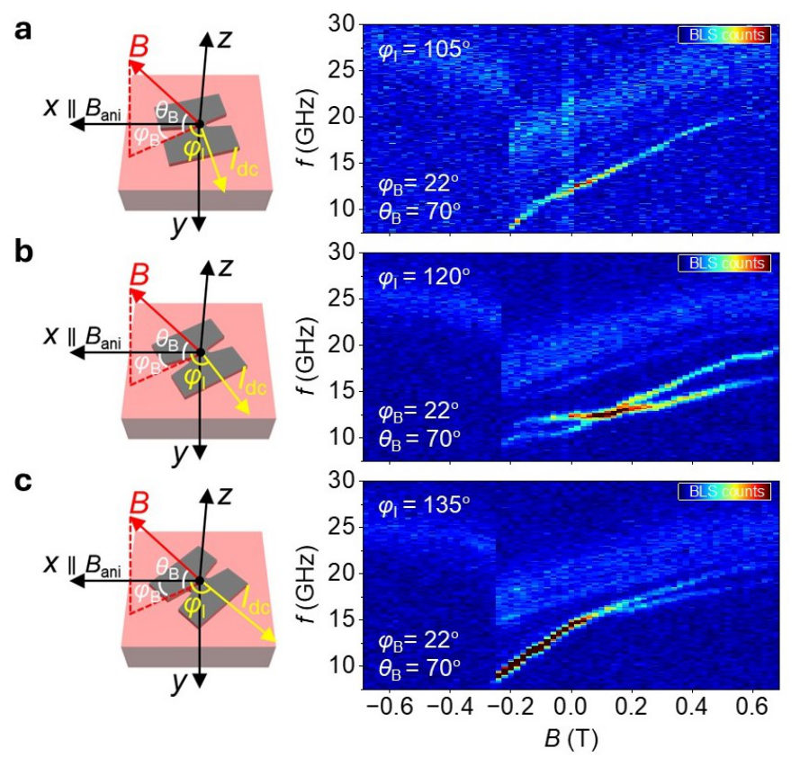 
Fig. 4 Crystallographic control of edge-mode synchronization. a-c, Left, measurement geometries for nanoconstriction SHNOs patterned at current angles φI = 105◦(a), 120◦(b), and 135◦(c) relative to the crystallo- graphic anisotropy axis x ∥Bani. The applied magnetic field is oriented at φB = 22◦in the film plane and θB = 70◦

📷 Fig 5

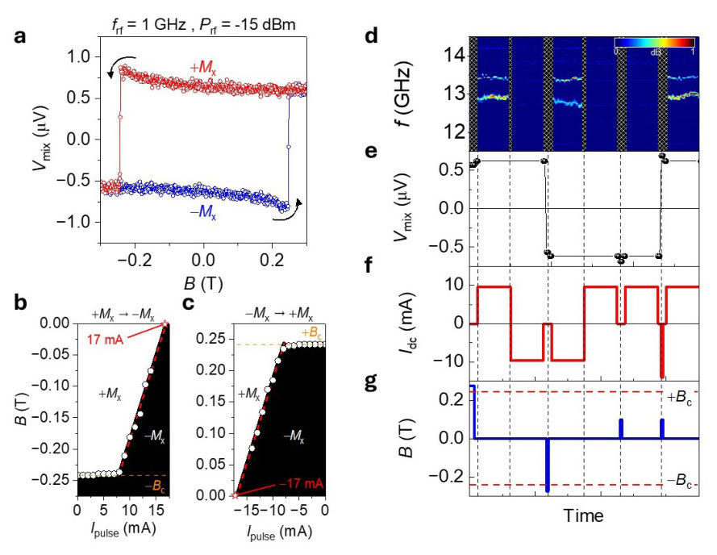 
Fig. 5 Nonvolatile reconfiguration of field-free SHNO operation. a, Magnetic-field dependence of the STFMR mixing voltage Vmix, measured at frf = 1 GHz and Prf = −15 dBm. Red and blue symbols denote field sweeps from positive to negative field and from negative to positive field, respectively. The sign of the offset voltage identifies the +Mx and −Mx remanent magnetization states. b,c, Final magnetization state as a function of pulse-current amplitude Ipulse and assisting magnetic field B, starting from +Mx (b) and −Mx (c). White and black regions denote the +Mx and −Mx states, respectively, and the symbols mark the experimentally determined switching boundaries. The pulse duration is...

**Summary.** This work reports on the creation of highly functional spin Hall nano-oscillators (SHNOs) using epitaxial Co/Pt films. By leveraging the built-in crystallographic anisotropy, the devices achieve stable, high-frequency auto-oscillations without needing an external magnetic bias. Furthermore, the oscillation state can be nonvolatilely reconfigured, establishing a promising materials-based route for next-generation spintronic oscillators.

**Why it may be interesting.** While the core physics is in condensed matter spintronics, the concept of using intrinsic material symmetry (crystallographic anisotropy) to engineer a stable, bias-free operating point is analogous to engineering effective Hamiltonians or potentials in quantum systems, making it relevant for understanding engineered quantum control.

Detailed structure

**Main problem.** The primary goal is to develop reconfigurable, field-free spin Hall nano-oscillators (SHNOs) to overcome the limitation of requiring a global external magnetic bias for operation.

**Main result.** The authors demonstrate that utilizing the intrinsic crystallographic anisotropy of epitaxial Co/Pt bilayers enables robust, field-free auto-oscillations above 10 GHz, with the oscillation state being nonvolatilely reconfigurable by the remanent magnetization.

**Method.** The study combines advanced experimental techniques, including Spin-Torque Ferromagnetic Resonance (STFMR) and micro-focused Brillouin Light Scattering ($\mu$-BLS), with micromagnetic simulations.

**Model / system.** The physical system is an epitaxial Co/Pt bilayer grown on MgO(110), patterned into nano-constrictions. The dynamics are governed by spin-torque effects interacting with the large, fixed anisotropy field derived from the crystal structure.

**Key observables.** Auto-oscillation frequency (>10 GHz), current-dependent microwave power spectral density, threshold current ($I_{th}$), and the degree of spectral synchronization between oscillation modes.

**Important parameters / regimes.** Crystallographic anisotropy field ($	ext{B}_{	ext{ani}} \approx 0.36 	ext{ T}$), current angle relative to anisotropy axis ($\phi_I$), and the operating temperature/field (zero applied field).

**Assumptions / limitations.** The method relies on the assumption that the large crystallographic anisotropy is preserved after device fabrication, and that the auto-oscillation is spatially confined to the nanoconstriction region.

**Figures summary.** Figures show STFMR spectra confirming anisotropy fields, power spectral density demonstrating field-free auto-oscillations, and $\mu$-BLS maps illustrating the spatial confinement and the progressive merging (synchronization) of spectral branches as the current angle is tuned.

**Paper structure.** The paper details the experimental setup (device fabrication, measurement techniques like STFMR and $\mu$-BLS), presents the core findings regarding field-free oscillation enabled by anisotropy, and concludes by establishing this anisotropy as a general design principle for reconfigurable spintronic oscillators.

Abstract

Spin Hall nano-oscillators (SHNOs) are nanoscale microwave sources for wireless communication, neuromorphic computing and oscillator-based Ising machines, but conventional devices require a global magnetic bias. Here we replace this bias through crystallographic anisotropy in epitaxial Co/Pt. Growth of hcp Co with its c-axis in the film plane produces an anisotropy field of about 0.36 T and enables field-free auto-oscillations above 10 GHz in nanoconstriction SHNOs. The active current polarity is selected by the remanent magnetization, providing nonvolatile reconfiguration of the oscillation state. Micro-focused Brillouin light scattering confirms that the nonlinear response is confined to the nanoconstriction region. Lithographic control of the angle between the current and anisotropy axes tunes the excitation threshold and drives two spectral branches from separated modes to a dominant single branch, consistent with mutual synchronization. These results establish epitaxial crystallographic anisotropy as a route to reconfigurable field-free spintronic oscillators and oscillator networks.

[↑ back to top](#top)

### [Stable vortex soliton arrays in disclination-fractal systems](http://arxiv.org/abs/2609.09825v1)

**Authors:** Shuang Shen, Milivoj R. Belić, Ce Shang, Yongdong Li, Yiqi Zhang  
**Type:** theory · **Category:** other · **PDF:** <https://arxiv.org/pdf/2609.09825v1>  
**Analysis basis:** full PDF text, analyzed in chunks
**Topic relevance:** `interference shaping light` **2/5** · `analog quantum simulation` **1/5**

📷 Fig 1

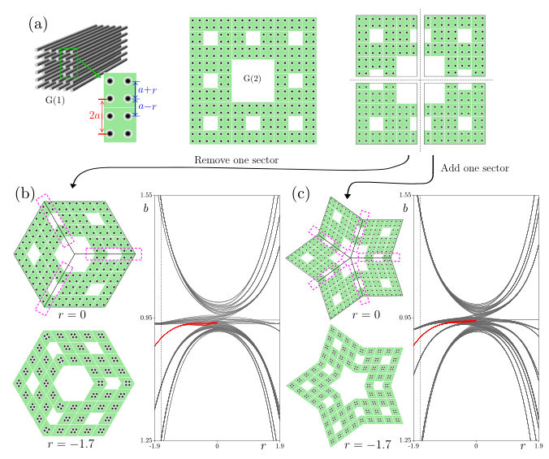 
FIG. 1. Disclination-fractal waveguide array and its spectrum. (a) Sierpi´nski carpets. The first-generation Sierpi´nski carpet G(1) contains 32 waveguides. The G(ℓ) structure is constructed by iterating G(ℓ−1), forming an array of eight G(ℓ−1) units. Based on C4 symmetry, this structure can be partitioned into four identical sectors. (b) Removing one sector and bonding the remaining three sectors yields a disclination structure possessing C3 symmetry. The left panel shows structures with different shift parameter r. The newly formed domain walls are marked with magenta dashed rectangles. The right panel presents the linear spectrum b versus r. The red lines are the localized states on the...

📷 Fig 2

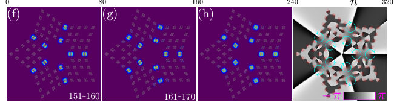 
FIG. 2. (a) Spectra and domain wall states with r = −1.7. (b,c) Field modulus distributions of domain wall states with orthogonal polarizations. (d) Field modulus of the vortex array (left panel) and its corresponding phase distribution (right panel). (e-h) Setup is as (a-e) but for the results of C5-symmetric structure.

📷 Fig 3

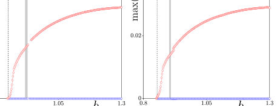 
FIG. 5. Maximum of the real part of the perturbation growth rate β vs propagation constant b. (a) Results for the fractal disclination lattice (blue line) and the SSH disclination (red line) lattice with C3 symmetry. (b) Setup is as (a), but for the C5-symmetric case.

📷 Fig 4

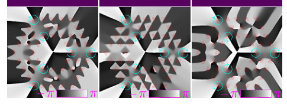 
FIG. 3. Family of the vortex-soliton arrays in the C3-symmetric disclination-fractal system with its power P and peak am- plitude A shown in (a) and (b), respectively. The vertical dashed line indicates blin and the gray region includes ex- tended states. (c) Field modulus distributions (upper panels) and corresponding phases (bottom panels) of the states num- bered 1, 2, and 3 in (a).

📷 Fig 5

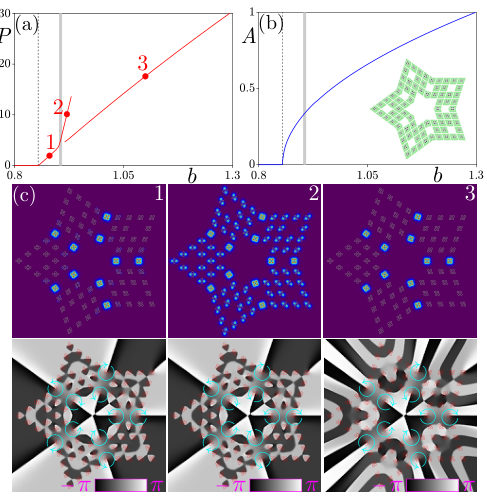 
FIG. 4. Setup is as Fig. 3, but for the results in the C5-symmetric configuration.

**Summary.** This paper investigates the stability of vortex solitons in nonlinear optical waveguides patterned with disclination-fractal structures. By comparing these fractal lattices to conventional defect structures, the authors prove that the fractal geometry provides a novel mechanism to stabilize these light field arrays. This has significant implications for designing advanced photonic devices capable of robust light field manipulation.

**Why it may be interesting.** This work provides a concrete example of how engineered geometric complexity (fractal geometry combined with defects) can stabilize nonlinear wave phenomena, offering insights applicable to designing robust photonic devices and understanding wave localization in complex media.

Detailed structure

**Main problem.** The primary challenge addressed is achieving stable vortex solitons and vortex-soliton arrays within complex, geometrically structured nonlinear media.

**Main result.** The study demonstrates that vortex-soliton arrays in disclination-fractal configurations are significantly stable, while those in conventional disclination structures are unstable.

**Method.** The research employs linear stability analysis and direct numerical simulations of the nonlinear Schrödinger-like equation to track field evolution over long distances.

**Model / system.** The system models light propagation in waveguide arrays structured using disclination operations applied to fractal lattices (e.g., Sierpiński carpets). The dynamics are governed by a nonlinear Schrödinger equation incorporating diffraction, self-action, and geometric potential terms.

**Key observables.** Stability of the vortex-soliton array (measured by the growth rate of perturbations, Re(beta)), field mode maintenance, and phase coherence over propagation distance (z).

**Important parameters / regimes.** The structure type (disclination-fractal vs. conventional SSH), the topological phase (topologically trivial phase), and the nonlinearity strength are key parameters.

**Assumptions / limitations.** The analysis assumes the nonlinear effect is sufficient to counteract diffraction-induced broadening, allowing for the localization of stable soliton states.

**Figures summary.** Figures illustrate the construction of the fractal lattices, the comparison of spectral properties between fractal and conventional structures, and direct simulations showing stable propagation in the fractal case versus disintegration in the conventional case.

**Paper structure.** The paper progresses by first establishing the physical model and the challenge of instability. It then analyzes the linear spectrum, identifies stable domain wall states in the topologically trivial phase, and finally uses nonlinear simulations and stability analysis to rigorously compare the stability of the fractal vs. conventional lattice structures.

Abstract

Vortex light fields carry orbital angular momentum and have attracted significant attention because of their wide applications in light field manipulations, optical communications, and quantum information processing. In nonlinear media, the balance between diffraction and self-action enables the formation of vortex solitons. However, achieving the stability of vortex solitons remains challenging due to radial and azimuthal modulation instabilities. Here, we report stable vortex solitons and vortex-soliton arrays in disclination-fractal configurations with different rotational symmetries, constructed by applying disclination operations to fractal lattice structures. The stable vortex-soliton arrays---composed of several vortex solitons---can exist along domain walls, resulting from the disclination operation applied to the topologically trivial phase. Their stability is verified through both linear stability analysis and direct simulations of perturbed propagation. For comparison, vortex-soliton arrays in conventional disclination configurations are found to be completely unstable, demonstrating the significance of the fractal configuration in stabilizing these nonlinear states. These findings reveal a new nonlinear excitation mechanism arising from the interplay between fractal geometry and disclination defects, thereby providing theoretical underpinnings for both the improved understanding of multi-field excitation phenomena in complex geometric systems and opening new avenues for the design of photonic devices based on fractal disclination structures.

[↑ back to top](#top)

### [Fixed-mesh based approach for modeling of superconducting magnetic bearings](http://arxiv.org/abs/2609.09347v1)

**Authors:** Elias Paakkunainen, Bárbara Maria Oliveira Santos, Gabriel dos Santos, Timo Tarhasaari, Paavo Rasilo, Sebastian Schöps  
**Type:** theory · **Category:** numerical methods · **PDF:** <https://arxiv.org/pdf/2609.09347v1>  
**Analysis basis:** full PDF text, analyzed in chunks
**Topic relevance:** `methods for driven-dissipative` **2/5**

📷 Fig 1

 
Figure 1: 3D representation of the copper-colored double-crossed loops of coated conductors over a magnetic guideway, in gray.

📷 Fig 2

 
Figure 2: Illustration of a crossed loop cross-section (a) when all the CCs are resolved and (b) when homogenization is applied. The circuit coupling of the conducting domains is indicated for both cases.

📷 Fig 3

 
Figure 4: Comparison of the levitation force for the verification example. The simulated forces from the 2D models are scaled with a length of 67 mm to allow for comparison with the measured force from [7]. The maximum forces are for the measurements 9.37 N, for the fixed-mesh model 9.57 N, and for the remeshed model 9.48 N.

📷 Fig 4

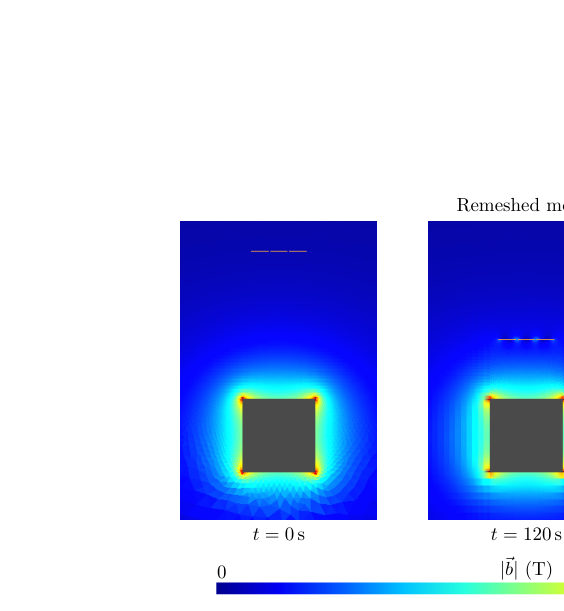 
Figure 5: Magnitude of the magnetic flux density for the verification example with the remeshed and fixed-mesh models. Left: The initial configuration for both the models at t = 0 s. Middle: The remeshed model at t = 120 s. Right: The fixed-mesh model at t = 120 s. The field plots have been zoomed in to show the HTS stacks and the PM.

📷 Fig 5

 
Figure 6: Mesh refinement study of the levitation force for the verification example. The force values are shown for the time t = 150 s. The number of degrees of freedom varies from 3.5k to 28.4k for the remeshed model and from 3.3k to 24.8k for the fixed- mesh model.

**Summary.** This paper introduces a fixed-mesh finite element method to simulate superconducting magnetic bearings, circumventing the computational bottleneck of remeshing required by traditional moving-boundary simulations. By incorporating motion effects into a time-dependent anisotropic material tensor, the model achieves high accuracy while drastically improving computational efficiency compared to reference methods.

**Why it may be interesting.** While the physics is classical electromagnetism, the core contribution is a novel, efficient numerical technique for time-dependent, moving-boundary problems in FEM, which has methodological relevance for complex simulations in quantum physics.

Detailed structure

**Main problem.** The primary challenge is accurately and efficiently modeling superconducting magnetic bearings (SMBs) while accounting for the relative motion between the superconducting components and the magnetic guideway.

**Main result.** The proposed fixed-mesh approach accurately predicts levitation forces, matching experimental results with high $R^2$ values, while being significantly more computationally efficient than traditional remeshing methods.

**Method.** The authors developed a fixed-mesh finite element method (FEM) that models motion by applying a coordinate transformation only to the air region, incorporating this effect into a time-dependent anisotropic material tensor.

**Model / system.** The system modeled is a superconducting magnetic bearing involving High-Temperature Superconductors (HTS) interacting with a magnetic guideway. The formulation uses the j-a mixed FEM approach, coupled with homogenization techniques for coated conductors.

**Key observables.** Levitation force ($f_x, f_y$), magnetic flux density ($|\vec{b}|$), and current density distributions ($j/j_c$).

**Important parameters / regimes.** The model incorporates material parameters like critical current density ($j_c$) and resistivity ($
ho$) which follow power-law characteristics.

**Assumptions / limitations.** The core assumption is that motion effects can be captured by modifying material properties (via the reluctivity tensor) within a fixed mesh, thereby avoiding the computational cost of remeshing at every time step.

**Figures summary.** Figures compare the predicted levitation force against experimental measurements and reference models across various motion states (vertical/horizontal translation). Other figures illustrate the geometry and the comparison of flux density and current distributions between fixed-mesh and remeshed simulations.

**Paper structure.** The paper introduces the physical problem, details the fixed-mesh methodology (including the coordinate transformation and anisotropic tensor), presents the coupled FEM formulation (j-a), validates the approach against verification problems (convergence, known measurements), and finally applies it to complex SMB simulations, highlighting computational gains.

Abstract

Numerical simulations of superconducting magnetic bearings (SMBs) are complicated by the relative motion between high temperature superconductors and the magnetic guideway, which commonly requires repeated updates of the geometry and mesh. We present a fixed-mesh based approach for modeling the motion induced effects in which a coordinate transformation is applied only to the air region between the moving regions. The transformation can be included in a time-dependent anisotropic material tensor, leaving the mesh during the simulation and the rest of the formulation unchanged. To provide numerical examples, the approach is implemented in 2D using the finite element method with the $j$-$a$ formulation and is combined with homogenization and circuit coupling for double-crossed loops of coated conductors. The open-source model implementations are made available. The proposed approach is verified and validated against existing modeling approaches and experimental results from the literature for SMBs. Two simulation examples are presented, and in both of them the levitation force predicted by the fixed-mesh model agrees with the experimental results, yielding $R^2$ values above 0.99. For a verification problem, it is shown that the fixed-mesh model converges towards the remeshed reference solution under mesh refinement as expected. For an SMB undergoing vertical and horizontal translations, the homogenized fixed-mesh model reproduces the lateral-force response of a fully resolved moving-geometry reference model. Additionally, the homogenized fixed-mesh model is computationally more efficient than the reference model, indicating a significant reduction in the number of degrees of freedom and the computation time. The results demonstrate accurate and computationally efficient simulation of translational motion with the fixed-mesh based approach.

[↑ back to top](#top)

### [Intrinsic (valley) thermal Hall conductivity of phonons in graphene for integer quantum Hall phases](http://arxiv.org/abs/2609.09505v1)

**Authors:** M. Selch  
**Type:** theory · **Category:** other · **PDF:** <https://arxiv.org/pdf/2609.09505v1>  
**Analysis basis:** full PDF text, analyzed in chunks
**Topic relevance:** `Keldysh / 2PI / non-Gaussian methods` **2/5**

📷 Fig 1

 
Low-resolution page preview, page 2

📷 Fig 2

 
Low-resolution page preview, page 3

📷 Fig 3

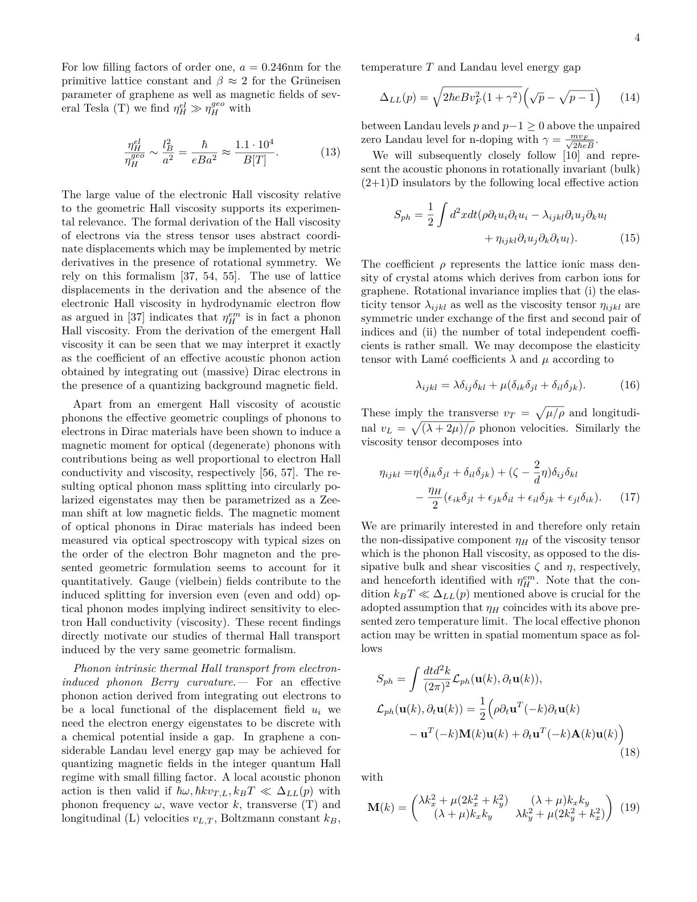 
Low-resolution page preview, page 4

📷 Fig 4

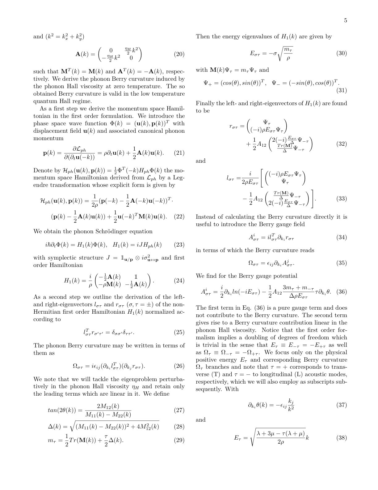 
Low-resolution page preview, page 5

📷 Fig 5

 
Low-resolution page preview, page 6

**Summary.** This theoretical work calculates the intrinsic thermal Hall conductivity of phonons in graphene operating in the quantum Hall regime. It shows that while the direct phonon contribution is small, the valley-specific thermal Hall response mediated by electron-phonon coupling is predicted to be significant. This provides a pathway to experimentally probe valley physics using lattice vibrations in 2D Dirac materials.

**Why it may be interesting.** The work connects topological concepts (Hall viscosity, Berry curvature) from electronic transport to lattice dynamics (phonons), providing a theoretical framework for measuring emergent topological responses in condensed matter systems.

Detailed structure

**Main problem.** The paper calculates the intrinsic (valley) thermal Hall conductivity of phonons in graphene when bulk electron thermal transport is suppressed, specifically in the quantum Hall regime.

**Main result.** While the intrinsic phonon thermal Hall conductivity is predicted to be small, the valley thermal Hall transport induced by electron coupling is predicted to be comparable in size to the charge channel transport, suggesting a measurable valley response.

**Method.** The analysis uses effective field theory and linear response theory, deriving the phonon Hall viscosity by integrating out massive Dirac electrons coupled via geometric electron-phonon coupling.

**Model / system.** The system is graphene, modeled using a Dirac fermion formulation for electrons coupled to lattice distortions (phonons). The analysis is performed in the quantum Hall regime, treating the coupling perturbatively.

**Key observables.** Phonon (valley) thermal Hall conductivity ($\kappa_{ph}^H$, $\kappa_{ph}^{vH}$), Phonon Hall viscosity ($\eta_{	ext{em}}^H$), and the ratio $\kappa_{ph}^H / \kappa_e^H$.

**Important parameters / regimes.** Quantum Hall regime, low temperature ($T 	o 0$), and the magnitude of the electron-phonon coupling ($\partial_{ih}$).

**Assumptions / limitations.** The analysis assumes graphene can be approximated by its pristine state and relies on low-temperature approximations for the phonon dispersion relation.

**Paper structure.** The paper progresses from establishing the general framework for phonon Hall viscosity induced by electronic Hall effects, deriving the necessary effective actions, and finally calculating the specific intrinsic and valley contributions to the thermal Hall conductivity.

Abstract

We calculate the intrinsic contribution to the (valley) thermal Hall conductivity of phonons in (Semenoff-gapped) graphene in the quantum Hall regime where bulk electron thermal transport is suppressed. The (valley) thermal Hall transport of phonons considered here originates from a phonon (valley) Hall viscosity induced by electron (valley) Hall conductivity and viscosity via geometric electron-phonon coupling. The so generated phonon (valley) Hall viscosity is identified with the emergent (valley) Hall viscosity recently introduced in \textit{Phys. Lett. A} \textbf{595}, 132096 (2026). While our calculations refer to graphene, they may very well be generalized to other Dirac materials like group-VI transition metal dichalcogenides. We discuss the prospect of measuring the phonon thermal Hall conductivity in graphene-based heterostructures and estimate the corresponding valley response induced by electrons in the inversion symmetry broken phase.

[↑ back to top](#top)

### [Origin of Flat Bands and Role of Electron Correlation in Lutetium Hydrides](http://arxiv.org/abs/2609.09446v1)

**Authors:** Anmol Lamichhane, Adam Denchfield, Hyeondeok Shin, Panchapakesan Ganesh, Russell J. Hemley, Hyowon Park  
**Type:** theory · **Category:** strongly correlated electrons · **PDF:** <https://arxiv.org/pdf/2609.09446v1>  
**Analysis basis:** full PDF text, analyzed in chunks
**Topic relevance:** `Keldysh / 2PI / non-Gaussian methods` **2/5**

📷 Fig 1

 
FIG. 1: Idealized fluorite structure of LuH3. Tetrahedral hydrogens (Htet) are represented by pink atoms, octahedral hydrogens (Hoct) are represented by blue atoms and Lutetium atoms are represented by turquoise atoms.

📷 Fig 2

 
FIG. 2: Hubbard interactions alone do not gap the cubic trihydrides. Orbital-resolved DOS of LuH3 (left) and LaH3 (right) at the Wannier level (U = 0, top), from DMFT at the cRPA couplings (middle), and from DMFT with Ud = 8 eV at fixed hydrogen interactions (bottom).

📷 Fig 3

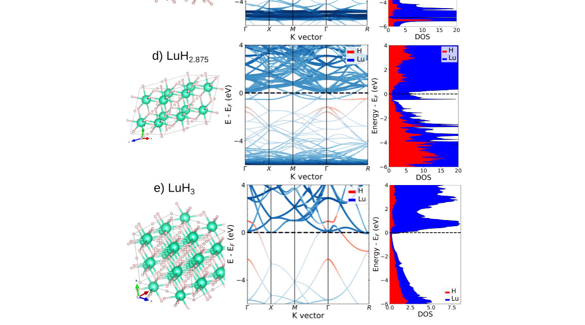 
FIG. 3: Lu-H structures with different hydrogen occupation of Hoct and Htet studied and their associated DFT calculated electronic properties. For 4 Lu atoms: a) LuH1.75 has 7 Htet. b) LuH2 has 8 Htet. c) LuH2.25 has 8 Htet and 1 Hoct. d) LuH2.875 has 8 Htet and 3 Hoct. e) LuH3 has 8 Htet and 4 Hoct.

📷 Fig 4

 
FIG. 4: Comparision of band structures of various LuHx structures showing that flat-bands and van Hove singularity can be tuned near EF . The band structures are for the following structures: (a) LuH2 with only tetrahedral-H occupancy (b) LuH1.75 with one tetrahedral-H vacancy (c) LuH2.25 with one octahedral-H occupancy (d) LuH2 with one tetrahedral-H vacancy and one octahedral-H occupancy.

📷 Fig 5

 
FIG. 5: Correlated electronic structure of LuH2 with Hoct: theory–experiment comparison. Top: Wannier bands and DMFT spectral function A(k, ω) along Γ–X–M, undoped and at ±5% carrier doping. Relative to the Wannier bands, DMFT produces a narrow band pinned near EF with a saddle at M, and damped flat features near −0.6 eV; doping shifts both rigidly in energy (electron doping downward, hole doping upward) without displacing them in momentum. Bottom: ARPES cuts adapted from Ref. [16], licensed under CC by 4.0, showing the near-EF flat band with its emerging light band (left), compared with the undoped DMFT spectral function along M–Γ (middle) and the model structure of LuH2 with Hoct – teal...

**Summary.** This theoretical study investigates the electronic structure of superconducting Lutetium hydrides, focusing on the origin of observed flat bands. Using advanced many-body techniques, the authors determine that the physics is governed not by the strength of electron correlation, but fundamentally by how the hydrogen orbitals are filled at specific crystallographic sites. This establishes orbital filling as the key determinant of electronic properties in these materials.

**Why it may be interesting.** The detailed analysis of correlation effects in a strongly correlated material system, using advanced many-body techniques like DMFT and cRPA, provides a model for understanding how orbital filling dictates electronic behavior, which is relevant to correlated electron physics in general.

Detailed structure

**Main problem.** The study aims to uncover the microscopic origin and correlation nature of puzzling flat-band regions observed in superconducting Lutetium hydrides ($	ext{LuH}_x$) where superconductivity and flat-band physics intersect.

**Main result.** The authors find that hydrogen orbital filling, rather than the magnitude of the Coulomb interaction, is the fundamental principle governing correlation strength and low-energy flat-band physics in these materials.

**Method.** The research employs a combination of Density Functional Theory (DFT), Dynamical Mean-Field Theory (DMFT), and the Constrained Random-Phase Approximation (cRPA) to analyze electronic structure and correlation effects.

**Model / system.** The system under investigation is the series of Lutetium hydrides ($	ext{LuH}_x$, $1.75 \le x \le 3$), which exhibit superconductivity under pressure and possess distinct tetrahedral and octahedral hydrogen sites.

**Key observables.** Screened on-site Coulomb interaction, correlation strength (mass enhancement, susceptibility), Density of States (DOS), flat-band features, and low-energy optical absorption peaks.

**Important parameters / regimes.** Hydrogen orbital filling, the relative energy levels of $	ext{H-s}$ vs. $	ext{Lu-d}$ states, and the degree of hybridization between the two sublattices.

**Assumptions / limitations.** The analysis assumes that anti-site defects (H in octahedral sites) are responsible for generating the observed ARPES flat-band features, and that the system remains weakly correlated despite large interaction parameters.

**Figures summary.** Figures illustrate model structures, orbital-resolved DOS under different correlation treatments, and comparisons between calculated and experimental spectral features.

**Paper structure.** The paper systematically analyzes the electronic structure by first calculating correlation parameters, then identifying the role of anti-site defects in generating flat bands, and finally establishing hydrogen orbital filling as the primary organizing principle controlling correlation effects.

Abstract

Lutetium hydrides (LuH$_x$, $1.75 \leq x \leq 3$) form a diverse series of phases, several of which superconduct under pressure. Characterizing their electronic properties has remained challenging owing to a high propensity for hydrogen defect formation, and recent angle-resolved photoemission (ARPES) measurements reveal puzzling flat-band regions that position these materials as candidates where superconductivity and flat-band physics may intersect. Here, by combining density functional theory, dynamical mean-field theory, and the constrained random-phase approximation, we uncover the microscopic origin and correlation nature of these flat bands. Across all compositions, the screened on-site Coulomb interaction is larger for H-s states than for Lu-$d$ states due to compact hydrogen orbitals. Nevertheless, these systems remain weakly correlated metals: the nearly filled H-$s$ shell admits little charge fluctuation, so its large interaction acts as a static level shift rather than a source of correlation. Although hydrogen primarily occupies tetrahedral sites at $x=2$, we discover that anti-site defects--where hydrogens occupy slightly unfavorable octahedral sites--generate both the ARPES flat-band features and the low-energy optical absorption peak, attesting to the usual defective nature of such materials in experimental samples. We further find that correlation strength is governed primarily by hydrogen orbital filling at these sites rather than the interaction magnitude itself. Consequently, we identify hydrogen orbital filling as the fundamental organizing principle dictating correlation and low-energy flat-band physics in lutetium hydrides.

[↑ back to top](#top)

### [Phonon-Bottleneck-Governed Ultrafast Hot-Carrier Super-Diffusion in Transition Metal Dichalcogenides](http://arxiv.org/abs/2609.10500v1)

**Authors:** Yuwei Zhang, Dongyang Wan, Tao Zhou, Hao Wu, Junpeng Lu, Zhenhua Ni  
**Type:** experiment · **Category:** other · **PDF:** <https://arxiv.org/pdf/2609.10500v1>  
**Analysis basis:** full PDF text, analyzed in chunks
**Topic relevance:** `Keldysh / 2PI / non-Gaussian methods` **1/5** · `analog quantum simulation` **1/5** · `correlated / nonlocal dissipation` **1/5** · `driven-dissipative phase transition` **1/5** · `methods for driven-dissipative` **1/5** · `non-equilibrium universality` **1/5** · `quantum measurements` **1/5**

📷 Fig 1

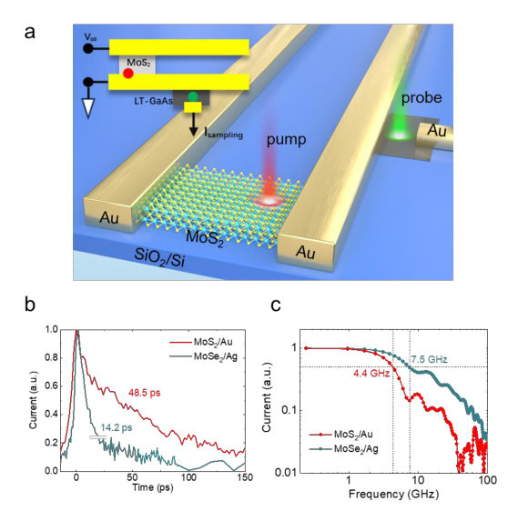 
Figure 1 | On-chip terahertz sampling of GHz-bandwidth interfacial photocurrents.

📷 Fig 2

 
Figure 2 | Mechanistic and spatial origins of the ultrafast interfacial photocurrent.

📷 Fig 3

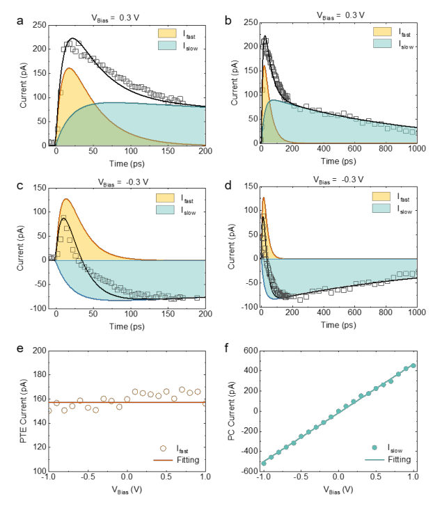 
Figure 3 | Decoupling the photothermoelectric and photoconductive effects via time-

📷 Fig 4

 
Figure 4 | Phonon bottleneck governing ultrafast photothermoelectric dynamics.

**Summary.** This work investigates the ultrafast speed limits in 2D TMDCs by using specialized zero-bias terahertz sampling. The authors demonstrate that the rapid carrier response is not limited by conventional drift but by hot-carrier super-diffusion, which is ultimately governed by the intrinsic phonon bottleneck. This establishes phonon engineering as a key paradigm for designing faster, self-powered optoelectronic devices.

**Why it may be interesting.** While focused on solid-state electronics, the explicit identification of the phonon bottleneck as the rate-limiting step for non-equilibrium carrier dynamics provides a direct, measurable link between lattice vibrations and device performance, relevant to open quantum system modeling.

Detailed structure

**Main problem.** The operational speed of 2D TMDCs for optoelectronics is limited by low room-temperature mobilities and carrier transit delays.

**Main result.** The ultrafast response is governed by hot-carrier super-diffusion, which is quantitatively synchronized with the intrinsic optical-to-acoustic phonon scattering lifetime (phonon bottleneck).

**Method.** The study uses on-chip terahertz optoelectronic sampling at zero bias to measure intrinsic photoresponse, complemented by ultrafast pump-probe spectroscopy.

**Model / system.** The system involves 2D TMDCs ($	ext{MoS}_2$, $	ext{MoSe}_2$) interfaced with metal contacts, studied under zero-bias conditions to isolate intrinsic carrier dynamics from drift-limited transport.

**Key observables.** Ultrafast relaxation lifetimes (e.g., $48.5 	ext{ ps}$ in $	ext{MoS}_2/	ext{Au}$), intrinsic $3	ext{-dB}$ bandwidths, and the quantitative correlation between electrical lifetime and phonon scattering lifetime.

**Important parameters / regimes.** Zero bias ($	ext{V}_{	ext{bias}} = 0 	ext{ V}$), ultrafast timescales ($	ext{ps}$), and the phonon scattering rate.

**Assumptions / limitations.** The measurement setup successfully eliminates external parasitic delays and electric-field-driven drift by using Ohmic contacts and zero bias.

**Figures summary.** Figures illustrate time-resolved photocurrents, comparing Ohmic vs. Schottky contacts, showing position and bias independence of the fast decay component, and correlating optical phonon lifetimes with macroscopic electrical relaxation times.

**Paper structure.** The paper establishes the limitations of TMDCs, details the specialized zero-bias measurement platform, presents evidence ruling out drift-limited transport (via Ohmic/Schottky comparison), identifies hot-carrier super-diffusion, and finally links the macroscopic speed limit to the microscopic phonon bottleneck.

Abstract

Two-dimensional transition metal dichalcogenides (TMDCs) are promising for low-power optoelectronics, yet their operational speed is widely considered constrained by low room-temperature mobilities and carrier transit delays. Here, by combining on-chip terahertz optoelectronic sampling with thermally evaporated Ohmic contacts, we eliminate external parasitic delays and directly capture the intrinsic interfacial photoresponse in unencapsulated TMDCs under zero bias. The devices achieve ultrafast relaxation lifetimes of 48.5 ps in MoS2/Au and 14.2 ps in MoSe2/Ag, translating to intrinsic 3-dB bandwidths of 4.4 GHz and 7.5 GHz, respectively. Spatial scanning and bias-dependent measurements show that this response is position-independent and bias-immune, ruling out conventional drift-limited transport and identifying hot-carrier super-diffusion driven by an interfacial electron temperature gradient as the operative mechanism. Furthermore, ultrafast pump-probe spectroscopy reveals that the macroscopic response time is quantitatively synchronized with the microscopic optical-to-acoustic phonon scattering lifetime governed by the intrinsic phonon bottleneck. Our findings establish phonon engineering as a viable paradigm to tailor non-equilibrium optoelectronic dynamics, offering a blueprint for zero-bias, ultrafast, self-powered devices.

[↑ back to top](#top)

### [The effect of Coulomb interactions of thermoelectric characteristics of Marcus molecular junctions](http://arxiv.org/abs/2609.09581v1)

**Authors:** Natalya A. Zimbovskaya  
**Type:** theory · **Category:** other · **PDF:** <https://arxiv.org/pdf/2609.09581v1>  
**Analysis basis:** full PDF text, analyzed in chunks
**Topic relevance:** `Keldysh / 2PI / non-Gaussian methods` **1/5** · `correlated / nonlocal dissipation` **1/5** · `driven-dissipative phase transition` **1/5** · `methods for driven-dissipative` **1/5**

📷 Fig 1

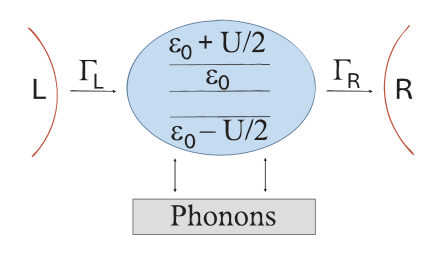 
FIG. 1: Schematics of the adopted model. When there are two electrons on the bridge, the Coulomb repulsion between them splits the bridge energy level with the energy ǫ0 in two levels with the energies ǫ0 ± U/2 . The linker is coupled to the electrodes with the coupling energies ΓL,R The rectangle represents a bath of thermalized phonon modes affecting the electron transport.

📷 Fig 2

 
FIG. 3: The thermopower S as a function of the chemical potential µ in an unbiased Marcus SMJ computed at kT = 0.0126eV, Γ = 0.03eV, ǫ0 = 0.3eV, λ = 0.2eV (a) and U = 0.4eV (b).

📷 Fig 3

 
FIG. 2: Zero bias conductance computed for a Marcus SMJ asuming that kT = 0.026eV, Γ = ΓL = ΓR = 0.03eV, ǫ0 = 0.3eV, λ = 0.2eV (a) and U = 0.4eV (b). Insets show the occupation probabilities for the bridge states in the limit U → 0 (a) at U = 0.4eV (b). In the panel (c) the steady state current is presented as a function of the bias voltage  I0 = |e|Γ/ℏ  . The curves are plotted at several values of U and λ.

📷 Fig 4

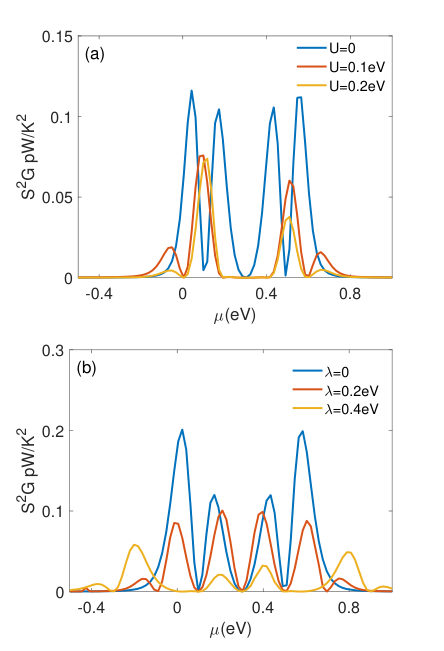 
FIG. 4: Power factor S2G as a function of the chemical potential of electrodes µ computed at zero bias voltage- computed at TL &gt; TR , kT = 0.0126eV, Γ = 0.03eV, ǫ0 = 0.3eV, λ = 0.2eV (a) and U = 0.4eV (b).

**Summary.** This theoretical study models electron transport through molecular junctions, focusing on how Coulomb interactions and solvent reorganization affect thermoelectric performance. The research shows that these two effects interact non-trivially, leading to significant, sometimes counteracting, changes in measurable quantities like the Seebeck coefficient and power factor. It provides a detailed theoretical framework for understanding energy conversion in nanoscale molecular devices.

**Why it may be interesting.** This work bridges molecular electronics, open quantum systems, and many-body physics by explicitly modeling the interplay between electronic correlations (Coulomb blockade) and environmental coupling (electron-phonon coupling), which is crucial for understanding energy conversion at nanoscale interfaces.

Detailed structure

**Main problem.** The study investigates how Coulomb interactions affect the thermoelectric properties of molecular junctions when electron transport is strongly influenced by thermalized phonon modes.

**Main result.** The combined effects of electron-electron interactions and solvent reorganization can cause qualitative changes in the Seebeck coefficient and power factor, with interactions potentially counteracting reorganization effects.

**Method.** The authors use a theoretical rate equation approach to calculate steady-state currents and linear response coefficients for thermoelectric properties.

**Model / system.** The model describes a single molecular junction (SMJ) bridged between electrodes and immersed in a dielectric solvent, incorporating molecular states, charging energy (Coulomb interaction U), and solvent reorganization energy (lambda).

**Key observables.** Seebeck coefficient (S), power factor (S^2G), zero-bias conductance (G), and charge current (I_ss).

**Important parameters / regimes.** Charging energy (U), reorganization energy (lambda), and bias/thermal voltage (V, T).

**Assumptions / limitations.** The analysis is performed in the linear transport regime ($\Delta V, \Delta T$ small), and the solvent reorganization is assumed to occur only during electron transfer.

**Figures summary.** Figures illustrate the dependence of conductance (G) on Coulomb interaction (U) and reorganization energy (lambda), showing up to four conduction maxima, and demonstrate how the thermopower (S) and power factor (S^2G) change sign and magnitude.

**Paper structure.** The paper develops the model using rate equations to find steady-state probabilities, derives expressions for current and thermoelectric coefficients, and then analyzes the resulting behavior of G, S, and S^2G under varying interaction strengths.

Abstract

We present a theoretical study focused on the influence of Coulomb interactions on thermoelectric properties of molecular junctions assuming that electron transport is strongly affected by thermalized phonon modes in the molecular ambient. It is shown that the combined effect of Coulomb interactions between electrons on the molecular states and the reorganization processes in the ambient may significantly affect both Seebeck coefficient and the power factor. Specifically, we show that electron-electron interactions may counter-balance the effect of the ambient molecules reorganizations resulting in qualitative changes in the behavior of both zero-bias conductance and thermopower.

[↑ back to top](#top)

### [Integrated Population Balance and Multiphysics Modeling for Predicting Undesired Agglomeration in Small Molecule Manufacturing](http://arxiv.org/abs/2609.10256v1)

**Authors:** Prakitr Srisuma, Peter Hou, Shashank Venkat Muddu, Neda Nazemifard, Allan S. Myerson, Richard D. Braatz  
**Type:** both · **Category:** other · **PDF:** <https://arxiv.org/pdf/2609.10256v1>  
**Analysis basis:** full PDF text, analyzed in chunks
**Topic relevance:** `Keldysh / 2PI / non-Gaussian methods` **1/5** · `analog quantum simulation` **1/5** · `methods for driven-dissipative` **1/5**

📷 Fig 1

 
Figure 1: Our agitated filter dryer (AFD) experimental setup showing the overall system, AFD vessel, and sensors.

📷 Fig 2

 
Figure 2: Schematic diagram showing the mechanistic modeling of the agitated filter drying process, where the system temperature, solvent content, and number of particles are denoted by T, ml, and n, respectively.

📷 Fig 3

 
Figure 3: Schematic diagram showing the formation of hard and soft agglomerates during the agitated filter drying process.

📷 Fig 4

 
Figure 4: Schematic diagram describing the proposed mechanistic model. The nonlinear functions f1, f2, f3, and f4 are derived from energy, mass, and population balances.

📷 Fig 5

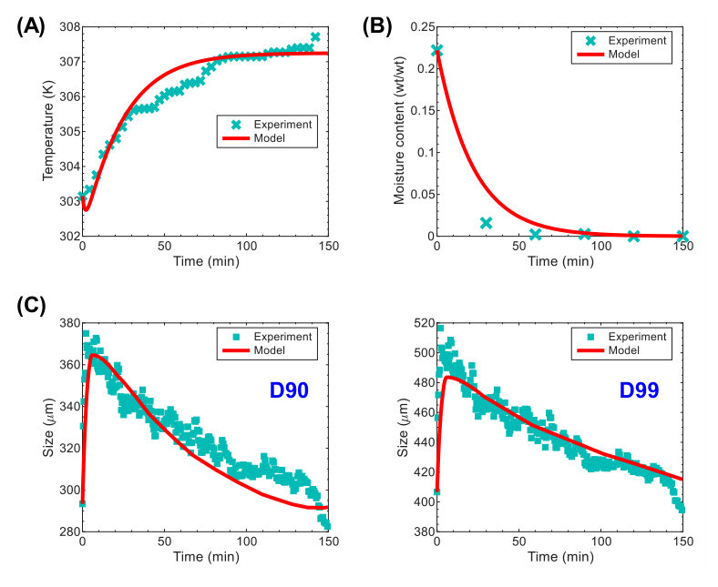 
Figure 5: Comparison between the experimental data and model prediction for the system consisting of KCl and hexane (Case 1). Panel (A) shows the product temperature. Panel (B) shows the moisture content. Panel (C) shows D90 and D99.

**Summary.** This paper presents a sophisticated, integrated model combining Population Balance Modeling with multiphysics simulation to predict particle agglomeration in agitated filter dryers used for drug manufacturing. By distinguishing between soft and hard agglomerates, the framework allows engineers to rationally design and operate the drying process to maintain high product quality and reliability.

**Why it may be interesting.** While the application is chemical engineering, the rigorous coupling of population dynamics (PBM) with coupled transport phenomena (heat/mass transfer) and kinetic rate laws shares mathematical formalism with modeling complex non-equilibrium systems in condensed matter physics.

Detailed structure

**Main problem.** The primary challenge addressed is predicting and mitigating undesired hard agglomeration of small molecules during the critical agitated filter drying (AFD) process in pharmaceutical manufacturing.

**Main result.** The developed model successfully predicts the evolution of particle size distribution (PSD) and quantifies the impact of agglomeration, showing that process parameters like mass transfer rates can be tuned to minimize hard agglomerate formation.

**Method.** The study employs a novel mechanistic model that couples Population Balance Modeling (PBM) with multiphysics simulations to track heat, mass, and particle size changes simultaneously.

**Model / system.** The physical system is an Agitated Filter Dryer (AFD) used for drying Active Pharmaceutical Ingredients (APIs). The model integrates energy and mass balances with PBM to account for soft and hard agglomeration/breakage kinetics.

**Key observables.** Product temperature, moisture content, particle size distribution (PSD), and the quantification of soft vs. hard agglomerates.

**Important parameters / regimes.** Solubility, mass transfer rates, and the ratio of liquid evaporation rate to solid growth rate govern the agglomeration kinetics.

**Assumptions / limitations.** The system is assumed to be well-mixed due to continuous agitation, and the model explicitly distinguishes between soft (liquid bridge) and hard (solid bridge) agglomerates.

**Figures summary.** Figures illustrate the AFD experimental setup, the mechanistic model components (heat/mass transfer, PBM), and the time evolution of particle size percentiles (D90, D99) under different conditions.

**Paper structure.** The paper introduces the problem of agglomeration in AFDs, presents the coupled PBM/multiphysics framework (including energy/mass balances and specific kinetic terms for agglomeration/breakage), validates the model against experimental data (both limiting and practical cases), and concludes with parametric studies for process optimization.

Abstract

Agitated filter dryers (AFDs) are a crucial unit operation in small molecule manufacturing that enables simultaneous filtration, washing, and drying of active pharmaceutical ingredients. One of the key challenges in AFDs is associated with undesired agglomeration, where the presence of hard agglomerates results in off-spec products, equipment damage, and additional downstream processing. This article presents a novel mechanistic model that describes the formation of soft and hard agglomerates during agitated filter drying. By integrating population balance and multiphysics modeling, the model can accurately predict the evolution of the product temperature, moisture content, and particle size distribution, and hence quantify the extend and impact of undesired agglomeration across various operating conditions. Our proposed model-based framework enables the rational design and operation of AFDs for improving the product quality and process reliability.

[↑ back to top](#top)

### [Composition and Surface Termination Control Band Alignments in P3HT/Perovskite Heterostructures](http://arxiv.org/abs/2609.09566v1)

**Authors:** Somayyeh Alidoust, V. Ongun Özçelik  
**Type:** theory · **Category:** other · **PDF:** <https://arxiv.org/pdf/2609.09566v1>  
**Analysis basis:** full PDF text, analyzed in chunks
**Topic relevance:** `Keldysh / 2PI / non-Gaussian methods` **1/5**

📷 Fig 1

 
FIG. 1: (a) Crystal structure of the P3HT polymer. (b) Schematic of the mixed-cation AA′BX3 perovskite. (c) Band-edge positions of the P3HT variants compared with conventional ABX3 perovskites from the literature26,27 and the mixed-cation AA′BX3 perovskites calculated in this study. I and II denote two random alkyl-chain arrangements, while subscripts 1 and 2 indicate monolayer and bilayer P3HT, respectively.

📷 Fig 2

 
FIG. 2: Band alignment heat map for perovskites and P3HT variants. Yellow squares mark selected Sn-based perovskites (CsSnBr3, MASnBr3, CsMASnBr3) for interface modeling.

📷 Fig 3

 
FIG. 3: Optimized interfacial atomic structures, projected band structures, and band alignments of the CsSnBr3/P3HTOM heterostructure for (a) CsBr-terminated and (b) SnBr-terminated interfaces. Dashed circles highlight the corresponding VBM and CBM positions of CsSnBr3 and P3HTOM.

📷 Fig 4

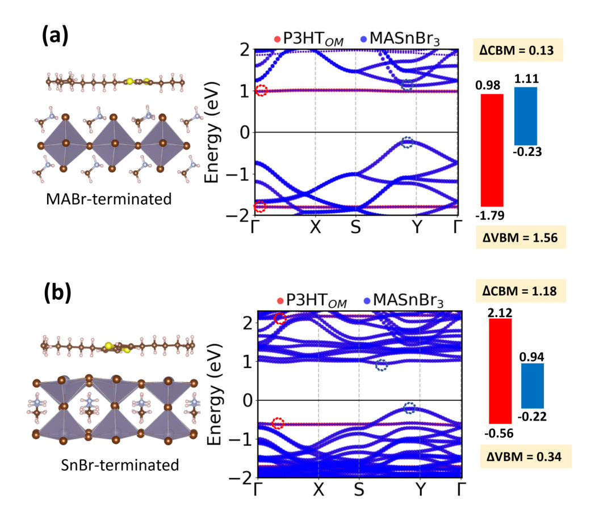 
FIG. 4: Optimized interfacial atomic structures, projected band structures, and band alignments of the MASnBr3/P3HTOM heterostructure for (a) MABr-terminated and (b) SnBr-terminated interfaces. Dashed circles highlight the corresponding VBM and CBM positions of MASnBr3 and P3HTOM.

📷 Fig 5

 
FIG. 5: Optimized interfacial atomic structures, projected band structures, and band alignments of the CsMASnBr3/P3HTOM heterostructure for (a) CsMABr-terminated and (b) SnBr-terminated interfaces. Dashed circles highlight the corresponding VBM and CBM positions of CsMASnBr3 and P3HTOM.

**Summary.** This work uses first-principles calculations to map the band alignment in P3HT/perovskite heterostructures, revealing that surface termination and cation mixing are critical design parameters. The findings establish that mixed-cation perovskites can maintain a desirable Type-I alignment, offering new principles for engineering organic-inorganic interfaces for energy applications.

**Why it may be interesting.** While focused on solid-state optoelectronics, the rigorous application of first-principles methods to map out complex, tunable interfacial electronic states (band alignment) is relevant to understanding engineered quantum interfaces in general.

Detailed structure

**Main problem.** The study aims to understand how the chemical composition and surface termination of metal halide perovskites influence the band alignment when forming heterostructures with P3HT polymers.

**Main result.** The mixed-cation perovskite CsMASnBr3 uniquely forms a Type-I band alignment with P3HT regardless of surface termination, whereas pure Sn-based perovskites show termination-dependent alignment changes.

**Method.** The research employs high-throughput first-principles calculations using DFT (PBE functional with DFT-D3 corrections) and HSE06 for electronic structure analysis.

**Model / system.** The system modeled is the interface between P3HT variants and various metal halide perovskites (conventional and mixed-cation). Calculations are performed on slab models to simulate different surface terminations.

**Key observables.** Band alignment type (Type-I, II, III), Valence Band Maximum (VBM), Conduction Band Minimum (CBM), and band offsets ($\Delta	ext{CBM}$, $\Delta	ext{VBM}$).

**Important parameters / regimes.** Composition (e.g., CsMASnBr3 vs. CsSnBr3), surface termination ($	ext{AX}$ vs. $	ext{BX}$), and the polymer type (P3HT variants).

**Assumptions / limitations.** The primary assumption is that band alignment is governed by orbital coupling and carrier confinement rather than significant net charge transfer, although the dependence on termination is highly sensitive.

**Figures summary.** Figures illustrate crystal structures, band alignment heatmaps for 820 heterostructures, and detailed projected band structures comparing different terminations for specific Sn-based perovskite/P3HT interfaces.

**Paper structure.** The paper systematically analyzes the effect of composition and termination on band alignment using high-throughput calculations, contrasting the behavior of pure vs. mixed-cation perovskites, and detailing the mechanism of band offset formation.

Abstract

Hybrid organic-inorganic perovskite heterostructures are emerging platforms for energy conversion and optoelectronic devices, yet the effects of composition and surface terminations on band alignment remain poorly understood. Here, using high-throughput first-principles calculations, we systematically reveal the effect of composition and surface termination on the band alignment of 820 heterostructures formed between poly(3-hexylthiophene) (P3HT) variants and conventional and mixed-cation metal halide perovskites. Band edge analysis predicts concentration dependent band alignments, with most Pb and Sn based perovskites exhibiting Type II and III behavior while mixed-cation CsMASnBr3 uniquely forms Type-I junctions with all P3HT variants. Explicit interface calculations reveal that surface termination can reverse the predicted alignment in conventional tin perovskites, while the mixed cation perovskite preserves Type-I alignment with P3HT regardless of termination. Despite negligible charge transfer, termination dependent band offsets produce markedly different carrier confinement, establishing design principles for engineering P3HT/perovskite interfaces.

[↑ back to top](#top)

### [Record-Breaking Elemental Superconductivity in Tetralayer Kagome Borophene](http://arxiv.org/abs/2609.09730v1)

**Authors:** Yingnan Liu, Yan Liu, Renyu Duan, Menghui Wang, Meiling Xu, Hanyu Liu, Shoutao Zhang  
**Type:** theory · **Category:** strongly correlated electrons · **PDF:** <https://arxiv.org/pdf/2609.09730v1>  
**Analysis basis:** full PDF text, analyzed in chunks
**Topic relevance:** `Keldysh / 2PI / non-Gaussian methods` **1/5**

📷 Fig 1

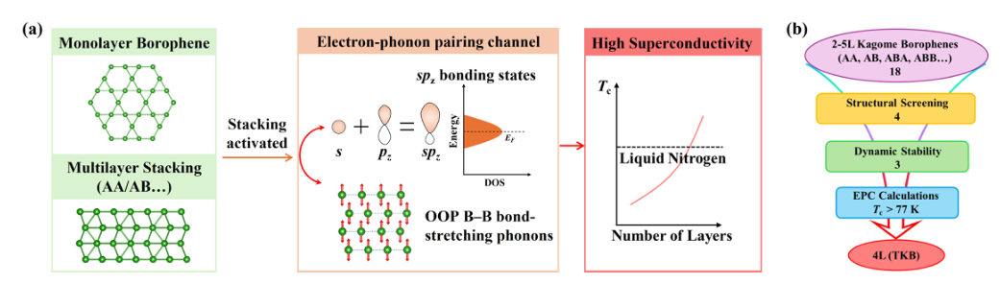 
FIG. 1. (a) Schematic illustration of the stacking-activated out-of-plane pairing mechanism. Multilayer stacking generates interlayer B-B covalent bonds and s −pz hybridized bonding states near the EF , which couple strongly to out-of-plane (OOP) boron phonons and thereby enhance superconductivity beyond the liquid-nitrogen regime. (b) Screening workflow for multilayer kagome borophenes, including structural stability, dynamical stability, and EPC criteria.

📷 Fig 2

 
FIG. 2. (a,b) Top and side views of the tetralayer kagome borophene structure, where the two colors denote inequivalent boron sites. (c) Orbital-resolved band structure, with the horizontal dashed line marking the Fermi level. (d) Enlarged view of the band cross- ing, with the corresponding irreducible representations labeled. The green circle marks the Dirac point (DP), while the blue rectan- gle highlights the Van Hove singularity. (e) Atom-resolved pro- jected density of states (PDOS) for Bα and Bβ atoms. (f) Projected crystal orbital Hamilton populations (pCOHP) of 2s-2px, 2s-2py, and 2s-2pz pairs, together with the corresponding integrated COHP (ICOHP) in TKB. (g) Orbital-resolved FSs...

📷 Fig 3

 
FIG. 3. (a) Phonon dispersion weighted by the mode-resolved EPC strength λqj, phonon branches associated with in-plane Bx,y and out-of- plane Bz vibrations, phonon dispersion weighted by the phonon linewidth γqj, and frequency-dependent phonon density of states (PHDOS), Eliashberg spectral function α2F(ω), and accumulated EPC strength λ(ω). Four representative phonon modes with pronounced EPC contri- butions are also illustrated. (b) Temperature dependence of the superconducting gap ∆nk. The inset shows the superconducting density of states (SDOS) at T = 10 K. (c) Momentum-resolved superconducting gap ∆nk projected onto the FS at T = 10 K. (d) Momentum-dependent EPC strength λnk projected...

**Summary.** This theoretical study predicts that tetralayer kagome borophene (TKB) is a record-high-temperature elemental superconductor with $T_c=102$ K. The superconductivity arises from a unique out-of-plane pairing mechanism involving $s$-$p_z$ bonding states coupled to low-frequency boron vibrations. The work establishes covalent stacking engineering as a viable pathway for high-$T_c$ materials in 2D systems.

**Why it may be interesting.** While focused on BCS-like pairing, the emphasis on strong coupling ($\lambda=1.78$) and the detailed orbital/momentum dependence of the pairing mechanism provides insights into how electronic structure dictates pairing symmetry, relevant for understanding correlated electron behavior.

Detailed structure

**Main problem.** The primary challenge is achieving high-temperature superconductivity in two-dimensional elemental crystals, where insufficient electron-phonon coupling (EPC) usually limits $T_c$.

**Main result.** The authors predict that tetralayer kagome borophene (TKB) can be a record-high-$T_c$ elemental superconductor with a critical temperature of 102 K.

**Method.** The study employs first-principles calculations combined with the fully anisotropic Migdal-Eliashberg theory to model the superconducting pairing mechanism.

**Model / system.** The physical system is Tetralayer Kagome Borophene (TKB) stabilized by ABAB covalent stacking. The theory focuses on the electron-phonon coupling mediated by out-of-plane $s$-$p_z$ bonding states interacting with low-frequency out-of-plane boron vibrations.

**Key observables.** Predicted critical temperature ($T_c \approx 102$ K), superconducting gap ($\Delta_{nk}$), and momentum-dependent EPC strength ($\lambda_{nk}$).

**Important parameters / regimes.** The optimal structure is TKB, which exhibits strong coupling ($\lambda = 1.78$) and is stabilized by the ABAB stacking.

**Assumptions / limitations.** The analysis relies on first-principles calculations and the Migdal-Eliashberg theory; the intrinsic properties are assumed, suggesting exfoliation is necessary for measurement.

**Figures summary.** Figures illustrate the TKB structure, orbital-resolved band structures, pCOHP analysis confirming OOP bonding, and phonon dispersion weighted by EPC strength, showing strong coupling at low frequencies.

**Paper structure.** The paper progresses from identifying the general problem in 2D elemental superconductors to proposing TKB, detailing the electronic structure and bonding mechanism, and finally calculating the record-high $T_c$ using advanced Eliashberg theory.

Abstract

Superconductivity above the liquid-nitrogen temperature remains rare in two-dimensional elemental crystals, where strong covalent bonding often yields high phonon frequencies but insufficient electron-phonon coupling. Here, using first-principles calculations and fully anisotropic Migdal-Eliashberg theory, we predict tetralayer kagome borophene (TKB) stabilized by ABAB covalent stacking, as a liquid-nitrogen-temperature elemental superconductor. With a predicted critical temperature of 102 K, TKB sets a record-high value among previously reported elemental superconductors. Unlike known high-Tc boron-based superconductors dominated by in-plane sigma-bonding states and high-frequency in-plane B-B stretching modes, TKB realizes an out-of-plane s-pz-bonding-mediated pairing mechanism, in which interlayer s-pz bonding states at the Fermi level are strongly coupled to low-frequency out-of-plane vibrations of boron atoms. These results reveal a distinct out-of-plane pairing channel in multilayer borophene and establish covalent stacking engineering as a potential route for high-Tc superconductivity in two-dimensional materials.

[↑ back to top](#top)

### Other secondary papers (3)

Show other secondary papers

### [A discrete Stiefel-Whitney invariant with twofold rotation symmetry](http://arxiv.org/abs/2609.09723v1)

**Authors:** Ken Shiozaki  
**Type:** theory · **Category:** other · **PDF:** <https://arxiv.org/pdf/2609.09723v1>  
**Analysis basis:** full PDF text, analyzed in chunks

📷 Fig 1

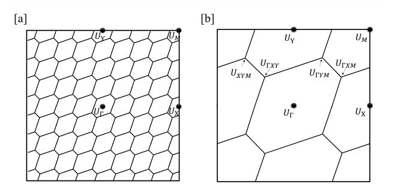 
Figure 1: A C2-symmetric cover of the BZ torus. Double and triple overlaps are shown schematically as lines and junctions, respectively. The cover is chosen so that every nonempty intersection is contractible on the quotient space Q. [b] A cover with four patches, whose independent triple overlaps are UΓXY , UΓXM, UΓY M, UXY M.

📷 Fig 2

 
Figure 2: Calculation of νC2 2 [α] for A 1

📷 Fig 3

 
Figure 3: Vertices, edges, and plaquettes used to compute νC2 2 [α] on a discrete mesh, illustrated for L = 6. [a] Vertices V at which frames are chosen independently, shown as mesh points in the yellow region. Black dots indicate the high-symmetry points Γ, X, Y, M. [b] Edges E on which lifts are chosen independently, shown in red. [c] Half-BZ domain D over which the plaquette values are summed. The remaining boundary frames are fixed by symmetry, and the edge lifts are determined by the branch differences ∆0, ∆π, ∆x of the chosen function αk.

**Summary.** This paper introduces a novel, discrete topological invariant for 2D spinful insulators with $\text{C}_2\text{T}$ symmetry. By adapting the Stiefel-Whitney construction, the authors derive a formula that is proven to be gauge-invariant and additive. This new invariant, when combined with other known indices, completes the stable topological classification for this class of materials.

**Why it may be interesting.** This work provides a powerful, symmetry-protected tool for classifying topological phases in condensed matter systems, extending the classification scheme beyond what standard indices can capture.

Detailed structure

**Main problem.** The paper aims to derive and prove the gauge invariance and additivity of a discrete, additional $\mathbb{Z}_2$ topological invariant for two-dimensional spinful insulators possessing twofold rotation and time-reversal symmetries.

**Main result.** The derived invariant, $\nu_{\text{C}_2\text{T}}[\alpha]$, successfully labels the stable topological classification of these insulators, complementing existing indices like the Kane-Mele index.

**Method.** The invariant is formulated using the second Stiefel-Whitney number derived from a real bundle over the quotient of the Brillouin torus, $T^2/\text{C}_2$. The calculation involves discrete formulas using overlaps of Bloch frames.

**Model / system.** The study focuses on two-dimensional spinful insulators characterized by $\text{C}_2\text{T}$ symmetry, specifically within the layer group $p1121'$. Models include atomic insulators and specific band insulator Hamiltonians.

**Key observables.** The primary observable is the discrete invariant $\nu_{\text{C}_2\text{T}}[\alpha]$, alongside one-dimensional partial polarizations and the filling number.

**Important parameters / regimes.** The classification is determined by the combination of the new invariant and three quantized $\mathbb{Z}_2$ partial polarizations, leading to a total classification of $\mathbb{Z} \oplus \mathbb{Z} \oplus 4/2$.

**Assumptions / limitations.** The derivation assumes the existence of a spectral gap ($\Delta E > 0$) and relies on defining the invariant via a singular gauge transformation.

**Figures summary.** The notes mention a comparison table (Table 2) showing the computed values of the invariant for various atomic insulators and TI models, confirming consistency across different mesh sizes.

**Paper structure.** The paper reviews existing invariants (SW classes, Kane-Mele index), introduces the $\text{C}_2$-equivariant refinement of the SW construction, derives the discrete formula using Bloch frame overlaps, proves its gauge invariance and additivity, and finally applies it to classify known topological phases.

Abstract

We review Stiefel--Whitney invariants and give a discrete formulation of an additional $\mathbb{Z}_2$ invariant for two-dimensional spinful insulators with twofold rotation and time-reversal symmetries (layer group $p1121'$). A singular gauge transformation specifies a real bundle over the quotient of the Brillouin torus, whose second Stiefel--Whitney number defines the invariant. We derive its dependence on the choice of auxiliary gauge function and prove invariance under changes of Bloch frame and additivity under direct sums. The discrete formula uses overlaps of independently chosen Bloch frames and symmetry-compatible $\mathrm{Pin}_+$ lifts on the boundary of a half Brillouin zone. Atomic and topological-insulator models illustrate the formula and distinguish the additional invariant from the Kane--Mele index. Together with three quantized $\mathbb{Z}_2$ partial polarizations and the filling number, it labels the known stable classification $\mathbb{Z}\oplus\mathbb{Z}_2^{\oplus 4}$.

[↑ back to top](#top)

### [Microscopic Understanding of Thermal-magnon Transport in a Low-damping Ferrimagnetic Thin Films](http://arxiv.org/abs/2609.09674v1)

**Authors:** Lerato Takana, Katya Mikhailova, Junwei Tong, Xiangcheng Liu, Kwangyul Hu, Juan Hofer, Guanxiong Qu, Clare Yu, Ivan Schuller, Michael Flatté, Xiaoqin Li, Yuri Suzuki  
**Type:** both · **Category:** other · **PDF:** <https://arxiv.org/pdf/2609.09674v1>  
**Analysis basis:** full PDF text, analyzed in chunks

📷 Fig 1

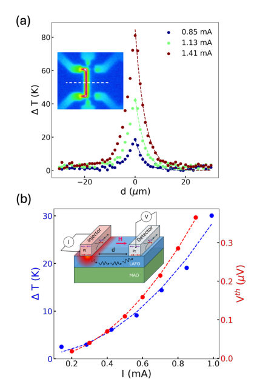 
FIG. 1. (a) Mid-wave infrared (MWIR) thermal imaging of a LAFO/Pt device (d = 1 µm) under an RMS injector cur- rent of 1.4 mA. The inset shows the measured thermal map, and the dashed line indicates the direction of the extracted temperature profiles. The temperature rise above 300 K is well described by an exponential decay, yielding the thermal healing length used to define the intrinsic nonlocal transport regime. (b) Left axis: Temperature rise at the injector as a function of applied current obtained from the MWIR mea- surements, showing the expected quadratic dependence as- sociated with Joule heating. Right axis: Second-harmonic nonlocal voltage measured at 250 K and 0.3 T as a...

📷 Fig 2

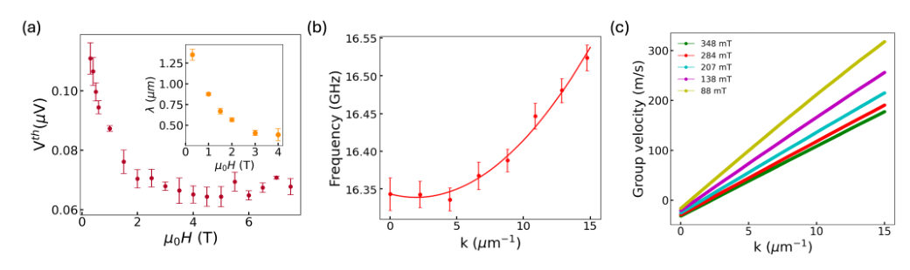 
FIG. 2. Magnetic-field dependence of thermal magnon transport and its microscopic origin. (a) Nonlocal thermal voltage as a function of magnetic field measured at 250 K with an injector current of 0.5 mA. The inset shows the corresponding magnetic-field dependence of the extracted magnon spin diffusion length, demonstrating that the suppression of the thermal signal is accompanied by a reduction in the magnon propagation length. (b) Backward-volume (BV) magnon dispersion of Li0.5Al1.0Fe1.5O4 measured by Brillouin light scattering (BLS) at µ0H = 284 mT and 300 K. Symbols represent the experimental data and the dashed line is a fit to Eq. (1). (c) Magnetic-field and wave-vector dependence of...

📷 Fig 3

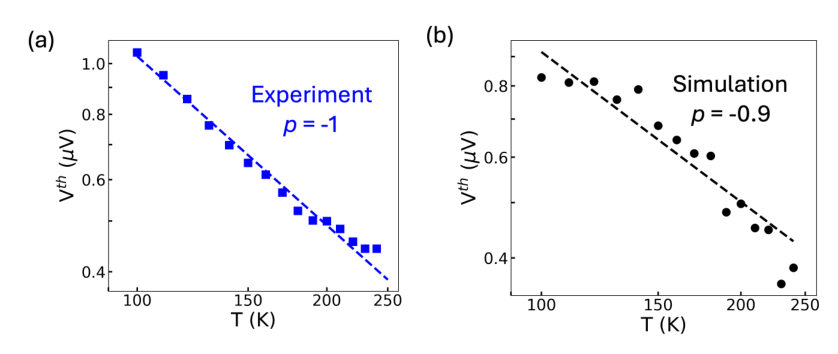 
FIG. 3. Temperature dependence of thermal magnon transport. (a) Thermal magnon voltage measured as a function of temperature at µ0H = 0.3 T and an injector current of 0.5 mA. The data are plotted on logarithmic axes to determine the power-law dependence of the thermal signal on temperature. The dashed line is a power-law fit V th ∝T p with exponent p = −1. (b) Micromagnetic simulations of the thermal magnon signal, plotted on logarithmic axes, for an RMS injector current of 1.4 mA and µ0H = 0.3 T using a temperature-dependent exchange stiffness, Aex(T) ∝[Ms(T)/Ms(0)]2. The simulated temperature dependence reproduces the experimentally observed power-law behavior, supporting...

**Summary.** This paper investigates how heat drives spin transport via magnons in ferrimagnetic thin films. By combining nonlocal electrical measurements with spectroscopic techniques and simulations, the authors show that transport is governed not just by magnon density, but critically by the magnon group velocity and the temperature dependence of the exchange stiffness. This provides a fundamental microscopic understanding for engineering heat-driven spin currents.

**Why it may be interesting.** The work provides a detailed, quantitative link between macroscopic transport measurements (nonlocal voltage) and microscopic parameters (group velocity, exchange stiffness) in magnetic materials, which is relevant for understanding energy dissipation in quantum magnetic systems.

Detailed structure

**Main problem.** The paper aims to resolve the poorly understood microscopic mechanisms governing heat-driven spin transport via magnons in magnetic insulators.

**Main result.** Thermal magnon transport is found to be suppressed by magnetic fields and decreases with temperature, with the governing physics being dictated by the magnon group velocity and temperature-dependent exchange stiffness.

**Method.** The study combines nonlocal spin Seebeck measurements, Brillouin Light Scattering (BLS) spectroscopy, and micromagnetic simulations to probe the underlying physics.

**Model / system.** The research focuses on low-damping ferrimagnetic thin films, specifically Li0.5Al1.0Fe1.5O4/Pt nanodevices, using a nonlocal spin Seebeck geometry.

**Key observables.** Thermal magnon voltage (Vth), magnon spin diffusion length, magnon group velocity (vg), and temperature dependence of the signal.

**Important parameters / regimes.** Magnetic field strength, temperature (T), and the exchange stiffness (A_ex).

**Assumptions / limitations.** The nonlocal measurement setup successfully separates intrinsic magnon transport from local thermoelectric effects by placing the detector outside the thermal healing length.

**Figures summary.** Figures illustrate the nonlocal voltage scaling with current and temperature gradient, the suppression of Vth and spin diffusion length with magnetic field, and the relationship between field/temperature and the magnon group velocity.

**Paper structure.** The paper establishes the experimental setup using nonlocal measurements, analyzes the field dependence by linking Vth suppression to reduced magnon group velocity (measured by BLS), and finally addresses the temperature dependence by showing that simulations incorporating temperature-dependent exchange stiffness reproduce the observed power-law decay.

Abstract

Thermally generated magnons enable heat-driven spin transport in magnetic insulators, yet the microscopic mechanisms governing their propagation remain poorly understood. Here, we investigate thermal magnon transport in low-damping Li$_{0.5}$Al$_{1.0}$Fe$_{1.5}$O$_4$/Pt nanodevices using a nonlocal spin Seebeck geometry that separates magnon transport from local thermoelectric effects. Thermal imaging establishes a detector region outside the thermal healing length, enabling intrinsic nonlocal measurements. We find that thermal magnon transport is strongly suppressed by magnetic fields far above saturation. Brillouin light scattering reveals that increasing field reduces the group velocity of backward volume magnons, providing a microscopic origin for the observed reduction in magnon spin diffusion length. We further find that thermal magnon transport decreases with increasing temperature despite an increasing magnon population. Micromagnetic simulations reproduce this behavior only when a temperature-dependent exchange stiffness is included. These results identify magnon group velocity and exchange stiffness as key parameters governing thermal magnon transport in ferrimagnetic thin films.

[↑ back to top](#top)

### [WannierNLQG: A Julia package for nonlinear optical responses and quantum geometry from Wannier tight-binding models](http://arxiv.org/abs/2609.10411v1)

**Authors:** Zhuocheng Lu, Zhichao Guo, Yuanyuan Xua, Jiacheng Yao, Hua Wang  
**Type:** theory · **Category:** other · **PDF:** <https://arxiv.org/pdf/2609.10411v1>  
**Analysis basis:** full PDF text, analyzed in chunks

📷 Fig 1

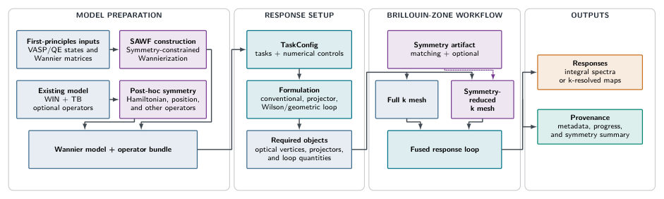 
Figure 1: Symmetry-aware computational workflow of WannierNLQG. Model Preparation produces a Wannier model and operator bundle through either representation-constrained SAWF construction from first-principles inputs or post-hoc symmetrization of an existing WIN and tight-binding model with optional operators. In Response Setup, TaskConfig selects the response formulation and the required optical vertices, projectors, or loop quantities. The Brillouin-zone stage uses the full k mesh by default. When a matching symmetry artifact is supplied, supported q = 0 Integral tasks may instead use the symmetry-reduced k mesh, implemented using representatives of irreducible k-point orbits, orbit...

📷 Fig 2

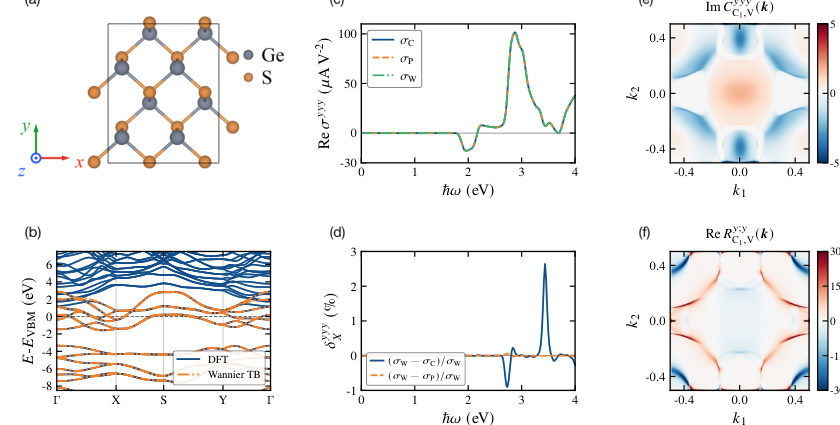 
Figure 2: GeS electronic structure, shift current comparison, and Wilson loop k-space quantities, arranged as (a, c, e) in the upper row and (b, d, f) in the lower row. (a) POSCAR-derived lattice schematic. (b) DFT and Wannier-TB band structures along Γ–X–S–Y–Γ, referenced to the valence-band maximum. (c) Integrated Re σyyy spectra from the conventional, projector, and Wilson loop formulations, denoted by σC, σP, and σW, respectively. The spectra are calculated under matched numerical settings using Wannier-center Convention II, on a 200 × 200 × 1 mesh and a 200-point 0–4 eV frequency grid, and are displayed as effective-bulk conductivities in µA V−2 using the thickness factor Lz/deff =...

📷 Fig 3

 
Figure 3: GeS k-slice maps recomputed from one symmetrized SAWF-gauge model using direct Fourier interpolation on a 400×400×1 mesh, with EF = −2.5 eV, Wannier-center Convention II, and q = 0. The same model bundle supplies the Hamiltonian, position, spin, and derivative operators in a common gauge. The centered fractional coordinates satisfy k = k1b1 + k2b2, with k1, k2 ∈[−0.5, 0.5], and the subspaces are V = [19, 20], C1 = [21, 22], and C2 = [23, 24]. The left column contains (a) gyy C1,V, (b) gyy V , and (c) ∂kygyy V . The middle column contains (d) Ωxy C1,V, (e) Ωxy V , and (f)

📷 Fig 4

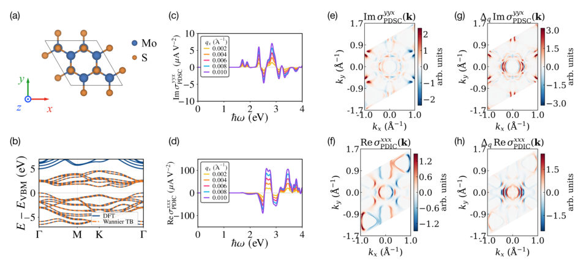 
Figure 4: 2H-bilayer MoS2 photon drag responses. (a) VESTA-rendered lattice structure and (b) DFT/SAWF band comparison. Panels (b)–(h) use the same SAWF model, with panels (c)–(h) calculated from its complete 11-operator bundle. (c) Im σyyx PDSC and (d) Re σxxx PDIC spectra for representative qx values, both displayed as effective-bulk conductivities using Lz/deff with deff = 0.950047554 nm; the PDIC spectra additionally use τ = 10−13 s. (e) 400 × 400 × 1 reciprocal-space map of Im σyyx PDSC(k), projected with the MoS2 reciprocal lattice vectors, at qx = 0.01 ˚A−1 and ℏω = 2.84 eV. (f) 400×400×1 reciprocal-space map of Re σxxx PDIC(k), projected with the same reciprocal basis, at qx = 0.01...

📷 Fig 5

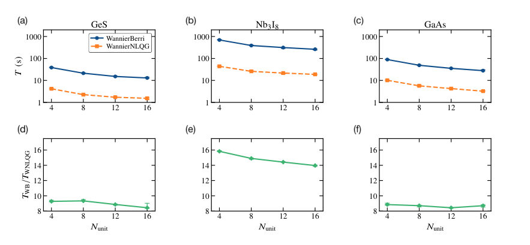 
Figure 5: Warm complete-task timing comparison for the full conventional shift current tensor of (a) and (d) GeS, (b) and (e) Nb3I8, and (c) and (f) GaAs. Panels (a)–(c) show the median wall time from 16 samples, with min–max ranges, for WannierBerri 26.7.0 using Ray workers and the frozen WannierNLQG snapshot using MPI ranks. The time axes use logarithmic spacing and are labeled in seconds. Panels (d)–(f) show the median paired block ratio TWB/TWNLQG, with order-stratified bootstrap 90% confidence intervals. Nunit denotes the number of Ray workers or MPI ranks. No samples or ratios are pooled across materials.

**Summary.** This paper presents WannierNLQG, a new Julia package designed to compute nonlinear optical responses and quantum geometric quantities from Wannier tight-binding models. It provides a unified, gauge-consistent framework that handles complex issues like degeneracy and finite momentum transfer. This tool enables first-principles calculations crucial for designing next-generation optoelectronic and spintronic materials.

**Why it may be interesting.** The focus on nonlinear optical responses and quantum geometry connects directly to advanced topics in quantum optics and open quantum systems, particularly in understanding light-matter interactions in solid-state materials.

Detailed structure

**Main problem.** The central problem is the theoretical and computational challenge of understanding the deep interplay between nonlinear optical responses and quantum geometry in modern condensed matter systems.

**Main result.** The authors introduce WannierNLQG, a Julia framework capable of calculating these quantities from Wannier tight-binding models with high accuracy and efficiency.

**Method.** The framework uses Wannier interpolation from first-principles structures, implementing gauge-consistent and degeneracy-aware methods for calculating various currents and geometric tensors.

**Model / system.** The calculations are performed on electronic systems modeled by Wannier tight-binding Hamiltonians, applicable to materials like GeS and bilayer MoS2.

**Key observables.** Ordinary, spin, and photon-drag injection and shift currents; k-resolved Berry curvature, quantum metric, and higher-order quantum geometric tensors.

**Important parameters / regimes.** Finite momentum transfer (q), arbitrary perturbative order, and symmetry-adapted k-point meshes.

**Assumptions / limitations.** The framework assumes the applicability of Wannier interpolation and aims to overcome limitations in handling gauge-invariance and degenerate subspaces inherent in older methods.

**Figures summary.** Figure 1 illustrates the computational workflow, showing the progression from model preparation through response setup to final Brillouin-Zone calculations, including symmetry reduction.

**Paper structure.** The paper introduces the WannierNLQG framework, details its capabilities for calculating nonlinear responses (shift/injection currents) and quantum geometry (Berry curvature, metric), and validates its performance through case studies comparing it to existing methods.

Abstract

Nonlinear optical responses and quantum geometry are central to modern condensed matter physics and are deeply intertwined. We introduce WannierNLQG, an extensible Julia framework for computing nonlinear optical responses and quantum geometric quantities from Wannier tight-binding models. Its gauge-consistent, degeneracy-aware architecture accommodates perturbative responses at arbitrary order and additional quantum geometric quantities. The current release evaluates ordinary, spin, and photon-drag injection and shift currents, as Brillouin-zone integrals and on k slices. For shift current, a unified interface exposes four complementary formulations: the conventional method, projector trace, generalized Wilson loop, and a finite-momentum geometric loop, with the last three explicitly accommodating degenerate subspaces. The framework also provides k-resolved Berry curvature, quantum metric, their multipoles, and additional quantum geometric and mixed momentum-spin quantities. Experimental symmetry workflows additionally support symmetry-adapted Wannier construction, symmetrization of tight-binding models and real-space operators, and reduction of spatially uniform response integrals to irreducible k-point orbits and invariant tensor components. The documentation covers formula conventions, the TaskConfig interface, and auditable output formats, with GeS and bilayer MoS2 case studies illustrating method comparison, degeneracy handling, quantum geometric analysis, and photon-drag responses. Together, these capabilities enable first-principles calculations of nonlinear response and quantum geometry in realistic multiband materials, connecting quantum geometry with quantitative materials modeling for optoelectronic, spintronic, and photovoltaic applications.

[↑ back to top](#top)

