
# arxiv digest (quant-ph + cond-mat) — 2026-09-12

*136 papers · 21 relevant · 1 highlighted*

## 🔥 Most relevant (21)

*Every paper with at least one nonzero topic score, sorted by best-matching score. 🔥 marks scores ≥4/5. Click the title to jump to the full entry below; click [arXiv] to open the paper page. `(secondary)` marks papers from de-prioritized cond-mat archives.*

Show 21 relevant papers

- [Dissipation-induced nonlocal phase-coherent transport in a topological superconductor](#paper-2609.10821) [[arXiv]](http://arxiv.org/abs/2609.10821v1) `(secondary)` — 🔥 `correlated / nonlocal dissipation` **4/5** · `analog quantum simulation` **3/5** · `driven-dissipative phase transition` **3/5** · `methods for driven-dissipative` **3/5** · `non-equilibrium universality` **2/5** · `quantum measurements` **2/5** · `Keldysh / 2PI / non-Gaussian methods` **1/5**
- [Quantum transport along a tight-binding chain connected to Markovian reservoirs](#paper-2609.11741) [[arXiv]](http://arxiv.org/abs/2609.11741v1) — 🔥 `Full counting statistics` **4/5** · `methods for driven-dissipative` **3/5** · `Keldysh / 2PI / non-Gaussian methods` **2/5** · `driven-dissipative phase transition` **2/5** · `non-equilibrium universality` **2/5** · `quantum measurements` **2/5** · `analog quantum simulation` **1/5** · `correlated / nonlocal dissipation` **1/5**
- [Dissipative Quantum Battery from Many-Body Scars](#paper-2609.11595) [[arXiv]](http://arxiv.org/abs/2609.11595v1) — 🔥 `scars & prethermalization` **4/5** · `driven-dissipative phase transition` **3/5** · `methods for driven-dissipative` **3/5** · `non-equilibrium universality` **2/5** · `Keldysh / 2PI / non-Gaussian methods` **1/5** · `analog quantum simulation` **1/5** · `correlated / nonlocal dissipation` **1/5** · `quantum measurements` **1/5**
- [A Chip-scale Space-time Multiplexed Gaussian Boson Sampling Processor Beyond 10,000 Photons](#paper-2609.11922) [[arXiv]](http://arxiv.org/abs/2609.11922v1) — 🔥 `analog quantum simulation` **4/5** · `QC/QI experiment` **3/5** · `quantum optics experiment` **3/5** · `interference shaping light` **2/5**
- [Distributed variational quantum computing with deterministic entanglement tuning](#paper-2609.10932) [[arXiv]](http://arxiv.org/abs/2609.10932v1) — 🔥 `QC/QI experiment` **4/5** · `analog quantum simulation` **3/5** · `quantum optics experiment` **3/5** · `interference shaping light` **2/5**
- [Finite-blockade dynamics of a three-qubit ccz gate in neutral-atom arrays](#paper-2609.11159) [[arXiv]](http://arxiv.org/abs/2609.11159v1) — 🔥 `Rydberg arrays` **4/5** · `QC/QI experiment` **2/5** · `Keldysh / 2PI / non-Gaussian methods` **1/5** · `analog quantum simulation` **1/5** · `correlated / nonlocal dissipation` **1/5** · `driven-dissipative phase transition` **1/5** · `methods for driven-dissipative` **1/5**
- [One-clean-qubit spectroscopy of simulated Kitaev chains](#paper-2609.11513) [[arXiv]](http://arxiv.org/abs/2609.11513v1) — 🔥 `analog quantum simulation` **4/5** · `QC/QI experiment` **3/5** · `quantum measurements` **3/5** · `methods for driven-dissipative` **1/5**
- [Demonstration of a logical Bell-state measurement beyond the linear-optical limit](#paper-2609.10698) [[arXiv]](http://arxiv.org/abs/2609.10698v1) — 🔥 `QC/QI experiment` **4/5** · `quantum measurements` **3/5** · `quantum optics experiment` **3/5**
- [Dissipative quantum mechanics of Andreev bound states](#paper-2609.10691) [[arXiv]](http://arxiv.org/abs/2609.10691v1) `(secondary)` — 🔥 `Keldysh / 2PI / non-Gaussian methods` **4/5** · `methods for driven-dissipative` **2/5** · `correlated / nonlocal dissipation` **1/5** · `driven-dissipative phase transition` **1/5** · `non-equilibrium universality` **1/5** · `quantum measurements` **1/5**
- [New Method for Path-length Equalization of Long Single-mode Fibers for Interferometry](#paper-2609.10771) [[arXiv]](http://arxiv.org/abs/2609.10771v1) — 🔥 `interference shaping light` **4/5** · `quantum measurements` **3/5** · `quantum optics experiment` **3/5**
- [On-chip squeezed light in the audio frequency band](#paper-2609.11004) [[arXiv]](http://arxiv.org/abs/2609.11004v1) — 🔥 `quantum optics experiment` **4/5** · `quantum measurements` **3/5** · `QC/QI experiment` **1/5** · `interference shaping light` **1/5** · `methods for driven-dissipative` **1/5**
- [Optically induced metallic state with persistent monoclinic symmetry in NdNiO$_3$](#paper-2609.11238) [[arXiv]](http://arxiv.org/abs/2609.11238v1) — 🔥 `non-equilibrium universality` **4/5** · `driven-dissipative phase transition` **3/5** · `Keldysh / 2PI / non-Gaussian methods` **1/5** · `methods for driven-dissipative` **1/5** · `quantum measurements` **1/5**
- [An exchange-assisted entangling gate between 87Rb and 171Yb Rydberg atoms](#paper-2609.11730) [[arXiv]](http://arxiv.org/abs/2609.11730v1) — 🔥 `QC/QI experiment` **4/5** · `Rydberg arrays` **3/5** · `analog quantum simulation` **2/5**
- [Optimizing quantum encodings for analog simulation through dynamical algebra reachability](#paper-2609.11351) [[arXiv]](http://arxiv.org/abs/2609.11351v1) — 🔥 `analog quantum simulation` **4/5** · `Rydberg arrays` **3/5**
- [The Quantum Plumber's Problem](#paper-2609.11416) [[arXiv]](http://arxiv.org/abs/2609.11416v1) — 🔥 `quantum measurements` **4/5** · `interference shaping light` **3/5**
- [Acoustic Wave-Function Imaging of Sublattice Physics in a Kagome Lattice](#paper-2609.11678) [[arXiv]](http://arxiv.org/abs/2609.11678v1) — 🔥 `analog quantum simulation` **4/5** · `quantum measurements` **2/5**
- [Entanglement Meets Reality: A Network Engineering Assessment and Forecast of Rackable Entanglement Sources](#paper-2609.11387) [[arXiv]](http://arxiv.org/abs/2609.11387v1) — 🔥 `quantum optics experiment` **4/5** · `QC/QI experiment` **1/5** · `quantum measurements` **1/5**
- [Probing the Error-Mitigation Threshold with Matrix Product States](#paper-2609.10929) [[arXiv]](http://arxiv.org/abs/2609.10929v1) — 🔥 `methods for driven-dissipative` **4/5** · `driven-dissipative phase transition` **1/5** · `non-equilibrium universality` **1/5**
- [Certifying Adversarial Robustness of Quantum Classifiers under Known-Readout Query Access](#paper-2609.11637) [[arXiv]](http://arxiv.org/abs/2609.11637v1) — 🔥 `quantum measurements` **4/5** · `Full counting statistics` **1/5**
- [Enhancing charge stability of Ge quantum well heterostructures via SiGe layer composition engineering](#paper-2609.11214) [[arXiv]](http://arxiv.org/abs/2609.11214v1) — 🔥 `QC/QI experiment` **4/5** · `quantum measurements` **1/5**
- [Programmable CMOS DAC Operating in Cryogenic Environments for Controlling Superconducting Qubits](#paper-2609.10834) [[arXiv]](http://arxiv.org/abs/2609.10834v1) — 🔥 `QC/QI experiment` **4/5** · `quantum measurements` **1/5**

## ⭐ Highlighted (1)

*Papers by authors on your watch list. Click the title to jump to the full entry below; click [arXiv] to open the paper page.*

Show 1 highlighted papers

- ⭐ [Nonlinear dynamics and mechanical frequency combs with a Meissner-levitated micromagnet](#paper-2609.11668) [[arXiv]](http://arxiv.org/abs/2609.11668v1) — Mikhail D. Lukin

## All papers (96, sorted by relevance)

*Papers from quant-ph and your primary cond-mat archives (quant-gas, stat-mech, str-el, dis-nn). Highlighted papers (⭐) come first, then everything else sorted by topic-relevance score, highest first.*

### ⭐ [Nonlinear dynamics and mechanical frequency combs with a Meissner-levitated micromagnet](http://arxiv.org/abs/2609.11668v1)

**Highlighted author(s):** Mikhail D. Lukin  
**Authors:** Yiqi Wang, Trisha Madhavan, Vanessa Wachter, J. DaLi Schaefer, Addison NewRingeisen, Zhiyuan Wei, Frankie Fung, Benjamin A. Stickler, Mikhail D. Lukin  
**Type:** both · **Category:** other · **PDF:** <https://arxiv.org/pdf/2609.11668v1>  
**Analysis basis:** full PDF text, analyzed in chunks
**Topic relevance:** `driven-dissipative phase transition` **3/5** · `Frenkel-Kontorova` **1/5** · `analog quantum simulation` **1/5** · `methods for driven-dissipative` **1/5** · `non-equilibrium universality` **1/5** · `quantum measurements` **1/5**

📷 Fig 1

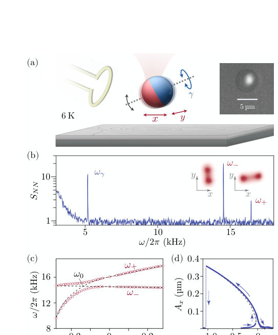 
Figure 1. (a) Schematic of the experimental setup. A mi- cromagnet is levitated above a YBCO film in a cryostat at 6 K. An in situ coil drives the micromagnet, whose motion is detected using a focused laser beam. Inset: Optical image of the levitated micromagnet under broadband LED illumina- tion. (b) Undriven photon-count-rate spectrum. From low to high frequencies, the peaks correspond to the γ mode and the predominantly y-like and x-like hybrid modes. Insets: Spa- tial scans of the driven x- and y-like modes. (c) Measured hybridized eigenfrequencies ω+ and ω−as functions of Bext. The dashed black curves show the inferred uncoupled frequen- cies ωx and ωy, which cross at the common...

📷 Fig 2

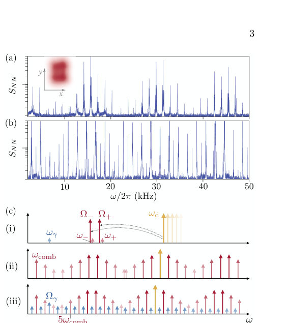 
Figure 2. (a) Photon-count-rate spectrum under an 8 dBm drive. Inset: spatial scan of driven motion. (b) Photon-count- rate spectrum for the same drive power at ωd/2π = 30.06 kHz during the downward sweep in Fig. 3. (c) Schematic illus- tration of the mechanical frequency comb formation process: (i) off-resonant driving evolving into parametric excitation of the carrier frequencies as ωd is decreased, (ii) parametric driv- ing and cascaded sideband generation resulting in the primary comb, (iii) γ-mode excitation and full-comb formation.

📷 Fig 3

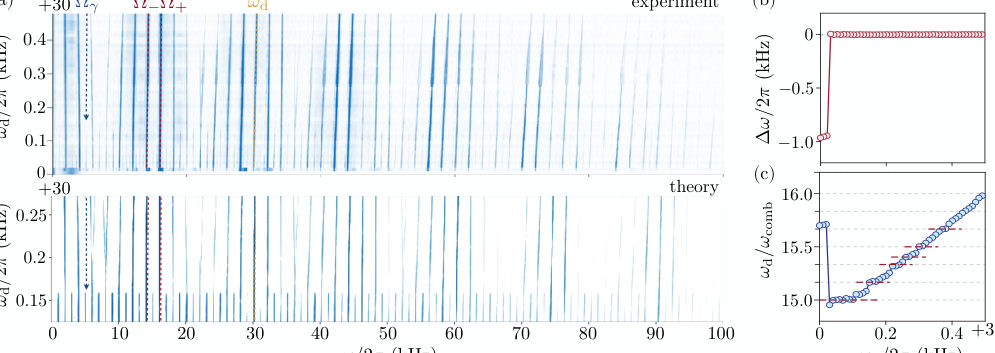 
Figure 3. (a) Upper panel: measured photon-count spectra during the downward sweep of the drive frequency ωd. Dashed lines indicate the γ mode with effective frequency Ωγ (blue), the predominantly y-like (red) and x-like (red) carrier tones, and the drive (yellow). Lower panel: simulated sweep spectrum obtained from the extended nonlinear model in Eqs. (1) and (4), showing qualitative agreement with the experimental data. Phenomenological simulation parameters are detailed in SI [1]. (b) Measured frequency mismatch ∆ω = ωd −(Ω+ + Ω−) versus ωd throughout the frequency sweep. (c) Corresponding ratio ωd/ωcomb of the drive frequency to the primary-comb spacing versus ωd during the same sweep....

📷 Fig 4

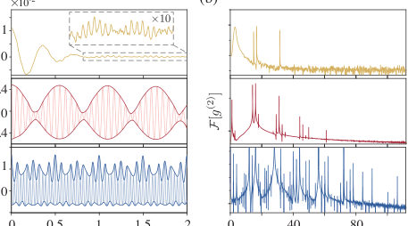 
Figure 4. (a) Second-order correlation functions g(2)(τ) and (b) their corresponding spectra. Panels from top to bottom are representative examples in the frequency sweep shown in Fig. 3(a) in the stages (i) off-resonance driving (yellow), (ii) primary-comb regime (red), and (iii) full-comb regime (blue). Solid lines highlight envelopes of g(2)(τ) in (a). The inset in the top panel of (a) is magnified ×10 vertically for visibility.

**Summary.** This research demonstrates that a magnetically levitated micromagnet can act as a highly nonlinear mechanical oscillator capable of generating frequency combs. By tuning the drive frequency, the system exhibits a transition from a simple primary comb to a dense, full comb structure. This establishes the micromagnet as a promising platform for advanced precision sensing and quantum-limited metrology.

**Why it may be interesting.** This work provides a concrete, macroscopic realization of nonlinear wave phenomena (frequency combs) in a quantum-relevant, low-dissipation mechanical system, bridging nonlinear dynamics with quantum metrology.

Detailed structure

**Main problem.** The paper investigates the generation and characterization of mechanical frequency combs using nonlinear dynamics in a physical system.

**Main result.** They successfully demonstrated the generation of a tunable mechanical frequency comb, progressing from a primary comb to a full comb structure through nonlinear parametric excitation and mode coupling.

**Method.** The study combines experimental measurements (optical readout, spectrum sweeping) with theoretical modeling (nonlinear coupled oscillators, numerical simulations) to analyze the dynamics.

**Model / system.** The platform is a Meissner-levitated micromagnet, whose coupled center-of-mass and rotational motion exhibits strong intrinsic Duffing nonlinearities and low dissipation.

**Key observables.** Spectral peaks, comb spacing ($\omega_{	ext{comb}}$), resonance frequencies ($\omega_{\pm}, \omega_{\gamma}$), and the ratio $\omega_d/\omega_{	ext{comb}}$.

**Important parameters / regimes.** Low temperature (6 K), vacuum environment, and the external static/driving magnetic fields used for tuning.

**Assumptions / limitations.** The analysis relies on sum-phase locking conditions ($\Omega_+ + \Omega_- = \omega_d$) and uses approximations like the rotating-wave approximation in the theoretical sections.

**Figures summary.** Figures show the setup, the emergence of the primary comb during a drive frequency sweep, and the evolution through distinct comb states (primary to full comb) in both experimental and simulated spectra.

**Paper structure.** The paper progresses from establishing the physical platform and its nonlinear resonances, to demonstrating the primary comb formation, and finally detailing the mechanism leading to the more complex, fully developed comb structure via coupling to a librational mode.

Abstract

Nonlinearities in multimode mechanical systems can give rise to rich dynamical phenomena with great potential for sensing applications and for future quantum experiments. We demonstrate that the coupled center-of-mass and rotational motion of a Meissner-levitated micromagnet offer a promising platform for nonlinear dynamics, combining low dissipation, magnetic tunability, strong intrinsic Duffing nonlinearities, and nonlinear intermodal couplings. We use this tunability to demonstrate the generation of a mechanical frequency comb in the micromagnet dynamics, realized by parametric excitation of two translational modes followed by cascaded nonlinear frequency mixing, which produces a phononic comb with tunable spacing. At large amplitudes, nonlinear coupling to a low-frequency librational mode of the magnet leads to parametric excitation and phase locking of that mode, generating a dense spectral fine structure at subharmonics of the drive. These results establish levitated micromagnets as a platform for nonlinear multimode mechanics, with potential applications in precision sensing and quantum-limited metrology.

[↑ back to top](#top)

### [Quantum transport along a tight-binding chain connected to Markovian reservoirs](http://arxiv.org/abs/2609.11741v1)

**Authors:** P. S. Muraev, A. R. Kolovsky, D. N. Maksimov  
**Type:** theory · **Category:** statistical mechanics · **PDF:** <https://arxiv.org/pdf/2609.11741v1>  
**Analysis basis:** full PDF text, analyzed in chunks
**Topic relevance:** 🔥 `Full counting statistics` **4/5** · `methods for driven-dissipative` **3/5** · `Keldysh / 2PI / non-Gaussian methods` **2/5** · `driven-dissipative phase transition` **2/5** · `non-equilibrium universality` **2/5** · `quantum measurements` **2/5** · `analog quantum simulation` **1/5** · `correlated / nonlocal dissipation` **1/5**

📷 Fig 1

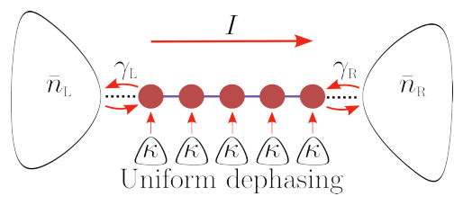 
FIG. 1. Particle transport through a tight-binding chain cou- pled to Markovian reservoirs. The current I flows from the left to the right driven by the mean particle density imbalance ¯nL −¯nR. Relaxation rates γL and γR correspond to the par- ticle exchange rates between each reservoir and the coupled site of the chain.

📷 Fig 2

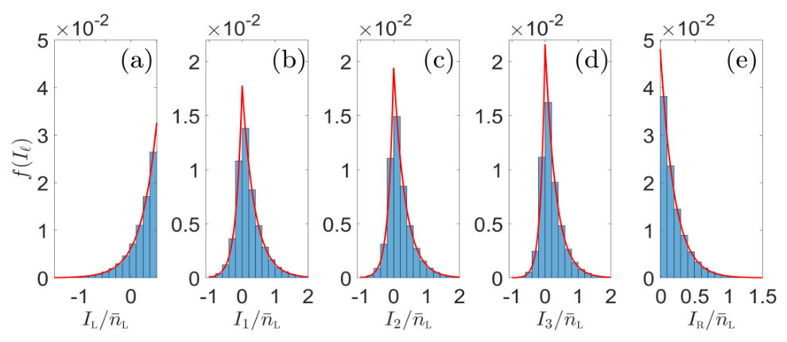 
FIG. 2. Distribution for the dataset generated from the stochastic differential equations (36) – bins, and the analytic distribu- tions Eqs. (31) to (33) – red solid lines. The parameters are ¯nL = 100, ¯nR = 1, γL = γR = 0.5, L = 4 and J = 1. The number of samples is 8800.

📷 Fig 3

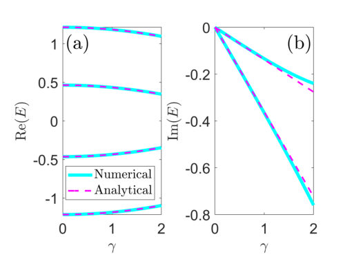 
FIG. 3. Real (a) and imaginary (b) parts of the energy spec- trum of the effective non-Hermitian Hamiltonian for L = 4, J = 1.5 against the dissipation strength γ. Dashed lines rep- resent the perturbative result up to O2(γ/J), see Eq. (C13). The solid lines show the eigenvalues obtained from exact nu- merical diagonalization.

**Summary.** This paper provides a comprehensive theoretical treatment of quantum transport in a dephasing open quantum chain. It derives exact analytical expressions for the mean current and site populations using the master equation approach. Crucially, it extends the analysis to calculate the full probability distributions and correlation functions of the currents, characterizing the transition from ballistic to diffusive transport.

**Why it may be interesting.** This work provides rigorous, analytical tools to calculate non-equilibrium transport statistics (current fluctuations) in open quantum systems, bridging the gap between mean-field descriptions and full quantum noise analysis.

Detailed structure

**Main problem.** The paper investigates quantum transport of non-interacting particles through a tight-binding chain coupled to external reservoirs, while accounting for on-site dephasing.

**Main result.** Exact analytic solutions are derived for the mean current and site populations, and the probability distributions for both boundary and inter-site currents are determined.

**Method.** The analysis employs the master-equation approach, solving for the Single-Particle Density Matrix (SPDM) and utilizing the phase-space formalism via characteristic functions to calculate higher-order current statistics.

**Model / system.** The system is a tight-binding chain of length L, described by a Hamiltonian coupled to Markovian reservoirs at its ends. The dynamics are governed by a Lindblad master equation incorporating particle exchange and uniform on-site dephasing.

**Key observables.** Mean current ($ar{I}_\ell$), site populations ($\langle \hat{n}_\ell 
angle$), and the probability distribution functions $f(I)$ for currents at boundaries and internal bonds.

**Important parameters / regimes.** Dephasing rate ($\kappa$), coupling rates ($\gamma_L, \gamma_R$), and system length ($L$). The analysis covers regimes from ballistic ($\kappa=0$) to diffusive ($\kappa 
eq 0$) transport.

**Assumptions / limitations.** The analysis is restricted to non-interacting particles (bosons/fermions). For higher-order statistics, the quasi-free limit ($\kappa=0$) is often assumed, and the SPDM approach is used for mean values.

**Figures summary.** Figure 1 illustrates particle transport driven by reservoir differences. Figure 2 compares simulated current distributions with analytic predictions. Figure 3 compares the energy spectrum obtained by diagonalization versus perturbative expansion.

**Paper structure.** The paper systematically derives the evolution equation for the SPDM, solves for the steady-state mean currents, and then extends the formalism using characteristic functions to derive the full probability distributions and correlation functions for the currents.

Abstract

We consider quantum transport of non-interacting particles in a tight-binding chain coupled to Markovian reservoirs at its boundaries and subject to uniform on-site dephasing. Using the masterequation approach, we derived the exact analytic solution for the mean current along the chain. This analytic solution is obtained in the framework of single-particle quantum mechanics and, thus, equally applies for transport of non-interacting bosons and fermions. In the absence of phase damping, the results are extended to the complete many-body solution for bosonic problem in the form of anti-normally ordered characteristic function. This function allows us to calculate the distribution function for the current at each bond in the chain as well as the inter-bond current correlation functions.

[↑ back to top](#top)

### [Dissipative Quantum Battery from Many-Body Scars](http://arxiv.org/abs/2609.11595v1)

**Authors:** Jinglin Liu, Yiming Liu, Mingdi Xu, Lei Pan  
**Type:** theory · **Category:** statistical mechanics · **PDF:** <https://arxiv.org/pdf/2609.11595v1>  
**Analysis basis:** full PDF text, analyzed in chunks
**Topic relevance:** 🔥 `scars & prethermalization` **4/5** · `driven-dissipative phase transition` **3/5** · `methods for driven-dissipative` **3/5** · `non-equilibrium universality` **2/5** · `Keldysh / 2PI / non-Gaussian methods` **1/5** · `analog quantum simulation` **1/5** · `correlated / nonlocal dissipation` **1/5** · `quantum measurements` **1/5**

📷 Fig 1

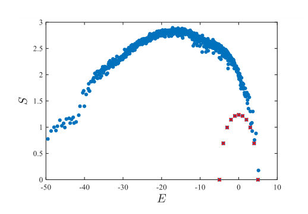 
FIG. 1. Exact-scar structure in the toy model. (a) Bipartite entanglement entropy S versus energy E for L = 10 and Ω= 1. Red crosses mark the exact scar tower, whose entanglement is anomalously low relative to nearby thermal eigenstates. The random couplings are Jαβ j−1,j+2 = Jrndξαβ j−1,j+2 with indepen- dent ξ ∼N(0, 1) and Jrnd = 1. (b) Fidelity dynamics from | ⇑⟩= |S = L/2, Sz = L/2⟩under the Hamiltonian and ideal bond dissipation. The exact revivals have period 2π/Ωand follow F(t) = [cos(Ωt/2)]2L; the inset shows the corresponding oscillation of ⟨σz(t)⟩.

📷 Fig 2

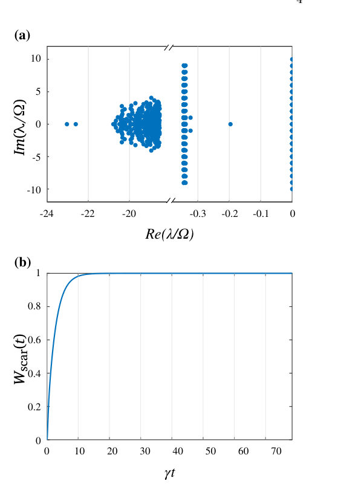 
FIG. 2. Dissipative stabilization and population transfer into the quantum many-body scar subspace of the toy model. (a) Complex Liouvillian spectrum for the toy model sub- ject to the engineered bond dissipation defined in Eq. (8). The zero-eigenvalue modes include the scar-state projec- tors ρ(n) ss = |Sn⟩⟨Sn|, while the off-diagonal scar operators |Sm⟩⟨Sn| generate a ladder of purely imaginary eigenvalues λmn = i(En −Em) = iΩ(n −m). These stationary and purely imaginary modes are separated from the decaying bulk modes with Re λ &lt; 0, demonstrating that the scar-supported operator subspace is protected from the engineered dissipa- tive decay. (b) Time evolution of the total density-matrix...

📷 Fig 3

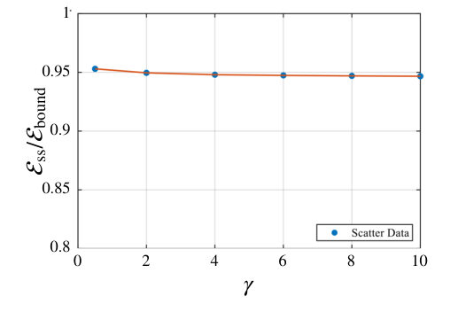 
FIG. 3. Toy-model battery performance. (a) Normalized ergotropy E(t)/Ess from the passive ground state under the engineered bond dissipation and a weak stabilizing dephasing γch z = 0.02. This auxiliary dephasing is included from the outset of the charging stage to regularize the degenerate scar- supported asymptotic dynamics. Because [H, σz j ] ̸= 0, it can modify both coherences and transient energy redistribution; we therefore regard it as an auxiliary stabilization channel rather than an energetically neutral damping process. The ergotropy nevertheless approaches a stable asymptotic value with only weak residual oscillations. (b) Ratio Ess/Ebound versus engineered dissipation strength...

📷 Fig 4

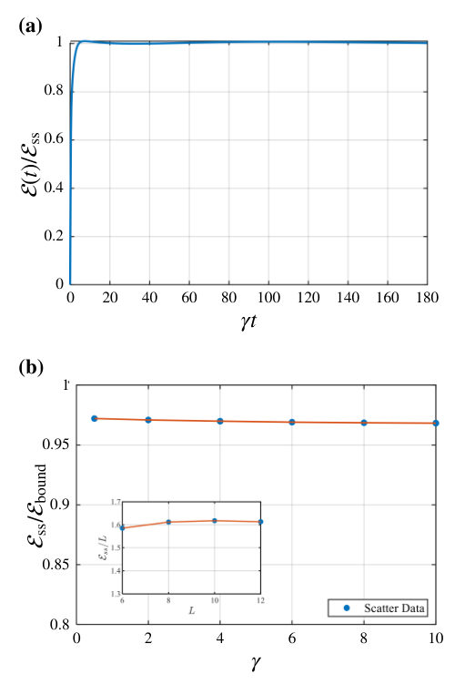 
FIG. 5. Charging performance of the generalized J1–J2 battery. (a) Normalized ergotropy E(t)/Ess starting from the passive state ρp defined in Eq. (16). Since ρp is passive, E(0) = 0, and the growth of E(t)/Ess directly quantifies the charging process. The ergotropy rapidly approaches its asymptotic charged value with only small residual oscillations. (b) Ratio Ess/Ebound versus engineered dissipation strength γ; the ratio remains close to 0.97 throughout the plotted range. The inset shows the ergotropy density Ess/L versus L at fixed γ, which is nearly size independent for the accessible sizes. Parameters are J1 = 2.5, J2 = −0.2, D = 0.2, hz = 0.1, and L = 12 with periodic boundary...

📷 Fig 5

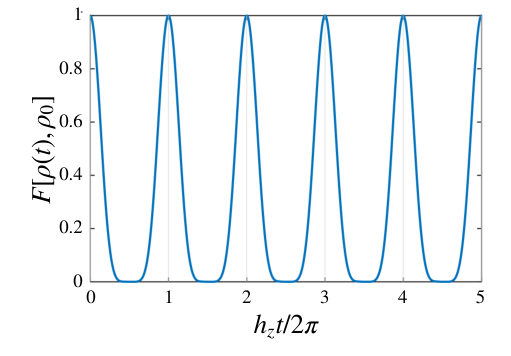 
FIG. 4. Dissipative scar selection in the generalized J1–J2 model. (a) Stationary-state populations in the Hamiltonian eigenbasis, resolved by the conserved magnetization sectors {N↑, N↓}. The dominant weight is concentrated on the high- energy scar eigenstates, with negligible population on the plotted thermal states. (b) Fidelity dynamics from |ϕ0⟩= | →⟩⊗L under the Hamiltonian and ideal bond dissipation. The nondecaying periodic revivals diagnose coherent evolution within the scar-supported manifold. Parameters are as in Fig. 5, with L = 12.

**Summary.** This paper introduces a novel quantum battery protocol that utilizes quantum many-body scars (QMBS) for robust energy storage. By engineering local bond dissipation, the system is driven into a high-energy, scar-supported manifold that stores significant extractable work. The findings establish that these non-thermal scar structures are key to achieving efficient, autonomous quantum energy storage.

**Why it may be interesting.** This work directly bridges concepts from open quantum systems, non-equilibrium thermodynamics, and many-body physics, showing how engineered dissipation can harness specific quantum structures (scars) for energy storage.

Detailed structure

**Main problem.** The paper proposes using quantum many-body scars (QMBS) to create an autonomous, robust quantum battery capable of storing extractable work.

**Main result.** Engineered local bond dissipation can drive the system into a high-energy scar-supported manifold, achieving high extractable work close to the thermodynamic bound.

**Method.** The study uses open quantum system dynamics, specifically engineered Markovian Lindblad dissipation, to selectively populate non-thermal scar states.

**Model / system.** The model involves interacting spin-1/2 chains, starting with a toy model and generalizing to a $J_1-J_2$ spin chain augmented by a Dzyaloshinskii–Moriya interaction (DMI).

**Key observables.** Single-copy ergotropy, extractable work, bipartite entanglement entropy, and scar weight retention ($R_{scar}$).

**Important parameters / regimes.** Dissipation rates ($\gamma_k$), weak dephasing strength ($p$), and the strength of the scar-breaking perturbation ($\epsilon$).

**Assumptions / limitations.** The analysis relies on the Born–Markov and secular approximations, and the work bound comparison is noted to exclude the energy cost of the charger.

**Figures summary.** Figures illustrate the low entanglement entropy of scar states, fidelity revivals under dissipation, the rise of scar weight, and the approach of ergotropy towards the work bound.

**Paper structure.** The paper progresses from defining the problem and the toy model to applying engineered dissipation to charge the scar manifold, demonstrating stability via weak dephasing, and finally confirming the necessity of the scar structure by showing performance loss upon perturbation.

Abstract

We propose an autonomous quantum-battery protocol based on dissipatively selected quantum many-body scars. Using an embedding-type spin chain with an exact scar tower and a generalized interacting $J_1$--$J_2$ chain, we show that engineered local bond dissipation can drive the system from a passive state into a high-energy scar-supported manifold with large extractable work. The resulting charged states exhibit single-copy ergotropy close to the entropy-matched thermodynamic work bound while retaining the coherent structure associated with the scar ladder. Because the ideal scar manifold also supports nondecaying peripheral modes, we introduce weak local dephasing to obtain a stable charging protocol and find a broad regime in which the charging time is reduced without substantially degrading the stored work. Finally, an explicit scar-breaking perturbation produces a correlated loss of scar support and extractable work, demonstrating that the favorable battery performance is tied to the nonthermal scar structure rather than merely to the preparation of a generic excited state. Our results establish dissipatively stabilized many-body scars as a promising resource for autonomous and robust quantum energy storage.

[↑ back to top](#top)

### [A Chip-scale Space-time Multiplexed Gaussian Boson Sampling Processor Beyond 10,000 Photons](http://arxiv.org/abs/2609.11922v1)

**Authors:** Yu-Xuan Fu, He-Yu Shen, Ke-Ming Hu, Jun-Jie He, Yun-Long Nie, Hang Song, Bao-Jing Liu, Le-Si Yang, Xiao-Yu Wu, Pei-Lin Du, Yu-Ze Zhu, Yi Xie, De-Hui Huang, Yu-Fei Liu, Hai Yan, Jin-Hong Chen, Yu-Lin Yu, Chuan-Yan Peng, Wen-Hao Zhou, Feng Lu, Yu-Quan Peng, Chen-Shuo Xia, Zhi-Chao Wang, Zhe-Han Li, Lin Chen, Chao-Yang Zhang, Chun-Yan Jin, Yan-Rong Zong, Xiao-Yun Xu, Jian-Peng Dou, Xiao-Tian Fang, Pei-Qi Zhou, Hao Tang, Chang-Shun Wang, Lin Yang, Xian-Min Jin  
**Type:** both · **Category:** quantum information and computing · **PDF:** <https://arxiv.org/pdf/2609.11922v1>  
**Analysis basis:** full PDF text, analyzed in chunks
**Topic relevance:** 🔥 `analog quantum simulation` **4/5** · `QC/QI experiment` **3/5** · `quantum optics experiment` **3/5** · `interference shaping light` **2/5**

📷 Fig 1

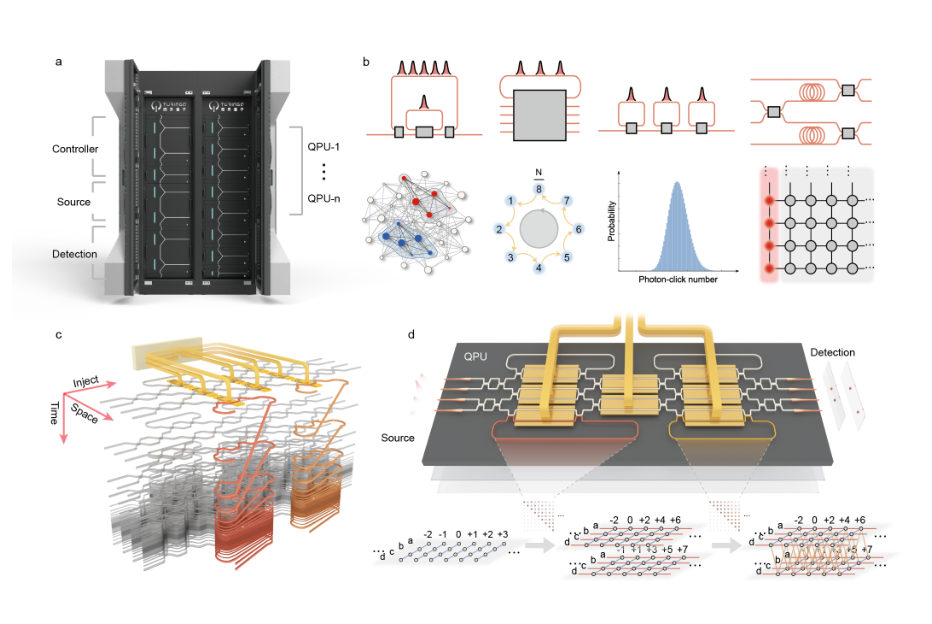 
Fig. 1. Schematic diagram of the chip-scale space-time multiplexed GBS system Zhiyuan 3.0. a The complete system is comprised of the control module, quantum source, quantum processing unit (QPU) and the detection module. b Top: representative time-domain multiplex- ing proposals spanning delay-loop and unbalanced delay-line architectures. The four panels, from left to right, show the nested delay-loop firstly proposed in [16], loop-back [10], cas- caded delay-loop [11], and unbalanced delay-line structures [19, 20], respectively. The time- domain multiplexing idea was first proposed in [16]. Bottom: GBS-related problems among quantum advantage demonstrations, graph problems and...

📷 Fig 2

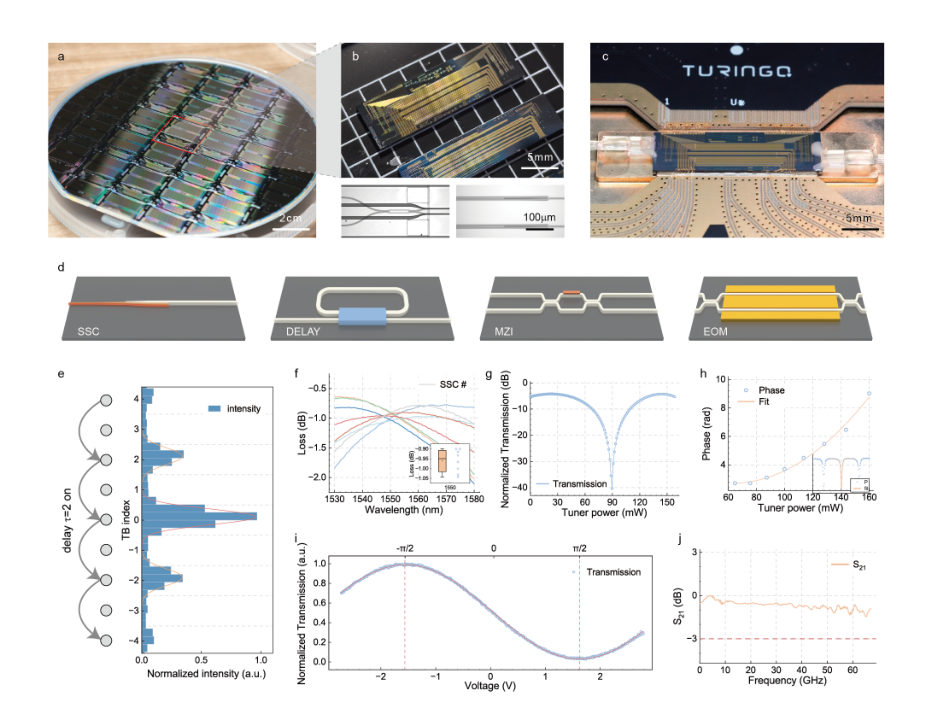 
Fig. 2. Chip fabrication and characterization. a-c Layout of the lithium niobate-based TDM- GBS chip. Thin-film lithium niobate wafer (a), fabricated chip (b), and packaged system module (c). d Illustrations of the key devices: dual-layer spot-size converter (SSC), delay loop, thermo- optic MZI, and the high-speed electro-optic modulator (EOM). e-j Device characterization. e The system operates at a 4-GHz clock rate; the 250-ps time-bin windows can be clearly divided on the time axis. The red line shows the fit of the time-of-arrival and the gray dashed lines mark the time-bin windows. f Transmission spectra of multiple SSCs measured over 1530-1580 nm. The inset shows the loss distribution...

📷 Fig 3

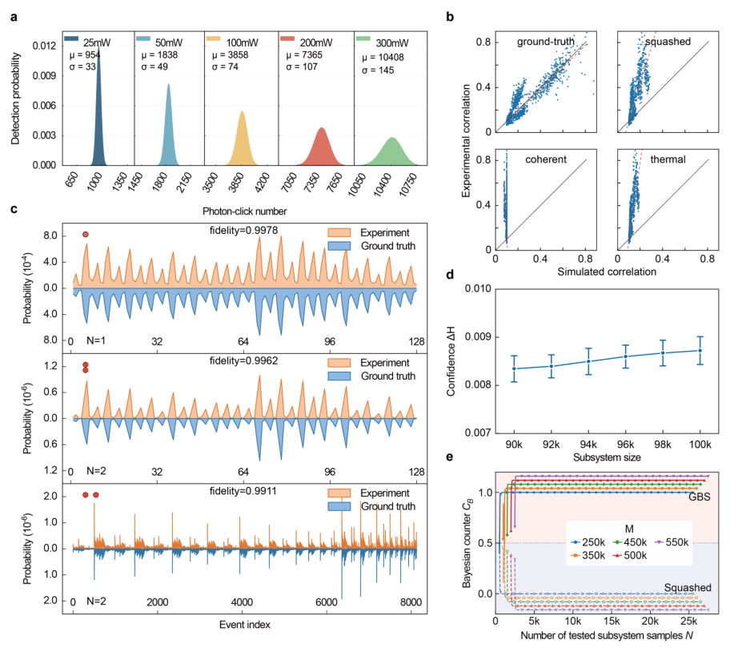 
Fig. 3. Experimental results and validation of the GBS device. a Normalized probability distributions of the photon-click number for five pump powers. At the highest pump power, the largest photon-click number exceeds 10,000. b-c Small-scale GBS validation. b Simulation- experiment comparison of second-order correlation functions under four hypotheses with the same first-order moments, confirming that the photon statistics of the experimental output agree with the GBS ground truth. c Per-configuration comparison between experimental and the- oretical probabilities in the few-photon subspace, with single photon, two-photon bunching, and two-photon non-bunching fidelities 0.9978, 0.9962, and...

📷 Fig 4

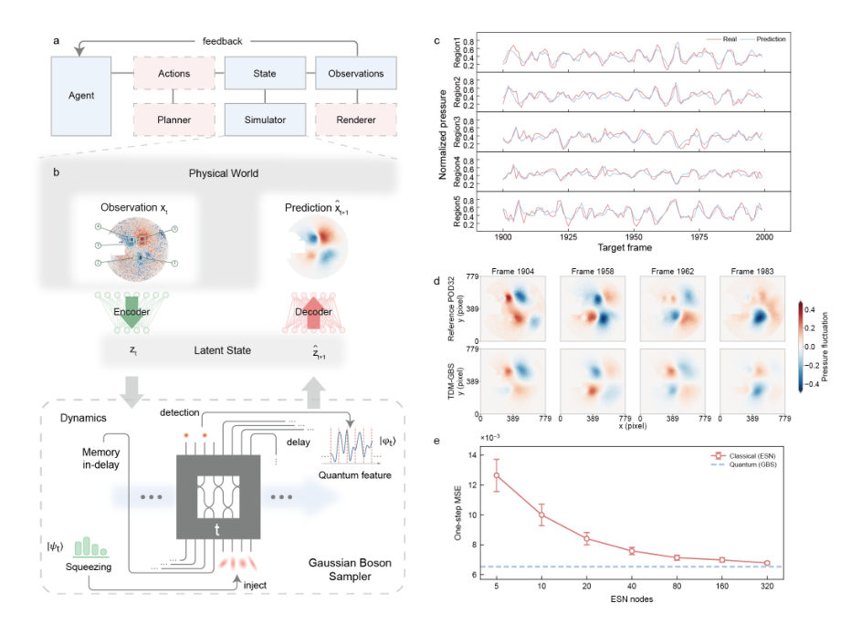 
Fig. 4. GBS-powered world model. a Functional taxonomy of world models–Planner, Simu- lator, and Renderer–with our system falling into the Simulator category. b Closed-loop frame- work of the GBS-powered world model: Physical World →Observation →Encoder →GBS Dynamics model and Memory →Decoder →future-state Prediction, with GBS serving as the dynamics engine in the loop. c Comparison between the latent-variable evolution of the true vortex street (red) and the GBS prediction (blue). d Representative flow-field reconstruction: the top row shows the original vortex-street flow field and the bottom row the flow field recon- structed from GBS-powered world model predictions. e Prediction errors...

**Summary.** This paper presents a breakthrough chip-scale processor for Gaussian Boson Sampling (GBS) using a space-time multiplexed architecture on lithium niobate. It not only achieves high photon counts (>10,000) but also proves the system's versatility by reconfiguring it to model complex physical dynamics with quantum advantage over classical neural network benchmarks.

**Why it may be interesting.** This work directly tackles the engineering challenge of scaling photonic quantum computation by integrating complex components onto a single chip, moving GBS from a proof-of-concept experiment toward a programmable quantum hardware platform.

Detailed structure

**Main problem.** The paper addresses the practical barriers—such as alignment issues and limited programmability—that hinder the scalable deployment of Gaussian Boson Sampling (GBS) for quantum advantage demonstrations.

**Main result.** They report the first chip-scale space-time multiplexed GBS system capable of handling over 10,000 photons, and demonstrate its versatility by using it as a quantum-enhanced world model for physical dynamics prediction.

**Method.** The authors utilize a monolithic, space-time multiplexed architecture on a thin-film lithium niobate chip, combining high-speed electro-optic modulators and delay lines to generate and process large-scale GBS states.

**Model / system.** The physical platform is a chip-scale GBS processor built on TFLN, integrating modulators and interferometers. This system is then reconfigured to act as a quantum dynamics engine (world model) for simulating physical systems like Kármán vortex streets.

**Key observables.** Detection events up to 11,059 photons within 1 ms; low prediction error (MSE) compared to classical benchmarks; high photon correlation function fidelity matching GBS theory.

**Important parameters / regimes.** 4-GHz clock rate; 3-dB bandwidth > 67 GHz; photon count > 10,000; low loss (e.g., 0.9 dB/facet).

**Assumptions / limitations.** The feasibility relies on establishing a complete wafer-scale lithium niobate photonic chip pilot line to meet stringent loss and precision requirements.

**Figures summary.** Figures illustrate the system setup, device characterization (modulator response, loss), the generation of large-scale cluster states, and comparisons between GBS predictions and classical model predictions for fluid dynamics.

**Paper structure.** The paper first details the hardware realization of the space-time multiplexed GBS chip, validates its quantum statistical properties against theory, and finally demonstrates its application by reconfiguring the hardware into a quantum world model for dynamical system prediction.

Abstract

Gaussian boson sampling (GBS) has emerged as a leading photonic paradigmfor demonstrating quantum computational advantage. Nevertheless, state-ofthe-art GBS setups face practical barriers including stringent optical alignment, phase instability, and limited programmability, which impede scalable engineering deployment. The chip-scale space-time multiplexed architecturepromises to resolve these constraints, yet it strongly demands wafer-scale chipcapabilities to simultaneously satisfy stringent requirements on low loss, highprecision and high-speed modulation. Here we report the first chip-scale spacetime multiplexed GBS system, monolithically integrating high-speed electrooptic modulators, on-chip delay lines, and a time-space multiplexed interferometric network on a thin-film lithium niobate chip, operating at a 4-GHz clockrate with detection events of up to 11,059 photons within 1 millisecond. Beyond benchmarking quantum advantage, we further reconfigure the photonichardware into a GBS-powered world model for modelling physical dynamics,which achieves lower prediction error with fewer trainable readout parameters compared with a classical echo state network (ESN) baseline. Our resultsvalidate the feasibility of our endeavor towards scalable photonic quantumhardware, and pave the way for the versatile programmable applications offuture GBS quantum systems.

[↑ back to top](#top)

### [Distributed variational quantum computing with deterministic entanglement tuning](http://arxiv.org/abs/2609.10932v1)

**Authors:** Ilhwan Kim, Yong-Su Kim, Kwang Jo Lee, Hyukjoon Kwon, Yosep Kim, Hyang-Tag Lim  
**Type:** experiment · **Category:** quantum information and computing · **PDF:** <https://arxiv.org/pdf/2609.10932v1>  
**Analysis basis:** full PDF text, analyzed in chunks
**Topic relevance:** 🔥 `QC/QI experiment` **4/5** · `analog quantum simulation` **3/5** · `quantum optics experiment` **3/5** · `interference shaping light` **2/5**

📷 Fig 1

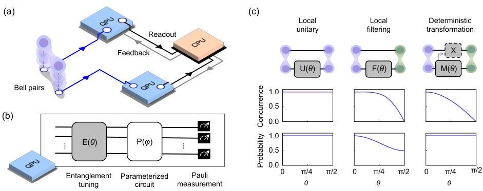 
FIG. 1. DVQC protocol schematic and entanglement tuning. (a) Maximally entangled photon pairs are distributed to two distant QPUs, where local operations and measurements are performed. The readout results are sent to a classical processing unit (CPU), which optimizes circuit parameters and sends updated values back to the QPUs. This feedback loop iteratively refines the quantum state toward the solution. (b) Each QPU applies an entanglement tuning operation E(θ), followed by a parameterized quantum circuit P(φ) for state preparation and Pauli measurements. The parameters θ and φ are updated via classical feedback. (c) Concurrence and success probability for three operations applied to the...

📷 Fig 2

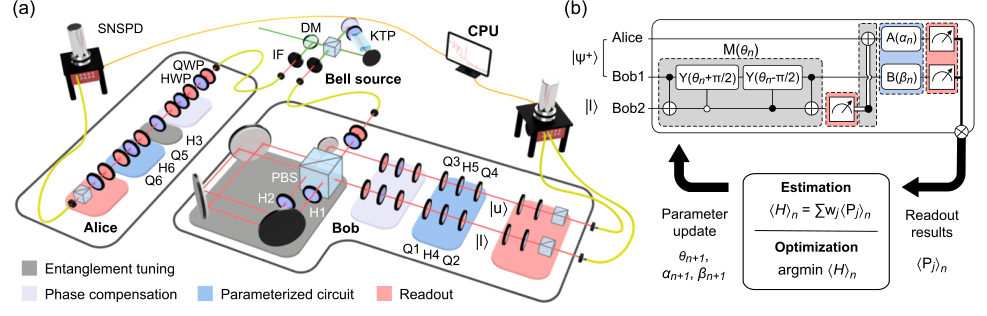 
FIG. 2. Implementation of DVQC protocol. (a) Experimental setup. A polarization-entangled photon pair is generated and distributed to two remote QPUs, labeled Alice and Bob. Bob performs deterministic entanglement tuning using a displaced Sagnac interferometer, which encodes a path-mode ancilla qubit. The positive operator-valued measurement (POVM) M(θ) in Eq. (5) is implemented by rotating H1 and H2. Depending on whether Bob’s photon is detected in path mode |u⟩or |l⟩, a conditional Pauli-X gate is applied to Alice’s photon via H3. After phase compensation, parameterized local circuits are applied on both sides, followed by measurements in the Pauli basis. Detection outcomes are sent to a...

📷 Fig 3

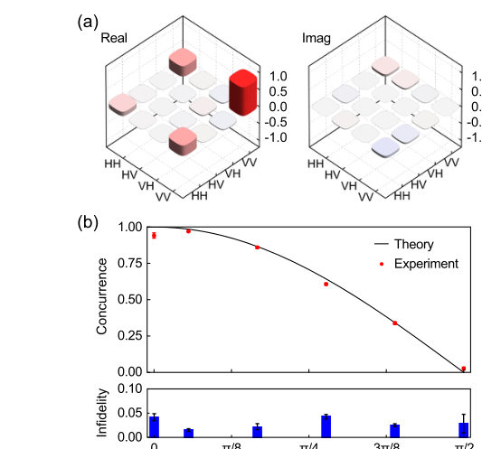 
FIG. 3. Experimental results of entanglement tuning. (a) Experimentally reconstructed density matrix of a partially entangled state prepared by applying the deterministic trans- formation in Eq. (6) to a Bell state, with θ = 5π/18. (b) Con- currence and state infidelity of the output states as a function of θ. Red dots represent experimental data, and the black curve indicates the theoretical prediction. Error bars denote statistical uncertainties estimated via Monte Carlo sampling based on Poissonian photon count distributions.

📷 Fig 4

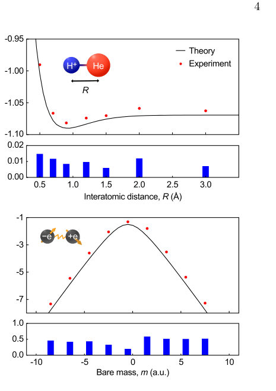 
FIG. 4. Experimental results of distributed variational quan- tum eigensolver (DVQE). Ground-state energy estimation for (a) the He-H+ molecular system as a function of interatomic distance R, and (b) the two-qubit Schwinger model as a func- tion of the bare mass m of the electron and positron. In both cases, the DVQE protocol was implemented with classical op- timization over variational parameters, including both local circuit rotations and entanglement tuning. For each value of R and m, the experiment was repeated 3 times, typically converging within 50 iterations. The lowest energy results are shown as red circles, while black curves denote exact the- oretical predictions. Lower panels...

**Summary.** This work presents a novel, deterministic protocol for tuning entanglement in distributed quantum computing using photonic qubits. By replacing probabilistic filtering with a LOCC-based measurement operation, the authors enable precise control over the quantum resource. This method is experimentally validated by accurately estimating the ground-state energies of complex molecular and lattice models.

**Why it may be interesting.** It provides a concrete, hardware-validated method for resource management in distributed quantum computation, which is crucial for scaling up quantum simulations beyond single nodes.

Detailed structure

**Main problem.** The paper addresses the challenge of creating a scalable and practical protocol for distributed variational quantum computing (DVQC) that avoids the high overhead of full gate teleportation.

**Main result.** A deterministic entanglement tuning protocol was successfully demonstrated, allowing the engineering of specific entanglement levels required by the problem, and this was validated by estimating ground-state energies for benchmark Hamiltonians.

**Method.** The protocol uses deterministic entanglement tuning, which modulates pre-shared entanglement using only local operations and classical communication (LOCC), avoiding probabilistic postselection.

**Model / system.** The experiment is performed on a photonic DVQC setup using polarization-entangled photon pairs distributed to two spatially separated nodes (Alice and Bob). The tuning mechanism involves a displaced Sagnac interferometer.

**Key observables.** Concurrence (to quantify entanglement), Success Probability, and the estimated ground-state energies ($\langle H 
angle$) for the He-H+ molecule and the Schwinger model.

**Important parameters / regimes.** The tuning parameter $	heta$ controls the degree of entanglement, and the results are benchmarked against theoretical predictions for molecular and lattice Hamiltonians.

**Assumptions / limitations.** The protocol assumes starting with a sufficiently entangled resource (Bell pairs) and notes that the current implementation requires offline correction for feed-forward.

**Figures summary.** Figures illustrate the DVQC protocol schematic, the experimental linear-optical setup, and show the measured concurrence and energy estimates for the benchmark problems.

**Paper structure.** The paper introduces the limitations of current DVQC methods, proposes the deterministic entanglement tuning protocol, details its implementation using photonic hardware, and validates the approach by applying it to estimate ground-state energies of molecular and lattice Hamiltonians.

Abstract

Distributed quantum computing offers a scalable route to quantum information processing by entangling spatially separated processors. Although gate teleportation enables universal computation across distributed nodes, it requires repeated consumption of high-fidelity Bell pairs, ancillary qubits, and real-time feedforward, which imposes significant overhead and reduces fidelity. However, many variational quantum algorithms do not demand full universality; rather, they rely on sufficient expressibility to explore solution spaces effectively. Building on this, we propose a distributed variational quantum computing protocol based on deterministic entanglement tuning. In contrast to probabilistic filtering, our approach deterministically modulates pre-shared entanglement using only local operations and classical communication. We validate the protocol through a proof-of-principle experiment by estimating ground-state energies of the He-H$^+$ molecule and the Schwinger model, showing that diverse entanglement levels can be engineered to match problem-specific requirements. Our results suggest a practical alternative for near-term distributed quantum applications.

[↑ back to top](#top)

### [Finite-blockade dynamics of a three-qubit ccz gate in neutral-atom arrays](http://arxiv.org/abs/2609.11159v1)

**Authors:** Paramjeet Banger, Ajay Wasan  
**Type:** theory · **Category:** other · **PDF:** <https://arxiv.org/pdf/2609.11159v1>  
**Analysis basis:** full PDF text, analyzed in chunks
**Topic relevance:** 🔥 `Rydberg arrays` **4/5** · `QC/QI experiment` **2/5** · `Keldysh / 2PI / non-Gaussian methods` **1/5** · `analog quantum simulation` **1/5** · `correlated / nonlocal dissipation` **1/5** · `driven-dissipative phase transition` **1/5** · `methods for driven-dissipative` **1/5**

📷 Fig 1

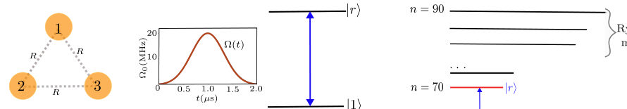 
FIG. 1. (Color online) (a) Geometric repsentation of three-atom system. (b) Gaussian pulse Ω(t) used to drive the Rydberg transition from state |1⟩to |r⟩, with a peak Rabi frequency Ω0. (c) Schematic illustration of the closely spaced rydberg energy levels in the n = 70-90 energy levels.

📷 Fig 2

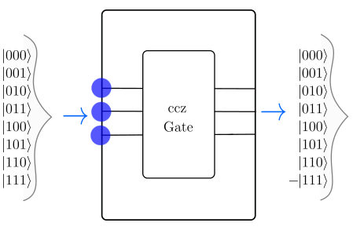 
FIG. 2. (Color online) Schematic representation of a three- atom ccz gate, where the computational basis states undergo a conditional z-phase operation, leaving all states unchanged except |111⟩, which acquires a phase of π.

📷 Fig 3

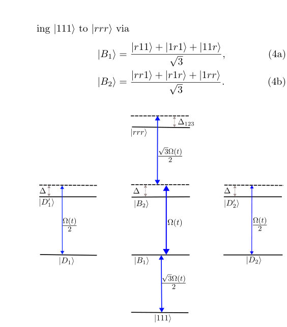 
FIG. 3. (Color online) Symmetry-adapted energy-level dia- gram for three neutral atoms. The global laser field couples the symmetric Dicke ladder |111⟩↔|B1⟩↔|B2⟩↔|rrr⟩, while the dark states remain decoupled. The interaction- induced energy shifts of V and 3V for the doubly and triply excited Rydberg states, respectively, detune these states from the laser resonance, resulting in the Rydberg blockade.

📷 Fig 4

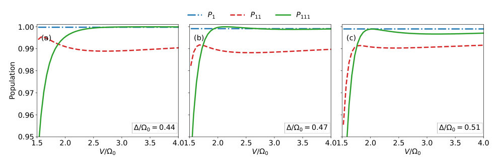 
FIG. 4. (Color online) Final population revial of the computational manifolds P1, P2, and P3 as a function of the interaction strength (V/Ω0), showing improved revival with increasing interaction strength due to reduced finite-blockade leakage.

📷 Fig 5

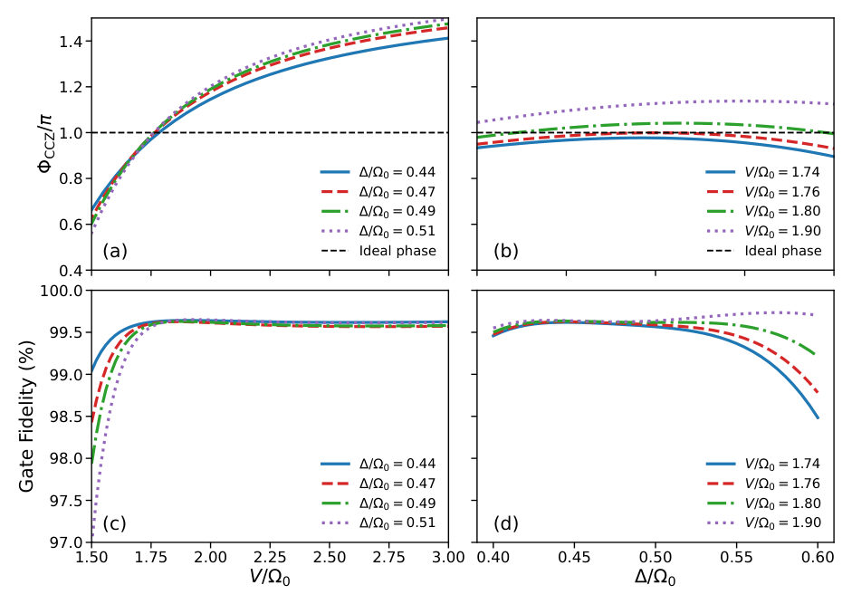 
FIG. 5. (Color online)(b) Three-qubit conditional phase (Θ3/π) versus (V/Ω0) for ∆/Ω0 = 0.44, 0.47, 0.49 and 0.51. The horizontal dashed line denotes the ideal CCZ phase condition, Θ3 = π. (c) Average CCZ gate fidelity as a function of (V/Ω0) for the same detunings. The fidelity increases with interaction strength, with ∆/Ω0 = 0.45 providing the highest fidelity over the range considered.

**Summary.** This theoretical study analyzes the implementation of a three-qubit CCZ gate in neutral-atom arrays by modeling finite-blockade dynamics. The authors systematically investigate how imperfections, such as finite blockade effects and Rydberg state decay, degrade gate fidelity. They provide optimal operating regimes and error quantification guidelines for realizing high-fidelity quantum gates.

**Why it may be interesting.** This work is highly relevant as it tackles the practical limitations (finite blockade, decay) of implementing multi-qubit gates using neutral atoms, providing concrete guidelines for experimental optimization.

Detailed structure

**Main problem.** The study investigates the dynamics of a three-qubit Controlled-Controlled-Z (CCZ) gate implemented using Rydberg blockade in neutral-atom arrays.

**Main result.** High-fidelity gate operation is achievable by carefully tuning the interplay between the Rabi frequency, detuning, and blockade strength, while also accounting for population leakage and finite Rydberg-state decay.

**Method.** The authors employ a theoretical Hamiltonian approach, utilizing symmetry-adapted bases to reduce computational complexity and analyze the time evolution under both coherent and non-Hermitian (decay) terms.

**Model / system.** The system consists of three neutral $^{87}	ext{Rb}$ atoms trapped in optical tweezers, where qubit operations are mediated by Rydberg blockade interactions. The dynamics are modeled by an effective Hamiltonian that includes coupling to non-computational Rydberg states.

**Key observables.** Gate fidelity ($F$), population leakage ($P_1, P_{11}, P_{111}$), and the accumulated CCZ phase ($\phi_{	ext{ccz}}$).

**Important parameters / regimes.** Rabi frequency ($\Omega(t)$), laser detuning ($\Delta$), Rydberg blockade strength ($V$), and decay rate ($\Gamma$).

**Assumptions / limitations.** The analysis systematically moves beyond the ideal strong-blockade limit to the finite-blockade regime, and later incorporates decay using a non-Hermitian Hamiltonian model.

**Figures summary.** Figures illustrate the geometric setup and pulse profile, the schematic of the CCZ gate, and plots showing gate error dependence on detuning and interaction strength, including the effect of decay rates.

**Paper structure.** The paper progresses from defining the system and the CCZ gate mechanism, to analyzing the dynamics in the finite-blockade regime, and finally incorporating decoherence via non-Hermitian decay terms to quantify error sources.

Abstract

We present a theoretical study of finite-blockade dynamics in a symmetric three-neutral-atom system, providing a framework for understanding high-fidelity multiqubit quantum operations. The transition from the finite- to the strong-blockade regime is systematically investigated to examine the effects of finite Rydberg blockade. Using a single Gaussian laser pulse, we analyze the complete gate dynamics while explicitly accounting for population leakage into non-computational Rydberg states. By exploiting the permutation symmetry of the system, we construct a symmetry-adapted Hamiltonian that reduces the computational complexity while preserving the exact dynamics. This enables a systematic investigation of the interplay among the Rabi frequency, laser detuning, and Rydberg blockade strength, leading to the identification of optimal operating regimes with high fidelity, fast gate operation, and suppressed leakage. We further quantify the dominant error mechanisms, including phase errors, population leakage, and finite Rydberg-state lifetimes, and evaluate their impact on the gate fidelity. Our results demonstrate experimentally accessible high-fidelity gate operation and provide practical guidelines for multi-qubit quantum computing.

[↑ back to top](#top)

### [One-clean-qubit spectroscopy of simulated Kitaev chains](http://arxiv.org/abs/2609.11513v1)

**Authors:** Z. M. McIntyre, Daniel Loss  
**Type:** both · **Category:** other · **PDF:** <https://arxiv.org/pdf/2609.11513v1>  
**Analysis basis:** full PDF text, analyzed in chunks
**Topic relevance:** 🔥 `analog quantum simulation` **4/5** · `QC/QI experiment` **3/5** · `quantum measurements` **3/5** · `methods for driven-dissipative` **1/5**

📷 Fig 1

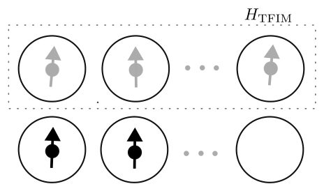 
FIG. 1. Schematic of a 2 × N array of quantum dots. The Hamiltonian HTFIM governs the free (rotating-frame) evo- lution of the N register spins in the top row of the array. The ⌈N/2⌉spins in the bottom row encode a repetition-code qubit. This qubit acts as the control qubit for gates per- formed on the register, which have the effect of toggling the analog-simulation parameters. By initializing the register in a mixed state, the 2N eigenenergies of HTFIM can be extracted from measurements of the control qubit, requiring measure- ments of just one physical spin. Classical postprocessing of the qubit measurement outcomes can then be used to isolate the N single-particle energies of the Kitaev...

📷 Fig 2

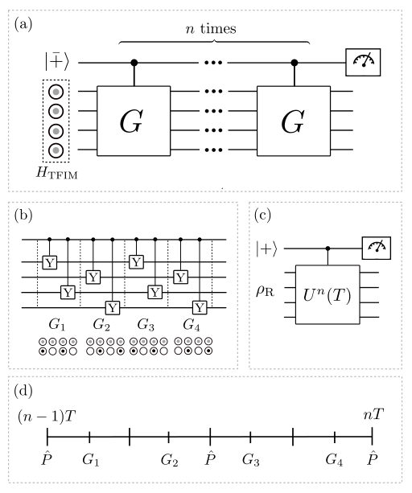 
FIG. 2. (a) Circuit representation of the quantum simula- tion. The register spins evolve freely under HTFIM, with in- formation mapped onto the control qubit through a periodic sequence of two-qubit gates acting on the control qubit and register. (b) Gate sequence comprising the controlled-G gate for N = 4. At each time step tj (j = 1, . . . , 4), CY gates are applied to the N/2 register spins indexed by even or odd integers, with the corresponding charge configurations in the quantum-dot array shown below as filled or empty circles. The gates in each Gj can be applied in parallel due to the repetition encoding used for the control qubit. Gates imple- menting dynamical decoupling of the...

📷 Fig 3

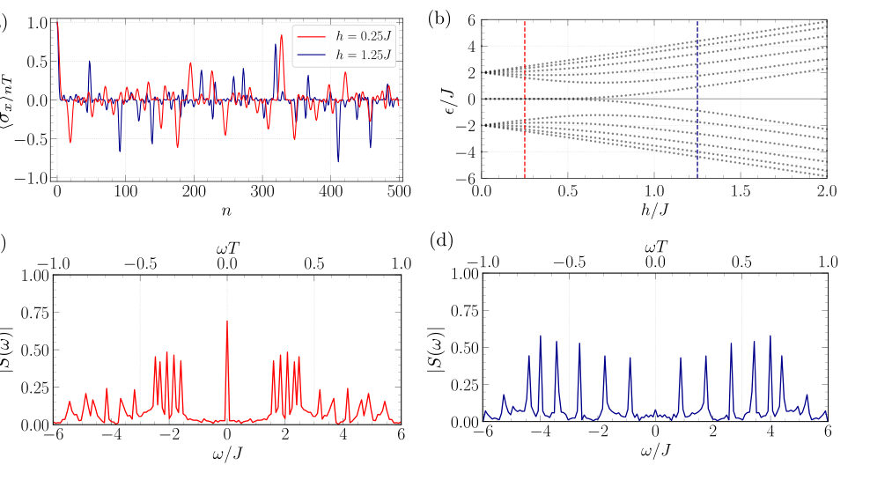 
FIG. 3. Simulations for N = 6: (a) Expectation value of σx at stroboscopic times t = nT for h = 0.25J and h = 1.25J, averaged over 103 noise realizations. The simulations were performed with J = 2π × 50 kHz, T ∗ 2 = 30 µs, and T = 500 ns, corresponding to a total simulation time of Ttot = 250 µs. (b) Single-particle spectrum of the Kitaev chain as a function of h/J, illustrating the splitting of the nearly degenerate ground state as the strength h of the transverse field (equivalently, chemical potential) is increased. The values of h/J used in (c) and (d) are indicated by vertical dashed red and blue lines, respectively. (c) Spectrum |S(ω)| of the postprocessed qubit measurement outcomes...

📷 Fig 4

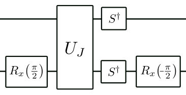 
FIG. 4. Rotating-frame CY gate compiled with hardware- native operations. The entangling gate UJ can be realized by turning on the exchange interaction between the target register spin and any spin involved in the repetition code used to define the control qubit. The rotations Rx(φ) and S† of the register spin could be achieved by pulsing the amplitude and chirping the phase of the Rabi drive applied to that spin. Since the CY gate preserves the state of the control qubit, the S† gate on the control qubit can simply be tracked in software.

**Summary.** This paper proposes a novel quantum simulation protocol to measure the single-particle spectrum of a Kitaev chain using only measurements on one spin qubit. By mapping the chain to a TFIM on quantum dots, the authors use controlled quantum gates to stroboscopically extract the full spectrum from the control qubit's coherence. This technique is significant because it allows probing topological phase transitions in solid-state systems with minimal measurement overhead.

**Why it may be interesting.** This work provides a concrete, near-term experimental pathway to probe fundamental topological phases (like those described by the Kitaev chain) using only local measurements, which is highly relevant for quantum simulation in solid-state systems.

Detailed structure

**Main problem.** The primary goal is to extract the single-particle energy spectrum of a Kitaev chain using measurements performed on only one physical spin qubit.

**Main result.** The authors demonstrate a digital-analog quantum simulation protocol that achieves this by stroboscopically matching the system's dynamics to the output of a one-clean-qubit computation model.

**Method.** The method involves mapping the Kitaev chain to a transverse-field Ising model (TFIM) implemented on spin qubits in quantum dots, and then using controlled-Y gates conditioned on a control qubit to extract spectral information.

**Model / system.** The system uses spin qubits in gate-defined quantum dots arranged in a $2 	imes N$ array. The physics is modeled by the Kitaev chain, which is realized via a drive-engineered, $N$-site TFIM Hamiltonian, $H_{	ext{TFIM}}$.

**Key observables.** The coherence of the control qubit ($\langle\sigma_+
angle_t$) is the key observable used to map out the full spectrum, particularly the signature of the crossover between trivial and topological regimes.

**Important parameters / regimes.** The ratio of coupling strengths ($J$ vs $h$) controls the phase of the Kitaev chain, with the transition occurring at $J=h$. The Rabi drive strength controls the synthetic transverse field.

**Assumptions / limitations.** The protocol assumes the ability to periodically toggle analog-simulation parameters and relies on classical postprocessing to isolate the desired single-particle energies from the full TFIM eigenenergies.

**Figures summary.** Figure 1 schematically shows the $2 	imes N$ quantum dot array setup. Figure 2 illustrates the quantum simulation circuit and gate sequence used for the protocol.

**Paper structure.** The paper introduces the physical platform and the problem (Kitaev spectroscopy). It details the digital-analog simulation protocol, showing how the TFIM evolution is mapped onto a controlled qubit dynamics. Finally, it discusses the extraction of the single-particle spectrum from the measured single-spin coherence.

Abstract

Spin qubits in gate-defined quantum dots provide a highly programmable platform for simulating condensed-matter phenomena. In this work, we introduce a digital-analog quantum simulation protocol for extracting the single-particle spectrum of a Kitaev chain. The Kitaev chain is mapped onto qubits via the standard Jordan-Wigner transformation and implemented as a drive-engineered, $N$-site transverse-field Ising model (TFIM) in a linear array of quantum dots. We show that periodically toggling the analog-simulation parameters conditioned on the state of a control qubit causes the dynamics of this control qubit to stroboscopically match the output of the one-clean-qubit (DQC1) model of computation, thereby yielding the full spectrum of the TFIM from measurements of a single spin. Classical postprocessing can then be used to isolate the $N$ single-particle energies of the Kitaev chain from the $2^N$ eigenenergies of the TFIM. By varying the strength of the Rabi drive used to engineer the synthetic transverse field, the spectral signature of the crossover from the trivial to the topological regime of the Kitaev chain could then be mapped out with measurements of just one spin.

[↑ back to top](#top)

### [Demonstration of a logical Bell-state measurement beyond the linear-optical limit](http://arxiv.org/abs/2609.10698v1)

**Authors:** Shreya Kumar, Simon D. Reiß, Peter van Loock, Stefanie Barz  
**Type:** experiment · **Category:** quantum information and computing · **PDF:** <https://arxiv.org/pdf/2609.10698v1>  
**Analysis basis:** full PDF text, analyzed in chunks
**Topic relevance:** 🔥 `QC/QI experiment` **4/5** · `quantum measurements` **3/5** · `quantum optics experiment` **3/5**

📷 Fig 1

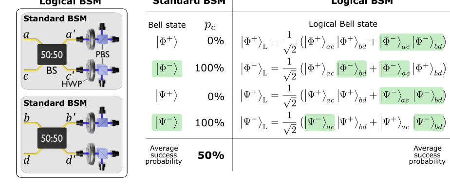 
FIG. 1: Comparison between standard and logical Bell-state measurements (BSMs). (a) Schematic representation of the logical BSM. Four physical qubits encode a logical Bell state. The logical BSM is implemented using two standard BSMs on the qubit pairs (a, c) and (b, d). The output modes are rotated by applying a Hadamard gate, and then polarisation-resolved using polarising beam splitters (PBSs). (b) Success probabilities associated with each of the four Bell states for the standard BSM (left) and the logical BSM (right). In the variant of a standard BSM that we are using in our experiment, the states |Φ−⟩and |Ψ−⟩can be unambiguously identified, each with a success probability of 100%,...

📷 Fig 2

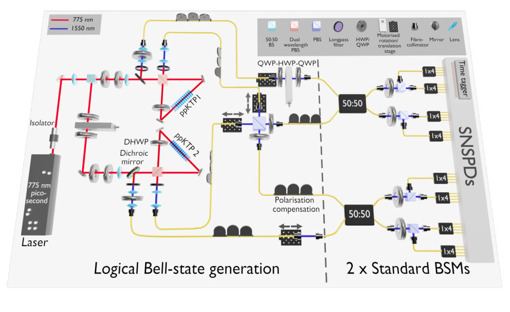 
FIG. 2: Experimental implementation of the logical BSM. The setup is primarily composed of two parts: The logical Bell-state generation and the logical BSM. Logical Bell-state generation: A picosecond pulsed 775 nm laser pumps two spontaneous parametric down-conversion sources that are based on type-II ppKTP crystals to generate entangled photon pairs at 1550 nm. One photon from each pair is made incident at the two ports of a PBS. Measuring four-fold coincidences results in the generation of a state that is subsequently transformed to one of the Bell states using wave plates. We use motorised translation stages to ensure that the photons are indistinguishable in their arrival time, and...

📷 Fig 3

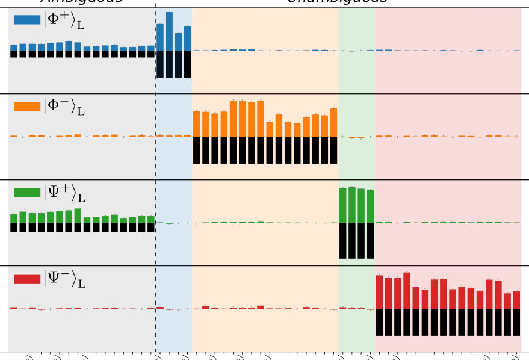 
FIG. 3: Comparison of experimental and theoretical click patterns for the logical Bell-state measurement. The four panels correspond to the click patterns observed for each of the four logical Bell states. The output modes of the two physical BSMs are grouped and indicated in brackets. The measured probability distribution is represented by the coloured bars, while the theoretical values are plotted as mirrored bars for comparison. The encoded scheme allows for a subset of outcomes from the standard scheme to be correctly classified, successfully increasing the total average efficiency to (70.8 ± 0.4)%, which is beyond the 50% threshold. Background colours highlight the click patterns that...

**Summary.** This paper reports the experimental realization of a logical Bell-state measurement (BSM) using linear optics on photonic qubits encoded with a repetition code. By employing error-correcting principles, the authors successfully surpassed the theoretical 50% success limit of standard BSMs, achieving over 70% efficiency. This advancement is a critical step toward building scalable, fault-tolerant quantum communication and computation platforms.

**Why it may be interesting.** This work directly addresses the hardware bottleneck of BSMs in photonic quantum computing, providing a concrete, resource-efficient method to enhance performance beyond fundamental linear-optical constraints.

Detailed structure

**Main problem.** The core problem is achieving fault-tolerant quantum computation, which necessitates performing Bell-state measurements (BSMs) on qubits that have been protected by quantum error-correcting codes.

**Main result.** The authors experimentally demonstrated a logical BSM using linear optics that surpasses the fundamental 50% success probability limit of standard BSMs, achieving a mean success probability of (70.8 +/- 0.4)%.

**Method.** The logical BSM is implemented by encoding physical qubits into a two-qubit repetition code and performing the measurement using two standard linear-optical BSMs.

**Model / system.** The system uses photonic quantum information processing with linear optics. The logical qubits are encoded using a two-qubit repetition code, which is an instance of a quantum parity code capable of detecting bit-flip errors.

**Key observables.** Mean success probability (measured at 70.8% vs. the 50% limit), Measurement Discrimination Fidelity (MDF), and total variation distance.

**Important parameters / regimes.** The theoretical success probability for the logical BSM is 75%; the physical implementation uses two standard BSMs.

**Assumptions / limitations.** The initial theoretical analysis assumes no photon loss and the use of on-off click detectors.

**Figures summary.** Figure 1 compares standard and logical BSM success probabilities. Figure 2 shows the experimental setup for the logical BSM. Figure 3 compares experimental and theoretical click patterns, demonstrating the increased average efficiency.

**Paper structure.** The paper establishes the need for fault-tolerant BSMs, details the theoretical framework using the two-qubit repetition code, presents the experimental realization using linear optics, and reports the measured success probability exceeding the classical limit.

Abstract

Fault tolerance is essential for scalable quantum technologies and is enabled by quantum error-correction codes. Bell-state measurements (BSMs) are a fundamental building block for modern quantum technologies such as measurement-based quantum computation and fusion-based quantum computation, as well as quantum networks. Therefore, performing BSMs on error-corrected qubits is a necessary step for achieving fault tolerance in these applications. In this work, we realise a logical BSM using linear optics, based on a two-qubit repetition code, an instance of a quantum parity code that allows detection of bit-flip errors, and experimentally achieve a mean success probability of (70.8 +/- 0.4)%. While standard linear-optical BSMs are fundamentally limited to a maximum success probability of 50%, this increased success probability enables higher secure key rates in quantum communication and facilitates the generation of large graph states for quantum computation. Since fault-tolerant schemes require error-correction codes regardless, this improvement comes at no additional resource overhead. Our results demonstrate that error-correction codes can be used to surpass the linear-optics limit of BSMs, which is an important step towards practical, fault-tolerant, and scalable photonic quantum technologies.

[↑ back to top](#top)

### [New Method for Path-length Equalization of Long Single-mode Fibers for Interferometry](http://arxiv.org/abs/2609.10771v1)

**Authors:** M. Anderson, J. D. Monnier, K. Ozdowy, J. Woillez, G. Perrin  
**Type:** experiment · **Category:** other · **PDF:** <https://arxiv.org/pdf/2609.10771v1>  
**Analysis basis:** full PDF text, analyzed in chunks
**Topic relevance:** 🔥 `interference shaping light` **4/5** · `quantum measurements` **3/5** · `quantum optics experiment` **3/5**

📷 Fig 1

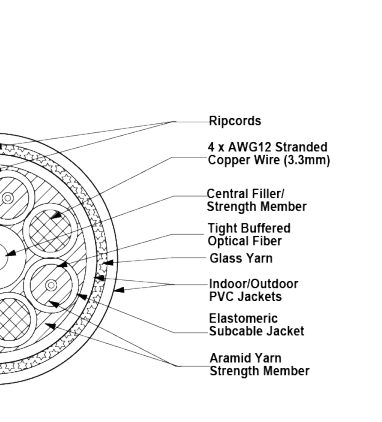 
Figure 1. Cross-section of custom fiber/conductor composite cable assembly [PROPRIETARY]

📷 Fig 2

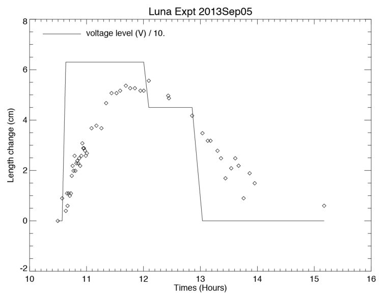 
Figure 2. Test results from voltage testing of the Fiber Logix PM1550 fiber optic. The solid line represents the voltage set on the power supply and the diamonds represent length measurements made with a Luna Technologies OBR 4600.

📷 Fig 3

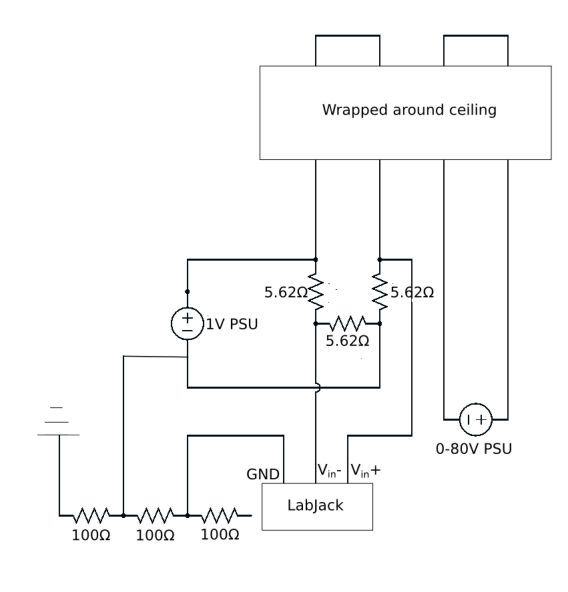 
Figure 3. Wheatstone Bridge and voltage monitoring circuit used to monitor resistance and therefore length of the composite cable.

📷 Fig 4

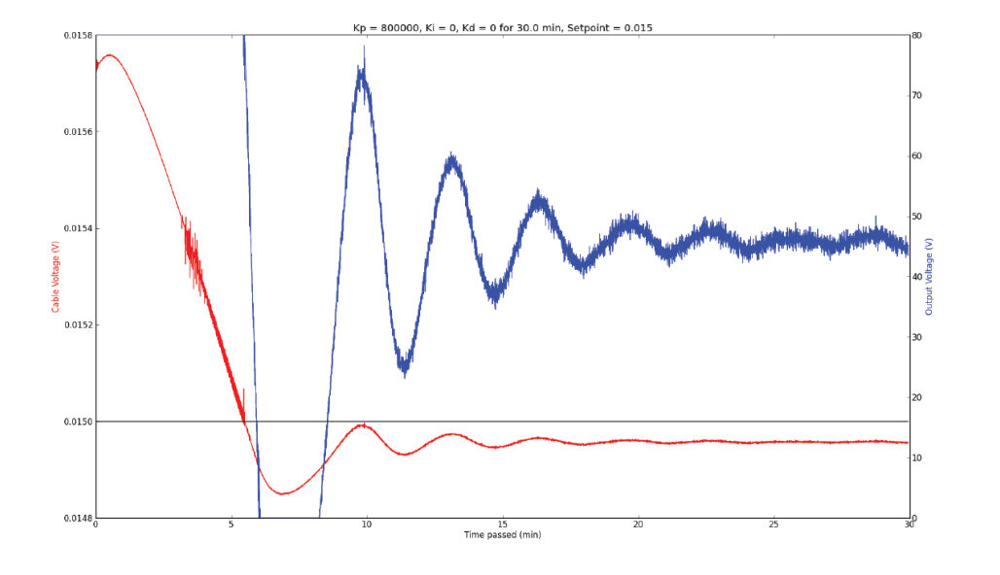 
Figure 4. Results of proportional-integral control of the bridge voltage (resistance). Output voltage represents the set voltage for the DC power supply and Cable Voltage represents the voltage measured across the Wheatstone bridge.

📷 Fig 5

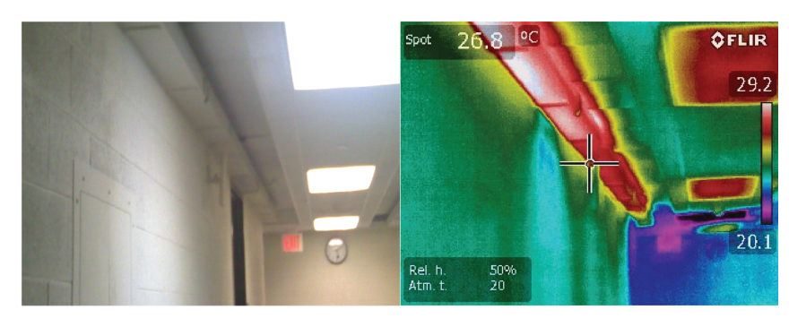 
Figure 5. The cable tray around the inside of the laboratory building contains five coils of the control cable. The temperature of the tray is heated approximately 5◦C above the surrounding temperature by the powered cable.

**Summary.** This paper details the development of a novel, actively controlled composite cable system designed to stabilize the optical path length of long single-mode fibers for use in interferometry. By using ohmic heating of embedded copper wires, the system precisely controls the fiber's temperature, thereby compensating for environmental thermal drifts that cause significant path length variations. The successful demonstration of OPD and dispersion control makes this technology valuable for next-generation, long-baseline optical quantum experiments.

**Why it may be interesting.** While highly applied, the precise control of optical path length and dispersion over long distances using thermal management techniques is crucial for advanced quantum sensing and quantum communication links that rely on stable optical cavities or interferometers.

Detailed structure

**Main problem.** The primary challenge addressed is maintaining a constant differential optical path length in very long single-mode fibers used for optical interferometry, which is severely affected by environmental thermal variations.

**Main result.** The authors successfully demonstrated path length equalization and dispersion control by implementing a composite cable system that uses ohmic heating of copper wires to actively control the fiber's temperature and thus its optical properties.

**Method.** The method involves building a composite cable containing SM fibers and copper wires, applying controlled DC power to the wires to induce ohmic heating, and monitoring the resulting changes in electrical resistance and optical path difference (OPD) using interferometry.

**Model / system.** The physical system is a 470 m composite cable beam transport system designed for optical interferometry, containing multiple single-mode fibers (SMF28e+, PM fiber types) and copper heating wires. Control is achieved via a PID loop monitoring resistance.

**Key observables.** Optical Path Difference (OPD), electrical resistance ($\Omega$), and the Full Width at Half Maximum (FWHM) of white light interference fringes (as a proxy for dispersion).

**Important parameters / regimes.** Cable length (470 m), operating wavelength (H band: 1500-1800 nm), applied power (up to 1200 W), and temperature control via resistance monitoring.

**Assumptions / limitations.** The system relies on the assumption that controlling the cable temperature via electrical resistance provides a reliable and measurable proxy for controlling the OPD and dispersion of the light propagating through the fiber.

**Figures summary.** Figures show the cable cross-section, the Wheatstone Bridge circuit setup, and plots demonstrating the correlation between OPD vs. resistance, and dispersion (FWHM) vs. applied voltage.

**Paper structure.** The paper details the physical setup (composite cable), the measurement techniques (resistance monitoring, interferometry), and presents experimental results showing successful control over OPD and dispersion using electrical heating.

Abstract

The ability to use single mode (SM) fibers for beam transport in optical interferometry offers practical advantages over conventional long vacuum pipes. One challenge facing fiber transport is maintaining constant differential path length in an environment where environmental thermal variations can lead to cm-level variations from day to night. We have fabricated three composite cables of length 470 m, each containing 4 copper wires and 3 SM fibers that operate at the astronomical H band (1500-1800 nm). Multiple fibers allow us to test performance of a circular core fiber (SMF28), a panda-style polarization-maintaining (PM) fiber, and a lastly a specialty dispersion-compensated PM fiber. We will present experimental results using precision electrical resistance measurements of the of a composite cable beam transport system. We find that the application of 1200 W over a 470 m cable causes the optical path difference in air to change by 75 mm (+/- 2 mm) and the resistance to change from 5.36 to 5.50 Ω. Additionally, we show control of the dispersion of 470 m of fiber in a single polarization using white light interference fringes (λc=1575 nm, Δλ=75 nm) using our method.

[↑ back to top](#top)

### [On-chip squeezed light in the audio frequency band](http://arxiv.org/abs/2609.11004v1)

**Authors:** Xuezhi Zhu, Yunyun Cao, Rui Liu, Yaya He, Fan Zhang, Yaqing Zhang, Shiwei Du, Meihong Wang, Xiaoshun Jiang, Xiaolong Su  
**Type:** experiment · **Category:** quantum information and computing · **PDF:** <https://arxiv.org/pdf/2609.11004v1>  
**Analysis basis:** full PDF text, analyzed in chunks
**Topic relevance:** 🔥 `quantum optics experiment` **4/5** · `quantum measurements` **3/5** · `QC/QI experiment` **1/5** · `interference shaping light` **1/5** · `methods for driven-dissipative` **1/5**

📷 Fig 1

 
FIG. 1. Operating principle of coherent-comb control (CCC) for phase-referenced homodyne detection of microcavity two-mode squeezed states. Paired quantum frequency modes Qi are generated via Kerr four-wave mixing, while a weak pump-derived electro-optic reference comb Ri co-propagates through the same optical path in an orthogonal polarization and with a fixed frequency bias ωb. After the cavity, the reference and quantum modes are separated and detected independently, so that phase sensing and feedback act on the reference path without introducing a bright locking tone at the quantum signal frequencies.

📷 Fig 2

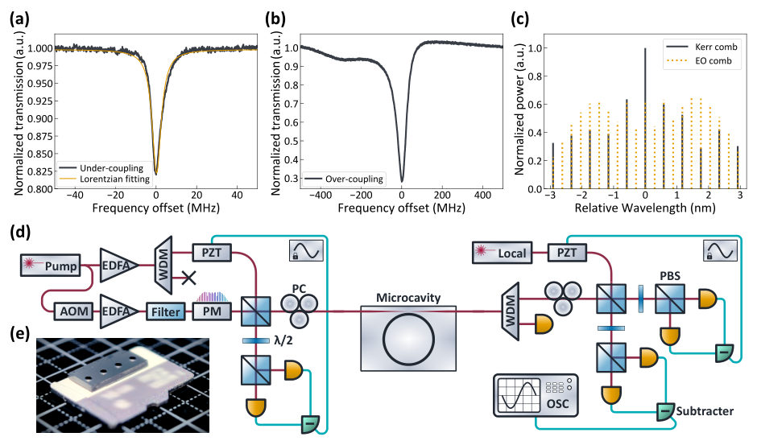 
FIG. 2. Device characterization and experimental implementation. (a) Transmission spectrum of the selected pump mode at under-coupling conditions. (b) Transmission spectrum under overcoupling, exhibiting a pronounced non-Lorentzian (Fano- like) lineshape. (c) Comparison between chaotic microcombs generated above threshold and electro-optic (EO) combs used as the coherent reference. (d) Experimental setup implementing the pump-referenced phase-transfer scheme, including the EO- comb generation, polarization multiplexing, phase-locking, and balanced-homodyne detection. AOM, acousto-optic modulator; EDFA, erbium-doped fiber amplifier; PM, phase modulator; WDM, wavelength-division multiplexer;...

📷 Fig 3

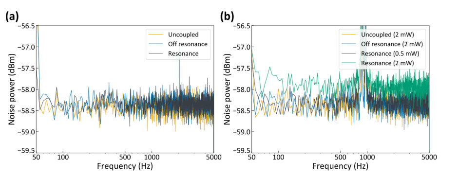 
FIG. 3. Reference-induced measurement-noise characterization. (a) Noise spectra measured without the coherent reference for three conditions (uncoupled, coupled off resonance, and coupled on resonance), showing that no noise-floor elevation is resolved within the measurement setup. (b) Noise spectra measured with the coherent reference under different coupling/resonance conditions: uncoupled (Pref = 2 mW, before the microcavity), coupled off resonance (Pref = 2 mW), and coupled on resonance at Pref = 0.5 mW and 2 mW. The narrow features around 800–1000 Hz originate from oscilloscope oversampling of the control signal and do not reflect the optical noise floor.

📷 Fig 4

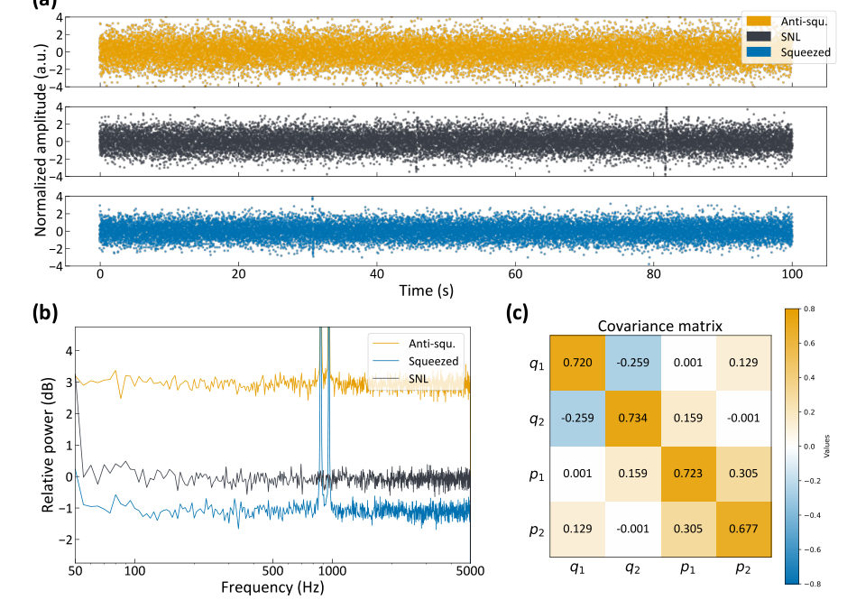 
FIG. 4. Phase-locked quadrature measurement, audio-band squeezing, and entanglement verification of the phase-stabilized two-mode squeezed state. (a) Representative time-domain quadrature fluctuations (anti-squeezed, SNL, and squeezed) recorded over a 100 s acquisition window with 10 kSa/s sampling rate after phase locking, showing stable access to different quadratures and stable locked operation during the measurement interval. (b) Frequency-domain squeezing and anti-squeezing spectra demonstrating observable squeezing down to the audio band. (c) Reconstructed covariance matrix. SNL, shot-noise level.

**Summary.** This paper reports the successful on-chip generation of two-mode squeezed light in the audio frequency band using a silica microcavity. To overcome technical noise and phase instability, the authors introduce a novel Coherent-Comb Control method. This technique enables stable, phase-referenced measurements, confirming both the presence of squeezing and entanglement, thus paving the way for integrated quantum sensing.

**Why it may be interesting.** This work directly addresses the engineering hurdles—phase stability and noise mitigation—required to move continuous-variable quantum information processing from theory to scalable, integrated hardware platforms.

Detailed structure

**Main problem.** The primary challenge is realizing stable, on-chip generation of squeezed light in the audio frequency band, which is difficult due to technical noise and the need for scalable phase referencing.

**Main result.** The authors successfully demonstrated on-chip generation of two-mode squeezed states down to 60 Hz and confirmed entanglement using the Positive Partial Transpose criterion.

**Method.** They developed and implemented a Coherent-Comb Control (CCC) method, using a weak electro-optic reference comb co-propagating orthogonally to provide phase-stable quadrature measurement.

**Model / system.** The experiment uses a silica microcavity where two-mode squeezed states are generated via Four-Wave Mixing (FWM) in a Kerr-nonlinear medium. The system is characterized by its ability to maintain phase stability over long timescales.

**Key observables.** Two-mode squeezing, entanglement (verified by minimum symplectic eigenvalue $\tilde{\nu}_- = 0.395$), and stable quadrature measurements.

**Important parameters / regimes.** Audio frequency band ($\ge 60$ Hz), reference power ($P_{ref} = 0.5$ mW), and the minimum symplectic eigenvalue threshold ($< 0.5$).

**Assumptions / limitations.** The analysis excludes frequencies below 60 Hz due to classical/technical noise, and the method assumes the reference field does not introduce noise into the quantum signal.

**Figures summary.** Figures illustrate the operating principle of the CCC method (co-propagating quantum and reference modes), device characterization, noise spectra dependence on reference power, and time-domain quadrature fluctuations confirming stable operation.

**Paper structure.** The paper details the physical challenge, introduces the CCC method for phase stabilization, presents the experimental setup and measurements (squeezing and entanglement verification), and concludes by establishing an accessible route for on-chip quantum processing.

Abstract

Squeezed light in the audio-frequency band is a key resource for quantum metrology and quantum sensing. However, realizing stable audio-frequency squeezed light on integrated photonic platforms remains challenging due to technical noise and the difficulty of scalable phase referencing. Here, we demonstrate on-chip generation of audio-band two-mode squeezed states down to 60 Hz in a silica microcavity. To enable phase-stable operation without directly locking fragile quantum modes, we develop a coherent-comb control method in which a weak electro-optic reference comb co-propagates with the vacuum at the quantum frequency modes in an orthogonal polarization. This scheme provides quadrature measurement and long-timescale phase stability, thereby enabling covariance-matrix reconstruction. We verify the entanglement with the positive partial transposition criterion, which confirms inseparability via a minimum symplectic eigenvalue of 0.395 ($<0.5$). Our results establish an experimentally accessible route toward on-chip phase-stable audio-band squeezing and support the scalable framework for continuous-variable quantum information processing with integrated photonics.

[↑ back to top](#top)

### [Optically induced metallic state with persistent monoclinic symmetry in NdNiO$_3$](http://arxiv.org/abs/2609.11238v1)

**Authors:** Christian Tzschaschel, Felix Utsch, Qi Song, Spencer Doyle, Grace A. Pan, Charles M. Brooks, Julia A. Mundy, Clemens von Korff Schmising, Stefan Eisebitt  
**Type:** experiment · **Category:** strongly correlated electrons · **PDF:** <https://arxiv.org/pdf/2609.11238v1>  
**Analysis basis:** full PDF text, analyzed in chunks
**Topic relevance:** 🔥 `non-equilibrium universality` **4/5** · `driven-dissipative phase transition` **3/5** · `Keldysh / 2PI / non-Gaussian methods` **1/5** · `methods for driven-dissipative` **1/5** · `quantum measurements` **1/5**

📷 Fig 1

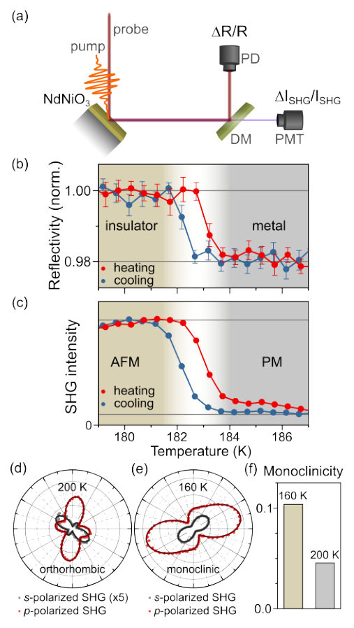 
FIG. 1. Static characterization.(a) Schematic of the experimental setup for time-resolved multi-probe spectroscopy. The

📷 Fig 2

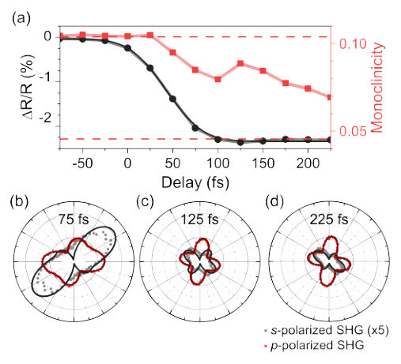 
FIG. 2. Sub-picosecond symmetry dynamics.(a) Pump-induced changes of and reflectivity (black dots) and monoclinicity

📷 Fig 3

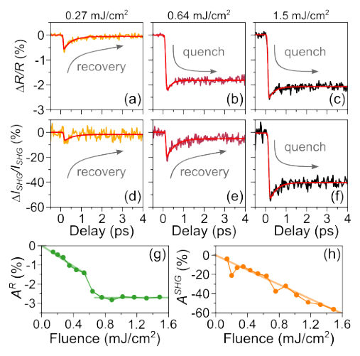 
FIG. 3. Indications for an optically induced monoclinic metal state.(a)-(c) Fluence dependence of pump-induced

📷 Fig 4

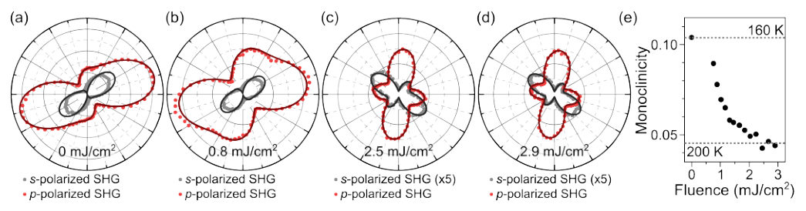 
FIG. 4. Symmetry of the pump-induced metastable state.(a)-(d) SHG polarization dependence at 5 ps after the optical

**Summary.** This experiment uses ultrafast spectroscopy on $	ext{NdNiO}_3$ to study its metal-insulator transition. By simultaneously measuring reflectivity and SHG, the researchers found that optical excitation can drive the material into a metastable state that is metallic but structurally retains the symmetry of the insulating phase. This proves a non-equilibrium decoupling between electronic metallicity and structural symmetry in correlated oxides.

**Why it may be interesting.** The observation of transient, decoupled electronic and structural states provides a powerful experimental platform for studying non-equilibrium dynamics in strongly correlated systems, which is relevant to understanding quench dynamics in quantum materials.

Detailed structure

**Main problem.** The study investigates whether electronic and structural order remain coupled when a correlated material undergoes a metal-insulator transition under non-equilibrium, photoinduced conditions.

**Main result.** The research demonstrates a non-equilibrium decoupling where optical excitation can stabilize a metastable state exhibiting metallic reflectivity while retaining the structural symmetry of the insulating phase.

**Method.** The authors employed simultaneous time-resolved multi-probe spectroscopy, measuring linear optical reflectivity and symmetry-sensitive second-harmonic generation (SHG) on $	ext{NdNiO}_3$.

**Model / system.** The physical system is $	ext{NdNiO}_3$, a correlated oxide known for a first-order metal-insulator transition between a high-temperature orthorhombic metal and a low-temperature monoclinic insulator. Measurements are performed on thin films.

**Key observables.** Time-resolved reflectivity ($\Delta R/R$) to track metallicity, and SHG intensity/polarization dependence to track structural symmetry (monoclinicity).

**Important parameters / regimes.** Excitation fluence (ranging from low to high), time delay (sub-picosecond to ps scale), and temperature (near the phase transition point).

**Assumptions / limitations.** The analysis assumes that changes in reflectivity and SHG are direct, measurable indicators of the electronic and structural order parameters, respectively.

**Figures summary.** Figures illustrate static measurements confirming the equilibrium phase transition and symmetry, and time-resolved traces showing the rapid change in reflectivity versus the more gradual change in symmetry following optical excitation.

**Paper structure.** The paper first establishes the equilibrium phase diagram using static measurements. It then uses time-resolved spectroscopy to probe the non-equilibrium dynamics, comparing the fluence dependence of the metallic signal versus the symmetry recovery to identify the transient, decoupled state.

Abstract

Understanding whether electronic and structural order remain coupled under nonequilibrium conditions is a central challenge in correlated materials. Here, we simultaneously track metallicity and symmetry across the photoinduced insulator-to-metal transition in NdNiO$_3$ using time-resolved optical reflectivity and symmetry-sensitive second-harmonic generation. We find that metallic reflectivity emerges at significantly lower excitation fluence than restoration of the orthorhombic high-temperature symmetry. As a result, optical excitation stabilizes a metastable state that combines the reflectivity of the metallic phase with the monoclinic symmetry of the insulating phase, revealing an optically induced monoclinic metal. Only at substantially higher fluences does the symmetry fully recover to that of the high-temperature phase. These results demonstrate a nonequilibrium decoupling of metallicity and structural symmetry and establish simultaneous multiprobe spectroscopy as a powerful approach for identifying emergent phases in correlated materials.

[↑ back to top](#top)

### [An exchange-assisted entangling gate between 87Rb and 171Yb Rydberg atoms](http://arxiv.org/abs/2609.11730v1)

**Authors:** Han Wang, Erdong Huang, Mingrui Jing, Hongshun Yao, Xin Wang, Jinguo Liu  
**Type:** theory · **Category:** other · **PDF:** <https://arxiv.org/pdf/2609.11730v1>  
**Analysis basis:** full PDF text, analyzed in chunks
**Topic relevance:** 🔥 `QC/QI experiment` **4/5** · `Rydberg arrays` **3/5** · `analog quantum simulation` **2/5**

📷 Fig 1

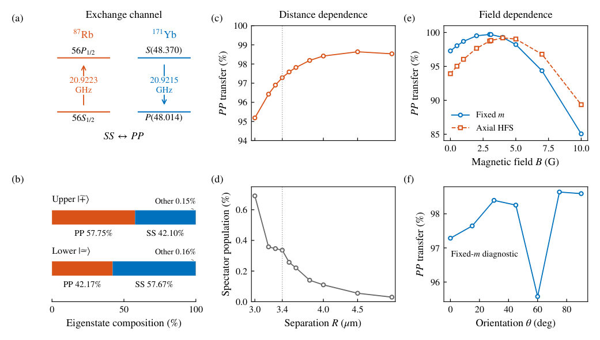 
FIG. 1. Microscopic characterization of the 87Rb–171Yb F¨orster exchange channel. (a) Species-resolved energy- level diagram for the resonant exchange interaction between Rb (56S1/2 →56P1/2) and Yb [S(ν ≈48.37) →P(ν ≈48.01)], yielding sub-megahertz unperturbed F¨orster defects ∆el and ∆hfs in the zero-field limit (B = 0, E = 0). The level positions are schematic; the labeled transition energies identify the near-resonant exchange. (b) Stacked compositions of the two bright eigenstates |e±⟩at R = 3.4 µm (B = 0). Each bar sums to 100%: orange denotes PP, blue denotes SS, and gray denotes spectator states. Component percentages are labeled directly. Both eigenstates have more than 99.8% weight...

📷 Fig 2

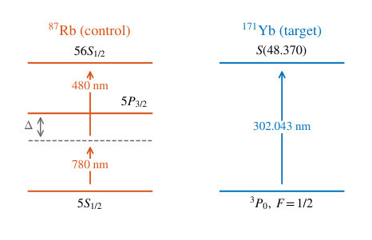 
FIG. 2. Optical excitation schemes for the 87Rb–171Yb gate. Level spacings and arrow lengths are schematic and not to scale. Left (Rb control): two-photon ladder (780 nm + 480 nm) excites 5S1/2 to 56S1/2 via the detuned 5P3/2 in- termediate level (solid arrows: resonant fields; dashed: in- termediate detuning). Right (Yb target): single-photon σ+

📷 Fig 3

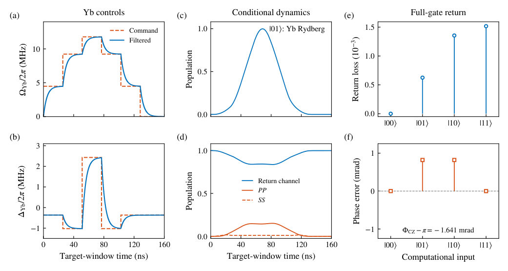 
FIG. 3. Pulse control, population return, and the conditional gate phase. (a,b) Yb Rabi frequency and detuning: dashed orange commands and solid blue drives filtered by the assumed first-order response, with tr = 10 ns (10%–90% rise time). Time starts at the target-window entrance and includes the response tail. Two 100 ns Rb pulses surround this window. (c,d) Populations from unnormalized no-jump evolution, initialized separately at the target-window entrance for the unblocked |01⟩and control-excited |11⟩branches. The latter visits SS and PP before returning to its entrance channel; the closing Rb pulse maps this channel back to |11⟩. (e) Full-sequence return losses 1 −|kjj|2, including...

📷 Fig 4

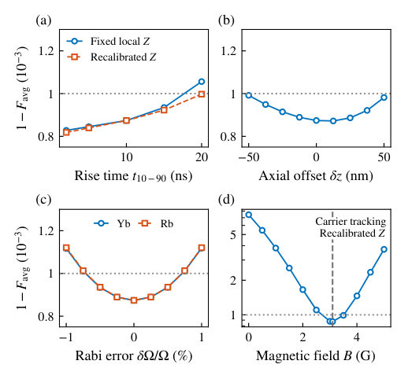 
FIG. 4. Sensitivity of the fixed pulse to control and geometry perturbations. (a) Yb response-time scan with local-Z corrections held fixed or recalibrated at each point. The command segments are fixed; the 7τ tail, and hence total duration, varies with response time. (b,c) Axial-displacement and individual Rabi-amplitude scans with nominal local-Z corrections held fixed. All panels express infidelity 1 −Favg in units of 10−3; panels (a)–(c) use linear axes to resolve the narrow range. (d) Magnetic-field scan with optical carriers tracking the atomic transitions and local-Z corrections recal- ibrated at each field, shown on a logarithmic infidelity axis. The vertical line marks 3.10 G....

📷 Fig 5

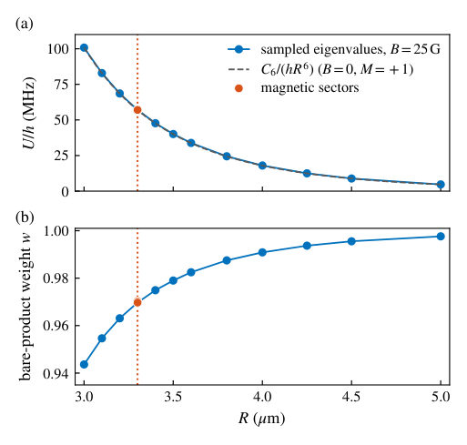 
FIG. 5. A sampled repulsive van der Waals branch provides a candidate static interaction scale U/h = 57.1 MHz at R = 3.3 µm. (a) Pair shift U/h for 87Rb 66S1/2+ Yb S(ν=62.6823) at B = 25 G, θ = 0, (mRb, mYb) = (+1/2, +1/2). Solid: maximum-overlap eigenvalues at the sampled separations. Dashed: zero-field stretched-channel guide C6/(hR6) with C6/h = +73.58 GHz·µm6. The four nearly superposed markers at R = 3.3 µm denote the mag- netic product configurations (spread 0.6% in U). The dotted vertical line marks the candidate static-interaction distance R = 3.3 µm. (b) Bare-product pair-state weight w of the tracked branch along the same finite-field track. These static diagnostics do not...

**Summary.** This paper reports on the implementation of an exchange-assisted controlled-Z gate between $^{87}	ext{Rb}$ and $^{171}	ext{Yb}$ Rydberg atoms. By exploiting a specific Förster resonance, the authors overcome the challenge of Stark mixing to achieve a high-fidelity gate ($99.91\%$). This work advances the field of scalable quantum computation using neutral atom arrays.

**Why it may be interesting.** This work provides a concrete, high-fidelity protocol for building hybrid quantum processors using different atomic species, which is a major goal in quantum information science utilizing neutral atoms.

Detailed structure

**Main problem.** The primary challenge addressed is realizing high-fidelity interspecies entangling gates between different atomic species ($^{87}	ext{Rb}$ and $^{171}	ext{Yb}$) without suffering from destructive Stark mixing.

**Main result.** The authors successfully demonstrated a controlled-Z gate with an intrinsic fidelity of $99.91\%$ using an exchange-assisted protocol.

**Method.** The gate is implemented by shaping an optical pulse to drive the system through a specific Förster resonance, generating the necessary conditional phase shift.

**Model / system.** The system uses a dual-species neutral atom array combining $^{87}	ext{Rb}$ (ancilla) and $^{171}	ext{Yb}$ (data qubit). The interaction is mediated by an optically accessible $S+S \leftrightarrow P+P$ Förster resonance.

**Key observables.** Intrinsic fidelity ($99.91\%$), gate duration ($0.36 \ \mu	ext{s}$), and the conditional phase $\Phi_{CZ}$.

**Important parameters / regimes.** Interaction strength ($|V|/h = 15.4 	ext{ MHz}$), separation distance ($R = 3.4 \ \mu	ext{m}$), and magnetic field strength ($B = 3.10 	ext{ G}$).

**Assumptions / limitations.** The analysis initially uses a fixed-electronic-$m$ model, which is later extended to include hyperfine structure (HFS); the protocol relies on the strong coupling dominating over Zeeman shifts.

**Figures summary.** Figures characterize the Förster exchange channel, showing dependence on separation and field, and illustrate the optical excitation schemes and the resulting conditional gate phase accumulation.

**Paper structure.** The paper proceeds by first characterizing the microscopic Förster resonance and pair interaction, then detailing the three-stage pulse sequence required for the CZ gate, and finally quantifying the achieved fidelity under controlled conditions.

Abstract

Neutral-atom tweezer arrays support scalable quantum information processing. Dual-species $^{87}\mathrm{Rb}$--$^{171}\mathrm{Yb}$ arrays combine long-lived ytterbium nuclear-spin data qubits with fast, species-selective rubidium ancilla control and readout. However, realizing interspecies gates without inducing destructive Stark mixing in divalent atoms remains an outstanding problem. Here, we identify an optically accessible $S{+}S\leftrightarrow P{+}P$ Förster resonance at zero electric field, providing strong dipole-dipole exchange at array pitch. Using a shaped optical pulse under finite control response, we demonstrate a $0.36\,μ\mathrm{s}$ exchange-assisted controlled-$Z$ gate with an intrinsic fidelity of $99.91\%$, remaining above $99.85\%$ under bounded perturbations. We also identify an auxiliary repulsive van der Waals channel, providing a comprehensive toolbox for hybrid quantum processors.

[↑ back to top](#top)

### [Optimizing quantum encodings for analog simulation through dynamical algebra reachability](http://arxiv.org/abs/2609.11351v1)

**Authors:** Mariane Mangin-Brinet  
**Type:** theory · **Category:** other · **PDF:** <https://arxiv.org/pdf/2609.11351v1>  
**Analysis basis:** full PDF text, analyzed in chunks
**Topic relevance:** 🔥 `analog quantum simulation` **4/5** · `Rydberg arrays` **3/5**

📷 Fig 1

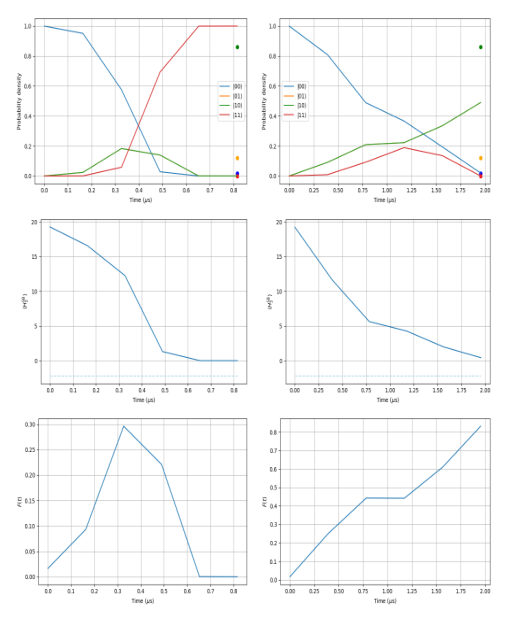 
FIG. 1: Evolution of three Rydberg atoms with optimized parameters to reach the ground state of the deuteron Hamil- tonian H(1) 3,SB. The top panel displays the probability density evolution, and the bottom one the corresponding energy. The dashed line corresponds to the exact deuteron ground state en- ergy. The Rydberg Hamiltonian for 2 atoms being symmetric in the exchange of the atoms, the states |01⟩and |10⟩are de- generated. The exact deuteron ground state is represented by colored dots.

📷 Fig 2

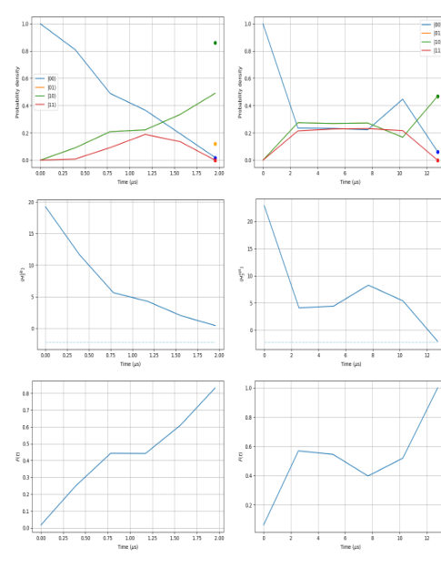 
FIG. 2: Evolution of three Rydberg atoms with optimized parameters to reach the ground state of the deuteron Hamil- tonian H(1) 3,opt (Eq. (8)). The top panel displays the probabil- ity density evolution, and the bottom one the corresponding energy. The dashed line corresponds to the exact deuteron ground state energy. The Rydberg Hamiltonian for 2 atoms being symmetric in the exchange of the atoms, the states |01⟩and |10⟩are degenerated. The last Rydberg state has a 99.999% fidelity with the deuteron ground state, represented by colored dots.

**Summary.** This paper introduces a geometry-independent framework to optimize quantum encodings for analog quantum simulators by maximizing the algebraic overlap between the target Hamiltonian's dynamics and the hardware's native control space. By optimizing the encoding representation using principal angles, the authors show that representation-level incompatibilities can be identified and corrected before physical pulse optimization. This establishes algebraic reachability as a crucial preprocessing criterion for designing robust quantum simulations on platforms like Rydberg atoms.

**Why it may be interesting.** This provides a systematic, low-cost diagnostic tool (algebraic reachability) to predict the feasibility of simulating complex Hamiltonians on specific hardware architectures before embarking on computationally expensive, full joint optimization.

Detailed structure

**Main problem.** The core problem is diagnosing and optimizing the compatibility between the dynamics generated by a target Hamiltonian and the restricted operator space accessible by the native controls of an analog quantum processor.

**Main result.** A geometry-independent preprocessing step, optimizing the encoding via principal angles, can substantially improve algebraic compatibility, sometimes achieving full algebraic containment for small systems.

**Method.** The authors use a framework involving Riemannian gradient descent on the unitary orbit of the target Hamiltonian to maximize the overlap between the target spectral algebra and the device's Krylov-type operator space.

**Model / system.** The work is applied to simulating the deuteron Hamiltonian using a Rydberg-atom analog processor. The system involves mapping a target Hamiltonian onto the device's native control Hamiltonians (e.g., Ising interactions).

**Key observables.** Principal angles between the spectral algebra and the Krylov space; state-preparation fidelity; the dimension of the intersection between the two operator spaces.

**Important parameters / regimes.** System size (N=3, 4 vs N>=5); the specific atomic geometry (which is varied in the analysis); the degree of alignment (vanishing principal angles).

**Assumptions / limitations.** The optimization is treated as a preprocessing step, meaning the resulting encoding is independent of the specific, geometry-dependent interaction terms ($H_0(\mathbf{r})$) used in the final physical simulation.

**Figures summary.** Figure 2 compares the evolution of the target Hamiltonian using standard binary encoding versus principal-angle-optimized encoding, showing the latter achieves much higher fidelity for the ground state.

**Paper structure.** The paper introduces the framework by defining the spectral algebra and the Krylov space, details the unitary-orbit optimization using Riemannian gradient descent, and applies this methodology to the deuteron Hamiltonian on a Rydberg processor.

Abstract

Analog quantum computers provides direct access to continuous many-body dynamics, but their native control Hamiltonians generate only a restricted operator space. Consequently, the fidelity with which they can reproduce a target Hamiltonian's dynamics depends not only on spectral agreement but on whether the physical controls can actually generate the required evolution. We introduce a geometry-independent framework for diagnosing and optimizing this compatibility between the spectral algebra generated by a target Hamiltonian $H$ and a Krylov-type operator space generated from the device's independently tunable control Hamiltonians and a fixed initial state. The encoding problem can be formulated as an optimization over the unitary orbit of the target Hamiltonian. We maximize a smooth subspace-overlap functional using Riemannian gradient descent on $U(d)$, thereby selecting a spectrally equivalent representation whose target algebra is better aligned with the native controls. We apply this framework to the deuteron Hamiltonian encoded on a Rydberg-atom analog processor. The standard binary encoding is strongly misaligned with this space for small system sizes, while principal-angle optimization substantially improves the algebraic compatibility of the encoding. Moreover, using a single geometry-independent optimized encoding substantially reduces the sensitivity of state-preparation fidelity to the atomic geometry. These results establish algebraic reachability as a useful preprocessing criterion for analog encoding design: it identifies representation-level incompatibilities before device-specific geometry and pulse optimization, while the distinction between algebra-level and state-level reachability clarifies when full encoding optimization is necessary and when geometry-dependent control resources can compensate for incomplete algebraic alignment.

[↑ back to top](#top)

### [The Quantum Plumber's Problem](http://arxiv.org/abs/2609.11416v1)

**Authors:** Nicolas G. Underwood, Holger F. Hofmann, Jonte R. Hance  
**Type:** theory · **Category:** quantum information and computing · **PDF:** <https://arxiv.org/pdf/2609.11416v1>  
**Analysis basis:** full PDF text, analyzed in chunks
**Topic relevance:** 🔥 `quantum measurements` **4/5** · `interference shaping light` **3/5**

📷 Fig 1

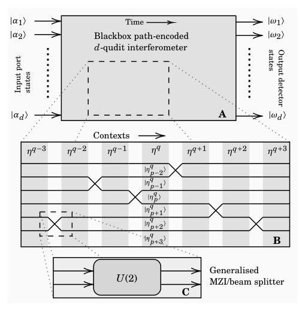 
FIG. 1: The path-encoded d-state qudit interferometer setup we consider, with A) The outline setup, with input ports labelled |α1〉...|αd〉and output ports and corresponding photon detectors labelled |ω1〉...|ωd〉. B) The vertical cross-sections between nodes corresponding to differing complete orthonormal bases that we refer to as “contexts”. C) Nodes containing a generalised MZI/beam splitter capable of performing any transformation in U(2).

📷 Fig 2

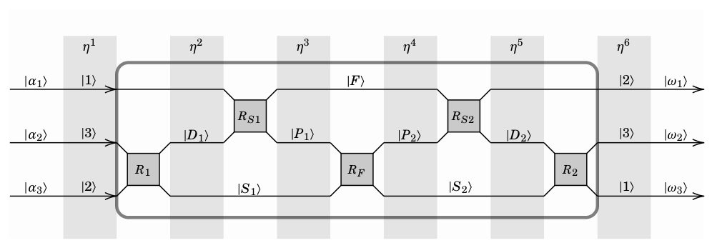 
FIG. 2: Hofmann’s three-path interferometer [25]. Here the beamsplitters have reflectivities R1 = R2 = 1/2, RS1 = RS2 = 1/3, and RF = 1/4, and apply a π phase shift to reflections from/to the middle path. The labelled paths correspond to the states |D1〉= (|2〉−|3〉)/ p

📷 Fig 3

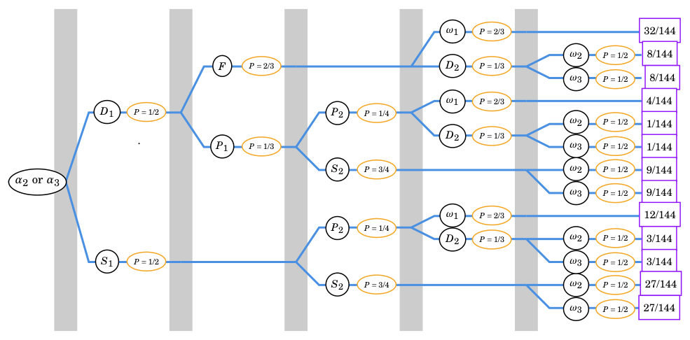 
FIG. 3: Example probability tree for classical values of P(ω|no blockage) given a photon entered into input α2 or α3. Trees for α2 and α3 are the same due to the 1/2 reflectivity of the first beamsplitter, R1. In the presence of a blockage at any of the locations β ∈{D1,S1,P1,F,P2,S2,D2}, the corresponding branches may be cut off, with the sum over total probabilities at the cuts comprising P(ω0|β).

📷 Fig 4

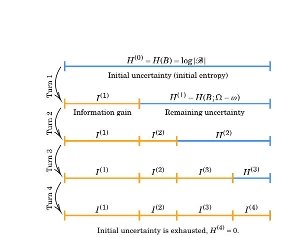 
FIG. 4: Information gain in an example game that takes 4 turns. The initial uncertainty log|B| is exhausted by the information gained over the 4 turns.

📷 Fig 5

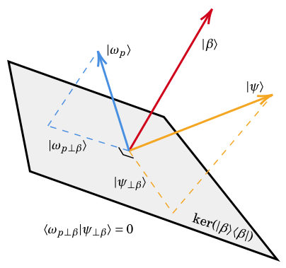 
FIG. 5: Illustration of why blockage β may be ruled out when detector ωp (for p ̸= 0) activates, if the inner product between the projection of both ¯¯ψ ® and ¯¯ωp ® onto the kernel of ¯¯β ®­ β ¯¯ vanishes.

**Summary.** This paper formalizes the 'Quantum Plumber's Problem' to test quantum advantage in path identification within an interferometer. It uses Bayesian inference to show how optimal strategies update knowledge about a hidden blockage location based on quantum measurement outcomes. The work provides a rigorous, game-theoretic analysis applicable to quantum sensing and quantum information protocols.

**Why it may be interesting.** It provides a concrete, game-theoretic framework for quantifying quantum advantage in fundamental quantum measurement tasks, directly relevant to quantum optics and quantum channel discrimination.

Detailed structure

**Main problem.** The paper introduces and analyzes the 'Quantum Plumber's Problem,' a scenario designed to quantify quantum advantage in path discrimination within an interferometer.

**Main result.** The optimal strategy for locating a blockage in a path-encoded interferometer is determined by iteratively updating prior probabilities using Bayesian inference based on measurement outcomes.

**Method.** The analysis models the problem as a game, comparing quantum interference strategies against classical single-particle models using repeated simulations and Bayesian updates.

**Model / system.** The system is a generalized path-encoded d-state (qudit) interferometer, which can be analyzed for specific cases like Hofmann's three-path interferometer.

**Key observables.** The probability $P(\omega|eta)$ of a detector $\omega$ activating given a blockage $eta$, and the resulting updated posterior probabilities $P(eta|\omega)$.

**Important parameters / regimes.** The number of paths ($d$), the number of blockage locations ($|B|$), and the required precision for numerical stability (e.g., $10^{-10}$ cut-off).

**Assumptions / limitations.** The blockage is trace-reducing, and the analysis assumes perfect lossless components for the core quantum mechanical model.

**Figures summary.** Figure 1 illustrates the general path-encoded qudit interferometer setup, while Figure 2 details Hofmann's specific three-path interferometer configuration.

**Paper structure.** The paper defines the game, analyzes competing strategies using a Gamemaster protocol for Bayesian updates, and discusses extensions to non-demolition detection.

Abstract

Recent work quantified the notion of quantum counterfactual gain for an extended Elitzur-Vaidman bomb test style scenario, through a connection to the negativity of the Kirkwood-Dirac quasiprobability distribution. We here extend this work to identifying quantum advantage in a new scenario, which we term the ``Quantum Plumber's Problem''. In this scenario, we imagine a ``quantum plumber'', who knows that one path of an interferometer is blocked, and wants to find the optimal strategy for identifying with certainty which path this is. We discuss various strategies for a generalised path-encoded interferometer, as well as for the specific case of Hofmann's three-path interferometer, introduced in a recent analysis of the relationship between states in five measurement contexts of a three level system. We support our arguments on the relative merit of competing strategies with data collected over many simulated attempts at locating blockages. We also present results for a variant of the game in which the blockage is replaced by a non-demolition detector.

[↑ back to top](#top)

### [Acoustic Wave-Function Imaging of Sublattice Physics in a Kagome Lattice](http://arxiv.org/abs/2609.11678v1)

**Authors:** L. Müller, N. Endres, B. Geldiyev, S. Widmann, K. Burkard, M. Ünzelmann, F. Reinert  
**Type:** experiment · **Category:** strongly correlated electrons · **PDF:** <https://arxiv.org/pdf/2609.11678v1>  
**Analysis basis:** full PDF text, analyzed in chunks
**Topic relevance:** 🔥 `analog quantum simulation` **4/5** · `quantum measurements` **2/5**

📷 Fig 1

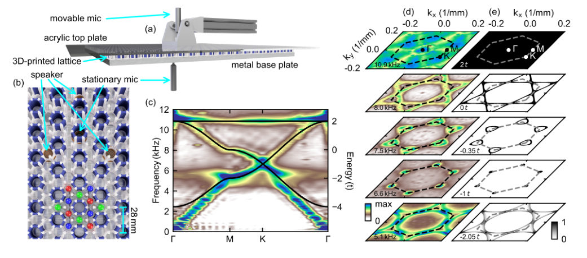 
FIG. 1. Acoustic kagome lattice and band structure. (a) Three-dimensional model of the experimental setup. (b) Top-view image of the 3D-printed kagome lattice. (c) Measured acoustic band structure, obtained by an incoherent sum of the response over all sublattices, overlaid with the minimal tight-binding (TB) model calculation (solid lines). (d) Experimental isofrequency surfaces at the selected frequencies (see inset). (e) Calculated isofrequency surfaces from the TB model including a non-zero hopping to the hollow site.

📷 Fig 2

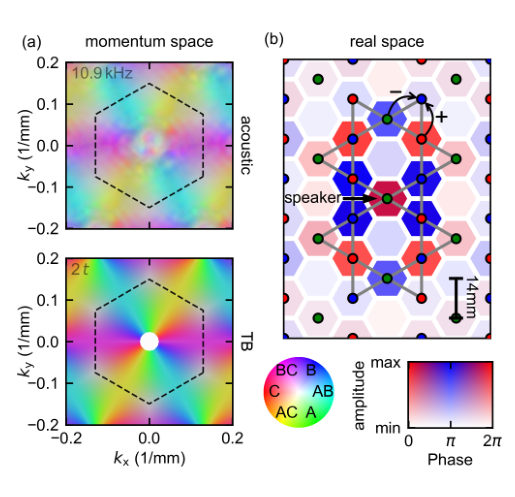 
FIG. 2. (a) A comparison of the flat band sublattice char- acteristics from experiment (top) and the TB model (bot- tom). The isofrequency contours reveal complex direction- dependent m- and p-type sublattice contributions. (b) Real- space phase and amplitude map at the flat-band frequency. The map demonstrates sublattice interference on the kagome net, characterized by a π phase difference between adjacent resonators and vanishing amplitude at the hollow sites.

📷 Fig 3

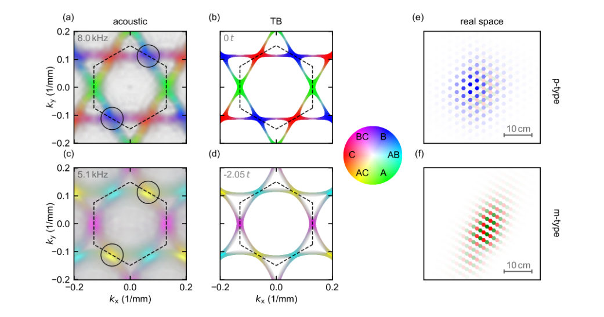 
FIG. 3. Experimental (left column) isofrequency contours and TB calculated constant energy cuts (middle column). The upper row shows the p-type sublattice character, i.e. only one sublattice contributes at each M-point, of the upper vHS and the bottom row shows the m-type sublattice character, i.e. two sublattices contribute at each M-point, of the lower vHS. The circles in the measured panels show σ of the Gaussian that was used to select the area in k-space that was Fourier back transformed. The resulting Fourier filtered real-space plots of the amplitude can be seen in the right column. Both plots show that the wave only exists on the sublattice corresponding to the sublattices at the...

**Summary.** This work uses an acoustic metamaterial realization of a kagome lattice to directly image the electronic wave function. By measuring the full excitation spectrum, the researchers successfully mapped the momentum-dependent sublattice texture across the band structure. This constitutes the first direct experimental proof of sublattice-resolved physics in this important quantum material model.

**Why it may be interesting.** The direct, real-space imaging of wave function properties (amplitude and phase) in a solid-state analogue system provides a powerful, non-equilibrium tool to probe fundamental electronic structure concepts relevant to strongly correlated materials.

Detailed structure

**Main problem.** The primary challenge is experimentally proving the sublattice character of electronic features (like Dirac cones, vHS, and flat bands) in the kagome lattice, which requires direct access to the real-space wave function amplitude and phase.

**Main result.** The study reports the first direct experimental observation of the sublattice-resolved band structure in a kagome lattice, confirming predicted momentum-space textures and real-space wave function localization.

**Method.** The authors implemented an acoustic kagome lattice and measured the full excitation spectrum (amplitude and phase) at each lattice site, followed by Fourier transformation to analyze momentum-space texture.

**Model / system.** The physical system is an acoustic kagome lattice realized using a metamaterial structure. The results are compared against a minimal tight-binding (TB) model that describes the electronic band structure.

**Key observables.** Momentum-dependent sublattice texture in $\mathbf{k}$-space, real-space wave function amplitude and phase maps, and the full acoustic excitation spectrum.

**Important parameters / regimes.** The analysis focuses on specific features like the flat band ($\approx 10.9$ kHz) and van Hove singularities (vHS) at 5.5 kHz and 8.0 kHz.

**Assumptions / limitations.** The core argument relies on the direct experimental verification of the hopping-interference mechanism and the assumption that the observed physics is governed by the Kagome lattice structure.

**Figures summary.** Figures illustrate the experimental setup, the measured band structure, isofrequency surfaces, and detailed plots showing the momentum-space texture and real-space amplitude/phase maps for the flat band and vHS.

**Paper structure.** The paper establishes the theoretical background of the kagome lattice, details the experimental setup and measurement techniques (acoustic wave imaging), presents the agreement between measured band structure and TB model, and finally analyzes the sublattice character using real-space and momentum-space imaging.

Abstract

The canonical kagome band structure hosts a Dirac cone, saddle-point van Hove singularities (vHS), and a flat band. Characteristically, these features exhibit distinct sublattice localization within the three-site basis of the kagome lattice. However, experimental proof of this sublattice character is challenging and requires direct access to both the real-space wave function and its associated momentum-space texture. Here, we implement an acoustic kagome lattice on the cm scale and measure the full excitation spectrum, thereby imaging the wave function at each lattice site, including both amplitude and phase. This enables investigation of the momentum-dependent sublattice texture across the complete band structure, particularly at the flat band and at the mixed- and pure-sublattice van Hove singularities. Our results are in excellent agreement with minimal tight-binding model calculations and constitutes the first direct experimental observation of the sublattice-resolved band structure in a kagome lattice.

[↑ back to top](#top)

### [Entanglement Meets Reality: A Network Engineering Assessment and Forecast of Rackable Entanglement Sources](http://arxiv.org/abs/2609.11387v1)

**Authors:** Laura d'Avossa, Daniela Salvoni, Angela Sara Cacciapuoti, Marcello Caleffi  
**Type:** experiment · **Category:** quantum information and computing · **PDF:** <https://arxiv.org/pdf/2609.11387v1>  
**Analysis basis:** full PDF text, analyzed in chunks
**Topic relevance:** 🔥 `quantum optics experiment` **4/5** · `QC/QI experiment` **1/5** · `quantum measurements` **1/5**

📷 Fig 1

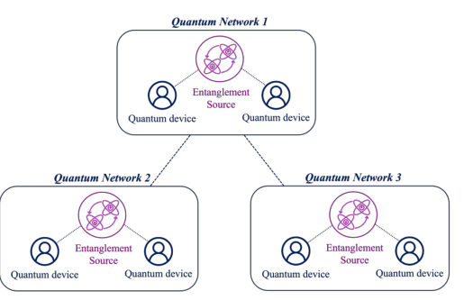 
Figure 1: An entanglement source defines a quantum network. The interconnection of multiple quantum networks relies on entanglement distribution.

📷 Fig 2

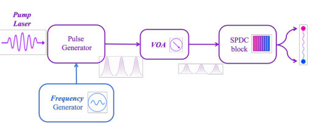 
Figure 2: Simplified schematic of the operating principle of the EPS. A CW Pump Laser is converted into a train of optical pulses by the pulse generator, whose repetition rate is set by the frequency parameter. The pulse energy is subsequently adjusted through a VOA (Variable Optical Attenuator) before pumping the nonlinear crystal, where polarization-entangled photon pairs are generated via SPDC.

📷 Fig 3

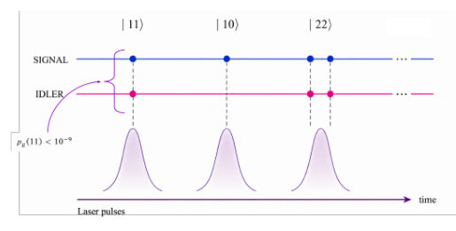 
Figure 3: Schematic representation of the possible Fock-state outcomes associated with successive pump pulses in the EPS. The desired event corresponds to the single-pair state |1, 1⟩, generated with probability pg, while higher-order components such as |2, 2⟩represent multi-pair emission events.

📷 Fig 4

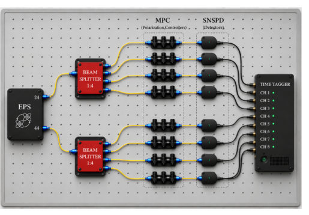 
Figure 4: The entangled photon source (EPS) generates signal and idler photons at ITU channels 24 and 44, respectively. Each output channel is connected to a 1 × 4 fiber beam splitter, whose four outputs pass through manual polariza- tion controllers (MPCs) before being coupled to independent superconducting nanowire single-photon detectors (SNSPDs). The eight detectors implement a spatially multiplexed pseudo photon-number-resolving (PNR) detection scheme, while the resulting detection events are acquired by a time tagger to reconstruct the coincidence patterns used for photon-number estimation.

📷 Fig 5

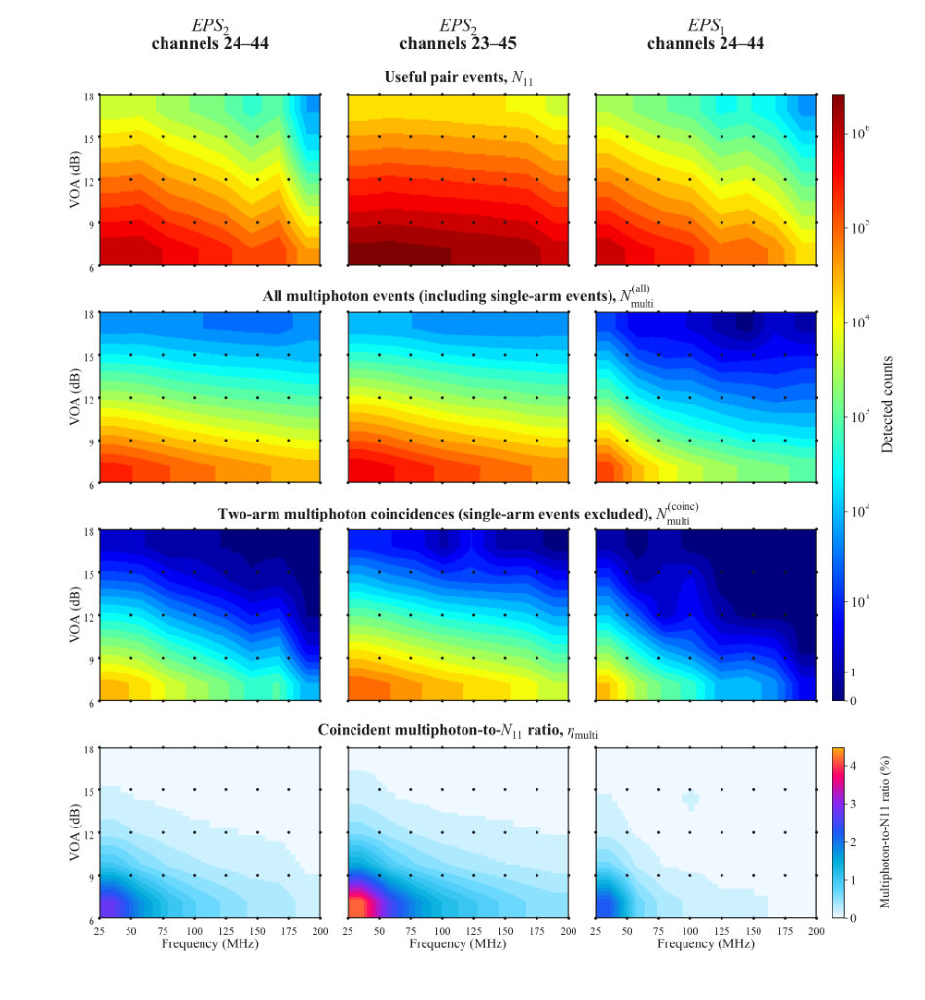 
Figure 5: Operating maps of the useful N11 events, all detected multiphoton events N (all) multi, two-arm multiphoton coincidences obtained by excluding single-arm events N (coinc) multi , and the corresponding multiphoton-to-N11 ratio ηmulti. Columns compare the investigated source and ITU channels. The first three rows share a logarithmic count scale, whereas the fourth row uses an independent percentage scale.

**Summary.** This work evaluates commercial entangled-photon sources from a network engineering perspective, focusing on deployable performance rather than just device characterization. By quantifying both pair throughput and entanglement quality, the authors establish a key metric for achievable entanglement generation rates. This directly informs the hardware requirements, specifically the necessary coherence time, for building future quantum repeaters.

**Why it may be interesting.** It provides a crucial engineering bridge, translating fundamental quantum optics measurements (like pair rates and fidelity) into actionable, network-level metrics (like required memory coherence time) essential for quantum network architects.

Detailed structure

**Main problem.** The paper assesses the performance and forecasts the requirements of rackable entangled-photon sources for real-world quantum network deployments, moving beyond simple device characterization.

**Main result.** The achievable entanglement throughput is determined by a trade-off between the detected pair rate and the entanglement quality, which directly dictates the minimum required quantum memory coherence time for future quantum repeater nodes.

**Method.** The authors combine experimental measurements of pair rates and quantum state tomography (reconstructing density matrices) with theoretical bounds like the one-way hashing bound to estimate distillable entanglement rates.

**Model / system.** The system is a compact, rack-mounted Entangled-Photon-pair Source (EPS) utilizing Spontaneous Parametric Down-Conversion (SPDC) to generate polarization-entangled photon pairs in the telecom band.

**Key observables.** Detected-pair rate ($R_{pair}$), entanglement fidelity ($F$), distillable entanglement ($ED$), and the achievable entanglement throughput lower bound ($R_{LB}^{	ext{ebit}}$).

**Important parameters / regimes.** Frequency, pump pulse energy (controlled by VOA), and the required quantum-memory coherence time ($T_{coh}$).

**Assumptions / limitations.** The analysis relies on the one-way hashing bound, which assumes ideal Local Operations and Classical Communication (LOCC), and assumes the vacuum states are not detected.

**Figures summary.** Figures illustrate the EPS setup, the Fock-state outcomes, and summarize performance metrics (fidelity, pair rate, throughput) for different source configurations (EPS1 vs. EPS2) across varying operating points.

**Paper structure.** The paper progresses from defining the problem (source performance for networks) to detailing measurements (pair rate, density matrix reconstruction) to deriving key network-oriented KPIs (throughput, memory time) based on measured optical quantities.

Abstract

Quantum networks are transitioning from labo- ratory experiments to real-world deployments, with entangle- ment as their fundamental resource. Since an entanglement source effectively defines a quantum network, its performance directly impacts the reliability, scalability, and efficiency of future quantum communications. In this work, we investigate rack-mountable plug-and-play entangled-photon sources from a network engineering perspective, shifting the focus from device characterization to deployment-oriented performance evaluation. Building upon an extensive experimental campaign, we assess commercially deployable hardware across multiple operating conditions, evaluate current state-of-the-art capabilities, and pro- vide an outlook on future generations of entanglement sources. We identify and evaluate two key performance indicators (KPIs): multi-photon generation, capturing deviations from ideal single- pair emission, and entanglement quality, quantified through the reconstructed two-qubit density matrix. By combining the measured detected-pair rate with the one-way hashing bound derived from each density matrix, we estimate a lower bound on the achievable distillable-entanglement generation rate, providing a compact metric that captures the trade-off between pair throughput and entanglement quality. Finally, we translate these experimental results into lower bounds on the quantum-memory coherence time required for entanglement distillation, directly linking optical source performance to the hardware requirements of future quantum repeater nodes.

[↑ back to top](#top)

### [Probing the Error-Mitigation Threshold with Matrix Product States](http://arxiv.org/abs/2609.10929v1)

**Authors:** Jia-Yao Zhao, Zhi-Yuan Wei, Michael J. Gullans  
**Type:** theory · **Category:** numerical methods · **PDF:** <https://arxiv.org/pdf/2609.10929v1>  
**Analysis basis:** full PDF text, analyzed in chunks
**Topic relevance:** 🔥 `methods for driven-dissipative` **4/5** · `driven-dissipative phase transition` **1/5** · `non-equilibrium universality` **1/5**

📷 Fig 1

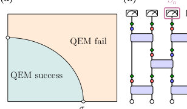 
FIG. 1. Statistical mapping and tensor-network evaluation of the error-mitigation threshold. (a) Schematic phase diagram as a function of disorder strength and scaled depth σ2t, separating QEM-success and QEM-failure regimes. (b) 1D brickwork circuit with Haar-random two-qubit gates (purple boxes), local noise of two different rates (red/blue circles), and mean-field antinoise (green diamonds). (c) (1 + 1)D two-replica Ising-like statistical model obtained from (b) after the local two-design average. Edges represent the resulting two-site interactions. Vertex colors distinguish the two replica-spin sectors. Red/blue arrows denote the noise-induced fields for the two rates, and green arrows...

📷 Fig 2

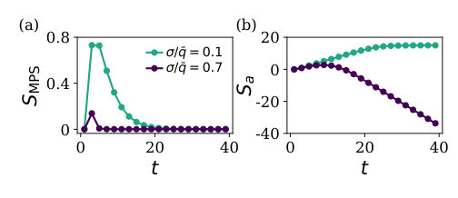 
FIG. 2. Entanglement evolution in the annealed-disorder all-to-all statistical model for N = 30. (a) Bipartite von Neumann entanglement entropy SMPS(t) of the normalized MPS across a fixed cut, which diagnoses the entanglement cost of the MPS contraction. (b) Corresponding circuit-averaged bipartite R´enyi-2 entropy Sa(t) [Eq. (5)] for the subsystem on one side of that cut, used to probe the error-mitigation threshold.

📷 Fig 3

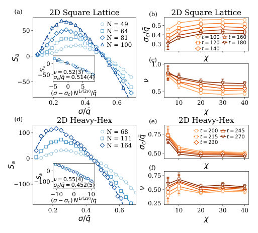 
FIG. 4. Finite-depth thresholds in 2D architectures. (a),(d) Circuit-averaged Sa for annealed disorder at χ = 40: (a) the square lattice at t = 120 and (d) the heavy-hex lattice at t = 270; insets show finite-size collapses with dashed black fitted scaling functions. (b),(c) Extracted σc/¯q and ν versus χ for the square lattice, and (e),(f) for heavy-hex. The parameter and inset uncertainties are covariance estimates from the nonlinear collapse fits.

📷 Fig 4

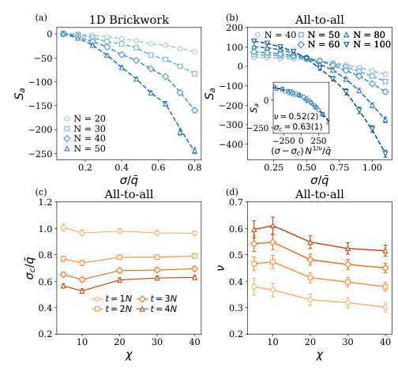 
FIG. 3. Benchmark of the fixed-bond-dimension MPS method. (a),(b) Circuit-averaged single-site R´enyi-2 entropy Sa at t = 4N and χ = 40 for (a) quenched 1D and (b) annealed all-to-all circuits. Colored lines are guides to the eye; the inset in (b) shows the finite-size-scaling collapse, with the dashed black curve denoting the fitted scaling function. (c),(d) Ex- tracted σc/¯q and ν versus χ for the all-to-all geometry. The parameter and inset uncertainties are covariance estimates from the nonlinear collapse fits.

**Summary.** This work develops a novel Matrix Product State (MPS) technique to probe the error-mitigation threshold in large, high-dimensional quantum circuits. By mapping the problem to a replicated statistical model, the authors overcome previous computational limitations to precisely determine critical thresholds for 2D lattices. This establishes replicated tensor-network dynamics as a practical tool for assessing quantum hardware noise resilience.

**Why it may be interesting.** The application of tensor networks (MPS) to study non-equilibrium quantum error correction thresholds provides a powerful, scalable computational tool for characterizing noise robustness in complex quantum hardware architectures.

Detailed structure

**Main problem.** The paper addresses the challenge of accurately determining the error-mitigation threshold in quantum circuits when noise characterization is imperfect.

**Main result.** The authors successfully extended threshold calculations to large and higher-dimensional noisy circuits (2D square and heavy-hex) by developing a fixed-bond-dimension MPS method.

**Method.** They map the circuit dynamics to a replicated transfer process modeled as a Random-Field Ising Model, which is then simulated using a fixed-bond-dimension Matrix Product State (MPS) approach.

**Model / system.** The system is a noisy random circuit on qubits, whose dynamics are analyzed via a two-replica statistical model. The analysis covers various geometries: 1D, all-to-all, 2D square, and 2D heavy-hex lattices.

**Key observables.** Rényi-2 Entropy ($S_a$) and two-point mutual information ($I_{ab}$) are used as primary diagnostics to locate the phase transition threshold.

**Important parameters / regimes.** The critical disorder strength ($\sigma_c/ar{q}$) and the critical exponent ($
u$) are the key extracted parameters, alongside the bond dimension ($\chi$) and circuit depth ($t$).

**Assumptions / limitations.** The core approximation is the use of a fixed-bond-dimension MPS truncation ($\chi$) to compress the high-dimensional replicated dynamics, allowing study beyond exact propagation limits.

**Figures summary.** Figures illustrate the phase diagram separating success/failure regimes, show entanglement evolution ($S_a$) for different disorder types, and present finite-size scaling collapses for determining $\sigma_c/ar{q}$ and $
u$ across various geometries.

**Paper structure.** The paper systematically derives the necessary transfer rules for the two-replica model, implements the evolution using MPS/TEBD, and then applies finite-size scaling analysis to extract critical parameters for different lattice geometries.

Abstract

Quantum error mitigation relies on accurate noise characterization, but mismatches between the actual and characterized noise can be amplified and drive a sharp threshold between successful and failed mitigation. In random circuits, this threshold maps onto a random-field Ising transition, but previous exact numerics were limited to small one-dimensional and all-to-all systems, leaving explicit two-dimensional architectures unresolved. We develop a fixed-bond-dimension matrix-product-state method for the replicated transfer dynamics that extends threshold calculations beyond exact propagation while retaining the finite-size signatures of the transition. At system sizes beyond previous exact studies, we recover the predicted absence of a threshold for quenched disorder in 1D, obtain a sharper annealed all-to-all critical point, and resolve architecture-dependent finite-depth thresholds in 2D square and heavy-hex circuits. These results establish replicated tensor-network dynamics as a practical tool for probing error-mitigation thresholds in large and higher-dimensional noisy circuits.

[↑ back to top](#top)

### [Certifying Adversarial Robustness of Quantum Classifiers under Known-Readout Query Access](http://arxiv.org/abs/2609.11637v1)

**Authors:** Ji Guan, Mingyu Huang  
**Type:** both · **Category:** quantum information and computing · **PDF:** <https://arxiv.org/pdf/2609.11637v1>  
**Analysis basis:** full PDF text, analyzed in chunks
**Topic relevance:** 🔥 `quantum measurements` **4/5** · `Full counting statistics` **1/5**

📷 Fig 1

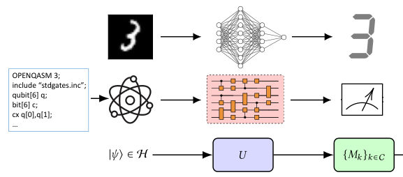 
Figure 1: Classical vs. quantum classifier. Top: a neural network maps an image to a label. Middle: a quantum program (e.g., OpenQASM [7]) is compiled to a circuit, run on hardware, and measured. Bottom: the abstraction Q = (H,𝑈, {𝑀𝑘}𝑘∈C) evolves |𝜓⟩by 𝑈, measures with {𝑀𝑘}, outputs 𝑝𝑘= Tr[𝑀𝑘𝑈|𝜓⟩⟨𝜓|𝑈†], and predicts 𝑡= arg max𝑘𝑝𝑘. Certification uses only the readout {𝑀𝑘} and shot-estimated 𝑝𝑘, not the circuit 𝑈.

📷 Fig 2

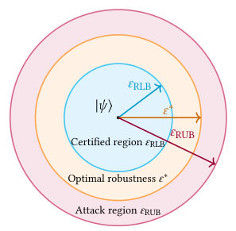 
Figure 2: Visualization of robustness bounds as nested fidelity-distance regions around the input state |𝜓⟩. The in- terior of the lower-bound region 𝜀RLB is guaranteed safe, the upper bound 𝜀RUB gives an attack witness radius, and the op- timal robustness 𝜀∗lies in between.

📷 Fig 3

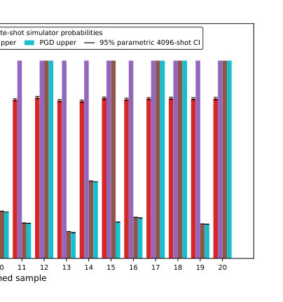 
Figure 3: Universal vs. attack-based upper bounds.

📷 Fig 4

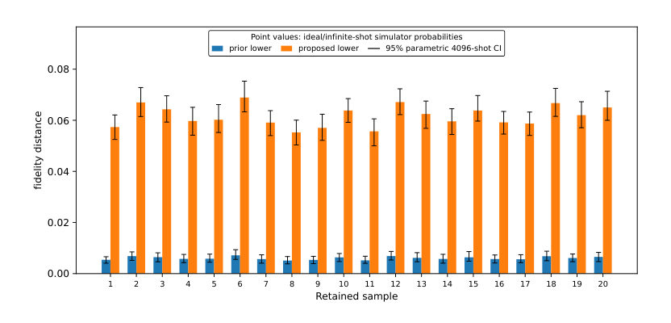 
Figure 4: Lower-bound comparison under the spectral-box-active diagnostic readout. The proposed spectral-box lower bound is compared with the probability-only bound.

📷 Fig 5

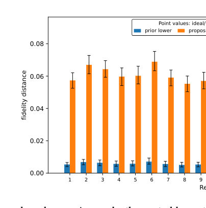 
Figure 6 compares the lower bound 𝜀RLB, numerical white-box refer- enceb𝜀ref, and upper bound 𝜀RUB for the standard MNIST benchmark. Their mean values are 0.0012, 0.0013, and 0.3166, respectively. The numerical reference lies between the two certificates on every re- tained input. This is an empirical comparison, distinct from the theoretical relation 𝜀RLB ≤𝜀∗≤𝜀RUB; the reference is not a proved global optimum.

**Summary.** This paper introduces a novel, measurement-only framework to certify the adversarial robustness of quantum classifiers under limited access (KRQA). It derives both a lower and an upper bound for the true robustness radius using only the known measurement operators and sampled outcome statistics. The results demonstrate that this method provides auditable, theoretically grounded guarantees on quantum model security, validated on real quantum hardware.

**Why it may be interesting.** This work provides a crucial, practical tool for auditing quantum machine learning models by quantifying their resilience to subtle input perturbations using only accessible measurement statistics, which is vital for deploying quantum algorithms in sensitive applications.

Detailed structure

**Main problem.** The paper addresses the challenge of certifying the adversarial robustness of quantum classifiers when the only available access is through repeated measurements (Known-Readout Query Access, KRQA).

**Main result.** The authors developed a measurement-only framework that provides two complementary, certifiable bounds (lower and upper) on the robustness radius, which can be estimated directly from observable measurement statistics.

**Method.** The methodology involves deriving both a lower bound via optimization over outcome distributions with operator-spectrum constraints and an upper bound using gap operators induced by the known readout measurement (POVM).

**Model / system.** The system is a quantum classifier, modeled as an evolution $U$ followed by a measurement $M$, operating on an input state $|\psi
angle$. The analysis is restricted to the observable readout effects $\{M_k\}$ and finite-shot outcome statistics.

**Key observables.** The primary observables are the known readout measurement (POVM) and the estimated outcome probabilities from repeated quantum circuit executions.

**Important parameters / regimes.** The key parameters include the robustness radius $\epsilon^*$, the number of classes $C$, and the confidence parameters $\delta$ and $\epsilon$ used in finite-sample guarantees.

**Assumptions / limitations.** The framework assumes the readout measurement (POVM) is fully known to the evaluator, and the guarantees are finite-sample guarantees based on observed statistics.

**Figures summary.** Figures illustrate the comparison between the derived upper and lower robustness bounds ($	ext{RLB} \le \epsilon^* \le 	ext{RUB}$) against numerical white-box references and the success rates of various adversarial attacks (e.g., FGSM, PGD) on benchmark datasets like Fashion-MNIST.

**Paper structure.** The paper establishes the theoretical framework for robustness certification under KRQA, derives the mathematical forms for the lower and upper bounds using dual optimization techniques, analyzes the required query complexity for statistical estimation, and concludes with extensive empirical validation on quantum neural network benchmarks using real hardware data.

Abstract

A quantum classifier assigns labels by evolving an input quantum state and measuring the output, so repeated executions reveal only a distribution over labels. We study certified adversarial robustness for such classifiers under known-readout query access (KRQA), where an evaluator can prepare inputs, knows the quantum measurement, and observes finite-shot outcomes but cannot inspect the internal evolution, parameters, or gradients. We give a measurement-only framework that returns two complementary guarantees for each input: a lower bound ruling out untargeted errors within a radius, and an attack-independent upper bound witnessing an adversarial state within a radius. Both are estimable from the known readout measurement and sampled outcomes, require no tomography or circuit description, and admit finite-sample guarantees. The upper bound uses gap operators induced by the quantum measurement; the lower bound relaxes state-space search to an efficient optimization over outcome distributions with operator-spectrum constraints, yielding certificates that are never weaker than prior probability-only certificates and can be strictly stronger when the spectral constraints are active. Evaluations on multiple quantum classifiers show that the lower bound tracks exact optima on tractable instances, while the upper bound remains informative when standard attacks fail. We further demonstrate real-device feasibility on IBM Quantum hardware: from 40 executions of two 8-qubit quantum neural networks, our method computes both certificates, with the expected ordering between the lower and upper bounds on every tested input. Taken together, these results show that robustness claims for quantum classifiers can be audited directly from observable statistics under KRQA.

[↑ back to top](#top)

### [Enhancing charge stability of Ge quantum well heterostructures via SiGe layer composition engineering](http://arxiv.org/abs/2609.11214v1)

**Authors:** Ding-Ming Huang, Jun-Hang Liu, Han Gao, Jie-Yin Zhang, Jian-Huan Wang, Fang-Ze Liu, Xin-Yu Zhou, Yi Luo, Bin-Xiao Fu, Xiao-Fei Liu, Ji-Yin Wang, Jian-Jun Zhang, H. Q. Xu  
**Type:** experiment · **Category:** quantum information and computing · **PDF:** <https://arxiv.org/pdf/2609.11214v1>  
**Analysis basis:** full PDF text, analyzed in chunks
**Topic relevance:** 🔥 `QC/QI experiment` **4/5** · `quantum measurements` **1/5**

📷 Fig 1

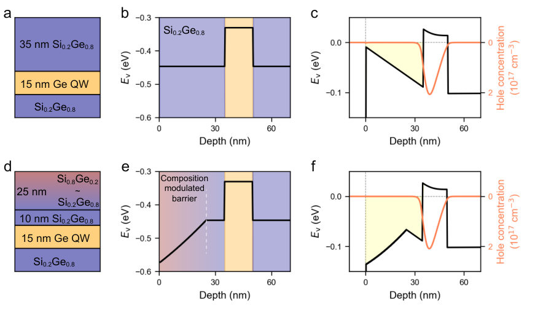 
Figure 1: Layer structures, simulated energy band profiles and hole density distributions of SiGe/Ge QW heterostructures with a Si0.2Ge0.8 top barrier and a CM top barrier. a and d, Layer structures of the heterostructures with a Si0.2Ge0.8 top barrier and with a CM top barrier layer. b and e, VBM energy (Ev) profiles at zero electric field for the heterostructures in figures a and d, respectively. The white dashed line in figure e marks the interface between the Si0.2Ge0.8 spacer layer and the CM layer. c, Ev profile and hole density distribution of the heterostructures with a Si0.2Ge0.8 top barrier, i.e., figure a, at a gate voltage approaching to the onset of charge trapping. A...

📷 Fig 2

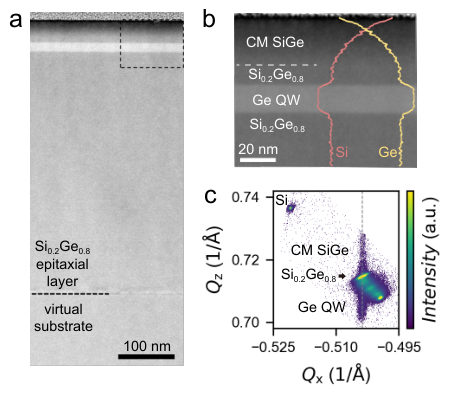 
Figure 2: Structure characterizations on heterostructure H1. a, Cross-sectional TEM image of the epitaxial layers in H1. b, HAADF TEM image of the QW region in the vicinity of the dashed rectangle marked in figure a. The overlaid traces show the composition profiles of Si and Ge along the growth direction measured by EDS. c, XRD-RSM image of H1. The vertical dashed line marks the uniform in-plane lattice constant of the epitaxial layers, demonstrating a fully strained condition in both the Ge QW and the CM top barrier layer.

📷 Fig 3

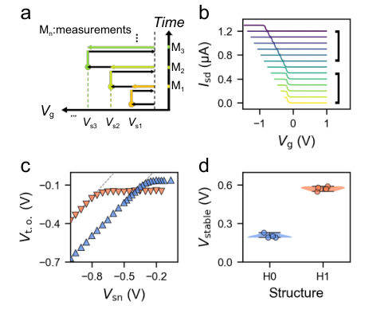 
Figure 3: Stability characterization measurements of Hall devices. a, Schematic diagram of measurement protocol on Hall bar devices. The ending gate voltage Vsn decrease over succes- sive measuring loops. b, Transfer characteristic curves at varied Vsn, distinguished by colors, for a representative device from H1 (H1-Dev1). These curves are vertically offset by 0.1 µA for clarity. The threshold voltages possess a “stable zone” for small |Vsn| and begin to drift linearly with more negative Vsn (“linear shift zone”). The two zones are marked by black brackets. c, Threshold voltages as a function of Vsn for H1-Dev1 (orange) and H0-Dev1 (blue). The dashed lines show the extrapolation of the...

📷 Fig 4

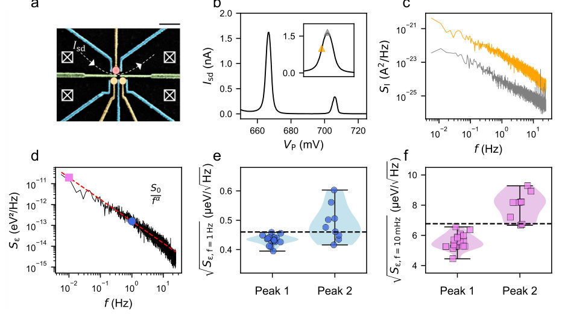 
Figure 4: Charge noise measurements of quantum dot devices via current spectroscopy method. a, False-color SEM image of device A, comprising a double quantum dot (yellow) and a charge sensor dot (red). The barrier gates (light blue) and the plunger gates (orange) are used to tune tunneling barriers and electro-chemical potential of quantum dots, respectively. The cutter gates (light green) are for separating the charge sensor dot from the double dot electrically. The scale bar is 300 nm. b, Current through the charge sensor dot Isd as a function of corresponding plunger gate voltage VP. Two coulomb oscillation peaks (peak 1 and peak 2) are used for charge noise measurements. Inset (zoom-in...

📷 Fig 5

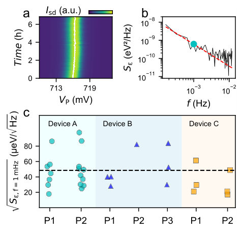 
Figure 5: Charge noise measurements of quantum dot devices by Coulomb peak tracking method. a, Repeated measurements of a Coulomb peak of the sensor dot in device A over 7 hours. The overlapped white line tracks the peak positions along Vp over time. b, Charge noise power spectral density extracted from figure a. The red dashed line shows the fitting to the data in the range of 0.2 −2 mHz with the formula S0/f α. The exponent value α is fitted to be 1.21 ± 0.15. The cyan dot marks the charge noise amplitude at f = 1 mHz. c, Noise amplitude at f = 1 mHz for different Coulomb peaks of device A-C. The distributions of the results are from repeated measurements sampled at random time intervals....

**Summary.** This work engineers Ge quantum well heterostructures by modulating the SiGe barrier composition to solve the critical issue of charge instability in spin qubit platforms. By preventing charge accumulation at interfaces, the researchers achieved significantly enhanced gate voltage stability and measured ultra-low charge noise in quantum dot devices. This demonstrates a promising material pathway for building high-performance quantum computing hardware.

**Why it may be interesting.** The focus on charge noise and stability directly impacts the coherence time of qubits, making the material engineering and low-noise measurements highly relevant to open quantum systems research.

Detailed structure

**Main problem.** The primary challenge addressed is enhancing the charge stability of Ge quantum well heterostructures, which is critical for building reliable spin qubit devices.

**Main result.** Composition modulation of the SiGe top barrier significantly enhances charge stability, leading to an enlarged stable gate voltage range and achieving remarkably low charge noise ($0.46\,\mathrm{\mu eV}/\mathrm{\sqrt{Hz}}$) in quantum dot devices.

**Method.** The study combines molecular beam epitaxy (MBE) for material growth with advanced electrical characterization techniques, including Hall bar measurements for stability and current spectroscopy/Coulomb peak tracking for charge noise.

**Model / system.** The physical system is a SiGe/Ge quantum well heterostructure. The key mechanism involves engineering the SiGe top barrier via graded composition modulation to prevent charge accumulation states at the SiGe-dielectric interface.

**Key observables.** Stable gate voltage range ($	ext{V}_{	ext{stable}}$), charge noise power spectral density ($	ext{S}_{\epsilon}$), and voltage drift over extended periods.

**Important parameters / regimes.** The low charge noise amplitude ($0.46\,\mathrm{\mu eV}/\mathrm{\sqrt{Hz}}$) and the ability to maintain stability over hours are key performance metrics.

**Assumptions / limitations.** The effectiveness of the composition modulation technique in mitigating charge noise is assumed to translate into long coherence times for spin qubits.

**Figures summary.** Figures compare the electrical performance of constant vs. composition-modulated barriers, showing increased stable gate voltage range. Other figures detail material characterization (TEM, XRD) and quantitative measurements of charge noise using both current spectroscopy and Coulomb peak tracking.

**Paper structure.** The paper follows a structure of problem identification (charge instability), proposed solution (composition modulation), material validation (MBE/TEM), electrical characterization (Hall bar stability), and performance benchmarking (low charge noise in quantum dots).

Abstract

Composition modulation is a powerful technique for designing materials with tailored properties, fueling the development of advanced semiconductor devices. In this work, we have implemented this technique into Ge quantum well heterostructures, offering a promising avenue to address the critical challenge of charge stability in spin qubit devices. Harnessing the atomic-scale precision of molecular beam epitaxy, we have engineered the band structure of the SiGe top barrier via graded composition modulation, thereby reducing charge accumulation states at the SiGe-dielectric interface and strengthening the effective confinement to the hole gases in the Ge quantum wells. The enhanced charge stability of composition-modulated SiGe/Ge quantum well heterostructures is confirmed in Hall devices, featuring an enlarged stable gate voltage range. We have further fabricated quantum dot devices from the composition-modulated SiGe/Ge quantum well heterostructures and observed remarkably low charge noise with an averaged amplitude of $0.46\,\mathrm{μeV}/\mathrm{\sqrt{Hz}}$ at $1\,\mathrm{Hz}$---the lowest reported value for Ge quantum wells grown on silicon. This exceptional charge stability of the quantum dots persists in the few-hole regime, with no observable voltage drift over $\sim$hours. With reduced charge noise and enhanced energy stability, composition-modulated SiGe/Ge heterostructures exhibit significant potential for applications in building high-performance quantum devices, including spin qubits with a long coherence time.

[↑ back to top](#top)

### [Programmable CMOS DAC Operating in Cryogenic Environments for Controlling Superconducting Qubits](http://arxiv.org/abs/2609.10834v1)

**Authors:** A. Pelteku, D. Reitz, M. Covington, A. Frederick, H. Adebayo, K. D. Hillaire, N. Mitran, Z. Steffen, R. Schwartz, Z. Stegen, J. X. Przybysz, J. Yager, C. Walter, T. Graves, D. Meyer, J. Clark, G. R. Boyd, A. Pesetski  
**Type:** experiment · **Category:** quantum information and computing · **PDF:** <https://arxiv.org/pdf/2609.10834v1>  
**Analysis basis:** full PDF text, analyzed in chunks
**Topic relevance:** 🔥 `QC/QI experiment` **4/5** · `quantum measurements` **1/5**

📷 Fig 1

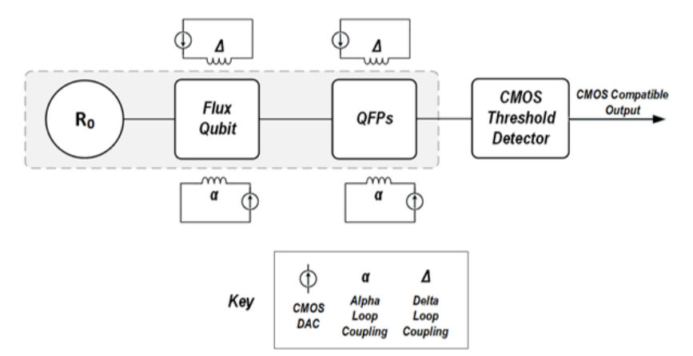 
Figure 1 – The application of this fast IDAC. R0 is a superconducting qubit. DC controls are applied to bias the QFPs near its operating point, and a fast flux pulse provided by this DAC controls its operation.

📷 Fig 2

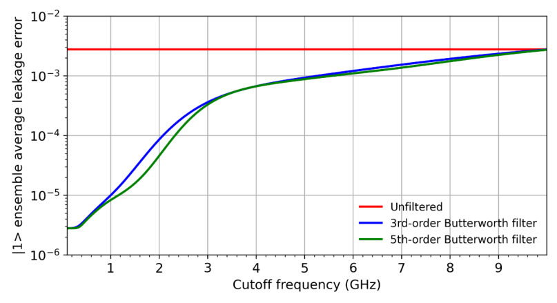 
Figure 3 – CMOS DAC iteration 1 readout fidelity when there is nominal R = 50 Ω, T = 1 K thermal noise on the CMOS DAC control line (red), and when there is a low-pass filter attached to the output (green, blue). The low-pass cutoff frequency is swept on the x-axis, showing that the fidelity returns to its noise- free value once the noise PSD at frequencies above the minimum, relevant quantum transition frequency is filtered out.

📷 Fig 3

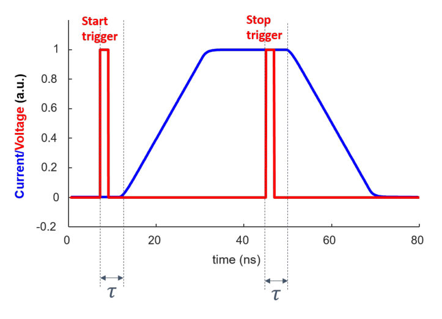 
Figure 4 – Functional Depiction of the Current Pulse, showing ideal operation of the device. An initial “start” signal is sent to the device, which begins its output current ramp up after some time τ. The output current ramps down some time τ after receiving a “stop” signal.

📷 Fig 4

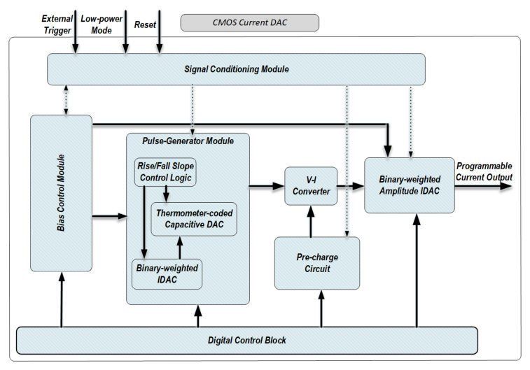 
Figure 5 – Overall block diagram of the CMOS current DAC. Here the external trigger signal refers more generically to both the start and stop triggers that are used for initiating the start and stop of the output current waveform.

📷 Fig 5

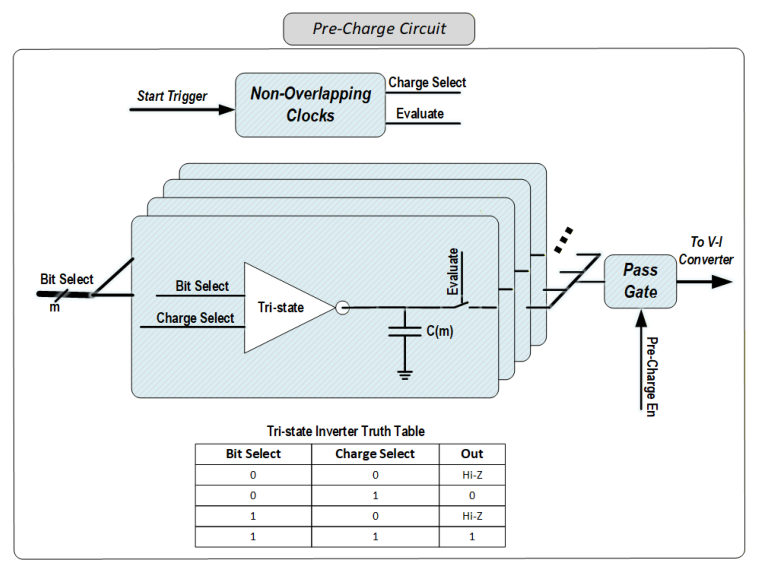 
Figure 6 – Block diagram of Pre-Charge Circuit, demonstrating how capacitor banks are selected by signals from the digital control logic.

**Summary.** This paper details the design, testing, and validation of a programmable CMOS Digital to Analog Converter (DAC) engineered to operate in cryogenic environments. This DAC allows for the precise, digitally controlled injection of current pulses to manipulate the magnetic flux of superconducting qubits. The successful demonstration proves a key component for building scalable, high-fidelity control electronics for quantum computation.

**Why it may be interesting.** This work directly addresses the classical control bottleneck in superconducting quantum computing, providing a tangible, scalable electronic solution for manipulating quantum states.

Detailed structure

**Main problem.** The core problem is developing a high-fidelity, programmable Digital to Analog Converter (DAC) capable of operating at cryogenic temperatures to precisely control the magnetic flux coupled to superconducting qubits.

**Main result.** The designed CMOS DAC successfully demonstrated tunable analog current control at cryogenic temperatures, showing potential for enabling next-generation, high-fidelity cryo-CMOS control architectures for superconducting qubits.

**Method.** The authors designed and tested a CMOS current-based DAC, utilizing digital controls (FSMs, SPI interfaces) and a novel pre-charge circuit to generate precise, programmable current pulses.

**Model / system.** The system involves a planar 90nm CMOS ASIC interfacing with superconducting qubits (like Transmon or flux qubits) via current-return 50 Ohm lines. The control mechanism relies on injecting precisely controlled current pulses to manipulate the qubit's flux state.

**Key observables.** Qubit preparation and readout fidelity, control waveform characteristics (amplitude, rise/fall slopes, slew rate), and output current amplitude/pulse width.

**Important parameters / regimes.** Operating temperatures (down to 600 mK), DAC output current range ($\approx 130 \mu	ext{A}$ to $403 \mu	ext{A}$), and achievable start delays ($	au < 20 	ext{ ns}$).

**Assumptions / limitations.** The analysis assumes that low-pass filtering can mitigate control noise effects, and future work must address thermal management and packaging for scaling.

**Figures summary.** Figures illustrate the DAC's block diagram, the pre-charge circuit, and experimental results showing tunable pulse amplitude and width at both room temperature and 600 mK, confirming consistency across multiplexed states.

**Paper structure.** The paper progresses from the scientific need (precise cryogenic control) to the detailed design (CMOS architecture, pre-charge circuit), followed by simulation results demonstrating tunability, and finally, experimental validation at cryogenic temperatures.

Abstract

This paper presents the design and test results of a CMOS current-based Digital to Analog Converter (DAC) that operates at cryogenic temperatures and that can be used to precisely control the amount of flux coupled to qubits or that can be used in the readout of superconducting circuits. The current pulse output can be controlled in terms of its amplitude, rise and fall slopes, via digital controls, and pulse width, via external triggers, while driving a superconducting circuit. The design has been implemented in a planar 90 nm CMOS process and test results closely match circuit predictions. The solution's wide degree of digital tunability affords potential application of the same device to many types of quantum circuits, beyond those discussed here. Due to the wide-ranging flexibility of digital CMOS control, we envision that this DAC design will enable the next generation of high-fidelity cryo-CMOS control architectures for superconducting qubits.

[↑ back to top](#top)

### [Quantum models of interaction Hamiltonian and their paradoxes](http://arxiv.org/abs/2609.11618v1)

**Authors:** Nicolas Gisin, Serge Massar, Jef Pauwels, Pavel Sekatski  
**Type:** theory · **Category:** other · **PDF:** <https://arxiv.org/pdf/2609.11618v1>  
**Analysis basis:** full PDF text, analyzed in chunks
**Topic relevance:** `Keldysh / 2PI / non-Gaussian methods` **3/5** · `correlated / nonlocal dissipation` **3/5** · `Tavis-Cummings & cavity-many-emitter` **2/5** · `analog quantum simulation` **2/5** · `driven-dissipative phase transition` **2/5** · `methods for driven-dissipative` **2/5** · `non-equilibrium universality` **1/5** · `quantum measurements` **1/5**

📷 Fig 1

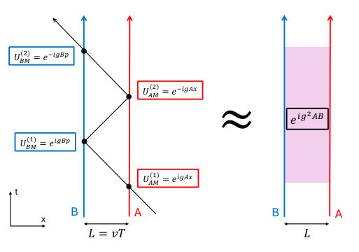 
FIG. 1. Space-time diagram of a mediator interacting with systems A and B, giving rise to an interaction eig2AB ⊗1M. Systems A and B are separated by distance L. The mediator travels at speed v, hence takes time T = L/v to go from one system to the other. While the mediator trajectory is well defined in space-time, the effective interaction arises after the mediator has finished all its interactions and cannot be localized exactly in space-time.

📷 Fig 2

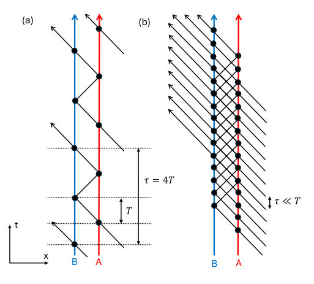 
FIG. 2. Space-time diagrams of mediators (in black) contin- uously interacting with systems A (red) and B (blue). The interactions of the mediators with the A and B systems are shown by black dots. The mediators take time T to travel from A to B (or back). A new mediator arrives every τ. In panel (a) τ = 4T while in panel (b) τ ≪T. In the limit τ →0 we obtain the continuous field model. Both models give rise to an effective interaction Hamiltonian Heff AB.

📷 Fig 3

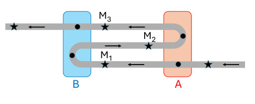 
FIG. 3. Spatial arrangement of systems A (red) and B (blue) and the mediators (stars), used to illustrate dressed states. The mediators arrive at a rate 1/τ = 1/T, ensuring that the mediator configuration repeats every T.

📷 Fig 4

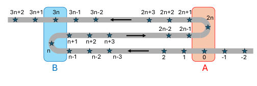 
FIG. 4. Spatial arrangement of systems A (red) and B (blue) and the mediator modes (stars). There are n modes between A and B. In one elementary time step the modes hop forward by one position, and those at positions 0, n, 2n, and 3n interact with A or B.

📷 Fig 5

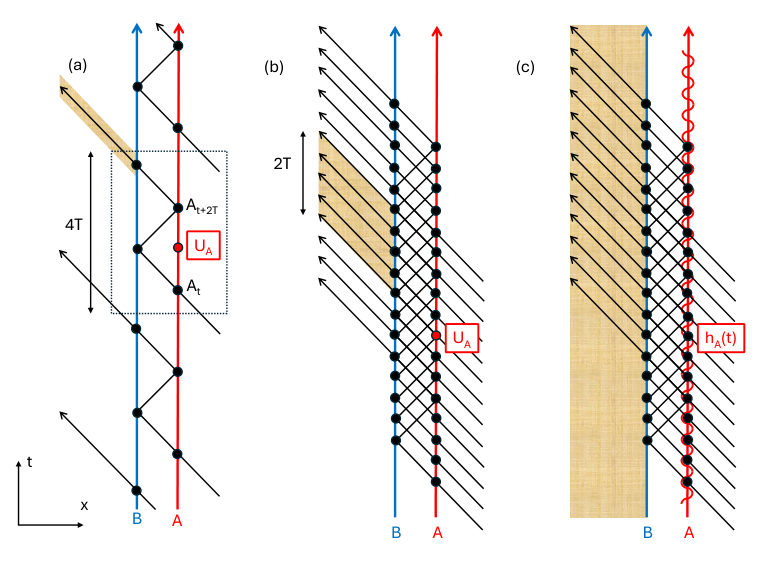 
FIG. 5. Local control resolves the mediator dynamics. (a) In a discrete loop, arbitrary evolution of Alice’s coupling observable between the two encounters is captured by the mismatch ∆A = At+2T −At; sudden gates and slowly varying control are two limits of the same expression. (b) For a continuous mediator flux, an instantaneous gate is exactly tractable and emits a disturbed pulse of duration 2T. (c) The most general setting combines a continuous mediator field with continuous local control hA(t). In this case, a continuous flux of disturbed mediators is emitted. Its detailed analysis is left open.

**Summary.** This theoretical paper investigates the inconsistencies arising from treating quantum interactions as instantaneous, nonlocal Hamiltonians. It resolves these paradoxes by modeling the interaction through a physical mediator field that respects the speed of light. The methodology involves time-averaging and perturbation theory to show how residual mediator effects cause decoherence and correct the effective dynamics.

**Why it may be interesting.** This work is highly relevant to AMO physics and quantum optics as it provides a rigorous framework for deriving effective Hamiltonians from underlying local, causal interactions mediated by quantum fields, addressing fundamental issues of locality and information transfer.

Detailed structure

**Main problem.** The paper addresses the paradoxes arising when modeling interactions between remote quantum systems using an effective, nonlocal Hamiltonian that violates fundamental principles like locality and finite propagation speed.

**Main result.** The paradoxes are resolved by embedding the interaction into a microscopic mediator model that explicitly respects the light cone and finite mediator flight time, leading to measurable residual effects and decoherence.

**Method.** The analysis employs time-averaging (coarse-graining) over the mediator flight time and utilizes perturbative expansions in the coupling strength to derive effective Hamiltonians and master equations.

**Model / system.** The system consists of two remote quantum systems (A and B) coupled via a microscopic mediator (M), which can be modeled as a bosonic field in a waveguide or through successive local unitary transformations.

**Key observables.** Faster-than-light communication signatures, local energy cost/work, purity ($	ext{Tr}(ar{
ho}(t)^2)$), and decoherence rates.

**Important parameters / regimes.** Mediator flight time ($T$), local coupling strength ($g$), and the effective coupling constant ($\mu$).

**Assumptions / limitations.** The analysis relies on deriving effective descriptions by tracing out the mediator field, assuming the mediator respects causality (light cone), and using approximations like the continuum limit.

**Figures summary.** Not specified by the notes, but the analysis involves deriving time-averaged density matrices and examining state evolution under local gates.

**Paper structure.** The paper progresses from identifying the paradoxes of nonlocal Hamiltonians to constructing microscopic, causal mediator models. It then analyzes the resulting dynamics using time averaging and perturbative expansions, culminating in discussions of decoherence and state-dependent evolution.

Abstract

In quantum physics it is commonplace to model the interaction of remote systems with a many-body Hamiltonian. Taking such an action-at-a-distance description {\it à la lettre} leads to various paradoxes related to faster-than-light communication and apparent inconsistencies in local energy accounting. It also neglects residual effects, such as entanglement between the remote systems and the mediator that implements the interaction, or the decoherence that arises when the remote systems undergo local evolution. We study simple microscopic quantum models that respect the light cone by design and reproduce two-body Hamiltonians. For these models we quantitatively analyze the residual effects of the microscopic mediator on the remote systems, including dressing of stationary states, and decoherence in the presence of fast local control. We show how the models resolve the paradoxes.

[↑ back to top](#top)

### [Joint Mitigation of Algorithmic and Physical Errors in Noisy Hamiltonian Simulation](http://arxiv.org/abs/2609.11508v1)

**Authors:** Shuo Zhou, Xinzhao Wang, Ruiqi Zhang, Xiaoyang Wang, Yi-Cong Zheng, Tongang Li, Shengyu Zhang  
**Type:** both · **Category:** quantum information and computing · **PDF:** <https://arxiv.org/pdf/2609.11508v1>  
**Analysis basis:** full PDF text, analyzed in chunks
**Topic relevance:** `QC/QI experiment` **3/5** · `methods for driven-dissipative` **3/5** · `analog quantum simulation` **2/5** · `correlated / nonlocal dissipation` **2/5** · `driven-dissipative phase transition` **2/5** · `Keldysh / 2PI / non-Gaussian methods` **1/5** · `non-equilibrium universality` **1/5** · `quantum measurements` **1/5**

📷 Fig 1

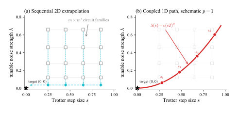 
FIG. 1. Coupled extrapolation path as a one-dimensional replacement for a two-dimensional Richardson grid. The hor- izontal coordinate s is the Trotter step size, the vertical co- ordinate λ is a tunable physical-noise strength, and the black star marks the ideal target limit (s, λ) = (0, 0). (a) A conven- tional two-axis construction samples an m × m′ rectangular grid, where m and m′ denote the Richardson node counts along the step-size and noise-strength axes: one first extrap- olates each fixed-s column to zero noise, shown by the cyan diamonds, and then extrapolates those zero-noise estimates toward s = 0. (b) The coupled construction instead sam- ples only m paired Richardson nodes on...

📷 Fig 2

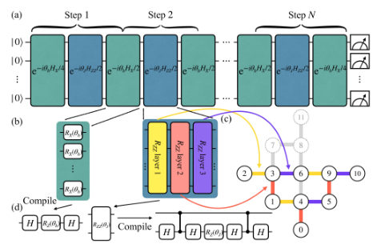 
FIG. 2. Hardware implementation of Trotterized Ising dy- namics. (a) A second-order symmetric (p = 2) Trotter step al- ternates transverse-field rotations and Ising interactions. (b) The interaction layer is scheduled in three parallel RZZ pat- terns containing non-overlapping qubit pairs. (c) Colored edges identify these patterns on the connected 9-qubit sub- graph. (d) The logical rotations are compiled into the device gate set {H, RZ, CZ}: RX(θ) = HRZ(θ)H, whereas RZZ uses fixed Clifford basis changes, controlled-Z entanglers and an angle-dependent RZ rotation.

📷 Fig 3

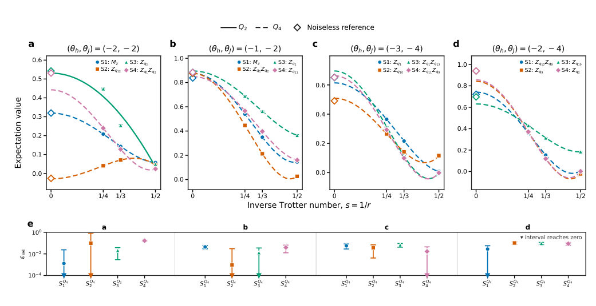 
FIG. 3. Coupled one-dimensional extrapolation on quantum hardware. Hardware expectation values are shown at the paired nodes r = {4, 3, 2} and G = {1, 64/27, 8}, with colors distinguishing the observables. Solid curves show the quadratic least- squares model Q2, dashed curves show the quartic three-node Richardson interpolant Q4, and diamonds mark the noiseless references obtained by direct evolution of the same 9-qubit Hamiltonian and initial state. Panels (a)–(d) show (θh, θJ) = (−2, −2), (−1, −2), (−3, −4), (−2, −4), respectively. Main-panel points are averages of 12 measurement-batch means, and error bars denote their standard errors. Panel (e) shows the absolute relative intercept...

📷 Fig 4

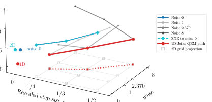 
FIG. 4. Richardson extrapolation landscape obtained from sparse Pauli dynamics for the simulated 100-qubit open Ising chain. The observable is the average longitudinal mag- netization MZ = N −1 P

**Summary.** This paper introduces a joint extrapolation strategy to overcome the limitations of noisy Hamiltonian simulation by simultaneously mitigating Trotterization error and physical hardware noise. By coupling the noise strength to the Trotter step size along a specific path, the authors enable error cancellation using a single Richardson extrapolation. This method achieves high accuracy with minimal overhead, validated on superconducting hardware and large-scale simulations.

**Why it may be interesting.** This work provides a concrete, resource-efficient protocol for error mitigation that directly tackles the interplay between algorithmic limitations (Trotter error) and hardware imperfections (noise) in open quantum system simulations.

Detailed structure

**Main problem.** The paper addresses the challenge of accurately simulating quantum dynamics using product-formula Hamiltonian simulation on near-term quantum hardware, where two competing errors—Trotterization bias and physical hardware noise—limit accuracy.

**Main result.** The authors propose a novel one-dimensional joint extrapolation strategy that couples the noise strength to the Trotter step size, allowing both leading error terms to be canceled simultaneously with a single Richardson extrapolation.

**Method.** The core method involves defining a calibrated path $\lambda(s) = c(sT)^{p+1}$ and applying Richardson extrapolation along this path to estimate the true zero-noise, zero-step-size limit.

**Model / system.** The simulation focuses on Hamiltonian dynamics, specifically using the transverse-field Ising Hamiltonian, implemented on superconducting quantum computers and simulated for 100-qubit Sparse Pauli Dynamics (SPD). Noise is modeled by local Lindbladian noise.

**Key observables.** Average longitudinal magnetization ($\langle M_Z 
angle$) and the extrapolated value at the joint zero-noise, zero-step-size limit.

**Important parameters / regimes.** Trotter step size ($s$), total evolution time ($T$), tunable noise strength ($\lambda$), and the order of the product formula ($p$).

**Assumptions / limitations.** The protocol assumes that the required noise strengths for the optimal path lie above the intrinsic device-noise floor, and theoretical guarantees rely on finite-order Baker–Campbell–Hausdorff bounds.

**Figures summary.** Figures illustrate the comparison between conventional 2D extrapolation grids and the proposed 1D coupled path, showing error reduction towards the exact noiseless reference.

**Paper structure.** The paper introduces the joint error mitigation problem, develops the coupled 1D extrapolation path theory, provides a provable resource guarantee, and validates the protocol through both superconducting quantum hardware experiments and large-scale 100-qubit classical simulations using SPD.

Abstract

Product-formula Hamiltonian simulation is naturally suited to near-term quantum processors, but its accuracy is set by two competing errors: finite-step Trotter bias and physical hardware noise. We introduce a joint extrapolation strategy that ties the tunable per-layer noise strength to the Trotter step size, $λ(s)=c(sT)^{p+1}$ for a $p$-th order product formula. Along this one-dimensional path, the leading physical-noise and Trotter corrections over the full evolution both enter at order $s^p$ and can be canceled by a single Richardson extrapolation. Building on a previously established finite-order Baker--Campbell--Hausdorff truncation bound, we derive a provably commutator-scaling resource guarantee for the joint extrapolation. For local Hamiltonians with local Lindbladian noise, the protocol mitigates physical noise together with Trotter error with only a constant asymptotic overhead relative to noiseless Trotter extrapolation, provided the required noise strengths lie above the intrinsic device-noise floor. We experimentally demonstrate the protocol for Ising dynamics on a superconducting quantum computer using learned noise amplification. Complementary 100-qubit Sparse Pauli Dynamics (SPD) simulations achieve comparable accuracy to two-dimensional Richardson extrapolation with fewer circuit settings.

[↑ back to top](#top)

### [Work as a function of protocol duration for the efficient erasure of an underdamped memory: isothermal to adiabatic transition](http://arxiv.org/abs/2609.11473v1)

**Authors:** Nicolas Barros, Stephen Whitelam, Sergio Ciliberto, Ludovic Bellon  
**Type:** both · **Category:** statistical mechanics · **PDF:** <https://arxiv.org/pdf/2609.11473v1>  
**Analysis basis:** full PDF text, analyzed in chunks
**Topic relevance:** `driven-dissipative phase transition` **3/5** · `non-equilibrium universality` **3/5** · `quantum measurements` **3/5** · `methods for driven-dissipative` **2/5** · `scars & prethermalization` **2/5** · `Frenkel-Kontorova` **1/5** · `Keldysh / 2PI / non-Gaussian methods` **1/5**

📷 Fig 1

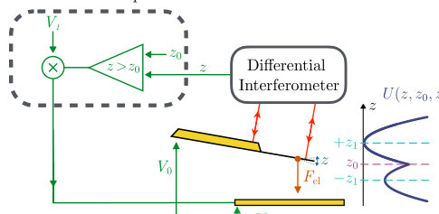 
FIG. 1. Experimental setup: a conductive cantilever experi- ences an electrostatic force Fel due to the voltage difference V −V0 with a facing electrode. The deflection z of the can- tilever, measured by interferometry, is compared to a thresh- old z0 by the feedback loop, setting V = ±V1 ≪V0. This results in a tunable double-well potential U(z, z0, z1) [34, 35]. For a symmetric potential (z0 = 0), logical states 0 and 1 are assigned to values z &lt; 0 and z &gt; 0, respectively.

📷 Fig 2

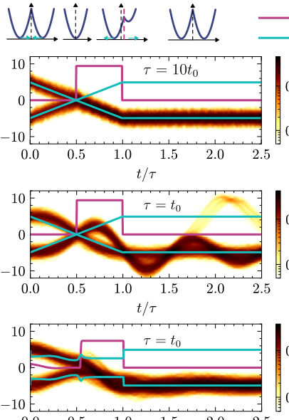 
FIG. 2. a) Basic erasure protocol for a cantilever evolving in a bi-quadratic double well [9]. The initial symmetric double- well potential, with an energetic barrier of 12.5 kBT, encodes a bit of information through the position of the cantilever: 0 if z &lt; 0, 1 otherwise. In a first stage (0 &lt; t &lt; τ/2), the two wells are merged symmetrically, and the information is lost as the cantilever starts jumping between the two states. Then, a translation stage (τ/2 &lt; t &lt; τ) returns the centers of the wells ±z1 to their original position. This time however, the potential is asymmetric, and a high energetic barrier pre- vents any transition during the translation. Finally, the initial potential is...

📷 Fig 3

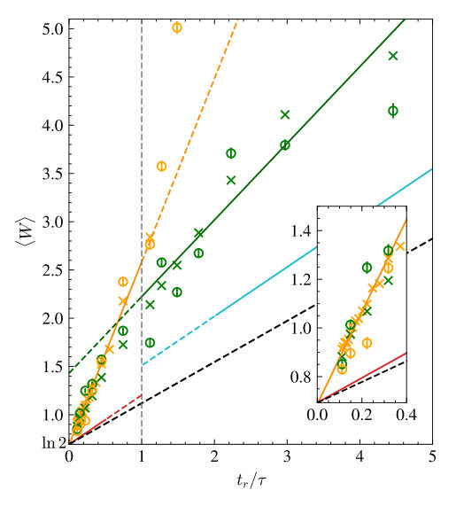 
FIG. 3. Underdamped regime - Mean work associated to erasure using the basic and learned protocols as a function of tr/τ. We use simulations (×) and ∼2000 experimental trajectories (◦, with error bars) sampling equally all transi- tions. We represent a linear fit of the basic protocol for long erasures (τ &gt; tr, orange line, fit on simulation data), and of the learned protocol for fast erasures (τ &lt; tr, green line, fit on simulation data); each fit is extrapolated beyond its range of validity (dashed). The linear fit for τ &lt; tr presents a large uncertainty on its parameters, due to the large dispersion of the points on the small time range available, and is intended as a guide to the eye....

📷 Fig 4

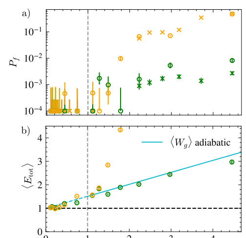 
FIG. 4. Underdamped regime - a) Failure rate Pf as a function of tr/τ for the single erasure of the learned and the basic protocols. For both protocols Pf &lt; 10−3 for τ ≫tr, but the Pf of the basic protocol rapidly increases for shorter τ. b) Mean total energy ⟨Etot⟩at the end of the erasure protocol (t = τ) as a function of tr/τ. Slower protocols are able to release the accumulated energy as heat during the erasure, and operate isothermally, close to the internal total energy prescribed by the equipartition theorem at equilibrium ⟨Etot⟩= kBT. In contrast, fast erasure lead to an increased accumulated total energy. For the basic protocol, the transition between the two regimes appears close...

📷 Fig 5

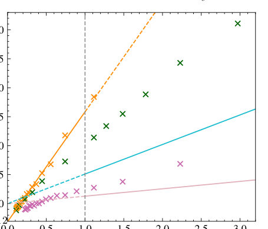 
FIG. 5. Underdamped regime - Mean work associated to era- sure as a function of tr/τ, using the basic (orange) and learned (green) protocols computed at Q = 7 as in the main text, and a learned protocol at Q = 14 (magenta). The mean work al- ways lies above the lower bounds predicted by Eq. 9 at Q = 7 (light blue line) and Q = 14 (pink line). The vertical dashed line marks τ = tr, common to both quality factors in these rescaled time units.

**Summary.** This paper investigates the minimum work needed to erase a bit stored in an underdamped mechanical memory by optimizing control protocols using reinforcement learning. It reveals distinct scaling laws depending on whether the erasure process is slow (isothermal) or fast (adiabatic). The findings demonstrate that optimized, non-equilibrium protocols can achieve efficiencies surpassing those predicted by protocols constrained by equilibrium boundary conditions.

**Why it may be interesting.** This work directly addresses non-equilibrium thermodynamics and information erasure bounds in a mesoscopic mechanical system, providing experimental validation of theoretical scaling laws in the transition between slow and fast driving regimes.

Detailed structure

**Main problem.** The study determines the minimum work required to efficiently erase a bit of information stored in an underdamped memory and analyzes how this work scales with the protocol duration ($\tau$).

**Main result.** The work required exhibits distinct scaling regimes: quasi-static ($\tau \gg t_r$) approaches Landauer's bound plus a $1/\tau$ overhead, while fast erasures ($\tau \le t_r$) enter an adiabatic regime where learned protocols outperform equilibrium-based optimal protocols.

**Method.** The research employs evolutionary reinforcement learning (neuroevolution) to optimize time-dependent control protocols, complemented by theoretical derivations of lower bounds using *gedanken* optimal protocols.

**Model / system.** The physical system is an underdamped cantilever moving in a double-well potential, serving as an experimental model for a 1-bit memory. The dynamics are governed by the Langevin equation.

**Key observables.** Mean work ($\langle W \rangle$), failure probability ($P_f$), and the system's total energy ($\langle E_{tot} \rangle$).

**Important parameters / regimes.** Protocol duration ($\tau$), system relaxation time ($t_r$), and the ratio $\tau_r/\tau$ defining the transition between isothermal and adiabatic regimes.

**Assumptions / limitations.** The analysis assumes control is limited to modulating two parameters ($z_0(t), z_1(t)$) and compares results against theoretical lower bounds derived from idealized protocols.

**Figures summary.** Figures illustrate the comparison of mean work and failure rates for basic, learned, and optimal protocols across varying time scales ($\tau_r/\tau$), highlighting the performance gap for fast erasures.

**Paper structure.** The paper progresses by establishing the physical model and the goal (minimum work), detailing the use of reinforcement learning for protocol optimization, analyzing the scaling laws across different time regimes (isothermal vs. adiabatic), and finally comparing learned results against theoretical lower bounds.

Abstract

We use evolutionary reinforcement learning to determine efficient time-dependent erasure protocols for an underdamped cantilever moving in a double-well potential, an experimental realization of a 1-bit memory. We investigate how the mean work $\langle W \rangle $ needed to erase a bit scales as a function of the protocol duration $τ$. We find two regimes, depending on how $τ$ compares to the relaxation time of the system $t_r$. For $τ\gg t_r$, the quasistatic isothermal regime, we recover Landauer's bound plus an overhead that scales as $1/τ$, similar to the overdamped case. By contrast, for $τ<t_r$ erasure becomes adiabatic and $\langle W \rangle$ grows more slowly than in the isothermal case. This growth is bounded from below as $1/τ$, which we derive using a gedanken optimal protocol. Finally, comparison with overdamped erasure shows that learned protocols can outperform protocols that are optimal subject to equilibrium boundary conditions.

[↑ back to top](#top)

### [Differential and Common Decoherence Modes in Witnessing the Quantum Gravity-Induced Entanglement of Matter](http://arxiv.org/abs/2609.10697v1)

**Authors:** Ryan Rizaldy, Helen M Sheehy, Tian Zhou, Anupam Mazumdar  
**Type:** theory · **Category:** other · **PDF:** <https://arxiv.org/pdf/2609.10697v1>  
**Analysis basis:** full PDF text, analyzed in chunks
**Topic relevance:** `correlated / nonlocal dissipation` **3/5** · `driven-dissipative phase transition` **2/5** · `interference shaping light` **2/5** · `methods for driven-dissipative` **2/5** · `quantum measurements` **2/5** · `Keldysh / 2PI / non-Gaussian methods` **1/5** · `analog quantum simulation` **1/5** · `non-equilibrium universality` **1/5**

📷 Fig 1

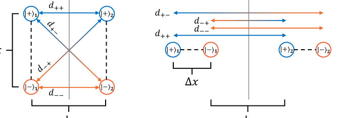 
Figure 1. (a)Parallel [42] and (b) linear setup [2] of two test masses in spatial superpositions (1) and (2). The superposition sizes are assumed to be the same for both cases, ∆x. We assume the internal spin states are split into |+⟩and |−⟩states. The spin-dependent Stern-Gerlach force creates the macroscopic spatial quantum superposition. The matter-wave interferometers are separated by a divider, shown here as a vertical line, which serves as an electromagnetic shield. The shield is treated classically here. The details can be found in QGEM references; see [14, 16].

📷 Fig 2

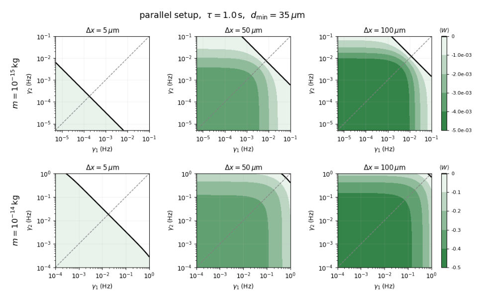 
Figure 2. Parameter scan for the parallel 2-qubit configuration for τ = 1 s and dmin = 35 µm, for the superposition sizes ∆x = 5, 50, 100 µm as a function of γ1, γ2. The colour gradients show the PPT witness ⟨W⟩&lt; 0 for the two qubits to get entangled solely via the quantum gravitational interaction (by a virtual graviton exchange); the black line demarcates the region where ⟨W⟩= 0. The white region shows no detection of entanglement under the PPT criteria for witnessing entanglement. We select dmin = 35µm, which is based on the analysis that gravity between the two interferometers will dominate over Casimir, electric and magnetic dipole interactions between the nanoparticle and the...

📷 Fig 3

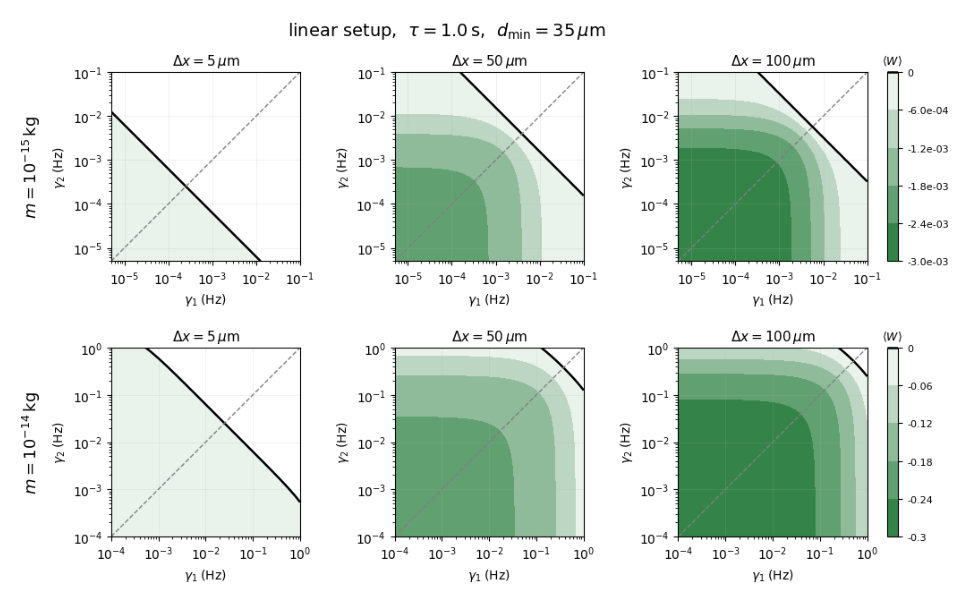 
Figure 3. Parameter scan for the linear 2-qubit configuration for τ = 1 s and dmin = 35 µm, for the superposition sizes ∆x = 5, 50, 100 µm as a function of γ1, γ2. The colour gradients show the PPT witness ⟨W⟩&lt; 0 for the two qubits to get entangled solely via the quantum gravitational interaction (by a virtual graviton exchange); the black line demarcates the region where ⟨W⟩= 0. The dashed line shows γ1 = γ2. The white region shows no detection of entanglement under the PPT criteria for witnessing entanglement. We consider two different masses as shown above. We select dmin = 35µm, which is based on the analysis that gravity between the two interferometers will dominate over Casimir,...

📷 Fig 4

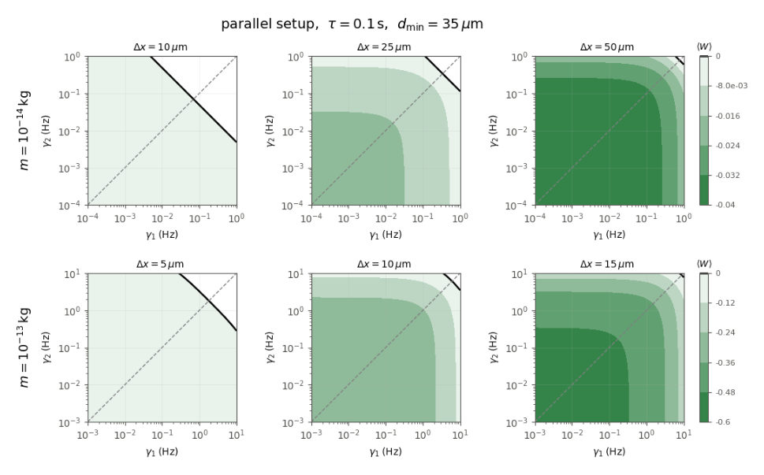 
Figure 4. Parameter scan for the parallel 2-qubit configuration for time τ = 0.1s, with dmin = 35 µm, for the superposition sizes ∆x = 10, 25, 50 µm for m = 10−14 kg and ∆x = 5, 10, 15 µm for m = 10−13 kg with respect to different values of γ1, γ2. The colour gradients show the PPT witness ⟨W⟩&lt; 0 for the two qubits to get entangled solely via the quantum gravitational interaction (by a virtual graviton exchange); the black line demarcates the region where ⟨W⟩= 0. The dashed line shows γ1 = γ2. The colour gradients show the PPT witness ⟨W⟩&lt; 0 for the two qubits to get entangled solely via the quantum gravitational interaction (by a virtual graviton exchange); the black line demarcates the...

📷 Fig 5

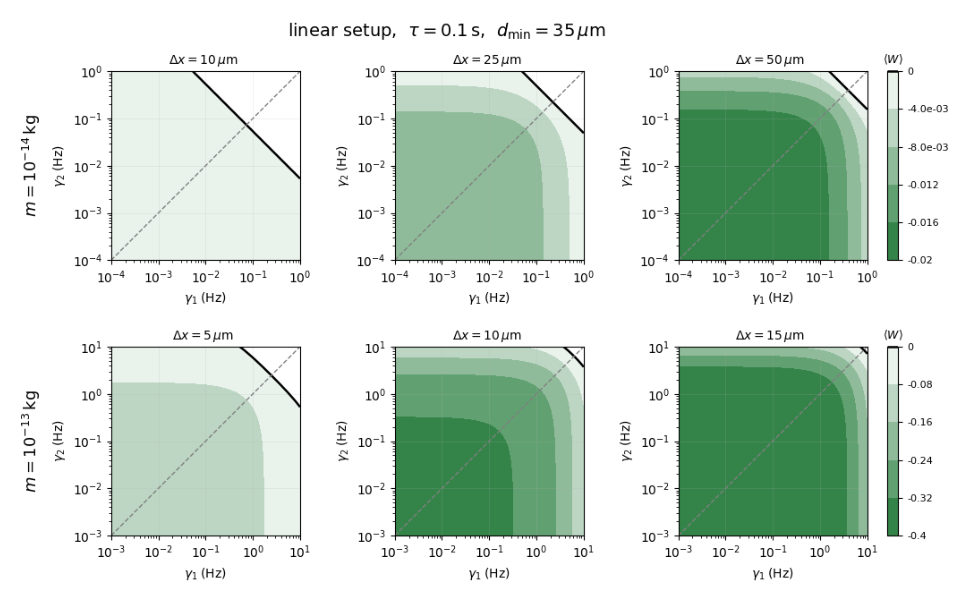 
Figure 5. Parameter scan for the linear 2-qubit configuration at τ = 0.1 s and dmin = 35 µ m, for the superposition sizes ∆x = 10, 25, 50 µm for m = 10−14 kg and ∆x = 5, 10, 15 µm for m = 10−13 kg with respect to different values of γ1, γ2. We consider two different masses as shown above. The colour gradients show the PPT witness ⟨W⟩&lt; 0 for the two qubits to get entangled solely via the quantum gravitational interaction (by a virtual graviton exchange); the black line demarcates the region where ⟨W⟩= 0. The white region shows no detection of entanglement under the PPT criteria for witnessing entanglement. The dashed line shows γ1 = γ2. We select dmin = 35µm, which is similar to the earlier...

**Summary.** This theoretical paper develops a framework to detect entanglement generated between two matter-wave interferometers via hypothesized quantum gravity interactions. It uses the entanglement witness derived from the partial transpose criterion, showing that the detectability of this entanglement is highly dependent on the mass of the test particles and the management of environmental decoherence. The results suggest that increasing the mass is crucial for achieving a measurable signal.

**Why it may be interesting.** This work is highly relevant to AMO physics as it applies advanced open quantum system techniques (decoherence modeling, entanglement witnesses) to a cutting-edge, fundamental experiment involving matter-wave interferometry and quantum gravity effects.

Detailed structure

**Main problem.** The paper addresses the theoretical challenge of detecting entanglement generated between two matter-wave interferometers due to hypothesized quantum gravitational interactions.

**Main result.** The entanglement witness, derived from the Positive Partial Transpose (PPT) criterion, is shown to be sensitive to the mass of the interferometers and the decoherence rates, suggesting that increasing mass significantly improves detectability.

**Method.** The analysis employs quantum information theory tools, specifically calculating the eigenvalues of the partial transpose of the density matrix ($
ho^{T2}$) to quantify entanglement.

**Model / system.** The system consists of two adjacent matter-wave interferometers (e.g., using nanodiamonds) whose interaction is mediated solely by gravity. The evolution is treated as an open quantum system subject to global and differential decoherence rates.

**Key observables.** The entanglement witness $\langle W 
angle$ (negative value indicates entanglement) and the entanglement phase $\phi_{ent}$.

**Important parameters / regimes.** Interaction time $	au$ (e.g., 0.1 s to 1 s), matter-wave mass $m$ (e.g., $10^{-14}$ kg to $10^{-13}$ kg), and common/differential decoherence rates ($\Gamma_c, \Gamma_d$).

**Assumptions / limitations.** The analysis assumes the density matrix can be factored into unitary (phase) and decoherence parts, and it models decoherence using effective common and differential rates.

**Figures summary.** Figures illustrate the physical setups (parallel and linear configurations) and show parameter scans of the entanglement witness $\langle W 
angle$ as a function of decoherence rates ($\gamma_1, \gamma_2$).

**Paper structure.** The paper builds from defining the physical setup and the entanglement witness criterion, to deriving the density matrix evolution under decoherence, and finally calculating the eigenvalues of the partial transpose to determine the conditions for entanglement detection.

Abstract

In the context of the QGEM (Quantum Gravity-induced Entanglement of Masses) experiment, we consider two adjacent matter-wave interferometers in linear and parallel configurations that interact solely via gravity. If gravity were quantum, then the two matter-wave interferometers would become entangled via the virtual excitation of the massless graviton. In this paper, we consider witnessing this entanglement by considering a generic experimental scenario where the two interferometers are subject to different global phases and different decoherence rates. In this context, we show that the individual global phases do not affect the witness, discuss common and differential decoherence modes, and perform the parameter search optimal for different masses. We provide a mathematical framework for these asymmetric decoherence rates and then search for parameters that determine the entanglement witness. We have kept the inter-separation distance between the two closest superpositions of the interferometers' masses fixed while varying the experimental time from $τ=0.1$ s to $τ=1$ s. Finishing the experiment at $ τ=0.1$ s has many advantages from the point of view of protecting the experiment from random acceleration noise. However, witnessing the entanglement also suffers from $\langle W\rangle \sim -{\cal O}(10^{-2})$ for $m=10^{-14}$~kg, for decoherence rate in the ranges of ${\cal O}(10^{-1}-1)$~Hz for $τ=0.1$ s experiment. However, as we show, increasing the mass of the matter-wave interferometer may improve the witness considerably.

[↑ back to top](#top)

### [Quantum Random Access Memory Implementation Using Photon-Photon Interaction in Rydberg Atomic Ensemble](http://arxiv.org/abs/2609.11333v1)

**Authors:** Avirup Chakraborty, Shrabana Chakrabarti  
**Type:** theory · **Category:** quantum information and computing · **PDF:** <https://arxiv.org/pdf/2609.11333v1>  
**Analysis basis:** full PDF text, analyzed in chunks
**Topic relevance:** `Rydberg arrays` **3/5** · `analog quantum simulation` **3/5** · `Tavis-Cummings & cavity-many-emitter` **2/5** · `methods for driven-dissipative` **2/5** · `Keldysh / 2PI / non-Gaussian methods` **1/5** · `driven-dissipative phase transition` **1/5** · `interference shaping light` **1/5** · `quantum measurements` **1/5**

📷 Fig 1

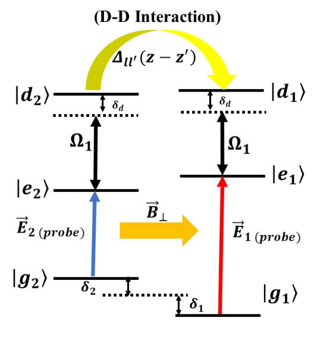 
FIG. 1. Double-ladder Electromagnetically Induced Transparency (EIT) scheme utilized within the Rydberg atomic ensemble.

📷 Fig 2

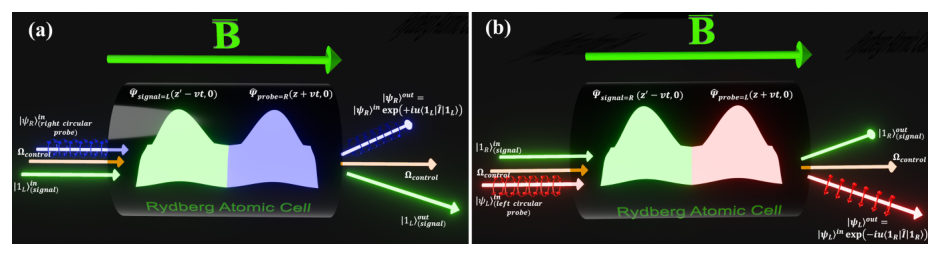 
FIG. 2. Routing operator’s physical operation inside the Rydberg cell, showing interactions between counterpropagating weak ingle-photon ”signal” and coherent ”walker” probe pulses centred at t = 0 around z = 0 and z = L. (a) and (b) show left ( |ψL⟩ ) and right (|ψR⟩) circularly polarized probes interacting with oppositely polarized signals, acquiring distinct linear (Zeeman shift) and nonlinear (D-D interaction) phases for routing.

📷 Fig 3

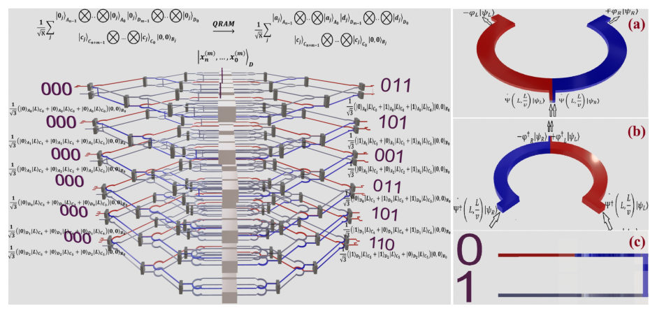 
FIG. 3. Depicting the Quantum Random Walk-based qRAM architecture, n+m walkers traverse parallelized binary tree layers of interconnected phase-dependent waveguides, accessing memory addresses via double-rail encoding. (a) Routing operator Ψ exploits phase differences, steering left-polarized ( |L⟩) and right-polarized ( |R⟩) walkers into red and blue phase-selective waveguides. (b) Inverse operator Ψ† enables deterministic retrieval. (c) The dual-rail signal mechanism.

📷 Fig 4

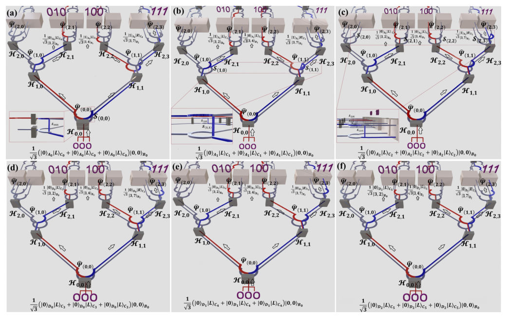 
FIG. 4. Maps transportation of the probe walkers navigating the binary tree from root (0, 0) to distinct memory locations (010, 100, 111). Input in left circular polarization |L⟩, walkers at node (w, l) are manipulated by modified Hadamard H(w, l) and routing Ψ(w, l) operators to steer superpositions. Shift operator S(w, l) concurrently encodes the address qubit. Panels (a)(c) and (d)-(f) show routing of address |0⟩A2 ⊗|0⟩A1 ⊗|0⟩A0 and data |0⟩D2 ⊗|0⟩D1 ⊗|0⟩D0 walkers, respectively. (Left (Right) circular polarization state probe |L⟩carrying waveguide color-coded as red (blue)).

📷 Fig 5

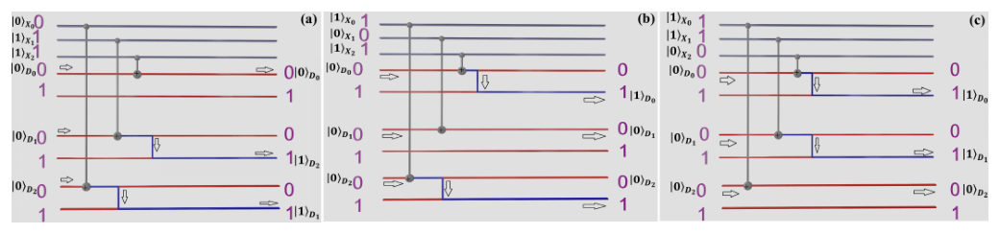 
FIG. 5. Details the qRAM querying phase using dual-rail CNOT operations. Target memory information acts as control bits x0, x1, and x2, modifying data walkers D0, D1, and D2 stored in waveguides (|L⟩). Successive CNOT gates copy target data superpositions. Panels (a)-(c) show quantum querying from locations (010), (100), (111), respectively.

**Summary.** This paper proposes a scalable Quantum Random Access Memory (qRAM) architecture by implementing quantum random walks using a Rydberg atomic ensemble in a cavity QED setup. It overcomes the decoherence and scalability issues of prior designs by encoding information into polarization-dependent phase shifts. The resulting framework achieves an optimal time complexity of O(n log(n+m)), providing a practical hardware pathway for quantum computation.

**Why it may be interesting.** This work is highly relevant to AMO physics because it leverages complex, controllable quantum phenomena—specifically Rydberg interactions and EIT—to solve a fundamental problem in quantum computation (qRAM scalability). The coupling of quantum optics to quantum information theory is a key area of overlap.

Detailed structure

**Main problem.** The primary challenge addressed is overcoming the scalability limitations of Quantum Random Access Memory (qRAM) implementations, which suffer from decoherence in traditional gate-based or switch-based designs.

**Main result.** The authors propose a scalable qRAM architecture achieving an optimal temporal complexity of O(n log(n+m)) by encoding quantum information into phase-encoded quantum walkers.

**Method.** The methodology maps a discrete-time quantum walk onto a cavity QED framework, utilizing a robust routing operator derived from Rydberg interactions to steer polarization-dependent phase shifts.

**Model / system.** The physical system is a Rydberg atomic ensemble within hollow-core waveguides, operating under an Electromagnetically Induced Transparency (EIT) scheme. The model involves deriving and solving equations for the Dark State Polariton (DSP) field propagation.

**Key observables.** Opposite polarization-dependent phase shifts ($\pm \varphi$), cumulative transmission probabilities, and the overall time complexity $O(n \log(n+m))$ for $n$ addresses and $m$ data qubits.

**Important parameters / regimes.** Strong control field regime ($|\Omega|^2 \gg \delta_{1,2}, \delta_d, \alpha$), and the ability to suppress spatial attenuation ($\kappa'_l$).

**Assumptions / limitations.** The analysis relies on the strong control field regime to suppress spatial attenuation and uses approximations such as the adiabatic and second-order perturbation expansions.

**Figures summary.** Figures illustrate the EIT double-ladder scheme, the physical operation of the polarization-dependent routing operator, and plots confirming attenuation suppression and information preservation across scaled memory depths.

**Paper structure.** The paper develops the theory by first establishing the physical platform (Rydberg/EIT), deriving the necessary operators ($\hat{\Psi}, \hat{H}, \hat{S}$), and then recursively applying these operators to model the full cycle: encoding (writing), querying (CNOT), and decoding (retrieval) across binary tree layers.

Abstract

Quantum random access memory (qRAM) is crucial for overcoming data-loading bottlenecks in quantum machine learning; however, current physical implementations face severe scalability constraints. Traditional fanout designs demand exponential decoherence-prone gates, while bucket-brigade schemes require highly error-prone active switches. Motivated by these limitations, we propose a scalable qRAM architecture that fundamentally replaces active nodes with phase-encoded quantum walkers. Our methodology maps a discrete-time quantum walk onto a cavity quantum electrodynamics framework utilizing an electromagnetically induced transparency (EIT)-based Rydberg atomic ensemble. Inside hollow-core waveguides, strong Rydberg dipole-dipole interactions and a solenoidal magnetic field create a robust routing operator. This operator imparts precise, polarization-dependent phase shifts, steering circularly polarized probe pulses to target memory cells. Our results demonstrate that operating within a strong control field regime suppresses emergent spatial attenuation, ensuring cumulative transmission probabilities for highly scaled memory addresses. Ultimately, this parallelized architecture successfully optimizes spatial resources to static gates and temporal complexity to an optimal logarithmic scale of $\mathcal{O}(n\log(n+m))$ by requiring $\mathcal{O}(n+m)$ physical walkers, establishing a practical, fault-tolerant hardware pathway for advanced quantum computation implementations.

[↑ back to top](#top)

### [Birth and Death of Entanglement in Hamiltonian-Driven Quantum Games under Decoherence](http://arxiv.org/abs/2609.11522v1)

**Authors:** Teena Thomas, S. Balakrishnan  
**Type:** theory · **Category:** quantum information and computing · **PDF:** <https://arxiv.org/pdf/2609.11522v1>  
**Analysis basis:** full PDF text, analyzed in chunks
**Topic relevance:** `driven-dissipative phase transition` **3/5** · `methods for driven-dissipative` **3/5** · `correlated / nonlocal dissipation` **2/5** · `non-equilibrium universality` **2/5** · `Keldysh / 2PI / non-Gaussian methods` **1/5** · `analog quantum simulation` **1/5** · `quantum measurements` **1/5**

📷 Fig 1

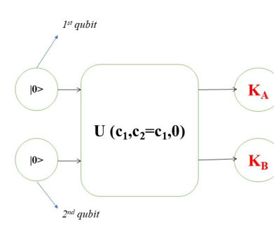 
Figure 1: Schematic representation of the two-qubit quantum game protocol.

📷 Fig 2

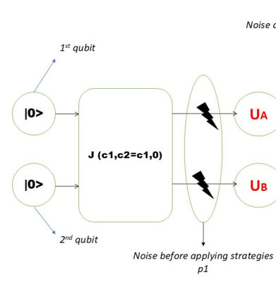 
Figure 2: Schematic representation of the two-qubit quantum game protocol with amplitude-damping noise applied before and after the players’ strategic operations.

📷 Fig 3

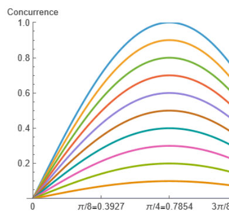 
Figure 3: Concurrence as a function of the TFIM evolution parameter Jt for different amplitude damping probabilities p, with the initial state |00⟩.

📷 Fig 4

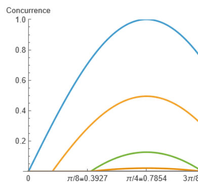 
Figure 4: Concurrence as a function of the TFIM evolution parameter Jt for different amplitude damping probabilities p, with the initial state |11⟩.

📷 Fig 5

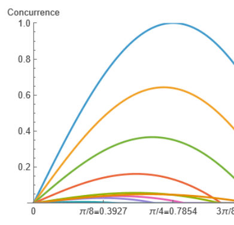 
Figure 5: Concurrence as a function of the TFIM evolution parameter Jt for different amplitude damping probabilities p, with the initial state |01⟩and strategy pair (I, σx).

**Summary.** This paper analyzes two-player quantum games based on the TFIM under amplitude-damping noise to study entanglement dynamics. It demonstrates that decoherence erodes quantum strategic advantages, forcing outcomes toward classical predictions. The study specifically tracks entanglement sudden birth and death, revealing that quantum correlations are highly sensitive to environmental noise and initial conditions.

**Why it may be interesting.** This work directly addresses open quantum systems dynamics, showing how environmental coupling (decoherence) fundamentally limits the quantum advantage in complex protocols like quantum games, which is highly relevant to quantum computation and information processing.

Detailed structure

**Main problem.** The paper investigates how entanglement dynamics, specifically the sudden birth and death of entanglement, are affected in quantum games when the system is subjected to decoherence.

**Main result.** Decoherence progressively suppresses quantum strategic advantages, causing payoffs to collapse to classical limits, while entanglement dynamics show initial state and strategy-dependent non-monotonic behavior.

**Method.** The analysis uses the density matrix formalism to track quantum state evolution under amplitude-damping noise, calculating payoffs, concurrence, and coherence.

**Model / system.** The system is a two-player quantum game modeled using the Transverse Field Ising Model (TFIM) Hamiltonian, evolving under unitary dynamics followed by amplitude-damping noise.

**Key observables.** Player payoffs, Concurrence (entanglement), Coherence, and the dynamics of entanglement sudden birth and death.

**Important parameters / regimes.** Damping probability ($p$), the effective evolution time ($Jt$), and the initial quantum state.

**Assumptions / limitations.** The noise is modeled by amplitude damping, and for simplicity, the noise strength is assumed equal before and after strategic operations ($p_1 = p_2 = p$).

**Figures summary.** Figures schematically illustrate the general and noisy quantum game protocol, and specific plots show coherence and concurrence as functions of the evolution time ($J_t$) for various damping probabilities ($p$).

**Paper structure.** The paper introduces the quantum game framework using the TFIM, details the protocol incorporating amplitude damping noise, analyzes the resulting payoffs and quantum correlations (concurrence/coherence) across different noise regimes, and discusses the implications for quantum strategy.

Abstract

Quantum game theory investigates the influence of quantum resources on strategic decision-making. In this work, two-player quantum games based on the Transverse Field Ising Model(TFIM) are investigated under amplitude-damping decoherence. The TFIM Hamiltonian naturally produces a family of entangling gates, enabling a physically motivated implementation of quantum games. The effects of noise on Nash equilibria, players' payoffs, concurrence and coherence of the quantum states for different initial states and strategy pairs are analyzed. The results show that decoherence progressively suppresses quantum strategic advantages, with maximum damping driving all outcomes to identical classical payoffs. The concurrence and coherence analysis of the states generated in the quantum game reveal initial state and strategy dependent quantum correlation dynamics, including entanglement sudden birth and death.

[↑ back to top](#top)

### [Heterogeneously Integrated Efficient and Widely Tunable Lasers at 795 nm for Rubidium-Based Quantum Technologies](http://arxiv.org/abs/2609.11585v1)

**Authors:** Max Kiewiet, Stijn Cuyvers, Tom Reep, Konstantinos Akritidis, Gaudhaman Jeevanandam, Manuel Reza, Roelof Jansen, Pol Van Dorpe, Günther Roelkens, Kasper Van Gasse, Bart Kuyken  
**Type:** experiment · **Category:** other · **PDF:** <https://arxiv.org/pdf/2609.11585v1>  
**Analysis basis:** full PDF text, analyzed in chunks
**Topic relevance:** `QC/QI experiment` **3/5** · `quantum optics experiment` **3/5** · `analog quantum simulation` **2/5** · `interference shaping light` **2/5** · `driven-dissipative phase transition` **1/5** · `superradiant laser` **1/5**

📷 Fig 1

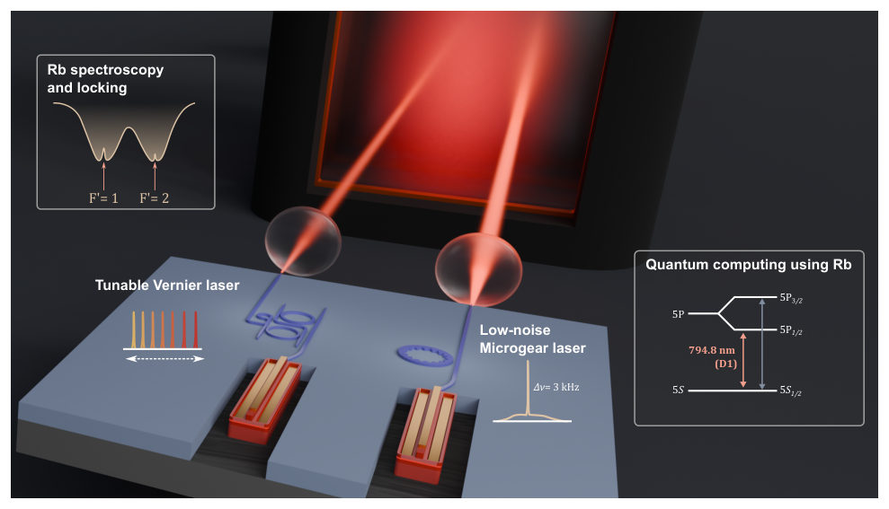 
FIG. 1. Scaling Rubidium-Based Quantum Control Systems. An outlook schematic of the tunable Vernier laser and the low-noise microgear laser shining at a Rb vapor cell with highlighted applications (insets): Rb spectroscopy and wavelength locking; interaction with the Rb D1 line for quantum computing. The D1 wavelength labeled 794.8 nm in the figure is the air wavelength, corresponding to 795.0 nm in vacuum.

📷 Fig 2

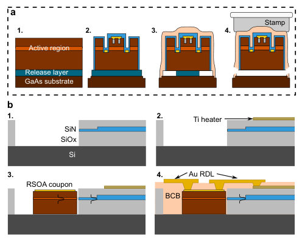 
FIG. 2. III-V coupon preparation and integration pro- cess. a. III-V process for coupon fabrication with: 1. epitax- ial layer stack; 2. laser definitions including waveguide ridge, facet etch and coating, and metal contacts; 3. photoresist en- capsulation and release etch, leaving free-standing coupons; 4. pick-up of the coupon using an elastomer stamp, breaking the photoresist tethers. b. integration process on the SiN wafer with: 1. recess etch in the SiN wafer; 2. Ti heater definition; 3. micro-transfer printing of the III-V coupon in the recess; 4. BCB planarization, via etching, and RDL met- allization.

📷 Fig 3

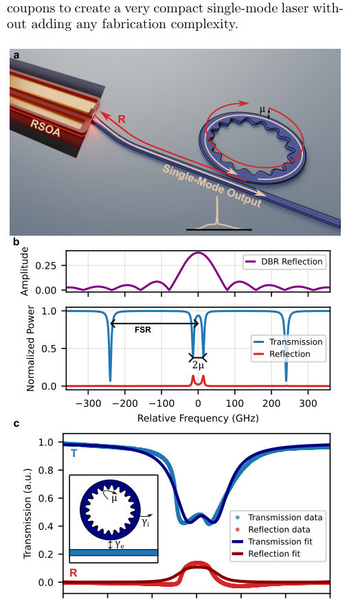 
FIG. 3. Working principle and measurement of the microgear laser. a. schematic of the laser cavity; b. sim- ulated example reflection and transmission spectra of a mi- crogear reflector showing a single split and reflecting mode; c. measurement of the microgear reflector with inset: model schematic of the reflector.

📷 Fig 4

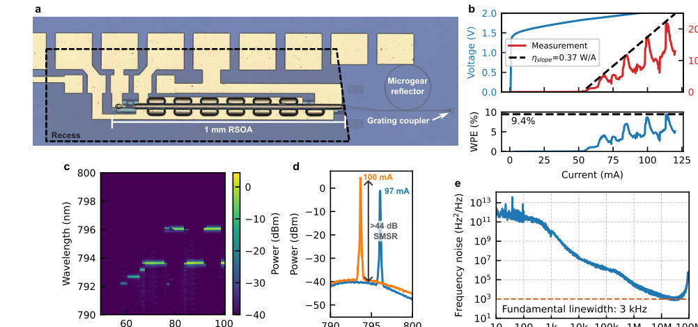 
FIG. 4. Results of the microgear laser with a. microscope image of the fully-processed laser; b. LIV curve of the microgear laser as well as the corresponding wall-plug efficiency (WPE); c. lasing spectra as a function of the laser driving current; d. lasing spectra of the two dominant laser modes; and e. frequency-noise spectrum of the lasing mode at 100 mA.

📷 Fig 5

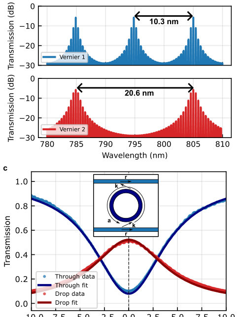 
FIG. 5. Explanation of the Vernier laser with a. schematic of the Vernier laser cavity including microheaters; b. modeled transmission spectra of the two Vernier filters used in this work; and c. transmission measurements of the microring resonator with inset: transfer-matrix model expla- nation used to fit to the measurement data.

**Summary.** This paper presents a breakthrough in integrating high-performance lasers onto silicon nitride platforms using micro-transfer printing. The resulting compact, tunable, and efficient laser toolkit is specifically designed to replace bulky external lasers for next-generation quantum technologies and optical atomic clocks utilizing Rubidium atoms.

**Why it may be interesting.** This work directly addresses the hardware bottleneck for quantum information processing and optical metrology by providing a compact, high-performance, and scalable light source tailored for atomic physics experiments.

Detailed structure

**Main problem.** Scaling quantum processors and optical atomic clocks requires drastically reducing the size, weight, power, and cost of optical control systems by integrating lasers.

**Main result.** The authors demonstrated a highly efficient, compact, and tunable integrated laser source capable of operating at the required near-infrared wavelengths for Rubidium quantum technologies.

**Method.** They developed a wafer-scalable method using micro-transfer printing to butt-couple GaAs-based amplifiers into silicon nitride waveguides, forming extended-cavity single-mode lasers.

**Model / system.** The platform integrates III-V semiconductor amplifiers (RSOAs) into a silicon nitride (SiN) waveguide structure. The laser functionality is realized using a microgear reflector structure for single-mode operation and Vernier filters for tunability.

**Key observables.** Narrow fundamental linewidth (3 kHz), on-chip output power (>22 mW), high wall-plug efficiency (9.4%), and wide tuning ranges (e.g., 140 GHz fine-tuning).

**Important parameters / regimes.** Target wavelength of 795 nm (for Rubidium D1 line); the integration technique overcomes thermal dissipation issues associated with traditional wafer bonding.

**Assumptions / limitations.** The MTP technique is superior to traditional bonding methods due to better heat sinking and coupling efficiency; future work requires optimizing the SiN cavity design and adding heaters for full resonance tuning.

**Figures summary.** Figures illustrate the schematic applications for Rb spectroscopy, the detailed MTP integration process, and the measured performance characteristics of the microgear and tunable lasers.

**Paper structure.** The paper establishes the need for photonic integration, details the MTP fabrication process for coupling GaAs to SiN, presents characterization results for the narrow-linewidth microgear laser, and then demonstrates the versatility of the platform using a widely tunable Vernier laser.

Abstract

Scaling quantum processors and optical atomic clocks fundamentally requires orders-of-magnitude reductions in the size, weight, power, and cost of optical control systems. Photonic integration of lasers is critical to fulfill these requirements. At the near-infrared wavelengths required for atomic clocks and quantum computing through manipulation of rubidium atoms, laser integration is hindered by difficulty in light coupling and poor heat dissipation. Here, we introduce a wafer-scalable method utilizing micro-transfer printing to integrate GaAs-based amplifiers in etched recesses, directly butt-coupled to silicon nitride waveguides. We demonstrate extended-cavity single-mode lasers using this integration approach. Our compact microgear laser achieves a narrow 3 kHz fundamental linewidth at an on-chip output power of >22 mW -- a record for a single-mode heterogeneously integrated laser in the 780-800 nm band -- with a wall-plug efficiency of 9.4%, showcasing the high-power and efficiency potential of this integration approach. Additionally, we demonstrate a widely tunable laser leveraging Vernier filters to achieve lasing with 9 nm coarse tuning, a quasi-continuous fine-tuning range exceeding 140 GHz, and a mode-hop-free tuning range of 45 GHz. Our scalable integrated laser toolkit shows great promise for replacing macroscopic external-cavity diode lasers in next-generation quantum technologies and optical atomic clocks.

[↑ back to top](#top)

### [Quantum-hardware spectral co-design framework for multifrequency Rydberg electrometry](http://arxiv.org/abs/2609.11635v1)

**Authors:** Song Huang, Guibin Tian, Fernando Quijandría, Zhengjiang Li, Zhimin He, Franco Nori, Yong Lu  
**Type:** both · **Category:** other · **PDF:** <https://arxiv.org/pdf/2609.11635v1>  
**Analysis basis:** full PDF text, analyzed in chunks
**Topic relevance:** `Rydberg arrays` **3/5** · `Tavis-Cummings & cavity-many-emitter` **2/5** · `analog quantum simulation` **2/5** · `methods for driven-dissipative` **2/5** · `quantum optics experiment` **2/5** · `QC/QI experiment` **1/5**

📷 Fig 1

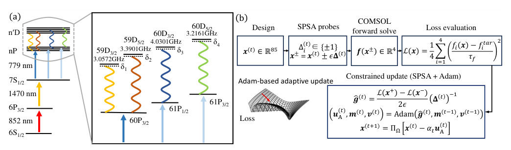 
FIG. 1. Multimode microwave Rydberg electrometry with EIT and constrained inverse design. (a) Energy level diagram for a Cs atom, driven by 852-nm probe, 1470-nm dressing, and 779-nm coupling fields. Four selected cavity modes are designed to align with four microwave transitions shown in the inset as four different waves. (b) Constrained SPSA–Adam optimization for an 85-parameter geometry x(t). Two-point SPSA evaluations x± = x(t) ± ϵ ∆(t) are simulated with a COMSOL eigenfrequency solver to obtain four-mode outputs f(x±); the normalized objective L yields a stochastic gradient estimate used by Adam. The update is projected onto a fabrication feasible set to produce x(t+1).

📷 Fig 2

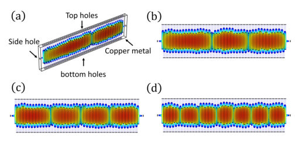 
FIG. 2. Finite-element eigenmode field distributions of the multimode elongated electrometry. (a) Electric-field magni- tude |E(r)| of eigenmode 2 (TE102, 3D cutaway view). The drilled top and bottom holes overlap to form and locally shape the cavity volume, whereas the side hole provides optical access for the excitation and probe beams. (b)–(d) |E(r)| of eigen- modes 3, 4, and 7 (TE103, TE104, and TE107, respectively), selected for alignment with the target microwave transitions in the Rydberg-EIT scheme.

📷 Fig 3

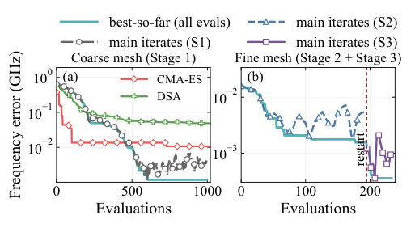 
FIG. 3. Convergence of the three-stage simulator-in-the-loop SPSA–Adam optimization and comparison with CMA-ES and DSA baselines. The vertical axis shows the aggregate frequency mismatch Ef = P

**Summary.** The authors present a quantum-hardware spectral co-design framework to engineer microwave cavities for high-precision Rydberg electrometry. By coupling a specialized SPSA–Adam optimizer to full-wave FEM simulations, they successfully tuned the cavity to simultaneously match four distinct quantum transition frequencies. This method yields a highly robust, compact, and significantly more sensitive sensing architecture than previously achieved.

**Why it may be interesting.** This work provides a powerful, generalizable computational methodology for designing quantum hardware. The coupling of advanced optimization techniques (SPSA-Adam) directly to complex physical simulators (FEM) is highly relevant for realizing next-generation quantum devices.

Detailed structure

**Main problem.** The paper addresses the general spectral co-design problem: engineering electromagnetic hardware to precisely match discrete, quantum-defined spectral constraints for multi-frequency quantum sensing.

**Main result.** A novel co-design framework was developed that successfully aligned four high-Q cavity eigenmodes with target Cs Rydberg transitions, achieving extremely low frequency errors and significantly enhancing input-power sensitivity.

**Method.** The optimization uses a simulator-in-the-loop approach, coupling a Constrained Simultaneous Perturbation Stochastic Approximation (SPSA)–Adam optimizer to full-wave finite-element eigenmode simulations.

**Model / system.** The physical system is a copper cavity structure designed for multifrequency Rydberg electrometry using Cesium (Cs) atoms. The geometry is parameterized by an 85-dimensional vector, and the objective is to minimize the frequency mismatch between the cavity modes and four selected Rydberg transition frequencies.

**Key observables.** Relative frequency error (achieved as low as $8.42 	imes 10^{-7}$), input-power-sensitivity enhancement ($\approx 4.04 	imes 10^3$), and the total frequency mismatch ($\Delta f$).

**Important parameters / regimes.** Four target Cs Rydberg transitions (e.g., 3.0572 THz), the 85-dimensional design vector $\mathbf{x}$, and the fabrication tolerance ($\Delta_{	ext{tol}}$).

**Assumptions / limitations.** The optimization relies on the ability to repeatedly call a full-wave finite-element simulator (COMSOL) within the optimization loop, and the process involves approximations like SPSA gradient estimation and quantization to a fabrication grid.

**Figures summary.** Figures illustrate the energy level diagram for the excitation scheme and the optimization process, showing the convergence of the SPSA–Adam method compared to CMA-ES and DSA baselines.

**Paper structure.** The paper details the formulation of the spectral co-design problem, introduces the SPSA–Adam optimization protocol, presents the results of optimizing the geometry for four channels, and concludes by comparing its performance against established optimization benchmarks.

Abstract

Engineering electromagnetic hardware to satisfy discrete quantum-defined spectral constraints constitutes a general spectral co-design problem for quantum systems. Here we address this challenge in multifrequency Rydberg electrometry by directly coupling a fabrication-constrained simultaneous perturbation stochastic approximation (SPSA)--Adam optimizer to full-wave finite-element eigenmode simulations. Requiring neither analytical nor adjoint gradients, the method operates over a discrete design space containing approximately $10^{300}$-configurations and yields a novel multimode electrometry architecture that simultaneously aligns four high-$Q$ eigenmodes with four selected Cs Rydberg transitions. The optimized design remains highly robust to fabrication imperfections, achieving a relative frequency error as low as $8.42\times10^{-7}$ while reducing the device length by a factor of $1.75\times10^{2}$, thereby overcoming the difficulty of simultaneous multimode spectral matching encountered in conventional design. For a comparable simulation budget, the proposed co-design framework achieves frequency-matching errors approximately 10 and 41 times smaller than those of covariance matrix adaptation evolution strategy and discrete simulated annealing, respectively. The electrometry is predicted to provide an average input-power-sensitivity enhancement of approximately $4.04\times10^{3}$, demonstrating quantum--hardware spectral co-design as a general route toward compact hardware for multichannel quantum sensing.

[↑ back to top](#top)

### [Hilbert-space selected switch of helical edges in an artificial quantum Hall insulator](http://arxiv.org/abs/2609.11732v1)

**Authors:** Naijie Ren, Zhiren Xiong, Kaining Yang, Yanran Shi, Hanwen Wang, Kenji Watanabe, Takashi Taniguchi, Neng Wan, Xiaojun Jia, Jianpeng Liu, Zheng Vitto Han, Yaning Wang  
**Type:** both · **Category:** other · **PDF:** <https://arxiv.org/pdf/2609.11732v1>  
**Analysis basis:** full PDF text, analyzed in chunks
**Topic relevance:** `analog quantum simulation` **3/5** · `driven-dissipative phase transition` **3/5** · `quantum measurements` **2/5** · `Keldysh / 2PI / non-Gaussian methods` **1/5** · `methods for driven-dissipative` **1/5**

📷 Fig 1

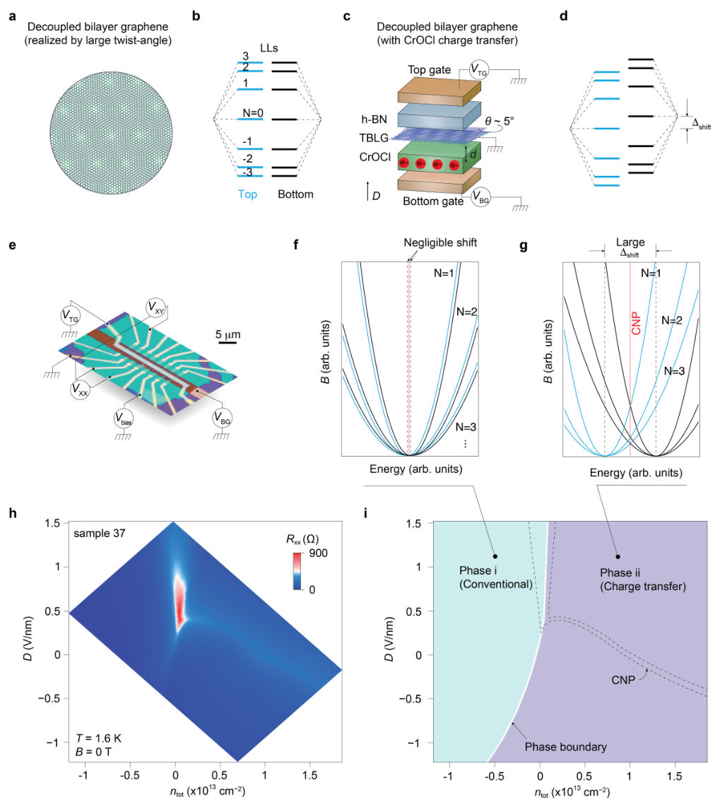 
Fig. 1 Charge-transfer-induced reconstruction of Landau levels in large-angle twisted bilayer graphene. a, Schematic of large-angle twisted bilayer graphene, in which the two graphene layers are electronically decoupled by the large momentum mismatch between their Dirac cones. b, Corresponding Landau-level (LL) structure of the top and bottom graphene layers, showing two nearly energy-aligned sets of LLs in the absence of appreciable interlayer energy offset. c, Schematic of the dual-gated large-angle twisted bilayer graphene device coupled to a CrOCl substrate. Interfacial charge transfer generates a built-in electrostatic gradient across the two graphene layers, in addition to the...

📷 Fig 2

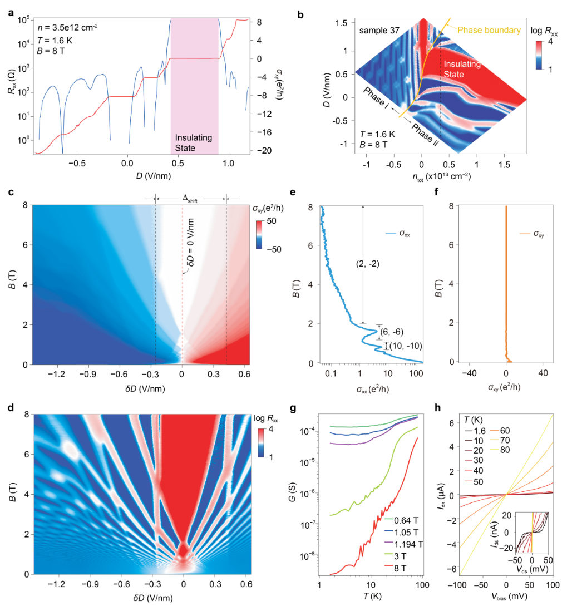 
Fig. 2 Charge-transfer-induced Landau-level crossings and the insulating state at charge neutrality. a, Longitudinal resistance Rxx and transverse Hall response σxy as a function of displacement field D at B = 8 T and T = 1.6 K, measured at a fixed total carrier density n = 3.5 × 1012 cm−2. The shaded region marks the strongly insulating state. b, Longitudinal resistance Rxx mapped in the D–ntot plane at B = 8 T and T = 1.6 K. The high-resistance region emerging in the charge-transfer phase is highlighted. The dashed line indicates the trajectory corresponding to a and to the field-dependent measurements in the following panels. c, Hall conductivity σxy as a function of magnetic field B and...

📷 Fig 3

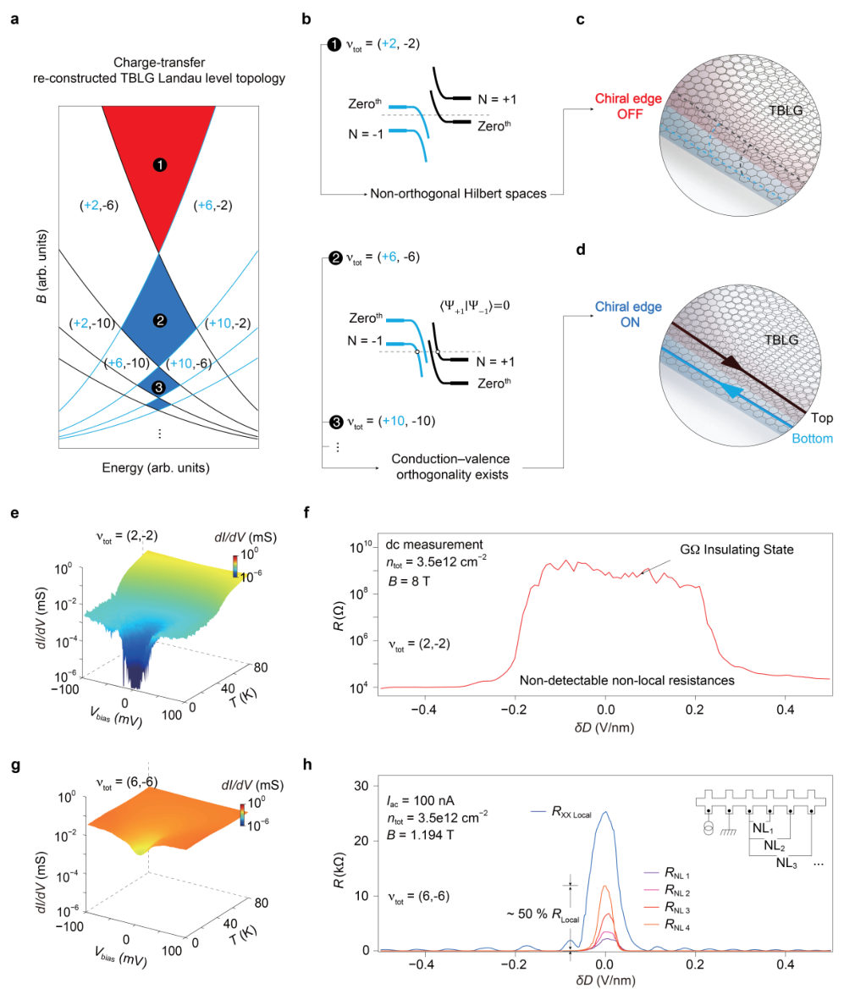 
Fig. 3 Hilbert-space-selected switching of edge transport at composite zero filling. a, Schematic Landau-level topology reconstructed by interfacial charge transfer. The two energy-shifted Dirac Landau spectra generate a sequence of composite quantum Hall states at νtot = 0, including (+2, −2), (+6, −6) and (+10, −10). Numbered regions indicate representative crossings. b, Schematic Landau-levels forming the (+2, −2) and (+6, −6) states. For (+2, −2), the crossing involves only the zeroth Landau levels and therefore lacks conduction–valence orbital orthogonality. For (+6, −6), the Landau spinors are orthogonal, protecting the chiral edge. The same orthogonality extends to higher-order...

📷 Fig 4

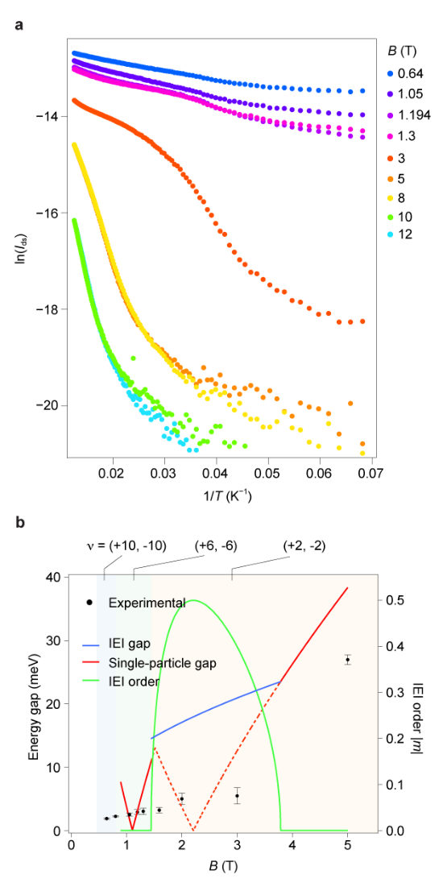 
Fig. 4 Gap evolution of the artificial quantum Hall insulator. a, Arrhe- nius plots of the source–drain current, ln(Ids) versus 1/T, measured at the charge-neutrality point for selected magnetic fields. The thermally acti- vated regimes are used to extract the activation energy ∆Ea. b, Magnetic- field dependence of the experimentally extracted activation gap (black cir- cles), compared with the calculated interlayer excitonic-insulator (IEI) gap (blue), single-particle Landau-level gap (red) and normalized IEI order pa- rameter |m| (green). The shaded regions indicate the successive composite quantum Hall sectors (+10, −10), (+6, −6) and (+2, −2). Upon entering the (+2, −2) sector,...

**Summary.** This work demonstrates a method to engineer artificial quantum Hall insulators using charge transfer between $	ext{CrOCl}$ and twisted bilayer graphene. By controlling the composite filling state, researchers can switch the edge transport from highly conductive to fully insulating. This control is explained by the removal of specific orbital components within the Landau-spinor Hilbert space.

**Why it may be interesting.** The concept of wavefunction-selective control over edge modes via Hilbert-space engineering is highly relevant to designing novel quantum devices and understanding topological phase transitions in engineered heterostructures.

Detailed structure

**Main problem.** The challenge of experimentally controlling and reconstructing the topology of edge channels in artificial quantum Hall insulators.

**Main result.** Interfacial charge transfer in a $	ext{CrOCl}$-twisted bilayer graphene system allows for the switching between insulating and highly conductive edge states by manipulating the Landau-spinor Hilbert space content.

**Method.** The study combines theoretical modeling of charge-transfer-induced band reconstruction with low-temperature transport measurements (longitudinal and non-local resistance).

**Model / system.** The system is a dual-gated large-angle twisted bilayer graphene interfaced with $	ext{CrOCl}$. The physics is modeled by considering the coupling and energy shift ($\Delta_{	ext{shift}}$) between two decoupled Dirac Landau-level ladders.

**Key observables.** Longitudinal resistance ($R_{xx}$), non-local resistance ($R_{	ext{NL}}$), and the transition between insulating and conducting edge regimes.

**Important parameters / regimes.** Composite filling configurations like $(+2, -2)$, $(+6, -6)$, and $(+10, -10)$; the relative energy shift ($\Delta_{	ext{shift}}$) induced by charge transfer.

**Assumptions / limitations.** The switching behavior is fundamentally attributed to the removal of orthogonal orbital components ($N=\pm 1$) from the Landau-spinor Hilbert space as the filling changes.

**Figures summary.** Figures illustrate the LL structure before and after charge transfer, showing the separation of Landau ladders, and map out the $R_{xx}$ vs. carrier density plane, demonstrating distinct insulating and conducting regimes.

**Paper structure.** The paper first establishes the physical platform and the problem of topological control. It then presents theoretical modeling of the charge transfer mechanism, followed by experimental measurements characterizing the transport response across different composite filling states.

Abstract

Quantum Hall effects (QHE) host one-dimensional topologically-protected edge channels, which can serve as an essential ingredient in exotic quantum electronic systems. Yet the manual reconstruction of Landau-level topology, by electrostatic confinement or symmetry breaking, remains experimentally challenging. Here, we show that interfacial charge transfer in between CrOCl and large-angle twisted bilayer graphene offsets the two otherwise decoupled Dirac Landau-level ladders in each graphene layer, creating a new sequence of composite filling configurations. At charge neutrality, the composited $(+2,-2)$ state involves only the zeroth Landau levels and becomes fully insulating, with longitudinal resistance reaching the G$Ω$ regime. By contrast, higher composite zero-filling quantum Hall states, including $(+6,-6)$ and $(+10,-10)$, retain counter-propagating helical edge channels and exhibit pronounced non-local transport, reaching up to $50\%$ of the local response. We attribute such switching-behavior to the Landau-spinor Hilbert space -- as the filling is reduced from $(+6,-6)$ to $(+2,-2)$, the orthogonal $N=\pm1$ orbital components are removed, eliminating the edge-compatible channel and gapping both bulk and boundary transport. The interaction nature of the observed gapped sates was further examined both experimentally and theoretically. Our results suggest that charge transfer provides a direct route to engineer artificial quantum Hall insulators, opening possibilities for wavefunction-selective control of helical edge modes.

[↑ back to top](#top)

### [Floquet Majorana XYZ Codes with Tunable Logical Dynamics](http://arxiv.org/abs/2609.10683v1)

**Authors:** Xinyu Sun, Hong Yao  
**Type:** theory · **Category:** quantum information and computing · **PDF:** <https://arxiv.org/pdf/2609.10683v1>  
**Analysis basis:** full PDF text, analyzed in chunks
**Topic relevance:** `analog quantum simulation` **3/5** · `quantum measurements` **3/5** · `correlated / nonlocal dissipation` **1/5** · `driven-dissipative phase transition` **1/5** · `methods for driven-dissipative` **1/5**

📷 Fig 1

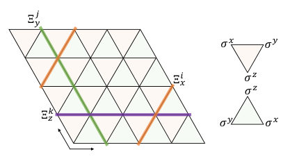 
FIG. 1. Static Majorana XYZ subsystem code. The two inequivalent triangle operators on the right define the gauge generators A∆and B∇. The colored lines on the triangular lattice show representative noncontractible loop operators Ξx, Ξy, and Ξz. Parallel loops differ by stabilizers and therefore provide equivalent logical representatives.

📷 Fig 2

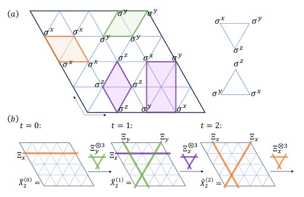 
FIG. 2. Three-step measurement protocol and dynamical logical operator. (a) The three families of four-qubit paral- lelogram operators, Px, Py, and Pz, measured successively in the T = 3 protocol. The Pauli labels indicate the corre- sponding single-Pauli-type operators on each parallelogram. (b) Evolution of the second logical Pauli representative for L = 4n. Here Ξ⊗3 a denotes the shorthand Ξh,aΞv,aΞd,a. The logical operator eZ2 = HL remains time independent through- out the cycle, whereas its conjugate representative evolves as e X(0) 2 →e X(1) 2 →e X(2) 2 under successive measurements of Px, Py, and Pz. The three representatives describe the same encoded logical Pauli operator at the...

📷 Fig 3

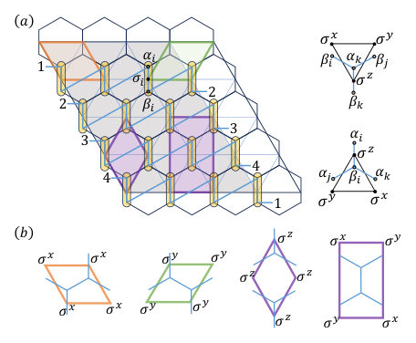 
FIG. 3. Local Majorana realization with one open spa- tial direction. (a) Honeycomb-lattice Majorana modes or- dered along the indicated path. Each yellow region denotes a unit cell containing αi and βi, related to the effective spin σi through Eq. (15). The two retained triangle generators admit local four-Majorana representations, shown on the right. (b) Spin representations of the x-, y-, and z-type parallelogram measurements and the rectangle measurement. Under the Majorana mapping, the x- and y-type parallelograms and the rectangle are local four-Majorana parity operators, whereas the z-type one is an eight-Majorana parity operator.

**Summary.** This paper develops Floquet quantum error-correcting codes based on the Majorana XYZ subsystem code, demonstrating that the logical properties are highly tunable by modifying the measurement schedule. The authors show that the code can support different types of logical qubits (static vs. dynamical) depending on the lattice size and the measurement cycle, and they provide a first construction realizing this on local Majorana parity measurements.

**Why it may be interesting.** This work directly addresses the implementation of topological quantum computation using Majorana fermions, which is a central theme in quantum information theory, by providing concrete, physically realizable protocols.

Detailed structure

**Main problem.** The paper constructs and characterizes Floquet quantum error-correcting codes based on the Majorana XYZ subsystem code, focusing on how logical dynamics depend on the measurement schedule and lattice size.

**Main result.** The code exhibits parity- and schedule-dependent logical dynamics, allowing the encoded logical degree of freedom to switch between static and partially dynamical forms by adjusting the measurement cycle. Furthermore, it achieves a direct local Majorana realization for even lattice sizes.

**Method.** The authors analyze the evolution of the instantaneous stabilizer group (ISG) under periodic measurements (Floquet cycles) and derive the code parameters by analyzing the algebraic structure of the stabilizer group generated by local parity measurements.

**Model / system.** The system is the Majorana XYZ subsystem code realized on an $L 	imes L$ periodic triangular lattice of Majorana modes. The encoding is achieved by implementing the code using a sequence of local parity measurements ($P_x, P_y, P_z$).

**Key observables.** The number of supported logical qubits ($k_s, k_p$), the code distance ($d$), and the time evolution of Pauli representatives for the logical operators.

**Important parameters / regimes.** Lattice size $L$ (especially its modulo 4 behavior), the measurement cycle length ($T=2$ vs $T=3$), and the parity of $L$.

**Assumptions / limitations.** The analysis assumes that local Majorana parity measurements are native operations, and the local realization relies on boundary-peeling arguments for even $L$.

**Figures summary.** Figures illustrate the static code structure, the three-step measurement protocol using parallelogram operators, and the local Majorana realization on a lattice geometry.

**Paper structure.** The paper progresses by first defining the static code, then analyzing the dynamics under a three-step Floquet cycle, detailing how $L \pmod 4$ dictates the logical structure, and finally establishing the direct local Majorana realization for even $L$ by analyzing the measurement group generators.

Abstract

We construct Floquet codes from the Majorana XYZ subsystem code with local realizations both in qubits and directly in microscopic Majorana modes with lattice size $L\times L$. For a three-step cycle, odd $L$ supports one static logical qubit, whereas even $L$ supports two. For even $L$ with $L=4n+2$, both logical qubits admit time-independent Pauli representatives. For $L=4n$, by contrast, one Pauli of the second logical qubit remains fixed throughout the cycle, while every representative of its conjugate must evolve through the measurement cycle. This distinction follows from a parity-dependent algebraic obstruction and disappears when the cycle is reduced to two steps, which restores a fully static logical pair. Thus, the same encoded logical degree of freedom can be switched between static and partially dynamical forms by the measurement schedule. With one open direction, suitable protocols can be implemented using only local Majorana parity measurements. To our knowledge, this is the first Floquet-code family with both a local qubit representation and a direct microscopic Majorana realization.

[↑ back to top](#top)

### [Physics of Information Geometry - Part II: Small-Step Active Inference on the Probability Simplex](http://arxiv.org/abs/2609.11187v1)

**Authors:** C. Emre Koksal, Deniz Sargun  
**Type:** theory · **Category:** statistical mechanics · **PDF:** <https://arxiv.org/pdf/2609.11187v1>  
**Analysis basis:** full PDF text, analyzed in chunks
**Topic relevance:** `quantum measurements` **3/5** · `Keldysh / 2PI / non-Gaussian methods` **2/5** · `methods for driven-dissipative` **2/5** · `driven-dissipative phase transition` **1/5** · `non-equilibrium universality` **1/5**

📷 Fig 1

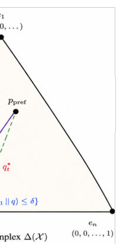 
Fig. 1. Illustration of the information-geometric Pythagorean theorem on the proba- bility simplex. The admissible next-step distributions lie inside the KL ball Bδ(qt−1). The optimal incremental step q⋆ t is the projection of the preferred distribution ppref onto this ball. The resulting decomposition shows that the reduction in free energy is at least as large as the informational step size.

📷 Fig 2

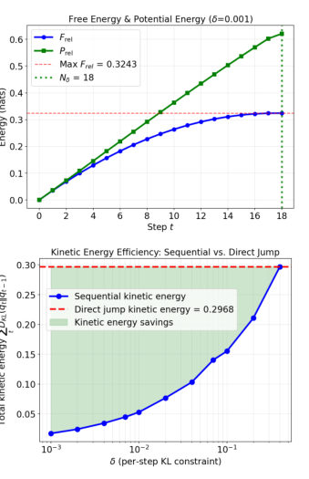 
Fig. 2. Numerical results for π0 = (1/3, 1/3, 1/3), ppref = (0.7, 0.2, 0.1). Top-left: Optimal trajectory on the 2-simplex with δ = 0.001 (Nδ = 18 steps). Top-right: Evolution of relative free energy Frel and relative potential energy Prel along the path. Bottom-left: Stopping time Nδ and total kinetic cost as functions of the step-size constraint δ. Bottom-right: Total kinetic energy of the sequential strategy versus the direct-jump cost DKL(ppref∥π0).

**Summary.** This work develops a geometric framework for understanding how belief states evolve on the probability simplex, treating the process as a physical system governed by a least-action principle. By minimizing an action functional derived from relative free energy and KL divergence, the authors derive the optimal update rule. This shows that optimal inference follows a path analogous to classical mechanics, providing deep connections between information theory and physics.

**Why it may be interesting.** The connection between optimal inference (Free Energy Principle) and classical mechanics (Least Action Principle) provides a powerful, geometric framework for understanding non-equilibrium dynamics in complex systems, relevant for modeling open quantum systems or information flow.

Detailed structure

**Main problem.** The paper determines the optimal sequence of distributions (path) for an agent to move from an initial belief state to a desired target distribution on the probability simplex.

**Main result.** The optimal trajectory minimizes an accumulated action functional, leading to a closed-form update where the new distribution is an exponentially tilted version of the current one toward the preferred distribution.

**Method.** It establishes a least-action principle by defining a relative free energy and using the Kullback-Leibler divergence as a discrete kinetic energy constraint.

**Model / system.** The system is the belief state evolving on the probability simplex, $\Delta(X)$. The dynamics are governed by minimizing an action functional derived from information geometry.

**Key observables.** Relative Free Energy, Relative Potential Energy, Kullback-Leibler (KL) divergence (as kinetic energy), and the Action Functional.

**Important parameters / regimes.** The step size ($\delta$), which governs the kinetic energy budget, and the Lagrange multiplier ($\lambda_t$) associated with the constraint.

**Assumptions / limitations.** The analysis relies on the small-step limit ($\delta 	o 0$) and the application of the information-geometric Pythagorean theorem.

**Figures summary.** Figures illustrate the information-geometric Pythagorean theorem on the probability simplex, showing the optimal step as a projection onto a KL ball, and depict the stopping-time formulation on the 2-simplex.

**Paper structure.** The paper builds the framework by defining relative free/potential energies, applying the Pythagorean theorem to justify small steps, formulating the problem as minimizing an action functional, and deriving the closed-form, exponentially tilted update rule.

Abstract

This paper is the second in a two-part investigation of the physics of information geometry. While Part I develops a physical foundation for distributional motion on the probability simplex, the present paper studies how that framework manifests in active inference. The treatment is fully self-contained and does not require familiarity with Part I. We focus in particular on active inference through small distributional steps and the geometric structure induced by such local motion. Starting from an initial distribution, an agent evolves its belief state toward a final target distribution through a sequence of constrained updates. We define a relative free energy functional with respect to the preferred distribution and extend it to a relative potential energy analogous to the Helmholtz/Gibbs free-energy decomposition. The evolution is subject to a per-step kinetic constraint expressed through the Kullback-Leibler (KL) divergence between consecutive distributions, which serves as a discrete kinetic energy on the probability simplex. Using the information-geometric Pythagorean theorem on KL balls, we show that sufficiently small local moves dominate large direct jumps, and that greedy maximization of free-energy reduction is globally optimal under the kinetic constraint. This leads to a sequential variational principle in which the optimal trajectory minimizes the associated Lagrangian of the optimization problem. Similar to classical mechanics, the Lagrangian takes on the form as the difference between the kinetic and potential terms, establishing a least-action principle for distributional motion on the simplex. The resulting optimal update admits a closed form as an exponentially tilted version of the current distribution toward the preferred distribution, parametrized by an inverse-temperature-like multiplier. We further extend the framework to incorporate state-dependent geodesic...

[↑ back to top](#top)

### [Quantum-RAM Implementation Using Multiple Interacting Rydberg-Blockaded EIT Systems](http://arxiv.org/abs/2609.11344v1)

**Authors:** Avirup Chakraborty, Shrabana Chakrabarti  
**Type:** theory · **Category:** quantum information and computing · **PDF:** <https://arxiv.org/pdf/2609.11344v1>  
**Analysis basis:** full PDF text, analyzed in chunks
**Topic relevance:** `Rydberg arrays` **3/5** · `analog quantum simulation` **3/5** · `Tavis-Cummings & cavity-many-emitter` **1/5** · `interference shaping light` **1/5** · `quantum measurements` **1/5**

📷 Fig 1

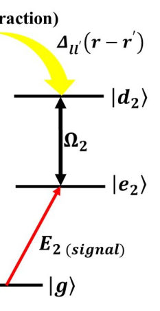 
FIG. 1. EIT Dipole-Dipole Interaction Dressed State Diagram.

📷 Fig 2

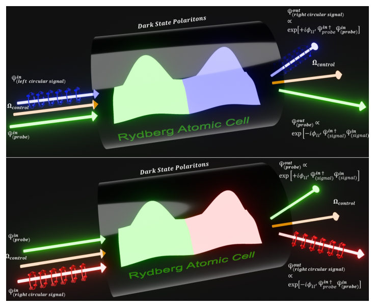 
FIG. 2. Dipole-Dipole Polariton Interaction inside Rydberg atomic cell and subsequent phase generation. The left (right) polarization state of signal pulses have been shown in (a) blue (top) and in (b) red (bottom).

📷 Fig 3

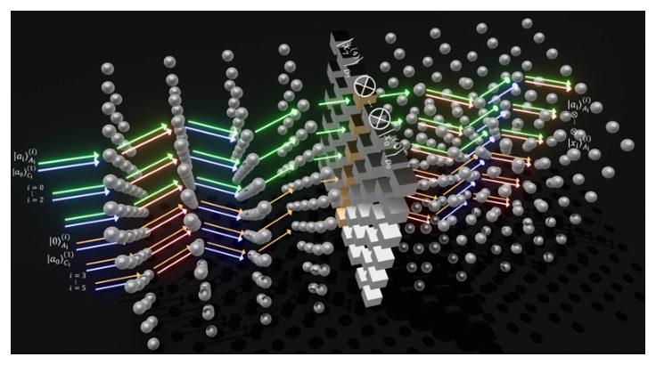 
FIG. 3. Ensemble of cold alkali atoms (spheres), where each layer serving as a level on a bi-directional binary tree. The address probe laser, signal laser and the data probe laser has been represented by yellow arrows, blue/red arrows for either left/right polarization states and orange arrows. The memory locations, represented by the square arrays.

📷 Fig 4

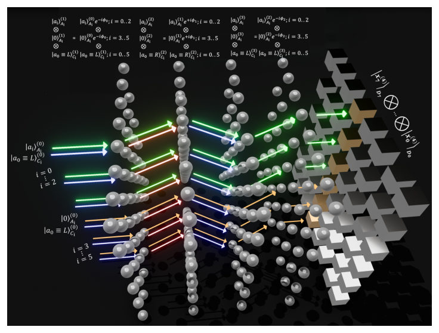 
FIG. 4. Routing scheme of the quantum walkers, represented by the address and data probe pulses, visualized. Here, shown the routing of probe pulses by ensuing phase generation of ±iϕn, based on the left (blue) and right (red) polarization state of signal pulses.

📷 Fig 5

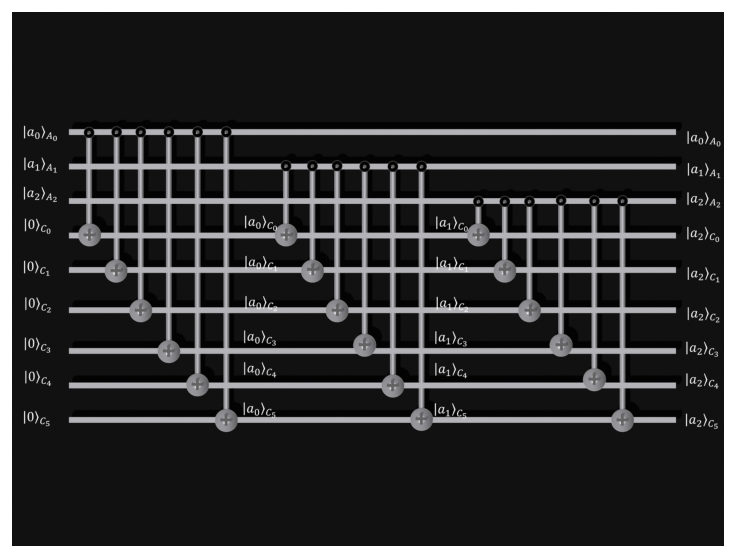 
FIG. 5. CNOT operations to copy the address information at each level of the binary tree onto the encoded polarization states of the signal laser pulses.

**Summary.** This paper proposes a novel theoretical architecture for building a quantum random access memory (qRAM) using Rydberg-blockaded atomic ensembles operating via Electromagnetically Induced Transparency (EIT). It achieves high-fidelity quantum operations by exploiting strong dipole-dipole interactions to generate conditional phase shifts. The resulting scheme offers a scalable, O(n) approach to photonic qRAM by implementing quantum random walks through a binary tree structure.

**Why it may be interesting.** This work is highly relevant as it merges advanced concepts from quantum optics (EIT, Rydberg interactions) with quantum information primitives (qRAM, quantum random walks), providing a concrete, hardware-agnostic blueprint for quantum computation.

Detailed structure

**Main problem.** The paper addresses the challenge of implementing a Quantum Random Access Memory (qRAM) architecture.

**Main result.** A scalable and coherent qRAM scheme is proposed that achieves an access complexity of O(n) by utilizing quantum random walks within an atomic ensemble.

**Method.** The scheme relies on generating conditional phase shifts via cross-phase modulation in multiple Electromagnetically Induced Transparency (EIT) systems.

**Model / system.** The physical platform is a Rydberg-blockaded atomic ensemble using multilevel EIT systems configured in a binary tree structure. Qubits are encoded in probe fields and mapped onto metastable atomic states.

**Key observables.** The accumulated phase $\phi_{ll'} \propto 	ilde{n}_{l'}$ acquired by the address walker, which dictates state-selective routing outcomes.

**Important parameters / regimes.** The operational complexity is reduced to O(n); key parameters include dipole moments ($\mathcal{P}_{dl}, \mathcal{P}_{dp}$) and propagation time limits.

**Assumptions / limitations.** The derivation assumes the dipole moment term for the address probe walker is much smaller than that of the signal probe walker ($C_{ll} < C_{ll'}$).

**Figures summary.** Figures illustrate the EIT interaction diagram, the binary tree structure for routing, the quantum walker phase generation mechanism, and the process for state mapping and retrieval.

**Paper structure.** The paper develops the architecture by first establishing the physical basis (EIT/Rydberg interactions), then detailing the quantum random walk mechanism for routing and querying, and finally demonstrating the full state transfer and retrieval process satisfying the QRAM condition.

Abstract

We propose a novel theoretical architecture for implementing a quantum random access memory (qRAM) based on quantum random walks in a Rydberg blockaded atomic ensemble utilizing multilevel Electromagnetically Induced Transparency (EIT). Unlike previous approaches that rely on geometric phase gates in solid-state or trapped ion systems, our scheme harnesses the strong, coherent dipole dipole interactions between Rydberg atoms to achieve high-fidelity phase control of photonic qubits without the need for cryogenic temperatures. By generating conditional phase shifts through cross-phase modulation in multiple lambda-type EIT systems, we realize the controlled unitary operations requisite for an efficient qRAM. In the proposed architecture, Zeeman splitting is used to engineer a set of parallel lambda systems in a cavity, where pairs of magnetic sublevels of the ground state are coupled to highly excited Rydberg states via circularly polarized laser pulses. These Rydberg excited EIT systems serve as the elementary phase gates that form the nodes of a binary tree enabling quantum random walking. Address and data qubits are encoded into distinct probe fields and coherently mapped into the metastable atomic states, where their interactions within the EIT medium generate conditional phases required for state-selective routing. The system uses $n+m$ layers of cold alkali atoms to form an $n$-level binary tree of Rydberg nodes connected to $2^n$ cavity-trapped memory atoms, operated by $n+m$ laser pulses acting as quantum walkers and address units. Our scheme offers a scalable, reducing operational complexity to $\mathcal{O}(n)$ and highly coherent pathway toward photonic qRAM, exploiting collective Rydberg interactions to realize programmable, parallel entangling operations in an atomic ensemble.

[↑ back to top](#top)

### [SI-Traceable Calibration and Performance Benchmarking of a Terahertz Photomixer Transmitter-Receiver System Using a Rydberg Atomic Sensor](http://arxiv.org/abs/2609.11887v1)

**Authors:** Alisher Duspayev, Kaitlin R. Moore, Georg Raithel, David A. Anderson  
**Type:** experiment · **Category:** other · **PDF:** <https://arxiv.org/pdf/2609.11887v1>  
**Analysis basis:** full PDF text, analyzed in chunks
**Topic relevance:** `quantum optics experiment` **3/5** · `Rydberg arrays` **2/5** · `analog quantum simulation` **2/5** · `quantum measurements` **2/5**

📷 Fig 1

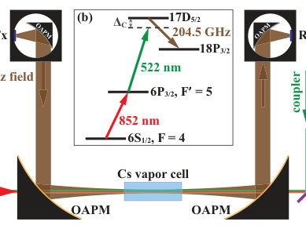 
FIG. 1. (a) Sketch of the experimental setup (not to scale). Tx: transmitter; Rx: receiver; OAPM: off-axis parabolic mir- ror; DM: dichoric mirror; APD: avalanche photodetector. (b) Single-atom energy-level diagram (not to scale) outlining uti- lized Cs states.

📷 Fig 2

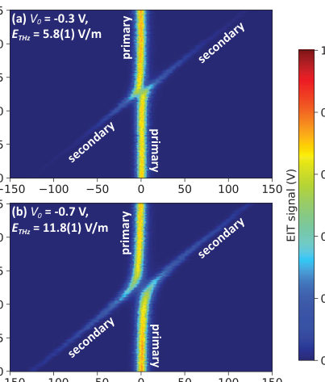 
FIG. 2. Experimental EIT maps as a function of coupler laser detuning ∆C and THz field frequency νT Hz for V0 = -0.3 V (a) and -0.7 V (b). The THz field magnitudes, ET Hz, extracted from the AT splittings at the |17D5/2⟩→|18P3/2⟩resonance using Eq. 3, are indicated.

📷 Fig 3

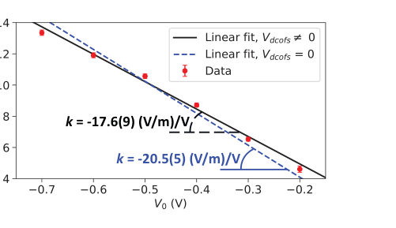 
FIG. 3. Calibration of the THz transmitter-receiver system in dc mode. Data points are the THz electric field corrected for the transmission through the vapor cell wall, E(0) T Hz, vs bias voltage V0 of the photomixer Tx. The linear fits shown (solid and dashed curves) and the indicated fitted slopes are based on Eq. 4.

📷 Fig 4

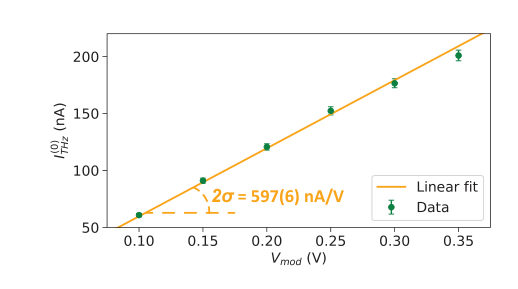 
FIG. 4. Calibration of the THz transmitter-receiver system in its native modulation mode. Data points are the THz- induced current reading of the photomixer receiver, I(0) T Hz, as a function of the transmitter modulation amplitude, Vmod, for fixed V0 = -0.4 V and with the vapor cell removed. Solid curve is a linear-fit result using Eq. 6. The obtained fitted slope is indicated.

**Summary.** This paper presents a novel method to achieve SI-traceable calibration for THz photomixer systems by utilizing Rydberg atomic sensors. By measuring the Autler-Townes splitting in a Cesium vapor, the absolute THz electric field is determined, which is then used to calibrate both the transmitter power and the receiver's sensitivity. This establishes a crucial, absolute field benchmark for state-of-the-art THz detection technology.

**Why it may be interesting.** This work directly applies advanced concepts from atomic physics (Rydberg atoms, EIT, AT effect) to solve a critical engineering problem in quantum optics and THz detection, providing a quantum-enhanced metrology tool.

Detailed structure

**Main problem.** Accurate calibration and performance benchmarking of Terahertz (THz) photomixer transmitter-receiver systems is challenging due to the lack of SI-traceable THz field sensors.

**Main result.** The study demonstrates that Rydberg atomic sensors provide a practical, SI-traceable method for calibrating THz transmitter and receiver systems, establishing an absolute field benchmark.

**Method.** The THz electric field is extracted by measuring the Autler-Townes (AT) splitting in a Cesium Rydberg transition, which calibrates the transmitter, and simultaneously calibrates the receiver's responsivity.

**Model / system.** The experiment uses a THz photomixer transmitter-receiver system coupled with a Rydberg atomic sensor based on the Cesium $17D_{5/2} 
ightarrow 18P_{3/2}$ transition in a thermal atomic vapor.

**Key observables.** THz electric field strength ($E_{	ext{THz}}$), Rabi frequency ($\Omega$), AT-split lines, and the receiver's current-to-field responsivity ($\gamma$).

**Important parameters / regimes.** THz frequency near 204 GHz, Rydberg transition parameters, and noise floor comparisons (e.g., $	ext{BBR}$ noise vs. atomic sensitivity).

**Assumptions / limitations.** The photomixer receiver is assumed to operate above its Black-Body Background Radiation (BBR) noise floor.

**Figures summary.** Figures illustrate the experimental setup, the single-atom energy-level diagram, and maps showing the atomic spectrum (EIT) as a function of transmitter bias voltage ($V_0$) under the influence of the THz field.

**Paper structure.** The paper introduces the problem of THz calibration, details the methodology using Rydberg sensing to extract $E_{	ext{THz}}$ via AT effects, and then applies this calibration to benchmark both the transmitter and receiver performance against fundamental noise limits.

Abstract

Accurate calibration of electromagnetic field strength in the terahertz (THz) frequency regime remains challenging due to the limited availability of SI-traceable field sensors. Here we demonstrate SI-traceable calibration and performance benchmarking of a commercial photomixer-based THz transmitter-receiver system operating near 204 GHz using Rydberg electric-field sensing in a thermal atomic vapor. The THz electric field is extracted from the Autler-Townes (AT) effect of the cesium $17D_{5/2}\rightarrow18P_{3/2}$ Rydberg transition. We measure the strength of AT-split lines as a function of THz detuning from resonance to find the on-resonant Rabi frequency, which, together with atomic transition dipole moments and fundamental constants, yields the THz electric field. The atomically measured field calibrates the photomixer transmitter field and power, while simultaneous measurements with a commercial InGaAs photomixer receiver calibrate the receiver's current-to-field responsivity and convert its current-noise floor into an absolute noise-equivalent THz electric-field sensitivity. Our study demonstrates that Rydberg atomic sensors provide a practical method for SI-traceable calibration and benchmarking of THz transmitter and receiver systems, and for the establishment of a quantitative link between state-of-the-art and absolute atom-based THz sensors.

[↑ back to top](#top)

### [Coherent Floquet quantum reservoirs for molecular property prediction](http://arxiv.org/abs/2609.11071v1)

**Authors:** Luofei Wang, Da Zhang, Congren Wang, Yiming Li, Yuxiao Yang, Xuan Zhang, Xuefeng Cui, Zhang-Qi Yin  
**Type:** both · **Category:** disordered systems and neural networks · **PDF:** <https://arxiv.org/pdf/2609.11071v1>  
**Analysis basis:** full PDF text, analyzed in chunks
**Topic relevance:** `driven-dissipative phase transition` **3/5** · `methods for driven-dissipative` **3/5** · `analog quantum simulation` **1/5** · `quantum measurements` **1/5**

📷 Fig 1

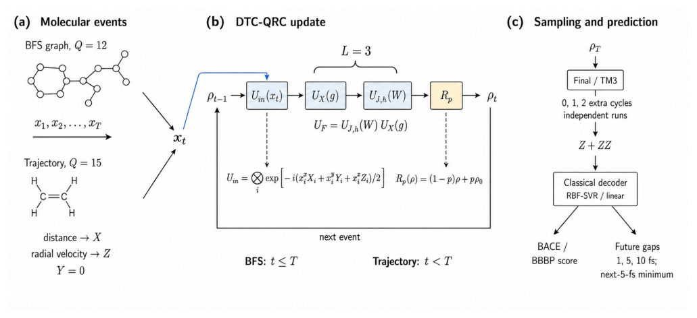 
FIG. 1. Molecular graph classification and electronic-gap forecasting with a fixed DTC-QRC. (a) BFS graph events describe local atoms, bonds, rings, and traversal depth for BACE inhibitor-activity and BBBP permeability classification (Q = 12). Ethene surface-hopping frames supply interatomic distances and radial velocities for future-gap prediction (Q = 15). (b) One input rotation precedes three Floquet cycles, each ordered as UX(g) followed by UJ,h(W). The global channel Rp(ρ) = (1 −p)ρ + p|0Q⟩⟨0Q| resets all qubits together with probability p. Graph processing includes reset after the last token (t ≤T); trajectory processing resets only between frames (t &lt; T). (c) Final-state sampling...

📷 Fig 2

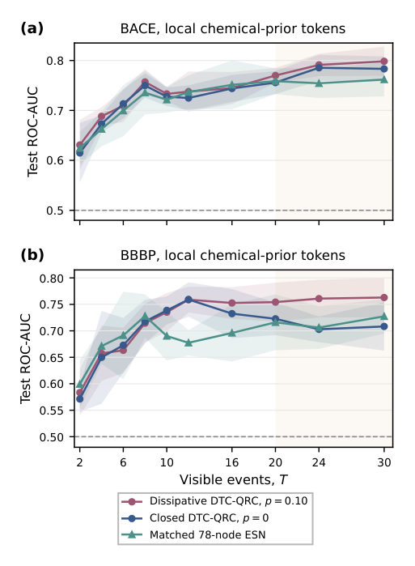 
FIG. 2. Same-T graph-stream application test. (a) BACE and (b) BBBP at Q = 12 under the local chemical-prior to- ken protocol and RBF-SVR decoding. Lines and bands show six paired-seed means and sample standard deviations. The orange background marks the long-prefix region T &gt; 20.

📷 Fig 3

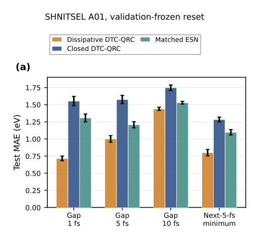 
FIG. 3. Validation-selected SHNITSEL A01 application test at the common Q = 15, T = 20 interface. Bars report test MAE for dissipative DTC-QRC, closed DTC-QRC, and the matched ESN using final-state Z + ZZ sampling and RBF- SVR. Error bars show six-seed sample standard deviations.

📷 Fig 4

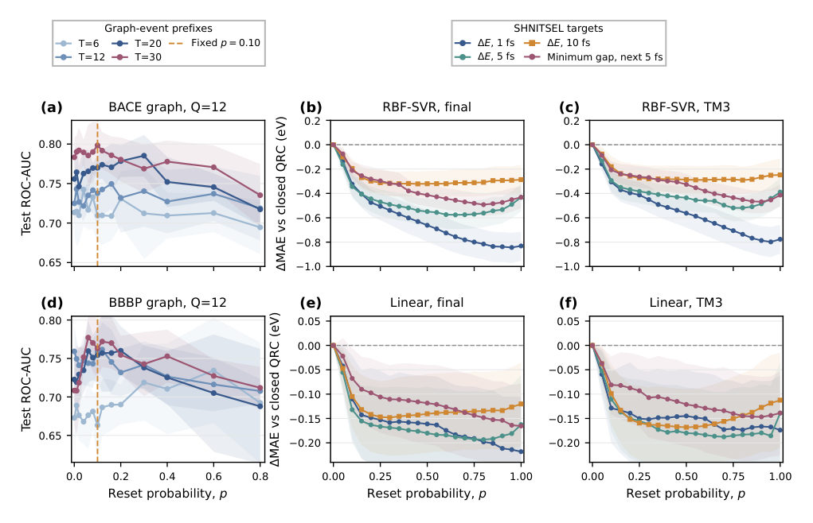 
FIG. 4. Reset-probability response across both molecular interfaces. (a,d) BACE and BBBP test AUC at Q = 12 for four fixed event lengths on the original measured 0 ≤p ≤0.8 axis; lines and bands show six-seed means and sample standard deviations, and the vertical dashed line marks the prespecified graph value p = 0.10. (b,c) SHNITSEL A01 with RBF-SVR and final-state or TM3 sampling. (e,f) The same targets with linear decoding. Hopping curves use the uniform p = 0, 0.05, . . . , 1 scan and report held-out trajectory MAE at p minus paired closed-DTC-QRC MAE at p = 0; shading gives crossed seed-by-trajectory 95% intervals.

📷 Fig 5

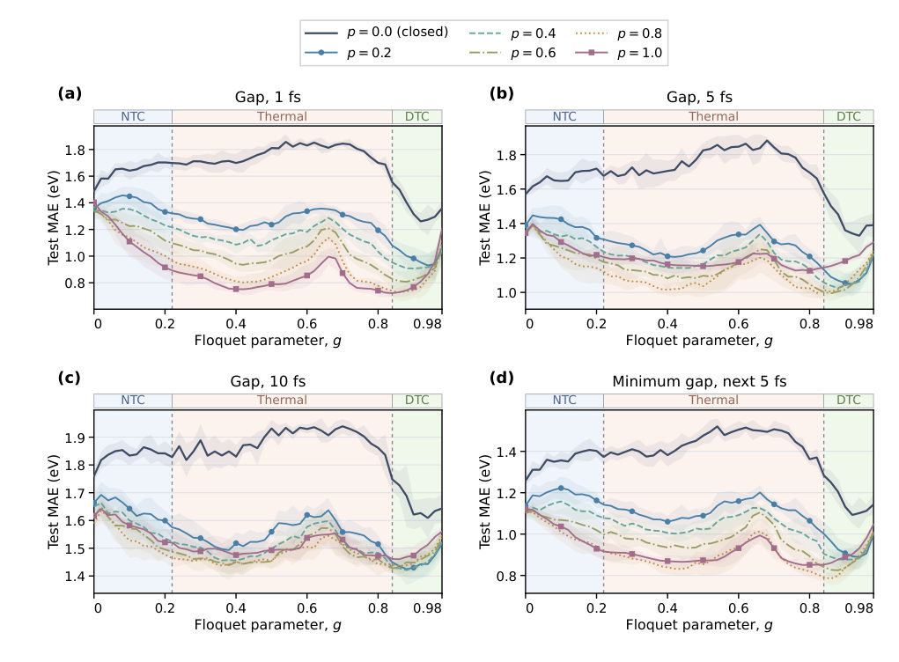 
FIG. 5. Floquet-drive dependence of ethene gap prediction with RBF-SVR and final-state readout. (a)–(d) The 1-, 5-, and 10-fs gaps and the minimum gap in the next 5 fs. Each panel shows p = 0, 0.2, . . . , 1 at Q = 15, T = 20, L = 3, and W = 0.50. Lines and bands give means and sample standard deviations across six reservoir seeds on one fixed whole-trajectory split. The background labels mark literature reference regions: nontime-crystalline (NTC), thermal, and DTC, with divisions at g = 0.22 and 0.84 [25, 37].

**Summary.** This paper introduces a novel Quantum Reservoir Computing (DTC-QRC) architecture for predicting molecular properties from structural and dynamical data. It uses coherent Floquet evolution on quantum circuits to process sequential molecular information, outperforming classical benchmarks like ESNs. The framework establishes a unified platform for quantum-enhanced molecular screening.

**Why it may be interesting.** This work directly bridges quantum dynamics (Floquet evolution, DTCs) with machine learning for chemistry, providing a quantum-enhanced framework for molecular property prediction, which is highly relevant to AMO physics applications.

Detailed structure

**Main problem.** The paper aims to predict complex molecular properties, such as inhibitor-activity or electronic gaps, using quantum machine learning techniques.

**Main result.** The proposed DTC-QRC architecture outperforms traditional Echo State Networks (ESN) on challenging graph classification and molecular forecasting tasks.

**Method.** It employs a Discrete Time Crystal (DTC)-based Quantum Reservoir Computing (DTC-QRC) framework, using Floquet evolution to process sequential structural or dynamical molecular data.

**Model / system.** The model uses a DTC-QRC architecture where the quantum state evolves via Floquet cycles governed by local Hamiltonians. Inputs can be structural (SMILES via BFS) or dynamical (surface-hopping trajectories), and the process includes a controlled reset mechanism.

**Key observables.** Feature vectors derived from end-point measurements (e.g., $Z+ZZ$ observables) are used as inputs for classical decoders to predict properties.

**Important parameters / regimes.** Key parameters include the number of qubits ($Q=12$ or $Q=15$), the reset probability ($p$), and the Floquet cycle length ($L$).

**Assumptions / limitations.** The reservoir parameters are fixed during the training of the classical readout decoder, and the process assumes that the history can be compressed into a fixed-dimension feature vector.

**Figures summary.** Figure 1 illustrates the two main interfaces: graph event processing via BFS and dynamical trajectory processing, both involving Floquet evolution and state sampling.

**Paper structure.** The paper introduces the DTC-QRC framework, details its application to molecular property prediction using both graph and time-resolved data, compares its performance against ESNs, and validates its robustness on superconducting quantum hardware.

Abstract

Quantum reservoir computing (QRC) uses quantum dynamics to represent input histories for prediction through a trained classical readout. Discrete time crystals (DTCs) exhibit robust subharmonic responses under periodic driving, and previous work has used their dynamics to construct DTC-QRC. Here we construct a DTC-based reservoir architecture to predict molecular properties from structural and dynamical observations. Coherent Floquet evolution processes local molecular graph events and surface-hopping frames, while controlled reset regulates the contribution of earlier inputs. Measurements at the end of each input sequence yield a feature vector of fixed dimension. Trained classical decoders use this vector for inhibitor-activity and blood--brain-barrier permeability classification and electronic-gap forecasting, while the reservoir parameters remain fixed during training. With matched input lengths and output widths, DTC-QRC outperforms echo-state networks on long-prefix graph classification and the studied ethene gap forecasting tasks. Dephasing lowers performance in both applications, consistent with a role for coherent propagation. Experiments on the Quafu superconducting quantum cloud platform show that pair observables retain task information under device noise. The architecture provides a common framework for molecular screening and time-resolved property prediction using quantum reservoir computing.

[↑ back to top](#top)

### [Finite-time effects in periodically kicked systems](http://arxiv.org/abs/2609.11568v1)

**Authors:** F. Revuelta, R. Chacón, F. Borondo  
**Type:** theory · **Category:** other · **PDF:** <https://arxiv.org/pdf/2609.11568v1>  
**Analysis basis:** full PDF text, analyzed in chunks
**Topic relevance:** `analog quantum simulation` **3/5** · `Frenkel-Kontorova` **1/5** · `driven-dissipative phase transition` **1/5** · `methods for driven-dissipative` **1/5** · `non-equilibrium universality` **1/5** · `scars & prethermalization` **1/5**

📷 Fig 1

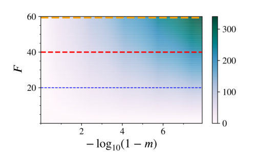 
Figure 2. Chaotic layer width in the F −m plane [cf. Eq. (6)] for ˜T = 1. Sections of the parameter chaotic layer width corresponding to the values indicated by the dashed lines (F = 20, 40, 60) are shown in Fig. 3(d).

📷 Fig 2

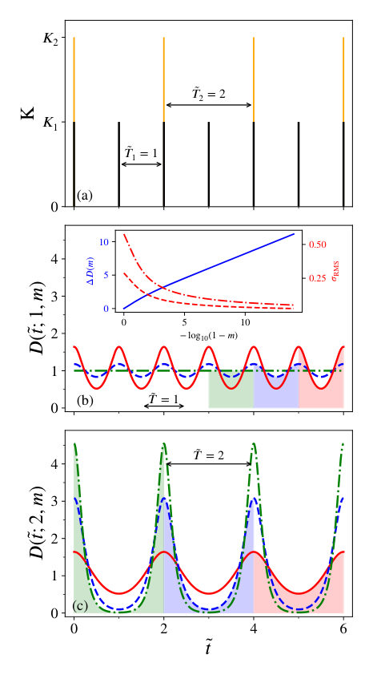 
Figure 1. Schematic illustration of the function D(˜t; 1, m) [cf. Eq. (2)] in the limiting case m →1 for two instances of amplitudes K1 ,K2, and periods T1, T2, respectively, such that the impulse transmitted per unit period is the same. (b) Modulation D(˜t; 1, m) [cf. Eq. (2)] for three val- ues of the shape parameter: m = 0 (dashed-dotted green line), m = 0.5 (dashed blue line), and m = 0.9 (solid red line). The shaded areas equal the impulse transmitted in each case [cf. Eq. (4)]. Inset: Effective modulation ampli- tude ∆D(m) = max[D(˜t; ˜T, m)] −min[D(˜t; ˜T, m)] (blue solid line), and width σRMS [cf. Eq. (3)] of the pulses for ˜T = 1 (dashed red line) and ˜T = 2 (dashed-dotted red...

📷 Fig 3

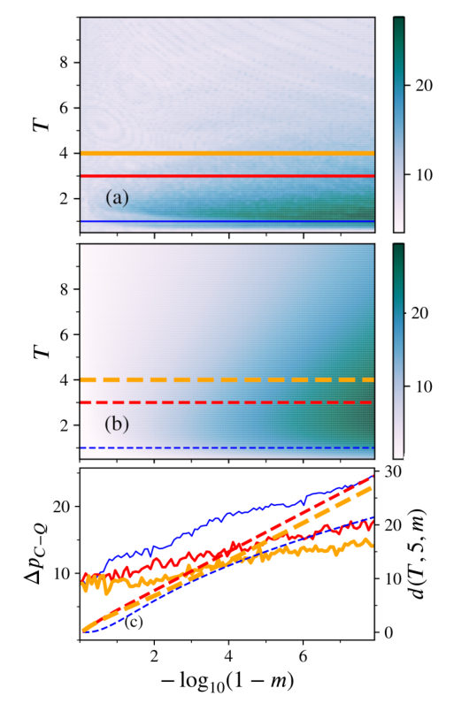 
Figure 4. Comparison between the strengths of dynamical localization and chaos for F = 5 in the parameter plane m−T. (a) Difference between the classical and quantum momentum dispersions ∆pC−Q = ∆pC −∆pQ [Eq. (11)]. (b) Chaotic layer width [Eq. (6)]. (c) ∆pC−Q vs m for: T = 1 (blue), 3 (red), and 4 (orange) [solid lines, also shown in (a)], and chaotic layer width [Eq. (6)] [dashed lines, also shown in (b)].

📷 Fig 4

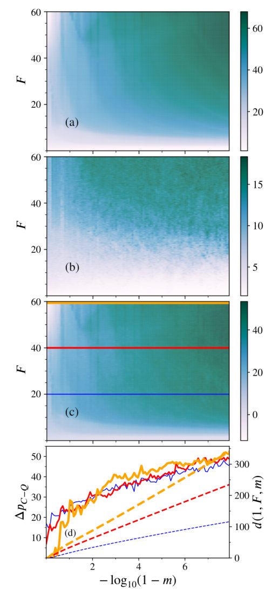 
Figure 3. Comparison between the strengths of dynamical localization and chaos for T = 1 in the parameter plane m − F. (a) Classical momentum dispersion ∆pC, (b) quantum momentum dispersion ∆pQ given by Eq. (2), and (c) their difference ∆pC−Q = ∆pC −∆pQ [Eq. (11)]. (d) Sections of ∆pC−Q for three values of the modulation amplitude: F = 20, 40, 60 [solid lines, also shown in (c)] and chaotic layer width [Eq. (6)] [dashed lines, also shown as in Fig. 2].

📷 Fig 5

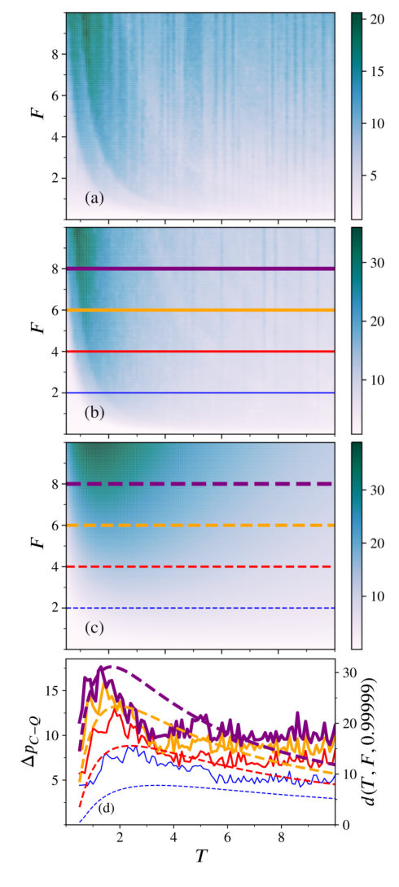 
Figure 5. Comparison between the strengths of dynamical localization and chaos in the parameter plane T −F. The difference between the classical and quantum momentum dis- persions ∆pC−Q = ∆pC −∆pQ corresponds to (a) m = 0.9, and (b) m = 0.99999. (c) Chaotic layer width [Eq. (6)] for m = 0.99999. (d) Difference ∆pC−Q for m = 0.99999 and chaotic layer width as a function of the period for four values of the amplitude [cf. vertical lines in (b) and (c)].

**Summary.** This paper explores how the finite duration and specific waveform of periodic modulation affect quantum dynamics in ultracold atoms. By analyzing the system's response, the authors demonstrate that these finite-time effects are critical, leading to a measurable enhancement of dynamical localization. The findings establish a pathway to optimize experimental control by identifying optimal modulation periods.

**Why it may be interesting.** This work directly addresses non-adiabatic effects in periodically driven quantum systems, which is highly relevant for controlling quantum dynamics in cold atom experiments and quantum simulation platforms.

Detailed structure

**Main problem.** The study investigates finite-time effects in periodically kicked quantum systems, specifically analyzing how these effects modify dynamical localization (DL).

**Main result.** Finite-time effects are crucial, as they significantly enhance dynamical localization beyond what the standard delta-kicked-rotor model predicts, and an optimal modulation period exists to maximize this enhancement.

**Method.** The authors analyze the system by varying the modulation waveform and duration using a shape parameter, comparing quantum and classical momentum dispersions.

**Model / system.** The system models ultracold atomic gases in an optical lattice subjected to time-dependent modulation, described by a Hamiltonian involving Jacobi elliptic functions.

**Key observables.** Dynamical Localization (DL), the difference between classical and quantum momentum dispersion ($\Delta p_{C-Q}$), and the chaotic layer width.

**Important parameters / regimes.** Modulation amplitude ($F$), period ($	ilde{T}$), and the shape parameter ($m$), which controls the waveform from static to pulsed.

**Assumptions / limitations.** The model maintains a constant transmitted impulse per period while varying the waveform via the shape parameter $m$.

**Figures summary.** Figures illustrate the time series of the modulation function for different $m$ values, and show the dependence of the chaotic layer width and $\Delta p_{C-Q}$ on parameters like $F$, $m$, and $T$.

**Paper structure.** The paper establishes the model using a time-dependent Hamiltonian, analyzes the impact of the shape parameter $m$ to transition between integrable and kicked regimes, and then quantitatively compares quantum and classical dynamics to map out the conditions for enhanced DL.

Abstract

In this work, we study finite-time effects in ultracold atomic systems by considering time-dependent modulations with variable waveforms and durations. These two characteristics can be controlled by adjusting only a single parameter. For arbitrarily short pulses, our model recovers the paradigmatic kicked rotor while maintaining the impulse transmitted per period and unit amplitude constant. Furthermore, we demonstrate that finite-time effects have a profound impact on dynamical localization, a result that cannot be captured by the δ-kicked-rotor model. Through a detailed analysis of the effects of different modulation amplitudes, periods, and waveforms, we identify the conditions for which dynamical localization is significantly enhanced. We show that the strength of dynamical localization increases sharply as the system approaches the δ-kicked-rotor limiting case. Moreover, we establish the existence of an optimal value of the period that maximizes dynamical localization for given values of the amplitude and shape parameter.

[↑ back to top](#top)

### [Computational framework for quantum state tomography of spin ensembles](http://arxiv.org/abs/2609.11868v1)

**Authors:** Jiwoo Seo, Vesna F. Mitrović  
**Type:** both · **Category:** quantum information and computing · **PDF:** <https://arxiv.org/pdf/2609.11868v1>  
**Analysis basis:** full PDF text, analyzed in chunks
**Topic relevance:** `QC/QI experiment` **3/5** · `quantum measurements` **3/5** · `methods for driven-dissipative` **1/5**

📷 Fig 1

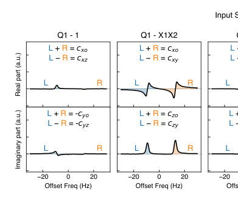 
Figure 1: Minimal set of 9 spectra sufficient to determine all 15 non-identity expansion coefficients of the two-qubit density matrix. Each spectrum displays a doublet with peaks labeled L (left) and R (right). The sum (L+R) and difference (L−R) of peak intensities, extracted from both the real and imaginary parts, are mapped to specific product operator coefficients as indicated. Together, these 9 spectra span the complete set of coefficients required for full state reconstruction.

📷 Fig 2

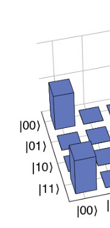 
Figure 2: Theoretical density matrix for the |00⟩computational basis state, visualized as a 3D bar chart. The single non-zero diagonal element at |00⟩⟨00| confirms the pure state ˆρ = |00⟩⟨00|.

📷 Fig 3

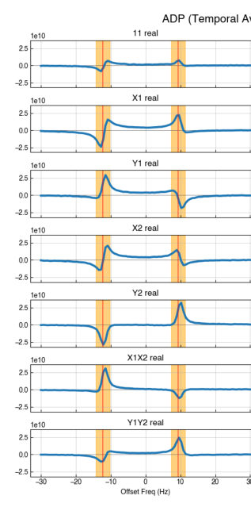 
Figure 3: Q1 readout channel spectra for all 14 tomographic measurements (7 readout pulses × 2 real/imaginary parts). Red vertical lines mark integration centers; orange shaded regions indicate integration windows of width w = 4 Hz. Each spectrum displays the characteristic doublet separated by J ≈22 Hz.

📷 Fig 4

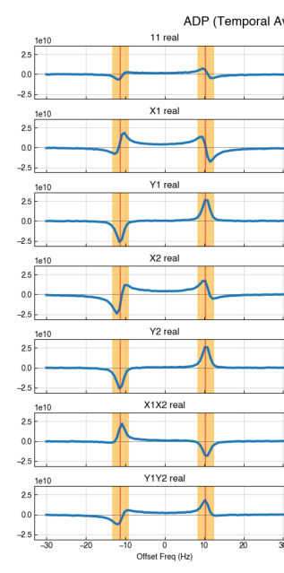 
Figure 4: Q2 readout channel spectra for all 14 tomographic measurements, with indepen- dently adjusted frequency offset. The Q2 channel requires a different offset than Q1 due to slight chemical shift differences between the two 31P nuclei.

📷 Fig 5

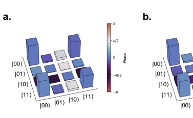 
Figure 5: Comparison of the density matrix reconstruction from different integration meth- ods. a. Density matrix reconstructed using the peak height method (F = 0.980). While the dominant |00⟩⟨00| element is correctly identified, minor deviations are visible in off- diagonal and subdominant diagonal elements. b. Density matrix from fixed-parameter Simpson integration (F = 0.980). The result is similar to the peak height method, with small differences arising from the noise-averaging effect of finite integration windows. c. Density matrix from optimized integration (F = 0.998). The systematic parameter op- timization significantly improves reconstruction accuracy, yielding a density matrix...

**Summary.** This paper introduces Tomography-NMR, an open-source Python package designed to reconstruct quantum density matrices from raw NMR spectroscopic data. It details a complete analysis pipeline that transforms time-domain signals into spectral coefficients using the product operator formalism. The tool achieves high reconstruction fidelities for two-qubit systems, providing a transparent and reproducible methodology for quantum state characterization.

**Why it may be interesting.** This work provides a crucial, reproducible, and open-source tool for characterizing quantum states experimentally, which is vital for validating theoretical models in quantum information science.

Detailed structure

**Main problem.** The primary challenge is bridging the gap between established quantum state tomography theory and the practical, transparent extraction of density matrices from raw spectroscopic measurement data.

**Main result.** The authors developed Tomography-NMR, an open-source Python package that achieves high reconstruction fidelities (up to 99.5%) for two-qubit states measured via NMR.

**Method.** The package implements a full pipeline: Fourier transforming time-domain NMR signals to frequency spectra, mapping peak intensities to product operator expansion coefficients, and using three integration methods to reconstruct the density matrix.

**Model / system.** The system is a two-qubit spin ensemble, experimentally realized using Nuclear Magnetic Resonance (NMR) spectroscopy of coupled protons ($^{31}	ext{P}$). The state is reconstructed using the product operator formalism.

**Key observables.** Density matrix ($
ho$), spectral peak intensities, and reconstruction fidelity (quantified by Fortunato's metric).

**Important parameters / regimes.** The system is currently limited to two qubits; extension to higher qubits requires developing spectral deconvolution methods.

**Assumptions / limitations.** The method assumes the ability to measure a tomographically complete set of spectral observables, and the optimized routine can be computationally intensive.

**Figures summary.** Figures illustrate the characteristic doublet structure in Q1 and Q2 readout spectra and compare the resulting density matrices reconstructed using the three different integration methods.

**Paper structure.** The paper introduces the Tomography-NMR package, details the product operator formalism for two-qubit states, describes the three distinct data processing pipelines (peak height, fixed integration, optimized grid search), and validates the results on a benchmark set of 20 states.

Abstract

We present Tomography-NMR, an open-source Python package that reconstructs quantum density matrices from spectroscopic measurement data. The package implements a complete analysis pipeline for two-qubit quantum state tomography based on the product operator formalism: raw time-domain signals are Fourier-transformed into frequency-domain spectra, spectral peak intensities are mapped to expansion coefficients of the density matrix, and the full quantum state is reconstructed. Three integration methods are provided for different use cases: direct peak height measurement and fixed-parameter numerical integration require no theoretical reference and are suited to unknown states, achieving fidelities of approximately 98\% on a benchmark set of known states, while a systematic parameter optimization against a known target state achieves reconstruction fidelities exceeding 99\% for the same benchmark states. While the detailed theoretical framework for quantum state tomography is well established, the practical procedures for extracting density matrices from experimental spectra are often inadequately documented in the literature and obscured within proprietary software. This package addresses that gap by providing a fully transparent, reproducible implementation of every analysis step, from spectral preprocessing to density matrix visualization. The software has been validated on experimentally prepared two-qubit states measured via nuclear magnetic resonance (NMR) spectroscopy of coupled $^{31}$P nuclei. Average reconstruction fidelities range from 0.975 to 0.995 across a benchmark set of 20 two-qubit states, including the computational basis states, Bell states, and the outputs of three fundamental quantum gates (CNOT, H, and T). Although developed for NMR, the modular architecture facilitates adaptation to other spectroscopic platforms and alternative measurement protocols.

[↑ back to top](#top)

### [Engineered two-photon dissipative confinement of a Kerr-cat qubit using SISIS quantum circuit refrigerator](http://arxiv.org/abs/2609.11034v1)

**Authors:** Shumpei Masuda, Tsuyoshi Yamamoto, Shuji Nakamura, Daichi Sugiyama, Akiyoshi Tomonaga  
**Type:** theory · **Category:** quantum information and computing · **PDF:** <https://arxiv.org/pdf/2609.11034v1>  
**Analysis basis:** full PDF text, analyzed in chunks
**Topic relevance:** `methods for driven-dissipative` **3/5** · `Keldysh / 2PI / non-Gaussian methods` **1/5** · `correlated / nonlocal dissipation` **1/5** · `driven-dissipative phase transition` **1/5** · `quantum measurements` **1/5**

📷 Fig 1

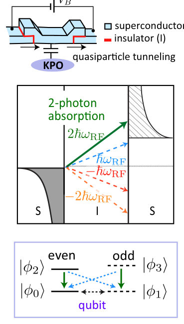 
FIG. 1. (A) Schematic of a SISIS-junction-based QCR capac- itively coupled to a KPO. A bias voltage VB is applied across the SISIS junction. Horizontal arrows indicate quasiparticle tunneling processes. (B) Energy diagrams for photon-assisted quasiparticle tunneling in a SIS junction in a bias regime where two-photon absorption remains allowed, whereas other photon-assisted tunneling processes are suppressed. The black solid curves represent the superconducting density of states. Colored and shaded regions indicate occupied and unoccupied states, respectively. The arrows indicate two- photon absorption (green), single-photon absorption (blue), single-photon emission (red), and two-photon...

📷 Fig 2

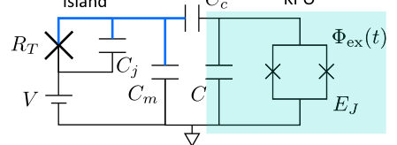 
FIG. 2. Circuit diagram used in the theoretical analysis of the SISIS-based QCR. A KPO (shaded area) is capacitively cou- pled (Cc) to a superconducting island (blue lines). One SIS junction is treated explicitly through the tunnel-junction pa- rameters (RT , Cj), while the second SIS junction is modeled as a capacitor whose capacitance is incorporated into the ef- fective island capacitance Cm following Ref. [44]. The voltage V is the bias voltage across the explicitly treated SIS junction (V = VB/2). The KPO is modeled by a capacitance C and a SQUID with Josephson energy EJ, driven by an external magnetic flux Φex(t).

📷 Fig 3

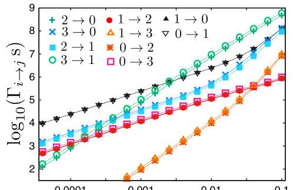 
FIG. 4. ρc dependence of QCR-induced transition rates be- tween KPO eigenstates at eV/h = 82.8 GHz (≃eV (2) a /h) for α = 2. The color scheme and other parameters are the same as in Fig. 3.

📷 Fig 4

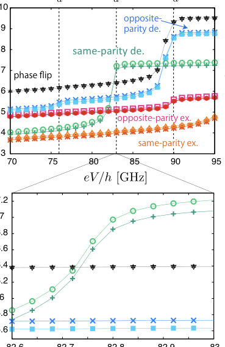 
FIG. 3. Transition rates Γi→j [Eq. (7)] as functions of the normalized bias voltage eV/h for α = 2 and ρc = 0.01. Panel (A) shows the rates over a wide voltage range including the thresholds V (n) a (n = 1, 2, 3), while panel (B) presents an en- larged view around V (2) a , highlighting the deexcitation and phase-flip rates. Vertical dashed lines in panel (A) indicate the threshold voltages V (n) a associated with the onset of one-, two-, and three-photon absorption processes. The parame- ters are χ/2π = 10 MHz, ωc/2π = 7 GHz, ∆= 200 µeV, ∆KPO/2π = 0, RT = 50 kΩ, γD = 10−4, β/2π = 20 MHz, and TS = 100 mK, which are comparable to experimental val- ues [24, 42].

📷 Fig 5

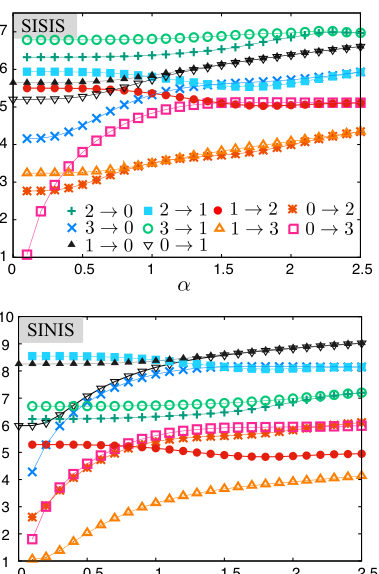 
FIG. 5. α dependence of relevant transition rates for a SISIS junction at eV/h = 82.8 GHz (≃eV (2) a /h) with ρc = 0.01 (A), in the two-photon-dominant regime, and for a SINIS junction at eV/h = 45 GHz (≃eV (1) a /h) with ρc = 0.01 (B), in the single-photon-dominant regime. The color scheme and other parameters are the same as in Fig. 3.

**Summary.** This paper proposes using a Superconductor-Insulator-Superconductor-Insulator-Superconductor (SISIS) junction as a Quantum Circuit Refrigerator (QCR) for Kerr-cat qubits. By tuning the bias voltage, the system can be engineered to favor two-photon absorption, which efficiently removes leakage errors while crucially suppressing the phase-flip errors common in other QCR designs. This offers a robust pathway for improving qubit coherence in superconducting quantum processors.

**Why it may be interesting.** This work provides a detailed theoretical blueprint for engineering error mitigation in superconducting qubits by exploiting specific quantum tunneling mechanisms (two-photon vs. single-photon) within a superconducting circuit refrigerator.

Detailed structure

**Main problem.** The paper addresses the challenge of mitigating leakage errors in Kerr-cat qubits caused by pure dephasing while simultaneously minimizing the increase in phase-flip errors induced by Quantum Circuit Refrigeration (QCR).

**Main result.** A novel SISIS-based QCR operating in a two-photon absorption regime effectively suppresses dephasing-induced leakage while substantially reducing the detrimental phase-flip errors compared to conventional SINIS-based methods.

**Method.** The authors derive the system dynamics using a master equation approach, calculating transition rates via Fermi's golden rule applied to quasiparticle tunneling processes.

**Model / system.** The system models a Kerr-cat qubit (KPO) coupled to a superconducting island via a SISIS junction. The dynamics are governed by a Hamiltonian and analyzed through the evolution of the reduced density matrix.

**Key observables.** Population of excited (leakage) states, population of $|\varphi_0
angle$, population of $|\varphi_\alpha
angle$, and the relative rates of phase-flip versus deexcitation transitions.

**Important parameters / regimes.** The applied bias voltage ($V_B$), the tunnel resistance ($R_T$), and the ratio of two-photon to single-photon absorption rates.

**Assumptions / limitations.** The analysis employs the Born–Markov approximation and treats quasiparticle tunneling perturbatively, assuming the superconducting density of states dictates the tunneling rates.

**Figures summary.** Figures illustrate the energy level diagrams showing the suppression of single-photon processes in favor of two-photon processes. Time evolution plots compare state populations under varying tunnel resistances ($R_T$) for both SISIS and SINIS configurations.

**Paper structure.** The paper first establishes the physical problem and the SISIS mechanism. It then develops the theoretical framework by deriving the master equation and calculating transition rates based on the junction structure. Finally, it analyzes the time evolution by simulating state populations under varying critical parameters like $R_T$.

Abstract

Kerr-cat qubits realized in periodically driven superconducting nonlinear resonators are a promising platform for quantum information processing with biased noise. Pure dephasing in such systems induces leakage out of the qubit subspace, motivating the use of quantum circuit refrigeration (QCR) to remove excess excitations. While conventional superconductor--insulator--normal-metal--insulator--superconductor (SINIS)-based QCRs can suppress leakage via single-photon absorption, they also enhance QCR-induced phase-flip errors. Here we investigate a QCR based on a superconductor--insulator--superconductor--insulator--superconductor (SISIS) junction coupled to a Kerr parametric oscillator (KPO). We show that a SISIS-based QCR can operate in a regime where single-photon processes are suppressed while two-photon absorption dominates. As a result, the proposed SISIS-based QCR achieves strong suppression of dephasing-induced leakage while substantially reducing the increase in phase-flip errors associated with QCR operation. These results demonstrate that the proposed SISIS-based QCR provides an effective approach for mitigating leakage while limiting QCR-induced phase-flip errors in Kerr-cat qubits.

[↑ back to top](#top)

### [Instabilities in self-consistent diagrammatic approaches and how to cure them](http://arxiv.org/abs/2609.11405v1)

**Authors:** Marcel Gievers, Herbert Eßl, Stefan Rohshap, Anna Kauch, Alessandro Toschi  
**Type:** theory · **Category:** strongly correlated electrons · **PDF:** <https://arxiv.org/pdf/2609.11405v1>  
**Analysis basis:** full PDF text, analyzed in chunks
**Topic relevance:** `Keldysh / 2PI / non-Gaussian methods` **3/5** · `methods for driven-dissipative` **3/5** · `quantum measurements` **1/5**

📷 Fig 1

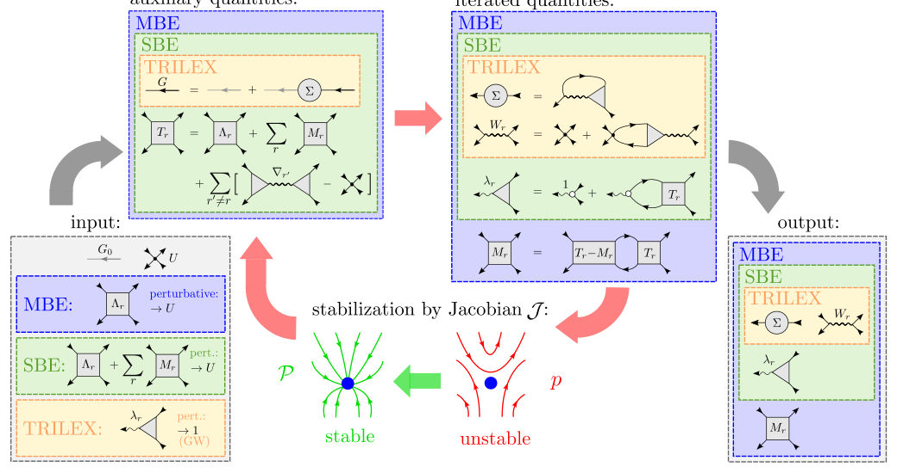 
Figure 1. Overview of the different iteration schemes. The boson-exchange (BE) equations (4)–(14), here illustrated diagram- matically, are solved iteratively until convergence (red arrows mark the self-consistency loop). TRILEX iterates over Σ, Wr with input of λr, SBE iterates over Σ, Wr, λr with input of Λr + P

📷 Fig 2

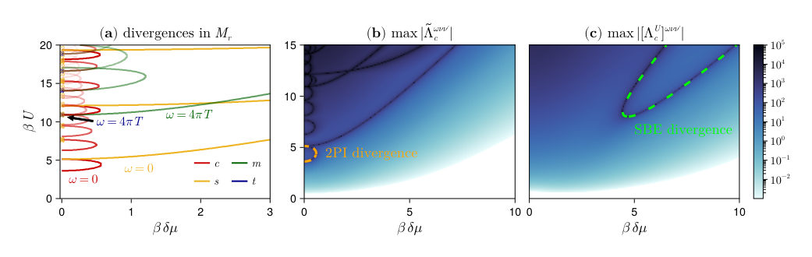 
Figure 2. (a) Location of divergences of the MBE vertices Mr in the phase space of the HA. The colors mark the corresponding channel r = c, m, s, t, while transparency of the colors indicate the bosonic frequency ω (the more transparent, the higher the value of ω). Note that, for ω ̸= 0, Mr divergences in the singlet and triplet channel only appear at half-filling, i.e., δµ = 0 (marked by crosses). The colorful labels indicate the bosonic frequencies corresponding to the first vertex divergence occurring in the respective channel. (b) Maximal value of the two-particle irreducible rest function maxω,ν,ν′ |˜Λωνν′ c |, where the orange line marks the first 2PI divergence in Mc, and (c) the...

📷 Fig 3

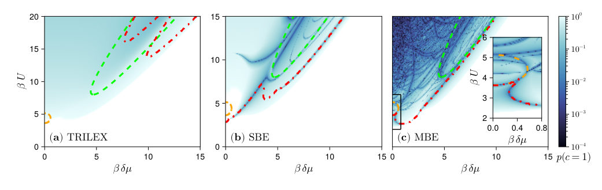 
Figure 3. Threshold mixing parameter p(c = 1), Eq. (20), which still stabilizes the physical fixed point of the respective diagrammatic schemes (a) TRILEX, (b) SBE, (c) MBE. The red dashed lines mark where the first crossing Re jα = 1 occurs, i.e., in the regions above/within the red lines, the conventional damped iteration, Eq. (15), does not converge to the physical solution. The orange and green dashed lines mark the first 2PI divergence and the SBE divergence. The inset in panel (c) magnifies the region around the first vertex divergence in MBE.

📷 Fig 4

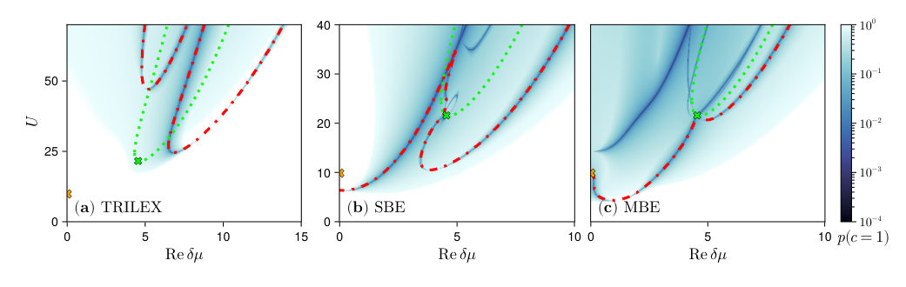 
Figure 4. Same as Fig. 3 but for the ZPM. The orange cross marks the 2PI divergence in the charge channel at Re δµ = 0, U = π2. The green cross marks the SBE divergence in the charge channel, i.e., Wc = 0, while the dotted green line marks the points where Re Wc = 0 but Im Wc ̸= 0 (see App. D 2).

📷 Fig 5

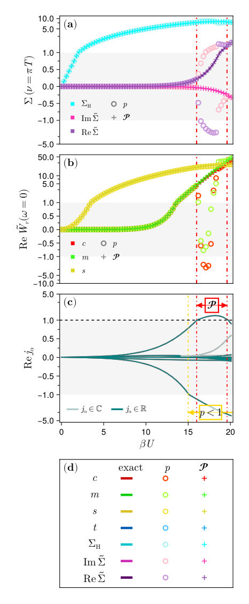 
Figure 5. Converged quantities at specific Matsubara fre- quencies in dependence on U from TRILEX at βδµ = 12.0. (a) Self-energies Σ at ν = πT, (b) bosonic propagators ˜ Wr at ω = 0. Colors indicate channels (c red, m green, s yel- low, t blue) and parts of the self-energy (light blue ΣH, pink Im ˜Σ, purple Re ˜Σ). Lines and markers with different shades indicate the convergence methods used (lines for exact val- ues, circles for damped iteration p, pluses for stabilized it- eration P) [see panel (d)]. (c) Real parts of the eigenvalues jα (teal) (dark for purely real jα and light for complex-valued jα). Dashed vertical lines and arrows mark regions with finite mixing (yellow) and...

**Summary.** This work addresses the critical issue of 'misleading convergence' in advanced diagrammatic methods used for strongly correlated materials. The authors prove that the failure is due to the iterative scheme's stability, not the underlying physics. They introduce a general remedy—inverting unstable Jacobian eigendirections—which successfully stabilizes calculations across challenging, strongly-coupled regimes.

**Why it may be interesting.** The mathematical techniques developed for stabilizing iterative many-body calculations (Jacobian analysis) are highly relevant for any theoretical work involving complex, non-linear self-consistent equations, such as those found in open quantum systems or non-equilibrium dynamics.

Detailed structure

**Main problem.** Self-consistent diagrammatic approaches for correlated materials suffer from 'misleading convergence,' converging to unphysical fixed points in strongly interacting regimes.

**Main result.** The convergence failure is shown to be an artifact of the iterative scheme's stability condition, not an intrinsic breakdown of the diagrammatic theory. A remedy involves inverting the unstable eigendirections of the Jacobian.

**Method.** The authors analyze various self-consistent diagrammatic schemes (GW, SBE, MBE) derived from the boson-exchange formalism, focusing on the stability analysis of the iterative fixed points.

**Model / system.** The study applies to general correlated quantum materials, using testbeds like the Hubbard atom (HA) and the zero-point model (ZPM) to validate the procedure.

**Key observables.** Self-energies ($\Sigma_
u$), bosonic propagators ($W_r$), and the stability of the fixed point determined via the Jacobian matrix.

**Important parameters / regimes.** Intermediate-to-strong electronic interaction regimes, and the deviation from half-filling ($\delta\mu$).

**Assumptions / limitations.** The primary assumption is that the physical fixed point can be stabilized by modifying the iterative procedure using Jacobian inversion, distinguishing this from intrinsic LWF multivaluedness.

**Figures summary.** Figures illustrate the self-consistency loop and the stabilization step using the Jacobian, and show the comparison of converged bosonic propagators ($	ext{Wr}$) across different schemes and parameters.

**Paper structure.** The paper first identifies the convergence issue, then details the BE formalism and the three classes of self-consistent schemes (TRILEX, SBE, MBE). The core contribution is demonstrating the Jacobian-based stabilization procedure, followed by testing this procedure on solvable models.

Abstract

While self-consistent diagrammatic approaches are widely used to compute the physical properties of correlated quantum materials, their applicability may get severely hindered precisely in the parameter regions, where the most exciting physics is observed. One of the major issues, referred to as "misleading convergence", is the tendency of iterative schemes to converge to unphysical fixed points for intermediate-to-strong electronic interactions, regardless of numerical accuracy of the computation. Here, we explicitly verify that the origin of this problem in several established self-consistent many-electron approaches, defined in the general diagrammatic framework of the boson-exchange formalism, resides exclusively in the stability condition of the respective iteration schemes, and not in an intrinsic breakdown of their self-consistent diagrammatic description. This insight enables a simple and general remedy, as recently proposed in Phys. Rev. Lett. 137, 016502 (2026): The redefinition of the iterative procedure, by inverting the unstable eigendirections of the Jacobian associated to the fixed point of the self-consistent algorithm. We illustrate the successful outcome of this procedure by means of systematic calculations performed on testbed, exactly solvable, models. Our results demonstrate that the physical fixed point of the diagrammatic schemes we considered can be stabilized, de facto, across the entire parameter range, including the most challenging nonperturbative/strong-coupling regimes.

[↑ back to top](#top)

### [Learning Quantum Matter through Attention in Complex Space](http://arxiv.org/abs/2609.11792v1)

**Authors:** Mingrui Jing, Erdong Huang, Jizhe Lai, Enji Xiong, Jin-Guo Liu, Xin Wang  
**Type:** theory · **Category:** strongly correlated electrons · **PDF:** <https://arxiv.org/pdf/2609.11792v1>  
**Analysis basis:** full PDF text, analyzed in chunks
**Topic relevance:** `analog quantum simulation` **3/5** · `Keldysh / 2PI / non-Gaussian methods` **2/5** · `methods for driven-dissipative` **2/5**

📷 Fig 1

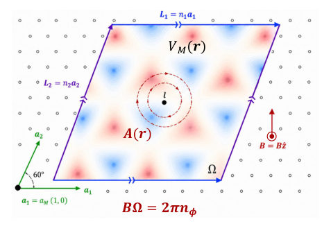 
Figure 1. Geometry of the triangular moir´e system. The real- space moir´e lattice has primitive vectors a1,2 and an n1 × n2 periodic supercell spanned by L1,2, with area Ω. The color map represents the moir´e potential. A uniform field B = Bˆz is applied perpendicular to the plane, and the symmetric gauge is centered at l. Matching edge markers denote periodic identification of opposite boundaries.

📷 Fig 2

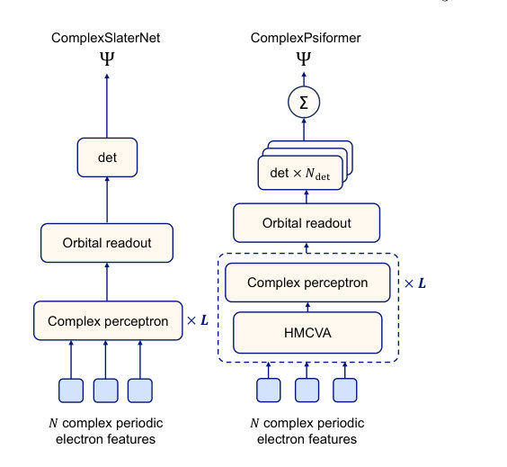 
Figure 2. Construction of the two complex-valued neural wavefunctions. Complex SlaterNet applies the same one-body network independently to each electron. Complex Psiformer inserts HMCVA before every residual feed-forward layer. This allows each electron representation to incorporate information from the others before the orbital readout and Slater determi- nant. Both models use the same fixed functions at the orbital readout to enforce the magnetic boundary condition. These functions are omitted from the schematic.

📷 Fig 3

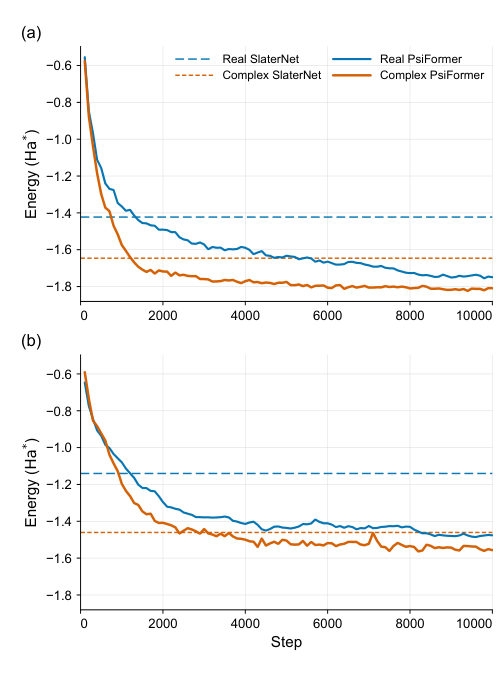 
Figure 3. Variational-energy optimization over the same num- ber of steps. Panels (a) and (b) show the 18- and 25-cell systems, respectively, both with N = 12 and nϕ = 2. Solid blue and orange curves show the Real and Complex Psiformer training diagnostics. Dashed blue and orange lines indi- cate the corresponding Real and Complex single-determinant SlaterNet neural HF baselines. Table I reports the conven- tional local-energy comparison. The independent Psiformer estimates discussed in the text use the magnetic quadratic- form protocol in Appendix E.

📷 Fig 4

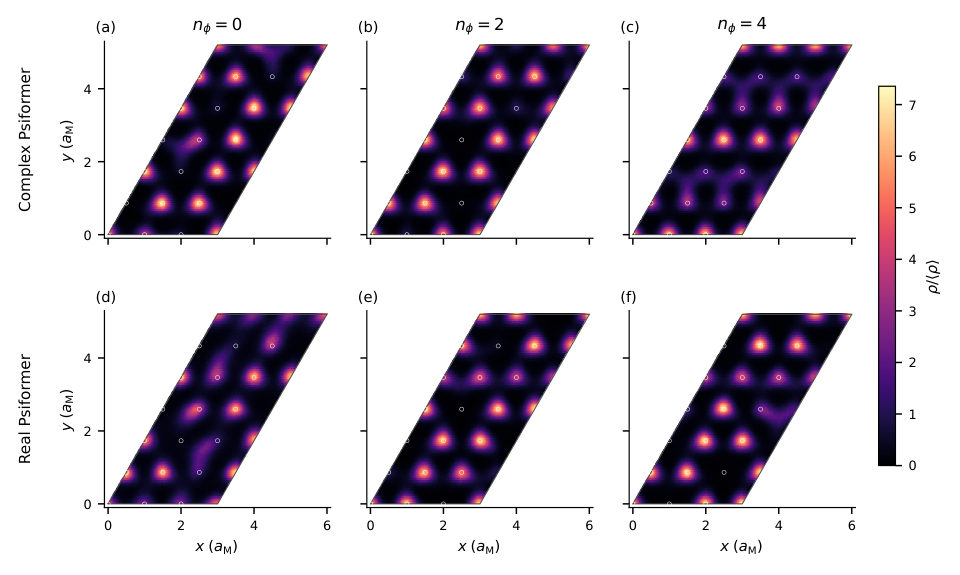 
Figure 4. Flux-resolved density of the optimized Psiformer states. Rows show Complex and Real Psiformer, with columns corresponding to nϕ = 0, 2, and 4 for the 18-cell, N = 12 system. The density is normalized by its spatial mean ⟨ρ⟩= N/Ω. Each 96 × 96 density grid is mapped to r = u1L1 + u2L2, with 0 ≤u1, u2 &lt; 1. The Cartesian axes x and y are in units of aM and have equal scales, with the origin at the lower-left cell corner. Open circles mark minima of the moir´e potential. Each panel uses 393,216 configurations sampled from a frozen state trained with seed 1, without translation or rotation alignment or smoothing. The common color scale covers the full density range. At nϕ = 2, panel...

📷 Fig 5

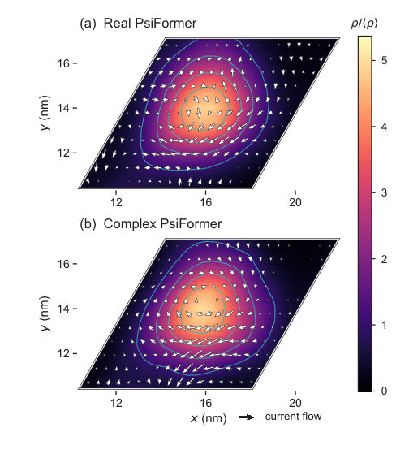 
Figure 5. Gauge-invariant current flow near a selected density maximum. Panels (a) and (b) show the Real and Complex Psiformers, respectively, for the 18-cell, N = 12, nϕ = 2 system after 10,000 optimization steps. The background is the relative one-body density ρ/⟨ρ⟩, the cyan curves mark the common contour levels 1, 2, 3, and 4, and the arrows show the gauge-invariant mechanical particle current in Eq. (20) rather than conventional charge current. Density color and current-arrow scales are shared between panels. The same window in the L1, L2 supercell basis is shown in both panels, with Cartesian coordinates given in nanometers. Each field is evaluated on a 64 × 64 grid. Periodic Gaussian...

**Summary.** This paper proposes Complex Psiformer, a novel neural network ansatz that uses complex-valued features and attention mechanisms to accurately model the wavefunctions of interacting electrons in magnetic moiré superlattices. By incorporating complex phases and magnetic boundary conditions, the model significantly outperforms its real-valued counterpart in minimizing the system's energy. This work establishes a robust variational tool for studying charge order and electronic structure in finite magnetic quantum materials.

**Why it may be interesting.** The explicit handling of complex phases and magnetic boundary conditions within a neural network framework provides a powerful, modern tool for simulating complex quantum phases relevant to condensed matter physics, bridging ML and strongly correlated systems.

Detailed structure

**Main problem.** Developing an effective variational search method for magnetic many-electron wavefunctions, which requires optimizing both amplitude and phase due to strong electronic correlations.

**Main result.** The Complex Psiformer architecture achieves lower ground state energies compared to its real-valued counterpart, demonstrating the advantage of complex representations for describing correlated electron states in magnetic moiré systems.

**Method.** The authors introduce Complex Psiformer, a neural network architecture that incorporates complex hidden features and Hermitian-magnitude attention (HMCVA) to construct the many-electron wavefunction.

**Model / system.** The study focuses on interacting two-dimensional electron gas systems placed in a triangular moiré potential under a perpendicular magnetic field. The Hamiltonian includes kinetic, moiré potential, and electron-electron interaction terms, subject to magnetic boundary conditions.

**Key observables.** Ground state energy, charge order structure factors ($S(K)$), sublattice occupation patterns ($f_3$), and gauge-invariant current maps.

**Important parameters / regimes.** Magnetic flux quanta ($n_\phi$), system size (e.g., 25-cell supercell), and the comparison between complex and real network representations.

**Assumptions / limitations.** The method assumes that organizing hidden electron features as complex amplitudes provides necessary radial nonlinearities and Hermitian overlaps for accurate variational optimization.

**Figures summary.** Figures illustrate the moiré geometry, the comparison between Complex Psiformer and Real Psiformer architectures, and the dependence of density anisotropy on training seeds.

**Paper structure.** The paper first establishes the physical model (interacting electrons in a moiré lattice with magnetic flux). It then details the advanced neural network architectures (Complex Psiformer vs. Real Psiformer) designed to handle complex phases and magnetic boundary conditions. Finally, it presents benchmarks comparing the energy and structural properties derived from both complex and real ansatzes.

Abstract

Magnetic many-electron wavefunctions require amplitude and phase to be optimized together. Whether a complex internal representation improves this variational search is a practical question for neural wavefunction design. We introduce Complex Psiformer for interacting electrons in a magnetic moiré continuum, combining complex hidden features and Hermitian-magnitude attention with magnetic boundary conditions and fermionic antisymmetry. After the same number of optimization steps, Complex Psiformer reaches lower energies than Real Psiformer in two finite supercells. Both Psiformers also improve on their respective neural Hartree-Fock references. Across five training seeds in the 25-cell system, the mean Complex advantage is 1.458 meV per electron, with a smaller observed spread. A separately trained two-electron Complex state has a smaller energy gap to a finite configuration interaction reference than its Real counterpart. In the Complex states, flux scans show nonmonotonic density correlations and weaker honeycomb mean-density modulation at higher flux, while connected fluctuations persist. Gauge invariant current maps provide a qualitative comparison of local circulation in the optimized states. These benchmarks support the combined architecture as a variational ansatz for studying energies and charge arrangements in finite magnetic systems.

[↑ back to top](#top)

### [Bridging steady-state and time-domain descriptions of molecular electron transport](http://arxiv.org/abs/2609.11684v1)

**Authors:** Thibaut Lacroix, Namgee Cho, Clemens Vittmann, James Lim, Susana F. Huelga, Martin B. Plenio  
**Type:** theory · **Category:** other · **PDF:** <https://arxiv.org/pdf/2609.11684v1>  
**Analysis basis:** full PDF text, analyzed in chunks
**Topic relevance:** `Keldysh / 2PI / non-Gaussian methods` **3/5** · `methods for driven-dissipative` **3/5**

📷 Fig 1

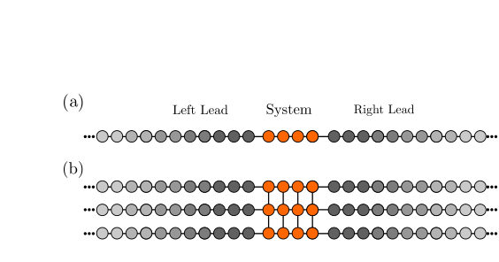 
FIG. 1. (a) Schematic of a two-terminal setup where a molec- ular system is coupled to an input (left) and an output (right) lead. There is no direct coupling between the two leads. (b) Schematic of a multi-terminal setup where the molecular sys- tem is coupled to multiple non-interacting input and output leads.

📷 Fig 2

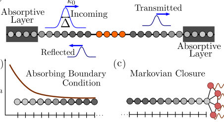 
FIG. 2. (a) Schematic of a molecular system (orange circles) coupled to an input (left) and an output (right) lead. The ini- tial state, with wavevector k0 and width ∆, is placed in the input lead and scattered by the molecular system, resulting in reflected and transmitted waves. Each lead consists of a finite number of sites, with the end site coupled to an absorptive layer that prevents the reflected or transmitted wave from re- entering the molecular system. The absorptive layer can be modeled as (b) a linear chain with gradually increasing Lind- blad damping rates γn, or (c) a small number of sites (e.g., 6-10) with a carefully tuned set of damping rates, optimized to efficiently...

📷 Fig 3

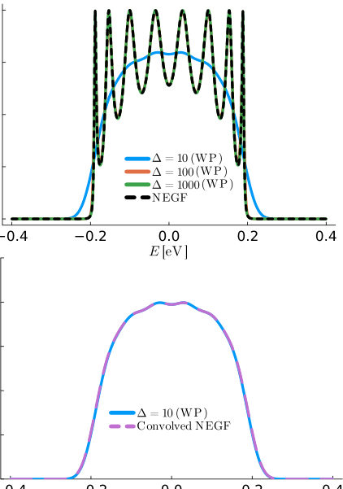 
FIG. 3. (a) From WP to NEGF: Transmittance of an elec- tron in a two-terminal setup where the electron’s spin and phonon mode are neglected. NEGF results are shown as a black dashed line, while WP results with controlled width ∆∈{10, 100, 1000} of the initial state are shown as colored solid lines. For ∆≫10, the NEGF and WP results are well- matched. (b) From NEGF to WP: WP results with ∆= 10 can be reproduced by averaging the NEGF results with a Gaussian weight (see the main text), shown as a purple dashed line. In the simulations, we consider ϵL = ϵR = ϵn = 0, tL = tR = 0.2 eV, tn = 0.1 eV, and gL = gR = 0.2 eV.

📷 Fig 4

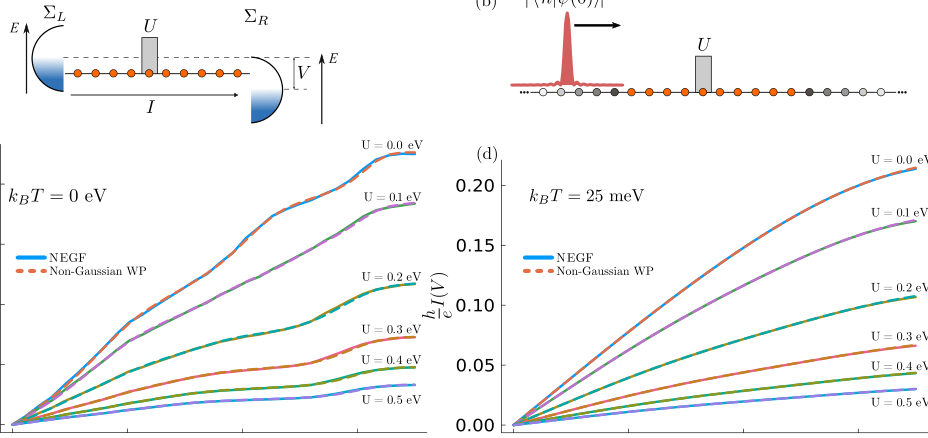 
FIG. 4. Current-voltage characteristics computed using the NEGF and non-Gaussian WP methods, schematically represented in (a) and (b), respectively. The molecular system consists of N = 10 sites, where an impurity is introduced at the middle site, shifting the on-site energy to ϵn = ϵ0 + Uδn,5. Other simulation parameters are the same as in Fig. 3. The NEGF (solid lines) and non-Gaussian WP results (dashed lines) are well matched for several barrier heights U ∈{0, 0.1, 0.2, 0.3, 0.4, 0.5} eV at both (c) zero and (d) room temperatures.

📷 Fig 5

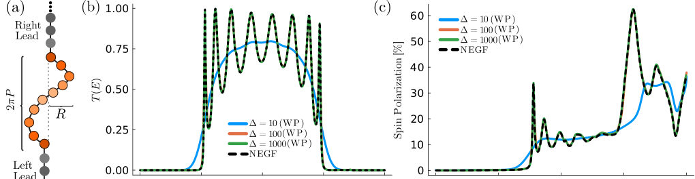 
FIG. 5. (a) Schematic of a helical molecule with radius R and pitch 2πP connected to input (left) and output (right) leads. (b) Total transmittance of an electron in the presence of spin-phonon interaction, computed using NEGF (black dashed line) and WP (colored solid lines) methods with controlled width ∆∈{10, 100, 1000} of the initial Gaussian state. The NEGF and WP results are well matched for ∆≫10. (c) Corresponding spin polarizations. In simulations, we consider ϵL = ϵR = ϵn = 0, tL = tR = 0.2 eV, tn = 0.1 eV, gL = gR = 0.2 eV, ω = 0.1 eV, α = 0.01 eV, R = 0.7 nm, 2πP = 3.4 nm, and zero temperature.

**Summary.** This paper establishes a quantitative link between the steady-state Non-Equilibrium Green's Function (NEGF) method and the time-domain wave packet (WP) approach for molecular electron transport. By showing that the WP transmission is an energy-weighted average of the NEGF result, the authors allow current-voltage characteristics to be calculated directly from time propagation. This consistency check is vital for accurately modeling complex phenomena like spin-dependent transport in chiral molecules.

**Why it may be interesting.** This work is highly relevant as it provides a rigorous mathematical bridge between two powerful but distinct formalisms (steady-state vs. time-domain) used to study open quantum systems, which is crucial for understanding molecular electronics.

Detailed structure

**Main problem.** The paper addresses the theoretical challenge of connecting steady-state descriptions of electron transport (NEGF) with time-domain dynamics (Wave Packet method) in molecular junctions.

**Main result.** A quantitative correspondence is derived showing that the time-averaged transmission from the wave packet method equals a spectral average of the energy-resolved transmission calculated via NEGF.

**Method.** The authors employ both the Non-Equilibrium Green's Function (NEGF) formalism for steady-state transport and the time-dependent wave packet propagation method for transient dynamics.

**Model / system.** The system models electron transport through a molecular junction coupled to electrodes, extended to include spin-phonon coupling to study chirality-induced spin selectivity (CISS).

**Key observables.** Electron transmission probability, current-voltage characteristics, and spin polarization.

**Important parameters / regimes.** Bias voltage (V), wave packet width ($\Delta$), and coupling strengths ($\alpha$).

**Assumptions / limitations.** The correspondence holds for molecular tight-binding and spin-phonon models, and the analysis often assumes zero temperature.

**Figures summary.** Figures compare WP and NEGF results for total transmittance and spin polarizations, and show I-V curves derived from both methods.

**Paper structure.** The paper first establishes the NEGF framework for steady-state transport, then introduces the WP method for time dynamics, derives the quantitative link between the two, and finally applies this equivalence to complex models like spin-phonon systems.

Abstract

Electron transmission from an input electrode, through a molecular system, to an output electrode has been widely studied using the steady-state non-equilibrium Green's function (NEGF) method. Recently, the wave packet method, which provides access to the transient dynamics of electrons as well as internal molecular degrees of freedom, has been employed to investigate enantiospecific electron transport through chiral molecules. In this work, we derive the quantitative relation between the transmission of a finite-size wave packet and the energy-resolved NEGF transmission, showing that the former corresponds to a spectral average of the latter weighted by the wave packet energy distribution. Exploiting this correspondence, we construct non-Gaussian auxiliary wave packets whose spectral weight encodes the Landauer energy-window, allowing current-voltage characteristics to be obtained directly from time propagation. We further show that the correspondence extends to spin-resolved transport in a spin-phonon model of chirality-induced spin selectivity.

[↑ back to top](#top)

### [Microwave-controlled interactions and stripe formation of static-field-shielded polar molecules](http://arxiv.org/abs/2609.11395v1)

**Authors:** Tiziano Arnone Cardinale, Malte Schubert, Stephanie M. Reimann  
**Type:** theory · **Category:** quantum gases · **PDF:** <https://arxiv.org/pdf/2609.11395v1>  
**Analysis basis:** full PDF text, analyzed in chunks
**Topic relevance:** `analog quantum simulation` **3/5** · `Keldysh / 2PI / non-Gaussian methods` **1/5** · `driven-dissipative phase transition` **1/5** · `methods for driven-dissipative` **1/5**

📷 Fig 1

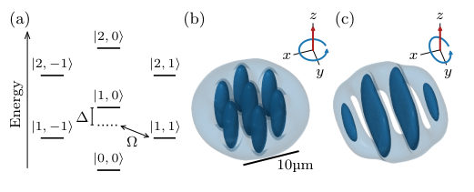 
FIG. 1. Supersolids of shielded polar molecules. (a) Energy level diagram of a molecule under an electric field and σ+- polarized microwave. The microwave has Rabi frequency Ω, detuning ∆and couples the |1, 0⟩state to the |1, 1⟩state. For imperfect polarization, the |1, −1⟩state is coupled as well. (b) Ground state of a gas of 3 × 104 CaF molecules under an electric field of 22.5 kV/cm and microwave with Ω= 60 MHz and ∆= 1.925Ωin a pancake trap. The insets show the static electric field F (red) and the perpendicular, rotating microwave field E (blue). (c) Same as (b), but for an ellipti- cally polarized microwave with ξ = 1◦. The isosurfaces in (b) and (c) are shown for 5% and 16% of the...

📷 Fig 2

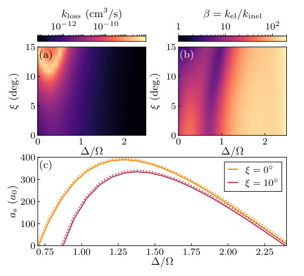 
FIG. 2. Collisional properties of shielded CaF molecules. (a) Total loss rate coefficient kloss as a function of relative de- tuning (∆/Ω) and ellipticity (ξ) at a fixed electric field of 22.5 kV/cm and Ω= 60 MHz, at the energy 10 nK×kB. (b) Elastic to inelastic collision ratio β. (c) Real part of the s-wave scattering length from coupled-channel calcula- tions (solid lines) and from single-channel calculations (dotted lines).

📷 Fig 3

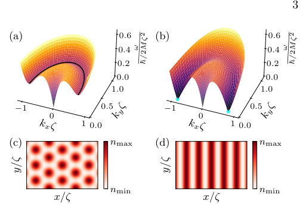 
FIG. 3. Excitation spectrum of a molecular condensate in planar geometry. We fix the dipolar parameter at ε(1) dd = 1.75 and lz = 2.88 × ζ. (a) and (b) show the spectrum for ε(2) dd = 0 and ε(2) dd = 0.05, respectively. The solid line in (a) and the stars in (b) highlight the energy minima. Panels (c) and (d) schematically show the expected groundstate density upon roton softening for (a) and (b), respectively.

📷 Fig 4

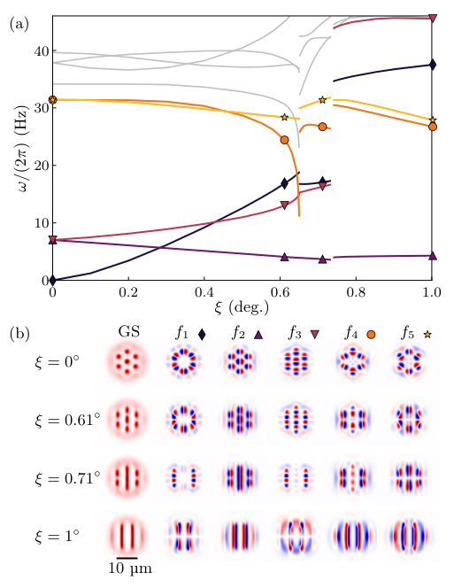 
FIG. 4. Excitations of a confined planar molecular super- solid of 3 × 104 CaF molecules under an electric field F = 22.5 kV/cm and microwave of Rabi frequency Ω= 60 MHz and detuning ∆= 1.925Ω. (a) Excitation spectrum as a func- tion of the ellipticity ξ. Colored lines correspond to modes we show in panel (b). (b) Ground state density and low-lying ex- citation modes fi in the z = 0 plane for four representative values of ξ. The first column shows the ground state den- sity, other columns show the excitation modes the frequency of which is marked in panel (a).

**Summary.** This theoretical study models polar molecules whose interactions are controlled by microwave fields and static electric fields. By deriving an effective interaction potential, the authors predict that the system can enter a supersolid stripe phase even with small microwave ellipticity. This work advances the understanding of quantum gas control and exotic phase realization in ultracold molecular systems.

**Why it may be interesting.** This work directly addresses the control of quantum many-body systems using tailored light fields, providing a mechanism to realize exotic phases like supersolids in molecular BECs, which is highly relevant to modern AMO research.

Detailed structure

**Main problem.** The study investigates microwave-controlled interactions and the resulting stripe phase formation in a system of polar molecules trapped in external fields.

**Main result.** The research demonstrates that even small microwave ellipticity can induce a supersolid stripe phase in a quasi-two-dimensional molecular Bose-Einstein condensate.

**Method.** The study employs perturbation theory to derive effective interaction potentials, which are then used in the extended Gross-Pitaevskii equation (GPE) and analyzed via Bogoliubov-de Gennes (BdG) equations.

**Model / system.** The system consists of polar molecules subjected to a static electric field and an elliptically polarized microwave field. The interactions are modeled using derived effective potentials, leading to a mean-field description for the gas dynamics.

**Key observables.** Collective excitation spectrum, ground state density, total loss rate coefficient, and the formation of the stripe phase.

**Important parameters / regimes.** Static field strength (F), microwave ellipticity ($\xi$), detuning ($\Delta$), and Rabi frequency ($\Omega$).

**Assumptions / limitations.** The effective interaction approach is validated against coupled-channel calculations, and the GPE approach assumes the applicability of mean-field theory.

**Figures summary.** Figures illustrate the dependence of loss rates and scattering ratios on field parameters, and show the excitation spectrum of the condensate as a function of ellipticity, revealing the transition to a stripe phase.

**Paper structure.** The paper proceeds by deriving the effective interaction potential via perturbation theory, analyzing the resulting loss mechanisms, and finally applying the effective interaction within the GPE framework to calculate and map out the excitation spectrum, revealing the stripe phase transition.

Abstract

We study polar molecules where short-range losses are suppressed by a shielding scheme involving a static electric field and an elliptically polarized microwave field. Using perturbation theory, we derive the effective interaction potential and validate it against coupled channel calculations. We identify a parameter regime where two-body losses are strongly suppressed and the extended mean-field description of dilute molecular Bose-Einstein condensates is justified. We calculate the collective excitations and show that intriguingly, supersolidity in quasi-two-dimensional confinement emerges as a stripe phase even at small values of microwave ellipticity.

[↑ back to top](#top)

### [Walking Floquet code circuits for zero-overhead leakage reduction](http://arxiv.org/abs/2609.10666v1)

**Authors:** Hanna Westerheim, Kaavya Sahay, Shruti Puri  
**Type:** theory · **Category:** quantum information and computing · **PDF:** <https://arxiv.org/pdf/2609.10666v1>  
**Analysis basis:** full PDF text, analyzed in chunks
**Topic relevance:** `quantum measurements` **3/5** · `correlated / nonlocal dissipation` **1/5** · `driven-dissipative phase transition` **1/5** · `non-equilibrium universality` **1/5**

📷 Fig 1

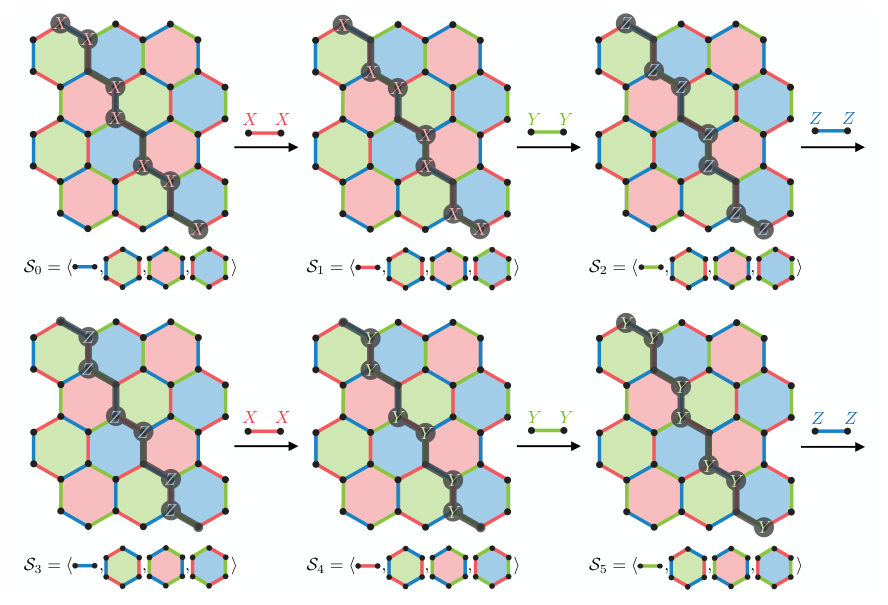 
FIG. 1. The P6 honeycomb Floquet code (hFC) on the hexagonal lattice. Each panel represents the hFC at a particular point in time, where we show the evolution of a logical operator representative and the ISG. Check sets represented by the edges above the arrows are measured between time steps.

📷 Fig 2

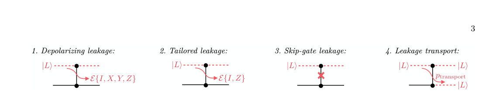 
FIG. 2. The four leakage models considered in this work. The models differ in the effect of a leaked qubit on a sealed qubit upon interaction through a two-qubit Clifford CP gate, where P is a Pauli (CZ is shown as an example).

📷 Fig 3

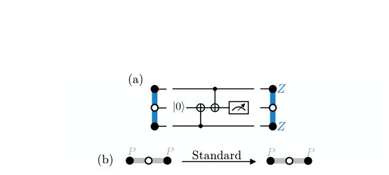 
FIG. 3. Standard syndrome extraction circuit (SEC). (a) The ancilla qubit (middle wire) is reset, entangled with the two data qubits, and then measured. The measurement yields the eigenvalue of ZZ on the data qubits. (b) The standard SEC preserves data/ancilla qubit role assignments, unlike the late- and early-SWAP SECs shown in Figs. 5 and 6.

📷 Fig 4

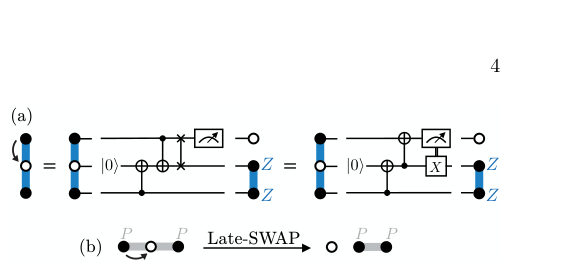 
FIG. 5. Late-SWAP syndrome extraction circuit. (a) The central term is a schematic representation of the late- SWAP circuit, where just before measurement, a SWAP is applied between the ancilla qubit and one of the data qubits. The right-hand side employs Fig. 4(a) and (c), yielding the final, zero-overhead circuit. (b) The late-SWAP SEC ex- changes the roles of one of the data qubits and the ancilla, with the solid arrow indicating the direction of the data qubit information transfer.

📷 Fig 5

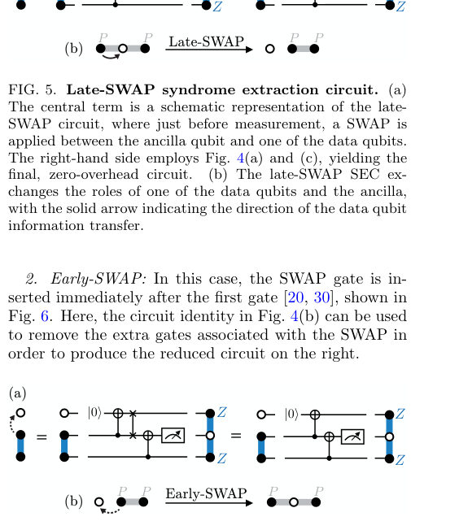 
FIG. 6. Early-SWAP syndrome extraction circuit. (a) The central term is a schematic representation of the early- SWAP circuit implementation, where a SWAP is applied be- tween the ancilla qubit and one of the data qubits just after the first CX gate. The right-hand side employs Fig. 4(b), yielding the final, zero-overhead circuit. (b) The early-SWAP SEC transfers information from one data qubit to the freshly initialized ancilla, as indicated by the dashed arrow.

**Summary.** This paper presents novel, zero-overhead walking circuits for the honeycomb Floquet code to combat leakage errors in quantum computation. By dynamically removing leakage while preserving code distance, the circuits show superior error correction capabilities compared to existing methods. The work highlights the importance of entropic effects, predicting a rapid 'waterfall' improvement in error rates at finite physical error levels.

**Why it may be interesting.** The focus on leakage mitigation and the observation of non-standard error scaling regimes (waterfall) provide advanced insights into the practical limits of fault-tolerant quantum computation beyond simple asymptotic bounds.

Detailed structure

**Main problem.** The paper addresses the significant challenge of leakage errors in quantum error correction (QEC), which induce correlated errors and degrade code performance.

**Main result.** The proposed zero-overhead walking circuits for the honeycomb Floquet code can correct as many leakage errors as Pauli errors, and exhibit a pronounced 'waterfall regime' where performance surpasses distance-limited scaling predictions.

**Method.** The authors introduce and analyze two specific walking circuits (swirling and sliding) designed to periodically remove leakage while dynamically protecting logical qubits using anticommuting two-body measurements.

**Model / system.** The study focuses on the honeycomb Floquet code (hFC) implemented on a hexagonal lattice, analyzed under several physically motivated leakage noise models (e.g., depolarizing, skip-gate leakage).

**Key observables.** Logical Error Rate ($p_L$), Code Distance, Qubit Lifetime, and the scaling exponent ($\alpha$) of the error rate.

**Important parameters / regimes.** Physical error rate ($p$), leakage noise strength, and the comparison between asymptotic low-error regimes and finite-error 'waterfall' regimes.

**Assumptions / limitations.** The circuits are designed to be 'zero-overhead,' meaning they do not require additional qubits, gates, or time steps for leakage removal.

**Figures summary.** Figures illustrate the hFC on the lattice, the four leakage noise models considered, and plots showing the dependence of the logical error rate on the physical error rate, highlighting the waterfall regime.

**Paper structure.** The paper introduces the hFC and the leakage problem, details the construction of the zero-overhead circuits (swirling/sliding), analyzes performance under various leakage models via numerical simulation, and compares results against the walking surface code.

Abstract

Leakage, occurring when a qubit undetectably exits the computational subspace, poses a significant challenge for quantum error correction by inducing correlated errors in space and time. These correlations reduce both the code threshold and the effective code distance. To address this challenge, we introduce two zero-overhead walking circuits for the honeycomb Floquet code (hFC), termed the swirling and sliding circuits, which periodically remove leakage while dynamically protecting logical qubits via a schedule of anticommuting two-body measurements. Unlike previous dynamic circuits for the hFC, ours preserves the distance to Pauli errors. We further study their performance under leakage and find that, for two leakage noise models, they may correct as many leakage errors as Pauli errors, improving on the more widely known walking surface code. Through numerical simulation, we observe that finite-error-rate performance under leakage is strongly influenced by entropic effects, producing a pronounced waterfall regime in which the logical error rate decreases much more rapidly with physical error rate than the expected distance-limited scaling. In this regime, even when asymptotic predictions suggest otherwise, the hFC can outperform the same-distance walking surface code in error rates and sub-threshold logical error scaling.

[↑ back to top](#top)

### [Block entropy area based non-local fermionic mode optimization with gradient disentanglers](http://arxiv.org/abs/2609.11811v1)

**Authors:** Miklós Antal Werner, Gero Friesecke, Andor Menczer, Kornél Kapás, Örs Legeza  
**Type:** theory · **Category:** numerical methods · **PDF:** <https://arxiv.org/pdf/2609.11811v1>  
**Analysis basis:** full PDF text, analyzed in chunks
**Topic relevance:** `analog quantum simulation` **3/5** · `methods for driven-dissipative` **2/5**

📷 Fig 1

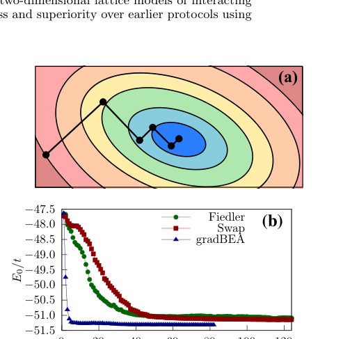 
FIG. 1. ( a) Illustration of the steepest descent algorithm. After setting the search direction to the gradient of the cost function (shown as a contour plot) at a parameter point, the point is updated by minimizing the cost function along the straight search line. (b) Ground state energy of the 10 × 10 sized spinless tt’V model at t′/t = 0.4 and V/t = 0.8 as a function of mode optimization iterations at bond dimension D = 80. The method introduced in our work (blue trian- gles) shows an order of magnitude faster convergence com- pared to the local methods using Fiedler vector- [23] or sys- tematic swap-gate-based [24] reorderings. The best (lowest) ground state energy in our work E0/t =...

📷 Fig 2

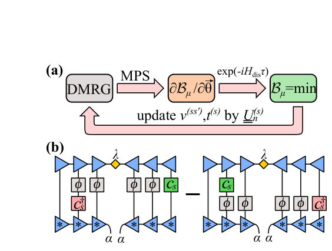 
FIG. 2. (a) Iteration loop of the gradient-based mode opti- mization algorithm. From the MPS wavefunction produced by DMRG, we determine the gradient of Bµ, and construct the disentangler Hamiltonian ˆHdis. Time evolution with this decreases Bµ, and is minimized at some time τ ∗, is used to construct U (s) n in Eq. (12). (b) Tensor diagram of Ξ(s,kl) αα used in Eq. (9) for {k = 2, l = 6}. The yellow diamond is the diagonal matrix containing the Schmidt values λα, the blue triangles are in the left and right are left- and right-canonical MPS matrices [11], and squares stand for single-site opera- tors, where ϕ = (−1)n↑+n↓is the Jordan-Wigner sign.

📷 Fig 3

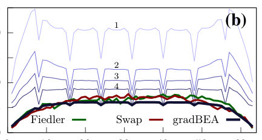 
FIG. 3. ( a) Ground state energy of the 8 × 8 sized Hubbard model for U/t = 4 as a function of mode optimization itera- tions at bond dimension D = 128. Blue triangles show results using the method of this work, red squares and green circles show results using the methods of Refs. 23 and 24. For the latter two datasets the slower initial convergence is discarded by shifting the iteration number by 100 to the left. The best (lowest) ground state energy in our work E0/t = −54.183 is significantly below the best swap-gate and Fiedler-vector- based results (Eswap 0 /t = −53.995, EFiedler 0 /t = −53.882).

**Summary.** This paper presents a novel, gradient-based algorithm (gradBEA) to optimize the single-particle basis used in Matrix Product States for fermionic systems. By minimizing a block entropy area cost function, the method iteratively refines the state representation, achieving superior convergence and accuracy compared to previous local optimization techniques. It provides a powerful, generalizable tool for simulating complex quantum many-body physics.

**Why it may be interesting.** The development of a non-local, gradient-based optimization technique for tensor network representations is a powerful algorithmic advance for simulating strongly correlated quantum systems, potentially improving upon standard DMRG limitations.

Detailed structure

**Main problem.** The core problem is efficiently finding the ground state eigenstates of many-body Hamiltonians for interacting fermions, which is computationally intractable due to the exponential growth of the Hilbert space.

**Main result.** The proposed gradient-based method (gradBEA) achieves significantly faster convergence and yields lower ground state energies compared to established local optimization protocols.

**Method.** It introduces a systematic block entropy area based mode optimization algorithm that uses the gradient of an entanglement cost function to drive an iterative, non-local update of the single-particle basis within the Matrix Product State framework.

**Model / system.** The method is applied to interacting fermions, modeled using Matrix Product States (MPS). Specific examples include spinless 'tt'V' models on a square lattice, the Hubbard model, and the $	ext{Fe}_4	ext{S}_4$ cluster.

**Key observables.** The primary observables are the ground state energy ($E_0/t$) and the entanglement measure, the block entropy area ($B_\mu$).

**Important parameters / regimes.** The optimization depends on the entanglement measure ($\mu$-Rényi entropy $S^{(i)}_\mu$) and the parameters ($\vec{	heta}$) governing the unitary rotations ($U^{(s)}$).

**Assumptions / limitations.** The optimization is performed iteratively by following the steepest descent path defined by the gradient, and the method is restricted to optimizing rotations within the spanned single-particle space.

**Figures summary.** Figure 1 compares the ground state energy convergence of gradBEA against local methods for the $	ext{tt}'	ext{V}$ model. Figure 2 illustrates the iterative loop and the tensor diagram used in the calculation.

**Paper structure.** The paper details the systematic derivation of the gradient of the block entropy area, outlines the three-step iterative optimization protocol (DMRG simulation, gradient calculation, time evolution via PS-TDVP), and validates the method on various lattice and molecular models.

Abstract

We introduce a systematic block entropy area based mode optimization algorithm for many-body quantum states of interacting fermions represented by matrix product states. From the gradient of a global cost function, the block entropy area, a long-ranged, non-interacting effective disentangler Hamiltonian is formed. We then simulate the time-dependent Schrödinger equation driven by the disentangler Hamiltonian by employing the time-dependent variational principle based on projector splitting, and minimize the cost function. The combination of the density matrix renormalization group with this gradient-based entanglement minimization forms an efficient low-rank iterative ground-state algorithm that also provides an optimized single-particle basis for matrix product state representation. We demonstrate the method on two-dimensional lattice models of interacting fermions and the Fe${_4}$S${_4}$ cluster, and show its robustness and superiority over earlier protocols using nearest-neighbor mode rotations and reorderings.

[↑ back to top](#top)

### [Condensation temperature and magnetic phases of trapped coherently coupled Bose gases](http://arxiv.org/abs/2609.11779v1)

**Authors:** Sunilkumar V, Rajat, Sandeep Gautam, Arko Roy  
**Type:** theory · **Category:** quantum gases · **PDF:** <https://arxiv.org/pdf/2609.11779v1>  
**Analysis basis:** full PDF text, analyzed in chunks
**Topic relevance:** `analog quantum simulation` **3/5** · `Keldysh / 2PI / non-Gaussian methods` **2/5**

📷 Fig 1

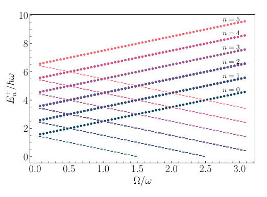 
FIG. 1. Excitation spectrum E± n of an isotropic three- dimensional harmonically trapped, non-interacting coherently coupled BEC as a function of the coherent coupling strength. The dots represent the upper branch E+ n , while the dashed lines denote the lower branch E− n .

📷 Fig 2

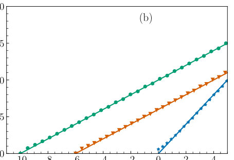 
FIG. 2. Density of states (DOS) as a function of excitation energy for different coherent coupling strengths. (a) Three- dimensional DOS, ρ3D, showing the expected quadratic de- pendence on energy. The solid lines correspond to the ana- lytical semiclassical results, while the markers are obtained by directly evaluating Eq. (3) using the Lorentzian approxi- mation to the Dirac delta function for an isotropic harmonic trap. (b) Two-dimensional DOS, ρ2D, exhibiting the char- acteristic linear dependence on energy for different coherent coupling strengths.

📷 Fig 3

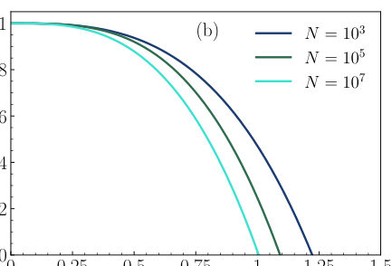 
FIG. 3. Variation of the critical temperature and condensate fraction of a three-dimensional ideal coherently coupled BEC. (a) Normalized critical temperature, Tc(Ω)/Tc(0), as a func- tion of coherent coupling strength for different atom numbers. The enhancement of Tc becomes less pronounced with increas- ing N. (b) Condensate fraction, N0/N, as a function of the scaled temperature, T/Tc(0), for different atom numbers at Ω/ω = 10. For each atom number N, the temperature is nor- malized separately by its corresponding zero-coupling critical temperature.

📷 Fig 4

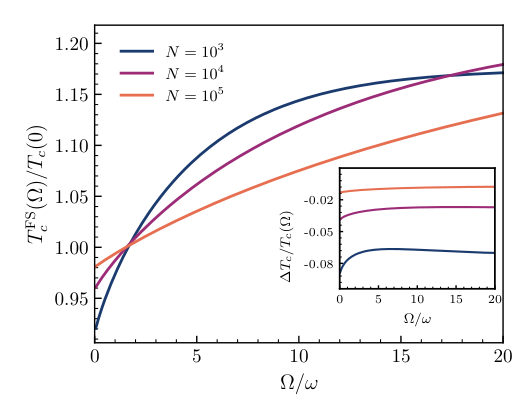 
FIG. 4. Finite-size correction to the critical temperature in 3D as a function of coherent coupling strength for different atom numbers. For each N, the temperature is normalized by its corresponding zero-coupling critical temperature. The inset shows the relative finite-size correction, ∆Tc/Tc(Ω) = [T FS c (Ω)−Tc(Ω)]/Tc(Ω), as a function of the coherent coupling strength.

📷 Fig 5

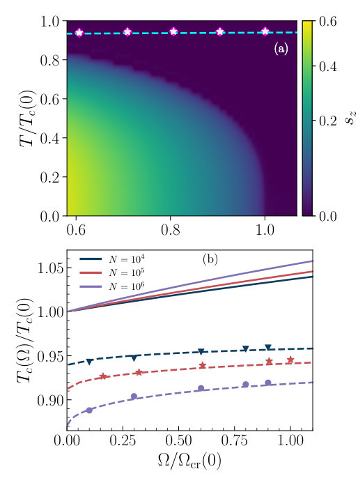 
FIG. 5. (a) Phase diagram of a coherently coupled BEC at finite temperature in the T −Ωplane, color coded by the magnetization sz for N = 105. The vanishing of sz identi- fies the finite-temperature ferro–paramagnetic phase bound- ary. The paramagnet–thermal gas transition is indicated by the dashed line, obtained analytically from Eq. (50), with the corresponding critical temperatures compared with the numerical results (markers). This boundary also marks the vanishing of the transverse magnetization sx. White mark- ers denote the HFB-Popov results for the critical tempera- ture obtained from the vanishing condensate fraction, while magenta markers indicate the corresponding temperatures...

**Summary.** This theoretical study analyzes the phase transitions and critical temperature of a Bose gas coupled coherently in a harmonic trap. By using semiclassical and HFB-Popov methods, the authors show that coherent coupling modifies $T_c$, and that repulsive interactions stabilize the system's response to this coupling. The results provide a detailed phase diagram mapping the transition from magnetic to thermal states.

**Why it may be interesting.** This work directly addresses the interplay between coherent quantum coupling, spatial confinement, and interatomic interactions on fundamental quantum phase transitions in ultracold atomic systems.

Detailed structure

**Main problem.** The paper investigates the condensation temperature and magnetic phase transitions in a Bose gas subjected to coherent coupling (Rabi coupling) within a harmonic trap.

**Main result.** Coherent coupling enhances the critical temperature, and repulsive interactions substantially suppress the variation of this temperature with increasing coupling strength.

**Method.** The study employs the semiclassical description for the noninteracting case and the Hartree–Fock–Bogoliubov–Popov (HFB-Popov) framework for interactions.

**Model / system.** The system is a Bose gas confined in a 3D harmonic trap, modeled with a Hamiltonian incorporating a coherent coupling term ($\sigma_x$). The analysis covers both noninteracting and interacting regimes.

**Key observables.** Critical temperature ($T_c$), condensate fraction ($N_0/N$), and the magnetic phase diagram (Ferromagnetic $	o$ Paramagnetic $	o$ Thermal gas).

**Important parameters / regimes.** Coherent coupling strength ($\Omega$), particle number ($N$), and interaction strength ($g$).

**Assumptions / limitations.** The semiclassical approximation ($k_B T \gg \hbar\omega$) is used for the density of states, and the analysis incorporates finite-size corrections.

**Figures summary.** Figures illustrate the excitation spectrum showing level splitting, the density of states ($
ho_{3D}, 
ho_{2D}$) for varying coupling, and the normalized $T_c$ and condensate fraction versus temperature.

**Paper structure.** The paper progresses from noninteracting analysis using semiclassical methods to incorporating finite-size corrections. It then extends the analysis to include repulsive interactions using the HFB-Popov framework to map the full phase diagram.

Abstract

We investigate condensation and finite-temperature magnetic phase transitions in a coherently (Rabi) coupled Bose gas confined in a three-dimensional harmonic trap. For the noninteracting system, we derive analytical expressions for the critical temperature and condensate fraction using a semiclassical description of the single-particle spectrum and density of states. At fixed particle number, coherent coupling enhances the critical temperature relative to the uncoupled system, and this enhancement decreases with increasing particle number $N$. The finite-size correction, in contrast, lowers the transition temperature, with its effect diminishing for larger $N$. We then incorporate repulsive interactions within the Hartree--Fock--Bogoliubov--Popov framework to investigate the finite-temperature phase diagram in the temperature--Rabi coupling plane. The system undergoes successive transitions from a ferromagnetic to a paramagnetic condensate and, at higher temperature, to a thermal gas. The transition boundaries obtained from the vanishing of the condensate fraction show excellent agreement with the analytical Hartree-Fock predictions. We find that the interactions substantially suppress the variation in the condensation temperature with an increase in the coherent coupling.

[↑ back to top](#top)

### [Engineering Quantum Links: Noise and Quantum-State-Degradation Metrics over Metropolitan Fiber Network](http://arxiv.org/abs/2609.11359v1)

**Authors:** Marcello Caleffi, Laura d'Avossa, Angela Sara Cacciapuoti  
**Type:** both · **Category:** quantum information and computing · **PDF:** <https://arxiv.org/pdf/2609.11359v1>  
**Analysis basis:** full PDF text, analyzed in chunks
**Topic relevance:** `quantum optics experiment` **3/5** · `QC/QI experiment` **1/5** · `quantum measurements` **1/5**

📷 Fig 1

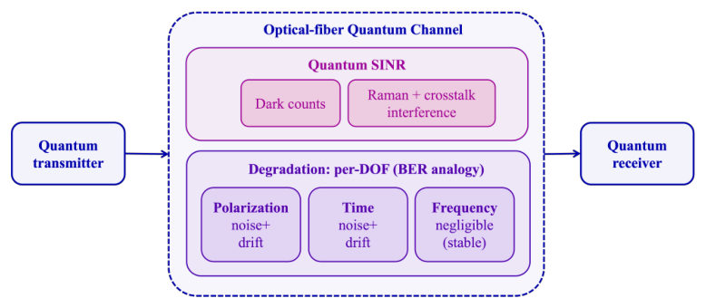 
FIGURE 1. A quantum state propagating through an optical-fiber channel is degraded along a small set of measurable axes, in direct analogy with the impairments characterized in classical links. Two complementary descriptions capture this degradation. On the noise side, the photon-counting quantum-analog of the SINR accounts for the intrinsic noise and the interference introduced by co-propagating classical traffic via spontaneous Raman scattering and inter-fiber crosstalk. On the error side, the analog of the bit-error rate is resolved across the three main degrees-of-freedom available to encode a quantum state onto a single optical photon – namely, polarization, time, and frequency – and...

📷 Fig 2

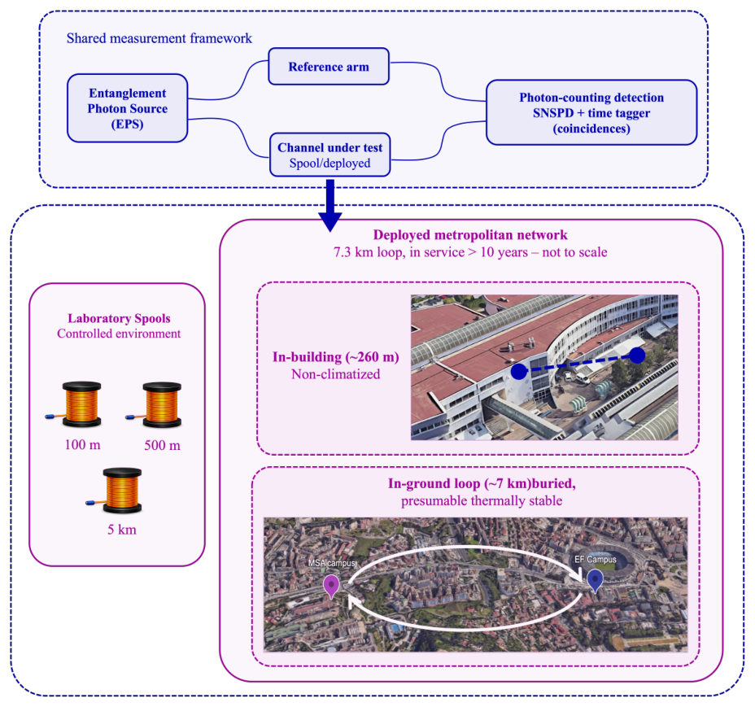 
FIGURE 2. Experimental framework (not to scale). (Top): the Entangled-Photon Source (EPS) emits polarization-entangled, temporally correlated photon pairs; one member (the so-called idler) is sent to a local reference arm, while the other (the so-called signal) probes the link under test. Their temporal coincidences are recorded by superconducting-nanowire single-photon (SNSPD) detectors read out by a time tagger, and feed the two channel metrics. Using one photon of each pair as a heralding reference enables coincidence-based suppression of background counts, providing the rationale for employing an entangled source rather than a bright classical probe. (Bottom): the channel under test is...

📷 Fig 3

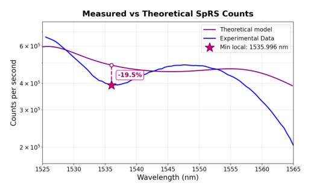 
FIGURE 3. Measured C-band photon count rate generated by spontaneous Raman scattering from a classical signal co-propagating in the O-band at 1310 nm, over the deployed SMF-28 fiber (blue), compared with the Hollenbeck-Cantrell prediction for undoped silica (purple) [7]. The measured spectrum exhibits a characteristic local minimum near 1535 nm that the reference model does not reproduce, with the detected photon count departing from it by up to 19.5%. This minimum identifies the C-band operating point least affected by the co-propagating O-band traffic.

📷 Fig 4

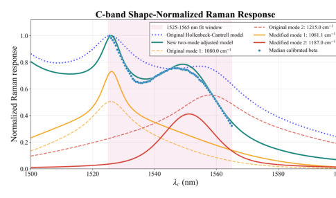 
FIGURE 4. Normalized C-band Raman response: comparison between the experimental data measured across all laboratory sources and fiber lengths, the original Hollenbeck-Cantrell model for undoped silica [7], and the adjusted model obtained by modifying only the two highest-frequency Raman modes of the original model, namely modes 12 and 13. The individual contributions of modes 12 and 13 are also shown both in their original Hollenbeck-Cantrell form and as derived by the adjusted two-mode model, which follows the measured data closely, including the local minimum near 1535 nm that is not reproduced by the original Hollenbeck-Cantrell response. All the curves are normalized to their respective...

📷 Fig 5

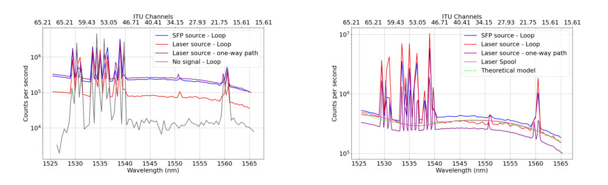 
FIGURE 5. C-band SpRS photons generated by O-band classical sources as a function of wavelength, corresponding to the ITU DWDM channels. The measurements were obtained using both a narrowband laser source and a commercial Finisar SFP transmitter over both the complete loop (7 km) and a one-way path (3.5 km). (a) Raw data, including an additional reference measurement with no launched signal to identify background contributions. (b) Normalized data, including measurements obtained using an additional 5 km laboratory fiber spool. The results show consistency between the urban-scale and laboratory measurements after normalization.

**Summary.** This paper develops an engineering framework for quantum networking by characterizing noise and state degradation over real metropolitan fiber links. The authors adapt classical communication metrics like SINR and BER to the quantum domain, measuring impairments across polarization, time, and frequency. This work transforms quantum networking from a theoretical exercise into a quantifiable engineering design problem for the Quantum Internet.

**Why it may be interesting.** It provides concrete, measurable metrics (like the quantum link budget) that bridge fundamental quantum optics theory with practical, large-scale engineering deployment challenges in quantum communication.

Detailed structure

**Main problem.** To establish an engineering foundation for deploying quantum networks over existing metropolitan fiber infrastructure by quantitatively characterizing channel noise and quantum state degradation.

**Main result.** The quantum link can be characterized by a small set of measurable parameters, transforming quantum networking from a pure physics demonstration into a solvable engineering design problem.

**Method.** The authors developed a unified framework by creating quantum analogs of classical metrics (SINR and BER) and applying them to real-world measurements on a deployed fiber loop.

**Model / system.** The study uses a 7.3 km metropolitan fiber loop in the QuantumInternet.it testbed, comparing quantum signals (C-band) to classical traffic (O-band). The analysis models noise using a photon-counting SINR analog and state degradation across polarization, time, and frequency using BER analogs.

**Key observables.** Dark-count rate, interference count from classical traffic, channel-induced degradation, and temporal drift for polarization, time, and frequency.

**Important parameters / regimes.** The link budget is built from measurable parameters, including the ratio of signal to noise/interference counts, and the spectral characteristics of Raman noise.

**Assumptions / limitations.** The approach assumes the use of a shared physical medium, allocating classical traffic to the O-band and quantum signals to the C-band.

**Figures summary.** Figure 1 illustrates that quantum state degradation is captured by two complementary descriptions: the SINR analog (noise side) and the BER analog (error side, resolved across polarization, time, and frequency).

**Paper structure.** The paper builds the foundation by first defining the necessary metrics (SINR/BER analogs), then experimentally measuring noise (dark counts, crosstalk) and state degradation (polarization, time, frequency drift) on a deployed loop, culminating in a comprehensive quantum link budget.

Abstract

Deploying quantum networks over existing network infrastructures requires the same engineering foundations that underpin classical communications: quantitative models of the channel's noise and of the impairments it imposes on the transmitted information. In this work, we build such a foundation on experimental measurements, grounding the quantum-network counterparts of the two cornerstone metrics of classical link characterization - namely, the SINR and the BER - on a 7.3 km deployed metropolitan-scale fiber-loop interconnecting two campuses of the University of Naples Federico II within the national QuantumInternet.it testbed. On the noise side, we adopt a photon-counting quantum analog of the SINR - in which dark counts constitute the intrinsic noise and the photons generated by classical traffic (through either spontaneous Raman scattering or inter-fiber crosstalk) constitute the interference - and we quantify each contribution directly on the deployed loop. On the bit-error side, we consider the main degrees-of-freedom available to encode a quantum state within an optical photon - namely, polarization, time, and frequency - and we quantify for each degree the channel-induced degradation and its drift over time. These results show that a quantum fiber link, like its classical counterpart, can be captured by a small set of measurable parameters, turning quantum networking over deployed fiber from a physics demonstration into an engineering design problem. Together, they provide the key ingredients of a quantum link budget for the Quantum Internet.

[↑ back to top](#top)

### [Entanglement entropy in topological tensor networks](http://arxiv.org/abs/2609.10667v1)

**Authors:** Vijay Balasubramanian, Charlie Cummings  
**Type:** theory · **Category:** numerical methods · **PDF:** <https://arxiv.org/pdf/2609.10667v1>  
**Analysis basis:** full PDF text, analyzed in chunks
**Topic relevance:** `methods for driven-dissipative` **3/5** · `analog quantum simulation` **2/5**

📷 Fig 1

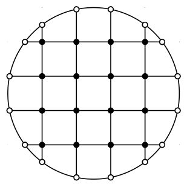 
Figure 1. A lattice Λ tessellating the disk Σ. The bulk vertices are in black, and the boundary vertices are in white. For a topological tensor network, we should take all the edges to be oriented.

📷 Fig 2

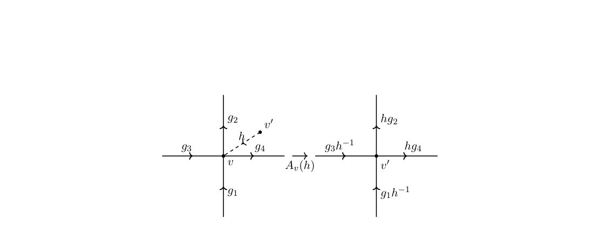 
Figure 2. The action of Av(h) on a state |g1, g2, g3, g4⟩. Av(h) acts trivially on any edge which does not end at the vertex v.

📷 Fig 3

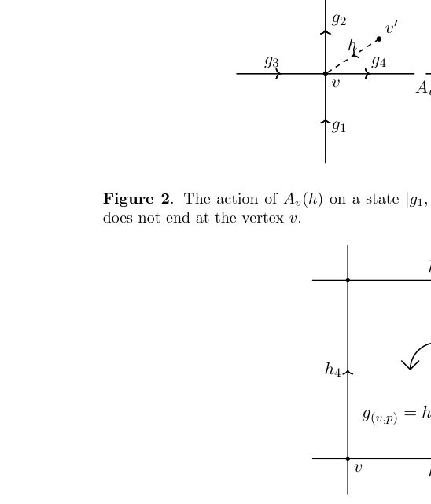 
Figure 3. An example of a plaquette that B(v,p)(h) acts on.

📷 Fig 4

 
Figure 4. An example of move 1, which can be performed to add or remove a bulk vertex/leg from the graph Λ. In other words, we can split or combine bulk vertices.

📷 Fig 5

 
Figure 5. An example of move 2, which can add or remove a leg/plaquette from the graph Λ. In other words, we can split or fuse two bulk plaquettes together.

**Summary.** This paper develops a generalized entropy formula for tensor network models representing TQFTs with continuous gauge groups. By imposing specific constraints on the network structure, the authors derive an entropy that incorporates infinite excitations, successfully connecting the model to 3D gravity theories. This work advances the use of tensor networks to probe fundamental concepts in quantum gravity and topological order.

**Why it may be interesting.** The use of tensor networks to model fundamental concepts like topological entanglement entropy and gravity provides a concrete, computable framework for understanding quantum gravity phenomena, which is relevant to understanding complex many-body ground states.

Detailed structure

**Main problem.** Deriving a generalized entropy formula for tensor network models that describe diffeomorphism invariant states of Topological Quantum Field Theories (TQFTs) with continuous gauge groups.

**Main result.** The derived entropy formula successfully generalizes topological entanglement entropy to incorporate infinite excitations from continuous gauge groups, providing an analogue to holographic entropy in 3D gravity.

**Method.** The authors use advanced algebraic techniques, including defining a factorization map and imposing electric/magnetic constraints on the tensor network structure, to calculate the entropy.

**Model / system.** The model is a topological tensor network defined on a surface $\Sigma$, which is used as a toy model for the holographic map in quantum gravity. It is designed to prepare states corresponding to TQFTs with gauge groups like $\text{SL}(2, \mathbb{R})$.

**Key observables.** The entropy $S(\rho_R) = H[p_\pi] + \langle\hat{A}\rangle_\rho + S_{\text{bulk}}(\rho_R)$, where $\langle\hat{A}\rangle_\rho$ is the universal term analogous to the area term.

**Important parameters / regimes.** The gauge group (e.g., $\text{SL}(2, \mathbb{R})$), the genus and boundary components of the surface $\Sigma$, and the small Newton's constant $G_N$.

**Assumptions / limitations.** The analysis assumes the existence of a factorization map $V$ to handle gauge constraints and relies on the equivalence between the factorization map approach and the algebraic approach.

**Figures summary.** Figure 1 illustrates a lattice tessellating the disk, distinguishing between bulk and boundary vertices, which is central to defining the entropy calculation.

**Paper structure.** The paper develops the entropy formula by first defining the physical Hilbert space using constraints (electric and magnetic) on the tensor network structure, leading to the final generalized entropy expression.

Abstract

We derive an entropy formula for recently proposed tensor network models which prepare diffeomorphism invariant states of topological quantum field theories with non-compact and/or continuous gauge groups. We show that our entropy formula generalizes the notion of ``topological entanglement entropy'' to incorporate the infinite number of particle-like excitations in such theories. When our networks are endowed with gauge group $\mathrm{SL}(2,\mathbb{R})$, we can interpret them as models of three-dimensional gravity with small Newton's constant and possibly non-invertible metrics.

[↑ back to top](#top)

### [Massive quantum divergence on the Cauchy horizon of a black hole](http://arxiv.org/abs/2609.10755v1)

**Authors:** Marc Casals, Lorenzo Pisani, Peter Taylor  
**Type:** theory · **Category:** other · **PDF:** <https://arxiv.org/pdf/2609.10755v1>  
**Analysis basis:** full PDF text, analyzed in chunks
**Topic relevance:** `Keldysh / 2PI / non-Gaussian methods` **3/5** · `methods for driven-dissipative` **1/5** · `quantum measurements` **1/5**

📷 Fig 1

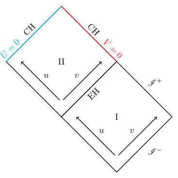 
Figure 1: Penrose diagram of (part of) RN spacetime.

📷 Fig 2

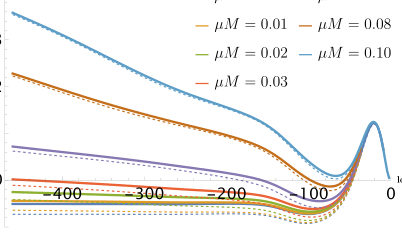 
Figure 2: VP ⟨ˆΦ2⟩A ren in the H-H (solid lines) and Unruh (dashed lines) states for BH charge Q = 0.8M and ℓ= M near the CH for different values of the field mass µ.

📷 Fig 3

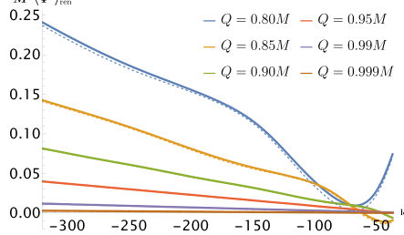 
Figure 3: VP ⟨ˆΦ2⟩A ren in the H-H (solid lines) and Unruh (dashed lines) states for field mass µM = 0.1 and ℓ= M near the CH for different values of the BH charge Q.

📷 Fig 4

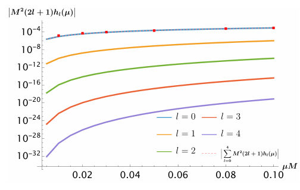 
Figure 4: Log-plot of k(µ, Q) in (6) as well as its various l-mode contributions as per (7) as a function of the field mass µ with BH charge Q = 0.8M. The red squares represent k(µ, Q) obtained by fitting the numerical results for ⟨ˆΦ2⟩H ren.

📷 Fig 5

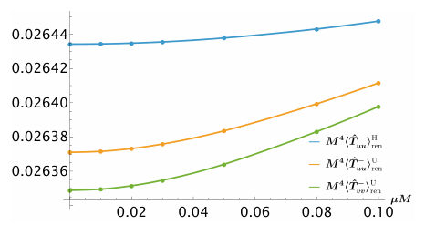 
Figure 5: CH fluxes ⟨ˆT − uu⟩H ren = ⟨ˆT − vv⟩H ren, ⟨ˆT − uu⟩U ren and ⟨ˆT − vv⟩U ren as functions of the scalar field mass µ, for coupling ξ = 0 and BH charge Q = 0.8M.

**Summary.** This paper analyzes quantum fluctuations of a massive scalar field inside a charged black hole, specifically focusing on the Cauchy horizon. The key finding is that quantum effects cause divergences in the stress-energy tensor on the CH, suggesting a stronger singularity than classical theory predicts. This work probes the limits of semi-classical gravity in extreme astrophysical environments.

**Why it may be interesting.** While focused on general relativity, the study of divergences and backreaction in extreme spacetime geometries shares conceptual parallels with understanding instabilities or strong coupling regimes in quantum many-body systems.

Detailed structure

**Main problem.** The study investigates the behavior of quantum massive scalar fields near the Cauchy horizon (CH) of a charged Reissner-Nordström black hole, focusing on quantum divergences and their implications for spacetime structure.

**Main result.** The vacuum polarization and stress-energy tensor components diverge on the CH for massive fields, suggesting a strong singularity via backreaction, unlike the classical prediction.

**Method.** The authors employ a semi-classical approach, calculating renormalized expectation values of quantum fields using techniques like the extended coordinate method in curved spacetime.

**Model / system.** The system is a quantum massive scalar field propagating in the interior of a charged, spherically-symmetric Reissner-Nordström black hole spacetime.

**Key observables.** Vacuum polarization ($\langle \hat{\Phi}^2 
angle$), components of the renormalized quantum stress-energy tensor ($\langle \hat{T}_{\mu
u} 
angle$), and energy fluxes in Eddington-Finkelstein and Kruskal coordinates.

**Important parameters / regimes.** Black hole charge ($Q$), field mass ($\mu$), coupling constant ($\xi$), and the choice of quantum state (Hartle-Hawking vs. Unruh).

**Assumptions / limitations.** The analysis is restricted to the RN background and relies on the semi-classical approximation where quantum effects source classical spacetime curvature.

**Figures summary.** Figures illustrate the divergence of vacuum polarization and stress-energy tensor components near the CH for varying field masses and charges, and show the dependence of fluxes on parameters.

**Paper structure.** The paper analyzes the quantum field behavior by comparing massive and massless cases, calculating divergences in the vacuum polarization and stress-energy tensor components, and discussing the implications for the stability and singularity structure of the Cauchy horizon.

Abstract

We investigate a quantum massive scalar field in the interior of a charged and spherically-symmetric (Reissner-Nordström) black hole. We examine the behaviour for varying values of the black hole charge, field mass and coupling constant when the field is in two quantum states: Hartle-Hawking (representing a black hole in thermal equilibrium) and Unruh (representing a black hole evaporating via the emission of Hawking radiation). We show that the vacuum polarization as well as the angular components of the quantum stress-energy tensor diverge on the Cauchy horizon, in stark contrast to what happens for massless fields. We also calculate the energy fluxes in Eddington-Finkelstein coordinates $\{u,v\}$. We show that these fluxes on the Cauchy horizon do not generically vanish. This implies, in particular, that in regular, Kruskal coordinates $\{U,V\}$ the ingoing flux diverges like $V^{-2}$ on the Cauchy horizon (where $V=0$). This divergence suggests that its backreaction via the semiclassical Einstein equations would yield a strong singularity, as opposed to its weaker, classical counterpart. Interestingly, there are exceptions, in which the energy fluxes in Eddington-Finkelstein coordinates vanish: (i) in the extremal limit (where the black hole is maximally charged); (ii) certain fine-tuned regions of parameter space, where the fluxes change sign.

[↑ back to top](#top)

### [Transdimensional quantum droplets in an optically trapped Bose mixture](http://arxiv.org/abs/2609.11047v1)

**Authors:** Xiaoran Ye, Yi Zhang, Ziheng Zhou, Zhaoxin Liang  
**Type:** theory · **Category:** quantum gases · **PDF:** <https://arxiv.org/pdf/2609.11047v1>  
**Analysis basis:** full PDF text, analyzed in chunks
**Topic relevance:** `analog quantum simulation` **3/5** · `Keldysh / 2PI / non-Gaussian methods` **2/5**

📷 Fig 1

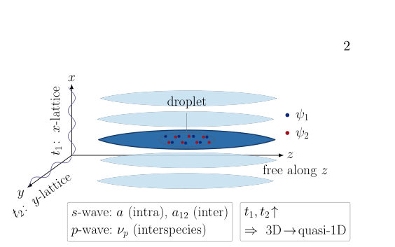 
FIG. 1. Schematic illustration of transdimensional quan- tum droplets in a two-component Bose mixture confined by a two-dimensional transverse optical lattice, Vopt(x, y) = ER[t1 sin2(qBx) + t2 sin2(qBy)]. The lattice produces an ar- ray of quasi-one-dimensional tubes oriented along z, while the atoms remain free in the axial direction. Increasing the lat- tice depths t1 and t2 drives the crossover from an anisotropic three-dimensional regime to a quasi-one-dimensional regime. The two components, ψ1 (blue) and ψ2 (red), interact through intraspecies and interspecies s-wave scattering, characterized by a and a12, and through an interspecies p-wave interaction with scattering volume νp. The...

📷 Fig 2

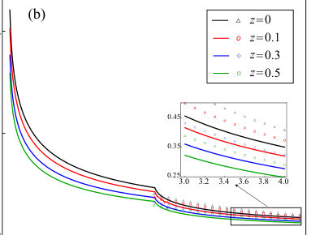 
FIG. 2. (a) Scaling function f(s) and (b) scaling function h(s) for different values of the dimensionless p-wave interac- tion strength z, computed at y = −0.95. The dimensional crossover is traversed in two stages: first, s2 = 0.01 is held fixed while s1 is varied from 0 to 2, driving the crossover from the quasi-1D regime to a quasi-2D regime; then s1 = 2 is held fixed while s2 is varied from 0.01 to 2, further driv- ing the crossover from the quasi-2D regime to the anisotropic 3D regime. Solid curves show the full results from Eqs. (30) and (35); the symbols on the right mark the 3D asymptotic values, and the numbers on the left indicate the quasi-1D lim- iting values. Increasing z...

📷 Fig 3

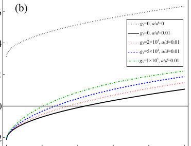 
FIG. 3. (a) Asymptotic 3D energy per particle E/N (in units of 10−6ℏ2/2ma2) as a function of the density n (in units of 10−5a−3) for g3 = 0 (black solid), 2×104 (red dotted), 5×104

📷 Fig 4

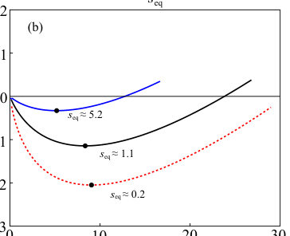 
FIG. 5. (a) Equilibrium density neqa3 versus seq at y = −0.95 and a/d = 0.01, calculated from the full f(s) [Eq. (30)]. Curves are for g3 = 0 (black solid), 5.76 × 104 (blue dashed), and 1.15×105 (red dotted). They are labelled by the density- independent g3 because zeq = g3neqa3/2 varies along each branch; over the range shown the self-consistent values are zeq = 0.075–0.140 and 0.113–0.212. Open diamonds and squares denote the 3D [Eq. (38)] and quasi-1D [Eq. (44)] asymptotes at g3 = 0, plotted for seq ≳2 and seq ≲0.7, re- spectively. (b) Energy per particle in units of 10−6ℏ2/(2ma2), the same units as Fig. 3, versus density in units of 10−6a−3, at g3 = 0. The three lattice depths give seq...

📷 Fig 5

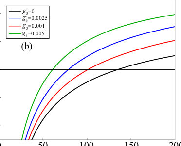 
FIG. 4. (a) Asymptotic quasi-1D energy per particle E/N1D (in units of ℏ2/2ma2 12) as a function of the dimensionless density n1D (in units of |a|−1) at y = −0.95, for g′ 3 = 0 (black), 0.001 (red), 0.0025 (blue), and 0.005 (green). A finite-density minimum appears, indicating the formation of a self-bound quasi-1D droplet. (b) Corresponding derivative ∂(E/N1D)/∂(n1D|a|) (same units), whose zero crossing deter- mines the equilibrium droplet density. As g′ 3 increases, the zero crossing shifts toward lower density, showing that the p- wave interaction weakens the fluctuation-induced binding of the quasi-1D droplet.

**Summary.** This paper theoretically examines quantum droplets in a two-component Bose mixture confined by an optical lattice, analyzing the crossover from 3D to quasi-1D regimes. Using functional-integral methods, the authors show that the self-binding mechanism persists across this crossover, with the attraction sourced differently in the 3D versus 1D limits. The results quantify the influence of p-wave interactions on this induced binding.

**Why it may be interesting.** This work provides a detailed theoretical understanding of how dimensionality and specific interspecies interactions (p-wave) govern the stability and binding mechanism of quantum droplets in engineered optical lattices.

Detailed structure

**Main problem.** The study investigates quantum droplets in a symmetric two-component Bose mixture confined by an optical lattice, specifically focusing on the crossover between different dimensional regimes.

**Main result.** The system supports a self-bound minimum across the dimensional crossover, with the attraction arising from different physical mechanisms (lattice vs. fluctuations) depending on the regime.

**Method.** The analysis employs the Euclidean functional-integral framework, calculating observables like ground-state energy and quantum depletion at the Gaussian level.

**Model / system.** The system is a two-component Bose mixture ($\psi_1, \psi_2$) subjected to a 2D transverse optical lattice, incorporating s-wave and p-wave interspecies interactions.

**Key observables.** Ground-state energy, quantum depletion, and the equilibrium density across the dimensional crossover.

**Important parameters / regimes.** Lattice depths ($t_1, t_2$), interspecies coupling ratio ($y = g_{12}/g$), and p-wave interaction strength ($g_p$).

**Assumptions / limitations.** Assumes equal masses and intraspecies couplings, and uses the lowest-band approximation for the lattice confinement.

**Figures summary.** Figures illustrate the lattice structure and the crossover from 3D to quasi-1D regimes, and show the energy per particle versus density, confirming the existence of a finite-density minimum.

**Paper structure.** The paper builds from deriving the Euclidean action in the tight-binding regime, calculating the ground-state energy and quantum depletion via Gaussian fluctuations, and finally analyzing the resulting equation of state across the dimensional crossover.

Abstract

We study quantum droplets in a symmetric two-component Bose mixture with interspecies $p$-wave interactions and a two-dimensional transverse optical lattice. The lattice drives a crossover from an anisotropic three-dimensional gas to weakly coupled one-dimensional tubes. We calculate the ground-state energy and quantum depletion at the Gaussian level and derive their limiting forms. At $y=g_{12}/g=-0.95$, where the bare mean field is repulsive and no free-space droplet exists, the calculated bulk equation of state supports a self-bound minimum across the crossover: a negative lattice contribution at order $n^{2}$ supplies the attraction in the three-dimensional regime, and attractive fluctuations do so in the quasi-one-dimensional regime, with the intermediate, transdimensional range described quantitatively by neither limit. The interspecies $p$-wave interaction modifies only the spin branch. In the parameter range studied, increasing its strength lowers the equilibrium density across the crossover, consistently with a weakening of the induced binding.

[↑ back to top](#top)

### [Unraveling the Kagome Antiferromagnetic $3J$ Model and Its Materials: An Integrated Approach](http://arxiv.org/abs/2609.11745v1)

**Authors:** Xin Lu, Andreas Raikos, Menghan Song, Zezong Li, Lankun Han, Shiliang Li, Sylvain Capponi, Zi Yang Meng, Chengkang Zhou  
**Type:** both · **Category:** strongly correlated electrons · **PDF:** <https://arxiv.org/pdf/2609.11745v1>  
**Analysis basis:** full PDF text, analyzed in chunks
**Topic relevance:** `analog quantum simulation` **3/5** · `methods for driven-dissipative` **2/5**

📷 Fig 1

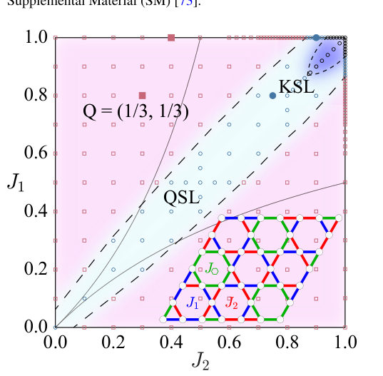 
FIG. 1. Ground-state phase diagram of the 3J model. Two (1/3, 1/3) ordered phases and an intermediate QSL phase are identi- fied within 0 ≤J1,2 ≤1. The QSL phase is separated from the KSL ground state around the isotropic limit, J1 = J2 = J7. Open symbols denote the calculated parameter points, while solid symbols indicate the parameter points used for specific-heat calculations. The black dashed lines indicate the quantum phase boundaries determined in this work, and the gray solid lines show the classical phase bound- aries obtained from Ref. [60] for comparison. The inset displays an enlarged 27-site unit cell (in the (1/3, 1/3) ordered phase) of the 3J model on the kagome lattice, with...

📷 Fig 2

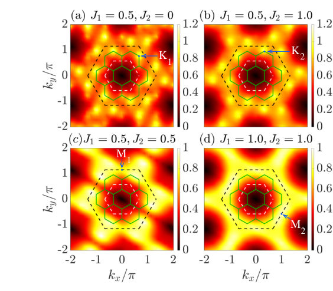 
FIG. 2. Static spin structure factors. Representative static spin structure factors S (k) in the (a,b) (1/3, 1/3) ordered phases, (c) QSL phase, and (d) KSL phase. The ordering peaks in (a) occur at Q = K1, whereas those in (b) occur at Q = K2. The positions of M1 and M2 are also denoted directly in (c) and (d). The black dashed hexagon denotes the Brillouin zone (BZ) of the triangular lattice (1- site unit cell), the white dashed hexagon represents the BZ of the kagome lattice (3-site unit cell), and the green solid hexagon corre- sponds to the BZ of the 3J model (9-site unit cell). Here, all S (k) are obtained by Fourier transformation of all-to-all spin-spin correla- tions. The...

📷 Fig 3

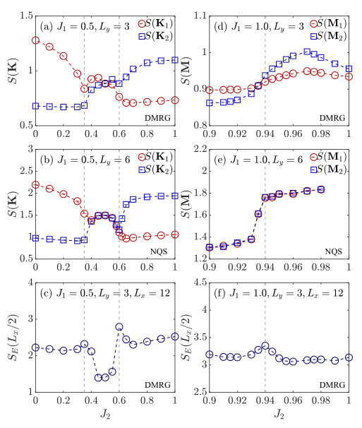 
FIG. 3. J2 dependence of S (k) and entanglement entropy. (a) J2 dependence of S (k) at K1 and K2 for J1 = 0.5 on YC6 (Ly = 3, Lx = 12) cylinders obtained by DMRG. The kink-like features near J2 ≃0.35 and 0.6, indicated by the gray dashed lines, signal phase transitions. (b) Same as (a) but on a torus (Ly = 6, Lx = 6) obtained from NQS calculations. (c) J2 dependence of the entan- glement entropy S E(x) at the bulk of cylinders x = Lx/2, yielding critical points consistent with those identified in (a) and (b). (d-f) Same as (a-c), respectively, but for J1 = 1.0, with S (k) evaluated at M1 and M2, where the phase transition occur near J2 ≃0.94.

📷 Fig 4

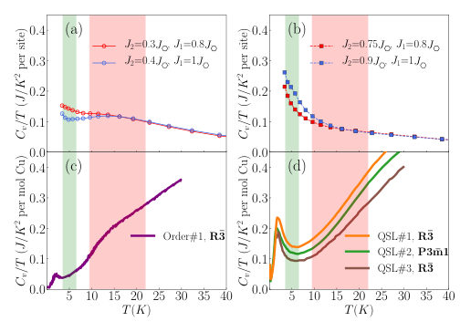 
FIG. 4. Computed and experimental specific heat. (a) and (b) Calculated Cv/T from XTRG for representative parameter sets in the (1/3, 1/3) ordered and QSL phases, respectively. The tem- perature scale is set by J7 = 63 K following the experimen- tal estimate [80]. (c) Experimental Cv/T for Y3Cu9(OH)19Cl8 from Ref. [57] (ordered, marked as Order#1), which crystallizes in the R¯3 space group and realizes the (1/3, 1/3)-ordered phase. (d) Experimental Cv/T for three candidate QSL materials: disor- dered LuCu3(OH)6Br2[Brx(OH)1−x] in the R¯3 space group (orange, QSL#1) [56]; YCu3(OH)6Br2[Brx(OH)1−x] (green, QSL#2), which crystallizes in the P¯3m1 space group but is also considered a 3J- model...

📷 Fig 5

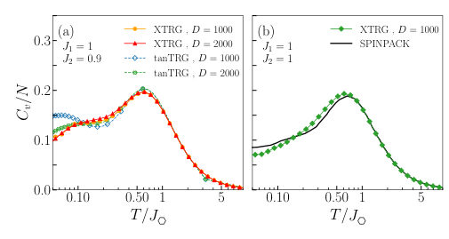 
FIG. 5. Specific heat of the 3J and 1J models. (a) Calculated spe- cific heat density Cv/N, from XTRG and tanTRG caluations with bond dimension D = 1000 and 2000. (b) Cv/N at the isotropic point J1 = J2 = J7, from the XTRG calculations with D = 1000. The black line shows the corresponding Cv/N from SPINPACK calcula- tions reported in Ref. [82].

**Summary.** This paper provides an integrated theoretical and computational study of the Kagome 3J model, aiming to understand Quantum Spin Liquid behavior in materials like YCu3(OH)6Br2. By employing advanced tensor network and machine learning techniques, the authors map out the phase diagram and predict characteristic signatures, such as specific heat anomalies, which are then directly compared to experimental measurements.

**Why it may be interesting.** The rigorous combination of advanced quantum simulation techniques (NQS/ViT, XTRG/tanTRG) to predict measurable thermodynamic quantities like specific heat makes this work highly relevant for experimental condensed matter physicists studying frustrated magnets.

Detailed structure

**Main problem.** The study investigates the ground-state and finite-temperature properties of the Kagome antiferromagnetic 3J model to characterize the nature and stability of putative Quantum Spin Liquid (QSL) phases.

**Main result.** The research identifies an intermediate QSL phase sandwiched between two magnetically ordered phases, and successfully connects the model's theoretical predictions (like specific heat anomalies) to measurable experimental signatures in 3J materials.

**Method.** The study employs a combination of advanced numerical techniques, including DMRG, Neural Quantum States (NQS) with Vision Transformers (ViT), and thermal tensor-network methods (XTRG and tanTRG).

**Model / system.** The system is the Kagome antiferromagnetic 3J Model, designed for the candidate Dirac QSL material YCu3(OH)6Br2[Br1-x(OH)x]. The Hamiltonian involves three inequivalent antiferromagnetic couplings (J1, J2, J7).

**Key observables.** Specific heat (Cv/T), static spin structure factors S(k), and entanglement entropy Se(x).

**Important parameters / regimes.** The model is analyzed across various coupling regimes (J1, J2, J7) and compares results to experimental measurements across different temperature scales.

**Assumptions / limitations.** The analysis assumes that the observed thermal and structural signatures are robust indicators for distinguishing between ordered, QSL, and KSL phases, and that the ML/tensor network methods accurately capture the system's physics.

**Figures summary.** Figures illustrate the ground-state phase diagram, static spin structure factors S(k) distinguishing phases, and comparisons of calculated specific heat (Cv/T) against experimental data.

**Paper structure.** The paper systematically analyzes the model using multiple computational tools: first, establishing the phase diagram using DMRG/NQS; second, characterizing phases via S(k) and entanglement entropy; and finally, validating the findings by calculating and comparing finite-temperature specific heat using XTRG and tanTRG against real materials.

Abstract

We investigate the ground-state and finite-temperature properties of the kagome antiferromagnetic Heisenberg model with three inequivalent couplings, dubbed the 3J model, which is designed for the candidate Dirac quantum spin liquid (QSL) material YCu$_3$(OH)$_6$Br$_2$[Br$_{1-x}$(OH)$_x$] (see, e.g., Zeng et al., 2024). Employing large-scale density-matrix renormalization group (DMRG) supplemented by neural quantum states (NQS) simulations, we identify an intermediate QSL phase between two magnetically ordered phases. We also find that this QSL is separated from the kagome spin liquid ground state at the isotropic limit. To establish a direct comparison with experiments, we compute the specific heat of the model by means of advanced exponential (XTRG) and tangent-space (tanTRG) thermal tensor-network methods. In the magnetically ordered phase, the specific heat over temperature exhibits a shoulder at a temperature that is a fraction of the coupling strength $J_{hex}$, which disappears in the QSL phase. These universal behaviors are consistent with the experimentally observed specific heat in 3J materials for both ordered and QSL candidate samples. Our work thus connects microscopic models with experimentally measurable signatures, exemplifying an integrated approach (see Meng et al., 2026) to understanding QSL phenomena in frustrated quantum magnets, with 3J materials serving as a representative case and providing a foundation for future studies.

[↑ back to top](#top)

### [Controlling topology in flux-mismatched Hofstadter bilayers](http://arxiv.org/abs/2609.10837v1)

**Authors:** Adel Ali, Alexey Belyanin  
**Type:** theory · **Category:** other · **PDF:** <https://arxiv.org/pdf/2609.10837v1>  
**Analysis basis:** full PDF text, analyzed in chunks
**Topic relevance:** `analog quantum simulation` **3/5** · `quantum measurements` **1/5**

📷 Fig 1

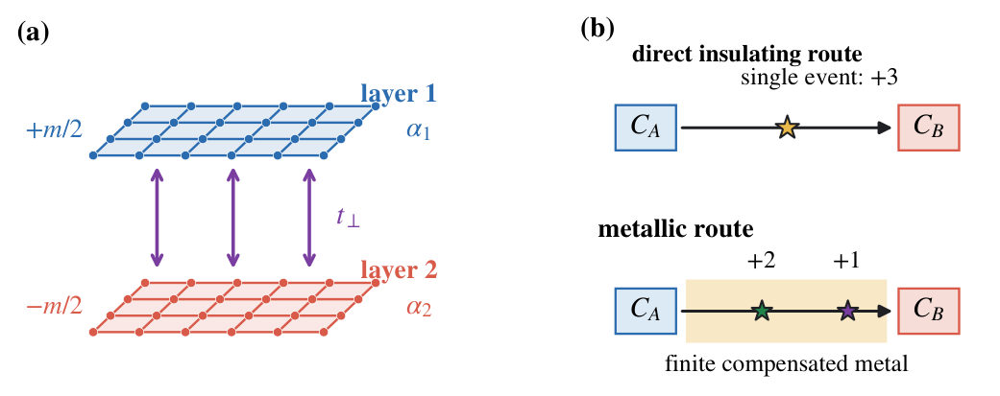 
FIG. 1. Obstructed tunneling and two spectral routes for Chern transfer. (a) Two locally coupled layers experience fluxes α1 ̸= α2 and opposite shifts ±m/2. (b) The same endpoint transfer can occur via a “clean” route, i.e., through an isolated single insulating critical bias or through a finite compensated metal. Topology fixes the net transferred charge, whereas energetics fixes the route. Here CB −CA = 3 corresponding to the example in the text.

📷 Fig 2

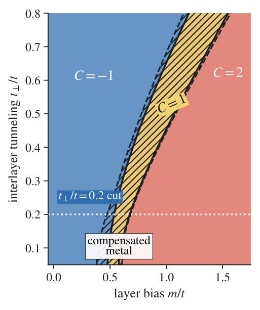 
FIG. 3. Finite reentrant-metal region. For (α1, α2) = (1/5, 2/5), solid curves are direct-gap/Weyl transitions and dashed curves are the Lifshitz boundaries ∆ind = 0. Their separation encloses a finite compensated-metal region in the (m, t⊥) plane. The dotted line marks the cut t⊥/t = 0.2 analyzed in Fig. 4.

📷 Fig 3

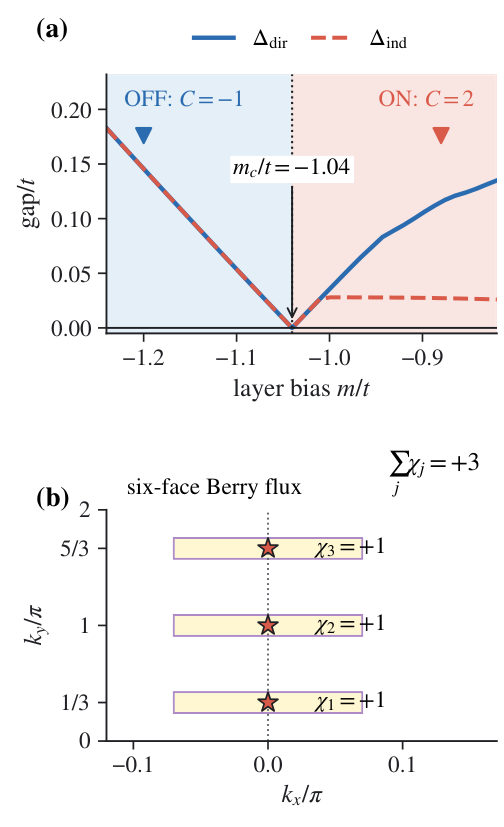 
FIG. 2. Direct insulating C = −1 →2 transfer. (a) Direct and indirect gaps for (α1, α2) = (1/3, 5/6), nocc = 2, and t⊥/t = 0.2. Both gaps vanish at the common critical bias mc/t = −1.04 and reopen immediately on either side. (b) The three nodes at kx = 0 are independently enclosed by small surfaces in (kx, ky, m); integration of the occupied-frame Berry flux through all six faces gives χj = +1 for each node and P

📷 Fig 4

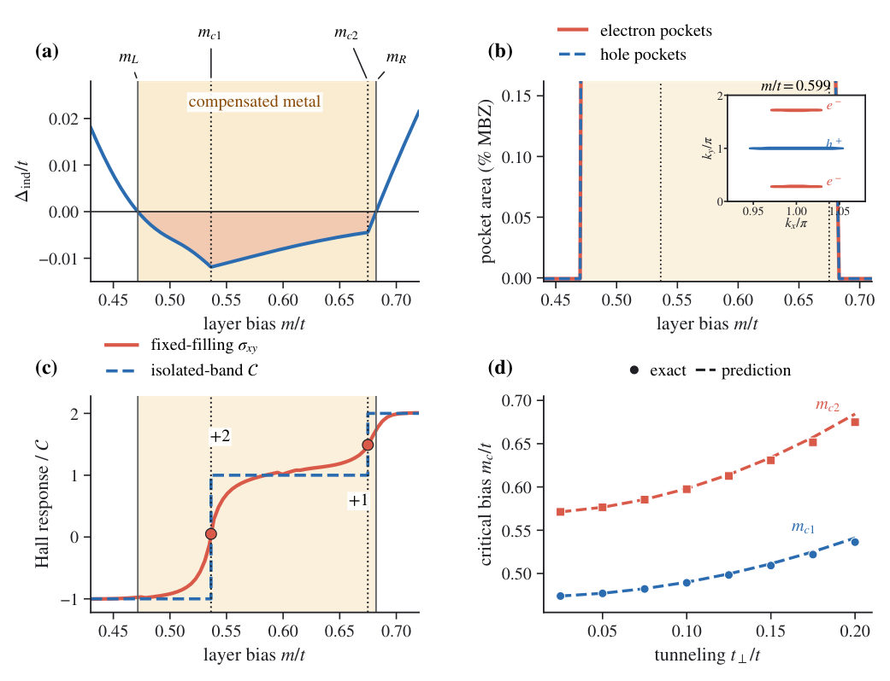 
FIG. 4. Topological reconstruction inside a compensated metal. (a) The indirect gap is negative only for mL &lt; m &lt; mR (shaded). Dotted lines mark the internal Weyl events mc1, mc2. (b) Equal electron and hole pocket areas demonstrate compensation; the inset shows the one hole and two electron Fermi contours at m/t = 0.599. (c) The directly isolated lowest band changes as −1 →1 →2, whereas the occupied-state Hall conductivity remains continuous and noninteger. Independent closed boxes give node charges (+1, +1) at mc1 and +1 at mc2. Thus Lifshitz and Chern-transfer transitions occur at four distinct biases.(d) Exact critical biases from the full bilayer Hamiltonian (symbols) compared with the...

📷 Fig 5

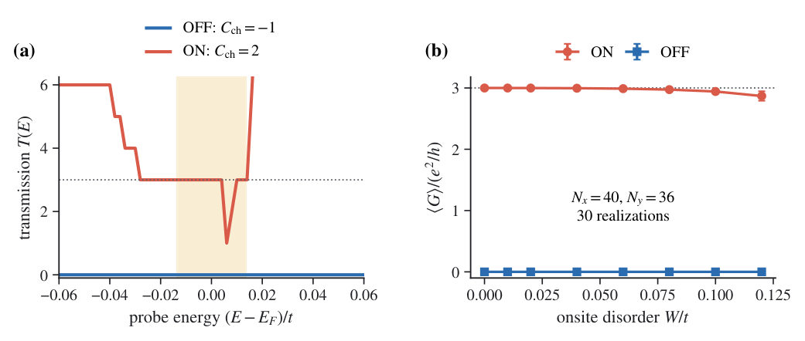 
FIG. 5. (a) Clean transmission of the interface cylinder: the OFF state is insulating, while the ON state has a three-channel plateau. (b) Disorder-averaged conductance at the common gap center; error bars are one standard deviation over 30 realizations for W &gt; 0.

**Summary.** This work demonstrates that by creating a flux mismatch in stacked 2D materials, the destructive effect of interlayer tunneling can be circumvented. This allows for the electrical control and quantized transfer of topological invariants, such as the Chern number, leading to programmable Chern phases and novel metallic transport regimes.

**Why it may be interesting.** The concept of using synthetic dimensions (bias/momentum space) to engineer topological transitions is highly relevant to understanding engineered quantum states in condensed matter systems, bridging concepts from topological insulators to controllable quantum devices.

Detailed structure

**Main problem.** The primary challenge addressed is how to electrically control topological electronic states in stacked 2D materials without the interlayer tunneling term destroying the necessary band crossings.

**Main result.** The authors show that flux mismatch between layers creates topologically obstructed tunneling, allowing for the controlled, quantized transfer of Chern numbers and the realization of programmable Chern phases.

**Method.** The mechanism is analyzed by projecting the Hamiltonian onto resonant multiplets, identifying topological obstructions (zeros in projected tunneling), and calculating the resulting Chern number transfer via Berry flux integration.

**Model / system.** The system is a Hofstadter bilayer, modeled as stacked 2D materials (like graphene/hBN) where the layers experience different magnetic fluxes ($\alpha_1 
eq \alpha_2$). The physics is governed by the interplay between interlayer tunneling and the magnetic flux mismatch.

**Key observables.** Chern number ($C$), Hall conductivity ($\sigma_{xy}$), Berry flux ($\chi_j$), and the existence of Weyl monopoles in momentum-bias space.

**Important parameters / regimes.** Flux mismatch ($\alpha_1 
eq \alpha_2$), interlayer bias ($m$), and the relative strength of tunneling versus gap energies.

**Assumptions / limitations.** The analysis relies on projecting the system onto two resonant multiplets and assumes the accuracy of the decoupled-layer overlap approximation.

**Figures summary.** Figures illustrate the obstructed tunneling mechanism, the two spectral routes for Chern transfer (insulating vs. metallic), and the resulting continuous, nonquantized Hall response during topology changes.

**Paper structure.** The paper establishes the physical problem (tunneling gap closing), introduces the mechanism (topological obstruction due to flux mismatch), derives the consequences (Chern transfer, reentrant metal), and verifies the findings using multiple theoretical calculations (Berry flux, TKNN).

Abstract

Stacked two-dimensional materials provide a promising platform for electrically controlling topological electronic states. However, tunneling between layers hybridizes their bands and removes the crossings needed to change topology. We show that this does not always have to be the case. Band crossings and associated Weyl points are topologically enforced in Hofstadter bilayers whose layers experience different magnetic fluxes. When resonant magnetic Bloch multiplets carry unequal Chern numbers, their projected tunneling is topologically obstructed and must vanish at isolated momenta. Sweeping the layer bias through these zeros creates synthetic Weyl monopoles in momentum-bias space that transfer the Chern mismatch. We demonstrate two consequences: a direct transition between insulating Chern phases and a reentrant compensated metal in which Lifshitz transitions bound the metallic window while internal Weyl events reconstruct the band topology. Consequently, the fixed-filling Hall response remains continuous and nonquantized even as integer Chern number is transferred between bands. Berry-flux, TKNN, and interface calculations independently verify the mechanism and its multichannel chiral signature. We outline realizations in Moire and anomalous-Hall heterostructures, establishing flux mismatch as an experimentally accessible route to electrically programmable Chern phases and chiral transport.

[↑ back to top](#top)

### [Full-Rank Noise Forbids Long-Range Entanglement Swapping](http://arxiv.org/abs/2609.11021v1)

**Authors:** Xuan Du Trinh, Nicholas Pardave, Angie Huang, Xiangyi Meng, Nengkun Yu  
**Type:** both · **Category:** quantum information and computing · **PDF:** <https://arxiv.org/pdf/2609.11021v1>  
**Analysis basis:** full PDF text, analyzed in chunks
**Topic relevance:** `methods for driven-dissipative` **3/5** · `correlated / nonlocal dissipation` **1/5**

📷 Fig 1

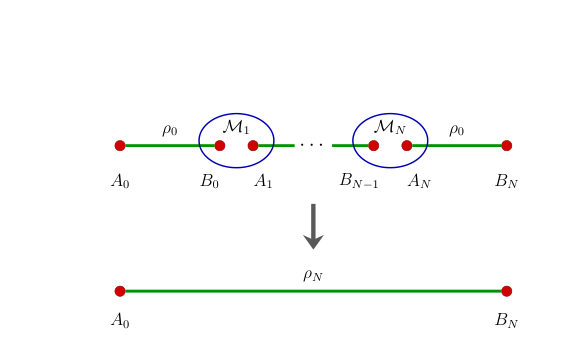 
FIG. 1. Postselected swapping chain. The N + 1 links ρ0 oc- cupy the qubit pairs (Ai, Bi), and intermediate node i post- selects the entangled outcome |Ψi⟩= (I ⊗Mi) |Φ+⟩on its pair (Bi−1, Ai). Tracing out the measured qubits leaves the state ρN of the boundary pair A0BN, in which each outcome enters as the filter map Mi(X) = M ∗ i XM T i . The outcomes |Ψi⟩need not be Bell states or maximally entangled. Postse- lection keeps only the branch with the intended record {Mi}, and the rule choosing each measurement may adapt to the outcomes already observed.

📷 Fig 2

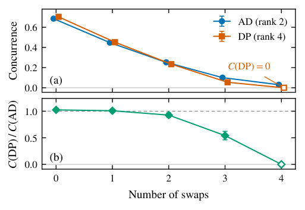 
FIG. 2. Experimental verification of rank-aware distinction in entanglement swapping. The states are prepared under one- sided, rank-2 amplitude-damping (AD) and rank-4 depolariz- ing (DP) channels respectively on IBM’s Heron R3 processor (ibm boston), with an initial concurrence C(AD) ≈C(DP) ≈ 0.7. The ratio monotonically decays to zero (solid), signaling the sudden death of C(DP) as the theory predicts (dashed). Eventually both C(DP) and C(AD) reach zero due to exper- imental imperfection (inset).

**Summary.** This work establishes a fundamental difference in entanglement persistence based on the rank of noise in quantum repeater links. Full-rank noise inevitably leads to a finite 'entanglement horizon,' while rank-deficient links can sustain entanglement indefinitely through specific postselection strategies. This has implications for designing robust quantum networks.

**Why it may be interesting.** The distinction between full-rank and low-rank noise provides a powerful, physically motivated criterion for the feasibility of long-distance quantum communication, linking quantum information theory to the structure of quantum channels.

Detailed structure

**Main problem.** The paper investigates whether long-range entanglement can be established using quantum repeaters when the elementary links are corrupted by full-rank noise, especially under adaptive postselection.

**Main result.** Full-rank noise imposes a finite 'entanglement horizon' beyond which entanglement swapping fails, whereas rank-deficient links can sustain entanglement indefinitely on specific postselected branches.

**Method.** The authors use the Choi operator formalism and analyze the decay of the end-to-end state by comparing the behavior of full-rank versus low-rank link channels.

**Model / system.** The system models quantum repeaters extending entanglement over noisy two-qubit links, analyzed using concepts from matrix-product density operators in many-body physics.

**Key observables.** Concurrence, the entanglement horizon, and the network 'score' $\beta(P)$ are key observables used to quantify entanglement decay.

**Important parameters / regimes.** The link rank (full vs. low), the noise parameter $\eta$, and the depth $N$ of the repeater chain are crucial parameters.

**Assumptions / limitations.** The analysis often relies on reducing the full-rank problem to an isotropic chain model, and some derivations use approximations for small noise/storage loads.

**Figures summary.** Figure 2 compares the decay of concurrence for full-rank (DP) versus rank-deficient (AD) channels, showing the theoretical distinction between the two noise types.

**Paper structure.** The paper progresses from establishing the finite horizon for full-rank links (Theorem 1) to constructing low-rank counterexamples, and finally analyzing the role of storage and purification in maintaining entanglement.

Abstract

Quantum repeaters extend entanglement by swapping noisy elementary links. We prove that full-rank noise forbids this at long range: for any entangled full-rank two-qubit link, there is a finite depth beyond which no end-to-end entanglement can be established regardless of the measurement outcomes on intermediate qubits, even under any adaptive postselected strategy. This limit is set by one spectral parameter of the link, giving a no-go criterion for repeater routing. In contrast, we construct link state families of rank three and rank two that admit postselected measurement outcome branches of exponentially small probability but with strictly positive concurrence at every finite depth. Swapping experiments on a superconducting processor show that links of equal initial concurrence but different rank behave differently under postselected swapping. In the language of many-body physics, the chain is a matrix-product density operator, and full-rank bonds forbid long-range localizable entanglement, while rank-deficient bonds can sustain it.

[↑ back to top](#top)

### [Geometric Ginzburg-Landau theory of charge ordering and commensurability](http://arxiv.org/abs/2609.10678v1)

**Authors:** Aneesh Agarwal, Rutvij Gholap, Mohammad Saeed Bahramy, Robert-Jan Slager  
**Type:** theory · **Category:** strongly correlated electrons · **PDF:** <https://arxiv.org/pdf/2609.10678v1>  
**Analysis basis:** full PDF text, analyzed in chunks
**Topic relevance:** `Frenkel-Kontorova` **3/5** · `Keldysh / 2PI / non-Gaussian methods` **1/5**

📷 Fig 1

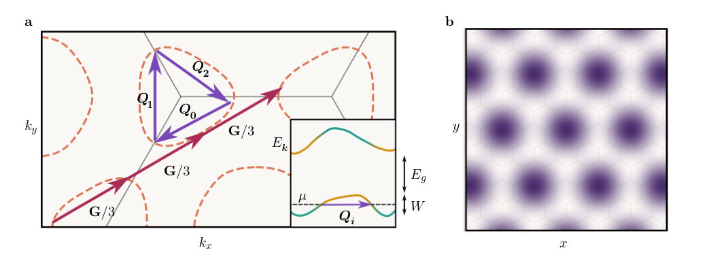 
FIG. 1. Geometric mechanism for charge-density-wave formation in flat-band systems. a Schematic illustration of the geometric origin of charge ordering. In flat and quasi-flat band systems, charge-density-wave instabilities are enhanced when Bloch states at momenta separated by an ordering wavevector Qi undergo a strong change in flavor character, as illustrated by the color exchange in the band-structure inset. In hexagonal systems, three symmetry-related wavevectors, Q0, Q1, and Q2, further enable a higher-order triangular scattering process (purple) that contributes to wavevector selection. At commensurate wavevectors Qi = Γ/3, interference between triangular and Umklapp (magenta)...

📷 Fig 2

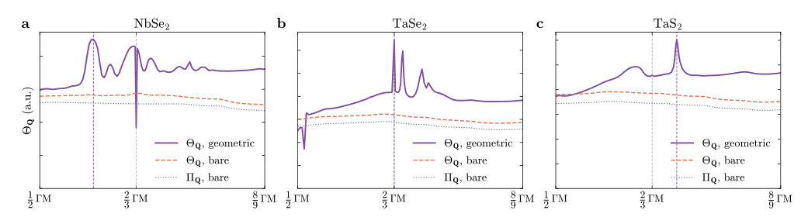 
FIG. 2. CDW transition driver ΘQ as a function of Q on the ΓM line for different materials. ΘQ is plotted as a function of Q between 1/2ΓM and 8/9ΓM for a NbSe2 (T ≈23K), b TaSe2 (T ≈35K), and c TaS2 (T ≈49K), and peaks near/at 2/3ΓM are observed for all three materials. The Q-domain is so chosen since the bare Lindhard susceptibility (dotted) exhibits a broad peak here and is inconclusive in determining the CDW wavevector. Inclusion of higher-order terms in just their energetic form (orange dashed line) is still inconclusive. The geometric enhancements studied here (purple solid line) then become the dominant mechanism behind CDW formation. Importantly, note that an incommensurate CDW is...

📷 Fig 3

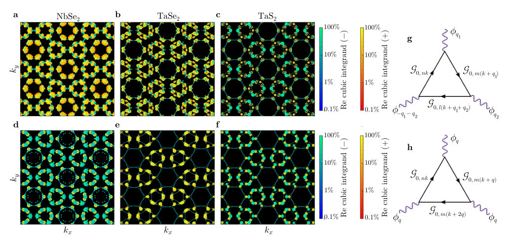 
FIG. 3. Integrand for cubic coefficient at commensurate Q = 2/3ΓM. Normalized contributions to the coefficient of ∆3 in the Ginzburg- Landau free energy of different materials has been shown as a function of k in the Brillouin Zone. The integrand consists of two terms: a-c triangle scattering processes where ∑Qi = 0, and d-f umklapp scattering processes where ∑Qi = G, a reciprocal lattice vector. Corresponding diagrams for the g triangle and h umklapp scattering are also sketched. The phase of the respective integrands is emphasized using different colors for positive and negative contributions. Interference between the triangle and umklapp scattering suggests incommensurate CDW in NbSe2...

📷 Fig 4

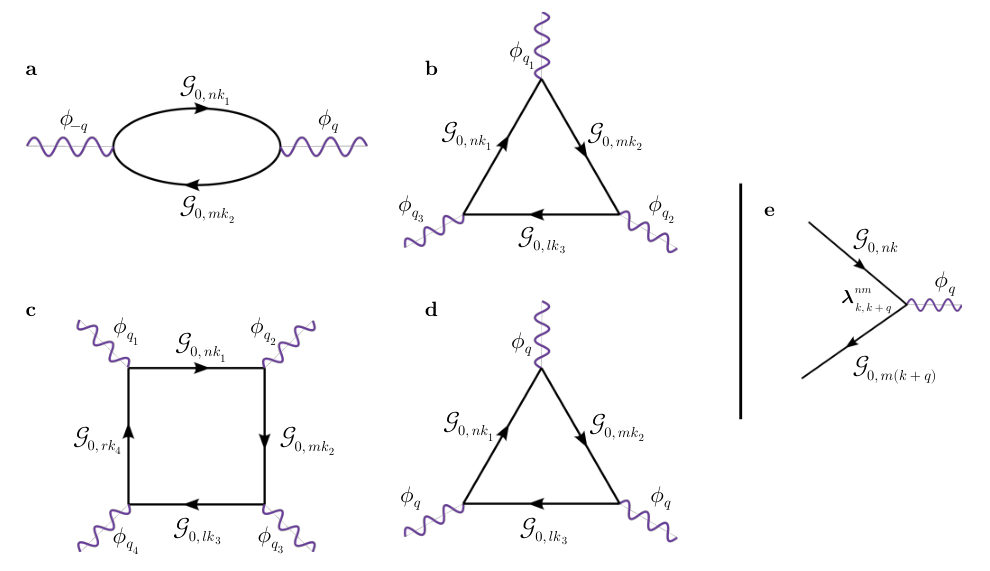 
FIG. 4. Diagrammatic representations of GL coefficients. The effective action and hence the GL free energy functional affords diagrammatic representations as shown of the electron-phonon interaction at a quadratic, b cubic, and c quartic order. d At commensurate wavevectors (for example, 2/3ΓM in the TMDs considered here), the cubic term involves an extra contribution from umklapp scattering, whose phase interference with the normal cubic term in (b) determines a commensurability transition. e All terms involve interaction vertices of this form, where a bare electronic state in band n and wavevector k is scattered by a phonon of wavevector q into a state in band m and wavevector k+q. The...

**Summary.** This paper develops a geometric Ginzburg-Landau theory to explain Charge Density Wave (CDW) formation in materials like TMDs. It shows that quantum geometry provides essential, previously uncaptured contributions to the phase transition free energy. The resulting theory yields robust criteria that successfully predict CDW ordering wavevectors where conventional electronic models fail.

**Why it may be interesting.** The explicit incorporation of quantum geometry into a phase transition theory provides a powerful, generalizable tool for understanding how subtle electronic structure effects dictate macroscopic material properties like CDW formation, which is relevant to many strongly correlated systems.

Detailed structure

**Main problem.** Deriving a geometric Ginzburg-Landau theory to accurately describe Charge Density Wave (CDW) formation and commensurability transitions, especially in systems where standard electronic criteria fail.

**Main result.** The theory establishes that quantum geometry plays an essential role, providing a general criterion for CDW formation that successfully predicts ordering wavevectors in TMDs where simpler models fail.

**Method.** The authors derive an effective Ginzburg-Landau functional by integrating out phonon degrees of freedom from an electron-phonon Hamiltonian, leading to modified susceptibility tensors.

**Model / system.** The work focuses on Charge Density Waves (CDWs) in Transition Metal Dichalcogenides (TMDs) with hexagonal lattices, utilizing a Ginzburg-Landau framework expanded to include higher-order geometric terms.

**Key observables.** The CDW driver ($\Theta_Q$), the quadratic susceptibility tensor ($\chi$), and the coefficients of the GL functional ($\Pi_Q, |\gamma_Q|, eta_Q$).

**Important parameters / regimes.** The wavevector $Q$, the lattice symmetry ($C_3$), and the relative strength of quantum geometric enhancements versus bare susceptibility.

**Assumptions / limitations.** The analysis assumes that the coupling function $g_q$ is flat over relevant $q$ states to isolate electronic contributions, and that the system can be reduced to a scalar order parameter due to susceptibility anisotropy.

**Figures summary.** Figures illustrate the geometric mechanism for CDW formation using three symmetry-related wavevectors in hexagonal systems, and plot the CDW driver ($\Theta_Q$) for various TMDs, showing geometric enhancements selecting the correct wavevector.

**Paper structure.** The paper builds from deriving the geometric GL theory for CDW instability, establishing the general criterion, benchmarking it on TMDs, and refining the theory by including higher-order terms (like sextic terms) to resolve discrepancies in the predicted ordering wavevector.

Abstract

The concept of quantum geometry has recently led to reinvigorated insights in a wide range of fields including physical responses, superconductivity, and optical transitions, with effects most pronounced in systems with nearly flat dispersion. Here, we show that it plays an essential role in charge density wave formation (CDW) -- an important physical phenomenon that is responsible for driving various sharp changes in material transport properties including metal-insulator transitions. We derive an effective Ginzburg-Landau theory including uncharted contributions and, as a highlight, discover a general criterion for both CDW formation and commensurability transitions where underlying electron-phonon interactions manifest purely as electronic quantum geometric enhancements/suppressions. We benchmark our framework in a class of transition-metal dichalcogenides and resolve a longstanding puzzle where well-established purely kinetic CDW criteria fail in describing the correct ordering wavevector. Besides rendering robust criteria and fundamental insights that are immediately relevant to several experimental charge ordering systems, our theory can also be applied directly to other phonon-mediated phases such as superconductivity, and can be used as an important tool to explore the interplay between various such states. More generally, our framework provides a recipe for investigating the role of quantum geometry in phase transitions.

[↑ back to top](#top)

### [Low temperature thermodynamics of $S_{\mathrm{eff}}=1/2$ triangular lattice quantum spin liquid candidate TlYbS$_2$](http://arxiv.org/abs/2609.11881v1)

**Authors:** Bishnu P. Belbase, Arjun Unnikrishnan, Piyush Chhallare, Mohan B. Neupane, Eun Sang Choi, Sebastian Erdmann, Muhammad U. Akbar, Mamoun Hemmida, H. -A. Krug von Nidda, Philipp Gegenwart, Arnab Banerjee  
**Type:** experiment · **Category:** strongly correlated electrons · **PDF:** <https://arxiv.org/pdf/2609.11881v1>  
**Analysis basis:** full PDF text, analyzed in chunks
**Topic relevance:** `analog quantum simulation` **3/5**

📷 Fig 1

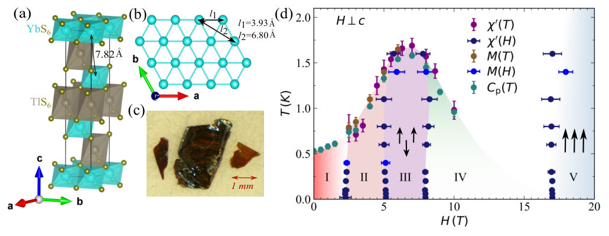 
FIG. 1. (a) Crystal structure of TlYbS2, highlighting the stacking of Yb-based triangular layers separated by Tl–S slabs along the crystallographic c axis. (b) Top view of the ab plane showing the two-dimensional triangular network of Yb ions. The nearest- and next-nearest-neighbor in-plane Yb–Yb distances are indicated. (c) Single crystals of TlYbS2, showing their plate-like morphology. (d) Temperature-field (H −T) phase diagram of TlYbS2 constructed from AC susceptibility (χ′), DC magnetization (M), and specific heat (Cp(T)) measurements. Distinct magnetic regimes are highlighted by different shaded regions.

📷 Fig 2

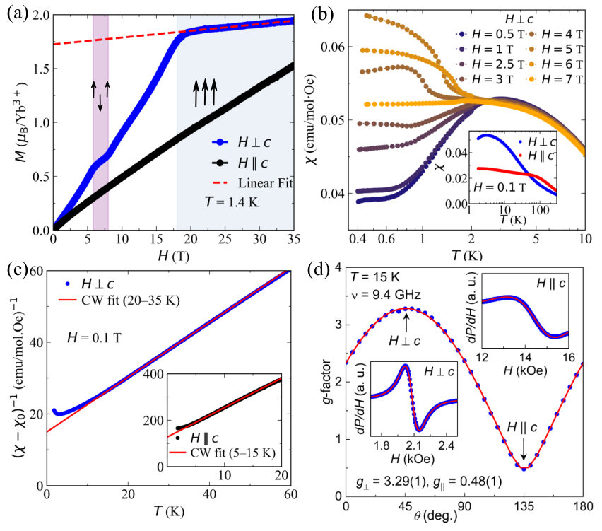 
FIG. 2. DC magnetization and ESR of TlYbS2. (a) Isothermal magnetization M(H) at T = 1.4 K for H ⊥c (blue) and H ∥c (black). For H ⊥c, a clear saturation is observed near Hsat ≃18 T, with a high-field linear fit (red dashed line) yielding Msat ≃1.7 µB per Yb3+. A 1/3 plateau near Msat/3, characteristic of the up–up–down configuration in TLAFs, is evident. For H ∥c, no saturation is observed up to 35 T. (b) Temperature dependence of the DC magnetic susceptibility χ(T) for H ⊥c under various applied fields. A field-induced anomaly emerges near 2.5 T. Inset: χ(T) measured at H = 0.1 T for H ⊥c and H ∥c. (c) Low-temperature Curie–Weiss analysis at H = 0.1 T. The main panel shows the fit for H...

📷 Fig 3

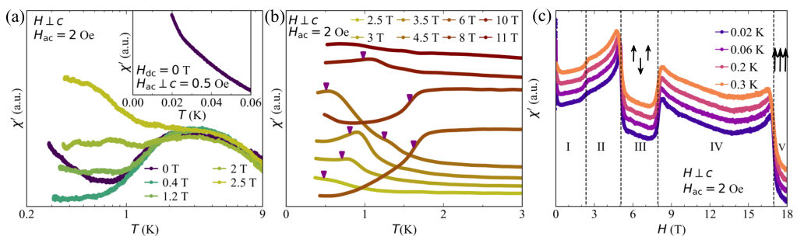 
FIG. 3. AC susceptibility of TlYbS2 for H ⊥c. (a) Temperature dependence of the real part of the AC susceptibility, χ′(T), measured from 0.3 to 9 K under magnetic fields up to 2.5 T, showing the onset of a field-induced magnetic transition near 2.5 T. Inset: χ′(T) measured at zero DC field down to 20 mK. The susceptibility increases continuously upon cooling without developing a discernible peak. (b) Evolution of χ′(T) under higher magnetic fields, illustrating the emergence and systematic evolution of magnetic transitions with increasing field. Purple arrows mark the transition temperatures. Curves are vertically offset (non-uniformly) for clarity; the original, unshifted data are shown in...

📷 Fig 4

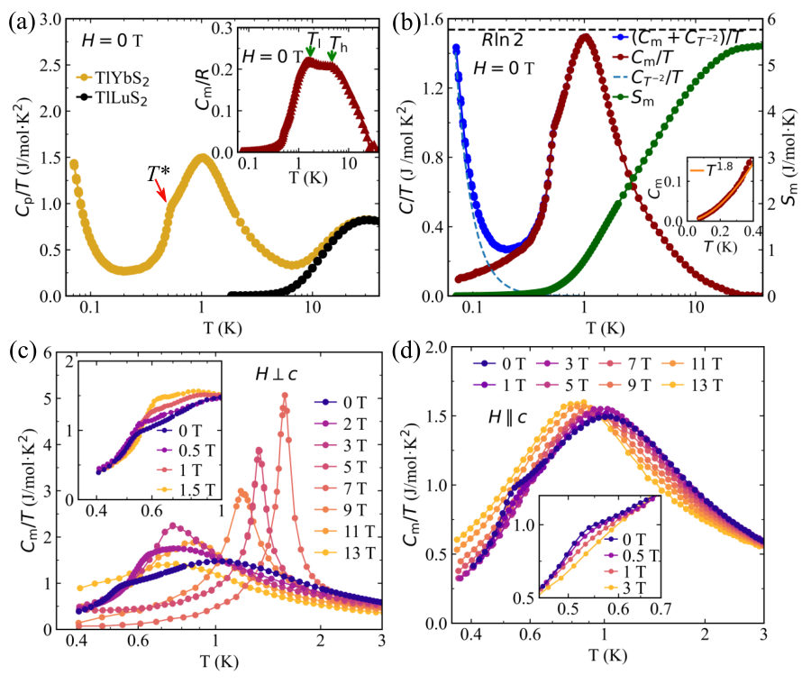 
FIG. 4. Specific heat of TlYbS2. (a) Temperature dependence of Cp/T at zero field for TlYbS2 and its isostructural nonmagnetic analog TlLuS2. The anomaly at ∼530 mK is marked as T ∗. Inset: magnetic contribution to the specific heat, Cm/R, obtained after subtracting the phonon contribution and the fitted inverse-square contribution, showing two broad maxima centered near Tl ≃1.7 K and Th ≃4.6 K. (b) Temperature dependence of the phonon-subtracted specific heat, (Cm + CT −2)/T (blue), the fitted inverse-square contribution, CT −2/T (dashed blue), and the resulting magnetic contribution, Cm/T (dark red), together with the magnetic entropy Sm(T) (green, right y-axis). The horizontal dashed...

📷 Fig 5

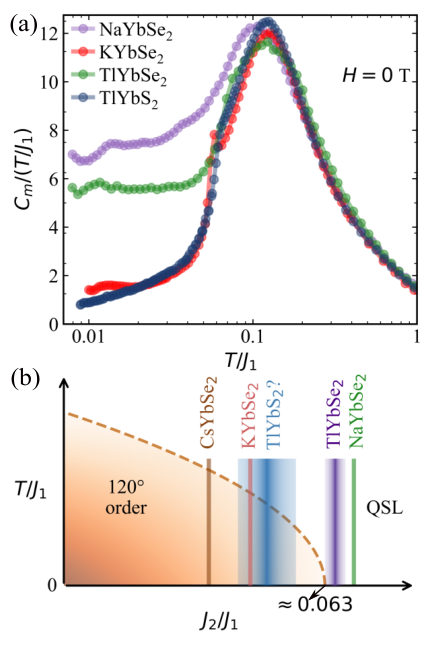 
FIG. 5. Scaled magnetic specific heat and schematic J1– J2 phase diagram for Yb-based triangular-lattice delafos- sites. (a) Comparison of the normalized magnetic specific heat, Cm/(T/J1), as a function of reduced temperature T/J1 for TlYbS2 and representative members of the Yb-based triangular-lattice delafossite family. The data for NaYbSe2, TlYbSe2, and KYbSe2 are taken from Refs. [6], [11], and [36], respectively. For TlYbS2, J1 = 8.35 K was used for the scal- ing. (b) Schematic phase diagram of the spin-1/2 triangular- lattice J1–J2 model, illustrating the evolution from the 120◦- ordered state to the quantum spin-liquid (QSL) regime. The phase boundary and the positions of previously...

**Summary.** This paper experimentally investigates TlYbS2, a triangular-lattice antiferromagnet candidate for quantum spin liquid physics. Using multiple measurements, the authors confirm strong magnetic anisotropy and observe a specific heat anomaly suggesting weak magnetic ordering. The results place the material near the boundary between magnetic order and quantum disorder, providing key experimental data for understanding frustrated magnetism.

**Why it may be interesting.** The study provides detailed experimental evidence on how geometric frustration and crystal anisotropy drive the system toward or away from a quantum spin liquid state, which is a central topic in modern condensed matter theory.

Detailed structure

**Main problem.** The study investigates the competition between magnetic long-range order and quantum spin liquid (QSL) behavior in geometrically frustrated triangular-lattice antiferromagnets.

**Main result.** The material exhibits a weak thermodynamic anomaly near 530 mK, and its low-temperature specific heat follows $C_m \propto T^{1.8}$, suggesting it lies near the boundary between weak magnetic order and a quantum-disordered state.

**Method.** The research employed a comprehensive set of experimental techniques, including DC magnetization, AC susceptibility, electron spin resonance (ESR), and specific heat measurements across a wide temperature range.

**Model / system.** The physical system is single-crystal TlYbS2, a Yb-based delafossite compound forming quasi-two-dimensional triangular layers of Yb3+ ions, whose low-energy magnetism is modeled by an effective spin-1/2 Hamiltonian.

**Key observables.** Specific heat ($C_m \propto T^{1.8}$), magnetization plateaus (e.g., 1/3 plateau), and the temperature/field dependence of magnetic susceptibility.

**Important parameters / regimes.** Easy-plane magnetic anisotropy ($g_{\perp}/g_{\parallel} \approx 6.9$), and the critical temperature/field associated with the observed anomalies ($\sim 530$ mK).

**Assumptions / limitations.** The low-energy physics is effectively described by a spin-1/2 Hamiltonian, and the comparison to other Yb-based compounds helps map out the phase diagram.

**Figures summary.** Figures illustrate the crystal structure, the magnetic anisotropy observed in magnetization curves under different field orientations, and the temperature dependence of the specific heat, highlighting the anomaly near 530 mK.

**Paper structure.** The paper proceeds by first characterizing the crystal structure, then presenting measurements of magnetic properties (magnetization, susceptibility, ESR) to establish anisotropy, followed by specific heat measurements to probe the low-temperature magnetic excitations and phase transitions under applied fields.

Abstract

Geometrically frustrated triangular-lattice antiferromagnets exhibit a delicate competition between magnetic order and quantum spin liquid (QSL) behavior, with the Yb-based delafossite family $A$Yb$X_2$ providing a structurally clean platform for exploring this physics. Here, we report a comprehensive study of single-crystal TlYbS$_2$ using DC magnetization, AC susceptibility, electron spin resonance (ESR), and specific heat measurements extending from room temperature to the millikelvin regime. Single-crystal X-ray diffraction confirms a trigonal $R\bar{3}m$ structure comprising well-separated triangular layers of Yb$^{3+}$ ions with no detectable site disorder. At zero field, a weak thermodynamic anomaly is observed near $530$ mK, which may indicate the onset of a weakly ordered state similar to that reported in KYbSe$_2$. Below $300$ mK, the zero-field magnetic specific heat follows $C_{\rm m}\propto T^{1.8}$, close to a quadratic temperature dependence, in contrast to the linear temperature dependence reported for the sister compound TlYbSe$_2$, which has been described in terms of the interplay between spinons and thermally excited gauge-flux excitations. Magnetization and ESR measurements establish pronounced easy-plane magnetic anisotropy, with $g_\perp/g_\parallel \approx 6.9$. The anomaly near $530$ mK exhibits a strongly anisotropic response to magnetic field. For $H\perp c$, it remains visible up to approximately $2$ T and continuously evolves toward a field-induced ordered phase above approximately $2.5$ T, followed by a sequence of field-induced phases that includes a $1/3$ magnetization plateau between approximately $5$ and $8$ T and full polarization near $17$ T. In contrast, for $H\parallel c$, the anomaly weakens and is suppressed near $3$ T, consistent with the recently reported confinement--deconfinement transition from an ordered state to a field-induced QSL.

[↑ back to top](#top)

### [Qubit-Qutrit Quantum Tomography of hadronic $Λφ$ and $ΛK^{\ast 0}$ systems](http://arxiv.org/abs/2609.11151v1)

**Authors:** Veronica Kanachova, Feng Liu, Zhoudunming Tu  
**Type:** theory · **Category:** other · **PDF:** <https://arxiv.org/pdf/2609.11151v1>  
**Analysis basis:** full PDF text, analyzed in chunks
**Topic relevance:** `quantum measurements` **3/5**

📷 Fig 1

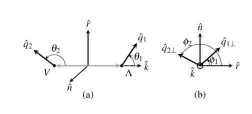 
FIG. 1. Coordinate system, defined in the ΛV pair rest frame, where the two hadrons are back to back. The orthonormal triad is ˆk = ˆp Λ (the Λ momentum direction), ˆn ∝ˆpbeam × ˆk normal to the production plane, and ˆr = ˆn׈k, with ˆk׈r = ˆn. The daughter directions ˆq1 (proton from Λ →pπ−) and ˆq2 (K+ from ϕ →K+K−or K∗0 →K+π−) are each evaluated in the rest frame of their own parent but referred to this single shared triad.

📷 Fig 2

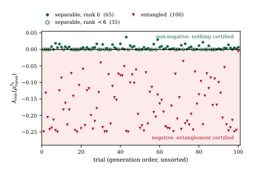 
FIG. 2. Numerical verification of Theorem 1. For each trial a random input state is generated, the reconstruction ρmeas is built from its 23 accessible parameters, and the partial transpose is diagonalized. Left: λmin(ρTB meas) for 100 separable states — 65 of full rank 6 (filled circles) and 35 of reduced rank (open circles) — together with 100 entangled states (tri- angles). This numerical analysis is generated by Claude Opus 5 model.

**Summary.** This work develops a novel quantum tomography technique for studying spin correlations in hadronic decays ($\Lambda V$ pairs). It addresses the fundamental challenge of reconstructing quantum states when experimental measurements only access a subset of parameters. The key achievement is establishing a rigorous, computable criterion—checking the minimum eigenvalue of the reconstructed density matrix—to certify entanglement despite the missing information.

**Why it may be interesting.** While the physical system is particle/nuclear physics, the methodology—developing rigorous criteria for entanglement detection from severely incomplete quantum measurements—is highly relevant to open quantum systems and quantum information theory.

Detailed structure

**Main problem.** The paper formulates and applies a Qubit–Qutrit Quantum Tomography (QQQT) technique to study spin correlations in hadronic final states, specifically $\Lambda\phi$ and $\Lambda K^{*0}$ systems.

**Main result.** The authors establish exact criteria for certifying entanglement from the experimentally incomplete density matrix, reducing the problem to checking the positive semi-definiteness of the reconstructed state ($
ho_{	ext{meas}}$).

**Method.** The technique involves reconstructing the density matrix from a limited set of measurable spin parameters, utilizing partial time-reversal operations to define the measurable state $
ho_{	ext{meas}}$.

**Model / system.** The system under study is the $\Lambda V$ pair ($\Lambda$ is spin-1/2, $V$ is spin-1, treated as a qutrit), residing in a $2 	imes 3$ Hilbert space. The analysis compares this to the fully measurable $\Lambdaar{\Lambda}$ system.

**Key observables.** The minimum eigenvalue ($\lambda_{\min}$) of the partially transposed density matrix ($
ho^T_B$), which serves as the diagnostic tool for entanglement certification.

**Important parameters / regimes.** The 23 experimentally accessible spin parameters, contrasted with the 12 inaccessible parameters related to the meson dipole sector.

**Assumptions / limitations.** The primary assumption is that the missing parameters are due to kinematic limitations (the meson dipole sector), and the core theoretical tools (Theorems 1 and 2) are applied based on this structure.

**Figures summary.** Figure 1 defines the coordinate system for the $\Lambda V$ pair rest frame, and Figure 2 numerically verifies the theorems by showing the sign of $\lambda_{\min}(
ho_{	ext{meas}})$ for separable versus entangled states.

**Paper structure.** The paper first introduces the challenge of incomplete tomography in $\Lambda V$ systems, develops the QQQT formalism, proves theorems relating separability/entanglement to the sign of $\lambda_{\min}(
ho_{	ext{meas}})$, and finally compares the results to the fully measurable $\Lambdaar{\Lambda}$ system.

Abstract

Quantum-information observables have emerged in recent years as new tools in nuclear and particle physics, from entanglement in top-quark pairs to spin correlations in $Λ\barΛ$ production. Extending these studies to unequal-spin hadronic final states poses a fundamental challenge: the $6\times6$ density matrix of a qubit-qutrit system contains 35 independent spin parameters, but the decays of $ΛV$ pairs, with $V=φ$ or $K^{*0}$, provide access to only 23 due to the hidden vector polarization from the strong decay. In this Letter, we formulate a qubit-qutrit quantum tomography (QQQT) technique for these spin-$\tfrac{1}{2}\otimes1$ systems and establish exact criteria for entanglement certification from the \textit{incomplete} density matrix. Compared with the $Λ\barΛ$ system, QQQT of $Λφ$ and $ΛK^{*0}$ provides a new probe of nonperturbative QCD hadronization, enabling a direct comparison of the spin evolution of entangled quark pairs produced from the vacuum as they hadronize into a baryon or a vector meson.

[↑ back to top](#top)

### [Self-guided certification of nonlocality in quantum networks](http://arxiv.org/abs/2609.11451v1)

**Authors:** Jean Cortés, Luciano Pereira, Aldo Delgado  
**Type:** theory · **Category:** quantum information and computing · **PDF:** <https://arxiv.org/pdf/2609.11451v1>  
**Analysis basis:** full PDF text, analyzed in chunks
**Topic relevance:** `quantum measurements` **3/5**

📷 Fig 1

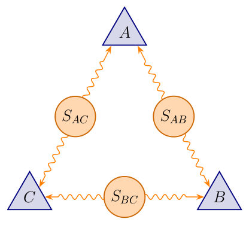 
FIG. 1: Cyclic structure of the triangular network. Three independent sources, SAB, SBC and SAC, distribute bipartite systems among nodes A, B and C, in such a way that each node receives one system from each of the two sources it is connected to and performs a single joint measurement upon them.

📷 Fig 2

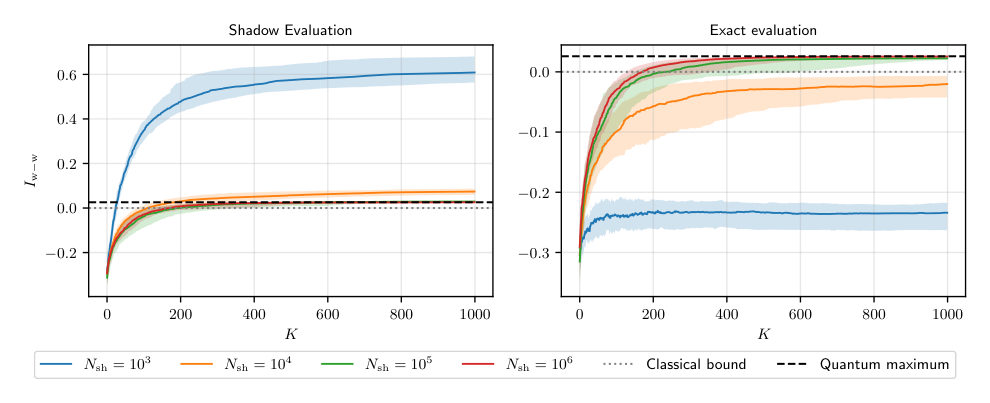 
FIG. 2: Wagon-Wheel inequality IWW as a function of the iteration number k, for the three sources emitting the maximally entangled state |ψ−⟩and several numbers of classical shadows Nsh. Solid lines show the median over 102

📷 Fig 3

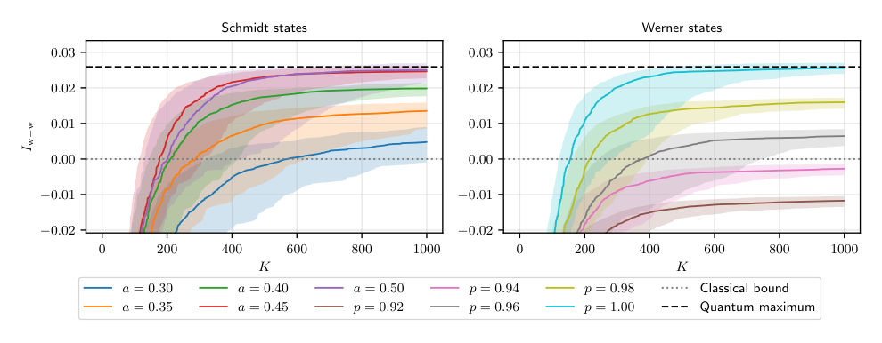 
FIG. 3: Wagon-Wheel inequality IWW as a function of the iteration number k, for Nsh = 106. Solid lines show the median over 102 realizations and shaded regions show the interquartile range. Left: Schmidt states with entanglement parameter a. Right: Werner states with mixing parameter p. Dotted and dashed lines indicate the classical bound and the Fritz value, respectively.

**Summary.** This work presents a novel, self-guided protocol to certify quantum nonlocality in complex quantum networks. It uses an optimization routine (CSPSA) driven by local Pauli shadows to find optimal measurement settings that maximize the violation of nonlinear Bell inequalities. This two-stage approach allows for robust certification of nonclassical correlations even when dealing with noise or limited experimental resources.

**Why it may be interesting.** It provides a highly practical, minimal-assumption framework for testing fundamental quantum properties (nonlocality) in complex, realistic quantum hardware setups, which is crucial for quantum network development.

Detailed structure

**Main problem.** The paper addresses the challenge of certifying quantum nonlocality in complex quantum networks, moving beyond standard Bell inequalities to nonlinear constraints.

**Main result.** A self-guided, two-stage protocol is introduced that efficiently optimizes measurement settings to maximize the violation of network Bell inequalities, even for noisy or non-maximally entangled states.

**Method.** The protocol uses the Complex Simultaneous Perturbation Stochastic Approximation (CSPSA) algorithm to variationally optimize measurement settings, employing local Pauli classical shadows during the search phase, followed by a direct, shadow-free evaluation for the final certificate.

**Model / system.** The model is a quantum network involving multiple independent sources distributing systems among several distant parties, exemplified by the triangle network structure.

**Key observables.** Violation of nonlinear network Bell inequalities (e.g., Wagon-Wheel inequality) relative to a classical bound.

**Important parameters / regimes.** The number of parties ($n$), the structure of the network, and the noise level of the quantum states.

**Assumptions / limitations.** The protocol assumes a two-stage structure separating a device-dependent search (using shadows) from a certificate based only on observed statistics and causal structure.

**Figures summary.** Figure 1 illustrates the cyclic structure of the triangular network connected by three independent sources (SAB, SBC, SAC) linking nodes A, B, and C.

**Paper structure.** The paper first establishes the theoretical framework by contrasting classical and quantum correlation constraints in networks. It then details the self-guided, two-stage optimization protocol using CSPSA and Pauli shadows. Finally, it validates the method by simulating it on the triangle network using the Wagon-Wheel inequality.

Abstract

Bell's theorem shows that quantum theory is incompatible with local hidden-variable models. In recent years, research on nonlocality has moved beyond Bell's original scenario to quantum networks, where multiple independent sources distribute physical systems among distant parties, giving rise to correlations certified by nonlinear rather than standard Bell inequalities. Here, we introduce a self-guided protocol that variationally optimizes each party's measurement to maximize the violation of a network Bell inequality, with the violation evaluated efficiently at each step via local Pauli classical shadows and the search driven by the Complex Simultaneous Perturbation Stochastic Approximation (CSPSA) algorithm. Once converged, the measurement settings it returns are implemented directly and the inequality is re-evaluated without shadows. This two-stage structure separates a device-dependent search from a certificate that depends only on the observed statistics and on the causal structure of the network. We validate the protocol by numerically simulating it on the triangle network using the Wagon-Wheel inequality, recovering the violation achieved by the Fritz distribution, and extending the certification to non-maximally entangled and noisy states.

[↑ back to top](#top)

### [Statistical Symmetry Release for Equivariant Quantum Learning](http://arxiv.org/abs/2609.11470v1)

**Authors:** Zeyu Chen  
**Type:** theory · **Category:** quantum information and computing · **PDF:** <https://arxiv.org/pdf/2609.11470v1>  
**Analysis basis:** full PDF text, analyzed in chunks
**Topic relevance:** `quantum measurements` **3/5**

📷 Fig 1

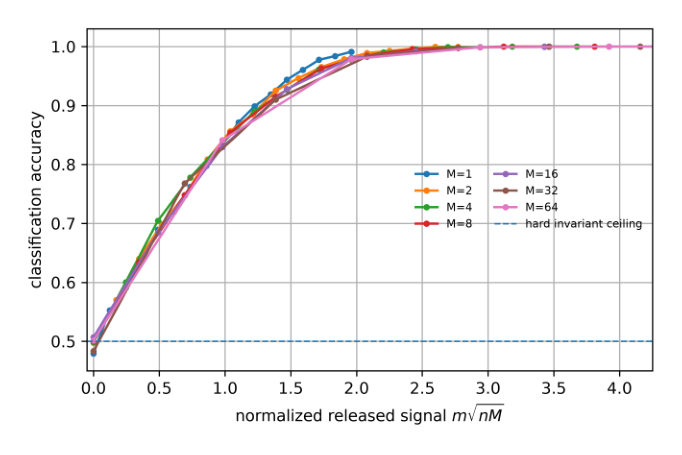 
Figure 1: Exact twirling blind-spot classification. The two states have identical spin-flip twirls, so hard invariant measurements have chance-level accuracy. Releasing the odd order parameter Mz/n recovers the label once the normalized shot signal m √

📷 Fig 2

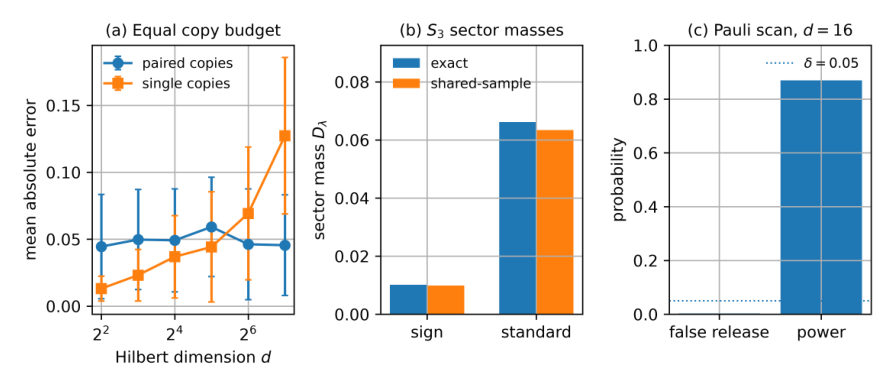 
Figure 2: Quantum-native detection mechanisms. (a) At equal total copy budget, the two-copy twirl–swap error is stable with Hilbert dimension, while this single-copy randomized estimator degrades. (b) Character reweighting of one shared sample set recovers both nontrivial S3 sector masses. (c) The complete nonadaptive Pauli scan has controlled false release and high power at a point null where the dimension-free twirl–swap estimator is not instance-optimal.

📷 Fig 3

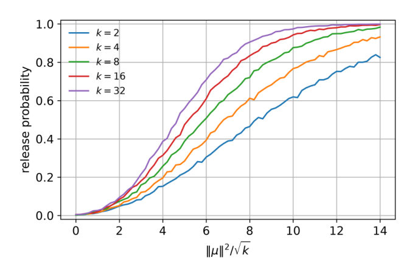 
Figure 3: Gaussian local release detection boundary. The release test is calibrated at false-release level δ = 0.05. Power is controlled by the normalized signal ∥µ∥2/(τ 2√

📷 Fig 4

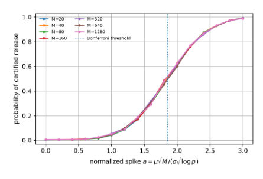 
Figure 4: Spiked detection boundary for an unknown release direction. Below the σ p

📷 Fig 5

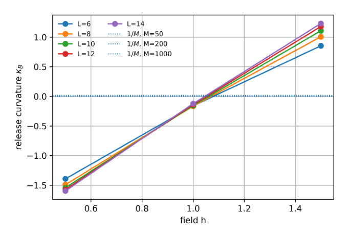 
Figure 5: Task-relative release curvature for C = −(Mz/L)2 and B = My/2. Positive curvature certifies a local release improvement only after finite-shot and structural penalties are subtracted.

**Summary.** This work introduces 'Statistical Symmetry Release,' a rigorous framework for deciding when to relax symmetry constraints in quantum learning models based on empirical data. It combines advanced quantum estimation techniques with statistical hypothesis testing to provide certified decisions on model complexity. This is vital for building reliable quantum machine learning algorithms that can adapt their structure based on measurement outcomes.

**Why it may be interesting.** It provides a powerful, theoretically grounded tool for model selection in quantum machine learning, which is crucial for designing practical quantum algorithms that can adapt to noisy or incomplete physical measurements.

Detailed structure

**Main problem.** The paper addresses the fundamental challenge of determining when finite quantum data and measurements justify relaxing hard symmetry constraints imposed on quantum learning models.

**Main result.** The authors developed a statistically rigorous framework that certifies the optimal, data-justified relaxation of symmetry constraints, significantly outperforming existing estimation methods on test cases.

**Method.** The methodology combines global signal detection (using specialized quantum gates like the twirl-swap gate) with local improvement analysis, all underpinned by rigorous statistical guarantees like confidence bounds and independent validation streams.

**Model / system.** The model is a quantum learning framework constrained by a symmetry group G, parameterized by an equivariant index. The analysis is applied to systems like the eight-qubit Ising model.

**Key observables.** Release gradient, loss-corrected double-commutator matrix, task signal over breaking observables, and the ratio of required measurement shots.

**Important parameters / regimes.** The number of qubits (e.g., eight-qubit Ising model), the size of the data streams ($D_{	ext{fit}}, D_{	ext{rel}}, D_{	ext{val}}$), and the required shot count for certification.

**Assumptions / limitations.** The statistical guarantees rely on maintaining three independent data streams to avoid post-selection bias, and the local improvement analysis assumes specific measurement access models.

**Figures summary.** Not specified, but the notes detail quantitative comparisons, such as the shot count reduction factor (6300 times fewer shots) achieved by the shared-record estimator versus scalar estimators.

**Paper structure.** The paper builds conceptually from defining the symmetry constraint problem, developing global and local signal estimation techniques, establishing statistical guarantees using multiple data streams, and concluding with concrete performance demonstrations on physical models like the Ising chain.

Abstract

Hard symmetry constraints reduce model complexity, but can also erase label information. Statistical symmetry release determines when finite data and quantum measurements justify relaxing such a constraint, which directions to open, and how far to move. We connect global signal detection to local, loss-dependent improvement. A two-copy twirl--swap gate estimates task information in the symmetry-breaking complement with a dimension-independent copy count under paired-state and group-unitary access; reweighting the same records resolves representation sectors. An exact duality distinguishes this Hilbert--Schmidt signal from the larger signal accessible to bounded-outcome readouts. Local improvement is governed by the release gradient and a loss-corrected double-commutator matrix. Simultaneous confidence bounds convert empirical direction selection into certified descent, using either shared Pauli measurements or scalar probes with state-independent truncation bounds. Gaussian testing lower bounds quantify the cost of searching over unknown directions in the calibrated local experiment. Independent validation controls adaptively generated models, and a fast squared-loss bound preserves the approximation--estimation rate of a nested release path. On an eight-qubit Ising model, shared measurements certify release with 6300 times fewer shots than the specified scalar estimator on the tested budget grids. Quotient quantum natural gradient then controls parameter redundancy during training. Together, these results turn symmetry relaxation into a statistically justified model-selection decision.

[↑ back to top](#top)

### [The Quantum Composition Paradox](http://arxiv.org/abs/2609.11402v1)

**Authors:** Jacob Biamonte  
**Type:** theory · **Category:** quantum information and computing · **PDF:** <https://arxiv.org/pdf/2609.11402v1>  
**Analysis basis:** full PDF text, analyzed in chunks
**Topic relevance:** `quantum measurements` **3/5**

📷 Fig 1

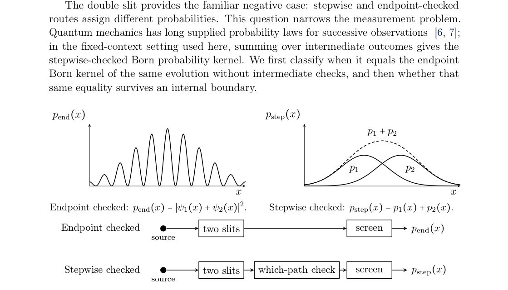 
Figure 1: The double slit as a quantum–classical composition failure. Endpoint- checked alternatives add as amplitudes and interfere. Stepwise-checked alternatives add as probabilities. The two processes assign different distributions to the final outcomes.

📷 Fig 2

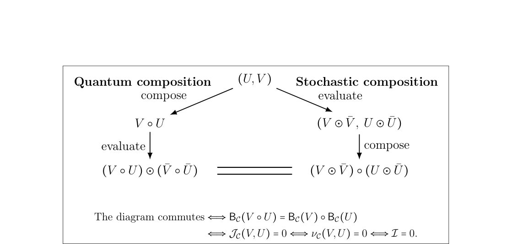 
Figure 2: The quantum–classical consistency law for faithful Born-kernel composition. The left route composes the unitaries before Born evaluation; the right route composes their Born kernels.

📷 Fig 3

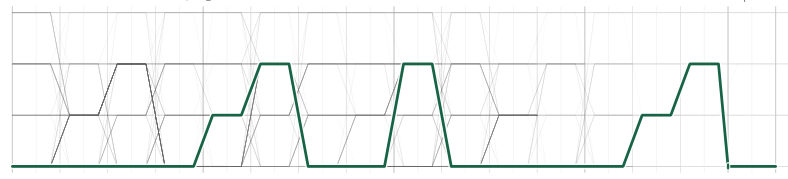 
Figure 4: Quantum rhythm selection and its sounded realizations. (a) The qutrit outcome in the main-text circuit, Eq. (31), selects one of the three admissible rhythms of the same U1,U2,U3 passage. Every rhythm includes the final readout; the excluded schedule (1,2) is never selected. (b) The seed-1766 performance begins at an observed endpoint. Five complete passes occupy beats 0–15, with selector outcomes 1,2,0,1,2. Each pass begins in ∣00⟩while the preceding sound is held until the next readout. Filled, open, and dotted-open noteheads denote one-, two-, and three-beat holds, centered over their intervals. The circle at beat 15 marks the mandatory final readout; its C4 is held until beat...

📷 Fig 4

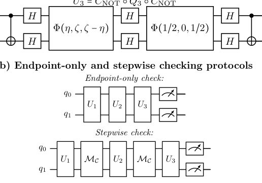 
Figure 5: Two-qubit circuits for the analytic Walsh passage. Panel (a) compiles the three steps in Eq. (177); circuit time runs from left to right. Panel (b) compares the same passage under an endpoint-only readout and unread context checks after the first two steps. The next figure gives the record-register realization of each MC block. Theorem E.3 proves equality of the two endpoint laws on every contiguous interval; the dense specialization retains nonzero pairwise path interference.

📷 Fig 5

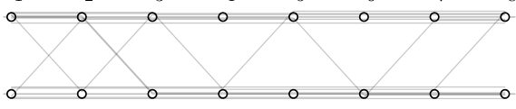 
Figure 7: Qubit Ostinato in the two-note space {E2,F2}. Here Pr(change) = 1/4, with ∣0⟩↦E2 and ∣1⟩↦F2. Panels (a) and (b) are orthographic views of the Bloch sphere after the first two steps of the constant-kernel sequence in Eqs. (90) and (91). The coherent Bloch vectors are r1 = ( √

**Summary.** This paper investigates the Quantum Composition Paradox, which questions whether quantum probabilities derived from sequential unitary steps are mathematically consistent. It rigorously proves that perfect composition only holds for specific 'unitary monomial' operations. The work quantifies this failure using a Born-composition defect, establishing a foundation for quantum theories of music and linking the paradox to computational complexity theory.

**Why it may be interesting.** The deep connection drawn between quantum process composition, information theory, and computational complexity (PromiseBQP-completeness) provides a novel theoretical lens for understanding decoherence and measurement back-action in open quantum systems.

Detailed structure

**Main problem.** The paper addresses the Quantum Composition Paradox: the inconsistency between probability laws derived from individual unitary steps (Born rule) and the probability laws obtained by composing these steps over time.

**Main result.** Universal composition (where the Born kernel composition equals the composition of Born kernels) is restricted to unitary monomials, and the failure of this composition can be quantified by a Born-composition defect.

**Method.** The analysis uses the Born kernel $B(U)$ as a stochastic matrix, defining a composition defect $J_C(V,U)$ to diagnose when the chronological composition fails to match the composition of individual step probabilities.

**Model / system.** The system is quantum evolution described by unitary operators $U \in U(d)$ acting on a $d$-dimensional Hilbert space. The context involves analyzing the composition of these unitaries through their associated Born probability kernels.

**Key observables.** The Born-composition defect ($
u_C(V,U)$), conditional mutual information $I(S;Y | X)$, and the comparison between endpoint-checked and stepwise-checked probabilities.

**Important parameters / regimes.** The dimension $d$ of the Hilbert space, and the number of fully mixing steps, which is bounded by $d$ for boundary-stable sequences.

**Assumptions / limitations.** The framework assumes a context $C$ defining the measurement basis, and it distinguishes the required composition law from weaker operational tests.

**Figures summary.** Figure 1 illustrates the double-slit experiment as a failure of quantum-classical composition. Figure 2 shows the commuting diagram required for quantum-classical consistency.

**Paper structure.** The paper establishes the paradox, classifies the conditions for universal composition (unitary monomials), provides necessary and sufficient criteria for specific qubit/qutrit steps, and concludes by linking the failure of composition to quantum music theory and computational complexity.

Abstract

Quantum theory does not generally permit the probability laws obtained from individual unitary steps by the Born rule to be sewn into a consistent genealogy; we classify the exceptions and show that faithful composition can hold from an initial boundary yet fail after an internal restart. For finite-dimensional, composition-closed unitary families, universal composition holds exactly for unitary monomials, the phase-dressed permutations whose Born kernels realize reversible deterministic state machines. Prescribed sequences evade this obstruction. We classify all pairs of qubit unitary steps, give a necessary-and-sufficient criterion for pairs of qutrit unitary steps, and prove that a boundary-stable unitary sequence on a $d$-dimensional Hilbert space contains at most $d$ fully mixing steps, with equality in every prime dimension. We also construct arbitrarily long genuinely mixing sequences that compose from their initial boundary but fail after an internal restart, and a qutrit-controlled two-qubit realization with active interference. We define a Born--Chapman--Kolmogorov current that vanishes exactly when coherent and stepwise-checked endpoint laws agree, together with an associated measure of how many bits the endpoint reveals about the intermediate checking schedule. This state-machine connection provides a foundation for a quantum theory of music, in which unitary operations are notes and temporal boundaries are cues. Musical-transition prediction is proved PromiseBQP-complete, and the stepwise patterns that preserve a genealogy specify rules for rhythm, whereas the exceptional failure of that genealogy from an internal cue is the quantum music paradox.

[↑ back to top](#top)

### [Topological band structure of excitons in octochlore KTb$_{3}$F$_{10}$: an analog of the Luttinger Semimetal](http://arxiv.org/abs/2609.11466v1)

**Authors:** Olivier Demortier, Françoise Damay, Paul McClarty, Stéphane Raymond, Jacques Ollivier, Sylvain Petit  
**Type:** both · **Category:** strongly correlated electrons · **PDF:** <https://arxiv.org/pdf/2609.11466v1>  
**Analysis basis:** full PDF text, analyzed in chunks
**Topic relevance:** `analog quantum simulation` **3/5**

📷 Fig 1

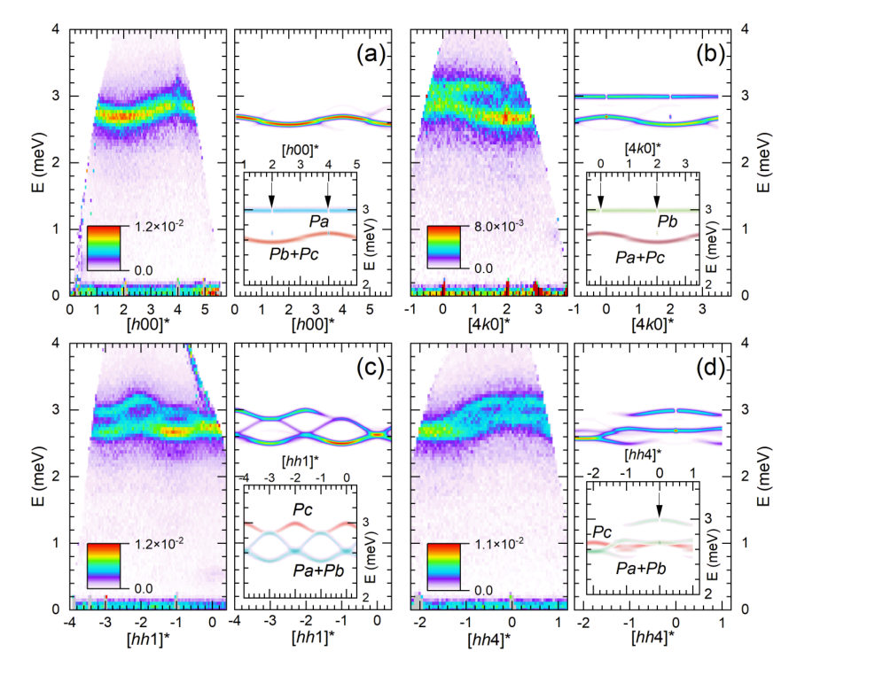 
FIG. 1. Dispersions. Experimental excitation spectra (left panel) of KTb3F10 at 1.5 K (IN5@ILL) and calculations (right panel) based on a CEF + long-range dipolar Hamiltonian, for various directions of the reciprocal space (a)-(d), respectively [h00]∗, [4k0]∗, [hh1]∗, and [hh4]∗. The insets in the right panels show the corresponding calculated polarization of the modes (i.e., parallel to [h00]∗(Pa, in blue), [0k0]∗(Pb, in green) or [00l]∗(Pc, in red)). Black arrows indicate anomalies in the spectral weight.

📷 Fig 2

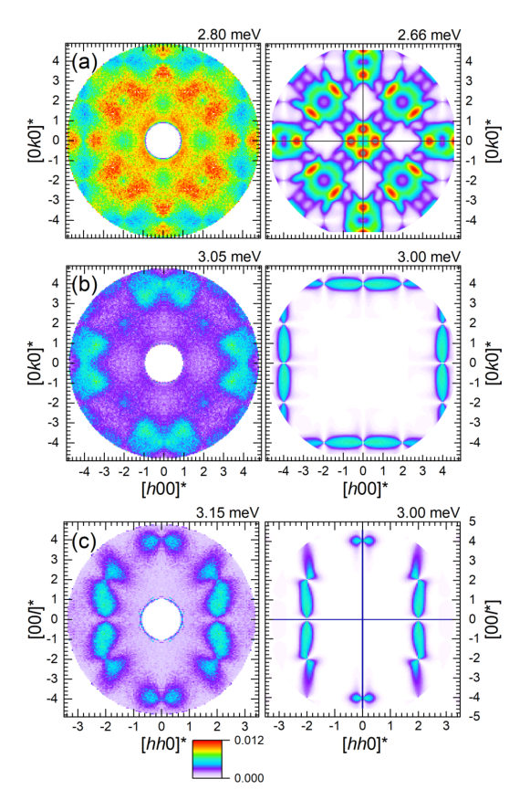 
FIG. 2. Maps and pinch points. Symmetrized experimental (left panel) iso-E maps (integrated over 0.1 meV)) of the excitation spectra of KTb3F10 at 1.5 K, in the [h00]∗−[0k0]∗(a-b) and [hh0]∗−[00l]∗scattering planes (IN5@ILL). The right panels show the corresponding calculated iso-E maps considering a Hamiltonian taking into account the CEF along with long-range dipole- dipole interactions.

📷 Fig 3

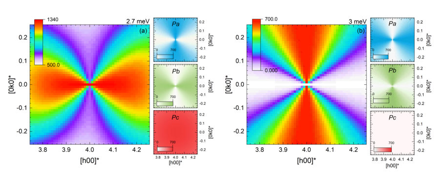 
FIG. 3. Zoomed-in iso-E Maps. Zoomed-in iso-E calculations around the pinched motives at Q400, for E = 2.7 meV (a) and 3 meV (b). The corresponding polarization of the modes is shown on the right.

📷 Fig 4

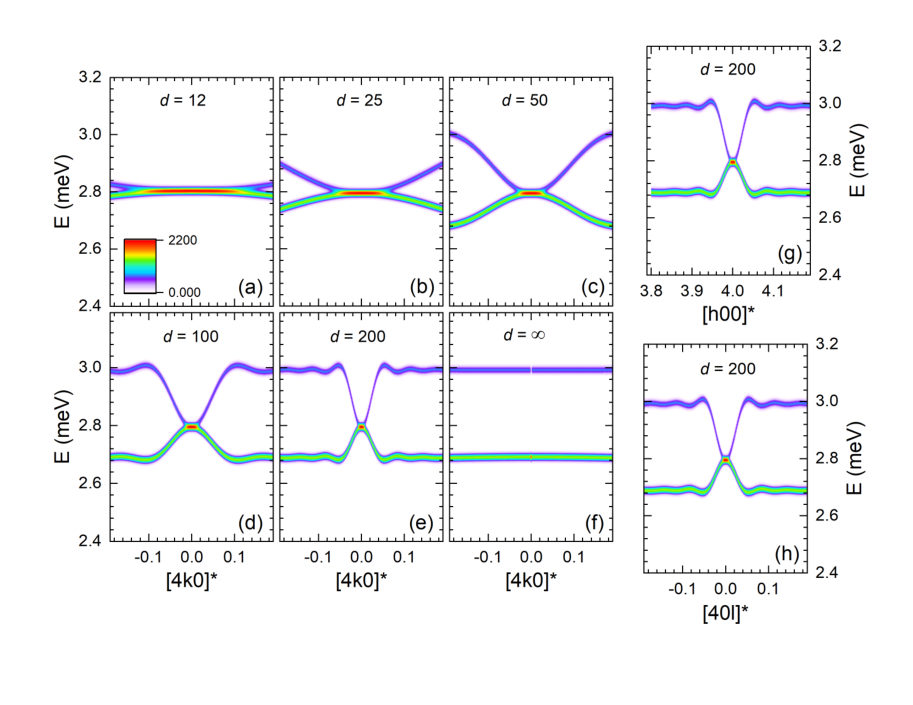 
FIG. 4. Truncating the dipolar interaction. Spectral weight calculated using the microscopic model in the immediate vicinity of the zone center Q = 400 zone, in the [h00]∗and [0k0]∗directions, by evaluating the dipole interaction as a finite sum truncated beyond a certain distance d (in ˚A).

**Summary.** This paper investigates the topological band structure of magnetic excitons in $	ext{KTb}_3	ext{F}_{10}$ using inelastic neutron scattering. By analyzing the observed 'pinch point' singularities, the authors demonstrate that the physics can be accurately modeled by a quadratic band touching Hamiltonian analogous to a Luttinger semi-metal. This provides a general theoretical framework for understanding topological features in magnetic materials.

**Why it may be interesting.** The connection drawn between the topological features (pinch points) in magnetic excitations and the Luttinger semi-metal provides a general, symmetry-protected model applicable to various magnetic systems, which is relevant for understanding emergent quantum states.

Detailed structure

**Main problem.** The study aims to understand the symmetry and topology of band structures in crystalline solids, specifically extending this analysis to magnetic excitations in insulating magnets.

**Main result.** The research reveals unambiguous pinch point features in the exciton dispersion, which are shown to be a generic consequence of a quadratic band touching model related to the Luttinger semi-metal.

**Method.** The study combines high-resolution inelastic neutron scattering (INS) experiments with theoretical modeling using Crystal Field Excitations (CEF) and long-range dipolar Hamiltonians.

**Model / system.** The physical system is $	ext{KTb}_3	ext{F}_{10}$, an octochlore lattice exhibiting magnetic excitations. The theoretical model involves the long-range magnetostatic dipolar interaction, which is effectively described by a quadratic band touching point Hamiltonian.

**Key observables.** Dispersive bosonic excitons, 'pinch point features' in the scattering intensity, and spectral weight anomalies observed in iso-energy maps.

**Important parameters / regimes.** Low temperature (1.5 K to 25 K), the wavevector $\mathbf{Q}=400$, and the truncation range of the dipolar interaction.

**Assumptions / limitations.** The dominant coupling mechanism is assumed to be the long-range magnetostatic dipolar interaction, and the physics is captured by a minimal quadratic touching point model.

**Figures summary.** Figures illustrate experimental excitation spectra and calculated iso-E maps, clearly showing the characteristic pinched structures and their dependence on energy and scattering plane.

**Paper structure.** The paper progresses by establishing the general problem of band topology in magnets, presenting experimental INS data showing anomalies, theoretically modeling the system using dipole-dipole interactions, and finally demonstrating that a simplified quadratic model successfully reproduces the observed topological features.

Abstract

Understanding the symmetry and topology of band structures in crystalline solids has been among the defining themes of a generation of condensed matter physicists, with implications across many different platforms including electronic bands, photonic crystals, phonons and magnetic excitations. In the latter systems, there is usually magnetic long-range order and time reversal symmetry breaking. Here we further enrich the possible band structures available to magnetic systems by examining dispersive crystal field excitations above a ground state that is a simple product of singlets. In these systems, there is an interplay of magnetic interactions and band topology with both crystal and time reversal symmetries. Using high-resolution neutron spectroscopy we reveal the dispersion relations of bosonic excitons in KTb$_{3}$F$_{10}$, an experimental realization of the octochlore lattice. We show that there are pinch point features in the scattering intensity. The dominant coupling in this system is the long-range magnetostatic dipolar interaction, whose singularity at the zone center is passed onto the scattering intensity. However, the pinch points survive when the range of the dipoles is truncated to finite shell number in the form of a three-band quadratic band touching protected by cubic symmetry. This model, which is related to the Luttinger semi-metal, provides a general long wavelength model for the emergence of pinch point scattering intensity encompassing also the true long-range dipolar model.

[↑ back to top](#top)

### [Sub-cycle doublon-holon dynamics in one-dimensional Mott insulators revealed by two-color high-harmonic spectroscopy](http://arxiv.org/abs/2609.11858v1)

**Authors:** Lance Hatch, Aditya Verma, Eric Schultz, Hanjun Yang, Priscila Rosa, Genda Gu, Igor Zaliznyak, Giulio Vampa, Laimei Nie, Hanzhe Liu  
**Type:** both · **Category:** strongly correlated electrons · **PDF:** <https://arxiv.org/pdf/2609.11858v1>  
**Analysis basis:** full PDF text, analyzed in chunks
**Topic relevance:** `Keldysh / 2PI / non-Gaussian methods` **2/5** · `analog quantum simulation` **2/5** · `driven-dissipative phase transition` **2/5** · `methods for driven-dissipative` **2/5** · `non-equilibrium universality` **2/5** · `quantum measurements` **2/5** · `quantum optics experiment` **2/5** · `interference shaping light` **1/5** · `scars & prethermalization` **1/5**

📷 Fig 1

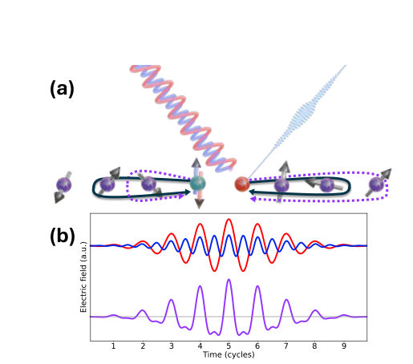 
Fig 1. Schematics of two-color driving. (a) A phase-locked two- color field drives carrier tunneling across the Mott gap, creating doublon-holon (d-h) pairs. The field subsequently drives d-h motion through the correlated one-dimensional lattice. Recombination of the d-h pairs leads to the emission of high-harmonics. Black paths indicate symmetric excursions under fundamental-only driving, while purple dashed paths illustrate the asymmetric trajectories induced by the two-color field. (b) Electric field of the fundamental (red, top), second harmonic (blue, top), and total two-color field (purple, bottom). For a fundamental only excitation in an inversion- symmetric medium, opposite half...

📷 Fig 2

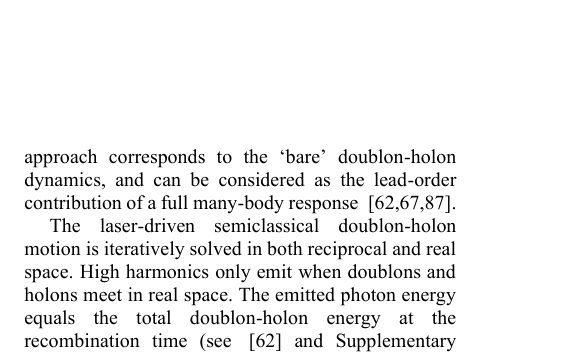 
Figure 3 b-d shows the semiclassical doublon-holon trajectory driven by a peak field of 0.21 V/ Å, which is similar to the experimental conditions. Figure 3b shows many recombining doublon-holon trajectories with positive emission chirps originating at different birth times in the laser driving cycle. With positive chirp, higher harmonics are emitted later in the optical cycle. Our simulation shows a positive chirp of 0.206 fs / eV, which is comparable to the experimental value of 0.19 fs / eV (Fig. 3d). This good agreement suggests that sub-cycle doublon-holon dynamics can be largely described by semiclassical trajectories in the correlated doublon-holon bands.

📷 Fig 3

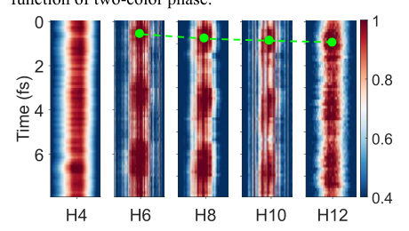 
Fig 2. Sub-cycle modulation of even-order harmonic emission under two-color driving. Individually normalized spectra of the 4th, 6th, 8th, 10th, and 12th harmonics are shown as a function of the relative delay between the fundamental and second-harmonic fields. Each above-gap harmonic exhibits a modulation period of ~1/4 cycle of the fundamental. The green dashed line highlights the fitted delay of maximum harmonic yield, resulting in a measured harmonic chirp of 0.19 fs eV-1.

📷 Fig 4

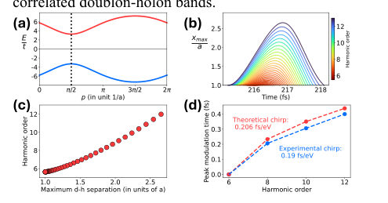 
Fig. 3. Semiclassical trajectory analysis of doublon-holon dynamics. (a) Dispersions of the upper (red) and lower (blue) Hubbard bands obtained from Bethe ansatz. The vertical dashed line indicates the momentum of the minimum Mott gap. (b) Relative displacement of semiclassical doublon-holon trajectories as a function of time, color-coded by the harmonic order emitted upon recombination. (c) Emitted harmonic order as a function of the maximum doublon-holon separation distances. (d) Comparison of theoretically calculated (red) and experimentally measured (blue) chirp values. In this simulation, we choose electron hopping 𝑡ℎ= 0.3 eV, on-site Coulomb repulsion U = 2.1 eV, and lattice constant...

📷 Fig 5

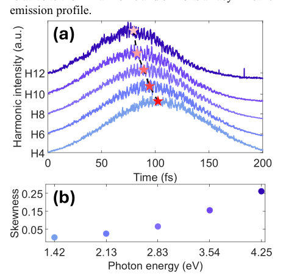 
Fig 4. Temporal evolution of harmonic emission. (a) Integrated and individually normalized yield of even harmonics (4th to 12th, labeled as H4-H12, respectively) as a function of two-color phase delay. The harmonic signals exhibit rapid quarter-cycle modulation within a slower emission envelope. Red stars mark the calculated envelope maxima. The envelope maximum shifts to earlier delay with increasing harmonic order. (b) Extracted temporal skewness of intensity distribution as a function of harmonic energy.

**Summary.** This work uses two-color high-harmonic spectroscopy on a 1D Mott insulator to observe ultrafast, sub-cycle dynamics of doublon-holon pairs. By measuring the chirp and temporal asymmetry of emitted harmonics, the authors confirm that the process is governed by d-h recombination and quantify the subsequent electronic dephasing. This provides a novel experimental window into non-equilibrium many-body physics in strongly correlated materials.

**Why it may be interesting.** The use of HHG spectroscopy to probe correlated electron dynamics provides a powerful, non-perturbative tool for studying non-equilibrium quantum phenomena, bridging concepts from quantum optics and condensed matter physics.

Detailed structure

**Main problem.** The study aims to directly measure and understand strongly driven, sub-optical-cycle dynamics within correlated materials, specifically focusing on doublon-holon recombination.

**Main result.** The experiment reveals coherent doublon-holon dynamics characterized by a positive chirp in high-harmonic emission, and quantifies ultrafast dephasing through harmonic order-dependent temporal asymmetry.

**Method.** The research employs two-color high-harmonic spectroscopy to probe the time-domain emission profile of even harmonics, complemented by semiclassical modeling of doublon-holon trajectories.

**Model / system.** The physical system is a one-dimensional Mott insulator ($	ext{Ca}_{0.4}	ext{Sr}_{0.6}	ext{CuO}_2$), whose dynamics are modeled using a semiclassical approach based on the Hubbard model and Bethe-ansatz dispersion.

**Key observables.** High-harmonic emission chirp, temporal skewness ($\gamma_q$), and the maximum doublon-holon separation ($x_{max}$) as a function of harmonic order.

**Important parameters / regimes.** Sub-optical-cycle timescales, the two-color phase delay, and the characteristic dephasing length scale ($\sim 0.5$ lattice sites).

**Assumptions / limitations.** The analysis relies on semiclassical models for d-h trajectories, which neglect spinon dynamics and non-local interactions; the weak second harmonic is assumed to only perturb the process.

**Figures summary.** Figures illustrate the spectral modulation of even harmonics versus two-color delay, showing shifts in peak emission time for higher orders, and compare theoretical semiclassical trajectories (short vs. long) with experimental chirp measurements.

**Paper structure.** The paper establishes the experimental technique using two-color HHG to access sub-cycle dynamics, presents the semiclassical model for d-h motion, and then correlates the observed harmonic chirp and temporal asymmetry with the predicted recombination dynamics and subsequent dephasing.

Abstract

Solid-state high-harmonic spectroscopy is becoming an emerging tool for probing nonequilibrium many-body dynamics. Yet, direct measurements of strongly driven, sub-optical-cycle dynamics in correlated materials during high-harmonic emission remain largely unexplored. Here, we measure high-harmonic emission chirp in a prototypical one-dimensional Mott insulator, which encodes strongly driven doublon-holon dynamics at sub-optical-cycle timescales. We observe a positive chirp for above band gap harmonics, indicating that high harmonics are dominated by doublon-holon recombinations. We further show a harmonic order-dependent dephasing, which can be understood through different doublon-holon excursion distances associated with each harmonic. These results reveal coherent doublon-holon dynamics and their ultrafast dephasing in Mott insulators, which is relevant to other nonequilibrium light-induced phenomena, such as Floquet engineering.

[↑ back to top](#top)

### [Orientational order on non-orientable domains](http://arxiv.org/abs/2609.11367v1)

**Authors:** Gianmarco Spera, Axel Fotso Ndefo, Keaton J. Burns, Alexander Mietke  
**Type:** theory · **Category:** statistical mechanics · **PDF:** <https://arxiv.org/pdf/2609.11367v1>  
**Analysis basis:** full PDF text, analyzed in chunks
**Topic relevance:** `Keldysh / 2PI / non-Gaussian methods` **2/5** · `analog quantum simulation` **1/5** · `correlated / nonlocal dissipation` **1/5** · `driven-dissipative phase transition` **1/5** · `methods for driven-dissipative` **1/5** · `non-equilibrium universality` **1/5** · `scars & prethermalization` **1/5**

📷 Fig 1

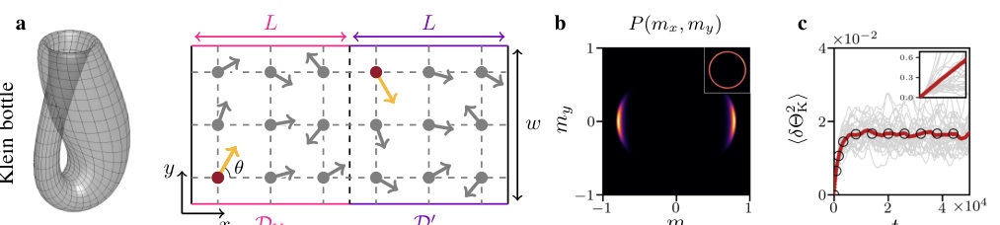 
FIG. 1. Double-cover representation and fluctuations of the XY model on a Klein bottle. (a) Double-cover ΩK = DK ∪D′ K of a non-orientable Klein bottle surface of size L × w with twist-axis x and periodicity in y-direction: D′ K represents an observation of DK from the backside. Points are identified as (x, y) ∼(x + L, w −y). Spin components orthogonal to the twist axis transform as pseudoscalars, f K y (x + L, y) = −f K y (x, w −y) (see colored spin pair). (b) In an XY lattice model on a Klein bottle surface, topological pinning of spin orientations along the twist-axis leads to a collapse of the polarization distribution P(mx, my) onto mx ≈±1, my ≈0. Inset: P(mx, my) is isotropic on a...

📷 Fig 2

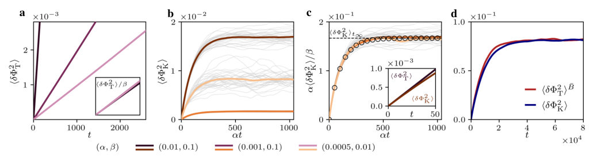 
FIG. 2. Mean-field theory of orientation fluctuations on torus and Klein bottle. (a) Spin-wave approximation of XY model, Eq. (5), on torus yields expected diffusion of average orientations ⟨δΦ2 T⟩[see Eqs. (6),(9a)] that only depends on noise strength β (inset). (b) Fluctuations in the mean-field theory on a Klein bottle reproduce bound fluctuations of lattice model (see Fig. 1f). (c) Data from panel (b) agrees with exact analytic prediction [black circles, see Eq. (9b)] and collapses under corresponding scaling. Black dashed line indicated fluctuation plateau, Eq. (11), in the thermodynamic limit. Inset illustrates analytically predicted identical fluctuation dynamics at short times...

📷 Fig 3

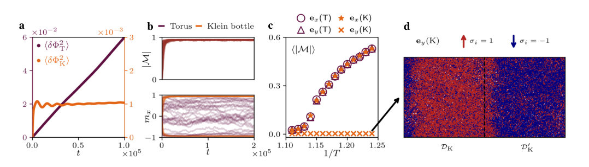 
FIG. 3. Active particle models on a non-orientable surface. (a) Orientation fluctuations in the Vicsek model [37] on a torus (purple) and on a Klein bottle (orange). The latter still exhibit a finite bound despite dynamic alignment neighborhoods. (b) Top: Global ordering in the Vicsek model on torus and Klein bottle. Bottom: Directional spin polarization diffuses on a torus and exhibits topological pinning behavior on a Klein bottle, analog to the lattice XY model dynamics (Fig. 1b). (c) Global orientational order ⟨|M|⟩in an active Ising model [AIM, see Eq. (14)] on torus (T) and Klein bottle (K) for Ising spins directed parallel (ex) and orthogonal (ey) to the Klein bottle twist axis. The...

📷 Fig 4

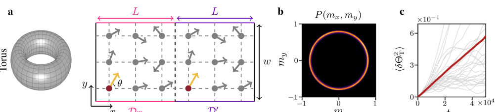 
FIG. 4. Fluctuation measurements of the XY model on a torus. (a) Trivial double-cover ΩT = DT ∪D′ T of domain L × w with toroidal symmetry: All fields satisfy f T(x + L, y + w) = f T(x, y). (b) Enlarged inset of Fig. 1b: Polarization distribution is isotropic due to diffusing Goldstone mode of global homogeneous spin rotations [30]. (c) Enlarged inset of Fig. 1c: Fluctuations of average orientations exhibit conventional diffusive dynamics (gray: individual realizations, red: average). Simulation parameters: See Methods.

**Summary.** This work analyzes how placing orientational spin systems on non-orientable manifolds, like the Klein bottle, fundamentally changes their statistical mechanics compared to standard surfaces like the torus. The key finding is that non-orientability causes 'topological caging,' which limits orientational fluctuations to a finite value, a robust effect seen in both passive and active matter models.

**Why it may be interesting.** The concept of topological constraints fundamentally altering equilibrium dynamics (caging) without requiring an explicit external field is a rich theoretical topic relevant to understanding complex phase behavior in condensed matter systems.

Detailed structure

**Main problem.** The study investigates how the non-orientable topology of a domain, specifically the Klein bottle, alters the statistical properties and orientational fluctuations of many-body systems compared to standard orientable domains like the torus.

**Main result.** Non-orientability eliminates global rotational soft modes and induces 'topological caging' in passive systems, leading to finite saturation of orientational fluctuations, a state absent on the torus.

**Method.** The authors employ stochastic microscopic equations, mean-field theory, and spin-wave approximations, analyzing the system's dynamics by mapping topological constraints onto non-local symmetry relations on an orientable double-cover.

**Model / system.** The models include the passive XY spin model and active self-propelled particle systems (like the active Ising model) whose orientations are constrained on a Klein bottle geometry, contrasting with the torus geometry.

**Key observables.** Global orientation fluctuation $\langle\delta\Theta^2(t)
angle$, polar order parameter $|M|$, and the spin polarization distribution $P(m_x, m_y)$.

**Important parameters / regimes.** The comparison between the torus and Klein bottle topologies, and the role of the non-local symmetry relations imposed by non-orientability.

**Assumptions / limitations.** The analysis relies heavily on the spin-wave approximation for small angle variations and the mathematical mapping of topological constraints to symmetry relations on a double-cover.

**Figures summary.** Figures illustrate the double-cover representation of the Klein bottle and compare the time evolution of orientation fluctuations ($\langle\delta\Phi^2
angle$) on both the torus and the Klein bottle, showing saturation on the latter.

**Paper structure.** The paper progresses by first establishing the topological constraints via the double-cover, then analyzing the dynamics of passive XY models to show topological caging, and finally extending these findings to active particle models like the active Ising spin model.

Abstract

We study the statistical properties of passive and active many-body systems with orientational degrees of freedom on non-orientable domains. By rephrasing topological constraints as non-local symmetry relations on an orientable double-cover, we show that non-orientability eliminates global rotational soft modes without acting like an external field. In a passive XY model, this results in topological caging, where orientational fluctuations that exhibit conventional diffusive behavior on a torus saturate on a Klein bottle to a finite value that we compute exactly in the thermodynamic limit. In models of active self-propelled particles with orientational degrees of freedom, topological caging persists despite continuously changing interaction neighborhoods. In an active Ising spin model, non-orientability enforces the coexistence of ordered anti-parallel domains with vanishing global polar order, a state that is absent on orientable domains.

[↑ back to top](#top)

### [Recurrence and transience of random walks with drift $ρx^α/t^β$](http://arxiv.org/abs/2609.11046v1)

**Authors:** Ngo P. N. Ngoc, Tuan-Minh Nguyen  
**Type:** theory · **Category:** statistical mechanics · **PDF:** <https://arxiv.org/pdf/2609.11046v1>  
**Analysis basis:** full PDF text, analyzed in chunks
**Topic relevance:** `quantum measurements` **2/5** · `Keldysh / 2PI / non-Gaussian methods` **1/5** · `analog quantum simulation` **1/5** · `methods for driven-dissipative` **1/5** · `non-equilibrium universality` **1/5**

📷 Fig 1

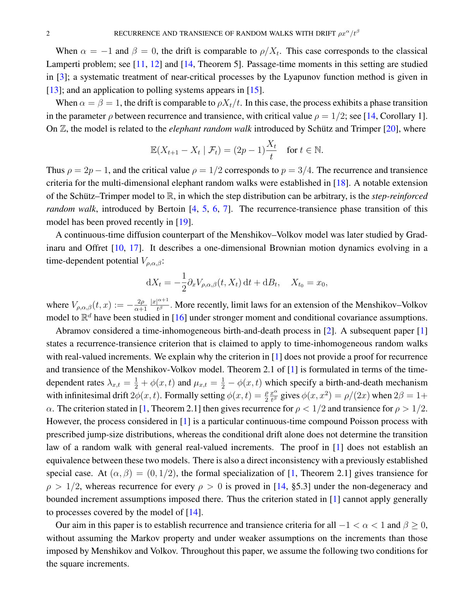 
Low-resolution page preview, page 2

📷 Fig 2

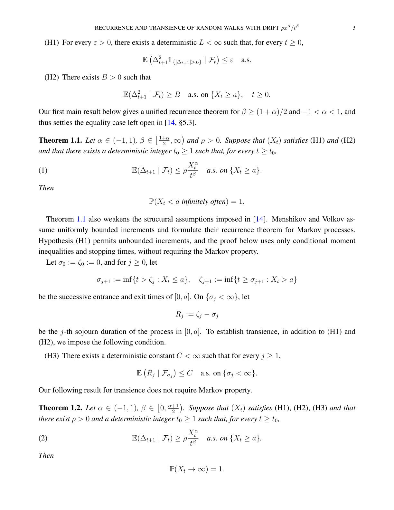 
Low-resolution page preview, page 3

📷 Fig 3

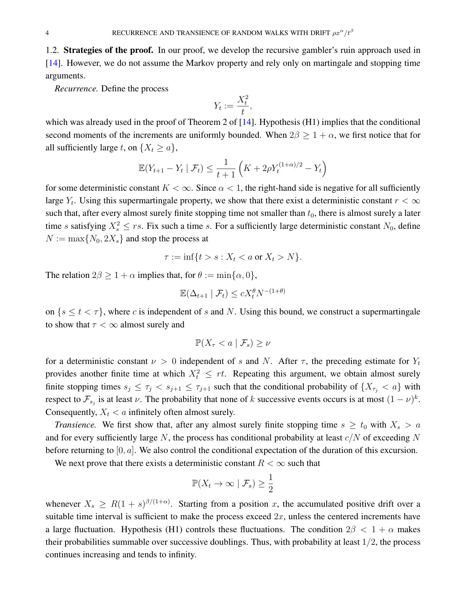 
Low-resolution page preview, page 4

📷 Fig 4

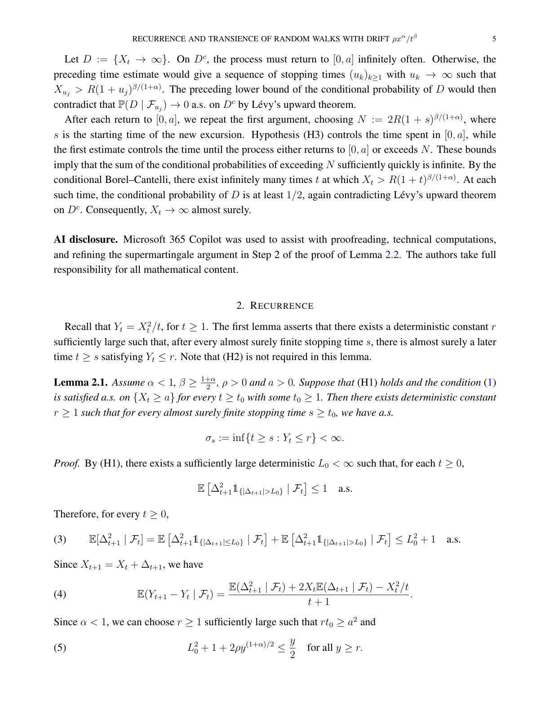 
Low-resolution page preview, page 5

📷 Fig 5

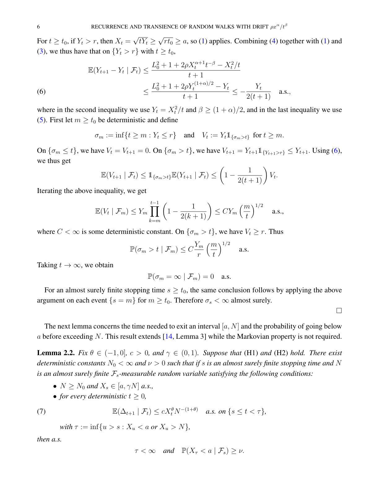 
Low-resolution page preview, page 6

**Summary.** This paper rigorously analyzes the recurrence and transience of a random walk whose drift term is time and position-dependent ($
ho x^\alpha/t^eta$). By employing advanced stochastic methods like martingale theory, the authors establish complete classification criteria for the process's long-term behavior under weaker assumptions than previously required. This provides a powerful mathematical tool for understanding diffusion processes in complex, non-stationary environments.

**Why it may be interesting.** While the core subject is random walk theory, the rigorous mathematical techniques involving martingale analysis and boundary crossing probabilities are highly relevant to analyzing non-equilibrium dynamics and stochastic processes in condensed matter physics.

Detailed structure

**Main problem.** The paper determines the recurrence or transience of a random walk process whose conditional drift depends on both time and position in the form $
ho x^\alpha/t^eta$.

**Main result.** It establishes comprehensive recurrence and transience criteria for the process across various parameter regimes of $\alpha$ and $eta$, improving upon previous results by weakening assumptions.

**Method.** The analysis employs martingale theory, supermartingale arguments, and the construction of specific stopping times to analyze the long-term behavior of the process.

**Model / system.** The model is a discrete-time, $\mathbb{R}^+$-valued random walk $(X_t)_{t\in\mathbb{Z}^+}$ whose conditional drift is governed by the term $
ho x^\alpha/t^eta$. The analysis focuses on the process's tendency to return to a bounded region or escape to infinity.

**Key observables.** Recurrence (hitting a point infinitely often) and Transience (diverging to infinity), analyzed via the process's position $X_t$ and related quantities like $Y_t = X_t^2/t$.

**Important parameters / regimes.** The parameters are $\alpha$ and $eta$ governing the drift, with critical regimes defined by $2eta - \alpha = 1$ and the general scope being $-1 < \alpha < 1$ and $eta \ge 0$.

**Assumptions / limitations.** The proofs rely on hypotheses regarding the boundedness of conditional second moments of increments (H1) and lower bounds on these moments (H2), and the process is analyzed without assuming the Markov property.

**Paper structure.** The paper develops the argument by first establishing recurrence criteria using supermartingale properties (Theorem 1.1), followed by proving transience criteria using bounds on hitting probabilities and constructing sequences of stopping times (Theorem 1.2).

Abstract

Menshikov and Volkov [Electron. J. Probab. 13 (2008)] studied recurrence and transience of a class of Markovian random walks on $\mathbb R_+$ whose conditional drift depends on both time and position and is of order $ρx^αt^{-β}$ with $ρ>0$. The case on the critical line $2β-α=1$, with $α\in(-1,1)\setminus\{0\}$, remained open. We prove recurrence in this remaining case. Furthermore, we establish recurrence and transience criteria that complete the classification for $-1<α<1$ and $β\ge 0$, without assuming the Markov property and under weaker assumptions on the increments than those imposed by Menshikov and Volkov.

[↑ back to top](#top)

### [Universal sampling of spin systems across quenched disorder](http://arxiv.org/abs/2609.11336v1)

**Authors:** Jing Liu, Yeyuan Wu, Ying Tang, Pan Zhang  
**Type:** theory · **Category:** disordered systems and neural networks · **PDF:** <https://arxiv.org/pdf/2609.11336v1>  
**Analysis basis:** full PDF text, analyzed in chunks
**Topic relevance:** `Keldysh / 2PI / non-Gaussian methods` **2/5** · `analog quantum simulation` **2/5** · `methods for driven-dissipative` **2/5**

📷 Fig 1

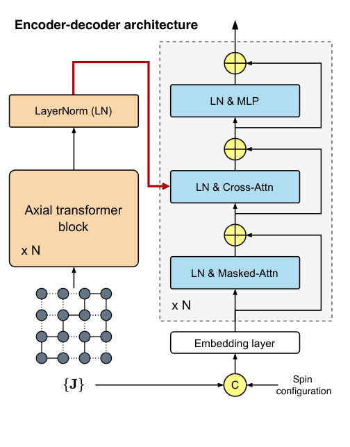 
FIG. 1. Conceptual overview of the disorder-conditioned neural Boltzmann sampling framework. Left: The encoder maps the coupling matrix {J} to per-site embeddings {hi} through N axial transformer blocks, executing once per dis- order realization. Right: The autoregressive decoder gener- ates spin configurations patch by patch. Each patch token concatenates the spin embedding and local coupling features, then is updated via causal masked self-attention and cross- attention with {hi} to parameterize the conditional distribu- tion qθ(s|J).

📷 Fig 2

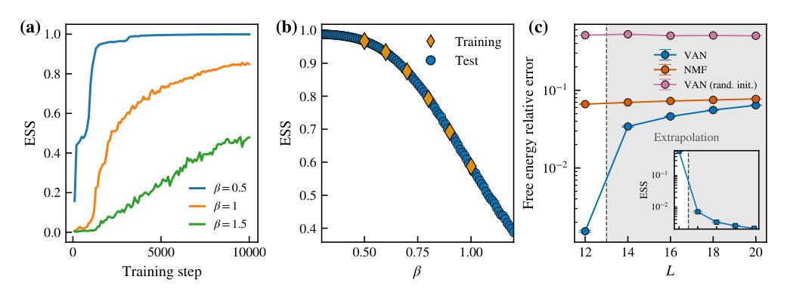 
FIG. 2. Performance on the 2D Edwards-Anderson model with open boundary conditions (L = 12). (a) Training dynamics. The normalized effective sample size (ESS) is evaluated on a fixed validation set (20 realizations) during training for bimodal couplings. (b) Thermal generalization. By conditioning the encoder on Kij = βJij, a model trained on discrete β values seamlessly interpolates and extrapolates to unseen continuous thermal regimes for Gaussian couplings without retraining. (c) Extrapolation over system size. The model is trained on L = 12 and evaluated on L = {12, 14, 16, 18, 20} (gray shading marks the extrapolation regime L &gt; 12), compared with naive mean-field (NMF) and a randomly...

📷 Fig 3

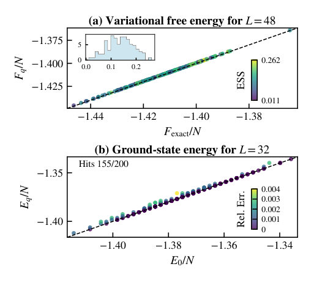 
FIG. 3. Results obtained via curriculum training, where the model is trained sequentially on system sizes L ∈ {8, 12, 16, 24, 32, 40, 48}, each stage warm-started from the converged weights of the previous size. (a) Variational free en- ergies benchmarked against exact Kac-Ward solutions across an independent test set (200 realizations) for Gaussian dis- order at L = 48, β = 1.0. (b) Ground-state search for bi- modal couplings at L = 32 via variational annealing from the curriculum-trained model, showing the minimum energy found versus the exact ground-state energy obtained by [43].

📷 Fig 4

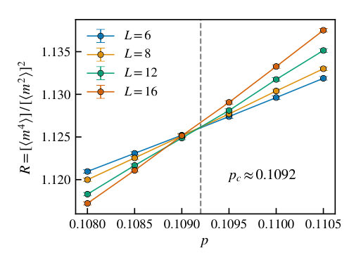 
FIG. 4. Quenched-averaged Binder cumulant U = [⟨m4⟩]/[⟨m2⟩]2 in the 2D random-bond Ising model as a func- tion of the antiferromagnetic bond probability p for various system sizes L. Periodic boundary conditions are adopted to suppress finite-size effects. The curves cross near the expected multicritical Nishimori point p ≈0.1092. For each point, ob- servables are computed via importance sampling across 106

📷 Fig 5

 
Fig. 3(b), this annealed network rapidly generates high- quality ground-state candidates for novel instances, of-

**Summary.** This paper presents a novel, amortized neural variational framework using Transformers to calculate thermodynamic properties of disordered spin systems. By training once on the disorder ensemble rather than per realization, it overcomes the prohibitive computational cost of traditional methods. This breakthrough enables accurate, scalable simulations of complex, frustrated many-body systems previously inaccessible to variational inference.

**Why it may be interesting.** While focused on classical spin systems, the methodology of using deep generative models (Transformers) to efficiently sample complex, high-dimensional probability distributions conditioned on system parameters (disorder) is highly relevant for simulating quantum many-body states or quantum field theories where disorder is present.

Detailed structure

**Main problem.** The primary challenge is evaluating quenched thermodynamic observables in disordered spin systems, which requires averaging over the disorder realization itself, a task difficult for standard variational methods.

**Main result.** The authors introduce a universal neural variational framework that amortizes inference across the entire disorder ensemble, allowing for zero-shot sampling on unseen disorder realizations.

**Method.** They employ an encoder-decoder Transformer architecture where the encoder processes the disorder couplings $\{J\}$ to generate site embeddings, which condition a causal Transformer decoder to sample the spin configuration $s$.

**Model / system.** The work focuses on disordered spin systems, specifically the 2D Edwards-Anderson model and the random-bond Ising model, governed by a Hamiltonian involving quenched random couplings $J_{ij}$.

**Key observables.** Variational free energy, Binder cumulant crossings, and ground-state energies.

**Important parameters / regimes.** Inverse temperature ($eta$), system size ($L$), and the nature of the disorder (bimodal vs. Gaussian couplings).

**Assumptions / limitations.** The framework assumes that the disorder couplings can be processed by the encoder to create a universal representation $\{h_i\}$ that governs the sampling process.

**Figures summary.** Figures illustrate the conceptual flow of the disorder-conditioned neural Boltzmann sampling framework, showing training dynamics, thermal generalization, and extrapolation across system sizes.

**Paper structure.** The paper first establishes the computational bottleneck of per-instance training for disordered systems. It then introduces the amortized Transformer architecture, details its training on various disorder types and temperatures, and validates its performance by calculating key physical observables like the Binder cumulant.

Abstract

Statistical physics extracts macroscopic laws by averaging over the many microscopic degrees of freedom of a system. Disordered systems demand a second and far harder average, one over the quenched randomness itself. The classic analytical routes, the replica and cavity methods, become uncontrolled outside mean-field or tree-like limits, and conventional numerical algorithms like parallel tempering require expensive, independent equilibration for every disorder realization. In this work, we introduce a universal neural variational framework that amortizes inference across the disorder ensemble, eliminating both the need for per-instance Markov chain equilibration and the cost of retraining instance-specific variational ansatzes. Built on an encoder-decoder Transformer architecture, after training once, it produces an explicit approximation to the Boltzmann distribution given previously unseen disorder realizations without further optimization. We validate this framework on 2D Edwards-Anderson models, and apply it to the random-bond Ising model, successfully capturing the Binder cumulant crossings near the Nishimori multicritical point. These results shift the object of variational inference from the single instance to the disorder ensemble, opening a route to frustrated many-body systems where instance-by-instance computation is prohibitive.

[↑ back to top](#top)

### [From Analytic Structure to Quantum Complexity: Walsh-Pauli Representations of Continuum Operators](http://arxiv.org/abs/2609.11350v1)

**Authors:** Raphael De Sousa, Partha Nandi, Francesco Petruccione  
**Type:** theory · **Category:** quantum information and computing · **PDF:** <https://arxiv.org/pdf/2609.11350v1>  
**Analysis basis:** full PDF text, analyzed in chunks
**Topic relevance:** `analog quantum simulation` **2/5** · `quantum measurements` **2/5** · `Keldysh / 2PI / non-Gaussian methods` **1/5**

📷 Fig 1

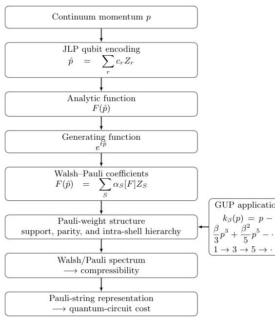 
FIG. 1. Schematic overview of the continuum-to-qubit con- struction developed in this work. The JLP encoding maps the continuum momentum to a binary qubit operator. An analytic function of the momentum operator is decomposed through a generating-function construction into Walsh–Pauli coefficients. The resulting spectrum determines the Pauli- weight structure and its compressibility, which are directly relevant for Pauli-string implementation and quantum-circuit resources. The quadratic GUP provides a concrete applica- tion of the general framework.

📷 Fig 2

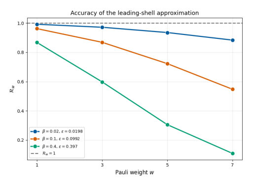 
FIG. 3. Ratio Rw = W exact w /W LO w defined in Eq. (100). Values near unity indicate dominance of the leading Taylor contribution to the corresponding Pauli-weight shell.

📷 Fig 3

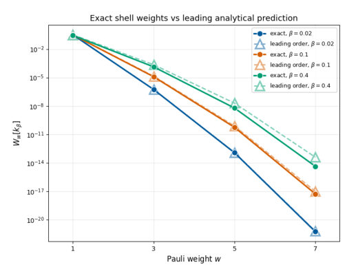 
FIG. 2. Exact Walsh shell weights of the quadratic-GUP operator compared with the leading-order analytical predic- tion Eq. (98) for nq = 8 and pmax ≈0.996. The agreement is excellent in the weak-deformation regime, while deviations appear as higher Taylor orders become appreciable.

📷 Fig 4

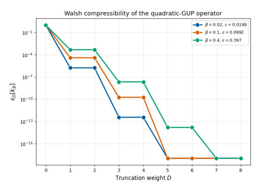 
FIG. 4. Discarded Walsh spectral fraction εD[kβ] = 1 − C(D), defined in Eqs. (101) and (102), as a function of the maximum retained Pauli weight D. Increasing the deforma- tion transfers spectral weight into higher-weight sectors and therefore increases the Pauli locality required at fixed accu- racy.

📷 Fig 5

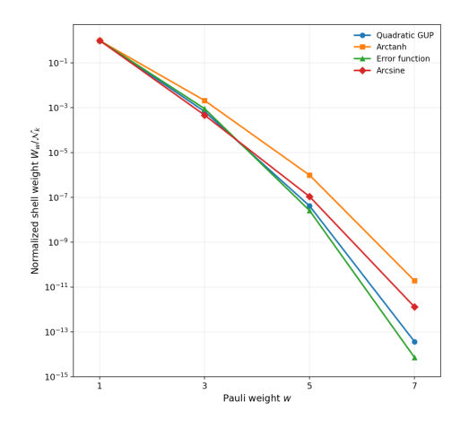 
FIG. 5. Normalized Walsh shell weights for the representa- tive non-polynomial analytic deformations of Table II, evalu- ated on the same JLP momentum lattice at fixed deformation strength ϵ = βp2 max. All models populate only odd Pauli- weight sectors, reflecting their common parity, while the rel- ative distribution of spectral weight among the allowed shells depends on the analytic form of the deformation. The values shown are nq = 8, ϵ = 0.5 and pmax = 1.

**Summary.** This work develops a systematic, analytical framework to translate the structure of continuum quantum operators into the discrete language of qubits using Walsh-Pauli representations. By employing generating functions, the authors determine the spectrum and resource cost associated with operators like the momentum operator, even when subjected to nonlinear deformations such as GUP kinematics. This offers a powerful preprocessing step for designing efficient quantum simulations.

**Why it may be interesting.** It provides a rigorous, analytical tool to estimate the quantum resources needed to simulate complex physical Hamiltonians (like those involving GUP) by analyzing the spectral structure of their momentum components.

Detailed structure

**Main problem.** The paper addresses how the structure of a continuum operator, such as the momentum operator, is faithfully represented and characterized within a finite qubit register.

**Main result.** A generating-function framework is developed to analytically determine the Walsh-Pauli spectrum of analytic functions of the JLP momentum operator, revealing exact support and parity selection rules.

**Method.** The core method involves mapping the continuum operator to a qubit-encoded operator, then using a generating function formalism to extract the Walsh-Pauli coefficients of the resulting function.

**Model / system.** The model centers on the Jordan-Lee-Preskill (JLP) construction, which discretizes continuum degrees of freedom onto a finite qubit register. A controlled application is the Generalized Uncertainty Principle (GUP) kinematics, treated as a nonlinear deformation of momentum.

**Key observables.** Walsh-Pauli spectrum, Pauli-weight structure, Walsh compressibility, and estimated quantum circuit resource costs (e.g., CNOT gates).

**Important parameters / regimes.** The number of qubits ($n_q$) defining the finite register size, and the deformation parameters characterizing the GUP.

**Assumptions / limitations.** The analysis is restricted to diagonal functions of a single JLP momentum register, and the method provides an upper bound for circuit costs.

**Figures summary.** Figure 1 schematically illustrates the entire process flow: continuum momentum $
ightarrow$ JLP qubit encoding $
ightarrow$ Analytic function $
ightarrow$ Walsh-Pauli coefficients $
ightarrow$ Spectrum/Resources.

**Paper structure.** The paper builds from establishing the continuum-to-qubit mapping, developing the generating-function formalism for the spectrum, deriving selection rules (support/parity), and finally applying the framework to analyze physical deformations like GUP kinematics.

Abstract

How does continuum operator structure appear in a finite qubit register? We address this question for analytic functions of diagonal operators represented in a binary basis, focusing on the Jordan--Lee--Preskill (JLP) momentum operator, by developing an operator-level generating-function framework for their Walsh-Pauli spectra. The construction determines the spectrum analytically and reveals exact support and parity selection rules, together with a nontrivial intra-shell hierarchy induced by the binary encoding. This provides a systematic characterization of Walsh compressibility and its relation to Pauli locality. As a controlled application, we consider generalized uncertainty-principle (GUP) kinematics as a tunable nonlinear odd deformation of momentum, showing how higher-order momentum terms redistribute spectral weight into progressively higher Pauli-weight sectors

[↑ back to top](#top)

### [Quantifying Symmetry Breaking](http://arxiv.org/abs/2609.11926v1)

**Authors:** Koji Yamaguchi, Hiroyasu Tajima  
**Type:** theory · **Category:** statistical mechanics · **PDF:** <https://arxiv.org/pdf/2609.11926v1>  
**Analysis basis:** full PDF text, analyzed in chunks
**Topic relevance:** `quantum measurements` **2/5** · `Keldysh / 2PI / non-Gaussian methods` **1/5** · `analog quantum simulation` **1/5**

📷 Fig 1

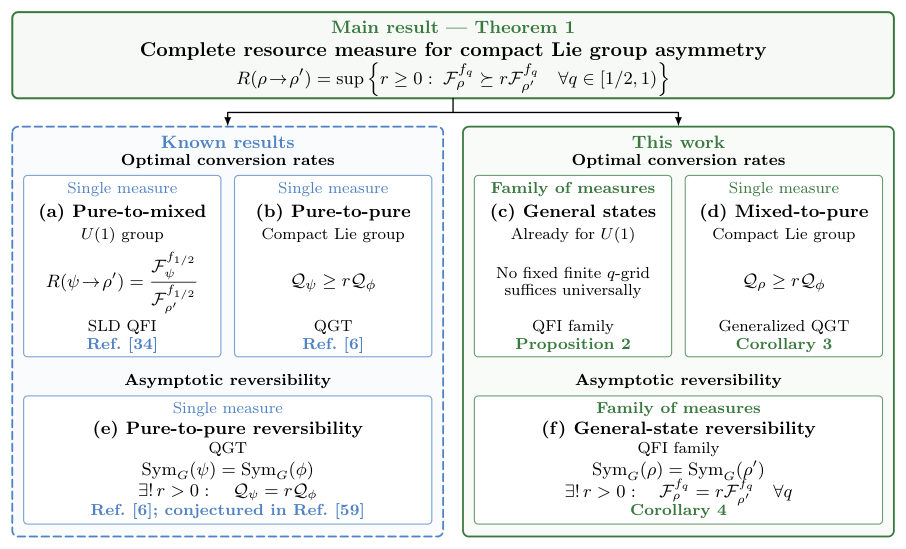 
FIG. 1. Single measure versus a family of measures: conversion rates and reversibility. The upper box gives the complete conversion-rate formula of Theorem 1 under the symmetry-subgroup inclusion condition. Blue dashed and green solid frames distinguish known results from this work. Optimal conversion rates: (a) U(1) pure-to-mixed formation is determined by the ratio of SLD QFIs [34]; (b) pure-to-pure conversion is characterized by a single QGT [6], which unifies earlier pure- state conversion results [33–35, 47]; (c) the general conversion law cannot be reduced to a state-independent fixed finite set of q values (Proposition 2); and (d) a pure target reduces the characterization to a...

📷 Fig 2

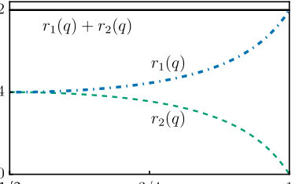 
FIG. 2. Asymmetry activation via QFI complemen-

**Summary.** This work develops a comprehensive resource theory approach to quantify symmetry breaking in mixed quantum states. It establishes that the optimal conversion rate is governed not by a single measure, but by an entire continuous family of Quantum Fisher Information matrices. This reveals a fundamental difference between pure-state and mixed-state resource quantification.

**Why it may be interesting.** It provides a rigorous, quantitative framework for understanding how symmetry constraints dictate the fundamental limits of quantum information processing, which has implications for characterizing non-equilibrium processes in many-body systems.

Detailed structure

**Main problem.** The paper aims to provide a complete, operational characterization for quantifying symmetry breaking in general mixed quantum states within the i.i.d. asymptotic limit.

**Main result.** It establishes a single-letter formula for the optimal conversion rate between arbitrary mixed states, determined by an entire one-parameter family of Quantum Fisher Information (QFI) matrices.

**Method.** The analysis uses quantum resource theories, extending quantum local asymptotic normality (QLAN) to complex unitary models and characterizing convertibility via the continuous QFI family.

**Model / system.** The study concerns quantum systems in finite-dimensional Hilbert spaces subjected to compact Lie group symmetries, analyzing the conversion of many copies of input states ($
ho^{\otimes n}$) to output states ($
ho'^{\otimes m}$).

**Key observables.** Asymmetry measure, Quantum Fisher Information (QFI) matrices (interpolating SLD and RLD), and the generalized quantum geometric tensor (QGT).

**Important parameters / regimes.** The asymptotic regime (i.i.d.), the parameter $q$ defining the QFI family, and the group structure of the symmetry $G$.

**Assumptions / limitations.** The analysis is restricted to the i.i.d. asymptotic regime, and the proof relies on extending QLAN to arbitrary rank unitary models.

**Figures summary.** Figure 1 summarizes the findings, contrasting the single-measure characterization for pure-state conversion (using QGT) with the full QFI family required for general mixed-state conversion.

**Paper structure.** The paper builds from the general problem of resource quantification, develops the necessary mathematical tools (like extended QLAN), derives the single-letter formula using the continuous QFI family, and then specializes the results to pure-state distillation and asymmetry activation.

Abstract

Quantifying properties of quantum states through the limits of their manipulation is a central goal of quantum resource theories. For symmetry breaking, the quantum geometric tensor governs asymptotic pure-state conversion, but a complete characterization for general mixed states has remained elusive.   Here we fully resolve this problem for finite-dimensional systems under compact Lie group symmetries in the i.i.d. asymptotic regime. Specifically, we establish a single-letter formula for the optimal conversion rate between arbitrary states, with vanishing trace-distance error, in the resource theory of asymmetry. The rate is determined by a one-parameter family of quantum Fisher information (QFI) matrices that interpolates between the symmetric- and right-logarithmic-derivative QFIs. No state-independent finite subset of this family suffices in general, even for $U(1)$ symmetry, revealing a qualitative distinction from pure-state conversion. Our formula further yields an exact formula for pure-state distillation rates in terms of the generalized quantum geometric tensor, characterizes asymptotically reversible interconversion, and identifies bound asymmetry for quantum clocks. Complementarity among different members of the QFI family also uncovers an activation mechanism for quantum clocks.   Our proof relies on two developments of independent interest. First, we extend quantum local asymptotic normality to unitary models with arbitrary rank and spectral degeneracy. Second, we characterize convertibility between quantum Gaussian shift models in terms of the same one-parameter family of QFIs. Together, these results provide an operational characterization of symmetry breaking for general quantum states in the i.i.d. asymptotic regime and reveal how distinct QFI constraints give rise to irreversibility and activation.

[↑ back to top](#top)

### [Timelike Entanglement from Spacetime Density Matrices: A Lattice Realization](http://arxiv.org/abs/2609.10967v1)

**Authors:** Hao-yu Wang, Wu-zhong Guo  
**Type:** theory · **Category:** statistical mechanics · **PDF:** <https://arxiv.org/pdf/2609.10967v1>  
**Analysis basis:** full PDF text, analyzed in chunks
**Topic relevance:** `Keldysh / 2PI / non-Gaussian methods` **2/5** · `methods for driven-dissipative` **2/5**

📷 Fig 1

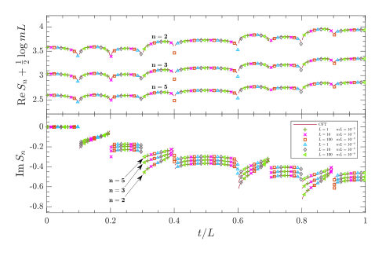 
FIG. 2. R´enyi entropies for periodic boundary conditions as functions of t/L, with N = 5000 lattice sites in total and (a, b, c, d)/L = (0.4, 0.5, 0.6, 0.8). An additive shift is applied to the real part to remove the universal divergent term.

📷 Fig 2

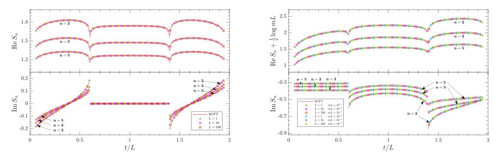 
FIG. 3. R´enyi entropies for DD (left) and NN (right) boundary conditions as functions of t/L, with N = 5000 lattice sites in total and a/L = 0.3. An additive shift is applied to the real part of the NN result to remove the universal divergent term.

📷 Fig 3

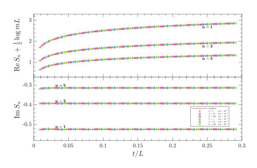 
FIG. 4. R´enyi and von Neumann entropies for the NN bound- ary conditions as functions of t/L, with N = 5000 lattice sites in total and a/L = 0.3. An additive shift is applied to the real part to remove the universal divergent term.

📷 Fig 4

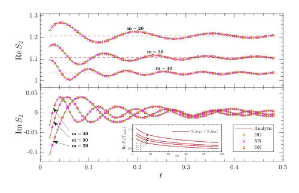 
FIG. 5. The main panels show the R´enyi entropies at several masses for DD, NN, and DN boundary conditions. The dashed lines denote the reference values Sn(ρA0)+Sn(ρBt). The inset shows the mass dependence of Re Sn(TA0Bt) and Sn(ρA0) + Sn(ρBt) at t = 0.45. The calculations use N = 5000 lattice sites in total, L = 1, and a = 0.3.

**Summary.** This work establishes a lattice realization for quantifying timelike entanglement in QFT using spacetime density matrices. By analyzing the spectrum of the reduced density matrix, the authors show that entanglement entropy moments precisely match predictions from Lorentzian twist-operator correlation functions. This provides a powerful, microscopic tool for studying quantum correlations across time separations.

**Why it may be interesting.** The rigorous lattice foundation for timelike entanglement provides a concrete, computable framework for understanding non-local quantum correlations in time, which is crucial for understanding dynamics in open or time-dependent quantum systems.

Detailed structure

**Main problem.** The paper investigates the concept of timelike entanglement in Quantum Field Theory (QFT) by analyzing reduced spacetime density matrices, extending entanglement measures beyond standard equal-time spatial cuts.

**Main result.** The authors provide a microscopic lattice realization for timelike entanglement, showing that Rényi entropy moments derived from the reduced density matrix match Lorentzian twist-operator correlation functions, even in regimes where reality is not guaranteed by causal disconnection.

**Method.** The analysis uses Gaussian diagonalization techniques applied to the generally non-Hermitian reduced spacetime density matrix, determining its spectrum via a characteristic polynomial, and relating its moments to correlation functions using the real-time replica construction.

**Model / system.** The study is performed on a free real scalar field, modeled on a lattice of coupled harmonic oscillators. The formalism is extended to analyze boundary effects (Periodic, Dirichlet, Neumann) and massive integrable QFTs.

**Key observables.** Reduced spacetime density matrix ($T_{A_0 B_t}$), Rényi entropy ($S_n$), von Neumann entropy ($S$), and Lorentzian twist-operator correlation functions (four-point and two-point functions).

**Important parameters / regimes.** Time separation ($t$), lattice size ($L$), mass scale ($\xi \sim m^{-1}$), and boundary conditions (DD, NN, PBC).

**Assumptions / limitations.** The analysis is initially restricted to the vacuum state of a free scalar field, and the methods rely on extending Gaussian diagonalization to non-Hermitian operators.

**Figures summary.** Figures illustrate the schematic setup for the reduced density matrix on a circle and a strip, and show the evolution of Rényi entropies for various boundary conditions (DD, NN, DN) as a function of time separation.

**Paper structure.** The paper progresses by defining the reduced spacetime density matrix, calculating its spectrum and Rényi moments, establishing the connection to Lorentzian twist-operator correlators, and finally testing this identification against various boundary conditions and limits.

Abstract

We investigate timelike entanglement in quantum field theory using spacetime density matrices and provide a microscopic lattice realization. For a two-dimensional free real scalar field, we extend Gaussian diagonalization methods to the generally non-Hermitian reduced spacetime density matrix and determine its complete nonzero spectrum in the generic regular case, together with all integer Rényi moments. The real-time replica construction identifies these moments with Lorentzian branch-point twist-operator correlation functions. We test this identification against the full four-point function on a circle, boundary two-point functions with Dirichlet and Neumann boundary conditions, and massive form-factor predictions, finding quantitative agreement in both magnitude and phase across distinct causal regimes. The boundary setup exhibits a finite causally connected window in which every integer Rényi entropy is real, showing that reality is not equivalent to causal disconnection. These results provide a microscopic lattice foundation for timelike entanglement and for Lorentzian twist-operator methods beyond equal-time regions.

[↑ back to top](#top)

### [Measuring chiral phonons](http://arxiv.org/abs/2609.10973v1)

**Authors:** Rahul Rao, Hanyu Zhu, Nicholas Kotov, Thuc T. Mai, Maria F. Muñoz, Dali Sun, Jun Liu, Wonjin Choi, Renee R. Frontiera, Angela R. H. Hight Walker  
**Type:** both · **Category:** other · **PDF:** <https://arxiv.org/pdf/2609.10973v1>  
**Analysis basis:** full PDF text, analyzed in chunks
**Topic relevance:** `quantum optics experiment` **2/5** · `quantum measurements` **1/5**

📷 Fig 1

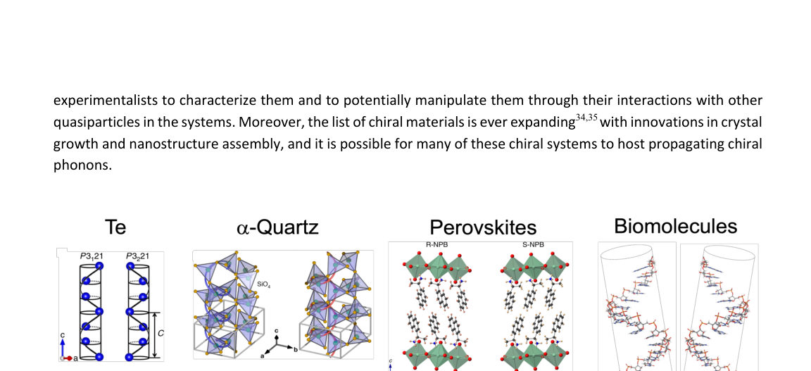 
Figure 1. Examples of left- and right-handed chiral materials hosting chiral phonons. The crystal structures going

📷 Fig 2

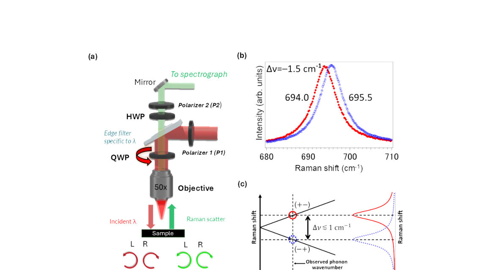 
Figure 2. Circularly polarized Raman spectroscopy of chiral phonons. (a) Typical commercial design of a Raman

📷 Fig 3

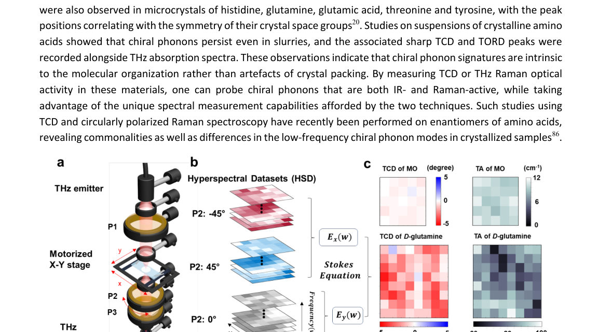 
Figure 3. Practical implementation of TCD and TORD chiroptical spectroscopies. (a) The schematics of the experimental set-up. (b) Schematics of extraction of chiroptical spectra using the Stokes equation. (c) Example of the experimental data for mineral oil (MO) and D-glutamine.

📷 Fig 4

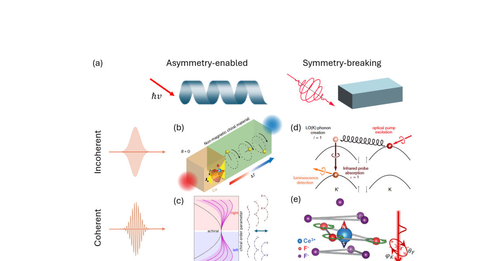 
Figure 4. Generation and detection of non-equilibrium chiral phonons in materials through ultrafast light-

**Summary.** This review provides an essential experimental guide for measuring chiral phonons, which are vibrations sensitive to circular polarization. It details advanced spectroscopic techniques like VCD, ROA, and circularly polarized Raman scattering. The work is crucial for harnessing the unique spin-lattice coupling enabled by these phonons in emerging fields like spintronics and quantum information.

**Why it may be interesting.** The focus on spin-lattice coupling and the ability to probe chirality using optical methods makes it highly relevant for understanding quantum phenomena in condensed matter systems, bridging optics and lattice dynamics.

Detailed structure

**Main problem.** The paper addresses the challenge of experimentally measuring chiral phonons, which are quantized vibrations whose atomic motion breaks improper rotation symmetries.

**Main result.** It provides a comprehensive experimental guide detailing various techniques to systematically investigate the properties of chiral phonons across diverse material systems.

**Method.** The review synthesizes multiple experimental techniques, including Optical Rotatory Dispersion (ORD), Circular Dichroism (CD), Vibrational Optical Activity (VOA) (VCD/ROA), and circularly polarized Raman spectroscopy.

**Model / system.** The study covers chiral and achiral materials, ranging from crystalline solids like $\alpha$-quartz to 2D perovskites and quantum magnets. Chirality can be inherent or induced transiently via interactions with photons or magnons.

**Key observables.** Optical rotation, differential absorption (CD), VOA spectra (VCD/ROA), and phonon frequency splitting induced by pseudoangular momentum (PAM).

**Important parameters / regimes.** The magnitude of spectroscopic signatures varies greatly across techniques; the coupling between spin and lattice degrees of freedom is key.

**Assumptions / limitations.** The primary limitation discussed is the very small signal magnitude associated with VOA measurements, requiring high sensitivity.

**Figures summary.** Figures illustrate examples of left- and right-handed chiral materials hosting chiral phonons and schematically show the measurement setup for circularly polarized Raman spectroscopy, including phonon dispersion splitting.

**Paper structure.** The paper is structured as a detailed perspective review, first covering general concepts and then systematically detailing steady-state probe techniques, followed by transient time-resolved spectroscopies.

Abstract

Chiral phonons are quantized vibrations where the atomic motion in a solid breaks improper rotation symmetries. In many cases, chiral phonons possess angular momenta and are therefore selective to circularly polarized light. Both fundamental and applied research efforts on chiral phonons have been gaining increasing attention owing to their importance in a variety of fields including spintronics, spin-selective chemical reactions, thermal transport, quantum information processing and biosensing, where the bi-directional spin-lattice coupling enabled by chiral phonons can be harnessed in new ways, and potentially lead to new functionalities. Thus far, the studies of chiral phonons across diverse materials platforms have evolved largely independently within these fields, but the experimental techniques are often interrelated. In this perspective, we present a detailed description, as well as advantages and disadvantages of the current approaches for experimentally measuring chiral phonons in chiral and achiral materials. We conclude with a discussion of new methods for measuring chiral phonons. Ultimately, this work seeks to offer an experimental guide for systematically investigating the properties of chiral phonons in various materials systems and applications.

[↑ back to top](#top)

### [Robust Spin-1 Haldane Topology under Itinerant Doping](http://arxiv.org/abs/2609.11591v1)

**Authors:** Satoshi Nishimoto  
**Type:** theory · **Category:** strongly correlated electrons · **PDF:** <https://arxiv.org/pdf/2609.11591v1>  
**Analysis basis:** full PDF text, analyzed in chunks
**Topic relevance:** `analog quantum simulation` **2/5** · `methods for driven-dissipative` **1/5**

📷 Fig 1

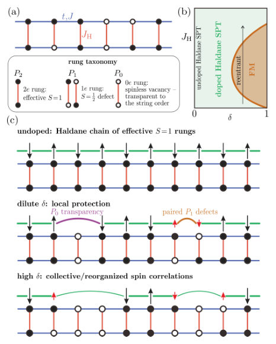 
FIG. 1. (a) Model and local rung taxonomy. Filled (open) circles denote electrons (holes). (b) Schematic evolution of the Haldane spin structure with doping. Black (red) arrows denote S = 1 rung spins (S = 1/2 defects), and green lines indicate the correlated spin backbone. (c) Schematic phase diagram in the (JH, δ) plane.

📷 Fig 2

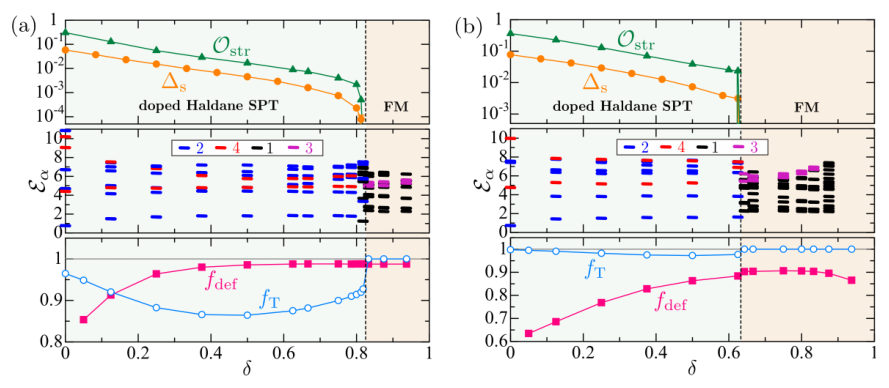 
FIG. 2. Doping evolution at J = 0.4 for (a) JH = 0.5 and (b) JH = 3.0. Top: Ostr and ∆s. Middle: lowest entanglement levels Eα at an inter-rung cut; colors denote multiplicity. Bottom: fdef and fT. Dashed lines mark δc.

📷 Fig 3

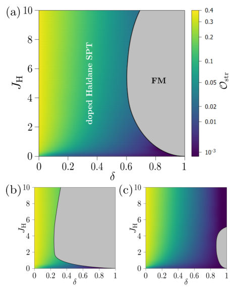 
FIG. 3. Phase diagram in the (JH, δ) plane for (a) J = 0.4, (b) J = 0.1, and (c) J = 1.0. The color scale shows the SOP Ostr in the doped Haldane SPT, while the gray regions denote the FM phase.

📷 Fig 4

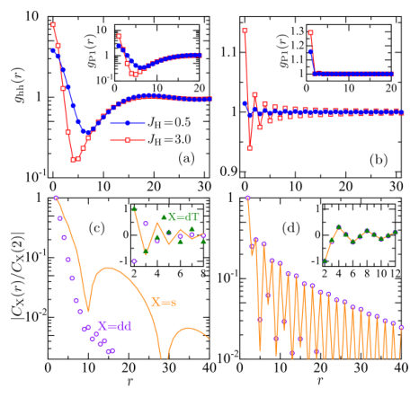 
FIG. 4. Hole and defect-resolved correlations at J = 0.4. (a,b) ghh(r) at δ = 0.05 and 0.5, respectively, for JH = 0.5 and 3.0; the insets show gP1(r). (c,d) |CX(r)|/|CX(2)| for X ∈{s, dd} at JH = 0.5 for the same respective dopings; the insets show CX(r)/|CX(2)| for X ∈{s, dd, dT}.

**Summary.** This paper theoretically investigates how the spin-1 Haldane topological phase persists when holes are doped into the system. Using DMRG and Bosonization, the authors map out the phase diagram, showing that the topological order remains robust while the system develops a metallic character. The study reveals complex doping-dependent physics, including the formation of a reentrant ferromagnetic phase at high doping.

**Why it may be interesting.** The work provides a detailed theoretical understanding of how topological order (Haldane SPT) can survive and reorganize in the presence of mobile charge carriers, which is crucial for understanding doped quantum magnets and correlated materials.

Detailed structure

**Main problem.** The study investigates the robustness and evolution of the spin-1 Haldane symmetry-protected topological (SPT) phase when the system is subjected to itinerant hole doping.

**Main result.** The doped Haldane SPT remains stable over a broad doping range, characterized by a metallic low-energy description, and its phase diagram reveals a reentrant ferromagnetic pocket at high doping.

**Method.** The research employs advanced numerical techniques, primarily Density-Matrix Renormalization Group (DMRG) calculations, supplemented by Bosonization analysis to characterize the electronic and spin correlations.

**Model / system.** The model consists of two t-J chains coupled by a ferromagnetic (FM) Hund exchange interaction, allowing for the study of charge and spin degrees of freedom under doping ($\delta$).

**Key observables.** String Order Parameter (SOP), bulk spin gap ($\Delta_s$), entanglement spectrum, and various correlation functions like hole correlations ($g_{hh}(r)$) and defect-spin correlations ($G_{dd}(r)$).

**Important parameters / regimes.** Doping ($\delta$), Hund coupling ($J_H$), and the AFM leg exchange coupling ($J$) are the key tuning parameters defining the phase diagram.

**Assumptions / limitations.** The analysis relies on extrapolating finite-size DMRG results to the thermodynamic limit and uses empirical fits to map out the boundaries of the ferromagnetic phase.

**Figures summary.** Figures illustrate the global phase diagram in the $(J_H, \delta)$ plane, showing the coexistence of the doped Haldane SPT and FM phases, alongside plots detailing the evolution of topological and correlation diagnostics across doping levels.

**Paper structure.** The paper systematically analyzes the system's behavior by first establishing the model and key diagnostics (DMRG/Bosonization). It then maps the global phase diagram, detailing how low doping involves short-range charge correlations, while high doping shows a crossover to collective spin incorporation, culminating in the characterization of the reentrant FM boundary.

Abstract

We study itinerant hole doping of the spin-$1$ Haldane symmetry-protected topological (SPT) phase in two $t$--$J$ chains coupled by ferromagnetic (FM) Hund exchange. Density-matrix renormalization group calculations show that string order, a finite spin gap, and the Haldane entanglement structure coexist over a broad doping range. Combined with entanglement-entropy scaling consistent with a single gapless charge mode, these results support a metallic doped Haldane SPT with a $C1S0$ low-energy description. At low doping, short-range charge correlations reduce the density of spin-$1/2$ defect rungs, whereas at larger doping their positions become nearly uncorrelated while their spins are collectively incorporated into the correlated spin sector. The doped Haldane SPT terminates in a fully spin-polarized FM phase, which forms a reentrant pocket at high doping in the global phase diagram. Dilute-limit analyses trace the two FM boundaries to spin--charge factorization at weak Hund coupling and to rung-triplet binding with reduced pair mobility at strong Hund coupling. Our results show how mobile carriers reorganize the Haldane spin structure while preserving its characteristic signatures.

[↑ back to top](#top)

### [A Geometric Theory of Quantum Entanglement](http://arxiv.org/abs/2609.11720v1)

**Authors:** Lorenzo Capra, Lucio de Simone, Roberto Franzosi  
**Type:** theory · **Category:** quantum information and computing · **PDF:** <https://arxiv.org/pdf/2609.11720v1>  
**Analysis basis:** full PDF text, analyzed in chunks
**Topic relevance:** `quantum measurements` **2/5**

📷 Fig 1

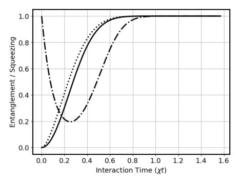 
FIG. 1. Comparison between the standard spin squeezing parameter ξ2 (dash-dotted line) [28], the geometric Entan- glement Distance (solid line) and the normalized Entropy of Entanglement measure for the bi-partition 1 spin/all other spins (dotted line) as a function of dimensionless time χt for the Kitagawa-Ueda Model (N = 10). While squeezing fails to detect entanglement after its minimum, ED mono- tonically tracks the formation of macroscopic non-Gaussian correlations.

**Summary.** This paper unifies multiple entanglement measures—including Entanglement Distance (ED) and Quantum Fisher Information (QFI)—by showing they are all rooted in the geometry of the projective Hilbert space. It demonstrates that this geometric measure quantifies the total resourcefulness for local quantum sensing, providing a rigorous link between information geometry and quantum metrology.

**Why it may be interesting.** It provides a powerful, unified geometric tool (ED) that connects abstract concepts of entanglement to concrete, measurable quantities in quantum metrology (QFI), which is highly relevant for designing quantum sensing protocols.

Detailed structure

**Main problem.** The paper aims to geometrically characterize and quantify quantum entanglement, establishing mathematical equivalences between various measures like Entanglement Distance (ED), Meyer-Wallach, and Quantum Fisher Information (QFI).

**Main result.** It proves that ED is mathematically equivalent to the sum of local linear entropies and is directly proportional to the total QFI available for local unitary estimation, bridging geometry and quantum metrology.

**Method.** The analysis heavily utilizes the Fubini-Study metric on the projective Hilbert space and relates entanglement measures to the variance of local observable generators.

**Model / system.** The work considers general finite-dimensional multipartite systems, analyzing specific dynamics using the Kitagawa-Ueda (KU) model for spin squeezing, and also examining the Haar-random state ensemble.

**Key observables.** Entanglement Distance (ED), Quantum Fisher Information (QFI), Spin Squeezing Parameter ($\xi^2$), and local linear entropies.

**Important parameters / regimes.** The number of qubits ($N$), time evolution parameter ($t$), and the local generator structure ($\mathfrak{su}(d_\mu)$).

**Assumptions / limitations.** The analysis relies on the assumption that the geometric approach is robust for extending measures to infinite-dimensional (CV) systems, though it notes a gap between theoretical saturation and experimental accessibility for random states.

**Figures summary.** Figure 1 compares the evolution of the Spin Squeezing Parameter ($\xi^2$), ED, and normalized Entropy of Entanglement for the KU Model, showing ED's distinct behavior.

**Paper structure.** The paper establishes the geometric framework using the Fubini-Study metric, derives the equivalence between ED and local entropy sums, applies this framework to the KU model to show metrological advantage, and finally analyzes the global average entanglement for Haar-random states.

Abstract

Entanglement Distance (ED) was originally proposed as a geometric measure of entanglement derived from the Fubini-Study metric on the projective Hilbert space. Independently, the Meyer-Wallach and Scott measures quantify multipartite entanglement via linear entropy. In this work, we demonstrate that these two seemingly distinct frameworks are mathematically identical for pure states of arbitrary finite dimensions. We prove that ED arises naturally as the trace of the Fubini-Study metric tensor over the local subalgebra of observables. Crucially, this geometric unification yields a direct operational interpretation: the global entanglement of a pure state is exactly proportional to the total Quantum Fisher Information (QFI) available for local unitary estimation. This bridges abstract information geometry with quantum metrology, demonstrating that ED dynamically quantifies resourcefulness for distributed quantum sensing, identifying Heisenberg-limited sensitivity in regimes where standard variance-based witnesses fail.

[↑ back to top](#top)

### [Impossible to conjugate an unknown quantum state via a unitary evolution](http://arxiv.org/abs/2609.11536v1)

**Authors:** Dafa Li  
**Type:** theory · **Category:** quantum information and computing · **PDF:** <https://arxiv.org/pdf/2609.11536v1>  
**Analysis basis:** full PDF text, analyzed in chunks
**Topic relevance:** `quantum measurements` **2/5**

📷 Fig 1

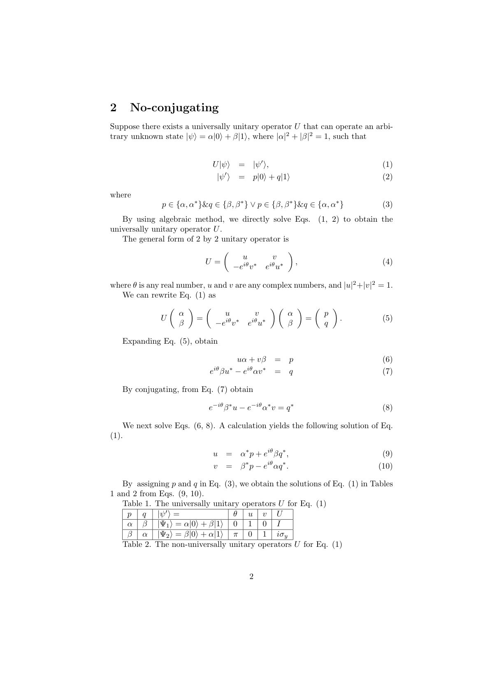 
Low-resolution page preview, page 2

📷 Fig 2

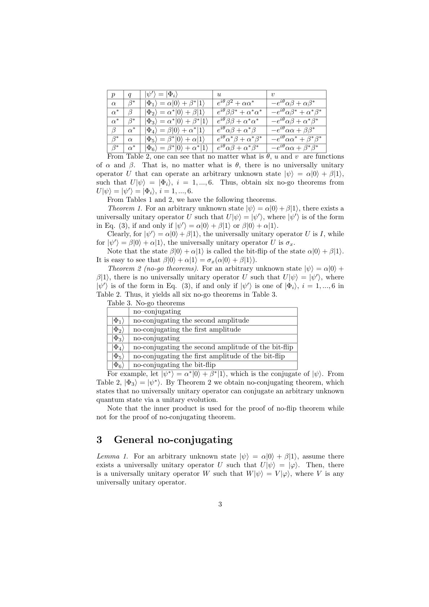 
Low-resolution page preview, page 3

📷 Fig 3

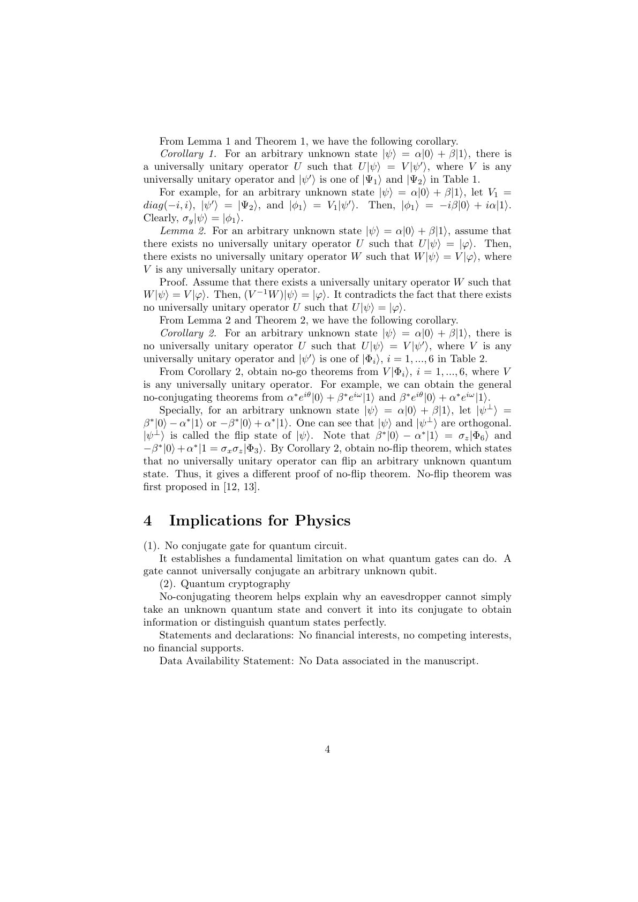 
Low-resolution page preview, page 4

📷 Fig 4

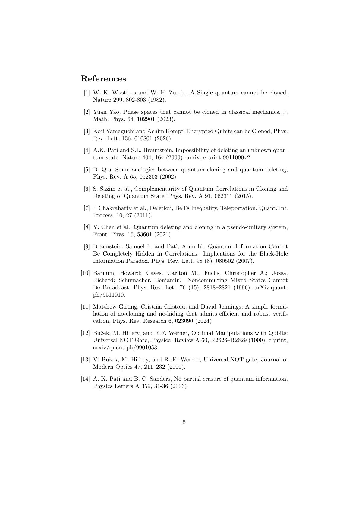 
Low-resolution page preview, page 5

**Summary.** This theoretical paper proposes and proves the 'no-conjugating theorem,' showing that an unknown quantum state cannot be transformed into its complex conjugate state using any unitary operation. The proof uses algebraic methods applied to the qubit system, extending the body of known no-go theorems in quantum information theory.

**Why it may be interesting.** This work extends the fundamental limitations of quantum operations (like no-cloning) by proving a new impossibility theorem regarding state conjugation, which has implications for quantum measurement and state reconstruction.

Detailed structure

**Main problem.** The paper aims to prove the 'no-conjugating theorem,' which asserts that it is impossible to transform an unknown arbitrary quantum state into its complex conjugate state using any universal unitary evolution.

**Main result.** The no-conjugating theorem is established, demonstrating that no universal unitary operator can map an arbitrary unknown state $|\psi
angle$ to its conjugate state $|\psi^*
angle$.

**Method.** The proof relies on algebraic manipulation of the unitary transformation equations derived from assuming the existence of such an operator, leading to contradictions.

**Model / system.** The analysis focuses on a single unknown arbitrary quantum state (a qubit) $|\psi
angle = \alpha|0
angle + eta|1
angle$ and its unitary evolution $U$.

**Key observables.** The unknown state $|\psi
angle$, its conjugate $|\psi^*
angle$, and the resulting state $|\psi'
angle$ after unitary evolution.

**Important parameters / regimes.** The coefficients $\alpha$ and $eta$ defining the unknown state, and the structure of the $2 	imes 2$ unitary matrix $U$.

**Assumptions / limitations.** The analysis assumes the existence of a universal unitary operator $U$ capable of performing the conjugation, which is then shown to be impossible.

**Figures summary.** The notes mention a Table 2 listing six specific states ($\{|\Phi_i
angle\}$) that serve as targets for the no-go theorems.

**Paper structure.** The paper builds upon established no-cloning and no-broadcasting theorems, first proving conditions under which conjugation is possible (Theorem 1), then establishing the general impossibility (Theorem 2), and finally proving the no-conjugating theorem by setting the target state to the conjugate state $|\psi^*
angle$.

Abstract

The no-cloning theorem, the no-deleting theorem, the no-hiding theorem, the no-flip theorem, and the no-broadcasting play a crucial role in quantum mechanics and quantum information. In this paper, we propose the no-conjugating theorem which states that it is impossible to conjugate an unknown arbitrary quantum state via a universal physical device or linear/unitary operation.

[↑ back to top](#top)

### [Lattice 2-group symmetries: operators, defects, and gauging](http://arxiv.org/abs/2609.10682v1)

**Authors:** Lucas Z. Brito, Salvatore D. Pace  
**Type:** theory · **Category:** strongly correlated electrons · **PDF:** <https://arxiv.org/pdf/2609.10682v1>  
**Analysis basis:** full PDF text, analyzed in chunks
**Topic relevance:** `analog quantum simulation` **2/5**

📷 Fig 1

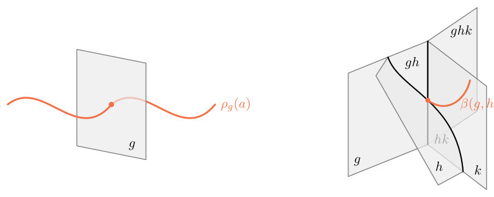 
Figure 1: Defect interpretation in 2 + 1d of the action ρ and Postnikov class [β] of the 2-group (1.3). (a) The action ρ causes an a ∈A topological defect line to become a ρg(a) topological defect line when penetrating a g ∈G topological defect surface. (b) The Postnikov class [β] determines how a topological defect line can end on a 0-dimensional junction of three G topological defect surfaces.

📷 Fig 2

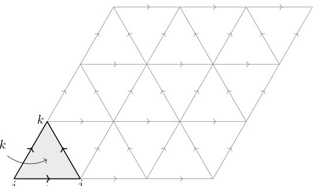 
Figure 2: We consider quantum lattice systems whose spatial lattice is a triangular lattice. There is a corresponding simplicial complex whose branching structure is displayed here. Namely, the orientation of each link always points upwards and to the right.

📷 Fig 3

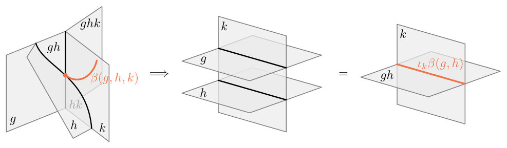 
Figure 3: The Postnikov class [β] of a 2-group symmetry modifies the 0-form symmetry operator algebra in the presence of a 0-form symmetry defect. In the k-defect sector, multiplying CG(k) ≤G symmetry operators creates a 1-form symmetry operator according to the slant product ιkβ.

📷 Fig 4

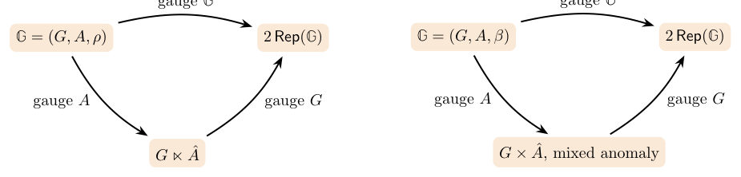 
Figure 4: Gauging web of 2-group symmetry operators in field theory. In the split 2-group case, gauging the 1-form A-symmetry leads to a dual semidirect product 0-form G ⋉ˆA-symmetry for ˆA = Hom(A, U(1)). In the central 2-group case, gauging the 1-form A-symmetry leads to a direct product 0-form G × ˆA-symmetry with mixed anomaly depending on [β]. Gauging the 0-form G symmetry in both cases leads to a dual 2 Rep G symmetry.

**Summary.** This theoretical work develops a framework to realize finite 2-group symmetries on quantum lattice models in 2+1 dimensions. By constructing symmetry operators and proposing local Hamiltonians, the authors connect abstract algebraic structures (like 2-groups) to concrete physical models exhibiting topological order. This provides powerful tools for characterizing and solving complex strongly correlated quantum systems.

**Why it may be interesting.** The deep connection between higher symmetries (2-groups) and the construction of exactly solvable, symmetry-protected topological phases is highly relevant for understanding exotic quantum matter states.

Detailed structure

**Main problem.** The paper constructs and studies lattice realizations of finite 2-group symmetries in $2+1$d quantum lattice systems.

**Main result.** It demonstrates that symmetry operators for split and central 2-groups can be constructed, leading to proposals for local symmetric Hamiltonians and identifying exactly solvable limits realizing 2-group gauge theories.

**Method.** The authors use advanced algebraic techniques involving cohomology, cocycle conditions, and the construction of symmetry operators on tensor-product Hilbert spaces.

**Model / system.** The focus is on quantum lattice models (QLMs) in $2+1$ dimensions defined on a lattice, characterized by finite-dimensional tensor-product Hilbert spaces.

**Key observables.** Symmetry operators, symmetry defects, ground-state degeneracies, and the structure of the dual fusion 2-category.

**Important parameters / regimes.** The structure of the 2-group (split vs. central), the Postnikov class $[eta]$, and the lattice geometry (e.g., triangular lattice).

**Assumptions / limitations.** The analysis is restricted to QLMs with tensor-product Hilbert spaces, which limits the realization of true topological operators.

**Figures summary.** Figures illustrate the defect interpretation of symmetry actions ($
ho$ and $[eta]$) and the branching structure of the underlying simplicial complex.

**Paper structure.** The paper systematically addresses split 2-group symmetry, then central 2-group symmetry, followed by discussions on the mathematical structure of the symmetries, and concluding with proposals for symmetric Hamiltonians and solvable limits.

Abstract

We construct and study lattice realizations of finite 2-group symmetries in ${2+1}$d quantum lattice systems with finite-dimensional tensor-product Hilbert spaces. We focus on two broad classes of 2-groups with 0-form symmetry group $G$ and 1-form symmetry group $A$: split 2-groups with trivial Postnikov class ${[β]\in\mathcal{H}^3(G,A)}$, and central 2-groups with trivial action ${ρ\colon G\to\text{Aut}(A)}$. In both cases, we construct symmetry operators on the full tensor-product Hilbert space that become 2-group symmetry operators when restricted to the topological subspace of the lattice $A$ 1-form symmetry. While the lattice split 2-group symmetry operators are onsite, the lattice central 2-group symmetry operators are not, and can only be made onsite after introducing ancillae. We extensively explore various manifestations of $ρ$ and $[β]$ for these lattice 2-group symmetry operators and demonstrate their agreement with expectations from quantum field theory. These manifestations arise in the transformation of operators carrying symmetry charge, the structure of lattice 2-group symmetry defects, and the dual fusion 2-category symmetries obtained by gauging the lattice 2-group symmetries. We further propose families of local symmetric Hamiltonians for both classes of lattice 2-group symmetries and identify exactly solvable limits lying in phases with spontaneous 2-group symmetry breaking and nontrivial symmetry-enriched topological order. In one such limit, the gauged Hamiltonians are exactly solvable lattice realizations of the corresponding 2-group gauge theories, whose ground-state degeneracies we calculate.

[↑ back to top](#top)

### [Learning structural balance of graphs from quantum spectral features](http://arxiv.org/abs/2609.11736v1)

**Authors:** Stefano Scali, Oleksandr Kyriienko  
**Type:** theory · **Category:** disordered systems and neural networks · **PDF:** <https://arxiv.org/pdf/2609.11736v1>  
**Analysis basis:** full PDF text, analyzed in chunks
**Topic relevance:** `analog quantum simulation` **2/5**

📷 Fig 1

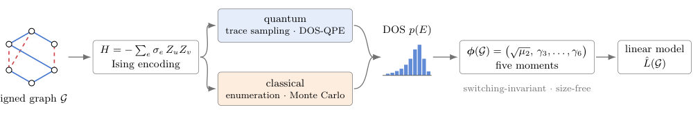 
Figure 1. The DOS feature pipeline for signed graphs. A signed graph G (positive edges solid, negative edges dashed) is encoded in its native Ising Hamiltonian, Eq. (6). The density of states of H is sampled by either arm of the pipeline: classically, by exact enumeration or Monte Carlo over uniform vertex 2-colorings (Proposition 1), or on quantum hardware, by trace sampling or by the DOS-QPE circuit of Fig. 5. Five spectral moments of the sampled density form the feature vector ϕ(G) of Eq. (3), which is switching-invariant and size-free by construction and feeds a classically trained model; we benchmark on the frustration index L(G), for which exact labels are available.

📷 Fig 2

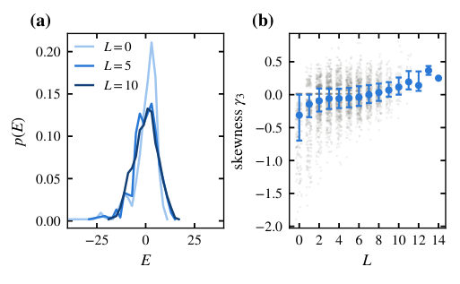 
Figure 2. (a) Exact DOS of three signed graphs with n = 10 vertices and |E| = 39 edges, with frustration index L = 0, 5, 10. Frustration drives the spectrum toward symmetry: the skewness rises from γ3 = −1.90 to −0.64 to −0.15 and the kurtosis falls from γ4 = 8.42 to 4.16 to 2.74, moving towards the Gaussian value of 3. The lower edge sits at E0 = −39, −29, −19, which is 2L−|E| in each case, as Eq. (7) requires. (b) DOS skewness γ3 against the frustration index across the n = 10 ensemble (2 × 104 graphs; gray: individual graphs, markers: median and interquartile range). The trend reflects Eq. (11), while the spread shows why a single moment is insufficient, motivating the combined features...

📷 Fig 3

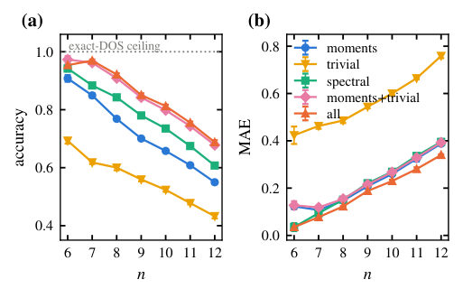 
Figure 3. Estimation quality against graph size for the feature sets of Sec. VI, on the deduplicated evaluation sets. Markers and error bars are the mean and standard deviation over five stratified 70/30 splits. (a) Multiclass accuracy of the multi- nomial logistic regression; the number of classes grows from 4 at n = 6 to 17 at n = 12. The dotted line is the exact-DOS ceiling: every group of graphs sharing a density of states also shares a single L, so a predictor with access to the full density would be exactly right, and the gap below it is the cost of com- pressing that density into five numbers. (b) Mean absolute error (MAE) of the rounded random-forest regression. Exact- class...

📷 Fig 4

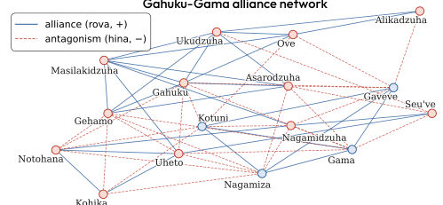 
Figure 4. The Gahuku-Gama alliance network [11] visualized as a signed graph of n = 16 tribes with 29 positive (rova, solid) and 29 negative (hina, dashed) edges corresponding to alliances and antagonistic relations, respectively. Node color marks the two alliance blocs, and the frustration index is L(G) = 7.

📷 Fig 5

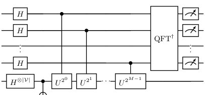 
Figure 5. The DOS-QPE circuit. The lower two registers hold |V| qubits each. A layer of Hadamards followed by a transversal cnot prepares one Bell pair per system qubit, so that discarding the purifying register, which takes no further gates and is never measured, leaves the system in ρ = 1/2|V|. Phase estimation then proceeds as usual: the M-qubit register controls the powers U 2k of U = e−iHτ with τ = 2π/(2|E|+2), and an inverse quantum Fourier transform is followed by mea- surement. Because the probe weighs every eigenstate equally, each outcome y is one flat-weight draw from the spectral den- sity, and the empirical moments of the sampled phases are the features of Eq. (3). The register...

**Summary.** This work proposes using the spectral features, specifically the standardized moments of the Density of States (DOS), of an Ising Hamiltonian derived from a signed graph to solve the NP-hard problem of structural balance. By employing a quantum spectral estimation technique (DOS-QPE), the authors demonstrate that these spectral moments can accurately predict the graph's frustration index, opening avenues for quantum machine learning on complex networks.

**Why it may be interesting.** It bridges quantum many-body physics (Hamiltonian spectra) with complex combinatorial optimization problems (graph balance), suggesting spectral methods can extract hard-to-find structural invariants.

Detailed structure

**Main problem.** The paper addresses the challenge of learning the structural balance (frustration index) of signed graphs, which is an NP-hard problem.

**Main result.** The standardized moments derived from the Density of States (DOS) of the associated Ising Hamiltonian successfully recover the frustration index for large datasets, suggesting a quantum spectral feature approach for graph analysis.

**Method.** The authors map the signed graph problem onto an Ising model and use quantum spectral feature extraction (DOS moments) as machine learning inputs. They propose DOS-QPE for efficient quantum sampling.

**Model / system.** The system is a signed graph embedded as an Ising model instance, $H = \sum J_{ij} Z_i Z_j$. The features are derived from the standardized moments of the Hamiltonian's Density of States (DOS).

**Key observables.** Standardized moments of the DOS ($\phi(G)$), the frustration index $L(G)$, and the ground-state energy $E_0$.

**Important parameters / regimes.** Graph size ($n=12$ vertices benchmarked), the number of standardized moments used (five), and the field strength (zero field vs. general dynamics).

**Assumptions / limitations.** The core assumption is that the spectral statistics (DOS) contain sufficient, invariant information to determine the graph's structural balance, and that quantum methods are necessary for general dynamics.

**Figures summary.** Figure 1 illustrates the entire pipeline: Signed Graph $
ightarrow$ Ising Hamiltonian $
ightarrow$ DOS Sampling (Quantum/Classical) $
ightarrow$ Five Moments $\phi(G) 
ightarrow$ Linear Model $
ightarrow$ Prediction of $L(G)$. Figure 2 shows how the DOS spectrum changes for graphs with different frustration levels.

**Paper structure.** The paper introduces the problem (structural balance), develops the physical encoding (Ising Hamiltonian), proposes the quantum feature extraction method (DOS-QPE), validates it against the known ground truth (zero field), and discusses its applicability to hard problems (general dynamics).

Abstract

We develop a quantum approach to spectral feature extraction from the density of states (DOS) of a problem-dependent Hamiltonian, and apply it to machine learning on signed graphs. We propose to embed a signed graph as an Ising model instance with positive and negative interactions, and use the standardized moments of the Ising DOS as features for learning. We show that these moments count signed closed walks, are switching-invariant, and are size-free by construction. As a benchmark, we target learning the frustration index, an NP-hard measure of structural balance that can be labeled exactly at moderate size. At zero field, the models can be sampled classically, allowing the quantum extraction procedure to be certified against exact ground truth. We propose DOS-QPE, a phase estimation on a purified maximally mixed probe, which samples the spectral density with orders of magnitude fewer shots than Hadamard test-based trace sampling and feeds the resulting features directly into classically trained models. On $1.4\times10^5$ labeled graphs the exact DOS determines the frustration index, and five moments recover it with a mean error of 0.4, well below one sign flip. Beyond zero field, the underlying trace-estimation problem is DQC1-complete, providing access to spectral features for which no efficient classical sampling method is known. Our work opens routes towards quantum applications in social network balance analysis, spin-glass studies, correlation clustering, and protein-interaction networks.

[↑ back to top](#top)

### [Lifted surgery: Fast processing with QLDPC codes](http://arxiv.org/abs/2609.11723v1)

**Authors:** Lucas Berent, Lawrence Z. Cohen, Armanda O. Quintavalle  
**Type:** theory · **Category:** quantum information and computing · **PDF:** <https://arxiv.org/pdf/2609.11723v1>  
**Analysis basis:** full PDF text, analyzed in chunks
**Topic relevance:** `quantum measurements` **2/5**

📷 Fig 1

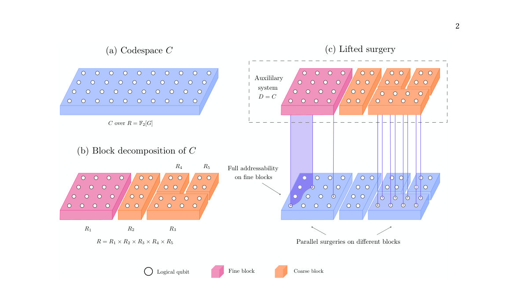 
Figure 1. Graphical representation of lifted surgery. (a) Codespace of C• over the group algebra R (blue). (b) The codespace decomposes into the same blocks as the group algebra R. (c) The top row (magenta and orange) shows the auxiliary complex, a copy of C•. Different lifted surgeries can be combined to act in parallel on different blocks. When the blocks are fields, as in the quantum radial code example, lifted surgery allows for single logical qubit addressability.

📷 Fig 2

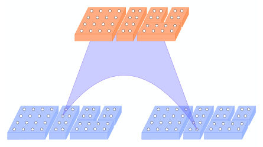 
Figure 2. Graphical representation of bridged lifted surgery. On the bottom row are two copies of the same base codespace, C and C′, over the group algebra R. On the top row is an auxiliary copy of the same codespace, D. The purple sheet connects the auxiliary code D to the two codespaces C and C′

📷 Fig 3

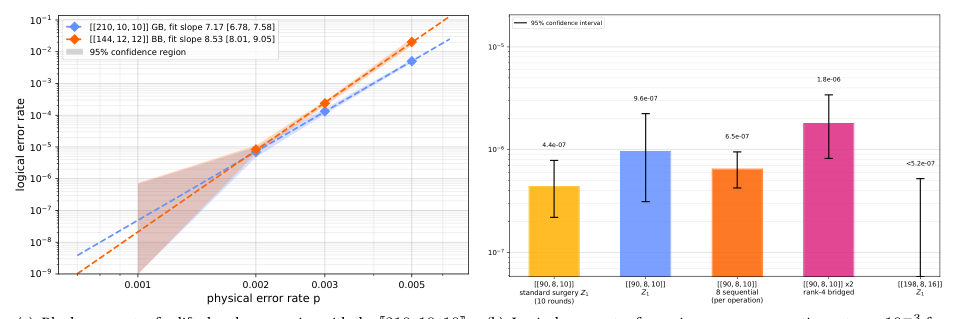 
Figure 3. Numerical decoding simulation results. (a) Logical error rates for a single round of lifted (scalar) surgery with the J210, 10, 10K GB and the Gross code. Dashed lines are maximum-likelihood fits and the shaded region corresponds to a 95% confidence region. At p = 10−3 we did not find a logical error for either of the codes in at least 5 × 106 shots. (b) Block error rates per logical operation at p = 10−3 for various numerical surgery experiments on the J90, 8, 10K and J198, 8, 16K radial codes. The first bar (yellow) shows the LER of a standard surgery experiment of Z1 on the J90, 8, 10K code with 10 rounds of syndrome extraction, all decoded at once; the second bar (blue) shows...

**Summary.** This paper presents 'lifted surgery,' a novel, algebraically derived technique to drastically reduce the time overhead associated with performing logical measurements on QLDPC quantum error-correcting codes. By leveraging block decompositions and commutative algebra, it achieves fast, parallel syndrome extraction, offering a practical path toward scalable, low-overhead fault-tolerant quantum computing.

**Why it may be interesting.** While focused on QLDPC codes, the underlying mathematical machinery involving homology, chain complexes, and algebraic characterization of measurable operators is highly relevant to theoretical studies of quantum error correction codes in general.

Detailed structure

**Main problem.** The primary challenge is overcoming the significant time overhead associated with performing logical operations in Quantum Low-Density Parity-Check (QLDPC) codes.

**Main result.** The authors introduce 'lifted surgery,' a method that achieves fast and parallel code surgery, requiring an order of magnitude fewer syndrome measurement rounds than standard techniques while maintaining low physical overhead.

**Method.** The method utilizes advanced algebraic techniques, including block decompositions and commutative algebra, to characterize and construct the lifted surgery process on Abelian group algebra codes.

**Model / system.** The work focuses on QLDPC codes, which are promising candidates for fault-tolerant quantum computation due to their high encoding rates. The analysis is heavily mathematical, involving chain complexes and homology groups.

**Key observables.** Logical performance, number of syndrome measurement rounds, and the dimension of the measured logical operator space.

**Important parameters / regimes.** Code parameters such as $[[90, 8, 10]]$ and $[[198, 8, 16]]$, and the noise model (circuit-level depolarizing noise).

**Assumptions / limitations.** The analysis relies on the algebraic structure of the underlying code algebra, particularly when the blocks are fields, simplifying the addressability criteria.

**Figures summary.** Figures illustrate the graphical representation of lifted surgery, showing the codespace decomposition and the auxiliary complex used to facilitate parallel operations.

**Paper structure.** The paper progresses from defining the problem (time overhead in code surgery) to introducing the mathematical framework (lifted surgery using algebra), providing explicit constructions (quantum radial codes), and concluding with rigorous mathematical characterizations of addressable submodules and joint measurements.

Abstract

Quantum low-density parity-check (QLDPC) codes are a leading candidate for achieving low-overhead fault-tolerant quantum computing. However, the time overhead of logical operations in QLDPC codes remains a key challenge. Code surgery, a space-efficient technique for fault-tolerant logical measurements, incurs this overhead through repeated rounds of syndrome measurement. We introduce lifted surgery, a method for fast and parallel surgery on Abelian group algebra codes that maintains the low physical overhead that makes QLDPC codes attractive. Lifted surgery preserves the symmetries of the underlying code, making searches for large instances tractable and offering a natural route towards efficient hardware implementations. We utilise block decompositions and techniques from commutative algebra to characterise lifted surgery, investigate well-behaved subfamilies, and construct explicit examples. In particular, we present quantum radial codes with parameters $[[90, 8, 10]]$ and $[[198, 8, 16 ]]$ for which surgery is fast, parallel, and addressable, allowing arbitrary sets of independent logical operators of the same Pauli type to be measured in a single round of syndrome extraction. We benchmark lifted surgery under circuit-level depolarising noise and, for the $[[ 90, 8, 10 ]]$ code, find logical performance comparable to standard code surgery while requiring ten times fewer rounds of syndrome measurement. By combining speed and parallelism, lifted surgery offers a practical route towards low-overhead fault-tolerant quantum computing.

[↑ back to top](#top)

### [Phases in a class of associative memories via hidden neurons](http://arxiv.org/abs/2609.10976v1)

**Authors:** Toshihiro Ota, Masato Taki  
**Type:** theory · **Category:** disordered systems and neural networks · **PDF:** <https://arxiv.org/pdf/2609.10976v1>  
**Analysis basis:** full PDF text, analyzed in chunks
**Topic relevance:** `Keldysh / 2PI / non-Gaussian methods` **2/5**

📷 Fig 1

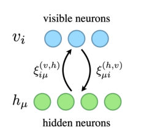 
FIG. 1: The class-H associative memories. The Nv visible neurons and the Nh hidden neurons form a bipartite network with no intralayer connections.

📷 Fig 2

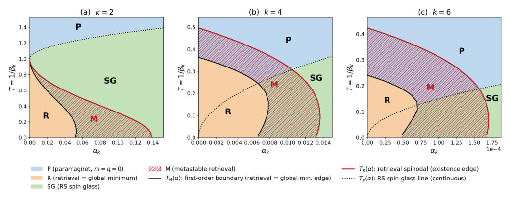 
FIG. 2: RS phase diagram of Model A in the (αk, T) plane for (a) k = 2, (b) k = 4, and (c) k = 6, where T = 1/βk is the effective temperature. In the retrieval phase (R) the retrieval states are the global minima of the free energy. In the region M they persist only as metastable states. The red solid line is the retrieval spinodal TR(αk), beyond which no retrieval solution of Eq. (23)–Eq. (25) exists. The black solid line is the first-order boundary TM(αk), on which the retrieval free energy crosses that of the m = 0 branch. The dotted line is the continuous spin-glass transition Tg(αk) of Eq. (37), separating the paramagnet (P) from the RS spin glass (SG). For k &gt; 2 the first-order...

📷 Fig 3

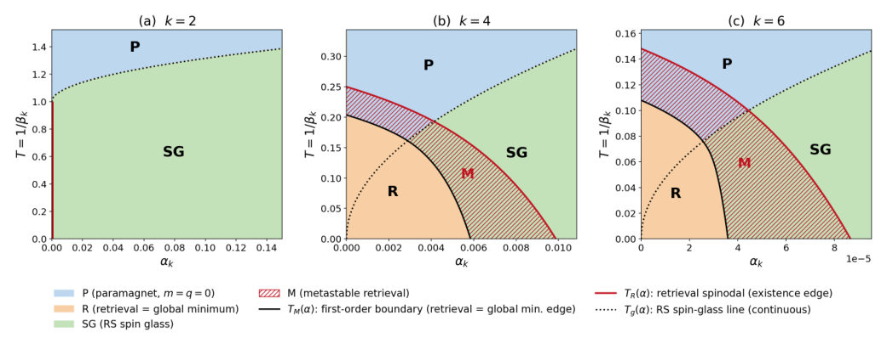 
FIG. 3: RS phase diagram of Model C in the (αk, T) plane for (a) k = 2, (b) k = 4, and (c) k = 6, in the same conventions as Fig. 2. For k = 2 retrieval survives only on the segment αk = 0, T ≤1 (red line on the vertical axis), reflecting the zero capacity of the spherical model. For k &gt; 2 the diagram has the same topology as that of Model A, with uniformly smaller retrieval regions.

📷 Fig 4

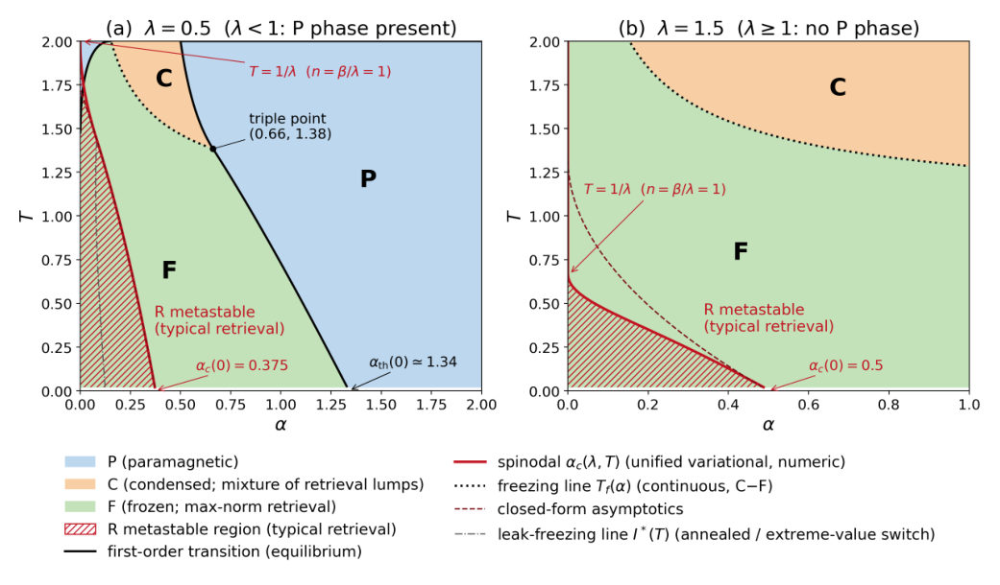 
FIG. 4: Finite-temperature phase diagram of Model B in the (α, T) plane at (a) λ = 0.5 and (b) λ = 1.5. Black solid lines are the first-order boundaries between the paramagnetic phase (P) and the condensed sector, obtained by equating the free energies Eq. (65). For λ ≥1 the paramagnetic phase is absent, and in (a) the P–F boundary meets T = 0 at αth(0) determined by 2α/λ = 1 + εmax(α), see Appendix C 1. The dotted line is the freezing line Eq. (66), the continuous transition on which the entropy of the condensed phase (C) vanishes and the measure freezes onto the maximum-norm patterns (F). It is independent of λ and hence identical in the two panels. The thick red line is the retrieval...

📷 Fig 5

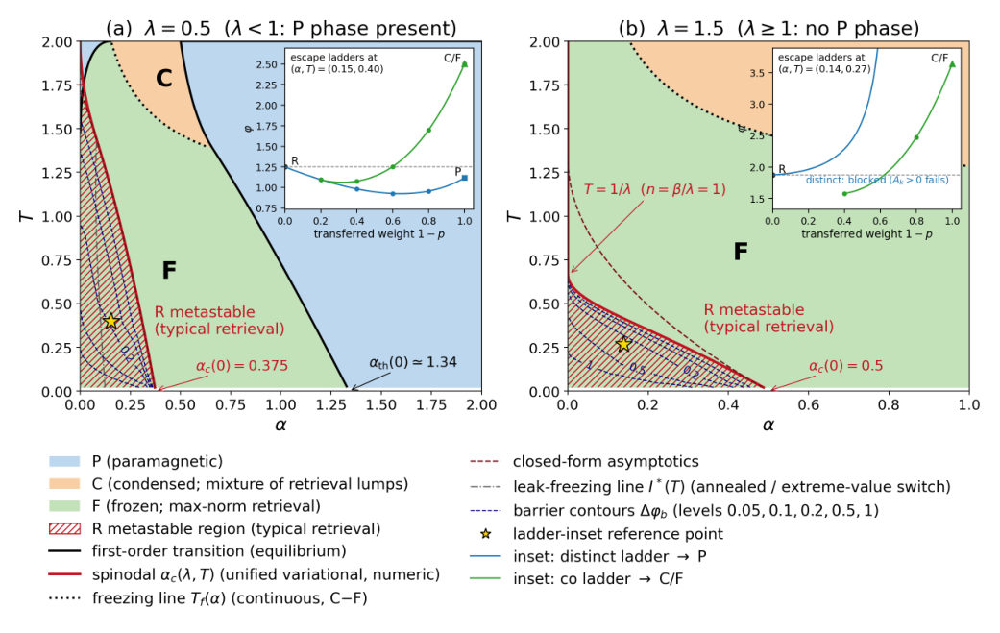 
FIG. 5: Same as Fig. 4, with the dynamical content of the real-temperature construction overlaid. The blue dashed curves are contours of the escape barrier Eq. (C67), evaluated along the lower of the two escape ladders, at the levels ∆φb = 0.05, 0.1, 0.2, 0.5, and 1. The barrier vanishes on the spinodal and grows toward small α and low temperature. The insets show the constrained rate φ along the two escape ladders at the starred reference points, (α, T) = (0.15, 0.40) in (a) and (0.14, 0.27) in (b), against the transferred attention weight 1 −p: the distinct-defection ladder (blue, annealed curve with rungs at pk = 1 −kλT) ends at the paramagnetic value, and the co-defection ladder (green)...

**Summary.** This paper develops a unified theoretical framework, the class H, to study associative memories by treating hidden neurons as the order parameter. It analyzes how retrieval dynamics change between polynomial and exponential loading regimes, revealing distinct crossover behaviors in crosstalk statistics. The work provides a deep physical understanding of how stability and storage capacity are governed by separate Lagrangian components.

**Why it may be interesting.** The rigorous application of statistical mechanics tools (replica method, random-energy models) to neural network dynamics provides deep insights into pattern storage capacity and phase transitions, which are foundational concepts in many-body physics.

Detailed structure

**Main problem.** The paper aims to unify the study of associative memory retrieval across different loading regimes (polynomial vs. exponential) by analyzing a generalized bipartite architecture.

**Main result.** The proposed class H splits retrieval into two distinct roles: the visible Lagrangian controls stability, while the hidden Lagrangian dictates the storage scale and disorder statistics.

**Method.** The analysis employs advanced statistical physics techniques, including the replica method and mapping to random-energy models, to derive phase diagrams and capacities.

**Model / system.** The system is the 'class H,' a bipartite network combining Krotov and Hopfield architectures, modeled by an energy function involving visible and hidden neuron dynamics. The hidden neurons are treated as the order parameter for memory retrieval.

**Key observables.** Retrieval overlap ($m$), Edwards–Anderson order parameter ($q$), and crosstalk noise ($r$).

**Important parameters / regimes.** Load parameter ($\alpha_k$), inverse temperature ($eta$), and the distinction between polynomial and exponential load regimes.

**Assumptions / limitations.** The analysis relies on the replica symmetric (RS) ansatz in the replica method, and the adiabatic limit ($	au_v \gg 	au_h$) is used for certain derivations.

**Figures summary.** Figure 1 illustrates the bipartite network structure. Figure 2 shows the RS phase diagram in the $(\alpha_k, T)$ plane, distinguishing retrieval, spin glass, and paramagnetic phases. Figure 5 overlays dynamical escape barriers onto equilibrium phase diagrams.

**Paper structure.** The paper systematically analyzes the model using the replica method for polynomial loads (Models A and C), then extends to exponential loads (Model B). It develops the general framework (class H) and discusses the physical interpretation of the different Lagrangian components.

Abstract

Associative memory in the Hopfield network is attractor dynamics in a disordered many-body system, and higher-order and exponential extensions turn its retrieval update into softmax attention. The polynomial and exponential regimes have been analyzed by different methods, with no common architecture in which to ask what fixes the storage scale. In this paper we study the bipartite architecture of Krotov and Hopfield, which we call the class $H$, whose model is fixed by a Lagrangian for each layer, taking the hidden neurons as the order parameter of retrieval. At polynomial load the replica method yields the replica-symmetric phase diagrams and closed-form capacities, and the crosstalk moment is common to Ising and spherical visible neurons, so their differences come from the visible entropy. With a softmax hidden layer the load is exponential, and a copy representation maps the thermodynamics onto random-energy-model counting, with paramagnetic, condensed, and frozen phases. Heating destabilizes retrieval by quantized reassignments of attention, and typical Gaussian patterns remain metastable at every load. The regimes differ in their crosstalk statistics, central-limit at polynomial load and large-deviation at exponential load, and the class $H$ splits retrieval into two roles, the visible Lagrangian fixing stability and the hidden one the storage scale, two axes that may also guide the design of new Lagrangians.

[↑ back to top](#top)

### [Interacting Tomonaga-Lüttinger liquid with impurity for interaction constant $K = 1/2$: Thermopower investigation, entropy variation and heat capacity densities associated with thermoelectric particle transport](http://arxiv.org/abs/2609.11810v1)

**Authors:** Abdellah Touati, Redoune Zamoum, Farhi Houssam Eddine  
**Type:** theory · **Category:** strongly correlated electrons · **PDF:** <https://arxiv.org/pdf/2609.11810v1>  
**Analysis basis:** full PDF text, analyzed in chunks
**Topic relevance:** `Keldysh / 2PI / non-Gaussian methods` **1/5** · `analog quantum simulation` **1/5** · `correlated / nonlocal dissipation` **1/5** · `non-equilibrium universality` **1/5**

📷 Fig 1

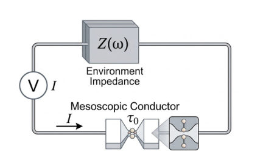 
FIG. 1. Schematic representation of a one-channel conductor with bare transmission τ0 embedded in an electric circuit.

📷 Fig 2

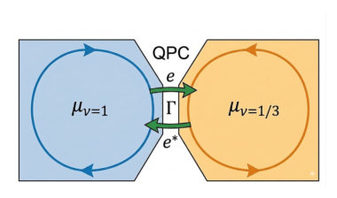 
FIG. 2. Schematic representation of a hybrid normal metal ν = 1 linked with a ν = 1/3 fractional quantum Hall edge states.

📷 Fig 3

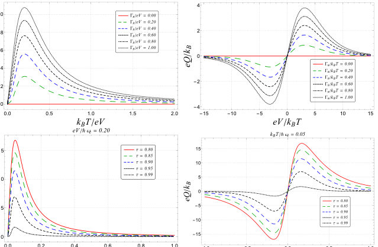 
FIG. 3. Variation of thermopower: In first row, versus temperature kBT/eV in left panel and applied voltage eV/kBT in right panel and for different backscattering amplitude ΓB/eV , and ΓB/kBT for QPC system. In second row, versus temperature kBT/ℏωc in left panel and applied voltage eV/ℏωc in right panel and for different effective transmission τ, for OCC system.

📷 Fig 4

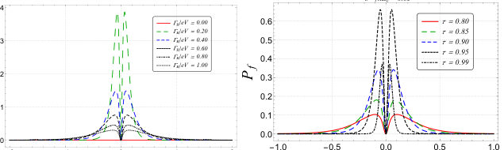 
FIG. 4. Power factor: In left pannel, versus bias voltage eV/kBT for different backscattering amplitude ΓB/kBT for QPC system. In right pannel,versus bias voltage eV/ℏωc for different effective transmission τ, for OCC system.

📷 Fig 5

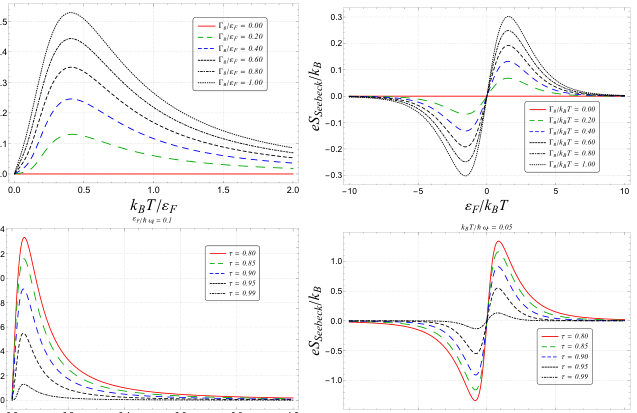 
FIG. 5. Seebeck coefficient: In first row, versus temperature kBT/εF in left panel and Fermi energy εF /kBT in right panel and for different backscattering amplitude ΓB/εF , and ΓB/kBT for QPC system. In second row, versus temperature kBT/ℏωc in left panel and Fermi energy εF /ℏωc in right panel and for different effective transmission τ, for OCC system.

**Summary.** This theoretical work analyzes the thermoelectric and thermodynamic properties of an interacting Tomonaga-Lüttinger liquid with an impurity. Using advanced field-theoretic methods, the authors derive relationships showing that the thermopower, entropy variation, and heat capacity all exhibit characteristic Mott-like behavior at low temperatures. The findings unify concepts of quantum transport and mesoscopic thermodynamics in 1D correlated systems.

**Why it may be interesting.** The explicit connection derived between non-equilibrium transport (thermopower) and equilibrium thermodynamics (heat capacity/entropy) in a strongly correlated 1D system provides a powerful tool for understanding energy dissipation in quantum conductors.

Detailed structure

**Main problem.** The paper investigates the thermoelectric and thermodynamic properties associated with particle transport in an interacting Tomonaga-Lüttinger liquid (TLL) containing an impurity.

**Main result.** The study establishes a close link between thermoelectric transport (thermopower) and thermodynamic quantities (entropy variation and heat capacity), showing both exhibit Mott-like behavior at low temperatures.

**Method.** The analysis employs bosonization and refermionization techniques to derive exact expressions for transport coefficients in both linear and nonlinear regimes.

**Model / system.** The primary model is an interacting TLL with an impurity, specifically analyzed for the interaction constant K=1/2. Applications include a quantum point contact between an FQH edge state and a normal metal, and a one-channel conductor coupled to an Ohmic environment.

**Key observables.** Thermopower (Q), Seebeck coefficient, Entropy variation (ΔS), and Heat capacity density (C).

**Important parameters / regimes.** Interaction constant K=1/2, low-temperature limit, and the energy dependence of the transmission coefficient.

**Assumptions / limitations.** The analysis utilizes the Sommerfeld approximation for low temperatures and relies on mapping the system to a solvable TLL model.

**Figures summary.** Figures illustrate the temperature and bias voltage dependence of the thermopower, and show the variation of the heat capacity density (C) versus temperature and Fermi energy for both QPC and OCC systems.

**Paper structure.** The paper systematically covers the theoretical framework, derives transport coefficients using Landauer formalism, analyzes the temperature and bias dependence of Q, ΔS, and C, and concludes by applying the results to specific quantum point contact and conductor models.

Abstract

We investigate thermoelectric and thermodynamic properties of a Tomonaga-Luttinger liquid with interaction parameter $K=1/2$ in the presence of a localized impurity. Using bosonization and refermionization, we derive an exact expression for the thermopower in the nonlinear regime and obtain the corresponding Seebeck coefficient in linear response. At low temperature, the Seebeck coefficient follows a Mott-like relation governed by the energy dependence of the transmission coefficient and is found to be closely related to the entropy per particle. This connection allows us to derive using Kelvin formula the thermopower contribution to the entropy density variation and the charge-carriers contribution to the heat capacity density. Both quantities exhibit Mott-like behavior in the low-temperature regime. We apply our results to a fractional quantum Hall quantum point contact and to a one-channel quantum conductor coupled to an Ohmic environment. Our results demonstrate the close connection between thermoelectric transport and thermodynamic properties in interacting one-dimensional quantum systems.

[↑ back to top](#top)

### [Information-Theoretic Characterization of Macroscopic Chaos Emerging from the Chemical Master Equation](http://arxiv.org/abs/2609.11340v1)

**Authors:** Kenshin Matsumoto, Shin-ichi Sasa  
**Type:** theory · **Category:** statistical mechanics · **PDF:** <https://arxiv.org/pdf/2609.11340v1>  
**Analysis basis:** full PDF text, analyzed in chunks
**Topic relevance:** `Keldysh / 2PI / non-Gaussian methods` **1/5** · `driven-dissipative phase transition` **1/5** · `non-equilibrium universality` **1/5**

📷 Fig 1

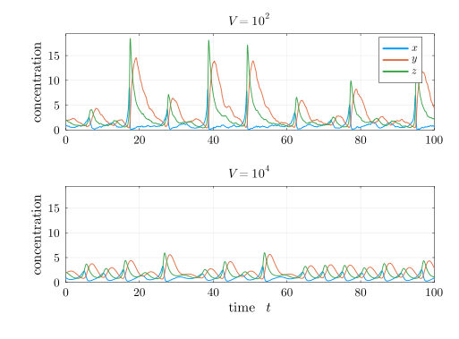 
FIG. 1. Representative concentration time series of the modified CS14 model generated using the tau-leap method. The concentrations (x(t), y(t), z(t)) are shown for V = 102

📷 Fig 2

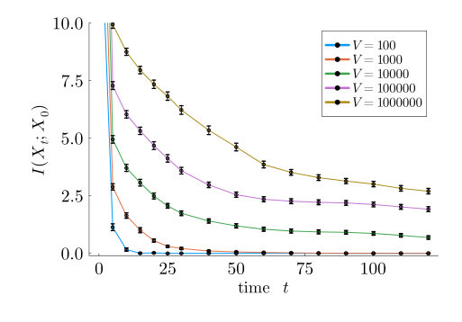 
FIG. 2. Time evolution of I(X(V ) t ; X(V ) 0 ) for the modi- fied CS14 model at V = 10j, j = 2, . . . , 6. Symbols show k-nearest-neighbor estimates with k = 10, and error bars in- dicate standard errors. The number of initial concentrations is Nini = 50, and the number of sample trajectories generated from each initial concentration is Nsample = 106.

📷 Fig 3

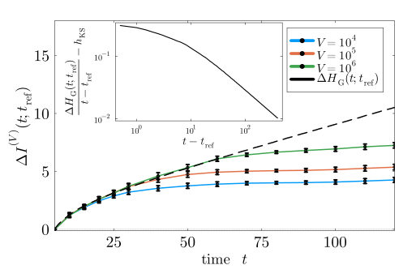 
FIG. 3. Relative information loss ∆I(V )(t; tref) from tref = 5 for V = 104, 105, and 106. Symbols show kNN estimates ob- tained using 106 samples for each system size with k = 10. The error bars indicate standard errors, and the colored lines connect the symbols. The black dashed curve shows the Gaus- sian entropy increment in Eq. (17), obtained by integrating the covariance equation (E10). The inset shows the residual ∆H(V ) G (t; tref)/(t −tref) −hKS on logarithmic axes.

📷 Fig 4

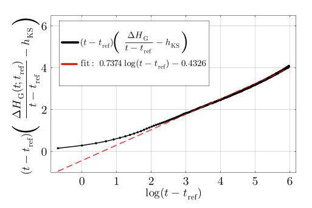 
FIG. 4. Finite-time correction to the rate of Gaussian in- formation loss for the modified CS14 model. The black curve shows (t −tref)[∆H(V ) G (t; tref)/(t −tref) −hKS] as a function of ln(t −tref). The red dashed line shows a linear fit. The ap- proximately linear dependence is consistent with a correction proportional to ln(t −tref)/(t −tref).

📷 Fig 5

 
Figure 4 shows the finite-time approach of the Gaus- sian entropy-growth rate to the KS entropy. The ap- proximately linear dependence of the transformed resid- ual on ln(t −tref) indicates a correction proportional to ln(t −tref)/(t −tref). To determine its origin, we exam- ine the finite-time behavior implied by Eq. (E20). The modified CS14 model has one zero Lyapunov exponent. For its neutral direction, we assume that the correspond- ing diagonal component of Rt exhibits power-law growth, r0(t) ∼tα0, with α0 &gt; 0. These assumptions give the fol- lowing asymptotic forms:

**Summary.** This paper develops a theoretical framework to quantify chaos in chemical reaction systems by analyzing information loss. It proves that the rate at which mutual information decays in the stochastic system converges to the Kolmogorov-Sinai entropy of the deterministic limit. This establishes a rigorous connection between information theory and the quantification of deterministic chaos in open, fluctuating physical systems.

**Why it may be interesting.** This work provides a powerful, information-theoretic bridge between the microscopic stochastic dynamics (CME) and the macroscopic deterministic chaos (KS entropy), which is highly relevant for understanding open quantum systems where noise and dissipation are key.

Detailed structure

**Main problem.** The paper theoretically investigates whether an information-theoretic measure derived from the stochastic Chemical Master Equation (CME) converges to the Kolmogorov-Sinai (KS) entropy in the macroscopic limit.

**Main result.** The rate of decrease of the two-time mutual information, $-rac{d}{dt}I(X(V)_t; X(V)_0)$, is shown to converge to the KS entropy ($h_{KS}$) in the large system-size limit ($V 	o \infty$).

**Method.** The analysis involves relating the time evolution of mutual information to the conditional entropy, utilizing Gaussian approximations, and connecting the long-time growth rate to the sum of positive Lyapunov exponents.

**Model / system.** The study uses open chemical reaction networks, specifically demonstrating the results with a modified CS14 three-species system. The dynamics are governed by the Chemical Master Equation (CME) in the stochastic regime and deterministic rate equations in the macroscopic limit.

**Key observables.** Mutual Information ($I$), Conditional Entropy ($H(\mathbf{X}(V)_t | \mathbf{X}(V)_0)$), Gaussian Entropy Increment ($\Delta H_G(V)$), and the Kolmogorov-Sinai entropy ($h_{KS}$).

**Important parameters / regimes.** System size ($V$), time ($t$), and the Lyapunov exponents ($\lambda_i$) derived from the deterministic rate equations.

**Assumptions / limitations.** The analysis relies on the Gaussian approximation for the conditional distribution at large $V$ and assumes the convergence of the information loss rate to the KS entropy in the macroscopic limit.

**Figures summary.** Figure 1 shows stochastic concentration time series approaching the deterministic limit. Figure 2 and Figure 4 illustrate the time evolution of the mutual information and the Gaussian entropy-growth rate, respectively, showing the convergence to $h_{KS}$ with finite-time corrections.

**Paper structure.** The paper establishes the theoretical link between information loss and KS entropy, derives the necessary mathematical tools using mutual information and conditional entropy, and then applies these tools to the CME in the large-system-size limit to confirm the convergence.

Abstract

Open chemical reaction networks exhibit stochastic concentration dynamics at finite system sizes, whereas their macroscopic limit is governed by deterministic rate equations that can display chaos. In this Letter, we show theoretically that a rate of information loss constructed from two-time mutual information recovers the Kolmogorov-Sinai entropy in the deterministic limit. We verify this result through numerical simulations of a Markov jump process for a three-species system involving seven reactions.

[↑ back to top](#top)

### [Taking Advantage of Noise in Distributed Random Quantum Circuits](http://arxiv.org/abs/2609.11898v1)

**Authors:** J. Montes, F. Borondo, Gabriel G. Carlo  
**Type:** theory · **Category:** quantum information and computing · **PDF:** <https://arxiv.org/pdf/2609.11898v1>  
**Analysis basis:** full PDF text, analyzed in chunks
**Topic relevance:** `correlated / nonlocal dissipation` **1/5** · `driven-dissipative phase transition` **1/5** · `methods for driven-dissipative` **1/5**

📷 Fig 1

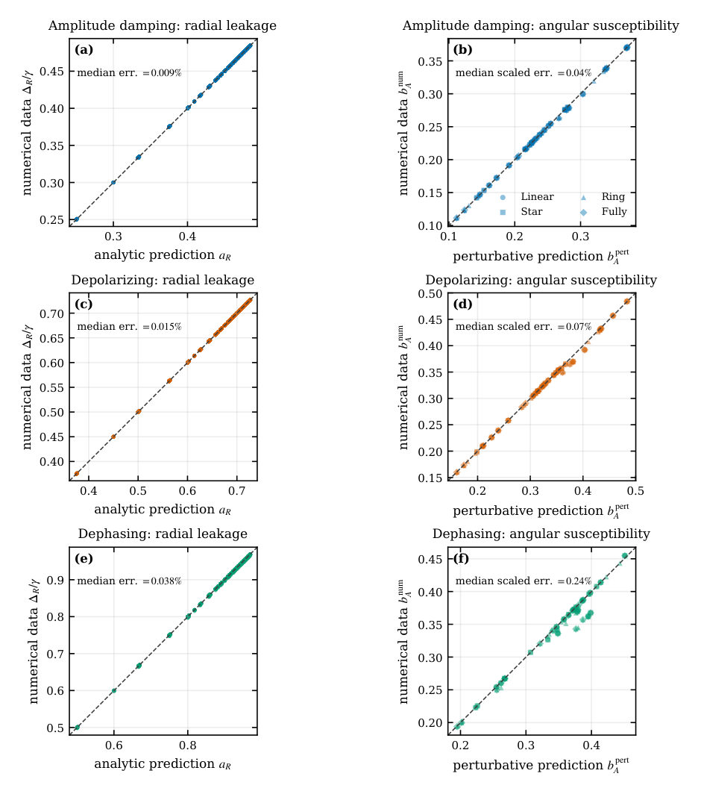 
Figure 1. Validation of the analytical predictions in the weak-noise regime. The left column tests the universal radial law, Eq. (51), by comparing the numerical coefficient ∆R/γ with the analytical prediction aR at γ = 10−4 for the available topology, partition, c, and k grid. The right column tests the branch-resolved angular susceptibility by comparing bnum A = [∆A(10−4) −∆A(0)]/10−4 with the perturbative prediction bpert A obtained from the full derivative M ′ ch(0) on a sample of 324 points. Panels (a,c,e) correspond to the radial test for AD, DEP, and DPH, respectively; panels (b,d,f) show the corresponding angular-susceptibility test. Dashed lines denote perfect agreement.

📷 Fig 2

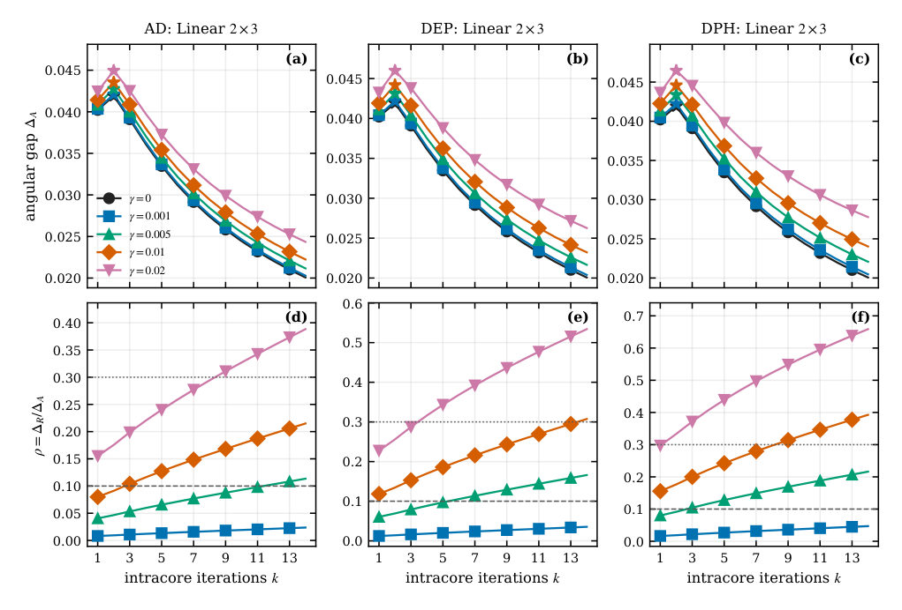 
Figure 2. Representative angular gap curves as a function of the number of intra-core iterations for a linear 2 × 3 architecture. For each k the gap is optimized over the grid of c. The upper row shows the branch-resolved angular gap ∆A for the three channels. The lower row shows the dissipative ratio ρ = ∆R/∆A for the same configurations. Horizontal lines mark ρ = 0.1 and ρ = 0.3.

📷 Fig 3

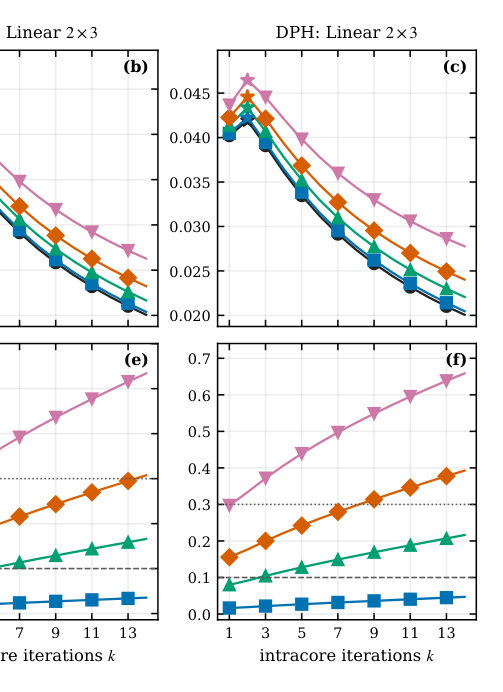 
Figure 4 shows that noise also renormalizes the opti- mal architecture parameters. As γ increases to 0.020, the conditional optimum k∗(c) generally shifts toward more intra-core iterations. The shift is topology and partition dependent. For AD, the linear/star 3×2 architectures in- crease the average ⟨k∗⟩c by approximately 1.36, whereas the 2 × 2 architectures change by only about 0.27. In terms of Eq. (2), this corresponds to a reduction of the average communication ratio: as radial cost grows, the

📷 Fig 4

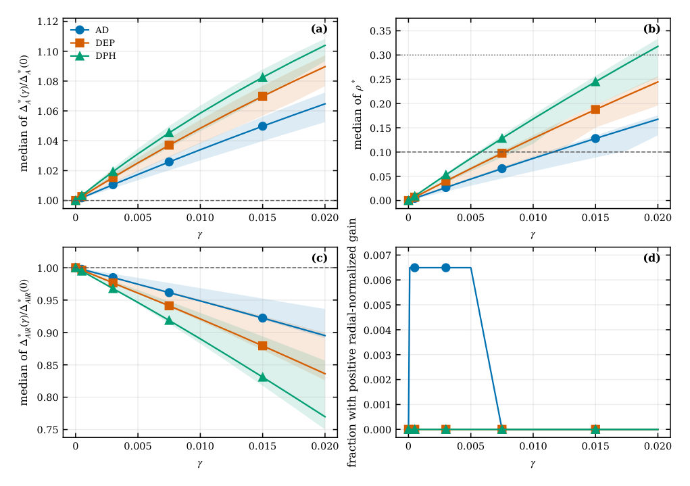 
Figure 3. Statistical summary over the 36 refined tensors. (a) Median and interquartile range of the optimized angular improvement ∆∗ A(γ)/∆∗ A(0). (b) Median dissipative ratio ρ∗at the angular optimum. (c) Radial-normalized angular gap ∆∗ A|R(γ)/∆∗ A|R(0). (d) Fraction of (c, k) grid points with positive radial-normalized improvement. The superscript ∗denotes optimization over the scanned (c, k) grid, except for ρ∗, which is evaluated at the angular-gap optimum.

📷 Fig 5

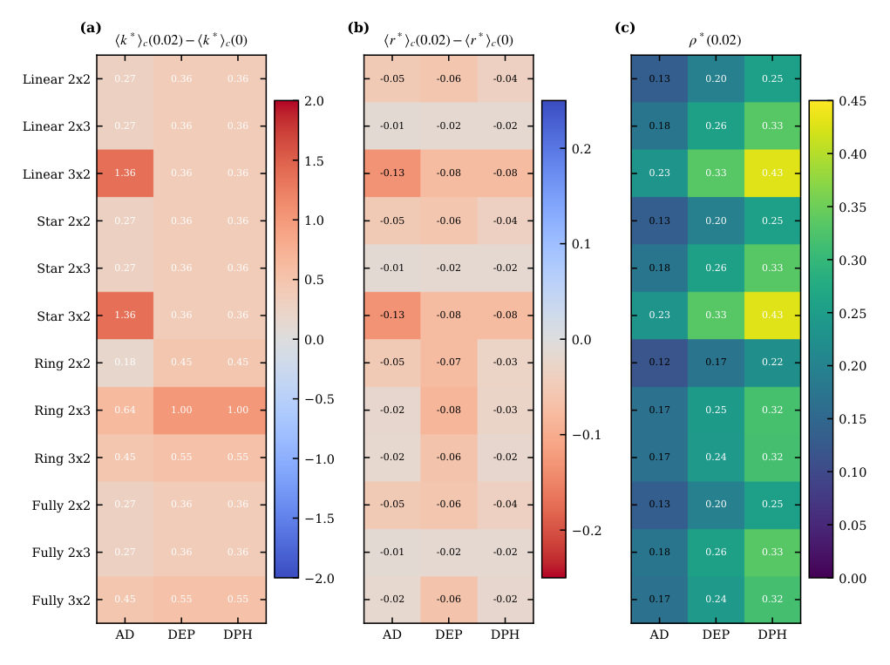 
Figure 4. Change in the optimal configuration between γ = 0 and γ = 0.020. For each architecture and channel, the local depth k is optimized for each value of c and then averaged over c. (a) Shift of the mean optimal number of intra-core iterations. (b) Change in the inter-core communication ratio r = EG/(Ck). (c) Dissipative ratio at the global angular optimum for γ = 0.020.

**Summary.** This paper develops a theoretical framework to determine if noise can enhance quantum computation in distributed circuits. By analyzing the second-moment dynamics, the authors separate the noise effects into dissipative (radial) and mixing (angular) components. They conclude that only amplitude damping provides a genuine, measurable advantage for mixing, while other noise types are dominated by simple information loss.

**Why it may be interesting.** It provides a rigorous, quantitative framework for diagnosing the utility of noise in quantum hardware, which is crucial for designing fault-tolerant or noise-resilient quantum computation protocols.

Detailed structure

**Main problem.** The paper investigates the fundamental question of whether adding noise to a random quantum circuit provides genuine computational advantage (useful randomization) or merely causes information loss (dissipation).

**Main result.** The analysis shows that useful noise-assisted randomization is highly conditional, identifying amplitude damping (AD) as the only locally favorable noise channel for angular mixing, while distinguishing this genuine effect from simple dissipation.

**Method.** The authors employ a reduced second-moment transfer-matrix theory, separating the noisy dynamics into a dissipative radial branch and a mixing angular branch to analyze the decay rates.

**Model / system.** The study models distributed random quantum circuits, relevant for modular quantum processors, subjected to local noise channels: amplitude damping (AD), depolarizing (DEP), and dephasing (DPH).

**Key observables.** Second moments of Pauli operators, the radial leakage coefficient, and the ratio ($
ho$) comparing radial decay to angular mixing rates.

**Important parameters / regimes.** Weak-noise regime, noise strength ($\gamma$), and the specific noise channel (AD, DEP, DPH).

**Assumptions / limitations.** The analysis assumes vanishing cross-correlations and transverse symmetry for the local mixing blocks, and it relies on separating the noisy spectrum into distinct radial and angular modes.

**Figures summary.** Figures illustrate the comparison of raw vs. normalized angular gaps ($\Delta_A$ vs. $
ho$) across different noise types, showing that the radial-normalized improvement ($\Delta^*_A|R$) is the key diagnostic for genuine noise assistance.

**Paper structure.** The paper develops the theoretical framework by analyzing the second-moment evolution, derives a weak-noise criterion based on noise channel properties, and then applies this to multicore architectures to distinguish useful randomization from dissipation.

Abstract

Adding noise can make a random quantum circuit look faster without making its unitary dynamics more random. This distinction is especially relevant in modular processors, where local gates randomize each core and scarce inter-core communication must spread that randomness across the full device. In this paper, we study this problem with a reduced second-moment transfer-matrix theory for Pauli second moments in distributed random circuits affected by the amplitude-damping, depolarizing, and dephasing noise channels. The key step is to resolve the noisy spectrum into two branches: a radial branch, describing dissipative loss of non-identity Pauli weight, and an angular branch, describing Haar-like mixing within the surviving nontrivial sector. This separation gives a simple weak-noise criterion: noise is useful for angular randomization only when it suppresses the longitudinal Bloch component more strongly than the transverse plane. Among the three channels considered, this selects amplitude damping as the only locally favorable case, while depolarizing noise is neutral and dephasing is dominated by radial loss. For multicore architectures, we derive a universal first-order law for radial leakage and track the angular branch numerically across different channels, topologies, and core partitions. The results reveal narrow windows of genuine noise-assisted Haar mixing, most clearly for amplitude damping, but rule out a generic speed-up by noise. The framework therefore distinguishes useful noisy randomization from mere dissipation.

[↑ back to top](#top)

### [Detecting one-dimensional bosonic SPT phases via twisted entropic order parameter](http://arxiv.org/abs/2609.11089v1)

**Authors:** Kosei Fujiki, Tsubasa Oishi, Soichiro Shimamori  
**Type:** theory · **Category:** other · **PDF:** <https://arxiv.org/pdf/2609.11089v1>  
**Analysis basis:** full PDF text, analyzed in chunks
**Topic relevance:** `analog quantum simulation` **1/5** · `quantum measurements` **1/5**

📷 Fig 1

 
Figure 1: Schematic illustration of a symmetry-defect endpoint charge in one-dimensional bosonic SPT fixed points. When a half-infinite g-symmetry operator bUB g acts on an SPT ground state, its bulk action can be pulled through the state, leaving an endpoint operator V † g localized near the right boundary of region A. At a fixed-point representative, this reduction is exact, while for a generic state in the same phase, the endpoint operator is dressed quasi-locally. Under the readout symmetry bUA k (k ∈CH(g)), its endpoint operator transforms as (2.15).

📷 Fig 2

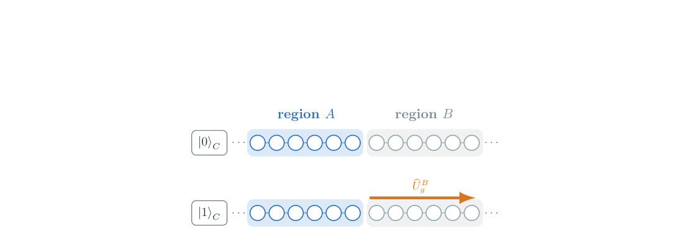 
Figure 2: Schematic construction of the state |Ξg⟩CAB. The ancilla state |0⟩C labels the untwisted branch, while |1⟩C labels the branch with the one-ended g-symmetry operator bUB g acting on region B.

📷 Fig 3

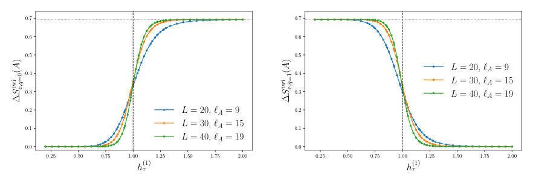 
Figure 3: The twisted entropic order parameter for N = 2, with (L, ℓA) = (20, 9), (30, 15), (40, 19), computed from the ground state of (2.77) obtained by two-site DMRG. The transition between the trivial and SPT phases occurs at h(1) τ = 1.

📷 Fig 4

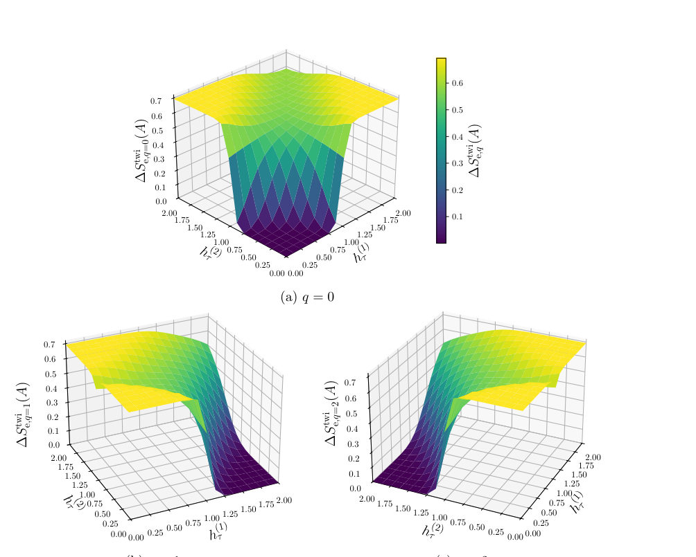 
Figure 4: The twisted entropic order parameters for q = 0, 1, 2 and N = 3, with L = 30 and ℓA = 15, computed as in figure 3. Each ∆Stwi e,q vanishes in the SPTq phase.

**Summary.** The paper introduces the twisted entropic order parameter, a refined entanglement diagnostic, to overcome the limitations of standard entanglement asymmetry in characterizing Symmetry-Protected Topological (SPT) phases. By incorporating an ancilla degree of freedom, this parameter successfully extracts topological information—the endpoint charge—that is otherwise invisible, allowing for the precise classification of 1D bosonic SPT phases.

**Why it may be interesting.** This work provides a powerful, entanglement-based diagnostic tool to probe subtle topological order in condensed matter systems, extending beyond simple symmetry breaking patterns.

Detailed structure

**Main problem.** Ordinary entanglement asymmetry fails to distinguish between different Symmetry-Protected Topological (SPT) phases that share the same symmetry-breaking pattern. The goal is to refine this diagnostic to detect the residual SPT data protected by the unbroken subgroup.

**Main result.** The twisted entropic order parameter successfully diagnoses SPT phases by probing the endpoint charge, which is invisible to standard entanglement asymmetry measures.

**Method.** The authors introduce a twisted entropic order parameter by enlarging the system with an ancilla degree of freedom to coherently record the untwisted and twisted states associated with a topological defect.

**Model / system.** The focus is on one-dimensional bosonic gapped phases exhibiting symmetry breaking $G 	o H$. The method is applied to lattice models, such as the clock-broken $Z_N$ cluster ladder model.

**Key observables.** The twisted entropic order parameter ($\Delta S_{	ext{twi}, g, \lambda}(A)$) and the associated endpoint charge $\epsilon_{\omega}^g(k)$.

**Important parameters / regimes.** The residual $	ext{H-SPT}$ class $[\omega] \in H^2(H, U(1))$ and the symmetry group structure ($G, H$).

**Assumptions / limitations.** The method is most rigorously defined at a zero-correlation-length fixed point; the detection capability might fail for SPT phases with nontrivial Bogomolov multipliers.

**Figures summary.** Figures schematically illustrate the concept of a symmetry-defect endpoint charge and the construction of the enlarged state $|\Xi_g
angle_{CAB}$ used for the diagnostic.

**Paper structure.** The paper first establishes the failure of standard diagnostics, then introduces the twisted entropic order parameter using an ancilla degree of freedom to probe the endpoint charge. It provides concrete examples in 1D bosonic systems and generalizes the framework to detect residual SPT information.

Abstract

Entanglement asymmetry, introduced by F. Ares, S. Murciano and P. Calabrese, provides a density-matrix diagnostic of symmetry breaking and successfully captures the Landau data associated with a broken symmetry pattern. However, it is by now well established that gapped quantum many-body systems can exhibit phases which are not characterized solely by Landau symmetry breaking. A fundamental example is a symmetry-protected topological (SPT) phase, and the ordinary definition of entanglement asymmetry is insensitive to this topological information. In this work we introduce a refined quantity, which we call the twisted entropic order parameter, designed to detect SPT phases from reduced density matrices, particularly focusing on one-dimensional bosonic systems. The key ingredient in our construction is an ancilla degrees of freedom that coherently records the untwisted state and the twisted state associated to a one-ended topological defect of unbroken symmetry, so that the enlarged density matrix retains the charge carried by the defect endpoint. We demonstrate our proposal in concrete lattice models and further generalize it beyond ordinary group symmetries, establishing its ability to diagnose SPT phases. This provides a first step toward a unified entanglement-asymmetry framework for diagnosing quantum phases of matter.

[↑ back to top](#top)

### [Effective Ionic Valence and Local Magnetic Moment in Kagome Superconductors](http://arxiv.org/abs/2609.11927v1)

**Authors:** Ruoshi Jiang, Zi-Jian Lang, Yuzki Oey, Andrea Capa Salinas, Stephen D. Wilson, Yongwei Li, Ilya Shipulin, Yiwen Zhang, Deng Hu, Zhiwei Wang, Hans-Henning Klauss, Zurab Guguchia, Vadim Grinenko, Wei Ku  
**Type:** both · **Category:** strongly correlated electrons · **PDF:** <https://arxiv.org/pdf/2609.11927v1>  
**Analysis basis:** full PDF text, analyzed in chunks
**Topic relevance:** `analog quantum simulation` **1/5** · `quantum measurements` **1/5**

📷 Fig 1

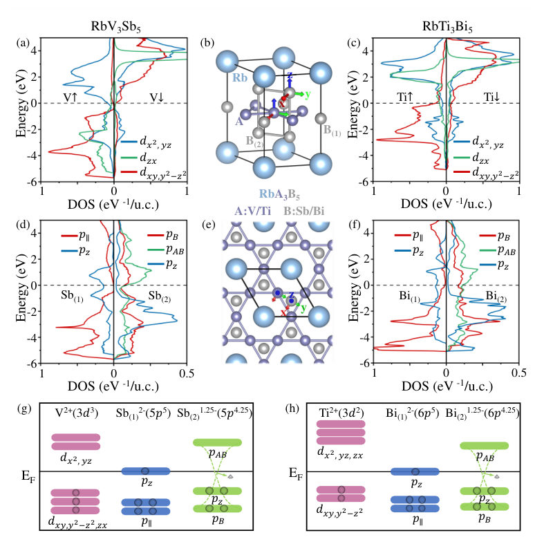 
FIG. 1. Hartree-scale analysis of ionic valence and magnetic moment in kagome metals. Local orbital-specific density of states (DOS) in noncollinear Curie-paramagnetic phase of RbV3Sb5 for (a) spin majority V↑and minority V↓channels of V indicate a V2+ ion with an effective spin- 3

📷 Fig 2

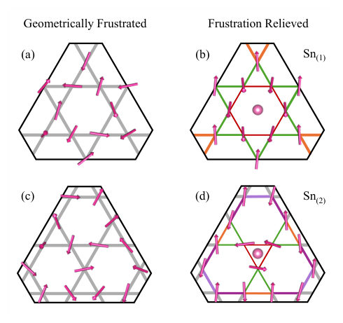 
FIG. 2. Sketch of relieving geometric frustration to reveal local mag- netic moments in kagome metals. (a), (c) In geometrically frustrated kagome lattice, nearest neighboring antiferromagnetic couplings are completely frustrated, such that classical local moments are ener- getically free to orient in arbitrary directions. In kagome metals, coupling to itinerant carriers would fluctuate the moments too fast for typical experiments. (b), (d) Upon substituting Sb(1) and Sb(2) by (nonmagnetic) Sn impurities, the perfect geometric frustration is relieved, allowing correlation of various strengths (denoted by differ- ent colors) between nearest neighboring bonds, and associated with it locally...

📷 Fig 3

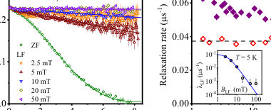 
FIG. 3. Detection of local moments and spin fluctuations in RbV3Sb5−xSnx. (a) Temperature dependence of the magnetic sus- ceptibility χ = M/B for polycrystalline samples with different Sn doping levels. The data contain identical extra contributions from the same sample holder. (As a reference, undoped stoichiometric com- pound data are given in Fig. 9.) (b) Temperature dependence of the inverse magnetic susceptibility (χ −χ0)−1 for data shown in (a); the data for x = 0.1 are divided by 10 for clarity. Linear fits are used to define Curie constant C. Inset shows C for samples with a different Sn doping level. C increases linearly with the doping level corre- sponding to an effective moment...

📷 Fig 4

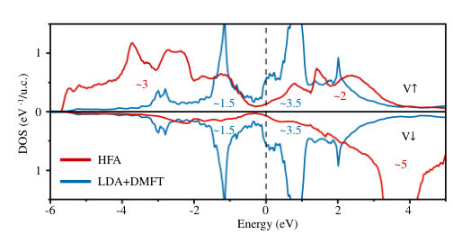 
FIG. 4. Comparing our local orbital-specific density of states (DOS) in the Curie-paramagnetic phase with that obtained from LDA+DMFT method. Note the direct access to ionic spin structure resulting from our method. Also note the expected energy splitting associated with the “bare” intra-atomic repulsion ∼5 eV, in contrast to the reduced energy ∼2 eV of the intra-atomic Coulomb repulsion from the LDA+DMFT method.

📷 Fig 5

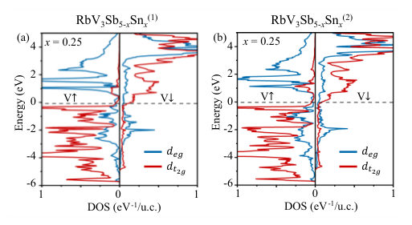 
FIG. 5. Robustness of Hartree-scale driven V2+ local moments against the dilute nonmagnetic Sn dopant. Partial density of states of V in the presence of a Sn impurity substituting one of the 20 Sb atoms in a supercell at the (a) Sb(1) site and (b) Sb(2) site (under ferromagnetic order for clarity). The results display nearly identical lower- and upper-Hubbard structures as the undoped system with an effective d3 high-spin configuration.

**Summary.** This work investigates the correlated behavior in Kagome superconductors by proposing that local ionic magnetic moments, rather than just itinerant carriers, are crucial. Theoretical calculations predict these moments, and experimental doping with Sn impurities successfully confirms their existence via magnetic measurements. This suggests a major revision to existing models of superconductivity in these materials.

**Why it may be interesting.** The emphasis on local moments and strong correlations in a geometrically frustrated superconducting lattice is highly relevant to understanding exotic quantum states in strongly correlated electron systems.

Detailed structure

**Main problem.** The paper aims to resolve the discrepancy in understanding the correlated behavior of Kagome superconductors ($	ext{AV}_3	ext{Sb}_5$ and $	ext{ATi}_3	ext{Bi}_5$) by investigating the role of local ionic magnetic moments.

**Main result.** The study suggests a paradigm shift from purely itinerant carrier descriptions to one that must incorporate strong correlations arising from local ionic spins, which were experimentally confirmed via Sn-doping.

**Method.** The approach combines Hartree-scale electronic structure calculations to model local moments with experimental measurements (magnetic susceptibility and $\mu	ext{SR}$) on doped samples.

**Model / system.** The physical systems are Kagome lattice superconductors, specifically $	ext{AV}_3	ext{Sb}_5$ and $	ext{ATi}_3	ext{Bi}_5$. The theoretical modeling focuses on capturing short-range physics and local orbital-specific density of states.

**Key observables.** Local magnetic moments, magnetic susceptibility ($\chi$), spin relaxation rates ($\mu	ext{SR}$), and local electronic valence states.

**Important parameters / regimes.** The doping concentration ($x$) of nonmagnetic Sn impurities, which is used to locally relieve geometric frustration.

**Assumptions / limitations.** The initial theoretical calculations are performed in a non-collinear Curie-paramagnetic phase to avoid assuming long-range magnetic order.

**Figures summary.** Figures illustrate the local atomic orbital-specific DOS for the superconducting compounds, the mechanism by which Sn impurities relieve geometric frustration, and the temperature dependence of magnetic susceptibility showing Curie-Weiss behavior proportional to doping.

**Paper structure.** The paper progresses by first establishing the theoretical framework using Hartree-scale calculations to predict local moments, then using Sn-doping to experimentally verify the existence of these moments, and finally concluding with the necessity of incorporating local spin correlations into the superconducting picture.

Abstract

In order to understand the unexpected similarity and the correlated behavior in kagome superconductor families AV$_3$Sb$_5$ (A = K, Rb, Cs) and ATi$_3$Bi$_5$ (A = Rb, Cs), we investigate the Hartree-scale local electronic structure of these systems. Our result indicates that V and Ti ions are both of 2+ valence such that the corresponding itinerant carrier densities are similar, and the difference in electron count is instead reflected in their quantum fluctuating ionic magnetic moments. However, due to the frustrated lattice geometry of these materials, such local moments are difficult to experimentally observe via standard probes. For verification, we systematically introduce nonmagnetic Sn impurities to locally relieve the geometric frustration and experimentally demonstrate the existence of well-defined local magnetic moments via magnetic susceptibility and muon spin rotation or relaxation ($μ$SR) measurements. All experiments discover a systematic increase of magnetic susceptibility upon increasing nonmagnetic impurity level. Our discovered ionic moments suggest a paradigm shift from the existing itinerant carrier-only picture to one incorporating strong correlation from local ionic spins. The associated interatomic and local-itinerant correlations offer a solid ground for the emergence of the observed rich correlated behavior in this new family of superconducting materials.

[↑ back to top](#top)

### [Perfect $(s,r)$-state transfer](http://arxiv.org/abs/2609.10713v1)

**Authors:** Stephen Kirkland, Hermie Monterde, Sarah Plosker  
**Type:** theory · **Category:** quantum information and computing · **PDF:** <https://arxiv.org/pdf/2609.10713v1>  
**Analysis basis:** full PDF text, analyzed in chunks
**Topic relevance:** `analog quantum simulation` **1/5** · `quantum measurements` **1/5**

📷 Fig 1

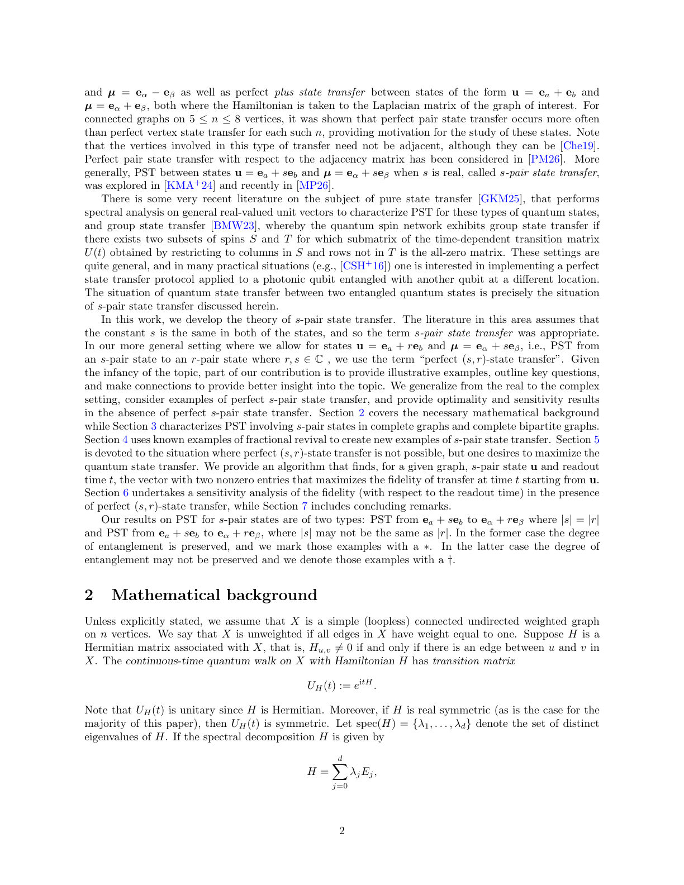 
Low-resolution page preview, page 2

📷 Fig 2

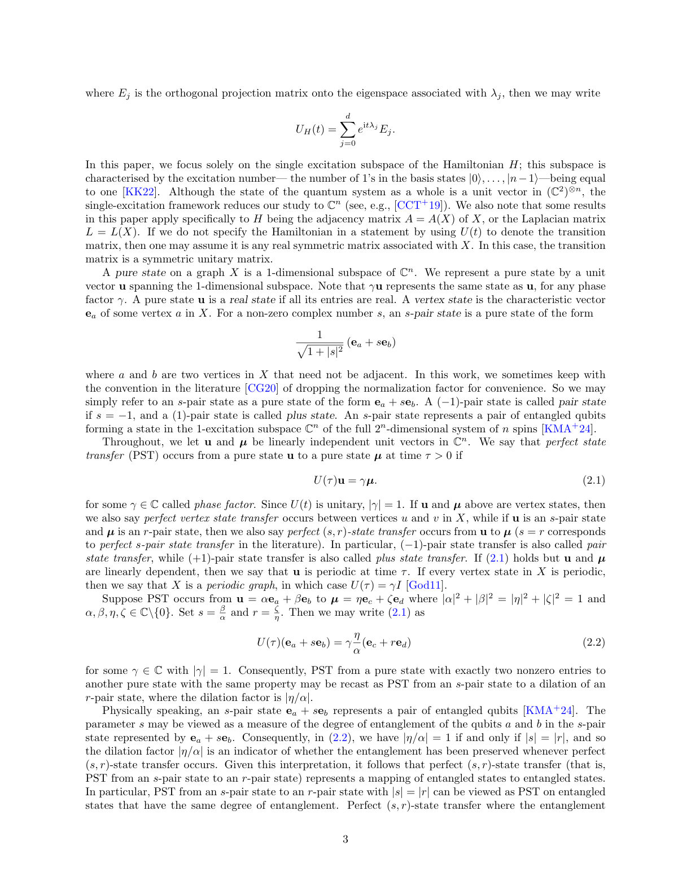 
Low-resolution page preview, page 3

📷 Fig 3

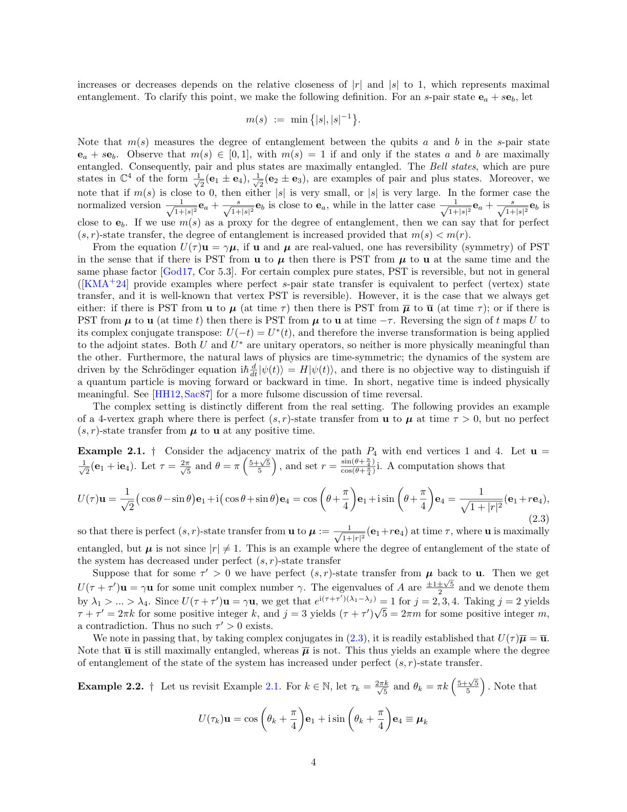 
Low-resolution page preview, page 4

📷 Fig 4

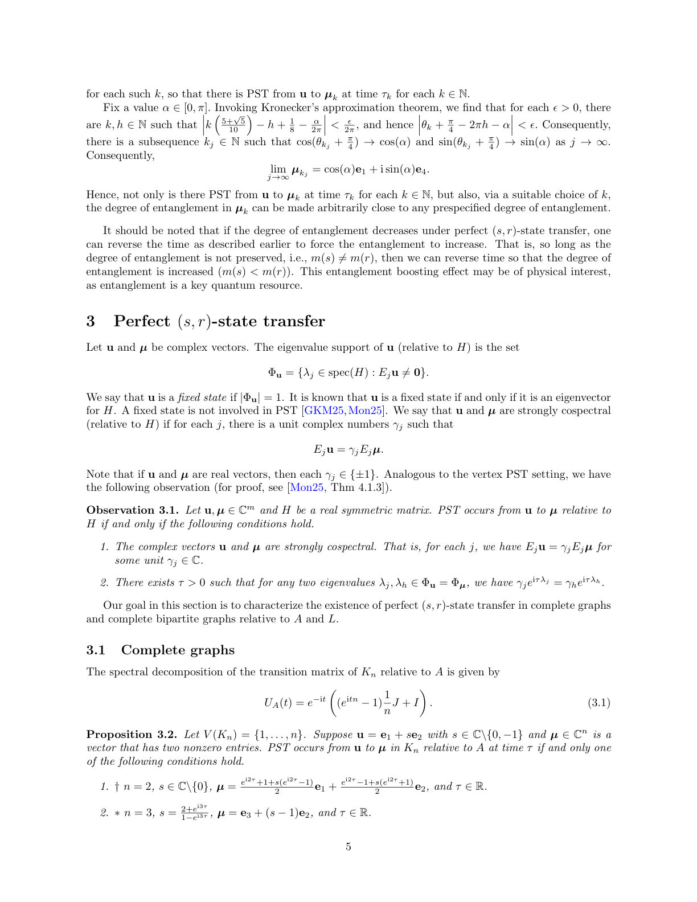 
Low-resolution page preview, page 5

📷 Fig 5

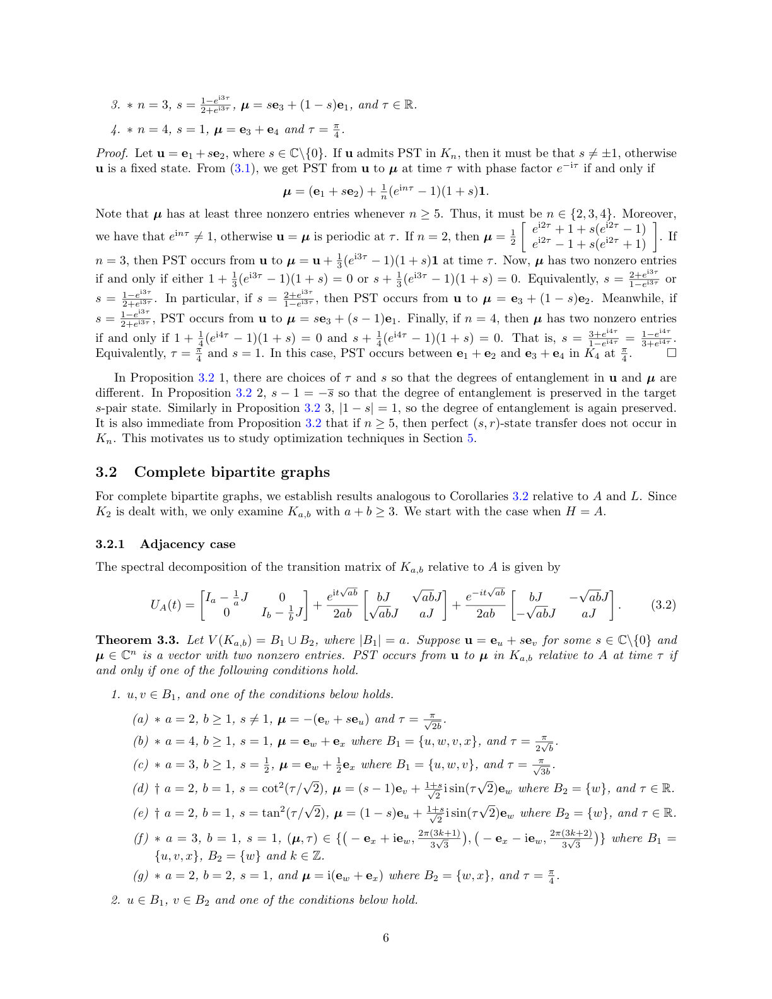 
Low-resolution page preview, page 6

**Summary.** This work generalizes quantum state transfer to entangled 's-pair' states on graph structures. It characterizes the conditions for perfect transfer, showing that the entanglement degree can be manipulated, even increased, during the process. The paper also provides tools to analyze the robustness of this transfer against time measurement errors.

**Why it may be interesting.** The concept of controlling entanglement transfer and quantifying the robustness of these quantum processes against measurement errors (sensitivity analysis) is highly relevant to designing robust quantum communication protocols.

Detailed structure

**Main problem.** The paper investigates perfect $(s,r)$-state transfer, which is a generalization of quantum state transfer from an $s$-pair entangled state to an $r$-pair entangled state.

**Main result.** The authors identify infinite families of graphs exhibiting this perfect transfer and demonstrate that the degree of entanglement can be boosted (increased) if $|r| 
eq |s|$.

**Method.** The study uses spectral analysis of the transition operator derived from graph Hamiltonians, along with developing algorithms to maximize transfer fidelity and performing sensitivity analysis.

**Model / system.** The system is modeled as quantum state transfer on an undirected graph, where the dynamics are governed by a continuous-time quantum walk Hamiltonian (e.g., adjacency or Laplacian matrix). The states are generalized to $s$-pair states, $\mathbf u = \mathbf e_a + s \mathbf e_b$.

**Key observables.** Fidelity of transfer, degree of entanglement ($|s|$ or $|r|$), and the second derivative of the fidelity function (sensitivity to time errors).

**Important parameters / regimes.** The complex parameters $r$ and $s$ defining the initial and final entangled states, and the graph structure itself.

**Assumptions / limitations.** The analysis often focuses on the single excitation subspace of the Hamiltonian, and specific results are derived assuming the initial and final states have exactly two non-zero entries.

**Figures summary.** The notes do not describe specific figures, but mention examples like P5, $K_{1,n}$, and $CP(n)$ used to calculate fidelity and sensitivity.

**Paper structure.** The paper progresses from defining the generalized PST problem, characterizing it for specific graph families ($K_n, K_{a,b}$), developing algorithms for fidelity maximization, and concluding with sensitivity analysis.

Abstract

Much work has been done in the last two decades on the topic of quantum state transfer in a quantum spin network. One can model such a system of interacting qubits using an undirected graph, and studying vertex-to-vertex dynamics. This setup has recently been relaxed to allow for dynamics between linear combinations of two vertex states, i.e.\ from $\mathbf u = \mathbf e_a + s \mathbf e_b$ to $\mathbf μ=\mathbf e_α + r \mathbf e_β$, where $r=s$ is either $-1$ (which corresponds to pair state transfer) or $+1$ (which corresponds to plus state transfer), or more recently $r=s$ is taken to be any real number (which corresponds to $s$-pair state transfer).   Here, we broaden the investigation of $s$-pair state transfer to \textit{perfect $(s,r)$-state transfer}, which is perfect state transfer from $\mathbf u = \mathbf e_a + s \mathbf e_b$ to $\mathbf μ=\mathbf e_α + r \mathbf e_β$ (up to some dilation) where $r,s\in \mathbb C$. We identify infinite families of graphs with perfect $(s,r)$-state transfer and provide characterizations of cases when $|r|= |s|$ and when $|r|\neq |s|$, showing situations when the degree of entanglement between vertex states is preserved, and when it is not preserved. The latter is particularly important as it represents perfect state transfer from an entangled pair of qubits to another one where the degree of entanglement need not be the same\mdash in fact, it can be set up so as to ``boost'' (increase) entanglement. We provide an algorithm that finds the vector with two nonzero entries that maximizes the fidelity of transfer for a fixed time $t$ starting from a given $s$-pair state $\mathbf u$. Finally, we provide a sensitivity analysis, with respect to readout time errors, of perfect $(s,r)$-state transfer.

[↑ back to top](#top)

### [Piezomagnetism in a model cubic noncollinear altermagnet](http://arxiv.org/abs/2609.11816v1)

**Authors:** Sudarshan Sharma, Luca Buiarelli, Richard Spieker, Ivan Jakovac, Damjan Pelc, Turan Birol, Martin Greven  
**Type:** both · **Category:** other · **PDF:** <https://arxiv.org/pdf/2609.11816v1>  
**Analysis basis:** full PDF text, analyzed in chunks
**Topic relevance:** `analog quantum simulation` **1/5** · `quantum measurements` **1/5**

📷 Fig 1

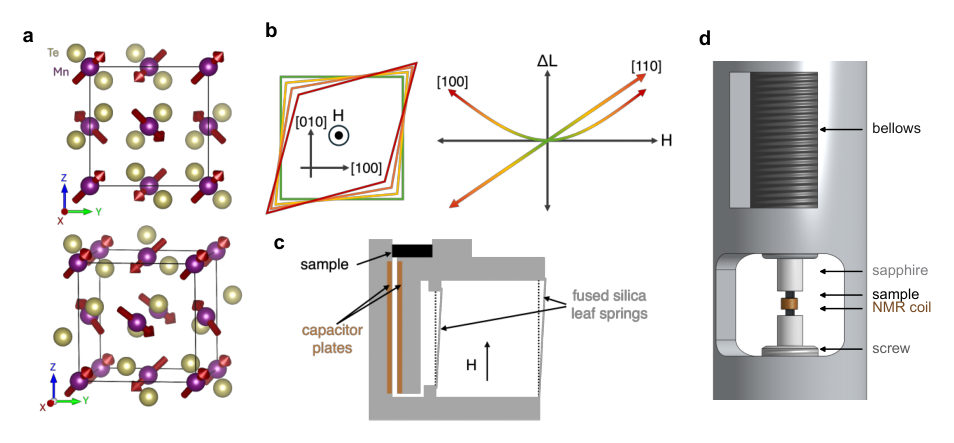 
Fig. 1 Magnetic structure and experimental setup. a, Schematic crystal and noncollinear magnetic spin

📷 Fig 2

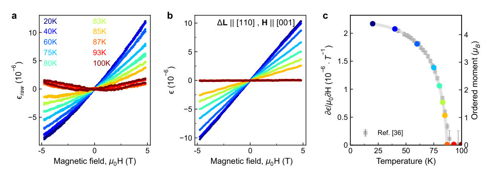 
Fig. 2 Transverse magnetostriction measurements for magnetic field along [100] and ∆L along [110]. a,

📷 Fig 3

 
Figure 1b shows a sketch of the lattice response of cubic MnTe2 to a magnetic field along [001]. For this geometry, an in-plane shear strain is induced with a magnitude that is proportional to the applied field. In other words, there is a linear magnetostriction component along [110], whereas magnetostriction is purely quadratic along [100]. As shown in Fig. 2a and Extended Data Fig. 2, our data confirm these predictions: along [110], the magnetostriction is dominated by a linear magnetic field dependence, while along [100] the response is purely quadratic. A small quadratic contribution is also observed along [110]; this is expected in any material regardless of symmetry and carries no...

📷 Fig 4

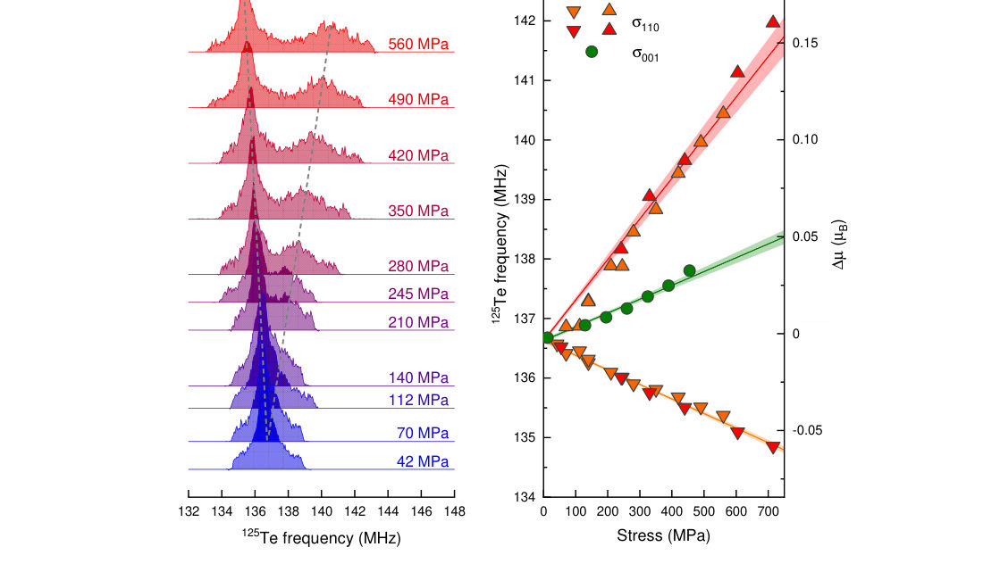 
Fig. 3 Nuclear magnetic resonance measurements of the stress-induced ferromagnetic moment. a,

📷 Fig 5

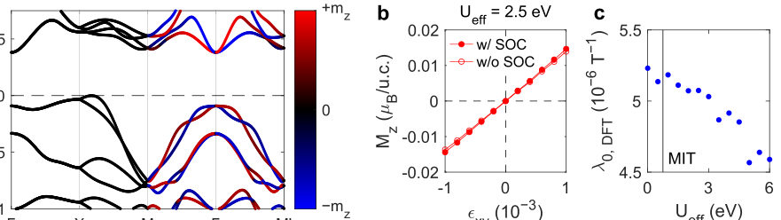 
Fig. 4 First-principles calculations. a, Electronic band structure of MnTe2, colored by the spin magnetization

**Summary.** This work demonstrates that piezomagnetism is a definitive signature of altermagnetism, using $	ext{MnTe}_2$ as a model system. By combining dilatometry, NMR, and DFT, the authors successfully measured and confirmed a linear coupling between applied strain and magnetic moment. This opens new avenues for controlling spintronic devices using coupled strain and magnetic fields.

**Why it may be interesting.** While focused on condensed matter magnetism, the use of coupled external fields (strain and magnetic field) to control electronic properties is relevant to understanding emergent quantum phenomena in engineered materials, bridging concepts from AMO physics (field control) to solid-state physics.

Detailed structure

**Main problem.** The study investigates piezomagnetism—the linear coupling between lattice strain and net magnetic moment—as a key signature distinguishing altermagnetism from conventional antiferromagnetism.

**Main result.** The authors report observing a large piezomagnetic response in the model cubic altermagnet $	ext{MnTe}_2$, confirmed by agreement between dilatometry measurements (shear strain proportional to $H$) and NMR detection of an induced ferromagnetic moment.

**Method.** The research combines multiple experimental techniques, including dilatometry and NMR, with first-principles Density Functional Theory (DFT) calculations to probe the magnetostrictive and piezomagnetic coupling coefficients.

**Model / system.** The system studied is $	ext{MnTe}_2$, a cubic material identified as a model altermagnet possessing compensated magnetic order and spin-polarized bands. The analysis utilizes symmetry constraints derived from the Landau free energy to predict the linear coupling terms.

**Key observables.** Linear magnetostriction ($\epsilon \propto H$), shear deformation, stress-induced ferromagnetic moment (measured by NMR), and the piezomagnetic coupling coefficient ($\lambda$).

**Important parameters / regimes.** The measurements are sensitive to temperature, particularly near the magnetic transition temperature ($T_N$), and depend on the crystal orientation ($\langle 100 
angle$ vs $\langle 110 
angle$).

**Assumptions / limitations.** The linear magnetostriction component is assumed to represent the genuine altermagnetic signature, distinct from quadratic or domain-related contributions. DFT calculations sometimes ignore ion-mediated strain contributions.

**Figures summary.** Figures illustrate the magnetic structure, magnetostriction dependence on applied field along different axes, temperature dependence of the coupling coefficient, and NMR spectra showing line splitting under applied stress.

**Paper structure.** The paper progresses by first establishing the theoretical framework of piezomagnetism in altermagnets, then presenting experimental measurements (dilatometry, NMR) on $	ext{MnTe}_2$ to extract the linear coupling terms, and finally confirming these findings using first-principles DFT calculations.

Abstract

Altermagnets constitute a distinct class of magnetic materials that combine compensated magnetic order with spin-polarized electronic bands, hence carrying characteristics of both antiferromagnets and ferromagnets. Piezomagnetism - the linear relationship between lattice strain and a net magnetic moment - has emerged as smoking-gun evidence of altermagnetism that distinguishes it from antiferromagnetism. Here, we uncover a large piezomagnetic response in MnTe2, a cubic altermagnet with a noncollinear spin arrangement and weak spin-orbit coupling. We combine dilatometry with nuclear magnetic resonance, a bulk local probe, to observe signatures of both direct and inverse piezomagnetism consistent with symmetry considerations and first-principles calculations. The dilatometry measurements reveal a shear deformation proportional to an applied magnetic field, while magnetic resonance detects a ferromagnetic moment induced by shear strain. The respective results for the piezomagnetic coupling strength are in good agreement, and they are captured by first-principles results. These findings for simple binary MnTe2 position this material as a model altermagnet, demonstrate the utility of nuclear magnetic resonance in investigations of piezomagnetism, and open new avenues for multimodal strain and magnetic-field control in spintronic and memory applications.

[↑ back to top](#top)

### [A Time-Frequency Framework for GKP Codes](http://arxiv.org/abs/2609.10802v1)

**Authors:** Franz Luef, Eduard Ortega  
**Type:** theory · **Category:** quantum information and computing · **PDF:** <https://arxiv.org/pdf/2609.10802v1>  
**Analysis basis:** full PDF text, analyzed in chunks
**Topic relevance:** `quantum measurements` **1/5**

📷 Fig 1

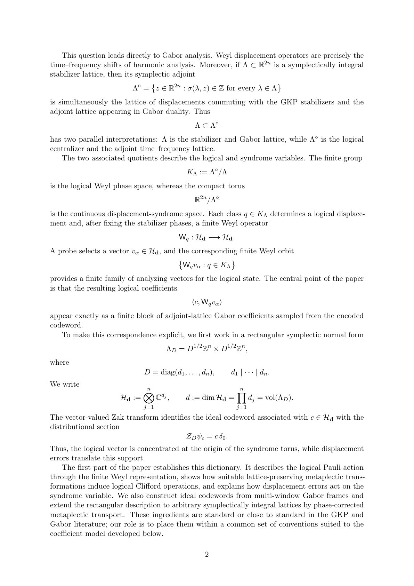 
Low-resolution page preview, page 2

📷 Fig 2

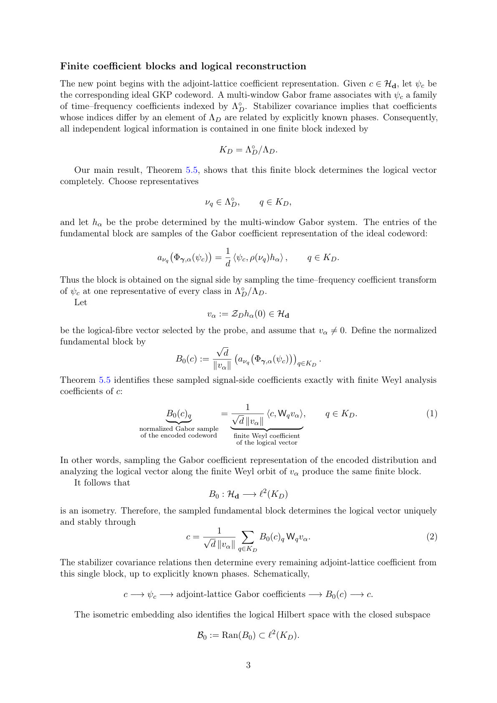 
Low-resolution page preview, page 3

📷 Fig 3

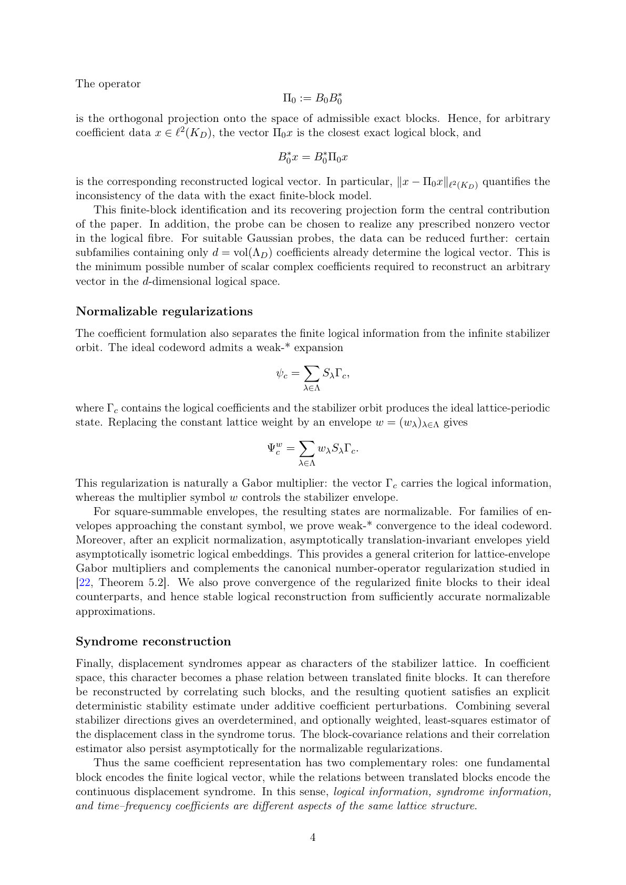 
Low-resolution page preview, page 4

📷 Fig 4

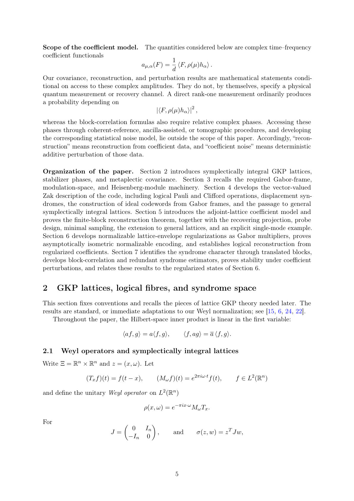 
Low-resolution page preview, page 5

📷 Fig 5

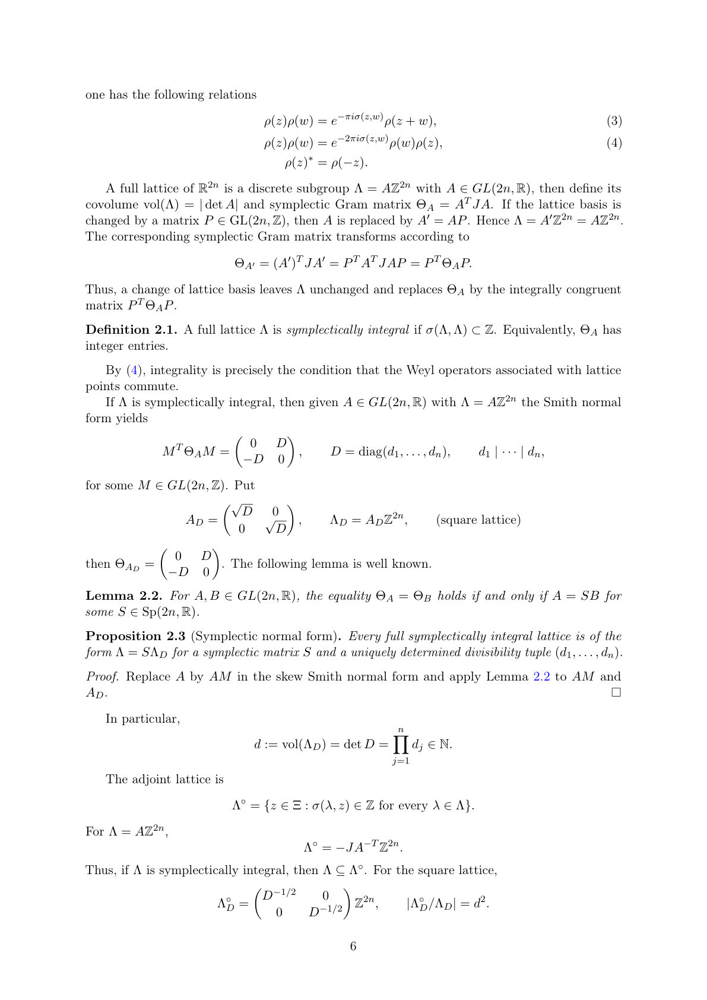 
Low-resolution page preview, page 6

**Summary.** This paper develops a time-frequency framework using Gabor analysis to analyze lattice GKP codes. It proves that the logical information can be uniquely and stably recovered from a finite block of phase-space coefficients. Furthermore, it provides a method to extract the continuous displacement syndrome by analyzing the phase relationships between these coefficients, offering a theoretical blueprint for syndrome measurement.

**Why it may be interesting.** This work provides a powerful mathematical tool for understanding continuous variable quantum error correction, linking abstract phase-space representations (Gabor analysis) directly to measurable syndrome information in a stable, quantifiable manner.

Detailed structure

**Main problem.** To develop a rigorous time-frequency framework for lattice Gottesman-Kitaev-Preskill (GKP) codes, specifically addressing how to stably reconstruct the finite logical information from localized phase-space coefficients.

**Main result.** The authors prove that the normalized block map is an isometry, establishing a unique and stable determination of the logical vector from sampled coefficients, and derive a stable estimator for the continuous displacement syndrome from phase relations between coefficient blocks.

**Method.** The work employs the vector-valued Zak transform and multi-window Gabor analysis to map ideal codewords to finite blocks of adjoint-lattice coefficients, allowing for reconstruction theorems and syndrome estimation.

**Model / system.** The system is based on lattice GKP codes, which encode quantum information into highly structured states within the infinite-dimensional Hilbert space of oscillators, analyzed using modulation spaces and Gabor frames.

**Key observables.** The finite block of adjoint-lattice Gabor coefficients, and the phase relations between translated coefficient blocks used to estimate the displacement syndrome.

**Important parameters / regimes.** The lattice structure ($\Lambda_D$), the regularization parameter ($\epsilon$), and the noise level ($\eta$) governing stability bounds.

**Assumptions / limitations.** The analysis is conditional on access to the complex amplitudes (coefficients) and relies on asymptotic convergence and weak-* approximations for finite-energy states.

**Paper structure.** The paper progresses by first establishing the Zak transform framework, then developing the adjoint-lattice coefficient model and proving the isometry, followed by deriving the block-correlation estimator for syndrome extraction, and finally quantifying the convergence of this estimator for finite-energy states.

Abstract

We develop a time--frequency framework for lattice GKP codes in which ideal codewords are realized in the modulation space $M^\infty$ and identified, through a vector-valued Zak transform, with a finite logical fibre over the continuous syndrome torus. Multi-window Gabor analysis then represents the logical vector by a finite block of adjoint-lattice coefficients. We prove that the normalized block map is an isometry, obtain an explicit recovering projection, and derive stable logical reconstruction. We further construct normalizable GKP approximants as lattice-envelope Gabor multipliers and establish weak-$*$ convergence and asymptotically isometric encoding. Finally, we recover displacement syndromes from phase relations between translated coefficient blocks and quantify their stability under additive perturbations.

[↑ back to top](#top)

### [Certified reduced-basis emulation of conformal field theories on the fuzzy sphere](http://arxiv.org/abs/2609.11675v1)

**Authors:** Virgil V. Baran  
**Type:** theory · **Category:** statistical mechanics · **PDF:** <https://arxiv.org/pdf/2609.11675v1>  
**Analysis basis:** full PDF text, analyzed in chunks
**Topic relevance:** `analog quantum simulation` **1/5**

📷 Fig 1

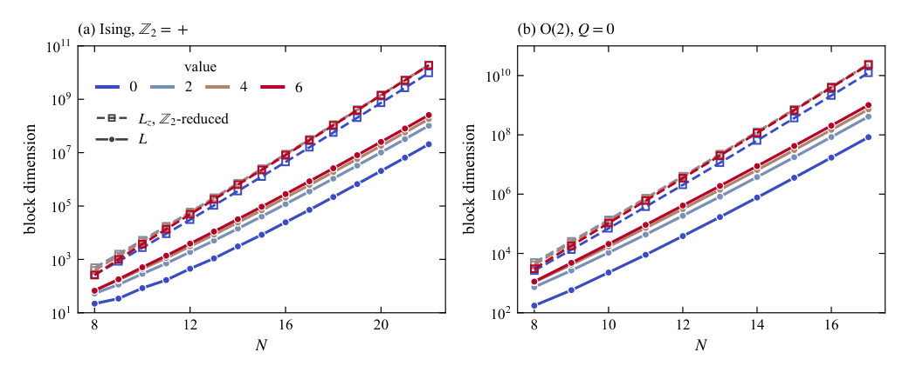 
FIG. 1. Symmetry-block dimensions versus system size for blocks of fixed Lz (dashed, open squares) and of fixed total L (solid, filled circles), at the values 0, 2, 4, 6. (a) Ising, at Z2=+. (b) O(2), at Q=0. Curves show the block each scheme actually diagonalizes. Dashed: the (Lz, Q) block further reduced by the discrete Z2 symmetries implemented in FuzzifiED [15], namely charge conjugation throughout Q = 0 and the π-rotation Ry within Lz = 0. Solid: the full exact-(L, Q) block, which we do not reduce by C since the solver projects inside it.

📷 Fig 2

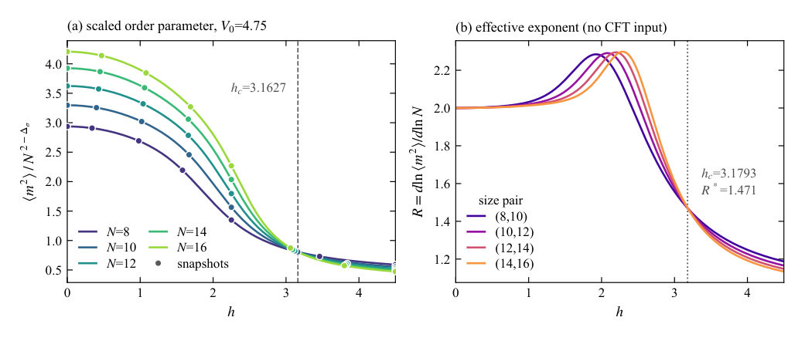 
FIG. 2. Finite-size scaling of the Ising order parameter at V0 = 4.75, from certified emulators at N = 8–16. Here ⟨m2⟩= ∥O |GS⟩∥2 with O = P

📷 Fig 3

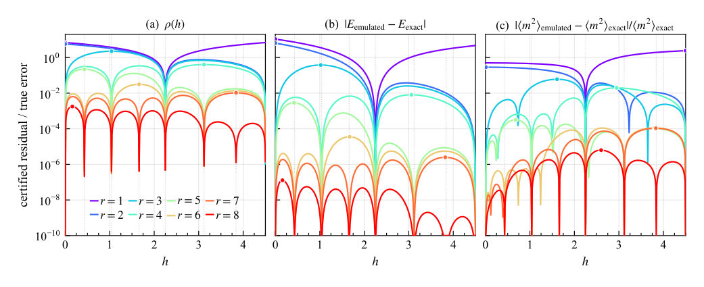 
FIG. 3. The certificate residual against actual energy and order-parameter errors, for the N = 12 Ising emulator on the cut of Fig. 2, where the (L, Z2) = (0, +) block has dimension 448; one colour per greedy iteration r. (a) The certified residual ρ(h) of Eq. (16). (b) The energy error |Eemulated−Eexact| and (c) the relative order-parameter error |⟨m2⟩emulated−⟨m2⟩exact|/⟨m2⟩exact, both against exact solves at every point of the same grid.

📷 Fig 4

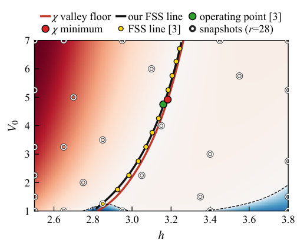 
FIG. 4. Heat map of sign(χ) p

📷 Fig 5

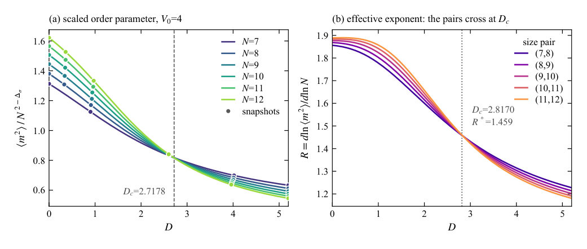 
FIG. 5. Same as Fig. 2 for the O(2) model, at V0 = 4 and N = 7–12, with ⟨m2⟩defined in Sec. IV. Symbols mark the greedy snapshots of the cut emulators (Sec. II C), each grown until the relative change in ⟨m2⟩between consecutive snapshots falls below 10−5: five snapshots at N = 7 and six at every larger size, for sector dimensions 50 to 38 587. (a) The scaled order parameter ⟨m2⟩/N 2−∆σ, with ∆σ = 0.519088 [2] as input: consecutive sizes cross at Dc = 2.6737, 2.6900, 2.7019, 2.7108 and 2.7178, the last from (11, 12) (dashed line). (b) The effective exponent R = d ln⟨m2⟩/d ln N, which uses no CFT input at all: consecutive pairs cross at 2.8575, 2.8398, 2.8269 and 2.8170 (dotted line), with...

**Summary.** This work develops a highly efficient computational framework using reduced-basis emulation combined with exact diagonalization to study CFTs on the fuzzy sphere. By accurately mapping the energy landscape across coupling parameters, the authors precisely locate critical points for the Ising and O(2) models. This methodology significantly reduces the search cost for understanding quantum critical phenomena in strongly interacting systems.

**Why it may be interesting.** The use of RBM to map out critical lines in parameter space is a powerful computational technique applicable to any quantum system whose Hamiltonian depends smoothly on multiple parameters, bridging the gap between exact diagonalization and full phase diagram mapping.

Detailed structure

**Main problem.** To gain numerical access to three-dimensional Conformal Field Theories (CFTs) by efficiently testing for criticality across the vast parameter space of microscopic couplings.

**Main result.** The combination of exact diagonalization and a certified reduced-basis emulator successfully reproduces known CFT results for the Ising and O(2) models, locating critical lines with high precision.

**Method.** The authors combine exact diagonalization on symmetry-adapted bases with a certified reduced-basis emulator (RBM) to reconstruct energy and observable data continuously across coupling variations, drastically reducing computational cost.

**Model / system.** The study focuses on fuzzy-sphere regularizations of 3D CFTs, specifically analyzing the $N_f=2$ Ising model and the $N_f=3$ O(2) Wilson-Fisher CFT. These models are realized via Hamiltonians involving interacting fermions in the Lowest Landau Level.

**Key observables.** Ground-state energy ($E_{GS}$), scaling dimensions ($\Delta O$), and the ratio $\chi = E_{3/2}/E_0$ used to locate critical points.

**Important parameters / regimes.** Microscopic couplings (e.g., $h$ for Ising, $D$ and $V_0$ for O(2)), and system size $N$.

**Assumptions / limitations.** The fuzzy-sphere construction preserves SO(3) symmetry, and the RBM assumes the Hamiltonians are exactly affine in the couplings.

**Figures summary.** Figures illustrate the critical lines for the Ising and O(2) models in coupling planes, showing agreement between emulator results and established DMRG values. Other figures show error analysis and energy/order-parameter surfaces.

**Paper structure.** The paper develops the computational framework by first detailing the exact-L ED approach, then introducing the RBM for efficient parameter scanning, and finally applying this combined method to determine and map the critical lines for both the Ising and O(2) models using multiple diagnostic criteria.

Abstract

Fuzzy-sphere regularization gives numerical access to three-dimensional conformal field theories (CFTs), but locating one requires testing for criticality across the parameter space of microscopic couplings. We reduce the search cost by about two orders of magnitude, combining an exact diagonalization based on states having definite total angular momentum with a certified reduced-basis emulator that reconstructs energies, observables and their derivatives continuously across the couplings from a handful of exact solutions per system size. The combination reproduces the published ground-state-energy analysis of the fuzzy-sphere Ising model and the published conformal data of a three-flavor fuzzy-sphere realization of the O(2) Wilson--Fisher CFT, including quantities defined by parameter derivatives. Applied to the O(2) model with no CFT input, the ground-state-energy criterion locates the critical coupling to within half a percent of a density matrix renormalization group value obtained on systems more than twice the size, and maps the critical line of the model across the coupling plane. Ground-state criteria locate the critical line robustly, but the point they select along it is weakly determined, and the computed dimensions come closest to the bootstrap elsewhere along the line.

[↑ back to top](#top)

### [Competing Interlayer Loop Currents and Superconductivity in the Bilayer $t$-$J_\perp$-$V$ Model](http://arxiv.org/abs/2609.10926v1)

**Authors:** Luciano Zinni, Fabricio Gómez, Jun Zhan, Matías Bejas, Xianxin Wu, Andreas P. Schnyder, Andrés Greco  
**Type:** theory · **Category:** strongly correlated electrons · **PDF:** <https://arxiv.org/pdf/2609.10926v1>  
**Analysis basis:** full PDF text, analyzed in chunks
**Topic relevance:** `Keldysh / 2PI / non-Gaussian methods` **1/5**

📷 Fig 1

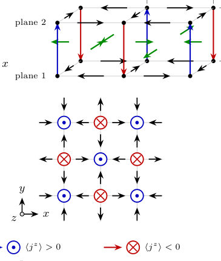 
FIG. 1. Schematic current and flux pattern of the A⊥z-BOP for the commensurate ordering vector (π, π). (a) Three- dimensional view. Blue (red) vertical arrows are the interlayer currents ⟨jz i ⟩&gt; 0 (&lt; 0) on opposite sublattices, generated by the staggered Peierls phase of the effective interlayer hopping. Black arrows are the induced in-plane currents, opposite in the two layers, which close each vertical plaquette into a loop. Green arrows give the local magnetic field B at the plaquette centers, along ±ˆy (±ˆx) for xz (yz) plaquettes and alternating with the sublattice, so that its spatial average vanishes. (b) Top view of plane 1: ⊙(⊗) marks sites where the interlayer current leaves...

📷 Fig 2

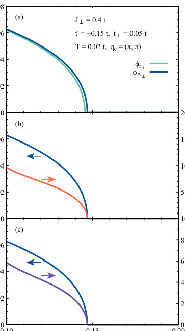 
FIG. 2. (a) Real (ϕr⊥) and imaginary (ϕA⊥) z-BOP gaps vs doping δ, obtained separately. The two channels are nearly degenerate, A⊥being marginally the leading one. (b) Full complex gap ϕ = ϕr⊥+ iϕA⊥, allowing competition: the so- lution is purely imaginary (ϕr⊥negligible). The induced in- plane current |⟨J13⟩| (right axis, in units of 10−4) follows ϕA⊥ (left axis), signaling the LCs of Fig. 1. (c) Orbital magnetic moment m of a single loop (right axis, in units of 10−3µB), which follows ϕA⊥(left axis) and vanishes at the QCP; see Sec. S4 of the SM [23] for details on its estimation.

📷 Fig 3

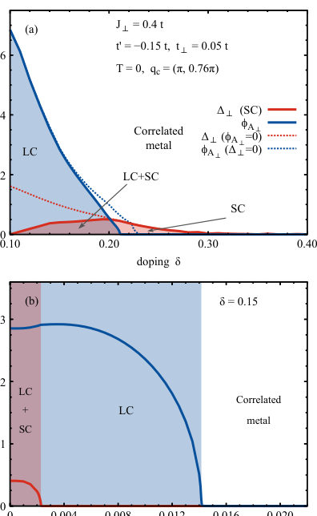 
FIG. 3. (a) Superconducting gap ∆⊥and z-BOP gap ϕA⊥vs doping δ at T = 0, from the coupled gap equations (solid). Dashed lines are the gaps without competition, ∆⊥at ϕA⊥= 0 and ϕA⊥at ∆⊥= 0. ∆⊥shows a dome with optimal doping close to the z-BOP QCP, which the competition shifts to lower δ. Labels indicate the LC, LC+SC, SC, and correlated-metal regions. (b) Both gaps vs temperature at δ = 0.15: ∆⊥is BCS-like (∆⊥= 1.76 Tc), while ϕA⊥= 2.02 T z-BOP c .

**Summary.** This theoretical study models high-Tc superconductivity in bilayer nickelates using the $t$-$J_{\perp}$-$V$ model. It finds that an out-of-plane bond-order phase instability generates loop currents that compete with superconductivity. This competition results in a characteristic dome-shaped superconducting phase diagram, suggesting a quantum critical point governs optimal pairing.

**Why it may be interesting.** The explicit theoretical modeling of competing orders (charge/orbital vs. superconducting) in a strongly correlated lattice model provides a rich playground for understanding unconventional superconductivity mechanisms, which is a major focus in condensed matter theory.

Detailed structure

**Main problem.** The paper investigates the competition between out-of-plane loop currents (LCs) and superconductivity (SC) in bilayer nickelates, a system relevant to high-Tc superconductivity.

**Main result.** The out-of-plane bond-order phase ($z$-BOP) instability drives the formation of time-reversal symmetry breaking loop currents, leading to a dome-shaped superconducting region optimal near the $z$-BOP quantum critical point.

**Method.** The study employs a controlled large-$N$ expansion, analyzing the self-consistent gap equations for both the superconducting gap ($\Delta_\perp$) and the complex $z$-BOP gap ($\phi$).

**Model / system.** The system is modeled by the strongly correlated one-orbital ($	ext{d}_{x^2-y^2}$) bilayer $t$-$J_{\perp}$-$V$ model for nickelates. The Hamiltonian includes hopping, spin exchange ($J_{\perp}$), and Coulomb interactions ($V$).

**Key observables.** Superconducting gap ($\Delta_\perp$), $z$-BOP gaps ($\phi_{r\perp}, \phi_{A\perp}$), induced in-plane currents, orbital magnetic moment, and the phase diagram structure.

**Important parameters / regimes.** Doping ($\delta$), interlayer exchange coupling ($J_{\perp}$), and the ratio of hopping parameters ($t_{\perp}/t$).

**Assumptions / limitations.** The analysis assumes the $z$-BOP gap is purely imaginary ($\phi = i \phi_{A\perp}$), and that Coulomb interactions are less critical than the spin/hopping terms for the primary instabilities.

**Figures summary.** Figures illustrate the evolution of the real and imaginary $z$-BOP gaps versus doping, showing the dominance of the imaginary component ($\phi_{A\perp}$), and map out the phase diagram showing LC, SC, and coexisting regions.

**Paper structure.** The paper systematically derives the coupled gap equations for SC and $z$-BOP order parameters, analyzes the resulting magnetic flux and current patterns, and maps the resulting phase diagram as a function of doping.

Abstract

The recent discovery of high-$T_c$ superconductivity in pressurized and thin-film bilayer nickelates, featuring a strong interlayer exchange coupling, and their potential similarities with cuprate superconductors, has made this a very active topic in condensed matter physics. In the present paper we study the strongly correlated one-orbital ($d_{x^2-y^2}$) bilayer $t$-$J_\perp$-$V$ model for nickelates, where $V$ denotes the Coulomb interactions, using a controlled large-$N$ expansion at and beyond the mean-field level. Focusing on the out-of-plane spin exchange interaction ($J_\perp$), we find that it triggers both out-of-plane $s$-wave superconductivity and an out-of-plane bond-order phase ($z$-BOP) instability. The $z$-BOP gives rise to a complex $z$-axis hopping dominated by its imaginary component, which drives out-of-plane currents and induces in-plane ones, spontaneously forming on the vertical plaquettes a loop-current state that breaks time-reversal symmetry. Competition between this loop-current phase and superconductivity yields a dome-shaped superconducting region, with optimal superconductivity occurring near the $z$-BOP quantum critical point. The resulting phase diagram features a pure loop-current region, a low-doping coexistence phase, a pure superconducting state at higher doping, and a correlated metallic state.

[↑ back to top](#top)

### [Consensus in Effective Model Inference for Disordered Ising Systems](http://arxiv.org/abs/2609.10731v1)

**Authors:** Ashveed Ashraf  
**Type:** theory · **Category:** disordered systems and neural networks · **PDF:** <https://arxiv.org/pdf/2609.10731v1>  
**Analysis basis:** full PDF text, analyzed in chunks
**Topic relevance:** `analog quantum simulation` **1/5**

📷 Fig 1

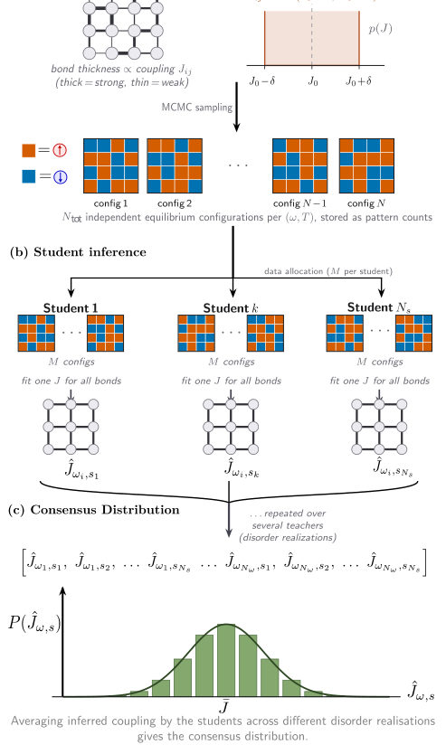 
FIG. 1. Consensus learning framework. (a) A disordered Ising teacher: bonds Jij ∼U(J0 −δ, J0 + δ) are quenched and random for each realization ω. MCMC sampling pro- duces Ntot equilibrium spin configurations per (ω, T), stored as pattern counts. (b) Student inference: each of Ns students, denoted by s, receives M configurations sampled without re- placement from the same teacher ω and infers a single effec- tive coupling ˆJω,s by fitting a uniform Ising model. (c) Con- sensus distribution: aggregating ˆJω,s across all students and all teachers builds the consensus distribution P( ˆJω,s), whose width quantifies how tightly independent learners agree on the effective description of the...

📷 Fig 2

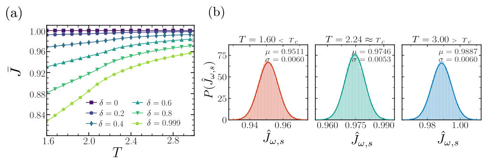 
FIG. 2. Consensus of inferred couplings. (a) Disorder-averaged inferred coupling ¯J against temperature for six disorder strengths δ ∈{0, 0.2, . . . , 0.999}. The clean system recovers ¯J = J0 = 1 at every T, as it must, since a uniform teacher lies inside the students’ hypothesis class. Disorder displaces ¯J downward, most strongly in the ordered phase, and the displacement decreases with temperature. (b) Consensus distribution P( ˆJω,s) at δ = 0.5 for three temperatures spanning the critical region, with a Gaussian fit (solid) to the full set of Nω × Ns inferred couplings. The mean drifts upward with temperature, from 0.9511 to 0.9887, but not reaching J0 within the temperature range used...

📷 Fig 3

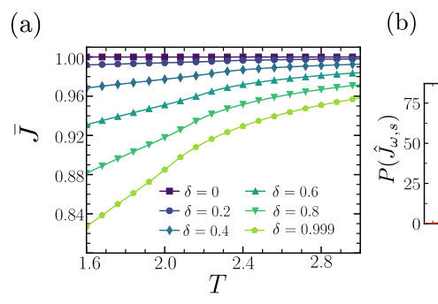 
Fig. 3(a) shows the measured bias over 0.8 ≤T/T eff c ≤ 1.2. It vanishes identically at δ = 0, confirming unbi- asedness in the clean limit, and is negative for all δ &gt; 0, growing in magnitude as δ2 and decaying with tempera- ture in agreement with Eq. (31). The measured bias is negative, thus Tr H(T) &lt; 0, and hence Haa &lt; 0. And thus shows a downward displacement of the best uniform fit, and thus the student underestimates the bond mean. At low temperature the spin configurations a student sees are frozen into patterns controlled by the particu- lar bond realization, so the disorder is fully imprinted on the data and the uniform hypothesis class is badly mis- matched. As the temperature...

📷 Fig 4

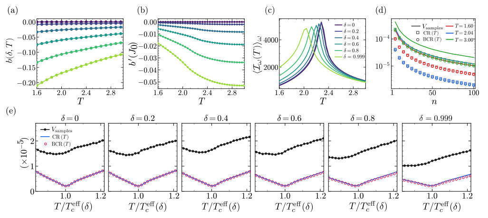 
FIG. 3. Bias, Fisher information, and the Cram´er–Rao bound on the sampling variance, for six disorder strengths δ ∈ {0, 0.2, 0.4, 0.6, 0.8, 0.999} (colour scale in (c)). (a) Measured bias b(δ, T) versus temperature using the finite sample expression in Eq. (31). The bias vanishes at δ = 0 and grows in magnitude with δ. (b) Coupling derivative of the bias b′(J0), evaluated at J0 = 1. It is negative, small (|b′| ≲0.05), and slowly varying, so the prefactor [1 + b′(J0)]2 in the biased Cram´er–Rao bound remains close to unity over the whole temperature range. (c) Disorder-averaged Fisher information Iω(T), which peaks sharply at T eff c (δ), the specific heat maximum, for every disorder...

📷 Fig 5

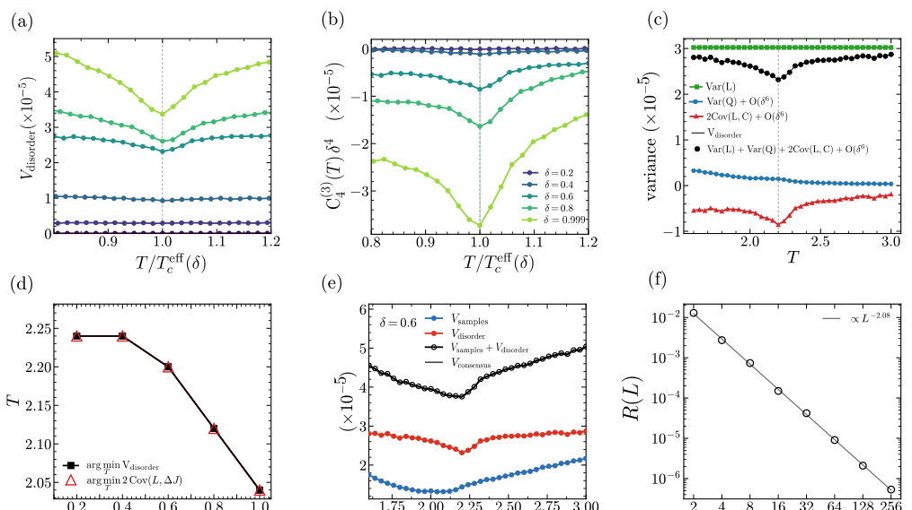 
FIG. 4. Origin of the critical minimum in the disorder variance. Throughout, L, Q and C denote the linear, quadratic and cubic responses of Eq. (47), L = gaηa, Q = 1 2Habηaηb and C = 1 6Θabcηaηbηc, with ηa the offset of bond a from J0. (a) Vdisorder versus scaled temperature for δ ∈{0.2, . . . , 0.999} (color scale used in (b)). The curves are flat at weak disorder and develop a minimum at T/T eff c (δ) that deepens with δ. Values of T eff c (δ) used to scale the axis are the corresponding maxima of specific heat. (b) The linear-cubic covariance 2 Cov(L, C) = C(3) 4 (T)δ4, for the same disorder strengths. It is negative throughout, most negative at T/T eff c (δ) = 0.999. (c) Term-by-term...

**Summary.** This work introduces 'consensus' to measure how robustly different models agree on the effective physics of disordered systems. By analyzing the variance of inferred parameters, the authors show that the best temperature for agreement is distinct from the best temperature for accuracy due to model limitations. This provides a crucial diagnostic tool for interpreting results from complex, disordered physical models.

**Why it may be interesting.** The rigorous framework for quantifying model uncertainty and disagreement (consensus) in the presence of quenched disorder is highly relevant for interpreting complex simulations in condensed matter theory, especially when data is limited or noisy.

Detailed structure

**Main problem.** The paper quantifies the reproducibility of inferred physical descriptions (effective parameters) from finite, noisy data generated by disordered systems, using the concept of 'consensus'.

**Main result.** The temperature at which independent learners agree most closely (consensus minimum) is generally different from the temperature where their shared answer is most faithful (MSE minimum) due to inherent model misspecification bias.

**Method.** A teacher-student framework is employed where multiple students independently infer a single effective coupling from finite subsets of equilibrium configurations generated by a disordered Ising system.

**Model / system.** The system is the two-dimensional random-bond Ising model on a square lattice with quenched couplings drawn from a uniform distribution. The inference process involves fitting a single uniform effective coupling to the local field statistics.

**Key observables.** Consensus Width (variance), Mean-Squared Error (MSE), Sampling Noise variance, Quenched-Disorder variance, Residual Complexity (RC).

**Important parameters / regimes.** Disorder strength ($\delta$), Temperature ($T$), Finite sample size ($M$), and the number of students ($N_s$).

**Assumptions / limitations.** The students are restricted to fitting a single uniform effective coupling, which introduces a systematic misspecification bias that persists even in the infinite-data limit.

**Figures summary.** Figures compare the inferred coupling $ar{J}$ across different kernels, showing consistency at certain temperatures, and illustrate Residual Complexity (RC), which is zero for the isotropic kernel but non-zero for the identity kernel, indicating lost structure.

**Paper structure.** The paper develops the consensus concept by decomposing the total variance into sampling and disorder contributions. It then analyzes the bias introduced by the limited hypothesis class, comparing the optimal temperature for consensus agreement versus optimal faithfulness (MSE).

Abstract

When independent learners are trained on data from the same disordered system, finite and noisy samples can lead them to different descriptions of the underlying physics. We quantify the reproducibility of such descriptions through consensus, the degree of agreement among independently trained models. In a teacher-student framework on the two-dimensional random-bond Ising model, an ensemble of students each infers a single uniform effective coupling from a finite set of equilibrium configurations drawn from one quenched bond realization. Aggregating the inferred couplings across students and realizations yields the consensus distribution, whose width quantifies the agreement among learners. The variance of this distribution separates exactly into a finite-sampling contribution, bounded below by inverse of Fisher information, and a quenched-disorder contribution. Sum of these two variance is minimized near critical region, so the consensus width has a minimum near the pseudocritical temperature that sharpens with increasing disorder. The two minima arise from different mechanisms: the sampling term inherits the critical peak of the Fisher information, while the disorder term is temperature-independent at leading order and acquires its critical minimum only at fourth order in the disorder strength, through the covariance between the linear and cubic responses to the bond disorder. Because the students fit a uniform coupling to a heterogeneous lattice, the inferred coupling also carries a misspecification bias that survives in the infinite-data limit. This bias displaces the minimum of the mean-squared error above the consensus minimum, so the temperature at which independent learners agree most closely is not the temperature at which their shared answer is most faithful.

[↑ back to top](#top)

### [Disordered ground states in one-dimensional exactly solvable fluids](http://arxiv.org/abs/2609.11394v1)

**Authors:** Igor Travěnec, Ladislav Šamaj  
**Type:** theory · **Category:** statistical mechanics · **PDF:** <https://arxiv.org/pdf/2609.11394v1>  
**Analysis basis:** full PDF text, analyzed in chunks
**Topic relevance:** `Frenkel-Kontorova` **1/5**

📷 Fig 1

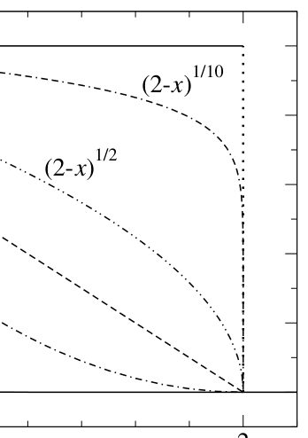 
Figure 1. Some of the interaction potentials (1.4), with parameters a = 1, a′ = 2 and ε = 1. The case ϕ = 1 is denoted as shoulder, ϕ = 2 −x as linear and ϕ = (2 −x)2 as quadratic.

📷 Fig 2

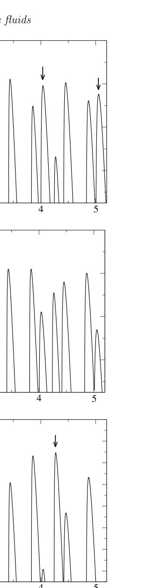 
Figure 2. Square shoulder potential (ν →∞) with parameters a = 1, a′ = √

📷 Fig 3

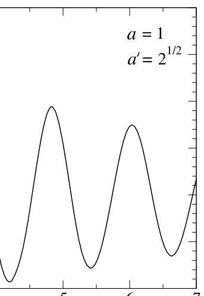 
Figure 3. Dependence of the ground-state correlation function g0 on the distance x for the linear ramp model (4.1) with parameters a = 1, a′ = √

📷 Fig 4

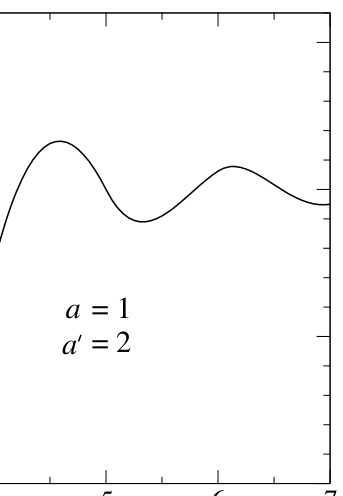 
Figure 4. Dependence of the ground-state correlation function g0 on the distance x for the linear ramp model (4.1) with parameters a = 1, a′ = 2, ε = 1 and under the incompressibility pressure pi = 1. The inequality 2a′ &gt; 3a holds in this model. A detailed description of the plot can be found in the text.

📷 Fig 5

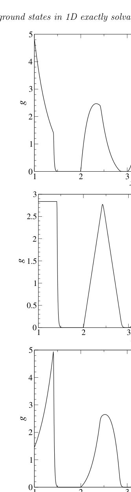 
Figure 5. The linear ramp potential with parameters a = 1, a′ = √

**Summary.** This theoretical paper analyzes the ground states of 1D fluids with soft repulsive interactions. It establishes that disordered ground states only exist for potentials that are concave ($
u \ge 1$) at a critical pressure $p_i$. These disordered states are non-hyperuniform and exhibit correlation functions that predict behavior over a wider range of temperatures and pressures.

**Why it may be interesting.** The finding that disordered ground states can be precisely characterized by non-zero susceptibility and extended to finite temperatures provides a theoretical bridge between zero-temperature quantum/classical ground states and finite-temperature liquid behavior.

Detailed structure

**Main problem.** The study investigates the existence and properties of disordered ground states in one-dimensional (1D) exactly solvable fluids.

**Main result.** Disordered ground states exist only for concave potentials ($
u \ge 1$) at a specific incompressibility pressure ($p_i$), characterized by non-zero isothermal susceptibility and non-hyperuniformity.

**Method.** The analysis uses the isothermal-isobaric ensemble, employing Laplace transforms and the steepest descent method to analyze the $T 	o 0$ limit of the equation of state and pair correlation function.

**Model / system.** The system consists of 1D fluids of classical hard-core particles interacting via a soft, repulsive, finite-range potential $\phi(x)$. The interactions are simplified to nearest-neighbor interactions when the interaction range $a'$ is small relative to the particle diameter $a$.

**Key observables.** Equation of state, mean nearest-neighbor distance ($l_0$), pair correlation function ($g_0(x)$), and isothermal susceptibility ($\chi_T$).

**Important parameters / regimes.** The potential exponent $
u$ (determining concavity/convexity), the incompressibility pressure $p_i$, and the temperature $T$ (analyzed in the $T 	o 0$ limit).

**Assumptions / limitations.** The analysis assumes the pairwise interactions reduce to nearest-neighbor interactions ($a' \le 2a$) and relies on the exact solvability of the model in the isothermal-isobaric ensemble.

**Figures summary.** Figures illustrate the pair correlation function $g(x)$ for different pressures around $p_i$, showing transitions between disordered, $a$-periodic, and $a'$-periodic behavior for the square shoulder potential.

**Paper structure.** The paper systematically analyzes the ground state behavior by examining the potential's concavity ($
u$ vs. 1), identifying the critical pressure $p_i$, and deriving the specific forms of $l_0$ and $g_0(x)$ for the resulting ordered and disordered phases.

Abstract

One-dimensional fluids of classical hard-core particles of diameter $a$, interacting in pairs via a soft repulsive (monotonically decreasing) potential of finite range $\varphi(x)=\varepsilon \left[ (a'-x)/(a'-a)\right]^{1/ν}$ $(a\le x\le a')$ with real positive parameters $\varepsilon$ and $ν$, are studied in an isothermal-isobaric ensemble. If $a'\le 2a$, the pairwise interactions are reduced to nearest-neighbour interactions, which allows for an exact solution of the thermal equilibrium. We focus on the $T\to 0$ ground states, specifically on the equation of state for the mean distance between nearest neighbours $l_0$ and the pair correlation function $g_0(x)$. If $\varphi(x)$ is concave $(ν\ge 1)$, there exists an ``incompressibility'' pressure $p_i=\varepsilon/(a'-a)$ such that the ground state is an equidistant chain of particles with spacing $l_0=a'$ for $0<p<p_i$ and with spacing $l_0=a$ for $p>p_i$. If $ν>1$ (strict concavity), the ground state at $p=p_i$ is disordered with $l_0=\left[ νa +(ν-1)a'\right]/(2ν-1)$ and $g_0(x)$ being a superposition of weighted Dirac delta functions over discrete positions. If $ν=1$ (linear ramp), the ground state at $p=p_i$ is disordered with $l_0=(a+a')/2$ and the continuous $g_0(x)$ is a superposition of Heaviside step functions multiplied by polynomials in $x$. The isothermal susceptibility at $T=0$ is nonzero for concave $\varphi(x)$ ($ν\ge 1$) at $p=p_i$ and, therefore, the corresponding disordered ground states are non-hyperuniform, i.e., they resemble disordered fluids at nonzero temperatures. It turns out that pair correlation functions of disordered ground states, which occur only at a single pressure $p_i$, extend their predictive power to thermodynamic states at nonzero temperatures over a wider range of pressures around $p_i$.

[↑ back to top](#top)

### [EFI Pairs Without One-Way Puzzles: Oracle Separations from Communication Complexity](http://arxiv.org/abs/2609.11901v1)

**Authors:** Atul Mantri  
**Type:** theory · **Category:** quantum information and computing · **PDF:** <https://arxiv.org/pdf/2609.11901v1>  
**Analysis basis:** full PDF text, analyzed in chunks
**Topic relevance:** `quantum measurements` **1/5**

📷 Fig 1

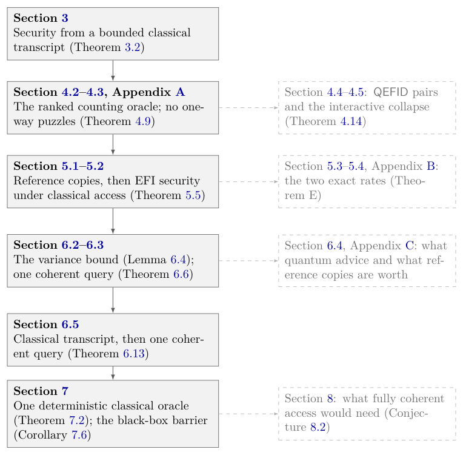 
Figure 1: Dependency structure. Solid boxes are used in the proof of Theorem 7.2; dashed boxes are not.

**Summary.** This paper tackles the relationship between two key quantum cryptographic assumptions: EFI pairs and one-way puzzles. By constructing a specific oracle, the authors prove that one can have quantum states that are hard to distinguish classically without relying on the existence of one-way puzzles. The work rigorously bounds the quantum advantage using communication complexity and random matrix theory.

**Why it may be interesting.** It provides deep theoretical insights into the computational assumptions underpinning quantum cryptography, showing that certain quantum advantages might vanish when the input/output structure is restricted to classical information.

Detailed structure

**Main problem.** The paper investigates whether the existence of EFI pairs (a quantum cryptographic primitive) necessitates the existence of one-way puzzles, a fundamental open question in quantum cryptography.

**Main result.** The authors construct a scenario relative to a specific oracle where EFI pairs exist without one-way puzzles, demonstrating that quantum polynomial time offers no advantage on tasks with purely classical inputs and outputs.

**Method.** The security proof relies on reducing the distinguishing advantage problem to classical communication complexity, specifically the Vector-in-Subspace problem, and uses random matrix theory for the final coherent query bound.

**Model / system.** The model involves analyzing the indistinguishability of two quantum states (an EFI pair) relative to an oracle that provides classical query answers about quantum samplers, all within a 'Coherent-last access' computational model.

**Key observables.** Distinguishing advantage ($	ext{Advantage}$), trace distance ($	ext{TD}$), and the bias of the quantum state separation.

**Important parameters / regimes.** The parameter $\lambda$ governing the state preparation, the dimension $n$ of the subspace, and the number of queries $L$.

**Assumptions / limitations.** The analysis is restricted to the 'Coherent-last access' model, and the paper concludes by stating conjectures to remove the restriction on superposition queries.

**Figures summary.** No figures were explicitly described in the notes, but the analysis relies on bounding sums over different cell size regimes and using various mathematical lemmas (e.g., Lemma 6.15).

**Paper structure.** The paper establishes the problem setup using EFI pairs and one-way puzzles, then introduces the oracle model. The core is the security proof, which proceeds by reducing the advantage to communication complexity (Theorem C) and bounding the coherent query advantage using random matrix theory (Theorem D).

Abstract

EFI pairs (Brakerski, Canetti, and Qian, ITCS 2023) and one-way puzzles (Khurana and Tomer, STOC 2024) are the leading candidates for the minimal assumption of quantum cryptography. The first are efficiently preparable quantum states, statistically far yet computationally indistinguishable; the second are classical puzzles, easy to sample and hard to solve. One-way puzzles imply EFI pairs, and whether the converse holds is open.   We construct a single classical oracle relative to which one-way puzzles do not exist, even with an unbounded verifier, while an EFI pair survives every distinguisher that queries the oracle classically throughout and holds advice about it, making its one superposition query at the end. The oracle answers every question about the output probabilities of quantum samplers, which removes the puzzles, and hides a Haar-random half-dimensional subspace.   To prove security we reduce it to communication complexity. An adversary whose knowledge of the subspace arrives as classical query answers can be simulated inside a two-party protocol against the party holding it, so it does no better than the best classical protocol for Vector-in-Subspace (Klartag and Regev, STOC 2011), whatever the oracle computes. That argument does not cover the superposition query, which we bound instead using tools from random matrix theory.   The same attack gives a classical simulation of any quantum party in a classical-message protocol with no entanglement shared in advance, so relative to the oracle there is no proof of quantumness either. Quantum polynomial time therefore offers no advantage on any task with classical inputs and outputs, while the two quantum states stay indistinguishable. We state conjectures on removing the restriction on superposition queries.

[↑ back to top](#top)

### [Fingerprints of Excitonic Collective Modes in the Two-Dimensional Electron Gas](http://arxiv.org/abs/2609.11138v1)

**Authors:** Jakob Wolff, Silvana Botti, Lucia Reining, Matteo Gatti  
**Type:** theory · **Category:** strongly correlated electrons · **PDF:** <https://arxiv.org/pdf/2609.11138v1>  
**Analysis basis:** full PDF text, analyzed in chunks
**Topic relevance:** `Keldysh / 2PI / non-Gaussian methods` **1/5**

📷 Fig 1

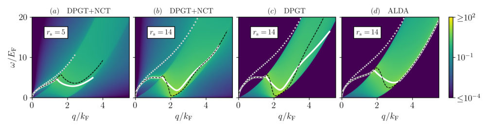 
Figure 1. Loss functions for (a) rs = 5 and (b)-(d) rs = 14, obtained using (a)-(b) the DPGT+NCT (see text), (c) the DPGT, and (d) the ALDA xc kernels. The collective modes ωc(q) are depicted by solid white lines, while the RPA plasmon is shown by light grey dots. The lines stop when the collective modes cease to exist. The black dashed line denotes the maximum of the loss function. In panel (a) and (b), the dashed line terminates because the loss function develops a double-peak structure, and the high energy peak around ω/EF ≈25 becomes more intense than the lower-energy structure.

📷 Fig 2

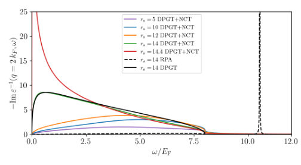 
Figure 2. Loss functions at q = 2kF. The DPGT+NCT loss functions for different rs are shown by colored solid lines. The DPGT as well as the RPA loss functions are shown for rs = 14 and represented by a solid and dashed black line, respectively. In the RPA, almost all spectral weight is in the plasmon peak, while the DPGT(+NCT) spectra develop asymmetric peaks inside the particle-hole continuum.

📷 Fig 3

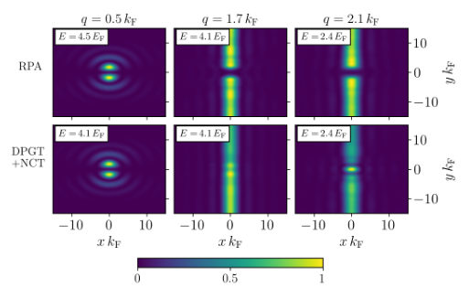 
Figure 3. Electron-hole correlation function: electron distri- bution around a hole at the origin, for a wavevector q in y direction and rs = 14. Upper panels: RPA. Lower panels: DPGT+NCT. The left panel, for q = 0.5kF, shows the plas- mon. The next two panels show results for wavevector and energy where the collective mode in DPGT+NCT is inside the continuum and close to its left border, or close to the minimum of the mode dispersion, respectively. The intensi- ties in all panels are normalized to their respective maximum. For DPGT and ALDA see [104] Fig. S3.

📷 Fig 4

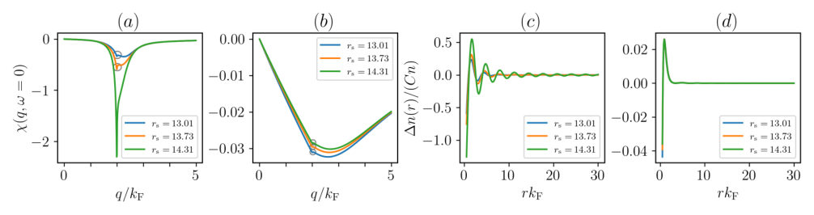 
Figure 4. (a),(b) Static linear density response χ(q, ω = 0) and (c),(d) corresponding density ∆n(r)/(Cn) induced by a point perturbation potential V (r) = Cδ(r), normalized to the perturbation strength and density. All results are shown for 3 values of rs. Panels (a) and (c) are results of DPGT, panels (b) and (d) are results of RPA. The rs values have been chosen to be 90, 95, 99% of the approximated critical rs where an instability is found in DPGT (see text). Note the change in scale between DPGT and RPA. The circles in (a) and (b) highlight the small needle-shaped superposed structures associated to the derivative singularity at 2kF of the response function. Since the static response...

**Summary.** This work uses TDDFT to explore collective charge excitations in the 2DEG, finding that excitonic modes appear at low densities, distinct from simple plasmons. The theory predicts that these modes signal an instability towards a charge-density-wave phase when the electron density drops sufficiently low. The findings offer concrete, measurable fingerprints for experimental detection in tunable 2D electron systems.

**Why it may be interesting.** The detailed study of collective excitations and instability mechanisms in a fundamental model system like the 2DEG provides crucial theoretical benchmarks for understanding strongly correlated electron behavior in low-dimensional materials.

Detailed structure

**Main problem.** The study investigates the existence and experimental signatures of excitonic collective charge excitations in the Two-Dimensional Electron Gas (2DEG) at low densities.

**Main result.** New excitonic modes emerge beyond traditional plasmons at low densities, and the system is predicted to become unstable towards a charge-density-wave (CDW) phase when the Wigner-Seitz radius exceeds a critical value.

**Method.** The research employs Time-Dependent Density Functional Theory (TDDFT) within the framework of the Casida equation, comparing results across various approximations for the exchange-correlation (xc) kernel.

**Model / system.** The physical system is the two-dimensional homogeneous electron gas (2D HEG), a model system whose properties are tunable by varying the electron density via the Wigner-Seitz radius ($r_s$).

**Key observables.** Loss function ($	ext{Im} \epsilon^{-1}(q, \omega)$), static linear density response ($\chi(q, \omega=0)$), and induced density oscillations ($\Delta n(r)$).

**Important parameters / regimes.** Wigner-Seitz radius ($r_s$), wavevector ($q$), and frequency ($\omega$). The critical instability is predicted around $r_s \gtrsim 14.455$.

**Assumptions / limitations.** The analysis relies on approximations for the xc kernel, comparing RPA, ALDA, DPGT, and DPGT+NCT, with the most detailed results using the DPGT+NCT parametrization.

**Figures summary.** Figures illustrate the development of asymmetric peak structures in the loss function and strong Friedel-like oscillations in the static response function as $r_s$ increases, particularly near $q=2k_F$.

**Paper structure.** The paper systematically compares the predictions of various theoretical approximations (RPA vs. DPGT+NCT) for collective excitations, focusing on how excitonic effects manifest in the loss function and the static density response, culminating in the prediction of a CDW instability.

Abstract

The two-dimensional homogeneous electron gas (2D HEG) is a prototype system of fundamental interest that can be realized experimentally over a wide range of densities. Here, we investigate its collective charge excitations at low densities, using time-dependent density functional theory. We demonstrate that, beyond traditional plasmons, new collective excitonic modes emerge for a Wigner-Seitz radius larger than $r_{\mathrm s} \approx 1$. These excitonic modes leave characteristic fingerprints in experimentally accessible quantities, namely, asymmetric peak structures in the loss function and very strong Friedel-like oscillations in the static linear density response that increase when the system approaches a regime of instability. Indeed, at low enough densities the collective modes cross the zero energy axis, indicating an instability of the paramagnetic 2D HEG towards the formation of a charge-density-wave phase with excitonic origin. These findings provide valuable insights for the experimental detection of excitonic collective modes in tunable 2D electron systems and contribute to the fundamental understanding of many-body effects in low-density electron gases.

[↑ back to top](#top)

### [Hierarchy of Rényi Coherent Information in Stabilizer Codes](http://arxiv.org/abs/2609.11930v1)

**Authors:** Akash Vijay, Luis Colmenarez, Jong Yeon Lee  
**Type:** theory · **Category:** quantum information and computing · **PDF:** <https://arxiv.org/pdf/2609.11930v1>  
**Analysis basis:** full PDF text, analyzed in chunks
**Topic relevance:** `quantum measurements` **1/5**

📷 Fig 1

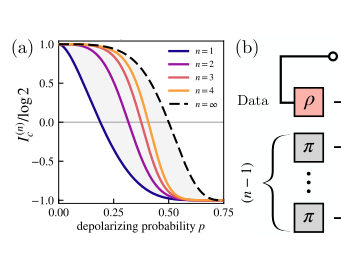 
FIG. 1. (a) Rényi hierarchy. Exact Rényi-n coherent infor- mation for the [[5, 1, 3]] code under depolarizing noise with to- tal nonidentity probability p, with qX = qY = qZ = p/3. The hi- erarchy holds for every finite stabilizer code under independent- event Pauli noise, but can fail for more general Pauli channels. (b) Postselection gadget. One arbitrary logical data state and n −1 maximally mixed logical ancilla states are encoded into separate blocks. Each block undergoes the same noise channel and syndrome measurement. Retaining only matching syndrome outcomes implements the trace-nonincreasing map; when the success probability is input-independent, division by this probability yields...

**Summary.** This paper analyzes the Rényi coherent information in quantum error correction codes, proving that under specific noise conditions (independent Bernoulli faults), this information measure is nondecreasing with the Rényi index $n$. It also provides an operational interpretation by linking the information measure to the fidelity of quantum channel recovery via syndrome postselection.

**Why it may be interesting.** The work provides rigorous mathematical tools to analyze the performance limits of quantum error correction codes under realistic noise models by establishing concrete, computable hierarchies for entanglement measures.

Detailed structure

**Main problem.** The paper addresses two shortcomings of Rényi coherent information ($I_c^{(n)}$): its lack of monotonicity in the Rényi index $n$ and its lack of clear operational meaning compared to the von Neumann case.

**Main result.** For Pauli noise from independent Bernoulli events, the Rényi coherent information is proven to be nondecreasing in $n$. Furthermore, an operational meaning is established via postselection on matching syndromes, linking saturation of $I_c^{(n)}$ to perfect channel recovery.

**Method.** The authors employ information-theoretic tools, including Rényi entropy calculations, correlation inequalities (like Harris's), and analyzing the structure of syndrome-conditioned quantum channels.

**Model / system.** The study focuses on stabilizer codes subjected to Pauli noise, considering both independent Bernoulli noise and general stochastic Pauli noise models.

**Key observables.** Rényi coherent information ($I_c^{(n)}$), the Rényi deficit ($\Delta_n$), and the recovery fidelity ($F_n$).

**Important parameters / regimes.** The Rényi index $n$, the noise model (Bernoulli vs. general stochastic Pauli noise), and the code structure.

**Assumptions / limitations.** The initial hierarchy proof relies on the assumption that the Pauli noise is generated by independent Bernoulli events; counterexamples show failure when this assumption is violated.

**Figures summary.** Figure 1(a) illustrates the nondecreasing Rényi hierarchy for a code under depolarizing noise, while Figure 1(b) depicts the postselection gadget using one data block and $n-1$ auxiliary blocks.

**Paper structure.** The paper proceeds by first proving the nondecreasing hierarchy for independent Bernoulli noise, then defining the operational meaning via matched-syndrome postselection, and finally analyzing the conditions (like $n$-balance) under which these bounds and equivalences hold.

Abstract

Rényi coherent information, a computable proxy for the von Neumann coherent information, is widely used to study mixed-state phases of matter and decodability transitions in noisy quantum error-correcting codes. However, being a difference of two Rényi entropies, it need not be monotonic in the Rényi index, and lacks the operational meaning of its von Neumann counterpart. Here we address both issues for stabilizer codes. First, for Pauli noise generated by independent Bernoulli events, we prove that the Rényi-$n$ coherent information is nondecreasing in $n \in \mathbb{Z}^+$. This follows from a general theorem: if independent random bits are mapped linearly to a fine label $T$ and a coarse label $C$, then the Rényi entropy difference $H_n(C)-H_n(T)$ is nondecreasing in $n$. For stabilizer codes, $T$ is the joint syndrome--logical class and $C$ is the syndrome, and the difference is the Rényi-$n$ coherent information up to a constant. The same theorem covers classical linear codes and independent detector error models. Second, for arbitrary stochastic Pauli noise, we give the Rényi-$n$ coherent information an operational meaning via postselection on matching syndromes between one data block and $n-1$ auxiliary blocks. We determine when this defines a quantum channel and show that saturation of the Rényi-$n$ coherent information is equivalent to asymptotically perfect recovery of the postselected channel. Moreover, the Rényi-$n$ coherent information also upper-bounds the ordinary coherent information achievable after any syndrome-conditioned recovery.

[↑ back to top](#top)

### [Irrationality Measure Controls Long-Wavelength Charge Fluctuations in Quasiperiodic Systems](http://arxiv.org/abs/2609.10948v1)

**Authors:** Junmo Jeon, Shiro Sakai  
**Type:** theory · **Category:** disordered systems and neural networks · **PDF:** <https://arxiv.org/pdf/2609.10948v1>  
**Analysis basis:** full PDF text, analyzed in chunks
**Topic relevance:** `Frenkel-Kontorova` **1/5**

📷 Fig 1

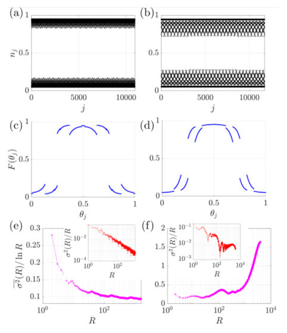 
FIG. 1. (a,b) Spatial distribution of the local density nj in the Aubry–Andr´e model [Eq. (6)], calculated for λ = 3t, EF = 0 and different β’s. (c,d) Hull charge profile F(θj), where θj = jβ mod 1. Both are piecewisely regular with finitely many jumps. (e,f) σ2(R)/ ln R as the function of win- dow radius R. Here, σ2(R) = R−1 R R 0 σ2(R′)dR′ is the run- ning average of σ2(R). The insets show σ2(R)/R which van- ishes for large R. (a,c,e) β = 6765/10946 which is continued fraction approximant of golden ratio with µ = 2. The system size is 10946. (b,d,f) β = 28517/11724 = [2; 2, 3, 5, 10, 31] with µ ≈2.5794. The system size is 11724.

**Summary.** This work establishes that the long-wavelength charge fluctuations in quasiperiodic systems are fundamentally controlled by the arithmetic properties of the irrational modulation frequency $eta$. It derives a scaling law linking the fluctuation exponent to both the frequency's irrationality measure and the smoothness of the system's charge profile. This provides a deep theoretical link between number theory and condensed matter physics.

**Why it may be interesting.** The explicit connection between number theory (irrationality measure) and physical transport/fluctuation properties in quasiperiodic lattices provides a powerful, non-trivial diagnostic tool for characterizing the underlying order.

Detailed structure

**Main problem.** The paper determines the fundamental principle governing long-wavelength charge fluctuations in quasiperiodic systems, linking it directly to the arithmetic properties of the irrational modulation frequency.

**Main result.** The scaling of infrared charge fluctuations is governed by a relationship involving the system's regularity exponent ($r$) and the irrationality measure ($\mu(eta)$) of the frequency, specifically $\alpha + 1 = 2r / (\mu(eta) - 1)$.

**Method.** The analysis uses Fourier decomposition and scaling arguments to relate the integrated low-momentum weight (charge fluctuations) to the arithmetic properties of the quasiperiodicity.

**Model / system.** The study focuses on translation-covariant quasiperiodic systems, exemplified by the Aubry-André model, described by Hamiltonians $H(	heta)$ modulated by an irrational frequency $eta$.

**Key observables.** Charge fluctuation variance $\sigma^2(R)$, integrated infrared weight $Z(K)$, and the hyperuniformity class $\alpha$.

**Important parameters / regimes.** Irrationality measure $\mu(eta)$, regularity exponent $r$, and the modulation frequency $eta$.

**Assumptions / limitations.** The analysis assumes the relevant hull Fourier amplitudes obey an algebraic decay bound $|c_m| \lesssim |m|^{-r}$ and that the spectral gap is stable for the deep sector contribution to be negligible.

**Figures summary.** Figures illustrate the charge distribution and the running average of the charge variance $\sigma_2(R)$ for different irrational frequencies ($\phi$ vs. another irrational).

**Paper structure.** The paper establishes the physical link between arithmetic properties ($\mu(eta)$) and physical observables (charge fluctuations), deriving the central scaling relation by analyzing the contributions from near-Fermi states versus the deep spectral gap.

Abstract

Quasiperiodic order is characterized by irrational frequencies whose rational approximability known as irrationality measure defines distinct arithmetic classes. We establish that this arithmetic classification has direct physical consequences for long-wavelength charge fluctuations. In translation-covariant quasiperiodic systems, the infrared scaling of charge fluctuation is governed by the interplay between the irrationality exponent of irrational frequency and the large-harmonic decay of the hull charge profile: the latter determines the available charge weight, while the former controls how efficiently that weight is transferred to the infrared. Consequently, all algebraic irrational frequencies share the same arithmetic scaling, whereas exceptionally well-approximable transcendental frequencies can exhibit strongly enhanced infrared fluctuation scaling. We further prove that occupied states separated from the Fermi level by a gap stable throughout the hull contribute only an analytic infrared background, leaving the nontrivial scaling to near-Fermi states. Our results extend to general translation-covariant multi-frequency quasiperiodic systems.

[↑ back to top](#top)

### [Krylov Edge Spectroscopy of Symmetry-Protected Topological Phases](http://arxiv.org/abs/2609.10676v1)

**Authors:** Heiko Georg Menzler, Rishabh Jha  
**Type:** theory · **Category:** other · **PDF:** <https://arxiv.org/pdf/2609.10676v1>  
**Analysis basis:** full PDF text, analyzed in chunks
**Topic relevance:** `analog quantum simulation` **1/5**

📷 Fig 1

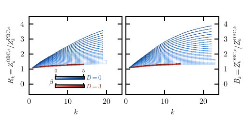 
FIG. 1. Depth flow of the spin-1 boundary-selectivity ratios at L = 8 as β varies from 0 to 5. Blue curves show AKLT (D = 0) and red curves large-D (D = 3); increasing β enhances the AKLT boundary contrast while the large-D response remains near unity. The left and right panels show RK = ZOBC K /ZPBC K and BK = Zboundary K /Zbulk K , respectively.

📷 Fig 2

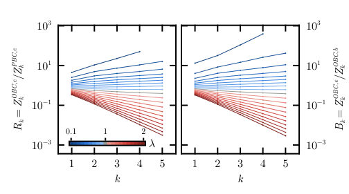 
FIG. 2. Depth flow of the cluster-chain boundary-selectivity ratios at L = 12 as λ is varied across the transition at λ = 1. In the SPT regime λ &lt; 1, RK and BK grow strongly with depth, whereas in the trivial regime λ &gt; 1 they remain near or below unity. The left and right panels show RK = ZOBC K /ZPBC K and BK = Zboundary K /Zbulk K , respectively.

**Summary.** The authors present Krylov Edge Spectroscopy, a novel, local diagnostic tool to characterize Symmetry-Protected Topological phases in 1D quantum systems. By analyzing the spectral properties of boundary operators via Krylov recursion, the method detects topological protection without requiring full diagonalization. This technique successfully classifies phases by relating boundary dynamics to fundamental topological invariants like cohomology labels.

**Why it may be interesting.** This provides a powerful, purely local, and computationally tractable diagnostic tool to probe global topological invariants in 1D quantum systems, which is highly relevant for understanding boundary physics in condensed matter systems.

Detailed structure

**Main problem.** The paper introduces Krylov Edge Spectroscopy to develop a method for detecting and classifying one-dimensional Symmetry-Protected Topological (SPT) phases.

**Main result.** The method successfully maps the transition between topological and trivial phases to a localization-delocalization transition of the Krylov edge mode, and it can recover exact cohomology labels for models like the clock chain.

**Method.** It uses a many-body operator-space protocol based on Krylov recursion applied to local boundary observables, avoiding the need for exact diagonalization or entanglement spectra.

**Model / system.** The analysis is performed on one-dimensional systems, including cluster, clock, Haldane, and spin-1 chains, using finite-range Hamiltonians in the Gibbs state.

**Key observables.** Zero-frequency normalizability criterion, boundary ratios ($R_K, B_K$), leakage residual ($\epsilon_K$), and the minimum stiffness ($\kappa_{\min}$) for classification.

**Important parameters / regimes.** The Krylov depth ($K$), the system size ($L$), and the symmetry group structure ($\mathbb{Z}_N 	imes \mathbb{Z}_N$ or $D_2$).

**Assumptions / limitations.** The method assumes the existence of a unique self-adjoint realization for the infinite tridiagonal operator and relies on the exponential locality of 1D Gibbs states.

**Paper structure.** The paper follows a logical progression: first, establishing the theoretical framework via Krylov recursion and boundary tests for detection; second, detailing the classification procedure by minimizing local commutator norms across symmetry sectors; and finally, demonstrating the protocol's success on benchmark models like the clock and spin-1 chains.

Abstract

We introduce $Krylov$ $edge$ $spectroscopy$, a many-body operator-space protocol for detecting and classifying one-dimensional symmetry-protected topological phases from local boundary dynamics. A Hermitian boundary operator generates a semi-infinite Krylov hopping chain whose boundary weight obeys an exact zero-frequency normalizability criterion. Open-periodic, boundary-bulk, and symmetry-preserving boundary-perturbation tests identify protected boundary memory, while a finite-depth leakage residual certifies when an explicitly reconstructed operator is already near zero frequency. Classification minimizes the normalized commutator over symmetry-resolved boundary operators in fixed charge sectors. For bosonic $\mathbb{Z}_N \times \mathbb{Z}_N$ phases, the recovered endpoint charge gives the cohomology label. The method requires neither many-body exact diagonalization, an explicit ground-state wavefunction or entanglement spectrum, nor a guessed dressed edge or string operator. For finite-range Hamiltonians, locality organizes the thermodynamic limit at fixed Krylov depth before the depth limit. We demonstrate the protocol in cluster, clock, Haldane, and trivial spin-1 chains. In the exactly solvable cluster chain, the transition between the gapped topological and trivial phases manifests as a localization-delocalization transition of the Krylov edge mode on the Krylov chain. This transition occurs precisely at the bulk gap closing, and its localization-length exponent coincides with the Ising correlation-length exponent. Through operator Krylov dynamics, our work turns local boundary evolution into a direct spectroscopy of many-body topology.

[↑ back to top](#top)

### [Quantum State of a Gravitating Spacetime Region](http://arxiv.org/abs/2609.10684v1)

**Authors:** Raphael Bousso, Sami Kaya, Guanda Lin, Arvin Shahbazi-Moghaddam  
**Type:** theory · **Category:** other · **PDF:** <https://arxiv.org/pdf/2609.10684v1>  
**Analysis basis:** full PDF text, analyzed in chunks
**Topic relevance:** `quantum measurements` **1/5**

📷 Fig 1

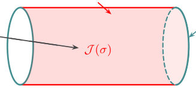 
Figure 1. Given a (d+1)-dimensional Lorentzian wedge wσ, we construct a (non-unique) quantum state J (σ) that gives rise to wσ in the classical limit. (a) A d-dimensional Cauchy slice Σ of wσ is deformed to a submanifold J(σ) in the complexification of wσ. In this example, the shared boundary σ of Σ and J(σ) has two components, σ = χ ⊔χc. (b) Of the full phase space data induced on J(σ), we retain only the conformal data ([hab], K) in the interior of J(σ), and the full (d −1)-metric γpq|σ on σ. These assignments turn J(σ) into an elliptic data manifold J (σ). — Conversely, we regard any elliptic data manifold J (σ), with arbitrary complex ([hab], K) and real γpq|σ, as a quantum state....

📷 Fig 2

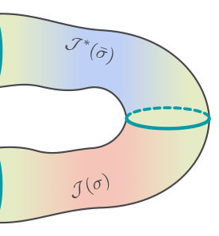 
Figure 3. The closed elliptic data manifold trχ[˜ρ(χ, ¯χ)2] is obtained by cyclic gluing (here, across the vertical plane) of two copies of ˜ρ(χ, ¯χ) (see Fig. 2).

📷 Fig 3

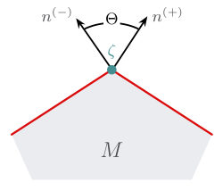 
Figure 4. GPI with mixed-conformal boundary data. (a) On a closed d-manifold J(∅) = ∂M with (d −1)-dimensional submanifold ζ, we specify the full metric γpq on ζ and ([hab], K) on J(∅) \ ζ. Together, J(∅) and these data comprise the closed elliptic data manifold J (∅). In the example shown, ζ has two components, referred to as joints. The GPI is over spacetimes (M, gij) that induce these data on their boundary. (b) Local geometry at a joint ζ. The limiting outward normals n(−) and n(+) determine the exterior angle Θ. The illustrated joint is convex and has Θ &gt; 0.

📷 Fig 4

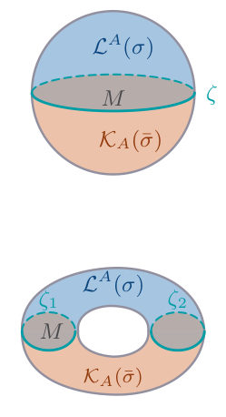 
Figure 5. Elliptic data manifolds with boundary and their gluing. In panel (a), σ is connected: the underlying manifolds J(σ) and K(¯σ) are disks and glue across σ to form a sphere. In panel (b), σ = σ1⊔σ2 has two connected components: the underlying manifolds are cylinders and glue along both circular boundaries to form a torus. Cyan marks the gluing loci, blue and orange mark the data-equipped elliptic data manifolds J A(σ) and KA(¯σ), and the pale region shows one possible bulk filling M. The GPI sums over fillings. Setting K = J ∗gives G[(J ∗)AJ A] = ⟨J , J ⟩.

📷 Fig 5

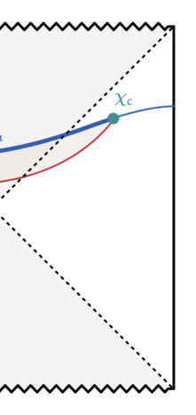 
Figure 6. BTZ black hole of radius r1. A global maximal-volume slice (thin blue) with minimum radius ra &lt; r1 contains the partial Cauchy slice Σ (thick blue), which is bounded by circles χ and χc at r = R in the left and right exteriors. A deformation of Σ off the real Lorentzian sector yields the underlying preparation manifold J(σ), with boundary σ = χ ⊔χc. Together with the induced mixed-conformal data, it defines the EDM J (σ).

**Summary.** This work proposes a novel framework linking quantum states in quantum gravity to specific, finite Lorentzian spacetime regions. It defines quantum states using elliptic data manifolds and calculates entanglement entropy by relating it to geometric quantities like the maximin surface area. This offers a powerful, general tool for exploring quantum information structure in regimes beyond standard holographic assumptions.

**Why it may be interesting.** While focused on quantum gravity, the rigorous calculation of entanglement entropy via geometric quantities (maximin surface) and the development of a general state formalism are highly relevant to understanding quantum information structure in curved spacetime, which underpins many-body physics concepts.

Detailed structure

**Main problem.** The paper aims to establish a fundamental correspondence between quantum states defined on a boundary manifold and the geometry of finite Lorentzian spacetime regions in quantum gravity.

**Main result.** A broad correspondence is proposed linking quantum states $J(\sigma)$ to Lorentzian wedges $w_\sigma$, and the von Neumann entropy is shown to be controlled by the maximin surface area, echoing holographic principles.

**Method.** The framework defines quantum states using elliptic data manifolds and calculates entanglement entropy via partial traces and the Gravitational Path Integral (GPI) evaluated on closed manifolds.

**Model / system.** The system involves defining a gravitational Hilbert space $\mathbf{H}_\sigma$ associated with a compact boundary $\sigma$, and analyzing the quantum state $\mathcal{J}(\sigma)$ which is a $d$-manifold bounded by $\sigma$.

**Key observables.** Rényi entropies ($S_n$) and the von Neumann entropy ($S_1$), which are predicted to be proportional to the maximin surface area.

**Important parameters / regimes.** The gravitational coupling constant $G_N$, the dimension $d$, and the geometry of the boundary $\sigma$.

**Assumptions / limitations.** The framework assumes the Hilbert space factorizes over connected components of $\sigma$, and the classical limit requires the GPI to be dominated by a single saddle geometry with Lorentzian fixed points.

**Figures summary.** Figures illustrate the construction of quantum states via complex deformations from Lorentzian wedges, the calculation of reduced states via partial gluing, and the comparison of actions between Euclidean and Wall saddles.

**Paper structure.** The paper develops the mathematical framework by defining the Hilbert space and state structure, establishing the correspondence to classical spacetime regions, and then applying this structure to compute entanglement entropy for specific examples like black hole boundaries.

Abstract

We associate a gravitational Hilbert space $\mathbf{H}_σ$ to any closed compact $(d-1)$-manifold $σ$ with real metric. A quantum state $\mathcal{J}(σ)$ is a $d$-manifold bounded by $σ$ and equipped with elliptic data. An inner product is defined by gluing states pairwise across $σ$ and evaluated by viewing the resulting closed $d$-manifold as a boundary condition on the gravitational path integral (GPI) over $(d+1)$-manifolds.   If $σ$ is nonempty and the GPI is dominated by a single $(d+1)$-manifold $M$ in the $G_N\to 0$ limit, then $M$ contains a Lorentzian CRT fixed-point set, providing $\mathcal{J}(σ)$ with a classical spacetime interpretation. Conversely, given a finite Lorentzian domain with edge $σ$, a state $\mathcal{J}(σ)$ may be associated to it by deforming its initial data off the real Lorentzian section and retaining only elliptic data. This establishes a broad correspondence between non-asymptotic spacetime regions and quantum states.   Assuming that $\mathbf{H}_σ$ factorizes over connected components of $σ$, our framework admits operators and partial traces. This allows us to explore the information-theoretic structure of the states we define. As an example, we construct a family of states by deforming partial Cauchy slices $Σ$ that straddle a two-sided black hole; $σ$ consists of two spheres. We construct the reduced state on one sphere and find that its Rényi entropies are positive, monotonic, and sensitive to all aspects of $Σ$ and its complex deformation. The von Neumann entropy, however, is controlled only by the maximin surface in the causal domain of $Σ$, independently of other parameters, so long as the complex deformation does not vanish. Our proposal may thus explain the efficacy of tensor network toy models of holography while transcending their limitations.

[↑ back to top](#top)

### [Sample-optimal learning of stabilizer states](http://arxiv.org/abs/2609.10974v1)

**Authors:** Rebecca Chang, Matthias C. Caro, Martin Larocca, Maxwell West  
**Type:** theory · **Category:** quantum information and computing · **PDF:** <https://arxiv.org/pdf/2609.10974v1>  
**Analysis basis:** full PDF text, analyzed in chunks
**Topic relevance:** `quantum measurements` **1/5**

📷 Fig 1

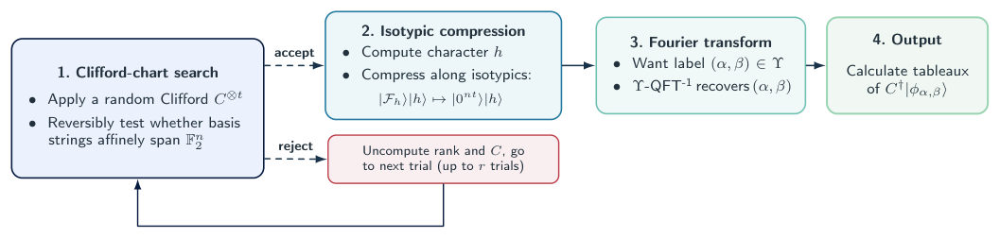 
Figure 1. Overview of our stabilizer-learning algorithm, which has four core stages. In stage one we reduce the problem to that of learning a stabilizer state which has support on all computational basis strings; such “full-rank” states enjoy certain nice algebraic properties which we are able to exploit. In particular, they are exactly the orbit on the state |+⟩⊗n of a certain representation of the abelian group Υ ∼= Zn 4 × F n(n−1)/2 2 . The test (correctly) rejecting a rank-deficient state is non-destructive, so that the test can be uncomputed and another trial performed; the test (incorrectly) rejecting a full-support causes the algorithm to fail (not depicted in the figure). In stage...

**Summary.** This paper provides a rigorous determination of the sample complexity required to learn an unknown n-qubit stabilizer state. It introduces a novel, efficient quantum algorithm that achieves the optimal scaling for this task. The work is significant for quantum information theory as it provides tight bounds and a practical method for characterizing quantum states.

**Why it may be interesting.** While focused on quantum computation, the rigorous analysis of state learning complexity and the use of Fourier analysis on group structures provide deep theoretical tools applicable to characterizing entanglement and resource estimation in quantum many-body systems.

Detailed structure

**Main problem.** The paper determines the minimum number of copies required to learn an unknown pure n-qubit stabilizer state and subsequently derives the complexity for learning associated Clifford unitaries.

**Main result.** They establish tight bounds for the sample complexity, $L_\delta(n) \approx n + \log(1/\delta)$, and present a polynomial-time quantum algorithm that saturates these bounds.

**Method.** The approach uses a multi-stage quantum algorithm involving reduction to a full-support state, isotypic compression, and applying the Quantum Fourier Transform over a specific abelian group structure.

**Model / system.** The system under study is the $n$-qubit stabilizer state, which are specific quantum states generated by the Clifford group acting on computational basis states.

**Key observables.** The primary observable is the sample complexity, $L_\delta(n)$, which quantifies the minimum number of state copies needed for successful identification.

**Important parameters / regimes.** The key parameters are the number of qubits ($n$), the failure probability ($\delta$), and the structure of the underlying abelian group $\Upsilon$.

**Assumptions / limitations.** The analysis assumes the ability to implement random Clifford operations and relies on bounding probabilities using techniques like the Hellinger overlap.

**Figures summary.** Figure 1 provides an overview of the four core stages of the proposed stabilizer-learning algorithm, detailing the sequence of operations from state reduction to tableau reconstruction.

**Paper structure.** The paper follows a logical progression: first, establishing the problem bounds; second, detailing the four-stage quantum algorithm (reduction, compression, Fourier transform, reconstruction); and finally, analyzing the computational complexity of each step.

Abstract

It is well-known that learning a pure $n$-qubit stabilizer state $|ψ\rangle$ both requires, and can be accomplished with, access to a number of copies of $|ψ\rangle$ linear in $n$. However, the precise constant coefficient of this scaling does not appear to have been determined. Here we prove that $L_δ(n)$, the smallest number of copies from which a quantum procedure can identify any stabilizer state with failure probability at most $0<δ<1/8$, satisfies $n+\lceil\log_2(1/δ)\rceil-3\leq L_δ(n)\leq n+\left\lceil\log_2(1/δ)\right\rceil+4$. We present a polynomial-time quantum learning algorithm that saturates this bound, achieving a constant factor improvement in sample-complexity over previously known approaches. As an immediate corollary, we obtain via the Choi-Jamiolkowski isomorphism an algorithm for learning an unknown $n$-qubit Clifford unitary from $2n+\left\lceil\log_2(1/δ)\right\rceil+4$ queries, the $n$-dependence of which we show to be optimal. Our proof technique, which involves Fourier analysis on the abelian group $\mathbb{Z}_4^n \times \mathbb{F}_2^{n(n-1)/2}$, seems to be qualitatively different to previous approaches to stabilizer state learning, and may be of some independent interest; in particular, it admits natural generalisations to further problems in quantum learning theory.

[↑ back to top](#top)

### [Selected Coupled Cluster Guided by Selected Configuration Interaction](http://arxiv.org/abs/2609.10829v1)

**Authors:** Minsik Cho, Troy Van Voorhis  
**Type:** theory · **Category:** strongly correlated electrons · **PDF:** <https://arxiv.org/pdf/2609.10829v1>  
**Analysis basis:** full PDF text, analyzed in chunks
**Topic relevance:** `analog quantum simulation` **1/5**

📷 Fig 1

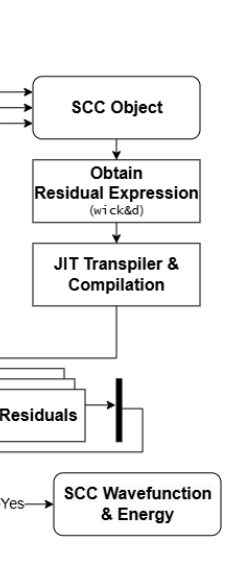 
Figure 1: Flowchart of SCC Implementation

📷 Fig 2

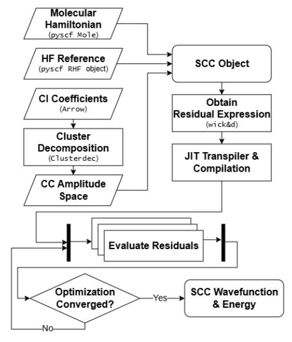 
Figure 1 illustrates the combined workflow for SCC calculations. PySCF34 provides the

📷 Fig 3

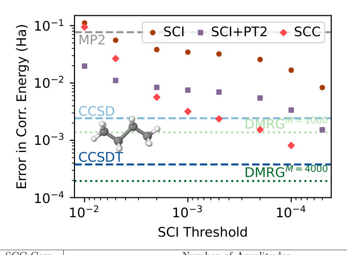 
Figure 2: (Top) Error in correlation energy relative to extrapolated DMRG for butane (Bottom) SCC amplitude count (in spin orbitals) and raw correlation energies

📷 Fig 4

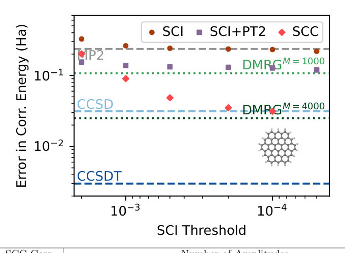 
Figure 3: (Top) Error in correlation energy relative to extrapolated SCC energy for circum- coronene (Bottom) SCC amplitude count (in spin orbitals) and raw correlation energies

📷 Fig 5

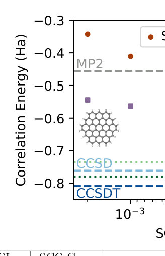 
Figure 4: (Top) Correlation energy of stretched circumcoronene (Bottom) SCC amplitude count (in spin orbitals) and raw correlation energies

**Summary.** This paper presents Selected Coupled Cluster (SCC), a novel, sparse quantum chemistry method designed to overcome the computational limitations of high-rank Coupled Cluster theory. SCC leverages the sparsity inherent in Selected Configuration Interaction (SCI) wavefunctions to guide the optimization of CC amplitudes. It demonstrates that SCC provides highly accurate and rapidly converging energy estimates, making it a powerful, drop-in enhancement for modern electronic structure calculations.

**Why it may be interesting.** While focused on quantum chemistry, the development of highly efficient, sparse, and systematic many-body wavefunction methods like SCC provides algorithmic insights applicable to simulating strongly correlated quantum materials.

Detailed structure

**Main problem.** The computational cost scaling of high-rank Coupled Cluster (CC) theory limits its application for accurate electronic structure calculations.

**Main result.** Selected Coupled Cluster (SCC) is introduced as an efficient, arbitrary-order sparse CC method that outperforms standard SCI and CCSD in the tight-threshold regime.

**Method.** SCC solves the CC residual equations by optimizing amplitudes within a compact, sparse amplitude space guided by a modern Selected Configuration Interaction (SCI) wavefunction.

**Model / system.** The method applies to electronic structure problems governed by the time-independent Schrödinger Equation, using molecular systems like butane and circumcoronene as benchmarks.

**Key observables.** Energy (E), convergence rate, and the number of selected amplitudes required for convergence.

**Important parameters / regimes.** The SCI variational threshold ($\epsilon_{var}$), which guides the amplitude selection; the rank of the CC excitations (T).

**Assumptions / limitations.** The core assumption is that the sparsity of the ground-state wavefunction can be effectively exploited by guiding the CC amplitude space using SCI methods.

**Figures summary.** Figures show the error in correlation energy relative to extrapolated DMRG energy for butane, and the relationship between SCC amplitude count and the SCI threshold for various systems.

**Paper structure.** The paper introduces SCC as an enhancement to SCI workflows, details the implementation using sparse data structures and JIT compilation, and benchmarks its performance against SCI, CCSD, CCSDT, and DMRG across several chemical systems.

Abstract

Coupled Cluster (CC) theory is one of the most popular correlated wavefunction methods, yet the steep computational cost scaling of CC truncated at higher rank limits its application. Modern Selected Configuration Interaction (SCI) methods successfully exploit the sparsity of ground-state wavefunctions in the determinant space, motivating an analogous approach with the exponential CC ansatz. In this work, we introduce Selected Coupled Cluster (SCC), an arbitrary-order sparse CC method that explicitly solves the CC residual equations within a compact amplitude space guided by an SCI wavefunction. SCC optimizes the CC amplitudes in the sparse amplitude space. Using a pilot Just-in-Time (JIT) compiled implementation, we benchmark SCC against SCI, SCI+PT2, standard rank-truncated dense CC (CCSD, CCSDT), and DMRG across various chemical systems. We demonstrate that SCC exhibits fast, monotonic convergence with the SCI variational threshold, outperforming SCI and surpassing SCI+PT2 in the tight-threshold regime. SCC also provides accurate energies for high-dimensional topologies, where DMRG typically converges slowly with bond dimension. SCC thus presents an efficient drop-in enhancement for modern SCI workflows.

[↑ back to top](#top)

### [The cost of simulating classically tractable quantum circuits and dynamics](http://arxiv.org/abs/2609.11847v1)

**Authors:** Su Yeon Chang, Supanut Thanasilp, Zoë Holmes, M. Cerezo  
**Type:** theory · **Category:** quantum information and computing · **PDF:** <https://arxiv.org/pdf/2609.11847v1>  
**Analysis basis:** full PDF text, analyzed in chunks
**Topic relevance:** `analog quantum simulation` **1/5**

📷 Fig 1

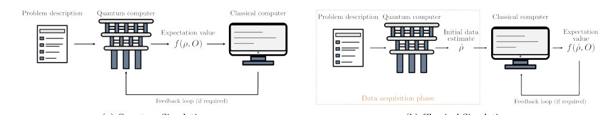 
Figure 1. Schematic description of Quantum and Classical Simulations. a) In Quantum Simulation, each circuit instance is executed directly on the quantum hardware and the corresponding expectation value is estimated from quantum measurements. When required, a classical computer updates the circuit parameters between evaluations. b) In CS, the quantum evolution is replaced by a classical surrogate. If the required information about the initial state is not known classically, it is obtained during an initial quantum data-acquisition stage and subsequently reused by the Classical Simulation for different circuit instances (e.g. for different simulation times or parameter values).

📷 Fig 2

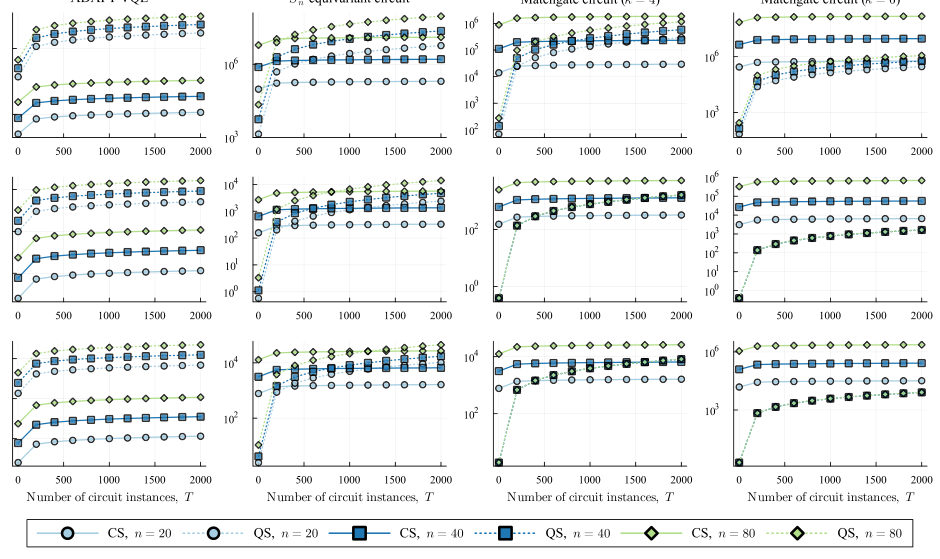 
Figure 2. Estimated wall-clock time for QS and CS on IonQ Forte, Google Sycamore, and IBM Heron. Here, the runtime corresponds to the total runtime t(X) sim given by Eq. (104), which sums both the runtime on the quantum and classical hardware. Rows correspond to the three quantum hardware platforms, while all classical operations are assumed to run on the same classical hardware. The horizontal axis denotes the total number of circuit instances T. Columns correspond to ADAPT-VQE, Sn-equivariant circuits, and Matchgate circuits with κ = 4 and 6, while rows correspond to the three hardware models. Solid lines denote CS and dotted lines QS. Marker shapes indicate the system sizes n = 20, 40,...

📷 Fig 3

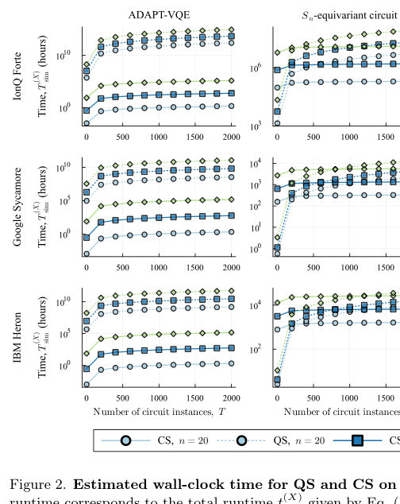 
Figure 2 shows the resulting estimates for IonQ Forte, Google Sycamore, and IBM Heron, with ϵ = 0.001 and δ = 0.001. For the classical computation, we assume an elementary operation time of tC = 0.25 ns. Here we can see that classical simulability does not imply that CS is faster at finite system size. For ADAPT-VQE, the CS is faster throughout the parameter range considered here. In this case, the Hartree–Fock input state is known classically, so the surrogate incurs neither quantum data acquisition nor quantum circuit execution. Therefore, the runtime only consists of the runtime on the classical hardware. The Sn-equivariant example similarly benefits from the reduced Schur-block...

📷 Fig 4

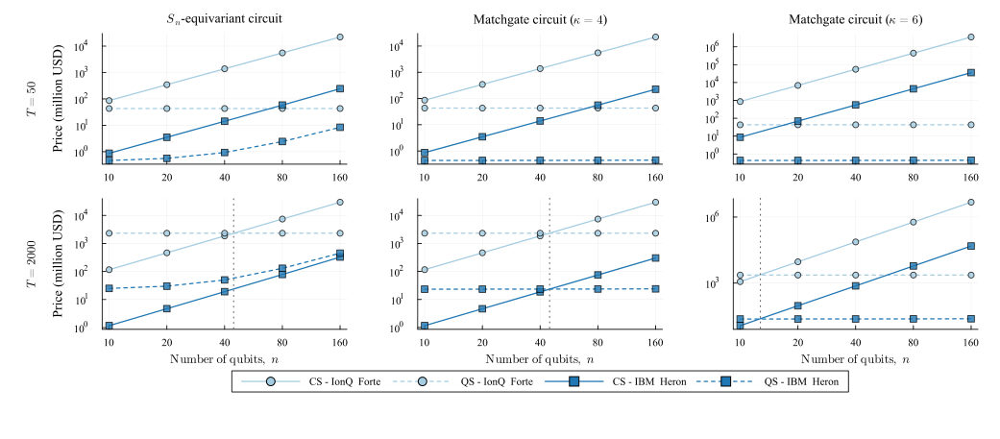 
Figure 3. Estimated quantum hardware access cost of QS and CS over T = 50 and T = 2000 circuit instances for IonQ Forte and IBM Heron. We consider the Sn-equivariant and Matchgate examples with κ = 4 and κ = 6 described above, using the publicly available pricing data summarized in Table III. The plotted values account for quantum hardware access and do not include the monetary cost of the classical computation. Gray dashed lines indicate the crossover points between QS and CS. Results exceeding the available device size, namely n &gt; 36 for IonQ Forte and n &gt; 156 for IBM Heron, extrapolate the reported hardware pricing and should therefore be interpreted only as scaling estimates.

📷 Fig 5

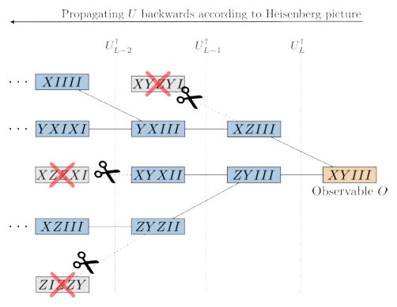 
Figure 4. Schematic illustration of Pauli Propagation with weight truncation. The observable is evolved in the Heisenberg picture and propagation paths are discarded whenever the generated Pauli string exceeds the weight threshold τ (here, τ = 4).

**Summary.** This work rigorously compares the resource costs of simulating quantum dynamics classically versus running them on quantum hardware. By analyzing multiple metrics—sample, time, and monetary cost—the authors demonstrate that classical simulability alone is insufficient to determine the best implementation strategy. This has major implications for designing near-term quantum algorithms.

**Why it may be interesting.** It provides a crucial, practical framework for quantum algorithm assessment, warning that theoretical polynomial-time simulation guarantees do not translate to practical hardware or resource efficiency.

Detailed structure

**Main problem.** The paper investigates whether quantum dynamics are more resource-efficient to simulate classically or to execute directly on quantum hardware, moving beyond simple asymptotic polynomial-time guarantees.

**Main result.** The preferred implementation (classical vs. quantum) depends critically on the specific resource metric (sample, time, cost) and the number of circuit instances evaluated, showing no universal advantage.

**Method.** The authors analyze resource scaling by comparing the complexity of quantum simulation (QS) against various structured classical simulation techniques (CS) for different circuit families.

**Model / system.** The focus is on general quantum circuits and dynamics, analyzed through expectation value estimation of observables $f_U(
ho, O) = 	ext{Tr}(U
ho U^\dagger O)$. Specific models include Clifford circuits, free-fermionic dynamics, and QCNN/ADAPT-VQE architectures.

**Key observables.** Expectation values $	ext{Tr}(U
ho U^\dagger O)$, Quantum Sample complexity ($N_{Q.S.}$), Quantum Time complexity ($N_{Q.T.}$), and Classical Time complexity ($N_{C.T.}$)

**Important parameters / regimes.** Number of circuit instances ($T$), number of qubits ($n$), circuit depth ($L$), and approximation thresholds ($	au$).

**Assumptions / limitations.** The analysis assumes repeated access to independently prepared copies of the input state $
ho$ and that the classical simulation relies on structured decompositions (e.g., Pauli strings, Majorana subspaces).

**Figures summary.** Figure 1 schematically compares QS vs. CS. Figure 6 estimates the monetary cost for various hardware platforms for specific circuit families.

**Paper structure.** The paper establishes the core problem by noting the limitations of asymptotic complexity, then analyzes specific, well-studied classically simulable circuit families (Clifford, free-fermionic, etc.) using multiple resource metrics, and concludes by comparing costs for modern variational algorithms like QCNN and ADAPT-VQE.

Abstract

Determining whether a quantum evolution can be efficiently simulated classically is central to understanding the boundary between classical and quantum computation. However, polynomial-time simulability is an asymptotic statement, and does not by itself determine whether the (quantum-inspired) classical simulation is actually practical. Indeed, different polynomial scalings can lead to vastly different computational costs, particularly when expensive preprocessing or quantum data acquisition is required. In this work, we ask whether classically simulable quantum dynamics are in practice more resource-efficient to simulate classically than to execute directly on quantum hardware. We analyze this question using three resource metrics, quantum sample, quantum time, and classical time complexity, for several widely studied classically simulable circuit families. Using representative hardware-level estimates, we identify regimes in which quantum simulation can be faster despite the existence of a polynomial-time classical algorithm, as well as regimes in which classical simulation remains more efficient. At the same time, the large quantum sampling cost needed to characterize unknown input states can make this polynomial-time classical simulation prohibitively expensive with current cloud-based hardware access prices. Ultimately, our work indicates that guarantees of classical simulability with polynomial resources alone are insufficient to determine the preferred implementation.

[↑ back to top](#top)

### [Vacancy Order and Physical Properties of a Ternary Compound Fe0.68Pd0.80Te with an α-Fe1+xTe-Type Structure](http://arxiv.org/abs/2609.11441v1)

**Authors:** Bingxian Shi, Manyu Wang, Chenglin Shang, Yanyan Geng, Yangyang Fan, Xiaoxiao Pei, Li Huang, Daye Xu, Juanjuan Liu, Jinchen Wang, Hongxia Zhang, Hongliang Wang, Lijie Hao, Rui Xu, Zhongyi Lu, Zhihai Cheng, Peng Cheng  
**Type:** experiment · **Category:** disordered systems and neural networks · **PDF:** <https://arxiv.org/pdf/2609.11441v1>  
**Analysis basis:** full PDF text, analyzed in chunks
**Topic relevance:** `analog quantum simulation` **1/5**

📷 Fig 1

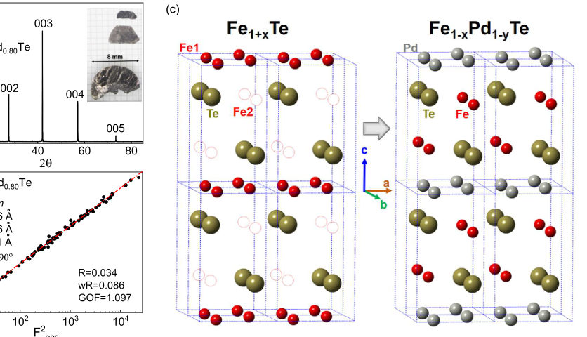 
Figure 1: Crystal structure of Fe0.68Pd0.80Te. (a) X-ray diffraction patterns from the ab-plane of Fe0.68Pd0.80Te. The inset shows the photos of as-grown single crystals. (b) Refinement result of lattice Bragg peaks obtained from single crystal X-ray diffraction. (c) Crystal structure of Fe1+xTe and Fe1-xPd1-yTe. The x value in the former denotes the occupancy of interstitial site Fe2, while the x and y values in the latter denote the Fe- and Pd-site vacancy respectively.

📷 Fig 2

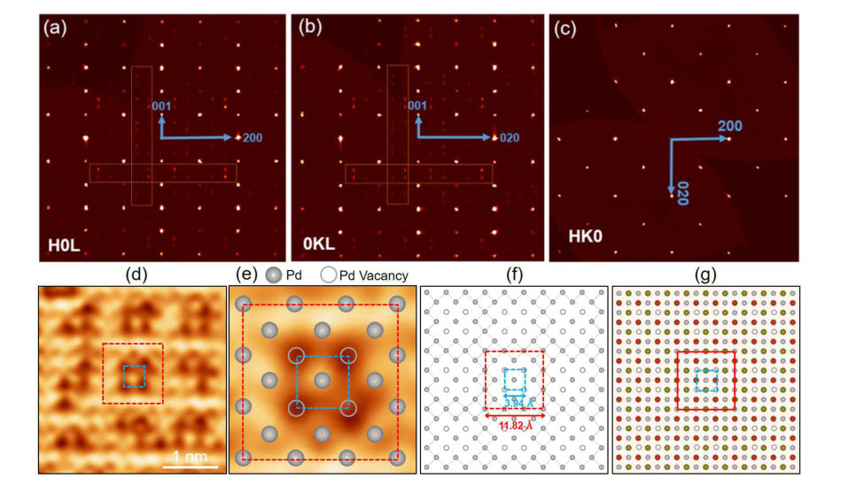 
Figure 2: Vacancy order in Fe0.68Pd0.80Te. (a-c) Precession photos generated from single crystal X-ray diffraction data which show the reciprocal lattice views on (H0L), (0KL) and (HK0) respectively. (d) Atomic-resolved nc-AFM image on the cleavage plane of Fe0.68Pd0.80Te. (e) Zoom-in nc-AFM image and the schematic model of the 3×3 Pd-vacancy order. Schematic models of the vacancy order in Pd-middle-sublayer and FeTe-Pd-FeTe tri- layer are shown in (f) and (g) respectively. The extended 2D unit cell is illustrated using red square. The blue square which connects the four nearest Pd-vacancies also represent the size of initial 2D unit cell in the ab-plane.

📷 Fig 3

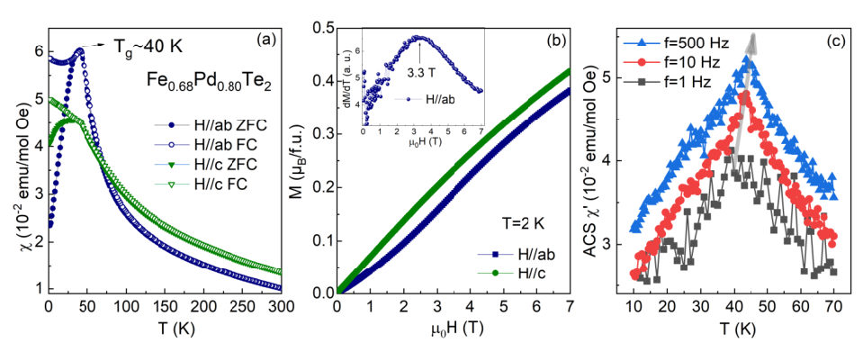 
Figure 3: Magnetic properties of Fe0.68Pd0.80Te. (a) Temperature-dependent magnetic sus- ceptibilities under magnetic field of 0.1 T applied along H∥ab or H∥c. (b) Isothermal mag- netization at T=2 K. The inset shows the dM/dT curve for data along H∥ab. (c) The temperature-dependent AC susceptibilities measured under an oscillated AC field of 5.0 Oe applied along H∥ab. The peak in real part χ’ shows a shift with increasing frequencies.

📷 Fig 4

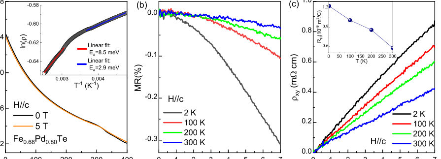 
Figure 4: Electrical transport properties of Fe0.68Pd0.80Te. (a) The temperature-depdendent resistivity under magnetic field of 0 T and 5 T. The inset shows a plot of ln(ρ) as a function of T−1. (b) Magnetoresistance at selected temperatures. (c) The field-dependent Hall resistivity ρxy at selected temperatures. The inset shows the temperature-dependent Hall coefficients obtained from linear fit of ρxy(H).

**Summary.** This paper reports the synthesis and detailed characterization of the novel compound Fe0.68Pd0.80Te. Key findings include the confirmation of a 3x3x3 vacancy superlattice and the identification of a spin-glass magnetic state below 40 K. Electrically, the material is characterized as a semiconductor with a very small band gap, suggesting potential for quantum electronic applications.

**Why it may be interesting.** The combination of vacancy ordering (a form of structural disorder) leading to a spin-glass state and semiconducting behavior makes it relevant for studying disorder-induced quantum phenomena in layered materials.

Detailed structure

**Main problem.** The study aims to characterize a new ternary compound, Fe0.68Pd0.80Te, focusing on the role of vacancy ordering and its resulting physical properties.

**Main result.** The material exhibits a spin-glass ground state below 40 K, is a semiconductor with a very small band gap (< 10 meV), and possesses a confirmed 3x3x3 Pd-vacancy order.

**Method.** The research employed a combination of structural characterization (XRD, nc-AFM), magnetic measurements (MPMS), and electrical transport measurements (PPMS-14T).

**Model / system.** The physical system is the layered ternary compound Fe0.68Pd0.80Te, which adopts an alpha-Fe1+xTe-type tetragonal structure. The key structural feature is the presence of a vacancy-ordered superstructure, which influences its electronic and magnetic behavior.

**Key observables.** Spin-glass transition temperature (Tg ~ 40 K), semiconductor band gap (< 10 meV), hole-like charge carriers, and the 3x3x3 Pd-vacancy superlattice order.

**Important parameters / regimes.** Temperature (T), magnetic field (H), and the vacancy ordering parameter (3x3x3).

**Assumptions / limitations.** The structural refinement assumes the material maintains a tetragonal structure despite significant chemical substitution and vacancy ordering. The small band gap suggests semiconductor behavior.

**Figures summary.** Figures show XRD patterns confirming the structure, magnetic susceptibility curves demonstrating a spin-glass state, and resistivity vs. temperature plots indicating semiconducting behavior.

**Paper structure.** The paper follows a standard materials science structure: structural identification and characterization (XRD, AFM) $
ightarrow$ magnetic property measurement (Spin-glass state) $
ightarrow$ electronic transport analysis (Semiconducting gap, MR/Hall effect) $
ightarrow$ Conclusion on quantum potential.

Abstract

We report the identification and characterization of a new compound Fe0.68Pd0.80Te with an α-Fe1+xTe prototype structure. Different from the Fe-square net and minor occupancy of interstitial Fe-sites in Fe1+xTe, Fe0.68Pd0.80Te is featured by a Pdsquare net and near 68% occupancy of the corresponding interstitial Fe-sites. Furthermore, noncontact atomic force microscopy and X-ray diffraction provide evidence for the existence of a 3*3*3 Pd-vacancy order in this layered material. A spin-glass ground state below Tg 40 K is identified via magnetic characterization. Electrical transport measurements show that Fe0.68Pd0.80Te is a semiconductor with a very small band gap below 10 meV. It has weak negative magnetoresistance and holelike charge carriers below room temperature. Our results demonstrate its potentials for further exploring various quantum phenomena.

[↑ back to top](#top)

### [Virtual quantum neural networks](http://arxiv.org/abs/2609.11327v1)

**Authors:** Benchi Zhao, Xuanqiang Zhao, Yinan Li, Yingzhou Li, Giulio Chiribella  
**Type:** theory · **Category:** quantum information and computing · **PDF:** <https://arxiv.org/pdf/2609.11327v1>  
**Analysis basis:** full PDF text, analyzed in chunks
**Topic relevance:** `quantum measurements` **1/5**

📷 Fig 1

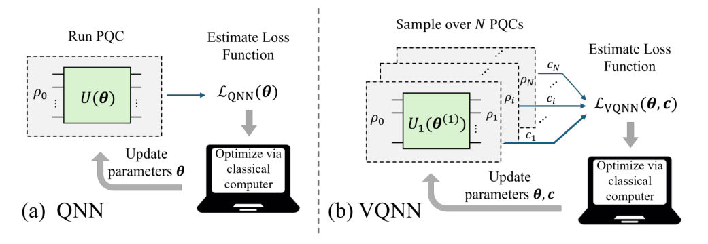 
Fig 1. (a) Training of a quantum neural network. The network is designed to implement a parametrized quantum circuit (PQC), depending on a set of parameters θ. In the noiseless case, the PQC is represented by a unitary operator U(θ), which is applied to a quantum system, initially in the state ρ0. Then, a measurement is performed, and the statistics of the outcomes is used to estimate the value of a loss function LQNN(θ). Finally, the classical optimization method is used to update the parameters in the PQC to minimize the loss function. (b) Training of a virtual quantum neural network. N parametrized quantum circuits (PQCs) are randomly sampled and applied to the input state ρ0, producing...

📷 Fig 2

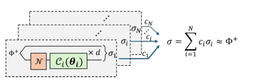 
Fig 2. Variational quantum error mitigation protocol. Multiple parametrized quantum channels C1(θ1), . . . , CN(θN) are randomly sampled, producing output states ρ1, . . . , ρN, respectively. At the postprocessing stage, the output states are combined linearly with coefficients (ci)N i=1, yielding the virtual state σ = PN i=1 ciρi. The goal of the variational protocol is to find parameters such that the virtual state σ is is close to the Bell state Φ+.

📷 Fig 3

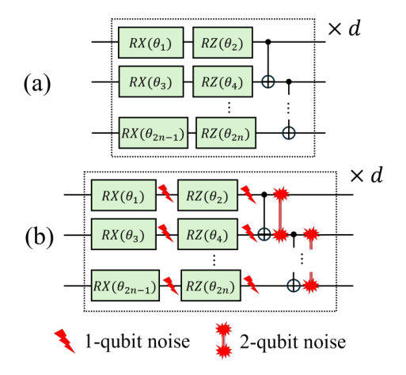 
Fig 3. Variational circuits for error mitigation. (a) A noiseless ansatz for the PQC is constructed with rotation-X gates, rotation-Z gates and control-NOT gates. (b) A noisy ansatz of PQC is con- structed by letting the single-qubit gates and two-qubit gates be fol- lowed by single-qubit and two-qubit noise processes, respectively.

📷 Fig 4

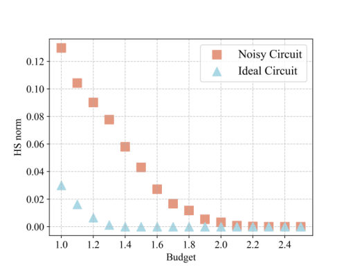 
Fig 5. Approximation error of VQEM on bounded-size noisy cir- cuits. The approximation error, quantified by the HS norm, is shown as a function of the sampling overhead budget in the range [1, 2.5]. The orange squares (light blue squares) show the results achieved by the VQEM algorithm run on bounded-size noisy (noiseless) circuits.

📷 Fig 5

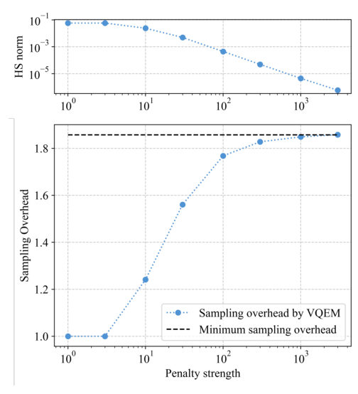 
Fig 4. Dependence of the approximation error and sampling overhead on the penalty strength. Top: relation between the penalty strength and the approximation error, quantified by the Hilbert-Schmidt distance between the virtual state σ and target Bell state Φ+. Bottom: relation between the penalty strength and the sam- pling overhead (blue dotted line). The minimum sampling overhead over all possible quantum channels is shown by the black dashed line.

**Summary.** This paper introduces Virtual Quantum Neural Networks (VQNNs) as an extension to standard QNNs to enhance expressivity and noise robustness in quantum machine learning. VQNNs achieve this by combining multiple quantum circuits and classically aggregating their measurement results. This generalized approach is shown to improve performance in tasks like quantum error mitigation and ground-state energy estimation.

**Why it may be interesting.** The development of VQNNs provides a powerful, generalized framework for quantum machine learning that explicitly addresses the limitations imposed by the restricted set of quantum operations available on near-term hardware.

Detailed structure

**Main problem.** To improve upon standard Quantum Neural Networks (QNNs) by developing a more general model, the Virtual Quantum Neural Network (VQNN), to increase expressivity and improve noise robustness in quantum machine learning.

**Main result.** VQNNs extend QNNs by sampling over multiple quantum circuits and classically post-processing the measurement outcomes, allowing access to linear combinations of completely positive maps.

**Method.** The VQNN loss function is minimized by optimizing parameters $(	heta, c)$ using classical optimization methods, which involves estimating expectation values via quantum sampling.

**Model / system.** The model extends standard QNNs (parametrized by unitaries $U(	heta)$) to VQNNs, which utilize a linear combination of multiple quantum circuits, represented by coefficients $c_i$ and unitaries $U_i(	heta^{(i)})$.

**Key observables.** Expectation values of Hermitian operators $O$, and the final estimated ground-state energy $E_0$.

**Important parameters / regimes.** The coefficients $c = (c_1, \dots, c_N)$ and the circuit parameters $	heta = (	heta^{(1)}, \dots, 	heta^{(N)})$.

**Assumptions / limitations.** The analysis assumes that the sampling overhead $\|c\|_1$ can be bounded to prevent the VQNN from worsening the barren plateau problem.

**Figures summary.** Figure 1 illustrates the training process comparison between standard QNNs (single unitary) and VQNNs (sampling multiple PQCs and aggregating data).

**Paper structure.** The paper introduces the VQNN model, details the mathematical formulation for both noiseless and noisy regimes, analyzes its performance in tasks like error mitigation and classification, and discusses theoretical aspects like barren plateau analysis and SDP formulations.

Abstract

Quantum neural networks are a prominent model of quantum machine learning. Their training consists in the minimization of a given loss function over a parametrized family of quantum circuits, mathematically described by unitary operators, or, more generally, completely positive linear maps. In this work, we extend the notion of quantum neural network, using random sampling and classical data processing to enlarge the optimization space in a way that includes linear combinations of completely positive maps. Our extended model, called virtual quantum neural networks, leverages its enlarged optimization space to achieve increased expressivity and improved noise robustness. These benefits are illustrated in three representative tasks: quantum error mitigation, binary classification, and estimation of ground-state energies. Overall, virtual quantum neural networks offer a flexible learning paradigm that expands the space of achievable computations and strengthens the applications of near-term quantum hardware.

[↑ back to top](#top)

## Other papers (21)

*Papers from primary archives without highlighted authors or any topic match. Click to expand.*

Show other papers

### [3d Ising Field Theory with Magnetic Deformation: Fuzzy Sphere Meets TCSA](http://arxiv.org/abs/2609.10670v1)

**Authors:** Giulia Fardelli, A. Liam Fitzpatrick, Emanuel Katz, Yuan Xin  
**Type:** theory · **Category:** statistical mechanics · **PDF:** <https://arxiv.org/pdf/2609.10670v1>  
**Analysis basis:** full PDF text, analyzed in chunks

📷 Fig 1

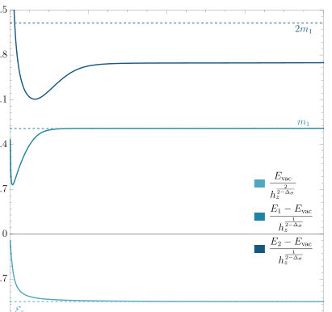 
Figure 1. Spectrum of Ising Field theory in 2d (left) and in 3d (right) including the vacuum energy,

📷 Fig 2

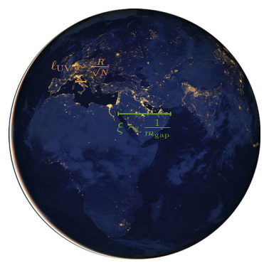 
Figure 2. Schematic view of hierarchy of scales involved.

📷 Fig 3

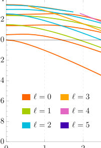 
Figure 4. Spectrum obtained from ED at N = 16 keeping the 10 lowest eigenvalues. The spectrum has been normalized by requiring Evac(hz = 0) = 0 and E1(hz = 0) = ∆σ. hz,FS has been rescaled to match hz according to (5.1).

📷 Fig 4

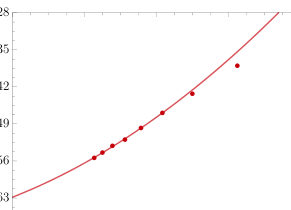 
Figure 5. N-dependence of Evac (left) and E1 −Evac (right) at hz = 2.5. Solid lines are fits made using points 12 to 22: for Evac the fit corresponds to −3.6 + 1.3

📷 Fig 5

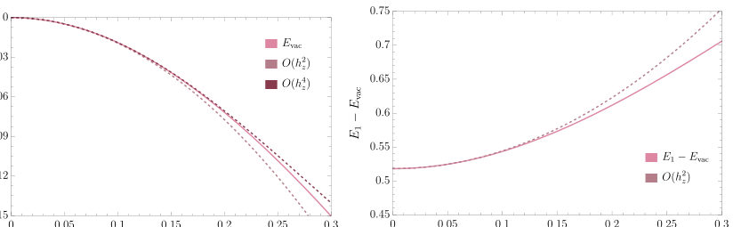 
Figure 6. Left: Vacuum energy Evac at small coupling hz, compared with the quadratic O(h2 z) and quartic O(h4 z) approximations, Evac(hz) = −1.933h2 z + 4.152h4 z, from (2.7). Right: Scalar sector mass gap E1 −Evac, compared with the O(h2 z) quadratic approximation (2.8).

**Summary.** This paper investigates the magnetic deformation of the 3D Ising Field Theory using advanced theoretical techniques, specifically comparing results from the Fuzzy Sphere and TCSA approaches. The authors successfully extract universal quantities, finding evidence for a bound state within the theory's spectrum. This work advances the understanding of critical systems on curved manifolds by bridging CFT and lattice/geometric methods.

**Why it may be interesting.** The rigorous application of CFT techniques (TCSA) to study critical phenomena and phase transitions (Ising model) provides deep insights into how boundary conditions (the sphere) and external fields (magnetic deformation) modify universal critical exponents and low-energy spectra.

Detailed structure

**Main problem.** The study focuses on the magnetic deformation of the (2+1)d Ising Conformal Field Theory (CFT), or Ising Field Theory (IFT), when placed on a spatial sphere.

**Main result.** The authors find evidence that the IFT contains a bound-state with a small binding energy, and they derive quantitative relations for key observables like the vacuum energy and mass gap.

**Method.** The research employs two complementary theoretical frameworks: the Fuzzy Sphere (FS) setup and the Truncated Conformal Space Approach (TCSA) to model the system's Hamiltonian and extract universal quantities.

**Model / system.** The system is the 3D Ising Field Theory (IFT) subjected to a magnetic deformation. The analysis uses Hamiltonians derived from both the FS model and the general CFT deformation structure, involving couplings like $g$ and $h_z$.

**Key observables.** Vacuum energy ($E_{vac}$), mass gap ($m_{	ext{gap}}$), and the mass of a potential bound-state ($m_{BS}$).

**Important parameters / regimes.** The magnetic coupling $h_z$, the deformation parameter $g$, and the large volume limit ($N 	o \infty$).

**Assumptions / limitations.** The analysis assumes the validity of local effective field theory descriptions on the sphere and involves approximations inherent to the TCSA and FS methods.

**Figures summary.** Figure 1 illustrates the spectrum of Ising Field theory in 2D, while Tables 1 and 2 provide lists of conformal dimensions, spins, and OPE coefficients used in the TCSA calculations.

**Paper structure.** The paper systematically develops the machinery to calculate the Hamiltonian matrix elements for the deformed IFT using TCSA, comparing these results with those obtained from the Fuzzy Sphere formulation to extract physical observables.

Abstract

We study the magnetic deformation of the $(2+1)$d Ising CFT, also known as Ising Field Theory (IFT), on a spatial sphere. We use the Fuzzy Sphere (FS) Ising setup and compare it to the Truncated Conformal Space Approach (TCSA). Universal, infinite volume, IFT quantities are extracted by modeling the effects of curvature, as expected from a local effective theory on the sphere. We find evidence that IFT contains a bound-state with a small binding energy. Locality also allows us to extract the same IFT quantities from different angular momentum sectors, providing additional consistency checks.

[↑ back to top](#top)

### [A Near-Quartic Separation Between Certificate Complexity and Quantum Query Complexity](http://arxiv.org/abs/2609.11664v1)

**Authors:** Andris Ambainis, Jānis Iraids, Martins Kokainis  
**Type:** theory · **Category:** quantum information and computing · **PDF:** <https://arxiv.org/pdf/2609.11664v1>  
**Analysis basis:** full PDF text, analyzed in chunks

📷 Fig 1

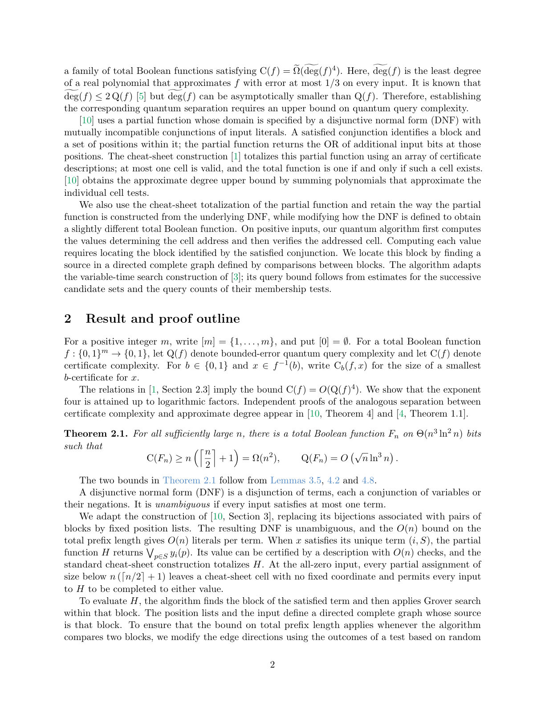 
Low-resolution page preview, page 2

📷 Fig 2

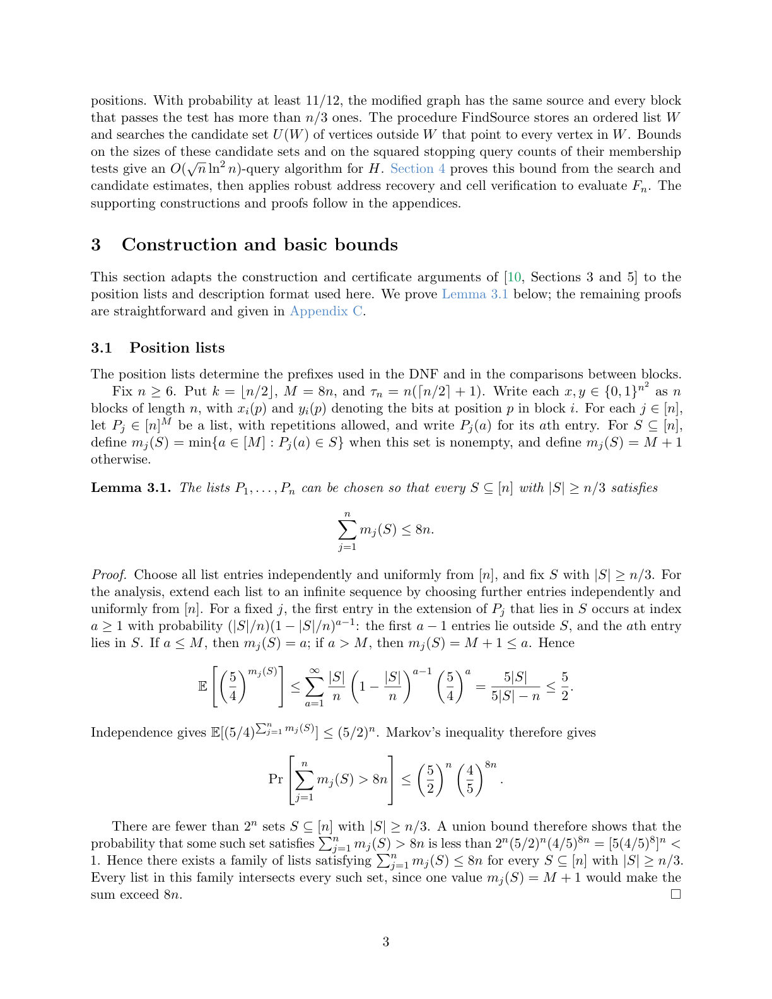 
Low-resolution page preview, page 3

📷 Fig 3

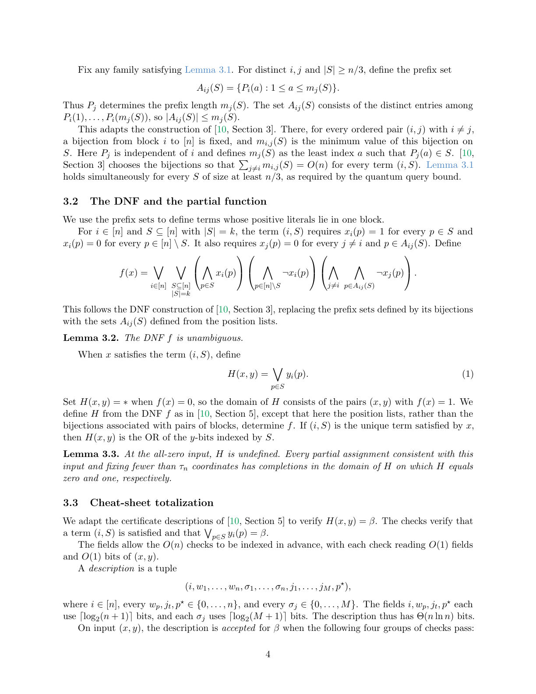 
Low-resolution page preview, page 4

📷 Fig 4

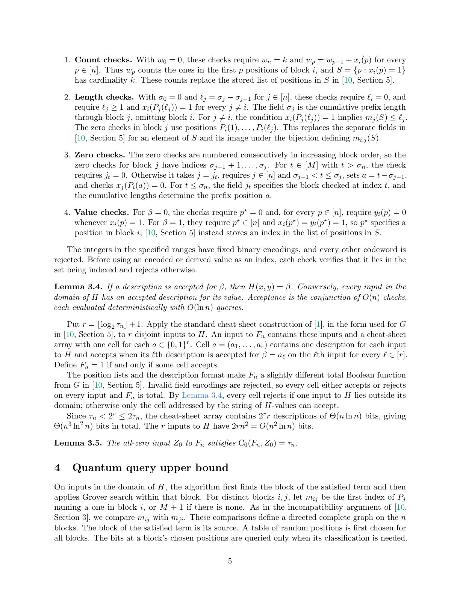 
Low-resolution page preview, page 5

📷 Fig 5

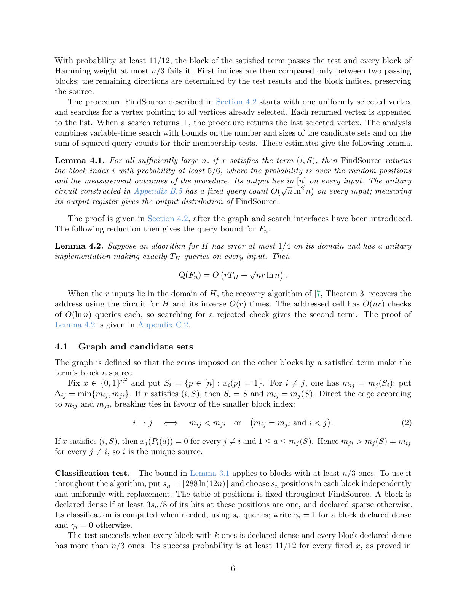 
Low-resolution page preview, page 6

**Summary.** This theoretical paper establishes a near-quartic separation between the Certificate Complexity and the quantum query complexity for a specially constructed Boolean function. By constructing this function and rigorously analyzing its quantum query complexity, the authors resolve a long-standing open problem in computational complexity theory. The result provides a concrete measure of how much quantum computation can outperform classical certificate verification methods.

**Why it may be interesting.** While the topic is purely computational complexity, the techniques used—such as analyzing query complexity and deriving lower bounds—are foundational to understanding the limits of quantum computation, which is relevant to quantum information theory.

Detailed structure

**Main problem.** The paper addresses the open question of determining the maximum possible separation gap between Certificate Complexity ($C(f)$) and bounded-error quantum query complexity ($Q(f)$) for total Boolean functions.

**Main result.** The authors construct a specific total Boolean function $f$ demonstrating a near-quartic separation, showing that $Q(f) = \widetilde{O}(\sqrt[4]{C(f)})$, which closes the gap up to logarithmic factors.

**Method.** The methodology involves constructing the function $f$ using a 'cheat-sheet totalization' based on position lists and analyzing the quantum query complexity using graph search procedures and error bounding techniques.

**Model / system.** The analysis is purely theoretical, focusing on the complexity measures ($C(f)$ and $Q(f)$) associated with abstract total Boolean functions $f$ defined over input bits.

**Key observables.** The primary observables are the quantum query complexity $Q(f)$ and the certificate complexity $C(f)$, with the derived bound $Q(f) = \widetilde{O}(\sqrt[4]{C(f)})$.

**Important parameters / regimes.** The size parameter $n$ of the function $f$, and derived parameters like $r$ (number of disjoint inputs) and $	au_n$ related to the function's structure.

**Assumptions / limitations.** The construction relies on the existence of position lists satisfying specific combinatorial inequalities (Lemma 3.1), and the quantum analysis assumes the existence of specific unitary circuits and error bounds.

**Paper structure.** The paper builds upon established complexity relations, details the construction of the function $f$ using position lists, analyzes the quantum query complexity via graph search procedures (FindSource), and concludes by proving the separation bound through rigorous error analysis.

Abstract

We construct a total Boolean function $f$ for which $Q(f) = \widetilde{O}(\sqrt[4]{C(f)})$, where $Q(f)$ denotes the bounded-error quantum query complexity and $C(f)$ denotes the certificate complexity. This resolves a longstanding open question and is tight up to logarithmic factors.

[↑ back to top](#top)

### [A new generation of effective core potentials: Selected heavy 5d and 6p elements](http://arxiv.org/abs/2609.10853v1)

**Authors:** Omar Madany, Lubos Mitas  
**Type:** theory · **Category:** strongly correlated electrons · **PDF:** <https://arxiv.org/pdf/2609.10853v1>  
**Analysis basis:** full PDF text, analyzed in chunks

📷 Fig 1

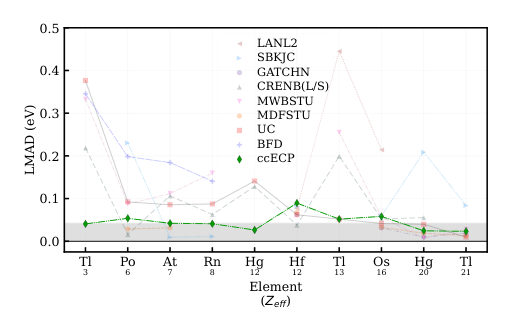 
Figure 2: Low-lying mean absolute deviation of the atomic excitation energies at the CCSD(T) level. The ECP comparison scheme follow the same conventions detailed in Fig. 1).

📷 Fig 2

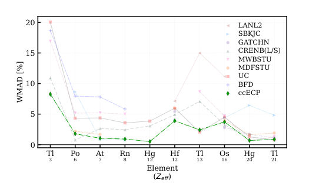 
Figure 3: Weighted mean absolute deviation of the atomic excitation energies at the CCSD(T) level. The ECP comparison scheme follow the same conventions detailed in Fig. 1).

📷 Fig 3

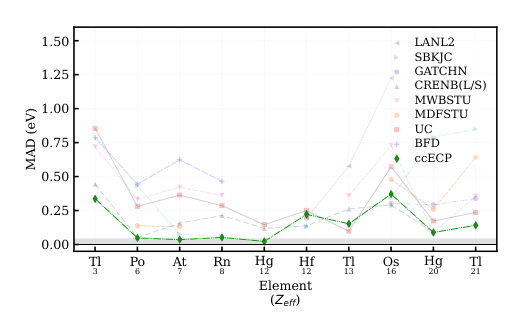 
Figure 1: Mean absolute deviation of the atomic excitation energies at the CCSD(T) level for various ECPs relative to the scalar relativistic all-electron reference. The performance of the ccECPs is compared against available legacy ECPs and frozen-core UC methods. The x-axis labels denote the element, and the number of valence electrons explicitly treated in the calculation.

📷 Fig 4

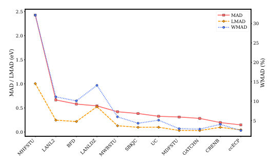 
Figure 4: Overall average atomic discrepancies (MAD, LMAD, and WMAD) for all evaluated 5d and 6p element pseudopotentials relative to relativistic AE CCSD(T) reference data. The primary (left) y-axis tracks absolute deviations (MAD/LMAD), while the secondary (right) y-axis charts the energy-normalized weighted deviation (WMAD).

📷 Fig 5

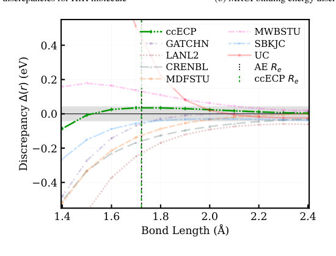 
Figure 5: Binding energy discrepancies relative to the relativistic AE reference for (a) HfH and (b) HfO molecules. Markers denote the calculated discrepancies at discrete bond lengths, connected by lines to guide the eye, and the gray-shaded region illustrates the threshold for chemical accuracy. The vertical dashed lines mark the equilibrium bond length (Re) extracted from the AE reference and ccECP. To evaluate relative performance, the ccECP is compared against available legacy ECPs that employ an equivalent 60-electron [[Kr]4d104f 14] core.

**Summary.** This work introduces a new generation of correlation-consistent effective core potentials (ccECPs) specifically designed for heavy 5d and 6p elements. By employing a sophisticated, tiered core-valence partitioning strategy and optimizing against high-level $	ext{CCSD}(	ext{T})$ calculations, the potentials achieve exceptional accuracy and transferability. This advancement removes a major bottleneck for predictive simulations in heavy-element materials science.

**Why it may be interesting.** The rigorous treatment of relativistic effects and the development of highly accurate, transferable potentials are crucial for any advanced many-body simulation involving heavy elements, which is a key area of condensed matter and quantum chemistry.

Detailed structure

**Main problem.** The development of highly accurate and transferable effective core potentials (ccECPs) for heavy elements (5d and 6p blocks) to correctly model electronic structure.

**Main result.** The new ccECPs achieve outstanding atomic precision (0.045 eV deviation) and robust molecular transferability (dissociation energy errors < 0.03 eV), overcoming limitations in modeling heavy-element systems.

**Method.** The potentials are derived by optimizing parameters against high-fidelity all-electron benchmarks calculated using $	ext{CCSD}(	ext{T})$ theory, incorporating a tiered core-valence partitioning strategy.

**Model / system.** The focus is on heavy elements from the 5d (Hf, Os, Hg) and 6p (Tl, Po, At, Rn) blocks. The underlying theory involves partitioning the semi-local SO relativistic ECP ($	ext{SOREP}$) into scalar and spin-orbit components.

**Key observables.** Global average atomic low-lying states deviation (0.045 eV), dissociation energy discrepancies (< 0.03 eV), and equilibrium bond lengths (< 0.005 Å).

**Important parameters / regimes.** The core-valence partitioning uses three resolutions: 60-core, 78-core, and 68-core, optimizing the balance between accuracy and computational efficiency.

**Assumptions / limitations.** The method assumes that core-valence correlation effects can be systematically captured through the tiered partitioning strategy, and the optimization relies on $	ext{CCSD}(	ext{T})$ reference data.

**Figures summary.** Figures compare Mean Absolute Deviation (MAD), Low-Lying Mean Absolute Deviation (LMAD), and Weighted Mean Absolute Deviation (WMAD) of the new ECPs against all-electron references.

**Paper structure.** The paper details the theoretical framework for the ccECPs, outlines the tiered partitioning strategy, describes the optimization process using various objective functions, and presents benchmark comparisons demonstrating superior accuracy and transferability.

Abstract

We expand the correlation-consistent effective core potentials (ccECPs) library by developing semi-local pseudopotentials and matching basis sets by heavy-elements from $5d$ (Hf, Os, Hg) and $6p$ (Tl, Po, At, Rn) blocks. In order to accurately capture scalar relativistic effects, spin-orbit coupling, and electron-electron correlation, we implement a tiered core-valence partitioning strategy across three distinct resolutions. This includes a small 60-core (Hf, Os, Hg) that explicitly correlates subvalence shells, a large 78-core definition for the main-group elements that rigorously accounts for core polarization and relaxation effects in sparse valence environments, and an intermediate 68-core partition for Hg and Tl. This 68-core architecture represents a unique development in the ccECP library, optimizing the balance between accuracy and computational efficiency in a manner unexplored for ligther elements. Optimized against relativistic all-electron CCSD(T) references, the ccECPs deliver outstanding atomic precision, achieving a global average atomic low-lying states deviation of just 0.045 eV. This accuracy translates directly to robust molecular transferability, systematically restricting dissociation energy discrepancies to under 0.03 eV, equilibrium bond lengths to within 0.005 Å. By enforcing a regularized, finite potential at the origin for enhanced numerical stability in stochastic quantum Monte Carlo methods, this library removes a critical methodological bottleneck for predictive many-body simulations of heavy-element systems and materials.

[↑ back to top](#top)

### [A Quantum-Inspired Dequantization Method for Diagonally Weighted Matrix Functions: Application to Learning with Optimized Random Features](http://arxiv.org/abs/2609.10729v1)

**Authors:** Natsuto Isogai, Mio Murao, Hayata Yamasaki  
**Type:** theory · **Category:** numerical methods · **PDF:** <https://arxiv.org/pdf/2609.10729v1>  
**Analysis basis:** full PDF text, analyzed in chunks

📷 Fig 1

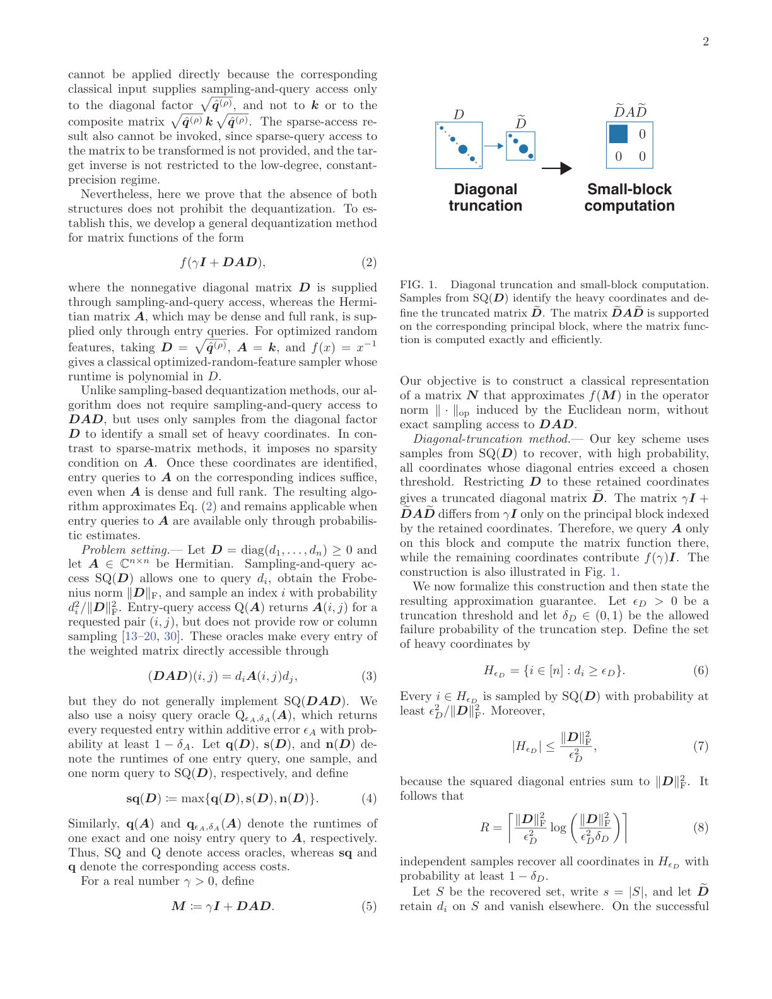 
Low-resolution page preview, page 2

📷 Fig 2

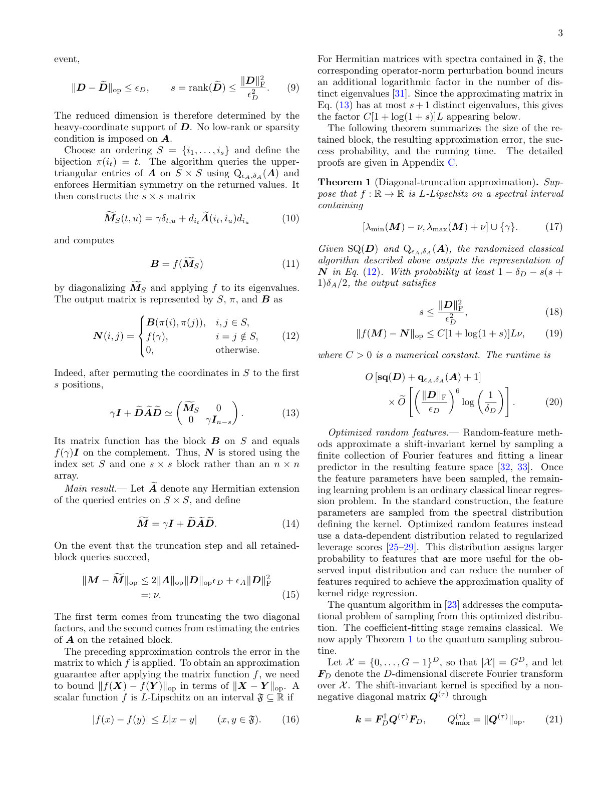 
Low-resolution page preview, page 3

📷 Fig 3

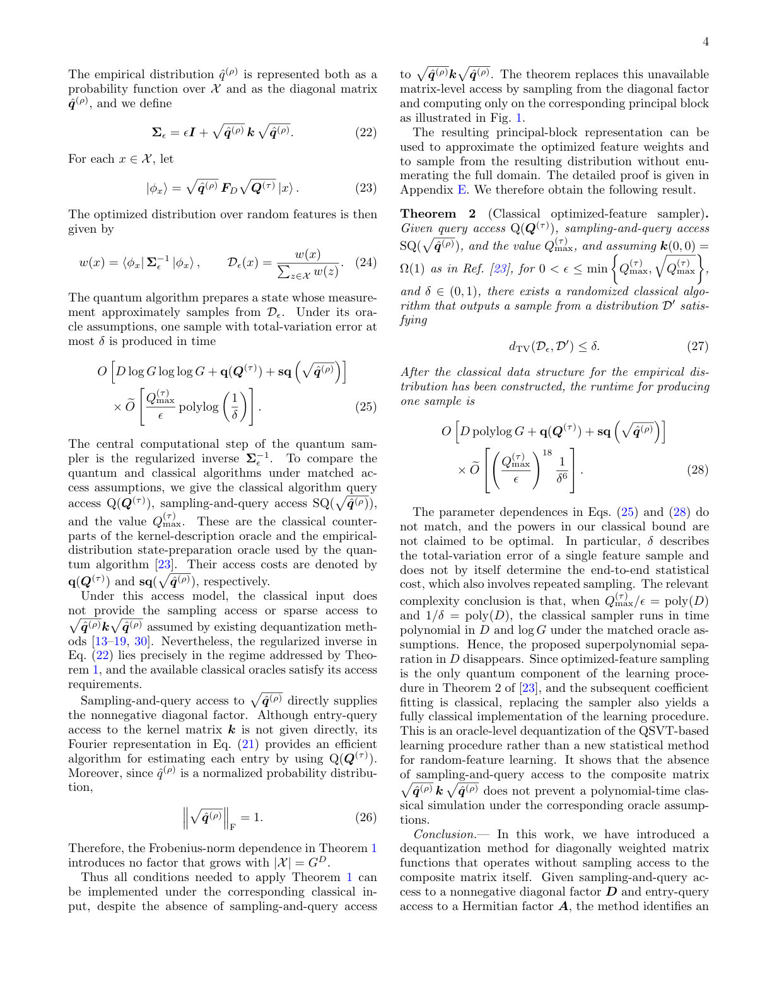 
Low-resolution page preview, page 4

📷 Fig 4

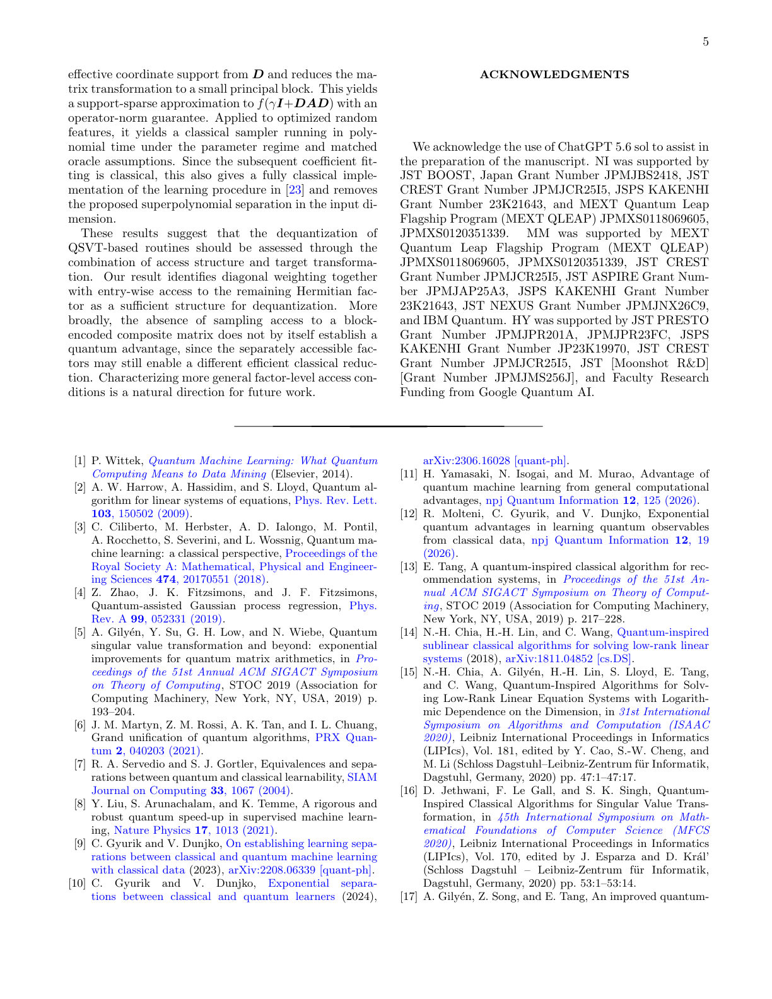 
Low-resolution page preview, page 5

📷 Fig 5

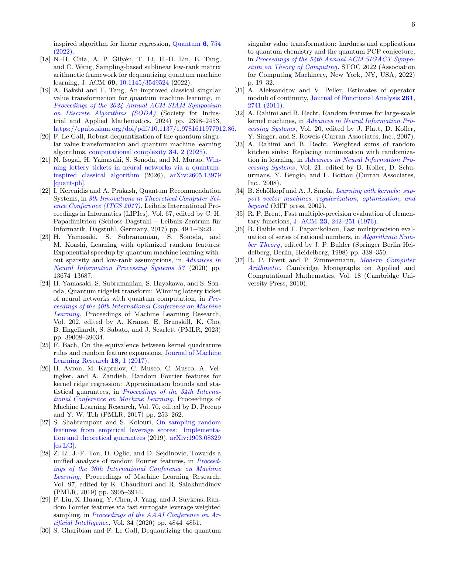 
Low-resolution page preview, page 6

**Summary.** This paper presents a novel classical algorithm to simulate quantum routines for learning with optimized random features. It overcomes the challenge of unavailable direct matrix access by using a diagonal-truncation method to reduce the problem to a small principal block. The result provides a polynomial-time classical sampler with guaranteed accuracy, advancing the field of quantum-inspired computation.

**Why it may be interesting.** This work provides a concrete example of how to bridge the gap between quantum computational models and classical algorithms in machine learning, which is highly relevant for developing practical, resource-efficient quantum-inspired ML techniques.

Detailed structure

**Main problem.** Developing a classical algorithm to dequantize quantum-advantage candidates, specifically the sampler based on Quantum Singular Value Transformation (QSVT) for learning with optimized random features, when direct sampling access to the required composite matrix is unavailable.

**Main result.** The authors developed a classical sampler that successfully dequantizes the quantum routine, achieving prescribed accuracy with a runtime polynomial in the dimension $D$. This shows that classical structure can be extracted even when direct matrix access is impossible.

**Method.** The method employs a diagonal-truncation approximation, restricting the problem to a small principal block indexed by 'heavy coordinates' identified via sampling. Error bounds are established using the Lipschitz continuity of the matrix function $f$ and the operator norm.

**Model / system.** The problem involves approximating a matrix function $f(M)$ where $M = \gamma I + D A D$. $D$ is a diagonal matrix supplied via sampling-and-query access, and $A$ is a Hermitian matrix supplied via entry queries.

**Key observables.** Approximation error bounded by $
u$, Total Variation Distance $dTV(D_\epsilon, D') \le \delta$, and the final classical sampler's runtime complexity.

**Important parameters / regimes.** The error tolerance $\epsilon_D$, the approximation error $
u$, the total variation distance $\delta$, and the dimension $D$.

**Assumptions / limitations.** The method assumes the availability of specific oracle access ($SQ(D)$ and $Q(A)$) and relies on bounding the error using the Lipschitz constant $L$ of the function $f$.

**Figures summary.** Figure 1 illustrates the process of Diagonal truncation, showing how samples identify heavy coordinates and restrict the computation to a principal block.

**Paper structure.** The paper first introduces the problem of dequantizing $f(\gamma I + DAD)$ under limited access. It develops the diagonal-truncation approximation, establishing error bounds. Subsequently, it proves the existence of a classical randomized algorithm (Theorem 2) to sample from the required distribution $D_\epsilon$, culminating in a final complexity analysis.

Abstract

Quantum-inspired classical algorithms have dequantized several quantum machine learning routines by replacing quantum linear-algebra subroutines with classical counterparts. However, the sampler based on quantum singular value transformation (QSVT) for learning with optimized random features is not covered by existing dequantization frameworks, because the matrix to be inverted is not itself available through sampling access. In this work, we develop a classical algorithm to address this type of quantum-advantage candidate. Our method samples heavy indices, reduces the transformation to a small principal block, and outputs a sparse classical representation with operator-norm guarantees. Applying this method dequantizes the sampler for optimized random features, giving a classical sampler with prescribed accuracy and polynomially related runtime. These results show that the factorization underlying a quantum block encoding can itself provide sufficient classical structure even when sampling-and-query access to the composite matrix is unavailable.

[↑ back to top](#top)

### [A Unified Theory of Collective Magnon and Orbiton Excitations in Altermagnets](http://arxiv.org/abs/2609.10708v1)

**Authors:** Bishal Das, Chanchal K. Barman, Aftab Alam  
**Type:** theory · **Category:** strongly correlated electrons · **PDF:** <https://arxiv.org/pdf/2609.10708v1>  
**Analysis basis:** full PDF text, analyzed in chunks

📷 Fig 1

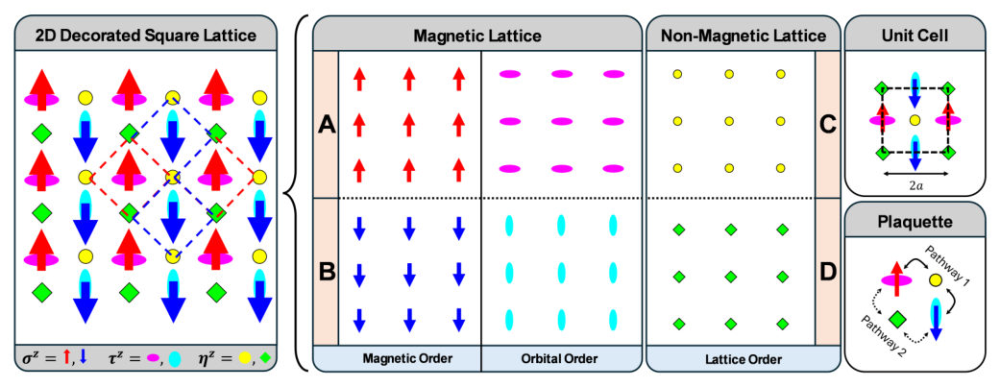 
FIG. 1. Decorated square lattice model with various motifs including magnetic order, orbital order and lattice order.

📷 Fig 2

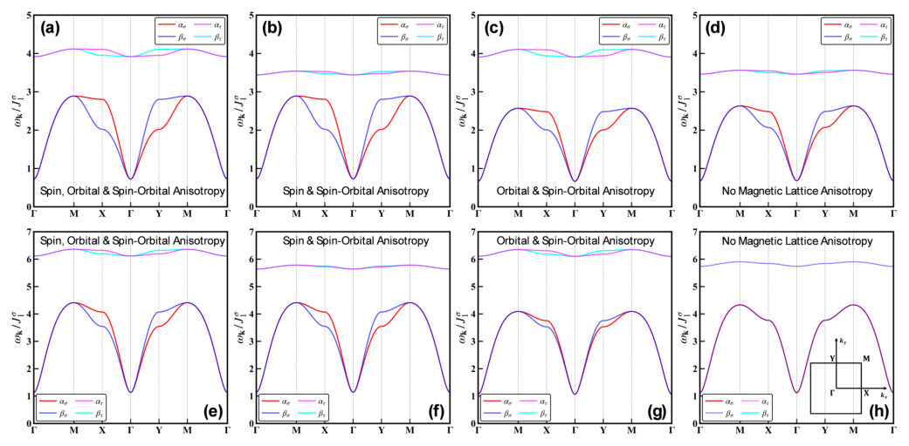 
FIG. 2. Spectrum of collective spin-wave and orbital-wave excitations on a 2D decorated square lattice. Top row (a-d) corresponds to staggered lattice order and bottom row (e-h) corresponds to aligned lattice order. Each column corresponds to different combinations of anisotropy. The two magnon bands corresponding to magnon eigenmodes αk,σ and β† −k,σ have been denoted by ασ and βσ respectively. Similarly, the two orbiton bands corresponding to orbiton eigenmodes αk,τ and β† −k,τ have been denoted by ατ and βτ respectively. For more details and the base model parameters used in all the dispersions, refer Sec. III A. The model parameters chosen for bare spin, orbital and spin-orbital...

📷 Fig 3

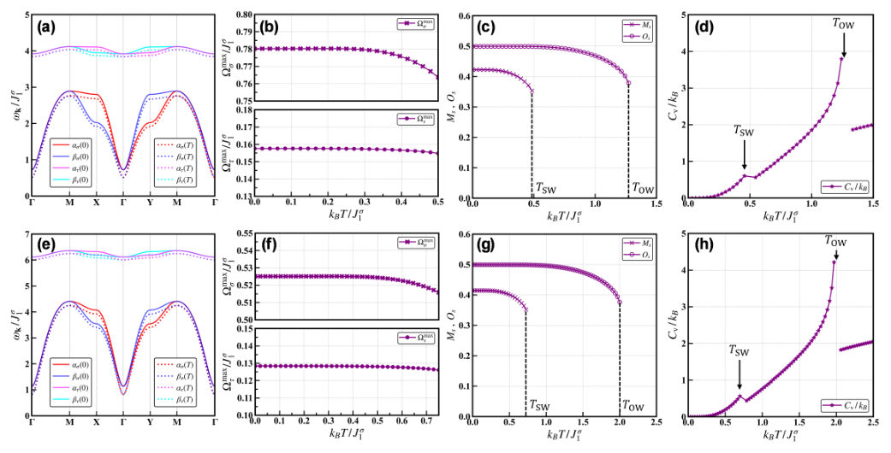 
FIG. 3. Temperature dependence of the (a,e) magnon spectrum with solid lines at T = 0, dotted lines at T = 0.50 (Jσ 1/kB); and orbiton spectrum with solid lines at T = 0, dotted lines at T = 0.75 (Jσ 1/kB), (b,f) chiral-splitting of magnon and orbiton modes, (c,g) magnetization (Ms) and orbitization (Os) order parameters and (d,h) specific heat (Cv) in dimensionless units. Top row (a-d) corresponds to staggered lattice order while bottom row (e-h) corresponds to aligned lattice order. For more details, refer Sec. III B.

📷 Fig 4

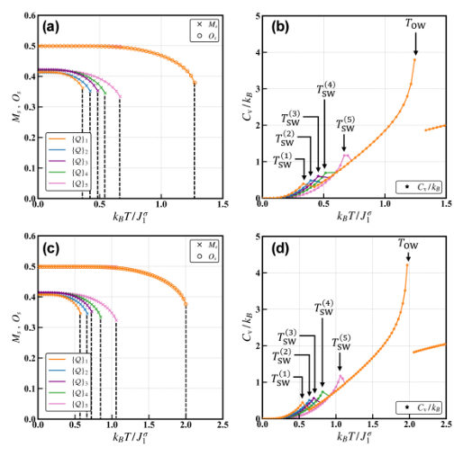 
FIG. 4. Temperature dependence of the (a,c) order parameters Ms and Os and (b,d) specific heat (Cv) in dimensionless units for different sets of biquadratic exchange couplings {Q}i(i = 1, . . . , 5) (refer Sec. III B). Top row (a,b) corresponds to staggered lattice order and bottom row (c,d) corresponds to aligned lattice order.

📷 Fig 5

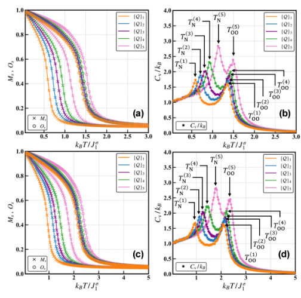 
FIG. 5. Monte-Carlo simulated results for the (a,c) order parameters Ms and Os, (b,d) specific heat (Cv) vs. temperature in dimensionless units for different sets of model parameters {Q}i(i = 1, . . . , 5) as in Fig. 4. Top row (a,b) corresponds to staggered lattice order and bottom row (c,d) corresponds to aligned lattice order.

**Summary.** This paper unifies the theoretical description of collective excitations (magnons and orbitons) in altermagnets by developing an extended spin-orbital model. It demonstrates that the observed spectral splitting arises from two distinct physical origins: lattice asymmetry and orbital ordering. The methodology combines mean-field theory with Monte Carlo simulations to provide a comprehensive understanding of the coupled spin-orbital dynamics.

**Why it may be interesting.** The work provides a detailed, unified theoretical framework for understanding coupled spin-orbital excitations in magnetic materials, which is highly relevant to modern condensed matter physics research on emergent magnetism.

Detailed structure

**Main problem.** The primary challenge is developing a unified theoretical framework to describe the collective excitations (magnons and orbitons) in altermagnets, which arise from two distinct microscopic mechanisms: lattice asymmetry and orbital ordering.

**Main result.** The authors successfully develop a unified model showing that the characteristic chiral-splitting in the excitation spectra originates from two complementary contributions: one from lattice asymmetry and one from orbital-order-induced exchange anisotropy.

**Method.** The study employs an extended Kugel'-Khomskiĭ spin-orbital model analyzed using a self-consistent mean-field spin-wave orbital-wave formalism, complemented by classical Monte Carlo simulations.

**Model / system.** The system is an altermagnet modeled on a decorated square lattice, described by an extended anisotropic Heisenberg Hamiltonian coupling spin and orbital degrees of freedom. The model incorporates both inequivalent non-magnetic environments and correlation-driven orbital ordering.

**Key observables.** Magnon and orbiton excitation spectra, chiral-splitting magnitude, and finite-temperature population densities ($\varrho_A, \varrho_B$).

**Important parameters / regimes.** Temperature ($T$), lattice coupling constants ($J, K$), and the degree of orbital/spin ordering.

**Assumptions / limitations.** The mean-field approach assumes the decoupling of spin and orbital sectors, and the analysis often neglects full quantum fluctuations in favor of mean-field or classical Monte Carlo treatments.

**Figures summary.** The notes detail the derivation of symmetry relations for Bogolyubov coefficients and the calculation of temperature-dependent population densities for magnon and orbiton modes.

**Paper structure.** The paper progresses from defining the physical problem and model Hamiltonian, to applying mean-field theory to derive excitation spectra, analyzing symmetry properties using Bogolyubov transformations, and finally investigating finite-temperature behavior using both analytical methods and Monte Carlo simulations.

Abstract

Altermagnetism has recently emerged as a distinct collinear magnetic phase exhibiting momentum-dependent spin-splitting despite vanishing net magnetization, as a consequence of inequivalent non-magnetic environments. Lately, it has been proposed that strong electronic correlations may yield spontaneous altermagnetism due to orbital ordering even for equivalent non-magnetic environments. While previous studies have largely focused on the electronic structure, a unified understanding of the collective excitations associated with these two different microscopic mechanisms stabilizing altermagnetism remains absent. Here, we develop an extended Kugel'-Khomskiĭ spin-orbital model on a decorated square lattice that simultaneously incorporates inequivalent non-magnetic environments and correlation-driven orbital ordering within a common theoretical framework. Employing a self-consistent mean-field spin-wave orbital-wave formalism, we demonstrate the emergence of mutually unhybridized but interdependent magnon and orbiton excitations exhibiting characteristic chiral-splitting. We show that the splitting originates from two distinct microscopic contributions: a lattice-dependent term arising from inequivalent non-magnetic environments and an orbital-order-induced exchange-anisotropy term that survives even for equivalent non-magnetic environments. The proposed framework therefore unifies the collective excitations associated with both types of altermagnetism. We further investigate the finite-temperature evolution of the coupled spin-orbital system, revealing the breakdown of spin-wave and orbital-wave approximations through spurious 1st-order transitions, while complementary classical Monte Carlo simulations recover the expected continuous 2nd-order behaviour. Our work establishes a unified microscopic framework for understanding collective magnon and orbiton excitations in altermagnets.

[↑ back to top](#top)

### [Absolutely Maximally Entangled States of $2q$ Parties in Every Odd Prime-Power Dimension $q$](http://arxiv.org/abs/2609.11796v1)

**Authors:** Mykhailo Hontarenko, Karol Życzkowski  
**Type:** theory · **Category:** quantum information and computing · **PDF:** <https://arxiv.org/pdf/2609.11796v1>  
**Analysis basis:** full PDF text, analyzed in chunks

📷 Fig 1

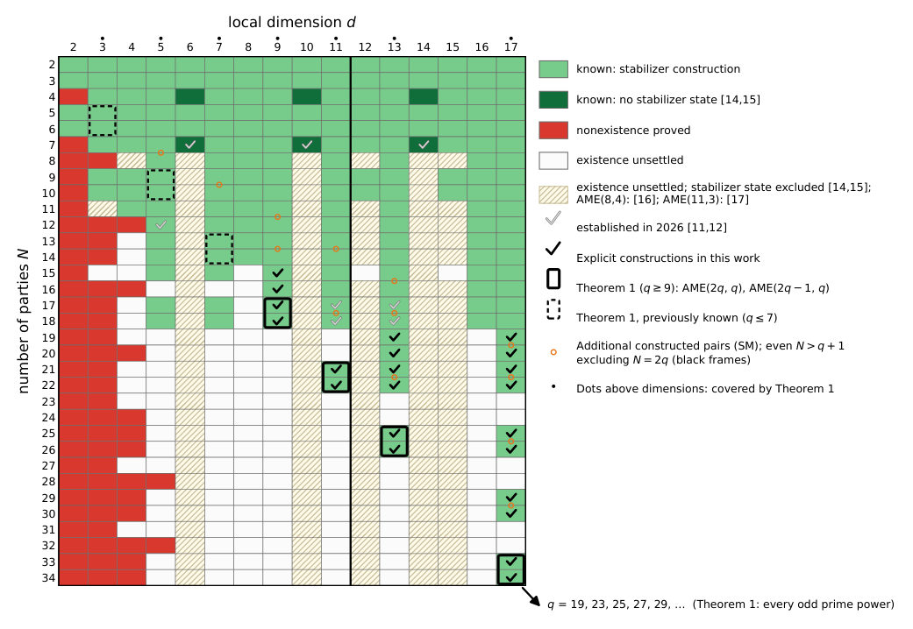 
Figure 1. AME existence status for 2 ≤d ≤17 and 2 ≤N ≤34 [2, 7, 8, 10–12]. Black frames mark Theorem 1 and its projection (dashed for previously known q ≤7); dots mark the covered local dimensions. Black checks mark 14 points from Table I and eight from the supplementary families; four table entries lie outside the plot. Gray checks mark other 2026 results [11, 12]; orange rings mark supplementary pairs beyond the short-length range. Green: known stabilizer states; dark green: known AME states without a stabilizer realization; yellow hatching: unsettled existence with a stabilizer obstruction [14–17]. Red: nonexistence; white: unsettled existence. See also Ref. [18] on AME(4, 6)....

**Summary.** This paper constructs a family of Absolutely Maximally Entangled (AME) quantum states for dimensions $q$ that are odd prime powers. The construction is deeply rooted in algebraic coding theory, utilizing Hermitian self-dual MDS codes over finite fields. These states are significant because they represent extreme entanglement useful for quantum error correction and defining optimal quantum resources.

**Why it may be interesting.** The rigorous construction of highly entangled states like AME states provides fundamental resources for quantum error correction and quantum computation, pushing the boundaries of known entanglement bounds.

Detailed structure

**Main problem.** The primary goal is the construction of Absolutely Maximally Entangled (AME) states, which represent an extreme form of multipartite entanglement.

**Main result.** The authors construct stabilizer AME$(2q, q)$ states for every odd prime power $q=p^e$, and derive corresponding AME$(2q-1, q)$ states.

**Method.** The construction heavily relies on generating Hermitian self-dual Maximum Distance Separable (MDS) codes using bordered-circulant matrices over finite fields $\mathbb{F}_{q^2}$.

**Model / system.** The system is a pure quantum state $|\Psi
angle \in (\mathbb{C}^d)^{\otimes N}$ defined by its entanglement properties, specifically requiring its reduced density matrix to be maximally mixed for small subsets of parties.

**Key observables.** The entanglement structure, quantified by the maximal mixing of reduced density matrices, and the associated quantum code parameters (e.g., $[2q, q, q+1]_{q^2}$).

**Important parameters / regimes.** The dimension $q$ must be an odd prime power ($q=p^e, p 	ext{ odd prime}$). The state parameters are $(N, d) = (2q, q)$ and $(2q-1, q)$.

**Assumptions / limitations.** The construction relies on specific algebraic properties within finite fields ($\mathbb{F}_{q^2}$) and the existence of certain matrices satisfying specific structural equations.

**Figures summary.** Figure 1 illustrates the existence status of AME states for various parameters, marking the newly constructed cases. Table I collects explicit examples of parent states and their one-party projections.

**Paper structure.** The paper proceeds by defining the AME property, linking it to MDS codes via specific matrices ($A_q$), deriving the explicit construction for $AME(2q, q)$, and then showing the reduction to $AME(2q-1, q)$ via measurement.

Abstract

Absolutely maximally entangled (AME) states represent an extreme form of multipartite entanglement: every reduced system containing at most half of the parties is maximally mixed. These states provide perfect tensors and optimal quantum error-correcting codes, yet their existence is known only in restricted parameter regimes. For every odd prime power $q=p^e\ge3$, we construct a stabilizer $\mathrm{AME}(2q,q)$ state whose normalized one-party projection yields a stabilizer $\mathrm{AME}(2q-1,q)$ state. A closed-form $q\times q$ bordered-circulant matrix $A_q$ over $\mathbb{F}_{q^2}$ generates a Hermitian self-dual maximum distance separable (MDS) code $[2q,q,q+1]_{q^2}$, which lies outside the extended Reed-Solomon classes. In suitable bases, the amplitude tensors define normalized $q$-unitary complex Hadamard matrices of order $q^q$ with $p$th-root phases. Additional constructions yield $\mathrm{AME}(q+3,q)$ states and families at intermediate particle numbers through explicit rescalings of selected submatrices. We also provide nine explicit parent matrices and the corresponding one-party projections.

[↑ back to top](#top)

### [Full Inseparability and Genuine Multipartite Entanglement Coincide for Finite-Mode Gaussian States](http://arxiv.org/abs/2609.10984v1)

**Authors:** Yu Yang, Yuhang Wang, Chunxiao Du, Shikun Zhang, Zheng Qin, Rui Li, Wenxiu Li, Hao Zhang, Zhisong Xiao  
**Type:** theory · **Category:** quantum information and computing · **PDF:** <https://arxiv.org/pdf/2609.10984v1>  
**Analysis basis:** full PDF text, analyzed in chunks

📷 Fig 1

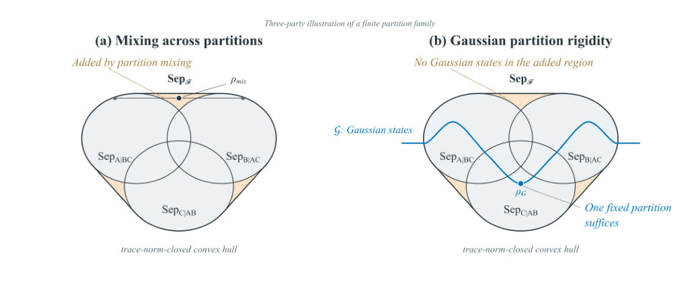 
FIG. 1. Convex partition rigidity for a three-party illustration with F = {A|BC, B|AC, C|AB}. Mixing states that are separable across different cuts enlarges the unrestricted mixed-state class. Theorem 1 says that the added region has empty intersection with the finite-mode Gaussian state set: every Gaussian member of SepF already belongs to one fixed-partition separable set. The picture is schematic and the theorem holds for any finite family of partitions of finitely many finite-mode parties.

📷 Fig 2

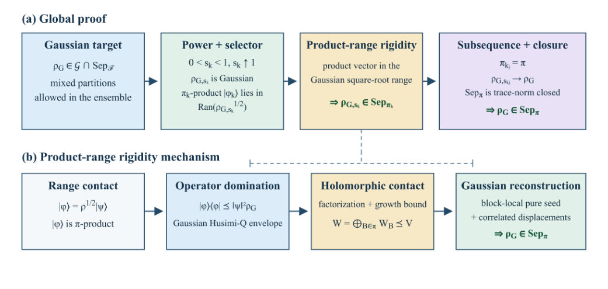 
FIG. 2. Proof roadmap for Theorem 1. (a) Gaussian powers and the spectral selector produce a product vector in a square-root range. Product-range rigidity fixes a separable partition for each power; finiteness of F and trace-norm closure then fix one partition for the target. (b) The local rigidity mechanism: operator domination gives a Gaussian Husimi-Q envelope, holomorphic product contact yields a block-local pure covariance W ⪯V , and correlated displacements reconstruct a state separable across the same partition.

**Summary.** This theoretical paper proves a significant rigidity result for finite-mode Gaussian states, showing that the complex concept of full inseparability is mathematically equivalent to Genuine Multipartite Entanglement (GME). The authors achieve this by employing advanced techniques from functional analysis and quantum information theory, demonstrating that the structure of Gaussian states prevents entanglement from being activated by mixing over multiple potential separable cuts.

**Why it may be interesting.** This work provides deep structural constraints on entanglement for Gaussian states, which are highly relevant in quantum optics and continuous-variable quantum information processing, by showing that complex mixed-state entanglement measures collapse to simpler, fixed-partition tests.

Detailed structure

**Main problem.** The paper investigates whether full inseparability (entanglement across every bipartition) and Genuine Multipartite Entanglement (GME) coincide for finite-mode Gaussian states, especially when considering convex decompositions over multiple partitions.

**Main result.** For finite-mode Gaussian states, the authors prove that full inseparability and GME are equivalent, demonstrating that partition mixing adds no new exact Gaussian states.

**Method.** The proof combines spectral selection techniques with holomorphic rigidity arguments, relating local product structures in the state's spectral range to global separability conditions.

**Model / system.** The study focuses on finite-mode Gaussian states of bosonic modes distributed among multiple parties. Separability is analyzed using the trace-norm-closed convex hull of product projectors ($	ext{Sep}_F$).

**Key observables.** Covariance matrices, entanglement depth, fixed-partition separability criteria (LMIs), and the existence of product vectors in the square-root range of the state.

**Important parameters / regimes.** Finiteness of modes and parties; the exponent $s$ used in Gaussian powers ($
ho^s$); the specific structure of the Gaussian state.

**Assumptions / limitations.** The target density operator is assumed to be an *exact* finite-mode Gaussian state. The analysis is restricted to finite numbers of parties and modes.

**Figures summary.** Figure 1 illustrates convex partition rigidity for a three-party system, showing Gaussian members of $	ext{Sep}_F$ are constrained to a single fixed-partition set. Figure 2 outlines the proof roadmap involving Gaussian powers and product-range rigidity.

**Paper structure.** The paper first establishes the general rigidity theorem for Gaussian states ($	ext{G} \cap 	ext{Sep}_F = 	ext{G} \cap igcup 	ext{Sep}_\pi$), then applies this to the bipartition case to prove the equivalence between full inseparability and GME, relying on spectral selection and holomorphic rigidity.

Abstract

For general mixed states, entanglement across every bipartition need not imply genuine multipartite entanglement (GME), because a biseparable decomposition may switch the separable cut from term to term. We prove that this convex ambiguity disappears for Gaussian states of finitely many bosonic modes. More generally, for any finite family of partitions, a Gaussian density operator in the trace-norm-closed convex class generated by states separable across those partitions is already separable across one fixed partition in the family. Only the target is Gaussian; a valid decomposition may be continuous and may contain arbitrary non-Gaussian states. Thus full inseparability and GME coincide, Gaussian k-separability and k-producibility reduce to fixed-partition tests, and party-wise tensor powers cannot activate GME from a biseparable Gaussian state. The proof combines a spectral selector with a holomorphic rigidity argument that converts one product vector in the square-root range of a Gaussian state into a block-local covariance certificate. The result shows that partition mixing, a generic mixed-state mechanism, adds no new exact finite-mode Gaussian states.

[↑ back to top](#top)

### [Generative Replay Mitigates Sample Starvation in Quantum Architecture Search](http://arxiv.org/abs/2609.11248v1)

**Authors:** Akash Kundu, Amit Kumar Jaiswal, Sebastian Feld, Prayag Tiwari  
**Type:** theory · **Category:** quantum information and computing · **PDF:** <https://arxiv.org/pdf/2609.11248v1>  
**Analysis basis:** full PDF text, analyzed in chunks

📷 Fig 1

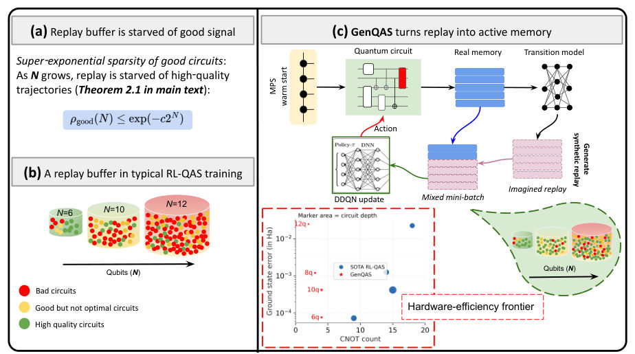 
Fig. 1: GenQAS converts passive replay into active experience generation. a, Under weakly informed exploration, high-quality circuit trajectories become increasingly sparse as the system size grows. b, Uniform and prioritized replay can only resample previously observed transitions, so the density of useful experience declines as the search space expands. c, GenQAS starts from an MPS-derived circuit, retains real transitions, learns a local transition model and generates synthetic transitions on the fly. Real and generated samples are mixed during Double-DQN updates, supporting the search for low-error circuits with fewer entangling gates.

📷 Fig 2

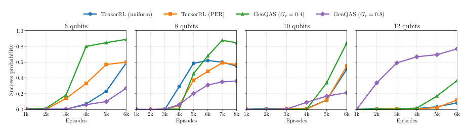 
Fig. 2: Fixed-budget performance and training dynamics of GenQAS. (a) At a fixed budget of 6000 training episodes, GenQAS consistently outperforms TensorRL-QAS with uniform and PER replay across N ∈ {6, 8, 10, 12}, while passive baselines degrade sharply with system size. The observed gains increase with qubit number, reaching the strongest advantage at 12 qubits and showing an increasing relative advantage over the evaluated 6 to 12 qubit range, consistent with the proposed signal-density mechanism. (b) Training trajectories for 6, 8, 10 and 12 qubits show that GenQAS converges faster and attains higher success probability than TensorRL- QAS baselines. The Gr = 0.8 setting is the most...

📷 Fig 3

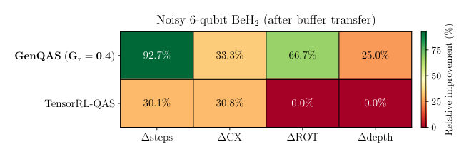 
Fig. 3: Replay buffer transfer in the noisy 6-qubit BEH2 experiment. A depolarizing channel with strength p1 = 0.01 is applied after each single-qubit gate and a channel with strength p2 = 0.05 is applied after each two-qubit gate. (a) Relative improvement in steps to chemical accuracy, CNOT count, rotation count, and circuit depth after transfer of replay information collected in the noiseles environment. (b) Corresponding raw metrics for TensorRL-QAS and GenQAS with and without replay-buffer transfer.

📷 Fig 4

 
Figure 3 shows that transferred replay information improves both methods, but the improvement is substantially larger for GenQAS. For TensorRL-QAS, transfer of the uniform replay buffer reduces the steps to the first chemical-accuracy solution from 13623 to 9520, a 30.1% reduction. The transferred buffer also reduces the CNOT count from 13 to 9, a 30.8% reduction, but leaves the rotation count and circuit depth unchanged at 4 and 10, respectively. For GenQAS, transfer of the generative replay mechanism reduces the steps to chemical accuracy from 9053 to 660, corresponding to a 92.7% reduction. The transferred GenQAS configuration also decreases the CNOT count from 9 to 6, the rotation count...

📷 Fig 5

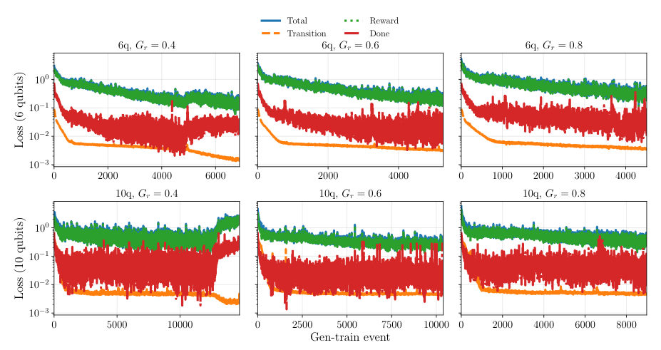 
Fig. 4: Generator loss decomposition at 6 and 10 qubits. Total, transition, reward, and termination losses of the learned dynamics model for generation ratios Gr ∈{0.4, 0.6, 0.8}. The transition loss decreases or remains low across the investigated settings. At 10 qubits, the Gr = 0.4 configuration exhibits a late increase in total loss, whereas the Gr = 0.6 and Gr = 0.8 configurations remain more bounded over their respective training intervals.

**Summary.** This paper addresses the sample starvation problem in Quantum Architecture Search (QAS) by introducing GenQAS. This method enhances reinforcement learning by using a learned model to generate synthetic, yet physically informed, circuit transitions. The results demonstrate that this generative replay significantly boosts the efficiency and success rate of discovering optimal quantum circuits for chemistry and condensed matter simulations.

**Why it may be interesting.** It provides a concrete, scalable ML technique to overcome fundamental data scarcity issues in quantum algorithm design, which is crucial for simulating complex molecular or material properties.

Detailed structure

**Main problem.** Reinforcement learning for Quantum Architecture Search (QAS) suffers from sample starvation as the search space grows, making it difficult to find optimal quantum circuits.

**Main result.** The proposed GenQAS framework significantly improves the success probability of finding low-error quantum circuits across various qubit counts, showing up to a 7.0x improvement at 12 qubits.

**Method.** It introduces GenQAS, a tensor network-guided RL framework that augments standard replay buffers by using a learned local transition model to generate synthetic, on-demand circuit transitions.

**Model / system.** The system involves constructing parameterized quantum circuits (PQC) to approximate the ground state of chemical Hamiltonians (e.g., $	ext{BeH}_2$, transverse field Ising model) using qubits.

**Key observables.** Success probability, energy error, and the useful-transition density ($
ho$).

**Important parameters / regimes.** Qubit count (6 to 15), generation ratio ($G_r$), and the depth of the circuit.

**Assumptions / limitations.** The analysis assumes that the synthetic transitions generated by the learned model remain sufficiently consistent with the real environment to support stable off-policy learning.

**Figures summary.** Figures illustrate how GenQAS converts passive replay into active experience generation, showing the limitations of passive replay versus the enhanced training signal from generative replay.

**Paper structure.** The paper first establishes the sample starvation problem in QAS, then details the GenQAS methodology combining MPS warm-starts with generative replay, and finally presents quantitative results across multiple chemical and Ising model benchmarks.

Abstract

Reinforcement learning (RL) can automate quantum architecture search, but its scalability is limited when useful circuit trajectories become rare in the rapidly expanding search space. Existing replay mechanisms reuse observed transitions; the proposed learned model produces additional predicted one step transitions from real state-action seeds. Here we introduce GenQAS, a tensor network-guided RL framework that combines a fixed matrix product state warm-start with prioritized generative replay. A learned local transition model generates synthetic circuit transitions on demand and mixes them with real experience during Double Deep Q-Network updates. Under a random exploration analysis, near ground state circuits occupy a rapidly shrinking region of the accessible state space. We investigate whether real data anchored synthetic replay can improve the effective training signal in this regime. Across chemical Hamiltonian benchmarks from 6 to 12 qubits, GenQAS improves fixed-budget success probability and identifies compact circuits at competitive energy error. At 12 qubits, it improves final success probability by up to $7.0\times$ over passive replay. On a 15-qubit transverse field Ising model, GenQAS increases success probability from $12\%$ to $21\%$. In a noisy 6-qubit BeH$_2$ transfer experiment, generative replay reduces the steps to chemical accuracy by $92.7\%$. These results show that generative replay can mitigate sample starvation in quantum architecture search and support more resource efficient circuit discovery.

[↑ back to top](#top)

### [High-Temperature ferromagnetism from site-selective filling in (Fe,Ni)$_{6-δ}$GeTe$_2$](http://arxiv.org/abs/2609.11862v1)

**Authors:** Tyler L. Werner, Jonathan T. Reichanadter, Xiang Chen, Pranab K. Nag, Luna Y. Liu, Yu-Tsun Shao, Hongrui Zhang, Mingyang Guo, Wenxin Li, Zhibo Kang, Han Wu, Makoto Hashimoto, Donghui Lu, Turgut Yilmaz, Elio Vescovo, Sung-Kwan Mo, Barat Achinuq, Alexei Fedorov, Jacob C. Ruff, Ming Yi, Qiong Ma, David A. Muller, Eduardo H. da Silva Neto, Robert J. Birgeneau, Jeffrey B. Neaton, Yu He  
**Type:** both · **Category:** strongly correlated electrons · **PDF:** <https://arxiv.org/pdf/2609.11862v1>  
**Analysis basis:** full PDF text, analyzed in chunks

📷 Fig 1

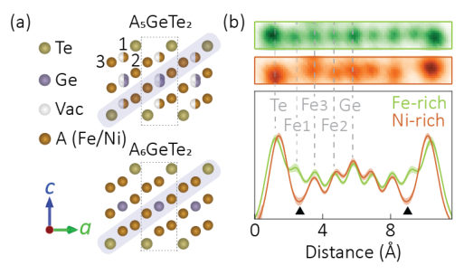 
FIG. 1. Phase separation in (Ni0.36Fe0.64)5.38GeTe2: (a) Schematic of A5GeTe2 and A6GeTe2 (“A”: transition metal, “Vac”: vacancy). (b) STEM line cuts (top) and integrated transmission intensity (bottom) through the Te-Fe-Ge-Fe-Te chain direction (shaded box in (a)) in both domains.

📷 Fig 2

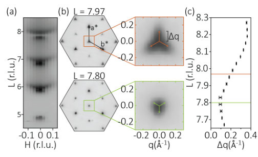 
FIG. 2. Domain dependent structural coherence: (a) Synchrotron single-crystal XRD intensity in H0L reciprocal- space plane. (b) HKL plane with L = 7.97 r.l.u and L = 7.80 r.l.u, representing Ni-rich and Fe-rich domains respec- tively. Zoomed in panels show the 0 0 L reflection highlight- ing the threefold peak structure. (b) Fitted effective in-plane reciprocal-space peak ∆q by L position. Error bars represent standard deviation from three in-plane directions.

📷 Fig 3

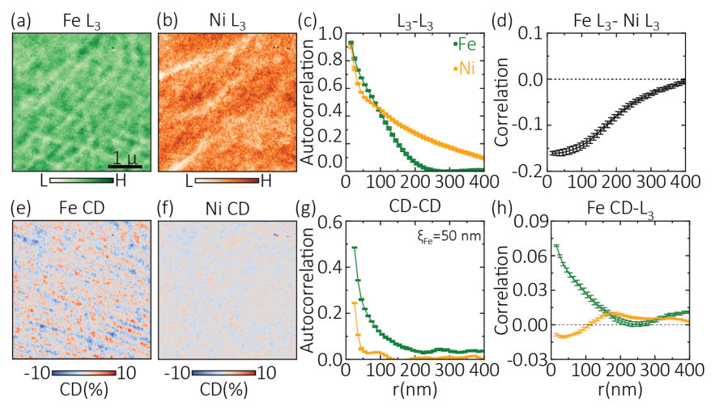 
FIG. 3. Iron-mediated ferromagnetism: (a, b) XAS maps of a cleaved (001) surface collected at the Fe L3 (a) and Ni L3 (b) edges, revealing complementary Fe-rich and Ni-rich compositional domains. (c) Radially-averaged autocorrelation functions of Fe and Ni L3 XAS maps. (d) Radially-averaged cross-correlation between Fe and Ni L3 XAS maps, showing their spatial anti-correlation. (e, f) Circular dichroic (CD) maps of the Fe L3 (e) and Ni L3 (f) edges. (g) Autocorrelation of Fe L3 and Ni L3 XMCD maps along the principal stripe domain axis. Exponential fitting yields a magnetic correlation length of ξFe = 50 nm. (h) Cross-correlation of Fe L3 XMCD map with the Fe L3 and Ni L3 XAS maps. The...

📷 Fig 4

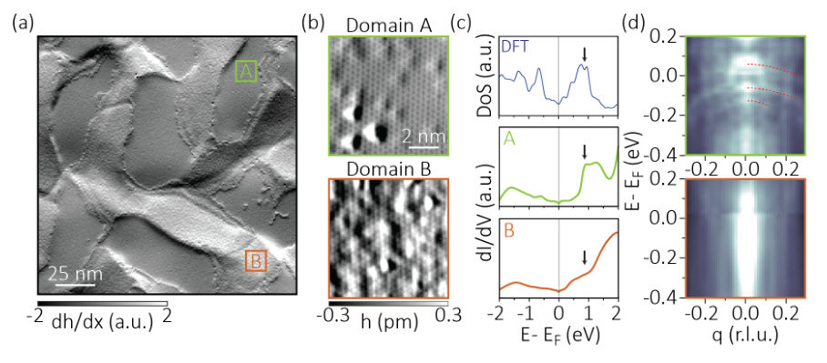 
FIG. 4. Domain Dependence of Electronic Structure: (a) Gradient of constant-density-of-states topography of in situ cleaved Ni-Fe5GeTe2 surface, revealing interwoven smooth (A) and rough domains (B). (b) Atomically-resolved constant density of states (DOS) topographies for domains A (top) and B (bottom). (c) Comparison of DFT-calculated Fe6GeTe2 density of states (top) to differential conductance from domains A (middle) and B (bottom), with black arrow highlighting the distinguishing peak between domains. (d) Quasiparticle interference maps from domains A (top) and B (bottom) with momentum-dependent bands highlighted in red.

📷 Fig 5

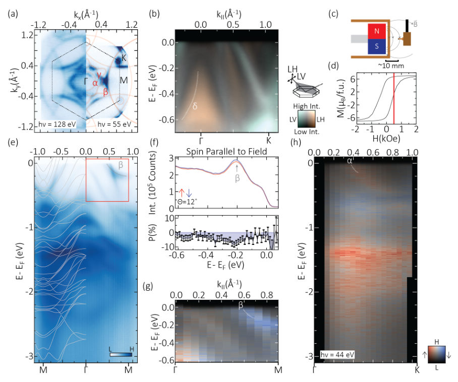 
FIG. 5. Electronic structure of the Fe-rich domains: (a) ARPES Fermi surfaces collected at hν = 128 and 55 eV. Hexagon marks the Brillouin-zone boundary, and red lines indicate fitted Fermi-surface contours. Distinct Fermi-surface sheets are labeled α, β, and γ. (b) Linear dichroism of ARPES spectra collected along the Γ–K direction at hν = 128 eV using LH and LV light polarizations. The experimental geometry defining the incoming photon polarizations is shown at right. The δ band is highlighted by the white line. (c) Schematic of the in-vacuo partial in-plane magnetization procedure used for SR-ARPES. (d) In-plane magnetization curve, with vertical line indicating the maximum applied...

**Summary.** This work elucidates the mechanism behind record high Curie temperatures in (Fe,Ni)GeTe2 by demonstrating that the magnetism originates from strain-stabilized Fe6GeTe2 nano-precipitates. Using a combination of advanced spectroscopy and DFT, the authors show that site-specific electronic filling dictates the magnetic ground state, providing a roadmap for engineering 2D magnetic metals.

**Why it may be interesting.** The work provides a detailed, atomistic understanding of how structural phase separation and site-selective electronic filling can stabilize magnetic phases at record high temperatures, offering a blueprint for designing novel magnetic materials.

Detailed structure

**Main problem.** The study aims to unravel the origin of record high Curie temperature ferromagnetism in the metallic van der Waals magnet (Fe,Ni)GeTe2, which is complicated by structural complexity and mixed magnetic contributions.

**Main result.** The high-$T_C$ phase is attributed to a strain-stabilized Fe6GeTe2 nano-precipitate, whose electronic structure features localized moments on interior Fe atoms and itinerant carriers on outer Fe atoms.

**Method.** The research combines advanced experimental techniques like ARPES, XMCD, and STEM with first-principles DFT calculations to map out site-specific electronic and magnetic properties.

**Model / system.** The system is the ternary chalcogenide vdW magnet (Fe,Ni)GeTe2, which exhibits phase separation into distinct Fe-rich and Ni-rich structural domains.

**Key observables.** Curie temperature (up to 478 K), site-specific magnetic moments, spin-polarized itinerant carriers, and lattice parameters distinguishing Fe-rich vs. Ni-rich domains.

**Important parameters / regimes.** Ni substitution concentration ($\delta$), temperature (T), and the energy cost associated with homogeneous vs. precipitate formation.

**Assumptions / limitations.** DFT calculations for Ni substitution were performed without full ionic relaxation, and the analysis relies on identifying the magnetic primacy of the Fe-rich domains.

**Figures summary.** Figures show XRD evidence of two distinct structural domains (Fe-rich/Ni-rich), STEM/XAS/XMCD maps confirming magnetic contrast localized in Fe-rich domains, and ARPES/DFT results detailing the electronic structure and site-specific orbital contributions.

**Paper structure.** The paper progresses by first identifying the high-$T_C$ phenomenon, then using structural characterization (XRD, STEM) to prove phase separation into Fe-rich and Ni-rich domains. Subsequently, electronic structure analysis (ARPES, DFT) is used to pinpoint the electronic mechanism—site-specific filling—that stabilizes the high-$T_C$ precipitate phase.

Abstract

The discovery of high-temperature ferromagnetism in the metallic van der Waals (vdW) system Fe$_N$GeTe$_2$ has brought two-dimensional (2D) magnets into technologically relevant temperature scales. Specifically at N = 5, dilution of magnetic moments by nickel substitution counterintuitively achieves a record high Curie temperature of 478~K. Unraveling the origin of this nickel-substitution-induced enhancement is complicated by the compound's structural complexity, coexistent itinerant and local magnetic contributions, and mesoscopic compositional domains. Through coordinated structural and electronic characterization, we identify that the high-T$_C$ magnetic phase arises from a strain-stabilized Fe$_6$GeTe$_2$ nano-precipitate. Combining first-principles calculations and spin- and angle-resolved photoemission spectroscopy (ARPES), we uncover a site-specific electronic landscape in which interior iron atoms primarily host localized moments while the outer iron atoms neighboring the tellurium layers produce spin-polarized itinerant carriers that cross the vdW gap. The large energy cost associated with homogeneous nickel substitution is found to favor the spontaneous precipitation of the crystallographically and electronically ``clean'' high-T$_C$ phase. Finally, we compare metal-rich vdW magnets with binary magnetic alloys, and discuss the unifying roles of nano-precipitates in stabilizing otherwise unattainable bulk phases. Our work provides mechanistic insights into the record-high T$_C$ ferromagnetism in (Fe,Ni)$_{5+δ}$GeTe$_2$, establishing a rigorous foundation for the atomic engineering of vdW magnetic metals informed by direct electronic signatures.

[↑ back to top](#top)

### [Hyperspin Altermagnets](http://arxiv.org/abs/2609.10930v1)

**Authors:** Hai-Yang Ma, Yuanchang Li, Hu Xu, Shengbai Zhang, Jin-Feng Jia  
**Type:** theory · **Category:** other · **PDF:** <https://arxiv.org/pdf/2609.10930v1>  
**Analysis basis:** full PDF text, analyzed in chunks

📷 Fig 1

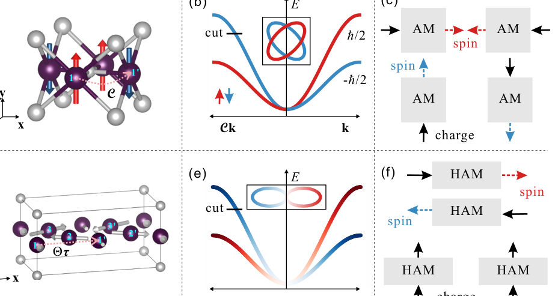 
FIG. 1. (a-c) AM versus (d-f) HAM. (a) AMs are collinear in real space, and the two magnetic atoms 1 and 1’ are related by a crystal symmetry C. (d) HAMs are coplanar but non-collinear in real space, the first set of three magnetic atoms 1, 2, 3 is related to the second set of three magnetic atoms 1′, 2′, 3′ by a Θτ symmetry. (b) AMs have alternating spin-split bands, whose spin ⟨ˆSy⟩is quantized and the spin-up band at k is degenerate with the spin-down band at Ck. (e) HAMs also have alternating spin-split bands, but different from (b), its out-of-plane spin, say ⟨ˆSy⟩∈[−ℏ/2, ℏ/2], is not quantized and the Θτ symmetry requires that the “spin-up” band at k is degenerate with the “spin-down”...

📷 Fig 2

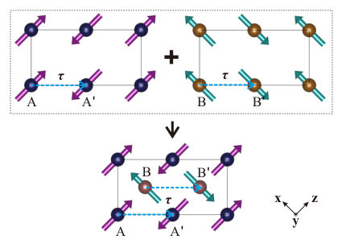 
FIG. 2. Illustration of how two AFMs are merged into a non-collinear HAM. An AFM lattice contains two magnetic atoms, AA′ or BB′ in the plots. Arrows indicate the direction of local magnetic moments. The two magnetic atoms A and A′ (B and B′) within an AFM sublattice are related by Θτ. A HAM can be built by putting two or more AFM lattices, termed subsystems now, into a single lattice, while keeping the Θτ symmetry.

**Summary.** This theoretical work introduces 'hyperspin' to overcome the limitations of studying non-collinear magnets. It proposes a new class, Hyperspin Altermagnets (HAMs), which are characterized by a conserved 'hyperspin' quantum number rather than the standard spin. This framework provides a deeper understanding of magnetic order beyond simple collinear models.

**Why it may be interesting.** The concept of 'hyperspin' provides a powerful, generalized mathematical tool to classify magnetic order beyond simple spin conservation, which is relevant for understanding complex quantum many-body systems where standard symmetries fail.

Detailed structure

**Main problem.** The paper addresses the limitations in characterizing non-collinear magnets, which lack well-defined spin quantum numbers, by introducing the concept of 'hyperspin'.

**Main result.** It classifies non-collinear magnets exhibiting alternating spin-split bands in k-space as Hyperspin Altermagnets (HAMs), distinguished from collinear Altermagnets (AMs) by the existence of a conserved 'hyperspin' quantum number.

**Method.** The analysis involves examining the commutation relations between the Hamiltonian and generalized spin operators ($\hat{S}$ vs. $\hat{J}$) to identify conserved quantities that dictate the magnetic behavior.

**Model / system.** The study models magnetic systems, comparing collinear AMs with non-collinear HAMs, often built by merging multiple Antiferromagnetic (AFM) subsystems under $\Theta	au$ symmetry.

**Key observables.** Alternating spin-split bands in k-space, the existence of a conserved hyperspin quantum number ($\hat{J}_y$), and exotic spin current generation effects.

**Important parameters / regimes.** The symmetry $\Theta	au$ is crucial for the emergence of HAMs; the Hamiltonian is analyzed in k-space using matrix diagonalization.

**Assumptions / limitations.** The analysis assumes the applicability of a generalized Hamiltonian and relies on symmetry constraints ($\Theta	au$) to define the new conserved quantity.

**Figures summary.** Figure 1 compares AMs and HAMs regarding band structures and spin current generation. Figure 2 illustrates building a HAM by merging two AFM lattices related by $\Theta	au$. Table I summarizes the symmetry requirements for AMs, AFMs, and HAMs.

**Paper structure.** The paper first introduces the problem with non-collinear magnets, then develops the concept of hyperspin ($\hat{J}$) via commutation relation analysis. It applies this framework to construct and analyze HAMs, deriving the k-space Hamiltonian and demonstrating the resulting collinear spin splitting.

Abstract

The behavior of spin quantum in k-space is key to identifying altermagnets (AMs) as the third kind of fundamental collinear magnetism. In contrast, non-collinear magnets,though abundant in nature,lack well-defined spin quantum numbers, and the resulting spin textures are often highly complex, which limits their potential for next-generation spintronic applications. Here we propose hyperspin, which lives in a higher-dimensional space, to address these drawbacks. Through analyzing the commutation relations between spin and Hamiltonian for a class of non-collinear magnets, we reveal it is a hyperspin, rather than the usual spin, that commutes with Hamiltonian. Unexpectedly, these non-collinear magnets should also show collinear spin-split bands in k-space like collinear AMs. We therefore classify such non-collinear magnets as hyperspin altermagnets (HAMs), as opposed to the usual collinear AMs. Our theory elucidates the fundamental physics of AMs and HAMs and provides a framework for exploring the wide range of non-collinear magnets that may possess other kinds of conserved quantities.

[↑ back to top](#top)

### [Local decoders for fault-tolerant quantum computation and translation-invariant stabilizer codes](http://arxiv.org/abs/2609.11457v1)

**Authors:** Nathaniel Selub, Aditya Bhardwaj, Ethan Lake  
**Type:** theory · **Category:** quantum information and computing · **PDF:** <https://arxiv.org/pdf/2609.11457v1>  
**Analysis basis:** full PDF text, analyzed in chunks

📷 Fig 1

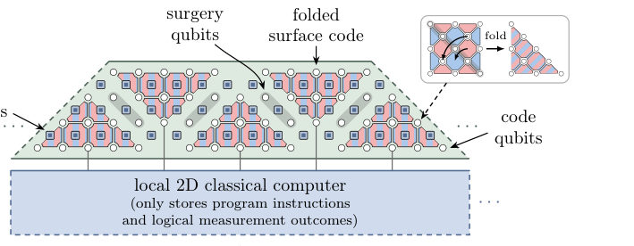 
Figure 1: A two-dimensional fault-tolerant quantum computer that uses only geometrically local quantum and classical operations, bounded-speed classical communication and computation, and a constant density of quantum and classical resources. Logical operations are performed on a line of surface-code patches decoded by a network of constant-size, noiseless classical processors (local decoders). Each patch is folded along one of its diagonals: stripes indicate spatially overlapping 𝑋- and 𝑍-type stabilizers; qubits overlap in pairs, except along the fold. Logical 𝐻gates are implemented fold-transversally, and logical CNOT gates between neighboring patches are implemented via lattice surgery....

📷 Fig 2

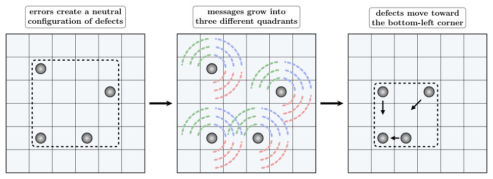 
Figure 2: Toric-code decoding mechanism in the code-capacity setting. Left: A single cluster of errors creates a charge-neutral configuration of defects, enclosed in a bounding box. More generally, the global error configuration always decomposes uniquely into well-separated clusters (see Fig. 3). The decoder never explicitly identifies clusters or their associated bounding boxes; it merely exploits the fact that these structures always exist. Center: Each defect sources three types of messages that grow into three different quadrants. Right: Messages (suppressed here for clarity) are used to monotonically move defects toward the bottom-left corner of the initial bounding box: a defect...

📷 Fig 3

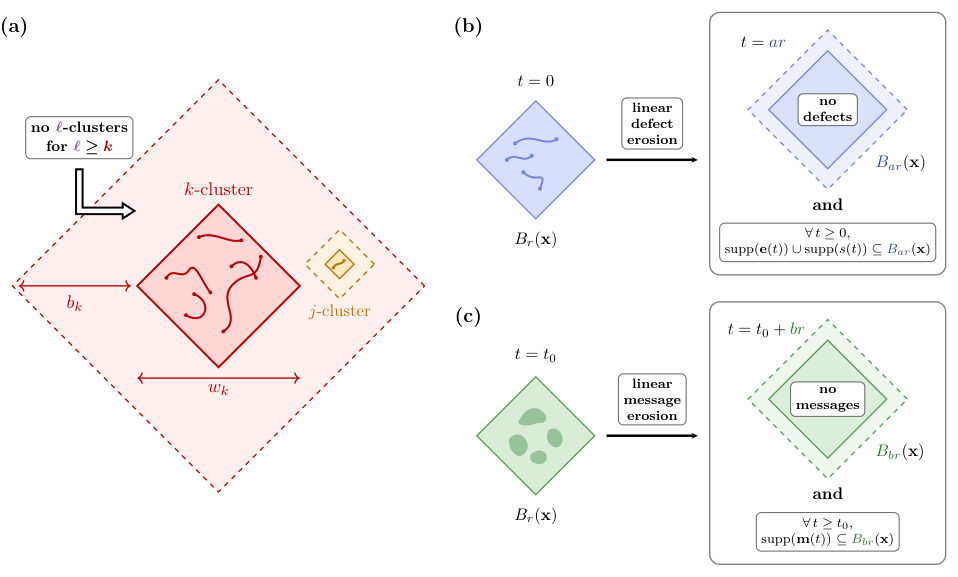 
Figure 3: Clustering and linear erosion. (a) Clustering structure. Any error configuration decomposes uniquely into well-separated clusters. Each 𝑘-cluster (darker red region) of diameter 𝑤𝑘is surrounded by a buffer (lighter red region) of width 𝑏𝑘= Ω(𝑤𝑘) that is free of ℓ-clusters for all ℓ≥𝑘. A smaller 𝑗-cluster and its buffer may nevertheless lie within this buffer (as shown) or within the 𝑘-cluster itself (not shown). Strings represent errors, and their endpoints represent anyons; in general, errors need not be string-like and defects need not be anyonic. (b) Linear defect erosion. There exists a constant 𝑎≥1 such that if the initial error configuration is contained in an ℓ1-ball 𝐵𝑟(x),...

📷 Fig 4

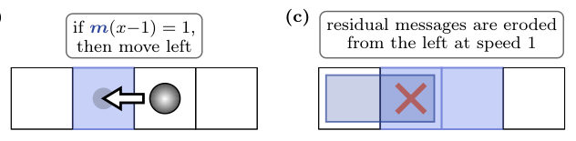 
Figure 4: Repetition-code decoder rule in the code-capacity setting. The toric-code decoder (Fig. 2) is a two-dimensional generalization of this one-dimensional decoder. (a) Message growth. A defect sources messages that grow rightward at average speed 1/𝑞, where 𝑞≥2 is the period of a constant-size clock stored at each site. (b) Defect movement. A defect at site 𝑥moves left whenever it sees a message at site 𝑥−1. For simplicity, only the message to the left of the defect is shown. (c) Message erasure. A message at a defect-free site 𝑥is erased whenever there is no message at site 𝑥−1 and no defect at site 𝑥+ 1. Therefore, once all defects produced by a cluster have been eliminated, the...

📷 Fig 5

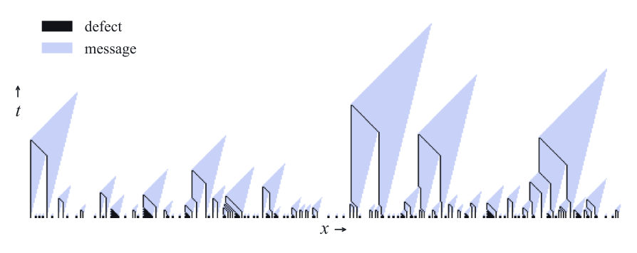 
Figure 5: Spacetime history of the repetition-code decoder dynamics in the code-capacity setting. The bottom row shows the initial defects created by i.i.d. bit-flip errors. Defects source messages that grow rightward; within each cluster, these messages cause defects to move monotonically leftward but never beyond the cluster’s initial leftmost defect. As a result, the bounding interval of the cluster’s defects steadily shrinks; in the worst case, it collapses to a single point, and by charge neutrality, this suffices to annihilate every defect in the cluster. Each cluster is eliminated within a time proportional to its initial diameter, so only large clusters can have large temporal...

**Summary.** This paper presents a breakthrough in quantum error correction by constructing a fully spatially local, fault-tolerant quantum computer using topological codes in two dimensions. The key innovation is a new time-translation-invariant cellular-automaton decoder that eliminates the need for non-local classical computation. This work significantly advances the feasibility of building scalable quantum hardware by ensuring all necessary operations are geometrically local.

**Why it may be interesting.** It provides a concrete, resource-efficient blueprint for building quantum computers whose error correction mechanisms are entirely local and operate on-chip, which is crucial for physical realization.

Detailed structure

**Main problem.** The primary challenge addressed is developing a scalable, fault-tolerant quantum computer based on topological codes that overcomes limitations imposed by classical decoding infrastructure.

**Main result.** The authors constructed the first fully spatially local fault-tolerant quantum computer based on topological codes in fewer than four spatial dimensions, using a novel time-translation-invariant cellular-automaton decoder.

**Method.** The core method involves designing a local cellular-automaton decoder for the surface code, which is integrated with standard fault-tolerance primitives like lattice surgery and state injection.

**Model / system.** The system is a two-dimensional architecture implementing topological codes, specifically focusing on the surface code and general translation-invariant stabilizer codes.

**Key observables.** Logical error rate, threshold noise rate, and the ability to maintain quantum information integrity under noise.

**Important parameters / regimes.** Code distance ($L$), noise rate ($p$), and the dimensionality ($\le 3$ dimensions).

**Assumptions / limitations.** Scalability requires constant threshold noise rate, geometrically local interactions, bounded-speed classical communication/computation, and finite resource density.

**Figures summary.** Figure 1 illustrates the 2D fault-tolerant quantum computer using local operations and folded surface code patches. Figure 2 details the toric-code decoding mechanism where error clusters move defects to a corner for annihilation.

**Paper structure.** The paper introduces the problem, details the construction of the local CA decoder, proves the general local decodability of translation-invariant codes, and finally presents the full local, 2D fault-tolerant quantum computer realization.

Abstract

We construct the first fully spatially local fault-tolerant quantum computer based on topological codes in fewer than four spatial dimensions. Our construction is a two-dimensional architecture that uses only geometrically local quantum and classical operations, bounded-speed classical communication and computation, and a constant density of quantum and classical resources. The core component is a new time-translation-invariant cellular-automaton decoder for the surface code. This decoder preserves logical information for a time stretched-exponential in the code distance and operates continuously during state injection, stabilizer-state preparation, lattice surgery, and transversal readout. We also prove that every translation-invariant topological Pauli stabilizer code is locally decodable under phenomenological noise.

[↑ back to top](#top)

### [Low-cost algorithm-to-execution framework for surface-code quantum computing](http://arxiv.org/abs/2609.10965v1)

**Authors:** Yunxin Tang, Zixuan Huo, Junxiang Huang, Zhou You, Zhirao Wang, Zhenai Ding, Yumeng Zeng, Yangyu Lu, Yiming Huang, Zongkang Zhang, Haipeng Xie, Ying Li, Jinzhao Sun, Xiao Yuan, Yuan Yao  
**Type:** theory · **Category:** quantum information and computing · **PDF:** <https://arxiv.org/pdf/2609.10965v1>  
**Analysis basis:** full PDF text, analyzed in chunks

📷 Fig 1

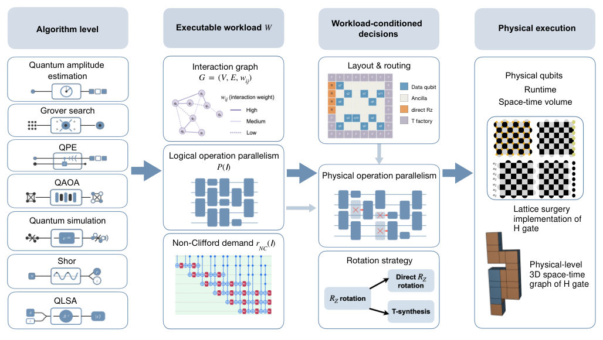 
FIG. 1. From quantum algorithms to executable surface-code requirements. The workflow maps representative quantum algorithms to executable surface-code implementations through four connected stages. Algorithm-level descriptions are decomposed into dependency-preserving logical schedules and summarized as an executable workload W, which connects logical computation to physical implementation. The workload retains a weighted logical interaction graph, logical operation parallelism P(ℓ), and layer-resolved non-Clifford demand rNC(ℓ). These descriptors expose circuit-specific interaction, concur- rency, and resource-supply requirements that are hidden by aggregate logical gate counts. The...

📷 Fig 2

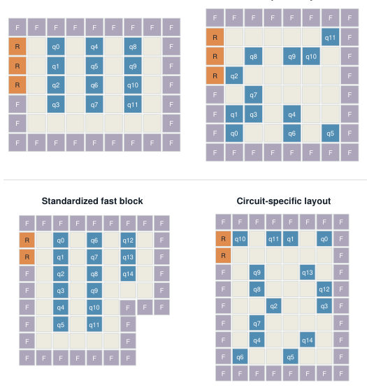 
FIG. 2. Circuit-specific surface-code architecture synthesis from execution requirements. (a) Interaction graph and scheduled rotation trace extracted from the concrete QAOA–MaxCut logical representation. Each displayed edge denotes a direct two-qubit interaction occurring four times in this instance; absent edges indicate no direct two-qubit operation, and node area encodes the per-qubit Rz count. The interaction structure guides layout optimization, while layer-resolved Rz demand is retained for subsequent non-Clifford resource planning. (b) Corresponding circuit-specific grid selected by placement-and- orientation search, favoring shorter lattice-surgery distances between frequently...

📷 Fig 3

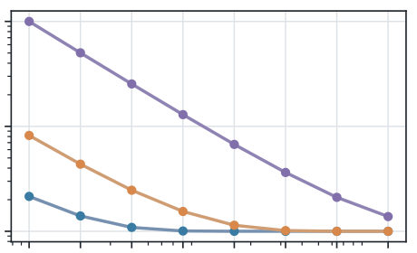 
FIG. 3. Pre-patch parallel cultivation as a non-Clifford resource-supply option. (a) A processor-wide seeding farm before the final logical patch boundary is assigned. Blue cells represent the physical-qubit substrate; each purple circle marks the coordinate origin of one cultivation seed, while orange dots mark seeds that survive postselection. Arrows indicate possible grow-and-graft directions. The growth direction and extent are selected after the surviving seeds are known, using locally available idle qubits rather than a boundary fixed in advance. (b) Ideal bulk packing of spatially separated d = 3 color-code seeds, each containing seven physical qubits, in an effectively unbounded...

📷 Fig 4

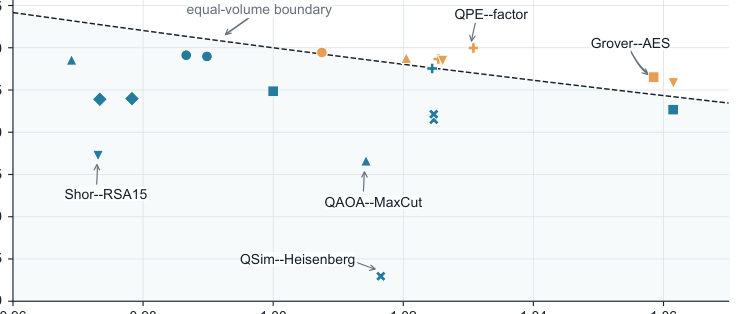 
FIG. 4. Three sources of physical-resource variation across twenty benchmark circuits. Panels (a) and (b) use the compact-block reporting baseline of the ordinary end-to-end resource estimator; panel (c) uses a matched comparison with a standardized fast-block layout to isolate spatial-organization effects. (a) Fraction of the total modeled physical-qubit footprint assigned to data blocks, T-state factories, and direct-Rz rotation patches. Each stacked bar is normalized to the circuit’s total footprint, so the panel shows which resource component occupies the processor. Data blocks are the largest component for 17 of the 20 circuits, whereas T-state factories dominate the other three; no...

📷 Fig 5

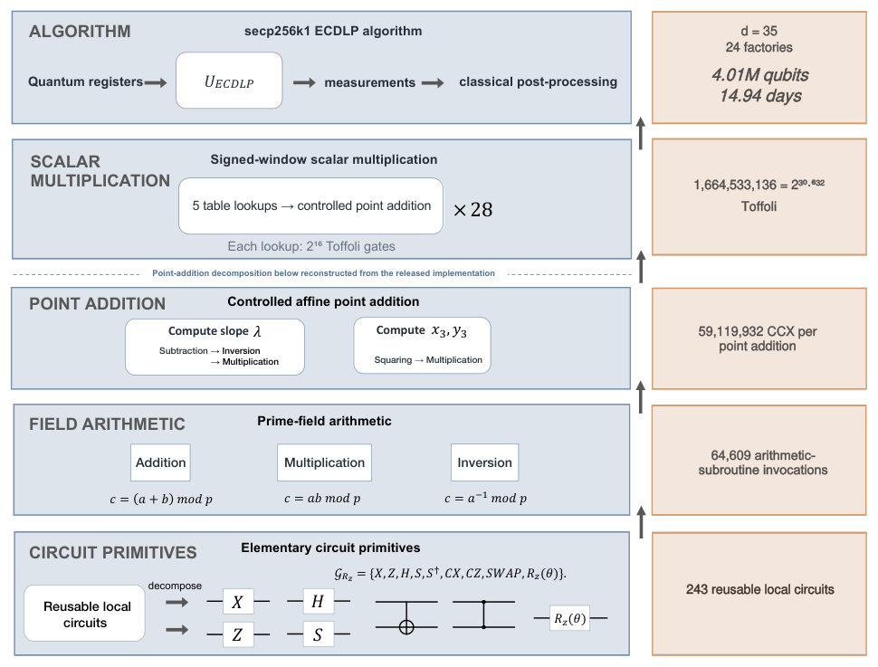 
FIG. 5. Hierarchical decomposition and bottom-up resource aggregation for the secp256k1 ECDLP computa- tion. Each of the 28 signed windows contains five table lookups and one controlled affine point addition, with a cost of 216 Toffoli gates per lookup. The final measurement outcomes are converted into the discrete logarithm by classical post-processing. The point-addition and arithmetic decomposition below the dashed line is reconstructed from the released implementation, whereas the signed-window multiplicities above it are paper-derived. Upward arrows in the right column show the bottom-up aggre- gation of circuit-primitive resources into point-addition, algorithm-level Toffoli, and...

**Summary.** This paper presents a novel, low-cost framework that bridges the gap between abstract quantum algorithms and physical execution on surface-code quantum computers. By creating an 'executable workload' representation, it accounts for scheduling, resource supply, and spatial organization simultaneously. The results prove that optimizing the execution structure, rather than just the logical gate count, is key to achieving practical, low-overhead quantum computation.

**Why it may be interesting.** This work provides a crucial algorithmic tool for quantum hardware engineers and theorists, moving beyond abstract circuit depth to address the practical, resource-constrained scheduling necessary for near-term fault-tolerant devices.

Detailed structure

**Main problem.** The core problem is developing a low-cost, end-to-end framework to translate high-level quantum algorithms into concrete, physically constrained execution schedules for fault-tolerant quantum computing.

**Main result.** The framework demonstrates that low-cost execution depends critically on computation scheduling and organization, achieving significant reductions in space-time volume (up to 241.5 times) compared to baseline methods.

**Method.** The authors introduce an 'executable workload' intermediate representation that captures logical interactions, parallelism, and time-resolved non-Clifford demand, linking the algorithm to physical resource requirements.

**Model / system.** The work is specifically tailored for surface-code quantum computing, requiring the determination of spatial organization and resource supply alongside the logical circuit execution.

**Key observables.** Physical overhead, routed-latency estimates, space-time volume, logical interaction structure, and time-resolved non-Clifford demand.

**Important parameters / regimes.** The comparison between circuit-specific layouts versus standardized baselines, and the scale of the benchmark circuits (twenty benchmarks across seven families).

**Assumptions / limitations.** The primary assumption is that the execution cost is determined by the scheduling and organization of operations, not just the aggregate count of logical resources.

**Figures summary.** Figures illustrate the workflow from high-level algorithms through the executable workload representation to the final physical surface-code layout, comparing optimized vs. standardized approaches.

**Paper structure.** The paper progresses by first establishing the limitations of current separate optimization stages, then introducing the executable workload as a unifying intermediate representation, and finally applying this framework to benchmark circuits to quantify cost savings.

Abstract

The execution of useful quantum algorithms on fault-tolerant processors requires more than a mapping from logical gates to encoded operations: the spatial organization, non-Clifford resource supply, and execution schedule must also be determined while keeping physical overhead within practical limits. Although the theoretical hierarchy from logical circuits to fault-tolerant operations is well established, these implementation choices are often specified and optimized separately. Here we develop a low-cost algorithm-to-execution framework for surface-code quantum computing. From hierarchical algorithm descriptions, it constructs dependency-preserving logical schedules and an executable workload capturing logical interactions, operation parallelism, and time-resolved non-Clifford demand, thereby linking logical computation to surface-code organization, resource-state preparation, and fault-tolerant execution in a traceable workflow. We apply the framework to twenty benchmark circuits across seven algorithm families and a hierarchically composed application-scale elliptic-curve discrete-logarithm workload. Physical costs vary substantially even for circuits with similar logical resource counts. Under our direct-rotation calibration, non-Clifford implementation selection reduces space-time volume by up to 241.5 times versus an all-synthesis baseline for the QAOA amplitude-amplification workload. Circuit-specific surface-code layouts reduce routed-latency estimates for all twenty benchmarks; thirteen also reduce space-time volume because communication savings outweigh added spatial overhead. These results show that low-cost fault-tolerant execution depends on computation scheduling and organization, not aggregate logical resource counts alone.

[↑ back to top](#top)

### [Optimal T-Count for Block Encodings of Fermionic and Spin Hamiltonians](http://arxiv.org/abs/2609.11153v1)

**Authors:** Jiaxin Ma, Kevin J. Joven, Yuan Liu  
**Type:** theory · **Category:** quantum information and computing · **PDF:** <https://arxiv.org/pdf/2609.11153v1>  
**Analysis basis:** full PDF text, analyzed in chunks

📷 Fig 1

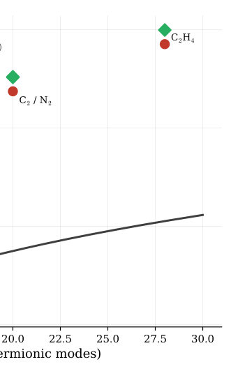 
Figure 1: T-gate counts for different chemistry Hamiltonian in second quantization with STO-3G basis, comparing out lower bound (black line) with prior constructions in Ref. [23] and Qualtran [24]. The constant factor √

📷 Fig 2

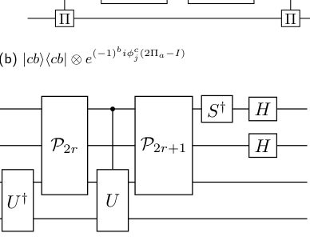 
Figure 2: The QSVT circuit UΦ approximately block-encodes e−ite H/2 before OAA. (a) Decomposition of a projector-phase operator into two projector-controlled NOT gates and a single-qubit Z rotation, adapted from Ref. [2, Fig. 1(b)]. (b) The selected phase operator Pj, adapted from Ref. [2, Fig. 1(c)]. The auxiliary qubit c here selects the phase sequence for the cosine or sine polynomial. (c) The complete QSVT alternating sequence. The register A contains the a block-encoding ancilla qubits, and S is the system register. The final controlled query accounts for the difference between the even cosine polynomial and the odd sine polynomial, while S† supplies the factor −i on the sine branch....

**Summary.** This paper establishes the theoretical lower bounds on the T-gate count needed to encode and simulate complex fermionic and spin Hamiltonians using block encodings in a Clifford+T quantum circuit model. By developing advanced geometric and combinatorial arguments, the authors provide tight scaling laws for the required quantum resources. This research is crucial for understanding the computational cost limitations of simulating quantum matter on near-term quantum hardware.

**Why it may be interesting.** This work provides fundamental complexity bounds for simulating quantum many-body systems using near-term quantum hardware models (Clifford+T), directly impacting the feasibility assessment of quantum simulation algorithms.

Detailed structure

**Main problem.** The paper determines the minimum T-gate count required to construct block encodings of structured fermionic and spin Hamiltonians within a unitary Clifford+T quantum circuit model.

**Main result.** For general fermionic Hamiltonians, the worst-case T-count scales as $\Theta(n^2 \log(n^4/\epsilon))$, while for Kitaev honeycomb spin Hamiltonians, the scaling is $\Theta(n + \log(1/\epsilon))$.

**Method.** The authors employ volume-covering arguments and circuit counting techniques, alongside an ancilla-compression theorem, to establish rigorous lower bounds on the required T-gate resources.

**Model / system.** The analysis focuses on simulating fermionic and spin Hamiltonians (like the Kitaev model) using block encodings within a unitary Clifford+T circuit model, avoiding mid-circuit measurements.

**Key observables.** T-count (non-Clifford gate cost), block-encoding error ($\epsilon$), and the system size ($n$).

**Important parameters / regimes.** The scaling depends critically on the system size $n$ and the desired precision $\epsilon$.

**Assumptions / limitations.** The analysis assumes the ability to use clean ancillas and that the simulation is performed in the unitary Clifford+T model without classical feed-forward.

**Paper structure.** The paper develops theoretical tools, including an ancilla-compression theorem, to derive lower bounds for the T-count complexity of encoding Hamiltonians, applying these bounds separately to fermionic and spin systems, and concluding with an application to QSVT.

Abstract

We determine the non-Clifford $T$-gate cost of constructing block encodings of structured fermionic and spin Hamiltonians in a unitary Clifford$+T$ model, when arbitrarily many clean ancillas and unrestricted block-encoding subnormalization are allowed, but without mid-circuit measurements or classical feed-forward. Our main technical tool is an ancilla-compression theorem: any block encoding of an $n$-qubit operator with $a$ clean ancillas and at most $s$ $T$ gates can be compressed to use at most $\min\{a,n+2s\}$ ancillas, without increasing the absolute error or $T$-count. For general second-quantized Hamiltonians with bounded one- and two-body coefficients, at operator-norm block-encoding error $ε$, a volume-covering argument combined with circuit counting gives the worst-case lower bound $Ω(n^2\sqrt{\log(n^4/ε)})$, matching the existing upper bound at fixed precision. For the bond-dependent Kitaev honeycomb family on $n$ spins, we obtain independent lower bounds $Ω(n)$ from stabilizer nullity and $Ω(\log(1/ε))$ from one-qubit state preparation, established using different Hamiltonian instances. Together with an explicit LCU construction, they give the tight worst-case scaling $Θ(n+\log(1/ε))$. As an application, we evaluate the $T$-count of a Hamiltonian simulation circuit based on quantum singular value transformation, with each block-encoding query compiled separately. When phase synthesis and controlled queries add at most constant-factor overhead, the simulation $T$-count scales as the query count times the optimal $T$-count per query.

[↑ back to top](#top)

### [Oracle Separations in the Fourier Hierarchy](http://arxiv.org/abs/2609.11830v1)

**Authors:** Atul Mantri  
**Type:** theory · **Category:** quantum information and computing · **PDF:** <https://arxiv.org/pdf/2609.11830v1>  
**Analysis basis:** full PDF text, analyzed in chunks

📷 Fig 1

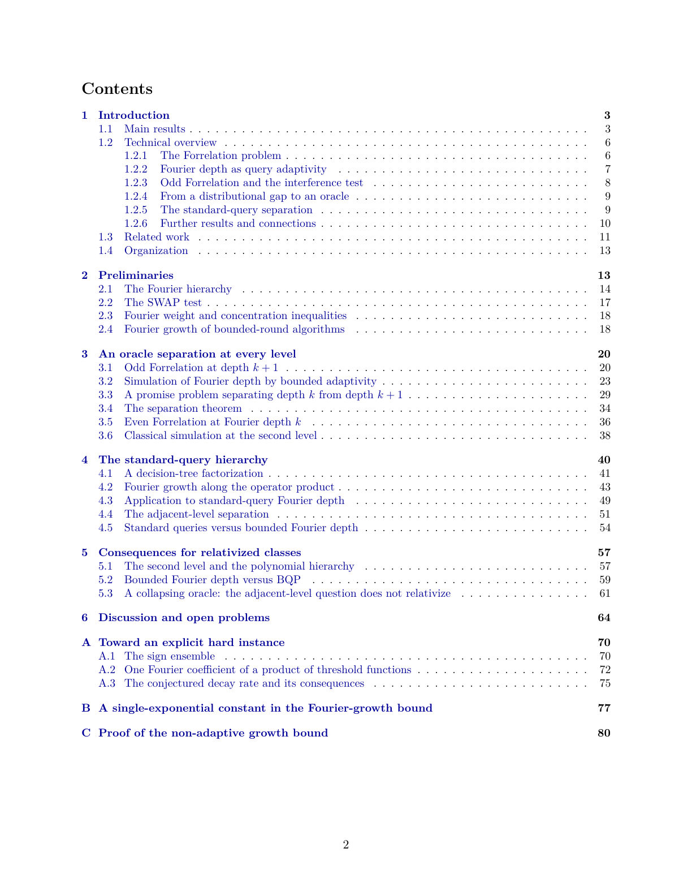 
Low-resolution page preview, page 2

📷 Fig 2

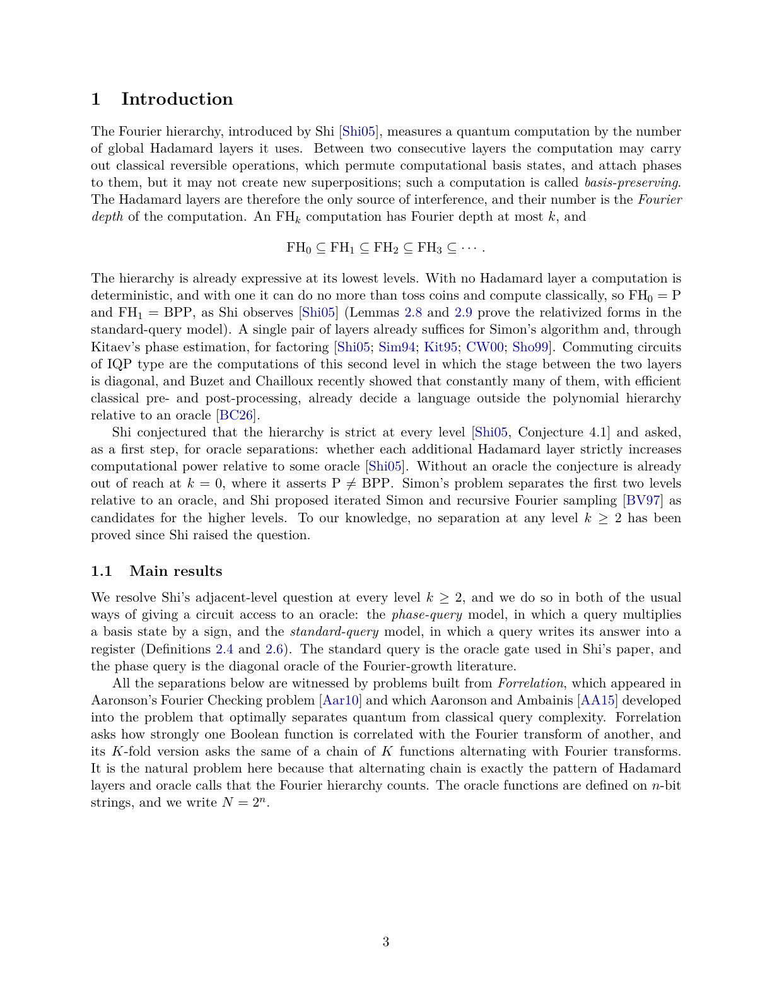 
Low-resolution page preview, page 3

📷 Fig 3

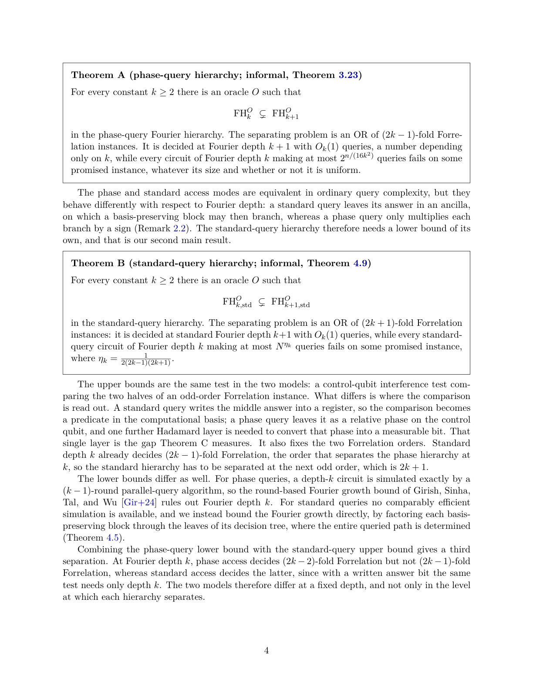 
Low-resolution page preview, page 4

📷 Fig 4

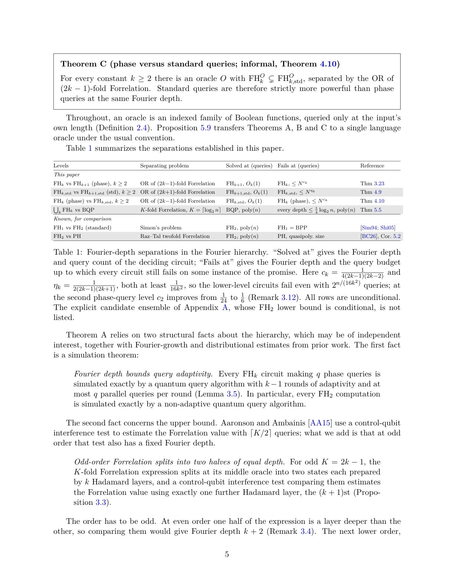 
Low-resolution page preview, page 5

📷 Fig 5

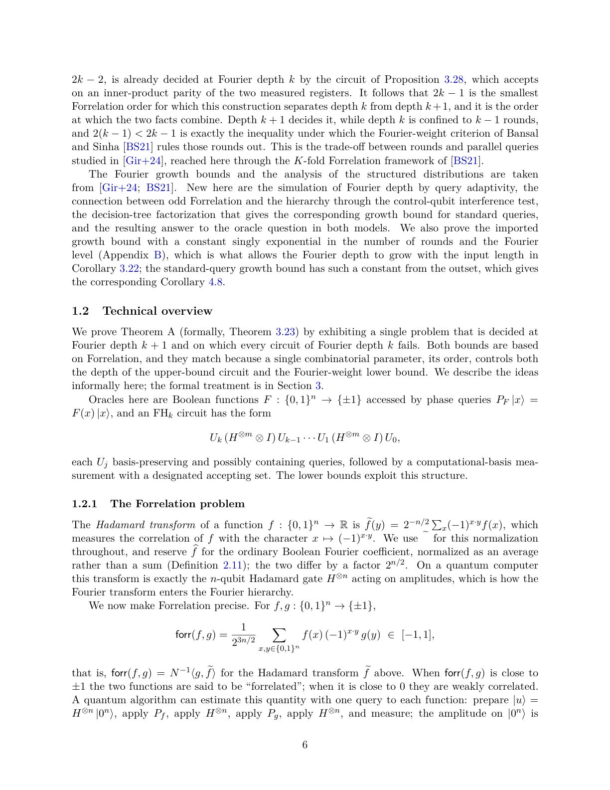 
Low-resolution page preview, page 6

**Summary.** This paper establishes rigorous separations within the Fourier hierarchy, a model quantifying quantum computation depth by Hadamard layers. It proves that increasing the number of layers strictly increases computational power relative to an oracle, distinguishing between the capabilities of phase and standard oracle queries. This advances the theoretical understanding of quantum query complexity.

**Why it may be interesting.** This work provides fundamental complexity results for quantum computation models that are highly relevant to understanding the limits of quantum algorithms beyond standard gate models.

Detailed structure

**Main problem.** The paper aims to prove oracle separations within the Fourier hierarchy ($	ext{FH}_k$), a model measuring quantum computation by the number of Hadamard layers used.

**Main result.** It proves that for every constant $k \ge 2$, $	ext{FH}_k \subsetneq 	ext{FH}_{k+1}$ relative to an oracle, establishing that increasing the number of Hadamard layers strictly increases computational power.

**Method.** The separation is achieved by constructing a hard problem based on Forrelation, whose query complexity is analyzed differently depending on whether the oracle is phase-based or standard.

**Model / system.** The model is quantum computation restricted by the Fourier hierarchy ($	ext{FH}_k$), where interference is limited to Hadamard layers. Two query types are analyzed: the phase oracle (sign multiplication) and the standard oracle (register write).

**Key observables.** The computational power difference between $	ext{FH}_k$ and $	ext{FH}_{k+1}$, measured by the query complexity required to solve the separating Forrelation problem.

**Important parameters / regimes.** The Fourier depth $k$ (number of Hadamard layers), and the Forrelation order $K$ used in the separating problem.

**Assumptions / limitations.** The analysis relies on structural properties linking the number of Hadamard layers to the circuit's ability to query the oracle adaptively.

**Paper structure.** The paper systematically proves separations for both phase and standard oracle models, comparing their relative strengths and establishing the strict inclusion $	ext{FH}_k \subsetneq 	ext{FH}_{k+1}$ for fixed $k$.

Abstract

The Fourier hierarchy $\mathrm{FH}_0\subseteq\mathrm{FH}_1\subseteq\mathrm{FH}_2\subseteq\cdots$, introduced by Shi (TCS 2005), measures a quantum computation by the number of Hadamard layers it uses. Between two layers the circuit may permute basis states and attach phases, but it may not create superposition; the layers are its only source of interference. The first level is exactly $\mathrm{BPP}$, while the second already solves Simon's problem and, through phase estimation, factors integers. Shi conjectured that every additional layer strictly increases computational power, and asked, as a first step, for oracle separations between consecutive levels. To our knowledge, the question was open at every level $k\ge2$.   We prove that for every constant $k\ge2$ there is an oracle relative to which $\mathrm{FH}_k\subsetneq\mathrm{FH}_{k+1}$. The separating problem is built from Forrelation (Aaronson and Ambainis, STOC 2015): the level above solves it with a constant number of queries, whereas at level $k$ it stays hard even for circuits making exponentially many queries. This holds for both of the usual ways of giving a circuit access to an oracle, the phase oracle and the standard oracle, which writes its answer into a register. The two are not interchangeable: relative to an oracle, the standard oracle is strictly more powerful at the same number of layers. We also separate the union of all the levels from $\mathrm{BQP}$ relative to an oracle.   The lower bounds rest on a structural property of the hierarchy: the number of Hadamard layers limits how adaptively a circuit can query its oracle. With a phase oracle, a circuit with $k$ layers is reproduced exactly by an algorithm making only $k-1$ rounds of parallel queries, which brings known lower bounds for such algorithms to bear. The standard oracle lets a circuit branch on earlier answers, and that case needs a separate argument.

[↑ back to top](#top)

### [PPT states of almost maximal Schmidt number](http://arxiv.org/abs/2609.11849v1)

**Authors:** Nathaniel Johnston, Benjamin Lovitz  
**Type:** theory · **Category:** quantum information and computing · **PDF:** <https://arxiv.org/pdf/2609.11849v1>  
**Analysis basis:** full PDF text, analyzed in chunks

📷 Fig 1

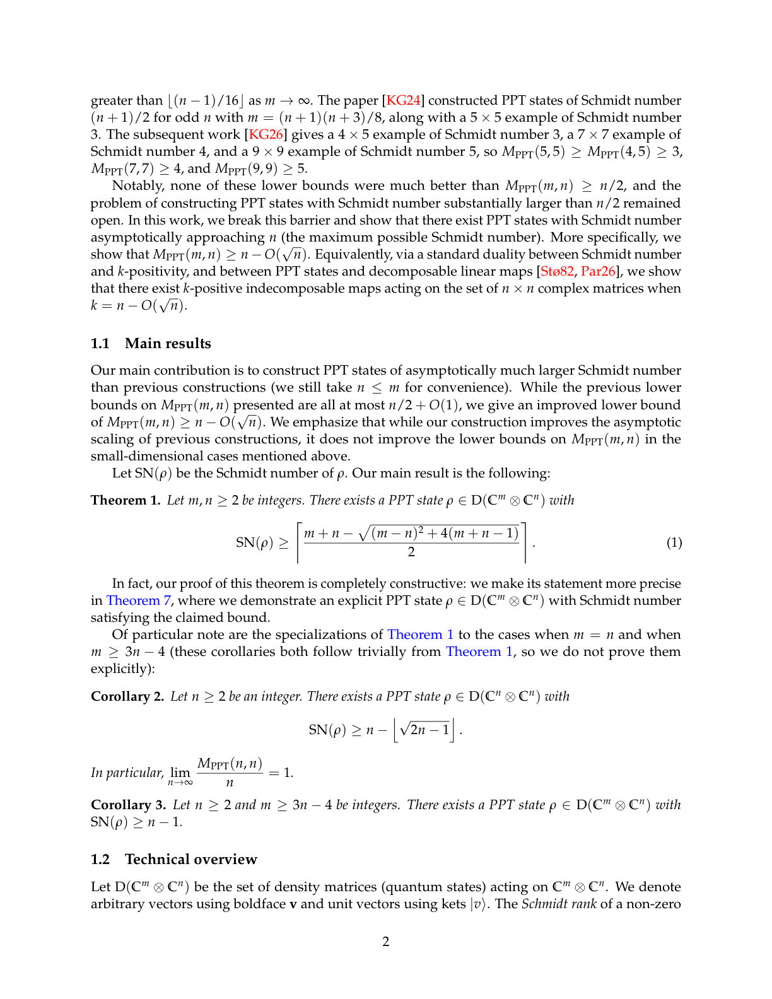 
Low-resolution page preview, page 2

📷 Fig 2

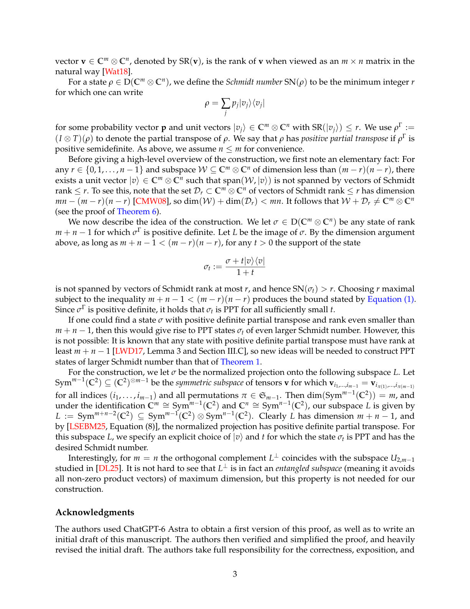 
Low-resolution page preview, page 3

📷 Fig 3

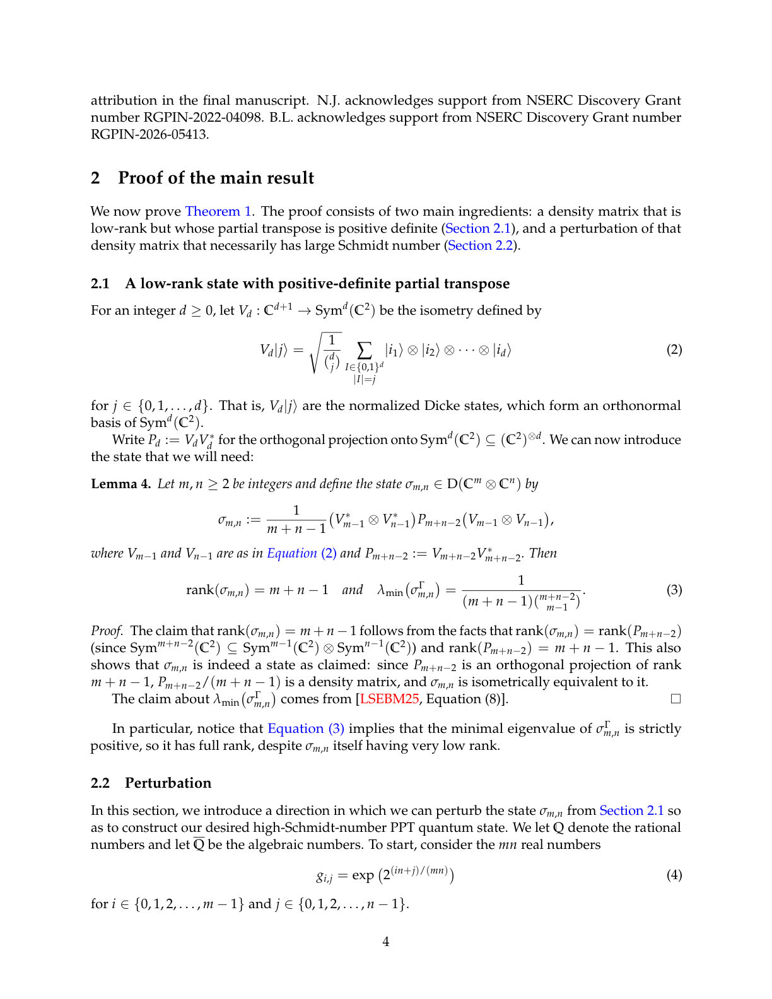 
Low-resolution page preview, page 4

📷 Fig 4

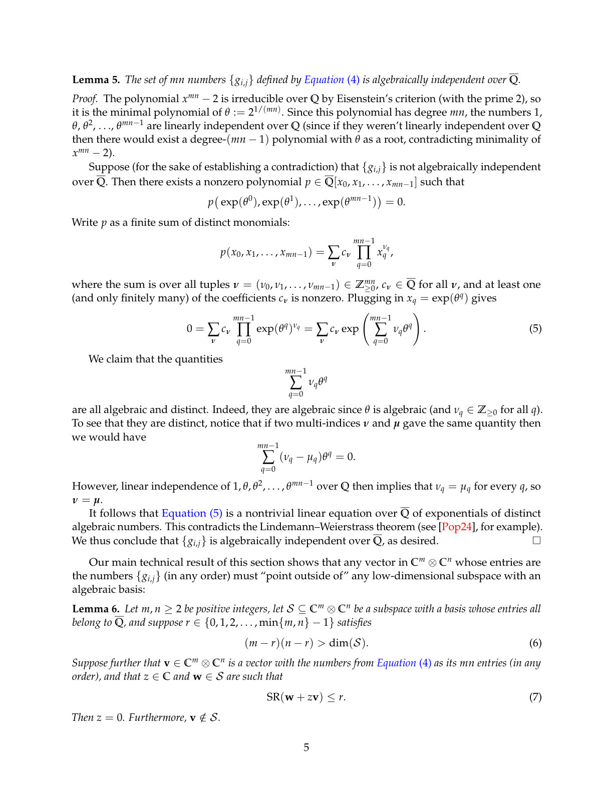 
Low-resolution page preview, page 5

📷 Fig 5

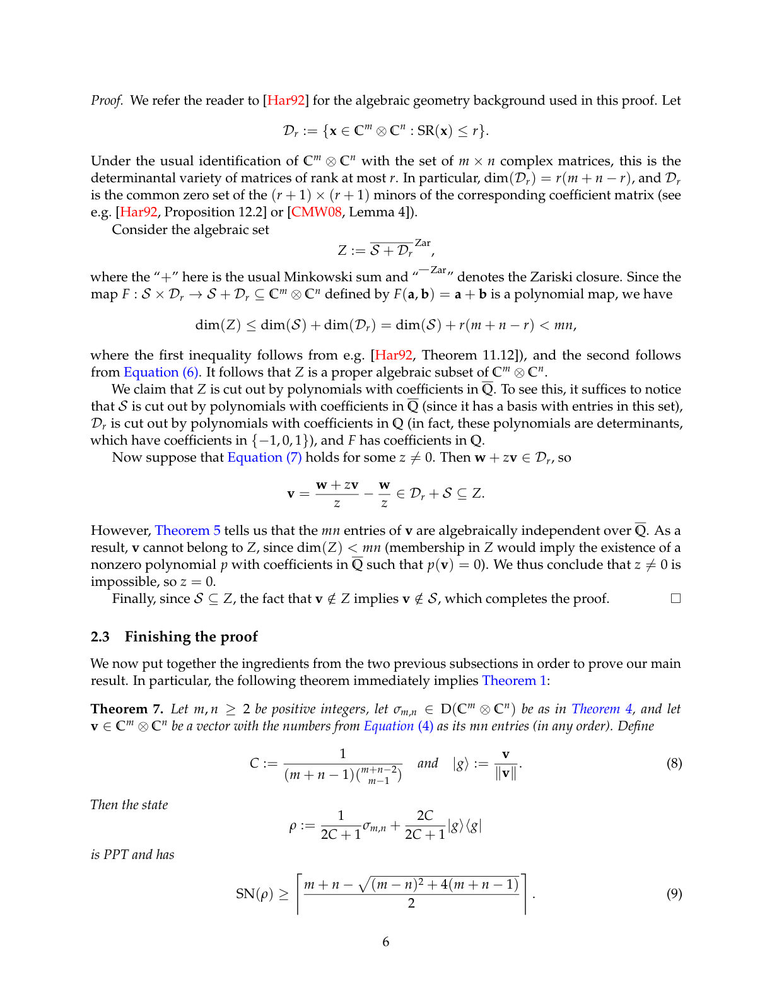 
Low-resolution page preview, page 6

**Summary.** This paper constructs specific Positive-Partial-Transpose (PPT) quantum states on $\mathbb{C}^m \otimes \mathbb{C}^n$ and derives a rigorous lower bound on their Schmidt number. The result shows that this bound approaches $\min(m, n)$, dramatically improving previous estimates and demonstrating that PPT states can possess high levels of entanglement.

**Why it may be interesting.** This work provides a significant theoretical advance in understanding the entanglement structure of quantum states that are 'weakly entangled' (PPT), which is crucial for understanding entanglement witnesses and separability criteria in quantum information theory.

Detailed structure

**Main problem.** The primary goal is to determine the maximum Schmidt number (MPPT) of a Positive-Partial-Transpose (PPT) state acting on a bipartite system $\mathbb{C}^m \otimes \mathbb{C}^n$.

**Main result.** The authors constructed a PPT state whose Schmidt number achieves a lower bound asymptotically approaching $\min(m, n)$, significantly improving previous bounds that were only $O(n)$.

**Method.** The construction involves perturbing a specially designed state $\sigma_{m,n}$ using orthogonal projections and relies on advanced algebraic techniques (like those involving the Lindemann–Weierstrass theorem) to prove the state's properties.

**Model / system.** The study concerns bipartite quantum states $
ho$ in the Hilbert space $\mathbb{C}^m \otimes \mathbb{C}^n$. The key constraint is that the state must satisfy the PPT condition ($
ho^\Gamma \ge 0$).

**Key observables.** Schmidt Number ($	ext{SN}(
ho)$) and the Positive Partial Transpose (PPT) property.

**Important parameters / regimes.** The local dimensions $m$ and $n$; the asymptotic behavior as $m, n 	o \infty$.

**Assumptions / limitations.** The construction is based on perturbing a state $\sigma_{m,n}$ and requires proving the algebraic independence of certain complex numbers $\{g_{i,j}\}$ to establish the lower bound.

**Paper structure.** The paper first establishes the context by defining the problem of bounding $	ext{SN}(
ho)$ for PPT states. It then develops the mathematical machinery, including proving algebraic independence (Lemma 5) and using geometric arguments on determinantal varieties (Lemma 6). Finally, it applies these tools to construct the state and derive the main lower bound on the Schmidt number (Theorem 7).

Abstract

We construct PPT states on $\mathbb{C}^m \otimes\mathbb{C}^n$ that have Schmidt number asymptotically approaching the smaller local dimension. More specifically, we construct a PPT state with Schmidt number at least $$ \left\lceil \frac{m + n - ((m - n)^2 + 4(m + n - 1))^{1/2}}{2} \right\rceil. $$ In the case of equal local dimensions ($m = n$), this becomes $n - \lfloor(2n - 1)^{1/2}\rfloor$, far exceeding the previous constructions which achieved $n/2 + O(1)$. In the case of unequal local dimensions, our result shows that there exists a PPT state on $\mathbb{C}^n \otimes \mathbb{C}^{3n-4}$ with Schmidt number at least $n-1$.

[↑ back to top](#top)

### [PureSuperQMA(exp) = BellPureSymQMA(poly) = QMA via Dimension-Free Bosonic Argmax](http://arxiv.org/abs/2609.11854v1)

**Authors:** William Gay, Fernando Granha Jeronimo, Lenny Liu, Itai Leigh, Pei Wu, Haochen Xu  
**Type:** theory · **Category:** quantum information and computing · **PDF:** <https://arxiv.org/pdf/2609.11854v1>  
**Analysis basis:** full PDF text, analyzed in chunks

📷 Fig 1

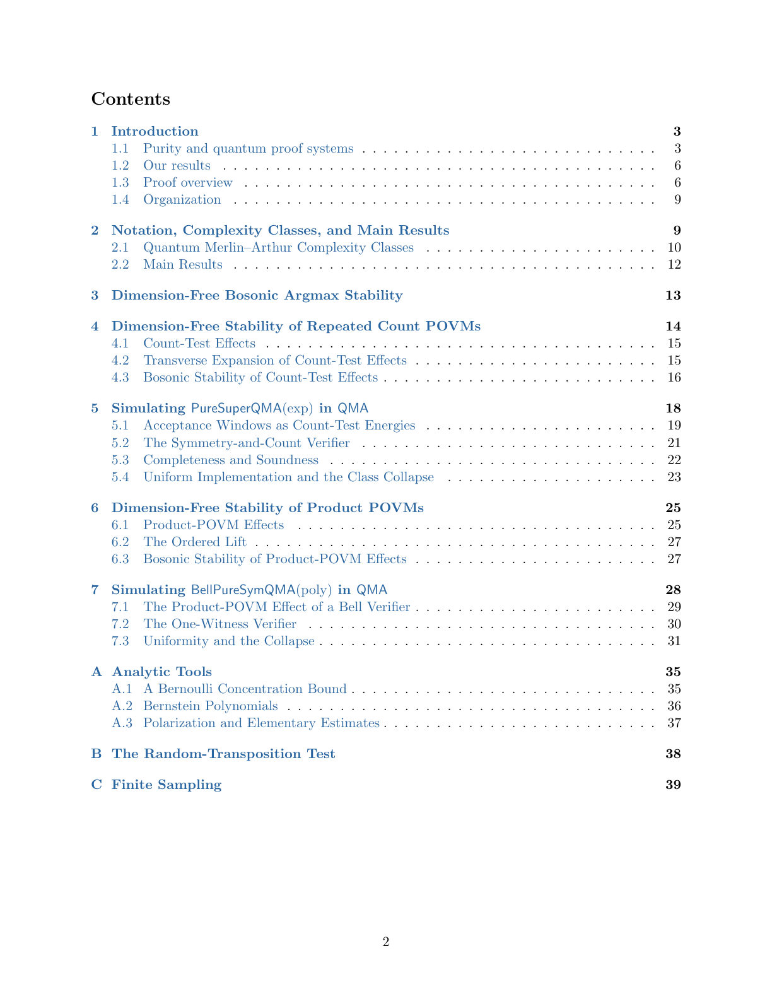 
Low-resolution page preview, page 2

📷 Fig 2

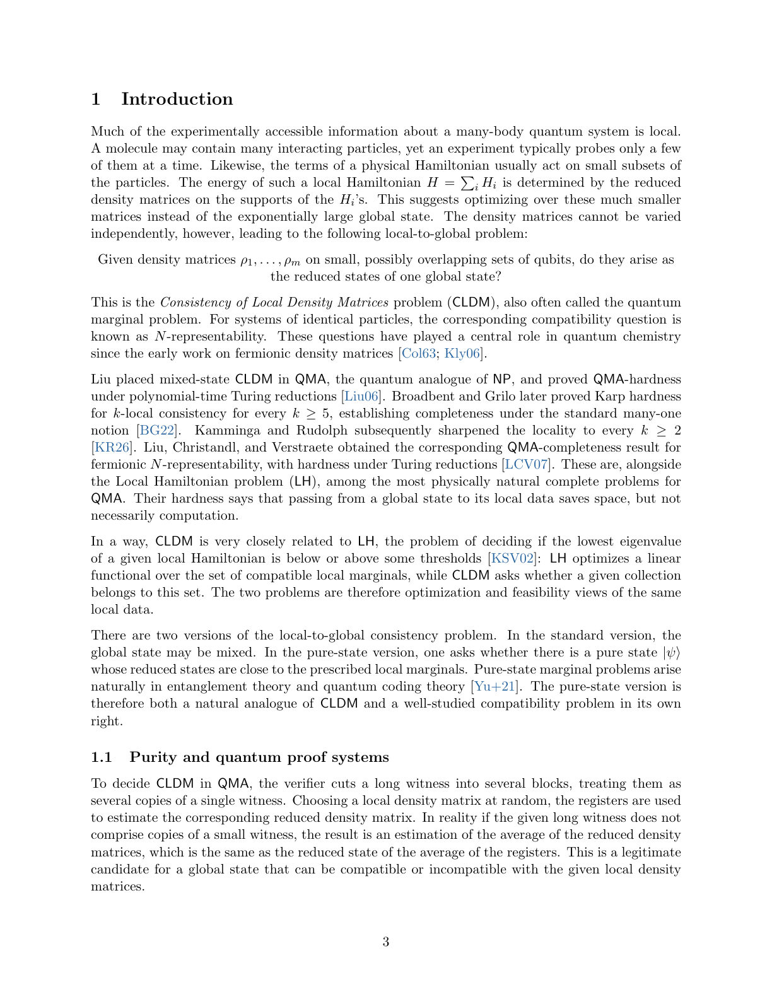 
Low-resolution page preview, page 3

📷 Fig 3

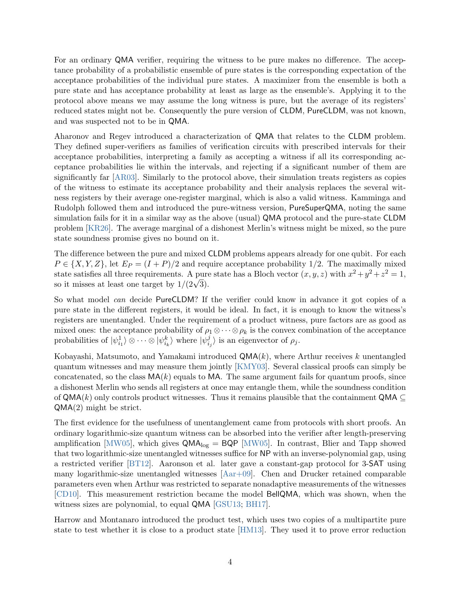 
Low-resolution page preview, page 4

📷 Fig 4

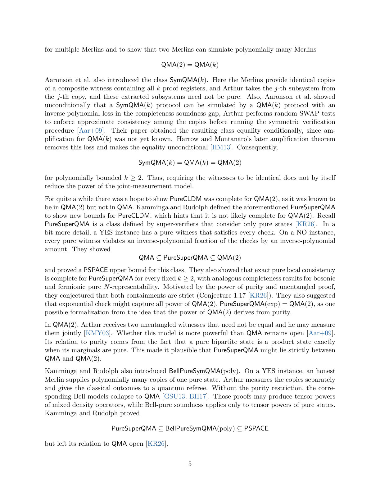 
Low-resolution page preview, page 5

📷 Fig 5

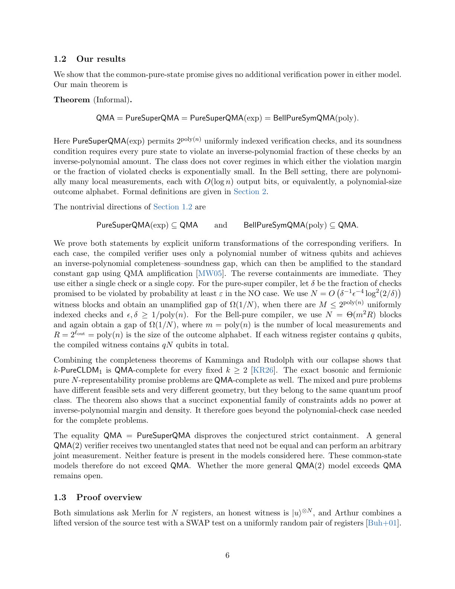 
Low-resolution page preview, page 6

**Summary.** This paper proves a major complexity collapse showing that several advanced quantum proof systems, including PureSuperQMA and BellPureSymQMA, are all equivalent in computational power to QMA. This equivalence implies that checking for exact local consistency in pure quantum states is as hard as the general QMA-complete problems.

**Why it may be interesting.** The result provides a deep connection between fundamental problems in quantum many-body physics (like N-representability) and the established complexity class QMA, suggesting that these physical constraints are computationally hard.

Detailed structure

**Main problem.** The paper investigates the computational complexity of pure-state consistency problems, which are related to determining if a set of local quantum states can arise from a single global state.

**Main result.** The authors prove a significant complexity collapse: QMA = PureSuperQMA = PureSuperQMA(exp) = BellPureSymQMA(poly), establishing that exact k-local pure-state consistency is QMA-complete.

**Method.** The proof relies on applying a dimension-free stability bound for symmetric tensor states to simulate the complex verification procedures of PureSuperQMA(exp) and BellPureSymQMA(poly) into the standard QMA framework.

**Model / system.** The models are quantum proof systems ($	ext{PureSuperQMA}$, $	ext{BellPureSymQMA}$) used to characterize the difficulty of quantum marginal problems (local-to-global consistency checks) for pure states.

**Key observables.** The extremal verification value, the gap size between YES/NO instance probabilities, and the total variation distance between probability distributions.

**Important parameters / regimes.** The number of local measurements ($k$), the witness size (polynomial vs. exponential), and the violation margin ($\epsilon$) and fraction ($\delta$).

**Assumptions / limitations.** The analysis assumes the validity of dimension-free stability bounds for symmetric tensor states and relies on techniques from quantum information theory and harmonic analysis.

**Paper structure.** The paper establishes the physical motivation (CLDM/quantum marginal problem), defines the complexity classes ($	ext{PureSuperQMA}$, etc.), and then proceeds through technical sections detailing the dimension-free stability bound, followed by the explicit simulations proving the stated complexity equalities.

Abstract

Pure-state consistency problems naturally lead to quantum proof systems in which a single pure witness must satisfy many acceptance constraints. The corresponding class $\mathsf{PureSuperQMA}$ was previously known to lie between $\mathsf{QMA}$ and $\mathsf{QMA}(2)$, and Kamminga and Rudolph (ITCS'26) conjectured that both containments are strict. In this paper, we prove the following surprising complexity collapses $$   \mathsf{QMA} = \mathsf{PureSuperQMA} = \mathsf{PureSuperQMA}(\text{exp}) = \mathsf{BellPureSymQMA}(\text{poly}) $$ Here $\mathsf{PureSuperQMA}(\text{exp})$ allows exponentially many checks which are uniformly indexed and efficiently generated, while requiring an inverse-polynomial violation margin and an inverse-polynomial fraction of violated checks for the NO cases. $\mathsf{BellPureSymQMA}(\text{poly})$ is a related model that requires the prover to give the verifier polynomially many copies of a pure state, which the verifier measures separately with logarithmic output length for each local measurement, before processing the outcomes jointly.   The main technical ingredient is a dimension-free stability bound for symmetric tensor states. Our simulations use polynomially many witness registers and combine a random-pair SWAP test with a permutation-invariant lift of the original verification procedure. The key step is to show that, on the symmetric subspace, the extremal verification value is close to that of some tensor-power witness with dimension-independent error. Applying this argument to the two verification models yields both simulations. As a consequence, exact $k$-local pure-state consistency is $\mathsf{QMA}$-complete for every fixed $k\ge2$, and so are the corresponding exact bosonic and fermionic pure $N$-representability problems.

[↑ back to top](#top)

### [Strong Converse for Quantum Capacity via a Fully Quantum Blowing-Up Lemma](http://arxiv.org/abs/2609.11771v1)

**Authors:** Salman Beigi, Marco Tomamichel  
**Type:** theory · **Category:** quantum information and computing · **PDF:** <https://arxiv.org/pdf/2609.11771v1>  
**Analysis basis:** full PDF text, analyzed in chunks

📷 Fig 1

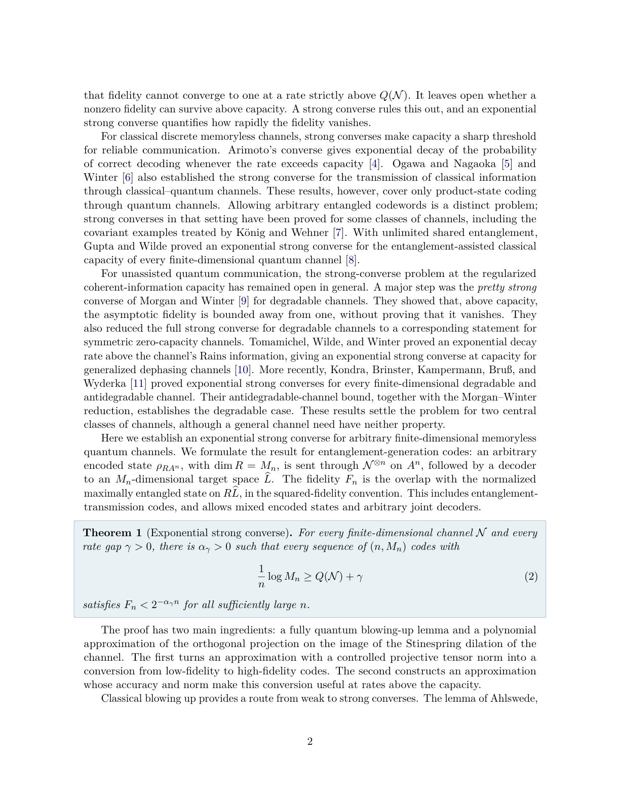 
Low-resolution page preview, page 2

📷 Fig 2

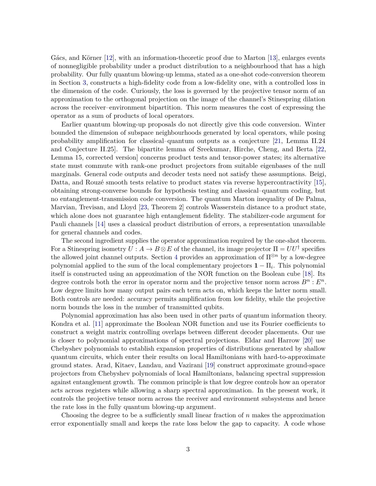 
Low-resolution page preview, page 3

📷 Fig 3

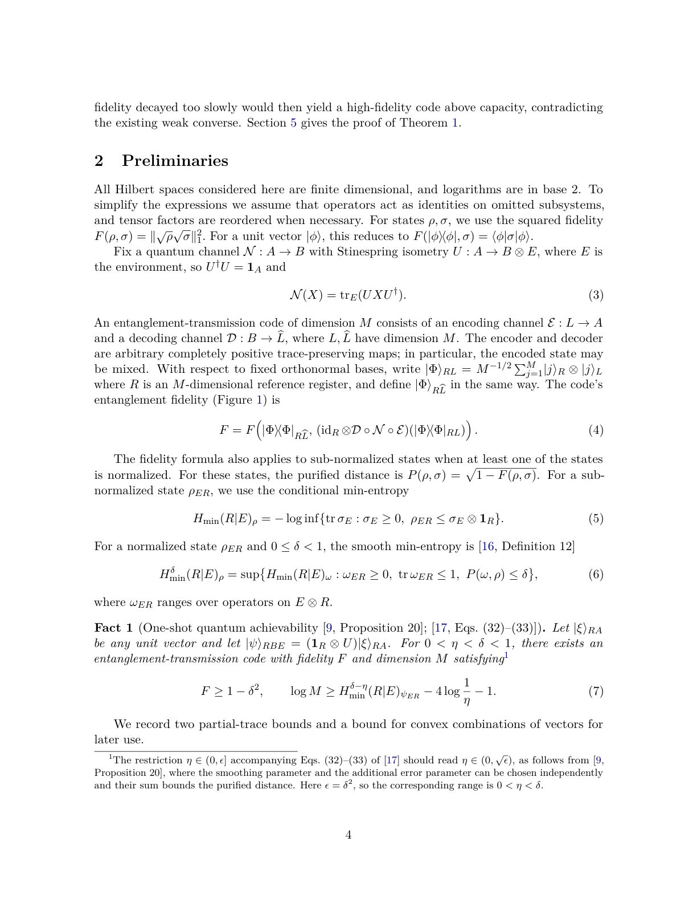 
Low-resolution page preview, page 4

📷 Fig 4

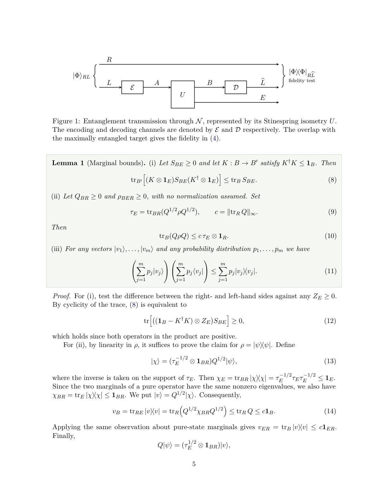 
Low-resolution page preview, page 5

📷 Fig 5

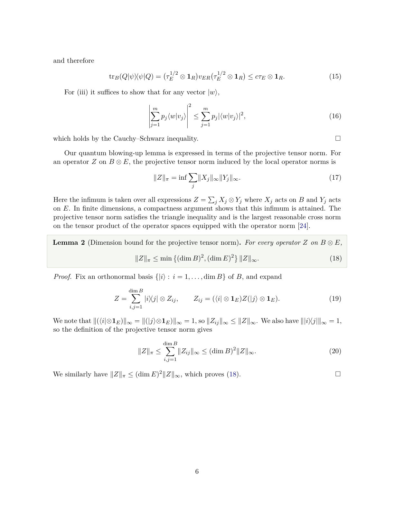 
Low-resolution page preview, page 6

**Summary.** This paper rigorously proves an exponential strong converse for quantum capacity, showing that exceeding the channel's capacity leads to an exponentially decaying fidelity for any quantum code. The proof is highly technical, relying on a 'fully quantum blowing-up lemma' and advanced polynomial approximation techniques to control error accumulation over many channel uses.

**Why it may be interesting.** While highly theoretical, the techniques involving projector approximation and tensor norms are mathematically sophisticated and could inspire new ways to bound error propagation in complex quantum systems or quantum network protocols.

Detailed structure

**Main problem.** The paper aims to prove an exponential strong converse for quantum communication capacity through any finite-dimensional memoryless quantum channel.

**Main result.** It establishes that if the transmission rate exceeds the quantum capacity by any positive gap, the entanglement-transmission fidelity of the code must decay exponentially with the number of channel uses.

**Method.** The proof combines a 'fully quantum blowing-up lemma' (to convert low-fidelity codes to high-fidelity ones) with a low-degree polynomial construction to approximate the tensor power of the channel's projection operator.

**Model / system.** The model is a point-to-point quantum channel N used multiple times (memoryless channel). Communication is analyzed using entanglement-transmission codes.

**Key observables.** Entanglement-transmission fidelity ($F_n$), communication rate (qubits per channel use), and the quantum capacity $Q(N)$.

**Important parameters / regimes.** The rate gap ($\gamma > 0$) and the exponential decay constant ($\alpha_\gamma > 0$) are central parameters.

**Assumptions / limitations.** The proof relies on the ability to approximate the tensor power of the projection operator using low-degree polynomials while controlling the projective tensor norm.

**Figures summary.** Figure 1 illustrates the entanglement transmission process through the channel N, using the Stinespring isometry.

**Paper structure.** The structure builds from defining the strong converse problem, introducing the fully quantum blowing-up lemma, and then using polynomial approximation techniques to control the error terms necessary for the final exponential decay bound.

Abstract

We prove an exponential strong converse for quantum communication through every finite-dimensional memoryless channel: at any fixed rate above the quantum capacity, the entanglement-transmission fidelity of every code decays exponentially with the number of channel uses. The proof has two main ingredients. First, a fully quantum blowing-up lemma converts a low-fidelity code into a high-fidelity code, with a loss in the number of transmitted qubits controlled by the projective tensor norm of the orthogonal projection on the image of the Stinespring dilation of the channel across the receiver--environment bipartition. Second, a low-degree polynomial construction approximates the tensor power of this projector with exponential accuracy while controlling its projective norm, providing the approximation needed for the blowing-up argument.

[↑ back to top](#top)

### [The generalised semi-Clifford conjecture is false](http://arxiv.org/abs/2609.11903v1)

**Authors:** Nadish de Silva, Oscar Lautsch  
**Type:** theory · **Category:** quantum information and computing · **PDF:** <https://arxiv.org/pdf/2609.11903v1>  
**Analysis basis:** full PDF text, analyzed in chunks

📷 Fig 1

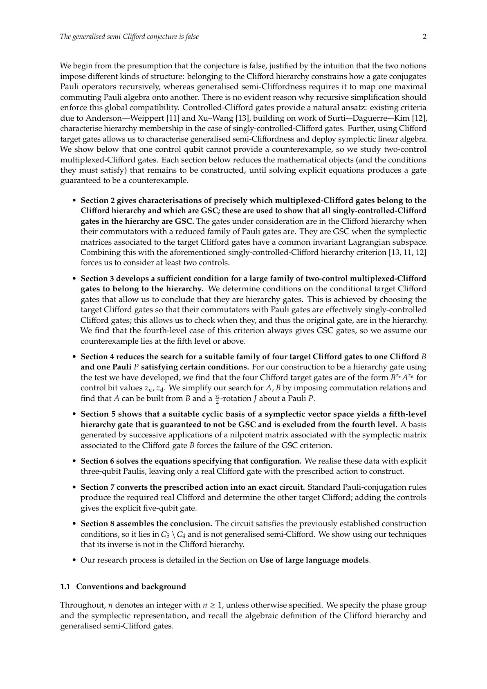 
Low-resolution page preview, page 2

📷 Fig 2

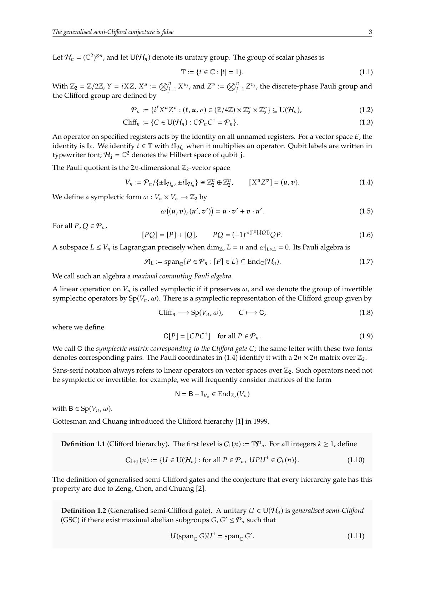 
Low-resolution page preview, page 3

📷 Fig 3

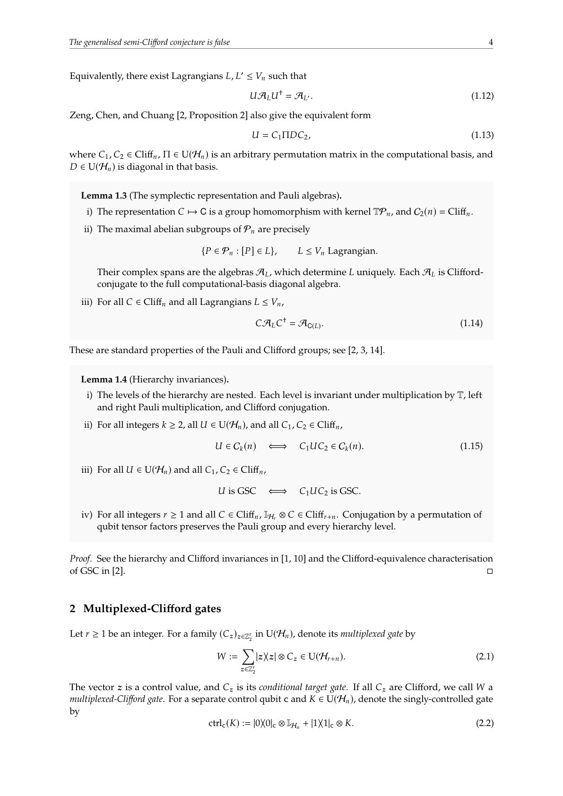 
Low-resolution page preview, page 4

📷 Fig 4

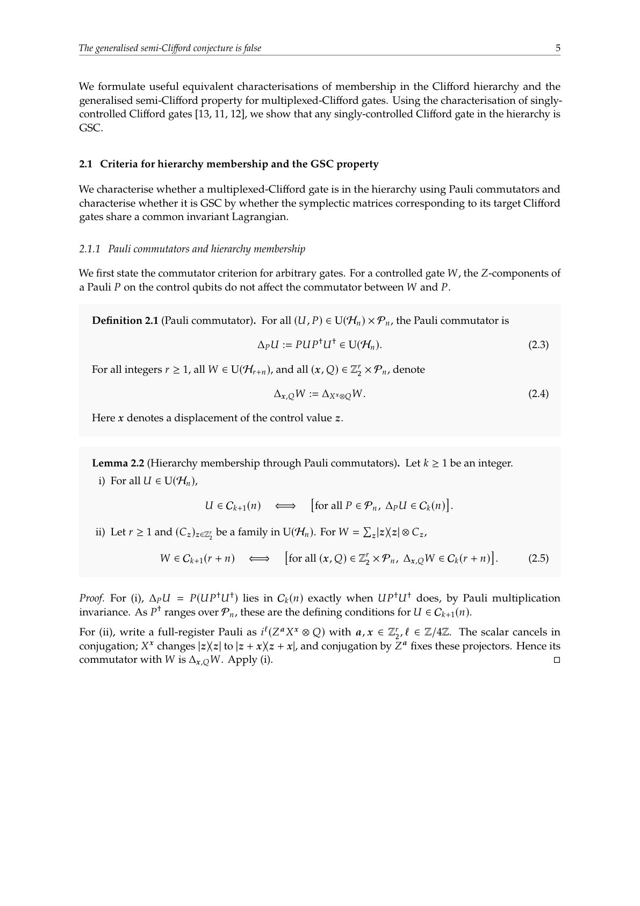 
Low-resolution page preview, page 5

📷 Fig 5

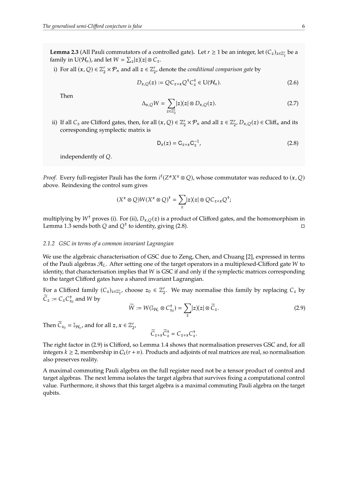 
Low-resolution page preview, page 6

**Summary.** This theoretical paper disproves the generalized semi-Clifford conjecture concerning quantum gates in the Clifford hierarchy. The authors construct a specific five-qubit gate that is mathematically proven to be in the fifth level of the hierarchy but lacks the required algebraic structure. This finding significantly refines our understanding of the limitations and boundaries of fault-tolerant quantum computation models.

**Why it may be interesting.** This work provides deep structural insights into the limitations of gate sets used in quantum error correction and computation, revealing that the assumed algebraic constraints (GSC) are too restrictive for the full complexity of the Clifford hierarchy.

Detailed structure

**Main problem.** The paper aims to disprove the generalized semi-Clifford conjecture, which posits that all gates in the Clifford hierarchy must have a specific algebraic structure.

**Main result.** The authors construct a concrete five-qubit gate that belongs to the fifth level of the Clifford hierarchy but does not possess the generalized semi-Clifford property. Furthermore, they show the hierarchy is not closed under inverses.

**Method.** The proof uses advanced algebraic techniques involving symplectic linear algebra, Pauli groups, and analyzing the structure of commutators of quantum gates to characterize membership in the hierarchy and the GSC property.

**Model / system.** The study concerns quantum gates acting on $n$ qubits, specifically focusing on the structure and properties of the Clifford hierarchy ($\mathcal{C}_k(n)$) within the unitary group $U(\mathcal{H}_n)$.

**Key observables.** The primary observables are the gate structure itself, the membership level in the Clifford hierarchy ($\mathcal{C}_k$), and the existence of a common invariant Lagrangian for the associated Pauli algebras.

**Important parameters / regimes.** The number of qubits ($n=5$ for the counterexample) and the level of the hierarchy ($k=5$) are crucial parameters.

**Assumptions / limitations.** The analysis proceeds by developing equivalent characterizations for hierarchy membership and the GSC property, building upon established results for lower-level gates.

**Figures summary.** Figure 1 illustrates the five-qubit counterexample circuit, which is constructed using controlled-Clifford gates.

**Paper structure.** The paper develops the necessary algebraic machinery to characterize the Clifford hierarchy and the GSC property, then constructs a specific five-qubit unitary gate that satisfies the hierarchy condition but violates the GSC condition, concluding with a proof that the gate's inverse also falls outside the hierarchy.

Abstract

The Clifford hierarchy is a nested sequence of sets of quantum gates that can be fault-tolerantly performed using gate teleportation within standard quantum error correction schemes. The importance of these gates has motivated numerous studies of their structure. Zeng-Chen-Chuang conjectured in 2007 that all hierarchy gates are generalised semi-Clifford, i.e. take the form $C_1 ΠD C_2$ for Clifford gates $C_1, C_2$, a permutation gate $Π$, and a diagonal gate $D$; Beigi-Shor proved in 2008 that this holds for all third-level gates.   We construct a five-qubit gate that is in the fifth level of the Clifford hierarchy but is not generalised semi-Clifford. Rather than simply present and verify our counterexample to the generalised semi-Clifford conjecture, we show how its form can be deduced. Our counterexample also demonstrates that the Clifford hierarchy is not closed under inverses.

[↑ back to top](#top)

### [The Quantum Overlap Gap Property and Algorithmic Hardness for the Quantum Hypergraph Max-Cut Problem](http://arxiv.org/abs/2609.10838v1)

**Authors:** Mikhail Mints, Eric R. Anschuetz  
**Type:** theory · **Category:** quantum information and computing · **PDF:** <https://arxiv.org/pdf/2609.10838v1>  
**Analysis basis:** full PDF text, analyzed in chunks

📷 Fig 1

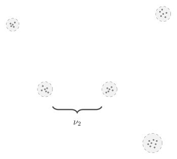 
Fig. 1. Illustration of the Overlap Gap Property (OGP). The set of near-optimal solutions shatters into many disconnected clusters, where the diameter of each cluster is at most 𝜈1 but the clusters are separated by a normalized Hamming distance of 𝜈2 &gt; 𝜈1.

📷 Fig 2

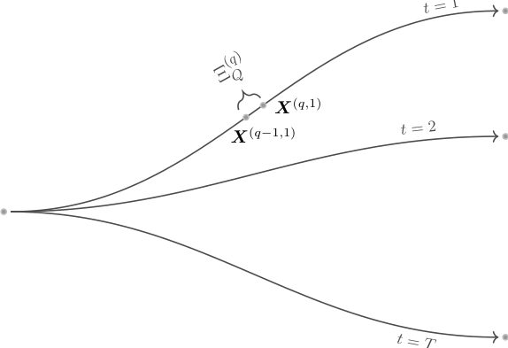 
Fig. 2. Diagram illustrating the distribution Ξ𝑄,𝑇, showing interpolation paths branching from a single initial problem instance ˆ𝑿into 𝑇independent instances. The diagram also shows the marginal distribution Ξ(𝑞) 𝑄 corresponding to a single step along the interpolation path.

**Summary.** This paper develops theoretical hardness results for the Quantum Hypergraph Max-Cut problem by applying the Quantum Overlap Gap Property (QOGP). It proves that achieving near-optimal solutions requires quantum algorithms to overcome significant computational barriers, establishing concrete depth lower bounds for popular quantum approaches.

**Why it may be interesting.** The work provides rigorous theoretical lower bounds on the performance of quantum algorithms for fundamental optimization problems, which is crucial for understanding the limits of quantum computation in physics simulations.

Detailed structure

**Main problem.** The paper analyzes the average-case hardness of approximation for the Quantum Hypergraph Max-Cut problem.

**Main result.** It establishes both weak and strong hardness results, showing that for certain classes of quantum algorithms, approximating the optimal solution on $k$-uniform hypergraphs is computationally hard.

**Method.** The analysis utilizes the theoretical framework of the Quantum Overlap Gap Property (QOGP) and employs techniques from Ramsey theory for the strong hardness result.

**Model / system.** The primary model is the Quantum Hypergraph Max-Cut problem, which is a generalization of the Quantum Max-Cut problem used to model ground state problems in quantum many-body systems.

**Key observables.** Approximation ratio ($\gamma$), Lipschitz constants ($L$), and the energy expectation value $V(\mathbf{X}, s)$.

**Important parameters / regimes.** The hypergraph uniformity $k$, and the order of the quantum Wasserstein distance (order 2 and order $\infty$).

**Assumptions / limitations.** The analysis relies on adapting the classical Overlap Gap Property (OGP) to the quantum setting (QOGP) and sometimes assumes Gaussian random variables for coefficients.

**Figures summary.** Figure 1 illustrates the Overlap Gap Property (OGP), showing near-optimal solutions separating into disconnected clusters.

**Paper structure.** The paper reviews the classical OGP, develops the QOGP framework, presents the weak hardness result (Theorem 1.1) based on resampling, and establishes the strong hardness result (Theorem 1.2) using Ramsey theory.

Abstract

In this work, we analyze the average-case hardness of approximation for the Quantum Hypergraph Max-Cut problem using the theoretical framework of the Quantum Overlap Gap Property (QOGP). We establish two main results. Our first result applies to a wide class of stable quantum algorithms, satisfying a Lipschitz property with respect to the quantum Wasserstein distance of order $2$. We show a weak hardness result, demonstrating that for any Lipschitz constant $L$, there is some $k$ such that $L$-stable algorithms cannot approximate the optimal solution to Quantum Hypergraph Max-Cut on $k$-uniform hypergraphs in the average case. Additionally, we establish a strong hardness result where $k$ is independent of $L$, but only for a more restricted class of local quantum algorithms defined using the quantum Wasserstein distance of order $\infty$. We apply these results to establish concrete depth lower bounds for popular quantum algorithms for preparing near-optimal states for this problem.

[↑ back to top](#top)

### [Threshold Behavior of ZX and ZY Surface Codes Under Circuit-Level Biased and Crosstalk Noise](http://arxiv.org/abs/2609.10876v1)

**Authors:** Pritesh Thakur, Jean-François Van Huele  
**Type:** theory · **Category:** quantum information and computing · **PDF:** <https://arxiv.org/pdf/2609.10876v1>  
**Analysis basis:** full PDF text, analyzed in chunks

📷 Fig 1

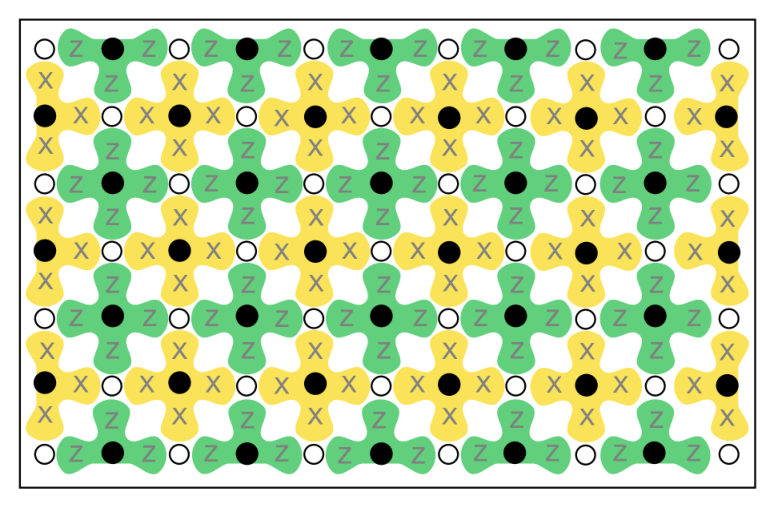 
Figure 1: A two-dimensional implementation of unrotated surface code with Z-type (green) and X-type (yellow) stabilizers. Each filled circle (•) denotes a measurement qubit, and each open circle (◦) denotes a data qubit. Each data qubit is surrounded by four measurement qubits and each measurement qubit is connected to four data qubits to perform syndrome extraction using the circuits shown in Fig. 2.

📷 Fig 2

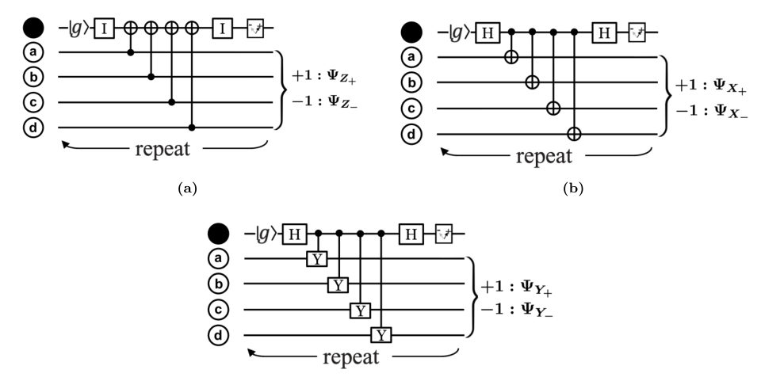 
Figure 2: Stabilizer measurement circuits of the Z stabilizer (a), X stabilizer (b), and Y stabilizer (c). Each filled circle (•) is the measurement qubit, that acts as an ancilla and performs repeated rounds of controlled operation on four data qubits to give parity information. That parity information helps us find out if an error occurred in the surface code. In the circuits, |g⟩represents ground state initialization in the computational basis, and I on the ancilla of (a) denotes idle step when the ancilla for X checks and Y checks undergo H gate. The box with arrow at the end of each circuit denotes measurement in computational basis, and Ψ denotes the possible outcomes from the circuit.

📷 Fig 3

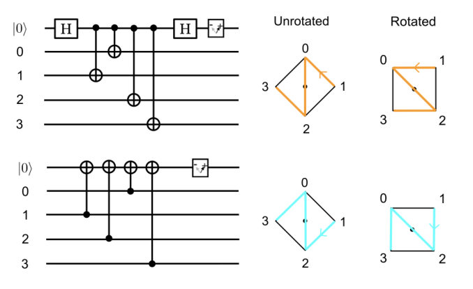 
Figure 3: (a) Representations of syndrome extraction circuits for X-type stabilizer (upper diagram) and Z-type stabilizer (lower diagram). The upper most qubit in both circuits in (a) are measurement qubits that act as ancilla qubits, and the following four qubits are data qubits whose parity is measured by the circuit. (b) and (c) denote the order of performing CNOT gate in unrotated and rotated codes respectively. This figure shows 10231203 CNOT order, where the first four digits denote the order of CNOT operations in X-type stabilizer measurement circuit and the later four digits represent the order of CNOT operations in Z-type stabilizer measurement circuit. We call this CNOT order the...

📷 Fig 4

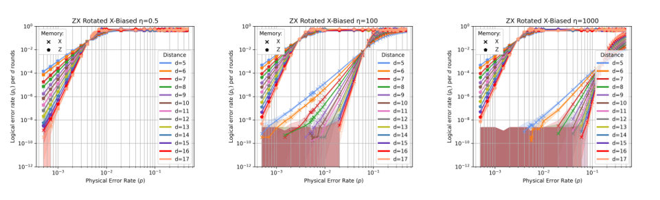 
Figure 4: Logical error rate per d rounds of syndrome extraction pL versus physical error rate p simulated on rotated ZX surface code with X-aligned CNOT order under Pauli-X biased noise at η = {0.5, 100, 1000}.

📷 Fig 5

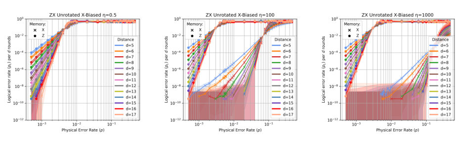 
Figure 5: Logical error rate per d rounds of syndrome extraction pL versus physical error rate p simulated on unrotated ZX surface code with X-aligned CNOT order under Pauli-X biased noise at η = {0.5, 100, 1000}.

**Summary.** This work analyzes how tailored surface codes, specifically comparing ZX and ZY variants, perform under realistic circuit-level noise, including bias and crosstalk. The study finds that while the ZY code theoretically captures more error information, current matching decoders fail to utilize this correlation. Ultimately, the paper stresses the need for advanced decoders capable of handling complex, correlated syndrome data.

**Why it may be interesting.** The detailed analysis of how specific stabilizer structures (ZY vs ZX) interact with directional noise biases and crosstalk provides concrete, actionable insights for designing more robust quantum error correction protocols.

Detailed structure

**Main problem.** The study investigates the threshold behavior of tailored surface codes (ZX and ZY) when subjected to realistic circuit-level biased and crosstalk noise.

**Main result.** The ZY code shows a Y-memory threshold nearly constant across bias, while the ZX code shows an increasing X-memory threshold with bias; furthermore, the analysis highlights that standard decoders cannot fully utilize the correlated syndrome information available in the ZY structure.

**Method.** The authors simulate performance using the minimum-weight perfect matching (MWPM) decoder, comparing results across varying bias parameters and incorporating crosstalk noise.

**Model / system.** The system uses surface codes, comparing the standard ZX code against a constructed ZY code (replacing X-stabilizers with Y-stabilizers). Noise models include Pauli-X biased noise and additional gate-based XX crosstalk noise, moving beyond idealized code-capacity noise.

**Key observables.** Memory thresholds ($p_{X}^{th}, p_{Z}^{th}, p_{Y}^{th}$) for X, Y, and Z logical memories, and the logical error rate ($p_L$).

**Important parameters / regimes.** Bias parameter ($\eta$), crosstalk probability ($p_x$), and code distance ($d$).

**Assumptions / limitations.** The primary limitation is that the MWPM decoder cannot process the correlated syndrome information generated by the ZY code, which forms a hypergraph structure.

**Figures summary.** Figure 1 illustrates the 2D structure of the unrotated surface code with Z and X stabilizers, while Figure 2 shows the stabilizer measurement circuits for Z, X, and Y stabilizers.

**Paper structure.** The paper progresses by first establishing the problem of circuit-level noise, then comparing the threshold behavior of ZX and ZY codes under biased noise, analyzing the effect of crosstalk, and finally discussing the limitations of current matching decoders for the complex syndrome structure of the ZY code.

Abstract

Studying the threshold behavior of surface codes under biased noise models is an active area of research. Previous work Tuckett et al. (2018), using an optimal tensor-network decoder, demonstrated that replacing $Z$-type stabilizers with $Y$-type stabilizers significantly improves the surface code threshold under code-capacity level dephasing noise. In this work, we construct and study a $ZY$ surface code by replacing the $X$-type stabilizers with $Y$-type stabilizers. We compare it with the standard $ZX$ surface code under circuit-level Pauli-$X$ biased noise, with and without an additional gate-based $XX$ crosstalk noise. We find that for the $ZX$ surface code, the $X$-memory threshold increases monotonically with bias while the $Z$-memory threshold decreases and saturates. For the $ZY$ surface code, the $Y$-memory threshold is nearly constant across all bias values. The $Z$-memory thresholds of the $ZX$ and $ZY$ codes are consistent within the uncertainty. Adding $XX$ crosstalk reduces the $Z$-memory threshold beyond the fitting uncertainty while leaving the $X$ memory threshold largely unaffected. The choice of CNOT ordering redistributes threshold performance between the two logical memories. Our work extends prior observations from code-capacity level noise to circuit-level noise. It also indicates the need for decoders capable of jointly reasoning over correlated syndrome information so that tailored stabilizer structures could be fully utilized for quantum error correction.

[↑ back to top](#top)

### [Tight Time-Space Lower Bounds for Collision Finding and Element Distinctness under Label Symmetry](http://arxiv.org/abs/2609.10808v1)

**Authors:** Frédéric Magniez, Sebastian Zur  
**Type:** theory · **Category:** quantum information and computing · **PDF:** <https://arxiv.org/pdf/2609.10808v1>  
**Analysis basis:** full PDF text, analyzed in chunks

📷 Fig 1

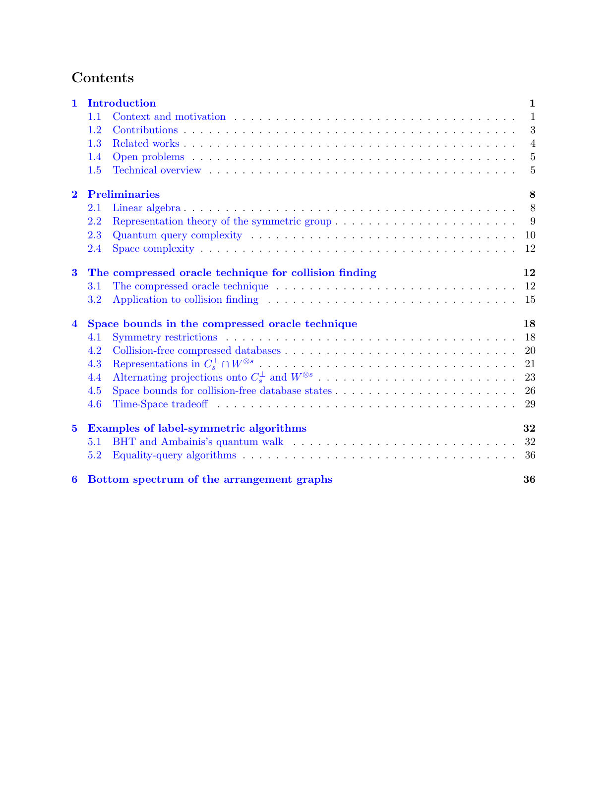 
Low-resolution page preview, page 2

📷 Fig 2

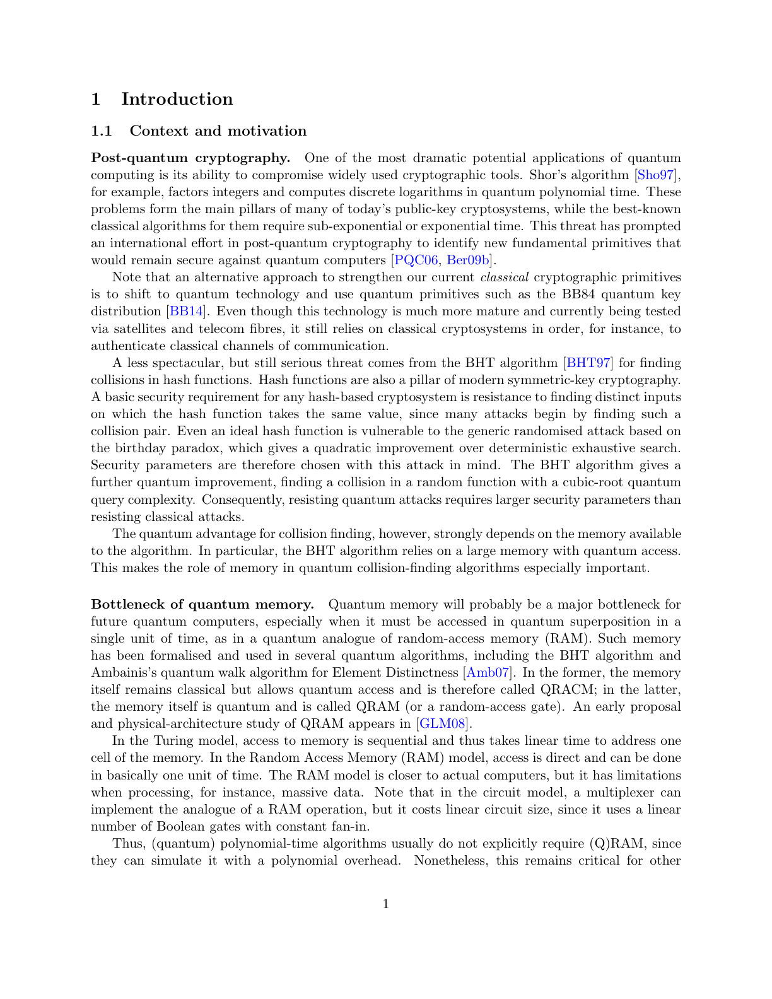 
Low-resolution page preview, page 3

📷 Fig 3

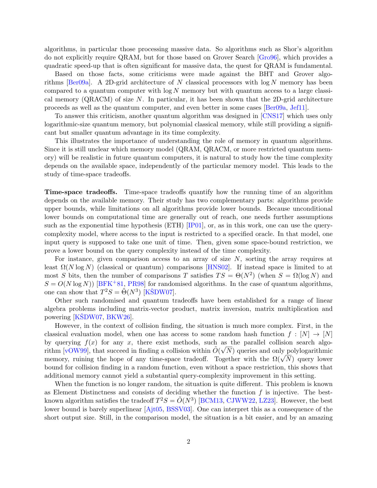 
Low-resolution page preview, page 4

📷 Fig 4

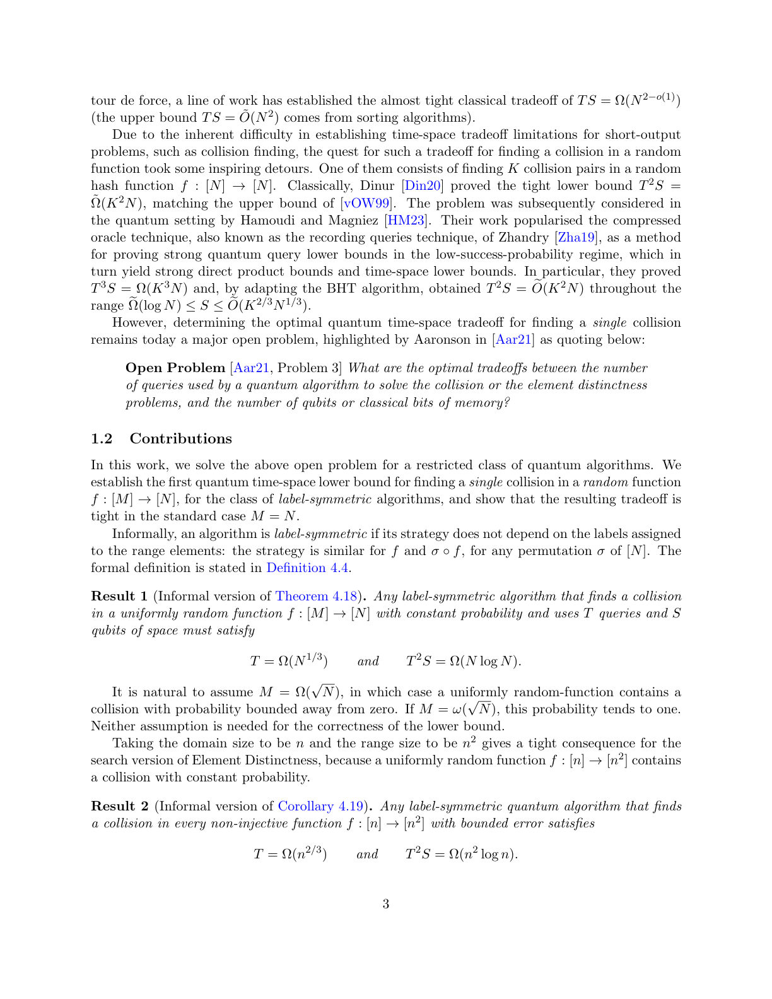 
Low-resolution page preview, page 5

📷 Fig 5

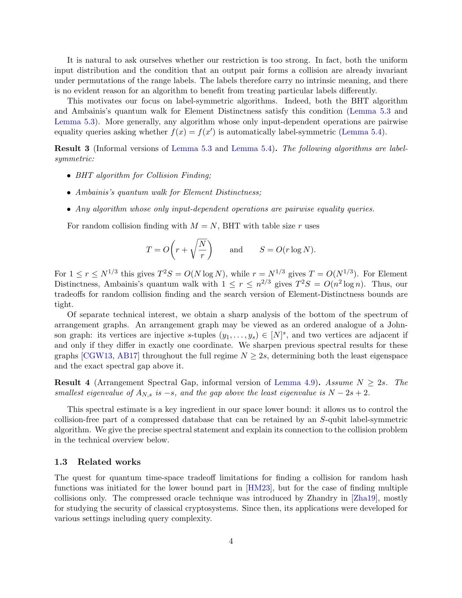 
Low-resolution page preview, page 6

**Summary.** This paper derives fundamental, optimal time-space lower bounds for quantum algorithms solving collision finding and Element Distinctness, restricted to label-symmetric algorithms. It achieves this by developing a space-sensitive compressed oracle technique combined with representation theory. The results clarify the inherent resource trade-offs for these core problems in quantum complexity theory.

**Why it may be interesting.** While highly theoretical, establishing fundamental lower bounds on computational resources (time vs. memory) is crucial for understanding the limits of quantum computation, which underpins many advanced quantum simulation and control techniques.

Detailed structure

**Main problem.** Determining the optimal time-space tradeoff for quantum algorithms solving problems like collision finding and Element Distinctness, specifically under the constraint of label symmetry.

**Main result.** The paper establishes lower bounds $T = \Omega(N^{1/3})$ and $T^2S = \Omega(N \log N)$ for collision finding, and $T = \Omega(n^{2/3})$ and $T^2S = \Omega(n^2 \log n)$ for Element Distinctness, showing these bounds are optimal within the label-symmetric class.

**Method.** The proof develops a space-sensitive version of the compressed oracle technique, combining it with label symmetry and representation theory to bound the information retained by limited quantum memory.

**Model / system.** The analysis is conducted within the quantum query-complexity model, focusing on quantum algorithms applied to functions $f:[M]	o [N]$ or the decision problem of injectivity.

**Key observables.** Query complexity ($T$), Qubit space complexity ($S$), and the size of the domain/codomain ($N$).

**Important parameters / regimes.** The bounds depend critically on the structure of the problem (collision finding vs. Element Distinctness) and the assumption of label symmetry.

**Assumptions / limitations.** The results are proven only for the class of label-symmetric algorithms; the general case without this symmetry remains an open problem.

**Paper structure.** The paper develops the theoretical framework by first analyzing the required information storage using a space-sensitive compressed oracle technique, then applying this to derive the specific time-space tradeoffs for collision finding and Element Distinctness, concluding with the optimality proof.

Abstract

How much memory is needed to retain the quantum speedup for collision finding? For a uniformly random function $f:[N]\to [N]$, the BHT algorithm finds a collision using $O(N^{1/3})$ queries and a quantumly accessible classical table containing $O(N^{1/3})$ input-output pairs, whereas a logarithmic-space Grover search uses $O(\sqrt N)$ queries. Determining the optimal query-space tradeoff between these extremes remains a major open problem.   We resolve this equation within the class of label-symmetric algorithms, which treat the function $f$'s output labels as interchangeable. We prove that such algorithm that makes $T$ queries, uses $S$ qubits, and finds a collision in a uniformly random function $f:[M]\to [N]$ with constant probability satisfies $$T=Ω(N^{1/3}) \qquad\text{and}\qquad T^2S=Ω(N\log N).$$ For the setting where $M=N$, these bounds are matched by a space-efficient implementation of the BHT algorithm. As a consequence of our tradeoff, any label-symmetric algorithm for the search version of Element Distinctness on $f: [n] \to [n^2]$ must satisfy $$T=Ω(n^{2/3}) \qquad\text{and}\qquad T^2S=Ω(n^2\log n),$$ matching Ambainis's quantum walk. Thus, both tradeoffs are optimal within the class of label-symmetric algorithms.   To prove these results, we develop a space-sensitive version of the compressed oracle technique. The compressed oracle records the information learned by the algorithm in an evolving superposition of databases. Using label symmetry and representation theory, we show that an algorithm using $S$ qubits can effectively retain information about only $O(S/\log N)$ collision-free database entries. Substituting this estimate into the compressed oracle technique yields the stated tradeoffs.

[↑ back to top](#top)

## Secondary cond-mat archives

*Papers from  mes-hall, other, soft, supr-con. These archives are de-prioritized — they appear at the end regardless of relevance score.*

### Relevant in secondary archives (12)

### [Dissipation-induced nonlocal phase-coherent transport in a topological superconductor](http://arxiv.org/abs/2609.10821v1)

**Authors:** S. V. Aksenov, M. S. Shustin, I. S. Burmistrov  
**Type:** theory · **Category:** other · **PDF:** <https://arxiv.org/pdf/2609.10821v1>  
**Analysis basis:** full PDF text, analyzed in chunks
**Topic relevance:** 🔥 `correlated / nonlocal dissipation` **4/5** · `analog quantum simulation` **3/5** · `driven-dissipative phase transition` **3/5** · `methods for driven-dissipative` **3/5** · `non-equilibrium universality` **2/5** · `quantum measurements` **2/5** · `Keldysh / 2PI / non-Gaussian methods` **1/5**

📷 Fig 1

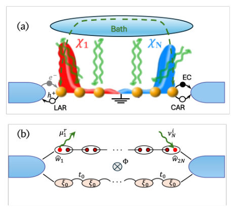 
FIG. 1. (a) Sketch of a dissipative directly-grounded Kitaev chain between two normal leads. The Majorana wave func- tions 𝜒1,𝑁are depicted by red and blue colors. The bath influence is schematically shown by green wavy and dashed lines. The LAR, CAR, and EC processes are sketched with initial process of electron tunneling shown in gray and the fi- nal processes shown in black lines with filled (for an electron) and empty (for a hole) circles. (b) Scheme of a setup for AB- type experiment. (see text)

📷 Fig 2

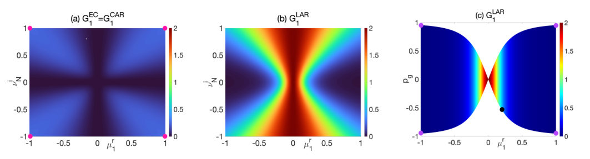 
FIG. 2. The effect of dissipation on the left-lead conductance at zero bias voltage and at the sweet spot of the Kitaev chain model. (𝜇𝑟 1, 𝜈𝑖 𝑁)-maps of the nonlocal (panel a) and the local (panel b) contributions for the identically zero parity of the open MBS, 𝑝𝑔= 0. Panel c: (𝜇𝑟 1, 𝑝𝑔)-map of the LAR conductance in the case of the identically zero nonlocal contributions, 𝐺𝐸𝐶/𝐶𝐴𝑅 1 = 0. Pink (violet) dots in panel a (c) indicate the regime of maximal nonlocal transport and 𝑝𝑔= 0 (dissipative blockade and 𝑝𝑔≈±1). Black dot in panel c corresponds to parameters used in Fig. 3b. Parameters used: 𝑔1,𝑁= 0.05, 𝜈1 = 0, 𝜇𝑁= 0, 𝜇𝑖 1 = 0, and 𝜈𝑟/𝑖 𝑁 = 0.

📷 Fig 3

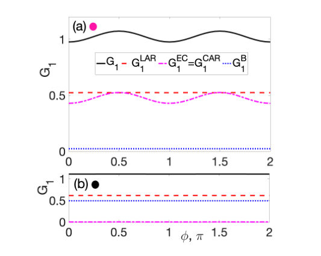 
FIG. 3. The 𝜑-dependence of the contributions to the left-lead conductance (AB effect) in the linear-response regime and at the sweet spot. (a) the regime of maximal nonlocal conduc- tance, corresponding to pink dots in Fig. 2a; (b) the regime of absent nonlocal conductance, corresponding to black dot in Fig. 2c. Parameters used: 𝑔1,𝑁= 𝑔′ 1,𝑁= 0.05.

📷 Fig 4

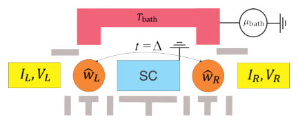 
FIG. 4. Sketch of a possible experiment to detect nonlocal transport by dissipation (see text).

**Summary.** This theoretical work explores how coupling a topological superconductor (modeled by a Kitaev chain) to a dissipative bath can enable nonlocal, phase-coherent transport via Majorana bound states. The key finding is that dissipation can substitute for the need for Coulomb blockade to mediate this transport. This establishes a mechanism for controlling quantum information transfer in topological quantum materials.

**Why it may be interesting.** This work directly addresses open quantum systems dynamics by showing how environmental coupling (dissipation) can induce and control non-trivial quantum phenomena like nonlocal transport, which is highly relevant for quantum computing architectures.

Detailed structure

**Main problem.** The study investigates whether dissipation can replace the necessity of Coulomb blockade to achieve nonlocal, phase-coherent transport mediated by Majorana bound states (MBS) in a topological superconductor.

**Main result.** The authors show that dissipation facilitates nonlocal transport, reaching a regime where nonlocal conductance contributions match local ones, confirming dissipation as a tool to control quantum teleportation in Majorana systems.

**Method.** The analysis involves calculating local and nonlocal conductance contributions using extensions of the Meir-Wingreen formula for dissipative systems, coupled with analyzing the reduced density matrix of the low-energy subspace.

**Model / system.** The system modeled is a Kitaev chain, representing a topological superconductor, which is coupled to an external Markovian bath. The dynamics are governed by the Lindblad master equation.

**Key observables.** Nonlocal and local conductance contributions ($G_{EC}^j, G_{CAR}^j, G_{LAR}^j, G_B^j$), average fermion parity ($
ho_{red}$), and Aharonov-Bohm oscillations.

**Important parameters / regimes.** Zero bias voltage ($V_j=0$), orthogonal coupling vectors ($\mathbf{b}_1 \perp \mathbf{b}_N$), and the coupling strength to the bath.

**Assumptions / limitations.** The analysis assumes weak coupling to the bath and involves projecting the system dynamics onto the Majorana bound state subspace.

**Figures summary.** Figures illustrate the setup, the effect of dissipation on conductance contributions at zero bias, and the dependence of conductance on magnetic flux to confirm Aharonov-Bohm oscillations.

**Paper structure.** The paper develops the theory using Majorana representations and Green's functions, calculates the various conductance components, identifies the dissipative regime where nonlocal transport is maximized, and finally proposes a protocol for Majorana qubit readout.

Abstract

Nonlocal phase-coherent transport via Majorana bound states, so-called teleportation, requires Coulomb blockade to suppress local Andreev reflection. We show that dissipation can replace the need for Coulomb blockade. We study a Kitaev chain coupled to a Markovian bath and identify a regime where the magnitude of nonlocal conductance contribution reach the local one. In this regime, the lowest-energy subspace is maximally mixed, reminiscent of a directly-grounded nontrivial topological superconductor. Phase coherence is confirmed by Aharonov-Bohm oscillations. Our results establish dissipation as a tool for controlling quantum teleportation in Majorana systems.

[↑ back to top](#top)

### [Dissipative quantum mechanics of Andreev bound states](http://arxiv.org/abs/2609.10691v1)

**Authors:** Mikhail S. Kalenkov, Andrei D. Zaikin  
**Type:** theory · **Category:** other · **PDF:** <https://arxiv.org/pdf/2609.10691v1>  
**Analysis basis:** full PDF text, analyzed in chunks
**Topic relevance:** 🔥 `Keldysh / 2PI / non-Gaussian methods` **4/5** · `methods for driven-dissipative` **2/5** · `correlated / nonlocal dissipation` **1/5** · `driven-dissipative phase transition` **1/5** · `non-equilibrium universality` **1/5** · `quantum measurements` **1/5**

📷 Fig 1

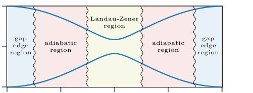 
FIG. 1. The energy of Andreev bound states as a function of the superconducting phase difference χ. Adiabatic dynamics and the process of Landau-Zener tunneling contribute to the Josephson current IJ[χ(t)]. Superconducting gap edge regions close to χ = 2πn yield an extra dissipative contribution to the current Idiss[χ(t)].

📷 Fig 2

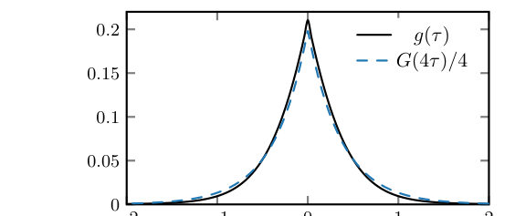 
FIG. 2. Universal functions g(τ) and G(τ) (with b = 2.5) defined respectively in Eq. (61) and (67).

📷 Fig 3

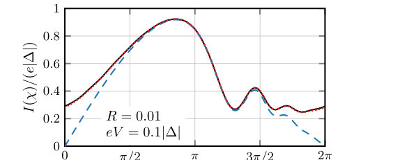 
FIG. 3. The current I in a single-channel junction as a func- tion of χ(t) for R = 0.01, eV = 0.1|∆| and T →0. The black solid line shows a numerically exact result. The blue dashed line corresponds to the Josephson current IJ (52), with r(t) and d(t) obtained from the solution for the Landau- Zener problem [13]. The red dotted line indicates the total current (8) which includes IJ and a dissipative correction Idiss defined in Eq. (60).

📷 Fig 4

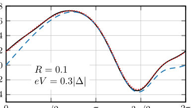 
FIG. 4. The same as in Fig. 3 for R = 0.1 and eV = 0.3|∆|.

📷 Fig 5

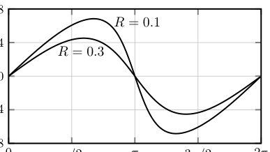 
FIG. 7. CPR at T →0 plotted for R = 0.3, eV = 0.1|∆| and for R = 0.1, eV = 0.03|∆|. Both curves indicate numerically exact results. The dependence in Eq. (59) coincides with these curves within the line thickness.

**Summary.** This paper develops a theoretical framework to model the AC Josephson effect by treating the system's dynamics through the dissipative quantum mechanics of Andreev bound states. It successfully calculates the non-equilibrium current-phase relation, highlighting a specific dissipative current component that becomes important near the superconducting gap edge. The methodology involves advanced Green's function techniques to handle the complex, time-dependent quantum dynamics.

**Why it may be interesting.** This work provides a detailed, non-equilibrium quantum description of current transport in superconducting junctions, which is highly relevant to open quantum systems where dissipation and tunneling dynamics are crucial for understanding macroscopic quantum phenomena.

Detailed structure

**Main problem.** The paper develops a microscopic scheme to describe the AC Josephson effect in superconducting junctions by analyzing the dissipative quantum dynamics of subgap Andreev bound states.

**Main result.** It identifies a non-trivial, phase-dependent dissipative contribution to the current, $I_{diss}[\chi(t)]$, which is significant near the superconducting gap edge.

**Method.** The analysis uses the quasiclassical Eilenberger-Keldysh formalism, supplemented by advanced techniques to calculate the inverse operator of the system's Green's function, especially near singular phase points.

**Model / system.** The system is a single-channel symmetric non-magnetic superconducting junction biased by a time-dependent voltage. The dynamics are governed by Andreev bound states whose energies depend on the Josephson phase $\chi$.

**Key observables.** Current-Phase Relation (CPR), $I-V$ curve, and the dissipative current contribution $I_{diss}[\chi(t)]$.

**Important parameters / regimes.** Superconducting gap $|\Delta|$, junction transmission $D$, and the Josephson phase $\chi(t)$.

**Assumptions / limitations.** The analysis relies on approximations valid in the low bias regime ($eV \ll |\Delta|$), and involves complex mathematical procedures to handle singularities near $\chi = 2\pi n$.

**Figures summary.** Figure 1 illustrates the energy of Andreev bound states versus phase $\chi$, showing adiabatic dynamics, Landau-Zener tunneling, and the dissipative contribution near the gap edge.

**Paper structure.** The paper progresses from establishing the physical model and the total current components ($I_J + I_{diss}$) to deriving local, time-dependent effective Hamiltonians. It then tackles the complex mathematical machinery of calculating the inverse operator and finally derives the explicit, regularized forms for the dissipative current contribution by analyzing contributions from different time intervals.

Abstract

We propose a microscopic scheme that allows to describe ac Josephson effect in superconducting junctions in terms of dissipative quantum dynamics of subgap Andreev bound states. This approach is particularly useful for highly transparent junctions at subgap bias voltages in which case a non-trivial combination of Landau-Zener tunneling between Andreev levels and their instability due to quasiparticle escape into continuum may play an important role. In the low bias regime, we evaluate the non-equilibrium current-phase relation of superconducting junctions at arbitrary transmissions and identify a sub-Ohmic phase-dependent dissipative contribution to the current controlled by quasiparticle dynamics near the superconducting gap edge.

[↑ back to top](#top)

### [Out-of-equilibrium relaxation dynamics of the superconducting order parameter in CsV$_3$Sb$_5$](http://arxiv.org/abs/2609.11686v1)

**Authors:** Avi Shragai, Alexander Won, Jonathan M. DeStefano, Andrea Capa Salinas, Ganesh Pokharel, Stephen D. Wilson, B. J. Ramshaw  
**Type:** experiment · **Category:** statistical mechanics · **PDF:** <https://arxiv.org/pdf/2609.11686v1>  
**Analysis basis:** full PDF text, analyzed in chunks
**Topic relevance:** `driven-dissipative phase transition` **3/5** · `methods for driven-dissipative` **3/5** · `non-equilibrium universality` **3/5** · `Keldysh / 2PI / non-Gaussian methods` **2/5** · `quantum measurements` **2/5** · `correlated / nonlocal dissipation` **1/5** · `scars & prethermalization` **1/5**

📷 Fig 1

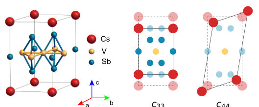 
FIG. 1. Crystal structure and experimental strains. Crystal structure of CsV3Sb5 is shown on the left. In our experimental geometry, sound propagates along the crystal c axis and probes the compressional modulus c33 and the shear modulus c44. The atomic displacements associated with the c33 and c44 strains are shown on the right.

📷 Fig 2

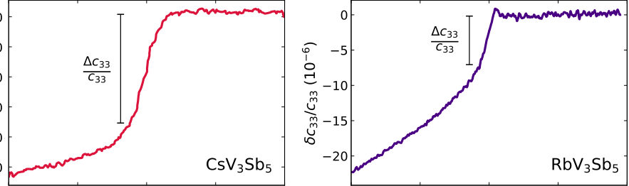 
FIG. 2. Longitudinal elastic modulus jump at Tc. a, Fractional change in the longitudinal modulus c33 of CsV3Sb5 across its superconducting transition. b, Corresponding fractional change in c33 of RbV3Sb5. The fractional discontinuity is significantly smaller and sharper in RbV3Sb5 compared to CsV3Sb5. We attribute the rounding of the jump in CsV3Sb5 to a combination of strain broadening of the superconducting Tc, and relaxational effects on the sound velocity (Supplementary Figure 8 shows data from 0.46 GHz to 2.44 GHz).

📷 Fig 3

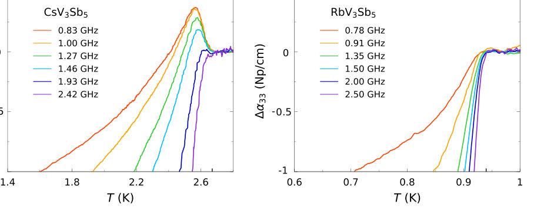 
FIG. 3. Longitudinal sound attenuation near Tc. a, Shows the temperature evolution of sound attenuation in CsV3Sb5 at different ultrasonic frequencies. Sound attenuation is peaked just below Tc at low frequencies—this peak decreases with increasing frequency and disappears entirely above ∼2 GHz. b, In contrast with CsV3Sb5, the sound attenuation in RbV3Sb5 decreases monotonically below Tc, conforming to the expectation for a BCS superconductor.

📷 Fig 4

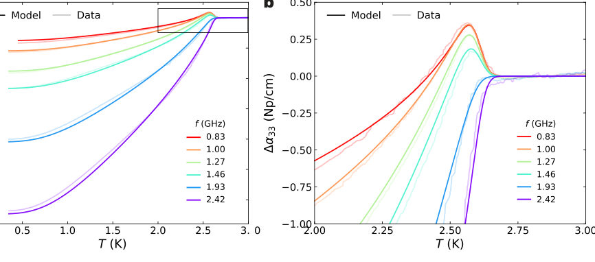 
FIG. 4. Fit to the data with the LK model. Fit to the data using the sum of order-parameter-relaxation and BCS quasi- particle contributions. Opaque traces are the model, and semitransparent traces are the data. a, Shows the full temperature range and b, shows a narrower range of temperatures near Tc, as indicated by the bounding box in a. From the LK model, we extract a characteristic timescale for the order-parameter relaxation to be τN = 25 ps.

📷 Fig 5

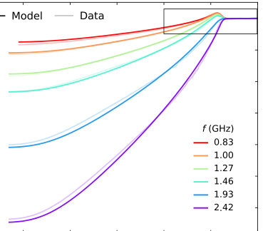 
Figure 4 shows a fit to the CsV3Sb5 data using the sum of Equation 1 and Equation 2. All six frequencies are fit simultaneously using the same set of model param- eters. We find excellent agreement with the data using a temperature-dependent relaxation time of the form

**Summary.** This paper uses ultrasonic attenuation measurements on the superconductor CsV3Sb5 to study how its superconducting order parameter relaxes after being perturbed. By fitting the data to the Landau-Khalatnikov model, the authors extracted a characteristic scattering time of 25 ps. This result suggests that the relaxation is governed by inelastic scattering, implying that simple elastic scattering processes are ineffective at damping the superconducting condensate.

**Why it may be interesting.** The analysis of non-equilibrium dynamics using the LK model provides a concrete example of how order parameter relaxation can be probed experimentally, linking macroscopic measurements (ultrasound) to microscopic scattering physics, which is relevant to open quantum systems.

Detailed structure

**Main problem.** The study investigates how the superconducting order parameter relaxes back to equilibrium after being driven out of equilibrium by a time-varying strain field.

**Main result.** The authors discovered an ultrasonic attenuation peak in CsV3Sb5, successfully modeled by order-parameter relaxation, yielding a scattering time (25 ps) inconsistent with simple elastic scattering mechanisms.

**Method.** The primary method involves using pulse-echo ultrasound to measure the ultrasonic attenuation ($\alpha$) across the superconducting transition temperature.

**Model / system.** The system is the kagome superconductor CsV3Sb5. The dynamics are analyzed using the Landau-Khalatnikov (LK) model, which describes attenuation when the relaxation timescale ($	au_\Delta$) matches the inverse drive frequency ($\omega$).

**Key observables.** Ultrasonic attenuation ($\alpha$) as a function of temperature and ultrasonic frequency ($\omega$); the relaxation time $	au_N$.

**Important parameters / regimes.** The extracted microscopic scattering time $	au_N = 25 	ext{ ps}$; the comparison between $	au_N$ and elastic/inelastic scattering times.

**Assumptions / limitations.** The analysis assumes the applicability of the Landau-Khalatnikov model, requiring $	au_\Delta$ to be comparable to $1/\omega$.

**Figures summary.** Figures show the crystal structure and strain effects (Fig. 1); the fractional change in the longitudinal modulus (Fig. 2); and the key comparison of sound attenuation, showing a frequency-dependent peak in CsV3Sb5 versus monotonic behavior in RbV3Sb5 (Fig. 3).

**Paper structure.** The paper develops the theoretical framework using the LK model, applies it to experimental ultrasonic attenuation data on CsV3Sb5, extracts the characteristic scattering time $	au_N$, and interprets this time by comparing it to other known scattering mechanisms (resistivity vs. thermal transport).

Abstract

The application of a time-varying strain field drives a superconducting order parameter out of equilibrium. How the order parameter relaxes back to equilibrium depends both on the structure of the superconducting gap and on the nature of quasiparticle scattering. We report the discovery of an ultrasonic attenuation peak inside the superconducting state of the kagome superconductor CsV$_3$Sb$_5$. This peak is the natural consequence of the order parameter relaxation time matching the ultrasonic drive frequency near $T_{\rm c}$. From the measured frequency dependence of the peak, we extract a microscopic scattering time of $τ_N = 25$ ps. This timescale is two orders of magnitude longer than the elastic scattering time as determined by resistivity measurements, but is comparable to the inelastic scattering time determined by thermal transport. Within the conventional framework of order-parameter relaxation, this implies that elastic scattering is ineffective at relaxing the superconducting condensate, consistent with a sign-preserving $s$-wave state obeying Anderson's theorem.

[↑ back to top](#top)

### [Phase-Controlled Majorana Zero Modes in Altermagnetic Topological-Insulator Josephson Junctions](http://arxiv.org/abs/2609.11633v1)

**Authors:** Hao Dong, Xun-Jiang Luo, Xiao-Hong Pan, Xin Liu  
**Type:** theory · **Category:** other · **PDF:** <https://arxiv.org/pdf/2609.11633v1>  
**Analysis basis:** full PDF text, analyzed in chunks
**Topic relevance:** `analog quantum simulation` **3/5** · `Keldysh / 2PI / non-Gaussian methods` **1/5**

📷 Fig 1

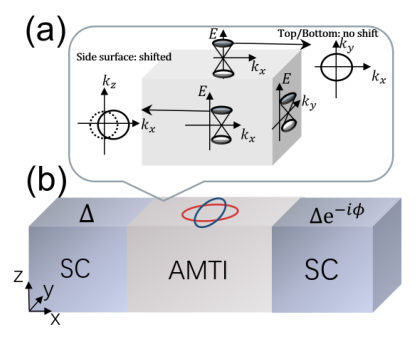 
FIG. 1. Schematic of the anisotropic AMTI surface states and device geometry. (a) Facet-dependent Dirac-cone shifts induced by the altermagnetic order. The Dirac cones on the lateral surfaces acquire finite momentum shifts, whereas those on the top and bottom surfaces remain unshifted to leading order. (b) SC/3D AMTI/SC Josephson junction in which a three-dimensional AMTI forms the weak link between two conventional s-wave superconductors with phase difference ϕ.

📷 Fig 2

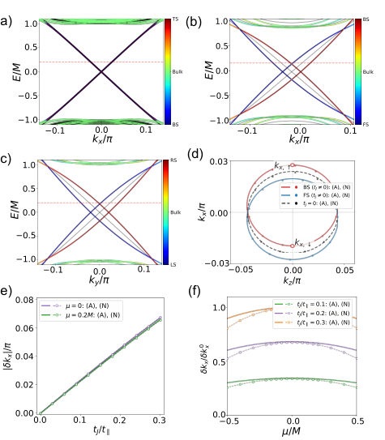 
FIG. 2. Anisotropic surface spectra and the effective alter- magnetic momentum mismatch. (a)–(c) Band structures of AMTI slabs with surfaces normal to the z, y, and x direc- tions, respectively. Black curves show the spectra for tJ = 0, whereas the colored curves show those for finite tJ; the color scale encodes the localization of the states on the two op- posite surfaces. The Dirac cones on the lateral surfaces are shifted, whereas the z-surface Dirac cone remains unshifted to leading order. (d) Fermi contours on the two opposite y surfaces: the red and blue curves correspond to the front surface (FS) and back surface (BS) at finite tJ, respectively, while the black dashed curve shows the...

📷 Fig 3

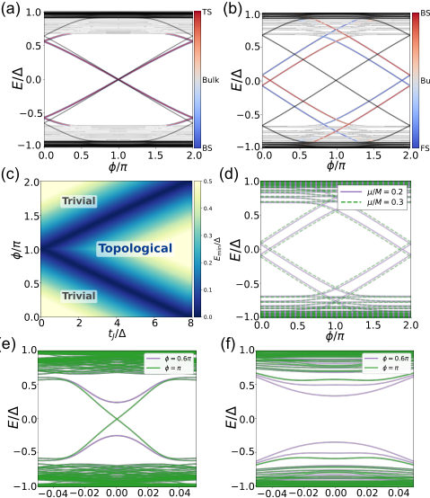 
FIG. 3. Phase-driven topological transition in the SC/AMTI/SC junction. (a) and (b) Phase-dependent An- dreev spectra of the surface Josephson channels on the z and y facets, denoted JJ-z and JJ-y, at ky = 0 and kz = 0, re- spectively. In both panels, black curves show the spectra for tJ = 0, whereas colored curves show those for finite tJ; the colors encode the localization of the states on the two op- posite facets. The JJ-z crossing remains at ϕ = π, whereas the two JJ-y crossings are shifted in opposite directions. (c) Minimum positive excitation energy of JJ-y as a function of tJ and ϕ. The two shifted gap-closing lines delimit the inter- val in which the two y-facet Josephson masses...

📷 Fig 4

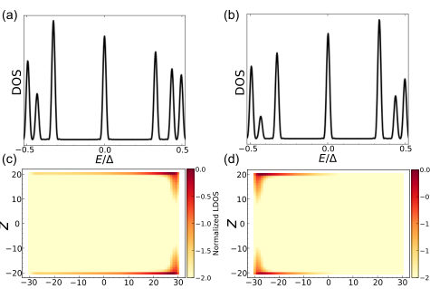 
FIG. 4. Spatial distribution and phase control of Majorana zero modes. (a) and (b) DOS at superconducting phase dif- ferences ϕ = 0.6π and ϕ = 1.4π, respectively. Both spectra exhibit a pronounced zero-energy peak. (c) and (d) Zero- energy LDOS projected onto the y–z cross section by sum- ming over the x direction at ϕ = 0.6π and ϕ = 1.4π, respec- tively. The color scale represents log10[ρ(E = 0, r)/ρmax], where ρmax = maxr ρ(E = 0, r). The zero-energy spectral weight is localized at the hinge mass domain walls, consistent with the Majorana zero modes predicted by the surface-mass analysis. The occupied hinge pair is exchanged as the phase is tuned across ϕ = π. Parameters are as in Fig. 3.

**Summary.** This theoretical work demonstrates how the d-wave altermagnetic order in a topological insulator creates distinct electronic properties on different crystal facets. By coupling this material into a Josephson junction, the authors show that tuning the superconducting phase bias can induce a superconducting mass inversion at the crystal hinges, thereby realizing and spatially controlling Majorana zero modes.

**Why it may be interesting.** The ability to engineer topological superconductivity and control MZMs using geometric/structural properties (facets) and external biases ($\phi$) is highly relevant for realizing fault-tolerant quantum computing platforms.

Detailed structure

**Main problem.** The research aims to exploit facet-dependent Andreev phase shifts to control topological superconductivity in a Josephson junction formed by an altermagnetic topological insulator.

**Main result.** The study establishes a mechanism where the altermagnetic order induces distinct phase responses on different crystal facets, leading to a superconducting mass inversion at the facet hinges that hosts Majorana zero modes (MZMs).

**Method.** The analysis involves deriving low-energy effective Hamiltonians by projecting the full lattice model onto the surface-state subspace and analyzing the resulting Andreev bound-state quantization conditions.

**Model / system.** The system is a Josephson junction (SC/AMTI/SC) where the AMTI is modeled using a Hamiltonian incorporating d-wave altermagnetic order. The physics is analyzed by examining the Andreev spectra and the resulting superconducting gap structure.

**Key observables.** Facet-dependent gap closings in Andreev spectra, spatial localization of MZMs, and the sign change of the effective superconducting mass across crystal facets.

**Important parameters / regimes.** Superconducting phase bias ($\phi$), altermagnetic coupling strength ($t_J$), and the chemical potential ($\mu$).

**Assumptions / limitations.** The analysis relies on projecting the full Hamiltonian onto the low-energy surface-state subspace and retaining only the leading low-energy Dirac expansion for the final bound-state expressions.

**Figures summary.** Figures illustrate the schematic of anisotropic AMTI surface states showing facet-dependent Dirac-cone shifts, and the Josephson junction setup with phase difference $\phi$.

**Paper structure.** The paper progresses by first modeling the AMTI surface states, showing how the altermagnetic term causes momentum shifts on lateral facets but not on top/bottom facets. It then applies this to the Josephson junction, deriving the phase-dependent Andreev spectra and demonstrating that the resulting mass inversion at the hinges hosts MZMs.

Abstract

We exploit facet-dependent Andreev phase shifts to control topological superconductivity with a phase bias in a three-dimensional altermagnetic topological-insulator Josephson junction. In the weak link between two conventional s-wave superconductors, the d-wave altermagnetic order produces facet-dependent momentum shifts of the surface Dirac cones. The resulting net momentum of the states involved in Andreev reflection generates additional propagation phases that differ between facets. Consequently, the facet-resolved Andreev spectra exhibit gap closings at distinct phase biases, giving rise to topological superconducting regimes that host Majorana zero modes(MZMs). We further show that tuning the phase bias controls the spatial localization of these modes. The associated topological superconducting transitions are only weakly affected by moderate variations in the chemical potential, obviating the need for fine-tuning to the Dirac point. Our results establish a platform for realizing and spatially controlling MZMs by tuning the superconducting phase bias in altermagnetic topological-insulator Josephson junctions.

[↑ back to top](#top)

### [Moiré Topology in Twisted Structures with Noncollinear Spin-Orbit Coupling](http://arxiv.org/abs/2609.10720v1)

**Authors:** Xilong Xu, Liangtao Peng, Shaffique Adam, Li Yang  
**Type:** theory · **Category:** strongly correlated electrons · **PDF:** <https://arxiv.org/pdf/2609.10720v1>  
**Analysis basis:** full PDF text, analyzed in chunks
**Topic relevance:** `analog quantum simulation` **3/5**

📷 Fig 1

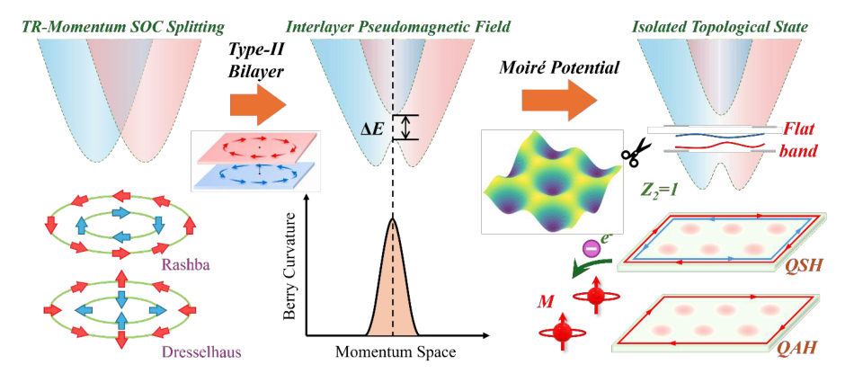 
Figure 1. Schematic illustration of moiré engineering artificial type-II SOC bilayers to realize topological flat bands and correlated states.

📷 Fig 2

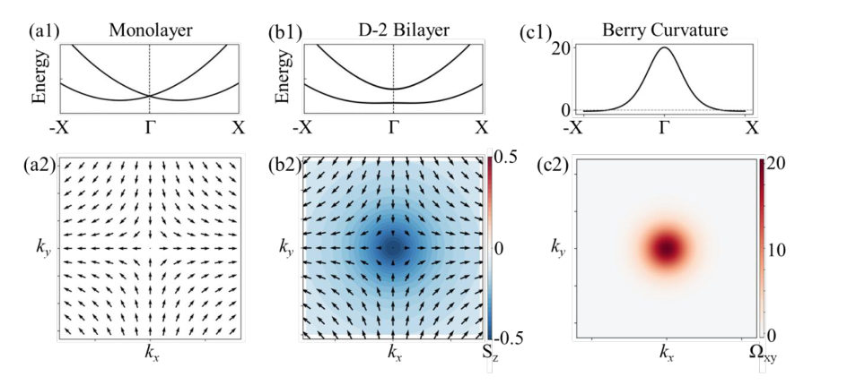 
Figure 2. Model results of monolayer and D-2 bilayer Dresselhauses-SOC structures. Band structures and spin textures of the effective model in monolayer (a) and bilayer (b) Dresselhauses SOC. (c) Berry curvature around Γ point in D-2 system.

📷 Fig 3

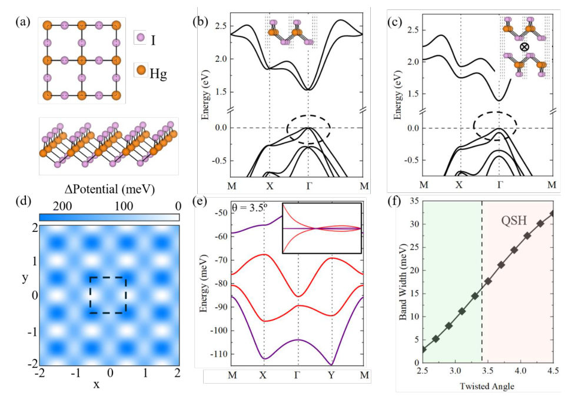 
Figure 3. Twisted Square-lattice HgI2 moiré structure. (a) Top and side view of monolayer square- lattice HgI2. (b) Electronic band structure of monolayer HgI2, focusing on low-energy states near band edges. (c) Electronic band structure of bilayer HgI2. Inset is the side view of D-2 homobilayer, and the cross symbol marks the inversion center. (d) Moiré potential Δ(𝒓) of twisted D-2 bilayer HgI2. The moiré period along x and y directions is given by 𝐿𝑀= 𝑎/[2sin(𝜃/2)], where 𝑎 is the optimized in-plane lattice constant of monolayer HgI₂. This corresponds to a moiré length scale of approximately 7 nm. (e) Moiré miniband dispersion along high-symmetry lines of twisted D-2 bilayer HgI2. Inset...

📷 Fig 4

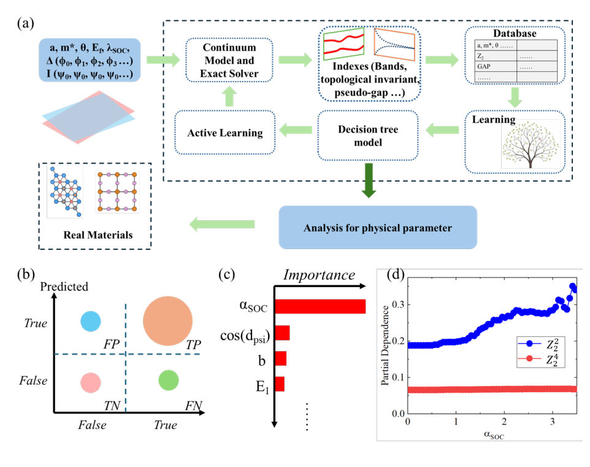 
Figure 4. Physics-informed ML workflow for twisted SOC moiré systems. (a) Schematic of the physics-informed ML surrogate-model workflow. (b) Illustration of classification performance using a confusion-matrix-style diagram (used together with MCC as the main metric. TP: True Positive, TN: True Negative, FP: False Positive, FN: False Negative). (c) Feature-importance ranking extracted from the trained model, highlighting the dominant role of SOC-related scales. (d) Partial-dependence plot showing how the predicted probability of nontrivial topology (e.g., 𝑍2

📷 Fig 5

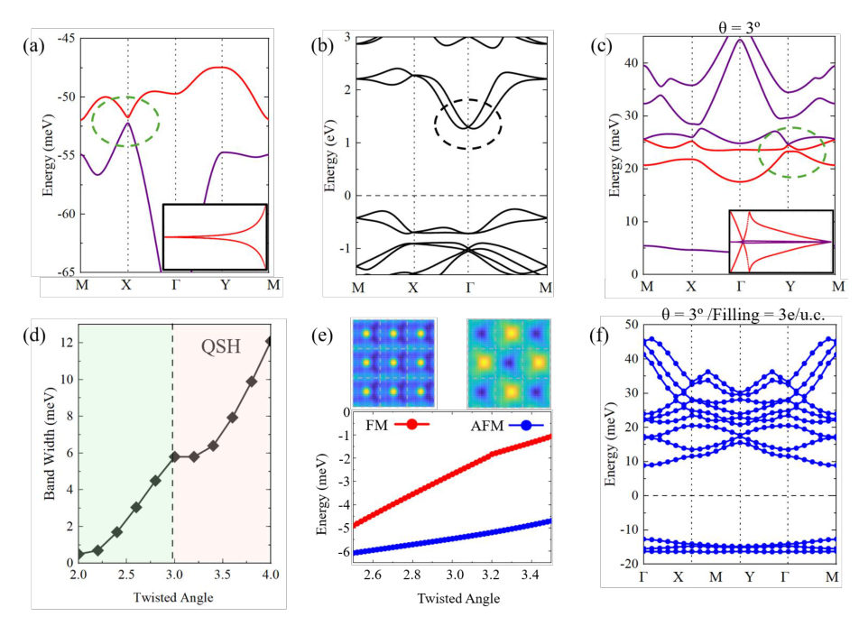 
Figure 5. Isolated topological bands and correlated effects. (a) Moiré miniband dispersion with artificially larger SOC strength along high-symmetry lines of twisted bilayer HgI2, where band hybridization and avoided crossings emerge (highlighted by red circles). Inset is the WCC evolution. (b) Electronic band structure of monolayer PbI2. (c) Moiré miniband structure of twisted D-2 bilayer PbI2. Inset is the WCC evolution. (d) Evolution of band width and topological phase transition in twisted D-2 bilayer PbI2. (e) Correlated effects in twisted D-2 bilayer PbI2 and spin charge density of FM and AFM twisted D-2 bilayer PbI2. (f) Hartree-Fock band structure of twisted bilayer PbI2 with...

**Summary.** This work proposes a novel platform for realizing topological moiré minibands using noncollinear spin-orbit coupling in centrosymmetric bilayers, moving beyond traditional valley-based models. By modeling twisted $	ext{HgI}_2$ and optimizing the system using machine learning, the authors predict the formation of robust topological phases in $	ext{PbI}_2$. This provides a general, material-designable route for engineering correlated topological insulators.

**Why it may be interesting.** The focus on engineered topological phases driven by strong spin-orbit coupling and correlated electron behavior makes it highly relevant to condensed matter theory, particularly for understanding emergent quantum states in artificial lattices.

Detailed structure

**Main problem.** To establish a general theoretical route to realizing topological moiré minibands that bypasses the reliance on valley degrees of freedom or hexagonal lattice symmetries.

**Main result.** The study demonstrates that noncollinear spin-orbit coupling in centrosymmetric bilayers can generate topological moiré minibands, which can be optimized using machine learning to support tunable quantum spin Hall and Chern insulating phases.

**Method.** The research combines theoretical modeling of moiré Hamiltonians with advanced computational techniques, including the use of a physics-informed machine-learning surrogate for topological classification.

**Model / system.** The system involves Moiré superlattices formed by twisting type-II SOC bilayers, initially modeled with $	ext{HgI}_2$ and optimized for $	ext{PbI}_2$. The physics is governed by the interplay between interlayer hybridization, noncollinear SOC, and the resulting moiré potential.

**Key observables.** Topological $\mathbb{Z}_2$ invariant, localized Berry curvature hotspots, topological flat bands, and the magnitude of the superconducting/insulating gap.

**Important parameters / regimes.** Strength of SOC ($\lambda_{	ext{SOC}}$), lattice mismatch/twist angle, and the gap threshold (1 meV).

**Assumptions / limitations.** The mechanism relies on interlayer hybridization opening pseudogaps, and the ML model assumes that SOC strength is the primary determinant of topology.

**Figures summary.** Figure 1 schematically summarizes the mechanism from type-II noncollinear-SOC bilayers to topological moiré minibands. Figure 2 illustrates the pseudo-gap opening and localized Berry curvature in the D-2 homobilayer.

**Paper structure.** The paper first introduces the limitations of valley-based moiré systems, proposes the noncollinear SOC route using $	ext{HgI}_2$, develops the moiré Hamiltonian, characterizes the topology using Wilson loops, and finally employs a physics-informed ML surrogate to guide material optimization towards $	ext{PbI}_2$.

Abstract

Moiré superlattices provide a powerful platform for flat bands and correlated topological phases, yet most established examples rely on valley-contrasting Berry curvature in hexagonal lattices. Here, we propose a different route to achieve topological moiré minibands based on noncollinear spin orbit coupling in centrosymmetric type II SOC bilayers. Interlayer hybridization opens local pseudogaps and produces sharply localized Berry curvature, which twisting reconstructs into isolated topological minibands without requiring valley degrees of freedom or hexagonal symmetry. We demonstrate this mechanism in tetragonal Dresselhaus-SOC HgI2, where a Lieb-like moiré potential yields topological flat bands. To improve miniband isolation, we develop a physics-informed machine-learning surrogate that identifies stronger SOC as a key design principle and guides the replacement of Hg by Pb. The resulting PbI2 minibands are narrower and better isolated, supporting correlation-driven magnetism and tunable quantum spin Hall and Chern insulating phases, thereby providing an optimized material realization for experimental exploration.

[↑ back to top](#top)

### [Thermal Stability of Encapsulated Molecular Structures with Extended OH-Hydrogen-Bond Chains](http://arxiv.org/abs/2609.10777v1)

**Authors:** Alexander V. Savin  
**Type:** theory · **Category:** statistical mechanics · **PDF:** <https://arxiv.org/pdf/2609.10777v1>  
**Analysis basis:** full PDF text, analyzed in chunks
**Topic relevance:** `Frenkel-Kontorova` **2/5** · `driven-dissipative phase transition` **1/5** · `non-equilibrium universality` **1/5** · `scars & prethermalization` **1/5**

📷 Fig 1

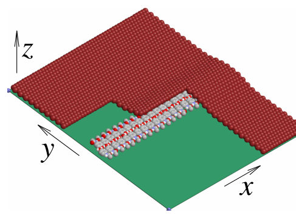 
FIG. 1: Linear structure of 46 paracetamol molecules ad- sorbed on a flat substrate z ≤0 and covered by an h-BN sheet. The simulation periodic cell of size 13.02 × 13.01 nm2

📷 Fig 2

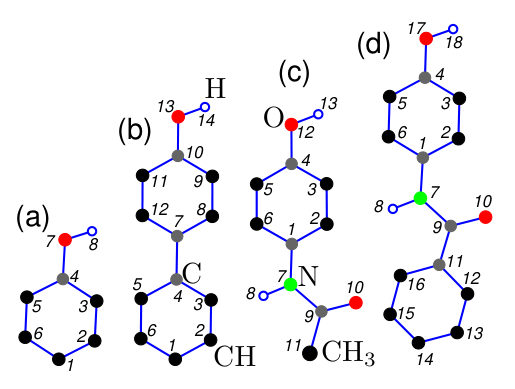 
FIG. 2: Coarse-grained models for (a) phenol C6H5OH, (b) 4-phenylphenol C6H5 –C6H4OH, (c) paracetamol CH3C(O)NHC6H4OH, and (d) 4-hydroxybenzanilide C6H5C(O)NHC6H4OH molecules. Hydrogen atoms are shown as white spheres, carbon as gray, nitrogen as green, oxygen as red, and united atoms CH and CH3 as black (the numbering of atoms used is shown). Valence bonds are shown as blue lines.

📷 Fig 3

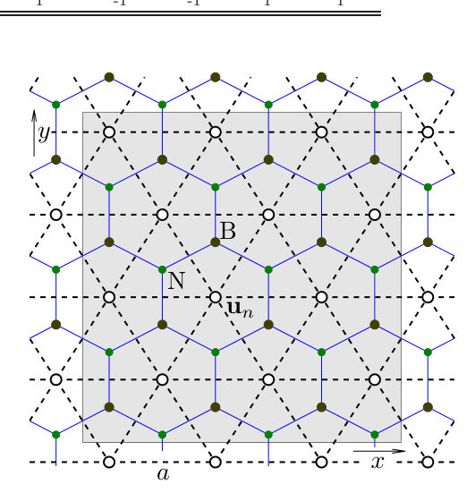 
FIG. 3: Construction of the coarse-grained model for an h-BN sheet. The hexagonal lattice of the sheet is shown (nitrogen atoms correspond to green, boron to brown spheres; blue lines show B–N valence bonds). Large white spheres show the po- sitions of the united atoms, and dashed lines show the bonds between them. The gray square shows the periodic cell of the triangular lattice of size 3a × 4ay, with lattice spacing a = √

📷 Fig 4

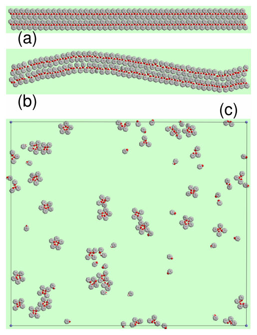 
FIG. 4: Structure of phenol molecules forming two adjacent hydrogen-bond chains on the flat surface of an h-BN crystal at temperatures (a) T = 10, (b) 240, and (c) 260 K. Carbon atoms are shown in gray, oxygen in red, hydrogen in white; the flat substrate is shown in green. In part (c), the simulation periodic cell of size 25.045 × 21.6896 nm2 is shown (number of molecules N1 = 176).

📷 Fig 5

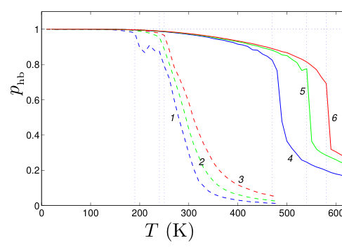 
FIG. 5: Temperature dependence of the specific number of hydrogen bonds phb for one, two, and four adjacent chains of phenol molecules (number of molecules N1 = 88, 176, 352) lying open on the flat substrate (curves 1, 2, and 3) and cov- ered by an h-BN sheet (curves 4, 5, and 6). Vertical dashed lines show the temperature values 190, 240, 250 and 470, 540, 580 K.

**Summary.** This work uses molecular dynamics simulations to study the thermal stability of molecular chains stabilized by hydrogen bonds, particularly those formed by molecules like paracetamol. By encapsulating these chains between layers of hexagonal boron nitride (h-BN), the researchers demonstrate a massive enhancement in thermal stability. This suggests a viable pathway for designing next-generation, high-temperature anhydrous proton-exchange membranes.

**Why it may be interesting.** While the focus is on classical thermal stability, the use of molecular dynamics simulations to model phase transitions (chain dissociation) and high-temperature material properties touches upon non-equilibrium statistical mechanics and energy landscape exploration.

Detailed structure

**Main problem.** The primary goal is to develop materials with high proton conductivity at elevated temperatures and in the absence of water, suitable for Proton-Exchange Membranes (PEMs).

**Main result.** Encapsulation of molecular hydrogen-bond chains within h-BN significantly enhances thermal stability, allowing the creation of anhydrous PEMs operating up to 1140 K.

**Method.** The study employs coarse-grained molecular dynamics simulations to model the thermal stability and dynamics of molecular chains.

**Model / system.** The system involves linear molecular chains (e.g., paracetamol) forming OH...OH...OH hydrogen-bond chains, adsorbed on a substrate and encapsulated by a hexagonal boron nitride (h-BN) sheet. The dynamics are governed by a total Hamiltonian incorporating bond, angle, dihedral, and Lennard-Jones potentials.

**Key observables.** Dissociation temperatures ($T_1$ and $T_2$), and the specific number of hydrogen bonds ($
ho_{hb}$) as a function of temperature ($T$).

**Important parameters / regimes.** The simulation uses various force field parameters (e.g., LJ parameters, stiffness coefficients $K_0$) and compares stability regimes (open vs. encapsulated).

**Assumptions / limitations.** The analysis relies on coarse-grained molecular dynamics simulations and assumes the applicability of the modeled potentials to describe the physical interactions.

**Figures summary.** Figures illustrate the linear structure of the molecular chains adsorbed and covered by h-BN. Temperature dependence plots (Fig. 14) show the retention of hydrogen bonds under different conditions, with encapsulation providing the highest stability.

**Paper structure.** The paper establishes the scientific problem (high-temp PEMs), details the physical model (molecular chains + h-BN encapsulation), presents the simulation methodology (coarse-grained MD), and concludes by quantifying the enhanced thermal stability of the encapsulated structures.

Abstract

Using a coarse-grained model, we performed numerical simulations of the dynamics of linear molecular chains adsorbed on a flat substrate (on the surface of an h-BN crystal). It is shown that molecules containing benzene rings and hydroxyl groups in their structure can form stable hydrogen-bond chains OH$\cdots$OH$\cdots$OH. Such chains can be formed by phenol C$_6$H$_5$OH, 4-phenylphenol C$_6$H$_5$--C$_6$H$_4$OH, paracetamol CH$_3$C(O)NHC$_6$H$_4$OH, and 4-hydroxybenzanilide C$_6$H$_5$C(O)NHC$_6$H$_4$OH molecules. The dissociation of these chains occurs at temperatures above $T_1=190$, 240, 300, and 400K, respectively. Coating such molecular systems with a hexagonal boron nitride sheet (their van der Waals encapsulation) significantly enhances their thermal stability. Such encapsulated molecular structures retain hydrogen-bond chains up to temperatures of $T_2=470$, 800, 880, and 1140K, respectively. The simulations allow us to conclude that h-BN-encapsulated chains of these molecules can be used to create anhydrous proton-exchange membranes capable of operating at high temperatures. The most promising are encapsulated chains of paracetamol and 4-hydroxybenzanilide molecules.

[↑ back to top](#top)

### [A Phase-Field Study of Desiccation Crack Pattern Maturation under Drying-Wetting Cycles](http://arxiv.org/abs/2609.11048v1)

**Authors:** Hiroki Fukushima, Satoshi Yukawa  
**Type:** theory · **Category:** numerical methods · **PDF:** <https://arxiv.org/pdf/2609.11048v1>  
**Analysis basis:** full PDF text, analyzed in chunks
**Topic relevance:** `methods for driven-dissipative` **2/5**

📷 Fig 1

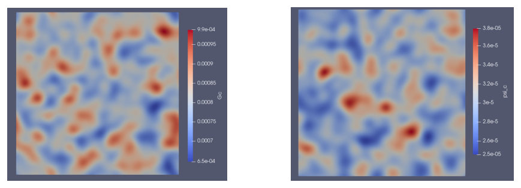 
FIG. 1: (color online) Spatial distributions of the fracture toughness Gc and the critical

📷 Fig 2

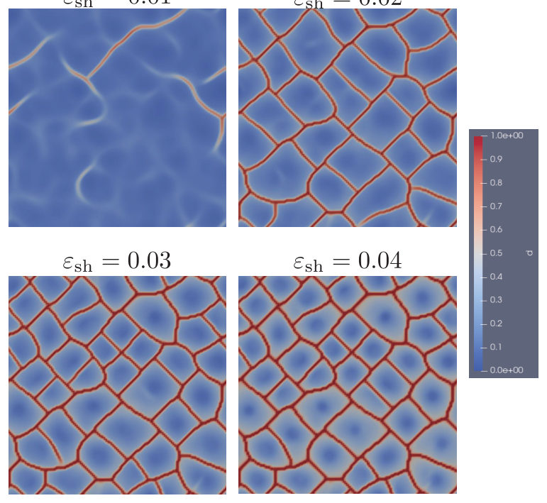 
FIG. 2: (color online) Snapshots of crack-pattern growth during the drying process of the

📷 Fig 3

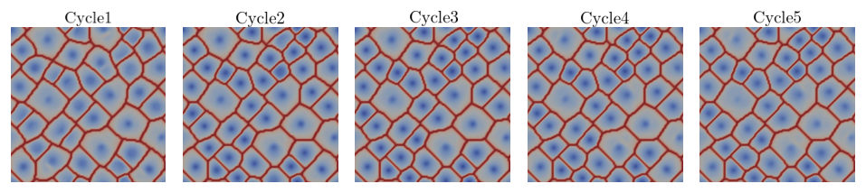 
FIG. 3: (color online) Snapshots of the damage field of the crack pattern at the end of each

📷 Fig 4

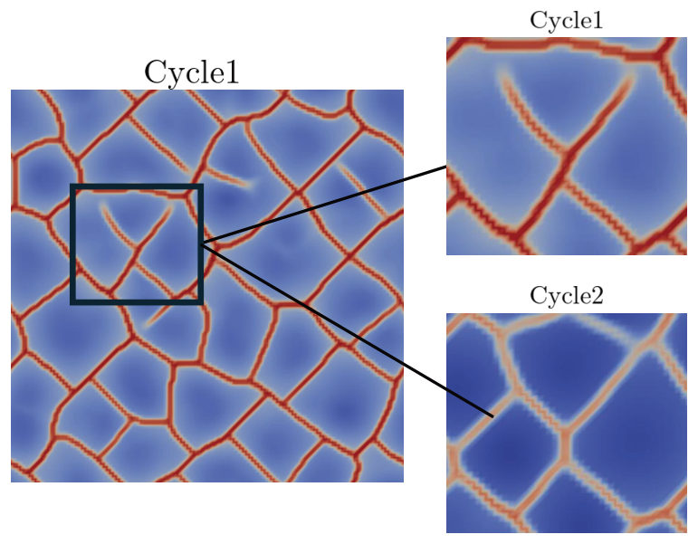 
FIG. 4: (color online) Magnified view of the same region at the end of the first and second

📷 Fig 5

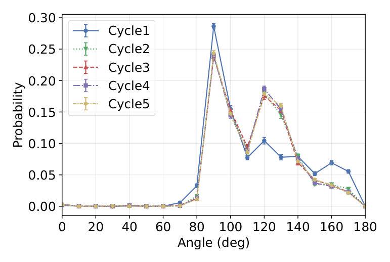 
FIG. 5: Sample average of the angle distributions for cycles 1 through 5. We normalized

**Summary.** This paper develops and applies a phase-field model to simulate how desiccation cracks mature during repeated drying-wetting cycles. By incorporating crack healing and a 'scar effect' from past damage, the model accurately predicts the relaxation of the crack intersection angle towards 120 degrees. The work demonstrates the power of advanced numerical techniques in modeling complex, history-dependent material failure.

**Why it may be interesting.** While the physics is classical mechanics, the rigorous application of phase-field modeling, coupled with complex iterative numerical solvers (FEM, Newton's method), provides a detailed case study in advanced computational physics techniques applicable to many non-equilibrium systems.

Detailed structure

**Main problem.** The study investigates the relaxation of the characteristic intersection angle of desiccation cracks from near 90 degrees toward 120 degrees under repeated drying-wetting cycles.

**Main result.** The model successfully predicts that the angle distribution develops a peak near 120 degrees, and both the angle standard deviation and crack energy decay exponentially with the cycle number.

**Method.** A phase-field model is employed, solved using a finite element method (FEM) with an alternating iteration scheme to track crack evolution and material damage.

**Model / system.** The system is a two-dimensional isotropic elastic body (paste) undergoing desiccation. The model incorporates a phase-field damage variable, crack healing, and a 'scar effect' (memory field) that modifies local fracture toughness in subsequent cycles.

**Key observables.** Crack intersection angle distribution, standard deviation of the intersection angle, and crack energy.

**Important parameters / regimes.** Shrinkage strain ($\epsilon_{sh}$), degradation function $g(d)$, and parameters controlling the scar effect ($a_G, a_P$).

**Assumptions / limitations.** The paste is treated as a thin, two-dimensional elastic body, and the simulation relies on iterative numerical solvers (Newton's method) to solve coupled displacement and damage equations.

**Figures summary.** Not specified, but the analysis involves tracking spatial distributions of damage and calculating intersection angles from the damage field.

**Paper structure.** The paper details the formulation of the total energy functional, describes the desiccation process incorporating history/scar effects, and outlines the numerical solution procedure using alternating iterations for the displacement and damage fields.

Abstract

The characteristic intersection angle of the desiccation crack relaxes from near \ang{90} toward \ang{120} under repeated drying--wetting cycles. However, the theoretical understanding of this relaxation is insufficient, especially the modeling of the drying--wetting cycles. Here we introduce a phase-field model of desiccation fracture, extending the model proposed in previous studies by adding crack healing and a scar effect left by past cracks. By repeating drying--wetting cycles in a finite element simulation, we find that the angle distribution develops a growing peak near \ang{120} as the cycle number increases, consistent with experiments. The standard deviation of the intersection angle from \ang{120} relaxes exponentially with a characteristic time of about 2.85 cycles. These results are consistent with experiments, except that the characteristic time is slightly smaller than the experimental value. Crack energy dominates the total energy and also relaxes exponentially with nearly the same characteristic cycle as the angle relaxation. This decay is driven mainly by a shortening of the effective crack length rather than a change in effective fracture toughness.

[↑ back to top](#top)

### [Influence of magnetic fields on the performance of spin-orbit torque magnetic random-access memory](http://arxiv.org/abs/2609.11397v1)

**Authors:** Jiaxin Liu, Yuqing Zhou, Guoyi Shi, Kaiming Cai  
**Type:** theory · **Category:** other · **PDF:** <https://arxiv.org/pdf/2609.11397v1>  
**Analysis basis:** full PDF text, analyzed in chunks
**Topic relevance:** `analog quantum simulation` **1/5** · `quantum measurements` **1/5**

📷 Fig 1

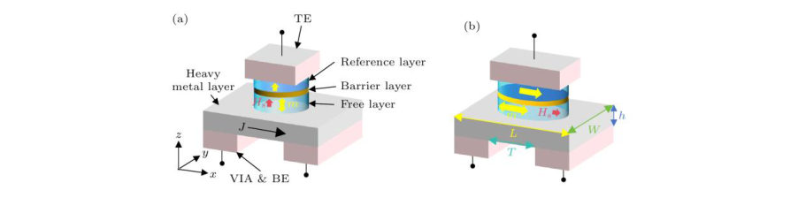 
Fig. 1. Schematic of an SOT-MRAM cell: (a) PMA structure, where TE and BE denote the top and bottom electrodes, respectively; (b) IMA structure.

📷 Fig 2

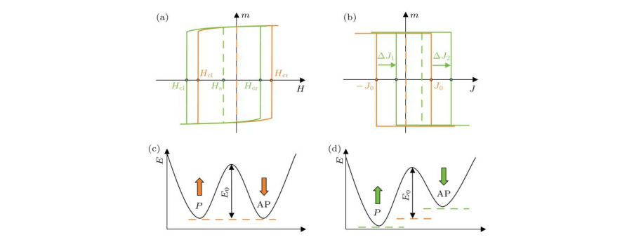 
Fig. 2. Schematic illustration of how a bias magnetic field affects SOT-MRAM performance: (a) shift of the magnetic hysteresis loop and asymmetry of the coercive fields; (b) asymmetric critical switching current densities; (c) energy barriers without a bias field; (d) unequal energy barriers of the P and AP states in the presence of a bias field.

📷 Fig 3

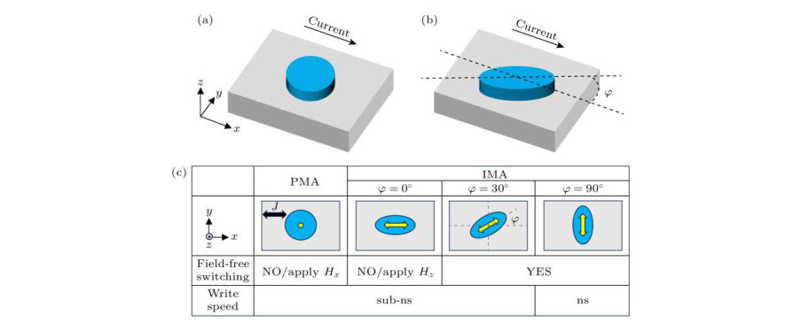 
Fig. 3. Micromagnetic simulation geometries: (a) PMA structure; (b) IMA structure; (c) switching dynamics of the PMA and IMA structures. The gray and blue regions represent the heavy-metal layer and the free layer, respectively.

📷 Fig 4

 
Figure 4 presents the simulation results for the PMA structure. To achieve deterministic switching of the free layer driven by current in the PMA structure, an auxiliary field Hx along the x-direction is typically required. As shown in Figure 4(a), when the external magnetic field is small, the critical switching current density Jc decreases linearly with increasing Hx, and the direction of Hx determines the switching polarity. Furthermore, when a magnetic field Hy along the y-direction is introduced under a fixed auxiliary field of μ0Hx = 60 mT, the modulation of Jc by Hy exhibits nonlinear characteristics, as illustrated in Figure 4(b). In contrast, under the same fixed auxiliary field...

📷 Fig 5

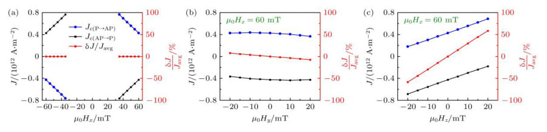 
Fig. 4. Modulation of the critical switching current density and bias ratio in the PMA structure under external uniform magnetic fields: (a) Dependence of the critical switching current density and bias ratio on Hx; (b) dependence of the critical switching current density and bias ratio on Hy with μ0Hx = 60 mT; (c) dependence of the critical switching current density and bias ratio on Hz with μ0Hx = 60 mT.

**Summary.** This paper addresses performance limitations in SOT-MRAM caused by intrinsic stray magnetic bias fields. The authors propose a novel, non-invasive method using magnetic filling in interconnect vias to compensate for this bias field. This technique significantly reduces switching current asymmetry, making the memory more energy-efficient and scalable for future integration.

**Why it may be interesting.** While focused on spintronics, the concept of engineering local fields to control switching dynamics is relevant to understanding engineered quantum potentials or controlling interactions in artificial quantum systems.

Detailed structure

**Main problem.** SOT-MRAM suffers from an intrinsic bias field due to stray fields, causing asymmetric critical switching currents and increased energy consumption.

**Main result.** The authors propose engineering local stray magnetic fields via magnetic filling in VIA channels, reducing the write-current bias ratio from 21.6% to 1.3% and maintaining performance at nanoscale dimensions.

**Method.** The study uses micromagnetic simulations to model the effect of engineered local stray fields on the magnetization switching dynamics of SOT-MRAM.

**Model / system.** The physical system is Spin-Orbit Torque Magnetic Random-Access Memory (SOT-MRAM) devices, analyzed using the Landau-Lifshitz-Gilbert equation incorporating SOT terms for both PMA and IMA structures.

**Key observables.** Write-current asymmetry, write-current bias ratio, power consumption, and data-retention stability.

**Important parameters / regimes.** Bias magnetic field (H_s), critical current densities (J_AP->P, J_P->AP), and device size (down to 10 nm diameter).

**Assumptions / limitations.** The core assumption is that modifying VIA channels with ferromagnetic material can effectively modulate the stray field without altering the sensitive MTJ thin films.

**Figures summary.** Figures illustrate the asymmetry in switching fields and currents due to bias fields, and show the modulation of the bias ratio and current density using the proposed magnetic filling structure.

**Paper structure.** The paper first establishes the problem of bias-induced asymmetry in SOT-MRAM, then proposes the non-invasive BEOL-compatible field engineering technique, and finally quantifies the resulting improvements in switching symmetry and power consumption.

Abstract

Spin-orbit torque magnetic random-access memory (SOT-MRAM) offers high speed, ultrahigh endurance, and compatibility with advanced semiconductor processes, making it a promising candidate for next-generation nonvolatile memory. However, intrinsic bias fields in magnetic tunnel junctions (MTJs), originating from reference-layer stray fields and interlayer coupling, cause asymmetric critical switching currents and increased energy consumption. Existing compensation approaches usually introduce additional magnetic layers into the MTJ stack, which increases fabrication complexity and limits wafer-scale integration. Here, we propose a bias-compensation strategy without modifying the MTJ stack by engineering local stray magnetic fields through magnetic filling materials in vertical interconnect access (VIA) channels during the back-end-of-line process. Micromagnetic simulations show that the proposed magnetic filling layer can provide the required auxiliary field for deterministic switching and significantly suppress write-current asymmetry. By optimizing the MTJ position relative to the magnetic filling structure, the write-current bias ratio is reduced from 21.6% in the conventional design to 1.3%. The approach is also applicable to in-plane magnetic anisotropy SOT-MTJs, reducing the bias ratio from 19.8% to -0.2%. Scaling analysis further demonstrates that the compensation effect remains effective when the device size is reduced to 20% of the original dimension (MTJ diameter approximately 10 nm), indicating its potential for high-density SOT-MRAM integration.

[↑ back to top](#top)

### [Interplay of Kekulé order, flat bands and electron-phonon coupling in graphene](http://arxiv.org/abs/2609.11711v1)

**Authors:** Dominik Szczȩśniak  
**Type:** theory · **Category:** strongly correlated electrons · **PDF:** <https://arxiv.org/pdf/2609.11711v1>  
**Analysis basis:** full PDF text, analyzed in chunks
**Topic relevance:** `Keldysh / 2PI / non-Gaussian methods` **1/5** · `analog quantum simulation` **1/5**

📷 Fig 1

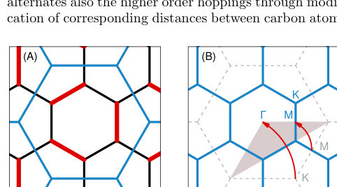 
FIG. 1. The √

📷 Fig 2

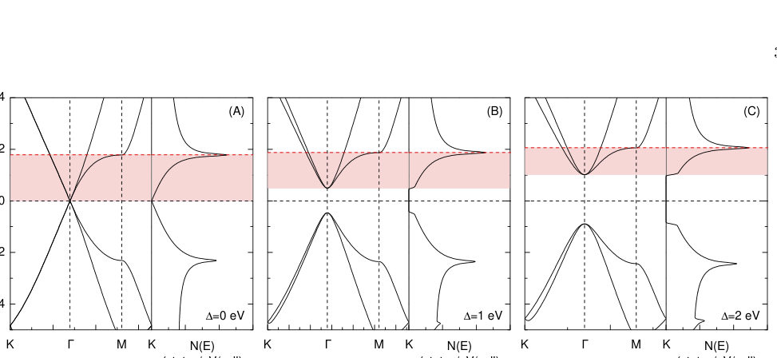 
FIG. 2. The electronic structure and the corresponding density of states of graphene for selected values of the band gap proxy representing the magnitude of the Kekul´e distortion. The results are presented in the folded Brillouin-zone representation of the √

📷 Fig 3

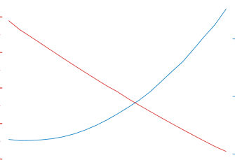 
FIG. 3. The global width of π∗band below EVHS (red) and the maximum of the VHS at positive energies (blue) for graphene as a function of the band gap proxy representing the magnitude of the Kekul´e distortion.

📷 Fig 4

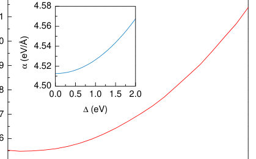 
FIG. 4. The effective dimensionless electron-phonon coupling for the dominant in-plane phonon mode (A1) of graphene as as a function of the band gap proxy representing the magnitude of the Kekul´e distortion. The same functional dependence for the corresponding bond-resolved electron-phonon coupling is presented in the inset.

**Summary.** This work theoretically investigates how Kekulé lattice distortions in graphene simultaneously induce flat electronic bands and enhance electron-phonon coupling. The findings show that the density of states at the Van Hove singularity drives this coupling enhancement, suggesting that the system may enter a nonadiabatic regime where standard approximations fail.

**Why it may be interesting.** The strong coupling between lattice structure (Kekulé order) and electronic correlations (flat bands, enhanced coupling) provides a concrete platform for studying emergent correlated quantum phases, which is central to many-body physics.

Detailed structure

**Main problem.** To provide a unified, microscopic description linking Kekulé ordering, flat band formation, and the resulting enhancement of electron-phonon coupling in graphene.

**Main result.** The enhancement of electron-phonon coupling is predominantly governed by the increasing density of states at the Van Hove singularity, suggesting potential nonadiabatic effects beyond the conventional Migdal approximation.

**Method.** Theoretical calculation involving the analysis of the electronic band structure and the application of an effective Hopfield-McMillan formula for electron-phonon coupling.

**Model / system.** The system is graphene subjected to Kekulé order, modeled by a spinless Hamiltonian incorporating hopping up to third-nearest neighbors, leading to a $\sqrt{3} 	imes \sqrt{3}$ superlattice distortion.

**Key observables.** Density of States $N(E)$ at the VHS, global width of the $\pi^*$ band ($W$), and the dimensionless electron-phonon coupling ($\lambda$).

**Important parameters / regimes.** Kekulé distortion magnitude ($\Delta$), filling fraction ($1/4$), and the ratio governing adiabaticity ($\lambda\Omega_0/W$).

**Assumptions / limitations.** The analysis uses an effective Hopfield-McMillan formula and assumes the deformation potential can be approximated by $\alpha$, while also noting the potential breakdown of the adiabatic approximation.

**Figures summary.** Figures illustrate the $\sqrt{3} 	imes \sqrt{3}$ supercell and band folding, showing band renormalization and the evolution of $N(E)$ and $\lambda$ as the distortion parameter $\Delta$ increases.

**Paper structure.** The paper establishes the physical problem, models the system using a modified Hamiltonian, calculates key observables like $N(E)$ and $\lambda$ as functions of the distortion, and concludes by discussing the implications for nonadiabatic physics.

Abstract

The Kekulé order in graphene is known to give rise to extended flat bands near the van Hove singularity (VHS) and enhanced electron-phonon coupling. However, the microscopic mechanism underlying the coexistence of these effects remains unclear. Here, it is shown that they jointly emerge as a consequence of the lattice distortion manifested through the differentiation of carbon bonds and associated electronic hoppings. In this picture, the conduction band around the $M$ point decreases almost linearly in width with increasing Kekulé order, while the VHS and dimensionless electron-phonon coupling exhibit approximately quadratic upward responses. The resulting enhancement of the electron-phonon coupling is governed predominantly by the increasing density of states at the VHS, with the effective deformation potential remaining weakly affected by the distortion. As such, the obtained results are consistent with previous related theoretical and experimental studies, while also pointing toward a potential shallowing of the conduction band under the characteristic $1/4$ filling and an increasing relevance of nonadiabatic electron-phonon effects beyond the conventional Migdal approximation. Altogether, these findings highlight the potential of controlled Kekulé ordering for engineering emergent correlated quantum phases in graphene.

[↑ back to top](#top)

### [Long interfacial internal waves with currents: current profiles with quadratic depth-dependence](http://arxiv.org/abs/2609.10820v1)

**Authors:** Conor T. Curtin, Rossen I. Ivanov  
**Type:** theory · **Category:** other · **PDF:** <https://arxiv.org/pdf/2609.10820v1>  
**Analysis basis:** full PDF text, analyzed in chunks
**Topic relevance:** `analog quantum simulation` **1/5**

📷 Fig 1

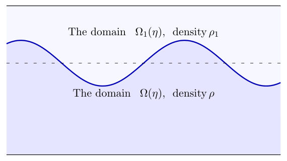 
Figure 1: Schematic of a two dimensional internal wave model. The two domains are separated by the interface z = η(x, t). The densities are ρ &gt; ρ1.

📷 Fig 2

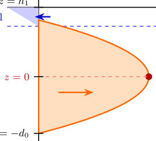 
Figure 2: The quadratic flow profile of the EUC in the region of interest. The flow reverses close to the surface in reality due to wind shear in the westerly direction.

📷 Fig 3

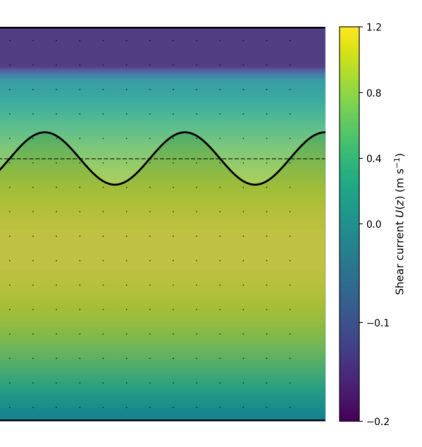 
Figure 3: Internal waves in the presence of shear current.

📷 Fig 4

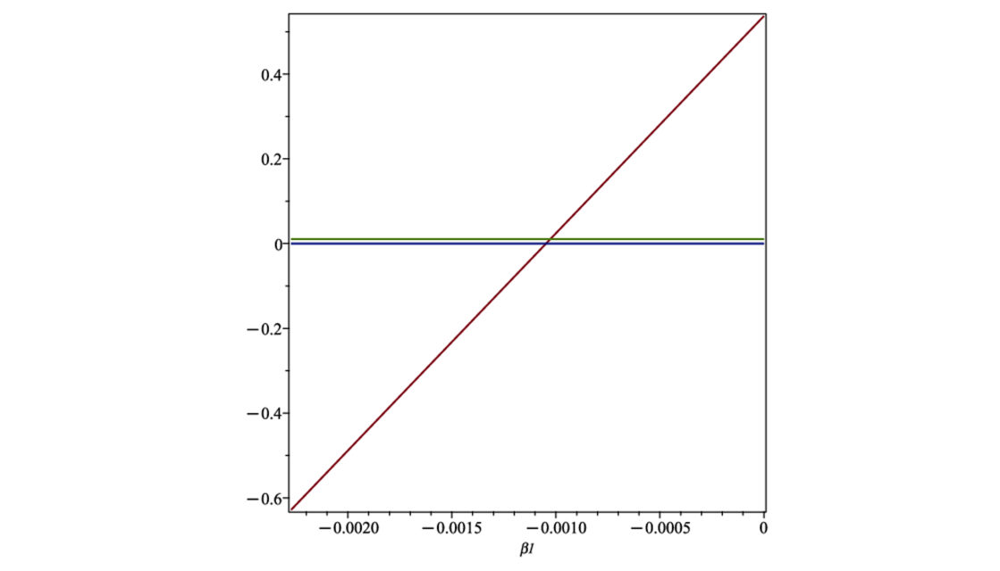 
Figure 4: The coefficient A vs β1; the coefficient A when β = β1 = 0 is given by the green horizontal line for comparison; ρ1 = 1000.0, ρ = 1027.0, h1 = 1500.0, h = 800.0.

**Summary.** This paper develops a theoretical model for internal waves propagating in stratified ocean layers affected by a background shear current, specifically assuming a quadratic current profile. Using advanced fluid dynamics techniques, the authors derive nonlinear evolution equations, such as the Gardner's equation, governing the wave dynamics. The key finding is that the resulting wave behavior is highly sensitive to the parameters of the background current.

**Why it may be interesting.** While focused on geophysical fluid dynamics, the derivation of integrable nonlinear equations (like Gardner's) from physical constraints and the analysis of their soliton solutions share mathematical techniques with those used in nonlinear wave physics relevant to quantum systems.

Detailed structure

**Main problem.** The study models the propagation of long interfacial internal waves in a two-layer fluid system that is subjected to a background shear current.

**Main result.** The analysis derives nonlinear evolution equations, specifically leading to the Gardner's equation, whose solutions (solitons) are shown to be highly sensitive to the parameters defining the background current profile.

**Method.** The authors employ fluid dynamics principles, utilizing stream functions, complex potentials, and Dirichlet-Neumann Operators (DNO) to derive the governing equations in the long wave asymptotic limit.

**Model / system.** The system is a two-layer fluid (upper and lower) separated by an interface (thermocline), where the background current profile is assumed to be a quadratic function of depth, mimicking the Equatorial Undercurrent (EUC).

**Key observables.** Thermocline elevation $\eta(x, t)$, and the associated nonlinear wave solutions (solitons).

**Important parameters / regimes.** The quadratic coefficients ($\kappa, \gamma, eta$) defining the background current profile, and scaling parameters like amplitude/depth ($\epsilon$) and depth/wavelength ($\delta$).

**Assumptions / limitations.** The current profile is assumed to be quadratic in depth, and the analysis relies on long-wave asymptotic expansions (Boussinesq/KdV scaling).

**Figures summary.** Figures schematically illustrate the two-dimensional internal wave model, the quadratic flow profile of the EUC, and the general concept of internal waves interacting with a shear current.

**Paper structure.** The paper progresses from establishing the physical model and the quadratic current assumption, through the rigorous mathematical derivation using potential theory and boundary operators, culminating in the derivation and analysis of the resulting nonlinear evolution equations.

Abstract

Internal waves often propagate in the presence of currents. Internal waves and currents are widespread in the world's oceans. The equatorial internal waves and the equatorial undercurrent (EUC) are perhaps the most representative illustration of this phenomenon. The current profile in this study is a quadratic function of depth, which is in agreement with the known results of the EUC. With this assumption the integrable nonlinear Gardner's equation is derived as a model for the wave motion of the thermocline, separating the two layers of slightly different densities. In addition, we derive the generalised Gardner's equation in the case of variable bottom. We demonstrate that the coefficients of the equation are very sensitive with respect to the parameters of the EUC.

[↑ back to top](#top)

### [Néel-Vector-Dependent Altermagnetic Spin Splitting in the One-Dimensional Limit](http://arxiv.org/abs/2609.11547v1)

**Authors:** Xin Chen, Duo Wang  
**Type:** theory · **Category:** other · **PDF:** <https://arxiv.org/pdf/2609.11547v1>  
**Analysis basis:** full PDF text, analyzed in chunks
**Topic relevance:** `analog quantum simulation` **1/5**

📷 Fig 1

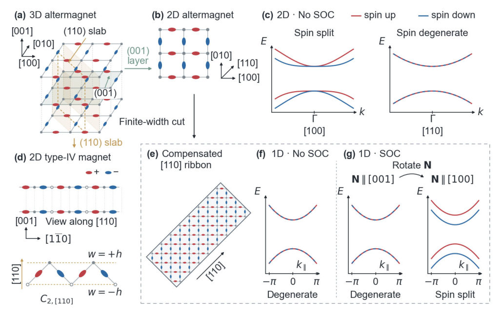 
FIG. 1. Dimensional reduction and Néel-vector-controlled spin splitting in an ideal Lieb-based symmetry construction. (a) AA-stacked magnetic Lieb parent, with the selected (001) layer and (110) slab highlighted. (b) Two-dimensional Lieb altermagnet. (c) Nonrelativistic dis- persions showing spin splitting along [100] and degeneracy along [110]. (d) (110) slab realizing the type-IV limit through the spin-exchanging C2,[110] symmetry; solid and open gray sites mark the two nonmagnetic sublayers. (e) Compensated [110] ribbon with symmetry-related edges. (f) Non-SOC ribbon bands remain spin degenerate. (g) SOC locks spin to the lattice, so rotating N from [001] to [100] can activate symmetry-...

📷 Fig 2

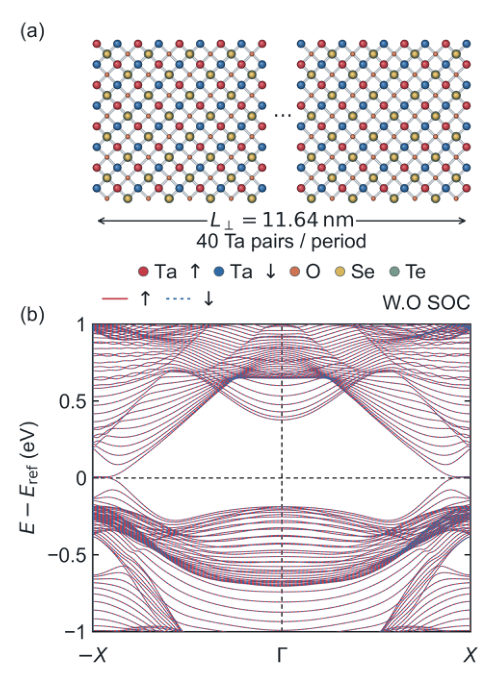 
FIG. 2. Mirror-symmetric [110] Ta2TeSeO ribbon and non-SOC bands. (a) Ta-terminated ribbon with the central width omitted for clarity. (b) Wannier bands without SOC. Red solid and blue dashed curves are the two spin channels; black dashed lines mark Eref and Γ along −X–Γ–X.

📷 Fig 3

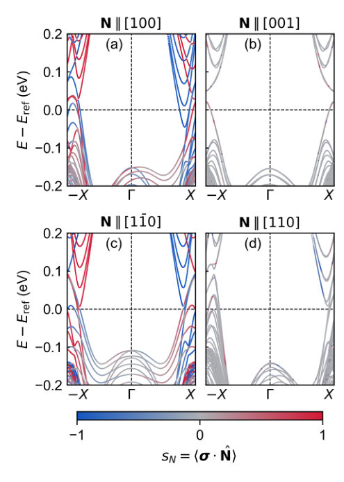 
FIG. 3. SOC bands of the mirror-symmetric Ta-terminated [110] Ta2TeSeO ribbon for N ∥(a) [100], (b) [001], (c) [1¯10], and (d) [110]. Red and blue denote positive and negative spin projection sN = ⟨σ · ˆN⟩along the respective Néel axis. Light gray marks small projection, while dark gray marks states within 0.1 meV of another band. Panel (c) uses the C4z-related construction. The path is −X– Γ–X. Black dashed lines mark E −Eref = 0 and Γ, where Eref is the reference of each magnetic domain.

📷 Fig 4

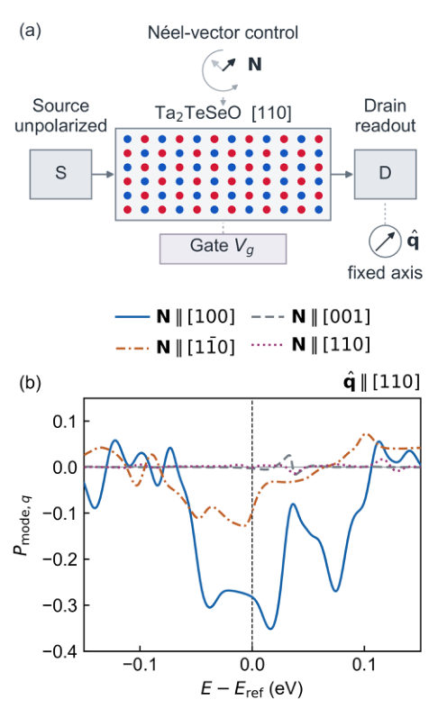 
FIG. 4. Spin-polarized modes of the mirror-symmetric Ta-terminated [110] ribbon. (a) Gated two-terminal readout with fixed spin-analysis axis ˆq ∥[110]. (b) Right-moving-mode polarization Pmode,q(E) for N ∥[100], [001], [1¯10], and [110] in blue solid, gray dashed, orange dash-dotted, and purple dotted lines. Ideal conductance and numeri- cal details are given in the SM.

**Summary.** This work explores how altermagnetism, typically identified by spin-split bands, can hide in one-dimensional magnetic nanoribbons due to geometric confinement. By incorporating Spin-Orbit Coupling (SOC), the authors demonstrate that a robust, SOC-driven spin splitting can reappear, establishing a mechanism for 1D altermagnetism hidden within seemingly conventional antiferromagnetic materials.

**Why it may be interesting.** While focused on condensed matter magnetism, the concept of symmetry-protected topological phases and the interplay between lattice confinement and relativistic quantum effects (SOC) is relevant to understanding engineered quantum materials.

Detailed structure

**Main problem.** The paper investigates how the diagnostic signature of altermagnetism (spin-split bands in nonrelativistic spectra) can disappear under one-dimensional (1D) confinement, and how relativistic spin splitting can reappear despite this nonrelativistic degeneracy.

**Main result.** The study shows that 1D fully compensated altermagnetic functionality can exist, characterized by spin-degenerate nonrelativistic bands but sizable SOC-induced spin splitting when the Néel vector is oriented along specific crystal directions.

**Method.** The research uses first-principles Wannier Hamiltonians with spin matrices to model the electronic structure and analyze the effect of symmetry operations on spin splitting.

**Model / system.** The system studied is fully compensated [110] Ta2TeSeO nanoribbons, modeled using a Lieb-based construction, which is analyzed in the 1D limit.

**Key observables.** Spin expectation value along the Néel vector ($\sigma \cdot \hat{N}$), SOC-induced spin splitting, and right-moving-mode spin polarization ($P_{	ext{mode},q}$).

**Important parameters / regimes.** One-dimensional confinement, Néel-vector orientation ($\mathbf{N}$), and the presence/absence of Spin-Orbit Coupling (SOC).

**Assumptions / limitations.** The analysis assumes the ribbon is wide enough to retain the parent easy-axis magnetic order, and transport calculations rely on ideal Landauer conductance models.

**Figures summary.** Figures illustrate the dimensional reduction process, the spin-degenerate non-SOC bands, and the emergence of spin-split relativistic spectra for various Néel vector orientations, alongside mode polarization plots.

**Paper structure.** The paper first establishes the theoretical problem of 1D confinement suppressing the altermagnetic signature, then uses a Lieb-based model to calculate the electronic structure, demonstrating the SOC-induced splitting, and finally analyzes the resulting spin polarization in transport measurements.

Abstract

Altermagnetism is normally identified by nonrelativistic spin-split bands in a compensated collinear magnet. Under one-dimensional confinement, however, this diagnostic can disappear: a boundary-compatible sublattice-exchange operation may leave the only Bloch momentum unchanged, forcing the nonrelativistic spin-up and spin-down spectra to coincide. We show that nonrelativistic spin degeneracy can coexist with relativistic spin splitting in a compensated one-dimensional magnet. In a Lieb-based construction, confinement along the diagonal cancels the projected $d$-wave spin splitting while preserving the real-space sublattice-exchange motif. Spin-orbit coupling (SOC) then locks spin to the lattice, so the Néel-vector orientation selects a magnetic line group that can reveal spin-split bands. Using fully compensated $[110]$ Ta$_2$TeSeO nanoribbons as a prototype, we find spin-degenerate nonrelativistic bands and sizable SOC splitting in the inherited easy-axis domain, $\mathbf N\parallel[100]$ or $[010]$. For sufficiently wide ribbons that retain the parent easy-axis order, this splitting is an equilibrium property. The easy-axis ribbon also supports a right-moving-mode spin polarization of about $35\%$ at finite ideal conductance. Our results establish one-dimensional fully compensated altermagnetic functionality hidden inside apparently conventional antiferromagnetic bands.

[↑ back to top](#top)

### [Quantum interference between vortex- and impurity-bound states boosts thermoelectricity](http://arxiv.org/abs/2609.10687v1)

**Authors:** Erik Haatuft, Jacob Linder  
**Type:** theory · **Category:** other · **PDF:** <https://arxiv.org/pdf/2609.10687v1>  
**Analysis basis:** full PDF text, analyzed in chunks
**Topic relevance:** `Keldysh / 2PI / non-Gaussian methods` **1/5**

📷 Fig 1

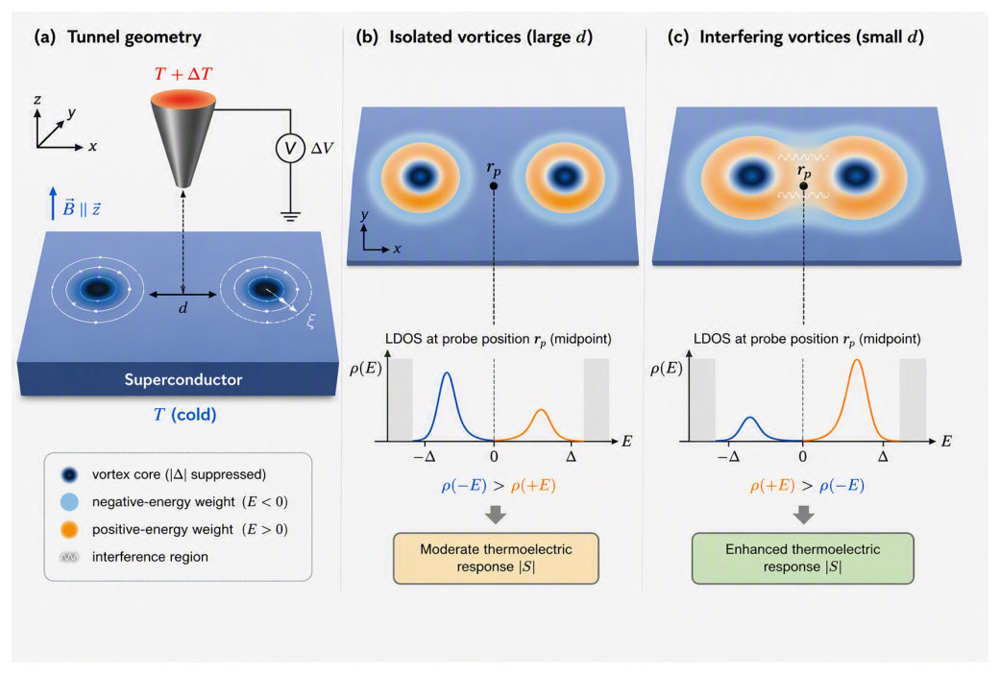 
FIG. 1. Qualitative illustration of the system and the mechanism underlying the enhanced thermoelectric response. (a) A temperature-biased normal-metal probe couples locally to a type-II superconductor containing two vortices separated by a distance 𝑑. The thermally induced voltage difference Δ𝑉determines the local Seebeck response. (b) For well-separated vortices, the spatially extended vortex-bound states are approximately independent. (c) At smaller separation, the vortex-bound states overlap and interfere, reconstructing the local spectrum and enhancing its particle-hole asymmetry. In (b) and (c), the tilted surfaces represent the superconducting 𝑥𝑦-plane, while the orange and blue...

📷 Fig 2

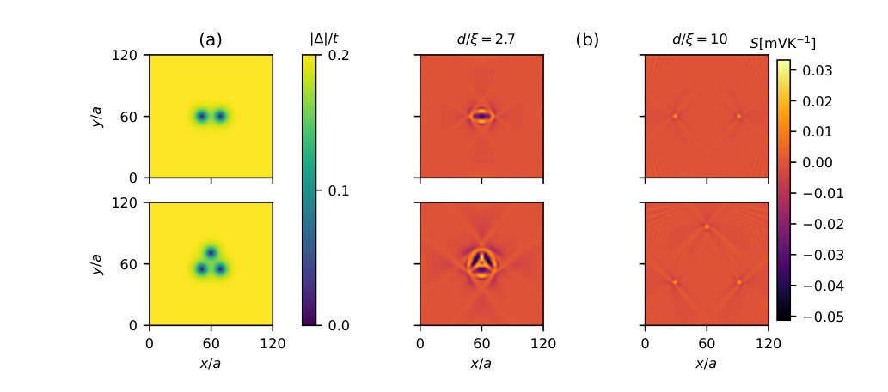 
FIG. 2. (a): The chosen superconducting OP profiles, |Δ(𝒓)|, for two (top) and three (bottom) vortices. We have chosen the bulk OP Δ0 = 0.2𝑡 and the superconducting coherence length 𝜉0 = 6𝑎. (b): Two-dimensional heatmap of the spatially resolved Seebeck coefficient in an 𝑠-wave superconductor. Here we consider two cases: (left) the vortices are placed in close proximity at their minimum separation distance 𝑑min, and (right) when they are placed far apart.

📷 Fig 3

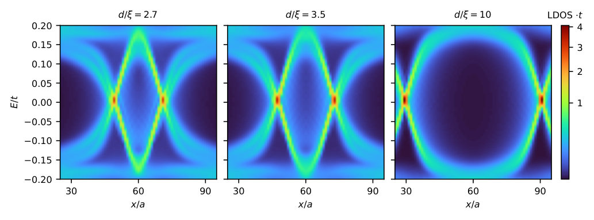 
FIG. 3. LDOS as a function of energy and 𝑥along the intervortex line. The vortices are placed at 𝑥= 60𝑎± 𝑑. Note that the superconducting gap is at 𝐸= ±Δ = 0.2𝑡.

📷 Fig 4

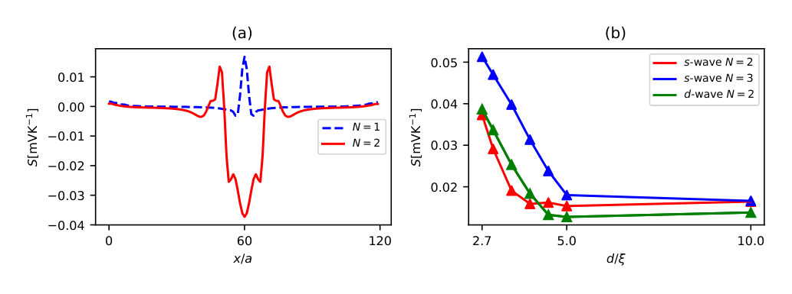 
FIG. 4. (a): One-dimensional plot of the spatially resolved Seebeck coefficient along the intervortex line in the two-vortex case 𝑁= 2, corresponding to the upper left plot of Fig. 2 (b). For comparison, we have included calculations for a superconductor with a single vortex (𝑁= 1) located at the center of the system. (b): Maximum Seebeck coefficient attained in the superconductor as a function of the vortex separation distance. Here 𝑁denotes the number of vortices present in the superconductor.

📷 Fig 5

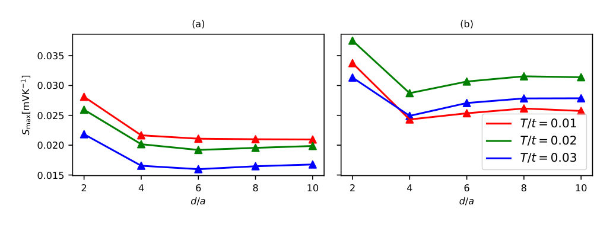 
FIG. 5. Maximum Seebeck coefficient in the (a) 𝑠-wave and (b) 𝑑-wave superconductor as a function of impurity separation distance for different temperatures.

**Summary.** This theoretical work explores how quantum interference between localized electronic states—specifically those bound by vortices or impurities—can dramatically boost the thermoelectric response in superconductors. Using the BdG framework, the authors demonstrate that the overlap of these defect states breaks particle-hole symmetry, offering a pathway to engineer local thermoelectric energy conversion in superconducting devices.

**Why it may be interesting.** The focus on local transport properties (Seebeck coefficient) driven by quantum interference in superconducting defects provides a concrete, measurable physical mechanism for controlling electronic properties in superconducting materials.

Detailed structure

**Main problem.** The study investigates how quantum interference between localized bound states induced by vortices or nonmagnetic impurities modifies the local thermoelectric response in superconductors.

**Main result.** The thermoelectric response is strongly enhanced when defect-induced states overlap and interfere, particularly in the vortex case, suggesting that spatial structure controls local thermoelectricity.

**Method.** The authors employed a lattice Bogoliubov-de Gennes approach combined with linear-response tunneling theory to calculate the spatially resolved density of states and Seebeck coefficient.

**Model / system.** The system models $s$- and $d$-wave superconductors on a lattice, incorporating superconducting pairing, hopping terms, and perturbations from vortices (via Peierls substitution) or impurities (via site-dependent chemical potential).

**Key observables.** Spatially resolved density of states ($
ho(\mathbf{r}, E)$) and the Seebeck coefficient ($S$).

**Important parameters / regimes.** Vortex/impurity separation distance ($d$), superconducting pairing symmetry ($s$-wave vs. $d$-wave), and the coherence length ($\xi$).

**Assumptions / limitations.** The calculations assume the linear-response regime and utilize a mean-field approximation for the superconducting state.

**Figures summary.** Figures illustrate the enhancement of the Seebeck coefficient as vortex separation decreases, showing spectral reconstruction and LDOS changes; comparisons are made between vortex and impurity separation effects.

**Paper structure.** The paper establishes the general suppression of thermoelectricity due to particle-hole symmetry, then analyzes the enhancement mechanism separately for overlapping vortex-bound states and for impurity-induced states, comparing the magnitude and spectral signatures of both effects.

Abstract

Thermoelectric effects in superconductors are generally suppressed by the approximate particle-hole symmetry of the quasiparticle spectrum, but can become pronounced near defects that host particle-hole asymmetric bound states. Here, we investigate how the local thermoelectric response is modified when multiple vortices or nonmagnetic impurities are brought into proximity. Using a lattice Bogolioubov-de Gennes approach combined with linear-response tunneling theory, we calculate the spatially resolved density of states and Seebeck coefficient in $s$- and $d$-wave superconductors. We find that the thermoelectric response can be strongly enhanced when spatially extended defect-induced states overlap. For vortices, this enhancement persists beyond the immediate core regions and originates from interference between vortex-bound states. For impurities, the thermoelectric response exhibits a comparable dependence on impurity separation in the $s$- and $d$-wave cases, although the associated spectral reconstruction is considerably more localized in the $s$-wave superconductor. Our results show that the spatial extent and interference of defect-induced quasiparticle states provide a means of controlling local thermoelectricity in inhomogeneous superconductors, with potential relevance for cryogenic thermoelectric sensing and energy conversion.

[↑ back to top](#top)

### Other secondary papers (7)

Show other secondary papers

### [A substrate booster for P-type 2D ferromagnetic semiconductor](http://arxiv.org/abs/2609.11015v1)

**Authors:** Hai Wang, Woye Pei, Ridong Cong, Xiaoyan Liu, Yuping Tian, Kenji Watanabe, Teng Yang, Takashi Taniguchi, Xiangru Kong, Weijiang Gong, Guowei Zhou, Xiaoxi Li, Hanwen Wang, Jixuan Wu, Jiezhi Chen, Xiaohong Xu, Tongyao Zhang  
**Type:** both · **Category:** strongly correlated electrons · **PDF:** <https://arxiv.org/pdf/2609.11015v1>  
**Analysis basis:** full PDF text, analyzed in chunks

📷 Fig 1

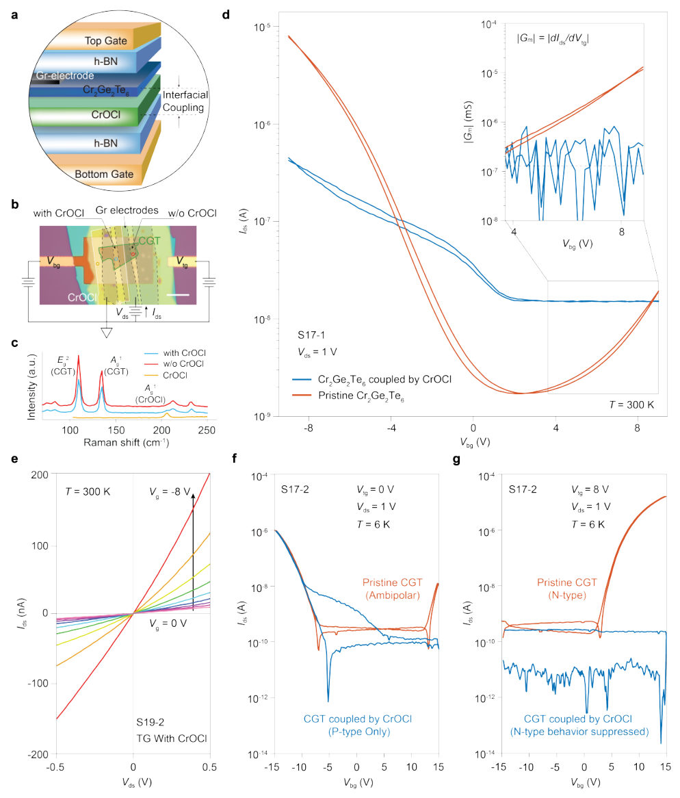 
Figure 1. Characterization of CrOCl-coupled FL-CGT FETs. a, Schematic illustration of the dual-gated FET structure consisting of FL-CGT interfaced with a CrOCl underlayer. b, Optical image of a typical device and the configuration of measurement circuits. Solid outlines indicate the FL-CGT (green) and CrOCl (white) flakes, dashed black lines mean graphite electrodes. Scale bar, 10 µm. c, Raman spectra collected from the distinct regions marked by colored circles in (b). d, Room-temperature transfer characteristics Ids-Vbg of device S17-1, comparing the bare FL-CGT channel (red) with the CrOCl-coupled region (blue) at Vds = 1 V. The inset displays the magnitude of the transconductance (Gm)...

📷 Fig 2

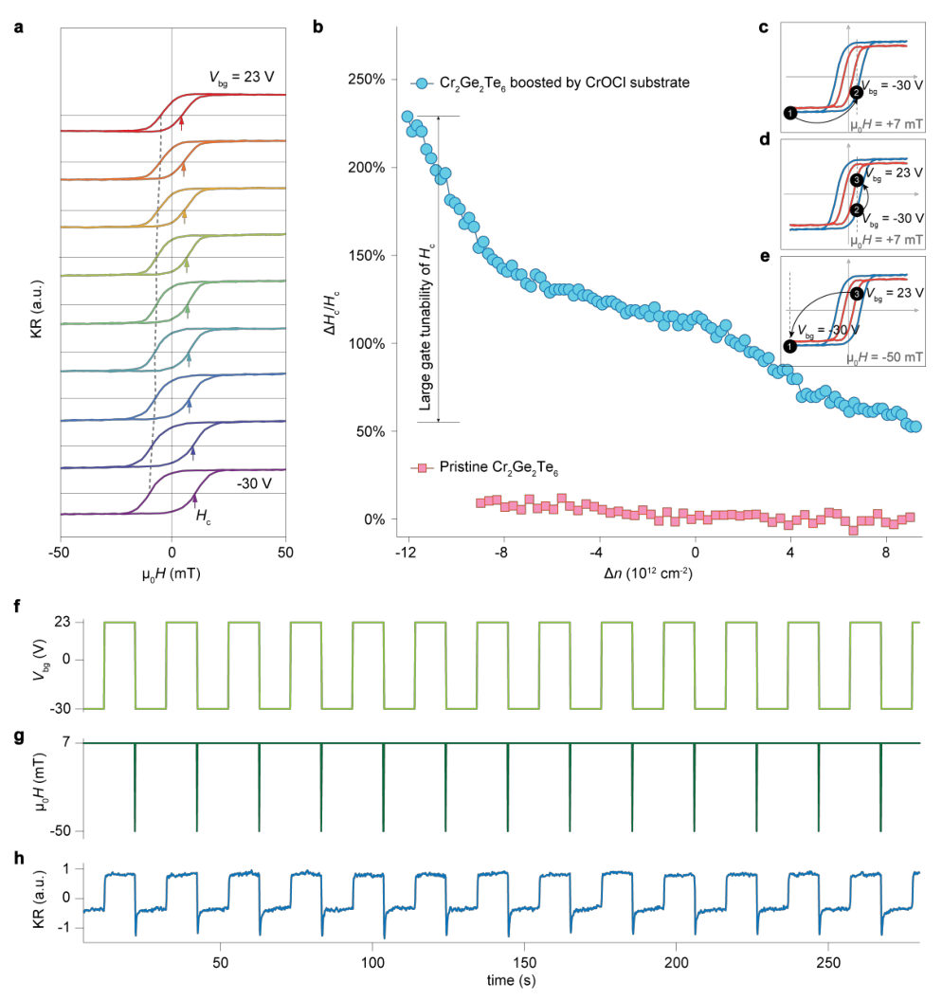 
Figure 2. Giant gate-tunability of coercivity fields in CrOCl-coupled FL-CGT devices. a, Vertical stacking of magnetization hysteresis loops measured by MOKE from Vbg = −30 V to Vbg = 23 V at 6 K. The set gate Vtg = −14 V. A strong dependence of the coercive field (Hc) on the electric field is observed. b, Relative change in coercivity ∆Hc/Hc versus electrostatic doping ∆n. The CrOCl-coupled device (blue circles) exhibits a giant tunability of over 200%, significantly exceeding the negligible response of the pristine CGT device (pink squares). Data are normalized to the minimum Hc observed in the dual-gate map (Supplementary Figures 8). c - e, Schematic illustration of the electrically...

📷 Fig 3

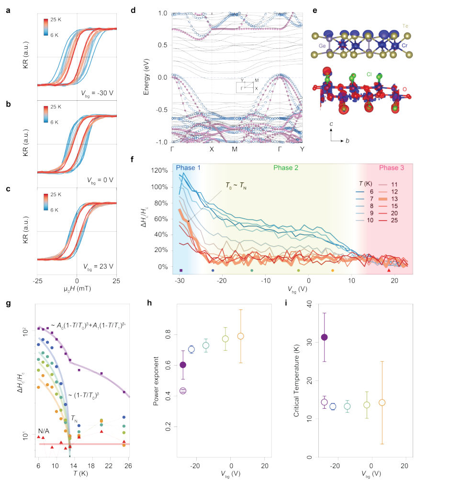 
Figure 3. Temperature-dependent gate modulation of magnetic coercivity in CGT/CrOCl heterostructures. a–c, Temperature de- pendence of normalized KR hysteresis loops from 6 K to 25 K at Vbg = −30 V (a), 0 V (b), and 23 V (c), respectively. The top-gate voltage is fixed at Vtg = −14 V. a-c share the temperature color scale defined in f. d, Electronic band structure of CGT/CrOCl hy- brid (black lines). Solid purple and empty blue circles represent the spin majority and minority electronic bands of CGT monolayer, respectively. e, Differential charge density ∆ρ = ρ(CGT/CrOCl) −ρ(CGT) −ρ(CrOCl). Blue and red colors represent charge depletion and accumulation, respectively. CGT (top layer) is...

📷 Fig 4

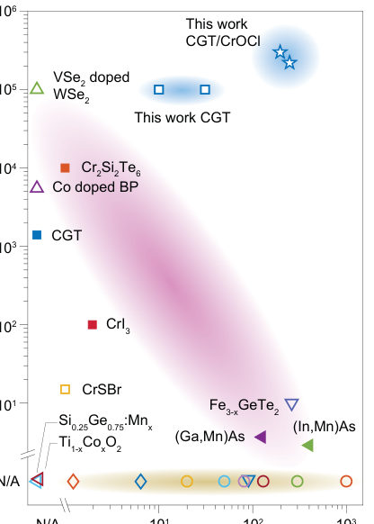 
Figure 4. Perspectives on manipulation of charge and spin de- grees of freedom in FMS-based FETs. The diagram summarizes coercivity fields tunability and electrical FET ON-OFF ratios in several typical FMS-based FETs with using solid gates. Squares: 2D-FMS[9, 11, 10, 12], left-pointing triangles: DMS[5, 7, 6, 8], regular triangles: magnetic atom doped semiconductors[29, 30], inverted triangles: 2D ferromagnetic metals[31, 32], circles: fer- romagnetic films[33, 34, 35, 36, 37], diamond: ferromagnetic insulators[38, 39]. Data from devices in this work are included.

**Summary.** This work introduces a novel substrate engineering approach by coupling a 2D ferromagnetic semiconductor ($	ext{Cr}_2	ext{Ge}_2	ext{Te}_6$) with an antiferromagnetic insulator ($	ext{CrOCl}$). This interface acts as a 'booster,' converting the device into a high-performance P-type FET. Crucially, the coupling allows for the electrical tuning of the magnetic coercive field by over 200%, demonstrating a powerful pathway for gate-tunable spintronic devices.

**Why it may be interesting.** The ability to electrically tune magnetic anisotropy energy via interfacial charge transfer in a 2D system provides a solid-state platform for studying field-effect control over magnetic ground states, relevant to correlated electron physics.

Detailed structure

**Main problem.** Developing functional spin transistors whose charge and spin properties are tunable via electric fields, which is challenging due to the inherent limitations of magnetic semiconductors.

**Main result.** Interfacing the 2D ferromagnetic semiconductor $	ext{Cr}_2	ext{Ge}_2	ext{Te}_6$ with an antiferromagnetic insulator $	ext{CrOCl}$ creates a substrate booster that enables high-performance P-type FETs with giant gate-tunability of the magnetic coercive field ($>200\%$).

**Method.** The study combines electrical transport measurements (FET characterization) with magnetic characterization using Polar MOKE microscopy, supplemented by DFT calculations to model interfacial charge transfer.

**Model / system.** The physical system is a dual-gated Field-Effect Transistor (FET) heterostructure composed of few-layered $	ext{Cr}_2	ext{Ge}_2	ext{Te}_6$ (FL-CGT) coupled with an antiferromagnetic insulator $	ext{CrOCl}$. The mechanism relies on interfacial charge transfer coupling to modulate the magnetic anisotropy energy.

**Key observables.** ON-OFF ratio, coercive field ($H_c$), transconductance ($G_m$), and the relative change in coercive field ($\Delta H_c/H_c$).

**Important parameters / regimes.** Gate voltage ($V_{bg}$), temperature ($T$), and the coupling strength derived from interfacial charge transfer.

**Assumptions / limitations.** The enhancement mechanism is attributed to an efficient interfacial charge transfer that acts as an active, electric-field-controlled modulator, rather than simple passive pinning.

**Figures summary.** Figures demonstrate the p-type switching in the FET structure, show MOKE hysteresis loops illustrating $H_c$ dependence on $V_{bg}$, and present temperature-dependent scaling analyses of the coercivity tunability.

**Paper structure.** The paper systematically presents the device structure, demonstrates the electrical switching to a p-type regime, quantifies the giant gate-tunability of the magnetic coercive field, and finally analyzes the temperature and doping dependence using critical scaling laws.

Abstract

Spin transistors with its both charge and spin properties tuned via electrostatic gating are believed capable for widespread use, which however have proven challenging due to the extreme rareness of their physical base -- magnetic semiconductors. The latter are limited within very few systems including diluted magnetic semiconductors (DMS) and two-dimensional ferromagnetic semiconductors (2D-FMS), and known to suffer from inadequate gate-tunability of their electric and/or magnetic properties. Here, we show a substrate engineering paradigm by interfacing few-layered Cr$_{2}$Ge$_{2}$Te$_{6}$ (FL-CGT) with an antiferromagnetic insulator CrOCl. Owing to the subtle interfacial charge transfer couplings, CGT can be drastically turned from an ambipolar semiconductor into a high performance P-type semiconductor. When cooled below the Curie temperature, the ON-OFF ratio in such substrate-boosted FMS field-effect transistor (FET) reaches 10$^{5}$ with its coercive field $H_{c}$ of magnetic hysteresis loop tunable by a factor of more than 200$\%$, enabling {gate-assisted magnetic switching in the prototype semiconducting spin transistor architecture}. A crossover from critical power-law scaling to a dual power-law behaviour under heavy hole doping was further observed. Our findings {signify} an efficient interfacial charge transfer and electrically modulated magnetic anisotropy energy supported by calculations. This high performance P-type FMS-FET system suggests that active substrate-boosting paradigm might be a powerful path for the investigation of future gate-tunable spintronic devices.

[↑ back to top](#top)

### [Bottom-up Synthesis of Metastable 2D Hexagonal Copper(I) Iodide on Monolayer and within Bilayer Graphene](http://arxiv.org/abs/2609.11459v1)

**Authors:** David Kaiser, Guobin Jia, Janis Köster, Sadegh Ghaderzadeh, Christian E. Halbig, Siegfried Eigler, Andrey Turchanin, Benjamin Dietzek-Ivanšić, Arkady V. Krasheninnikov, Jonathan Plentz, Elena Besley, Ute Kaiser  
**Type:** both · **Category:** other · **PDF:** <https://arxiv.org/pdf/2609.11459v1>  
**Analysis basis:** full PDF text, analyzed in chunks

📷 Fig 1

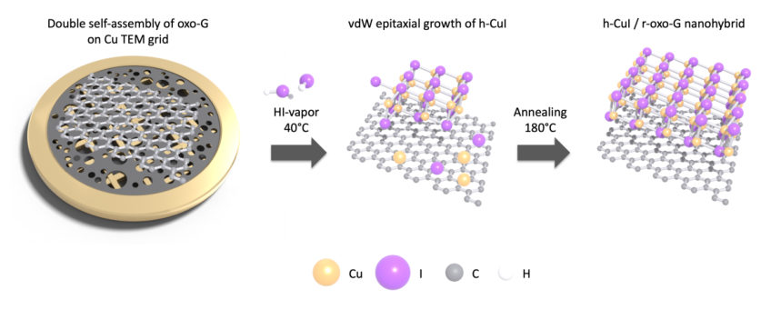 
Figure 1. h-CuI synthesis on graphene supported by a copper TEM grid. In the first step, HI treatment at 40 °C forms, through van der Waals stabilization, monolayer h-CuI on graphene; during this step the oxo-graphene template (oxo-G) is reduced to r-oxo-G simultaneously. Annealing at 180 °C then promotes the epitaxial growth of extended h-CuI crystals on graphene. The atom types are indicated at the bottom.

📷 Fig 2

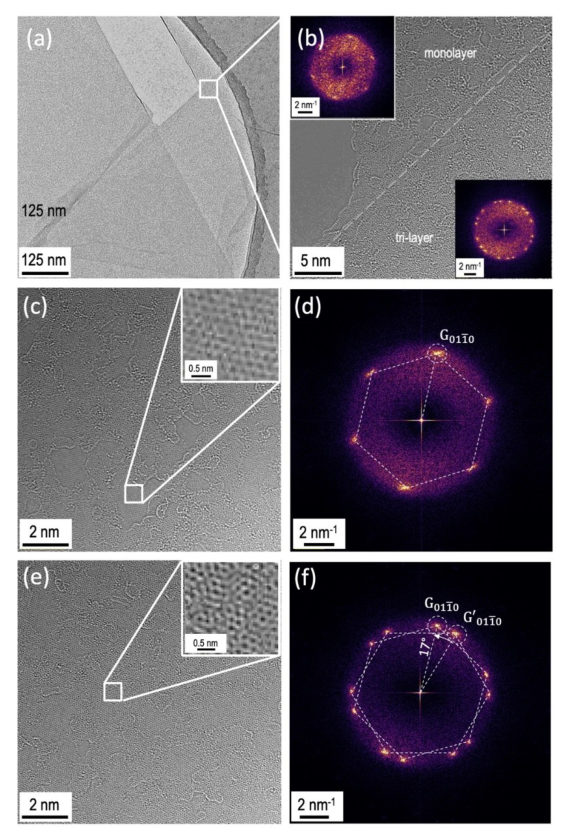 
Figure 2. Structural and crystallographic characterization of oxo-G templates. (a) Low- magnification Cc/Cs-corrected HRTEM overview of oxo-G flakes suspended on a TEM grid, showing characteristic folds and local thickness variations. (b) Cc/Cs-corrected HRTEM image of the interface between a monolayer domain (top) and a trilayer domain (bottom), indicated by the white line; the insets show the corresponding FFT patterns. (c) Representative Cc/Cs-corrected HRTEM image of a monolayer oxo-G region; the inset shows an atomic-resolution view of the hexagonal lattice. (d) FFT pattern obtained from the region shown in (c), displaying the reflections of a single graphene lattice, labeled G and...

📷 Fig 3

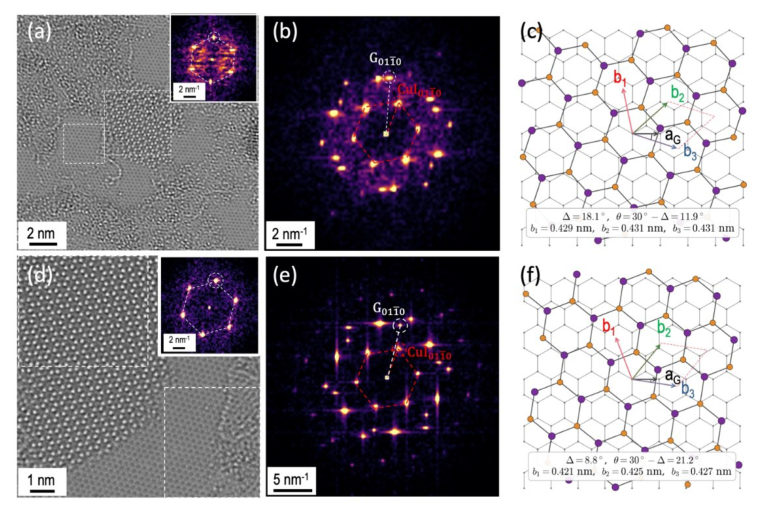 
Figure 3. Vapor-phase synthesis and vdW-epitaxial growth of h-CuI on monolayer graphene. (a) Cc/Cs-corrected HRTEM image (80 kV) of an h-CuI crystallite (~5 nm) nucleated on monolayer graphene following HI treatment at 40 °C. The inset FFT of the adjacent substrate confirms the monolayer nature of the graphene template (G). (b) FFT of the heterostructure region displaying commensurate reflections from graphene (G, white) and h-CuI (red circles). (c) Schematic of the epitaxial registry at 40 °C: h-CuI on SLG with iodine atoms occupying graphene hollow sites at a twist angle of θ = 11.9° ± 1.0° (Sample 1). Views are reconstructed from experimental lattice vectors (b1, b2, b3) and measured...

📷 Fig 4

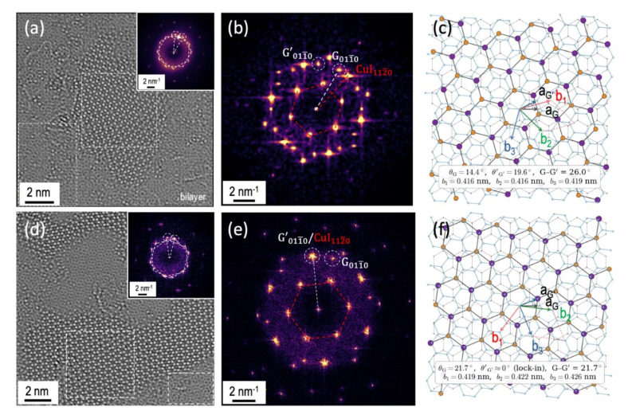 
Figure 4. Intercalation and growth of h-CuI within twisted bilayer graphene. (a) Cc/Cs- corrected HRTEM image (80 kV) of an h-CuI crystallite intercalated between two graphene layers after HI treatment at 40 °C. The inset FFT of the adjacent region reveals two hexagonal graphene lattices (G, G′) with a relative twist angle of 26.0° ± 1.0°, confirming the bilayer template. (b) FFT of the triple-layer heterostructure displaying reflections from both graphene layers (G, G′, white) and the intercalated h-CuI (red circles). (c) Structural schematic of the 40 °C configuration (Sample 3): h-CuI is sandwiched between G and G′ with epitaxial twist angles θ = 14.4° and θ′ = 19.6° (defined as the...

📷 Fig 5

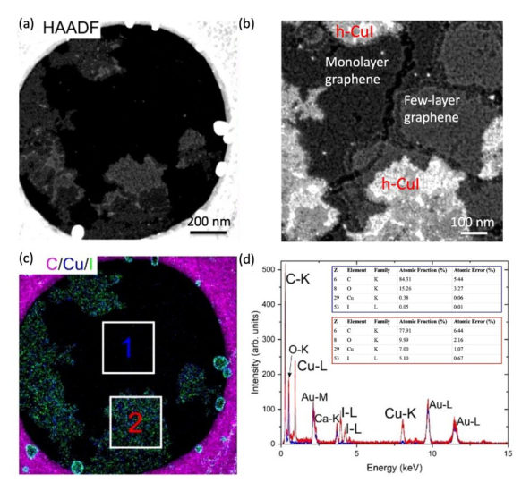 
Figure 5. Elemental and stoichiometric characterization via STEM-EDX. (a) HAADF-STEM overview of the graphene flakes spanning the holey-carbon support, with extended areas of h- CuI; the bright particles are residual gold contamination (Supporting Information, Section S1). (b) Magnified view of the area in (a) at higher contrast, showing h-CuI domains (labeled) on both monolayer and few-layer graphene regions. (c) Composite EDX map of carbon (magenta), copper (blue), and iodine (green); Cu and I co-localize in the crystal-covered regions, whereas in the crystal-free region 1 both fall by one to two orders of magnitude. (d) Representative EDX spectrum acquired from the h-CuI domain labeled...

**Summary.** This paper reports a novel, low-temperature vapor-phase method to grow metastable 2D hexagonal Copper(I) Iodide (h-CuI) directly onto graphene. The research combines synthesis, advanced microscopy, and DFT/AIMD calculations to confirm the structural integrity and electronic stabilization of this semiconductor/graphene hybrid. This establishes a promising platform for next-generation wide-bandgap electronic and optoelectronic devices.

**Why it may be interesting.** The study provides a detailed understanding of interfacial electronic and structural coupling between a semiconductor and a 2D material, which is crucial for designing novel heterostructures for optoelectronics.

Detailed structure

**Main problem.** The primary goal was to establish a bottom-up, low-temperature synthesis route for the metastable 2D hexagonal Copper(I) Iodide (h-CuI) directly onto chemically inert graphene templates.

**Main result.** The authors successfully synthesized and characterized epitaxial h-CuI domains on both monolayer and bilayer reduced oxo-graphene (r-oxo-G) using a vapor-phase process, confirming its stability and structure.

**Method.** The work combines experimental synthesis (HI vapor exposure and annealing) with advanced characterization (HRTEM, STEM-EDX) and theoretical modeling (DFT calculations and AIMD simulations).

**Model / system.** The system involves the epitaxial growth of h-CuI, a wide-bandgap semiconductor, on graphene substrates (SLG and BLG). Theoretical studies model the van der Waals adhesion energy and vibrational dynamics within these heterostructures.

**Key observables.** Atomic structure, local twist angles, lattice anisotropy, Cu:I stoichiometry, van der Waals adhesion energy ($	ext{E}_{	ext{vdW}}$), and Mean-Square Displacements ($	ext{MSD}_{xy}, 	ext{MSD}_z$).

**Important parameters / regimes.** Low synthesis temperatures ($180^\circ	ext{C}$), which prevent the formation of the bulk $\gamma$-phase; the stabilization energy provided by van der Waals adhesion.

**Assumptions / limitations.** The growth is limited by remaining interfacial adsorbates, and AIMD simulations are restricted to specific time segments.

**Figures summary.** Figures illustrate the two-step synthesis process, structural characterization of the graphene templates, and the resulting epitaxial growth of h-CuI on the graphene layers.

**Paper structure.** The paper details the synthesis method, presents structural characterization comparing growth on SLG vs. BLG, quantifies the adhesion energy using DFT, and analyzes the thermal stability and vibrational properties using AIMD simulations.

Abstract

Copper(I) iodide (CuI) is a wide-bandgap semiconductor crystallizing in the 3D $γ$-phase under ambient conditions; its layered van der Waals bulk phase $β$-CuI is stable only between 643 and 673 K. The two-dimensional (2D) h-CuI form has been obtained via liquid-phase exfoliation of mechanochemically prepared precursors and via encapsulation between graphene sheets, whereas bottom-up growth of 2D h-CuI on open surfaces has not yet been demonstrated. Here, we report a vapor-phase synthesis of h-CuI directly on low-defect, large-area monolayer and within bilayer reduced oxo-graphene (r-oxo-G) at low temperatures. Using a copper TEM grid as the solid-state precursor for copper, HI-vapor exposure at 40 $°$C initiates nucleation, while annealing at 180 $°$C promotes the growth of extended h-CuI domains. Aberration-corrected HRTEM resolves the atomic structure, local twist angles, and lattice anisotropy of the CuI/r-oxo-G nanohybrid, while STEM-EDX yields a Cu:I ratio consistent with 1:1. First-principles calculations show that van der Waals adhesion to graphene stabilizes the supported hexagonal layer. Under the presented low-temperature precursor conditions, pathways for nucleation of the $γ$-phase are not available, allowing the hexagonal phase to form selectively at the graphene interface. Ab initio molecular dynamics simulations show that the heterostructure retains its hexagonal lattice order at 600 K, including on an open monolayer graphene support. The lateral extent of the growth is limited mainly by remaining interfacial adsorbates. These results establish a route to metastable 2D h-CuI on a chemically inert graphene template, which may be useful for wide-bandgap electronic and optoelectronic devices.

[↑ back to top](#top)

### [Competition between vacancy creation and filling in defect-engineering of hBN](http://arxiv.org/abs/2609.11666v1)

**Authors:** Shrirang Chokappa, Manuel Laängle, Barbara Maria Mayer, Vladimir Zoba\vc, Jacob Madsen, Diana Propst, David Lamprecht, Philipp Irschik, Arixin Bo, Clara Kofler, Vinzent Hana, Fabian Kraft, Clemens Mangler, Lado Filipovic, Toma Susi, Jani Kotakoski  
**Type:** both · **Category:** other · **PDF:** <https://arxiv.org/pdf/2609.11666v1>  
**Analysis basis:** full PDF text, analyzed in chunks

📷 Fig 1

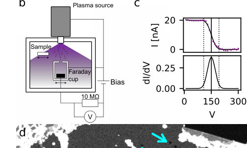 
FIG. 1. Sample cleaning, plasma set-up and beam energy pro- file. (a) MAADF-STEM image of heat treated (250◦C/180 min) freestanding, monolayer hBN before irradiation. The darkest con- trast corresponds to vacuum, the second-darkest to monolayer hBN, and all brighter features are hydrocarbon or metal contamination, or multilayers. (b) Schematic representation of the plasma irradiation setup and Faraday cup used to measure the energy profile. (c) Top: Background-subtracted ion current I (purple circles) and fitted beam energy profile (dI/dV ) (black line) as a function of the bias voltage (V ). Bottom: Absolute value of the derivative of the fit representing the energy spread. (d) MAADF-STEM...

📷 Fig 2

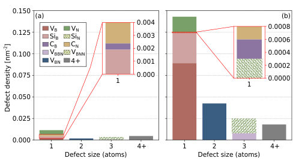 
FIG. 3. Defect density and distribution. (a) Intrinsic defect density as a function of the defect size (number of missing atoms). (b) Post- irradiation defect density as a function of the defect size (number of missing atoms). 11,500 nm2 of valid area was analysed before and 17,400 nm2 after the irradiation. The inset shows a magnified view of the defect density for impurity atom substitutions with the lowest densities.

📷 Fig 3

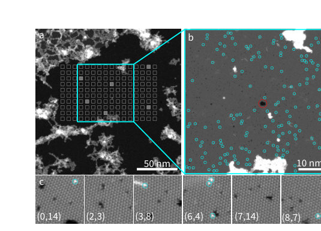 
FIG. 2. Semi-automated STEM imaging. (a) STEM-MAADF overview image of a freestanding, thermally cleaned, irradiated sam- ple region. The darkest contrast is clean, freestanding hBN and the brighter contrast corresponds to contamination or multilayer regions. The gray squares mark planned imaging positions within the user- defined region. (b) 64×64 nm2 image of a part of the imaged re- gion where vacancy filling by silicon atoms can be seen, indicated with cyan circles. The red circle indicates a pore created where the electron beam was parked after the semi-automatic imaging. (c) Ex- ample individual frames from the semi-automated image acquisition, with their corresponding grid coordinates...

📷 Fig 4

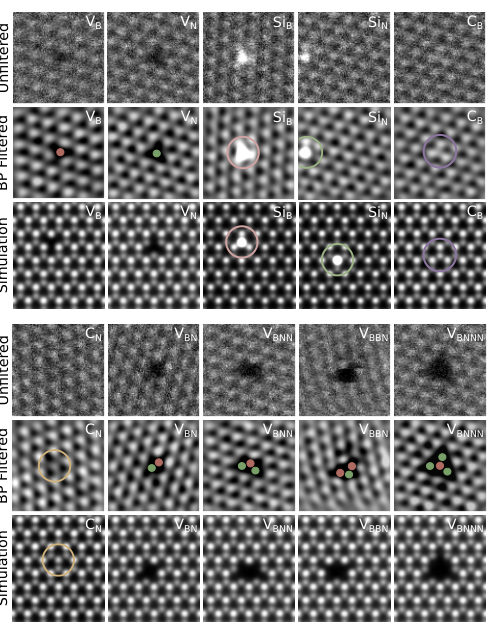 
FIG. 4. Example STEM-MAADF images and correspond- ing image simulations of typical defects acquired by the semi- automated imaging tool. Two sets of images displaying raw images on the top, band-pass (BP) filtered (Fourier-space mask around the first-order diffraction spots) in the middle, and image simulations on the bottom. In the filtered images, the vacancy-type defects have been denoted with a solid coloured circle that represents the missing atoms (boron in red and nitrogen in green), and substitutional atoms have been circled. The raw and filtered images have been intensity- adjusted to portray the defects better. The multislice image simula- tions were made with the open-source...

**Summary.** This research investigates the controlled defect engineering of monolayer hBN using ultra-low-energy ion irradiation to create quantum emitter sites. The authors report that experimental defect creation deviates significantly from theoretical predictions, highlighting the complex role of impurity-induced vacancy filling. The study is vital for advancing the reliable synthesis and characterization of defect-based quantum materials.

**Why it may be interesting.** The work directly addresses the material science challenges in creating quantum emitters by providing empirical data on defect control, which is crucial for understanding localized electronic states relevant to quantum physics.

Detailed structure

**Main problem.** The primary goal is to achieve selective creation and characterization of specific point defects in hexagonal boron nitride (hBN) for use as a host for quantum emitters, as a direct correlation between defect structure and quantum emission properties is currently lacking.

**Main result.** Experimental irradiation predominantly creates boron single vacancies (V_B), which contradicts previous simulation predictions, and the process is complicated by significant, uncontrolled vacancy filling by impurity atoms like Silicon.

**Method.** The study combines experimental techniques, including ultra-low-energy Ar+ ion irradiation and STEM imaging, with computational analysis using CNNs and molecular dynamics simulations.

**Model / system.** The physical system is monolayer hBN, which is prepared via electrochemical delamination and analyzed after controlled irradiation with low-energy noble gas ions. The analysis compares experimental defect statistics against theoretical predictions from collision simulations.

**Key observables.** Defect density and distribution (e.g., V_B, V_N, Si_B), mean intensity profiles across atomic arrangements, and displacement threshold energies.

**Important parameters / regimes.** Irradiation energy ($\approx 150$ eV), ion fluence ($0.8 \pm 0.2 	ext{ ions}\cdot	ext{nm}^{-2}$), and defect concentrations ($	ext{V}_{	ext{B}}$ vs. $	ext{V}_{	ext{N}}$).

**Assumptions / limitations.** The analysis relies on the assumption that observed intensity variations can be modeled by atomic displacement, electron beam interactions, and potential impurity substitution (e.g., Oxygen for Nitrogen).

**Figures summary.** Figures illustrate sample preparation, STEM imaging setups, defect density comparisons (pre- vs. post-irradiation), and simulation results comparing ideal, vibrating, and oxygen-substituted atomic arrangements.

**Paper structure.** The paper progresses from establishing the need for controlled defect creation in hBN, detailing the experimental irradiation and characterization methods, presenting quantitative comparisons between observed and simulated defect densities, and finally delving into advanced image analysis to interpret the nature of the observed defects.

Abstract

Hexagonal boron nitride (hBN) has recently become the focus of intense research as a material that can host quantum emitters. It is known that such emission is related to point defects, but in order to conclusively correlate specific defects to their spectra, having control over the defect creation mechanism is required. Here, we prepare freestanding, monolayer hBN samples and irradiate them with ultra-low-energy (150 eV) Ar+ ions. The samples are characterized before and after irradiation via scanning transmission electron microscopy to assess the defect density and distribution. Contrary to what analytical potential molecular dynamics simulations have predicted, we predominantly observe boron single vacancies after ion irradiation, followed by double vacancies at half the count. Moreover, we also observe that vacancy filling with Si and C impurity atoms plays a more significant role in the created defects than previously assumed, potentially posing a problem for selective creation of quantum emitters in hBN.

[↑ back to top](#top)

### [Emergence of spin-orbit coupling among spin, atomic orbital, and Bloch dynamics in Janus double-transition-metal MXenes](http://arxiv.org/abs/2609.10953v1)

**Authors:** Tetsuro Habe  
**Type:** theory · **Category:** other · **PDF:** <https://arxiv.org/pdf/2609.10953v1>  
**Analysis basis:** full PDF text, analyzed in chunks

📷 Fig 1

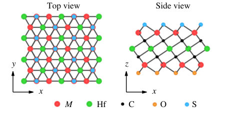 
FIG. 1. The schematics of Janus double-transition-metal MX- enes, M2HfC2OS for M =Mo and W. The left and right panels present the top view and side view of the monolayer. The z- axis is implemented the perpendicular direction to the layer plane.

📷 Fig 2

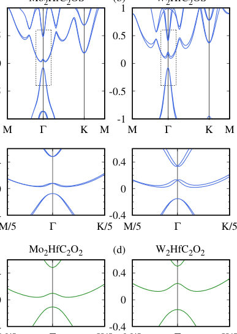 
FIG. 2. The band structures of Janus MXene, M2HfC2OS, and inversion-symmetric MXenes, M2HfC2O2. In (a) and (b), the bands of Mo2HfC2OS and W2HfC2OS are presented, respectively. The lower panels gives the dispersion within the boxes in the upper panels. In (c) and (d), those of Mo2HfC2O2 and W2HfC2O2 are presented, respectively.

📷 Fig 3

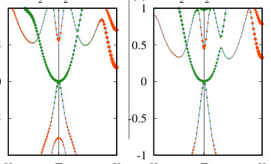 
FIG. 3. The first-principles band structures in the absence of the spin-orbit coupling. In (a) and (b), the spinless bands of Mo2HfC2OS and W2HfC2OS are presented, respectively. The size of symbol represents the amplitude of atomic orbitals in transition-metal elements.

📷 Fig 4

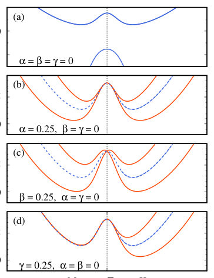 
FIG. 4. The band structures obtained utilizing the effective model in Eq. (1) with the spin-orbit coupling. In (a), only the LS coupling is present. In (b)-(c), the band structure is presented by the solid line with one of the three terms, HR soc, Hxy soc, and Hz soc, switched on.

📷 Fig 5

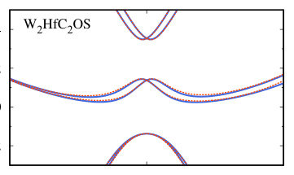 
FIG. 5. The band structures obtained using the effective model in Eq. (17) with the parameters in tableIII. In (a) and (b), those for Mo2HfC2OS and W2HfC2OS (solid-lines) are presented, respectively, with the first-principles bands (dashed-lines).

**Summary.** This theoretical study investigates how spin-orbit coupling (SOC) manifests in Janus MXenes, revealing a complex correlation between spin, orbital, and Bloch dynamics. The key finding is the emergence of a unique, trigonally patterned spin-momentum locking that deviates significantly from conventional SOC models. This suggests these materials are promising platforms for advanced spintronic applications.

**Why it may be interesting.** The finding of a novel, trigonally locked spin-momentum coupling mechanism, distinct from standard symmetries, provides a new platform for engineering spin-related phenomena in 2D materials, which is highly relevant for advanced spintronics.

Detailed structure

**Main problem.** The study investigates the emergence of spin-orbit coupling (SOC) and its resulting correlation among electronic spin, orbital, and Bloch dynamics in specific Janus double-transition-metal MXenes.

**Main result.** The SOC leads to a unique, trigonally alternating spin-momentum locking pattern with the spin axis perpendicular to the layer plane, which cannot be described by conventional SOC forms like Rashba or Dresselhaus couplings.

**Method.** The authors employed first-principles DFT calculations combined with the development and analysis of a reduced, effective three-band model Hamiltonian near the $\Gamma$ point.

**Model / system.** The physical system is the Janus double-transition-metal MXenes ($	ext{Mo}_2	ext{HfC}_2	ext{OS}$ and $	ext{W}_2	ext{HfC}_2	ext{OS}$). The model involves deriving and diagonalizing an effective Hamiltonian that incorporates multiple SOC terms ($	ext{H}_{	ext{LS}}^{	ext{soc}}$, $	ext{H}_{	ext{R}}^{	ext{soc}}$, etc.) to capture the complex spin-orbital coupling.

**Key observables.** Spin-split band structure, staggered spin configuration with a trigonal pattern, and the spin polarization angle ($\theta$) as a function of momentum ($k$).

**Important parameters / regimes.** The ratio of coupling constants ($\rho$) is crucial for accurate polarization, and the analysis is performed under the low-energy and small wave number condition.

**Assumptions / limitations.** The analysis relies on developing an effective model Hamiltonian parameterized by first-principles DFT results, and the initial functional choice (non-hybrid) was noted to underestimate the band gap.

**Figures summary.** Figures compare band structures calculated with and without SOC, showing the characteristic spin-split dispersion and the trigonal anisotropy around the $\Gamma$ point. Another figure illustrates the spin angle ($\theta$) dependence on momentum.

**Paper structure.** The paper progresses from initial DFT calculations establishing the SOC effects in Janus MXenes, to developing a comprehensive effective Hamiltonian that includes multiple coupling terms, and finally analyzing the resulting unique spin-momentum locking and polarization patterns.

Abstract

We found a spin-orbit coupling to cause a simultaneous correlation among three degrees of freedom, the electronic spin, orbital, and Bloch dynamics in an investigation into the electronic structure of Janus double-transition-metal MXenes, Mo$_2$HfC$_2$OS and W$_2$HfC$_2$OS. In this paper, it is also revealed that the spin-orbit coupling causes a staggered spin configuration with a trigonal pattern around the $Γ$ point near the insulating gap. We developed a reduced Hamiltonian describing the electronic states and show that the spin-orbit coupling cannot be equated with conventional forms for a single electron in solids, LS, Rashba, and Dresselhaus couplings, even in the approximation under the low-energy and small wave number condition. Because of the intrinsic shape of the conduction band, a trigonally alternating spin-momentum locking emerges with the spin axis perpendicular to the layer plane. The theoretical analysis shows that these Janus materials can provide a platform for exploring the spin-related phenomena due to the trigonal spin-momentum locking other than Rashba and Dresselhaus types.

[↑ back to top](#top)

### [High-fidelity k$\cdot$p representations of first-principles electronic band structures through covariant renormalization](http://arxiv.org/abs/2609.11861v1)

**Authors:** Kristian Berland  
**Type:** theory · **Category:** other · **PDF:** <https://arxiv.org/pdf/2609.11861v1>  
**Analysis basis:** full PDF text, analyzed in chunks

📷 Fig 1

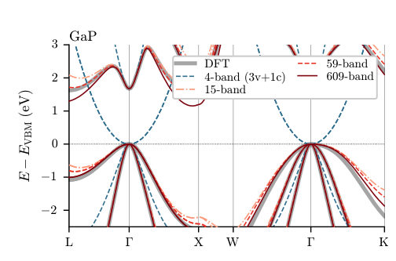 
FIG. 1. Bare k·p band structures of GaP plotted against the DFT reference bands. The 4-band model, includes the valence bands triplet and one conduction band, the rest starts from the lowest state.

📷 Fig 2

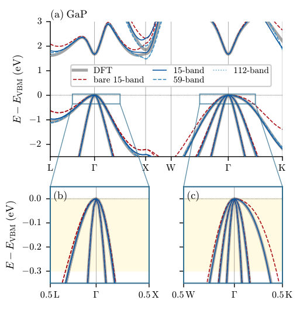 
FIG. 3. Renormalized k·p bands of GaP compared with the bare 15-band model. The full path (a) and magnified (b), (c) close to VBM at the two Γ passages. The shade indicates the 0.3-eV energy window of the fit. Only 15-band models are displayed in (b) and (c).

📷 Fig 3

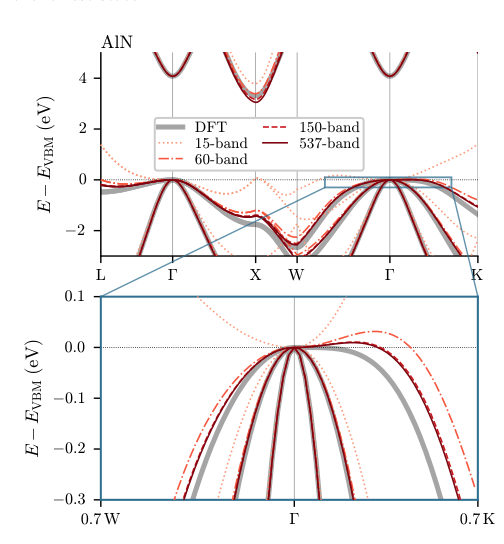 
FIG. 2. Bare k·p vs DFT for zincblende AlN band structures, with a zoom (lower panel), extending 70% of the way out to W and to K about the Γ valence-band maximum.

📷 Fig 4

 
Figure 3 compares k·p renormalized models with the bare 15-band model and the DFT reference. The renor- malized models appear virtually indistinguishable from the DFT within the energy-range used for fitting. Figure 4 and Table I provides the corresponding val- ues of the loss function, Eq. (10). They reveal that the renormalized models, unlike the bare models, continue to improve with number of bands used in the basis. Note that the specific number of bands used is selected in part to ensure a certain energy distance between the degener- ate multiplets. Once an accurate model is constructed, it can be eval- uated on meshes far denser than the reference calcula-

📷 Fig 5

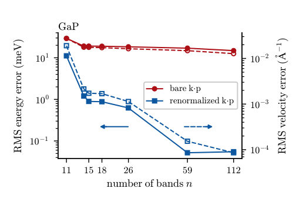 
FIG. 4. RMS errors of k·p models within the fitting regime. The left vertical axis indicate energy errors, while the right indicate velocity errors (as indicated by the arrows).

**Summary.** This paper presents a novel covariant renormalization technique to dramatically improve the accuracy of k.p models used to calculate electronic band structures from first-principles data. By renormalizing the momentum matrix spectra, the method overcomes the convergence and non-locality issues of traditional k.p approaches. It successfully reproduces band structures for semiconductors like GaP and AlN, even generalizing to systems with strong spin-orbit coupling.

**Why it may be interesting.** While focused on solid-state physics, the renormalization technique itself is a sophisticated parameter fitting and model reduction technique applicable to any physical system described by an effective Hamiltonian where high-fidelity data is available.

Detailed structure

**Main problem.** The standard k.p method for electronic band structure suffers from slow convergence with the number of bands and inaccuracies when the underlying Hamiltonian is nonlocal.

**Main result.** The authors introduce a covariant renormalization scheme that significantly improves the accuracy of k.p models, allowing for the reproduction of band structures and density of states with high fidelity.

**Method.** The core method involves renormalizing the eigenvalue spectra of the Hermitian momentum matrices using a loss function that balances energy and velocity errors against DFT reference data.

**Model / system.** The study applies to the electronic band structures of various semiconductors, including GaP, AlN (zincblende and wurtzite), and PbTe, covering systems with and without strong spin-orbit coupling.

**Key observables.** Band energies, band velocities, Density of States (DOS), and hole conductivity.

**Important parameters / regimes.** The required number of bands (e.g., 15 to 66 bands for AlN) and the fitting energy window are critical parameters.

**Assumptions / limitations.** The renormalization process assumes that scaling the gauge-invariant eigenvalue spectra preserves degeneracies and crystal symmetry, and that the model can be accurately described by a renormalized k.p Hamiltonian.

**Figures summary.** Figures compare bare vs. renormalized k.p models across different band counts for GaP and AlN, demonstrating improved agreement with DFT. They also show the generalization to SOC systems like PbTe and the ability to generate full-zone models.

**Paper structure.** The paper first establishes the limitations of raw k.p models, then details the covariant renormalization scheme, validates it on multiple materials (GaP, AlN, PbTe), and finally demonstrates its utility in generating compact, full-zone models for transport calculations.

Abstract

The k$\cdot$p method can be applied directly to first-principles energies and momentum matrix elements, but the resulting models converge slowly with the number of bands and are inexact wherever the underlying Hamiltonian is nonlocal. We show that both limitations can be largely removed by renormalizing the eigenvalue spectra of the Hermitian momentum matrices. These spectra are gauge invariant, and are identical for symmetry-related Cartesian components, hence scaling the recurring magnitudes provides a modest set of parameters that preserves degeneracies and crystal symmetry without needing to construct a symmetry-adapted basis. We choose to renormalize the models against reference eigenvalues and band velocities on rays out of a high-symmetry point. For GaP, a 15-band model can reproduce the band structure in the near-gap reference regions within a few meV. For zincblende and wurtzite AlN, similar accuracy requires 30- or 66-band models, which in the case of zincblende is traced to the strong warping in the [110] direction. The scheme readily generalizes to rocksalt PbTe, which includes spin-orbit coupling, and has L-centered valence and conduction band extrema. Further, we demonstrate, for GaP, how compact four-band Hamiltonians can be obtained by downfolding within the same renormalization scheme. Moreover, by changing the fitting regime to encompass the entire Brillouin zone, the scheme can be used to generate full-zone models that reproduce the density of states. The practical utility is illustrated with a 59-band k.p model for GaP, which can be evaluated on meshes far denser than the reference calculation, that in turn can be used both to resolve fine features in the density of states and to compute the hole conductivity at low temperature.

[↑ back to top](#top)

### [In-plane magnetic field control of anomalous Hall response enabled by magnetic anisotropy engineering](http://arxiv.org/abs/2609.11017v1)

**Authors:** J. C. Rodriguez E., E. De Biasi, J. I. Facio, D. Salomoni, S. Auffret, R. C. Sousa, I. L. Prejbeanu, A. Bruchhausen, J. Curiale, L. Avilés-Félix  
**Type:** experiment · **Category:** other · **PDF:** <https://arxiv.org/pdf/2609.11017v1>  
**Analysis basis:** full PDF text, analyzed in chunks

📷 Fig 1

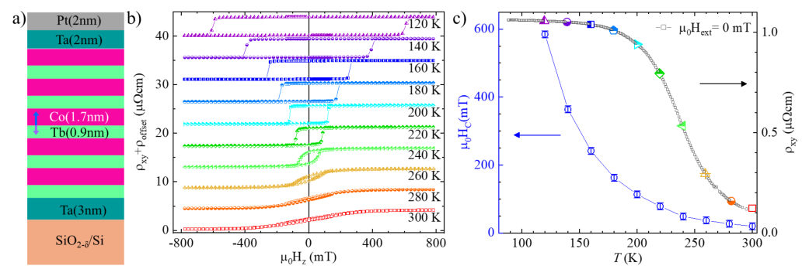 
FIG. 1. Sample structure and magneto-transport response in Tb/Co multilayers. a) Schematic of TbCo(0.9) ferrimagnetic multilayers. b) The temperature-evolution of the transverse (ρxy) resistivity as a function of magnetic field in out-of-plane (OOP) field sweep for the TbCo(0.9) multilayers Hall bar. c) The temperature dependence of the transverse (ρxy) resistivity (black open squares) and the coercive fields (blue open circles) extracted from the different measurement shown in panel b) for the same sample. The ρxy for each temperature shown in panel b) is also highlighted.

📷 Fig 2

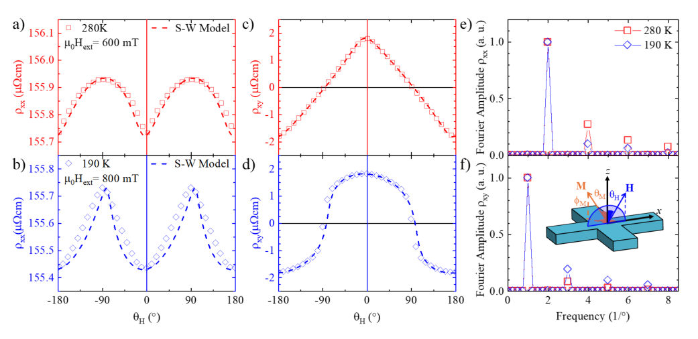 
FIG. 2. Longitudinal (ρxx) and transverse (ρxy) resistivities as function of the polar angle of the external magnetic field (θH). Panels a) and c) show the longitudinal and transverse resistivities, respectively, as a function of the θH measured at 280 K and 600 mT. Panels b) and d) show the corresponding resistivities measured at 190 K and 800 mT, respectively. Symbols represent the experimental data, while dashed lines correspond to simulations based on the S–W model. e) Normalized Fourier amplitude of the angular dependence of ρxx acquired at 280 K and 190 K shown in panels a) and c). f) Normalized Fourier amplitude of the angular dependence of ρxy acquired at 280 K and 190 K shown in...

📷 Fig 3

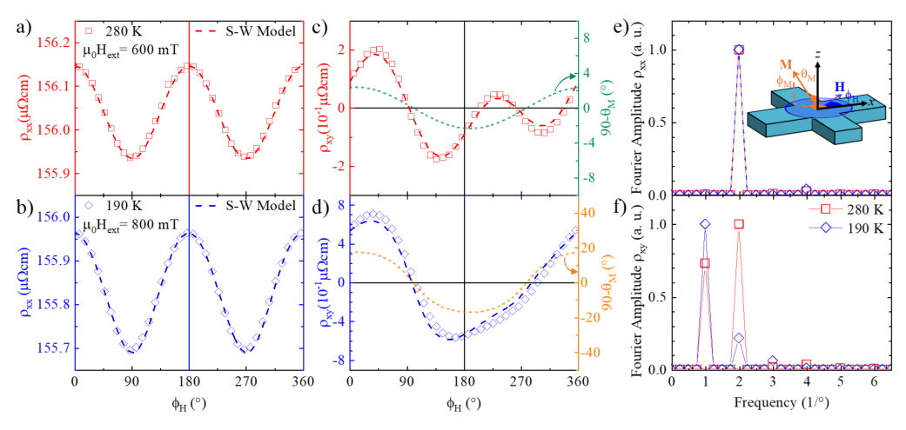 
FIG. 3. Longitudinal (ρxx) and transverse (ρxy) resistivity as a function of in-plane field orientation. Panels a) and c) show the longitudi- nal and transverse resistivities, respectively, as a function of the θH measured at 280 K and 600 mT. Panels b) and d) show the corresponding resistivities measured at 190 K and 800 mT, respectively. Symbols represent the experimental data, while dashed lines correspond to simu- lations based on the S–W model. The short dash lines shown in panels c) and d) correspond to the deviation of the the equilibrium polar angle θM from the equatorial plane obtained by the S-W model as the in-plane magnetic field rotates. e) Normalized Fourier amplitude of the...

**Summary.** This work reports on magnetotransport studies of Tb/Co multilayers where the magnetic anisotropy has been engineered to be tilted. The key finding is that this built-in tilt breaks symmetry, enabling the anomalous Hall effect to be controlled by applying an in-plane magnetic field. This establishes the material as a promising platform for advanced Hall effect sensors.

**Why it may be interesting.** While focused on condensed matter magnetism, the concept of using engineered anisotropy to control symmetry-breaking mechanisms that govern transport responses (like AHE) has parallels in controlling quantum states or coupling strengths in quantum devices.

Detailed structure

**Main problem.** The study aims to control the anomalous Hall response in magnetic multilayers using an in-plane magnetic field by engineering the magnetic anisotropy.

**Main result.** The anomalous Hall effect observed under an in-plane field originates from the tilt of the uniaxial anisotropy axis, which breaks symmetry and allows for in-plane field control over the out-of-plane AHE sign.

**Method.** Magnetotransport measurements of anomalous Hall resistivity ($
ho_{xy}$) and longitudinal resistivity ($
ho_{xx}$) are performed as a function of external magnetic field angle and temperature.

**Model / system.** The physical system is a ferrimagnetic [Tb/Co] multilayer grown with a Tb thickness gradient, inducing a wedge-shaped tilt in the uniaxial anisotropy axis. The analysis is supported by a simplified macrospin model.

**Key observables.** Anomalous Hall resistivity ($
ho_{xy}$), longitudinal resistivity ($
ho_{xx}$), coercive field ($H_C$), and angular dependence of transport coefficients.

**Important parameters / regimes.** Temperature range (80 K to 300 K), in-plane field orientation ($\phi_H$), and the degree of anisotropy tilt.

**Assumptions / limitations.** The analysis relies on a simplified macrospin model, and the AHE is assumed to be dominated by the Co sublattice in the measured temperature window.

**Figures summary.** Figures show $
ho_{xy}$ loops revealing spin reorientation transitions, and angular dependence measurements ($
ho_{xx}, 
ho_{xy}$ vs. angle) demonstrating the influence of the tilted anisotropy.

**Paper structure.** The paper systematically investigates magnetotransport responses ($
ho_{xx}, 
ho_{xy}$) under both out-of-plane and in-plane field rotations, using angular dependence analysis and comparison with a macrospin model to pinpoint the role of the anisotropy tilt.

Abstract

Engineering magnetic anisotropy provides a powerful route to control magnetization orientation and unlock emerging functionalities in opto-spintronic and current-driven devices. Beyond its role in magnetization reversal, the effective anisotropy can strongly influence the magnetotransport response, offering an additional degree of freedom to tune new device functionalities. In this work, we report a magnetotransport study of a ferrimagnetic [Tb/Co]$_{\times 5}$ multilayer grown with a Tb thickness gradient, whose wedge-shaped tilts the uniaxial anisotropy axis slightly away from the film normal. Anomalous Hall resistivity measurements from 80 K to 300 K reveal a spin reorientation transition, while the angular dependence of the magnetotransport responses exposes the crucial role of the tilted anisotropy. A simplified macrospin model reproduces the full angular response across the transition and shows that the observed anomalous Hall effect when the in-plane magnetic field is applied originates from the tilt of the uniaxial anisotropy axis, which supplies a built-in symmetry-breaking mechanism, enabling in-plane field control over the out-of-plane anomalous Hall response, sign included. These findings establish tilted magnetic anisotropy as a promising route toward Hall effect-based sensor applications and highlight Tb/Co multilayers as a versatile platform for anisotropy-engineered spintronic devices.

[↑ back to top](#top)

### [Self-similar vector solitons for the coupled higher-order nonlinear Schrodinger equations in inhomogeneous optical fibers](http://arxiv.org/abs/2609.11096v1)

**Authors:** Houria Triki, Vladimir I. Kruglov  
**Type:** theory · **Category:** other · **PDF:** <https://arxiv.org/pdf/2609.11096v1>  
**Analysis basis:** full PDF text, analyzed in chunks

📷 Fig 1

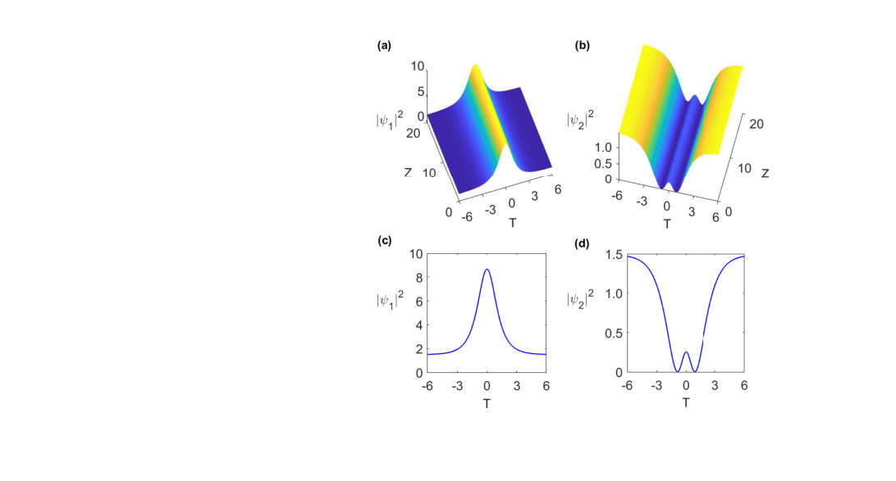 
FIG. 1. Evolution of intensity wave profiles of the soliton solutions (27) and (28) with parameters α = −0.02, σ = 1, β2 = −0.471, β3 = 0.6, γ = 1.26, q = 0.01, η0 = 0 (a) bright soliton solution (27) and (b) W-shaped soliton solution (28). Intensity profiles of (c) bright soliton solution (27) and (d) W-shaped soliton solution (28).

📷 Fig 2

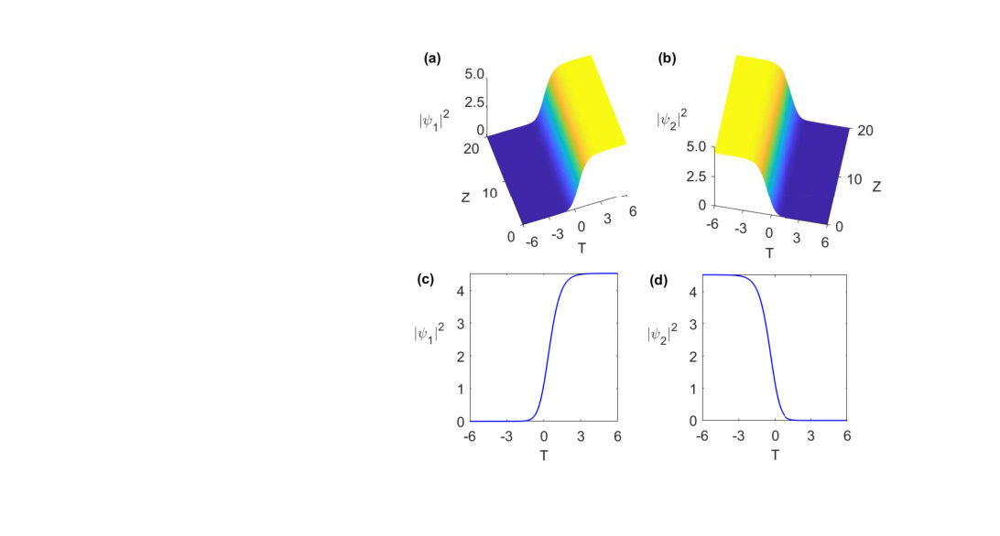 
FIG. 2. Evolution of intensity wave profiles of the soliton solutions (35) and (36) with parameters α = 0.04, σ = 1, β2 = −0.471, β3 = 0.6, γ = −0.355, q = 0.01, η0 = 0 (a) kink soliton solution (35) and (b) antikink soliton solution (36). Intensity profiles of (c) kink soliton solution (35) and (d) antikink soliton solution (36).

📷 Fig 3

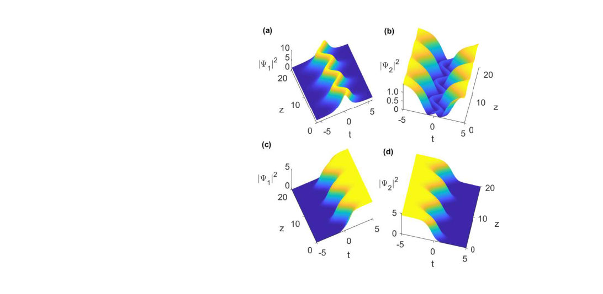 
FIG. 3. Evolution of vector self-similar solitons with parameters D3(z) = D0 cos(hz), Γ(z) = Γ0, D0 = 3.31, h = 1, k = 1, ρ0 = 1, p = 1, Γ0 = 0, η0 = t0 = 0 (a) self-similar bright wave (57) (b) self-similar W-shaped wave (58) (c) self-similar kink wave (61) (d) self-similar antikink wave (62). Other parameters are same as those in Figs. 1 and 2, respectively.

📷 Fig 4

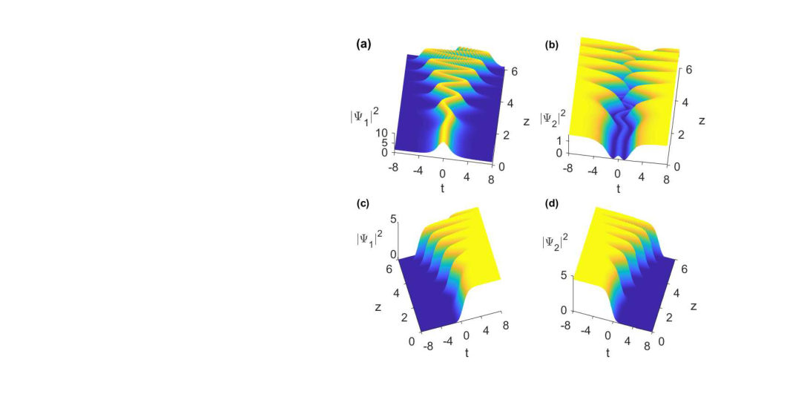 
FIG. 4. Evolution of vector self-similar solitons with parameters D3(z) = D0[z cos(z2)−z3 sin(z2)], Γ(z) = Γ0, D0 = −1, k = 1, ρ0 = 1, p = 1, Γ0 = 0, η0 = t0 = 0 (a) self-similar bright wave (57) (b) self-similar W-shaped wave (58) (c) self-similar kink wave (61) (d) self-similar antikink wave (62). Other parameters are same as those in Figs. 1 and 2, respectively.

📷 Fig 5

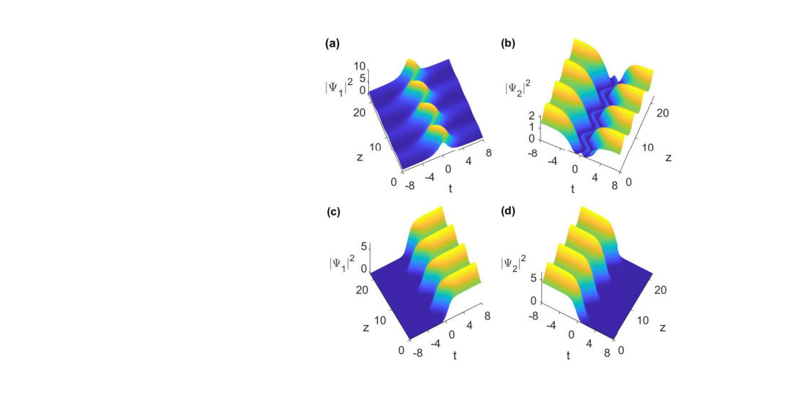 
FIG. 5. Evolution of vector self-similar solitons with parameters D3(z) = D0 cos(hz), Γ(z) = Γ0sin(z), D0 = 3.31, h = 1, Γ0 = 0.1, k = 1, ρ0 = 1, p = 1, η0 = t0 = 0 (a) self-similar bright wave (57) (b) self-similar W-shaped wave (58) (c) self-similar kink wave (61) (d) self-similar antikink wave (62). Other parameters are same as those in Figs. 1 and 2, respectively.

**Summary.** This theoretical work analyzes the existence of self-similar vector solitons in optical fibers whose properties vary along the propagation direction. By solving the coupled higher-order nonlinear Schrödinger equations using similarity transformations, the authors demonstrate that the pulse dynamics can be precisely controlled by tuning the distributed dispersion and gain/loss parameters. This provides a powerful framework for managing light pulses in complex, real-world optical media.

**Why it may be interesting.** The mathematical techniques used (similarity transformations on variable-coefficient PDEs) are highly relevant to modeling complex, non-uniform physical systems encountered in quantum optics and nonlinear wave physics.

Detailed structure

**Main problem.** The paper aims to prove the existence and analyze the dynamics of self-similar vector solitons propagating in inhomogeneous optical fibers.

**Main result.** Two types of self-similar vector solitons—bright-W-shaped and kink-antikink waveforms—were found, demonstrating that pulse control can be achieved by manipulating the distributed third-order dispersion and gain/loss parameters.

**Method.** The authors employed the similarity transformation method to reduce the variable-coefficient coupled Higher-Order Nonlinear Schrödinger equations into solvable forms, allowing for the derivation of exact analytical solutions.

**Model / system.** The system models light pulse propagation in inhomogeneous optical fibers, governed by coupled higher-order nonlinear Schrödinger (HNLS) equations that incorporate varying second/third-order dispersions, self/cross-phase modulation, and gain/loss effects.

**Key observables.** Bright-W-shaped and kink-antikink soliton waveforms, pulse intensity profiles, and the evolution of the pulse shape and trajectory.

**Important parameters / regimes.** Distributed third-order dispersion parameter ($D_3(z)$) and the gain/loss coefficient, which are key factors controlling the pulse shape and intensity, respectively.

**Assumptions / limitations.** The analysis relies on using specific ansatz solutions and making assumptions about the functional form of the variable coefficients (e.g., periodic or exponential profiles).

**Figures summary.** Figures illustrate the intensity evolution of the found soliton solutions, showing profiles for bright/W-shaped solitons and kink/antikink solitons under various parameter settings.

**Paper structure.** The paper introduces the coupled HNLS equations, applies similarity transformations to handle variable coefficients, derives general self-similar wave solutions, and then analyzes the dynamics under specific parameter variations (periodic or exponential dispersion/loss).

Abstract

We prove the existence of two kinds of self-similar vector solitons in an inhomogeneous optical fiber medium, where light propagation is governed by a pair of coupled higher-order nonlinear Schrodinger equations with varying second- and third-order dispersions, self- and cross-phase modulation non linearities, self-steepening, and linear gain/loss effects. The newly found self-similar waves comprise bright-W-shaped and kink-antikink waveforms with nonvanishing amplitudes. As a practical exam ple, we discuss the propagation dynamics of these soliton structures in a periodically distributed fiber system as well as an exponential dispersion-decreasing fiber. The results demonstrate that the parameter functions of gain/loss and third-order dispersion serve as a key factor in determining the nonlinear dynamics of self-similar vector solitons. In particular, we find that precise control over the shape and dynamic evolution of self-similar pulses can be achieved through a proper choice of the distributed third-order dispersion parameter, while the gain/loss coefficient controls their intensity.

[↑ back to top](#top)

