
# arxiv digest (quant-ph + cond-mat) — 2026-09-17

*135 papers · 23 relevant · 1 highlighted*

## 🔥 Most relevant (23)

*Every paper with at least one nonzero topic score, sorted by best-matching score. 🔥 marks scores ≥4/5. Click the title to jump to the full entry below; click [arXiv] to open the paper page. `(secondary)` marks papers from de-prioritized cond-mat archives.*

Show 23 relevant papers

- [Exact group invariant scar towers in two dimensional gauge theories](#paper-2609.16132) [[arXiv]](http://arxiv.org/abs/2609.16132v1) — 🔥 `scars & prethermalization` **5/5** · `non-equilibrium universality` **3/5** · `Keldysh / 2PI / non-Gaussian methods` **1/5** · `analog quantum simulation` **1/5** · `driven-dissipative phase transition` **1/5** · `methods for driven-dissipative` **1/5**
- [Indistinguishability of single Raman photons from single atoms](#paper-2609.17009) [[arXiv]](http://arxiv.org/abs/2609.17009v1) — 🔥 `interference shaping light` **4/5** · 🔥 `methods for driven-dissipative` **4/5** · `correlated / nonlocal dissipation` **3/5** · `quantum measurements` **3/5** · `Full counting statistics` **1/5** · `analog quantum simulation` **1/5** · `driven-dissipative phase transition` **1/5** · `quantum optics experiment` **1/5**
- [Large-scale quantum simulations of dissipative spin-1/2 Heisenberg chains](#paper-2609.16108) [[arXiv]](http://arxiv.org/abs/2609.16108v1) — 🔥 `driven-dissipative phase transition` **4/5** · 🔥 `methods for driven-dissipative` **4/5** · `analog quantum simulation` **3/5** · `non-equilibrium universality` **3/5** · `Keldysh / 2PI / non-Gaussian methods` **2/5** · `correlated / nonlocal dissipation` **1/5** · `quantum measurements` **1/5**
- [The Transient Counting Statistics of Autonomous Quantum Clocks](#paper-2609.16121) [[arXiv]](http://arxiv.org/abs/2609.16121v1) — 🔥 `Full counting statistics` **4/5** · `quantum measurements` **3/5** · `Keldysh / 2PI / non-Gaussian methods` **2/5** · `Tavis-Cummings & cavity-many-emitter` **2/5** · `correlated / nonlocal dissipation` **2/5** · `methods for driven-dissipative` **2/5** · `driven-dissipative phase transition` **1/5** · `non-equilibrium universality` **1/5** · `superradiant laser` **1/5**
- [Diffusivity in Dissipative Quantum Transport from an Exactly Solvable Krylov Chain](#paper-2609.16559) [[arXiv]](http://arxiv.org/abs/2609.16559v1) — 🔥 `methods for driven-dissipative` **4/5** · `Keldysh / 2PI / non-Gaussian methods` **3/5** · `driven-dissipative phase transition` **3/5** · `non-equilibrium universality` **2/5** · `analog quantum simulation` **1/5** · `correlated / nonlocal dissipation` **1/5** · `quantum measurements` **1/5** · `scars & prethermalization` **1/5**
- [Noise-induced classical phases in optimally-unraveled random quantum circuits](#paper-2609.16160) [[arXiv]](http://arxiv.org/abs/2609.16160v1) — 🔥 `methods for driven-dissipative` **4/5** · 🔥 `quantum measurements` **4/5** · `driven-dissipative phase transition` **3/5** · `non-equilibrium universality` **2/5** · `Keldysh / 2PI / non-Gaussian methods` **1/5** · `analog quantum simulation` **1/5** · `correlated / nonlocal dissipation` **1/5**
- [Partial projected ensembles reveal slow tilt-constrained information spreading](#paper-2609.16544) [[arXiv]](http://arxiv.org/abs/2609.16544v1) — 🔥 `scars & prethermalization` **4/5** · `non-equilibrium universality` **3/5** · `quantum measurements` **3/5** · `analog quantum simulation` **2/5** · `methods for driven-dissipative` **2/5** · `Frenkel-Kontorova` **1/5** · `driven-dissipative phase transition` **1/5**
- [Phase-stable voltage bias for Josephson photonics devices](#paper-2609.17165) [[arXiv]](http://arxiv.org/abs/2609.17165v1) — 🔥 `quantum optics experiment` **4/5** · `driven-dissipative phase transition` **3/5** · `methods for driven-dissipative` **2/5** · `quantum measurements` **2/5** · `Keldysh / 2PI / non-Gaussian methods` **1/5** · `QC/QI experiment` **1/5** · `analog quantum simulation` **1/5** · `interference shaping light` **1/5** · `non-equilibrium universality` **1/5**
- [qdmag: A Python package for simulating nonequilibrium magnetization of molecules using quantum master equations](#paper-2609.16352) [[arXiv]](http://arxiv.org/abs/2609.16352v1) — 🔥 `methods for driven-dissipative` **4/5** · `driven-dissipative phase transition` **3/5** · `Keldysh / 2PI / non-Gaussian methods` **2/5** · `non-equilibrium universality` **2/5** · `quantum measurements` **2/5** · `analog quantum simulation` **1/5** · `correlated / nonlocal dissipation` **1/5** · `scars & prethermalization` **1/5**
- [Query-optimal quantum simulation of Lindblad evolution](#paper-2609.17490) [[arXiv]](http://arxiv.org/abs/2609.17490v1) — 🔥 `methods for driven-dissipative` **4/5** · `correlated / nonlocal dissipation` **3/5** · `driven-dissipative phase transition` **3/5** · `analog quantum simulation` **2/5** · `non-equilibrium universality` **2/5** · `Keldysh / 2PI / non-Gaussian methods` **1/5** · `quantum measurements` **1/5**
- [Direct Observation of Dipolar-Driven Anisotropic Quantum Projection Noise in a Solid-State Spin Ensemble](#paper-2609.16106) [[arXiv]](http://arxiv.org/abs/2609.16106v1) — 🔥 `QC/QI experiment` **4/5** · `analog quantum simulation` **3/5** · `quantum measurements` **3/5** · `Full counting statistics` **1/5** · `correlated / nonlocal dissipation` **1/5** · `quantum optics experiment` **1/5**
- [Quantum Simulation of Two-Dimensional Free Dirac Hamiltonian in Multimode Circuit QED](#paper-2609.16628) [[arXiv]](http://arxiv.org/abs/2609.16628v1) — 🔥 `analog quantum simulation` **4/5** · `quantum optics experiment` **3/5** · `Tavis-Cummings & cavity-many-emitter` **2/5** · `QC/QI experiment` **1/5** · `driven-dissipative phase transition` **1/5** · `methods for driven-dissipative` **1/5** · `quantum measurements` **1/5**
- [Analytical solutions to the non-equilibrium Green's functions in large-$q$ SYK models](#paper-2609.16438) [[arXiv]](http://arxiv.org/abs/2609.16438v1) — 🔥 `Keldysh / 2PI / non-Gaussian methods` **4/5** · `non-equilibrium universality` **3/5** · `scars & prethermalization` **3/5** · `methods for driven-dissipative` **2/5**
- [Floquet Dressing and Bath Spectral Effects on the Geometric Phase of a Driven Dissipative Qubit](#paper-2609.16609) [[arXiv]](http://arxiv.org/abs/2609.16609v1) — 🔥 `methods for driven-dissipative` **4/5** · `driven-dissipative phase transition` **3/5** · `correlated / nonlocal dissipation` **1/5** · `non-equilibrium universality` **1/5** · `quantum measurements` **1/5**
- [Generation of pure spin currents via nonadiabatic quantum pumping in an antiferromagnetic chain](#paper-2609.16819) [[arXiv]](http://arxiv.org/abs/2609.16819v1) — 🔥 `Keldysh / 2PI / non-Gaussian methods` **4/5** · `methods for driven-dissipative` **2/5** · `Frenkel-Kontorova` **1/5** · `driven-dissipative phase transition` **1/5**
- [In-Situ Quantum Optical Measurement for Colloidal Quantum Dots Confined in an Optical Trap](#paper-2609.16692) [[arXiv]](http://arxiv.org/abs/2609.16692v1) — 🔥 `quantum measurements` **4/5** · 🔥 `quantum optics experiment` **4/5**
- [Room-temperature 1/3 suppression of diffusive shot noise](#paper-2609.16783) [[arXiv]](http://arxiv.org/abs/2609.16783v1) `(secondary)` — 🔥 `Full counting statistics` **4/5** · `Keldysh / 2PI / non-Gaussian methods` **1/5** · `methods for driven-dissipative` **1/5** · `quantum measurements` **1/5**
- [Schwinger-Keldysh effective actions for non-hydrodynamic poles and branch cuts](#paper-2609.16164) [[arXiv]](http://arxiv.org/abs/2609.16164v1) — 🔥 `Keldysh / 2PI / non-Gaussian methods` **4/5** · `correlated / nonlocal dissipation` **1/5** · `driven-dissipative phase transition` **1/5** · `non-equilibrium universality` **1/5**
- [Forbidden Subspaces in Quantum State Smoothing](#paper-2609.17307) [[arXiv]](http://arxiv.org/abs/2609.17307v1) — 🔥 `quantum measurements` **4/5** · `Keldysh / 2PI / non-Gaussian methods` **1/5** · `driven-dissipative phase transition` **1/5**
- [Two-Dimensional Materials toward CMOS-Compatible Scalable Quantum Hardware](#paper-2609.16172) [[arXiv]](http://arxiv.org/abs/2609.16172v1) — 🔥 `QC/QI experiment` **4/5** · `analog quantum simulation` **1/5** · `quantum measurements` **1/5**
- [Adaptive detection of Rabi signals under composite hypotheses](#paper-2609.16119) [[arXiv]](http://arxiv.org/abs/2609.16119v1) — 🔥 `quantum measurements` **4/5**
- [Large-scale NMR simulation on a trapped-ion quantum computer](#paper-2609.17102) [[arXiv]](http://arxiv.org/abs/2609.17102v1) — 🔥 `QC/QI experiment` **4/5**
- [Stable three-dimensional lattice solitons in spin-orbit-coupled Bose-Einstein condensates](#paper-2609.17092) [[arXiv]](http://arxiv.org/abs/2609.17092v1) — 🔥 `analog quantum simulation` **4/5**

## ⭐ Highlighted (1)

*Papers by authors on your watch list. Click the title to jump to the full entry below; click [arXiv] to open the paper page.*

Show 1 highlighted papers

- ⭐ [Error-corrected function estimation advantage in multiparameter Hamiltonians](#paper-2609.16226) [[arXiv]](http://arxiv.org/abs/2609.16226v1) — Alexey V. Gorshkov

## All papers (98, sorted by relevance)

*Papers from quant-ph and your primary cond-mat archives (quant-gas, stat-mech, str-el, dis-nn). Highlighted papers (⭐) come first, then everything else sorted by topic-relevance score, highest first.*

### ⭐ [Error-corrected function estimation advantage in multiparameter Hamiltonians](http://arxiv.org/abs/2609.16226v1)

**Highlighted author(s):** Alexey V. Gorshkov  
**Authors:** Erfan Abbasgholinejad, Lorcán O. Conlon, Sean R. Muleady, Jacob Bringewatt, Ali Fahimniya, Yu-Xin Wang, Alexey V. Gorshkov  
**Type:** theory · **Category:** quantum information and computing · **PDF:** <https://arxiv.org/pdf/2609.16226v1>  
**Analysis basis:** full PDF text, analyzed in chunks
**Topic relevance:** `quantum measurements` **3/5** · `analog quantum simulation` **2/5** · `Keldysh / 2PI / non-Gaussian methods` **1/5** · `correlated / nonlocal dissipation` **1/5** · `driven-dissipative phase transition` **1/5** · `methods for driven-dissipative` **1/5**

📷 Fig 1

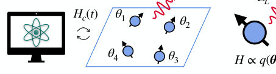 
FIG. 1. (a) Schematic of multiparameter function estima- tion with Markovian noise. A multi-qubit sensor with un- known Hamiltonian parameters θ and jump operators L is coupled through a parameter-independent control Hamilto- nian Hc(t) to a noiseless ancillary quantum processor. The objective is to estimate a function q(θ) without reconstructing the full parameter vector. (b) Optimized control and error correction reduce the dynamics to an effective single-qubit, single-parameter sensing problem with logical Hamiltonian ∝q(θ)ZL and, in general, logical dephasing noise. The func- tional HNLS condition (see Theorem 1) determines the ab- sence or presence of this logical noise or,...

**Summary.** This paper tackles the challenge of precisely estimating a function of multiple unknown parameters within a noisy quantum system. By employing quantum error correction techniques, the authors derive fundamental limits on measurement precision. The key finding is that measuring the function directly offers a significant advantage over measuring each parameter separately, even when noise is present.

**Why it may be interesting.** This work provides rigorous theoretical tools for optimizing quantum sensing protocols in realistic noisy environments, which is crucial for designing fault-tolerant quantum measurements.

Detailed structure

**Main problem.** The paper establishes the ultimate precision limits for estimating a function of multiple Hamiltonian parameters in the presence of Markovian noise.

**Main result.** It shows that direct function estimation can substantially outperform estimating all parameters individually, achieving an advantage that scales with both evolution time and the number of parameters.

**Method.** The authors use quantum error correction (QEC) techniques, deriving bounds on the Quantum Fisher Information (QFI) by reducing the multiparameter problem to an effective single-parameter sensing problem.

**Model / system.** The system evolves under a Lindblad master equation governed by a Hamiltonian $H(s) = H_0 + H_c(s)$, where $H_0$ depends on unknown parameters $	heta$. The analysis focuses on the achievable precision in estimating a function $q(	heta)$.

**Key observables.** The variance of the estimator $	ext{var}(q_{	ext{est}})$ and the Quantum Fisher Information ($F_q$).

**Important parameters / regimes.** Evolution time ($t$), number of parameters ($m$), and the noise strength ($\epsilon$).

**Assumptions / limitations.** The analysis relies on constructing optimal quantum error-correcting codes and assuming the ability to perform measurements that project the dynamics onto a code space.

**Figures summary.** Figures schematically illustrate the multiparameter function estimation process with noise, showing how optimized control and error correction reduce the dynamics to an effective single-qubit sensing problem.

**Paper structure.** The paper progresses from establishing the general noisy multiparameter estimation problem, deriving the functional Hamiltonian-not-in-Lindblad-span condition for Heisenberg scaling, and finally constructing codes and analyzing the advantage $\eta$ over individual parameter estimation.

Abstract

We establish the ultimate precision limits for estimating a function of multiple Hamiltonian parameters in the presence of Markovian noise. By reducing multiparameter function estimation to an optimization over effective single-parameter embeddings, we derive tight bounds on the quantum Fisher information. We identify a necessary and sufficient functional Hamiltonian-not-in-Lindblad-span condition for Heisenberg-limited scaling in time. When this condition holds, we construct a code that simultaneously removes the noise and nuisance Hamiltonian parameters while preserving the target signal. When it fails, we derive the optimal standard quantum-limit coefficient and show that it is asymptotically attainable using approximate quantum error correction. Finally, we demonstrate that direct function estimation can substantially outperform estimating all parameters individually and subsequently evaluating the function. This advantage can scale with both the evolution time and the number of parameters.

[↑ back to top](#top)

### [Exact group invariant scar towers in two dimensional gauge theories](http://arxiv.org/abs/2609.16132v1)

**Authors:** João Barata, Kiryl Pakrouski, Andrey V. Sadofyev  
**Type:** theory · **Category:** strongly correlated electrons · **PDF:** <https://arxiv.org/pdf/2609.16132v1>  
**Analysis basis:** full PDF text, analyzed in chunks
**Topic relevance:** 🔥 `scars & prethermalization` **5/5** · `non-equilibrium universality` **3/5** · `Keldysh / 2PI / non-Gaussian methods` **1/5** · `analog quantum simulation` **1/5** · `driven-dissipative phase transition` **1/5** · `methods for driven-dissipative` **1/5**

📷 Fig 1

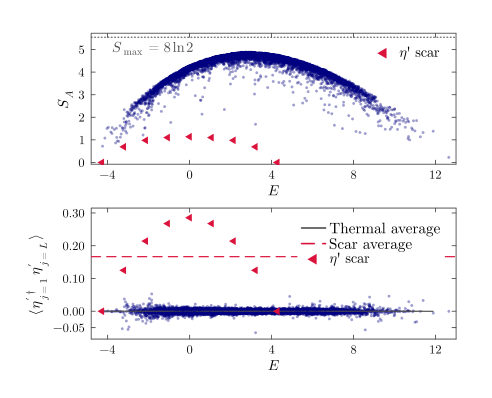 
FIG. 1. Top: Entanglement entropy for the middle cut. The top horizontal line indicates the maximum possible entangle- ment in the system. Entanglement of scars is in agreement with analytical expressions [58]. Bottom: Two-point func- tion ⟨η′† j=1η′ j=L⟩. In the scar states it is n(L−n)

📷 Fig 2

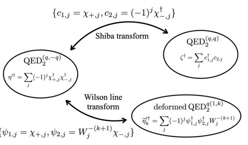 
FIG. 2. Mappings of the η′ scar tower under Shiba and Wilson line transformations.

**Summary.** This work provides an analytical construction of exact, gauge-invariant many-body scar states in 2D gauge theories. These states are characterized by suppressed entanglement and exhibit coherent, Josephson-like dynamics governed by a conserved pseudo-spin symmetry. The findings suggest a universal mechanism for non-thermal behavior in quantum field theories.

**Why it may be interesting.** The concept of protected, non-thermal states (scars) is highly relevant to understanding non-equilibrium dynamics in strongly correlated systems, offering an analytical handle on deviations from thermalization.

Detailed structure

**Main problem.** The paper addresses the open question of how out-of-equilibrium states in quantum gauge field theories lose memory of initial conditions, focusing on the persistence of exceptional, athermal states known as quantum many-body scars.

**Main result.** The authors construct an exact, algebraically defined tower of gauge-invariant scar states in 2D gauge theories, showing they exhibit anomalously low entanglement and long-range correlations.

**Method.** The construction relies on identifying a symmetry-generating algebra (using an $\eta$-pairing operator) that annihilates the scar subspace, which is then analyzed using exact diagonalization and bosonization techniques.

**Model / system.** The primary model is two-dimensional gauge theories, specifically the massless two-flavor Schwinger model ($QED(q, -q)_2$), analyzed on a lattice.

**Key observables.** Anomalously low bipartite entanglement entropy, long-range pair correlations, and coherent flavor precession dynamics ($\dot{\vartheta} = \Delta$).

**Important parameters / regimes.** Fermion masses ($m_f$), the chemical potential bias ($\Delta$), and the lattice spacing ($a$).

**Assumptions / limitations.** The analysis assumes the existence of a conserved pseudo-spin symmetry that protects the scar subspace, and it notes that finite fermion masses break this exact protection.

**Figures summary.** Figures numerically compare entanglement entropy and two-point correlation functions for scar states versus thermal averages, and map the $\eta'$ scar tower under various transformations.

**Paper structure.** The paper builds from the general problem of ETH violation to the specific construction of the scar tower using algebraic methods, analyzing its properties (low entanglement, correlations) and its dynamics (Josephson-like precession) under symmetry-preserving and symmetry-breaking perturbations.

Abstract

We construct exact many-body scar towers in two dimensional gauge theories with two flavors of massless fundamental fermions. For oppositely charged fermions, the scar subspace is generated by a gauge-neutral $η$-pairing operator, and admits a purely algebraic construction. Exact diagonalization methods reveal anomalously low entanglement and long-range pair correlations in the scar states. Charge conjugation maps the $η$-tower to a vector-flavor polarization sector of the equal charge model, yielding an interpretation as a coherent flavor mode with Josephson-like phase dynamics. Finite fermion masses mix the protected pair with an orthogonal channel and destroy the exact tower. The identified scar tower can be algebraically realized in a large family of lattice field theories, revealing a universal character of these states. Our results provide an analytical construction of invariant scar subspaces in a gauge theory with a nontrivial continuum interpretation.

[↑ back to top](#top)

### [Indistinguishability of single Raman photons from single atoms](http://arxiv.org/abs/2609.17009v1)

**Authors:** Pascal Baumgart, Max Bergerhoff, Jürgen Eschner  
**Type:** theory · **Category:** other · **PDF:** <https://arxiv.org/pdf/2609.17009v1>  
**Analysis basis:** full PDF text, analyzed in chunks
**Topic relevance:** 🔥 `interference shaping light` **4/5** · 🔥 `methods for driven-dissipative` **4/5** · `correlated / nonlocal dissipation` **3/5** · `quantum measurements` **3/5** · `Full counting statistics` **1/5** · `analog quantum simulation` **1/5** · `driven-dissipative phase transition` **1/5** · `quantum optics experiment` **1/5**

📷 Fig 1

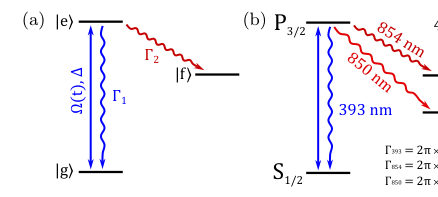 
FIG. 1. (a) Three-level system in the Λ-configuration with a stable ground state |g⟩, short-lived excited state |e⟩, and a (meta-)stable final state |f⟩. The |g⟩↔|e⟩transition is driven by a laser pulse with time-dependent Rabi frequency Ω(t) and detuning ∆. The excited state decays to the two (meta-)stable states with spontaneous decay constants Γ1 and Γ2. (b) Relevant level scheme of 40Ca+ with transition wave- lengths and spontaneous decay constants.

📷 Fig 2

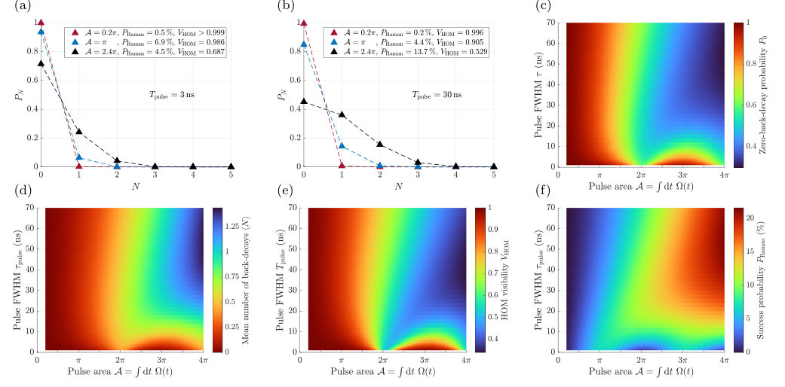 
FIG. 2. Simulation results for the model outlined in section I applied to single trapped 40Ca+ ions with spontaneous decay constants Γ1 = 2π×21.49 MHz and Γ2 = 2π×1.35 MHz + 2π×0.152 MHz. (a)–(b) Distributions of probabilities PN for exactly N back-decays before the emission of a Raman photon for two different pulse lengths (a) Tpulse = 3 ns and (b) Tpulse = 30 ns and three different pulse areas A = 0.2π (red), π (blue), and 2.4π (black) each. The data is shown as triangles with dotted lines connecting the points for visual guidance. The values of the success probability PRaman and the HOM visibility VHOM corresponding to each excitation pulse are listed in the legends. (c) Dependency of...

📷 Fig 3

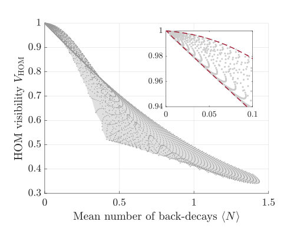 
FIG. 3. All pairs (⟨N⟩, VHOM) of mean number of back-decays and HOM visibility, for all sets of excitation pulse parameters from Figure 2. The gray-shaded area approximates the region that contains all simulated data points (gray dots). Inset: Close-up of the data points for small values of ⟨N⟩including two red-dotted lines showing the lower and upper bound of the HOM visibility in dependence of ⟨N⟩.

📷 Fig 4

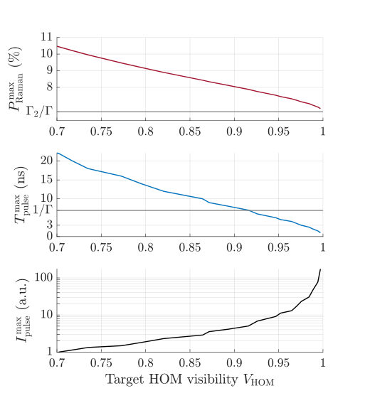 
FIG. 5. The three graphs show, for a given target HOM visibility, the maximum achievable success probability P max Raman (top), as well as the pulse length T max pulse (middle) and pulse intensity I max pulse (bottom) that realize this value.

📷 Fig 5

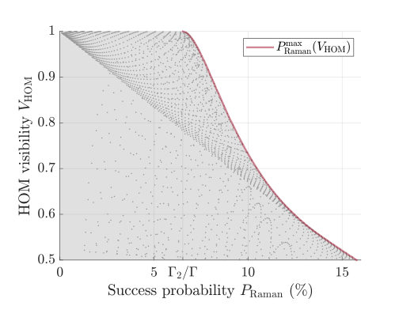 
FIG. 4. All pairs (PRaman, VHOM) of success probability and HOM visibility, for all sets of excitation pulse parameters from figure 2. The gray-shaded area approximates the region that contains all simulated data points (gray dots). The red line indicates the boundary curve at which the success probability is maximized for a given HOM visibility.

**Summary.** This theoretical study analyzes the indistinguishability of single photons emitted from trapped $^{40}	ext{Ca}^+$ ions via Raman scattering. It shows that spontaneous decay back to the initial state degrades the Hong-Ou-Mandel (HOM) interference visibility. The key finding is that the mean number of back-decays ($\langle N 
angle$) provides a measurable metric directly correlating with the achievable quantum interference visibility.

**Why it may be interesting.** This work is highly relevant to AMO physics and quantum optics as it tackles the fundamental decoherence mechanism (spontaneous decay) limiting the performance of solid-state and trapped-ion quantum memories and repeaters. The quantitative link between decay statistics and interference visibility is a key theoretical result.

Detailed structure

**Main problem.** The study investigates how spontaneous decay processes affect the indistinguishability of single Raman photons generated from trapped ions, which is crucial for quantum networking applications.

**Main result.** The mean number of back-decays ($\langle N 
angle$) is found to be a measurable quantity that directly correlates with the achievable Hong-Ou-Mandel (HOM) visibility, demonstrating a clear trade-off with photon yield.

**Method.** The authors employ numerical simulations based on solving the master equation in Lindblad form, utilizing quantum jump decomposition to track decay paths.

**Model / system.** The system involves single trapped $^{40}	ext{Ca}^+$ ions undergoing Raman scattering driven by few-nanosecond pulses, modeled as a three-level $\Lambda$-system. The dynamics are governed by a master equation incorporating spontaneous decay jump operators.

**Key observables.** HOM Visibility ($V$), Mean number of back-decays ($\langle N 
angle$), Probability of zero back-decays ($P_0$), and Raman photon success probability ($P_{	ext{Raman}}$).

**Important parameters / regimes.** Excitation pulse duration (few-nanosecond scale), decay rates ($\Gamma$), and the specific ion species ($^{40}	ext{Ca}^+$).

**Assumptions / limitations.** The analysis relies on the validity of the three-level model and the use of quantum jump decomposition to account for decay pathways.

**Figures summary.** Figures illustrate the distributions of back-decay probabilities ($P_N$) for varying pulse lengths and demonstrate the quantitative correlation between $\langle N 
angle$ and $V_{	ext{HOM}}$ using derived inequalities.

**Paper structure.** The paper first establishes the theoretical framework using the master equation and quantum jump decomposition. It then calculates key observables like $\langle N 
angle$ and $V_{	ext{HOM}}$, deriving explicit mathematical relationships between them. Finally, it extends the analysis to compare different trapped-ion species for long-range entanglement swapping.

Abstract

We theoretically investigate the indistinguishability of single photons generated from single trapped $^{40}$Ca$^+$ ions in a Raman scattering process driven by few-nanosecond excitation pulses. Of particular interest is how spontaneous decay back to the initial state affects Hong-Ou-Mandel (HOM) photon interference. Numerical simulations identify the mean number of back-decays as a measurable quantity that correlates with achievable HOM visibility. Optimization of the excitation pulse with respect to a trade-off between photon yield and indistinguishability is analyzed. Finally, we compare the performance of different trapped-ion species for long-range dual-rail entanglement swapping via HOM photon interference.

[↑ back to top](#top)

### [Large-scale quantum simulations of dissipative spin-1/2 Heisenberg chains](http://arxiv.org/abs/2609.16108v1)

**Authors:** João C. Getelina, Andrew Cox, Muhammad Asaduzzaman, Omar Alsheikh, Ryan S. Bennink, James K. Freericks, Alexander F. Kemper  
**Type:** both · **Category:** other · **PDF:** <https://arxiv.org/pdf/2609.16108v1>  
**Analysis basis:** full PDF text, analyzed in chunks
**Topic relevance:** 🔥 `driven-dissipative phase transition` **4/5** · 🔥 `methods for driven-dissipative` **4/5** · `analog quantum simulation` **3/5** · `non-equilibrium universality` **3/5** · `Keldysh / 2PI / non-Gaussian methods` **2/5** · `correlated / nonlocal dissipation` **1/5** · `quantum measurements` **1/5**

📷 Fig 1

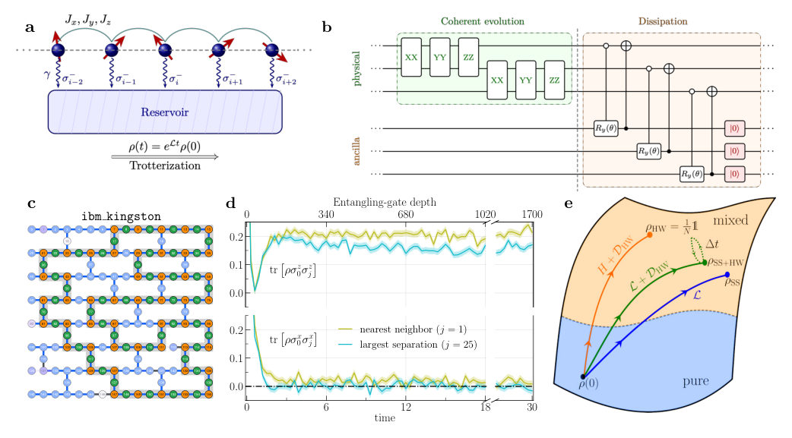 
FIG. 1. Stable non-equilibrium steady states of the dissipative Heisenberg model (a) 1D dissipative spin-1/2 Heisenberg chain. The system sites interact with their nearest neighbors and with a reservoir that flips the spin down at a dissipation rate γ. (b) Quantum circuit representation of a single time step in the Liouvillian dynamics of an open-boundary chain of size L = 3, consisting of two parts: a coherent evolution under the closed system Hamiltonian, and a (non-unitary) dissipative part representing the interaction with the reservoir, which is implemented by coupling to an ancilla that is reset each time step. (c) Qubit layout used in our simulations in the 156-qubit superconducting...

📷 Fig 2

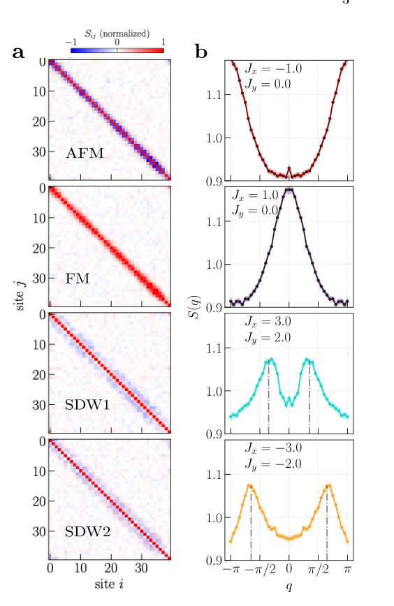 
FIG. 2. Distinguishing steady state phases of the dissi- pative Heisenberg model. Real space (a) and momentum space (b) structure factors for a 40 site (80 qubit) chain, av- eraged over the last 10 time steps. Vertical lines in the SDW panels in (b) indicate the expected ordering vector for ten- sor network calculations for 40 sites. Shaded areas around the curves correspond to the 95% confidence interval of 1000 bootstrap samples, resampled from the last 10 time steps.

📷 Fig 3

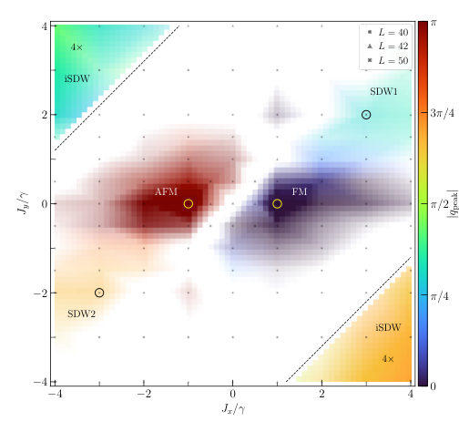 
FIG. 3. Phase diagram of the dissipative spin-1/2 Heisenberg model. Peak position in S(q) from quantum hardware simulation, opacity is set by the height of the peak. Data is interpolated before plotting. Corners show an incip- ient SDW phase, which has been scaled 4× for visibility. All correlator data obtained from the hardware used to create this phase diagram are presented in the App. B.

📷 Fig 4

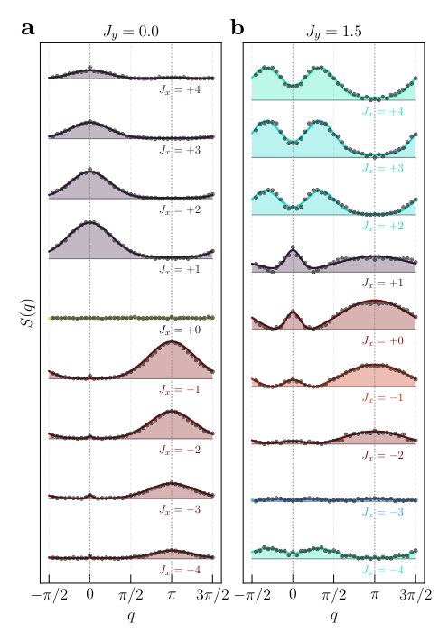 
FIG. 4. Observing the crossover between magnetic phases. Static structure factor S(q) for several values of cou- pling amplitude Jx and fixed (a) Jy = 0.0 and (b) Jy = 1.5. Symbols correspond to the quantum hardware data points, whereas lines and shaded area correspond to curve fits of sum of Gaussian distributions. System size is L = 40 (80 qubits) and the dissipative rate is γ = Jz = 1.

**Summary.** This paper uses large-scale quantum simulations on superconducting hardware to map the phase diagram of a dissipative spin-1/2 Heisenberg chain. By analyzing the non-equilibrium steady state using static structure factors, the authors resolve long-standing theoretical uncertainties regarding the system's magnetic ordering. The results confirm that quantum computers are a viable tool for investigating complex open quantum systems.

**Why it may be interesting.** This work directly addresses the intersection of open quantum systems and quantum computation, demonstrating that quantum hardware can tackle complex, non-equilibrium physics that is analytically or numerically intractable.

Detailed structure

**Main problem.** The primary goal is to map the phase diagram of a non-equilibrium steady state (NESS) in a dissipative spin-1/2 Heisenberg chain, a system difficult to analyze due to its coupling to an environment.

**Main result.** The quantum simulations successfully map a rich non-equilibrium phase diagram across the Jx-Jy plane, confirming the feasibility of using quantum hardware to study dissipative quantum systems.

**Method.** The study employs quantum hardware simulations (using Lindblad dynamics via Stinespring dilation) and compares these results with theoretical methods like Tensor Network Simulations (TJM) and exact diagonalization.

**Model / system.** The system is the dissipative spin-1/2 Heisenberg chain, whose dynamics are governed by a Lindblad master equation. The Hamiltonian involves couplings $J_x, J_y, J_z$, and the dissipation is introduced via local spontaneous spin decay.

**Key observables.** Static structure factor $S(q)$, which is used to identify magnetic orders (FM, AFM, SDW, PM) based on the peak position $q^*$ and prominence $\Pi$.

**Important parameters / regimes.** The phase diagram is scanned across the $J_x–J_y$ plane, with fixed parameters like $J_z = \gamma = 1$. System sizes up to $L=50$ sites were simulated.

**Assumptions / limitations.** The analysis must account for the limitations of the Trotter approximation, which can introduce spurious 'incipient' phases, and the need for specialized interpolation techniques (like phasors) to cross phase boundaries.

**Figures summary.** Figures illustrate the setup on quantum hardware, the convergence of correlation functions to steady states, and the resulting phase diagrams mapping magnetic orders (FM, AFM, SDW) across the coupling parameter space.

**Paper structure.** The work progresses by defining the physical model and the challenge of NESS computation, detailing the quantum hardware simulation approach, presenting the results via structure factor analysis, and finally comparing and refining the phase diagram using advanced interpolation techniques.

Abstract

A quantum many-body system coupled to an environment relaxes to a nonequilibrium steady state that can sustain order with no equilibrium counterpart. Computing such steady states is harder than closed-system dynamics as the density matrix problem squares the Hilbert-space dimension, and no free energy selects the steady state. The dissipative spin-1/2 Heisenberg chain is a benchmark example for nonequilibrium steady state physics; various methods have each calculated its phase diagram but do not agree, and a controlled determination at large system size has remained out of reach. Here we simulate the Lindblad dynamics of chains of up to 50 sites on the superconducting processor ibm_kingston -- 100 simultaneously active qubits at up to 1700 entangling-gate depths -- realizing the dissipation via Stinespring dilation. The system's dissipative evolution is a self-correcting mechanism that effectively erases errors, so hardware noise enters only as a weak competing dissipator. We measure static structure factors and resolve ferromagnetic, antiferromagnetic, spin-density-wave, and paramagnetic steady states, mapping the phase diagram with 117 quantum hardware data points across the $J_x$--$J_y$ plane. We uncover a rich non-equilibrium phase diagram of ordered phases with only remnants of the mean-field order, and where sharp transitions give way to the crossovers expected in one dimension. We also find the existence of an incipient (Trotter-induced) spin density wave phase, highlighting the potential of controlled Trotterization as a tool to engineer various magnetic phases in dissipative spin systems. Our quantum simulations largely settle the lingering uncertainty regarding the correct phase diagram of this benchmark system. Moreover, they show that quantum computers are now a feasible tool for addressing scientific questions involving dissipative quantum systems.

[↑ back to top](#top)

### [The Transient Counting Statistics of Autonomous Quantum Clocks](http://arxiv.org/abs/2609.16121v1)

**Authors:** Oscar Arandes, Sreenath K. Manikandan  
**Type:** theory · **Category:** other · **PDF:** <https://arxiv.org/pdf/2609.16121v1>  
**Analysis basis:** full PDF text, analyzed in chunks
**Topic relevance:** 🔥 `Full counting statistics` **4/5** · `quantum measurements` **3/5** · `Keldysh / 2PI / non-Gaussian methods` **2/5** · `Tavis-Cummings & cavity-many-emitter` **2/5** · `correlated / nonlocal dissipation` **2/5** · `methods for driven-dissipative` **2/5** · `driven-dissipative phase transition` **1/5** · `non-equilibrium universality` **1/5** · `superradiant laser` **1/5**

📷 Fig 1

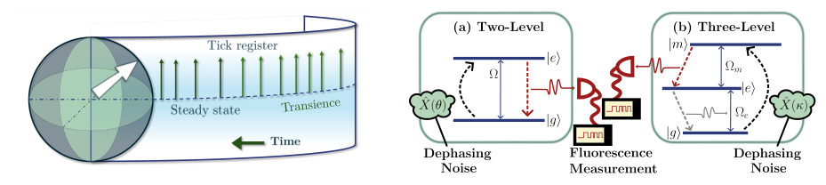 
FIG. 1. Schematic of the clock dynamics. Left: An initial qubit state (Bloch sphere) drives a tick register, where fluorescence events are recorded as ticks along the time axis. Reading from right to left, the dynamics evolve from the initial state through the transient regime toward the steady state. Right: A quantum emitter is subject to two processes: dephasing noise generated by the operator ˆ X (green) and photodetection of the emitted fluorescence (red), whose discrete clicks constitute the ticks of the clock. The dephasing drives the population and closes the emission cycle, while the counted fluorescence yields the counting statistics analyzed in the text. (a) Two-level emitter: the...

📷 Fig 2

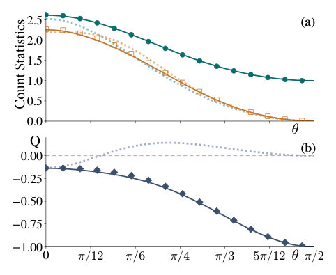 
FIG. 3. (a) Mean number (green) and variance (orange) of clicks as functions of θ for the observable ˆ X(θ). (b) Mandel Qt parameter as a function of θ (dark blue). In both panels, dashed lines denote the LDT predictions, while solid lines in- clude both the LDT and transient contributions arising from the initial state (Eqs. (E24) and (E25) evaluated analytically). Scatter points correspond to numerical simulations performed using the Kraus-operator formalism (see Appendix A). Pa- rameters: Ω= 1, γw = 6, and γm = 8. Simulations were performed with time step dt = 0.001 over 1000 steps using 106 trajectories. Initial state ˆρ(0) = |e⟩⟨e|.

📷 Fig 3

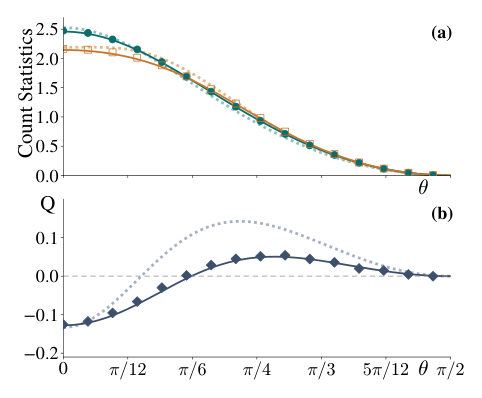 
FIG. 2. (a) Mean number (green) and variance (orange) of clicks as functions of θ for the observable ˆ X(θ). (b) Mandel Qt parameter as a function of θ (dark blue). In both panels, dashed lines denote the LDT predictions, while solid lines in- clude both the LDT and transient contributions arising from the initial state (Eqs. (E24) and (E25) evaluated analytically). Scatter points correspond to numerical simulations performed using the Kraus-operator formalism (see Appendix A). Pa- rameters: Ω= 1, γw = 6, and γm = 8. Simulations were performed with time step dt = 0.001 over 1000 steps using 106 trajectories. Initial state ˆρ(0) = |g⟩⟨g|.

📷 Fig 4

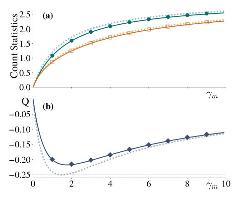 
FIG. 4. (a) Mean number (green) and variance (orange) of clicks as functions of γm for the observable ˆ X(θ = 0) = ˆσx. (b) Mandel Qt parameter as a function of γm (dark blue). In both panels, dashed lines denote the leading-order predictions (see Eqs. (33), (35)), while solid lines include both the LDT and transient contributions arising from the initial state (see Eqs. (34), (36) and (37)). Scatter points correspond to nu- merical simulations performed using the Kraus-operator for- malism (see Appendix A). Parameters: Ω= 1, γw = 6. The simulations are performed with time step dt = 0.001 over 1000 steps using 106 trajectories. Initial state ˆρ(0) = |g⟩⟨g|.

📷 Fig 5

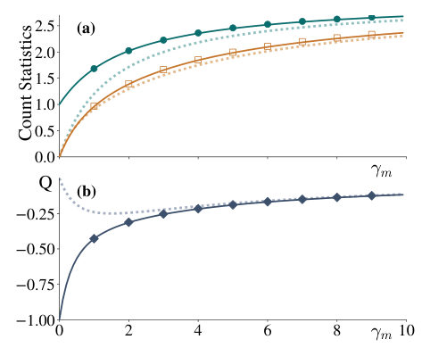 
FIG. 5. (a) Mean number (green) and variance (orange) of clicks as functions of γm for the observable ˆ X(θ = 0) = ˆσx. (b) Mandel Qt parameter as a function of γm (dark blue). In both panels, dashed lines denote the LDT predictions, while solid lines include both the LDT and transient contributions arising from the initial state (see Eqs. (38), (39) and (40)). Scatter points correspond to numerical simulations performed using the Kraus-operator formalism (see Appendix A). Pa- rameters: Ω= 1, γw = 6. The simulations are performed with time step dt = 0.001 over 1000 steps using 106 trajecto- ries. Initial state ˆρ(0) = |e⟩⟨e|.

**Summary.** This paper develops a theoretical framework to analyze the transient counting statistics of autonomous quantum clocks modeled by multi-level emitters. By employing a revised Large Deviation Principle, the authors quantify how initial conditions affect the count statistics in the few-quanta regime. This provides a new, complementary tool for understanding the fundamental limits of precision timekeeping in quantum systems.

**Why it may be interesting.** This work is highly relevant to AMO physics, specifically quantum optics and open quantum systems, as it pushes the theoretical understanding of quantum measurement statistics into the non-trivial transient regime.

Detailed structure

**Main problem.** The paper addresses characterizing the fundamental limits to precise timekeeping and quantum sensing using autonomous quantum emitters when operating in the few-quanta regime.

**Main result.** It develops a framework to characterize transient initial-state contributions to the counting statistics, providing complementary insights beyond the standard semiclassical or steady-state analyses.

**Method.** The analysis employs a revised Large Deviation Principle incorporating finite-time contributions, utilizing the moment generating function (MGF) derived from the evolution of the tilted density operator.

**Model / system.** The system models simple two- and three-level quantum emitters (lasers) acting as quantum coherent emitters, whose dynamics are governed by the Lindblad master equation and fueled by dephasing quantum noise.

**Key observables.** Transient counting statistics, average number of jumps $\langle N 
angle_t$, and the variance of the count record.

**Important parameters / regimes.** The analysis focuses on the few-quanta regime ($\langle N 
angle_t \sim 1$) in the temporal domain, contrasting with the semiclassical regime.

**Assumptions / limitations.** The analysis assumes the use of radiative transitions in an artificial atom and develops a framework to retain transient initial-state contributions.

**Figures summary.** Figure 1 schematically illustrates clock dynamics for both two-level and three-level emitters, detailing the decay and dephasing pumping mechanisms.

**Paper structure.** The paper builds from the general framework of quantum emitter dynamics (Lindblad equation) to applying advanced statistical tools (LDP, MGF) to calculate transient counting statistics, culminating in discussions on timekeeping implications.

Abstract

At the heart of every atomic clock is a quantum coherent emitter, the laser, that could in principle be treated autonomously. While their frequency or phase stability is typically studied in the semiclassical regime of a large number of emitted quanta, recent works on autonomous quantum clocks suggest that the few-quanta regime can offer statistical information in the temporal domain. This provides complementary means to probe the fundamental limits to precise timekeeping in the quantum regime. Motivated by these works, we consider simple models for two- and three-level quantum emitters subject to an athermal fueling through dephasing, which generically results in coherences in the steady state. A large deviation principle with finite-time contributions is used to identify the transient counting statistics and their dependence on the initial conditions. We conclude by discussing the implications for precise timekeeping and quantum sensing using autonomous quantum emitters as clocks in their transient regime.

[↑ back to top](#top)

### [Diffusivity in Dissipative Quantum Transport from an Exactly Solvable Krylov Chain](http://arxiv.org/abs/2609.16559v1)

**Authors:** Zhi-Li Zhou, Jorge Noronha  
**Type:** theory · **Category:** statistical mechanics · **PDF:** <https://arxiv.org/pdf/2609.16559v1>  
**Analysis basis:** full PDF text, analyzed in chunks
**Topic relevance:** 🔥 `methods for driven-dissipative` **4/5** · `Keldysh / 2PI / non-Gaussian methods` **3/5** · `driven-dissipative phase transition` **3/5** · `non-equilibrium universality` **2/5** · `analog quantum simulation` **1/5** · `correlated / nonlocal dissipation` **1/5** · `quantum measurements` **1/5** · `scars & prethermalization` **1/5**

📷 Fig 1

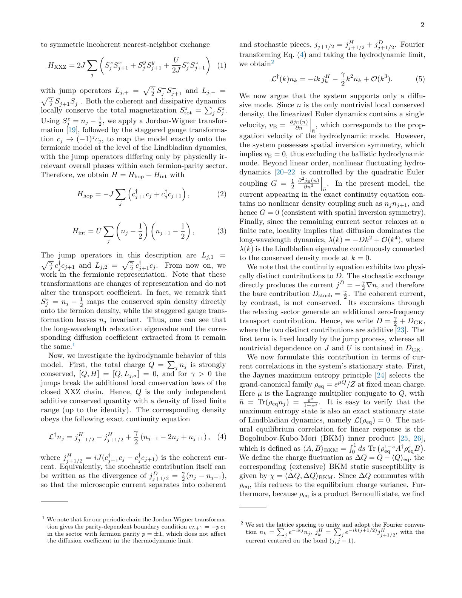 
Low-resolution page preview, page 2

📷 Fig 2

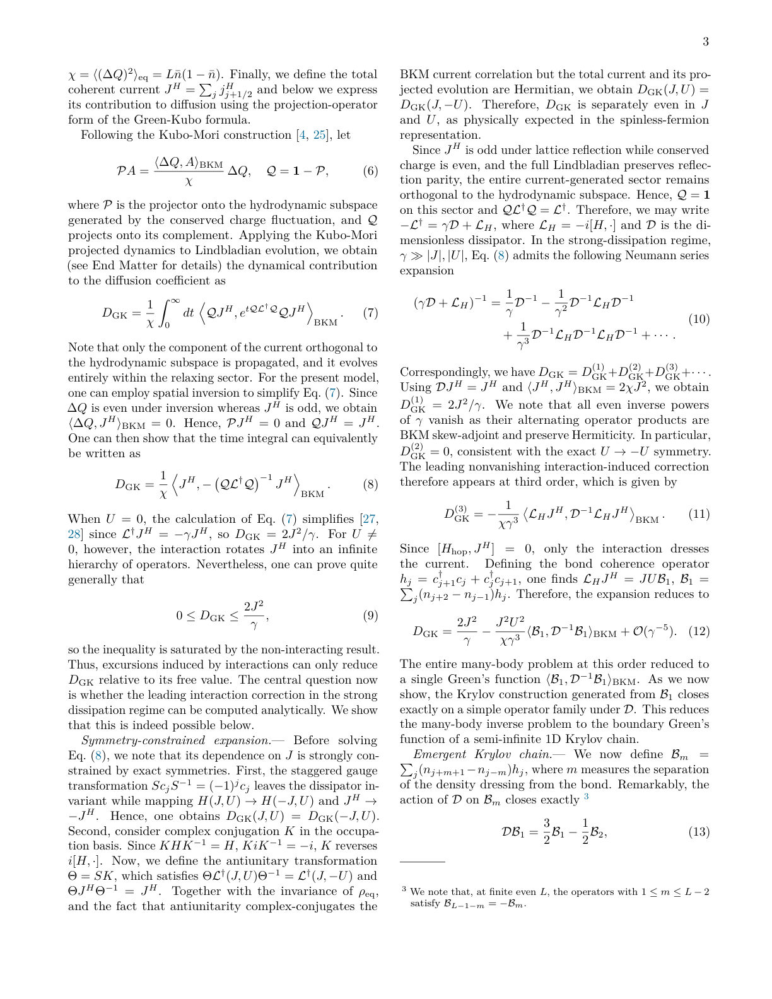 
Low-resolution page preview, page 3

📷 Fig 3

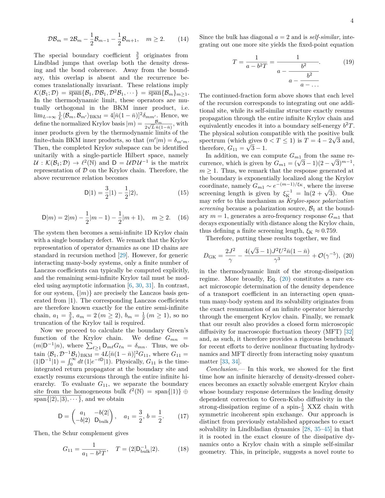 
Low-resolution page preview, page 4

📷 Fig 4

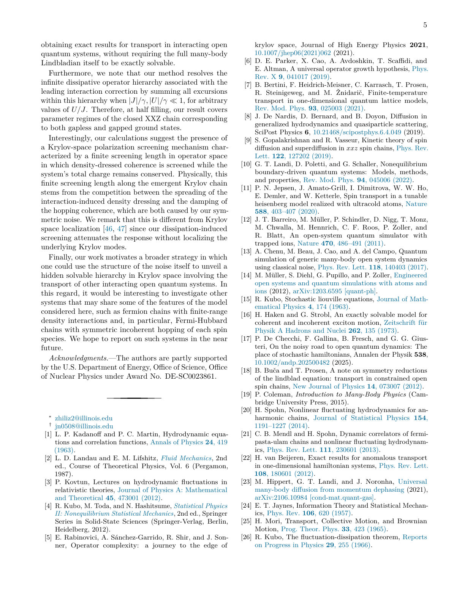 
Low-resolution page preview, page 5

📷 Fig 5

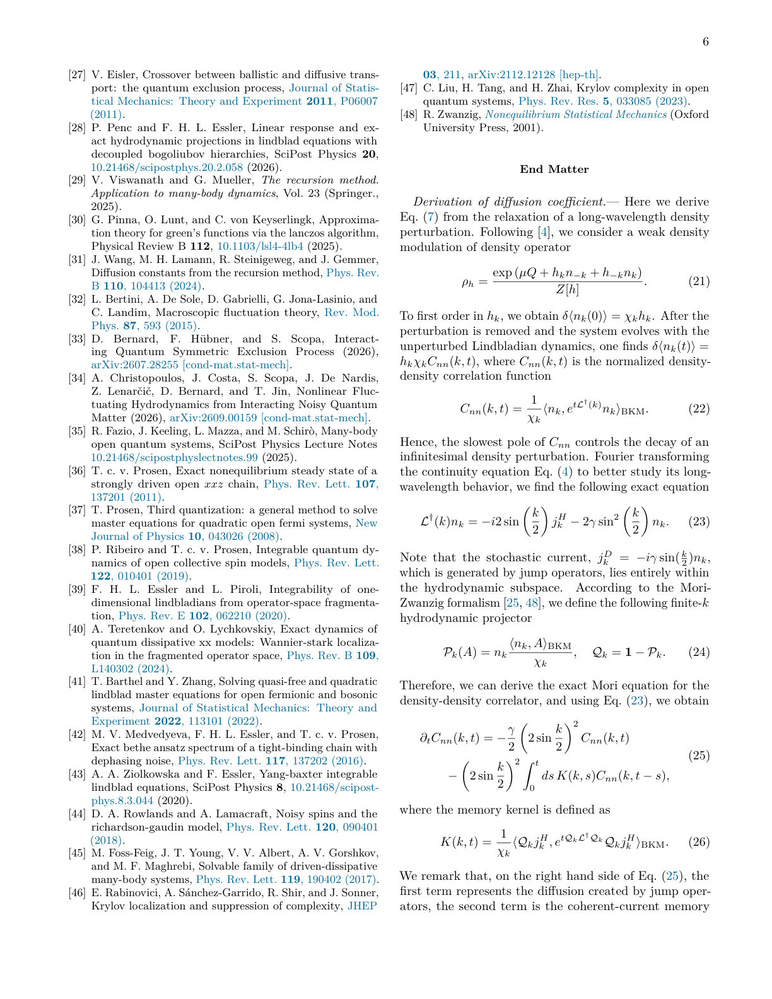 
Low-resolution page preview, page 6

**Summary.** This work develops a novel Krylov-space mechanism to exactly calculate the leading interaction correction to the diffusivity in a dissipative quantum spin chain. By mapping the dynamics onto a solvable semi-infinite Krylov chain, the authors derive a closed-form, microscopic expression for the transport coefficient in the strong-dissipation regime. This provides a powerful analytical tool for understanding quantum transport in open many-body systems.

**Why it may be interesting.** The rigorous application of Krylov subspace techniques to solve non-equilibrium quantum dynamics in the strong-dissipation limit provides a powerful, exact analytical tool for calculating transport properties in open quantum systems.

Detailed structure

**Main problem.** The paper addresses the analytically challenging computation of transport coefficients, specifically the leading density-dependent correction to the diffusivity, in interacting quantum many-body systems.

**Main result.** The authors analytically determine this correction by mapping the dissipative dynamics onto a self-similar semi-infinite Krylov chain, yielding a closed-form expression for the diffusivity.

**Method.** The core method involves developing a novel Krylov-space mechanism applied to the Green-Kubo formula within the strong-dissipation regime, allowing for the exact solution of the resulting operator hierarchy.

**Model / system.** The system studied is a one-dimensional spin-1/2 XXZ chain undergoing Lindbladian evolution due to symmetric incoherent nearest-neighbor spin exchange. The model is mapped onto an interacting spinless-fermion chain.

**Key observables.** Diffusivity (D), the interaction-dependent correction to diffusivity ($D_{GK}$), and the boundary Green's function ($G_{m1}$).

**Important parameters / regimes.** Strong-dissipation regime ($\gamma \gg |J|, |U|$), hopping amplitude ($J$), interaction strength ($U$), and dissipation rate ($\gamma$).

**Assumptions / limitations.** The analysis assumes the system supports only a diffusive mode and relies on the strong-dissipation limit for the perturbative expansion.

**Figures summary.** Not specified.

**Paper structure.** The paper first establishes the general framework using the Mori-Zwanzig formalism and the Green-Kubo formula. It then focuses on the strong-dissipation limit, where the problem is mapped onto an emergent Krylov chain structure. The solvability of this chain allows for the exact determination of the boundary Green's function, which yields the final result for $D_{GK}$.

Abstract

The computation of transport coefficients in interacting quantum many-body systems is rarely analytically accessible. Here, we develop a new Krylov-space mechanism that makes the leading density dependent correction to Green-Kubo diffusivity \emph{exactly} calculable in the strong-dissipation regime of a one-dimensional noisy spin-$\frac{1}{2}$ XXZ chain. This is done by showing that the density-polarization-dressed bond coherence generates a Krylov subspace where repeated action of the dissipator closes exactly on an explicitly identifiable operator family. Within this subspace, the dissipative dynamics is then mapped onto a self-similar semi-infinite chain with a boundary defect. Surprisingly, \emph{all} Lanczos coefficients of the Krylov chain and its boundary Green's function can be determined exactly. The latter then determines the exact leading density-dependent correction to the diffusivity. Finally, we calculate analytically the full boundary-to-bulk Green's function and find that it decays exponentially along the emergent Krylov chain.

[↑ back to top](#top)

### [Noise-induced classical phases in optimally-unraveled random quantum circuits](http://arxiv.org/abs/2609.16160v1)

**Authors:** Lorenzo Fioroni, Filippo Ferrari, Emanuele Tirrito  
**Type:** theory · **Category:** disordered systems and neural networks · **PDF:** <https://arxiv.org/pdf/2609.16160v1>  
**Analysis basis:** full PDF text, analyzed in chunks
**Topic relevance:** 🔥 `methods for driven-dissipative` **4/5** · 🔥 `quantum measurements` **4/5** · `driven-dissipative phase transition` **3/5** · `non-equilibrium universality` **2/5** · `Keldysh / 2PI / non-Gaussian methods` **1/5** · `analog quantum simulation` **1/5** · `correlated / nonlocal dissipation` **1/5**

📷 Fig 1

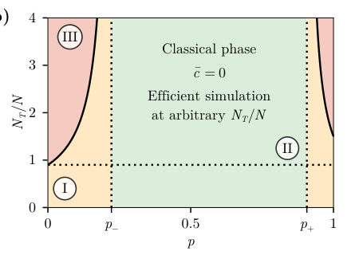 
FIG. 1. Noisy doped random Clifford circuits and their phase diagram. (a) One of the NT layers: a global random Clifford C acting on the N qubits, followed by the non-Clifford ro- tation Uϕ and by the local noise channel N, both applied to the first qubit. (b) Sketch of the phase diagram in the plane of the noise strength p and of the non-Clifford density NT /N. Between the threshold probabilities p± (vertical dot- ted lines) the optimal unraveling has ¯c = 0: the trajectories stay Clifford-disentanglable at arbitrary depth and the cir- cuit is in the noise-induced classical phase (II). Outside this window, disentangling is possible only below the boundary NT ∼N/¯c (solid line), which...

📷 Fig 2

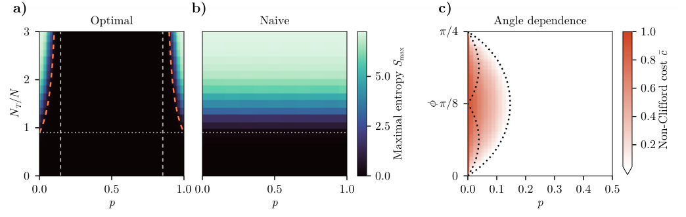 
FIG. 3. CAMPS simulations for aligned dephasing, with N = 16 qubits and ϕ = −π/8. (a) Maximal entanglement entropy Smax of the inner MPS for the optimal unraveling of Theorem 1, as a function of the dephasing probability p and of the non-Clifford density NT /N. The orange dashed line is the predicted boundary NT ∼N/¯c, the vertical white dashed lines mark the threshold probabilities p± enclosing the classical phase, and the horizontal one the closed-system threshold NT ∼N. (b) The same quantity for the naive unraveling K1 = T, K2 = ZT: no classical phase appears and disentangling is lost at NT ∼N for every p. (c) Optimal cost ¯c of Eq. (10) as a function of p and of the rotation angle ϕ,...

📷 Fig 3

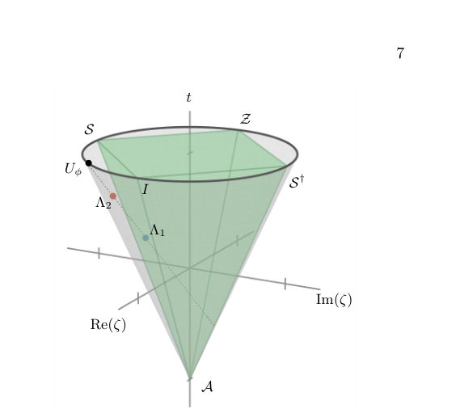 
FIG. 4. Geometric representation for Pauli noise isotropic on the equatorial plane. After the symmetrization of Sec- tion IV B 1, every channel is a point (ζ, t) of the cone C of Eq. (21): its base circle at t = 1 collects the rotations about the z axis, among them the gate Uϕ, and its apex is the Clif- ford mixture A = (X + Y)/2. The channels of zero cost fill the inscribed Clifford pyramid P of Eq. (22) (shaded), with base vertices I, S, Z, S† and apex A. As in Fig. 2, Λ1 lies inside the pyramid and has ¯c = 0, while Λ2 lies outside it and has ¯c &gt; 0.

📷 Fig 4

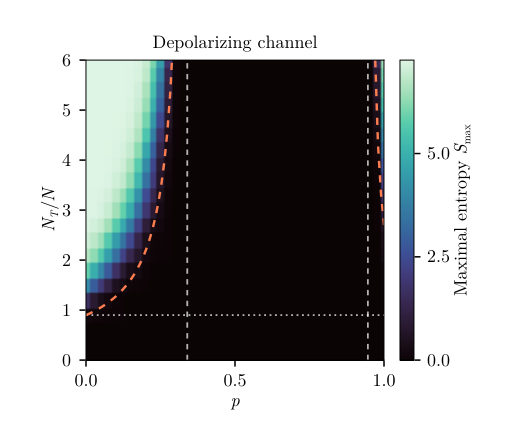 
FIG. 5. CAMPS simulations for depolarizing noise, p⊥= pz = p/3, for the same circuit as in Fig. 3. Maximal en- tanglement entropy Smax of the inner MPS as a function of p and NT /N, with the boundary NT ∼N/¯c predicted by Theorem 2 (orange dashed line), the threshold probabilities enclosing the classical phase (vertical white dashed lines) and the closed-system threshold NT ∼N (horizontal dotted line). Differently from aligned dephasing, the two regions of nonzero cost are asymmetric, since no Clifford operator maps Np onto N1−p.

📷 Fig 5

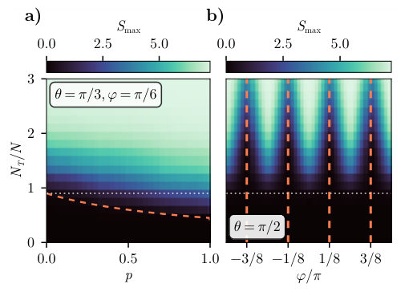 
FIG. 6. CAMPS simulations for tilted dephasing with ϕ = −π/8, using the unraveling obtained by solving Eq. (31) numerically. (a) Maximal entanglement entropy Smax for the generic noise axis (θ, φ) = (π/3, π/6), as a function of p and NT /N: noise now hinders the simulation, and the predicted boundary (orange dashed line) falls below the closed-system threshold NT ∼N (horizontal white dotted line). (b) Smax for a noise axis lying on the equatorial plane, θ = π/2, as a function of its azimuth φ: every equatorial axis remains dis- entanglable at least up to NT ∼N, and the effect is maximal at φ = ±π/8, ±3π/8 (vertical dotted lines), where ˆn · ˆσ and Uϕ compose into a single Clifford...

**Summary.** This paper studies how noise affects the classical simulability of quantum circuits by analyzing the optimal way to 'unravel' the noisy dynamics into stochastic trajectories. It discovers that noise can create extended 'classical phases' where the system behaves classically, but this classicality is an artifact of the measurement process, not the underlying channel itself. This work provides a resource-theoretic framework for understanding the limits of classical simulation in open quantum systems.

**Why it may be interesting.** This work directly addresses the resource theory of quantum computation, showing how measurement choices (unraveling) can artificially induce classicality, which is highly relevant for understanding decoherence and measurement-induced phase transitions in open quantum systems.

Detailed structure

**Main problem.** The paper investigates the boundary between quantum dynamics that are classically simulable and those that require true quantum computation, particularly in the presence of noise.

**Main result.** It identifies 'noise-induced classical phases'—parameter regions where the dynamics become fully disentangled by Clifford operations, depending crucially on the measurement scheme (unraveling) used.

**Method.** The authors analyze open quantum dynamics by unraveling them into stochastic quantum trajectories, simulating these using Clifford-augmented matrix product states, and minimizing a derived 'simulation cost.'

**Model / system.** The model involves random quantum circuits composed of Clifford gates, non-Clifford phase rotations, and local noise, studied via the evolution of the density matrix.

**Key observables.** Simulation cost ($ar{c}$), entanglement, nonstabilizerness, and the optimal unraveling choice.

**Important parameters / regimes.** Noise strength ($p$), non-Clifford density, and the circuit depth ($N_T$).

**Assumptions / limitations.** The analysis relies on finding an optimal convex decomposition of the quantum channel and assumes the ability to define an optimal unraveling that minimizes the simulation cost.

**Figures summary.** Figure 1 sketches the noisy circuit setup and a phase diagram showing three dynamical regions separated by phase boundaries. Other figures illustrate the geometric structure of the channel in the complex plane.

**Paper structure.** The paper progresses by defining the problem using noisy random circuits, developing the resource-based simulation cost ($ar{c}$), analytically determining the optimal unraveling, and contrasting the results obtained from trajectory-based measurements versus the averaged density matrix.

Abstract

We study the classical simulability of open quantum dynamics using random Clifford circuits doped with non-Clifford phase rotations and subject to local noise. We unravel the dynamics into stochastic quantum trajectories simulated with Clifford-augmented matrix product states, and introduce a simulation cost that quantifies the classical resources required. Optimizing this cost over stochastic unravelings, we identify noise-induced classical phases: extended parameter regions in which the dynamics can be fully disentangled by Clifford operations at arbitrary circuit depth. Their existence depends on both the noise model \emph{and} the unraveling. Using a geometric representation of quantum channels, we analytically determine optimal unravelings for a broad class of noise models, with numerical simulations confirming the predicted phase boundaries. We further relate the optimal cost to the unraveling-independent nonstabilizerness of the channel and show that, together with trajectory-resolved entanglement and nonstabilizerness, it classifies distinct dynamical regimes. Finally, we show that these classical phases disappear in the averaged density-matrix description, where no unraveling freedom remains. Our results show that the emergence of classicality in noisy random circuits depends on the measurement scheme adopted to probe it, and paves the way to further studies on the classical simulability of driven-dissipative dynamics.

[↑ back to top](#top)

### [Partial projected ensembles reveal slow tilt-constrained information spreading](http://arxiv.org/abs/2609.16544v1)

**Authors:** Yi-Rui Zhang, Yu-Jun Zhao, Han-Ze Li, Jian-Xin Zhong  
**Type:** theory · **Category:** other · **PDF:** <https://arxiv.org/pdf/2609.16544v1>  
**Analysis basis:** full PDF text, analyzed in chunks
**Topic relevance:** 🔥 `scars & prethermalization` **4/5** · `non-equilibrium universality` **3/5** · `quantum measurements` **3/5** · `analog quantum simulation` **2/5** · `methods for driven-dissipative` **2/5** · `Frenkel-Kontorova` **1/5** · `driven-dissipative phase transition` **1/5**

📷 Fig 1

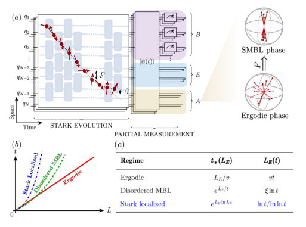 
FIG. 1. Partial observation and proposed spreading laws. (a) Evolution in a Stark field with control parameter F and curvature β, followed by measurement of B and tracing out the buffer E, produces conditional states on A. Bloch spheres illustrate their distributions. (b),(c) Ballistic, logarithmic, and proposed sublogarithmic spreading correspond to linear, exponential, and factorial-type onset times versus buffer length LE.

📷 Fig 2

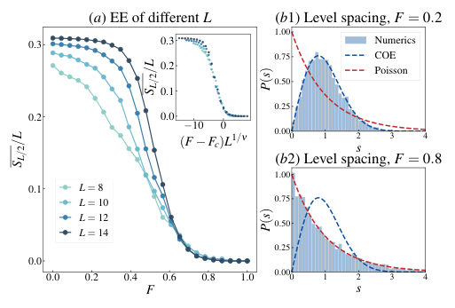 
FIG. 2. Regime diagnostics. (a) Half-chain von Neumann entropy, averaged over all Floquet eigenstates and divided by L, versus control parameter F. Inset: rescaling with Fc = 0.651 and ν = 0.84. (b1),(b2) Normalized circular quasienergy- spacing distributions for L = 12 at F = 0.2 and 0.8; dashed curves show circular-orthogonal-ensemble (COE) and Poisson benchmarks. Entropies use natural logarithms.

📷 Fig 3

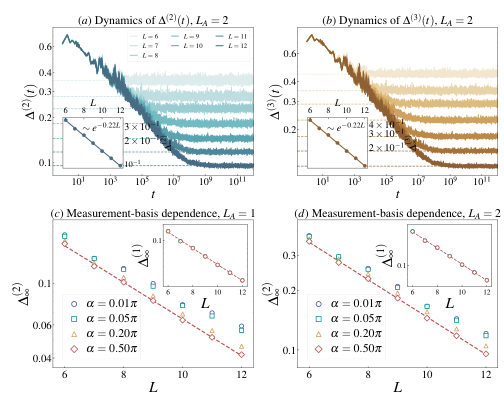 
FIG. 3. Full projected ensembles at F = 0.8, averaged over 1000 random product states; t counts Floquet periods. (a),(b) Second- and third-moment trace distances ∆(k) to the initial- state-specific Scrooge reference, with LA = 2 and X-basis measurements. (c),(d) Residual second-moment distances versus L and measurement angle α for LA = 1,2; insets show first moments. Here α = π/2 is the X basis. Residuals and horizontal dashed lines use the last 200 saved times; inset lines in (a),(b) and dashed curves in (c),(d) are exponential fits.

📷 Fig 4

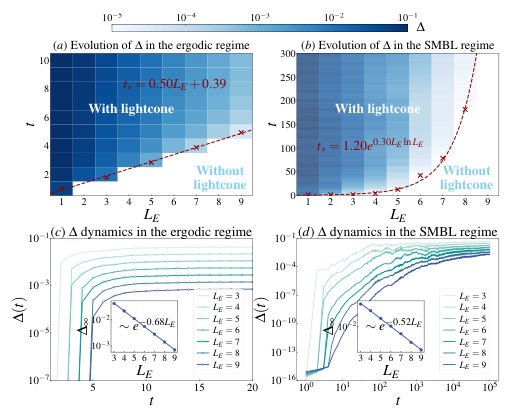 
FIG. 4. PPE connected second-moment trace distance ∆ for LA = 1, LB = 6, L = LE + 7, and X-basis measurement of B, averaged over 1000 random product states. (a),(c) F = 0.2; (b),(d) F = 0.8. Heatmaps show ∆(t,LE); crosses mark the 10−5 onset threshold and red dashed curves are the displayed fits. The light-cone labels distinguish the two sides of this threshold. Insets in (c),(d) show residuals at t = 20 and averaged over the last 200 saved times, respectively, with exponential fits. Time is in Floquet periods.

📷 Fig 5

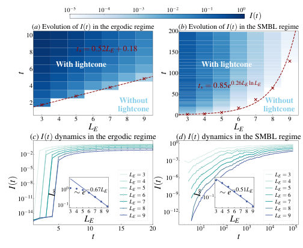 
FIG. 5. Premeasurement quantum mutual information I = SA +SB −SAB, using natural logarithms, with LA = 1, LB = 6, and L = LE + 7. Results average 1000 random product states; t counts Floquet periods. (a),(c) F = 0.2; (b),(d) F = 0.8. Crosses mark I = 10−5 and red dashed curves are onset fits. Insets show I(t = 20) in (c) and the mean over the last 20 saved times in (d), with exponential fits. The 0.67 fit uses LE = 6–9; the 0.51 fit uses LE = 3–9 and describes a finite-time average.

**Summary.** This paper analyzes quantum information spreading in a kicked Ising chain by using partial projected ensembles (PPEs). It finds that spatial constraints cause a dramatic difference in how fast correlations build up between ergodic and tilt-constrained regimes. The research provides an information-theoretic tool to distinguish between the physical time needed for correlations to develop and the information that can actually be measured when parts of the system are unobserved.

**Why it may be interesting.** This work directly addresses non-equilibrium dynamics and information scrambling in systems exhibiting localization or strong disorder, which are central topics in condensed matter theory, particularly concerning Many-Body Localization (MBL) physics.

Detailed structure

**Main problem.** The paper investigates how spatial constraints affect the emergence of quantum information about many-body dynamics, specifically comparing the time required for correlations to develop versus the information accessible under partial observation.

**Main result.** Partial projected ensembles reveal a strong contrast in correlation onset times between ergodic and tilt-constrained regimes, with the latter showing a significantly delayed buildup. The study establishes that partial observation probes the distinction between correlation development time and accessible information.

**Method.** The authors use numerical simulations on a kicked Ising chain, employing partial projected ensembles (PPEs) and analyzing various information-theoretic diagnostics like quantum mutual information and moment distances.

**Model / system.** The system is a kicked Ising chain subjected to a spatially varying longitudinal field, governed by a Floquet evolution operator. The analysis involves partitioning the chain into three regions: a target region (A), an unobserved buffer (E), and a measured region (B).

**Key observables.** Conditional-state fluctuations, quantum mutual information, connected second moment, and the onset time ($t^*$) for correlation buildup.

**Important parameters / regimes.** The control parameter $\Gamma$ (related to kick strength and Stark tilt), buffer length ($L_E$), and the comparison between the ergodic and tilt-constrained regimes.

**Assumptions / limitations.** The analysis relies on the mathematical framework of projected ensembles and assumes the applicability of specific information-theoretic bounds ($\Delta \le \chi \le I_q$).

**Figures summary.** Figures illustrate the comparison of correlation onset times ($t^*$) in ergodic vs. Stark-constrained regimes, the decay of moment distances ($\Delta(k)$) with buffer length, and the evolution of mutual information ($I$) over time.

**Paper structure.** The paper introduces the concept of PPEs to probe information beyond the reduced density matrix. It analyzes the dynamics in two distinct regimes (ergodic vs. tilt-constrained), deriving quantitative scaling laws for the onset of correlations and demonstrating the separation of phase accumulation and coherence loss using a solvable dephasing model.

Abstract

Projected ensembles reveal information about quantum many-body dynamics beyond the reduced density matrix. Here we investigate how spatial constraints affect the emergence of this information in a kicked Ising chain with a spatially varying longitudinal field. We consider partial projected ensembles, obtained by measuring a remote region while leaving an intervening buffer unobserved. Our numerical results reveal a pronounced contrast between nearly ballistic correlation onset in the ergodic regime and strongly delayed onset in the tilt-constrained regime, corroborated by quantum mutual information. Despite these different onset scales, the conditional-state fluctuations decrease approximately exponentially with buffer length in both regimes. Full projected ensembles additionally exhibit slow relaxation and persistent measurement-basis dependence in their higher moments. We establish an information-theoretic characterization of the connected second moment and use a solvable dephasing model with effective-basis measurements to illustrate the separation of phase accumulation and coherence loss. Within this model, a factorially suppressed coupling envelope yields sublogarithmic spreading consistent with the finite-distance onset trends. Our results identify partial projected ensembles as probes of the distinction between the time required for correlations to develop and the information that remains accessible under partial observation.

[↑ back to top](#top)

### [Phase-stable voltage bias for Josephson photonics devices](http://arxiv.org/abs/2609.17165v1)

**Authors:** Amir Hosein Esmaeili, Naveen Nehra, Alexandre Paquette, Mona Arabmohammadi, Baptiste Monge, Alexandre Rogalle, Francois Cyrenne-Bergeron, Yannick Lapointe, Nicolas Lavoie, Nicolas Bourlet, Max Hofheinz  
**Type:** experiment · **Category:** other · **PDF:** <https://arxiv.org/pdf/2609.17165v1>  
**Analysis basis:** full PDF text, analyzed in chunks
**Topic relevance:** 🔥 `quantum optics experiment` **4/5** · `driven-dissipative phase transition` **3/5** · `methods for driven-dissipative` **2/5** · `quantum measurements` **2/5** · `Keldysh / 2PI / non-Gaussian methods` **1/5** · `QC/QI experiment` **1/5** · `analog quantum simulation` **1/5** · `interference shaping light` **1/5** · `non-equilibrium universality` **1/5**

📷 Fig 1

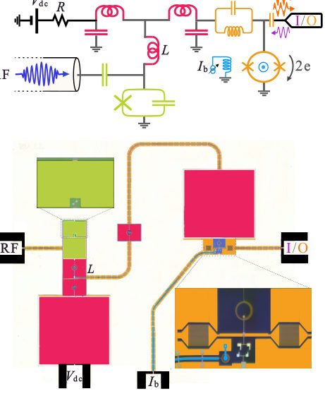 
Fig. 1. Integrated JVS-biased ICTA device. (a) Cir- cuit schematic of the device containing the JVS, ICTA, and superconducting low-pass filter. The JVS consists of a Joseph- son junction in parallel with a capacitor (shown in green) it is dc biased with a voltage Vdc through a source impedance R = 5 Ωand an RF tone is capacitively coupled. The ICTA comprises a single lumped-element resonator grounded by a SQUID (shown in orange) whose magnetic flux is controlled by an on-chip flux-bias line (shown in blue). Input signals are sent through a capacitively coupled I/O port and get ampli- fied in reflection. The two devices are connected via a low-pass filter (shown in red), isolating the two...

📷 Fig 2

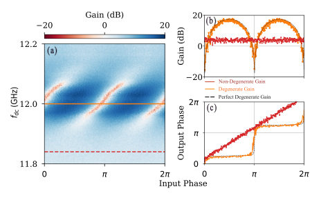 
Fig. 3. Phase-dependence of gain. (a) Gain map as a function of input signal phase and bias (fdc). The map clearly delineates the transition from the phase-preserving regime to the phase-sensitive regime within the JVS locking range (11.95 GHz to 12.05 GHz). (b) One-dimensional gain cuts in the locking range (fdc ≈fJVS = 12 GHz, orange) and out- side the locking range (fdc = 11.85 GHz, red). The gain in the locking range shows the characteristic π-periodicity of a degenerate parametric amplifier, with an amplification range of ±17 dB, whereas the unlocked response remains phase- independent at 7 dB. (c) Output phase response correspond- ing to the measurements in panel (b). In the...

📷 Fig 3

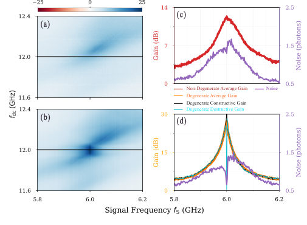 
Fig. 2. Comparison of ICTA without and with JVS stabilization. All data were acquired at a constant ICTA critical current Ic ≈80 nA. (a) Two-dimensional gain map of the unstabilized ICTA (JVS RF tone off) as a function of signal frequency (fS) and voltage bias expressed as Joseph- son frequency (fdc); gain is maximal near the LC resonance (f0 = 6 GHz). (b) Corresponding two-dimensional gain map with the JVS activated (JVS RF tone fJVS = 12 GHz, PJVS = −65 dBm), locking the actual Josephson frequency at 12 GHz over a ±50 MHz bias range. (c) Cut of panel (a) at fdc = 12 GHz showing gain of up to 13 dB with a band- width of ∼80 MHz (red curve) and an input-referred noise of ∼1.5 photons...

📷 Fig 4

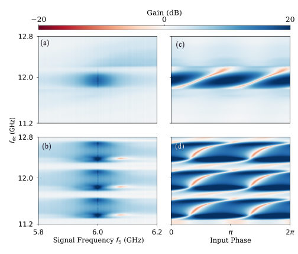 
Fig. 4. Gain modulation within the JVS locking range. (a, b) Magnitude gain of the ICTA as a function of bias fdc and signal frequency fS for two distinct JVS RF drive powers. At PJVS = −55 dBm (a), a single gain-modulation period is observed across the locking range. Increasing the RF power (b) to −43 dBm broadens the locking range, revealing three distinct periods. The observed frequency periodicity ∆fdc = 0.5 GHz is consistent with a current-induced inductive phase drop of 2π across the series inductance of the JVS. (c, d) Gain versus input phase and fdc at the degenerate point (fS = fdc/2). At lower RF power (c), the system exhibits a stable, nearly linear phase evolution. At higher RF...

📷 Fig 5

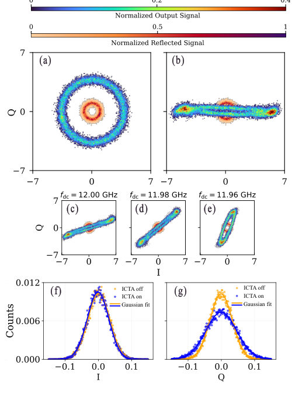 
Fig. 5. System characterization in phase space. In all panels, the input signal power is fixed at −120 dBm, while its phase is swept. The reflected input state (red) is captured with both the ICTA and JVS deactivated. The JVS is driven by a −65 dBm RF tone. In panels (a–e), bins representing less than 1% of the peak histogram value are masked. (a) Phase-preserving amplification of a coherent state with the JVS deactivated. The amplified output (blue, ICTA active) exhibits a circular symmetric distribution, indicating uniform gain across both quadratures. (b) Phase-sensitive response with the JVS activated. The output distribution becomes el- liptical, confirming quadrature-dependent...

**Summary.** The researchers developed a novel architecture by coupling a Josephson Voltage Standard (JVS) to a Josephson Photonics amplifier (ICTA) to solve the problem of phase noise. This integration successfully establishes a stable phase reference, leading to a significant gain enhancement and enabling the first demonstration of phase-sensitive quantum effects like squeezing in a dc-biased superconducting amplifier.

**Why it may be interesting.** This work directly addresses the challenge of phase coherence in superconducting quantum circuits, which is crucial for realizing high-fidelity quantum light sources and parametric processes.

Detailed structure

**Main problem.** Conventional parametric pumping methods suffer from parasitic nonlinearities, and existing Josephson Photonics (JP) devices lack a stable phase reference necessary for phase-coherent operation.

**Main result.** By integrating a Josephson Voltage Standard (JVS) to provide a noise-tolerant phase reference, the authors achieved a 14-dB gain enhancement and enabled the first observation of phase-sensitive gain and squeezing in a dc-biased amplifier.

**Method.** The study involves characterizing the Interacting Cavity Transmission Amplifier (ICTA) using gain maps and phase-space analysis, comparing performance with and without the active JVS reference.

**Model / system.** The system utilizes Josephson Junctions forming an ICTA, which is coupled to a JVS. The physics is described by Josephson junction potentials and analyzed using quantum Langevin equations and phase-space diagnostics.

**Key observables.** Averaged gain (up to 27 dB), quantum-limited noise performance, phase-sensitive gain, and squeezing characteristics.

**Important parameters / regimes.** DC bias voltage, RF tone power ($P_{JVS}$), signal frequency ($f_S$), and the phase difference ($\Delta$) between the signal and the phase reference.

**Assumptions / limitations.** The phase reference from the JVS is assumed to be coherently transferred to the ICTA via the superconducting order parameter, and phase noise averaging is assumed when the JVS is off.

**Figures summary.** Figures compare ICTA gain and noise with and without JVS stabilization, showing phase-space distributions that transition from phase-preserving (JVS off) to phase-sensitive (JVS on).

**Paper structure.** The paper first identifies the limitations of JP devices, then introduces the JVS-ICTA architecture. It proceeds to characterize the gain and noise in different regimes (degenerate vs. non-degenerate), demonstrating the critical role of the JVS in stabilizing the phase reference and enabling phase-sensitive quantum effects.

Abstract

Parametric interactions are foundational to superconducting quantum technologies, yet conventional microwave-driven pumping introduces parasitic Kerr nonlinearities and higher-order harmonics that limit device performance. Josephson Photonics (JP) avoids these parasitics by utilizing dc-biased junctions but has remained constrained by high phase noise and the absence of a stable phase reference. Here, we overcome this limitation by integrating a Josephson voltage standard (JVS) to establish a noise-tolerant phase reference, and demonstrate that this reference is coherently transferred to an inelastic Cooper-pair tunneling amplifier (ICTA) via the superconducting order parameter.The resulting low-phase-noise architecture yields a 14-dB enhancement in averaged gain and better quantum-limited noise performance. Critically, the phase reference enables the first observation of phase-sensitive gain and sqeezing in a dc-biased amplifier. By reconciling clean, Kerr-free nonlinearities with phase-coherent drive, our architecture establishes a robust platform for high-purity parametric processes in superconducting circuits.

[↑ back to top](#top)

### [qdmag: A Python package for simulating nonequilibrium magnetization of molecules using quantum master equations](http://arxiv.org/abs/2609.16352v1)

**Authors:** Shuanglong Liu, Xiao Chen, Andrew Cupo, James N. Fry, Hai-Ping Cheng  
**Type:** theory · **Category:** other · **PDF:** <https://arxiv.org/pdf/2609.16352v1>  
**Analysis basis:** full PDF text, analyzed in chunks
**Topic relevance:** 🔥 `methods for driven-dissipative` **4/5** · `driven-dissipative phase transition` **3/5** · `Keldysh / 2PI / non-Gaussian methods` **2/5** · `non-equilibrium universality` **2/5** · `quantum measurements` **2/5** · `analog quantum simulation` **1/5** · `correlated / nonlocal dissipation` **1/5** · `scars & prethermalization` **1/5**

📷 Fig 1

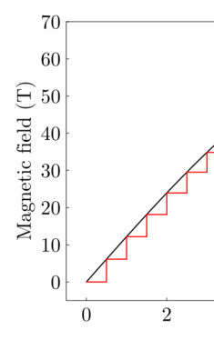 
Figure 1: Illustration of the staircase function used to approximate the continuous varia- tion of magnetic field with time.

📷 Fig 2

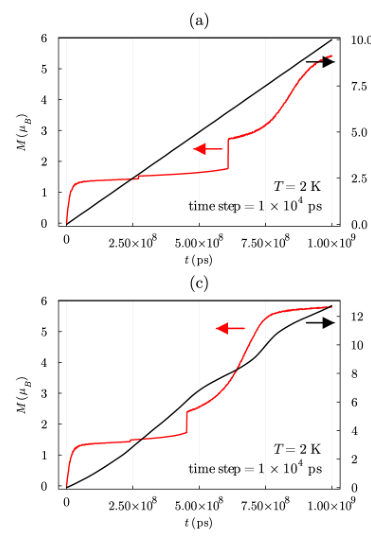 
Figure 2: Four different magnetic field profiles and the corresponding magnetization versus time for Ho(pzdo)4. Parameters used in calculations: sweep rate = 10 T/ms for the linear function in the panel (a); Turning points (1 µs, 0.1 T), (10 µs, 1 T), (100 µs, 5 T), and (1000 µs, 10 T) for the piecewise linear function in the panel (b); The cubic spline in the panel (c) is fitted to the experimental data2; An amplitude of 0.1 T and a period of 46.8 ps for the sinusoidal function in the panel (d). The temperature and time step are marked in the bottom right corner of each panel. I0 = 1 × 10−14 ps · rad−1 is used in all calculations.

📷 Fig 3

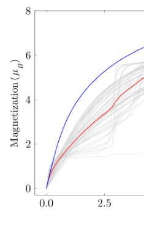 
Figure 3: Magnetization versus magnetic field before and after powder average. The equilibrium magnetization was given for comparison. Parameters used in calculations: T = 2 K, I0 = 1 × 10−14 ps · rad−1, sweep rate = 10 T/ms, and time step 1 × 104 ps.

📷 Fig 4

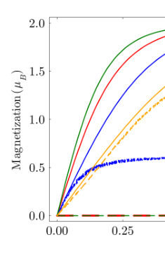 
Figure 4: Magnetization versus magnetic field using different exchange coupling tensors for a dimer. Parameters used in calculations: T = 0.2 K, I0 = 1 × 10−10 ps · rad−1, sweep rate = 10 T/ms, and time step = 1 × 104 ps.

📷 Fig 5

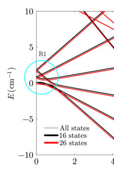 
Figure 5: Zeeman energy diagram for (CH6N3)2MnCl4 using the full spin Hamiltonian and two effective Hamiltonians. The energies are offset slightly to show the overlapping lines. Gray lines underlie every black or red line. Four regions in the plot are highlighted by cyan circles.

**Summary.** This paper presents qdmag, a Python package designed to simulate the time evolution of magnetization in magnetic molecules. It solves the quantum master equation, incorporating complex spin Hamiltonians and spin-phonon coupling effects. The tool is valuable for studying non-equilibrium spin dynamics in molecular nanomagnets under realistic, time-varying field conditions.

**Why it may be interesting.** This work is highly relevant as it provides a specialized, robust numerical tool for simulating open quantum dynamics in molecular magnets, which is a core area of AMO physics and quantum magnetism.

Detailed structure

**Main problem.** The paper addresses the simulation of nonequilibrium magnetization dynamics in magnetic molecules subjected to time-varying external magnetic fields and spin-phonon coupling.

**Main result.** The authors introduce qdmag, a computational package capable of simulating magnetization over long timescales, providing a tool to bridge theory and numerical calculation for spin dynamics.

**Method.** The dynamics are governed by solving the generalized Lindblad quantum master equation, utilizing a staircase approximation for time-varying fields and constructing effective Hamiltonians for computational feasibility.

**Model / system.** The system involves magnetic molecules whose spin Hamiltonian includes magnetic exchange interactions and Zero-Field Splitting (ZFS) terms. The dynamics are treated as an open quantum system coupled to a phonon bath, described by the Lindblad master equation.

**Key observables.** Nonequilibrium magnetization $M(t)$ and occupation numbers of energy levels.

**Important parameters / regimes.** Phonon bath spectral density parameters ($\alpha$), external magnetic field strength and time variation rate, and coupling constants ($\lambda$).

**Assumptions / limitations.** The package assumes the external magnetic field direction remains unchanged during the sweep, and calculations for high-dimensional systems rely on constructing lower-dimensional effective Hamiltonians.

**Figures summary.** Figures illustrate the staircase function for field approximation, and case studies show magnetization plateaus and Rabi oscillations in single-spin systems.

**Paper structure.** The paper introduces the theoretical framework (Hamiltonian decomposition, Lindblad equation), details the numerical methods (staircase approximation, effective basis construction), and validates the tool through multiple case studies (one-spin, two-spin, three-spin systems).

Abstract

We present qdmag, a computational utility for calculating the magnetization of magnetic molecules in a time-varying external magnetic field by solving a generalized Lindblad quantum master equation with spin-phonon coupling treated as a dissipation term. The package relies on the spin Hamiltonian formalism, which includes both the magnetic exchange interactions and the zero-field splitting (ZFS) interaction. Different types of magnetic exchange interaction and ZFS terms up to 12th order, which are written in terms of the extended Stevens operators, are supported. qdmag enables long-time evolution of magnetization for up to a few milliseconds, which is achieved through a staircase approximation of the magnetic field as a function of time. For high-dimensional spin Hamiltonians, a lower-dimensional effective Hamiltonian is constructed to make the calculations computationally feasible. Three case studies of one-spin, two-spin, and three-spin systems are presented to demonstrate the usage of qdmag. Our work offers a computational tool to bridge the gap between theoretical development and numerical calculations of spin dynamics in the presence of spin-phonon coupling.

[↑ back to top](#top)

### [Query-optimal quantum simulation of Lindblad evolution](http://arxiv.org/abs/2609.17490v1)

**Authors:** Chunhao Wang, Christopher Ye  
**Type:** theory · **Category:** quantum information and computing · **PDF:** <https://arxiv.org/pdf/2609.17490v1>  
**Analysis basis:** full PDF text, analyzed in chunks
**Topic relevance:** 🔥 `methods for driven-dissipative` **4/5** · `correlated / nonlocal dissipation` **3/5** · `driven-dissipative phase transition` **3/5** · `analog quantum simulation` **2/5** · `non-equilibrium universality` **2/5** · `Keldysh / 2PI / non-Gaussian methods` **1/5** · `quantum measurements` **1/5**

📷 Fig 1

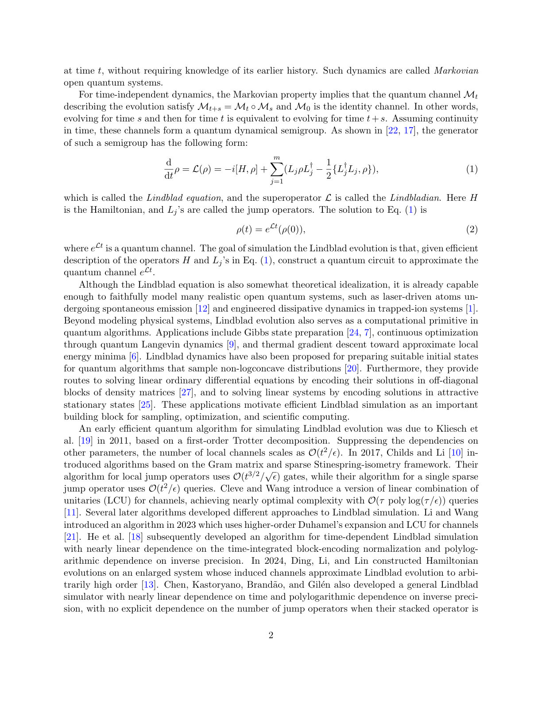 
Low-resolution page preview, page 2

📷 Fig 2

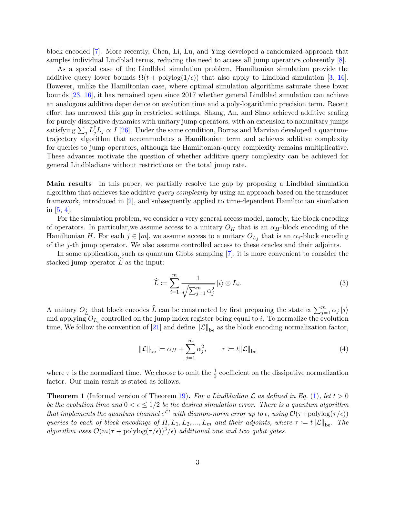 
Low-resolution page preview, page 3

📷 Fig 3

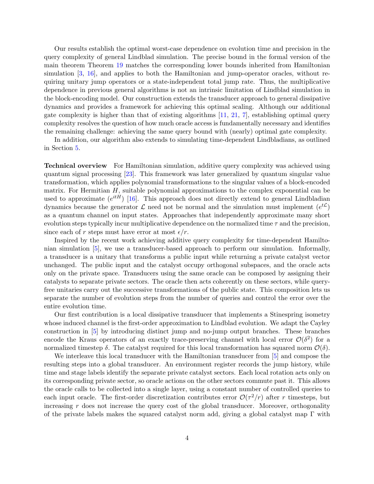 
Low-resolution page preview, page 4

📷 Fig 4

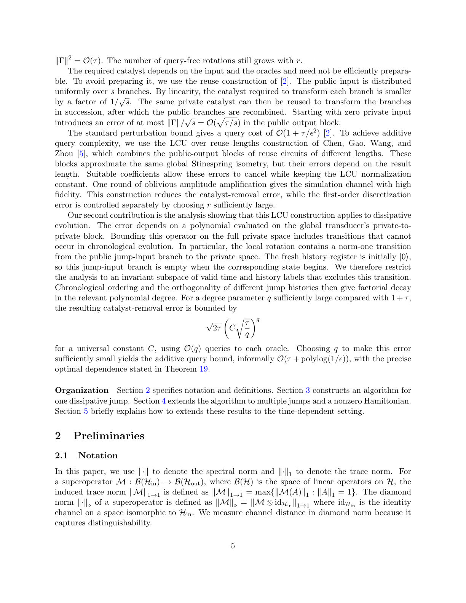 
Low-resolution page preview, page 5

📷 Fig 5

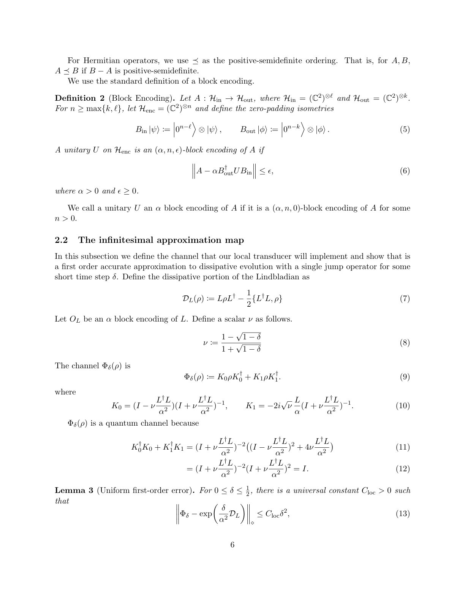 
Low-resolution page preview, page 6

**Summary.** This paper develops a quantum circuit algorithm to simulate Lindblad evolution, which models open quantum systems. By using a transducer framework, the authors achieve an optimal additive query complexity, resolving a long-standing question about the necessary scaling of resources. This result is significant for understanding the fundamental computational limits of simulating dissipative quantum dynamics.

**Why it may be interesting.** This work directly tackles the resource scaling (query complexity) for simulating open quantum systems, which is crucial for quantum simulation algorithms in AMO physics and quantum optics.

Detailed structure

**Main problem.** The paper addresses the fundamental query complexity required to simulate Lindblad evolution for open quantum systems over a given time $t$ to a precision $\epsilon$. It aims to close the gap between the known lower and upper bounds for this simulation.

**Main result.** The authors provide an algorithm achieving optimal additive query complexity, $O(	au + 	ext{polylog}(	au/\epsilon))$, for general Lindblad simulation in the block-encoding model. This proves that the multiplicative dependence on time previously suspected was not a fundamental necessity in this model.

**Method.** The approach utilizes a transducer framework, combining local dissipative transducers with Hamiltonian transducers, and employs linear combinations of reuse circuits to manage error accumulation.

**Model / system.** The system is an open quantum system whose dynamics are governed by the Lindblad master equation. The simulation is implemented using quantum circuits within the block-encoding model.

**Key observables.** The primary observable is the approximation of the quantum channel $e^{Lt}$ representing the evolution of the density matrix $
ho$.

**Important parameters / regimes.** Key parameters include the evolution time $t$, the desired precision $\epsilon$, and the total evolution time $	au$.

**Assumptions / limitations.** The analysis is restricted to the block-encoding model, and the gate complexity of the resulting algorithm is noted to be higher than existing methods.

**Paper structure.** The paper builds from the general problem of Lindblad simulation, details the use of transducers for composition, addresses error control (including catalyst-removal error), and extends the method to time-dependent generators.

Abstract

For the problem of simulating Lindblad evolution for time $t$ to precision $ε$, Hamiltonian simulation provides an additive query lower bound, informally, $Ω(t + \mathrm{polylog}(1/ε))$. However, the best previously known algorithms for general Lindblad simulation achieve a multiplicative upper bound, informally, $\mathcal{O}(t\,\mathrm{polylog}(1/ε))$, in gate complexity. It has remained open whether this multiplicative dependence is necessary. In this paper, we close the gap in query complexity by giving an algorithm with optimal additive dependence on evolution time and precision in the block-encoding model. Our approach uses the transducer framework to reduce the query cost of composing first-order approximations to the evolution channel, together with linear combinations of reuse circuits of different lengths to suppress catalyst-removal error.   Although our additional gate complexity is higher than that of existing algorithms, our optimal query complexity resolves the question of how much oracle access is fundamentally necessary and identifies the remaining challenge to achieve the optimal gate complexity.

[↑ back to top](#top)

### [Direct Observation of Dipolar-Driven Anisotropic Quantum Projection Noise in a Solid-State Spin Ensemble](http://arxiv.org/abs/2609.16106v1)

**Authors:** Tasuku Ono, Weijie Wu, Haopu Yang, Lillian B. Hughes Wyatt, Benjamin Brenner, Che Liu, Collin Fan, Chris R. Laumann, Jonathan N. Hallén, Emily J. Davis, Ania C. Bleszynski Jayich, Norman Y. Yao  
**Type:** experiment · **Category:** other · **PDF:** <https://arxiv.org/pdf/2609.16106v1>  
**Analysis basis:** full PDF text, analyzed in chunks
**Topic relevance:** 🔥 `QC/QI experiment` **4/5** · `analog quantum simulation` **3/5** · `quantum measurements` **3/5** · `Full counting statistics` **1/5** · `correlated / nonlocal dissipation` **1/5** · `quantum optics experiment` **1/5**

📷 Fig 1

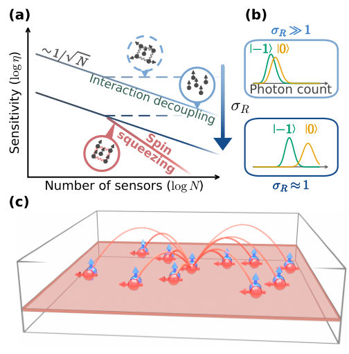 
FIG. 1. (a) Schematic depicting sensitivity as a function of the number of sensors in different regimes. The sensitiv- ity, η ∼σR/√N T2, can be improved by reducing the readout noise σR (light blue to dark blue), by increasing the number of spins N, or by extending the coherence time T2. Beyond a cer- tain density, dipolar interactions between the spins preclude reaching the standard quantum limit (dashed lines) and in- teraction decoupling is required to preserve the 1/ √

📷 Fig 2

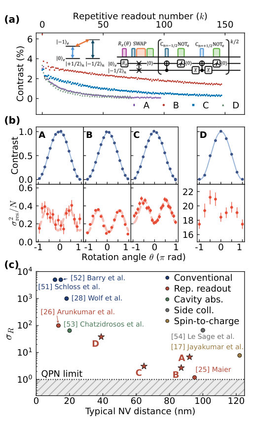 
FIG. 2. (a) Repetitive readout contrast versus the num- ber of readout repetitions k for spots A-D. Inset depicts the repetitive readout pulse sequence. Alternating the CnNOTe gate’s target nuclear spin state and subtracting the photon counts implements a differential readout that eliminates long- timescale drifts [44]. (b) Depicts the normalized contrast of the photon count signal n, which is proportional to the electronic spin polarization (top row) and the residual noise σ2 res/N (bottom row) as a function of θ for all four spots. For spots A, B and C, the dashed line shows numerical simula- tions of the residual noise, accounting for hyperfine linewidth, electronic-spin initialization...

📷 Fig 3

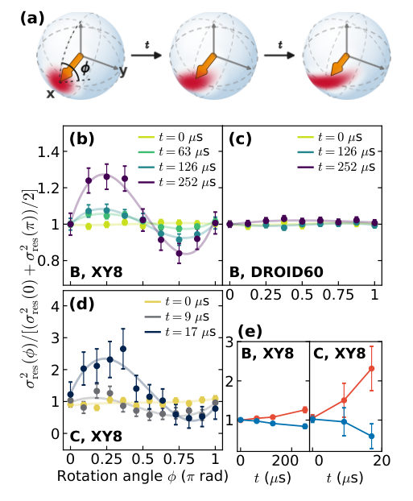 
FIG. 3. (a) Schematic depicting the evolution of the quan- tum projection noise of a two-dimensional NV ensemble. The native dipolar interactions cause the projection noise to both increase in magnitude and shear. This latter effect yields an anisotropic projection noise distribution. (b–d) Residual noise σ2 res(t, ϕ) as a function of the rotation angle ϕ for sev- eral evolution times t, normalized for each t by its average at ϕ = 0, π. Solid lines are guides to the eye. (b,d) For spots B and C, the dipolar interactions (under the XY-8 se- quence) directly reshape the QPN. Under the DROID-60 de- coupling sequence (spot B), the dipolar interactions are ef- fectively SU(2)-symmetrized,...

**Summary.** The research reports on achieving quantum-projection-noise-limited readout in a dense ensemble of NV centers in diamond. By using nuclear spin memory, they significantly improved readout fidelity, enabling the direct measurement of QPN. The key finding is the observation that intrinsic dipolar interactions cause the QPN to develop a measurable anisotropic profile, paving the way for solid-state entanglement sensing.

**Why it may be interesting.** This work provides a crucial experimental realization of measuring collective quantum noise in a solid-state platform, directly linking fundamental many-body interactions (dipolar coupling) to measurable quantum metrological signatures (noise anisotropy).

Detailed structure

**Main problem.** The primary goal was to directly observe and characterize the quantum projection noise (QPN) in a strongly-interacting, two-dimensional ensemble of solid-state spins, specifically quantifying how intrinsic dipolar interactions modify this noise profile.

**Main result.** The authors successfully demonstrated QPN-resolved readout and directly observed that the dipolar interactions shear the QPN into a measurable anisotropic profile, opening pathways for solid-state entanglement sensing.

**Method.** The measurement technique involved leveraging repetitive readout via the NV's nuclear spin memory to reach the quantum projection noise limit, followed by measuring the time-dependent variance of the collective spin operator along different axes.

**Model / system.** The system is a dense, strongly interacting ensemble of Nitrogen-Vacancy (NV) centers in diamond, confined to a thin 2D layer. The dynamics are governed by dipolar interactions, which are analyzed using the collective spin Hamiltonian.

**Key observables.** Residual variance ($\sigma^2_{	ext{res}}$), Quantum Projection Noise ($\sigma^2_{	ext{QPN}}$), and the angular dependence of the noise ($\sigma^2_{	ext{res}}(t, \phi)$).

**Important parameters / regimes.** Readout noise ($\sigma_R$), number of spins ($N$), dipolar coupling strength ($J_0$), and the sensing time ($T_{	ext{sense}}$).

**Assumptions / limitations.** The analysis assumes that readout imperfections contribute isotropically to the measured variance, allowing the measured anisotropy to be attributed solely to the spin dynamics.

**Figures summary.** Figures illustrate the improvement in readout fidelity via repetitive readout, the characteristic twice-per-Rabi-cycle oscillation of QPN, and the time evolution of the noise anisotropy, showing the shearing effect of dipolar interactions.

**Paper structure.** The paper progresses from establishing the necessity of high-fidelity readout (using nuclear memory) to demonstrating the QPN signature, and finally, analyzing the time evolution of the noise variance to isolate and characterize the dipolar-induced anisotropy.

Abstract

The nitrogen-vacancy (NV) center in diamond is a prominent quantum-sensing platform. Combining readout at the quantum projection noise limit with strong dipolar interactions promises substantial gains in sensitivity. However, experimentally accessing this regime has remained a longstanding challenge. In this work, we demonstrate quantum-projection-noise-resolved readout of a strongly-interacting, two-dimensional ensemble of NV centers. Our approach leverages repetitive readout via the NV's intrinsic $^{15}$N nuclear memory at a moderate magnetic field ($\sim 0.3$ T), improving the readout fidelities by nearly an order of magnitude. This enables us to directly resolve the quantum projection noise of a coherent spin state and to watch the ensemble's intrinsic dipolar interactions shear this noise into an anisotropic profile. Our results open the door to direct measurements of spin squeezing and entanglement-enhanced sensing in the solid state.

[↑ back to top](#top)

### [Quantum Simulation of Two-Dimensional Free Dirac Hamiltonian in Multimode Circuit QED](http://arxiv.org/abs/2609.16628v1)

**Authors:** Jiwon Kang, Jiuk Lee, Eliya Blumenthal, Shay Hacohen-Gourgy, Eunseong Kim  
**Type:** experiment · **Category:** other · **PDF:** <https://arxiv.org/pdf/2609.16628v1>  
**Analysis basis:** full PDF text, analyzed in chunks
**Topic relevance:** 🔥 `analog quantum simulation` **4/5** · `quantum optics experiment` **3/5** · `Tavis-Cummings & cavity-many-emitter` **2/5** · `QC/QI experiment` **1/5** · `driven-dissipative phase transition` **1/5** · `methods for driven-dissipative` **1/5** · `quantum measurements` **1/5**

📷 Fig 1

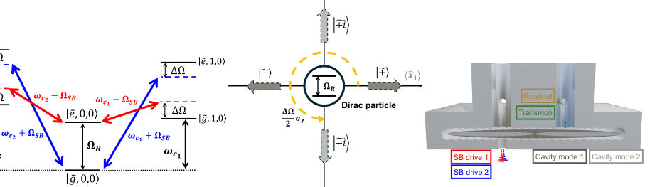 
FIG. 1: (a) Energy-level diagram of a Rabi-driven qubit interacting with cavity modes via double-sideband drives. (b) Schematic illustration of the dynamics governed by the effective Dirac Hamiltonian: σx for δ1 = −π/2 and σy for δ2 = 0. The Rabi-driven effective qubit represents the Dirac spinor, and one of the phase-space quadratures of each cavity mode corresponds to the position operator of the simulated Dirac particle. The arrows denote the spin- dependent cavity displacement direction. (c) Schematic of the experimental setup comprising a flute cavity integrated with a transmon qubit and a microstrip readout resonator.

📷 Fig 2

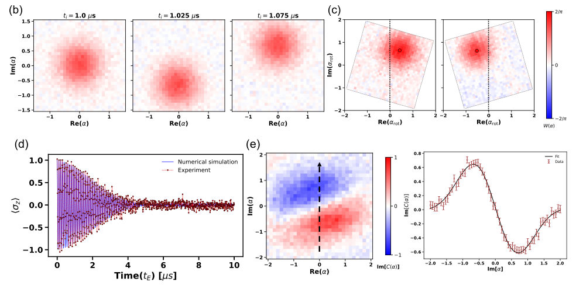 
FIG. 2: (a) Pulse sequence for the two-dimensional Zitterbewegung quantum simulations. The cavity state is ini- tialized by double-sideband drives during the preparation stage (ti), followed by Dirac Hamiltonian evolution under simultaneous Rabi and sideband drives (tE). After qubit projection (tP ) and ringdown (tR), the cavity state is mea- sured via characteristic function measurements. The cavity-state snapshots corresponding to panels (b), (c), and (e) are marked in the sequence. (b) Cavity state snapshots during the preparation stage measured via Wigner tomography under a sideband drive with ΩSB = 10 MHz. The cavity state oscillates along the imaginary axis of phase space with a...

📷 Fig 3

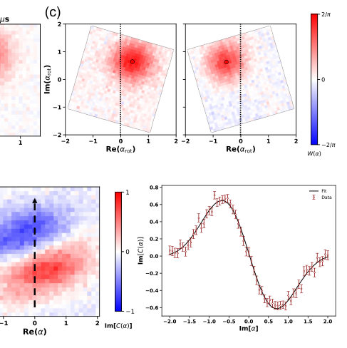 
Figure 2(e) illustrates the qubit-state-dependent char- acteristic functions after the projection and ringdown stage, together with representative one-dimensional cuts used to extract the slope. During trot = tP + tR, the dispersive interaction induces an additional qubit-state- dependent phase-space rotation of the cavity state. The

📷 Fig 4

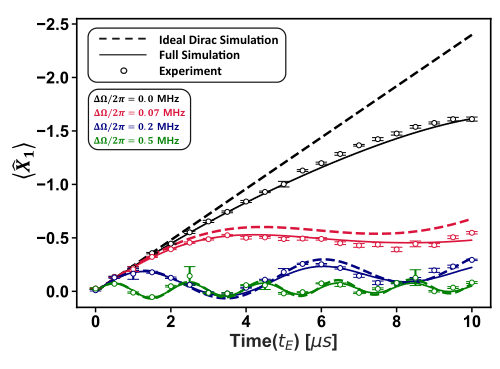 
FIG. 3: Experimental data and numerical simulations of one-dimensional Zitterbewegung dynamics for different effective particle masses. Dashed curves represent numer- ical simulations based on the ideal free Dirac Hamilto- nian, while solid curves correspond to simulations based on the effective free Dirac Hamiltonian implemented in the circuit-QED system, including the effects of sys- tem decoherence, RWA breakdown, and the finite an- harmonicity of the transmon qubit. Dotted markers de- note the experimental data. The effective particle mass increases for the black, red, navy, and green curves, cor- responding to ∆Ω/2π = 0, 0.07, 0.2, and 0.5 MHz, re- spectively.

📷 Fig 5

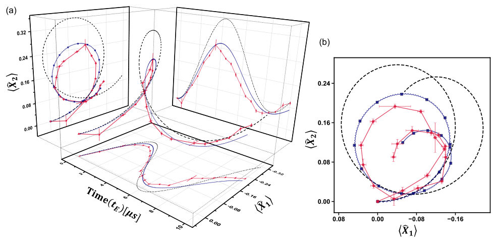 
FIG. 4: Experimental data and numerical simulations of two-dimensional Zitterbewegung for two effective particle masses. Black dashed lines show the ideal Dirac dynamics, while navy solid lines show simulations including experi- mental conditions, with navy squares indicating time points sampled every 0.5 µs. Red circles show the experimental data sampled at the same time intervals up to 10 µs. (a) Dynamics for ∆Ω/2π = 0.10 MHz, shown as the two orthogonal position components versus evolution time and their projection onto the two-dimensional position plane. (b) Two-dimensional trajectory for ∆Ω/2π = 0.15 MHz.

**Summary.** The research demonstrates the realization of a programmable two-dimensional free Dirac Hamiltonian using circuit QED. By coupling a transmon qubit to a multimode cavity, the authors simulate the dynamics of massive Dirac particles, observing characteristic Zitterbewegung. This establishes the platform as a powerful tool for studying higher-dimensional relativistic quantum phenomena.

**Why it may be interesting.** This work is highly relevant as it pushes the boundaries of quantum simulation in circuit QED, demonstrating control over complex, relativistic Hamiltonians (like the massive Dirac equation) in a solid-state platform, which is a major goal in AMO physics.

Detailed structure

**Main problem.** The primary challenge addressed is the programmable quantum simulation of two-dimensional massive Dirac dynamics, a regime that has not been experimentally explored despite successes in 1D and massless 2D simulations.

**Main result.** The authors successfully realized a programmable 2D free Dirac Hamiltonian in circuit QED, observing rotational Zitterbewegung and confirming the platform's utility for higher-dimensional relativistic quantum dynamics.

**Method.** The simulation relies on engineering the Hamiltonian using a single transmon qubit coupled to two modes of a multimode cavity, with dynamics analyzed via time-dependent master-equation simulations.

**Model / system.** The system is a circuit QED setup using a transmon qubit coupled to a multimode cavity. The dynamics are governed by an effective Dirac Hamiltonian, which is programmed by tuning the qubit-cavity couplings and detunings.

**Key observables.** Rotational Zitterbewegung of the Dirac particle, expectation values of cavity quadratures ($\langle\hat{X}_j
angle$), and time-averaged fidelity.

**Important parameters / regimes.** Effective mass (tunable via detuning $\Delta\Omega$), Rabi frequencies ($\Omega_R$), cavity mode coupling strengths ($\chi_j$), and decoherence times ($T_{1,
ho}, T_{2,
ho}$).

**Assumptions / limitations.** The analysis incorporates corrections beyond the Rotating-Wave Approximation (RWA), finite transmon anharmonicity, and measured decoherence effects, which are key limitations.

**Figures summary.** Figures illustrate the energy-level diagram, the schematic of the Dirac Hamiltonian dynamics, the experimental setup, and time evolution plots comparing experimental data to master-equation simulations for Zitterbewegung.

**Paper structure.** The paper details the physical realization of the 2D Dirac Hamiltonian, presents calibration procedures for drive amplitudes and phases, demonstrates the measurement protocol using characteristic functions, and finally analyzes the resulting Zitterbewegung dynamics while accounting for decoherence and anharmonicity.

Abstract

Two-dimensional massive Dirac systems feature a gapped Dirac-cone dispersion central to a broad range of phenomena in condensed-matter and topological physics. While quantum simulations have demonstrated one-dimensional Dirac dynamics and two-dimensional massless Weyl dynamics, programmable simulation of massive two-dimensional Dirac dynamics remains experimentally unexplored. Here, we realize a programmable two-dimensional free Dirac Hamiltonian in circuit QED, with independently tunable spin-momentum couplings and mass, using a single Rabi-driven qubit coupled to two modes of a multimode cavity. Using this Hamiltonian, we observe rotational Zitterbewegung of a two-dimensional massive Dirac particle and its dependence on the effective mass. Time-dependent master-equation simulations incorporating measured decoherence, corrections beyond the rotating-wave approximation (RWA), and anharmonicity of the transmon reproduce the observed dynamics. Our results establish multimode circuit QED as a compact, programmable platform for higher-dimensional relativistic quantum dynamics and provide a foundation for exploring dynamical and topological phenomena in gapped Dirac systems.

[↑ back to top](#top)

### [Analytical solutions to the non-equilibrium Green's functions in large-$q$ SYK models](http://arxiv.org/abs/2609.16438v1)

**Authors:** Jan C. Louw  
**Type:** theory · **Category:** statistical mechanics · **PDF:** <https://arxiv.org/pdf/2609.16438v1>  
**Analysis basis:** full PDF text, analyzed in chunks
**Topic relevance:** 🔥 `Keldysh / 2PI / non-Gaussian methods` **4/5** · `non-equilibrium universality` **3/5** · `scars & prethermalization` **3/5** · `methods for driven-dissipative` **2/5**

📷 Fig 1

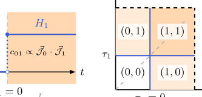 
FIG. 1. (a) Schematic of the quench protocol. The time axis is partitioned into I0, I1. The quench occurs at τ1 = 0. The quench strengths are encoded in the alignment of the coupling vectors, cab ≡⃗Ja · ⃗Jb/(JaJb). To simplify notation, we label functions by the intervals in which their time arguments lie, e.g. J (t1) = Ja or cab = c(t1, t2) for (t1, t2) ∈Ib ×Ib. (b) Partition of the (t1, t2)-plane into blocks Ib×Ib. The boundary conditions are imposed along the blue connecting lines.

**Summary.** This work analytically solves the non-equilibrium Green's functions for the SYK model following a quench between non-commuting Hamiltonians. By finding closed-form solutions for all time blocks, the authors derive an exact temperature update rule. Crucially, they show that the system must heat up, providing a geometric manifestation of the second law of thermodynamics for this chaotic quantum system.

**Why it may be interesting.** The rigorous derivation of non-equilibrium dynamics and the emergence of thermodynamic laws (like the second law) from microscopic, solvable models like SYK is highly relevant for understanding thermalization in complex quantum systems.

Detailed structure

**Main problem.** The paper provides analytical solutions for the non-equilibrium Green's functions in large-$q$ Sachdev-Ye-Kitaev (SYK) models following a quench between non-commuting Hamiltonians.

**Main result.** Analytical solutions are found for all time blocks, establishing an exact temperature update rule and demonstrating geometrically that heating is inevitable for the closed system, confirming the second law.

**Method.** The analysis uses the Keldysh contour formalism and solves differential equations governing the Green's functions in the large-$q$ limit, utilizing SL(2) symmetry parametrization.

**Model / system.** The system is the Sachdev-Ye-Kitaev (SYK) model, a strongly interacting, chaotic quantum system. The study focuses on the dynamics after a quench between non-commuting $q/2$-body Hamiltonians.

**Key observables.** Non-equilibrium Green's functions, $G(t_1, t_2)$, and the resulting temperature update rule relating pre- and post-quench energies.

**Important parameters / regimes.** The large-$q$ limit, the coupling factor $c_{01}$ (related to the angle between coupling vectors $\vartheta$), and the initial/final energies $\epsilon_0, \epsilon_1$.

**Assumptions / limitations.** The solvability is established in the large-$q$ limit and at leading order in $1/q$. The analysis focuses on the Hermitian case ($\phi=0$) for real couplings.

**Figures summary.** Figure 1 schematically illustrates the quench protocol by partitioning the time axis and the $(t_1, t_2)$-plane into distinct time blocks.

**Paper structure.** The paper builds upon known leading-order solutions, derives the dynamics for the off-diagonal Green's function blocks using differential equations, solves these equations analytically, and finally extracts the energy and temperature update rules.

Abstract

It is known that the Sachdev-Ye-Kitaev (SYK) model is exactly solvable at leading order in $1/q$; specifically, the instantaneously thermal time block after the quench is known in closed form. Thus far the remaining (inherently out of equilibrium) blocks have only been numerically accessible. Here we provide their analytical solutions for a quench between non-commuting $q/2$-body SYK Hamiltonians. We obtain the Green's functions in closed form for every time block. We extract a simple relation between the pre- and post-quench energies $ε_1 \propto ε_0$ leading to an exact temperature update rule. Via a Cauchy-Schwarz inequality, we show that heating is inevitable for the closed system; hence, the second law emerges geometrically. The solution is used in a companion paper to address what ``instantaneous thermalization'' means at finite $q$.

[↑ back to top](#top)

### [Floquet Dressing and Bath Spectral Effects on the Geometric Phase of a Driven Dissipative Qubit](http://arxiv.org/abs/2609.16609v1)

**Authors:** Chirag Arora  
**Type:** theory · **Category:** statistical mechanics · **PDF:** <https://arxiv.org/pdf/2609.16609v1>  
**Analysis basis:** full PDF text, analyzed in chunks
**Topic relevance:** 🔥 `methods for driven-dissipative` **4/5** · `driven-dissipative phase transition` **3/5** · `correlated / nonlocal dissipation` **1/5** · `non-equilibrium universality` **1/5** · `quantum measurements` **1/5**

📷 Fig 1

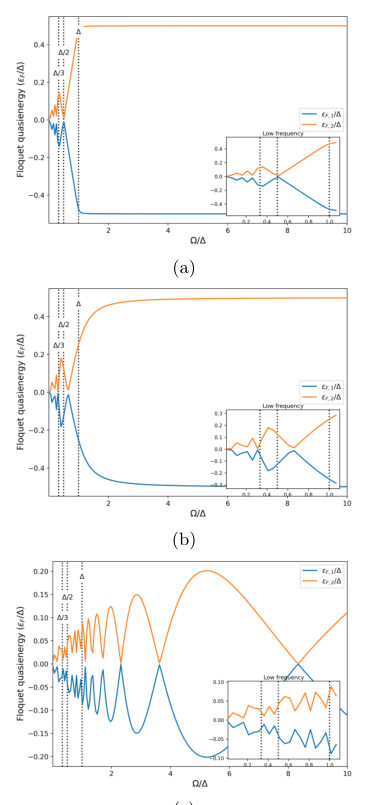 
FIG. 1: Floquet quasienergy spectrum of the driven sym- metric qubit as a function of the normalized drive fre- quency Ω/∆for increasing drive amplitude. Panels (a)– (c) correspond to A/∆= 0.1, 1.0, and 10.0, respec- tively. The vertical dotted lines indicate the bare n- photon resonance frequencies, Ω/∆= 1/n, and are in- cluded as guides to the eye. With increasing drive ampli- tude, higher-order Floquet sectors become increasingly mixed, giving rise to additional avoided crossings and a progressively richer quasienergy structure.

📷 Fig 2

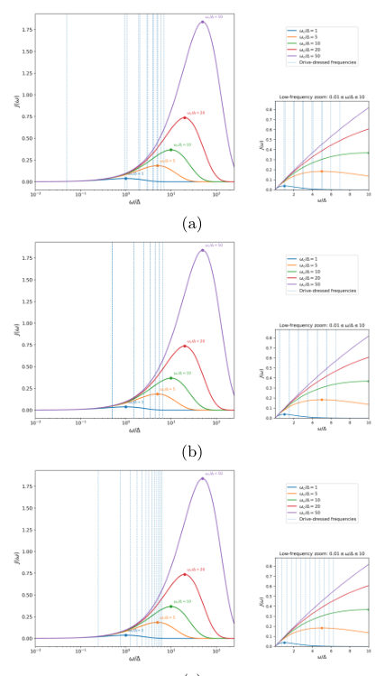 
FIG. 2: Bath spectral density and drive-dressed Flo- quet sidebands of the driven symmetric qubit for in- creasing drive amplitude. Panels (a)-(c) correspond to A/∆= 0.1, 1.0, and 10.0, respectively, at fixed drive fre- quency Ω/∆= 1. In each panel, the spectral density J(ω) is shown as a function of the normalized bath fre- quency ω/∆for representative cutoff frequencies ωc/∆= 1, 5, 10, 20, and 50. The vertical dashed lines indicate the drive-dressed transition frequencies ωn = |∆εF +nΩ|, where ∆εF is the Floquet quasienergy gap and n la- bels the Floquet sideband. Increasing the drive ampli- tude modifies both the quasienergy gap and the distri- bution of Floquet sidebands, thereby...

📷 Fig 3

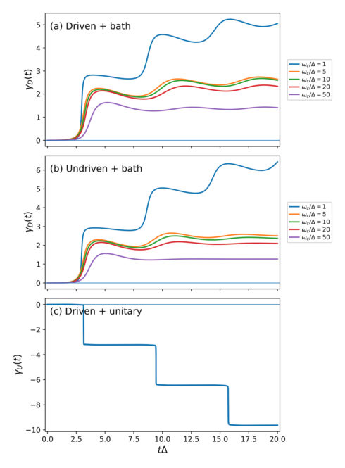 
FIG. 3: For A/∆= 0.1 and some representative values of ωc/∆at α = 0.05, T/∆= 1.5, and tmem = 5τc, panels (a), (b), and (c) show the GP γD for driven dissipative, dissipative and driven non-dissipative qubit respectively. The drive frequency Ω= ∆is resonant with the bare tunneling splitting of the undriven qubit.

📷 Fig 4

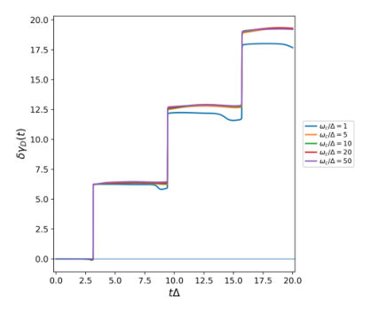 
FIG. 4: For representative values of ωc/∆at α = 0.05, T/∆= 1.5, and tmem = 5τc the δγD values for weak driv- ing amplitude, corresponding to A/∆= 0.1 are shown. The drive frequency Ω/∆= 1 is resonant with the bare tunneling splitting of the bare undriven qubit.

📷 Fig 5

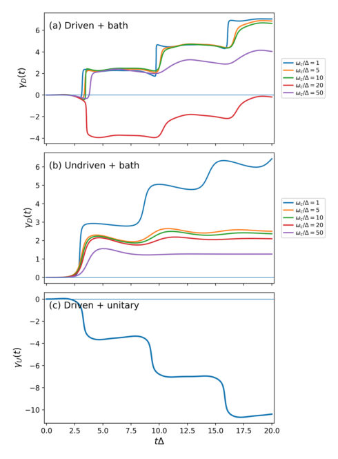 
FIG. 5: For A/∆= 1.0 and some representative values of ωc/∆at α = 0.05, T/∆= 1.5, and tmem = 5τc, panels (a), (b), and (c) show the GP γD for driven dissipative, dissipative and driven non-dissipative qubit respectively. The drive frequency Ω= ∆is resonant with the bare tunneling splitting of the undriven qubit.

**Summary.** This paper analyzes the geometric phase dynamics of a driven, dissipative qubit using advanced numerical techniques. It demonstrates that periodic driving allows for active control over how the environment deforms the quantum phase. The findings establish a crucial link between Floquet engineering, quantum dissipation, and the control of open quantum system dynamics.

**Why it may be interesting.** This work directly addresses the control of quantum coherence (GP) in realistic, open quantum systems by explicitly incorporating the effects of time-periodic driving, which is a major topic in modern quantum physics.

Detailed structure

**Main problem.** The paper investigates how the interplay between periodic driving (Floquet dressing) and environmental dissipation affects the geometric phase (GP) accumulated by a driven qubit.

**Main result.** Periodic driving offers a mechanism to control the dissipative geometric phase, as the resulting dissipation pathways depend jointly on Floquet matrix-element weights and the bath spectral overlap.

**Method.** The study employs the numerically exact Process-Tensor Time-Evolving Matrix Product Operator (PT-TEMPO) method combined with Floquet theory to analyze the reduced density matrix dynamics.

**Model / system.** The system is a symmetric two-level system (qubit) modeled by the Spin-Boson Model (SBM), subjected to a longitudinal monochromatic drive and coupled to an Ohmic bosonic environment.

**Key observables.** Geometric Phase (GP), non-additive GP contribution ($\delta\gamma_D$), and the purity/Bloch vector trajectory of the reduced density matrix.

**Important parameters / regimes.** Drive amplitude ($A$), drive frequency ($\Omega$), and the characteristic bath spectral density parameters ($\alpha, \omega_c$).

**Assumptions / limitations.** The analysis avoids assuming weak coupling or Markovian dynamics, using the PT-TEMPO method for accuracy.

**Figures summary.** Figures compare the strengths of three coupling terms—Floquet matrix-element weights, bath spectral density, and their product—across different drive frequency regimes to determine the conditions for strong dissipation.

**Paper structure.** The paper follows a structure introducing the model, reviewing the theoretical framework (including GP and Floquet theory), presenting numerical results analyzing the drive-bath interplay, and concluding with the implications for quantum control.

Abstract

Building on recent work by Wang et al. on the dissipative geometric phase (GP) in the spin-boson model (SBM), the GP dynamics of a periodically driven symmetric SBM are investigated using the numerically exact process-tensor time-evolving matrix product operator (PT-TEMPO) method. A symmetric two-level system subjected to a longitudinal monochromatic drive along the same system coordinate that couples to an Ohmic bosonic environment exhibits rich GP dynamics arising from the interplay between driving and dissipation. To isolate cooperative drive-bath effects, a non-additive GP contribution is introduced that separates the driven dissipative response from its driven-unitary and undriven-dissipative components. Periodic driving is found to either suppress or enhance bath-induced GP deformation depending on the interplay between drive and bath timescales. These trends are interpreted through Floquet spectral steering, whereby the drive redistributes the coherent dynamics among quasienergy sidebands whose transition frequencies and Fourier-resolved system-bath matrix elements determine their coupling to the environmental spectrum. Floquet analysis shows that the dominant dissipative pathways are governed jointly by Floquet matrix-element weights and bath spectral overlap, rather than by either alone. These results connect Floquet engineering, quantum dissipation, and GP dynamics and establish periodic driving as a means of controlling the GP of open quantum systems (OQSs).

[↑ back to top](#top)

### [Generation of pure spin currents via nonadiabatic quantum pumping in an antiferromagnetic chain](http://arxiv.org/abs/2609.16819v1)

**Authors:** Leila Eslami, Fatemeh Bourbour, Somaieh Ahmadi, Santanu K. Maiti  
**Type:** theory · **Category:** other · **PDF:** <https://arxiv.org/pdf/2609.16819v1>  
**Analysis basis:** full PDF text, analyzed in chunks
**Topic relevance:** 🔥 `Keldysh / 2PI / non-Gaussian methods` **4/5** · `methods for driven-dissipative` **2/5** · `Frenkel-Kontorova` **1/5** · `driven-dissipative phase transition` **1/5**

📷 Fig 1

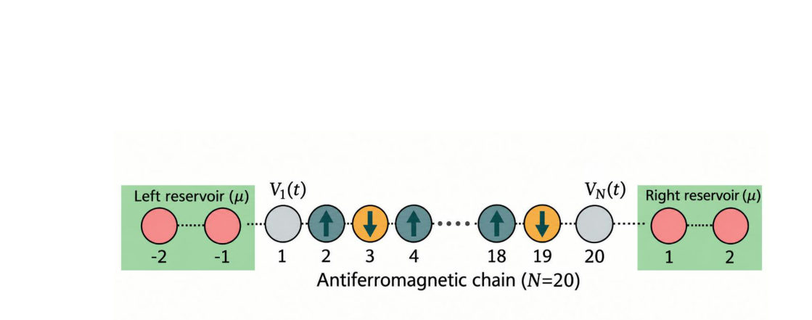 
Figure 1. Schematic representation of a 20-site atomic chain with an antiferromagnetic

📷 Fig 2

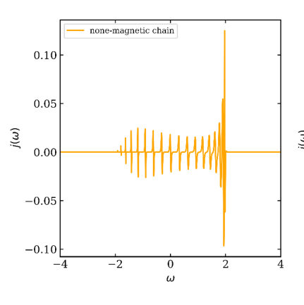 
Figure 2. Spectral current of electrons in (a) non-magnetic and (b) antiferromagnetic

📷 Fig 3

 
Figure 3. Spectral current for spin-up (red) and spin-down (green) in the presence of exchange

📷 Fig 4

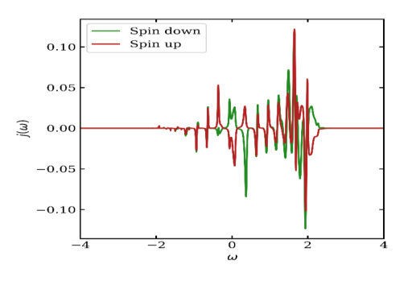 
Figure 3 displays the spectral current for spin-up and spin-down in the presence of exchange

📷 Fig 5

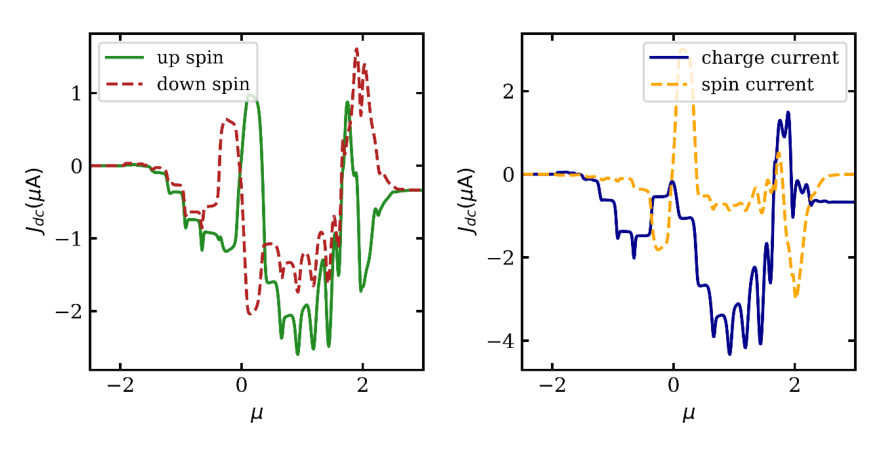 
Figure 4. (a) Pumped DC current for spin-up (solid green line) and spin-down (dashed red line)

**Summary.** This work theoretically explores generating pure spin currents in an antiferromagnetic chain using nonadiabatic quantum pumping. By applying time-dependent potentials and analyzing spin-resolved currents via NEGF, the authors show that the spin current can be significantly enhanced while the net charge current is suppressed. This provides a promising pathway for designing energy-efficient spin-pumping spintronic devices.

**Why it may be interesting.** The ability to engineer spin currents purely through time-dependent potentials in an antiferromagnet is highly relevant for spintronics, offering a mechanism for low-dissipation spin manipulation without relying on magnetic impurities or external magnetic fields.

Detailed structure

**Main problem.** The study investigates the generation and control of pure spin currents in an antiferromagnetic chain without applying an external bias.

**Main result.** The research demonstrates that by operating in the nonadiabatic pumping regime, a pure spin current can be generated and controlled by tuning the chemical potential and driving frequency, allowing for spin current flow with negligible net charge transfer.

**Method.** The analysis employs the Keldysh non-equilibrium Green's function (NEGF) formalism, treating the system as a tight-binding model driven by time-dependent potentials.

**Model / system.** The system is an antiferromagnetic atomic chain coupled to two non-magnetic leads. The Hamiltonian includes antiferromagnetic exchange interactions, and the driving is achieved via two time-dependent potentials applied to the chain ends.

**Key observables.** Pumped spin current ($I_s$), charge current ($I_c$), spin-up and spin-down spin-resolved currents.

**Important parameters / regimes.** Driving frequency ($\Omega$), chemical potential ($\mu$), and the antiferromagnetic exchange field ($h$).

**Assumptions / limitations.** The calculations utilize the Keldysh NEGF formalism and often employ the first harmonic approximation in the Floquet representation.

**Figures summary.** Figures illustrate the spectral current for spin-up/spin-down channels, showing spectral separation at high frequencies. Subsequent figures map the pumped DC currents ($I_c$ and $I_s$) as functions of $\mu$ and $\Omega$, highlighting the near-vanishing charge current while spin current persists.

**Paper structure.** The paper systematically analyzes the spin current response across different driving regimes: first showing spin symmetry in the adiabatic regime, then demonstrating frequency-induced spin-up/spin-down divergence in the nonadiabatic regime, and finally mapping the control landscape using $\mu$ and $\Omega$ to achieve pure spin pumping.

Abstract

In this study, quantum spin pumping in an antiferromagnetic chain driven by time-dependent potential is investigated. The aim is to explore the possibility of generating and controlling spin currents in the absence of external bias and to examine the role of exchange field and periodic driving in the separation of spin-up and spin-down currents. The system is described using a tight-binding model, and spin-resolved currents are calculated employing the Keldysh non-equilibrium Green's function formalism. Two time-dependent potentials with a specific phase difference are applied to the two ends of the chain, while the chemical potentials of both electrodes are set equal. The results demonstrate that in the adiabatic regime (low frequencies), the response of the two spin channels is nearly identical. However, as the driving frequency increases and the system enters the nonadiabatic regime, absorption and emission processes of energy quanta become activated, leading to significant differences between spin-up and spin-down currents. The pumped current exhibits strong dependence on the chemical potential, allowing for the control of both magnitude and direction of the spin current through its adjustment. With increasing frequency, the spin current enhances, and parameters can be tuned such that the charge current nearly vanishes while a considerable spin current persists. This finding indicates the feasibility of achieving nearly pure spin pumping without net charge transfer in the antiferromagnetic chain. The results provide a promising perspective for designing spin-pumping devices based on antiferromagnetic systems.

[↑ back to top](#top)

### [In-Situ Quantum Optical Measurement for Colloidal Quantum Dots Confined in an Optical Trap](http://arxiv.org/abs/2609.16692v1)

**Authors:** Zhi-Bo Ni, Jiong-Zhao Li, Jia-Wang Yu, Xiao-Tian Cheng, Yun-Ran Wang, Dai-Bao Hou, Yan-Hua Liu, Wei Fang, Xing Lin, Chao-Yuan Jin  
**Type:** experiment · **Category:** other · **PDF:** <https://arxiv.org/pdf/2609.16692v1>  
**Analysis basis:** full PDF text, analyzed in chunks
**Topic relevance:** 🔥 `quantum measurements` **4/5** · 🔥 `quantum optics experiment` **4/5**

📷 Fig 1

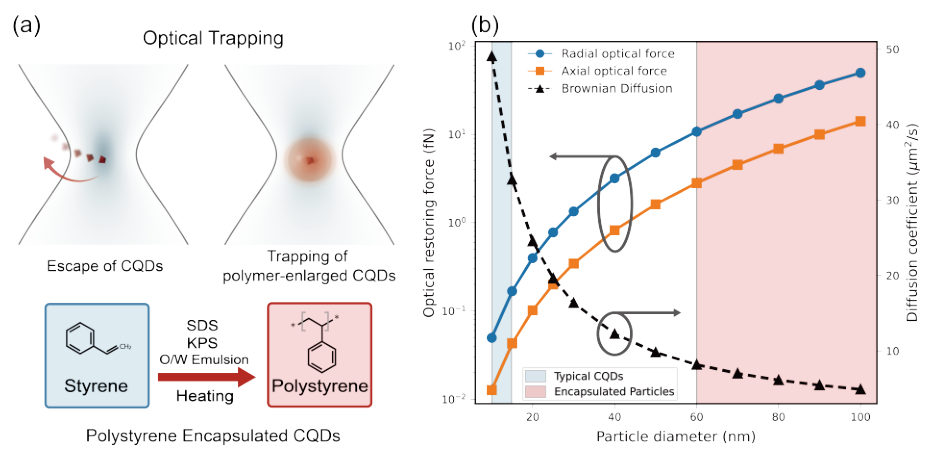 
Figure 1: Enhanced optical trapping of CQDs through particle-size enlargement by polystyrene encapsulation. (a) Schematic illustration of the weak optical confinement of small bare CQDs and the enhanced optical trapping after polystyrene encapsulation, to- gether with the encapsulation process via thermal polymerization of styrene. (b) Calculated radial and axial optical restoring forces and Brownian diffusion coefficient as a function of particle diameter. The shaded regions indicate the representative size ranges of bare CQDs and polymer-encapsulated particles.

📷 Fig 2

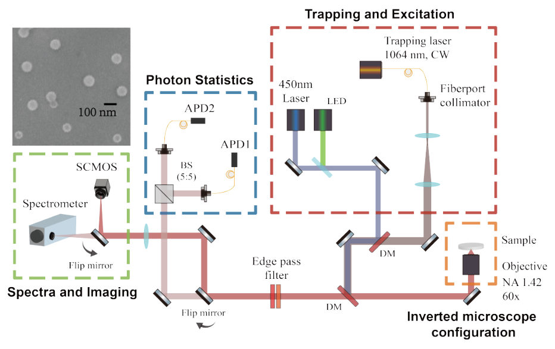 
Figure 2: Custom-built inverted micro-photoluminescence platform with optical trapping. The system integrates a 1064 nm CW trapping laser, 450 nm excitation sources, a high- NA oil-immersion objective, and switchable detection pathways for spectroscopy, wide-field imaging, and photon correlation measurements.

📷 Fig 3

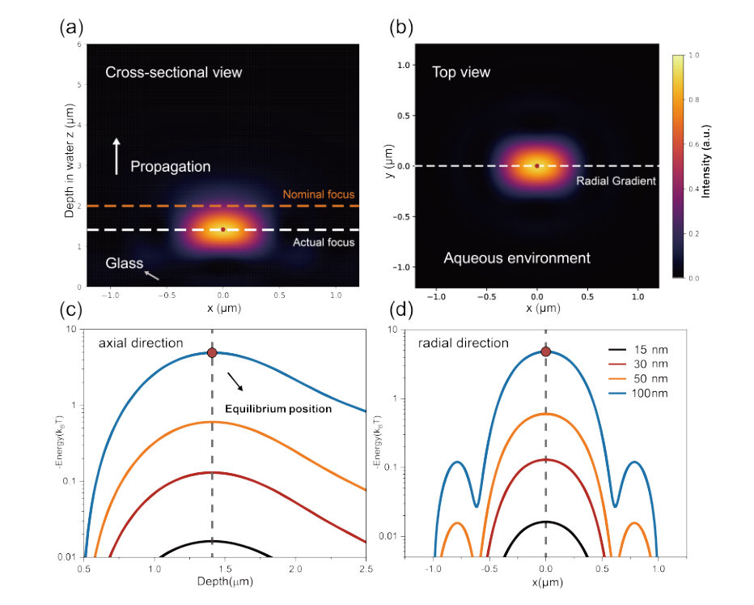 
Figure 3: Reconstructed trapping field and simulated optical trapping potentials at a nominal focal depth of 2 µm. (a) Cross-sectional view of the focal-field distribution across the glass– water interface, showing the nominal trapping plane and the aberration-shifted focal position. (b) Top view of the reconstructed focal field at the trapping plane. The slight asymmetry of the focal spot arises from the x-polarized trapping beam under high-NA focusing. (c) Axial and (d) radial potential-energy landscapes for particles of different diameters.

📷 Fig 4

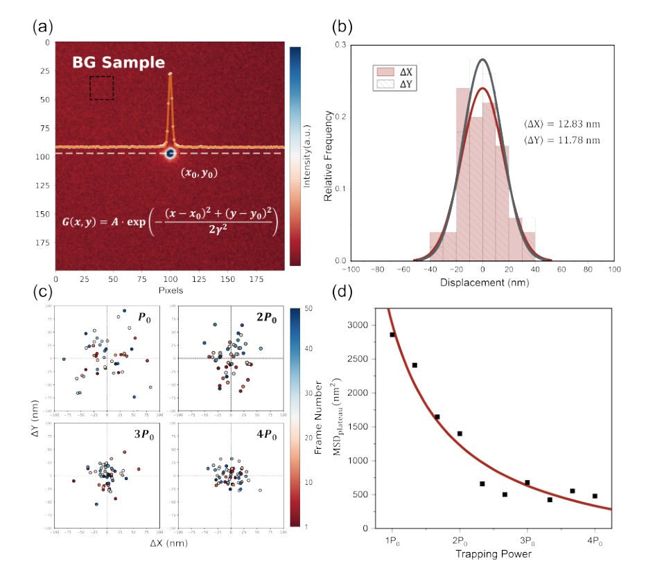 
Figure 4: Spatial confinement and trajectory analysis of an optically trapped PQD. (a) Representative wide-field PL image of a trapped PQD. (b) Histograms of the positional deviations, with mean absolute deviations below 20 nm. (c) Extracted x–y positions at different trapping powers with an integration time of 100 ms per frame, showing progressively narrower distributions at higher powers. (d) Plateau mean-square displacement (MSD) along one lateral direction, which decreases with increasing trapping power, indicating stronger optical confinement.

📷 Fig 5

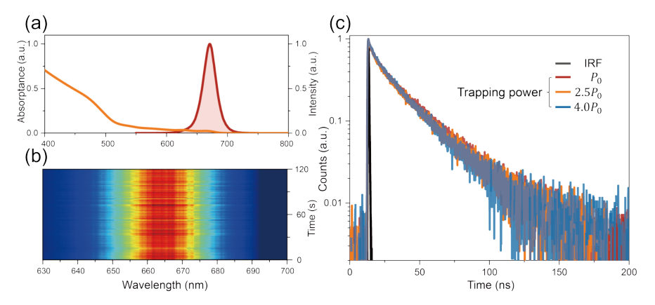 
Figure 5: Optical characterization of PQDs under optical trapping. (a) Absorption and pho- toluminescence spectra of the CQD ensemble, showing a pronounced decrease in absorption at longer wavelengths. (b) Emission spectra of a single trapped PQD nanoparticle recorded over 120 s. (c) Photoluminescence decay curves of a trapped PQD measured at different trapping powers.

**Summary.** This research presents a robust method to optically trap colloidal quantum dots by encapsulating them in a polymer matrix. This encapsulation enhances the mechanical trapping force, allowing for stable confinement measurements (fluctuations < 20 nm) while simultaneously confirming that the quantum properties, such as single-photon antibunching, remain fully preserved under the trapping laser illumination.

**Why it may be interesting.** This work directly addresses the critical engineering hurdle in quantum optics: how to physically manipulate fragile quantum emitters (like single-photon sources) in a controlled environment without destroying their quantum coherence or emission properties.

Detailed structure

**Main problem.** The primary challenge is achieving stable optical confinement for solution-based colloidal quantum dots (CQDs) without compromising their delicate quantum optical properties.

**Main result.** The authors successfully demonstrated that encapsulating CQDs in a polymer matrix allows for robust optical trapping (fluctuations < 20 nm) while preserving single-photon emission characteristics ($g^{(2)}(0) \approx 0.225$).

**Method.** The study combines optical trapping experiments with advanced characterization techniques, including trajectory tracking, spectral measurements, and second-order photon correlation measurements.

**Model / system.** The system involves Colloidal Quantum Dots (CQDs) encapsulated in a transparent polymer matrix (PQDs), which are trapped using a focused 1064 nm laser beam. The analysis models the optical forces using T-matrix calculations to account for the increased particle size.

**Key observables.** Positional fluctuations ($\Delta x, \Delta y < 20 	ext{ nm}$), single-photon antibunching ($g^{(2)}(0)$), intrinsic emission spectra, and trapping potential depth relative to thermal energy ($k_B T$).

**Important parameters / regimes.** Effective particle diameter ($\sim 100 	ext{ nm}$), trapping laser wavelength (1064 nm), and the comparison between trapping potential depth and thermal energy.

**Assumptions / limitations.** The analysis assumes the particle motion can be approximated by fluctuations near an approximately harmonic potential, and the polymer encapsulation successfully isolates the quantum emitter from trapping-induced damage.

**Figures summary.** Figures show the custom micro-PL platform setup, reconstructed focal fields, calculated trapping potential energy landscapes (axial/radial), positional deviation histograms, and measurements confirming persistent antibunching ($g^{(2)}(0)$).

**Paper structure.** The paper progresses from identifying the trade-off between stability and quantum integrity, proposing polymer encapsulation as a solution, calculating the enhanced trapping potential using advanced force models, and finally validating the method by measuring both stable confinement (trajectories) and quantum emission (photon correlation).

Abstract

While optical manipulation of atomic arrays has reached a high degree of precision and scalability, the stable optical confinement of solution-based artificial atoms like colloidal quantum dots (CQDs) remains hindered by weak trapping forces and thermal fluctuations. High-intensity trapping often compromises the quantum properties of these emitters, creating a significant trade-off between mechanical stability and optical integrity. To overcome this, we propose encapsulating CQDs within a transparent polymer matrix, thereby increasing the effective interaction volume and optical restoring force without altering the emitters themselves. This strategy allows for stable spatial confinement under standard experimental conditions, as evidenced by the direct resolution of positional fluctuations through photoluminescence imaging and trajectory tracking. With averaged position fluctuations below 20 nm, the intrinsic emission spectra and photoluminescence decay dynamics remain largely unaffected, and photon-correlation measurements confirm the full preservation of single-photon emission. These findings establish a robust method for the controlled confinement of colloidal quantum emitters and in-situ quantum-optical measurements for future advancements in quantum-optical manipulation of artificial atoms.

[↑ back to top](#top)

### [Schwinger-Keldysh effective actions for non-hydrodynamic poles and branch cuts](http://arxiv.org/abs/2609.16164v1)

**Authors:** Andrea Amoretti, Matteo Anselmi, Daniel K. Brattan  
**Type:** theory · **Category:** statistical mechanics · **PDF:** <https://arxiv.org/pdf/2609.16164v1>  
**Analysis basis:** full PDF text, analyzed in chunks
**Topic relevance:** 🔥 `Keldysh / 2PI / non-Gaussian methods` **4/5** · `correlated / nonlocal dissipation` **1/5** · `driven-dissipative phase transition` **1/5** · `non-equilibrium universality` **1/5**

📷 Fig 1

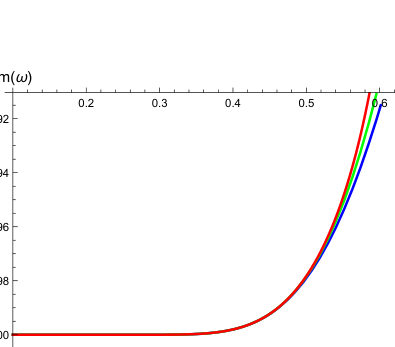 
Figure 1: Numerical and analytic expressions for the non-perturbative pole emerg- ing from the branch point. We set c = τ∗= 1.

📷 Fig 2

 
Figure 1 compares the numerical solution with this asymptotic expression. Equation (3.43) admits a sharper reading once the branch point itself is allowed to move. In the strictly nondispersive model the endpoint of the continuum is fixed at ω∗= −i/τ∗, and the expansion above is non-perturbative in its entirety. Including the higher-gradient corrections of Section 3.7, the endpoint acquires an ordinary dispersion, ω∗(k) = −i/τ∗(k) with τ∗(k) = τ∗[1 −k2ℓ2(τ∗) + O(k4)], and the pole follows it,

📷 Fig 3

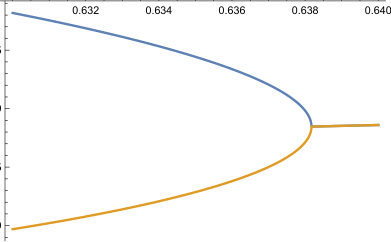 
Figure 2: Imaginary parts of the two poles as functions of the momentum, in units c = τ∗= 1.

📷 Fig 4

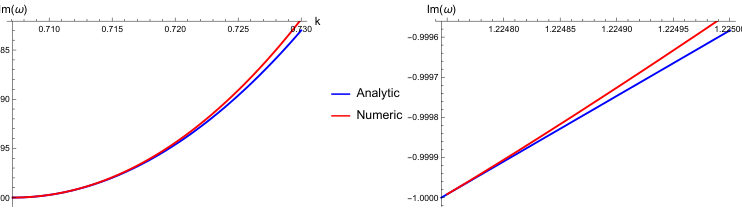 
Figure 3: Comparison between analytic and numerical results for the emerging pole in two cases with positive m.

**Summary.** This work develops a theoretical framework using Schwinger-Keldysh effective actions to describe thermal relaxation in systems exhibiting complex spectral features like branch cuts. By extending the model from discrete relaxation modes to continuous spectra, the authors derive transport coefficients and show how these non-hydrodynamic features constrain the system's dynamics. This provides a powerful tool for analyzing non-equilibrium quantum transport.

**Why it may be interesting.** The rigorous treatment of non-equilibrium dynamics, especially the incorporation of continuous spectral features (branch cuts) into effective actions, is crucial for understanding transport in strongly coupled, non-equilibrium quantum systems.

Detailed structure

**Main problem.** The paper constructs Schwinger-Keldysh effective actions to rigorously incorporate non-hydrodynamic poles and branch cuts that govern the relaxation dynamics of thermal systems.

**Main result.** The theory successfully models the transition from discrete relaxation spectra to continuous branch cuts, providing closed-form expressions for transport coefficients like conductivity.

**Method.** The analysis employs the Schwinger-Keldysh formalism, utilizing Gaussian effective actions and analyzing the resulting spectral properties via complex frequency continuation.

**Model / system.** The system models a thermal medium undergoing relaxation of conserved densities, extended from a simple U(1) current to include additional vector fields (Maxwell-Cattaneo type extension).

**Key observables.** Retarded thermal correlators, optical conductivity ($\sigma(\omega, \vec{k})$), and the structure of the effective action $S_{MC}$.

**Important parameters / regimes.** Relaxation time density ($	au$), complex frequency ($\omega$), and momentum ($\vec{k}$); the analysis distinguishes between hydrodynamic and non-hydrodynamic poles.

**Assumptions / limitations.** The analysis is restricted to the Gaussian order of the effective action, and approximations like the energy-diagonal Relaxation-Time Approximation (RTA) are used for microscopic realization.

**Figures summary.** Figures illustrate the structure of branch cuts parameterized by relaxation time ($	au$) and show the derived transport coefficients for transverse and longitudinal responses.

**Paper structure.** The paper progresses by first setting up the SK action for relaxation fields, then generalizing the spectrum from discrete poles to a continuous density ($	au$), and finally deriving the transport coefficients and the effective action using techniques like the Schur complement.

Abstract

Retarded thermal correlators, analytically continued to complex frequency, exhibit non-hydrodynamic poles and branch cuts that constrain hydrodynamics. We construct Gaussian Schwinger-Keldysh effective actions in which branch cuts arise from continua of relaxation poles and response functions are governed by Stieltjes transforms of relaxation-time densities. Dynamical KMS symmetry, positivity and stability constrain the spectra, while endpoint behaviour controls the local branch structure and near-edge pole scaling. The illustrative examples of uniform and power-law densities exhibit respectively beyond-all-orders pole-endpoint separation and a continuous interpolation between pole-pole and pole-branch-point termination. Finally, we show that an energy-dependent relaxation-time approximation in kinetic theory provides a microscopic realization of our branch cuts at zero momentum.

[↑ back to top](#top)

### [Forbidden Subspaces in Quantum State Smoothing](http://arxiv.org/abs/2609.17307v1)

**Authors:** Chon-Fai Kam, Kai-Wen Wong  
**Type:** theory · **Category:** other · **PDF:** <https://arxiv.org/pdf/2609.17307v1>  
**Analysis basis:** full PDF text, analyzed in chunks
**Topic relevance:** 🔥 `quantum measurements` **4/5** · `Keldysh / 2PI / non-Gaussian methods` **1/5** · `driven-dissipative phase transition` **1/5**

📷 Fig 1

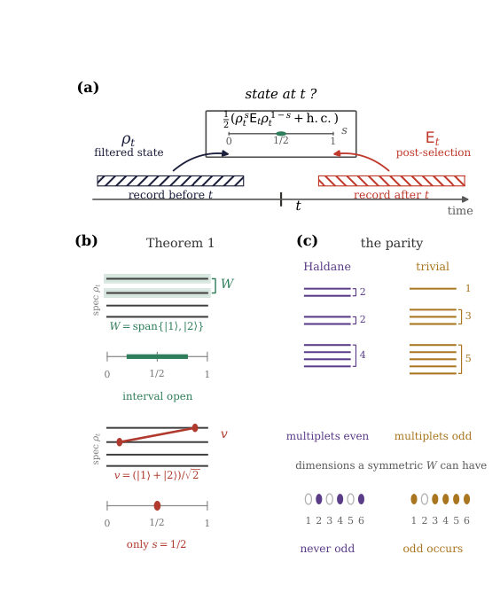 
FIG. 1. (a) Quantum smoothing. The record before t gives ρt and the record after t a post-selection Et. Their pairing has a family of images indexed by s, only s = 1

📷 Fig 2

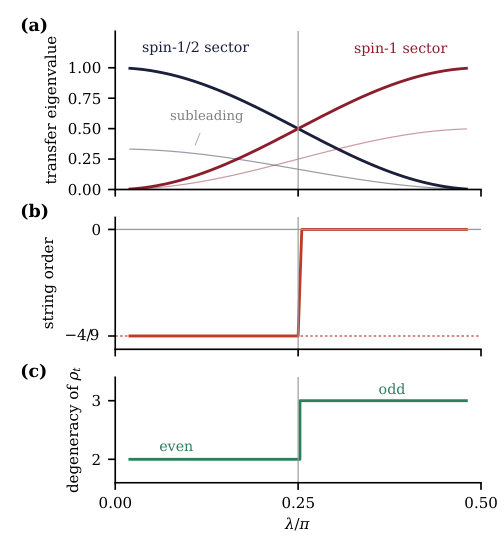 
FIG. 2. A first-order transition of the record’s class along Eq. (6), which mixes a spin- 1

**Summary.** This paper develops a rigorous criterion for determining when a quantum process between preparation and post-selection can be described by a 'classical' state via quantum state smoothing. It shows that this classicality is guaranteed if and only if the forbidden subspace respects the initial state's symmetries. Violations of this symmetry lead to measurable contextuality, quantified by the negativity of the smoothed effect.

**Why it may be interesting.** This work provides a deep theoretical link between fundamental concepts like contextuality, quantum measurement theory, and the mathematical structure of quantum states, which is highly relevant for understanding open quantum systems dynamics.

Detailed structure

**Main problem.** The paper investigates the conditions under which a quantum system undergoing state smoothing between preparation and post-selection admits a 'classical' state, linking this to the concept of contextuality.

**Main result.** The admissibility of the smoothed state (classicality) is equivalent to the subspace forbidden by the post-selection being invariant under the initial state's action. Failure of this invariance certifies contextuality.

**Method.** The analysis uses the positivity of the smoothed state $\Phi_s(E, 
ho)$ parameterized by $s$, comparing it to necessary conditions derived from the invariance of the kernel of the post-selection effect $E$.

**Model / system.** The system involves quantum state smoothing, characterized by the interpolation between the Kirkwood–Dirac operator and its adjoint, applied to an initial state $
ho$ and a post-selection effect $E$.

**Key observables.** Positivity of $\Phi_s(E, 
ho)$, the dimension parity of forbidden subspaces (even for Haldane, odd for trivial), and the magnitude of negative eigenvalues of $\Phi_0$.

**Important parameters / regimes.** The smoothing parameter $s \in [0, 1]$, the critical point $\lambda^* = \pi/4$, and the structure of the symmetry group $G$.

**Assumptions / limitations.** The analysis relies on the modular flow formalism and specific bounds derived from noncontextual models, though the converse of some theorems are noted as false.

**Figures summary.** Figure 1 illustrates quantum smoothing, the condition for admissibility, and the parity of dimensions. Figure 2 shows a first-order transition of the record's class mixing two sectors at a critical point.

**Paper structure.** The paper progresses by establishing the necessary and sufficient condition for positivity ($\Phi_s \ge 0$), linking this to $
ho$-invariance of $	ext{ker } E$. It then quantifies contextuality via negative eigenvalues of $\Phi_0$ and discusses the topological implications of the resulting class structure.

Abstract

A system between a preparation and a post-selection has had no agreed state since 1964. With positivity as the criterion, a post-selection admits an interval of orderings around the symmetric one exactly when the subspace it forbids is spanned by eigenvectors of a full-rank filtered state. Otherwise it certifies contextuality, testable on a qubit. The averaged filtered state carries the entanglement spectrum of the record, so the smallest forbidden subspaces a symmetry allows are even-dimensional in the Haldane class and odd in the trivial one. That parity is the record's topological class.

[↑ back to top](#top)

### [Two-Dimensional Materials toward CMOS-Compatible Scalable Quantum Hardware](http://arxiv.org/abs/2609.16172v1)

**Authors:** Mara Lieberegts, Ye Wang  
**Type:** both · **Category:** quantum information and computing · **PDF:** <https://arxiv.org/pdf/2609.16172v1>  
**Analysis basis:** full PDF text, analyzed in chunks
**Topic relevance:** 🔥 `QC/QI experiment` **4/5** · `analog quantum simulation` **1/5** · `quantum measurements` **1/5**

📷 Fig 1

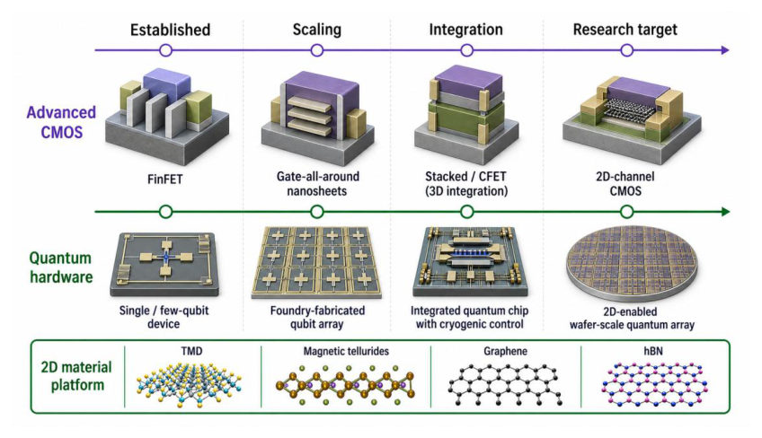 
Figure 1. Development pathways for advanced CMOS and quantum hardware, and the possible role of transferable 2D material process modules. The upper track follows the progression from FinFETs and gate-all-around nanosheets to stacked and 2D channel devices. The lower track moves from individual qubit devices to larger arrays and integrated control, followed by a research target for 2D-enabled hardware. The stages organize capabilities and research directions; they do not assign equal maturity to the two tracks or predict a common timetable. Foundry arrays and cryogenic control refer to established qubit platforms, not demonstrated wafer-scale 2D qubit arrays. Process modules developed for 2D...

📷 Fig 2

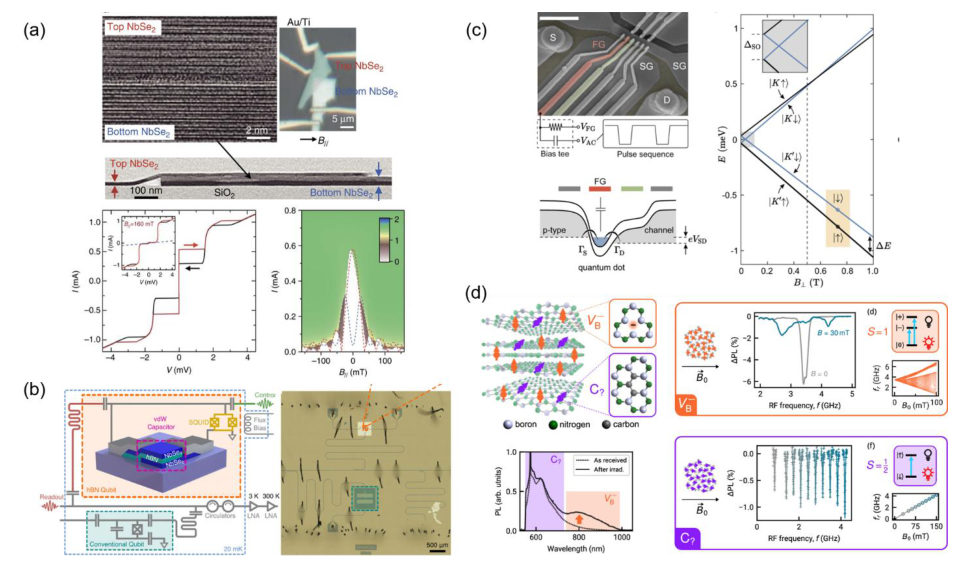 
Figure 2. Representative 2D qubits, components, and physical phenomena, classified by the evidence shown. (a) A vdW Josephson junction formed by vdW contact between two NbSe₂ crystals, showing hysteretic current–voltage response and a Fraunhofer critical-current pattern (demonstrated component). (b) A miniaturized transmon whose shunt capacitor is a NbSe₂/hBN/NbSe₂ stack, coupled to SQUID, control and readout lines at 20 mK (demonstrated qubit). (c) A gate-defined single-electron quantum dot in bilayer graphene, with the perpendicular-field spectrum resolving K/K′ valley states split by spin–orbit coupling and Zeeman energy (demonstrated component). (d) Room- temperature spin defects in...

📷 Fig 3

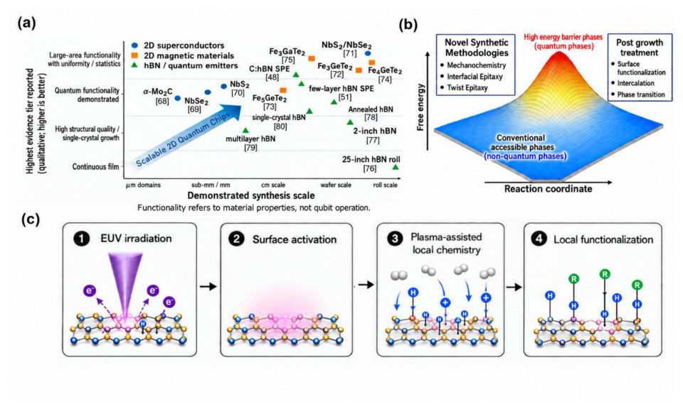 
Figure 3. Manufacturing barriers to scalable 2D quantum chips. (a) Highest reported evidence tier (continuous film → single-crystal growth → demonstrated quantum functionality → large-area functionality with statistics) versus demonstrated synthesis scale for 2D superconductors (refs 68–71), 2D magnets (refs 72–75) and hBN or quantum emitters (refs 48, 51, 76–80). The diagonal arrow marks the route toward scalable 2D quantum chips. Functionality refers to material properties, not qubit operation; the evidence tiers do not establish wafer-scale qubit yield or coherent control. (b) Free-energy landscape of 2D quantum-material synthesis: conventional phases lie in an accessible basin, whereas...

📷 Fig 4

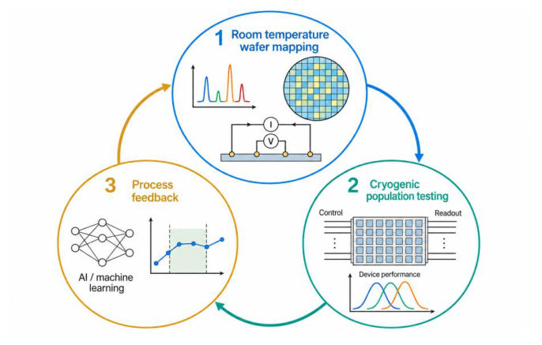 
Figure 4. Closed qualification loop for CMOS-compatible 2D quantum hardware. Room-temperature wafer mapping (1) screens material and process variation. Cryogenic population testing (2) measures distributions of device and quantum properties. Process feedback (3) links these measurements to growth, transfer, patterning, and treatment records. Statistical analysis and AI or machine learning act on the linked records to flag process drift. Proposed changes must be tested on independent wafers, with quantum performance and yield measured again before process qualification. All maps, distributions, and device drawings are schematic.

📷 Fig 5

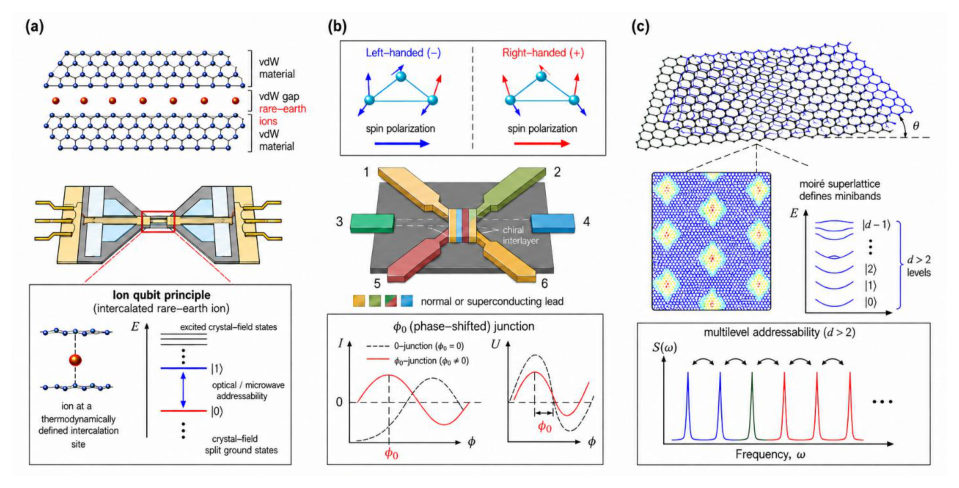 
Figure 5. Proposed quantum-device concepts enabled by vdW structural degrees of freedom. Each panel is a proposed concept, not an experimentally demonstrated qubit. (a) Intercalated-ion qubits: rare-earth ions ordered within a vdW gap form candidate atom-like sites built into a chip. Controlled site occupancy and charge state, initialization, coherent manipulation, readout, coherence, and ion–ion coupling must be established. (b) Chiral-junction qubits: a CISS-active chiral interlayer could produce a φ₀ junction whose phase offset is set by structure rather than applied flux. A reproducible zero-field phase shift, with trapped flux and domain effects excluded, should precede tests of...

**Summary.** This perspective reviews how 2D materials are being leveraged to overcome the manufacturability hurdles in solid-state quantum computing. By drawing parallels between CMOS fabrication and quantum chip requirements, it highlights successful component demonstrations, such as $	ext{hBN}$ capacitors, and proposes future concepts for scalable quantum hardware.

**Why it may be interesting.** It directly addresses the engineering challenge of scaling quantum devices by linking quantum physics phenomena (spin-valley coupling, Josephson effects) to established semiconductor manufacturing paradigms.

Detailed structure

**Main problem.** Developing scalable solid-state quantum processors requires manufacturability, as fabrication defects compromise qubit coherence.

**Main result.** Two-dimensional (2D) materials offer promising routes to address fabrication challenges by enabling the integration of quantum components with CMOS-compatible processes.

**Method.** The paper evaluates the opportunities by comparing the process modules required for CMOS fabrication against the needs of quantum hardware, assessing progress across different levels of demonstration.

**Model / system.** The focus is on various 2D material platforms, including graphene, hBN, and TMDs, used to build superconducting qubits (e.g., Josephson junctions) and spin qubits.

**Key observables.** Coherence times ($T_1, T_2$), Josephson supercurrent, gate-tunability of coupling, and single-shot readout fidelity.

**Important parameters / regimes.** Operating temperature (cryogenic vs. room temperature), junction type ($	ext{vdW}$ vs. epitaxial), and material interface quality.

**Assumptions / limitations.** The primary assumption is that the established processes for 2D material development in CMOS can be successfully transferred to maintain quantum coherence in quantum circuits.

**Figures summary.** Figures compare CMOS and quantum hardware development pathways, and tables categorize experimental progress across four levels: demonstrated qubit, component, physical phenomenon, and proposed concept.

**Paper structure.** The paper systematically evaluates 2D materials for quantum hardware by identifying key challenges, reviewing successful component-level demonstrations (e.g., $	ext{hBN}$ capacitors), and proposing future concepts (e.g., chiral junctions, moiré qudits).

Abstract

Manufacturability is one of several constraints on developing solid-state quantum processors, along with qubit performance, control, connectivity, cryogenic operation, and fault tolerance. Chemical residues, structural disorder, and non-uniform interfaces introduced during fabrication can compromise qubit coherence. Two-dimensional (2D) materials, with their atomically thin crystals and van der Waals interfaces, offer routes to address some of these challenges. Their concurrent development as next-generation CMOS channel materials motivates an examination of whether relevant processes can be transferred to quantum chips. This Perspective evaluates the opportunities and limitations of 2D materials for CMOS-compatible quantum hardware.

[↑ back to top](#top)

### [Adaptive detection of Rabi signals under composite hypotheses](http://arxiv.org/abs/2609.16119v1)

**Authors:** So Chigusa  
**Type:** theory · **Category:** quantum information and computing · **PDF:** <https://arxiv.org/pdf/2609.16119v1>  
**Analysis basis:** full PDF text, analyzed in chunks
**Topic relevance:** 🔥 `quantum measurements` **4/5**

📷 Fig 1

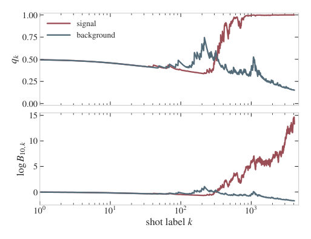 
FIG. 1. Posterior signal probability (upper panel) and log Bayes factor (lower panel) along representative resonant sig- nal and background trajectories, with (ΦR, ˜φ) = (0.19, 0.7) injected in the signal trajectory.

📷 Fig 2

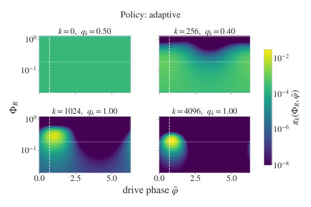 
FIG. 2. Conditional H1 posterior density in the (ΦR, ˜φ) plane along the resonant adaptive signal trajectory, with the corre- sponding qk reported above each panel. The dashed and dot- ted lines mark the injected phase and amplitude, respectively.

📷 Fig 3

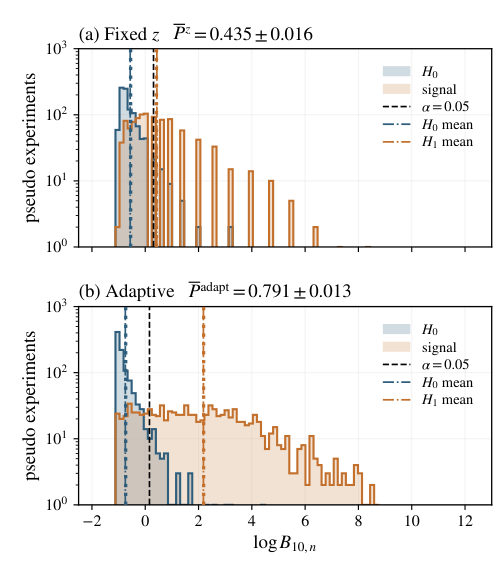 
FIG. 3. Final log Bayes factor distributions under H0 and sig- nal records generated at fixed ΦR = 0.19 with uniformly sam- pled phase, for the fixed-z policy (upper panel) and the pure information gain adaptive policy (lower panel) at n = 1024. The black dashed line in each panel is the policy specific threshold calibrated to α ≃0.05. Dotted and dash-dotted lines show the mean estimates from the KL identities in Ap- pendix A 5 and the sample means, respectively, with colors matching the histograms.

📷 Fig 4

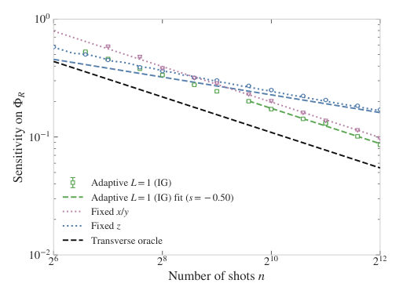 
FIG. 5. Sensitivity to the Rabi amplitude at phase-averaged power P = 0.7 and α ≃0.05 as a function of the shot count. Monte Carlo sensitivities are compared with the adaptive tail fit and analytic fixed policy benchmarks.

📷 Fig 5

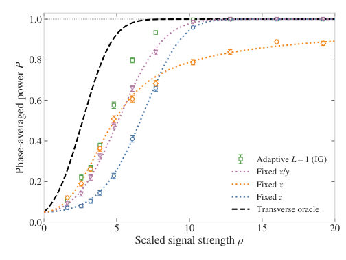 
FIG. 4. Phase-averaged power versus the scaled signal strength ρ = ΦR √n for the baseline detector profile at n = 1024 and α ≃0.05. Markers show Monte Carlo esti- mates, and the fixed policy curves show the corresponding analytic benchmarks.

**Summary.** This paper develops an optimal, adaptive strategy for detecting weak coherent drives in quantum sensors by treating the problem as a composite hypothesis test. By comparing adaptive Bayesian readouts against fixed measurement sequences, the authors prove that exploiting information about unknown signal parameters significantly boosts detection sensitivity. This has direct implications for improving the precision of quantum measurements in quantum optics and sensing applications.

**Why it may be interesting.** This work provides rigorous theoretical bounds and optimal strategies for quantum sensing in the presence of unknown noise parameters, which is crucial for designing practical quantum measurement protocols.

Detailed structure

**Main problem.** The paper addresses the optimal strategy for detecting weak coherent drives (Rabi signals) when the signal parameters (amplitude, phase, detuning) are unknown, framing it as an asymmetric composite hypothesis test.

**Main result.** An adaptive Bayesian policy significantly outperforms fixed readout schedules, achieving a sensitivity consistent with the optimal $n^{-1/2}$ scaling for large shot counts, demonstrating the value of exploiting nuisance parameter information.

**Method.** The analysis employs weak signal expansion techniques and Monte Carlo pseudoexperiments to compare detection power, sensitivity, and Type-II error exponents across different measurement strategies.

**Model / system.** The system is a two-level sensor (qubit) interrogated by a weak classical field near resonance, modeled using an effective Hamiltonian and subjected to relaxation and readout errors.

**Key observables.** Log Bayes factor, detection power, sensitivity scaling ($n^{-1/4}$ vs $n^{-1/2}$), and the effective Type-II error exponent.

**Important parameters / regimes.** Signal parameters $\lambda = (\Omega, \Delta, 	ilde{\varphi})$, fixed shot budget $n$, and the control of the Type-I error rate ($\alpha$).

**Assumptions / limitations.** The analysis assumes a fixed interrogation time $T$ and utilizes approximations like the leading Magnus term in the evolution operator.

**Figures summary.** Figures compare the evolution of a diagnostic quantity ($f_{	ext{pol}}$) for different Rabi amplitudes, showing the adaptive policy's superior performance compared to fixed readout axes, and illustrate the tracking of drifting signal directions in detuned regimes.

**Paper structure.** The paper progresses from formulating the problem as a composite hypothesis test, detailing the comparison between non-adaptive and myopic Bayesian policies, providing analytical scaling results, and validating these findings through extensive Monte Carlo simulations.

Abstract

Motivated by searches for weak coherent drives, we formulate repeated quantum sensing with a fixed shot budget as an asymmetric composite hypothesis test. Taking Rabi sensing as a concrete example, we benchmark detection power, sensitivity, and Type-II error exponents in the resonant case with unknown signal amplitude and phase. We compare non-adaptive population and transverse readouts with a myopic Bayesian policy that selects each projective axis by maximizing the expected information gain in one step. The common decision statistic is a log Bayes factor, with a policy specific threshold calibrated under the null to enforce a common Type-I error. A weak signal expansion shows that population readout is phase independent but quadratic in amplitude, giving $n^{-1/4}$ sensitivity, whereas transverse readout is linear in amplitude and permits $n^{-1/2}$ sensitivity without adaptation, but is phase-dependent. In Monte Carlo pseudoexperiments, the adaptive policy exploits posterior information about the unknown direction to guide subsequent readouts; its sensitivity is consistent with $n^{-1/2}$ over the simulated large $n$ range and, at the largest simulated shot counts, outperforms the fixed transverse schedules. Its phase-averaged effective Type-II exponent also exceeds the non-adaptive references over the simulated range. These results demonstrate the finite budget value of exploiting nuisance parameter information under calibrated false positive control.

[↑ back to top](#top)

### [Large-scale NMR simulation on a trapped-ion quantum computer](http://arxiv.org/abs/2609.17102v1)

**Authors:** Pascal Stadler, Alec Owens, Etienne Granet, David Muñoz Ramo, Michael Marthaler  
**Type:** both · **Category:** other · **PDF:** <https://arxiv.org/pdf/2609.17102v1>  
**Analysis basis:** full PDF text, analyzed in chunks
**Topic relevance:** 🔥 `QC/QI experiment` **4/5**

📷 Fig 1

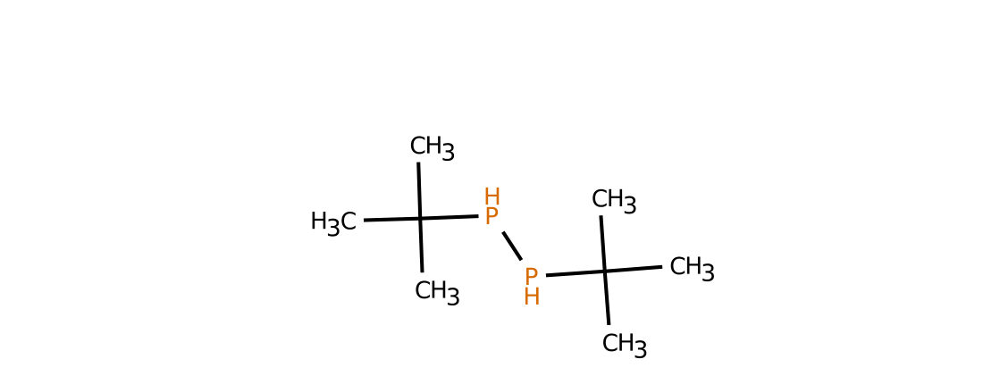 
Figure 1: Molecular structure of 1,2-di-tert-butyl-diphosphane, used in this work as a

📷 Fig 2

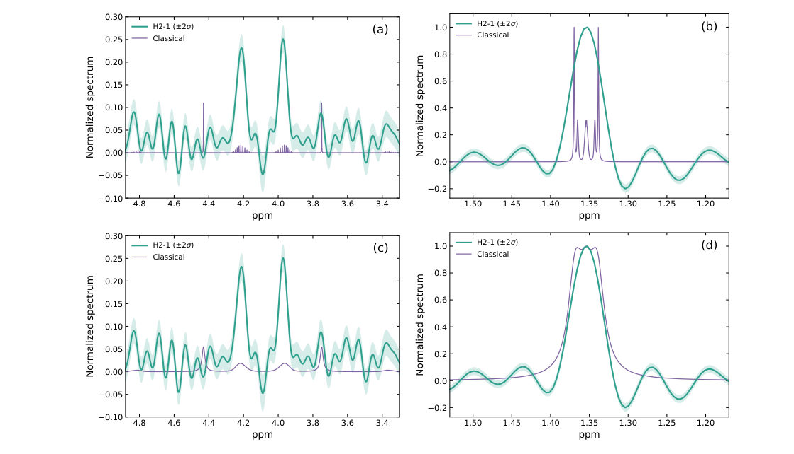 
Figure 2: Comparison of diphosphane NMR spectra obtained from simulations on the

📷 Fig 3

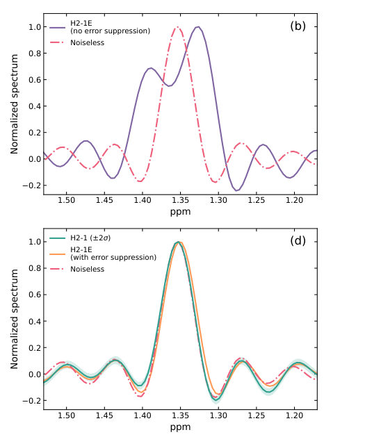 
Figure 3: Panels (a) and (b) compare diphosphane NMR spectra from noisy H2-1E

📷 Fig 4

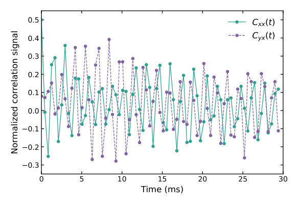 
Figure 4: Reconstructed time-domain NMR signal obtained from measurements on the

📷 Fig 5

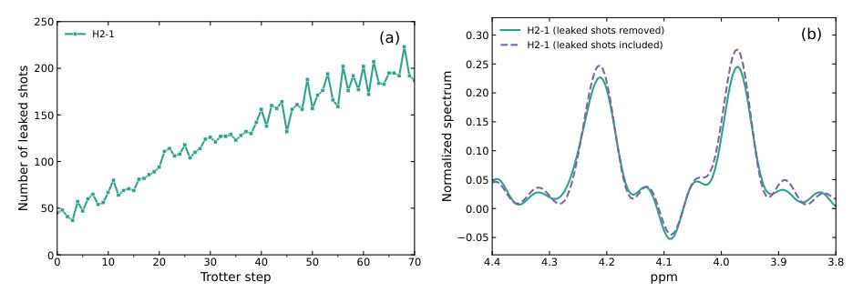 
Figure 5: (a) Total number of leaked shots per Trotter step for NMR simulations on the

**Summary.** This paper presents a large-scale, end-to-end quantum simulation of NMR spectra using a trapped-ion quantum computer. By employing significant Hamiltonian reduction and advanced error suppression, the authors successfully simulated a complex molecule, achieving spectral fidelity matching classical results. This work advances the practical utility of quantum computation for chemical analysis.

**Why it may be interesting.** This work directly bridges quantum computation with molecular physics by applying quantum simulation techniques to a chemically relevant problem (NMR), showcasing the feasibility of quantum computation for complex, many-body quantum systems.

Detailed structure

**Main problem.** The paper addresses the challenge of simulating complex Nuclear Magnetic Resonance (NMR) spectra, which is a key application for quantum simulation, on near-term quantum hardware.

**Main result.** The authors successfully demonstrated an end-to-end, large-scale digital NMR simulation of a complex molecule, reproducing key spectral features that previous quantum hardware demonstrations could not achieve.

**Method.** The simulation employs Trotterized real-time quantum evolution on a trapped-ion quantum computer, utilizing a hardware-efficient reduction of the full spin Hamiltonian to manage circuit depth.

**Model / system.** The system is the 1,2-di-tert-butyl-diphosphane molecule, modeled as a 22-spin system. The simulation is performed on a trapped-ion quantum computer (Quantinuum H2), requiring significant Hamiltonian reduction to fit the available qubits and gate depth.

**Key observables.** The reconstructed liquid-state proton NMR spectrum, time-domain correlation functions ($C_{xx}(t), C_{yx}(t)$), and spectral fidelity compared to classical reference calculations.

**Important parameters / regimes.** The simulation involves an effective 21-spin model, uses Trotter steps up to 70 (or more in early stages), and is constrained by hardware gate depth and noise characteristics.

**Assumptions / limitations.** The primary approximation involves projecting the full Hamiltonian onto a 21-dimensional subspace by rewriting the phosphorus subsystem in the singlet-triplet basis. Error suppression techniques are also crucial assumptions for fidelity.

**Figures summary.** Figures compare the simulated H2-1 hardware spectrum against classical reference spectra, showing agreement in key features like double-peak structures, and illustrate the impact of leakage and finite-shot noise.

**Paper structure.** The paper details the physical problem (NMR simulation), outlines the necessary Hamiltonian reduction (from 22 spins to 21 effective spins), describes the quantum simulation workflow (Trotterization, error mitigation), and concludes by validating the results against classical benchmarks on the trapped-ion hardware.

Abstract

Simulating nuclear magnetic resonance (NMR) spectra is a promising application of quantum simulation. Using Quantinuum's System Model H2, a trapped-ion quantum computer, we demonstrate an end-to-end, large-scale digital NMR simulation of a classically challenging benchmark molecule, 1,2-di-tert-butyl-diphosphane. We implement a hardware-efficient reduction of the nuclear-spin Hamiltonian, enabling Trotterized real-time evolution of an effective 21-spin model with tailored error suppression to reduce the effects of device noise. The reconstructed liquid-state proton NMR spectrum agrees with classical reference calculations and reproduces key spectroscopic features that previous quantum hardware demonstrations did not capture. Given the widespread use of NMR in chemical analysis and industrial research, these results advance digital quantum simulation of NMR spectra towards practical quantum utility.

[↑ back to top](#top)

### [Stable three-dimensional lattice solitons in spin-orbit-coupled Bose-Einstein condensates](http://arxiv.org/abs/2609.17092v1)

**Authors:** Liangwei Zeng, Boris A. Malomed, Yaroslav V. Kartashov, Xing Zhu  
**Type:** theory · **Category:** quantum gases · **PDF:** <https://arxiv.org/pdf/2609.17092v1>  
**Analysis basis:** abstract only; PDF text extraction failed or PDF unavailable
**Topic relevance:** 🔥 `analog quantum simulation` **4/5**

**Summary.** This paper theoretically investigates stable three-dimensional lattice solitons in a Bose-Einstein condensate modified by spin-orbit coupling and confined in an optical lattice. The research finds that the SOC-lattice interaction stabilizes unique full-vortex and semi-vortex states, which are robust against collapse. These findings pave the way for experimentally realizing complex, vorticity-carrying quantum matter structures.

**Why it may be interesting.** This work directly addresses the complex interplay between external potentials (OL), internal interactions (self-interaction), and spin-orbit coupling in BECs, leading to novel, stable topological structures (vortices) that are highly relevant for controlling quantum matter.

Detailed structure

**Main problem.** The study investigates the existence and stability of three-dimensional (3D) lattice solitons in a binary self-interacting Bose-Einstein condensate (BEC) subjected to spin-orbit coupling (SOC).

**Main result.** The interplay between SOC and the optical lattice (OL) stabilizes full-vortex (FV) and semi-vortex (SV) solitons, which are stable even in the presence of supercritical collapse possibilities.

**Method.** Theoretical analysis was performed to model the soliton formation and stability within the specified quantum gas system.

**Model / system.** The system is a binary self-interacting Bose-Einstein condensate (BEC) confined in a 3D optical lattice (OL) and incorporating spin-orbit coupling (SOC).

**Key observables.** Stability regions of the 3D full-vortex solitons and semi-vortices, and the formation of density peaks and vortical phases.

**Important parameters / regimes.** SOC strength and OL depth, which are shown to expand the stability regions.

**Assumptions / limitations.** The analysis is based on the BEC being held in a 3D optical lattice and considering the effects of SOC.

**Paper structure.** The paper analyzes the formation and stability of 3D solitons, contrasting their existence in uniform vs. lattice potentials, and examining the stability regions for different interaction types (self-attractive vs. self-repulsive).

Abstract

We address three-dimensional (3D) solitons maintained by spin-orbit coupling (SOC) in the binary self-interacting Bose-Einstein condensate (BEC) held in the 3D optical lattice (OL). The analysis reveals that the SOC-OL interplay results in the formation of stable full-vortex (FV) soli-tons, built as sets of four density peaks residing in neighboring wells of the lattice potential, with the superimposed global vortical phase, and site-centered semi-vortices (SV), in which the vorticity is present in only one component. The full-vortex solitons, with their specific phase textures, do not exist in a uniform BEC with SOC. Full-vortex and semi-vortex states in the binary self-attractive BEC are stable despite the possibility of the supercritical collapse in the 3D system. Such states also exist, as gap solitons, in the self-repulsive 3D system. In terms of the chemical potential and number of particles, the stability regions of the 3D full-vortex solitons and semi-vortices expand with the increase of the SOC strength and OL depth. The results open the route to the creation of 3D complexes of vorticity-carrying condensates that can be realized with existing experimental techniques.

[↑ back to top](#top)

### [Hidden kinetic correlations control collective phases of entropy-conditioned histories](http://arxiv.org/abs/2609.16355v1)

**Authors:** Abhishek Chowdhury  
**Type:** theory · **Category:** statistical mechanics · **PDF:** <https://arxiv.org/pdf/2609.16355v1>  
**Analysis basis:** full PDF text, analyzed in chunks
**Topic relevance:** `Keldysh / 2PI / non-Gaussian methods` **3/5** · `correlated / nonlocal dissipation` **3/5** · `driven-dissipative phase transition` **3/5** · `methods for driven-dissipative` **3/5** · `non-equilibrium universality` **3/5** · `quantum measurements` **2/5** · `Full counting statistics` **1/5** · `analog quantum simulation` **1/5** · `scars & prethermalization` **1/5**

📷 Fig 1

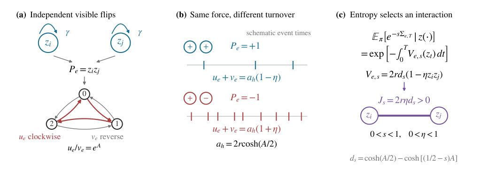 
FIG. 1. From hidden kinetic coupling to an interaction between selected histories. (a) The visible variables flip independently at rate γ; their product gates both directions of a hidden three-state cycle while the ratio u/v = eA stays fixed. (b) Alignment reduces the conditional hidden activity to ah(1 −η) and opposition increases it to ah(1 + η), where ah = 2r cosh(A/2). The event marks are schematic. (c) Summing the hidden entropy Σe,T on the illustrated edge exactly multiplies the visible path

📷 Fig 2

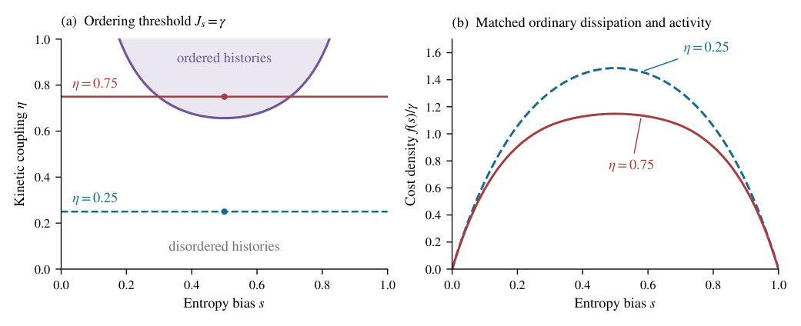 
FIG. 2. Hidden kinetic coupling changes the phase while the ordinary diagnostics stay fixed. (a) Entropy-conditioned phase diagram at γ = 1, A = 4, r = 1/ sinh 2. The shaded region is Js &gt; 1; its tip is at ηc = 1/(2 tanh 1). Both horizontal examples have σ = 8 and ah = 2 coth 2. (b) Their exact cost densities from Eq. (23). The scalar term is retained, so both curves have the same slope σ at s = 0, although their midpoint phases differ.

📷 Fig 3

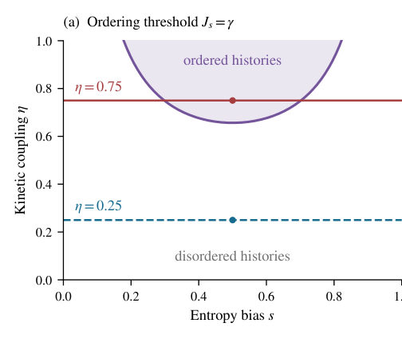 
Figure 2 illustrates an explicit pair. Choose units γ = 1, set A = 4 and r = 1/ sinh 2. Both members have σ = 8 and ah = 2 coth 2. With η = 1/4 the midpoint coupling is 1

📷 Fig 4

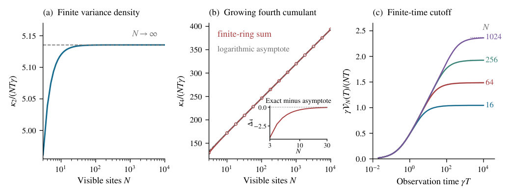 
FIG. 3. Which entropy fluctuation detects criticality, and when. The force and rate scale are those of Fig. 2, with η = ηc. (a) The long-time variance density approaches a finite limit. (b) The fourth-cumulant density grows logarithmically with N; the inset shows ∆4, the exact κ4/(NTγ) minus its plotted large-N expression. Solid curves evaluate Eqs. (45) and (46); dashed curves use their asymptotes. (c) The exact integrated alignment variance γVN(T)/(NT) grows with observation time and saturates at SN/N (dotted levels). Multiplication by 12r2η2A4/γ gives its contribution to κ4/(NT). The common 1/t correlation tail is cut off by observation time or ring size. All entropy cumulants refer to...

📷 Fig 5

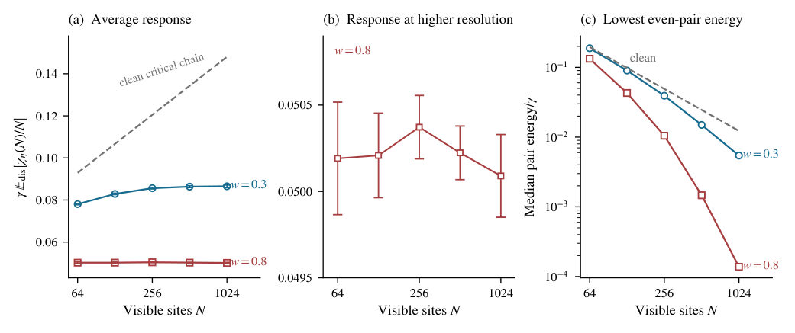 
FIG. 4. Quenched critical response without clean logarithmic growth. (a) Mean curvature density from Eq. (52) for independent log-uniform gates. Error bars are one sampling standard error, using 512 samples at each of N = 64, 128, 256, 256 at 512, and 64 at 1024, for each width. The dashed curve is the exact clean critical result. (b) The same w = 0.8 response and error bars on an expanded vertical scale. The variation across sizes is not resolved beyond sampling error. (c) Median smallest even-pair energy in the same samples, compared with the lowest clean even-parity pair excitation 8γ sin [π/(2N)]. The falling energy scale does not force the weighted curvature to grow. Connecting lines...

**Summary.** This theoretical work shows that the collective phases of rare events in complex systems are not determined by simple average thermodynamic quantities. Instead, they are dictated by hidden kinetic correlations that become visible when the history is weighted by its full entropy production. The study provides advanced mathematical tools to quantify this 'kinetic information' missed by standard equilibrium diagnostics.

**Why it may be interesting.** The focus on entropy-conditioned histories and the detection of hidden correlations provides a powerful, non-equilibrium tool for understanding how microscopic details dictate macroscopic phase selection, relevant to open quantum systems.

Detailed structure

**Main problem.** The paper investigates whether the collective phases of rare histories in a driven system are determined solely by aggregate thermodynamic measurements or if they depend on hidden kinetic correlations.

**Main result.** Visible dynamics and mean dissipation are insufficient to determine the collective phases of rare histories; hidden kinetic correlations are crucial, as demonstrated by the entropy weighting.

**Method.** The analysis uses path-space variational principles, entropy weighting ($\mathcal{P}[\dots] \propto \exp[-\int V_{e,s} dt]$), and spectral analysis of the tilted generator to study conditioned dynamics.

**Model / system.** The model involves visible variables (spins $z_i$) coupled to hidden degrees of freedom (e.g., $\mathbb{Z}_3$ cycles on edges). The dynamics are analyzed via Markov processes conditioned on the full entropy production.

**Key observables.** Entropy production, entropy variances, joint cumulants of entropy and hidden activity, and the fourth cumulant rate per site.

**Important parameters / regimes.** Entropy bias ($s$), system size, and observation time.

**Assumptions / limitations.** The analysis relies on comparing microscopic models under fixed ordinary visible processes and assuming the mathematical tractability of the entropy weighting.

**Figures summary.** Figure 1 illustrates the coupling mechanism between visible flips and hidden cycles, showing how entropy weighting leads to an effective interaction.

**Paper structure.** The paper progresses by establishing the insufficiency of aggregate diagnostics, analyzing specific models (like conserved particles or Ising critical points) to show phase selection, and concluding by identifying the role of kinetic information missed by thermodynamics.

Abstract

Visible dynamics and mean dissipation need not determine the collective phases of rare histories. We construct local Markov models with identical ordinary visible path distributions, stationary states, mean entropy production, mean jump activity and driving affinities, yet different phases when histories are weighted by their full entropy production. Visible configurations modulate hidden driven cycles, whose exact elimination turns kinetic correlations into interactions. A positive spectral reduction separates hidden relaxation from collective modes. Periodic binary models retain opposite phases with entropy variances matched at every observation time. For conserved particles, a pair matches the first two joint cumulants of entropy and hidden activity at every observation time, yet selects segregation or a fluctuating state with suppressed long-wavelength density noise. Bound-state transport and fermionic evolution determine their contrasting dynamics. At a clean Ising critical midpoint, the entropy source couples quadratically to the thermal perturbation, making the fourth cumulant the first to detect the critical susceptibility. Its rate per site grows logarithmically, with an exact cutoff set by system size and observation time. For two quenched disorder ensembles, exact sample-response formulas and numerical evidence support a finite fourth-cumulant density despite very slow relaxation; a weak-disorder continuum response admits a controlled Borel sum. A common positive hidden eigenvector characterizes autonomous selected dynamics. When this condition fails, a finite network develops visible memory while preserving its ordinary visible process and mean diagnostics. These results identify kinetic information missed by aggregate thermodynamic observations.

[↑ back to top](#top)

### [Coupling spherical p-spin systems](http://arxiv.org/abs/2609.17522v1)

**Authors:** Riccardo Cipolloni, Leticia F. Cugliandolo  
**Type:** theory · **Category:** disordered systems and neural networks · **PDF:** <https://arxiv.org/pdf/2609.17522v1>  
**Analysis basis:** full PDF text, analyzed in chunks
**Topic relevance:** `Keldysh / 2PI / non-Gaussian methods` **3/5** · `methods for driven-dissipative` **3/5** · `non-equilibrium universality` **3/5** · `scars & prethermalization` **3/5** · `analog quantum simulation` **2/5** · `correlated / nonlocal dissipation` **2/5** · `driven-dissipative phase transition` **2/5** · `quantum measurements` **1/5**

📷 Fig 1

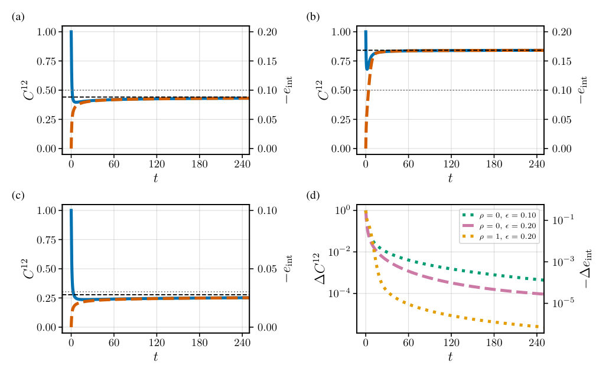 
Figure 1: Equal–time cross alignment and preparation gap. (a)-(b) Equal–time cross correlation C12(t, t) for ferro- magnetic coupling between the systems, ϵ = 0.2, at T = 0.3 &lt; T (2) d &lt; T (1) d , and for no disorder correlation ρ = 0 (a) and full disorder correlation ρ = 1 (b), with Cin = 0 (solid) and Cin = 1 (dashed). Horizontal guides mark the disorder–free coupled plateau C12,(pl) free (gray, dotted) and the coupled marginal 1RSB estimate q12 d (black, dashed) at the same parameters. In both cases the dynamical plateau is much closer to q12 d than to C12,(pl) free ; the agreement is excellent for ρ = 1, while a small mismatch remains for ρ = 0. (c) Same observable for ρ = 0, ϵ = 0.1...

📷 Fig 2

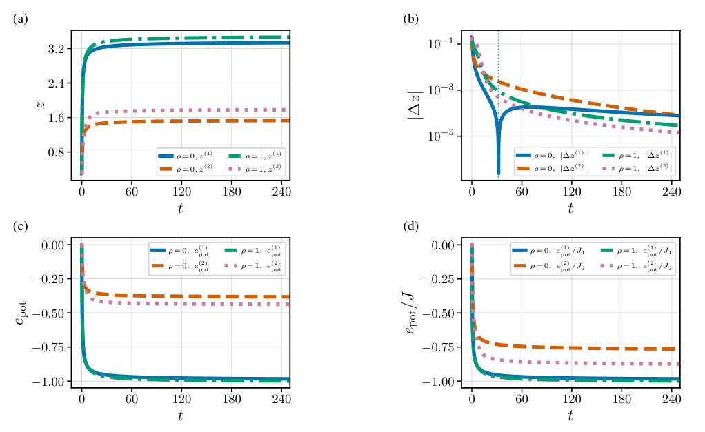 
Figure 2: Lagrange multipliers and per–subsystem p–spin potential energies at ϵ = 0.2 and T = 0.3 &lt; T (2) d &lt; T (1) d . (a) Time evolution of the four curves z(α)(t), with α = 1, 2, for independent (ρ = 0) and fully correlated (ρ = 1) disorder at Cin = 0. The curves evolve monotonically and approach slowly varying late–time levels; at fixed α, the ρ = 1 curve remains above the corresponding ρ = 0 one. (b) Preparation gaps |∆z(α)(t)| between cloned and independent preparations. The plotted quantity is the modulus of the difference, which is positive except for the α = 1, ρ = 0 curve after the cusp, where the underlying difference changes sign (vertical dotted guide). (c) Per–subsystem...

📷 Fig 3

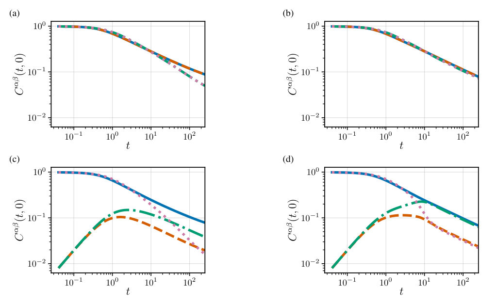 
Figure 3: Correlations with the initial configuration Cαβ(t, 0) at ϵ = 0.2 and T = 0.3 &lt; T (2) d &lt; T (1) d . Preparation protocol [(a)-(b) cloned, (c)-(d) independent]; disorder correlation ρ = 0 (a)-(c) and ρ = 1 (b)-(d). Encoding: line styles encode the pair (α, β) as follows — (1, 1) solid, (1, 2) dashed, (2, 1) dot-dashed, (2, 2) dotted; colors and the y-axis scale are consistent across panels. In the cloned case (Cin = 1), curves are β-independent by construction; the two α branches remain close throughout for ρ = 1, whereas a visible separation develops at later times for ρ = 0. In the independent case (Cin = 0), the dependence on α becomes weak at late times for ρ = 1; for ρ = 0, a...

📷 Fig 4

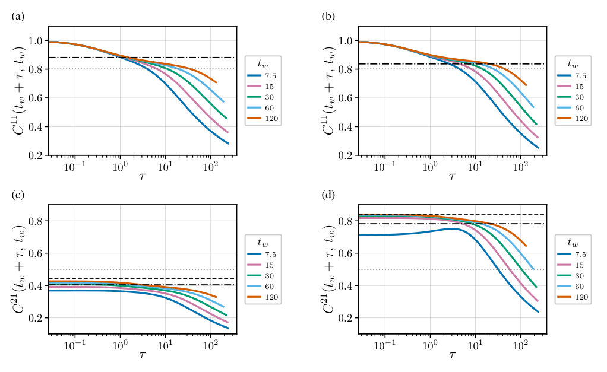 
Figure 4: Delayed correlation profiles in one self and one cross channel at ϵ = 0.2, T = 0.3 &lt; T (2) d &lt; T (1) d , and Cin = 0. (a)-(b) in top row: self channel C11(tw + τ, tw) for increasing waiting times tw; (c)-(d) in bottom row: cross channel C21(tw + τ, tw) for the same tw. Left column (a)-(c): ρ = 0; right column (b)-(d): ρ = 1. For a fixed channel (top or bottom row), the same vertical scale is used in the two columns, making shape and level differences across ρ directly comparable. Horizontal reference lines report the individual–system self benchmarks (gray dotted) and the coupled 1RSB marginal q11 1 (black dot-dashed) in (a) and (b). For the cross correlations in (c) and (d), the...

📷 Fig 5

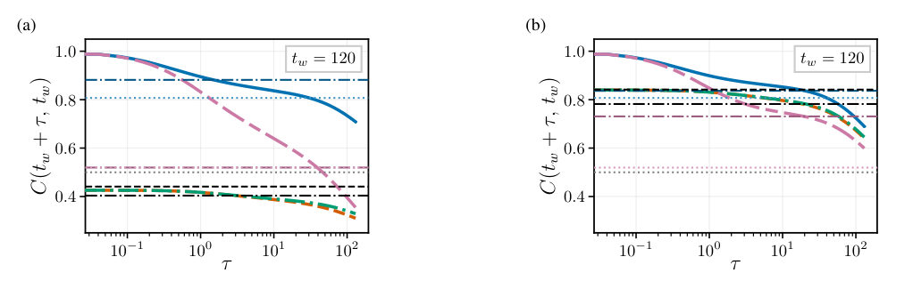 
Figure 5: Delayed correlations at the largest waiting time tw = 120, for ϵ = 0.2, T = 0.3 &lt; T (2) d &lt; T (1) d , and Cin = 0. (a) ρ = 0; (b) ρ = 1. The four channels Cαβ(tw + τ, tw) are shown together. Line styles and colors encode (α, β) as follows: (1, 1) solid light blue, (1, 2) dashed green, (2, 1) dot–dashed red, (2, 2) uneven-dashed pink. Horizontal benchmark lines are also shown: individual–system self references (dotted, in the corresponding self-channel colors, lightened), the disorder-free coupled cross plateau C12,(pl) free (gray dotted), and the coupled 1RSB references (dot–dashed for q12 1 and dashed for q12 d ). For ρ = 0, the self sector remains only partially resolved, with...

**Summary.** This paper analyzes the joint dynamics of coupled spherical p-spin spin glass models to understand how coupling affects glassy aging. Using advanced theoretical tools like replica symmetry breaking and two-time correlation functions, the authors show that strong coupling can enforce a common effective temperature across subsystems, while weak coupling allows each system to retain its own distinct aging dynamics.

**Why it may be interesting.** The study of coupled glassy dynamics and aging phenomena provides theoretical tools (like generalized effective temperatures and multi-subsystem equations) that are highly relevant to understanding non-equilibrium dynamics in complex quantum many-body systems, such as those found in quantum computation or quantum simulation.

Detailed structure

**Main problem.** The paper investigates how multiple coupled glassy systems, modeled by spherical p-spin systems, evolve jointly, specifically focusing on whether they develop a common aging structure or remain dynamically distinct.

**Main result.** For strong coupling, the system can exhibit a common effective temperature derived from fluctuation-dissipation estimates, which is higher than the individual subsystem temperatures. In contrast, weak coupling suggests the development of separate aging regimes for each system.

**Method.** The authors derive closed multi-subsystem two-time equations and employ both a marginal one-step replica-symmetry-breaking (1RSB) construction for static benchmarks and dynamical analysis using the Martin-Siggia-Rose-Janssen-DeDominicis action.

**Model / system.** The system consists of coupled spherical p-spin models, where the total Hamiltonian includes both internal glassy potentials and an interaction term $H_{	ext{int}}$ coupling the subsystems. The dynamics are analyzed in the over-damped limit.

**Key observables.** Two-time correlations and responses, effective temperature ($T_{	ext{eff}}$), overlap plateaux, and aging crossover scales.

**Important parameters / regimes.** Coupling strength ($\epsilon$), disorder correlation ($
ho$), and the number of coupled systems ($S$).

**Assumptions / limitations.** The analysis is performed in the over-damped limit, and the comparison between finite-time dynamics and the theoretical 1RSB predictions is a key focus, with limitations noted regarding the determination of sharp transitions.

**Paper structure.** The paper proceeds by deriving the general dynamical equations, formulating the static replica problem using 1RSB, specializing the analysis to two coupled $p=3$ systems, and finally discussing the distinct behavior observed in the weak-coupling limit using a two-step replica analysis.

Abstract

Spherical p-spin models provide a mean-field framework for glassy dynamics. Coupling such systems opens a controlled way to probe how they evolve jointly, develop cross correlations, and possibly share common aging scales. We study spherical p-spin systems with site-independent inter-system couplings and generally correlated quenched disorders. We derive closed multi-subsystem two-time equations for correlations, responses, and spherical constraints. A marginal one-step replica-symmetry-breaking construction provides static benchmarks for overlap plateaux, aging crossover scales, and effective temperatures. We then specialize to two ferromagnetically coupled p=3 systems and compare dynamical data with marginal 1RSB predictions. Independent quenched disorders reduce the equal-time correlation between the systems below its disorder-free value, while correlated disorders enhance it. For sufficiently strong coupling, finite-time fluctuation-dissipation estimates within and between the systems are compatible with a common effective temperature even when one or both subsystems would equilibrate as a paramagnet in isolation. This common value lies above the effective temperatures that the constituent systems would have separately and increases with disorder correlation and coupling strength. The marginal 1RSB value T/m captures these trends but is slightly below the finite-time dynamical estimate. For weak coupling, the dynamical results instead suggest that two aging regimes develop for each system, with partial equilibration within each. We perform a marginal replica analysis with two-step breaking, whose predictions compare favorably with the numerical measurements. Our numerical accuracy is insufficient to determine whether the observed finite-time crossover will eventually become a sharp transition.

[↑ back to top](#top)

### [Thermodynamic Uncertainty of Work in Time-Dependently Driven Open Quantum Systems](http://arxiv.org/abs/2609.17032v1)

**Authors:** Chulan Kwon  
**Type:** theory · **Category:** statistical mechanics · **PDF:** <https://arxiv.org/pdf/2609.17032v1>  
**Analysis basis:** full PDF text, analyzed in chunks
**Topic relevance:** `driven-dissipative phase transition` **3/5** · `methods for driven-dissipative` **3/5** · `non-equilibrium universality` **3/5** · `quantum measurements` **3/5** · `Full counting statistics` **2/5** · `Keldysh / 2PI / non-Gaussian methods` **2/5** · `correlated / nonlocal dissipation` **2/5**

📷 Fig 1

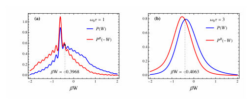 
FIG. 1. Forward work distribution P(W) and reverse dis- tribution P R(−W) for αi = 2 sin [2πiτ/T]. (a) ω0τ = 1, ω0T = 100, N = 125 (b) ω0τ = 3, ω0T = 300, N = 125. For both cases, β∆F = −0.4063, which is close to the indicated values of βW at the intersections.

📷 Fig 2

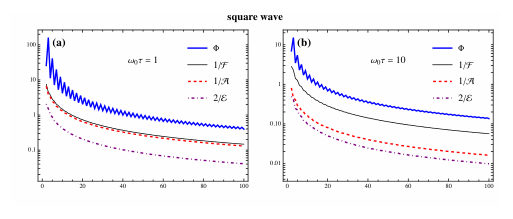 
FIG. 2. QTUR quantities for square wave protocols versus the measurement number N for βℏω0 = 1, γ0/ω0 = 0.1 and amplitude α = 10. (a) ω0T = 2 and ω0τ = 1; (b) ω0T = 20 and ω0τ = 10. The activity bound is tighter in both cases, 1/A &gt; 2/E.

📷 Fig 3

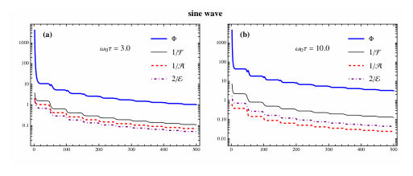 
FIG. 3. QTUR quantities for sinusoidal waves versus the measurement number N for βℏω0 = 0.1, γ0/ω0 = 0.1 and amplitude A = 10. (a) ω0T = 300 and ω0τ = 3. (b) ω0T = 1000 and ω0τ = 10.

**Summary.** This paper derives a novel thermodynamic uncertainty relation for the work done in an open quantum system driven by time-dependent protocols. By combining the Cramér–Rao inequality with quantum Fisher information, the authors establish a bound relating the work variance to the system's dynamical activity and entropy production. This result provides a quantitative measure of non-equilibrium fluctuations in quantum thermodynamics.

**Why it may be interesting.** This work provides a rigorous, quantitative bound on the fluctuations of work in non-equilibrium quantum processes, extending fluctuation theorems into the realm of quantum estimation theory, which is highly relevant for quantum thermodynamics.

Detailed structure

**Main problem.** The paper derives a thermodynamic uncertainty relation (TUR) for the work done in an open quantum system subjected to time-dependent driving and repeated energy measurements.

**Main result.** The derived bound is $	ext{Var}\,{\cal W}/[	au\partial_	au\langle{\cal W}
angle]^2\ge 1/{\cal F}\ge\max(1/{\cal A},2/{\cal E})$, linking the work variance to the system's dynamical activity and entropy production.

**Method.** The analysis combines the Cramér–Rao inequality with the quantum Fisher information by perturbing the dissipative dynamics, leveraging the system's adherence to fluctuation theorems.

**Model / system.** The system is a piece-wise time-dependent Markovian open quantum system, modeled by a sequence of Hamiltonian quenches separated by finite-time Lindblad evolution. The dynamics are analyzed using a two-level system example.

**Key observables.** Work ($W$), Work Expectation Value ($\langle W 
angle$), Variance of Work ($	ext{Var } W$), Fisher Information (${\cal F}$), Dynamical Activity (${\cal A}$), and Dimensionless Entropy Production (${\cal E}$).

**Important parameters / regimes.** Switching time interval ($	au$), driving protocol (square-wave or sinusoidal), and the specific perturbation parameters ($	heta_1, 	heta_2$).

**Assumptions / limitations.** The protocol is modeled as a sequence of quenches separated by finite-time Lindblad evolution, and the Lindblad evolution is assumed to be Markovian and secular over the interval $	au$.

**Figures summary.** Figure 1 compares the forward and reverse work distributions for a two-level system under square-wave and sinusoidal driving, illustrating the Crooks FT. Figure 2 and 3 show the relationship between the derived bounds ($1/{\cal A}$ vs $2/{\cal E}$) and the Fisher information for specific driving protocols.

**Paper structure.** The paper establishes the framework by noting that work statistics obey fluctuation relations. It then applies estimation theory, using two independent perturbations to derive the core uncertainty relation, which is finally illustrated using specific two-level system examples (square-wave and sinusoidal driving).

Abstract

We derive a thermodynamic uncertainty relation for work in an open quantum system driven by a time-dependent protocol and subject to repeated projective energy measurements. The protocol is represented by a sequence of protocol quenches separated by finite-time Lindblad evolution, so that work is accumulated at the quenches while dissipation occurs between them. The resulting work statistics obey the Gallavotti-Cohen symmetry to give rise to the Crooks and Jarzynski fluctuation relations. By perturbing the dissipative dynamics and combining the Cramér--Rao inequality with the quantum Fisher information, we obtain $\mathrm{Var}\,{\cal W}/[τ\partial_τ\langle{\cal W}\rangle]^2\ge 1/{\cal F}\ge\max(1/{\cal A},2/{\cal E})$, where $\langle{\cal W}\rangle$ is the work expectation value, $\mathrm{Var}\,{\cal W}$ is the variance of work, ${\cal F}$ is the Fisher information, ${\cal A}$ is the dynamical activity, ${\cal E}$ is the dimensionless entropy production, and $τ$ is the switching time interval between quenches. The two thermodynamic bounds follow from two independent perturbations that generate the same response of the work statistics. We illustrate the relation for a dissipative two-level system under square-wave and sinusoidal driving and show that the tighter thermodynamic bound can depend on the driving protocol and switching time scale.

[↑ back to top](#top)

### [Exact solutions of nonreciprocal Su-Schrieffer-Heeger model with domain walls](http://arxiv.org/abs/2609.17378v1)

**Authors:** Tong Wang, Mengjie Yang, Flore K. Kunst  
**Type:** theory · **Category:** disordered systems and neural networks · **PDF:** <https://arxiv.org/pdf/2609.17378v1>  
**Analysis basis:** full PDF text, analyzed in chunks
**Topic relevance:** `analog quantum simulation` **3/5** · `driven-dissipative phase transition` **3/5** · `methods for driven-dissipative` **3/5** · `Keldysh / 2PI / non-Gaussian methods` **2/5** · `correlated / nonlocal dissipation` **2/5** · `non-equilibrium universality` **2/5** · `Frenkel-Kontorova` **1/5** · `quantum measurements` **1/5**

📷 Fig 1

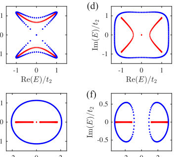 
FIG. 1. The non-Hermitian SSH model with (a) unbroken unit cells and (b) a broken unit cell on the right end. The PBC (blue dots) and OBC spectra (red diamonds) for a lattice of 80 unbroken unit cells are shown in (c)-(f). The model parameters are γ/t2 = 1.2 and (a) t1/t2 = 0.2, (b) t1/t2 = 0.8, (c) t1/t2 = 1.4, (d) t1/t2 = 2.5.

📷 Fig 2

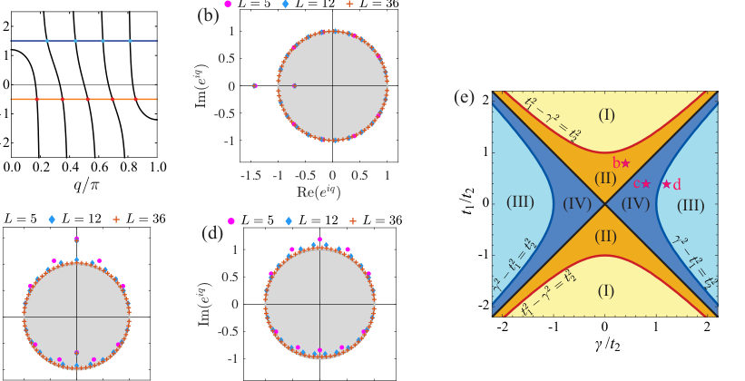 
FIG. 2. Solutions of the generalized wave number q and phase diagram for the nonreciprocal SSH model with intact unit cells. (a) Plot of sin[q(L+1)]/ sin(qL) with L = 5. The blue and orange horizontal lines correspond to y = −t2/ p

📷 Fig 3

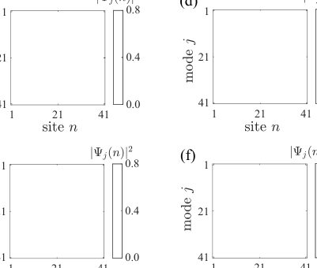 
FIG. 3. Right eigenstates profile of the nonreciprocal SSH model in the broken-unit-cell case. The exact zero mode de- scribed by Eq. (21) is localized on the left (right) end when |(t1 −γ)/t2| &lt; 1 (&gt; 1), which corresponds to the red (yellow) region in (a). Its wave function amplitudes as a function of t1/t2 with γ/t2 = 0.6 and L = 20 are shown in (b). Wave function amplitudes for all right eigenstates with γ/t2 = 0.6 and t1/t2 = −0.7, −0.3, 1.2 and 2 are shown in (c)-(f), re- spectively. The parameters corresponds to the black dots c-f in (a). The index of modes are sorted in ascending order of the real part of energy.

📷 Fig 4

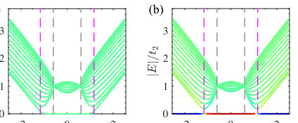 
FIG. 4. Spectrum of the NH SSH model as a function of t1/t2 in the (a) unbroken-unit-cell case and (b) broken-unit- cell-case. We fix t2 = 1 and γ = 0.6. The color of data points show the biorthogonal polarization P as defined in Eq. (26) of the corresponding eigenstates. Note that P is calculated numerically for a chain of 16 unit cells. The gray dashed lines at t1 = ±γ mark the real-to-complex spectral transitions, where psH-symmetry is spontaneously broken and exceptional points with an order scaling with system size appear, and the magenta dashed lines at t1 = ± p

📷 Fig 5

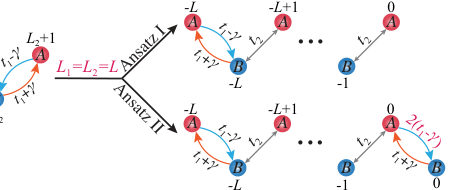 
FIG. 5. The nonreciprocal SSH model with (a) type-A interface and (b) type-B interface in the middle.

**Summary.** This paper analytically investigates the complex physics of domain walls in a nonreciprocal Su-Schrieffer-Heeger model. By employing advanced techniques like biorthogonal polarization, the authors characterize the emergence of additional localized states beyond standard topological modes. This work provides a detailed theoretical understanding of how interface geometry dictates the electronic structure in non-Hermitian quantum systems.

**Why it may be interesting.** The study of non-Hermitian systems, topological edge states, and interface physics is highly relevant to open quantum systems, where boundary effects and non-Hermiticity are crucial for understanding dissipation and energy flow.

Detailed structure

**Main problem.** The study investigates domain-wall physics in a nonreciprocal Su-Schrieffer-Heeger (SSH) model, focusing on finding analytical eigenstate solutions under open boundary conditions.

**Main result.** The system exhibits additional localized states at finite energy detached from the bulk continuum due to domain walls, and in 2D, competing nonreciprocities allow for a tunable funneling regime.

**Method.** The authors use analytical techniques, including symmetry-based ansatzes and the concept of biorthogonal polarization, to derive closed-form quantization conditions for the wave number and wave functions.

**Model / system.** The model is a non-Hermitian (NH) SSH chain, which is nonreciprocal and features non-Hermitian skin effects. The analysis is extended to include domain walls (Type-A and Type-B interfaces) and a two-dimensional Lieb lattice.

**Key observables.** Eigenenergies, topological zero modes, skin modes, and the biorthogonal polarization (P).

**Important parameters / regimes.** Nonreciprocal hopping ratios ($\gamma, t_1, t_2$), boundary conditions (open vs. periodic), and the geometry of the interface.

**Assumptions / limitations.** The analysis often focuses on right eigenstates and utilizes plane-wave function ansatzes for the bulk states.

**Figures summary.** Figures illustrate the SSH model structure, compare PBC vs. OBC spectra, show wave function profiles for zero modes, and map out phase diagrams based on symmetry breaking and polarization.

**Paper structure.** The paper progresses from analyzing the basic NH SSH model (unbroken/broken unit cells) to deriving quantization conditions, and finally focuses on the complex physics introduced by domain walls, analyzing Type-A and Type-B interfaces separately.

Abstract

We investigate domain-wall physics in a non-Hermitian Su-Schrieffer-Heeger model featuring the non-Hermitian skin effect and its higher-dimensional extensions, focusing on analytical eigenstate solutions under open boundary conditions. By gluing two Su-Schrieffer-Heeger chains with inverted coupling ratios together, we identify two distinct interface geometries, and derive closed-form quantization conditions for the complex wave number and wave functions using symmetry-based ansatzes. Besides conventional skin modes and topological zero modes, the domain walls generate additional localized states at finite energy that detach from the bulk open-boundary-condition continuum. We validate the analytical results by exact diagonalization, and further generalize the interface construction to a two-dimensional Lieb lattice, where competing nonreciprocities produce tunable funneling regimes towards codimension-one and codimension-two interfaces.

[↑ back to top](#top)

### [Preparation-protocol-dependent quantum Mpemba dynamics in a magnetically tunable graphene nanotorus qubit](http://arxiv.org/abs/2609.17176v1)

**Authors:** J. Furtado  
**Type:** theory · **Category:** other · **PDF:** <https://arxiv.org/pdf/2609.17176v1>  
**Analysis basis:** full PDF text, analyzed in chunks
**Topic relevance:** `driven-dissipative phase transition` **3/5** · `methods for driven-dissipative` **3/5** · `non-equilibrium universality` **3/5** · `quantum measurements` **2/5** · `Keldysh / 2PI / non-Gaussian methods` **1/5** · `analog quantum simulation` **1/5** · `correlated / nonlocal dissipation` **1/5** · `scars & prethermalization` **1/5**

📷 Fig 1

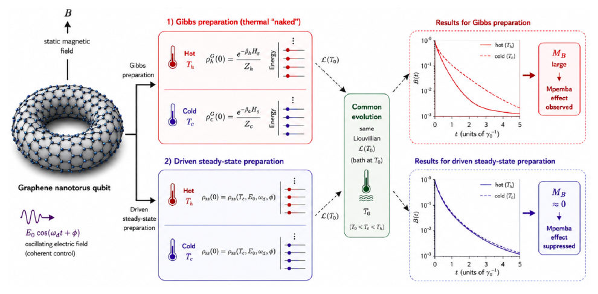 
FIG. 1. Schematic of the nanotorus QMpE protocol. The static magnetic field B fixes the bound-state structure and transition frequency, while the oscillating electric field provides coherent control. Hot and cold states are prepared at Th and Tc and subsequently evolved under the same final Liouvillian associated with the colder bath T0. The present work compares two ways of preparing ρh(0) and ρc(0): bare Gibbs states and driven stationary states.

📷 Fig 2

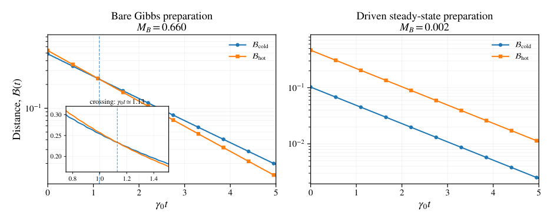 
FIG. 2. Direct comparison of the distance dynamics at the reference parameter point. Left: bare Gibbs preparation gives MB = 0.661 and a clear crossing at γ0t ≃1.13. Right: driven steady-state preparation yields MB = 0.002; the crossing occurs only at γ0t ≃11.1, outside the plotted interval 0 ≤γ0t ≤5. Both panels use the same final Liouvillian.

📷 Fig 3

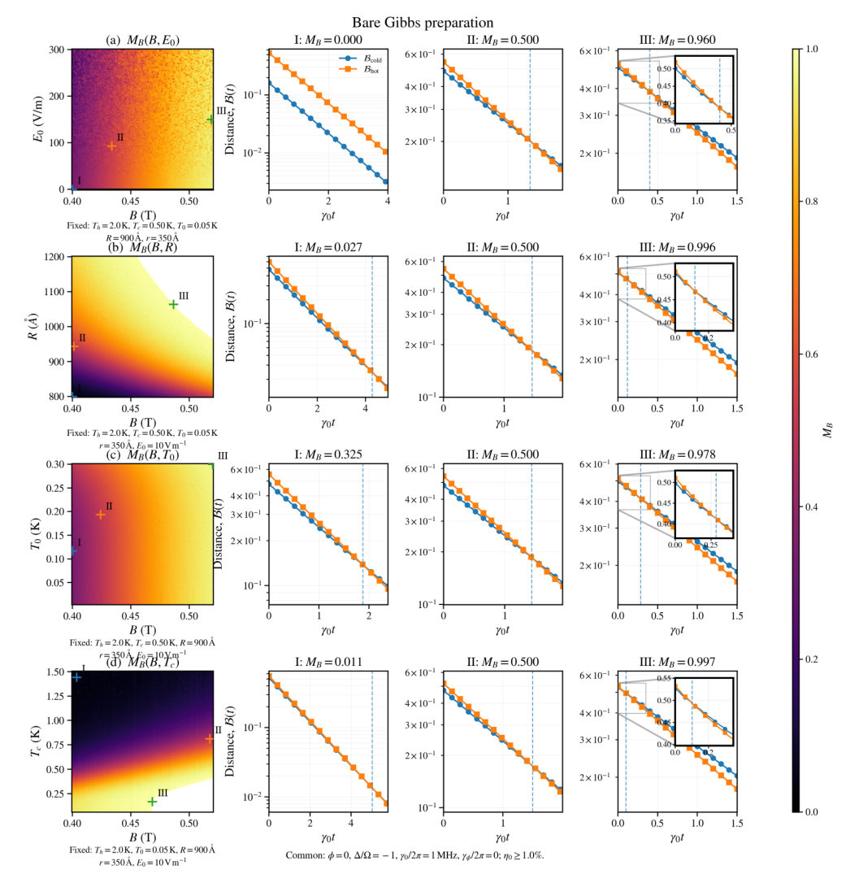 
FIG. 3. Summary of the bare-Gibbs preparation regime. The four rows show MB(B, E0), MB(B, R), MB(B, T0), and MB(B, Tc), respectively. In each row, the left panel displays the two-dimensional map, while the three panels to the right show the hot and cold distances for the representative points I, II, and III marked on the map. The integration defining MB is always performed over 0 ≤γ0t ≤20, whereas the displayed time window is adapted to show the relevant crossing and a short post-crossing interval; when MB = 0, the plotted interval is 0 ≤γ0t ≤4. Isolated numerical gaps in the maps are locally interpolated for visualization only and are not used in the quantitative analysis. The remaining...

📷 Fig 4

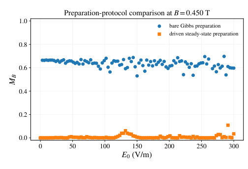 
FIG. 4. MB as a function of electric-field amplitude for the two preparation protocols. The no-drive point is exactly zero in both cases. Bare Gibbs preparation rapidly develops a large QMpE once the drive is switched on, whereas driven steady-state preparation remains weak over most of the scan.

📷 Fig 5

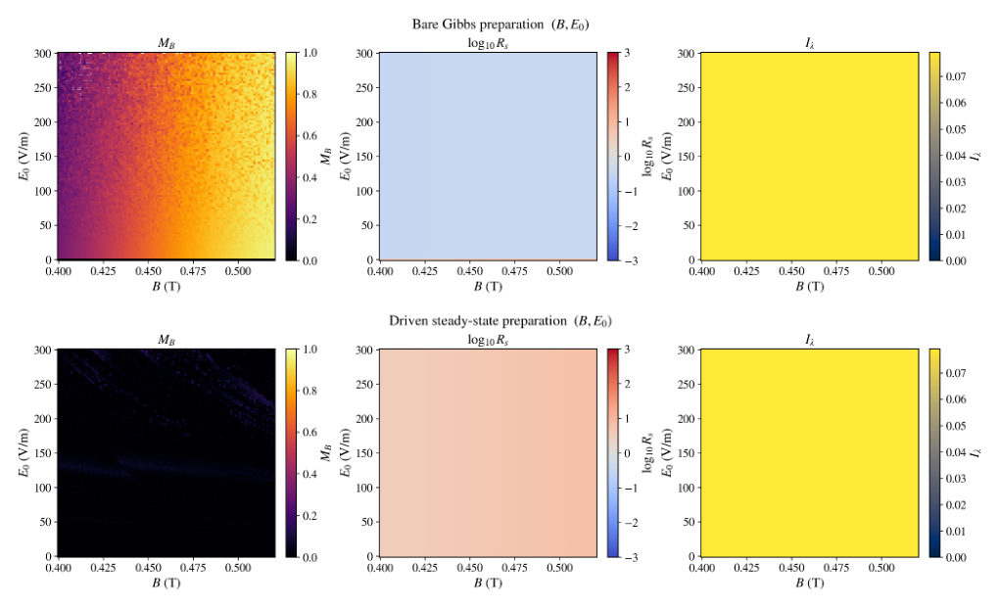 
FIG. 5. Liouvillian-mode diagnostics in the B–E0 plane. The upper block shows bare Gibbs preparation and the lower block driven steady-state preparation. In each block the panels display MB, log10 Rs, and the spectral-spread indicator Iλ. The same final Liouvillian is used at corresponding parameter points. Bare Gibbs preparation occupies the slow active sector with Rs &lt; 1 throughout the driven QMpE region, whereas driven steady-state preparation predominantly gives Rs &gt; 1 while MB remains close to zero. The comparatively weak variation of Iλ shows that the protocol dependence is governed by initial-state modal weights rather than by a change of the final decay spectrum.

**Summary.** This theoretical study examines the quantum Mpemba effect in a graphene nanotorus qubit, revealing that the effect's strength is highly sensitive to how the initial state is prepared. By comparing bare Gibbs preparation against driven steady-state preparation, the authors show that the choice of protocol dictates the system's modal weights, leading to either a strong anomalous relaxation or near-complete suppression of the effect.

**Why it may be interesting.** This work provides a clear example of how non-equilibrium initial conditions, even when the final physics is identical, can fundamentally alter observable quantum dynamics, which is a key concept in open quantum systems and quantum control.

Detailed structure

**Main problem.** The study investigates the quantum Mpemba effect (QMpE) and demonstrates that its magnitude is critically dependent on the specific protocol used to prepare the initial quantum state.

**Main result.** Bare Gibbs preparation leads to a strong QMpE ($M_B \approx 1$), whereas using a driven steady-state preparation almost completely suppresses the effect ($M_B \approx 0$).

**Method.** The analysis employs an open-system Liouvillian framework, comparing two distinct initial state preparation protocols (bare Gibbs vs. driven steady-state) while keeping the final evolution dynamics identical.

**Model / system.** The system is modeled as a magnetically tunable graphene nanotorus qubit, treated as an effective two-level system evolving under a Markovian master equation incorporating an external coherent drive.

**Key observables.** Mpemba parameter ($M_B$), distance to the final stationary state ($B_{h,c}(t)$), and the slow-sector weight ratio ($R_s$).

**Important parameters / regimes.** Magnetic field ($B$), electric field ($E_0$), and the preparation protocol itself (Bare Gibbs vs. Driven Steady-State).

**Assumptions / limitations.** The dynamics are analyzed within a Markovian approximation, and the comparison isolates the effect of initial state preparation, holding the final Liouvillian spectrum constant.

**Figures summary.** Figures compare the distance dynamics for both protocols, showing large $M_B$ for bare Gibbs and near-zero $M_B$ for driven steady-state. They also map the slow-sector ratio ($R_s$) onto parameter planes, confirming the protocol-dependent separation ($R_s < 1$ vs. $R_s > 1$).

**Paper structure.** The paper introduces the QMpE in the graphene qubit, defines the two competing preparation protocols, analyzes the resulting dynamics using Liouvillian mode decomposition, and concludes by linking the preparation protocol to the modal weights ($R_s$) that govern the observed Mpemba effect.

Abstract

We investigate the quantum Mpemba effect in a graphene nanotorus qubit and show that its strength depends strongly on how the initial state is prepared. We compare two protocols that share the same final Hamiltonian, thermal bath, and Markovian Liouvillian: bare Gibbs preparation, in which the coherent drive is switched on only at the final quench, and driven steady-state preparation, in which the initial states are stationary states of the driven dynamics. Using the distance to the final stationary state and an integrated Mpemba parameter, we find broad regions of strong anomalous relaxation for bare Gibbs preparation, with $M_B$ approaching unity, whereas the driven steady-state protocol almost completely suppresses the effect. A Liouvillian-mode analysis reveals the mechanism: the bare Gibbs protocol typically yields a smaller hot-state weight in the slow active sector than the cold state, $R_s<1$, while the driven steady-state protocol predominantly gives $R_s>1$. Since the final Liouvillian spectrum is identical for both protocols at corresponding parameter points, the contrast originates from preparation-dependent modal weights rather than from changes in the decay-rate hierarchy. These results identify state preparation as a control parameter for anomalous quantum relaxation in a curved graphene qubit.

[↑ back to top](#top)

### [ConteXtuAlity: an open source Python package for contextuality](http://arxiv.org/abs/2609.17294v1)

**Authors:** Vallée Kim  
**Type:** theory · **Category:** other · **PDF:** <https://arxiv.org/pdf/2609.17294v1>  
**Analysis basis:** full PDF text, analyzed in chunks
**Topic relevance:** `quantum measurements` **3/5** · `analog quantum simulation` **2/5** · `methods for driven-dissipative` **2/5** · `quantum optics experiment` **2/5** · `Full counting statistics` **1/5** · `Keldysh / 2PI / non-Gaussian methods` **1/5** · `correlated / nonlocal dissipation` **1/5** · `driven-dissipative phase transition` **1/5** · `non-equilibrium universality` **1/5**

📷 Fig 1

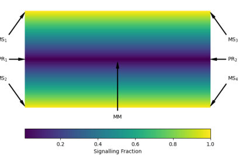 
Figure 2: Heatmaps of (a) the contextual fraction and (b) the signalling fraction following the results of Listing 8.

📷 Fig 2

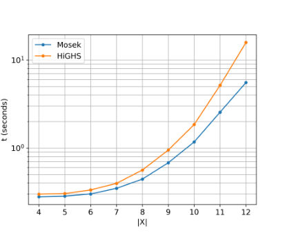 
Figure 3: Benchmarks for n-cycle scenarios of increasing size n for the (a) compute_cf() method and for the (b) compute_sf() method. The y-axis of each graph is in log-scale, therefore we see that we have at least an exponential complexity in time depending on the size of the measurement scenario.

📷 Fig 3

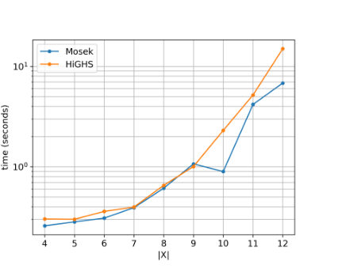 
Figure 4: Benchmarks for random scenarios of increasing size n for the (a) compute_cf() method and for the (b) compute_sf() method. The y-axis of each graph is in log-scale, however the complexity is more difficult to analyse due to the random nature of the scenarios.

**Summary.** This paper introduces ConteXtuAlity, an open-source Python package designed to compute contextuality measures like the Contextual and Signalling Fractions. It formalizes contextuality using a sheaf-theoretic approach applied to empirical measurement data. The package allows theorists and experimentalists to quantify how much a measurement outcome deviates from classical expectations using linear programming solvers.

**Why it may be interesting.** While focused on contextuality rather than standard AMO Hamiltonians, the rigorous mathematical framework and the use of linear programming to quantify deviations from classical/non-contextual behavior are highly relevant for analyzing experimental data in quantum optics and open systems.

Detailed structure

**Main problem.** The paper aims to develop a unified, open-source computational framework to quantify contextuality in quantum measurements.

**Main result.** It introduces the ConteXtuAlity package, which provides methods to compute the Contextual Fraction (CF) and Signalling Fraction (SF) using linear programming techniques.

**Method.** The core method involves modeling measurements using a sheaf-theoretic framework and calculating contextuality measures by solving linear programs based on empirical probability distributions.

**Model / system.** The framework analyzes general measurement scenarios $\langle X, M, O 
angle$, where $M$ is the set of measurement contexts. The input data is represented by an Empirical Model, which is a family of probability distributions over measurement outcomes.

**Key observables.** Contextual Fraction (CF) and Signalling Fraction (SF).

**Important parameters / regimes.** The structure of the measurement scenario ($\mathbf{X}, \mathbf{M}, \mathbf{O}$) and the underlying empirical probability distribution $e$.

**Assumptions / limitations.** The analysis is based on the sheaf theoretic approach to contextuality, and certain computations require external mathematical optimization solvers (e.g., MOSEK, HiGHS).

**Figures summary.** The notes mention Figure 1 showing the package logos, and Tables 1 and 2 detailing the methods and accessors for the `MeasurementScenario` and `EmpiricalModel` classes, respectively.

**Paper structure.** The paper introduces the package, details the mathematical framework (sheaf theory), implements core classes (`MeasurementScenario`, `EmpiricalModel`), and demonstrates functionality through examples like the KCBS and CHSH scenarios, culminating in benchmarks.

Abstract

We present an open source Python package, ConteXtuAlity, for computing various quantities related to contextuality. This package features an interface to the sheaf-theoretic framework for contextuality, providing an implementation of measurement scenarios and empirical models as well as linear programs to compute the contextual fraction and the signalling fraction. In this work, we demonstrate the package's features and give examples of its use. We also provide benchmarks, demonstrating how performances scale with the size of measurement scenarios. The package is designed for both experienced theorists and newcomers to the field of contextuality alike, with an emphasis on flexibility and extensibility.

[↑ back to top](#top)

### [Local energetic coupling enhances the expressivity of chemical computation](http://arxiv.org/abs/2609.17339v1)

**Authors:** Marco Tuccio, Jason W. Rocks, Joshua E. Goldford  
**Type:** theory · **Category:** statistical mechanics · **PDF:** <https://arxiv.org/pdf/2609.17339v1>  
**Analysis basis:** full PDF text, analyzed in chunks
**Topic relevance:** `driven-dissipative phase transition` **3/5** · `non-equilibrium universality` **3/5** · `Keldysh / 2PI / non-Gaussian methods` **2/5** · `correlated / nonlocal dissipation` **2/5** · `methods for driven-dissipative` **2/5** · `analog quantum simulation` **1/5** · `quantum measurements` **1/5**

📷 Fig 1

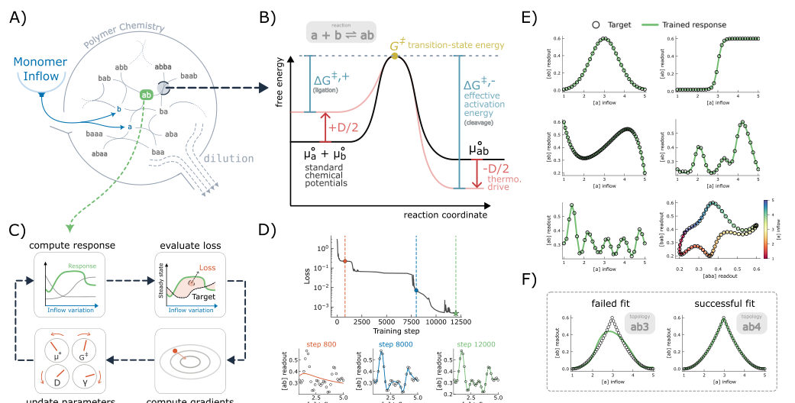 
FIG. 1. (A) Cartoon of a ligation–cleavage polymerization network in a Continuously Stirred Tank Reactor (CSTR). The network contains every sequence that can be assembled from the specified alphabet size A up to a maximum length L, together with all ligation and cleavage reactions among them. (B) Parameterization of the reaction kinetics in terms of standard chemical potentials µ◦ i , transition-state energies G‡ α, and thermodynamic drives Dα, which together set the effective activation barriers ∆G‡,± α in the ligation (+) and cleavage (−) directions. (C) Schematic of the training loop. The steady-state response is computed as a function of the monomer reservoir concentration, and the mean...

📷 Fig 2

 
FIG. 2. (A) Success rate against target complexity H for each of the nine polymerization networks containing up to ∼500 reactions. Targets are randomly generated squared trigonometric polynomials built from harmonics up to H with random magnitudes and phases and correspond to target com- plexity; representative targets are drawn below the axis. In every run the input is the reservoir concentration of monomer a and the output is the steady-state concentration of ab. Each point aggregates independent experiments for each topology against a set of 50 random targets generated for each har- monic (shared across all topology for each target complexity) resulting in 4500 training runs in total. A...

📷 Fig 3

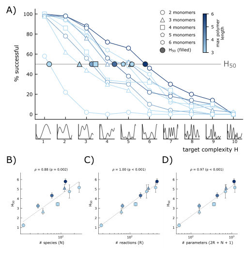 
Figure 1(D) shows a typical training progression, and Fig. 1(E) demonstrates the method can train CRNs to reproduce a wide variety of functional forms, including Gaussian bumps (band-pass filters), step functions (hy- persensitivity), and more complicated nonmonotonic tar- gets. A single input read out along two channels traces out a von Neumann elephant parametric curve [40] where readout species aba and bab are trained on the single in- put ab.

📷 Fig 4

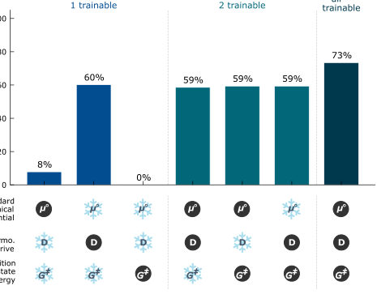 
FIG. 3. Parameter-freezing study on a fixed abc3 topol- ogy with N = 39 species and R = 60 reactions, against an ensemble of 128 random targets at target function com- plexity H = 2. Each bin corresponds to one trainable sub- set of the three parameter classes: frozen classes (snowflake) are set to zero, while the remaining classes (black) are ran- domly initialized near zero and trained; the flow rate γ = 1 is frozen throughout. Bars give the success rate, defined as in Fig. 2 (R2 ≥0.98 together with a quasistatic verifica- tion of the dynamics). Among the single-class bins only the thermodynamic drives Dα train well (60%), against 8% for the standard chemical potentials µ◦ i and no...

📷 Fig 5

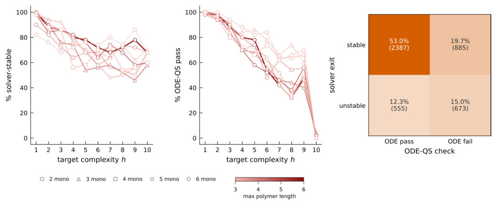 
FIG. 4. Failure statistics for the scaling study in Fig. 2. The left panel describes the fraction of experiments that resulted in stable numerical behavior during the training procedure, normalized by the 50 experiments run per target complexity per topology. The central panel shows the corresponding fraction of experiments that passed the ODE quasistatic check (QS-pass). The right panel shows the distribution among 4 possible resulting combinations of numerically stable and unstable experiments that resulted in passing or not passing the quasistatic check. We see here that it is possible that some experiments pass the quasistatic check even when they resulted in early training exit due to...

**Summary.** This work investigates the computational power of chemical reaction networks by training them to reproduce complex target functions. The authors found that the ability to compute these functions is critically dependent on internal thermodynamic drives that violate detailed balance. This identifies non-equilibrium energy coupling as the primary resource governing chemical computation expressivity.

**Why it may be interesting.** The focus on non-equilibrium drives and the use of complex, energy-derived parameters to control computation is highly relevant to open quantum systems and non-equilibrium statistical mechanics.

Detailed structure

**Main problem.** The study aims to determine the physicochemical rules governing the computational expressivity of chemical systems, specifically identifying which energy parameters control the ability to compute target nonlinear functions.

**Main result.** Internal thermodynamic drives, capable of breaking detailed balance, were identified as the dominant resource conferring steady-state computational expressivity in chemical reaction networks.

**Method.** The authors trained chemical reaction networks (CRNs) to match target functions by minimizing a mean squared error loss function, using implicit differentiation to calculate gradients.

**Model / system.** The system is a Chemical Reaction Network (CRN) modeled using mass-action kinetics in a CSTR setting. The kinetics are parameterized by standard chemical potentials, transition-state energies, and nonconservative thermodynamic drives.

**Key observables.** Computational expressivity, quantified by $H_{50}$ (the target complexity where success rate hits 50%), and the coefficient of determination ($R^2$) for fit quality.

**Important parameters / regimes.** Thermodynamic drives ($D_\alpha$), standard chemical potentials ($\mu^\circ_i$), and transition-state energies ($G^\ddagger_\alpha$).

**Assumptions / limitations.** The analysis assumes that the steady state found via root-finding accurately represents the true dynamics, requiring quasistatic verification.

**Figures summary.** Figures illustrate the network structure, the training loop, and show comparisons of fit capabilities across different parameter sets (e.g., parameter-freezing studies).

**Paper structure.** The paper establishes the problem of chemical computation expressivity, details the CRN model parameterized by energetic terms, outlines the training methodology using optimization, and presents parameter-freezing studies to isolate the most critical energetic resource.

Abstract

Living systems compute with chemistry by mapping environmental signals onto specific internal chemical states. Despite recent advances in molecular programming, it remains unclear which physicochemical features control the computational expressivity of chemical systems. Here we inverse-design thermodynamically consistent chemical reaction networks whose steady-state response to an environmental input computes a target nonlinear function. Using implicit differentiation we train the free-energy landscape directly: standard chemical potentials, transition-state energies and thermodynamic drives. Increasingly large networks generated by elementary ligation and cleavage steps fit increasingly complex nonmonotonic polynomial functions, with expressivity scaling logarithmically with network size, predicted primarily by the number of reactions. Training individual energetic parameter classes reveals that internal thermodynamic drives, capable of breaking detailed balance, dominate trainability, with comparable performances achieved only by pairs of parameter classes. These results identify nonequilibrium drive as the most effective single resource for steady-state computational expressivity in chemical reaction networks.

[↑ back to top](#top)

### [Optical and magnetic signatures of drive-enhanced coherence in phase-disordered superconducting bilayers](http://arxiv.org/abs/2609.16137v1)

**Authors:** Duilio De Santis, Sambuddha Chattopadhyay, Marios H. Michael, Andrea Cavalleri, Gil Refael, Patrick A. Lee, Eugene A. Demler  
**Type:** theory · **Category:** other · **PDF:** <https://arxiv.org/pdf/2609.16137v1>  
**Analysis basis:** full PDF text, analyzed in chunks
**Topic relevance:** `driven-dissipative phase transition` **3/5** · `methods for driven-dissipative` **3/5** · `Keldysh / 2PI / non-Gaussian methods` **2/5** · `non-equilibrium universality` **2/5** · `analog quantum simulation` **1/5** · `correlated / nonlocal dissipation` **1/5** · `quantum measurements` **1/5**

📷 Fig 1

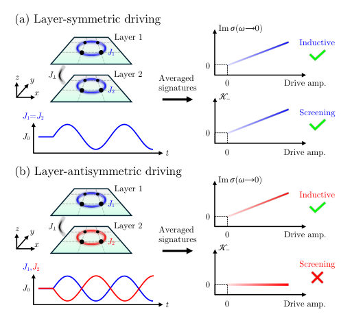 
FIG. 1. Driven bilayer schematics. Periodic stiffness modulation can produce both an enhanced low-frequency inductive response and enhanced magnetic screening in a driven, phase-disordered bilayer. For a layer-symmetric drive [panel (a)], the two planes stiffen and soften together, en- hancing long-distance correlations in both the average (+) and relative (−) phase sectors. For a layer-antisymmetric drive [panel (b)], one plane stiffens while the other softens, so that average-phase correlations can still be enhanced, whereas relative-phase correlations are not. A uniform in-plane opti- cal probe couples to the parallel (+) current and measures the conductivity σ, whereas a magnetic field...

📷 Fig 2

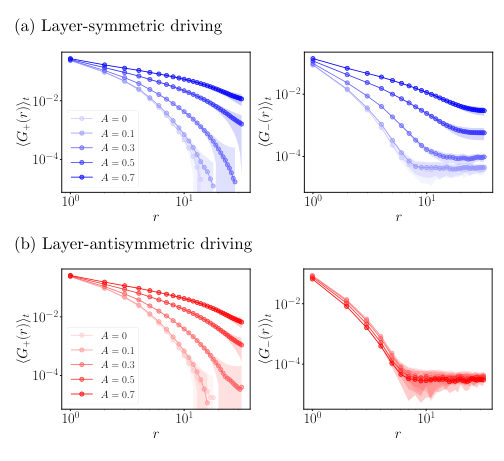 
FIG. 2. Average and relative phase correlations un- der layer-symmetric and layer-antisymmetric modu- lation. Time-averaged correlations as a function of distance, for increasing values of A (see legends in the left panels), with T = 1.5, Ω= 0.01, J⊥= 0.01, L = 64, and N = 50 indepen- dent realizations. Symmetric driving enhances both G+ and G−, see panel (a). Antisymmetric driving produces a com- parable enhancement of G+ but little or no enhancement of G−, see panel (b). Shaded areas denote the statistical error over realizations.

📷 Fig 3

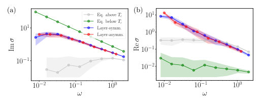 
FIG. 3. Optical response under layer-symmetric and layer-antisymmetric driving. Imaginary [panel (a)] and real [panel (b)] parts of the conductivity σ in equilibrium and under layer-symmetric and layer-antisymmetric driving, eval- uated under the favourable conditions identified in Fig. 2. For both drive symmetries, the dissipative response narrows and the low-frequency 1/ω behavior of Im σ is enhanced, as seen by comparing the driven curves (blue: symmetric, red: anti- symmetric, both with A = 0.7) with the equilibrium curves (gray, A = 0). The close similarity between the two driven responses reflects the comparable enhancement of G+. For reference, we also show the equilibrium...

📷 Fig 4

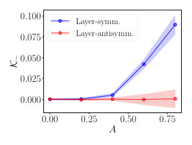 
FIG. 4. Counterflow screening response under layer- symmetric and layer-antisymmetric driving. Counter- flow screening kernel evaluated under driving conditions simi- lar to those in Fig. 3. The symmetric drive (in blue) substan- tially enhances the response to a static magnetic field parallel to the planes, bringing it to a significant fraction of the cor- responding equilibrium response below the phase-disordering temperature, shown for reference in the Supplement [31]. By contrast, under antisymmetric driving (in red), the response remains close to its equilibrium value. This behavior mirrors that of G−in Fig. 2. Shaded areas denote the statistical er- ror over realizations. Other...

**Summary.** This theoretical study investigates how periodic driving affects coherence in superconducting bilayers, comparing optical conductivity to magnetic screening. By modeling two types of drive symmetries, the authors find that only layer-symmetric driving enhances both observables simultaneously. This establishes a necessary symmetry condition for interpreting experimental reports of enhanced superconducting behavior.

**Why it may be interesting.** The work provides a crucial symmetry diagnostic tool for interpreting complex, out-of-equilibrium measurements in high-temperature superconductors, linking optical response to underlying magnetic coherence.

Detailed structure

**Main problem.** The study aims to theoretically distinguish between enhanced superconducting-like optical conductivity and enhanced magnetic screening in phase-disordered superconducting bilayers subjected to periodic driving.

**Main result.** Only a layer-symmetric drive enhances both the optical conductivity and the magnetic screening response, providing a symmetry diagnostic for interpreting experimental measurements in cuprates.

**Method.** The analysis uses a bilayer XY model Hamiltonian and simulates dynamics using overdamped Langevin equations to calculate phase correlators and linear response functions.

**Model / system.** The system is a superconducting bilayer, modeled by phase variables $\theta_1$ and $\theta_2$, coupled by Josephson interactions. The dynamics are driven by modulating the in-plane superfluid stiffness in two distinct, symmetric, or antisymmetric ways.

**Key observables.** Layer-averaged phase correlator ($G_+$) for optical conductivity, and the relative-phase correlator ($G_-$) related to magnetic screening/counterflow.

**Important parameters / regimes.** Drive symmetry (symmetric vs. antisymmetric), temperature relative to $T_c$, and the strength of the applied magnetic field/vector potential.

**Assumptions / limitations.** The analysis assumes the system is above the equilibrium transition temperature ($T > T_c$) and neglects amplitude fluctuations of the superconducting order parameter.

**Figures summary.** Figures illustrate that symmetric driving enhances both $G_+$ and $G_-$, while antisymmetric driving enhances $G_+$ but leaves $G_-$ largely unaffected, confirming the diagnostic.

**Paper structure.** The paper establishes the theoretical framework using the bilayer XY model, analyzes the response to layer-symmetric versus layer-antisymmetric drives by calculating both optical conductivity and magnetic screening kernels, and concludes by interpreting the symmetry dependence of the two observables.

Abstract

Recent experiments demonstrating superconducting-like characteristics in materials above their equilibrium transition temperatures following strong sub-picosecond optical excitation have stimulated theoretical interest in phase-disordered superconductors subject to a periodically modulated superfluid stiffness. Previous analyses of the single-layer optical conductivity have shown that such a drive can enhance the low-frequency $1/ω$ response, even when the period-averaged stiffness remains unchanged. We extend these studies to bilayer systems, such as the YBa$_2$Cu$_3$O$_{6+x}$ (YBCO) cuprate, by considering drives with different symmetries. Specifically, we investigate a layer-symmetric drive, in which the two planes stiffen and soften simultaneously, and a layer-antisymmetric drive, in which one plane stiffens while the other softens. Both drives enhance correlations of the layer-averaged phase and generate comparable superconducting-like optical conductivities. Only the symmetric drive, however, strengthens relative-phase locking and the associated counterflow response to a magnetic field parallel to the planes. Thus, an enhanced $1/ω$ optical conductivity does not by itself imply enhanced magnetic screening. In view of applications to driven YBCO, where superconducting-like in-plane optics and transient diamagnetism have both been reported, our result provides a symmetry diagnostic: within a phase-synchronization mechanism, the experimentally active low-frequency stiffness modulation must contain a substantial layer-symmetric component.

[↑ back to top](#top)

### [On the relaxation dynamics of non-equilibrium quantum systems](http://arxiv.org/abs/2609.17447v1)

**Authors:** Matthias Carosi, Björn Garbrecht, Silvia Pla, Nils Wagner, Edward Wang  
**Type:** theory · **Category:** statistical mechanics · **PDF:** <https://arxiv.org/pdf/2609.17447v1>  
**Analysis basis:** full PDF text, analyzed in chunks
**Topic relevance:** `Keldysh / 2PI / non-Gaussian methods` **3/5** · `methods for driven-dissipative` **3/5** · `analog quantum simulation` **1/5** · `correlated / nonlocal dissipation` **1/5** · `driven-dissipative phase transition` **1/5** · `non-equilibrium universality` **1/5** · `quantum measurements` **1/5** · `scars & prethermalization` **1/5**

📷 Fig 1

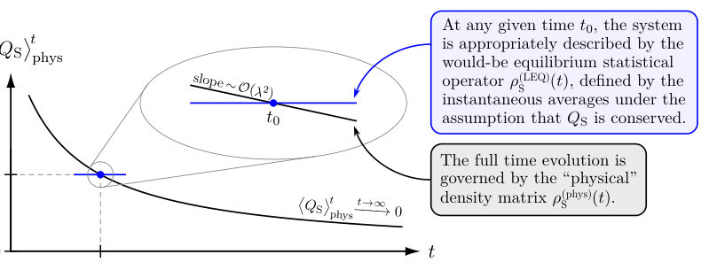 
Figure 1: Schematic depiction of the uniform relaxation of the charge expectation value QS t phys.

**Summary.** This paper develops a rigorous framework to calculate how an approximately conserved charge relaxes in interacting quantum systems near equilibrium. It achieves this by showing that two distinct theoretical approaches—Zubarev's NSO method and a simpler local-equilibrium construction—yield the same result based on equilibrium correlation functions. The work is significant for providing a practical, verifiable tool for studying non-equilibrium dynamics in fields like particle physics and condensed matter.

**Why it may be interesting.** The explicit comparison between two formal derivations (NSO vs. local equilibrium) for the relaxation rate provides a robust, practical alternative for calculating non-equilibrium dynamics, which is highly relevant for open quantum systems.

Detailed structure

**Main problem.** The paper investigates the relaxation dynamics of an approximately conserved charge in interacting quantum systems as they approach local equilibrium.

**Main result.** The leading relaxation rate is determined by an equilibrium correlation function of the charge-violating operator, a result confirmed by both Zubarev's NSO approach and a simpler local-equilibrium construction.

**Method.** The authors employ advanced non-equilibrium statistical mechanics techniques, including Zubarev's Non-Equilibrium Statistical Operator (NSO) approach and deriving an alternative local-equilibrium construction.

**Model / system.** The study applies to general interacting quantum systems, specifically modeling the weak violation of a continuous global symmetry (like $B+L$ charge) via a small perturbation ($\lambda H(	ext{viol.})$) to an otherwise conserved Hamiltonian.

**Key observables.** The relaxation rate ($\Gamma_{	ext{relax}}$) of the charge expectation value, the equilibrium correlation function of the charge-violating operator, and the resulting diffusion-relaxation equation.

**Important parameters / regimes.** The small coupling constant $\lambda$ controlling charge violation, and the separation of timescales ($	au_{	ext{micro}} \ll 	au_{	ext{macro}}$).

**Assumptions / limitations.** The key assumptions include weak charge violation and the separation of timescales between fast microscopic correlations and slow macroscopic charge relaxation.

**Paper structure.** The paper systematically introduces the problem, presents two complementary derivations for the relaxation rate (NSO and local equilibrium), connects relaxation to spatial diffusion, and concludes with applications to electroweak $B+L$ washout and a perturbative scalar model.

Abstract

We investigate the relaxation of an approximately conserved charge in interacting quantum systems close to local equilibrium. To this end, we provide a pedagogical review of Zubarev's non-equilibrium statistical operator approach in the minimal setting of a single non-conserved charge and apply it to the problem at hand. We explicitly highlight the physical assumptions that lead to a local relaxation law: weak charge violation, a separation between the short timescale of microscopic correlations and the much longer timescale of charge relaxation, and the resulting loss of microscopic memory. Under these conditions, the leading relaxation rate is determined by an equilibrium correlation function of the charge-violating operator. We show that the same result follows from a simpler local-equilibrium construction based on the system's evolution over an intermediate timescale, providing a direct alternative for practical calculations and making the common physical ingredients of the two approaches explicit. Beyond the decay law itself, we relate the relaxation rate to the equilibrium diffusion of the same charge. We then allow the charge density to vary in space, which leads to a diffusion-relaxation equation. Finally, we illustrate the formalism through electroweak $\mathrm{B+L}$ washout and a perturbative scalar model, where agreement with the linearized Boltzmann equation establishes a direct connection between equilibrium-correlator and kinetic descriptions.

[↑ back to top](#top)

### [Adaptive Relational Learning on Multi-instance Quantum Data with Photonic Processors](http://arxiv.org/abs/2609.17352v1)

**Authors:** Marcin Jastrzebski, Shang Yu, Raj B. Patel, Oleksandr Kyriienko  
**Type:** both · **Category:** quantum information and computing · **PDF:** <https://arxiv.org/pdf/2609.17352v1>  
**Analysis basis:** full PDF text, analyzed in chunks
**Topic relevance:** `quantum measurements` **3/5** · `quantum optics experiment` **3/5** · `analog quantum simulation` **2/5** · `interference shaping light` **2/5** · `QC/QI experiment` **1/5**

📷 Fig 1

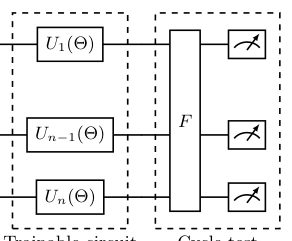 
FIG. 1. The proposed relational learning model. Each input state undergoes an independent trainable transformation, fol- lowed by a destructive CYCLE test. In photonic systems, the CYCLE test can be implemented using a Fourier interferome- ter, indicated here by the gate F. The measurement yields an estimate of the Bargmann invariant of the transformed input states.

📷 Fig 2

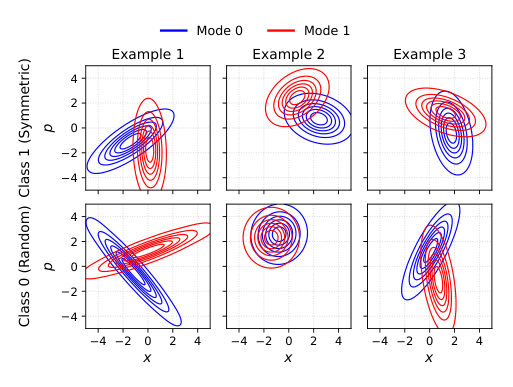 
FIG. 2. Visualization of example pairs from the two classes of the hidden relationship problem. Class 1 pairs (top) differ by a fixed relative rotation, whereas class 0 pairs (bottom) differ by a random relative rotation.

📷 Fig 3

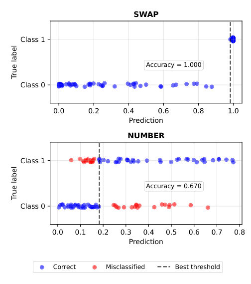 
FIG. 3. Predictions on the test data for the hidden relation- ship problem using the SWAP-based relational model (top) and the local-observable model (bottom). Correctly classified points are shown in blue and misclassified points in red. The dashed black line denotes the classification threshold.

📷 Fig 4

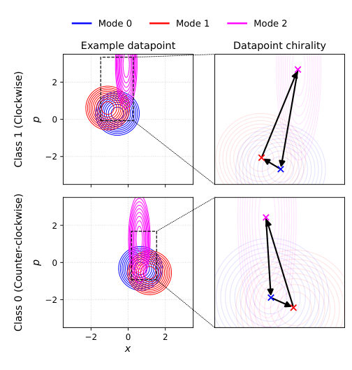 
FIG. 4. Visualization of example triplets from the two classes of the chirality-based classification task. Class 1 (top) corre- sponds to clockwise orientation, whereas class 0 (bottom) cor- responds to anticlockwise orientation. Applying an unknown squeezing transformation to one state obscures the direct re- lation between this geometric picture and the Bargmann in- variant.

📷 Fig 5

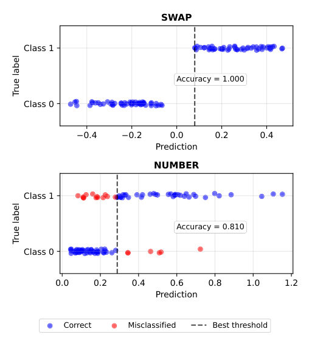 
FIG. 5. Predictions on the test data for the chirality-based classification task using the CYCLE-based relational model (top) and the local-observable model (bottom). Correctly classified points are shown in blue and misclassified points in red. The dashed black line denotes the classification thresh- old.

**Summary.** This paper introduces an adaptive quantum machine learning framework designed to analyze multi-instance quantum data by focusing on the relationships between states. Using CV photonic systems, the model accesses higher-order correlations via global measurements like the Bargmann invariant. It proves that this adaptive approach is vastly more resource-efficient than traditional 'measure-first' methods for tasks like sensing and classification.

**Why it may be interesting.** This work directly addresses the scalability bottleneck in quantum machine learning by providing a measurement strategy that efficiently accesses high-order quantum correlations, which is crucial for quantum sensing and simulation.

Detailed structure

**Main problem.** Developing an adaptive learning framework for quantum machine learning (QML) that can extract key information residing in the correlations between multiple quantum states rather than in the states themselves.

**Main result.** The adaptive model significantly outperforms non-adaptive 'measure-first' approaches by avoiding the rapid scaling of estimation costs with the number of states ($n$), achieving high accuracy with far fewer measurements.

**Method.** The framework uses local, trainable quantum transformations on each input state, followed by a global measurement designed to probe multi-state correlations, such as the $n$-state Bargmann invariant.

**Model / system.** The work is demonstrated using continuous-variable (CV) photonic systems, which naturally support the required quantum data generation, local transformations, and interference measurements.

**Key observables.** The $n$-state Bargmann invariant ($\Delta_n$), geometric phase ($\varphi_g$), and pairwise fidelity ($\Delta_2$).

**Important parameters / regimes.** The number of instances, $n$, and the required number of inference shots (where the adaptive model shows massive savings).

**Assumptions / limitations.** The model assumes pure input states ($
ho_i = |\psi_i
angle\langle\psi_i|$), and its advantage is shown over fixed, non-adaptive measurement strategies.

**Figures summary.** Figures illustrate the model architecture (local transformations followed by a global test), and show comparative results for tasks like hidden relationship detection and chirality classification against local-observable models.

**Paper structure.** The paper introduces the adaptive relational learning framework, details the use of the Bargmann invariant for accessing higher-order correlations, and benchmarks this approach against classical shadow-based methods across several quantum tasks.

Abstract

Loading multiple quantum states in parallel into a quantum machine learning (QML) model can unlock learning tasks where key information resides in the \emph{relations} between states rather than in individual states. We introduce an adaptive relational learning framework for such multi-instance quantum data that accesses pairwise and higher-order relations. Our model combines global measurements via SWAP or CYCLE tests for evaluating an $n$-state Bargmann invariant with shallow trainable transformations applied locally to each input state. We demonstrate the approach for continuous-variable (CV) photonic systems, which naturally provide access to quantum data and necessary computing operations. We solve tasks involving hidden relationship detection, geometric phase classification, and sensing in the presence of an unknown shared nuisance interaction. We benchmark the adaptive model against a non-adaptive ``measure-first'' approach based on continuous-variable classical shadows, and show that the cost of shadow estimation grows rapidly with $n$, while our model avoids this dependence. Already for $n=2$, we achieve perfect test accuracy $A=1.0$ with $500$ inference shots, improving average test accuracy over the shadow-based method by $ΔA=0.15$ while using $100$ times fewer shots per data point. Our work opens routes to sensing and quantum-data applications where adaptive photonic QML can access relational features that are costly to recover with non-adaptive, measure-first models.

[↑ back to top](#top)

### [Experimental Private Quantum Networked Sensing](http://arxiv.org/abs/2609.16743v1)

**Authors:** Nicolas Laurent-Puig, Laura dos Santos Martins, Luis Bugalho, Santiago Scheiner, Majid Hassani, Sean William Moore, Damian Markham, Eleni Diamanti  
**Type:** both · **Category:** quantum information and computing · **PDF:** <https://arxiv.org/pdf/2609.16743v1>  
**Analysis basis:** full PDF text, analyzed in chunks
**Topic relevance:** `QC/QI experiment` **3/5** · `quantum measurements` **3/5** · `quantum optics experiment` **3/5** · `interference shaping light` **1/5**

📷 Fig 1

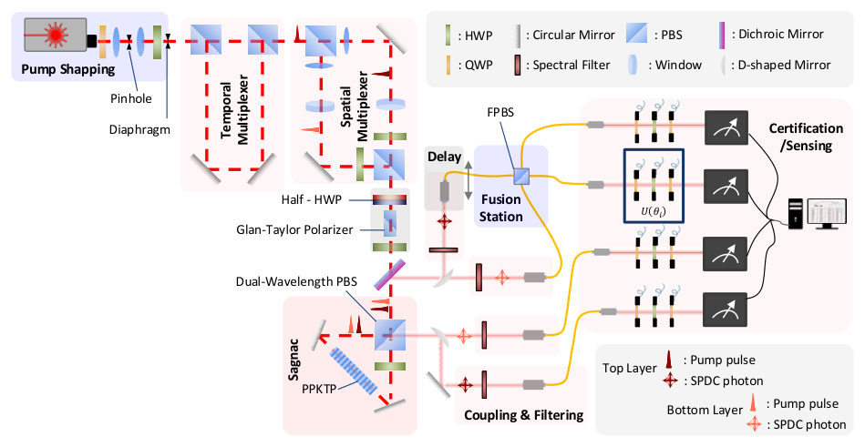 
Figure 1. Layered Sagnac GHZ source. Laser pump: A Ti:Sapphire laser (Coherent Mira-HP) with an average power of 3.4 W emits 2 ps pulses at a wavelength of 775 nm with a repetition rate of 76 MHz. Spatial mode shaping: The spatial mode of the laser is shaped into a Gaussian profile. Temporal multiplexer: The pump pulses are split into two beams, a fast and a slow path. Spatial multiplexer: The pump pulses are split into two parallel beams: the top and bottom layers, horizontally and vertically polarized, respectively. Polarization shaping: Both layers are diagonally polarized, in order to maximize the fidelity of output states with respect to the Bell state. Sagnac interferometer: Photon...

📷 Fig 2

 
Figure 2. Estimation of the global parameter ϕ(ˆΘ) using two approaches: (1) a Visibility Estimator, ˆΘV , using the Maxi- mum Likelihood Estimator (MLE) constructed using the failure rate to approximate visibility of the states; (2) a Tomographic Estimator, ˆΘρexp, using the MLE built using the density ma- trix from quantum state tomography of the states. The error bars correspond to the values of the statistical error (variance). Upper: The estimation is performed using a fixed number of 30 protocol rounds. Lower: The estimation is performed using the optimal number of estimation rounds determined from the Allan deviation analysis (see appendix A).

📷 Fig 3

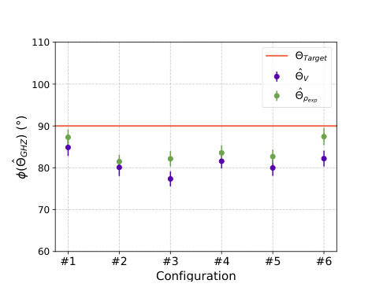 
Fig. 2), we observe a consistent improvement in precision across all configurations. The statistical noise is reduced, and the density matrix estimation is more accurate due to the faster pace of the experiment, which involves approxi- mately 1000 states. Consequently, the mean relative error behaves as anticipated: approximately 9% for ˆΘV , exhibit- ing both improved accuracy and a narrower error margin indicative of enhanced precision and approximately 6% for ˆΘρexp, demonstrating a substantial gain in overall estima- tion performance. In summary, we have run our protocol with 10000 cer- tification rounds per estimation and 30 estimation mea- surements per configuration, and our protocol...

📷 Fig 4

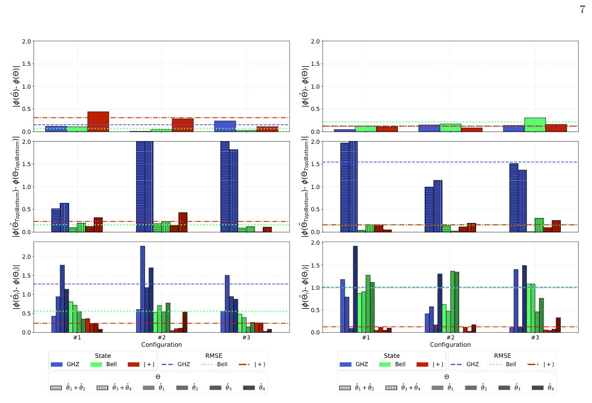 
Figure 3. Distance of the estimation of the global parameter ϕ(ˆΘ), ϕ(ˆθT op/Bottom), ϕ(ˆθi) using the density matrix method from the target encoded value. The dotted lines represent the RMSE for each state over the three configurations. Left: The estimation is performed using a fixed number of 30 protocol rounds for GHZ states, Bell states, and |+⟩states. In the second plot, the RMSE for the GHZ state (blue) is too high to appear. Right: The estimation is performed using the optimal number of estimation rounds determined from the Allan deviation analysis for GHZ, Bell, and |+⟩states (see appendix A).

📷 Fig 5

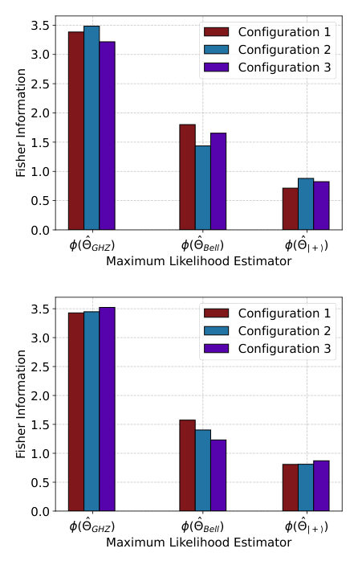 
Figure 4. Fisher information for three different configurations for GHZ, Bell, and |+⟩states. Upper: For 30 protocol rounds. Lower: For an optimal number of estimation rounds deter- mined from the Allan deviation analysis (see appendix A).

**Summary.** This paper presents a noise-robust protocol for private quantum networked sensing, allowing multiple distant sensors to estimate a global function while keeping their individual measurements secret. By utilizing entangled GHZ states and incorporating a rigorous state certification step, the authors guarantee a quantifiable level of privacy ($\epsilon$) alongside high estimation precision. This work is significant for realizing secure, distributed quantum measurement tasks.

**Why it may be interesting.** The work provides a concrete, experimentally relevant protocol for quantum networking that explicitly tackles the security concern of information leakage, which is a major hurdle for deploying quantum sensing technologies.

Detailed structure

**Main problem.** The paper addresses the challenge of performing private quantum networked sensing, where a global function must be estimated from local parameters without revealing the individual local parameters to potential malicious parties.

**Main result.** They introduce a noise-robust protocol using GHZ states that achieves perfect privacy ($\epsilon=1$) for the estimation of the average phase, demonstrating that entanglement is crucial for maintaining both high precision and privacy.

**Method.** The protocol involves a three-step process: state certification using stabilizer measurements, followed by quantum estimation using local unitaries, and repeating this process multiple times to achieve noise robustness.

**Model / system.** The system utilizes spatially separated quantum sensors entangled via an n-qubit Greenberger-Horne-Zeilinger (GHZ) state, which is experimentally realized using a high-fidelity source based on SPDC in a Sagnac interferometer.

**Key observables.** Quantum Fisher Information Matrix (QFIm), privacy measure ($\epsilon$), fidelity ($F$), and the estimation variance ($	ext{Var}(\hat{\phi})$).

**Important parameters / regimes.** Number of copies ($N$), maximum allowed failure rate ($\Delta T$), and the number of estimation rounds ($
u$).

**Assumptions / limitations.** The security analysis relies on bounding the fidelity $F$ using the soundness $S(N, \Delta T)$ derived from the certification process, assuming the existence of a Verifier party.

**Figures summary.** Figure 1 shows the physical setup for the GHZ state source. Figure 7 illustrates the trade-off between privacy ($\epsilon$) and statistical significance ($\alpha$) for different attack scenarios.

**Paper structure.** The paper first establishes the theoretical framework for private sensing using GHZ states. It then details the experimental implementation using state certification to bound the fidelity, followed by the quantum estimation procedure. Finally, it provides rigorous mathematical bounds on the soundness and privacy.

Abstract

Entangling distant quantum sensors is a key application of future quantum networks, allowing for the estimation of global functions of local parameters, with precision that is not possible with stand-alone, individual, quantum sensors. However, with this advantage comes the risk of information leakage over the network via possible malicious parties. It is often particularly important that local parameters remain unknown and that only the global function is shared across the network. Recently, the notion of privacy has been introduced in this context, which ensures that only the agreed function of parameters is shared over the network, even when malicious parties control the network itself, whilst maintaining the estimation advantage. In this work, we introduce a noise-robust protocol for private quantum networked sensing, which we realise using a high-fidelity Greenberger-Horne-Zeilinger (GHZ) state source. We further run a comparative analysis and simulate attacks using three different quantum states, a four-qubit GHZ state, two Bell pairs, and a fully separable state. Our results highlight the clear advantage of GHZ states in maintaining high precision, accuracy, and privacy for the distributed estimation task.

[↑ back to top](#top)

### [Initial-Slip Dynamics Enables the Quantum Mpemba Effect](http://arxiv.org/abs/2609.16781v1)

**Authors:** M. Crotti, F. Cavaliere, D. Ferraro, G. Benenti, M. Sassetti  
**Type:** theory · **Category:** statistical mechanics · **PDF:** <https://arxiv.org/pdf/2609.16781v1>  
**Analysis basis:** full PDF text, analyzed in chunks
**Topic relevance:** `non-equilibrium universality` **3/5** · `Keldysh / 2PI / non-Gaussian methods` **2/5** · `methods for driven-dissipative` **2/5** · `correlated / nonlocal dissipation` **1/5** · `driven-dissipative phase transition` **1/5** · `scars & prethermalization` **1/5**

📷 Fig 1

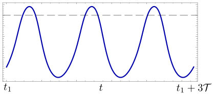 
FIG. 1. Plot of F(t) as a function of t (unit ω−1 0 ) for γ0 = ω0, ωD = 20ω0, kBT = 10ω0/(2π), kBTc = 1.85ω0 and kB∆T ≡ kB(Th −Tc) = 0.01ω0. Here, T = π/η.

📷 Fig 2

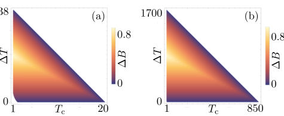 
FIG. 2. Density plots of ∆B as a function of Tc and ∆T (units k−1 B ω0) for ωD = 20ω0, kBT = ω0, and (a) γ0 = 5ω0 (OD moderate-coupling regime); (b) γ0 = 30ω0 (UD strong- coupling regime). In both panels T &gt; T ∗(γ0, ωD). The col- ored regions correspond to ∆B &gt; 0 and ∆D(0) &lt; 0, where the Mpemba effect occurs.

📷 Fig 3

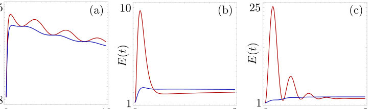 
FIG. 3. Time evolution of the oscillator energy, E(t) = ⟨Hosc(t)⟩(in units of ω0), with (red lines) and without (blue lines) the initial-slip contribution, for the three relaxation regimes considered in this work: (a) UD weak-coupling, (b) OD moderate- coupling, and (c) and UD strong-coupling. Time is measured in units of ω−1 0 . The common parameters for all panels are kBT = kBTc,h = ω0. The remaining parameters are: (a) γ0 = 0.1ω0, ωD = 20ω0; (b) γ0 = 5ω0, ωD = 20ω0; and (c) γ0 = 20ω0, ωD = 4ω0.

📷 Fig 4

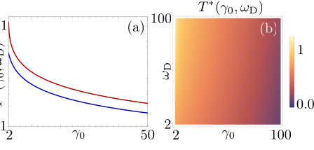 
FIG. 4. (a) Critical temperature T ∗(γ0, ωD) (units k−1 B ω0) as a function of γ0 (units ω0) for ωD = 20ω0 (red) and ωD = 2ω0 (blue). (b) Density plot of T ∗(γ0, ωD) as a function of γ0 and ωD (same units as in panel (a)).

**Summary.** This theoretical study analyzes the quantum Mpemba effect in an oscillator coupled to a bath, proving that the effect requires non-Markovian dynamics. The key finding is that the anomalous fast relaxation is entirely enabled by the initial-slip dynamics generated when the system-bath coupling is suddenly switched on.

**Why it may be interesting.** This work provides a deep, non-trivial understanding of non-equilibrium relaxation dynamics in open quantum systems, showing how transient, non-Markovian correlations (initial-slip) can fundamentally alter macroscopic relaxation behavior.

Detailed structure

**Main problem.** The paper investigates the quantum Mpemba effect, which describes the counter-intuitive phenomenon where a system initially further from equilibrium relaxes faster than one initially closer.

**Main result.** The quantum Mpemba effect is shown to be critically dependent on the initial-slip dynamics generated by the sudden switch-on of the system-bath interaction, as neglecting this term suppresses the anomalous relaxation.

**Method.** The authors derive exact analytical criteria by analyzing the time evolution of the covariance matrix for a quantum harmonic oscillator coupled to a bosonic bath.

**Model / system.** The model is a quantum harmonic oscillator linearly coupled to a bosonic environment (Caldeira–Leggett model). The analysis uses factorized thermal initial states and examines dynamics across various coupling regimes.

**Key observables.** The diagnostic measure is the Frobenius distance, $D_\alpha(t)$, and the sign change of $\Delta D(t) = D_c(t) - D_h(t)$ indicates the Mpemba effect.

**Important parameters / regimes.** Key parameters include the initial temperatures ($T$ and $T_\alpha$), the coupling strength ($\gamma_0$), and the bath cutoff frequency ($\omega_D$). The analysis focuses on regimes beyond weak-coupling and Markovian approximations.

**Assumptions / limitations.** The analysis assumes the dynamics remain Gaussian, and the core finding relies on the inclusion of the initial-slip dynamics, which is absent in the Born-Markov approximation.

**Figures summary.** Figures illustrate the long-time behavior of the difference function $F(t)$, showing periodic sign changes indicative of the Mpemba effect when initial-slip dynamics are included.

**Paper structure.** The paper progresses by first establishing the general framework using the covariance matrix, deriving criteria for the effect, and then rigorously demonstrating that the initial-slip contribution is the necessary ingredient for the effect to manifest, contrasting this with the results obtained when this term is neglected.

Abstract

We investigate the quantum Mpemba effect, whereby a system initially farther from equilibrium relaxes faster than one initially closer to equilibrium, emerging in a quantum harmonic oscillator linearly coupled to a bosonic environment. Starting from factorized thermal states at different temperatures, we derive exact analytical criteria for the occurrence of the quantum Mpemba effect valid also beyond the typically considered weak-coupling and Markovian approximations. Most importantly, we show that the effect is enabled by the initial-slip dynamics generated by the sudden switch-on of the system-bath interaction. Neglecting this contribution completely suppresses the anomalous relaxation, identifying transient system-bath correlations as the key ingredient underlying the quantum Mpemba effect.

[↑ back to top](#top)

### [Quantum Brownian motion in a temperature gradient](http://arxiv.org/abs/2609.17239v1)

**Authors:** Ricardo J. S. Afonso, Pedro V. Paraguassú, Thiago Werlang, Daniel Valente  
**Type:** theory · **Category:** statistical mechanics · **PDF:** <https://arxiv.org/pdf/2609.17239v1>  
**Analysis basis:** full PDF text, analyzed in chunks
**Topic relevance:** `Keldysh / 2PI / non-Gaussian methods` **3/5** · `methods for driven-dissipative` **3/5** · `Frenkel-Kontorova` **1/5** · `correlated / nonlocal dissipation` **1/5** · `driven-dissipative phase transition` **1/5** · `non-equilibrium universality` **1/5**

📷 Fig 1

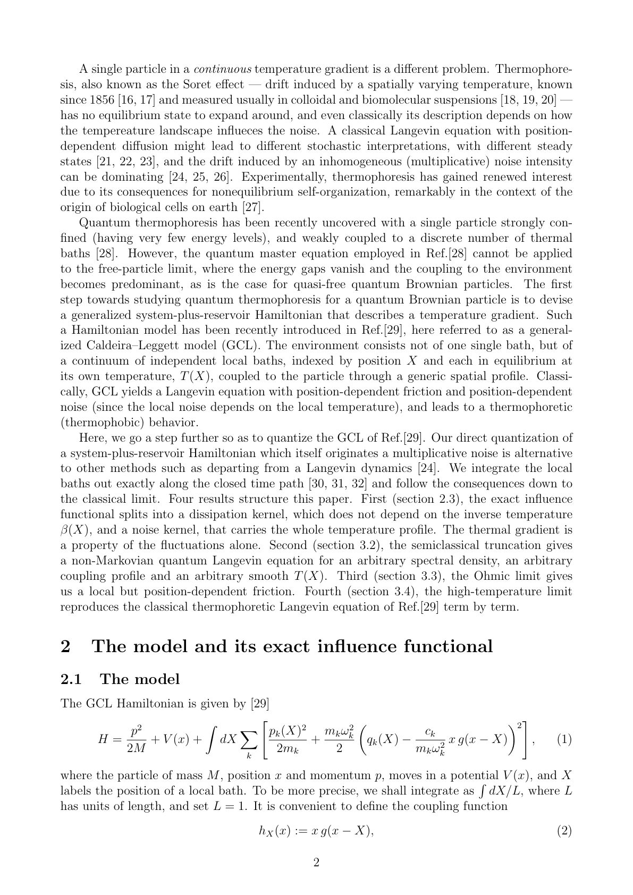 
Low-resolution page preview, page 2

📷 Fig 2

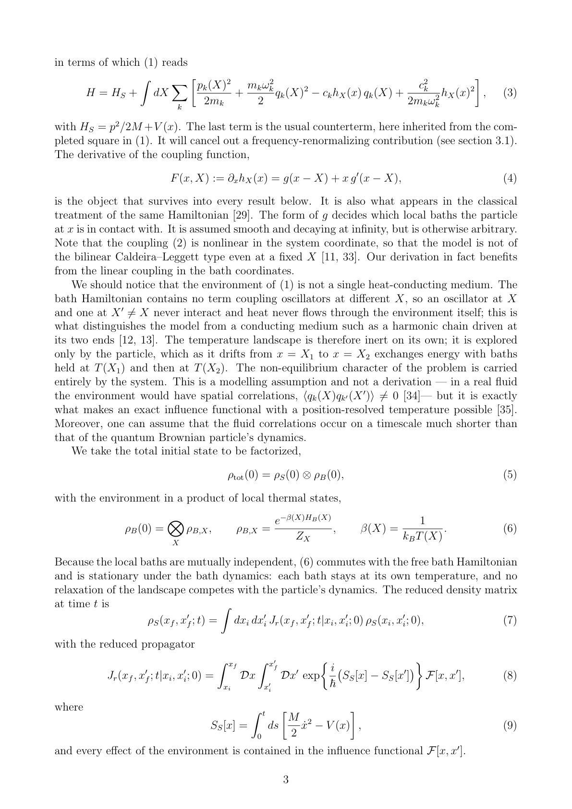 
Low-resolution page preview, page 3

📷 Fig 3

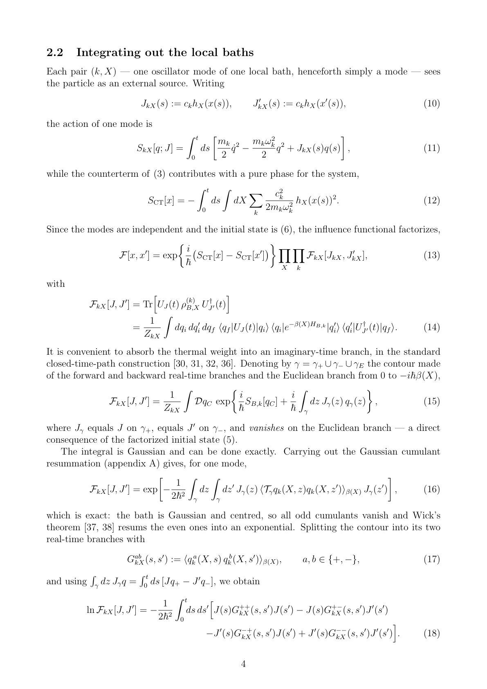 
Low-resolution page preview, page 4

📷 Fig 4

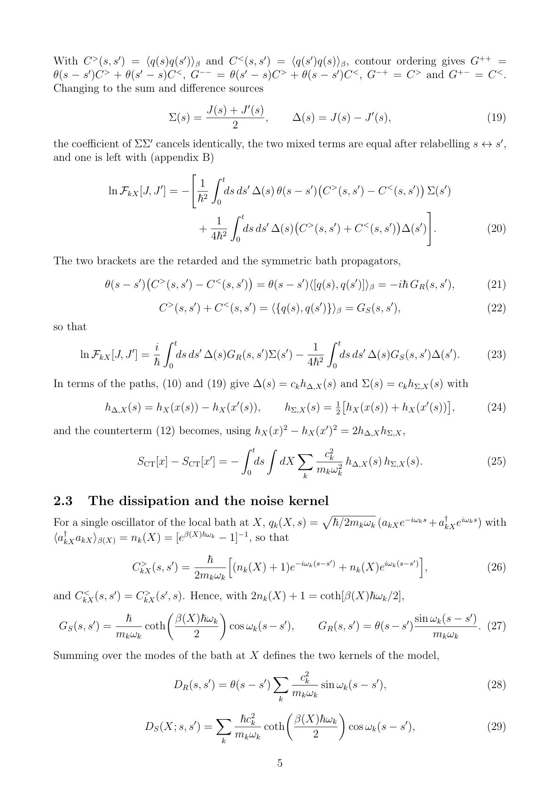 
Low-resolution page preview, page 5

📷 Fig 5

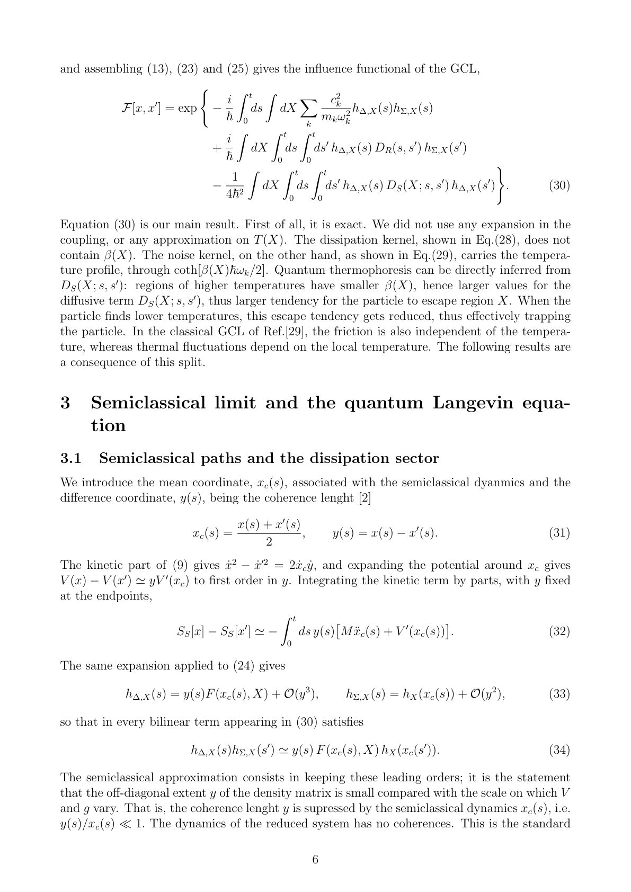 
Low-resolution page preview, page 6

**Summary.** This paper theoretically investigates quantum Brownian motion subjected to a temperature gradient, leading to the prediction of quantum thermophoresis. Using the Feynman-Vernon path integral approach, the authors derive the exact quantum influence functional and an effective Langevin equation. The results confirm that quantum effects manifest in both the low and high-temperature limits, extending classical understanding into the quantum domain.

**Why it may be interesting.** This work provides a rigorous quantum generalization of classical thermophoresis, extending the analysis into the quantum regime where non-equilibrium effects are crucial for understanding self-organization.

Detailed structure

**Main problem.** The paper investigates how quantum Brownian motion is affected by a spatially varying temperature gradient, focusing on the phenomenon of quantum thermophoresis.

**Main result.** The authors derive an exact quantum influence functional and show that both the fully quantum (low T) and semiclassical (high T) limits exhibit signatures of quantum thermophoresis.

**Method.** The primary method involves using the Feynman-Vernon path integral approach to derive the influence functional, followed by deriving an effective, non-Markovian quantum Langevin equation.

**Model / system.** The system is a quantum Brownian particle coupled to a bath modeled as a continuum of local thermal baths, allowing for a position-dependent temperature profile T(X).

**Key observables.** The quantum influence functional F[x, x'], the effective Langevin equation for the center of mass, and the derived friction coefficient $\eta_{	ext{eff}}[x]$ and diffusion coefficient $D_{	ext{eff}}(x)$.

**Important parameters / regimes.** Temperature gradient T(X), high-temperature limit, low-temperature limit, and the Ohmic regime.

**Assumptions / limitations.** The environment is modeled as a continuum of independent local baths, and the derivation relies on path integral techniques and approximations in the semiclassical limit.

**Figures summary.** Not specified.

**Paper structure.** The paper builds from the generalized system-plus-reservoir model to derive the influence functional via path integrals. It then analyzes the resulting dynamics by deriving the effective Langevin equation, examining the high-temperature and low-temperature limits to confirm quantum thermophoresis.

Abstract

When a classical Brownian particle is subjected to a temperature gradient it can undergo thermophoresis, i.e., the particle gets transported towards the colder regions of the environment, which bears relevant consequences to nonequilibrium self-organization. Here, we investigate how the quantum Brownian motion is affected by a temperature gradient. We employ a recently proposed generalized system-plus-reservoir model, where one assumes a continuum field of thermal baths. As our main result, we obtain the quantum influence functional, within the Feynmann-Vernon path integral approach. To test convergence, we derive an effective Langevin equation for the center of mass of the quantum wavepacket, and show that it coincides with the classical Langevin equation at high temperatures. Both the fully quantum (low temperatures) and the semiclassical (high temperature) limits show signatures of quantum thermophoresis in the quantum Brownian motion, a so far unexplored effect.

[↑ back to top](#top)

### [The Role of Completeness in Probing Symmetry Breaking](http://arxiv.org/abs/2609.16153v1)

**Authors:** Yuya Kusuki, Hiroyasu Tajima, Shion Yamashika  
**Type:** theory · **Category:** statistical mechanics · **PDF:** <https://arxiv.org/pdf/2609.16153v1>  
**Analysis basis:** full PDF text, analyzed in chunks
**Topic relevance:** `non-equilibrium universality` **3/5** · `Keldysh / 2PI / non-Gaussian methods` **1/5** · `analog quantum simulation` **1/5** · `correlated / nonlocal dissipation` **1/5** · `driven-dissipative phase transition` **1/5** · `methods for driven-dissipative` **1/5** · `quantum measurements` **1/5** · `scars & prethermalization` **1/5**

📷 Fig 1

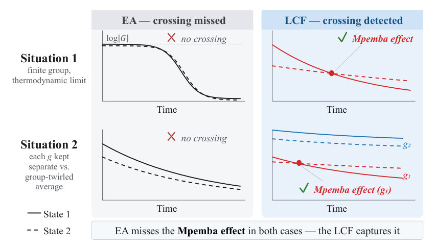 
Figure 1: Why completeness matters for the quantum Mpemba effect. The complete LCF family retains the information that the scalar EA discards in two distinct ways. Top row, finite- group saturation in the thermodynamic limit: the EA curves for State 1 (solid) and State 2 (dashed) approach the same value log |𝐺| and lose the ordering needed to identify a crossing, whereas the extensive LCF retains the distinction between the two states and reveals a crossing at a finite time. Bottom row, averaging over group elements: EA combines the responses to different symmetry transformations into a single number and can therefore hide a crossing that occurs only for a particular group element. The LCF...

📷 Fig 2

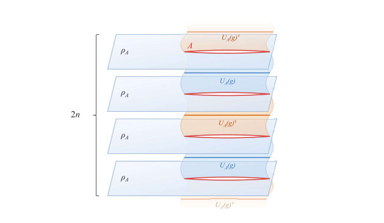 
Figure 2: Replica manifold for Z𝑛(𝑔) = Tr 𝜌𝐴𝑈𝐴(𝑔)𝜌𝐴𝑈𝐴(𝑔)†𝑛 . The 2𝑛copies of 𝜌𝐴are glued cyclically along the cut defining 𝐴, with 𝑈𝐴(𝑔) and 𝑈𝐴(𝑔)† inserted alternately as defect lines at the gluing surfaces. The figure shows the case 𝑛= 2.

📷 Fig 3

 
Figure 3: Entanglement asymmetry and fidelity-based LCF in two representative XXZ quenches. All panels show numerical data for an open chain with 𝑁= 60 and ℓ= 4, obtained using the time-evolving block decimation (TEBD) algorithm [55]. The TEBD algorithm is implemented by using the second-order Suzuki-Trotter decomposition with time step 𝛿𝑡= 0.025 and setting the bond dimension 𝜒= 128. The first column shows EA, which provides the established benchmark crossing. The second and third columns show the two inequivalent non- trivial Z4 LCF components, corresponding to 𝛼= 𝜋/2 and 𝛼= 𝜋. In both examples, the LCF components also exhibit crossings, confirming that the fidelity-based LCF captures the...

📷 Fig 4

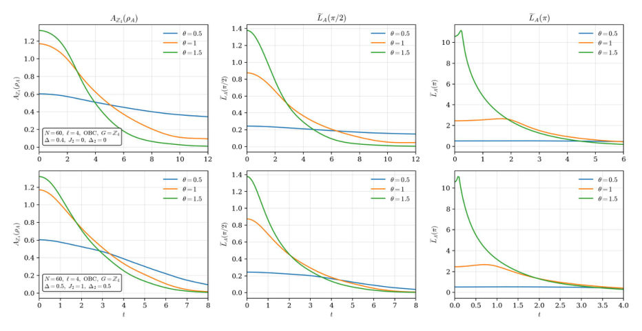 
Fig. 4 shows the corresponding time evolution. Compared with the fidelity-based result, the trace-based LCF exhibits a much weaker and less robust Mpemba signature. In the examples shown here, no crossing appears at 𝛼= 𝜋/2 within the plotted time windows. At 𝛼= 𝜋, a clear crossing is visible in only one of the two quenches, and it is accompanied by sharp spike-like features. Thus the trace-based LCF can display a Mpemba-like crossing, but only in a restricted and rather fragile manner. The reason is structural:

📷 Fig 5

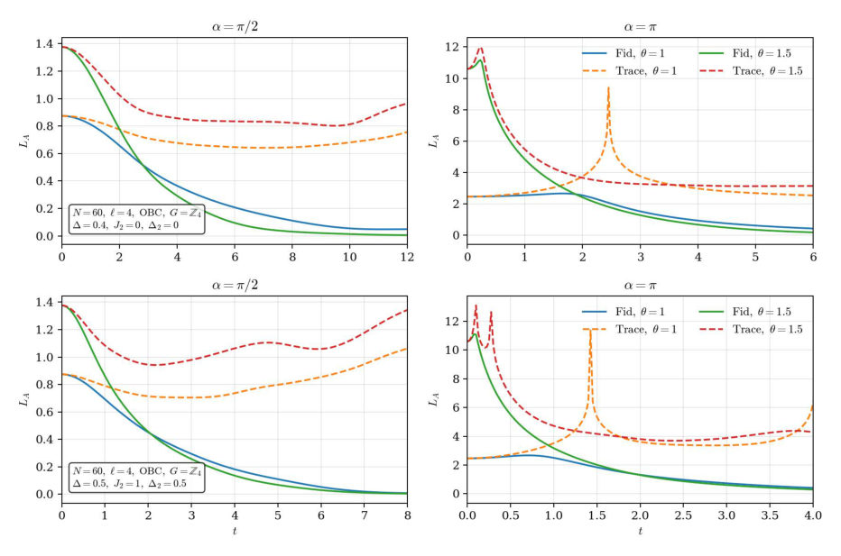 
Figure 4: Fidelity-based and trace-based LCFs in the same many-body quenches. All panels show numerical data for an open chain with 𝑁= 60 and ℓ= 4, obtained using the TEBD algorithm. The TEBD algorithm is implemented by using the second-order Suzuki-Trotter decomposition with time step 𝛿𝑡= 0.025 and setting the bond dimension 𝜒= 128. Compared with the fidelity-based result, the trace-based LCF shows a weaker and more fragile Mpemba signature: no crossing is visible at 𝛼= 𝜋/2 in the plotted window, and the crossing at 𝛼= 𝜋 appears only in a limited case and is accompanied by spike-like features. These spike-like features reflect the enhanced sensitivity of the trace-based quantity to...

**Summary.** This work establishes that 'completeness' is a vital physical concept for measuring symmetry breaking in quantum many-body systems. The authors propose the fidelity-based Logarithmic Characteristic Function (LCF) as a superior diagnostic tool compared to Entanglement Asymmetry (EA). LCF's component-wise nature allows it to resolve subtle dynamical features, such as the Mpemba effect, that are masked by EA's saturation or averaging properties.

**Why it may be interesting.** It provides a rigorous, information-theoretic tool (LCF) to diagnose non-equilibrium dynamics and symmetry restoration in complex quantum many-body systems, which is crucial for understanding thermalization and quench dynamics.

Detailed structure

**Main problem.** The paper investigates the physical importance of 'completeness' in characterizing symmetry-restoration dynamics in many-body systems, arguing that incomplete measures can miss essential physical features.

**Main result.** The Logarithmic Characteristic Function (LCF), when extended using fidelity, provides a more complete diagnostic tool than Entanglement Asymmetry (EA) because it avoids saturation and averaging effects that obscure dynamics like the Mpemba effect.

**Method.** The authors introduce and analyze the LCF, a generalization of the string order parameter, and compare its properties against EA using resource-theoretic concepts.

**Model / system.** The study applies to general many-body systems, including spin-chain quenches (XXZ/XXX), single-qubit systems under noise, and quantum field theories (CFT).

**Key observables.** Logarithmic Characteristic Function (LCF) components, Entanglement Asymmetry (EA), and the detection of symmetry-restoration phenomena like the Mpemba effect.

**Important parameters / regimes.** Finite symmetry group size |G|, time evolution (quench dynamics), and the thermodynamic limit.

**Assumptions / limitations.** The completeness of the LCF family is rigorously established only for exact i.i.d. pure-state conversion for finite groups, though its components are shown to be physically relevant for mixed states.

**Figures summary.** Figure 1 illustrates how EA fails to capture the Mpemba effect in both finite group saturation and group averaging scenarios, while the LCF successfully distinguishes these dynamics.

**Paper structure.** The paper builds from the definition of completeness in quantum information to introducing the LCF for mixed states, comparing its advantages over EA in detecting subtle dynamical features in various physical models.

Abstract

Completeness is widely recognized in quantum information as an important property of a family of monotones, because it ensures that no information relevant to state conversion is lost. We show that completeness is also physically important in many-body systems: an incomplete measure of symmetry breaking can miss essential features of symmetry-restoration dynamics. We study the logarithmic characteristic function (LCF), also known as the string order parameter, whose full family is complete for exact i.i.d. pure-state conversion under symmetry-preserving operations for finite groups. We introduce a fidelity-based extension of the LCF to mixed states and identify two concrete advantages over entanglement asymmetry (EA). First, for a finite symmetry group $G$, EA is bounded by $\log |G|$ and can approach the same saturated value for different initial states in the thermodynamic limit, making their relaxation curves indistinguishable and preventing the identification of a discrete-symmetry Mpemba effect. By contrast, the LCF can remain extensive, with a coefficient that depends on the initial state and time, and therefore continues to distinguish their relaxation dynamics. Second, different LCF components can exhibit distinct relaxation and crossing behavior, including cases in which EA shows no crossing. We demonstrate these advantages in spin-chain quenches and a single-qubit system under depolarizing noise. We also develop a replica construction for the fidelity-based LCF in quantum field theory and derive analytical results for conformal field theory.

[↑ back to top](#top)

### [Bridging Between Statistical Mechanics and Black Hole Evolution: Theoretical Formalism](http://arxiv.org/abs/2609.16534v1)

**Authors:** Suvodip Mukherjee  
**Type:** theory · **Category:** statistical mechanics · **PDF:** <https://arxiv.org/pdf/2609.16534v1>  
**Analysis basis:** full PDF text, analyzed in chunks
**Topic relevance:** `Keldysh / 2PI / non-Gaussian methods` **3/5** · `methods for driven-dissipative` **2/5** · `correlated / nonlocal dissipation` **1/5** · `driven-dissipative phase transition` **1/5** · `non-equilibrium universality` **1/5** · `quantum measurements` **1/5**

📷 Fig 1

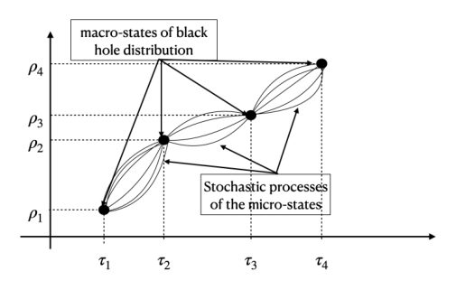 
FIG. 1. We show here a schematic diagram which cap- tures the correspondence between the microstates and macro- states of black hole evolution. The big black dots denote the distribution function of the black holes ρm,τ with cosmic time τ, and the lines denote an ensemble of stochastic processes of the microstates which is driving the evolution.

📷 Fig 2

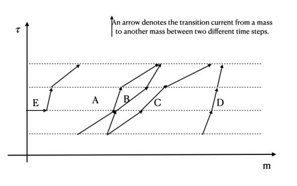 
FIG. 2. This plot shows the mass and cosmic time diagram to show the black hole evolution from one mass to another for different trajectories labeled from A to E. The arrows denote the transition current from one mass to another, which is governed by different stochastic processes. The ensemble of these different transition currents governs the macroscopic evolution over cosmic time.

**Summary.** This work pioneers a statistical mechanical approach to model the evolution of black holes across cosmic time and mass scales. By employing the Kramers-Moyal expansion, the authors translate the complex, stochastic evolution into a tractable mathematical framework. This allows astrophysicists to infer underlying physical processes by analyzing the macroscopic distribution function using multi-messenger data.

**Why it may be interesting.** The use of the Kramers-Moyal expansion to model a complex, multi-scale astrophysical system like black hole populations provides a powerful analogy to open quantum systems theory, where master equations and moment expansions are standard tools for describing irreversible dynamics.

Detailed structure

**Main problem.** The primary challenge is developing a framework to understand the formation and evolution of black holes across vast mass ranges and cosmic timescales, which cannot be directly observed.

**Main result.** The authors establish a statistical mechanical description using the Kramers-Moyal expansion to model the evolution of the black hole distribution function ($
ho_{m,	au}$). This allows for a data-driven understanding of underlying physics even when microscopic processes are unknown.

**Method.** The evolution is modeled using non-equilibrium statistical mechanics, deriving the distribution function's change via moment expansions derived from the characteristic function, leading to the Kramers-Moyal form.

**Model / system.** The system is the population of black holes in the Universe, characterized by mass ($m$) and cosmic time ($	au$). The evolution is treated as a stochastic process governed by a distribution function $
ho(m, 	au)$.

**Key observables.** The black hole distribution function ($
ho_{m,	au}$), which describes the number density of black holes at a given mass and time.

**Important parameters / regimes.** Mass ($m$), cosmic time ($	au$), and the Kramers-Moyal coefficients ($D_n$) which characterize the drift and diffusion of the process.

**Assumptions / limitations.** The analysis uses a perturbative expansion in the time step ($\Delta	au$) and assumes local stationarity in observation time, while acknowledging that the process is generally non-Markovian.

**Figures summary.** Figure 1 schematically illustrates the correspondence between underlying stochastic microstates and the macroscopic distribution function. Figure 2 likely depicts the evolution of the distribution function across mass and time via trajectories and transition currents.

**Paper structure.** The paper builds by first identifying the observational gap (black hole evolution), then formalizing the problem using non-equilibrium statistical mechanics, deriving the evolution equation via moment expansions, and finally mapping this structure onto the Kramers-Moyal expansion coefficients.

Abstract

Black holes in the Universe span nearly ten orders of magnitude in mass over a large cosmic timescale, dating back to at least the Universe's early history, when it was only a few hundred million years old. The formation and evolution of these objects remain a mystery because no direct probe can trace each black hole across the full mass range and cosmic time. This work shows, for the first time, a statistical mechanical description of black hole evolution. I show that though each black hole and its evolution are governed by stochastic processes, one can make a macroscopic description of the distribution function of black holes in the Universe, and its evolution over the entire mass range and cosmic time can be expressed in terms of the Kramers-Moyal expansion. This bridging between statistical mechanics and black hole evolution in terms of the Kramers-Moyal expansion enables the discovery of the underlying physical processes that play a role in the evolution of black holes. In the future, the application of this technique to data accessible from different messengers, such as gravitational waves and electromagnetic waves, which probe black holes in the Universe, can lead to a data-driven understanding of the underlying physical processes by this statistical mechanics technique despite the ignorance of the underlying microscopic stochastic processes.

[↑ back to top](#top)

### [Evaluating Verified Autonomy in Quantum Engineering](http://arxiv.org/abs/2609.17439v1)

**Authors:** Naixu Guo, Changhao Li, Siyu Cheng, Qicheng Tang, Binzhao Luo, Bikun Li, Yuxuan Du, Shihao Ru, Jiaqi Cai  
**Type:** both · **Category:** quantum information and computing · **PDF:** <https://arxiv.org/pdf/2609.17439v1>  
**Analysis basis:** full PDF text, analyzed in chunks
**Topic relevance:** `QC/QI experiment` **3/5** · `methods for driven-dissipative` **2/5** · `quantum measurements` **2/5** · `analog quantum simulation` **1/5**

📷 Fig 1

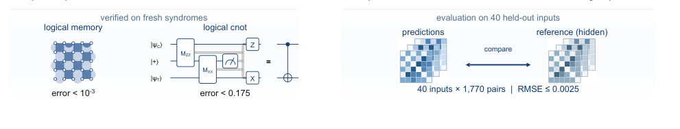 
FIG. 1. AI agents for quantum engineering and representative workflows. a. Agent-operated quantum engineering. The agent iterates planning, execution, analysis, and adaptation while interacting with quantum laboratories. The workflow operates across the layers shown on the right, with individual tasks typically engaging multiple layers, and its outputs are submitted for independent verification. b. Decoder calibration for a lattice-surgery logical CNOT gate. The agent measures error correlations across the merge seam between surface-code patches and submits a retuned decoder, verified on fresh syndrome records. The public acceptance criteria require a distance-5 logical-memory error below...

📷 Fig 2

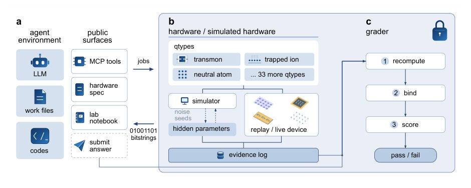 
FIG. 2. Architecture and evidence-bound grading in Quantum-Harbor. a. The agent environment contains the language model, work files, and agent-written code. Through the public interfaces, the agent consults hardware specifications and lab notebooks, submits experiment jobs, retrieves raw measurement records (bitstrings shown), and submits its final answer. Experiment jobs execute asynchronously. b. The hardware layer provides quantum hardware abstractions (qtypes) for transmons, neutral atoms, trapped ions, and other platforms. Experiments run on simulators governed by hidden device and noise parameters, or on replay and live-device backends where supported. An evidence log records...

📷 Fig 3

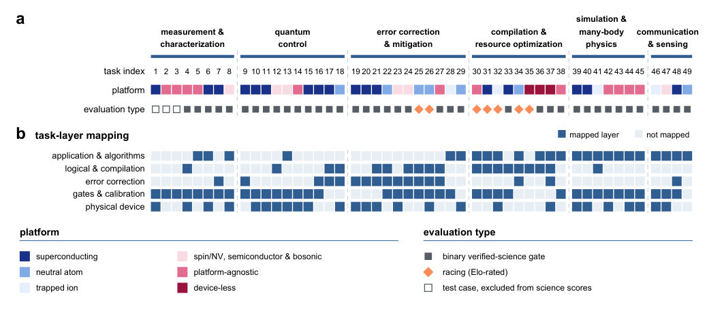 
FIG. 3. Task composition and quantum computing stack coverage of QIQCBench. a. The 49 tasks grouped into six scientific categories. Each column represents one task. Colors identify the hardware platform, with separate labels for platform-agnostic and device-less tasks. Evaluation types are indicated by filled squares for the 39 tasks assessed by a binary pass–fail evaluation, orange diamonds for the 7 racing tasks ranked by Elo rating, and open squares for the 3 infrastructure test cases excluded from science scores. b. Mapping of each task to five layers of the quantum computing stack, adapted from Ref. [58]: physical device, gates and calibration, error correction, logical and...

📷 Fig 4

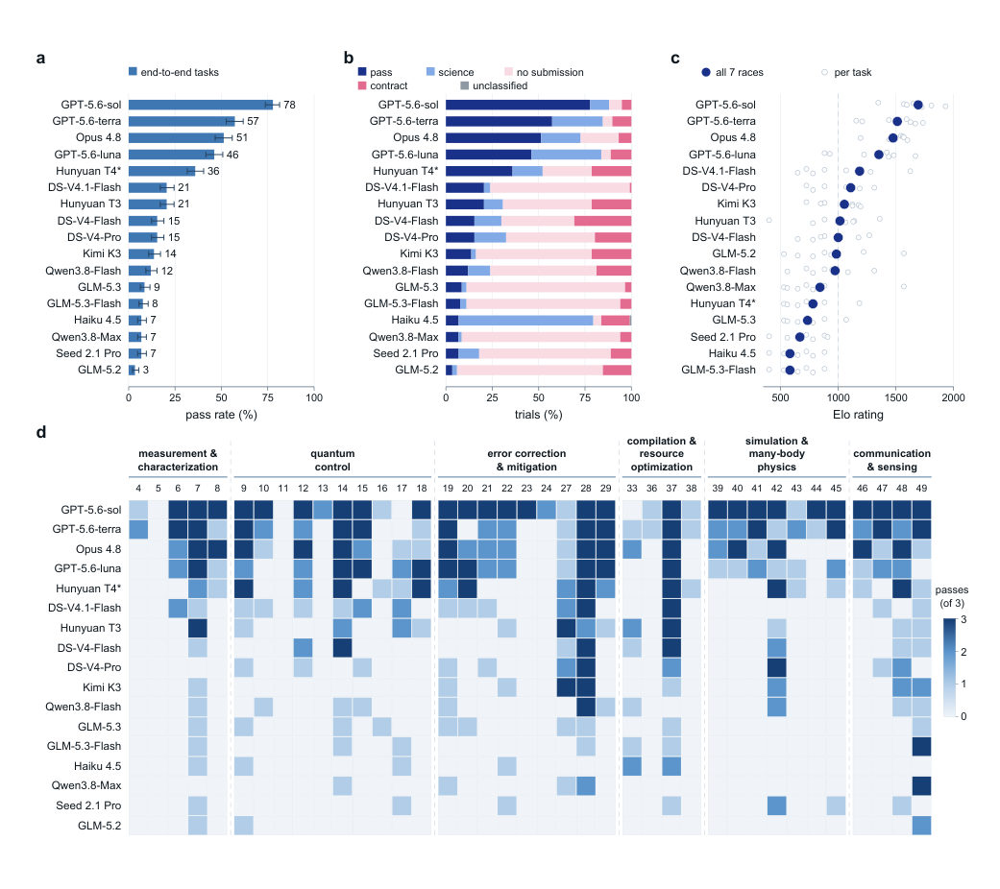 
FIG. 4. Benchmark results and analysis of failure and pass patterns. a. Pass rate on the pass–fail tasks. Error bars: Wilson 68% intervals. b. Outcome composition of the trials, including passes, science failures, contract failures, and no-submission trials. c. Bradley–Terry Elo ratings over the 7 racing tasks (filled circles: games-weighted aggregate; open circles: per-task ratings). d. Per-task passes for every system, grouped by the scientific categories of Fig. 3, easiest to hardest within each group. Only pass-fail tasks are shown here.

**Summary.** This paper introduces Quantum-Harbor, a virtual laboratory, and QIQCBench, a comprehensive benchmark to test AI agents in quantum engineering. It moves beyond simple testing by requiring agents to prove their results by recomputing them from raw data. The work highlights that while agents can show capability, achieving reliable, verified autonomy in complex quantum workflows remains a significant challenge.

**Why it may be interesting.** It provides a novel, rigorous testing ground for AI agents interacting with quantum hardware simulations, which is crucial for advancing practical quantum computation beyond theoretical models.

Detailed structure

**Main problem.** The core problem is systematically evaluating the reliable, end-to-end performance of scientific AI agents in complex, multi-stage quantum engineering workflows.

**Main result.** The benchmark reveals a substantial gap between an agent's demonstrated capability and its ability to achieve reliable, verified operation in real-world quantum tasks.

**Method.** The authors developed Quantum-Harbor, a virtual lab, and QIQCBench, a benchmark of 49 expert tasks, to rigorously test agents' ability to plan, execute, and verify results from raw data.

**Model / system.** The system involves simulating various quantum platforms (transmon, trapped ion, etc.) within the Quantum-Harbor framework. Agents interact with this environment to perform tasks like logical CNOT gate operations and surrogate model fitting.

**Key observables.** Per-cycle error rates (e.g., $	ext{error} < 10^{-3}$), Root Mean Square Error (RMSE) for model prediction, and overall task pass/fail rates.

**Important parameters / regimes.** The benchmark covers multiple layers of the quantum stack, including calibration, error correction, and compilation.

**Assumptions / limitations.** The evaluation relies on a 'sidecar' component and an evidence-bound grader to ensure results are verifiable against the raw execution log, preventing agents from cheating.

**Figures summary.** Figures illustrate the agent workflow (plan $	o$ run $	o$ analyze $	o$ adapt), the architecture of Quantum-Harbor (agent environment, sidecar, evidence log), and the structure of QIQCBench across various quantum computing layers.

**Paper structure.** The paper introduces the necessity of autonomous quantum engineering, details the Quantum-Harbor framework and QIQCBench benchmark, presents results showing performance gaps, and establishes the framework for measuring verified autonomy.

Abstract

Reliable quantum engineering is essential for turning quantum phenomena into practical technologies. As quantum platforms grow in scale and complexity, their characterization and operation require increasing human effort and coordination. Scientific artificial intelligence agents, which can plan experiments, operate instruments, and analyze observations, offer a promising route towards autonomous quantum engineering. Yet whether current agents can perform reliably in this setting has not been systematically established. To fill this gap, we developed Quantum-Harbor, a virtual laboratory that provides a controlled execution environment for agents to interact with quantum systems. This design enables direct verification of both the actions taken and the conclusions drawn. Building on this framework, we introduce QIQCBench, a benchmark of $49$ expert-authored tasks spanning multiple layers including calibration and control, error correction and compilation, sensing and networking. Across $17$ frontier agentic systems, QIQCBench reveals wide variation in verified performance. These results expose a substantial gap between demonstrating capability and achieving reliable operation, and establish Quantum-Harbor as a foundation for measuring progress towards verified autonomy in quantum engineering.

[↑ back to top](#top)

### [Exact Ionization Amplitudes for a Delta-Function Well in an Arbitrary-Strength DC Electric Field](http://arxiv.org/abs/2609.16507v1)

**Authors:** Ilki Kim, Gerald J. Iafrate  
**Type:** theory · **Category:** other · **PDF:** <https://arxiv.org/pdf/2609.16507v1>  
**Analysis basis:** full PDF text, analyzed in chunks
**Topic relevance:** `Keldysh / 2PI / non-Gaussian methods` **3/5** · `methods for driven-dissipative` **3/5** · `quantum measurements` **2/5**

📷 Fig 1

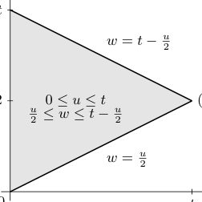 
FIG. 1. Integration region in the (u, w) plane. The original chronological domain (0 ≤τ ≤s ≤t) is mapped to (0 ≤u ≤t) and (u/2 ≤w ≤t −u/2). When the order of integration is reversed, the fixed-w horizontal slices have the upper limit u = 2 min(w, t −w), corresponding to u = 2w for 0 ≤w ≤t/2 and u = 2(t −w) for t/2 ≤w ≤t.

📷 Fig 2

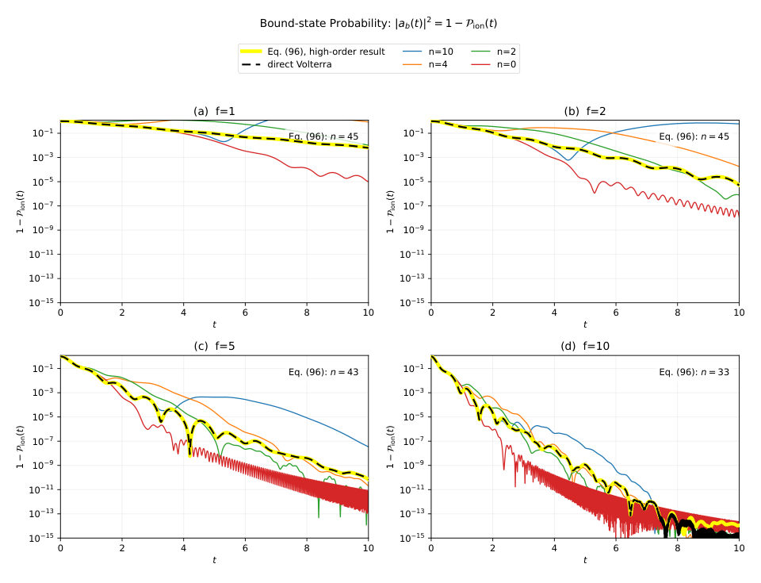 
FIG. 2. Bound-state survival probability 1−Pion(t) = |ab(t)|2 versus time t for f = 1, 2, 5, and 10. The curves labeled by n are successive truncations of the exact chronological rescattering hierarchy in Eq. (96b), where n counts internal contact-to-contact rescattering events. Thus, n = 0 contains the contact-free contribution and the single direct contact contribution, but no internal contact-to-contact rescattering. For the numerical implementation and tolerance used here, the lowest orders displayed as converged are n = 45, 45, 43, and 33 for f = 1, 2, 5, and 10, respectively. These thresholds are tolerance- and implementation-dependent. The black dashed curves are obtained...

**Summary.** This paper develops an exact, nonperturbative method to calculate the ionization survival amplitude for a particle in a delta-function well under a strong DC electric field. By reformulating the problem using the Kramers-Henneberger representation, the authors derive the result analytically in closed form, avoiding approximations common in this field. This provides a fundamental analytical tool for studying driven quantum dynamics.

**Why it may be interesting.** This work provides a powerful, exact analytical technique for calculating non-perturbative ionization dynamics in driven quantum systems, which is highly relevant to understanding tunneling and field ionization in atomic and molecular physics.

Detailed structure

**Main problem.** The paper aims to determine the exact physical bound-state survival amplitude for ionization from a delta-function well subjected to an arbitrary-strength DC electric field at finite time.

**Main result.** The authors derive an exact, nonperturbative solution for the survival amplitude, expressed in closed form using the Faddeeva function and explicitly evaluable time integrals.

**Method.** They employ an amplitude-centered strategy within the Kramers-Henneberger representation, which reduces the complex dynamics to a closed Volterra equation, bypassing the need to construct the full time-dependent propagator.

**Model / system.** The system is a particle confined by a one-dimensional attractive delta-function potential and driven by a uniform DC electric field. The Hamiltonian is analyzed in both scalar and vector potential gauges.

**Key observables.** Bound-state survival amplitude, $a_b(t)$, and the ionization probability, $P_{ion}(t) = 1 - |a_b(t)|^2$.

**Important parameters / regimes.** Arbitrary DC electric field strength ($F_0$) and finite observation time ($t$).

**Assumptions / limitations.** The method is designed to be exact, avoiding weak-field expansions, rescattering truncations, or asymptotic-time approximations.

**Figures summary.** Not specified.

**Paper structure.** The paper contrasts the intractable conventional propagator-first approach with the novel amplitude-centered strategy. It derives the solution by factorizing the rescattering history into a convolution hierarchy, yielding closed-form expressions for the contact-free and contact contributions.

Abstract

We investigate finite-time field-induced ionization from a one-dimensional attractive delta-function well in a uniform dc electric field of arbitrary strength. Our aim is to determine the physical bound-state survival amplitude \(a_b(t)\) at any observation time without constructing the complete time-dependent propagator or wavefunction. In the gauge-equivalent Kramers--Henneberger representation, the field appears as motion of the contact point, and the resulting dynamics reduces to a closed Volterra equation. Exact endpoint-phase factorization organizes the full chronological rescattering history into a relative-time convolution hierarchy and an exact resolvent. By introducing the accumulated bound-state amplitude and reorganizing its two-time domain in relative and complementary center times, the final contact contribution becomes an explicit boundary integral. All spatial integrations are carried out analytically. The field-driven contact-free term is obtained in closed form using the Faddeeva function, while the direct and repeated-rescattering terms are expressed as explicitly evaluable time integrals. The result applies at arbitrary dc-field strength and finite time, with no weak-field expansion, rescattering truncation, or asymptotic-time approximation. It is verified through the exact field-free limit and an independent numerical solution of the original physical Volterra equation. The formulation gives an exact nonperturbative solution of a fundamental ionization model and reveals otherwise hidden analytical structure in driven quantum dynamics.

[↑ back to top](#top)

### [Portable Vector NV-Diamond Magnetometer for Shot-Noise-Limited, Drift-Free Operation in Unshielded Environments](http://arxiv.org/abs/2609.16901v1)

**Authors:** Annirudh K P, Vinayak Rane, Shradha Atakar, Sanika Joshi, Maheshwar Mangat, Jay Gharat, Siddharth Tallur, Kasturi Saha  
**Type:** experiment · **Category:** other · **PDF:** <https://arxiv.org/pdf/2609.16901v1>  
**Analysis basis:** full PDF text, analyzed in chunks
**Topic relevance:** `QC/QI experiment` **3/5** · `quantum measurements` **3/5** · `quantum optics experiment` **2/5**

📷 Fig 1

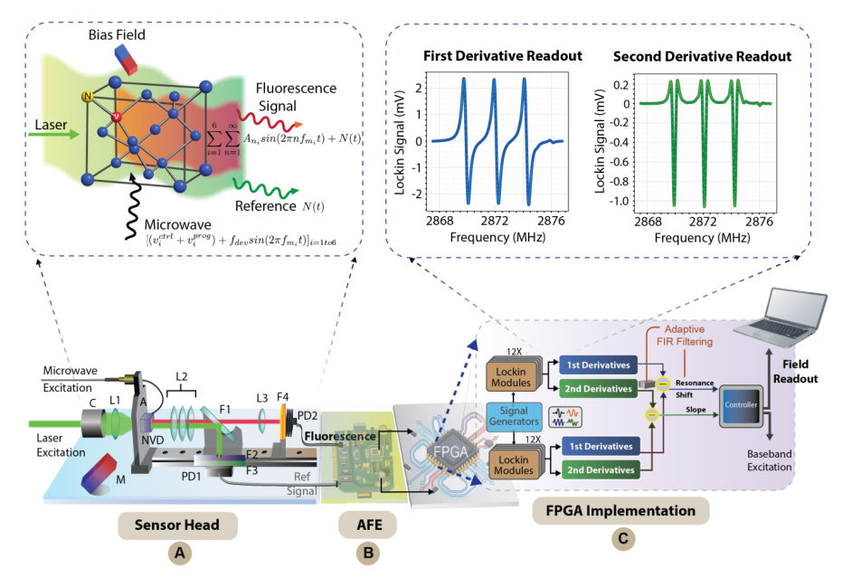 
Figure 1: Setup Schematic: Post-diamond differential optical readout and derivative-resolved ODMR tracking. The nitrogen-vacancy (NV) ensemble is optically pumped under a static bias field and interrogated using six frequency-modulated microwave tones addressing six ODMR transitions. NV fluorescence provides the magnetic signal, while residual transmitted green pump light serves as a correlated laser-noise ref- erence. The pump is focused through the nitrogen-vacancy diamond (NVD), and the transmitted pump and fluorescence are collected along the same path and separated after the diamond by dichroic element F1. The fluorescence is detected by PD2 and the residual pump by PD1. The resonance...

📷 Fig 2

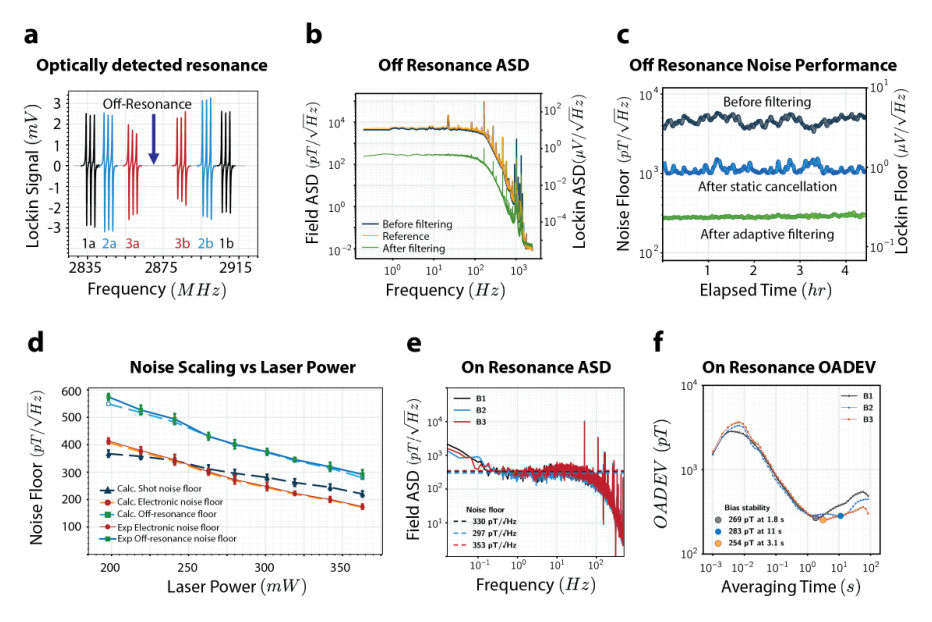 
Figure 2: Three-axis readout and adaptive laser-noise cancellation. (a) Demodulated ODMR spectrum containing six addressed transitions, grouped into three Zeeman-split pairs used to reconstruct B1, B2, and B3. The marked off-resonance point is used to measure the readout-noise floor without ODMR frequency-to-signal transduction. (b) Off-resonance amplitude spectral densities (ASDs) of the fluorescence, optical-reference, and adaptively corrected channels. The signals are acquired at 5 kS s−1 with lock-in amplifier filter set as eighth-order filter with low-pass cut-off frequency of approximately 102 Hz. Matching the reference with the adaptive FIR removes the correlated laser-noise...

📷 Fig 3

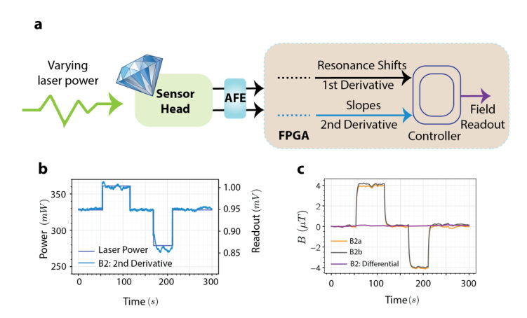 
Figure 3: Second-derivative normalization of the digital frequency lock. (a) Control architecture. The first-derivative ODMR channel provides the resonance-detuning error, while the second-derivative channel provides the corresponding discriminator-slope estimate used to normalize the error before the frequency con- troller. (b) Applied laser-power sequence and measured second-derivative response of the B2 resonance pair. The curvature follows the optical-power variation and tracks the corresponding change in discriminator slope. (c) Simultaneously tracked B2a and B2b resonances and their differential magnetic readout. Laser-induced heating shifts both resonances in common through the...

📷 Fig 4

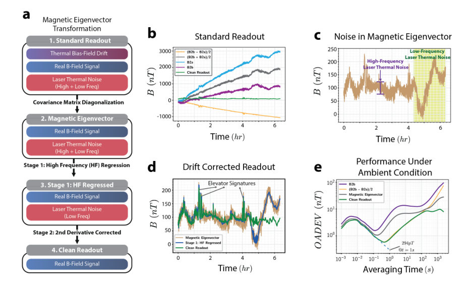 
Figure 4: Long-term drift removal using magnetic eigenvector transformation. (a) Processing se- quence. Covariance-matrix diagonalisation first isolates the temperature-correlated bias-field drift from the mag- netic coordinate. High-frequency (HF) regression then removes the remaining fast laser-correlated component, followed by second-derivative correction of the slower laser-induced drift. (b) Six-hour long B2 resonance mea- surement acquired in an unshielded laboratory with active temperature regulation disabled. The B2a and B2b transitions exhibit strong common-mode thermal variation, while the conventional differential magnetic coordi- nate develops a pronounced drift that is...

**Summary.** This paper presents an advanced, integrated digital architecture for NV-diamond magnetometers designed for stable operation in unshielded environments. By employing differential readout, second-derivative tracking, and a magnetic eigenvector transformation, the system successfully suppresses both high-frequency laser noise and slow thermal drifts. The results confirm that the magnetometer achieves near-fundamental shot-noise limits while maintaining exceptional long-term stability.

**Why it may be interesting.** This work represents a significant engineering achievement in quantum sensing, providing robust methods to mitigate environmental noise sources (laser noise, thermal drift) that typically limit the practical deployment of quantum sensors, which is highly relevant to AMO physics applications.

Detailed structure

**Main problem.** The primary challenge is achieving stable, drift-free, and high-sensitivity quantum magnetometry using NV-diamond magnetometers in unshielded, long-term, real-world environments.

**Main result.** The proposed integrated digital architecture achieves an off-resonance noise factor matching the fundamental limit (1.0 $\pm$ 0.1) and demonstrates a ten-fold suppression of long-term drift.

**Method.** The authors combine a dynamic differential readout for laser noise suppression, second-derivative Lorentzian tracking for gain correction, and a magnetic eigenvector transformation to eliminate slow, common-mode thermal drifts.

**Model / system.** The system utilizes ensemble nitrogen-vacancy (NV) centers in diamond for three-axis magnetic field sensing at room temperature. The measurement relies on tracking multiple Zeeman-split ODMR transitions to isolate the external magnetic signal from environmental drifts.

**Key observables.** Off-resonance noise factor, three magnetic projections ($B_1, B_2, B_3$), and the residual noise floor over long time scales.

**Important parameters / regimes.** Off-resonance noise factor of $1.0 \pm 0.1$; ten-fold suppression of long-term drift; ambient unshielded conditions.

**Assumptions / limitations.** Conventional stabilization techniques are insufficient for long-term, unshielded operation, necessitating intrinsic resonance tracking for drift correction.

**Figures summary.** Figures illustrate the setup schematic for differential optical readout, the use of six simultaneously addressed ODMR transitions in three Zeeman-split pairs, and noise density plots comparing various filtering techniques.

**Paper structure.** The paper details the limitations of existing magnetometers, introduces the novel digital architecture (differential readout, second-derivative tracking, eigenvector transformation), presents the experimental results showing noise floor matching and drift suppression, and concludes with the feasibility of field-ready quantum magnetometry.

Abstract

Ensemble nitrogen-vacancy (NV) diamond magnetometers combine high sensitivity with vector-field reconstruction, but practical deployment is limited by errors arising from high-frequency laser noise during short-duration operations and slow-varying gain fluctuations and offset drift during long-term operation. Here, we present an integrated digital architecture for achieving NV magnetometry stability across distinct timescales. A dynamic differential readout continuously balances fluorescence and reference channels to suppress correlated laser noise. Second-derivative Lorentzian lineshape tracking enables in-situ correction of slope variations arising from slow changes in gain and optical excitation. We further identify temperature-induced bias-magnet fluctuations as a dominant source of long-term drift and introduce a magnetic eigenvector transformation that uses the intrinsic response of NV resonances to eliminate these variations. We show, under unshielded ambient conditions, that this architecture achieves an off-resonance noise factor of 1.0 $\pm$ 0.1, matching the fundamental limit with ten-fold suppression of long-term drift, enabling stable, field-ready quantum magnetometry.

[↑ back to top](#top)

### [Unsupervised Machine Learning of the Contact Process](http://arxiv.org/abs/2609.16506v1)

**Authors:** L. T. Brito, G. A. Alves, F. W. S. Lima, A. Macedo-Filho, R. S. Ferreira, T. F. A. Alves  
**Type:** theory · **Category:** statistical mechanics · **PDF:** <https://arxiv.org/pdf/2609.16506v1>  
**Analysis basis:** full PDF text, analyzed in chunks
**Topic relevance:** `driven-dissipative phase transition` **3/5** · `non-equilibrium universality` **3/5** · `methods for driven-dissipative` **2/5**

📷 Fig 1

 
Figure 1: Scatter plot of the two leading principal components, 𝑝1 and 𝑝2, for the contact process on the square lattice with 𝐿= 64. The color scale represents the rescaled control parameter ̂𝜆∈[0, 1], corresponding to 𝜆∈[0.5𝜆𝑐, 1.5𝜆𝑐]. The compact cloud around the origin corresponds to configurations close to the absorbing state, whereas the two extended sign-related branches are associated predominantly with the active phase and the two-branch structure are due to the sign-reversed data augmentation used in the PCA analysis.

📷 Fig 2

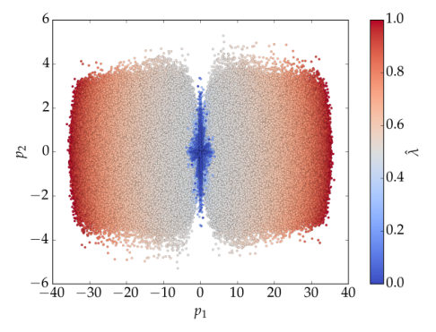 
Fig. 1 shows the projections onto the two leading principal components, 𝑝1 and 𝑝2, for 𝐿= 64. Each point represents a microscopic configuration, colored according to the rescaled parameter ̂𝜆, which maps 𝜆∈[0.5𝜆𝑐, 1.5𝜆𝑐] onto [0, 1]. At small ̂𝜆, configurations form a narrow cluster near the origin, reflecting the low activity of the absorbing regime. As 𝜆approaches and exceeds the critical region, the distribution broadens and develops two approximately sign-related branches along 𝑝1. These outer clouds, mainly associated with the active phase, possess a two-branch structure resulting from the sign-reversed data augmentation. Although this two-branch structure is artificial, the transition...

📷 Fig 3

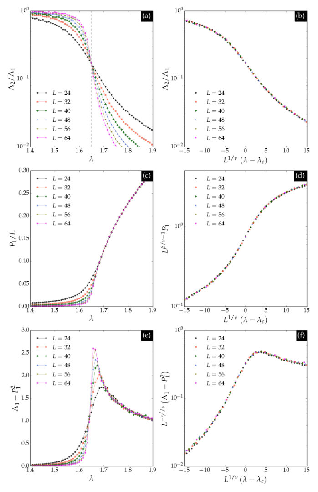 
Figure 2: Principal component analysis of the contact process on the square lattice for different linear system sizes 𝐿. (a) Ratio between the two largest eigenvalues, Λ2∕Λ1, as a function of 𝜆. The dashed vertical line indicates 𝜆𝑐= 1.64877. (b) Finite-size collapse of Λ2∕Λ1 as a function of 𝐿1∕𝜈⟂(𝜆−𝜆𝑐). (c) PCA-based order parameter 𝑃1∕𝐿. The PCA-based order parameter coincides with the density of active sites. (d) Corresponding finite-size collapse, 𝐿𝛽∕𝜈⟂−1𝑃1. (e) PCA fluctuation Λ1 −𝑃2 1 . (f) Corresponding finite-size collapse, 𝐿−𝛾′∕𝜈⟂(Λ1 −𝑃2 1 ). The numerical values of critical exponents are 𝜈⟂= 0.7333, 𝛽= 0.5834, and 𝛾′ = 0.2998[3].

📷 Fig 4

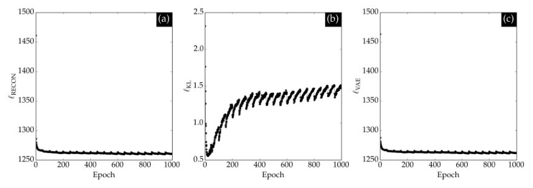 
Figure 3: Training history of the heteroscedastic VAE for the contact process on the square lattice with 𝐿= 64. Panels (a)–(c) show the reconstruction loss 𝓁RECON, the Kullback–Leibler divergence 𝓁KL, and the total loss 𝓁VAE = 𝓁RECON + 𝓁KL, respectively. The reconstruction loss decreases rapidly before reaching a slowly varying regime, while the Kullback–Leibler contribution remains finite. Small periodic variations arise from training 20 non-overlapping dataset chunks sequentially for 50 epochs each.

📷 Fig 5

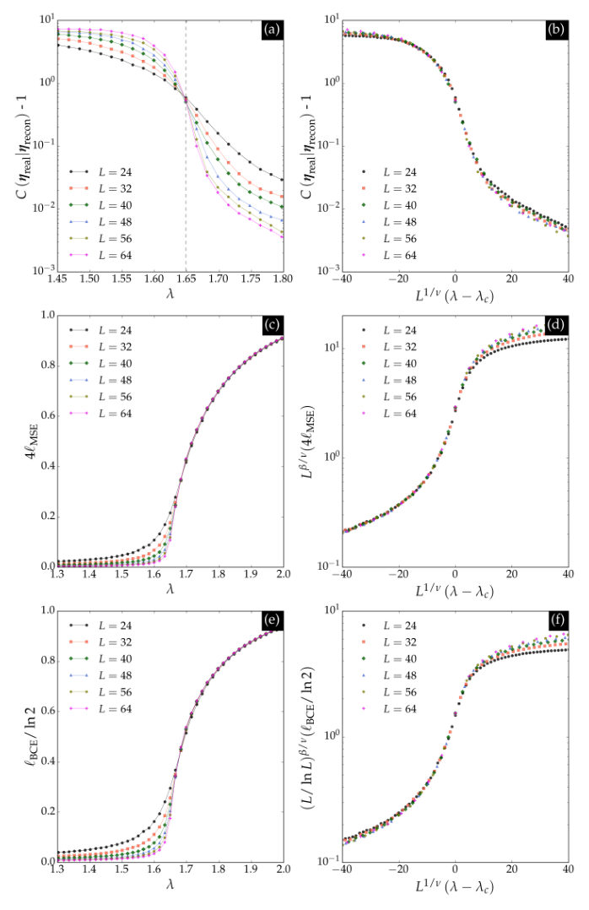 
Figure 4: Heteroscedastic variational autoencoder results for the contact process on the square lattice for different linear system sizes 𝐿. (a) Excess normalized correlation 𝐶(𝜼real ∣𝜼recon) −1 between the input and reconstructed configurations as a function of 𝜆. The dashed vertical line marks 𝜆𝑐= 1.64877. (b) Finite-size collapse of the correlation as a function of 𝐿1∕𝜈⟂(𝜆−𝜆𝑐). (c) Normalized mean-squared reconstruction error 𝓁MSE. (d) Corresponding finite-size scaling, 𝐿𝛽∕𝜈⟂(4𝓁MSE). (e) Normalized binary-cross-entropy reconstruction error 𝓁BCE∕ln 2. (f) Corresponding collapse including the logarithmic finite-size correction, (𝐿∕ln 𝐿)𝛽∕𝜈⟂𝓁BCE∕ln 2. The collapses use 𝜈⟂= 0.7333 and 𝛽=...

**Summary.** This work applies unsupervised machine learning (PCA and VAE) to analyze the active-absorbing phase transition of the Contact Process. The authors overcome technical hurdles—such as the positive-definite nature of the data—by modifying the ML inputs (e.g., sign-reversing data augmentation or using adaptive priors). This demonstrates that successful ML analysis of complex physical transitions requires deep incorporation of the system's underlying physical symmetries and constraints.

**Why it may be interesting.** It provides a blueprint for applying advanced ML techniques to non-equilibrium statistical physics problems where standard equilibrium assumptions break down, offering insights into characterizing critical phenomena.

Detailed structure

**Main problem.** Characterizing the active-absorbing phase transition in the Contact Process using unsupervised machine learning methods.

**Main result.** The success of ML methods in phase transitions critically depends on tailoring the representation to respect the system's physical constraints, such as data augmentation for PCA or using parameter-dependent priors for VAEs.

**Method.** The study employs Principal Component Analysis (PCA) and Variational Autoencoders (VAEs) to analyze the system's configuration space.

**Model / system.** The Contact Process (CP) is studied on lattices (1D, 2D, triangular), which exhibits a continuous active-absorbing phase transition belonging to the Directed Percolation universality class.

**Key observables.** Order parameter ($
ho$), finite-size scaling ratios (e.g., $\Lambda_2/\Lambda_1$), and reconstruction errors ($\mathcal{L}_{	ext{MSE}}$, $\mathcal{L}_{	ext{BCE}}$).

**Important parameters / regimes.** The control parameter $\lambda$ (infection rate relative to recovery rate) and system size $L$.

**Assumptions / limitations.** Standard ML techniques fail due to the positive-definite nature of CP configurations, necessitating data augmentation (sign-reversal) or specialized priors (heteroscedastic Gaussian prior).

**Figures summary.** Figures demonstrate the finite-size scaling collapse of various observables (eigenvalue ratios, order parameter estimates, reconstruction errors) for both PCA and VAE analyses across the critical point.

**Paper structure.** The paper first establishes the physical problem (CP transition) and the failure modes of standard ML techniques. It then details the necessary methodological fixes (data augmentation for PCA, heteroscedastic prior for VAE) and demonstrates their success by showing the recovery of known critical scaling laws.

Abstract

We investigate how unsupervised machine-learning methods can characterize the active-absorbing phase transition in the contact process in one and two spatial dimensions. Our analysis focuses on principal component analysis (PCA) and variational autoencoders (VAEs), and we show that direct applications of these methods encounter a central difficulty: contact process configurations are intrinsically positive-definite. In the PCA case, standard centering procedures fail to isolate the order parameter in the leading component. To address this, we augment the data with sign-reversed configurations, creating a balanced dataset with zero mean while preserving the density information required to describe the transition. This preprocessing allows the dominant principal component to recover the order parameter and reproduce the expected finite-size scaling near criticality. For VAEs, we find a related limitation: a fixed Gaussian prior does not provide sufficient latent regularization across the full range of control parameters and system sizes for positive-definite data. We overcome this by adopting a heteroscedastic Gaussian prior that adapts to the control parameter, leading to a substantial improvement in the finite-size scaling of reconstruction-based observables near the critical threshold. Taken together, these results highlight a key lesson: the success of machine learning in phase-transition problems does not rely on algorithmic complexity alone, but on tailoring the representation to respect the physical structure of the system, including its intrinsic constraints and symmetries.

[↑ back to top](#top)

### [Accurate noise spectroscopy using quantum sensing ensembles](http://arxiv.org/abs/2609.16643v1)

**Authors:** Dhilan T Vallury, Nikolai Dontschuk, Alexander M Jakob, Alexander J Healey, David A Simpson  
**Type:** both · **Category:** other · **PDF:** <https://arxiv.org/pdf/2609.16643v1>  
**Analysis basis:** full PDF text, analyzed in chunks
**Topic relevance:** `QC/QI experiment` **3/5** · `quantum measurements` **2/5** · `correlated / nonlocal dissipation` **1/5** · `quantum optics experiment` **1/5**

📷 Fig 1

 
Low-resolution page preview, page 2

📷 Fig 2

 
Low-resolution page preview, page 3

📷 Fig 3

 
Low-resolution page preview, page 4

📷 Fig 4

 
Low-resolution page preview, page 5

📷 Fig 5

 
Low-resolution page preview, page 6

**Summary.** This paper details a rigorous analysis procedure for extracting the true source noise spectrum from measurements taken using large ensembles of quantum sensors. By mathematically incorporating the spatial distribution of the sensors, the authors overcome ambiguities inherent in ensemble averaging. This methodology paves the way for quantitative, broadband noise characterization using solid-state quantum platforms.

**Why it may be interesting.** This work is highly relevant to AMO physics as it deals with using quantum systems (NV centers) as highly sensitive probes to characterize the local electromagnetic environment (noise spectroscopy), a core topic in quantum sensing and open quantum systems.

Detailed structure

**Main problem.** The paper addresses the challenge of accurately reconstructing the true source noise spectrum $S_0(\omega)$ from ensemble coherence measurements $\langle C(T) 
angle$ when the sensing ensemble has a variable coupling depth distribution.

**Main result.** The authors present an analysis procedure that incorporates the coupling distribution $P(d)$ to accurately extract the source noise spectrum, demonstrating its applicability to NV centers in diamond.

**Method.** The method involves analyzing the ensemble coherence decay, which is modeled as an integral over the depth distribution, and using approximations (like the short-T limit) to invert the measured decay into the underlying noise spectrum.

**Model / system.** The system studied is quantum sensing ensembles, specifically using Nitrogen-Vacancy (NV) centers in diamond. The noise environment is modeled as separable, $S(\omega, d) = S_0(\omega)D(d)$, where $D(d)$ describes depth variation.

**Key observables.** Ensemble coherence $\langle C(T) 
angle$, the source noise spectrum $S_0(\omega)$, and the depth distribution $P(d)$.

**Important parameters / regimes.** Measurement time $T$, depth distribution parameters (e.g., depth range, width), and noise frequency $\omega$.

**Assumptions / limitations.** Key assumptions include modeling the noise as separable across depth and assuming specific functional forms for the depth distribution (e.g., $d^{-3}$ scaling). A major limitation is the inherent ambiguity between the amplitude of $S_0$ and the scale of $P(d)$.

**Figures summary.** Figures illustrate the accuracy of fitting methods for depth profiles and source spectra, comparing 'naive' fitting against reconstruction methods that account for the depth distribution. Specific comparisons are made between 2 keV and 4 keV ensembles.

**Paper structure.** The paper develops the theoretical framework for ensemble averaging, analyzes the ambiguities in parameter extraction, and then applies this procedure to model systems (like NV centers) to demonstrate the quantitative extraction of broadband noise spectra.

Abstract

Noise spectroscopy with quantum sensors is a powerful tool for characterising the properties of the sensor environment and detecting critical magnetic phenomena. While replacing single sensors with large ensembles promises substantial gains in measurement sensitivity and field of view, the output becomes difficult to interpret when there is a variable coupling to targets across the sensing ensemble. In this work we present an analysis procedure for accessing the true source noise spectrum using ensemble coherence from dynamical decoupling measurements. We show that sequence timing plays a dual role in ensemble noise spectroscopy, setting both the frequency selectivity and the weighted collection of signal across the ensemble, and demonstrate how incorporation of the coupling distribution allows accurate parameter extraction of the noise. We apply this procedure to a model system, shallow nitrogen-vacancy centres in diamond, and show that consistent information about the spectral character of MHz-range surface noise can be obtained from two sensing ensembles featuring distinct depth distributions. Our results pave the way for using large quantum sensor ensembles for quantitative, broadband noise spectroscopy, with straightforward extension to other solid-state and molecular sensing platforms.

[↑ back to top](#top)

### [Anomalous First Passage in Evolution: Edge-KPZ Theory](http://arxiv.org/abs/2609.16499v1)

**Authors:** Tetsuhiro S. Hatakeyama  
**Type:** theory · **Category:** statistical mechanics · **PDF:** <https://arxiv.org/pdf/2609.16499v1>  
**Analysis basis:** full PDF text, analyzed in chunks
**Topic relevance:** `non-equilibrium universality` **3/5** · `Keldysh / 2PI / non-Gaussian methods` **2/5** · `methods for driven-dissipative` **2/5**

📷 Fig 1

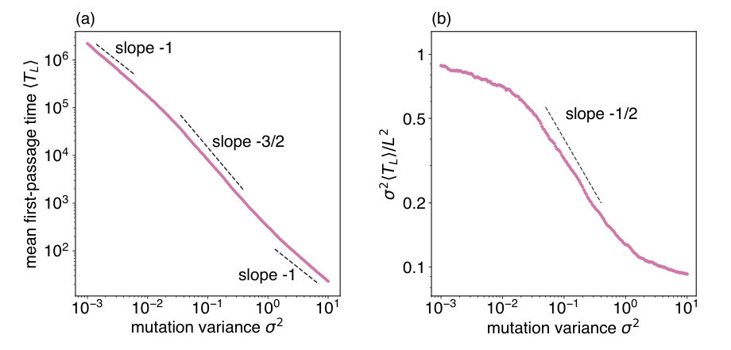 
FIG. 1. Mean first-passage times in neutral evolution. (a) Mean first-passage time for any individual to exit [−L, L] at N = 1000 and L = 50, as a function of the mutation variance σ2. (b) The same data multiplied by σ2/L2. Symbols represent means over 1000 realizations at each parameter point. Dashed segments are slope guides.

📷 Fig 2

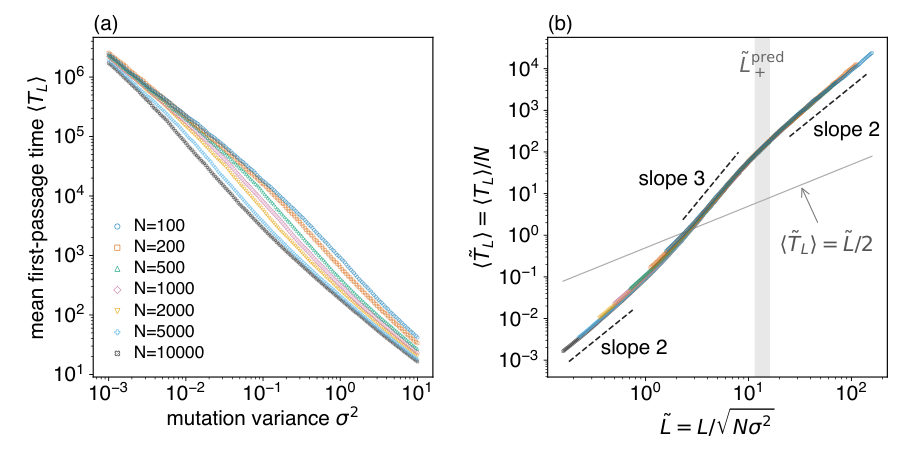 
FIG. 2. Scaling collapse of the first-passage law. (a) Mean first-passage time versus mutation variance for seven population sizes, all at L = 50. (b) The same data with time rescaled by N and phenotypic distance by σ √

📷 Fig 3

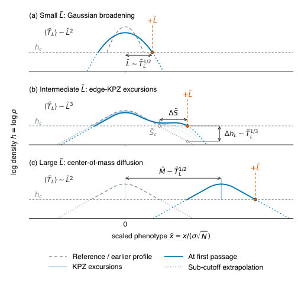 
FIG. 3. Mechanism for the quadratic–cubic–quadratic law. (a) Gaussian broadening gives quadratic scaling at small dis- tances. (b) On the exponential reference tail inferred from coalescence, the height gap ∆hL from the reference profile at the target to hc is proportional to ∆˜S = ˜SL −˜Sc. In the edge-KPZ theory, height excursions growing as ˜t1/3 give a cu- bic passage timescale. (c) Center-of-mass diffusion of a cloud with finite characteristic width restores quadratic scaling at large distances. The log-density profiles share a common hori- zontal scale. Horizontal dashed lines mark the one-individual cutoff hc, orange vertical lines mark the target, and dotted continuations are...

📷 Fig 4

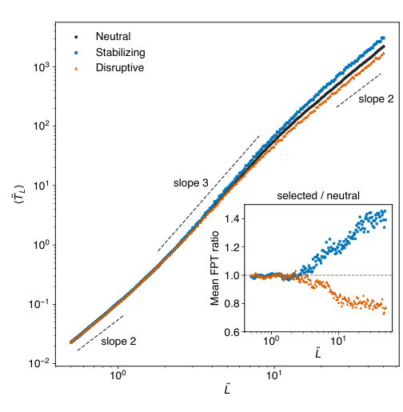 
FIG. 4. First-passage times under weak selection. Scaled mean first-passage times under neutral, weak stabilizing, and weak disruptive selection at N = 1000, L = 50, and λ = 1. Symbols represent means over 1000 realizations per condition and parameter point. The inset shows each selected mean divided by the neutral mean at the same mutation variance; its horizontal line marks a ratio of one. Dashed segments in the main plot are guides for slopes 2, 3, and 2.

**Summary.** This theoretical paper develops an edge-KPZ theory to explain the anomalous scaling of the first passage time in neutral population evolution. By combining coalescent theory with the Kardar-Parisi-Zhang equation, the authors show that the time to reach a distant phenotype scales anomalously with mutation variance. This work provides a deep link between population genetics and non-equilibrium statistical physics.

**Why it may be interesting.** The connection between population genetics (Wright-Fisher model) and non-equilibrium statistical physics tools like KPZ theory provides a powerful, universal framework for understanding how collective fluctuations dictate macroscopic evolutionary rates.

Detailed structure

**Main problem.** The paper investigates the anomalous scaling of the first passage time (FPT) in evolutionary dynamics, specifically how the time required for a phenotype to reach a distant state is determined by mutation and population fluctuations.

**Main result.** Neutral Wright-Fisher evolution exhibits an anomalous FPT scaling proportional to $	ilde{L}^3$ in an intermediate regime, which is described by an edge-KPZ theory.

**Method.** The authors combine coalescent theory with the Kardar-Parisi-Zhang (KPZ) equation, analyzing the evolution of the population density via stochastic partial differential equations (SPDEs) and using Cole-Hopf transformations.

**Model / system.** The model is neutral Wright-Fisher evolution, where phenotypic change is driven by Gaussian mutations ($\sigma^2$) and population dynamics are governed by density evolution equations. The analysis focuses on the separation distribution of two lineages over time.

**Key observables.** Mean first-passage time ($\langle T_L 
angle$), population density $
ho(x, t)$, and the separation probability $p_{	ext{pair}}(S)$.

**Important parameters / regimes.** Mutation variance ($\sigma^2$), population size ($N$), and the target phenotypic distance ($L$).

**Assumptions / limitations.** The analysis relies on the diffusion approximation for smooth densities and uses scaling limits ($	ilde{t} = t/N$) to derive continuum equations.

**Figures summary.** Figures illustrate the anomalous scaling of $\langle T_L 
angle$ vs. $\sigma^2$ (showing $\propto (\sigma^2)^{-3/2}$) and confirm the scaling collapse of FPT data onto a master curve.

**Paper structure.** The paper progresses from defining the physical problem (FPT in evolution) to deriving the continuum SPDE for density evolution, linking this to coalescence theory, and finally applying the KPZ framework to establish the three distinct scaling regimes ($	ilde{L}^2 	o 	ilde{L}^3 	o 	ilde{L}^2$).

Abstract

The pace of evolution depends on how rapidly new phenotypes arise. We show that neutral Wright-Fisher evolution exhibits anomalous first passage despite diffusive mutations. The mean time for the first individual to reach a prescribed phenotypic distance scales approximately as $(σ^2)^{-3/2}$ with mutation variance $σ^2$. Two crossovers bound this regime, with inverse-variance scaling on either side. Combining coalescent theory with Kardar-Parisi-Zhang (KPZ) fluctuations at the dilute population edge, we develop an edge-KPZ theory of all three regimes. The anomaly persists under weak selection.

[↑ back to top](#top)

### [Environmental records unlock universal quantum computation from thermal decoherence](http://arxiv.org/abs/2609.16460v1)

**Authors:** Chenfeng Cao, Qi Zhao  
**Type:** theory · **Category:** quantum information and computing · **PDF:** <https://arxiv.org/pdf/2609.16460v1>  
**Analysis basis:** full PDF text, analyzed in chunks
**Topic relevance:** `quantum measurements` **3/5** · `correlated / nonlocal dissipation` **1/5** · `driven-dissipative phase transition` **1/5** · `methods for driven-dissipative` **1/5** · `non-equilibrium universality` **1/5**

📷 Fig 1

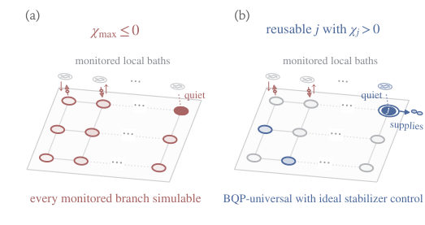 
FIG. 1. The local calibrations determine the two sides of Theorem 1. (a) Each thermal-idle location has its own χi. If χmax ≤0, every monitored call has a nonnegative stabilizer decomposition. (b) If one repeatedly accessible location has χi &gt; 0, its quiet branch provides distillable ancillas to the stabilizer processor.

📷 Fig 2

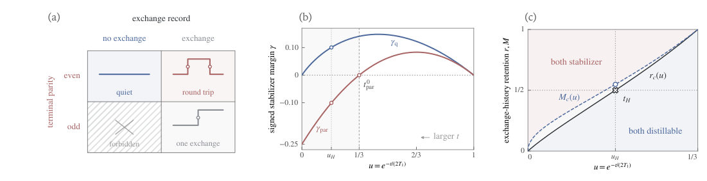 
FIG. 2. (a) The exchange bit and the terminal-parity bit are incomparable: a history with even terminal parity can still contain exchanges, whereas odd parity implies at least one. (b) Signed stabilizer margins at pe = 1/4 and T2 = 2T1 versus u = e−t/(2T1), with exposure increasing to the left. The quiet margin γq stays positive at every finite exposure, while the terminal-parity margin γpar crosses zero at u = 1/3 (t0 par = 2T1 ln 3). Shading marks the window of Theorem 3. At uH = 3 −2 √

📷 Fig 3

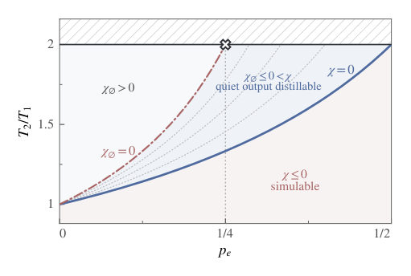 
FIG. 3. Calibration plane for independent local baths. The boundary uses the homogeneous T2 of the model. The lines show the moni- tored boundary χ = 0, the bare-|+⟩short-time line χ∅= 0, and the complete-positivity limit T2 = 2T1. The faint lines give the zero- initial-slope condition without terminal parity for absorption-miss probabilities m↑= 1/4, 1/2, 3/4. The cross marks (pe, T2/T1) = (1/4, 2), the parameters of Corollary 1.

**Summary.** This work classifies quantum computation capabilities based on how a processor interacts with a thermal bath while monitoring its environment. It establishes a critical parameter ($\chi$) that dictates whether the system is classically simulable or capable of universal quantum computation. The key finding is that even minimal environmental records can preserve enough quantum information to enable quantum advantage.

**Why it may be interesting.** It provides a rigorous, quantitative link between the thermodynamics of open quantum systems (thermal decoherence) and the fundamental limits of quantum computation, suggesting that environmental monitoring itself can be a resource.

Detailed structure

**Main problem.** The paper determines the computational classification (classically simulable vs. quantum universal) of a stabilizer processor coupled to a monitored thermal bath, based on the environmental records retained by its controller.

**Main result.** Quantum universal computation is possible if the system parameters exceed a critical boundary ($\chi > 0$), even when only retaining minimal environmental records like whether any exchange occurred.

**Method.** The analysis uses exact computational classification based on energy-counting thermal-idle instruments, deriving time-dependent stabilizer margins ($\gamma$) for different readout protocols.

**Model / system.** The model is a quantum processor with ideal stabilizer control coupled to independent local Markov baths, undergoing thermal idle periods where energy exchange is monitored.

**Key observables.** Signed stabilizer margins ($\gamma_q, \gamma_{par}, \gamma_{\emptyset}$), the calibration number ($\chi$), and the computational boundary $\chi=0$.

**Important parameters / regimes.** Relaxation time ($T_1$), homogeneous coherence time ($T_2$), and equilibrium excited-state population ($p_e$).

**Assumptions / limitations.** Assumes ideal stabilizer control and independent local Markov baths; the analysis compares resource-side records versus the averaged channel.

**Figures summary.** Figures illustrate the computational boundary ($\chi_{\max} \le 0$ vs. $\chi > 0$) and compare the signed stabilizer margins for different readouts (quiet branch vs. terminal parity).

**Paper structure.** The paper establishes the computational boundary using the ratio $(1-p_e)T_2/T_1$. It then compares the information retained by different readouts (full record, terminal parity, no exchange bit) to show that retaining minimal information can still herald quantum advantage when $\chi > 0$.

Abstract

At a fixed thermal exposure, the same stabilizer processor can be classically simulable or quantum universal, depending on which environmental records its controller retains. We give an exact computational classification of energy-counting thermal-idle instruments in a quantum processor with ideal stabilizer control and independent local Markov baths. The relaxation time $T_1$, homogeneous coherence time $T_2$, and equilibrium excited-state population $p_e$ determine an exact computational boundary at $(1-p_e)T_2/T_1=1$. If every location lies at or below it, branchwise nonnegative stabilizer decompositions give an explicit efficient classical sampler for the adaptive circuit and its full time-resolved exchange record. Above it at a single repeatedly accessible location, a suitable idle duration and no-exchange conditioning supply distillable ancillas and enable universal quantum computation with polynomial overhead. At finite temperature on the resource side, erasing the record at a sufficiently long, unsplit exposure makes the averaged channel stabilizer measure-and-prepare, and even a terminal parity check then yields only simulable branches. Yet at that same exposure, retaining only the bit recording whether any exchange occurred still heralds distillable ancillas, because a thermal round trip restores the parity after its first exchange has already removed the coherence.

[↑ back to top](#top)

### [Odd diffusion and power-law correlations in chiral mass-transport processes](http://arxiv.org/abs/2609.16821v1)

**Authors:** Koushik Das, Animesh Hazra, Punyabrata Pradhan  
**Type:** theory · **Category:** statistical mechanics · **PDF:** <https://arxiv.org/pdf/2609.16821v1>  
**Analysis basis:** full PDF text, analyzed in chunks
**Topic relevance:** `non-equilibrium universality` **3/5** · `Keldysh / 2PI / non-Gaussian methods` **1/5** · `correlated / nonlocal dissipation` **1/5** · `driven-dissipative phase transition` **1/5** · `methods for driven-dissipative` **1/5**

📷 Fig 1

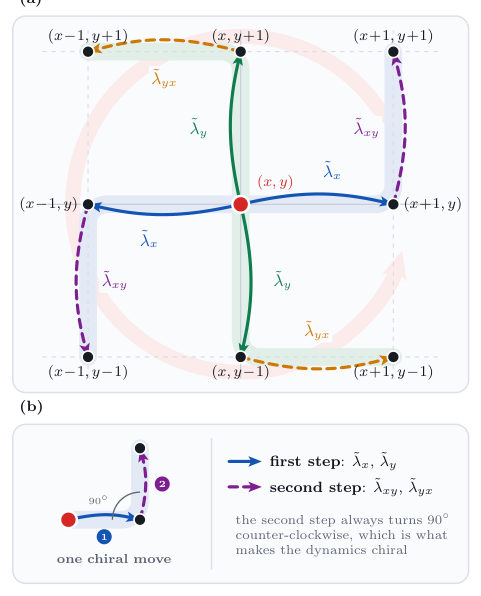 
FIG. 1. Schematic diagram of the chiral dynamics on a square lattice. (a) During a microscopic time, mass trans- fer from the site (x, y) (red solid circle) along two orthog- onal (“L”-shaped) bonds simultaneously, and always in the counter-clockwise sense. Solid arrows correspond to the first- step transfer, from (x, y) to a nearest-neighbor site (black solid circles) along the x (blue) or y (green) direction; dashed ar- rows correspond to the second-step transfer, which carries the mass onward from that neighbor to a next-nearest-neighbor site along the perpendicular direction (purple and orange), and which introduces chirality in the dynamics. The pale bands trace the four “L”-shaped...

📷 Fig 2

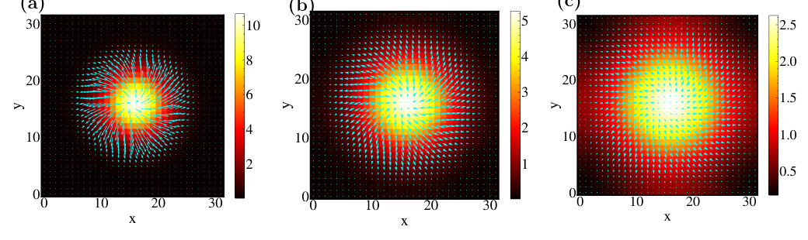 
FIG. 2. Relaxation of a localized density profile on an infinite domain. Density (color shade) and current (arrows) profiles at different times: (a) T = 25, (b) T = 50, and (c) T = 100 for isotropic mass transfer. The initial condition is a delta-density profile with the entire mass concentrated at the origin; we take global density ¯ρ = 1, mass chipping (retention) parameters λ1 = 0.0, and λ2 = 0.0. One can see the circulating (transient) currents around the origin.

📷 Fig 3

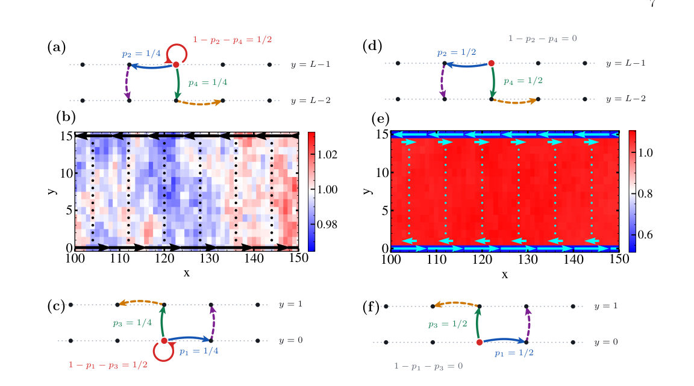 
FIG. 3. Steady-state edge currents under open-boundary conditions. Panels (b) and (e) show heat maps of the steady-state density profile, with arrows indicating the current profiles. The schematic diagram above and below each of the heat maps give the corresponding mass-transfer rules at the two reflecting “walls” (edges), placed adjacent to y = (L −1) [panels (a) and (d)] and y = 0 [panels (c) and (f)]. Of the four chiral “L”-shaped moves, only the two moves whose path stays inside the slab survive at the edge (wall): p2, p4 at y = (L−1), so that p1 = p3 = 0, and p1, p3 at y = 0, so that p2 = p4 = 0. In panels (a) and (c), the surviving moves keep their bulk value 1/4, and with the remaining...

📷 Fig 4

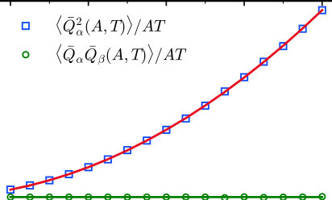 
FIG. 4. Scaled steady-state variance of the space-time- integrated (cumulative) current in the full system over the time interval [0, T ] are plotted as a function of global density ρ for the isotropic chiral MCM. Open blue squares denote the scaled variance of the cumulative current, while open green circles denote the cross correlation between the two current components. The red line shows the theoretical prediction 2χαα obtained from Eqs. (51) and (85), and the green line shows 2χαβ (α ̸= β) from Eq. (85). The simulation parame- ters are as follows: System size Lx×Ly = 128×128, final time T = 500, mass chipping (retention) parameters λ1 = 0.4, and λ2 = 0.6.

📷 Fig 5

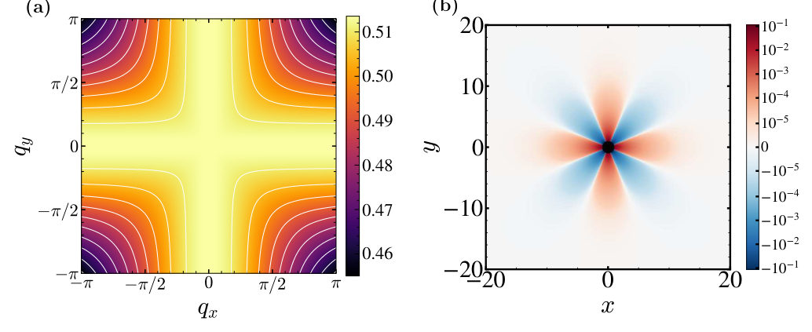 
FIG. 5. Steady-state static structure factor and equal-time two-point density correlation function in chiral mass-transport models with isotropic mass-transfer rates. Panel (a): Heat map of the structure factor S(qx, qy) in wave vector space q = {qx, qy}. Panel (b): Heat map of the corresponding two-point density correlation in real space r = {x, y}. Here, the simulation parameters are as follows: global density ¯ρ = 1 and mass chipping (retention) parameters λ1 = 0.4, and λ2 = 0.6.

**Summary.** This paper analyzes mass transport on a lattice driven by chiral hopping, which breaks fundamental symmetries. The key finding is that this 'odd diffusion' mechanism alone can generate universal, power-law decay in density correlations, even when the underlying hopping rates are isotropic. This establishes a new theoretical link between chirality, transport coefficients, and long-range spatial correlations in non-equilibrium statistical mechanics.

**Why it may be interesting.** The connection between microscopic chiral transport rules and macroscopic power-law correlations in non-equilibrium steady states provides a powerful theoretical tool for understanding fluctuation phenomena in driven many-body systems.

Detailed structure

**Main problem.** The study investigates how chiral mass-transport processes generate scale-invariant spatial correlations in non-equilibrium steady states, particularly in systems that are macroscopically isotropic.

**Main result.** Odd diffusion provides a mechanism for algebraic decay in two-point density correlations, $C(r) \sim |r|^{-4}$, which is distinct from correlations arising from simple anisotropic hopping.

**Method.** The authors employ exact calculations for steady-state density-density correlations and derive a non-equilibrium analog of the Green-Kubo relation by analyzing the continuum limit of the lattice dynamics.

**Model / system.** The model is a mass-conserving Markov jump process on a square lattice, termed a chiral mass chipping model (MCM). The dynamics are explicitly chiral, breaking time-reversal and mirror symmetries.

**Key observables.** Two-point density-density correlation function $C(r)$, structure factor in the zero-wavenumber limit, and the odd diffusion coefficient $D(	ext{odd})$.

**Important parameters / regimes.** Chirality strength, the odd diffusion coefficient $D(	ext{odd})$, and the system size/boundary conditions (periodic vs. open).

**Assumptions / limitations.** The derivation of the hydrodynamic equation relies on a gradient expansion, and the model assumes mass conservation throughout the process.

**Figures summary.** Figure 1 schematically illustrates the chiral dynamics via an L-shaped path, while Figure 2 shows the relaxation of a localized density profile, indicating transient circulating currents.

**Paper structure.** The paper establishes the microscopic model dynamics, derives the macroscopic hydrodynamic equation via gradient expansion, calculates the steady-state correlation functions, and analyzes the dual role of odd diffusion on fluctuations.

Abstract

We study mass-conserving Markov jump processes on a square lattice, where masses hop with a preferred rotational sense, thus breaking both time-reversal and mirror symmetries. We consider closed systems with both periodic and open (reflecting) boundaries, the latter supporting a steady-state edge current. We show that odd diffusion, arising from the chiral transport, generically provides a mechanism for the emergence of scale-invariant two-point density correlations in nonequilibrium steady states even in the presence of lattice rotation symmetry -- a mechanism that is qualitatively distinct from the well-known mechanism of anisotropic hopping. We exactly calculate the steady-state equal-time density-density correlations, which exhibit an algebraic decay, $C(\mathbf{r}) \sim |\mathbf{r}|^{-4}$ for $|\mathbf{r}| \gg 1$. This algebraic behavior results from the interplay between the off-diagonal components of the diffusion and mobility tensors, demonstrating that chiral transport alone can generate power-law correlations in isotropic driven systems. Remarkably, the structure factor in the zero-wavenumber limit and the amplitude of the power laws depend nontrivially on chirality. While increasing chirality initially suppresses large-scale density fluctuations, the fluctuations beyond a threshold odd-diffusion strength vary nonmonotonically with chirality and develop a cusp singularity.

[↑ back to top](#top)

### [Pulse-Level Compilation of Measurement-Free Recovery in Transmon Circuits](http://arxiv.org/abs/2609.16133v1)

**Authors:** Yi-Han Yu, Kai Xu, Heng Fan  
**Type:** theory · **Category:** quantum information and computing · **PDF:** <https://arxiv.org/pdf/2609.16133v1>  
**Analysis basis:** full PDF text, analyzed in chunks
**Topic relevance:** `quantum measurements` **3/5** · `QC/QI experiment` **2/5** · `methods for driven-dissipative` **2/5**

📷 Fig 1

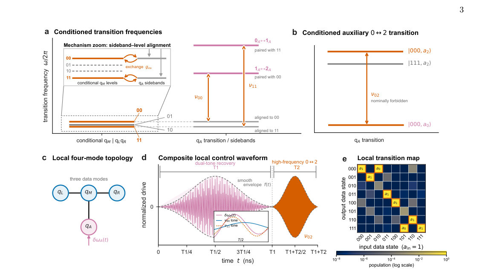 
FIG. 2. Condition-selective local compilation in a four-mode module. a, Conditioned transition frequencies and modulation-generated sidebands at the selected working point. b, Conditioned auxiliary 0 ↔2 transition: the 00-conditioned line is selected while the 11 branch remains a spectator. c, Local topology: qL −qM −qR form the data chain, while leaf auxiliary qA couples to qM and receives δωA(t). d, Composite local control waveform, consisting of the dual-tone recovery segment followed by the conditional auxiliary 0 ↔2 segment. e, Assigned-data populations for the complete local waveform over all eight inputs. Cell color sums over auxiliary occupations; highlighted cells mark the...

📷 Fig 2

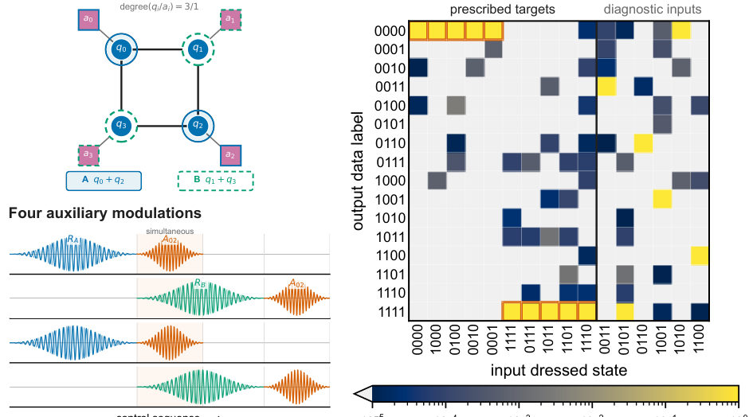 
FIG. 3. Pipelined ring schedule and four-bit population transfer. a, The four-bit ring contains four data modes and one leaf auxiliary per data mode; the recovery rule groups nonadjacent targets as A = {q0, q2} and B = {q1, q3}. The dynamical model retains four levels for all eight modes. b, The fixed input-independent waveform pipelines the two recovery groups with their conditional auxiliary 0 ↔2 subpulses. Each auxiliary operation begins after the corresponding recovery operation, while nonconflicting operations overlap. c, Assigned-data populations after the composite waveform, with columns denoting inputs and rows output labels. All 16 inputs are propagated, but only the two codewords...

📷 Fig 3

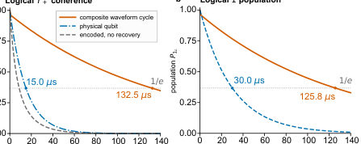 
FIG. 4. Repeated-cycle protection under two noise models. a, Under dressed Pauli-X noise, recovery slows the decay of logical coherence CY relative to both a physical qubit and the unrecovered encoded state. b, Under independent amplitude damping, recovery slows the decay of logical-one population P1L relative to a physical excited state. Both panels use the same recovery cycle but different initial states and observables.

**Summary.** This paper presents a method to implement Quantum Error Correction in superconducting transmon circuits using fixed, open-loop control pulses instead of traditional syndrome measurement and feedback. By compiling the recovery logic into a single waveform, the authors demonstrate protection against noise for a four-bit code ring, offering a scalable, hardware-efficient path toward fault-tolerant quantum computation.

**Why it may be interesting.** It provides a concrete, hardware-native blueprint for implementing fault-tolerant quantum computation by replacing complex, time-consuming feedback loops with fixed, engineered control pulses.

Detailed structure

**Main problem.** The paper addresses the overhead associated with traditional Quantum Error Correction (QEC) by developing a method to compile syndrome measurement and recovery into a fixed, open-loop control waveform.

**Main result.** A local QEC rule can be compiled into a fixed, open-loop control cycle for transmon circuits, successfully slowing logical coherence decay and stabilizing logical populations for a four-bit repetition code ring.

**Method.** The authors use spectral compilation, designing a composite waveform consisting of a swap operation and a conditional auxiliary transition to implement the recovery logic without real-time feedback.

**Model / system.** The work is based on interacting transmon circuits, modeled as a four-site ring structure for a four-bit repetition code. The Hamiltonian and evolution are analyzed using time-dependent control pulses.

**Key observables.** Logical coherence ($C_Y$) and logical-one population ($P_{1L}$) decay rates, and the population transfer map for all 16 computational-basis inputs.

**Important parameters / regimes.** The system uses a fixed two-color scheduling for the ring update, and the cycle time is characterized by a $\mu$s scale.

**Assumptions / limitations.** The residual error is assumed to be dominated by leakage due to spectral crowding, and the analysis focuses on the Z-basis rule, requiring further steps for phase-error correction.

**Figures summary.** Figures illustrate the physical process of fixed open-loop control transferring error records, detail the local compilation waveform, show the two-color pipelined schedule for the ring, and plot the decay of logical coherence and population under noise.

**Paper structure.** The paper develops models for local recovery subpulses, extends this to a full ring computation using a two-color schedule, and finally analyzes the performance of the resulting fixed waveform in a repeated-cycle error correction scheme.

Abstract

Quantum error correction commonly relies on syndrome measurement, decoding, and conditional feedback. We numerically show that the conditional spectrum of an interacting transmon circuit can compile a local recovery rule into a fixed open-loop control cycle. In a four-bit repetition-code ring, the resulting input-independent control slows the decay of logical coherence under Pauli-\(X\) noise and stabilizes logical-one population under data relaxation relative to uncorrected references. Its local, bounded-degree architecture provides a hardware-native framework for extending compiled recovery control to larger quantum networks.

[↑ back to top](#top)

### [Course on two-dimensional quantum gases](http://arxiv.org/abs/2609.17097v1)

**Authors:** Hélène Perrin  
**Type:** theory · **Category:** quantum gases · **PDF:** <https://arxiv.org/pdf/2609.17097v1>  
**Analysis basis:** full PDF text, analyzed in chunks
**Topic relevance:** `analog quantum simulation` **3/5** · `Keldysh / 2PI / non-Gaussian methods` **2/5** · `methods for driven-dissipative` **1/5**

📷 Fig 1

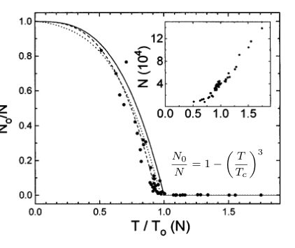 
Figure 1.1: Left: First observation of Bose-Einstein condensation in atomic gases. Rubid- ium atoms initially confined in a harmonic trap are released in a time-of-flight experiment. The gas expands, and the density distribution (integrated along the imaging axis) after expansion is linked to the initial momentum distribution. Figure from Cornell’s group. Right: Condensed fraction as a function of temperature in units of the predicted critical temperature T0 for a non interacting gas, compared with the prediction for a non interact- ing gas. BEC occurs at a temperature slightly lower than predicted by the non interacting model. Inset: remaining atoms as a function of T/T0. Figure adapted...

📷 Fig 2

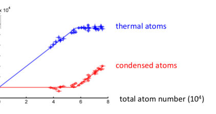 
Figure 1.2: Left: Observation of BEC for a 3D Bose gas confined in a box trap. Figure from Ref. [10]. Upper panel: momentum distribution as observed after a 50 ms time-of- flight expansion. Lower panel: cut in the momentum distribution. Inset: in situ distribu- tion before expansion. Right: Saturation of the number of atoms in the excited states in this situation. Figure from Ref. [2], adapted from a figure provided by Zoran Hadzibabi´c.

📷 Fig 3

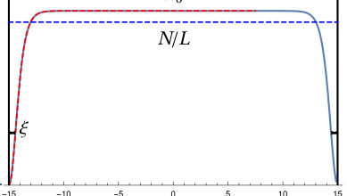 
Figure 1.3: Left: Solution of Gross-Pitaevskii equation for a condensante in a harmonic trap (full blue line), compared to the Thomas-Fermi profile (dashed magenta, very well superposed except on the edges) and the non interacting solution (dashed cyan). Also shown are the trapping potential (dashed red) and the chemical potential (dashed black). Right: Same thing in a box potential. The density is uniform, except in a small region of size ξ near the edge.

📷 Fig 4

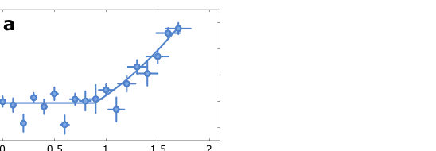 
Figure 1.5: Demonstration of a critical velocity in a 2D gas. Left: A focused laser is stirred around the gas, at some fixed distance from the center, and at a fixed linear speed v. Right: The energy transferred to the gas is measured in a time-of-flight experiment. At low v, no energy is transferred. Above a critical value vc, the energy increases quadratically with v −vc, due to the creation of excited particle out of the BEC. Figure from Ref. [15].

📷 Fig 5

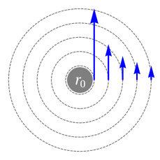 
Figure 1.6: Left: Circulation of the velocity field around a contour C. The integration is done on a path where the velocity is well-defined, while there may be points inside the contour, here point O, where the density vanishes and the velocity is not defined, which may be a vortex of charge q. The circulation is an integer number of h/M, qh/M in this latter case. Right: Typical velocity field around a vortex. The central region of radius r0 ∼ξ is depleted and the density vanishes in the center of the core.

**Summary.** This course material provides a detailed theoretical review of quantum gases, covering the transition to BEC in trapped systems using the Gross-Pitaevskii equation. It emphasizes the unique physics of two-dimensional gases, deriving the Berezinskii-Kosterlitz-Thouless mechanism and analyzing the resulting quasi long-range order through correlation functions.

**Why it may be interesting.** This work provides a comprehensive theoretical treatment of dimensionality effects on superfluidity, which is a cornerstone topic in modern AMO physics, bridging mean-field descriptions with fluctuation-dominated regimes.

Detailed structure

**Main problem.** The paper addresses the fundamental physics of Bose-Einstein Condensation (BEC) and superfluidity in quantum gases, with a specific focus on the unique behavior observed in two-dimensional (2D) systems.

**Main result.** It establishes quantitative criteria for BEC based on the density of states and derives the governing Gross-Pitaevskii Equation (GPE) for the condensate wavefunction. Furthermore, it details the quasi long-range order characteristic of 2D superfluids via the Berezinskii-Kosterlitz-Thouless (BKT) mechanism.

**Method.** The analysis employs a combination of mean-field theory (GPE derivation), semi-classical approximations for thermodynamic quantities, and linear response theory/Bogoliubov approach for analyzing phase fluctuations.

**Model / system.** The primary system is a weakly interacting Bose gas, modeled in various dimensionalities (3D, 2D, quasi-2D) confined by isotropic power-law traps. The interactions are modeled via an effective contact potential, leading to the GPE.

**Key observables.** Condensate fraction ($N_0/N$), first-order correlation function ($G_1(r)$), critical temperature ($T_c$), and the superfluid order parameter.

**Important parameters / regimes.** Dimensionality ($D$), trap exponent ($\alpha$), interaction strength ($g$), and temperature ($T$).

**Assumptions / limitations.** Key approximations include the semi-classical limit for thermodynamics and the assumption that density fluctuations are negligible when analyzing phase correlations in 2D.

**Figures summary.** The notes reference figures showing the BEC fraction dependence on temperature for different trap geometries and the decay of the correlation function $G_1(r)$ in 2D systems.

**Paper structure.** The content is structured logically, moving from the general theory of BEC in trapped gases (ideal gas, interactions, GPE) to the specific, advanced topic of 2D systems, culminating in the analysis of phase fluctuations and the BKT transition.

Abstract

This course on two-dimensional quantum gases, prepared for the S{ã}o Paulo ICTP-SAIFR IVth School on Light and Cold Atoms, is organized into three lectures. The first introductory lecture addresses Bose-Einstein condensation in an ideal gas, the effect of interactions in the weakly interacting limit, Gross-Pitaevskii equation and its hydrodynamic formulation, as well as superfluidity. The second lecture is devoted to the main features of two-dimensional quantum gases: importance of the interactions, enhanced phase fluctuations and the emergence of a quasi long-range order, superfluidity through the Berezinskii-Kosterlitz-Thouless mechanism, scaling symmetry. The third lecture has taken the form of a seminar on fast rotating quasi two-dimensional Bose gases and thermal melting of the vortex lattice. The slides accompanying these notes can be found on the school website: https://www.ictp-saifr.org/slca2025/.

[↑ back to top](#top)

### [Orbital-angular-momentum partition in hydrogen photoionization by a monochromatic vortex beam](http://arxiv.org/abs/2609.16825v1)

**Authors:** Zhongchen Xing, Chengyin Wu, Zheng Li, Marcelo F. Ciappina  
**Type:** theory · **Category:** other · **PDF:** <https://arxiv.org/pdf/2609.16825v1>  
**Analysis basis:** full PDF text, analyzed in chunks
**Topic relevance:** `interference shaping light` **3/5** · `Keldysh / 2PI / non-Gaussian methods` **1/5** · `methods for driven-dissipative` **1/5** · `quantum measurements` **1/5**

📷 Fig 1

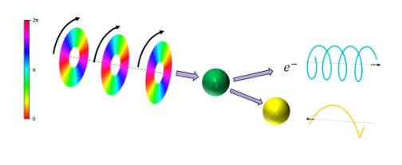 
FIG. 1: Schematic of the photoionization process driven by vortex light. Upon ionization of the atom (green sphere), both the photoelectron and the recoiling ion (yellow sphere) acquire OAM along the z-direction from the incident photon. As shown in the later discussion, the photoelectron can carry OAM exceeding the photon’s total angular momentum, while the ion acquires oppositely directed OAM, preserving the total angular momentum of the system.

📷 Fig 2

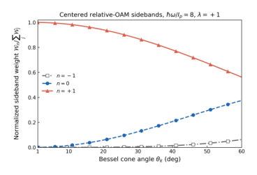 
FIG. 2: Leading sideband weights as a function of θk. As θk increases, the weight of the dominant n = 1 channel is progressively redistributed to the n = 0 and n = −1 channels. The photon helicity is fixed at λ = +1.

📷 Fig 3

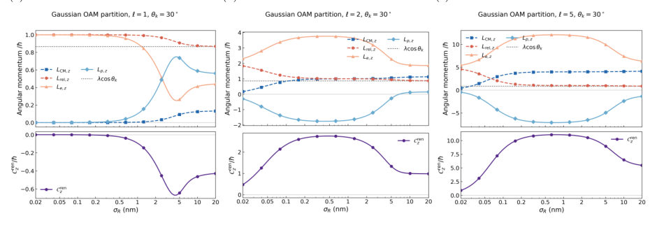 
FIG. 3: The average value of the relative OAM, the CM’s OAM, the electron’s OAM, the proton’s OAM, and the correlated angular momentum operator as functions of the spatial uncertainty σR. The total angular momentum indices are chosen as ℓ= 1, 2, 5 and the cone angle is chosen as θk = 30◦. Other settings are the same as Fig. 2.

**Summary.** This theoretical study analyzes the transfer of orbital angular momentum from a vortex laser beam to a hydrogen atom during photoionization. By developing a center-of-mass-resolved theory, the authors demonstrate that ignoring atomic recoil leads to incorrect predictions for the electron's OAM. They show that the OAM is largely transferred to the recoiling center-of-mass motion, making recoil a key element in understanding this quantum process.

**Why it may be interesting.** This work provides a rigorous quantum mechanical treatment of light-matter interaction where recoil effects are non-trivial, which is highly relevant for understanding quantum control and momentum transfer in strong-field atomic physics.

Detailed structure

**Main problem.** The paper investigates how the orbital angular momentum (OAM) carried by a monochromatic vortex beam is transferred to the matter (hydrogen atom) during photoionization, specifically accounting for the crucial role of atomic recoil and translational motion.

**Main result.** The transfer of OAM is highly dependent on the initial state of the atomic center-of-mass (CM); in the small-transverse-retardation regime, OAM is predominantly transferred to the CM motion (the proton), not solely to the electron.

**Method.** The authors developed a center-of-mass-resolved quantum theory, analyzing the photoionization process using the full Hamiltonian that explicitly includes CM motion, and comparing results across different initial CM state approximations.

**Model / system.** The system is the photoionization of a hydrogen-like atom by a monochromatic Laguerre-Gaussian (vortex) beam. The model uses a Hamiltonian incorporating the free evolution of the atom's CM motion and the light-matter interaction in the velocity gauge.

**Key observables.** Photoelectron angular distribution, OAM content ($\langle L_{e,z} 
angle$, $\langle L_{p,z} 
angle$), and the correlation term between electron and proton angular momenta.

**Important parameters / regimes.** The degree of initial CM momentum definition (momentum eigenstate vs. spatially localized wavepacket) and the transverse retardation scale.

**Assumptions / limitations.** The analysis relies on the strong-field approximation (SFA) and treats the light-ion interaction as negligible compared to the electron-light interaction.

**Paper structure.** The paper builds from the general Hamiltonian to specific theoretical treatments, contrasting idealized fixed-target models with the full CM-resolved theory to derive the correct OAM partitioning.

Abstract

Understanding how optical orbital angular momentum (OAM) is transferred to matter requires treating recoil and translational motion alongside the internal electronic dynamics. We develop a center-of-mass-resolved theory of one-photon ionization of hydrogen by a monochromatic Laguerre--Gaussian beam and show that the Bessel-vortex photoelectron predicted in fixed-target models is a preparation-dependent limit. For a sharply defined atomic center-of-mass momentum, the recoil records the photon-cone azimuth, and tracing over it generally destroys the coherence required for a pure electron vortex. In the small-transverse-retardation regime, the optical OAM is transferred predominantly to the center-of-mass motion and hence, in the laboratory frame, to the proton. Finite-retardation corrections redistribute angular momentum between center-of-mass and relative motion, while an additional correlation contribution to the electron and proton angular momenta can be tuned through the spatial uncertainty of the atomic center of mass. These results reveal atomic recoil as a key element of OAM transfer in photoionization.

[↑ back to top](#top)

### [Visualizing Berry curvature in a Floquet-Chern insulator](http://arxiv.org/abs/2609.17500v1)

**Authors:** Younsik Kim, Rishi Acharya, Hannah E. Aguirre, Lucca Figari, Daniel P. Shoemaker, Fahad Mahmood  
**Type:** experiment · **Category:** other · **PDF:** <https://arxiv.org/pdf/2609.17500v1>  
**Analysis basis:** full PDF text, analyzed in chunks
**Topic relevance:** `quantum measurements` **3/5** · `driven-dissipative phase transition` **1/5** · `non-equilibrium universality` **1/5** · `quantum optics experiment` **1/5**

📷 Fig 1

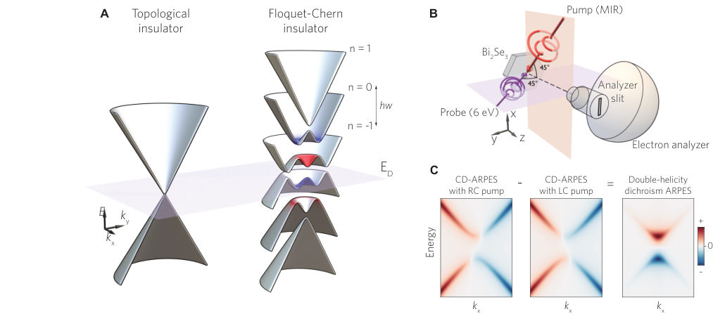 
FIG. 1. Experimental schematic and double-helicity dichroism ARPES. (A) Schematic representation of a topological insulator and a Floquet-Chern insulator. Red and blue shading indicates the intensity of the induced Berry curvature. (B) Schematic of the time-resolved ARPES setup. (C) Conceptual illustration of circular dichroism angle-resolved photoemission spectroscopy (ARPES) spectra and corresponding double-helicity dichroism signal near the Dirac point of a Floquet-Chern insulator.

📷 Fig 2

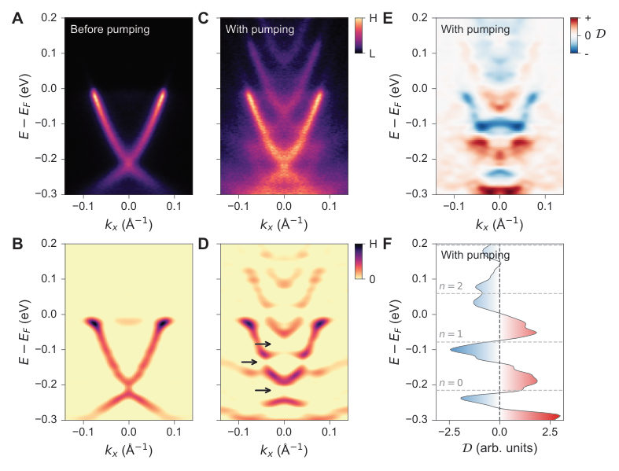 
FIG. 2. Floquet-induced gaps and double-helicity dichroism in a Floquet-Chern insulator. (A and C) Time- resolved ARPES (Tr-ARPES) spectra of Bi2Se3 acquired with a circularly polarized pump before pump arrival and at pump- probe temporal overlap, respectively. The pump fluence was 2.0 mJ/cm2. (B and D) Corresponding two-dimensional curvature maps. Black arrows in (D) indicate the Floquet-induced gaps. (E) Double-helicity dichroism spectrum corresponding to (C) (see Supplementary Materials [1] for the details of the double-helicity dichroism). (F) Energy distribution curve (EDC) of the double helicity dichroism spectrum, extracted from (E) at kx = 0.

📷 Fig 3

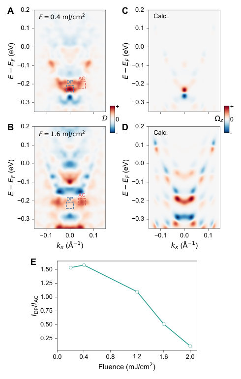 
FIG. 3. Fluence dependence of double-helicity dichro- ism and calculated Berry curvature. (A and B) Double- helicity dichroism spectra measured at pump fluences of 0.4 and 1.6 mJ/cm2, respectively. The dashed boxes labeled DP and AC indicate the regions used to evaluate the mean dichro- ism signals near the Dirac point and avoided crossing, respec- tively. (C and D) Calculated z-component Berry curvature distributions for peak drive fields of 1.6 × 107 V/m (corre- sponding to Floquet parameter β ≈0.13) and 3.2 × 107 V/m (β ≈0.26), respectively. (E) Ratio of the mean dichroism signals in the DP and AC regions, IDP/IAC, as a function of pump fluence.

📷 Fig 4

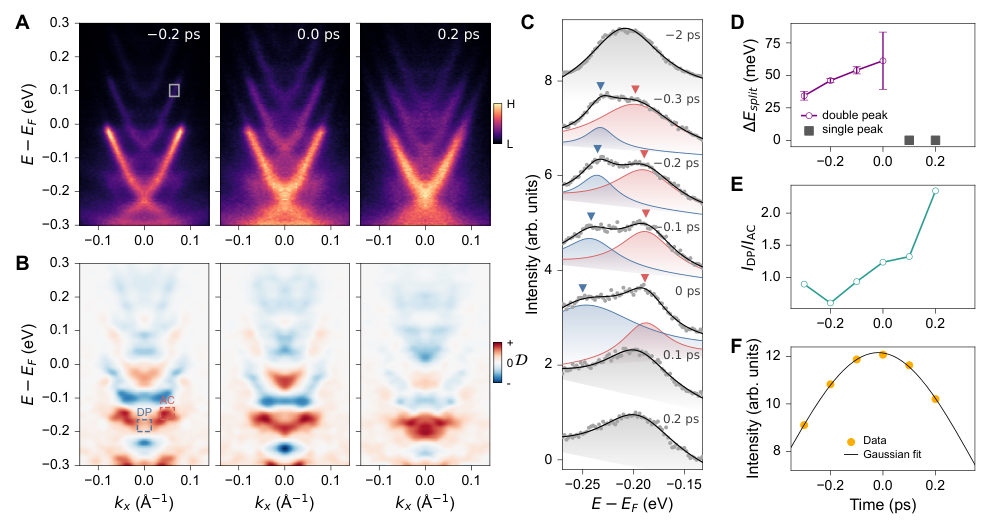 
FIG. 4. Temporal evolution of the Floquet-induced gap and double-helicity dichroism. (A) Tr-ARPES spectra as a function of time delay. (B) Corresponding double-helicity dichroism of A. Plots in B share the same color scale. (C) Energy distribution curves for Tr-ARPES spectra as a function of time near kx = 0. Grey shading indicates a single Lorentzian fit with a linear background, while red and blue shadings indicate a double Lorentzian fit. Red and blue triangles represent the peak positions for the double Lorentzian fit. (D) Peak separations as a function of time derived from the fits shown in C. Data points representing a single peak are plotted at zero separation. Error bars indicate...

**Summary.** This work uses time- and angle-resolved photoemission spectroscopy ($	ext{Tr-ARPES}$) to directly map the Berry curvature in a Floquet-Chern insulator on $	ext{Bi}_2	ext{Se}_3$. By exploiting the double-helicity dichroism signal, the authors demonstrate that the geometric response is sensitive to the driving field and evolves differently in time compared to the spectral replica intensity. This establishes a powerful experimental technique for probing light-induced topological properties.

**Why it may be interesting.** The technique provides a direct, momentum-resolved probe of Berry curvature induced by time-periodic driving, which is crucial for understanding light-matter interactions in topological materials and Floquet engineering.

Detailed structure

**Main problem.** The primary goal is to directly measure and map the light-induced Berry curvature in a Floquet-Chern insulator state.

**Main result.** The study successfully mapped the Berry curvature using double-helicity dichroism, showing its systematic evolution with pump strength and distinguishing the driven topological state from static bands.

**Method.** The measurement relies on circular-dichroism time- and angle-resolved photoemission spectroscopy (Tr-ARPES) by comparing spectra taken with opposite pump helicities to isolate the geometric response.

**Model / system.** The system is the surface of $	ext{Bi}_2	ext{Se}_3$, driven by mid-infrared circularly polarized light, which opens a topological gap and creates a Floquet-Chern insulator.

**Key observables.** Double-helicity dichroism signal, Berry curvature distribution ($\Omega$), Floquet-Bloch states, and the time-dependent gap splitting ($\Delta E_{split}$).

**Important parameters / regimes.** Pump photon energy ($\hbar\omega$), pump field strength (fluence), and time delay ($\Delta t$).

**Assumptions / limitations.** The double-helicity dichroism method is assumed to isolate the pump-induced Berry curvature, and the temporal asymmetry is attributed to electronic heating and dephasing.

**Figures summary.** Figures illustrate the setup, 2D curvature maps showing alternating-sign features, fluence dependence of dichroism, and temporal evolution showing strong asymmetry in the Berry curvature versus the replica intensity.

**Paper structure.** The paper progresses from establishing the need for direct Berry curvature measurement to detailing the $	ext{Tr-ARPES}$ methodology, presenting results on periodicity and field dependence, and finally analyzing the time-resolved asymmetry between geometric response and spectral weight.

Abstract

Circularly polarized light can open a topological gap in a gapless Dirac system, creating a Floquet-Chern insulator. However, its Berry curvature has not been directly resolved. Here we use circular-dichroism time- and angle-resolved photoemission spectroscopy (Tr-ARPES) to map the light-induced Berry curvature of Floquet-Bloch states on the surface of Bi$_2$Se$_3$. By comparing spectra for opposite helicities of the mid-infrared pump, we isolate the induced geometric response. We observe alternating-sign Berry-curvature features at Floquet gaps that repeat at intervals set by the pump photon energy and redistribute with pump field strength in agreement with calculations for a periodically driven Dirac Hamiltonian. Both the induced Berry-curvature and the Floquet Dirac gap decay faster than the replica intensity, showing that spectral replicas can persist even after coherent Floquet hybridization weakens. These results establish momentum-resolved Berry-curvature mapping as a direct probe of light-induced topology and coherent Floquet band formation.

[↑ back to top](#top)

### [Error-Bounded Fixed-Point Design of Super-Sample-Rate IIR Filters for Real-Time Superconducting Qubit Flux Predistortion](http://arxiv.org/abs/2609.16488v1)

**Authors:** Matt Huszabianlou, Angelos Ioannou, Nirmalendu Bikash Patra, Anastasiia Butko, Gang Huang, Irfan Siddiqi  
**Type:** theory · **Category:** quantum information and computing · **PDF:** <https://arxiv.org/pdf/2609.16488v1>  
**Analysis basis:** full PDF text, analyzed in chunks
**Topic relevance:** `QC/QI experiment` **3/5** · `quantum measurements` **1/5**

📷 Fig 1

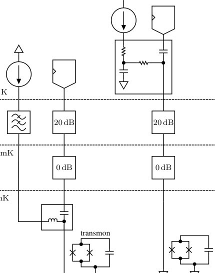 
Fig. 1: Typical configurations of qubit and coupler flux tuning lines. Two common variants include (left) an inductive bias tee in the mixing chamber [7] and (right) a resistive bias tee at room temperature [5].

📷 Fig 2

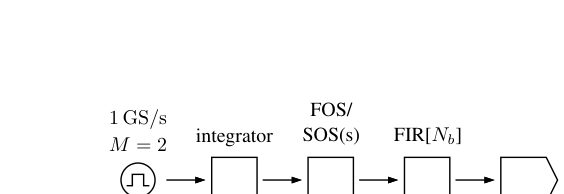 
Fig. 2: Filter cascade comprising an integrator, one or more first- or second-order sections, and an FIR of Nb taps.

📷 Fig 3

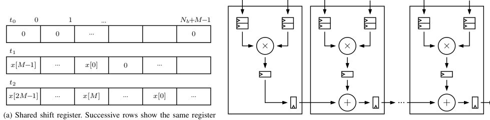 
Fig. 3: Realization of the M-parallel FIR. sr[k] indicates position k of the portion of the shift register seen by the dot product. The boundary boxes indicate DSP48E2 elements. The external registers are inferred by Vivado as Shift Register Logic (SRL) to save FPGA area.

📷 Fig 4

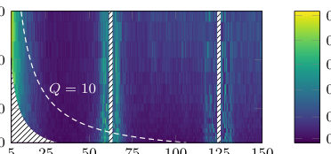 
Fig. 5: Simulated peak step response error of the damped oscillation correction at the formats of Table I, for a step of 0.5 of full scale, worst case over ϕ at αr = ±0.05, on a logarithmic color scale. Hatching marks the region excluded by Q ≥3 and the 1.0 MHz guard bands on either side of θp = mπ/J and (θ + θp)/2 = mπ/J. θp depends on the residue, which is not represented, so the bands are drawn at θp = θ; the exclusion must be tested against the fit’s θp. Outside the hatched region and below the dashed Q = 10 contour, the whole of |αr| ≤0.05 is correctable at every ϕ; above the contour the least favorable ϕ permits |αr| ≈1/(2Q).

📷 Fig 5

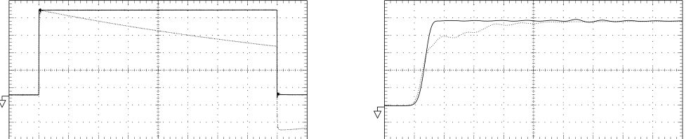 
Fig. 6: Oscilloscope captures of an 8 µs Gaussian-edged pulse through a YQ-CBT12-1G bias tee at room temperature, uncorrected (dotted) and corrected (solid) by the FPGA filters. (a) shows the full record and (b) the rising edge, with a corrected 10% to 90% rise time of 4.2 ns. The filters were calibrated on a square step and evaluated on the filtered edge. Relative to the mean corrected pulse top, the RMS (peak) deviation over 3 ns to 30 ns after the edge (50% crossing) is 13.8% (27%) uncorrected and 0.31% (1.7%) corrected, and over 30 ns to 7.9 µs it is 26% (42%) and 0.09% (1.7%).

**Summary.** This paper details the design and hardware implementation of digital filters necessary to correct signal distortion in superconducting qubit flux control lines. By performing rigorous error-bounded fixed-point analysis, the authors ensure that quantization noise does not destabilize the compensation filters. The resulting super-sample-rate architecture allows for high-fidelity, real-time operation at speeds required for advanced quantum gate operations.

**Why it may be interesting.** This work provides crucial, hardware-aware engineering details for implementing quantum control pulses, directly impacting the fidelity and scalability of superconducting quantum computation platforms.

Detailed structure

**Main problem.** The paper addresses the need to correct line distortion in flux-activated two-qubit gates within superconducting quantum processors to mitigate errors like detuning and leakage.

**Main result.** The authors derive error-bounded fixed-point designs and successfully implement the required IIR/FIR filter cascade on a high-speed FPGA platform using a super-sample-rate structure.

**Method.** The methodology involves deriving coefficient formats based on step response error tolerance and performing a detailed analysis of quantization effects on filter stability and pole/zero locations.

**Model / system.** The system is a superconducting quantum processor utilizing transmon qubits whose flux tunability is controlled via bias tees. The signal processing is modeled using linear time-invariant (LTI) systems requiring digital IIR/FIR compensation filters.

**Key observables.** Residual detuning, conditional-phase error, leakage, and the maximum frequency error bound ($\lVert E 
Vert_\infty$).

**Important parameters / regimes.** Clock rate of 500 MHz, super-sample rate structure, DSP slice consumption (88 DSP slices for a representative cascade).

**Assumptions / limitations.** The analysis relies on bounding quantization-induced displacement of poles and zeros, and assumes the flux tuning line can be modeled as an LTI system.

**Figures summary.** Figures illustrate typical qubit flux tuning line configurations and the detailed cascade structure of the required digital filter (Integrator $
ightarrow$ FOS/SOS $
ightarrow$ FIR).

**Paper structure.** The paper systematically moves from identifying the physical distortion problem to deriving the required digital filter structure, analyzing stability and quantization error bounds for specific filter types (Droop, Oscillation), and finally detailing the high-speed hardware implementation.

Abstract

Flux-activated two-qubit gates in superconducting processors require correction of line distortion, which otherwise produces residual detuning, conditional-phase error, and leakage. Prior demonstrations of cryoscope-based distortion calibration have generally used commercial solutions that specify the filter models but not their FPGA implementation. These details matter for custom and open-source systems, where the fixed-point coefficient and datapath formats set how accurately the correction is realized, and the IIR feedback loop in its standard form does not meet timing at the required clock rate. We derive the coefficient formats of the correction filters from a step response error tolerance, using bounds on the quantization-induced displacement of the poles and zeros over the physical parameter range of each distortion, and the accumulator format from the smallest input change that must remain resolvable at the output. The same analysis gives the conditions under which quantization preserves filter stability. We implement the resulting FIR/IIR cascade on the QubiC platform at a fabric clock rate of \SI{500}{MHz}, using a super-sample-rate structure with scattered look-ahead pipelining, which removes the feedback recursion from the critical path without changing the target transfer function. A representative cascade for our \SI{1}{GS/s} flux lines, comprising an integrator, a second-order section, and a 20-tap FIR, consumes 88 DSP slices and adds \SI{162}{ns} of latency. We confirm the hardware implementation by correcting characteristic bias-tee distortion, an intermediate step toward full cryoscope-based calibration.

[↑ back to top](#top)

### [Predictive Structure Behind Rare Outcomes in Random Quantum Circuits](http://arxiv.org/abs/2609.17482v1)

**Authors:** Myeongsu Kim, Travis Humble, Sabre Kais  
**Type:** theory · **Category:** quantum information and computing · **PDF:** <https://arxiv.org/pdf/2609.17482v1>  
**Analysis basis:** full PDF text, analyzed in chunks
**Topic relevance:** `quantum measurements` **3/5** · `Full counting statistics` **1/5**

📷 Fig 1

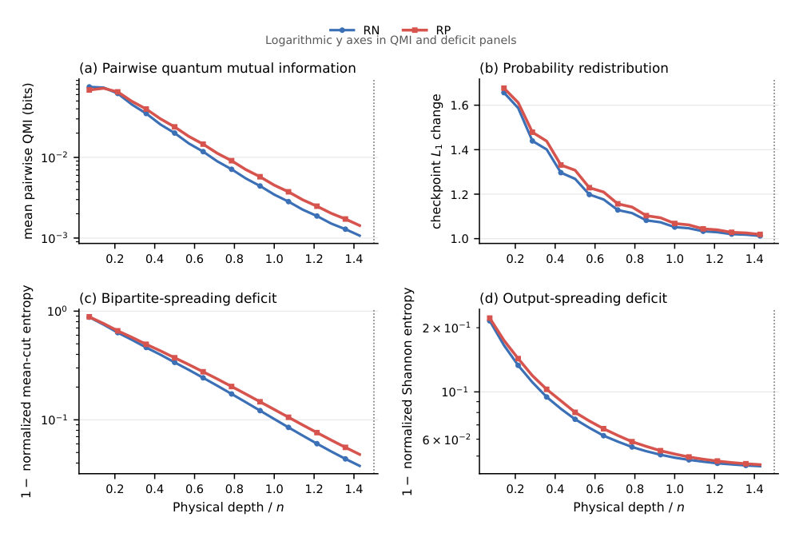 
FIG. 1. Peak-conditioned circuits separate from their parent ensemble throughout the pre-output trajectory. Cohort means and circuit-bootstrap 95% intervals are shown for 1000 RN and 1000 RP circuits at n = 14. The horizontal coordinate is physical depth divided by n. The dotted line marks the total depth L/n = 1.5; the terminal checkpoint itself is excluded. Panels show (a) all-pair quantum mutual information, (b) full-distribution L1 redistribution, (c) normalized cut-entanglement deficit, and (d) normalized output-entropy deficit. Panels (a), (c), and (d) use logarithmic axes.

📷 Fig 2

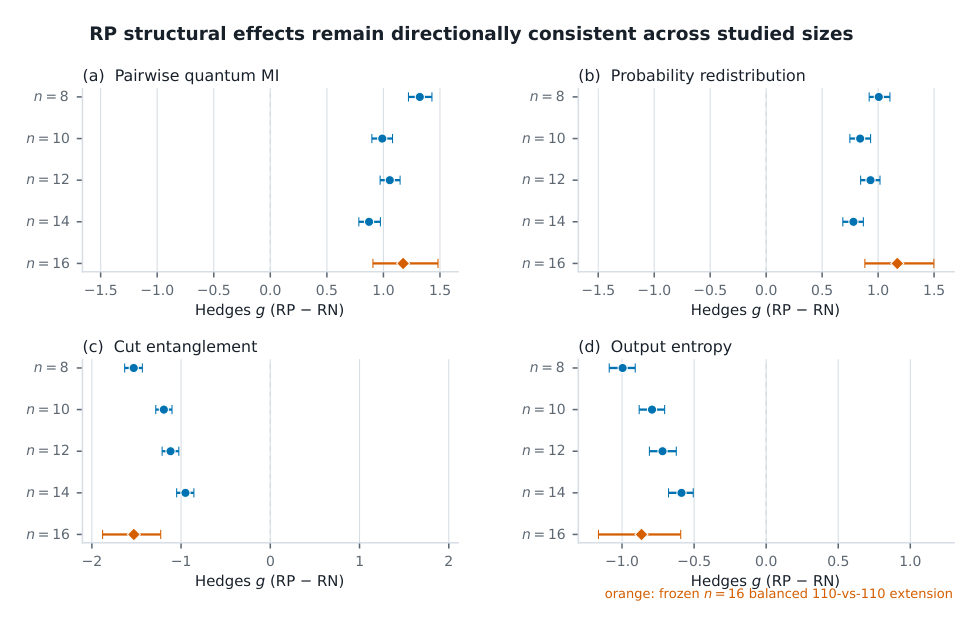 
FIG. 2. The RN–RP structural signature persists across the tested sizes. Hedges-g effects and 95% ensemble-stratified circuit-bootstrap intervals are shown for the four trajectory endpoints. Blue points denote n = 8–14 core cohorts and orange points the frozen 110-RN/110-RP extension at n = 16. The effects retain their directions but are not monotone in n, supporting finite-size transport rather than an asymptotic scaling claim.

📷 Fig 3

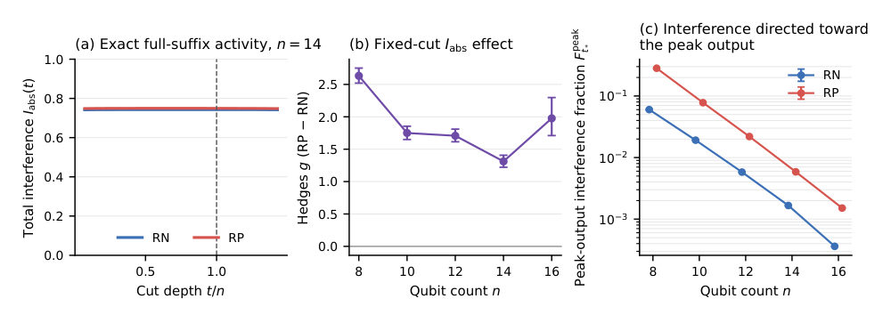 
FIG. 3. RP trajectories exhibit greater and more peak-directed quantum interference. (a) A representative exact full-suffix Iabs(t) trajectory at n = 14, shown for visual clarity, with lines denoting cohort means and bands circuit-bootstrap 95% intervals. The dashed line marks the fixed analysis cut t∗/n = 1. (b) Fixed-cut Hedges effects for Iabs across n = 8–16. (c) Circuit-level signed peak-output interference fraction F peak t∗ on a logarithmic axis. The peak output is defined retrospectively from each coherent final distribution.

📷 Fig 4

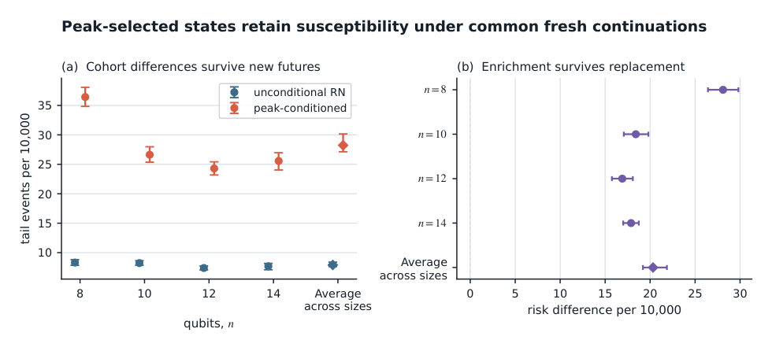 
FIG. 4. Peak-selected states retain enhanced susceptibility after continuation replacement. Original continuations are discarded before RN and RP receive common fresh banks, evaluated at the calibrated thresholds γn in Table III. (a) Event probabilities remain separated. (b) Risk differences are positive at every size and after equal weighting across n = 8, 10, 12, 14. All displayed intervals are 95% intervals obtained by resampling the state and continuation axes while preserving shared-bank pairing.

📷 Fig 5

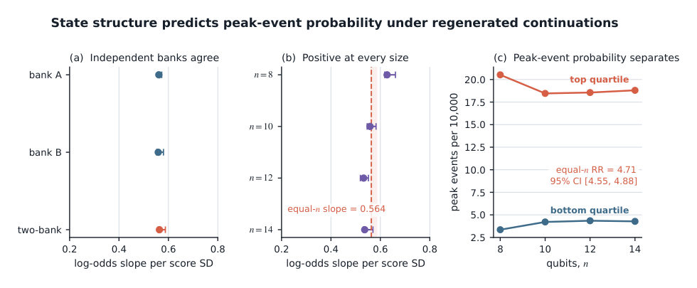 
FIG. 5. Intermediate-state structure predicts peak probability under regenerated continuations. The unconditional cohorts at n = 8, 10, 12, 14 are evaluated at the calibrated thresholds γn in Table III. (a) Independently drawn shared banks give concordant frozen prefix-score slopes. (b) The slope is positive at every core size, with the across-size estimate (equal weight per size) shown by the dashed line and band. (c) Fresh-continuation event probabilities separate the upper and lower score quartiles. All displayed intervals are 95% intervals obtained by resampling the state and continuation axes while preserving shared-bank pairing.

**Summary.** This work analyzes random quantum circuits to determine if rare measurement outcomes encode useful information about the circuit's intermediate dynamics. By comparing peak-selected circuits to random ones, the authors demonstrate that these rare events reveal a persistent, quantifiable structural organization. This finding suggests that quantum measurement can guide future quantum operations, offering a new principle for quantum circuit design.

**Why it may be interesting.** It provides a rigorous, quantitative framework for extracting non-terminal, predictive structure from complex quantum measurements, which is crucial for designing efficient quantum algorithms.

Detailed structure

**Main problem.** The paper investigates whether rare, high-probability outputs observed in random quantum circuits contain predictive structural information useful for guiding subsequent quantum evolution.

**Main result.** Rare outputs reveal intermediate physical organization that is useful for guiding circuit construction, showing a measurable 'fresh-future advantage' when comparing peak-selected circuits to random ones.

**Method.** The authors compare statistics from Random-Normal (RN) and Peak-Selected (RP) random quantum circuits, employing structural observables and developing predictive prefix scores.

**Model / system.** The model uses open one-dimensional brickwall quantum circuits generated by Haar-U(4) nearest-neighbor gates, analyzed across varying system sizes and depths.

**Key observables.** Quantum Mutual Information (IQ), Normalized Cut Entanglement (Ec), Normalized Shannon Entropy (eH1), and the peak-amplification functional ($\Gamma_{	ext{peak}}$).

**Important parameters / regimes.** System sizes $n=8-16$ and multiple nominal circuit depths ($\delta=0, 1, 2, 3$).

**Assumptions / limitations.** The analysis assumes that the structural separation and fresh-future advantage persist across different nominal depths, even if the terminal unitary distribution is fixed.

**Figures summary.** Figures illustrate the persistence of the 'fresh-future function' across added depth settings, showing quantitative ratios (RP/RN) and phase interaction effects.

**Paper structure.** The paper progresses by defining the problem (rare outcomes), developing comparative metrics (RN vs RP), quantifying structural advantages (prefix scores, phase scrambling), and concluding with applications to circuit construction.

Abstract

Rare outputs of random quantum circuits are usually treated as terminal statistics. We ask whether they reveal intermediate organization that remains useful beyond the selecting future. Comparing unconditioned random-normal (RN) and peak-selected random-peaked (RP) circuits from the same local generator, we find stronger pairwise correlations and probability redistribution but reduced bipartite and output spreading in RP across n=8-16. Exact full-suffix decomposition reveals stronger peak-directed interference. The structural separation and fresh-future advantage persist across four nominal depths at n=8-14, with 2.01-7.15 fold RP enrichment in the depth extensions at fixed, independently calibrated thresholds. Within the unconditioned ensemble, a structural prefix score predicts fresh-event probability without using the evaluated circuits' terminal outcomes. Population-preserving phase scrambling identifies a functional contribution from relative-phase organization across the tested settings, including primary-depth held-out confirmation. RP trajectory-guided initialization improves high-peak yield over Haar initialization under common local refinement. Intermediate multivariate guidance also improves the fresh-continuation susceptibility of constructed states beyond peak-only guidance across the same size-depth grid. Rare outputs thus reveal intermediate physical organization that remains useful under new dynamics and can guide circuit construction.

[↑ back to top](#top)

### [Strictly Localized Mixed States](http://arxiv.org/abs/2609.17013v1)

**Authors:** Sigurd Sørlie Rustad, Jan Gulla, Johannes Skaar  
**Type:** theory · **Category:** other · **PDF:** <https://arxiv.org/pdf/2609.17013v1>  
**Analysis basis:** full PDF text, analyzed in chunks
**Topic relevance:** `quantum measurements` **3/5** · `Keldysh / 2PI / non-Gaussian methods` **1/5**

📷 Fig 1

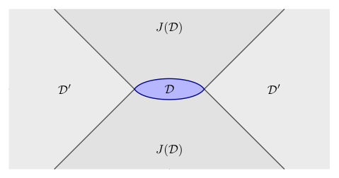 
Figure 1. Sketch in 1 + 1 dimensions, with time increasing upwards, showing a bounded spacetime region D, its causal complement D′, and its causal future and past, denoted by J(D).

**Summary.** This paper deeply explores strictly localized mixed states in QFT, defining them as states indistinguishable from the vacuum outside a given region. It distinguishes between states resulting from standard non-selective measurements (which are mixtures of pure states) and more general states from unsharp measurements. The key finding is that some strictly localized mixed states defy such a simple decomposition, providing deep insights into the nature of quantum correlations and measurement theory.

**Why it may be interesting.** This work is highly relevant to open quantum systems and quantum foundations, as it rigorously defines the boundaries between classical ignorance (mixtures of pure states) and genuine quantum correlations in localized systems.

Detailed structure

**Main problem.** The paper investigates the mathematical and physical properties of strictly localized mixed states in quantum field theory (QFT). It specifically contrasts states arising from non-selective measurements versus those from unsharp measurements.

**Main result.** While non-selective measurements yield states decomposable into mixtures of pure states, the authors prove the existence of strictly localized mixed states that cannot be written as such mixtures, and they extend Knight's theorem to show these states must have infinite particle number support.

**Method.** The analysis uses the mathematical framework of local algebras $A(O)$ in QFT, employing concepts like Licht maps, Kraus operators, and extensions of particle number counting arguments.

**Model / system.** The system is quantum field theory, modeled using local algebras associated with spacetime regions $O$. The analysis uses analogies to two-qubit systems and focuses on bosonic quantum fields.

**Key observables.** Strict localization condition ($	ext{tr}(A
ho) = 	ext{tr}(A\Omega)$ for $A$ outside the region), particle number support, and the structure of the density matrix decomposition.

**Important parameters / regimes.** The localization region $O$, the type of measurement (sharp vs. unsharp), and the particle number $N$.

**Assumptions / limitations.** The analysis relies on the structure of local algebras and the ability to define non-selective operations (Licht maps).

**Figures summary.** Figure 1 sketches spacetime regions ($D$, $D'$, $J(D)$) in $1+1$ dimensions, illustrating the regions relevant to localization.

**Paper structure.** The paper progresses by introducing strict localization, analyzing the non-selective state from local measurements (showing it decomposes into pure states), then constructing counterexamples using unsharp measurements, and finally extending Knight's theorem to mixed states.

Abstract

We study strictly localized mixed states in quantum field theory: states that are indistinguishable from vacuum outside some spacetime region. Such states are generated from the vacuum by so-called Licht maps. While the states associated with individual outcomes of local, projective measurements on the vacuum are not strictly localized, the corresponding non-selective states are strictly localized and even admit decompositions into strictly localized pure states. Remarkably, however, there are strictly localized mixed states that cannot be written as mixtures of pure states strictly localized to the same region. Such states can arise from unsharp local measurements. Finally, we extend Knight's theorem to mixed states, showing that strictly localized bosonic mixed states contain terms with arbitrarily high particle numbers.

[↑ back to top](#top)

### [Thouless pumping via discrete jumping of the adiabatic Hamiltonian](http://arxiv.org/abs/2609.17116v1)

**Authors:** Lang Yu, Yihan Wu, Zhen-Yu Wang  
**Type:** theory · **Category:** other · **PDF:** <https://arxiv.org/pdf/2609.17116v1>  
**Analysis basis:** full PDF text, analyzed in chunks
**Topic relevance:** `analog quantum simulation` **3/5** · `quantum measurements` **1/5**

📷 Fig 1

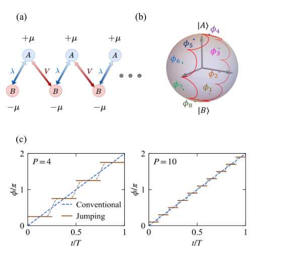 
FIG. 1. (a) Schematic of the Rice-Mele model with periodi- cally modulated parameters µ, λ, and V for Thouless pump- ing. (b) Trajectory (red curve) for the k = l pseudospin under the adiabatic jumping control with P = 8. The ro- tating axes for the trajectory are determined by H(ϕ) with ϕ = ϕ1, ϕ2, . . . , ϕP . (c) The functional forms of ϕ(t) for the conventional Thouless pumping (blue dashed lines) and adia- batic jumping control (stepwise red solid line) in one pump- ing period T for different P. The gray dashed line shows the smoothed version of the jumping scheme, where each abrupt jump is replaced by a sinusoidal transition [see Eq. (19)].

📷 Fig 2

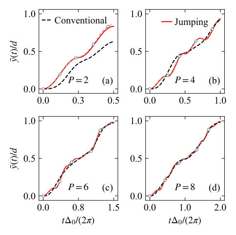 
FIG. 2. Comparison of ¯y(t) between the conventional adi- abatic scheme (black dashed lines) and the adiabatic jump- ing scheme (red lines) for different pumping period T. Here T = Pπ/(2∆0). (a)-(d) Time evolution of ¯y(t) for P = 2, 4, 6, and 8, respectively. The parameters used in the simula- tion are: J = −2π, ∆0 = 4π, δ0 = 0.5∆0 and lattice number N = 801. The gray dashed line with open circles shows the re- sults of the jumping scheme with sinusoidal transitions given by Eq. (19), with τ = 0.5tpulse.

📷 Fig 3

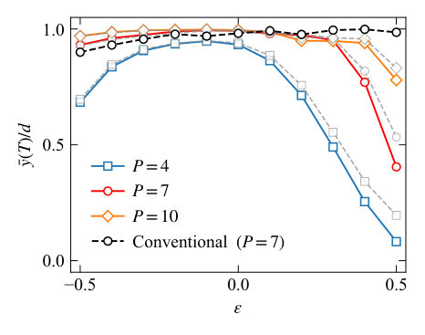 
FIG. 3. Robustness of adiabatic jumping approach in the presence of error ε. ¯y(T)/d remains close to the quantized value C = 1 for a wider range of ε when P is larger. Compar- ing the conventional scheme (black circles) with the jumping approach with the same pumping period T (red circles), the jumping approach shows better performance than the conven- tional scheme for ε &lt; 0. The parameters used in the simula- tion are: J = −2π, ∆0 = 4π, δ0 = 0.5∆0 and lattice number N = 801. The gray dashed lines are the results when the dis- crete jumps of ϕ are changed to sinusoidal transitions given by Eq. (19) using a transition time τ = 0.5tpulse.

📷 Fig 4

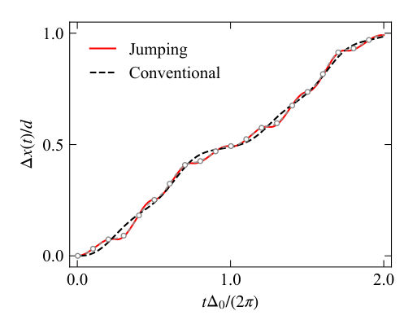 
FIG. 4. Mean displacement ∆x(t) during one pumping cy- cle for the adiabatic jumping approach with P = 8 (red solid line). The black dashed line is the result for the con- ventional Thouless pumping using the same pumping period T = Pπ/(2∆0). The result shows a quantized displacement of one unit cell (∆x(T)/d = 1) at the end of one pumping period T, confirming the successful topological pumping. We choose J = −2π, ∆0 = 4π, δ0 = 0.5∆0, lattice number N = 801, and Wannier state is initially localized at m0 = 0 in the posi- tion space. The gray dashed line with open circles shows the results of the adiabatic jumping scheme with sinusoidal tran- sitions defined in Eq. (19), with transition time...

📷 Fig 5

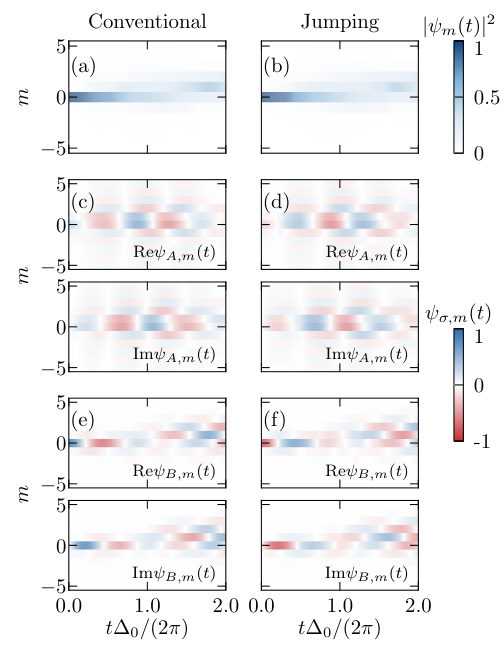 
FIG. 5. The temporal evolution of the wave function dur- ing one pumping period T. (a) and (b) show the evolution of the probability |ψm(t)|2 for the conventional and jumping schemes, respectively. (c) and (e) show the real and imagi- nary parts of ψσ,m(t) for σ = A and B, respectively, for the conventional scheme. (d) and (f) are the same as (c) and (e), but for the jumping scheme. Here J = −2π, ∆0 = 4π, δ0 = 0.5∆0, P = 8, and lattice number N = 801. The Wan- nier state is initially localized at m0 = 0 in real space.

**Summary.** This paper introduces a novel method to achieve Thouless pumping, a topological transport effect, by replacing the requirement for slow, continuous Hamiltonian variation with discrete parameter jumping. By applying the Hamiltonian only at specific points, the authors successfully realize adiabatic evolution, confirming quantized particle transport while bypassing significant experimental control challenges.

**Why it may be interesting.** This work is highly relevant as it provides a pathway to implement complex topological quantum phenomena using fast, discrete control pulses, circumventing the stringent experimental limitations associated with slow, continuous Hamiltonian modulation.

Detailed structure

**Main problem.** The paper addresses the challenge of realizing Thouless pumping, a topological effect, without adhering to the conventional requirement of continuously and slowly varying the Hamiltonian.

**Main result.** It demonstrates that Thouless pumping can be successfully achieved using only discrete sampling (jumping) of the Hamiltonian parameters, maintaining adiabaticity and achieving quantized particle transport.

**Method.** The authors propose an adiabatic jumping control scheme where the Hamiltonian is applied only at a finite set of discrete parameter points, effectively realizing the required evolution via geodesic paths.

**Model / system.** The study uses the Rice–Mele model to simulate the quantum system undergoing Thouless pumping. The Hamiltonian is analyzed in momentum space, $H_k(\phi) = h_x(k) \sigma_x + h_y(k) \sigma_y + h_z(k) \sigma_z$.

**Key observables.** Quantized particle transport (characterized by the Chern number $C$), the adiabaticity measure $ar{y}(T)/d$, and the mean displacement $\langle \hat{x}(t) 
angle$.

**Important parameters / regimes.** The number of sampling points $P$, the pulse time $t_p$, and the comparison between continuous vs. discrete control parameters.

**Assumptions / limitations.** The method relies on the necessary and sufficient condition for quantum adiabatic evolution, and the nonadiabatic error is shown to vanish as the number of sampling points $P$ increases.

**Figures summary.** Figures compare the control parameter evolution ($\phi(t)$) between conventional and jumping methods, and show the resulting quantized mean displacement $\Delta x(T)/d$ and the temporal evolution of the wave function probability $|\psi_m(t)|^2$.

**Paper structure.** The paper first introduces the problem of continuous control, then details the discrete jumping approach, providing theoretical analysis (Appendix B) on nonadiabatic corrections, and finally presents numerical results comparing the jumping scheme against the standard adiabatic protocol.

Abstract

Thouless pumping is a celebrated topological effect that enables quantized particle transport and holds promise for applications in quantum technologies. However, the standard adiabatic pumping theory dictate that the Hamiltonian must be varied continuously and slowly throughout the whole pumping process. In this work, we show that Thouless pumping can be realized by using only discrete sampling of the Hamiltonian, removing the conventional constraint of continuous and slow change of control. Specifically, we select particular parameter points of the Hamiltonian for conventional continuous quantum adiabatic evolution, and then apply the Hamiltonian at these parameter points which induces a geodesic evolution for the pseudospin with a given quasimomentum. This realizes an adiabatic evolution for the Thouless pumping according to a necessary and sufficient condition for quantum adiabatic evolution.

[↑ back to top](#top)

### [Truncated hybrid tensor networks for distributed quantum simulation](http://arxiv.org/abs/2609.16520v1)

**Authors:** Yong Liu, Guangyao Huang, Weixu Shi, Yizhi Wang, Jiandong Ouyang, Zeqian Chen, Junjie Wu  
**Type:** theory · **Category:** numerical methods · **PDF:** <https://arxiv.org/pdf/2609.16520v1>  
**Analysis basis:** abstract only; PDF text extraction failed or PDF unavailable
**Topic relevance:** `methods for driven-dissipative` **3/5** · `analog quantum simulation` **1/5**

**Summary.** This paper introduces the Truncated Hybrid Tensor Network (THTN) framework to enable the simulation of large quantum many-body systems across multiple, physically separated computing units. It overcomes the exponential cost of current distributed protocols by representing remote gates via classical connecting tensors. The method is validated against TEBD, showing improved scalability, particularly for layered physical models.

**Why it may be interesting.** This is highly relevant as it provides a concrete, resource-aware numerical technique (THTN) to simulate large quantum systems that cannot fit on single devices, directly addressing scalability issues in quantum simulation.

Detailed structure

**Main problem.** Simulating quantum many-body systems on quantum computers is limited by qubit count, necessitating methods for distributed simulation across multiple classical systems.

**Main result.** The authors propose a Truncated Hybrid Tensor Network (THTN) framework that efficiently handles distributed quantum evolution by linking subsystems with classical tensors while retaining crucial Schmidt modes.

**Method.** The THTN framework models remote two-body gates as sums of local unitaries connected by a classical tensor, allowing non-one-dimensional models to be mapped onto a 1D cut.

**Model / system.** The work addresses the simulation of quantum many-body systems, specifically validating the protocol against Time-Evolving Block Decimation (TEBD) on chains and ladders.

**Key observables.** Local observables and the tracking of dynamics compared to TEBD references.

**Important parameters / regimes.** Bond dimension, number of remote gates across the cut.

**Assumptions / limitations.** The protocol assumes that the physical correlations across the cut can be effectively captured by retaining Schmidt modes via interface truncation.

**Figures summary.** The notes do not provide a summary of figures, only the validation comparison against TEBD on chains and ladders, showing the clearest gain on a layered model.

**Paper structure.** The paper introduces the THTN framework, details how remote gates are decomposed and how non-1D models are mapped, and validates the protocol by comparing its dynamics to established methods like TEBD.

Abstract

Simulation of quantum many-body systems is a principal application of quantum computing, but available devices remain limited by the number of qubits and cannot accommodate systems of the desired size. One approach is to host a large evolution across several modest distributed systems that exchange classical information alone. Current protocols such as circuit knitting incur a quasi-probability sampling cost that grows exponentially with the number of remote gates across the cut, even when physical correlations across the cut are actually bounded. In this work, we present a truncated hybrid tensor network (THTN) framework in which a remote two-body gate is applied as a sum of local unitaries on the subsystems, linked by a classical connecting tensor, and an interface truncation retains Schmidt modes across the cut. Remote gates between the same subsystems can be merged on one connector, so non-one-dimensional models, such as layered partitions with strong intra-layer and weaker interlayer couplings, may be cast onto a one-dimensional cut. The retained non-negative Schmidt coefficients also define a sampling rule for local observables. We validate this distributed protocol by classical simulation against time-evolving block decimation (TEBD) at the same bond dimension. The truncated dynamics track the TEBD references on chains and ladders, with the clearest gain on a layered model.

[↑ back to top](#top)

### [Beyond Hardware: Adaptive Algorithmic Control by State-Proxy Equalization](http://arxiv.org/abs/2609.17497v1)

**Authors:** Jianlong Lu, Hongrui Zhang, Vishal Sharathchandra Bajpe, Thorsten Koch, Ying Chen  
**Type:** both · **Category:** quantum information and computing · **PDF:** <https://arxiv.org/pdf/2609.17497v1>  
**Analysis basis:** full PDF text, analyzed in chunks
**Topic relevance:** `quantum measurements` **3/5**

📷 Fig 1

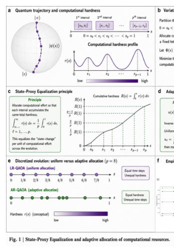 
Fig. 1 State-Proxy Equalization and Adaptive Algorithmic Control (A2C). a, A quan- tum state |ψ(s)⟩evolves along a normalized trajectory s ∈[0, 1], where the computational hardness r(s) varies according to the local quantum dynamics. The trajectory is partitioned into p computa- tional intervals {[sℓ−1, sℓ]}p ℓ=1. b, Variational formulation of the optimal computational allocation. Theorem 1 shows that the optimal computational coordinate is obtained by cumulative state-proxy equalization, leading to equal accumulated hardness in every computational interval. c, Geomet- ric interpretation of the State-Proxy Equalization principle. Instead of equalizing physical time, the optimal schedule...

**Summary.** This paper proposes Adaptive Algorithmic Control (A2C), a software technique that optimizes quantum computation by allocating resources based on the evolving computational difficulty of the state. By proving that optimal performance requires equalizing cumulative computational hardness, A2C significantly boosts sampling probabilities in quantum optimization benchmarks across large qubit counts.

**Why it may be interesting.** It provides a crucial algorithmic pathway for quantum computation, showing that software control over resource allocation can yield performance gains comparable to, or exceeding, hardware improvements in near-term quantum devices.

Detailed structure

**Main problem.** To determine how to optimally allocate finite computational resources during a quantum computation to maximize performance, moving beyond reliance solely on hardware improvements.

**Main result.** Adaptive Algorithmic Control (A2C) significantly improves low-energy sampling probabilities in quantum optimization problems by concentrating computational effort where the state dynamics are most difficult.

**Method.** The authors introduce A2C, a software paradigm based on the State-Proxy Equalization theorem, which dictates that optimal resource allocation must equalize cumulative computational hardness rather than physical time.

**Model / system.** The work applies to quantum optimization problems, modeled using frameworks like QAOA, involving state evolution over a normalized trajectory $s \in [0, 1]$. The complexity is assessed by inferring a computational hardness profile $r(s)$ from the evolving quantum state.

**Key observables.** Low-energy sampling probabilities, success probability $P_{	ext{succ}}(
ho)$, and the derived computational hardness $r(s)$.

**Important parameters / regimes.** Circuit depth ($p$), number of qubits ($N$ up to 156), and the resource allocation schedule (Adaptive vs. Linear Ramp).

**Assumptions / limitations.** The method assumes that the required computational hardness $r(s)$ can be inferred directly from state-accessible dynamical quantities, avoiding explicit reconstruction of the full many-body spectrum.

**Figures summary.** Figure 1 illustrates the core principle: comparing resource allocation that equalizes physical time versus that which equalizes cumulative computational hardness via an 'adaptive warp'.

**Paper structure.** The paper develops the A2C theory using the State-Proxy Equalization theorem, applies it to QAOA benchmarks, and rigorously validates the results by comparing success probabilities and calculating statistical confidence intervals for the performance gains.

Abstract

Recent advances in quantum computing have been driven primarily by improvements in hardware. Here we show that substantial gains can instead arise from how finite computational resources are allocated throughout a quantum computation. We introduce Adaptive Algorithmic Control (A2C), a software paradigm founded on a State-Proxy Equalization theorem, which proves that the optimal allocation for a state-derived proxy-error functional equalizes cumulative computational hardness rather than physical time. The required computational hardness is inferred directly from the evolving quantum state, avoiding explicit reconstruction of the exponentially large many-body spectrum. Across quantum optimization problems containing up to 156 qubits, combining exact simulations, large-scale supercomputer computations and IBM quantum hardware experiments, A2C improves the low-energy sampling probabilities by $22\%$ to over $100,000\%$ under matched circuit depths and measurement budgets. These results demonstrate that quantum computational performance depends not only on hardware capabilities, but also on how finite computational resources are organized, establishing adaptive algorithmic control as a complementary software pathway for advancing quantum computation.

[↑ back to top](#top)

### [Exceptional Topology Survives Strong Hermitian Fields in Radiative Atomic Arrays](http://arxiv.org/abs/2609.17313v1)

**Authors:** Tian-Shu Gou, Yi-Cheng Wang, Ya-Tang Yu, Guin-Dar Lin, Jhih-Shih You, H. H. Jen  
**Type:** theory · **Category:** other · **PDF:** <https://arxiv.org/pdf/2609.17313v1>  
**Analysis basis:** full PDF text, analyzed in chunks
**Topic relevance:** `analog quantum simulation` **3/5**

📷 Fig 1

 
Low-resolution page preview, page 2

📷 Fig 2

 
Low-resolution page preview, page 3

📷 Fig 3

 
Low-resolution page preview, page 4

📷 Fig 4

 
Low-resolution page preview, page 5

📷 Fig 5

 
Low-resolution page preview, page 6

**Summary.** This paper analyzes the topological robustness of radiative atomic arrays by studying how exceptional points behave under strong magnetic fields. The authors show that the system's Chern topology remains fixed across various deformations, providing a method to engineer topological states beyond expected strong-field limitations. This work is significant for understanding topological control in engineered quantum optical systems.

**Why it may be interesting.** This work directly addresses topological phenomena in engineered quantum systems (atomic arrays) using concepts from condensed matter theory (Chern numbers, EPs) but is highly relevant to AMO physics due to the use of atomic lattices and light-matter interactions.

Detailed structure

**Main problem.** The study investigates how topological defects, specifically exceptional points (EPs), behave in two-dimensional subwavelength atomic arrays when subjected to strong Hermitian magnetic fields.

**Main result.** The research demonstrates that the topological invariants (Chern numbers) remain robust even when the system passes through exceptional regions, establishing a mechanism to engineer topology beyond conventional strong-field limits.

**Method.** The authors employed analytical calculations of the Berry curvature and integrated Berry flux, alongside constructing effective models for phase boundaries near lattice deformation limits.

**Model / system.** The system is a radiative atomic array modeled on a square-to-triangular lattice deformation, governed by a polarization-dependent Hamiltonian that includes radiative dipolar couplings.

**Key observables.** Berry Flux ($\pm 1$), Chern Numbers ($C_1=2, C_2=-2$), and the field-dependent localization of boundary modes (skin localization).

**Important parameters / regimes.** Lattice deformation angle ($	heta$), magnetic field strength ($B$), and the critical Zeeman shift ($\mu_B B_c$).

**Assumptions / limitations.** The analysis relies on approximations such as first-order deformation expansions for boundary analysis and assuming decoupling from free-space modes for outer contributions.

**Figures summary.** Figure S8 illustrates the analytical exceptional-phase boundaries, mapping the critical Zeeman shift against lattice deformation for both the square and triangular lattice limits.

**Paper structure.** The paper proceeds by deriving the Hamiltonian and calculating the Berry flux for the quadratic continuum model, followed by determining analytical phase boundaries for the SL and TL limits, and finally analyzing the non-monotonic response of skin localization to the magnetic field.

Abstract

Exceptional points are topological defects of complex band structures that are stable against weak perturbations, yet in bounded two-band systems they are ultimately removed by a sufficiently strong Hermitian field. Here we demonstrate a striking exception in a two-dimensional subwavelength atomic array. Along a continuous square-to-triangular deformation at fixed magnetic field, the bulk passes between line-gapped topological regions with band Chern numbers (C_1,C_2)=(2,-2) through a gapless exceptional region. Within a finite interval of lattice deformation, increasing the magnetic field merely drives the exceptional points toward the light cone because of the singular radiative dipolar couplings. We further show that skin localization toward open boundaries responds non-monotonically to the same field. An intermediate field drives a bipolar skin localization, with bulk modes accumulating at opposite edges, whereas stronger fields suppress boundary localization. Our results establish the interplay of lattice geometry, light-cone singularity, and Hermitian magnetic field as a route to engineering Chern and exceptional topology beyond the conventional strong-field limit.

[↑ back to top](#top)

### [Investigating Interacting Fermionic Models with Locality-Preserving Qubit Encodings](http://arxiv.org/abs/2609.16142v1)

**Authors:** Ashutosh P. Tripathi, Debasish Banerjee, Sandip Maiti, Nilmani Mathur  
**Type:** theory · **Category:** strongly correlated electrons · **PDF:** <https://arxiv.org/pdf/2609.16142v1>  
**Analysis basis:** full PDF text, analyzed in chunks
**Topic relevance:** `analog quantum simulation` **3/5**

📷 Fig 1

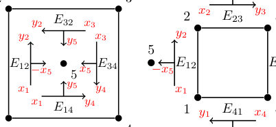 
Figure 2. Loop products around odd (left) and even (right) faces. The odd-face product is an operator identity, whereas the even-face product defines a nontrivial stabilizer.

📷 Fig 2

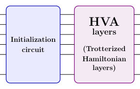 
Figure 3. Schematic diagram of an HVA circuit

📷 Fig 3

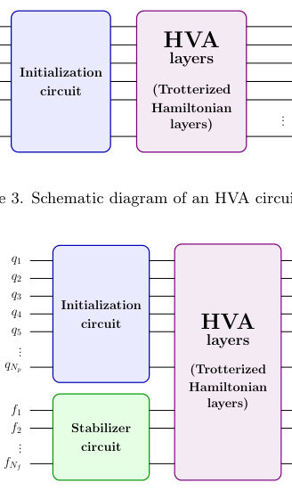 
Figure 4. Schematic diagram of a DK HVA circuit

📷 Fig 4

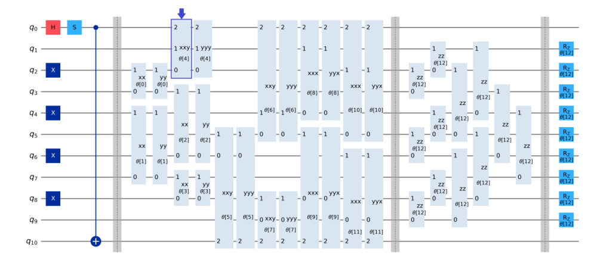 
Figure 6. DK HVA circuit with compact gates for 3×3 lattice. Gates written in compact form in the circuit denote Pauli-string rotations. A Pauli string such as xxy, xx, or zz is associated with an angle θ[n] and a set of indices 0, 1, 2. Since the compact gate representation spans multiple wires (qubits), the indices identify the circuit wires (qubits) on which the Pauli operators act, in the same order as the operators in the Pauli string. For example, a gate (indicated by blue arrow in the circuit) labeled xxy with angle θ[4] and indices (0, 1, 2) acts on qubits (q2, q1, q0), respectively; and represents the unitary e−i

📷 Fig 5

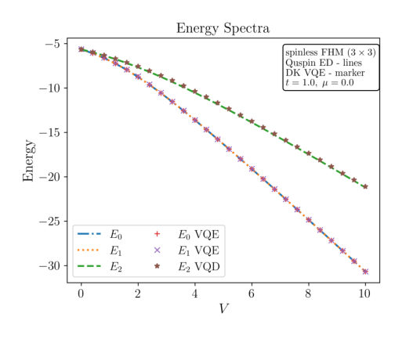 
Figure 7. Energy for the 3 × 3 lattice with zero chemical potential. The dashed lines correspond to QuSpin ED calcu- lations.

**Summary.** This work proposes a practical quantum simulation framework for interacting fermionic models using the locality-preserving Derby-Klassen mapping. By encoding fermionic physics into a constrained qubit subspace defined by stabilizer codes, it significantly reduces operator nonlocality compared to standard methods. This provides a resource-efficient route for simulating complex, higher-dimensional correlated electron systems on quantum computers.

**Why it may be interesting.** The development of locality-preserving mappings directly addresses a major bottleneck in quantum simulation—the exponential growth of Pauli string length—making complex lattice models more tractable on near-term quantum hardware.

Detailed structure

**Main problem.** The paper addresses the challenge of simulating strongly correlated fermionic systems, such as the $t$-$V$ and Fermi-Hubbard models, which suffer from the fermionic sign problem.

**Main result.** The locality-preserving Derby-Klassen (DK) mapping provides a resource-efficient framework for quantum simulation by reducing operator nonlocality compared to standard Jordan-Wigner transformations, especially in higher dimensions.

**Method.** The authors employ the Variational Quantum Eigensolver (VQE) combined with the DK mapping, which encodes fermionic operators into a constrained subspace of a larger qubit Hilbert space defined by stabilizer constraints.

**Model / system.** The study focuses on two-dimensional interacting fermionic models, specifically the $t$-$V$ and spinful Fermi-Hubbard models, analyzed on lattices with periodic boundary conditions.

**Key observables.** Low-energy properties, energy spectra, and the ability to resolve distinct symmetry sectors via particle-number conservation.

**Important parameters / regimes.** Non-zero chemical potential ($\mu$), coupling constant ($V$), and lattice size ($L_x 	imes L_y$).

**Assumptions / limitations.** The method assumes that the physical fermionic Hilbert space can be accurately represented as the $+1$ eigenspace of local stabilizer operators derived from the DK mapping.

**Figures summary.** Figures illustrate lattice structures, the checkerboard arrangement of face qubits forming a toric code, and the corresponding Clifford circuits used to diagonalize stabilizer operators.

**Paper structure.** The paper first introduces the DK mapping and its locality-preserving nature, then details the construction of the Hamiltonian Variational Ansatz (HVA) using stabilizer constraints. It benchmarks this against JW circuits and extends the framework to the spinful Hubbard model, concluding with a discussion of the practical overhead trade-offs.

Abstract

We investigate the utility of the locality-preserving Derby-Klassen (DK) fermion-to-qubit mapping [arXiv:2003.06939] for variational quantum simulation of two-dimensional $t$-$V$ and Fermi-Hubbard models. The DK mapping preserves the locality of fermionic interactions with an enlarged Hilbert space, thereby requiring additional constraints that define the physical sector. We incorporate these constraints directly into a Hamiltonian Variational Ansätz (HVA) through Clifford-gate state preparation and use the Variational Quantum Eigensolver (VQE) to show that the low-energy properties of the resulting qubit Hamiltonian are accurately reproduced. We further exploit particle-number conservation inherent in the ansätz to resolve distinct symmetry sectors and reliably access degenerate states. Consequently, we benchmark the DK-HVA against Jordan-Wigner-based variational circuits at nonzero chemical potential, where particle-hole symmetry and the associated half-filled sign-free condition are absent. Finally, we demonstrate the advantage of locality-preserving mappings in higher-dimensional fermionic systems, where the conventional Jordan-Wigner (JW) transformation generates increasingly long Pauli strings and corresponding circuit overheads. We further extend the framework to the spinful Fermi-Hubbard model and identify a tradeoff between fermionic-mode placement and the locality of hopping and on-site interaction terms. These results establish a practical framework combining locality-preserving fermion-to-qubit mappings, constraint-preserving Clifford state preparation, and symmetry-preserving variational circuits, that trades auxiliary-qubit and stabilizer-preparation overhead for reduced operator nonlocality, providing a practical route toward resource-efficient quantum simulation of higher-dimensional interacting fermionic systems.

[↑ back to top](#top)

### [Persistent Spontaneous Time-Reversal Breaking](http://arxiv.org/abs/2609.16162v1)

**Authors:** Michael Smolkin, Lev Yung  
**Type:** theory · **Category:** statistical mechanics · **PDF:** <https://arxiv.org/pdf/2609.16162v1>  
**Analysis basis:** full PDF text, analyzed in chunks
**Topic relevance:** `Keldysh / 2PI / non-Gaussian methods` **3/5**

📷 Fig 1

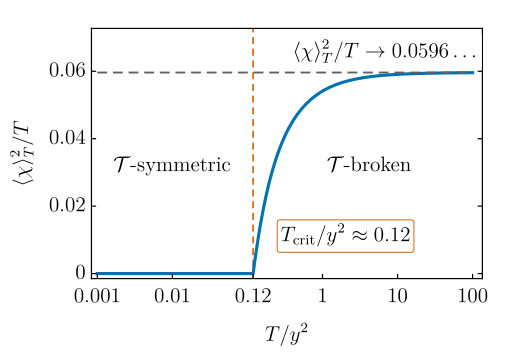 
FIG. 1. ⟨χ⟩2 T /T as a function of T/y2 for ν = 1, at LO in 1/N. The dashed vertical line denotes the critical tem- perature, above which parity and time reversal are sponta- neously broken. The dashed horizontal line indicates the high- temperature biconical limit.

**Summary.** This work analytically demonstrates a quantum field theory exhibiting spontaneous parity and time-reversal symmetry breaking that persists even at arbitrarily high temperatures. Using the large-N expansion in 2+1 dimensions, the authors analyze the thermal phase transition, showing that the symmetry breaking emerges upon heating rather than being present at zero temperature. This provides a controlled theoretical framework for studying non-trivial thermal phase transitions.

**Why it may be interesting.** The study of symmetry breaking persistence at high temperatures is a core topic in statistical mechanics, particularly relevant for understanding high-energy phase transitions in condensed matter systems.

Detailed structure

**Main problem.** The paper aims to provide an analytic realization of spontaneous parity and time-reversal breaking (PSSB) in a quantum field theory without the symmetry breaking being restored by finite temperature.

**Main result.** The theory exhibits a persistent spontaneous breaking of parity and time-reversal symmetry above a critical temperature, surviving to arbitrarily high temperatures.

**Method.** The analysis uses the large-N expansion, finite-temperature effective potential calculations, and renormalization group flow techniques to study the phase structure.

**Model / system.** The model is a quantum field theory in 2+1 dimensions, defined by a Yukawa deformation coupling a critical biconical vector model to free massless Dirac fermions.

**Key observables.** The thermal expectation value of the field $\langle\chi
angle_T$, and the persistence of a fermion mass odd under parity and time reversal.

**Important parameters / regimes.** The critical temperature ($T_{crit}$), the large-$N$ limit, and the coupling constants governing the Yukawa interaction.

**Assumptions / limitations.** The analysis relies on the large-N expansion and assumes the system is away from narrow parametric windows where finite-N corrections dominate.

**Figures summary.** Figure 1 illustrates the thermal expectation value $\langle\chi
angle_T / T$ versus $T/y^2$, marking the critical temperature $T_{crit}$ above which symmetry is spontaneously broken.

**Paper structure.** The paper progresses by establishing the model, analyzing the RG flow from a UV CFT to an IR fixed point, and then performing a detailed finite-temperature analysis using the large-N saddle-point approximation to determine the phase transition.

Abstract

We provide an analytic realization of spontaneous parity and time-reversal breaking without thermal restoration in a local, unitary, ultraviolet-complete quantum field theory in $2+1$ dimensions with finitely many fields. The theory is defined by a relevant Yukawa deformation of a product of the critical biconical vector model and free massless Dirac fermions. This deformation induces a renormalization group flow whose infrared endpoint is a decoupled product of the critical vector model and the conformal Gross-Neveu-Yukawa model. At zero temperature, the vacuum preserves both symmetries, whereas upon heating, the theory undergoes an inverse thermal transition at a finite critical temperature. Above this temperature, a fermion mass, odd under parity and time reversal, is dynamically generated, and the broken phase persists to arbitrarily high temperatures.

[↑ back to top](#top)

### [Sharp bounds for perfect quantum state classification beyond antidistinguishability](http://arxiv.org/abs/2609.17411v1)

**Authors:** Nathaniel Johnston, Benjamin Lovitz, Vincent Russo, Jamie Sikora  
**Type:** theory · **Category:** quantum information and computing · **PDF:** <https://arxiv.org/pdf/2609.17411v1>  
**Analysis basis:** full PDF text, analyzed in chunks
**Topic relevance:** `quantum measurements` **3/5**

📷 Fig 1

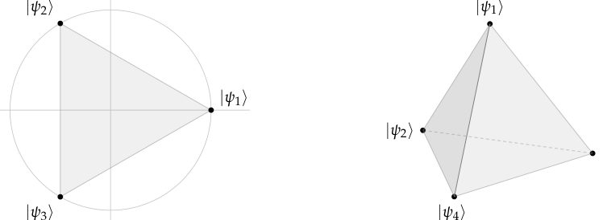 
Figure 1: Simplex states for n = 3 (left) and n = 4 (right), drawn as unit vectors in Rn−1. Explicitly, |ψ1⟩= |0⟩and |ψ2,3⟩= −1

**Summary.** This paper introduces $k$-learnability as a generalized measure for partial quantum state identification, interpolating between full distinguishability and anti-distinguishability. It derives optimal Gram-matrix criteria that provide necessary and sufficient conditions for a set of states to be $k$-learnable. The results are highly applicable to understanding the resource requirements for quantum state characterization in various physical systems.

**Why it may be interesting.** The work provides rigorous mathematical tools to quantify how 'hard' it is to distinguish or partially identify quantum states, which is fundamental for quantum state tomography and quantum error correction protocols.

Detailed structure

**Main problem.** The paper develops a unified framework to quantify the partial identification of a multiset of pure quantum states, parameterized by $k$-learnability.

**Main result.** It establishes universal, optimal Gram-matrix criteria (sufficient and necessary conditions) for $k$-learnability, providing explicit guarantees for known state sets like SIC-POVMs and stabilizer states.

**Method.** The analysis relies on deriving necessary and sufficient conditions based on the Gram matrix of the state set, relating $k$-learnability to concepts like $k$-incoherence and frame potentials.

**Model / system.** The study concerns a general multiset of pure quantum states $\{|\psi_1
angle, \dots, |\psi_n
angle\}$ in a quantum system, often analyzed in the context of qudit systems or stabilizer states.

**Key observables.** Gram matrix elements $\langle\psi_i|\psi_j
angle$, the learning parameter $k$, and the copy complexity $c_2$.

**Important parameters / regimes.** The number of states $n$, the dimension $d$, and the learning parameter $k$.

**Assumptions / limitations.** The results are derived under the assumption of pure quantum states and utilize advanced mathematical tools like frame potentials and properties of convex cones.

**Paper structure.** The paper progresses by defining $k$-learnability, deriving general bounds using the Gram matrix (Theorem 2 & 3), applying these bounds to specific state types (e.g., equiangular states), and finally analyzing the copy complexity for stabilizer states using recurrence relations.

Abstract

A multiset of pure quantum states is said to be k-learnable if there is a measurement strategy that always narrows an unknown sample drawn from the list down to one of at most k candidates. The parameter k interpolates between distinguishability and antidistinguishability, and provides a unified framework for partial state identification. We prove two universal, and optimal, Gram-matrix criteria for k-learnability: a Frobenius-norm sufficient condition and an entrywise-$\ell_1$ necessary condition. We apply them to derive explicit learnability and copy-complexity guarantees for several well-known sets of states including SIC-POVMs, mutually unbiased bases, and stabilizer states. We further apply our results to zero-error mutation detection problems such as anomaly detection and changepoint detection.

[↑ back to top](#top)

### [Pump-Free Microwave-Optical Bell Pair Generation for Teleportation-Based Quantum Transduction](http://arxiv.org/abs/2609.16364v1)

**Authors:** Fangxin Li, Jaesung Heo, Zhaoyou Wang, Benjamin Pingault, Xingyu Gao, Tengyang Ruan, Anjun Chu, David D. Awschalom, Andrew N. Cleland, Andrew P. Higginbotham, Alexander A. High, Liang Jiang  
**Type:** theory · **Category:** other · **PDF:** <https://arxiv.org/pdf/2609.16364v1>  
**Analysis basis:** full PDF text, analyzed in chunks
**Topic relevance:** `Tavis-Cummings & cavity-many-emitter` **2/5** · `analog quantum simulation` **2/5** · `correlated / nonlocal dissipation` **1/5** · `driven-dissipative phase transition` **1/5** · `methods for driven-dissipative` **1/5** · `quantum measurements` **1/5**

📷 Fig 1

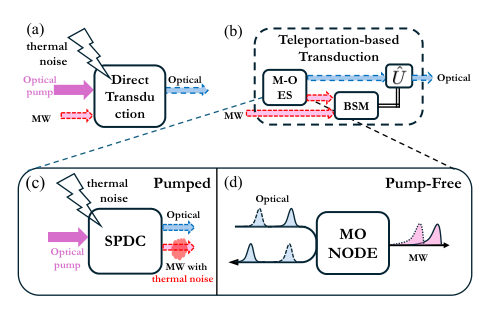 
FIG. 1. (a) Direct quantum transduction using up-conversion is affected by thermal noise due to the optical pump. (b) Teleportation-based quantum transduction. A microwave state is teleported to an optical state by consuming an M-O Bell pair. An optical state can also be teleported to a mi- crowave state (not illustrated here). In the panel, a Bell-state measurement (BSM) is jointly performed on the microwave input and the microwave photon from an M-O entanglement source (M-O ES). The measurement result is classically com- municated (double-line) to perform the corresponding unitary ˆU on the optical qubit. (c) M-O entanglement source using spontaneous parametric down conversion (SPDC). The...

📷 Fig 2

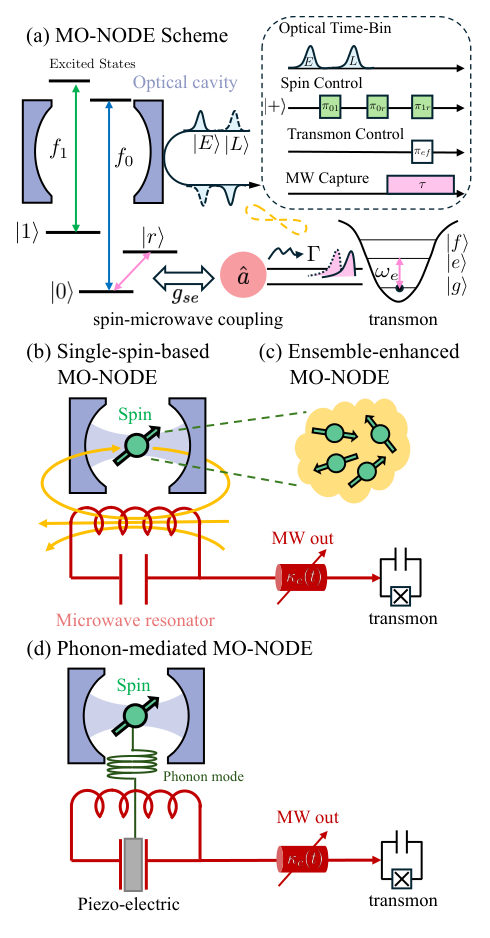 
FIG. 2. (a) Illustration of the MO-NODE with relevant states and parameters. The ∣0⟩, ∣1⟩and ∣r⟩states are in a ground state manifold, which can be split by external field (magnetic or strain). The microwave readout transition 0 −r is reso- nantly coupled either directly or effectively to a microwave resonator mode ˆa. The optical transition to the excited state is coupled to an optical cavity. A transmon with three lowest energy levels ∣g⟩, ∣e⟩, and ∣f⟩is used to herald microwave emis- sion. The inset shows timed control sequences of the scheme. The π0r represents a π-rotation in the ∣0⟩, ∣r⟩subspace of the three-level system. For a physical implementation, (b) a single spin is coupled...

📷 Fig 3

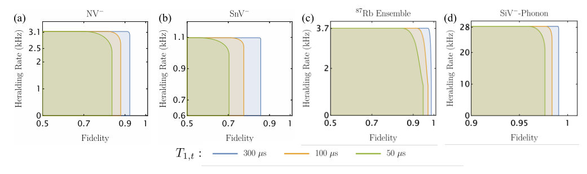 
FIG. 3. Figures of merit for our MO-NODE across different platforms and transmon lifetimes T1,t with fixed ϵ = 0.01.

📷 Fig 4

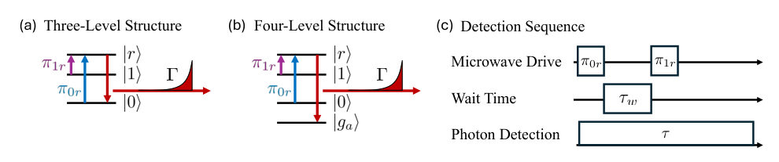 
FIG. 4. Microwave retrieval using (a) a three-level structure and (b) a four-level structure containing the ground state ∣ga⟩. (c) Pulse and detection sequence.

📷 Fig 5

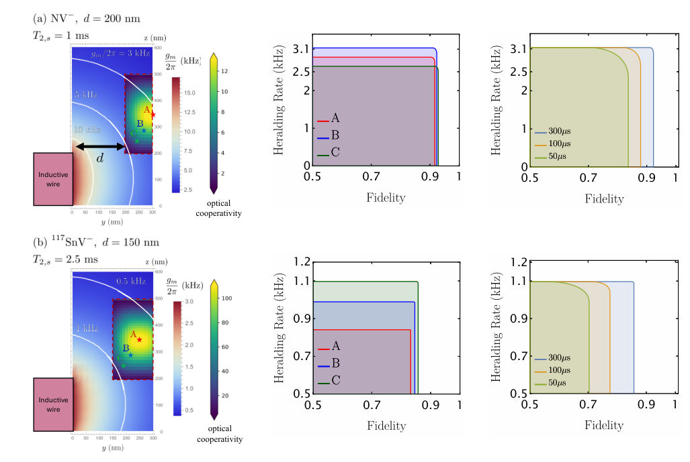 
FIG. 5. Figures of merit for selected spin positions, indicated by stars, in the optical cavity for different color centers. The inductive wire generates zero-point magnetic-field fluctuations that couple to the spin magnetic dipole with coupling rate gm [51]. The middle panels show the heralding rate and fidelity for the selected spin positions at a transmon lifetime of T1,t = 300 µs. For each color center, the best-performing spin position is selected from the middle panels: position B for the NV−center and position C for the 117SnV−center. The figures of merit are then compared as a function of the transmon lifetime T1,t in the right panels. All plots assume a transmon measurement error...

**Summary.** This paper introduces a novel, pump-free method for generating microwave-optical Bell pairs, which is crucial for quantum transduction linking superconducting circuits to optical networks. By leveraging spin or atomic systems coupled to optical and microwave cavities, the authors demonstrate protocols that maintain high fidelity and operational rates while circumventing the noise issues associated with traditional optical pumping techniques.

**Why it may be interesting.** This work is highly relevant as it tackles the fundamental engineering challenge of quantum interconnects by providing detailed theoretical protocols for generating high-quality entangled pairs between microwave and optical domains using solid-state and atomic platforms.

Detailed structure

**Main problem.** The primary challenge is achieving quantum transduction—the coherent conversion of quantum states between microwave and optical frequencies—while avoiding detrimental effects from strong optical pumping.

**Main result.** The authors propose and analyze a pump-free microwave-optical Bell-pair source (MO-NODE) that generates heralded Bell pairs using spin or atomic systems, achieving high fidelity and kilohertz-range rates.

**Method.** The method involves engineering the entanglement generation via resonant coupling between a spin/atom system and microwave/optical cavities, utilizing time-bin encoding and cavity QED principles.

**Model / system.** The work models three distinct physical implementations: single color centers, atomic ensembles (e.g., 87Rb), and phonon-mediated systems. The underlying physics is described using cavity QED Hamiltonians and decay rate analyses.

**Key observables.** Heralded Bell pair rate ($R_{	ext{herald}}$), heralded fidelity ($F_{	ext{herald}}$), and the dark-state leakage probability ($P_D|R$).

**Important parameters / regimes.** Cooperativity ($C$), cavity decay rates ($\kappa_o, \kappa_e$), spin dephasing time ($T_{2,s}$), and coupling strengths ($g$).

**Assumptions / limitations.** The analysis relies on approximations such as the critical-coupling limit, adiabatic elimination of cavity/phonon modes, and assuming the coupling rate exceeds intrinsic decoherence rates.

**Figures summary.** Figures compare direct transduction, teleportation-based transduction, and the proposed pump-free MO-NODE scheme across various physical platforms (spin, ensemble, phonon).

**Paper structure.** The paper progresses from establishing the need for pump-free transduction, detailing the single-spin protocol, generalizing to ensemble and phonon-mediated systems, and analyzing leakage probabilities in inhomogeneous environments.

Abstract

The coherent conversion between microwave and optical photons, known as quantum transduction, is critical for connecting superconducting processors to optical networks. Existing methods are limited by complications associated with optical pumping. We propose a pump-free microwave-optical Bell-pair source for teleportation-based transduction. Using a spin or atomic system resonantly coupled to optical and microwave cavities, the scheme generates loss-robust heralded Bell pairs. Across color centers, atomic ensembles, and phonon-mediated systems, this assembly achieves kilohertz-range heralding rates with high fidelity.

[↑ back to top](#top)

### [Quantum Critical Solids](http://arxiv.org/abs/2609.16147v1)

**Authors:** Subham Dutta Chowdhury, Leo Radzihovsky, Luca V. Delacrétaz  
**Type:** theory · **Category:** statistical mechanics · **PDF:** <https://arxiv.org/pdf/2609.16147v1>  
**Analysis basis:** full PDF text, analyzed in chunks
**Topic relevance:** `Keldysh / 2PI / non-Gaussian methods` **2/5** · `non-equilibrium universality` **2/5** · `Frenkel-Kontorova` **1/5** · `analog quantum simulation` **1/5** · `driven-dissipative phase transition` **1/5**

📷 Fig 1

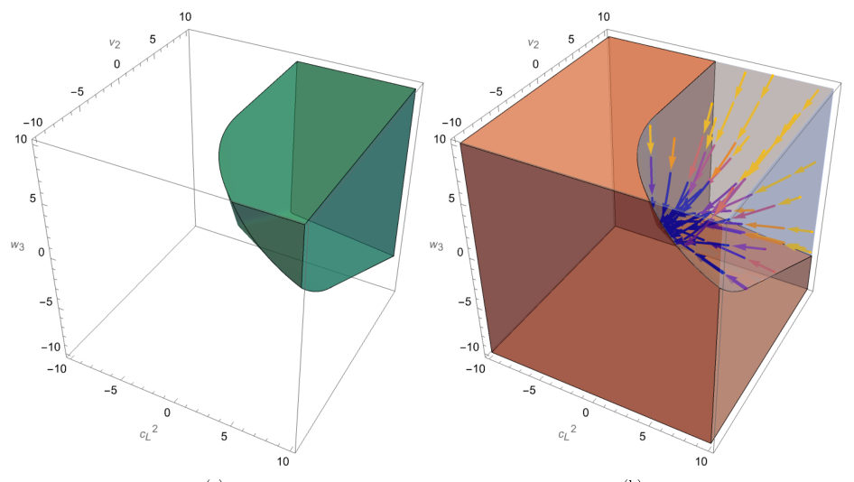 
Figure 1. (a) Stability region of the couplings c2 L, ν2 and w3 due to (D16) and (D17). (b) RG flows of the couplings c2 L, ν2 and w3 along with the region excluded by stability conditions (D16) and (D17).

**Summary.** This work theoretically analyzes quantum critical solids characterized by 'floppy' transverse phonons, leading to a Lifshitz quantum critical point. Using RG techniques in $d=4-\epsilon$, the authors determine universal critical exponents and show how the dimensionality dictates the nature of the critical interactions. The findings are crucial for understanding the non-linear response of quantum materials near phase transitions.

**Why it may be interesting.** The detailed analysis of nonlinear elastic response and the RG flow near quantum critical points provides a powerful theoretical framework for understanding emergent quantum phases in condensed matter systems, which is relevant to many-body dynamics.

Detailed structure

**Main problem.** The paper investigates the universal critical behavior of quantum solids, specifically focusing on the fate of 'floppy' solids whose transverse phonons have a vanishing velocity.

**Main result.** The system is driven toward a strongly-coupled Lifshitz quantum critical point (QCP) in $d=3$, although the transition is generically first-order. The analysis reveals distinct dimensional behaviors, notably the vanishing of cubic nonlinearity in $d=2$.

**Method.** The study employs the Renormalization Group (RG) technique within an $\epsilon = 4-d$ expansion to analyze the effective field theory of elasticity.

**Model / system.** The system is modeled as a quantum solid described by an effective Lagrangian for transverse phonons, leading to a Lifshitz QCP. The analysis distinguishes between the vector nature of the phonons, which introduces cubic nonlinearities, and the scalar case.

**Key observables.** Nonlinear elastic response ($\epsilon \sim \sigma^{1/\delta}$), specific heat ($C_V \sim T d/z$), and the dynamic shear modulus ($\mu(\omega, T)$).

**Important parameters / regimes.** Dimensionality ($d$), the dynamic exponent ($z$), and the correlation length exponent ($
u$).

**Assumptions / limitations.** The analysis relies on the $\epsilon$-expansion and assumes that the critical behavior is visible within the Ginzburg region, despite the transition being generically first-order.

**Figures summary.** The figures illustrate the stability regions and RG flows of the coupling constants ($c_2^L, 
u^2, w_3$) in the $d=2$ limit, constrained by stability conditions.

**Paper structure.** The paper progresses by establishing the EFT for floppy solids, analyzing the RG flow in $d=4-\epsilon$ to find critical exponents, and then dedicating significant sections to the specific, non-trivial behavior observed in $d=2$ due to the vanishing of the cubic coupling.

Abstract

We study the fate of quantum solids with a vanishing velocity of transverse phonons. Such ``floppy'' solids exhibit a cubic elastic nonlinearity that is relevant in spatial dimensions $d<4$ and drives the system to a strongly-coupled Lifshitz quantum critical point in $d=3$, that we analyze in an $ε= 4-d$ expansion. The associated phase transition is generically first-order, preempting the system's full access to the strongly-coupled fixed point. Nevertheless, the critical data of this quantum critical point is accessible within a Ginzburg region in the vicinity of the transition. This cubic nonlinearity vanishes exactly in $d=2$, where the leading interactions are instead quartic and are marginal, leading to weak logarithmic singularities. We discuss possible realizations of this ``crystal Lifshitz criticality'' in quantum materials.

[↑ back to top](#top)

### [Boundary duals of bulk detectors](http://arxiv.org/abs/2609.16109v1)

**Authors:** Jacqueline Caminiti, Robert C. Myers, Kelly Wurtz  
**Type:** theory · **Category:** other · **PDF:** <https://arxiv.org/pdf/2609.16109v1>  
**Analysis basis:** full PDF text, analyzed in chunks
**Topic relevance:** `Keldysh / 2PI / non-Gaussian methods` **2/5** · `Full counting statistics` **1/5** · `correlated / nonlocal dissipation` **1/5** · `methods for driven-dissipative` **1/5** · `quantum measurements` **1/5**

📷 Fig 1

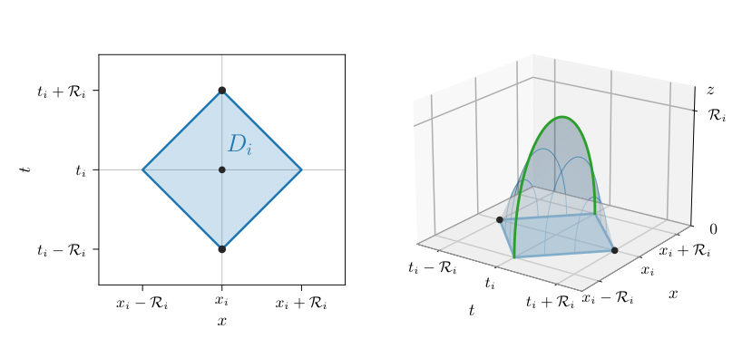 
Figure 1: Left panel: the support of the kernel KDi is the boundary causal diamond Di = {(t, x) : |t−ti|+|x−xi| ≤Ri}. Right panel: the set of bulk points reconstructible from this boundary diamond is its causal wedge W[Di]. The intersection of the two lightcones as given in eq. (2.13) is shown in green. amond-support

📷 Fig 2

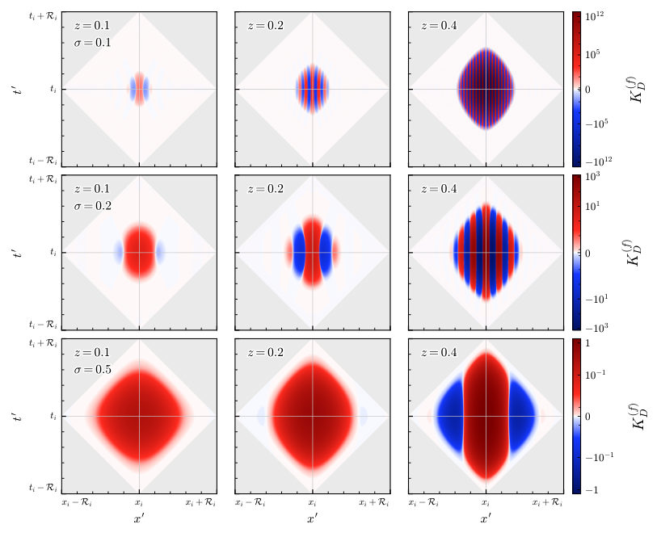 
Figure 2: Numerical evaluation of the smeared kernel K(f) D in eq. (2.41), for ∆= 1 in d = 2. Columns show z = 0.1, z = 0.2, and z = 0.4 from left to right in units of Ri. Rows show σ0 = σ1 = 0.1, 0.2, and 0.5 from top to bottom. The plots are shown on a general boundary diamond Di, with outer tick labels indicating x′ = xi −Ri, xi, xi +Ri along the bottom and t′ = ti −Ri, ti, ti +Ri along the left. Each row has its own colour scale, shared across the three panels in that row, showing the raw value of K(f) D . _full_numeric

📷 Fig 3

 
Figure 2 shows numerical evaluations of K(f) D from eq. (2.41) at three bulk depths and for three smearing widths. In the figure and throughout the remainder of this subsection, we set (t0, x0) = (ti, xi) (and hence, T0 = 0 = X0), which aligns the bulk operator at the center of the causal diamond. In Rindler coordinates, the operator lies along the line (Z, T = 0, X = 0), where Z = 2Riz/(z2 + R2 i ) from eq. (2.15). The oscillations visible in figure 2 can be understood from the large-|k| part of the kernel on the horizontal time slice. We therefore set T0 = X0 = T ′ = 0 and define

📷 Fig 4

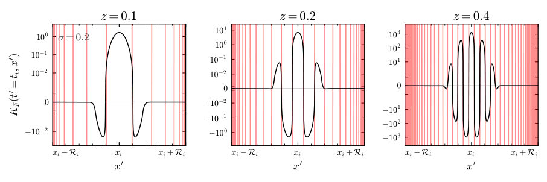 
Figure 3: Eq. (2.57) gives a good fit to the phase behaviour of K(f) D . The zeros of eq. (2.57) are shown as vertical red lines. Meanwhile, the K(f) D profile along the t′ = ti slice is shown in black, and its zeros agree well with the locations of the red lines. Here we have set σ = 0.2, but a similar matching holds for the other cases in figure 2. fig:slice

📷 Fig 5

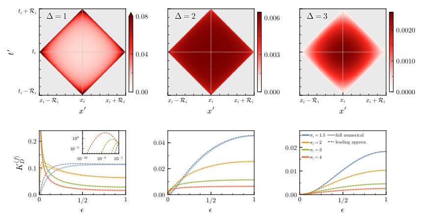 
Figure 4: Large-smearing behaviour of K(f) D . From left to right, ∆= 1, 2, 3, with z/Ri = 0.4. The top row shows the leading approximation (2.63) for σ0 = σ1 = 4. The bottom row shows the corresponding t′ = ti cross-sections as functions of ϵ, comparing σ0 = σ1 = 1.5, 2, 3, 4. Thick translucent curves show the full numerical integral, while thin dashed curves show the approximation. The bottom-left inset resolves the decay near the diamond edge. K_D_Hkll_plot

**Summary.** This paper investigates the holographic dual of a local Unruh-DeWitt detector in AdS space using the HKLL reconstruction program. It calculates entanglement harvesting by relating bulk detector interactions to smeared boundary operators. The work is significant for understanding how quantum information processes are encoded across the AdS/CFT boundary.

**Why it may be interesting.** This work connects detector physics (Unruh effect) in curved spacetime to holographic principles, providing a concrete calculation of quantum information measures like entanglement harvesting using advanced mathematical tools.

Detailed structure

**Main problem.** The central problem is determining the boundary dual description for a local Unruh-DeWitt detector situated in the bulk of Anti-de Sitter (AdS) space.

**Main result.** The boundary dual is found to be a smeared detector on the boundary, whose smearing profile is dictated by the HKLL reconstruction kernel. The framework successfully analyzes entanglement harvesting in AdS$_3$.

**Method.** The authors employ the HKLL reconstruction program to map bulk field correlators to boundary correlators, calculating entanglement harvesting via the two-detector density matrix to quadratic order in the coupling constant.

**Model / system.** The system involves Unruh-DeWitt detectors coupled to quantum fields in AdS space, analyzed using the AdS/CFT correspondence framework.

**Key observables.** Entanglement harvesting amount, the two-detector density matrix, and the relationship between bulk microcausality and boundary detector overlap.

**Important parameters / regimes.** The coupling constant $\lambda$, the dimension $\Delta$ of the dual operator, and the specific choice of the HKLL smearing kernel.

**Assumptions / limitations.** The reconstruction is treated as an approximate notion, valid in a semiclassical regime, and the analysis focuses on free quantum fields on a fixed AdS background.

**Figures summary.** Figure 1 illustrates the support of the kernel $K_{D_i}$ (the causal diamond $D_i$) and the corresponding bulk region $W[D_i]$ (the causal wedge).

**Paper structure.** The paper reviews bulk reconstruction, introduces the detector formalism, performs the entanglement harvesting calculations, and discusses the resulting physical implications.

Abstract

What is the boundary dual of an Unruh-DeWitt detector in anti-de Sitter space? We argue that this question is naturally answered by the HKLL reconstruction program. A local detector in the bulk can be associated with a smeared detector in the boundary, where the choice of smearing depends on the choice of HKLL kernel. We use this formalism to analyze entanglement harvesting in the Poincaré patch of AdS$_{3}$ for a bulk Unruh-DeWitt detector paired either with a boundary detector or with a second bulk detector. We compute the amount of harvesting in the standard way, namely by evaluating the two-detector density matrix to quadratic order in the coupling $λ$. Additionally, we address an apparent tension between microcausality for spacelike-separated bulk detectors and the fact that the dual HKLL detectors may directly overlap in the boundary theory.

[↑ back to top](#top)

### [Entropy-driven transitions between extended integer and fractional quantum Hall regimes](http://arxiv.org/abs/2609.16483v1)

**Authors:** Kyung-Su Kim, Steven A. Kivelson  
**Type:** theory · **Category:** strongly correlated electrons · **PDF:** <https://arxiv.org/pdf/2609.16483v1>  
**Analysis basis:** full PDF text, analyzed in chunks
**Topic relevance:** `Keldysh / 2PI / non-Gaussian methods` **2/5** · `analog quantum simulation` **2/5** · `driven-dissipative phase transition` **1/5** · `non-equilibrium universality` **1/5**

📷 Fig 1

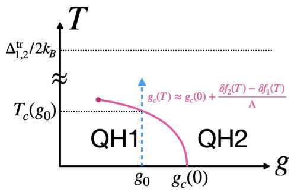 
FIG. 1. Schematic T-g phase diagram for two competing QH regimes, QH1 and QH2. The (magenta) phase boundary gc(T) bends toward the lower-entropy QH1 regime. In the simplest case in which there are no additional finite T distinctions between the two phases associated with broken symmetries, the phase transition is first-order and ends at an ordinary critical point—otherwise additional phase boundaries arise. For fixed g0 close to gc(0), the transport gaps generally satisfy the relation ∆tr 1,2/2kB ≫Tc, so the finite-T Hall response is nearly quantized on both sides of the thermal transition.

📷 Fig 2

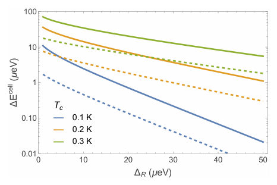 
FIG. 2. The required energy difference ∆Ecell per moir´e unit cell between the eIQH and FQH states to give a thermal transition at Tc as a function of the magnetoroton gap ∆R (16). Solid lines use the ring-minima approximation (16), whereas dashed lines use the discrete-minima result, Eq. (E6), with NR = 3 and Eθ ≡ℏ2k2 R/(2mθ) = ER.

**Summary.** This theoretical work investigates how entropy can drive first-order thermal transitions between competing Quantum Hall phases, such as integer and fractional QH states. By analyzing the free energy contributions from collective excitations like magnons and magnetorotons, the authors propose a mechanism explaining the observed thermal evolution in moiré graphene. This highlights the crucial role of thermal fluctuations in determining the ground state of strongly correlated electron systems.

**Why it may be interesting.** The focus on entropy-driven phase transitions in strongly correlated electron systems, particularly using soft modes like magnetorotons, provides a rich theoretical tool applicable to understanding emergent quantum phases in novel condensed matter platforms like moiré heterostructures.

Detailed structure

**Main problem.** The paper analyzes the mechanism driving first-order, finite-temperature thermal transitions between competing Quantum Hall (QH) regimes, specifically between extended integer and fractional QH states.

**Main result.** The transition is shown to be driven by the difference in the entropy associated with low-energy excitations (like Goldstone or magnetoroton modes), providing a plausible bulk mechanism for thermal evolution in moiré graphene.

**Method.** The analysis involves calculating the free-energy density difference ($\Delta f$) between the competing states, incorporating contributions from gapless Goldstone modes (e.g., magnons) and soft gapped modes (e.g., magnetorotons).

**Model / system.** The general framework is applied to Quantum Hall systems, with a specific focus on moiré rhombohedral graphene (mRG) exhibiting both integer and fractional QH states. The competition is analyzed using free energy minimization.

**Key observables.** Free-energy difference ($f_F - f_I$), transition temperature ($k_B T_c$), and the Hall conductivity jump at the first-order boundary.

**Important parameters / regimes.** Temperature ($T$), energy gaps ($\Delta_R$), warping energy ($W$), and interaction strengths ($J$).

**Assumptions / limitations.** The analysis relies on approximations such as treating magnetorotons as noninteracting bosons and assuming specific energy scale hierarchies (e.g., $\Delta_R \gg k_B T \gg W$).

**Figures summary.** Figure 1 schematically illustrates the T-g phase diagram for two competing QH regimes, and Table I summarizes the entropy-driven mechanisms for various QH transitions.

**Paper structure.** The paper develops a general theoretical framework for entropy-driven transitions, applies this to specific physical models (Coulomb, short-range, magnetoroton), and concludes with a detailed application to moiré graphene, analyzing the role of different excitation modes.

Abstract

Electronic states with coexisting Wigner-crystal order can sometimes exhibit a quantum Hall effect over a finite range of electron densities---i.e., exhibit ``extended'' quantum Hall (QH) plateaus in the absence of disorder. Such an extended quantum Hall state can then compete with other QH states over the same density range, allowing a first-order thermal transition between them. Here, we analyze several settings in which the entropy associated with Goldstone modes (e.g., magnons or phonons) or soft gapped modes (e.g., magnetoroton) drives a finite-temperature transition between competing QH regimes. Applying this framework to moiré rhombohedral graphene, we argue that a soft magnetoroton in a fractional quantum anomalous Hall state provides a plausible bulk mechanism for the observed thermal evolution from an extended integer QH to a fractional QH regime.

[↑ back to top](#top)

### [Nonlinear electron-phonon interactions from first principles](http://arxiv.org/abs/2609.17433v1)

**Authors:** Zhenbang Dai, Feliciano Giustino  
**Type:** theory · **Category:** other · **PDF:** <https://arxiv.org/pdf/2609.17433v1>  
**Analysis basis:** full PDF text, analyzed in chunks
**Topic relevance:** `Keldysh / 2PI / non-Gaussian methods` **2/5** · `analog quantum simulation` **1/5** · `methods for driven-dissipative` **1/5** · `quantum measurements` **1/5**

📷 Fig 1

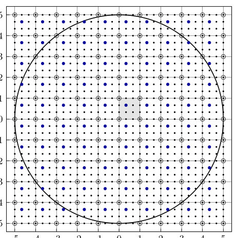 
FIG. 1. Relation between the reciprocal space of the unit cell and that of the BvK supercell. This example illustrates a two-dimensional square lattice with lattice parameter a and BvK supercell of size 3×3 unit cells. The black dots are the reciprocal lattice vectors of the BvK supercell, G. The circles are the reciprocal lattice vectors of the unit cell, g. The filled gray square is the unit-cell Brillouin zone, and the blue dot is a representative k point inside the Brillouin zone. The other blue dots are the set of points k+g. For each such point, there is a unique G in the supercell reciprocal lattice. The circle denotes the wavevector cutoff (in this example, 5 × 2π/a).

📷 Fig 2

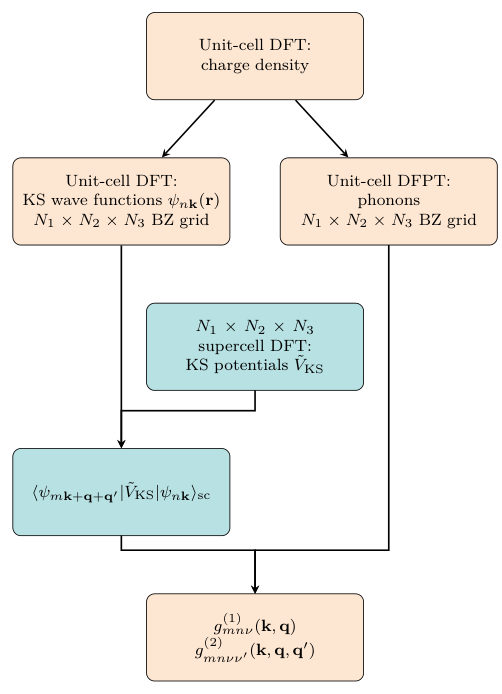 
FIG. 2. Workflow for calculating second-order electron- phonon coupling matrix elements via finite differences. The orange boxes indicate unit-cell DFT calculations, and the blue boxes indicate supercell DFT calculations. The Brillouin zone (BZ) grid for the unit-cell calculations equals the number of unit cells in the BvK supercell.

📷 Fig 3

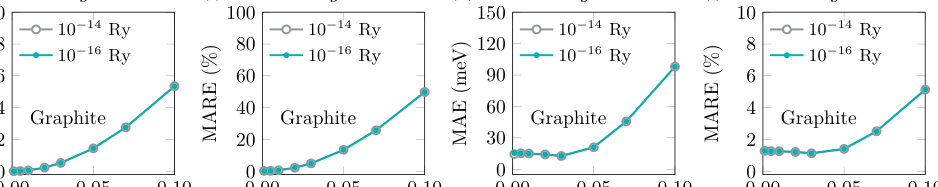 
FIG. 3. Benchmark of linear [g(1)] and quadratic [g(2)] electron-phonon coupling matrix elements computed via finite difference. The averages are evaluated over 4 valence bands and 4 conduction bands for diamond; 5 valence bands and 5 conduction bands for LiF; and 8 valence bands and 8 conduction bands for graphite. (a) and (b): Mean absolute error (MAE) and mean absolute relative error (MARE) of the linear electron-phonon coupling in diamond, respectively, plotted as a function of the atomic displacement amplitude δ used in the finite-difference formulas. The ground truth corresponds to DFPT calculations of the matrix elements. (c) and (d): MAE and MARE of the quadratic electron-phonon...

📷 Fig 4

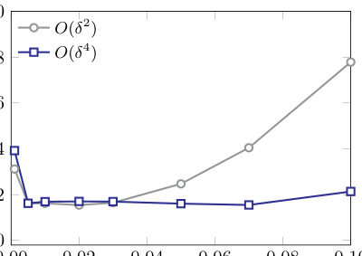 
FIG. 4. Dependence of the mean absolute error (a) and mean absolute relative error (b) on the finite-difference sten- cils for LiF. The fourth-order-accuracy stencil (blue curves) can reduce the sensitivity on δ compared with second-order- accuracy stencil (gray curves).

📷 Fig 5

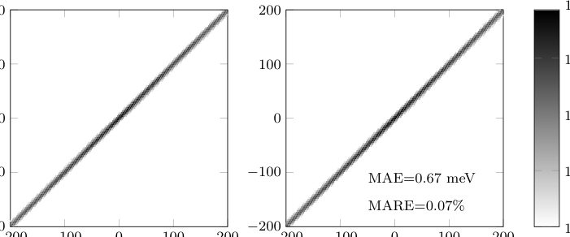 
FIG. 5. Comparison of second-order electron-phonon coupling matrix elements [g(2)] calculated under the RIA with the same quantity calculated by including all neighbor shells, for diamond. (a) The statistics of the absolute values of second-order electron-phonon matrix elements, showing that 98% of these matrix elements are smaller than 200 meV in magnitude, as indicated by the dashed line. (b) Comparison of the real part of g(2) between RIA and all-neighbor calculations, within the range of ±200 meV. To effectively present 6×108 datapoints, we binned the scatter plot via hexagonal tiles; darker tiles indicate more matrix elements within the tile. (c) Same as (b), but for the imaginary part...

**Summary.** This paper introduces a novel, systematic computational method to calculate nonlinear electron-phonon interactions of any order directly from first principles. By extending beyond linear approximations, the authors show that these higher-order couplings are crucial for accurately predicting key properties like polaron binding energies. This methodology promises to advance the study of charge transport and excited-state dynamics in various materials.

**Why it may be interesting.** While focused on condensed matter, the rigorous, systematic, and *ab initio* nature of developing a general computational framework for higher-order interactions is highly relevant to modeling complex, non-adiabatic dynamics in quantum systems.

Detailed structure

**Main problem.** The primary goal is to develop a first-principles theory and computational method to calculate nonlinear electron-phonon interactions of arbitrary order, overcoming the limitations of existing linear-coupling approximations.

**Main result.** The authors present a systematic framework to compute second-order (and higher) electron-phonon coupling matrix elements, demonstrating that these nonlinear terms are essential for achieving quantitative accuracy in polaron formation energies.

**Method.** The method combines unit-cell calculations of electron wavefunctions with supercell calculations of phonon perturbations, allowing for the calculation of complex Born-von-Kármán integrals.

**Model / system.** The physics centers on electron-phonon coupling, which governs phenomena like superconductivity, polaron formation, and carrier dynamics. The calculations are applied to representative materials including diamond, lithium fluoride, and graphite.

**Key observables.** Second-order electron-phonon coupling matrix elements ($g^{(2)}$), electron quasiparticle energy shifts (e.g., Debye-Waller correction), polaron formation energies, and hopping barriers.

**Important parameters / regimes.** The calculation is sensitive to the order of coupling (second-order being a key focus) and the nature of the exchange-correlation functional used (semilocal or nonlocal).

**Assumptions / limitations.** The method is designed to overcome the limitations of the rigid-ion approximation (RIA) and the computational difficulty of calculating off-diagonal, nonlinear coupling terms.

**Figures summary.** Not specified in the notes, but the methodology involves mapping unit-cell wavevectors to the reciprocal space of the BvK supercell.

**Paper structure.** The paper first establishes the physical necessity of nonlinear couplings, then details the novel computational framework combining unit-cell and supercell calculations to evaluate the required coupling integrals, and finally validates the method by computing $g^{(2)}$ for three distinct material classes.

Abstract

Electron-phonon interactions underpin a variety of phenomena, ranging from transport and superconductivity to polarons and ultrafast carrier dynamics. Despite being one of the most intensely studied subjects in condensed matter physics, research on electron-phonon physics mostly focused on linear, first-order couplings. Second- and higher-order nonlinear couplings are commonly ignored because their calculations are too demanding and we lack computational frameworks that can provide both diagonal and off-diagonal coupling matrix elements. In this work, we report a theory and computational method for computing nonlinear electron-phonon interactions of any order in real materials. Our approach combines the advantages of unit-cell calculations of electron wavefunctions and supercell calculations of phonon perturbations, is systematically improvable, can be used with either semilocal or nonlocal exchange-correlation functionals, and is amenable to Wannier-Fourier interpolation. As a first proof of concept, we illustrate this method by computing second-order electron-phonon coupling matrix elements in diamond, lithium fluoride, and graphite as representative nonpolar semiconductors, polar semiconductors, and metals, respectively. Furthermore, we generalize the ab initio polaron equations to second-order electron-phonon couplings, and we show that second-order couplings are essential to achieve quantitative accuracy in polaron formation energies and hopping barriers. The present methodology will find application in the study of all properties and phenomena that are currently being investigated within the linear electron-phonon coupling approximation, from phonon-mediated superconductivity to excited-states dynamics, both in harmonic and anharmonic systems.

[↑ back to top](#top)

### [Development of a Physics-Informed Neural Framework, MEOWN, for Rapid Prediction of Muon Stopping Sites in Crystalline Materials, for understanding Quantum Magnet employing Muon Spectroscopy](http://arxiv.org/abs/2609.17063v1)

**Authors:** A. Pandey, K. Sharma, S. Ghosh, G. Roy, T. Basu  
**Type:** theory · **Category:** disordered systems and neural networks · **PDF:** <https://arxiv.org/pdf/2609.17063v1>  
**Analysis basis:** full PDF text, analyzed in chunks
**Topic relevance:** `methods for driven-dissipative` **2/5** · `Keldysh / 2PI / non-Gaussian methods` **1/5** · `analog quantum simulation` **1/5**

📷 Fig 1

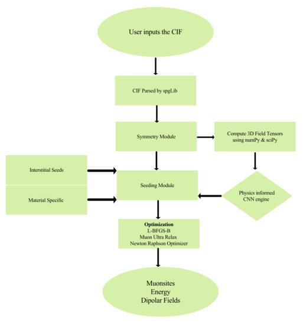 
FIG. 1. Workflow of the MEOWN framework. Starting from an input CIF file, MEOWN identifies crystal symmetry, con- structs physics-based field tensors, generates candidate muon sites using a physics-informed CNN and seeding strategies, and refines them through optimization to predict equilibrium muon stopping sites, energies, and local dipolar fields.

📷 Fig 2

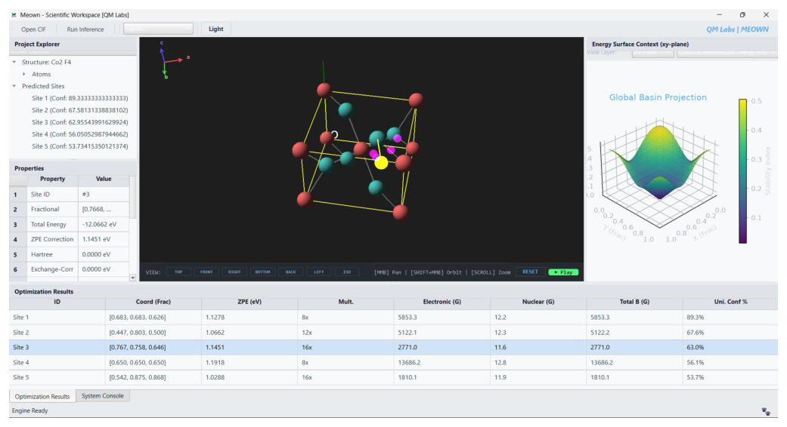 
FIG. 2. Graphical user interface (GUI) of MEOWN. The interface displays the crystal structure, predicted muon stopping sites, energy landscape, and the optimized site information, including fractional coordinates, energies, multiplicities, dipolar fields, and confidence scores.

**Summary.** This paper introduces MEOWN, a novel, physics-informed machine learning framework designed to predict where a muon will stop inside a crystal lattice. By combining a 3D-CNN with fundamental physics models, it achieves accuracy comparable to expensive DFT calculations but in minutes. This drastically accelerates the analysis of quantum materials using muon spectroscopy.

**Why it may be interesting.** While focused on condensed matter magnetism, the core methodology—integrating complex, multi-scale physics models (like polarization and screening) directly into a neural network architecture for rapid prediction—is highly relevant to developing ML tools for complex quantum many-body systems.

Detailed structure

**Main problem.** The core challenge is to rapidly and accurately determine the equilibrium muon stopping site in crystalline materials to interpret Muon-spin rotation/relaxation ($\mu$SR) experiments.

**Main result.** The developed framework, MEOWN, predicts stopping sites and local dipolar fields for benchmark materials with first-principles accuracy in minutes, significantly faster than conventional DFT methods.

**Method.** MEOWN is a physics-informed machine learning framework that embeds multiple physical interactions (electrostatic, polarization, etc.) into a 3D-CNN to guide the prediction of the potential energy landscape.

**Model / system.** The system involves a positive muon ($\mu^+$) implanted into a crystalline solid. The effective potential energy is modeled as a sum of several physical terms, including Hartree-Fock, polarization, overlap repulsion, and zero-point energy.

**Key observables.** Equilibrium muon stopping site (coordinates), local dipolar magnetic field, and total energy (including ZPE correction).

**Important parameters / regimes.** The calculation incorporates effects like electronic screening ($\epsilon_{\mu}(r)$), polarization ($V_{Pol}$), and zero-point motion ($V_{ZPE}$).

**Assumptions / limitations.** The method operates within the Born-Oppenheimer approximation, and it is designed as a fast, reliable alternative, not a replacement for full self-consistent DFT.

**Figures summary.** Figure 1 illustrates the MEOWN workflow from CIF input to site prediction. Figure 2 shows the GUI output, displaying predicted sites, energy landscapes, and calculated dipolar fields for various materials.

**Paper structure.** The paper first details the physical components contributing to the muon potential energy. It then introduces MEOWN, which embeds these physics into a 3D-CNN. The workflow involves multi-stage seeding, CNN inference, structural optimization, and final site ranking based on total energy.

Abstract

Muon-spin rotation/relaxation is one of the most powerful microscopic probes for understanding magnetic order, spin dynamics, superconductivity, and complex magnetic phases in emerging quantum materials. Quantitative interpretation depends critically on the accurate identification of the muon stopping site, a problem traditionally addressed using density functional theory-based structural relaxation. However, conventional DFT approaches are computationally demanding, time-consuming, and require extensive calculations. Here, we develop MEOWN (Muon Engine for Optimized Weighted Networks), a machine-learning-based, physics-informed computational framework that combines a Polarizable Unperturbed Electrostatic Potential (P-UEP) model with machine-learning-guided optimization and symmetry-driven relaxation to predict energetically favorable muon stopping sites in crystalline solids. MEOWN explicitly incorporates electrostatic interactions, electronic screening, polarization effects, and zero-point motion into the learning workflow, providing physically interpretable predictions with substantially reduced computational cost while maintaining physical consistency and scientific rigor. To validate the framework, we investigated several well-established benchmark materials, including MnSi, CoF2, CaF2, LiF, and NaF. The predicted muon stopping sites and dipolar fields are in close agreement with previously reported DFT+mu results, demonstrating the reliability and transferability of the approach across chemically diverse systems. Notably, MEOWN predicts the equilibrium muon stopping site within a few minutes, offering a significant speedup over conventional DFT-based calculations. This manuscript presents the theoretical foundations, computational methodology, and validation of MEOWN as a general-purpose software for rapid and reliable muon stopping-site prediction in crystalline materials.

[↑ back to top](#top)

### [Geometric View of Iterative Fixed-Node Dynamics](http://arxiv.org/abs/2609.16308v1)

**Authors:** Pranav Kairon, Bryan K. Clark  
**Type:** theory · **Category:** statistical mechanics · **PDF:** <https://arxiv.org/pdf/2609.16308v1>  
**Analysis basis:** full PDF text, analyzed in chunks
**Topic relevance:** `Keldysh / 2PI / non-Gaussian methods` **2/5** · `analog quantum simulation` **1/5** · `methods for driven-dissipative` **1/5**

📷 Fig 1

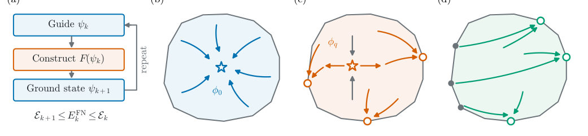 
FIG. 1. Schematic overview of iterative fixed-node dynamics. (a) Each guiding wavefunction defines a fixed-node Hamiltonian whose ground state becomes the next guide; the energies are non-increasing in k. (b–d) Starting from the (b) ground state sign chamber: Iterative fixed node flows to the true ground state from any point. (c) excited state sign chamber: Iterative fixed node generically has repulsive directions (orange) and may have attractive directions (gray); different initial trial wavefunction can approach distinct boundary fixed points. (d) a chamber with no eigenstate: Trajectories starting near a generic point (gray dot) approach a boundary fixed point. Stars mark interior fixed...

📷 Fig 2

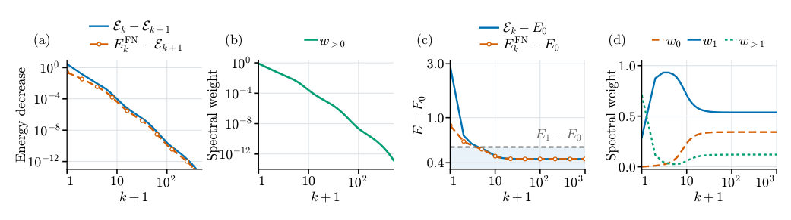 
FIG. 2. Fixed-node iteration in disordered J1-J2 chains: Initial trial wavefunction has (a,b) ground-state signs, L = 12; (c,d) first-excited-state signs, L = 10. Panel (a) shows the physical energy decrease Ek −Ek+1 and the gap EFN k −Ek+1, where Ek = ⟨ψk, Hψk⟩and EFN k = λ0(F(ψk)). Panel (c) shows Ek −E0 and EFN k −E0 crossing below the dashed reference E1 −E0 into the shaded region. Panels (b,d) show spectral weights wn = |⟨ϕn, ψk⟩|2, with w&gt;r = P

📷 Fig 3

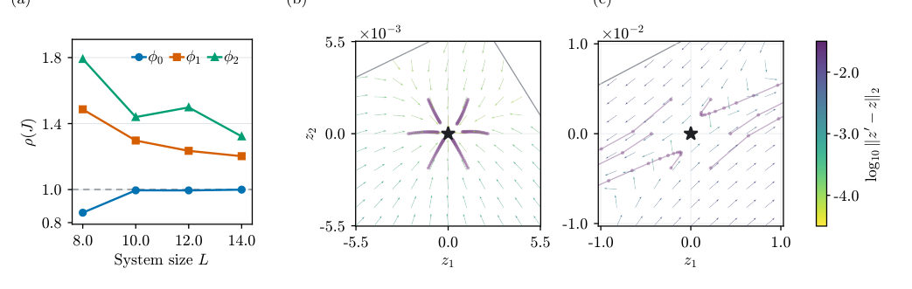 
FIG. 3. Perturbative stability of the iterative fixed-node. (a) Jacobian spectral radius near the ground and first two excited states of disordered J1-J2 chains; the dashed line marks ρ = 1. (b,c) Projected one-step updates near ϕ0 and ϕ1 of an eight-site triangular strip, with ρ(J) = 0.951 and 1.404, respectively. Arrows have uniform length and show the direction of z′ −z; the color of the arrow corresponds to the magnitude, log10 ∥z′ −z∥2. Each panel’s multiplier applies to both coordinates. Purple curves trace successive fixed-node iterates projected into the same axes. Gray lines mark component-zero boundaries in the displayed plane; stars mark the reference eigenstates. The pooled...

**Summary.** This work provides a geometric and stability analysis of iterative fixed-node dynamics used to approximate quantum ground states in the presence of the Fermion sign problem. By analyzing the fixed points of the iterative map, the authors prove that the ground state is the stable attractor, while other approximations flow away from the true solution. This clarifies the theoretical foundations for sign-problem mitigation techniques.

**Why it may be interesting.** The rigorous mathematical analysis of fixed-point dynamics provides deep insight into the convergence properties of variational methods used to tackle sign problems in strongly correlated quantum systems.

Detailed structure

**Main problem.** The paper addresses the Fermion sign problem (FSP) in quantum many-body systems, specifically analyzing the convergence and stability of iterative fixed-node approximations.

**Main result.** The self-consistent iteration is shown to drive the system towards the true ground state fixed point, proving that the ground state fixed point is stable while excited state fixed points are unstable.

**Method.** The analysis involves studying the fixed points and stability of an iterative map derived from the lattice fixed-node Hamiltonian, utilizing linearization techniques and spectral radius analysis.

**Model / system.** The study applies to quantum many-body systems governed by Hamiltonians, comparing continuum electronic structure models with lattice models (e.g., spin-1/2 models, $J_1-J_2$ chains).

**Key observables.** Sign structure, energy convergence ($E_k - E_{k+1}$), spectral weight concentration, and the spectral radius ($
ho(J)$) of the Jacobian matrix.

**Important parameters / regimes.** The sign structure (chamber) of the ground state, the system size ($L$), and the initial sign-flip probability ($p$).

**Assumptions / limitations.** The analysis focuses on the flow of the iterative map independent of practical algorithmic implementation, and relies on linearization around fixed points.

**Figures summary.** Figures illustrate the iterative flow towards the ground state in the correct sign chamber, show energy and spectral weight convergence, and plot the spectral radius $
ho(J)$ to confirm stability.

**Paper structure.** The paper develops the iterative map, proves the stability of the ground state fixed point, analyzes the instability of excited states, and confirms the reconstruction of ground state amplitudes through self-consistent iteration.

Abstract

The sign-structure of a quantum many-body ground state is a central quantity in fixed-node approaches to mitigating the Fermion sign problem. For continuum electronic-structure Hamiltonians, the correct sign-structure is sufficient to compute exact ground state properties; on the other hand, lattice fixed-node approaches retain an additional dependence on trial wave-function amplitudes which are improved upon non-optimally while preserving their sign structure. Here we consider an iterative map obtained by repeatedly replacing the fixed-node trial state with the ground state of its associated lattice fixed-node Hamiltonian (independent of whether and how a practical algorithm could implement this iteration). We show the fixed points of this map are eigenstates of the Hamiltonian and reduced Hamiltonian resulting in at most one fixed point in the interior of each sign chamber. We prove that the ground state fixed point is stable and that the boundary of the ground state sign chamber is repulsive. This shows the amplitude dependence beyond having the correct ground state sign-structure disappears under self-consistent iteration. In other sign chambers, energy descent can be obstructed by the imposed sign structure; this tension leads to the iteration driving select amplitudes to zero producing `support collapse' onto chamber boundaries and corresponding to reduced Hamiltonians. Excited-state fixed points are therefore provably unstable and flow toward lower-energy boundary fixed points. We show sign chamber boundaries have a directional stability; boundary points attractive in one direction are repulsive under a sign flip. By revealing the geometry and stability structure of iterative fixed-node dynamics, our results clarify the foundations of a central approach to the Fermion sign problem and motivate potential new algorithmic strategies.

[↑ back to top](#top)

### [Spin Grid States for Quantum Metrology in Atomic Clocks Limited by Spontaneous Emission](http://arxiv.org/abs/2609.16975v1)

**Authors:** Marius Burgath, Klemens Hammerer  
**Type:** theory · **Category:** other · **PDF:** <https://arxiv.org/pdf/2609.16975v1>  
**Analysis basis:** full PDF text, analyzed in chunks
**Topic relevance:** `quantum measurements` **2/5** · `correlated / nonlocal dissipation` **1/5** · `methods for driven-dissipative` **1/5**

📷 Fig 1

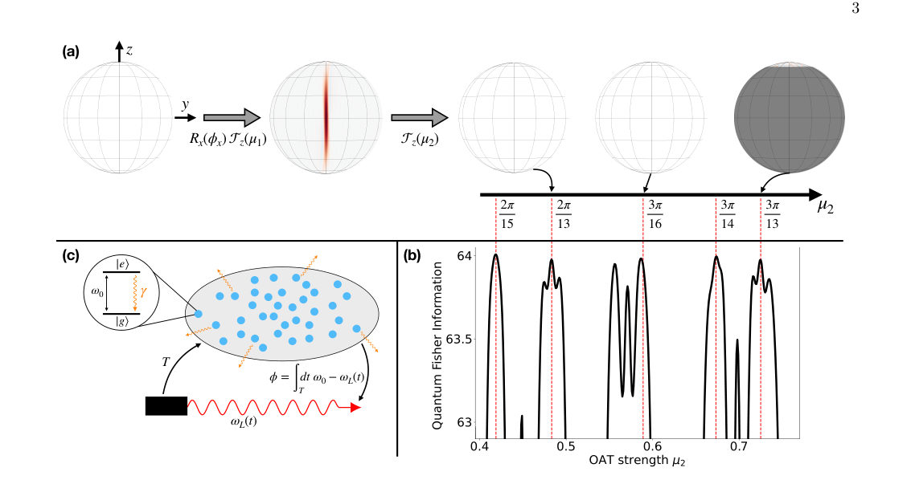 
FIG. 1. (a) Creation of SGSs in two steps, shown for N = 90. First, an SSS is generated from a CSS by OAT and aligned by a collective rotation; the example shown uses µ1 = 0.054 and ϕx = −1.35. Second, applying another OAT operation with strength µ2 superposes rotated copies of the SSS and produces grid structures in the spin Wigner function on the Bloch sphere. For rational values of µ2, the number and phases of these copies are determined by Eq. (1). (b) Quantum Fisher information for phase estimation after spontaneous emission with η = 0.25, using the same fixed µ1 and ϕx as in (a). Local maxima occur near the rational twisting angles where SGSs form. (c) Atomic-clock setting: an...

📷 Fig 2

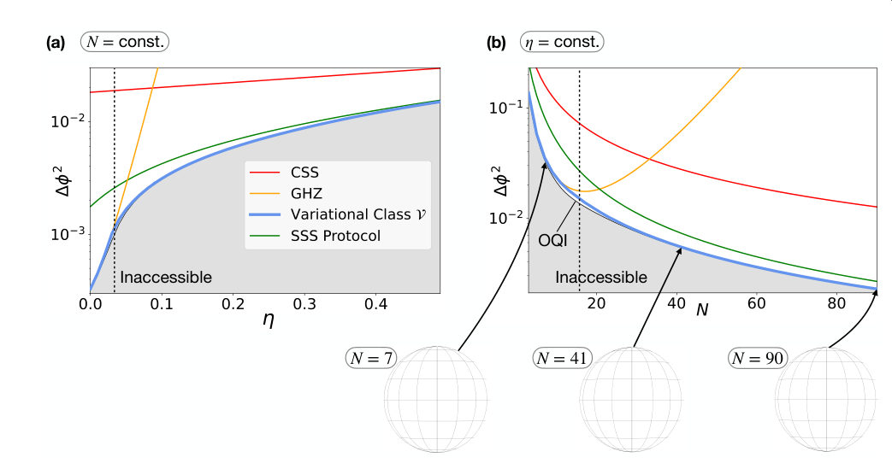 
FIG. 2. Phase-estimation variances ∆ϕ2 for different initial states, shown on logarithmic axes. The CSS curve (red) gives the classical bound for uncorrelated atoms, while the OQI marks the optimum over permutationally symmetric initial states and bounds the inaccessible gray region. The variational optimum within V (blue) is compared to GHZ states (orange) and the optimized SSS protocol (green). (a) Fixed ensemble size N = 55, with varying spontaneous-emission strength η. The dotted line indicates the crossover within V from GHZ-like states at weak noise to SGSs, and eventually SSS-like states, at stronger noise. (b) Fixed noise strength η = 0.13, with varying ensemble size N. The optimum...

📷 Fig 3

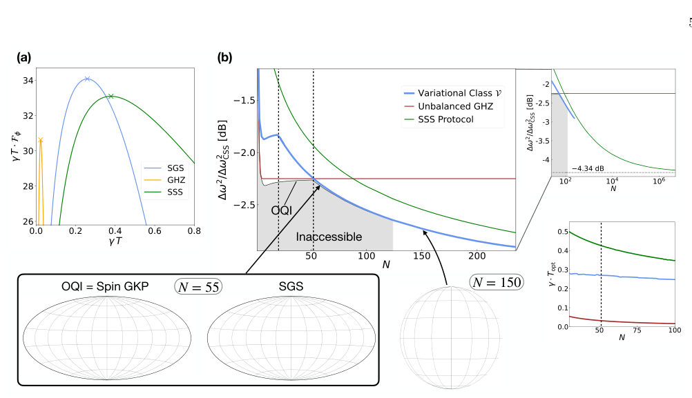 
FIG. 3. (a) Dependence of the optimal interrogation time on the initial state for N = 55. The marked maxima represent the Fω values of the respective states. Here, the SGS is created with the gate parameters (µ1, ϕx, µ2) = (0.073, −0.939, 3π/11). For the SSS, the squeezed axis is aligned along y and the squeezing strength is µ = 0.049. (b) Frequency estimation variances expressed as the gain in decibels over classical strategies. The OQI is defined as the ultimate lower bound across all permutationally symmetric initial states, so the grey shaded region is not accessible. Taking advantage of block diagonal structures, it was possible to numerically determine the OQI for ensembles with more...

📷 Fig 4

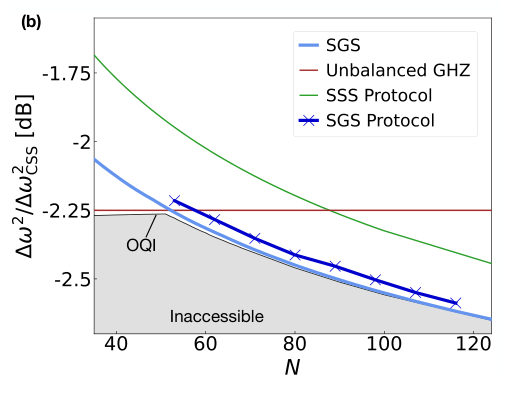 
FIG. 4. (a) Algorithm to estimate the phase with SGSs. Entanglement generated by Tz,tot encodes the number n of decayed clock qubits onto the ancillary system. An inverse QFT is then used to map this information to a Dicke ba- sis state. Measuring the spin projection Sz,A determines n, and conditioned to this result an optimal entangling unitary U(n) ent is applied to estimate the phase. (b) Phase readout strategy compared to the frequency estimation bounds from Fig. 3 (b). The “SGS Protocol” refers to the classical FI with respect to the algorithm in (a), optimized over the pa- rameters of the gates U(n) ent . We did the optimization for N = 53, 62, 71, 80, 89, 98, 107, and 116 clock...

📷 Fig 5

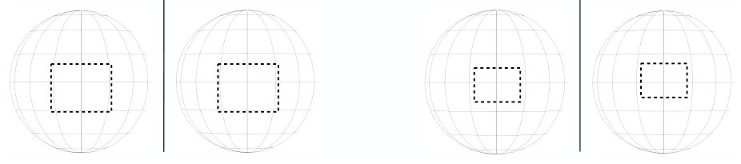 
FIG. 5. Initial state of the OQI (right column, here with a possible trivial rotation about z to align the state along x) and optimal initial state within the spin GKP ansatz class (left column) for (a) N = 53 qubits and (b) N = 100 qubits. Optimal means that the QFI of frequency estimation, Fω, is maximized and thus the estimation uncertainty is minimized. The same periodic grid structure exhibited by the OQI can be reproduced by spin GKP states, see the Wigner function plots (view plane: YZ) on the Bloch sphere and particularly the dashed boxed regions around the optimal working point at the equator, which have exactly the same size for the OQI and the spin GKP state. For larger N, the...

**Summary.** This paper develops a quantum metrology protocol for atomic clocks limited by spontaneous emission noise. It identifies Spin Grid States (SGSs) as near-optimal probes that surpass standard entangled states like GHZ states. The authors propose a practical readout technique that leverages the grid structure of SGSs to nearly saturate the ultimate quantum sensitivity limit.

**Why it may be interesting.** This work provides concrete, experimentally implementable quantum states (SGSs) that overcome the limitations imposed by realistic noise channels (spontaneous emission) in quantum sensing platforms like atomic clocks.

Detailed structure

**Main problem.** The paper addresses the challenge of maximizing precision in phase and frequency estimation using atomic clocks that are fundamentally limited by spontaneous emission noise.

**Main result.** Spin Grid States (SGSs) are identified as practical, near-optimal quantum probes that significantly enhance metrological sensitivity compared to standard states, especially for intermediate and large atomic ensembles.

**Method.** The authors optimize the Quantum Fisher Information (QFI) over a variational class of states and propose a sequential readout strategy using an OAT echo to distinguish decay events.

**Model / system.** The system is an ensemble of N identical two-level atoms (qubits) undergoing spontaneous emission, modeled by a master equation incorporating jump operators. The analysis compares SGSs to GHZ and SSS states.

**Key observables.** Quantum Fisher Information ($F_\phi$), phase estimation variance ($\Delta\phi^2$), and the success probability of state discrimination ($P_{	ext{succ, PGM}}$).

**Important parameters / regimes.** Spontaneous emission strength ($\eta = \gamma T$), ensemble size ($N$), and the crossover point where state optimality changes ($N=51$).

**Assumptions / limitations.** The analysis focuses on permutationally symmetric states and utilizes the Holstein-Primakoff approximation to relate optimal states to spin GKP states.

**Figures summary.** Figures illustrate the two-step creation of SGSs on the Bloch sphere, compare the QFI for various states (GHZ, SGS, SSS) versus noise ($\eta$) and size ($N$), and show the high distinguishability of SGS jump terms.

**Paper structure.** The paper progresses from establishing the metrological problem under noise, identifying SGSs as superior probes over GHZ states at intermediate noise levels, detailing the generation protocol using OAT operations, and finally presenting a readout strategy that achieves near-perfect distinguishability of decay events.

Abstract

Entanglement can enhance precision in phase estimation and in frequency estimation with atomic clocks, but it remains a central challenge to identify useful states and measurements under realistic noise processes. Here, we study quantum metrology with an ensemble of atoms subject to spontaneous emission, which limits frequency estimation by constraining the useful interrogation time. We identify spin grid states (SGSs) as the relevant near-optimal probes beyond a crossover at an ensemble size of 51, where GHZ-like states cease to be optimal. SGSs display a periodic grid on the Bloch sphere and can be generated with two one-axis-twisting (OAT) operations separated by a collective rotation. By optimizing the quantum Fisher information over permutationally symmetric states, we find that SGSs perform close to the globally optimal probes for intermediate and large ensembles, which turn out to be spin GKP states. We further present a sequential readout strategy that nearly saturates the corresponding quantum Fisher information. This strategy uses an OAT echo to map spontaneous-emission events onto collective rotations, making the corresponding jump sectors distinguishable and allowing the measurement basis to be conditioned on the number of decay events. Together, these results show that SGSs provide a practical route to quantum-enhanced phase and frequency metrology in atomic ensembles limited by spontaneous emission.

[↑ back to top](#top)

### [1/f frequency noise in mechanical resonators scales inversely with volume, not with quality factor](http://arxiv.org/abs/2609.16668v1)

**Authors:** M. L. Roukes  
**Type:** both · **Category:** other · **PDF:** <https://arxiv.org/pdf/2609.16668v1>  
**Analysis basis:** full PDF text, analyzed in chunks
**Topic relevance:** `quantum measurements` **2/5** · `analog quantum simulation` **1/5**

📷 Fig 1

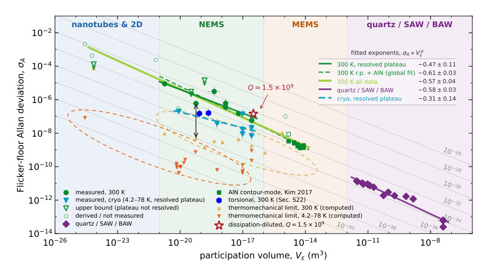 
FIG. 1. (Color online) The 1/f-floor of the Allan deviation, σA, for every mechanical resonator in the published record satisfying the stated, uniformly-applied “admission rules” (SM S1), plotted against participation volume Vε (see text). This figure yields three principal conclusions: First, no device reaches its own thermomechanical limit: both dashed ellipses, which enclose the computed limits, lie entirely below the measured room-temperature floors. For illustration, a vertical black arrow marks a 2.08-decade gap for one device. Second, each family falls with a slope near −1/2, the intra-family exponents and their standard errors being given in the key at upper right. Third, no...

📷 Fig 2

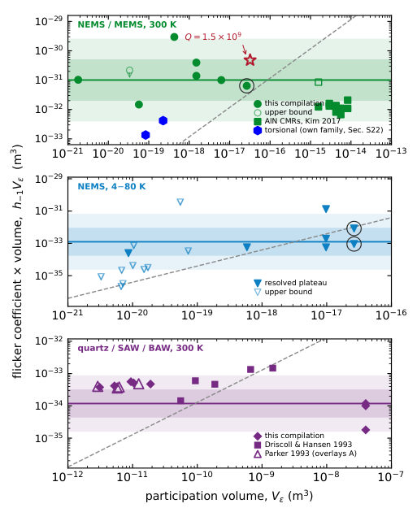 
FIG. 2. (Color online) The data of Fig. 1, replotted as the in- variant h−1 Vε ≡σ2 AVε/(2 ln 2), with one family per panel, to test the participation-volume invariance of h−1 Vε. Two prin- cipal conclusions can be drawn: First, h−1 Vε is flat within each family: the horizontal line is the family reference — the median over independent studies, one value per study, so that no single series sets a family level — and the shaded bands are ±1σ and ±2σ of the scatter of the fitted devices about it (±0.7, ±0.9, ±0.4 decades, top to bottom). Second, the volume-independent alternative fails in all three. The gray dashed slope-+1 line, which h−1 Vε would follow were h−1 in- dependent of volume,...

**Summary.** This paper investigates the fundamental limits of frequency stability in mechanical resonators, finding that the dominant $1/f$ noise floor scales universally with the material and geometry, independent of the device's physical volume. The research establishes a key invariant quantity that suggests the noise is governed by intrinsic material properties rather than simple geometric scaling. This has implications for designing next-generation, ultra-sensitive quantum sensors.

**Why it may be interesting.** While focused on classical mechanics and materials science, the analysis of noise sources, scaling laws, and fundamental limits of measurement precision touches upon concepts of decoherence and noise floor characterization relevant to quantum sensing.

Detailed structure

**Main problem.** Mechanical frequency-shift sensors are limited by a persistent, high $1/f$ noise floor that exceeds fundamental thermomechanical or quantum limits.

**Main result.** The excess $1/f$ noise floor, characterized by the product $h^{-1} V_{\epsilon}$, is found to be remarkably independent of the device's physical volume over many decades of size.

**Method.** The study analyzes a large dataset of mechanical resonators, fitting the scaling of the noise floor ($\sigma_A$) against device volume ($V$) and comparing results against theoretical scaling predictions.

**Model / system.** The system involves mechanical resonators (NEMS/MEMS) whose frequency shifts are monitored. The noise is modeled as arising from an ensemble of fluctuating defects (fluctuators) within the material.

**Key observables.** The excess $1/f$ frequency noise ($\sigma_A$), characterized by the Allan deviation plateau $\sigma_A \propto h^{-1}$, and the invariant product $h^{-1} V_{\epsilon}$.

**Important parameters / regimes.** Device volume ($V$), strain-weighted volume integral ($V_{\epsilon}$), Quality Factor ($Q$), and the noise scaling exponent ($p$).

**Assumptions / limitations.** The noise is assumed to originate from an ensemble of fluctuators with log-uniformly distributed correlation times, and that the noise plateau is parametric in origin.

**Figures summary.** Figures plot the $1/f$-floor noise versus participation volume, demonstrating a volume-invariant trend, and analyze scaling trends against theoretical predictions.

**Paper structure.** The paper establishes the problem of noise limitation, surveys existing data to test scaling laws (volume vs. Q), derives the volume-invariant scaling law, and discusses the implications for mass resolution and noise cancellation techniques.

Abstract

Mechanical frequency-shift sensors have never reached their fundamental thermomechanical or quantum limits. Every material, size, and transduction scheme yet examined yields a $1/f$ floor 1-3 orders higher, with a flicker-noise coefficient $h_{-1} \propto 1/V_{\varepsilon}$. Surveying the published record, I find the invariant $h_{-1}\,V_{\varepsilon} \equiv σ_A ^2\, V_{\varepsilon}/(2\ln 2)$ independent of device size across 13 decades; volume-independent noise is excluded by 9$σ$, site-averaging by 3.8$σ$. No $Q$ dependence appears: reported $Q^{-n}$ laws scale equivalently when $Q$ and volume co-vary; only volume scaling survives when they do not. Mass resolution follows as $|δm| \propto \sqrt{h_{-1}\,V_{\varepsilon} \cdot V}$.

[↑ back to top](#top)

### [Weak ferromagnetism in the square-lattice Heisenberg $J_1$-$J_2$-$J_2^\prime$ model with easy-axis single-ion anisotropy](http://arxiv.org/abs/2609.16593v1)

**Authors:** Bin-Zhou Mi, Qiang Gu  
**Type:** theory · **Category:** other · **PDF:** <https://arxiv.org/pdf/2609.16593v1>  
**Analysis basis:** full PDF text, analyzed in chunks
**Topic relevance:** `Keldysh / 2PI / non-Gaussian methods` **2/5** · `analog quantum simulation` **1/5**

📷 Fig 1

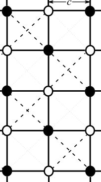 
Fig. 1. The magnetic atoms, shown as solid white and black circles, constitute a square lattice in the xy plane, with the magnetic easy-axis along the z-direction. The parameter 𝐽1 denotes the nn antiferromagnetic exchange interaction, while 𝐽2 and 𝐽2

📷 Fig 2

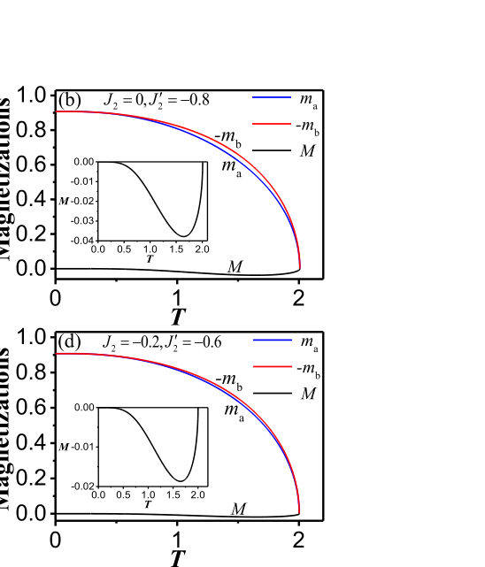 
Fig. 3. (Color online) Temperature dependence of magnetizations, including sublattice magnetization and net magnetization, for 𝑆= 1 and 𝐷= 0.08 with 𝐽2 + 𝐽2

📷 Fig 3

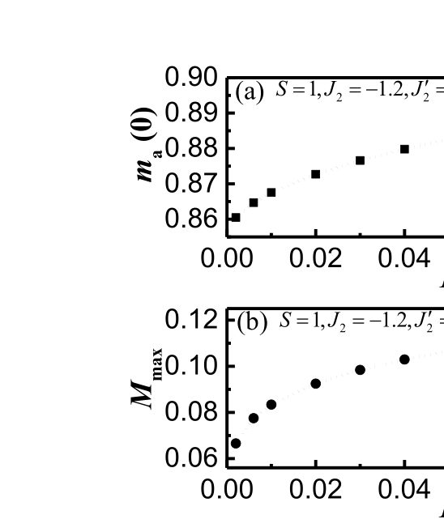 
Fig. 5. The variation of (a) 𝑚𝑎(0) and (b) 𝑀max with 𝐷 for 𝑆= 1, 𝐽2 = −1.2, and 𝐽2

**Summary.** This theoretical study analyzes weak ferromagnetism in a complex Heisenberg model on a square lattice. The authors find that the asymmetry between two next-nearest-neighbor couplings ($J_2 
eq J_2'$) is the source of temperature-dependent net magnetization. The findings suggest a material mechanism for weak ferromagnetism that can be detectable in real quantum magnetic materials.

**Why it may be interesting.** The mechanism for weak ferromagnetism—arising from distinct superexchange pathways mediated by different nonmagnetic atoms—offers a novel theoretical pathway distinct from conventional interactions like the Dzyaloshinskii-Moriya interaction.

Detailed structure

**Main problem.** The study investigates the origin and temperature dependence of weak ferromagnetism in a specific Heisenberg spin model on a square lattice.

**Main result.** Weak ferromagnetism at finite temperatures is primarily caused by the asymmetry between two distinct next-nearest-neighbor exchange couplings ($J_2 
eq J_2'$), while the single-ion anisotropy ($D$) only provides a background for long-range order.

**Method.** The research employs numerical calculations using the Double-Time Green's Function (DTGF) method, incorporating Random Phase Approximation (RPA) and Anderson-Callen's (ACs) decoupling.

**Model / system.** The system is the square-lattice Heisenberg $J_1$-$J_2$-$J_2'$ model, including nearest-neighbor ($J_1$), two alternating next-nearest-neighbor ($J_2, J_2'$), and easy-axis single-ion anisotropy ($D$).

**Key observables.** Sublattice magnetization, net magnetization ($M$), and critical temperature ($T_C$).

**Important parameters / regimes.** The relative difference $|J_2 - J_2'|$ is key; $D$ controls the background ordering; $S$ (spin quantum number) and $T$ (temperature) are varied.

**Assumptions / limitations.** The calculations rely on the RPA and ACs decoupling approximations of the DTGF method, and the model is analyzed for $S \ge 1$ due to the anisotropy term.

**Figures summary.** Figures illustrate the temperature dependence of magnetizations for various coupling ratios, and show how ground-state magnetizations and maximum net magnetization scale with the spin quantum number $S$ and anisotropy $D$.

**Paper structure.** The paper systematically analyzes the magnetic behavior by first establishing the model and methods, then demonstrating that $J_2 
eq J_2'$ drives finite-temperature weak ferromagnetism, and finally quantifying the dependence of $M_{max}$ and $T_C$ on the coupling parameters and spin quantum number.

Abstract

Motivated by recent experimental realizations of the Heisenberg model and two-dimensional altermagnetism using ultracold atoms in optical lattices, we systematically investigate the magnetic properties of the square-lattice Heisenberg $J_1$-$J_2$-$J_2^\prime$ model in the presence of easy-axis single-ion anisotropy $D$. Here, $J_1 (>0)$ is the nearest-neighbor antiferromagnetic exchange parameter, while $J_2$ and $J_2^\prime$ are two distinct next-nearest-neighbor superexchange parameters that alternate on the lattice. We perform numerical calculations of the sublattice magnetization, net magnetization, and critical temperature. Interestingly, the net magnetization is not identically zero at finite temperatures; its absolute value first increases and then decreases with increasing temperature, revealing a temperature-dependent weak ferromagnetism. We find that $J_2\not=J_2^\prime$ is the primary factor responsible for weak ferromagnetism at finite temperatures, while $D$ provides the necessary background for two-dimensional long-range magnetic ordering. Moreover, for a fixed $J_2+J_2^\prime$, we observe that a larger $|J_2-J_2^\prime|$ leads to a greater maximum net magnetization and critical temperature, as well as a broader temperature range for weak ferromagnetism. The difference between $J_2$ and $J_2^\prime$ originates from the distinct superexchange pathways between magnetic atoms, with these pathways mediated by two different types of nonmagnetic atoms. This mechanism, which differs from conventional ones such as the Dzyaloshinskii-Moriya interaction, may be detectable in real materials.

[↑ back to top](#top)

### [A complete classification of the existence of finite-dimensional quantum solutions to inconsistent linear constraint systems](http://arxiv.org/abs/2609.16490v1)

**Authors:** Markus Frembs  
**Type:** theory · **Category:** quantum information and computing · **PDF:** <https://arxiv.org/pdf/2609.16490v1>  
**Analysis basis:** full PDF text, analyzed in chunks
**Topic relevance:** `quantum measurements` **2/5**

📷 Fig 1

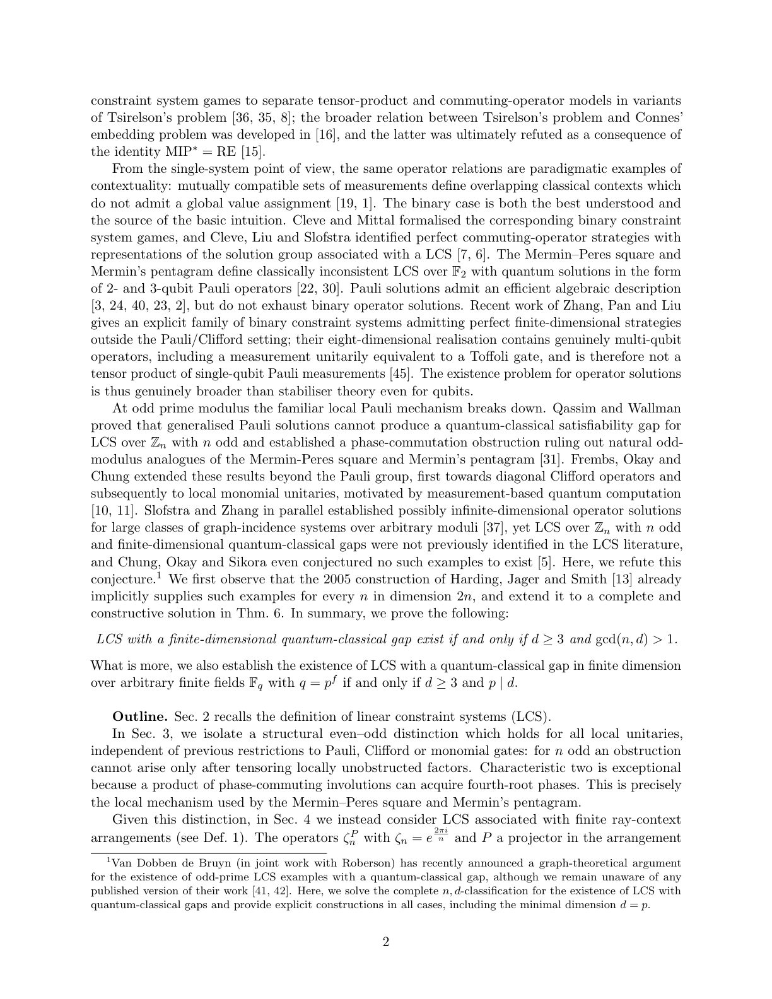 
Low-resolution page preview, page 2

📷 Fig 2

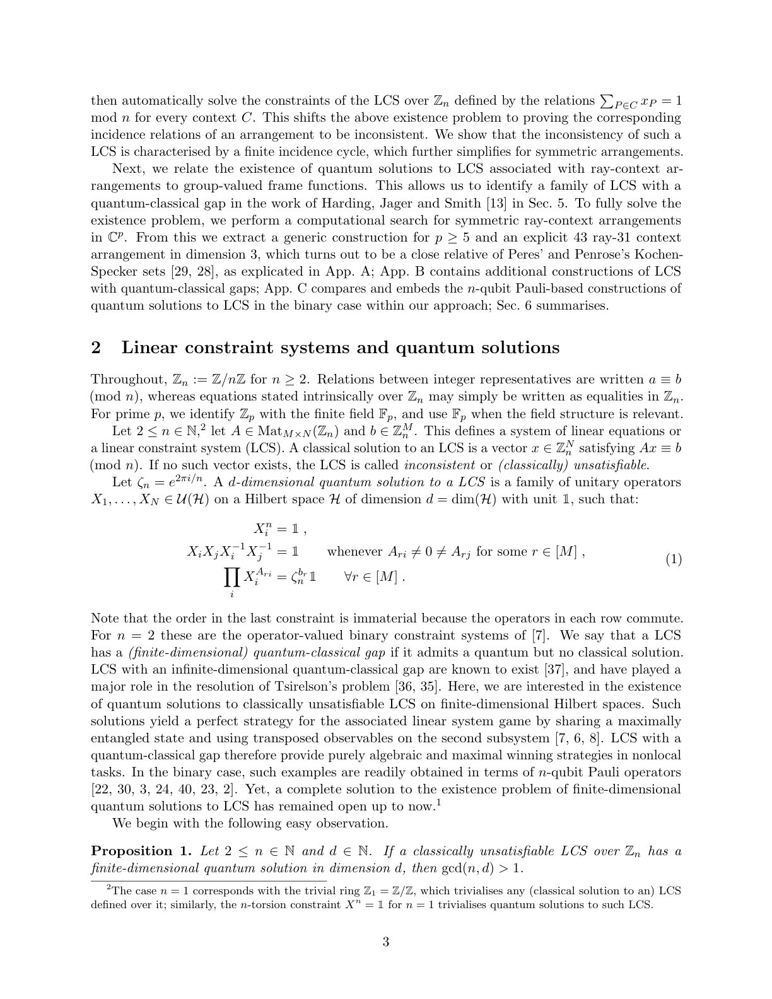 
Low-resolution page preview, page 3

📷 Fig 3

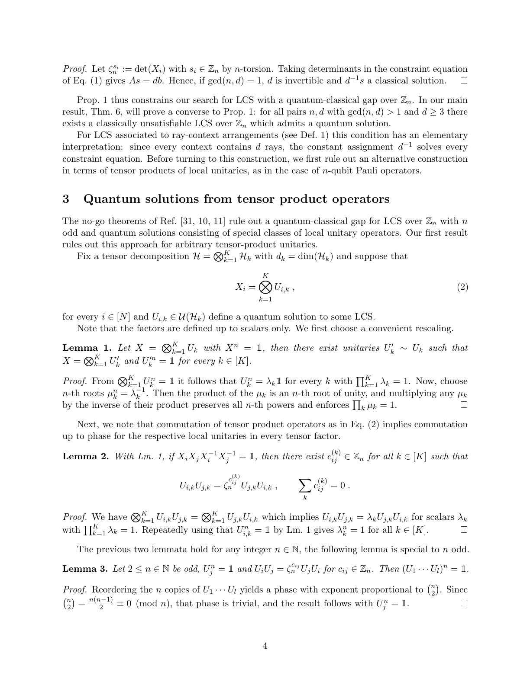 
Low-resolution page preview, page 4

📷 Fig 4

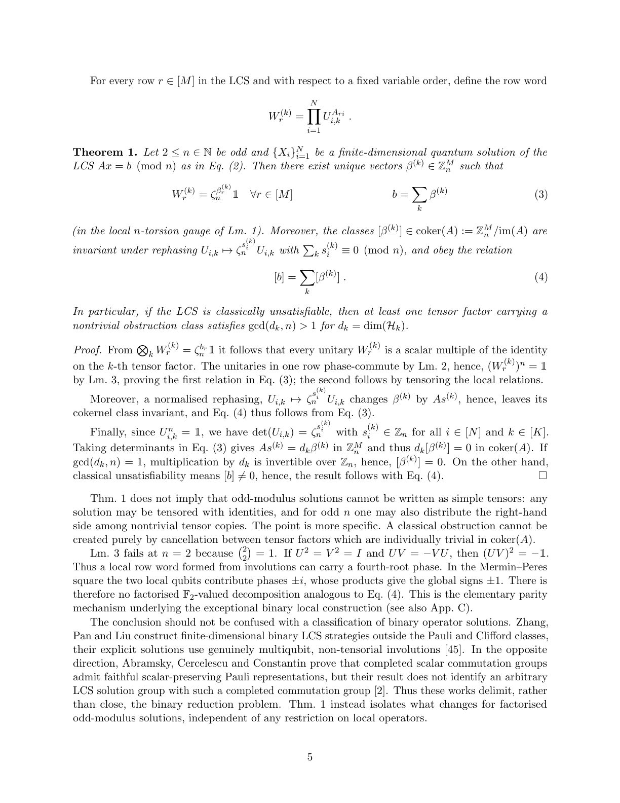 
Low-resolution page preview, page 5

📷 Fig 5

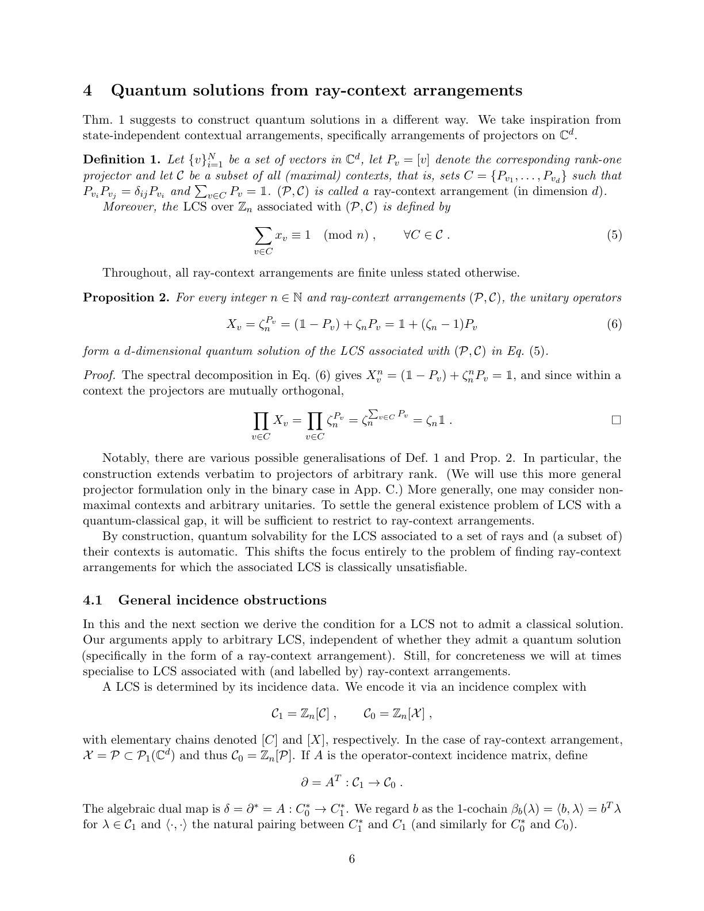 
Low-resolution page preview, page 6

**Summary.** This theoretical paper classifies when quantum systems can violate classical constraints defined by linear systems over $\mathbb{Z}_n$. It establishes that a quantum-classical gap exists if and only if the dimension $d$ is large enough and shares a common factor with the modulus $n$. The methodology relies on advanced algebraic tools applied to the structure of quantum contextuality.

**Why it may be interesting.** This work provides deep mathematical constraints on the feasibility of quantum correlations (contextuality) that cannot be captured by classical probability distributions, directly impacting the understanding of quantum information protocols.

Detailed structure

**Main problem.** The paper aims to provide a complete classification of the existence of finite-dimensional quantum solutions to inconsistent linear constraint systems (LCS).

**Main result.** The existence of such systems with a quantum-classical gap is characterized by the condition that the dimension $d$ must be at least 3 and $\gcd(n, d) > 1$.

**Method.** The authors use algebraic methods, relating LCS to finite arrangements of rank-one projectors and analyzing obstructions using group theory and cohomology.

**Model / system.** The model involves Linear Constraint Systems (LCS) defined over $\mathbb{Z}_n$, which are used to characterize nonlocal games and contextuality in quantum systems.

**Key observables.** The context phase vector ($b_C$), the Pauli multiplication cocycle ($eta$), and the greatest common divisor $\gcd(n, d)$ are key diagnostics.

**Important parameters / regimes.** The modulus $n$ (e.g., $\mathbb{Z}_n$), the Hilbert space dimension $d$, and the prime $p$ are critical parameters.

**Assumptions / limitations.** The analysis distinguishes between odd and even moduli, and the results are often derived by associating the LCS to specific 'ray-context arrangements'.

**Figures summary.** Not specified (Analysis relies heavily on algebraic structures and theorems rather than described figures).

**Paper structure.** The paper progresses by first analyzing the general structure of obstructions to classical solutions, then specializing to tensor-product structures for odd moduli, and finally establishing the necessary and sufficient conditions for the existence of quantum-classical gaps using projector resolutions.

Abstract

Linear constraint systems (LCS) provide a compact algebraic language for nonlocal games and state-independent contextuality. In the binary case the Mermin--Peres square shows that inconsistent LCS can be solved by promoting variables to local Pauli operators, whereas a series of no-go results excludes analogous Pauli-, Clifford- and monomial unitary-based constructions at odd prime modulus. We first isolate the reason for this difference: for tensor-product quantum solutions, the obstruction to a classical solution of a LCS over $\mathbb{Z}_n$ decomposes into obstruction classes carried by the individual factors. As a consequence, a genuinely global obstruction cannot arise solely by tensoring locally unobstructed systems. The argument is specific to odd modulus; at even modulus the reordering phase need not vanish, as in Pauli-based examples.   Given this distinction, we instead associate LCS to finite arrangements of rank-one projectors and resolutions of the identity in finite-dimensional vector spaces. Quantum solvability for such LCS is automatic and the search for a quantum-classical gap rests entirely on proving classical unsatisfiability of the underlying modular incidence problem of the arrangement. By relating such LCS with group-valued frame functions, we identify a family of examples in the work of [Harding, Jager, and Smith, Int. J. Theor. Phys. 44, 539 (2005)]. To establish the (non)existence of classically unsatisfiable LCS over $\mathbb{Z}_n$ with quantum solutions in all dimensions $d$ and for all $n\in\mathbb{N}$, we further construct explicit examples for the cases $d=n$ prime. Our main result thus positively resolves the existence problem of such LCS beyond the binary case: such systems exist if and only if $d\geq 3$ and $\gcd(n,d)>1$. Moreover, we establish the existence of LCS with a quantum-classical gap over finite fields if and only if $d\geq 3$ and $p\mid d$.

[↑ back to top](#top)

### [Antidistinguishability of states in General Probabilistic Theories](http://arxiv.org/abs/2609.17498v1)

**Authors:** Satyaki Manna, Anandamay Das Bhowmik  
**Type:** theory · **Category:** other · **PDF:** <https://arxiv.org/pdf/2609.17498v1>  
**Analysis basis:** full PDF text, analyzed in chunks
**Topic relevance:** `quantum measurements` **2/5**

📷 Fig 1

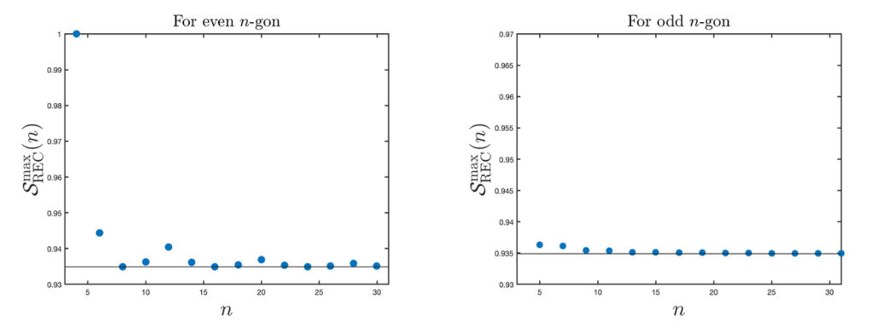 
FIG. 1: The optimal success merit of REC for even (left) and odd n-gon (right) under dichotomic measurement implemented by Bob. The constant black line corresponds to the optimal success merit of the task using qubit states and measurements. At lower n, the success merit has a greater value. Note that the nature of the convergence of the merit is different for even and odd n-gon.

**Summary.** This paper rigorously investigates 'antidistinguishability' within the general framework of physical theories (GPTs). It develops mathematical tools to characterize this property, particularly for polygonal state models. The research shows that while these models can sometimes outperform quantum predictions for small systems, their performance converges back to the quantum limit as the system size increases.

**Why it may be interesting.** This work is highly relevant to foundational quantum physics, as it extends the operational constraints beyond standard quantum mechanics (GPTs) to characterize when and how non-quantum theories can mimic or surpass quantum predictions in specific tasks.

Detailed structure

**Main problem.** The paper investigates the concept of 'antidistinguishability' of quantum states within the general framework of General Probabilistic Theories (GPTs). It refines this notion to study its mathematical properties and physical implications.

**Main result.** The authors establish general bounds on the size of equally antidistinguishable sets and demonstrate that polygonal models can exhibit nonclassical behavior by outperforming the optimal quantum limit in certain coding tasks, though this advantage vanishes in the large-polygon limit.

**Method.** The methodology involves defining and analyzing refined notions of antidistinguishability (strong and equal), applying these concepts to specific models like polygonal theories, and using Random Exclusion Codes (REC) to probe nonclassicality.

**Model / system.** The primary model is the General Probabilistic Theory (GPT), which encompasses quantum mechanics. Specific applications are studied using polygonal state spaces (n-gons) and the associated measurement effects.

**Key observables.** Antidistinguishability, strong antidistinguishability, equal antidistinguishability, and the success merit of Random Exclusion Codes ($S_{\max}^{	ext{REC}}(n)$).

**Important parameters / regimes.** The number of sides of the polygon ($n$), the affine dimension of the state space ($d$), and the quantum limit value ($S_C^{	ext{REC}} = 8/9$).

**Assumptions / limitations.** The analysis is conducted within the operational framework of GPTs, assuming the state space $\Omega$ is convex and compact.

**Figures summary.** Figure 1 plots the optimal success merit of REC ($S_{\max}^{	ext{REC}}(n)$) versus $n$ for even and odd $n$-gons, comparing it against the established qubit line. Table I summarizes the antidistinguishability properties for various $n$-gon models.

**Paper structure.** The paper first introduces the concept of antidistinguishability in GPTs, deriving general relationships between its refined notions. It then applies these concepts to polygonal theories, proving specific results about the antidistinguishability of pure states. Finally, it uses these results to analyze the performance of Random Exclusion Codes, comparing them to the quantum limit.

Abstract

We investigate antidistinguishability of states within the framework of general probabilistic theories (GPTs). We formulate antidistinguishability, strong and equal antidistinguishability as refined notions that imposed additional constraint on the measurement effects. We establish general results relating these notions of antidistinguishability and derive an upper bound on the cardinality of equally antidistinguishable sets in terms of the affine dimension of the state space. We then study antidistinguishability in polygonal theories, obtaining conditions for antidistinguishability of a set of states. In consequence, we show that the set of all pure states in a polygon model is antidistinguishable. Additionally, we identify broad families of strongly and equally antidistinguishable states. Finally, using Random Exclusion Codes, whose success probability is governed by the antidistinguishability of different sets of encoding states, we probe the nonclassicality of polygon theories. We find that certain polygon models can outperform the optimal quantum value, while their optimal performance converges to the quantum limit in the large-polygon limit.

[↑ back to top](#top)

### [Observational Indistinguishability and Integrity Blind Regions in Hybrid Quantum-Classical Workflows](http://arxiv.org/abs/2609.17150v1)

**Authors:** Roberto Fernández-Barrios, Iker Pastor-López, Amaia Pikatza-Huerga, Pablo García Bringas  
**Type:** theory · **Category:** quantum information and computing · **PDF:** <https://arxiv.org/pdf/2609.17150v1>  
**Analysis basis:** full PDF text, analyzed in chunks
**Topic relevance:** `quantum measurements` **2/5**

📷 Fig 1

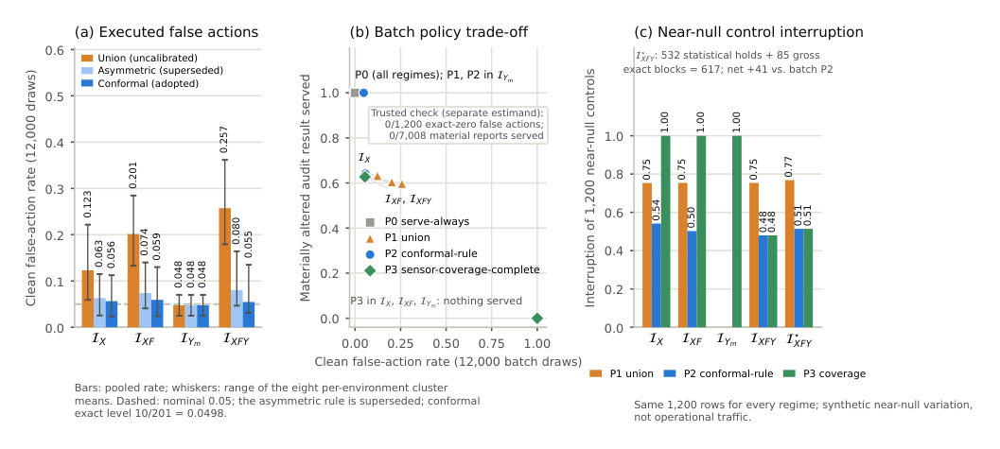 
Fig. 1. Gates F and D (prespecified frozen evidence). (a) Decision-level false-action rate on 12,000 clean draws from evaluation pools disjoint from the calibration pools; resampled draws within each pool may overlap. Union, asymmetric-comparison and conformal rates are shown per regime. (b) Materially altered audit results served versus clean false-action rate at the structural-sensitivity endpoint (12,000-draw batch denominator); the trusted exact-zero check uses 1,200 rows and is a different estimand. (c) Interruption of 1,200 near-null controls; trusted P2 interrupts 617: 532 statistical holds and 85 gross exact blocks.

📷 Fig 2

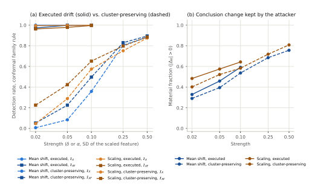 
Fig. 2. Corrected-JSD response on the original frozen Gate A rows. (a) Detection under the conformal family rule of the executed drift mechanisms (solid) and of their cluster-preserving variants (dashed) in IX and IXF , 600 observations per point. (b) Material fraction of the same rows: the construction reduces response against the declared batch-level fingerprint at matched strengths while keeping most of the conclusion changes.

**Summary.** This paper proposes a novel, mathematically rigorous framework for verifying the integrity of hybrid quantum-classical workflows against potential adversarial attacks. It defines 'claim-relative' evidence by identifying structural blind regions and establishing necessary reference points (scalar, aggregate, item-level) to guarantee the trustworthiness of computational conclusions. This work is crucial for establishing verifiable trust in future quantum computing applications.

**Why it may be interesting.** While highly abstract and focused on security protocols, the rigorous mathematical framework for verifying computational integrity in quantum processes is foundational for building reliable quantum algorithms and quantum information processing pipelines.

Detailed structure

**Main problem.** The paper develops a framework to ensure integrity and detect adversarial manipulations within complex hybrid quantum-classical workflows.

**Main result.** It introduces a 'claim-relative evidence/reference' lattice that quantifies different levels of integrity protection (conclusion, aggregate, item-identity) against structural blind regions.

**Method.** The authors use formal methods, defining structural blind regions and testing integrity using specific reference mechanisms like trusted scalars ($R_0$) and adaptive stress tests.

**Model / system.** The model is a general hybrid quantum-classical workflow involving classical record acquisition, quantum evidence generation, kernel learning, and final reporting.

**Key observables.** Conclusion-changing label interventions, structural blind regions, and the degree of required reference granularity (scalar vs. aggregate vs. item-aligned).

**Important parameters / regimes.** The required reference granularity (e.g., $R_0$ for conclusion integrity) and the detection rates of label interventions (e.g., 343/2,700).

**Assumptions / limitations.** The framework assumes the existence of a 'claim-relative' view, but it notes limitations regarding the need for an external root and the violation of exchangeability in the design.

**Paper structure.** The paper is structured around defining the integrity lattice, analyzing different types of observational indistinguishability (structural vs. statistical), and demonstrating the sufficiency of different reference mechanisms ($R_0, M_0$, item-aligned binding) through rigorous testing.

Abstract

We present a claim-relative evidence/reference framework for hybrid quantum-classical workflow integrity. Observational indistinguishability yields structural blind regions, distinct from finite-batch statistical misses. Within the declared lattice, a trusted same-batch scalar $R_0$ suffices for conclusion integrity, aggregate $M_0$ for aggregate plus conclusion integrity, and item-aligned binding for item identity. In 3,600 label interventions, feature/prediction views realize exact label-path invariance; all 764 geometry-aligned aggregate-blind rows equal their paired-clean responses, giving zero attack-only increment. For statistical response, the geometry-aligned construction detects 343/2,700 conclusion-changing ($τ\to 0^+$) label interventions with the conformal rule and 1,183/2,700 with the uncorrected union; the original frozen same-item geometry yields 11/2,617 and 43/2,617, respectively. The executed conformal clean false-action rates are 0.048--0.059 descriptively; its finite-sample guarantee requires exchangeability, which the overlapping-draw design violates. The cluster-preserving adaptive stress test (Gate A) reduces response versus matched controls in 25--40 of 40 environment/split cells while retaining conclusion changes. A bounded 165-design-cell ideal-statevector and finite-shot-emulation branch directly instantiates semantic, estimated and observed kernel transitions. The fixed equal-weight design estimates neither deployment prevalence nor QPU, provider or deployed-service assurance.

[↑ back to top](#top)

### [Optimal Linear-Rate Conversion of Unknown Mixed Qubit States via SWAP Tests](http://arxiv.org/abs/2609.17311v1)

**Authors:** Sujay Kazi, Iman Marvian  
**Type:** theory · **Category:** quantum information and computing · **PDF:** <https://arxiv.org/pdf/2609.17311v1>  
**Analysis basis:** full PDF text, analyzed in chunks
**Topic relevance:** `quantum measurements` **2/5**

📷 Fig 1

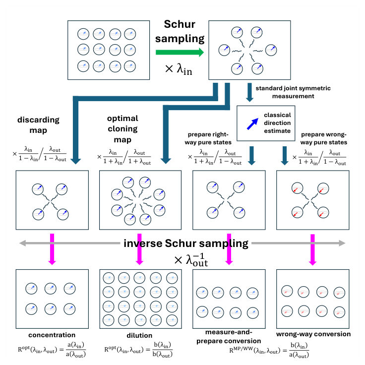 
FIG. 1: A unified presentation of the four linear-rate conversion protocols for qubits. At each step, the qubit count is multiplied approximately by some factor depending on λin and/or λout, and multiplying these factors across the three steps yields the linear conversion rates shown at the bottom. Step (i), unitary Schur sampling, is common across the protocols, and it can be performed solely using two-qubit SWAP tests [29]. Step (ii), rescaling the number of qubits, varies based on the protocol. Step (iii), inverse Schur sampling, is again common across the protocols, and it can be performed by introducing the appropriate number of singlet states and randomly permuting the qubits....

📷 Fig 2

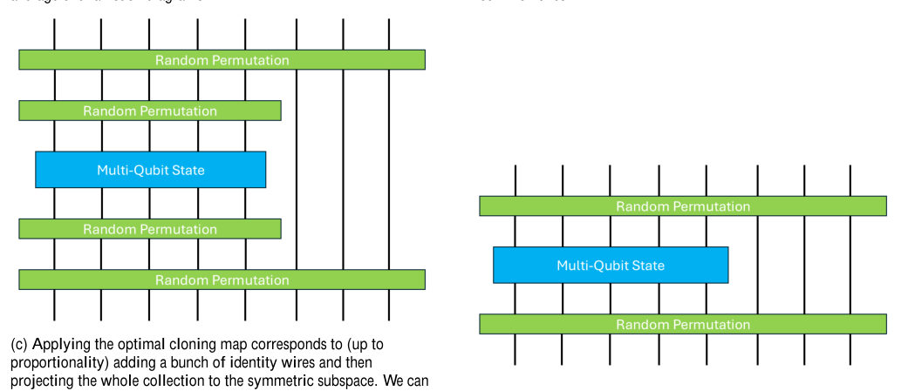 
FIG. 2: The tensor network representation of a state on the symmetric subspace (Figure 2a), followed by an application of either the discarding map (Figure 2b) or the optimal cloning map (Figures 2c and 2d).

📷 Fig 3

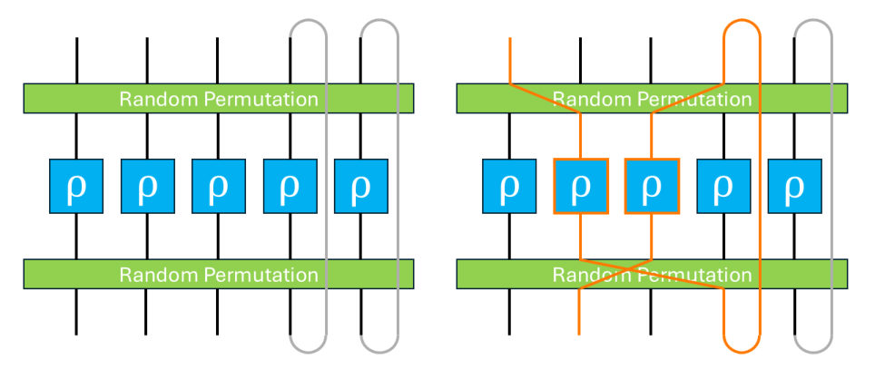 
FIG. 3: (LEFT) The discarding map applied to a Schur-transformed state. Instead of using a generic multi-qubit state, as we did in Figure 2, we now use an i.i.d. collection, which results in a Schur-transformed state (up to proportionality) after projecting to the symmetric subspace. (RIGHT) The essential intuition for why discarding qubits from the Schur-transformed state achieves concentration. Before the discarding map, each wire threads exactly one copy of ρ. But now, each wire can thread multiple copies of ρ due to the wraparound caused by the partial trace. Since each copy of ρ multiplies the coefficient of |1⟩⟨1|ˆn by c1 = 1+λ

📷 Fig 4

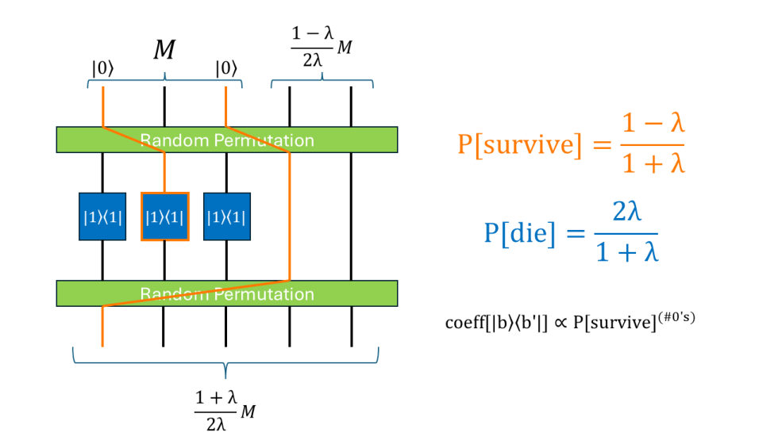 
FIG. 6: An explanation of why applying the optimal cloning map to M i.i.d. pure qubits to increase the qubit count to 1+λ

📷 Fig 5

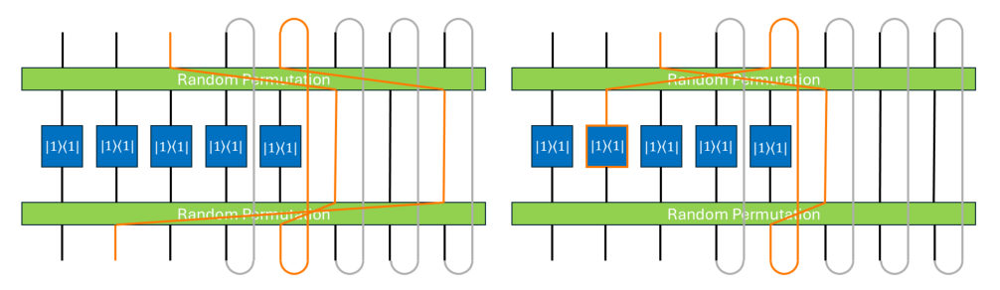 
FIG. 10: (LEFT) An example of a trajectory where the |0⟩ˆn state “wins” by successfully avoiding a |1⟩⟨1|ˆn projector. (RIGHT) An example of a trajectory where the |0⟩ˆn state “loses” by colliding into a |1⟩⟨1|ˆn projector and being annihilated.

**Summary.** This work establishes the maximum achievable rates for converting unknown mixed qubit states between different purities (concentration and dilution). The optimal rates are fundamentally governed by the eigenvalues of the RLD Fisher information matrix. Crucially, the authors show that these state conversions can be implemented using only SWAP tests, offering a deep operational understanding of quantum state geometry.

**Why it may be interesting.** It provides a novel operational interpretation of the full complex RLD Fisher information matrix, linking its geometric properties to fundamental quantum information tasks like state concentration and dilution.

Detailed structure

**Main problem.** The paper determines the maximum linear rate at which unknown mixed qubit states can be converted between different purity levels (concentration or dilution).

**Main result.** The optimal conversion rates are determined by the eigenvalues of the complex right-logarithmic-derivative (RLD) Fisher information matrix, and these conversions can be achieved using only SWAP tests.

**Method.** The analysis involves establishing a three-step protocol (Schur sampling, applying a specific channel like cloning/discarding, and inverse Schur sampling) and proving the maximum rate by showing the trace distance vanishes in the infinite copy limit.

**Model / system.** The system involves unknown mixed qubit states ($
ho$) and their conversion between states of different purities ($\lambda_{in} 	o \lambda_{out}$). The analysis utilizes concepts from quantum information theory, including the RLD Fisher information matrix and SWAP tests.

**Key observables.** Linear conversion rates ($R_{	ext{opt}}$), trace distance ($	ext{dTr}$), and the eigenvalues of the RLD Fisher information matrix.

**Important parameters / regimes.** Input and output purity levels ($\lambda_{in}, \lambda_{out}$), and the number of copies ($N$).

**Assumptions / limitations.** The asymptotic performance relies on the concentration of Schur sampling outcomes, which makes certain error terms exponentially small as $N 	o \infty$.

**Figures summary.** Figure 1 provides a unified presentation of four linear-rate conversion protocols, while Figure 2 illustrates tensor network representations for the symmetric subspace related to the state and the discarding map.

**Paper structure.** The paper first presents four theorems establishing the maximum rate achievement, followed by a detailed proof bounding the trace distance by decomposing the error into parts related to sampling fluctuations and the core channel operation.

Abstract

By consuming multiple copies of an unknown qubit state, one can modify its purity while preserving the direction of its Bloch vector. We determine the maximum linear rate at which qubit states of different purities can be interconverted, allowing a nonzero error, quantified, for instance, by the trace distance, provided that it vanishes in the limit of infinitely many copies. Interestingly, the optimal conversion rate is determined by the two eigenvalues of the complex right-logarithmic-derivative (RLD) Fisher information matrix associated with $\mathrm{SU}(2)$ rotations of the qubit state. When the output qubits have higher purity, corresponding to concentration, the optimal rate is given by the ratio of the maximum eigenvalues of the input and output RLD matrices. In contrast, when the output qubits have lower purity, corresponding to dilution, the optimal rate is given by the ratio of their minimum eigenvalues. Remarkably, both concentration and dilution can be implemented using SWAP tests as the only nontrivial two-qubit measurement primitive, together with ancillary qubits initially prepared in maximally mixed states, without requiring any additional two-qubit gates. Our work thus provides a novel operational interpretation of the full complex RLD Fisher information matrix. Crucially, its antisymmetric, purely imaginary part encodes geometric information beyond the statistical distance between density operators and plays an essential role in determining the optimal state-conversion rates.

[↑ back to top](#top)

### [Probabilistic Error Cancellation for Single-Mode Gottesman-Kitaev-Preskill Codes](http://arxiv.org/abs/2609.17095v1)

**Authors:** Victoria Wadewitz, Alessandro Ciani  
**Type:** theory · **Category:** quantum information and computing · **PDF:** <https://arxiv.org/pdf/2609.17095v1>  
**Analysis basis:** full PDF text, analyzed in chunks
**Topic relevance:** `quantum measurements` **2/5**

📷 Fig 1

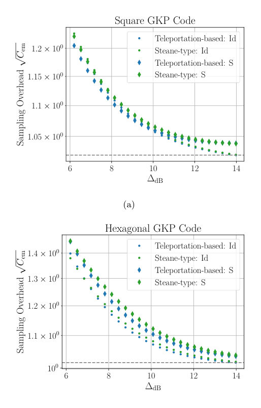 
Figure 4: Overhead comparison for the ¯S-gate and the Identity-gate for a data mode variance σ2 = 0.08 and varying ancilla mode variance.

📷 Fig 2

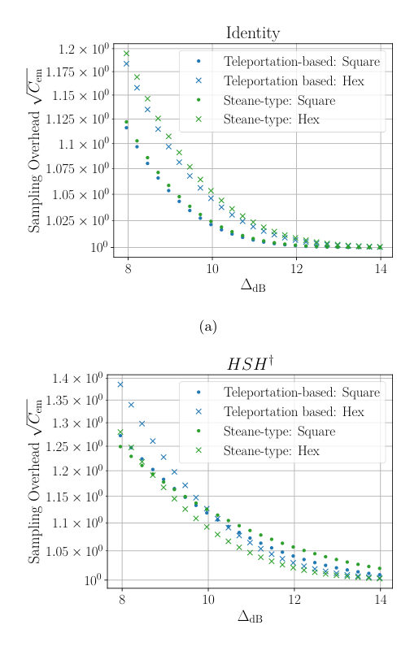 
Figure 5: Overhead comparison for the Identity and the ¯H ¯S ¯H†-gate for teleportation-based and Steane-type GKP error correction.

📷 Fig 3

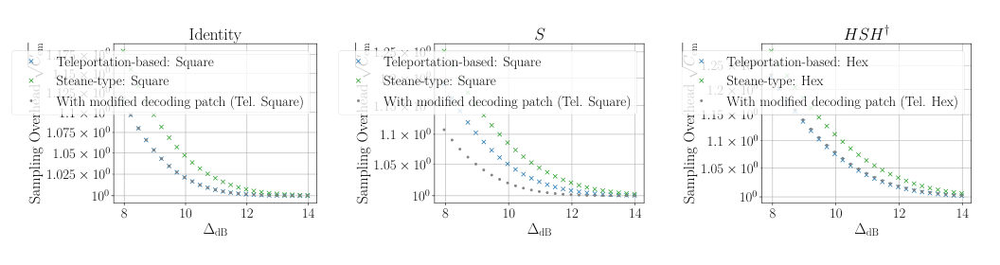 
Figure 6: Overhead comparison for the Identity, ¯S-, and ¯H ¯S ¯H†-gates across error correction methods without modifying the decoding patch.

📷 Fig 4

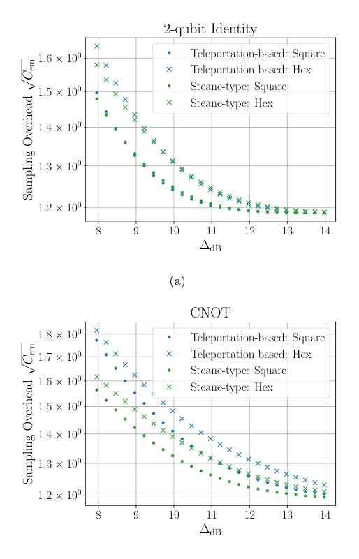 
Figure 7: Overhead comparison for the two-qubit iden- tity gate (a) and CNOT (b) for teleportation-based and Steane-type GKP error correction.

📷 Fig 5

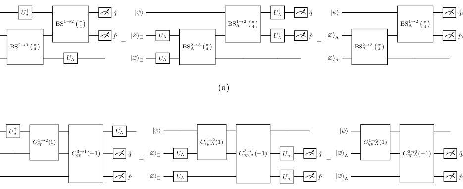 
Figure 8: The transformation of a hexagonal circuit in terms of square GKP code gates and states and vice versa for (a) teleportation-based GKP error correction, adapted from Ref. [47], and (b) Steane-type GKP error correction.

**Summary.** This paper investigates combining Quantum Error Correction (QEC) with Quantum Error Mitigation (QEM) for continuous variable quantum computation using the GKP code. It specifically analyzes the overhead required by Probabilistic Error Cancellation (PEC) when applied after standard GKP error correction protocols. The results provide quantitative estimates for noise resilience in these advanced CV quantum computing schemes.

**Why it may be interesting.** This work is highly relevant for theoretical physicists working on quantum optics and open quantum systems as it provides concrete, quantitative methods for dealing with realistic noise sources in continuous variable quantum computation architectures.

Detailed structure

**Main problem.** The paper addresses the need for fault-tolerant quantum computation by studying the combination of Quantum Error Correction (QEC) with Quantum Error Mitigation (QEM) techniques.

**Main result.** It quantifies the sampling overhead associated with using Probabilistic Error Cancellation (PEC) alongside GKP error correction, demonstrating a nontrivial interplay between these two error handling methods in continuous variable codes.

**Method.** The authors use the stabilizer subsystem decomposition to characterize the effective logical channel and employ PEC, which involves decomposing an ideal gate into noisy basis operations to estimate expectation values.

**Model / system.** The system is based on continuous variable (CV) quantum information encoded using the Gottesman-Kitaev-Preskill (GKP) code, analyzed for both square and hexagonal lattice structures.

**Key observables.** Sampling overhead ($C_{em}$), noise covariance matrices ($\Sigma_{	ext{QEC},\Lambda}$), and the effective logical channel.

**Important parameters / regimes.** GKP squeezing parameter ($\Delta$), noise parameters (mean $\mu$ and covariance $\Sigma$ for Gaussian Random Displacement noise), and the type of GKP gate (single- or two-qubit Clifford gates).

**Assumptions / limitations.** The analysis assumes noise is modeled by Gaussian Random Displacement (GRD) noise and relies on the stabilizer subsystem decomposition to map the noisy process to an effective logical channel.

**Figures summary.** Figures illustrate the quantum circuits for both Steane-type and teleportation-based GKP error correction for a single mode, and the appendices detail the mathematical derivations for noise propagation in both schemes.

**Paper structure.** The paper builds from defining the GKP code structure (Zak basis completeness) to analyzing the noise propagation through two distinct QEC protocols (Steane vs. Teleportation), and finally applying PEC to estimate the overhead associated with mitigating these residual errors.

Abstract

In order to solve practical problems on a quantum computer, it is necessary to use fault-tolerant quantum error correction schemes to overcome noise: the errors arising from imperfections in physical components. The Gottesman-Kitaev-Preskill (GKP) code aims at achieving this in a hardware efficient manner by encoding finite-dimensional logical subspaces in the Hilbert space of one or more continuous variable modes. In near term implementations, however, it is not feasible to eliminate errors entirely, so it is natural to also employ alternative error mitigation techniques together with error correction. In this work, we study a quantum error mitigation method known as probabilistic error cancellation in the context of the GKP code. We compare Steane-type and teleportation-based GKP error correction, and calculate the sampling overheads associated with the technique for square and hexagonal GKP codes. We employ the stabilizer subsystem decomposition for GKP codes to obtain an effective logical channel for noisy operations that is used to express the ideal one of a target logical unitary. We consider noise from finite squeezing on the data and the two ancilla modes, needed for error correction, and examine the relationship between the sampling overhead and the noise for different decoding methods. Our results are calculated for single- and two-qubit GKP Clifford gates and one round of error correction, and show the nontrivial combination of error correction and mitigation in continuous variable codes.

[↑ back to top](#top)

### [Single-Instance Observables in the Sachdev-Ye-Kitaev Model](http://arxiv.org/abs/2609.16130v1)

**Authors:** Brian Swingle  
**Type:** theory · **Category:** strongly correlated electrons · **PDF:** <https://arxiv.org/pdf/2609.16130v1>  
**Analysis basis:** full PDF text, analyzed in chunks
**Topic relevance:** `Keldysh / 2PI / non-Gaussian methods` **2/5**

📷 Fig 1

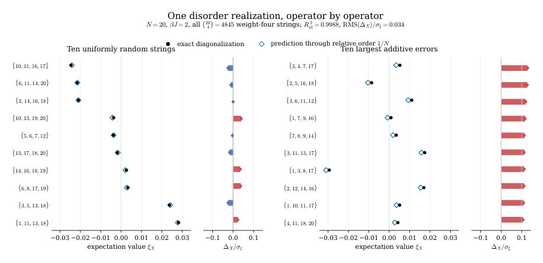 
Figure 1: An operator-by-operator preview for one fixed disorder realization at N = 20 and βJ = 2. Black circles are exact-diagonalization values and open diamonds are the parameter- free predictions through relative order 1/N: the leading term, the degree-two and Wick-ordered degree-three fluctuation tensors, and the one-loop correction to the leading coefficient (Sec- tion 4). The left panel shows ten strings selected uniformly with a random seed fixed in- dependently of the coupling values; the right shows the ten largest additive errors among all 4845 strings. Here “largest” means largest |∆X|, where ∆X = ξED X −ξpred X ; the narrow axes display the signed residual in units of the...

📷 Fig 2

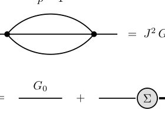 
Figure 2: Melonic dressing for p = 4. (a) The self-energy insertion is a melon: two vertices (dots) joined by p −1 = 3 internal propagators, evaluating to Σ(τ) = J2G(τ)p−1 by the exact index count (27). (b) The Schwinger–Dyson equation (29) resumming the melon on every line: the dressed propagator G (thick) equals the bare propagator G0 (thin) plus one self-energy insertion followed by a dressed propagator.

📷 Fig 3

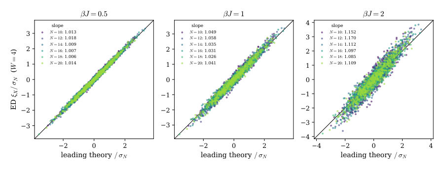 
Figure 3: ED weight-4 one-point values ξX versus the leading prediction −4I4(β)JX of (35), at βJ = 0.5, 1, 2 (left to right), for N = 10–20 (color). Each point is one weight-4 string of one disorder realization; both axes are normalized per N by the standard deviation of the predic- tion. Legends give the per-N through-origin slope; the diagonal is unit slope. The prediction is nearly exact at high temperature (slopes ≈1.01 at βJ = 0.5) and degrades smoothly as βJ grows, both the slope and the scatter increasing.

📷 Fig 4

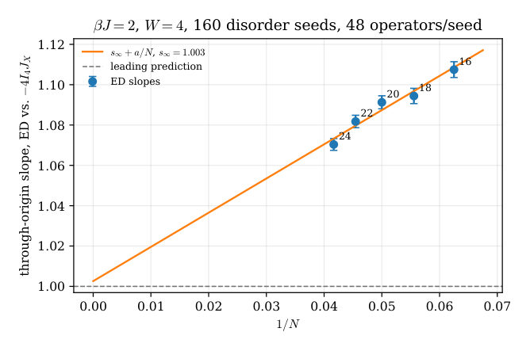 
Figure 4: Through-origin slope of the ED weight-4 one-point values against the leading predic- tion −4I4(β)JX at βJ = 2, versus 1/N (N = 16–24; 160 disorder seeds, 48 operators per seed). The slope exceeds unity at finite N — about 1.11 at N = 16 — and falls almost linearly in 1/N toward the ideal value 1 (dashed); a fit s(N) = s∞+ a/N gives s∞≈1.00. The residual excess at accessible N is a deterministic coefficient correction analyzed in Section 4.

📷 Fig 5

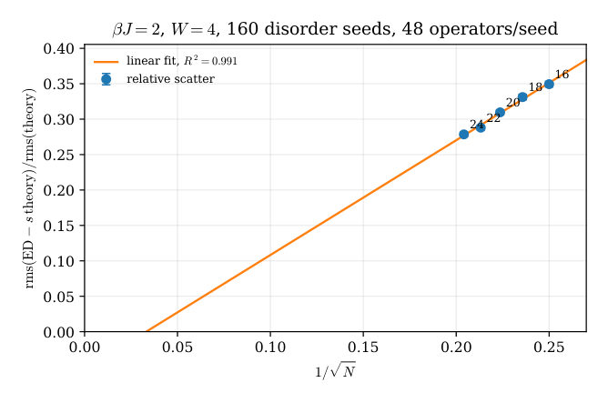 
Figure 5: Relative residual scatter rms(ξED −s ξpred)/ rms(ξpred) of the weight-4 one-point values about the fitted slope at βJ = 2, versus 1/ √

**Summary.** This work presents a systematic diagrammatic expansion to calculate single-instance thermal observables in the SYK model, bypassing the need for disorder averaging. By organizing the calculation in powers of $N^{-1/2}$, the authors achieve results that match exact diagonalization for small systems and apply the technique to related models like MQ.

**Why it may be interesting.** The ability to calculate single-instance, non-averaged thermal properties in highly entangled quantum systems like SYK is crucial for understanding quantum chaos and thermalization dynamics in strongly correlated regimes.

Detailed structure

**Main problem.** The paper develops a method to compute single-instance thermal expectation values for low-weight Majorana strings in the Sachdev-Ye-Kitaev (SYK) model, moving beyond standard disorder averaging.

**Main result.** The diagrammatic expansion provides excellent quantitative agreement with exact diagonalization results for the four-body SYK model up to $N=24$, and it extends the analysis to the Maldacena–Qi (MQ) model.

**Method.** The core method is a diagrammatic expansion organized in powers of $N^{-1/2}$, which expresses observables as finite sums of polynomials in couplings multiplied by temperature-dependent kernels derived from the large-$N$ melonic propagator.

**Model / system.** The primary system is the Sachdev-Ye-Kitaev (SYK) model, involving $N$ Majorana fermions with random $p$-body interactions (specifically $p=4$ is highlighted). The analysis is extended to the Maldacena–Qi (MQ) model.

**Key observables.** Single-instance thermal expectation values ($\xi_X$) of low-weight Majorana string operators, and time-ordered correlation functions.

**Important parameters / regimes.** The ratio $eta J$ (inverse temperature times coupling strength) and the system size $N$. The expansion is organized in powers of $N^{-1/2}$.

**Assumptions / limitations.** The method relies on a diagrammatic expansion which is treated as a dressed high-temperature expansion; convergence is noted to be non-uniform at low temperatures ($eta J$ large).

**Figures summary.** Figure 1 provides an operator-by-operator preview comparing diagrammatic predictions to exact diagonalization results for $N=20, eta J=2$, showing high fidelity ($R^2_{	ext{id}} = 0.9988$).

**Paper structure.** The paper details the diagrammatic expansion (Section 3), discusses corrections to leading diagrams (weight four study in Section 4), extends to time-dependent insertions (Section 5), and applies the method to the Maldacena–Qi (MQ) model (Section 6).

Abstract

We present a diagrammatic expansion for thermal expectation values of low-weight Majorana strings in a fixed realization of the $N$-fermion Sachdev--Ye--Kitaev (SYK) model. At each order in the expansion, the observable is expressed as a finite sum of polynomials in the couplings multiplied by temperature-dependent kernels built from the large-$N$ melonic propagator. At fixed $βJ$, the expansion is organized in powers of $N^{-1/2}$, and each order can be efficiently evaluated with classical resources polynomial in $N$. The expansion also extends to correlations at arbitrary imaginary times and sufficiently short real times. For the four-body SYK model, we show that the diagrammatic predictions give an excellent account of exact diagonalization results at sizes up to $N=24$. We also apply the method to the Maldacena--Qi (MQ) model formed from two identical copies of a fixed SYK realization. This enables the identification of a nearby SYK-like Hamiltonian whose thermofield double state has higher fidelity with the Maldacena--Qi ground state than the thermofield double of the original SYK Hamiltonian.

[↑ back to top](#top)

### [Designs without disorder: unitary $k$-designs from a single-site bulk defect](http://arxiv.org/abs/2609.16140v1)

**Authors:** Samudra Sur, Pratik Nandy  
**Type:** theory · **Category:** statistical mechanics · **PDF:** <https://arxiv.org/pdf/2609.16140v1>  
**Analysis basis:** full PDF text, analyzed in chunks
**Topic relevance:** `analog quantum simulation` **1/5** · `non-equilibrium universality` **1/5** · `quantum measurements` **1/5** · `scars & prethermalization` **1/5**

📷 Fig 1

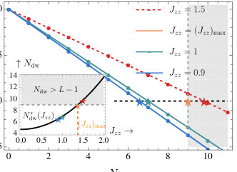 
FIG. 1. Selection rule for the bulk-defect model (L = 10, h⌊L/2⌋= 1). Main: overlap ratio c of Eq. (8) versus domain-wall number Ndw; circles mark realizable integer Ndw, stars denote the roots of c = 0 (i.e., N ∗ dw) from (10), and the gray shaded area to the right denotes the inaccessible region Ndw &gt; L −1. At Jzz = 1, the root falls exactly on N ∗ dw = 7 (green star); at Jzz = 1.5 (red star) it lies at 9.81. Inset: the optimal count N ∗ dw(Jzz) (solid black line), which reaches L −1 at (Jzz)max = 1.374, Eq. (11).

📷 Fig 2

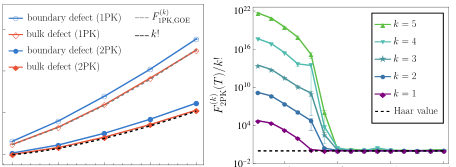 
FIG. 3. Left: 1PK and 2PK Frame potential with boundary and bulk defects, with the Pauli kick P1 = ZIIIZIZIZZ. The gray and black dashed lines denote (5) with Λ = 3 (GOE) and the Haar value k!, respectively. Right: The normalized F (k) 2PK/k!, saturating to unity (black dashed line) for T ≥104. Here L = 10 with a half-filling sector. The parameters are Jzz = 0.9 with (h1, hL) = (0.7, 1.3) for the boundary and h⌊L/2⌋= 1 for the bulk defects. The results are averaged over 105 independent temporal realizations.

📷 Fig 3

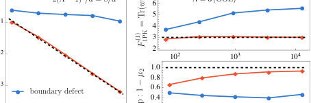 
FIG. 4. Left: Deviation of the exact first-order 2PK frame potential from Haar value; the bulk defect follows ∆(1) 2PK ∼ 1/d (dashed line: GOE prediction 8/d), the boundary defect shows slower decay than 1/d. Right, top: Tr(w2) converges to GOE kurtosis Λ = 3 for the bulk defect and increases for the boundary defect. Right, bottom: The gap 1 −µ2 stays open for the bulk defect and stays far from unity for the boundary defect as d increases.

📷 Fig 4

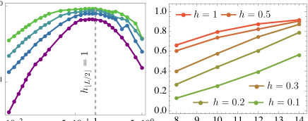 
FIG. 5. Left: Variation of d∆(1) 2PK (dashed line: GOE predic- tion 2(Λ −1)2 = 8) (top) and the gap 1 −µ2 (bottom) with the bulk defect strength h⌊L/2⌋. The gap remains open for higher L with longer windows of the defect strength. Right, top: The deviation d∆(1) 2PK with the position of the defect, which follows the GOE prediction at bulk sites but sharply increases at the boundary. Right, bottom: Finite-size scal- ing of the gap for different defect strength h ≡h⌊L/2⌋. Kicks for L ≤14 are taken from Table I.

**Summary.** This theoretical work demonstrates that introducing a localized defect into an integrable quantum spin chain is sufficient to generate approximate unitary k-designs. By employing a two-Pauli-kick protocol, the authors derive a selection rule showing that the defect must break integrability to facilitate this process. This highlights the crucial role of non-integrability in achieving thermalization-like quantum scrambling.

**Why it may be interesting.** The work provides a concrete, defect-induced mechanism for achieving thermalization-like properties (k-designs) in systems that are otherwise integrable, which is a key topic in non-equilibrium quantum dynamics.

Detailed structure

**Main problem.** The paper investigates whether introducing a small, local defect into an otherwise integrable quantum many-body system is sufficient to generate approximate unitary k-designs.

**Main result.** A single bulk defect successfully breaks integrability and enables the formation of approximate unitary k-designs via a two-Pauli-kick protocol, a mechanism that is absent in integrable boundary defect scenarios.

**Method.** The study uses the Two-Pauli-Kick (2PK) protocol and analyzes the system's deviation from the Haar ensemble using the frame potential and an overlap ratio derived from Pauli string calculations.

**Model / system.** The system is modeled by a spin-1/2 XXZ chain Hamiltonian, which is integrable when clean or only subject to boundary defects. Integrability is broken by a single, localized bulk defect.

**Key observables.** Unitary k-design fidelity (measured via the frame potential $F^{(k)}_E$), the overlap ratio $c$, and the domain-wall number $N_{dw}$.

**Important parameters / regimes.** The defect strength $h_j$, the kick protocol (2PK vs 1PK), and the system size $L$.

**Assumptions / limitations.** The analysis relies on the non-resonance assumption and uses approximations for trace calculations involving Pauli strings.

**Figures summary.** Figures illustrate the selection rule for admissible Pauli kicks based on the overlap ratio vs. domain-wall number, and compare the decay of the design fidelity for bulk versus boundary defects.

**Paper structure.** The paper establishes the theoretical framework for k-designs, analyzes the 2PK protocol, derives an analytical selection rule based on the defect structure, and contrasts the design-forming capability between bulk-defect and boundary-defect scenarios.

Abstract

We show that an $O(1)$ local defect is sufficient to generate approximate unitary $k$-designs from an otherwise integrable quantum many-body system. Using a two-Pauli-kick (2PK) protocol with temporal sampling, we demonstrate this mechanism in a fixed-magnetization sector of deterministic XXZ spin chains with a single integrability-breaking bulk defect. We derive an analytical selection rule for the Pauli kicks and show that symmetry-preserving strings with a specific domain-wall count, fixed by the couplings, govern design formation. An exhaustive search over all admissible Pauli strings identifies a broad family of kicks that produce designs in the chaotic regime, whereas no such kicks exist in the integrable limit, including for boundary defects. We further show that the design-forming mechanism remains effective for weak bulk defects as the system size increases.

[↑ back to top](#top)

### [Trajectory Statistics Govern Mechanical Power Transfer in Active Baths](http://arxiv.org/abs/2609.17047v1)

**Authors:** Chul-Ung Woo, Jiwon Choi, Heiko Rieger  
**Type:** theory · **Category:** statistical mechanics · **PDF:** <https://arxiv.org/pdf/2609.17047v1>  
**Analysis basis:** full PDF text, analyzed in chunks
**Topic relevance:** `Keldysh / 2PI / non-Gaussian methods` **1/5** · `correlated / nonlocal dissipation` **1/5** · `methods for driven-dissipative` **1/5** · `quantum measurements` **1/5**

📷 Fig 1

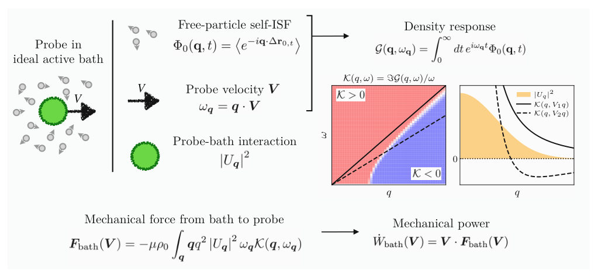 
FIG. 1. From free-particle motion to the mechanical response of a moving probe. The moving-probe problem separates into a bath response determined by the free-particle self-ISF, frequency sampling set by the probe velocity, and wave- vector weighting set by the probe-bath interaction. The right panels illustrate the sampled responses for two probe velocities together with the interaction weight. Combining them in the force integral gives the bath force and the mechanical power transferred from the bath to the probe.

📷 Fig 2

 
FIG. 2. Dimension-dependent response of active Brownian particles. (a,b) Rescaled responses Hd(z, Ω) for (a) d = 2 and (b) d = 3, evaluated from converged trunca- tions of the angular hierarchy. The two-dimensional response contains a region with Hd &lt; 0, corresponding to modes that can transfer positive mechanical power, whereas the three- dimensional response remains positive throughout the dis- played domain. (c) Numerical checks of the analytical asymp- totic limits of Hd(z, 0). (d) Deviation 1 −md of the minimum from unity. The numerically obtained minima approach the static large-d scaling 18/d2.

📷 Fig 3

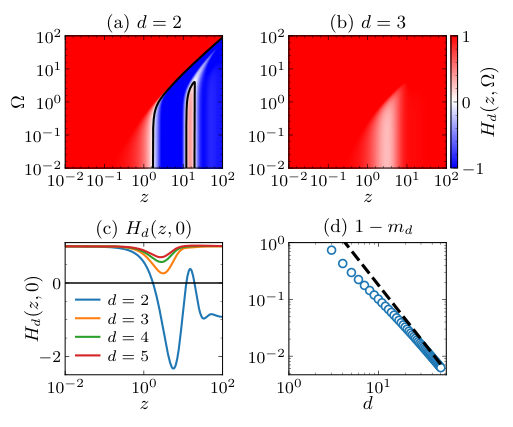 
Figure 3 compares the finite-frequency responses of the three matched active-particle models in the common di- mensionless variables (z, Ω). The one-dimensional RTP and two-dimensional ABP contain regions with KX d &lt; 0, whereas the AOUP response remains nonnegative. Linear friction depends only on KX d (z, 0). At nonzero imposed speed, a mode making an angle φ with the probe velocity samples the response at Ω= (V/v0)z cos φ. In one dimension, this sampling reduces to |Ω| = (|V |/v0)z. In dimensions d ≥2, the angular degree of freedom allows |Ω| ≤(V/v0)z at each z. Modes with sufficiently small | cos φ| can sample small frequencies even for V &gt; v0.

📷 Fig 4

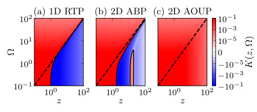 
FIG. 3. Finite-frequency response of standard ac- tive baths. Dimensionless responses KX d (z, Ω) for (a) a one- dimensional RTP, (b) a two-dimensional ABP, and (c) a two- dimensional AOUP. Here z = qv0τ and Ω= ωτ. Only Ω≥0 is shown because inversion symmetry makes KX d even in fre- quency. Color denotes the response on a symmetric logarith- mic scale, and solid black contours mark KX d = 0. The dashed line Ω= z corresponds to V = v0 with q ∥V .

📷 Fig 5

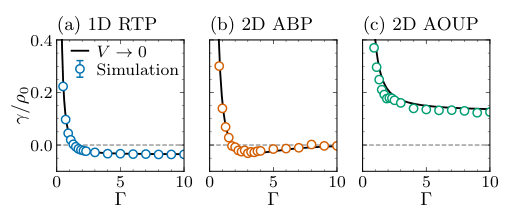 
FIG. 4. Linear friction for Gaussian probes in matched ideal active baths. Friction coefficient per bath density, γ/ρ0, as a function of Γ = v0τ/a for (a) a one-dimensional RTP, (b) a two-dimensional ABP, and (c) a two-dimensional AOUP. Solid curves are the V →0 weak-potential predictions obtained by integrating the corresponding responses at Ω= 0 over wave number with the Gaussian interaction weight. Open circles show direct fixed-velocity simulations at V/v0 = 0.01. Horizontal dashed lines indicate zero friction. The RTP and ABP friction coefficients change sign at ΓRTP c,1 and ΓABP c,2 , re- spectively, whereas the AOUP friction remains positive.

**Summary.** This paper develops a theoretical framework showing that the mechanical force and power transferred by an active bath to a probe are governed by the bath's single-particle trajectory statistics. By analyzing specific active models, the authors determine the conditions under which positive power transfer (energy injection) can occur, providing quantitative predictions for phenomena like drag reversal.

**Why it may be interesting.** This work provides a powerful, general theoretical tool—the trajectory-response relation—to predict macroscopic mechanical forces and energy flow in complex active matter systems solely from single-particle statistical measurements.

Detailed structure

**Main problem.** The paper determines the mechanical force and power transfer exerted by an active bath on a moving probe, linking this response directly to the single-particle trajectory statistics of the bath particles.

**Main result.** The sign of the mechanical power transfer depends critically on the specific dynamics of the active bath; for instance, 1D run-and-tumble particles and 2D active Brownian particles can exhibit modes that transfer positive mechanical power, while AOUPs and 2D+ RTPs do not.

**Method.** The authors derive a trajectory-response relation that separates the bath dynamics from the wave-vector weighting, allowing the calculation of the force and power using the free-particle self-intermediate scattering function (ISF).

**Model / system.** The system consists of a passive probe moving at velocity V immersed in a dilute, ideal gas of noninteracting active particles, modeled using dynamics like Active Ornstein-Uhlenbeck processes, Run-and-Tumble Particles, and Active Brownian Particles.

**Key observables.** Mechanical force $F_{	ext{bath}}(V)$, mechanical power transfer $\dot{W}_{	ext{bath}}(V)$, density response $\delta
ho(\mathbf{r}; V)$, and the self-intermediate scattering function $\Phi_0(q, t)$.

**Important parameters / regimes.** Probe velocity $V$, wave vector $q$, and the dimensionality $d$ of the system.

**Assumptions / limitations.** The analysis is performed at the leading weak-probe, ideal-bath limit, linearizing the response in the probe potential, and assuming non-interacting bath particles.

**Figures summary.** The notes do not describe specific figures, but mention that the analysis predicts phenomena like drag reversal, spontaneous probe motion, and motion-induced density distortions.

**Paper structure.** The paper establishes the theoretical framework connecting force to trajectory statistics, derives the power transfer criterion, and then applies this framework to analyze specific active particle models (AOUPs, RTPs, ABPs) to determine the sign of energy transfer.

Abstract

The mechanical response of a moving probe in an active bath reflects both the dynamics of the bath and how the probe couples to it. For a probe moving at velocity $\mathbf V$ and interacting weakly with an ideal active bath, we show that the trajectory statistics of a free bath particle determine a density response from which the bath force on the probe follows. The probe-particle interaction determines how this response is weighted over wave vector $\mathbf q$, while the probe motion selects frequencies $ω_{\mathbf q}=\mathbf q\cdot \mathbf V$. This trajectory-response relation separates the bath dynamics from the wave-vector weighting, so neither the stationary state nor force correlations need to be recalculated for each probe interaction and velocity. Applying this relation to active-particle models, we prove that positive power transfer is excluded for active Ornstein--Uhlenbeck particles in all dimensions and for complete-reset run-and-tumble particles in $d\geq2$, while one-dimensional run-and-tumble particles and two-dimensional active Brownian particles possess modes that can transfer positive mechanical power. For a given probe, this response predicts drag reversal, spontaneous probe motion, and motion-induced density distortions, all in quantitative agreement with simulations. Varying the probe geometry changes how the same bath response is weighted, thereby selecting different moving states. Beyond the leading weak-probe, ideal-bath limit, higher orders in probe strength involve multi-interval trajectory statistics, while finite-density corrections involve interacting-particle dynamics. Our results connect the trajectory statistics of active bath particles to the mechanical response of a passive probe, providing a route to predict probe response from single-particle trajectory statistics measured in the absence of the probe.

[↑ back to top](#top)

### [A Data-free Universal Prior over Syntactic Structures](http://arxiv.org/abs/2609.16854v1)

**Authors:** Fermín Moscoso del Prado Martín  
**Type:** theory · **Category:** disordered systems and neural networks · **PDF:** <https://arxiv.org/pdf/2609.16854v1>  
**Analysis basis:** full PDF text, analyzed in chunks
**Topic relevance:** `analog quantum simulation` **1/5** · `methods for driven-dissipative` **1/5**

📷 Fig 1

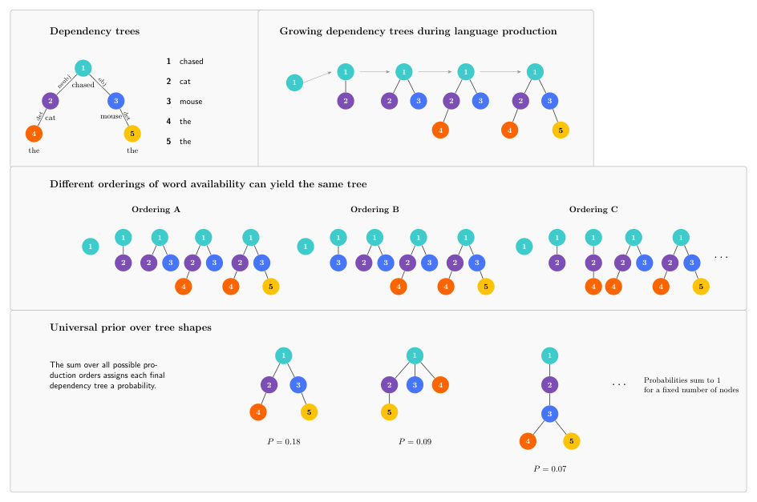 
Figure 1: Incremental language production induces a universal prior over dependency trees.

📷 Fig 2

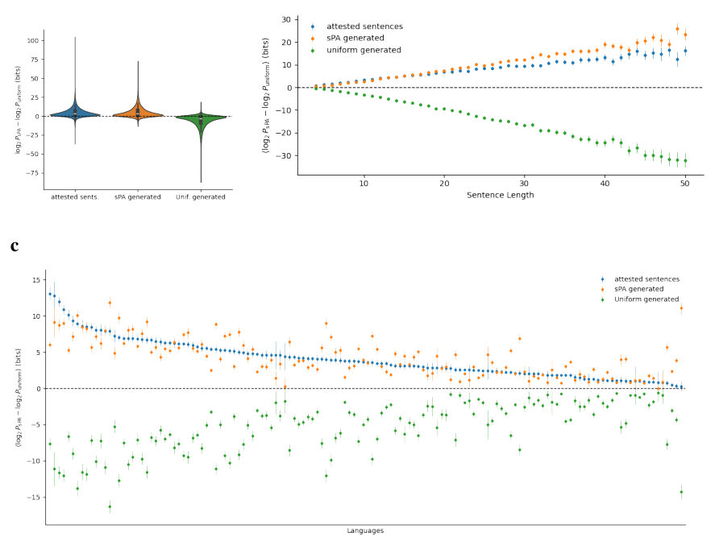 
Figure 2: Probability advantage of the sPA model over the uniform model. a, Distribution

📷 Fig 3

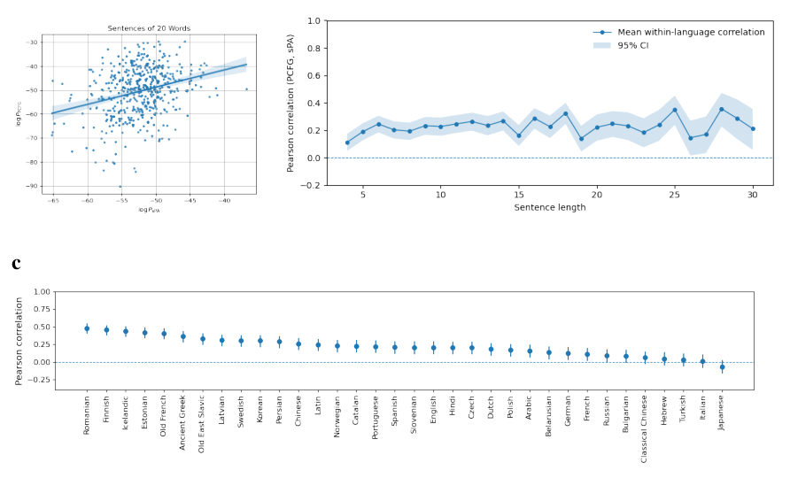 
Figure 3: Correlation between sPA and language-specific PCFG probabilities. a, Example of

**Summary.** This work proposes that a universal, data-free prior exists for syntactic structures, derived from modeling the cognitive process of language production. By comparing this theoretical prior against probabilities derived from dozens of real languages, the authors show a strong correlation, suggesting that language structure is partially constrained by universal generative principles rather than solely by accumulated linguistic experience.

**Why it may be interesting.** While focused on linguistics, the methodology involves complex statistical inference, modeling emergent structure from local rules (preferential attachment), and comparing theoretical priors against empirical data, which shares conceptual overlap with modeling complex systems in condensed matter or neural networks.

Detailed structure

**Main problem.** The paper investigates whether the probability structure of syntactic rules can arise independently of language-specific statistical learning, suggesting a universal, data-free prior.

**Main result.** A universal prior derived from a cognitively motivated model of language production shows a strong positive correlation with probabilities estimated from actual linguistic data across many typologically diverse languages.

**Method.** The authors compare the probabilities derived from a data-free sublinear preferential attachment (sPA) prior against probabilities estimated using Probabilistic Context-Free Grammars (PCFGs) for various languages.

**Model / system.** The model is a cognitively motivated process of incremental language production, where syntactic structures are built up as a growing network (dependency tree). The probability is calculated by integrating over attachment parameters and production orderings.

**Key observables.** Correlation coefficients between the universal sPA prior probability and language-specific PCFG probabilities; the linear regression coefficient (beta) linking these two measures.

**Important parameters / regimes.** The sublinear attachment exponent $\alpha$ (integrated over a Beta(2, 2) prior); the number of nodes $n$ in the dependency tree.

**Assumptions / limitations.** The underlying generative process follows an approximately incremental sublinear preferential attachment model, and language-specific probabilities are adequately approximated by PCFGs.

**Figures summary.** Figures illustrate the probability advantage of the sPA model over a uniform prior, and show the positive correlation between the sPA prior and language-specific PCFG probabilities across many languages.

**Paper structure.** The paper establishes the problem of data-independent syntactic priors, develops the sPA model based on incremental production, calculates the universal prior via Monte Carlo integration, and finally tests this prior by correlating its predictions against empirical PCFG estimates across a large, diverse dataset of languages.

Abstract

Probability is fundamental to theories of language comprehension, production, acquisition, and evolution, as well as to large language models. Existing theories estimate the probability of syntactic structures from language-specific data. Whether part of this probability structure can arise independently of language-specific experience remains unknown. Here I show that a universal prior over syntactic structures emerges from a cognitively motivated model of incremental language production, in which words are progressively integrated into syntactic structure through network growth. The resulting prior assigns probabilities to syntactic structures --represented as dependency trees-- without fitting parameters to linguistic data, and assigns higher probabilities to attested than to random trees in all 138 typologically diverse languages examined. These prior probabilities correlate positively with probabilities estimated from corpora in 33 of 34 languages. The results indicate that part of the probability structure of syntax can arise independently of language-specific statistical learning. Linguistic experience may therefore refine probabilities that are already structured by the process of language production, rather than create them from an initially uniform space. This identifies a possible cognitive origin for part of the probability distribution over syntactic structures, linking language production and statistical learning while providing a data-independent structural bias for probabilistic models of language.

[↑ back to top](#top)

### [An improved auxiliary boson method for quantum dots with finite Coulomb interaction U](http://arxiv.org/abs/2609.16311v1)

**Authors:** Juan Pablo Ramos-Andrade, Patricia Almeida, Ana María Calle, Gustavo Lara  
**Type:** theory · **Category:** strongly correlated electrons · **PDF:** <https://arxiv.org/pdf/2609.16311v1>  
**Analysis basis:** full PDF text, analyzed in chunks
**Topic relevance:** `Keldysh / 2PI / non-Gaussian methods` **1/5** · `methods for driven-dissipative` **1/5**

📷 Fig 1

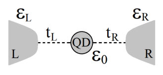 
FIG. 1. Schematic view of the setup: the QD coupled to left/right leads. The parameter tL(R) (dashed lines) denotes the leads-QD coupling.

📷 Fig 2

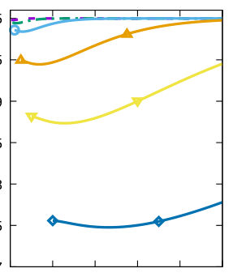 
FIG. 2. Probability that the QD is in singly occupied state in the case of electron-hole symmetry.

📷 Fig 3

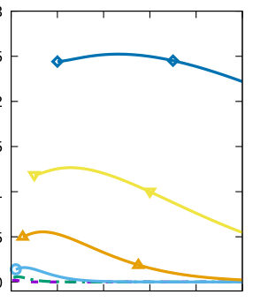 
FIG. 3. Probability that the QD is in the doubly occupied state or in the empty state, in the case of electron-hole sym- metry.

📷 Fig 4

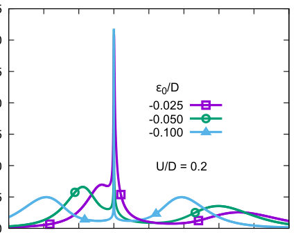 
FIG. 4. LDOS as a function of energy for several values of ε0, obtained from NRG. Here, D is the energy unit (D = 1), U = 0.2D, Γ = 0.01D, and the temperature is such that κBT = 10−15D .

📷 Fig 5

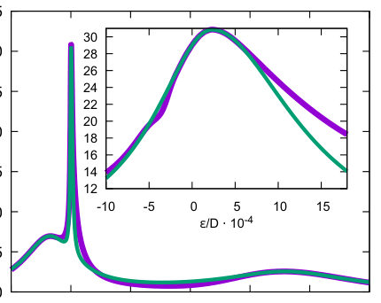 
FIG. 5. LDOS as a function of energy. The NRG results (thick purple line) are fitted to three asymmetric Lorentzian curves (thin green line) to obtain a more accurate fit of the side of the central peak closest to the Fermi level (ε = 0). These curves reproduce the NRG results at the energy cor- responding to each peak maximum and in adjacent energy regions. The inset shows a detailed comparison of the central peak.

**Summary.** This paper presents an improved auxiliary boson method to model strongly correlated quantum dots with finite Coulomb interaction U. By refining an existing theoretical framework, the authors achieve an analytically tractable approach that accurately predicts transport properties. The results are rigorously validated by comparing them against established Numerical Renormalization Group calculations.

**Why it may be interesting.** This work provides an analytical alternative to purely numerical methods (like NRG) for studying strongly correlated impurity models, which is valuable for theoretical modeling of nanoscale electronic devices.

Detailed structure

**Main problem.** The paper addresses the challenge of accurately describing strong electronic correlations in quantum dots (QDs) when a finite Coulomb interaction (U) is present.

**Main result.** The improved auxiliary boson method provides an analytically tractable and robust framework that yields results in good agreement with benchmark Numerical Renormalization Group (NRG) calculations.

**Method.** The authors refine the auxiliary boson formulation (originally by Kotliar and Ruckenstein) and apply a mean-field approximation to derive the system's Hamiltonian and solve for ground state properties self-consistently.

**Model / system.** The system is a single-level quantum dot coupled to two metallic leads, modeled by an Anderson impurity-like Hamiltonian that includes the Coulomb repulsion term U.

**Key observables.** Local Density of States (LDOS), probability of the QD being in empty, singly occupied, or doubly occupied states, and the Kondo temperature ($T_K$).

**Important parameters / regimes.** The Coulomb interaction U, the coupling strength $\Gamma$, and the energy level $\epsilon_0$. The Kondo temperature scale is given by a specific formula involving U and $\Gamma$.

**Assumptions / limitations.** The method relies on the mean-field approximation at low temperatures, and the final comparison is restricted to regimes where U and $|	ilde{\epsilon}_0|$ are significantly larger than $\Gamma$.

**Figures summary.** Figures illustrate the probability of the QD occupying different charge states under electron-hole symmetry, and show the LDOS calculated via NRG, which is then fitted by the theoretical model.

**Paper structure.** The paper first sets up the Hamiltonian for the QD in the Kondo regime, introduces the improved auxiliary boson formalism, derives the mean-field Hamiltonian, solves for self-consistent bosonic parameters, and finally compares the resulting spectral functions and transport properties against NRG benchmarks.

Abstract

In this work, we present an improved version of the formulation of the four auxiliary bosons originally proposed by Kotliar and Ruckenstein, adapted to describe a quantum dot in the Kondo regime with finite electron-electron interaction U. The proposed refinement provides a more accurate treatment of strong electronic correlations while preserving the analytical tractability of the original approach, thereby enabling a reliable description of transport properties in nanoscale systems. Benchmark calculations show good agreement with the results of the numerical renormalization group, supporting the validity of the improved formulation. Our approach therefore provides an efficient and robust framework for investigating transport through strongly correlated quantum dots.

[↑ back to top](#top)

### [Eigenstate thermalization beyond the envelope: exact two-point overlap statistics in random free fermions](http://arxiv.org/abs/2609.17037v1)

**Authors:** Zhiqiang Huang  
**Type:** theory · **Category:** statistical mechanics · **PDF:** <https://arxiv.org/pdf/2609.17037v1>  
**Analysis basis:** full PDF text, analyzed in chunks
**Topic relevance:** `analog quantum simulation` **1/5** · `scars & prethermalization` **1/5**

📷 Fig 1

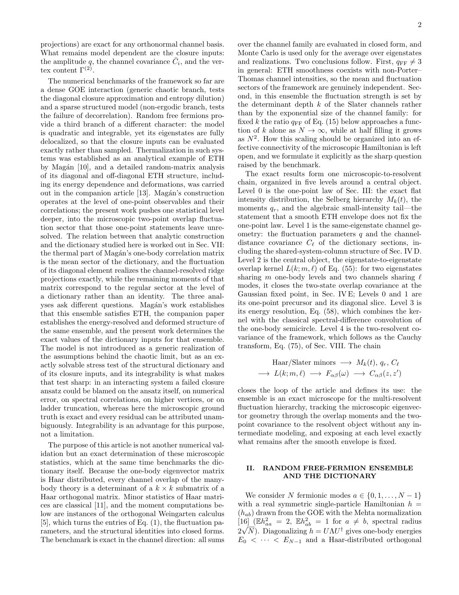 
Low-resolution page preview, page 2

📷 Fig 2

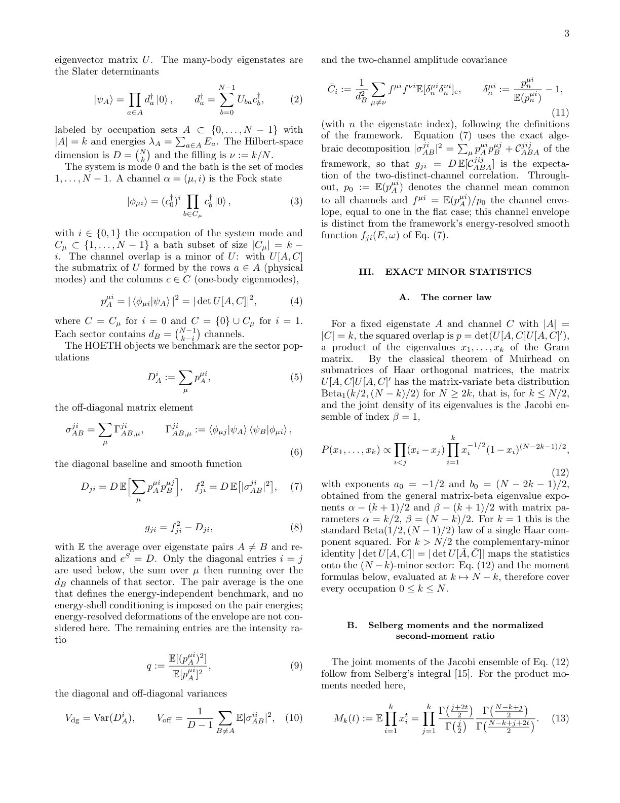 
Low-resolution page preview, page 3

📷 Fig 3

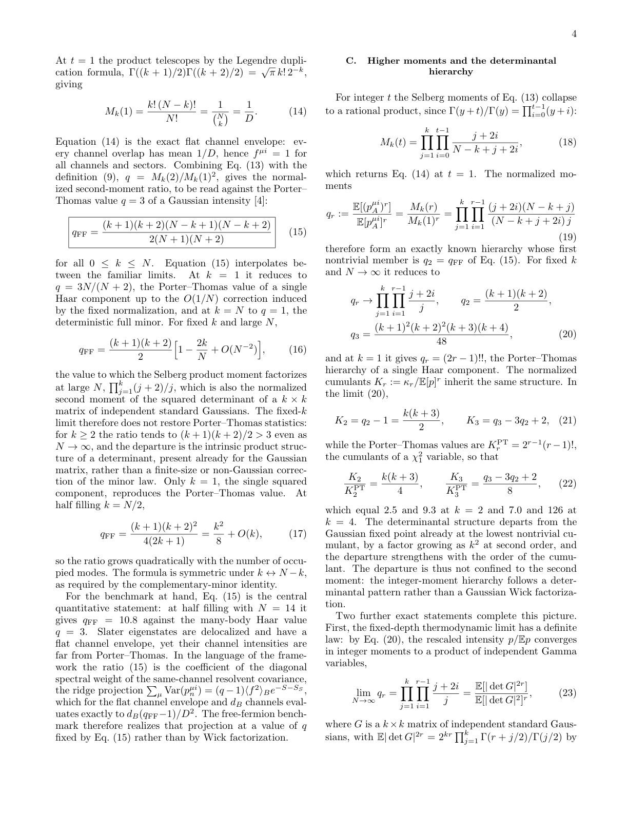 
Low-resolution page preview, page 4

📷 Fig 4

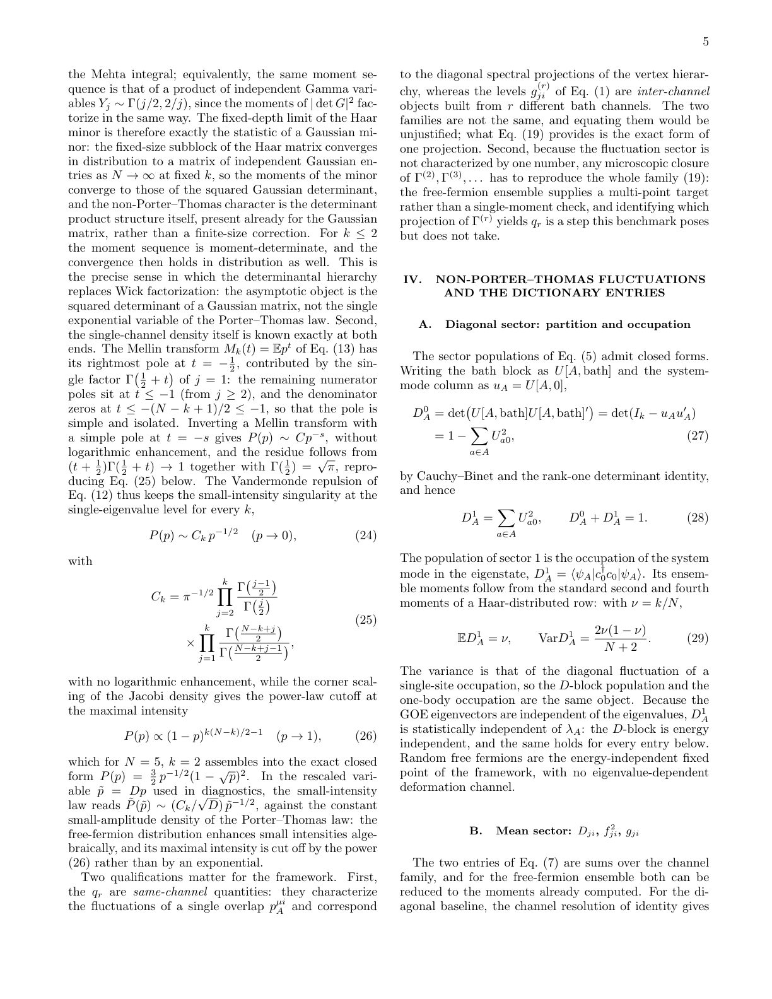 
Low-resolution page preview, page 5

📷 Fig 5

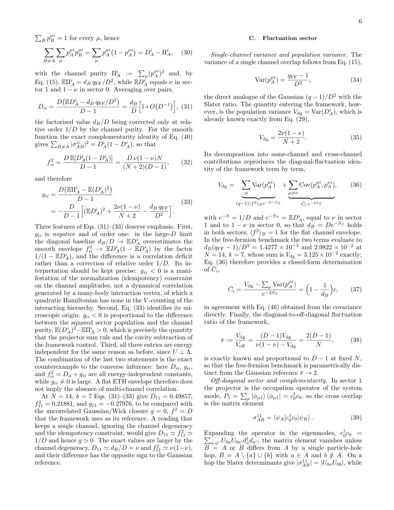 
Low-resolution page preview, page 6

**Summary.** This paper solves the microscopic statistics of eigenstate overlaps in random free fermions, going beyond the smooth energy dependence predicted by ETH. By calculating the exact two-point covariance, the authors prove that the fine-grained quantum fluctuations are not determined by the smooth energy envelope. This provides a crucial, exactly solvable benchmark for understanding thermalization in many-body quantum systems.

**Why it may be interesting.** It provides a rigorous, exactly solvable model to test the limits of ETH, offering concrete, non-trivial statistics for quantum fluctuations that are crucial for understanding thermalization in complex quantum systems.

Detailed structure

**Main problem.** To determine the microscopic statistics of overlaps between many-body eigenstates and a basis, going beyond the one-point statement provided by Eigenstate Thermalization Hypothesis (ETH).

**Main result.** The two-point covariance closes exactly at the Gaussian fixed point, demonstrating that the smooth ETH envelope does not determine the fine-grained two-point fluctuations.

**Method.** The authors use an exactly solvable random free-fermion ensemble to derive exact moment statistics for channel overlaps, comparing them to established random-matrix theory benchmarks.

**Model / system.** The system is random free fermions whose eigenstates are Slater determinants built from eigenvectors of a Gaussian Orthogonal Ensemble (GOE) single-particle Hamiltonian. This ensemble serves as an exactly solvable benchmark for testing theoretical structures.

**Key observables.** Two-point overlap covariance, normalized second-moment ratio ($q$), and the structure of the multi-resolvent correlation levels ($g_{ji}$).

**Important parameters / regimes.** The depth of the determinant ($k$), the number of fermionic modes ($N$), and the correlation correction terms ($g_{11}$).

**Assumptions / limitations.** The analysis relies on the framework of a 'multi-resolvent dictionary' to separate the ETH function into a smooth baseline and fluctuation terms.

**Figures summary.** Not specified, but the notes reference tables comparing analytic ETH constructions with exact free-fermion results across different theoretical sectors.

**Paper structure.** The paper builds a multi-resolvent hierarchy, first analyzing the one-point statistics (flat intensity distribution), then deriving the exact two-point covariance using random-matrix theory, and finally establishing the structural identities that show the independence of the mean and fluctuation sectors.

Abstract

Eigenstate thermalization constrains the smooth dependence of observables on energy, but it does not by itself fix the microscopic statistics of the overlaps between many-body eigenstates and a chosen basis: the smooth envelope is a one-point statement, and the fluctuation field it leaves undetermined carries a structured two-point covariance. We establish this distinction, and solve that fluctuation field exactly, in random free fermions---an ensemble of Slater-determinant eigenstates built from a Gaussian orthogonal single-particle Hamiltonian, whose eigenstate thermalization was established by Magán.   In this ensemble every channel overlap is a minor of a Haar-distributed orthogonal matrix, so its statistics follow from classical random-matrix theory. The one-point law is exactly flat for every channel, with an exact moment hierarchy that is not Porter--Thomas: small intensities are enhanced algebraically rather than by the exponential Porter--Thomas form, and the mean sector carries a negative, order-one correlation correction of purely normalization origin. The two-point covariance closes exactly at the Gaussian fixed point: it is organized by the number of one-body modes shared by two eigenstates and by the number of modes shared by two channels, and its energy-resolved form factorizes into this geometry times the classical convolution of the single-particle semicircle, from which the two-resolvent covariance follows by an integral transform. Exact finite-size computations confirm all closed forms, and the structural identities of the dictionary hold at machine precision. The results provide an exactly solvable microscopic realization of the two-point fluctuation sector underlying multi-resolvent descriptions of eigenstate thermalization: a smooth envelope does not determine fine-grained fluctuations.

[↑ back to top](#top)

### [Exact efficient simulation of noisy logical magic states using Clifford stabilizers](http://arxiv.org/abs/2609.16929v1)

**Authors:** Yugo Takada, Stephen D. Bartlett, Dominic J. Williamson  
**Type:** theory · **Category:** quantum information and computing · **PDF:** <https://arxiv.org/pdf/2609.16929v1>  
**Analysis basis:** full PDF text, analyzed in chunks
**Topic relevance:** `methods for driven-dissipative` **1/5** · `quantum measurements` **1/5**

📷 Fig 1

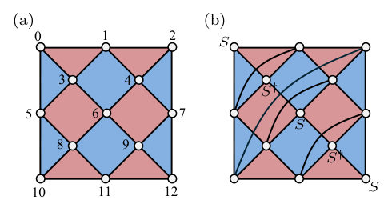 
FIG. 2. The distance-3 regular (unrotated) surface code. (a) The definition of the code. The circles represent qubits. The red and blue faces correspond to X and Z stabilizers, respec- tively. (b) The fold-transversal ¯S gate. The S and S† gates act on the diagonal qubits alternately, and CZ gates act on the rest of the qubits. Each CZ gate, depicted as a black curved line, acts on a pair of qubits at mirrored positions.

📷 Fig 2

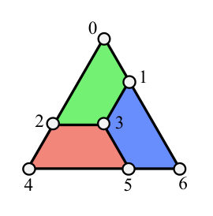 
FIG. 4. Steane code. The circles denote qubits. The X and Z stabilizer generators are defined to act on the qubits around each face.

📷 Fig 3

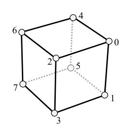 
FIG. 3. Cubic lattice on which the J8, 3, 2K code is defined. The circles represent qubits.

📷 Fig 4

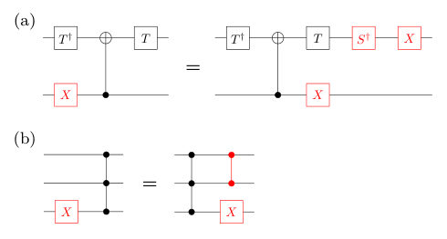 
FIG. 5. Clifford errors on the data qubits arising from hook errors when measuring the Clifford operator ¯HXY by jointly measuring physical Hermitian operators. (a) Circuit for mea- suring the physical Hermitian operator TXT † = e−iπ/4SX = eiπ/4XS†. The upper and lower wires represent a data and ancilla qubit, respectively. The X error on the ancilla qubit produces a Clifford S† error on the data qubit. (b) Circuit for measuring the physical Hermitian operator CZ. The lower wire corresponds to an ancilla qubit, and the other two wires are data qubits. The X error on the ancilla qubit propagates to a Clifford CZ error on the data qubits.

📷 Fig 5

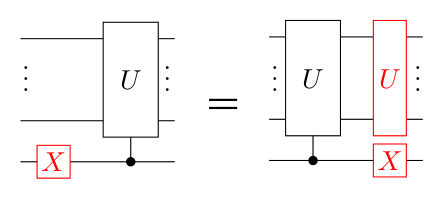 
FIG. 6. Propagation of a hook error through a controlled-U gate, where U is a Hermitian unitary. The bottom wire rep- resents the ancilla qubit, while the remaining wires represent the data qubits.

**Summary.** This paper presents Clifford-stabilizer simulation, a novel, efficient algorithm for classically simulating the noisy preparation of logical magic states crucial for fault-tolerant quantum computation. By mapping complex non-Clifford noisy circuits onto equivalent Clifford circuits, the method allows for the exact benchmarking of large-scale quantum error correction protocols. This provides a vital tool for assessing the feasibility of useful FTQC.

**Why it may be interesting.** While focused on quantum computation, the development of efficient classical simulation techniques for complex, error-prone quantum circuits is a significant computational tool relevant to understanding resource scaling in quantum information.

Detailed structure

**Main problem.** The core challenge is developing an exact and efficient classical simulation method to predict the performance of fault-tolerant quantum computation (FTQC) by simulating noisy logical magic state preparation.

**Main result.** The authors introduce Clifford-stabilizer simulation, an efficient algorithm that exactly maps non-Clifford noisy circuits to equivalent Clifford circuits, enabling benchmarking of large-scale magic state preparation up to fault distance 7.

**Method.** The method involves tracking the evolution of a Clifford-stabilizer group ($	ext{GC}$) to simulate noisy protocols, mapping non-Clifford operations to an equivalent Clifford circuit representation.

**Model / system.** The context is quantum error correction codes (e.g., surface codes) used in FTQC, focusing on preparing logical magic states required for non-Clifford gates. The simulation incorporates circuit-level Pauli errors and Pauli-stabilizer codes.

**Key observables.** Measurement outcome distributions, logical error rates, and acceptance rates for magic state cultivation protocols.

**Important parameters / regimes.** Fault distance ($f=3, 5, 7$), circuit-level Pauli error rates, and the size of the stabilizer group.

**Assumptions / limitations.** The simulation assumes a specific noise model (depolarizing channel) and utilizes a systematic approach to map non-Clifford dynamics onto a Clifford-stabilizer framework.

**Figures summary.** Figures illustrate gate-teleportation circuits for T-gate implementation and the structure of surface codes for various distances, while tables detail the cultivation protocols for $f=3, 5, 7$.

**Paper structure.** The paper builds conceptually by first defining the problem, introducing the Clifford-stabilizer group ($	ext{GC}$), establishing update rules, and finally applying the simulation framework to detailed protocols for magic state cultivation and error correction.

Abstract

The preparation of high-fidelity logical magic states is a crucial subroutine for universal fault-tolerant quantum computation (FTQC). Predicting the performance of FTQC and developing improved protocols rely on numerical methods to classically simulate logical magic state preparation in the presence of noise. Clifford logic on Pauli-stabilizer codes with circuit-level Pauli errors can be efficiently simulated using Pauli-stabilizer formalism, but the non-Clifford operations required to prepare logical magic states render generic simulation inefficient. We introduce Clifford-stabilizer simulation, an exact and efficient algorithm based on updating a Clifford-stabilizer group to simulate noisy preparation protocols for a broad class of logical magic states used to implement non-Clifford gates in the third level of the Clifford hierarchy under circuit-level Pauli errors. Clifford-stabilizer simulation applies to a range of operations that commonly appear in preparation protocols for such logical magic states, including Pauli-stabilizer measurements, logical Clifford measurements, and transversal non-Clifford gates. Our algorithm for Clifford-stabilizer simulation maps a non-Clifford circuit with sampled circuit-level Pauli errors to a Clifford circuit that exactly reproduces its measurement outcome distribution, achieving time and space complexities polynomial in relevant protocol parameters. We perform exact simulation of magic state cultivation up to fault distance 7 by Clifford-stabilizer simulation. Our method provides a route to perform exact benchmarking of large-scale logical magic state preparation protocols required for useful FTQC.

[↑ back to top](#top)

### [Exact Work Characteristic Functions for Time-Dependent Bosonic Quadratic Hamiltonians](http://arxiv.org/abs/2609.16435v1)

**Authors:** F. Nicacio, R. N. P. Maia  
**Type:** theory · **Category:** statistical mechanics · **PDF:** <https://arxiv.org/pdf/2609.16435v1>  
**Analysis basis:** full PDF text, analyzed in chunks
**Topic relevance:** `Full counting statistics` **1/5** · `Keldysh / 2PI / non-Gaussian methods` **1/5**

📷 Fig 1

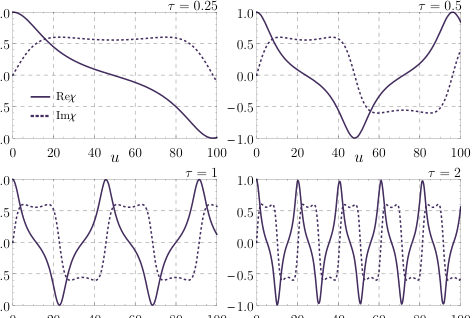 
Figure 2. CF as a function of u under an undisplaced Hamiltonian for four values of the final time of the protocol τ. The inverse tem- perature of the initial thermal equilibrium state (48) is β = 1. The continuous (dotted) curves correspond to the real (imaginary) part of function in (70) for the QH in (11) with vector ξt = 0, ∀t, that is a0 = 0 in (89), and ht = 0, ∀t. The Hessian of Hamiltonian is defined in (88), with mass and frequency both in (91). The parame- ters in (91) used in this plot are m0 = 1, θ0 = 2π, k1 = 0.2, and k2 = 0.1 (The same as in Fig.1). All quantities are written in arbi- trary units.

📷 Fig 2

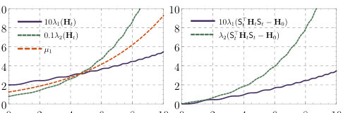 
Figure 1. Left: Eigenvalues λ1 and λ2 and the symplectic eigenvalue µ1 of the Hessian matrix Ht in Eq.(92). The numerical value of λ1 is multiplied by a factor 10, whereas that of λ2 is divided by a factor 10, for visual clarity. The crossing of the three curves around t = 4.5 is a coincidence due to the rescaling of the values. Right: Eigenvalues λ1 and λ2 of the Matrix (S⊤ τ HτSτ −H0) for the matrices Ht in Eq.(92) and the symplectic matrix St in (87). The numerical value of λ1 is multiplied by a factor 10. The parameters used in this figure are m0 = 1, θ0 = 2π, k1 = 0.2, and k2 = 0.1, all written in arbitrary units.

📷 Fig 3

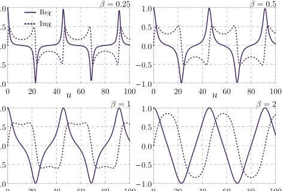 
Figure 3. CF as a function of u under an undisplaced Hamiltonian for four values of the temperature of the initial state β. The final time of the protocol is τ = 1. See Fig. 2 for the remaining parameters description.

📷 Fig 4

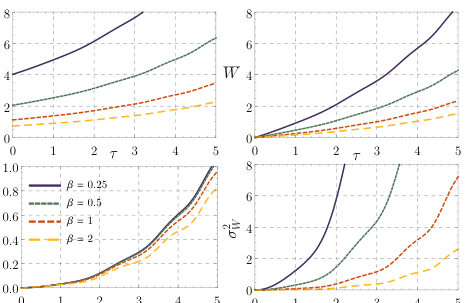 
Figure 4. Mean Energy ⟨ˆHτ⟩in Eq.(60), Mean work W in Eq.(69), Nonequilibrium Lag L in Eq.(8), and variance of the work distribu- tion σ2 W in (72) as functions of the final time of the protocol τ under an undisplaced Hamiltonian for four values of the inverse temper- ature of the initial state β in (48). See Fig. 2 for the remaining parameters description.

📷 Fig 5

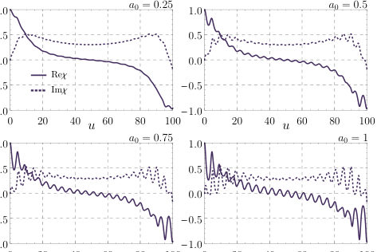 
Figure 5. CF as a function of u under a displaced Hamiltonian and for four values of the displacement parameter a0. The continuous (dotted) curves correspond to the real (imaginary) part of the function in (52) for the QH in (11) with vector ξt in (89), and ht = 0, ∀t. The Hessian of Hamiltonian is defined in (88), with mass and frequency both in (91). The final time of the protocol is τ = 0.25 and the inverse temperature of the initial thermal equilibrium state (48) is β = 0.5. See Fig.2 for the remaining parameters description.

**Summary.** This paper provides an exact analytical method to calculate the characteristic function of work for bosonic systems driven by time-dependent quadratic Hamiltonians. By reformulating the problem using symplectic geometry, the authors bypass the complex time-ordering issues inherent in quantum evolution. This framework successfully reproduces fundamental fluctuation theorems, making it a powerful tool for studying non-equilibrium quantum thermodynamics.

**Why it may be interesting.** This work provides a powerful, general, and exact framework for calculating non-equilibrium work statistics in quadratic bosonic systems, directly connecting quantum dynamics (symplectic geometry) to core principles of non-equilibrium thermodynamics.

Detailed structure

**Main problem.** Deriving an exact analytical expression for the characteristic function of work in closed many-body bosonic systems governed by general time-dependent quadratic Hamiltonians.

**Main result.** An exact analytical expression for the work characteristic function is derived, which allows for the calculation of key thermodynamic quantities like the free energy and work variance.

**Method.** The authors employ a formalism based on the inhomogeneous Metaplectic group, replacing the difficult time-ordering problem with the determination of a symplectic path in phase space.

**Model / system.** The system consists of closed many-body bosonic systems described by general time-dependent quadratic Hamiltonians, which are analyzed using canonical variables in phase space.

**Key observables.** Characteristic function of work ($\chi(u)$), Helmholtz free energy, mean work, work variance, and the nonequilibrium lag.

**Important parameters / regimes.** The initial thermal equilibrium state ($
ho_0$), the time dependence of the Hamiltonian, and the symplectic path parameters.

**Assumptions / limitations.** The primary derivation assumes the initial state is an instantaneous thermal equilibrium state, although generalizations to non-equilibrium states are discussed.

**Paper structure.** The paper builds from the theoretical necessity of calculating work statistics in non-equilibrium processes, develops the mathematical machinery using the Metaplectic group and symplectic paths to derive the characteristic function, and finally applies this function to recover fundamental fluctuation theorems and thermodynamic relations.

Abstract

We derive an exact analytical expression for the characteristic function of work in closed many-body bosonic systems governed by general time-dependent quadratic Hamiltonians. This is made possible by adopting a unified prescription in which all operators appearing in the characteristic function are treated as elements of the inhomogeneous Metaplectic group. The esulting expression involves a single symplectic matrix, a single phase-space displacement, and a single accumulated phase. It holds for any number of degrees of freedom, arbitrary time dependence of the quadratic Hamiltonian, and any initial thermal equilibrium state of the system. The formalism trades the explicit time-ordering problem associated with the unitary evolution for the determination of a symplectic path in phase space, from which the corresponding driving Hamiltonian can be reconstructed. We also discuss the generalization to arbitrary nonequilibrium initial states within the two-projective-measurement scheme for quantum work. The same construction yields Loschmidt echoes and mixed-state total phases. Using the derived characteristic function, we obtain formulas for the Helmholtz free energy, the Jarzynski equality, the mean work, the work variance, and the nonequilibrium lag. Undisplaced Hamiltonians, sudden quenches, constant-Hessian protocols, and the adiabatic limit follow as special cases of the general result. As an illustration, we analyze a one-dimensional system constructed from an unconventional symplectic path and exhibiting physically relevant limiting cases. We then show how affine and purely symplectic contributions affect work statistics and irreversibility.

[↑ back to top](#top)

### [GAUGE: A Formal Framework for Measuring Cryptographic Security under Heterogeneous Adversary Cost Models](http://arxiv.org/abs/2609.17281v1)

**Authors:** Bhanwar Gupta, Sanjeev Rana  
**Type:** theory · **Category:** other · **PDF:** <https://arxiv.org/pdf/2609.17281v1>  
**Analysis basis:** full PDF text, analyzed in chunks
**Topic relevance:** `Keldysh / 2PI / non-Gaussian methods` **1/5** · `quantum measurements` **1/5**

📷 Fig 1

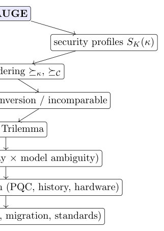 
Figure 1: Conceptual structure of the framework.

📷 Fig 2

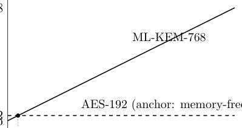 
Figure 2: Security profiles (absolute bits) on the classical memory-price slice: SAES-192 is constant 192; SML-KEM-768 = 186 + 132.18 cM. The profiles cross at c∗ M = 0.045; pricing memory at 4.5% of the time unit reverses the comparison (Theorem 1, Experiment 2).

📷 Fig 3

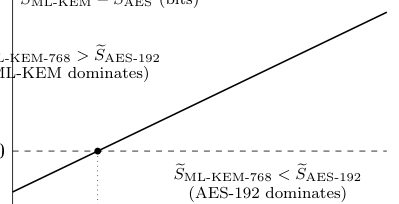 
Figure 3: The price-cone region map for the pair (ML-KEM-768, AES-192) on the classical memory- price slice. The anchored difference is −6 + 132.18 cM; the ordering reverses across c∗ M = 0.045. The pair is incomparable on any region containing both conventions (Proposition 3, Theorem 1).

📷 Fig 4

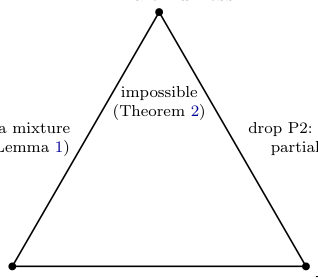 
Figure 4: The Rating Trilemma. Each edge is a viable research program obtained by relaxing one axiom; the center is impossible in the presence of crossing profiles, which Section 8 exhibits among standardized schemes.

📷 Fig 5

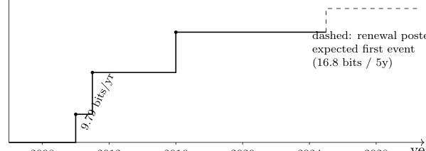 
Figure 5: Historical evolution of lattice-sieving attack cost on the reference parameter class β = 637: cumulative bits gained by exponent improvements, 2008–2016, followed by nine quiet years.

**Summary.** This paper introduces GAUGE, a formal framework to measure cryptographic security not by a single bit-count, but by a 'security profile' that maps across all possible adversary cost models. It mathematically proves that different cost models can lead to contradictory security rankings, providing an explicit, auditable method to quantify this model dependence. This is crucial for standards bodies to report security honestly when underlying assumptions about attacker resources are uncertain.

**Why it may be interesting.** While not directly about physical quantum systems, the rigorous mathematical framework for uncertainty quantification and model dependence (risk measures, profile analysis) is highly relevant to any field where underlying assumptions or measurement models introduce systematic, non-Gaussian uncertainty.

Detailed structure

**Main problem.** Current cryptographic security reporting relies on a single scalar bit-strength number, which is misleading because it depends entirely on the unstated adversary cost model used for pricing resources like time and memory.

**Main result.** The authors introduce GAUGE, a framework that models security as a 'security profile' (a function over all admissible cost models), proving that ranking reversals are structural properties rather than measurement errors.

**Method.** The framework formalizes price functionals over a cone of cost models, proving that security profiles are piecewise-linear and concave, and uses linear programming to certify the robustness of security rankings.

**Model / system.** The model is abstract, dealing with cryptographic schemes and the space of admissible adversary cost models ($\kappa$). It defines security as a function of these models, leading to the concept of a 'security profile' $S_K(\kappa)$.

**Key observables.** Security profile, Rating Trilemma, Robust/Reversing/Incomparable ranking status, Lattice-sieving cost drift (e.g., 9.79 bits/year).

**Important parameters / regimes.** Adversary cost model parameters (time, memory, quantum resources); time horizons ($	au$); decay rates ($\delta$); and the structure of the cost cone.

**Assumptions / limitations.** The framework assumes the existence of a cone of admissible cost models and uses concepts like anchor-relative profiles to normalize comparisons.

**Figures summary.** Figure 1 conceptually maps cost models to security profiles; Table 1 compares schemes under multiple cost models, showing varying relative security costs.

**Paper structure.** The paper establishes the problem with scalar reporting, introduces the GAUGE profile framework, proves mathematical properties (concavity, linearity), develops the linear-programming certification procedure, and concludes with concrete evaluations on PQC standards and risk measures.

Abstract

Standards bodies report cryptographic security as a single number of bits, but this value depends on the adversary cost model used to price time, memory, and quantum resources. Different conventions can therefore produce different rankings of cryptographic schemes. GAUGE represents security as a function over admissible cost models, called a security profile. Comparisons then become comparisons between profiles, and ranking reversals become an explicit structural property rather than a measurement error.   We formalize price functionals over a cone of adversary cost models, show that security profiles are piecewise-linear and concave, and prove a rating trilemma: when two profiles cross, no rating can simultaneously be faithful to underlying costs, total over comparable pairs, and independent of the chosen cost model. We provide a polynomial-time linear-programming procedure that certifies whether the ranking of two schemes is robust, reverses under admissible models, or is genuinely incomparable.   We extend GAUGE with a two-layer risk measure combining stochastic cryptanalytic decay with uncertainty over the appropriate cost model. We evaluate the framework on NIST post-quantum standards, classical anchors, and a 25-year chronology of cryptanalytic breaks. The analysis certifies a ranking reversal for ML-KEM-512 versus AES-128 from a 4-5% shift in memory pricing, and measures a lattice-sieving cost drift of 9.79 bits per year over eight years. A hybrid X25519 + ML-KEM-768 handshake reduces combined-break probability twenty-fold at a 2.3 kilobyte cost. The artifact reproduces all tables and figures in under seven seconds. GAUGE provides an explicit and auditable framework for reporting cryptographic security under competing cost models.

[↑ back to top](#top)

### [Latent kinetic Ising models of neural spike trains](http://arxiv.org/abs/2609.17213v1)

**Authors:** Davide Ghio, David Saad  
**Type:** both · **Category:** disordered systems and neural networks · **PDF:** <https://arxiv.org/pdf/2609.17213v1>  
**Analysis basis:** full PDF text, analyzed in chunks
**Topic relevance:** `Keldysh / 2PI / non-Gaussian methods` **1/5** · `methods for driven-dissipative` **1/5**

📷 Fig 1

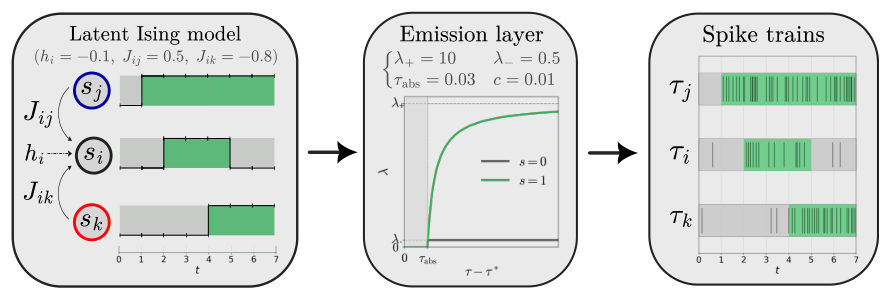 
Figure 1: Schematic representation of the SpiKIsing model. (Left) Latent trajectories for three neurons. Neuron i receives positive coupling Jij = 0.5 from neuron j, negative coupling Jik = −0.8 from neuron k, and local field hi = −0.1. The state of the presynaptic neurons at time t −1 determines the probability that neuron i occupies its active latent state at time t. (Centre) Emission layer, represented by the conditional point-process intensity of neuron i, with λ+ i = 10, λ− i = 0.5, τ abs i = 0.03, and ci = 0.01. Following the absolute refractory interval, the active-state intensity recovers according to ρi(δ) = δ/(δ+ci). (Right) A stochastic realization of the continuous- time spike...

📷 Fig 2

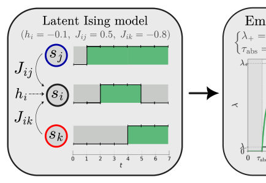 
Figure 1 illustrates the complete generative mechanism. Positive and negative incoming couplings respectively favour and suppress the activation of neuron i at the following latent time step. Conditional on the resulting latent trajectory, the emission layer generates individual spikes stochastically: active intervals are associated with a higher firing rate, while refractoriness and post-spike recovery determine the short-time structure following each spike. Thus the latent trajectory controls the collective dynamical state, but does not uniquely determine the observed spike times.

📷 Fig 3

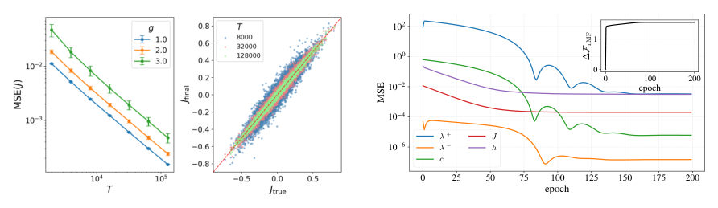 
Figure 2: Matched-model validation of maximum-likelihood SpiKIsing inference. (a) Interaction recovery. Left: mean-squared error of the inferred interaction matrix as a function of the recording length T for different coupling strengths g. Right: inferred versus ground-truth couplings for three representative recording lengths. (b) Joint learning of latent and emission parameters. Evolution of the mean-squared errors in J, h, λ+, λ−, and c during inference. The inset shows ∆FnMF = FnMF(epoch) −FnMF(0). Simulation parameters are specified in the text.

📷 Fig 4

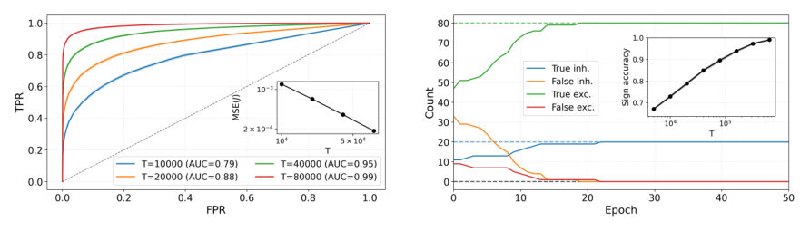 
Figure 3: Matched-model validation of sparse and Dale-structured MAP inference. (a) Sparse connectivity recovery. Receiver Operating Characteristic (ROC) curves for clas- sification of non-zero interactions at different recording lengths T. The inset shows the MSE of the inferred interaction matrix. (b) Recovery of Dale-consistent structure. Evolution of the neuronal-type classification during inference. The inset shows the fraction of ground-truth non-zero couplings whose sign is correctly inferred as a function of recording length T. Both experiments use networks of N = 100 neurons. Further simulation and inference details are given in Appendices E and F.

📷 Fig 5

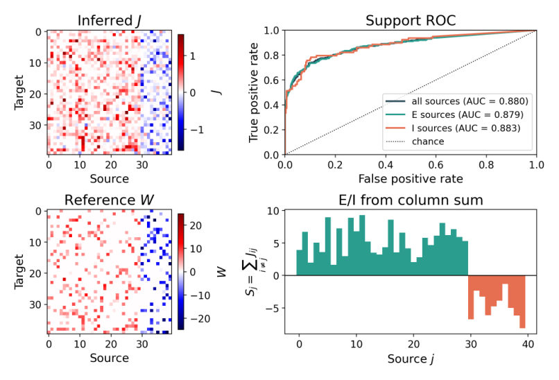 
Figure 4: Structural recovery in a conductance-based LIF network. Results for 30 excitatory and 10 inhibitory neurons from a 98 s recording, inferred with latent interval ∆t = 10 ms. Upper left: inferred effective interactions J. Lower left: signed reference conductances W; rows denote targets and columns sources, with excitatory sources ordered first. Upper right: ROC curves for recurrent- connection support using |Jij| as the score. Lower right: outgoing interaction sums Sj = P

**Summary.** This work introduces SpiKIsing, a latent-variable model that separates the collective dynamics of neurons (modeled by an Ising process) from the continuous-time spiking process. It uses a variational EM scheme to jointly infer the underlying network couplings and emission parameters from raw spike data. The method is robustly validated, showing it can accurately recover network structure despite modeling mismatches.

**Why it may be interesting.** The framework uses concepts from statistical physics (Ising models, mean-field theory) to model complex, non-equilibrium biological dynamics, providing a rigorous mathematical structure for analyzing emergent collective behavior.

Detailed structure

**Main problem.** The paper addresses the inverse problem of inferring the directed effective interactions governing collective neuronal dynamics solely from recorded spike trains.

**Main result.** The proposed SpiKIsing model successfully recovers the sparse connection structure and correctly classifies neuronal types (excitatory/inhibitory) even when tested on data generated by different underlying dynamics.

**Method.** It employs a variational mean-field expectation-maximization (EM) scheme to jointly infer latent network activity (modeled by an Ising process) and continuous-time emission parameters from the observed spike trains.

**Model / system.** The system models neural spiking using a two-level latent variable approach: a discrete-time asymmetric kinetic Ising model governs the unobserved collective state, while continuous-time, history-dependent point processes generate the observed spikes conditioned on this latent state.

**Key observables.** Inferred coupling strengths (J), local fields (h), and emission parameters (e.g., $\lambda^+, \lambda^-$).

**Important parameters / regimes.** Latent time step ($\Delta t$), regularization strengths ($\gamma_1, \gamma_2$), and prior parameters ($eta$).

**Assumptions / limitations.** The primary approximation is using a variational mean-field approach, which treats the continuous-time point-process likelihood as an effective observation field for the discrete Ising dynamics.

**Figures summary.** Figures illustrate the full generative mechanism, parameter recovery validation on synthetic data, and the final inferred interaction matrix compared to ground truth.

**Paper structure.** The paper introduces the latent variable model, derives the variational EM scheme, details the updates (including forward-only approximations), and validates the method using both synthetic and complex conductance-based LIF network simulations.

Abstract

Inferring directed effective interactions from neuronal spike trains is a central inverse problem in statistical physics and computational neuroscience. Kinetic Ising models provide a tractable framework for this task, but their application to neural data typically requires binning spike trains into binary activity variables, discarding within-bin timing and conflating collective network dynamics with single-neuron history effects.   We introduce SpiKIsing, a latent-variable model that separates these two levels of description. A discrete-time asymmetric kinetic Ising model describes collective network activity, while continuous-time, history-dependent point processes generate the observed spikes conditional on the latent states, accounting explicitly for refractoriness and post-spike recovery.   We derive a variational mean-field expectation-maximization scheme in which the point-process likelihood enters as an effective observation field, enabling joint inference of latent activity, network couplings, and emission parameters. The framework extends naturally to maximum-a-posteriori inference with structured priors, including sparsity and a hierarchical extension favouring Dale-consistent outgoing interactions.   We validate parameter recovery on matched synthetic data and test the method on spike trains generated by a recurrent conductance-based leaky integrate-and-fire network. In this setting, SpiKIsing recovers sparse connection structure and correctly classifies all excitatory and inhibitory neurons despite the substantial mismatch between the data-generating dynamics and the SpiKIsing model.

[↑ back to top](#top)

### [Rotation Collision based Quantum Lattice Boltzmann Methods](http://arxiv.org/abs/2609.16721v1)

**Authors:** Kangyang Zeng, Changshen Huang, Xi Liu, Xiaodong Niu, Zhenhua Chai  
**Type:** theory · **Category:** quantum information and computing · **PDF:** <https://arxiv.org/pdf/2609.16721v1>  
**Analysis basis:** full PDF text, analyzed in chunks
**Topic relevance:** `analog quantum simulation` **1/5** · `methods for driven-dissipative` **1/5**

📷 Fig 1

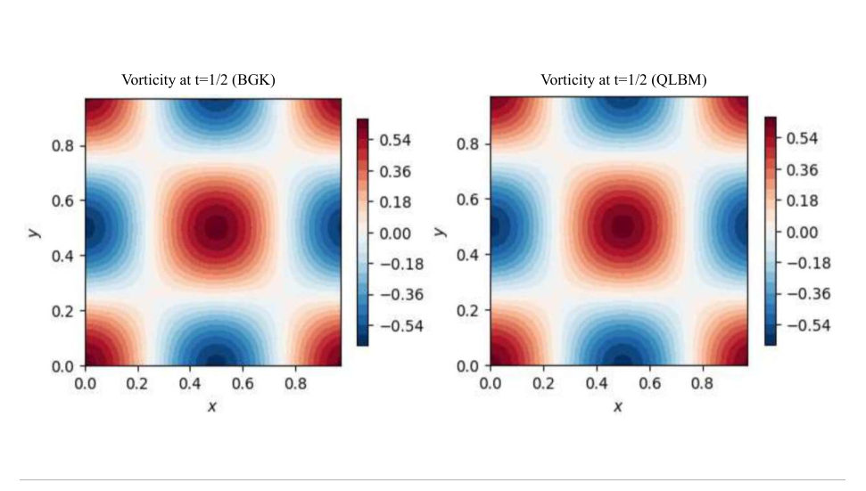 
Figure 1: Vorticity contours for the Taylor–Green vortex at Re = 100, N = 32, U0 = 0.1, τ = 0.596, evaluated at the half-life time t1/2 of the velocity decay. Left: vorticity obtained by the classical BGK collision operator. Right: vorticity obtained by the rotation collision operator

📷 Fig 2

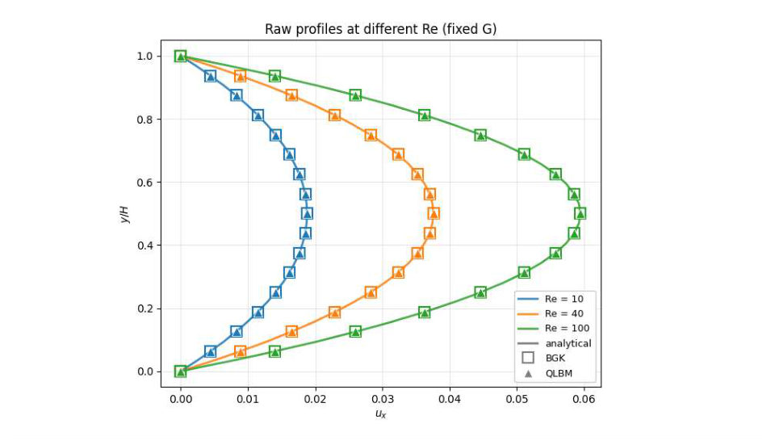 
Figure 2: Velocity profiles of three cases with Re = 10, 40, 100. The results of lattice BGK method and QLBM agree with the analytical solution.

📷 Fig 3

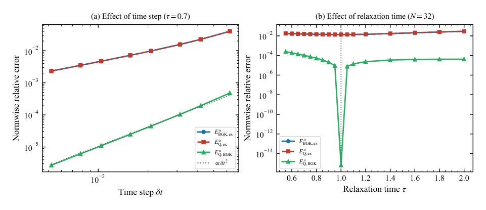 
Figure 3: Relative errors of velocity based on the lattice BGK method and QLBM. (a) Effect of time step (τ = 0.7), the dotted line denotes the reference scaling αδt2. (b) Effect of relaxation time (N = 32 and U0 = 0.1); the two collision operators coincide at τ = 1 and discrepancy between them is up to floating-point round-off.

📷 Fig 4

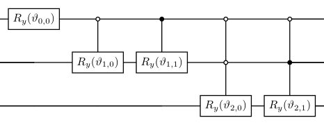 
Figure 4: Three-qubit SBM circuit for the amplitude encoding of D2Q5 model. Qubits are ordered from q2 (MSB) to q0 (LSB). Open and filled controls denote conditions on |0⟩and |1⟩, respectively. Gates associated with zero-padded branches are omitted.

📷 Fig 5

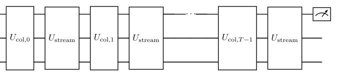 
Figure 5: Sequential T-step circuit of D2Q5 model. Each step consists of a state-dependent collision Ucol,t followed by the fixed streaming operator.

**Summary.** This paper introduces a Quantum Lattice Boltzmann Method (QLBM) that replaces the non-unitary BGK collision operator with a unitary rotation operator. This approach successfully addresses the unitarity constraint while maintaining second-order accuracy relative to the classical method. The framework is fully realized at the gate level, providing a pathway to simulate fluid dynamics on quantum computers.

**Why it may be interesting.** This work provides a concrete, unitary quantum circuit implementation for a classical computational method (LBM), which is highly relevant for simulating complex many-body dynamics on near-term quantum hardware.

Detailed structure

**Main problem.** The core challenge is developing a unitary quantum analogue for the non-unitary BGK collision operator used in the Lattice Boltzmann Method (LBM).

**Main result.** The authors propose a novel Quantum Lattice Boltzmann Method (QLBM) using a unitary rotation collision operator that correctly approximates the BGK collision to $O(\delta t^2)$ in the continuum limit.

**Method.** The non-unitary BGK relaxation is replaced by a unitary rotation in the amplitude space spanned by the current and equilibrium distribution states, leading to gate-level quantum circuit construction.

**Model / system.** The method is applied to solve fluid dynamics equations using the LBM framework, specifically implemented for the D2Q5 (convection-diffusion) and D2Q9 (Navier-Stokes) models.

**Key observables.** Relative velocity errors ($E_u$), mass conservation ($\sum f^*_i = 
ho$), and the contraction of the state deviation angle $\phi$.

**Important parameters / regimes.** Relaxation time ($	au$), time step ($\delta t$), and the dimensionality/model (D2Q5 vs D2Q9).

**Assumptions / limitations.** The primary assumption is that the unitary analogue of the BGK collision is a rotation contracting the angle $\phi$ by a factor of $(1 - 1/	au)$.

**Figures summary.** Figures illustrate the sequential T-step quantum circuit for the D2Q5 model, showing state-dependent collision blocks interspersed with fixed streaming operators, and show error scaling confirming $O(\delta t^2)$ accuracy.

**Paper structure.** The paper introduces the problem (non-unitary BGK), proposes the unitary rotation operator, derives its form for D2Q5 and D2Q9, details the gate-level circuit construction (including reusable components for D2Q5), and validates the method via numerical error analysis.

Abstract

In the existing quantum algorithms for the lattice Boltzmann method, resolving the unitarity problem of the BGK collision operator from first principles remains a fundamental challenge, and a systematically constructed unitary alternative that reproduces the BGK relaxation structure to leading order has not yet been established in the literature. In this work, we propose a novel quantum lattice Boltzmann method (QLBM) based on the rotation collision operator, in which the non-unitary BGK relaxation is replaced by a unitary rotation in the amplitude space of the distribution function, and the corresponding gate-level quantum circuits are also constructed. Specifically, the rotation collision operator is developed for both the D2Q5 model of the convection-diffusion equation and the D2Q9 model of the incompressible Navier--Stokes equations. It is worth noting that, for the D2Q5 model, the equilibrium-state preparation circuit can be precompiled and reused, and the resulting unitary blocks can be sequentially composed once the state-dependent collision parameters are specified. Finally, some numerical experiments are performed to validate the developed QLBM, demonstrating its accuracy and effectiveness.

[↑ back to top](#top)

### [$d$-pod realization of nonadiabatic holonomic quantum computation](http://arxiv.org/abs/2609.16216v1)

**Authors:** Oskar Axelsson, Claes Fälth, Elias Henriksson Lindberg, Erik Sjöqvist  
**Type:** theory · **Category:** quantum information and computing · **PDF:** <https://arxiv.org/pdf/2609.16216v1>  
**Analysis basis:** full PDF text, analyzed in chunks
**Topic relevance:** `analog quantum simulation` **1/5**

📷 Fig 1

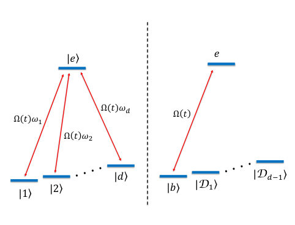 
FIG. 1. Setup for a qudit system implemented using the d-pod config- uration. Left panel: Each computational basis state |1⟩, . . . , |d⟩is cou- pled to an excited state |e⟩. Right panel: The same system expressed in the dark-bright Morris-Shore [66] basis {|b⟩, |D1⟩, . . . , |Dd−1⟩}. Note that only the bright state |b⟩is coupled to |e⟩.

**Summary.** This paper generalizes Holonomic Quantum Computation to $d$-dimensional qudits using the $d$-pod atomic configuration. It shows that this setup enables universal quantum gate sets for qudits using only simple optical or microwave pulse sequences. The work is significant for its resource efficiency and its systematic extension of geometric quantum control principles.

**Why it may be interesting.** This work provides a concrete, resource-efficient theoretical blueprint for scaling quantum computation beyond qubits, directly relevant to experimental quantum control using trapped atoms.

Detailed structure

**Main problem.** The paper addresses the systematic generalization of nonadiabatic Holonomic Quantum Computation (HQC) from standard qubit systems to higher-dimensional qudits ($d$-level systems).

**Main result.** It demonstrates that the $d$-pod configuration allows for the realization of universal holonomic single- and two-qudit gates using only optical or microwave pulses on trapped atoms or ions.

**Method.** The computation relies on exploiting non-Abelian geometric phases accumulated during cyclic evolution in the $d$-pod system, analyzed using the Grassmannian manifold.

**Model / system.** The physical model is the $d$-pod configuration, consisting of a single excited state coupled to $d$ ground states forming the computational subspace. The dynamics are governed by a time-dependent Hamiltonian.

**Key observables.** The gate operation is derived from the time evolution operator $U_{kl}$, and the purely holonomic nature is confirmed by specific geometric conditions.

**Important parameters / regimes.** The required cyclic evolution condition is $\int_0^	au \Omega(t)dt = \pi$. The complexity increases with $d$, with the qutrit ($d=3$) case analyzed in detail.

**Assumptions / limitations.** The analysis assumes the use of the rotating wave approximation and monochromatic fields, focusing on the $d$-pod generalization of the $\Lambda$-scheme.

**Figures summary.** Figure 1 illustrates the $d$-pod setup, showing the coupling between the excited state and the $d$ ground states, and also depicts the system in the dark-bright Morris-Shore basis.

**Paper structure.** The paper introduces the $d$-pod model, derives the conditions for holonomic evolution, and then details the construction of universal single- and two-qudit gates, providing explicit examples for the qutrit case.

Abstract

Holonomic quantum computation (HQC) realizes quantum gates through non-Abelian geometric phases, providing an experimentally accessible approach to quantum control. While the nonadiabatic HQC framework has been extensively developed for three-level $Λ$ systems encoding qubits, its systematic extension to higher-dimensional qudits remains largely unexplored. In this work, we generalize nonadiabatic HQC to a $d$-pod configuration, where a single excited state is coupled to $d$ ground states, the latter forming the computational subspace. This scheme enables universal holonomic single- and two-qudit gates using only optical or microwave pulses on trapped atoms or ions, offering an efficient route to implement a discrete universal gate set with minimal pulse coordination. As an explicit example, we analyze in detail the qutrit ($d=3$) case, demonstrating compact realizations of single- and two-qutrit holonomic gates, each gate requiring at most two loops in the Grassmannian generated by at most three pulses.

[↑ back to top](#top)

### [A Case Study on Noise Resilient Operator Selection in Adaptive Variational Quantum Algorithms](http://arxiv.org/abs/2609.17501v1)

**Authors:** Soorya Haravu, Mafalda Ramôa, Bharath Sambasivam  
**Type:** theory · **Category:** quantum information and computing · **PDF:** <https://arxiv.org/pdf/2609.17501v1>  
**Analysis basis:** full PDF text, analyzed in chunks
**Topic relevance:** `quantum measurements` **1/5**

📷 Fig 1

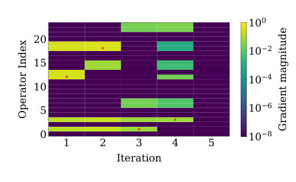 
Figure 1: Gradient heatmap (left) and energy error plot (right) for a noiseless ADAPT-VQE run.

📷 Fig 2

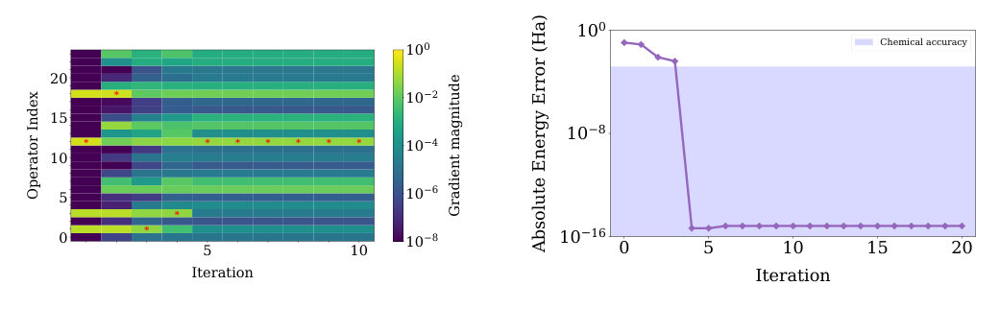 
Figure 2: Gradient heatmap (left) and energy error plots (right) for an ADAPT-VQE run with the ‘all incoherent’ noise channel without error mitigation. The noise strength parameter is set to 0.01.

📷 Fig 3

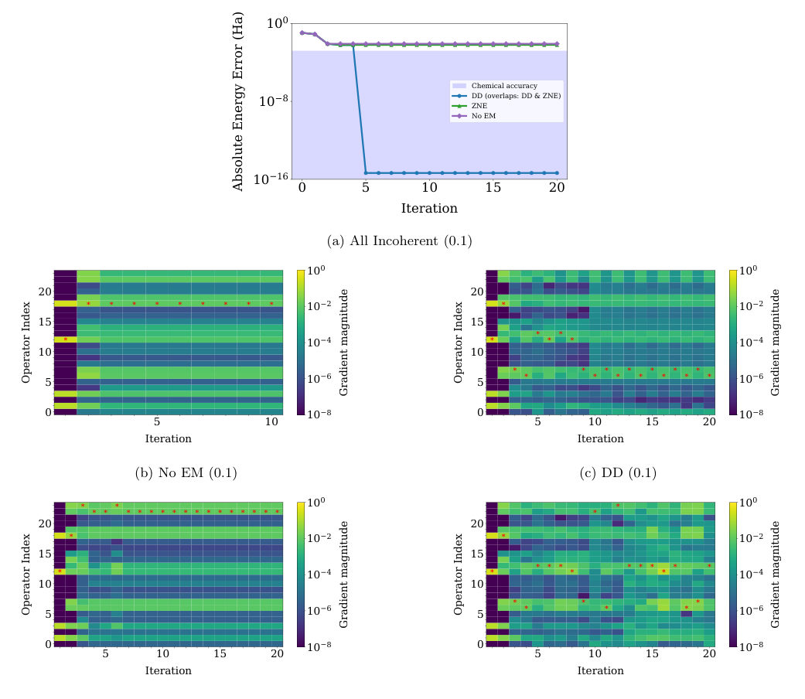 
Figure 3: ‘All incoherent’ noise channel results at strength 0.1: energy-error plots (a), and gradient heatmaps (b-e) under different EM settings.

📷 Fig 4

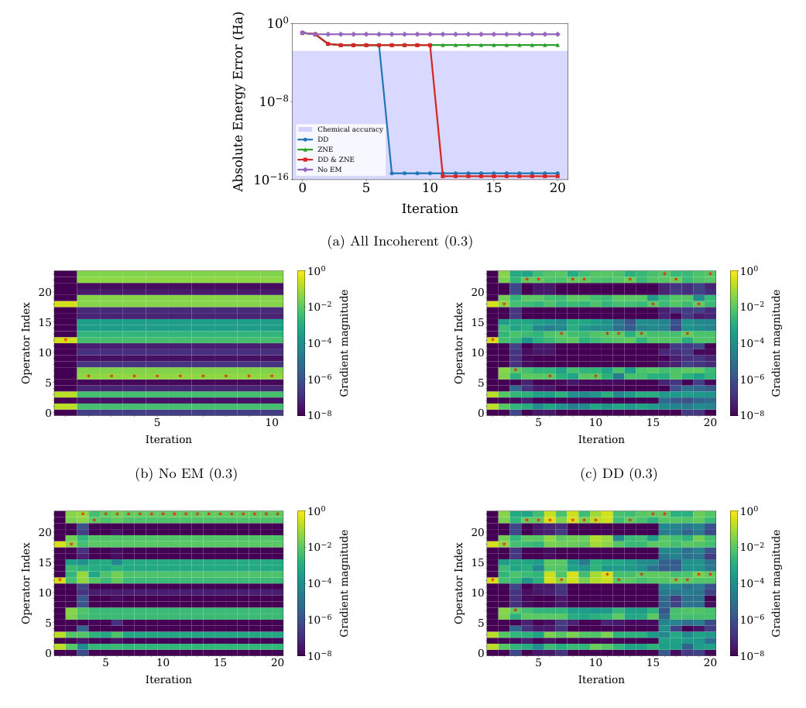 
Figure 4: ‘All incoherent’ noise channel results at strength 0.3: energy-error plots (a), and gradient heatmaps (b-e) under different EM settings.

📷 Fig 5

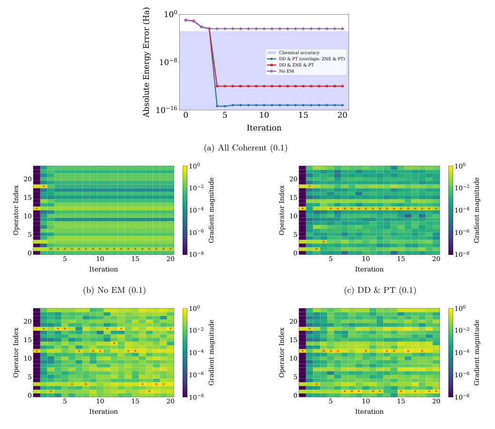 
Figure 5: ‘All coherent’ noise results at strength 0.1: energy-error plots (a), and gradient heatmaps (b-e) under different EM settings.

**Summary.** This work analyzes the vulnerability of ADAPT-VQE to hardware noise, focusing particularly on the operator selection step. It demonstrates that both coherent and incoherent noise can halt convergence, but the combination of error mitigation techniques like dynamical decoupling, zero noise extrapolation, and Pauli twirling can successfully restore the algorithm's performance. This offers crucial guidelines for implementing quantum chemistry simulations on noisy quantum processors.

**Why it may be interesting.** It directly addresses the practical implementation challenges of quantum chemistry algorithms on near-term, noisy quantum hardware by providing a roadmap for error mitigation in the ansatz construction phase.

Detailed structure

**Main problem.** The paper investigates how hardware noise affects the critical operator selection step within Adaptive Variational Quantum Algorithms (ADAPT-VQE).

**Main result.** While noise can prevent convergence in ADAPT-VQE, combining appropriate quantum error mitigation techniques (like DD, ZNE, and PT) can successfully restore convergence and maintain performance.

**Method.** The study uses ADAPT-VQE to calculate ground state energies and gradient measurements for molecular Hamiltonians under various noise channels.

**Model / system.** The test case is a linear H3 molecule, simulated using a minimal STO-3G basis set represented by 6 qubits. The core methodology involves optimizing the expectation value using the VQE framework.

**Key observables.** Ground state energy (E0), gradient magnitudes, and the convergence profile of the optimization process.

**Important parameters / regimes.** Noise strength ($\gamma$ or $\phi$) tested at multiple levels (e.g., 0.01, 0.1, 0.3) for both incoherent and coherent noise channels.

**Assumptions / limitations.** The analysis focuses specifically on injecting noise into the gradient measurements used for operator selection, rather than the entire VQE process.

**Figures summary.** Figures show energy error plots and gradient heatmaps comparing performance with and without various error mitigation techniques (DD, ZNE, PT) across different noise types.

**Paper structure.** The paper systematically analyzes the impact of different noise channels (incoherent vs. coherent) on ADAPT-VQE, demonstrating the failure modes and then proposing and testing combinations of error mitigation techniques to restore convergence.

Abstract

Hardware noise has been shown to significantly impact the accuracy of ADAPT-VQE, a ground state preparation algorithm. While previous work has studied the impact of noise on its parameter optimization step, its impact on the critical operator selection step remains comparatively unexplored. In this work, we examine the impact of a variety of noise channels on this step, using a linear H$_3$ molecule as a test case. We show that, despite the selection criterion's natural resilience to some noise, both coherent and incoherent noise can prevent convergence for sufficiently high noise rates. We employ quantum error mitigation techniques--dynamical decoupling, zero noise extrapolation, and Pauli twirling--and show that when combined appropriately, these techniques are capable of restoring a successful convergence profile. Our results highlight how error mitigation can improve the performance of ADAPT-VQE and enable convergence in the presence of hardware noise, offering valuable insights into the implementation of the algorithm on near-term quantum hardware.

[↑ back to top](#top)

### [Evolution of quantum imaginarity in black hole quantum atmosphere](http://arxiv.org/abs/2609.17314v1)

**Authors:** Ruopu Sun, Xiaofen Huang  
**Type:** theory · **Category:** other · **PDF:** <https://arxiv.org/pdf/2609.17314v1>  
**Analysis basis:** full PDF text, analyzed in chunks
**Topic relevance:** `Keldysh / 2PI / non-Gaussian methods` **1/5**

📷 Fig 1

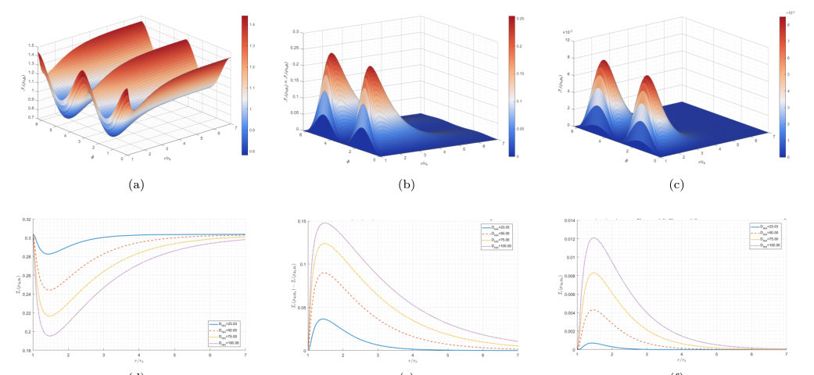 
FIG. 1. Panels (a)–(c) display three-dimensional surface plots of imaginarity as functions of normalized radial distance r/rh and relative phase ϕ, with the state parameter fixed at θ = π/4, DHH = 50, and field frequency ω = 1. Panels (d)–(f) show the corresponding curves of imaginarity varying with r/rh under fixed θ and ϕ.

📷 Fig 2

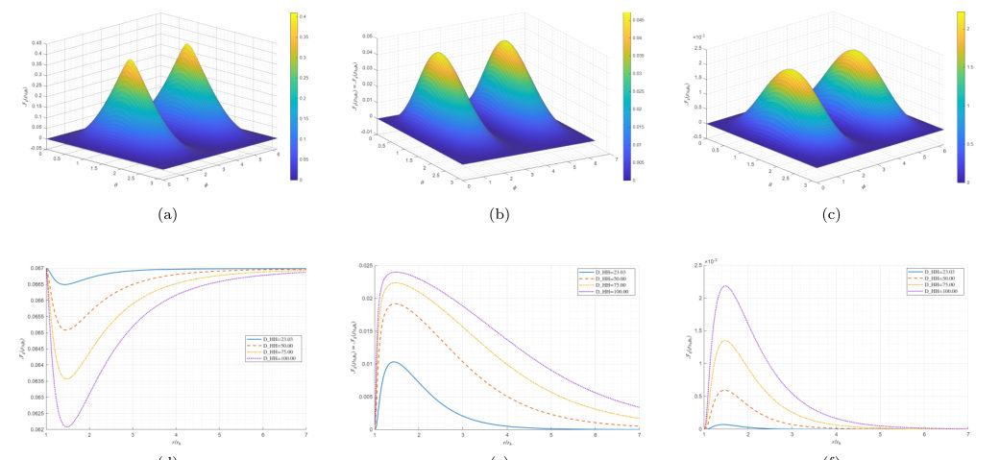 
FIG. 2. The geometric imaginarity of the states ρAIBI, ρAIBII and ρAIIBII. Panels (a)–(c) are three-dimensional surface plots as functions of the state parameter θ and the phase ϕ, with normalized radial distance fixed at r/rh = 1.5, DHH = 50 and ω = 1. Panels (d)–(f) present the corresponding radial cross-section curves varying with r/rh under fixed θ and ϕ.

📷 Fig 3

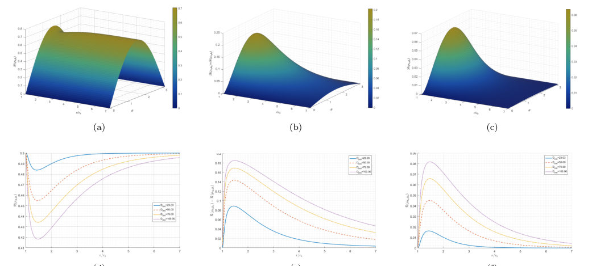 
FIG. 3. The robustness of imaginarity for the states ρAIBI, ρAIBII and ρAIIBII as functions of the normalized radial distance r/rh and the state parameter θ, with fixed parameters DHH = 50, ϕ = π/4 and ω = 1. Panels (a)–(c) correspond to three-dimensional surface plots, and panels (d)–(f) display cross-section curves under different values of DHH.

**Summary.** This theoretical work quantifies 'quantum imaginarity,' a measure of nonreal coherence, in the quantum atmosphere of a black hole. By analyzing three different imaginarity metrics, the authors map how this resource is modulated by Hawking radiation. The findings reveal distinct radial profiles and show that the local Hawking effect drives a measurable redistribution of quantum information across the black hole's vicinity.

**Why it may be interesting.** The use of quantum resource theory (imaginarity) to characterize information structure in curved spacetime provides a novel diagnostic tool for understanding black hole thermodynamics and Hawking radiation effects.

Detailed structure

**Main problem.** The paper investigates the evolution and redistribution of 'quantum imaginarity'—a metric for intrinsic nonreal coherence—within the quantum atmosphere of a static Schwarzschild black hole.

**Main result.** The analysis shows that the relative-entropy, geometric, and robustness imaginarities exhibit characteristic radial profiles (valley/peak shapes) that are significantly modulated by the Hartle-Hawking constant, with the extremum positions tracking the local Hawking radiation peak.

**Method.** The study employs resource-theoretic measures of quantum imaginarity ($I_r, I_g, R$) applied to reduced bipartite states derived from a four-partite Dirac field state, analyzing their dependence on radial position and phase.

**Model / system.** The physical system is the quantum atmosphere surrounding a static Schwarzschild black hole, modeled using bipartite Dirac field reduced states evolving under the influence of Hawking thermal radiation.

**Key observables.** Relative-entropy imaginarity ($I_r$), Geometric imaginarity ($I_g$), and Robustness of imaginarity ($R$).

**Important parameters / regimes.** Black hole mass ($M$), event horizon radius ($r_h$), Hartle–Hawking constant, and normalized radial distance ($r/r_h$).

**Assumptions / limitations.** The analysis focuses on bipartite Dirac field reduced states and assumes the initial state is a bipartite entangled pure state.

**Figures summary.** Figures illustrate 3D plots and radial cross-sections of $I_r$ and $I_g$ for different state partitions, showing characteristic modulation patterns.

**Paper structure.** The paper develops the mathematical framework for calculating imaginarity measures for reduced states, analyzes the radial and phase dependence of these measures, and discusses the implications of the Hartle-Hawking constant on resource redistribution.

Abstract

Quantum imaginarity, as a critical resource metric for quantifying intrinsic nonreal coherence encoded in quantum states, exhibits nontrivial evolutionary behaviors in curved spacetime backgrounds. This work focuses on bipartite Dirac field reduced states in the quantum atmosphere of a static Schwarzschild black hole, aiming to explore the modulation of three mainstream imaginarity measures by Hawking thermal radiation. We reveal that the relative-entropy imaginarity, the geometric imaginarity and robustness of imaginarity, the fully accessible state presents a valley-shaped radial profile with a local minimum inside the quantum atmosphere, while the cross-coupling and fully inaccessible states follow opposite peak-shaped trends. Further analysis demonstrates that the Hartle-Hawking constant significantly strengthens the redistribution effect of imaginarity across both regions, whereas an increase in the event horizon radius weakens such redistribution and flattens the extremum features. These findings offer a new perspective for decoding the information structure of black hole quantum atmospheres and the intrinsic quantum nature of Hawking radiation.

[↑ back to top](#top)

### [Hartree-Fock Density-Matrix Renormalization Group for Very Long Chains](http://arxiv.org/abs/2609.16587v1)

**Authors:** Steven R. White  
**Type:** theory · **Category:** numerical methods · **PDF:** <https://arxiv.org/pdf/2609.16587v1>  
**Analysis basis:** full PDF text, analyzed in chunks
**Topic relevance:** `methods for driven-dissipative` **1/5**

📷 Fig 1

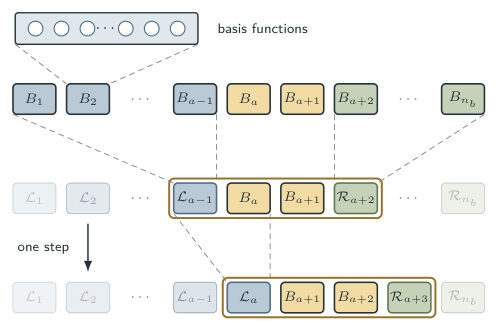 
FIG. 1. An HF-DMRG sweep. The ordered basis is parti- tioned into blocks Ba. At a given sweep position, the blocks preceding and following the two-block center are compressed into the stored environments La−1 and Ra+2, with spin labels suppressed. Advancing the sweep absorbs Ba into La−1 to form La and retains Ba+1 in the center; the already stored Ra+3 is recalled for the next local problem. Earlier stored environments are drawn faintly. The upper inset shows how one block groups an interval of the ordered basis.

📷 Fig 2

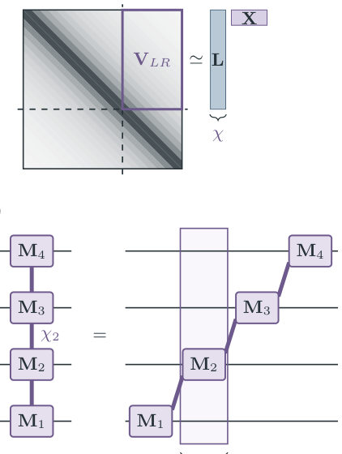 
FIG. 2. Compression of the long-range interaction. (a) Trun- cating the singular-value decomposition of the cross-cut block gives VLR ≃LaXa with χa retained channels; the cut index a is suppressed in the drawing. (b) Two drawings of the same direct-sum network. The left diagram uses the usual MPO layout; the right shows the corresponding product of matrices over the whole space. Thin wires carry physical-block coordi- nates and thick links carry retained channels; parallel space dimensions add rather than multiply. The outlined slice is G2: the local matrix M2 together with identity actions on the other three blocks. Reading left to right in a row-vector convention gives V△≃G1G2G3G4, where...

📷 Fig 3

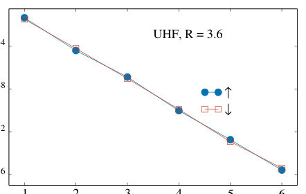 
FIG. 3. At a central cut of UHF H100 (R = 3.6 bohr), the restricted occupations ⟨n⟩rapidly approach zero or one, leaving only a few active modes per spin. The six largest distances from zero or one are shown in descending order.

📷 Fig 4

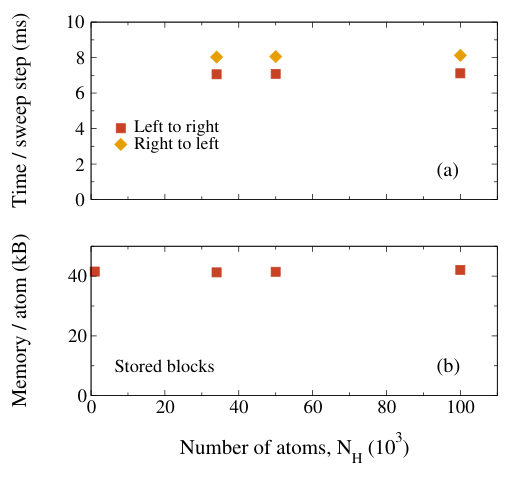 
FIG. 5. Time and stored memory per atom change little with chain length. UHF chains at R = 3.6 bohr retain at most five active modes per spin. (a) Half-sweep time divided by NH, taking the median over late optimization half-sweeps in each direction. Each bulk block contains 18 spatial basis functions spanning one atomic interval. Each step advances the two-block center by one block, with NH steps per half- sweep in these chains. (b) Stored-block memory per atom in the converged states. Peak process memory is listed in Table V.

📷 Fig 5

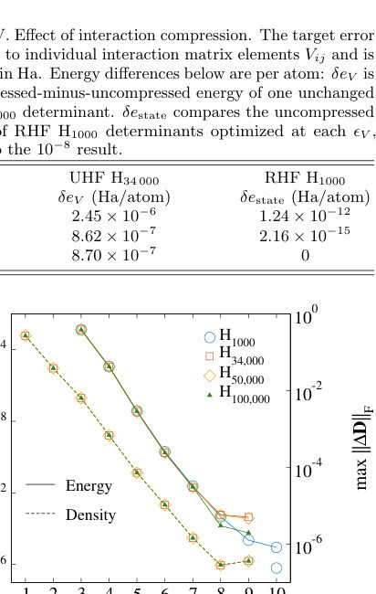 
FIG. 4. UHF convergence from atomic N´eel product states at R = 3.6 bohr. Convergence changes little over two orders of magnitude in chain length. Solid curves (left axis): energy change per atom over one full sweep, |∆Eℓ|/NH = |Eℓ− Eℓ−2|/NH, measured at the end of half-sweep ℓ. Dashed curves (right axis): largest Frobenius norm of the change in a local spin density matrix from an orbital update, before truncation, maximized over positions and spins in that half-sweep. For H1000, only the final density-matrix change was recorded, so that series contains a single point.

**Summary.** This paper adapts the Density-Matrix Renormalization Group (DMRG) algorithm to solve the computationally demanding Hartree-Fock equations for very long chains. By compressing both the electronic state and the long-range interactions, the authors achieve near-linear scaling, making large-scale electronic structure calculations feasible on standard desktop hardware.

**Why it may be interesting.** This work demonstrates a powerful algorithmic adaptation of DMRG, extending its utility beyond standard correlated wavefunctions to tackle mean-field theories like HF for extended solids, which is crucial for simulating large-scale material properties.

Detailed structure

**Main problem.** The paper addresses the computational challenge of applying Hartree-Fock (HF) theory to very large electronic systems, which typically suffers from high polynomial scaling due to long-range interactions.

**Main result.** The authors successfully formulated HF as a Density-Matrix Renormalization Group (DMRG) sweep, achieving near-linear scaling for chains up to 100,000 atoms in a feasible time frame.

**Method.** They adapt the DMRG framework by compressing the occupied state and the long-range electron-electron interaction separately, reducing the complex HF calculation into a sequence of small, local Fock problems.

**Model / system.** The method is tested on uniform antiferromagnetic hydrogen chains, retaining the physical Coulomb interaction and its $1/r$ tail, using a basis set of Gaussian-type orbitals.

**Key observables.** Convergence time (hours for $10^5$ atoms), memory usage ($\approx 21$ GB), and the linear scaling of computation time with chain length.

**Important parameters / regimes.** Chain length up to 100,000 atoms; one-body tolerance of $10^{-8}$ Ha; local Fock matrix size remaining small ($\approx 45$ rows).

**Assumptions / limitations.** The use of the density-density electron-electron interaction approximation and the assumption that state compression (one-particle and MPO compression) is sufficient for accuracy.

**Figures summary.** Figures illustrate the DMRG sweep process, showing the partitioning of the basis into blocks and the storage/retrieval of environments. Other figures detail time/memory scaling and energy convergence plots.

**Paper structure.** The paper details the formulation of HF as a DMRG sweep, describes the specific compression techniques (one-particle, MPO, density-space), presents computational results on scaling, and concludes with analysis of energy convergence and implementation details.

Abstract

We formulate Hartree--Fock as a density-matrix renormalization group (DMRG) sweep of a single Slater determinant, assuming a density--density electron--electron interaction. We compress the occupied state and long-range interaction separately, reducing each sweep step to a small local Fock problem. Exchange is retained throughout. Uniform antiferromagnetic hydrogen chains provide an almost ideal setting for this approach, while retaining the Coulomb interaction and its $1/r$ tail. We initialize and converge a chain of 100,000 electrons in 1.8 million spatial basis functions in about two hours on a 64-GB Mac mini, using less than a third of its memory. The work per sweep is nearly proportional to chain length, and the number of sweeps needed for convergence changes little from 1000 to 100,000 atoms. DMRG's compression of states and environments thus makes large HF calculations with long-range Hartree and exchange practical on an ordinary desktop computer.

[↑ back to top](#top)

### [Mode-selective phonon effects on magnetism and superconductivity in trilayer nickelates](http://arxiv.org/abs/2609.16143v1)

**Authors:** C. Alexander Baum, Jun Zhan, Congcong Le, Ronny Thomale, Xianxin Wu  
**Type:** theory · **Category:** strongly correlated electrons · **PDF:** <https://arxiv.org/pdf/2609.16143v1>  
**Analysis basis:** full PDF text, analyzed in chunks
**Topic relevance:** `Keldysh / 2PI / non-Gaussian methods` **1/5**

📷 Fig 1

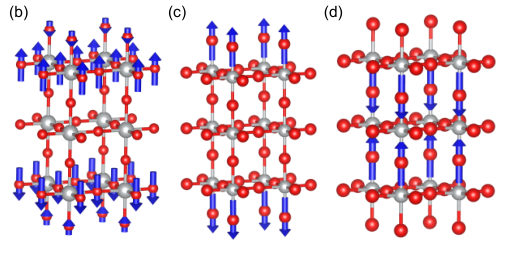 
FIG. 1. (color online) Phonon properties and electron-phonon cou- pling of La4Ni3O10 for the 𝐼4∕𝑚𝑚𝑚phase at 40 GPa. (a) Phonon dispersion spectrum, linewidth, density of states 𝐹(𝜔), and Eliash- berg spectral function 𝛼2𝐹(𝜔) . The red circles on the dispersion curves represent the phonon linewidth, indicating the strength of the electron-phonon coupling. (b)-(d) Atomic displacement patterns for the out-of-plane 𝐴1𝑔phonon modes at the Γ point, with frequencies of 468, 553, and 651 cm−1, respectively.

📷 Fig 2

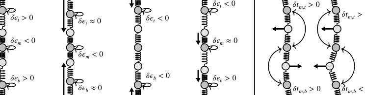 
FIG. 2. Idealization of the trilayer of Nickel atoms (dark gray) and the apical oxygen atoms (light gray) in the high-symmetry (a) and low- symmetry phase (b). We show example modes that induce different types of electron-phonon couplings. While in the high-symmetry phase, motions of the oxygen atoms only generate Holstein modes (c–f: A1g, Am 1g, At∕b 1g , A1u), SSH-coupling are induces by in-plane motions in the low-symmetry phase (g–h: ASSH 1g , ASSH 1u ).

📷 Fig 3

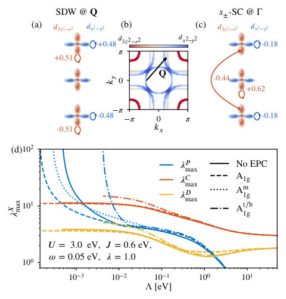 
FIG. 3. We show the real-space form-factor components of the dom- inant SDW (a) and s±-SC states (c), along with the orbital-resolved Fermi surface (b) including the SDW nesting vector 𝐐. (d): FRG flow showing the maximum eigenvalues 𝜆𝑋 max for the three channels 𝑋∈{𝑃, 𝐶, 𝐷} and for idealized Holstein modes (cf. Fig. 2 (c–e)). At intermediate scales we find that SDW fluctuations are enhanced, eventually inducing s±-SC at low scales.

📷 Fig 4

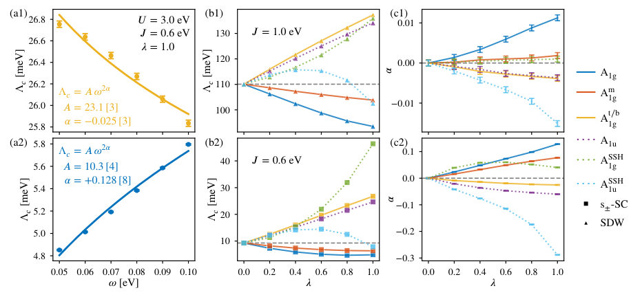 
FIG. 4. (a1–a2): Scaling of Λ𝑐∼𝜔2𝛼and fit of Isotope coefficient of the s±-SC for the dominant modes At∕b 1g (yellow) and A1g (blue). (b1–b2): Critical scale Λ𝑐from FRG for 𝜔= 0.05 eV in the SDW (b1, 𝐽= 1.0 eV) and SC (b1, 𝐽= 0.6 eV) phase as a function of the dimensionless electron phonon coupling 𝜆for every mode in Fig. 2. (c1–c2): The isotope coefficient 𝛼= 1

📷 Fig 5

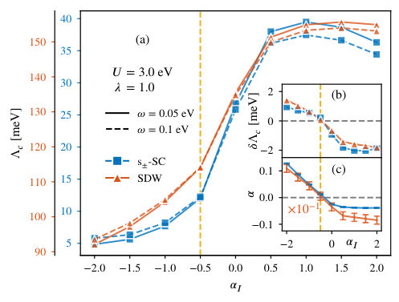 
FIG. 5. (a): Critical FRG scale Λ𝑐as a function of the parameter 𝛼I for the A1g mode in the 𝑠±SC (blue, 𝐽= 0.6 eV) and SDW phases (red, 𝐽= 1.0 eV). The insets show the difference in scale between 𝜔= 0.05 eV and 𝜔= 0.1 eV (b) as well as an estimate for the isotope coefficient (c) calculated from Eq. (14). In (a) the observables are in different orders of magnitude so that the y-axis is split. Since 𝛼is roughly 10× smaller in the SDW phase, we rescaled its value accord- ingly. The approximate value 𝛼𝑐 I ≈−0.5 where the isotope coefficient changes sign is marked as vertical yellow line.

**Summary.** This theoretical study uses FRG calculations to map the impact of electron-phonon coupling on magnetism and superconductivity in trilayer nickelates. It finds that the specific out-of-plane oxygen breathing modes create layer-dependent interactions that selectively enhance or suppress competing electronic orders. This establishes a microscopic framework for understanding the observed isotope effects in these high-temperature superconductors.

**Why it may be interesting.** The concept of screening-mediated spin–phonon interplay provides a detailed, microscopic mechanism for how lattice vibrations can tune competing electronic orders, which is relevant to understanding quantum criticality in correlated materials.

Detailed structure

**Main problem.** The study investigates how electron-phonon coupling (EPC) influences the competing electronic orders—magnetism (SDW) and superconductivity ($s_\pm$-wave)—in trilayer nickelates.

**Main result.** The relative phases of EPC across the three layers generate distinct, mode-selective retarded interactions that can enhance or suppress SDW order and superconductivity.

**Method.** The research employs ab initio calculations combined with the Functional Renormalization Group (FRG) formalism to treat phonon-mediated and Coulomb interactions simultaneously.

**Model / system.** The system is trilayer nickelates, modeled using a tight-binding approach incorporating various Coulomb interactions. The analysis focuses on out-of-plane oxygen breathing modes which exhibit pronounced EPC.

**Key observables.** Spin-Density-Wave (SDW) order, $s_\pm$-wave superconducting pairing, isotope coefficients ($\alpha_{SC}, \alpha_{SDW}$), and the Eliashberg spectral function ($\alpha^2F(\omega)$).

**Important parameters / regimes.** High pressure ($P=40 	ext{ GPa}$), specific phonon frequencies (e.g., $553 	ext{ cm}^{-1}, 651 	ext{ cm}^{-1}$), and the relative phases of the EPC across the three layers.

**Assumptions / limitations.** The analysis relies on projecting the full frequency dependence onto static channels within the FRG framework, and the model incorporates specific layer-dependent coupling terms.

**Figures summary.** Figures illustrate phonon dispersion and EPC strength, while supplementary figures visualize the evolution of superconducting order parameter components and the calculation of isotope coefficients ($\Delta\Lambda_c$ and $\alpha$).

**Paper structure.** The paper progresses by identifying dominant phonon modes (A1g out-of-plane modes), constructing symmetry-resolved EPC terms, and then using FRG to calculate how these terms modify the electronic interactions, leading to mode-selective predictions for SDW and SC.

Abstract

The discovery of high-$T_c$ superconductivity in multilayer nickelates has stimulated intense interest, yet the microscopic origins of their correlated states remain debated. Recently the observed isotope effect of the magnetic state in trilayer nickelates highlights the important role of lattice vibrations in shaping these systems. Here, we investigate the impact of electron-phonon coupling (EPC) on magnetism and superconductivity in trilayer nickelates using ab initio and functional renormalization group calculations. We identify out-of-plane oxygen breathing modes with pronounced EPC and construct symmetry-resolved, layer-dependent couplings. Their relative phases across the three layers generate distinct retarded interactions, producing mode-selective enhancement or suppression of spin-density-wave order and $s_\pm$-wave superconductivity. This selectivity arises from screening-mediated spin-phonon interplay across a hierarchy of energy scales: EPC modifies charge screening at higher energies, reshapes magnetic fluctuations at lower energies, and ultimately influences pairing. Selected modes yield negative isotope coefficients for the magnetic state, qualitatively consistent with experiments. Our results establish how interlayer phonons modify electronically driven order and provide a microscopic framework for understanding isotope effects in trilayer nickelates.

[↑ back to top](#top)

### [Nonlocal Magic across the Many-Body Localization Crossover](http://arxiv.org/abs/2609.16935v1)

**Authors:** Shan-Zhong Li, Zhi Li  
**Type:** theory · **Category:** disordered systems and neural networks · **PDF:** <https://arxiv.org/pdf/2609.16935v1>  
**Analysis basis:** full PDF text, analyzed in chunks
**Topic relevance:** `analog quantum simulation` **1/5**

📷 Fig 1

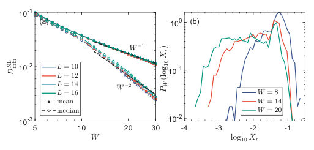 
FIG. 2. Typical and rare NLM in the strongly dis- ordered regime. For each disorder realization r, we define Xr = N −1 eig P

📷 Fig 2

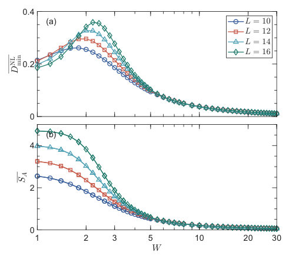 
FIG. 1. Eigenstate structure across disorder. Disorder- and eigenstate-averaged (a) min-relative NLM DNL min and (b) half-chain von Neumann entropy SA as functions of disorder strength W for L = 10, 12, 14, and 16.

📷 Fig 3

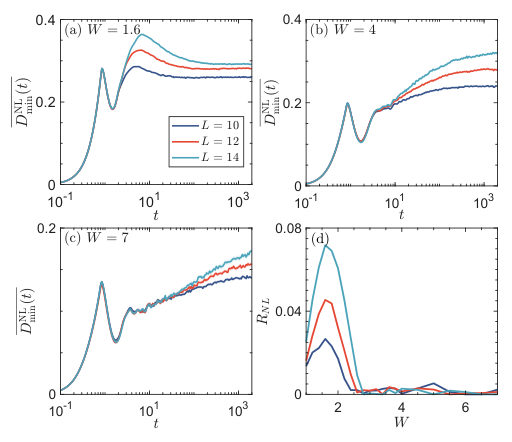 
FIG. 3. Quench dynamics of min-relative NLM. (a)–(c) Disorder-averaged DNL min(t) following a quench from the N´eel product state for W = 1.6, 4, and 7, respectively, and for different system sizes. (d) NLM relaxation drop RNL as a function of W. Here tpeak is the maximum reached after the common short-time peak and tend is the final evolution time.

📷 Fig 4

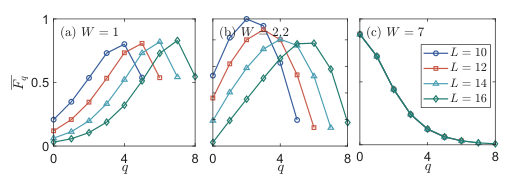 
FIG. 4. Dyadic-rank structure of the Schmidt spec- trum. Disorder- and eigenstate-averaged branch fidelity Fq as a function of q at (a) W = 1, (b) W = 2.2, and (c) W = 7. Colors and symbols denote different system sizes.

📷 Fig 5

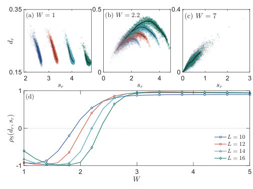 
FIG. 5. Disorder-resolved correlation between entan- glement and nonlocal magic. (a)–(c) Eigenstate-averaged NLM dr versus entanglement entropy sr for individual disor- der realizations at W = 1, 2.2, and 7, respectively. Colors de- note different system sizes, and solid curves show equal-count binned medians. (d) Spearman rank correlation coefficient ρS(dr, sr) as a function of disorder strength. The horizontal dotted line marks ρS = 0.

**Summary.** The authors introduce Min-relative Nonlocal Magic ($	ext{DNL}_{\min}$) as a novel diagnostic tool to characterize the transition from ergodic to Many-Body Localization (MBL) in disordered quantum chains. They show that $	ext{DNL}_{\min}$ captures structural information about entanglement, revealing distinct scaling behaviors in the MBL regime that are missed by standard entanglement entropy. This provides a deeper understanding of ergodicity breaking in complex quantum many-body systems.

**Why it may be interesting.** This work provides a powerful, quantitative tool ($	ext{DNL}_{\min}$) to probe the underlying structure of entanglement (Schmidt spectrum) in strongly correlated and disordered systems, offering complementary insights to standard entropy measures relevant to open quantum systems dynamics.

Detailed structure

**Main problem.** The paper aims to develop diagnostics beyond entanglement entropy to characterize the crossover from ergodic to Many-Body Localization (MBL) in interacting quantum systems.

**Main result.** The proposed measure, Min-relative Nonlocal Magic (NLM), reveals a spectral reorganization in the Schmidt spectrum that is invisible to entanglement entropy, showing distinct scaling behaviors in the ergodic and MBL regimes.

**Method.** The analysis involves calculating the minimum-relative NLM ($	ext{DNL}_{\min}$) for a disordered XXZ chain and comparing its scaling properties across different disorder strengths ($W$) and system sizes ($L$).

**Model / system.** The primary system is the random-field XXZ chain, $H = J \sum (\dots) + \sum h_i S^z_i$, studied in the half-filling sector. The analysis also utilizes a minimal two-configuration cut-hybridization model to derive analytical scaling laws.

**Key observables.** Min-relative Nonlocal Magic ($	ext{DNL}_{\min}$), Von Neumann entropy ($S_A$), and state-resolved probability distributions $	ext{P}_X(x)$.

**Important parameters / regimes.** Disorder Strength ($W$), System Size ($L$), and the crossover between ergodic and MBL regimes.

**Assumptions / limitations.** The analysis relies on comparing the behavior of $	ext{DNL}_{\min}$ to established scaling laws for entanglement entropy and utilizes effective low-energy models (e.g., two-level Hamiltonian) to explain decay rates.

**Figures summary.** Figures illustrate the evolution of $	ext{DNL}_{\min}$ and $S_A$ versus disorder strength $W$, showing the dome formation for $	ext{DNL}_{\min}$ versus the volume-to-area law transition for $S_A$. Other figures detail quench dynamics and state-resolved probability distributions.

**Paper structure.** The paper systematically introduces $	ext{DNL}_{\min}$ as a diagnostic tool, analyzes its behavior across the disorder landscape (weak $	o$ intermediate $	o$ strong), derives scaling laws in the deep MBL regime using minimal models, and finally examines quench dynamics.

Abstract

Nonlocal magic quantifies the minimum nonstabilizerness attainable under independent local unitary transformations on the two subsystems. Here, we use min-relative nonlocal magic (NLM) to characterize the crossover from ergodicity to many-body localization (MBL) in the random-field XXZ chain. Unlike entanglement entropy, NLM probes how entanglement is organized through the distance of the Schmidt spectrum from dyadic-flat stabilizer spectra. From weak to intermediate disorder, NLM evolves from an $O(1)$ Haar-like value into a size-enhanced dome, while entanglement remains volume-law, revealing a spectral reorganization not visible in the entropy. Deep in the MBL regime, a two-level cut-hybridization model captures the nearly binary Schmidt spectrum and explains why the mean and median NLM decay approximately as $W^{-1}$ and $W^{-2}$, respectively. Following a product-state quench, NLM overshoots and relaxes in the ergodic regime, whereas at strong disorder it grows slowly and approximately logarithmically. These results show that NLM resolves Schmidt-spectrum structure not visible in the entanglement entropy and provides a complementary probe of ergodicity breaking.

[↑ back to top](#top)

### [Pretty good quantum state transfer via transcendental edge weights](http://arxiv.org/abs/2609.16549v1)

**Authors:** Addison Ballif, Mark Kempton, James B. Larsen, Kellon Sandall, Christino Tamon, Trevor Wai  
**Type:** theory · **Category:** other · **PDF:** <https://arxiv.org/pdf/2609.16549v1>  
**Analysis basis:** full PDF text, analyzed in chunks
**Topic relevance:** `analog quantum simulation` **1/5**

📷 Fig 1

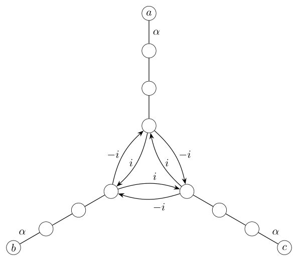 
Figure 1: Example of a graph satisfying 3.3. Note that C must be directed if it has more than 2 vertices, as no such graph with a real symmetric adjacency matrix can have universal perfect state transfer [16]. By 3.3, this graph will have PGST between nodes a and b, b and c, and c and a.

📷 Fig 2

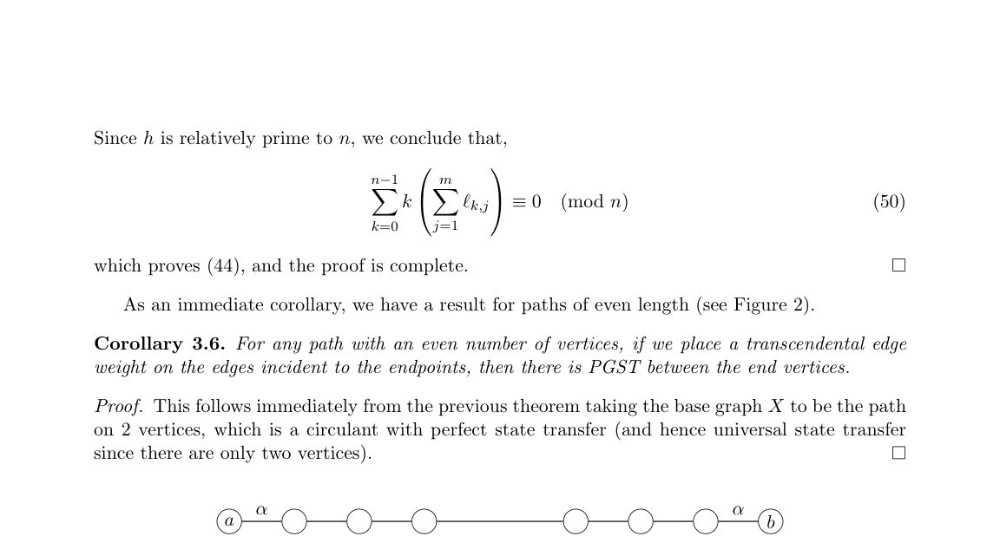 
Figure 2: Illustration of Corollary 3.6. For transcendental α, this will exhibit PGST between nodes a and b.

**Summary.** This paper establishes conditions for achieving Pretty Good State Transfer (PGST) in quantum walks on complex graphs. It achieves this by constructing the graph as a rooted product involving a circulant graph and a path weighted by a transcendental number. The work demonstrates that the transcendental nature of the weight is crucial for guaranteeing robust quantum connectivity.

**Why it may be interesting.** The reliance on transcendental numbers to guarantee quantum phenomena like PGST provides a deep connection between number theory and quantum dynamics, which is highly relevant for understanding robustness in quantum systems.

Detailed structure

**Main problem.** The paper investigates the conditions under which Pretty Good State Transfer (PGST) can be achieved between nodes in a graph constructed via a rooted product.

**Main result.** It proves that attaching a path with a transcendental weight on its end edge to a circulant graph with universal PST results in PGST between the path's endpoints.

**Method.** The analysis uses spectral decomposition, rooted product constructions, and advanced mathematical tools including orthogonal polynomials and Galois theory to derive necessary congruence conditions for state transfer.

**Model / system.** The model is a quantum walk on a weighted graph $Z$, constructed as a rooted product of a circulant graph $X$ (assumed to have universal PST) and a path $P_{\alpha}^m$. The dynamics are governed by the unitary evolution $U(t) = e^{-itA}$.

**Key observables.** Pretty Good State Transfer (PGST), defined by the existence of a time $	au$ such that the transition amplitude $| \langle u|U(	au)|v
angle | > 1 - \epsilon$.

**Important parameters / regimes.** The transcendental weight $\alpha$ on the end edge of the path, and the eigenvalues $\lambda_k$ of the base circulant graph $X$.

**Assumptions / limitations.** The base graph $X$ is assumed to be a circulant graph with universal PST, and the weight $\alpha$ must be transcendental over the rationals.

**Figures summary.** Figure 1 illustrates a graph structure related to the condition for universal PST. Figure 2 visually demonstrates the PGST result for a path with an even number of vertices using a transcendental weight $\alpha$.

**Paper structure.** The paper begins with preliminaries on state transfer and graph products, proceeds to analyze the structure of the adjacency matrix of the rooted product, derives the characteristic polynomial, and culminates in proving the PGST conditions using algebraic and number-theoretic arguments.

Abstract

We prove that if we take a rooted product of a circulant graph with universal perfect state transfer with a path of fixed length whose end edge is weighted with a transcendental number, then there is pretty good state transfer between any pair of endpoints of these paths. As a consequence, in a path with an even number of vertices with transcendental weights on the two edges incident to the endpoints, there is pretty good state transfer.

[↑ back to top](#top)

### [Real-Space Renormalization of Stabilizer Rényi Entropies in Spin Chains](http://arxiv.org/abs/2609.17188v1)

**Authors:** Sonja Gombar, Petar Mali, Slobodan Radošević, Milica Rutonjski, Milan Pantić, Milica Pavkov-Hrvojević  
**Type:** theory · **Category:** statistical mechanics · **PDF:** <https://arxiv.org/pdf/2609.17188v1>  
**Analysis basis:** full PDF text, analyzed in chunks
**Topic relevance:** `analog quantum simulation` **1/5**

📷 Fig 1

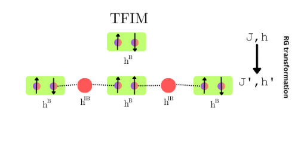 
FIG. 1. Schematic representation of the real-space renor- malization group (RSRG) procedure for the one-dimensional transverse field Ising model (TFIM). Green rectangles rep- resent basic blocks (hB), each containing two lattice sites (purple circles) with arrows indicating spin orientations. Red circles between blocks denote inter-block interactions (hIB). Dotted lines show connections between blocks. The right side illustrates the RG transformation, where J and h transform to J′ and h′, respectively. The explicit forms of the block Hamil- tonian and inter-block Hamiltonian are detailed in Eq. (9). This RSRG scheme demonstrates the coarse-graining process used to study the system’s...

📷 Fig 2

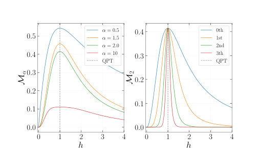 
FIG. 2. Left panel: Stabilizer R´enyi entropy (SRE) as de- fined in Eq. (1) of the TFIM basic block ground states from Eqs. (10a) - (10b) with changing transverse magnetic field h and R´enyi parameter α. Right panel: SRE at α = 2 for the TFIM for different effective chain sizes (or RG steps) corre- sponding to the spin chain of effective length N = 2, 4, 8, 16 that correspond to 0th, 1st, 2nd, 3rd RG steps, respectively. The dashed black line denotes where a continuous quan- tum phase transition (QPT) is located at the thermodynamic limit. We fix the coupling to J = 1.

📷 Fig 3

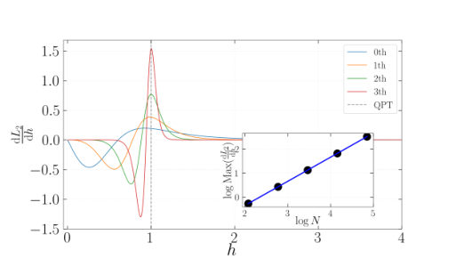 
FIG. 3. First-order derivative of the long-range SRE derived in Eq. (20) with the different RG steps for the ground state of the TFIM chain. In the inset, the logarithm of the maximal value of the explicit functions presented in the main panel (i.e., the long-range magic derivative) is plotted against the increasing effective system dimension N = 8, 16, 32, 64, 128. With the blue line, we denote the fit to the data points with the linear function f(x) = a + bx, where we obtain a = −2.34422 and b = 1.0014.

📷 Fig 4

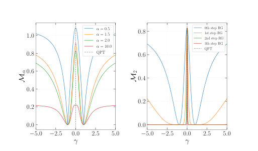 
FIG. 5. Left panel: Stabilizer R´enyi Entropy (SRE) as de- fined in Eq. (33) of the XY model basic block ground states with changing spin anisotropy parameter γ and R´enyi pa- rameter α. Right panel: SRE at α = 2 for the XY model for different effective chain sizes (or RG steps) correspond- ing to the spin chain of effective length N = 3, 9, 27, 81 that correspond to 0th, 1st, 2nd, 3rd RG steps, respectively. The dashed black line denotes where a continuous quantum phase transition (QPT) is located at the thermodynamic limit. We fix the coupling to J = 1.

📷 Fig 5

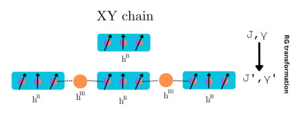 
FIG. 4. Schematic representation of the real-space renormal- ization group (RSRG) procedure for the one-dimensional XY model.

**Summary.** This paper applies Real-Space Renormalization Group techniques to analyze the non-stabilizerness of quantum states in 1D spin chains, such as the TFIM and XY model. By calculating the Stabilizer Rényi Entropy (SRE), the authors quantify 'quantum magic' and demonstrate how this measure reveals the location and nature of quantum phase transitions. This provides a powerful, entanglement-based diagnostic tool for condensed matter physics.

**Why it may be interesting.** The use of entanglement measures like SRE within a powerful RG framework provides a novel diagnostic tool to characterize quantum phases and critical behavior in 1D quantum magnets, connecting entanglement structure directly to critical exponents.

Detailed structure

**Main problem.** The paper investigates the non-stabilizerness of quantum states in spin chains and analyzes how this 'quantum magic' evolves under coarse-graining.

**Main result.** The Real-Space Renormalization Group (RSRG) successfully provides closed-form expressions for the Stabilizer Rényi Entropy (SRE) and long-range SRE, allowing the study of quantum phase transitions.

**Method.** The primary method is the Real-Space Renormalization Group (RSRG) applied to entanglement measures, specifically the Stabilizer Rényi Entropy (SRE), to study system behavior across different length scales.

**Model / system.** The study focuses on one-dimensional quantum spin chains, specifically the Transverse-Field Ising Model (TFIM) and the spin-1/2 periodic integrable XY chain. Hamiltonians are provided for both models.

**Key observables.** Stabilizer Rényi Entropy (SRE), long-range SRE, and critical exponents ($
u$).

**Important parameters / regimes.** Low-energy, large-distance regime; quantum critical point (QCP); magnetic field ($h$) and coupling constants ($J, \gamma$).

**Assumptions / limitations.** The RSRG method is used to derive closed-form expressions, and the analysis often focuses on the low-lying spectrum or specific limits of the system.

**Figures summary.** Figures schematically illustrate the RSRG procedure for both TFIM and XY models, showing the block Hamiltonian and inter-block interactions. Other figures plot SRE vs. magnetic field or vs. RG steps to locate critical points.

**Paper structure.** The paper introduces SRE as a measure of non-stabilizerness, details the RSRG procedure for both TFIM and XY chains, applies this procedure to calculate renormalized parameters and SRE, and finally analyzes the scaling behavior of these quantities near quantum critical points.

Abstract

Stabilizer states constitute an important class of quantum states that can be generated from computational-basis states using Pauli operators and Clifford gates. Although they may exhibit substantial multipartite entanglement, quantum circuits restricted to stabilizer operations can be efficiently simulated classically and therefore cannot, by themselves, provide a quantum computational advantage. Such an advantage requires non-stabilizer resources, commonly referred to as quantum magic. In this paper, we investigate the non-stabilizerness of quantum states arising in a class of spin Hamiltonians by computing their stabilizer Rényi entropies. Using real-space renormalization-group techniques, we obtain a closed-form expression valid in the low-energy, large-distance regime. We analyze how quantum magic evolves under coarse-graining and explore its behavior across different parameter regimes and quantum phases.

[↑ back to top](#top)

### [Renormalizing small ball events for branching random walk](http://arxiv.org/abs/2609.17520v1)

**Authors:** Vilas Winstein  
**Type:** theory · **Category:** statistical mechanics · **PDF:** <https://arxiv.org/pdf/2609.17520v1>  
**Analysis basis:** full PDF text, analyzed in chunks
**Topic relevance:** `Keldysh / 2PI / non-Gaussian methods` **1/5**

📷 Fig 1

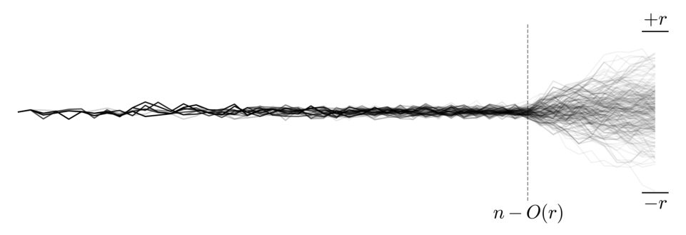 
Figure 1: Illustrative depiction of the behavior of branching random walk conditioned on all endpoints lying in the interval [−r, r]. The initial n −O(r) steps become a branching Ornstein–Uhlenbeck walk with a drift towards the origin. The drift strength (and thus fluctuation scale) of this portion of the walk only depends on the branching rate of the walk, not the radius r of the interval.

📷 Fig 2

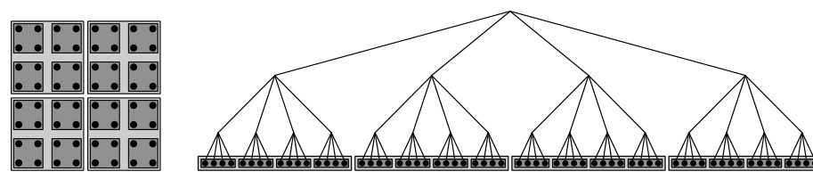 
Figure 2: An illustration of the correspondence between x ∈Λm (left-hand side) and τ ∈[4]n (right-hand side), for m = 8 = 23 = 2n. The lightly shaded larger boxes contain points which have the same first coordinate in τ under this identification, and the darkly shaded smaller boxes contain points which have the same first and second coordinate.

📷 Fig 3

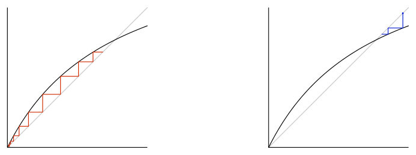 
Figure 3: Plots of the function x 7→ bx 1+x with iterations starting below (left) and above (right) the fixed point b −1. Starting at m2 0 = m2 ≈0 (red point in bottom left) as in Section 2.2, it will take Θ  logb 1 m2 

📷 Fig 4

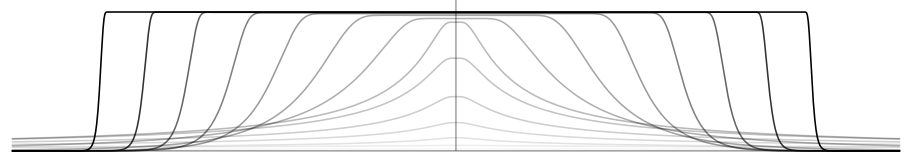 
Figure 4: Illustrative depiction of the shrinking behavior of R′′ k, lighter curves representing higher values of k. There is a plateau which first shrinks horizontally by Ω(1) at each step (while also shrinking by a very small amount vertically). Eventually, the uniform bound on the vertical height begins to decrease exponentially.

📷 Fig 5

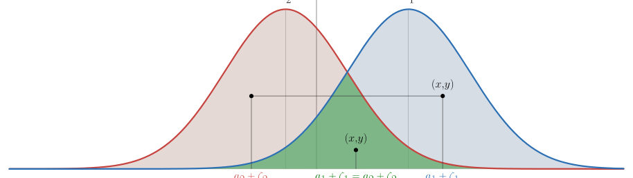 
Figure 5: The coupling described in the proof of Lemma 5.3. A point (x, y) is sampled under the density of N a1 1 (blue and green area). If it lies under both densities (green area), then we set a1 + ζ1 = x = a2 + ζ2. Otherwise, we reflect the point to the red area, and we still obtain |a1 + ζ1| ⩾|a2 + ζ2|. The same coupling

**Summary.** This paper rigorously analyzes how conditioning a Branching Random Walk (a model for log-correlated Gaussian fields) on its endpoints being confined to a small region affects its correlations. Using Renormalization Group techniques, the authors prove that this conditioning induces an exponential decay of correlations with a characteristic length scale proportional to the confinement radius $r$. The results are generalized to important physical models like the sinh-Gordon and $\phi^4$ theories.

**Why it may be interesting.** The methods developed for analyzing correlation decay under strong spatial constraints (small ball events) are highly relevant for understanding critical phenomena and confinement in quantum field theories, which often involve Gaussian or log-correlated fields.

Detailed structure

**Main problem.** The paper analyzes the correlation structure of a Branching Random Walk (BRW) when conditioned on all its endpoints lying within a small interval (a 'small ball event').

**Main result.** The conditioning leads to an exponential decay of correlations between the endpoints, with an optimal correlation length of $O(r)$.

**Method.** The core technique employed is the Renormalization Group (RG) analysis, which separates the effect of endpoint conditioning into relevant and irrelevant parts.

**Model / system.** The primary model is the BRW, which serves as a prototypical log-correlated Gaussian field and a mathematical stand-in for the Discrete Gaussian Free Field (DGFF). Generalizations apply to the sinh-Gordon model and $\phi^4$ models.

**Key observables.** Correlation $	ext{Cov}(\phi_{	au_1}, \phi_{	au_2})$ and the correlation length.

**Important parameters / regimes.** The radius $r$ of the small ball event, the depth $n$ of the walk, and the potential parameters ($\lambda, \alpha$).

**Assumptions / limitations.** The conditioning on $\|\Phi\|_\infty \le r$ is an extremely low-probability event, and the analysis relies on separating the RG flow into relevant and irrelevant components.

**Figures summary.** Figure 1 illustrates the BRW conditioned on endpoints in $[-r, r]$, showing the initial steps behave like a branching Ornstein-Uhlenbeck (OU) walk.

**Paper structure.** The paper establishes the main result for the BRW using RG, then generalizes this result to other hierarchical field theories, specifically applying it to the sinh-Gordon model and generalized $\phi^4$ models.

Abstract

Consider a branching random walk (BRW) of depth $n$ with standard Gaussian increments, conditioned on all endpoints lying in an interval of radius $r$ (which may depend on $n$), i.e. a small ball event. We prove that this conditioning results in exponential decay of correlations between the endpoints, with correlation length $O(r)$. Our proof is based on the renormalization group, which in this context captures the effect of the endpoint conditioning on earlier steps in the walk. This effect can be separated into so-called relevant and irrelevant parts, and in our setting the relevant part makes the conditioned BRW behave like a branching Ornstein-Uhlenbeck walk for the first $n-O(r)$ steps, leading to the correlation decay. The irrelevant part shrinks in a nontrivial manner, and the simplest argument to bound it uniformly only yields correlation length $O(r^2)$. To achieve the optimal $O(r)$ bound, we establish that the irrelevant part shrinks horizontally in space before decaying uniformly.   The BRW is a prototypical example of a log-correlated Gaussian field, and it forms the basis of many hierarchical field theories in the mathematical formulation of quantum field theory. As such, we present our results in a general form which is applicable to other hierarchical field theories with confining potentials, of which the small ball conditioned BRW is an example. We apply our general result to two other models: first, the sinh-Gordon model which has a strictly convex potential, so at the level of covariances the model behaves like one with a quadratic potential, i.e. the model has a positive mass. Second, we consider generalizations of the $φ^4$ model with any power $α\geq 2$; as $α$ increases from $2$ to $\infty$, these power potentials naturally interpolate between the massive (quadratic) potential and the infinite square well potential of the small ball event.

[↑ back to top](#top)

### [Strong converse for the quantum capacity of the pure-loss bosonic channel](http://arxiv.org/abs/2609.16608v1)

**Authors:** Mark M. Wilde  
**Type:** theory · **Category:** quantum information and computing · **PDF:** <https://arxiv.org/pdf/2609.16608v1>  
**Analysis basis:** full PDF text, analyzed in chunks
**Topic relevance:** `correlated / nonlocal dissipation` **1/5**

📷 Fig 1

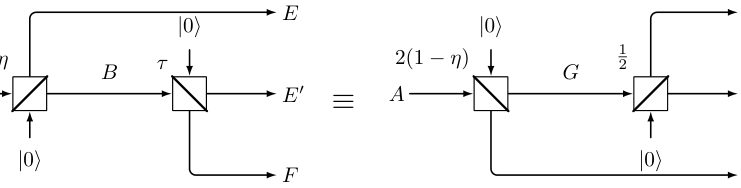 
Figure 1: Equivalent vacuum-fed beam-splitter dilations for 1/2 &lt; η &lt; 1. The labels beside the beam splitters denote power transmissivities, with τ := (1−η)/η. Mode phases follow the convention of the displayed creation-operator identity. (a) The pure-loss channel of transmissivity η is followed by the degrading attenuation of transmissivity τ. (b) An initial splitting of transmissivity 2(1 −η) produces G and F, after which only G enters the balanced beam splitter. Both networks have the same labeled outputs E, E′, F and leave R unchanged. For n uses, the optical splitters act modewise. For a pure input on RAn, the state before the balanced splitters in panel (b) is pure on RF nGn, so RF n...

**Summary.** This paper rigorously proves a strong converse for the quantum capacity of the pure-loss bosonic channel. It shows that if the transmission rate exceeds the channel capacity, the achievable fidelity of any quantum code decays polynomially with the block length. The work employs advanced techniques from quantum information theory, linking channel loss to fundamental bounds on quantum state estimation.

**Why it may be interesting.** It provides rigorous, quantitative bounds on the fundamental limits of quantum communication through lossy optical channels, which is crucial for quantum networking and quantum optics.

Detailed structure

**Main problem.** The paper aims to establish a strong converse for the unconstrained quantum capacity of the pure-loss bosonic channel.

**Main result.** It proves that for any rate above capacity, the entanglement-generation fidelity of any code decays polynomially ($O(1/n)$) with the number of channel uses $n$.

**Method.** The proof combines quantum Chebyshev and hockey-stick testing inequalities with a uniform relative-entropy-variance bound, reducing the general case to the balanced-channel setting.

**Model / system.** The system modeled is the pure-loss bosonic channel, which describes optical attenuation via a beam-splitter mixing an input mode with a vacuum mode.

**Key observables.** Entanglement-generation fidelity of codes, the rate gap ($\delta_n$), and the quantum capacity ($q_\eta$).

**Important parameters / regimes.** Transmissivity ($\eta$), the number of channel uses ($n$), and the rate ($\log_2 M$).

**Assumptions / limitations.** The proof is for the *unconstrained* quantum capacity and establishes a polynomial decay rate, not an exponential one.

**Figures summary.** Figure 1 illustrates two equivalent vacuum-fed beam-splitter dilations for $1/2 < \eta < 1$, relating the pure-loss model to a balanced beam splitter.

**Paper structure.** The argument develops by first establishing tools like the logarithmic trace inequality, then analyzing the balanced-channel state, and finally extending the bound to general transmissivities and arbitrary input states.

Abstract

This paper reports the proof of a strong converse for the unconstrained quantum capacity of the pure-loss bosonic channel. At every fixed rate above capacity, the entanglement-generation fidelity of every code is bounded by a constant times the reciprocal of the number of channel uses. The bound holds without an energy constraint and for arbitrary encoded states, including states correlated across all input modes, and arbitrary joint decoders. The proof combines quantum Chebyshev and hockey-stick testing inequalities with a uniform relative-entropy-variance bound for the balanced pure-loss channel, corresponding to transmissivity $η=1/2$. The variance bound follows by expressing the balanced beam splitter in bright and dark modes: the dark modes are exactly in vacuum, and any state orthogonal to that vacuum contains at least one dark photon. For general transmissivity, dilating the degrading attenuator reduces the problem to this balanced-channel setting and bounds the decoder test by precisely the factor that produces the known quantum-capacity threshold. The resulting argument establishes the strong converse at the unconstrained quantum capacity for every pure-loss bosonic channel.

[↑ back to top](#top)

### [Understanding the spin coherence of molecular photoexcited triplet states from first principles](http://arxiv.org/abs/2609.16851v1)

**Authors:** Ecaterina Păunică, Sam L. Bayliss  
**Type:** theory · **Category:** other · **PDF:** <https://arxiv.org/pdf/2609.16851v1>  
**Analysis basis:** full PDF text, analyzed in chunks
**Topic relevance:** `correlated / nonlocal dissipation` **1/5**

📷 Fig 1

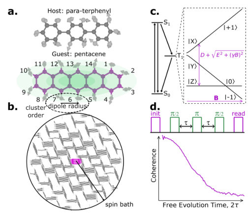 
Figure 1. Exploring the spin coherence of molecular photoex- cited triplets with generalized cluster-correlation expansion techniques. (a)/(b) Pentacene (guest) and p-terphenyl (host) molecules. Decoherence of the electronic spin arises from in- teractions with the surrounding nuclei, characterized by their cluster order, dipole radius, and bath radius. (c) Outline of pentacene’s electronic and spin energy levels. (d) Schematic of a Hahn-echo sequence with optical initialization/readout and the resulting coherence function.

📷 Fig 2

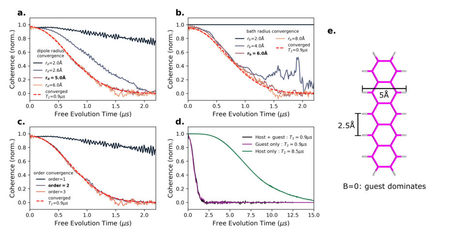 
Figure 2. Guest-dominated zero-field decoherence. Convergences as a function of: (a) dipole radius, rd (with rb = 10˚A, order= 2); (b) bath radius, rb (with rd = 6˚A, order= 2); and (c) order (with rd = 6˚A,rb = 10˚A). Bold values indicate the approximate convergence point. (d) Comparison of converged coherence for guest only, host only, and host+guest, demonstrating the guest dominance. (e) Illustration of characteristic pentacene lengthscales.

📷 Fig 3

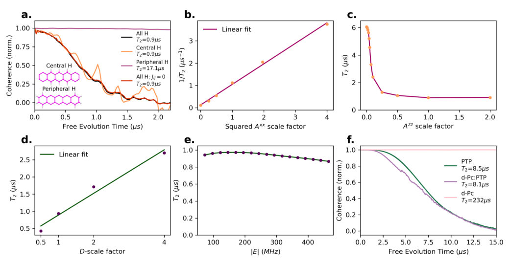 
Figure 3. Unpacking zero-field decoherence mechanisms. (a) Guest-only coherence keeping only central or peripheral nuclei, and with the nuclear dipole-dipole interaction turned off (Jij = 0). (b) Guest-only decoherence rate as all Axx hyperfine parameters are scaled. (c) Guest-only T2 as all Azz parameters are scaled. (d), (e) Host+guest T2 as the zero-field splitting parameters D and E are varied. (The other zero-field splitting parameter was fixed to the experimental value.) (f) Coherence function for deuterated pentacene with and without a hydrogenated host, compared to the hydrogenated host only case.

**Summary.** This theoretical study investigates how molecular spin coherence decays in photoexcited triplet states using a host-guest molecular system. By applying advanced cluster-correlation expansion methods, the authors pinpoint that decoherence is dominated by hyperfine interactions from the guest molecule. The findings provide quantitative guidelines for synthetically enhancing the coherence time of these promising molecular quantum probes.

**Why it may be interesting.** This work provides detailed, first-principles insights into decoherence in solid-state molecular qubits, which is crucial for designing robust quantum sensors and quantum information devices based on molecular spin states.

Detailed structure

**Main problem.** The study aims to understand the decoherence mechanisms limiting the spin coherence time ($T_2$) of optically readable molecular photoexcited triplet states.

**Main result.** Zero-field decoherence is primarily driven by hyperfine-mediated interactions originating from the guest molecule, while the coherence time shows a linear dependence on the zero-field splitting parameter $D$.

**Method.** The research employs first-principles calculations using the generalized Cluster-Correlation Expansion (gCCE) method to model the time evolution of the spin coherence function.

**Model / system.** The system is a host-guest crystal (pentacene guest in a p-terphenyl host) containing optically addressable molecular spin qubits. The Hamiltonian includes terms for zero-field splitting, electronic Zeeman interaction, and hyperfine/dipole-dipole interactions with surrounding nuclear spins.

**Key observables.** Spin coherence time ($T_2$), coherence function $L(t)$, and the decoherence rate ($T_2^{-1}$).

**Important parameters / regimes.** Zero-field splitting parameters ($D$ and $E$), hyperfine coupling constants ($A_{ij}$), and the magnetic field regime (zero to high field).

**Assumptions / limitations.** The triplet lifetime is assumed to be much longer than $T_2$, and the analysis relies on the point-dipole approximation for nuclear spin interactions.

**Figures summary.** Figures illustrate the system setup, the Hahn-echo sequence, and show the dependence of $T_2$ on parameters like $D$ (linear scaling) and $E$ (weak scaling), confirming the dominance of guest-related decoherence.

**Paper structure.** The paper systematically analyzes the decoherence mechanism by first establishing the theoretical framework using gCCE, then isolating the contributions of guest vs. host nuclei, and finally performing scaling analyses to determine the functional dependence of $T_2$ on key molecular parameters like $D$ and $E$.

Abstract

Optically readable molecular spins are attractive as quantum sensors due to their nanoscale modularity, synthetic tunability, and scope for sensitive readout. In particular, photoexcited spin-triplet states in organic molecules are appealing in supporting high optical-spin contrast at room temperature. Their utility is underpinned by their coherence, which warrants a detailed understanding of it. Here, from first principles, we systematically explore the Hahn-echo decoherence of the benchmark molecular system for room-temperature optically detected spin coherence---pentacene guest molecules coupled to a para-terphenyl host. Using generalized cluster-correlation expansion methods, we investigate the mechanisms of nuclear-spin-induced decoherence from zero to high magnetic field, exploring the role of guest vs host molecules, specific nuclei, zero-field splitting interactions, and hyperfine parameters. We describe how zero-field decoherence is driven by ~6 nuclei on the guest, while high-field decoherence is driven by ~600 nuclei in the host; how the longitudinal zero-field splitting parameter, $D$, can prolong $T_2$; and the magnetic-field-dependent processes which drive decoherence. These results advance our understanding of decoherence in optically readable molecular spins, providing insight for their synthetic enhancement and deployment as quantum probes.

[↑ back to top](#top)

### [Why Are We Unrolling? The Importance of Structured Quantum Programs for Compilation](http://arxiv.org/abs/2609.16171v1)

**Authors:** Damian Rovara, Daniel Haag, Mark Koch, Josh Izaac, Seyon Sivarajah, Robert Wille, Augustín Borgna, Lukas Burgholzer, Brad Chase, Olivia Di Matteo, David Ittah  
**Type:** theory · **Category:** quantum information and computing · **PDF:** <https://arxiv.org/pdf/2609.16171v1>  
**Analysis basis:** full PDF text, analyzed in chunks
**Topic relevance:** `quantum measurements` **1/5**

📷 Fig 1

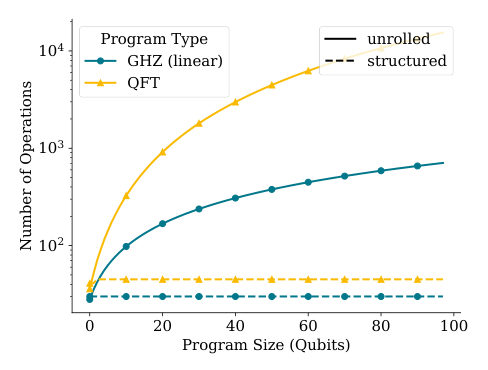 
Fig. 1: Preserving program structure can enable constant com- pilation times, even when the problem instance size increases. On the other hand, unrolling loops generally leads to polyno- mial or even exponentially-increasing program size. Programs used for this comparison were generated using mqt-cc [25]. See section IV for details on benchmark programs.

**Summary.** This paper addresses the scalability bottleneck in quantum compilation by arguing that current methods relying on unrolling quantum programs into straight-line circuits are insufficient for advanced algorithms. The authors introduce the concept of structured quantum programs, which explicitly model classical control flow and dynamism. They challenge the community to develop compilers that natively support this structure for efficient execution on future fault-tolerant hardware.

**Why it may be interesting.** While focused on compilation theory, the need for robust, structured compilation is foundational for realizing any complex quantum simulation or algorithm targeting physical systems.

Detailed structure

**Main problem.** Quantum compilation must evolve beyond straight-line circuits to efficiently support dynamic algorithms required for future fault-tolerant quantum hardware.

**Main result.** The paper argues that preserving the classical structure and dynamism of quantum programs, rather than unrolling them, is crucial for scalable compilation.

**Method.** The authors propose a formal definition of structured quantum programs and analyze the limitations of current compilation frameworks in supporting these dynamic elements.

**Model / system.** The focus is on the compilation process for quantum algorithms, treating the program itself as the primary model, which must support primitives like mid-circuit measurement feedforward and runtime-dependent control flow.

**Key observables.** Program size (qubits) and number of operations, showing that structured representations scale better than unrolled circuits.

**Important parameters / regimes.** The complexity of the algorithm (e.g., GHZ, Shor's) and the degree of structural dynamism (e.g., loop bounds, measurement dependencies).

**Assumptions / limitations.** The assumption is that future quantum hardware and algorithms will necessitate dynamic control flow, and that compilation tools must adapt to this structure.

**Figures summary.** Figure 1 compares program size for unrolled vs. structured circuits, showing constant scaling for the latter. Table I lists key structured primitives, and Table IV benchmarks various algorithms against required structural features.

**Paper structure.** The paper introduces the problem of scaling quantum compilation, defines structured quantum programs using primitives (Tier 1 and Tier 2), surveys current framework support, and concludes by presenting a benchmark challenge to the community.

Abstract

As quantum software stacks scale up to support future fault-tolerant quantum hardware and algorithms, quantum compilation is becoming an increasingly important component of the stack. How do we ensure that our software stacks support dynamic algorithms, including patterns such as mid-circuit measurement feedforward and repeat-until-success, with hundreds of logical qubits and billions of quantum operations? To do so, we must re-think how we represent quantum programs beyond straight-line circuits, to representations that include classical structure and dynamism, and make this the default representation to consider when performing quantum compilation. In this work, we present important patterns and algorithms from fault-tolerant quantum applications which admit a structured representation that we argue is crucial to preserve, and set a challenge to the community to compile such representations without unrolling them into straight-line quantum circuits. We also explore the status quo of structured program support in quantum software, and ask ourselves the rhetorical question: how much more efficient can we make quantum compilation tooling when we take into account the additional information from classical structure?

[↑ back to top](#top)

## Other papers (26)

*Papers from primary archives without highlighted authors or any topic match. Click to expand.*

Show other papers

### [Bias-Induced Crossover in Absolute Capacity of Dense Associative Memory](http://arxiv.org/abs/2609.17477v1)

**Authors:** Yuto Sakurai, Takeaki Shimokawa, Kazunori Iwata, Kazushi Mimura  
**Type:** theory · **Category:** disordered systems and neural networks · **PDF:** <https://arxiv.org/pdf/2609.17477v1>  
**Analysis basis:** full PDF text, analyzed in chunks

📷 Fig 1

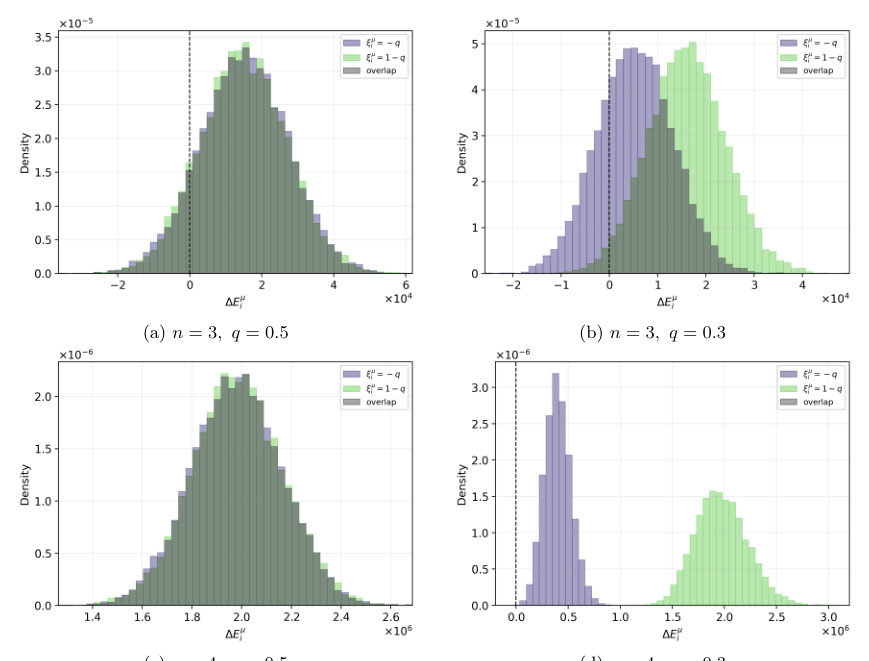 
FIG. 1. Empirical distributions of the single-site energy gap ∆Eµ i for N = 400 and K = 35000. For each value at site i, 104

📷 Fig 2

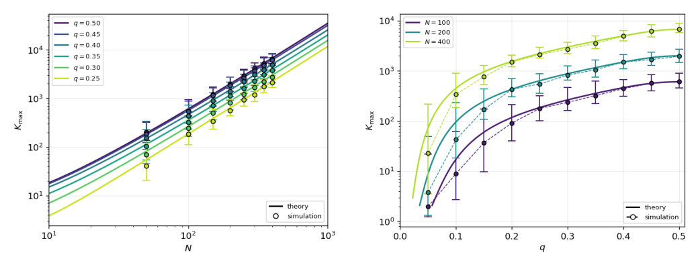 
FIG. 2. Finite-size single-site capacity for n = 3. (a) Kmax versus N at fixed q. (b) Kmax versus q for N = 100, 200, 400. Solid curves show the solutions of the conditioned-Gaussian equation (30). Markers and dashed curves show computer simulations of explicitly generated binary patterns. The error bar endpoints are obtained from the mean error curve plus or minus one empirical standard deviation.

📷 Fig 3

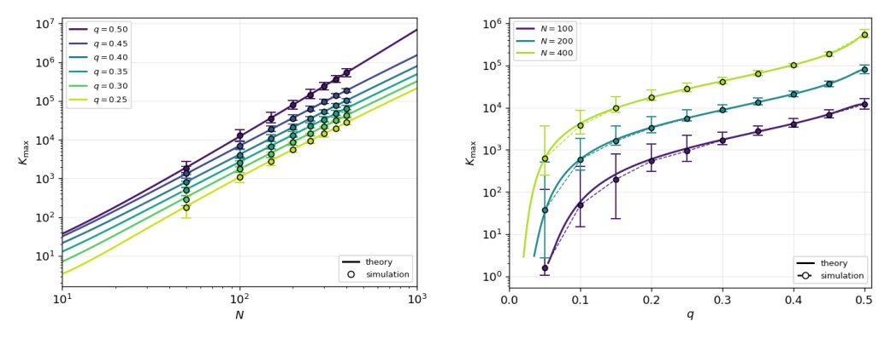 
FIG. 3. Finite-size single-site capacity for n = 4. (a) Kmax versus N at fixed q. (b) Kmax versus q for N = 100, 200, 400. The curves and symbols have the same meanings as in Fig. 2.

📷 Fig 4

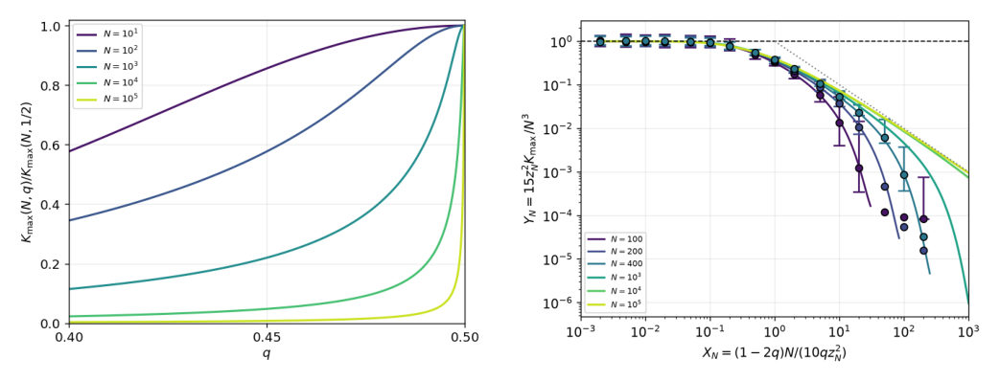 
FIG. 4. Finite-size quartic crossover. (a) Theoretical capacity normalized by its finite-size value at q = 1/2. The curves are obtained from Eq. (30) for N = 101, 102, . . . , 105. (b) Theoretical and simulated capacities in the variables XN and YN. The curves are obtained from Eq. (30) for N = 100, 200, 400, 103, 104, 105. The circles are computer simulations of explicitly generated binary patterns for N = 100, 200, 400. The error-bar endpoints are obtained from the mean error curve plus or minus one empirical standard deviation. The dashed line is the unbiased plateau YN = 1; the dotted line is the fixed-bias asymptote YN = X−1 N .

📷 Fig 5

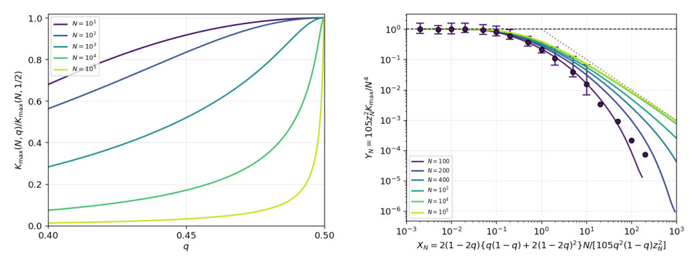 
FIG. 5. Finite-size quintic crossover. (a) Theoretical capacity normalized by its finite-size value at q = 1/2. The curves are obtained from Eq. (30) for N = 101, 102, . . . , 105. (b) Theoretical and simulated capacities in the quintic variables defined by Eq. (48). The curves are obtained from Eq. (30) for N = 100, 200, 400, 103, 104, 105. The circles are computer simulations of explicitly generated binary patterns for N = 100. Their error-bar endpoints are obtained from the mean error curve plus or minus one empirical standard deviation. The dashed line is YN = 1, and the dotted line is YN = X−1 N .

**Summary.** This theoretical paper analyzes the absolute storage capacity of a dense associative memory when the stored patterns exhibit a systematic bias. It finds that this bias fundamentally changes the scaling of the capacity compared to unbiased memories, predicting a distinct crossover regime. The work uses advanced statistical physics techniques to quantify these capacity limits.

**Why it may be interesting.** While focused on classical neural networks, the analysis of capacity limits and stability in the presence of systematic biases mirrors theoretical challenges in quantum error correction and the robustness of quantum information storage against correlated noise.

Detailed structure

**Main problem.** The paper investigates how introducing a bias in the stored patterns affects the absolute capacity of a dense associative memory, contrasting this with previously studied unbiased cases.

**Main result.** For fixed bias ($q<1/2$), the capacity scales differently ($O(N^{n/2})$ or $O(N^{(n+1)/2})$) than the unbiased case ($O(N^{n-1}/\ln N)$), predicting a bias-induced crossover region.

**Method.** The analysis uses signal-to-noise theory, conditioning on the number of biased sites, and employing Gaussian approximations for the crosstalk contributions in the large-N limit.

**Model / system.** The system is a dense associative memory modeled by an energy function involving polynomial interactions of order $n$ on centered binary patterns, where the bias is controlled by the probability $q$ that a component takes the value $1-q$.

**Key observables.** Absolute capacity ($K_{\max}$), single-site error probability ($P_{	ext{error}}$), and the crossover width.

**Important parameters / regimes.** Interaction order $n$, bias parameter $q$, and system size $N$.

**Assumptions / limitations.** The analysis relies on the single-site error criterion ($P_{	ext{error}}=1/N$) and approximations such as the Gaussian distribution for the sum of crosstalk terms.

**Figures summary.** Figure 1 illustrates the empirical distributions of the energy gap ($\Delta E_{\mu i}$) for different stored symbols, showing separation between conditional distributions.

**Paper structure.** The paper develops the capacity analysis by first establishing the energy gap decomposition, then deriving asymptotic expressions for $K_{\max}$ for $q=1/2$ and fixed $q<1/2$, and finally using asymptotic matching to predict the crossover region and the effect of activity control.

Abstract

The absolute capacity of dense associative memory has mainly been analyzed for unbiased patterns. Here we examine the effect of bias in centered binary patterns under the Krotov-Hopfield single-site criterion $P_{\mathrm{error}}=1/N$, where $P_{\mathrm{error}}$ is the probability that a single-site flip lowers the energy of a stored pattern and $N$ is the number of neurons. Each pattern component takes $1-q$ with probability $q$ and $-q$ otherwise, where $0<q\le1/2$. For polynomial interactions of order $n$, a signal-to-noise analysis gives an absolute capacity of order $N^{n-1}/\ln N$ at $q=1/2$. For fixed $q<1/2$, however, the capacity is $O(N^{n/2})$ for even $n\ge4$ and $O(N^{(n+1)/2})$ for odd $n\ge5$. For $n=3$, both the unbiased and fixed-bias capacities remain $O(N^2/\ln N)$. For $n\ge4$, these different asymptotic forms imply a nonuniform large-$N$ limit near $q=1/2$. Asymptotic matching predicts a bias-induced crossover in the region $1-2q=O(\ln N/N^{\lfloor n/2\rfloor-1})$. The crossover originates from a bias-dependent crosstalk mean that reduces the stability of sites carrying the more frequent value $-q$. Computer simulations are compared with the finite-size conditioned-Gaussian predictions. An activity-dependent control potential that cancels the conditional crosstalk mean restores the $N^{n-1}/\ln N$ capacity for fixed $0<q<1/2$ within the conditioned-Gaussian approximation.

[↑ back to top](#top)

### [Classical Communication Protocol based on Joint Classical-Quantum Coding](http://arxiv.org/abs/2609.16938v1)

**Authors:** Kristian Skafte Jensen, René Bødker Christensen, Čedomir Stefanović, Petar Popovski  
**Type:** theory · **Category:** quantum information and computing · **PDF:** <https://arxiv.org/pdf/2609.16938v1>  
**Analysis basis:** full PDF text, analyzed in chunks

📷 Fig 1

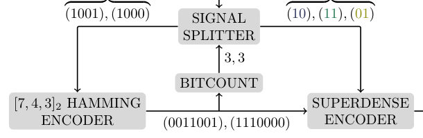 
Fig. 1. Illustrative example of the idea behind the proposed encoding scheme. The string of information bits is fed into the signal splitter which encodes chunks of length k given some [n, k, d] code. The ’1’s from the codeword are transmitted using qubits, the pairs of which are entangled and superdense encoding, representing additional bits from the input stream.

📷 Fig 2

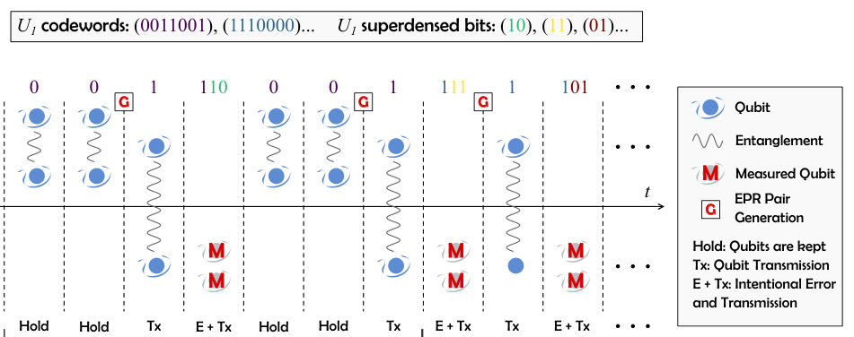 
Fig. 2. Proposed protocol to manage bit flip errors caused by dark counts and photon losses using classical error-correcting codes. The transmitting user U1 communicates bits to the receiving user U2, by sending the qubits of an EPR pair through a quantum channel, in a slotted setting. These bits are determined by codewords generated as in Fig. 1. The quantum transmission occurs each time a ‘1’ appears in the codeword. When the second qubit of the pair has to be transmitted, two extra information bits are superdense encoded in the EPR pair to enhance the data throughput.

📷 Fig 3

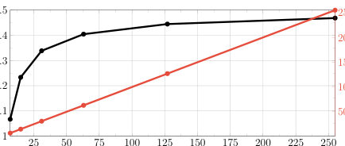 
Fig. 3. Rate (black) and lower bound on N (red) for the protocol capable of correcting dark counts using the [2m −1, 2m −m−1, 3] Hamming code, under the assumption that no more than a single dark count occurs for every N time slots.

📷 Fig 4

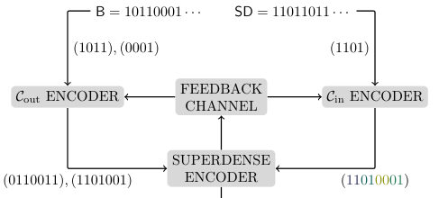 
Fig. 4. Illustrative example of the idea behind the encoding scheme utilizing two error-correcting codes. Information is divided into two separate strings, B and SD; the former is fed into the encoder using Cout, and the latter is fed into the encoder using Cin. The codeword produced by Cin is then used as bits to encode via superdense coding as in Fig. 1.

📷 Fig 5

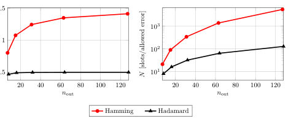 
Fig. 5. Rate and lower bound on N for the protocol capable of correcting both dark counts and photon losses. Here, “Hamming” refers to the scheme using the [2m−1, 2m−m−1, 3] Hamming code as Cout and the [2m, 2m− m −1, 4] extended Hamming code as Cin, while “Hadamard” refers to the scheme using the [2k, k, 2k−1] Hadamard code as Cout and the code defined in Eq. (11) as Cin. The bounds on N are based on Eqs. (7)-(8).

**Summary.** This paper proposes a novel quantum communication protocol that merges classical error-correcting codes with superdense coding to enhance robustness against photon loss and dark counts. By analyzing the system's performance over short-distance quantum links, the authors demonstrate that their joint coding approach surpasses the theoretical limits of conventional error-corrected superdense coding. This makes it highly relevant for developing practical Quantum Local Area Networks (QLANs).

**Why it may be interesting.** This work directly addresses the practical limitations of quantum communication by integrating classical coding theory to enhance performance metrics like rate and efficiency in near-term quantum network architectures.

Detailed structure

**Main problem.** To develop a robust quantum communication protocol that integrates classical error-control coding, entanglement distribution, and superdense coding to combat channel impairments like dark counts and photon losses.

**Main result.** The proposed joint classical-quantum coding protocol can exceed the upper bounds derived for conventional error-corrected superdense coding in terms of both data rate and energy efficiency.

**Method.** The protocol uses classical error-correcting codes to protect data encoded via superdense coding across quantum channels, deriving conditions for successful error correction under a bounded error-frequency model.

**Model / system.** The system is modeled as short-distance quantum links, specifically suited for Quantum Local Area Networks (QLAN), operating under physical error sources like fiber attenuation, detector efficiency, and dark counts.

**Key observables.** Data rate (R), Energy efficiency (E), and the effective rate ($R_{	ext{eff}}$).

**Important parameters / regimes.** Fiber length (L), detector efficiency ($E_{det}$), dark count rate ($	au$), and the structure of the employed error-correcting codes (e.g., Hamming, BCH).

**Assumptions / limitations.** The analysis assumes perfect EPR pair generation and is primarily limited to short-distance quantum links due to attenuation being the dominant impairment.

**Figures summary.** Figures illustrate the encoding scheme, compare the proposed protocol's performance against superdense coding upper bounds, and show sensitivity analyses (Tornado diagrams, heat maps) regarding physical channel parameters.

**Paper structure.** The paper introduces the joint protocol, derives performance bounds and conditions on codes, develops a physical error model, and finally compares the resulting effective rate against established superdense coding limits.

Abstract

We introduce a robust quantum communication protocol that integrates classical error-control coding, entanglement distribution, and superdense coding. Classical error-correcting codes are used to mitigate dark counts and photon losses by determining the positions of qubit transmissions and protecting the data embedded through superdense coding. We derive conditions on the employed codes that guarantee successful error correction under a bounded error-frequency model. Moreover, upper bounds are derived on the performance of conventional superdense coding protected by classical error correction. It is shown that, under the same constraints on error frequency, suitable code configurations of the proposed protocol can exceed those upper bounds both in terms of data rate and energy efficiency. Finally, we develop a physical error model based on fiber attenuation, detector efficiency, dark counts, and time-slot duration, and use it to evaluate the effective performance of different configurations of error-correcting codes. The proposed approach is primarily suited for short-distance quantum links, as in Quantum Local Area Network (QLAN) where it can provide high communication throughput while integrating entanglement distribution directly into the communication process.

[↑ back to top](#top)

### [Constant sized support state distillation with qubit recycling](http://arxiv.org/abs/2609.17044v1)

**Authors:** Victor Barizien  
**Type:** theory · **Category:** quantum information and computing · **PDF:** <https://arxiv.org/pdf/2609.17044v1>  
**Analysis basis:** full PDF text, analyzed in chunks

📷 Fig 1

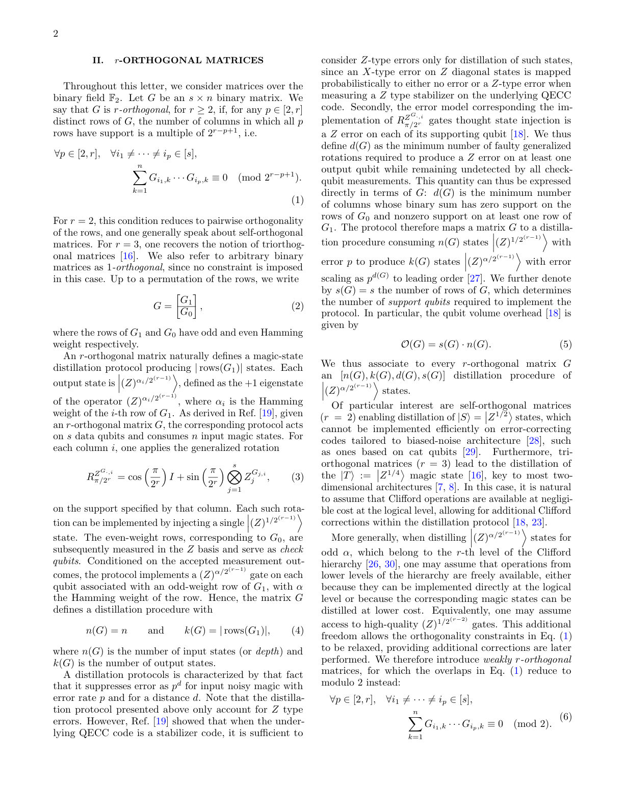 
Low-resolution page preview, page 2

📷 Fig 2

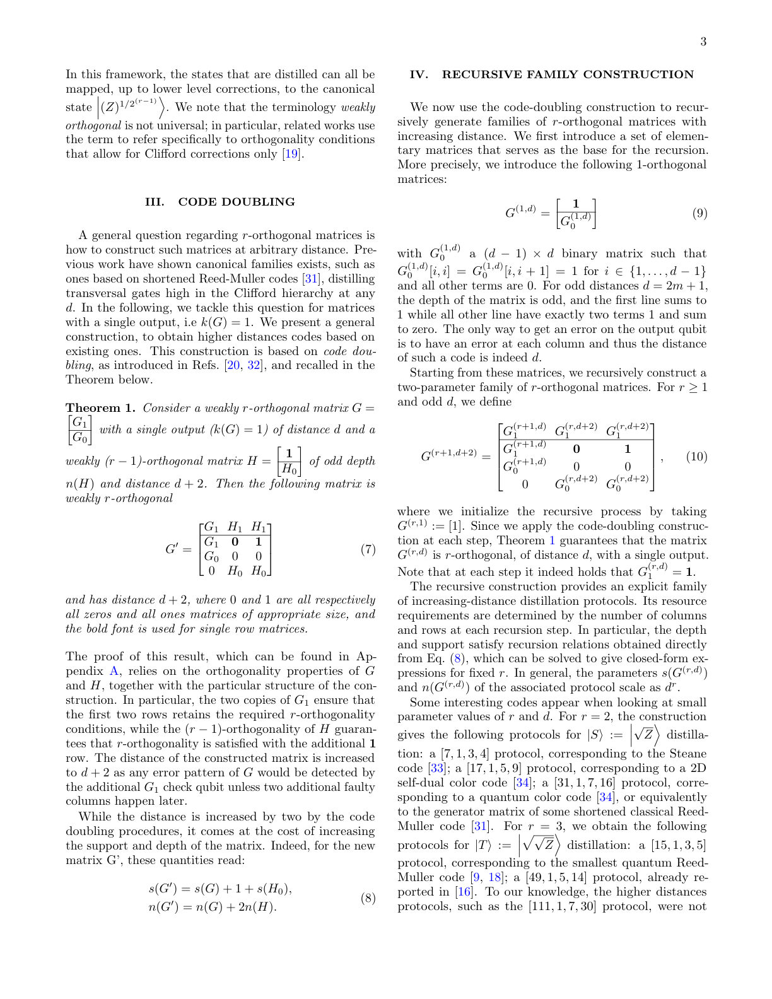 
Low-resolution page preview, page 3

📷 Fig 3

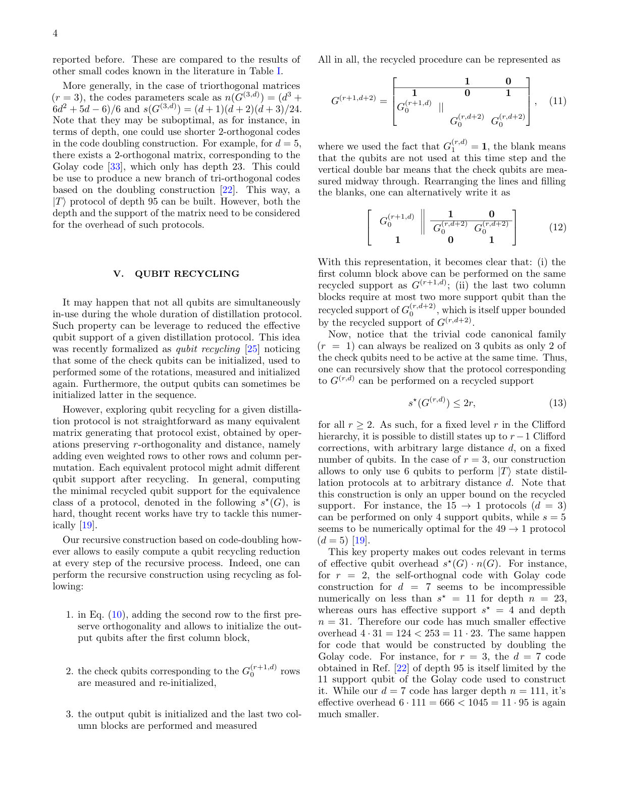 
Low-resolution page preview, page 4

📷 Fig 4

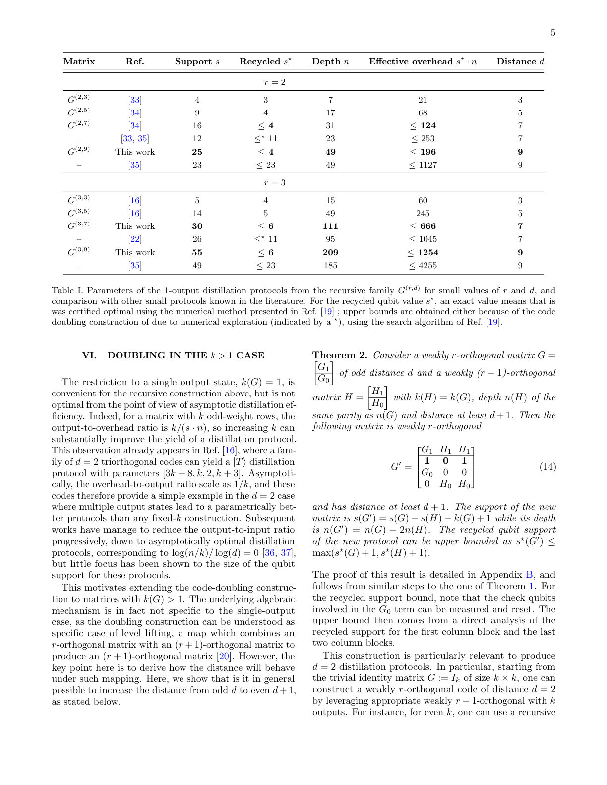 
Low-resolution page preview, page 5

📷 Fig 5

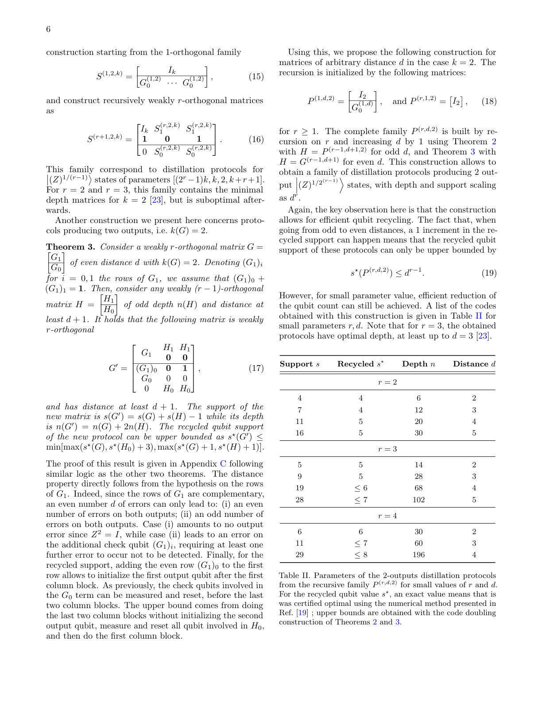 
Low-resolution page preview, page 6

**Summary.** This paper develops a systematic, recursive framework for designing quantum state distillation protocols necessary for fault-tolerant quantum computation. By utilizing code doubling and qubit recycling techniques, the authors construct families of protocols that achieve high code distance with minimal resource overhead. This work advances the theoretical understanding of resource management in quantum error correction.

**Why it may be interesting.** The focus on resource optimization (qubit recycling) and achieving high-distance distillation protocols is highly relevant for scaling up quantum computation architectures.

Detailed structure

**Main problem.** The paper addresses the limitation that quantum error-correcting codes alone cannot provide a universal set of fault-tolerant logical gates, necessitating high-fidelity magic state injection.

**Main result.** The authors provide a recursive family of distillation protocols that can produce diagonal states at arbitrary high distance on a fixed number of logical qubits, significantly reducing resource overhead via qubit recycling.

**Method.** The core method involves constructing and analyzing families of weakly r-orthogonal matrices using code doubling techniques and algebraic proofs over F_2.

**Model / system.** The model is based on quantum error-correcting codes and the distillation of magic states (like the |T> state). The mathematical framework uses r-orthogonal matrices G to characterize the resource requirements.

**Key observables.** Distance (d), Support (s), Depth (n), and the minimal recycled qubit support (s*).

**Important parameters / regimes.** The orthogonality level r, the distance d, and the number of output states k.

**Assumptions / limitations.** The analysis primarily focuses on Z-type errors sufficient for stabilizer codes, and the construction relies on the availability of lower-level Clifford operations.

**Figures summary.** The notes mention a Table I comparing parameters (s, s*, n, d, effective overhead) of the constructed G(r,d) protocols against known literature protocols.

**Paper structure.** The paper builds by first defining the problem using r-orthogonal matrices, then introducing the code-doubling construction (Theorem 1), establishing a recursive family construction, and finally proving the properties (orthogonality, distance, support bounds) of the resulting matrices.

Abstract

In order to circumvent that no universal set of gates can be achieved on a given quantum error-correcting codes, additional gates can be performed through magic state injection. This however requires to have access to high fidelity magic state, which can be obtained by the distillation of low quality states to fewer higher quality ones. In this paper, we provide a family of distillation protocols able to produce diagonal states at every level of the Clifford hierarchy. This family is obtained recursively using code doubling techniques and leveraging qubit recycling, the fact that some idle qubits of the protocols can be measured and re-used. At a given level of the Clifford hierarchy, we show that the protocols we derive can be performed at arbitrary high distance on a fix number of logical qubits. This family recovers many known efficient protocols, and uncovers new ones, such as a $111 \to 1$ protocol for $|T\rangle$ state distillation at distance $7$, which are the most compact in term of volume. Finally, we discuss possible extension of this framework for distillation protocols producing more than one output state.

[↑ back to top](#top)

### [Floquet Theory and Average Hamiltonian Theory Revisited: Equivalence, Convergence and Applications to NMR](http://arxiv.org/abs/2609.17121v1)

**Authors:** Antonia J. Bock, Matthias Ernst, Götz S. Uhrig  
**Type:** theory · **Category:** other · **PDF:** <https://arxiv.org/pdf/2609.17121v1>  
**Analysis basis:** full PDF text, analyzed in chunks

📷 Fig 1

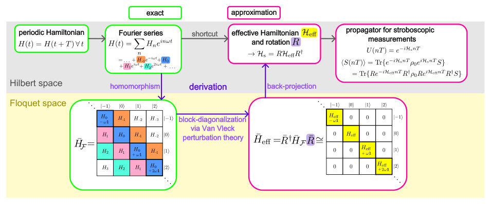 
Figure 1: Overview of the Floquet–Van Vleck approach. The transformation of the Schrödinger equation allows one to rewrite the differential equation as an eigenvalue-eigenvector problem of an infinite-dimensional matrix, the Floquet Hamiltonian ¯HF. It acts in the Floquet space, which is spanned by the direct product of the Hilbert space basis and the Fourier states {|n⟩}. The Fourier indices of the entries in the central block ⟨n|. . .|n⟩sum up to zero, i.e., they are secular terms. Non-secular terms, of which the Fourier indices sum to m ̸= 0, are on the non-block-diagonals ⟨n|. . .|n −m⟩. The Van Vleck perturbation theory shifts the effect of the fast sidebands to the central band. In...

📷 Fig 2

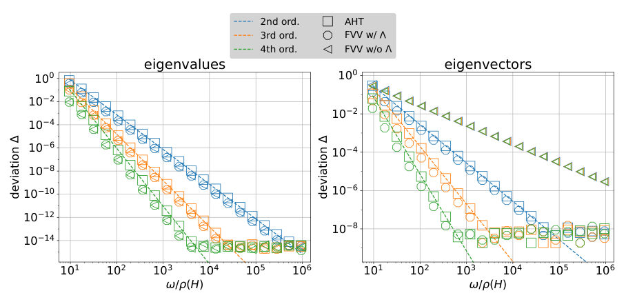 
Figure 2: The deviations of U(t0 + T, t0) in AHT, FVV with and without the kick operator Λ (often referred to the stroboscopic and effective Hamiltonian in Floquet theory, respectively) to the numerically exact time propagator U(t0 + T, t0) are illustrated for a random 8 × 8 Hamiltonian. The dashed lines indicate the expected scaling behavior according to the truncated order in the perturbation parameter. In n-th order, this is (ρ(H)/ω)n for the eigenframe and (ρ(H)/ω)n+1 for the eigenvalues. Both AHT and FVV scale as expected, however, AHT is about three times worse than FVV as can be seen in Fig. 3. Clearly, the kick operator is needed in FVV in order to operate in the correctly tilted...

📷 Fig 3

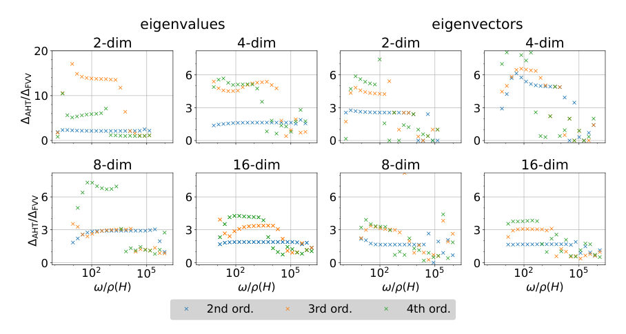 
Figure 3: Both AHT and FVV yield the expected scaling behavior in the perturbation parameter. However, FVV performs better than AHT in the approximation of the stroboscopic evolution operator U(t0 + T, t0). AHT deviates ∼3.7 times more than FVV in the eigenvalues, and ∼2.6 in the eigenvectors.

📷 Fig 4

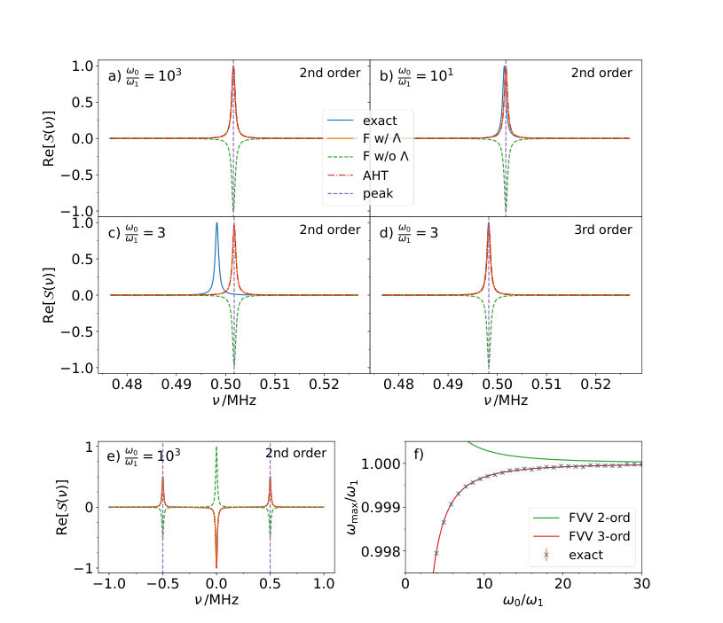 
Figure 4: Bloch–Siegert shift [41] of a single-spin system under a linear-polarized resonant radio- frequency (rf) field. Results according to AHT and FVV with and without kick operator Λ are compared to the numerically exact outcome. The detection operator is S = Sx, and the initial density operator is ρ = Sz. The amplitude of the rf field is set to ω1/(2π) = 0.5 MHz, and the resonance frequency ω0 is varied. The broadening parameter is η/(2π) = 0.4 kHz in a)-d), and η/(2π) = 8 kHz in e). An overview of the spectrum is displayed in e). In a)-d), excerpts highlighting the actual Bloch–Siegert shift for different ratios ω0/ω1 are shown. The vertical purple dashed line corresponds to the peak...

📷 Fig 5

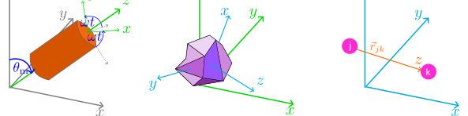 
Figure 5: The rotation from the Principal-Axis System (PAS) of spin pair jk to the lab frame is composed of three subsequent rotations. 1) The laboratory frame system (LAB) is rotated around the y-axis at the magic angle θm, followed by a rotation around the new z-axis by ωrt. 2) The orientation of the crystallite-fixed frame in the rotor-fixed basis is defined by three Euler angles (α, β, γ). 3) Due to its axial symmetry, the PAS of jk can be fully described by two angles (θjk, φjk) with regard to the crystallite-fixed frame. These are the spherical coordinates of the connecting vector ⃗rjk, which provides the direction of the z-axis of the PAS of jk.

**Summary.** This paper rigorously compares Floquet Theory and Average Hamiltonian Theory for periodically driven quantum systems, using the Floquet-Magnus Expansion to derive higher-order terms for both. The authors conclude that the Floquet-Van Vleck approach is superior for numerical calculations in applications like NMR spectroscopy. It provides a unified theoretical understanding of how these methods relate while offering practical recommendations for implementation.

**Why it may be interesting.** This work provides a rigorous, systematic comparison between two cornerstone theoretical tools (AHT and Floquet theory) used to analyze time-periodic quantum dynamics, offering practical guidance on which formalism yields the best numerical results for complex systems like those in NMR.

Detailed structure

**Main problem.** The paper aims to provide a detailed mathematical analysis comparing the equivalence, convergence, and practical application of Floquet Theory and Average Hamiltonian Theory (AHT) for periodically driven quantum systems.

**Main result.** The Floquet-Van Vleck (FVV) approach is recommended over AHT because it is numerically more robust and accurate, despite the formal equivalence of the theories in the infinite limit.

**Method.** The authors utilize the Floquet-Magnus Expansion (FME) to derive systematic, higher-order terms for both AHT and FVV, avoiding explicit time integration.

**Model / system.** The theory is applied to periodically driven quantum systems, with a primary focus on Nuclear Magnetic Resonance (NMR) spectroscopy, modeling the time evolution governed by a time-periodic Hamiltonian H(t).

**Key observables.** Effective Hamiltonians (F), the kick operator, time evolution operators, and spectroscopic shifts like the Bloch-Siegert shift.

**Important parameters / regimes.** The driving period T, the ratio of driving frequency to system energies, and the order of the perturbation expansion (up to fourth order).

**Assumptions / limitations.** The analysis relies on the mathematical framework of the Floquet-Magnus expansion and assumes the validity of perturbative expansions in the driving frequency.

**Figures summary.** Figure 13 shows histograms comparing the relative differences of operators calculated with and without the kick operator for 2-spin and 3-spin MAS systems, highlighting differences between random and MAS Hamiltonians.

**Paper structure.** The paper establishes the general framework using the FME, derives explicit formulas for higher-order terms in both FVV and AHT, and then validates these formulas and compare their predictions using specific NMR examples like the Bloch-Siegert shift.

Abstract

An accurate theoretical treatment of periodically driven quantum systems is crucial for various fields in the exact sciences, for instance Nuclear Magnetic Resonance (NMR) spectroscopy. Conventionally, either average Hamiltonian theory or Floquet theory is used to predict or describe experimental outcomes, such as the time evolution or the spectra yielding the information of the sample under study. A detailed analysis of the equivalence of these two approaches with an emphasis on applications in NMR will help to improve the theoretical understanding of NMR experiments.   In this work, we identify the Floquet-Magnus expansion as essential to prove the mathematical equivalence of Floquet theory and average Hamiltonian theory. We advocate a calculation scheme which is less prone to algebraic mistakes because explicit integration is avoided. On this basis, we provide the first four orders of both theories. We further examine their applicability to some experiments in NMR. As examples, we investigate the Bloch-Siegert shift and dipolar coupled spin systems under magic-angle spinning.   Based on our analysis, we recommend the use of the Floquet-Van Vleck approach including both the effective Hamiltonian and the kick operator. The consistent separation of secular and non-secular contributions appears to be especially advantageous for numerical robustness. Its accuracy is about three times better than the one provided by average Hamiltonian theory despite their formal equivalence.   Our findings provide important insights into the theoretical background of Floquet theory and average Hamiltonian theory. This includes the extent of their algebraic and perturbative equivalence, with an emphasis on how these findings are of relevance in the analysis of solid-state NMR experiments.

[↑ back to top](#top)

### [Generalised quantum Stein's lemma more robust than ever](http://arxiv.org/abs/2609.17309v1)

**Authors:** Filippo Girardi, Kuan-Yi Lee, Masahito Hayashi, Ludovico Lami  
**Type:** theory · **Category:** quantum information and computing · **PDF:** <https://arxiv.org/pdf/2609.17309v1>  
**Analysis basis:** full PDF text, analyzed in chunks

📷 Fig 1

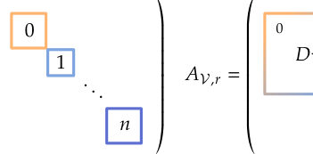 
Figure 1: A pictorial representation of the action of 𝐷V, 𝐴V,𝑟and 𝐵V,𝑟.

📷 Fig 2

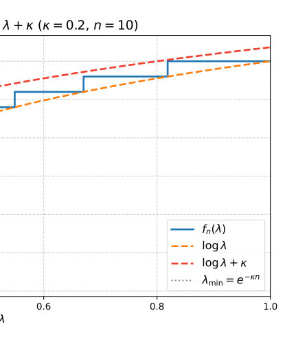 
Figure 2: An example of logarithmic rounding.

📷 Fig 3

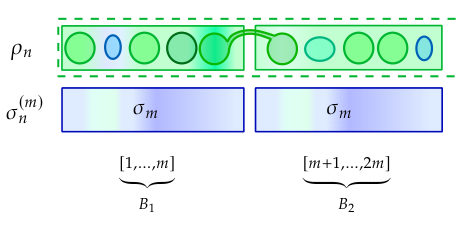 
Figure 3: Blocking and padding the systems

📷 Fig 4

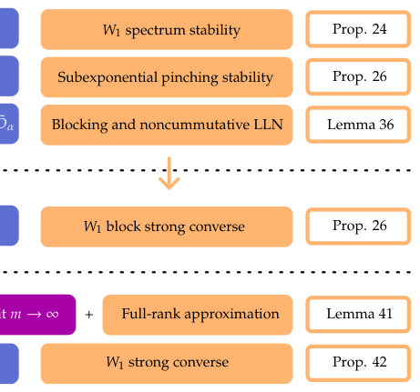 
Figure 4: Comparison of the converse proof for the i.i.d. GQSL and 𝑊1 GQSL.

📷 Fig 5

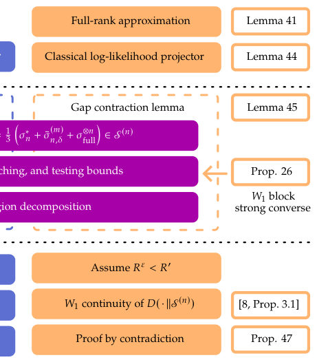 
Figure 5: Comparison of the achievability proof for the i.i.d. GQSL and 𝑊1 GQSL.

**Summary.** This work generalizes the quantum Stein's lemma to handle quantum hypothesis testing scenarios where the underlying source of quantum states is not strictly independent and identically distributed. By employing the quantum Wasserstein distance, the authors provide a robust, universal bound that applies to sources merely 'close' to i.i.d. This significantly broadens the applicability of fundamental quantum information bounds for technological applications.

**Why it may be interesting.** The generalization of fundamental bounds like Stein's lemma to non-i.i.d. sources is crucial for modeling realistic quantum processes where local correlations or non-stationarity are present, which is relevant in quantum communication and sensing.

Detailed structure

**Main problem.** The paper addresses the generalization of quantum Stein's lemma for quantum hypothesis testing, particularly when the source of quantum states deviates from the ideal independent and identically distributed (i.i.d.) case.

**Main result.** They establish a universal version of the lemma applicable to sources asymptotically close to i.i.d. with respect to the normalized quantum Wasserstein distance of order 1.

**Method.** The analysis relies on defining and utilizing the quantum Wasserstein distance ($W_1$) to characterize convergence for 'almost i.i.d.' sources, extending results based on relative entropy divergences.

**Model / system.** The framework involves distinguishing between two hypotheses ($
ho_n$ vs. $S(n)$) on a tensor product Hilbert space $H^{\otimes n}$, using quantum states and error exponents.

**Key observables.** Type II error exponent ($eta_\epsilon$), regularised relative entropy ($D_\infty(
ho \| S)$), and the quantum Wasserstein distance ($W_1$).

**Important parameters / regimes.** The order of the Wasserstein distance (order 1), the error tolerance $\epsilon$, and the asymptotic limit $n 	o \infty$.

**Assumptions / limitations.** The null source must be asymptotically close to i.i.d. with respect to the normalized quantum Wasserstein distance, and the alternative set $S(n)$ must satisfy several structural axioms (e.g., compactness, convexity).

**Figures summary.** Not specified, but the notes mention Figure 7 illustrating a three-region decomposition of the Hilbert space $\mathbb{H}^{\otimes n}$ using projectors.

**Paper structure.** The paper builds from the standard GQSL for i.i.d. sources, extends the theory by introducing the Wasserstein distance to handle general sources, and culminates in solving the Stein exponent for arbitrarily varying null hypotheses.

Abstract

The generalised quantum Stein's lemma is a key result in quantum hypothesis testing, and connects this fundamental primitive of quantum information processing with quantum resource manipulation, a task that is central for technological applications. Prior works have proved this statement in the idealised setting of independent and identically distributed (i.i.d.) sequences of quantum states, and recent extensions consider also sources that are 'close' to i.i.d., according to the strict notion put forth by Mazzola, Sutter, and Renner. For several applications, however, one would need to consider yet more general sources. We establish a version of the generalised quantum Stein's lemma that is conceptually much simpler and general, as it applies to any source that is asymptotically close to an i.i.d. state with respect to the normalised quantum Wasserstein distance of order 1. As an immediate consequence, we solve the Stein exponent of a scenario where the null hypothesis is arbitrarily varying, expressing it in terms of i.i.d. Stein exponents corresponding to arbitrary states in the convex hull of the null hypothesis base set.

[↑ back to top](#top)

### [Geometric quantifier of the incompatibility of single-particle property attribution in indistinguishable boson systems](http://arxiv.org/abs/2609.17256v1)

**Authors:** P. Céspedes, A. Valdés-Hernández, F. H. Holik, A. P. Majtey  
**Type:** theory · **Category:** quantum information and computing · **PDF:** <https://arxiv.org/pdf/2609.17256v1>  
**Analysis basis:** full PDF text, analyzed in chunks

📷 Fig 1

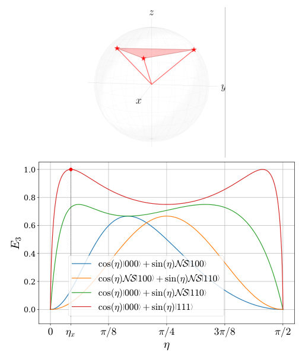 
Figure 1: Top panel: Majorana constellation for the GHZ-type state with maximum E3, corresponding to the red dot in the bottom panel (ηx ≈0.13782). All other maximizing states are obtained by the orbit under rigid rotations of that state. Bottom panel: E3 as a function of η for different one-parameter families of three-qubit states.

📷 Fig 2

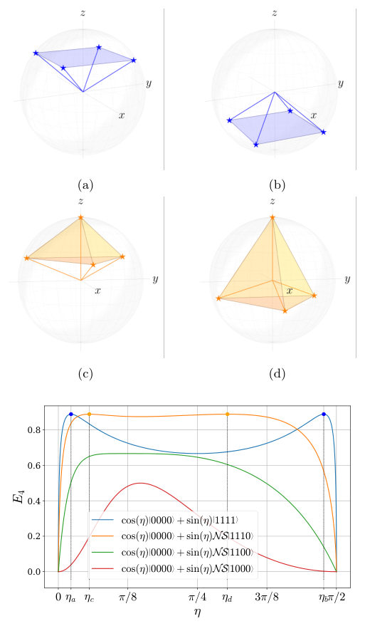 
Figure 2: Panels (a)–(d): Constellations of four-qubit states reaching the maximum value of E4. Panels (a) and (b) correspond to the blue state family at ηa ≈0.0715 and ηb = π/2 −ηa, respectively, while (c) and (d) cor- respond to the orange state family at ηc ≈0.1750 and ηd ≈0.9552, respectively. Panel (e): E4 as a function of η for different one-parameter families of four-qubit states, with dots indicating the states depicted in panels (a)–(d).

📷 Fig 3

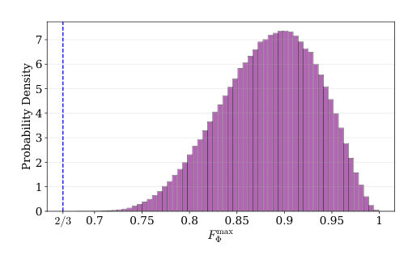 
Figure 3: Probability density distribution of the maxi- mum fidelity F max Φ for a 3 qutrit system (N = 3, d = 3). Histogram obtained from a sampling of Haar-random pure symmetric states in the 10-dimensional Hilbert space.

**Summary.** This work introduces a geometric quantifier to measure entanglement in indistinguishable boson systems by quantifying the incompatibility of assigning individual properties to the particles. It extends the initial qubit formulation, which uses the Majorana representation, to higher-dimensional qudits. The resulting measure, $E_N(\Phi)$, provides a powerful, general tool for characterizing quantum correlations in complex many-body quantum systems.

**Why it may be interesting.** It provides a rigorous, geometrically motivated tool to quantify entanglement in systems where standard local operations theory breaks down due to particle indistinguishability, which is crucial for understanding quantum resources in many-body quantum computation.

Detailed structure

**Main problem.** The paper addresses how to quantify entanglement in indistinguishable boson systems by measuring the incompatibility of assigning well-defined single-particle properties to the constituent particles.

**Main result.** A generalized geometric quantifier, $E_N(\Phi)$, is introduced that successfully extends the incompatibility measure from qubits to qudits, linking it to the geometry of the state relative to the manifold of symmetrized states.

**Method.** The method involves defining the quantifier as a combination of the state's fidelity to the symmetrized state manifold and a measure of pairwise property-attribution incompatibility derived from Fubini-Study angles.

**Model / system.** The study focuses on pure states of $N$ indistinguishable bosons, initially using the Majorana stellar representation for qubits, and generalizing this framework to $d$-level bosons (qudits).

**Key observables.** The geometric quantifier $E_N(\Phi)$, pairwise fidelity $F_{ij}$, and the minimum incompatibility measure $E_{\min}^{N,\Phi}$.

**Important parameters / regimes.** The number of particles $N$, the dimension $d$ of the single-boson Hilbert space, and the pairwise fidelity $F_{ij}$.

**Assumptions / limitations.** The analysis relies on extending the GMW separability criterion and adapting geometric tools (like the Majorana representation) to higher dimensions where direct factorization is lost.

**Figures summary.** Figures illustrate the Majorana constellation for small $N$ (e.g., $N=3, 4$) and show the dependence of the incompatibility measure on system parameters.

**Paper structure.** The paper first establishes the concept using qubits and the Majorana representation, deriving an explicit quantifier $E_N(\Psi)$. It then generalizes this approach to qudits ($d>2$) by defining a composite quantifier $E_N(\Phi)$ that incorporates both fidelity distance and generalized pairwise incompatibility.

Abstract

Entanglement in indistinguishable particle systems can be characterized by the impossibility of unambiguously attributing a complete set of physical properties to the individual constituent particles. In this work, we introduce a geometric quantifier of the incompatibility of such simultaneous property attribution for pure states of $N$ indistinguishable bosons. Using the Majorana stellar representation, any symmetric multi-qubit state can be expressed as the symmetrization of constituent single-particle states, allowing the associated single-particle properties to be directly linked with the corresponding Majorana stars. This establishes a direct connection between the geometry of the Majorana representation on the Bloch sphere and the entanglement criterion based on the attribution of single-particle properties in systems of identical two-level bosons. We then generalize this geometric approach to higher-dimensional bosons, extending the quantifier from qubits to qudits, while retaining a geometric interpretation of property-attribution incompatibility in terms of Fubini-Study angles.

[↑ back to top](#top)

### [Graph construction in QUBO-based recursive phylogenetic tree reconstruction](http://arxiv.org/abs/2609.16640v1)

**Authors:** Yoshiki Kanazawa, Ashish Joshi, Takahiko Koyama  
**Type:** theory · **Category:** other · **PDF:** <https://arxiv.org/pdf/2609.16640v1>  
**Analysis basis:** full PDF text, analyzed in chunks

📷 Fig 1

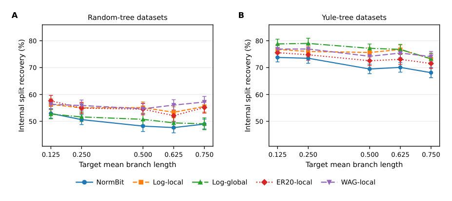 
Figure 1: Amino-acid tree-reconstruction accuracy across affinity representations without post-swap refinement. (A) Random-tree datasets. (B) Yule-tree datasets. Points indicate mean internal split recovery across 100 replicate datasets for each target mean branch length, and error bars indicate nonparametric bootstrap 95% confidence intervals.

📷 Fig 2

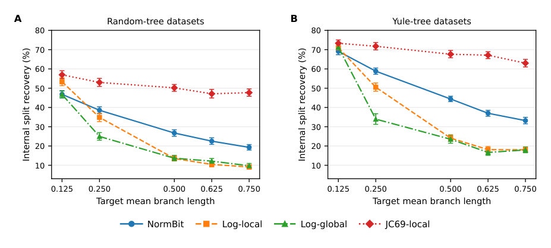 
Figure 2: Nucleotide tree-reconstruction accuracy across affinity representations without post- swap refinement. (A) Random-tree datasets. (B) Yule-tree datasets. Points indicate mean internal split recovery across 100 replicate datasets for each target mean branch length, and error bars indicate nonparametric bootstrap 95% confidence intervals.

📷 Fig 3

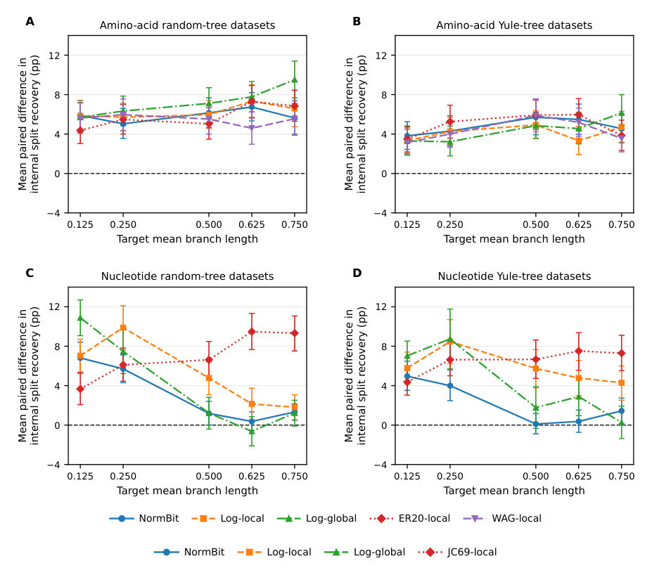 
Figure 3: Effect of post-swap refinement on tree-reconstruction accuracy. (A) Amino-acid random-tree datasets. (B) Amino-acid Yule-tree datasets. (C) Nucleotide random-tree datasets. (D) Nucleotide Yule-tree datasets. Differences were calculated as split recovery with post-swap refinement minus split recovery without refinement for the same simulated dataset and affinity representation. Points indicate mean paired differences across 100 paired reconstructions per condition, and error bars indicate nonparametric bootstrap 95% confidence intervals. Positive values indicate higher split recovery after post-swap refinement.

📷 Fig 4

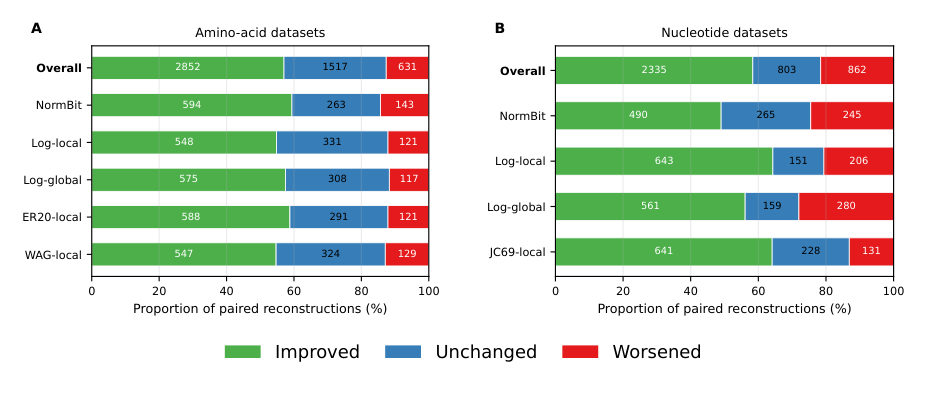 
Figure 4: Reconstruction-level effects of post-swap refinement on internal split recovery. (A) Amino-acid datasets. (B) Nucleotide datasets. For each simulated dataset and affinity represen- tation, the outcome was classified as improved, unchanged, or worsened according to whether split recovery with post-swap refinement was higher than, equal to, or lower than recovery without refinement. Bars indicate the proportions of paired reconstructions in each category, and numbers within the bars indicate counts. Each affinity representation comprised 1,000 paired reconstructions; the overall summaries comprised 5,000 amino-acid and 4,000 nucleotide reconstructions. All paired reconstructions...

📷 Fig 5

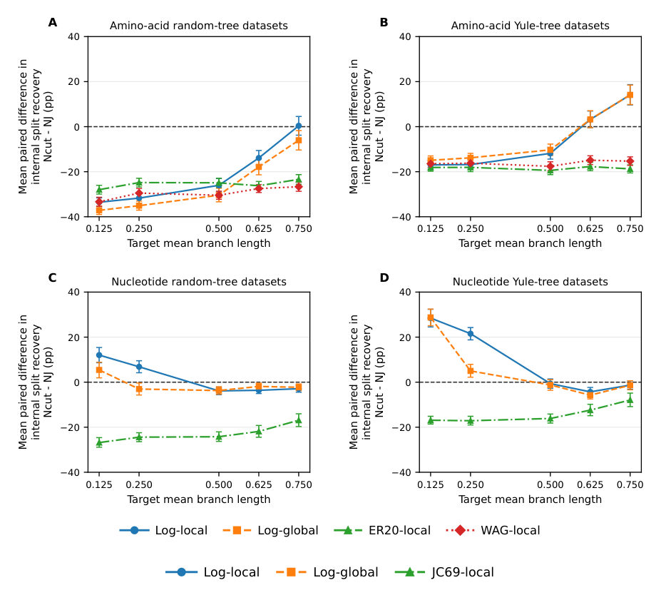 
Figure 5: Differences in tree-reconstruction accuracy between recursive Ncut and neighbor joining. (A) Amino-acid random-tree datasets. (B) Amino-acid Yule-tree datasets. (C) Nucleotide random-tree datasets. (D) Nucleotide Yule-tree datasets. Recursive Ncut results were obtained without post-swap refinement. Differences were calculated as split recovery obtained by recursive Ncut minus that obtained by NJ for the same simulated dataset and underlying pairwise distance representation. Points indicate mean paired differences across 100 paired reconstructions per condition, and error bars indicate nonparametric bootstrap 95% confidence intervals. Positive values indicate higher recovery by...

**Summary.** This work investigates how the initial representation of pairwise sequence relationships impacts the accuracy of phylogenetic tree reconstruction using a recursive normalized-cut (Ncut) approach. By comparing Ncut against Neighbor Joining (NJ) using various affinity matrices, the authors demonstrate that the graph construction method is crucial, requiring a joint evaluation of representation, optimization, and recursive assembly.

**Why it may be interesting.** While the core topic is bioinformatics, the methodology involves formulating graph partitioning as a QUBO problem and solving it using optimization techniques, which touches upon computational aspects relevant to quantum optimization.

Detailed structure

**Main problem.** The paper addresses the challenge of accurately reconstructing evolutionary relationships (phylogenetic trees) from molecular sequence data.

**Main result.** The choice of graph construction (pairwise affinity representation) is a critical determinant of the accuracy in recursive Ncut-based phylogenetic reconstruction, and this representation must be evaluated jointly with the reconstruction method.

**Method.** The study uses a recursive normalized-cut (Ncut) framework, formulating graph-partitioning subproblems as QUBO models solved via Simulated Bifurcation, and compares its results against Neighbor Joining (NJ).

**Model / system.** The system involves molecular sequence data (amino-acid and nucleotide alignments) used to model evolutionary divergence. Comparisons are made across various distance metrics (e.g., WAG, JC69, BLAST-derived).

**Key observables.** Internal split recovery (measured as percentage of recovered splits), and the mean paired difference in split recovery between Ncut and NJ.

**Important parameters / regimes.** Evolutionary divergence levels (branch lengths), sequence types (nucleotide vs. amino-acid), and the specific affinity representation used (e.g., normalized bit-score, local/global kernels).

**Assumptions / limitations.** The analysis assumes that the performance of the Ncut framework depends heavily on the quality of the input pairwise distance/affinity matrix.

**Figures summary.** The figures summarize the effect of post-swap refinement on accuracy, compare Ncut vs. NJ performance across different datasets, and show the overall mean paired differences in split recovery.

**Paper structure.** The paper systematically evaluates how different pairwise representations influence the recursive Ncut framework, compares these results against established distance-based methods like NJ, and analyzes the impact of refinement steps.

Abstract

Molecular sequence data are used to reconstruct evolutionary relationships among taxa, but reconstruction accuracy depends not only on the tree-building method but also on how pairwise sequence relationships are represented. We evaluated sequence-to-affinity representations in a recursive normalized-cut (Ncut) framework whose graph-partitioning subproblems were formulated as quadratic unconstrained binary optimization (QUBO) models and solved using Simulated Bifurcation. Using simulated amino-acid and nucleotide datasets spanning multiple tree-generation settings and evolutionary divergence, we compared normalized bit-score affinities with representations derived from transformed sequence similarities and evolutionary distances, examined post-swap refinement, and used neighbor joining (NJ) as a distance-based comparator.   Affinity representation substantially affected internal split recovery, particularly for nucleotide data. JC69-based local affinities maintained comparatively high accuracy as divergence increased, whereas normalized bit-score and BLAST-derived kernel representations declined more markedly. Post-swap refinement generally improved recovery, but not consistently across individual reconstructions. NJ achieved higher mean split recovery than corresponding recursive Ncut reconstructions for WAG and JC69 distances across all evaluated conditions, whereas recursive Ncut outperformed NJ for BLAST-derived logarithmic distances under some conditions.   These results show that graph construction is an important determinant of recursive Ncut-based phylogenetic reconstruction. A representation that performs well within Ncut does not necessarily provide the most accurate use of the underlying pairwise distances. Pairwise representation, affinity transformation, optimization, and recursive tree construction should therefore be evaluated jointly.

[↑ back to top](#top)

### [Hyperbolic color codes with constant rate and polynomial distance](http://arxiv.org/abs/2609.16125v1)

**Authors:** Shun Hasegawa, Hayata Yamasaki  
**Type:** theory · **Category:** quantum information and computing · **PDF:** <https://arxiv.org/pdf/2609.16125v1>  
**Analysis basis:** full PDF text, analyzed in chunks

📷 Fig 1

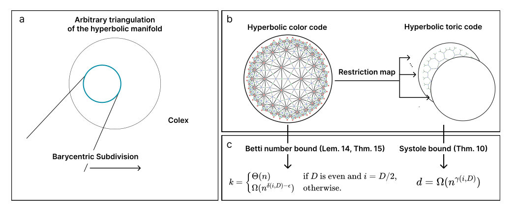 
FIG. 1. Overview of the construction and main results of this work. (a) Starting from an arbitrary triangulation of a closed hyperbolic manifold, we obtain a colex by barycentric subdivision, which ensures the required vertex colorability for defining a color code (Sec. III). (b) To derive a lower bound on the distance of the resulting hyperbolic color code, we transform the color code into a collection of associated toric codes using restriction maps and show that the color-code distance is bounded from below by the distances of these toric codes (Sec. IV). (c) We explicitly determine the scaling of the number of logical qubits k and the code distance d with the number of physical qubits...

**Summary.** This paper constructs a new family of hyperbolic color codes that overcome previous limitations by achieving both a constant encoding rate and polynomial code distance. The methodology combines advanced algebraic topology with hyperbolic geometry to define these codes. This breakthrough provides a powerful theoretical testbed for developing high-performance, fault-tolerant quantum computation protocols.

**Why it may be interesting.** This work directly addresses the theoretical limits of quantum error correction by providing concrete constructions for high-rate codes with large, polynomially scaling distances, which is crucial for building fault-tolerant quantum computers.

Detailed structure

**Main problem.** The primary goal is to construct hyperbolic color codes that simultaneously achieve a constant encoding rate and polynomial code distance.

**Main result.** The authors construct a family of hyperbolic color codes that achieve both constant rate and polynomial distance, particularly in even dimensions, establishing a significant improvement over previous logarithmic distance bounds.

**Method.** The construction relies on building codes from arithmetic hyperbolic manifolds that support polynomial-distance hyperbolic toric codes, utilizing algebraic topology concepts like chain complexes and homology groups.

**Model / system.** The work focuses on quantum error-correcting codes, specifically hyperbolic color codes, which are a high-rate quantum low-density parity-check (qLDPC) code structure relevant for fault-tolerant quantum computation.

**Key observables.** Code distance ($d$), encoding rate (aiming for constant rate), and the number of logical qubits ($k$).

**Important parameters / regimes.** The construction applies to arbitrary dimensions $D \geq 4$, with specific results detailed for even dimensions ($D=2m$).

**Assumptions / limitations.** The analysis builds upon the existence of hyperbolic manifolds supporting the necessary structures and relies on applying advanced theorems like the Lück approximation theorem.

**Figures summary.** Figure 1 illustrates the construction process, showing the use of barycentric subdivision for the color code, the transformation to a toric code for distance bounding, and the explicit determination of scaling exponents for $k$ and $d$.

**Paper structure.** The paper develops the mathematical framework using chain complexes to define code parameters ($k$ and $d$), proves the existence of the desired codes via Theorem 1, and provides detailed algebraic and geometric machinery (e.g., analyzing symmetry groups $SOf$ and spectral gaps) to establish the polynomial bounds.

Abstract

Recent advances in quantum hardware relax the strict geometric-locality constraints traditionally imposed on quantum error-correcting codes, motivating interest in high-rate quantum low-density parity-check (qLDPC) codes. At the same time, color codes provide a particularly rich setting for fault-tolerant quantum computation, underlying protocols such as single-shot error correction and self-correcting quantum computation. Hyperbolic color codes provide a class of high-rate qLDPC codes that also retain the structural features of color codes relevant to fault-tolerant quantum computation. However, previous constructions of hyperbolic color codes have achieved at most logarithmic code distance. In this work, we construct hyperbolic color codes with both constant rate and polynomial distance by building on arithmetic hyperbolic manifolds that support polynomial-distance hyperbolic toric codes. Our construction applies in arbitrary dimension \(D\geq 4\). In even dimensions, the resulting type-\(D/2\) color codes have constant encoding rate and polynomial distance, while in other cases the number of logical qubits and the code distance both exhibit polynomial scaling. We further derive explicit exponents for polynomial lower bounds as functions of the dimension and code type. These results establish a family of hyperbolic color codes simultaneously achieving constant rate and polynomial distance and providing a testbed to explore fault-tolerant quantum computation protocols that combine high-rate quantum codes with the structural advantages of color codes.

[↑ back to top](#top)

### [Improved Separations between Quantum and Classical Communication Complexity of Total Functions](http://arxiv.org/abs/2609.16726v1)

**Authors:** François Le Gall  
**Type:** theory · **Category:** quantum information and computing · **PDF:** <https://arxiv.org/pdf/2609.16726v1>  
**Analysis basis:** full PDF text, analyzed in chunks

📷 Fig 1

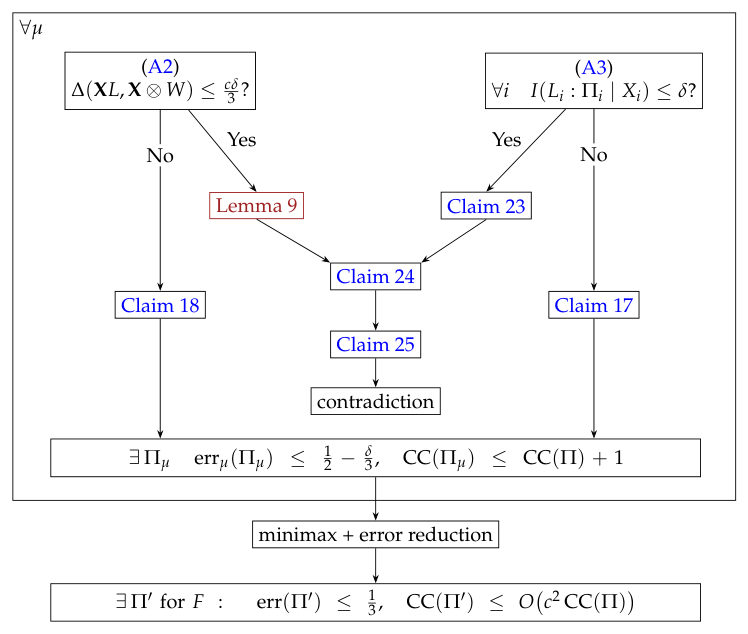 
Figure 1: Proof of Theorem 4.1, following [3, Figure 1]. Red marks Lemma 9, which replaces Claim 22; all other claims are from [3].

**Summary.** This paper significantly advances the understanding of the gap between quantum and classical communication complexity for total functions. By refining existing frameworks, the authors achieve stronger lower bounds for randomized communication relative to the quantum communication required. This work is a major theoretical result in quantum information theory.

**Why it may be interesting.** While highly theoretical, the techniques used—especially the construction of complex functions and the use of extractors—are foundational tools in quantum information theory that underpin the understanding of computational limits.

Detailed structure

**Main problem.** The paper aims to improve the known separations between the quantum and classical communication complexity of total Boolean functions.

**Main result.** It establishes significant separations, showing that for two quantum messages, the randomized communication complexity $R(f)$ can be exponentially larger than the quantum complexity $Q_2(f)$, achieving $R(f) = e\Omega(\sqrt{n})$ versus $Q_2(f) = 	ext{polylog}(n)$.

**Method.** The improvements rely on refining previous constructions by replacing lookup tables with seeded linear extractors and constructing total functions $F_{	ext{tot}}$ from partial functions $F$ to lift the separation bounds.

**Model / system.** The analysis focuses on the communication complexity of total Boolean functions $f: \{0, 1\}^n 	imes \{0, 1\}^n 	o \{0, 1\}$, involving quantum and randomized communication protocols.

**Key observables.** Randomized communication complexity $R(f)$, quantum communication complexity $Q_r(f)$, and the input size overhead $N$.

**Important parameters / regimes.** The separation scales involve polylogarithmic quantum communication versus bounds like $e\Omega(\sqrt{n})$ or $e\Omega(n^{1-\varepsilon})$ for randomized communication.

**Assumptions / limitations.** The proof heavily relies on the existence of strong seeded extractors and the ability to construct total functions $F_{	ext{tot}}$ from partial functions $F$.

**Figures summary.** Not specified.

**Paper structure.** The paper builds upon previous work by first establishing general conversion theorems (Theorem 4) relating partial to total function complexities, and then applying these techniques to specific functions (like Shapem or k-Forrelation) to derive concrete, improved separation bounds (Theorems 2 and 3).

Abstract

We refine Gavinsky's framework (arXiv:2608.18784) for exponential separations between quantum and randomized communication complexity of total functions and obtain larger separations: polylogarithmic quantum communication versus $\tildeΩ(\sqrt n)$ randomized communication with two quantum messages, and versus $Ω(n^{1-\varepsilon})$ for every fixed $0<\varepsilon<1$ with more quantum messages.

[↑ back to top](#top)

### [La substitution studies on the heavy-fermion superconductor CeRh$_2$As$_2$](http://arxiv.org/abs/2609.17080v1)

**Authors:** Sushma Lakshmi Ravi Sankar, Manuel Brando, Jochen Wosnitza, Seunghyun Khim  
**Type:** experiment · **Category:** strongly correlated electrons · **PDF:** <https://arxiv.org/pdf/2609.17080v1>  
**Analysis basis:** full PDF text, analyzed in chunks

📷 Fig 1

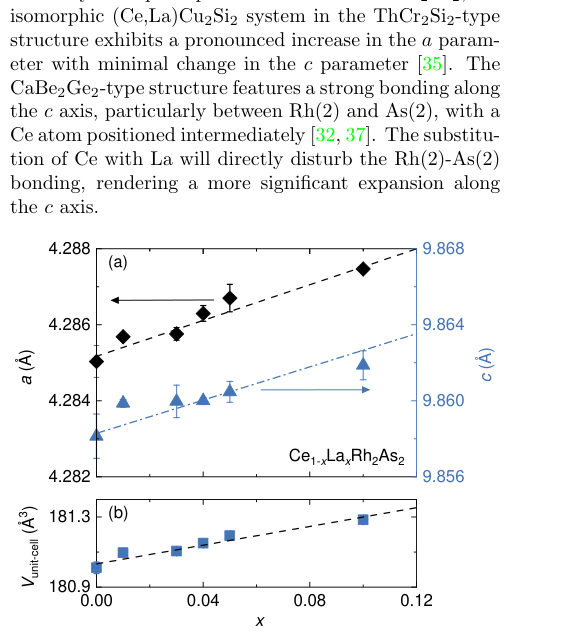 
FIG. 1. La-concentration (x) dependence of (a) the tetragonal unit-cell lattice parameters, a and c, and (b) the calculated unit-cell volume, Vunit−cell.

📷 Fig 2

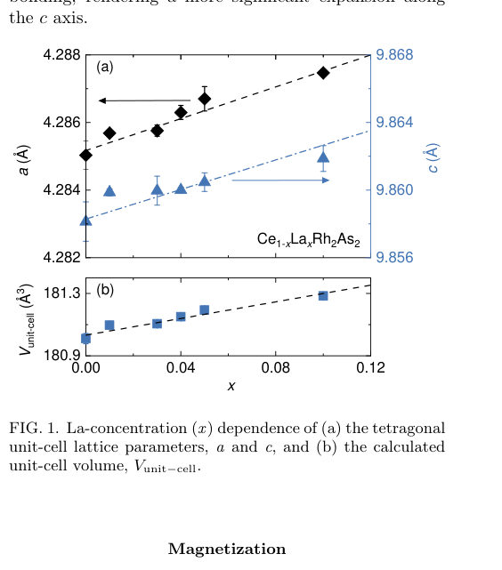 
Figure 2 depicts the temperature-dependent inverse magnetic susceptibility data of the x = 0.1 sample, the highest La concentration studied. To access the impact of the La substitution on the local magnetic state of Ce, we focus on this sample representing the most significant chemical perturbation in our compounds studied. Above 100 K, the linear slopes of the Curie-Weiss behavior are

📷 Fig 3

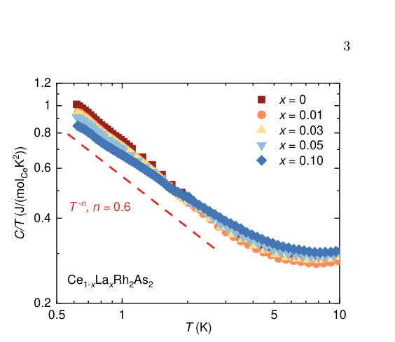 
FIG. 3. Specific heat divided by temperature for different La concentrations, x. C/T was normalized by the Ce concentra- tion determined by EDX (1-xedx).

📷 Fig 4

 
FIG. 2. Temperature dependence of the inverse magnetic sus- ceptibility (χ) after subtracting a temperature-independent term (χ0) for in-plane (H ∥ab, red open squares) and c-axis (H ∥c, blue open circles) magnetic field, respectively. The magnetic susceptibility per Ce is obtained by normalization using the xEDX value. The solid lines denote the magnetic- susceptibility data of pristine CeRh2As2, reported earlier [1]. The slope of the linear dashed line stands for 2.56 µB/Ce, which is the expected effective moment of the Ce3+ valence state.

📷 Fig 5

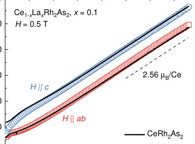 
Figure 3 shows the temperature dependence of the spe- cific heat divided by temperature, C/T, for various x. Since the La substitution is expected to minimally affect the lattice-phonon contribution, the observed evolution

**Summary.** This work systematically studies the effect of La substitution on the heavy-fermion superconductor CeRh2As2. By measuring transport and magnetic properties, the authors find that while the electronic state remains largely intact, the superconducting and magnetic ordering temperatures are rapidly suppressed. This suppression is primarily attributed to disorder-induced pair breaking, offering insights into the nature of unconventional superconductivity in correlated materials.

**Why it may be interesting.** The clear demonstration that disorder (from substitution) can suppress superconductivity in a manner distinct from hydrostatic pressure provides a powerful experimental tool for understanding unconventional pairing mechanisms in correlated electron systems.

Detailed structure

**Main problem.** The study investigates how substituting Cerium (Ce) with Lanthanum (La) affects the low-temperature superconducting and magnetic phases in the heavy-fermion superconductor CeRh2As2.

**Main result.** La substitution rapidly suppresses both the superconducting transition temperature (Tc) and the magnetic ordering temperature (T0), suggesting that disorder-induced pair breaking is the dominant mechanism, rather than simple lattice expansion effects.

**Method.** The research employed single-crystal measurements, including electrical resistivity, specific heat, and magnetic susceptibility, complemented by theoretical modeling using the Abrikosov-Gor'kov formalism and Crystal Electric Field (CEF) theory.

**Model / system.** The system is the heavy-fermion superconductor CeRh2As2 and its doped derivative Ce(1-x)La(x)Rh2As2. The physics is governed by the interplay between localized Ce 4f moments and itinerant conduction electrons, characteristic of heavy fermion behavior.

**Key observables.** Superconducting transition temperatures (Tc, T0), resistivity coherence maximum (T*max), specific heat divided by temperature (C/T), and magnetic susceptibility ($\chi$).

**Important parameters / regimes.** La concentration (x up to 0.1), effective negative pressure (-0.3 GPa), Kondo energy scale, and superconducting gap anisotropy parameters.

**Assumptions / limitations.** The rapid suppression of Tc is attributed to substitution-induced disorder causing strong pair breaking, and the analysis relies on fitting magnetic data to CEF models.

**Figures summary.** Figures show the monotonic increase of lattice parameters with La substitution, the suppression of T*max, Tc, and T0 with increasing x, and the evolution of C/T vs. T, illustrating the impact of disorder.

**Paper structure.** The paper systematically examines the structural changes (lattice parameters), electronic state preservation (valence, non-Fermi liquid behavior), and the dramatic suppression of superconducting and magnetic ordering temperatures as a function of La doping concentration.

Abstract

CeRh$_2$As$_2$ has been receiving considerable attention due to its unusual two-phase superconductivity. The superconducting (SC) phase appears at $T_{\mathrm{c}}$ = 0.35 K in an ordered state (phase I) of the Ce-4$f$ moments, which develops below $T_{\mathrm{0}}$ = 0.55 K. The microscopic nature of phase I has not been fully established yet. We report a single-crystal study of the effect of La substitution on these low-temperature phases in Ce$_{1-\textit{x}}$La$_\textit{x}$Rh$_2$As$_2$ up to $x$ = 0.1. The lattice parameters increase monotonically with $x$, corresponding to an effective negative pressure of approximately -0.3 GPa for $x$ = 0.1. While the Ce$^{3+}$ local valence state and the non-Fermi-liquid behavior are preserved, the resistivity coherence maximum $T^{*}_{\mathrm{max}}$ $\approx$ 45 K in the pristine sample shifts to lower temperatures with increasing $x$, indicating a suppression of the Kondo energy scale upon lattice expansion. On the other hand, both $T_{\mathrm{c}}$ and $T_{\mathrm{0}}$ are rapidly suppressed to below 0.1 K for $x$ $>$ 0.05. Notably, such a rapid decrease of $T_{\mathrm{c}}$ under moderate negative pressure is unexpected, but is rather consistent with substitution-induced disorder effect which leads to strong pair breaking in unconventional superconductors. The observed fragility of phase I under both pressure and disorder may imply its itinerant origin.

[↑ back to top](#top)

### [Link-middle-cut lower bounds for Clifford circuit synthesis](http://arxiv.org/abs/2609.16208v1)

**Authors:** Søren Fuglede Jørgensen  
**Type:** theory · **Category:** quantum information and computing · **PDF:** <https://arxiv.org/pdf/2609.16208v1>  
**Analysis basis:** full PDF text, analyzed in chunks

📷 Fig 1

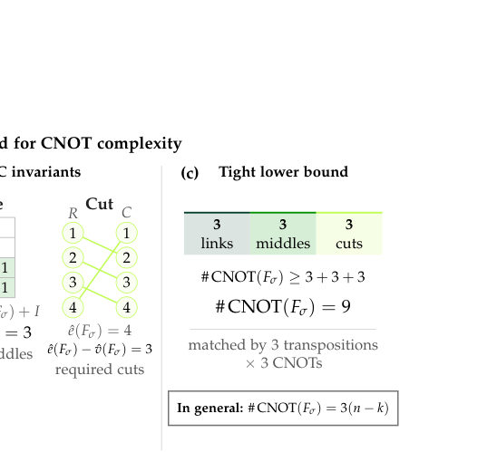 
Figure 1. The link–middle–cut bound for Clifford operators and its tightness for permutations. (a) The binary symplectic tableau is partitioned into 2 × 2 blocks asso- ciated with pairs of input and output qubits; the example is the four-cycle σ = (1234). (b) Three efficiently computable invariants give lower bounds on mutually disjoint classes of CNOT gates. The link and cut invariants count connected components (de- noted ˆv and ˆe) of graphs constructed from the symplectic tableau. In this example, ˆv(Fσ) = 1 and ˆe(Fσ) = 4, and the bounds say that synthesis requires n −ˆv(Fσ) = 3 “link” CNOTs and ˆe(Fσ) −ˆv(Fσ) = 3 “cut” CNOTs. The middle invariant is obtained as the rank of the matrix...

**Summary.** This paper develops advanced mathematical tools to find lower bounds on the minimum number of CNOT gates needed to implement any Clifford quantum circuit. By extending the Link-Middle-Cut framework to use symplectic tableaux, the authors derive multiple, computable invariants. These bounds are shown to be tight for simple cases like qubit permutations and significantly improve heuristic search algorithms for quantum circuit optimization.

**Why it may be interesting.** The rigorous mathematical tools developed (LMC extension, determinantal invariants) provide powerful, computable lower bounds for circuit synthesis, which is fundamental to understanding the efficiency limits of quantum computation.

Detailed structure

**Main problem.** The central problem is minimizing the number of CNOT gates required to synthesize a given Clifford operator on $n$ qubits.

**Main result.** The authors derive efficiently computable lower bounds for the CNOT complexity using an extension of the Link-Middle-Cut (LMC) framework, proving tightness for qubit permutations as $3(n-k)$.

**Method.** The method extends the LMC framework by mapping the problem to symplectic tableaux and introducing block-support connectivity graphs and determinantal invariants to establish rigorous lower bounds.

**Model / system.** The system is an $n$-qubit quantum circuit implementing Clifford operators, which are analyzed using the mathematical structure of the symplectic group $	ext{Sp}_{2n}(\mathbb{F}_2)$ via symplectic tableaux.

**Key observables.** CNOT-complexity (minimum CNOT count), link/cut invariants ($\hat{v}(F), \hat{e}(F)$), and determinantal invariants ($	ext{rank}(M(F) + I_n)$).

**Important parameters / regimes.** Number of qubits ($n$) and the number of cycles ($k$) in the corresponding permutation.

**Assumptions / limitations.** The analysis assumes the ability to extend the LMC framework from CNOT-only circuits to general Clifford operators, and it addresses the case where output qubit relabeling is free.

**Figures summary.** Figure 1 illustrates the link–middle–cut bound for a four-cycle permutation, explicitly calculating the required links, middles, and cuts to match the known lower bound of 9 CNOT gates.

**Paper structure.** The paper develops the theory by first extending the LMC framework to Clifford operators using symplectic tableaux. It then derives multiple, efficiently computable lower bounds based on graph invariants (links/cuts) and determinantal invariants (middle contribution). Finally, it demonstrates the utility of these bounds by using them as an admissible heuristic in an A*-based search algorithm.

Abstract

Minimizing the number of CNOT gates required to synthesize a Clifford operator is a central problem in quantum circuit optimization. We extend the link--middle--cut (LMC) framework for linear reversible circuits to Clifford operators represented by binary symplectic tableaux. By introducing block-support connectivity graphs and determinantal invariants, we obtain efficiently computable lower bounds on ancilla-free CNOT complexity. We prove that these bounds are tight for qubit permutations: a permutation of $n$ qubits with $k$ cycles requires exactly $3(n-k)$ CNOT gates, even when arbitrary one-qubit Clifford gates are available. We also derive efficiently computable bounds for synthesis up to a permutation of the output qubits, corresponding to free qubit relabeling. Finally, we further demonstrate the utility of the bound by using it as an admissible heuristic for $A^*$-based Clifford synthesis and show that, on benchmark instances, the resulting search can prove optimality beyond what was possible with earlier SAT-based methods, and that it may be used in combination with earlier $A^*$ heuristics to improve the CNOT counts obtained through heuristic search.

[↑ back to top](#top)

### [Nonlinear Hall Effect in Altermagnetic Warped Topological Insulators](http://arxiv.org/abs/2609.17001v1)

**Authors:** Debashree Chowdhury  
**Type:** theory · **Category:** other · **PDF:** <https://arxiv.org/pdf/2609.17001v1>  
**Analysis basis:** full PDF text, analyzed in chunks

📷 Fig 1

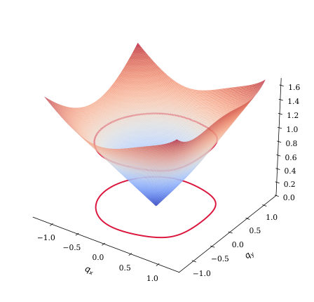 
FIG. 1. Schematic 3D energy dispersion E+(q) exhibiting anisotropic warping under C3v symmetry and d-wave spin splitting (JAM) with ϕ = 0. The broken mirror symmetry My leads to an asymmetric Fermi surface contour (red line) at chemical potential µ.

📷 Fig 2

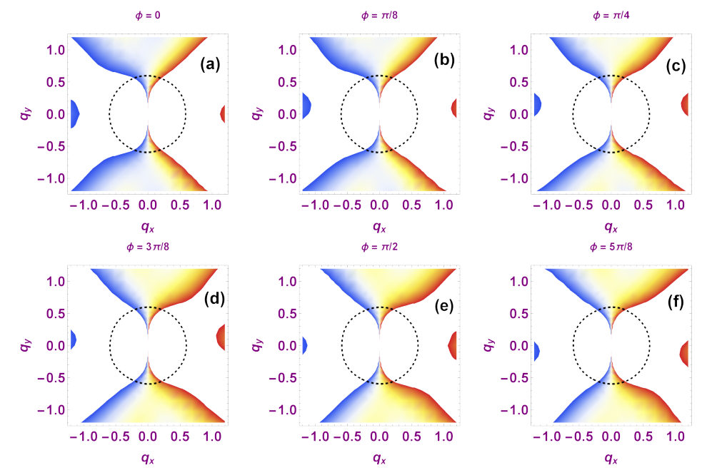 
FIG. 2. 2D momentum-space distribution of the quantum metric dipole integrand I(q) = vxGyy −vyGxy with overlaid Fermi surface contours (dashed black lines) at chemical potential µ = 0.6. The subpanels show orientation angles (a) ϕ = 0, (b) ϕ = π/8, (c) ϕ = π/4, (d) ϕ = 3π/8, (e) ϕ = π/2, and (f) ϕ = 5π/8. At ϕ = 0, My mirror symmetry breaking generates an asymmetric distribution of positive and negative hotspots, yielding a net positive DQM. As ϕ approaches π/4, diagonal mirror symmetry Mxy renders the integrand strictly anti-symmetric across complementary quadrants, forcing DQM = 0. For ϕ &gt; π/4, the relative sign of the geometric hotspots inverts, reaching a maximum negative dipole...

📷 Fig 3

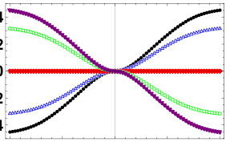 
FIG. 3. Quantum metric dipole DQM as a function of the chemical potential µ for various orientation an- gles ϕ of the d-wave altermagnetic order parameter (ϕ = 0, π/8, π/4, 3π/8, π/2) is plotted. The quantum metric dipole vanishes identically at the charge neutrality point (µ = 0) and exhibits odd parity under chemical potential inversion, DQM(−µ) = −DQM(µ). Due to spatial mirror symmetries, DQM reaches its maximum magnitude near ϕ = 0 (dx2−y2- wave altermagnetism) and vanishes completely at ϕ = π/4 (dxy-type splitting).

📷 Fig 4

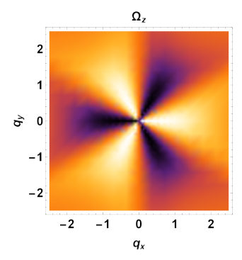 
FIG. 4. Berry curvature Ωz(qx, qy) is presented with qx and qy for a hexagonally warped TI surface state in the absence of altermagnetism. The distribution exhibits a clear six-fold pattern respecting spatial mirror symmetry My, which en- forces exact cancellation across the Fermi surface and results in a vanishing net Berry curvature dipole.

📷 Fig 5

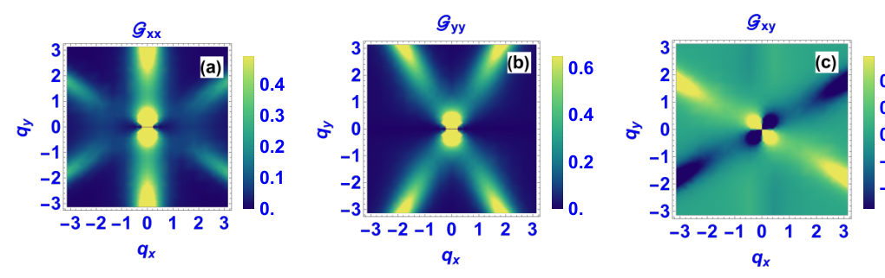 
FIG. 5. Momentum-space distribution of the quantum metric tensor components for a hexagonally warped TI surface state in the absence of altermagnetism (a) Gxx, (b) Gyy, and (c) Gxy plotted against qx and qy. The preserved spatial mirror symmetry My enforces Gxx(qx, −qy) and Gxy(qx, −qy) to transform as even and odd respectively, resulting in a vanishing net quantum metric dipole.

**Summary.** This theoretical work analyzes the nonlinear Hall effect in a hybrid system combining a warped Topological Insulator and a d-wave altermagnet. By breaking spatial mirror symmetry, the authors show that the intrinsic quantum metric dipole (DQM) becomes the dominant, measurable source of the non-linear response. This DQM is highly tunable via the relative angle of the altermagnetic order parameter, suggesting a new spintronic control mechanism.

**Why it may be interesting.** The explicit connection between magnetic symmetry breaking (altermagnetism) and measurable quantum geometric responses (DQM) provides a clean, tunable platform for studying topological transport effects, which is relevant to understanding exotic quantum states in condensed matter.

Detailed structure

**Main problem.** The paper investigates the origin and tunability of the nonlinear Hall effect in topological insulators coupled to altermagnets, aiming to isolate intrinsic quantum geometric contributions.

**Main result.** The intrinsic quantum metric dipole (DQM) drives the non-linear Hall response, and its magnitude and sign can be continuously tuned by rotating the altermagnetic orientation angle φ.

**Method.** The analysis involves deriving the Berry curvature and the quantum metric tensor components, followed by calculating the DQM via a Fermi surface line integral.

**Model / system.** The model is a hexagonally warped Topological Insulator (TI) surface state proximity-coupled to a d-wave altermagnet. The system is described by an effective continuum Hamiltonian incorporating warping and d-wave splitting terms.

**Key observables.** Nonlinear Hall conductivities, Berry curvature dipole (DBC), and the intrinsic quantum metric dipole (DQM).

**Important parameters / regimes.** The relative orientation angle φ of the altermagnetic order parameter, and the chemical potential $\mu$ (where the response vanishes at $\mu=0$).

**Assumptions / limitations.** The analysis assumes the unperturbed system possesses Time-Reversal and Spatial Mirror symmetries, leading to zero net dipoles, which are then broken by the altermagnetic coupling.

**Figures summary.** Figures illustrate the anisotropic energy dispersion showing warping and d-wave splitting, and the momentum-space distribution of the DQM integrand.

**Paper structure.** The paper establishes the physical model and symmetry constraints, derives the relevant geometric tensors (Berry curvature, metric tensor), and then analyzes how symmetry breaking via the altermagnetism allows for a finite, tunable DQM that dictates the non-linear Hall response.

Abstract

Low-dimensional Dirac systems offer a versatile platform for quantum-geometric non-linear transport. Hexagonal warping in topological insulator (TI) surface states generates rich momentum-space geometric textures. However, mirror and time-reversal symmetries strictly constrain both the Berry curvature and quantum metric dipoles to zero. Here, we show that proximity-coupling a hexagonally warped TI to a d-wave altermagnet lifts spatial mirror symmetry via the interplay of C_{3v} warping and d-wave spin-splitting. This symmetry breaking enables finite Berry curvature dipole components, which, however, remain heavily suppressed near charge neutrality, establishing the intrinsic quantum metric dipole as the sole driver of the non-linear Hall response. This scattering-independent response vanishes at μ= 0 and exhibits odd parity under chemical potential inversion. Importantly, rotating the altermagnetic orientation angle φcontinuously tunes quantum metric dipole and induces a sign reversal, peaking near φ=0 and vanishing at φ= π/4. Our findings highlight TI-altermagnet interfaces as ideal candidates for gate- and orientation-tunable quantum metric spintronics.

[↑ back to top](#top)

### [Numerical Study of Stability of Clean Critical Points across Aperiodic, Topological, and Uncorrelated Disorder](http://arxiv.org/abs/2609.17166v1)

**Authors:** Shuhao Fan, Lu Liu, Wenan Guo  
**Type:** theory · **Category:** statistical mechanics · **PDF:** <https://arxiv.org/pdf/2609.17166v1>  
**Analysis basis:** full PDF text, analyzed in chunks

📷 Fig 1

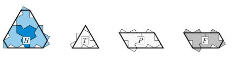 
FIG. 1: Metatiles (H, T, P, F) used in the substitution[20].

📷 Fig 2

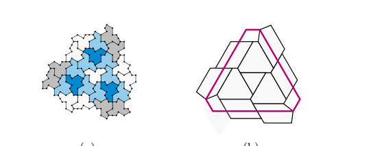 
FIG. 2: (a) A patch of the Smith hat lattice. Each tile consists of 14 sites, with spins (black circles) placed at the vertices. (b) A geometric substitution system for H metatile based on metatiles[20].

📷 Fig 3

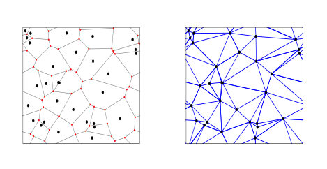 
FIG. 3: Illustration of the VD lattice construction. (a) The plane is partitioned into Voronoi cells (polygons) around a set of random points (seeds). (b) The Delaunay triangulation, which is the dual graph of the Voronoi tessellation, forms the lattice for the spin model. The vertices of the triangles (the original seeds) are the spin sites, and the edges define the nearest-neighbor bonds.

📷 Fig 4

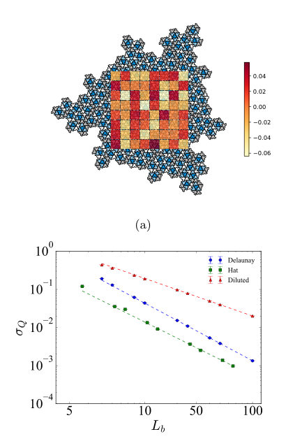 
FIG. 4: (a) Spatial map of Qµ −¯z for Lb = 8 blocks on the Smith-hat lattice; the color encodes each block’s deviation from the global mean, whose mean square gives the variance σ2 Q. (b) Log-log plot of σQ(Lb) versus Lb for the three lattices. Dashed lines are power-law fits σQ ∼L−α b , yielding α = 1.51(1) (VD), 1.41(12) (Smith-hat), and 0.98(1) (diluted, p = 0.75).

📷 Fig 5

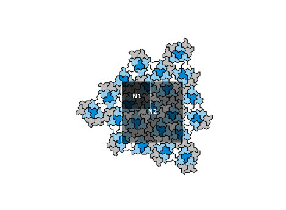 
FIG. 5: Schematic of the sample extraction method for the Smith-hat lattice. To circumvent the sparse set of system sizes from hierarchical generation, we first generate a very large H-type patch, then extract multiple square windows of varying sizes to serve as our simulation lattices.

**Summary.** This study investigates how structural disorder—aperiodic, topological, or random—affects the critical behavior of the 2D Ashkin-Teller model. By comparing results against the Harris and HBV criteria, the authors show that geometrically constrained disorder preserves clean critical exponents, while uncorrelated disorder causes a breakdown of this clean behavior.

**Why it may be interesting.** This work provides a rigorous testbed for modern critical phenomena theory, specifically comparing the predictive power of the Harris criterion against the HBV criterion in geometrically constrained or disordered systems, which has implications for understanding complex materials.

Detailed structure

**Main problem.** The study investigates the stability of clean critical behavior in the Ashkin-Teller model when subjected to three distinct types of structural disorder: aperiodic, topological, and uncorrelated.

**Main result.** The critical behavior remains stable and consistent with the clean AT universality class for aperiodic (Smith-hat) and topological (VD) lattices, satisfying the HBV criterion. Conversely, the uncorrelated (diluted) lattice shows a crossover to a disorder-dominated fixed line, consistent with the Harris criterion.

**Method.** The research employs Finite-Size Scaling (FSS) analysis on Monte Carlo simulations to determine critical exponents ($
u, \eta_h, \eta_p$) and characterizes disorder using the decay exponent ($\alpha$) of the block-averaged coordination fluctuation ($\sigma_Q$).

**Model / system.** The system is the two-dimensional Ashkin-Teller (AT) model, analyzed on lattices including the Smith-hat aperiodic tiling, Voronoi-Delaunay (VD) random triangulations, and site-diluted square lattices. The Hamiltonian involves two Ising variables per site.

**Key observables.** Critical exponents ($
u, \eta_h, \eta_p$), coordination fluctuation decay exponent ($\alpha$), and the Binder cumulant ($U_m$).

**Important parameters / regimes.** The disorder strength parameter ($J_4$) and the occupation probability ($p$) for site dilution are key parameters governing the crossover regimes.

**Assumptions / limitations.** The analysis relies on comparing numerical results against predictions from the Harris and Harris-Barghathi-Vojta (HBV) criteria, and assumes the applicability of the Coulomb-gas self-consistency check for clean universality.

**Figures summary.** Figures illustrate the construction of the Smith-hat and VD lattices, and the analysis uses Binder cumulants ($U_m$) to locate critical points and determine exponents.

**Paper structure.** The paper systematically compares the critical behavior across the three disorder types, using the coordination fluctuation exponent ($\alpha$) to characterize disorder, and then applying FSS and theoretical criteria (Harris vs. HBV) to determine if the clean critical exponents are preserved.

Abstract

Using the two-dimensional Ashkin-Teller (AT) model, we compare criticality on three non-periodic lattices: the Smith-hat aperiodic tiling, Voronoi-Delaunay (VD) random triangulations, and uncorrelated diluted square lattices. The decay of the block-averaged coordination fluctuation $σ_Q$ with exponent $α$ is used to describe the connectivity disorder. The first two lattices share the same exponent $α$, which differs from that of the third. We consider the regime where the correlation-length exponent $ν<1$, where randomness is relevant according to the Harris criterion $d ν\le 2$, but should be irrelevant in cases of the Smith-hat tiling and VD triangulations, where $αν>1$, according to the Harris--Barghathi--Vojta (HBV) criterion. For the diluted lattice, we indeed find that the clean universality behavior breaks down along the entire critical line, indicating a crossover to a fixed line dominated by disorder, in line with both the Harris criterion and the HBV criterion. In contrast, both VD and Smith-hat lattices display critical exponents consistent with the clean AT universality class, as validated by a Coulomb-gas self-consistency check, violating the Harris criterion while conforming to the HBV criterion.

[↑ back to top](#top)

### [One Gate at a Time: Complexity Growth in Random Quantum Circuits](http://arxiv.org/abs/2609.17457v1)

**Authors:** Zhi Li  
**Type:** theory · **Category:** quantum information and computing · **PDF:** <https://arxiv.org/pdf/2609.17457v1>  
**Analysis basis:** full PDF text, analyzed in chunks

📷 Fig 1

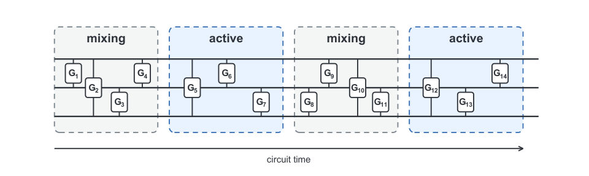 
Figure 1: Schematic decomposition of the circuit into R blocks, each consisting of a mixing segment of length m followed by an active segment of length d. Thus, the total number of gates is T = (m+d)R.

**Summary.** This paper analyzes the complexity of random quantum circuits, proving that the minimum number of gates needed to approximate the circuit's output grows almost linearly with time, $\Omega(T/\log T)$. It achieves this by developing novel techniques rooted in stochastic calculus and geometric functional analysis to establish strong small-ball estimates. This work significantly improves prior lower bounds on quantum circuit complexity.

**Why it may be interesting.** The result provides a significantly improved lower bound on circuit complexity compared to previous methods, suggesting that random circuits mix rapidly and efficiently explore the unitary space, which is crucial for understanding quantum computation limits.

Detailed structure

**Main problem.** The paper determines the growth rate of the constant-error circuit complexity required to approximate a random unitary quantum circuit.

**Main result.** The constant-error circuit complexity for an all-to-all 2-local random unitary circuit grows almost linearly with time, specifically $\Omega(T / \log T)$, independent of the system size $n$ up to certain time scales.

**Method.** The analysis combines geometric functional analysis, stochastic calculus (using Itô's formula), and $\epsilon$-net arguments applied to small-ball estimates for the unitary group.

**Model / system.** The study focuses on random unitary quantum circuits, including the all-to-all 2-local random unitary circuit and the random Pauli rotations model, operating on a Hilbert space of dimension $D=2^n$.

**Key observables.** Constant-error circuit complexity $C_\epsilon(U)$, the normalized Hilbert-Schmidt distance $d_2(U, V)$, and the overlap function $	ext{Re} 	ext{Tr}(V^\dagger U(	heta))$.

**Important parameters / regimes.** Time $T$ (number of gates), system size $n$, and the error tolerance $\epsilon$ (e.g., $\epsilon=1/2$).

**Assumptions / limitations.** The approach avoids relying on spectral gaps or unitary designs, instead deriving bounds from small-ball estimates related to the circuit's exploration of the unitary group.

**Figures summary.** Figure 1 schematically decomposes the circuit into blocks, showing mixing and active segments, relating total time $T$ to the number of segments $R$.

**Paper structure.** The paper builds from establishing small-ball estimates for the distance between the random circuit output and any fixed unitary (using stochastic calculus on the overlap function) to deriving the final complexity lower bounds via $\epsilon$-net arguments.

Abstract

A random unitary quantum circuit is expected to be incompressible for exponentially long times. We show that the constant-error circuit complexity of a random unitary circuit grows almost linearly with time as $Ω(T/\log T)$. The bound holds for all $2\leq T\leq 4^n$ where $n$ is the system size, and involves no other $n$-dependence. This improves previous lower bounds derived from spectral gaps and unitary designs by a factor of $\mathrm{poly}(n)$. Drawing on insights from stochastic calculus, geometric functional analysis, and randomized linear algebra, our approach exploits the circuit's response to variations of individual gates and requires no control over convergence to high-order unitary designs.

[↑ back to top](#top)

### [Orbital-resolved superexchange and topological magnon bands in MXene Fe$_2$C](http://arxiv.org/abs/2609.16530v1)

**Authors:** Qiang Gao, Wei Wang, Shaojin Qi, Guimei Shi, Anbang Guo, Xin Jin, Chen Shen, Xing-Qiu Chen  
**Type:** theory · **Category:** strongly correlated electrons · **PDF:** <https://arxiv.org/pdf/2609.16530v1>  
**Analysis basis:** full PDF text, analyzed in chunks

📷 Fig 1

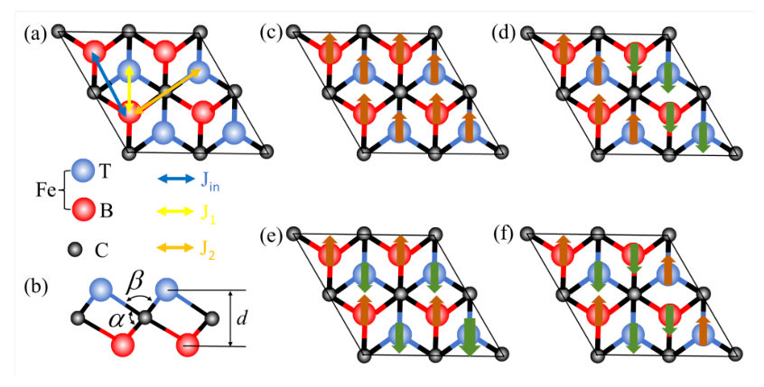 
FIG. 1. The top (a) and side (b) views for the structure of MXene Fe2C. (c), (d), (e), and (f)

📷 Fig 2

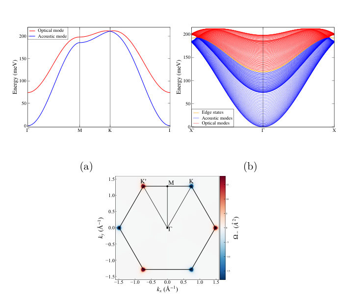 
FIG. 2. (a) The magnon dispersion curves for MXene Fe2C. The blue and red curves represent the

📷 Fig 3

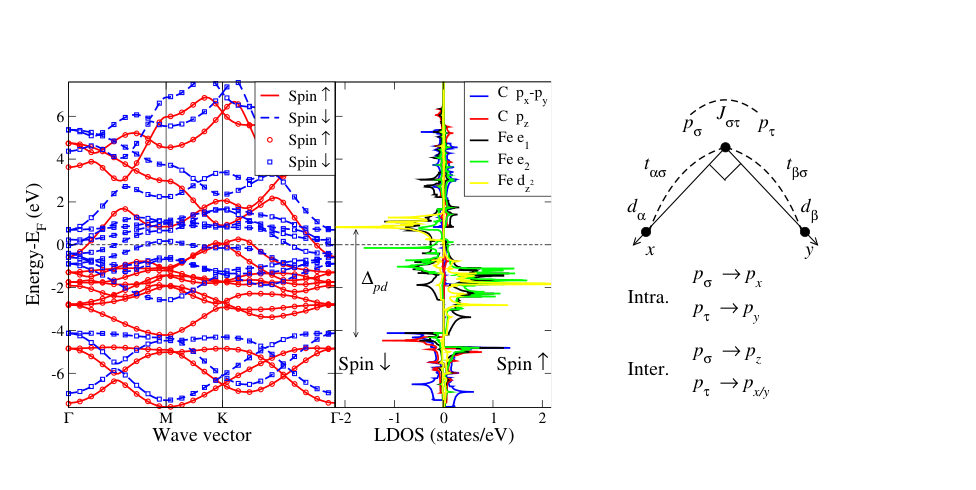 
FIG. 3. (a) The band structures (left) for MXene Fe2C together with the local density of states

**Summary.** This theoretical study investigates the magnetic excitations and topological properties of MXene Fe2C. It successfully links the microscopic superexchange mechanism, detailing how orbital overlaps govern the exchange coupling, to the macroscopic topological features of the magnon bands. This provides crucial theoretical guidance for designing next-generation spintronic materials.

**Why it may be interesting.** The connection between orbital physics (superexchange) and topological band theory in a 2D magnetic material is highly relevant for understanding emergent quantum phenomena in condensed matter systems.

Detailed structure

**Main problem.** The study aims to investigate the topological properties of magnon bands and the orbital-resolved superexchange mechanism in magnetic MXene Fe2C.

**Main result.** The research establishes a direct link between the orbital-resolved anisotropic superexchange and the topological properties of magnon bands, identifying a Dirac point at the K point.

**Method.** The authors employed the linear spin wave method, combined with first-principles calculations and a two-band model, to analyze the magnetic excitations and topology.

**Model / system.** The physical system is the magnetic MXene Fe2C. The analysis models the magnetic interactions using a Heisenberg Hamiltonian, incorporating intralayer and interlayer exchange couplings derived from orbital-resolved superexchange paths.

**Key observables.** Spin wave dispersions, Berry curvature, valley Chern number, edge states, and the orbital-resolved anisotropic superexchange coupling.

**Important parameters / regimes.** The interlayer exchange coupling is found to be stronger than the intralayer coupling, and the topology is protected by the C3v rotational symmetry.

**Assumptions / limitations.** The analysis relies on the linear spin wave approximation and utilizes a two-band model for topological calculations.

**Figures summary.** Figure 1 illustrates the structure of MXene Fe2C and different spin configurations; other figures likely show the magnon dispersion and topological band structures.

**Paper structure.** The paper proceeds by first calculating spin wave dispersions using LSWT, then analyzing the topology via a two-band model, and finally deriving a refined model using perturbation theory and tight-binding to microscopically explain the orbital-resolved superexchange mechanism.

Abstract

Magnetic MXenes are promising candidates for future spintronics due to their intriguing properties. Nevertheless, the topological properties of magnon bands and superexchange mechanism remain relatively underexplored. In this work, we have calculated the spin wave dispersions for MXene Fe$_2$C using the linear spin wave method, with the exchange coupling parameters obtained from first-principles calculations. Owing to the staggered stacking of two Fe sub-lattices, the interlayer exchange coupling lifts the degeneracy of the ferromagnetic magnon modes. A Dirac point is identified in the magnon bands at the $K$ point. The topological properties of magnon bands, including Berry curvature, valley Chern number and edge states, are further computed by means of a two-band model. We also derive an effective Hamiltonian to explain the magnonic topology, which is protected by the $C_{3v}$ rotational symmetry. To understand the microscopic origin of the exchange couplings that govern the magnon bands, we then construct a refined model integrating perturbation theory and the tight-binding approach. The ferromagnetic superexchange coupling is mediated by the virtual hopping between the d orbitals of two distinct Fe sites via a pair of orthogonal p orbitals at the bridging C site. In detail, the intralayer exchange coupling is governed by the in-plane $p_x$ and $p_y$ orbitals, while the out-of-plane $p_z$ orbital is responsible for the interlayer exchange coupling. Our results establish a direct link between the orbital-resolved anisotropic superexchange and topological properties of the magnon bands in magnetic MXene Fe$_2$C, providing theoretical guidance for future spintronics applications.

[↑ back to top](#top)

### [Phantom Codes: Hardness, Rate Optimal qLDPC Constructions, and Distance Limits](http://arxiv.org/abs/2609.16542v1)

**Authors:** Rui Mao, Weixiao Sun, Shengyu Zhang  
**Type:** theory · **Category:** quantum information and computing · **PDF:** <https://arxiv.org/pdf/2609.16542v1>  
**Analysis basis:** full PDF text, analyzed in chunks

📷 Fig 1

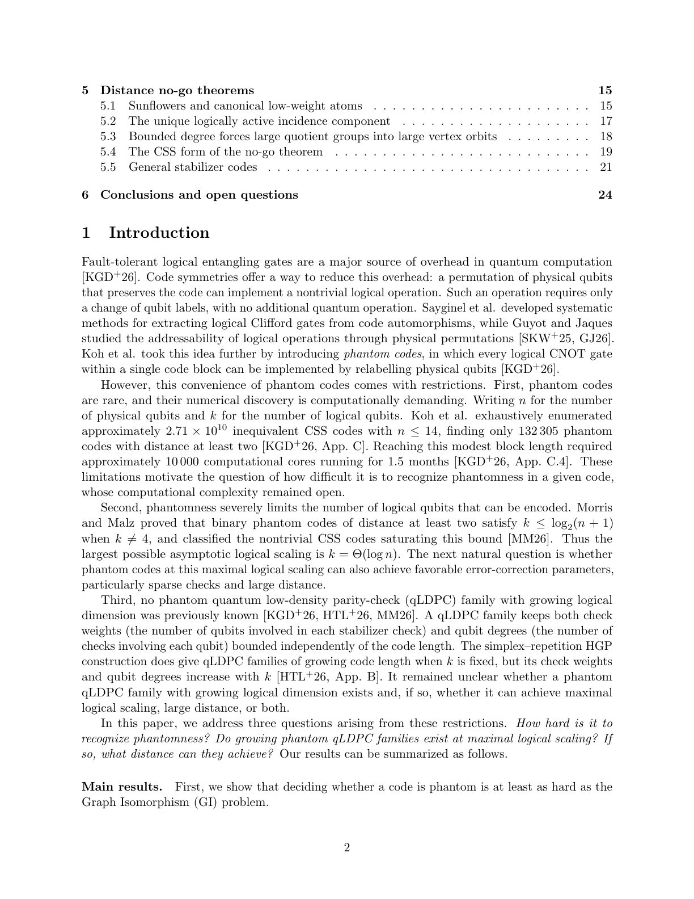 
Low-resolution page preview, page 2

📷 Fig 2

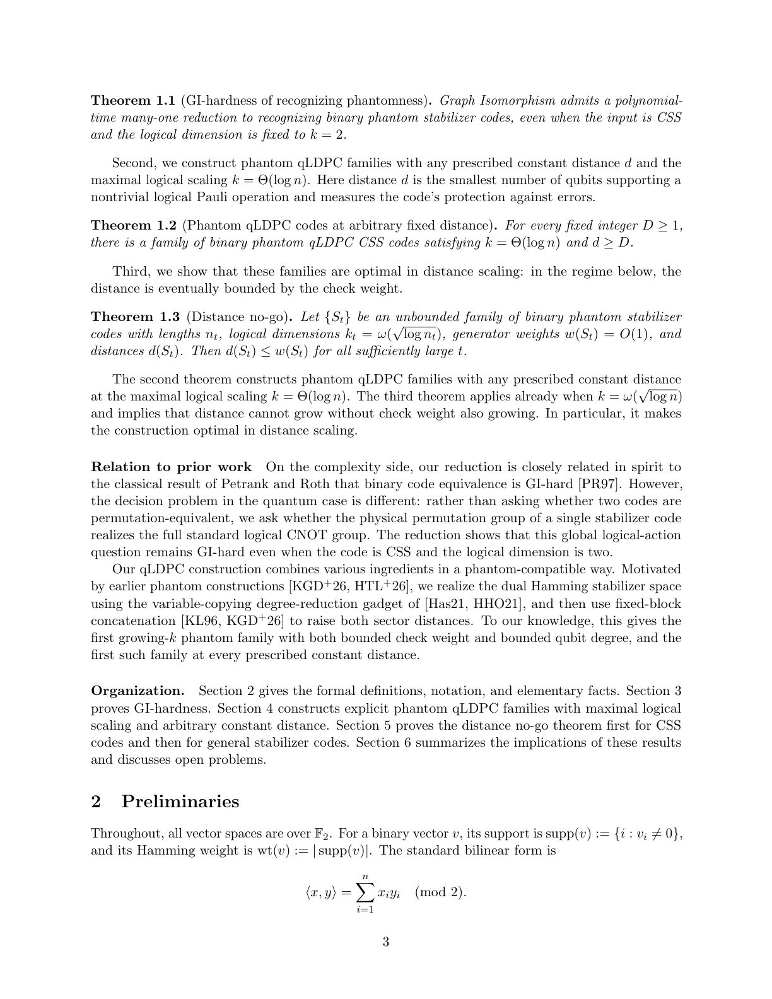 
Low-resolution page preview, page 3

📷 Fig 3

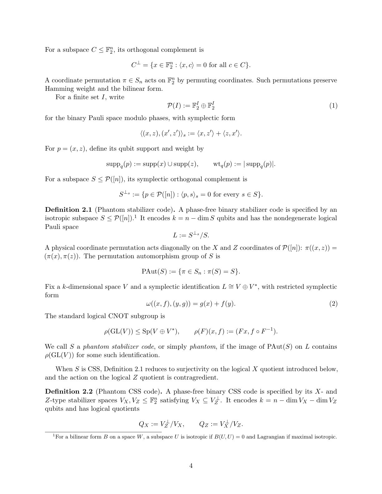 
Low-resolution page preview, page 4

📷 Fig 4

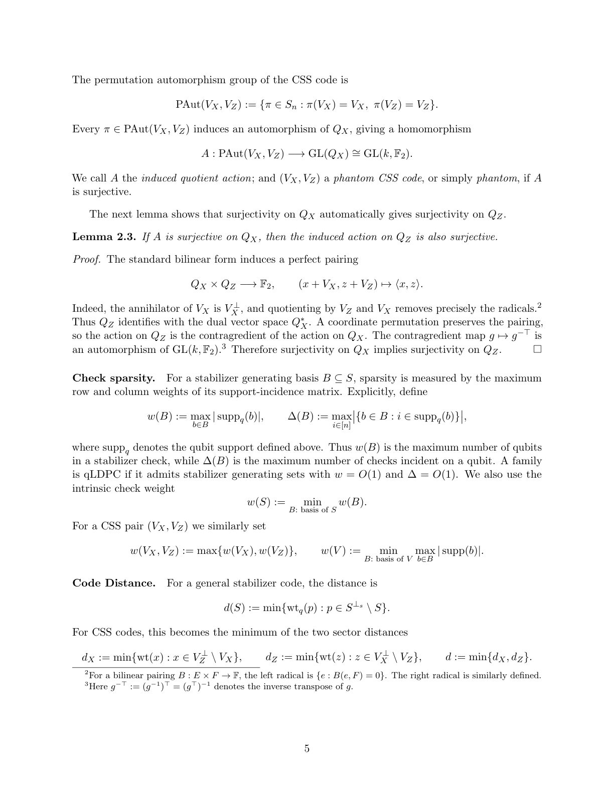 
Low-resolution page preview, page 5

📷 Fig 5

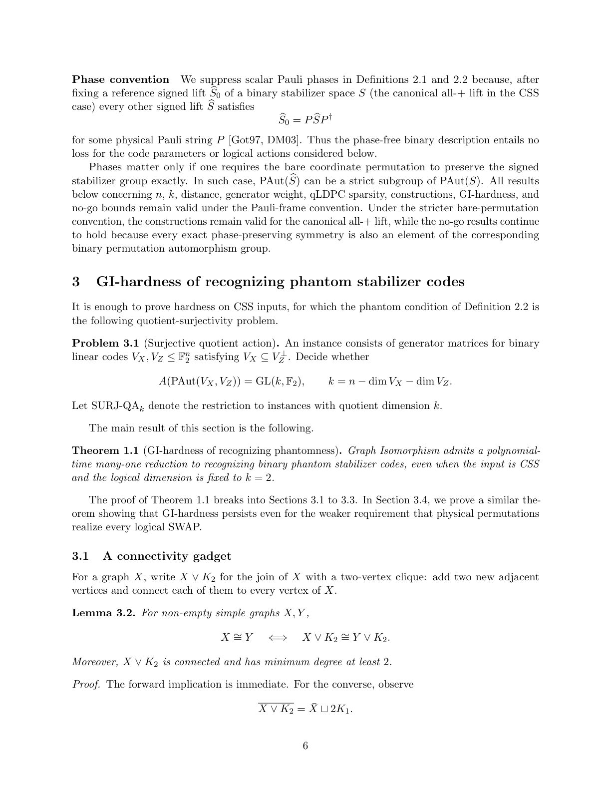 
Low-resolution page preview, page 6

**Summary.** This paper studies 'phantom codes,' a rare class of quantum error-correcting codes with special symmetry properties. The authors establish that determining if a code is phantom is computationally hard (GI-hard) and provide constructions for optimal families. Crucially, they prove a distance limit, showing that for codes with high logical dimension relative to their check weight, the distance must be severely constrained.

**Why it may be interesting.** The connection between the algebraic structure of quantum error-correcting codes and computational complexity (GI) provides deep insights into the inherent limitations of quantum information processing.

Detailed structure

**Main problem.** Characterizing 'phantom codes,' which are stabilizer codes where all logical CNOT gates can be realized by physical qubit permutations, and determining the inherent limitations on their parameters.

**Main result.** The authors proved that recognizing phantomness is as hard as Graph Isomorphism, constructed rate-optimal phantom qLDPC families, and established a distance no-go theorem for such codes.

**Method.** The work combines algebraic coding theory (stabilizer codes, CSS codes) with computational complexity theory (Graph Isomorphism reduction) and group theory (automorphism groups).

**Model / system.** The model is the stabilizer code, specifically CSS codes, defined by their parameters $(n, k, d)$ and analyzed via their automorphism groups $	ext{PAut}(S)$.

**Key observables.** Code parameters: physical length ($n$), logical dimension ($k$), distance ($d$), and check weight ($w$).

**Important parameters / regimes.** The scaling of $k$ relative to $n$ (e.g., $k = \Theta(\log n)$ or $k = \omega(\sqrt{\log n})$) is critical for the theorems.

**Assumptions / limitations.** The analysis often assumes the code is a binary CSS code and relies on the structure of the automorphism group action on the logical Pauli group.

**Paper structure.** The paper progresses by first defining the phantom property, then proving the computational hardness (GI-hardness), followed by constructing optimal qLDPC families, and concluding with the distance no-go theorem.

Abstract

An $[[n,k,d]]$ stabilizer code is phantom if every in-block logical CNOT gate can be realized by a permutation of its physical qubits. This eliminates the large and complicated physical overhead normally required for logical entangling gates. Yet this symmetry is highly restrictive: phantom codes are rare, the number of logical qubits is limited to $k=O(\log n)$, and no phantom qLDPC family with growing logical dimension was previously known.   We make three contributions.   1. We prove that recognizing phantomness of a given stabilizer code is at least as hard as Graph Isomorphism, even for CSS codes encoding only $k=2$ logical qubits.   2. We propose the first rate optimal phantom qLDPC families: for every fixed $D$, our CSS families achieve the maximal logical scaling $k=Θ(\log n)$ and distance $d\geq D$.   3. We prove a distance no-go theorem: every phantom code family with $k=ω(\sqrt{\log n})$ and check weight $w=O(1)$ satisfies $d\leq w$ for sufficiently large $n$.   Thus our fixed-distance qLDPC families are distance-scaling optimal at the maximal logical scaling $k=Θ(\log n)$.

[↑ back to top](#top)

### [Phase Transition in Binary Compressed Sensing via Annealing with Adaptive Regularization](http://arxiv.org/abs/2609.16712v1)

**Authors:** Xiaoxin Huang, Masayuki Ohzeki  
**Type:** both · **Category:** numerical methods · **PDF:** <https://arxiv.org/pdf/2609.16712v1>  
**Analysis basis:** full PDF text, analyzed in chunks

📷 Fig 1

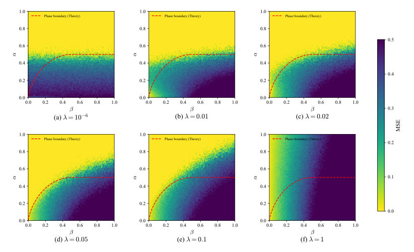 
Fig. 1. SA reconstruction phase diagrams with fixed regularization at N = 100. Panels (a–f) use λ =

📷 Fig 2

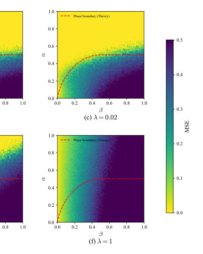 
Figure 4 shows SA recovery phase diagrams obtained with RF-predicted regularization

📷 Fig 3

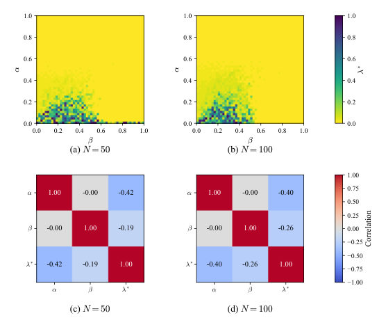 
Fig. 2. Empirical reference regularization maps and parameter correlations. Panels (a,b) show λ∗for N =

📷 Fig 4

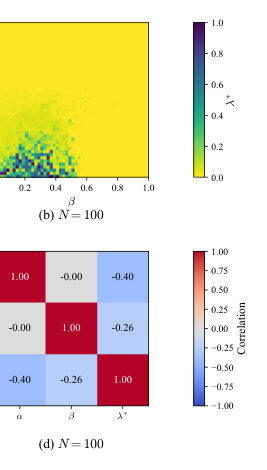 
Figure 5 compares SA, hybrid QA, and box-constrained BP on matched problem in-

📷 Fig 5

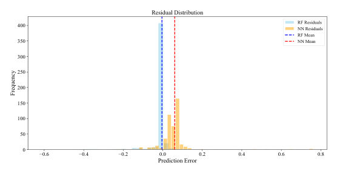 
Fig. 3. Residual histograms for RF (light blue) and NN (orange), illustrated using a subset of the held-out

**Summary.** This work tackles the parameter selection problem in Binary Compressed Sensing by developing a machine learning predictor to estimate the optimal regularization strength ($\lambda$). By training a Random Forest on systematic search results, the authors enable annealing-based solvers to achieve reconstructions that closely follow established theoretical recovery boundaries.

**Why it may be interesting.** The integration of machine learning (Random Forest) to guide the parameter selection for quantum/optimization solvers is a powerful methodology for making quantum computation results more practical and transferable.

Detailed structure

**Main problem.** The paper addresses the challenge of determining the optimal regularization parameter ($\lambda$) required for successful signal reconstruction in Binary Compressed Sensing (BCS).

**Main result.** A data-driven prediction method, trained on systematic searches, successfully estimates the optimal $\lambda$, allowing reconstruction algorithms (SA and hybrid QA) to follow theoretical recovery boundaries.

**Method.** The authors combine systematic parameter searching (using Simulated Annealing) to map out optimal $\lambda$ values ($\lambda^*$) and then train a Random Forest regression model to predict these values for new regimes.

**Model / system.** The core problem is recovering a sparse binary signal $\mathbf{x} \in \{0, 1\}^N$ from measurements $\mathbf{y} = A\mathbf{x}$, formulated as minimizing a QUBO objective function. This is solved using annealing techniques (SA, QA) and classical solvers.

**Key observables.** Mean Squared Reconstruction Error (MSE) per component, and the predicted regularization parameter $\hat{\lambda}$.

**Important parameters / regimes.** Signal dimension ($N$), sampling ratio ($\alpha$), sparsity ($eta$), and the regularization parameter ($\lambda$).

**Assumptions / limitations.** The results are empirical, based on a finite candidate grid for $\lambda$, and do not constitute a solver-independent recovery guarantee; the measurements are assumed noiseless Gaussian.

**Figures summary.** Figures show phase diagrams mapping MSE across $(\alpha, eta)$ space, comparing results from fixed $\lambda$ versus predicted $\hat{\lambda}$ using SA and hybrid QA, relative to a theoretical recovery boundary.

**Paper structure.** The paper first establishes the BCS problem and its QUBO formulation. It then details the two-stage process: (1) Empirical search to find $\lambda^*$, and (2) Training a predictor (RF) on these results. Finally, it compares reconstruction performance using the predicted $\hat{\lambda}$ against theoretical bounds and other solvers.

Abstract

Regularization choice changes the recovery phase diagrams of annealing-based binary compressed sensing. We develop a regularization-selection method that combines systematic parameter search with random forest regression. Under noiseless Gaussian measurements with known sparsity, reference parameters are selected from a candidate grid by minimizing mean squared reconstruction error over repeated simulated annealing (SA) trials. The fitted model predicts these reference values from signal dimension, sampling ratio, and sparsity. With predicted regularization, the SA recovery transition broadly follows the asymptotic reference boundary for box-constrained $\ell_1$ recovery at the larger signal dimensions examined. Without retraining, the same predictor supplies identical regularization values to SA and a quantum--classical hybrid solver. On matched problem instances, the hybrid solver yields smaller mean squared reconstruction errors than SA in parts of the evaluated parameter space. The resulting rule reuses the searched information for subsequent reconstruction without repeating candidate searches at each setting. The results quantify empirical performance under the stated finite candidate grid and solver settings; they do not constitute a solver-independent recovery guarantee or a time-to-solution comparison.

[↑ back to top](#top)

### [QAC0 Can Prepare Every Logarithmic-Qubit State](http://arxiv.org/abs/2609.17408v1)

**Authors:** Lucas Gretta, Meghal Gupta, Malvika Raj Joshi  
**Type:** theory · **Category:** quantum information and computing · **PDF:** <https://arxiv.org/pdf/2609.17408v1>  
**Analysis basis:** full PDF text, analyzed in chunks

📷 Fig 1

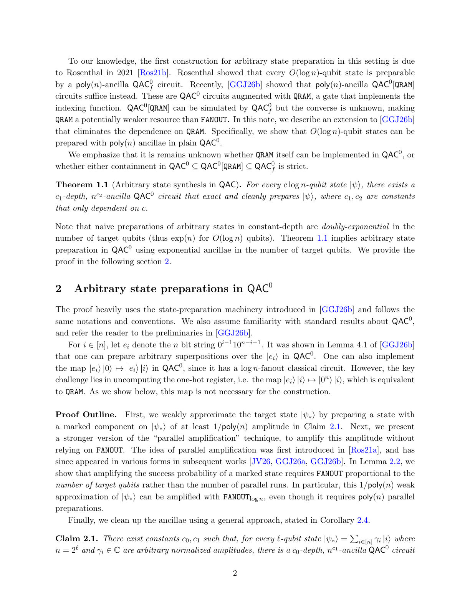 
Low-resolution page preview, page 2

📷 Fig 2

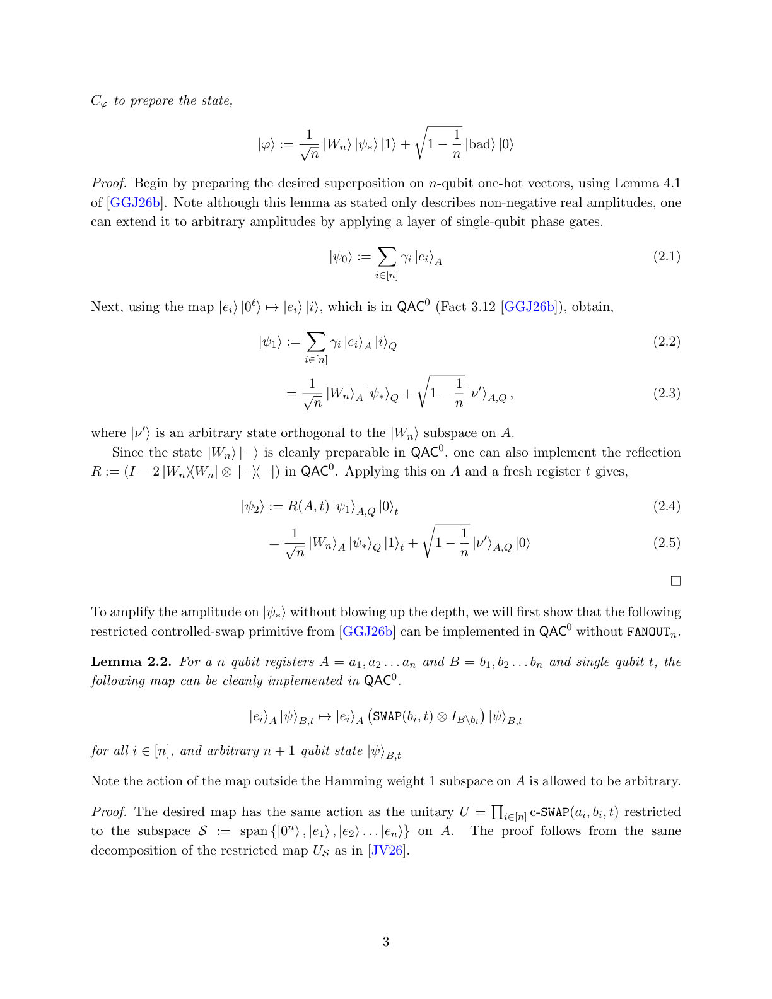 
Low-resolution page preview, page 3

📷 Fig 3

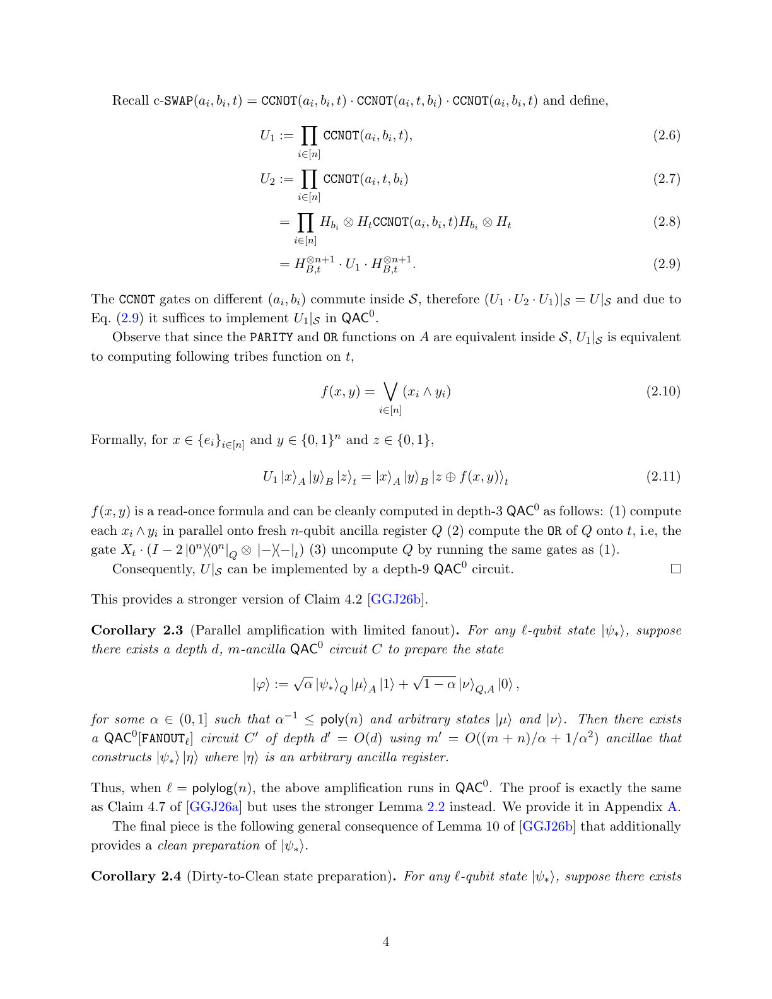 
Low-resolution page preview, page 4

📷 Fig 4

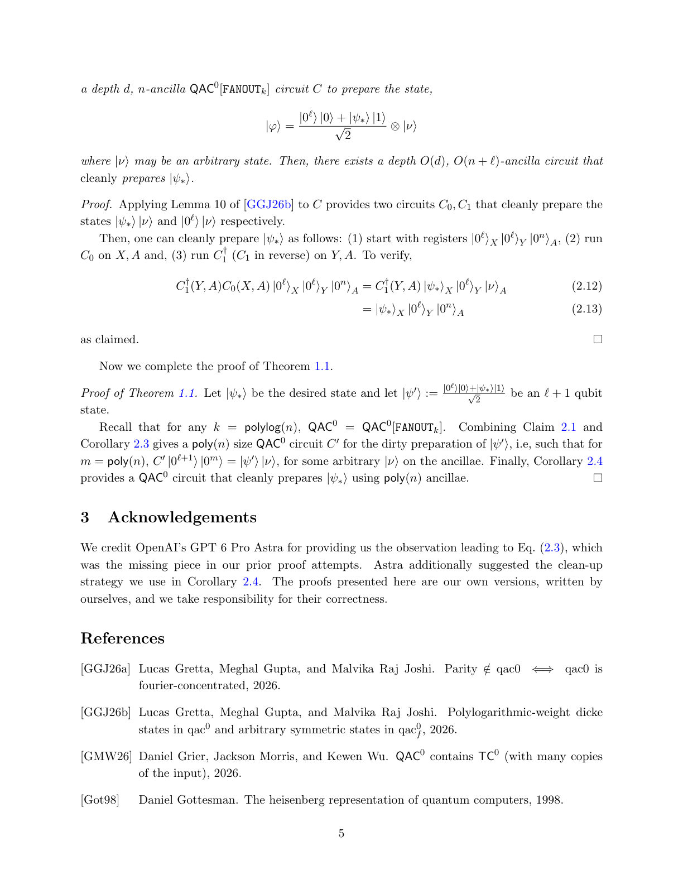 
Low-resolution page preview, page 5

📷 Fig 5

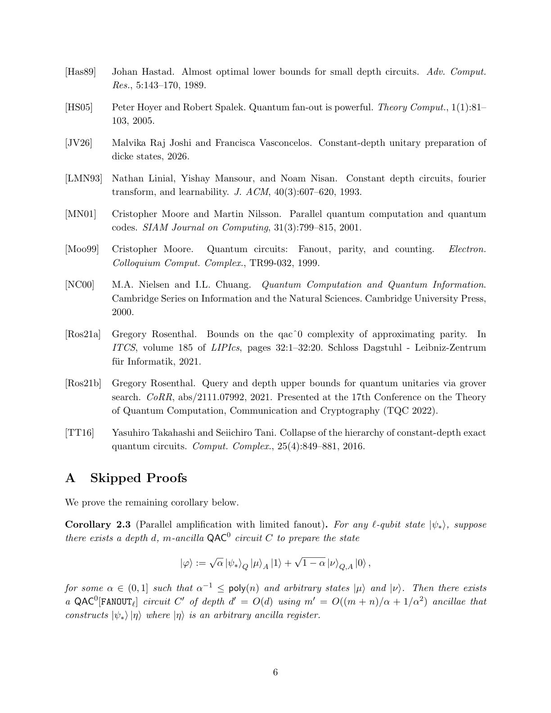 
Low-resolution page preview, page 6

**Summary.** This paper proves that the quantum circuit model $\mathsf{QAC}^0$, which uses constant-depth circuits with multi-qubit Toffoli gates, can efficiently prepare any arbitrary quantum state whose size scales logarithmically with the system size. This result is significant because it achieves this feat without requiring access to powerful, non-native gates like FANOUT or QRAM, offering an exponential improvement over previous constructions.

**Why it may be interesting.** This work provides a significant theoretical result regarding the computational power of restricted quantum circuit models, which is foundational for understanding the limits of quantum computation in physical implementations.

Detailed structure

**Main problem.** To demonstrate that the computational model $\mathsf{QAC}^0$, based on constant-depth circuits with multi-qubit Toffoli gates, is powerful enough to prepare arbitrary $\mathcal{O}(\log n)$-qubit quantum states.

**Main result.** The authors prove that every $\mathcal{O}(\log n)$-qubit state can be exactly and cleanly prepared using only a polynomial number of ancilla qubits and a $\mathsf{QAC}^0$ circuit.

**Method.** The proof utilizes a combination of parallel amplification techniques, building upon prior work, and constructing the state preparation through sequential steps involving controlled-SWAP gates.

**Model / system.** The study focuses on the quantum circuit model $\mathsf{QAC}^0$, which consists of constant-depth circuits extended from local interactions by arbitrary-width Toffoli gates. This model is compared against $\mathsf{QNC}^0_f$ (using FANOUT gates) and models requiring QRAM access.

**Key observables.** The ability to prepare a target state $|\psi
angle$ of size $\mathcal{O}(\log n)$ qubits.

**Important parameters / regimes.** The circuit depth is constant, and the ancilla count is polynomial in $n$. The state size is $\mathcal{O}(\log n)$.

**Assumptions / limitations.** The analysis assumes the existence of the EXACT1 gate within the $\mathsf{QAC}^0$ framework and relies on established amplitude amplification techniques.

**Paper structure.** The paper establishes the main theorem by showing the state preparation is achievable via a sequence of steps: weak approximation, amplitude amplification, and final clean-up, demonstrating an exponential improvement over prior resource requirements.

Abstract

$\mathsf{QAC}^0$ is the class of constant-depth $\mathrm{poly}(n)$-ancilla circuits obtained by extending $\mathsf{QNC}^0$, the class of local circuits, to include nonlocal interactions via arbitrary width Toffoli gates. It is believed to be weaker than its counterpart, $\mathsf{QNC}^0_f$, obtained by including arbitrary-width FANOUT gates instead ($\mathsf{QAC}^0 \subseteq \mathsf{QNC}^0_f$ [Moo99]).   In this note, we show that every $O(\log n)$-qubit state can be exactly and cleanly prepared by a $\mathrm{poly}(n)$-ancilla $\mathsf{QAC}^0$ circuit. Previous known $\mathrm{poly}(n)$-ancilla circuits for arbitrary such states are only known via additional access to either FANOUT or QRAM (indexing) gates [Ros21b, GGJ26b], neither of which are known to be in $\mathsf{QAC}^0$. Equivalently, prior constructions of arbitrary $n$-qubit states in $\mathsf{QAC}^0$ require doubly exponential size and we obtain an exponential factor improvement.

[↑ back to top](#top)

### [Quantum Compiler Design for Fault-Tolerant Quantum Computing](http://arxiv.org/abs/2609.17465v1)

**Authors:** Chenghong Zhu, Jiahan Chen, Keming He, Hongshun Yao, Zhaohui Yang, Jin-Guo Liu, Anbang Wu, Xiaotong Ni, Xingsheng Luan, Zhuo Fu, Shenggen Zheng, Xin Wang  
**Type:** theory · **Category:** quantum information and computing · **PDF:** <https://arxiv.org/pdf/2609.17465v1>  
**Analysis basis:** full PDF text, analyzed in chunks

📷 Fig 1

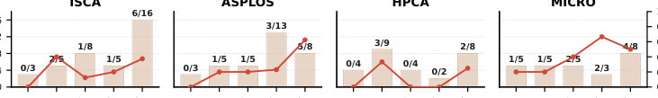 
Fig. 1. Trends in QEC related publications at premier computer architecture conferences (ISCA, ASPLOS, HPCA, and MICRO) from 2021 to 2025.

📷 Fig 2

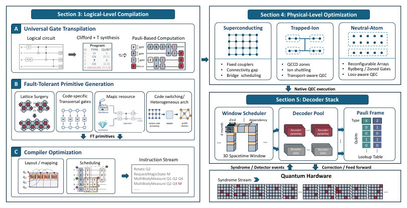 
Fig. 2. Overall picture of the QEC-protected quantum computing stack: logical-level compilation transpiles and lowers a logical circuit into fault-tolerant primitives and an optimized instruction stream; physical- level optimization compiles it to native operations across superconducting, trapped-ion, and neutral-atom platforms; and the decoder stack processes the resulting syndrome stream to feed corrections back via the Pauli frame.

📷 Fig 3

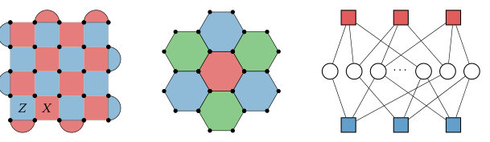 
Fig. 3. Three representative families of quantum error-correcting codes. (a) A distance-5 rotated surface code: data qubits (dots) on a 2D lattice with weight-4 𝑋(red) and 𝑍(blue) plaquette stabilizers and weight-2 boundary stabilizers. (b) A patch of the 6.6.6 (hexagonal) color code: a data qubit sits on every vertex of a trivalent lattice whose faces carry the standard red/green/blue three-coloring, with each face hosting one 𝑋- and one 𝑍-type stabilizer. (c) A qLDPC code shown as a Tanner graph: data qubits (circles) connected to sparse 𝑋- (red) and 𝑍-type (blue) checks (squares), generally with non-local connectivity.

📷 Fig 4

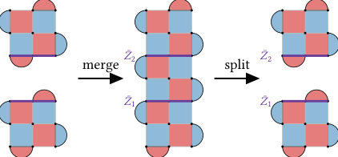 
Fig. 4. Lattice surgery: merging and then splitting two logical qubits. Two distance-3 rotated surface-code patches encode logical qubits whose logical-𝑍operators ¯𝑍1 and ¯𝑍2 (purple) run horizontally. Merging the patches along those boundaries fuses them into a single patch (middle), whose seam reads out the joint logical measurement 𝑍𝐿𝑍𝐿; a subsequent split restores the two qubits. 𝑋-type stabilizers are red and 𝑍-type blue, following Fig. 3.

📷 Fig 5

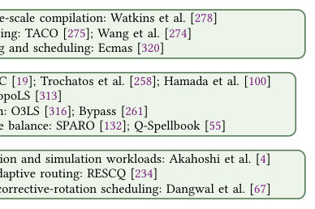 
Fig. 5. A taxonomy of surface-code lattice-surgery compilers.

**Summary.** This survey details the necessary evolution of quantum compilers for Fault-Tolerant Quantum Computing (FTQC). It proposes a full-stack framework connecting logical circuit synthesis, physical hardware mapping, and real-time error decoding. The paper is crucial for understanding the resource overhead and architectural challenges required to move quantum computation beyond current NISQ limitations.

**Why it may be interesting.** It provides a comprehensive roadmap for the computational challenges in scaling quantum computation, directly impacting how theoretical quantum algorithms must be implemented on near-term and fault-tolerant hardware.

Detailed structure

**Main problem.** Quantum compilation must evolve beyond general-purpose circuit optimization to support Fault-Tolerant Quantum Computing (FTQC).

**Main result.** The paper presents a full-stack view of compiler design for QEC-protected computation, detailing the necessary interactions between logical, physical, and runtime layers.

**Method.** The authors survey the field by organizing compiler design into three interacting layers: logical-level QEC compilation, physical-level QEC realization, and decoder runtime integration.

**Model / system.** The work addresses various quantum error-correcting codes, including surface codes and qLDPC codes, and is applicable across multiple hardware platforms like superconducting circuits, trapped ions, and neutral atoms.

**Key observables.** Circuit depth, scheduling efficiency, logical operator overhead, and decoding accuracy.

**Important parameters / regimes.** Code parameters like $[[n, k, d]]$, and resource costs measured by $T$-count or $T$-depth.

**Assumptions / limitations.** The effective performance relies on the joint consideration of algorithmic lowering, hardware mapping, and real-time decoding feedback.

**Figures summary.** Figure 2 summarizes the full-stack view of QEC-aware compilation, showing the flow from logical circuit to syndrome stream and decoder.

**Paper structure.** The survey is structured around three interacting layers: logical-level QEC compilation (e.g., lattice-surgery, qLDPC), physical-level QEC realization (hardware-aware mapping), and decoder runtime integration (real-time feedback loop).

Abstract

Scalable quantum computation is expected to rely on fault-tolerant quantum computation (FTQC), in which quantum error correction (QEC) suppresses physical errors sufficiently to support reliable logical operations. This requires quantum compilation to move beyond general-purpose circuit optimization toward encoding-aware and protocol-structured compilation across the full stack of fault-tolerant quantum computers. Beyond circuit synthesis and hardware mapping, an FTQC compiler must lower algorithm-level operations into the logical gate set supported by the chosen code, coordinate encoded data and ancilla resources, realize logical operations together with repeated syndrome extraction under hardware constraints, and provide the resulting measurement stream to real-time decoding.   This survey presents a full-stack view of compiler design for QEC-protected quantum computation. We organize existing work into three interacting layers: logical-level QEC compilation, physical-level QEC realization, and decoder runtime integration. At the logical level, we review surface-code lattice-surgery compilers, beyond-surface-code code-surgery frameworks including emerging qLDPC approaches, and compilation support for non-Clifford operations such as magic-state distillation and code switching. At the physical level, we survey hardware-aware QEC realization on superconducting, trapped-ion, and neutral-atom platforms. We further examine decoder models, real-time decoding systems, and frame-management mechanisms that close the feedback loop during fault-tolerant execution. Finally, we identify open challenges in cross-layer optimization, qLDPC compilation, compiler-decoder co-design, runtime adaptivity, and the development of integrated and benchmarkable FTQC compilation stacks. An actively maintained paper list is available at: github.com/chenghongz/QEC-compiler-design.

[↑ back to top](#top)

### [Regularized barycentric Rényi divergences](http://arxiv.org/abs/2609.17517v1)

**Authors:** Milán Mosonyi  
**Type:** theory · **Category:** quantum information and computing · **PDF:** <https://arxiv.org/pdf/2609.17517v1>  
**Analysis basis:** full PDF text, analyzed in chunks

📷 Fig 1

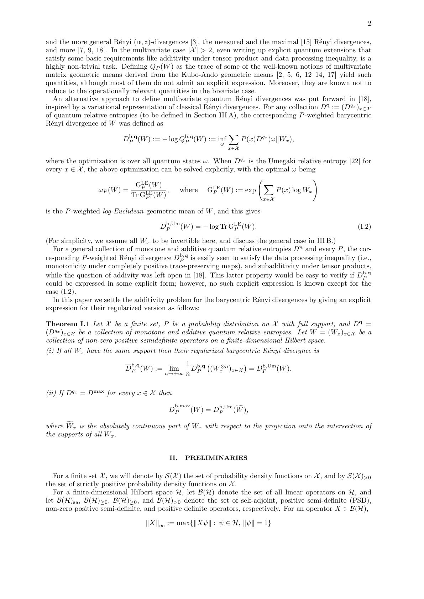 
Low-resolution page preview, page 2

📷 Fig 2

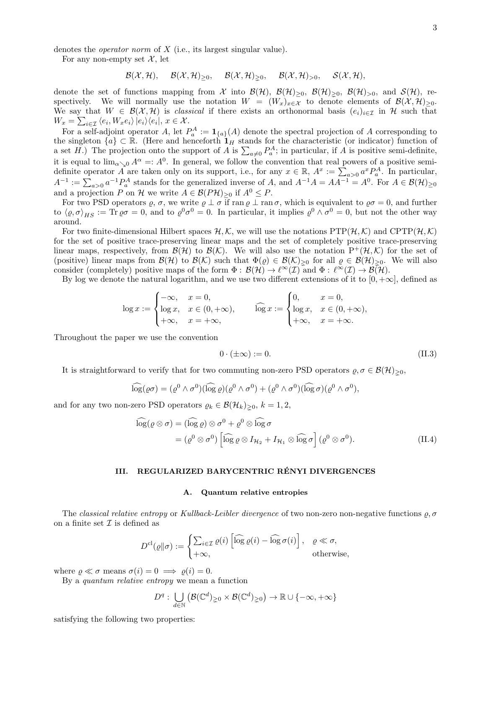 
Low-resolution page preview, page 3

📷 Fig 3

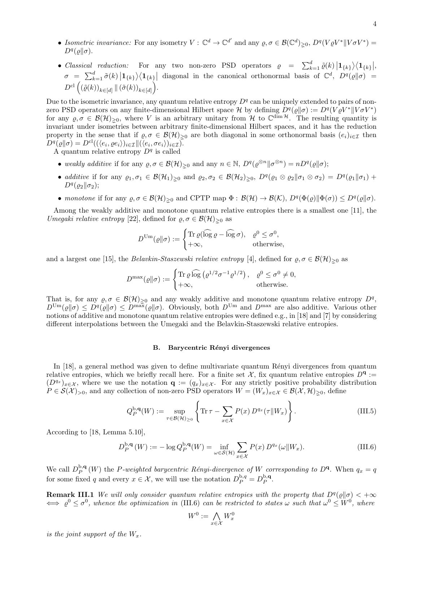 
Low-resolution page preview, page 4

📷 Fig 4

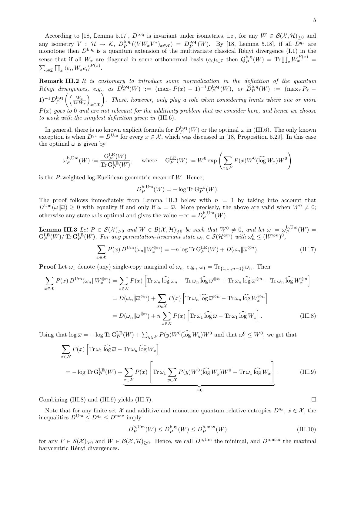 
Low-resolution page preview, page 5

📷 Fig 5

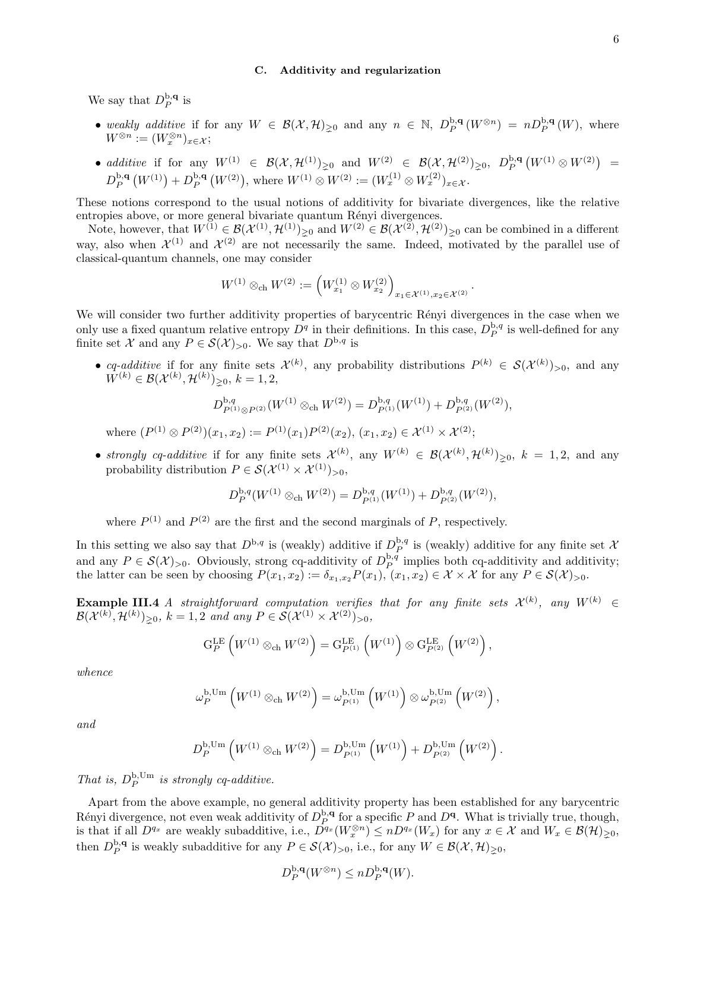 
Low-resolution page preview, page 6

**Summary.** This paper rigorously analyzes barycentric Rényi divergences, which are generalizations of quantum relative entropy for multiple quantum states. The authors solve the long-standing additivity problem by proving that the only quantum relative entropy structure that allows for additivity is the minimal one derived from the Umegaki relative entropy. This provides a powerful tool for quantifying multi-partite quantum correlations.

**Why it may be interesting.** The rigorous mathematical framework developed for characterizing divergences is fundamental for quantifying distinguishability between quantum states, which is crucial for quantum channel capacity and resource theories.

Detailed structure

**Main problem.** The paper addresses the definition and additivity properties of multivariate quantum Rényi divergences, specifically the barycentric Rényi divergence.

**Main result.** It proves that for any choice of additive and monotone quantum relative entropies, the regularized barycentric Rényi divergence must coincide with the minimal (Umegaki) one on strictly positive inputs, implying the minimal one is the unique additive choice.

**Method.** The analysis involves defining the divergence via variational expressions and comparing different forms (e.g., $D_{\max}$ vs $D_{	ext{Um}}$) using tensor product structures and regularization techniques.

**Model / system.** The study is set in the context of quantum information theory, dealing with collections of positive semi-definite operators $W = (W_x)_{x \in X}$ acting on a Hilbert space $H$.

**Key observables.** Barycentric Rényi divergences ($D_{b,q}^P(W)$), the regularized divergence ($\mathcal{D}_{b,q}^P(W)$), and the quantum relative entropy ($D_q$).

**Important parameters / regimes.** The probability distribution $P$ over the index set $X$, and the choice of the quantum relative entropy $D_q$.

**Assumptions / limitations.** The analysis assumes the relative entropies $D_q$ are monotone and that the inputs are strictly positive for the final additivity result.

**Figures summary.** Not specified in the notes.

**Paper structure.** The paper progresses by defining the divergence, establishing inequalities between different forms ($D_{b,Um}^P \le D_{b,q}^P \le D_{b,max}^P$), and culminating in the proof that the additivity property forces the divergence to be the minimal Umegaki form.

Abstract

Barycentric Rényi divergences were introduced in [Mosonyi, Bunth, Vrana, Linear Algebra and its Applications, 2024] as an alternative to standard Kubo-Ando constructions to define multivariate quantum Rényi divergences. They are defined via a variational expression and depend on a finite collection of quantum relative entropies $D^{q_x}$. When all the relative entropies are monotone under CPTP maps then so are the corresponding barycentric Rényi divergences, and when all the relative entropies are additive then the corresponding barycentric Rényi divergences are subadditive under tensor product. Additivity has only been established before for the case where all $D^{q_x}$ are chosen to be the Umegaki relative entropy, which is also the only case where the barycentric Rényi divergence (called the minimal one) admits an explicit expression.   Here we settle the problem of additivity by showing that for any choice of additive and monotone quantum relative entropies, the regularized barycentric Rényi divergence coincides with the minimal barycentric Rényi divergence on strictly positive inputs. This in turn implies that the only additive barycentric Rényi divergence is the minimal one.

[↑ back to top](#top)

### [Tailored coupled cluster method with sample-based quantum diagonalization: Application to titanium-based metallocene catalytic reactions for 1-hexene production](http://arxiv.org/abs/2609.16558v1)

**Authors:** Tzu-Wei Lin, Hirotoshi Hirai, Kuan-Chieh Huang, Zih-Chao Hong, Hui-Zhong Zhuang, Tsung-Hui Li  
**Type:** theory · **Category:** strongly correlated electrons · **PDF:** <https://arxiv.org/pdf/2609.16558v1>  
**Analysis basis:** full PDF text, analyzed in chunks

📷 Fig 1

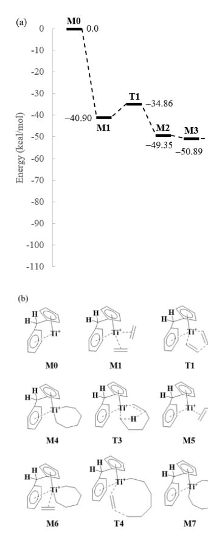 
Figure 2: (a) Energy profile [kcal/mol] for the ethylene oligomerization on the target catalyst (Fig.1) by B3LYP-D3/def2SVP, relative to compound M0 and considering toluene solvent modeled as a polarizable continuum model (PCM). The orange pathway represents the reaction route leading to 1- hexene production, whereas the blue pathway represents the competing route involving continued ethylene insertion. (b) The molecular structures of the M0–M8 species along the reaction pathway.

📷 Fig 2

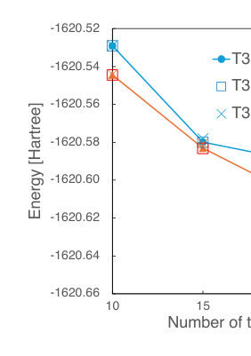 
Figure 3: Computed SQD energies of the T3(+C2H4) and T4 structures as a func- tion of the number of active-space orbitals. SQD energies decrease with increasing active-space size and coincide with CASCI results for 10- and 15-orbital active spaces. For larger active spaces, where CASCI calcula- tions are infeasible due to memory limitations, SQD remains tractable and yields consistently lower energies than the corresponding CCSD(AS) re- sults.

📷 Fig 3

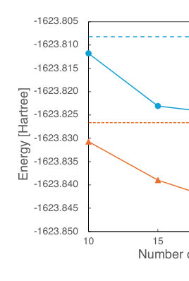 
Figure 4: TCC energies as a function of the number of active-space orbitals. TCC progressively departs from CCSD as active-space size increases due to the improved treatment of static electron correlation within the active space.

📷 Fig 4

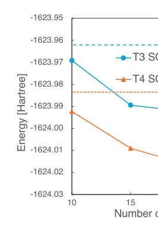 
Figure 5: TCC(T) energies as a function of the number of active-space orbitals. TCC(T) progressively departs from CCSD(T) as active-space size increases due to the improved treatment of static electron correlation within the ac- tive space.

📷 Fig 5

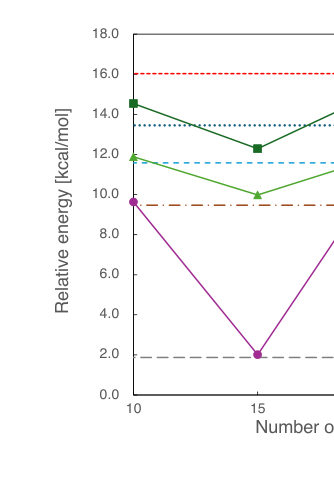 
Figure 6: Relative energy between the T3(+C2H4) and T4 structures as a function of the number of active-space orbitals. While the SQD relative energies exhibit substantial fluctuations as the active space is enlarged, the SQD- TCC and SQD-TCC(T) results show much weaker active-space depen- dence. This behavior highlights the importance of incorporating dynam- ical correlation beyond the active space and demonstrates the improved robustness of the TCC-based approaches relative to SQD alone.

**Summary.** This work develops and applies a novel SQD-TCC method to model the selectivity of a titanium-catalyzed reaction. By combining quantum diagonalization for static correlation with coupled cluster theory for dynamical correlation, the authors achieve chemically accurate energy predictions. This demonstrates a powerful, systematic approach for simulating strongly correlated systems relevant to catalysis.

**Why it may be interesting.** The methodology directly addresses the challenge of simulating strongly correlated transition metal chemistry by merging quantum computing techniques (SQD) with high-level quantum chemistry (TCC), providing a pathway for chemically accurate simulations beyond current computational limits.

Detailed structure

**Main problem.** The primary goal is to accurately predict the selectivity of titanium-based metallocene catalytic reactions for 1-hexene production, requiring energy differences within 1 kcal/mol.

**Main result.** The hybrid SQD-TCC(T) approach successfully incorporates both static and dynamical correlation, yielding results that highlight the critical role of static correlation effects, which differ significantly from standard CCSD(T) calculations.

**Method.** The study employs a hybrid quantum-classical approach combining Sample-based Quantum Diagonalization (SQD) to treat static correlation with Tailored Coupled Cluster (TCC) theory to incorporate dynamical correlation.

**Model / system.** The system modeled is a titanium-based metallocene catalyst undergoing catalytic reactions, specifically comparing the transition states governing 1-hexene formation versus continued ethylene insertion.

**Key observables.** Relative energy difference ($\Delta E$) between the two competing transition states (T3 and T4).

**Important parameters / regimes.** The required accuracy is $\le 1 	ext{ kcal/mol}$; the calculations explore active spaces up to 30 orbitals.

**Assumptions / limitations.** The use of SQD is necessary because the required active spaces are too large for classical CASCI calculations; the study focuses on potential energies, deferring free energy calculations.

**Figures summary.** Figures illustrate the molecular structures of the catalyst and the reaction pathways, while tables present the calculated relative energies ($\Delta E$) and convergence diagnostics across various active space sizes.

**Paper structure.** The paper establishes the chemical problem, details the limitations of standard methods (DFT, CASCI) for the required active space size, introduces the SQD-TCC framework, presents convergence studies, and concludes by validating the necessity of treating both static and dynamical correlation.

Abstract

Sample-based quantum diagonalization (SQD) is a hybrid quantum-classical method for electronic-structure calculations. We applied SQD to a titanium-based metallocene catalyst system for 1-hexene production, where free-energy differences must be predicted within 1 kcal/mol to accurately determine product selectivity. However, currently accessible active spaces on quantum computers are limited in size, leaving significant dynamical correlation effects outside the active space. To address this challenge, we combined SQD with Tailored Coupled Cluster (TCC) theory. In this SQD-TCC framework, static correlation is treated by SQD, while dynamical correlation is incorporated through CCSD and its perturbative triples extension, TCC(T). We calculated the relative energies of two transition states governing 1-hexene selectivity. While SQD alone did not yield converged relative energies within practically accessible active spaces, SQD-TCC and SQD-TCC(T) provided reasonably converged results. Importantly, the relative energy obtained from SQD-TCC(T) differed by more than 1 kcal/mol from the corresponding CCSD(T) result, demonstrating the significance of static correlation in this system and its impact on predicted selectivity. Although TCC(T) calculations based on CASCI are feasible for small active spaces, the present system requires substantially larger active spaces that are beyond the reach of CASCI. By using SQD, we were able to access active spaces impractical for classical CASCI calculations. These results demonstrate that both static and dynamical electron correlation are essential for a reliable description of this chemistry and highlight the importance of incorporating dynamical correlation into quantum-computing approaches targeting chemically accurate simulations.

[↑ back to top](#top)

### [Towards Block-Level Fault-Tolerant Quantum Simulation on Small High-Rate Non-CSS Codes](http://arxiv.org/abs/2609.16159v1)

**Authors:** Zhuangzhuang Chen, Narayanan Rengaswamy  
**Type:** theory · **Category:** quantum information and computing · **PDF:** <https://arxiv.org/pdf/2609.16159v1>  
**Analysis basis:** abstract only; PDF text extraction failed or PDF unavailable

**Summary.** This paper explores block-level methods for achieving fault-tolerant quantum simulation using non-CSS stabilizer codes. The authors demonstrate that while these methods are compact, they suffer from error propagation asymmetry between X and Z logical errors. They propose a diagnostic protected limit that successfully restores fault-tolerant performance in both sectors, highlighting the necessity of joint protection mechanisms.

**Why it may be interesting.** It provides concrete, advanced techniques for implementing quantum computation on resource-constrained codes, which is highly relevant for building scalable quantum hardware.

Detailed structure

**Main problem.** The fault-tolerant simulation of quantum circuits using small, high-rate non-CSS stabilizer codes is complicated by mixed-Pauli checks and limited native transversal logical gates.

**Main result.** The authors show that while block-level constructions are promising, preserving fault-tolerant distance requires joint protection of the parity network, analog rotation, and recovery mechanisms, as single-fault errors can propagate into undetectable logical operators.

**Method.** They investigate block-level constructions by mapping entire logical blocks to physical circuits, using a symplectic-transvection construction on a high-rate [[8,3,3]] non-CSS code as a testbed.

**Model / system.** The study uses the high-rate [[8,3,3]] non-CSS stabilizer code and logical Trotter circuits to test fault-tolerant dynamics.

**Key observables.** Circuit-level memory pseudo-threshold, asymmetry between logical-X and logical-Z failure channels, and the restoration of pseudo-threshold behavior in both sectors.

**Important parameters / regimes.** Pseudo-threshold near 1.5 x 10^-3; the specific structure of the non-CSS code and the nature of the fault propagation.

**Assumptions / limitations.** The analysis relies on single-fault analysis and evaluates various error mitigation techniques like flag-conditioned recovery and biased-noise decoding.

**Paper structure.** The paper introduces the block-level approach, tests it on the [[8,3,3]] code using Trotter circuits, analyzes the resulting X/Z asymmetry via single-fault analysis, evaluates multiple recovery methods, and concludes by identifying a diagnostic protected limit that restores performance.

Abstract

Small high-rate non-CSS stabilizer codes provide compact platforms for encoded quantum computation, but mixed-Pauli checks and limited native transversal logical gates complicate fault-tolerant dynamics. Block-level constructions offer an alternative by mapping an entire logical block to a physical circuit rather than compiling separately protected logical gates. We investigate this approach using the high-rate [[8,3,3]] non-CSS code and logical Trotter circuits as a testbed. We construct flagged syndrome-extraction circuits and establish a circuit-level memory pseudo-threshold near \(1.5\times10^{-3}\). We then apply our symplectic-transvection construction, which maps a logical Trotter circuit to a physical circuit with the same block pattern for any stabilizer code. Although this mapping preserves the intended unitary algebraically, encoded Trotter circuits exhibit asymmetry between logical-\(X\) and logical-\(Z\) failure channels. Single-fault analysis identifies the mechanism: a fault on the shared parity ancilla can propagate through the uncomputation network into an undetectable logical operator, reducing the effective circuit distance in the affected sector. We evaluate flag-conditioned recovery, biased-noise decoding, CliNR resource verification, flag postselection, and asymmetric gate-noise models. These methods suppress propagated faults but do not simultaneously suppress both logical sectors in the realistic configurations studied. A diagnostic protected limit removing the identified malignant first-order locations restores pseudo-threshold behavior in both sectors, approaching memory performance. These results demonstrate the potential of block-level logical constructions for non-CSS codes without rich native transversal gate sets and the joint protection of the parity network, analog rotation, and recovery required to preserve fault-tolerant distance.

[↑ back to top](#top)

### [Towards Surrogate Based Dequantization of Quantum Reinforcement Learning](http://arxiv.org/abs/2609.16266v1)

**Authors:** Pablo Rodriguez-Grasa, Sofiene Jerbi, Mikel Sanz, Ryan Sweke  
**Type:** theory · **Category:** quantum information and computing · **PDF:** <https://arxiv.org/pdf/2609.16266v1>  
**Analysis basis:** full PDF text, analyzed in chunks

📷 Fig 1

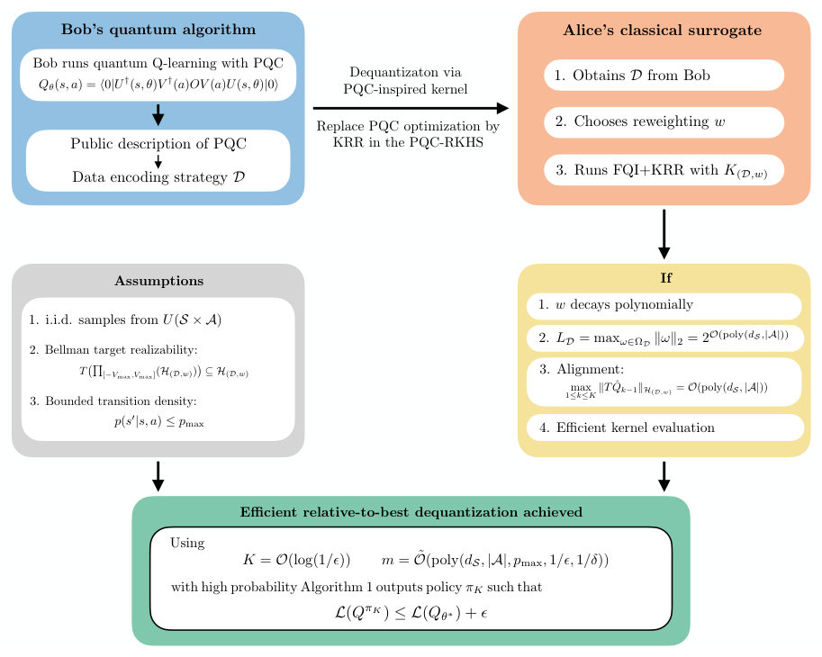 
Figure 1: A summary of the dequantization algorithm proposed and analyzed in this work. Specifically, we prove that if the assumptions shown above are met, and the reweighting vector 𝑤and data encoding strategy satisfies the identified sufficient conditions, then Algorithm 1 provides an efficient relative-to-best dequantization of quantum Q-learning, in the setting in which one assumes access to a uniform generative model.

📷 Fig 2

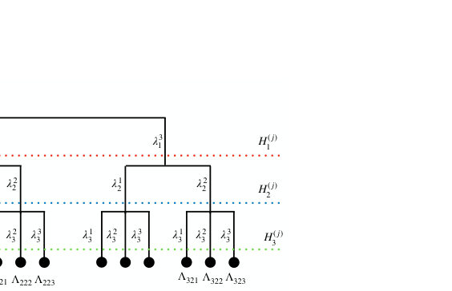 
Figure 2: Construction of the frequency set ̃Ω(𝑗) from the data-encoding strategy (𝑗).

**Summary.** This paper tackles the theoretical question of whether Quantum Q-learning offers a true quantum advantage by developing a surrogate-based dequantization program. By restricting the problem to a simplified sampling regime, the authors prove that classical kernel methods can effectively mimic the quantum performance under specific structural conditions. This work provides rigorous theoretical bounds on the potential quantum advantage in reinforcement learning.

**Why it may be interesting.** While focused on RL, the theoretical framework of dequantization—determining when quantum computational advantages are merely artifacts of model expressivity rather than fundamental physical speedups—is highly relevant to understanding the limits of quantum algorithms in general.

Detailed structure

**Main problem.** The paper investigates whether quantum reinforcement learning algorithms, specifically Quantum Q-learning, can be theoretically matched in performance by efficient classical algorithms (dequantization).

**Main result.** Under a simplified setting (uniform generative model), the authors provide finite sample guarantees showing that classical kernelized Fitted Q-Iteration can provide a meaningful dequantization of Quantum Q-learning, suggesting no exponential quantum advantage in this regime.

**Method.** The core method is surrogate-based dequantization, extending kernel-based techniques from supervised learning to the reinforcement learning setting using classical kernelized Fitted Q-Iteration (FQI).

**Model / system.** The model is Quantum Reinforcement Learning (RL), where Parameterized Quantum Circuits (PQCs) act as function approximators for the Q-function. The analysis is simplified by assuming access to uniformly random state-action samples.

**Key observables.** The primary observable is the performance gap between the quantum and classical approaches, quantified by relative dequantization bounds ($	ext{Loss}[h_c] \le 	ext{Loss}[h_q] + \epsilon$).

**Important parameters / regimes.** The analysis is restricted to the simplified setting of a uniform generative model, and the results depend on sufficient conditions related to the kernel and PQC structure.

**Assumptions / limitations.** The rigorous guarantees are conditional on identifying sufficient structural conditions relating the data-encoding strategy, the classical kernel, and the problem structure.

**Paper structure.** The paper progresses by defining dequantization notions, reviewing the RL/Q-learning context, introducing PQCs, simplifying the setting to uniform sampling, developing the classical kernelized FQI algorithm, and finally proving finite sample guarantees and sufficient conditions for dequantization.

Abstract

In recent years, the utility of parameterized quantum circuits as function approximators has been widely studied. In the context of reinforcement learning, this approach has led to variational quantum algorithms such as quantum Q-learning. While these methods show promising empirical results, and can provide provable advantages for artificial problems, it remains unclear whether they can provide a provable quantum advantage over classical approaches for problems of practical relevance. A natural way to investigate this question is through the lens of dequantization: The construction of efficient classical algorithms capable of matching the performance of quantum variational methods. Building on recent kernel-based dequantization results for supervised learning, we take steps towards extending this surrogate-based dequantization program to reinforcement learning. Specifically, we study the simplified setting of reinforcement learning with a uniform generative model in which uniformly random state-action samples are available, which models the regime of sampling from a large experience replay buffer after sufficient exploration. Within this setting, we provide finite sample guarantees for classical kernelized Fitted Q-Iteration, with classical kernels designed to match the inductive bias of particular parameterized quantum circuits. Using these results, we then provide a set of sufficient conditions, on the data-encoding strategy of a parameterized quantum circuit, the corresponding classical kernel, and the problem structure, under which kernelized Fitted Q-Iteration provides a meaningful dequantization of quantum Q-learning, in this simplified setting. Apart from providing rigorous dequantization guarantees when these conditions are met, these results also motivate the use of kernelized fitted Q-iteration as a dequantization heuristic when these sufficient conditions cannot be verified.

[↑ back to top](#top)

### [TSS Graphs for Hadamard Matrices: Real vs Complex](http://arxiv.org/abs/2609.16813v1)

**Authors:** Wesley Lewis, Darsh Pareek, Ravi Janjam  
**Type:** theory · **Category:** quantum information and computing · **PDF:** <https://arxiv.org/pdf/2609.16813v1>  
**Analysis basis:** full PDF text, analyzed in chunks

📷 Fig 1

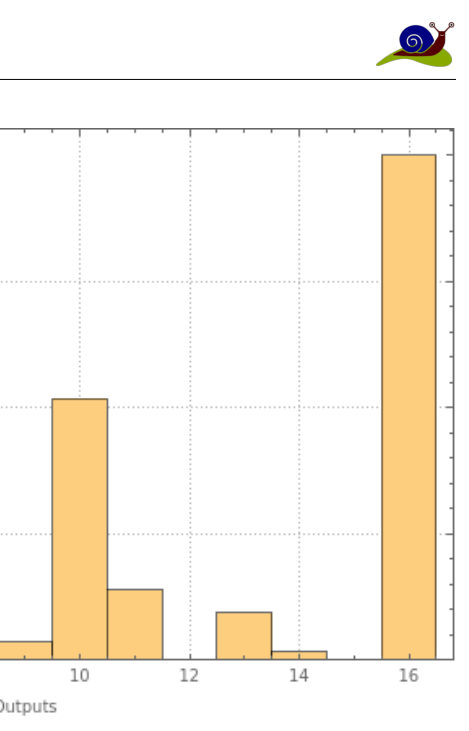 
Figure 1: Frequency plot of outputs in MS002

📷 Fig 2

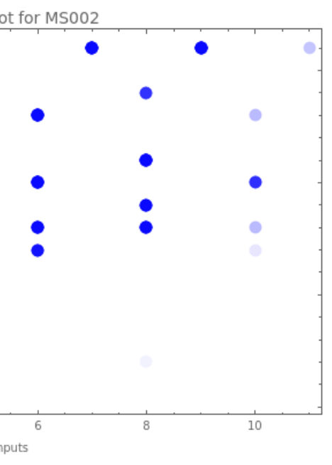 
Figure 2: Scatter plot for no. of inputs vs no. of outputs

📷 Fig 3

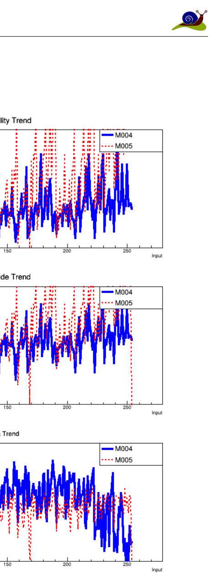 
Figure 3: Trend comparison between M004, M005

📷 Fig 4

 
Figure 4: Total edge count as a function of the isomorphism class index (ordered by degree polynomial) across matrices M002, M003, M004, M008, and M009.

📷 Fig 5

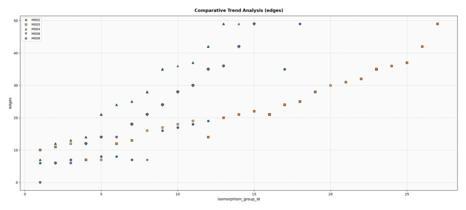 
Figure 5 tracks the distribution of self-loops across the 97 isomorphism classes derived from matrix M011. While local oscillations are prevalent across adjacent classes—such as fluctuations between 0 and 4 self-loops within the first 30 classes—the macro-level envelope shifts upward, reaching a plateau around 4–6 self-loops across intermediate classes (indices 35–80) before terminating at a peak of 11 self-loops at class index 97.

**Summary.** This work analyzes the graph-theoretic structure of quantum state superpositions generated by Hadamard matrices. By examining how these matrices map input states to output states, the authors show that superpositions yield non-uniform probabilities useful for quantum algorithms. The study maps these quantum processes onto graph invariants, revealing deep, predictable structural patterns that could guide future quantum circuit design.

**Why it may be interesting.** The findings provide a novel, graph-theoretic approach to understanding quantum gate behavior, suggesting that structural symmetries inherent in Hadamard matrices can guide the development of quantum algorithms for amplitude amplification.

Detailed structure

**Main problem.** The paper investigates the topological structure of superpositions (TSS) generated by real and complex Hadamard matrices, particularly when moving beyond single-input states.

**Main result.** Superposed combinations of input states generate non-uniform probabilities, which is significant for amplitude amplification without manual parameterization like Grover's operator. Furthermore, the resulting TSS graphs partition into uniquely sized isomorphism classes.

**Method.** The authors model the input-output state mappings using graph theory under the TSS framework, analyzing graph invariants and topological properties.

**Model / system.** The system utilizes Hadamard matrices (real or complex) acting as quantum gates on qubits. The analysis focuses on the resulting graph structure derived from the state transitions.

**Key observables.** Graph invariants such as degree polynomials, total edge count, number of strongly connected components (|SCC|), and simple cycle counts.

**Important parameters / regimes.** The matrix dimension ($n$) and the superposition degree (number of non-zero entries in the input state vector).

**Assumptions / limitations.** The analysis is computationally limited, often restricted to Hadamard matrices of order 8 or 16 due to the large number of permutations.

**Figures summary.** Figures illustrate frequency observations, comparisons of state transitions and interference permutations, and trend analyses of graph invariants (like edge count and SCCs) across different isomorphism classes and input dimensions.

**Paper structure.** The paper progresses by first establishing the physical model (Hadamard gates) and the mathematical framework (TSS graphs). It then analyzes graph invariants and structural properties, comparing real versus complex matrices, and concludes by discussing the potential for developing quantum algorithms based on these structural insights.

Abstract

We have observed that Hadamard matrices whether real or complex lead to a dense output of identical probabilities for any given single input state. Complex Hadamard matrices have unusual orders and introduce phase which prove useful when controlled phase transformation gates are used. By taking a superposed combinations of input states, we discovered that the Hadamards generate non-uniform probabilities which is practically significant towards amplitude amplification without the need for manual parameterization like Grover's operator~\cite{grover1996}. A variety of graph theoretic properties are applied to TSS graphs and their trends were explored. Additionally, graphs turn out to be nearly isomorphic for the same set of input states which has potential applications for developing Quantum Algorithms.   Keywords: Quantum Algorithms, Hadamard Matrices, Unitary Matrix Approach, Topological Structure of Superpositions (TSS), Graph Theory

[↑ back to top](#top)

### [Unconditional Security of Discrete-Modulated CV-QKD from Infinite-Dimensional MEAT](http://arxiv.org/abs/2609.16105v1)

**Authors:** Lars Kamin, Ian George, John Burniston, Florian Kanitschar  
**Type:** theory · **Category:** quantum information and computing · **PDF:** <https://arxiv.org/pdf/2609.16105v1>  
**Analysis basis:** full PDF text, analyzed in chunks

📷 Fig 1

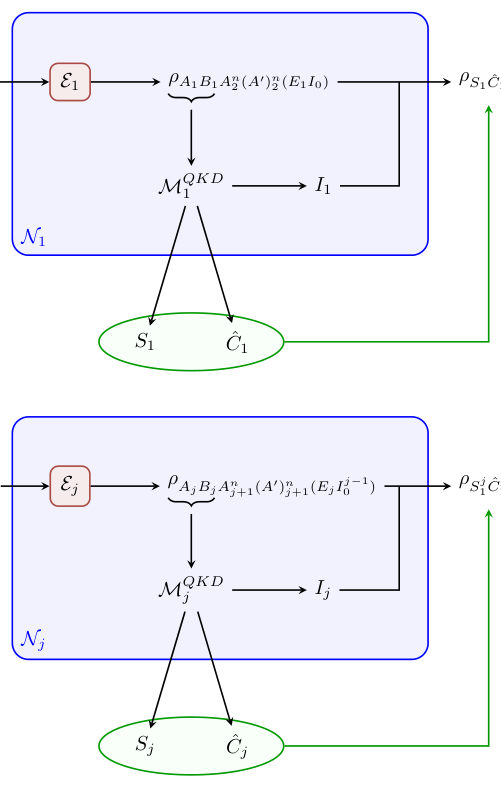 
Figure 1. Schematic representation of the concatenated channel structure underlying the security proofs for fixed- and variable- length of Theorems 10 and 11.

📷 Fig 2

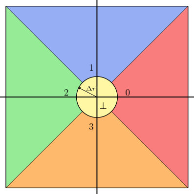 
Figure 2. QPSK key map with radial postselection. Measure- ment outcomes in the shaded areas are assigned the corre- sponding logical value. Outcomes in the central postselection region are discarded (assigned the value ⊥).

📷 Fig 3

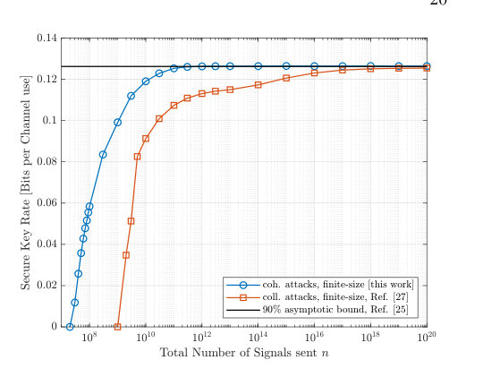 
Figure 3. Secure key rates over the total number of signals sent (n). We fix the transmission distance to L = 10km, corresponding to 2dB of loss, the coherent state amplitude αcoh = 0.90, and the radial postselection parameter ∆r = 0.45 and compare our coherent attack finite-size key rates with the asymptotic rates of Ref. [25] and the collective attack finite- size key rates of Ref. [27].

📷 Fig 4

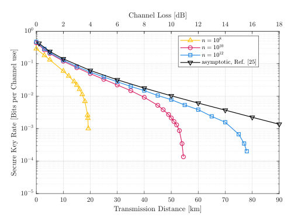 
Figure 4. Secure key rates over transmission distance L in km (channel loss in dB) compared to the asymptotic key rates from Ref. [25]. Here, we assumed optimal detectors. Each key rate point was optimised over the Rényi parameter α, the coherent state amplitude αcoh, and the radial postselection parameter ∆r.

📷 Fig 5

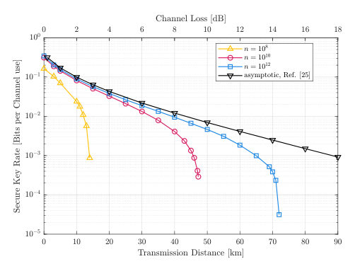 
Figure 5. Secure key rates over transmission distance L in km (channel loss in dB) for trusted, non-ideal parameters with ηdet = 0.72 and νel = 0.04 compared to the asymptotic key rates from Ref. [25]. Each key rate point was optimised over the Rényi parameter α, the coherent state amplitude αcoh, and the radial postselection parameter ∆r.

**Summary.** This paper resolves a long-standing security gap in Discrete-Modulated CV-QKD by providing the first complete composable finite-size security proof against coherent attacks. The authors introduce the iMEAT theorem and a dimension-reduction technique to handle infinite-dimensional security bounds. This breakthrough places CV-QKD on a rigorous security footing, paving the way for practical quantum key distribution deployment.

**Why it may be interesting.** This work provides a crucial theoretical underpinning for practical quantum communication, directly impacting the feasibility of deploying CV-QKD systems.

Detailed structure

**Main problem.** To establish the first complete composable finite-size security proof for Discrete-Modulated (DM) Continuous-Variable (CV) Quantum Key Distribution (QKD) against coherent attacks.

**Main result.** The authors provide a rigorous security proof that recovers known asymptotic key rates and achieves positive key rates beyond 70km for experimentally relevant parameters.

**Method.** The proof introduces the infinite-dimensional marginal-constrained entropy accumulation theorem (iMEAT) and a dimension-reduction technique to make the infinite-dimensional security bounds numerically tractable.

**Model / system.** The work analyzes the DM CV-QKD protocol, which uses discrete modulation while maintaining compatibility with telecom infrastructure, and its security against coherent eavesdropping attacks.

**Key observables.** Composable secure key rate, conditional Rényi entropy, trace distance.

**Important parameters / regimes.** Error verification parameter ($\epsilon_{EV}$), privacy amplification parameter ($\epsilon_{PA}$), block size, distance (e.g., >70km).

**Assumptions / limitations.** The proof accounts for imperfect detectors and both fixed- and variable-length protocol variants, overcoming previous limitations regarding collective attacks or specific modulation formats.

**Figures summary.** The notes mention that Section VIII will show plots of achievable secure key rates.

**Paper structure.** The paper details the general DM CV-QKD protocol, introduces the iMEAT theorem and its proof, applies iMEAT to prove security for fixed- and variable-length variants, and concludes with the dimension reduction argument.

Abstract

Discrete-Modulated (DM) Continuous-Variable (CV) Quantum Key Distribution (QKD) is an experimentally attractive approach to quantum cryptography, offering high key rates over metropolitan-scale distances while relying on state-of-the-art telecom infrastructure. However, a fundamental gap has remained between this experimental promise and rigorous security: for more than two decades, DM CV-QKD has lacked a complete composable finite-size security proof against coherent attacks. Existing works either restrict the adversary to collective attacks, impose additional finite-dimensional assumptions, apply only to specific modulation formats, or fail to recover the known asymptotic rates. Here, we resolve this longstanding problem by establishing the first complete composable finite-size security proof for DM CV-QKD protocols against coherent attacks, incorporating imperfect detectors and both fixed- and variable-length protocol variants. Our proof introduces two central results of broader interest: an infinite-dimensional marginal-constrained entropy accumulation theorem (iMEAT) and a rigorous dimension-reduction technique that makes the infinite-dimensional security bounds numerically tractable. The resulting key rates recover the known asymptotic rates and outperform established finite-size bounds based on collective attacks, while yielding positive key rates beyond $70$km for experimentally relevant block sizes and parameters. Thus, our work closes a longstanding gap and places an experimentally attractive class of CV-QKD protocols on a rigorous composable security footing and provides a pathway towards their practical deployment.

[↑ back to top](#top)

### [Utility-Based Path Selection and Configuration in Quantum Networks via Layered Shortest Paths](http://arxiv.org/abs/2609.16198v1)

**Authors:** Leonardo Bacciottini, Subhransu Maji, Don Towsley, Gayane Vardoyan  
**Type:** theory · **Category:** quantum information and computing · **PDF:** <https://arxiv.org/pdf/2609.16198v1>  
**Analysis basis:** full PDF text, analyzed in chunks

📷 Fig 1

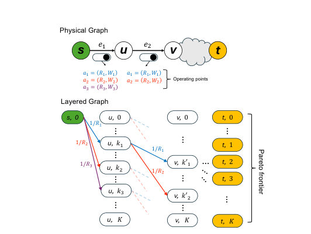 
Fig. 1. Example of a physical and its associated layered graph. In the example, the edge e1 has three operating points a1, a2, a3. In the layered graph, these correspond to three edges from (s, 0) to (u, k1), (u, k2), (u, k3), where ki = ⌈−ln Wi/∆⌉with edge cost 1/Ri respectively. The edge e2 between u–v has instead two operating points, and thus each (u, k) vertices in the layered graph have two outgoing edges corresponding to the offsets k′ = ⌈k −ln Wi/∆⌉and weights 1/Ri. This construction applies to all edges and operating points of the physical graph. QLSP finds the shortest path from (s, 0) to all (t, k) nodes, with 0 ≤k ≤K. In so doing, it finds the highest-rate path for all feasible...

📷 Fig 2

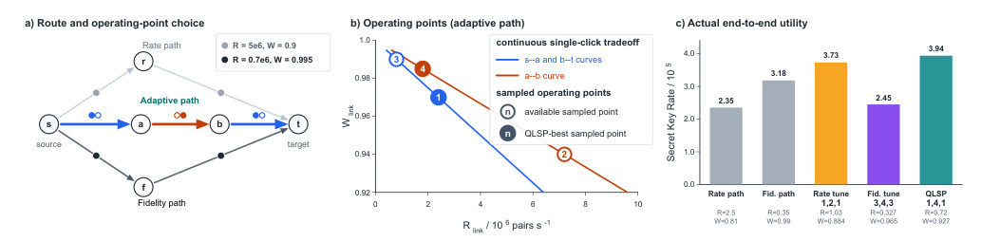 
Fig. 2. Illustration of our framework on a small network with route and operating-point choices. (a) The source s and destination t are connected by a rate-seeking path (top), a fidelity-seeking path (bottom), and an adaptive path (middle) whose links have two operating points (the two circles above each edge). (b) The operating points on the adaptive path are drawn from linear tradeoff curves, compatible with the single-click scheme. Points 1, 2 are rate-seeking points, while points 3, 4 are fidelity-seeking points; filled markers denote the best points with respect to BB84 utility. (c) End-to-end SKR utility for five candidate solutions. Rate-seeking choices lose too much fidelity, while...

📷 Fig 3

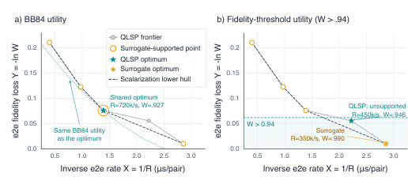 
Fig. 3. Limits of scalarized routing under non-convex utilities. The panels show the attainable end-to-end configurations in inverse-rate/fidelity- loss space; the black dashed line is the lower convex hull reachable through surrogate scalarization. (a) For BB84 SKR, the optimum is supported, and the surrogate baseline matches QLSP. (b) Imposing the non-convex fidelity requirement W &gt; .94 moves the optimum to an unsupported Pareto point. QLSP selects this configuration, whereas the surrogate is restricted to a sub- optimal, hull-supported solution.

📷 Fig 4

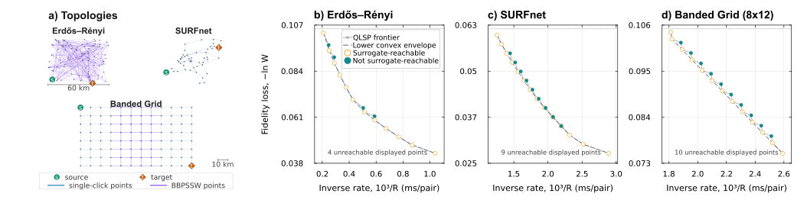 
Fig. 4. (a) Three topologies used in the evaluation. (b,c,d) The rate–fidelity frontier returned by QLSP on the three topologies. In all cases, there are frontier points (green circles) that are inside the lower convex hull and cannot thus be found by the surrogate sweep. For single click operating points, we use A = 21.

📷 Fig 5

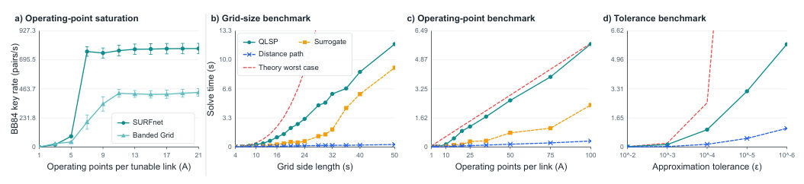 
Fig. 5. Operating-point resolution and runtime benchmarks. (a) Expected BB84 secret key rate returned by QLSP as the number of single-click operating points A increases; BBPSSW menus remain fixed. Results average 50 sampled pairs for the banded grid and 48 for SURFnet. Runtime is measured on square grids as a function of (b) grid side s, with A = 25 and ε = 10−3; (c) A, with s = 16 and ε = 10−3; and (d) ε, with s = 8 and A = 25. Runtime experiments use negativity utility. Error bars are 95% confidence intervals, with 32 timed runs per runtime point. Red curves evaluate the worst-case complexity as in § IV-B0b and are scaled as upper envelopes of the QLSP measurements. The surrogate is...

**Summary.** This work tackles the complex optimization of quantum network routing by jointly selecting paths and tuning link parameters to maximize a utility function of rate and fidelity. It introduces a layered graph shortest-path algorithm that accurately maps the achievable rate-fidelity frontier. This method is crucial because it handles non-additive resource composition, outperforming simpler linear optimization techniques.

**Why it may be interesting.** It provides a rigorous algorithmic framework for optimizing complex, non-additive resource trade-offs (rate vs. fidelity) in quantum communication, which is central to quantum networking research.

Detailed structure

**Main problem.** The paper addresses the joint optimization problem of selecting a path and configuring link-level settings in quantum networks to maximize a utility function of end-to-end entanglement rate and fidelity.

**Main result.** A layered graph approach (QLSP) is developed that computes the full rate-fidelity Pareto frontier, providing an FPTAS for certain utility functions, unlike simpler scalarization methods.

**Method.** The problem is mapped onto a shortest path computation on a layered graph, where layers discretize the fidelity, and edge costs track the rate, allowing for the recovery of non-linearly combined performance metrics.

**Model / system.** The model is a quantum network distributing entanglement via repeaters, where link performance is characterized by a rate and a Werner state fidelity, which compose non-additively across the path.

**Key observables.** End-to-end entanglement rate ($R$), Fidelity ($F$), and the Werner parameter ($W$).

**Important parameters / regimes.** Discretization width ($\Delta$) for fidelity, and the number of hops/layers ($L$).

**Assumptions / limitations.** The analysis assumes Werner states at the elementary link level and relies on fidelity discretization, which introduces approximation guarantees.

**Figures summary.** Figures illustrate the comparison between the QLSP optimum, the best surrogate solution, and the lower convex envelope in the rate-fidelity plane, demonstrating the non-convexity of the global achievable set.

**Paper structure.** The paper first establishes the joint optimization problem, then introduces the layered graph formulation (QLSP) to compute the Pareto frontier. It contrasts this with scalarization methods, and finally analyzes the limitations regarding time multiplexing and continuous operating points.

Abstract

A path in a quantum network is a chain of repeaters that distributes entanglement between two users. Selecting a path requires balancing the rate and quality (e.g., fidelity) of the delivered entanglement, but these quantities, unlike standard routing metrics, compose non-additively. The problem is compounded by link-level configuration choices (e.g., distillation rounds or emitter brightness tuning), each trading rate against fidelity, so that a path's performance depends jointly on its route and its per-link settings. We cast this joint path selection and configuration problem as a shortest path computation on a layered graph whose layers track discretized end-to-end fidelity. A single run returns the full rate fidelity Pareto frontier, from which the path maximizing any nondecreasing utility function of rate and fidelity can be selected. We prove that for certain utility functions (including the secret key rate of BB84), the method is a fully polynomial time approximation scheme, returning a near-optimal path within a specified tolerance. We further characterize exactly when cheaper scalarization-based routing suffices: it is optimal for utility functions with convex fidelity profiles, but can be arbitrarily suboptimal otherwise (e.g., for step-like, sigmoidal utilities), whereas the layered method remains reliable in all cases.

[↑ back to top](#top)

## Secondary cond-mat archives

*Papers from  mes-hall, other, soft, supr-con. These archives are de-prioritized — they appear at the end regardless of relevance score.*

### Relevant in secondary archives (11)

### [Room-temperature 1/3 suppression of diffusive shot noise](http://arxiv.org/abs/2609.16783v1)

**Authors:** Henri Vo Van Qui, Ignacio Madrid, Simon Grall, Thibaut Jonckheere, Akira Fujiwara, Laurent Jalabert, Masayuki Hashisaka, Christophe Demaille, Soo Hyeon Kim, Nicolas Clément  
**Type:** both · **Category:** statistical mechanics · **PDF:** <https://arxiv.org/pdf/2609.16783v1>  
**Analysis basis:** full PDF text, analyzed in chunks
**Topic relevance:** 🔥 `Full counting statistics` **4/5** · `Keldysh / 2PI / non-Gaussian methods` **1/5** · `methods for driven-dissipative` **1/5** · `quantum measurements` **1/5**

📷 Fig 1

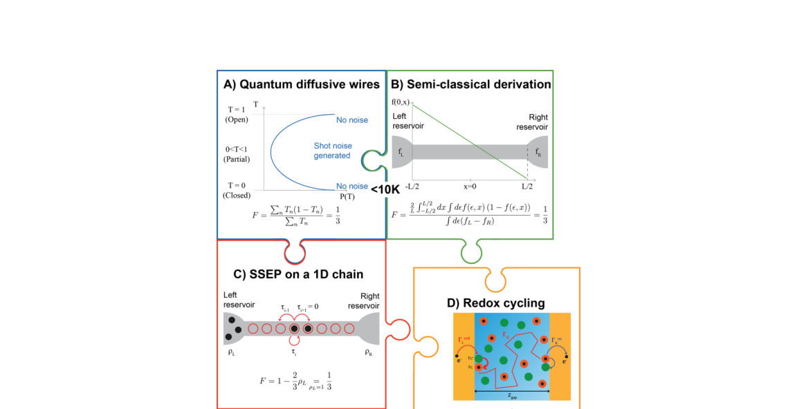 
Fig. 1. The three theories for universal 1/3 shot noise suppression and the proposed missing element. (A) Quantum scattering in a diffusive wire in cryogenic conditions, T is the transmission probability of an electron for a given conduction channel and 𝑃(𝑇) its distribution. (B) Semi-classical Boltzmann-Langevin kinetics. 𝑓(𝜀, 𝑥) is the occupation at energy 𝜀 and position 𝑥. 𝑓𝐿 and 𝑓𝑅 are the reservoir Fermi functions. (C) Symmetric simple exclusion process along a 1D chain. 𝜌𝐿 and 𝜌𝑅 are the probability densities of the left and right reservoir. (D) Redox cycling in a microgap at room temperature.

📷 Fig 2

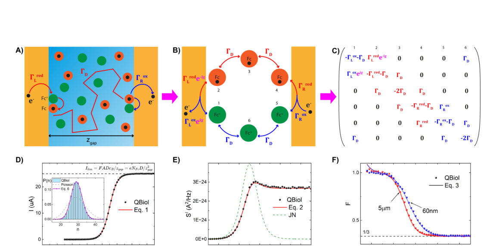 
Fig. 2. Full counting statistics electrochemical noise model. (A) Schematic representing the Fc molecules diffusing inside a microgap between two electrodes. (B) Discretized model (𝑁= 3) illustrating the electronic transfer and diffusion rates. (C) Equivalent rates matrix derived from the discretized model. (D) Theoretical current calculated from the rates matrix compared with the digital twin experiment by QBiol for a gap 𝑧𝑔𝑎𝑝= 5 μm, an electrode area 𝐴= 2 mm2, a concentration 𝑐𝐵= 1 mM and by taking 𝐷= 6.5e-10 m2/s for the diffusion coefficient and 𝑘0 = 0.004 m/s for the heterogeneous rate constant. Inset shows the full counting distribution from QBiol, fitted with Equation 6 (purple...

📷 Fig 3

 
Fig. 3. Boltzmann-Langevin analytical model for the electrochemical noise. Analytical oxidized (blue line) and reduced (dashed red line) profiles along the gap for redox cycling in the Nernstian case. The orange line is the occupancy/noise kernel 𝜌(𝑧)(1 −𝜌(𝑧)). In this formalism, F is the ratio of the orange to the blue areas. (A) 𝜌𝑜𝑥

📷 Fig 4

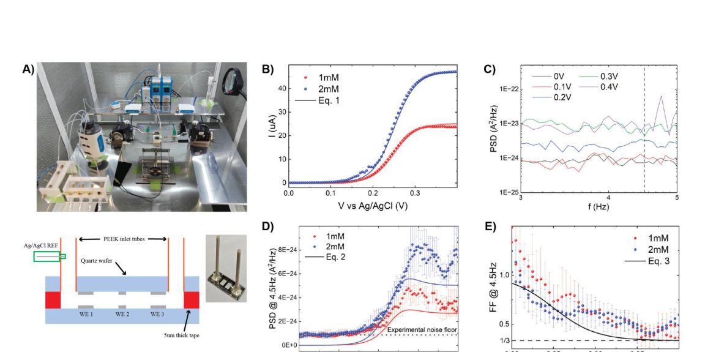 
Fig. 4. Room temperature redox cycling current and noise experiment. (A) Picture of the experimental setup combining microfluidics and noise measurement, schematic and picture of the micro gaped device. (B) Experimental redox cycling current obtained with the same parameters as Fig. 2D-F at two different concentrations of Fc(MeOH)2 and compared to the analytical model (Eq. 1) for 1 mM (solid red line) and 2 mM (solid blue line). (C) Noise spectrum for 2mM Fc(MeOH)2. (D) Experimental power spectral density noise at 4.5Hz compared to the analytical model (Eq. 2) for 1 mM (solid red line) and 2 mM (solid blue line). (E) Experimental Fano factor at 4.5 Hz compared with the...

**Summary.** This work demonstrates the universal $1/3$ suppression of shot noise, a signature of diffusive conductors, using a room-temperature redox-cycling system. By combining advanced theoretical tools like Full Counting Statistics with microfluidic measurements, the authors bridge mesoscopic physics and electrochemistry. This opens a new avenue for studying quantum transport phenomena at ambient conditions.

**Why it may be interesting.** It provides a concrete, room-temperature platform to observe a fundamental mesoscopic quantum transport signature ($F=1/3$), bridging the gap between quantum theory and practical electrochemistry.

Detailed structure

**Main problem.** The paper investigates the universal suppression of shot noise ($F=1/3$) in diffusive conductors, a phenomenon previously limited to cryogenic experimental conditions.

**Main result.** The universal $1/3$ shot noise suppression is successfully recovered at room temperature using a molecular redox-cycling system in a microfluidic gap.

**Method.** The analysis combines theoretical derivations using Full Counting Statistics (FCS) and solving Partial Differential Equations (PDEs) with experimental measurements on the noise spectrum.

**Model / system.** The system is a redox-cycling process involving ferrocene in a microfluidic gap, modeled using a discrete N-site approach and analyzed via rate matrix methods derived from quantum transport concepts.

**Key observables.** Fano factor ($F$), current ($I$), and noise spectral density ($S_I(V)$).

**Important parameters / regimes.** Room temperature operation, diffusion-limited regime, Nernstian regime, and the universal value $F=1/3$.

**Assumptions / limitations.** The analysis assumes the electrolyte high ionic strength screens electrostatics, allowing molecules to be treated as independent entities.

**Figures summary.** Figures show theoretical derivations confirming $F=1/3$ from various models, and experimental/simulation results confirming $S_I(V)$ and $F(V)$ approaching $1/3$ in the diffusion-limited regime.

**Paper structure.** The paper progresses from establishing the theoretical universality of $F=1/3$ (using FCS/SSEP) to applying this framework to a novel room-temperature electrochemical platform (redox cycling), confirming the theoretical predictions via simulation and experiment.

Abstract

Diffusive conductors share a universal shot noise reduction of 1/3. This result can be obtained from quantum scattering, Boltzmann-Langevin kinetics, or by symmetric simple exclusion process, but experiments have been limited to cryogenic conditions and the understanding of this universality remains incomplete. Here we show that ferrocene redox cycling in a microfluidic gap is room temperature realization of this universality. An analytical model of the current and its noise is derived and confirmed experimentally. The universal 1/3 shot noise suppression is recovered in the diffusion-limited regime, providing a bridge between mesoscopic physics and electrochemistry, opening a new route for probing molecular dynamics through room-temperature noise measurements.

[↑ back to top](#top)

### [Current - voltage characteristics in magnetic field for layered superconductor with intrinsic pinning of Josephson vortices](http://arxiv.org/abs/2609.16277v1)

**Authors:** T. B. Charikova, V. N. Neverov, M. R. Popov, S. D. Popov, N. G. Shelushinina, A. A. Ivanov  
**Type:** experiment · **Category:** strongly correlated electrons · **PDF:** <https://arxiv.org/pdf/2609.16277v1>  
**Analysis basis:** full PDF text, analyzed in chunks
**Topic relevance:** `analog quantum simulation` **3/5** · `non-equilibrium universality` **3/5** · `correlated / nonlocal dissipation` **2/5** · `driven-dissipative phase transition` **2/5** · `Frenkel-Kontorova` **1/5** · `Keldysh / 2PI / non-Gaussian methods` **1/5** · `methods for driven-dissipative` **1/5** · `quantum measurements` **1/5**

📷 Fig 1

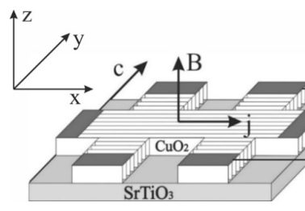 
Fig. 1 Schematic representation of the films studied

📷 Fig 2

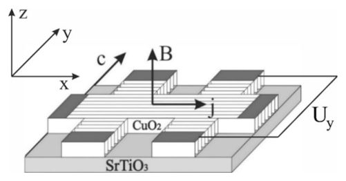 
Figure 2 shows the сurrent-voltage (CV) characteristics 𝑗𝑗(𝑈𝑈𝑦𝑦) in a sample of Nd2-xCexCuO4

📷 Fig 3

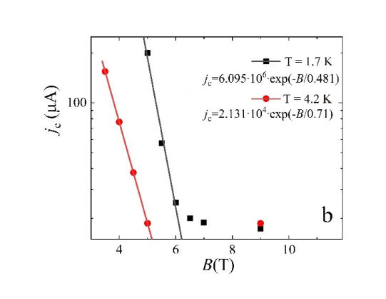 
Fig. 3 (a) CV characteristics at the Hall contacts in a magnetic field of B = - 9 T and -5.5 T at

📷 Fig 4

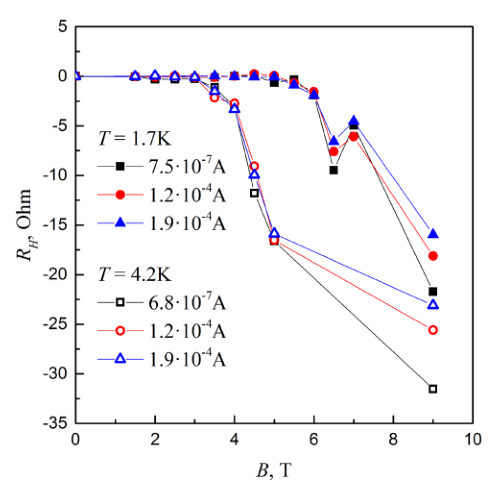 
Fig. 5 Dependences of Hall resistance, 𝑅𝑅𝐻𝐻, on the magnetic field for fixed values of j after

📷 Fig 5

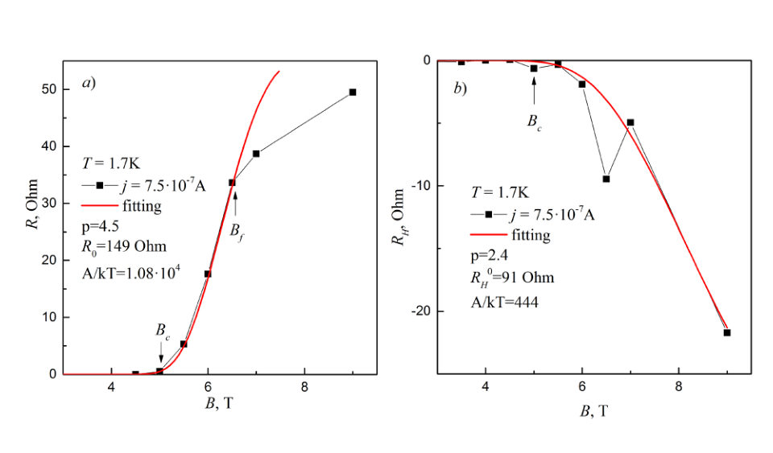 
Fig. 6. The results for the description of experimental dependencies (a) of magnetoresistance

**Summary.** This paper experimentally measures the current-voltage characteristics of a layered high-temperature superconductor to study Josephson vortex motion. Key findings include establishing an exponential dependence for the critical depinning current and mapping the transition from flux creep to flux flow regimes. This work provides detailed insights into pinning mechanisms crucial for superconducting applications.

**Why it may be interesting.** The study of vortex dynamics and pinning in HTSCs provides a complex, non-equilibrium many-body problem that shares conceptual links with understanding energy dissipation and collective excitations in strongly correlated quantum materials.

Detailed structure

**Main problem.** The study investigates the current-voltage characteristics and vortex dynamics in layered high-temperature superconductors under the influence of intrinsic pinning.

**Main result.** The critical depinning current for Josephson vortices exhibits an exponential dependence on the magnetic field, contrasting with the power law behavior seen for Abrikosov vortices.

**Method.** Measurements of the transverse voltage ($U_y$) in the Hall configuration were performed on epitaxial films using varying electric and magnetic fields.

**Model / system.** The physical system is epitaxial films of the layered superconductor Nd2-xCexCuO4/SrTiO3, focusing on the motion of Josephson vortices across CuO2 layers along the c-axis.

**Key observables.** Transverse voltage ($U_y$), critical depinning current ($j_{cc}(B)$), magnetoresistance ($R(B)$), and Hall resistance ($R_H(B)$).

**Important parameters / regimes.** Magnetic fields up to 9 T, helium temperatures (1.7 K and 4.2 K), and the crossover field ($B_{ff}$) separating flux creep and flux flow regimes.

**Assumptions / limitations.** The analysis assumes the intrinsic pinning mechanism dominates vortex dynamics, and the flux motion can be modeled using thermally activated flux-creep theory.

**Figures summary.** Figures illustrate the current-voltage (j vs U_y) characteristics and the magnetoresistance/Hall resistance dependence on the magnetic field.

**Paper structure.** The paper analyzes the CV characteristics, derives $R(B)$ and $R_H(B)$, models the flux creep regime using empirical fits, and discusses the transition to the flux flow regime.

Abstract

The results of measurements of the transverse voltage in the Hall configuration, Uy, under conditions of motion of the charge and vortex subsystems in orhtogonal magnetic and electric fields on epitaxial films of the layered high-temperature superconductor Nd2-xCexCuO4 are presented. the motion of Josephson vortices across CuO2 layers (along the c-axis) is analyzed considering the effects of intrinsic pinning. An exponential dependence of critical depinning current jc(B) for Josephson vortices is established in contrast to the power law dependences for Abrikosov vortices. With increasing external magnetic field after the depinning by a magnetic field at B=Bc, the onset of the vortex creep regime, which evolves into the flux-flow regime at crossover field B=Bf, is observed.

[↑ back to top](#top)

### [Self-balancing luminescence kinetics of charged excitons in WS$_2$ monolayer](http://arxiv.org/abs/2609.17289v1)

**Authors:** A. I. Veretennikov, A. I. Galimov, M. M. Glazov, T. V. Shubina  
**Type:** both · **Category:** other · **PDF:** <https://arxiv.org/pdf/2609.17289v1>  
**Analysis basis:** full PDF text, analyzed in chunks
**Topic relevance:** `driven-dissipative phase transition` **3/5** · `methods for driven-dissipative` **3/5** · `Keldysh / 2PI / non-Gaussian methods` **2/5** · `non-equilibrium universality` **2/5** · `quantum measurements` **2/5** · `analog quantum simulation` **1/5** · `correlated / nonlocal dissipation` **1/5**

📷 Fig 1

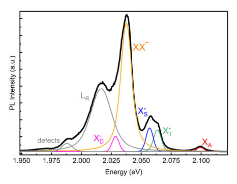 
FIG. 1. µ-PL spectrum of a monolayer WS2. The black curve shows experimental data; the color peaks represent decompo- sition of the overall spectra into individual excitonic species contributions with the following notations: XA - bright exci- ton, XS/T - intra- and intervalley bright trion, XX−- charged biexciton, X− D - dark trion, LR - phonon replicas.

📷 Fig 2

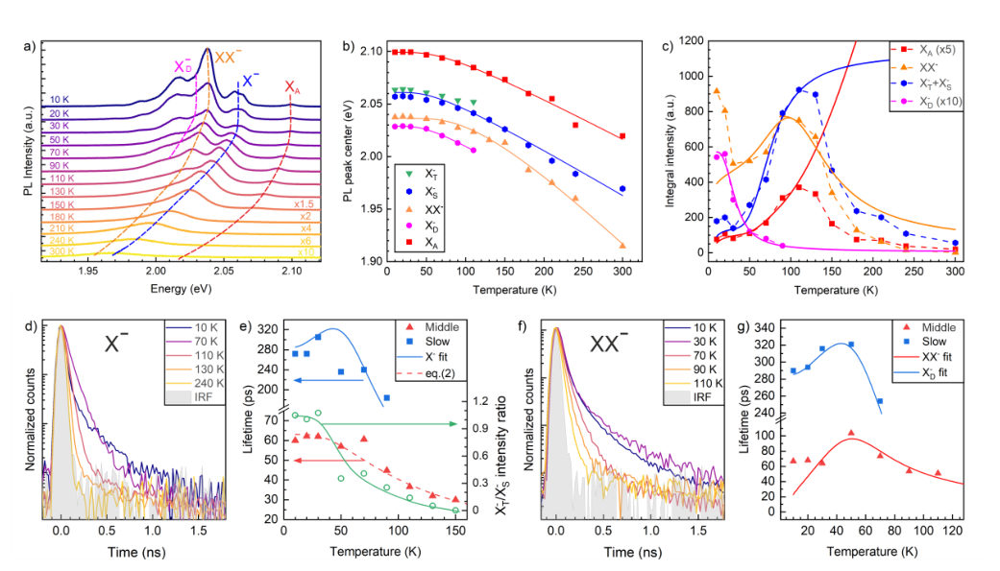 
FIG. 2. a) µ-PL spectra of the WS2 monolayer measured at different temperatures. b) Temperature dependencies of peak energies and c) integrated PL intensities (color symbols) extracted from the spectra in panel (a). Solid lines in (b) show the fit by the model of Ref. [40], while and solid lines in panel c) show the fit by the proposed model. Fitting parameters are given in Tables 1 and 2 in SM. d) Measured PL decay curves for the trion line at different temperatures. e) Characteristic times extracted from the decay curves of the X−line: left axis — middle times (red triangles) and slow lifetimes (blue squares — experiment, blue solid line — model fit); right axis — the integrated intensity...

📷 Fig 3

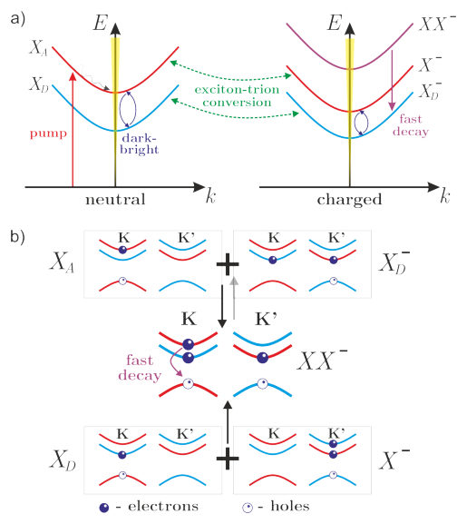 
FIG. 3. a) Scheme of excitonic states taken into account in our model (bottom of all band centered in K −K′ val- ley). Respective excitation and re-population processes are shown by arrows. b) Considered mechanisms of XX−forma- tion (black arrows) and dissociation (gray transparent arrow), purple arrow depicts fast radiative decay of the XX−. Red (blue) parabolas represent spin-up (-down) sub-bands.

📷 Fig 4

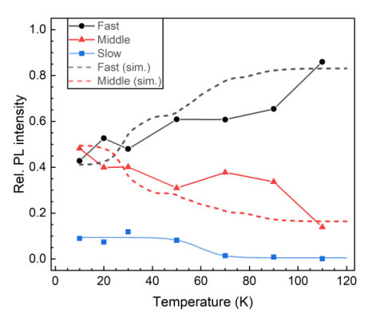 
FIG. 4. The relative contributions of fast (black), middle (red) and slow (blue) to the total luminescence of XX−com- plex. Solid lines with symbols represent the data extracted from TRPL curves fitting, dash curves illustrate impacts ob- tained from model. Light-blue line is shown to guide the eye.

📷 Fig 5

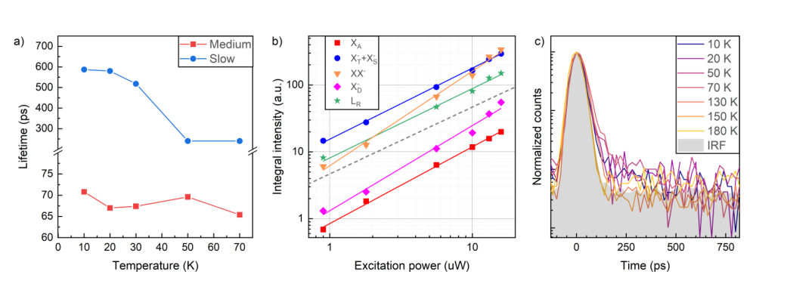 
FIG. 5. a) TRPL data for the LR peak: blue (red) symbols correspond to the slow (middle) lifetime component. b) Laser power dependence of integrated PL intensity of the excitonic complexes under study. Symbols represent the experimental data, while lines represent a power law fit. Grey dashed line represents strictly linear law (α = 1). c) TRPL curves for the XA line emission at different temperatures. Shaded area represents IRF.

**Summary.** This paper analyzes the complex photoluminescence kinetics in WS2 monolayers, showing that exciton emission arises from a single, interacting ensemble of charged and neutral states. By developing and applying a self-consistent rate equation model, the authors successfully reproduce the temperature dependence of the luminescence, revealing crucial roles for dark states in populating and sustaining the bright emission.

**Why it may be interesting.** The work provides a detailed, quantitative framework for modeling open quantum systems in solid-state materials, specifically demonstrating how coupling between different quantum states (dark/bright excitons) dictates macroscopic optical properties.

Detailed structure

**Main problem.** The study investigates the complex, interacting luminescence kinetics of various charged and neutral exciton states within a WS2 monolayer.

**Main result.** The emission is not dominated by single-particle excitons but by an interacting ensemble, where dark trions contribute a long-lived component to the bright trion, and replenishment from dark states promotes intense charged biexciton luminescence.

**Method.** The authors developed and utilized a self-consistent rate equation model, validated by time-resolved photoluminescence (TRPL) measurements across varying temperatures.

**Model / system.** The physical system is a WS2 monolayer, modeled using rate equations that account for single-particle decay, temperature-dependent transitions (e.g., dark-to-bright), and nonlinear processes like biexciton formation.

**Key observables.** Characteristic decay times (fast, middle, slow components) for trions and biexcitons, and the temperature dependence of PL peak energies and intensities.

**Important parameters / regimes.** Temperature range (8 to 300 K), electron density ($\sim 10^{12} 	ext{ cm}^{-2}$), and characteristic timescales (e.g., $200-300 	ext{ ps}$ for dark trion contribution).

**Assumptions / limitations.** The model assumes that the population dynamics of all relevant exciton complexes can be described by coupled rate equations, and that the system is governed by thermal activation processes between states.

**Figures summary.** Figures illustrate the PL spectra decomposition, temperature dependence of peak energies/intensities, and the multi-component decay curves for the trion and biexciton lines.

**Paper structure.** The paper establishes the physical system and measurements (PL/TRPL) by reviewing prior work, develops a comprehensive rate equation model incorporating multiple interacting species, and then uses this model to fit and explain the temperature and time evolution of the observed luminescence kinetics.

Abstract

Two-dimensional tungsten-based transition metal dichalcogenides exhibit a rich emission spectrum with distinct lines of exciton and biexciton states, neutral and charged, which are typically considered as independent entities. Here, we present a study of the emission kinetics of a WS$_2$ monolayer, demonstrating that these states together form a single interacting ensemble, with their population and depletion mutually coordinated with temperature. Dark trions make a long-lived contribution to the bright trion on a time scale of 200-300 picoseconds, and replenishment from dark states promotes intense luminescence of charged biexcitons. The developed self-consistent rate equation model reproduces the temperature dependence of the kinetics well, opening the way to controlling exciton states in such materials.

[↑ back to top](#top)

### [Interplay of dimerization and quasiperiodicity in the superconducting proximity effect of a one-dimensional hybrid ring](http://arxiv.org/abs/2609.17069v1)

**Authors:** Sourav Karmakar, Santanu K. Maiti  
**Type:** theory · **Category:** other · **PDF:** <https://arxiv.org/pdf/2609.17069v1>  
**Analysis basis:** full PDF text, analyzed in chunks
**Topic relevance:** `analog quantum simulation` **3/5** · `Frenkel-Kontorova` **2/5** · `Keldysh / 2PI / non-Gaussian methods` **2/5** · `methods for driven-dissipative` **1/5**

📷 Fig 1

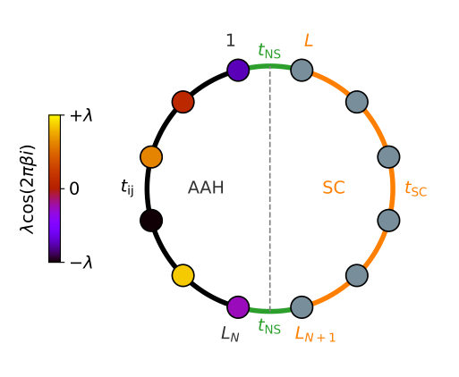 
FIG. 1: (Color online.) Schematic representation of the 1D hybrid ring, consisting of a normal (N) segment of length LN and a superconducting (SC) segment of length LSC = L−LN. The normal region is characterized by nearest-neighbor hop- ping amplitude tij together with a quasiperiodic onsite po- tential of strength λAAH, while the superconducting region is described by a uniform hopping amplitude tSC. In the normal region, different colored sites correspond to sites with corre- lated potentials, as indicated by the color bar. The N and SC regions are coupled through normal-superconductor inter- faces, represented by the dashed vertical line, with a hopping amplitude tNS.

📷 Fig 2

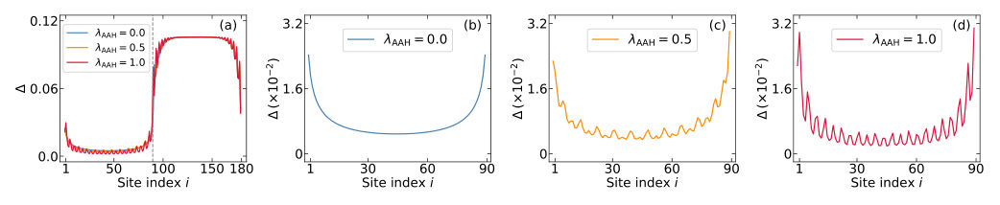 
FIG. 2: (Color online.) Spatial profile of the self-consistently determined pairing amplitude ∆i as a function of the site index i for three distinct values of the quasiperiodic potential strength λAAH. Panel (a) shows the order parameter over the entire hybrid ring for λAAH = 0, 0.5, and 1. Panels (b), (c), and (d) present enlarged views of the normal region for λAAH = 0, 0.5, and 1, respectively, highlighting the evolution of the spatial fluctuations of the induced pairing amplitude with increasing quasiperiodic potential strength. The dashed vertical line indicates the normal-superconductor interface. The system parameters are L = 180, LN = 90, LSC = 90, tN = tSC = tNS = 1, VSC = 1.5, and...

📷 Fig 3

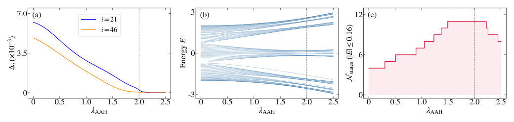 
FIG. 3: (Color online.) (a) Self-consistently determined superconducting order parameter ∆i at two representative sites (i = 21 and i = 46) in the normal region as a function of the quasiperiodic potential strength λAAH. The vertical dashed line at λAAH = 2tN marks the localization transition of the AAH chain. (b) Energy spectrum of the finite AAH chain with LN = 90 sites as a function of λAAH, illustrating the evolution of the eigenstates across the localization transition. (c) Number of quasiparticle states, Nstates, with energies lying within the window [−0.16, 0.16] as a function of λAAH. The remaining system parameters are the same as in Fig. 2.

📷 Fig 4

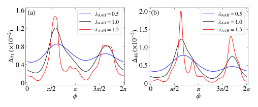 
FIG. 4: (Color online.) Variation of the order parameter ∆i at sites (a) i = 21 and (b) i = 46 as a function of the AAH phase φ ∈[0, 2π] for three distinct values of the quasiperiodic potential strength λAAH = 0.5, 1.0, and 1.5. The remaining system parameters are the same as in Fig. 2.

📷 Fig 5

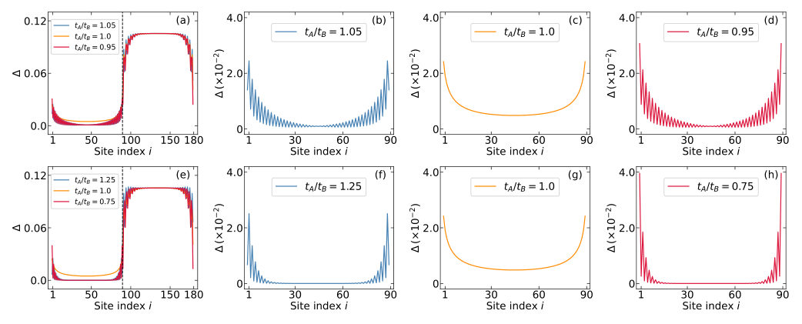 
FIG. 5: (Color online.) Real-space profile of the self-consistently determined superconducting pairing amplitude ∆i as a function of the site index i for different values of the SSH dimerization ratio tA/tB. Panels (a) and (e) show the variation of the order parameter over the entire hybrid ring for the weakly and strongly dimerized cases, respectively. Panels (b) and (d) display enlarged views of the normal region for the weakly dimerized cases with tA/tB = 1.05 and 0.95. Similarly, panels (f) and (h) show the strongly dimerized cases with tA/tB = 1.25 and 0.75. Whereas panel (c) and (g) represent the uniform chain (tA/tB = 1) for comparison. The dashed vertical line indicates the...

**Summary.** This work theoretically examines how superconductivity leaks into a normal metal region embedded in a 1D hybrid ring. By modeling the normal region with both quasiperiodic (AAH) and dimerized (SSH) potentials, the authors show that these two effects act semi-independently yet synergistically to control the superconducting order parameter. The findings provide a versatile theoretical framework for engineering superconducting correlations in complex, low-dimensional quasiperiodic materials.

**Why it may be interesting.** The explicit modeling of proximity effects in quasiperiodic structures connects concepts from topological physics (SSH) and localization theory (AAH) to superconducting phenomena, which is highly relevant for understanding engineered quantum materials.

Detailed structure

**Main problem.** The paper investigates how the superconducting proximity effect in a 1D hybrid ring is controlled by the interplay between lattice dimerization and quasiperiodicity.

**Main result.** Dimerization dictates the oscillatory behavior and penetration depth of the induced pairing, while the quasiperiodic potential enhances spatial inhomogeneity and further reduces the pairing magnitude.

**Method.** The study employs the self-consistent Bogoliubov-de Gennes (BdG) formalism to calculate the superconducting order parameter profile.

**Model / system.** The system is a 1D hybrid ring connecting a spin singlet superconductor to a normal region modeled sequentially by the Aubry-André-Harper (AAH) model, the Su-Schrieffer-Heeger (SSH) chain, and their combination.

**Key observables.** Spatial variation and penetration depth of the proximity-induced pairing amplitude ($\Delta_i$), and the evolution of $\Delta_i$ across localization transitions.

**Important parameters / regimes.** Quasiperiodic potential strength ($\lambda_{AAH}$), dimerization strength (SSH hopping ratio $t_A/t_B$), and the coupling strength ($t_{NS}$).

**Assumptions / limitations.** The analysis is performed at zero temperature and relies on the BdG mean-field approximation.

**Figures summary.** Figure 1 schematically shows the 1D hybrid ring structure. Figure 2 illustrates the spatial profile of the order parameter $\Delta_i$ for varying quasiperiodic potentials.

**Paper structure.** The paper systematically analyzes the system by first considering the AAH model, then the SSH chain, and finally combining both effects in the SSH-AAH model to map out the parameter space.

Abstract

Recent studies of the superconducting proximity effect in quasicrystalline and topological systems have opened up a new research direction for exploring how quasiperiodicity and topology influence proximity induced superconductivity. In this work, we investigate spatial variation of the proximity induced pairing amplitude in a hybrid ring composed of a spin singlet superconductor and a normal region described by three different lattice models using the self-consistent Bogoliubov-de Gennes formalism. We first consider the normal region described by the diagonal Aubry-André-Harper (AAH) model. Increasing the quasiperiodic potential enhances spatial fluctuations in the induced order parameter, while progressively suppressing its magnitude in the normal region. Beyond the localization transition, proximity-induced pairing is strongly diminished due to the localized nature of the underlying electronic states. The normal region is then modeled by the Su-Schrieffer-Heeger (SSH) chain to investigate the effect of hopping dimerization. Weak dimerization introduces oscillatory modulations in the induced pairing that extend deep into the normal region, whereas strong dimerization confines these oscillations and significantly reduces the penetration of superconducting correlations. Finally, we study the combined SSH-AAH model to explore the interplay between the dimerized hopping and quasiperiodicity. The results show that the SSH dimerization determines the oscillatory behavior and penetration of the induced pairing, while the AAH potential enhances spatial inhomogeneity and further reduces its magnitude. Together, these two effects provide a versatile means of controlling proximity-induced superconductivity in quasiperiodic hybrid systems.

[↑ back to top](#top)

### [Probing proximity-induced superconductivity in bilayer graphene using gate-defined quantum dots](http://arxiv.org/abs/2609.16320v1)

**Authors:** Philipp Schmidt, Mathies Funke, Till Tenger, Katarina Stanojević, Hubert Dulisch, Kenji Watanabe, Takashi Taniguchi, Fabian Hassler, Christian Volk, Szabolcs Csonka, Christoph Stampfer  
**Type:** experiment · **Category:** other · **PDF:** <https://arxiv.org/pdf/2609.16320v1>  
**Analysis basis:** full PDF text, analyzed in chunks
**Topic relevance:** `analog quantum simulation` **2/5** · `quantum measurements` **2/5** · `correlated / nonlocal dissipation` **1/5** · `driven-dissipative phase transition` **1/5**

📷 Fig 1

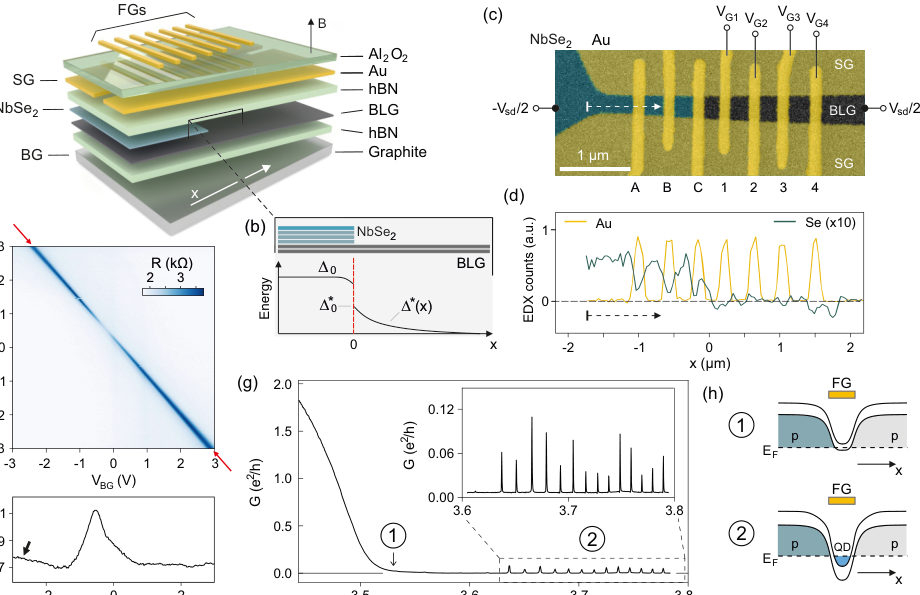 
FIG. 1. (a) Schematic three-dimensional cross-section of the device structure. The split gates (SGs) define the conducting channel, while voltages applied to the finger gates (FGs) allow to locally control the conductance through the channel. (b) Cross-section of the layer stack along the x-direction, highlighting the decay of the proximity induced gap ∆∗. (c) False colored scanning electron microscopy image showing the gate structures of the device. (d) Normalized energy-dispersive X-ray spectroscopy (Au-M and Se-L series) along the dotted white line in panel (c) indicating the position of the NbSe2 flake with respect to the Au FGs. (e) Resistance R as function of back gate voltage VBG and...

📷 Fig 2

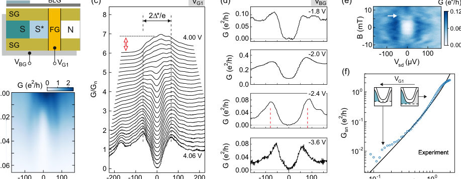 
FIG. 2. (a) Schematic cross section of the NbSe2/BLG heterostructure (top) and top-view device layout showing the gate geometry, superconducting contact S, proximitized BLG region S∗, and normal BLG region N (bottom). (b) Differential conductance G = dI/dVsd = IAC/VAC as a function of source-drain voltage and FG voltage, showing the transition from the open-channel to the tunneling regime. Data are measured at VBG = −2.75 V and VSG = 3.35 V. (c) Normalized differential- conductance traces (see text for details) at selected finger-gate voltages, showing suppressed conductance for |Vsd| &lt; ∆∗/e in the tunneling regime and enhanced conductance in the open-channel regime. (d) Conductance as as a...

📷 Fig 3

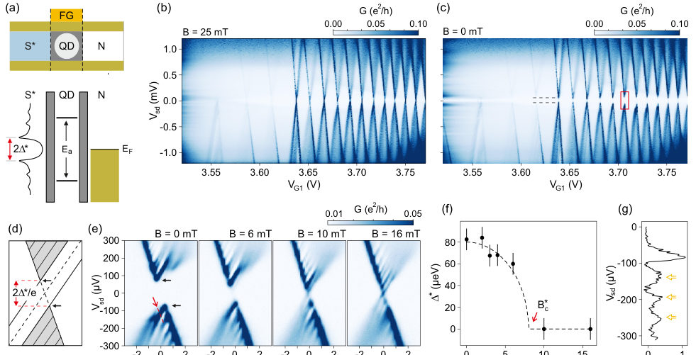 
FIG. 3. (a) Top: Schematic of the device geometry highlighting the QD formed beneath FG 1 and its coupling to the proximitized BLG region (S∗) on the left and the normal BLG lead (N) on the right. Bottom: Corresponding energy diagram showing the density of states in S∗, with ∆∗denoting the proximity-induced gap, the gate-tunable QD levels separated by the addition energy Ea, and the Fermi level of the normal BLG lead. (b) Coulomb diamonds of the few-electron QD formed beneath FG 1, measured at VBG = −2.4 V, VSG = 2.9 V, and B = 25 mT, where proximity-induced superconductivity is suppressed. (c) Same measurement as in panel (b), but at B = 0 mT, revealing a pronounced suppression of the...

📷 Fig 4

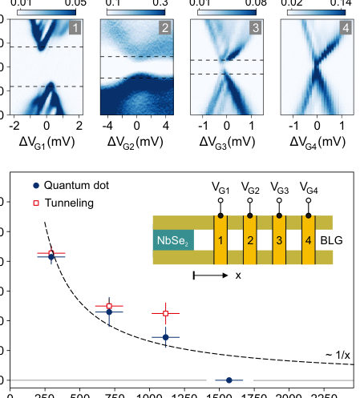 
FIG. 4. (a) Differential conductance as function of source- drain voltage Vsd and finger gate voltage ∆VGi (i = 1 −4) with respect to the center of the Coulomb diamond for the four different finger gates 1 −4, respectively (see labels 1 to 4 in the sub-panels and inset in panel (b)). (b) Proximity- induced gap ∆∗as function of x, the distance from the edge of the NbSe2 flake, extracted (i) from the Coulomb diamond measurements (dashed lines in panel (a)) and (ii) from tunnel- ing spectroscopy measurements. The dashed black line shows the dwell-time-limited proximity gap, ∆∗(x) = πℏv/(4x) with v ≈5.2 × 104 m/s (see text for details ).

**Summary.** This experiment demonstrates a highly controllable all-2D platform using bilayer graphene proximitized by a superconductor ($	ext{NbSe}_2$). By integrating gate-defined quantum dots, the researchers measured the proximity-induced superconducting gap ($\Delta^*$) and mapped its decay as a function of distance. This work establishes $	ext{BLG/NbSe}_2$ hybrids as a versatile tool for studying superconducting correlations in nanoscale electronic devices.

**Why it may be interesting.** The ability to electrostatically control the superconducting coupling strength and map the resulting gap spatially provides a clean platform to test theoretical models of superconducting proximity effects in 2D materials, relevant to topological superconductivity.

Detailed structure

**Main problem.** The study aims to probe the proximity-induced superconducting gap in bilayer graphene (BLG) by integrating gate-defined quantum dots into a superconducting hybrid platform.

**Main result.** The researchers successfully measured a proximity-induced superconducting gap up to $80\,\mathrm{\mu eV}$ and mapped its decay spatially, confirming the tunability of superconducting correlations in this all-2D system.

**Method.** Transport measurements, including Coulomb blockade and finite-bias spectroscopy, were performed on $	ext{BLG}$ patterned into quantum dots coupled to a superconducting $	ext{NbSe}_2$ region.

**Model / system.** The platform is an all-2D hybrid structure combining $	ext{BLG}$ (electrostatically tunable) with superconducting $	ext{NbSe}_2$. Quantum dots act as local probes forming $	ext{S–S}^*-	ext{QD–N}$ junctions.

**Key observables.** Proximity-induced superconducting gap ($\Delta^*$), local density of states (LDOS) suppression, and conductance ($G$) as a function of bias voltage and gate voltages.

**Important parameters / regimes.** Superconducting gap magnitude ($\Delta^* \approx 80\,\mathrm{\mu eV}$), decay length ($\sim 1\,\mathrm{\mu m}$), and critical magnetic field ($B^*_c \simeq 8 	ext{ mT}$).

**Assumptions / limitations.** The gap decay follows a ballistic scaling law $\Delta^*(x) \sim \pi\hbar v/(4x)$, and the system operates in a highly ballistic regime.

**Figures summary.** Figures illustrate the device structure, the decay of the proximity gap with distance, and differential conductance measurements showing gap features and Coulomb diamonds.

**Paper structure.** The work systematically demonstrates the ability to create and probe superconducting proximity effects by first establishing the device geometry, then measuring the gap magnitude, and finally mapping its spatial dependence across the $	ext{BLG}$ channel.

Abstract

Van der Waals heterostructures offer a direct way of combining two-dimensional (2D) materials with different electronic properties, such as 2D semiconductors, metals, and superconductors, in a single device. Bilayer graphene (BLG) is particularly attractive in this context, as its electrically tunable band gap enables local control of tunnel barriers and quantum dots. Here, we realize an all-2D hybrid platform based on BLG proximitized by superconducting NbSe$_2$. Using local electrostatic gates, we define tunnel barriers and quantum dots at different distances from the lateral superconductor-semiconductor interface. The quantum dots serve as local spectroscopic probes of the proximitized BLG channel segment, forming tunable superconductor-quantum dot-normal conductor junction devices. Coulomb blockade and finite-bias spectroscopy reveal a proximity-induced superconducting gap of up to $80\,\mathrm{μeV}$ and allow to track its evolution with increasing distance from the NbSe$_2$ contact. We find that the local density of states remains suppressed over distances exceeding 1 $μ$m, consistent with superconducting proximity through a highly ballistic BLG channel. Our results show that BLG-superconductor hybrids offer a controllable platform where quantum dots and quantum point contacts can be well combined with superconductivity.

[↑ back to top](#top)

### [Electrical Probing of Sub-Néel Spin Dynamics in Two-Dimensional Antiferromagnets Using Graphene Heterostructures](http://arxiv.org/abs/2609.16725v1)

**Authors:** Adrián García-Martín, Sara Gullace, Nicolás Montenegro-Pohlhammer, María José Martínez-Pérez, Rocío Sánchez-de-Armas, Carmen J. Calzado, Enrique Burzurí  
**Type:** both · **Category:** other · **PDF:** <https://arxiv.org/pdf/2609.16725v1>  
**Analysis basis:** full PDF text, analyzed in chunks
**Topic relevance:** `analog quantum simulation` **2/5** · `quantum measurements` **2/5** · `Keldysh / 2PI / non-Gaussian methods` **1/5**

📷 Fig 1

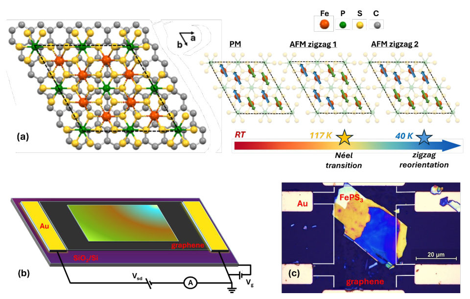 
Figure 1. (a)[Left] Atomistic top-view representation of a FePS3 monolayer on top of a graphene monolayer as resulted from DFT calculations. [Right]Atomic level top-view representations of the magnetic structure of a FePS3 monolayer, including the paramagnetic (PM) and two distinct antiferromagnetic (AFM) zigzag orders. Blue and green arrows on the magnetic Fe atoms represent the spin up and down, respectively. Yellow and blue stars mark the Néel transition and a reorientation of the zigzag AFM state with temperature. (b) Schematic representation of a FePS3/Graphene Field-Effect Transistor (GFET) employed for the electron transport measurements. (c) Optical image of a representative...

📷 Fig 2

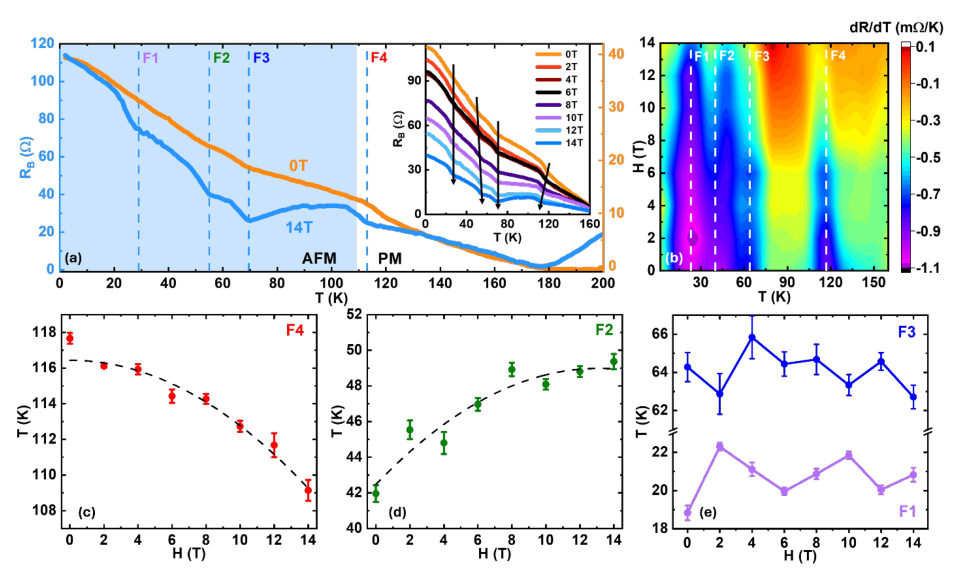 
Figure 2. (a) Resistance R measured on a FEPS/GFET heterostructure (device A) as a function of temperature T, at 0 T (orange) and 14 T (blue) applied magnetic field. Additional curves at intermediate magnetic fields are shown in the inset. Baselines based on minimum values are subtracted from the original resistance curves to facilitate comparison. Vertical dashed lines are visual help to localize anomalous features in the curve recorded at 14 T. These features are tagged as F1 (violet), F2 (green), F3 (dark blue) and F4 (red), respectively. (b) dR/dT color map obtained from (a) as a function of temperature and magnetic field. Individual dR/dT curves can be found in Figure S2 in the...

📷 Fig 3

 
Figure 2a shows the resistance measured as a function of temperature for device A at zero

📷 Fig 4

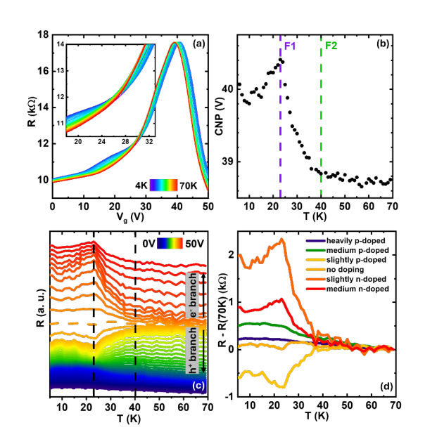 
Figure 3. (a) Gate voltage traces measured at temperatures from 4 K (blue) to 70 K (red), with a fixed bias voltage of 1 V (device D). Inset: zoom of a crossing area. (b) Charge neutrality point (CNP) as a function of temperature extracted from (a). Vertical dashed lines, coinciding with Feature 1 and Feature 2 are added as a visual guide indicating trend changes. (c) Resistance curves as a function of temperature at different gate voltage ranging from 0 V (blue) to 50 V (red). The curves are shifted vertically to facilitate the comparison. Vertical dashed lines mark Feature 1 and Feature 2. The curve corresponding to the charge neutrality gate voltage ∼ 40 V is plotted as an orange dashed...

📷 Fig 5

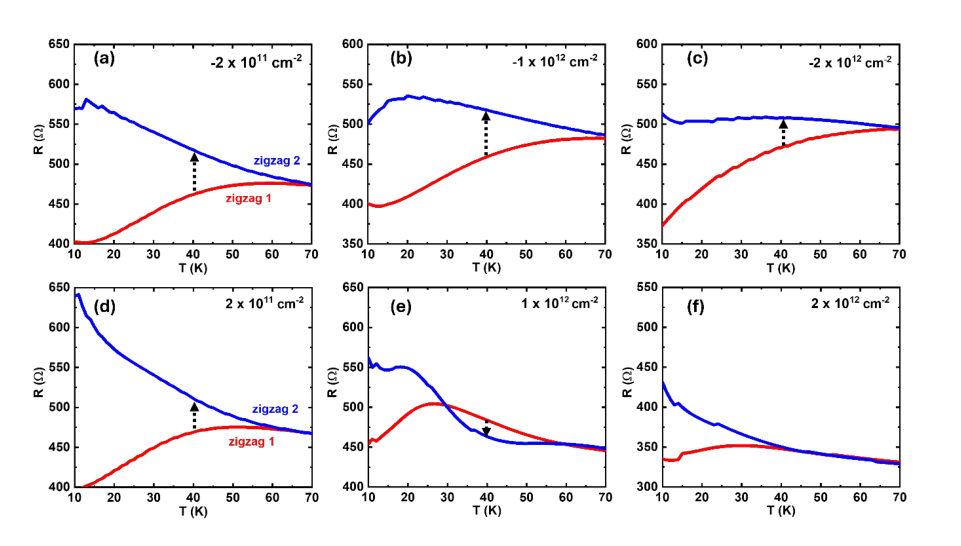 
Figure 4. Simulated transport properties for FEPS/GFET containing different initial (a)-(c) n- doping, and (d)-(f) p-doping concentrations. Red and blue curves represent two different zigzag AFM states. A black arrow is added as a visual guide for the secondary transitions happening between 23 and 40K. Complete curves are available in the Supporting Information.

**Summary.** This work pioneers the use of graphene as an electrical transducer to probe hidden spin dynamics in 2D antiferromagnets like $	ext{FePS}_3$. By measuring transport resistance under magnetic and gate-voltage control, the authors identify signatures corresponding to magnon excitations and magnetic phase changes. This establishes a versatile platform for electrical readout of magnetism in 2D quantum materials.

**Why it may be interesting.** The ability to transduce subtle, non-magnetic spin dynamics into a measurable electrical signal is highly relevant for developing novel quantum sensors and reading out quantum states in magnetic materials.

Detailed structure

**Main problem.** The primary challenge addressed is the electrical probing of subtle, hidden spin dynamics within low-dimensional, insulating antiferromagnetic (AFM) van der Waals materials.

**Main result.** The authors demonstrate that graphene acts as an ultrasensitive electrical transducer, allowing the measurement of magnon excitations and magnetic reconfigurations in the AFM state via transport anomalies.

**Method.** The study combines low-temperature transport measurements (measuring resistance $R$ vs. $T, H, V_g$) with first-principles Density Functional Theory (DFT) calculations.

**Model / system.** The physical system is a graphene/antiferromagnetic van der Waals heterostructure, specifically using $	ext{FePS}_3$. DFT models the electronic structure and magnetic configurations (zigzag1/zigzag2) of the interface, while transport calculations use the Boltzmann theory.

**Key observables.** Resistance anomalies ($R$ dips), temperature dependence of anomalies, magnetic field dependence of the Néel temperature ($T_N$), and gate-voltage tunability of electrical signatures.

**Important parameters / regimes.** Low temperatures (down to 3 K), magnetic fields (up to 14 T), and electrostatic gate voltages ($V_g$).

**Assumptions / limitations.** The current flow is assumed to be predominantly through the graphene layer, and DFT calculations rely on the rigid band approximation for conductivity modeling.

**Figures summary.** Figures show transport measurements ($R$ vs. $T, H, V_g$) revealing multiple resistance anomalies below $T_N$, and DFT calculations illustrate the magnetic configurations and electronic response of the interface.

**Paper structure.** The paper establishes the physical challenge, presents the experimental setup (GFET measurements), details the observed magnetic transitions (Néel, phase reorientation), and supports these findings with detailed DFT calculations of the electronic coupling.

Abstract

Low-dimensional antiferromagnetic van der Waals materials have emerged as a versatile platform for exploring exotic spin dynamics and magnetic phases, yet electrically accessing these phenomena remains a major challenge because of their vanishing net magnetization and highly insulating nature. Here, we demonstrate that graphene can act as an ultrasensitive electrical transducer of hidden spin dynamics in two-dimensional antiferromagnets. By integrating graphene with the van der Waals antiferromagnet FePS$_3$, low-temperature transport measurements combined with magnetic-field and gate-voltage control reveal multiple resistance anomalies well below the Néel temperature. Their distinct temperature, magnetic-field, and carrier-density dependences enable us to associate these anomalies with magnon excitations and with a low-temperature magnetic reconfiguration of the antiferromagnetic state, both of which remain largely inaccessible to conventional magnetometry. Density functional theory calculations further show that competing antiferromagnetic spin configurations in FePS$_3$ are nearly degenerate in energy while producing markedly different electronic responses in the adjacent graphene layer. The pronounced electrostatic tunability of these signatures demonstrates that graphene directly transduces interfacial magnetic dynamics into an electrical signal. Our work establishes graphene/antiferromagnetic van der Waals heterostructures as a versatile platform for the electrical readout of spin dynamics in two-dimensional magnets.

[↑ back to top](#top)

### [Origin and Reduction of Coercive Fields in ZnO-based Wurtzite Ferroelectrics](http://arxiv.org/abs/2609.16570v1)

**Authors:** Abhijeet Dhakane, Alireza Sepehrinezhad, William Prudnick, Jon-Paul Maria, Bobby Sumpter, Adri C. T. van Duin, Kyle P. Kelley, P. Ganesh  
**Type:** both · **Category:** other · **PDF:** <https://arxiv.org/pdf/2609.16570v1>  
**Analysis basis:** full PDF text, analyzed in chunks
**Topic relevance:** `Frenkel-Kontorova` **1/5** · `Keldysh / 2PI / non-Gaussian methods` **1/5** · `analog quantum simulation` **1/5** · `driven-dissipative phase transition` **1/5** · `methods for driven-dissipative` **1/5** · `non-equilibrium universality` **1/5**

📷 Fig 1

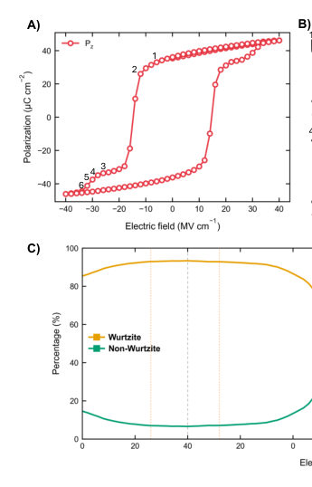 
Figure 1: Field-driven reversal in pristine ZnO proceeds through inversion-boundary filaments. A, Simulated polarization–field hysteresis loop with a coercive field of approximately 15 MV cm−1 and a metastable step- like feature. B, Evolution of non-wurtzite inversion-boundary regions along the hysteresis loop (wurtzite-like regions omitted for clarity). Narrow filaments nu- cleate and advance along the applied-field direction before lateral coalescence completes reversal. C, Populations of wurtzite-like and inversion-boundary- like environments during field cycling, showing transient accumulation of recon- structed boundary environments near switching.

📷 Fig 2

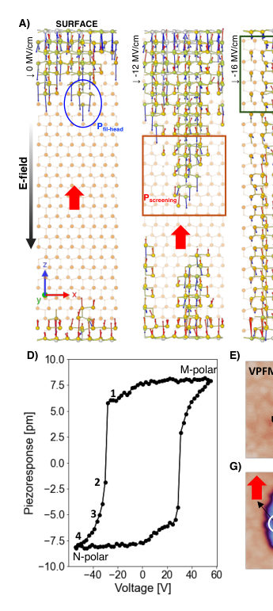 
Figure 2: A reconstructed core–shell switching front accompanies fila- ment growth. A, Local polar-order vectors during filament growth. The ad- vancing head contains a strongly field-aligned core response, denoted Pfil-head, associated with under-coordinated cations and evolving 4–8 topological motifs; an oppositely oriented surrounding response, Pscreening, partially compensates the core. B, Enlarged view of the advancing filament head. C, Local structure after the filament reaches the opposite surface and the wurtzite polarity reverses. D, Piezoresponse-force-microscopy hysteresis response. E–H, PFM amplitude during field cycling showing transient coexistence and back-switching of oppo-...

📷 Fig 3

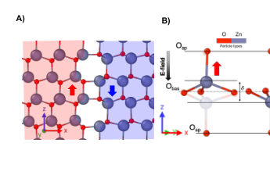 
Figure 3: Local polar order at the advancing filament head marks the field-setting event. A, Schematic inversion boundary separating oppo- sitely polarized wurtzite regions. B, Local Zn displacement toward the basal oxygen plane during reconstruction; the transient geometry leaves Zn under- coordinated with respect to the apical oxygen sites. C, Macroscopic switching response (dashed line) and laterally averaged local polar-order parameter, ηz,i (solid line), along the field cycle. The enhanced local-order amplitude precedes the coercive-field crossing and accompanies the transient population of recon- structed inversion-boundary environments.

📷 Fig 4

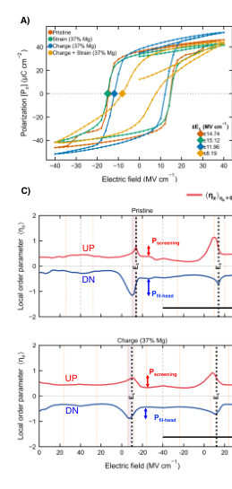 
Figure 4: Cationic dopants and charge redistribution provide a direct route to reducing the coercive field. A, Hysteresis loops for 37% Mg substitution under three different perturbations: strain-only, charge-only, and combined strain-and-charge effects. B, Magnitude of the coercive field, |Ec|, as a function of the local polarization imbalance, ∆= |Pfill-head| −|Pscreening| , for the homogeneous and layered configurations. Filled and open diamonds de- note the +40 →−40 and −40 →+40 MV cm−1 field sweeps, respectively. The dashed line shows a linear fit (R2 = 0.83), revealing that smaller polarization imbalance between the filament head and its screening environment is generally associated...

📷 Fig 5

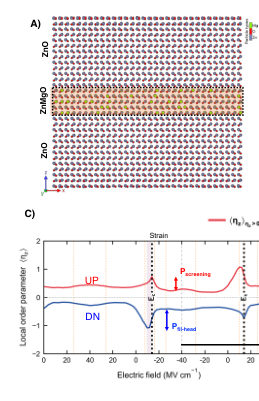 
Figure 5: Layered dopants translate the microscopic switching mechanism into a low-field design strategy. A, Schematic of the ZnO/ZnMgO/ZnO heterostructure containing a layered Mg-doped region. B, Hysteresis loops comparing the strain-only heterostructure with the combined charge-plus-strain heterostructure. The combined perturbation lowers the co- ercive field and reduces the distance over which each switching filament must propagate. C, Conditional average local order parameter for the strain-only and combined charge-plus-strain cases. Charge redistribution promotes filament nucleation at the buried ZnO/ZnMgO interface, enabling switching to initiate locally before propagating through the...

**Summary.** This work uses reactive molecular dynamics to investigate why wurtzite ferroelectrics have high coercive fields. The research identifies that the field is set by the local polarization required at the advancing switching filament head. By showing that charge doping is more effective than strain in reducing this local barrier, the authors propose a materials design principle for creating low-field ferroelectric devices.

**Why it may be interesting.** While focused on solid-state ferroelectrics, the study's detailed atomistic simulation of non-equilibrium phase transitions, domain wall dynamics, and field-induced structural reconstruction provides valuable insights into complex many-body dynamics far from equilibrium.

Detailed structure

**Main problem.** The large coercive fields in wurtzite ferroelectrics limit their operational window for non-volatile memory devices, and the microscopic origin of this field remains unresolved.

**Main result.** The coercive field is determined by the local polar-order amplitude required to advance the reconstructed inversion-boundary filament head, and charge redistribution is a more effective way to lower this field than strain alone.

**Method.** The study uses large-scale reactive molecular dynamics, parameterized against first-principles data, to simulate field-driven polarization reversal.

**Model / system.** The system is ZnO-based wurtzite ferroelectrics, studied in pristine, Mg-modified, and heterostructured (ZnO/ZnMgO) forms. The simulation tracks the dynamics of polarization reversal through inversion-boundary filaments.

**Key observables.** Hysteresis loops, local polar-order vectors, the advancing filament head polarization ($P_{	ext{fil-head}}$), and the polarization imbalance ($\Delta$).

**Important parameters / regimes.** Coercive field ($E_c$), applied electric field, strain magnitude, and charge doping concentration.

**Assumptions / limitations.** The switching mechanism is governed by the advancement of a specific, under-coordinated, reconstructed inversion-boundary region.

**Figures summary.** Figures illustrate the polarization-field response, the evolution of inversion-boundary filaments, the core-shell structure of the switching front, and the dependence of $E_c$ on local polarization imbalance ($\Delta$) for different perturbations.

**Paper structure.** The paper establishes the problem (high $E_c$), develops the mechanism (filament advancement controlled by the head), compares perturbations (charge vs. strain), and proposes a design principle using heterostructures to engineer lower switching fields.

Abstract

Wurtzite ferroelectrics offer a route to semiconductor-compatible non-volatile devices, but their large coercive fields (E$_c$) constrain the operating window between polarization reversal, leakage and dielectric breakdown. Atomically localized and non-classical switching fronts have recently been identified in wurtzite nitrides, yet the microscopic feature that sets the coercive field remains unresolved. Here we use large-scale reactive molecular dynamics, parameterized against first-principles data, to follow field-driven reversal in pristine, Mg-modified and heterostructured ZnO. Reversal proceeds through rugged inversion-boundary filaments in agreement with recent observations in other wurtzite ferroelectrics. We find that the field required for switching is controlled by the advancing filament head, which is a under-coordinated reconstructed inversion-boundary region during the transient switching dynamics with a large field-aligned local polar-order amplitude that is only partially compensated by an oppositely oriented surrounding shell. Controlled strain-only and charge-doping-only perturbations show that charge redistribution lowers the coercive field more effectively than strain because it suppresses this field-setting unscreened local polar order at the filament head, with the combined effect lowering E$_c$ by $\sim$ 50 \%. Layered ZnO/ZnMgO architectures further create buried nucleation sites and shorten filament propagation lengths. These results connect atomistic switching topology to a materials-design principle for substantially reducing coercive fields in ZnO-based wurtzite ferroelectrics.

[↑ back to top](#top)

### [Propulsion of magnetic domain walls via elastic damping in magnetostrictive materials](http://arxiv.org/abs/2609.16904v1)

**Authors:** Miguel Moreno, Rocio Yanes, Luis Lopez-Diaz  
**Type:** theory · **Category:** other · **PDF:** <https://arxiv.org/pdf/2609.16904v1>  
**Analysis basis:** full PDF text, analyzed in chunks
**Topic relevance:** `Frenkel-Kontorova` **1/5** · `Keldysh / 2PI / non-Gaussian methods` **1/5** · `correlated / nonlocal dissipation` **1/5** · `driven-dissipative phase transition` **1/5** · `methods for driven-dissipative` **1/5** · `non-equilibrium universality` **1/5**

📷 Fig 1

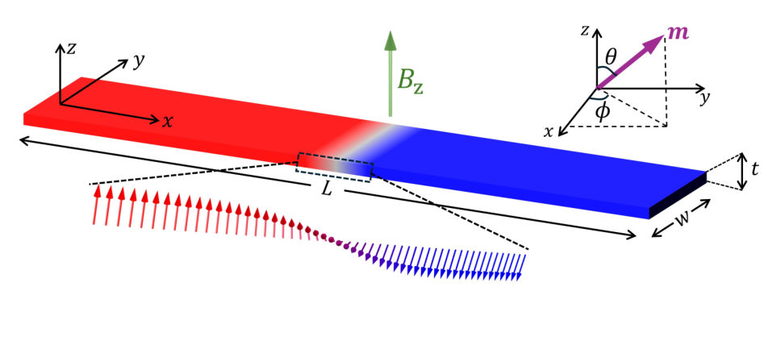 
Figure 1. Schematic representation of the system under study. An ultrathin perpendicularly magne-

📷 Fig 2

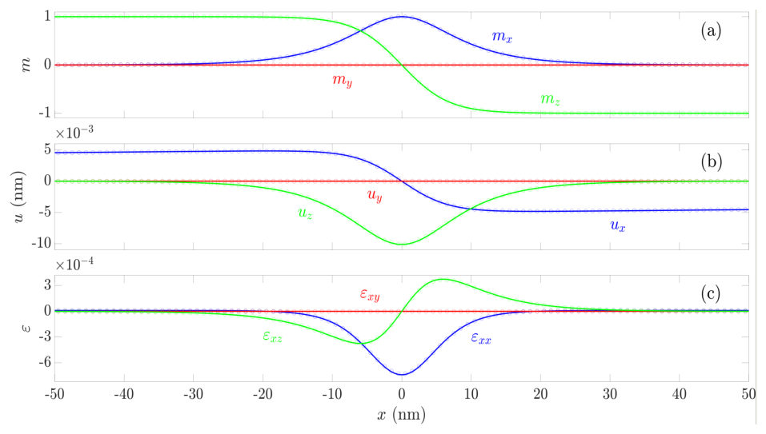 
Figure 2. Equilibrium spatial profiles of magnetization (a), mechanical displacement (b), and

📷 Fig 3

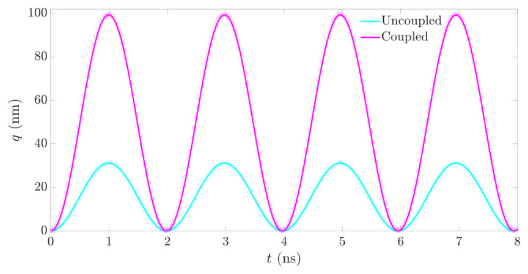 
Figure 3. Time evolution of the DW position q(t) under an applied magnetic field of Bz = 9 mT

📷 Fig 4

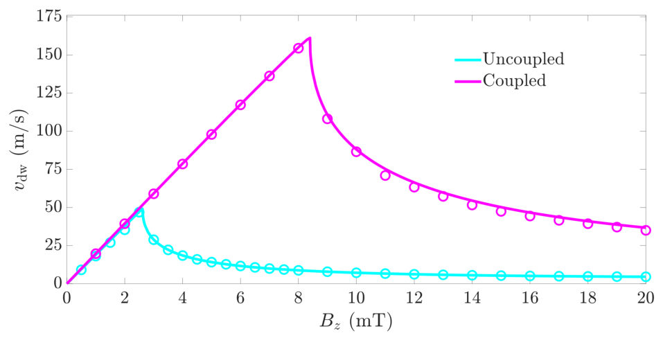 
Figure 4. Average DW velocity as a function of the applied magnetic field for a finite Gilbert

📷 Fig 5

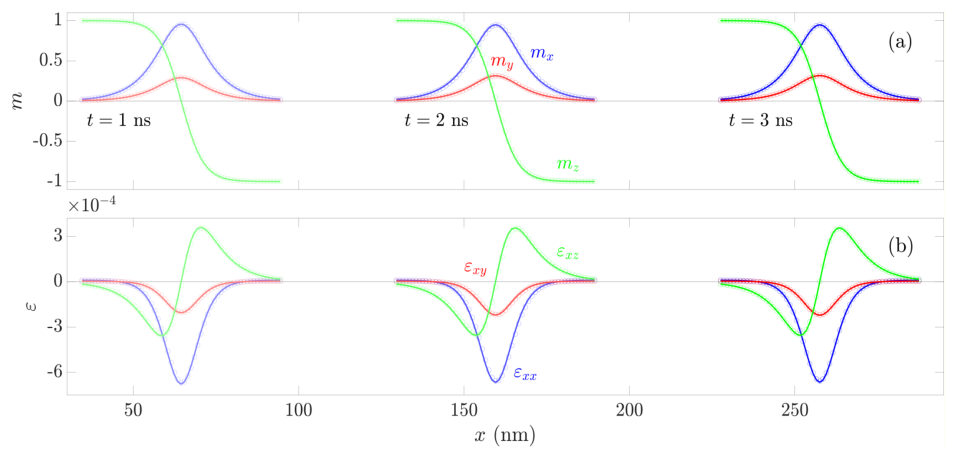 
Figure 5. Spatial profiles of the (a) magnetization and (b) geometric strain components at three

**Summary.** This paper analyzes the propulsion of magnetic domain walls in magnetostrictive materials by coupling micromagnetics with elastodynamics. It demonstrates that mechanical damping acts as a crucial, non-magnetic energy sink, enabling steady-state DW motion even when intrinsic magnetic damping is absent. This reveals a fundamental energy exchange mechanism vital for designing advanced acoustic spintronic devices.

**Why it may be interesting.** While focused on classical condensed matter physics, the concept of energy dissipation channels (mechanical vs. magnetic) and the mapping of one dissipation mechanism onto an effective damping parameter ($\alpha_{me}$) is highly relevant to understanding energy loss in quantum-limited spintronic devices.

Detailed structure

**Main problem.** The study investigates how elastic damping in magnetostrictive materials propels magnetic domain walls (DWs) by providing a non-magnetic energy dissipation channel.

**Main result.** Mechanical damping sustains DW motion even when intrinsic Gilbert damping is zero, and the resulting asymmetric stress gradients exert direct propelling forces balancing field-induced precession.

**Method.** The research employs a fully coupled micromagnetic-elastodynamic framework, supplemented by an analytical 1D collective coordinates model for simplification.

**Model / system.** The system models a perpendicularly magnetized magnetostrictive ferromagnet (e.g., in an ultrathin nanowire) where magnetization dynamics (LLG equation) are coupled to mechanical displacement (elastodynamic wave equation) via magnetoelastic interactions.

**Key observables.** Localized stress tensor profiles ($\sigma_{xx}, \sigma_{xy}, \sigma_{xz}$), DW velocity ($v_{dw}$), and the effective magnetoelastic damping parameter ($\alpha_{me}$).

**Important parameters / regimes.** Intrinsic Gilbert damping ($\alpha$), elastic damping constant ($\eta$), magnetostriction constants ($\lambda_{100}, \lambda_{111}$), and applied magnetic field ($B_z$).

**Assumptions / limitations.** The analysis often relies on a 1D reduction of the full 3D problem, assuming transverse mechanical modes are frozen or that the dynamics are subsonic.

**Figures summary.** Figures illustrate the DW position, velocity vs. field, and profiles of magnetization, mechanical displacement, and strain under various damping conditions.

**Paper structure.** The paper progresses from establishing the coupled governing equations (LLG and elastodynamics) to solving the static equilibrium profiles, and finally analyzing the dynamic regimes, particularly focusing on the steady-state balance equations derived from the collective coordinates model.

Abstract

The interaction between magnetic and elastic degrees of freedom is increasingly central to advanced spintronics technology. In magnetostrictive materials, a moving domain wall carries a localized elastic deformation. Here, we investigate these elastic deformations and their back-action on field-driven domain wall dynamics using a fully coupled micromagnetic-elastodynamic framework and an analytical collective coordinates model. We show that mechanical damping acts as a non-magnetic dissipation channel, extracting energy from the magnetic texture and sustaining translational domain wall motion even in the complete absence of intrinsic Gilbert damping ($α=0$). Specifically, elastic damping impacts domain wall dynamics in a manner equivalent to magnetic losses, allowing us to map it onto an effective magnetoelastic contribution to the Gilbert damping parameter, $α_\text{me}$. We calculate the localized stress tensor profiles co-moving with the domain wall and show that mechanical dissipation breaks their spatial symmetry. Using our collective coordinates model, we demonstrate that these asymmetric stress profiles-specifically the localized stress gradients across the wall core-exert direct propelling forces that balance field-induced magnetic precession, enabling steady-state motion. Overall, these findings reveal a fundamental energy transfer and relaxation mechanism between magnetic and elastic subsystems, providing valuable insights for controlling magnetic texture dynamics via strain engineering and mechanical damping design in acoustic spintronic devices.

[↑ back to top](#top)

### [Anderson localization in topological metals](http://arxiv.org/abs/2609.16124v1)

**Authors:** A. A. Burkov  
**Type:** theory · **Category:** disordered systems and neural networks · **PDF:** <https://arxiv.org/pdf/2609.16124v1>  
**Analysis basis:** full PDF text, analyzed in chunks
**Topic relevance:** `Keldysh / 2PI / non-Gaussian methods` **1/5** · `analog quantum simulation` **1/5**

📷 Fig 1

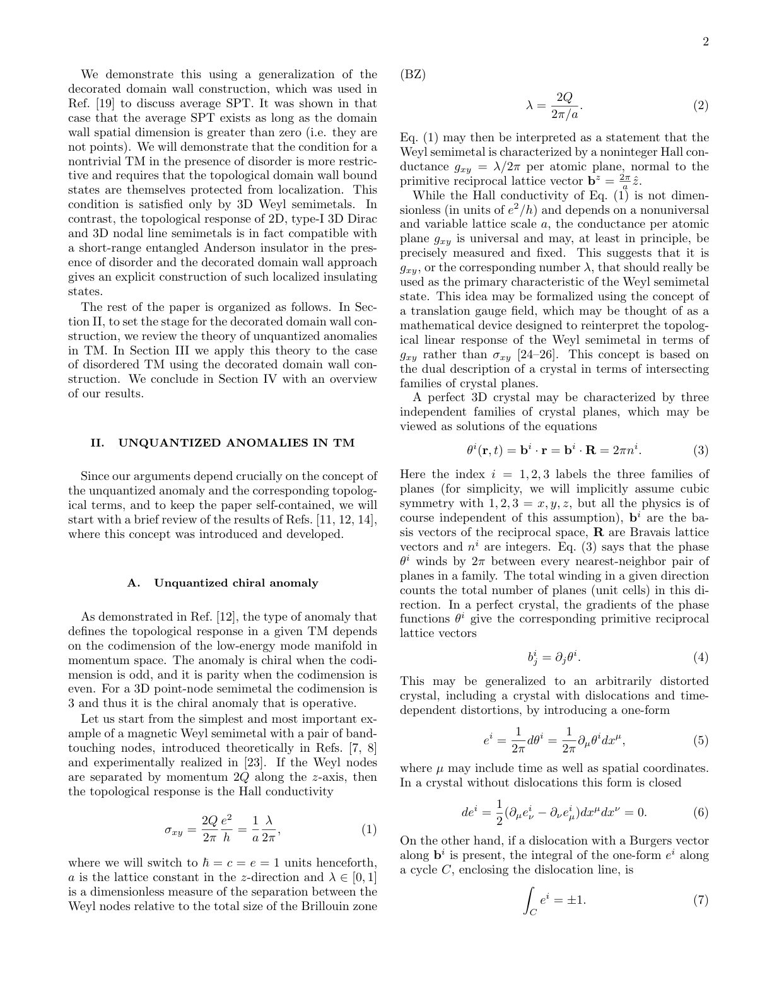 
Low-resolution page preview, page 2

📷 Fig 2

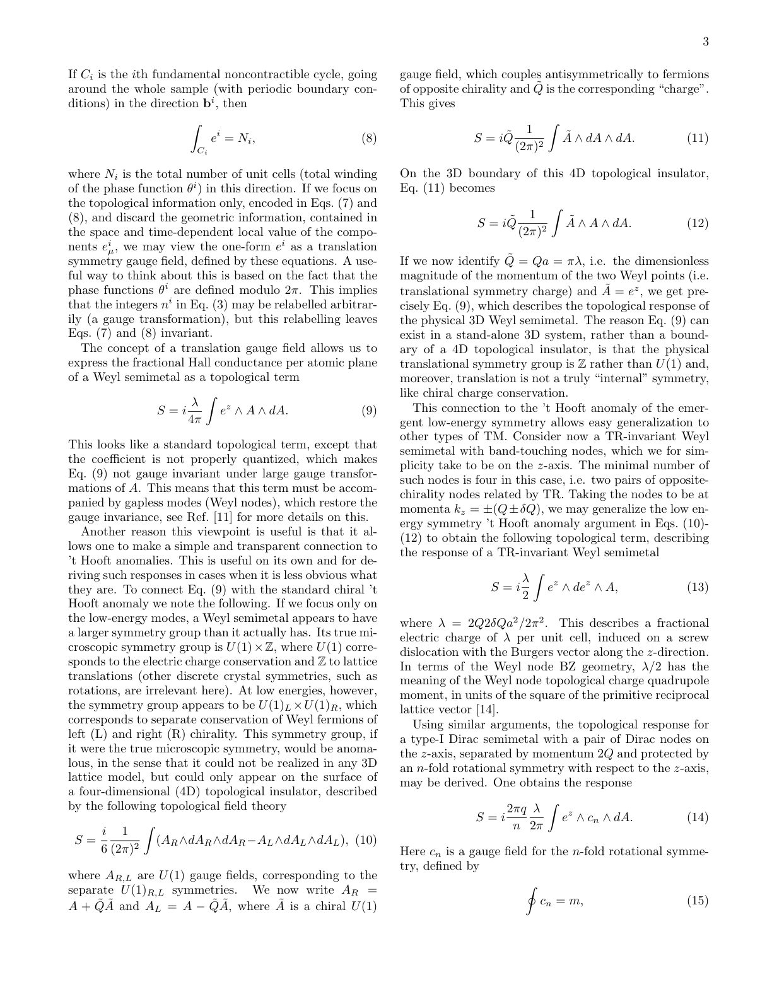 
Low-resolution page preview, page 3

📷 Fig 3

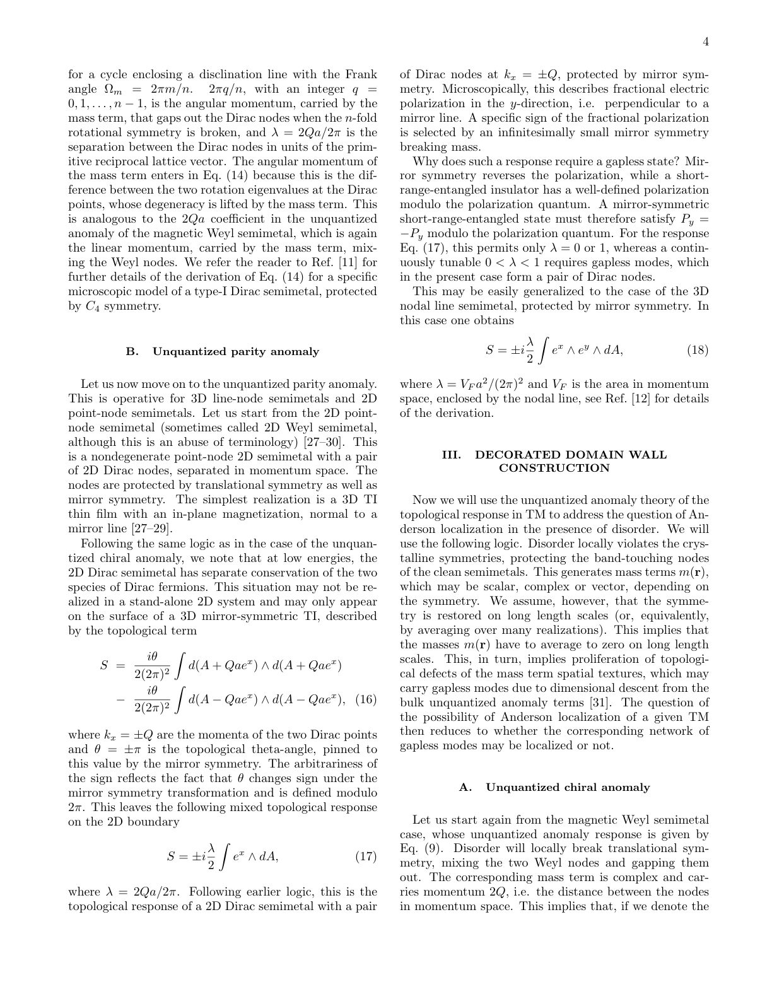 
Low-resolution page preview, page 4

📷 Fig 4

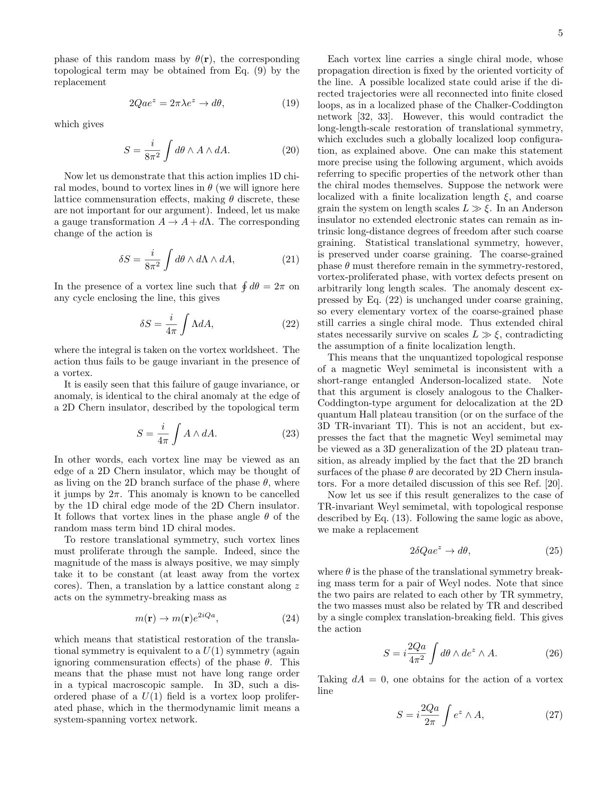 
Low-resolution page preview, page 5

📷 Fig 5

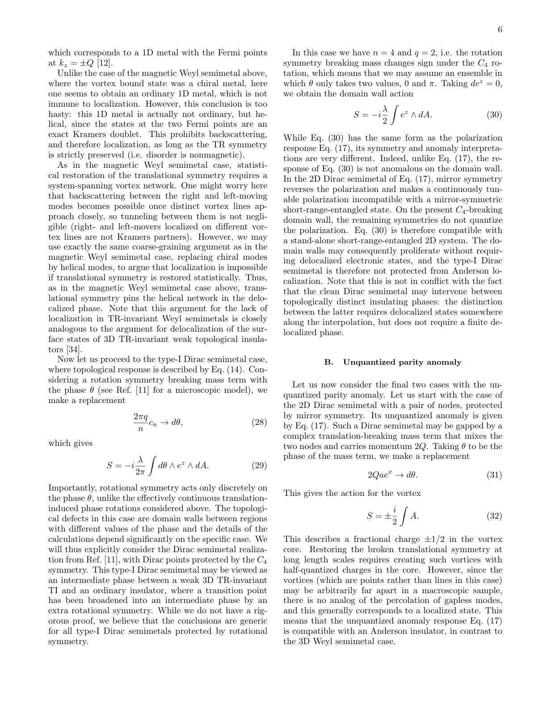 
Low-resolution page preview, page 6

**Summary.** This theoretical work determines the robustness of topological protection in metals when disorder is introduced. It finds that only 3D Weyl semimetals maintain their nontrivial topological character against Anderson localization, while other semimetallic classes are susceptible to disorder-induced localization. The methodology relies on analyzing topological anomalies using advanced gauge field constructions.

**Why it may be interesting.** The rigorous connection between topological invariants (anomalies) and localization physics provides a powerful theoretical tool for understanding how fundamental symmetries dictate transport properties in disordered quantum materials, which is relevant to open quantum systems.

Detailed structure

**Main problem.** The paper investigates whether the nontrivial topological characteristics of topological metals (TMs) survive when subjected to disorder, specifically addressing whether topology protects them from Anderson localization.

**Main result.** Protection against Anderson localization is demonstrated for 3D Weyl semimetals, but fails for 2D and 3D Dirac or nodal line semimetals, as their topological responses are compatible with localized states.

**Method.** The analysis combines the concept of unquantized anomalies (a topological response) with the decorated domain wall construction, using gauge field formalisms derived from crystal plane phase functions.

**Model / system.** The study focuses on various topological metals, including Weyl semimetals, Dirac semimetals, and nodal line semimetals, examining their behavior under random disorder potentials.

**Key observables.** Long-range entanglement, topological response coefficients ($\lambda$), and the failure of gauge invariance (anomaly) upon introducing vortices.

**Important parameters / regimes.** Dimensionality (2D vs 3D), symmetry protection (e.g., TR-invariance), and the degree of disorder realization.

**Assumptions / limitations.** The concept of gaplessness loses meaning in disorder, requiring entanglement as the key diagnostic; the analysis assumes symmetry restoration on long length scales.

**Paper structure.** The paper progresses by first establishing the topological response formalism using gauge fields, then applying this framework to analyze the stability of different classes of TMs (Weyl, Dirac, nodal line) under disorder, culminating in a comparative statement on which systems retain protection.

Abstract

We address the question of whether topological metals (TM) retain their nontrivial characteristics in the presence of disorder. While in the clean case, the issue is what protects the gaplessness of the spectrum, i.e. the band-touching nodes in TM, this question needs to be reformulated in the presence of disorder. The concept of gaplessness loses its sharp meaning in this case, since spectral gaps can be filled in by disorder-induced states. What is still meaningful is entanglement: one may ask whether the long-range entanglement of the clean gapless TM survives in the presence of disorder or, in other words, whether nontrivial topology protects the TM from Anderson localization. We demonstrate that such a protection exists in the case of three-dimensional (3D) Weyl semimetals, but not in 2D and 3D (type-I) Dirac or 3D nodal line semimetals. We establish this by combining the idea of unquantized anomaly as the topological response of TM with the decorated domain wall construction, used previously to discuss average symmetry-protected topological insulating phases.

[↑ back to top](#top)

### [Interplay between Interlayer Shift and Twist: Twisted van der Waals Nanowires Driven by Rotational Twinning](http://arxiv.org/abs/2609.16771v1)

**Authors:** Dong-gyu Kim, Kisung Kang, Hani Kang, Kihyun Lee, Yangjin Lee, Jinsub Park, Joong-Eon Jung, Min Kim, Myeongjin Jang, Aloysius Soon, Kwanpyo Kim  
**Type:** both · **Category:** other · **PDF:** <https://arxiv.org/pdf/2609.16771v1>  
**Analysis basis:** abstract only; PDF text extraction failed or PDF unavailable
**Topic relevance:** `Frenkel-Kontorova` **1/5** · `analog quantum simulation` **1/5**

**Summary.** This work investigates the structural control in van der Waals nanowires, focusing on the interplay between interlayer shift and twist. The researchers identify and characterize a novel twisting mechanism driven by rotational twinning in GeSe2-xTe_x. This establishes rotational twinning as a fundamental, intrinsic method for engineering twist in these layered materials.

**Why it may be interesting.** While focused on solid-state materials science, the concept of strain-induced structural transitions and emergent symmetries due to local interactions (twinning) has parallels in understanding quantum phase transitions or engineered quantum materials.

Detailed structure

**Main problem.** The interplay between interlayer shift and twist in van der Waals (vdW) layered materials, and reliable mechanisms for fine-tuning these parameters, remain largely unexplored.

**Main result.** The authors report a previously unrecognized twisting mechanism in vdW crystals arising from preferred tilted stacking and rotational twinning, establishing this as an intrinsic route for spontaneous twist formation.

**Method.** The study combines electron diffraction and atomic-resolution STEM imaging with first-principles calculations and structural relaxation simulations.

**Model / system.** The physical system is group-IV chalcogenide GeSe2-xTe_x grown as nanowires, which exhibit continuous rotation of lattice planes along the growth axis.

**Key observables.** Continuous rotation of lattice planes, twist rates dependent on nanowire radius, and the presence of a continuous rotational twin boundary.

**Important parameters / regimes.** Nanowire radius, interlayer stacking registry, and strain cost imposed by rotational twinning.

**Assumptions / limitations.** The twisting deformation originates from the energetic competition between the preferred interlayer stacking registry and the strain cost from rotational twinning.

**Figures summary.** Not specified.

**Paper structure.** The paper introduces the context of vdW engineering, presents experimental evidence of continuous rotation and twinning via STEM/diffraction, and then uses first-principles calculations to confirm the energetic origin of the twist.

Abstract

In van der Waals(vdW) layered materials, interlayer shift and twist have enabled the control of material properties through polytype and moire engineering. Various approaches, including bottom-up synthesis and manual layer-by-layer stacking, have been utilized to engineer targeted stacking configurations. However, the interplay between interlayer shift and twist, as well as reliable mechanisms for fine-tuning these parameters, remains largely unexplored. Here, we report a previously unrecognized twisting mechanism arising from preferred tilted stacking and twinning in vdW crystals. Electron diffraction and atomic-resolution scanning transmission electron microscopy(STEM) imaging reveal that the lattice planes of group-IV chalcogenide GeSe_{2-x}Te_x rotate continuously along the nanowire growth axis, with twist rates depending systematically on nanowire radius. Atomic-scale imaging further identifies a continuous rotational twin boundary extending along the central region of the nanowire. First-principles calculations and structural relaxation simulations confirm that the twisting deformation originates from energetic competition between the preferred interlayer stacking registry and the strain cost imposed by rotational twinning. These findings establish rotational twinning as an intrinsic route to spontaneous twist formation and provide a design principle for realizing twist-engineered vdW crystals with compatible crystal symmetries and stacking motifs.

[↑ back to top](#top)

### [NaFeP: first pairing prediction for an unmade 111 iron phosphide, and the pnictogen-height rule inside one compound](http://arxiv.org/abs/2609.17028v1)

**Authors:** Reinaldo Inácio  
**Type:** theory · **Category:** strongly correlated electrons · **PDF:** <https://arxiv.org/pdf/2609.17028v1>  
**Analysis basis:** full PDF text, analyzed in chunks
**Topic relevance:** `Keldysh / 2PI / non-Gaussian methods` **1/5** · `quantum measurements` **1/5**

📷 Fig 1

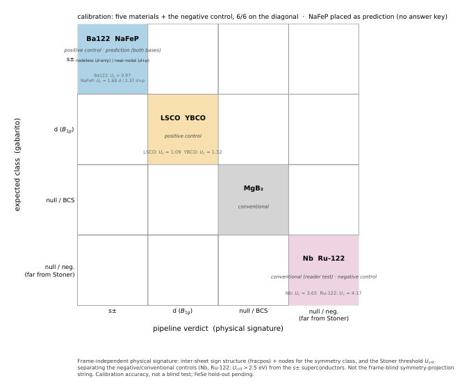 
Figure 1: Confusion matrix read by the frame-independent physical signature (inter-sheet sign structure and nodes) together with the Stoner threshold Ucrit. Five calibration materials and the negative control on the diagonal; Nb and SrRu2As2 separate as null/negative (Ucrit &gt; 2.5 eV). NaFeP is placed in the s± cell as the prediction, not as a calibration point, with both readings (nodeless in d-only, near-nodal in d + p) and both Ucrit values. Calibration accuracy, not a blind test; FeSe hold-out pending.

📷 Fig 2

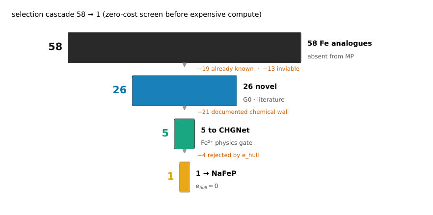 
Figure 2: Selection cascade: 58 Fe analogues absent from the Materials Project →26 novel by the literature gate →5 without a documented chemical wall, sent to the CHGNet formation-energy relaxation →1 stable and unreported (NaFeP). The expensive pipeline is reserved for the single survivor of a zero- cost screen.

📷 Fig 3

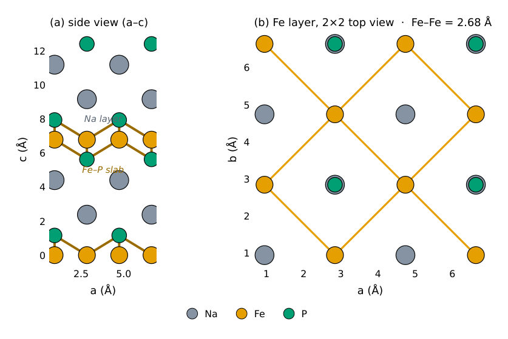 
Figure 3: Crystal structure of NaFeP (P4/nmm, PBE-relaxed cell). (a) Side view (a–c): Fe–P slabs with Na layers intercalated between them. (b) Top view (2×2): the square Fe sublattice, Fe–Fe = 2.66 Å.

📷 Fig 4

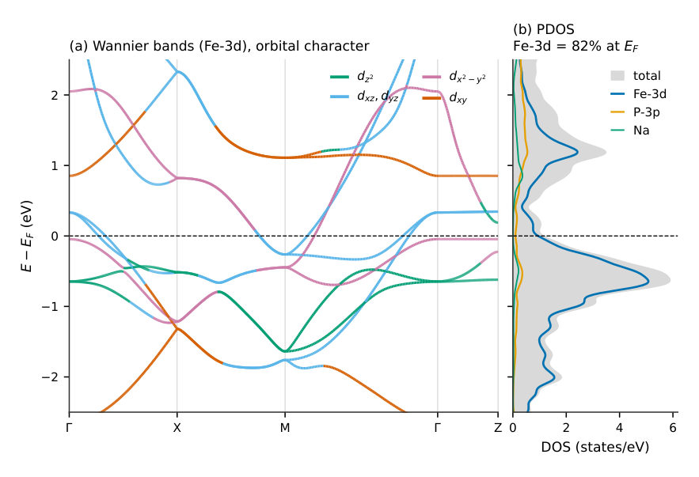 
Figure 4: (a) Wannier bands (10 Fe-3d WF) along Γ–X–M–Γ–Z, colored by dominant d-orbital char- acter. (b) Species-projected density of states: Fe-3d makes up 82% of N(EF ).

📷 Fig 5

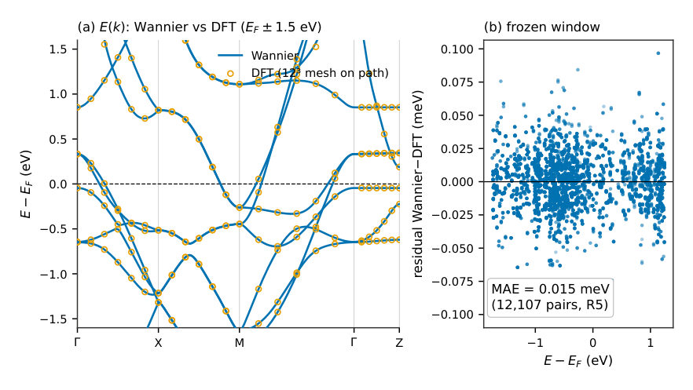 
Figure 5: R5 band-tracking validation of the d-only model on the relaxed cell (frozen window EF −1.8 to EF + 1.5 eV). (a) Wannier E(k) (lines) over the DFT eigenvalues at the 123-mesh points on the path (circles), EF ± 1.5 eV. (b) Residual over the frozen window (12,107 pairs), MAE = 0.015 meV.

**Summary.** This work presents the first gap-symmetry prediction for the unmade iron phosphide NaFeP, classifying it as an s± superconductor. The authors utilize a sophisticated computational 'judge' that tests the material against established structural rules, notably the pnictogen-height rule, providing a detailed, albeit conditional, roadmap for future experimental synthesis.

**Why it may be interesting.** While focused on solid-state superconductivity, the rigorous application of advanced computational diagnostics (like the Stoner gate and symmetry readers) to predict emergent quantum phases in novel materials is highly relevant to understanding strongly correlated electron behavior.

Detailed structure

**Main problem.** To predict the superconducting gap symmetry for the unmade iron phosphide compound NaFeP using a systematic computational framework.

**Main result.** The paper predicts NaFeP to be an s± superconductor with a near-nodal inner hole sheet, while also testing the pnictogen-height rule within this single compound.

**Method.** The prediction relies on applying a 'physics judge' pipeline, which incorporates DFT calculations, a Stoner gate, and a frame-independent symmetry reader to classify the superconducting gap structure.

**Model / system.** The system is the iron phosphide NaFeP, analyzed using DFT (GGA-PBE, PAW) calculations and a gated Wannier tight-binding model. The analysis compares results derived from $d$-only vs. $d+p$ orbital bases.

**Key observables.** Superconducting gap symmetry ($s\pm$ vs. $d$-wave), nodal status ($\min |g|/\max |g|$ ratio), and the critical interaction strength ($U_{	ext{crit}}$) from the Stoner gate.

**Important parameters / regimes.** Phosphorus height ($1.16 	ext{ Å}$), empirical structural threshold ($\approx 1.33 	ext{ Å}$), and the nesting vector $(1/2, 1/2, 1/2)$.

**Assumptions / limitations.** The prediction is conditional on the structural measurement of the nodal/nodeless gap, and no critical temperature ($T_c$) is asserted.

**Figures summary.** Figures show the Fermi surface colored by gap sign (confirming $s\pm$), the nodal ratio across sheets, and the application of manufacturability gates (F0-F5) along with the pnictogen-height scan.

**Paper structure.** The paper follows a structure of applying a sophisticated 'physics judge' to a single, unmade candidate (NaFeP), detailing the necessary computational refinements (Stoner gate, symmetry reader), comparing results across different orbital bases, and finally testing the structural pnictogen-height rule within the compound itself.

Abstract

Companion to arXiv:2609.10614, which built a physics judge that classifies the gap symmetry of a superconductor candidate from its structure and showed that generation in the wire families re-finds the known canon. Here the judge is applied end to end to the single compound that survived its own screen. From 58 iron-pnictide compositions in the electronic window of BaFe$_2$As$_2$ absent from the Materials Project, a zero-cost literature-and-stability screen leaves one with no bulk synthesis and no band-structure, magnetic or pairing calculation: NaFeP (111-type, P4/nmm, Fe$^{2+}$ d$^6$, arsenic-free). The judge, refined with an explicit Stoner gate and a frame-independent symmetry reader, returns a paramagnetic DFT ground state and an s$\pm$ gap: a clean sign reversal between the hole cylinders at Gamma and the electron sheets at the zone corner, at nesting vector (1/2,1/2,1/2), in every basis and cell tried. Whether the gap is nodeless is where the instrument is tested. The phosphorus height (1.16 Å) lies below the empirical threshold of about 1.33 Åseparating nodal from nodeless pnictides, so the structural rule calls NaFeP nodal. The sealed verdict on a metal-only basis said nodeless; a d+p basis that passes the same gates puts the inner hole cylinder at the node threshold (min|g|/max|g| = 0.07-0.10), and a scan of the phosphorus height reproduces, inside one compound, the ingredients of the height rule: a third hole pocket, a switch of the nesting vector to (1/2,1/2,0), a monotonic approach to the Stoner instability, and near-degeneracy of s$\pm$ and d channels beyond 1.33 Å. The prediction we stand behind is the d+p reading: an s$\pm$ superconductor with a near-nodal inner hole sheet, on the LiFeP side of the rule, with the disagreement between bases reported, not resolved by choice. No Tc is asserted; the discriminating measurement, nodal or nodeless, is stated in advance.

[↑ back to top](#top)
