
# arxiv digest (quant-ph + cond-mat) — 2026-09-18

*121 papers · 24 relevant · 1 highlighted*

## 🔥 Most relevant (24)

*Every paper with at least one nonzero topic score, sorted by best-matching score. 🔥 marks scores ≥4/5. Click the title to jump to the full entry below; click [arXiv] to open the paper page. `(secondary)` marks papers from de-prioritized cond-mat archives.*

Show 24 relevant papers

- [A first introduction to Matrix Product State algorithms for the integration of Lindblad equation](#paper-2609.18841) [[arXiv]](http://arxiv.org/abs/2609.18841v1) — 🔥 `methods for driven-dissipative` **5/5** · `correlated / nonlocal dissipation` **3/5** · `driven-dissipative phase transition` **3/5** · `quantum measurements` **3/5** · `analog quantum simulation` **2/5** · `non-equilibrium universality` **2/5** · `Keldysh / 2PI / non-Gaussian methods` **1/5**
- [Proof of Heisenberg's Error-Disturbance Relation for Individual Measurements](#paper-2609.18211) [[arXiv]](http://arxiv.org/abs/2609.18211v1) — 🔥 `quantum measurements` **5/5**
- [Exact damping-basis continued fractions for few-atom lasers: collective correlations beyond second-order cumulant closure](#paper-2609.17785) [[arXiv]](http://arxiv.org/abs/2609.17785v1) — 🔥 `Tavis-Cummings & cavity-many-emitter` **4/5** · `correlated / nonlocal dissipation` **3/5** · `methods for driven-dissipative` **3/5** · `Dicke superradiance` **2/5** · `driven-dissipative phase transition` **2/5** · `superradiant laser` **2/5** · `Keldysh / 2PI / non-Gaussian methods` **1/5** · `analog quantum simulation` **1/5** · `non-equilibrium universality` **1/5** · `quantum measurements` **1/5**
- [Filter-Free Indistinguishable Photon Generation from Continuous-Wave-Driven Integrated Microresonators](#paper-2609.18575) [[arXiv]](http://arxiv.org/abs/2609.18575v1) — 🔥 `QC/QI experiment` **4/5** · 🔥 `quantum optics experiment` **4/5** · `interference shaping light` **3/5** · `quantum measurements` **3/5** · `methods for driven-dissipative` **2/5** · `Full counting statistics` **1/5** · `analog quantum simulation` **1/5** · `correlated / nonlocal dissipation` **1/5** · `driven-dissipative phase transition` **1/5**
- [Giant-atom-mediated photon blockade](#paper-2609.18547) [[arXiv]](http://arxiv.org/abs/2609.18547v1) — 🔥 `interference shaping light` **4/5** · `Tavis-Cummings & cavity-many-emitter` **3/5** · `correlated / nonlocal dissipation` **3/5** · `analog quantum simulation` **2/5** · `driven-dissipative phase transition` **2/5** · `methods for driven-dissipative` **2/5** · `Full counting statistics` **1/5** · `Keldysh / 2PI / non-Gaussian methods` **1/5** · `quantum measurements` **1/5** · `quantum optics experiment` **1/5**
- [Programmable Hong--Ou--Mandel interference in a giant-atom beam splitter](#paper-2609.18530) [[arXiv]](http://arxiv.org/abs/2609.18530v1) — 🔥 `interference shaping light` **4/5** · `Full counting statistics` **3/5** · `analog quantum simulation` **3/5** · `Tavis-Cummings & cavity-many-emitter` **2/5** · `methods for driven-dissipative` **2/5** · `quantum measurements` **2/5** · `Keldysh / 2PI / non-Gaussian methods` **1/5** · `correlated / nonlocal dissipation` **1/5** · `driven-dissipative phase transition` **1/5** · `quantum optics experiment` **1/5**
- [Liouvillian exceptional points in the emergence of quantum synchronization](#paper-2609.18867) [[arXiv]](http://arxiv.org/abs/2609.18867v1) — 🔥 `driven-dissipative phase transition` **4/5** · `correlated / nonlocal dissipation` **3/5** · `methods for driven-dissipative` **3/5** · `non-equilibrium universality` **3/5** · `Keldysh / 2PI / non-Gaussian methods` **2/5** · `Tavis-Cummings & cavity-many-emitter` **1/5** · `analog quantum simulation` **1/5** · `quantum measurements` **1/5** · `superradiant laser` **1/5**
- [Qurrium: A Python package for randomized measurement-based estimation of quantum state properties](#paper-2609.17979) [[arXiv]](http://arxiv.org/abs/2609.17979v1) — 🔥 `quantum measurements` **4/5** · `QC/QI experiment` **3/5** · `analog quantum simulation` **3/5** · `methods for driven-dissipative` **2/5** · `Full counting statistics` **1/5** · `driven-dissipative phase transition` **1/5** · `quantum optics experiment` **1/5**
- [Logarithmic singularity in a dynamical quantum phase transition for free fermions](#paper-2609.18208) [[arXiv]](http://arxiv.org/abs/2609.18208v1) — 🔥 `non-equilibrium universality` **4/5** · `Keldysh / 2PI / non-Gaussian methods` **3/5** · `driven-dissipative phase transition` **3/5** · `methods for driven-dissipative` **2/5** · `analog quantum simulation` **1/5** · `scars & prethermalization` **1/5**
- [Query-Optimal and Gate-Efficient Lindbladian Simulation](#paper-2609.18757) [[arXiv]](http://arxiv.org/abs/2609.18757v1) — 🔥 `methods for driven-dissipative` **4/5** · `correlated / nonlocal dissipation` **3/5** · `driven-dissipative phase transition` **3/5** · `Keldysh / 2PI / non-Gaussian methods` **1/5** · `analog quantum simulation` **1/5** · `non-equilibrium universality` **1/5** · `quantum measurements` **1/5**
- [A Programmable Rydberg Quantum Bus for Nonlocal Connectivity](#paper-2609.18447) [[arXiv]](http://arxiv.org/abs/2609.18447v1) — 🔥 `Rydberg arrays` **4/5** · 🔥 `analog quantum simulation` **4/5** · `Keldysh / 2PI / non-Gaussian methods` **2/5** · `methods for driven-dissipative` **2/5** · `Tavis-Cummings & cavity-many-emitter` **1/5**
- [Continuous variable distributed quantum sensing in integrated photonics](#paper-2609.19092) [[arXiv]](http://arxiv.org/abs/2609.19092v1) — 🔥 `quantum optics experiment` **4/5** · `QC/QI experiment` **3/5** · `quantum measurements` **3/5** · `interference shaping light` **2/5** · `analog quantum simulation` **1/5**
- [Quantum Dynamics of Probe Particles in Thermal Fields and the Emergence of Stochastic Dynamics](#paper-2609.17657) [[arXiv]](http://arxiv.org/abs/2609.17657v1) — 🔥 `Keldysh / 2PI / non-Gaussian methods` **4/5** · `methods for driven-dissipative` **3/5** · `correlated / nonlocal dissipation` **2/5** · `driven-dissipative phase transition` **2/5** · `non-equilibrium universality` **1/5** · `quantum measurements` **1/5**
- [Collider Detector Observables from Lattice Spin Systems](#paper-2609.17664) [[arXiv]](http://arxiv.org/abs/2609.17664v1) — 🔥 `methods for driven-dissipative` **4/5** · `analog quantum simulation` **3/5** · `non-equilibrium universality` **2/5** · `Full counting statistics` **1/5** · `Keldysh / 2PI / non-Gaussian methods` **1/5** · `quantum measurements` **1/5**
- [What does "instant thermalization" in large-$q$ SYK models mean?](#paper-2609.17794) [[arXiv]](http://arxiv.org/abs/2609.17794v1) — 🔥 `scars & prethermalization` **4/5** · `Keldysh / 2PI / non-Gaussian methods` **3/5** · `non-equilibrium universality` **3/5** · `methods for driven-dissipative` **2/5**
- [Fast Evaluation of the Sixth-Order Time-Convolutionless Master-Equation Generator and Beyond](#paper-2609.18806) [[arXiv]](http://arxiv.org/abs/2609.18806v1) — 🔥 `methods for driven-dissipative` **4/5** · `correlated / nonlocal dissipation` **3/5** · `Keldysh / 2PI / non-Gaussian methods` **2/5** · `driven-dissipative phase transition` **2/5**
- [Structure of Measurement-Induced Entanglement in Infinite-Randomness Critical States](#paper-2609.17670) [[arXiv]](http://arxiv.org/abs/2609.17670v1) — 🔥 `quantum measurements` **4/5** · `non-equilibrium universality` **3/5** · `Keldysh / 2PI / non-Gaussian methods` **1/5** · `analog quantum simulation` **1/5** · `driven-dissipative phase transition` **1/5** · `methods for driven-dissipative` **1/5**
- ⭐ [Cavity-induced intertwining of density and pairing order in a degenerate Fermi gas](#paper-2609.18800) [[arXiv]](http://arxiv.org/abs/2609.18800v1) — 🔥 `analog quantum simulation` **4/5** · `Keldysh / 2PI / non-Gaussian methods` **2/5** · `Tavis-Cummings & cavity-many-emitter` **2/5** · `driven-dissipative phase transition` **1/5** · `methods for driven-dissipative` **1/5**
- [Hierarchy of time scales in kinetically constrained models via stochastic-generator expansion](#paper-2609.18882) [[arXiv]](http://arxiv.org/abs/2609.18882v1) — 🔥 `scars & prethermalization` **4/5** · `Frenkel-Kontorova` **1/5** · `Keldysh / 2PI / non-Gaussian methods` **1/5** · `analog quantum simulation` **1/5** · `driven-dissipative phase transition` **1/5** · `methods for driven-dissipative` **1/5** · `non-equilibrium universality` **1/5**
- [Entanglement swapping across a five-node relay in a multiplexed quantum-classical network](#paper-2609.18899) [[arXiv]](http://arxiv.org/abs/2609.18899v1) — 🔥 `quantum optics experiment` **4/5** · `QC/QI experiment` **3/5** · `interference shaping light` **1/5** · `quantum measurements` **1/5**
- [Spectral-Gap Bounds and Timescales for Purity Loss in Hamiltonian--Pointer Interactions](#paper-2609.18244) [[arXiv]](http://arxiv.org/abs/2609.18244v1) — 🔥 `quantum measurements` **4/5** · `Keldysh / 2PI / non-Gaussian methods` **1/5** · `correlated / nonlocal dissipation` **1/5** · `driven-dissipative phase transition` **1/5** · `methods for driven-dissipative` **1/5** · `non-equilibrium universality` **1/5**
- [Resonance-Protected Pointer States: Stationary-Phase Analysis of Entanglement in an Environment-Coupled Two-Spin System](#paper-2609.18641) [[arXiv]](http://arxiv.org/abs/2609.18641v1) — 🔥 `correlated / nonlocal dissipation` **4/5** · `Keldysh / 2PI / non-Gaussian methods` **2/5** · `methods for driven-dissipative` **2/5**
- [Redesigning the linear--quadratic--Gaussian cost function for feedback cooling of a quantum harmonic oscillator](#paper-2609.18195) [[arXiv]](http://arxiv.org/abs/2609.18195v1) — 🔥 `quantum measurements` **4/5** · `correlated / nonlocal dissipation` **1/5** · `driven-dissipative phase transition` **1/5** · `methods for driven-dissipative` **1/5**
- [All coherent measurements provide observational ergotropic advantage](#paper-2609.18735) [[arXiv]](http://arxiv.org/abs/2609.18735v1) — 🔥 `quantum measurements` **4/5** · `correlated / nonlocal dissipation` **1/5**

## ⭐ Highlighted (1)

*Papers by authors on your watch list. Click the title to jump to the full entry below; click [arXiv] to open the paper page.*

Show 1 highlighted papers

- ⭐ [Cavity-induced intertwining of density and pairing order in a degenerate Fermi gas](#paper-2609.18800) [[arXiv]](http://arxiv.org/abs/2609.18800v1) — Helmut Ritsch

## All papers (89, sorted by relevance)

*Papers from quant-ph and your primary cond-mat archives (quant-gas, stat-mech, str-el, dis-nn). Highlighted papers (⭐) come first, then everything else sorted by topic-relevance score, highest first.*

### ⭐ [Cavity-induced intertwining of density and pairing order in a degenerate Fermi gas](http://arxiv.org/abs/2609.18800v1)

**Highlighted author(s):** Helmut Ritsch  
**Authors:** Sankalp Sharma, Farokh Mivehvar, Helmut Ritsch, Tomasz Wasak  
**Type:** theory · **Category:** other · **PDF:** <https://arxiv.org/pdf/2609.18800v1>  
**Analysis basis:** full PDF text, analyzed in chunks
**Topic relevance:** 🔥 `analog quantum simulation` **4/5** · `Keldysh / 2PI / non-Gaussian methods` **2/5** · `Tavis-Cummings & cavity-many-emitter` **2/5** · `driven-dissipative phase transition` **1/5** · `methods for driven-dissipative` **1/5**

📷 Fig 1

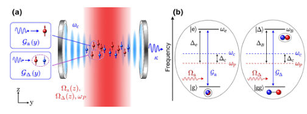 
FIG. 1. (a) Scheme of a two-component Fermi gas inside a planar single-mode optical cavity of width κ with transverse laser illumination. The cavity mode of frequency ωc is coupled to an internal atomic transition with coupling amplitude Ga(y) and to a molecular resonance with coupling strength G∆(y). The transverse plane wave pump laser of frequency ωP couples to both resonances, the single atom transition with strength Ωa(z) as well as the atom pair resonance with Ω∆(z). (b) Sketch of relevant optical transitions for single atoms |g⟩↔|e⟩ (left) and atom-pairs |gg⟩↔|∆⟩(right). The pump frequency detunings are denoted by ∆c, ∆e, and ∆B for the cavity, excited and molecular state,...

📷 Fig 2

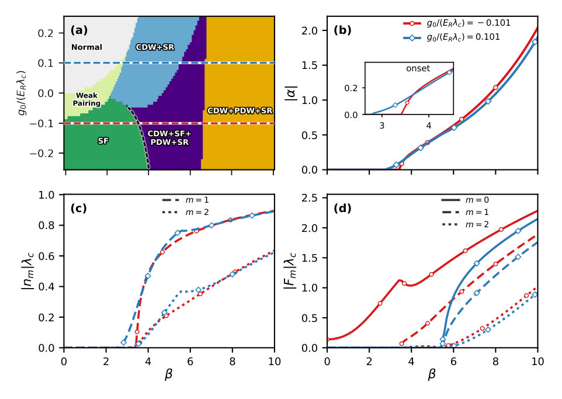 
FIG. 2. Mean-field phase diagram and signatures of self-organization. (a) Zero temperature phase diagram as a function of the pump strength β (dimensionless) and the contact interaction strength g0/(ERλc) (dimensionless). The dashed horizontal lines mark cuts at g0/(ERλc) = ±0.101 shown in the following plots. The black dotted curve shows the analytical prediction. The labels denote the normal, superfluid (SF), charge-density-wave (CDW), pair-density-wave (PDW), and superradiant (SR) phases. The pale green region “weak pairing” corresponds to weak effective attraction, for which the exponentially small pairing amplitude is below our numerical accuracy. (b) Intra-cavity field amplitude |α|...

📷 Fig 3

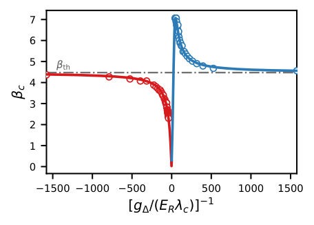 
FIG. 3. Fano-type superradiant phase boundary in the strongly attractive regime. The critical pump amplitude βc to the ordered phase is shown as a function of the dimensionless inverse atom-pair dispersive coupling x = ERλc/g∆. Red (blue) circles correspond to g∆&lt; 0 (&gt; 0). The solid curve show the Fano-shape fit to the threshold pump intensity β2 c(x). The horizontal dash-dotted line marks the fitted background βth. The parameters: N↑= N↓= 1 per unit cell, g0/(ERλc) ≃ −3.04, ga/ER ≃−0.38, ∆c/ER ≃−4.05, and κ/ER ≃0.10.

**Summary.** This research uses numerical simulations to study how coupling a degenerate Fermi gas to an optical cavity influences the simultaneous development of density and pairing orders. The authors demonstrate that the cavity field fundamentally alters the system's ground state, leading to distinct intertwined phases depending on the nature of the atomic interactions. This work highlights the potential of cavity QED to realize and control complex, multi-ordered quantum states.

**Why it may be interesting.** This work is highly relevant as it explores how cavity-mediated light-matter interactions can engineer and stabilize exotic, multi-component ordered states (like intertwined CDW/PDW) in ultracold atomic systems, bridging quantum optics and many-body physics.

Detailed structure

**Main problem.** The paper investigates the interplay and potential intertwining of density ordering and pairing order in a degenerate Fermi gas when coupled to an optical cavity.

**Main result.** The cavity-induced interactions can support intertwined fermionic orders, leading to distinct phase transitions depending on whether the bare interaction is repulsive or attractive.

**Method.** The study employs extensive numerical simulations using the Hartree-Fock-Bogoliubov (HFB) formalism to solve the mean-field Hamiltonian.

**Model / system.** The system is a two-component degenerate Fermi gas trapped in a planar optical cavity, driven by a transverse pump laser, allowing for simultaneous control over density and pairing via cavity coupling.

**Key observables.** Charge-Density-Wave (CDW) instability, Pair-Density-Wave (PDW) instability, superfluid coherence, and the cavity field amplitude $|\alpha|$.

**Important parameters / regimes.** Bare atom-atom interaction ($g_0$), cavity-induced single-atom interaction ($g_a$), and cavity-induced pair interaction ($g_\Delta$), as well as the pumping strength ($eta$).

**Assumptions / limitations.** The analysis uses a mean-field description and operates in the far off-resonant dispersive regime, allowing for adiabatic elimination of excited states.

**Figures summary.** Figures illustrate the setup scheme, phase diagrams showing transitions between Normal, SF, CDW, and PDW phases based on interaction strength and pumping, and plots detailing the evolution of density and pairing harmonics.

**Paper structure.** The paper progresses from defining the physical setup and Hamiltonian to analyzing the system in different interaction regimes (repulsive vs. attractive) and finally detailing the joint instability leading to intertwined CDW+PDW states.

Abstract

Recent quantum gas cavity-QED experiments demonstrated simultaneous coupling of photons to single atom transitions as well as correlated pairs of ultracold fermions trapped inside optical cavities. This enables simultaneous control over density ordering and pairing. Using extensive numerical simulations, we show that in a transversely driven, two-component degenerate Fermi gas, the interplay of cavity-induced and bare atom--atom interactions controls not only the power threshold for self-organization, but also the type of spatial ordering in the $\mathbb Z_2$-symmetry-broken superradiant state. In the repulsive interaction regime, unpaired or weakly paired fermions first self-organize through a charge-density-wave instability, and finite-momentum pairing only occurs at much stronger pump strengths. In contrast, an attractive superfluid undergoes a joint density--pairing instability, directly entering into intertwined phase with charge-density-wave and pair-density-wave orders. At strong pumping the photon-enhanced pair interaction generates localized density and pairing order even when the bare contact interaction is repulsive. In this cavity-dominated regime strong spatial localization suppresses the long range superfluid coherence. Our results identify the role of cavity-induced atomic interactions in supporting intertwined fermionic orders and pave the way for exploring exotic states with multiple orders in highly controlled hybrid light-matter systems.

[↑ back to top](#top)

### [A first introduction to Matrix Product State algorithms for the integration of Lindblad equation](http://arxiv.org/abs/2609.18841v1)

**Authors:** Christophe Chatelain  
**Type:** theory · **Category:** numerical methods · **PDF:** <https://arxiv.org/pdf/2609.18841v1>  
**Analysis basis:** full PDF text, analyzed in chunks
**Topic relevance:** 🔥 `methods for driven-dissipative` **5/5** · `correlated / nonlocal dissipation` **3/5** · `driven-dissipative phase transition` **3/5** · `quantum measurements` **3/5** · `analog quantum simulation` **2/5** · `non-equilibrium universality` **2/5** · `Keldysh / 2PI / non-Gaussian methods` **1/5**

📷 Fig 1

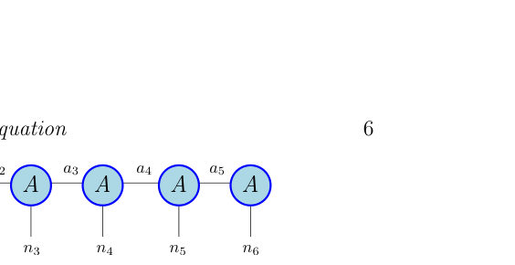 
Figure 1. Diagrammatic representation, originally introduced by Penrose, of equation (20) in the case of chain of 6 sites [20, 21]. Tensors are represented as blue boxes. Each one of their legs corresponds to an index. Open legs are associated to physical indices ni while internal lines connecting the legs of two tensors are associated to virtual indices. The summation over the latter is implicit.

📷 Fig 2

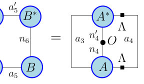 
Figure 3. Diagrammatic representation of the expression of the quantum average O = ⟨ψ|O|ψ⟩of an observable acting only on site 4 when |ψ⟩is decomposed as a mixed MPS (25). The matrix elements On4,n′ 4 of the observable are depicted as black dot. Exploiting the left-canonical (23) and right-canonical (24) gauge conditions, the tensor network can be efficiently contracted leaving a smaller one involving only two matrices.

📷 Fig 3

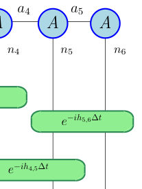 
Figure 4. Diagrammatic representation of one iteration of the TEBD algorithm corresponding to the unitary time evolution of the MPS during a time step ∆t.

📷 Fig 4

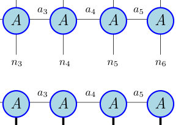 
Figure 5. Diagrammatic representation of the density matrix (left) for a chain of 6 sites. Grouping together the indices ni and n′ i, successive SVD’s yields the MPS depicted on the right (below). Alternatively, the density matrix can be put under the form of a product of matrices depending on the two indices ni and n′ i at site i (above). The latter is referred to as a Matrix Product Operator (MPO) or a Matrix Product Density Operator (MPDO) to emphasize the fact that it corresponds to a density matrix.

📷 Fig 5

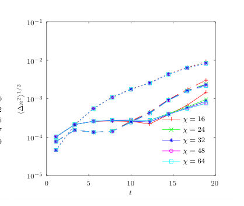 
Figure 6. On the left, average density profile ⟨ni⟩of a free-fermion model with a particle source on the first site of the chain and a sink on the last one. The continuous lines correspond to the exact profile while the symbols were obtained numerically by vectorization of Lindblad equation and a MPDO representation with χ = 64 and

**Summary.** This review introduces and compares four Matrix Product State (MPS) based algorithms for numerically solving the Lindblad equation in 1D quantum systems. It benchmarks these methods—including quantum trajectory and quantum state diffusion—against an exactly solvable free-fermion model. The paper provides valuable insights into the trade-offs between computational efficiency, accuracy, and the inherent limitations of MPS truncation when simulating open quantum dynamics.

**Why it may be interesting.** This work is highly relevant for AMO physicists studying open quantum systems, as it provides a detailed, comparative guide on using tensor network methods (MPS) to simulate dissipation and environmental coupling, which is crucial for understanding realistic quantum devices.

Detailed structure

**Main problem.** The paper aims to develop and compare various numerical algorithms for accurately integrating the Lindblad equation, which governs the time evolution of open quantum systems.

**Main result.** The comparison shows that the quantum-state diffusion algorithm can outperform the quantum trajectory method at small times, although at large times, time discretization and MPS truncation errors dominate.

**Method.** The core methodology involves representing the quantum state using Matrix Product States (MPS) and applying techniques like Time-Evolving Block Decimation (TEBD) to simulate the dynamics dictated by the Lindblad master equation.

**Model / system.** The study uses a one-dimensional quantum lattice system, specifically a free-fermion model with particle sources and sinks, whose dynamics are described by the Lindblad equation.

**Key observables.** Average density $\langle n_i(t) 
angle$, average current $\langle j_i 
angle$, and entanglement entropy ($S_E$).

**Important parameters / regimes.** Bond dimension ($\chi$), time step ($\Delta t$), and the number of stochastic histories ($n_{	ext{conf}}$).

**Assumptions / limitations.** The dynamics are assumed to be Markovian, the interaction is weak (Born approximation), and the MPS representation assumes low entanglement.

**Figures summary.** Figures illustrate the average density and current profiles over time, comparing numerical results against exact solutions, and showing the mean square deviation of observables.

**Paper structure.** The paper introduces the problem by defining the Lindblad equation for open systems, reviews the MPS formalism and TEBD for unitary evolution, and then compares four specific algorithms (two direct integration, two stochastic unravelings) using the free fermion model as a benchmark.

Abstract

In this introductory review, we present and compare four algorithms for the numerical integration of the Lindblad equation for one-dimensional quantum lattice systems. All four methods are based on Matrix Product State representations and can be viewed as extensions of the Time-Evolving Block Decimation (TEBD) algorithm to open quantum systems. Two approaches directly integrate the vectorized Lindblad equation, one of them explicitly enforcing the positivity of the density matrix. The other two rely on stochastic unravelings of the Lindblad equation, namely the quantum trajectory and quantum state diffusion approaches. We discuss the principles, numerical implementation, accuracy, and computational efficiency of the different methods, and benchmark them against an exactly solvable free fermion model.

[↑ back to top](#top)

### [Proof of Heisenberg's Error-Disturbance Relation for Individual Measurements](http://arxiv.org/abs/2609.18211v1)

**Authors:** Seiji Kosugi  
**Type:** theory · **Category:** other · **PDF:** <https://arxiv.org/pdf/2609.18211v1>  
**Analysis basis:** full PDF text, analyzed in chunks
**Topic relevance:** 🔥 `quantum measurements` **5/5**

📷 Fig 1

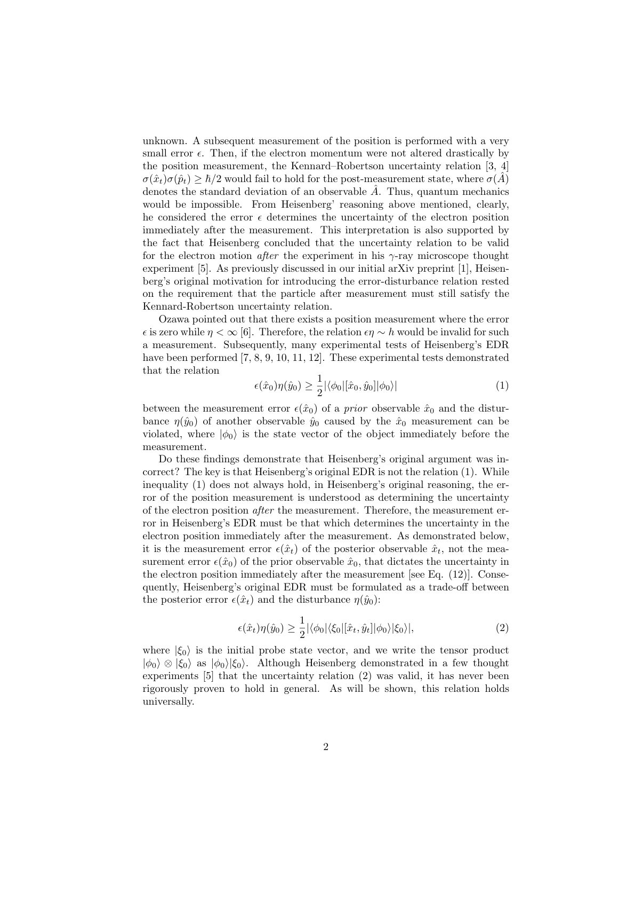 
Low-resolution page preview, page 2

📷 Fig 2

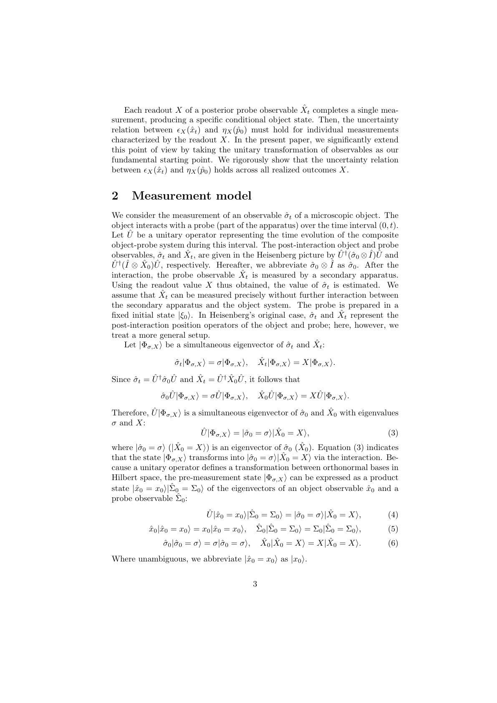 
Low-resolution page preview, page 3

📷 Fig 3

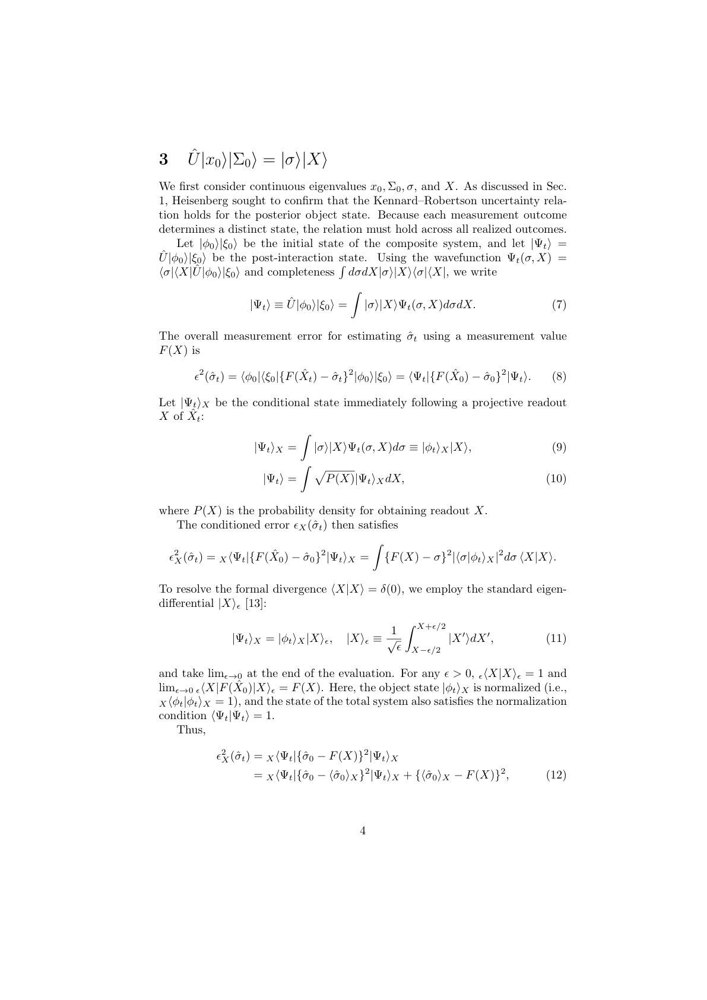 
Low-resolution page preview, page 4

📷 Fig 4

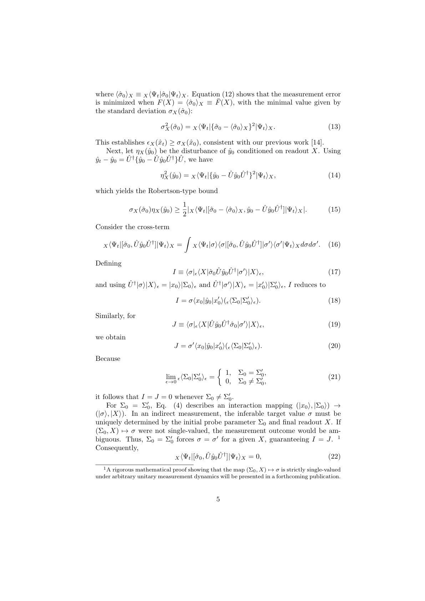 
Low-resolution page preview, page 5

📷 Fig 5

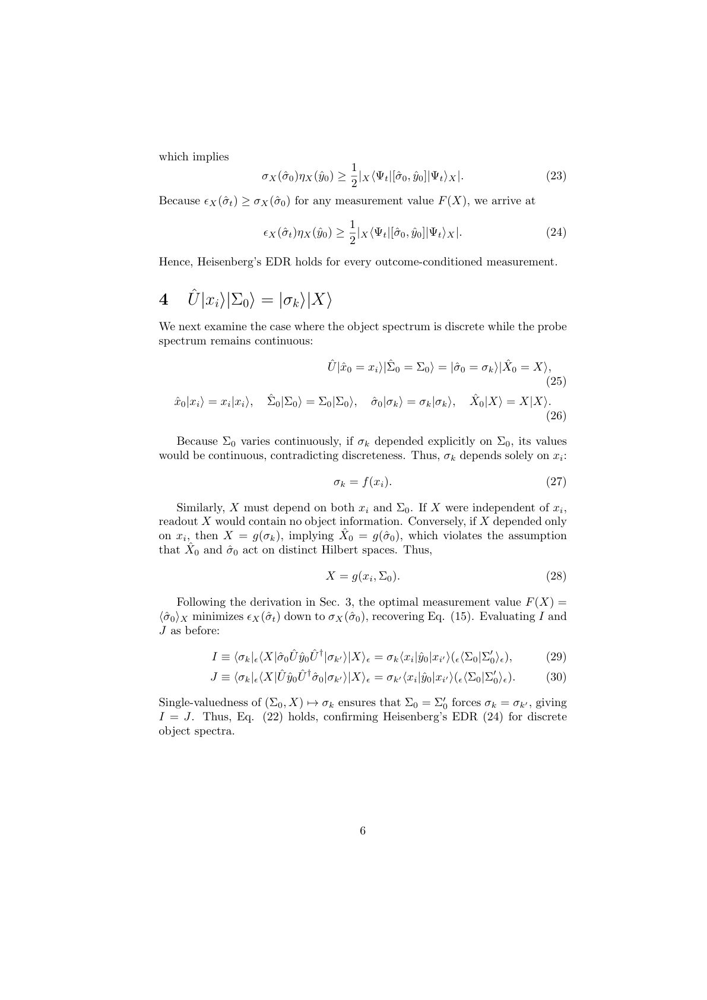 
Low-resolution page preview, page 6

**Summary.** This paper rigorously derives Heisenberg's Error-Disturbance Relation for quantum measurements, focusing on the error and disturbance associated with individual measurement outcomes. By using unitary transformation equations, the authors prove the EDR holds for specific readouts, providing a refined theoretical basis for understanding the fundamental trade-off inherent in quantum measurement processes.

**Why it may be interesting.** This work refines the fundamental understanding of measurement back-action by providing a rigorous, outcome-conditional derivation of the EDR, which is crucial for theoretical work in quantum measurement theory and open quantum systems.

Detailed structure

**Main problem.** The paper provides a rigorous derivation of Heisenberg's Error-Disturbance Relation (EDR) specifically for individual quantum measurements, addressing conceptual ambiguities in prior formulations.

**Main result.** The EDR, $\epsilon_X(\hat{\sigma}_t) \eta_X(\hat{y}_0) \geq rac{1}{2} |\langle\Psi_t|[\hat{\sigma}_0, \hat{y}_0]|\Psi_t
angle_X|$, is proven to hold strictly at the level of individual measurement outcomes, and this relation also holds when errors are averaged over the unconditioned state.

**Method.** The derivation utilizes the unitary transformation equations of observables ($\hat{U}$) to analyze the measurement process, calculating conditional variances ($\epsilon_X$) and disturbances ($\eta_X$) across various spectral regimes (discrete/continuous).

**Model / system.** The model describes a quantum measurement interaction where an object observable ($\hat{\sigma}_0$) interacts with a probe observable ($\hat{y}_0$) over time $t$ via a unitary operator $\hat{U}$.

**Key observables.** Measurement error $\epsilon_X(\hat{\sigma}_t)$ and disturbance $\eta_X(\hat{y}_0)$ associated with specific measurement outcomes $X$.

**Important parameters / regimes.** The time evolution parameter $t$, and the structure of the observables ($\hat{\sigma}_0, \hat{y}_0$) relative to the unitary evolution $\hat{U}$.

**Assumptions / limitations.** The derivation assumes that the mapping from initial state/readout to the measured observable is strictly single-valued for the EDR to hold.

**Paper structure.** The paper builds upon preliminary work by first establishing the EDR for individual outcomes using unitary transformations, then verifying its consistency across different spectral types (discrete/continuous), and finally confirming the result in the standard von Neumann interaction model.

Abstract

Heisenberg originally envisioned the error-disturbance relation under the premise that the state after measurement must remain consistent with the Kennard-Robertson uncertainty relation. This implies that the measurement error must be formulated via a posterior observable $\hat{x}_t$, rather than a prior observable $\hat{x}_0$, because the posterior measurement error determines the post-measurement uncertainty of the electron. Building upon the preliminary conceptual foundation reported in arXiv:1504.03779, this paper presents a rigorous derivation of the error-disturbance principle formulated from the unitary transformation equations of observables. Each readout $X$ of a posterior probe observable $\hat{X}_t$ completes a single measurement event, producing a specific conditional object state. The Kennard-Robertson uncertainty relation must hold for these states. Specifically, we show that the uncertainty relation between the error $ε_{X}(\hat{x}_t)$ and the disturbance $η_{X}(\hat{p}_0)$ holds strictly at the level of individual measurements, characterized by the specific readout $X$. We also verify that conventional error-disturbance relations, where the errors are evaluated by averaging over the unconditioned state, hold true. Our results provide a refined theoretical basis for understanding the fundamental trade-off in individual measurement outcomes.

[↑ back to top](#top)

### [Exact damping-basis continued fractions for few-atom lasers: collective correlations beyond second-order cumulant closure](http://arxiv.org/abs/2609.17785v1)

**Authors:** Stephan Hartmann  
**Type:** theory · **Category:** other · **PDF:** <https://arxiv.org/pdf/2609.17785v1>  
**Analysis basis:** full PDF text, analyzed in chunks
**Topic relevance:** 🔥 `Tavis-Cummings & cavity-many-emitter` **4/5** · `correlated / nonlocal dissipation` **3/5** · `methods for driven-dissipative` **3/5** · `Dicke superradiance` **2/5** · `driven-dissipative phase transition` **2/5** · `superradiant laser` **2/5** · `Keldysh / 2PI / non-Gaussian methods` **1/5** · `analog quantum simulation` **1/5** · `non-equilibrium universality` **1/5** · `quantum measurements` **1/5**

📷 Fig 1

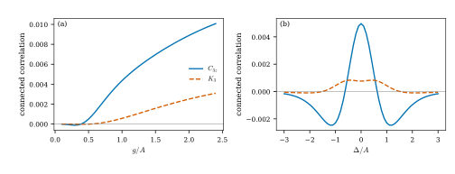 
FIG. 1. Connected three-atom correlations Γ3 = C3z (solid) and K3 (dashed) at s = 0.6, A = 1, B = 0.7, C = B/2, ν = 0: (a) versus coupling at ∆= 0; (b) versus detuning at g = 1.1.

📷 Fig 2

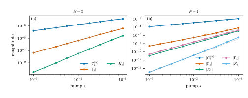 
FIG. 2. Weak-pump hierarchy of connected correlations at the baseline parameters for (a) N = 3 and (b) N = 4. Dotted lines are the power laws s1, s2, s3, s4 anchored at the smallest pump.

📷 Fig 3

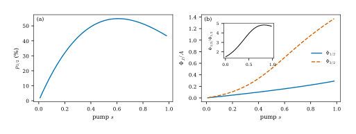 
FIG. 3. Sector-resolved structure of the N = 3 stationary state at the baseline parameters. (a) Population of the J = 1/2 sector, peaking at 55% near s = 0.6. (b) Feeding rates Φ1/2 (solid) and Φ3/2 (dashed); inset: their ratio.

📷 Fig 4

 
Figure 4 shows ⟨ˆn⟩, g(2)(0), and C(N) 2 for N = 1, . . . , 16 at three pump values in the baseline regime. Below inver- sion, s = 0.3, the photon number saturates at ⟨ˆn⟩≈0.27 while g(2)(0) rises to 2.15, slightly above thermal; at s = 0.6 it saturates at 1.61; at s = 0.9 the photon number grows linearly, 0.26 per atom, and g(2)(0) passes through

📷 Fig 5

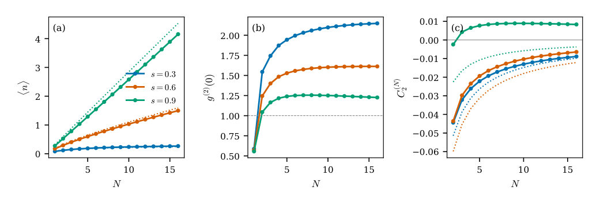 
FIG. 4. Scaling with atom number at the baseline parameters for s = 0.3, 0.6, 0.9: (a) mean photon number, (b) g(2)(0), (c) pair coherence C(N) 2 . Symbols: exact continued fraction; dotted: the second-order cumulant closure, Eq. (32).

**Summary.** This paper presents an exact theoretical method using continued fractions to solve the dynamics of few-atom lasers coupled to a cavity. By constructing a block-tridiagonal Liouvillian, the authors derive exact expressions for collective correlations and benchmark existing approximations. The results are crucial for understanding the true quantum nature of light emission in these systems, particularly highlighting where simple approximations break down.

**Why it may be interesting.** This work provides a powerful, exact, and systematically improvable tool for analyzing open quantum systems in cavity QED, offering quantitative benchmarks against common, but often inaccurate, mean-field or cumulant approximations.

Detailed structure

**Main problem.** To develop an exact theoretical framework for few-atom lasers, surpassing the limitations of standard approximations like second-order cumulant closure.

**Main result.** The authors derive exact identities for collective correlations and show that the standard second-order cumulant closure fails qualitatively for inter-emitter coherence above inversion.

**Method.** The method combines the Briegel--Englert damping basis for the cavity mode with the permutation-invariant Liouville basis for the atoms, leading to a block-tridiagonal Liouvillian solved via a matrix continued fraction.

**Model / system.** The system models $N$ identical, incoherently pumped two-level emitters coupled symmetrically to one lossy cavity mode (Tavis–Cummings model). The dynamics are governed by a master equation incorporating cavity decay and atomic pumping/decay rates.

**Key observables.** Photon number ($\langle \hat{n} 
angle$), pair coherence, emission spectrum $S(\omega')$, and various connected correlation functions.

**Important parameters / regimes.** Number of emitters ($N$), cavity decay rate ($A$), and pumping/decay rates ($B, s, C$). The analysis covers the few-quanta regime and the good-cavity limit.

**Assumptions / limitations.** The core assumption is that the combined Liouvillian structure allows for a block-Jacobi reduction, leading to a uniquely solvable linear matrix equation for the stationary state.

**Figures summary.** Figures show time evolution plots comparing exact results to approximations for photon number and $g^{(2)}(0)$, and illustrate the spectral pole width for small $N$.

**Paper structure.** The paper establishes the exact block-Jacobi operator structure, solves the stationary state using a matrix continued fraction leading to a solvable Riccati equation, and then applies this machinery to derive exact correlation identities and benchmark existing approximations.

Abstract

We combine the Briegel--Englert damping basis of a lossy cavity mode with the permutation-invariant Liouville basis of \(N\) identical, incoherently pumped two-level emitters. The resulting Liouvillian is exactly block tridiagonal in a single radial field index, with atomic blocks of dimension \(\binom{N+3}{3}\). The stationary state follows from a matrix continued fraction whose asymptotic closure is a linear matrix equation that we prove to be uniquely solvable throughout the dissipative regime \(A>0\), and the same construction in the coherence-one sector yields the emission spectrum. The method is validated against direct diagonalization, weak-pump perturbation theory, and closed-system spectra, reaches \(N=16\) in tens of seconds in the few-quanta regime, and has a quantified precision limit at large photon number. We use it to derive an exact two-atom photon-balance identity that isolates the cavity-induced pair coherence and relates it to a singlet--triplet population difference; to establish an exact pump-order hierarchy of connected correlations for a zero-temperature cavity and a parity property of the minimal collective-spin sector; and to benchmark the second-order cumulant closure used in few-emitter laser theory, which we find to be semi-quantitative for the photon number but to predict the wrong sign of the inter-emitter coherence above inversion. In a good-cavity regime the exact solution shows near-Poissonian statistics and strong line narrowing for two and three emitters.

[↑ back to top](#top)

### [Filter-Free Indistinguishable Photon Generation from Continuous-Wave-Driven Integrated Microresonators](http://arxiv.org/abs/2609.18575v1)

**Authors:** Ruiyang Chen, Sicheng Zeng, Yuan Chen, Sanli Huang, Zeying Zhong, Zhen Chen, Xue Bai, Yi-Han Luo, Junqiu Liu  
**Type:** experiment · **Category:** quantum information and computing · **PDF:** <https://arxiv.org/pdf/2609.18575v1>  
**Analysis basis:** full PDF text, analyzed in chunks
**Topic relevance:** 🔥 `QC/QI experiment` **4/5** · 🔥 `quantum optics experiment` **4/5** · `interference shaping light` **3/5** · `quantum measurements` **3/5** · `methods for driven-dissipative` **2/5** · `Full counting statistics` **1/5** · `analog quantum simulation` **1/5** · `correlated / nonlocal dissipation` **1/5** · `driven-dissipative phase transition` **1/5**

📷 Fig 1

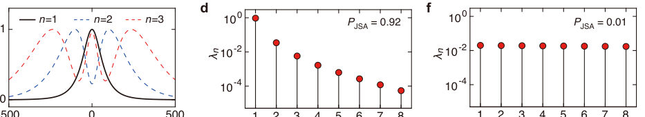 
Figure 1. Spectral purity of a microresonator-based photon-pair source. a, Schematic of photon-pair generation via cavity-enhanced SFWM in an integrated microresonator. b, Simulated joint spectrum for a microresonator driven by a pulsed pump with 1-GHz bandwidth. c, Normalized power spectra of the first three Schmidt modes (n = 1–3) under pulsed pumping. d, Schmidt coefficients λn for modes n = 1–8 under pulsed pumping, yielding a JSA-derived spectral purity of PJSA = 0.92. e, Simulated, highly correlated, joint spectrum for a microresonator under CW pumping with 50-kHz linewidth. f, Uniform distribution of Schmidt coefficients λn under CW pumping, resulting in a vanishingly low spectral...

📷 Fig 2

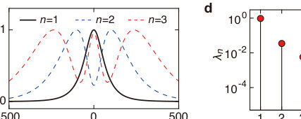 
Figure 1a illustrates photon-pair generation through cavity-enhanced spontaneous four-wave mixing (SFWM)30. Two pump photons of frequency ωp/2π are converted into a signal–idler pair constrained by energy conservation 2ωp = ωs + ωi, where ωs/i/2π represents the resonant frequency of the respective mode. For the remainder of this discussion, we refer ωp/s/i/2π to the frequency detuning to the corresponding resonance. The generated state is described by the JSA:

📷 Fig 3

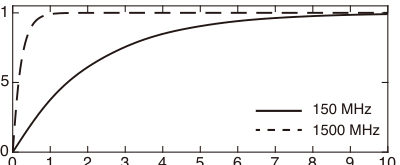 
Figure 2. Detector-conditioned purity and intrinsic heralding efficiency. a, Detector-conditioned purity P as a function of T for κ/2π = 150 and 1500 MHz. b, Intrinsic heralding efficiency η as a function of T ′ for κ/2π = 150 and 1500 MHz, with T = 100 ps.

📷 Fig 4

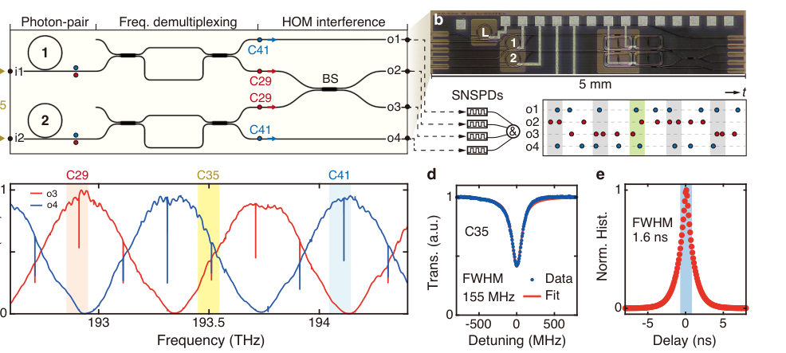 
Figure 3. Chip layout and experimental characterization. a, Schematic of the chip layout and detection scheme. Two microresonators are pumped at the C35 resonance (193.5 THz), generating C29 signal and C41 idler photon pairs. UMZIs demultiplex these channels, routing C41 idlers to ports o1 and o4 to herald the two C29 signal photons, which interfere on the BS. All four outputs are detected by SNSPDs for coincidence analysis. Inset: standard single-window coincidence logic, where green windows represent registered fourfold events and gray windows indicate HOM-suppressed cases. b, Optical micrograph of the Si3N4 photonic integrated circuits, showing two photon-source microresonators and an...

📷 Fig 5

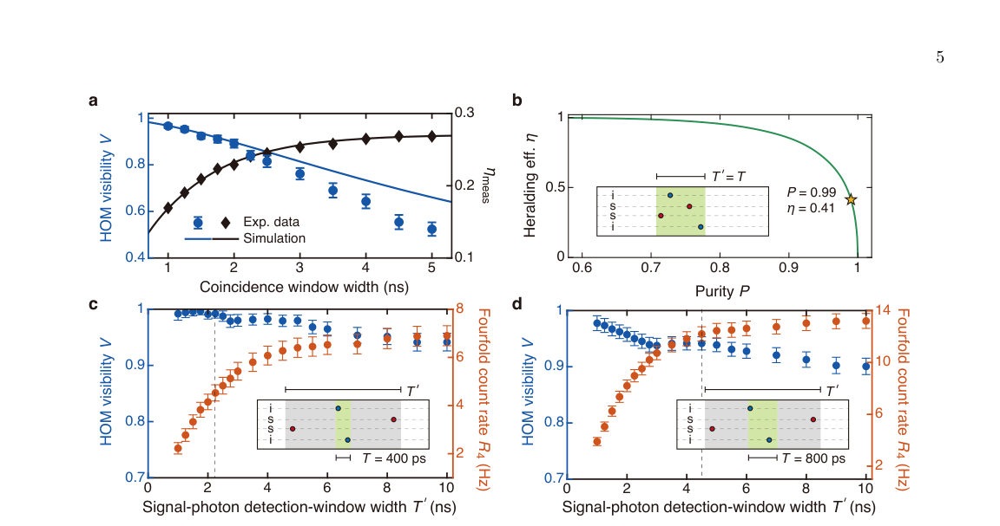 
Figure 4. Photon-pair performance. a, Measured V and ηmeas versus the coincidence window width under single-window coincidence logic with κ/2π = 155 MHz. b, Purity–efficiency trade-off under single-window coincidence logic. Inset, fourfold coincidence under single-window coincidence logic used in a and b, with signals and idlers sharing identical detection-window width. c, d, Measured V and R4 versus T ′ for T = 400 and 800 ps, respectively. Insets, fourfold coincidence under double- window coincidence logic, enabling independently configured T and T ′. Dashed lines mark the operating points V = 0.992(8) at R4 = 4.5(3) Hz and V = 0.942(12) at R4 = 12.2(6) Hz. All reported V values are...

**Summary.** This paper presents an experimental demonstration of generating highly indistinguishable photon pairs using integrated silicon nitride microresonators pumped by a continuous-wave laser. By developing and implementing a double-window coincidence detection scheme, the authors overcome theoretical limitations that previously predicted poor performance. This establishes CW-driven high-Q resonators as a robust and scalable platform for quantum network applications.

**Why it may be interesting.** This work provides a crucial experimental blueprint for realizing quantum network primitives using integrated photonics, directly addressing the scalability and performance limitations inherent in CW-driven sources, which is highly relevant to quantum optics and quantum information.

Detailed structure

**Main problem.** The primary challenge is generating scalable, high-indistinguishability photon sources required for quantum networks, as conventional theory predicts poor Hong-Ou-Mandel (HOM) interference visibility from independent continuous-wave (CW)-driven microresonators.

**Main result.** The authors demonstrated that by employing a detector-conditioned heralded state approach, they achieved high HOM visibilities (e.g., 0.992) and near-unity indistinguishability and heralding efficiency without spectral filtering.

**Method.** The work moves beyond source-only descriptions by analyzing the system using finite-time detection logic, specifically implementing a double-window coincidence detection scheme.

**Model / system.** The experiment utilizes integrated high-Q silicon nitride microresonators pumped by a CW laser, generating photon pairs via cavity-enhanced spontaneous four-wave mixing. The setup involves complex on-chip routing, interferometry, and superconducting nanowire single-photon detectors (SNSPDs).

**Key observables.** HOM visibility (V), detector-conditioned purity (P), and intrinsic heralding efficiency ($\eta$).

**Important parameters / regimes.** High-Q silicon nitride platform, CW pumping, double-window coincidence logic, and specific count rates (e.g., 4.5 Hz).

**Assumptions / limitations.** The analysis assumes a flat spectral acceptance window bandwidth B >> $\kappa$, and the key technical advancement relies on decoupling the purity and efficiency measurements via double-window logic.

**Figures summary.** Figures illustrate the failure of the JSA model for CW sources, show how P and $\eta$ approach unity by optimizing detection windows ($T$ and $T'$), and detail the comparison between single-window and double-window coincidence logic.

**Paper structure.** The paper first identifies the theoretical limitation of source-only descriptions. It then introduces the detector-conditioned state formalism. The experimental section details the $	ext{Si}_3	ext{N}_4$ chip fabrication and setup. The core argument is built by comparing the performance under single-window versus the superior performance achieved using double-window coincidence logic.

Abstract

Quantum networks require scalable photon sources combining narrow linewidth, high efficiency, and high indistinguishability. Microresonator photon-pair sources are promising candidates, yet a source-only description based on the joint spectral amplitude (JSA) predicts near-zero Hong-Ou-Mandel (HOM) interference visibility between photons generated by independent, CW-driven microresonators. In this work, we show that the observed HOM interference is not determined by the JSA alone. By combining finite-time detection with cavity-enhanced spontaneous four-wave mixing, we characterize a detector-conditioned heralded state governed by the idler-photon detection window. We further demonstrate that independently optimizing the idler and signal detection windows allows both heralded-photon indistinguishability and intrinsic heralding efficiency to approach unity, without spectral filtering or complex source engineering. Utilizing integrated high-$Q$ silicon nitride microresonators, we achieve HOM visibilities of 0.992(8) and 0.942(12), without background subtraction, at fourfold count rates of 4.5(3) and 12.2(6) Hz, respectively. Our work establishes CW-driven high-$Q$ microresonators as a robust and scalable platform for quantum-network primitives.

[↑ back to top](#top)

### [Giant-atom-mediated photon blockade](http://arxiv.org/abs/2609.18547v1)

**Authors:** C. Cui, W. Y. Hu, Y. Q. Ji, H. T. Cui, Yan-Hui Zhou, H. Z. Shen  
**Type:** theory · **Category:** other · **PDF:** <https://arxiv.org/pdf/2609.18547v1>  
**Analysis basis:** full PDF text, analyzed in chunks
**Topic relevance:** 🔥 `interference shaping light` **4/5** · `Tavis-Cummings & cavity-many-emitter` **3/5** · `correlated / nonlocal dissipation` **3/5** · `analog quantum simulation` **2/5** · `driven-dissipative phase transition` **2/5** · `methods for driven-dissipative` **2/5** · `Full counting statistics` **1/5** · `Keldysh / 2PI / non-Gaussian methods` **1/5** · `quantum measurements` **1/5** · `quantum optics experiment` **1/5**

📷 Fig 1

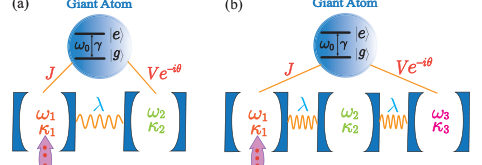 
FIG. 1: Schematic of a two-level giant atom (transition frequency ω0, dissipation γ) coupled to (a) two cavities and (b) three cavities, where the intercavity coupling coefficient is λ. The atom couples to the first cavity (frequency ω1, dissipation κ1) with real coupling coefficient J and (a) to the second cavity (frequency ω2, dissipation κ2) with complex coupling coefficient V e−iθ (strength V , phase θ), (b) to the third cavity (frequency ω3, dissipation κ3) with complex coupling coefficient V e−iθ, where the second cavity’s frequency and dissipation are ω2 and κ2, respectively. The first cavity is mediated via driving field (strength F, frequency ωl).

📷 Fig 2

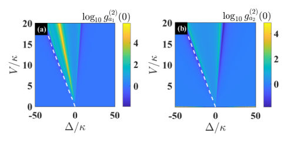 
FIG. 3: Second-order correlation function (solved by Eq. (4)) with giant atom and two cavities system on a logarithmic scale log10 g(2) a1 (0) and log10 g(2) a2 (0) as a function of detuning ∆and cou- pling strength V with a1 in (a) and a2 in (b). CPBs occur simultane- ously in two cavities at the same location at ∆opt = −2V in Eq. (9) (corresponding to two white dashed lines) for (a)(b). The other pa- rameters chosen are F = 0.01κ and θ = 0.

📷 Fig 3

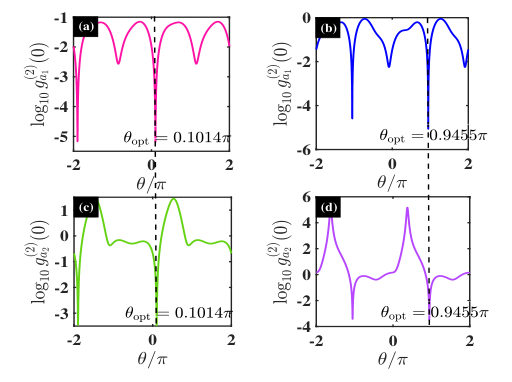 
FIG. 4: log10 g(2) o (0) (solved by Eq. (4)) with giant atom and two cavities system as a function of phase θ with a1 in (a)(b) and a2 in (c)(d). The black dashed lines denote the optimal phase θopt given by Eq. (16). The parameters chosen are (a)(c) λ = 4κ, Jopt = −0.7379κ, Vopt = 1.4637κ, F = 0.01κ, and ∆opt = 0.0805κ; (b)(d) λ = 5.9693κ, Jopt = −1.4993κ, Vopt = 2κ, F = 0.015κ, and ∆opt = −0.2095κ. UPBs occur simultaneously in two cavities at the same location at θopt = 0.1014π (with period 2π) for (a)(c), also at θopt = 0.9455π (with period 2π) for (b)(d).

📷 Fig 4

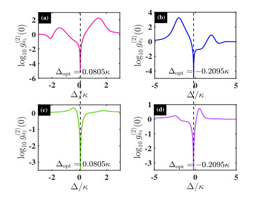 
FIG. 5: log10 g(2) o (0) (solved by Eq. (4)) with giant atom and two cavities system as a function of detuning ∆with a1 in (a)(b) and a2 in (c)(d) at optimal phases determined by Eq. (16). The parame- ters chosen are (a)(c) θopt = 0.1014π; (b)(d) θopt = 0.9455π. The black dashed lines correspond to the optimal detuning ∆opt given by Eq. (16). UPBs occur simultaneously in two cavities at the same lo- cation at ∆opt = 0.0805κ for (a)(c), also at ∆opt = −0.2095κ for (b)(d). The other parameters chosen are the same as those in Fig. 4.

📷 Fig 5

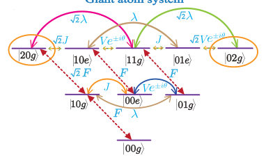 
FIG. 8: Level diagram of giant atom coupled to two cavities sys- tem. It depicts the zero-, one-, and two-photon states and transition paths responsible for the destructive interference that induces strong photon antibunching. States are labeled as |mnα⟩, where |m⟩(|n⟩) denotes photon number state in cavity a1 (a2), while |α⟩(α = g, e) indicates the atom state.

**Summary.** This paper explores photon blockade in quantum systems using giant atoms coupled to multiple optical cavities. It demonstrates that the extended nature of these atoms enables the simultaneous occurrence of unconventional and conventional photon blockades through destructive interference pathways. The theoretical analysis uses master equations and $g^{(2)}(0)$ measurements to map out the required physical parameters for this advanced quantum control.

**Why it may be interesting.** This work directly addresses advanced topics in cavity QED and open quantum systems by extending blockade phenomena from simple point atoms to complex, spatially extended giant atoms, opening new avenues for quantum light sources.

Detailed structure

**Main problem.** The paper investigates the realization and control of simultaneous unconventional and conventional photon blockades in quantum systems mediated by giant atoms.

**Main result.** The spatially extended nature of giant atoms allows for simultaneous photon blockades (both conventional and unconventional) in multiple coupled cavities via multipath destructive interference, a feat impossible in simple point atom systems.

**Method.** The analysis uses the Lindblad master equation to model system dynamics and calculates the second-order correlation function, g^(2)(0), to diagnose photon statistics.

**Model / system.** The system consists of a giant atom coupled to two or three optical cavities. The Hamiltonian and dynamics are described using cavity and atomic coupling strengths, detunings, and driving fields.

**Key observables.** Second-order correlation function g^(2)(0) (where < 1 indicates blockade), and the detection of simultaneous CPBs and UPBs.

**Important parameters / regimes.** Cavity frequencies ($\omega_j$), atom transition frequency ($\omega_0$), coupling strengths ($J, V$), inter-cavity coupling ($\lambda$), and detuning ($\Delta$).

**Assumptions / limitations.** Dissipation rates are often assumed equal ($\kappa_1 = \kappa_2 = \kappa_3 = \gamma$), and specific resonance conditions are used for detailed blockade analysis.

**Figures summary.** Figures illustrate schematic coupling structures, level diagrams showing CPB mechanisms, and plots of log10 g^(2)(0) vs. detuning/coupling strength demonstrating the optimal conditions for simultaneous blockades.

**Paper structure.** The paper progresses from establishing the general Hamiltonian and master equation for $N=2$ and $N=3$ cavities, to deriving the diagnostic tool $g^{(2)}(0)$, and finally demonstrating the physical mechanisms and optimal parameters for achieving simultaneous CPBs and UPBs.

Abstract

Photon blockade is a phenomenon where the presence of system nonlinearity causes the output to consist of single photons, which has been extensively studied in point atom systems, but it is barely explored in giant atom ones. In this paper, we propose giant atom-mediated photon blockade scheme based on two cavities and three cavities systems with driving field applied to the first cavity. We show that simultaneous unconventional photon blockades (UPBs) can not occur in the point atom system (the atom coupling only to the leftmost cavity) due to there always existing a cavity to have a single path. In contrast, the spatially extended nature of giant atom enables coupling to multiple cavities and allows for the introduction of a phase and coupling strength. Consequently, simultaneous UPBs in multiple cavities can be obtained due to the multipath destructive interference. Moreover, by manipulating the detuning, we observe simultaneous conventional photon blockades (CPBs) in multiple cavities. Finally, we study simultaneous two-photon blockades (2PBs) in point atom multiple cavities system.

[↑ back to top](#top)

### [Programmable Hong--Ou--Mandel interference in a giant-atom beam splitter](http://arxiv.org/abs/2609.18530v1)

**Authors:** Ruolin Chai, Lei Du, Guoqing Cai, Alejandro Vivas-Viaña, Anton Frisk Kockum, Yong Li  
**Type:** theory · **Category:** other · **PDF:** <https://arxiv.org/pdf/2609.18530v1>  
**Analysis basis:** full PDF text, analyzed in chunks
**Topic relevance:** 🔥 `interference shaping light` **4/5** · `Full counting statistics` **3/5** · `analog quantum simulation` **3/5** · `Tavis-Cummings & cavity-many-emitter` **2/5** · `methods for driven-dissipative` **2/5** · `quantum measurements` **2/5** · `Keldysh / 2PI / non-Gaussian methods` **1/5** · `correlated / nonlocal dissipation` **1/5** · `driven-dissipative phase transition` **1/5** · `quantum optics experiment` **1/5**

📷 Fig 1

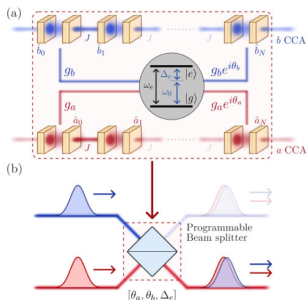 
FIG. 1. Schematic of the system. (a) A two-level giant atom (GA) is coupled at two spatially separated points, m = 0 and m = N, to two coupled-cavity arrays (CCAs), labeled a and b, with coupling strengths ga and gb, respectively. The couplings at m = N acquire tunable phases θa and θb. (b) Two single- photon wave packets incident through different CCAs scatter from the GA, which acts as a programmable beam splitter. Tuning the coupling phases θa, θb and the GA-cavity detuning ∆e controls the resulting four-port two-photon output.

📷 Fig 2

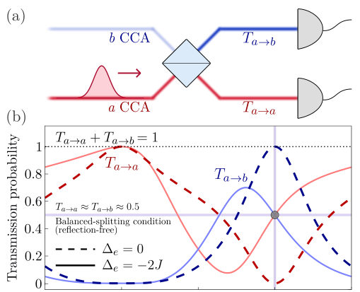 
FIG. 2. Phase-controlled single-photon transmission. (a) Schematic of single-photon scattering for a photon incident through the a CCA. The transmitted photon can exit through either the a or b CCA, with transmission probabilities Ta→a and Ta→b, respectively. (b) Transmission probabilities Ta→a (red) and Ta→b (blue) as a function of the common coupling phase θa = θb ≡θ, for detunings ∆e = 0 (dashed lines) and ∆e = −2J (solid lines). The dotted horizontal line indicates the reflection-free condition Ta→a +Ta→b = 1. The horizontal and vertical shaded regions indicate Ta→a ≈Ta→b ≈0.5 (un- der the reflection-free condition) and θ ≈π/2, respectively, while the filled circle marks the...

📷 Fig 3

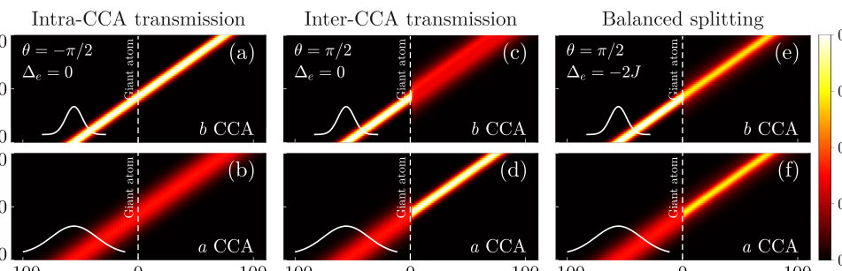 
FIG. 3. Time evolution of the local photon occupations in the two CCAs for two incident Gaussian single-photon wave packets. Different widths, wa = 25 and wb = 9, are used to visually distinguish the two wave packets. The upper and lower panels show the occupations in the b and a CCAs, respectively. (a, b) Intra-CCA transmission for θ = −π/2 and ∆e = 0. (c, d) Inter-CCA transfer for θ = π/2 and ∆e = 0. (e, f) Balanced splitting for θ = π/2 and ∆e = −2J, corresponding to the single-photon 50:50 beam-splitter condition. The white curves indicate the initial spatial profiles of the incident wave packets, while the vertical dashed line marks the location of the giant atom. Parameters: xa = xb =...

📷 Fig 4

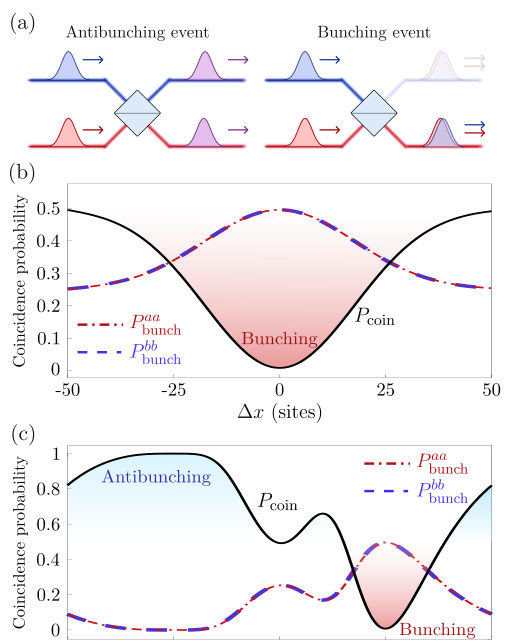 
FIG. 4. Programmable HOM interference. (a) Representa- tive bunching and antibunching events in the four-port out- put geometry. (b) Generalized coincidence probability Pcoin and bunching probabilities P aa bunch and P bb bunch as functions of the initial relative displacement ∆x = xa −xb between two identical Gaussian wave packets, one incident through each CCA, at the balanced-splitting point θ = π/2 and ∆e = −2J. (c) Same probabilities as functions of the coupling phase θ for fully overlapping inputs (xa = xb = −50). The shaded regions indicate bunching- and antibunching-dominated regimes. Pa- rameters: N = 1, wa = wb = 25, ga = gb = J, and ka = kb = π/2.

📷 Fig 5

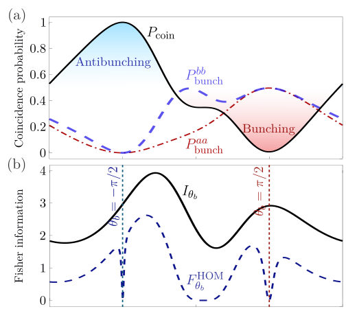 
FIG. 5. Coupling-phase estimation via HOM statistics. (a) Generalized coincidence probability Pcoin and the same- port bunching probabilities P aa bunch and P bb bunch as func- tions of θb, with the reference phase fixed at θa = π/2. The shaded regions indicate bunching- and antibunching- dominated regimes. (b) Classical Fisher information F HOM θb (blue dashed) associated with the binary HOM measure- ment and quantum Fisher information Iθb (black solid) of the asymptotic two-photon output state |Φout(θb)⟩. Parame- ters: N = 1, wa = wb = 25, xa = xb = −50, ga = gb = J, ∆e = −2J, ka = kb = π/2, and θa = π/2.

**Summary.** This paper proposes using a giant atom coupled to two waveguides as a programmable Hong-Ou-Mandel (HOM) interferometer. By tuning the coupling phases, the system can continuously switch the two-photon output statistics between bunching and antibunching. This platform offers potential applications in quantum information processing and quantum sensing.

**Why it may be interesting.** This work directly bridges cavity QED concepts (giant atoms, structured baths) with fundamental quantum optics phenomena (HOM effect) and advanced applications like quantum sensing, making it highly relevant for AMO physicists working on open quantum systems.

Detailed structure

**Main problem.** To demonstrate that a giant atom coupled to two waveguides can function as a programmable Hong-Ou-Mandel (HOM) interferometer, allowing continuous control over single-photon beam splitting and two-photon interference.

**Main result.** The system exhibits a pronounced HOM dip under specific conditions, and by tuning the coupling phases, the two-photon output statistics can be continuously controlled between bunching and antibunching.

**Method.** The analysis involves simulating single-photon and two-photon scattering using the system Hamiltonian, calculating generalized coincidence probabilities, and applying quantum parameter estimation theory.

**Model / system.** The physical platform is a giant atom (GA) coupled to two waveguides structured as coupled-cavity arrays (CCAs). The system is modeled using a Hamiltonian involving GA energy, nearest-neighbor hopping in the CCAs, and tunable coupling terms with phases.

**Key observables.** Bunching and antibunching probabilities, the HOM dip in the coincidence probability, single-photon transmission/reflection amplitudes, and the classical Fisher information.

**Important parameters / regimes.** Tunable coupling phases (theta_a, theta_b), GA-cavity detuning (Delta e), and the relative input delay between two-photon wave packets.

**Assumptions / limitations.** The analysis assumes the ability to characterize two-photon interference using correlation functions derived from quadrature measurements, despite the difficulty of photon-number-resolving detection in the underlying superconducting circuit platform.

**Figures summary.** Figure 1 schematically shows the GA coupled to two CCAs, illustrating phase control. Figure 2 shows single-photon transmission probabilities as a function of coupling phase and detuning, confirming the 50:50 beam-splitter condition.

**Paper structure.** The paper first introduces the concept of the programmable HOM interferometer using the GA. It then analyzes single-photon scattering to derive the conditions for balanced beam splitting. Finally, it extends the analysis to two-photon scattering to demonstrate the programmable control over interference statistics and its application to quantum sensing.

Abstract

The Hong--Ou--Mandel (HOM) effect is a hallmark of two-photon quantum interference, in which two indistinguishable photons impinging on a balanced beam splitter bunch into the same output port. Here, we show that a giant atom (GA), coupled to two waveguides through two coupling points each, can function as a programmable HOM interferometer, enabling continuous control over single-photon beam splitting and two-photon interference. This programmability arises from coupling-phase differences in the GA, which tune its self-interference and directionality, and thereby its scattering response. To characterize the two-photon interference, we analyze the scattering of two Gaussian single-photon wave packets injected through different waveguides and evaluate the bunching and antibunching (coincidence) probabilities of the resulting four output ports. At the operating point where the GA acts as an effective 50:50 beam splitter for single photons, we observe a pronounced HOM dip as the relative input delay between the two wave packets is varied. Away from this point, adjusting the coupling phases continuously tunes the two-photon output statistics between bunching into the same output port and antibunching across distinct output ports. In addition, we explore an application to quantum parameter estimation, showing that small deviations of coupling phases can be estimated from the two-photon output statistics, with the achievable sensitivity quantified by the classical Fisher information associated with a binary coincidence measurement. Our giant-atom beam splitter thus provides a programmable platform for two-photon interference in waveguide quantum electrodynamics, with potential applications in quantum information processing, quantum communication, and quantum sensing.

[↑ back to top](#top)

### [Liouvillian exceptional points in the emergence of quantum synchronization](http://arxiv.org/abs/2609.18867v1)

**Authors:** Carlos Ortega Taberner, Rosalind E. Cotton, Paul R. Eastham  
**Type:** theory · **Category:** other · **PDF:** <https://arxiv.org/pdf/2609.18867v1>  
**Analysis basis:** full PDF text, analyzed in chunks
**Topic relevance:** 🔥 `driven-dissipative phase transition` **4/5** · `correlated / nonlocal dissipation` **3/5** · `methods for driven-dissipative` **3/5** · `non-equilibrium universality` **3/5** · `Keldysh / 2PI / non-Gaussian methods` **2/5** · `Tavis-Cummings & cavity-many-emitter` **1/5** · `analog quantum simulation` **1/5** · `quantum measurements` **1/5** · `superradiant laser` **1/5**

📷 Fig 1

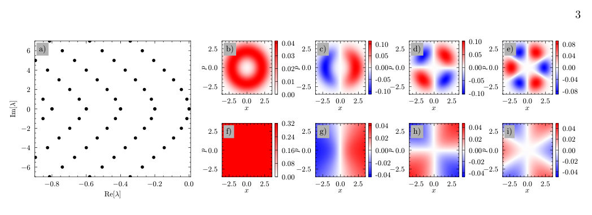 
FIG. 1. (a) Spectrum of the Liouvillian of the laser, showing different parabolic branches of eigenvalues approaching Re[λ] = 0, which characterize the limit cycle. (b-e) Real part of the Husimi function of the least damped right eigenmatrices of the Liouvillian, ν ∈[0, 3]. (f-i) Corresponding left eigenmatrices. Results obtained using A = B = ω = 1, C = 0.2.

📷 Fig 2

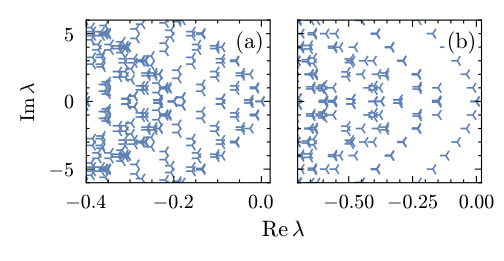 
FIG. 2. Spectrum of the Liouvillian for two lasers with de- tuning δω = 0.1, with no coupling (a), and with dissipative coupling g = 0.2. Results obtained using A = B = ω = 1, C = 0.2.

📷 Fig 3

 
FIG. 3. Phase-space distributions of the Liouvillian eigen- matrices for two lasers, given by the Q-functions in the basis of collective modes (see text), Q(β1 = x + iy, β2 = z). The z-axis is vertical and all axes span [−4, 4]. (a,b) Isosurfaces of the right eigenmatrix for λ = 0, R00, for uncoupled desyn- chronized lasers (a), and coupled synchronized lasers (b). All isosurfaces plotted at 2 max(Q)/3. (c) Magnitude isosurface for the right eigenmatrix of the slowest ν = 1 mode, R10, for synchronized lasers, colored by arg Q. (d) arg Q for the cor- responding left eigenmatrix, L10, on planes in phase-space. ϕ = 0 in (a) and 0.50 in (b,c,d).

📷 Fig 4

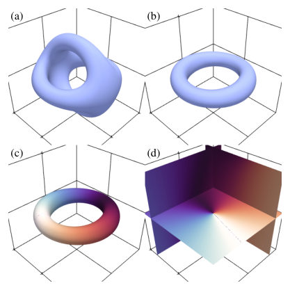 
Fig. 3 shows the Husimi functions, Q(β1, β2) = ⟨β1, β2|(L, R)ν0|β1, β2⟩/π2, for the eigenmatrices cor- responding to some eigenvalues in Fig. 2. The collective U(1) symmetry results in Q(β1, β2) =

📷 Fig 5

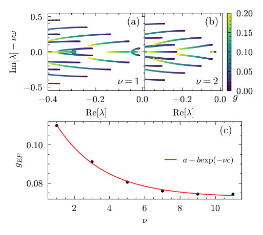 
FIG. 4. (a-b) Evolution of the spectrum of Liouvillian blocks ν = 1, 2 with different dissipative coupling strength g. ν = 1 displays an exceptional point, absent in ν = 2. Using param- eters A = B = 1, C = 0.2, δω = 0.1. (c) Coupling at which the EP of the two leading eigenvalues occurs for different odd harmonics ν, displaying an exponential dependence.

**Summary.** This theoretical paper analyzes quantum synchronization in coupled systems like lasers by examining the Liouvillian spectrum. It demonstrates that the transition between desynchronized and synchronized states is governed by exceptional points within the slow modes of the Liouvillian. The findings provide a quantum signature for these transitions observable even in the few-particle regime.

**Why it may be interesting.** This work directly addresses open quantum systems dynamics, using the Liouvillian formalism to map classical nonlinear phenomena (like synchronization) onto quantum spectral singularities (Exceptional Points), which is highly relevant for quantum optics and AMO physics.

Detailed structure

**Main problem.** The paper investigates the quantum analog of synchronization transitions occurring in coupled self-sustained oscillators, focusing on how these transitions are controlled by singularities in the quantum Liouvillian.

**Main result.** The synchronization transition is shown to be controlled by cascades of exceptional points in the slow modes of the Liouvillian spectrum, which are protected by a generalized PT symmetry.

**Method.** The analysis involves calculating the spectrum and eigenmatrices of the Liouvillian superoperator, comparing results to semiclassical approximations, and analyzing the spectral flow between different steady-state regimes.

**Model / system.** The system models coupled lasers or polariton condensates, whose dynamics are governed by a Lindblad form Liouvillian superoperator. The analysis utilizes concepts like limit cycles and the $U(1)$ symmetry inherent in the system.

**Key observables.** The Liouvillian spectrum (eigenvalues $\lambda$), the slow modes of the spectrum, and correlation functions like $g^{(1)}(	au)$ for single and coupled lasers.

**Important parameters / regimes.** Coupling strength, detuning ($\delta\omega$), and the coherence order ($n$) of the correlations.

**Assumptions / limitations.** The analysis relies on the Liouvillian formalism and involves approximations for the inverse saturation operator in some derivations.

**Figures summary.** Figures illustrate the Liouvillian spectrum, showing parabolic branches approaching zero decay rates near the limit cycle, and display the Husimi function for various eigenmatrices.

**Paper structure.** The paper progresses by establishing the Liouvillian framework for coupled oscillators, analyzing the spectral properties related to the classical limit cycle, and then detailing how the synchronization transition manifests as exceptional point cascades in the quantum spectrum.

Abstract

The coupling between self-sustained oscillators, such as lasers or polariton condensates, leads to different steady-states in different regimes. Weak coupling allows the oscillators to behave independently, with different frequencies and uncorrelated phases, while stronger coupling can produce synchronization. In classical or semiclassical theories transitions between these steady-states correspond to changes in the topology of the phase space attractors and occur at generalized exceptional points. We investigate the corresponding changes in a quantum theory of coupled lasers or condensates. We show how the different steady-state regimes of the classical limit give rise to distinct forms for the spectra and eigenmatrices of the slow modes of the Liouvillian. By following the spectral flow between the different regimes we show that the synchronization transition is controlled by cascades of exceptional points in these slow modes, protected by a generalized PT symmetry. Our results show how singularities of the quantum Liouvillian control the different dynamical regimes, and give rise to experimental signatures of the synchronization transition which remain well-defined in the few-particle regime dominated by quantum effects.

[↑ back to top](#top)

### [Qurrium: A Python package for randomized measurement-based estimation of quantum state properties](http://arxiv.org/abs/2609.17979v1)

**Authors:** Huai-Chun Chang, Teik-Hui Lee, Arthur Strauss, Yu-Cheng Lin, Hsiu-Chuan Hsu  
**Type:** both · **Category:** quantum information and computing · **PDF:** <https://arxiv.org/pdf/2609.17979v1>  
**Analysis basis:** full PDF text, analyzed in chunks
**Topic relevance:** 🔥 `quantum measurements` **4/5** · `QC/QI experiment` **3/5** · `analog quantum simulation` **3/5** · `methods for driven-dissipative` **2/5** · `Full counting statistics` **1/5** · `driven-dissipative phase transition` **1/5** · `quantum optics experiment` **1/5**

📷 Fig 1

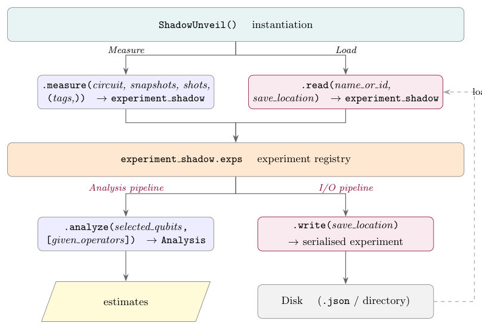 
Figure 1: The end-to-end workflow for the classical shadow protocol in Qurrium. The figure was generated using the TikZ package in LATEX, written with the assistance of Claude Sonnet 4.6 (Anthropic).

📷 Fig 2

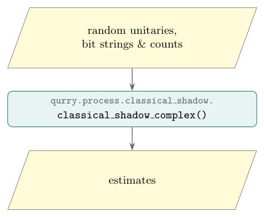 
Figure 2: The stadnalone estimation workflow. The figure was generated using the TikZ package in LATEX, written with the assistance of Claude Sonnet 4.6 (An- thropic).

📷 Fig 3

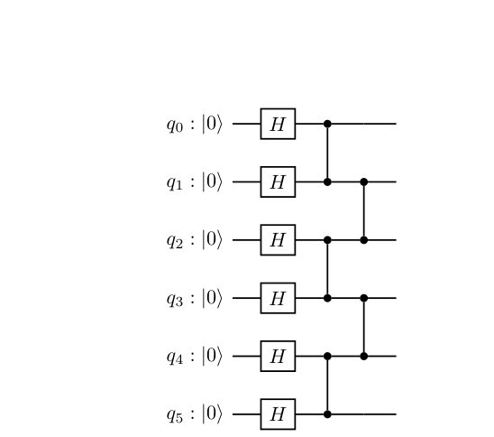 
Figure 3: Quantum circuit for preparing a six-qubit one- dimensional cluster state with OBC.

📷 Fig 4

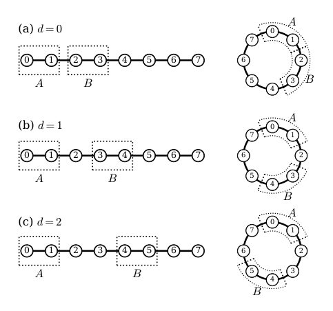 
Figure 6: Illustration of the distance d between two sub- systems A and B, enclosed by dotted lines, for an 8- qubit cluster state with OBC (left) and PBC (right). (a) d = 0, (b) d = 1, and (c) d = 2.

📷 Fig 5

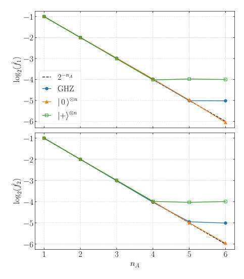 
Figure 5: The overlap between the cluster state and GHZ, all-zero and all-plus states of subsystem size nA, estimated using Eq. (8) (top) and Eq. (9) (bottom). The full system size is n = 6 for all states.

**Summary.** This paper presents Qurrium, a Python package built on Qiskit, designed to estimate quantum state properties efficiently using randomized measurement protocols like the classical shadow protocol. It offers two workflows—one for simulation and one for analyzing raw hardware data—allowing researchers to characterize complex states like cluster states and measure observables on real quantum hardware.

**Why it may be interesting.** For AMO physicists studying open quantum systems, this provides a crucial, hardware-agnostic tool to characterize complex quantum states (like those generated by cavity QED or trapped ions) using measurement data, bypassing the need for full tomography.

Detailed structure

**Main problem.** The paper addresses the essential need to estimate quantum state properties (like purity, entropy, and overlaps) without performing full quantum state tomography.

**Main result.** It introduces Qurrium, a Python package built on Qiskit, that implements randomized measurement protocols, specifically the classical shadow protocol, for efficient state characterization.

**Method.** The methodology centers on using randomized measurements (classical shadow protocol) to estimate expectation values and state properties, demonstrated through both end-to-end simulation workflows and standalone analysis of hardware-collected data.

**Model / system.** The package is tested on theoretical models like the cluster state and Ising time-evolved states, and validated using measurements from a superconducting quantum processor.

**Key observables.** Purity ($	ext{Tr}(
ho^2)$), second-order Rényi entropy ($S^{(2)}(
ho)$), expectation values of Pauli observables ($\langle O 
angle$), and state overlaps ($	ext{Tr}(
ho
ho')$).

**Important parameters / regimes.** The analysis depends on the structure of the quantum state (e.g., cluster state stabilizers) and the separation distance ($d$) between subsystems.

**Assumptions / limitations.** The standalone workflow assumes measurement outcomes and random unitaries are recorded in the specific Qurrium data format; the efficiency gains are implementation-level and do not change statistical complexity.

**Figures summary.** Figures illustrate the end-to-end and standalone workflows. Specific results show the overlap between the cluster state and reference states, and the decay of mutual information $I^{(2)}(A:B)$ with separation distance $d$.

**Paper structure.** The paper reviews the classical shadow protocol, details the two distinct workflows within Qurrium (end-to-end and standalone), and then demonstrates usage with concrete examples like the cluster state and Ising dynamics.

Abstract

Estimating quantum state properties is essential across a wide range of applications, from studying quantum many-body physics to benchmarking quantum hardware. We present Qurrium, a Python package built on Qiskit that implements randomized measurement protocols for estimating purity, second-order Rényi entropy, expectation values of Pauli observables, and state overlap. In this paper, we focus on the classical shadow protocol and demonstrate two workflows in Qurrium. One is the end-to-end workflow that integrates quantum circuit preparation, simulation, measurement, and analysis. The other is the standalone estimation workflow that accepts pre-collected measurement data from any hardware platform in Qurrium's data format. We demonstrate both workflows through examples of a cluster state and an Ising time-evolved state. Furthermore, we report results obtained from a superconducting quantum processor developed by Academia Sinica and analyzed using the standalone estimation workflow. Qurrium is built on Qiskit, the dominant framework in quantum computing software, making it directly accessible to the large community of researchers already working with Qiskit. The source code is openly available at https://github.com/qurrium/qurrium and the example code is provided at https://github.com/qurrium/classical-shadow-examples.

[↑ back to top](#top)

### [Logarithmic singularity in a dynamical quantum phase transition for free fermions](http://arxiv.org/abs/2609.18208v1)

**Authors:** Yasser Bezzaz, Dimitri M. Gangardt, Pavel L. Krapivsky, Jean-Marc Luck, Kirone Mallick, Sylvain Prolhac  
**Type:** theory · **Category:** statistical mechanics · **PDF:** <https://arxiv.org/pdf/2609.18208v1>  
**Analysis basis:** full PDF text, analyzed in chunks
**Topic relevance:** 🔥 `non-equilibrium universality` **4/5** · `Keldysh / 2PI / non-Gaussian methods` **3/5** · `driven-dissipative phase transition` **3/5** · `methods for driven-dissipative` **2/5** · `analog quantum simulation` **1/5** · `scars & prethermalization` **1/5**

📷 Fig 1

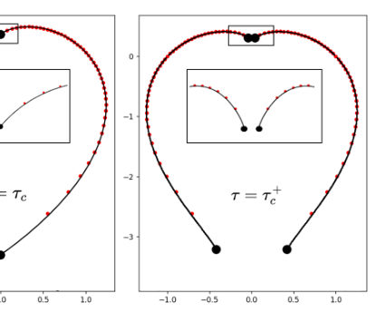 
Figure 2: Topological change of the dominant instanton configuration across the critical rescaled time τ = τc in the complex plane z = eiq. Red dots show the discrete saddle points from solving numerically (21) for N = 90. The curves in black represent the density support of the saddle points in the continuous limit by solving (29).

📷 Fig 2

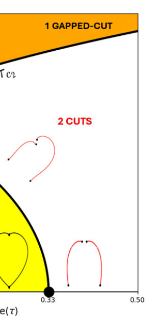 
Figure 3: Phase diagram of the dominant instanton configuration for AN(τ) in the complex plane of τ. Typical shapes of the charge support are shown in each region. The point of merger of the two critical lines for τ = i/2 corresponds to the third- order Gross-Witten-Wadia transition.

📷 Fig 3

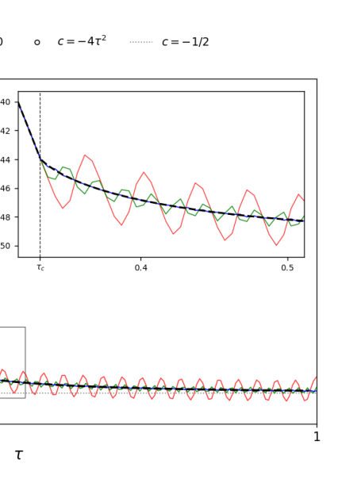 
Figure 4: Order parameter c(τ). The colored curves are extracted from the finite- N Loschmidt amplitude computed through the Toeplitz determinant representa- tion (15). The black dashed curve is the large-N solution obtained from Eq. (45). The open circles indicate the exact short-time result c(τ) = −4τ2, while the grey dotted line denotes the large-time asymptote c(∞) = −1/2. The inset highlights the convergence of the finite-N results near the critical point.

📷 Fig 4

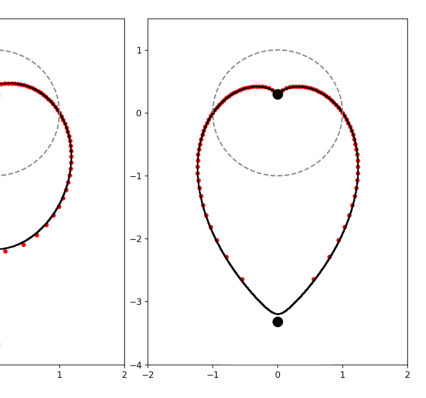 
Figure 5: Evolution of the dominant instanton configuration in the short-time regime in the complex plane z = eiq. From left to right: τ = 0.25, τ = 0.29, and τ ≃τc = 0.331, with N = 40, N = 90, and N = 90, respectively. Red dots show the discrete saddle points obtained by solving numerically (21), while the black curve represents the continuum support γ determined exactly in (53). Black dots indicate the zeros of y(z), and the grey dotted curve is the unit circle. As τ approaches τc, the zeros move toward the support, which continuously deforms into the unbroken- heart configuration at the transition.

📷 Fig 5

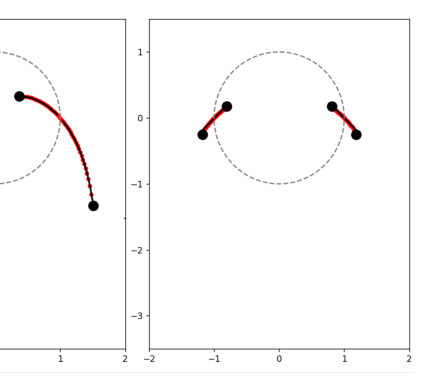 
Figure 6: Evolution of the dominant instanton configuration in the long-time regime. From left to right: τ = 0.5, τ = 1, and τ = 10, with N = 90. Red dots show the discrete saddle points obtained by solving numerically (21), while the black curves represent the continuum support γ determined from (29). Black dots indicate the branch points of y(z) and the endpoints of the support. The grey dotted curve is the unit circle. In this regime, the support consists of two symmetric disconnected cuts forming the broken-heart configuration. As τ increases, the two cuts continuously approach the steepest-descent contours of the external potential.

**Summary.** This work analyzes the Loschmidt echo for free fermions undergoing a dynamical quantum phase transition (DQPT). By mapping the problem to instanton calculations, the authors show that the transition manifests as a logarithmic singularity in the dynamical free energy. This provides a deep connection between quantum quench dynamics, topology, and large-deviation theory.

**Why it may be interesting.** The connection between non-equilibrium quantum dynamics (Loschmidt echo) and topological phase transitions, using tools from random matrix theory and large deviations, is highly relevant to understanding quantum thermalization and non-equilibrium critical phenomena.

Detailed structure

**Main problem.** The paper investigates the Loschmidt echo in a system undergoing a dynamical quantum phase transition (DQPT).

**Main result.** The dynamical free energy develops a logarithmic singularity at the DQPT, which is understood as a topological change in the dominant instanton configuration.

**Method.** The analysis uses large-deviation theory, mapping the problem to a Coulomb gas model and employing instanton calculations in the complex time plane.

**Model / system.** The system consists of N non-interacting spinless lattice fermions on a 1D lattice, initialized in a double-domain-wall state. The dynamics are governed by a tight-binding Hamiltonian.

**Key observables.** Loschmidt echo, dynamical free energy, and the instanton configuration.

**Important parameters / regimes.** Large N limit, large time limit, and the rescaled time $\tau = t/N$.

**Assumptions / limitations.** The analysis relies on the large-N limit and the characterization of the echo by the dominant complex instanton configuration.

**Figures summary.** Figures illustrate the initial double-domain-wall configuration and the topological change of the dominant instanton configuration across the critical point.

**Paper structure.** The paper reviews known results, maps the problem to the Coulomb gas, analyzes the real-time DQPT, and extends the analysis to complex time to study post-selection effects.

Abstract

We study the Loschmidt echo in a system of N non-interacting spinless lattice fermions released from a double-domain-wall initial state. In the large-N limit, the return probability is characterized by a large-deviation rate function known as the dynamical free energy. The Loschmidt echo is dominated by a complex instanton configuration, and the dynamical free energy develops a logarithmic singularity at the dynamical quantum phase transition. We obtain analytical results in the short-time and long-time regimes and support them with numerical computations. We show that the transition can be understood as a topological change of the dominant instanton configuration, analogous to the emergence of a cut in random matrix theory. We further show that post-selection can drive the system through two successive DQPTs, associated with successive topological changes of the dominant instanton configuration in complex time.

[↑ back to top](#top)

### [Query-Optimal and Gate-Efficient Lindbladian Simulation](http://arxiv.org/abs/2609.18757v1)

**Authors:** Boyang Chen, Minbo Gao, Xinzhao Wang, Shuo Zhou  
**Type:** theory · **Category:** quantum information and computing · **PDF:** <https://arxiv.org/pdf/2609.18757v1>  
**Analysis basis:** full PDF text, analyzed in chunks
**Topic relevance:** 🔥 `methods for driven-dissipative` **4/5** · `correlated / nonlocal dissipation` **3/5** · `driven-dissipative phase transition` **3/5** · `Keldysh / 2PI / non-Gaussian methods` **1/5** · `analog quantum simulation` **1/5** · `non-equilibrium universality` **1/5** · `quantum measurements` **1/5**

📷 Fig 1

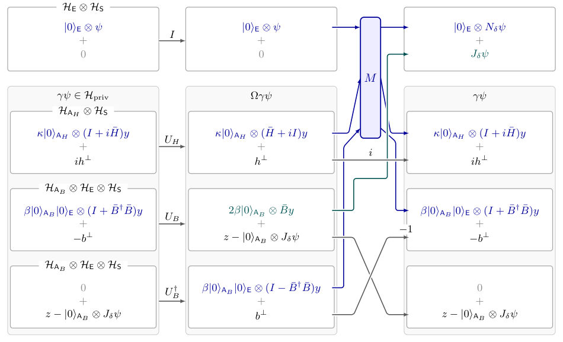 
Figure 1: One query followed by G implements Wδ and restores γψ. Here h, z, b are the three components of the private input to G. Blue connections show M ⊗IS acting as in (51); the other connections implement the projections, swaps, and phases in the explicit action of G in (53).

📷 Fig 2

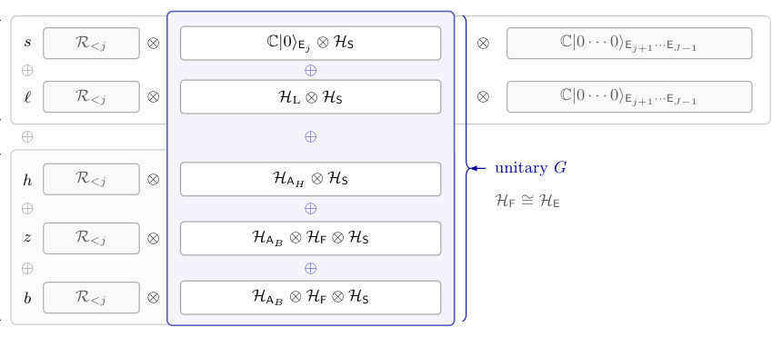 
Figure 2: The five summands of Hj+1 ⊕Kj. The highlighted column is the space on which the unitary G constructed in Lemma 3.1 acts; its action is shown in Figure 1. The unitary Gj applies G to this column and leaves R&lt;j unchanged. The first row is Hj. Fixed public suffixes are displayed after regrouping tensor factors; F denotes the private copy of E.

📷 Fig 3

 
Figure 3: Partition of [5, 16), with interval lengths shown inside the bars. Repeated endpoints give empty intervals.

📷 Fig 4

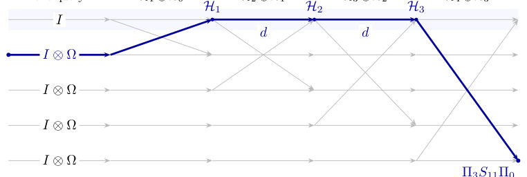 
Figure 4: The sequential product for J = 4, with rows representing direct-sum subspaces. The highlighted arrows show the only sequence of subspaces contributing to Π3S11Π0: it passes through H1 ⊆H2 ⊆H3, where G1 and G2 each act by multiplication by d. The updates Gr+1, . . . , GJ−1 act as the identity on Kr.

📷 Fig 5

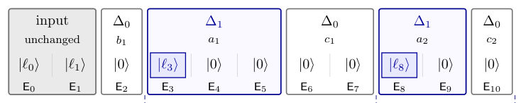 
Figure 5: Output Kraus labels for one summand of (183). The horizontal widths show the initial index j0 and the subsequent increments. The two ∆1 factors create nonzero labels at s1 = 3 and s2 = 8. The increments c1 = b2 and c2 = b3 are fixed by b; (187) then determines a.

**Summary.** This paper presents a quantum algorithm to simulate Lindbladian evolution with optimal query and gate complexity. It achieves a complexity matching the lower bound for Hamiltonian simulation by employing a sophisticated one-query transducer construction. This breakthrough provides a highly efficient tool for simulating open quantum systems in quantum computation.

**Why it may be interesting.** This work directly addresses the computational efficiency of simulating open quantum systems, which is crucial for modeling realistic physical processes like decoherence in quantum computing hardware.

Detailed structure

**Main problem.** The primary goal is to determine the optimal query complexity for simulating quantum evolution governed by a Lindbladian master equation.

**Main result.** The authors achieve a query complexity matching the lower bound for Hamiltonian simulation, $O(	au + rac{\log(1/\epsilon)}{\log(e + \log(1/\epsilon)/	au)})$, for time-independent and time-dependent Lindbladians.

**Method.** The simulation is implemented using a one-query transducer construction that approximates the evolution channel as a product of short-time steps, leveraging compressed Kraus-label representations and rotation factorization.

**Model / system.** The system is described by Lindbladian dynamics, $\mathcal{L}(
ho) = -i[H, 
ho] + 	ext{Tr}_E(B
ho B^\dagger) - rac{1}{2}\{B^\dagger B, 
ho\}$, which models open-system evolution. The simulation approximates $e^{t\mathcal{L}}(
ho)$ in the diamond norm.

**Key observables.** Diamond-norm error ($\epsilon$), Query Complexity, Gate Complexity.

**Important parameters / regimes.** Time $t$, time normalization $	au = (\alpha_H + \alpha_B^2)t$, and the approximation parameter $q$ (related to the number of factors).

**Assumptions / limitations.** The analysis assumes access to specific block and projected unitary encodings for the Hamiltonian $H$ and jump operators $B$.

**Figures summary.** Figure 4 illustrates the sequential product structure for $J=4$ steps, showing the path through subspaces. Figure 5 shows the output Kraus labels for one summand of the expansion, detailing index determination.

**Paper structure.** The paper develops the simulation by first establishing the required isometry $W_\delta$ using a transducer formalism. It then constructs the product isometry $W_J$ via a reuse construction, bounding the error using polynomial approximations $Q_q(\zeta)$, and finally deriving the optimal query and gate complexity bounds.

Abstract

We give a quantum algorithm for Lindbladian simulation given a block encoding of the Hamiltonian $H$ and a projected unitary encoding of the stacked jump operator $B=\sum_{k=1}^m \lvert k\rangle\otimes L_k$, with normalization factors $α_H$ and $α_B$, respectively. For evolution time $t$, set $τ=(α_H+α_B^2)t$. The algorithm approximates the evolution channel to diamond-norm error $\varepsilon$ using $O\!\left(τ+\frac{\log(1/\varepsilon)}{\log\!\left(e+\log(1/\varepsilon)/τ\right)}\right)$ oracle queries, matching the query lower bound for Hamiltonian simulation. The number of additional one- and two-qubit gates is linear in the query complexity up to polylogarithmic factors. The query- and gate-complexity bounds extend to Lipschitz-continuous time-dependent Lindbladians under coherent time-indexed oracle access. Our construction uses a one-query transducer that implements a product of rational approximations to short-time evolution when supplied with a catalyst. We bound the error from omitting the catalyst by exploiting orthogonality between different sequences of Kraus labels. The gate implementation combines a compressed Kraus-label representation, which stores only the positions and values of the nonzero labels, with the rotation factorization of Chen et al.

[↑ back to top](#top)

### [A Programmable Rydberg Quantum Bus for Nonlocal Connectivity](http://arxiv.org/abs/2609.18447v1)

**Authors:** X. Jin, F. Yang, Weibin Li, X. Q. Shao  
**Type:** theory · **Category:** other · **PDF:** <https://arxiv.org/pdf/2609.18447v1>  
**Analysis basis:** full PDF text, analyzed in chunks
**Topic relevance:** 🔥 `Rydberg arrays` **4/5** · 🔥 `analog quantum simulation` **4/5** · `Keldysh / 2PI / non-Gaussian methods` **2/5** · `methods for driven-dissipative` **2/5** · `Tavis-Cummings & cavity-many-emitter` **1/5**

📷 Fig 1

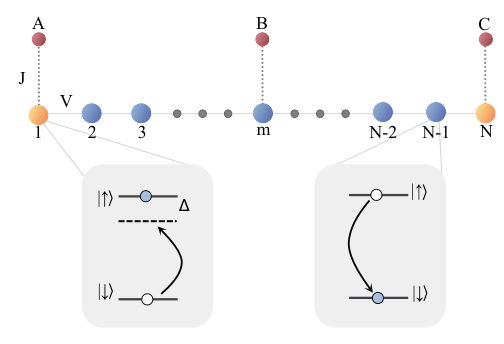 
FIG. 1. Schematic of the ideal model. The system consists of an atomic chain of N sites, where N is an odd integer. Each atom is labeled sequentially. Three data units, labeled A, B, and C and depicted as red spheres, are coupled respectively to the three odd- numbered sites 1, m, and N of the chain. Each atom is modeled as a two-level system, with two Rydberg states denoted by |↑⟩and |↓⟩. Within the chain, the interaction of atoms is nearest-neighbor dipole- exchange interaction with strength V . Sites 1 and N, highlighted in orange, are subject to a detuning ∆. Each of the data units couples to its nearest chain site with strength J.

📷 Fig 2

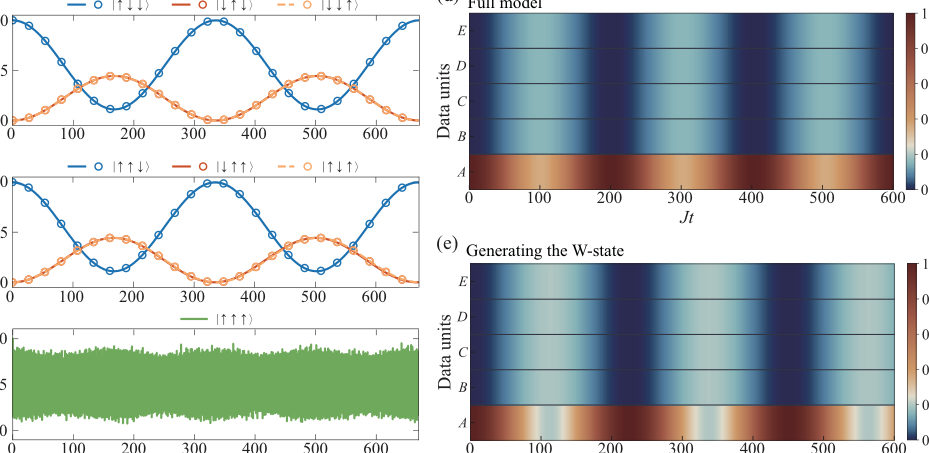 
FIG. 2. (a)-(c) Time evolution of the populations of the data units in a nine-atom chain coupled to three data units. (a) Dynamics in the single-excitation manifold. Blue solid, red solid, and orange dashed lines represent the populations of the excited states of data units A, B, and C, respectively. Initially, only site A is excited to |↑⟩, while all other sites are in |↓⟩. (b) Dynamics in the double-excitation manifold, where blue solid, red solid, and orange dashed lines denote the populations of the double-excitation states. Initially, sites A and B are excited to |↑⟩, while all other sites are in |↓⟩. (c) Dynamics in the triple-excitation manifold, with all data units initially...

📷 Fig 3

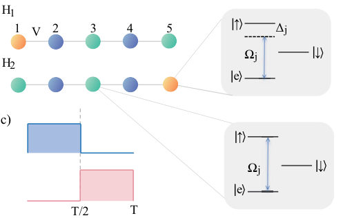 
FIG. 3. Schematic illustration of chiral transport via Floquet engi- neering. (a) A 1D chain consists of five atoms labeled from 1 to 5. Site 1, 3, and 5 are modeled as three-level systems comprising a low- lying state |e⟩and two Rydberg state |↑⟩and |↓⟩, while sites 2 and 4 are two-level Rydberg atoms. Green spheres indicate sites coupled by laser fields with Rabi frequency Ωj, and orange spheres denote sites with a local detuning ∆j. The staggered configurations for H1 and H2 stages are shown. (b) Energy level diagrams of the driven atoms, illustrating the Rabi frequency Ωj and the local detuning ∆j applied to the Rydberg state. (c) The Floquet driving protocol with period T . The system...

📷 Fig 4

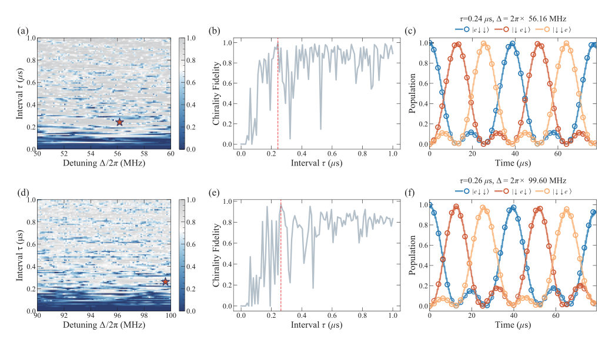 
FIG. 4. The dynamics of chiral transport via Floquet engineering. Panels (a)-(c) are obtained using the ideal Hamiltonian with only nearest- neighbor interactions, while (d)-(f) use the full Hamiltonian that incorporates all long-range interactions. (a) and (d) Two-dimensional heat map of the fidelity as a function of the interval τ and the detuning ∆. The red star marks the global maximum of the fidelity within the scanned parameter range. (b) and (e) Chirality fidelity as a function of τ at the optimal detuning extracted from the heat map. The optimal interval is indicated by the red dashed line. (c) and (f) Time evolution of the population at the best τ. Solid lines represent the evolution...

📷 Fig 5

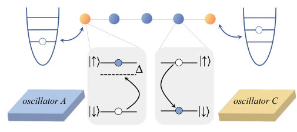 
FIG. 5. Schematic of the entanglement generation between mechan- ical oscillators mediated by a Rydberg atom chain. The 1D chain consists of five atoms, each modeled as a simple two-level system with two Rydberg states denoted as |↑⟩and |↓⟩. The interaction is considered as a nearest-neighbor dipole-dipole interaction. The two edge atoms, highlighted in orange, exhibit a detuning ∆. Two me- chanical oscillators, labeled A and C, are coupled to the atoms at the boundaries of the chain, respectively.

**Summary.** This paper shows how a chain of Rydberg atoms can act as a programmable quantum bus to overcome the limitations of local connectivity in neutral-atom quantum processors. By analyzing virtual excitations, the authors derive an effective Hamiltonian that mediates controllable, nonlocal interactions. This establishes a scalable route toward reconfigurable quantum network architectures with quasi-all-to-all coupling.

**Why it may be interesting.** This work provides a concrete, hardware-level mechanism for engineering long-range, programmable interactions in neutral-atom quantum simulators, directly addressing a major bottleneck in scaling quantum networks.

Detailed structure

**Main problem.** The primary challenge is achieving flexible, nonlocal connectivity in quantum processing nodes using neutral atoms, as native Rydberg interactions are too spatially dependent for large-scale systems.

**Main result.** The authors demonstrate that a Rydberg atom chain can function as a programmable quantum bus, effectively transforming a local 1D architecture into a quasi-all-to-all interacting network.

**Method.** The analysis employs the Green's-function continued-fraction method and Feshbach partitioning to derive an effective Hamiltonian describing the mediated interactions in the dispersive regime.

**Model / system.** The system is a 1D chain of Rydberg atoms coupled to external data units. The dynamics are analyzed by deriving an effective Hamiltonian that mediates interactions via virtual excitations in the dispersive regime.

**Key observables.** Population dynamics in different excitation manifolds, chiral transport fidelity, and the ability to generate W-states.

**Important parameters / regimes.** The mechanism is robust against long-range interactions, atomic position fluctuations, and finite Rydberg-state lifetimes.

**Assumptions / limitations.** The analysis initially focuses on the single-excitation subspace, though simulations incorporate full long-range interactions for realism.

**Figures summary.** Figures illustrate the schematic of the atomic chain coupling, time evolution of populations in excitation manifolds, and the mechanism for chiral transport using alternating Hamiltonians.

**Paper structure.** The paper progresses from defining the connectivity problem to deriving the effective Hamiltonian using Green's functions, demonstrating specific functionalities like chiral transport, and concluding with the realization of scalable W-state generation.

Abstract

Scalable quantum networks require processing nodes with flexible internal connectivity, yet neutral-atom architectures remain constrained by the strong spatial dependence of native Rydberg interactions. Here we show that a Rydberg atom chain can act as a coherent quantum bus, converting a locally connected one-dimensional architecture into an effectively nonlocal interaction network. Virtual excitations in the dispersive regime mediate controllable interactions between spatially separated data units, which we derive analytically using a Green's-function continued-fraction method. The resulting mechanism is not restricted to single-excitation dynamics and supports several distinct functionalities, including Floquet-engineered chiral transport, remote entanglement of mechanical oscillators, and destructive interference for selectively suppressing unwanted dipole exchange. Simulations incorporating full long-range Rydberg interactions, atomic position fluctuations, and finite Rydberg-state lifetimes show that the mediated dynamics remain robust under experimentally relevant conditions. These results establish Rydberg chains as programmable coherent mediators for extending the internal connectivity of neutral-atom quantum nodes toward quasi-all-to-all coupling, providing a hardware-level route toward scalable and reconfigurable quantum-network architectures.

[↑ back to top](#top)

### [Continuous variable distributed quantum sensing in integrated photonics](http://arxiv.org/abs/2609.19092v1)

**Authors:** Bethany Puzio, Oliver M. Green, Joel F. Tasker, Jonathan Frazer, Tamzin Ellis, Benjamin D. J. Sayers, Rachel N. Clark, Alex S. Clark, Giacomo Ferranti, Jonathan C. F. Matthews  
**Type:** experiment · **Category:** quantum information and computing · **PDF:** <https://arxiv.org/pdf/2609.19092v1>  
**Analysis basis:** full PDF text, analyzed in chunks
**Topic relevance:** 🔥 `quantum optics experiment` **4/5** · `QC/QI experiment` **3/5** · `quantum measurements` **3/5** · `interference shaping light` **2/5** · `analog quantum simulation` **1/5**

📷 Fig 1

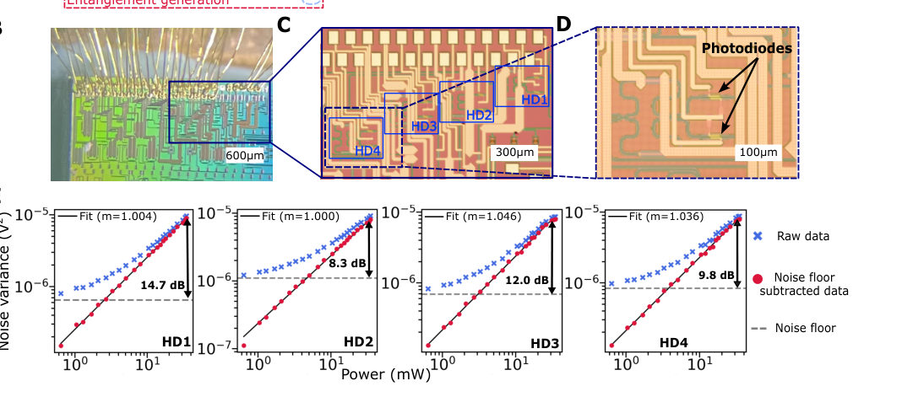 
FIG. 1: The photonic chip (A) Layout of the silicon-on-insulator (SOI) photonic integrated circuit (PIC). The single mode squeezed vacuum and local oscillator (LO) are coupled onto the PIC via grating couplers. Entanglement is generated across four spatial modes by mixing the squeezed light with vacuum across three cascaded Mach-Zehnder interferometers (MZIs). The LO is also split across four spatial modes via MZIs, and then routed to homodyne detectors HD1-4, to detect each mode of the entangled state. Thermo-optic phase modulators (TOPMs) θ1−4 are used to balance HD1-4 respectively, while also acting as the phase parameters to be sensed. (B) Optical microscope image of the PIC and...

📷 Fig 2

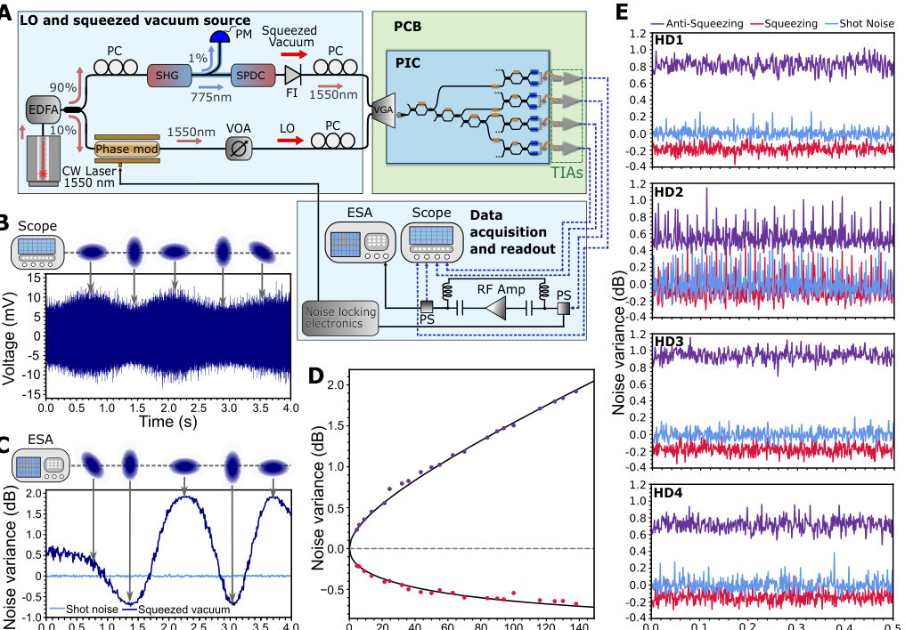 
FIG. 2: Multi-mode squeezing measurements with integrated homodyne detectors (A) Experiment schematic. LO and squeezed vacuum couple onto PIC via VGA. Each homodyne detector output is wirebonded to a TIA mounted on a PCB. All TIA outputs are measured on the oscilloscope (scope). HD2 output is split into three paths using power splitters (PS) and an RF amplifier (RF amp) to derive the locking signal whilst measuring output simultaneously on the ESA and the oscilloscope. See Supplementary Materials for noise locking electronics details. (B) Squeezed vacuum noise measured on an oscilloscope with the corresponding phase space representation for illustration of the behaviour at specific points...

📷 Fig 3

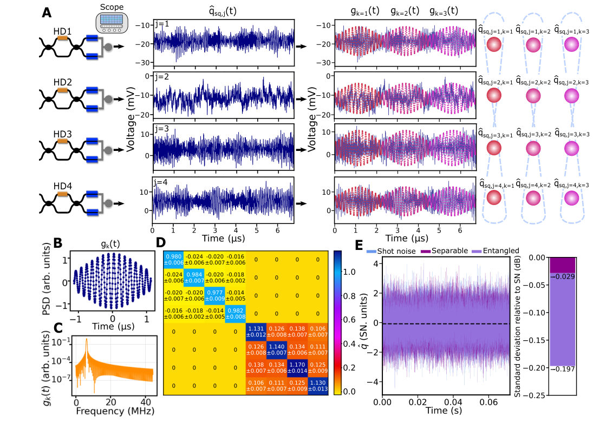 
FIG. 3: Temporal mode definition and multi-mode state tomography (A) Schematic illustrating the process of converting raw oscilloscope squeezing data, ˆqdet sq,j(t), into well-defined quadratures, ˆqsq,j,k, where j and k define the spatial and temporal mode respectively. (B) Our choice of temporal mode function in time, gk(t), a sine wave modulated Gaussian with total width τ = 2.25 µs, full width half maximum s = 1.8 µs and modulation frequency, f = 6.296 MHz. (C) Temporal mode profile in frequency as a Gaussian centered on f. Crucially, the DC offset at 0 Hz is not completely suppressed. (D) Resulting four-mode covariance matrix and errors from 8 repeated tomography measurements of the...

📷 Fig 4

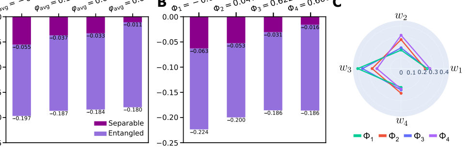 
FIG. 4: Linear phase function sensing results (A) Results of four different measurements of φavg with precisions relative to the shot noise (SN) labelled for separable and entangled sensing protocols. (B) Results from using the same data in (A) to sense the arbitrarily weighted linear function, Φ = PM j=1 wjφj, with the values for wj given in (C).

**Summary.** This paper demonstrates entanglement-enhanced distributed quantum sensing using continuous variable light implemented on a scalable Silicon-on-Insulator photonic chip. By generating and measuring four-mode entanglement, the authors achieved a significantly higher precision in phase estimation compared to classical methods. This work advances the field by proving the feasibility of quantum sensing in compact, integrated optical hardware.

**Why it may be interesting.** This work provides a concrete, scalable, and integrated platform demonstration of quantum metrology principles, directly advancing the hardware realization of quantum sensing protocols.

Detailed structure

**Main problem.** The paper aims to demonstrate and quantify the advantage of using continuous variable (CV) distributed quantum sensing with entangled states over classical (separable) states for measuring phase shifts.

**Main result.** The entangled sensing protocol achieved a precision of 0.199(16) dB below the shot noise limit, significantly outperforming the separable state limit of 0.041(18) dB.

**Method.** The sensing relies on measuring the DC offset in integrated homodyne detectors after generating a four-mode entangled state on a photonic chip, allowing for the estimation of the average phase shift.

**Model / system.** The experiment uses a Silicon-on-Insulator (SOI) Photonic Integrated Circuit (PIC) containing a Beam Splitter Network (BSN) and four integrated homodyne detectors. Entanglement is generated from an off-chip squeezed vacuum source.

**Key observables.** Mean subtracted photocurrent ($\langle\delta\hat{i}_j
angle$), average phase shift ($\phi_{avg}$), and the measured phase variance ($\Delta^2\varphi_{avg}$).

**Important parameters / regimes.** Number of modes ($M=4$), total system efficiency ($\eta = 0.203(5)$), and the comparison between entangled and separable state precision limits.

**Assumptions / limitations.** The primary limitation noted is the loss introduced by coupling the squeezed light on or off the chip, which limits the achievable performance.

**Figures summary.** Figures illustrate the PIC schematic, the process of converting raw time-domain data into well-defined quadratures, and comparative plots showing the measured phase precision advantage for both entangled and separable states.

**Paper structure.** The paper details the physical setup (SOI PIC, BSN, detectors), the theoretical framework for precision calculation ($\sigma_e$ vs $\sigma_s$), the measurement techniques (noise locking, quadrature extraction), and finally presents the quantitative comparison of sensing performance.

Abstract

Distributed quantum sensing is an emerging application of quantum networking, where entangled probe states are employed to sense combinations of delocalized parameters with enhanced precision relative to using separable states. Squeezed states of light are a prime resource for experimental demonstrations of entanglement-enhanced sensing, because they can be generated and entangled deterministically. Existing distributed quantum sensing experiments have been fundamentally limited in scalability due to their bulk-optic architectures. Meanwhile, integrated photonics provides a scalable and compact platform for quantum sensors. Here we demonstrate entanglement-enhanced sensing of linear functions of four phase shifts in an integrated photonic circuit. We find an entanglement-enhanced precision of 0.199(16) dB below the shot noise limit compared to 0.041(18) dB for separable states. A four-mode entangled state is generated on-chip with entanglement verification and phase sensing also performed on-chip with an array of four integrated homodyne detectors.

[↑ back to top](#top)

### [Quantum Dynamics of Probe Particles in Thermal Fields and the Emergence of Stochastic Dynamics](http://arxiv.org/abs/2609.17657v1)

**Authors:** Bruno Scheihing-Hitschfeld  
**Type:** theory · **Category:** statistical mechanics · **PDF:** <https://arxiv.org/pdf/2609.17657v1>  
**Analysis basis:** full PDF text, analyzed in chunks
**Topic relevance:** 🔥 `Keldysh / 2PI / non-Gaussian methods` **4/5** · `methods for driven-dissipative` **3/5** · `correlated / nonlocal dissipation` **2/5** · `driven-dissipative phase transition` **2/5** · `non-equilibrium universality` **1/5** · `quantum measurements` **1/5**

📷 Fig 1

 
Low-resolution page preview, page 2

📷 Fig 2

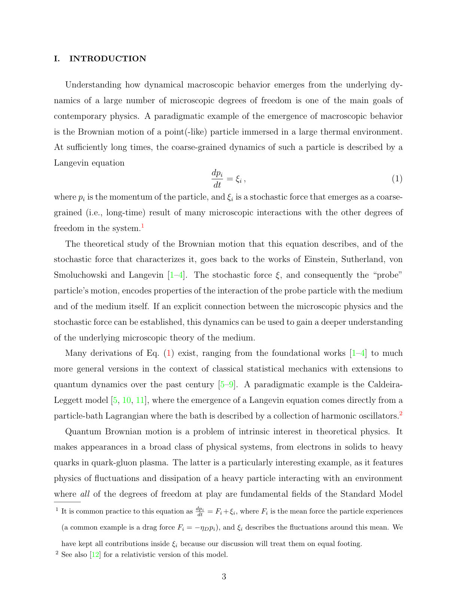 
Low-resolution page preview, page 3

📷 Fig 3

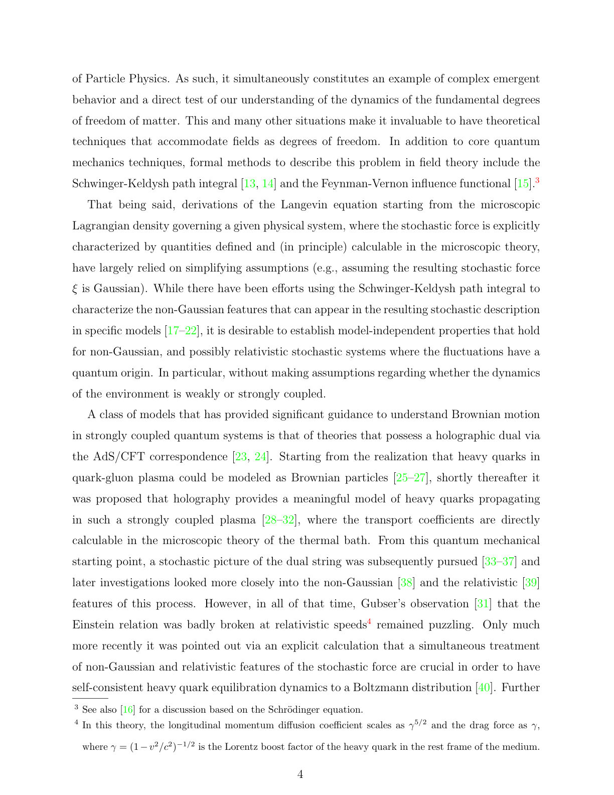 
Low-resolution page preview, page 4

📷 Fig 4

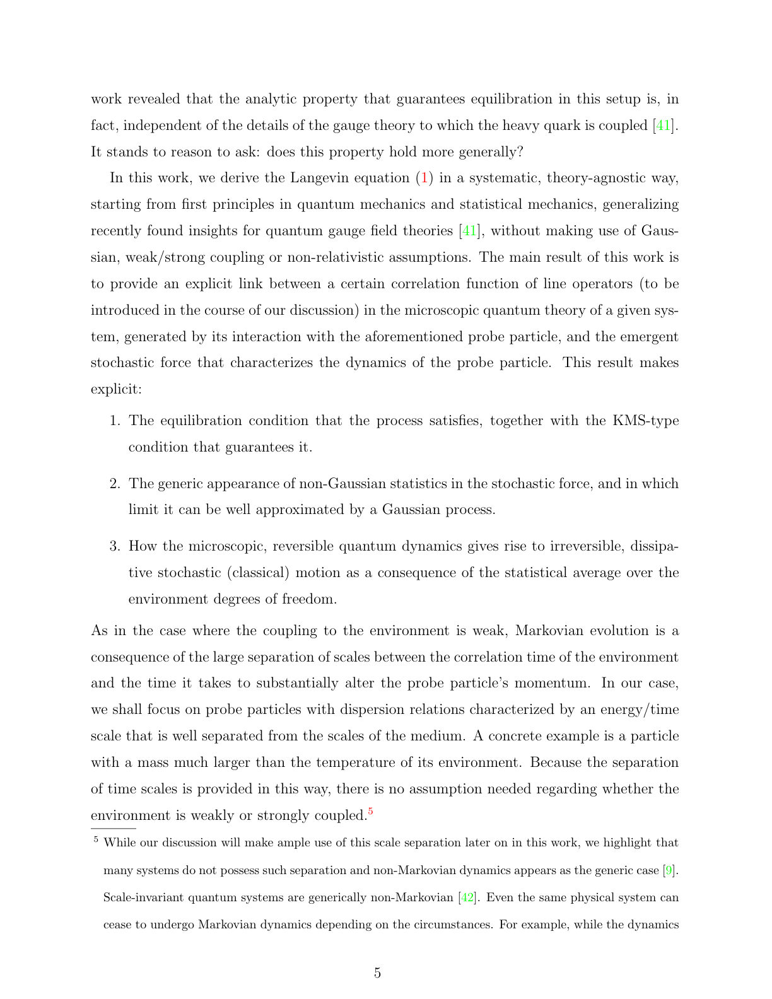 
Low-resolution page preview, page 5

📷 Fig 5

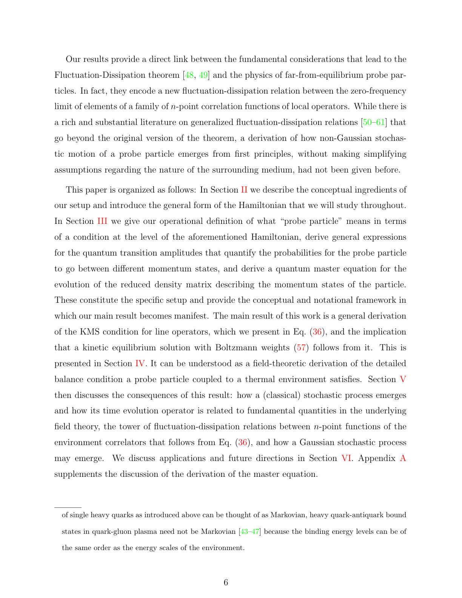 
Low-resolution page preview, page 6

**Summary.** This paper provides a general, first-principles derivation showing how stochastic dynamics, like Brownian motion, emerge from quantum mechanics when a particle interacts with a thermal environment. It derives the necessary quantum master equation and the corresponding Langevin equation without assuming specific forms for the environment coupling or correlation statistics. The work is significant for understanding the fundamental link between microscopic quantum field theory and macroscopic dissipation.

**Why it may be interesting.** This work is highly relevant as it provides a rigorous, general framework for open quantum systems, directly addressing the transition from unitary quantum evolution to dissipative, classical-like stochastic behavior, which is central to quantum thermodynamics and open quantum systems.

Detailed structure

**Main problem.** The paper addresses the fundamental problem of deriving how macroscopic, stochastic dynamics, such as Brownian motion, emerges from the underlying, microscopic quantum dynamics of a probe particle interacting with a large thermal environment.

**Main result.** The authors provide a general, first-principles derivation linking microscopic quantum correlations to the emergent Langevin description, establishing the necessary equilibration conditions via KMS-type properties.

**Method.** The methodology involves deriving the quantum master equation, utilizing the Schwinger-Keldysh formalism for path integrals, and taking the long-time limit to establish the Markovian approximation.

**Model / system.** The system consists of a quantum probe particle coupled to a general environment (bath) described by a Hamiltonian. The analysis focuses on the reduced density matrix evolution and the resulting stochastic force.

**Key observables.** The reduced density matrix, the emergent stochastic force, and the rate constant $S(L, v)$ governing the decay.

**Important parameters / regimes.** Inverse temperature ($eta$), separation of scales between probe and environment dynamics, and the nature of the correlation functions (Gaussian vs. non-Gaussian).

**Assumptions / limitations.** The derivation requires spacetime translations, parity, and time reversal symmetries, and crucially assumes a separation of scales to justify the Markovian limit.

**Figures summary.** No specific figures were summarized, but the notes indicate derivations involving evolution loops $\langle W v,t 
angle(L)$ and rate equations.

**Paper structure.** The paper progresses from defining the general Hamiltonian and deriving the quantum master equation (Section III), establishing the thermal equilibrium condition via the KMS property (Section IV), and finally deriving the emergent stochastic dynamics and Langevin description (Section V).

Abstract

Starting from a general Hamiltonian describing the quantum dynamics of probe particles interacting with a set of environment degrees of freedom, we derive the quantum master equation with which the reduced density matrix of a probe particle evolves, the general equilibration condition that they satisfy when the environment is prepared in a thermal state -- encoded in a KMS property for line operators extended in real time -- and the Langevin description that emerges. The novelty of our results resides in their generality: We do not assume a specific form of the environment self-coupling, of the environment operator that couples the particle to it, of the statistics of its correlation functions, whether the statistics of the momentum transfer is Gaussian or not, or whether the probe particles move relativistically. Our results only require that spacetime translations, parity and time reversal be symmetries of the Hamiltonian, and that there exists a separation of scales between those characterizing the dispersion relation of the probe particle and those of the environment. We also discuss the limiting case in which Gaussian Brownian motion emerges. Overall, our results constitute a first-principles derivation of what properties of the underlying quantum field theory govern the energy loss and momentum fluctuations of probe particles.

[↑ back to top](#top)

### [Collider Detector Observables from Lattice Spin Systems](http://arxiv.org/abs/2609.17664v1)

**Authors:** João Barata, Ying-Ying Li, Bo Wang, Hua Xing Zhu  
**Type:** both · **Category:** numerical methods · **PDF:** <https://arxiv.org/pdf/2609.17664v1>  
**Analysis basis:** full PDF text, analyzed in chunks
**Topic relevance:** 🔥 `methods for driven-dissipative` **4/5** · `analog quantum simulation` **3/5** · `non-equilibrium universality` **2/5** · `Full counting statistics` **1/5** · `Keldysh / 2PI / non-Gaussian methods` **1/5** · `quantum measurements` **1/5**

📷 Fig 1

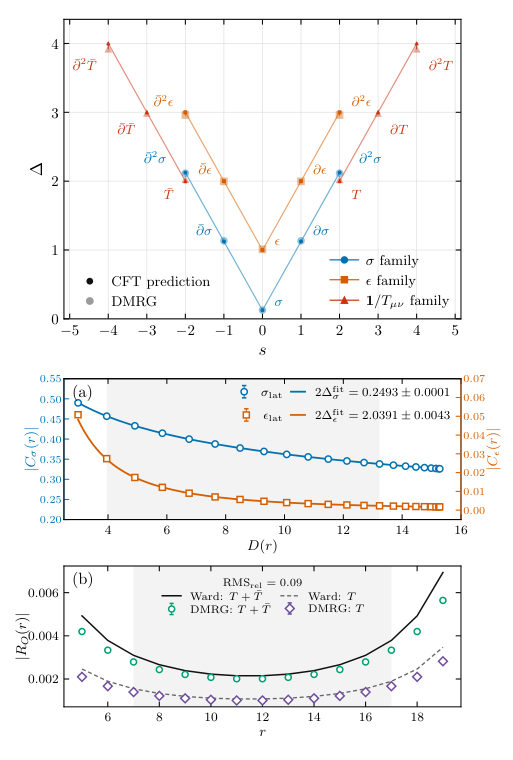 
FIG. 1. Top: (∆, s) decomposition of the CFT operator fam- ilies. Small solid markers show the CFT predictions; larger translucent markers show the DMRG extraction. Bottom: (a) Spin and energy two-point functions with chord distance fits. Standard error regression uncertainties at fixed N, bond dimension, and fitting window, are quoted. (b) Lattice test of the stress tensor Ward identity.

📷 Fig 2

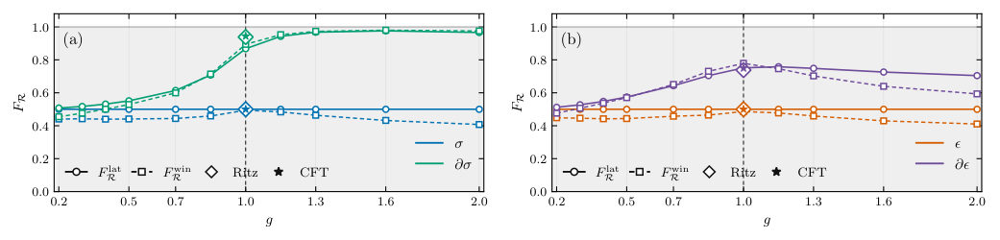 
FIG. 2. One-point energy-flow across g for (a) the spin and (b) the energy conformal families, obtained from the static construction (circles), window construction (squares), direct measurement on the Ritz states (diamonds) and CFT prediction (stars).

📷 Fig 3

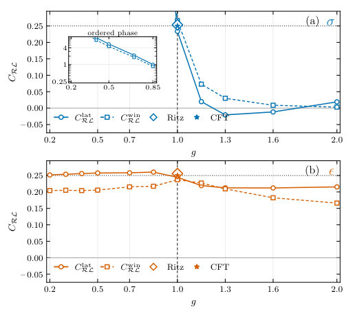 
FIG. 3. CRL correlators for primary packets in (a) the spin and (b) the energy family. Notation follows Fig. 2.

📷 Fig 4

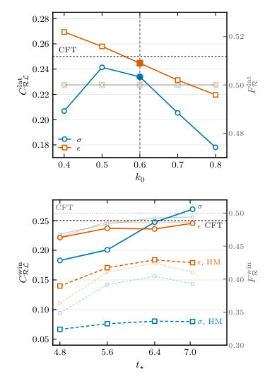 
FIG. 4. Comparison of packet preparations at g = 1. (a) Static two-point correlator Clat RL (left axis) and one-point frac- tion F lat R (right axis) as functions of the carrier momentum k0. Open markers denote the σ and ϵ packets; filled mark- ers and the vertical line identify the choice k0 = 0.6 used in the main text. (b) Real-time window correlator Cwin RL (left axis) and corresponding one-point fraction F win R (right axis) for the spatially localized packet (solid curves and circles) and the Hofman–Maldacena (HM) packet (dashed curves and squares). The one-point data are shown in lighter shades. All results use an N = 24 open chain, σx = 2.5, detector cuts (bL, bR) = (5, 18), and time...

**Summary.** This work proposes using quantum spin systems to simulate complex detector observables from high-energy physics. By mapping lattice operators to continuum CFT predictions, the authors demonstrate that advanced numerical techniques successfully reproduce theoretical expectations at critical points. This provides a concrete roadmap for realizing collider physics simulations on tabletop quantum hardware.

**Why it may be interesting.** The direct application of numerical methods (DMRG, TEBD) to model high-energy physics observables like energy flow provides a concrete, testable pathway for quantum simulation platforms.

Detailed structure

**Main problem.** The paper addresses the fundamental challenge of calculating detector observables in Quantum Field Theory (QFT) because these observables are intrinsically real-time and asymptotic.

**Main result.** The authors demonstrate that lattice constructions for energy-flow observables in the 1+1D Ising model show quantitative agreement with Conformal Field Theory (CFT) predictions at criticality.

**Method.** They construct lattice detector operators and use advanced numerical techniques like DMRG and TEBD to simulate real-time evolution and calculate correlators, comparing results against CFT predictions.

**Model / system.** The study uses quantum spin systems, specifically the 1+1-dimensional transverse-field Ising model, as a platform to simulate high-energy physics phenomena.

**Key observables.** Detector observables, energy-flow operators $E(\hat{n})$, multi-point correlators $\langle E(\hat{n}_1) \cdots E(\hat{n}_k) 
angle$, and one-point energy fractions ($F_R$).

**Important parameters / regimes.** The critical point ($g=1$), the lattice spacing ($a_l$), the source-detector separation ($R_{	ext{det}}$), and time evolution parameters ($\delta t$).

**Assumptions / limitations.** The method relies on the controlled setting provided by the critical point for quantitative benchmarking, and some calculations assume boundary effects are negligible.

**Figures summary.** Figures compare CFT predictions (solid markers) against DMRG/simulation extractions (translucent markers) for operator decompositions and two-point functions, showing agreement at criticality.

**Paper structure.** The paper develops the theoretical connection between lattice operators and continuum CFT observables, details the numerical implementation using DMRG/TEBD for both static and real-time calculations, and validates the framework by comparing results across different coupling regimes.

Abstract

Detector observables pose a fundamental challenge for nonperturbative lattice methods due to their intrinsically real-time and asymptotic nature. We propose quantum simulation platforms as an ideal setting for studying these observables. Using quantum spin systems as a demonstration, we construct lattice detector operators and establish their connection to continuum energy-flow observables. We demonstrate this framework in the $1+1$-dimensional quantum Ising model, where finite lattice calculations show quantitative agreement with conformal field theory expectations at criticality. These results support the interpretation of the lattice flow operators as regulated counterparts of continuum detectors in the scaling and asymptotic limits, providing a concrete route toward realizing high-energy collider physics on table-top quantum platforms.

[↑ back to top](#top)

### [What does "instant thermalization" in large-$q$ SYK models mean?](http://arxiv.org/abs/2609.17794v1)

**Authors:** Alexander Osterkorn, Jan C. Louw  
**Type:** theory · **Category:** statistical mechanics · **PDF:** <https://arxiv.org/pdf/2609.17794v1>  
**Analysis basis:** full PDF text, analyzed in chunks
**Topic relevance:** 🔥 `scars & prethermalization` **4/5** · `Keldysh / 2PI / non-Gaussian methods` **3/5** · `non-equilibrium universality` **3/5** · `methods for driven-dissipative` **2/5**

📷 Fig 1

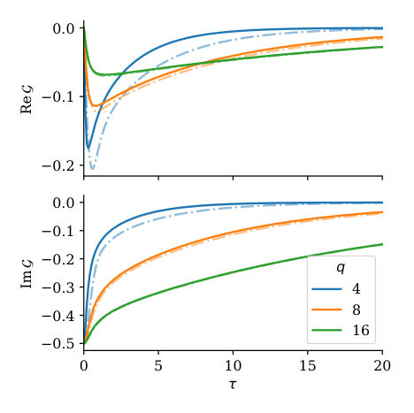 
FIG. 2. The real and imaginary parts of the NEQ time ordered Green’s function (4) as a function of relative time τ directly after the quench (sharp ramp tavg = 10−3). The data is for Ti = 0.1 and various connectivities q. The dashed-dotted line corresponds to the numerical results, while the analytical prediction G(ana) is given by the solid line of the same color.. Since τ &gt; 0, the data used here is that of G&gt;(t1, t2).

📷 Fig 2

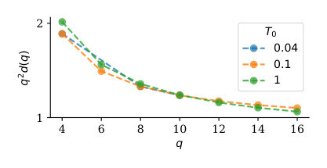 
FIG. 3. Maximum difference between Green’s functions (6) multiplied by q2 as a function of the connectivity q for three different initial temperatures T0.

📷 Fig 3

 
FIG. 4. (a,b) Effective temperatures from the numerical so- lution (dashed lines) and from the large-q theory (solid lines) for two different initial temperatures Ti = 0.04, 0.08 and for q = 4, 8. (c) Thermalization rates Γ extracted from the effec- tive temperatures of the numerical solution (circles, dashed) and of the large-q theory (squares, solid). The lowest con- sidered initial temperatures are Ti = 0.04 for the numerical solution and Ti = 0.01 for the large-q solution.

📷 Fig 4

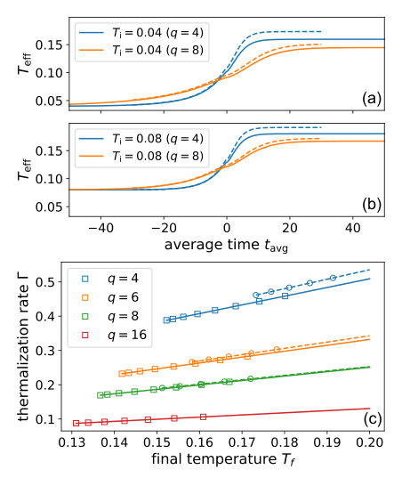 
Fig. 5 shows the extracted rates obtained within large- q theory as a function of 1/q down to q = 50. Γ1 is

📷 Fig 5

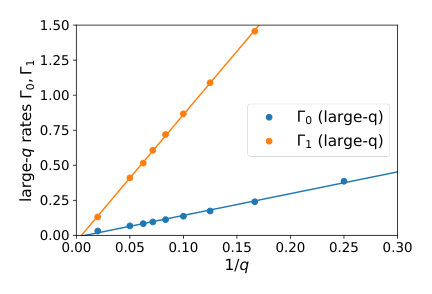 
FIG. 5. Dependence of the large-q thermalization rates Γ0, Γ1 (as defined in (9)) on q. The plotted thermalization rate Γ1 is evaluated at the smallest considered temperature Ti = 0.01. The solid lines are a linear fit to the data and provide a guide to the eye showing that the data scales roughly linearly with 1/q.

**Summary.** This paper re-evaluates the concept of 'instant thermalization' in large-$q$ SYK models by analyzing the two-time Green's function. The authors demonstrate that while some correlations appear instantaneously thermal, the overall effective temperature is governed by a finite relaxation rate set by non-thermal, off-diagonal time correlations. This suggests that 'instantaneous' thermalization is a concept restricted to specific parts of the time evolution.

**Why it may be interesting.** The detailed analysis of non-equilibrium dynamics and the distinction between different correlation functions' thermalization rates provides a sophisticated framework for understanding how memory effects persist in strongly interacting quantum systems, which is relevant to open quantum systems.

Detailed structure

**Main problem.** The paper investigates the concept of 'instant thermalization' in large-$q$ Sachdev-Ye-Kitaev (SYK) models, contrasting different physical interpretations of how quickly a system reaches equilibrium.

**Main result.** The authors find that while the diagonal blocks of the Green's function instantly acquire a thermal form, the overall effective temperature inherits a finite, non-zero thermalization rate set by the inherently non-thermal off-diagonal time blocks.

**Method.** The analysis involves studying the real-time Green's function in the two-time plane using a $1/q$ expansion, calculating effective temperatures, and comparing results from different time-block correlations.

**Model / system.** The system is the Sachdev-Ye-Kitaev (SYK) model, specifically considering $q/2$-body interactions, subjected to a quench protocol. The analysis relies on mapping the dynamics onto the two-time plane using Wigner coordinates.

**Key observables.** Effective temperatures ($T_{	ext{eff}}$), thermalization rates ($\Gamma$), and the Green's function $G(t_1, t_2)$ across different time blocks.

**Important parameters / regimes.** Large connectivity $q$, quench time, and the relative time $	au = t_1 - t_2$.

**Assumptions / limitations.** The analysis is performed to leading order in $1/q$, and the authors distinguish between the thermal nature of diagonal time blocks and the non-thermal nature of off-diagonal blocks.

**Figures summary.** Figures illustrate the four blocks of the two-time plane, showing diagonal blocks as thermal and off-diagonal blocks as non-thermal. They also show fits for $T_{	ext{eff}}(t_{	ext{avg}})$ and the decay rate $\Gamma$ extracted from these fits.

**Paper structure.** The paper first establishes the physical context of instant thermalization in SYK models. It then analyzes the Green's function in time blocks, contrasting the instantaneous thermal behavior of the diagonal blocks with the finite rate set by the off-diagonal blocks, leading to a refined understanding of the concept.

Abstract

Motivated by the Planckian thermalization rate $Γ\sim T$ observed in the two-body interacting SYK model, we study thermalization in the $q/2$-body case. Previous studies of such systems have established the notion of instantaneous thermalization to leading order in $1/q$. It was conjectured that the thermalization may still be Planckian but with a divergent rate $Γ\sim T q$, explaining the ``instantaneous'' part. For an analytically and numerically tractable system, we calculate the effective temperatures after a quench at time $t = 0$ and indeed find a Planckian rate, albeit with the unexpected decaying behavior $Γ\sim T q^{-1} $. This is contrasted with the behavior of the causal Green's function $\mathcal{G}(t_1, t_2)$, which instantly acquires a thermal form in the two-time plane block $t_1, t_2 > 0$.   The resulting picture is that instant thermalization is a meaningful concept only for this block, while the off-diagonal blocks $t_1 \cdot t_2 < 0$ are inherently non-thermal at any $q$. Since the effective temperature is obtained from correlations spanning all blocks, it inherits a finite rate set by the off-diagonal. We illustrate this directly by studying the non-thermal correlations' time dependence.

[↑ back to top](#top)

### [Fast Evaluation of the Sixth-Order Time-Convolutionless Master-Equation Generator and Beyond](http://arxiv.org/abs/2609.18806v1)

**Authors:** Jiahao Chen, Sirui Chen, Dragomir Davidovic  
**Type:** theory · **Category:** other · **PDF:** <https://arxiv.org/pdf/2609.18806v1>  
**Analysis basis:** full PDF text, analyzed in chunks
**Topic relevance:** 🔥 `methods for driven-dissipative` **4/5** · `correlated / nonlocal dissipation` **3/5** · `Keldysh / 2PI / non-Gaussian methods` **2/5** · `driven-dissipative phase transition` **2/5**

📷 Fig 1

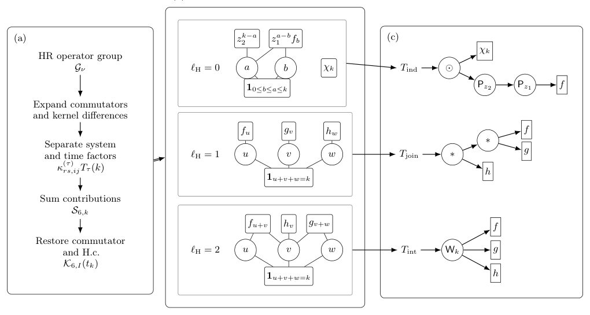 
FIG. 1. Reduction of TCL6 operator terms to temporal contractions. (a) Starting from an HR operator group, expand the commutators and kernel differences, separate the fixed system coefficients, and evaluate the scalar sums. Their assembly gives S6,k; restoring the outer commutator and Hermitian-conjugate partner gives the complete generator. (b) Representative affine factor graphs at history-coupling depths ℓH = 0, 1, 2. The first row uses the nested coordinates 0 ≤b ≤a ≤k of the HR065 example. (c) The corresponding reductions are two serial geometric scans followed by an output-only product, a binary causal- convolution tree, and the interlocked contraction Wk. TCL4 uses the first two...

📷 Fig 2

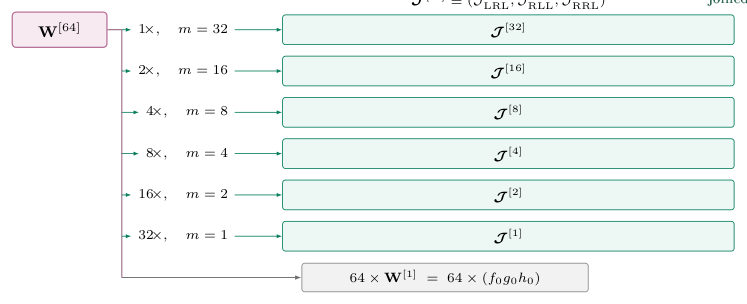 
FIG. 2. Dyadic recursion for input length N = 64. Panels (a) and (b) show the output component k = 48 and the five regions obtained by splitting the affine indices a, b, c at m = 32; the numbers are lattice-point counts. Panel (c) shows one application of Eq. (34). The two uniform regions (dashed boxes) retain the interlocked form at half the input length, while the three mixed regions (green boxes) reduce to ordinary convolutions; ⋆denotes suffix correlation and ∗causal convolution. Panel (d) shows the full recursion, and panel (e) gives the terminal joined-history contractions and scalar base contributions at each block length. Blue and orange mark the unshifted and shifted recursive...

📷 Fig 3

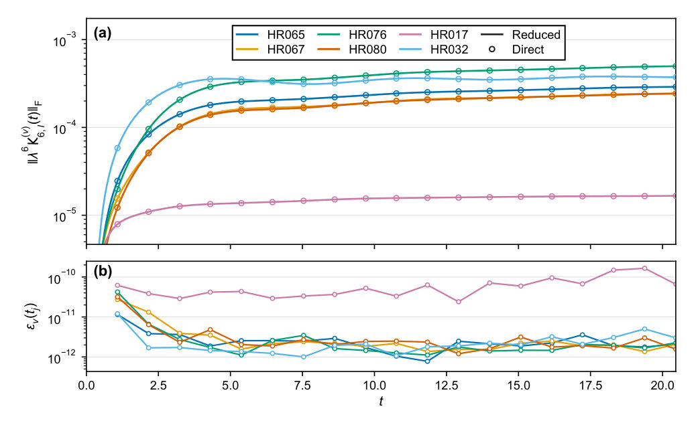 
FIG. 3. Direct and reduced evaluations of six Hadamard-reduced TCL6 contributions. Panel (a) shows the Frobenius norms of the completed 4 × 4 Liouville-space maps λ6K(ν) 6,I(t) at λ2 = 0.1. Lines are reduced results on all Nt = 1024 grid points; open

📷 Fig 4

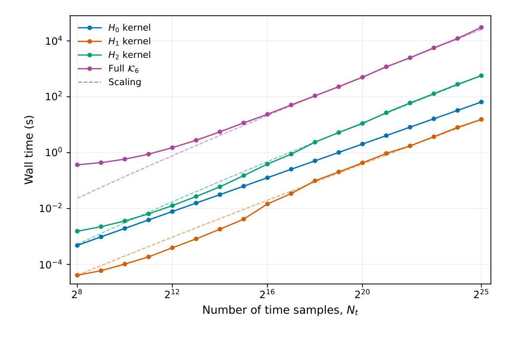 
FIG. 4. Runtime scaling of isolated history kernels and the complete sixth-order generator K6 on one CPU core. Kernel markers show medians of five measurements. Isolated-kernel timings cover the specified scalar sums. Full-generator timings include preparation of Γ and evaluation of the complete sixth-order coefficient, excluding compilation and subsequent validation. Dashed guides are proportional to Nt for H0, Nt(1+log2 Nt) for H1, and Nt(1+log2 Nt)2 for H2 and K6. The H0 benchmark uses scalar recurrence loops, whereas H1 uses an FFT convolution. The isolated kernels and full generator use different workloads, so their timings are not additive.

📷 Fig 5

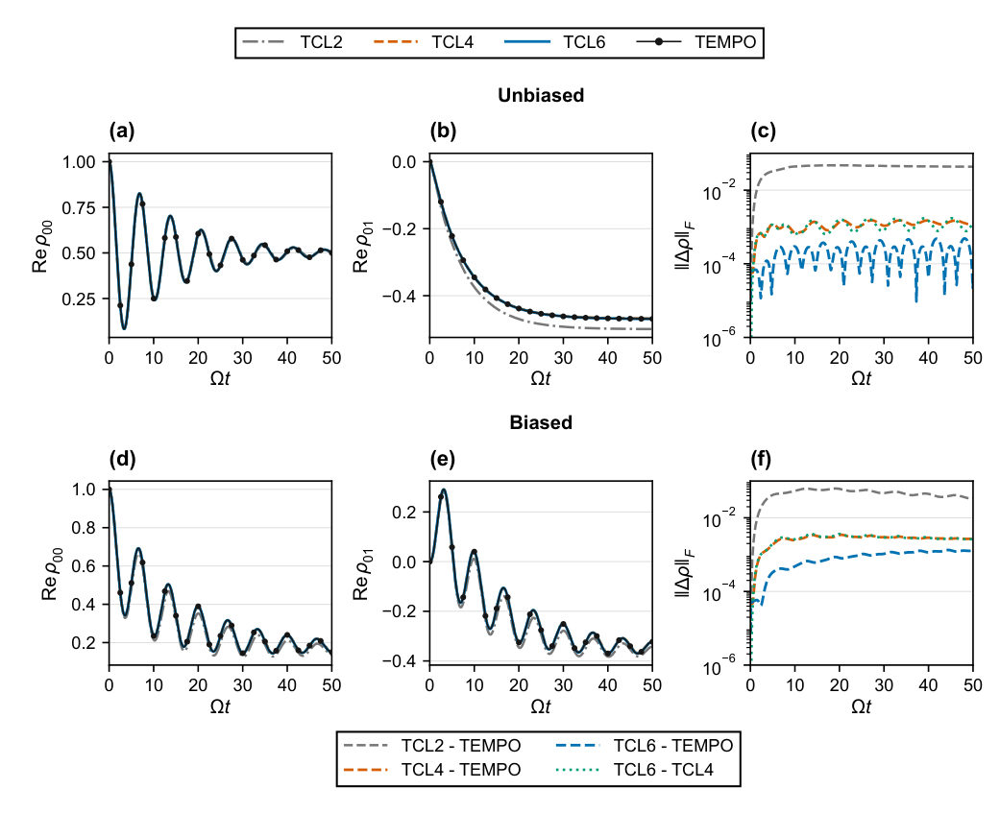 
FIG. 5. Spin–boson density evolution at successive TCL truncation orders compared with finite-resolution TEMPO trajectories (black lines with filled circles; markers are shown at selected times). The upper row uses the unbiased Hamiltonian HS = σx/2 and the lower row uses the biased Hamiltonian HS = 0.4σx + 0.3σz; both have gap Ω= 1, A = σz/2, ρS(0) = |0⟩⟨0|, T = 0, λ2 = 0.2, and ωc = 10. Panels (a) and (d) show the laboratory-basis population ρ00, while panels (b) and (e) show Re ρ01. Panels (c) and (f) show the Frobenius differences between each TCL trajectory and TEMPO (dashed lines), together with ∥ρTCL6 −ρTCL4∥F (green dotted line). The zero-time point is omitted from logarithmic...

**Summary.** This paper presents an advanced mathematical technique to drastically speed up the calculation of the sixth-order time-convolutionless master-equation generator. By decomposing complex time integrals into simpler components solvable by convolutions and recurrences, the computational scaling is improved from cubic to near-linear in the number of time steps. This enables long-time simulations of complex, non-Markovian quantum dynamics.

**Why it may be interesting.** This work provides a significant algorithmic breakthrough for simulating non-Markovian dynamics, which is crucial for understanding open quantum systems where memory effects are dominant.

Detailed structure

**Main problem.** The paper addresses the computational bottleneck associated with directly evaluating the high-order (sixth-order) time-convolutionless (TCL6) master-equation generator for open quantum systems.

**Main result.** A novel algorithmic reduction is derived that lowers the computational complexity from $O(N_t^3)$ to $O(N_t \log^2 N_t)$ for the TCL6 time series evaluation.

**Method.** The core method involves mathematically separating the time-dependent bath correlation functions into independent, joined, and interlocked history components, allowing for evaluation via cumulative sums, convolutions, and specialized recurrences.

**Model / system.** The system is a fixed finite-dimensional quantum system coupled to a stationary centered Gaussian bath via a single Hermitian operator. The dynamics are governed by the time-local generator derived from the TCL expansion.

**Key observables.** The complete TCL6 time series, $K_I(t)$, and its matrix elements $S_{6,k}$.

**Important parameters / regimes.** The time step count ($N_t$), the order of the expansion (e.g., TCL6, $	ext{TCL}_{2n}$), and the history-coupling depth ($\ell_H$).

**Assumptions / limitations.** The reduction relies on the system coupling through a single Hermitian operator to a Gaussian bath, and the complexity analysis assumes the availability of specific reduction identities.

**Figures summary.** Figure 1 illustrates the overall reduction process from commutators to evaluating scalar sums. Figure 2 details the recursive structure used for the interlocked-history contraction.

**Paper structure.** The paper systematically moves from the general definition of the TCL6 generator to deriving an exact reduction by separating fixed operator coefficients from scalar bath kernels, which are then evaluated using cumulative sums, FFT convolutions, and specialized dyadic recursions for interlocked histories.

Abstract

Direct quadrature of the Hadamard-reduced sixth-order time-convolutionless (TCL6) generator at all $N_t$ sampled times requires $O(N_t^3)$ operations at fixed system dimension. We derive an exact reduction for a finite-dimensional system coupled through one Hermitian operator to a stationary centered Gaussian bath. By separating fixed operator coefficients from scalar bath kernels, the complete TCL6 time series is reduced to cumulative sums and first-order recurrences, one-dimensional causal convolutions, and an exact dyadic recursion for interlocked histories. With the algorithm, evaluating the complete TCL6 time series requires $O(N_t\log^2 N_t)$ operations at fixed system dimension. In addition, we show that TCL$2n$ can be evaluated with $O(N_t\log^{n-1} N_t)$ complexity. A fixed finite Matsubara expansion of the bath correlation function permits $O(N_t\log N_t)$ evaluation at any fixed TCL order. These reductions enable fast long-time simulations of non-Markovian open quantum systems within the regime of validity of the TCL expansion.

[↑ back to top](#top)

### [Structure of Measurement-Induced Entanglement in Infinite-Randomness Critical States](http://arxiv.org/abs/2609.17670v1)

**Authors:** Oliver Breach  
**Type:** theory · **Category:** disordered systems and neural networks · **PDF:** <https://arxiv.org/pdf/2609.17670v1>  
**Analysis basis:** full PDF text, analyzed in chunks
**Topic relevance:** 🔥 `quantum measurements` **4/5** · `non-equilibrium universality` **3/5** · `Keldysh / 2PI / non-Gaussian methods` **1/5** · `analog quantum simulation` **1/5** · `driven-dissipative phase transition` **1/5** · `methods for driven-dissipative` **1/5**

📷 Fig 1

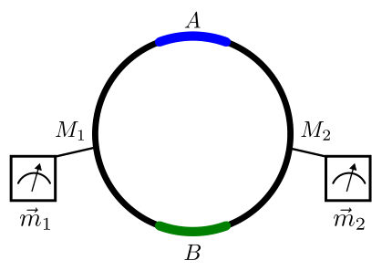 
FIG. 1. Geometry of the setup for measurement-induced en- tanglement. Regions A and B are unmeasured; regions M1 and M2 are measured. We take the number of sites in regions A and B to be |A| = |B| = m and the number of sites in the measured regions to be |M1| = |M2| = r. After the measure- ments, we study the entanglement entropy of regions A and B, averaged over measurement outcomes ⃗m = (⃗m1, ⃗m2).

📷 Fig 2

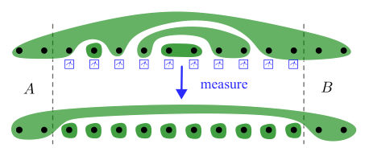 
FIG. 2. An illustrative example of a ground state for the random transverse-field Ising model (top) and the re- sult of X-basis measurements (bottom). Black dots illus- trate sites with spin-1/2 particles. Clusters of aligned spins 1 √

📷 Fig 3

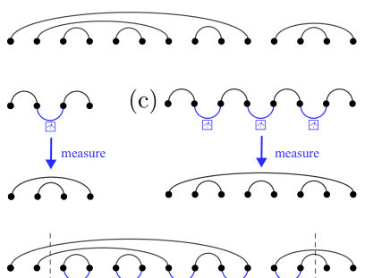 
FIG. 3. In this figure we illustrate the effects of Bell-basis measurements on various initial states. In (a) we present an example random-singlet state. The black arcs curving up- wards indicate Bell pairs between the corresponding sites. (b) demonstrates the basic premise of entanglement swap- ping, where blue curves below the sites indicate the location of Bell-basis measurements. In (c) we show how this extends naturally to a chain of Bell pairs, with the measurements inducing long-range entanglement between the ends of the chain. In (d) we take an illustrative example of a random- singlet state and measure the central region. For this state, the measurement-induced entanglement is 0.

📷 Fig 4

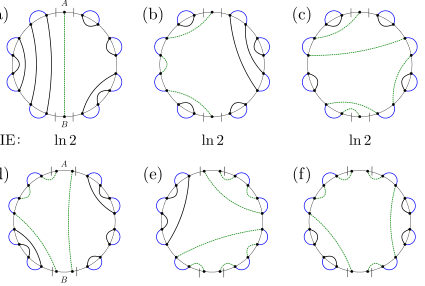 
FIG. 4. We visualise the MIE by tracing paths drawn out by singlets with measurements represented by nearest-neighbour loops in M. The blue arcs on the outside represent measure- ment locations, and the interior arcs illustrate singlets in the initial state. The green (dashed) arcs are the singlets which participate in the creation of the post-measurement singlet; in the language of Sec. IV C, this is the particular ‘measurement cluster’ that involves spins in A and therefore is relevant for MIE. Below each configuration, we state the MIE. For m = 1 in (a)-(c), see that the path always leads from A to B, due to the opposite ‘parity’ of measurements in M1 and M2. For m = 2 in (d)-(f), we...

📷 Fig 5

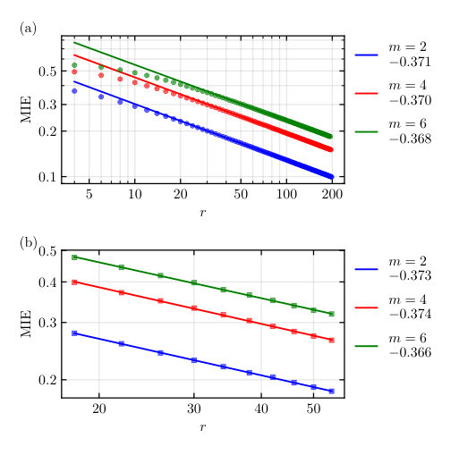 
FIG. 5. Here we plot the disorder-averaged MIE for the random-singlet state with unmeasured regions of size m = 2, 4, 6. In (a) we use the strong-disorder renormalisation group approach, iteratively decimating bonds to find the ground state singlet structure, then keep track of how pairing is altered by the measurements. In (b) we use free-fermion numerics for the random XX chain (∆= 0) as described in App. B. The fitted exponents are shown on the right, consis- tent with the analytical prediction (3 − √

**Summary.** This paper develops a theory to understand how projective measurements affect entanglement in quantum critical systems subjected to quenched disorder. By applying the Strong-Disorder Renormalization Group to models like the random Ising chain, the authors calculate the universal decay of measurement-induced entanglement. The findings establish that disorder provides an analytically solvable arena for studying measurement effects, showing remarkable robustness of critical properties.

**Why it may be interesting.** The work provides a powerful, analytically tractable framework (IRFPs) to study non-equilibrium quantum dynamics (measurements) in disordered systems, complementing the well-established CFT results for clean critical points.

Detailed structure

**Main problem.** The paper investigates the effect of projective measurements on the entanglement structure of quantum states, specifically focusing on critical states characterized by quenched disorder.

**Main result.** The measurement-induced entanglement in random critical models decays with a universal power-law exponent, and the critical properties of the state remain remarkably robust against finite-density measurements.

**Method.** The authors develop a theory using the Strong-Disorder Renormalization Group (SDRG) approach, which is adapted to analyze measurement processes in systems lacking a Conformal Field Theory (CFT) description.

**Model / system.** The study focuses on 1D critical quantum spin chains, modeling the random transverse-field Ising model (rTFIM) and the random XXZ chain. The analysis utilizes RG flow equations to track the evolution of coupling strengths and cluster sizes.

**Key observables.** Measurement-Induced Entanglement (MIE), measurement-altered criticality, entanglement entropy ($S_A$), and the probability distribution of coupling strengths across a cut.

**Important parameters / regimes.** The universal exponent $(3-\sqrt{5})/2$, the golden ratio $\phi = (1 + \sqrt{5})/2$, and the RG time scale $\Gamma$.

**Assumptions / limitations.** The analysis assumes the initial state is pure and that the strong disorder limit allows for the successful application of the SDRG framework, making the outcome randomness trivial compared to clean systems.

**Figures summary.** Figures illustrate the geometry of measurement regions (A, B, M) and show the ground state structure for rTFIM, highlighting non-intersecting clusters formed during the RG process.

**Paper structure.** The paper contrasts the known CFT case with the disordered case, developing the measurement theory for Infinite-Randomness Fixed Points (IRFPs). It applies the SDRG to model the ground state and then extends this framework to calculate MIE and analyze the robustness of critical exponents under measurement.

Abstract

The impact of projective measurements on a many-body quantum state is tightly linked to its underlying entanglement structure. Critical states are particularly sensitive, as long-range entanglement allows local measurements to have global consequences. This has been extensively studied in the context of critical states described by a conformal field theory (CFT), where measurements can alter critical properties in post-measurement quantities ('measurement-altered criticality') and induce long-range entanglement with universal features ('measurement-induced entanglement'). By contrast, little is known about the role of measurements on critical states with quenched disorder, which admit no CFT description. Here, we develop a theory of measurements on one-dimensional critical states governed by infinite-randomness fixed points (IRFPs), focusing on two closely related examples: the random XXZ chain and the random transverse-field Ising model. We show that the measurement-induced entanglement decays as a power-law with universal exponent $(3-\sqrt{5})/2$ in both models, and that the minimum number of measurements required to establish this entanglement obeys a universal scaling form. When only a finite density of measurements is made, we show that the critical properties of the state are remarkably robust: `measurement-altered criticality' is absent, with measurements either preserving the critical exponents, or destroying the criticality entirely. These results establish IRFPs as an analytically tractable arena for measurements on critical states, complementary to the CFT case. The outcome randomness that necessitates replica methods in clean systems becomes trivial at infinite randomness, with the universal response governed by the statistics induced by the quenched disorder.

[↑ back to top](#top)

### [Hierarchy of time scales in kinetically constrained models via stochastic-generator expansion](http://arxiv.org/abs/2609.18882v1)

**Authors:** Vanja Marić, Juan P. Garrahan, Lenart Zadnik  
**Type:** theory · **Category:** statistical mechanics · **PDF:** <https://arxiv.org/pdf/2609.18882v1>  
**Analysis basis:** full PDF text, analyzed in chunks
**Topic relevance:** 🔥 `scars & prethermalization` **4/5** · `Frenkel-Kontorova` **1/5** · `Keldysh / 2PI / non-Gaussian methods` **1/5** · `analog quantum simulation` **1/5** · `driven-dissipative phase transition` **1/5** · `methods for driven-dissipative` **1/5** · `non-equilibrium universality` **1/5**

📷 Fig 1

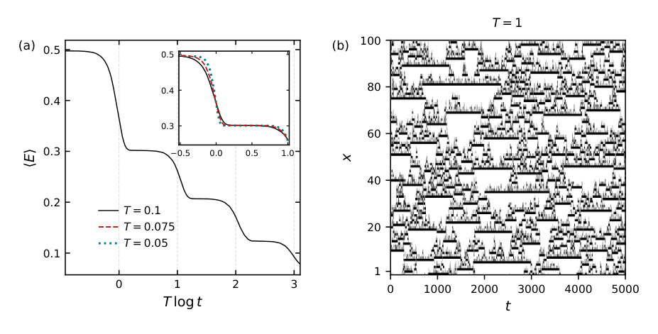 
FIG. 1. Hierarchical relaxation and dynamical heterogeneity. The main plot of panel (a) shows relaxation of the energy E = ϵ PL j=1 nj in the East model after a quench from T = ∞to a low equilibrium temperature T = 0.1 (the latter enters the hopping rates c). The excitation energy cost ϵ is set to one. The inset depicts the relaxation over a shorter time window, for equilibrium temperatures T = 0.1, T = 0.075, and T = 0.05. In the low-T limit plateaus become sharp steps [56]. System size is L = 30 and periodic boundary conditions are imposed. Panel (b) shows a characteristic stochastic trajectory for the East model on L = 100 sites with periodic boundary conditions, at temperature T = 1....

📷 Fig 2

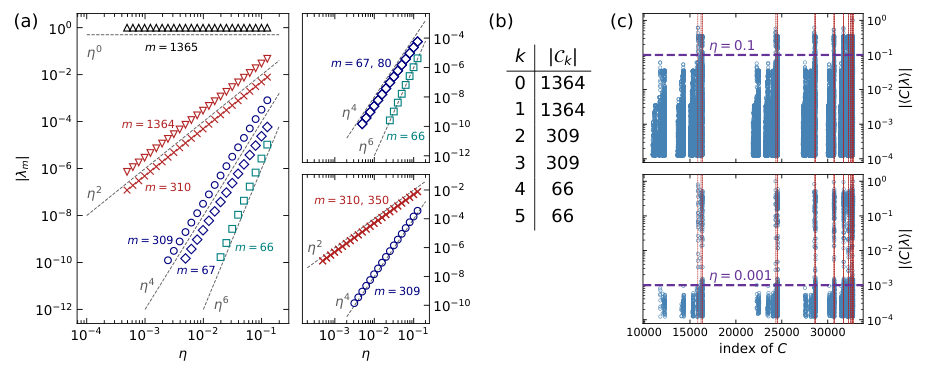 
FIG. 2. Metastable configurations in the East model. The metastable configurations in Ck (k ≤5) determined using exact diagonalization for L = 15 sites—see Eq. (35). Panel (a) shows the scaling with η of the absolute eigenvalues |λm| of truncated symmetrized generators ˜W(k) for k = 5 (left), k = 4 (top right), and k = 3 (bottom right). The eigenvalues are ordered such that λm ≥λm+1 (most are negative, so their absolute size increases with m). Note the change in scaling as the eigenvalue index increases from |Ck| to |Ck| + 1. The table (b) reports the total number of configurations in Ck for k ≤5. Panel (c) depicts the absolute overlap |⟨C|λ⟩| between the leading |C5| eigenvectors |λ⟩of...

📷 Fig 3

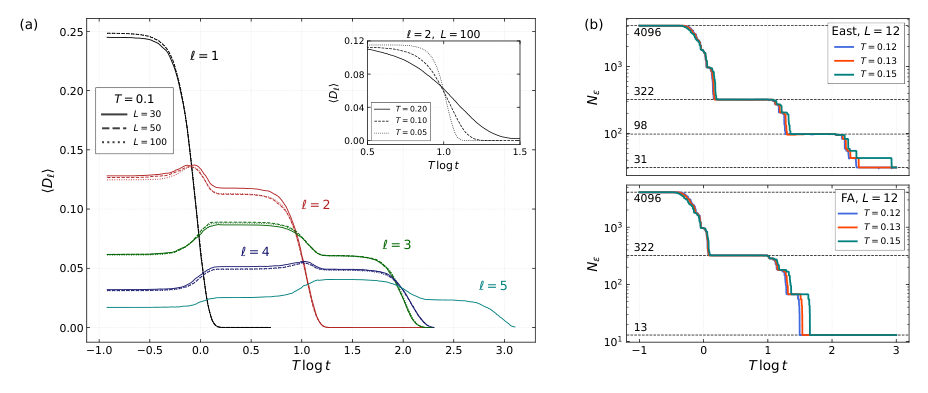 
FIG. 3. Relaxation of domains in the East and FA models. Panel (a) depicts the relaxation of strings Dℓ= n1  Qℓ j=2(1 −nj)  nℓ+1 (ℓis the domain length) in the East model, for various system sizes (main plot) and temperatures (inset). Panel (b) shows the time evolution of the effective number Nε of configurations after a quench from T = ∞to temperatures T = 0.12 (blue), T = 0.13 (orange), and T = 0.15 (green). The system size is L = 12. The top panel shows the effective number in the East model and the bottom panel in the Fredrickson- Andersen model. The configurations with P(C, t) &gt; ε = 2−(L+1) are taken into the account. The horizontal dashed lines correspond to |C0| = |C1| = N1, |C2| =...

**Summary.** This paper develops and applies a stochastic-generator expansion method to analyze the slow relaxation dynamics in kinetically constrained models (KCMs). By expanding the system's dynamics in terms of the low-temperature excitation concentration, the authors systematically predict the nested hierarchy of metastable states. This work provides a unified theoretical framework connecting quantum and classical descriptions of glassy dynamics.

**Why it may be interesting.** Although focused on classical models, the successful adaptation of a quantum-derived expansion technique to describe slow relaxation in classical stochastic systems provides a powerful, generalizable theoretical tool for understanding glassy dynamics in many-body systems.

Detailed structure

**Main problem.** The paper revisits the complex hierarchy of relaxation time scales observed in stochastic kinetically constrained models (KCMs). It aims to provide a systematic theoretical description of this slow relaxation process.

**Main result.** The authors demonstrate that an expansion method, adapted from quantum KCMs, successfully recovers the known nested hierarchy of metastable plateaus in classical KCMs like the East and Fredrickson-Andersen models.

**Method.** The core method is a low-temperature expansion of the stochastic generator in powers of the equilibrium concentration of excitations. This systematic expansion allows for the identification of successive metastable states.

**Model / system.** The study focuses on Kinetically Constrained Models (KCMs), specifically applied to the one-dimensional East and Fredrickson-Andersen (FA) models. The dynamics are governed by a master equation defined by a stochastic generator.

**Key observables.** Relaxation time scales, nested hierarchy of metastable configurations, and the decay of correlation functions following a quench.

**Important parameters / regimes.** The equilibrium concentration of excitations ($c$) serves as the small expansion parameter. The quench process (high-to-low temperature) is crucial for observing the hierarchy.

**Assumptions / limitations.** The analysis assumes the system obeys detailed balance, allowing for the symmetrization of the stochastic generator. The method relies on the existence of a small parameter ($c$) governing the hopping rates.

**Figures summary.** Figures illustrate the hierarchical relaxation of energy in the East model and show the time evolution of the effective number of configurations for both the East and FA models after a quench.

**Paper structure.** The paper builds by first establishing the mathematical framework using the stochastic-generator expansion, then applying this method to the classical East and FA models, and finally demonstrating that the resulting time scales systematically reproduce known results for glassy relaxation.

Abstract

We revisit the hierarchy of relaxation time scales in stochastic kinetically constrained models (KCMs) obeying detailed balance, using an expansion method developed recently for their quantum counterparts. In the classical setting, we expand the stochastic generator in the low-temperature equilibrium concentration of excitations. As in quantum KCMs, successive truncations of the expansion reveal a nested hierarchy of metastable configurations that remain frozen on progressively longer time scales. Applying the method to the high-to-low temperature quench in the classical one-dimensional East and Fredrickson-Andersen models, we recover the known hierarchy of metastable plateaus and the associated perturbative time scales. We find that the hierarchical time scales are related to the smallest domain lengths. Our results show that the method developed for quantum kinetically constrained models can be used to provide a systematic description of slow relaxation in their classical counterparts as well.

[↑ back to top](#top)

### [Entanglement swapping across a five-node relay in a multiplexed quantum-classical network](http://arxiv.org/abs/2609.18899v1)

**Authors:** Andrew R. Cameron, Jordan M. Thomas, Alexandru Macridin, Si Xie, Raju Valivarthi, Soumya S. Ghosh, Yerko Muñoz Barros, Neil Sinclair, Panagiotis Spentzouris, Maria Spiropulu, Prem Kumar, Cristián Peña  
**Type:** both · **Category:** quantum information and computing · **PDF:** <https://arxiv.org/pdf/2609.18899v1>  
**Analysis basis:** full PDF text, analyzed in chunks
**Topic relevance:** 🔥 `quantum optics experiment` **4/5** · `QC/QI experiment` **3/5** · `interference shaping light` **1/5** · `quantum measurements` **1/5**

📷 Fig 1

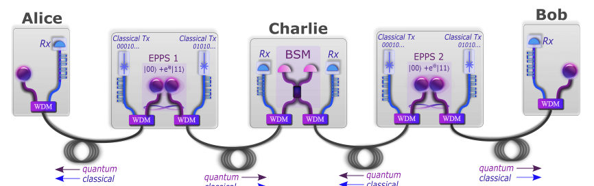 
Figure 1: Conceptual diagram of entanglement swapping across a five-node quantum relay over four fiber links wherein higher-power classical communication signals are wavelength-multiplexed in and out of each fiber. Two independent entangled photon-pair sources (EPPS) generate entangled photon pairs. One photon from each source is transmitted through a fiber segment of length L/4 to a central node for a Bell state measurement (BSM). The other photons from the EPPSs are sent a distance L/4 to either Alice or Bob. A successful BSM at Charlie’s midpoint relay node heralds entanglement between the two remaining photons at Alice’s and Bob’s nodes, despite having never directly interacted.

📷 Fig 2

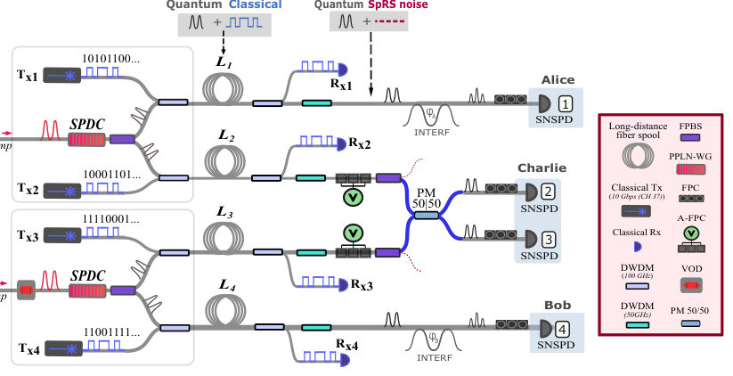 
Figure 2: Detailed experimental architecture for entanglement swapping in a quantum-classical coexistence relay. The setup utilizes a common 1536.6-nm mode-locked laser to pump two independent SPDC sources. Each of the four quantum paths consists of a SMF-28 fiber spool with either lengths L = 5 km (20-km total span) or L = 10 km (40-km total span). Each fiber segment is populated by wavelength-multiplexed C-band time-bin photons co-propagating with 10-Gbps classical data signals allocated to a neighboring DWDM channel.

📷 Fig 3

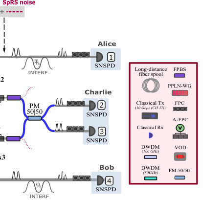 
Figure 3(b) shows the visibility of the swapped entangled state measured in the X and Z bases as we vary ⟨Pcl⟩. Simulation curves are displayed as dashed lines and are described in detail in Sup- plementary B, expanding on previous characteristic function approaches [29, 42]. Fourfold coincidences are recorded while fixing Alice’s measurement inter- ferometer phase (ϕa) while varying Bob’s phase (ϕb) for both ϕa = 0◦and 45◦. In the absence of classical light, we measure swapped entanglement visibilities

📷 Fig 4

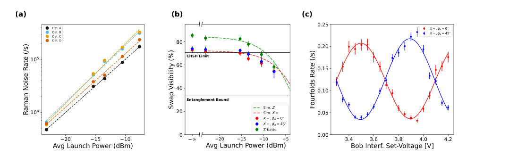 
Figure 3: Experimental results for testing the tolerance of C-band entanglement swapping to SpRS noise caused by co-propagating 10-Gbps C-band (1547.72 nm) classical data signals in each fiber. In this case, each fiber link is L/4 = 5 km, giving a total swapping length of L = 20 km. (a) Measured noise counts per second versus the average classical launch power across each fiber link. (b) Entanglement swapping visibility versus average classical launch power in each fiber. Experimental data is presented as circular data points and simulation is represented by dashed lines. (c) Four-fold coincidence fringe for the X± bases when the received classical power exiting each fiber was &gt; −18 dBm such...

📷 Fig 5

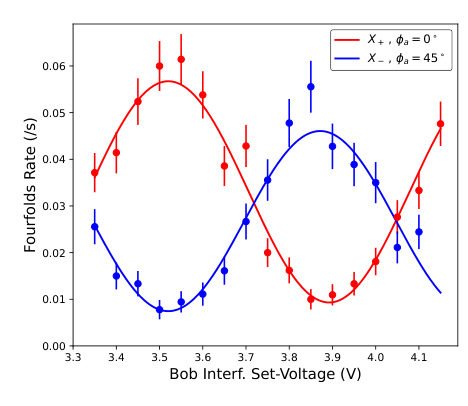 
Figure 4: Visibility of time-bin entanglement swap- ping across 40 km of fiber with coexisting 10-Gbps classical signals. Red and blue curves represent sepa- rate fringe scans with ϕa set to 0◦and 45◦by setting the voltage of a static interferometer in Alice’s arm.

**Summary.** This paper reports the first experimental demonstration of entanglement swapping across a multi-node quantum relay while simultaneously transmitting high-speed classical data over the same optical fibers. By characterizing the noise introduced by co-propagating classical signals, the authors establish a roadmap for deploying advanced quantum technologies in real-world, noisy communication channels.

**Why it may be interesting.** This work is highly relevant as it tackles the engineering challenge of integrating quantum signals into existing classical infrastructure, which is a major bottleneck for scaling quantum networks.

Detailed structure

**Main problem.** The primary challenge addressed is demonstrating entanglement swapping and conventional classical communications operating simultaneously over the same optical fibers, which is crucial for real-world quantum network deployment.

**Main result.** The authors successfully demonstrated entanglement swapping over 40 km while simultaneously transmitting 10-Gbps classical data, proving the feasibility of coexisting quantum and classical networks.

**Method.** The work combines experimental measurements of entanglement fidelity and noise characterization with theoretical modeling using Gaussian overlap integrals to simulate detection probabilities.

**Model / system.** The system involves a five-node quantum relay topology connected by long-distance fibers, utilizing dense-wavelength division multiplexing (DWDM) to co-propagate time-bin entangled photons and high-power classical data signals.

**Key observables.** Entanglement swapping visibility, quantum fidelity ($F$), and the rate of spontaneous Raman scattering (SpRS) noise photons.

**Important parameters / regimes.** Maximum fiber length of 40 km, simultaneous 10-Gbps classical data transmission, and the trade-off between quantum fidelity and classical launch power.

**Assumptions / limitations.** The analysis characterizes the trade-off with Raman noise, and simulations explore different wavelength allocations (C/C, O/C, C/O) to mitigate noise effects.

**Figures summary.** Figures illustrate the conceptual setup, detailed experimental architecture, and quantitative results showing visibility and noise rates as a function of classical launch power and fiber length.

**Paper structure.** The paper progresses from establishing the physical necessity of quantum-classical coexistence, detailing the experimental setup and measurements of noise/fidelity, and concluding with theoretical modeling to predict performance limits based on noise sources.

Abstract

Quantum networks are resources for scaling quantum computers and distributed sensing technologies while offering post-quantum security benefits. Teleporting non-classical resources like entanglement, via so called entanglement swapping, is essential for networks in particular overcoming rate-loss limits via quantum repeaters. Deploying these systems on real infrastructure will likely require multiplexing photonic qubits into fibers carrying 'classical' light encoding standard Internet communications and control plane signals for multi-node quantum protocols. Here, we report the first demonstration of entanglement swapping and conventional communications operating over the same fibers. Entanglement is swapped across a five-node quantum relay topology connected by four long-distance fibers, each populated with classical data signals. Time-bin entangled photons in the C-band are multiplexed alongside C-band classical signals using dense-wavelength division multiplexing, introducing noise photons generated by high-power classical light. We experimentally and theoretically characterize the trade-off between quantum fidelity and Raman noise photons. Entanglement swapping is demonstrated over a maximum fiber length of 40 km (four 10-km fibers) while simultaneously transmitting 10-Gbps classical data through all fibers. These results represent a significant advancement in the demonstrated complexity of coexisting quantum and classical networks and provide a roadmap for achieving the widespread deployment of advanced quantum technologies.

[↑ back to top](#top)

### [Spectral-Gap Bounds and Timescales for Purity Loss in Hamiltonian--Pointer Interactions](http://arxiv.org/abs/2609.18244v1)

**Authors:** Orhan Amirov, Necati Çelik  
**Type:** theory · **Category:** other · **PDF:** <https://arxiv.org/pdf/2609.18244v1>  
**Analysis basis:** full PDF text, analyzed in chunks
**Topic relevance:** 🔥 `quantum measurements` **4/5** · `Keldysh / 2PI / non-Gaussian methods` **1/5** · `correlated / nonlocal dissipation` **1/5** · `driven-dissipative phase transition` **1/5** · `methods for driven-dissipative` **1/5** · `non-equilibrium universality` **1/5**

📷 Fig 1

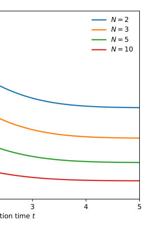 
Figure 1: Time evolution of the reduced-system purity for equally weighted systems with N = 2, 3, 5, and 10 equally spaced energy levels. The parameters are fixed at g = 1, ∆= 1, and σ = 1. The purity starts from P(0) = 1 and approaches the asymptotic value P(∞) = 1/N.

📷 Fig 2

 
Figure 1 illustrates the dimensional dependence predicted by Eq. (29). Al- though all curves originate from the pure initial value P(0) = 1, their long-time limits depend explicitly on the number of populated energy levels. In particu- lar, increasing N lowers the asymptotic purity to 1/N, reflecting the increasing number of populated energy components whose associated pointer states become asymptotically distinguishable.

📷 Fig 3

 
Figure 2 confirms the spectral-gap dependence predicted analytically. Larger values of ∆produce more rapidly distinguishable conditional pointer states and

📷 Fig 4

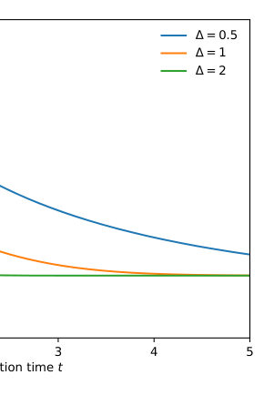 
Figure 2: Dependence of the reduced-system purity on the fundamental spectral spacing ∆for an equally weighted five-level system with g = 1 and σ = 1. Increas- ing the spectral spacing accelerates the suppression of the off-diagonal coherences and leads to a faster approach toward the asymptotic purity P(∞) = 1/N.

**Summary.** This theoretical paper analyzes how the purity of a quantum system decays when it interacts with a continuous-variable pointer observable. The decay dynamics are shown to be entirely dictated by the spectral structure of the system's Hamiltonian, leading to quantifiable bounds and characteristic timescales. It provides deep insights into how spectral gaps govern the rate of quantum information loss.

**Why it may be interesting.** This work provides a rigorous, analytical framework for understanding decoherence mechanisms in quantum systems where the environment coupling is structured by the system's internal energy spectrum, which is highly relevant to quantum measurement theory and open quantum systems.

Detailed structure

**Main problem.** The paper investigates the time evolution of purity in a quantum system coupled to a continuous-variable pointer via a von Neumann-type interaction.

**Main result.** Purity loss is governed by the spectral separation of the system Hamiltonian, leading to state-dependent bounds and a characteristic timescale $t_\epsilon \propto \sigma/(|g|\Delta_{\min})$.

**Method.** The authors derive an exact analytical expression for the time-dependent purity by tracing out the pointer degrees of freedom, utilizing properties of Gaussian states.

**Model / system.** The model consists of a quantum system ($\hat{H}$) coupled to a continuous-variable pointer ($\hat{p}$) via the interaction $\hat{H}_{	ext{int}} = g \hat{H} \otimes \hat{p}$. The analysis is performed assuming the pointer starts in a Gaussian state.

**Key observables.** Purity $P(t) = 	ext{Tr}[
ho_S(t)^2]$, short-time purity curvature $P''(0)$, and the asymptotic purity $P_\infty$.

**Important parameters / regimes.** Coupling strength ($g$), pointer width ($\sigma$), minimum populated spectral gap ($\Delta_{\min}$), and the energy variance ($	ext{Var}_{\psi_S}(\hat{H})$).

**Assumptions / limitations.** The pointer is assumed to be initially in a Gaussian pure state, and the interaction is strictly bilinear ($\hat{H}_{	ext{int}} = g \hat{H} \otimes \hat{p}$).

**Figures summary.** Figures illustrate the time evolution of purity for equally spaced $N$-level systems, confirming $P(0)=1$ and $P(\infty)=1/N$, and show the dependence of purity decay on the spectral spacing $\Delta$.

**Paper structure.** The paper develops the exact purity formula, derives state-dependent two-sided spectral-gap bounds, analyzes the short-time dynamics controlled by energy variance, and finally establishes the long-time approach timescale controlled by $\Delta_{\min}$.

Abstract

We investigate the purity dynamics of a quantum system coupled to a continuous-variable pointer through a von Neumann-type interaction Hamiltonian of the form $\hat H_{\mathrm{int}}=g\,\hat H\otimes\hat p$. For an initially Gaussian pointer state, the interaction generates energy-dependent conditional translations whose mutual overlaps are determined explicitly by the populated spectral separations of the system Hamiltonian. After tracing out the pointer degrees of freedom, we obtain the reduced density operator and derive an exact analytical expression for the time-dependent purity.   Using this expression, we establish two-sided purity bounds governed by the minimum and maximum nonzero energy gaps on the populated spectral support. These bounds provide a state-dependent spectral characterization of the loss of purity and become exact for two-level systems. We further show that the short-time decrease of purity is controlled by the Hamiltonian variance of the initial state, with $\mathcal P''(0)=-(g^2/σ^2) \operatorname{Var}_{ψ_S}(\hat H)$. In addition, an explicit sufficient timescale is derived for the purity to approach its asymptotic value within a prescribed tolerance, revealing the scaling $t_{\varepsilon}\proptoσ/(|g|Δ_{\min})$. Finally, the general results are illustrated for an equally weighted $N$-level system with an equally spaced spectrum, for which the asymptotic purity is $1/N$. The analysis clarifies the distinct roles of spectral separation, energy variance, coupling strength, and pointer width in Hamiltonian-conditioned purity loss.

[↑ back to top](#top)

### [Resonance-Protected Pointer States: Stationary-Phase Analysis of Entanglement in an Environment-Coupled Two-Spin System](http://arxiv.org/abs/2609.18641v1)

**Authors:** Kentaro Urasaki  
**Type:** theory · **Category:** quantum information and computing · **PDF:** <https://arxiv.org/pdf/2609.18641v1>  
**Analysis basis:** full PDF text, analyzed in chunks
**Topic relevance:** 🔥 `correlated / nonlocal dissipation` **4/5** · `Keldysh / 2PI / non-Gaussian methods` **2/5** · `methods for driven-dissipative` **2/5**

📷 Fig 1

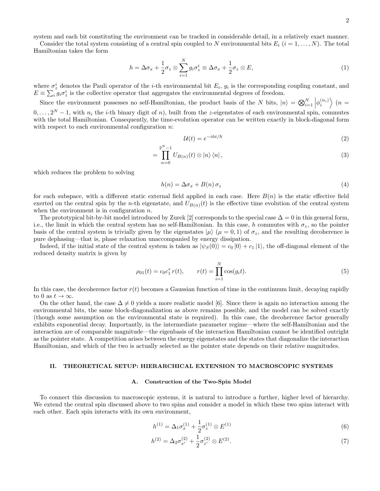 
Low-resolution page preview, page 2

📷 Fig 2

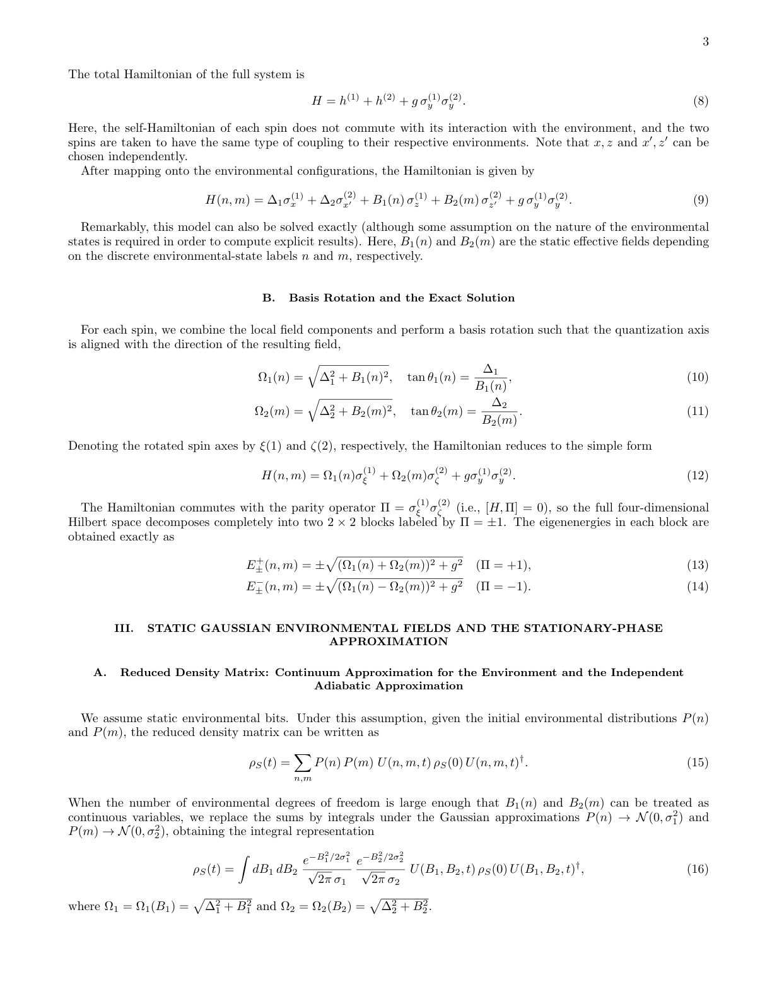 
Low-resolution page preview, page 3

📷 Fig 3

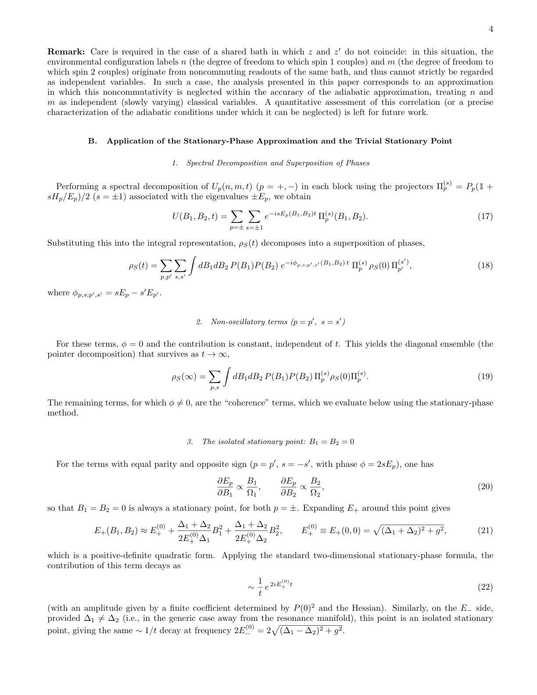 
Low-resolution page preview, page 4

📷 Fig 4

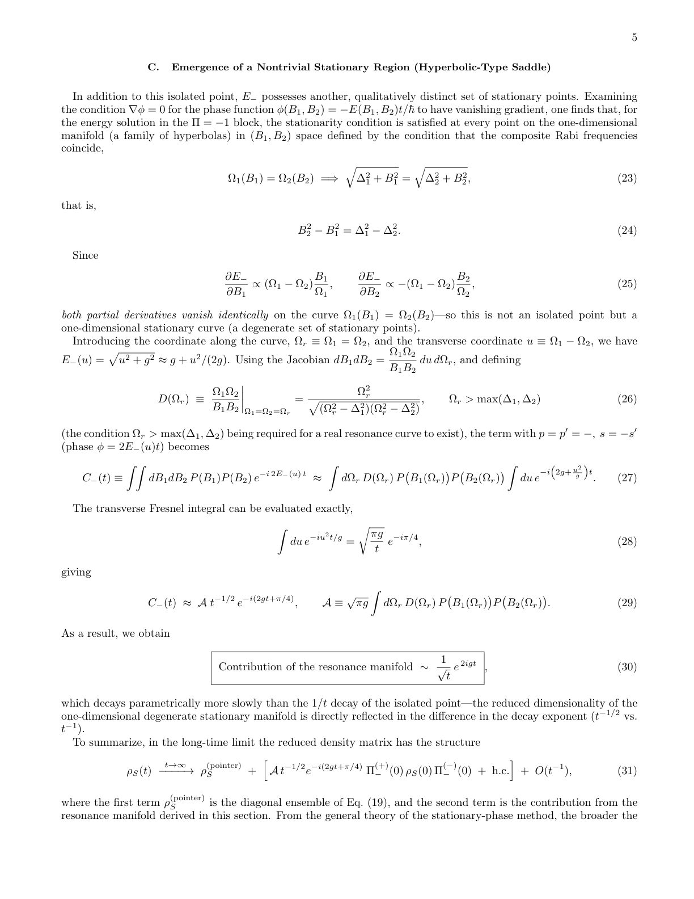 
Low-resolution page preview, page 5

📷 Fig 5

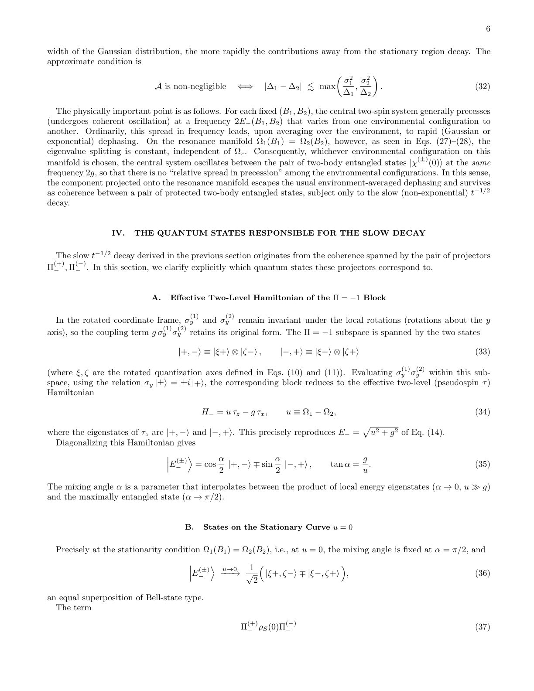 
Low-resolution page preview, page 6

**Summary.** This work investigates how entanglement survives decoherence in a two-spin system coupled to an environment. By using advanced mathematical techniques like the stationary-phase approximation, the authors show that coherence is protected when the local environmental fields satisfy a specific resonance condition. This protection leads to an anomalously slow $t^{-1/2}$ decay, revealing that the pointer state is governed by a collective environmental resonance rather than individual system couplings.

**Why it may be interesting.** It provides a detailed, quantitative mechanism for environmental protection of entanglement, showing that the pointer basis selection can be dictated by a global, statistical resonance condition rather than local couplings.

Detailed structure

**Main problem.** The paper analyzes quantum decoherence in a two-spin system coupled to an environment to determine the protected quantum states (pointer states) that survive environmental interaction.

**Main result.** Under a specific resonance condition between the two environments, coherence between maximally entangled Bell-type states survives with an anomalously slow decay rate of $t^{-1/2}$, which is protected by a collective environmental resonance.

**Method.** The analysis employs the Stationary-Phase Approximation (saddle-point method) on the integral representation of the reduced density matrix, comparing decay rates from isolated points versus resonance manifolds.

**Model / system.** The system consists of two spin-1/2 particles coupled noncommutingly to two independent static environmental fields and mutually coupled via an interaction term ($\sigma_y^{(1)}\sigma_y^{(2)}$).

**Key observables.** Coherence decay rates ($\sim t^{-1}$ vs. $\sim t^{-1/2}$), the reduced density matrix $
ho_S(t)$, and the pointer observable.

**Important parameters / regimes.** The resonance condition ($\Omega_1(B_1) = \Omega_2(B_2)$), the inter-system coupling strength ($g$), and the time scale $t$.

**Assumptions / limitations.** The analysis relies on the Stationary-Phase Approximation and treats the environmental couplings as independent variables in the continuum limit.

**Paper structure.** The paper develops the Hamiltonian, constructs the reduced density matrix via an integral representation, applies the SPA to identify different stationary points (isolated vs. manifold), and compares the resulting coherence decay laws.

Abstract

In this manuscript, we analyze the dynamics of a model in which two spin-1/2 systems are each coupled noncommutingly to a static environmental field and to a self-Hamiltonian, while also being mutually coupled through a $σ_y^{(1)}σ_y^{(2)}$ interaction. By constructing an exact solution that exploits parity symmetry, and by applying the stationary-phase approximation (the saddle-point method) in the continuum limit of the environmental field, we show that coherence associated with the ordinary isolated stationary point decays as $t^{-1}$, whereas, under the resonance condition at which the local effective fields of the two spins cancel each other, only the coherence between a pair of maximally entangled, Bell-type states- the eigenbasis of the inter-system coupling-survives, decaying via the anomalously slow power law $t^{-1/2}$. Through a comparison with the pointer-basis theory of W. H. Zurek and coworkers (the 1981 and 2005 models), we further reveal a mechanism not reducible to local coupling: in this system, the pointer observable is determined not by the individual system-environment couplings but by a statistical resonance condition between the two environments.

[↑ back to top](#top)

### [Redesigning the linear--quadratic--Gaussian cost function for feedback cooling of a quantum harmonic oscillator](http://arxiv.org/abs/2609.18195v1)

**Authors:** Shuma Sugiura, Koki Shiraishi, Masahito Ueda  
**Type:** theory · **Category:** other · **PDF:** <https://arxiv.org/pdf/2609.18195v1>  
**Analysis basis:** full PDF text, analyzed in chunks
**Topic relevance:** 🔥 `quantum measurements` **4/5** · `correlated / nonlocal dissipation` **1/5** · `driven-dissipative phase transition` **1/5** · `methods for driven-dissipative` **1/5**

📷 Fig 1

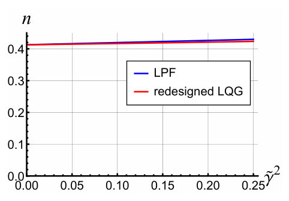 
FIG. 1. Achievable phonon occupation number n as a func- tion of ˜γ2 at a detection efficiency of η = 0.3. The results are shown for both the LPF feedback (Eq. (36), blue curve) and the redesigned LQG control (Eq. (27), red curve). The two curves are nearly indistinguishable on this scale.

📷 Fig 2

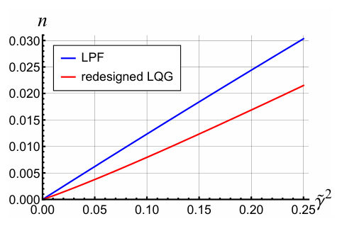 
FIG. 2. Achievable phonon occupation number n as a func- tion of ˜γ2 at unit detection efficiency (η = 1), for the LPF feedback (Eq. (36), blue curve) and the redesigned LQG con- trol (Eq. (27), red curve). The difference between the two schemes is significant compared with that at η = 0.3 shown in Fig. 1.

**Summary.** This paper improves the theoretical framework for quantum feedback cooling of a harmonic oscillator by redesigning the standard LQG cost function. By making the cost function sensitive to the feedback-induced potential shift, the authors derive a superior optimal control law. This redesigned control achieves better cooling performance, especially when measurement efficiencies are very high, confirming the physical necessity of matching the cost function to the true physical objective.

**Why it may be interesting.** This work is highly relevant to AMO physics and quantum optics as it tackles optimal quantum control, specifically demonstrating how the precise physical objective (relative to the shifted potential) must dictate the mathematical cost function used in the control theory.

Detailed structure

**Main problem.** The paper addresses the optimal control problem for feedback cooling of a quantum harmonic oscillator by redesigning the Linear-Quadratic-Gaussian (LQG) cost function.

**Main result.** The redesigned LQG control achieves a lower steady-state phonon occupation number than conventional methods, providing a significant advantage as the measurement detection efficiency approaches unity.

**Method.** The authors derive the optimal feedback law by formulating and minimizing a redesigned cost function that explicitly accounts for the feedback-induced shift of the potential, solving the resulting optimal control problem.

**Model / system.** The system is a quantum harmonic oscillator, modeled by a Hamiltonian whose potential minimum is shifted by the feedback process. The dynamics are governed by a stochastic quantum master equation.

**Key observables.** The achievable minimum steady-state phonon occupation number ($n$) is the primary diagnostic.

**Important parameters / regimes.** Detection efficiency ($\eta$) is crucial, with the advantage of the new method becoming pronounced as $\eta 	o 1$.

**Assumptions / limitations.** The analysis assumes the conditional state remains Gaussian, and the authors clarify that the redesigned and conventional cost functions represent distinct physical control objectives.

**Figures summary.** Figure 1 compares phonon occupation number vs. measurement strength for low efficiency, showing near indistinguishability; Figure 2 compares the same for high efficiency ($\eta=1$), showing a clear advantage for the redesigned LQG control.

**Paper structure.** The paper develops the problem by first considering the classical limit, then formulating the quantum optimal control problem using the redesigned cost function, deriving the optimal feedback law, and finally comparing the resulting cooling performance against established methods like LPF feedback.

Abstract

Linear--quadratic--Gaussian (LQG) control is optimal only with respect to a prescribed cost function, the choice of which dictates the physical objective of the control. We consider feedback cooling of a continuously monitored quantum harmonic oscillator by shifting the minimum of its trapping potential. In this setting, the physically relevant cooling objective can be defined as minimizing the oscillator's energy relative to the feedback-shifted potential. In contrast, conventional LQG control evaluates the energy from a fixed origin and thus fails to directly optimize this quantity. To address this problem, we introduce a redesigned cost function that explicitly accounts for the feedback-induced shift of the potential. We then derive the corresponding optimal feedback law and obtain an analytic expression for the minimum achievable steady-state phonon occupation number. The redesigned LQG control achieves a lower occupation number than low-pass-filter (LPF) feedback formulated for the same cooling objective. While this improvement is minor at detection efficiencies currently attainable in experiments---indicating that LPF feedback already delivers near-optimal cooling performance---the advantage becomes pronounced as the detection efficiency approaches unity. In this regime, the redesigned LQG control provides an increasing advantage for reaching the motional ground state at a finite measurement strength. We clarify that the conventional and redesigned cost functions represent distinct control objectives rather than different implementations of the same optimization problem.

[↑ back to top](#top)

### [All coherent measurements provide observational ergotropic advantage](http://arxiv.org/abs/2609.18735v1)

**Authors:** Soumik Mahanti, Rakesh Saini, Alexei Gilchrist, Arindam Mitra  
**Type:** theory · **Category:** statistical mechanics · **PDF:** <https://arxiv.org/pdf/2609.18735v1>  
**Analysis basis:** full PDF text, analyzed in chunks
**Topic relevance:** 🔥 `quantum measurements` **4/5** · `correlated / nonlocal dissipation` **1/5**

📷 Fig 1

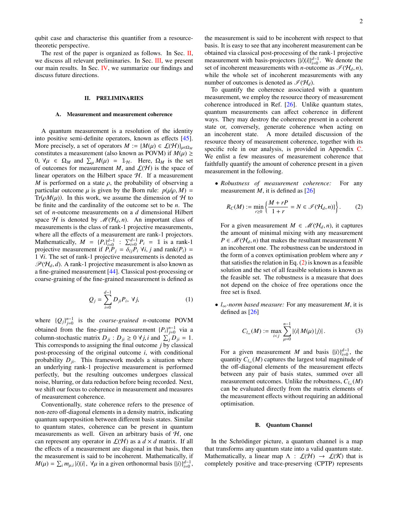 
Low-resolution page preview, page 2

📷 Fig 2

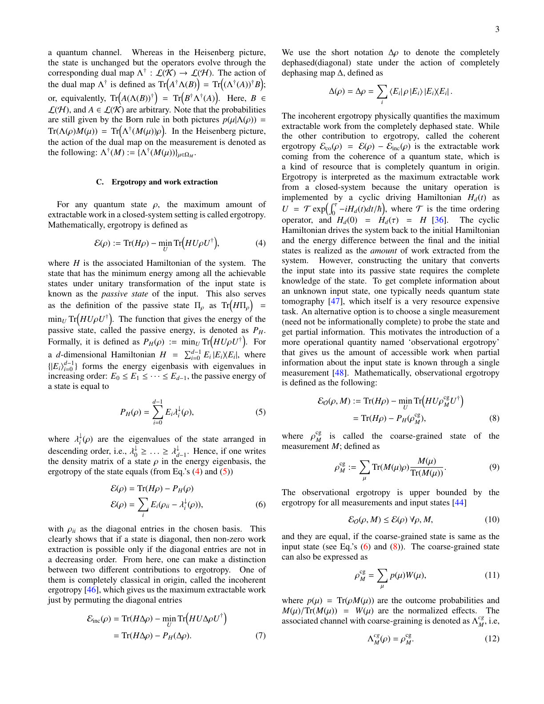 
Low-resolution page preview, page 3

📷 Fig 3

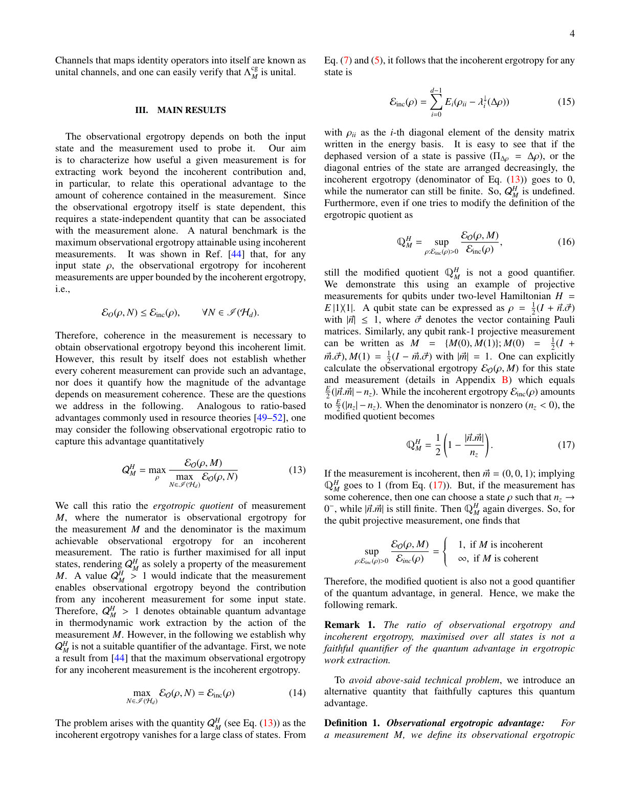 
Low-resolution page preview, page 4

📷 Fig 4

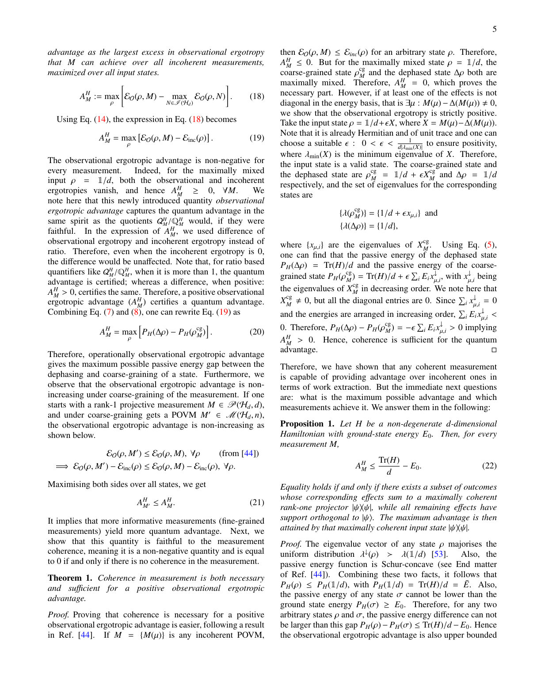 
Low-resolution page preview, page 5

📷 Fig 5

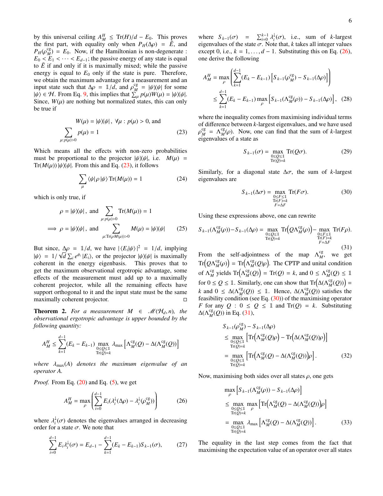 
Low-resolution page preview, page 6

**Summary.** This paper quantifies the 'observational ergotropic advantage'—the extra work extractable due to measurement coherence—by introducing a novel operational quantifier. It proves that this advantage is directly linked to measurement coherence and demonstrates that this resource is not preserved under all physically allowed operations, which has implications for quantum resource theory.

**Why it may be interesting.** This work directly connects fundamental concepts from quantum thermodynamics (work extraction, ergotropy) with the resource theory of quantum measurements, providing rigorous, quantitative tools for assessing quantum advantages in energy harvesting.

Detailed structure

**Main problem.** The paper aims to establish a quantitative, operational measure for the advantage gained in work extraction from a quantum system when only partial state knowledge is available via measurement, and to characterize this advantage using measurement coherence.

**Main result.** The authors derive a faithful operational quantifier for the work advantage, showing that measurement coherence is necessary and sufficient for a positive advantage. Crucially, they demonstrate that this advantage is not monotonic under physically incoherent operations.

**Method.** The work involves defining and maximizing the 'observational ergotropic advantage' ($A_H^M$) by comparing the passive energy gap before and after coarse-graining the state based on the measurement outcome. The analysis is extended to test monotonicity using specific quantum channels.

**Model / system.** The study considers general quantum systems, using qubits and qutrits as explicit examples. The physics revolves around work extraction, ergotropy, and the resource quantification of measurement coherence within the framework of quantum thermodynamics.

**Key observables.** Observational Ergotropic Advantage ($A_H^M$), Robustness of measurement coherence ($RC(M)$), and $l_{\infty}$-norm based coherence measure ($Cl_{\infty}(M)$).

**Important parameters / regimes.** The dimension of the Hilbert space ($d$), the Hamiltonian ($H$), and the specific structure of the measurement POVMs $\{M(\mu)\}$.

**Assumptions / limitations.** The analysis builds upon the definition of ergotropy and assumes the existence of free operations (like PIOs) to test resource monotonicity.

**Figures summary.** The notes do not provide a summary of figures, but the analysis involves deriving specific mathematical expressions for the advantage under different conditions.

**Paper structure.** The paper progresses from establishing the need for a quantitative measure (Chunk 1), developing the operational advantage quantifier $A_H^M$ (Chunk 2), exploring resource theory bounds (Chunk 3), and finally testing the monotonicity of this advantage under physical constraints (Chunk 4).

Abstract

The use of quantum resources in the work extraction from a quantum system is an emerging research topic. Recently, [arXiv:2602.22893] established the necessity of measurement coherence for obtaining advantage in work extraction from an unknown isolated quantum system. However, a quantitative relation between the magnitude of this advantage and established measures of measurement coherence is missing. Here, we establish such a connection by introducing a faithful operational quantifier of the work advantage provided by a measurement. We show that measurement coherence is necessary and sufficient for a positive advantage, and derive upper and lower bounds in terms of the robustness of measurement coherence and an $l_{\infty}$ norm based coherence measure respectively. Finally, we examine this quantifier of advantage from the resource theoretic perspective. Our results provide an operational characterisation of measurement coherence as a resource for work extraction and reveal a nontrivial relation between its resource content and thermodynamic value.

[↑ back to top](#top)

### [A semiconductor photon-pair source based on a polariton cascade](http://arxiv.org/abs/2609.17900v1)

**Authors:** Karol Kawa  
**Type:** theory · **Category:** other · **PDF:** <https://arxiv.org/pdf/2609.17900v1>  
**Analysis basis:** full PDF text, analyzed in chunks
**Topic relevance:** `Full counting statistics` **3/5** · `Tavis-Cummings & cavity-many-emitter` **3/5** · `analog quantum simulation` **3/5** · `correlated / nonlocal dissipation` **3/5** · `methods for driven-dissipative` **3/5** · `Keldysh / 2PI / non-Gaussian methods` **2/5** · `driven-dissipative phase transition` **2/5** · `quantum measurements` **2/5** · `Dicke superradiance` **1/5** · `interference shaping light` **1/5** · `non-equilibrium universality` **1/5** · `superradiant laser` **1/5**

📷 Fig 1

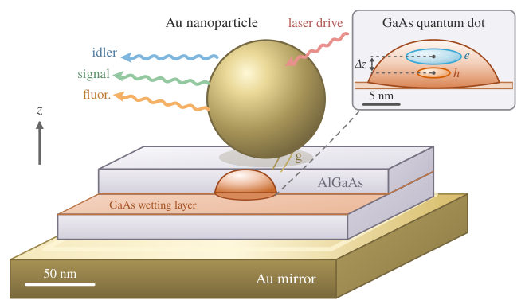 
FIG. 1. Hypothetical device geometry. A GaAs quantum dot lies in AlGaAs between a gold nanoparticle and a gold mirror, above a GaAs wetting layer. The solid AlGaAs block represents a bulk matrix. The gap axis 𝑧marks the growth direction and mode polarization, and 𝑔labels the exciton-mode coupling. The red arrow marks the laser drive, and the blue, green and orange arrows mark idler, signal and fluorescence emission. The inset shows electron and hole density contours at 1/e of their maxima, separated by Δ𝑧. The scale bars apply to the main drawing and inset, while the carrier ordering, mirror thickness and separation are schematic.

📷 Fig 2

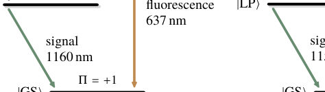 
FIG. 2. Radiative transitions between the three retained eigenstates of Eq. (2). The labels give representative vacuum wavelengths for the chosen model parameters ℏ𝜔𝑚= 1.40 eV, ℏ𝜔𝑒= 1.62 eV and 𝜂= 2𝑔/(𝜔𝑚+ 𝜔𝑒) = 0.275. (a) At 𝑑𝑝= 0, the crossed grey line marks the forbidden idler transition, and the labels give the state parities. (b) At 𝑑𝑝/𝑔= 0.720, the blue arrow marks the allowed idler transition. Green and orange arrows mark signal and fluorescence emission in both panels. The levels are drawn relative to GS, using the same energy scale in both panels.

📷 Fig 3

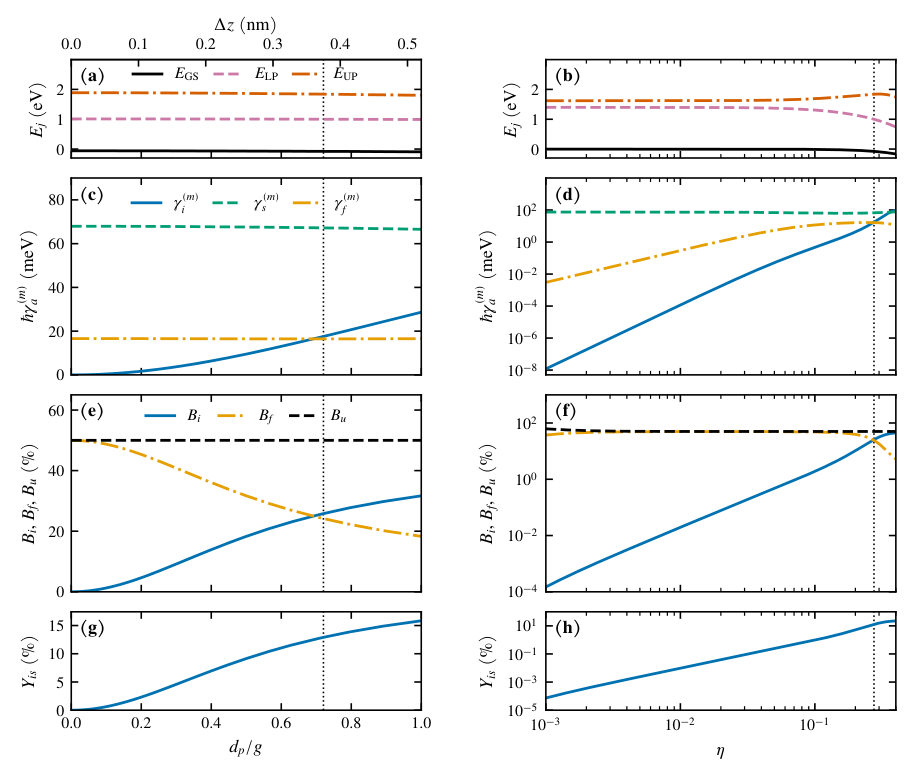 
FIG. 3. (a),(b) Undriven eigenenergies 𝐸𝑗of GS, LP and UP, with the fixed energy zero of Hamiltonian (2). (c),(d) Localized-mode loss linewidths ℏ𝛾(𝑚) 𝑎 [Eq. (24)] for the idler (𝑎= 𝑖, solid blue), signal (𝑎= 𝑠, dashed green) and fluorescence (𝑎= 𝑓, dash-dotted orange). (e),(f) Antenna-output idler and fluorescence branching fractions 𝐵𝑖and 𝐵𝑓, and unobserved upper-polariton decay probability 𝐵𝑢[Eq. (31)]. (g),(h) Two-photon antenna yield 𝑌𝑖𝑠[Eq. (32)] per prepared UP, with the laser off. The left column varies permanent-dipole asymmetry 𝑑𝑝/𝑔at the reference relative coupling 𝜂= 0.275. The top axis gives electron–hole separation Δ𝑧for the fixed transition dipole 𝜇𝑒𝑔= 25 D [Eq. (4)]. The...

📷 Fig 4

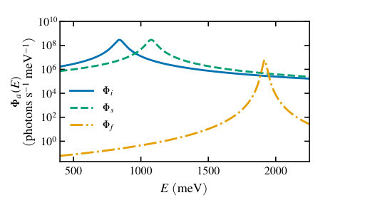 
FIG. 4. Incoherent antenna emission flux Φ𝑎(𝐸) [Eq. (52)] against photon energy 𝐸, under the reference continuous drive and with the reference rates. The blue solid, green dashed and orange dash-dotted curves are idler, signal and fluorescence emission, respectively. The elastic pump contribution is omitted.

📷 Fig 5

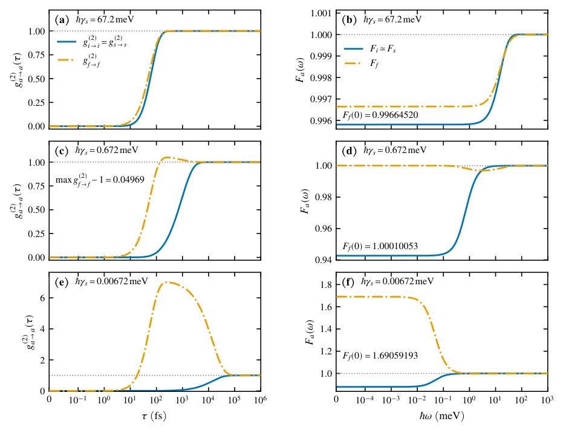 
FIG. 5. Individual-channel statistics at drive ℏΩR = 1.6473 meV and displacement 0.375 nm. The rows use total signal decay rates ℏ𝛾𝑠= 67.229 meV, 0.6723 meV and 0.006723 meV. The idler and fluorescence rates retain the reference values given in Sec. IV A. The signal- rate choices compare different assumed reservoir weights at the signal energy, with the Hamiltonian and counted fractions fixed. (a),(c),(e) Normalized autocorrelations 𝑔(2) 𝑎→𝑎(𝜏) [Eq. (36)] versus intrinsic time delay 𝜏. (b),(d),(f) Single-channel Fano spectra 𝐹𝑎(𝜔) [Eq. (47)] versus ℏ𝜔, where 𝜔is the angular frequency of photon-count fluctuations. Both horizontal axes are linear from zero to the first positive tick and...

**Summary.** This theoretical study models a photon-pair source using a semiconductor quantum dot coupled to a plasmonic cavity. The key finding is that a permanent dipole moment, arising from structural asymmetry, is necessary to break a symmetry that otherwise forbids the required radiative transition. The paper calculates the resulting photon correlations, providing a theoretical blueprint for such a quantum light source.

**Why it may be interesting.** This work directly addresses quantum light sources by modeling strong light-matter coupling in solid-state systems, which is a core topic in cavity QED and open quantum systems.

Detailed structure

**Main problem.** The study aims to theoretically model a semiconductor photon-pair source based on a radiative cascade mechanism.

**Main result.** The presence of a permanent exciton dipole, which breaks a key symmetry, is shown to be necessary to enable the radiative transition between the upper and lower polariton states, thus establishing an operating principle for the source.

**Method.** The analysis uses an effective quantum model and photon-counting theory to calculate emission probabilities and analyze photon correlations.

**Model / system.** The system involves a GaAs quantum dot coupled to a localized electromagnetic mode (plasmon) between a metal nanoparticle and a mirror. The dynamics are governed by a Hamiltonian incorporating exciton and plasmon interactions, crucially including a permanent dipole term.

**Key observables.** Idler photon emission rate, signal photon emission rate, photon count fluctuations, and correlations between the two emission channels.

**Important parameters / regimes.** Coupling strengths ($g, d_p$), cavity/plasmon frequencies ($\omega_m$), and the permanent dipole strength ($\Delta\mu$).

**Assumptions / limitations.** The calculations rely on an effective model, assume specific emitter properties and optical loss rates, and the final feasibility remains open to experimental realization.

**Figures summary.** Figure 1 illustrates the hypothetical device geometry (GaAs QD between Au nanoparticle and mirror). Figure 2 compares the forbidden vs. allowed idler transition rates based on the dipole moment.

**Paper structure.** The paper first establishes the physical system and the role of the permanent dipole in breaking symmetry. It then uses an effective model to calculate the probability of the two-step cascade (Upper $
ightarrow$ Lower $
ightarrow$ Ground), analyzing correlations and fluctuations.

Abstract

We present a theoretical study of a semiconductor photon-pair source based on a radiative cascade enabled by a permanent exciton dipole. The source consists of a GaAs quantum dot placed between a metal nanoparticle and a mirror. The dot exciton and the localized electromagnetic mode mix to form upper and lower polaritons. Without a permanent dipole, a symmetry separating states with even and odd excitation numbers forbids photon emission between the polaritons. Separation of the mean electron and hole positions gives the exciton a permanent dipole and breaks this symmetry. The upper polariton can then emit an idler photon as it decays to the lower polariton. The lower polariton can emit a signal photon as the system returns to its ground state. Using an effective model, we calculate the probability that a prepared upper polariton emits both photons through the metal antenna. We also analyse fluctuations in the emitted photon counts and correlations between the two emission channels. The calculation establishes an operating principle for assumed emitter properties and optical loss rates. Whether the device can be built and its photon correlations measured remains open.

[↑ back to top](#top)

### [Sublattice-selective control of spin reversal in metasurface-coupled Kagome interfaces](http://arxiv.org/abs/2609.18012v1)

**Authors:** Ximo Wang, Qiwei Han, Zhenqi Bai, Ruyue Guo, Min Feng, Yichi Zhang  
**Type:** theory · **Category:** other · **PDF:** <https://arxiv.org/pdf/2609.18012v1>  
**Analysis basis:** full PDF text, analyzed in chunks
**Topic relevance:** `analog quantum simulation` **3/5** · `correlated / nonlocal dissipation` **3/5** · `driven-dissipative phase transition` **3/5** · `interference shaping light` **3/5** · `methods for driven-dissipative` **3/5** · `quantum measurements` **2/5** · `Keldysh / 2PI / non-Gaussian methods` **1/5** · `non-equilibrium universality` **1/5**

📷 Fig 1

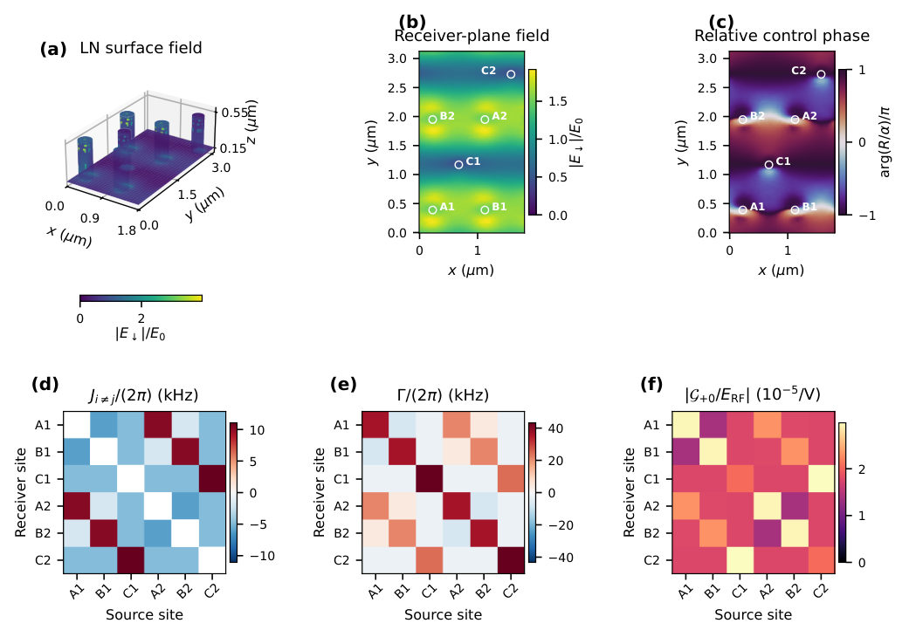 
FIG. 1. Exploratory COMSOL supercell and extracted response. (a) Three-dimensional electric-field magnitude on the LN film and six pillar surfaces, evaluated just inside the dielectric. (b) Field magnitude and (c) Raman-product phase at the receiver plane, 100 nm above the pillars. White circles locate the six finite-volume receivers. Phase is relative to the fitted common complex scale α; ±1 denotes a π offset. Fields use the optimized down-control solution with E0 = 1 V/m and 40-layer PMLs. (d) Regularized coherent exchange and (e) collective decay, from the full matrix-adjoint decomposition; the real diagonal exchange shift is omitted from the plot. Exchange and decay use an illustrative...

📷 Fig 2

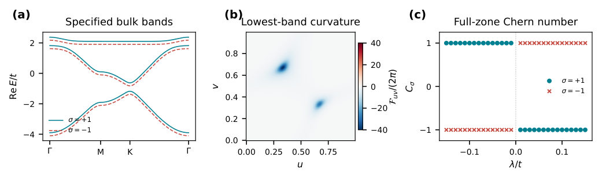 
FIG. 2. Effective-model bulk verification. (a) Real bands for λ/t = 0.08, ∆/t = 0.20; common loss gives Im E/t = −0.06 for every band. (b) Lowest-band Berry-curvature density on a 151 × 151 periodic-gauge grid, k = ub1 + vb2, for spin +. (c) Full-zone lower-band Chern numbers for 30 nonzero signed couplings. No individual-band invariant is assigned at λ = 0. These are lattice-model calculations, independent of the FEM supercell.

📷 Fig 3

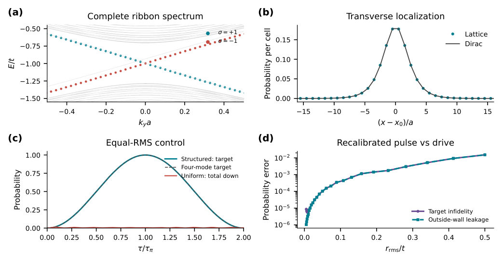 
FIG. 3. Complete transverse-lattice tests at λ0/t = 0.08, w/a = 2, Nx = 60. (a) Ribbon spectrum; colored points have more than 80% central probability, while gray curves include bulk and outer-boundary states. (b) Pair-averaged cell probability and normalized Dirac prediction. (c) Structured-drive target probability, four-mode prediction and uniform-drive total down-spin population at equal RMS 0.04t. (d) Target infidelity and outside-wall leakage versus drive, with the projected pulse recalibrated at every point. These are conserved-momentum sectors, not a localized two-dimensional wavepacket.

📷 Fig 4

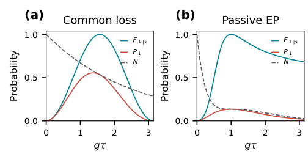 
FIG. 4. Trace-preserving three-state dynamics: conditional conversion F↓|s, unconditional down-state probability P↓and survival N. (a) γ = 0, κ0/g = 0.4, δ = 0; at gτ = π/2, P↓= 0.533488. (b) Passive EP, γ/g = −1, κ0/g = 2; complete conditional conversion at gτ = 1 has success e−2 = 0.135335.

**Summary.** This research develops a method for precisely controlling spin reversal in photonic interface states within a Kagome lattice structure. By analyzing the coupling mechanisms, the authors determined that a specific sublattice pattern ($1:1:-2$) is required to overcome inherent symmetries that cause coupling cancellation. The findings provide quantitative electromagnetic design targets for realizing such spin-dependent quantum control in metasurface-coupled systems.

**Why it may be interesting.** This work is highly relevant as it merges concepts from topological photonics, open quantum systems (Lindblad dynamics), and structured light-matter interaction, providing concrete, quantifiable design rules for controlling quantum states in engineered photonic environments.

Detailed structure

**Main problem.** The paper addresses the challenge of achieving sublattice-selective control for spin reversal in photonic interface states, overcoming limitations where uniform control fields fail to couple opposite-spin, same-valley modes.

**Main result.** An optimal sublattice pattern, specifically $1:1:-2$, was identified to maximize the projected coupling, achieving a high target-mode fidelity of $0.999937$ in full-zone topology calculations.

**Method.** The study combines theoretical analysis of lattice Hamiltonians with numerical simulations, including full-zone topology calculations and an exploratory 3D supercell model.

**Model / system.** The system is a two-component Kagome lattice motivated by photon-mediated exchange near a nonlinear nonlocal metasurface. The dynamics are governed by an effective Hamiltonian and analyzed using projected Rabi amplitudes.

**Key observables.** Target-mode fidelity, leakage probability, projected Rabi amplitude ($\Omega_e$), and spin populations.

**Important parameters / regimes.** RMS drive amplitude ($0.04t$), sublattice pattern coefficients ($1, 1, -2$), and the lattice hopping terms ($t$).

**Assumptions / limitations.** The derived control principle provides quantitative electromagnetic design targets, but the full spin-dependent device realization requires further calibration and assumptions about material constants are made in the EM tests.

**Figures summary.** Figures illustrate the electric field magnitude, Raman-product phase, coherent exchange, and decay across the lattice structure in an exploratory COMSOL supercell.

**Paper structure.** The paper progresses from identifying the fundamental coupling limitations of uniform control to deriving the optimal sublattice pattern ($1:1:-2$), validating this pattern through full-zone topology calculations, and finally demonstrating the principle using an exploratory 3D supercell simulation.

Abstract

Coherent manipulation of photonic interface states requires a control field that matches their internal mode structure. We study this requirement in a two-component Kagome lattice motivated by photon-mediated exchange near a nonlinear nonlocal metasurface. The Dirac spinors show why uniform Raman control cannot couple opposite-spin, same-valley interface modes at leading order, even when their spatial envelopes coincide. A $1:1:-2$ sublattice pattern removes this cancellation and maximizes the projected coupling at fixed root-mean-square amplitude within the diagonal-control class. We test this control scheme through full-zone topology and complete lattice propagation. For a smooth, gapped interface, a $720$-dimensional calculation gives target-mode fidelity $0.999937$ with leakage $6.27\times10^{-5}$ at RMS drive $0.04t$. Trace-preserving dynamics gives the separate survival condition needed for successful conversion. An exploratory three-dimensional lithium-niobate supercell reproduces the complex addressing pattern with $0.373\%$ relative error and provides nonlocal exchange, decay and electro-optic frequency-conversion matrices. The mode-resolved control principle thus gives quantitative electromagnetic design targets; the full spin-dependent device realization still requires further calibration.

[↑ back to top](#top)

### [From Reversible Quantum Dynamics to Statistical Probability: A dynamical solution to the origin of probability and Hilbert's sixth problem](http://arxiv.org/abs/2609.18593v1)

**Authors:** Wei-Min Zhang  
**Type:** theory · **Category:** statistical mechanics · **PDF:** <https://arxiv.org/pdf/2609.18593v1>  
**Analysis basis:** full PDF text, analyzed in chunks
**Topic relevance:** `Keldysh / 2PI / non-Gaussian methods` **3/5** · `driven-dissipative phase transition` **3/5** · `methods for driven-dissipative` **3/5** · `non-equilibrium universality` **3/5** · `correlated / nonlocal dissipation` **2/5** · `scars & prethermalization` **2/5** · `quantum measurements` **1/5**

📷 Fig 1

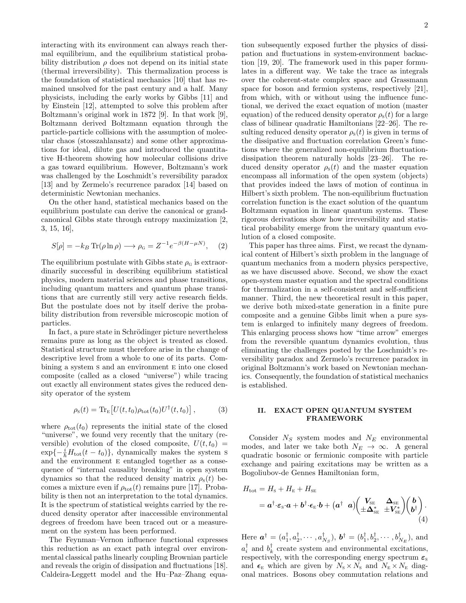 
Low-resolution page preview, page 2

📷 Fig 2

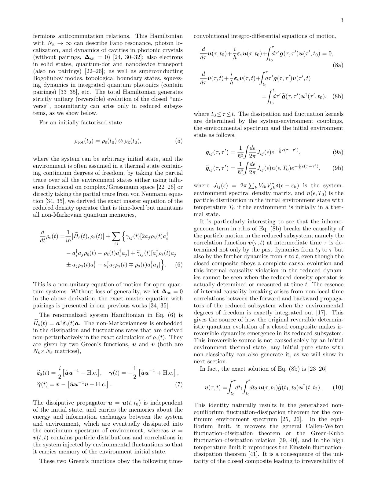 
Low-resolution page preview, page 3

📷 Fig 3

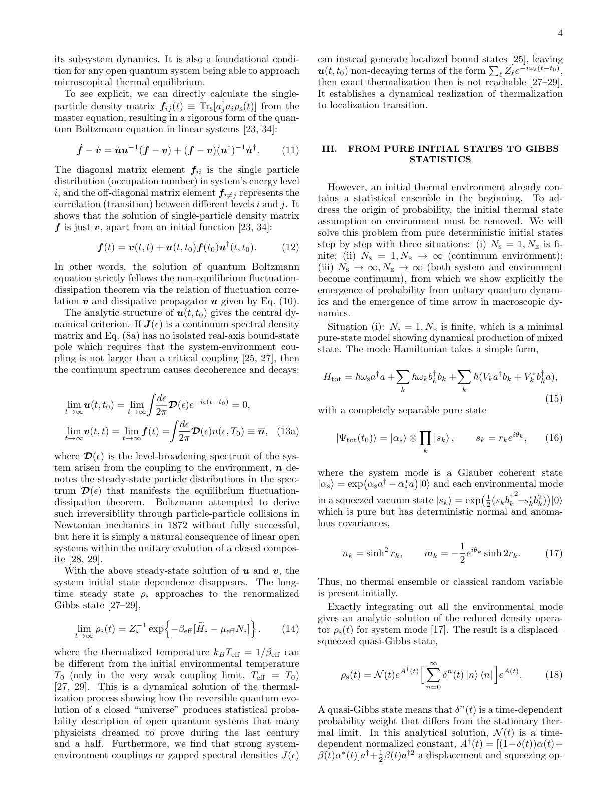 
Low-resolution page preview, page 4

📷 Fig 4

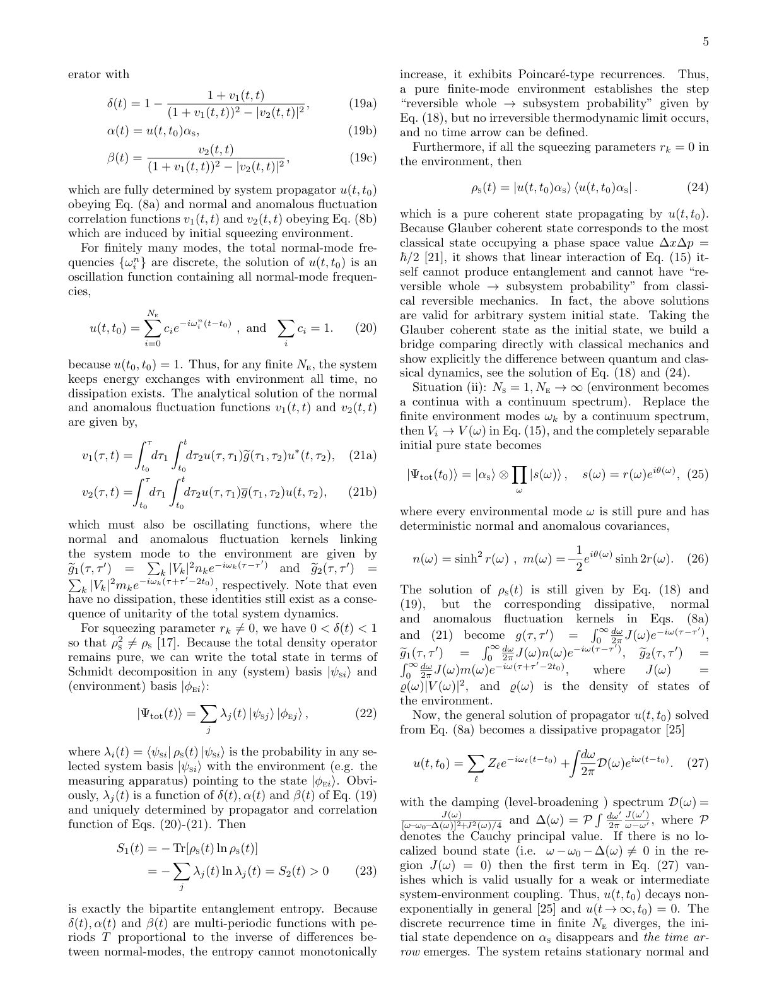 
Low-resolution page preview, page 5

📷 Fig 5

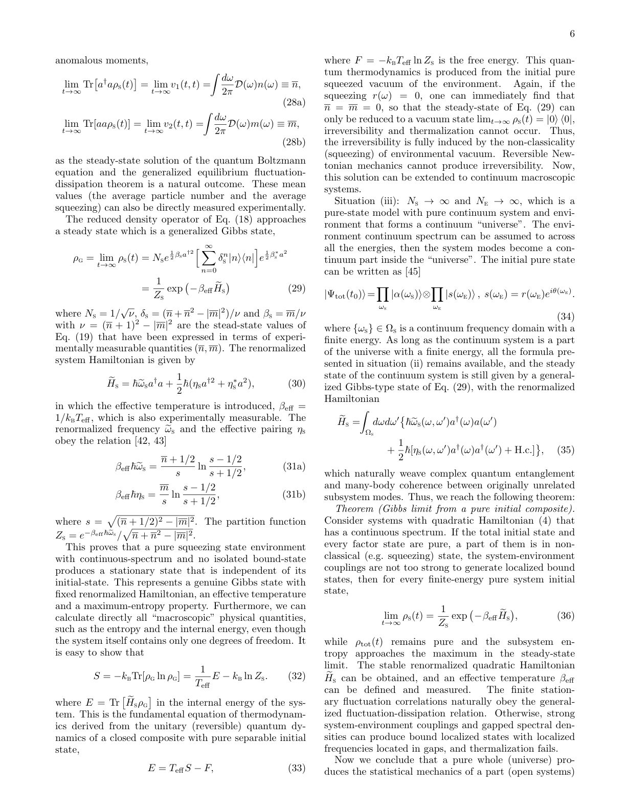 
Low-resolution page preview, page 6

**Summary.** This paper solves Hilbert's sixth problem by showing that statistical probability is not an added postulate but an emergent property. It derives the reduced dynamics for open quantum systems using exact methods, demonstrating that irreversible thermalization occurs naturally when the environment spectrum is continuous. This establishes a dynamical link between unitary quantum mechanics and classical statistical thermodynamics.

**Why it may be interesting.** This work offers a rigorous, non-equilibrium quantum mechanical derivation of thermalization and statistical mechanics, which is a foundational problem in open quantum systems and quantum thermodynamics.

Detailed structure

**Main problem.** The paper addresses Hilbert's sixth problem: deriving irreversible statistical probability and thermodynamics from the fundamentally reversible, deterministic dynamics of a closed quantum system.

**Main result.** It provides an exact dynamical route showing that probability emerges as the objective statistical structure of a subsystem when coupled to an environment, leading to thermalization in the continuum limit.

**Method.** The methodology involves deriving the exact reduced density operator by performing a partial trace over the environment states, utilizing generalized fluctuation-dissipation theorems.

**Model / system.** The system is modeled as a composite of a system (s) and an environment (e), governed by a quadratic Hamiltonian ($H_{tot} = H_s + H_e + H_{se}$) for bosonic or fermionic excitations.

**Key observables.** Reduced density operator ($
ho_s(t)$), entanglement entropy, and the system's approach to a thermal Gibbs state ($
ho_g$).

**Important parameters / regimes.** The spectral density of the environment (continuous vs. gapped), and the limit where the number of environmental degrees of freedom tends to infinity.

**Assumptions / limitations.** The derivation is exact for quadratic bosonic or fermionic systems coupled bilinearly; it explicitly removes the assumption of an initially thermal environment.

**Paper structure.** The paper builds a dynamical chain: starting from a pure, deterministic composite state, unitary evolution generates entanglement, leading to an exact, non-unitary reduced dynamics that approaches a thermal Gibbs state in the continuum limit, thus generating statistical probability.

Abstract

Hilbert's sixth problem placed probability and mechanics at the center of the axiomatization of physics. It asks how irreversible statistical probability and thermodynamics can produce from the reversible, deterministic dynamics of a system. Building on an exact open quantum system theory developed in the past two decades, we construct a dynamical route from the reversible quantum dynamics to reduced statistics. For quadratic bosonic and fermionic systems bilinearly coupled to arbitrary environments, we derive the exact reduced density operator determined completely by a dissipative propagator u and a fluctuation correlation function v of the system. For continuous spectral densities with no bound-state pole, u vanishes in the long-time limit, information about the system initial states is lost completely, and the reduced density operator of systems approaches a thermal Gibbs state. Gapped spectral densities with localized bound states instead preserve long-time memory and prevent thermalization. We then remove the usual assumption of an initially thermal, mixed environment, start from a product of pure states for the system and environment, unitary evolution first generates system-environment entanglement and a periodic quasi-Gibbs reduced state for a finite environment. When the number of environmental degrees of freedom tends to infinity, the spectrum becomes continuous, the recurrence disappears, the exact reduced density operator converges to a thermal Gibbs state. The total entropy remains zero, whereas the system entropy becomes entanglement entropy and reaches its maximum. Probability is therefore not an additional random postulate imposed on unitary dynamics, it is the objective statistical structure of an open system in a composite. These results provide an exact, testable dynamical solution of the determinism to statistics.

[↑ back to top](#top)

### [Exact Nonlinear Active Microrheology in Diffusive Single-File Systems](http://arxiv.org/abs/2609.18733v1)

**Authors:** Aurélien Grabsch, Olivier Bénichou  
**Type:** theory · **Category:** statistical mechanics · **PDF:** <https://arxiv.org/pdf/2609.18733v1>  
**Analysis basis:** full PDF text, analyzed in chunks
**Topic relevance:** `methods for driven-dissipative` **3/5** · `non-equilibrium universality` **3/5** · `Frenkel-Kontorova` **2/5** · `Keldysh / 2PI / non-Gaussian methods` **2/5** · `analog quantum simulation` **2/5** · `driven-dissipative phase transition` **2/5** · `correlated / nonlocal dissipation` **1/5** · `quantum measurements` **1/5**

📷 Fig 1

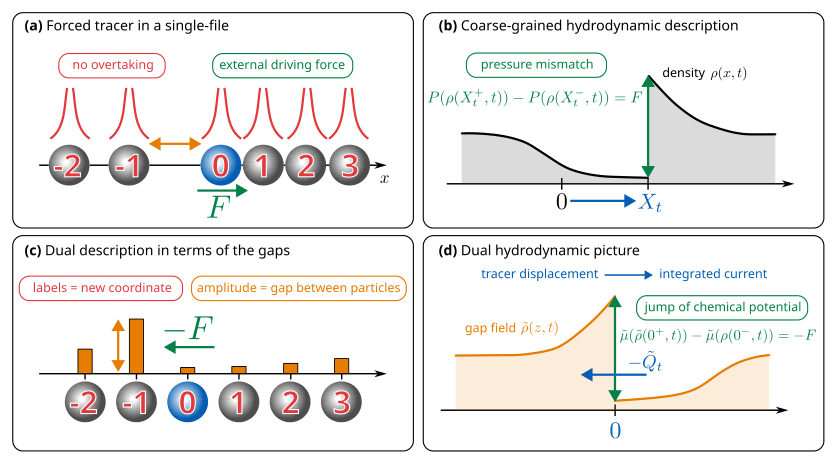 
FIG. 1. From nonlinear active microrheology to a fixed-boundary diffusion problem. (a) A force F drives a tracer in a single file. (b) At the hydrodynamic scale, the force imposes a pressure mismatch across the tracer at its unknown position Xt, defining a moving-boundary problem. (c) The no-passing constraint allows the conserved particle label to be used as a coordinate, fixing the tracer at z = 0. (d) The resulting dual hydrodynamic density ˜ρ obeys a diffusion problem on a fixed domain, with a chemical-potential jump at the origin, while the tracer displacement is given by the integrated dual current.

📷 Fig 2

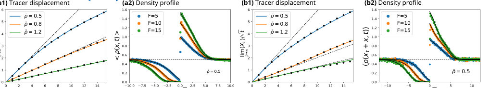 
FIG. 2. Nonlinear active microrheology of interacting Brownian particles. (a) Strictly one-dimensional single-file system with pairwise Calogero interactions V (x) = 1/x2. (a1) Mean tracer-displacement amplitude ξ(F) (see Eq. (1)) as a function of the driving force F, for different mean densities ¯ρ. Solid lines are the predictions of Eqs. (15)–(18), dashed lines are the linear-response prediction (19), and symbols are direct simulations of the Langevin dynamics (22), averaged over 100 realizations. (a2) Mean density profile in the tracer frame at ¯ρ = 0.5, for different forces. Lines are the predictions of Eq. (21) and symbols are simulations averaged over 1000 realizations. (b)...

**Summary.** This work provides a rigorous, exact theoretical framework for analyzing nonlinear active microrheology in single-file systems. By employing single-file duality, the authors solve for the force-displacement relationship and the density profile under arbitrary driving forces. This advances the understanding of non-equilibrium statistical mechanics in confined, driven matter.

**Why it may be interesting.** The rigorous mathematical framework developed for non-equilibrium transport in confined geometries is highly relevant to understanding driven many-body systems, which share mathematical parallels with quantum many-body dynamics in engineered potentials.

Detailed structure

**Main problem.** The paper aims to determine the exact nonlinear response ($\xi(F)$) and the full density profile for a tracer driven by an arbitrary constant force ($F$) in diffusive single-file systems.

**Main result.** The authors developed a closed exact boundary-value problem using single-file duality, successfully determining the force-response relation and showing that the bath-density dipole is fixed by the applied force independently of the interaction potential.

**Method.** The core methodology involves transforming the complex moving-boundary problem into a fixed-boundary diffusion problem via single-file duality, allowing the use of advanced fluctuation theory and self-similar solutions.

**Model / system.** The system models diffusive single-file transport, applicable to molecular transport in zeolites or colloidal particles in narrow channels, described by a fluctuating hydrodynamic equation for the line-density $
ho(x, t)$.

**Key observables.** Mean tracer displacement amplitude $\xi(F)$, the full bath density profile $\langle
ho(x, t)
angle$, and the bath-density dipole moment.

**Important parameters / regimes.** Applied constant force $F$, time $t$ (leading to $\sqrt{t}$ scaling), and the system's equilibrium equation of state.

**Assumptions / limitations.** The analysis relies on the hydrodynamic limit (long times) and the ability to map the local drive onto a pressure mismatch across the tracer.

**Figures summary.** Figure 1 illustrates the transformation from the moving-boundary problem to a fixed-boundary diffusion problem using single-file duality. Figure 2 compares predictions for mean tracer displacement and density profile against simulations for various single-file models.

**Paper structure.** The paper progresses by first establishing the hydrodynamic framework, then introducing single-file duality to convert the problem into a fixed-boundary diffusion problem. It solves this problem to find the mean response ($\xi(F)$) and density profile, and finally extends the formalism to calculate the full probability distribution via fluctuation theory.

Abstract

Active microrheology probes a crowded medium by forcing a tracer and measuring its response. In single-file transport, where particles cannot overtake, a constant force $F$ produces a subballistic displacement $\langle X_t\rangle\simeq \sqrt{t}\,ξ(F)$ together with a persistent bath deformation. Despite decades of work, the exact nonlinear response at arbitrary force has remained confined to a few special solvable models. Here we remove this restriction by combining recent advances in hydrodynamic transport coefficients, a pressure-balance formulation of the local drive, and single-file duality, which eliminates the resulting moving boundary. This yields a closed exact boundary-value problem for general diffusive single files, determining both $ξ(F)$ and the full density profile. For overdamped Brownian particles with general interactions, all microscopic interaction details enter only through the equilibrium equation of state, bringing realistic interacting systems, including finite-width quasi-one-dimensional channels, within exact reach. The solution also reveals universal global laws; in particular, the bath-density dipole is fixed by the applied force independently of the interaction potential.

[↑ back to top](#top)

### [Current fluctuations of diffusive systems with a battery](http://arxiv.org/abs/2609.18851v1)

**Authors:** Thibaut Jonckheere, Bernard Derrida  
**Type:** both · **Category:** statistical mechanics · **PDF:** <https://arxiv.org/pdf/2609.18851v1>  
**Analysis basis:** full PDF text, analyzed in chunks
**Topic relevance:** `Full counting statistics` **3/5** · `methods for driven-dissipative` **3/5** · `non-equilibrium universality` **3/5** · `Keldysh / 2PI / non-Gaussian methods` **2/5** · `driven-dissipative phase transition` **2/5** · `Frenkel-Kontorova` **1/5**

📷 Fig 1

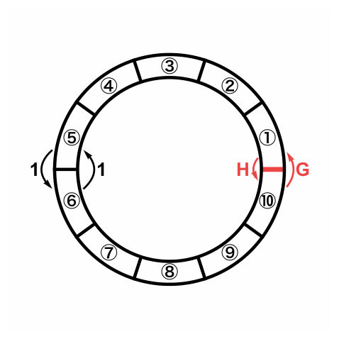 
Figure 1. Schematics of a ring with L = 10 sites. The trans- fer rate through standard links (black) is 1 for both transfer directions. There is one special link (red, thick) between sites L and 1, with transfer rate G from site L to site 1, and trans- fer rate H ≤G from site 1 to site L. This special link plays the role of a battery.

📷 Fig 2

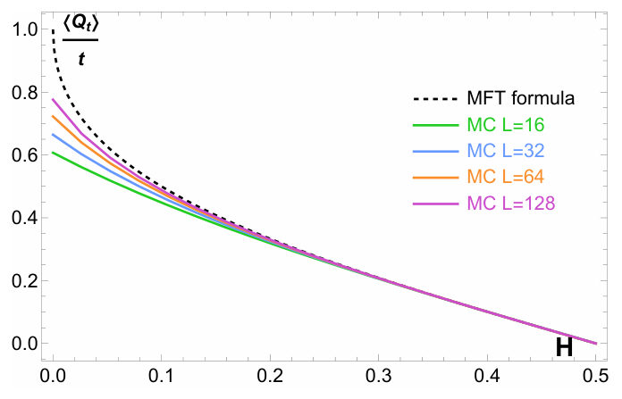 
Figure 2. Average current (multiplied by L) as a function of H = 1 −G, for the SSEP on a ring at density ¯ρ = 1/2, for system sizes L = 16, 32, 64, 128 (obtained by Monte Carlo, with increasing L corresponding to higher curves). The dashed line is the prediction (43) of the MFT.

📷 Fig 3

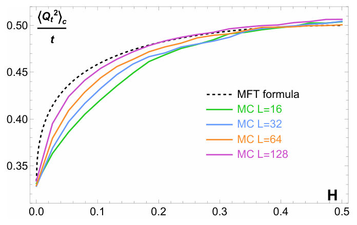 
Figure 3. Second cumulant of the current (multiplied by L) as a function of H = 1 −G for the SSEP on a ring at density ¯ρ = 1/2, for system sizes L = 16, 32, 64, 128 (obtained by Monte Carlo, with increasing L corresponding to higher curves). The dashed line is the prediction (43) of the MFT.

📷 Fig 4

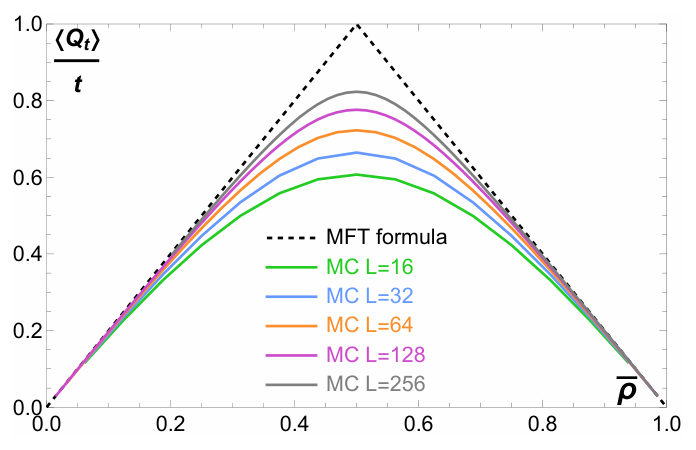 
Figure 4. Average current (multiplied by L) as a function of the density ¯ρ for the SSEP on a ring with a fully directed battery (G = 1, H = 0), for systems sizes L = 16, 32, 64, 128, 256 (obtained by Monte Carlo, with increasing L corresponding to higher curves). The dashed line is the prediction (45)-(46) of the MFT.

📷 Fig 5

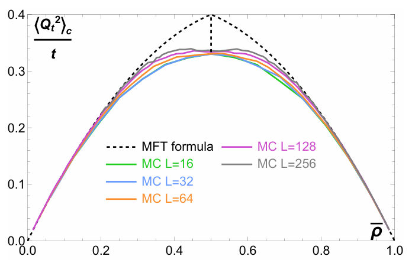 
Figure 5. Second cumulant of the current (multiplied by L) as a function of the density ¯ρ for the SSEP on a ring with a fully directed battery (G = 1, H = 0), for systems sizes L = 16, 32, 64, 128, 256 (obtained by Monte Carlo, with increasing L corresponding to higher curves). The dashed line is the prediction (45)-(46) of the MFT, including the special value 1/3 at ¯ρ = 1/2, as predicted by Eq.(43).

**Summary.** This work analyzes current fluctuations in diffusive systems on a ring containing a battery, using Macroscopic Fluctuation Theory. The authors find a surprising mathematical equivalence between the fluctuation statistics of non-interacting particles and those of the SSEP under certain conditions. The research provides detailed comparisons between theoretical predictions and long-time numerical simulations for these non-equilibrium transport phenomena.

**Why it may be interesting.** The study bridges classical non-equilibrium statistical mechanics (MFT) with particle exclusion processes (SSEP), providing deep insights into how boundary conditions and particle interactions affect current fluctuations in mesoscopic systems.

Detailed structure

**Main problem.** The paper investigates the large deviation function and fluctuation statistics of the current in diffusive systems subjected to a localized non-conservative force (a battery).

**Main result.** The large deviation function for non-interacting particles on a ring surprisingly matches the form found for the Symmetric Simple Exclusion Process (SSEP) with open boundary conditions.

**Method.** The authors employ Macroscopic Fluctuation Theory (MFT) for analytical predictions and complement this with direct exact microscopic calculations and extensive Monte Carlo simulations.

**Model / system.** The system is a diffusive particle model on a ring containing a battery at the origin. Models include non-interacting particles and the SSEP, which are analyzed under steady-state conditions.

**Key observables.** Large deviation function of the current, average occupations, density profiles, and the second cumulant of the integrated current.

**Important parameters / regimes.** The particle density ($ar{
ho}$), the battery strength ($G, H$), and the system size ($L$) are key parameters explored across different regimes.

**Assumptions / limitations.** MFT relies on assumptions about the optimal profile being time-independent, and the analysis compares results derived from different theoretical limits (e.g., non-interacting vs. SSEP).

**Figures summary.** Figures compare the average current and the second cumulant of the current (MC vs. MFT) as a function of density, notably highlighting a specific value of 1/3 at half-filling for the SSEP.

**Paper structure.** The paper progresses by first establishing the framework using MFT for current fluctuations, then deriving specific results for non-interacting particles, and finally comparing these findings and the second cumulant analysis for the SSEP against long Monte Carlo simulations.

Abstract

For a diffusive system on a ring, with a battery at the origin, we use the macroscopic fluctuation theory (MFT) to obtain the large deviation function of the current. In the case of non-interacting particles, the predictions of the MFT agree with the result of a direct exact microscopic calculation. To our surprise, the large deviation function of non-interacting particles with a battery has the same form as for the Symmetric Simple Exclusion Process (SSEP) with open boundary conditions. For the SSEP on a ring with a battery, the predictions of the MFT seem to agree with the results of long Monte Carlo simulations, although much longer simulations would be needed to better test the validity of these predictions.

[↑ back to top](#top)

### [Lindbladian quantum chaos beyond classical strange attractors](http://arxiv.org/abs/2609.18464v1)

**Authors:** Ángel L. Corps, Armando Relaño  
**Type:** theory · **Category:** statistical mechanics · **PDF:** <https://arxiv.org/pdf/2609.18464v1>  
**Analysis basis:** full PDF text, analyzed in chunks
**Topic relevance:** `correlated / nonlocal dissipation` **3/5** · `driven-dissipative phase transition` **3/5** · `methods for driven-dissipative` **3/5** · `non-equilibrium universality` **2/5** · `Keldysh / 2PI / non-Gaussian methods` **1/5** · `quantum measurements` **1/5** · `scars & prethermalization` **1/5**

📷 Fig 1

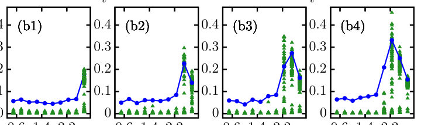 
FIG. 1. Infinite-size limit: onset of classical chaos. (a1-a2) Time evolution of the magnetization along the z-axis for the first spin subsystem. Two slightly different initial conditions are considered in both cases: Γ = 2.2 &lt; Γ푐, m(0) = (−0.04309, 0.9227, 0.9074, −0.3592, −0.4180, 0.1401) (purple lines) and m(0) = (−0.04286, 0.9224, 0.9068, −0.3599, −0.4193, 0.1405) (red lines). For (a1), Γ = 3 &gt; Γ푐, and for (a2), Γ = 2.2 &lt; Γ푐. (b1-b4) Standard deviations of the normalized critical relaxation time, 푡crit/휏, as a function of Γ for initial conditions at distances 푑= 0.8, 1.2, 1.6, and 2 from the stable fixed point, respectively. For each (Γ, 푑), 100 random initial conditions are generated, and...

📷 Fig 2

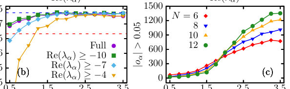 
FIG. 2. Signatures of dissipative quantum chaos. (a1-a2) Expectation values of ˆ푆1푧in the right eigenvectors ˆ푅훼as a function of the real part of the Liouvillian eigenvalues 휆훼. Real (red circles) and imaginary (blue triangles) parts are plotted separately, for (a1) Γ = 1.5 &lt; Γ푐 and (a2) Γ = 2.5 &gt; Γ푐and 푁= 12. (b) Average value of the complex ratio of nearest-neighbor eigenvalues on the complex plane [38] as a function of Γ for 푁= 12, for the full spectrum (purple circles) and for Liouvillian eigenvalues with different Re(휆훼). The blue dashed line represents the random-matrix GinUE value ⟨푟⟩≈0.738 while the red dashed line represents the Poisson average ⟨푟⟩= 2/3. (c) Number of Liouvillian...

**Summary.** This paper examines chaos in an open quantum system of coupled spins, linking classical dynamics to quantum spectral properties. It demonstrates that quantum signatures of chaos, such as random-matrix statistics, can appear during the transient approach to a stable fixed point, rather than requiring the classical system to possess a fully chaotic attractor. This refines existing conjectures regarding quantum-classical correspondence in dissipative environments.

**Why it may be interesting.** This work directly addresses the quantum-classical correspondence in open quantum systems, providing a mechanism to detect quantum chaotic signatures even when the classical dynamics settle into a stable, non-chaotic steady state.

Detailed structure

**Main problem.** The paper investigates the connection between classical and quantum chaos in a dissipative system, specifically exploring if quantum chaos signatures can arise from transient classical chaos rather than requiring a fully chaotic asymptotic attractor.

**Main result.** Liouvillian quantum chaos can be associated with transient classical chaos, suggesting a refinement of the Grobe–Haake–Sommers conjecture.

**Method.** The study employs both classical stability analysis (analyzing fixed points and relaxation times) and quantum spectral analysis (diagonalizing the Liouvillian superoperator and examining spectral statistics).

**Model / system.** The system is a quantum many-body model of two coupled collective spins, whose dynamics are governed by a Lindblad master equation. The classical limit is obtained by analyzing the expectation values of the spin operators.

**Key observables.** Liouvillian spectrum (eigenvalues), random-matrix statistics ($
ho_{\lambda}$), expectation values of physical observables, and the standard deviations of the relaxation time ($\sigma_{
ho}, \sigma_{\epsilon}$).

**Important parameters / regimes.** The dissipation strength ($\Gamma$) relative to a critical bifurcation point ($\Gamma_c$), and the initial distance from the fixed point ($\delta_{	ext{initial}}$).

**Assumptions / limitations.** The classical analysis relies on the mean-field approximation, and the quantum analysis focuses on restricting spectral statistics to regions with significant observable expectation values.

**Figures summary.** Figures illustrate the time evolution of magnetization for both chaotic and stable regimes, and show the dependence of spectral statistics and the number of contributing eigenmodes on the dissipation strength $\Gamma$.

**Paper structure.** The paper progresses by first establishing the classical dynamics and identifying regimes (chaotic vs. stable fixed point). It then maps these classical behaviors onto quantum diagnostics, showing the emergence of random-matrix statistics and changes in observable expectation values in the Liouvillian spectrum, particularly in the transient regime.

Abstract

We investigate the connection between classical and quantum chaos in a dissipative system of two coupled collective spins. Although the classical dynamics possesses a stable fixed-point attractor, we find pronounced signatures of chaos in the transient dynamics preceding relaxation. In the quantum model, such transient chaos is accompanied by a transition to random-matrix statistics in the relevant part of the Liouvillian spectrum and by a qualitative increase in the number of Liouvillian modes contributing to expectation values of physical observables. The transition occurs before the bifurcation at which the stable fixed point disappears and a chaotic attractor emerges. Our results show that Liouvillian quantum chaos can be associated with transient classical chaos, rather than requiring a chaotic asymptotic attractor, and provide a refinement of the Grobe-Haake-Sommers conjecture.

[↑ back to top](#top)

### [Activity-induced emergent flatness, instabilities and pattern formation in fluid membranes](http://arxiv.org/abs/2609.17716v1)

**Authors:** Debayan Jana, Astik Haldar, Abhik Basu  
**Type:** theory · **Category:** statistical mechanics · **PDF:** <https://arxiv.org/pdf/2609.17716v1>  
**Analysis basis:** full PDF text, analyzed in chunks
**Topic relevance:** `driven-dissipative phase transition` **3/5** · `non-equilibrium universality` **3/5** · `Keldysh / 2PI / non-Gaussian methods` **2/5** · `methods for driven-dissipative` **2/5** · `Frenkel-Kontorova` **1/5** · `analog quantum simulation` **1/5** · `correlated / nonlocal dissipation` **1/5**

📷 Fig 1

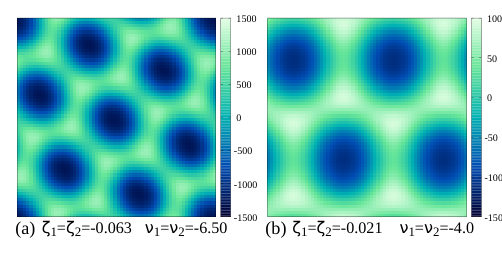 
FIG. 1. Snapshots of the steady-state height profiles (L = 64) showing isotropic pattern with η′ = 0.02, K = 1, Dh = 0.001, and δt = 0.01. Panel (a) qx c = qy c ≈0.26 with λ = −0.005, while panel (b) qx c = qy c ≈0.17 with λ = −0.05. The change in qc modifies the pattern periodicity. See text.

📷 Fig 2

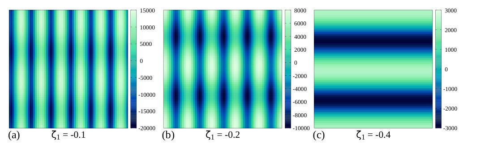 
FIG. 2. Steady anisotropic patterns (L = 64) with η′ = 0.02, K = 1, λ = 0.001, Dh = 0.001 and δt = 0.01 for different values of ζ1, with parameters ν1 = −12, ν2 = −4, and ζ2 = −0.02 corresponding to panels (a)-(c). See text.

📷 Fig 3

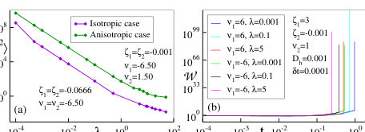 
FIG. 3. Log-log plots of (a) ⟨(δh)2⟩versus λ for the isotropic case (Dh = 0.001) and the anisotropic case (Dh = 0.1) with δt = 0.001. The height fluctuations decrease with increasing |λ|. (b) W versus t for different values of ν and λ. When the model is unstable by at least one of the ζi-terms, the width grows rapidly, and diverges, possibly indicating membrane crumpling. The remaining parameters are fixed at η′ = 0.02, K = 1 and L = 64, (see text).

📷 Fig 4

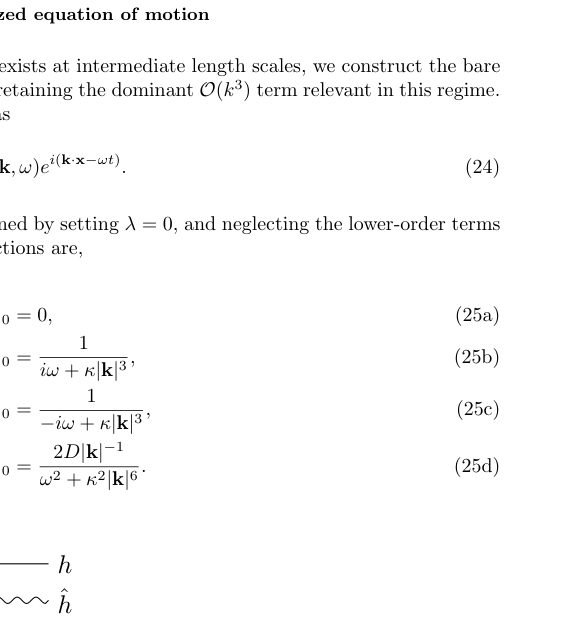 
FIG. 4. Diagrammatic representations of two point functions.

📷 Fig 5

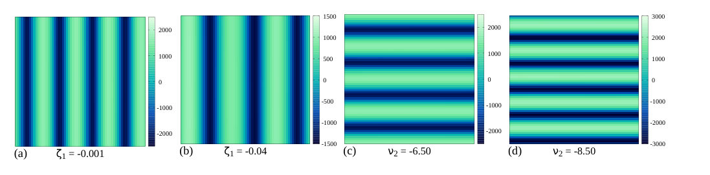 
FIG. 7. Snapshots of the steady-state height profiles (L = 64) in the patterned phase. Panels (a) and (b) correspond to ν1 = −6.50, ν2 = 1.50, and ζ2 = −0.001, where varying ζ1 changes the pattern periodicity. Panels (c) and (d) correspond to ν1 = 1.50 and ζ1 = ζ2 = −0.001, where varying ν2 modifies the periodicity. In all cases, the remaining parameters are fixed at η′ = 0.02, K = 1, λ = 0.005, Dh = 0.10, and δt = 0.001.

**Summary.** This paper analyzes the complex dynamics of active fluid membranes, showing how they achieve emergent symmetry at large scales while exhibiting rich pattern formation at intermediate length scales. The dynamics are governed by a modified hydrodynamic equation, which predicts instabilities driven by active stresses. The work details how nonlinearity can stabilize or destroy these patterned states depending on its magnitude.

**Why it may be interesting.** The study of non-equilibrium pattern formation and symmetry breaking in active matter systems provides theoretical frameworks applicable to complex many-body dynamics, which shares conceptual links with driven quantum many-body systems.

Detailed structure

**Main problem.** The study investigates the non-equilibrium dynamics, emergent symmetries, instabilities, and pattern formation in active fluid membranes.

**Main result.** The membrane exhibits emergent flatness and quasi-long-range order at large scales, but active stresses can induce instabilities leading to pattern formation at intermediate scales.

**Method.** The analysis employs hydrodynamic theory, Renormalization Group (RG) techniques, and linear stability analysis applied to the height field equation.

**Model / system.** The system is a nearly flat, inversion-asymmetric, permeable active fluid membrane embedded in a 3D bulk isotropic fluid, modeled by a height field $h(x, t)$.

**Key observables.** Height fluctuations $\langle(\delta h)^2
angle$, scaling exponents ($\chi, 	ilde{z}$), and the selection of preferred wavevectors ($q_c$) leading to stripe patterns.

**Important parameters / regimes.** Active hydrodynamic tension ($\zeta_1, \zeta_2$), viscosities ($
u_1, 
u_2$), bending stiffness ($K$), and the nonlinearity parameter ($\lambda$).

**Assumptions / limitations.** The analysis utilizes the Stokesian limit (neglecting inertia) and makes approximations regarding the relevance of nonlinear terms in the RG sense.

**Figures summary.** Figures illustrate steady-state anisotropic patterns under varying parameters, show the stability profile of the dispersion relation $\lambda_h(q)$, and demonstrate the robustness of the patterned phase against initial conditions and the suppression of patterns by increasing $|\lambda|$.

**Paper structure.** The paper progresses from establishing the long-wavelength, statistically flat regime (emergent symmetry) to analyzing the intermediate-scale dynamics governed by KPZ-like equations. It then uses linear stability analysis to predict pattern formation at finite wavevectors, concluding with numerical verification of pattern robustness and the role of nonlinearity in suppressing these patterns.

Abstract

We show that microscopically inversion-asymmetric, permeable active fluid membranes are statistically flat and effectively inversion-symmetric at large scales. Their fluctuations are governed by an asymptotically exact linear hydrodynamic equation giving orientational long-range order and positional quasi-long-range order. At intermediate scales, their dynamics is described by a Kardar-Parisi-Zhang equation with spatially long-range noise, producing rough membranes with short-range translational and long-range orientational order described by exactly known scaling exponents. Active stresses can destabilize the membrane at long wavelengths, while sufficiently strong active permeation flow can drive finite-wavevector instabilities and pattern formation. These results reveal a novel activity-driven route to the destruction of flat fluid membranes.

[↑ back to top](#top)

### [Hydrodynamic memory in overdamped colloidal dynamics](http://arxiv.org/abs/2609.17677v1)

**Authors:** Benjamin Sorkin, Günther Turk, Howard A. Stone  
**Type:** theory · **Category:** statistical mechanics · **PDF:** <https://arxiv.org/pdf/2609.17677v1>  
**Analysis basis:** full PDF text, analyzed in chunks
**Topic relevance:** `correlated / nonlocal dissipation` **3/5** · `Keldysh / 2PI / non-Gaussian methods` **2/5** · `methods for driven-dissipative` **2/5** · `Frenkel-Kontorova` **1/5** · `analog quantum simulation` **1/5** · `driven-dissipative phase transition` **1/5** · `non-equilibrium universality` **1/5** · `quantum measurements` **1/5** · `scars & prethermalization` **1/5**

📷 Fig 1

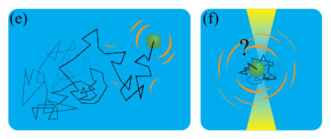 
FIG. 1. Illustration of colloidal dynamics across time scales. (a) The colloid first encounters the surrounding liquid via molecular colli- sions, beyond which the hydrodynamic limit may be reached. (b) The fluid is effectively compressible at nanoseconds (density vari- ations denoted in color). (c) In an incompressible low-Reynolds- number flow, a colloid experiences Stokes friction (dark blue ar- rows), added mass due to displaced-fluid inertia (region enclosed in red), and Basset memory due to scale-free fluid-momentum diffusion (orange arcs). (d) In this work, we provide a theory incorporating Basset memory in the overdamped (inertialess) limit, which is ap- plicable after microseconds....

📷 Fig 2

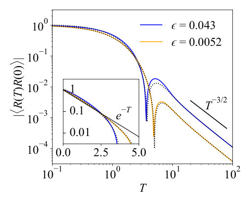 
FIG. 2. Nondimensionalized positional autocorrelation function of a harmonically trapped colloid versus time in a log-log plot. The solid curves are numerical solutions to the full fluctuating Basset- Boussinesq-Ossen equation, Eq. (5), evaluated through a Fourier transform (Eq. (10)). Color corresponds to the indicated ϵ values (Eq. (6)), which we chose to correspond to the two experiments in Ref. [23]. The directly adjacent black dashed curves are our late-time prediction, Eq. (9), found from the overdamped Basset-Langevin equation (Eq. (7)). Inset: A log-linear plot of the early-time, primar- ily exponential decay of the positional autocorrelation function. We clearly see the crossover...

**Summary.** This work theoretically proves that hydrodynamic memory, characterized by a power-law decay, survives even when simplifying the dynamics to the overdamped (inertialess) limit for colloidal particles. By deriving a closed-form Basset-Langevin equation, the authors provide a more accurate description of particle motion than conventional models. This is crucial for interpreting high-resolution experiments that observe long-time positional correlations.

**Why it may be interesting.** While focused on classical fluid dynamics, the rigorous derivation of memory effects in the low-Reynolds number limit provides a powerful theoretical framework for understanding non-Markovian dynamics, which has parallels in open quantum systems and quantum dissipation.

Detailed structure

**Main problem.** The paper addresses the fate of power-law hydrodynamic memory in the overdamped (inertialess) limit for colloidal particle dynamics.

**Main result.** The authors derive a closed-form, overdamped Basset-Langevin equation that successfully incorporates hydrodynamic memory, showing it persists even when particle inertia is neglected.

**Method.** The primary method involves performing a small-$\epsilon$ expansion on the full equation of motion, eliminating the velocity variable to derive the final memory-inclusive equation.

**Model / system.** The system is micron-sized colloid particles diffusing through a fluid, modeled using Langevin dynamics that accounts for Stokes drag, added mass, and a power-law Basset memory term.

**Key observables.** Velocity autocorrelation function (expected power-law decay $\sim t^{-3/2}$), Mean-squared displacement (MSD), and positional autocorrelation functions.

**Important parameters / regimes.** The dimensionless parameter $\epsilon$ controls the crossover between early-time (exponential) and late-time (power-law) dynamics; smaller particles enhance memory effects.

**Assumptions / limitations.** The analysis assumes the system operates in the low-Reynolds-number, incompressible flow limit, and the standard overdamped model is insufficient as it ignores power-law memory.

**Figures summary.** Figures illustrate the hierarchy of time scales, showing how the theory incorporating Basset memory predicts a crossover from conventional exponential relaxation to memory-dominated power-law decay.

**Paper structure.** The paper progresses from the full underdamped equation to the overdamped limit via small-$\epsilon$ expansion, deriving the final Basset-Langevin equation, and then applying this theory to predict measurable long-time correlations.

Abstract

Micron-sized colloid particles diffusing through a fluid experience hydrodynamic inertial and memory effects, the latter causing velocity autocorrelation to decay as a power law. At the same time, many theoretical descriptions treat colloidal diffusion in a fluid using overdamped Langevin dynamics for its convenience, eliminating velocity, omitting inertia, but also ignoring the power-law memory. In this Letter, we show that hydrodynamic memory survives in the overdamped (colloid-inertialess) limit. By identifying the dimensionless parameter controlling the crossover between early- and late-time dynamics, we derive in closed form the overdamped Langevin equation in the presence of hydrodynamic memory. This provides a theoretical framework for realistically describing colloidal dynamics in a fluid, and establishes a rigorous basis for the positional memory observed in high-resolution experiments. Our theory predicts that hydrodynamic memory becomes increasingly pronounced for smaller particles and under stronger external forcing, and offers experimental probes for the crossover from conventional exponential relaxation to memory-dominated power-law dynamics.

[↑ back to top](#top)

### [Efficiency-Resolved Recovery Dynamics of an Free-Running InGaAs/InP Single Photon Avalanche Detector Operated in Gated Mode](http://arxiv.org/abs/2609.17694v1)

**Authors:** Bruno Santos Souza, Vitor Tavares, Filippo Ghiglieno, Celso Jorge Villas-Boas, Paulo Henrique Dias Ferreira  
**Type:** experiment · **Category:** other · **PDF:** <https://arxiv.org/pdf/2609.17694v1>  
**Analysis basis:** full PDF text, analyzed in chunks
**Topic relevance:** `Full counting statistics` **3/5** · `methods for driven-dissipative` **2/5** · `quantum measurements` **2/5** · `quantum optics experiment` **2/5** · `correlated / nonlocal dissipation` **1/5** · `driven-dissipative phase transition` **1/5** · `non-equilibrium universality` **1/5**

📷 Fig 1

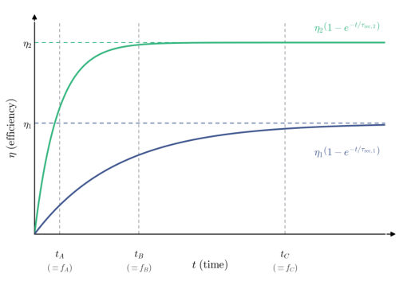 
Fig. 1. Schematic exponential recovery of the local detection efficiency η(t) toward its asymptotic value η0 [Eq. (1)], shown for two representative operating points, η1 &lt; η2, with τrec,2 &lt; τrec,1. The curves are drawn schematically, not fitted to data, to isolate the qualitative effect. Vertical lines mark three gate durations tA &lt; tB &lt; tC, equivalently three gate frequencies fA &gt; fB &gt; fC through t = W = D/f: at short gate duration (tA) neither curve has saturated, while at long gate duration (tC) both approach their respective plateaus.

📷 Fig 2

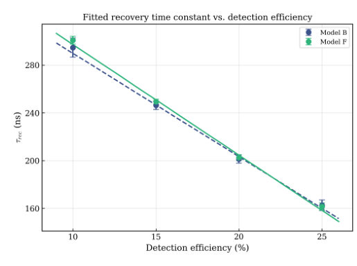 
Fig. 2. Recovery time constant τrec versus detection efficiency for the Baseline (B) and Full (F) models, CB(f) and CF(f), with the weighted linear fit of Eq. (11).

📷 Fig 3

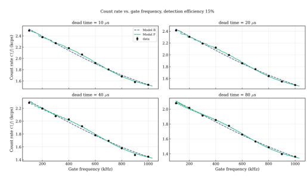 
Fig. 3. Representative C(f) curves at η = 15 % for all four dead times, with Baseline and Full model fits overlaid. The legend in the top-left panel applies to all panels.

📷 Fig 4

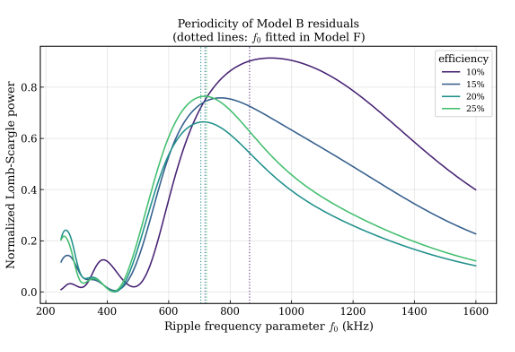 
Fig. 4. Lomb-Scargle periodogram of the Baseline Model residuals, showing peaks near the independently fitted f0 at each efficiency.

📷 Fig 5

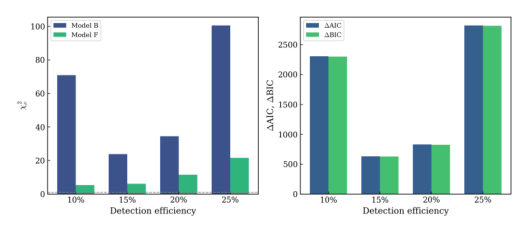 
Fig. 5. χ2 ν, ∆AIC, and ∆BIC across the four detection efficiencies.

**Summary.** This work characterizes the recovery dynamics of gated SPADs by sweeping the gate frequency, revealing that the recovery time constant systematically decreases as detection efficiency increases. The authors developed a sophisticated model that successfully accounts for both the exponential recharge process and parasitic capacitive modulations in the count rate. This provides crucial, quantitative data for optimizing SPAD performance in quantum key distribution systems.

**Why it may be interesting.** While the core physics is semiconductor device characterization, the rigorous application of time-domain modeling (exponential recovery) and advanced statistical fitting (AIC/BIC model selection) to extract fundamental physical constants ($	au_{rec}$) from complex, rate-limited measurements is relevant to open quantum systems modeling.

Detailed structure

**Main problem.** The paper addresses the challenge of characterizing the recovery dynamics of Single Photon Avalanche Detectors (SPADs) when operated in a gated mode, as this recovery process limits the achievable count rates in practical quantum communication systems.

**Main result.** The recovery time constant ($	au_{rec}$) was found to decrease linearly with increasing detection efficiency ($\eta$), a dependence that contrasts with previous assumptions for free-running detectors. The analysis also resolved a periodic modulation in the count rate attributed to capacitive gate feedthrough.

**Method.** A novel frequency-sweep method using continuous-wave illumination was employed to globally fit count rates across multiple dead times, avoiding the need for high-speed pulsed lasers or time-to-digital converters.

**Model / system.** The physical system is an InGaAs/InP SPAD operated in a gated mode. The analysis uses an exponential recovery model ($\eta(t)$) and incorporates a 'Full Model' that accounts for discrete re-arming and capacitive ripple effects beyond simple dead-time limitations.

**Key observables.** Count rate $C(f)$ as a function of gate frequency $f$, and the recovery time constant $	au_{rec}$ as a function of detection efficiency $\eta$.

**Important parameters / regimes.** Recovery time constant ($	au_{rec}$), Detection Efficiency ($\eta$), Gate Frequency ($f$), and modulation parameters ($a, f_0, \phi$).

**Assumptions / limitations.** The detection efficiency recovers exponentially toward a steady-state value ($\eta_0$), and the analysis relies on fitting count rates across multiple dead times using a global least-squares approach.

**Figures summary.** Figures illustrate the exponential recovery profile, the dependence of $	au_{rec}$ on $\eta$, and the count rate modulation curves compared between baseline and full models.

**Paper structure.** The paper introduces the problem of gated recovery limits, develops and compares theoretical models (Baseline vs. Full Model) incorporating recharge dynamics and ripple effects, presents the frequency-sweep measurement methodology, and concludes with quantitative results on $	au_{rec}(\eta)$ and modulation analysis.

Abstract

Detection efficiency in gated-mode single-photon avalanche detectors recovers gradually after each gate edge, limiting attainable count rates, yet quantitative recovery models exist only for free-running operation. We extract the gated recovery time constant of a free-running InGaAs/InP detector at 1550 nm by sweeping the gate frequency from 100 kHz to 1 MHz and globally fitting count rates across four dead times, requiring neither a pulsed laser nor a time-to-digital converter. The recovery time decreases linearly with detection efficiency, from 301 to 161 ns between 10 % and 25 %, at 9.3 ns per percentage point. We further resolve a periodic count-rate modulation consistent with bias-dependent capacitive gate feedthrough.

[↑ back to top](#top)

### [Flag Game: A Toy Model for Mechanistic Swarm Interpretability](http://arxiv.org/abs/2609.19124v1)

**Authors:** Elizabeth Pavlova, Hidenori Tanaka  
**Type:** both · **Category:** statistical mechanics · **PDF:** <https://arxiv.org/pdf/2609.19124v1>  
**Analysis basis:** full PDF text, analyzed in chunks
**Topic relevance:** `driven-dissipative phase transition` **3/5** · `non-equilibrium universality` **3/5** · `analog quantum simulation` **2/5** · `methods for driven-dissipative` **2/5** · `Keldysh / 2PI / non-Gaussian methods` **1/5** · `quantum measurements` **1/5**

📷 Fig 1

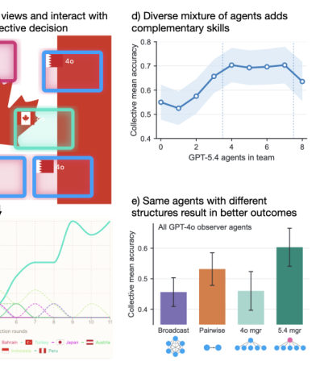 
Figure 1: The Flag Game (demo website: https://flag-game-demo.vercel.app) exhibits rich collective phenomenology despite its simplicity. (a) A hidden flag is observed through private evidence; bounded agents exchange reports, and the system tracks agent’s country guess. (b–e) Collective mean accuracy (Sec. 3) under four controls: population size (b), social-awareness prompting (c), team diversity (d), and organizational structure (e).

📷 Fig 2

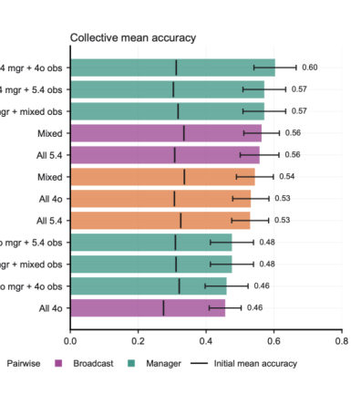 
Figure 2: Protocol structure and performance in the Flag Game. (a) Each trial samples a hidden flag, assigns private crops, elicits initial guesses, and then runs one of three protocols. (b) A N = 8 sweep across 60 trials compares accuracy, ordering by descending collective mean accuracy.

📷 Fig 3

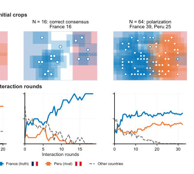 
Figure 3: With large N, polarization reduces accuracy. (a) In all-GPT-4o pairwise runs, collective accuracy is higher than initial accuracy, peaking at intermediate N. (b) As N grows, wrong consensus becomes less common while polarization become more frequent. (c–d) A representative France–Peru run at N = 4, 16, 64 shows final predictions over initial crop locations and country-share trajectories.

📷 Fig 4

 
Figure 4: Single-agent test reveals complementary error modes behind diverse team gains. (a) Broadcast team-diversity result for N = 8, m = 3, showing mixed teams achieve highest collective accuracy. (b) Isolated country responses for GPT-4o and GPT-5.4 over 100 runs. Exact accuracy is similar, but GPT-5.4 produces more visually incompatible answers. (c) Examples illustrating cases where GPT-4o chooses the correct country while GPT-5.4 misconstrues its private evidence.

📷 Fig 5

 
Figure 5: Local social memory probe isolates update behavior conditional on private evidence. (a) A target flag gives private evidence to the agent, while memory contains a shuffled mixture of target country and conflicting social country entries. (b) Agent responses as the memory ratio shifts from target-heavy to social-heavy, across two private-evidence regimes: weak (left), where multiple countries match the private crop, and strong (right), where only the target country matches.

**Summary.** This work introduces the Flag Game, a toy model to study how AI agents form and update collective beliefs based on private data and social evidence. The authors demonstrate that collective behavior shifts from collapse to polarization as population size increases, developing both attribution techniques and a statistical mechanical theory to mechanistically understand these emergent social dynamics.

**Why it may be interesting.** While the subject is AI/social science, the mathematical tools—phase diagrams, mean-field approximations, and analyzing emergent collective states—are directly analogous to modeling phase transitions in complex physical systems.

Detailed structure

**Main problem.** The paper investigates the mechanisms of collective belief formation and coordination in AI agents, which is framed as a problem of emergent collective behavior.

**Main result.** The Flag Game exhibits a shift from collective belief collapse at small populations to collective belief polarization at large populations, which can be modeled using statistical mechanical theory.

**Method.** The authors combine empirical simulation (using the Flag Game) with theoretical development, introducing social circuit attribution and deriving a statistical mechanical theory for large populations.

**Model / system.** The Flag Game is a toy model where bounded agents observe private evidence (a 'crop') of a hidden ground truth (flag) and update beliefs through communication protocols (pairwise, broadcast, manager).

**Key observables.** Collective mean accuracy, belief polarization vs. collapse, social uplift ($\Delta_{	ext{social}}$), and the social circuit attribution score ($S_i$).

**Important parameters / regimes.** Population size ($N$), social-evidence uptake ($\alpha$), communication protocol, and the relative weight given to private vs. social evidence.

**Assumptions / limitations.** The Flag Game is a simplified model for mechanistic interpretability, and the statistical mechanical theory is developed to handle the limitations of causal interventions in large populations.

**Figures summary.** Figures illustrate the Flag Game setup, performance sweeps under various controls (population size, prompting), and the theoretical phase diagram matching empirical results.

**Paper structure.** The paper introduces the Flag Game, details the empirical testing across various protocols and controls, develops the social circuit attribution technique, and culminates in deriving and verifying a statistical mechanical theory for large-scale belief dynamics.

Abstract

Emergent coordinated behaviors of AI agents are starting to present critical safety risks. A key phenomenon driving these behaviors is the rapid formation and spread of beliefs about the world, and mechanistic understanding is crucial for collective alignment. To this end, we introduce the Flag Game, a toy model for studying the mechanisms of collective belief formation. Concretely, a hidden country flag defines the ground truth, and each bounded agent directly observes only a private crop but can exchange beliefs and weigh social evidence from peers. Despite its simplicity, the Flag Game reproduces rich collective phenomenology: non-monotonic scaling of performance with population size, accuracy gains from social-awareness prompting and team diversity, and strong effects of organizational structure. In particular, we identify that collective belief collapse at small population sizes turns into collective belief polarization as the population grows. This polarization causes the performance decline at large population sizes, but creates diversity in collective beliefs. Finally, we dissect the mechanisms underlying collective belief collapse and polarization with two complementary approaches. We first introduce social circuit attribution, a technique to predict which agent, and what view, matters most to collective dynamics, and verify its predictions by causal interventions on agents, tracing how agent patching changes collective outcomes. However, the efficacy of causal interventions on agents decreases as the population grows. We therefore develop a statistical mechanical theory for larger populations and verify that it matches the empirical phase diagram. Together, these results take a first step toward mechanistic swarm interpretability, a science of how the properties of individual agents and their communication give rise to emergent collective behavior.

[↑ back to top](#top)

### [Fixed Points, Floquet Entanglement Asymmetry, and Quantum Mpemba Effects](http://arxiv.org/abs/2609.17724v1)

**Authors:** Jayashish Das, Filiberto Ares, Arnab Kundu  
**Type:** theory · **Category:** statistical mechanics · **PDF:** <https://arxiv.org/pdf/2609.17724v1>  
**Analysis basis:** full PDF text, analyzed in chunks
**Topic relevance:** `driven-dissipative phase transition` **3/5** · `non-equilibrium universality` **3/5** · `Keldysh / 2PI / non-Gaussian methods` **1/5** · `analog quantum simulation` **1/5** · `correlated / nonlocal dissipation` **1/5** · `methods for driven-dissipative` **1/5** · `scars & prethermalization` **1/5**

📷 Fig 1

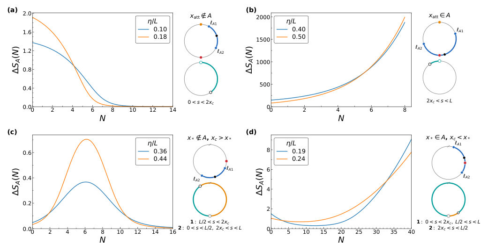 
FIG. 1. Evolution of the entanglement asymmetry ∆SA(N) with the number of drive cycles N for two initial insertion points η in the heating phase (upper panels) and at the phase transition (lower panels). We set ∆= 1 and θ = 0.1 through- out, with τ0/L = (0.1, 0.002, 0.16, 0.07), in panels (a)–(d), respectively. The driving periods are chosen as (T0/L, T1/L) = (1/2, cosh(2θ)/2) for heating phase in panels (a) and (b), and (T0/L, T1/L) = (1/2, cosh(2θ) arcsin[1/ cosh(2θ)]/π) for phase transition in panels (c) and (d). (a) When the attractive fixed point lies outside the subsystem, the asymmetry decays to zero. For the values of η chosen, the initially more asymmetric state relaxes faster,...

📷 Fig 2

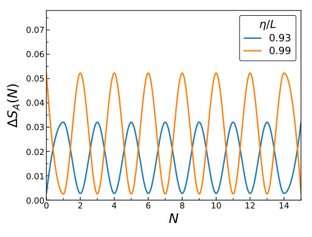 
FIG. 2. Evolution of the entanglement asymmetry ∆SA(N) for two initial insertion positions η1 and η2 in the non-heating phase. We set ∆= 1, θ = 0.15, and τ0/L = 0.02, with A = [0, 0.35L]. The driving periods are chosen as (T0/L, T1/L) = (1, cosh(2θ)/2). The Floquet dynamics produces persistent crossings of the two asymmetry curves.

**Summary.** This work develops a geometric theory describing entanglement asymmetry in driven 2D CFTs by mapping the dynamics onto the iteration of conformal maps. It shows that phenomena like the quantum Mpemba effect are dictated by the fixed-point structure of these maps. This framework offers a universal tool for understanding non-equilibrium quantum dynamics.

**Why it may be interesting.** It provides a powerful geometric framework (conformal mapping) to organize complex non-equilibrium phenomena like symmetry restoration and the Mpemba effect in periodically driven quantum systems, which is highly relevant to Floquet engineering.

Detailed structure

**Main problem.** The paper investigates the dynamics of entanglement asymmetry in periodically driven two-dimensional conformal field theories, aiming to find a geometric description for non-equilibrium phenomena.

**Main result.** The dynamics of entanglement asymmetry, including the quantum Mpemba effect, are shown to be governed by the invariant geometry of the underlying conformal map (Möbius map).

**Method.** The analysis uses a dynamical-system description based on iterated conformal maps and relates the entanglement asymmetry to the relative positions of the map's fixed points and the subsystem endpoints.

**Model / system.** The system is a 2D CFT with a U(1) symmetry subjected to periodic driving (Floquet evolution). The dynamics are mapped onto the iteration of Möbius maps, particularly for the SL(2, R) subclass.

**Key observables.** Entanglement Asymmetry ($\Delta S_A$), local symmetry restoration, and the quantum Mpemba effect.

**Important parameters / regimes.** The relative positions of the state-preparing operator insertion, the subsystem, and the fixed points of the conformal map.

**Assumptions / limitations.** The analysis relies on mapping the dynamics to conformal maps and uses perturbative expansions in the coupling constant $\kappa$ for the leading-order results.

**Figures summary.** Figure 1 illustrates the evolution of $\Delta S_A(N)$ for hyperbolic and parabolic map classes, showing Mpemba/inverse Mpemba effects. Figure 2 shows persistent crossings of $\Delta S_A(N)$ curves in the non-heating phase, indicating recurrent oscillations.

**Paper structure.** The paper establishes the link between entanglement asymmetry and conformal maps, analyzes the asymptotic behavior in different fixed-point regimes (heating/phase transition), and finally examines the non-heating phase to demonstrate persistent, non-relaxing oscillations.

Abstract

We investigate the dynamics of entanglement asymmetry in periodically driven two-dimensional conformal field theories with a global U$(1)$ symmetry, using a dynamical-system description based on iterated conformal maps, in particular Möbius maps. Starting from a symmetry-breaking excited state prepared by a local operator insertion, we show that a broad range of nonequilibrium phenomena, including local symmetry restoration, the quantum Mpemba effect, and its inverse, admit a simple geometric description in terms of the invariant data of the conformal map. We explicitly demonstrate this using Möbius maps, for which the invariant structure is described by the conjugacy classes. In particular, the dynamics of entanglement asymmetry is determined by the relative positions of the state-preparing operator insertion, the subsystem, and the fixed points, yielding distinct patterns of growth, decay, oscillation, and saturation. We further argue that this geometric picture extends to general holomorphic maps, establishing the conformal-map dynamics as a natural framework for organizing the phenomenology of entanglement asymmetry in periodically driven two-dimensional conformal field theories.

[↑ back to top](#top)

### [Recent progress on thermal transport in one-dimensional long-range interacting Fermi-Pasta-Ulam-Tsingou lattice systems](http://arxiv.org/abs/2609.18765v1)

**Authors:** Daxing Xiong, Nianbei Li, Jie Chen  
**Type:** theory · **Category:** statistical mechanics · **PDF:** <https://arxiv.org/pdf/2609.18765v1>  
**Analysis basis:** full PDF text, analyzed in chunks
**Topic relevance:** `non-equilibrium universality` **3/5** · `scars & prethermalization` **3/5** · `Keldysh / 2PI / non-Gaussian methods` **2/5** · `methods for driven-dissipative` **2/5** · `Frenkel-Kontorova` **1/5**

📷 Fig 1

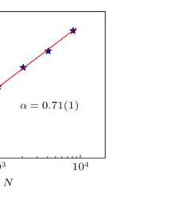 
Fig. 1 The dependence of heat conductivity κ on system size N in the case of 𝜎= 2 (the

📷 Fig 2

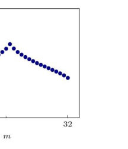 
Fig. 2 The temperature profile of the 𝜎= 2 system.

📷 Fig 3

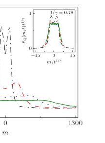 
Fig. 3 The 𝜌𝑄(𝑚, 𝑡) of the 𝜎= 2 system at different times, the inset shows its scaling

📷 Fig 4

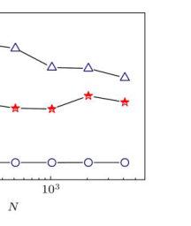 
Fig. 4 𝜆max versus system size N for Toda chain, 𝜎= 2, 8 systems.

📷 Fig 5

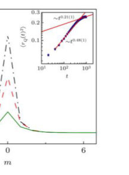 
Fig. 5 The 𝜌𝑄(𝑚, 𝑡) of the 𝜎= 0 system at different times, the inset shows the relationship

**Summary.** This review analyzes heat transport in 1D lattices with long-range interactions, showing that the decay rate of these interactions ($\sigma$) dictates the transport regime. The findings reveal complex transitions between superdiffusion, normal diffusion, and subdiffusion, suggesting that LR coupling offers a tunable mechanism for controlling heat flow, potentially leading to thermal diodes.

**Why it may be interesting.** This work is highly relevant as it explores non-equilibrium dynamics and energy transport in complex many-body systems, touching upon concepts of non-integrability and anomalous diffusion that are central to modern condensed matter theory.

Detailed structure

**Main problem.** The paper investigates how long-range (LR) interactions fundamentally alter the mechanisms of heat transport in one-dimensional (1D) lattice systems, moving beyond established models for short-range interactions.

**Main result.** The transport regime is highly dependent on the LR decay exponent ($\sigma$): strong LR coupling leads to subdiffusion, while specific weak-LR regimes can approach normal diffusion or even ballistic transport.

**Method.** The study employs theoretical analysis and numerical simulations using non-equilibrium molecular dynamics (NEMD) and the Green-Kubo formalism to calculate thermal conductivity and energy current correlations.

**Model / system.** The model is a 1D Fermi-Pasta-Ulam-Tsingou (FPUT)-type lattice whose anharmonic coupling terms decay as a power law, $V(r) \propto 1/r^\sigma$. The focus is on the effects of this long-range, quartic anharmonicity.

**Key observables.** Thermal conductivity ($\kappa$), energy current autocorrelation function ($C_{JJ}(t)$), and spatiotemporal correlation functions of energy fluctuations ($
ho_Q(m, t)$).

**Important parameters / regimes.** The LR decay exponent ($\sigma$), the system size ($N$), and the temperature/nonlinearity strength.

**Assumptions / limitations.** The analysis relies on comparing results from NEMD, Green-Kubo, and correlation function scaling, while acknowledging the challenge of ensemble inequivalence in LR systems.

**Figures summary.** Figures illustrate the temperature profile, the scaling of spatiotemporal correlations ($
ho_Q(m, t)$) showing different growth rates (diffusive vs. ballistic), and the energy current autocorrelation function exhibiting negative correlations in certain regimes.

**Paper structure.** The paper reviews the theoretical framework, contrasting short-range vs. LR effects, systematically analyzes transport regimes based on $\sigma$ (e.g., $\sigma=2$, $1 < \sigma \le 3$, $0 \le \sigma \le 1$), and discusses the implications for thermal control.

Abstract

Long-range (LR) interactions are no longer just a theoretical idea: they can be engineered in several low-dimensional platforms and offer a new way to control heat transport. At the same time, they push beyond the standard picture developed mainly for short-range, momentum-conserving lattices. In this review, we consider one-dimensional Fermi-Pasta-Ulam-Tsingou (FPUT)-type lattices where LR effects enter mainly through a quartic anharmonic coupling that decays as a power law, characterized by an exponent σ. Our goal is to explain, in a unified way, how LR anharmonicity changes microscopic energy exchange, collective dynamics, and the macroscopic scaling laws of heat conduction-while also clarifying what is well established and what is still debated (For more details of the abstract, please see the main text and paper).

[↑ back to top](#top)

### [Machine learning kinetics from molecular dynamics data](http://arxiv.org/abs/2609.17736v1)

**Authors:** Jonathan Weare, Aaron R. Dinner  
**Type:** theory · **Category:** statistical mechanics · **PDF:** <https://arxiv.org/pdf/2609.17736v1>  
**Analysis basis:** full PDF text, analyzed in chunks
**Topic relevance:** `Keldysh / 2PI / non-Gaussian methods` **3/5** · `methods for driven-dissipative` **3/5** · `driven-dissipative phase transition` **1/5** · `non-equilibrium universality` **1/5** · `quantum measurements` **1/5**

📷 Fig 1

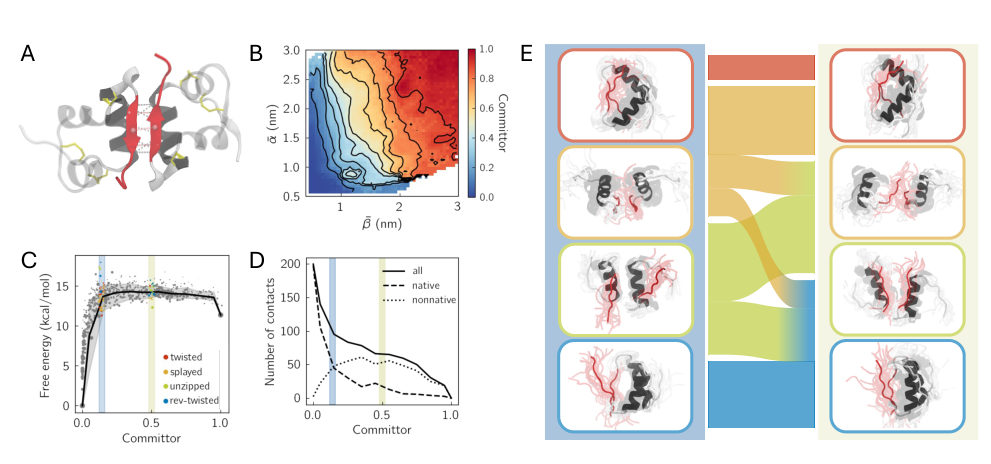 
FIG. 1. Insulin dimer dissociates through multiple pathways. (A) Insulin dimer structure. (B) The committor plotted as a function of average distances of selected interfacial α-helical contacts (¯α) and selected interfacial β-strand contacts (¯β); selected contacts are indicated in pink in panel (A). (C) The potential of mean force (PMF) as a function of the committor motivates analyzing the structures at q ≈.0.14 (light blue) and q ≈.0.50 (light green). (D) The rapid raise in the PMF reflect loss of native contacts, while q ≈.0.50 corresponds to the peak in nonnative contacts. (E) Representative structures of four pathways (red, orange, green, blue colors) at q ≈.0.14 (light blue) and q...

📷 Fig 2

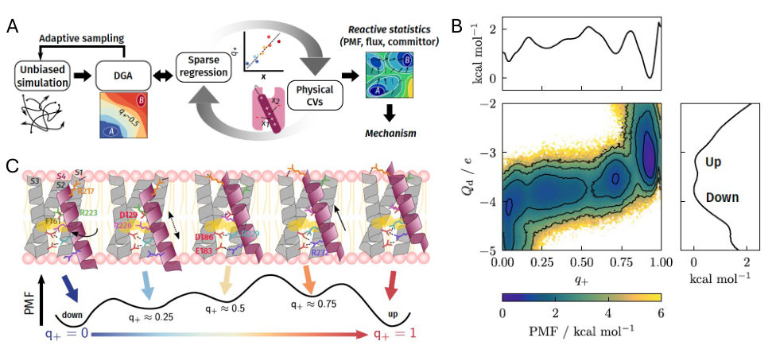 
FIG. 2. The committor reveals intermediates in the up-down transition of a voltage-sensing domain. (A) Workflow for the simulations. (B) Contour plot shows two-dimensional potential of mean force (PMF) as a function of the committor and displacement charge (Qd), which is measurable in electrophysiology experiments. The one-dimensional PMF for Qd suggests a two-state mechanism, while that for q suggests there are intermediates that are hidden to Qd, reconciling fluorescence and electrophysiology experiments. (C) Summary of the mechanism mapped to the committor PMF. Adapted from Ref. 46, distributed under a Creative Commons Attribution 4.0 International License (CC BY 4.0).

📷 Fig 3

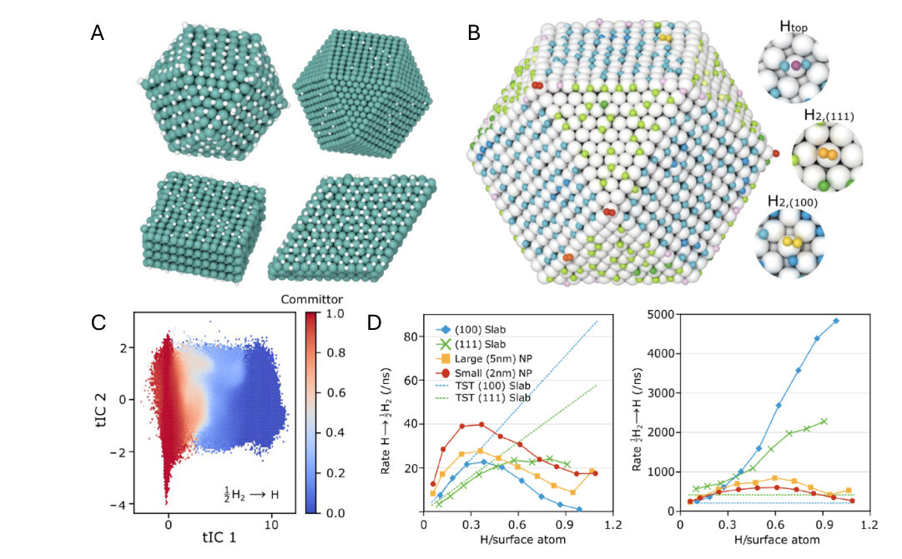 
FIG. 3. DGA (stopped MSMs) for hydrogen dissociation/association on rhodium. (A) Systems studied (2 nm nanoparticle, 5 nm nanoparticle, (100) slab, (111) slab). (B) Simulation snapshot illustrating hydrogen atom and molecule geometric states. Rhodium atoms are large, white spheres and hydrogen atoms are small spheres: H atoms on (100)/(111)/edges/top sites are blue/green/light purple/dark purple, and H2 molecules on corners/edges/facets are red/orange/yellow. (C) Committor for dissociation. (D) Rates of the association and dissociation of hydrogen as a function of concentration. Dashed lines show TST rates on (100) and (111) surfaces. Adapted from Ref. 43. Copyright 2026 American Chemical...

📷 Fig 4

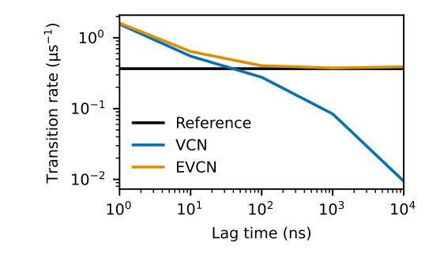 
FIG. 4. Comparison of folding rate estimates for the 35- residue villin headpiece subdomain. While VCN (without stopping) and EVCN (with stopping) give similar estimates at short lag times, only EVCN goes to the empirical reference rate at long lag times. Reproduced from Ref. 85. Copyright 2026 American Chemical Society.

📷 Fig 5

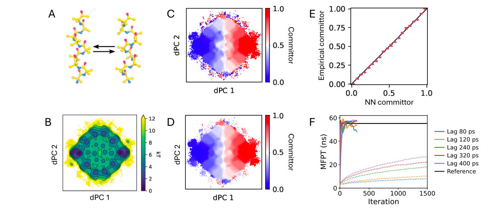 
FIG. 5. Fixed-point iteration yields accurate committors for the AIB9 left-right helix transition. (A) Left- and right-helix structures. Carbon, nitrogen, and oxygen atoms are shown in yellow, blue, and red, respectively; hydrogen atoms are omitted for clarity. (B) Potential of mean force (PMF) constructed from the histogram of value pairs of the first two dihedral angle principal components (dPCs); data are from 20 trajectories of 5 µs. (C) Averages of χB(XT ) (empirical committor) for initial conditions in bins in the first two dPCs computed from the same 20 trajectories. (D) Averages of representative neural-network committors trained on the data set of 6,910 trajectories of 20 ns; τ...

**Summary.** This review surveys advanced computational techniques for calculating kinetic rates and the committor function in molecular dynamics simulations. It emphasizes modern, self-supervised machine learning approaches that solve the underlying partial differential equations governing these transitions. The work provides a unified theoretical framework connecting classical statistical mechanics tools with deep learning methods.

**Why it may be interesting.** The development of self-supervised ML methods to solve fundamental equations of non-equilibrium statistical mechanics (like the committor PDE) is highly relevant for modeling open quantum systems and dynamics where full state space exploration is impossible.

Detailed structure

**Main problem.** The paper addresses the challenge of estimating kinetic statistics, particularly the committor, for molecular transitions that occur on timescales inaccessible to direct molecular dynamics simulations.

**Main result.** It surveys modern, self-supervised methods that connect various mathematical frameworks—including PDEs, variational principles, and neural networks—to estimate these kinetic parameters without relying on labeled simulation data.

**Method.** The core methodology involves reformulating the committor calculation as solving a defining partial differential equation (PDE) or minimizing a related functional, which is then tackled using Physics-Informed Neural Networks (PINNs) or variational approaches.

**Model / system.** The focus is on molecular transitions in general, modeled using molecular dynamics simulations. The underlying dynamics are often described by the infinitesimal generator $L$ of the process, applicable to systems undergoing Langevin dynamics.

**Key observables.** The committor, $q(x)$, which is the probability of reaching a product state before a reactant state; rate constants ($k$) derived from this statistic.

**Important parameters / regimes.** The timescale gap between simulation limits and physical rates; the dimensionality of the configuration space.

**Assumptions / limitations.** The review discusses approximations such as the Markovian assumption and the use of the steady-state solution to the backward Kolmogorov equation.

**Paper structure.** The paper progresses by first establishing the physical problem (committor estimation) and reviewing traditional methods (shooting, regression). It then systematically builds the modern theoretical framework by connecting generator-based PDEs, variational principles, MSMs, and finally showing how machine learning (NNs) provides a unified, self-supervised approach.

Abstract

Most molecular transitions occur on timescales far beyond direct molecular dynamics simulations. The committor, the probability that a configuration reaches a product state before a reactant state, is a central kinetic statistic, providing a mechanism-independent reaction coordinate and a foundation for transition path theory and the calculation of rates. This review surveys modern approaches for estimating the committor and related kinetic statistics from molecular simulations, with an emphasis on self-supervised methods that learn solutions of their defining dynamical equations rather than relying on labeled shooting data. We develop a common operator viewpoint connecting generator-based partial differential equations, variational principles, Markov state models, dynamical Galerkin approximation, and neural networks. Empirical and theoretical evidence points to the efficiency of these methods. We provide theoretical and practical guidance for realizing their full potential in applications, including strategies for treating non-Markovian effects and for sampling. We conclude by identifying opportunities for further research, including connections to reinforcement learning and generative modeling.

[↑ back to top](#top)

### [Theory-agnostic nonclassicality certification in an integrated photonic circuit](http://arxiv.org/abs/2609.18671v1)

**Authors:** Vinicius P. Rossi, Emanuele Polino, Beatrice Polacchi, Valeria Cimini, David Schmid, John H. Selby, Giacomo Corrielli, Andrea Crespi, Roberto Osellame, Fabio Sciarrino, Ana Belén Sainz  
**Type:** both · **Category:** quantum information and computing · **PDF:** <https://arxiv.org/pdf/2609.18671v1>  
**Analysis basis:** full PDF text, analyzed in chunks
**Topic relevance:** `QC/QI experiment` **3/5** · `quantum optics experiment` **3/5** · `quantum measurements` **2/5** · `analog quantum simulation` **1/5**

📷 Fig 1

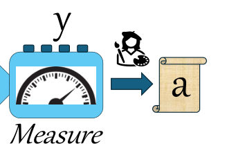 
Figure 1: Conceptual scheme of a prepare-and-measure scenario.

📷 Fig 2

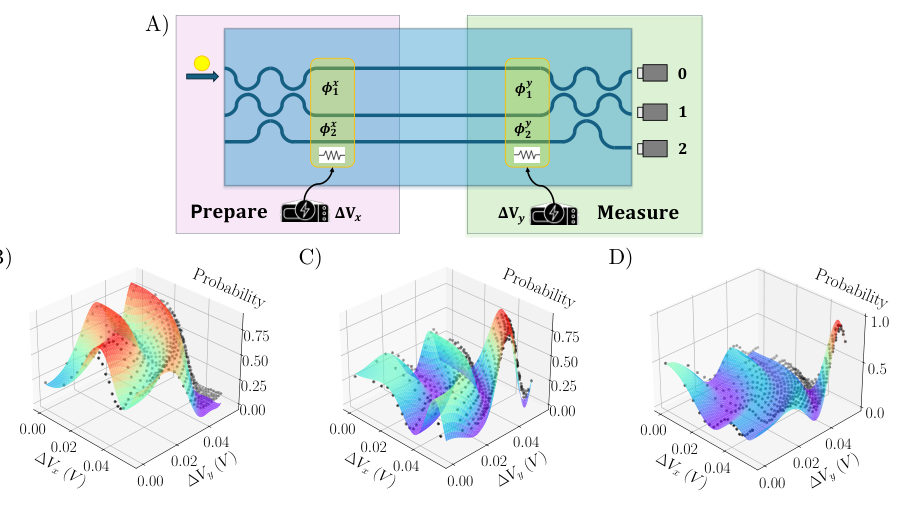 
Figure 2: A) Scheme of the experimental setup involving a single photon. B–D) Probabilities for the theoretical model of a photon entering the setup through the first mode of the interferometer and being detected in (B) mode 0, (C) mode 1, and (D) mode 2, as a function of the experimental voltages ∆Vx and ∆Vy. Points scattered in the plots represent experimental frequencies, while the 3D function is the theoretical quantum model of the circuit’s output probabilities.

📷 Fig 3

 
Figure 3: Rank analysis for (A–B) the theoretical model and (C–D) the experimental data. (A,C) χ2 train and χ2 test as functions of the rank k of the data table factorization; (B,D) change in χ2 test as the rank increases from k −1 to k. The optimal rank is the highest value of k such that this change in χ2 test is still negative.

📷 Fig 4

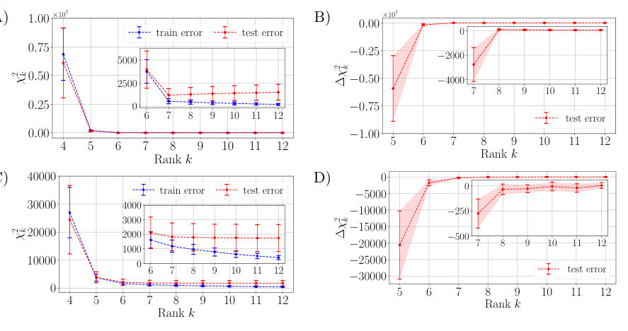 
Figure 3 summarises the results for (A–B) the theoretical model and (C–D) the experimental data. Figs. 3-A and 3-C show how χ2 train and χ2 test change with the rank k assumed for the factorization of the data table. One can see that the assumption of k = 4 yields a much larger value for both χ2 train and χ2 test, which quickly collapses for k = 5. This holds for both the theoretical probabilities and the experimental data. Figs. 3-B and 3-D portray the change in χ2 test as the rank increases, and the optimal rank for the factorization will be the highest value of k for which this change is still negative. For both theoretical and experimental data tables, we see that when k jumps from 7 to...

📷 Fig 5

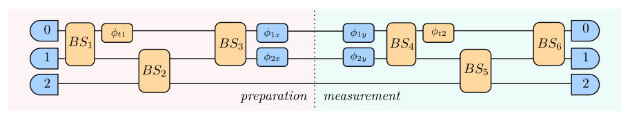 
Figure 4: Detailed schematic representation of the theoretical model describing the photonic circuit. Blue components are tunable during the experiment, while yellow components are fixed throughout all runs.

**Summary.** This paper presents a theory-agnostic method to certify nonclassicality using only experimental statistics from an integrated photonic circuit. By combining theory-agnostic tomography with simplex-embeddability certification, the authors robustly demonstrate that the measured correlations cannot be explained by any classical physical model. This advances the field by providing a general, device-independent verification tool for quantum advantage in scalable photonic platforms.

**Why it may be interesting.** This work provides a powerful, general mathematical tool for verifying quantum resources directly from measurements, which is highly relevant for assessing the performance and fundamental limits of photonic quantum hardware.

Detailed structure

**Main problem.** The paper addresses the foundational challenge of certifying nonclassicality in a manner that is independent of any specific underlying physical theory, which is vital for device-independent quantum protocols.

**Main result.** The authors successfully applied a theory-agnostic certification method to experimental data from a three-mode integrated photonic circuit, providing robust evidence of nonclassicality by ruling out simplex-embeddability.

**Method.** The core method combines theory-agnostic tomography with simplex-embeddability certification, which analyzes experimental statistics to determine the minimal mathematical structure (rank) required to explain the observed correlations.

**Model / system.** The experiment utilizes a three-mode integrated photonic circuit, operating in a prepare-and-measure scenario, where quantum correlations are generated and measured using single photons.

**Key observables.** The primary observable is the conditional probability distribution $p(a|y, x)$, and the diagnostic tools are the optimal factorization rank ($k^*$) and the robustness of contextuality ($r$).

**Important parameters / regimes.** The analysis depends on the measured coincidence counts ($N$) and the independently controlled voltages ($\Delta V_x, \Delta V_y$) used to tune the photonic circuit settings.

**Assumptions / limitations.** The method's strength lies in its minimal assumptions, but limitations include the fact that the reconstructed fragments are 'GPT shadows' and the complexity of polytope representation growth.

**Figures summary.** Figures illustrate the conceptual setup (prepare-and-measure), the measured/modeled probabilities as functions of applied voltages, and comparisons of robustness ($r$) and $\chi^2$ values for classical versus theoretical models.

**Paper structure.** The paper develops the theory-agnostic framework by defining the optimization problem ($\chi^2$ minimization over rank $k$), applies it to the photonic circuit data, and validates the procedure by comparing results against known classical and theoretical quantum models.

Abstract

Certifying nonclassicality without assuming any particular underlying physical theory constitutes both a foundational challenge and a requirement for device-independent protocols. Realizing such theory-independent certification in scalable architectures is essential for connecting fundamental tests with emerging quantum technologies. Integrated photonic circuits are a leading platform for scalable quantum information processing, motivating the development of rigorous methods to certify the nonclassical resources underpinning quantum advantage. In this paper, we report a theory-independent certification of generalized contextuality on a three-mode integrated photonic circuit. Our approach combines theory-agnostic tomography with simplex-embeddability certification---a framework that requires no assumptions about the underlying physical theory---and applies it to experimental data from a three-mode photonic circuit seeded by single photons. An independently constructed quantum model of the experiment provides a consistency check on the observed nonclassicality, without entering the certification as a theoretical assumption. The method rules out simplex-embeddability for our experimental data, providing robust, theory-independent evidence that our photonic circuit exhibits nonclassicality.

[↑ back to top](#top)

### [Measuring correlations in quantum and statistical systems](http://arxiv.org/abs/2609.18412v1)

**Authors:** V. I. Yukalov, E. P. Yukalova  
**Type:** theory · **Category:** statistical mechanics · **PDF:** <https://arxiv.org/pdf/2609.18412v1>  
**Analysis basis:** full PDF text, analyzed in chunks
**Topic relevance:** `analog quantum simulation` **3/5** · `Keldysh / 2PI / non-Gaussian methods` **1/5** · `correlated / nonlocal dissipation` **1/5** · `driven-dissipative phase transition` **1/5** · `methods for driven-dissipative` **1/5** · `non-equilibrium universality` **1/5**

📷 Fig 1

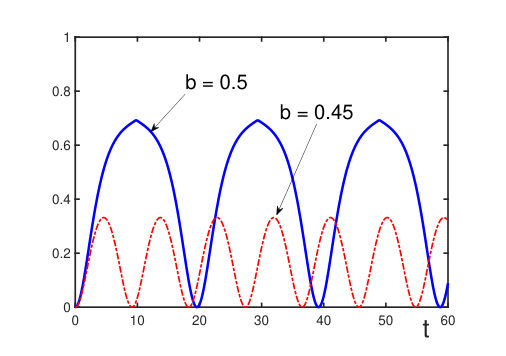 
Figure 1: Correlation index κ(ˆρ) as a function of dimensionless time for the Josephson regime with the pumping parameter in the range 0 &lt; b ≤1/2.

📷 Fig 2

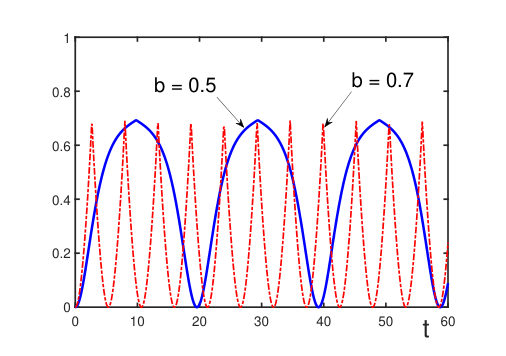 
Figure 2: Correlation index κ(ˆρ) as a function of dimensionless time for the Josephson regime with the pumping parameter in the range 1/2 ≤b &lt; 1.

📷 Fig 3

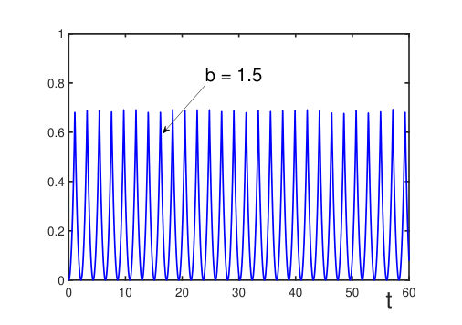 
Figure 3: Correlation index κ(ˆρ) as a function of dimensionless time for the Rabi regime with the pumping parameter in the range b &gt; 1.

**Summary.** This theoretical survey introduces the correlation index ($\kappa$) as a universal diagnostic tool to quantify correlation strength in quantum and statistical systems. By comparing correlation operators to their factorized counterparts, $\kappa$ measures both quantum entanglement and classical correlations. It is demonstrated through applications to spin systems and time-dependent BEC dynamics, providing a powerful quantitative measure for many-body physics.

**Why it may be interesting.** The development of a single, unified metric ($\kappa$) to quantify all types of correlations (quantum entanglement and classical statistical correlations) is highly valuable for analyzing complex, non-equilibrium many-body dynamics in AMO physics.

Detailed structure

**Main problem.** The paper addresses the general problem of quantitatively measuring the strength of correlations—both classical and quantum—within composite quantum and statistical systems.

**Main result.** The introduction of a 'correlation index' ($\kappa$) provides a general, quantitative measure applicable across various physical regimes, successfully quantifying both entanglement and classical correlations.

**Method.** The core method involves defining a correlation index, $\kappa(\hat{C}) \equiv \ln rac{||\hat{C}||}{||\hat{C}^{\otimes}||}$, which compares the norm of a correlation operator ($\hat{C}$) to its factorized, uncorrelated counterpart ($\hat{C}^{\otimes}$).

**Model / system.** The method is applied to diverse systems, including spin systems, general N-partite quantum states, and specifically, a trapped Bose-Einstein condensate (BEC) in a double-well potential subjected to an alternating field.

**Key observables.** Correlation index ($\kappa$), entanglement entropy ($S$), reduced density matrices ($\hat{
ho}_A$), and correlation operators ($\hat{C}_n$).

**Important parameters / regimes.** Pumping parameter ($b$), system size ($N$), and the nature of the correlation (classical vs. quantum).

**Assumptions / limitations.** The method assumes the existence of a general correlation operator $\hat{C}_n$ and its factorized counterpart $\hat{C}^{\otimes}_n$. For spin systems, the mean-field approximation is used.

**Figures summary.** The figures illustrate the time evolution of the correlation index ($\kappa(\hat{
ho})$) for the BEC system under different pumping field amplitudes ($b$), showing maxima at $z=0$ and minima at $z=\pm 1$.

**Paper structure.** The paper first introduces the general concept of correlation indices, then applies it to specific quantum states (EPR, Bell states) and spin systems, culminating in a detailed, time-dependent analysis of a BEC in a double-well potential.

Abstract

The survey discusses the problem of measuring correlations in composite quantum and statistical systems. After briefly recalling the standard methods of describing correlations, the emphasis is on the method of correlation indices. The latter method for quantifying the strength of correlations in composite physical systems is sufficiently general allowing for measuring in a unique way the correlation strength in both quantum and statistical systems, for static as well as for dynamic processes. The correlation indices, can be defined for correlation operators, reduced density matrices, and other operators containing information on correlations in the studied composite systems. The correlation indices measure all types of correlations, quantum correlations, such as entanglement, as well as classical correlations. They are applicable for characterizing static as well as dynamical processes. Examples are given of correlation indices for several quantum states and for spin and pseudospin systems. The quantification of correlations in a nonequilibrium system is exemplified by calculating the correlation index for a trapped Bose-Einstein condensate subject to the action of an alternating field.

[↑ back to top](#top)

### [Optical Quantum Computing](http://arxiv.org/abs/2609.18347v1)

**Authors:** Hamza Hasnaoui, Leonardo Limongi, Taira Giordani, Beatrice Polacchi, Alberto Quaranta, Martino Bernard, Fabio Sciarrino, Mirko Lobino  
**Type:** both · **Category:** quantum information and computing · **PDF:** <https://arxiv.org/pdf/2609.18347v1>  
**Analysis basis:** full PDF text, analyzed in chunks
**Topic relevance:** `quantum optics experiment` **3/5** · `QC/QI experiment` **1/5** · `analog quantum simulation` **1/5** · `interference shaping light` **1/5** · `quantum measurements` **1/5**

📷 Fig 1

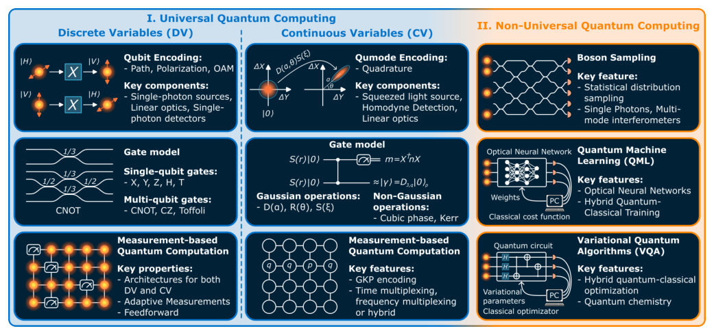 
FIG. 1: Overview of the optical quantum computing approaches covered in this review. This document is organized into two primary sections: approaches to universal quantum computation (discrete-variable, continuous-variable, gate-based and measurement-based quantum computation), and non-universal approaches (boson sampling, quantum machine learning, and variational algorithms) that provide computational advantages for specific problems. For each topic, we provide tables that summarize the present state of the art.

📷 Fig 2

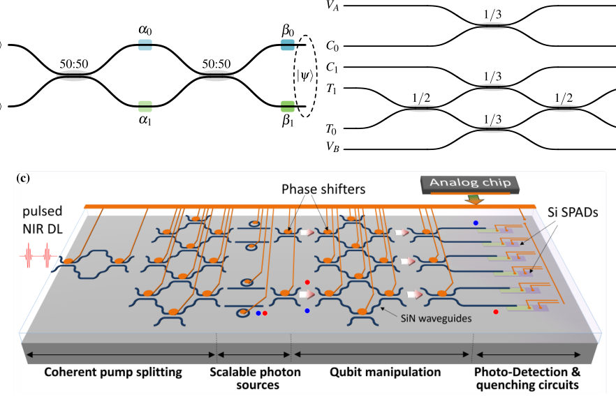 
FIG. 2: (a) Schematic of a Mach-Zehnder Interferometer (MZI) with phase shifters (α0, α1, β0, β1). This is a fundamental building block for the photonic implementation of DV gates, allowing the manipulation of path-encoded qubits. The MZI performs arbitrary single qubit operations such as those of Table I. (b) Schematic of the probabilistic integrated CNOT gate implementation proposed by Ref. [31], implemented in bulk optics in Ref. [32] and integrated into a waveguide device in Ref. [33]. (c) Authors’ impression of a Photonic Integrated Circuit for discrete-variable quantum computing where the three key stages of generation, manipulation and detection of photons are realized on the same...

📷 Fig 3

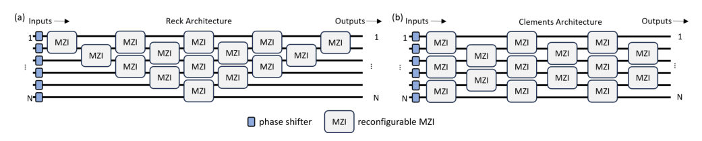 
FIG. 3: (a) Schematic of the Reck scheme for the implementation of arbitrary unitary transformations using linear optical elements.61 (b) Schematic of the Clements scheme62 which reduces optical depth of the interferometer defined as the longest path through the interferometer, enumerated by counting the number of beam splitters traversed by that path. The Clements scheme has the same number of elements as the Reck scheme but it is more symmetrical and more compact. The reconfigurable MZI is similar to the device shown in Fig. 2b

📷 Fig 4

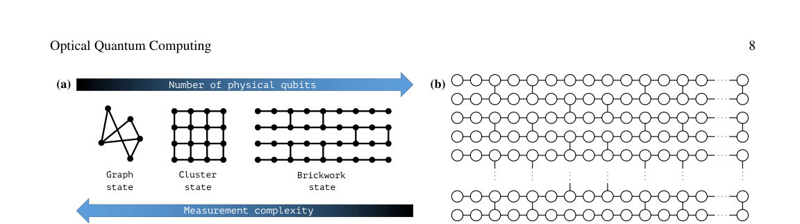 
FIG. 4: Structural comparison of universal resource states in MBQC. (a) Schematic representation of the three main classes of graph-based resource states with highlighted trade-off between the number of physical qubits (increasing left to right) and the complexity of required measurement patterns (decreasing left to right). The graph state is an unstructured entanglement pattern, allowing arbitrary topologies at the price of complex qubit measurements. The cluster state is a regularly arranged, two-dimensional square lattice of entangled qubits which increases the number of physical qubits to ease the set of measurements required for universal computing. The brickwork state is a highly...

📷 Fig 5

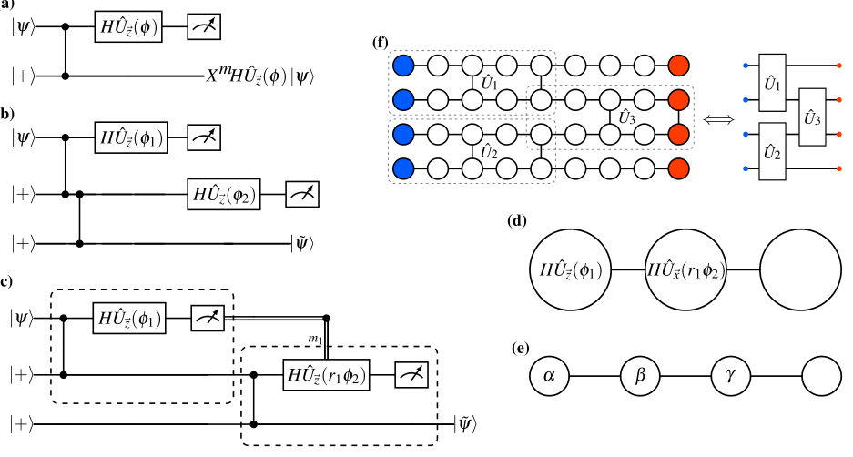 
FIG. 5: From teleportation circuits to cluster state computation in MBQC. (a) Schematic depicting the transfer of an arbitrary qubit state |ψ⟩by entangling it with an ancilla prepared in the |+⟩state, followed by a sequence of rotations and projective measurement. (b) Extension of (a) to two chained teleportation protocols enabling the sequential transfer and manipulation of the quantum state through independent measurement stages. (c) A variant of (b) where teleportation operations are performed in a specific temporal sequence, illustrating the interplay between measurement result m and conditional logic in the protocol. (d) Mapping of the circuit in (c) to a linear cluster, where each...

**Summary.** This review surveys the field of optical quantum computing, detailing protocols that use the quantum properties of light for computational advantage. It compares gate-based and measurement-based approaches using both discrete and continuous variable encoding. The paper highlights current experimental challenges while providing an overview of applications ranging from quantum simulation to quantum machine learning.

**Why it may be interesting.** It provides a broad survey of how quantum optics is being leveraged for computation, touching upon both foundational gate models and advanced applications like quantum machine learning, which is highly relevant to open quantum systems.

Detailed structure

**Main problem.** The primary goal is to achieve a computational advantage over classical machines by harnessing the quantum properties of light.

**Main result.** The review provides a comprehensive overview of various protocols, including gate-based and measurement-based approaches, for realizing quantum computation using photons.

**Method.** The paper reviews theoretical protocols and summarizes experimental implementations, detailing how different encoding schemes (DV vs. CV) and computation models (gates vs. cluster states) are employed.

**Model / system.** The platform is photonic quantum computing, utilizing photons whose quantum properties are manipulated via linear optical elements (BS, PS) integrated onto photonic circuits (PICs).

**Key observables.** Gate representations (Identity, Pauli-X, CNOT, Toffoli), success probability of gates, and the ability to synthesize arbitrary unitary transformations.

**Important parameters / regimes.** Low decoherence at room temperature, high propagation speed, and the need for deterministic single-photon sources.

**Assumptions / limitations.** The field faces challenges related to achieving deterministic single-photon sources and minimizing propagation losses in integrated circuits.

**Figures summary.** Figures illustrate the overall approaches to optical quantum computing, including schematics for MZI-based single-qubit gates and probabilistic integrated CNOT gates within a PIC framework.

**Paper structure.** The review is structured to cover the main implementations, comparing protocols based on encoding type (DV/CV) and computation method (gates/cluster states), with dedicated sections for non-universal applications like boson sampling and QML.

Abstract

Under the label of optical quantum computing, there are a variety of protocols and experiments that use the quantum properties of light to achieve a computational advantage over classical computing machines. In this review, we describe some of the main implementations, which differ in the type of encoding and in how the computation is performed, whether using gates or cluster states. For each protocol, we describe advantages and challenges with an overview of the experimental results obtained, summarized in tables. Because of the great relevance achieved in this field, there is a section dedicated to non-universal quantum computation with photons, where boson sampling, variational quantum eigensolvers, and quantum machine learning applications are described. The aim is to give the reader the broadest overview of the applications where photons and their quantum properties play a key role in computation.

[↑ back to top](#top)

### [Superconducting levitation and control of a high-reflectivity micromirror](http://arxiv.org/abs/2609.17787v1)

**Authors:** Philipp Koller, Jannek J. Hansen, David Walcher, Tomáš Plichta, Rémi Claessen, Martin Žemlička, Philip Schmidt, Rhys G. Povey, Stefan Minniberger, Stefan Putz, Markus Aspelmeyer, Michael Trupke  
**Type:** experiment · **Category:** other · **PDF:** <https://arxiv.org/pdf/2609.17787v1>  
**Analysis basis:** full PDF text, analyzed in chunks
**Topic relevance:** `quantum measurements` **3/5** · `quantum optics experiment` **3/5** · `analog quantum simulation` **1/5**

📷 Fig 1

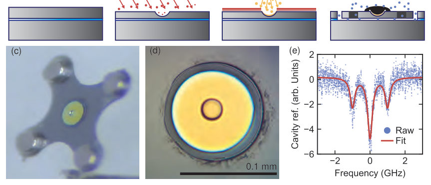 
FIG. 1. Fabrication and characterization of the levitators. (a) Tilted SEM image of a levitator still attached

📷 Fig 2

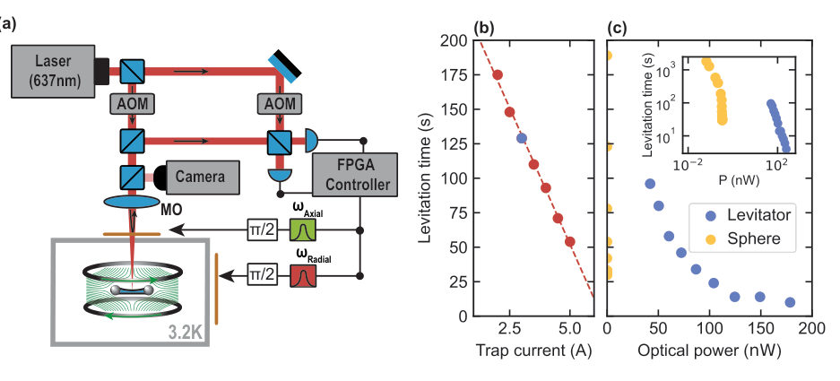 
FIG. 2. Experimental setup magnetically trapping a superconducting levitator. (a) Schematic of the cryo-

📷 Fig 3

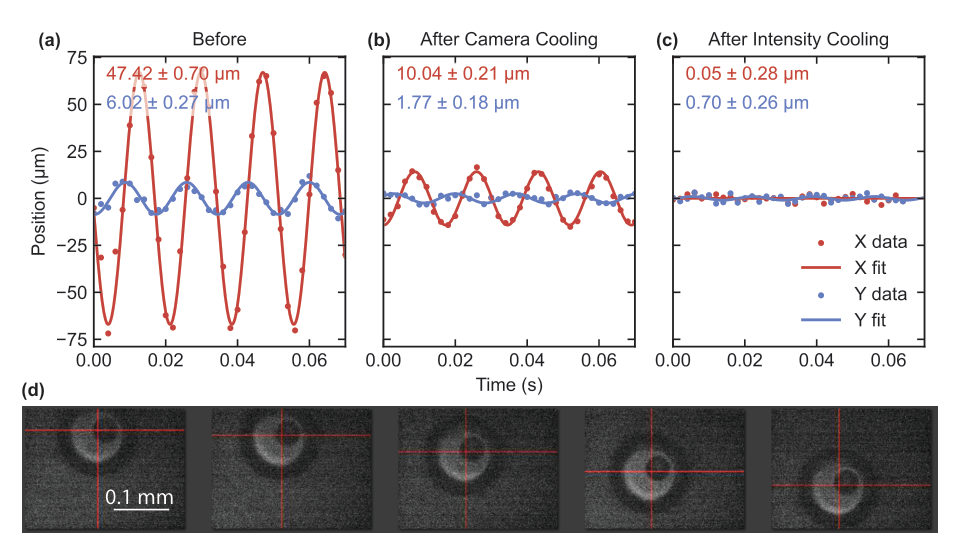 
FIG. 3. The radial motion of the levitator is feedback-cooled in two steps. In the first step, the center of

📷 Fig 4

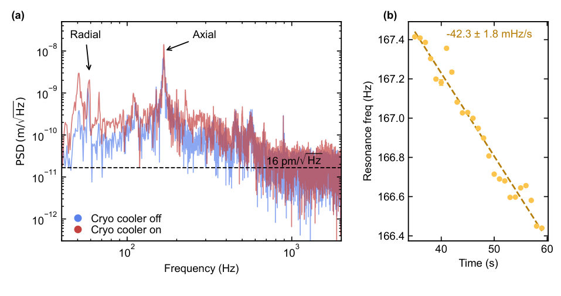 
FIG. 4. We measure the power spectral density (PSD) of the interferometric signal during levitation with

**Summary.** This paper presents a method to suspend and control a high-reflectivity micromirror using superconducting magnetic levitation at cryogenic temperatures. By employing active feedback and interferometric readout, the system achieves high sensitivity and stability, overcoming mechanical clamping losses. This establishes a versatile, low-dissipation platform crucial for advanced cavity optomechanics and quantum sensing.

**Why it may be interesting.** This work directly bridges mechanical engineering, superconducting physics, and quantum optics, providing a highly controllable, low-loss mechanical element ideal for testing quantum ground states or coupling to quantum systems.

Detailed structure

**Main problem.** The primary challenge addressed is the mechanical suspension of high-precision optical elements while minimizing environmental noise and dissipation.

**Main result.** The authors successfully demonstrated controlled superconducting magnetic levitation of a high-reflectivity micromirror, achieving high sensitivity and establishing a robust platform for cavity optomechanics.

**Method.** The system uses superconducting anti-Helmholtz traps for levitation, combined with active feedback control (camera and intensity-based) to stabilize all three translational degrees of freedom.

**Model / system.** The platform involves a microfabricated silicon mirror coated with a dielectric stack, levitated by superconducting microspheres within a magnetic quadrupole field at cryogenic temperatures. The motion is modeled by extending levitated sphere dynamics to a composite object.

**Key observables.** Displacement sensitivity ($\sim 0.1 	ext{ nm}/\sqrt{	ext{Hz}}$), axial trap frequency ($\sim 167 	ext{ Hz}$), and cavity finesse ($	ext{F} > 10^4$).

**Important parameters / regimes.** Micromirror mass ($	ext{30 } \mu	ext{g}$), cryogenic temperature ($	ext{3.2 K}$), and the superconducting critical field dependence.

**Assumptions / limitations.** The measurements are limited by extrinsic heating (leading to quench) and the accuracy of the feedback control schemes.

**Figures summary.** Figures illustrate fabrication steps, the experimental setup (cryostat, magnetic trap, interferometer), and the dependence of levitation time on trap current and optical probe power.

**Paper structure.** The paper details the fabrication process, the experimental setup for magnetic levitation, the implementation of multi-stage feedback control for motion stabilization, and the characterization of mechanical resonances and cavity performance.

Abstract

We introduce a method to suspend an optical micromirror, with a total mass of \SI{30}{\micro\gram}, using superconducting magnetic levitation. The micromirror is formed on a silicon membrane, coated with a high-reflectivity dielectric stack and attached to superconducting microspheres. The object is stably levitated inside a magnetic quadrupole field at cryogenic temperatures. Magnetic feedback on the transverse motion is used to stabilize the position of the levitator within the trapping field, allowing to measure the axial displacement of the levitator using optical interferometry. The system reaches a sensitivity of order \SI{100}{\pico\metre/\sqrt{\hertz}} near the axial trap frequency of \SI{167}{Hz}. This approach enables free-standing mirrors with minimal dissipation and tunable oscillation frequencies, offering a platform for precision sensing and quantum cavity optomechanics in the microgram regime.

[↑ back to top](#top)

### [Entropy spectroscopy of a tunable two-site Hubbard molecule](http://arxiv.org/abs/2609.17818v1)

**Authors:** Uhjin Kim, Seokyeong Lee, Gibum Yun, Dongsung T. Park, Soobeom Choi, Sangwoo Jeong, Donghoon Kim, V. Umansky, Yunchul Chung, Hyoungsoon Choi, H. -S. Sim, Hyung Kook Choi  
**Type:** experiment · **Category:** statistical mechanics · **PDF:** <https://arxiv.org/pdf/2609.17818v1>  
**Analysis basis:** full PDF text, analyzed in chunks
**Topic relevance:** `analog quantum simulation` **3/5** · `quantum measurements` **3/5**

📷 Fig 1

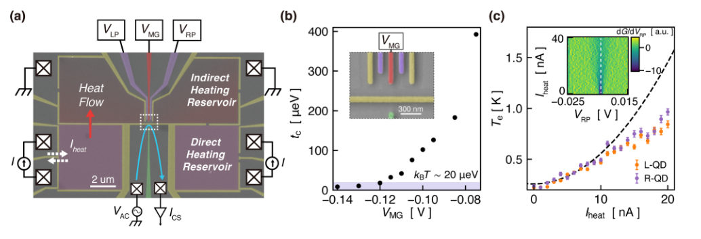 
Figure 1. Device image and calibration. (a) False-colored scanning electron microscope (SEM) image of the device. The device consists of a serial double quantum dot (DQD) coupled to two independent heating reservoirs and a nearby charge sensor (CS) for occupation readout. The conductance of the CS quantum point contact (QPC), 𝐺= 𝐼)*/𝑉+), is measured along the blue solid arrow. Each heating reservoir consists of a direct and an indirect heating chamber. The heating current 𝐼1-23 flows through two QPCs in the direct chamber with opposite polarities (white dashed arrow), and the resulting heat propagates into the indirect chamber (red arrow). The gate voltages 𝑉!# and 𝑉"# control the energy...

📷 Fig 2

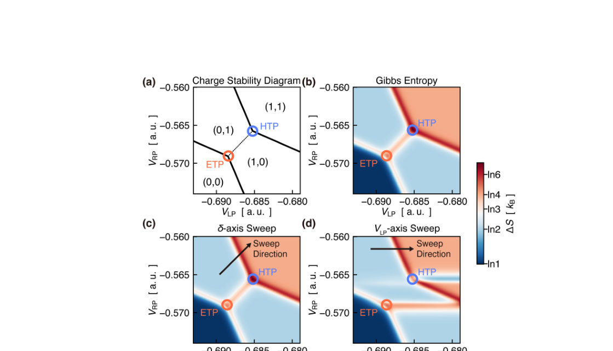 
Figure 2. Charge stability diagram and entropy. (a) Schematic charge stability diagram of the double quantum dot (DQD). The four charge states (𝑁!, 𝑁") = (0,0), (1,0), (0,1), and (1,1) are shown. The electron triple point (ETP) and hole triple point (HTP) are marked. The solid lines indicate the charge transition boundaries; the dashed line marks the boundary between the (1,0) and (0,1) regions. A trajectory parallel to this dashed line corresponds to the 𝛿-axis, along which 𝜀= 𝜀" −𝜀! is kept constant, where 𝜀! and 𝜀" are the energy levels of the left and right quantum dots (QDs), respectively. (b) Theoretical entropy map calculated from the DQD Hamiltonian using the Gibbs entropy formula....

📷 Fig 3

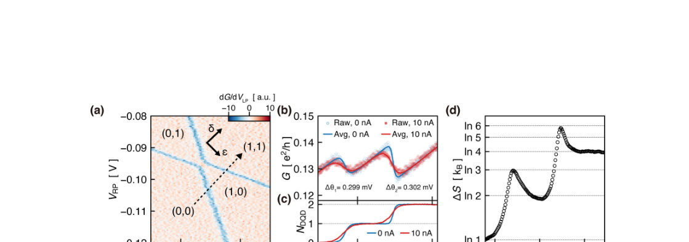 
Figure 3. Measured entropy far away from the triple points. (a) Charge stability diagram of the double quantum dot (DQD) measured by the charge sensor (CS). The 𝜀- and 𝛿-axes are indicated. The black dashed arrow denotes the entropy measurement path traversing the (0,0) → (1,0) → (1,1) charge regions. (b) Conductance measured along the path indicated in (a) for the unheated case (blue circles) and the heated case with an applied current of 10 nA (red squares). The blue and red solid lines represent the averaged conductance. (c) Normalized 𝑁@A@ along the path indicated in (a) for the unheated (blue) and heated (red) cases. (d) Entropy extracted from the 𝑁@A@ data shown in (c) via the Maxwell...

📷 Fig 4

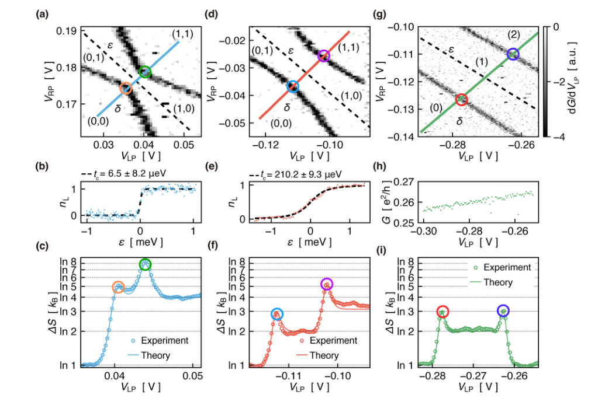 
Figure 4. Measured entropy along the 𝜹-axis with varying interdot tunnel coupling 𝒕𝐜. (a) A DQD charge stability diagram obtained from differentiating the charge sensor (CS) signal in the weak-tunneling regime (𝑡. &lt; 𝑘,𝑇T-). The orange and green circles indicate the electron triple point (ETP) and hole triple point (HTP), respectively. The mean population of the left quantum dot (QD), 𝑛!, is extracted by measuring CS conductance, 𝐺, along the 𝜀-axis (black dashed line), while the entropy is measured along the 𝛿-axis (blue solid line). (b) Extracted mean population of the left QD along the 𝜀-axis in (a). (c) Measured (blue circle markers) and theoretically calculated (blue solid line) entropy...

📷 Fig 5

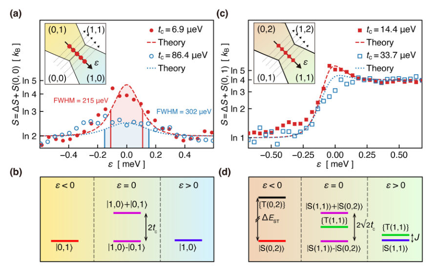 
Figure 5. Entropy evolution across the 𝜺-axis. (a) Entropy as a function of 𝜀, obtained from entropy traces measured parallel to the 𝛿-axis at various 𝜀. The absolute entropy of 𝑁@A@ = 1 region, 𝑆(𝜀) = Δ𝑆(𝜀) + 𝑆(0,0) = Δ𝑆(𝜀), is extracted as the minimum in the 𝑁@A@ = 1 region. The inset shows measurement trajectories from (0,0) to (1,1): the dashed arrows denote each trajectory, and the solid arrow indicates the variable of interest, 𝜀, against which Δ𝑆 is extracted. Red filled circles denote the weak-tunneling regime (𝑡. = 6.9 µeV), and blue open circles denote the intermediate-tunneling regime (𝑡. = 86.4 µeV). The red dashed and the blue dotted lines indicate the theoretically calculated...

**Summary.** This paper reports on an entropy spectroscopy technique applied to a double quantum dot acting as a tunable Hubbard molecule. By measuring the total entropy, the researchers quantitatively track how the thermal population of quantum states changes as interdot tunneling increases. This method successfully distinguishes the contributions of different molecular eigenstates, providing deep insight into the interplay between quantum coherence and thermal fluctuations.

**Why it may be interesting.** This work provides a direct, measurable thermodynamic probe (entropy) to characterize the competition between quantum tunneling and interactions in a minimal many-body system, offering insights into the nature of quantum phase transitions.

Detailed structure

**Main problem.** The central question is determining which microscopic states remain thermally active when tunneling and interactions compete in Hubbard physics.

**Main result.** Entropy spectroscopy reveals that as interdot tunneling increases, the total entropy decreases because the energy splitting suppresses the occupation of higher-energy states.

**Method.** The authors developed an entropy measurement protocol for a double quantum dot, utilizing a specific trajectory ($\delta$-axis) to circumvent measurement limitations with a single charge sensor.

**Model / system.** The system is a tunable two-site Hubbard molecule realized in a GaAs double quantum dot (DQD). The physics is governed by the competition between interdot tunneling ($t$) and interactions, analyzed via the total entropy ($S$).

**Key observables.** Total entropy ($S$), Charge Sensor (CS) conductance ($G$), and the number of thermally accessible states ($\Omega$).

**Important parameters / regimes.** Interdot tunnel coupling ($t$), thermal energy ($k_B T$), and the detuning ($\delta$).

**Assumptions / limitations.** The protocol assumes the system remains in thermal equilibrium with the reservoirs, and the $\delta$-axis trajectory is used to ensure the Maxwell relation depends only on the total DQD occupation.

**Figures summary.** Figures show the tunability of tunnel coupling, the evolution of entropy across different tunneling regimes, and comparisons between entropy extracted via the proposed $\delta$-axis protocol versus other measurement paths.

**Paper structure.** The paper first introduces the challenge of measuring DQD entropy, develops the $\delta$-axis measurement protocol based on Maxwell relations, and then presents experimental results showing entropy evolution as a function of interdot tunneling strength, confirming theoretical predictions for state occupation.

Abstract

Determining which microscopic states remain thermally active when tunneling and interactions compete is a central question in Hubbard physics. Here we develop an entropy measurement protocol for a double quantum dot, extending the charge-based approach established for a single dot, and measure the total entropy of a tunable two-site Hubbard molecule realized in a GaAs double dot. By shifting both dot levels together at fixed detuning, the entropy is correctly probed with only a single charge sensor. As interdot tunneling increases, the system evolves from two atomic-like dots through hybridized molecular states to a merged single dot. Across this evolution, the entropy decreases as tunnel-induced energy splitting exceeds the thermal energy and suppresses the occupation of higher-energy states. The measurements resolve the diminishing contribution of antibonding states and the changing thermal contributions of hybridized singlet and triplet states, in quantitative agreement with a two-site Hubbard model. By distinguishing states with the same charge configuration but different orbital and spin content, entropy reveals how tunneling and interactions determine the thermally active states of the minimal Hubbard system.

[↑ back to top](#top)

### [New directions in dynamical expectation estimation](http://arxiv.org/abs/2609.18246v1)

**Authors:** Panjin Kim, Kyung Chul Jeong, Yun-Tak Oh  
**Type:** theory · **Category:** numerical methods · **PDF:** <https://arxiv.org/pdf/2609.18246v1>  
**Analysis basis:** full PDF text, analyzed in chunks
**Topic relevance:** `methods for driven-dissipative` **3/5** · `Keldysh / 2PI / non-Gaussian methods` **2/5** · `quantum measurements` **1/5**

📷 Fig 1

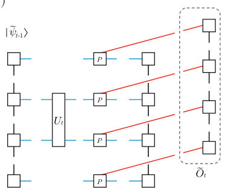 
Fig. 2. (a) Tensor network representation of one step of the forward time sweep with the blue bonds denoting the qubit indices. The yellow tensors represent the updated approximation to the evolved state up to canonicalization. The 7→symbol between the networks denotes an update, which should not be interpreted as conventional state compression. State compression is considered only as the µ-term in Eq. (1). (b) Tensor network representation of the target expectation value before the update, with P denoting the local Pauli basis tensor and the red bonds denoting the Pauli indices. The optimization of the updated state | ˜ψt⟩accounts for deviations from this target contraction through the...

📷 Fig 2

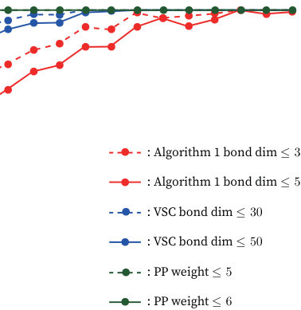 
Fig. 3. Relative errors of the three approximation methods, each averaged over the same 500 BP circuit instances with n = 30 qubits. For Algorithm 1, the maximum bond dimension of the backward observable is set equal to that of the forward MPS.

**Summary.** This paper proposes a novel 'sweep algorithm' to accurately estimate dynamical expectation values in quantum circuits by jointly optimizing approximations for both the quantum state and the observable. By deriving an analytical error decomposition, the method shows significant error reduction compared to existing techniques, making it a powerful tool for simulating quantum dynamics.

**Why it may be interesting.** This work provides a rigorous, numerically superior framework for calculating time-dependent expectation values, which is crucial for simulating quantum dynamics in complex systems where simple state or observable approximations fail.

Detailed structure

**Main problem.** Dynamically estimating expectation values in quantum systems is challenging because conventional approximation methods optimize the state or observable separately, failing to account for the combined error in the final expectation value.

**Main result.** The proposed joint state and observable approximation algorithm achieves errors two to three orders of magnitude smaller than variational state compression on 30-qubit random circuits.

**Method.** The authors introduce a 'sweep algorithm' utilizing coupled loss functions that jointly guide the approximation of the quantum state and the observable, derived from an analytical error decomposition.

**Model / system.** The work analyzes quantum systems undergoing dynamics, modeled by quantum circuits applied to an initial state, aiming to approximate $	ext{Tr}(
ho_0 C^\dagger O C)$.

**Key observables.** The expectation value $\langle 	ilde{O} 
angle$, and error components $R^{(i)}_1$ and $R^{(i)}_2$ derived from error decomposition.

**Important parameters / regimes.** Bond dimensions ($\chi_
ho, \chi_O$), circuit depth ($L$), and the coupling parameters ($\gamma, \mu$) in the loss functions.

**Assumptions / limitations.** The optimal form of the joint guidance loss functions is heuristic, and the derived updates generally do not preserve unitarity.

**Figures summary.** Figure 1 compares error components ($|R^{(i)}_1|$ and $|R^{(i)}_2|$) across barren plateau circuits, showing suppression of one error component relative to another. Figure 3 demonstrates the superior performance of the proposed algorithm versus other methods for 30-qubit circuits.

**Paper structure.** The paper first identifies the error combination problem, develops the joint loss-guided sweep algorithm, provides an analytical error decomposition ($E^{-b}(i) = R(i)_1 + R(i)_2$), and validates the method using numerical tests on large random circuits.

Abstract

Computing dynamical expectation values typically relies on approximations optimized for the state or observable separately, without accounting for how their errors combine in the final expression.This work explores an alternative approach in which each approximation is guided by both the state and the observable, accounting for how they jointly determine the target expectation value. This idea is implemented through a sweep algorithm with coupled loss functions for forward state and backward observable updates. Exact error relations provide an analytical rationale for how the proposed losses can improve the accuracy. Numerical tests on 30-qubit random circuits show errors two to three orders of magnitude smaller than those of variational state compression at equal bond dimensions. These results motivate further exploration of joint state and observable approximation for dynamical expectation value estimation.

[↑ back to top](#top)

### [Geometry-Driven Suppression of Fermionic Pairing on a Spherical Surface](http://arxiv.org/abs/2609.18386v1)

**Authors:** Lorenzo Frigato, Andrea Tononi, Luca Salasnich  
**Type:** theory · **Category:** quantum gases · **PDF:** <https://arxiv.org/pdf/2609.18386v1>  
**Analysis basis:** full PDF text, analyzed in chunks
**Topic relevance:** `analog quantum simulation` **3/5** · `Keldysh / 2PI / non-Gaussian methods` **2/5**

📷 Fig 1

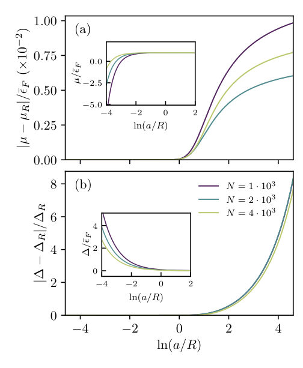 
FIG. 1. Differences between the exact and low-curvature asymptotic values of: (a) the chemical potential, and (b) the gap, displayed versus the crossover parameter ln(a/R). The exact values of µ and ∆are obtained by solving Eqs. (3) and (6), the asymptotic values of µR and ∆R = ¯∆are given by Eq. (8), and the flat-space Fermi energy reads ¯ϵF = ℏ2πn/m. The observed convergence signifies that cur- vature provides quantitative corrections when fermions pair into tightly-bound dimers of size ∼a ≪R and, conversely, that beyond ln(a/R) = 0 the system geometry strongly alters the flat-space results. The insets display the values of the ex- act µ and ∆versus ln(a/R), and we choose here non-magic...

📷 Fig 2

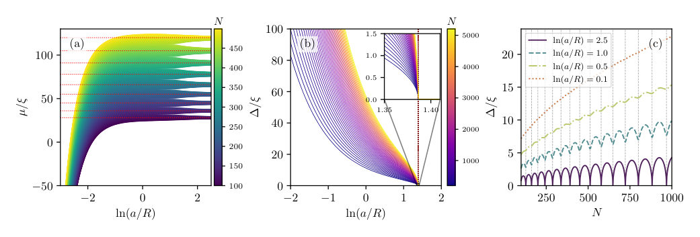 
FIG. 2. Geometry-dependent shell effects in the BCS-BEC crossover on the surface of a sphere. (a) The chemical potential µ/ξ versus ln(a/R) (excluding Nmagic values), with ξ = ℏ2/(mR2), shows the separation into bands and the convergence towards the closed-shell values when increasing ln(a/R) towards the weakly attractive BCS regime. (b) The pairing gap ∆/ξ versus the interaction strength ln(a/R) for closed shells (N = Nmagic) displays a suppression below the interaction strength marked by the red dotted line. The inset shows a zoom of the collapse region, which displays virtually no dependence on N. (c) Pairing oscillations of ∆are localized near Nmagic values (dashed vertical lines), and...

**Summary.** This paper theoretically examines fermionic pairing in an attractive Fermi gas confined to a spherical surface. It demonstrates that the spherical geometry fundamentally alters the pairing physics, causing pronounced shell effects that suppress superfluidity at weak interactions. The findings highlight geometry as a powerful control knob for quantum matter in ultracold atomic experiments.

**Why it may be interesting.** This work provides a concrete theoretical framework for understanding how geometric confinement (curvature) acts as a tunable parameter to control fundamental quantum phases like superfluidity in ultracold atomic systems.

Detailed structure

**Main problem.** The study investigates how confining a two-component attractive Fermi gas to a spherical surface modifies its ground-state pairing properties compared to the idealized planar limit.

**Main result.** The geometry introduces strong shell effects, causing the fermionic pairing to be significantly suppressed at weak interactions for specific 'magic' particle numbers, especially in the BCS regime.

**Method.** The analysis uses functional integration and self-consistent solutions to derive curvature-corrected equations for the pairing gap and chemical potential, utilizing spherical harmonic expansions.

**Model / system.** The system is a two-component attractive Fermi gas confined to a sphere of radius R. The physics is analyzed across the BCS-BEC crossover, governed by the interaction strength relative to the sphere's curvature.

**Key observables.** Pairing gap ($\Delta$), chemical potential ($\mu$), and the characteristic shell gap ($\delta_F$).

**Important parameters / regimes.** The ratio of scattering length to radius ($a/R$), which dictates the crossover regime, and the particle number $N$ relative to magic numbers.

**Assumptions / limitations.** The analysis relies on systematic expansions in $1/R$ and uses mean-field theory for the pairing gap, though it rigorously handles the discrete spectrum effects.

**Figures summary.** Figures illustrate the quantitative convergence of results towards planar limits in the BEC regime and show the distinct, step-like suppression of the pairing gap for closed shells in the BCS regime.

**Paper structure.** The paper systematically derives the grand canonical potential using functional integration, derives curvature-corrected equations for $\mu$ and $\Delta$ via the Euler-Maclaurin formula, and then analyzes the resulting BCS-BEC crossover, highlighting shell effects.

Abstract

We investigate the ground-state properties of a two-component attractive Fermi gas confined to a spherical surface, demonstrating how curvature and finite-size effects lead to qualitatively different behavior compared to the planar limit. In the strongly attractive regime, the system forms a Bose-Einstein condensate (BEC) of tightly bound dimers, yielding a gap and chemical potential that approach flat-space results with leading-order geometric corrections. However, as the attraction decreases, the system crosses over into a Bardeen-Cooper-Schrieffer (BCS) regime where the Cooper pair size becomes constrained by the sphere radius, producing pronounced deviations from flat-space behavior. We identify strong shell effects at magic particle numbers set by the single-particle spectrum, revealing the geometry-driven suppression of fermionic pairing at weak interactions. Our results highlight a fundamental interplay among geometry, quantum statistics, and interactions, motivating future experiments with shell-trapped ultracold fermions and inspiring geometry-controlled condensed matter devices.

[↑ back to top](#top)

### [Logarithmic-depth quantum simulation of boson sampling](http://arxiv.org/abs/2609.18907v1)

**Authors:** Changhun Oh  
**Type:** theory · **Category:** quantum information and computing · **PDF:** <https://arxiv.org/pdf/2609.18907v1>  
**Analysis basis:** full PDF text, analyzed in chunks
**Topic relevance:** `interference shaping light` **3/5** · `Full counting statistics` **1/5** · `analog quantum simulation` **1/5**

📷 Fig 1

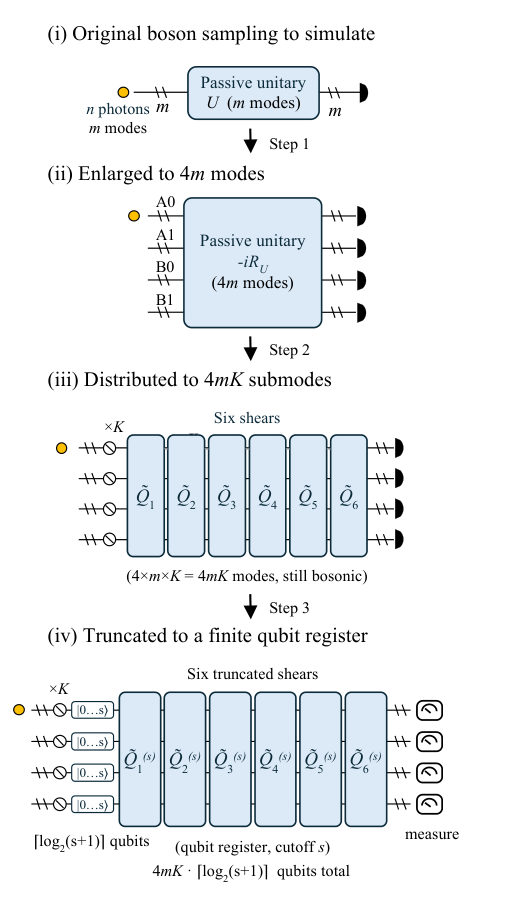 
Figure 1. Construction of the boson-sampling simulator. (i) The original m-mode problem with n single-photon inputs. (ii) Enlargement to 4m modes, with the fixed input encoder implicit before −iRU. (iii) Distribution over K submodes per mode and the six corresponding shears. (iv) Local truncation to occupations 0, . . . , s and qubit implementation. Summing the measured occupations over the submodes of each output pair gives the simulated sample. The displayed qubit count includes only the submode registers; input and auxiliary reg- isters are omitted.

**Summary.** This paper demonstrates that the complex process of boson sampling can be simulated using a quantum circuit with only logarithmic depth. The authors achieve this by mathematically decomposing the optical transformation into simpler 'shears' and then mapping these shears onto a qubit circuit using Clifford+T gates. This result places boson sampling within the class of shallow quantum computation.

**Why it may be interesting.** This work provides a concrete, resource-bounded quantum circuit implementation for a canonical problem in quantum optics, placing it firmly within the realm of shallow quantum computation.

Detailed structure

**Main problem.** To determine the quantum resources, specifically the circuit depth, required to simulate the output distribution of boson sampling.

**Main result.** The boson sampling distribution can be simulated by a Clifford+T circuit with a depth of $O(\log(m/\epsilon))$ and polynomial width.

**Method.** The technique involves enlarging the optical system to decompose the transformation into six quadratic shears, redistributing modes over submodes, and finally mapping the structure to a qubit circuit using Clifford+T gates.

**Model / system.** The model is boson sampling, realized by a passive interferometer $U$ acting on $m$ optical modes with $n$ input photons. The simulation is mapped onto a qubit circuit.

**Key observables.** The Total Variation (TV) error $\lVert eP_U - P_U 
Vert_{TV} \le \epsilon$, and the final output photon count distribution.

**Important parameters / regimes.** The number of modes ($m$), the number of input photons ($n$), the desired accuracy ($\epsilon$), and the local occupation cutoff ($s$).

**Assumptions / limitations.** The simulation relies on truncating local quadratures at a fixed cutoff $s$ and distributing modes over $K$ submodes, introducing controlled approximation errors.

**Figures summary.** Figure 1 illustrates the entire construction pipeline: from the original $m$-mode problem to enlargement to $4m$ modes, distribution over $K$ submodes, and final local truncation/qubit mapping.

**Paper structure.** The paper proceeds by first enlarging the interferometer to decompose it into six quadratic shears. Next, it details the mode redistribution over submodes to enable a constant local cutoff. Finally, it maps this structure to a qubit circuit using Clifford+T gates, providing complexity bounds for each step.

Abstract

We show that boson sampling with an arbitrary $m$-mode interferometer and $n\le m$ single-photon inputs can be simulated to inverse-polynomial total-variation error by a logarithmic-depth qubit circuit with polynomially many qubits. The circuit uses Clifford+$T$ gates, arbitrary qubit connectivity, and a single final measurement, and its family is logspace uniform. The key idea is to enlarge the optical system, decompose the resulting transformation into six quadratic shears, and distribute each mode over many submodes. This redistribution permits a fixed local occupation cutoff, after which local basis changes and parallel phase gates give the qubit circuit. Consequently, our result places boson sampling within shallow quantum computation.

[↑ back to top](#top)

### [Quantum electrodynamics of equilibrium systems: A rigorous Maxwell-regularized functional-theoretic formulation](http://arxiv.org/abs/2609.18327v1)

**Authors:** Markus Penz, Christian Jöns, Michael Ruggenthaler, Angel Rubio  
**Type:** theory · **Category:** other · **PDF:** <https://arxiv.org/pdf/2609.18327v1>  
**Analysis basis:** full PDF text, analyzed in chunks
**Topic relevance:** `Keldysh / 2PI / non-Gaussian methods` **3/5** · `quantum measurements` **2/5**

📷 Fig 1

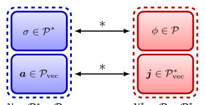 
Figure 1. Schematics for the principal Hilbert spaces X for densi- ties and vector potentials as the internal quantities (later evaluated as expectation values on the quantum system) and its dual X ∗for the external sources, linked through Maxwell duality.

📷 Fig 2

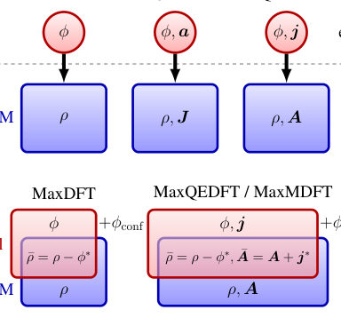 
Figure 2. Comparison of standard functional theories, where external source quantities serve as a parametrization of the ground-state, with their Maxwell-regularized counterparts, where the sources receive a physical description and are combined with the internal quantities to form the mixed ones. Note that current DFT (CDFT) has no direct coun- terpart, but MaxMDFT is instead derived in Sec. IX as an alternative theory for including magnetic fields.

📷 Fig 3

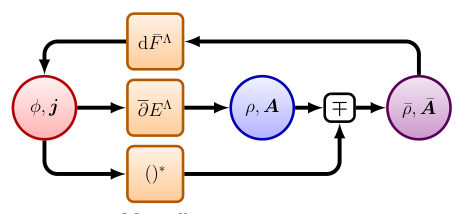 
Figure 3. The structure of MaxQEDFT as an invertible input–output scheme with the formulation in terms of (ϕ, j) that enters the Pauli– Fierz Hamiltonian and the (ρ, A) from expectation values of a ground-state solution. The result are the mixed quantities (ρ, A) from Eq. (53) as a combination of internal and external quantities.

📷 Fig 4

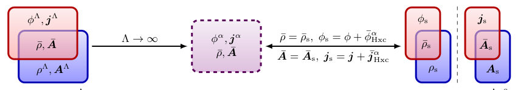 
Figure 5. Schematic for the removal of the cutoff on the external quantities and their further connection to a quantum system with the same mixed density ρs = ρ from an effective potential ϕs, as well as a decoupled mixed vector potential As = A from an external current js.

📷 Fig 5

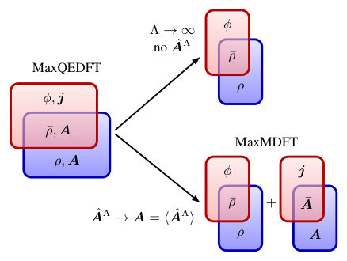 
Figure 6. The two discussed boundary cases that arise from entirely removing the field operator ˆ AΛ from the description and from a mean- field approximation. While MaxDFT is a fully regularized form of DFT,

**Summary.** This paper introduces a novel, rigorous functional-theoretic framework for Quantum Electrodynamics in equilibrium systems, termed MaxQEDFT. It achieves this by grounding the theory in the Maxwell equations and coupling them directly to the structure of Density-Functional Theory. The resulting formulation is fully regularized, allowing for a non-perturbative description of light-matter interactions that correctly reproduces macroscopic electrodynamics.

**Why it may be interesting.** This work is highly relevant as it rigorously merges the mathematical formalism of DFT with the fundamental field theory of electromagnetism (QED), providing a necessary theoretical tool for describing strongly coupled light-matter systems beyond standard approximations.

Detailed structure

**Main problem.** The paper develops a rigorous functional-theoretic framework for Quantum Electrodynamics (QED) applied to equilibrium systems, aiming to overcome representability issues in standard Density-Functional Theory (DFT). It seeks to provide a fully regularized description of light-matter interactions.

**Main result.** A Maxwell-regularized functional theory (MaxQEDFT) is proposed that successfully incorporates external sources and energy, allowing for a non-perturbative description where the ultraviolet cutoff can be removed.

**Method.** The approach reformulates QED by founding the theory on the Maxwell equations and linking them to DFT structure. It employs a Kohn-Sham-like construction within a functional analysis framework defined over coupled potential and field spaces.

**Model / system.** The system involves light-matter interactions in equilibrium, modeled by coupling the quantum system's internal observables (density, current) to an external classical environment governed by Maxwell's equations. Harmonic confinement is used mathematically to establish a reference state.

**Key observables.** Charge density ($\sigma$), current ($\mathbf{j}$), electrostatic potential ($\phi$), and vector potential ($\mathbf{a}$); the electromagnetic field energy.

**Important parameters / regimes.** Plasma frequency ($\omega_p$), confinement strength ($\gamma$), and the coupling constants ($\epsilon_0, \mu_0$).

**Assumptions / limitations.** The theory assumes the system can be modeled by coupling to a classical environment governed by Maxwell's equations, and it utilizes harmonic confinement for mathematical tractability.

**Paper structure.** The structure moves from identifying the foundational problem (QED in equilibrium) to establishing the mathematical framework using Hilbert spaces and duality mappings derived from Maxwell's equations. It then details the construction of the regularized functional theory, culminating in the physical interpretation that reproduces macroscopic Maxwell equations.

Abstract

A framework for quantum electrodynamics of equilibrium systems is proposed that takes the Maxwell equations as foundational and links them to the structure of density-functional theory for the quantum system. By switching from purely internal observables like the one-particle density to combined internal and external quantities, the external sources and their energy are taken into account. A fully regularized functional theory emerges that avoids the usual representability problems. With the Kohn-Sham construction that links to an auxiliary uncoupled system, the ultra-violet cutoff can be removed and one arrives at a fully renormalized and non-perturbative light-matter description. Regularized forms of density-functional theory with and without magnetic fields appear as boundary cases, while the emergent physical picture reproduces the macroscopic Maxwell equations.

[↑ back to top](#top)

### [QEMScore: How Much Does the Measurement Add to Learned Quantum Error Mitigation?](http://arxiv.org/abs/2609.17896v1)

**Authors:** Yue Zhao, Huayue Gu, Yushun Dong, Xiyang Hu  
**Type:** theory · **Category:** quantum information and computing · **PDF:** <https://arxiv.org/pdf/2609.17896v1>  
**Analysis basis:** full PDF text, analyzed in chunks
**Topic relevance:** `quantum measurements` **3/5** · `analog quantum simulation` **1/5**

📷 Fig 1

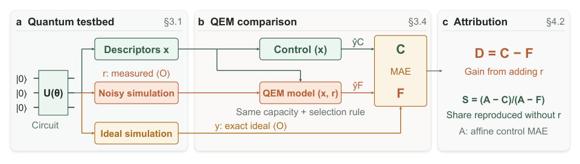 
Figure 1: One circuit, one exact target, one input withheld: the two models differ only in whether they read the measurement. (a) A circuit and observable O yield descriptors x, a noisy estimate r, and the exact ideal expectation y from noiseless simulation. (b) The learned QEM model reads (x, r); a capacity-matched control reads x alone. Both are fitted from the same candidate family under the same selection rule and scored against y by held-out macro mean absolute error, F and C; the diagram shows evaluation after fitting. (c) The measurement-associated gap is D = C −F. Against the affine feature-only control with error A, the share reproduced without measurement is S = (A −C)/(A −F); a...

📷 Fig 2

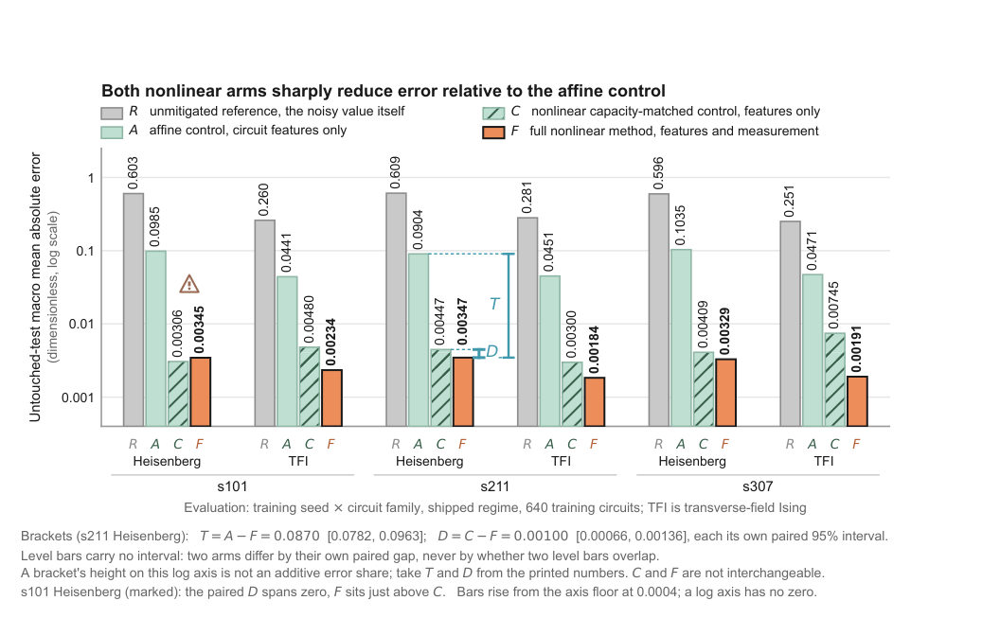 
Figure 2: Both nonlinear arms sharply reduce error relative to the affine control on all six primary evaluations. Each bar is a macro mean absolute error against the exact label on untouched test rows, equally weighted over four strength-by-observable cells, on a logarithmic axis. R: unmitigated noisy reference. A: affine feature-only control. C: capacity-matched feature-only control, fitted from the ablation’s own candidate family. F: the full nonlinear method, this campaign’s restricted-feature ablation (features and measurement). Both feature-only arms read no measurement. Bars are point estimates with no interval; two arms differ by their paired gap, not by whether bars overlap....

📷 Fig 3

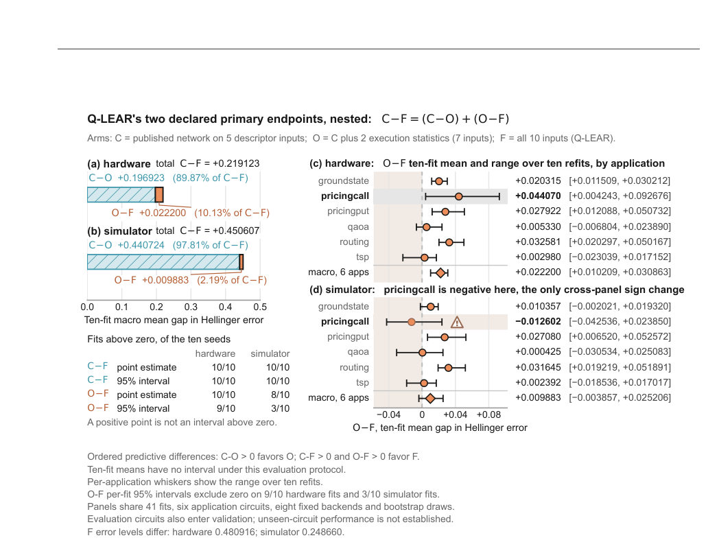 
Figure 4: The base-statistics step carries 89.87 percent of the total gap on hardware and 97.81 percent on the simulator. Endpoints are nested: C−F = (C−O) + (O−F). C: nonlinear descriptor control (five inputs). O: adds base execution statistics (seven inputs). F: full ten-input released method. Positive gap means the fuller set has lower error. (a, b) Ten-fit macro mean C−F split into its two additive pieces, hardware and simulator. (c, d) O−F ten-fit mean per application and macro row; whiskers show the range over ten refits, not a confidence interval. The lower-left block counts fits with positive point estimates and fits whose 95 percent intervals lie wholly above zero. Both panels...

📷 Fig 4

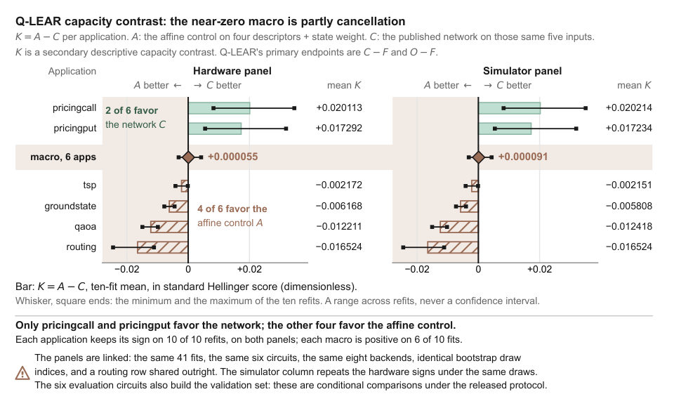 
Figure 5: The near-zero macro mean (+0.000055 hardware, +0.000091 simulator) is partly cancel- lation: two pricing applications favor the network and the other four favor the affine control on all ten refits of both panels. K=A−C per application. A: affine control on four circuit descriptors and the state weight. C: published network on the same five inputs; the two arms differ only in learner capacity. Positive K means the network has lower error. Bars: ten-fit means in Hellinger score. Whiskers with square ends: minimum and maximum over ten refits, a range and not a confidence interval. Per-application rows carry no interval because one application leaves no resample unit. K is a...

📷 Fig 5

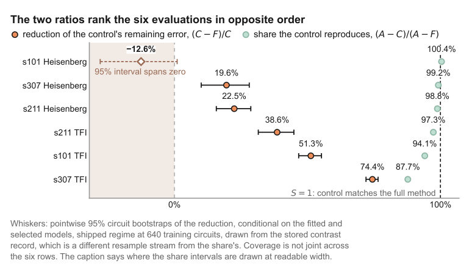 
Figure 6: Sorted by the share it reproduces, the six primary evaluations come out in increasing order of remaining-error reduction. Rows run by share, descending, which is not the fixed evaluation order of Figure 3; each row names its seed and family. The share S = (A −C)/(A −F) divides the part the capacity-matched control reproduces by the ablation’s improvement over the affine control. The remaining- error reduction D/C = (C −F)/C divides the gap D = C −F by the control’s own error. Numerator and denominator both differ, so the second does not follow from the first. Whiskers are pointwise 95 percent circuit-bootstrap intervals of the reduction, conditional on the fitted and selected...

**Summary.** This paper introduces QEMScore, a diagnostic framework to quantify the specific contribution of noisy measurement outcomes to the performance of learned quantum error mitigation techniques. By comparing full models against controls that ignore measurement data, the authors show that while measurement matters, the mitigation gain can stem from other sources, necessitating more nuanced reporting standards in the field.

**Why it may be interesting.** It provides rigorous diagnostic tools for assessing the true physical utility of complex machine learning models applied to quantum computation, helping researchers distinguish between genuine physical insight and mere correlation with measurement noise.

Detailed structure

**Main problem.** The paper addresses the fundamental question of how much of the performance gain in learned quantum error mitigation (QEM) techniques is attributable to the noisy measurement input versus the circuit structure itself.

**Main result.** The measurement-only control can account for a significant portion of the mitigator's gain under controlled conditions, and on actual hardware data, measurement inputs do carry predictive gains.

**Method.** A novel framework, QEMScore, is introduced to compare learned mitigators against capacity-matched controls that are explicitly prevented from reading the measurement outcome, allowing for the quantification of the measurement's contribution.

**Model / system.** The study uses simulated quantum circuits, including spin-chain families (e.g., transverse-field Ising), and evaluates observables $\langle O 
angle$ under various noise models and measurement protocols.

**Key observables.** Error reduction quantified by the measurement-associated gap ($D = C - F$), and the share ($S$) of error reduction attributed to the measurement input.

**Important parameters / regimes.** The analysis is highly dependent on the specific simulated circuit regimes, the noise configuration, and the computational budget used for the learned models.

**Assumptions / limitations.** The conclusions are strictly conditional on the tested simulator regimes and the specific comparison controls implemented; the measurement contribution is not always the sole source of mitigation gain.

**Figures summary.** Figure 1 illustrates the comparison framework, showing how the full model's performance is decomposed into components related to circuit features and measurement readings. Other figures detail the comparison across various evaluation settings (S0-S6).

**Paper structure.** The paper establishes the scientific problem by noting the ambiguity in current error mitigation reporting. It then introduces the QEMScore framework, details controlled simulations on spin-chain families, presents quantitative results comparing different control models, and concludes with guidelines for reporting learned mitigator accuracy.

Abstract

How much does the noisy measurement add to learned quantum error mitigation? An accuracy table cannot say, because a model handed circuit structure can score well without reading the measurement at all. QEMScore adds the comparison that can. Each simulated circuit carries an exact ideal answer. The learned mitigator is scored beside a capacity-matched control, a model just as flexible that reads the same circuit description but never the measurement. Each method's measurement spend is accounted and not equalized. We run a controlled campaign on simulated circuits and reanalyze two published learned mitigators, Q-LEAR and QRAFT, from their released hardware data. Three findings stand out. First, under familiar within-family conditions (S0) evaluated across two spin-chain families and three seeds, continuous couplings identify the target, and the control that never reads the measurement matches 87.7 to 100.5 percent of the mitigator's gain over an affine fit to the circuit description. A plain polynomial in the coupling parameters, fitted after the campaign, beats the mitigator on all six evaluations, reflecting the selected learners' capacity. Second, for these selected learners, matching most of the gain is not matching the accuracy: on five of six evaluations the mitigator removes 19.5 to 74.5 percent of the error the capacity-matched control leaves, a learner-specific gap rather than a measurement requirement. Third, on released hardware data where descriptors only partially identify queries, the findings differ: flexible models of the descriptors show negligible mean gain over affine fits in Q-LEAR, and measurement inputs carry predictive gains in both Q-LEAR and QRAFT. These comparisons reflect representation- and protocol-specific behavior rather than an isolated cross-regime difference. A learned mitigator's accuracy should therefore be reported beside such controls.

[↑ back to top](#top)

### [Zero bias field selective transition adressing of the NV center via pulse shaping](http://arxiv.org/abs/2609.18887v1)

**Authors:** Thomas Richard, Yves Bérubé-Lauzière  
**Type:** theory · **Category:** other · **PDF:** <https://arxiv.org/pdf/2609.18887v1>  
**Analysis basis:** full PDF text, analyzed in chunks
**Topic relevance:** `QC/QI experiment` **3/5** · `quantum measurements` **1/5**

📷 Fig 1

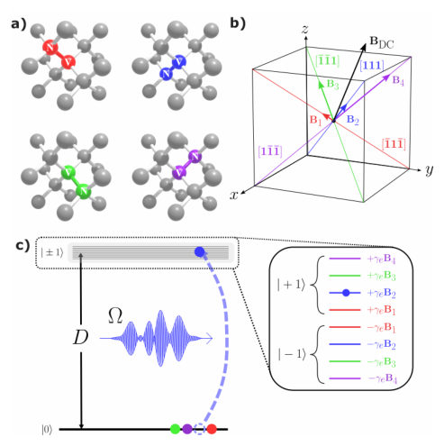 
Figure 1: (a) The four possible crystallographic orientations of the NV center in the diamond lattice. The colored spheres represent nitrogen-vacancy centers, while the gray spheres represent carbon atoms. (b) Projection of an external magnetic field onto the quantization axis of each of the four NV orientations. (c) Selective spin manipulation achieved through optimal pulse shaping. In this example, the |0⟩→| + 1⟩transition of the [111]-oriented NV center (blue) is selectively driven without the application of a bias magnetic field, while the remaining NV centers stay in the |0⟩ ground state. The inset shows the corresponding energy-level structure induced by the external magnetic field.

📷 Fig 2

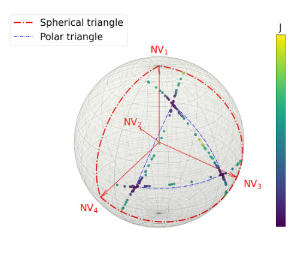 
Figure 2: Optimal configuration of the first source obtained by PSO. The optimal (θ∗ 1, ϕ∗ 1) coordinates align along one of the polar triangles (blue) whose vertices are associated with the spherical triangle formed by the NV1,3,4 orientations (red). The color scale indicates low values (blue) to high values (yellow) of the objective function J.

📷 Fig 3

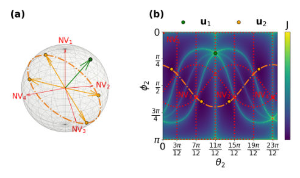 
Figure 3: Optimal orientation for ˆu2 (orange arrows and orange dots) with ˆu1 (green arrow and green dot) fixed. (a) The orange arrows lie in the plane spanned by the orientations of the NV2 and NV3 centers. (b) Orthographic projection of the value of the cost function for ˆu2. Red crosses ("×") correspond to the NV orientations and red dotted lines to the plane spanned by NV orientation pairs. The orange dashed line represents the plane spanned by the optimal configurations for the second source. As expected, planes spanned by the first source and an NV axis result in bad conditioning (high values in the color scale) due to their collinearity.

📷 Fig 4

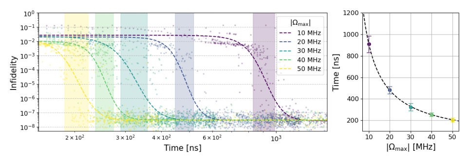 
Figure 4: Left: Infidelity as a function of pulse duration for amplitude bounds (see values in inset for |Ωmax|). The data

📷 Fig 5

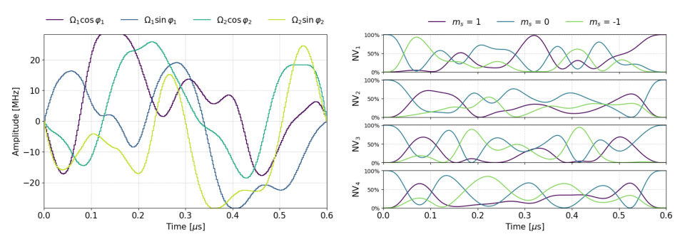 
Figure 5: Simulation result for the ensemble optimization with µBgeBext = [−0.25, −1.62, 0.26] MHz, T = 600 ns and ∆t = 2 ns. Left: Control amplitudes during the implementation of the gate ˆUG = exp(−iπ ˆS+ x ) on the [111] orientation. The z axis of the laboratory frame is defined along the z axis of the diamond cristal. Right: Population dynamics for each NV orientations. A final fidelity of 99.99998% for ms = 1 for NV1 and ms = 0 for NV2, NV3, and NV4 was obtained for this implementation

**Summary.** This paper presents a novel, optimization-based pulse-shaping control framework to improve vector magnetometry using NV centers. By designing tailored microwave pulses, the authors achieve selective spin manipulation and state control without needing a static external bias field. This breakthrough resolves systematic errors inherent in current NV magnetometry techniques, opening pathways for higher-accuracy sensing.

**Why it may be interesting.** This work is highly relevant to AMO physics and quantum optics as it tackles the practical limitations of quantum sensing platforms by developing advanced control techniques to operate in regimes previously inaccessible due to experimental constraints.

Detailed structure

**Main problem.** The primary challenge is overcoming systematic errors in vector magnetometry using NV centers that arise from the necessary reliance on a static external bias field.

**Main result.** The authors introduce an optimization-based pulse-shaping framework that enables robust, selective quantum control of NV ensembles without requiring a static bias field.

**Method.** The method employs Quantum Optimal Control (QOC) techniques, specifically utilizing Gradient Ascent Pulse Engineering (GRAPE) and analyzing the Dynamical Lie Algebra (DLA) to design optimal time-dependent driving fields.

**Model / system.** The system is based on Nitrogen-Vacancy (NV) centers in diamond, whose spin dynamics are modeled using a Hamiltonian that includes drift and time-dependent control terms. The control is optimized for ensemble selectivity across multiple crystallographic orientations.

**Key observables.** State-transfer fidelity, condition number $\kappa(M)$ of the generator matrix, and the ability to achieve orientation-selective and subspace-selective control.

**Important parameters / regimes.** The required control fields ($\Omega_j(t)$), the dimensionless parameter $\gamma = \epsilon^2 / (4\omega)$, and the minimum condition number $\kappa \approx 1$ for optimal control.

**Assumptions / limitations.** The analysis often relies on the Rotating Wave Approximation (RWA) and treats the nuclear spin projection ($m_I$) as a quasi-static parameter.

**Figures summary.** Figure 1 illustrates the four crystallographic orientations of NV centers and demonstrates selective spin manipulation ($	ext{|0}
angle 	o 	ext{|+1}
angle$) achievable without a bias field.

**Paper structure.** The paper progresses from identifying the limitations of bias-field magnetometry to developing a QOC framework. It details the Hamiltonian structure, analyzes the controllability via the DLA, and finally presents the optimization procedure to shape pulses for field-free, selective control.

Abstract

Nitrogen-vacancy (NV) centers in diamond are a leading platform for vector magnetometry, offering intrinsic sensitivity to both the magnitude and direction of magnetic fields. NV magnetometers typically rely on an external bias field to lift the degeneracy of the ground-state spin sublevels, enabling spectral discrimination of different NV orientations and spin transitions. At high accuracy, however, such a bias field systematically introduces errors through thermal, mechanical, and hysteretic drifts, thus hindering the accurate measurement of the magnetic field of interest. Several strategies have been proposed to address this limitation, including optical polarization-based orientation labeling, optical anisotropy, strong coupling to nearby nuclear spins, circular microwave polarization, and tailored pulse sequences. In this work, we introduce an optimization-based pulse-shaping control framework that enables selective and robust manipulation of NV ensembles without relying on a static bias field. Our method achieves both orientation-selective and subspace-selective control through optimal temporal modulation of the driving fields, providing a route to resolving spectral overlaps in degenerate NV systems.

[↑ back to top](#top)

### [Classical, quantum, and general probabilistic state-discrimination profiles](http://arxiv.org/abs/2609.17920v1)

**Authors:** Mihály Weiner  
**Type:** theory · **Category:** quantum information and computing · **PDF:** <https://arxiv.org/pdf/2609.17920v1>  
**Analysis basis:** full PDF text, analyzed in chunks
**Topic relevance:** `quantum measurements` **3/5**

📷 Fig 1

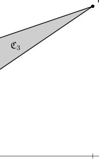 
Figure 1: The symmetric slice x = y = z = s. The GPT region is the triangle OPW; its classical part is the darker triangle OMW. The dashed segment OM is t = 3s, or β = 0. The trine has s = 1 − √

**Summary.** This paper develops a mathematical framework to characterize the boundaries between classical, quantum, and general probabilistic theories using a 'discrimination profile' function. By analyzing specific cases like three-state discrimination, the authors establish strict inequalities that quantify quantum advantages over classical predictions. This work deepens the understanding of operational quantum correlations beyond standard Bell inequalities.

**Why it may be interesting.** The work provides a rigorous mathematical framework for quantifying the nonclassicality of quantum correlations in state discrimination, which is a fundamental problem in quantum information theory.

Detailed structure

**Main problem.** The paper characterizes the set of achievable 'discrimination profiles' $F$ for distinguishing a collection of quantum states, comparing classical, quantum, and general probabilistic theories.

**Main result.** It establishes a hierarchy of profile regions ($C_n \subseteq Q_n \subseteq G_n$) and derives specific bounds, such as $eta_C < eta_Q \le 2/3 < 1 = eta_{GPT}$ for $n=3$.

**Method.** The authors use polytope theory, linear programming, and geometric analysis (e.g., analyzing the trine profile) to derive necessary and sufficient conditions for a profile to belong to a specific physical theory.

**Model / system.** The model involves discriminating $n$ quantum states (e.g., qubits) using optimal measurements, formalized through the 'discrimination profile' $F(H)$ for any subcollection $H$.

**Key observables.** The discrimination profile $F(H)$, and the derived nonclassicality witness $eta = F(123) - F(12) - F(13) - F(23)$.

**Important parameters / regimes.** The number of states $n$, the dimension of the Hilbert space (e.g., qubits), and the prior probabilities associated with the states.

**Assumptions / limitations.** The analysis relies on characterizing the regions as polytopes and comparing the results derived from the general probabilistic theory (GPT) against quantum and classical limits.

**Figures summary.** Not specified in the notes, but the analysis focuses on deriving inequalities and comparing the values of $eta$ across different physical regimes.

**Paper structure.** The paper systematically defines the profile regions, proves convexity, establishes the polytope structure of the classical region, and then derives specific bounds and separations (especially for $n=3$) by comparing the bounds derived from classical, quantum, and general theories.

Abstract

For a collection of states indexed by $[n]={1,\ldots,n}$, let $F(H)$ denote the optimal unnormalized minimum discrimination error for each nonempty subfamily $H\subseteq[n]$. We call $F$ the discrimination profile and characterize exactly which profiles can arise in a general probabilistic theory (GPT). For fixed $n$, the GPT region $\mathfrak{G}_n$ is a bounded rational polytope, giving a hierarchy $\mathfrak{C}_n\subseteq\mathfrak{Q}_n\subseteq\mathfrak{G}_n$ of classical, quantum, and GPT profiles, analogous to the local--quantum--no-signalling hierarchy in Bell theory.   For $n=3$ we determine the classical and GPT polytopes explicitly. Within $\mathfrak{G}_3$, the classical region is characterized by $β:=F(123)-F(12)-F(13)-F(23)\le0$, while the GPT maximum is $1$. For qubit triples, the maximal value is attained by the trine, $β_{\mathrm{tr}}=3\sqrt3/2-2$, and we prove the dimension-independent quantum bound $β_{\mathrm Q}\le2/3$, with a slight further improvement. Hence $0=β_{\mathrm C}<3\sqrt3/2-2\leβ_{\mathrm Q}\le2/3<1=β_{\mathrm{GPT}}$. We conjecture $β_{\mathrm Q}=β_{\mathrm{tr}}$ and prove this for arbitrary pure-state triples, together with further supporting evidence.   For arbitrary $n$, every classical facet admitting a GPT violation already admits a quantum violation in dimension at most $3$. A four-state qubit example shows that quantum success profiles need not be submodular, unlike for $n=3$. Finally, we exhibit a four-dimensional quantum triple whose discrete profile is classical for all subfamilies but becomes nonclassical when unequal priors are allowed.

[↑ back to top](#top)

### [Complex magnetic properties of EuAgAs single crystals](http://arxiv.org/abs/2609.18354v1)

**Authors:** Karolina Kowalczyk, Kamila Komędera, Janusz Przewoźnik, Łukasz Gondek, Czesław Kapusta, Wojciech Tabiś, Michał Babij, Lan Maria Tran, Damian Rybicki  
**Type:** experiment · **Category:** other · **PDF:** <https://arxiv.org/pdf/2609.18354v1>  
**Analysis basis:** full PDF text, analyzed in chunks
**Topic relevance:** `analog quantum simulation` **3/5**

📷 Fig 1

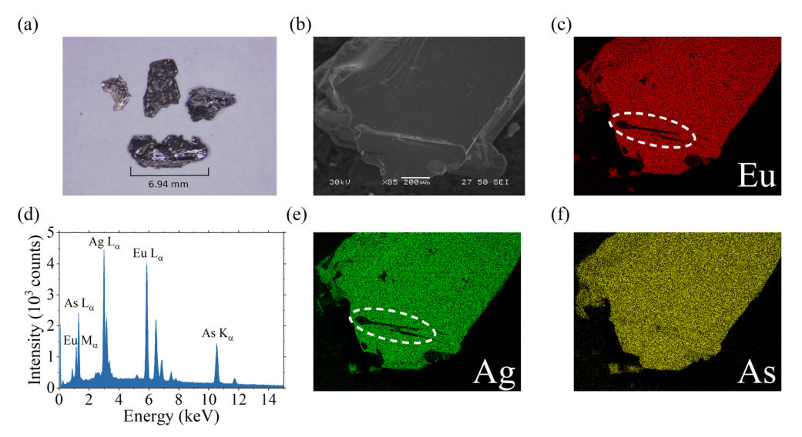 
FIG. 1. (a) Photo of example EuAgAs single crystals, (b) SEM image, (d) EDX spectra, (c), (e) and (f) SEM images of EuAgAs single crystal with individual elemental maps provided by x-ray microanalysis. Reproduced from: K. Podgórska et al., Synthesis of europium-based crystals containing As or P by a flux method: Attempts to grow EuAgP single crystals, Solid State Sciences 158 (2024) 107736, Copyright ©2024 Elsevier Masson SAS. All rights reserved.

📷 Fig 2

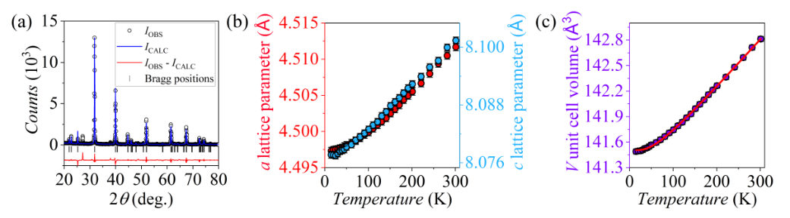 
FIG. 2. Results of x-ray diffraction studies in the temperature range 15-300 K. (a) Rietveld refinement (blue line) of diffraction pattern collected at 300 K with Bragg positions marked by bars, reflection at 27◦of 2θ originates from remains of Bi flux. (b) Temperature dependence of a and c lattice parameters, and (c) the unit cell volume V with fitted Debye’s curve, Eq. 1.

📷 Fig 3

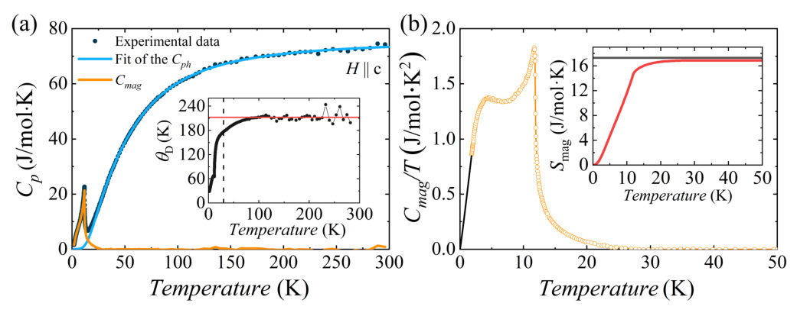 
FIG. 3. (a) Temperature dependence of specific heat Cp (solid points). The solid blue line illustrates the phonon contribution (Cph), which was calculated using Eq. 3. The solid orange line represents the magnetic contribution (Cmag) to the heat capacity determined as a difference between Cp and Cph. The inset shows variation of the equivalent Debye temperatures θD as a function of temperature. The dashed vertical line denotes the temperature above which magnetic contribution to Cp vanishes. A horizontal solid red line represents the fit to the experimental data points above T = 80 K. Panel (b) shows the temperature dependence of Cmag/T (orange points) with extrapolation below 1.84 K (black...

📷 Fig 4

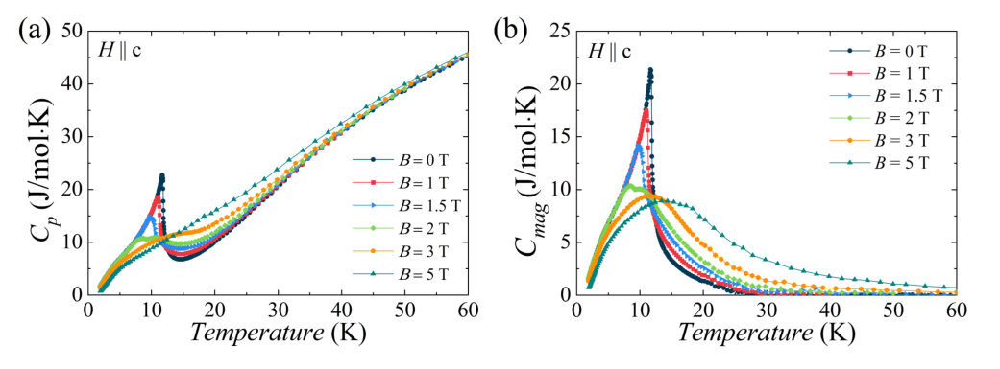 
FIG. 4. Temperature dependence of (a) specific heat capacity Cp and (b) its magnetic contribution Cmag measured at different magnetic fields applied along crystallographic c axis.

📷 Fig 5

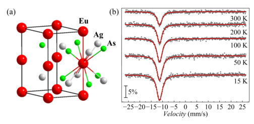 
FIG. 5. a) Unit cell and the local surrounding of Eu in EuA- gAs, (b) 151Eu Mössbauer spectra measured at 300 K, 200 K, 100 K, 50 K, and 15 K, i.e., in the paramagnetic state, with their fits (solid lines).

**Summary.** This work experimentally characterizes the complex magnetic phase diagram of EuAgAs, an antiferromagnetic topological material. Using multiple techniques including magnetometry and heat capacity, the authors confirm antiferromagnetic ordering and reveal several field-induced transitions. The results strongly suggest a noncollinear magnetic structure, making it a valuable system for studying competing magnetic interactions.

**Why it may be interesting.** The investigation into field-induced metamagnetic transitions and the suggestion of noncollinear or skyrmion-like states in a real material provides an excellent experimental benchmark for theoretical models of frustrated magnetism and competing exchange interactions.

Detailed structure

**Main problem.** To thoroughly investigate the structural, magnetic, and local electronic properties of the antiferromagnetic topological material EuAgAs single crystals, clarifying its complex magnetic behavior.

**Main result.** The material exhibits antiferromagnetic ordering below $T_N \approx 12$ K, characterized by pronounced magnetic anisotropy and multiple field-induced metamagnetic transitions, suggesting a noncollinear or potentially skyrmion-like magnetic ground state.

**Method.** A combination of experimental techniques was used, including X-ray diffraction, heat capacity measurements, DC/AC magnetization measurements, and Mössbauer spectroscopy on Eu isotopes.

**Model / system.** The study focuses on EuAgAs, a hexagonal crystal structure ($P6_3/mmc$) rare-earth compound whose magnetic properties are governed by competing magnetic interactions, possibly described by RKKY-type interactions.

**Key observables.** Magnetic susceptibility ($\chi'$ and $\chi''$), heat capacity ($C_p$), lattice parameters ($a, c$), Mössbauer isomer shift ($\delta$), and magnetization ($M$) as a function of temperature and applied magnetic field.

**Important parameters / regimes.** Antiferromagnetic ordering temperature ($T_N \approx 12$ K); effective magnetic moments ($\mu_{\perp c}^{	ext{eff}} \approx 7.24 \mu_B$); Weiss temperature constants ($	heta_{\perp c}^p = 12.16 	ext{ K}$); and critical magnetic fields inducing transitions.

**Assumptions / limitations.** The analysis sometimes approximates $C_p$ by neglecting the electronic contribution, and the identification of exotic phases like skyrmions is based on analogy with other systems, lacking direct confirmation.

**Figures summary.** Figures illustrate XRD results showing lattice parameter changes, heat capacity curves revealing the $T_N$ peak, and magnetic phase diagrams mapping out transitions based on susceptibility and magnetization measurements.

**Paper structure.** The paper systematically analyzes the structure (XRD), thermal properties ($C_p$), and magnetic response (M, $\chi$, Mössbauer) of EuAgAs. It builds a magnetic phase diagram by correlating anomalies in these measurements to identify the magnetic ground state and field-induced transitions.

Abstract

EuAgAs is an antiferromagnetic topological material exhibiting intriguing magnetic behavior. We investigate its structural, magnetic, and local electronic properties using X ray diffraction, Mössbauer spectroscopy, dc magnetization, ac susceptibility, and heat capacity measurements. The results confirm antiferromagnetic ordering below $T_\text{N}$ and reveal pronounced magnetic anisotropy and several field induced metamagnetic transitions. We construct the magnetic phase diagram of EuAgAs, identifying several distinct magnetic regions. The field and temperature dependent behavior observed suggests a noncollinear magnetic structure in the low field regime. The sequence of field induced transitions resembles that observed in centrosymmetric rare earth compounds hosting skyrmion phases, suggesting that competing magnetic interactions may play an important role in stabilizing the observed magnetic states.

[↑ back to top](#top)

### [Information Geometry of Four-Parameter Single-Qutrit States: From Quantum to Semiclassical Geometric Tensors](http://arxiv.org/abs/2609.18558v1)

**Authors:** Xue-xiang Xu, Kai-xu Cai, Xue-feng Zhan, Hong-chun Yuan  
**Type:** theory · **Category:** quantum information and computing · **PDF:** <https://arxiv.org/pdf/2609.18558v1>  
**Analysis basis:** full PDF text, analyzed in chunks
**Topic relevance:** `quantum measurements` **3/5**

📷 Fig 1

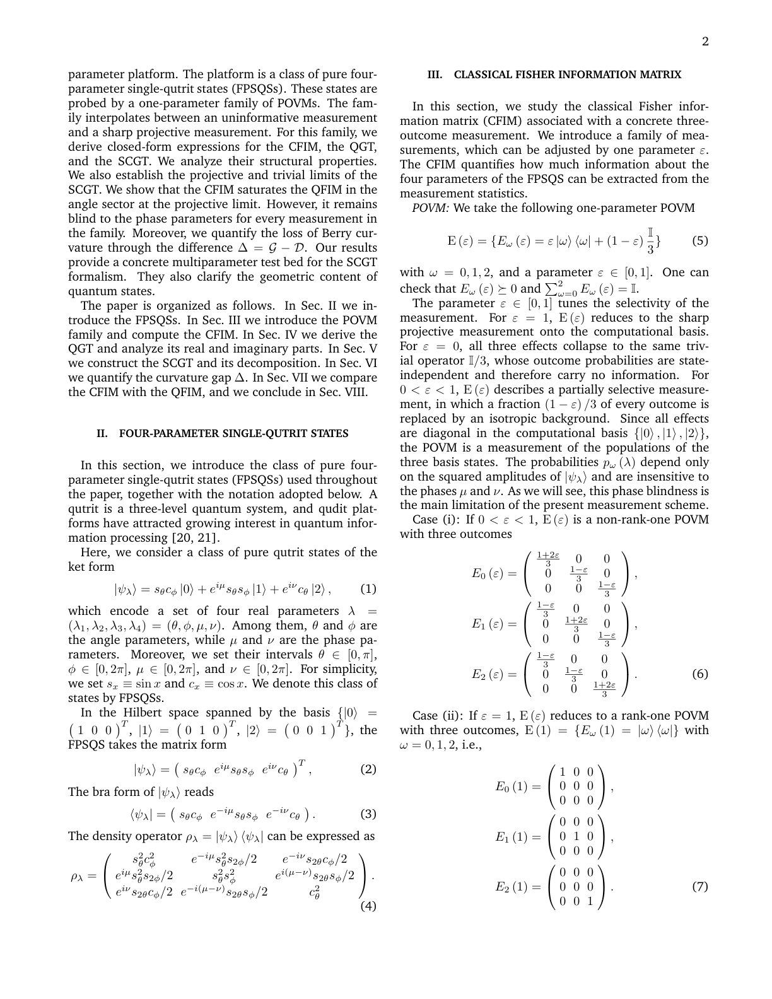 
Low-resolution page preview, page 2

📷 Fig 2

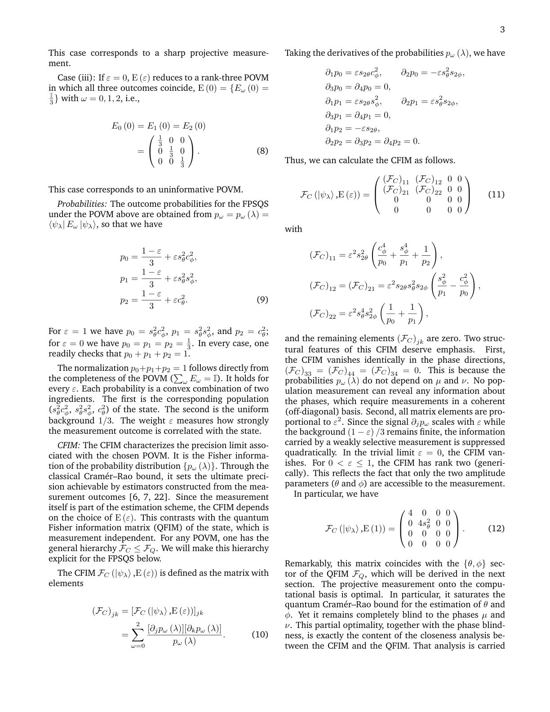 
Low-resolution page preview, page 3

📷 Fig 3

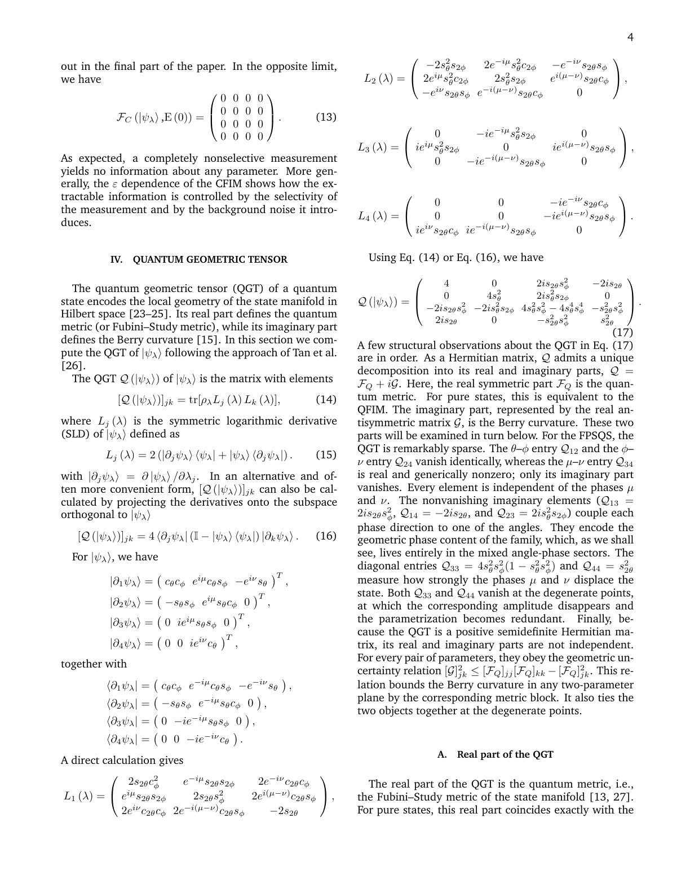 
Low-resolution page preview, page 4

📷 Fig 4

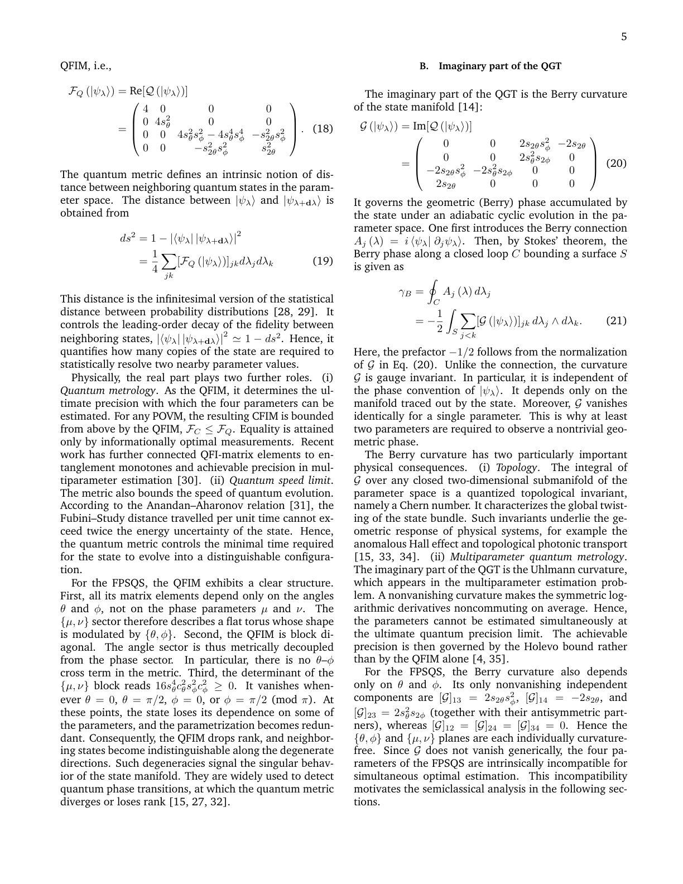 
Low-resolution page preview, page 5

📷 Fig 5

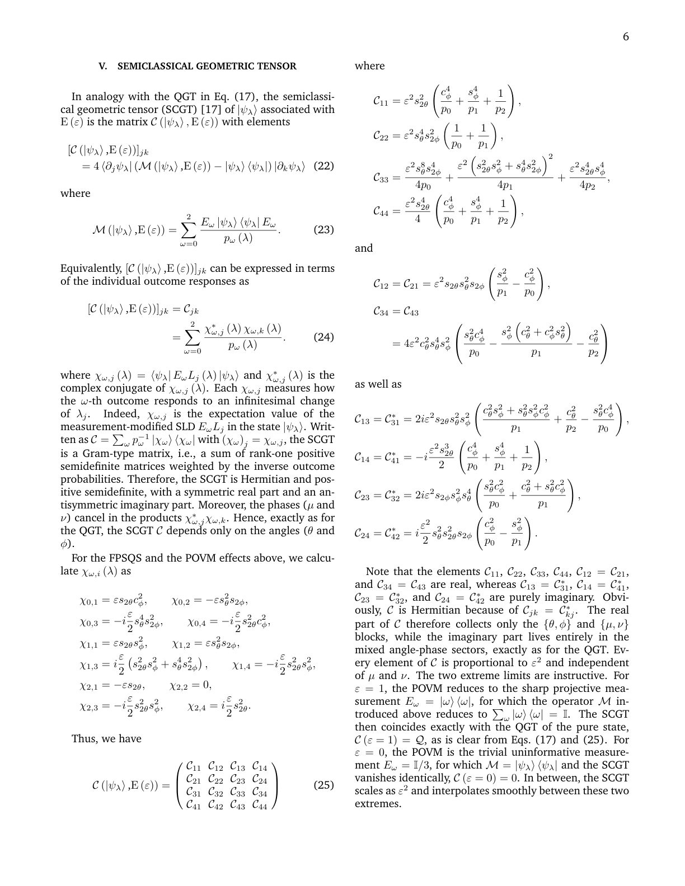 
Low-resolution page preview, page 6

**Summary.** This work performs an information-geometric analysis on four-parameter single-qutrit states to study the relationship between the quantum and classical limits of parameter estimation. By deriving the Semiclassical Geometric Tensor (SCGT), the authors quantify how realistic measurements partially degrade the intrinsic quantum geometric structure. This provides a crucial, solvable model for understanding measurement-induced information loss in quantum systems.

**Why it may be interesting.** It provides an exactly solvable, multi-parameter platform to test fundamental limits in quantum metrology, specifically quantifying the loss of quantum geometric information due to measurement imperfections.

Detailed structure

**Main problem.** The paper investigates the gap between the classical and quantum Fisher information matrices (CFIM and QFIM) in multi-parameter quantum estimation, quantifying how realistic measurements degrade the intrinsic geometric content of quantum states.

**Main result.** The Semiclassical Geometric Tensor (SCGT) was derived, showing that its real part splits into the CFIM and a measurement-transmitted metric, while its imaginary part yields a semiclassical Berry curvature.

**Method.** The study uses Information Geometry to derive closed-form expressions for the CFIM, Quantum Geometric Tensor (QGT), and SCGT for a specific class of quantum states.

**Model / system.** The analysis focuses on pure four-parameter single-qutrit states (FPSQSs), parameterized by $(	heta, \phi, \mu, 
u)$, probed by a one-parameter family of measurements (POVM).

**Key observables.** CFIM, QFIM, QGT, SCGT, and the measurement-dependent gap ($\Delta = G - D$).

**Important parameters / regimes.** The measurement selectivity parameter $\epsilon \in [0, 1]$, and the state parameters $(	heta, \phi, \mu, 
u)$.

**Assumptions / limitations.** The analysis relies on a specific parametrization of the state and the use of a diagonal POVM measurement scheme.

**Figures summary.** Not specified.

**Paper structure.** The paper proceeds by defining the relevant geometric tensors (CFIM, QGT, SCGT) for the FPSQSs, deriving their closed-form expressions, and analyzing their behavior in the limits of projective ($\epsilon=1$) and trivial ($\epsilon=0$) measurements.

Abstract

The gap between the classical and quantum Fisher information matrices (CFIM and QFIM) separates what is operationally accessible through measurements from what is intrinsic to a quantum state. In the multiparameter setting, this quantum obstruction is generically not saturable. Motivated by the recently introduced semiclassical geometric tensor (SCGT), we perform an explicit information-geometric study for a class of pure four-parameter single-qutrit states (FPSQSs). These states are probed by a one-parameter family of measurements that interpolates between an uninformative POVM and a sharp projective measurement. We derive closed-form expressions for the CFIM, the quantum geometric tensor (QGT), and the SCGT. We show that the SCGT reproduces the QGT in the projective limit and vanishes in the trivial limit. The real part of the SCGT splits into two terms: the CFIM and an additional nonnegative measurement-transmitted metric in the phase sector. Its imaginary part provides a semiclassical Berry curvature. Its loss relative to the QGT is quantified by a measurement-dependent gap. Our results provide an exactly solvable four-parameter platform for the semiclassical geometric framework. They also clarify how realistic measurements read out the geometric content of quantum states, and how they partially degrade it.

[↑ back to top](#top)

### [Learning to Program Adaptive Non-Local Observables for Machine Learning](http://arxiv.org/abs/2609.18655v1)

**Authors:** Yu-Ting Lee, Samuel Yen-Chi Chen, Huan-Hsin Tseng  
**Type:** both · **Category:** quantum information and computing · **PDF:** <https://arxiv.org/pdf/2609.18655v1>  
**Analysis basis:** full PDF text, analyzed in chunks
**Topic relevance:** `quantum measurements` **3/5**

📷 Fig 1

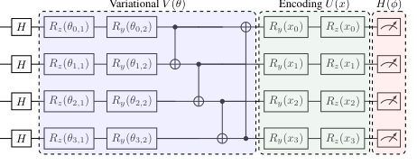 
Fig. 1: VQC architecture of QFWP-ANO. Each layer con- sists parameterized Rz, Ry rotations, circular CNOT gates, and encoding U(x). Trainable k-local observables H(ϕ) are employed for measurement.

📷 Fig 2

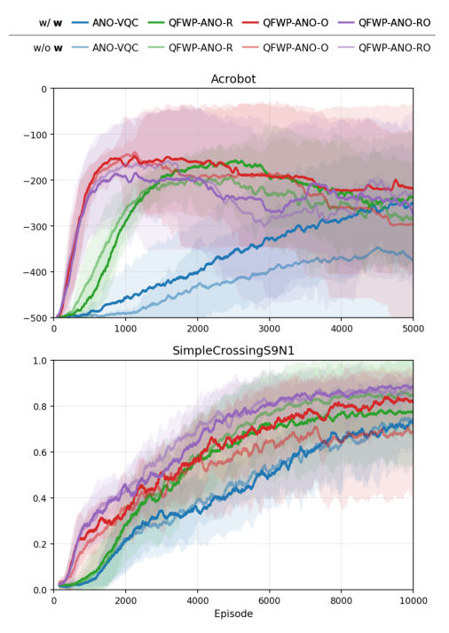 
Fig. 2: Reward over episodes. Band is ± standard deviation.

📷 Fig 3

 
Fig. 2 shows the learning curves, with (dark) and without (light) the trainable input scaling w. In Acrobot, all three QFWP-ANO variants substantially outperform the ANO-VQC baseline from episode 1000 to 4000. Although the models ultimately converge to similar final returns, QFWP-ANO-O and QFWP-ANO-RO reach their peak performance as early as around episode 1000. This early convergence demonstrates that programming the observable effectively improves sample efficiency. In SimpleCrossingS9N1, QFWP-ANO-RO reaches

**Summary.** This paper introduces QFWP-ANO, a novel quantum neural network architecture that uses a classical hypernetwork to dynamically program both the circuit parameters and the non-local measurement observable based on the input data. By enabling input-conditioned adaptive non-local observables, the model significantly enhances QNN performance, achieving state-of-the-art results on both time-series forecasting and reinforcement learning benchmarks.

**Why it may be interesting.** This work directly addresses the hardware-efficient computation bottleneck in quantum machine learning by proposing a structured way to incorporate input-dependent, multi-qubit measurements, which is crucial for realizing quantum advantage in complex data tasks.

Detailed structure

**Main problem.** Variational Quantum Circuits (VQCs) used in Quantum Neural Networks (QNNs) are inherently limited by local measurements, and existing adaptive methods only use static observables.

**Main result.** The proposed QFWP-ANO architecture, which dynamically conditions both VQC parameters and non-local observables on the input, significantly outperforms existing baselines in both multivariate time-series forecasting and reinforcement learning tasks.

**Method.** The authors introduce QFWP-ANO, utilizing a classical hypernetwork to generate input-dependent parameters ($	heta$ and $\phi$) for the VQC and the non-local observable, respectively.

**Model / system.** The model is a QNN built upon VQCs. It processes classical input $x$ through an encoding, a parameterized unitary circuit $V(	heta)$, and a measurement using a trainable, input-conditioned non-local observable $H(\phi)$.

**Key observables.** Mean Squared Error (MSE) and Mean Absolute Error (MAE) for time-series forecasting; final return and sample efficiency for RL tasks.

**Important parameters / regimes.** VQC depth ($D \in \{1, 3\}$), non-locality of the observable ($k \in \{1, \dots, 7\}$), and the specific hypernetwork conditioning mechanism.

**Assumptions / limitations.** The primary assumption is that input-conditioning the non-local observable and circuit parameters via a hypernetwork can overcome the limitations of static, local measurements in QNNs.

**Figures summary.** Figure 1 illustrates the QFWP-ANO VQC architecture. Figure 2 shows learning curves for RL tasks comparing QFWP-ANO variants to baselines. Table 2 summarizes MTSF performance (MSE) across various settings, and Table 3 analyzes performance based on VQC depth and observable non-locality.

**Paper structure.** The paper first establishes the limitations of standard QNNs. It then proposes the QFWP-ANO architecture using a hypernetwork. The methodology is validated through extensive experiments on two distinct tasks: multivariate time-series forecasting (MTSF) and reinforcement learning (RL), comparing performance against multiple state-of-the-art baselines.

Abstract

Quantum neural networks (QNNs) are typically built from variational quantum circuits (VQCs), which are limited by local measurements. Adaptive non-local observables (ANO) address this by jointly optimizing circuit parameters and multi-qubit measurements. However, existing ANO-based VQCs learn only a single static observable that remains invariant across all inputs. We propose QFWP-ANO, a novel architecture which employs a classical hypernetwork to dynamically program VQC parameters and/or non-local observables conditioned on each input. On multivariate time-series forecasting across four ETT datasets, QFWP-ANO achieves the lowest MSE in 16 of 20 settings and second-lowest in the remaining four, surpassing ANO-based and other strong baselines. On reinforcement learning tasks, QFWP-ANO consistently surpasses ANO-VQCs. Our results establish input-conditioned ANO as an effective approach for enhancing QNNs.

[↑ back to top](#top)

### [Progress in quantum telescopes](http://arxiv.org/abs/2609.18079v1)

**Authors:** David R. Gozzard, Fiona H. Panther, Andrew G. White  
**Type:** theory · **Category:** other · **PDF:** <https://arxiv.org/pdf/2609.18079v1>  
**Analysis basis:** full PDF text, analyzed in chunks
**Topic relevance:** `quantum measurements` **3/5**

📷 Fig 1

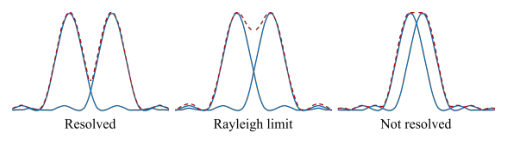 
Figure 1. Illustration of the Rayleigh criterion for resolution of an imaging system. The blue traces depict the intensity profile of the Airy disks resulting from two point sources through the PSF of a telescope. The red dashed trace depicts the summed intensity profile of the two Airy disks. Left-to-right: objects are resolved, objects are at the Rayleigh limit, and objects are unresolved. The Abbe and Sparrow limits are described in Section 1.1.1.

📷 Fig 2

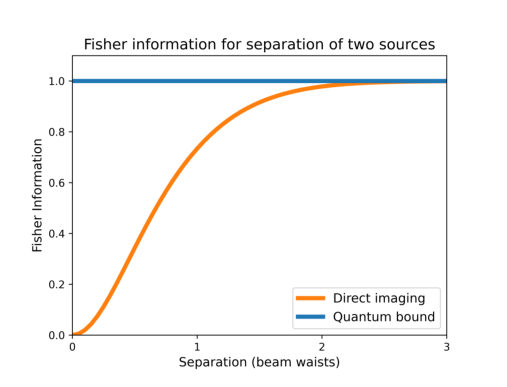 
Figure 2. Fisher information for the separation of two weak thermal sources according to the classical and quantum Cramér-Rao bounds based on (2019a). The separation is given in multiples of the beam waist of the imaging system optics.

📷 Fig 3

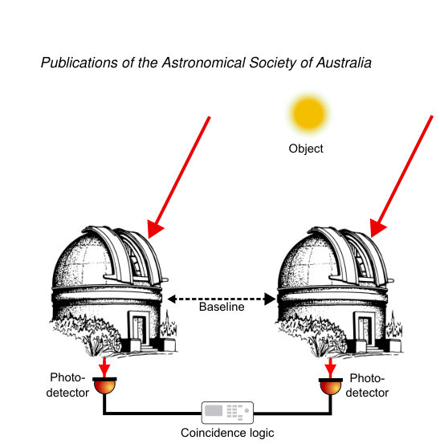 
Figure 3. Generalised schematic of an intensity interferometer based on the Hanbury Brown-Twiss (HBT) effect.

📷 Fig 4

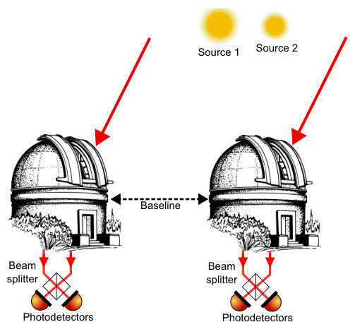 
Figure 4. Generalised schematic of a Stankus-Nomerotski-Slosar-Vintskevich two-photon amplitude interferometer. Two-photon states from two optical sources are interfered at the beam splitter in each observing station. Correlations between the measurements at the two stations determine the source visibility. Measurement data can be transmitted between the stations electronically.

📷 Fig 5

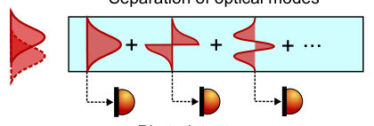 
Figure 5. Generalised schematic of a SPADE imaging system. Each mode is separated and coupled to a separate photon-counting detector.

**Summary.** This review surveys the progress toward building 'quantum telescopes' capable of super-resolution imaging beyond classical diffraction limits. It leverages quantum information theory to show that quantum measurements can extract phase information inaccessible to classical methods. The paper outlines the theoretical advances, technological hurdles, and future vision for revolutionizing astronomical observation.

**Why it may be interesting.** This work bridges quantum information theory (quantum estimation, QCRB) with large-scale physical systems (astronomy/optics), providing a roadmap for quantum enhancement in observational science.

Detailed structure

**Main problem.** The primary challenge is overcoming the classical diffraction limit in telescope angular resolution, which is fundamentally constrained by the ratio of wavelength to aperture diameter.

**Main result.** Quantum information theory suggests that quantum-optimal measurement methods can enable super-resolution imaging, potentially achieving resolutions orders of magnitude better than current observatories.

**Method.** The review details the application of quantum estimation theory, specifically utilizing the Quantum Cramér-Rao Bound (QCRB), to derive fundamental limits on achievable angular resolution.

**Model / system.** The system under study is astronomical imaging using large telescopes across optical and infrared wavelengths. The theoretical framework compares classical direct imaging (DI) with quantum-enhanced measurement protocols.

**Key observables.** Angular resolution, Point Spread Function (PSF), and the achievable precision quantified by the Fisher Information (FI) and QCRB.

**Important parameters / regimes.** Wavelength ($\lambda$), aperture diameter ($D$), and the target resolution approaching one microarcsecond ($1 \mu	ext{as}$).

**Assumptions / limitations.** The analysis assumes that the quantum state of the light field is the only accessible resource, and that quantum measurement techniques can be practically implemented in astronomical settings.

**Figures summary.** Figure 1 illustrates the classical Rayleigh criterion for resolution. Figure 2 compares the Fisher information for source separation using classical vs. quantum Cramér-Rao bounds, showing the quantum advantage.

**Paper structure.** The paper first establishes the classical diffraction limit. It then introduces quantum metrology to derive super-resolution bounds, discusses the theoretical tools (QFI, QCRB), reviews laboratory demonstrations, and concludes with a vision for practical quantum telescopes.

Abstract

Classically, the angular resolution of a telescope is limited by its diffraction limit: the ratio of its observing wavelength to its diameter. Developments in quantum information theory over the past decade have uncovered quantum-optimal measurement methods that enable super-resolution imaging beyond the diffraction limit, and many laboratory-scale demonstrations of these methods have been performed over the past decade, culminating in the recent first on-sky demonstration of quantum-enhanced astronomical imaging. In this Review, we detail the current progress and achievements of these theoretical and experimental results, discuss the astronomical science cases motivating the development of higher resolution telescopes, summarise the technological challenges facing the practical application of quantum imaging technologies to astronomy, and present a vision for the realization of \emph{quantum telescopes} with imaging resolutions orders of magnitude better than current observatories.

[↑ back to top](#top)

### [Quantifying and Bounding Spatiotemporal Correlations in Quantum Noise](http://arxiv.org/abs/2609.17870v1)

**Authors:** Guilherme Zambon, Diogo O. Soares-Pinto  
**Type:** theory · **Category:** quantum information and computing · **PDF:** <https://arxiv.org/pdf/2609.17870v1>  
**Analysis basis:** full PDF text, analyzed in chunks
**Topic relevance:** `correlated / nonlocal dissipation` **3/5**

📷 Fig 1

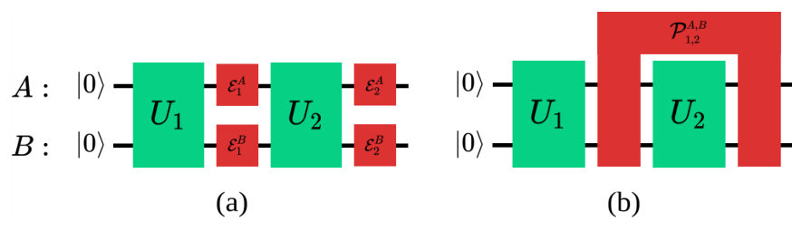 
FIG. 1. Two noise models for a simple circuit. In both cases, the two qubits are initially prepared in the |0⟩state and are subsequently acted upon by a first layer of unitaries represented by U1. Following this initial operation, and prior to the subsequent layer U2, the qubits are subject to noise arising from unwanted interactions with their surroundings. The noise occurs again after U2, such that the final state of the qubits is determined by the joint action of the unitaries and the noise processes. (a) The standard approach to this scenario is to assume the noise is uncorrelated both in space and time, being described by local channels. (b) In general, we might have spatiotemporally...

📷 Fig 2

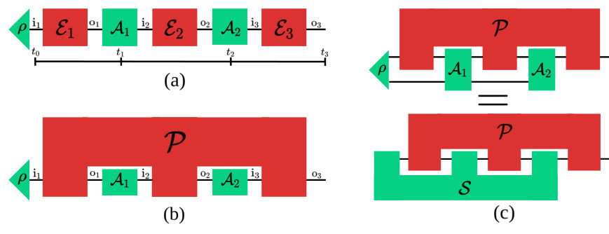 
FIG. 2. (a) Three-step evolution of a quantum system under control operations and Markovian noise. The system is prepared in the state ρ ∈D(Hi1) at time t0 and then is subject to control operations A1 : D(Ho1) →D(Hi2) and A2 : D(Ho2) →D(Hi3) at times t1 and t2, respectively. The interactions with an uncontrolled, yet Markovian, environment between operations are described by the channels Ej : D(Hij) →D(Hoj). The final state ρ′ ∈D(Ho3) of the system is given by ρ′ = E3 ◦A2 ◦E2 ◦A1 ◦E1(ρ). (b) Three-step evolution of a quantum system under control operations and non-Markovian noise. Unlike in the Markovian case, the noise process cannot be described by a set of independent channels. In...

📷 Fig 3

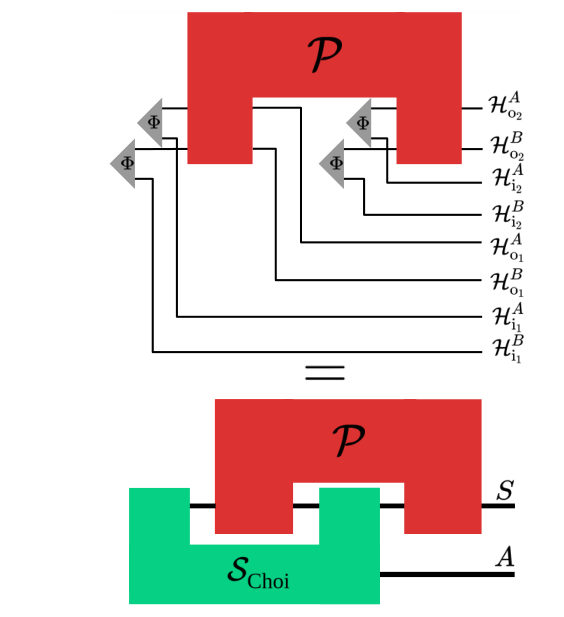 
FIG. 3. Circuit implementing the Choi state of a process tensor P ∈P2 2. Each process input is supplied with one half of a max- imally entangled state, while the corresponding reference systems and process outputs are retained. The resulting deterministic prob- ing comb SChoi ∈S2 produces the normalized process Choi state, P(SChoi) = ΥP. The retained reference systems are included in the output ancilla of the probing comb.

📷 Fig 4

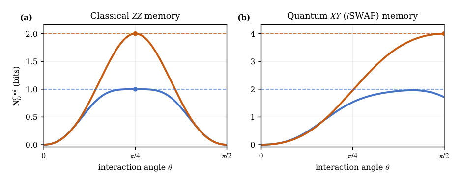 
FIG. 4. Memory-dimension signatures for a two-step process on two system qubits. (a) Relative-entropy Choi temporal correlations for classical ZZ memory. The common dE = 2 memory reaches its one-bit ceiling, while the two independent memories reach the dE = 4 ceiling of two bits. (b) Corresponding results for quantum XY exchange. The common memory crosses the classical ceiling and approaches the two-bit quantum ceiling. Two independent iSWAPs reach four bits at θ = π/2, saturating both the dE = 4 environment bound and the universal dS = 4 system ceiling. Dashed lines show the classical- and quantum-memory bounds; at four bits, the dE = 4 quantum-memory bound coincides with the system...

📷 Fig 5

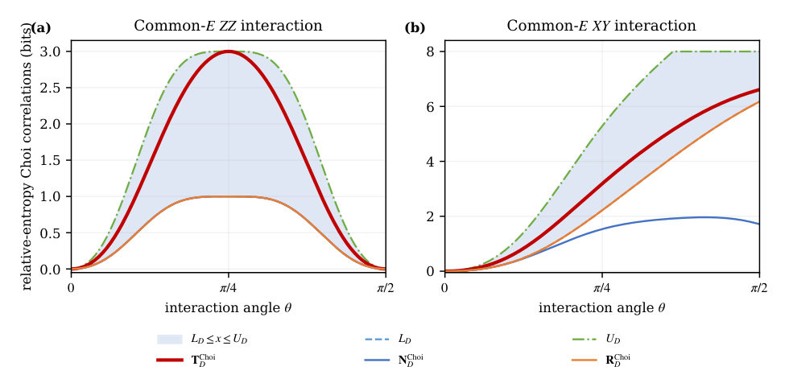 
FIG. 5. Relative-entropy Choi interpolation bounds for the two-step, two-qubit common-environment models. The thick red curve shows the total Choi correlations TD, while the shaded interval is bounded below by LD = max{ND, RD} and above by UD = min{ND+2RD, RD+ 2ND, 8}. The temporal and spatial Choi correlations are also shown separately. Panels (a) and (b) correspond to the common-E ZZ and XY interactions, respectively. In panel (a) we have ND = RD = LD. The total correlations lie inside the predicted interval for every interaction angle.

**Summary.** This paper introduces a unified, operational framework to quantify and bound complex spatiotemporal correlations in quantum noise processes. By defining correlations through optimal distinguishability from idealized noise models, the authors derive dimension-dependent upper bounds. These bounds are powerful diagnostic tools, enabling the certification of minimum memory dimensions and the detection of flawed process assumptions in quantum devices.

**Why it may be interesting.** This work provides rigorous, resource-theoretic tools to characterize the complexity of noise in quantum hardware, which is crucial for designing fault-tolerant quantum memories and processors.

Detailed structure

**Main problem.** The paper addresses the challenge of quantifying and bounding spatiotemporal correlations present in quantum noise, which invalidate simple local Markovian models used in quantum information processing.

**Main result.** A unified operational framework is established that provides dimension-dependent upper bounds on temporal correlations, allowing these bounds to certify minimum memory dimensions or detect model inconsistencies.

**Method.** The authors develop a framework using process tensors and define correlations via optimal distinguishability measures (like Choi divergences) from idealized process sets (Markovian, local, uncorrelated).

**Model / system.** The theory is illustrated using effective superconducting-qubit models featuring ZZ and XY interactions, allowing for concrete testing of the derived bounds.

**Key observables.** Temporal, spatial, and total spatiotemporal correlations; minimum memory dimension; nonclassicality under memory constraints.

**Important parameters / regimes.** System dimension; interaction types (ZZ, XY); probing comb structure.

**Assumptions / limitations.** The framework aims to overcome limitations of existing Choi-state divergences by using optimal operational distinguishability measures.

**Figures summary.** Figure 1 compares standard, uncorrelated noise models against general spatiotemporally correlated noise using process tensors.

**Paper structure.** The paper builds from defining the general process tensor representation for multitime/multisystem noise, introduces the operational correlation functionals via Choi divergences, and then derives and tests the bounding relations using specific qubit models.

Abstract

Spatial and temporal correlations in quantum noise challenge the local Markovian models commonly used in quantum information processing. We develop a unified operational framework for quantifying temporal, spatial, and total spatiotemporal correlations in general quantum processes. Using process tensors, we define these quantities through optimal distinguishability from Markovian, spatially local, and fully uncorrelated processes. Optimization over admissible probing combs ensures monotonicity under every superprocess that preserves the corresponding free set, while Choi-state functionals and restricted probes provide accessible lower bounds. We establish hierarchy and interpolation relations among the correlation measures and derive dimension-dependent upper bounds on temporal correlations transmitted by quantum memories, with tighter bounds for classical memory, together with universal ceilings imposed by the system dimension. These bounds turn certified lower estimates into witnesses of minimum memory dimension, nonclassicality under a memory-dimension constraint, and inconsistencies in the assumed process model. We illustrate the results with effective superconducting-qubit models featuring \(ZZ\) and \(XY\) interactions, exhibiting saturation of classical-memory, quantum-memory, and system-dimension ceilings. These results pave the way toward practical approaches to characterizing and addressing spatiotemporally correlated errors in quantum devices.

[↑ back to top](#top)

### [Quantum Behaviors Are Not Semialgebraic](http://arxiv.org/abs/2609.18865v1)

**Authors:** Minbo Gao, Zhengfeng Ji, Chenghua Liu  
**Type:** theory · **Category:** quantum information and computing · **PDF:** <https://arxiv.org/pdf/2609.18865v1>  
**Analysis basis:** full PDF text, analyzed in chunks
**Topic relevance:** `quantum measurements` **3/5**

📷 Fig 1

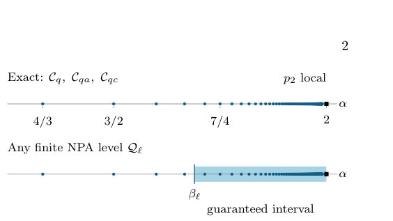 
FIG. 1. Exact and relaxed realizability along the quadratic curve pα. Top: all three models share the parameters αm = 2 −2/m, accumulating at the classical endpoint p2 (square). Bottom: every finite NPA level contains a tail interval (βℓ, 2) (shaded). All other parameters in that interval lie outside even Cqc. Only finitely many exact points are drawn; βℓis schematic. Figure drawn with Codex-assisted TikZ code.

**Summary.** This theoretical paper proves that the set of quantum correlations achievable via local measurements in a Bell test is fundamentally nonsemialgebraic. By analyzing a specific family of quantum behaviors parameterized by $\alpha$, the authors show that these sets cannot be described by any finite combination of polynomial equations and inequalities. This result has major implications for understanding the mathematical structure of quantum nonlocality.

**Why it may be interesting.** This work establishes fundamental mathematical limitations on the description of quantum correlations, showing that they cannot be captured by simple polynomial inequalities, which has implications for characterizing quantum resources.

Detailed structure

**Main problem.** The paper addresses whether the set of quantum behaviors achievable by local measurements in a Bell scenario is semialgebraic, a long-standing open question in quantum foundations.

**Main result.** The set of quantum behaviors, its closure, and the commuting-operator set are proven to be nonsemialgebraic for the four-input, binary-output scenario.

**Method.** The proof uses contradiction, constructing a specific quadratic curve $p_\alpha$ whose parameters $\alpha$ must belong to a discrete, infinite set, which contradicts the assumption that the set is semialgebraic.

**Model / system.** The model is the set of quantum correlations derived from local measurements on a shared quantum state (Bell scenario). The analysis focuses on the structure of these achievable conditional probabilities.

**Key observables.** The set of quantum behaviors ($C_q$), its closure ($C_{qa}$), and the commuting-operator set ($C_{qc}$), parameterized by $\alpha$.

**Important parameters / regimes.** The number of local measurements (four binary measurements per party) and the parameter $\alpha \in (1, 2)$, which governs the deviation from classicality.

**Assumptions / limitations.** The results rule out exact finite semidefinite representations and show that no finite level of the Navascués-Pironio-Acín (NPA) hierarchy characterizes these sets exactly.

**Figures summary.** Figure 1 illustrates the intersection of the constructed curve $p_\alpha$ with the quantum behavior sets at points $\alpha_m = 2 - 2/m$, showing accumulation at the classical endpoint $p_2$.

**Paper structure.** The paper proceeds by defining the quantum behavior sets, constructing a specific curve $p_\alpha$ passing through points corresponding to discrete $\alpha_m$, and then using the properties of semialgebraic sets to derive a contradiction based on the infinite nature of the required points.

Abstract

The conditional probabilities achievable by local measurements on a shared quantum state in a Bell scenario form the set of quantum behaviors, whose structure was studied by Tsirelson. In 1993, Tsirelson asked whether this set is semialgebraic, that is, describable by finite Boolean combinations of polynomial equations and inequalities. This question has remained open. We answer it in the negative: with four binary measurements per party, the set of finite-dimensional quantum behaviors, its closure, and the commuting-operator set are all nonsemialgebraic. More strongly, none admits a finite real-analytic description even locally near a particular classical behavior. These results rule out exact finite semidefinite representations and show that no finite level of the Navascués-Pironio-Acín hierarchy characterizes these sets exactly.

[↑ back to top](#top)

### [Remote Adiabatic Controlled-Z Gate between Distant Superconducting Qubits](http://arxiv.org/abs/2609.18081v1)

**Authors:** Si-Yu Xu, Yi-Rong Jin, Wen-Gang Zhang, Hai-Feng Yu  
**Type:** theory · **Category:** quantum information and computing · **PDF:** <https://arxiv.org/pdf/2609.18081v1>  
**Analysis basis:** full PDF text, analyzed in chunks
**Topic relevance:** `QC/QI experiment` **3/5**

📷 Fig 1

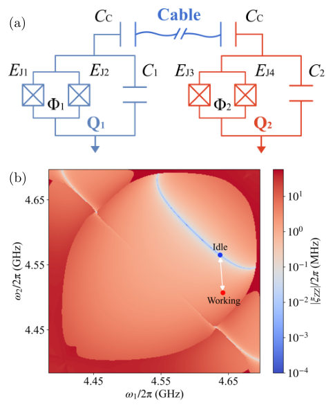 
FIG. 1: (a) Equivalent circuit diagram of two spatially separated, frequency-tunable transmons (Q1, light blue; Q2, red) coupled remotely via a coaxial cable (dark blue). (b) |ξZZ| for a cable length LC = 30 cm. The modes adjacent to the qubit frequencies are m = 14 and 15, and the simulation includes modes m = 10, . . . , 19. The white arrow indicates the frequency tuning path from the idle point (blue dot) to the working point (red dot).

📷 Fig 2

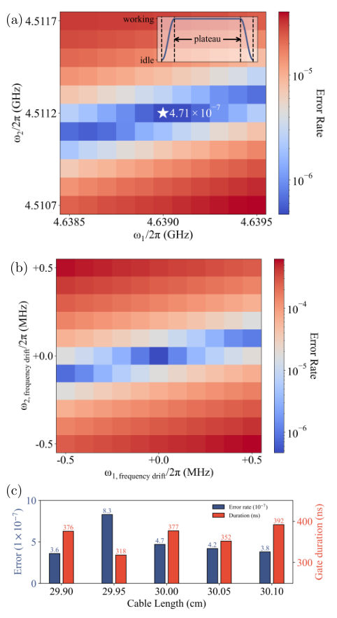 
FIG. 2: (a) Optimized gate infidelity as a function of the two-qubit working frequencies. The gate duration is optimized independently at each frequency point. The minimum infidelity of 4.71 × 10−7 is obtained at (4.6390, 4.5112) GHz. The inset shows the control pulse. (b) Gate infidelity under qubit-frequency fluctuations of up to ±0.5 MHz, with the pulse amplitudes and gate duration fixed and only the single-qubit phases re-calibrated. (c) Optimized gate infidelity (left axis, blue bars) and gate duration (right axis, red bars) as functions of the cable length, sampled over 30.00 ± 0.10 cm at intervals of 0.5 mm. The qubit working point is re-optimized at each cable length.

📷 Fig 3

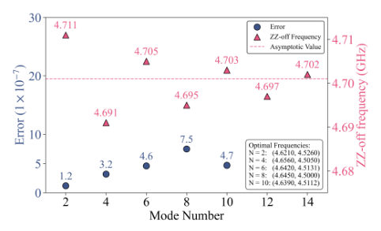 
FIG. 3: The ZZ-off frequency (pink triangles) at ω1 = ω2 converges as the number of cable modes increases. Working points with gate infidelity below 10−6 are found for mode numbers of 2, 4, 6, 8, and 10, while incorporating more cable modes increases the computation cost. The inset shows the optimal working points for different mode numbers.

📷 Fig 4

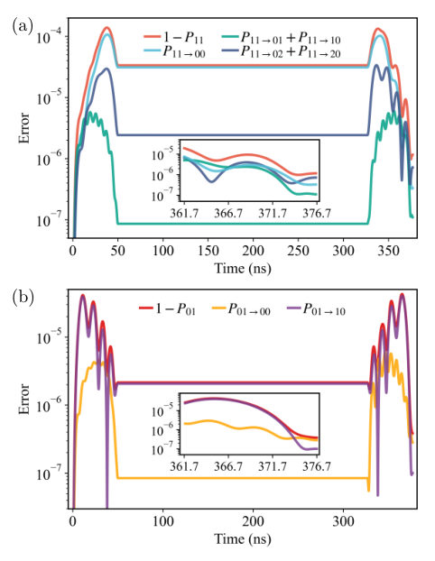 
FIG. 4: (a) Time evolution of population-transfer error for the |f 11⟩initial state. ε11 = 1 −P11 (red) is decomposed into leakage to non-computational qubit states P02 + P20 (dark blue), transfer to |f 01⟩/|f 10⟩with one cable photon P01 + P10 (teal), and transfer to |f 00⟩with two cable photons P00 (light blue). The inset magnifies the final 15 ns. (b) Time evolution of population-transfer error for the |f 01⟩initial state. ε01 = 1 −P01 (red) consists of leakage to |f 00⟩with one cable photon P00 (yellow) and swap error P10 (purple). The inset magnifies the final 15 ns.

**Summary.** This paper proposes and numerically verifies a method to execute a high-fidelity Controlled-Z gate between distant superconducting qubits using only a coaxial cable connection. By adiabatically tuning the qubits' frequencies, they mediate the interaction without needing extra couplers. The results show the gate is highly robust and scalable to larger cryogenic systems, advancing modular quantum computing architectures.

**Why it may be interesting.** The work provides a concrete, hardware-agnostic protocol for long-range quantum entanglement, which is crucial for scaling quantum computation beyond single chips and connecting modular quantum processors.

Detailed structure

**Main problem.** The paper addresses the critical need for implementing high-fidelity, remote entangling gates, specifically the Controlled-Z gate, between physically separated superconducting qubits.

**Main result.** They achieved a gate infidelity of $4.71 	imes 10^{-7}$ for a 30 cm cable, demonstrating a scalable approach for interconnected superconducting quantum processors.

**Method.** The gate is implemented adiabatically by tuning qubit frequencies to mediate an interaction via a multi-mode coaxial cable, avoiding the need for additional tunable couplers.

**Model / system.** The system consists of two frequency-tunable transmon qubits coupled by a multi-mode coaxial cable. The dynamics are governed by a Hamiltonian involving qubit and cable mode operators, analyzed via time-dependent evolution.

**Key observables.** Gate infidelity, population-transfer error, and the total adiabaticity factor.

**Important parameters / regimes.** Cable length (30 cm, 50 cm, 100 cm), gate duration (376.7 ns), and qubit frequency fluctuations ($\pm 0.5$ MHz).

**Assumptions / limitations.** The analysis assumes the ability to compensate for single-qubit dynamical phases via virtual-Z rotations and relies on careful truncation of the cable's infinite mode spectrum.

**Figures summary.** Figures illustrate the optimized gate infidelity vs. working point, robustness against frequency fluctuations and cable length variations, and the time evolution of the adiabaticity factor across different operational stages.

**Paper structure.** The paper details the Hamiltonian formulation, the adiabatic gate implementation protocol (fall-plateau-rise), optimization of the working point, and rigorous analysis of gate fidelity and robustness against environmental and fabrication imperfections.

Abstract

Direct entangling gates between spatially separated qubits are a key capability for modular quantum computing. They enable nonlocal quantum circuits to be executed across different processor modules, thereby alleviating single-chip scaling constraints and expanding the effective connectivity of the system. Here, we propose and numerically investigate a remote adiabatic controlled-Z gate between two frequency-tunable superconducting qubits connected by a multi-mode coaxial cable. The cable-mediated interaction enables the gate to be implemented without additional tunable couplers, preserving a simple circuit architecture. For a 30-cm cable, simulations incorporating ten standing-wave modes yield an optimized gate infidelity of $4.71\times10^{-7}$ with a duration of 376.7 ns in the absence of decoherence. The gate maintains high fidelity under qubit-frequency fluctuations and millimeter-scale cable-length variations. Calculations for 50- and 100-cm cable situations demonstrate its potential for even larger cryogenic systems. These results provide a promising approach to extending high-fidelity quantum operations beyond individual chips and toward scalable, interconnected superconducting quantum processors.

[↑ back to top](#top)

### [Thermal entanglement on a frustrated tetrahedron: Probing quantum resources through concurrence and stabilizer structure](http://arxiv.org/abs/2609.18721v1)

**Authors:** Reza Pourkhodabakhshi, Francis Dominie, Deep Gajera, Stephanie H. Curnoe  
**Type:** theory · **Category:** other · **PDF:** <https://arxiv.org/pdf/2609.18721v1>  
**Analysis basis:** full PDF text, analyzed in chunks
**Topic relevance:** `analog quantum simulation` **3/5**

📷 Fig 1

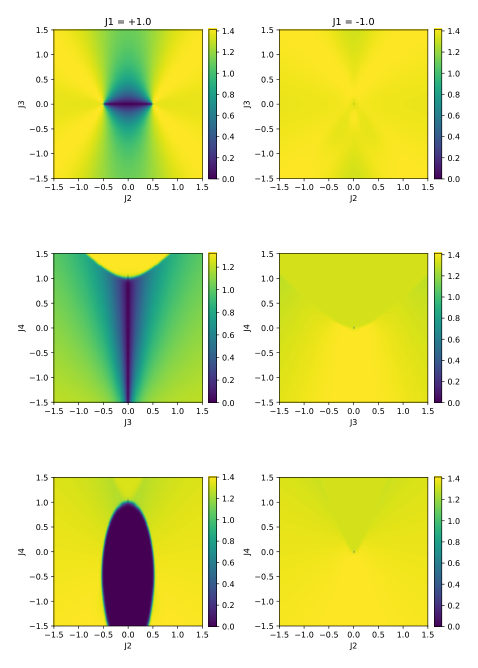 
FIG. 1. Optimized concurrence Cs at T = 0.01. Left column J1 = +1, right column J1 = −1; rows scan the (J2, J3), (J3, J4) and (J2, J4) planes with the third coupling set to zero.

📷 Fig 2

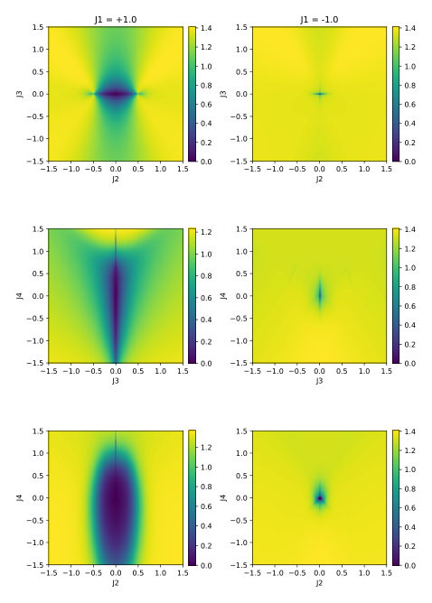 
FIG. 2. Optimized concurrence Cs at T = 0.1. Left column J1 = +1, right column J1 = −1; rows scan the (J2, J3), (J3, J4) and (J2, J4) planes with the third coupling set to zero.

📷 Fig 3

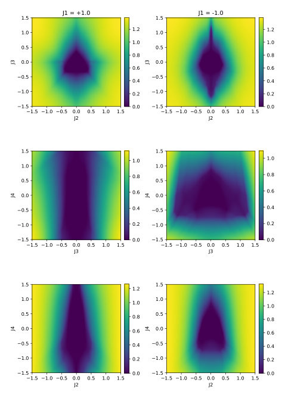 
FIG. 3. Optimized concurrence Cs at T = 0.5. Left column J1 = +1, right column J1 = −1; rows scan the (J2, J3), (J3, J4) and (J2, J4) planes with the third coupling set to zero.

📷 Fig 4

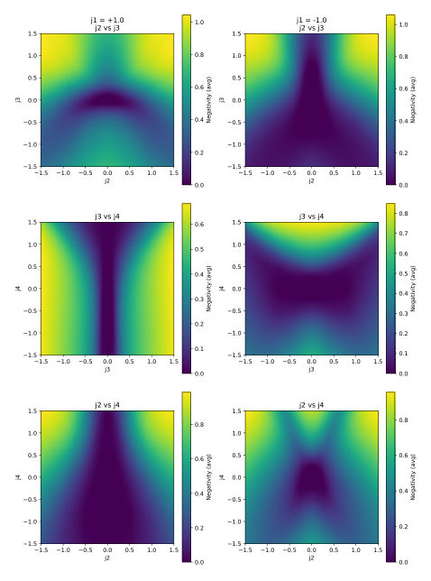 
FIG. 5. Average negativity ¯ N at T = 0.2. Column/row layout identical to the concurrence figures (left J1 = +1, right J1 = −1; rows scan (J2, J3), (J3, J4), (J2, J4) with the third coupling set to zero).

📷 Fig 5

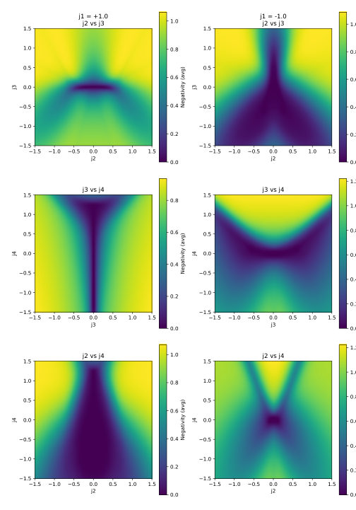 
FIG. 4. Average negativity ¯ N at T = 0.1. Column/row layout identical to the concurrence figures (left J1 = +1, right J1 = −1; rows scan (J2, J3), (J3, J4), (J2, J4) with the third coupling set to zero).

**Summary.** This paper investigates thermal entanglement in a frustrated spin system modeled on a tetrahedron using a general exchange Hamiltonian. By employing symmetry-guided linear optimization, the authors calculate an upper bound on multipartite concurrence for the thermal state. The results demonstrate that entanglement diagnostics reveal complex temperature dependencies, providing a practical tool to study quantum resources in magnetic materials away from absolute zero.

**Why it may be interesting.** The work provides a rigorous, quantitative framework for assessing quantum resources (entanglement) in realistic, geometrically frustrated magnetic materials beyond the zero-temperature ground state limit, which is crucial for understanding quantum magnetism.

Detailed structure

**Main problem.** The study aims to distinguish between highly entangled quantum eigenstates and separable thermal mixtures in frustrated quantum spin systems.

**Main result.** The analysis shows that thermal entanglement can be robustly quantified using optimized concurrence bounds, revealing how entanglement persists or vanishes as temperature changes relative to the ground state structure.

**Method.** The authors employ linear optimization, guided by tetrahedral symmetry, to find an upper bound on multipartite concurrence for the thermal density matrix, comparing this to other diagnostics like negativity and a stabilizer Rényi diagnostic.

**Model / system.** The system is four spin-1/2 moments arranged on a tetrahedron, the fundamental unit of the pyrochlore lattice. The dynamics are governed by a general four-parameter exchange Hamiltonian.

**Key observables.** Multipartite concurrence ($C_s$), negativity ($ar{N}$), and the mixed-state stabilizer Rényi diagnostic ($f_{M2}$).

**Important parameters / regimes.** Temperature ($T$), and the coupling parameters ($J_1, J_2, J_3, J_4$) defining the Hamiltonian.

**Assumptions / limitations.** The analysis relies on symmetry constraints to simplify the complex thermal state decomposition problem into a solvable linear optimization problem.

**Figures summary.** Figures illustrate the optimized concurrence bound ($C_s$) across different coupling planes and temperatures, showing how null regions (separability) evolve from sharp points at low T to broader regions at higher T. They also compare $C_s$, $ar{N}$, and $f_{M2}$ values.

**Paper structure.** The paper systematically analyzes the thermal state entanglement by first establishing the model and symmetry constraints, then applying linear optimization to calculate the concurrence bound, and finally comparing this result against other entanglement diagnostics across varying temperature and coupling regimes.

Abstract

In a frustrated spin system, highly entangled eigenstates can form a separable thermal mixture. We study this distinction for four spin-$1/2$ moments on a tetrahedron, the elementary unit of the pyrochlore lattice, with the general four-parameter exchange Hamiltonian. Tetrahedral symmetry allows a restricted search over thermal-state decompositions to be carried out by linear optimization, yielding an upper bound on multipartite concurrence and explicit separable decompositions where this bound vanishes. At low temperature, the concurrence maps show extended separable regions near the all-in--all-out limit, whereas suppression near the spin-ice point is narrowly localized. Heating broadens the latter region as nearby multiplets are repopulated. The optimization identifies fully separable thermal states even when the eigenstate-averaged concurrence remains large. Negativity independently confirms finite-temperature entanglement in selected coupling regions. A mixed-state stabilizer Rényi diagnostic, used to explore quantum magic, favours different couplings and can increase locally with temperature. These results connect thermal entanglement to the splitting and population of symmetry multiplets, and provide a practical basis for identifying frustrated spin configurations for studies of quantum resources beyond the ground-state limit.

[↑ back to top](#top)

### [Brownian motion with geometry-dependent hydrodynamic memory](http://arxiv.org/abs/2609.17678v1)

**Authors:** Benjamin Sorkin, Günther Turk, Howard A. Stone  
**Type:** theory · **Category:** statistical mechanics · **PDF:** <https://arxiv.org/pdf/2609.17678v1>  
**Analysis basis:** full PDF text, analyzed in chunks
**Topic relevance:** `Keldysh / 2PI / non-Gaussian methods` **2/5** · `correlated / nonlocal dissipation` **2/5** · `methods for driven-dissipative` **2/5** · `Frenkel-Kontorova` **1/5** · `analog quantum simulation` **1/5** · `driven-dissipative phase transition` **1/5** · `non-equilibrium universality` **1/5** · `quantum measurements` **1/5** · `scars & prethermalization` **1/5**

📷 Fig 1

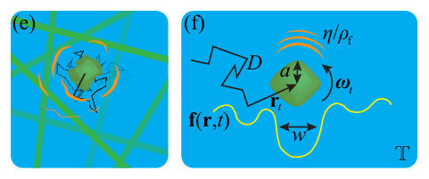 
FIG. 1. Illustration of systems to which we envision an application of our formalism. (a) Freely diffusing particle in an infinite fluid. (b) An optically trapped particle in an infinite fluid. (c) Colloid within a confined fluid. (d) A nonspherical active particle subject to wetting. (e) A nonspherical particle diffusing in a viscoelastic medium. We are especially interested in the diffusion of vorticity through the fluid (indicated by orange arcs), which must be compared to the particle diffusion (illustrated trajectories) to assess the importance of Bas- set memory. (f) Key system parameters: We investigate the particle time-dependent positional rt and solid-angle ωt dynamics. The col-...

📷 Fig 2

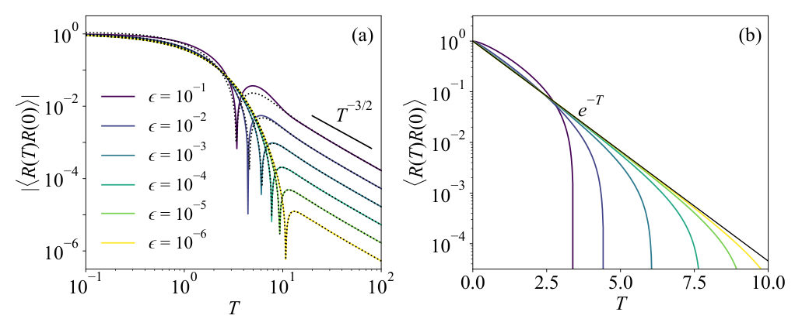 
FIG. 2. Absolute value of the positional autocorrelation |⟨RT R0⟩| versus time for a harmonically trapped spherical colloid on (a) log-log and (b) log-linear plots. Solid curves show the full spectral result, Eq. (19); dashed curves show the leading-order √ϵ approximation, Eq. (20). The T −3/2 guide in (a) highlights the late-time hydrodynamic-memory tail. The e−T guide in (b) shows that for smaller ϵ the exponential fits remain accurate for a longer time.

**Summary.** This paper develops a comprehensive theoretical framework to model the Brownian motion of colloids in complex fluids, moving beyond simple Stokes drag. By employing the Lorentz reciprocal theorem and stochastic expansions, the authors derive the full equation of motion, which incorporates a non-trivial hydrodynamic memory term. This work is significant for accurately describing particle dynamics in confined or structured environments.

**Why it may be interesting.** While focused on classical hydrodynamics, the rigorous derivation of memory effects and the transition between dynamical regimes (underdamped to overdamped) using advanced stochastic methods provides powerful mathematical tools applicable to open quantum systems where memory kernels are crucial.

Detailed structure

**Main problem.** Developing a theoretical framework to derive closed-form equations of motion for colloids in complex geometries, accurately capturing hydrodynamic memory effects beyond simple Stokes friction.

**Main result.** The framework yields a generalized Langevin equation containing both steady-Stokes friction and a Basset-like hydrodynamic memory kernel, applicable to both underdamped and overdamped limits.

**Method.** The authors use the Lorentz reciprocal theorem and stochastic Taylor expansions to derive the equations of motion from the underlying fluid-flow problem, particularly focusing on the small-$\epsilon$ expansion for the overdamped limit.

**Model / system.** The system models micron-sized particles (colloids) undergoing Brownian motion in a fluid, considering viscous resistance, thermal fluctuations, and momentum conservation effects leading to hydrodynamic memory.

**Key observables.** Colloidal equation of motion (Langevin equation), hydrodynamic memory contribution (Basset-like term), velocity autocorrelation and diffusivity decay (power-law decay).

**Important parameters / regimes.** The inverse Schmidt number ($	ext{Sc}^{-1}$), which controls the transition to the overdamped limit; the ratio of colloid/fluid densities ($\kappa$).

**Assumptions / limitations.** The derivation assumes that colloid inertia is negligible at large diffusion distances for the overdamped limit, and that hydrodynamic corrections are small ($	heta \ll 1$).

**Figures summary.** Figure 1 illustrates various application systems, including free diffusion, optical trapping, confined fluids, and viscoelastic media, demonstrating the breadth of the formalism's applicability.

**Paper structure.** The paper builds from the general force balance equation to derive the full Langevin equation using the Lorentz reciprocal theorem. It then systematically derives the overdamped limit via small-$\epsilon$ expansion, confirming the emergence of the Basset memory term and a spurious drift.

Abstract

Micron-sized particles moving through a fluid are subject to viscous resistance and thermal fluctuations. Beyond steady Stokes friction, colloids also exhibit hydrodynamic memory effects arising from conservation laws of the surrounding fluid. Although fluid-flow problems in complex geometries and confinements are often highly involved, numerical or approximate solutions can be obtained; translating these solutions into closed-form equations of motion for individual colloids, however, is rarely possible. Here, we develop a theoretical framework that provides both underdamped and overdamped colloidal dynamics from the solution of an arbitrary flow problem: (i) Using the Lorentz reciprocal theorem, we express the colloidal equation of motion in terms of the geometry's Green's function and the fluid-flow profile. This formulation yields both the corresponding Stokes drag as well as a Basset-like hydrodynamic memory contribution. (ii) As colloid inertia is often negligible, we furthermore derive the corresponding overdamped (colloid-inertia-less) limit, which inherits the Stokes and Basset-like resistances and additionally gives rise to a spurious drift. We propose applications of this framework to passive and active particles subject to involved confinements and problem geometries.

[↑ back to top](#top)

### [Entropy Estimates from Stochastic Interpolants](http://arxiv.org/abs/2609.18093v1)

**Authors:** Phillip M. Rauscher  
**Type:** theory · **Category:** statistical mechanics · **PDF:** <https://arxiv.org/pdf/2609.18093v1>  
**Analysis basis:** full PDF text, analyzed in chunks
**Topic relevance:** `Keldysh / 2PI / non-Gaussian methods` **2/5** · `analog quantum simulation` **2/5** · `methods for driven-dissipative` **2/5** · `correlated / nonlocal dissipation` **1/5** · `driven-dissipative phase transition` **1/5** · `non-equilibrium universality` **1/5** · `quantum measurements` **1/5**

📷 Fig 1

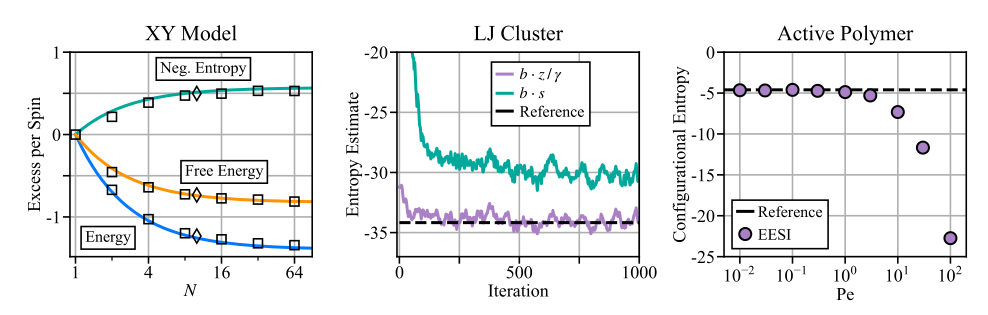 
FIG. 1. Experimental results. Left: Excess energy (blue), negative entropy (teal), and free energy (orange) per spin for the classical XY model with varying N. The models were trained from data with N = 10 (diamonds) and then used to estimate properties for other values (squares). Middle: On-the-fly entropy estimates (smoothed) for the 13-particle Lennard-Jones cluster, showing the convergence of Eq. 9 (teal) and Eq. 13 (violet) to the thermodynamic integration reference value (dashed black) during fine-tuning of a pre-trained model [17]. Right: Estimated configurational entropy for a tangentially active polymer (violet) with varying activity (Péclet number). The dashed black line is the Pe =...

📷 Fig 2

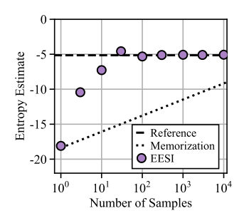 
FIG. 2. Entropy estimates obtained for the XY model with varying training data size. The dashed black line is the analytical result while the dotted line is the expected result in the case of memorization. All results are relative to the ideal (uniform) distribution and are expressed in nats.

**Summary.** This paper presents a general and computationally efficient method to estimate the entropy difference between any two probability distributions using stochastic interpolants. By reformulating the calculation in terms of the inner product of the probability flow velocity and the score field, it bypasses difficult divergence calculations. This technique is highly valuable for calculating non-equilibrium entropies in complex physical systems, ranging from classical spin models to active matter.

**Why it may be interesting.** While the core focus is on classical statistical mechanics, the reliance on stochastic differential equations and flow modeling connects deeply with modern techniques used in quantum dynamics and open quantum systems, particularly those involving non-equilibrium processes.

Detailed structure

**Main problem.** The paper addresses the general problem of estimating entropy differences between two arbitrary probability distributions ($
ho_0$ and $
ho_1$) characterizing physical systems.

**Main result.** It derives an efficient formula for the entropy difference ($\Delta S$) based on the inner product of the probability flow velocity ($\mathbf{b}$) and the score field ($\mathbf{s}$), avoiding computationally expensive divergence calculations.

**Method.** The method utilizes stochastic interpolants governed by a continuity equation to define a continuous path between the base and target distributions, allowing the entropy difference to be calculated as a time integral of the expected inner product $\mathbf{b} \cdot \mathbf{s}$.

**Model / system.** The method is general, relying only on the Gibbs-Shannon entropy definition, and has been demonstrated on complex systems including Gaussian mixture models, the classical XY model, Lennard-Jones clusters, and active Brownian polymers.

**Key observables.** Entropy difference ($\Delta S$), Free Energy difference ($\Delta F$), Probability Flow Velocity ($\mathbf{b}$), and Score Field ($\mathbf{s}$).

**Important parameters / regimes.** The time parameter $t \in [0, 1]$ defining the interpolation path, and system-specific parameters for the tested models (e.g., polymer constants, interaction strengths).

**Assumptions / limitations.** The derivation assumes that the probability distribution $
ho_t(x)$ varies smoothly with the interpolation parameter $t$.

**Figures summary.** The notes do not provide a summary of figures, but mention results for several systems (GMM, XY Chain, LJ, Active Polymer) showing good agreement with reference values.

**Paper structure.** The paper introduces the general framework using stochastic interpolants and the continuity equation to derive the $\Delta S$ formula. It then discusses the computational advantages of the inner product formulation and applies this method to several increasingly complex physical models, including polymer dynamics and lattice models.

Abstract

We present a general method for estimating entropy differences between arbitrary probability distributions using stochastic interpolants. The marginal distributions which bridge the base and target obey a continuity equation, which allows a straightforward calculation of the entropy difference in terms of an inner product of the probability flow velocity and score fields. This formulation has several advantages: (i) no computationally expensive divergence calculations of either field are required, (ii) the score field need not even be learned directly if model transferability is not required, and (iii) on-the-fly estimates are produced nearly for free during training. When tractable base distributions are chosen (e.g. Gaussian chain, ideal gas, etc.), statistical thermodynamic entropies are then immediately recovered. Notably, the analysis relies only on the definition of the Gibbs-Shannon entropy, rather than any particular statistical mechanical ensemble, so that generalized non-equilibrium entropies may be computed. The method is demonstrated on several systems of increasing complexity: (i) a 40-dimensional Gaussian mixture model, (ii) the classical XY model of N spins arranged in one dimension, (iii) the 13-atom Lennard-Jones cluster, and (iv) an active Brownian polymer.

[↑ back to top](#top)

### [Quantum Probability Current Guided Reduction of Coupling Control Degrees of Freedom for Excitation Transport](http://arxiv.org/abs/2609.18250v1)

**Authors:** Liuheng Cao, Lin Zhang, Junde Wu  
**Type:** theory · **Category:** other · **PDF:** <https://arxiv.org/pdf/2609.18250v1>  
**Analysis basis:** full PDF text, analyzed in chunks
**Topic relevance:** `methods for driven-dissipative` **2/5** · `quantum measurements` **2/5** · `analog quantum simulation` **1/5** · `correlated / nonlocal dissipation` **1/5** · `driven-dissipative phase transition` **1/5**

📷 Fig 1

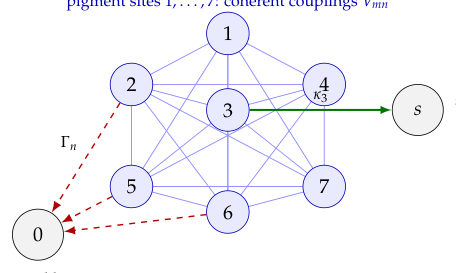 
Figure 1: Open network model. The numbered circles 1, . . . , 7 denote pigment sites, and the blue lines denote their

📷 Fig 2

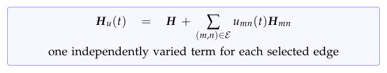 
Figure 2: Parametrization of coupling control. A selected site pair (m, n) defines the Hermitian control operator Hmn,

📷 Fig 3

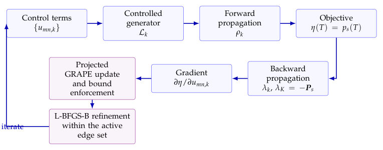 
Figure 4: Optimization workflow with two stages. The forward state and backward adjoint trajectories determine the

📷 Fig 4

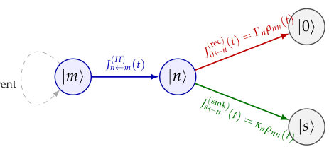 
Figure 5: Quantum probability current convention for a representative edge between two pigment sites and its ir-

📷 Fig 5

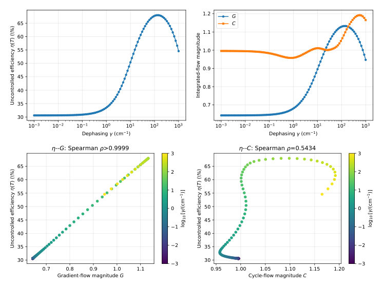 
Figure 6: Uncontrolled FMO dephasing scan over 100 logarithmically spaced rates. Top left: terminal sink efficiency

**Summary.** This paper addresses the challenge of controlling excitation transport in complex quantum systems by reducing the number of necessary control parameters. The authors propose an edge-ranking method based on analyzing the quantum probability current's gradient component. This technique successfully identifies a small subset of couplings that preserves near-maximal transport efficiency while drastically lowering the required external control effort.

**Why it may be interesting.** This work provides a powerful, physically motivated diagnostic tool (the probability current gradient) to guide quantum control optimization, moving beyond brute-force optimization by identifying the most critical couplings.

Detailed structure

**Main problem.** The primary goal is to enhance excitation transport in open quantum networks while drastically reducing the high dimensionality of the required control space.

**Main result.** Edge selection guided by the quantum probability current can substantially reduce the control space, allowing for high transport performance (e.g., 97.60% retention) with significantly lower control effort (e.g., 41.55% reduction in fluence).

**Method.** The authors introduce an edge-ranking strategy based on analyzing the change in the gradient component of the time-integrated quantum probability current, derived using graph Hodge decomposition.

**Model / system.** The system is modeled after excitation transport in photosynthetic protein complexes, specifically using the seven-site Fenna-Matthews-Olson (FMO) model. Dynamics are governed by a Lindblad master equation incorporating coherent evolution and dissipation.

**Key observables.** Transport Efficiency ($\eta(T)$), Pulse Fluence (control effort proxy), Quantum Probability Current (gradient and cycle components).

**Important parameters / regimes.** The number of sites (e.g., seven for FMO), the degree of dephasing, and the specific set of controllable edges selected.

**Assumptions / limitations.** The analysis assumes the sink and ground states are absorbing states, and the ranking criterion relies on the gradient component of the integrated quantum probability current.

**Figures summary.** Figure 1 illustrates the open network model structure (sites, ground, sink). Other figures likely show dephasing dependence and scatter plots comparing efficiency against the norms of the probability current components.

**Paper structure.** The paper establishes the problem of high-dimensional control, introduces the quantum probability current and graph Hodge decomposition, develops the edge-ranking strategy based on the gradient component, and validates this strategy using the FMO model results.

Abstract

Time-dependent coherent control can enhance excitation transport in open quantum networks, but independently controlling every inter-site coupling creates a control space of high dimension and leads to difficult optimization problems. We introduce an edge-ranking strategy based on the control-induced change in the gradient component of the time-integrated quantum probability current, which is obtained via a graph Hodge decomposition. When our strategy is applied to the seven-site Fenna-Matthews-Olson (FMO) model, the six-edge set retains $99.83\%$ of the enhancement achieved by full control, and the four-edge set retains $97.60\%$ while reducing the pulse fluence---used here as a proxy for control effort---by $41.55\%$ relative to full control. Dephasing scans and comparisons with random edge sets and random networks provide numerical support for the relevance and potential broader utility of the ranking. These results show that edge selection guided by the quantum probability current can substantially reduce the control space while preserving high transport performance with lower control effort.

[↑ back to top](#top)

### [Pathology-Free Real-Space Renormalization Group Theory on an Inverse Limit Space](http://arxiv.org/abs/2609.18356v1)

**Authors:** Fabio Arz  
**Type:** theory · **Category:** statistical mechanics · **PDF:** <https://arxiv.org/pdf/2609.18356v1>  
**Analysis basis:** full PDF text, analyzed in chunks
**Topic relevance:** `Keldysh / 2PI / non-Gaussian methods` **2/5** · `methods for driven-dissipative` **2/5** · `analog quantum simulation` **1/5**

📷 Fig 1

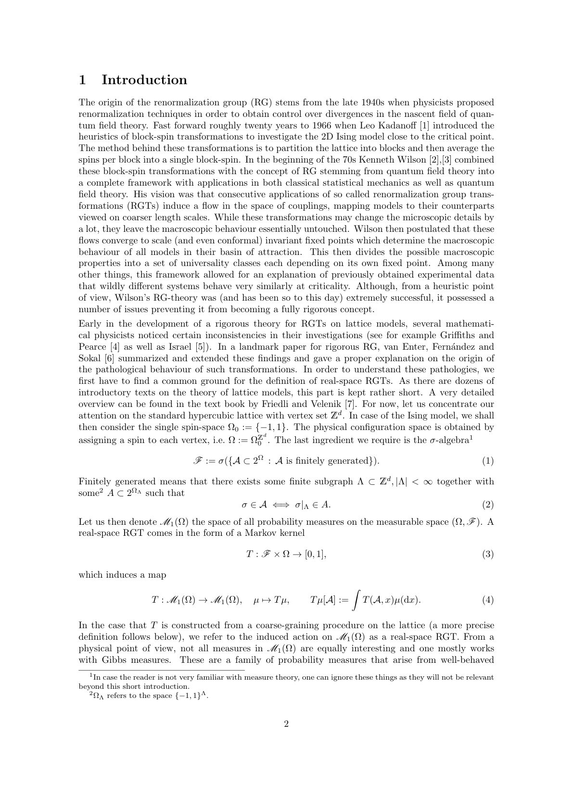 
Low-resolution page preview, page 2

📷 Fig 2

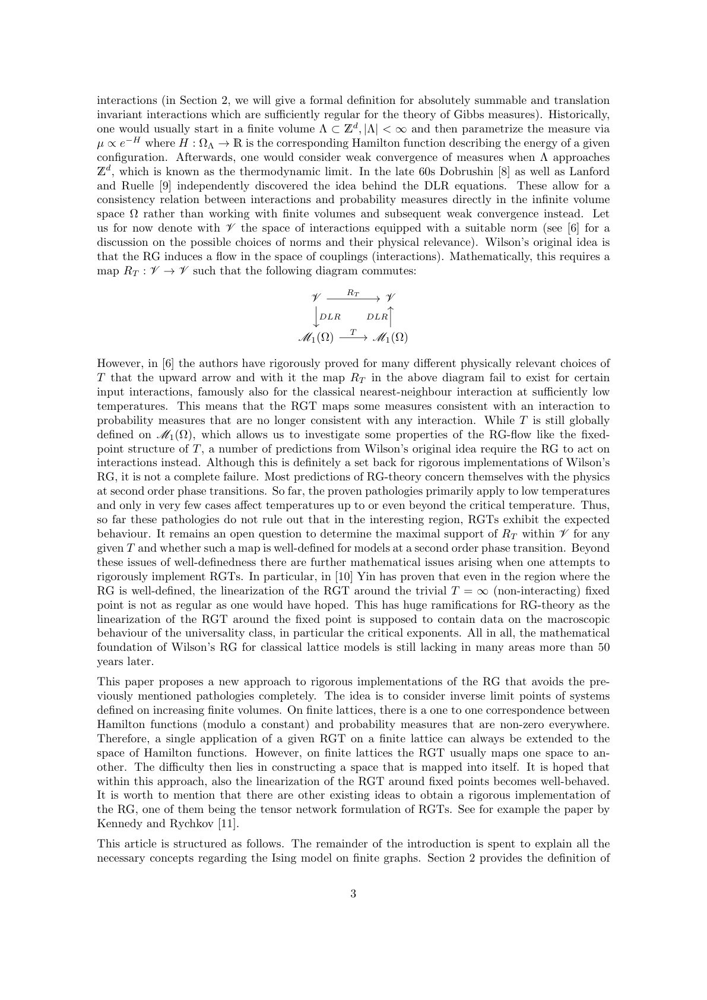 
Low-resolution page preview, page 3

📷 Fig 3

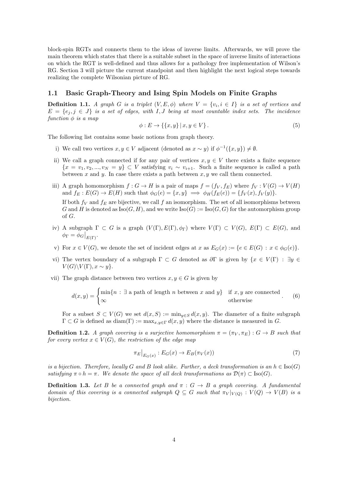 
Low-resolution page preview, page 4

📷 Fig 4

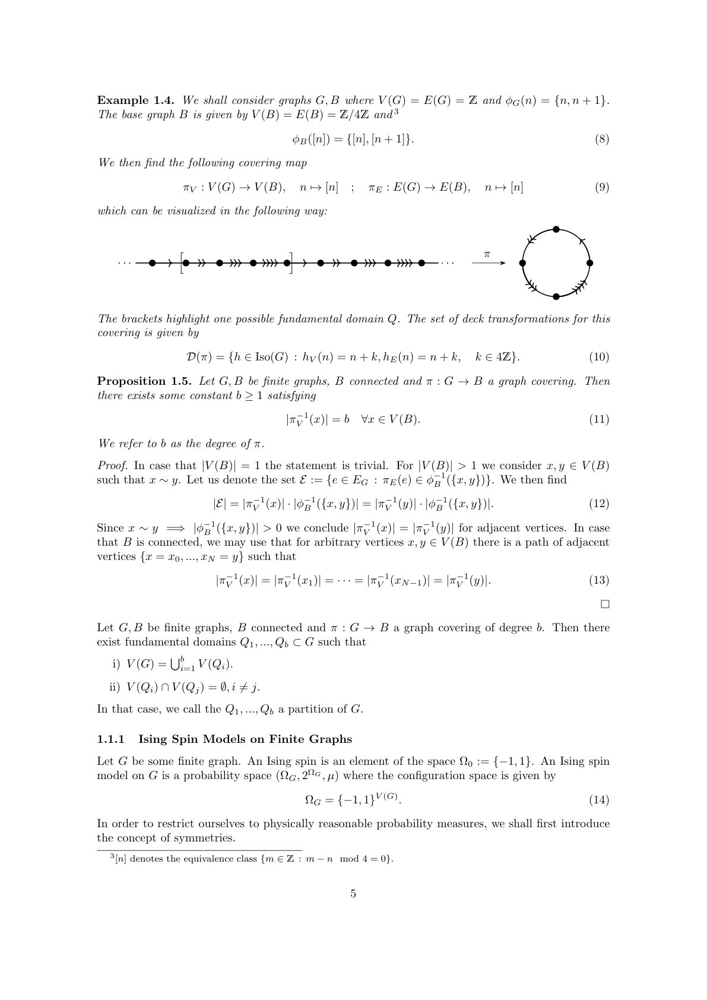 
Low-resolution page preview, page 5

📷 Fig 5

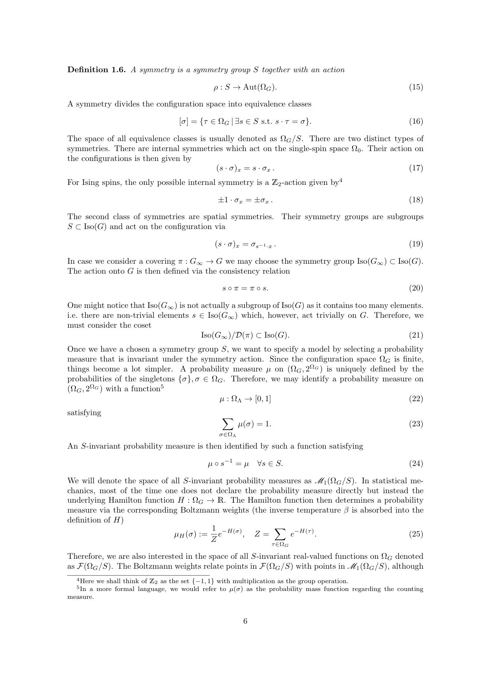 
Low-resolution page preview, page 6

**Summary.** This paper presents a novel, mathematically rigorous framework for Wilson's Renormalization Group theory by employing inverse limits of finite systems. It successfully defines a continuous RG map on the space of physical Hamiltonians, thereby avoiding pathologies found in previous rigorous attempts. This provides a powerful new tool to study critical phenomena and fixed points in statistical mechanics.

**Why it may be interesting.** While focused on classical statistical mechanics, the rigorous mathematical machinery developed—especially the use of functional spaces, continuity proofs, and flow analysis—is highly relevant to understanding the dynamics of open quantum systems or quantum field theories where renormalization is key.

Detailed structure

**Main problem.** To develop a mathematically rigorous and pathology-free framework for Wilson's Renormalization Group (RG) theory.

**Main result.** The authors establish a continuous RG map on a quotient space of Hamilton functions, proving the framework's mathematical soundness and providing a path to study fixed points.

**Method.** The core method involves using inverse limits of finite systems and defining the RG transformation on the space of physical interactions ($V_{	ext{phys}}$) to ensure mathematical consistency.

**Model / system.** The theory is applied to the Ising model on the hypercubic lattice ($\mathbb{Z}^d$), analyzing the flow of interactions (Hamilton functions) in the infinite volume limit.

**Key observables.** RG flow, fixed points (e.g., $H=0$), critical exponents, and the norm $\lVert [\hat{H}] 
Vert_{\hat{V}}$ used to measure convergence.

**Important parameters / regimes.** The decay rate of interactions ($\Phi$), the lattice dimension ($d$), and the coupling constants ($eta$).

**Assumptions / limitations.** The framework assumes the existence of a suitable space $V_{	ext{phys}}$ and relies on proving the continuity of the RG map $R$ on this space.

**Paper structure.** The paper builds from defining block-spin RGTs on finite graphs using inverse limits, establishing the map $R: V_{	ext{phys}} 	o V_{	ext{phys}}$, and finally analyzing the flow properties on the quotient space $\hat{V} = V_{	ext{phys}}/R$.

Abstract

It has been over fifty years since Kenneth Wilson had his Nobel-prize-winning ideas on the renormalization group. In this time frame, despite many attempts, no mathematical results have implemented Wilson's vision to a satisfactory degree. Although a number of predictions stemming from the renormalization group framework have been proven to date, these proofs usually rely on alternative ideas and do not cover the full predictive power of Wilson's renormalization group. The discovery of pathologies within rigorous implementations of renormalization group transformations have further reduced the enthusiasm of the mathematics community for this subject. This paper presents a novel framework to implement Wilson's original idea in a rigorous manner based on inverse limits of finite systems. Doing so, one avoids these pathologies and hence obtains a mathematically sound framework for Wilson's renormalization group. This opens up a completely new path to tackle some of the existing problems in rigorous renormalization group theory like the existence of non-trivial fixed points.

[↑ back to top](#top)

### [Scalar quasinormal and quasibound states of weakly magnetized Ernst--Schwarzschild spacetime: a confluent-Heun Wronskian approach](http://arxiv.org/abs/2609.17727v1)

**Authors:** Danilo S. Ferreira, Luis B. Castro  
**Type:** theory · **Category:** other · **PDF:** <https://arxiv.org/pdf/2609.17727v1>  
**Analysis basis:** full PDF text, analyzed in chunks
**Topic relevance:** `quantum measurements` **2/5** · `Keldysh / 2PI / non-Gaussian methods` **1/5** · `analog quantum simulation` **1/5** · `methods for driven-dissipative` **1/5**

📷 Fig 1

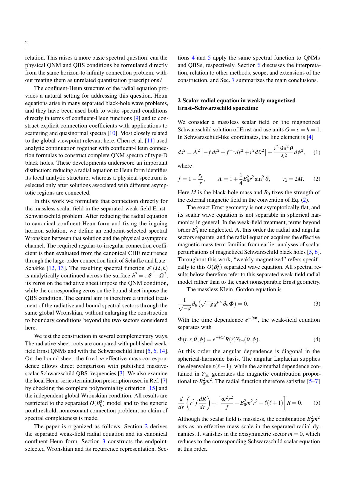 
Low-resolution page preview, page 2

📷 Fig 2

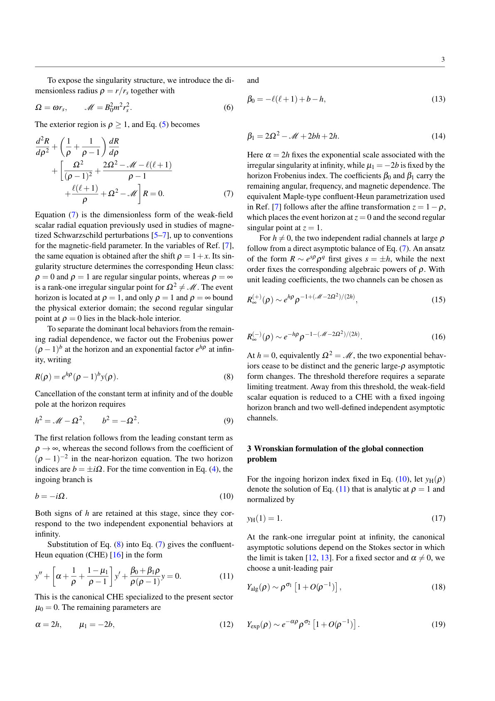 
Low-resolution page preview, page 3

📷 Fig 3

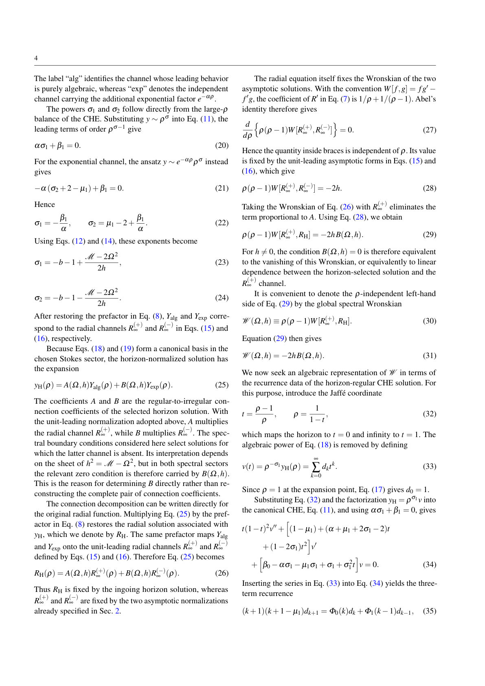 
Low-resolution page preview, page 4

📷 Fig 4

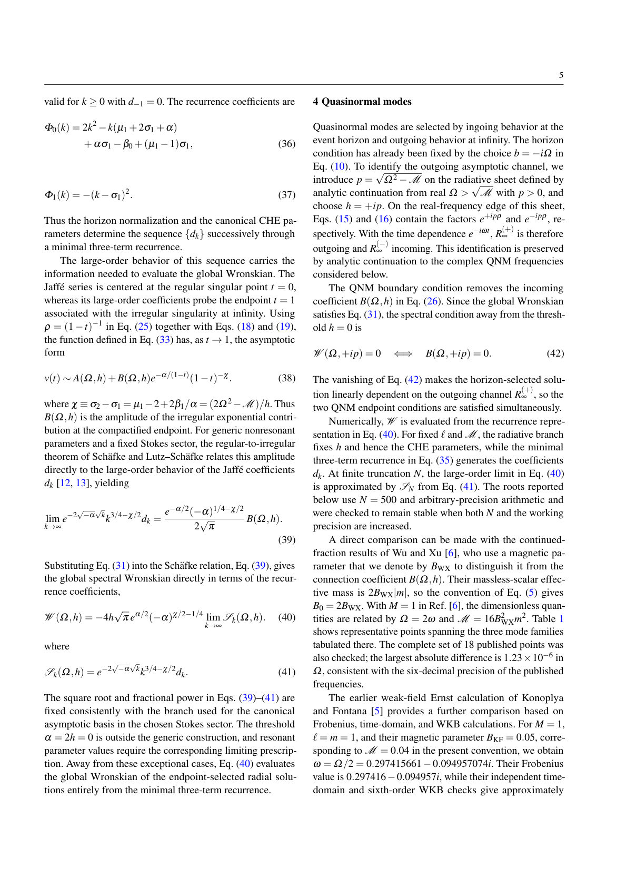 
Low-resolution page preview, page 5

📷 Fig 5

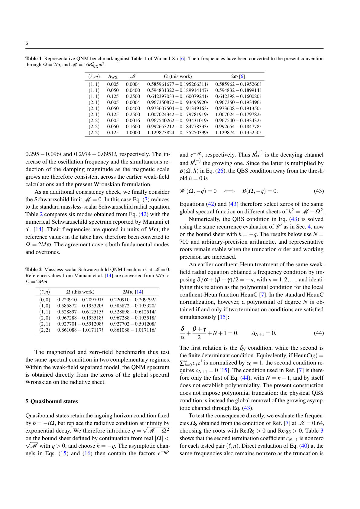 
Low-resolution page preview, page 6

**Summary.** This work develops a unified mathematical framework to calculate the quasinormal and quasibound modes for scalar fields in a weakly magnetized black hole spacetime. It achieves this by transforming the governing differential equation into a confluent-Heun form and defining the spectral condition via a global Wronskian. The method provides a robust, horizon-to-infinity spectral condition that matches established theoretical benchmarks.

**Why it may be interesting.** While the core physics is general relativity/field theory, the mathematical machinery—reducing a physical boundary value problem to the zeros of a specific transcendental function (the Wronskian)—is highly relevant to open quantum systems and spectral analysis in other physical contexts.

Detailed structure

**Main problem.** To provide a unified and rigorous method for determining the quasinormal-mode (QNM) and quasibound-state (QBS) spectra for a massless scalar field in a weakly magnetized Ernst--Schwarzschild spacetime.

**Main result.** The spectral condition is unified by constructing an endpoint-selected spectral Wronskian, which successfully reproduces known weak-field benchmarks for both QNMs and QBSs.

**Method.** The analysis reduces the Klein-Gordon equation to a radial confluent-Heun equation, whose spectral condition is determined by setting the global spectral Wronskian to zero.

**Model / system.** The system is a massless scalar field propagating in a weakly magnetized Ernst--Schwarzschild spacetime. The analysis is restricted to the separated, weak-field approximation ($O(B_0^2)$) of the geometry.

**Key observables.** Quasinormal mode frequencies ($\omega$) and quasibound state frequencies, determined as the zeros of the spectral Wronskian.

**Important parameters / regimes.** Magnetic field strength ($B_0$), mass ($M$), angular number ($\ell$), and the frequency ($\Omega$).

**Assumptions / limitations.** The results are strictly limited to the separated $O(B^2_0)$ weak-field model, and the method relies on the global spectral Wronskian condition rather than local polynomial termination.

**Figures summary.** Tables compare calculated QNM frequencies against established benchmarks from the literature for varying magnetic fields and masses.

**Paper structure.** The paper establishes the weak-field reduction to the confluent-Heun equation, derives the global spectral Wronskian from the recurrence relation, and then applies the zero-finding condition to unify the spectral determination for both radiative (QNM) and bound (QBS) states.

Abstract

We study the quasinormal-mode and quasibound-state spectra of a massless scalar field in weakly magnetized Ernst--Schwarzschild spacetime. In the separated $O(B_0^2)$ regime, the Klein--Gordon equation reduces to a radial confluent-Heun equation. We construct an endpoint-selected spectral Wronskian directly from the canonical confluent-Heun recurrence and its regular-to-irregular connection limit. Quasinormal modes and quasibound states are then obtained as zeros of the same analytic spectral function on the radiative and bound sheets, respectively, providing a unified treatment of the two spectral sectors within the separated weak-field problem. The resulting QNM and QBS frequencies agree with independent weak-field Ernst and massive-Schwarzschild benchmarks available in the literature. We further show, for representative cases, that the frequencies selected by the local Heun-series termination relation examined here do not satisfy the endpoint-selected quasibound-state condition. The construction therefore provides a direct horizon-to-infinity spectral condition for both radiative and bound states within the weak-field Ernst problem.

[↑ back to top](#top)

### [Unconventional linear transverse exciton transport in valley-layer coupling two-dimensional materials](http://arxiv.org/abs/2609.18035v1)

**Authors:** Ci Li  
**Type:** theory · **Category:** other · **PDF:** <https://arxiv.org/pdf/2609.18035v1>  
**Analysis basis:** full PDF text, analyzed in chunks
**Topic relevance:** `Keldysh / 2PI / non-Gaussian methods` **2/5** · `analog quantum simulation` **1/5** · `methods for driven-dissipative` **1/5** · `quantum measurements` **1/5**

📷 Fig 1

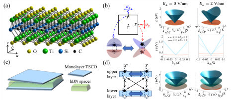 
FIG. 1. (color online) (a) Crystal structure of monolayer TiSiCO (TSCO). (b) Left: first Brillouin zone of monolayer TSCO and valley excitons at X and X′ with opposite opti- cal selection rules; large blue double arrows denote interval- ley electron–hole exchange interaction. Right: exciton dis- persion of the monolayer effective Hamiltonian (1) for differ- ent perpendicular electric fields E⊥, shown in both 3D view and selected momentum cuts. (c) Schematic of twisted bi- layer TSCO separated by a hexagonal boron nitride spacer. (d) Left: intralayer excitons in twisted bilayer TSCO and their couplings; black double arrows denote F¨orster cou- pling. Right: exciton dispersion of the...

📷 Fig 2

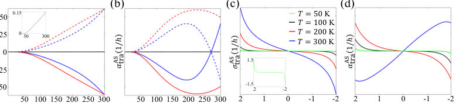 
FIG. 3. (color online) (a)-(d) Numerical calculation of σAS tra and αAS tra [Eq. (3)] for monolayer exciton Hamiltonian (1), as functions of temperature T and perpendicular electric field E⊥. Insets in (a) and (c) show enlarged views near E⊥= 0 and at T = 50 K, respectively. In (a) and (b), blue solid (dashed) curves correspond to E⊥= −2(2) eV/nm, red solid (dashed) curves to E⊥= −1(1) eV/nm, and black curves to E⊥= 0 eV/nm. min(εn) −µ = 10 meV; In (c) and (d), µ = 0.176 eV. τ = 1 ps for all plots.

📷 Fig 3

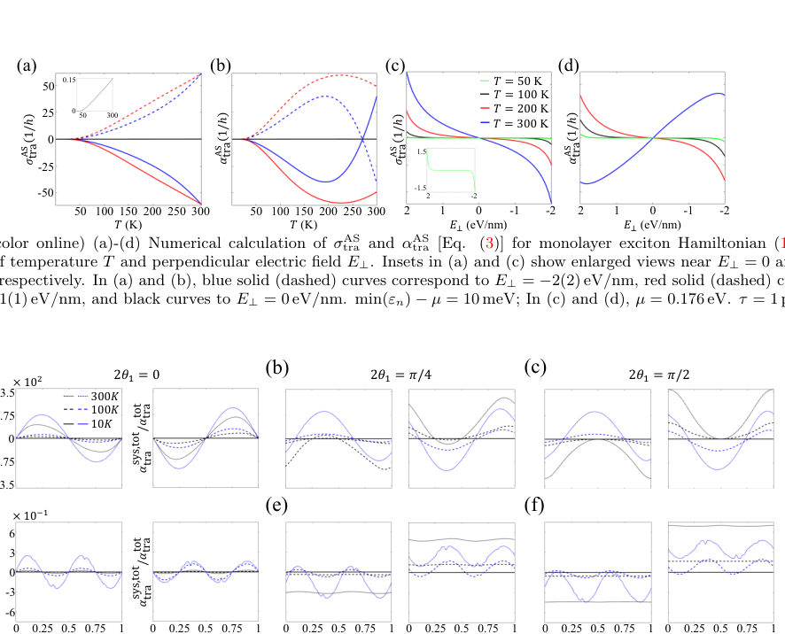 
FIG. 4. (color online) (a) Left: Numerical calculations of total transverse conductivity in system layer for twisted bilayer exciton Hamiltonian (2), σsys,tot tra ≡σsys H + σsys,AS tra sin(2θ1) + σsys,S tra cos(2θ1) [Eqs. (3) and (4)] (blue curves), and σtot tra = σsys,tot tra + σenv,tot tra (black curves), as functions of twisted angle θ and temperature T, in the unit of 1/h. Right: Corresponding results for αsys,tot tra and αtot tra. Here perpendicular electric field E⊥= −2 eV/nm. (b) and (c): Similar plots as in (a), but for different in-plane driving force direction θ1. (d)-(f): Similar plots as (a)-(c), but for E⊥= 0 eV/nm. In all plots, min(εn) −µ = 10 meV and τ = 1 ps.

📷 Fig 4

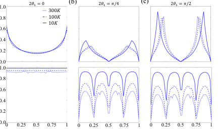 
FIG. 5. (color online) (a) Numerical calculation of Hall frac- tions rsys H ≡|σsys H |/(|σsys H |+|σsys,AS tra sin(2θ1)|+|σsys,S tra cos(2θ1)|) for different perpendicular electric field E⊥. (b) and (c): Sim- ilar plots as in (a), but for different in-plane driving force di- rection θ1. min(εn) −µ = 10 meV and τ = 1 ps in all plots.

📷 Fig 5

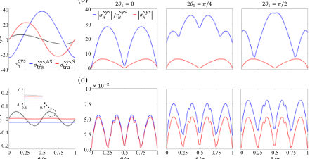 
FIG. 6. (color online) (a) Numerical calculation of layer- resolved transverse exciton conductivities σsys H , σsys,AS tra , and σsys,S tra for perpendicular electric field E⊥= −2 eV/nm and temperature T = 100 K. (b) Corresponding quantities |σsys H |/rsys H = |σsys H | + |σsys,AS tra sin(2θ1)| + |σsys,S tra cos(2θ1)| and |σsys H |, for different in-plane driving force directions θ1. (c) and (d): Similar plots as (a) and (b), but for E⊥= 0 eV/nm. min(εn) −µ = 10 meV and τ = 1 ps in all plots.

**Summary.** This theoretical work explores unconventional linear transverse exciton transport in valley-layer coupled 2D materials. By using an out-of-plane electric field ($E_{\perp}$), the authors demonstrate control over exciton dispersion anisotropy, which generates measurable transverse currents. This provides a versatile platform for engineering excitonic phenomena in next-generation quantum materials.

**Why it may be interesting.** The ability to use an external electric field ($E_{\perp}$) to engineer and control specific, symmetry-protected transport channels (like anisotropy-induced currents) in excitonic systems is highly relevant for designing quantum light sources or detectors.

Detailed structure

**Main problem.** The paper investigates unconventional linear transverse exciton transport (LTET) in valley-layer coupling (VLC) two-dimensional (2D) materials.

**Main result.** The perpendicular electric field ($E_{\perp}$) acts as a powerful knob to control exciton-dispersion anisotropy, thereby inducing and tuning LTET in both monolayer and twisted bilayer structures.

**Method.** Theoretical analysis using effective exciton Hamiltonians and semi-classical transport theory to calculate conductivity tensor components.

**Model / system.** The system is VLC 2D materials, prototyped by TiSiCo, which exhibit valley coupling via crystal symmetry. The model extends to both monolayer and twisted bilayer configurations, incorporating interlayer Förster coupling.

**Key observables.** Transverse conductivities ($\sigma_{AS}^{	ext{tra}}, \alpha_{AS}^{	ext{tra}}$) and the competition between anisotropy-induced responses and $\mathcal{T}$-even layer Hall/Nernst counterflow.

**Important parameters / regimes.** Perpendicular electric field ($E_{\perp}$), twist angle ($	heta$), and temperature ($T$).

**Assumptions / limitations.** The analysis focuses on the zero-Berry-curvature limit and assumes the exciton binding energy is omitted for simplicity.

**Figures summary.** Figures illustrate the crystal structure, exciton dispersion dependence on $E_{\perp}$, and the calculated dependence of transverse conductivities on temperature, $E_{\perp}$, and twist angle for both monolayer and bilayer systems.

**Paper structure.** The paper establishes the theoretical framework for LTET in VLC materials, first analyzing the monolayer response governed by anisotropy, and then extending the analysis to the twisted bilayer where multiple competing transport channels (anisotropy-driven vs. layer counterflow) coexist and are tunable.

Abstract

Valley-layer coupling (VLC) two-dimensional (2D) materials define a distinct class of quantum systems in which valleys are related by crystal, rather than time-reversal ($\mathcal{T}$) symmetry, enabling gate-controlled valley-contrasted layer polarization. Here we extend this concept to excitons. Using TiSiCo as a prototype VLC material, we show that a perpendicular electric field $E_{\perp}$ controls exciton- dispersion anisotropy and thereby generates unconventional linear transverse exciton transport in both monolayer and twisted bilayer structures. In the monolayer, this response is characterized by anisotropy-induced transverse conductivities, arising from the antisymmetric combination of diagonal elements in the conductivity tensor and strongly tunable by $E_{\perp}$. In the twisted bilayer, symmetry additionally permits transverse responses from the symmetric part of the conductivity tensor. Since intralayer excitons in different layers are connected by the Förster coupling, these symmetric and antisymmetric responses coexist and compete with the recently proposed $\mathcal{T}$-even layer Hall and Nernst exciton counterflow. This interplay is highly tunable by twisted angle, temperature, and the direction of the in-plane driving force, providing a route to disentangle distinct transverse exciton transport signals experimentally. Our results establish $E_{\perp}$ as a powerful knob for controlling exciton transport via VLC and identify VLC 2D materials as a promising platform for engineered excitonic phenomena.

[↑ back to top](#top)

### [Deep learning emergent spacetime from fermionic spectral functions in holography](http://arxiv.org/abs/2609.18566v1)

**Authors:** Koji Hashimoto, Hyun-Sik Jeong, Keun-Young Kim, Daichi Takeda, Kwan Yun  
**Type:** theory · **Category:** strongly correlated electrons · **PDF:** <https://arxiv.org/pdf/2609.18566v1>  
**Analysis basis:** full PDF text, analyzed in chunks
**Topic relevance:** `Keldysh / 2PI / non-Gaussian methods` **2/5** · `methods for driven-dissipative` **2/5**

📷 Fig 1

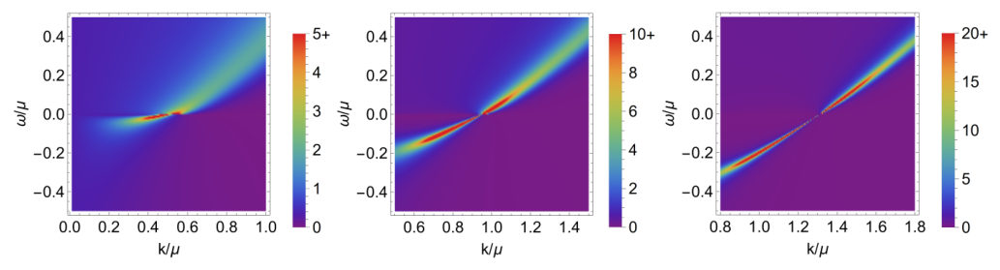 
Figure 1. The fermionic spectral function A(ω, k) = 1 π Im G−(ω, k) of the extremal Reissner-Nordstr¨om AdS black hole for three representative probe fermion charges: Data A (q = 1, left), Data B (q = 1.56, middle), and Data C (q = 2, right). (a) Data A (νkF = 0.24 &lt; 1/2) displays a broad, incoherent peak with a non-linear dispersion ω∗(k) ≈(k −kF )2.08 and a vanishing quasiparticle residue, representing a non-Fermi liquid without long-lived excitations. (b) Data B (νkF = 1/2) realizes the marginal Fermi liquid regime with a quasi-linear dispersion ω∗(k) ≈ k−kF ln ∣k−kF ∣and a linear scattering rate Γ ∝ω, forming a moderately broad spectral ridge characteristic of strange metal...

📷 Fig 2

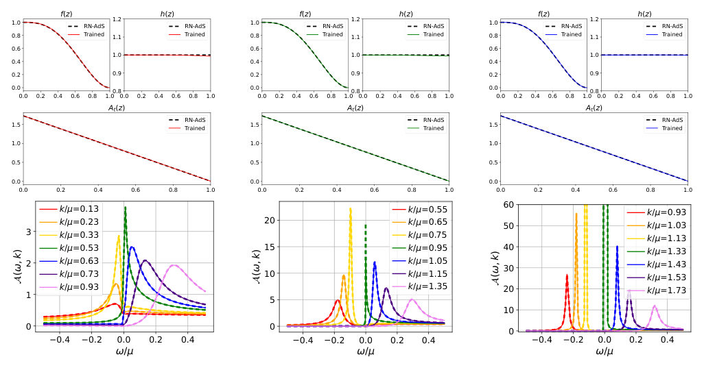 
Figure 2. Reconstructed bulk profiles {f(z), h(z), At(z)} obtained from the quantum critical fermionic spectral data shown in Fig. 1: Data A (q = 1, left), Data B (q = 1.56, middle), and Data C (q = 2, right). Upper panels: The trained neural network profiles (colored curves) closely match the exact extremal Reissner-Nordstr¨om AdS black hole solutions (14) with µ = √

📷 Fig 3

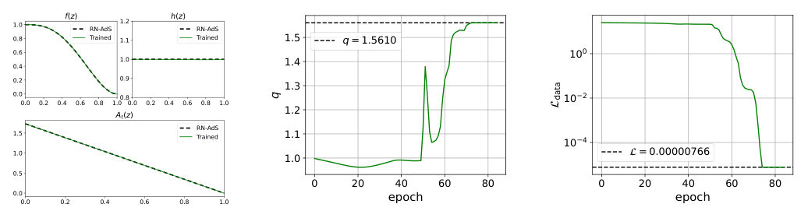 
Figure 3. Simultaneous reconstruction of bulk profiles and probe fermion charge q trained on Data B (marginal Fermi liquid). Left: Reconstructed bulk metric and gauge fields compared against the target extremal Reissner-Nordstr¨om AdS background. Middle: Optimization trajectory of the trainable charge q, converging to qtrained = 1.5610 (target q = 1.56). Right: Evolution of the training loss during the hybrid Adam and L-BFGS optimization, reaching a final loss of L = 7.66 × 10−6.

📷 Fig 4

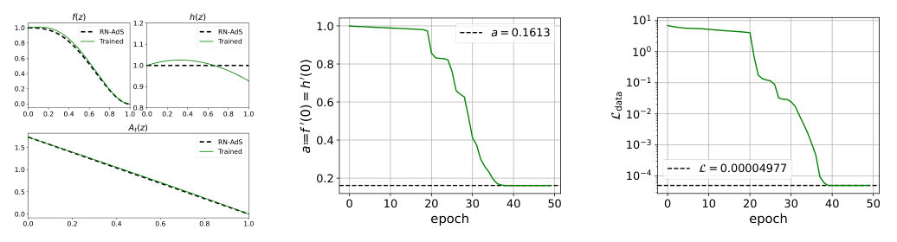 
Figure 4. The trained results using Data B (q = 1.56) when relaxing the near-boundary derivative condition a = f ′(0) = h′(0). Left: The trained bulk metric functions f(z), h(z) and gauge potential At(z) (green solid lines) compared with the exact extremal Reissner-Nordstr¨om AdS background (black dashed lines). Middle: Evolution of the trainable slope parameter a during training, converging to atrained ≈0.1613. Right: Convergence of the training loss Ldata as a function of epoch, reaching a final loss ≈4.98 × 10−5.

📷 Fig 5

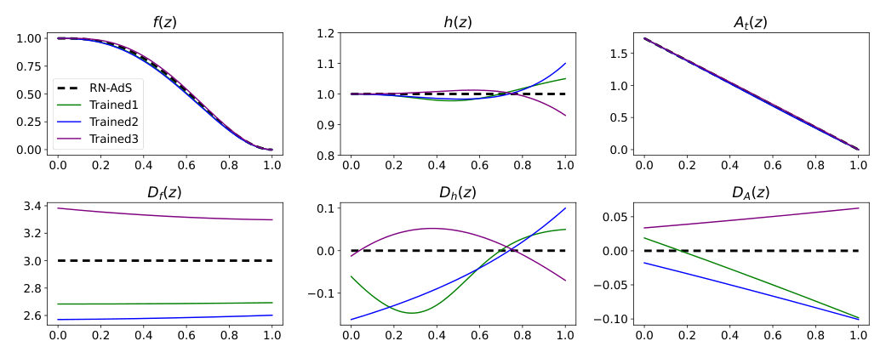 
Figure 5. The trained bulk profiles (top) and the functions Df,h,A(z) (bottom) obtained with the Neural ODE at a = 0. The solid lines (green, blue, and purple) represent three different trained solutions, while the black dashed lines denote the exact extremal Reissner-Nordstr¨om AdS solution. The three solutions differ substantially from the Reissner-Nordstr¨om AdS solution, closely reproducing the same spectral function data, with residual losses as Ldata = 1.65 × 10−5, 5.92 × 10−4, and 5.05 × 10−4, respectively.

**Summary.** This work uses physics-informed machine learning (Neural ODEs) to solve the holographic inverse problem, reconstructing the geometry of a charged AdS black hole from measured fermionic spectral functions. It successfully maps out the physics across three quantum critical regimes, confirming the utility of ML in extracting deep physical structure from boundary data.

**Why it may be interesting.** The application of advanced ML techniques to solve fundamental problems in strongly correlated electron physics (strange metals) via holography provides a powerful, modern tool for theoretical condensed matter research.

Detailed structure

**Main problem.** The paper tackles the holographic inverse problem: reconstructing the bulk spacetime and gauge field of a charged AdS black hole directly from boundary fermionic spectral functions.

**Main result.** The physics-informed machine learning framework successfully reconstructs the extremal Reissner-Nordström AdS geometry across three distinct quantum critical regimes, demonstrating the network isolates the IR CFT universality.

**Method.** It employs a Neural Ordinary Differential Equations (Neural ODE) framework, constrained by physical boundary conditions, to solve the inverse problem posed by the holographic Dirac equation.

**Model / system.** The context is holographic condensed matter theory (AdS/CMT), modeling a probe Dirac fermion in the background of a charged AdS black hole, relevant for studying quantum critical points.

**Key observables.** Boundary fermionic spectral function, $A(\omega,k) = rac{1}{\pi} 	ext{Im} G^-(\omega,k)$, and the reconstructed bulk spacetime metrics and gauge fields.

**Important parameters / regimes.** Three quantum critical regimes defined by the $U(1)$ probe charge: non-Fermi liquid, marginal Fermi liquid (strange metal), and Fermi-liquid-like states.

**Assumptions / limitations.** The framework assumes the validity of the AdS/CFT correspondence and uses hard constraints (UV asymptotics, horizon regularity) within the Neural ODE architecture.

**Figures summary.** The notes describe figures illustrating the reconstruction of the extremal RN geometry and comparing recovered profiles to known analytical solutions, highlighting the detection of geometrical degeneracy.

**Paper structure.** The paper follows a structure reviewing the holographic Dirac equations, establishing benchmark spectral functions, detailing the Neural ODE framework, demonstrating the reconstruction process, and finally exploring the resulting geometrical degeneracy.

Abstract

We present a physics-informed machine learning framework based on Neural Ordinary Differential Equations that solves the holographic inverse problem: reconstructing the bulk spacetime and gauge field of a charged AdS black hole directly from boundary fermionic spectral functions. Encoding the UV asymptotics, horizon regularity, and zero temperature extremality as hard constraints in the neural network architecture, our framework reliably reconstructs the extremal Reissner-Nordström AdS geometry across three quantum critical regimes set by the $U(1)$ probe charge---non-Fermi liquid, marginal Fermi liquid (strange metal), and Fermi-liquid-like states---and can jointly infer the probe charge itself to sub-percent accuracy. Relaxing the near-AdS boundary constraint uncovers a geometrical degeneracy: bulk profiles that differ throughout the radial direction but share the same near-horizon $AdS_2 \times \mathbb{R}^2$ data reproduce identical spectral functions near the Fermi surface. This isospectral non-uniqueness is precisely the bulk degeneracy expected on general holographic grounds at zero temperature, and its spontaneous emergence across independent training runs shows that the network isolates the IR CFT universality rather than overfitting a single UV completion.

[↑ back to top](#top)

### [Full Eigenstate Thermalization in Quantum Field Theory: Free Cumulants and Gravitational Scrambling](http://arxiv.org/abs/2609.17669v1)

**Authors:** Ricardo Espíndola, Viktor Jahnke  
**Type:** theory · **Category:** statistical mechanics · **PDF:** <https://arxiv.org/pdf/2609.17669v1>  
**Analysis basis:** full PDF text, analyzed in chunks
**Topic relevance:** `Keldysh / 2PI / non-Gaussian methods` **2/5** · `analog quantum simulation` **1/5** · `scars & prethermalization` **1/5**

📷 Fig 1

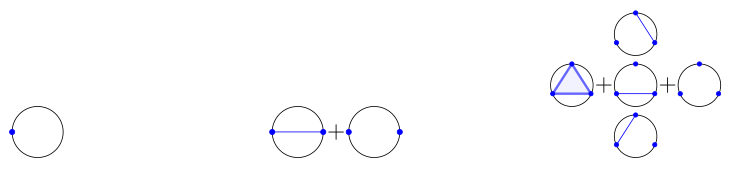 
Figure 1: Diagrammatic representation of set partitions for small values of n. Panels (a), (b), and (c) show the partitions of the sets {1}, {1, 2}, and {1, 2, 3}, respectively. In each diagram, elements are placed on a circle in cyclic order, and blocks are represented by chords connecting the corresponding points.

📷 Fig 2

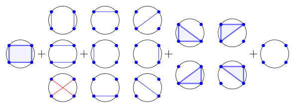 
Figure 2: Diagrammatic representation of all set partitions of {1, 2, 3, 4}, drawn on a circle with the elements ordered cyclically. Each diagram corresponds to a partition π ∈P(4), with blocks represented by chords connecting the corresponding points. The unique crossing partition is highlighted by intersecting chords drawn in red, while all non-crossing partitions π ∈NC(4) are shown in blue.

📷 Fig 3

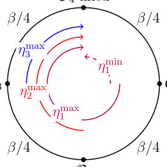 
Figure 3: Imaginary-time deformations of four equally spaced operator insertions on the thermal circle. Fixing O4 by time-translation invariance, the boundary of the analyticity domain allows maximal positive displacements ηmax 3 = β/4, ηmax 2 = β/2, and ηmax 1 = 3β/4 while preserving the cyclic ordering. For O1, the opposite boundary is ηmin 1 = −β/4 (dashed line). Therefore −β/4 &lt; η1 &lt; 3β/4.

📷 Fig 4

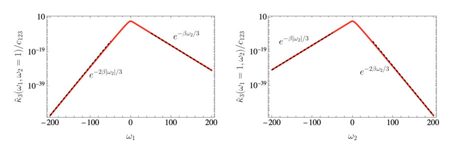 
Figure 4: Large-frequency behavior of the Fourier transform of the third regulated free cumulant bκ3(ω1, ω2). Here we set β = 1 and ∆1 = ∆2 = ∆3 = 1. In the left panel, ω2 = 1 is fixed while ω1 →±∞; in the right panel, ω1 = 1 is fixed while ω2 →±∞. The black dashed lines indicate the directional exponential decay rates predicted by the full-ETH bound (4.85). In both panels, the numerical asymptotics are consistent with these predicted rates.

📷 Fig 5

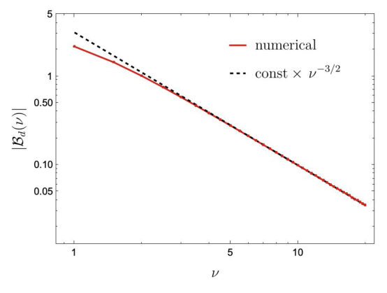 
Figure 5: Large-|ν| behavior of the transverse factor |Bb(ν)| in Rindler–AdS3/CFT2 for ∆V = ∆W = 1 and b = |x1 −x2| = 1. The numerical result is compared with the asymptotic power law const × |ν|−3/2 (black dashed line).

**Summary.** This theoretical paper establishes a rigorous link between Full Eigenstate Thermalization (full ETH) in QFT and the concept of gravitational scrambling. By employing thermal analyticity and free probability theory, the authors derive quantitative bounds that are shown to be saturated by holographic CFTs. This work provides a unified mathematical framework connecting thermalization, non-commutative probability, and quantum gravity effects.

**Why it may be interesting.** While highly abstract, the connection established between thermalization dynamics (ETH) and fundamental algebraic structures (free cumulants, modular theory) provides powerful, non-perturbative tools applicable to understanding thermalization in complex quantum many-body systems, including those relevant to AMO physics.

Detailed structure

**Main problem.** The paper investigates Full Eigenstate Thermalization (full ETH) in Quantum Field Theory and establishes a deep connection between full ETH, free cumulants, and the concept of gravitational scrambling.

**Main result.** The authors derive directional large-frequency bounds for full ETH functions, showing that holographic CFTs saturate these bounds at fourth order, thus linking full ETH to gravitational scrambling.

**Method.** The methodology combines thermal analyticity, free probability theory (using free cumulants), and advanced algebraic techniques from quantum field theory, particularly those related to modular flow and the AdS/CFT correspondence.

**Model / system.** The analysis is conducted in continuum Quantum Field Theories (QFTs), focusing on thermal Conformal Field Theories (CFTs) and utilizing holographic models derived from the AdS/CFT correspondence.

**Key observables.** Full ETH smooth functions, two- and three-point functions in thermal CFTs, fourth-order free cumulants, and the holographic eikonal scattering matrix phase shift.

**Important parameters / regimes.** The analysis examines behavior at low orders (two/three-point functions) and the first appearance of dynamics at fourth order, relating to the asymptotic freeness limit.

**Assumptions / limitations.** The derivation relies on the complex-time analyticity of regulated thermal free cumulants and assumes the semiclassical near-horizon regime for the holographic identification.

**Paper structure.** The paper is structured logically, first reviewing the algebraic framework for gravitational scrambling, then introducing free probability theory, deriving ETH constraints using analyticity, testing these bounds in CFTs, and concluding with the synthesis of the connection between ETH, free cumulants, and scrambling.

Abstract

Using thermal analyticity, we derive directional large-frequency bounds on the smooth functions entering full eigenstate thermalization in continuum quantum field theory. The strongest directions reproduce the scales previously identified for lattice systems, while the complete analyticity domain reveals a broader asymmetric multifrequency structure. In thermal two-dimensional conformal field theory, exact two- and three-point functions saturate the corresponding bounds. At fourth order, where genuine dynamical information first appears, we show that the holographic CFTs studied here saturate the strongest full-ETH bounds. These results establish a direct connection between full ETH, free cumulants, and gravitational scrambling, and are consistent with the emergence of asymptotic freeness realized by the gravitational scrambling algebra.

[↑ back to top](#top)

### [Universal entanglement embezzlement and divergent nonlocal magic from generic local chaotic quantum evolution](http://arxiv.org/abs/2609.18691v1)

**Authors:** Matias Karjula, Teemu Ojanen, Kim Pöyhönen, Tapio Ala-Nissila, Moein N. Ivaki  
**Type:** theory · **Category:** other · **PDF:** <https://arxiv.org/pdf/2609.18691v1>  
**Analysis basis:** full PDF text, analyzed in chunks
**Topic relevance:** `non-equilibrium universality` **2/5** · `analog quantum simulation` **1/5** · `scars & prethermalization` **1/5**

📷 Fig 1

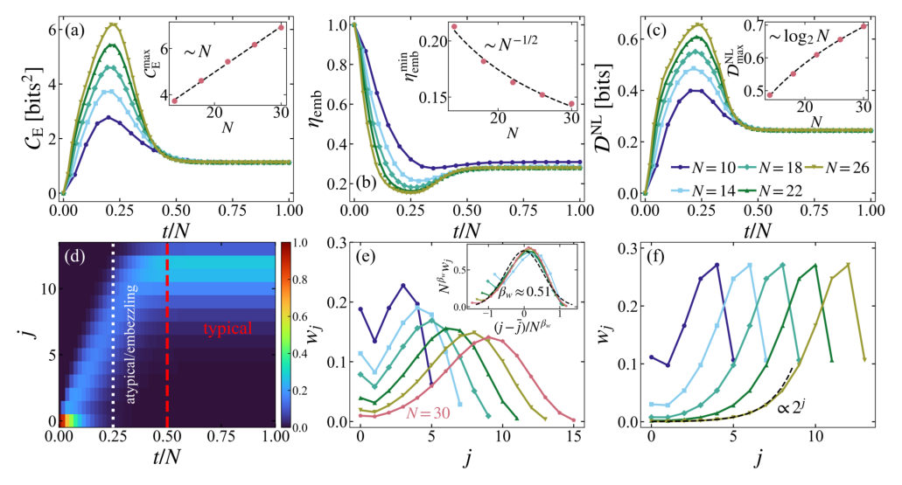 
FIG. 1. Dynamical creation and destruction of embezzling capabilities in the Haar-random model. At their corresponding extrema, the ensemble-averaged quantities scale as (a) EU[CE] ∝N, (b) EU[ηemb] ∝N −βη with βη ≈1/2, and (c) EU[DNL] ∝ log2 N. Further, DNL,Haar ≈0.244, CHaar E ≈1.124, and ηHaar emb ≈0.278. The dotted and dashed lines in (d) denote the atypical embezzling point and the crossover to the typical regime, respectively, for N =26 qubits. (e) and (f) display the average dyadic shell distributions EU[wj] for the optimal embezzling and Haar-typical points, respectively. Results are averages over 50–400 independent realizations.

📷 Fig 2

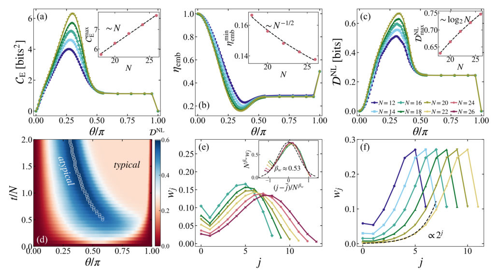 
FIG. 2. Parametric creation and destruction of the scale-free embezzling structure in a tunable random circuit model. Quantities in (a), (b), (c) and their overall scaling behavior are consistent with those of the Haar-random model. Plotted for a fixed depth t = 2N. In (d) we further plot the resource landscape displaying a parametric-dynamical ridge, along which nonlocal magic and embezzling power are maximized. The hollow circles denote θemb(t/N) = arg maxθ E[DNL(θ, t/N)] for t/N ≥0.5, which roughly separate the weakly structured and the strongly scrambled regimes. (e) and (f) show the shell profile for the embezzling point θ/π ≈0.35 and the typical point θ/π ≈0.8, respectively. The...

📷 Fig 3

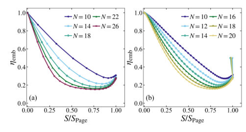 
FIG. 3. A flow-like diagram in the ηemb–S/SPage plane, show- ing convergence toward a common submaximal-entanglement minimum of the embezzlement parameter with increasing sys- tem size. Shown for (a) the Haar-random circuit dynamics, and (b) the parametrically tunable random circuit.

**Summary.** This paper demonstrates that generic local chaotic quantum evolution naturally generates intermediate quantum states capable of universal entanglement embezzlement. By analyzing the scaling of entanglement measures like $\eta_{emb}$ and $D_{NL}$ in random quantum circuits, the authors establish a physical pathway for creating these complex, non-equilibrium quantum resources. This links the concept of entanglement catalysis to the dynamics of chaotic quantum many-body systems.

**Why it may be interesting.** This work provides a concrete, non-equilibrium physical mechanism—chaotic unitary evolution—for generating highly structured quantum resources (UEEs), which is crucial for understanding quantum resource theory in many-body physics.

Detailed structure

**Main problem.** The study investigates whether generic local chaotic quantum evolution can dynamically generate intermediate quantum states possessing the multiscale entanglement-spectrum structure necessary for universal entanglement embezzlement (UEE).

**Main result.** The authors show that such atypical, embezzling structures emerge generically during the evolution, well before the system reaches thermal equilibrium, and this process is linked to a divergence in nonlocal nonstabilizerness.

**Method.** The analysis involves calculating and comparing entanglement measures, specifically entanglement embezzlement ($\eta_{emb}$) and nonlocal magic ($D_{NL}$), across different time scales of unitary evolution.

**Model / system.** The primary model is a one-dimensional brickwork circuit of $N$ qubits subjected to local unitary evolution generated by independently sampled two-qubit Haar-random unitaries.

**Key observables.** Entanglement Embezzlement ($\eta_{emb}$), Nonlocal Magic ($D_{NL}$), and the multiscale structure of the entanglement spectrum $\{\lambda_x\}$.

**Important parameters / regimes.** System size $N$, time $t$, and the comparison between intermediate, Haar-typical, and late-time scrambling regimes.

**Assumptions / limitations.** The analysis assumes that the competition between scrambling and typicality creates a distinct, measurable intermediate dynamical regime.

**Figures summary.** Figure 1 illustrates the scaling laws for key quantities ($C_E, \eta_{emb}, D_{NL}$) and the weight distribution ($w_j$) in the Haar-random model, showing characteristic scaling with system size $N$.

**Paper structure.** The paper develops the theoretical framework by defining UEE and nonlocal magic, applies these concepts to the Haar-random circuit model, and then analyzes the scaling behavior of the relevant observables across different dynamical regimes.

Abstract

We show that, starting from a product state, local unitary quantum evolutions generate intermediate states which exhibit a multiscale entanglement-spectrum structure required for universal entanglement embezzlement. This facilitates entanglement extraction from a catalyst many-body state while leaving it asymptotically unchanged. Remarkably, these atypical structures emerge generically at intermediate stages, well before reaching maximum entropy where thermalization has flattened out the spectral hierarchy. The resulting state is accompanied by nonlocal nonstabilizerness that diverges with the system size, consistent with a recently established equivalence between universal embezzlement and divergent nonlocal magic. Thus, without any fine tuning, a chaotic quantum evolution generates intermediate states which form a universal family of catalytic reservoirs.

[↑ back to top](#top)

### [RDT based upper bounds on the largest average submatrix values](http://arxiv.org/abs/2609.18312v1)

**Authors:** Mihailo Stojnic  
**Type:** theory · **Category:** statistical mechanics · **PDF:** <https://arxiv.org/pdf/2609.18312v1>  
**Analysis basis:** full PDF text, analyzed in chunks
**Topic relevance:** `Keldysh / 2PI / non-Gaussian methods` **2/5** · `analog quantum simulation` **1/5**

📷 Fig 1

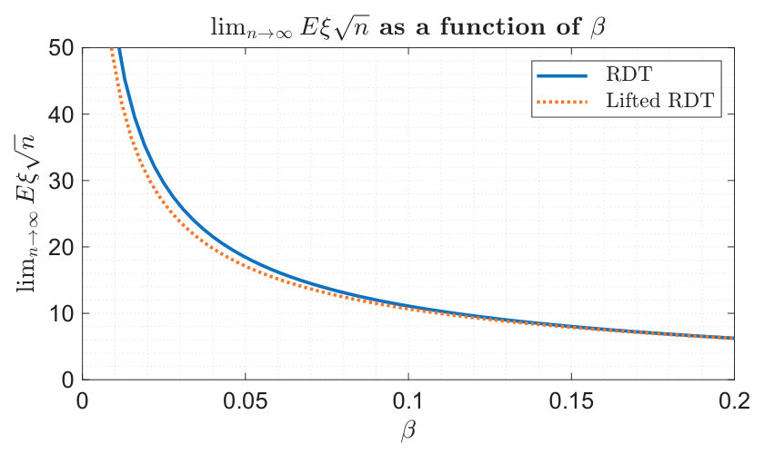 
Figure 1: RDT and Lifted RDT upper bounds on the Largest average submatrix value limn→∞Eξ√n as functions of β.

📷 Fig 2

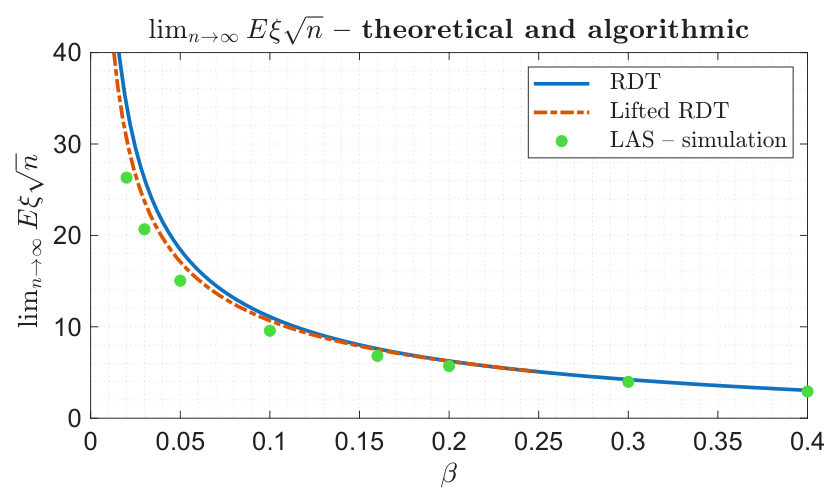 
Figure 2: Largest average submatrix value limn→∞Eξ√n – theoretical (RDT and Lifted RDT) versus algorithmic (LAS).

**Summary.** This paper tackles the challenging statistical problem of finding upper bounds for the largest average submatrix value in random matrices. The authors introduce a novel Random Duality Theory (RDT) framework to rigorously characterize these bounds. By developing plain and lifted RDT variants, they provide explicit, improved upper bounds that match established results in the limit of small submatrices.

**Why it may be interesting.** While the core topic is random matrix theory, the mathematical techniques involving duality, bounding, and analyzing phase transitions in high-dimensional random structures are highly relevant to understanding complexity in quantum information and many-body systems.

Detailed structure

**Main problem.** The paper studies statistical variants of the classical largest average submatrix problem (LASP) for random matrices.

**Main result.** The authors developed a Random Duality Theory (RDT) framework to derive explicit, closed-form upper bounds on the largest average submatrix values, showing improvements over previous bounds.

**Method.** The primary method is the development and application of a generic Random Duality Theory (RDT) framework, comparing plain and lifted variants to establish rigorous upper bounds.

**Model / system.** The analysis focuses on an $m 	imes n$ matrix $A$ whose elements are independent standard normal random variables. The problem is analyzed in the linear regime where submatrix dimensions are proportional to the original matrix dimensions.

**Key observables.** The largest average submatrix value ($\xi$), scaled by $\sqrt{n}$, which is the primary quantity of interest.

**Important parameters / regimes.** Dimensionality proportionality parameters ($\alpha, eta_1, eta_2$) and the regime where these parameters approach zero (small submatrices).

**Assumptions / limitations.** The elements of the matrix $A$ are assumed to be independent standard normal random variables, and the analysis focuses on the asymptotic linear regime.

**Figures summary.** Figure 2 compares the theoretical predictions (RDT and Lifted RDT) against algorithmic predictions (LAS) for the largest average submatrix value across different dimensions.

**Paper structure.** The paper introduces the LASP in the statistical regime, develops the generic RDT framework, applies plain RDT to obtain initial bounds, introduces and utilizes a lifted RDT variant for tighter bounds, and finally validates these results by showing agreement with known replica and sublinear results in the small submatrix limit.

Abstract

We study statistical variants of the classical largest average submatrix problem. For small submatrices (where the dimension is less than linearly proportional to the original matrix), the problem is typically well understood and believed to exhibit the statistical-computational gap (SCG). However, analytical treatment of both the information-theoretic and algorithmic aspects of the linear regime remains challenging, and no mathematically rigorous results have yet arrived anywhere close to proving or disproving SCG existence in this setting.   Focusing on the linear regime, we make strong progress in several key directions: 1) We develop a generic Random Duality Theory (RDT) framework to characterize largest average submatrix values. 2) Using the plain RDT variant, we obtain closed-form upper bounds as explicit functions of dimensionality proportionality parameters. 3) We demonstrate that a lifted RDT variant strictly improves upon the plain RDT within a certain linear range of submatrix dimensions. 4) For small submatrices where the dimensional proportionality constants approach zero, we prove that our results match both the replica results from [34] (obtained via one-step replica symmetry breaking) and the sublinear results from [18,45].

[↑ back to top](#top)

### [Full Eigenstate Thermalization in Quantum Field Theory and Gravitational Scrambling](http://arxiv.org/abs/2609.17663v1)

**Authors:** Ricardo Espíndola, Viktor Jahnke  
**Type:** theory · **Category:** statistical mechanics · **PDF:** <https://arxiv.org/pdf/2609.17663v1>  
**Analysis basis:** full PDF text, analyzed in chunks
**Topic relevance:** `Keldysh / 2PI / non-Gaussian methods` **2/5**

📷 Fig 1

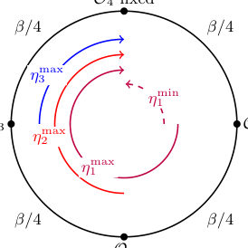 
FIG. 1: Imaginary-time deformations of four equally spaced operator insertions on the thermal circle. Fix- ing O4 by time-translation invariance, the boundary of the analyticity domain allows maximal positive displace- ments ηmax 3 = β/4, ηmax 2 = β/2, and ηmax 1 = 3β/4 while preserving the cyclic ordering. For O1, the oppo- site boundary is ηmin 1 = −β/4 (dashed line). Hence the allowed displacement satisfies −β/4 &lt; η1 &lt; 3β/4, which implies α4(+ˆe1) = β/4 and α4(−ˆe1) = 3β/4.

📷 Fig 2

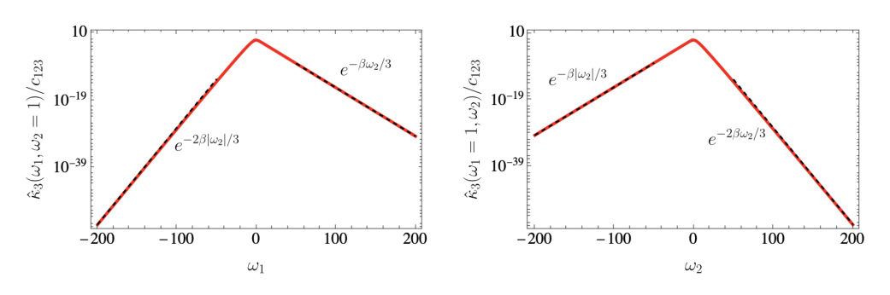 
FIG. 2: Large-frequency behavior of the Fourier transform of the third regulated free cumulant bκ3(ω1, ω2) for β = 1 and ∆1 = ∆2 = ∆3 = 1. Left: ω2 = 1 with ω1 →±∞. Right: ω1 = 1 with ω2 →±∞. Black dashed lines show the directional exponential decay rates predicted by Eq. (18).

**Summary.** This paper derives rigorous, directional bounds on the correlation functions characterizing full eigenstate thermalization in QFT. By analyzing the analyticity domain in the complex frequency plane, the authors demonstrate that both CFT correlators and gravitational scattering processes saturate these bounds. This provides strong evidence that holographic models realize the full constraints predicted by ETH in continuum quantum systems.

**Why it may be interesting.** The work provides a rigorous, continuum field-theoretic method to test the limits of thermalization, which is a central topic in non-equilibrium statistical mechanics and quantum chaos, relevant to understanding thermalization in complex quantum systems.

Detailed structure

**Main problem.** To derive directional large-frequency bounds on the smooth functions governing full eigenstate thermalization (full ETH) in continuum quantum field theory (QFT) and holographic systems.

**Main result.** The analysis shows that thermal conformal correlators saturate the second- and third-order bounds, and the leading gravitational Regge contribution saturates the strongest fourth-order direction, confirming ETH constraints in holographic CFTs.

**Method.** The authors use thermal analyticity, deforming contours in the complex plane, and deriving bounds on free cumulants ($\kappa_n$) to analyze the large-frequency behavior of correlation functions.

**Model / system.** The study applies to continuum Quantum Field Theory (QFT) and holographic systems (AdS/CFT), using concepts like Out-of-Time-Order Correlators (OTOCs) and free probability theory to characterize thermalization.

**Key observables.** Full ETH smooth functions ($F^{(n)}$), thermal free cumulants ($\kappa_n$), two- and three-point correlation functions, and the fourth free cumulant ($\kappa_4$).

**Important parameters / regimes.** Large frequency scale ($W 	o \infty$), energy differences ($\vec{\omega}$), and the inverse temperature ($eta$).

**Assumptions / limitations.** The derivation assumes that the function $C(\vec{\eta})$ is finite in the interior of the analyticity domain and grows at most algebraically near the boundaries.

**Figures summary.** Figure 1 illustrates imaginary-time deformations of four operator insertions on the thermal circle, showing specific boundary displacements ($\eta_{\max}^3 = eta/4$, $\eta_{\max}^2 = eta/2$, $\eta_{\max}^1 = 3eta/4$). Figure 2 shows the saturation of the full-ETH bound for the three-point function in 2D CFT.

**Paper structure.** The paper develops the theoretical framework by using thermal analyticity to derive directional bounds on free cumulants. It then demonstrates the saturation of these bounds using concrete calculations from 2D CFT and holographic models, particularly for the fourth free cumulant.

Abstract

Using thermal analyticity, we derive directional large-frequency bounds on the smooth functions entering full eigenstate thermalization in continuum quantum field theory. The strongest directions reproduce the scales previously identified for lattice systems, while the complete analyticity domain reveals an asymmetric multifrequency structure. Thermal conformal correlators saturate the second- and third-order bounds, and the leading gravitational Regge contribution saturates the strongest fourth-order direction.

[↑ back to top](#top)

### [Securing quantum error correction against misleading advice from AI agents](http://arxiv.org/abs/2609.19090v1)

**Authors:** A. Barış Özgüler  
**Type:** theory · **Category:** quantum information and computing · **PDF:** <https://arxiv.org/pdf/2609.19090v1>  
**Analysis basis:** full PDF text, analyzed in chunks
**Topic relevance:** `quantum measurements` **2/5**

📷 Fig 1

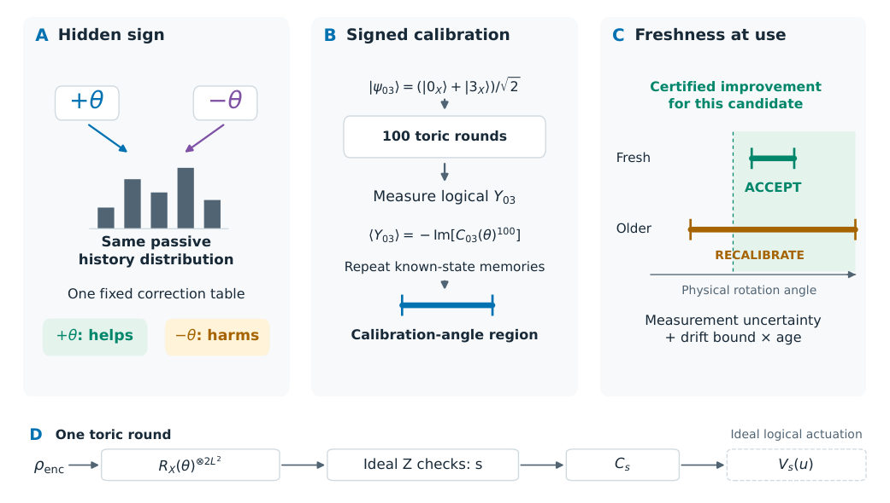 
FIG. 1. Trusted calibration separates advice from authority over recovery. (a) Opposite rotation signs give identical passive syndrome-history distributions in the odd-distance square toric instrument defined in Sec. II, although one fixed correction table can help at one sign and harm at the other. (b) Known encoded calibration states undergo 100 rounds of the same toric instrument and a terminal logical Y03 measurement. Their sign-sensitive response supplies the missing observation; finite counts constrain the calibration angle. (c) The evaluator admits a proposed update only when sampling uncertainty and a justified drift bound certify recovery improvement at deployment; otherwise, the...

📷 Fig 2

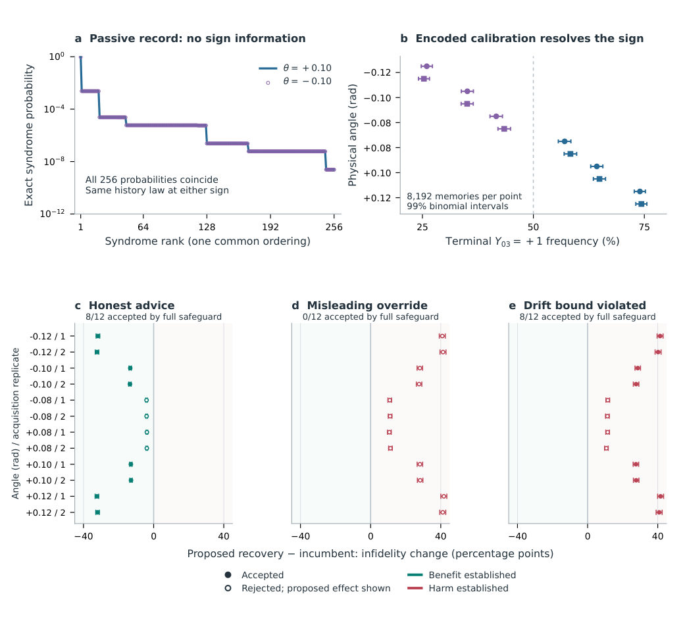 
FIG. 2. The same passive record can conceal opposite recovery consequences. (a) All 256 one-round syndrome probabilities evaluated from the exact instrument for the encoded calibration state coincide at θ = ±0.10 rad, displayed in one common ordering. The passive-history theorem extends the sign blindness to every history length. (b) Terminal logical measurements distinguish the signs: each circle or square is one of two independently simulated 8192-memory acquisitions at each angle, with a 99% binomial interval. (c–e) Independent estimates of excess recovery infidelity for every Qwen proposal under honest advice, misleading advice, and a sign flip that violates the drift bound. The same 12...

📷 Fig 3

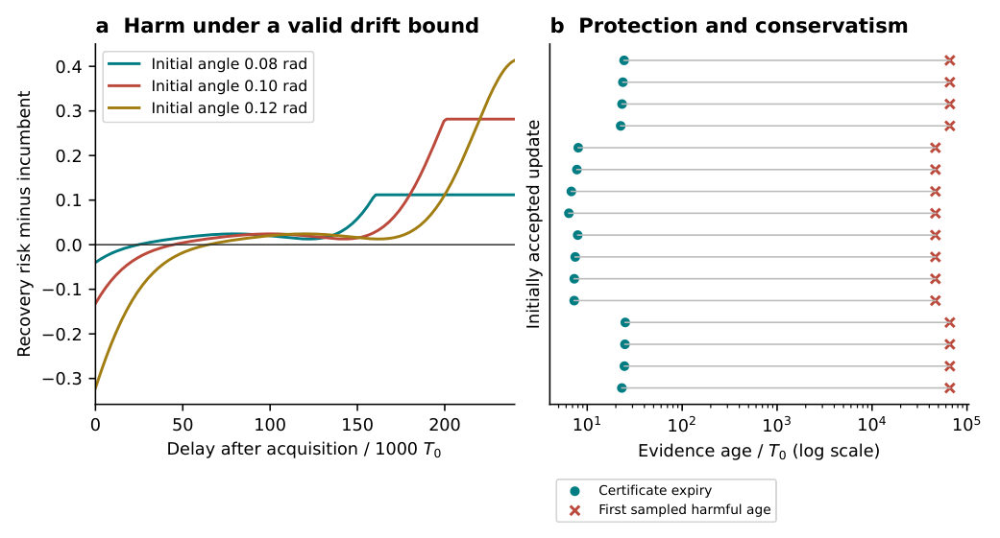 
FIG. 3. Timing prevents harmful reuse under a valid drift premise, with conservative expiry. (a) Exact-channel excess recovery risk for the initially preferred correction after a continuous rate-limited ramp from three positive initial angles; negative-angle counterparts obey the same symmetry. Each point gives the recovery risk when the angle is held fixed during deployment at the value reached after the preceding drift. Positive excess risk denotes harm. The rate is 10−6 rad/T0; the ramp stops at the opposite initial angle. Acquisition precedes the ramp and deployment follows it. (b) Each row is one of the 16 independently sampled acquisitions initially admitted by confidence. Circles...

📷 Fig 4

 
FIG. 4. Protection, retained recovery benefit and the cost of stricter timing. (a) All observed outcomes under the stated premises: 20 independent workloads at 3 nested budgets for each controller and rule. Benefit/harm require independent paired deployment intervals below −0.001/above +0.001; other accepted-update outcomes remain unresolved. All rules check workload identity. (b) All 12 honest-advice Qwen instances (4 workloads, 3 budgets). Filled/open squares denote acceptance/rejection by the end-timestamp and whole-acquisition rules. Shaded rows identify 2 distance-5 updates additionally rejected when acquisition time is included. Their independent deployment intervals still establish...

**Summary.** This work develops a security protocol for Quantum Error Correction against malicious or flawed advice from AI agents. By introducing a trusted calibration step, the authors resolve ambiguities in syndrome measurements that otherwise allow harmful updates. The framework establishes conditional guarantees, ensuring that recovery updates are only accepted if they can be mathematically certified to improve the system's state beyond known error bounds.

**Why it may be interesting.** It provides a rigorous, information-theoretic framework for assessing trust in complex, adaptive quantum control loops, which is crucial for deploying quantum computation in noisy, real-world environments.

Detailed structure

**Main problem.** The paper addresses the security of Quantum Error Correction (QEC) protocols when the advice or syndrome history is potentially misleading or manipulated by an external AI agent.

**Main result.** Security is maintained by implementing a separate, trusted evaluator that requires certified improvement based on calibration uncertainty and drift bounds, effectively separating the 'advice' from the 'authority' of the recovery decision.

**Method.** The authors analyze the joint distribution of passive syndrome histories, using signed calibration measurements to resolve sign ambiguities inherent in the syndrome records, and deriving rigorous bounds on accumulated risk (infidelity).

**Model / system.** The primary model is the odd-distance square toric code, used to encode logical qubits. The analysis involves syndrome measurements, recovery operations, and the incorporation of calibration measurements to test the integrity of the advice.

**Key observables.** Passive syndrome-history distributions, terminal logical measurement outcomes ($q_Y(	heta)$), and the excess infidelity ($D_u(	heta)$).

**Important parameters / regimes.** The required improvement threshold ($\delta$), the calibration uncertainty, and the drift bound ($L_D v A$) are critical parameters for certification.

**Assumptions / limitations.** The security guarantees rely on the assumption that the drift rate is bounded and that the calibration measurements provide accurate, sign-sensitive information.

**Figures summary.** Figure 1 illustrates how trusted calibration separates advice from authority by resolving sign ambiguities in passive history distributions. Figure 2 shows the quantitative chain involving syndrome history, calibration, and the decision process using uncertainty and drift bounds.

**Paper structure.** The paper first establishes the ambiguity in passive syndrome records (sign symmetry) and then introduces the role of signed calibration to resolve this. It develops a formal risk assessment framework using drift bounds and finally applies this framework to show that only certified improvements are accepted, while also analyzing the robustness of these bounds.

Abstract

Can an attacker turn influence over an artificial intelligence (AI) adviser into a harmful quantum error-correction update? We identify an ambiguity in passive syndrome records that obstructs recovery selection, then show how additional calibration measurements support certified recovery updates under uncertainty and drift. In an odd-distance square toric code with error-free preparation, syndrome measurements, and recovery operations, opposite coherent $X$ rotations produce identical passive syndrome-history distributions. Yet a fixed phase correction can help at one sign and harm at the other. A terminal logical measurement on known encoded calibration states supplies the missing sign information. A separate evaluator accepts an update only when calibration uncertainty and a justified drift bound certify improvement over the current recovery, without assuming that the adviser recommends correctly. In simulated advice attacks, calibration-confidence checks reject harmful proposals while retaining beneficial updates under honest advice. We derive sufficient limits on calibration age that require improvement through deployment. In matched simulations, a validated channel-specific bound retains more beneficial updates than the general bound after accounting for evaluation time, while preventing the tested harmful activations under the stated drift assumption. A separate surface-code experiment includes stochastic circuit faults and noise changing during acquisition. Deterministic controllers achieve at least as many beneficial updates with the same observations. Violating the drift assumption permits harmful acceptance in the toric experiment. The results identify information required for recovery selection, establish conditional guarantees against harmful updates, and quantify the recovery improvements forgone through conservative acceptance.

[↑ back to top](#top)

### [The Fourier Uncertainty Principle Through the Lens of Infinite Banded Matrices](http://arxiv.org/abs/2609.17970v1)

**Authors:** Cameron L. Williams, Lara C. Ortelli, Gael Silva  
**Type:** theory · **Category:** other · **PDF:** <https://arxiv.org/pdf/2609.17970v1>  
**Analysis basis:** full PDF text, analyzed in chunks
**Topic relevance:** `Keldysh / 2PI / non-Gaussian methods` **2/5**

📷 Fig 1

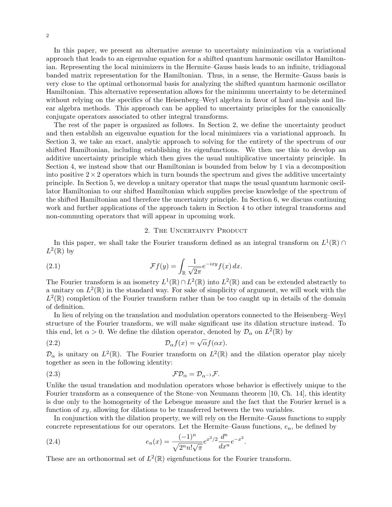 
Low-resolution page preview, page 2

📷 Fig 2

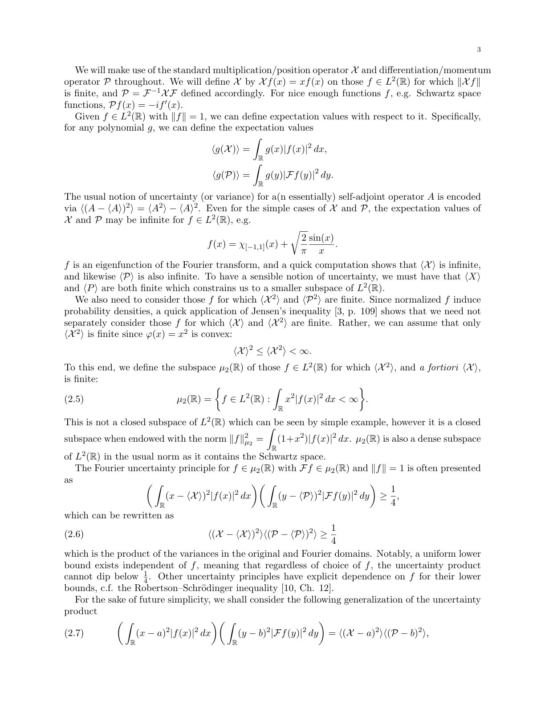 
Low-resolution page preview, page 3

📷 Fig 3

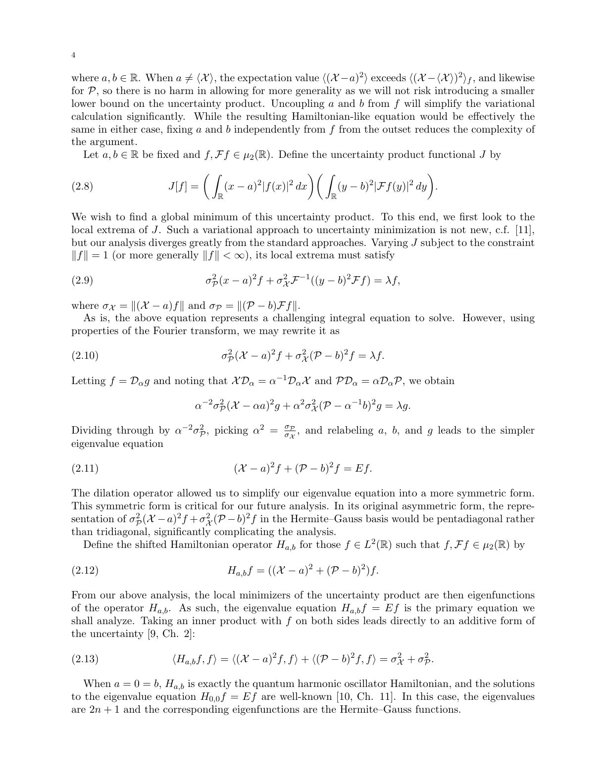 
Low-resolution page preview, page 4

📷 Fig 4

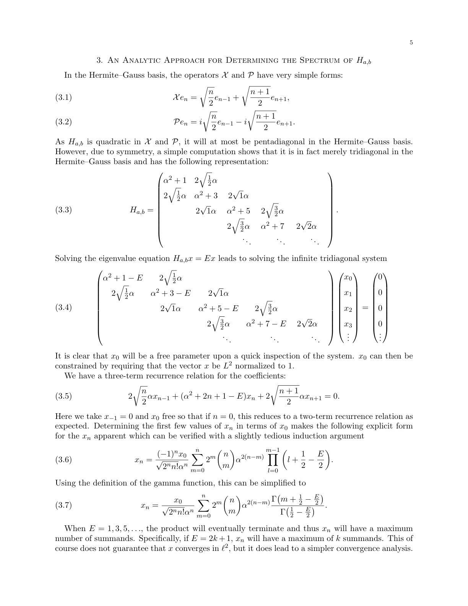 
Low-resolution page preview, page 5

📷 Fig 5

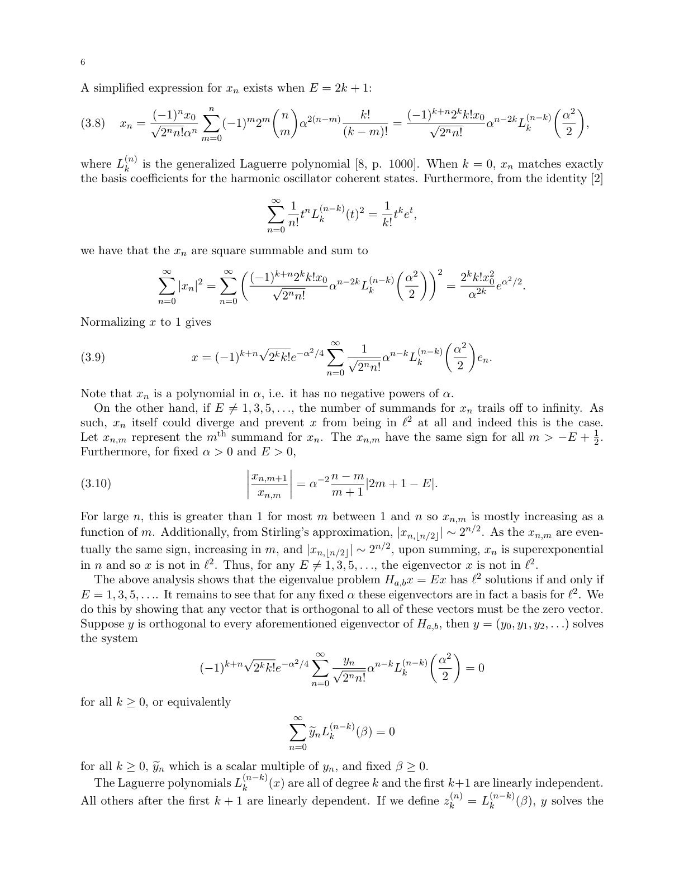 
Low-resolution page preview, page 6

**Summary.** This paper develops an alternative, generalized framework for analyzing the Fourier uncertainty principle by focusing on the eigenvalue problem of the shifted Hamiltonian $H_{a,b}$. It employs variational methods and matrix diagonalization in the Hermite-Gauss basis to solve this problem. The work confirms the principle while providing a more broadly applicable mathematical structure for studying uncertainty relations for various integral transforms.

**Why it may be interesting.** The generalization of uncertainty principles beyond the standard Fourier transform setting, by developing a framework applicable to other canonically conjugate operators associated with different integral transforms, is highly relevant for theoretical physics.

Detailed structure

**Main problem.** The paper investigates the Fourier uncertainty principle using variational methods that avoid relying on the standard Heisenberg-Weyl structure of the Fourier transform.

**Main result.** The analysis establishes the eigenvalue problem for the shifted Hamiltonian $H_{a,b}$ and confirms the unitary equivalence between $H_{0,0}$ and $H_{a,b}$ via the displacement operator.

**Method.** The authors employ three distinct approaches: a variational minimization of the uncertainty product, solving the resulting eigenvalue problem via recurrence relations in the Hermite-Gauss basis, and an algebraic approach using unitary transformations.

**Model / system.** The analysis centers on the uncertainty product for functions $f$ and their Fourier transforms, governed by the shifted Hamiltonian $H_{a,b} = (X - a)^2 + (P - b)^2$. This Hamiltonian is analyzed in the context of the quantum harmonic oscillator.

**Key observables.** The uncertainty product $J[f] = \langle(X - a)^2
angle \langle(P - b)^2
angle$, and the eigenvalues $E$ of $H_{a,b}$.

**Important parameters / regimes.** The shift parameters $a$ and $b$, and the eigenvalue $E$.

**Assumptions / limitations.** The analysis is restricted to functions $f$ in the subspace $\mu_2(\mathbb{R})$ where $\langle X^2 
angle$ is finite, and the algebraic approach is noted as being specific to the Fourier transform.

**Paper structure.** The paper develops the uncertainty principle using a variational approach, analyzes the resulting eigenvalue problem $H_{a,b}f = Ef$ using matrix representations and recurrence relations, and concludes by establishing the unitary equivalence between $H_{0,0}$ and $H_{a,b}$ using displacement operators.

Abstract

In this paper, we investigate the Fourier uncertainty principle through infinite banded matrices by way of a variational approach to minimizing the uncertainty product. Traditional methods for analyzing the Fourier uncertainty principle rely heavily on the Heisenberg--Weyl structure that underlie the Fourier transform and therefore do not generalize well beyond this setting. We provide three distinct approaches to developing the uncertainty principle based on the spectrum of a shifted quantum harmonic oscillator Hamiltonian, $H_{a,b}$. In the Hermite--Gauss basis, $H_{a,b}$ has an infinite, tridiagonal form which is central to the analysis. One approach exactly solves for the spectrum through analytic methods, another decomposes $H_{a,b}$ into an infinite sum of $2\times 2$ matrices, and the third approach is an algebraic approach to establishing the spectrum via a unitary equivalence with the quantum harmonic oscillator. The approaches taken herein provide alternate avenues that are more broadly applicable to other canonically conjugate operators for other integral transforms which maintain a tridiagonal form.

[↑ back to top](#top)

### [Macroscopic Response Diagnoses the Noise Sensitivity of Terminal Outcomes](http://arxiv.org/abs/2609.17982v1)

**Authors:** Bo Li, Chaoqian Wang  
**Type:** theory · **Category:** statistical mechanics · **PDF:** <https://arxiv.org/pdf/2609.17982v1>  
**Analysis basis:** full PDF text, analyzed in chunks
**Topic relevance:** `Keldysh / 2PI / non-Gaussian methods` **1/5** · `analog quantum simulation` **1/5** · `driven-dissipative phase transition` **1/5** · `non-equilibrium universality` **1/5** · `quantum measurements` **1/5**

📷 Fig 1

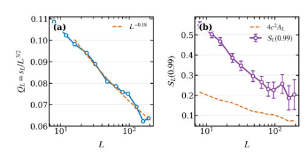 
FIG. 1. Macroscopic diagnostic and microscopic response in the driven three-dimensional RFIM. (a) Normalized thresh- old slope QL = sL/L3/2 at R = 2.16; the dashed line is a finite-size power-law guide with exponent byF −3/2 = −0.184. (b) Normalized outcome correlation for disorder pairs with coordinatewise correlation c = 0.99. The dashed lower curve is the plug-in inverse-BKS lower bound 4c2R2Q2 L, evaluated using the point estimates of QL from panel (a). Error bars are bootstrap 95% confidence intervals. The data are consis- tent with the thermodynamic limits QL →0 and SL(c) →0, though they do not establish these limits definitively.

📷 Fig 2

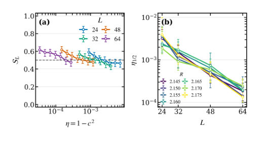 
FIG. 2. Finite-size terminal-outcome noise crossover. (a) Raw outcome-correlation curves at R = 2.16 shift toward smaller noise variance η = 1 −c2 as L increases. (b) Half- correlation noise scales η1/2 for seven disorder strengths; er- ror bars are complete-row bootstrap 95% confidence intervals. The narrowing supports noise sensitivity over the simulated range, but we do not infer a universal crossover exponent or a critical disorder value.

📷 Fig 3

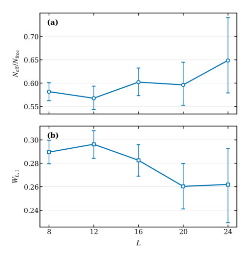 
FIG. 3. Direct response measurement for the nontransitive, plane-seeded Stag-Hunt event. (a) Effective influence fraction Neff/Nfree. (b) Normalized first-order Hermite weight WL,1. Error bars are two-block chunk-bootstrap 95% intervals; the first-order intervals are obtained by normalizing the squared- influence intervals by the measured Bernoulli variance.

**Summary.** This work develops a rigorous criterion to diagnose the noise sensitivity of terminal outcomes in complex many-body systems. By relating the vanishing of outcome correlations to the scaling of the macroscopic response slope, the authors provide a measurable test for how much information about the final state is retained from the initial microscopic disorder. This is particularly relevant for understanding critical dynamics in disordered systems.

**Why it may be interesting.** The rigorous mathematical framework connecting macroscopic response diagnostics (like the slope) to microscopic information loss (vanishing correlations) provides a powerful, measurable tool for characterizing the predictability of complex, non-equilibrium many-body systems.

Detailed structure

**Main problem.** The paper addresses whether the terminal macroscopic outcome of a many-body system can be inferred from its microscopic initial data without simulating the full trajectory, focusing on noise sensitivity.

**Main result.** A necessary and sufficient diagnostic criterion for noise sensitivity is established: the correlation between original and perturbed outcomes vanishes asymptotically if and only if the slope of the outcome probability with respect to the control field grows slower than the square root of the system volume.

**Method.** The analysis employs Gaussian influence bounds, the Gaussian Russo formula, and compares correlation measures derived from coordinate-perturbed outcomes to establish the diagnostic criterion.

**Model / system.** The study analyzes homogeneous systems with independent Gaussian disorder, specifically testing the 3D driven random-field Ising model (RFIM) and path-dependent best-response games.

**Key observables.** Normalized response slope ($Q_L$), outcome correlation ($S_L(c)$), effective number of influential coordinates ($N_{	ext{eff},L,q}$), and initial-state information content ($D_L$).

**Important parameters / regimes.** System size ($L$), disorder strength ($R$), and the fixed noise level ($c$).

**Assumptions / limitations.** The analysis assumes the terminal event is monotone in each disorder variable and that a uniform disorder shift is equivalent to a control-field shift with a size-independent conversion factor.

**Figures summary.** Figures show raw outcome-correlation curves and normalized threshold slopes for the RFIM, and show the effective influence fraction and Hermite weight for the Stag-Hunt process, all indicating finite-size trends.

**Paper structure.** The paper develops a general criterion for noise sensitivity using Gaussian tools, applies it to the RFIM, generalizes it to path-dependent dynamics (Stag-Hunt), and concludes by analyzing a Bethe-lattice benchmark to distinguish finite-size effects from true thermodynamic limits.

Abstract

Can the terminal macroscopic outcome of a many-body system be inferred from its microscopic initial data without simulating the full trajectory? Rather than construct such a shortcut, we address a more fundamental question for Gaussian microscopic inputs: can any fixed Wiener-Hermite degree retain a nonvanishing fraction of the variance of the terminal outcome as the system grows? We consider homogeneous systems with independent Gaussian disorder in which all microscopic coordinates are symmetry-equivalent, the terminal event is monotone in each disorder variable, and a uniform disorder shift is exactly equivalent to a control-field shift with a size-independent conversion factor. Using forward and inverse Gaussian influence bounds together with a Gaussian Russo formula, we derive a directly measurable criterion that is both necessary and sufficient for noise sensitivity. Specifically, the correlation between the original and coordinate-perturbed terminal outcomes vanishes asymptotically for every fixed nonzero level of coordinatewise noise if and only if the slope of the outcome probability with respect to the control field at the balanced threshold grows more slowly than the square root of the system volume. Event-driven simulations of the three-dimensional driven random-field Ising model up to linear size 192 find that both the normalized response and the correlations between perturbed samples decrease overall, consistent with the noise-sensitive regime at finite size. For spatial Stag-Hunt dynamics with prescribed seeds, the criterion generalizes through an effective number of influential coordinates. Separately, simulations of a path-dependent best-response game show, over the sizes studied, that the terminal equilibrium can depend on the update schedule while still carrying substantial finite-order predictive information.

[↑ back to top](#top)

### [Transport of Deformable Vesicles Driven by Chiral Active Brownian Particles](http://arxiv.org/abs/2609.18743v1)

**Authors:** Dipak Patra, Anil Kumar Dasanna  
**Type:** theory · **Category:** statistical mechanics · **PDF:** <https://arxiv.org/pdf/2609.18743v1>  
**Analysis basis:** full PDF text, analyzed in chunks
**Topic relevance:** `Frenkel-Kontorova` **1/5** · `Keldysh / 2PI / non-Gaussian methods` **1/5** · `driven-dissipative phase transition` **1/5** · `methods for driven-dissipative` **1/5** · `non-equilibrium universality` **1/5**

📷 Fig 1

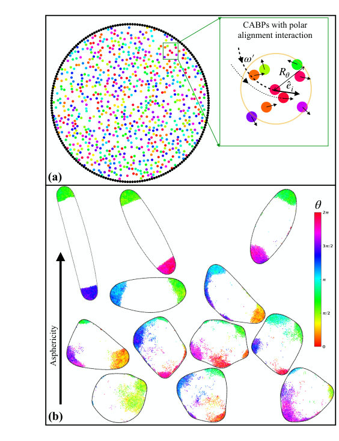 
FIG. 1. (a) Schematic illustration of the model system. The vesicle is composed of passive particles represented by black circles, while active particles are depicted as colored circles. Inset shows a magnified view of the selected region, highlight- ing the detailed structure of the model comprising CABPs with polar alignment interactions. The i-th particle, char- acterized by self-propulsion direction ei and intrinsic angu- lar velocity ω′, experiences polar alignment interactions with neighboring particles within a circular interaction zone of ra- dius Rθ. (b) Simulation snapshots showing diverse shapes adopted by the vesicle during migration, including rod-like, elliptical, and...

📷 Fig 2

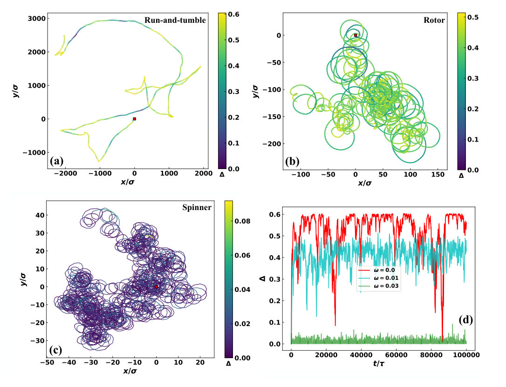 
FIG. 2. Typical trajectories explored by the vesicle, illustrating three modes of cell migration at different chirality strengths for Pe = 30: (a) ω = 0, (b) ω = 0.01, and (c) ω = 0.03. The color-coded bars indicate the corresponding values of the asphericity, ∆= (λ1 −λ2)2/(λ1 + λ2)2 where λ1 and λ2 are eigenvalues of the gyration tensor of the vesicle. The red squares mark the initial positions of the vesicle. (d) Time-series profiles of ∆for the trajectories shown in (a–c).

📷 Fig 3

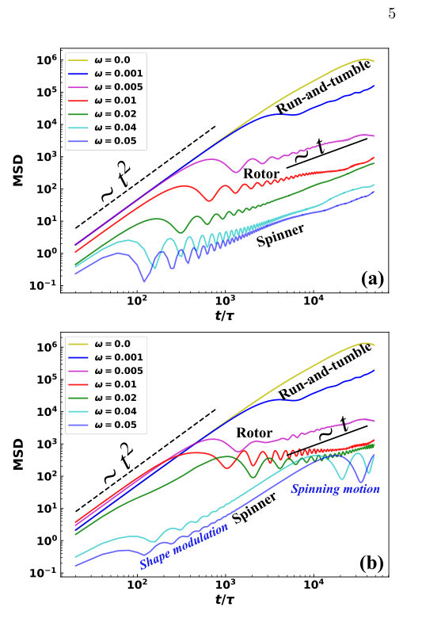 
FIG. 3. Time evolution of the MSD at different chirality strengths ω for Pe = 30: (a) MSD of the vesicle center of mass and (b) average MSD of the membrane beads.

📷 Fig 4

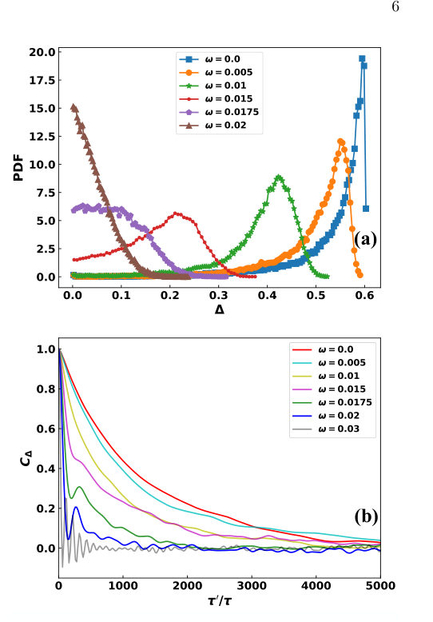 
FIG. 4. (a) Probability distribution function of ∆for various values of ω and (b) auto correlation function of ∆as a function of lag time τ ′ for Pe = 30.

📷 Fig 5

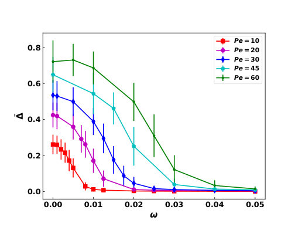 
FIG. 5. Average asphericity as a function of chirality strength for several values of the P´eclet number. The bars denote the standard deviation associated with the spread of the proba- bility distribution function of ∆.

**Summary.** This work analyzes how chiral active particles drive the motion and shape changes of enclosed deformable vesicles. Using simulations and analytical theory, the authors show that chirality dictates the rotational dynamics, predicting an optimal chirality that maximizes rotation. This provides a general framework for understanding active stress transmission in confined, non-equilibrium systems.

**Why it may be interesting.** The concepts of active stresses, non-equilibrium dynamics, and collective alignment are central to modern statistical mechanics, providing a concrete, solvable model for active matter physics.

Detailed structure

**Main problem.** Investigating the transport and shape dynamics of deformable vesicles driven by chiral active Brownian particles (CABPs).

**Main result.** Vesicle rotation is non-monotonic with chirality, and the study establishes a general mechanism by which chirality and collective alignment regulate active stress transmission to deformable boundaries.

**Method.** The study combines numerical simulations (Langevin dynamics) with the development of an analytical theory relating vesicle rotation to the effective torque generated by the active particles.

**Model / system.** The system consists of a 2D, fixed-area vesicle filled with CABPs interacting via excluded volume and polar alignment. The vesicle is modeled as a bead-spring polymer ring, and particle dynamics are governed by Langevin equations.

**Key observables.** Mean-square displacement (MSD), asphericity ($\Delta$), and vesicle rotational velocity ($\Omega$).

**Important parameters / regimes.** Péclet number ($Pe$), dimensionless alignment strength ($g$), and chirality parameter ($\omega$).

**Assumptions / limitations.** The model assumes fixed area conservation for the vesicle and focuses on 2D systems.

**Figures summary.** Figures illustrate schematic models, simulation snapshots showing diverse vesicle shapes (rod-like, elliptical), and time-series profiles of observables like asphericity and MSD for different chiral regimes.

**Paper structure.** The paper progresses from defining the physical model and simulation setup to presenting simulation results characterizing distinct collective motion modes (Run-and-Tumble, Rotor, Spinner). It culminates in developing an analytical theory that predicts the non-monotonic dependence of rotation on chirality and deriving scaling laws.

Abstract

Active matter systems can generate mechanical stresses that deform their surroundings, providing a route to transport and shape dynamics far from equilibrium. Deformable vesicles containing active particles offer a minimal setting in which such active stresses are directly coupled to boundary mechanics. Here, we use numerical simulations to investigate a two-dimensional, fixed-area vesicle filled with chiral active particles interacting through excluded volume and polar alignment. We find that the coupling between particle chirality and vesicle deformation produces distinct modes of collective motion, including run-and-tumble-like migration, rotor-like dynamics, and persistent spinning. Most notably, we show that vesicle rotation is non-monotonic in chirality: at fixed activity, an optimal chirality maximizes the rotational velocity. We develop an analytical theory that relates the vesicle rotation to the effective torque generated by the chiral active particles. The theory identifies the competition underlying the optimal chirality and predicts a scale-invariant dependence of the rotational velocity on activity and chirality. This scaling collapses simulation results obtained over different activity strengths onto a universal curve. Our results establish a general mechanism by which chirality and collective alignment regulate the transmission of active stresses to deformable boundaries, providing a framework for understanding transport and rotational dynamics in confined active systems.

[↑ back to top](#top)

### [Fourier Analysis of Parametrized Interactive Quantum Classifiers](http://arxiv.org/abs/2609.17991v1)

**Authors:** Fábio Novaes, Fernando M. de Paula Neto, João V. M. Cardoso  
**Type:** both · **Category:** quantum information and computing · **PDF:** <https://arxiv.org/pdf/2609.17991v1>  
**Analysis basis:** full PDF text, analyzed in chunks
**Topic relevance:** `analog quantum simulation` **1/5** · `correlated / nonlocal dissipation` **1/5** · `driven-dissipative phase transition` **1/5** · `quantum measurements` **1/5**

📷 Fig 1

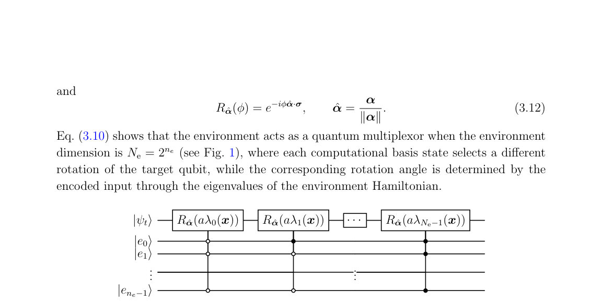 
Figure 1: Circuit representation of the IQC architecture. The target qubit is rotated by R ˆα(aλl(x)) depending on the state of the environment register.

📷 Fig 2

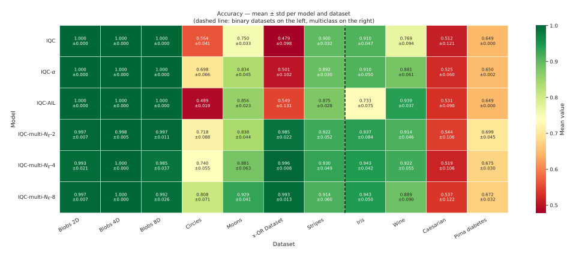 
Figure 2: Accuracy (mean ± standard deviation) obtained by each IQC variant across the eleven benchmark datasets. The dashed vertical line separates binary datasets (left) from multiclass datasets (right).

📷 Fig 3

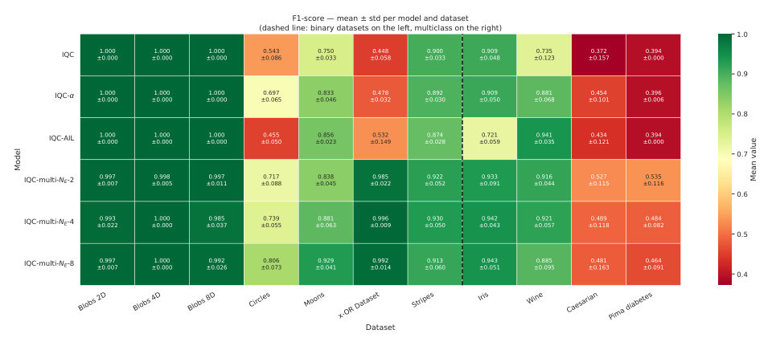 
Figure 3: F1-score (mean ± standard deviation) obtained by each IQC variant across the eleven benchmark datasets. The dashed vertical line separates binary datasets (left) from multiclass datasets (right).

📷 Fig 4

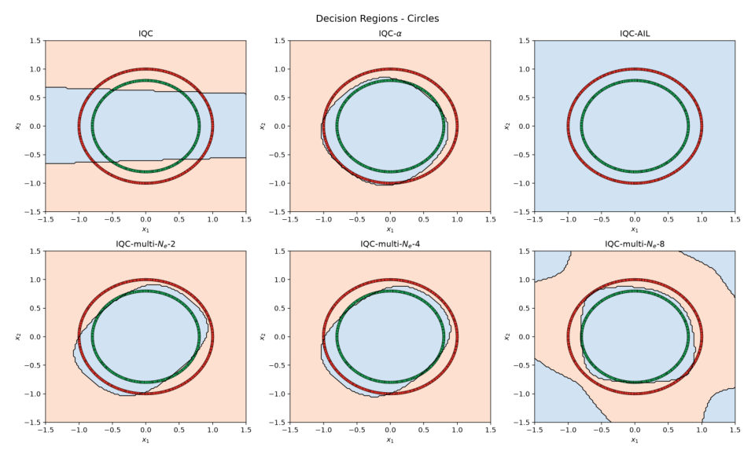 
Figure 4: Decision regions learned by the six IQC variants on the Circles dataset. The plots show the resulting classification regions together with the data points for the two classes.

📷 Fig 5

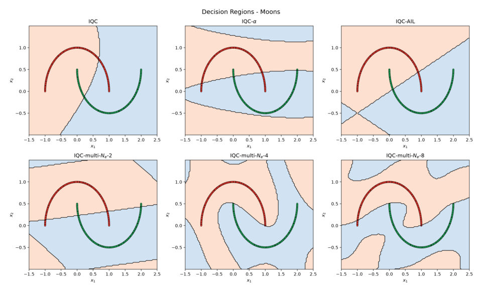 
Figure 5: Decision regions learned by the six IQC variants on the Moons dataset. The plots show the resulting classification regions together with the data points for the two classes.

**Summary.** This work analytically characterizes Interactive Quantum Classifiers (IQCs) by deriving a closed-form expression for their reduced quantum channel. By applying Fourier analysis, the authors show that the Hamiltonian parameters directly control the frequency components of the classifier's output. This provides a powerful theoretical framework for designing and understanding open-system-inspired quantum machine learning models.

**Why it may be interesting.** It directly connects the theoretical framework of open quantum systems (Hamiltonian evolution) to the practical structure of quantum machine learning models, providing an analytical tool (Fourier analysis) to understand model expressivity.

Detailed structure

**Main problem.** To provide an analytical characterization of parametrized Hamiltonians in Interactive Quantum Classifiers (IQCs) and establish Fourier analysis as a useful framework for understanding and designing open-system-inspired quantum learning models.

**Main result.** The analysis yields a closed-form expression showing how Hamiltonian parameters control the constant, sine, and cosine components of the classifier output, establishing a Fourier interpretation of the feature map.

**Method.** The authors derive the reduced quantum channel for a parametrized IQC and employ Fourier analysis to characterize the resulting prediction function.

**Model / system.** The model is the Interactive Quantum Classifier (IQC), a quantum machine learning model inspired by open quantum systems where the interaction is governed by a parametrized Hamiltonian.

**Key observables.** Classification performance (Accuracy, F1-score), Fourier components (constant, sine, cosine), and the reduced quantum channel.

**Important parameters / regimes.** Hamiltonian parameters ($\alpha$), environmental coupling strengths ($W$), and the number of environmental modes ($N_e$).

**Assumptions / limitations.** The analysis assumes the IQC dynamics can be reduced to a form amenable to Fourier decomposition, and numerical tests compare various parameterized variants.

**Figures summary.** The notes indicate the presence of multiple tables (Tables 6-13) comparing the performance metrics (Accuracy, F1-score, etc.) of various IQC models across several real-world and synthetic datasets.

**Paper structure.** The paper moves from theoretical derivation (closed-form expression, Fourier interpretation) to proposing generalized Hamiltonian encodings, followed by extensive numerical experiments comparing model performance across multiple benchmarks.

Abstract

Interactive Quantum Classifiers (IQCs) constitute a family of quantum machine learning models inspired by open quantum systems, in which the interaction between a target qubit and an environment is described by a Hamiltonian. Previous works introduced alternative Hamiltonian parameterizations and showed empirically that they can improve classification performance, but the role of these parameters in the resulting classifier remains poorly understood. In this work, we derive a closed-form expression for the reduced quantum channel generated by a parametrized IQC with a single target qubit. The analytical solution explicitly reveals how the Hamiltonian parameters control the constant, sine, and cosine components of the classifier output, establishing a Fourier interpretation of the induced feature map. This analysis motivates a generalized family of Hamiltonian encodings, including matrix-parameterized environmental Hamiltonians whose Fourier components depend on linear combinations of input features, thereby enabling non-separable Fourier structures. Numerical experiments on synthetic and real-world datasets show that the proposed models can improve classification performance on several nonlinear benchmarks. The generalized matrix encoding achieves the strongest aggregate performance in the evaluated benchmark, while a simpler four-parameter extension often attains comparable performance with substantially fewer trainable parameters. We additionally characterize the generated state ensembles using the standard fidelity-based expressibility measure, finding that global expressibility does not directly predict classification performance. Our results provide an analytical characterization of parametrized Hamiltonians in Interactive Quantum Classifiers and establish Fourier analysis as a useful framework for understanding and designing open-system-inspired quantum learning models.

[↑ back to top](#top)

### [Algorithmic Design of Heralded Linear Optical Circuits for Multipartite Entanglement](http://arxiv.org/abs/2609.18002v1)

**Authors:** Jaehee Kim, Hon Wai Lau, William J. Munro, Joonsuk Huh, Seungbeom Chin  
**Type:** theory · **Category:** quantum information and computing · **PDF:** <https://arxiv.org/pdf/2609.18002v1>  
**Analysis basis:** full PDF text, analyzed in chunks
**Topic relevance:** `interference shaping light` **1/5** · `quantum measurements` **1/5**

📷 Fig 1

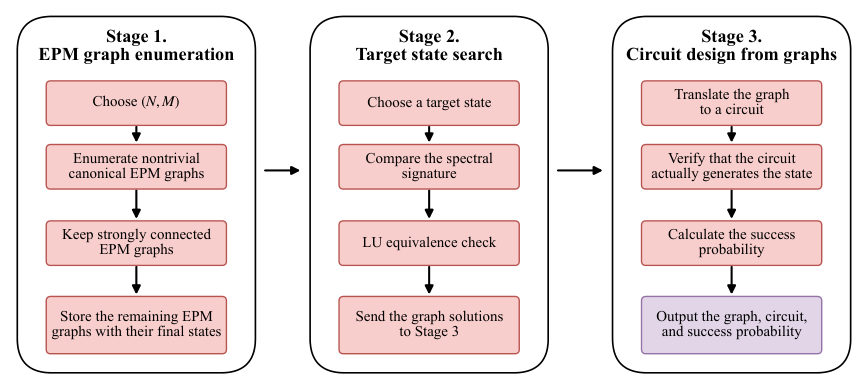 
FIG. 1. Summary of our algorithmic strategy. EPM graph repositories are constructed for different (N, M) in Stage 1. Target states are selected and searched within the graph repositories in Stage 2. The searched graphs are translated into heralded linear optical circuits using the LQG translation rules in Stage 3.

📷 Fig 2

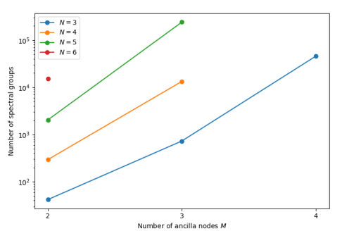 
FIG. 2. Number of distinct spectral-signature groups versus the number of ancilla nodes M (from 2 to 4), for system sizes N (from 3 to 6) (see Table I, ‘spectra groups’ column).

📷 Fig 3

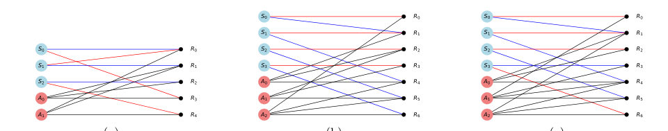 
FIG. 3. EPM graph solutions for hypergraph magic states: (a) H0CCZ012| + ++⟩for N = 3, using 8 photons; and two solutions, (b) and (c), for H0CCCZ0123| + + + +⟩for N = 4, each using 11 photons.

📷 Fig 4

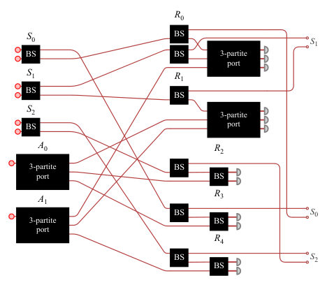 
FIG. 4. Linear optical circuit for generating N = 3 hypergraph magic state, which is directly constructed through the translation rules from graphs to circuits.

📷 Fig 5

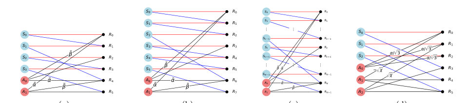 
FIG. 5. (a), (b) Graph solutions for generating the [[2k, 1, 2]] loss-tolerant error correcting codes for k = 2, 3, (c) an arbitrary [[2k, 1, 2]] loss-tolerant error correcting code with N = 2k, inferred from the patterns of the numerically generated graphs in (a) and (b). Only the free-parameter edges are labeled, with ˜α ≡α/ √

**Summary.** This paper introduces an algorithmic framework to automate the design of heralded linear optical circuits for creating complex multipartite entangled states. By mapping the problem onto a graph-search problem within the Linear Quantum Graph picture, the authors systematically discover efficient circuit blueprints. This methodology significantly advances the feasibility of engineering advanced quantum resources for quantum information tasks.

**Why it may be interesting.** This work provides a powerful computational tool for quantum optics, moving the design of complex entangled states from ad-hoc engineering to a systematic, automated discovery process, which is highly relevant for building quantum processors.

Detailed structure

**Main problem.** The paper addresses the algorithmic challenge of designing linear optical circuits required to generate specific, complex multipartite entangled quantum states.

**Main result.** They establish a systematic, algorithmic framework using the Linear Quantum Graph (LQG) picture to automatically discover and design efficient circuits for various resource states, including hypergraph magic states and quantum error correcting codes.

**Method.** The core method reformulates circuit design as a three-stage graph-search problem: enumerating Effective Perfect Matching (EPM) graphs, searching this repository for graphs matching the target state's spectral signature, and finally translating the successful graph into a physical circuit.

**Model / system.** The physical platform is linear optical circuits utilizing beam splitters and ancillary measurements (heralded generation). The theoretical model is the Linear Quantum Graph (LQG) picture, which structures the search space using EPM graphs defined by system, ancilla, and photon-subtraction nodes.

**Key observables.** Success probability ($P_{succ}$), the generated quantum state (e.g., GHZ, W, hypergraph magic states), and the structure of the EPM graph.

**Important parameters / regimes.** The number of qubits ($N$), the number of ancilla nodes ($M$), and the specific parameters defining the target state (e.g., $\alpha, eta$ for error-correcting codes).

**Assumptions / limitations.** The initial framework assumes unweighted graphs (equal amplitudes) and relies on spectral signatures as a necessary, though not sufficient, condition for local unitary (LU) equivalence.

**Figures summary.** Figures illustrate the three-stage algorithmic strategy, show specific circuit realizations for states like the N=3 hypergraph magic state and the N=4 cluster state, and compare different circuit designs for the same target state.

**Paper structure.** The paper follows a structured algorithmic approach: first, enumerating candidate circuit structures via EPM graphs; second, searching this repository by comparing spectral signatures to the target state; and third, translating the successful graph structure into a physical, optimized linear optical circuit.

Abstract

Heralded multipartite entanglement is a key resource for various quantum information tasks. However, designing linear optical circuits that generate specific target states is generally challenging due to the complexity of the required optical structures. Here we formulate the design of heralded photonic circuits as an algorithmic graph-search problem. Our framework enables the automated construction and optimization of heralded photonic circuits by substantially reducing the search space using the linear quantum graph (LQG) picture. Our strategy reconstructs circuit structures as graphs in the picture and identifies suitable graphs automatically. As a result, we design efficient schemes for a broad range of useful multipartite resource states, including hypergraph magic states, quantum error correcting codes, general three-qubit states and length-1 caterpillar graph states. Our work establishes an algorithmic framework for the systematic discovery of heralded resource states, laying the foundation for the automated design of increasingly complex multipartite entangled resources.

[↑ back to top](#top)

### [Assessing the Reliability of Anomalous Hall Conductivity Extraction in GdAlSi](http://arxiv.org/abs/2609.17872v1)

**Authors:** Anil Kumar, Debapratim Pal, Sudhan Koirala, Muhammad Adnan, Youngsang, Ji, Prakash Regmi, Bailey S. Bouley, Ludi Miao, Yun Suk Eo  
**Type:** both · **Category:** strongly correlated electrons · **PDF:** <https://arxiv.org/pdf/2609.17872v1>  
**Analysis basis:** full PDF text, analyzed in chunks
**Topic relevance:** `Keldysh / 2PI / non-Gaussian methods` **1/5** · `quantum measurements` **1/5**

📷 Fig 1

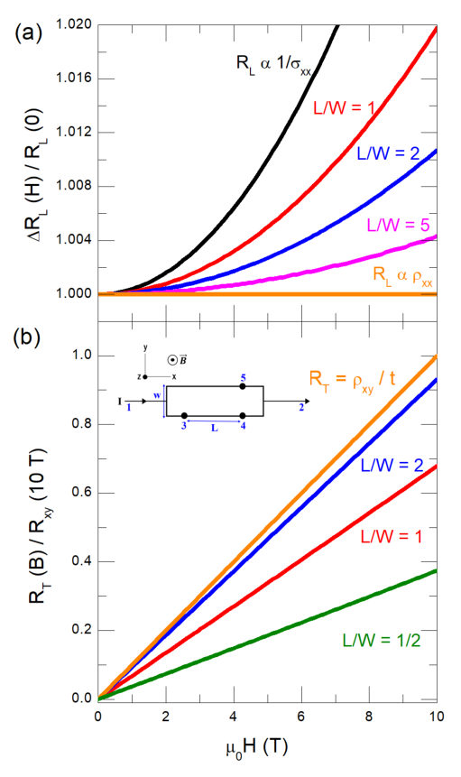 
FIG. 1. Finite-element simulation of magnetotransport (single-channel Drude model). (a) Normalized longitudinal resistance (RL(B)/RL(0)) for different length-to-width ratios, together with the ideal cases (RL ∝1/σxx) and (RL ∝ρxx). (b) Normalized transverse resistance (measured at the center of the sample) for different length-to-width ratios, together with the ideal case (RT = ρyx/t) (Used ρxx(0) = 30 µΩ· cm and µ = 200 cm2/V · s for the simulations). Inset: A typ- ical longitudinal and transverse resistance configuration for experiments (electrodes enumerated).

📷 Fig 2

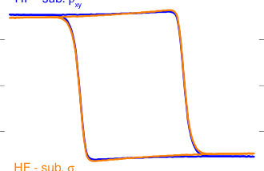 
FIG. 2. Anomalous Hall conductivity extraction in a SrRuO3 thin film at 1.8 K. (a) Antisymmetrized transverse resistivity, ρyx, with a high-field linear fit used to estimate the ordinary Hall background (shown in blue dotted lines labeled HF linear fit). (b) Total transverse conductivity, σyx, with a high-field linear fit (shown in orange dotted lines labeled HF linear fit) used to estimate the ordinary Hall contribution directly in conductivity space. (c) Extracted anomalous Hall conduc- tivity, σAHE yx , obtained from the resistivity-based procedure (blue, labeled HF-sub. ρyx) and the conductivity-based pro- cedure (orange, labeled HF-sub. σyx).

📷 Fig 3

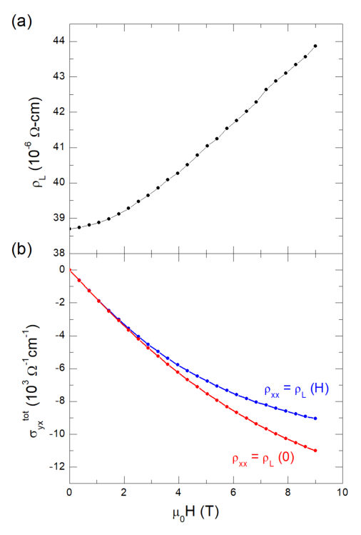 
FIG. 4. Effect of the field-dependent longitudinal resistivity on the extracted Hall conductivity. (a) Measured longitudinal resistivity, ρM L , of GdAlSi at 2 K for H ∥c. (b) Comparison of the total Hall conductivity obtained by direct inversion by assuming the measured longitudinal resistivity ρL is ρxx (in blue) and that assuming only the zero field ρL is maintained along the entire range (in red). This uncertainty in ρxx con- tributes to the discrepancy in the extracted anomalous Hall conductivity.

📷 Fig 4

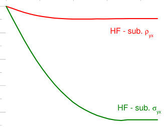 
FIG. 3. Extraction of the anomalous Hall effect using high- field linear extrapolation. (a) Measured Hall resistivity, (ρM yx), at 2 K for (H ∥c). The red dashed line (labeled HF linear fit) denotes the linear fit to the high-field region extrapolated to lower fields. (b) The total Hall conductivity, (σtot yx ), calcu- lated from the measured resistances. The green dashed line (labeled HF linear fit) denotes the corresponding high-field linear extrapolation. (c) Estimated anomalous Hall conduc- tivity obtained using two subtraction procedures: 1) HF-sub. ρyx (in red): subtraction of the high-field linear background from ρyx prior to conversion to conductivity. 2) HF-sub. σyx (in green):...

📷 Fig 5

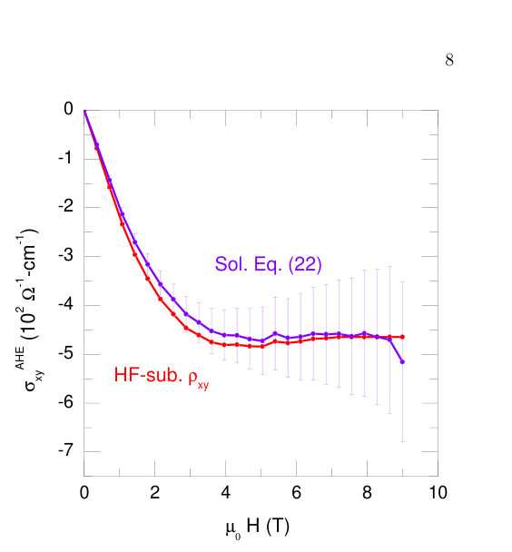 
FIG. 5. Comparison of anomalous Hall conductivity extracted using two high-field analysis methods. The red curve (HF- sub. (ρyx)) is obtained by subtracting a high-field linear back- ground from (ρyx) prior to conversion to conductivity. The violet curve is obtained by solving for σAHE yx from Eq. (22), after σO xx has been modeled from the Hall mobility. The error bars show the variation in the extracted (σAHE yx ) when the Hall mobility is varied by 1.5%.

**Summary.** This work critically examines the methods used to extract the anomalous Hall conductivity ($\sigma_{AHE}$) from magnetotransport data in quantum materials. By comparing results from $	ext{SrRuO}_3$ and $	ext{GdAlSi}$, the authors demonstrate that the extraction is highly unreliable if the ordinary Hall background subtraction or the longitudinal transport interpretation is ambiguous. The paper serves as a practical caution regarding the quantitative interpretation of excess Hall effects.

**Why it may be interesting.** While focused on condensed matter transport, the rigorous mathematical and physical caution regarding model dependence and ambiguity in extracting fundamental quantities (like Berry curvature related terms) is relevant to any field relying on complex measurements or theoretical modeling.

Detailed structure

**Main problem.** The paper assesses the reliability and ambiguity in extracting the anomalous Hall conductivity ($\sigma_{AHE}$) from magnetotransport measurements, particularly when the ordinary Hall background subtraction is non-trivial.

**Main result.** The extraction of $\sigma_{AHE}$ is highly sensitive to the analysis procedure, especially in materials like GdAlSi where the transverse response lacks clear saturation. Different interpretations of the ordinary Hall background can yield vastly different estimates for $\sigma_{AHE}$.

**Method.** The authors compare multiple theoretical and experimental analysis methods, including low-field vs. high-field fitting, and the conversion between resistivity and conductivity tensors, using the Drude model framework.

**Model / system.** The study analyzes magnetotransport measurements in quantum materials, comparing the well-behaved $	ext{SrRuO}_3$ with the more ambiguous $	ext{GdAlSi}$. The analysis relies on extending the single-channel Drude model to account for anomalous and ordinary Hall contributions.

**Key observables.** Anomalous Hall conductivity ($\sigma_{AHE}$), Ordinary Hall conductivity ($\sigma_O$), longitudinal resistance ($
ho_L$), and transverse resistance ($
ho_T$) as functions of magnetic field ($B$).

**Important parameters / regimes.** Magnetic field ($B$), carrier density ($n$), and carrier mobility ($\mu$).

**Assumptions / limitations.** The analysis critically tests assumptions such as the equivalence of OHE subtraction in resistivity vs. conductivity, and the validity of extrapolating low-field linear fits to high fields.

**Figures summary.** Figures compare $\sigma_{AHE}$ extracted using various low-field analysis methods for GdAlSi, and show finite-element simulations of magnetotransport using the single-channel Drude model.

**Paper structure.** The paper first establishes the theoretical framework using the Drude model for magnetotransport. It then uses $	ext{SrRuO}_3$ as a benchmark to validate extraction techniques. Finally, it applies these techniques to $	ext{GdAlSi}$, systematically comparing multiple low-field and high-field analysis procedures to expose the sources of ambiguity.

Abstract

We examine the different methods of extracting the anomalous Hall conductivity using SrRuO$_3$ and GdAlSi. For SrRuO$_3$, where the ordinary Hall background is well defined and the magnetoconductance is small, subtracting the ordinary Hall contribution either before or after conversion from resistivity to conductivity yields nearly identical anomalous Hall conductivities. In GdAlSi, in contrast, the transverse response does not exhibit clear saturation, and both low- and high-field regions can appear approximately linear. We show that different interpretations of these linear regions as the ordinary Hall background, together with the treatment of the measured longitudinal resistance in the resistivity-to-conductivity conversion, can produce completely different estimates of the anomalous Hall conductivity. We also examine whether the nonlinear Hall response can instead be described within an ordinary Hall framework without invoking an anomalous contribution. Our analysis provides practical cautions for extracting excess Hall contributions in quantum materials.

[↑ back to top](#top)

### [Carrollian axion electrodynamics](http://arxiv.org/abs/2609.18791v1)

**Authors:** Hemant Rathi, Ashish Shukla  
**Type:** theory · **Category:** other · **PDF:** <https://arxiv.org/pdf/2609.18791v1>  
**Analysis basis:** full PDF text, analyzed in chunks
**Topic relevance:** `Keldysh / 2PI / non-Gaussian methods` **1/5** · `analog quantum simulation` **1/5**

📷 Fig 1

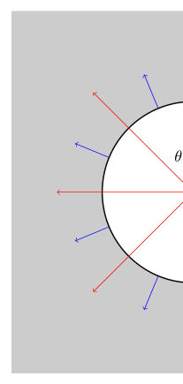 
Figure 1: A spherically symmetric interface between regions with θ = 0 and θ = θ0, with a magnetic monopole of charge qm placed at the origin. The monopole induces a uniform distribution of electric charge on the interface, making the observer in the region θ = θ0 infer it to also carry an electric charge.

**Summary.** This work develops the effective field theory describing axion electrodynamics in the low-velocity (Carrollian) limit. It derives two distinct theories, highlighting that the magnetic sector supports a novel monopole-to-dyon conversion effect. The analysis rigorously proves the vanishing of the linear magnetoelectric effect while establishing the complex structure of the resulting phase space.

**Why it may be interesting.** The study of effective field theories in extreme limits (like $c 	o 0$) and the resulting topological phenomena (like the Witten effect) provides a framework for understanding low-energy effective theories in condensed matter systems, particularly those involving emergent gauge fields or topological order.

Detailed structure

**Main problem.** The paper constructs and analyzes theories of Carrollian electromagnetism coupled to an axion field by performing a low-energy limit expansion ($c 	o 0$) of full axion electrodynamics.

**Main result.** The resulting magnetic theory exhibits a Carrollian analogue of the Witten effect, and the linear magnetoelectric effect is shown to vanish entirely through rigorous constraint analysis.

**Method.** The primary method involves performing a systematic $c 	o 0$ expansion of the Lagrangian density and subsequently employing Dirac-Bergmann analysis to determine the physical phase space structure.

**Model / system.** The system is axion electrodynamics, which is reduced to two types of Carrollian theories (electric and magnetic) in the low-velocity limit. The analysis extends to include couplings to fermions and non-Abelian generalizations.

**Key observables.** Carrollian analogue of the Witten effect (monopole acquiring electric charge), vanishing linear magnetoelectric effect, and non-vanishing Dirac brackets among canonical variables.

**Important parameters / regimes.** The speed of light ($c$), the axion mass ($m$), and the coupling constant ($\alpha$) are central parameters defining the limits and couplings.

**Assumptions / limitations.** The analysis relies fundamentally on the $c 	o 0$ expansion methodology, and the initial Lagrangian is assumed to be the standard axion electrodynamics form.

**Paper structure.** The paper progresses from deriving the general $c 	o 0$ expansion for the Lagrangian, separating it into electric and magnetic theories, establishing key physical consequences like the Witten effect, and concluding with detailed analyses of the phase space structure using Dirac brackets.

Abstract

We construct theories of Carrollian electromagnetism coupled to an axion field. Obtained by performing a $c \to 0$ expansion of axion electrodynamics, these are of two types: electric and magnetic. We derive the Lagrangians and work out the general classical solutions for both. While the electric theory has the axion effectively decoupled from the electromagnetic fields, the magnetic theory is endowed with a nontrivial axion coupling that leads to interesting phenomenology. In particular, a Carrollian analogue of the Witten effect, wherein a magnetic monopole in the presence of a constant non-vanishing axion acquires an electric charge and becomes a dyon, is present in the magnetic theory. At the same time, the linear magnetoelectric effect vanishes entirely, a conclusion we establish by performing a thorough Dirac-Bergmann analysis of the constraint structure of the magnetic theory and a proper identification of its physical phase space.

[↑ back to top](#top)

### [Graph lattice sums and graph zeta functions for long-range interacting quantum lattice models](http://arxiv.org/abs/2609.18918v1)

**Authors:** Andreas Alexander Buchheit, Andreas Rupp  
**Type:** theory · **Category:** strongly correlated electrons · **PDF:** <https://arxiv.org/pdf/2609.18918v1>  
**Analysis basis:** full PDF text, analyzed in chunks
**Topic relevance:** `analog quantum simulation` **1/5** · `methods for driven-dissipative` **1/5**

📷 Fig 1

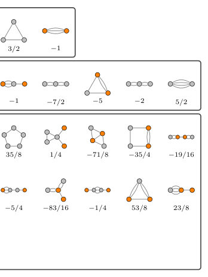 
Figure 1. Low-order corpora of the long-range transverse-field Ising model on an arbitrary d-dimensional lattice Λ, obtained via the pCUT method, where all edges e ∈E are associated with an identical kernel Ke ∈ℓ1(Λ). Panel (a) depicts the corpus for the ground state energy density e0(λ) (no terminals) up to expansion order 7 (up to 6d-dimensional lattice sums), including the graphs G and their prefactors ar(G) ∈Q. Panel (b) depicts the corpus for the single quasiparticle dispersion relation ω(k, λ) (1qp) up to expansion order 5 with terminals colored in orange. In this work, we use state-of-the-art expansions of order 13 for 0qp (8 403 graphs, max. dimension (r −1)d) and order 11 for 1qp...

📷 Fig 2

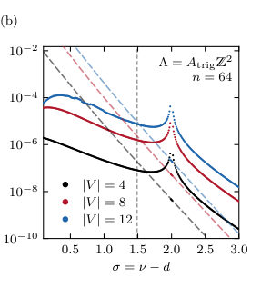 
Figure 2. Relative error of the zeta algebra for a cycle with |V | = 4, 8, 12 nodes, neighboring terminals, and power-law edge kernels Kν with equal exponents ν = d+σ at k = 0, compared with the analytic benchmark value at k = 0. The dashed lines display the value for σmax = 0, where only a truncated Fourier series is used. Panel (a) shows the integer lattice Λ, while (b) displays the results for the trigonal lattice with n = 64 points per dimension, respectively. The dashed line displays the conservatively chosen cutoff value in σ, after which σmax = 0 is applied.

📷 Fig 3

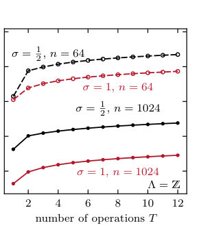 
Figure 3. (a) Graph obtained from a single bridge by applying the operation T, consisting of a multiplication followed by a convolution, four times. (b) Maximum relative error of the associated graph zeta function ζG(k) for Λ = Z on the grid k ∈BZ64 for σ = 1/2 (black) and σ = 1 (red). Open points correspond to the zeta algebra with n = 64 while solid points correspond to the finer discretization n = 1024. The reference is the Richardson-extrapolated truncated sum over the box [−L, L] with L = 10 000, 12 000, . . . , 22 000, evaluated using bucket elimination at the 64 momentum points. The error increases only linearly with the number of operations.

📷 Fig 4

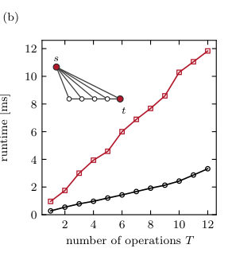 
Figure 4. Runtime in milliseconds for evaluating graph zeta func- tions ζG on a complete nd momentum grid for n = 64 and σ = 1/2 on a single core Apple M1 Max core. Panel (a) shows the run- time for a cycle with neighboring terminals as a function of the number of nodes |V |, while panel (b) shows the runtime for the graph obtained from repeated applications of T, as a function of the operation count. The black dots show Λ = Z, while the red squares display the results for the trigonal lattice. The runtime increases only linearly, compared to exponential increase for direct summation.

📷 Fig 5

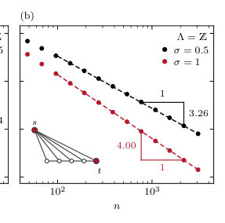 
Figure 5. Relative error of the graph zeta function with edge exponent ν = d + σ at k = 0 obtained from the zeta algebra for Λ = Z as a function of the number of discretization points n for (a) the cycle graph with |V | = 8 nodes and (b) the graph obtained by applying T 4 to a bridge. The black dots show σ = 0.5, while the red dots display σ = 1. The function is evaluated at n = ⌊48 · 2j/2⌉ with ⌊·⌉the nearest integer and j = 0, 1, . . . , 12. The dashed lines show a linear fit against the logarithmized data, with resulting fit exponents shown as captions to the triangle. The scaling is in good agreement with the theoretical bound |n|−(d+σ+2) from Remark 6.7.

**Summary.** This paper presents a novel, highly efficient computational method for evaluating complex graph lattice sums that arise in the perturbative analysis of quantum lattice models with long-range interactions. By leveraging graph theory and advanced mathematical tools like generalized zeta functions, the authors drastically reduce computation time from infeasible to minutes. This breakthrough allows for precise theoretical study of exotic quantum materials and their spectral properties.

**Why it may be interesting.** The ability to calculate high-order series expansions for long-range interacting systems with unprecedented speed is a major theoretical breakthrough, providing access to regimes previously limited by computational complexity.

Detailed structure

**Main problem.** The primary challenge is taming the exponential growth of the Hilbert space dimension when simulating gapped quantum lattice models, particularly those featuring long-range (nonlocal) interactions.

**Main result.** The authors developed a novel method to compute required graph lattice sums, reducing computation time from thousands of core-hours to minutes, and achieving full agreement with Monte Carlo simulations for the transverse-field Ising model.

**Method.** The method involves factorizing high-dimensional lattice sums over graph blocks and evaluating them using specialized techniques based on the block's treewidth, including analytic forms via generalized zeta functions and tensor-network elimination.

**Model / system.** The work applies to general long-range interacting quantum lattice models, exemplified by the transverse-field Ising model on various lattices (1D, 2D, 3D). The theory relies on high-order linked-cluster expansions.

**Key observables.** Low-lying spectrum, dispersion relations $\omega(\mathbf{k}, \lambda)$, and the dependence of these on the perturbation parameter $\lambda$.

**Important parameters / regimes.** The interaction range (power-law decay), the lattice dimension ($d$), and the treewidth ($\mathrm{tw}$) of the underlying graph structure.

**Assumptions / limitations.** The method assumes that physically relevant correlation functions retain translational invariance, which is crucial for defining the graph zeta functions.

**Figures summary.** Figures illustrate the computed dispersion relation $\omega(\mathbf{k}, \lambda)$ for the 3D LRTFIM, showing high-symmetry points and cuts along high-symmetry paths, confirming the method's ability to resolve the full momentum grid.

**Paper structure.** The paper introduces the problem of lattice sums, develops the mathematical framework using graph zeta functions, details the computational strategy based on treewidth factorization, and validates the method by reproducing Monte Carlo results for various lattice dimensions.

Abstract

Taming the exponential increase of the Hilbert space dimension with system size in the simulation of gapped quantum lattice models is of the highest relevance for understanding and designing exotic quantum materials, where nonlocal interactions are of particular interest. High-order linked-cluster expansions provide access the solution of the eigenvalue problem for the infinite system, yet rely on the computation of high-dimensional oscillatory lattice sums with a graph structure, only approachable with Monte Carlo methods so far. This work resolves this issue, rendering all required graph lattice sums, referred to as graph zeta functions for kernels involving power-laws, computable. The resulting method reduces the evaluation time for state-of-the art series expansions from tenthousands of core-hours to minutes. After factorizing the lattice sum over blocks, each block is evaluated by the cheapest available strategy depending on its treewidth $\mathrm{tw}$. Basic blocks admit analytic forms in terms of generalized zeta functions. Series-parallel blocks with $\mathrm{tw}\le 2$ can be computed at linear cost in the number of graph nodes and in the size of the momentum grid using a semi-analytical algebra based on Epstein zeta functions and rapidly decaying Fourier series. Finally, for $\mathrm{tw}>2$, the method is combined with tensor-network bucket elimination yielding polynomial scaling of numerical work and memory in momentum grid size with exponents only growing with $\mathrm{tw}$ rather than with the number of vertices. Through use of FFT, the full momentum grid is recovered at the cost of a single momentum evaluation. We provide a detailed analysis of the precision and runtime of our method against analytic and numerical benchmarks. We further reproduce published Monte Carlo data for the transverse-field Ising model on different 1D, 2D, and 3D lattices, obtaining full agreement.

[↑ back to top](#top)

### [Impact of a CSS quantum error correction code in underwater quantum key distribution](http://arxiv.org/abs/2609.18666v1)

**Authors:** Juliette Florin, Nicolas Le Josse, Arnaud Coatanhay, Gilles Burel  
**Type:** theory · **Category:** quantum information and computing · **PDF:** <https://arxiv.org/pdf/2609.18666v1>  
**Analysis basis:** full PDF text, analyzed in chunks
**Topic relevance:** `methods for driven-dissipative` **1/5** · `quantum measurements` **1/5**

📷 Fig 1

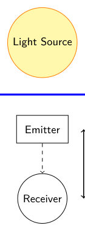 
FIG. 1. Schematic of the proposed quantum communication setup for QKD. The system includes a

📷 Fig 2

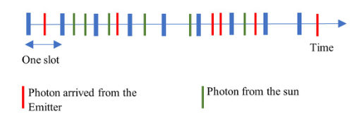 
FIG. 2. Shematic view of the time line of receiving photons over nanosecond-scale slots showing

📷 Fig 3

 
FIG. 3. Schematic of a quantum communication system at the receiver showing the signal process-

📷 Fig 4

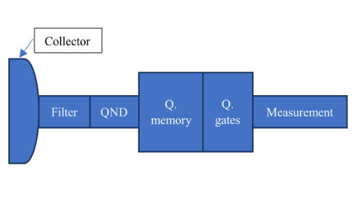 
Fig. 2 demonstrates that both sent photons and noise photons (ambient background,

📷 Fig 5

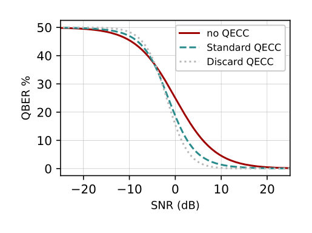 
FIG. 4. QBER is plotted against SNR (dB, defined as 10 log10(SNR)) for the BB84 QKD protocol

**Summary.** This paper analyzes the feasibility of using Quantum Error Correction Codes (QECC) to secure quantum key distribution in noisy underwater channels. By modeling photon loss and ambient noise, the authors show that while QECC extends the operational range at low SNR, its overhead makes raw BB84 superior when the signal quality is high. The deployment strategy must therefore be highly dependent on the local SNR conditions.

**Why it may be interesting.** It provides a concrete, applied study of how quantum error correction techniques must be tailored to the specific noise characteristics of a complex physical channel (underwater optics) to maintain secure communication.

Detailed structure

**Main problem.** The paper investigates whether Quantum Error Correction Codes (QECC) can mitigate performance degradation in Quantum Key Distribution (QKD) when transmitting underwater due to photon loss and ambient noise.

**Main result.** QECC is beneficial only in marginal Signal-to-Noise Ratio (SNR) regimes, enabling communication in depth ranges otherwise infeasible, but raw BB84 dominates at high SNR due to encoding overhead.

**Method.** The authors developed a stochastic channel model incorporating photon loss, geometric spreading, and solar noise, analyzing the Quantum Bit Error Rate (QBER) and Secure Key Rate (SKR) analytically and via Monte Carlo simulations.

**Model / system.** The system models vertical underwater quantum communication using the BB84 protocol. The channel is treated as a CPTP map incorporating signal loss, vacuum events, and noise photon arrivals, analyzed using 4-qubit CSS stabilizer codes.

**Key observables.** Quantum Bit Error Rate (QBER) and Secure Key Rate (SKR).

**Important parameters / regimes.** Signal-to-Noise Ratio (SNR), QBER threshold (11% for security), and the specific type of error correction code used (standard vs. discard).

**Assumptions / limitations.** The analysis assumes a homogeneous water medium, negligible scattering noise, and that the dominant error mechanism is photon loss (erasure channel).

**Figures summary.** Figures compare QBER and SKR vs. SNR for raw BB84, standard QECC, and discard QECC, demonstrating the performance trade-offs across different SNR regimes.

**Paper structure.** The paper establishes the physical model, develops the stochastic channel and performance metrics (QBER, SKR), analyzes the benefits and overhead of QECC, and concludes with scenario-dependent deployment guidelines.

Abstract

Quantum key distribution (QKD) enables secure underwater communications essential for maritime infrastructure. Underwater optical channels introduce substantial photon loss (erasures) and ambient noise that degrade QKD performance. This paper investigates whether two four-qubit Calderbank-Shor-Steane (CSS) quantum error correction codes (QECC) mitigate these impairments in vertical underwater communication BB84 QKD protocol. After developing a comprehensive stochastic channel model incorporating photon loss, geometric spreading, and solar noise, we assess the viability of QECC through the analytical study of the quantum bit error rate (QBER) and the secure key rate (SKR) with and without security depending on the signal-to-noise ratio (SNR) validated against Monte Carlo simulations. The standard four-qubit CSS code achieves a 3 dB SNR gain at the QBER 11% security threshold; the discard code variant achieves 4.5 dB. However, QECC includes an encoding overhead that reduces the SKR. We demonstrate a crucial relationship between the SKR and the probability of arrival of the sent photon. Analysis shows that QECC is beneficial exclusively in marginal SNR regimes; at high SNR, raw BB84 dominates. For an ocean Type III Jerlov water scenario with sunlight coming from the sun located at the top of the atmosphere, we identify operational depth-range windows where QECC enables communication otherwise infeasible. This analysis establishes that error correction deployment must be scenario-dependent: extend operational range at the cost of throughput when SNR is marginal, or prioritize key generation rates at high SNR.

[↑ back to top](#top)

### [Optical investigation of the electronic structure of a ferromagnetic Weyl semimetal CeAlSi](http://arxiv.org/abs/2609.18592v1)

**Authors:** Shin-ichi Kimura, Yue Pan, Hiroshi Watanabe, Akimitsu Kirikoshi, Junya Otsuki, Hiroshi Tanida  
**Type:** both · **Category:** strongly correlated electrons · **PDF:** <https://arxiv.org/pdf/2609.18592v1>  
**Analysis basis:** full PDF text, analyzed in chunks
**Topic relevance:** `Keldysh / 2PI / non-Gaussian methods` **1/5** · `methods for driven-dissipative` **1/5**

📷 Fig 1

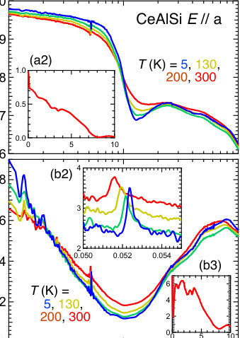 
FIG. 1. (a1) Temperature-dependent reflectivity [R(ω)] spec- tra of CeAlSi with the electric vector parallel to the a axis (E ∥a) in the photon energy ℏω range of 0.01 −1 eV. (a2) Wide-range R(ω) spectrum up to 10 eV at 300 K. (b1) Temperature-dependent optical conductivity [σ1(ω)] spectra of CeAlSi with the same horizontal scale as (a1). (b2) En- larged σ1(ω) spectra for a TO-phonon peak at ℏω ∼0.052 eV. (b3) Wide-energy-range σ1(ω) spectra up to 10 eV at 300 K.

📷 Fig 2

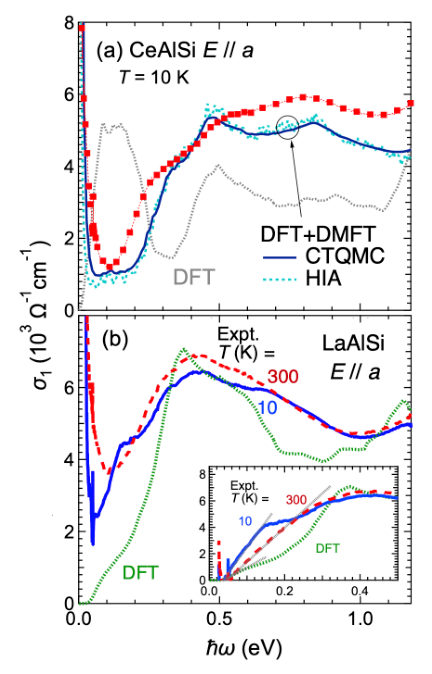 
FIG. 2. (a) Experimental σ1(ω) spectrum of CeAlSi along the a-axis at T = 10 K of the PM phase (solid squares) in comparison with calculated spectra with DFT (dashed line), DFT+DMFT with CTQMC (solid line), and DFT+DMFT with HIA (dotted line). Note that the σ1(ω) spectra with DFT only indicate the interband components, but the spec- tra with two DFT+DMFT’s includes the Drude component. (b) Experimental σ1(ω) spectra of LaAlSi along the a-axis at T = 10 K (solid line) and 300 K (dashed line) compared with the DFT calculated σ1(ω) spectrum (dotted line). (Inset) Ex- tended figure near the onset of the interband transition in the ℏω region below 0.5 eV. The experimental spectra are shown after...

📷 Fig 3

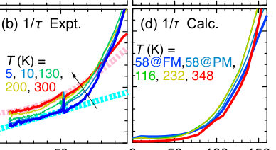 
FIG. 4. The experimentally obtained temperature-dependent dynamical effective mass of carriers relative to the electron rest mass (m∗/m0, a) and scattering rate (1/τ, b) of CeAlSi compared with the theoretical m∗/m0 (c) and 1/τ (d) calcu- lated with DFT+DMFT. In (c) and (d), 58@FM (58@PM) indicates the calculation with the FM (PM) magnetic struc- ture at T = 58 K. The dashed lines in (b) indicate the ω-linear and ω-square behavior for T = 5 and 300 K, respectively, as a guide to the eye.

📷 Fig 4

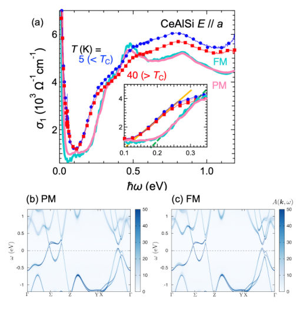 
FIG. 3. (a) Experimental σ1(ω) spectra of CeAlSi with E ∥a in the PM phase (solid squares) at T = 40 K and FM phase (solid circles) at T = 5 K compared to the σ1(ω) spectra calculated with DFT+DMFT with CTQMC in both phases. (Inset) Extended figure near the onset of the interband tran- sition in the ℏω region below 0.35 eV. The solid and dashed lines show the onset slopes of the experimental and theoretical spectra, respectively, as a guide to the eye. (b, c) Band struc- tures in the PM phase (b) and the FM phase (c) of CeAlSi corresponding to the calculated σ1(ω) spectra in (a).

**Summary.** This work uses optical measurements and DFT+DMFT calculations to characterize the electronic structure of the ferromagnetic Weyl semimetal CeAlSi. The findings confirm that the electronic properties are dominated by localized Ce 4f states, and the overall Weyl electronic structure remains robust across the magnetic phase transition. This highlights the utility of correlated electron theory in understanding topological materials.

**Why it may be interesting.** The combination of optical spectroscopy with DMFT calculations provides a powerful tool to probe the interplay between itinerant (Weyl) and localized (4f) electronic degrees of freedom in correlated magnetic materials.

Detailed structure

**Main problem.** The study investigates the electronic states and the effect of the ferromagnetic transition on the Weyl electronic structure in the magnetic Weyl semimetal CeAlSi.

**Main result.** The optical conductivity spectra are successfully modeled using DFT+DMFT, suggesting that the Ce 4f states are nearly localized, and the overall spectral shape remains stable across the ferromagnetic transition temperature.

**Method.** The research combines experimental measurements of temperature-dependent optical conductivity ($\sigma_1(\omega)$) with advanced theoretical calculations using DFT+DMFT.

**Model / system.** The system is CeAlSi, a magnetic Weyl semimetal with a non-centrosymmetric tetragonal structure. The theory incorporates local Coulomb interactions for Ce 4f electrons via the Hubbard-I approximation.

**Key observables.** Temperature-dependent optical conductivity $\sigma_1(\omega)$, dynamic effective mass, and the location/chirality of Weyl points.

**Important parameters / regimes.** Ferromagnetic ordering temperature ($T_C$), Coulomb interaction parameters ($U=6.30 	ext{ eV}$, $J_H=0.79 	ext{ eV}$), and temperature ($10 	ext{ K}$ vs $300 	ext{ K}$).

**Assumptions / limitations.** The analysis relies on the Hubbard-I approximation for local correlations and extrapolations for optical measurements.

**Figures summary.** Figures show temperature-dependent reflectivity and derived $\sigma_1(\omega)$ spectra, alongside calculated single-particle excitation spectra $A(\mathbf{k}, \omega)$ and the mapping of Weyl point distributions in both Paramagnetic and Ferromagnetic phases.

**Paper structure.** The paper proceeds by measuring optical spectra across the magnetic transition, comparing these to DFT calculations, and refining the model using DFT+DMFT to account for strong correlations and accurately predict the electronic structure in both magnetic phases.

Abstract

To investigate electronic states during the ferromagnetic transition in a magnetic Weyl semimetal CeAlSi, we measured temperature-dependent optical conductivity [$σ_1(ω)$] spectra and compared them with DFT+DMFT band calculations. The $σ_1(ω)$ spectrum did not change significantly across the ferromagnetic ordering temperature ($T_C$), suggesting that the Ce 4f states are almost localized. DFT+DMFT calculations with almost localized Ce 4f states successfully reproduced the spectral shape and the unchanged $σ_1(ω)$ spectra across $T_C$. The dynamic effective mass evaluated from the extended Drude model is very small, which DFT+DMFT calculations also reproduce, but the scattering probability at even lower temperatures suggests ferromagnetic fluctuations. These results suggest that the interaction intensity between the Weyl fermions and Ce 4f states is very weak, as reproduced by DFT+DMFT calculations.

[↑ back to top](#top)

### [Benchmarking indirect quantum control schemes via higher-order quantum operations](http://arxiv.org/abs/2609.18409v1)

**Authors:** Simon Vedl, Varun Srivastava, Riddhi Ghosh, Alexei Gilchrist  
**Type:** theory · **Category:** quantum information and computing · **PDF:** <https://arxiv.org/pdf/2609.18409v1>  
**Analysis basis:** full PDF text, analyzed in chunks
**Topic relevance:** `quantum measurements` **1/5**

📷 Fig 1

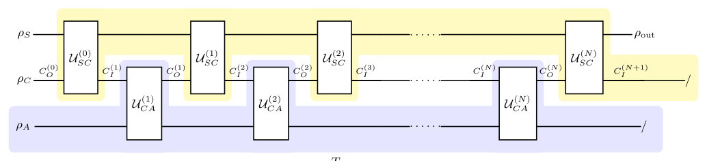 
FIG. 1. Illustration of how the dynamics between the system, controller, and ancilla can be separated into state preparation, process tensor W corresponding to fixed dynamics, and deterministic superinstrument T representing the control operations altogether combining to produce the final output state ρout.

📷 Fig 2

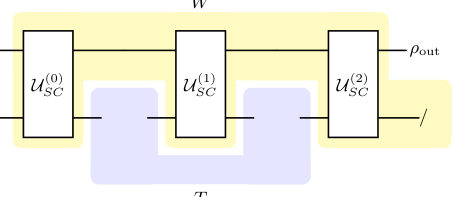 
FIG. 2. Circuit diagram representing the indirect control in the two-step purification process. We split the dynamics into two parts, the fixed elements — the process tensor W and state preparation, and the deterministic superinstrument T capturing the operations on the controller.

📷 Fig 3

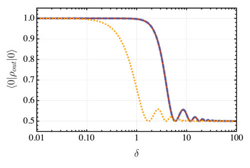 
FIG. 3. Comparison of population in |0⟩⟨0| of state ρout with respect to the dimensionless detuning δ = ∆ω/2J⊥, where ρout is either the result of not applying any operations (dot- ted orange) or applying independent unitary controls (dashed blue). The SDP benchmark is shown in solid red. When the controller is initially in the state ρC = |0⟩⟨0| and τ = π/2, the set of independent unitary operations performs as well as the benchmark. The residual oscillations at large detuning arise from the finite interaction time and occur in a regime where population transfer is already strongly suppressed.

📷 Fig 4

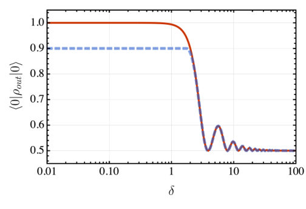 
FIG. 4. Comparison of population in |0⟩⟨0| of state ρout with respect to the dimensionless coupling δ = ∆ω/2J⊥, where ρout is either the result of applying the optimal general de- terministic superinstrument (solid red) or uncorrelated uni- taries (dashed blue). The controller is initially in the state ρC = 9 10 |0⟩⟨0| + 1 10 |1⟩⟨1| and τ = 3π/4.

📷 Fig 5

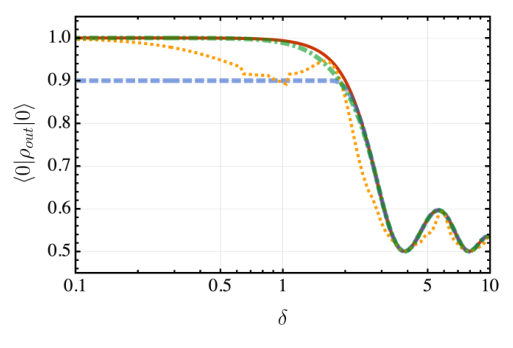 
FIG. 5. Population in |0⟩⟨0| of state ρout with respect to the dimensionless coupling δ = ∆ω/2J⊥obtained by various heuristic methods benchmarked against the SDP over gen- eral deterministic superinstruments (solid red). The heuristic methods are optimisation over uncorrelated unitaries (dashed blue), see-saw optimisation over Markovian channels (dotted orange), and the Markovian channel closest to the optimal de- terministic superinstrument (dashed-dotted green). The con- troller is initially in the state ρC = 9 10 |0⟩⟨0| + 1 10 |1⟩⟨1|.

**Summary.** This work develops a formal framework using higher-order quantum operations to benchmark indirect quantum control. By casting the optimal control problem as a Semidefinite Program, the authors establish a fundamental upper bound on achievable performance. This allows researchers to systematically quantify the advantage gained by using complex, multi-step control protocols over simpler, restricted strategies.

**Why it may be interesting.** It provides a powerful, general mathematical framework (SDP) to quantify the true potential of complex quantum control schemes beyond simple unitary evolution, which is crucial for designing robust quantum information protocols.

Detailed structure

**Main problem.** The paper aims to establish a rigorous benchmark for indirect quantum control schemes by formulating them using higher-order quantum operations.

**Main result.** The optimal control problem is formulated as a Semidefinite Program (SDP), providing an upper bound that can systematically compare against restricted, physically motivated control protocols.

**Method.** The authors use the language of higher-order quantum operations and model admissible controller manipulations as deterministic superinstruments, leading to an SDP formulation.

**Model / system.** The model involves a target system (S) manipulated indirectly via an auxiliary controller (C) through a fixed interaction. The dynamics are analyzed using the Choi-Jamiołkowski representation and link products.

**Key observables.** Final state fidelity, performance metric derived from the SDP objective function.

**Important parameters / regimes.** Control time steps, interaction strengths (e.g., $J_{\parallel}, J_{\perp}$), and detunings ($\delta$).

**Assumptions / limitations.** The analysis considers deterministic protocols with a fixed interaction and a finite number of discrete intervention times for controller operations.

**Figures summary.** Figure 1 illustrates the separation of dynamics into state preparation, the process tensor (uncontrolled interaction), and the deterministic superinstrument (controlled operations).

**Paper structure.** The paper develops the formalism using HOQOs and superinstruments, formulates the optimization as an SDP, and illustrates the framework with a two-step qubit-purification task, comparing the benchmark to simple unitary strategies.

Abstract

Indirect quantum control aims to manipulate a target system through interventions on an auxiliary controller with which it interacts. We formulate finite-step indirect-control protocols using the language of higher-order quantum operations, representing admissible controller manipulations as deterministic superinstruments. This representation separates the uncontrolled but fixed dynamics from the controllable operations and allows the optimal control problem to be written as a semidefinite program for a chosen figure of merit. The resulting optimum gives an operational benchmark by providing the best performance achievable by a finite sequence of control operations, including protocols with classical or quantum feed-forward. More restricted and experimentally motivated control classes, such as independent unitary controls or memoryless quantum channels, can then be compared against this benchmark. We illustrate the framework with a two-step qubit-purification task, in which an initially mixed target qubit is steered toward a pure state through a fixed interaction with a controller qubit. The example shows regimes where simple unitary strategies saturate the higher-order benchmark, as well as regimes where they are provably suboptimal. This approach provides a systematic way to study the value of control resources in indirect quantum-control schemes.

[↑ back to top](#top)

### [Comparing magic state cultivation methods using matrix product states](http://arxiv.org/abs/2609.19116v1)

**Authors:** Tom Hartweg, Asier Piñeiro Orioli  
**Type:** theory · **Category:** quantum information and computing · **PDF:** <https://arxiv.org/pdf/2609.19116v1>  
**Analysis basis:** full PDF text, analyzed in chunks
**Topic relevance:** `methods for driven-dissipative` **1/5**

📷 Fig 1

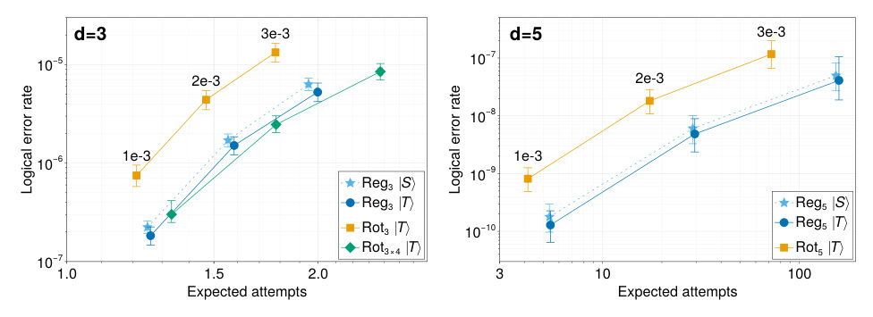 
Figure 1: Performance of cultivation schemes under uniform depolarising noise for |S⟩and |T⟩, at output code distance d = 3 and 5. Reg3/5 are based on Sahay et al. [1] circuits, which make use of the regular surface code fold-transversal S gate. Rot3/5 and Rot3×4 are circuits proposed in this work, based on the partially fault-tolerant fold-transversal S gate of the rotated surface code. The |S⟩results are obtained with Stim, the |T⟩results with CAMPS simulations. These results are obtained with the addition of the final noiseless syndrome extraction in the post-selection. Except for the |S⟩results, the three points from each curve are obtained with the same samples through subset sampling...

📷 Fig 2

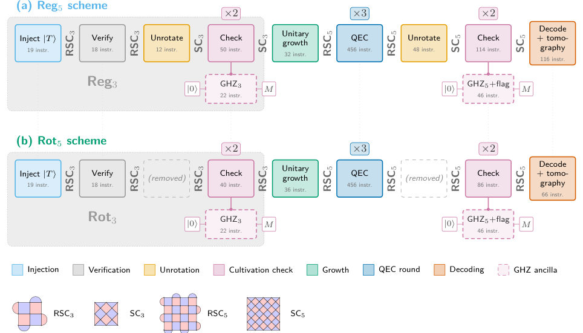 
Figure 2: Gadget-level structure of the two d = 5 |T⟩cultivation Reg5 and Rot5, both built on the same d=3 rotated surface-code patch (17 physical qubits) grown to distance 5 (49 physical qubits). The label between each pair of stages gives the code carried on that step – RSC = rotated surface code, SC = unrotated surface code, subscript the code distance. A schematic representation of each code is given at the bottom of the figure. The dotted grey box, labelled Reg3/ Rot3, marks the corresponding d = 3 circuit prefix. Each cultivation check is a control-HXY gadget driven by a separate GHZ ancilla register – 3 qubits at d = 3, 5 qubits + 1 flag qubit at d = 5 – prepared and measured for each...

📷 Fig 3

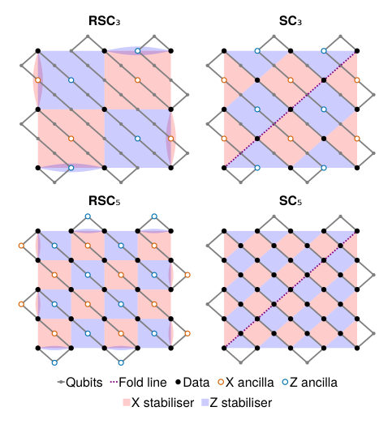 
Figure 3: Qubit layout for the Reg5 cultivation MPS sim- ulation. The distance 3 rotated surface code (RSC3) is used at the injection stage, the distance 3 regular surface code (SC3) is used during the d=3 HXY operator checks, the distance 5 rotated surface code (RSC5) is used for the in- termediate syndrome extraction, and the distance 5 regular surface code (SC5) is used to do the d=5 HXY operator checks. The ancillas of the SC3 are only used to perform the rotation to the RSC5 code.

📷 Fig 4

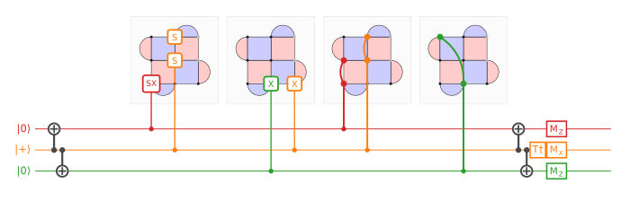 
Figure 4: Logical HXY check for Rot3. The ancilla GHZ(3) state is supported on the bottom wires. The check is decomposed into controlled-S gates involving the diagonal qubits, controlled-X gates on the first row of qubits, and CCZ gates involving pairs of twisted off-diagonal qubits.

📷 Fig 5

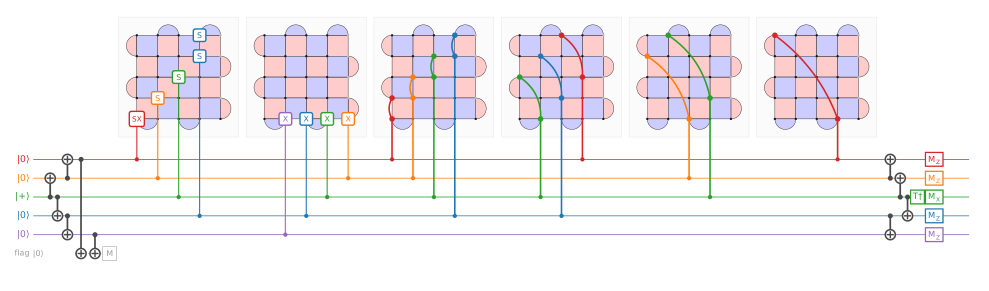 
Figure 5: Logical HXY check for Rot5. The ancilla GHZ(5) state is supported on the bottom wires, with a 6th qubit serving as a flag for the state preparation. The check is decomposed into controlled-S gates involving the diagonal qubits, controlled-X gates on the first row of qubits, and CCZ gates involving pairs of twisted off-diagonal qubits.

**Summary.** This work compares multiple methods for preparing essential magic states for fault-tolerant quantum computation using surface codes. By employing advanced simulation techniques like MPS, the authors demonstrate a new cultivation scheme that significantly reduces resource overhead while maintaining high fidelity. The findings provide crucial benchmarks for optimizing quantum error correction protocols against physical noise and resource constraints.

**Why it may be interesting.** The rigorous comparison of simulation techniques (MPS vs. CAMPS vs. Clifft) to determine the most efficient path for resource estimation in fault-tolerant quantum computation is highly relevant for theoretical quantum information scientists.

Detailed structure

**Main problem.** The paper compares various methods for cultivating high-fidelity magic states required for fault-tolerant quantum computation, specifically addressing the performance limitations of non-Clifford circuits.

**Main result.** The proposed new cultivation scheme achieves a significantly lower expected space-time cost ($\sim 1.3	imes$) compared to existing protocols while maintaining a target logical error rate of $10^{-9}$.

**Method.** The authors use Matrix Product States (MPS) and Clifford-augmented MPS (CAMPS) to perform exact simulations of different fold-transversal cultivation schemes on surface codes.

**Model / system.** The study focuses on quantum error correction (QEC) using surface codes (regular and rotated) at distances $d=3$ and $d=5$. The process involves state preparation and subsequent cultivation stages.

**Key observables.** Logical error rate, expected space-time cost, and the multiplicative factor increase in expected attempts due to physical losses.

**Important parameters / regimes.** Code distance ($d=5$), target error rate ($10^{-9}$), and physical loss probabilities ($p_{	ext{loss}}$).

**Assumptions / limitations.** The analysis assumes losses are modeled by independent loss channels uncorrelated with depolarizing noise, and that MPS/CAMPS can accurately capture the required entanglement structure.

**Figures summary.** Figures compare the performance (error rate vs. attempts) of various schemes for $|S
angle$ and $|T
angle$ states at $d=3$ and $d=5$. Other figures detail gadget-level structures and space-time overhead breakdowns for different code types.

**Paper structure.** The paper systematically compares multiple cultivation schemes ($	ext{Sahay et al.}$ vs. proposed) across different code types ($	ext{Reg}$ vs. $	ext{Rot}$) and distances ($d=3, 5$), analyzing performance metrics like error rate and space-time cost, and finally quantifying the impact of physical losses.

Abstract

Magic state cultivation prepares high-fidelity magic states at low expected space-time costs; however, the exact performance of some schemes is unsettled due to the difficulty in simulating non-Clifford circuits. Here, we use matrix-product states (MPS) based methods to compute the exact performance of two types of fold-transversal cultivation schemes: (i) the Sahay et al method based on the regular surface code S gate, and (ii) a method we propose based on a partially fault-tolerant fold-transversal S gate. We show that for the former protocol at $d=5$, the $|T\rangle$ output reaches similar logical error rates to the $|S\rangle$ output, traditionally used as a cheap full Clifford proxy. This contrasts with the $\sim10\times$ discrepancy reported for the $d=5$ colour-code scheme of Gidney et al. We also find that our new $d=5$ scheme has $\sim1.3\times$ lower expected space-time cost while still reaching $10^{-9}$ logical error rate. We show that MPS and Clifford-augmented MPS (CAMPS) perform on par with or even better than the recently introduced near-Clifford simulator Clifft on the hardest $d=5$ regular surface code scheme. Additionally, to speed up simulation, we propose a new pre-screening method based on simple Pauli propagation, lowering by up to three orders of magnitude the required number of exact simulations, and use several simulator-agnostic sampling methods such as subset sampling.

[↑ back to top](#top)

### [Diagnosing and Restoring the Degraded Fault Distance of Magic State Cultivation](http://arxiv.org/abs/2609.17706v1)

**Authors:** Tim Chan, Armands Strikis, Zhu Sun, Zhenyu Cai  
**Type:** theory · **Category:** quantum information and computing · **PDF:** <https://arxiv.org/pdf/2609.17706v1>  
**Analysis basis:** full PDF text, analyzed in chunks
**Topic relevance:** `quantum measurements` **1/5**

📷 Fig 1

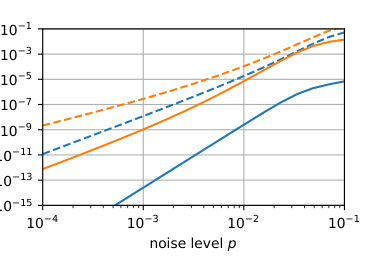 
Figure 1: The logical-error behaviour of the double-check circuit used in magic state cultivation, plotted in two ways. In both subfigures: dashed (solid) lines correspond to distance-3 (-5) cultivation, and blue (orange) data correspond to cultivating S (T) states.

📷 Fig 2

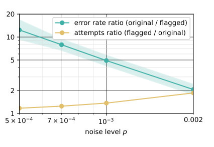 
Figure 2: The pre-escape performance of distance-5 T-state cultivation, with and without Z flags, plotted in two ways.

📷 Fig 3

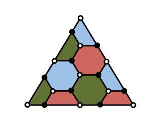 
Figure 3: Distance-3 and -5 hexagonal colour codes. Each colour-shaded polygon represents an X- and a Z-type stabiliser generator, whose support is the set of qubits at its corners.

📷 Fig 4

 
Figure 4: A sketch of three different methods to measure H+ from Lemma 1. The top three qubits represent the n &gt; 3 data qubits of the colour code. The size of the GHZ state in each method is flexible [4, §B.3.b].

📷 Fig 5

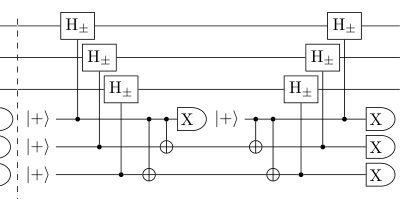 
Fig. 4 for this, MSC uses the double check in Fig. 4c as it is the most amenable to 2D nearest- neighbour connectivity. Its explicit form for MSC-3, which we call the distance-3 double check, is shown in Fig. 6a; this relies on the decompositions H+ = TXT† and H−= T†XT, and has two further optimisations: T† cancels T between the two applications of controlled-H±, and the GHZ-state (un)encoding is morphed onto some data qubits for connectivity reasons. Note the circuit in the original paper [1, Figure 7] mistakenly measures H⊗7 + which is logically equivalent to H−.

**Summary.** This paper diagnoses why T-state magic state cultivation protocols suffer from a degraded fault distance compared to S-state protocols due to specific Pauli hook errors. The authors develop an advanced analytical framework and propose error-detecting 'flags' that successfully restore the fault tolerance, significantly lowering the logical error rate.

**Why it may be interesting.** While focused on abstract QEC, the rigorous error analysis and the development of detection flags are highly relevant to understanding noise resilience in any physical quantum system, including those studied in AMO physics.

Detailed structure

**Main problem.** The paper addresses the discrepancy in fault tolerance between T-state and S-state magic state cultivation protocols, where T-state cultivation exhibits a degraded fault distance.

**Main result.** By designing specific 'flags' to detect malignant Pauli hook errors, the pre-escape logical error rate for T-state cultivation can be significantly improved from $O(p^3)$ to $O(p^5)$.

**Method.** The authors employ analytical derivations, deriving general formulas and an $O(n^3)$-time algorithm to calculate the acceptance probability of logical mixed states afflicted with Clifford errors.

**Model / system.** The work analyzes quantum error correction circuits, specifically Magic State Cultivation (MSC) protocols using color codes (e.g., hexagonal color codes) to generate logical T and S states.

**Key observables.** Logical error rate (LER), fault distance, and the probability of observing a trivial syndrome ($pr(s=0)$).

**Important parameters / regimes.** Noise level ($p$), physical qubit count ($n$), and the required fault distance (e.g., distance-3 or -5).

**Assumptions / limitations.** The analysis assumes circuit-level depolarizing noise and relies on approximating the sum over undetectable fault configurations by considering only low-fault-count terms.

**Figures summary.** Figures illustrate the comparison of logical error probabilities for T vs. S states at different distances, and show the circuit structure for the double-check mechanism and the improved flagged circuits.

**Paper structure.** The paper progresses by first identifying the T-S discrepancy, then analytically deriving the error propagation mechanisms involving Pauli hook errors and Clifford errors. It introduces an algorithm for calculating syndrome probabilities and concludes by designing and analyzing error-detecting flags to restore the fault distance.

Abstract

T-state cultivation is a resource-efficient protocol producing logical T states but recent benchmarks show that its logical error rate is considerably higher than intended i.e. than S-state cultivation, which is the analogous protocol for producing logical S states. In this paper, we explain this T-S discrepancy by analytically showing, under circuit-level depolarising noise, that distance-3 (-5) T-state cultivation has fault distance 2 (3) due to Pauli hook errors that propagate to coherent Clifford errors after its final double-check circuit; such errors remain Pauli in S-state cultivation, which consequently retains fault distance 3 (5). As part of our analysis we derive a general formula, and an $\mathcal O(n^3)$-time algorithm for fixed logical-qubit count, for the acceptance probability of a logical mixed state afflicted with a Clifford error, where $n$ is the physical qubit count. We then design flags that detect the malignant hook errors in cultivation, improving the pre-escape logical error rate from $\mathcal O(p^3)$ to $\mathcal O(p^5)$. At noise level $p =10^{-3}$, this is a 4.9$\times$ improvement, costing a 1.36$\times$ increase in attempts per accepted shot.

[↑ back to top](#top)

### [Exact and fast series expansions for quantum models with long-range interactions](http://arxiv.org/abs/2609.18761v1)

**Authors:** Antonia Duft, Patrick Adelhardt, Jan Alexander Koziol, Andreas A. Buchheit, Kai Phillip Schmidt  
**Type:** theory · **Category:** statistical mechanics · **PDF:** <https://arxiv.org/pdf/2609.18761v1>  
**Analysis basis:** full PDF text, analyzed in chunks
**Topic relevance:** `analog quantum simulation` **1/5**

📷 Fig 1

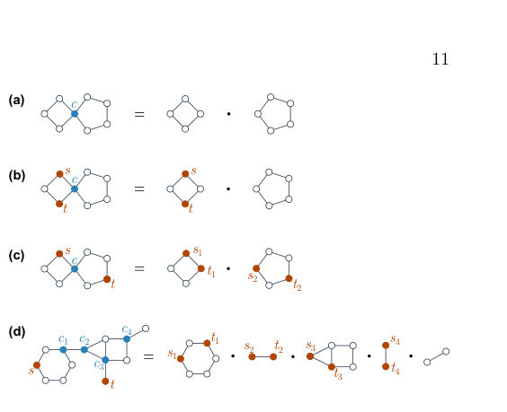 
Figure 2. Block decomposition of a graph into (a)-(c) two and (d) multiple blocks. The respective graph zeta function factorizes into a product over the graph zeta functions for the individual blocks. (a) For zero momentum or equivalently equal or no terminals, the graph zeta function factorizes at the cutvertex c and both blocks contribute at zero momentum. (b) For both terminals within the same subgraph, that block contributes at the respective finite momentum while the other subgraph is treated as zero-momentum decoration. (c) For terminals in different subgraphs, the momentum is routed through the cutvertex and terminals (s1, t1) and (s2, t2) of the subgraphs are assigned accordingly....

📷 Fig 2

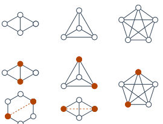 
Figure 3. Block categories for evaluation. Upper row: blocks without terminals. Lower row: blocks with terminals (colored nodes). The categories from (a)–(e) are: (A) bridges, (B) zero-momentum circle graphs, (C) series-parallel (SP) blocks, including finite-momentum circle graphs, and overlap graphs with (D) tw = 3 and (E) tw = 4. For blocks with terminals, we consider the augmented block with an additional edge between terminals (orange dashed line) for the classification.

📷 Fig 3

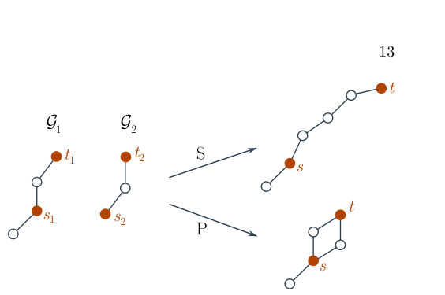 
Figure 4. Serial (S) and parallel (P) composition of the two- terminal graphs G1 and G2 with terminals (s1, t1) and (s2, t2) depicted as colored nodes. Serial composition identifies the terminals t1 = s2, yielding terminals (s, t) = (s1, t2). Parallel composition identifies s = s1 = s2 and t = t1 = t2.

📷 Fig 4

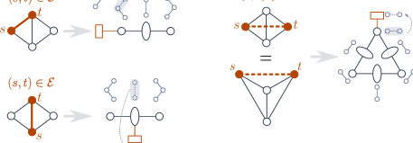 
Figure 7. Dependence of the 1qp construction graph on the position of terminals s, t. (a)–(c) Three 1qp graphs with the same underlying 0qp graph corresponding to three distinct hopping processes from s to t. For each case, the original graph is shown on the left and the construction graph on the right. The gray subgraphs at the construction graph nodes depict which part of the original graph is represented by the respective node. (a) and (b) The edge (s, t) ∈E is part of the graph. First, the construction graph is determined according to the 0qp algorithm. The 1qp construction graph is given by moving the edge (s, t) in the construction graph from its original node to a new hopping-node...

📷 Fig 5

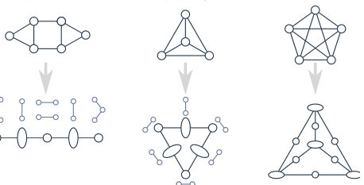 
Figure 6. Representative graphs with tw ∈{2, 3, 4} from categories (C), (D) and (E), respectively, from Fig. 3 (upper row) alongside the respective construction graphs determined by applying the algorithm described in the main text (lower row). Circular nodes in the construction graph are cycle nodes that represent cycles of the original graph while oval nodes are segment nodes which represent segments of overlapping edges between cycles in the original graph. The gray subgraphs at the nodes of the construction graph depict which part of the original graph is represented by the respective node. For category (E) with tw = 4, we drop the explicit depiction of the node-subgraphs for...

**Summary.** This paper introduces the graph zeta method, a deterministic computational framework designed to calculate high-order series expansions for quantum models with long-range interactions. It replaces slow Monte Carlo simulations by systematically evaluating lattice sums using graph zeta functions and tensor network techniques. This allows for fast, high-precision, and momentum-resolved modeling of complex quantum magnetic systems, with successful application to analyzing experimental data.

**Why it may be interesting.** The development of a deterministic, high-precision tool for calculating lattice sums in the presence of long-range interactions is crucial for theorists studying quantum magnetism and strongly correlated systems where traditional methods fail due to computational cost or statistical noise.

Detailed structure

**Main problem.** The paper addresses the need for an exact and fast computational method to calculate high-order series expansions for quantum models characterized by long-range interactions.

**Main result.** The proposed graph zeta method replaces slow, noisy Monte Carlo evaluations with a deterministic, high-precision calculation, enabling fast, momentum-resolved modeling of quantum matter.

**Method.** The core method is the 'graph zeta method,' which reformulates graph-embedding sums as graph zeta functions. It decomposes these sums based on treewidth, using Epstein zeta functions for low-treewidth blocks and tensor-network elimination for higher-treewidth blocks.

**Model / system.** The method is benchmarked on the transverse-field Ising model (TFIM) with power-law interactions in 1D, 2D, and 3D. It is also applied to the quasi-two-dimensional triangular-lattice antiferromagnet KTmSe2.

**Key observables.** High-resolution excitation spectra across the entire Brillouin zone, ground-state energy density, and series coefficients for various physical quantities.

**Important parameters / regimes.** The interaction decay law (power-law), the lattice dimensionality (1D, 2D, 3D), and the perturbation parameter $\lambda$.

**Assumptions / limitations.** The method assumes the applicability of linked-cluster expansions and relies on the mathematical decomposition of graph-embedding sums via treewidth.

**Figures summary.** Not specified, but the notes indicate the method enables obtaining the full momentum-dependent series in a single calculation, which is key for spectral analysis.

**Paper structure.** The paper introduces the graph zeta method as a deterministic alternative to MC for linked-cluster expansions. It details the mathematical framework involving graph zeta functions and treewidth decomposition, benchmarks this method on the TFIM, and concludes with an application to analyze experimental data from a specific magnetic material.

Abstract

Over the past decade, high-order series expansions based on linked-cluster methods have become an important tool for studying low-energy properties of gapped quantum systems with long-range interactions. We introduce a deterministic framework that removes a central computational bottleneck of this method. Our graph zeta method replaces the costly and statistically noisy Monte Carlo (MC) evaluation of high-dimensional lattice sums by a systematic, high-precision computation that delivers series coefficients within minutes on standard desktop hardware. The full momentum-dependent series is obtained in a single calculation, enabling high-resolution excitation spectra throughout the Brillouin zone. Building on the companion paper [1], the method reformulates graph-embedding sums as graph zeta functions and decomposes them into blocks classified by their treewidth tw. Low-treewidth blocks (tw$\leq2$) admit closed expressions based on Epstein zeta functions, while higher-treewidth blocks (tw$>2$) are evaluated using tensor-network bucket elimination. We benchmark the approach for transverse-field Ising models with power-law interactions in 1d, 2d, and 3d, reproducing previous MC results at a fraction of the computational cost while enabling substantially denser parameter sampling. An open-source implementation makes the method directly applicable to general interactions and large parameter scans. As an application, we compare microscopic interaction models for the stacked quasi-2d transverse-field Ising triangular-lattice antiferromagnet KTmSe$_2$ and find that a model including dipolar interactions best describes existing experimental data. The graph zeta method thus turns high-order linked-cluster expansions into a practical and deterministic tool for fast quantitative momentum-resolved modeling of short- and long-range quantum matter.

[↑ back to top](#top)

### [Feasibility Ordering of Entanglement-Source Placement for Qubit Channels](http://arxiv.org/abs/2609.18803v1)

**Authors:** Samuel Marquez Gonzalez  
**Type:** theory · **Category:** quantum information and computing · **PDF:** <https://arxiv.org/pdf/2609.18803v1>  
**Analysis basis:** full PDF text, analyzed in chunks
**Topic relevance:** `correlated / nonlocal dissipation` **1/5**

📷 Fig 1

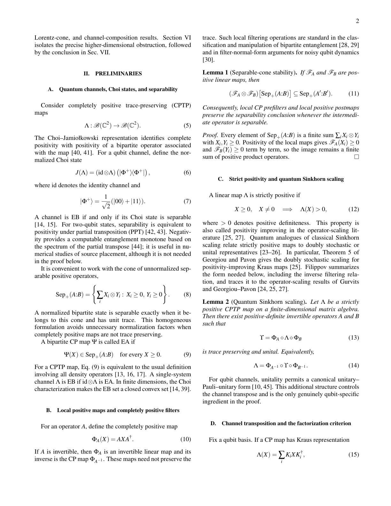 
Low-resolution page preview, page 2

📷 Fig 2

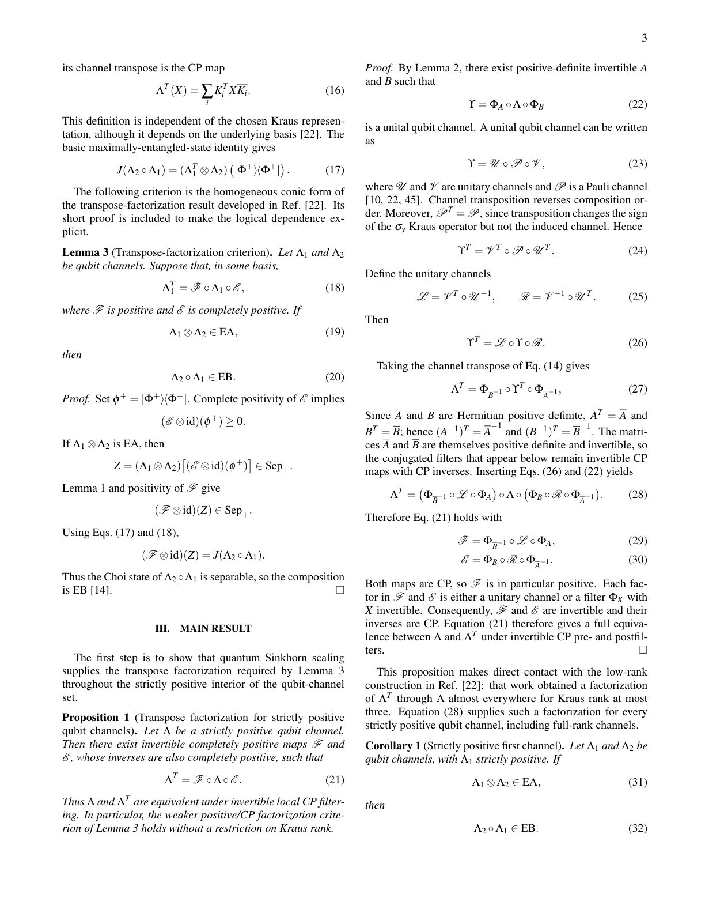 
Low-resolution page preview, page 3

📷 Fig 3

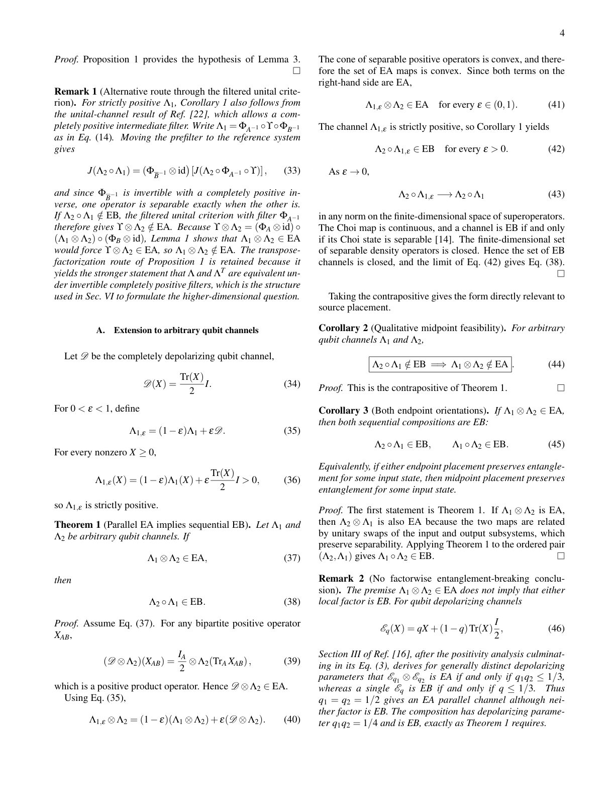 
Low-resolution page preview, page 4

📷 Fig 4

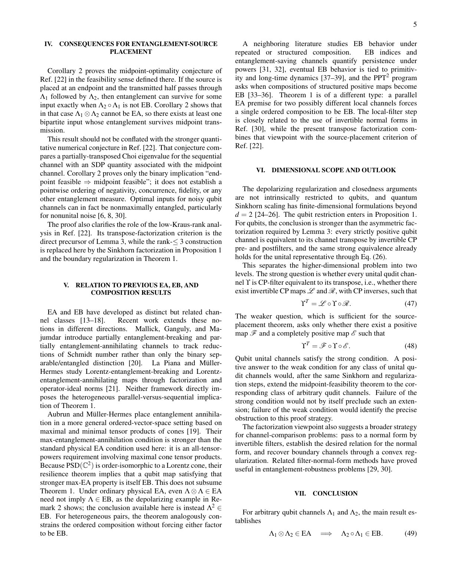 
Low-resolution page preview, page 5

📷 Fig 5

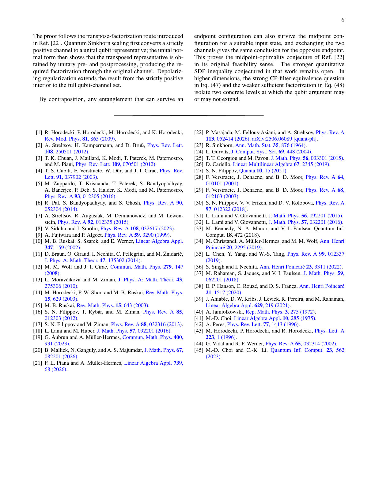 
Low-resolution page preview, page 6

**Summary.** This paper proves a fundamental relationship between the entanglement properties of parallel versus sequential compositions of noisy qubit channels. Specifically, it shows that if the parallel combination is entanglement-assisted, the sequential composition must be entanglement-breaking. This establishes the optimality of midpoint placement for entanglement sources in the feasibility sense.

**Why it may be interesting.** This work provides rigorous mathematical tools (like factorization criteria and regularization) to compare different physical arrangements of quantum resources (entanglement sources) in open quantum systems.

Detailed structure

**Main problem.** The paper investigates the feasibility ordering of placing an entanglement source when considering two noisy qubit channels ($\Lambda_1 \otimes \Lambda_2$ vs. $\Lambda_2 \circ \Lambda_1$).

**Main result.** It proves that if the parallel composition of two qubit channels is entanglement-assisted (EA), then the corresponding sequential composition must be entanglement-breaking (EB), establishing midpoint optimality in the feasibility sense.

**Method.** The proof utilizes the transpose-factorization criterion, extending results from strictly positive channels to arbitrary channels via depolarizing regularization and quantum Sinkhorn scaling.

**Model / system.** The system involves two noisy qubit channels ($\Lambda_1, \Lambda_2$) acting on qubits, analyzed through concepts like entanglement breaking (EB) and entanglement assisting (EA).

**Key observables.** Entanglement-Breaking (EB) and Entanglement-Assisted (EA) properties of channel compositions ($\Lambda_1 \otimes \Lambda_2$ and $\Lambda_2 \circ \Lambda_1$).

**Important parameters / regimes.** The channels $\Lambda_1$ and $\Lambda_2$, and the concept of strict positivity for initial factorization steps.

**Assumptions / limitations.** The extension of the factorization criterion from strictly positive channels to arbitrary channels relies on depolarizing regularization.

**Paper structure.** The paper develops the argument by first establishing the necessary transpose factorization for strictly positive channels using Quantum Sinkhorn scaling, and then extending this result to arbitrary channels using regularization techniques to prove the main implication.

Abstract

This work studies the placement of an entanglement source along a communication line formed by two noisy qubit channels. Recent work argued, on analytical and numerical grounds, that midpoint placement should be at least as favorable as endpoint placement. Here it is shown that, for arbitrary qubit channels, if a sequential composition can preserve entanglement, then the corresponding parallel action cannot annihilate all entanglement. The proof uses the transpose-factorization criterion introduced in that recent work. Quantum Sinkhorn scaling converts every strictly positive qubit channel into a unital representative, and the special normal form of unital qubit channels then yields the required factorization of the transposed map through the original channel. Depolarizing regularization and the closedness of the set of entanglement-breaking channels extend the result to arbitrary channels. Consequently, $Λ_1 \otimes Λ_2 \in \mathrm{EA}$ implies $Λ_2 \circ Λ_1 \in \mathrm{EB}$, and, by exchanging the two channels, the same holds for the opposite composition order. This proves the recent conjecture that midpoint placement is optimal for all qubit channels, in the feasibility sense in which that optimality was originally defined.

[↑ back to top](#top)

### [Orbital-Induced Peierls Transitions: How Orbitals Orchestrate Lattice Instability](http://arxiv.org/abs/2609.18614v1)

**Authors:** T. Mizokawa, S. V. Streltsov  
**Type:** theory · **Category:** strongly correlated electrons · **PDF:** <https://arxiv.org/pdf/2609.18614v1>  
**Analysis basis:** full PDF text, analyzed in chunks
**Topic relevance:** `Keldysh / 2PI / non-Gaussian methods` **1/5**

📷 Fig 1

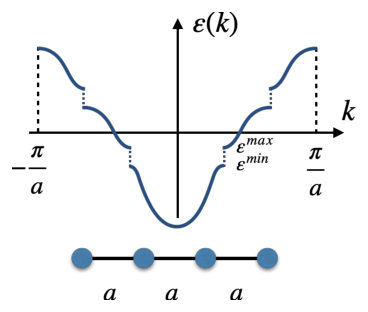 
FIG. 1: Peierls was the first to show that the electron disper- sion of a linear chain of atoms spaced at distance a is modified by lattice distortions. The vertical breaks in the sketch are proportional to corresponding displacements. If the electron filling is such that the Fermi energy lies exactly within the gap, the distortion lowers the electronic energy. Otherwise, the distortion is ineffective: the average of the maximal εmax

📷 Fig 2

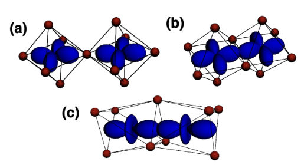 
FIG. 3: Different type of sharing in octahedral geometry: (a) common corner with the x2−y2 orbital, (b) common edge with the xy orbital, and (c) common face with the a1g orbital.

📷 Fig 3

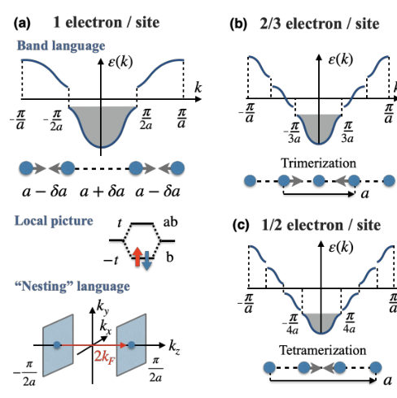 
FIG. 2: Illustration of the Peierls transition for different num- bers of electrons (a-c). For the case of a single electron, dif- ferent interpretations of the transition are presented: the in- stability leading to gap opening in the electronic spectrum is illustrated in the top panel of (a). The formation of bond- ing and antibonding states assuming orthogonal wavefunction due to dimerization and corresponding energy gain is shown in the middle panel of (a). The bottom panel of (a) illustrates nesting of the Fermi surface, which leads to divergence of the generalized susceptibility in Lindhard theory or in the ran- dom phase approximation (RPA), see Eq. (1).

📷 Fig 4

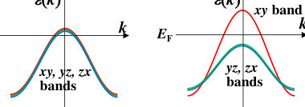 
FIG. 4: Schematic drawings for t2g band dispersions of AB2X4 spinels (transition metals at B sites) in the cubic (a = b = c) situation (a) and the elongated tetragonal (a = b &lt; c) situation (b). Setting the x-, y-, and z-axes along the a, b, and c directions of the cubic/tetragonal crys- tal, the xy, yz, and zx bands run along the [1,±1,0], [0,1,±1], and [±1,0,1] directions, respectively. When the Fermi level is close to the upper bound of the t2g bands, holes can be ac- commodated only in the xy band due to the band Jahn-Teller distortion with a = b &lt; c along the c- or z-axis.

📷 Fig 5

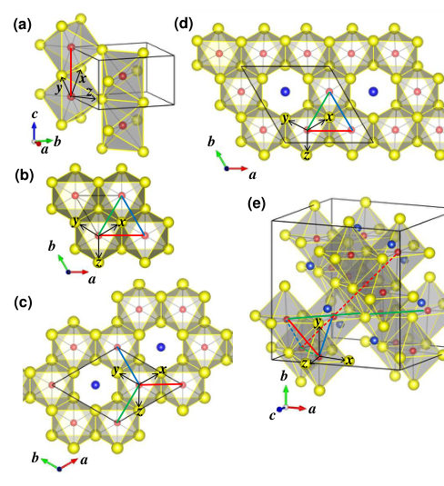 
FIG. 5: Examples of various structures with orbital-induced Peierls transition: (a) rutile-type structure containing chains of edge-sharing MX6 octahedra, (b) CdI2-type (α-NaFeO2 has very similar motif) structure having triangular lattice of transition-metal sites, (c) ilmenite-type structure (transition- metal sites form honeycomb network), (d) nolanite-type struc- ture (transition-metal sites form kagome network), and (e) spinel-type structure (transition-metal sites form pyrochlore network consisting of metal tetrahedra). The MX6 octahe- dra are shaded. The transition-metal M and ligand X are indicated by red and yellow balls. In (c) and (d), alkaline or alkaline-earth cations partly...

**Summary.** This review explores how orbital degrees of freedom can drive lattice instabilities, such as the Peierls transition, even in higher-dimensional materials. It details two key mechanisms: orbital anisotropy leading to effective 1D behavior, and the Jahn-Teller effect lifting band degeneracies. The work is crucial for understanding structural transitions in transition metal oxides based on orbital interactions.

**Why it may be interesting.** The coupling between orbital physics, lattice instability (Peierls), and electronic correlations is a cornerstone of strongly correlated electron physics, relevant to understanding Mott insulators and metal-insulator transitions.

Detailed structure

**Main problem.** The paper investigates how orbital degrees of freedom can induce the Peierls transition (lattice instability) in higher dimensions, moving beyond the traditional one-dimensional context.

**Main result.** Orbital anisotropy allows the Peierls instability to manifest in higher dimensions, often synergistically coupled with the Jahn-Teller effect in edge-sharing transition metal oxide structures.

**Method.** The analysis uses theoretical concepts like the generalized susceptibility ($\chi_0(\vec{q})$) and compares energy gains from electronic structure changes (e.g., molecular orbital formation) against elastic energy loss.

**Model / system.** The focus is on transition metal compounds, particularly those with partially filled $t_{2g}$ orbitals, often exhibiting edge-sharing octahedral geometries (e.g., in spinels).

**Key observables.** Gap opening at specific wavevectors, divergence of the generalized susceptibility, and band structure evolution under Jahn-Teller distortions.

**Important parameters / regimes.** Orbital filling ($d^n$), lattice geometry (edge-sharing vs. face-sharing), and the strength of orbital anisotropy.

**Assumptions / limitations.** The review primarily focuses on $d$ orbitals and notes the difficulty in cleanly separating the energy contributions from the band Jahn-Teller effect versus the Peierls mechanism.

**Figures summary.** Figures illustrate the Peierls transition in 1D chains, compare orbital sharing in different octahedral geometries, and show $t_{2g}$ band dispersions under structural distortions in spinel structures.

**Paper structure.** The review progresses from the traditional 1D Peierls concept to mechanisms allowing instability in higher dimensions, detailing the role of orbital anisotropy and Jahn-Teller coupling in specific crystal structures.

Abstract

The Peierls transition is typically regarded as a phenomenon inherent to one-dimensional (1D) materials. However, orbital degrees of freedom can induce this instability even in higher dimensions. Two mechanisms are primarily responsible. First, the anisotropic shape of $p$ and $d$ orbitals can lead to effective "1D-zation" of the electronic spectrum. Second, orbital degrees of freedom can lift band degeneracy by shifting bands relative to each other via the local or band Jahn-Teller effect, thereby affecting the nesting of the Fermi surface. The orbital-induced Peierls effect is most commonly observed when ligand octahedra surrounding transition metals share edges, and less frequently in face-sharing geometries. In this review, we discuss the underlying physical mechanisms, the materials in which this phenomenon occurs, the characteristics of the high-temperature undistorted phase, and the role of local effects such as the formation of molecular orbitals.

[↑ back to top](#top)

### [Perfect state transfer under matrix powers: parity and spectral arithmetic](http://arxiv.org/abs/2609.18018v1)

**Authors:** Xingkun Song  
**Type:** theory · **Category:** other · **PDF:** <https://arxiv.org/pdf/2609.18018v1>  
**Analysis basis:** full PDF text, analyzed in chunks
**Topic relevance:** `analog quantum simulation` **1/5**

📷 Fig 1

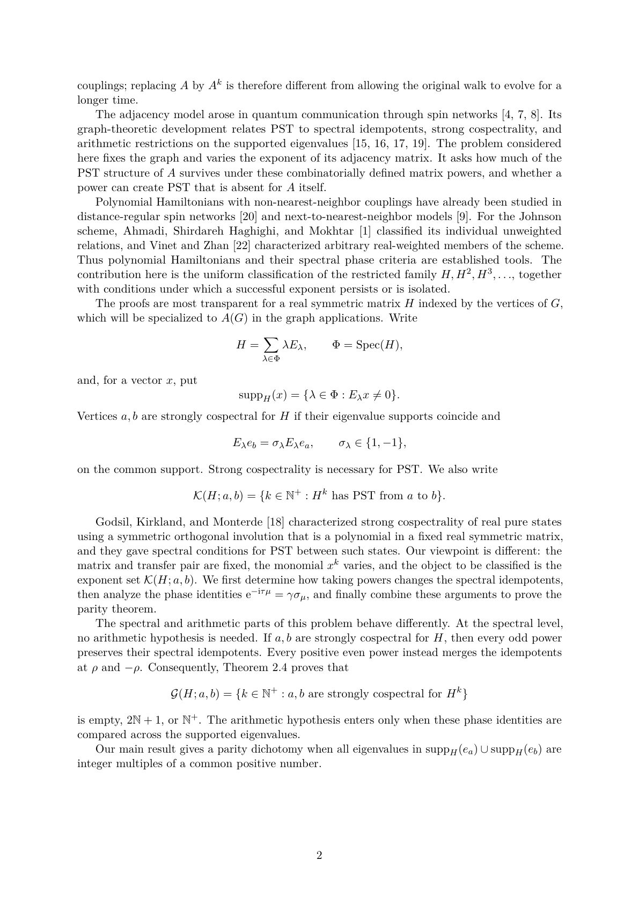 
Low-resolution page preview, page 2

📷 Fig 2

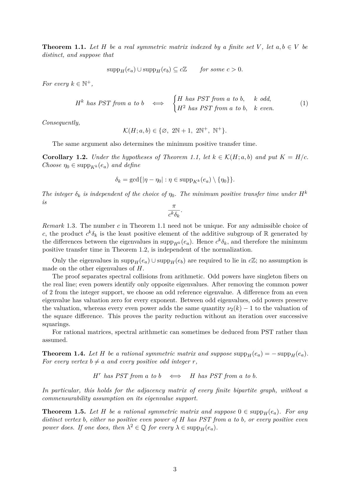 
Low-resolution page preview, page 3

📷 Fig 3

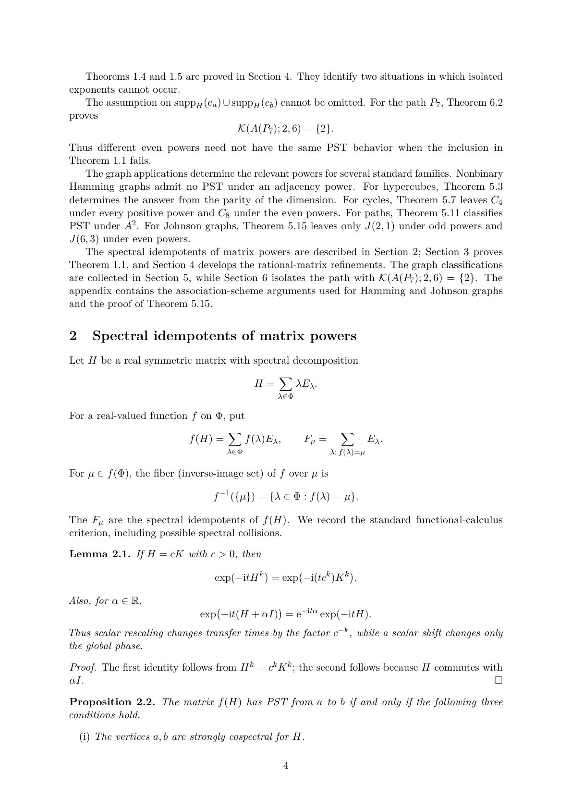 
Low-resolution page preview, page 4

📷 Fig 4

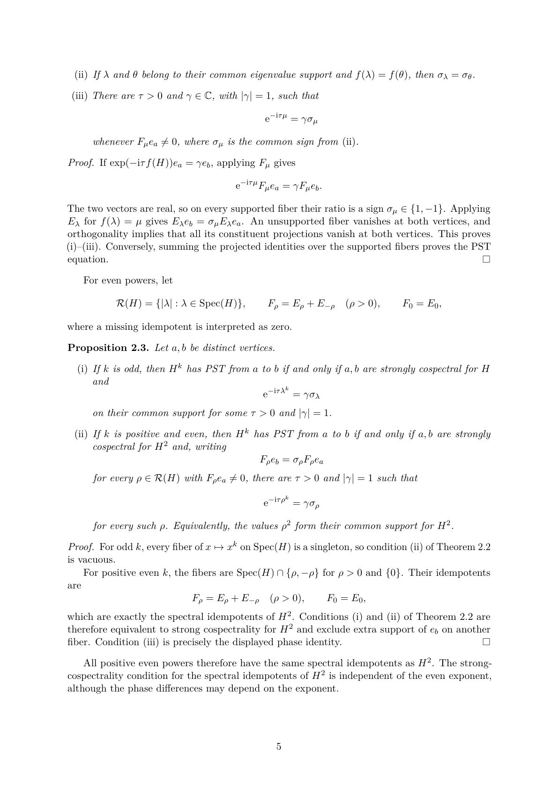 
Low-resolution page preview, page 5

📷 Fig 5

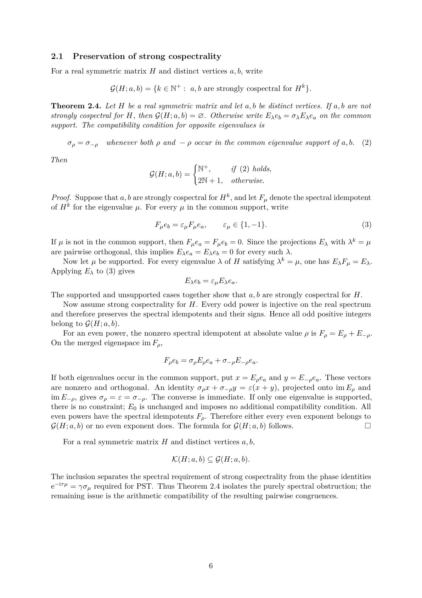 
Low-resolution page preview, page 6

**Summary.** This paper provides a rigorous mathematical classification of when Perfect State Transfer (PST) occurs for powers of a matrix $H$, often the adjacency matrix of a graph. It establishes that PST existence frequently follows a parity rule based on the spectral properties of $H$. The methodology combines spectral theory with number theory to precisely determine the allowed exponents $k$ for quantum state transfer.

**Why it may be interesting.** This work provides deep mathematical tools for analyzing quantum walks and quantum information transfer on graphs, which is highly relevant to quantum network theory and quantum computation models.

Detailed structure

**Main problem.** The paper classifies the exponents $k$ for which a real symmetric matrix $H$ (often an adjacency matrix) has Perfect State Transfer (PST) between two distinct vertices $a$ and $b$ when considering the matrix power $H^k$. It analyzes the interplay between spectral properties and arithmetic phase conditions governing this transfer.

**Main result.** The existence of PST often follows a parity rule: if the spectral supports are commensurable, PST occurs if $k$ is odd (related to $H$) or if $k$ is even (related to $H^2$). Specific graph families like hypercubes and paths are classified, showing PST is highly constrained.

**Method.** The analysis relies heavily on spectral theory, using spectral decomposition, spectral idempotents, and number-theoretic tools like the greatest common divisor (gcd) and 2-adic valuations ($
u_2$) to analyze phase compatibility conditions.

**Model / system.** The system is modeled by a real symmetric matrix $H$, typically the adjacency matrix $A(G)$ of a graph $G$. The dynamics are governed by the evolution operator $\exp(-itH^k)$, where $H^k$ is the $k$-th power of the matrix.

**Key observables.** Perfect State Transfer (PST) existence, minimum transfer time (related to $	ext{gcd}$ of spectral differences), and the parity of the exponent $k$.

**Important parameters / regimes.** The structure of the graph $G$ (e.g., path $P_7$, hypercubes), the vertex pair $(a, b)$, and the spectral properties of $H$.

**Assumptions / limitations.** The analysis often assumes that the supported eigenvalues are integer multiples of a common positive number ($c\mathbb{Z}$) or that the matrix is rational symmetric.

**Figures summary.** Not specified.

**Paper structure.** The paper develops from general functional calculus criteria to specific theorems establishing parity dichotomies (Theorem 1.1) for PST exponents, followed by specialized analyses for rational matrices and detailed classifications for specific graph families like paths and Johnson graphs.

Abstract

For a real symmetric matrix $H$ and distinct vertices $a,b$, we classify exponents $k$ for which $H^k$ has perfect state transfer (PST) from $a$ to $b$. If their supported eigenvalues are integer multiples of a common positive number, every odd exponent reduces to $H$ and every positive even exponent reduces to $H^2$. We determine the minimum transfer times using a greatest common divisor of supported spectral differences. For rational symmetric matrices, symmetry of the source vertex support about zero implies the odd-power equivalence without a commensurability assumption; this includes all bipartite graphs. If the source vertex supports zero, PST under one positive even power implies PST under every positive even power. For a symmetric three-point quadratic spectrum whose outer projection signs agree and differ from the central sign, a nonzero rational shift leaves exactly one PST exponent. We classify all adjacency powers of hypercubes, cycles, and Johnson graphs, and all adjacency squares of paths. In particular, the adjacency matrix of $P_7$ has PST from vertex $2$ to vertex $6$ only at exponent $2$.

[↑ back to top](#top)

### [QiT: Quantum-Inspired Transformer for Visual Recognition Task](http://arxiv.org/abs/2609.17789v1)

**Authors:** Badri N. Patro, Vijay Agneeswaran  
**Type:** experiment · **Category:** other · **PDF:** <https://arxiv.org/pdf/2609.17789v1>  
**Analysis basis:** full PDF text, analyzed in chunks
**Topic relevance:** `analog quantum simulation` **1/5**

📷 Fig 1

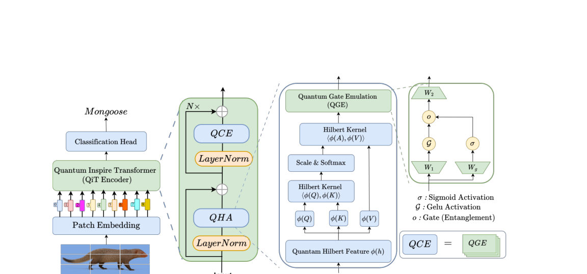 
Figure 1. QiT encoder block: Tokens are mapped to a quantum-inspired Hilbert space via angle encoding and Fourier features. Kernel attention approximates quantum fidelity, while local quantum mixers and a circuit surrogate layer emulate bounded-depth PQCs within a Transformer architecture.

📷 Fig 2

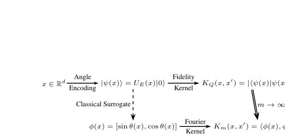 
Figure 2. Two distinct routes from angle-encoded inputs. QiT uses the explicit cosine feature kernel at the bottom; it does not generally approximate the circuit-dependent fidelity kernel at the top.

📷 Fig 3

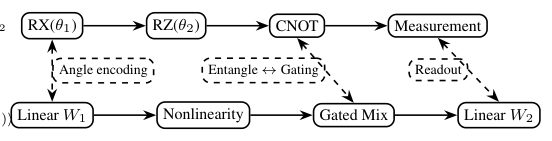 
Figure 3. Design analogy between a parameterized circuit and the QiT channel mixer. The correspondence motivates the sequence of operations but does not imply equivalent states or functions.

**Summary.** This paper introduces QiT, a Quantum-inspired Transformer that adapts concepts like angle encoding and periodic feature mapping from quantum mechanics into a purely classical, scalable vision model. By doing so, it tests whether quantum-motivated structural biases can improve classical performance without requiring actual quantum hardware. The results show QiT is a competitive and efficient baseline for exploring quantum-inspired inductive biases in computer vision.

**Why it may be interesting.** While the primary focus is on classical ML, the explicit use of periodic functions and kernel approximations derived from quantum state representations provides a novel, testable inductive bias for deep learning models.

Detailed structure

**Main problem.** The paper addresses the challenge of incorporating structural insights from quantum models into scalable classical neural network architectures for visual recognition.

**Main result.** The proposed model, QiT, achieves competitive performance on ImageNet-1K (78.3% top-1 accuracy) while remaining computationally efficient and avoiding the runtime costs of simulated quantum circuits.

**Method.** QiT integrates three quantum-inspired components into a classical Transformer: angle-inspired encoding, self-attention over periodic features, and a gated multiplicative emulation layer.

**Model / system.** QiT is a classical Transformer architecture designed to mimic quantum principles. It uses angle encoding to map image tokens to trigonometric features analogous to quantum rotations, and employs a gated mixer inspired by variational quantum circuits.

**Key observables.** ImageNet-1K top-1 accuracy (78.3%), computational cost (11.5 GFLOPs), and parameter count (45.7M).

**Important parameters / regimes.** The model operates entirely using differentiable tensor operations, maintaining the standard $\mathcal{O}(N^2D)$ attention complexity.

**Assumptions / limitations.** The model explicitly claims neither quantum computation nor quantum speedup; its performance is evaluated as a classical architecture.

**Figures summary.** Figure 1 illustrates the encoder block using angle encoding and Fourier features; Figure 2 contrasts the explicit cosine feature kernel used by QiT with the circuit-dependent fidelity kernel.

**Paper structure.** The paper introduces the problem, details the three classical components (encoding, attention, mixing) motivated by quantum concepts, and validates the architecture's feasibility and performance on standard image classification benchmarks.

Abstract

Quantum machine learning offers a compelling representational perspective: angle-encoded states inhabit Hilbert spaces in which periodic similarities and interactions can be expressed naturally. Realizing this perspective for visual recognition remains difficult, however, because present quantum neural networks are constrained by limited qubit counts, costly circuit simulation and measurement, noise, and unstable optimization on noisy intermediate-scale quantum devices. We investigate whether useful structural ideas from quantum models can instead be realized as scalable classical Transformer operations. We introduce QiT, a Quantum-inspired Transformer for vision tasks with three components: (i) angle-inspired encoding that maps image tokens to learned trigonometric Hilbert-space features analogous to quantum rotation-based state encoding; (ii) self-attention over these periodic features, inducing a classical cosine kernel approximated to quantum fidelity kernels; and (iii) gated multiplicative emulation, a trainable classical surrogate for interaction terms found in variational circuits. All components are differentiable tensor operations, so QiT claims neither quantum computation nor quantum speedup and retains the $\mathcal{O}(N^2D)$ attention complexity of a standard Vision Transformer. Across image-classification benchmarks, QiT is competitive with a matched classical Transformer while avoiding the severe runtime cost observed for a small simulated quantum Transformer. QiT-B reaches 78.3\% ImageNet-1K top-1 accuracy with 45.7M parameters and 11.5 GFLOPs. These results position QiT as a scalable baseline for isolating and evaluating quantum-motivated inductive biases in visual recognition.

[↑ back to top](#top)

### [The Expressive Power of Constrained QAOA: What You Might Have MISsed](http://arxiv.org/abs/2609.18209v1)

**Authors:** Boris Tsvelikhovskiy, Bao Bach, Ilya Safro  
**Type:** theory · **Category:** quantum information and computing · **PDF:** <https://arxiv.org/pdf/2609.18209v1>  
**Analysis basis:** full PDF text, analyzed in chunks
**Topic relevance:** `quantum measurements` **1/5**

📷 Fig 1

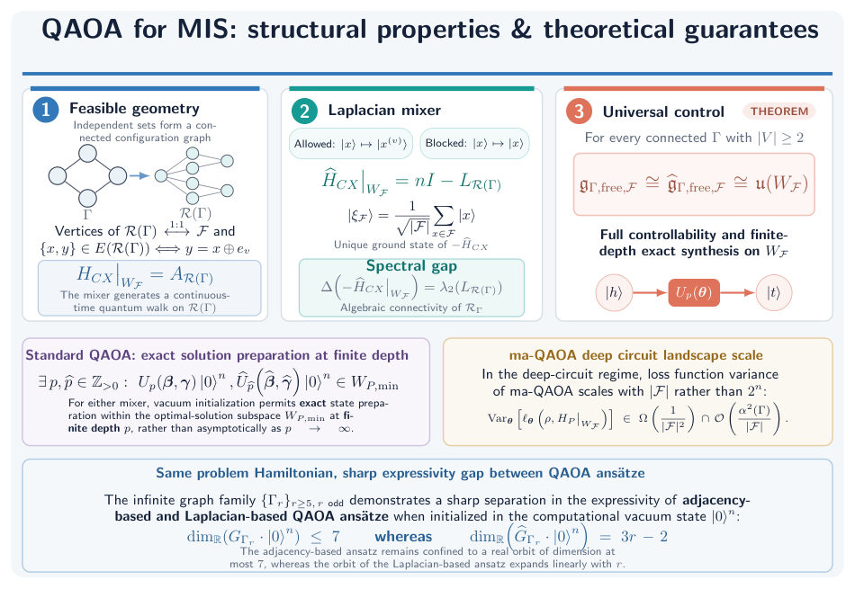 
FIG. 1. Overview of main results for constrained MIS-QAOA. (1) Restricted to the feasible subspace WF, the standard Flip-or-Void mixer HCX WF equals the adjacency matrix AR of the independent set reconfiguration graph R(Γ), thereby inducing a continuous-time quantum walk on R(Γ) initialized at the vertex corresponding to the initial computational state [10, Section VII]. (2) The proposed Flip-or-Stay mixer b HCX restricts to the shifted negative graph Laplacian nI −LR, whose spectral gap ∆  −b HCX WF  = λ2(LR) equals the algebraic connectiv- ity of R(Γ), with unique ground state given by the uniform feasible superposition |ξF⟩. (3) For any connected graph Γ with |V | ≥2, free multi-angle...

📷 Fig 2

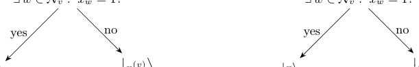 
FIG. 2. Comparison of the local mixer terms acting on a computational basis state |x⟩. The local Flip-or-Void mixer HCX,v annihilates configurations in which at least one neighbor of v is occupied, whereas the Flip-or-Stay mixer b HCX,v leaves such configurations unchanged. When all neighbors of v are unoccupied, both mixers flip the v-th bit.

📷 Fig 3

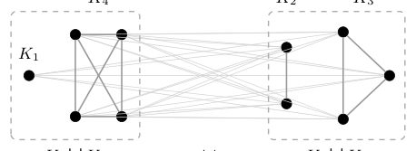 
FIG. 3. The graph Γ5 = K1,4 F K2,3 = (K1 F K4) ∨(K2 F K3). The dashed boxes indicate the two join factors. The subgraphs K3 and K4 are drawn as a triangle and a complete graph on four vertices, respectively. Every vertex in one dashed box is adjacent to every vertex in the other.

📷 Fig 4

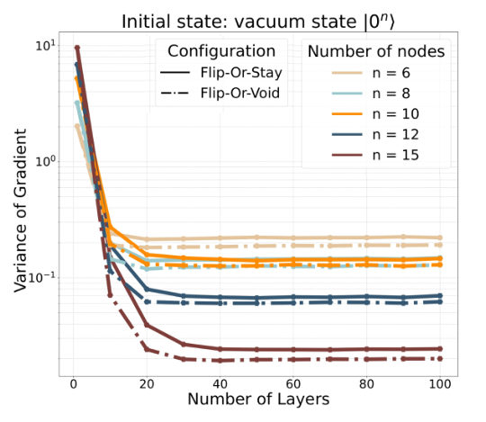 
FIG. 4. Variance of the loss function gradient for the Maximum Independent Set problem across graph sizes n ∈ {6, 8, 10, 12, 15} and varying circuit depths 1 ≤p ≤100. Panels compare the standard Flip-or-Void mixer HCX QAOA against the proposed Flip-or-Stay mixer b HCX variant. Data points represent the mean gradient variance evaluated over 20 non-isomorphic, random Erd¨os-R¨enyi graphs with edge probability of 1.5 log(n)/n per system size n, with 100 random parameter initializations θ ∼U([0, 2π]2p) per instance.

📷 Fig 5

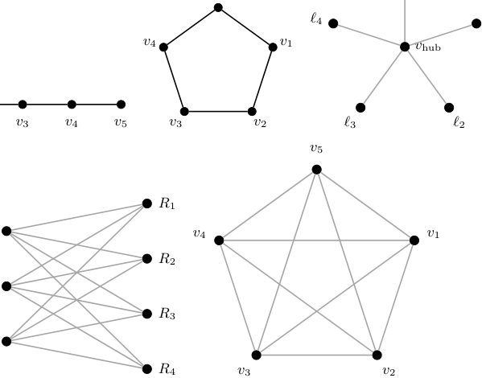 
FIG. 5. Benchmark graph structures analyzed in this work: path graph P5 (top left), cycle graph C5 (top middle), star graph K1,5 with central hub vertex vhub (top right), complete bipartite graph K3,4 with partition sizes s = 3 and ℓ= 4 (bottom left), and complete graph K5 (bottom right).

**Summary.** This work rigorously compares two types of mixers used in constrained QAOA for solving MIS. It proves that the alternative 'Flip-or-Stay' mixer offers superior expressive power compared to the standard mixer, demonstrating a qualitative gap in the reachable quantum states. The findings are crucial for understanding the fundamental limitations and potential enhancements in quantum optimization algorithms.

**Why it may be interesting.** The detailed algebraic comparison of different quantum control Hamiltonians (Laplacian vs. Adjacency) provides deep insight into which physical constraints yield the most powerful quantum computational models.

Detailed structure

**Main problem.** The paper investigates the expressive power and controllability of constrained quantum optimization algorithms, specifically for the Maximum Independent Set (MIS) problem.

**Main result.** It establishes a qualitative expressivity separation between two mixer types (standard vs. Flip-or-Stay) and proves that for connected graphs, the free mixer generates the full unitary Lie algebra on the feasible subspace.

**Method.** The analysis relies heavily on comparing the dynamical Lie algebras generated by different mixer Hamiltonians (standard vs. alternative) when restricted to the feasible subspace defined by independent sets.

**Model / system.** The model is constrained quantum optimization dynamics applied to the MIS problem on a graph $\Gamma$. The dynamics are governed by mixers, such as the standard controlled bit-flip mixer and the alternative Flip-or-Stay mixer, acting within the feasible subspace $\mathcal{W}_F$.

**Key observables.** Controllability (generating the full unitary Lie algebra), expressivity separation (comparing orbit dimensions), and the variance of the loss function in the unitary-design limit.

**Important parameters / regimes.** The graph structure ($\Gamma$), the depth of the QAOA circuit ($p$), and the dimensionality of the feasible subspace ($|F|$).

**Assumptions / limitations.** The analysis assumes the circuit ensemble forms an exact unitary 2-design for variance calculations, and it focuses on the operator-algebraic structure rather than just approximation quality.

**Paper structure.** The paper proceeds by defining the constrained dynamics for MIS, comparing the algebraic structures of the standard and alternative mixers, proving full controllability for the free architecture, and finally establishing the expressivity gap using graph families.

Abstract

Feasibility-preserving mixer Hamiltonians offer an attractive alternative to penalty encodings for constrained quantum optimization, yet how enforcing constraints alters the state space reachable by the Quantum Approximate Optimization Algorithm (QAOA) remains largely unexplored. We address this question within the context of the Maximum Independent Set (MIS) problem. Alongside the standard controlled bit-flip mixer, we analyze the alternative $\mathit{Flip\text{-}or\text{-}Stay}$ mixer, whose restriction to the feasible subspace $W_{\mathcal{F}}$ corresponds precisely to the shifted negative Laplacian of the independent-set reconfiguration graph. Although both mixers induce identical transitions between independent sets, the diagonal modification changes the spectral structure and can substantially enlarge the set of reachable quantum states.   For every connected input graph with at least two vertices, we prove that independently parameterized local controls associated with either mixer generate the full unitary Lie algebra on the feasible subspace. Standard QAOA exhibits a more nuanced algebraic structure. We prove that the dynamical Lie algebra associated with MIS-QAOA employing the conventional mixer embeds into its Flip-or-Stay counterpart. Furthermore, we construct an infinite family of graphs for which the corresponding vacuum-state dynamical group orbits exhibit strictly distinct dimensions, establishing a qualitative expressivity separation between the two architectures. For either mixer, we show that standard QAOA initialized in the empty set can prepare a state supported entirely on maximum independent sets at finite depth. For the free architectures, we also derive an exact loss-variance formula in the unitary-design limit, expressed through the number of feasible independent sets and the variance of their cardinalities.

[↑ back to top](#top)

### [Variational Quantum Transformer Architecture for Synthetic Language Generation](http://arxiv.org/abs/2609.18565v1)

**Authors:** Julian Hager, Michael Kölle, Gerhard Stenzel, Tobias Rohe, Jonas Stein, Claudia Linnhoff-Popien  
**Type:** experiment · **Category:** quantum information and computing · **PDF:** <https://arxiv.org/pdf/2609.18565v1>  
**Analysis basis:** full PDF text, analyzed in chunks
**Topic relevance:** `QC/QI experiment` **1/5**

📷 Fig 1

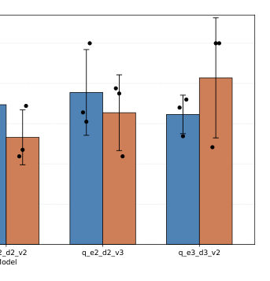 
Fig. 1. Grammar-level validity of the classical baseline and quantum transformer vari- ants on the deterministic and lexicographic tasks. Bars show mean scores over three seeds, error bars show one standard deviation and black points indicate the individual seed outcomes.

📷 Fig 2

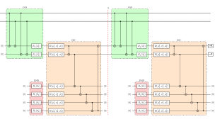 
Fig. 2. Detailed circuit diagram of the two-encoder, two-decoder quantum transformer instance. Embedding circuits are shown in red, individual heads in blue, encoder inte- gration circuits in yellow, connector blocks in green and decoder blocks in orange.

**Summary.** This paper introduces a variational quantum transformer designed for sequence modeling in QNLP, replacing classical layers with quantum circuits. The authors demonstrate that the architecture can learn complex grammar rules, though performance comparisons show that a classical transformer remains more accurate and stable. The work serves as a proof-of-concept for applying quantum circuits to structured data generation under near-term quantum constraints.

**Why it may be interesting.** It provides a concrete, near-term quantum circuit implementation for a complex machine learning task (NLP), which is highly relevant for researchers exploring quantum machine learning algorithms on current hardware.

Detailed structure

**Main problem.** The paper addresses the challenge of developing a compact, NISQ-compatible quantum architecture for performing synthetic Quantum Natural Language Processing (QNLP) sequence modeling.

**Main result.** While the quantum models successfully learn nontrivial grammar regularities, the classical transformer baseline remained more accurate and stable, indicating the current work is a feasibility study rather than a claim of quantum advantage.

**Method.** The authors propose a variational quantum transformer that replaces classical attention/feed-forward layers with variational quantum blocks, trained end-to-end using negative log-likelihood loss.

**Model / system.** The system is a hybrid quantum-classical model featuring an autoregressive structure. It uses angle-encoding for tokens and consists of variational quantum encoder, connector, and decoder blocks.

**Key observables.** Token accuracy and a comprehensive grammar score evaluating structural validity on deterministic and lexicographic grammars.

**Important parameters / regimes.** The architecture depth (E, D, V) and the number of trainable parameters (e.g., 354–364 for quantum vs. 700 for classical).

**Assumptions / limitations.** The contribution is explicitly framed as an architectural demonstration under NISQ constraints, acknowledging that the classical baseline is superior in performance and stability.

**Figures summary.** Figure 1 shows the mean grammar score comparison across various quantum and classical models for both deterministic and lexicographic tasks over multiple seeds.

**Paper structure.** The paper details the architectural design, including circuit components (encoding, encoder blocks, connector, decoder blocks), presents the experimental evaluation on controlled grammar tasks, and concludes by comparing performance against a classical baseline.

Abstract

We propose a compact NISQ-compatible quantum transformer architecture for synthetic QNLP sequence modelling. The model preserves the autoregressive next-token interface of a classical transformer, but replaces attention and feed-forward sublayers with variational quantum encoder blocks, connector circuits, decoder blocks and a direct two-qubit measurement readout. Token contexts are angle-encoded into small quantum registers, processed by parallel variational heads and encoder integration circuits and conditioned through decoder ancillae to produce a distribution over a four-token vocabulary. We evaluate several architecture variants on deterministic and lexicographic grammar-generation tasks against a compact classical transformer baseline. The quantum models are trainable end-to-end and learn nontrivial grammar structure, including perfect deterministic generation in individual runs and high lexicographic validity in the strongest variant. The classical baseline remains more accurate and stable and the quantum models are sensitive to initialization. The contribution is therefore not a claim of quantum advantage, but a concrete architecture and evaluation of transformer-inspired QNLP sequence modelling under near-term quantum constraints.

[↑ back to top](#top)

## Other papers (18)

*Papers from primary archives without highlighted authors or any topic match. Click to expand.*

Show other papers

### [Advances in the quantum-state texture theory](http://arxiv.org/abs/2609.17704v1)

**Authors:** Jose Alfredo de Leon, Miguel Gonzalez, Alejandro Fonseca, Pedro C. Azado, Fernando Parisio  
**Type:** theory · **Category:** quantum information and computing · **PDF:** <https://arxiv.org/pdf/2609.17704v1>  
**Analysis basis:** full PDF text, analyzed in chunks

📷 Fig 1

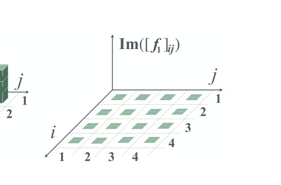 
Figure 1. Pictorial 3D view of the real (left) and imaginary (right) parts of f1 matrix elements. This is the only quantum state for which both plots are flat.

📷 Fig 2

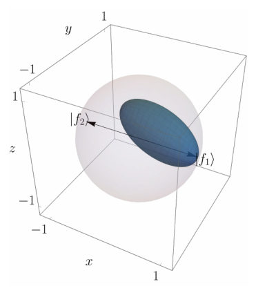 
Figure 2. Geometric action of a single-qubit QST free operation; see Eq. (26). The boundary of the Bloch ball is shown as the outer sphere, while its image under the free operation is the inner ellipsoid. The states |f1⟩= |+⟩and |f2⟩= |−⟩correspond to the Bloch vectors (1, 0, 0)T and (−1, 0, 0)T , respectively. The parameters are η = 4/5, λ = (2/5)e7i/10, and q = (1/4)e7i/5.

**Summary.** This work develops the resource theory of Quantum-State Texture (QST), a measure quantifying quantum information content. It advances the theory by focusing on the experimentally measurable 'grand sum' and introducing basis-independent concepts like 'set texture.' The results provide strong mathematical tools for analyzing quantum operations and composite quantum systems.

**Why it may be interesting.** The rigorous mathematical framework for QST provides a new resource measure that can be applied to study quantum phase transitions or the robustness of quantum gates, linking abstract theory to measurable physical quantities.

Detailed structure

**Main problem.** The paper advances the resource-theoretic formulation of Quantum-State Texture (QST) to provide a rigorous mathematical framework for quantifying quantum information content.

**Main result.** It establishes the basis-independent concept of 'set texture' and provides concrete characterizations of QST free operations for single qubits and composite systems.

**Method.** The authors utilize resource theory principles, focusing on the experimentally accessible 'grand sum' of density matrix elements and deriving bounds and operational interpretations for various texture monotones.

**Model / system.** The theory applies to general quantum states ($\varrho$) in a Hilbert space of dimension $D$, analyzing how quantum operations (CPTP maps) affect the state's texture.

**Key observables.** Quantum-State Texture (QST), the grand sum ($\Sigma(\varrho)$), distillable texture ($r$), and rugosity ($R(\varrho)$).

**Important parameters / regimes.** The dimension $D$ of the Hilbert space, and the parameters characterizing the action of free operations on the Bloch vector for single qubits.

**Assumptions / limitations.** The analysis centers on the grand sum $\Sigma(\varrho)$ as the key experimentally accessible observable, and assumes the existence of a fixed-point resource theory framework.

**Figures summary.** Figure 1 illustrates the real and imaginary parts of matrix elements of the textureless state ($f_1$); Figure 2 shows the geometric mapping of a single-qubit QST free operation on the Bloch ball.

**Paper structure.** The paper progresses by first defining QST using the grand sum, then characterizing free operations for single qubits (using Bloch sphere geometry), and finally extending the theory to composite systems by introducing basis-independent measures like set texture and analyzing generalized means for family rugosity.

Abstract

The recently introduced concept of quantum-state texture (QST) has found applications ranging from the identification of unknown quantum gates to the study of quantum phase transitions and criticality, and has already been experimentally investigated. Here, we advance its resource-theoretic formulation in several directions. Our approach centers on the experimentally accessible grand sum--the sum of all matrix elements of a density operator in a given basis. We clarify several points raised in the recent literature, including the relation between texture distillation and a simple grand-sum-based QST monotone. We completely characterize free operations for a single qubit and study the resulting state-conversion order; classify relevant families of free operations in arbitrary dimensions; derive bounds relating the texture of composite systems to that of their subsystems; and introduce the basis-independent concept of set texture. Together, these results strengthen and broaden the resource theory of QST, providing a foundation for its further development and applications.

[↑ back to top](#top)

### [Almost One Bit Violation of Minimum-Output Rényi Entropy Additivity Simultaneously at All Orders](http://arxiv.org/abs/2609.18747v1)

**Authors:** Guocheng Zhen, Chengkai Zhu, Ranyiliu Chen, Xin Wang  
**Type:** theory · **Category:** quantum information and computing · **PDF:** <https://arxiv.org/pdf/2609.18747v1>  
**Analysis basis:** full PDF text, analyzed in chunks

📷 Fig 1

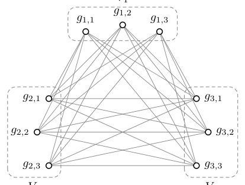 
Figure 1: The complete tripartite graph Λ3,3 = K3,3,3, illustrating Λr,d = Kd,...,d. Each dashed part contains three generators and no internal edge; every pair of vertices in distinct parts is joined by an edge imposing commutation. Thus AΛ3,3 ∼= F3 3. Inverse generators are not drawn as separate vertices.

**Summary.** This paper establishes a strong counterexample demonstrating that the minimum-output Rényi entropy is not additive for quantum channels. By constructing a specific quantum channel based on free group structures, the authors prove that the entropy fails to be additive by almost one bit simultaneously for all possible Rényi orders. This result significantly impacts the theoretical understanding of quantum information measures.

**Why it may be interesting.** This work provides a fundamental theoretical counterexample to an additivity conjecture in quantum information theory, which has implications for understanding the fundamental limits of quantum channel capacity and entanglement measures.

Detailed structure

**Main problem.** The paper investigates the additivity property of the minimum-output Rényi entropy for quantum channels, aiming to prove a simultaneous violation across all non-negative orders.

**Main result.** It proves that the minimum-output Rényi entropy can fail to be additive by an amount approaching one full bit ($\log 2 - \epsilon$) simultaneously for all orders $p \in [0, \infty)$.

**Method.** The proof constructs a counterexample using quantum channels derived from the direct product of free groups, leveraging tensorized Haagerup estimates and group theory constructions.

**Model / system.** The model is a quantum channel $\Phi$ acting on a finite-dimensional system, whose structure is derived from the direct product of free groups, $G_{r,d} = igotimes_{j=1}^{r} F(j)^d$.

**Key observables.** The primary observable is the entropy gap, $\Delta\Omega_p(\Phi) = 2H_{\min,p}(\Phi) - H_p(\Phi^{\otimes 2}|\Omega_m
angle\langle\Omega_m|)$, which is shown to remain large.

**Important parameters / regimes.** The violation gap is $\log 2 - \epsilon$, and the required output dimension scales as $O(\epsilon^{-3})$ as $\epsilon 	o 0$.

**Assumptions / limitations.** The construction relies on strong convergence results for representations of right-angled Artin groups and the use of specific group structures to enforce the non-additivity.

**Figures summary.** Figure 1 illustrates the complete tripartite graph $K_{3,3,3}$, which defines the structure of the generators for the associated right-angled Artin group.

**Paper structure.** The paper builds the counterexample by relating the entropy gap to one-copy purity and two-copy information, combining tools from operator algebras and free probability to establish the simultaneous violation across the entire Rényi spectrum.

Abstract

We prove that minimum-output Rényi-entropy additivity can fail by almost one bit simultaneously at every nonnegative order. For every $\varepsilon\in(0,\log2)$, there exists a finite-dimensional quantum channel with a real Stinespring isometry such that the same maximally entangled input witnesses a tensor-square entropy gap of at least $\log2-\varepsilon$ for all $p\in[0,\infty]$. The output dimension can be chosen to be $O(\varepsilon^{-3})$ as $\varepsilon\downarrow0$.   The construction uses direct products of free groups: tensorized Haagerup estimates control the one-copy outputs, while commutation between distinct factors forces exact Bell-branch collisions at two copies. Strong convergence gives both an existential realization through finite-dimensional representations of right-angled Artin groups followed by realification, and a Haar-orthogonal model whose success probability tends to one as the matrix dimension grows. We also determine the exact Bell quotient, prove asymptotically sharp regular-radius bounds, and show that the cubic output-dimension scale is optimal within the present purity--rank certificate.

[↑ back to top](#top)

### [Bath dimension and initial entropy for closed repeated use of a quantum channel](http://arxiv.org/abs/2609.18267v1)

**Authors:** Seth Douglas  
**Type:** theory · **Category:** quantum information and computing · **PDF:** <https://arxiv.org/pdf/2609.18267v1>  
**Analysis basis:** full PDF text, analyzed in chunks

📷 Fig 1

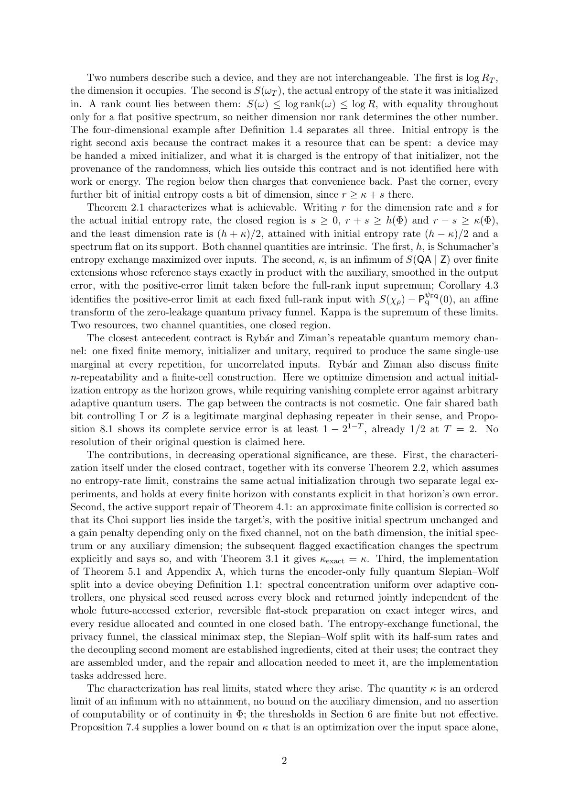 
Low-resolution page preview, page 2

📷 Fig 2

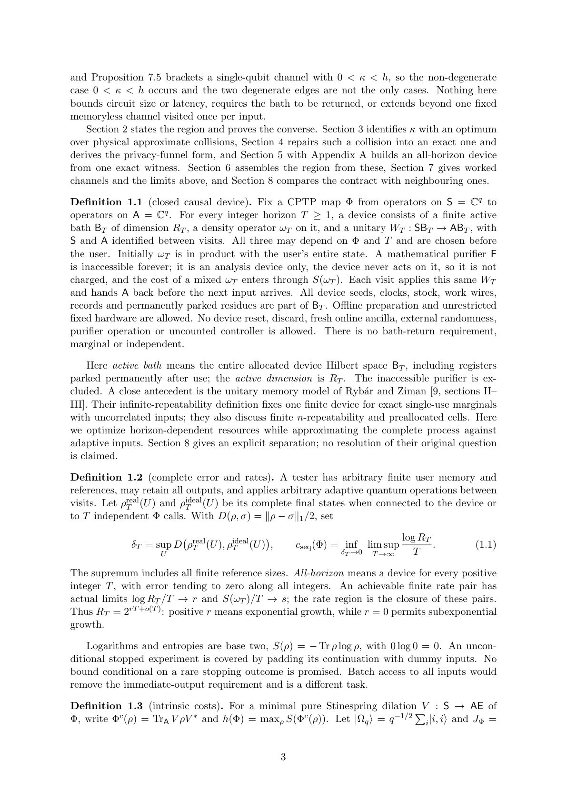 
Low-resolution page preview, page 3

📷 Fig 3

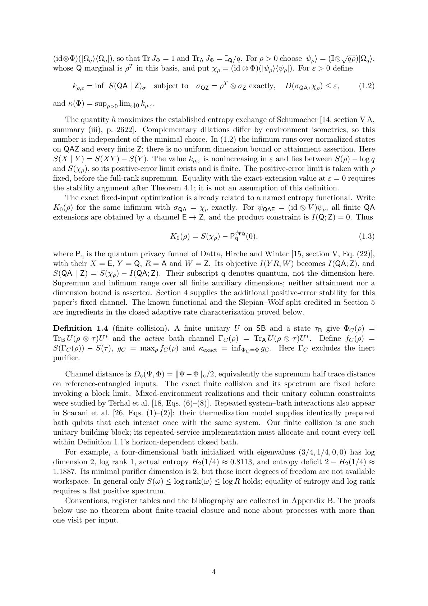 
Low-resolution page preview, page 4

📷 Fig 4

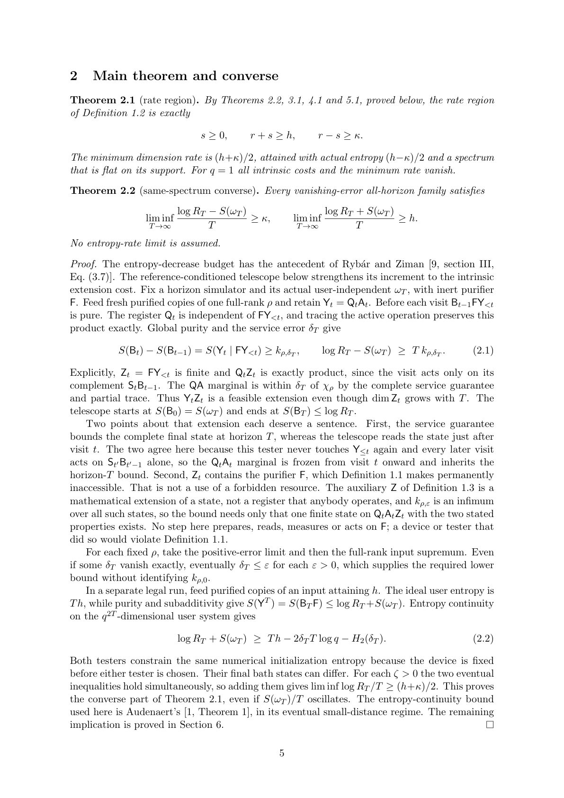 
Low-resolution page preview, page 5

📷 Fig 5

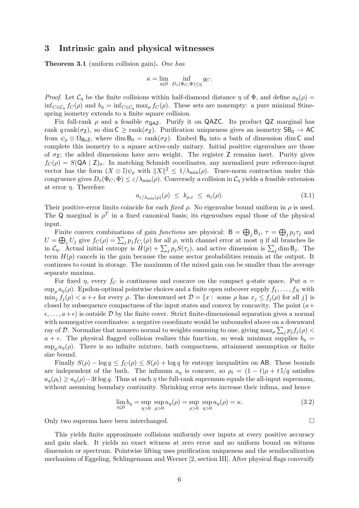 
Low-resolution page preview, page 6

**Summary.** This paper establishes the fundamental resource trade-offs governing the repeated use of a quantum channel in a closed system. It proves that the achievable rate region is constrained by the channel's maximum entropy exchange ($h$) and an intrinsic reference cost ($\kappa$). The methodology is highly technical, relying on advanced entropy inequalities and resource accounting for quantum information processing.

**Why it may be interesting.** The work provides a rigorous, resource-theoretic quantification of the limitations on quantum computation when the environment (bath) and initial state are finite and must be recycled repeatedly, which is crucial for understanding practical quantum device longevity.

Detailed structure

**Main problem.** The paper characterizes the fundamental resource constraints (bath dimension and initial entropy) required to repeatedly use a fixed, finite-dimensional quantum channel in a closed, resource-constrained device.

**Main result.** The achievable rate region is precisely defined by three inequalities: $s \ge 0$, $r+s \ge h(\Phi)$, and $r-s \ge \kappa(\Phi)$, where $h$ is the maximum entropy exchange and $\kappa$ is an intrinsic extension cost.

**Method.** The proof combines entropy converses, a specialized support repair technique, and an adaptive implementation of quantum Slepian–Wolf recycling to establish the necessary and sufficient conditions.

**Model / system.** The model involves a closed quantum device performing repeated uses of a fixed CPTP map $\Phi$. The resource budget includes an active bath $B_T$ of dimension $R_T$, an initial state $\omega_T$, and a unitary $W_T$ applied at each step, with all resources strictly accounted for.

**Key observables.** Bath dimension rate ($r$), initial entropy rate ($s$), maximum entropy exchange ($h$), and intrinsic reference cost ($\kappa$).

**Important parameters / regimes.** The rates $r$ and $s$ are defined as limits over the horizon $T$. The minimum dimension rate is determined by $(h+\kappa)/2$.

**Assumptions / limitations.** The analysis assumes a closed system where no external resets, fresh ancillas, or uncounted residues are available. The results are derived in the zero-error limit before the supremum over full-rank inputs.

**Paper structure.** The paper defines the resource contract (Definition 1.1) and then derives the achievable rate region (Theorem 2.1) by combining entropy bounds and analyzing the resource cost structure. It establishes the converse bounds using entropy decrease budgets and links the intrinsic cost $\kappa$ to collision gains.

Abstract

We characterize the bath resources needed to supply repeated uses of a fixed finite-dimensional quantum channel in a closed device. For each horizon $T$, one bath, one initial state and one repeated unitary are fixed before the user. Each output is returned before the next input arrives; no reset, discard, fresh ancilla or uncounted controller is available. Approximation error must vanish against arbitrary adaptive users with quantum memory and references. Writing $r=\lim \log_2(R_T)/T$ for the bath dimension rate and $s=\lim S(ω_T)/T$ for the actual initial entropy rate, we prove that the achievable region is exactly $s\ge 0$, $r+s\ge h$ and $r-s\geκ$. Here $h$ is maximum entropy exchange and $κ$ is a smoothed independent-reference extension cost, with the zero-error limit taken before the supremum over full-rank inputs. Its exact fixed-input form is an affine transform of the zero-leakage quantum privacy funnel. The minimum dimension rate is $(h+κ)/2$. The proof combines entropy converses, a bath-dimension-independent support repair, and a closed adaptive implementation of encoder-only fully quantum Slepian--Wolf recycling. All seeds, clocks, workspace and retained residues are counted. Worked examples include dephasing, pure replacement and a qubit channel with $0<κ<h$. No computability of $κ$ or efficient circuit synthesis is claimed.

[↑ back to top](#top)

### [Catalytic Activation of Genuine Multipartite Entanglement and Nonlocality](http://arxiv.org/abs/2609.18570v1)

**Authors:** Eliot Donnadieu, Pavel Sekatski, Nicolas Brunner, Victor Barizien  
**Type:** theory · **Category:** quantum information and computing · **PDF:** <https://arxiv.org/pdf/2609.18570v1>  
**Analysis basis:** full PDF text, analyzed in chunks

📷 Fig 1

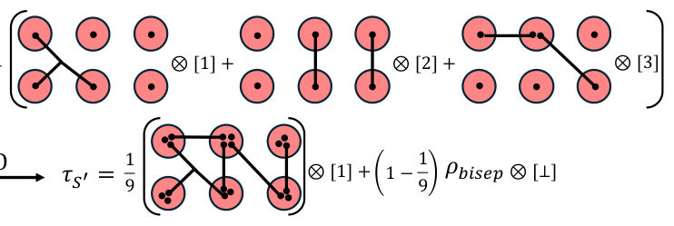 
FIG. 1. Graphical representation of an initial 6-partite random network state ρS with equal weights, where solid lines represent pure entanglement, dark dots are quantum systems, and red circles are parties. This initial state is a flagged mixture of: (i) a GHZ-type state [31] shared between three parties; (ii) two pure bipartite entangled states shared between two groups of two parties; (iii) two pure bipartite entangled states shared between three parties. This state is transformed by CLO into a final state τS′ that is a flagged mixture of an entangled connected network state and a biseparable state. Accordingly to Result 1, the state τS′ is GME. For completeness, the catalyst state used...

📷 Fig 2

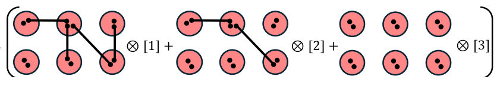 
FIG. 2. Graphic representation of one of the catalysts that enables the transformation represented in Fig. 1. The latter is of the form ωC = 1

📷 Fig 3

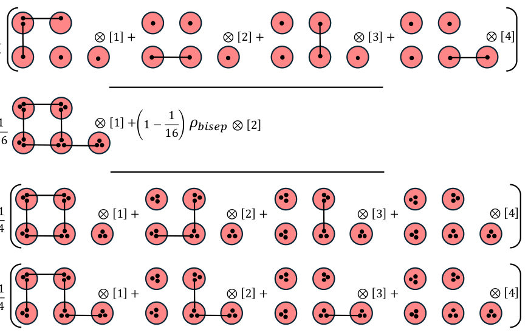 
FIG. 3. Graphic representation of a biseparable state ρ that is catalytically transformable via Theorem 1 into the target state τS that is 5-partite GMNL. Following Corollary 1, ω1 and ω2 are two of the 16 possible canonical catalysts for such transformation. However, ω1 is partition separable over the 5 parties, and thus not GME nor GMNL, while ω2 is already 5-partite GMNL.

**Summary.** This theoretical work demonstrates that genuine multipartite entanglement and nonlocality can be catalytically generated from less entangled states using local operations and a catalyst. By introducing the "sum-to-product" protocol, the authors provide a general mechanism to boost quantum correlations, which is significant for understanding resource generation in quantum information theory.

**Why it may be interesting.** The concept of catalytic activation provides a powerful tool to generate highly entangled or non-local states from seemingly simple, resource-limited initial states, which has implications for quantum communication protocols.

Detailed structure

**Main problem.** The paper investigates the possibility of activating genuine multipartite entanglement (GME) and genuine multipartite Bell nonlocality (GMNL) within the framework of quantum catalysis.

**Main result.** They prove that any biseparable state that is not partition-separable can be deterministically transformed into a GME state using local operations and a catalyst. This activation extends to GMNL.

**Method.** The core method involves constructing and applying a specialized catalytic protocol called "sum-to-product" within the framework of Correlated Local Operations (CLO).

**Model / system.** The study analyzes N-partite quantum states ($
ho_S$) and utilizes an auxiliary catalyst state ($\omega_C$) to facilitate the transformation. The process is mathematically described using local operations and partial traces.

**Key observables.** Genuine Multipartite Entanglement (GME) and Genuine Multipartite Bell nonlocality (GMNL).

**Important parameters / regimes.** The number of parties (N), the structure of the initial biseparable state, and the catalyst state parameters.

**Assumptions / limitations.** The analysis relies on the mathematical framework of CLO and the definition of separability relative to bipartitions.

**Figures summary.** Figures illustrate the initial random network state and its transformation via CLO into a target state, demonstrating the resulting GME or GMNL properties.

**Paper structure.** The paper builds from general catalytic activation theorems (Theorem 1) to a specific protocol ("sum-to-product"), and then extends this to demonstrate the activation of GMNL by combining it with multi-copy catalysis.

Abstract

We demonstrate the possibility to activate genuine multipartite entanglement (GME), the strongest form of entanglement for multipartite states, within the framework of quantum catalysis. Specifically, we show that any biseparable state (i.e. not GME) that is not partition separable can be deterministically transformed into a GME state via the help of a catalyst and local operations, without any classical communication. In turn, we construct a catalytic protocol tailored to the multipartite case. The protocol is termed "sum-to-product", as it transforms a mixture of states into their tensor product in a heralded manner. We apply this protocol to random network entangled states, which are biseparable by construction, and demonstrate catalytic activation of both GME and genuine multipartite Bell nonlocality.

[↑ back to top](#top)

### [Depth analysis of the Quantum Approximate Optimization Algorithm with a Grover mixer](http://arxiv.org/abs/2609.17835v1)

**Authors:** Bojko N. Bakalov, Dimitar Grantcharov  
**Type:** theory · **Category:** quantum information and computing · **PDF:** <https://arxiv.org/pdf/2609.17835v1>  
**Analysis basis:** full PDF text, analyzed in chunks

📷 Fig 1

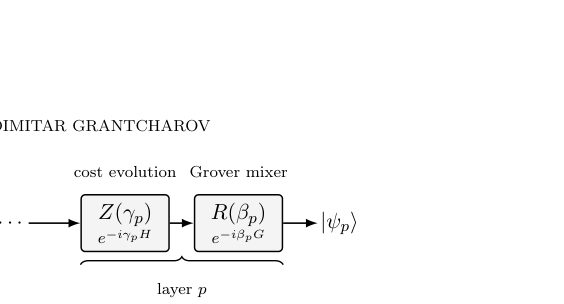 
Figure 1. Schematic of the depth-p GM-QAOA circuit. Each layer consists of a cost evolution Z(γk) followed by the Grover-mixer evolution R(βk).

📷 Fig 2

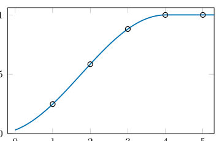 
Figure 2. Attainment of the Grover envelope. Circles show the largest value of |⟨e|ψp⟩|2 found at each depth p. The curve is the envelope sin2 min{(2p + 1)θ0, π/2}  of Theorem 5.2(1), drawn as a function of a continuous depth variable. Left: d = 2 with sin2 θ0 = 0.01. Right: the spectrum λ = (0, 1, 3, 5) with sin2 θ0 = 0.03 and the remaining three weights equal. In both panels, the circles agree with the envelope at every integer depth to the double-precision rounding error.

📷 Fig 3

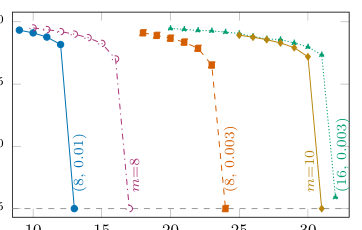 
Figure 3. The smallest infidelity 1 −|⟨e|ψp⟩|2 found at each depth p, on a logarithmic scale. Values at or below 10−15 are plotted on the dashed line at 10−15. Left: the consecutive spectra λ = (0, 1, . . . , d −1) with uniform weights and 3 ≤d ≤8. Each curve reaches the rounding floor at p∗= d −1, the smallest depth permitted by Theorem 5.5 for exact reachability. Right: the consecutive instances with d = 8, sin2 θ0 ∈{0.01, 0.003}, and d = 16, sin2 θ0 = 0.003, and the binomial instances with m ∈{8, 10}. The curves are labeled by the pair (d, sin2 θ0) for the consecutive instances and by m for the binomial instances.

📷 Fig 4

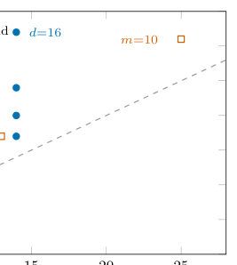 
Figure 4. The measured p∗ against the integer lower bound  arcsin √1 −ε/(2θ0) −1

**Summary.** This theoretical paper analyzes the performance limits of the Grover-mixer enhanced QAOA by deriving depth-independent lower bounds on the loss variance. It proves that achieving high fidelity requires a minimum circuit depth related to the initial state's probability weight. The results are significant for understanding the finite-depth scaling of quantum optimization algorithms.

**Why it may be interesting.** This work provides rigorous, finite-depth lower bounds on the performance of QAOA variants, which is crucial for understanding the limitations of quantum optimization algorithms beyond asymptotic analysis.

Detailed structure

**Main problem.** The paper analyzes the depth-dependence of the Quantum Approximate Optimization Algorithm (QAOA) when enhanced with a Grover mixer (GM-QAOA). It seeks to establish finite-depth lower bounds on the variance of the loss function and the depth required for state approximation.

**Main result.** The authors derive a depth-independent lower bound for the variance of the loss ($	ext{Var}[\ell_p]$) and establish Grover-type reachability bounds showing that the required depth scales inversely with the square root of the initial probability.

**Method.** The analysis uses spectral decomposition of the cost Hamiltonian and develops recursive relations for expected overlaps and variances by averaging over the independently sampled cost and mixing angles.

**Model / system.** The model is the GM-QAOA circuit, which alternates between cost evolution ($e^{-i\gamma H}$) and Grover-mixer evolution ($e^{-ieta G}$). The analysis focuses on the dynamics within an invariant subspace defined by the initial state $|\xi
angle$.

**Key observables.** Variance of the loss ($	ext{Var}[\ell_p]$), fidelity of state approximation, and the required circuit depth ($p$).

**Important parameters / regimes.** Lattice spacing ($\eta$), number of qubits ($n$), number of distinct eigenvalues ($d$), and the depth ($p$).

**Assumptions / limitations.** The analysis critically assumes a lattice condition on the cost eigenvalues ($\lambda_j - \lambda_k \in \eta\mathbb{Z}$) and that the cost and mixing angles are sampled uniformly and independently.

**Figures summary.** Figures schematically illustrate the GM-QAOA circuit depth, show the attainment of the Grover envelope for specific spectra, and plot numerically found minimum infidelities ($p^*$) against theoretical lower bounds.

**Paper structure.** The paper proceeds by first establishing the variance lower bound (Theorem 1.1) based on spectral properties, followed by deriving the reachability bound (Theorem 1.2). Later sections refine these bounds, analyzing the obstruction to exact state approximation based on the structure of the carried spectrum.

Abstract

We study the Quantum Approximate Optimization Algorithm with a Grover mixer and independently sampled cost and mixing angles. Under a lattice condition on the cost values carried by the initial state, we prove a depth-independent lower bound for the variance of the loss at every depth, together with the same bound for the derivative with respect to the final mixing angle. The estimate is instance-dependent and, for fixed locality, is inverse polynomial in the number of qubits for integer-valued local objective functions with uniformly bounded local terms, in particular for MaxCut. We also establish Grover-type reachability bounds showing that the depth required to approximate a prescribed carried eigenspace is bounded below by a constant multiple of the inverse square root of its initial probability.

[↑ back to top](#top)

### [Direct observation of phonon mode with an antisymmetric Raman tensor](http://arxiv.org/abs/2609.18332v1)

**Authors:** Shangfei Wu, Shang Ren, Kai Du, Xianghan Xu, Sang-Wook Cheong, David Vanderbilt, Girsh Blumberg  
**Type:** experiment · **Category:** strongly correlated electrons · **PDF:** <https://arxiv.org/pdf/2609.18332v1>  
**Analysis basis:** full PDF text, analyzed in chunks

📷 Fig 1

 
FIG. 1. Phonon modes. Raman response of Cr2O3 at 308 K and 18 K for RR [A1 + A2] (panel

📷 Fig 2

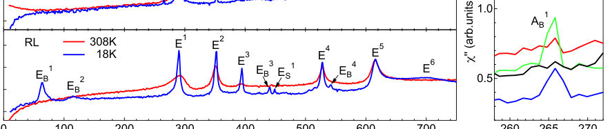 
Fig. 1b. These are the Raman-active bulk phonon modes expected from the group theoretical

📷 Fig 3

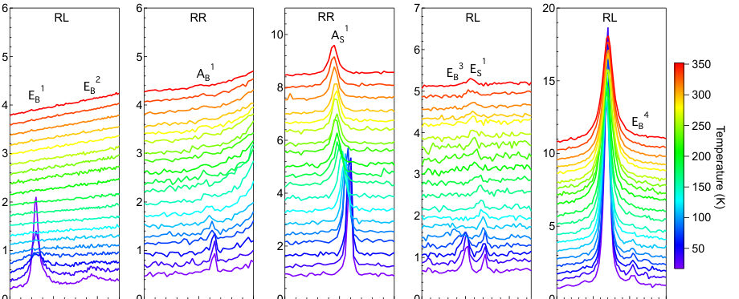 
FIG. 2. Temperature dependence. Temperature dependence of the modes for the E1 B mode

📷 Fig 4

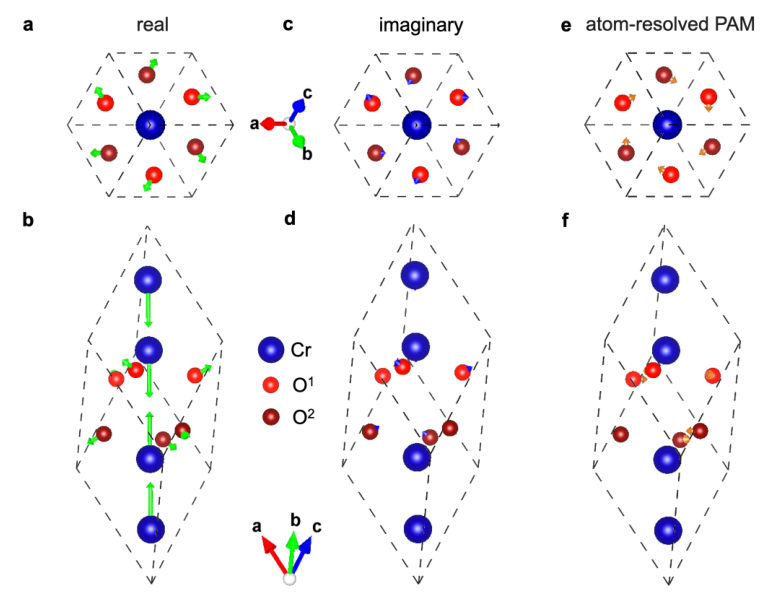 
FIG. 3. DFT phonon calculations. The real and imaginary components, as well as atom-

**Summary.** This work reports the direct observation of a novel phonon mode in Cr2O3 using polarization-resolved Raman spectroscopy. The mode possesses an antisymmetric Raman tensor and carries intrinsic phonon angular momentum. By combining experiment with first-principles calculations, the authors establish a new technique to study symmetry-protected chiral excitations in quantum magnets.

**Why it may be interesting.** The methodology provides a novel spectroscopic handle (antisymmetric Raman tensor) to probe chiral excitations and intrinsic angular momentum in magnetic materials, which is highly relevant to understanding complex quantum magnetic ordering.

Detailed structure

**Main problem.** The study aims to detect and characterize phonon modes that possess an intrinsic phonon angular momentum (PAM) and are associated with an antisymmetric Raman tensor, as these modes are typically overlooked in standard spectroscopic analyses.

**Main result.** The authors successfully detected an A2 phonon mode at 266 cm-1 in the antiferromagnetic chiral phase of Cr2O3, confirming its existence via polarization-resolved Raman spectroscopy.

**Method.** The research combines polarization-resolved Raman spectroscopy with first-principles phonon calculations that treat both lattice vibrations and magnetic spins as coupled 'slow' degrees of freedom.

**Model / system.** The physical system is Cr2O3, particularly when it enters its antiferromagnetic (AFM) chiral phase. The analysis relies on group theory to track symmetry breaking from the high-temperature phase (D3d) to the low-temperature magnetic phase (D3).

**Key observables.** Phonon frequency (266 cm-1), polarization dependence (Raman tensor symmetry), and the presence of non-zero atom-resolved Phonon Angular Momentum (PAM).

**Important parameters / regimes.** Temperature (especially the Néel temperature, T_N), and the presence of local symmetry breaking due to Cr vacancies.

**Assumptions / limitations.** The Raman activity of the otherwise symmetry-forbidden A2 mode is attributed to local symmetry breaking caused by Cr vacancies in the crystal structure.

**Figures summary.** Figures show the polarization dependence of the 266 cm-1 mode, and the calculations visualize the temperature dependence and the non-zero atom-resolved PAM for the A2 mode.

**Paper structure.** The paper establishes the theoretical necessity of detecting antisymmetric Raman tensor modes, presents the experimental detection in Cr2O3, and supports the findings with detailed first-principles calculations linking the mode's activity to structural defects.

Abstract

Phonon angular momentum, characterized by circular or elliptical motion of atoms, plays a decisive role in diverse phenomena, ranging from the phonon Hall effect, phonon magnetic moment, Einstein-de Haas effect, Weyl phonons, and driven chiral phonons. The phonon modes with an antisymmetric Raman tensor, which carry an intrinsic phonon angular momentum in a pseudovector symmetry channel, have been overlooked in the past in the chiral phonon community. Here, we report the detection of this type of phonon mode using polarization-resolved Raman spectroscopy. We observe a phonon at 266cm$^{-1}$ in the antiferromagnetic chiral phase of Cr$_2$O$_3$ in the $A_2$-pseudovector symmetry channel. This $A_2$ mode's frequency and the elliptical motion are captured by first-principles phonon calculations, which treat both lattice and spins on an equal footing as 'slow' degrees of freedom. This mode gets Raman activity due to the presence of Cr vacancies in Cr$_2$O$_3$ that locally break the twofold rotational symmetry perpendicular to the threefold axis. Our results provide a new way to detect the novel symmetry-forbidden $A_2$ phonon modes with an antisymmetric Raman tensor in a pseudovector symmetry channel.

[↑ back to top](#top)

### [Electronic correlations shape the low-energy optical response of the kagome antiferromagnets Mn$_3$Sn and Mn$_3$Ge](http://arxiv.org/abs/2609.18744v1)

**Authors:** R. Mathew Roy, Bo Tai, Maxim Wenzel, Achyut Tiwari, Mykhaylo Ozerov, Chandra Shekhar, Claudia Felser, Artem V. Pronin, Xiaolong Feng, Martin Dressel  
**Type:** both · **Category:** strongly correlated electrons · **PDF:** <https://arxiv.org/pdf/2609.18744v1>  
**Analysis basis:** full PDF text, analyzed in chunks

📷 Fig 1

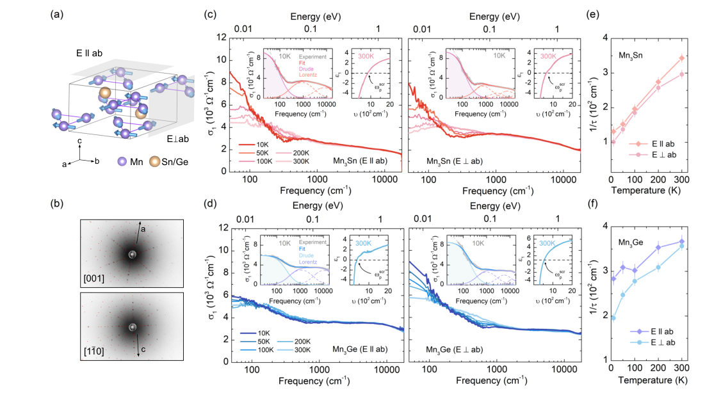 
FIG. 1. (a) Crystal structure of Mn3X (X = Sn, Ge), with the two measurement geometries indicated: E ∥ab (in-plane) and E ⊥ab (out-of-plane). (b) x-ray diffraction patterns of Mn3Ge measured on the (001) and (1¯10) oriented surfaces. (c) Temperature dependence of the real part of the optical conductivity σ1(ω) of Mn3Sn for E ∥ab (left panel) and E ⊥ab (right panel). (d) Same as (c) for Mn3Ge. The left inset of each panel in (c) and (d) shows the Drude–Lorentz decomposition of σ1(ω) at 10 K, with the measured spectrum, the total fit, and the individual Drude and Lorentz contributions. The right inset shows the real part of the dielectric function ε1(ω) at 300 K; its zero crossing defines the...

📷 Fig 2

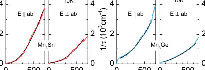 
FIG. 2. (a) The calculated optical conductivities (σxx) of Mn3Sn for nonmagnetic, ferromagnetic, and noncollinear or- der of the Mn moments. (b) The frequency dependence of the effective mass of Mn3Sn for the in-plane and out-of-plane di- rections. (c) Same as (b), but for Mn3Ge. (d) The frequency dependence of the scattering rate for Mn3Sn; the black line is a quadratic polynomial fit. (e) Same as (d), but for Mn3Ge.

📷 Fig 3

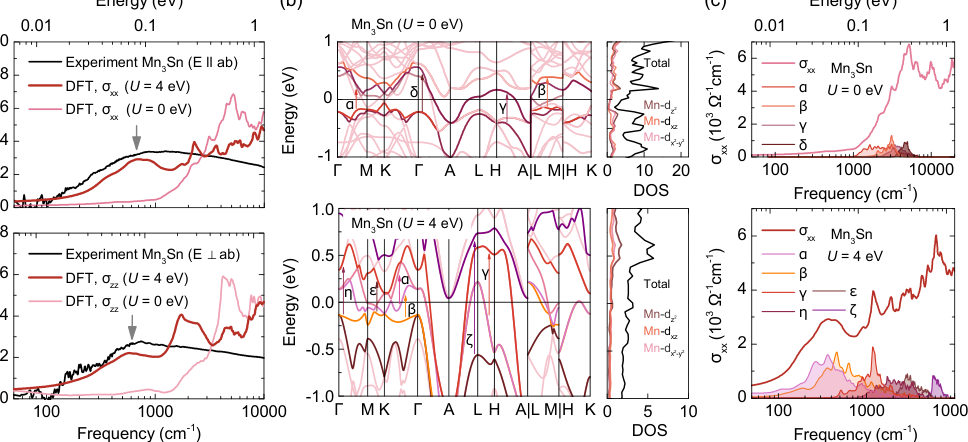 
FIG. 3. (a) The interband optical conductivity of Mn3Sn for the in-plane (top) and out-of-plane (bottom) directions. The experimental conductivity (σ1) is plotted along with the calculated optical conductivity (σxx, σzz) for Hubbard Coulomb repulsion U = 0 and U = 4 eV. The arrows indicate the appearance of low-energy interband transition for U = 4 eV. (b) The electronic band structure of Mn3Sn for U = 0 (top) and U = 4 eV (bottom). The labeled arrows indicate the dominant interband transitions. (c) The band-resolved optical conductivity calculated for U = 0 (top) and U = 4 eV (bottom). The labels indicate the band-resolved conductivities whose contributions arise from the interband...

📷 Fig 4

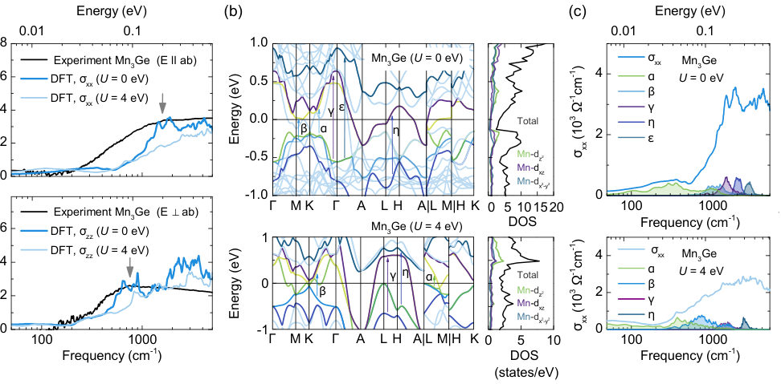 
FIG. 4. (a) The interband optical conductivity of Mn3Ge for the in-plane (top) and out-of-plane (bottom) directions. The experimental conductivity (σ1) is plotted along with the calculated optical conductivity (σxx, σzz) for Hubbard Coulomb repulsion U = 0 and U = 4 eV. The arrows indicate the anisotropic low-energy interband transitions present in the U = 0 case. (b) The electronic band structure of Mn3Ge for U = 0 (top) and U = 4 eV (bottom). The labeled arrows indicate the dominant interband transitions. (c) The band-resolved optical conductivity calculated for U = 0 (top) and U = 4 eV (bottom). The labels indicate the band-resolved conductivities whose contributions arise from the...

**Summary.** This work uses optical spectroscopy and DFT+U calculations to demonstrate that electron-electron correlations fundamentally govern the low-energy optical response of the kagome antiferromagnets Mn3Sn and Mn3Ge. The strong correlation effects are necessary to explain the optical properties of Mn3Sn, establishing a correlated picture applicable to other correlated topological metals.

**Why it may be interesting.** The explicit comparison between correlated (Mn3Sn) and weakly correlated (Mn3Ge) materials provides a clear case study for how strong electronic correlations dictate macroscopic properties like optical response in magnetic insulators.

Detailed structure

**Main problem.** To investigate how electron-electron interactions (electronic correlations) shape the low-energy optical response of the kagome antiferromagnets Mn3Sn and Mn3Ge.

**Main result.** Electron-electron interactions are crucial for describing the optical transitions in Mn3Sn, leading to a significantly different optical effective mass compared to its isostructural analog, Mn3Ge.

**Method.** The study combines experimental optical spectroscopy (measuring reflectivity) with advanced computational techniques, specifically DFT+U, to model the electronic structure and optical response.

**Model / system.** The physical system consists of the kagome antiferromagnets Mn3Sn and Mn3Ge, which are analyzed using DFT+U to account for strong on-site Coulomb repulsion (U) and Hund's coupling (J) within the Mn d-states.

**Key observables.** Optical conductivity (sigma_1(omega)), dielectric function (epsilon_1(omega)), optical effective mass (m*/m_b), and plasma frequency (omega_p).

**Important parameters / regimes.** Correlation parameters U = 4 eV and J = 0.25 eV are critical for Mn3Sn, while Mn3Ge can be modeled accurately without these corrections.

**Assumptions / limitations.** The analysis relies on Kramers-Kronig relations to extract optical properties from reflectivity data, and the extended Drude analysis is used because intraband and interband contributions are not easily separated.

**Figures summary.** Figures show temperature-dependent reflectivity measurements, magneto-optical responses showing no field dependence up to 17 T, and calculated band structures illustrating avoided crossings rather than Weyl nodes.

**Paper structure.** The paper progresses by first establishing the necessity of correlation effects via comparison between Mn3Sn and Mn3Ge optical responses, then detailing the experimental measurement techniques (FTIR/ellipsometry), and finally applying advanced analysis (extended Drude model, DFT+U) to interpret the results.

Abstract

Using optical spectroscopy and density functional theory, we provide evidence that electron-electron interactions strongly affect the properties of the kagome antiferromagnet Mn$_3$Sn, since its low-energy optical interband transitions arise exclusively from the correlation-modified electronic band structure. Mn$_3$Sn possesses an optical effective mass about three times larger than that of its isostructural analog Mn$_3$Ge. The DFT+$U$ treatment in the Lichtenstein formulation, with an on-site Coulomb repulsion $U = 4$~eV and Hund's coupling $J = 0.25$~eV, accounts for the optical transitions in Mn$_3$Sn, whereas those in Mn$_3$Ge are already reproduced without Hubbard corrections ($U, J = 0$). The near-isotropic electronic structure of Mn$_3$Sn reveals a three-dimensional metal whose electronic response is shaped prominently by the Mn $d$-states. The apparent linear regime in $σ_1(ω)$ observed in Mn$_3$Sn and Mn$_3$Ge arises from several overlapping interband transitions and therefore should not be interpreted as the optical signature of the Weyl cones. The optical response does not alter with magnetic field up to 17 T, consistent with strong free-carrier screening. Our findings establish a comprehensive-correlated picture of Mn$_3$Sn and Mn$_3$Ge that offers a template for other correlated topological metals.

[↑ back to top](#top)

### [Exact logical error rates for magic state cultivation](http://arxiv.org/abs/2609.18922v1)

**Authors:** Kwok Ho Wan, Ainhoa Zapirain  
**Type:** theory · **Category:** quantum information and computing · **PDF:** <https://arxiv.org/pdf/2609.18922v1>  
**Analysis basis:** full PDF text, analyzed in chunks

📷 Fig 1

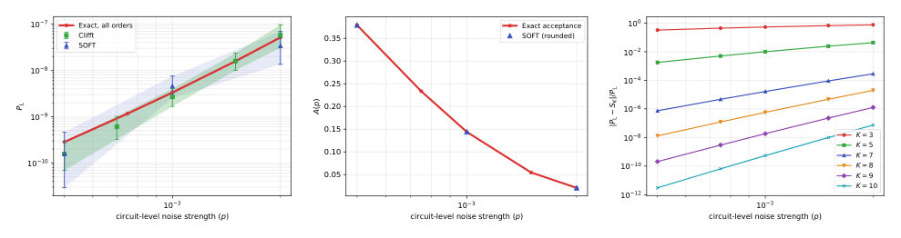 
Figure 1: d = 5 cultivation: logical error (left), acceptance (middle), and relative error of the truncated series (right). Shading and error bars show the published LER sampling-error intervals.

📷 Fig 2

 
Figure 3: Steps of the calculation. Pauli propagation gives the response of each double-checking stage to an incoming error, grouping keeps the tables small, and one tensor network joins the stages. The network is contracted in two arithmetics, giving exact fractions at fixed p and exact series coefficients.

📷 Fig 3

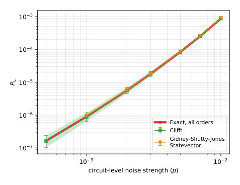 
Figure 2: d = 3 cultivation: exact values compared with Clifft and Gidney–Shutty–Jones state-vector results. Interval conventions are given in Appendix G.

📷 Fig 4

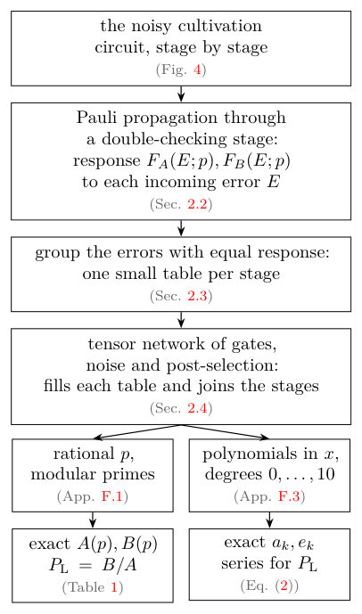 
Figure 3 summarises the steps. Section 2.2 car- ries the check observables backwards through a double-checking stage, which gives the response of that stage to each incoming Pauli error. Sec- tion 2.3 groups the errors that share a response, so that each stage becomes a small table. Sec- tion 2.4 writes the gates, noise and post-selection as tensors, contracts them with the incoming la- bels open to fill each table, and joins the stages

📷 Fig 5

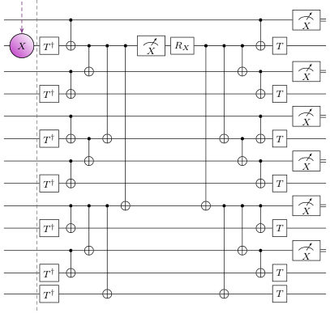 
Figure 5: The d = 3 double-checking circuit and the earlier stages. The dashed boundary marks this circuit’s input and the purple X7 specifies an ‘incoming error’ present.

**Summary.** This paper provides an exact, analytical calculation of the logical error rates for cultivating magic states using $d=3$ and $d=5$ quantum error correction circuits. By using advanced techniques like Pauli propagation and CRT reconstruction, the authors derive precise power series expansions for the error rates, confirming previous results and establishing the true fault distances of the circuits.

**Why it may be interesting.** This work provides rigorous, non-stochastic analytical results for error rates in fault-tolerant quantum computation, which is foundational knowledge for designing practical quantum hardware.

Detailed structure

**Main problem.** The paper computes the exact acceptance and logical error rates (LER) for magic state cultivation circuits at distances $d=3$ and $d=5$. This is crucial for assessing the fault-tolerance of quantum computation.

**Main result.** The authors provide explicit series expansions for the LER, analytically recovering numerical results from previous sampling-based studies. They also determine the actual fault distances for these circuits ($d_{	ext{fault}}=2$ for $d=3$ and $d_{	ext{fault}}=3$ for $d=5$).

**Method.** The calculation employs Pauli propagation and binary tensor contraction to exactly compute probabilities, avoiding sampling errors. Results are presented as power series expansions in $x = p/(1-p)$ and derived using techniques involving the Chinese Remainder Theorem (CRT) for exact integer reconstruction.

**Model / system.** The system models quantum error correction circuits used to cultivate logical magic states, specifically focusing on the double-checking stages for code distances $d=3$ and $d=5$. The process involves Clifford gates and non-Clifford T gates under depolarizing noise.

**Key observables.** Logical Error Rate ($	ext{PL}(p)$), Acceptance Probability ($A(p)$), and the response pair ($F_A, F_B$) to incoming errors.

**Important parameters / regimes.** Circuit-level noise strength ($p$), and the code distances ($d=3, d=5$).

**Assumptions / limitations.** The calculation excludes the escape stage, and the noise model assumes uniform depolarizing noise after every operation with measurement and reset flips.

**Figures summary.** Figures illustrate the circuit structures for $d=3$ and $d=5$ cultivation, showing error propagation. Tables provide the exact rational evaluations and the coefficients for the power series expansions of the LER.

**Paper structure.** The paper details the methodology using Pauli propagation and tensor contraction, derives the LER as a ratio of probabilities, and presents the final results as exact series expansions, validating them against prior numerical work.

Abstract

We compute exactly the acceptance and logical error rates for the distance $d=3$ and $d=5$ magic state cultivation circuits from Clifft [arXiv:2604.27058] and SOFT [arXiv:2512.23037] using Pauli propagation and binary tensor contraction. Actual $T$ gates are studied, not the $S$-gate proxy used for sampling. The calculation includes every fault order at several circuit-level noise strengths ($p$). We provide a series expansion form to the logical error rates, through order $(p/(1-p))^{10}$. The analytical results recover the numerical values from Clifft and SOFT at both $d=3$ and $d=5$ to within their sampling uncertainty. Then, we show that the $d=3$ and $d=5$ circuits actually have fault distances of $d_{\text{fault}}=2$ and $d_{\text{fault}}=3$ respectively, explaining the similar distance degrading effects from the companion code of [Quantum 10, 2134 (2026)].

[↑ back to top](#top)

### [Extensibly Causally Separable Processes Admit Realizations as Quantum Circuits with Classical Control of Causal Order](http://arxiv.org/abs/2609.18559v1)

**Authors:** Wenjie Wei, Shengshi Pang  
**Type:** theory · **Category:** quantum information and computing · **PDF:** <https://arxiv.org/pdf/2609.18559v1>  
**Analysis basis:** full PDF text, analyzed in chunks

📷 Fig 1

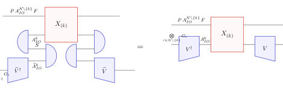 
FIG. 1. Isometric encoding and conditioning on a maximally entangled projection.

📷 Fig 2

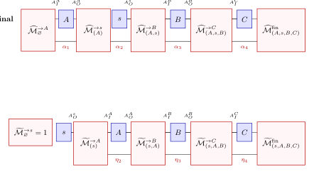 
FIG. 2. QC-CC circuit diagram for reordering the P parties to the first positions. A, B, C label three ordinary laboratories, and s = P. The upper row shows the original complete order of operations (A, s, B, C), and the lower row shows the order in which the operations are applied in the new circuit, (s, A, B, C).

**Summary.** This theoretical paper establishes a fundamental equivalence between two formalisms for quantum causality: Extensible Causal Separability (ECS) and Quantum Circuits with Classical Control of Causal Order (QC-CC). By proving that every ECS process can be realized as a QC-CC, the authors provide a complete operational understanding of this class of quantum processes. This result is crucial for understanding the limits of causal structure in quantum computation.

**Why it may be interesting.** It provides a rigorous operational interpretation for abstract concepts of causality in quantum information, linking theoretical separability criteria (ECS) directly to realizable computational models (QC-CC).

Detailed structure

**Main problem.** The paper addresses the long-standing open problem of determining whether every Extensibly Causally Separable (ECS) quantum process admits a realization as a Quantum Circuit with Classical Control of Causal Order (QC-CC).

**Main result.** The authors prove the equivalence between ECS processes and QC-CC processes, establishing that QC-CC structures fully characterize the class of ECS processes.

**Method.** The equivalence is established using a generalized teleportation construction and induction on the number of parties, relating abstract process-matrix definitions to concrete circuit structures.

**Model / system.** The study concerns quantum processes described in the process-matrix framework, involving multiple local laboratories, global past, and global future systems. The core mathematical objects are the process matrices $W$ and their decomposition properties.

**Key observables.** The process matrix $W$, and its decomposition into components compatible with specific causal orderings.

**Important parameters / regimes.** The number of local laboratories ($N$), and the dimensionality of the input/output spaces ($P, F, A_k$).

**Assumptions / limitations.** The analysis often considers deterministic processes, though extensions to probabilistic cases are also covered, relying on the existence of specific isometric encodings.

**Paper structure.** The paper builds by defining the abstract ECS concept, then defining the operational QC-CC model, and finally proving the equivalence through explicit constructions and inductive steps, covering both deterministic and probabilistic generalizations.

Abstract

Indefinite causal order extends the conventional circuit paradigm by allowing local quantum operations to be connected without a predetermined global order. Within the process-matrix framework, it is characterized by causal nonseparability, whereas extensible causal separability (ECS) requires that, under arbitrary input-ancilla extensions, a process admit a recursive decomposition into components, each compatible with a particular operation acting first. Quantum circuits with classical control of causal order (QC-CC), in which previous outcomes dynamically determine which operation acts next, are known to generate ECS processes, but whether every ECS process admits such a realization has remained a longstanding open problem. We settle it through a generalized teleportation construction that realizes every multipartite ECS process as a QC-CC. We further establish consistency between ECS definitions for trivial and nontrivial global past and future systems. These results provide ECS with an exact operational interpretation and identify QC-CC as the complete circuit structure underlying this class of processes.

[↑ back to top](#top)

### [Growing Einstein-Rosen Bridge with Multi-partite Entanglement](http://arxiv.org/abs/2609.18225v1)

**Authors:** Takanori Anegawa, Akihiro Miyata, Shota Suzuki, Kotaro Tamaoka  
**Type:** theory · **Category:** statistical mechanics · **PDF:** <https://arxiv.org/pdf/2609.18225v1>  
**Analysis basis:** full PDF text, analyzed in chunks

📷 Fig 1

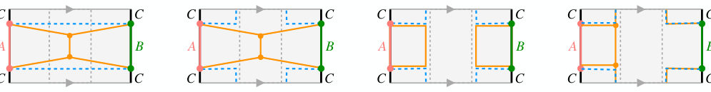 
FIG. 1. All four dynamical phases for π &lt; L &lt; 2π. Orange curves are the multi-entropy network; blue dashed curves are the competing HRT surface for S(C) = S(AB). The HRT surfaces for S(A) and S(B) are the ordinary interval caps in every panel and are omitted. The top and bottom edges are identified, so that the spatial direction forms a circle. The two gray vertical dashed lines indicate the horizons, and the intervening band represents the ER bridge. (a),(b) The same two-junction network survives the HRT transition. (c) It is replaced by two interval caps computing S(A) and S(B). (d) The network on one side forms a loop. Since A and B are chosen to have exactly the same size, the reflected...

📷 Fig 2

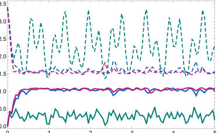 
FIG. 4. Time evolution of GM(3) 2 and I2(A : B)/2 for TFD state of a periodic fermion chain (N = 8, L = 5, β/N = 1/50), computed by exact diagonalization for three interac- tion strengths: free(J = 1, V1 = V2 = 0), integrable(J = V1 = 1, V2 = 0) and non-integrable(J = V1 = V2 = 1)

📷 Fig 3

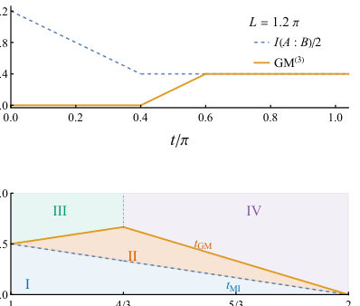 
FIG. 2. Leading high-temperature dynamics and phase struc- ture. (a) GM(3) continues to grow even after the mutual infor- mation has reached its nonzero plateau. We set L = 1.2π and measure all quantities in units such that πr+ 4GN ≡1. (b) The

📷 Fig 4

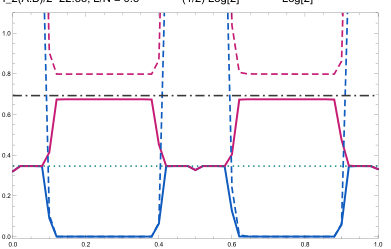 
FIG. 3. Time evolution of GM(3) 2 and I2(A : B)/2 in the TFD state of 1D hopping model(J = 0.5, N = 1000, and β = N/50). The plots show the results for L/N = 0.2 and 0.8, respectively. Also, since I2(A : B)/2 becomes very large at L/N = 0.8, we have subtracted an appropriate constant for visual comparison only.

📷 Fig 5

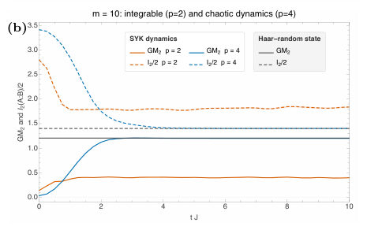 
FIG. 5. Time evolution of GM(3) 2 (solid) and I2(A:B)/2 (dashed) in the SYK model for N = 16 Majoranas per side and βJ = 1. (a) p = 4, m = 6, 10; (b) m = 10, p = 2, 4. SYK results are quenched averages over 64 dis- order realizations for each p; Haar benchmarks are quenched averages over 256 unrestricted complex random pure states with (dA, dB, dC) = (2m/2, 2m/2, 2N−m). Shading indicates one standard error. Haar lines nearly overlap the p = 4 plateaus; for m = 6, the small late-time GM(3) 2 and I2/2 also nearly coincide.

**Summary.** This work explores the role of multi-partite entanglement in detecting the growth of an Einstein-Rosen bridge, refining the ER=EPR conjecture. By using genuine multi-entropy, the authors show that entanglement can continue to grow in black hole analogues even when standard entanglement entropies saturate. This suggests that multi-partite structure is necessary to fully characterize the quantum correlations underlying spacetime connectivity.

**Why it may be interesting.** The focus on multi-partite entanglement provides a powerful diagnostic tool to probe non-local quantum correlations that are essential for understanding spacetime geometry (ER bridges) in quantum gravity contexts.

Detailed structure

**Main problem.** The research investigates whether quantum entanglement can continue to grow in a system, specifically an Einstein-Rosen bridge, even after the standard entanglement entropies of its subsystems have saturated.

**Main result.** Genuine multi-entropy can grow linearly with time in the holographic description of a two-sided BTZ black hole, extending the regime where entanglement detects ER bridge growth beyond what bipartite entanglement measures can capture.

**Method.** The authors employ genuine multi-entropy ($	ext{GM}(3)$) and compare its time evolution against standard entanglement entropy calculations derived from the Ryu-Takayanagi (HRT) prescription in AdS/CFT.

**Model / system.** The primary systems studied include the two-sided BTZ black hole (dual to a TFD state), the spatially partitioned Sachdev-Ye-Kitaev (SYK) model, and general spin-chain models.

**Key observables.** Genuine multi-entropy ($	ext{GM}(3)$), entanglement entropy ($S$), and mutual information ($I$).

**Important parameters / regimes.** Time ($t$), black hole parameters ($r_+, L$), and the number of subsystems (tripartition).

**Assumptions / limitations.** The analysis relies on the high-temperature limit ($eta 	o 0$) for the holographic calculations and compares results across different Rényi indices ($n$).

**Figures summary.** Figures illustrate the dynamical phases of multi-entropy growth in the holographic setup, comparing the multi-entropy network evolution against the HRT surface evolution, and showing time evolution comparisons between $	ext{GM}(3)$ and mutual information in various models.

**Paper structure.** The paper progresses by first establishing the problem using multi-partite entanglement measures, applying these measures to holographic models (BTZ black hole) to refine the ER=EPR relation, and then validating these findings by comparing the dynamics across different quantum many-body systems like SYK and spin chains.

Abstract

Can quantum entanglement continue to grow even after the entanglement entropies of subsystems have saturated? We address this question using genuine multi-entropy, which probes multi-partite entanglement structure beyond bipartite entanglement. In a two-sided BTZ black hole, this quantity grows linearly with time after every subsystem entropy of a fixed tripartition has saturated, extending the interval in which entanglement detects Einstein-Rosen bridge growth. The result refines the ER=EPR relation by identifying multi-partite structure invisible to ordinary entanglement entropies. Some spin-chain models and the spatially partitioned Sachdev-Ye-Kitaev (SYK) model exhibit distinct transients, while the late-time plateau values in holography, the SYK model, and Haar-random states share a universal behaviour.

[↑ back to top](#top)

### [Hamiltonian engineering via pulses: beyond group averaging](http://arxiv.org/abs/2609.18911v1)

**Authors:** Ivan Beschastnyi, Lucah Patel, David Tinoco  
**Type:** theory · **Category:** quantum information and computing · **PDF:** <https://arxiv.org/pdf/2609.18911v1>  
**Analysis basis:** full PDF text, analyzed in chunks

📷 Fig 1

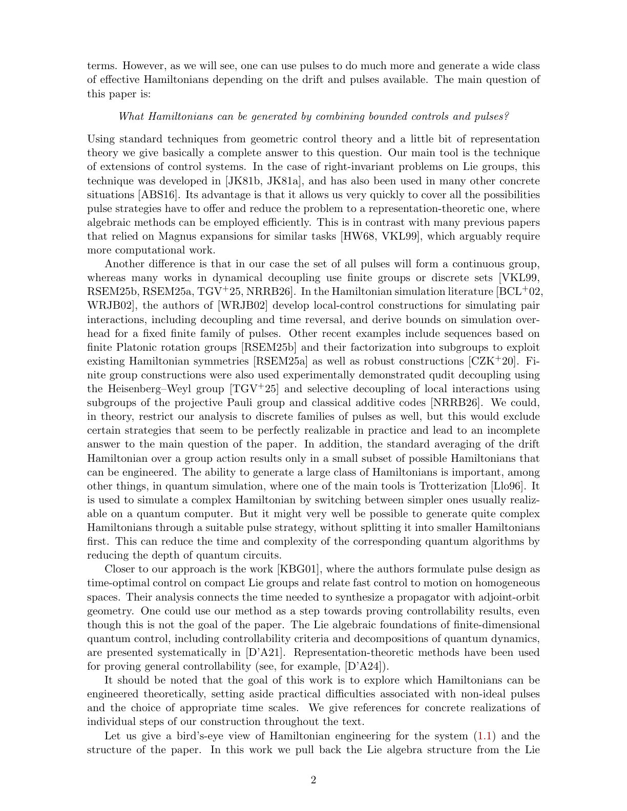 
Low-resolution page preview, page 2

📷 Fig 2

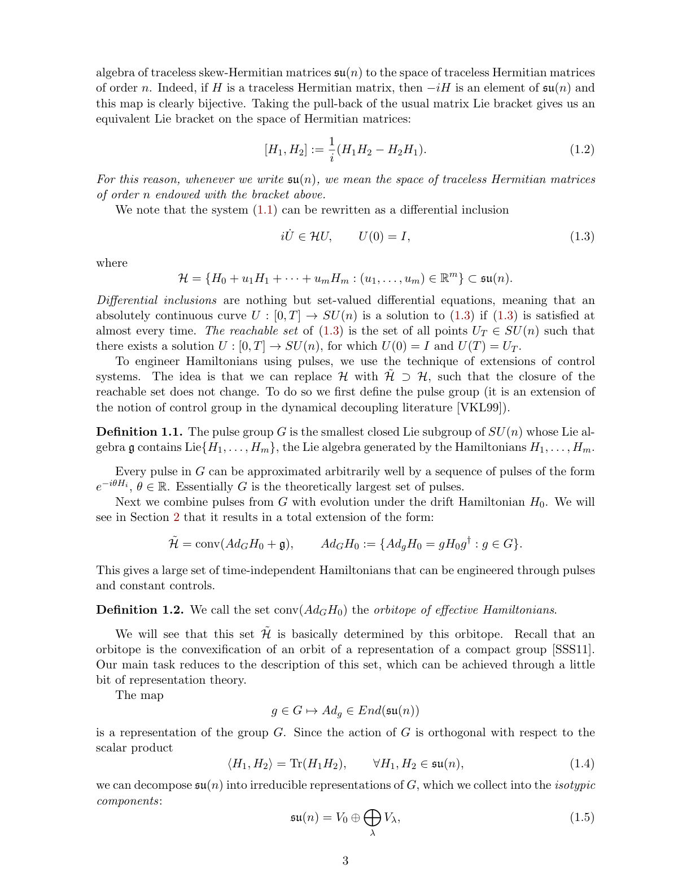 
Low-resolution page preview, page 3

📷 Fig 3

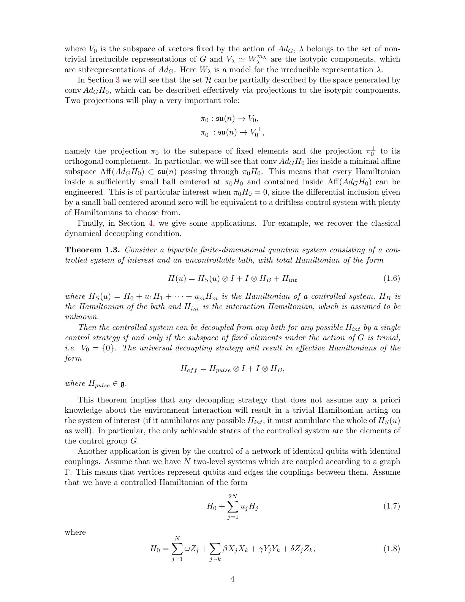 
Low-resolution page preview, page 4

📷 Fig 4

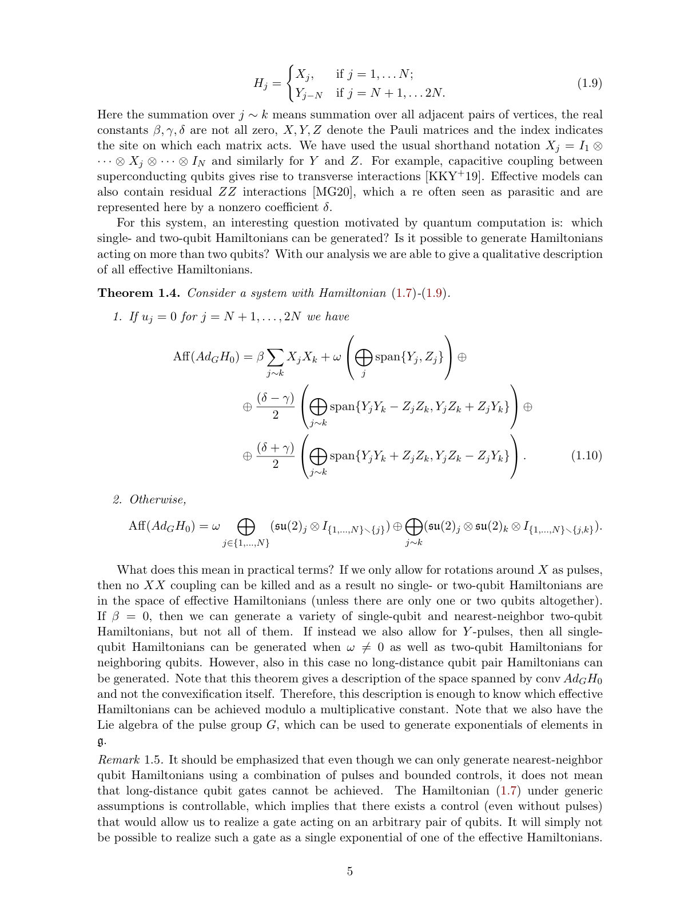 
Low-resolution page preview, page 5

📷 Fig 5

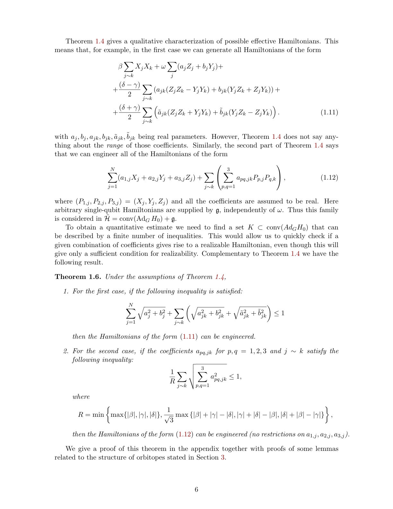 
Low-resolution page preview, page 6

**Summary.** This paper establishes a geometric theory for Hamiltonian engineering in quantum systems controlled by external pulses. It characterizes the set of achievable Hamiltonians using the convex hull of the adjoint orbit, showing how this set extends beyond what simple group averaging predicts. The framework provides necessary and sufficient conditions for tasks like dynamical decoupling in complex quantum architectures.

**Why it may be interesting.** This work provides rigorous mathematical tools to determine the limits of quantum control, which is fundamental for designing quantum gates and controlling open quantum systems.

Detailed structure

**Main problem.** The paper develops a geometric framework to characterize the set of effective Hamiltonians achievable in finite-dimensional quantum systems using ideal control pulses, going beyond simple group averaging.

**Main result.** The set of achievable Hamiltonians is characterized by the convex hull of the adjoint orbit of the drift Hamiltonian plus the pulse group element, $	ilde{H} = 	ext{conv}(	ext{Ad}_G H_0 + g)$.

**Method.** It employs geometric control theory, utilizing the isotypic decomposition of the adjoint representation and analyzing the geometry of the resulting orbitope.

**Model / system.** The system involves finite-dimensional quantum evolution governed by a bilinear Schrödinger equation, $i \dot{U} = (H_0 + \sum u_j H_j)U$, where control pulses generate the pulse group $G$. Specific applications include qubit networks.

**Key observables.** The effective Hamiltonian $	ilde{H}$, the fixed subspace $V_0$ under the action of $G$, and the structure of the orbitope $	ext{conv}(	ext{Ad}_G H_0)$.

**Important parameters / regimes.** The structure of the control amplitudes $u_j$, the dimension $n$ of the system, and the parameters governing the couplings in qubit networks ($eta, \gamma, \delta$).

**Assumptions / limitations.** The analysis assumes the use of 'ideal control pulses' and relies on extensions of control systems theory, such as Filippov's relaxation theorem.

**Figures summary.** The notes do not provide a summary of figures, but they detail mathematical characterizations of the orbitope structure and necessary/sufficient conditions involving norms and sums of squared coefficients.

**Paper structure.** The paper builds from defining the general geometric framework using the pulse group and adjoint action, establishing the decoupling condition (Theorem 1.3), and then applying this framework to specific models like qubit networks to derive quantitative conditions for realizability.

Abstract

We develop a geometric framework for Hamiltonian engineering in finite-dimensional quantum systems using ideal control pulses. Starting from a bilinear Schrödinger equation with unbounded control amplitudes, we construct the closed pulse group and use extensions of control systems and Filippov's relaxation theorem to obtain a family of effective Hamiltonians given by the convex hull of the drift's adjoint orbit plus the Lie algebra of the pulse group. The geometry of this orbitope describes possibilities beyond group averaging. Using the isotypic decomposition of the adjoint representation, we characterize its affine hull and show that the group average lies in its interior. This yields locally accessible families of effective Hamiltonians around the invariant part of the drift. We apply the framework to recover the necessary and sufficient condition for dynamical decoupling from arbitrary interactions with a finite-dimensional bath. For connected abelian pulse groups, we describe the relevant representation decomposition through restricted roots. Finally, for qubit networks with identical pairwise couplings, we give a qualitative characterization and quantitative estimation of effective Hamiltonians that can be generated using our framework.

[↑ back to top](#top)

### [Magnetically coupled charge-transport crossover and giant negative magnetoresistance in iodine-incorporated Cr$_2$Se$_3$](http://arxiv.org/abs/2609.17945v1)

**Authors:** Bikash Das, Shibnath Mandal, Kapildeb Dolui, Oleksi Laguta, Sambit Choudhury, Suvadip Masanta, Tanima Kundu, Jorge Andres Navarro Giraldo, Alexey Barinov, Shibabrata Nandi, Kai Rossnagel, Sanjoy Kr Mahatha, Rajib Mondal, Petr Neugebauer, Subhadeep Datta  
**Type:** both · **Category:** strongly correlated electrons · **PDF:** <https://arxiv.org/pdf/2609.17945v1>  
**Analysis basis:** full PDF text, analyzed in chunks

📷 Fig 1

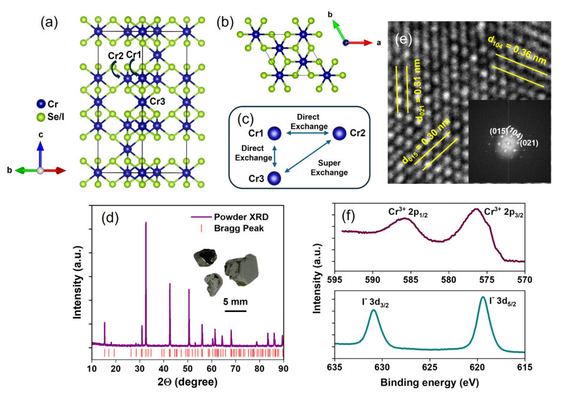 
FIG. 1. (a), (b) Crystal structure of Cr2Se3. (c) Different direct and superexchange interactions between the Cr atoms in the unit cell. (d) Powder XRD pattern of I@Cr2Se3 at room temperature. The Bragg positions corresponding to pure Cr2Se3 are also indicated. Inset: millimeter-sized CVT-grown I@Cr2Se3 crystals. (e) High-resolution TEM image of doped crystal. Three different lattice planes, (021), (015) and (104) with their corresponding d-spacings 0.31, 0.30 and 0.36 nm, respectively are also indicated in the figure. Inset: SAED of the crystal structure. The specified planes are assigned with the respective first-order spots in the SAED pattern. (f) Core-level XPS data of Cr 2p and I 3d.

📷 Fig 2

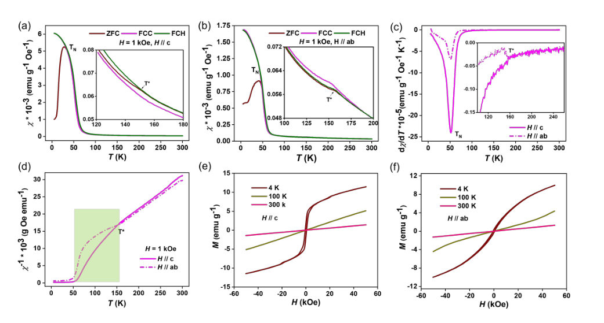 
FIG. 2. Temperature dependent magnetic susceptibility χ measured in standard ZFC-FCC-FCH protocol at an applied magnetic field 1 kOe for (a) H//c and (b) H//ab direction of the crystal. Inset: zoomed-in view of the high temperature transition observed at (a) 150 K for H//c and (b) 156 K for H//ab, respectively. (c) Derivatives of the FCC plot dχ dT . The continuous line corresponds to H//c, while the dashed line represents H//ab. The dip of the plots indicates the TN = 52 K. Inset shows the high temperature regions of the two derivatives where the transition, T* is shown. (d) χ−1 −T plot for both directions. The shaded region indicates the non analytical magnetization behaviour below T*....

📷 Fig 3

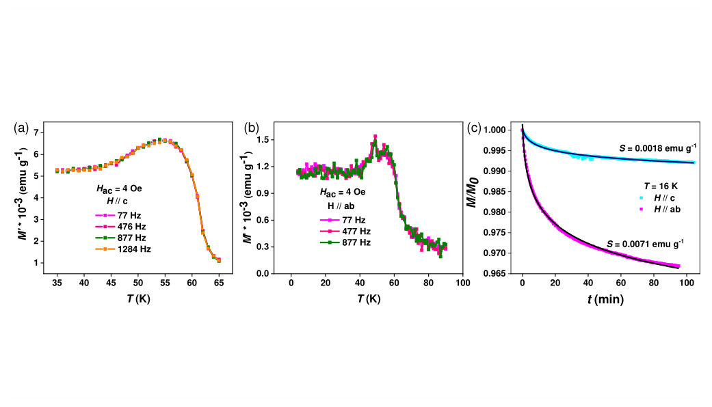 
FIG. 3. (a) Temperature-dependent real part of ac magnetization measured at different frequencies for (a) H//c and (b) H//ab. (c) Isothermal remanent magnetization (IRM) measured in two different directions of the applied magnetic field relative to the sample.

📷 Fig 4

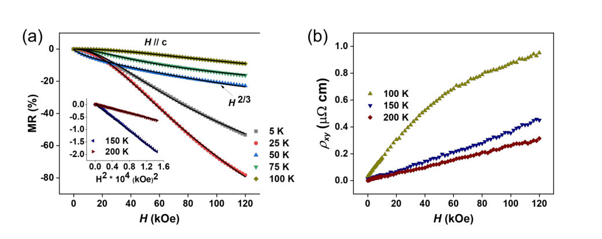 
FIG. 4. (a) MR measurement: giant negative magnetoresistance at various temperatures for H//c, along with appropriate fittings using suitable models for different temperature ranges (below TN, near TN, and above TN). Above 100 K, the data are well described by the model adapted from Ref. [43], except at 50 K, where a H 2 3 dependence is observed. The insets display the high-temperature magnetoresistance behavior where MR ∝−H2. (b) Hall measurement: at 150 K and 200 K linear ρxy vs. H dependence suggests the dominating charge carriers are hole, whereas, at 100 K, the sublinear ρxy vs. H implies the existence of more than one type of charge carrier following the classical two-band model.

📷 Fig 5

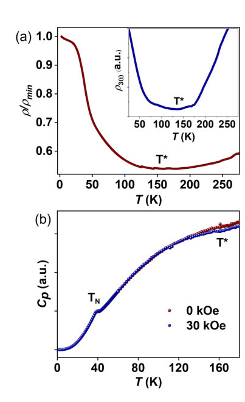 
FIG. 5. (a) Temperature dependent normalized resistivity  ρ ρmin

**Summary.** This work comprehensively investigates iodine-doped $	ext{Cr}_2	ext{Se}_3$, a quasi-2D magnetic material, by combining structural, magnetic, and transport measurements. The key finding is the identification of a magnetically coupled transport crossover near $150 	ext{ K}$, which is responsible for the giant negative magnetoresistance observed. The study establishes this material as a promising platform for tuning correlated electronic and magnetic properties.

**Why it may be interesting.** The strong coupling between magnetism and charge transport, evidenced by giant negative magnetoresistance, is a hallmark of strongly correlated electron systems, making it relevant for understanding emergent spintronic functionalities.

Detailed structure

**Main problem.** The study investigates the complex interplay between charge transport and magnetic ordering in iodine-incorporated $	ext{Cr}_2	ext{Se}_3$. Specifically, it focuses on understanding the origin of a high-temperature transport crossover and giant negative magnetoresistance.

**Main result.** The high-temperature anomaly is identified as a broad, magnetically coupled transport crossover driven by short-range magnetic correlations and channel redistribution, rather than a structural transition. The anion incorporation proves an effective tuning mechanism for spintronic properties.

**Method.** The research employs a combination of advanced experimental techniques, including magnetotransport measurements (MR, Hall), spectroscopy (Raman, ARPES), and theoretical first-principles calculations.

**Model / system.** The physical system is iodine-incorporated $	ext{Cr}_2	ext{Se}_3$, a non-van der Waals quasi-two-dimensional magnetic material with a metal-deficient NiAs-type structure. The investigation probes its magnetic state (AFM ordering below $T_N \approx 52 	ext{ K}$) and its electronic transport properties across various temperatures and magnetic fields.

**Key observables.** Giant negative magnetoresistance ($\approx -78\%$), resistivity minimum near $T^* \approx 150 	ext{ K}$, hole-like conduction at high T, and magnetic susceptibility ($\chi(T)$).

**Important parameters / regimes.** Temperatures $T_N \approx 52 	ext{ K}$ and $T^* \approx 150 	ext{ K}$; magnetic fields up to $15 	ext{ T}$; iodine incorporation level (8.33%).

**Assumptions / limitations.** The high-temperature anomaly is interpreted as a magnetically coupled transport crossover, supported by the lack of major structural or electronic reconstruction observed via Raman and ARPES.

**Figures summary.** Figures summarize structural characterization (XRD, TEM, XPS), magnetic behavior ($\chi(T)$, M-H curves), transport properties (MR vs. T, Hall measurements), and electronic structure calculations/ARPES spectra.

**Paper structure.** The paper systematically characterizes the material's structure, magnetic properties (using $\chi$, M-H), and transport properties (MR, Hall, $
ho(T)$) across varying conditions, culminating in the identification of the crossover mechanism.

Abstract

We report the synthesis and comprehensive investigation of iodine-incorporated $Cr_2Se_3$, a non-van der Waals quasi-two-dimensional magnetic material, using structural, magnetic, transport, spectroscopic, and first-principles methods. Magnetization and electron spin resonance measurements reveal an antiferromagnetically ordered state below $T_N \approx 52$ K. At higher temperatures, a second, broader anomaly emerges near $T^* \approx 150$ K, coinciding with a shallow minimum in the temperature-dependent resistivity that resembles a metal-to-insulator-like crossover. Hall measurements indicate predominantly hole-like conduction at high temperatures ($\geq$ 150 K), while the nonlinear Hall response below T*, together with an anomaly in the third-harmonic electrical signal, suggests the emergence of mobility-dependent multichannel and spatially inhomogeneous transport. A large, non-saturating negative magnetoresistance reaching approximately -78\% at 25 K and 12 T further demonstrates strong coupling between charge transport and the magnetic state. Temperature-dependent Raman spectroscopy reveals no symmetry-changing structural transition near T*, whereas angle resolved photoemission spectroscopy (ARPES) measurements show no major reconstruction of the electronic structure occupied across the crossover. Taken together, these results identify the high-temperature anomaly as a broad magnetically coupled transport crossover arising from the interplay of short-range magnetic correlations, chemical disorder, and redistribution among competing conduction channels. These findings demonstrate that anion incorporation provides an effective route to tuning the coupled electronic and magnetic properties of non-layered Cr$_2$Se$_3$, establishing this system as a promising platform for investigating correlated transport and emergent spintronic functionalities in transition-metal chalcogenides.

[↑ back to top](#top)

### [Quantum Encodings, Private Messages, and Communication Complexity](http://arxiv.org/abs/2609.17690v1)

**Authors:** Tom Gur, Miryam Mi-Ying Huang, Er-Cheng Tang  
**Type:** theory · **Category:** quantum information and computing · **PDF:** <https://arxiv.org/pdf/2609.17690v1>  
**Analysis basis:** full PDF text, analyzed in chunks

📷 Fig 1

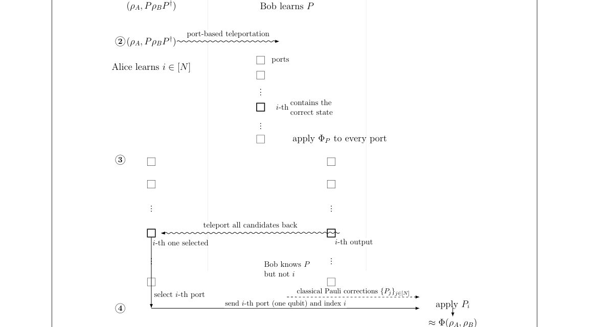 
Figure 1: Pauli-Port Complementarity Protocol. The protocol is non-interactive. Teleportation arrows denote local teleportation measurements using pre-shared entanglement, not communication between Alice and Bob.

**Summary.** This work analyzes the resource requirements for quantum data encoding and private quantum communication protocols. It establishes a crucial link between quantum encoding size and communication complexity, showing that pre-shared entanglement plays a central role. The findings are particularly insightful for understanding the limitations and efficiencies of quantum information processing for structured versus general quantum channels.

**Why it may be interesting.** While focused on complexity theory, the results provide fundamental bounds on how much quantum information needs to be shared or encoded to simulate quantum processes, which underpins quantum network security and computation.

Detailed structure

**Main problem.** The paper studies the complexity of quantum decomposable randomized encodings (QDRE) and establishes a deep connection between this model and the communication complexity of quantum private simultaneous message protocols (QPSM).

**Main result.** The required quantum communication complexity and quantum encoding size are critically dependent on the amount of pre-shared entanglement, with structured channels (Clifford-induced) allowing for significantly reduced communication complexity.

**Method.** The authors establish bi-directional connections between the QDRE model and QPSM, utilizing techniques involving teleportation, Pauli operators, and complexity bounding arguments.

**Model / system.** The core models are QDREs, which encode quantum circuits, and QPSM protocols, which secure the computation of an arbitrary quantum channel $\Phi$ among multiple parties.

**Key observables.** Quantum Encoding Size, Quantum Communication Complexity, Pre-shared Entanglement.

**Important parameters / regimes.** The relationship between the required resources (entanglement vs. communication) for general vs. structured quantum channels.

**Assumptions / limitations.** The analysis distinguishes between general quantum channels and a structured class called Clifford-induced channels, which permits complexity reduction.

**Figures summary.** Figure 1 illustrates the Pauli-Port Complementarity Protocol, detailing the steps involving ordinary teleportation and port-based teleportation to achieve privacy.

**Paper structure.** The paper first introduces the models (QDRE and QPSM), then presents general upper and lower bounds for arbitrary channels, followed by specialized results for Clifford-induced channels, and finally derives corollaries for the quantum encoding size.

Abstract

We study the complexity of quantum decomposable randomized encodings (QDRE). We establish a bi-directional connection between the QDRE model and the communication complexity model of quantum private simultaneous message protocols (QPSM), where classical communication is free, and quantum communication is the primary complexity measure. We show the following upper and lower bounds. (1) For every quantum channel mapping $n$ to $m$ qubits, we give a QPSM protocol with quantum communication $m$, using exponential pre-shared entanglement. In particular, constant-output channels have $O(1)$ quantum communication, and classical-output channels require no quantum communication. (2) With $O(n)$ pre-shared entanglement, every one-qubit-output channel has an $O(n)$-quantum-communication QPSM protocol. Conversely, there exists a channel and a constant $c>0$ for which any protocol with at most $cn$ pre-shared entanglement requires $Ω(n)$ quantum communication. (3) In contrast, we identify a structured class of quantum channels, Clifford-induced channels, for which there exist QPSM protocols with $O(n)$ pre-shared entangled qubits and only $O(1)$ quantum communication complexity. Through our connection, we obtain analogous upper and lower bounds on the quantum encoding size of QDRE. Our results show that the amount of pre-shared entanglement plays a central role in quantum encoding size and quantum communication complexity.

[↑ back to top](#top)

### [Rényi and Tsallis information entropies for a harmonic position-dependent mass](http://arxiv.org/abs/2609.17941v1)

**Authors:** Dorcas A. Addo, Daniel Sabi-Takou, Eugene Adjei, Latévi M. Lawson  
**Type:** theory · **Category:** statistical mechanics · **PDF:** <https://arxiv.org/pdf/2609.17941v1>  
**Analysis basis:** full PDF text, analyzed in chunks

📷 Fig 1

 
Figure 1: Probability density function in position space for fixed values of parameter τ and quantum number n.

📷 Fig 2

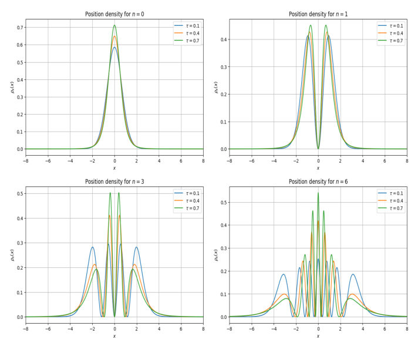 
Figure 1 depicts probability density plots for the states n = 0; n = 1; n = 3; n = 6 for some fixed values of τ = 0.1; 0.4; 0.7. It can be seen that the probability of finding a particle is increasing with the quantum numbers and the for the parameters of deformation when x ∈[−2, 2]. However, this probability is discreasing when the position tends to the infinities. On the other hand, the Fourier transform of the position eigenfunction ϕλ n(x) given by (7) provides the eigenfunction of the system in the conjugated momentum space as

📷 Fig 3

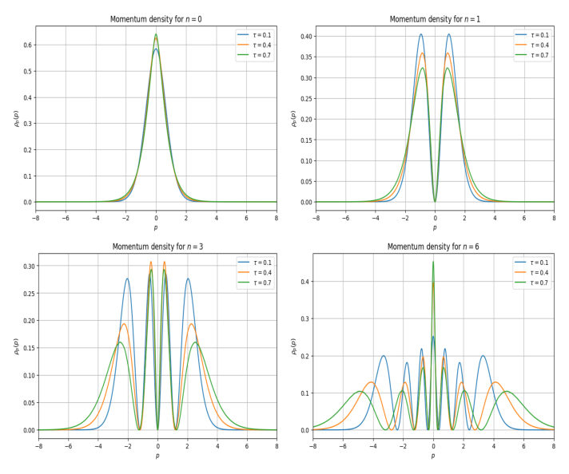 
Figure 2: Density function in momentum space for fixed values of parameter τ and quantum number n.

📷 Fig 4

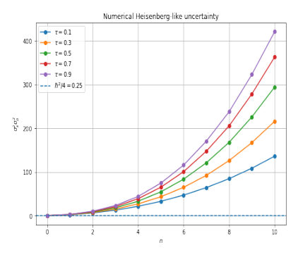 
Figure 3: Heisenberg uncertainty (23) as function of quantum number n for fixed values of parameter τ

📷 Fig 5

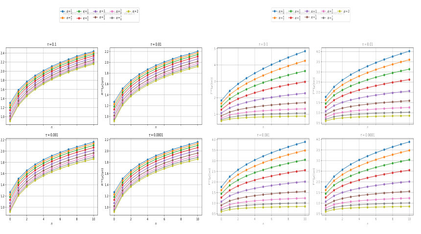 
Figure 4: R´enyi entropy (58) (left 4-subplots) and Tsallis entropy(61) (right 4-subplots) as functions n for fixed values of parameters α and τ.

**Summary.** This paper analyzes Rényi and Tsallis information entropies for a quantum harmonic oscillator model featuring a position-dependent mass. By calculating these generalized entropies in both position and momentum space, the authors confirm that these quantities correctly reduce to the standard Shannon entropy in the appropriate limit. The work extends the understanding of quantum uncertainty relations to systems with non-standard mass profiles.

**Why it may be interesting.** The study of generalized entropies (Rényi/Tsallis) applied to non-standard Hamiltonians (PDM) provides a generalized framework for understanding quantum uncertainty beyond the standard Heisenberg relation, which is relevant for complex quantum systems.

Detailed structure

**Main problem.** The paper investigates the behavior of Rényi and Tsallis information entropies for a quantum system characterized by a position-dependent mass.

**Main result.** The calculated information entropies approach the standard Shannon entropy limit when the entropic parameter alpha approaches 1, and the results validate known behaviors in the asymptotic limit.

**Method.** The authors use analytical and numerical techniques involving Gegenbauer polynomials and modified Bessel functions to evaluate the entropic moments in both position and momentum representations.

**Model / system.** The system is a particle confined in a harmonic oscillator potential, but with a position-dependent mass $m(x) = m_0 / (1 + 	au x^2)^2$. The Hamiltonian is derived from this structure.

**Key observables.** Rényi and Tsallis information entropies ($R(\alpha), T(\alpha)$) in both position and momentum space, and related entropy-based uncertainty relations.

**Important parameters / regimes.** The entropic parameter $\alpha$, the deformation parameter $	au$, and the quantum number $n$. The analysis also considers the limit $\alpha 	o 1$ and $	au 	o 0$.

**Assumptions / limitations.** Due to the complexity of position entropy integrals, the authors evaluate the asymptotic limit. The momentum entropy calculation is performed without approximation theory.

**Figures summary.** The notes mention figures showing momentum probability densities and plots of Rényi/Tsallis entropies in momentum space versus the quantum number $n$. Tables summarize numerical values for uncertainty relations.

**Paper structure.** The paper first establishes the Hamiltonian and eigenfunctions using Gegenbauer polynomials. It then calculates the information entropies in both representations, noting the difficulty in the position space and using the asymptotic limit. Finally, it evaluates the related entropic uncertainty relations numerically.

Abstract

In this paper, we study Renyi and Tsallis information entropies for a Hamiltonian system with position-dependent mass confined in harmonic oscillator potential. Gegenbauer polynomials are used to obtain the position eigenfunction of such a system, and the modified Bessel function of the second kind is used to determine the equivalent momentum eigenfunction. By means of probability densities of both representations, we analytically and numerically evaluate the Heisenberg-like uncertainty of this system. Because the Renyi and Tsallis information entropies in position representation are described by integral functionals of the Gegenbauer polynomials, these quantities are much more difficult to calculate. To get around this problem, we evaluate these information entropies at the system s asymptotical limit, which corresponds to the behavior of an undeformed harmonic oscillator. Nevertheless, no approximation method is used to obtain the Tsallis and Renyi information entropies in momentum representation. In both representations, we find that these information entropies approach the Shannon entropy when the entropic parameter alpha-> 1 and are closed to the results of similar models of the literature. Finally, we evaluate the related entropic uncertainty relations numerically to validate the latter obersevations.

[↑ back to top](#top)

### [Signatures of Chaos in a Quasiperiodically Driven Quantum Impact Oscillator](http://arxiv.org/abs/2609.18350v1)

**Authors:** Deepshikha Singh, Titir Mukherjee, Soumitro Banerjee  
**Type:** theory · **Category:** other · **PDF:** <https://arxiv.org/pdf/2609.18350v1>  
**Analysis basis:** full PDF text, analyzed in chunks

📷 Fig 1

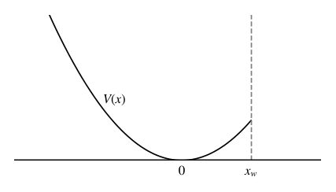 
Figure 2: The graphical representation of the impact oscillator potential V(x).

📷 Fig 2

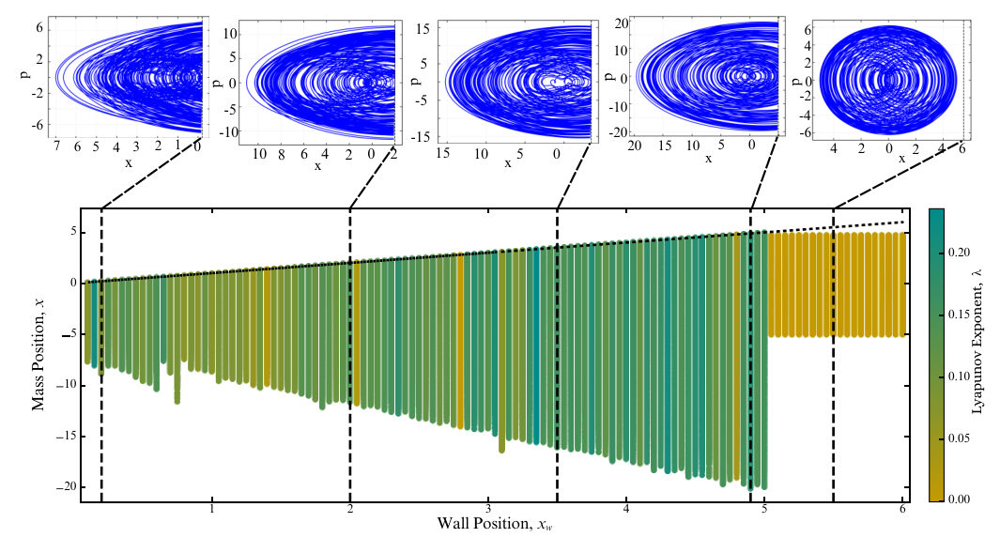 
Figure 3: Bifurcation diagram of the impact oscillator system with quasiperiodic drive. Here, the color represents the Lyapunov exponent for each wall position. The panels on the top are the phase-space trajectories for selected wall positions.

📷 Fig 3

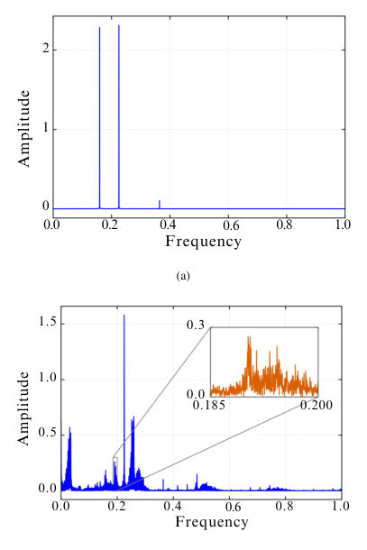 
Figure 4: Fourier spectrum of the position x time series. (a) xw = 5.5, shows three discrete peaks corresponding to the three frequencies ωi/2π, where i = 0, 1, 2. (b) xw = 4.9 shows a continuous spectrum, clearly seen in the inset.

📷 Fig 4

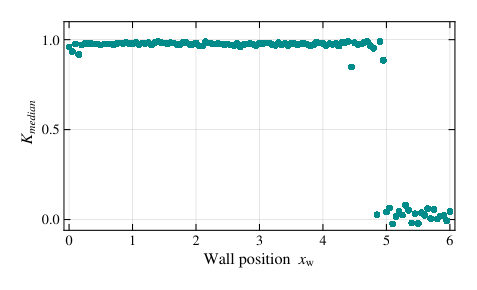 
Figure 5: The result of the 0-1 test with varying wall position xw. Kmedian ≈1 suggests chaotic dynamics, and Kmedian ≈0 indicate a regular dynamics.

📷 Fig 5

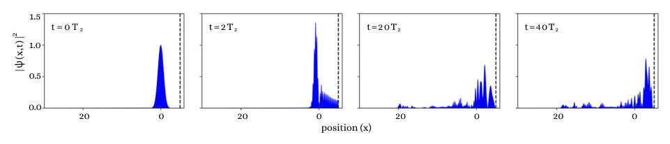 
Figure 6: Snapshots of the probability density at four different times showing the temporal evolution of the wavefunction under quasiperiodic driving. The dashed vertical line marks the wall position, xw = 5. The driving frequencies are chosen as ω1 = √

**Summary.** This paper analyzes quantum chaos in a driven impact oscillator, demonstrating that quasiperiodic driving near a grazing collision point induces robust chaotic signatures. By comparing diagnostics like OTOC and fidelity decay across different driving frequencies, the authors show that while initial scrambling is general, the long-term global scrambling is highly sensitive to the irrationality of the driving ratio.

**Why it may be interesting.** It provides a concrete, analytically tractable model (impact oscillator) to study the transition to quantum chaos, using advanced diagnostics like OTOC and fidelity decay, which are central to quantum information theory.

Detailed structure

**Main problem.** The study investigates the emergence of quantum-chaotic dynamics in a quasiperiodically driven impact oscillator, contrasting this with previous findings of strange nonchaotic dynamics under periodic driving.

**Main result.** The research establishes that quasiperiodic driving near the grazing condition generates robust signatures of quantum chaos, with global scrambling being strongly influenced by the irrationality of the driving frequency ratio.

**Method.** The study employs both classical analysis (bifurcation diagrams, Lyapunov exponents) and quantum diagnostics (Shannon entropy, OTOC, Fidelity) to characterize the dynamics.

**Model / system.** The physical system is an impact oscillator, modeled by a time-dependent Hamiltonian incorporating a potential and a quasiperiodic driving force $F(t) = a \sin(\omega_1 t) + b \cos(\omega_2 t)$.

**Key observables.** Shannon entropy time series, 0-1 test values, finite-time Lyapunov exponents, Out-of-time-order correlator (OTOC), and Fidelity decay.

**Important parameters / regimes.** The grazing condition, the ratio of driving frequencies ($\omega_r$), and the perturbation strength ($\epsilon$).

**Assumptions / limitations.** The quantum dynamics are governed by the time-dependent Schrödinger equation, and the classical system assumes perfectly elastic collisions.

**Figures summary.** Figures illustrate the potential, and the results summarize diagnostics like the 0-1 test and fidelity decay for different frequency ratios.

**Paper structure.** The paper first establishes the classical transition to chaos, then applies quantum diagnostics (Shannon entropy, OTOC, Fidelity) to show robust quantum signatures of chaos, concluding with a discussion on the role of frequency irrationality.

Abstract

We demonstrate the emergence of quantum-chaotic dynamics in a quasiperiodically driven impact oscillator near the grazing condition. While previous studies of the quantum impact oscillator under periodic driving reported strange nonchaotic dynamics, we show that quasiperiodic driving produces robust signatures of chaos. The corresponding classical system undergoes a sharp grazing-induced transition from quasiperiodic motion to chaos, as established by bifurcation analysis, Lyapunov exponents, Fourier spectra, and the 0-1 test. In the quantum system, Shannon-entropy time series exhibit broadband spectra, 0-1 test values close to unity, and predominantly positive finite-time Lyapunov exponents for both rational and irrational driving-frequency ratios. Independent quantum diagnostics reinforce this result: the out-of-time-order correlator (OTOC) displays early-time exponential growth with nearly identical rates, while the golden-ratio drive leads to a substantially faster saturation of the OTOC. Fidelity exhibits an exponential decay regime that is approximately independent of perturbation strength. These results establish quasiperiodic driving near grazing as a mechanism for generating quantum-chaotic behavior and reveal that, although the initial onset of scrambling is largely insensitive to frequency-ratio rationality, the subsequent development of global scrambling is strongly influenced by the degree of irrationality of the drive.

[↑ back to top](#top)

### [Simplification Rules for Continuous-Time Quantum Walks on Dynamic Graphs](http://arxiv.org/abs/2609.18463v1)

**Authors:** Mostafa Atallah, Daniel Dilley, Jishnu Mahmud, Zain H Saleem, Rebekah Herrman  
**Type:** theory · **Category:** quantum information and computing · **PDF:** <https://arxiv.org/pdf/2609.18463v1>  
**Analysis basis:** full PDF text, analyzed in chunks

📷 Fig 1

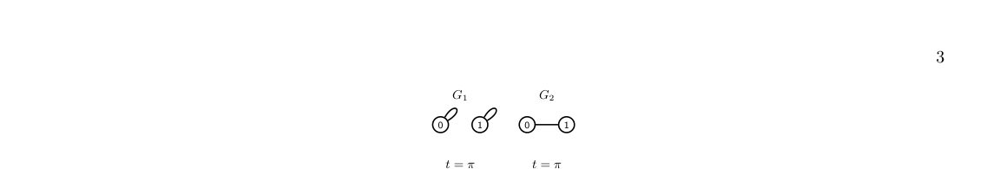 
FIG. 1: Identity gate as a dynamic graph sequence. Note each graph and corresponding time in this sequence corresponds to a −I gate.

📷 Fig 2

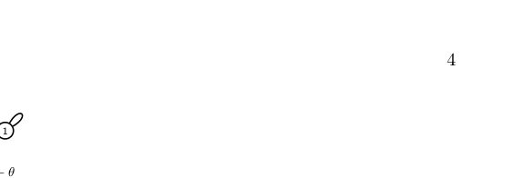 
FIG. 2: The P(θ) gate as a dynamic graph sequence.

📷 Fig 3

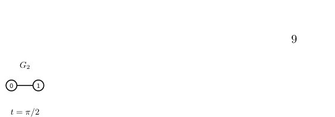 
FIG. 3: Original X gate

📷 Fig 4

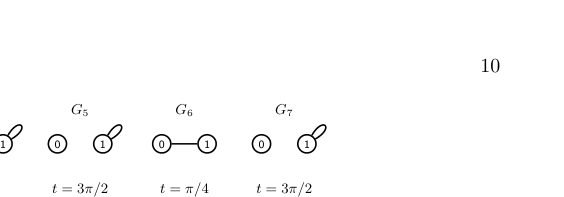 
FIG. 4: HZH

📷 Fig 5

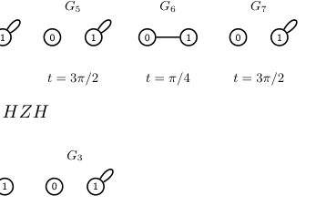 
FIG. 5: Simplified HZH, equivalent to X gate.

**Summary.** This paper introduces simplification rules for Continuous-Time Quantum Walks (CTQWs) on dynamic graphs, treating these rules as the CTQW equivalent of circuit identities. By developing these rewrite rules, the authors show how complex sequences of time-evolving Hamiltonians can be drastically shortened while preserving the implemented quantum unitary. This offers a new, compact framework for representing and compiling quantum circuits.

**Why it may be interesting.** This work provides a powerful, graph-theoretic analogue to circuit identities, which is highly relevant for quantum information theorists developing efficient quantum compilation and transpilation tools.

Detailed structure

**Main problem.** The primary goal is to develop simplification rules for Continuous-Time Quantum Walks (CTQWs) on dynamic graphs to significantly shorten the sequence of time-evolving Hamiltonians required to implement a specific unitary transformation.

**Main result.** The authors successfully derived new graph rewrite rules and demonstrated that standard single-qubit gates, as well as the $n$-th root of any single-qubit gate, can be realized efficiently within the CTQW framework.

**Method.** The work involves deriving and applying graph rewrite rules (simplification techniques) to the time evolution operator, which is calculated as the time-ordered exponential of a sequence of time-dependent graph Hamiltonians.

**Model / system.** The system is Continuous-Time Quantum Walks (CTQWs) operating on dynamic graphs. The dynamics are governed by the time evolution operator $e^{-iA_{total}t}$, where $A_{total}$ is constructed from a sequence of time-evolving graph Hamiltonians derived from the graph's adjacency matrix.

**Key observables.** The implemented unitary transformation (e.g., Identity, $P(	heta)$, $R_x(\alpha)$), and the resulting simplified graph sequence.

**Important parameters / regimes.** Time evolution times ($t$), graph structure (adjacency matrices $A$), and angular parameters ($	heta, \phi, \lambda, \alpha$).

**Assumptions / limitations.** The list of simplification rules presented is not claimed to be exhaustive, and the framework assumes the equivalence between the circuit model and the dynamic graph model.

**Figures summary.** Figures illustrate the realization of specific gates (like Identity and $P(	heta)$) using dynamic graph sequences, and later figures demonstrate the simplification of complex sequences (like $X$ gate evolution) into shorter, equivalent forms.

**Paper structure.** The paper first establishes the context of CTQWs as a universal quantum computation model. It then details the construction of fundamental gates ($iI, -iI, P(	heta)$) using specific graph sequences. The core of the work introduces and proves several graph rewrite rules (Observations IV.1-IV.5) to simplify these sequences, culminating in the realization of general gates and roots.

Abstract

Continuous-time quantum walks (CTQWs) on dynamic graphs realize quantum gates as sequences of time-evolving graph Hamiltonians, but naive constructions produce long sequences with redundancy. Simplification rules, which are graph rewrite rules that shorten a dynamic graph sequence while preserving the unitary it implements, are the CTQW analogue of circuit identities in the gate model. In this work, we give CTQW realizations of the standard single-qubit gates and introduce new graph rewrite rules. We demonstrate the simplification rules through worked circuit reductions and outline their use as transpilation primitives for converting between the circuit model and the dynamic graph framework.

[↑ back to top](#top)

### [Spectral Optimization for Absolutely PPT States: Purity, Entropy, and Volume Decay](http://arxiv.org/abs/2609.18568v1)

**Authors:** Anh T. Tran  
**Type:** theory · **Category:** quantum information and computing · **PDF:** <https://arxiv.org/pdf/2609.18568v1>  
**Analysis basis:** full PDF text, analyzed in chunks

📷 Fig 1

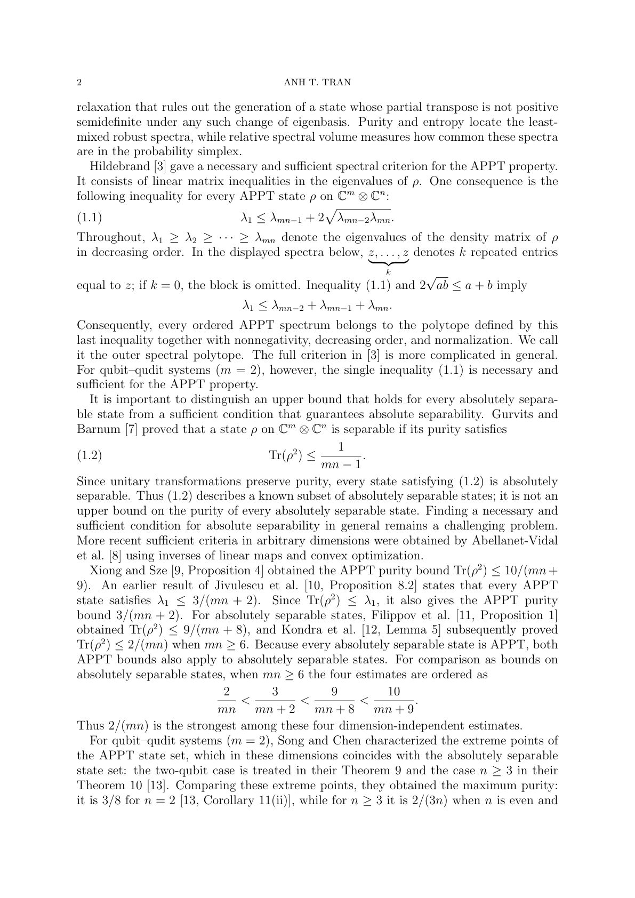 
Low-resolution page preview, page 2

📷 Fig 2

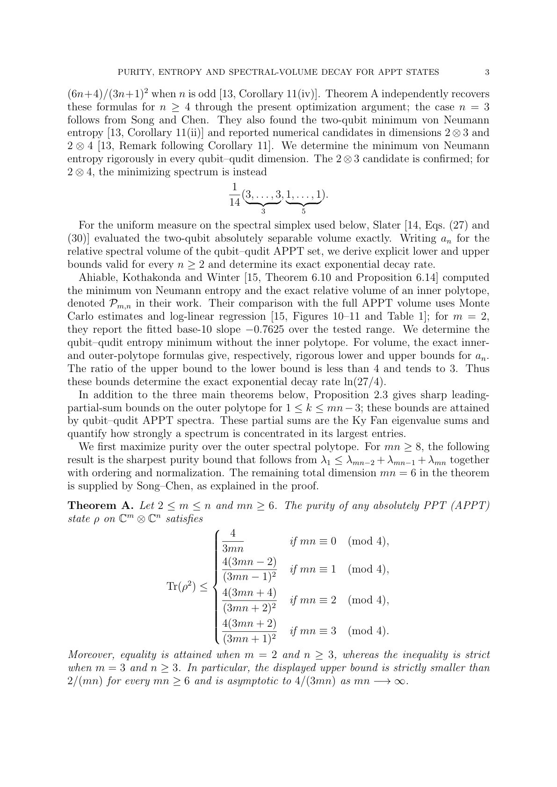 
Low-resolution page preview, page 3

📷 Fig 3

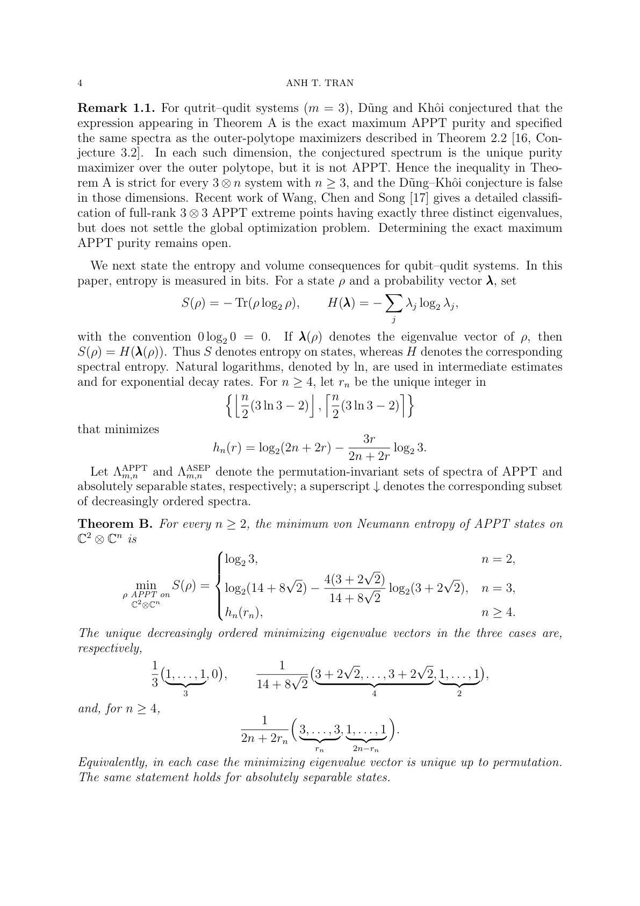 
Low-resolution page preview, page 4

📷 Fig 4

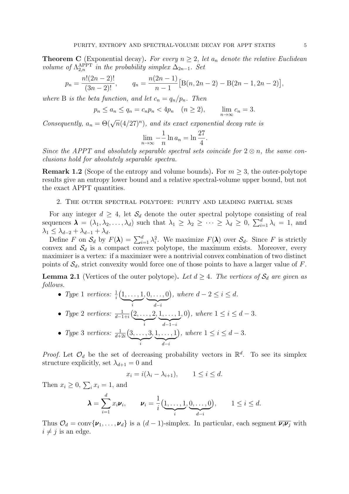 
Low-resolution page preview, page 5

📷 Fig 5

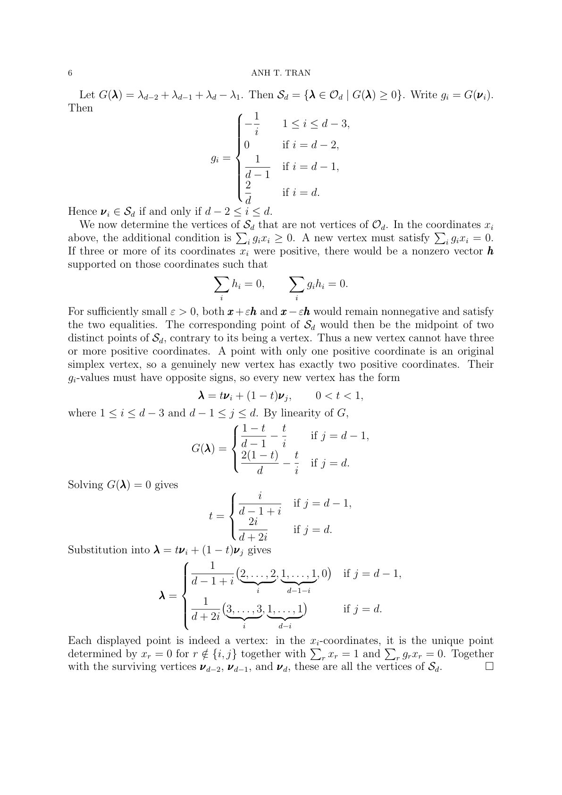 
Low-resolution page preview, page 6

**Summary.** This paper provides a deep mathematical analysis of spectral properties for Absolutely PPT quantum states in bipartite systems. It derives sharp upper bounds for purity and determines the minimum entropy for specific dimensions. Crucially, it quantifies the exponential decay rate of the spectral volume, offering precise tools for characterizing quantum state sets.

**Why it may be interesting.** The work provides sharp, quantitative bounds on fundamental quantum information measures (purity, entropy) for a physically relevant class of states (APPT), which has implications for understanding entanglement and separability in multipartite systems.

Detailed structure

**Main problem.** The paper investigates the maximum purity, minimum von Neumann entropy, and relative spectral volume of Absolutely PPT (APPT) quantum states.

**Main result.** It establishes a dimension-dependent upper bound on the purity of APPT states, improves previous bounds, and determines the exact exponential decay rate of the spectral volume for qubit-qudit systems.

**Method.** The research combines optimization techniques over explicitly defined outer spectral polytopes with rigorous mathematical analysis, including interval arithmetic for entropy bounding.

**Model / system.** The study focuses on bipartite quantum states $
ho$ on $C^m \otimes C^n$, specifically analyzing the properties of APPT states, which are constrained by linear matrix inequalities derived from the PPT condition.

**Key observables.** Purity ($	ext{Tr}(
ho^2)$), Von Neumann Entropy ($S(
ho)$), and the relative spectral volume of the state set ($	ext{rvol}(\Lambda_{	ext{APPT}})$).

**Important parameters / regimes.** Bipartite dimensions ($m, n$), and the asymptotic ratio of volumes, which tends to 3.

**Assumptions / limitations.** The analysis relies on characterizing the APPT property via the outer spectral polytope and assumes that optimization over this polytope yields the extremal values.

**Figures summary.** Not specified.

**Paper structure.** The paper progresses by first establishing purity bounds and disproving conjectures for specific dimensions ($3\otimes n$). It then tackles the minimum entropy for $2\otimes n$ systems, followed by detailed calculations of the relative spectral volume decay rate, and finally, rigorous bounding of the entropy minimum using interval arithmetic.

Abstract

We study maximum purity and minimum von Neumann entropy of absolutely positive partial transpose (APPT) states, together with the relative volume of their spectral sets. A consequence of Hildebrand's criterion gives an explicit outer spectral polytope, whose vertices we classify. Optimizing purity over this polytope, together with the Song--Chen result for the $2\otimes3$ system, yields, for every $mn\ge6$, an explicit upper bound on the purity of APPT states that is asymptotic to $4/(3mn)$. This improves the previous $2/(mn)$ upper bound for absolutely separable states. The new bound applies to every APPT state, a class containing all absolutely separable states, and is sharp for every $2\otimes n$ system with $n\ge3$. For every $3\otimes n$ system with $n\ge3$, however, the unique outer-polytope maximizer is not APPT, so the bound is strict and disproves the Dũng--Khôi qutrit--qudit conjecture. The polytope also gives an explicit entropy lower bound in arbitrary bipartite dimensions and, together with the Song--Chen extreme-point classification, the exact minimum entropy for every $2\otimes n$ system. Finally, exact formulas for the relative volumes of an inner polytope and the outer spectral polytope give explicit two-sided bounds on the qubit--qudit relative spectral volume $a_n$ whose ratio is less than $4$ and tends to $3$. Consequently, $a_n=Θ\!\left(\sqrt n(4/27)^n\right)$, and the relative volume of the qubit--qudit APPT spectral set (equivalently, the absolutely separable spectral set) has exact exponential decay rate $\ln(27/4)$.

[↑ back to top](#top)

### [Unbounded Holevo additivity gaps in finite dimensions](http://arxiv.org/abs/2609.18222v1)

**Authors:** Jinzhao Wang  
**Type:** theory · **Category:** quantum information and computing · **PDF:** <https://arxiv.org/pdf/2609.18222v1>  
**Analysis basis:** full PDF text, analyzed in chunks

📷 Fig 1

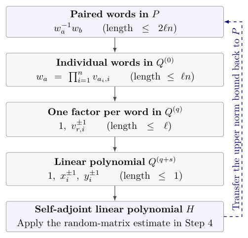 
Figure 1: Allowed words at each stage of linearization. Here r labels one of the K words, and xi, yi are the two base generators in tensor factor i. The forward construction enlarges matrix coefficients; the return arrow shows how Step 4 transfers the norm bound from H to P. The shortening stage is skipped when ℓ= 1.

**Summary.** This paper proves that quantum channels can exhibit unbounded two-use Holevo additivity gaps in finite dimensions. By constructing specific channels, the authors show that the classical capacity can diverge even when the single-use Holevo information vanishes. The proof relies on sophisticated tools from free probability and operator theory.

**Why it may be interesting.** This work provides a rigorous, constructive proof of superadditivity gaps in finite dimensions, which challenges classical assumptions about channel capacity and has implications for quantum communication complexity.

Detailed structure

**Main problem.** The paper establishes the existence of unbounded two-use Holevo additivity gaps in finite-dimensional quantum channels, demonstrating a significant advantage in classical communication rate when using the channel twice versus using it twice independently.

**Main result.** It proves that for a sequence of channels, the single-use Holevo information can approach zero while the two-use Holevo information diverges, implying the channel capacity can diverge.

**Method.** The proof combines advanced techniques from free probability (Haagerup inequality) with strong convergence estimates for tensor products of operators acting on finite-dimensional Hilbert spaces.

**Model / system.** The analysis focuses on quantum channels $\Phi: \mathcal{M}_d(\mathbb{C}) 	o \mathcal{M}_d(\mathbb{C})$, specifically constructed using structured tensor products of complementary mixed-unitary channels derived from free-probabilistic proofs.

**Key observables.** Two-use Holevo gap ($\chi(\Phi^{\otimes 2}) - 2\chi(\Phi)$), single-use Holevo quantity ($\chi(\Phi)$), and classical capacity ($C(\Phi)$).

**Important parameters / regimes.** The gap scales linearly with $n$ ($\Delta\chi(T_n) = \Theta_K(n)$), and the construction requires $n$ to be sufficiently large.

**Assumptions / limitations.** The analysis relies on combining Collins--Youn's product-group Haagerup inequality with Bordenave--Collins's quantitative strong-convergence estimates.

**Paper structure.** The paper builds the result by first establishing the gap using free probability tools, then relating this to minimum-output-entropy gaps, and finally proving the divergence of capacity by constructing a specific sequence of channels.

Abstract

We establish unbounded two-use Holevo additivity gaps in finite dimensions. For each sufficiently large fixed integer $K$ and all sufficiently large $n$, we construct channels $T_n$ with output dimension $K^n$, input dimension $\exp(Θ_K(n^2))$, and \[   χ(T_n^{\otimes2})-2χ(T_n)   \ge n\left[\frac{\log_2K}{K}-2\log_2(1+9/K)\right]-O(1/n). \] The gap is linear in output qubits, with an explicit quadratic input-qubit cost and an explicit threshold on $n$. We also obtain channels whose single-use Holevo quantity tends to zero while their two-use Holevo information, and hence classical capacity, diverges. The channels arise from structured tensor products of the complementary mixed-unitary channels used in Collins's free-probabilistic proof. We establish minimum-output-entropy gaps by combining Collins--Youn's product-group Haagerup inequality with Bordenave--Collins's quantitative strong-convergence estimates

[↑ back to top](#top)

## Secondary cond-mat archives

*Papers from  mes-hall, other, soft, supr-con. These archives are de-prioritized — they appear at the end regardless of relevance score.*

### Relevant in secondary archives (8)

### [Microscopic theory of spin-torque ferromagnetic resonance in nonmagnetic-metal/ferromagnetic-metal heterostructures](http://arxiv.org/abs/2609.18090v1)

**Authors:** Takumi Funato, Takeo Kato  
**Type:** theory · **Category:** other · **PDF:** <https://arxiv.org/pdf/2609.18090v1>  
**Analysis basis:** full PDF text, analyzed in chunks
**Topic relevance:** `Keldysh / 2PI / non-Gaussian methods` **3/5** · `methods for driven-dissipative` **2/5** · `analog quantum simulation` **1/5** · `correlated / nonlocal dissipation` **1/5** · `driven-dissipative phase transition` **1/5** · `non-equilibrium universality` **1/5** · `quantum measurements` **1/5**

📷 Fig 1

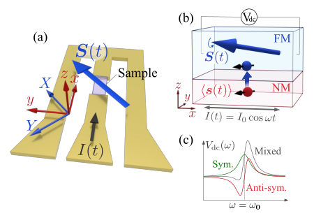 
FIG. 1. Schematic illustration of the ST-FMR setup and dc-voltage spectrum. (a) Coplanar-waveguide geometry with the NM/FM sample and localized-spin direction. (b) Current- induced spin accumulation near the NM/FM interface drives the magnetization dynamics. (c) Representative dc-voltage spectrum consisting of symmetric and antisymmetric compo- nents.

📷 Fig 2

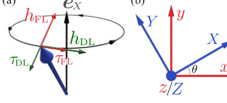 
FIG. 2. Schematic illustration of (a) the localized-spin dynamics driven by the damping-like τDL and field-like τFL torques and (b) the coordinate systems. The corresponding effective magnetic fields are denoted by hDL and hFL, re- spectively. The X-axis of the magnetization-fixed coordinate system (X, Y, Z) is tilted from the x-axis of the original coor- dinate system (x, y, z) by an angle θ.

📷 Fig 3

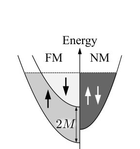 
FIG. 3. Schematic illustration of the band structures of the FM and the NM. The conduction electron energy is spin-split by the s-d exchange coupling.

📷 Fig 4

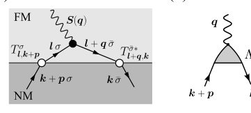 
FIG. 4. (a) Schematic illustration of the interfacial exchange process involving one s-d exchange interaction and two inter- facial electron-tunneling processes. (b) Corresponding Feyn- man diagram.

📷 Fig 5

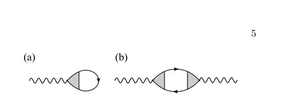 
FIG. 5. Feynman diagrams for the self-energy of the magnon: (a) the effective Zeeman field and (b) the FMR frequency shift and damping modulation.

**Summary.** This paper presents a comprehensive microscopic theory for Spin-Torque Ferromagnetic Resonance in NM/FM interfaces. It derives the current-induced torque and resulting dc voltage by treating the coupling between localized spins and conduction electrons. The key achievement is establishing a unified framework that links measurable magnetic resonance spectra directly to the electronic spin dynamics of the adjacent nonmagnetic metal.

**Why it may be interesting.** While focused on condensed matter magnetism, the use of linear response theory, Green's functions, and the explicit calculation of dynamic susceptibilities ($\chi(\omega)$) mirrors techniques used in open quantum systems and quantum transport theory.

Detailed structure

**Main problem.** The paper develops a microscopic theory to explain Spin-Torque Ferromagnetic Resonance (ST-FMR) in nonmagnetic-metal/ferromagnetic-metal (NM/FM) heterostructures.

**Main result.** The theory successfully connects the measured dc voltage in ST-FMR directly to the electronic spin responses (susceptibility and conductivity) of the adjacent nonmagnetic system.

**Method.** The approach uses Green's function techniques, integrating out conduction electron degrees of freedom to derive effective interfacial exchange couplings and calculating observables via linear response theory.

**Model / system.** The system is an NM/FM heterostructure. The model incorporates the s-d exchange Hamiltonian, treating the FM spins via spin-wave approximations and the NM response using advanced Green's function formalism, including Rashba SOC effects.

**Key observables.** dc voltage ($V_{dc}$), resonance-frequency shift ($\delta\omega_0$), damping modulation ($\delta\alpha_G$), and the Rashba–Edelstein conductivity ($\sigma_{REE}$).

**Important parameters / regimes.** The analysis is sensitive to the effective magnetic fields ($\mathbf{h}_Y(\omega), \mathbf{h}_Z(\omega)$) and the frequency ($\omega$) of the applied microwave field.

**Assumptions / limitations.** The theory relies on linear-response theory, the random averaging of couplings, and the use of the rotating-wave approximation for spin dynamics.

**Figures summary.** Figures illustrate the ST-FMR setup and $V_{dc}$ spectrum, the role of damping-like and field-like torques, band structures showing spin splitting, and the frequency dependence of the resonance shift and damping modulation.

**Paper structure.** The paper progresses by first establishing the general Hamiltonian, then deriving the effective interfacial coupling by integrating out FM electrons, and finally applying this framework to calculate specific observables like the dc voltage and spin susceptibility using advanced Green's function techniques.

Abstract

We develop a microscopic theory of spin-torque ferromagnetic resonance (ST-FMR) in nonmagnetic-metal/ferromagnetic-metal heterostructures. Tracing out the conduction-electron degrees of freedom in the FM, we derive an effective interfacial exchange coupling between the localized spins and the conduction electron spins in the adjacent electron system. Based on this interaction, we calculate the current-induced driving torque, resonance-frequency shift, damping modulation, and resulting dc voltage. As a concrete example, we apply the formulation to a disordered Rashba two-dimensional electron gas and demonstrate that the ST-FMR spectrum reflects the dynamical spin responses of the adjacent electron system. Our formulation applies to a broad class of heterostructures and establishes a unified microscopic framework connecting ST-FMR spectra directly to the electronic spin responses of adjacent systems.

[↑ back to top](#top)

### [Fröhlich Bipolarons in Two-Dimensional Materials](http://arxiv.org/abs/2609.18402v1)

**Authors:** A. Kudlis, V. Shahnazaryan, I. Iorsh, I. A. Shelykh, I. V. Tokatly  
**Type:** theory · **Category:** other · **PDF:** <https://arxiv.org/pdf/2609.18402v1>  
**Analysis basis:** full PDF text, analyzed in chunks
**Topic relevance:** `Keldysh / 2PI / non-Gaussian methods` **3/5** · `analog quantum simulation` **1/5** · `methods for driven-dissipative` **1/5**

📷 Fig 1

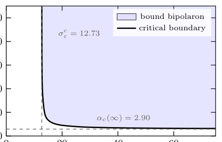 
FIG. 1. Critical coupling of the dispersionless quasi-two- dimensional model under the dielectric constraint specified in the text. The blue area shows where the variational calculation favors a bound bipolaron within the displayed parameter range. The solid curve shows the calculated critical boundary. The horizontal dashed line is αc(∞) ≃2.90; the vertical dashed line marks the strong-coupling end point σc ε ≃12.73.

📷 Fig 2

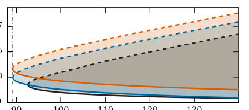 
FIG. 2. Binding boundaries of the dispersive monolayer model for three representative longitudinal length ratios. (a) Lower critical coupling over the displayed σ0 range. (b) Both bound- aries near their meeting point, shown as α± eff/σL so their smooth meeting can be resolved on a linear scale. (c) The same binding windows over a broader range; the logarithmic vertical scale displays the rapidly growing upper boundary. Solid and dashed lines denote the lower and upper boundaries, respectively. The colored shading marks the displayed part of each binding region: above the lower boundary in panel (a), and between the matching lower and upper boundaries in panels (b) and (c). Binding is...

**Summary.** This paper theoretically examines bipolaron formation in polar two-dimensional monolayers using a variational path-integral approach. It finds that the unique 2D screening effects drastically alter the stability landscape, showing that stable bipolarons are suppressed in the strong coupling limit. This work is crucial for predicting charge transport phenomena in next-generation 2D electronic materials.

**Why it may be interesting.** The work provides a detailed theoretical framework for understanding charge carrier interactions in modern 2D materials, which is highly relevant for designing novel quantum electronic devices.

Detailed structure

**Main problem.** The study investigates the formation and stability of bipolarons (pairs of charge carriers coupled to phonons) in polar monolayers, contrasting this behavior with conventional quasi-two-dimensional models.

**Main result.** The stability region for bipolarons is strongly modified in monolayers, showing that no stable bipolarons exist in the strong coupling limit, contrary to expectations from simpler models.

**Method.** The analysis employs the Feynman path-integral variational approach to calculate the zero-temperature ground-state energy of the system.

**Model / system.** The system models two charge carriers interacting via Fröhlich electron-phonon coupling and direct Coulomb repulsion within an isolated, polar two-dimensional monolayer environment.

**Key observables.** Bipolaron binding energy ($e_{bp}$), one-polaron energy ($e_{pol}$), and the critical coupling constant required for bipolaron formation.

**Important parameters / regimes.** The ratio of static to high-frequency polarizability ($\sigma_0$), the effective coupling parameter ($\alpha_{eff}$), and the screening lengths ($r_0, r_\infty$).

**Assumptions / limitations.** The analysis assumes an isolated monolayer environment, leading to specific nonlocal dielectric screening effects, and utilizes variational approximations in the path integral formalism.

**Figures summary.** The notes detail the derivation of energy functionals and the minimization of the energy difference between one-polaron and bipolaron states using multiple variational parameters.

**Paper structure.** The paper progresses from establishing the unique physics of 2D monolayers (momentum-dependent vertices, Keldysh-Rytova repulsion) to applying the variational path-integral method to calculate the ground-state energy, culminating in the determination of the stability region.

Abstract

Motivated by the progress in the physics of two-dimensional materials and the recent two-dimensional generalization of the Fröhlich model, we study the formation of bipolarons in polar monolayers. Because of very special nonlocal dielectric screening in two dimensions, this setting differs qualitatively from the conventional Fröhlich model. In monolayers, (i) long wavelength LO phonons acquire a nontrivial dispersion; (ii) the Fröhlich electron-phonon vertex becomes momentum-dependent and regular at small momenta; and (iii) direct repulsion between charge carriers takes the Keldysh-Rytova form. Using the Feynman path-integral variational approach, we show that the region in the parameter space where stable bipolarons exist is strongly modified compared to the usual quasi-two-dimensional model with dispersionless phonons. Specifically, in the most favorable limit, when the ratio $σ_0$ of the static polarizability to the high-frequency polarizability tends to infinity, the lower critical coupling, sufficient for the formation of bipolarons, can be made arbitrarily small. More surprisingly, we demonstrate that no stable bipolarons can exist in the strong coupling limit: in the isolated monolayer the stability region is always confined to a finite range of coupling constants. In general, the stability region is strongly shifted toward large values of the polarizability ratio $σ_0$, well beyond the parameter regimes in representative crystals, which indicates that polar monolayers do not favor bipolarons.

[↑ back to top](#top)

### [Constrained weak identification of Allen--Cahn free energies with surface-tension calibration](http://arxiv.org/abs/2609.18403v1)

**Authors:** Soobeen Jung, Hyunju Kim  
**Type:** both · **Category:** statistical mechanics · **PDF:** <https://arxiv.org/pdf/2609.18403v1>  
**Analysis basis:** full PDF text, analyzed in chunks
**Topic relevance:** `Keldysh / 2PI / non-Gaussian methods` **2/5** · `analog quantum simulation` **2/5** · `methods for driven-dissipative` **2/5** · `quantum measurements` **2/5** · `correlated / nonlocal dissipation` **1/5** · `driven-dissipative phase transition` **1/5** · `non-equilibrium universality` **1/5**

📷 Fig 1

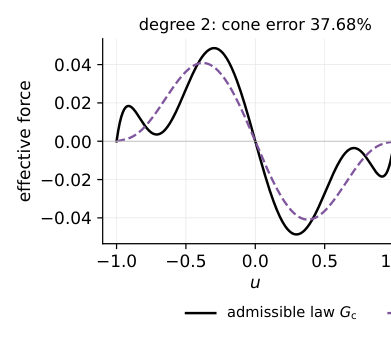 
Figure 1: Approximation limit of the nonnegative cone for the admissible law Gc of Eq. (10). Left: Bernstein degree two; right: degree five. Solid line: Gc; dashed line: its best approximation with nonnegative Bernstein coefficients in L2(−1, 1). The panel titles give the relative L2 force error of that approximation (the approximation floor); the unconstrained space of each degree represents Gc exactly. No trajectory data are involved.

📷 Fig 2

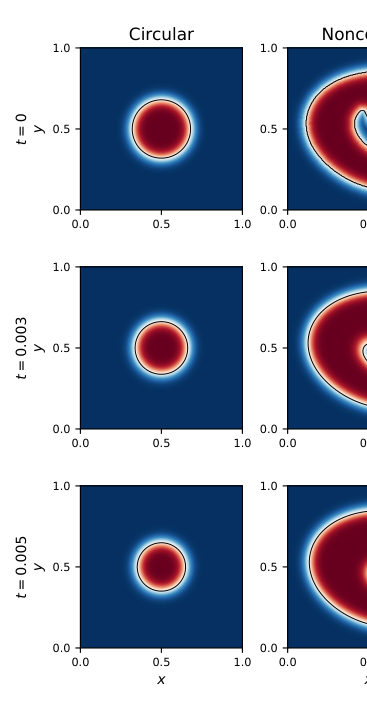 
Figure 2: Sixth-degree-law observations on the separate 2562 dataset: circular, nonconvex, and inclusion geometries at the initial time, identification endpoint, and final time. Colors show u on a common scale and black contours mark u = 0. Contours use the cell-centred coordinates of the fields. These are the neural- comparison observations, not the 962 four-law principal ensemble.

📷 Fig 3

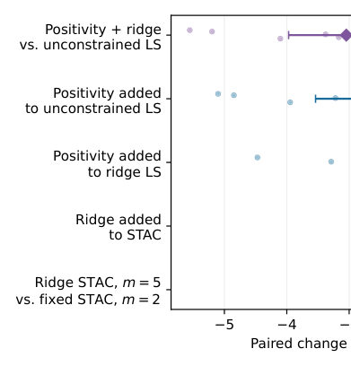 
Figure 3: Paired changes in mean force error at degree five on the principal records, in percentage points. Negative values favor the first-named method. Di- amonds indicate means over ten seed clusters, dots show the individual cluster means, and bars show nominal 95% percentile bootstrap intervals. The final com- parison uses fixed degree-two STAC as the reference.

📷 Fig 4

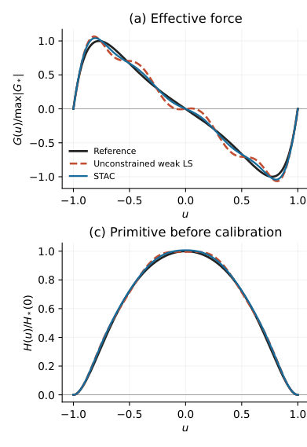 
Figure 4: Degree-five recovery of the exponential law from circular observations at noise 0.03. The unconstrained estimate (dashed) and STAC (blue) use the same moments; black is the reference. Panels (a,b) show the force and an enlargement near the origin. Panels (c,d) show the primitive and its local change from u = 0. The additional force zeros and central local minimum identify an unintended metastable mixed state.

📷 Fig 5

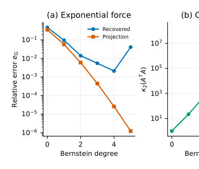 
Figure 5: Supplementary clean-data tests. (a) Exponential-force recovery and best nonnegative approximation against Bernstein degree. (b) Condition number of the weak Gram matrix in the earlier normal-equation implementation used for these records. (c) Sixth-degree-law recovery under spatial refinement with a common initial field and 24 or 48 CNAB2 substeps. These calculations are separate from the principal QR/SVD comparisons.

**Summary.** This paper addresses the ambiguity in determining the free-energy potential and length scale from phase-field dynamics governed by the Allen-Cahn equation. It introduces the STAC method, which uses an external surface-tension measurement to resolve this ambiguity. The technique proves robust by combining weak-form analysis with structural constraints, leading to accurate physical parameter recovery.

**Why it may be interesting.** While focused on classical phase transitions, the mathematical framework of solving ill-posed inverse problems using structural constraints (like positivity or specific functional forms) is highly relevant to identifying unknown Hamiltonians or effective potentials in complex quantum many-body systems.

Detailed structure

**Main problem.** The core challenge is the ill-posed inverse problem of recovering the underlying free-energy potential ($F$) and interfacial scale ($\varepsilon$) from phase-field observations governed by the Allen-Cahn equation.

**Main result.** The proposed STAC method successfully recovers a structurally admissible and physically scaled potential by combining weak moment analysis with an independent surface-tension calibration, significantly improving accuracy over unconstrained methods.

**Method.** STAC is a two-step process: first, solving a linear inverse problem using space-time weak moments and enforcing structure via a Bernstein representation; second, algebraically fixing the scale using an independently supplied surface tension ($\sigma$).

**Model / system.** The system is described by phase-field trajectories governed by the Allen-Cahn equation, whose energy functional involves the free energy $F(u)$ and an interfacial scale $\varepsilon$. The dynamics are analyzed via weak formulations.

**Key observables.** Effective force ($G = F'/\varepsilon^2$), surface tension ($\sigma$), and the phase field $u(x,t)$.

**Important parameters / regimes.** The surface tension ($\sigma$) acts as the crucial independent calibration datum that resolves the inherent scale ambiguity in the dynamics.

**Assumptions / limitations.** The method assumes the existence of a surface tension datum ($\sigma$) and relies on enforcing structural constraints (like positivity via Bernstein polynomials) to stabilize the ill-posed inverse problem.

**Figures summary.** The notes mention comparing error metrics (e.g., mean force error reduction from 8.70% to 5.66%) and showing structural violations in unconstrained vs. constrained methods.

**Paper structure.** The paper establishes the scale ambiguity of the Allen-Cahn model, introduces the STAC two-step method (weak moments $	o$ Bernstein constraint $	o$ $\sigma$ calibration), proves theoretical uniqueness, and validates the approach using extensive numerical experiments on noisy data.

Abstract

Phase-field trajectories governed by the Allen--Cahn equation determine the effective force $G=F'/\eps^2$, but not the free-energy potential $F$ and interfacial scale $\eps$ separately. We introduce surface-tension-calibrated Allen--Cahn identification (STAC), a two-step method that resolves this ambiguity using an independently supplied surface tension. First, space--time weak moments produce a linear inverse problem without differentiating the measured field. A Bernstein representation with positive coefficients enforces two stable pure phases and a single central energy maximum. Second, the surface tension fixes the remaining scale algebraically. We prove scale equivalence of the forward model, uniqueness of the calibrated pair within this class, and finite perturbation bounds that remain valid when the potential vanishes at the pure phases. Experiments with resolved synthetic phase fields separate the effects of the structural constraint, ridge regularization, and constitutive approximation error. Across 80 shared noisy records, unconstrained degree-five regression produces six potentials with an incorrect well structure. Positivity combined with ridge regularization eliminates these violations and reduces the mean force error from 8.70\% to 5.66\%. Lower-degree models are nevertheless more accurate in some tests, and an admissible law outside the positive Bernstein family shows how the constraint can introduce approximation bias. STAC thus recovers a structurally admissible, physically scaled potential while making explicit which information comes from the observed dynamics and which comes from the independent surface-tension datum.

[↑ back to top](#top)

### [Chiral classical and quantum acoustics with hole-spin qubits](http://arxiv.org/abs/2609.18485v1)

**Authors:** Zhanning Wang, Yongtao Li, Nelson E. Rivas, Gonzalo García, Irene Castro, Rubén Seoane Souto, Daniel Ramos, José C. Abadillo-Uriel  
**Type:** theory · **Category:** quantum information and computing · **PDF:** <https://arxiv.org/pdf/2609.18485v1>  
**Analysis basis:** full PDF text, analyzed in chunks
**Topic relevance:** `analog quantum simulation` **2/5** · `Keldysh / 2PI / non-Gaussian methods` **1/5**

📷 Fig 1

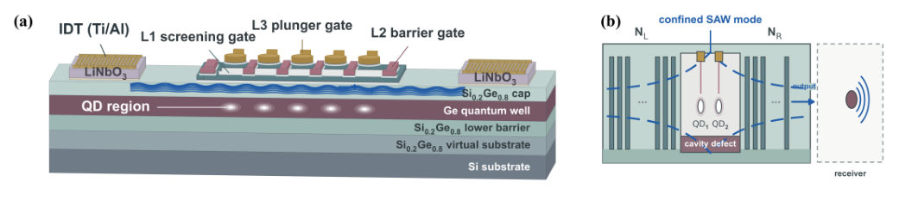 
FIG. 1. (a) Schematic of a SAW traveling through a multidot device, comprising two LiNbO3-based IDTs with voltages VIDT integrated with a layered Si/SiGe/Ge heterostructure. In our simulations, quantum dots are defined within the Ge quantum well and controlled by a screening gate, six barrier gates and five plunger gates. The blue wavefronts indicate the SAW launched by the IDTs. (b) Schematic of a shared phononic-crystal (PnC) cavity containing two quantum dots within the central defect region. The two dots couple to the same confined SAW mode. The left and right mirrors contain NL and NR cells, respectively, with NL &gt; NR. They confine the mode and preferentially direct acoustic output...

📷 Fig 2

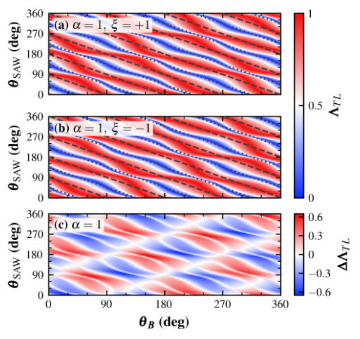 
FIG. 2. Longitudinal/co-rotating-transverse composition of the acoustic g-matrix modulation for the two propagation branches. The color map shows the transverse-longitudinal mixing parameter ΛTL,ξ defined in Eq. (8). It is plotted as a function of the acoustic axis θSAW and the magnetic field angle θB. The calculation uses the 2 GHz FEM strain field for a circular quantum dot, α = 1. Panels (a) and (b) cor- respond to ξ = +1 and ξ = −1, respectively. The straight dashed and dotted grey lines in (a) and (b) are guides to the eye for this dominant fitted fourfold harmonic. The weaker harmonics produce the deviations of the numerical texture from these guides. (c) shows the branch difference...

📷 Fig 3

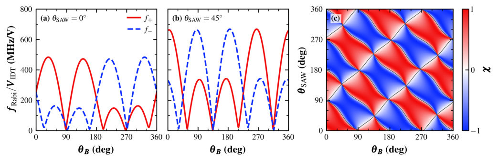 
FIG. 3. FEM-derived directional transverse coupling and chirality. (a,b) Resonant Rabi frequencies f± ≡fT,ξ=±1 per applied IDT voltage versus θB at 2 GHz, using the directly calculated θSAW = 0◦FEM field and its rotated θSAW = 45◦counterpart, respectively. (c) Chirality χ = (f 2 + −f 2 −)/(f 2 + + f 2 −) of Eq. (7) as a function of θB and θSAW. Black contours denote χ = 0, that is, equal coupling of the two propagation directions, and not a vanishing absolute Rabi frequency.

📷 Fig 4

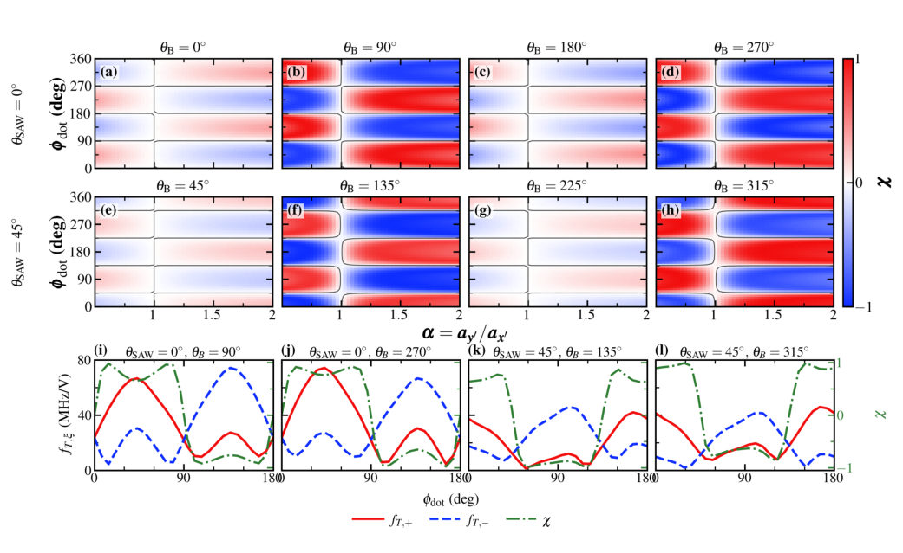 
FIG. 4. FEM-calculated chirality and direction-resolved transverse coupling under electrostatic reshaping of the dot. (a-d) χ as a function of the fixed-area aspect ratio α = ay′/ax′ and dot orientation ϕdot, for θSAW = 0◦and θB = 0◦, 90◦, 180◦, and 270◦, respectively. (e-h) Corresponding maps for θSAW = 45◦and θB = 45◦, 135◦, 225◦, and 315◦. Red and blue denote positive and negative chirality, respectively, and the grey contours indicate χ = 0. (i-l) One-dimensional cuts at α = 2 through panels (b), (d), (f), and (h), respectively, showing fT,+ (red solid), fT,−(blue dashed), and χ (green dash-dotted) as ϕdot varies over one non-redundant 180◦period. The transverse rates are quoted per...

📷 Fig 5

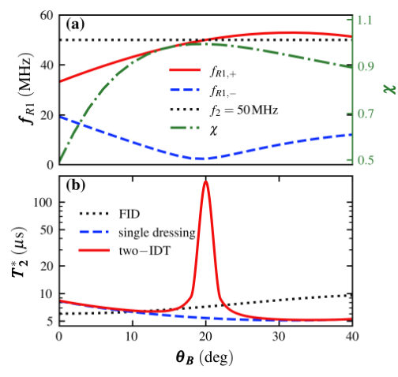 
FIG. 5. Chirality-assisted bichromatic coherence protection. (a) Primary Rabi frequencies fR1,+ and fR1,−for the two reciprocal propagation branches, together with the chirality χ, as functions of θB. The horizontal reference fixes f2 = 50 MHz. The acoustic controls are calibrated only at θB = 20◦, where the bright-branch splitting satisfies fR1,+ = f2 while the reciprocal branch is nearly dark. (b) Coherence times T ∗ 2,m for bare free induction (m = 0), single dressing (m = 1), and bichromatic dressing (m = 2), evaluated with the same noise and relaxation model. Frequencies, powers, propagation directions, and acoustic geometry are held fixed throughout the angular scan.

**Summary.** This paper theoretically models the interaction between hole-spin qubits and surface acoustic waves (SAWs) using a detailed Hamiltonian approach. It introduces the concept of 'spin-acoustic chirality' to quantify how the direction of the SAW affects the qubit's spin dynamics. The results show that this coupling is highly tunable via external electric and magnetic fields, offering a pathway for coherent quantum control using acoustic phonons.

**Why it may be interesting.** This work provides a concrete, physically tunable mechanism for coupling solid-state qubits to acoustic phonons, which is crucial for developing scalable quantum memories and gates using phononics.

Detailed structure

**Main problem.** The paper develops a unified description linking classical acoustic chirality to quantum anisotropy in hole-spin qubits driven by surface acoustic waves (SAWs). It aims to understand how counterpropagating SAWs differentially couple to the qubit spin.

**Main result.** The coupling strength and directional chirality are tunable by electrostatic gating and magnetic field orientation, allowing for precise control over longitudinal versus transverse qubit driving components.

**Method.** The authors combine a microscopic Luttinger-Kohn Hamiltonian with Bir-Pikus strain theory and 3D finite-element simulations to derive the acoustic g-matrix modulation.

**Model / system.** The system involves gate-defined hole spins in a quantum well coupled to Rayleigh-type surface acoustic waves. The theoretical framework uses the LKBP model to describe strain-mediated coupling to the qubit's g-matrix.

**Key observables.** Acoustic chirality ($\chi$), directional balance ($\Lambda_{TL,\xi}$), and the modulation of the qubit g-matrix components.

**Important parameters / regimes.** Acoustic wave frequency (e.g., 2 GHz), magnetic field orientation ($	heta_B$), and SAW propagation angle ($	heta_{SAW}$).

**Assumptions / limitations.** The derivation relies on projecting the full six-band LKBP Hamiltonian onto the lowest Zeeman-split doublet and uses leading-order approximations in HH-LH mixing.

**Figures summary.** Figures schematically illustrate the SAW path through the device structure and the coupling of two quantum dots to a confined SAW mode.

**Paper structure.** The paper progresses from defining the physical setup and the microscopic Hamiltonian (LKBP model) to deriving the strain-induced g-matrix modulation. It then quantizes this interaction, analyzing the resulting anisotropic Rabi coupling components, and finally discusses control mechanisms via gating and magnetic fields.

Abstract

Gate-defined hole spins combine strong spin-orbit coupling with exceptional strain sensitivity, making surface acoustic waves a natural route to remote, phase-coherent control. We show that counterpropagating surface acoustic waves can differ in coupling strength and in whether they predominantly drive spin rotations or modulate the qubit frequency. We call the transverse transition-strength imbalance spin-acoustic chirality and show that it is tunable through gate-controlled reshaping of the dot confinement. Combining a multiband Luttinger-Kohn Hamiltonian with the Bir-Pikus description of strain and 3D piezoelectric finite-element simulations, we obtain the acoustic g-matrix modulation governing coherent SAW driving. Quantizing the same strain-mediated interaction yields the corresponding single-phonon coupling, and a generalized anisotropic Rabi interaction with co-rotating, counter-rotating, and longitudinal components, linking classical chirality to quantum anisotropy and directional one-phonon emission. Magnetic field orientation and dot shape tune the acoustic chirality and operator selectivity. We illustrate this framework through bichromatic coherence protection and phonon-mediated heralded Bell-state initialization.

[↑ back to top](#top)

### [Conditions for the Emergence of Spontaneous Phonon Frequency Combs from Anharmonic Potentials](http://arxiv.org/abs/2609.17707v1)

**Authors:** Jayakrishnan SS, Mayanak K Gupta, Dipanshu Bansal  
**Type:** theory · **Category:** other · **PDF:** <https://arxiv.org/pdf/2609.17707v1>  
**Analysis basis:** full PDF text, analyzed in chunks
**Topic relevance:** `Keldysh / 2PI / non-Gaussian methods` **1/5** · `analog quantum simulation` **1/5** · `correlated / nonlocal dissipation` **1/5** · `driven-dissipative phase transition` **1/5** · `methods for driven-dissipative` **1/5** · `non-equilibrium universality` **1/5**

📷 Fig 1

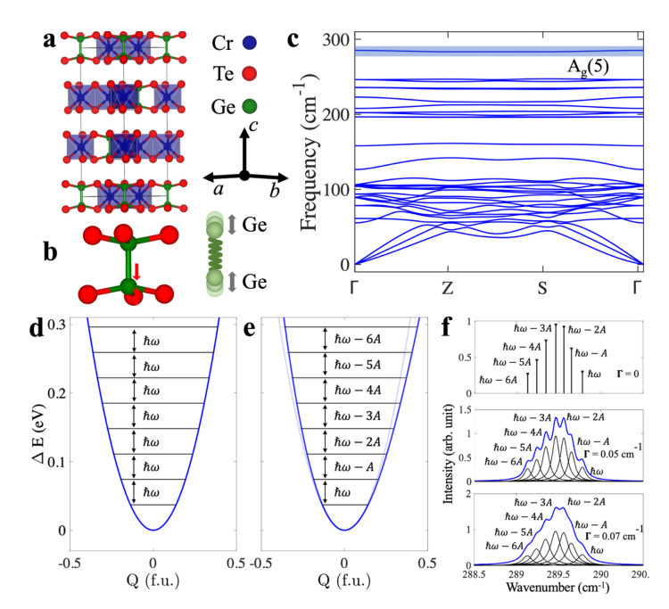 
FIG. 1. (a) Crystal structure of CrGeTe3 showing CrTe6 octahedra in light blue. (b) The phonon

📷 Fig 2

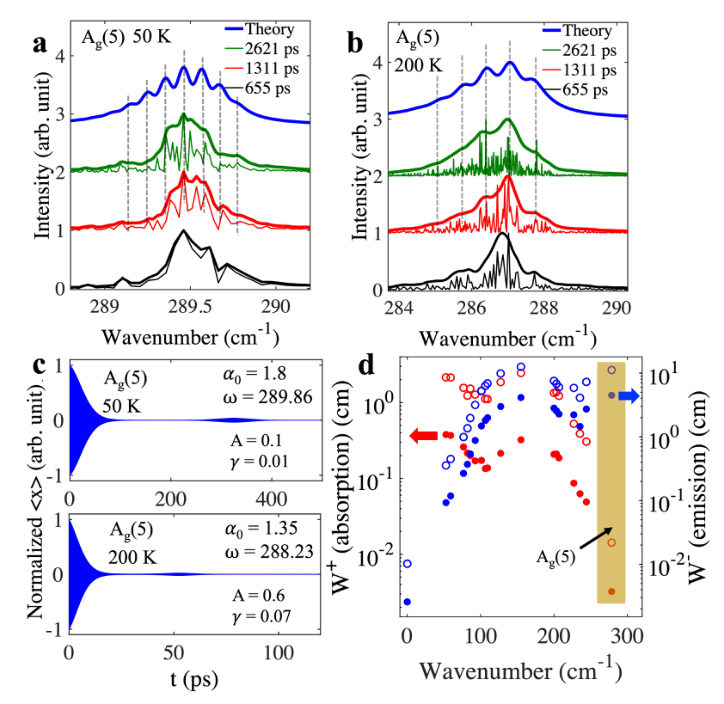 
FIG. 2. (a) Comb-like features of the Ag(5) mode of CrGeTe3 as obtained by calculating SED from

📷 Fig 3

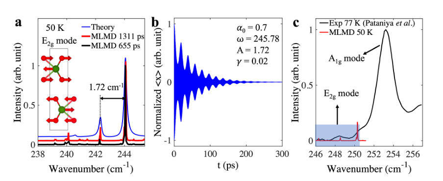 
FIG. 3. (a) Frequency combs of the E2g mode of WSe2 as obtained by calculating SED of zone-

📷 Fig 4

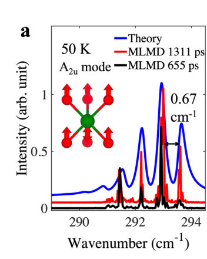 
FIG. 4. (a,b) Same as Fig. 3(a,b) but for the A2u mode of WSe2.

📷 Fig 5

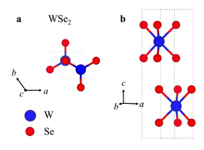 
FIG. 5. (a,b) Crystal structure of WSe2 from different views. Blue and red denote W and Se

**Summary.** This work explores the theoretical conditions required for phonons to spontaneously generate frequency combs in the THz regime, a phenomenon rarely observed. By simulating van der Waals solids like WSe2, the authors determined that strong anharmonicity from self-interaction and minimal phonon scattering are crucial for clear comb signatures. This provides a pathway for engineering stable, high-frequency vibrational energy sources.

**Why it may be interesting.** The focus on anharmonic lattice dynamics and the engineering of coherent vibrational states connects to open quantum systems and quantum optics, particularly in understanding energy quantization in solid-state environments.

Detailed structure

**Main problem.** The paper investigates the rare spontaneous formation of phonon frequency combs in the high-frequency GHz-THz regime, moving beyond experimentally observed nonlinear driving regimes.

**Main result.** Spontaneous comb formation requires two key conditions: strong anharmonicity from intramolecular self-interaction and limited phonon scattering channels, which were demonstrated in WSe2.

**Method.** The study employs machine-learning-augmented molecular dynamics simulations to calculate spectral energy density and analyze phonon scattering phase space.

**Model / system.** The primary systems are van der Waals solids like CrGeTe3 and WSe2. The analysis models phonon interactions using anharmonic potentials and calculates scattering phase space integrals.

**Key observables.** Phonon frequency combs (series of evenly spaced spectral lines), spectral energy density (SED), and anharmonicity ratios (k3/k2, k4/k2).

**Important parameters / regimes.** Comb spacing ($\sim 0.1$ to $1.7 	ext{ cm}^{-1}$), phonon linewidth ($\Gamma$), and temperature (50 K to 200 K).

**Assumptions / limitations.** The initial comb features observed in CrGeTe3 are attributed to isotopic mass distribution rather than true comb formation; the analysis relies on identifying conditions that overcome finite phonon linewidths.

**Figures summary.** Figures illustrate crystal structures, mode vibrations, dispersion relations, and spectral broadening effects, comparing harmonic vs. anharmonic potentials.

**Paper structure.** The paper first addresses the challenge of spontaneous comb formation, analyzing CrGeTe3's isotopic effects, then establishes the necessary physical conditions (anharmonicity and low scattering) using WSe2 as a model, and concludes with detailed calculations confirming comb formation in WSe2's E2g and A2u modes.

Abstract

Phononic frequency combs have been demonstrated experimentally and theoretically in the kHz-MHz regime under nonlinear driving; however, their spontaneous formation in the GHz-THz regime remains rare. We investigate the spontaneous formation of frequency combs in van der Waals solid CrGeTe$_3$, where combs of spacing $\sim$2 cm$^{-1}$ were experimentally proposed to occur in a flat phonon mode but are now reported to originate from isotopic distribution. Our spectral energy density calculations using machine-learning-augmented molecular dynamics simulations show comb-like features with reduced spacings of $\sim$0.1 and 0.6 cm$^{-1}$ in the same mode at 50 and 200 K. However, the spacings of the comb-like features are comparable to the phonon linewidth, making precise identification of the frequency comb challenging. From a comprehensive analysis of different modes of CrGeTe$_3$, we identified two conditions to distinctively observe the combs beyond the experimental resolution: (i) an intramolecular or isolated mode with reasonably large third- or higher-order anharmonicity from phonon self-interaction and (ii) limited phonon scattering channels. Our analysis of other van der Waals solids highlighted that these conditions are met for the nearly flat intramolecular $E_{2g}$ and $A_{2u}$ phonon modes of WSe$_2$. The detailed calculations showed the formation of a spontaneous frequency comb with spacings of 1.7 and 0.67 cm$^{-1}$ from coherent superposition of four and five-phonon eigenstates in the $E_{2g}$ and $A_{2u}$ phonon modes, respectively. Available Raman scattering data of the $E_{2g}$ mode in the literature provide preliminary, if not conclusive, evidence of comb formation. Our findings offer a deeper understanding and open avenues for engineering long-lived phononic frequency combs for various practical applications.

[↑ back to top](#top)

### [Experimental assessment of the Wiedemann-Franz law in thin metal films using thermoreflectance and electrical measurements](http://arxiv.org/abs/2609.17990v1)

**Authors:** Zhiwei Deng, Jinlong Ma, Puqing Jiang  
**Type:** experiment · **Category:** other · **PDF:** <https://arxiv.org/pdf/2609.17990v1>  
**Analysis basis:** full PDF text, analyzed in chunks
**Topic relevance:** `analog quantum simulation` **1/5** · `quantum measurements` **1/5**

📷 Fig 1

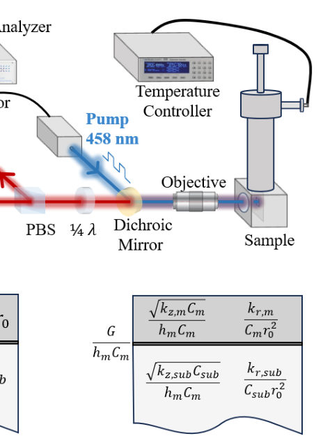 
FIG. 1. (a) Schematic of the SPS experimental setup. (b) Two-layered sample structure with key parameters involved in thermal measurements.

📷 Fig 2

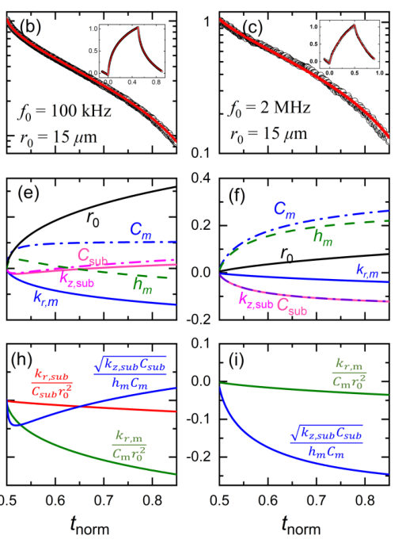 
FIG. 2. Representative multi-frequency SPS measurement of the e-beam-evaporated Al film on fused silica. (a–c) Normalized periodic waveforms (symbols) and best fits (curves) at 2 kHz, 100 kHz, and 2 MHz (𝑟0 = 15.0 𝜇m). (d–f) Sensitivity coefficients for individual parameters corresponding to the three measurement conditions in (a)–(c). (g–i) Sensitivity coefficients for the combined parameters defined in Eq. (1) under the same conditions. The distinct frequency-dependent sensitivities allow simultaneous extraction of 𝑘𝑟,𝑠𝑢𝑏 (2 kHz), 𝑘𝑟,𝑚 (100 kHz), and 𝐶𝑚 (2 MHz).

📷 Fig 3

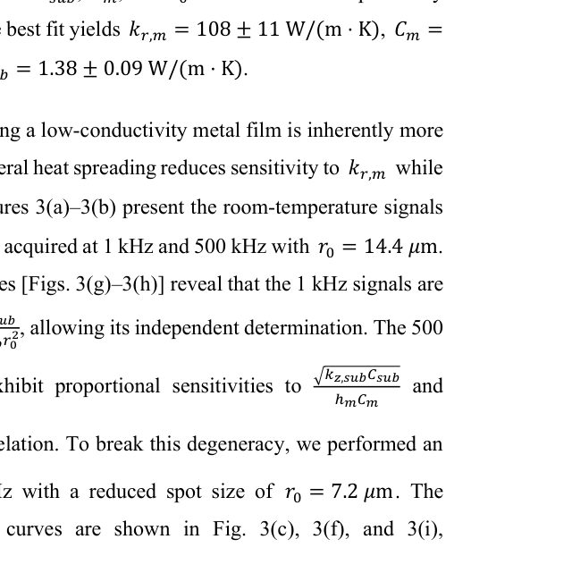 
Figure 3(e) shows that the second dataset (the 500 kHz measurement with the

📷 Fig 4

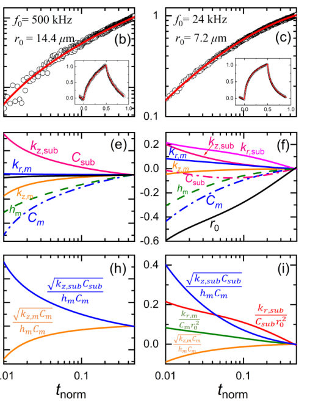 
FIG. 3. Representative multi-frequency SPS measurement of the magnetron-sputtered Ta film on fused silica. (a–c) Normalized periodic waveforms at 1 kHz, 500 kHz (𝑟0 = 14.4 𝜇m), and 24 kHz (𝑟0 = 7.2 𝜇m). (d–f) Sensitivity coefficients for individual parameters corresponding to the three measurement conditions in (a)–(c). (g–i) Sensitivity coefficients for the combined parameters defined in Eq. (1) under the same conditions. The 1 kHz data determine 𝑘𝑟,𝑠𝑢𝑏; the 500 kHz and 24 kHz data are jointly fitted under the isotropy assumption to extract 𝑘𝑚 and 𝐶𝑚.

📷 Fig 5

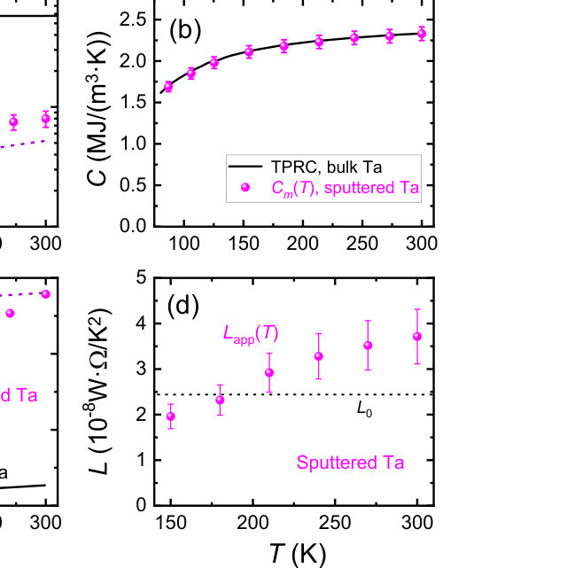 
FIG. 6. Temperature-dependent transport properties of the magnetron-sputtered Ta film: (a) thermal conductivity 𝑘𝑚, (b) volumetric heat capacity 𝐶𝑚, (c) electrical resistivity 𝜌, and (d) apparent Lorenz number 𝐿app calculated using 𝜌meas(𝑇). Solid curves in (a), (b), and (c) represent bulk references42, 44, 47. The dashed curve in (a) shows the WF-based estimates calculated using 𝜌model(𝑇) = 𝜌bulk(𝑇) + 𝜌0, while the dashed curve in (c) corresponds to 𝜌model(𝑇) itself.

**Summary.** This experimental work characterizes the thermal transport properties of thin metal films using combined thermoreflectance and electrical measurements. The authors find that the Wiedemann-Franz law, which relates thermal and electrical conductivity, breaks down significantly for highly disordered or resistive films compared to bulk predictions. The findings provide critical guidelines for accurately modeling heat transfer in microelectronic materials.

**Why it may be interesting.** While focused on solid-state thermal physics, the rigorous comparison of transport coefficients and the identification of systematic deviations from a fundamental law like WF can inform models of energy dissipation in nanoscale electronic devices, which has relevance to open quantum systems modeling.

Detailed structure

**Main problem.** The paper addresses the need for accurate thermal property determination in metal thin films, which is crucial for microelectronic thermal modeling and interpreting thermoreflectance measurements.

**Main result.** The measured thermal conductivity ($k_m$) deviates significantly from estimates based on the Wiedemann-Franz law ($k_{WF}$), particularly for highly resistive films like sputtered Ta, demonstrating the law's limitations in these regimes.

**Method.** The study combines Square-Pulsed Source (SPS) thermoreflectance measurements with independent van der Pauw electrical measurements to characterize thermal and electrical transport.

**Model / system.** The physical system involves thin metal films (Al, Ti, Ta) deposited via various methods. The analysis compares direct measurements of thermal conductivity ($\kappa_m$) against estimates derived from the Wiedemann-Franz law, which relates thermal and electrical transport.

**Key observables.** Measured thermal conductivity ($k_m$), volumetric heat capacity ($C_m$), apparent Lorenz number ($L_{app}$), and the comparison ratio $k_m / k_{WF,model}$.

**Important parameters / regimes.** Temperature range (80 to 300 K), deposition method (thermal evaporation, e-beam, sputtering), and the Sommerfeld Lorenz number ($L_0$).

**Assumptions / limitations.** The primary assumptions tested are the applicability of the bulk Wiedemann-Franz law and the model used for resistivity ($
ho_{model}(T)$).

**Figures summary.** Not specified (Bibliography chunk provided, no figure descriptions).

**Paper structure.** The paper introduces the problem of thermal characterization, details the combined SPS/van der Pauw measurement technique, compares the measured thermal properties against WF predictions, and concludes by providing practical guidance on the law's applicability.

Abstract

Accurate thermal properties of metal thin films are essential for microelectronic thermal modeling and for interpreting thermoreflectance measurements when signals are sensitive to film thermal transport. In practice, film thermal conductivity is commonly inferred from electrical resistivity via the Wiedemann-Franz (WF) law with the Sommerfeld-Lorenz number L_0, neglecting phonon contributions and microstructure-dependent scattering. Here, we combine square-pulsed source (SPS) thermoreflectance with van der Pauw measurements to characterize thermal and electrical transport in Al, Ti, and Ta thin films prepared by thermal evaporation, e-beam evaporation, and magnetron sputtering. SPS measurements from 80 to 300 K yield the film thermal conductivity k_m and volumetric heat capacity C_m, with C_m agreeing with bulk values within +/-8%. Compared with WF-based estimates using L_0 and a modeled resistivity, \r{ho}_model (T)=\r{ho}_bulk (T)+\r{ho}_0, k_m deviates by 5-20% for Al and Ti and up to 40% for sputtered Ta at 300 K. While the smaller deviations are comparable to experimental uncertainty, the large mismatch for Ta demonstrates the limitation of applying the bulk L_0 to highly resistive metal films. Apparent Lorenz numbers L_app=k_m \r{ho}_meas/T from 150 to 300 K further reveal that deposition-induced disorder, grain-boundary scattering, and possible phase-related effects can modify the correlation between heat and charge transport in thin metal films. These results clarify the applicability of the WF law to deposited metal thin films and offer practical guidance for thermal modeling and thermoreflectance analysis.

[↑ back to top](#top)

### [Tuneable terahertz transitions in zigzag graphene nanoribbons](http://arxiv.org/abs/2609.18340v1)

**Authors:** R. R. Hartmann, M. E. Portnoi  
**Type:** theory · **Category:** other · **PDF:** <https://arxiv.org/pdf/2609.18340v1>  
**Analysis basis:** full PDF text, analyzed in chunks
**Topic relevance:** `analog quantum simulation` **1/5** · `interference shaping light` **1/5**

📷 Fig 1

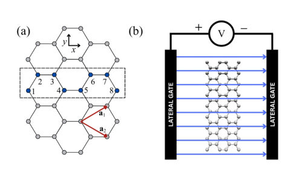 
FIG. 1. (a) The atomic structure of a zigzag graphene nanoribbon, N atoms wide, is shown. Such a nanoribbon is commonly referred to as a (N/2)-ZGNR, where N/2 is the number of zigzag carbon chains across the ribbon’s width. The carbon atoms in the unit cell are numbered, and the primitive lattice vectors of graphene, a1 and a2, are indi- cated, together with the two inequivalent atoms belonging to the A and B sublattices that form the honeycomb lattice. (b) Schematic of the experimental geometry used to apply an in-plane electric field transverse to the nanoribbon axis.

📷 Fig 2

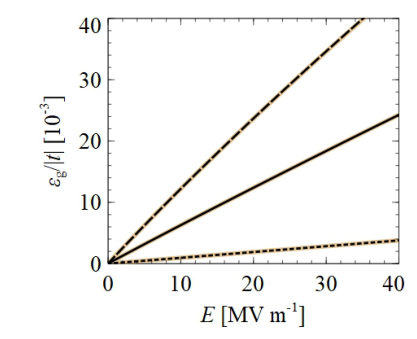 
FIG. 3. Edge-state gap εg as a function of the transverse electric-field strength. The numerical results are shown in gold. From top to bottom, the black curves correspond to the 20-ZGNR (long-dashed), 10-ZGNR (solid), and 2-ZGNR (short-dashed). The results for the 10- and 20-ZGNRs are obtained from the analytical dispersion in Eq. (2), while the exact analytical result for the 2-ZGNR is derived in End Mat- ter, Appendix B.

📷 Fig 3

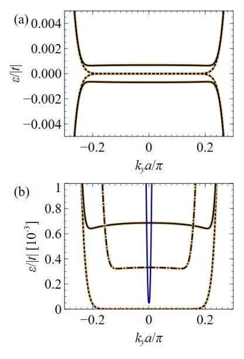 
FIG. 2. (a) Energy spectrum of a 20-ZGNR in the absence (dashed black curve) and presence (solid black curve) of a transverse electric field of strength 106 V m−1. (b) Enlarged view of the positive-energy region, showing the spectra of 2- , 10-, and 20-ZGNRs under the same applied field, together with the zero-field spectrum of the 20-ZGNR for reference. For the 10- and 20-ZGNRs, the numerical results (solid and dash-dotted black curves) are compared with the analytical dispersion given by Eq. (2) (gold curves). The 2-ZGNR spec- trum is obtained from the exact analytical result derived in End Matter, Appendix B (dark-blue curve).

📷 Fig 4

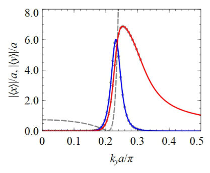 
FIG. 4. Optical matrix elements for transitions across the edge-state gap in a 20-ZGNR as functions of the longitudinal wavevector ky. The red and blue curves show |⟨x⟩|/a and |⟨y⟩|/a, respectively, where |⟨x⟩| = |⟨ψf|ˆx|ψi⟩| and |⟨y⟩| = |⟨ψf|ˆvy|ψi⟩|/ω. These correspond to light polarized transverse and parallel to the ribbon axis, respectively, with ℏω = εf −εi. The open circles show the results obtained from the analytical expressions and are plotted over the range in which the states remain edge-localized. The grey dashed line shows the shifted energy spectrum, allowing one to identify the values of ky corresponding to the strongest transitions.

📷 Fig 5

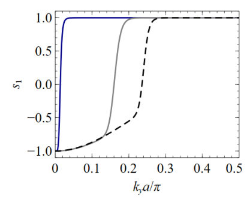 
FIG. 5. Normalized Stokes parameter s1 for linearly polarized excitation as a function of the longitudinal wavevector ky. The leftmost blue, middle grey, and rightmost dashed black curves correspond to the 2-, 10-, and 20-ZGNRs, respectively. The limits s1 = 1 and s1 = −1 correspond to purely x- and y-polarized transitions, respectively. The transverse electric- field strength is 1 MV m−1.

**Summary.** This theoretical study demonstrates that applying a transverse electric field to zigzag graphene nanoribbons opens a tunable band gap in the THz range. This field breaks symmetry, enabling polarization-selective optical transitions. The resulting phenomena, including a circular photogalvanic response, suggest zGNRs are promising platforms for compact, tunable THz emitters.

**Why it may be interesting.** The strong dependence of optical selection rules on external fields and the resulting tunable THz emission mechanism make this highly relevant for quantum optics and open quantum systems research.

Detailed structure

**Main problem.** The paper investigates how applying a transverse electric field to zigzag graphene nanoribbons (zGNRs) can open a tunable band gap in the terahertz (THz) range, enabling novel optical transitions.

**Main result.** The electric field breaks the ribbon's reflection symmetry, leading to a gap that scales linearly with the field strength. This allows for tunable THz emission and the generation of a circular photogalvanic response.

**Method.** The analysis uses a nearest-neighbour $\pi$-orbital tight-binding model solved via the transfer-matrix method and perturbation theory to calculate optical transition matrix elements.

**Model / system.** The system is a zigzag graphene nanoribbon (zGNR) modeled by a tight-binding Hamiltonian. The effect of the transverse electric field is introduced as a symmetry-breaking perturbation.

**Key observables.** Tunable band gap ($\epsilon_g$), polarization anisotropy ($s_1$), and helicity-resolved transition strengths.

**Important parameters / regimes.** Transverse electric field strength ($E$), excitation frequency ($\omega$), and ribbon width ($N$).

**Assumptions / limitations.** The analysis relies on the nearest-neighbour $\pi$-orbital tight-binding model and uses approximations for large $N$ and specific limits for perturbation theory.

**Figures summary.** Figures illustrate the opening of the gap ($\epsilon_g$ vs. $E$), the polarization anisotropy ($s_1$ vs. $k_y$), and the selective excitation of carriers using circularly polarized light.

**Paper structure.** The paper progresses from establishing the gap opening due to symmetry breaking, to analyzing polarization anisotropy, and finally demonstrating the helicity selectivity leading to a circular photogalvanic response for THz emission.

Abstract

We show that a transverse electric field applied to a zigzag graphene nanoribbon opens a band gap whose energy can be tuned through the terahertz (THz) range. The field breaks the reflection symmetry of the ribbon, allowing optical transitions that are forbidden in its absence. The relative strengths of transitions polarized parallel and transverse to the ribbon depend strongly on excitation frequency and become equal at a particular frequency. At this frequency, each helicity selectively excites carriers in only one of the two field-induced edge-state valleys, with the selected valley reversed for the opposite helicity. Since this excitation occurs away from the valley minima, the photoexcited carriers have finite group velocity, giving rise to a circular photogalvanic response. Van Hove singularities enhance radiative recombination at the band edge, providing a route towards compact, tunable THz emitters.

[↑ back to top](#top)

### [Two-Parameter Family of Nonlinear Dirac Equations With Scalar-Scalar plus Vector-Vector Interactions](http://arxiv.org/abs/2609.18170v1)

**Authors:** Avinash Khare, Fred Cooper, John F. Dawson, Avadh Saxena  
**Type:** theory · **Category:** other · **PDF:** <https://arxiv.org/pdf/2609.18170v1>  
**Analysis basis:** full PDF text, analyzed in chunks
**Topic relevance:** `Keldysh / 2PI / non-Gaussian methods` **1/5** · `analog quantum simulation` **1/5**

📷 Fig 1

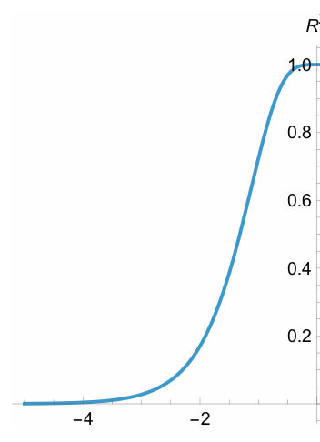 
FIG. 1. Plot of the charge density ρ(x, ω0) for κ = 1, p = 3, and ω0 = 1/3 .

📷 Fig 2

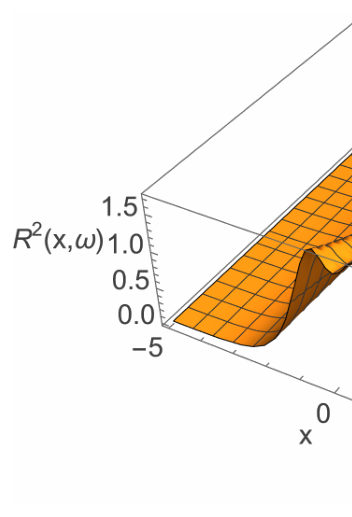 
FIG. 2. Plot of the charge density ρ(x, ω) for κ = 1 and p = 3.

📷 Fig 3

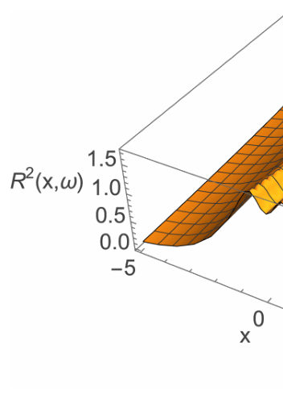 
FIG. 3. Plot of the charge density ρ(x, ω) for κ = 5 and p = 3.

📷 Fig 4

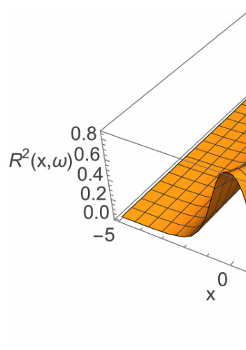 
FIG. 4. Plot of the charge density ρ(x, ω) for κ = 1 and p = 3/4.

📷 Fig 5

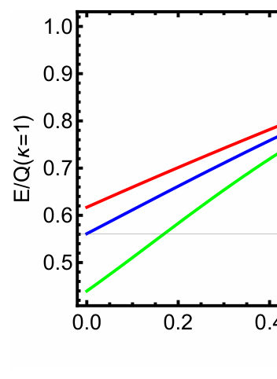 
FIG. 5. Plot of E/Q (κ = 1, ω, p) for p = 1/5 (red), p = 1 (blue), and p = 5 (green).

**Summary.** This theoretical paper derives exact solitary wave solutions for a nonlinear Dirac equation featuring combined scalar-scalar and vector-vector interactions. Key findings include the independence of the energy-to-charge ratio from the coupling strength and a detailed analysis of how the wave profile transitions between single and double humps based on system parameters. The work concludes by examining the stability of these solutions in the non-relativistic limit.

**Why it may be interesting.** The study of nonlinear wave equations, particularly those derived from Dirac equations, is fundamental in quantum field theory and condensed matter physics, providing insights into stable localized structures (solitons).

Detailed structure

**Main problem.** The paper aims to find exact solutions for a two-parameter family of nonlinear Dirac equations incorporating both scalar-scalar (SS) and vector-vector (VV) interactions.

**Main result.** The ratio of energy to charge ($E/Q$) for the solitary wave solutions is found to be independent of the coupling constant $g$, and the existence of bound states is analyzed based on this ratio.

**Method.** The methodology involves seeking stationary solitary wave solutions ($\psi(x,t) = e^{-i\omega t} \psi(x)$) and analyzing the resulting conserved quantities (Energy $E$ and Charge $Q$).

**Model / system.** The model is a Nonlinear Dirac Equation (NLDE) with an interaction Lagrangian $L_I$ containing terms proportional to $(ar{\psi}\psi)^{\kappa+1}$ (SS) and $(ar{\psi}\gamma_\mu\psi ar{\psi}\gamma_\mu\psi)^{\kappa+1}$ (VV).

**Key observables.** Charge ($Q$), Energy ($E$), and the ratio $E/Q$, which determines the existence of bound states ($E/Q < m$).

**Important parameters / regimes.** The nonlinearity parameter $\kappa$, the interaction parameter $p$, the frequency $\omega$, and the mass $m$.

**Assumptions / limitations.** The analysis assumes the existence of stationary solutions of the form $\psi(x, t) = e^{-i\omega t} \psi(x)$, and later, a non-relativistic approximation is used for stability analysis.

**Figures summary.** Figures illustrate the transition between double and single hump solitary wave profiles based on $\kappa p$, and plot the $E/Q$ ratio versus $\omega$ for various parameter choices.

**Paper structure.** The paper follows a structure of deriving the solutions, analyzing their properties (including $E/Q$ and hump shape), and concluding with a non-relativistic reduction to a modified NLSE to discuss stability.

Abstract

We obtain exact solutions of the nonlinear Dirac equation in $1+1$ dimensions of the form $ψ(x,t) = e^{-iωt} ψ(x)$ for scalar-scalar (SS) plus vector-vector (VV) interaction with interaction Lagrangian given by $$L_{I} = \frac{g^2}{κ+1}[(\barψ ψ)^{κ+1} +\frac{1}{p} (\barψ γ_μψ\barψ γ^μ ψ)^{κ+1}]$$ where $p > 0$ but arbitrary otherwise. We look for solutions with $0 < ω< m$ where $ω, m$ are frequency and mass, respectively. We find solutions for all values of $ω$ in this range. We compute the charge $Q$ and the energy $E$ for each of the solitary wave solutions and explore the region in the ($p, κ$) parameter space in which solitary wave bound states exist (i.e., for which $E/Q < m$). We show that for all the cases while both $E$ and $Q$ depend on the coupling constant $g$, their ratio $E/Q$ is independent of $g$. We further find that in case $pκ\le 1$, the charge density for all the solitary waves have only single hump while for $p κ> 1$ there is a transition from double to single hump and we determine it as a function of $ω/m$. We notice that for all $p$ there is a transition at $κ=2$ in the behavior of $E/Q$ as a function of $ω$ which we speculate is related to the onset of instability of the solutions at $κ=2$. We obtain the nonrelativistic reduction of the two-parameter family to a non-relativistic modified nonlinear Schrödinger equation (NLSE) and discuss the stability of the single hump olitary waves in the domain of validity of the modified NLSE.

[↑ back to top](#top)

### Other secondary papers (6)

Show other secondary papers

### [Altermagnetic Magnons in Dipolar Nanomagnet Arrays](http://arxiv.org/abs/2609.18398v1)

**Authors:** Rhea Hoyer, Ephraim Spindler, Lukas Körber, Tobias Wagner, Mathias Weiler, Alexander Mook  
**Type:** theory · **Category:** other · **PDF:** <https://arxiv.org/pdf/2609.18398v1>  
**Analysis basis:** full PDF text, analyzed in chunks

📷 Fig 1

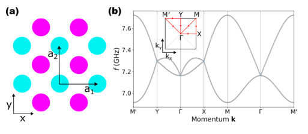 
Figure 1. (a) Antiferromagnetic nanomagnet array of circular is- lands with lattice vectors a1 and a2. (b) Magnon dispersion along a high-symmetry path; inset shows the first BZ with dashed diagonal lines marking compensating mirror symmetries. Parameters deviat- ing from Table I (End Matter) are h1 = h2 and a = 6.0 × 10−8 m.

📷 Fig 2

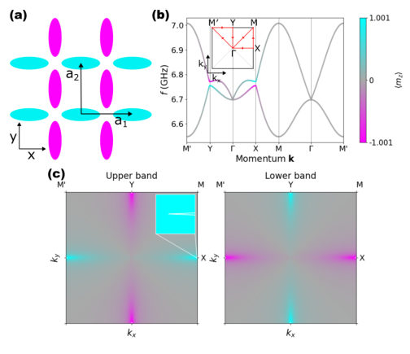 
Figure 2. (a) Altermagnetic nanomagnet array of elliptical islands and lattice vectors a1 and a2. (b) Magnon dispersion along a high- symmetry path; inset shows the first BZ with dashed diagonal lines marking compensating mirror symmetries. Color represents the spin expectation value in z direction. (c) Spin expectation value for upper and lower energy magnon bands projected onto a plane with contour lines of |⟨mz⟩| = 1 in white; inset shows more detail for the upper band at X. Parameters in Table I (End Matter).

📷 Fig 3

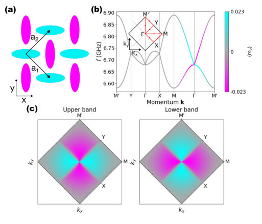 
Figure 3. (a) Altermagnetic nanomagnet array of elliptical islands with lattice vectors a1 = a (1, −1) and a2 = a (1, 1). (b) Magnon dispersion along a high-symmetry path; inset shows the first BZ with dashed diagonal lines marking compensating mirror symme- tries. Color represents the spin expectation value in z direction. (c) Spin expectation value for upper and lower energy magnon bands projected onto a plane. The from Table I differing parameter reads a = 8.5 × 10−8 m.

📷 Fig 4

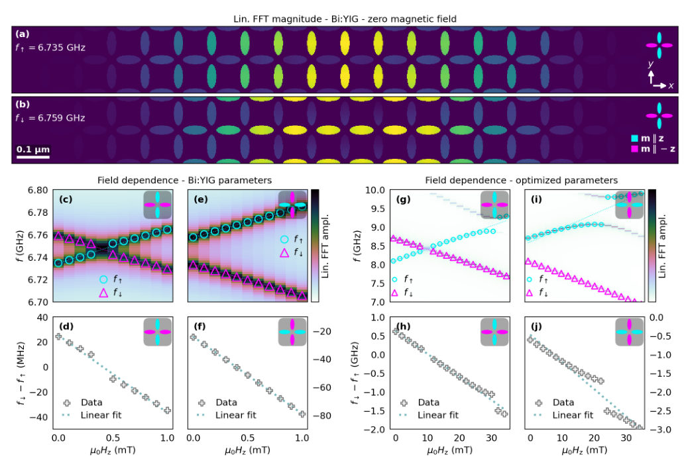 
Figure 4. Micromagnetic simulations of the synthetic altermagnetic magnon spin splitting at the BZ boundary. Spatial maps of the dynamic magnetization amplitude |mx| in zero magnetic field for (a) the f↑= 6.735 GHz mode localized on the vertical islands and (b) the f↓= 6.759 GHz mode localized on the horizontal islands. (c–f) Field dependence for the scaled Bi:YIG lattice: (c, e) color-coded FFT amplitude spectra as a function of the out-of-plane field µ0Hz for two conjugate antiferromagnetic configurations (see insets) and (d, f) the corresponding linear evolution of the frequency splitting f↓−f↑crossing zero near 0.4 mT. (g–j) Equivalent results for the optimized parameter set (10 × Ms,...

**Summary.** This paper theoretically investigates altermagnetism in nanomagnet arrays coupled by dipolar interactions, bypassing the need for spin-conserving symmetries. By modeling the system using macrospin theory and analyzing the resulting magnon bands, the authors show that characteristic d-wave spin polarization can be robustly generated. This establishes a tunable platform for anisotropic magnon transport in synthetic magnetic structures.

**Why it may be interesting.** The work provides a theoretical framework for engineering exotic magnetic functionalities (altermagnetism) in artificial lattices using only long-range dipolar interactions, which is highly relevant for designing novel quantum magnetic materials.

Detailed structure

**Main problem.** To determine if the defining signatures of altermagnetism persist in nanomagnet arrays coupled only by dipolar interactions, despite the intrinsic breaking of spin conservation.

**Main result.** The study demonstrates that dipolar nanomagnet arrays can exhibit characteristic d-wave spin polarization and spin-split magnon bands, establishing a mesoscopic realization of altermagnetic magnons beyond conventional spin-conserving models.

**Method.** The analysis employs macrospin theory, Holstein-Primakoff transformation, and Bogoliubov transformations to diagonalize the magnon Hamiltonian, supplemented by micromagnetic simulations for validation.

**Model / system.** The system is a dipolar-coupled ferromagnetic nanoisland array, modeled using a total magnetic energy Hamiltonian involving exchange, anisotropy, and dipolar interactions. The analysis focuses on the resulting magnon spectrum and spin expectation values.

**Key observables.** Magnon spin expectation value ($\langle m_{\alpha,z} 
angle$), spin-split magnon bands, and the characteristic d-wave pattern in the Brillouin zone.

**Important parameters / regimes.** Dipolar coupling strength, perpendicular magnetic anisotropy ($K$), and the geometry of the nanoislands (e.g., elliptical vs. circular).

**Assumptions / limitations.** The analysis relies on macrospin theory approximations and specific symmetry elements (e.g., inversion, glide-mirror) to analyze degeneracies and vanishing expectation values.

**Figures summary.** Figures illustrate the magnon dispersion splitting in both circular and elliptical island arrays, and show the resulting d-wave spin polarization pattern across the Brillouin zone.

**Paper structure.** The paper systematically analyzes the Hamiltonian using macrospin theory, derives the magnon spectrum, and then uses symmetry analysis (including lattice momentum sums and Bogoliubov transformations) to prove the existence and nature of the altermagnetic spin polarization.

Abstract

Altermagnetism is conventionally understood in a spin-conserving framework, where symmetry-enforced momentum-dependent spin splitting emerges in collinear magnets with vanishing net magnetization. Here, we show that its defining signatures persist in nanomagnet arrays coupled exclusively by dipolar interactions, despite the intrinsic breaking of spin conservation. Using a macrospin theory of dipolar-coupled ferromagnetic nanoislands, corroborated by micromagnetic simulations, we demonstrate that arrays engineered with altermagnetic symmetries exhibit spin-split magnon bands whose eigenstates can partially remain strongly spin polarized. The resulting spin expectation value displays the characteristic $d$-wave pattern throughout the Brillouin zone, establishing a mesoscopic realization of altermagnetic magnons beyond the conventional spin-conserving paradigm. As a consequence, spin-wave propagation becomes strongly direction dependent, providing a highly tunable platform for anisotropic magnon transport and synthetic altermagnetic functionality.

[↑ back to top](#top)

### [Chern Insulators on a Twisted Klein Bottle](http://arxiv.org/abs/2609.18189v1)

**Authors:** Rong Xiao, Y. X. Zhao  
**Type:** theory · **Category:** other · **PDF:** <https://arxiv.org/pdf/2609.18189v1>  
**Analysis basis:** full PDF text, analyzed in chunks

📷 Fig 1

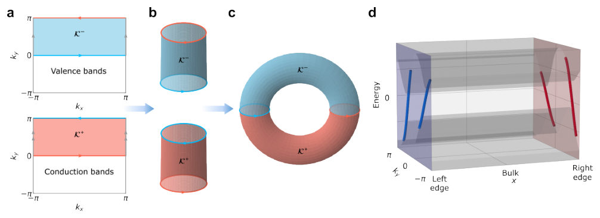 
FIG. 1. Momentum space representation of the symmetry and twisted Brillouin Klein bottle. a The valence and conduction Brillouin zones and the corresponding fundamental domains K±. b Cut the valence and conduction Klein bottles into cylinders and edge gluing rules specified by the twisting. c The torus resulting from gluing edges with the same color along the indicated directions. d Schematic illustration of edge spectra of the system in a slab geometry with C = 2. States on the left/right boundary are marked in blue/red color.

📷 Fig 2

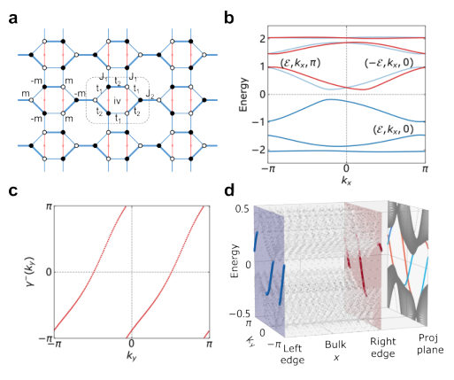 
FIG. 2. Even Chern number and unconventional chi- ral edge states. a Schematic of the tight-binding model on the two-dimensional SHO lattice. The SHO lattice bonds are shown in blue, the imaginary hopping perturbations are shown in red, and ±m denote the on-site potentials. b Cross sections of the band structure at ky = 0 and ky = π, illustrat- ing the screw-rotation symmetry in energy–momentum space. c Berry-phase flow γ−(ky). d Energy spectrum of the model in a slab geometry. The chiral states localized at the two boundaries are shown in red and blue, respectively.

**Summary.** This work introduces momentum-space nonsymmorphic chiral symmetry as a novel organizing principle for topological materials. By analyzing systems on twisted manifolds like the Klein bottle, the authors show that this symmetry allows for the existence of nonzero Chern numbers, which are constrained to be even integers. This provides a new theoretical framework for engineering topological phases and predicting robust edge states.

**Why it may be interesting.** The concept of momentum-space nonsymmorphic chiral symmetry provides a powerful, symmetry-based tool to predict and classify topological phases in condensed matter systems, extending beyond standard crystalline symmetries.

Detailed structure

**Main problem.** To establish momentum-space nonsymmorphic chiral symmetry as a new organizing principle for discovering and engineering topological phases beyond conventional crystalline classifications.

**Main result.** The presence of a twisted Klein bottle manifold, arising from chiral glide reflection, allows for nonzero Chern numbers, unlike the untwisted case, and this symmetry constrains the total Chern number to be an even integer.

**Method.** The analysis uses topological classification via twisted K-groups and computes the Chern number using flux integrals over the Brillouin torus.

**Model / system.** The study analyzes bipartite lattices exhibiting momentum-space nonsymmorphic symmetries, specifically chiral glide reflection and chiral twofold screw rotation, which are realized through the interplay of crystalline and sublattice symmetries.

**Key observables.** Nonzero, even Chern numbers ($C_K$), and chiral edge states exhibiting a glide-reflection structure in energy-momentum space.

**Important parameters / regimes.** The symmetry operators anticommute with the Hamiltonian, and the topological invariant depends critically on the twisting $	au \in H^1(M, \mathbb{Z}_2)$.

**Assumptions / limitations.** The mechanism is limited to producing factor systems valued in $\{\pm 1\}$, restricting the achievable screw rotation to a twofold rotation.

**Figures summary.** Figure 1 illustrates the momentum space reduction to a Klein bottle/dicosm and the edge gluing rules. Figure 2 shows the band structure for an SHO lattice model, detailing Berry-phase flow and edge states.

**Paper structure.** The paper introduces the concept of momentum-space nonsymmorphic chiral symmetry, derives the symmetry operators for specific lattices, calculates the topological invariant using twisted K-theory, and applies this framework to specific models (2D and 3D) to demonstrate nontrivial topology.

Abstract

Recently, momentum-space nonsymmorphic symmetries have attracted considerable attention. However, their realizations typically rely on fine-tuning hopping phases to satisfy the required projective symmetry algebras. Here, we show that such symmetry algebras arise naturally on bipartite lattices through the interplay of crystalline and sublattice symmetries. Unlike previously studied cases, these symmetry operators can anticommute with the Hamiltonian and are therefore referred to as momentum-space nonsymmorphic chiral symmetries. Although the free actions of these symmetries reduce the Brillouin torus to more elementary manifolds, the resulting manifolds are twisted in the Atiyah--Segal formalism. In particular, chiral glide reflection (screw rotation) gives rise to a twisted Klein bottle (dicosm) in two (three) dimensions, and this twisting dramatically alters the topological classification. Unlike the untwisted Klein bottle, whose nonorientability forces the Chern number to vanish, the twisted Klein bottle can host nonzero Chern numbers, corresponding to even Chern numbers on the torus. At open boundaries, the corresponding topological invariant manifests itself through chiral edge states exhibiting a glide-reflection structure in energy--momentum space. Our results establish momentum-space nonsymmorphic chiral symmetry as a new organizing principle for discovering and engineering topological phases beyond conventional crystalline classifications.

[↑ back to top](#top)

### [High-performance orbital-torque magnetic memory on the 300-mm platform](http://arxiv.org/abs/2609.18008v1)

**Authors:** Dinggui Zeng, Yang Gao, Jinyu Duan, Lei Zhao, Yuhao An, Xing He, Jintao Ke, Yonglong Ga, Shasha Wang, Zhenghui Ji, Muyuan Chen, Hengan Zhou, Xuejie Xie, Enlong Liu, Junlu Gong, Qijun Guo, Yihui Sun, Zejie Zheng, Weiming He, Xiaolei Yang, Fantao Meng, Yaohua Wang, Hongxin Yang, Delin Zhang, Yong Jiang, Wanjun Jiang, Shikun He  
**Type:** both · **Category:** other · **PDF:** <https://arxiv.org/pdf/2609.18008v1>  
**Analysis basis:** full PDF text, analyzed in chunks

📷 Fig 1

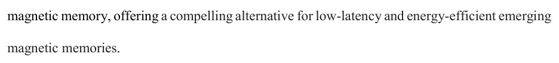 
Figure 1a illustrates the optimized pMTJ stack, in which a Ti/W bilayer serves as the orbital-

📷 Fig 2

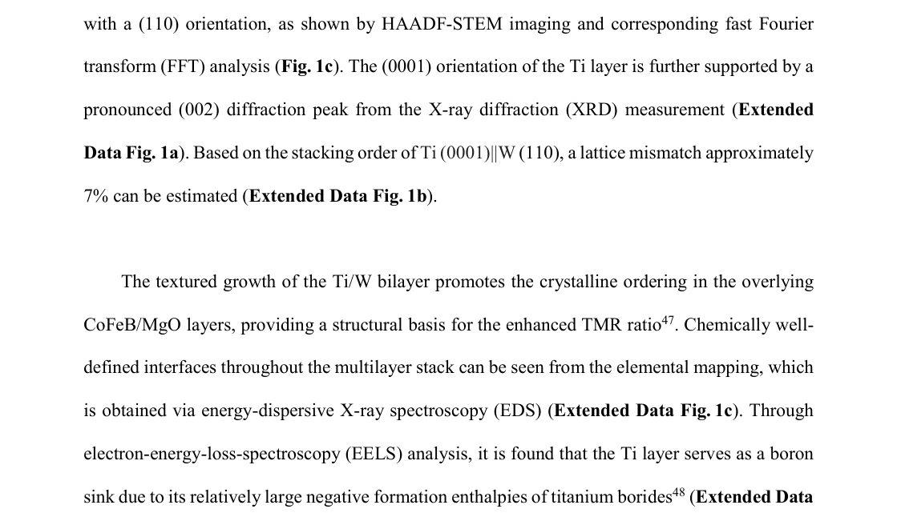 
Fig. 1d and Data Table 1). Boron removal from CoFeB facilitates the crystallization of the CoFe

📷 Fig 3

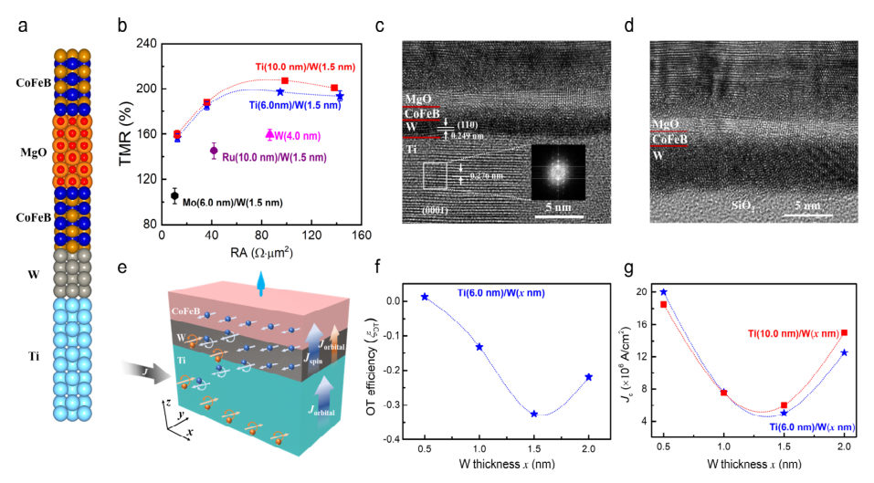 
Fig. 1 | Multilayer stacks with optimized TMR and OT efficiency. a Schematic of the Ti/W-

📷 Fig 4

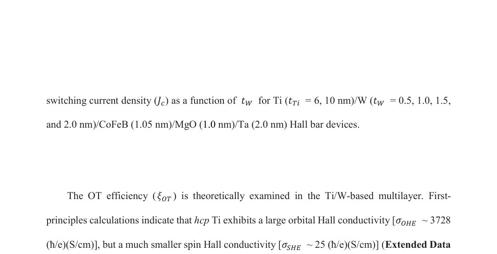 
Fig. 2c). These results support that the charge current in Ti layer generates predominantly orbital

📷 Fig 5

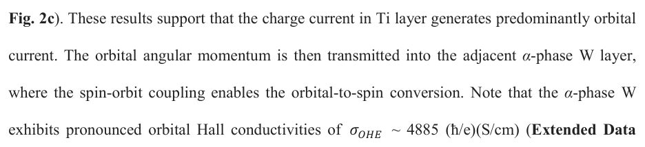 
Fig. 2d) and spin Hall conductivity 𝜎ௌுா ~ 748 (ħ/e)(S/cm), which could further promote the

**Summary.** This work presents a high-performance magnetic memory utilizing orbital-torque (OT) effects in a Ti/W bilayer structure on a large-scale 300-mm wafer. By leveraging the orbital angular momentum, the authors achieved ultra-low write energy and high TMR, offering a practical pathway for next-generation, energy-efficient memory for AI and high-performance computing.

**Why it may be interesting.** While focused on spintronics/materials science, the underlying physics involves spin-orbit coupling and emergent magnetic torques, which are crucial areas of study in condensed matter theory related to topological materials and quantum transport.

Detailed structure

**Main problem.** The paper addresses the fundamental limitations of existing memory technologies, specifically the trade-off between storage capacity, access latency, and power consumption in SOT-MRAM.

**Main result.** They demonstrate that utilizing orbital torque (OT) in a Ti/W bilayer structure enables MRAM devices with giant TMR (up to 182%), ultra-low write energy (< 0.1 pJ/bit), and high endurance.

**Method.** The research combines extensive experimental characterization (TMR measurement, ST-FMR, endurance testing) with first-principles theoretical calculations (calculating orbital and spin Hall conductivities).

**Model / system.** The physical system is an orbital-torque magnetic random-access memory (OT-MRAM) device built on a scalable 300-mm wafer platform, utilizing a pMTJ stack with a Ti/W bilayer as the orbital-current channel.

**Key observables.** TMR ratio (up to 182%), write energy (< 0.1 pJ/bit), endurance ($10^{12}$ cycles), and orbital-to-spin conversion efficiency ($\xi_{OT}$).

**Important parameters / regimes.** 300-mm wafer platform, Ti/W bilayer thickness optimization (e.g., $t_W = 1.5$ nm), and low critical switching current densities ($J_c$).

**Assumptions / limitations.** The primary assumption is that exploiting the orbital degree of freedom via the Ti/W interface can overcome the efficiency and scaling issues inherent in traditional SOT-MRAM.

**Figures summary.** Figures show wafer-scale TMR mapping, R-V loops demonstrating switching, and plots detailing the dependence of $\xi_{OT}$ and write energy on material parameters and pulse width.

**Paper structure.** The paper follows a structure of identifying the memory bottleneck, proposing the orbital-torque mechanism using Ti/W, presenting comprehensive experimental validation across read/write/endurance metrics, and supporting these findings with first-principles calculations of transport properties.

Abstract

Contemporary memory technologies are increasingly constrained by the fundamental trilemma of storage capacity, access latency, and power consumption. Among the emerging technologies, spin-orbit torque magnetic random-access memory (SOT-MRAM) shows promise to circumvent these challenges, owing to its fast switching dynamics and high endurance. However, the application of SOT-MRAM is hindered by the relatively low write and read efficiencies, resulting in a large bitcell area and an insufficient sensing margin. Meanwhile, the involvement of an ultrathin spin-source channel, typically within a few nanometers, imposes technological challenges for mass production. Here, we resolve these issues on a 300-mm wafer platform by exploiting the emerging orbital degree of freedom and the resultant orbital torque (OT) from the relatively thick Ti/W bilayer. In particular, OT memory nanodevices exhibit a giant tunnel magnetoresistance (TMR) of 182%, nanosecond-scale response, 1012 endurance, together with an enhanced switching efficiency (E_b/I_c), which consequently enables an ultra-low write energy of less than 0.1 pJ/bit. Our findings demonstrate that orbital angular momentum can be implemented for building energy-efficient MRAM devices, offering a practical pathway towards low-latency memory that is demanded for high-performance computing and AI applications.

[↑ back to top](#top)

### [Landscape geometry of Majorana zero modes in inhomogeneous superconductors](http://arxiv.org/abs/2609.18138v1)

**Authors:** Guo-Jian Qiao, Zhi-Lei Zhang, Kang Xu, C. P. Sun  
**Type:** theory · **Category:** other · **PDF:** <https://arxiv.org/pdf/2609.18138v1>  
**Analysis basis:** full PDF text, analyzed in chunks

📷 Fig 1

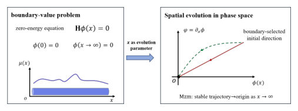 
FIG. 1. A zero-energy equation with spatially inhomogeneous pa- rameters µ(x), subject to boundary conditions, is recast as a spatial dynamical system. The physical boundary condition selects allowed initial directions in phase space, while a Majorana zero mode (Mzm) corresponds to a stable trajectory approaching the origin as x →∞.

📷 Fig 2

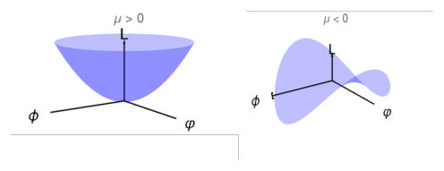 
FIG. 2. Landscape geometry across the topological phase transition. Left: For µ &gt; 0, the landscape is positive definite and has a bowl- like geometry around the origin, supporting Majorana zero modes. For µ &lt; 0, the landscape is indefinite, and the origin has a saddle geometry with stable and unstable directions, where Majorana zero modes are absent. The topological phase transition, characterized by the presence or absence of Majorana zero modes, is thus manifested as a qualitative change in the landscape geometry.

📷 Fig 3

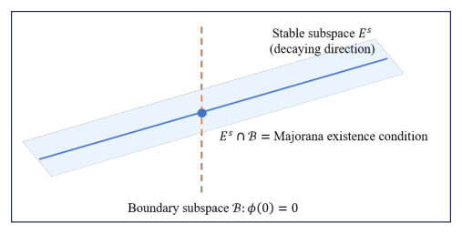 
FIG. 3. Schematic illustration of the stable subspace and boundary conditions for Majorana zero modes. The landscape inertia deter- mines the dimension of the stable subspace Es (light-blue region), while the boundary subspace B contains the physically allowed ini- tial conditions (light-yellow dashed line). Majorana zero modes cor- respond to nontrivial intersections Es ∩B.

📷 Fig 4

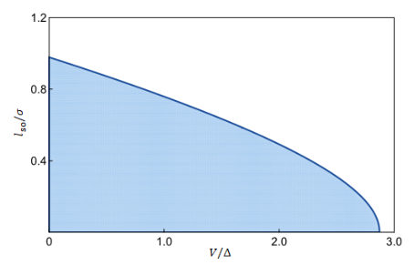 
FIG. 4. Parameter regime supporting Majorana zero modes under the landscape criterion for a Gaussian chemical-potential modula- tion. The shaded region in the (V/∆, lso/σ) plane satisfies the suf- ficient condition in Eq. (14). Its boundary is therefore a sufficient bound on the strength and spatial variation of the inhomogeneity, rather than a necessary topological phase boundary. Parameters are ∆= 0.2 meV, lso = 100 nm, µ0 = 0.2 meV, and B = 0.8 meV.

**Summary.** This paper introduces a novel real-space landscape approach to count Majorana zero modes in inhomogeneous superconductors where standard topological methods fail. By transforming the zero-energy equation into a spatial dynamical system, the authors determine the number of modes based on the geometric intersection of the system's stable subspace with the physical boundary. This provides quantitative, design-friendly criteria for realizing topological superconductivity in engineered nanowires.

**Why it may be interesting.** The development of a real-space, geometric criterion for topological features bypasses the need for global symmetry assumptions, offering a powerful, local diagnostic tool applicable to realistic, engineered superconducting devices.

Detailed structure

**Main problem.** The paper addresses the challenge of determining the existence and number of Majorana zero modes (MZMs) in superconducting devices where spatial inhomogeneity breaks the translational symmetry required for standard topological invariants.

**Main result.** A real-space landscape approach is developed, showing that the number of MZMs is determined by the intersection of the stable subspace of the associated dynamical system with the physical boundary subspace.

**Method.** The zero-energy boundary-value problem is recast as a first-order spatial dynamical system, and the existence of zero modes is analyzed using a quadratic landscape function whose geometry dictates the dimensions of the stable and unstable subspaces.

**Model / system.** The study focuses on Majorana zero modes in inhomogeneous superconductors, modeled using the Bogoliubov-de Gennes (BdG) Hamiltonian, particularly applied to 1D spinless p-wave superconductors and nanowire-superconductor systems.

**Key observables.** The number of Majorana zero modes ($N$), the landscape geometry (positive definite, indefinite), and the stable/unstable subspaces ($E_s, E_u$).

**Important parameters / regimes.** Inhomogeneity parameters like the spatial variation of the chemical potential $\mu(x)$ and the superconducting gap $\Delta$.

**Assumptions / limitations.** The analysis assumes the existence of a robust stable–unstable splitting (exponential dichotomy) and that the boundary-condition subspace intersects the stable subspace transversely.

**Figures summary.** Figures illustrate the conversion of the zero-energy equation into a dynamical system, show the landscape geometry across topological transitions, and schematically depict the intersection of the stable subspace with the boundary subspace.

**Paper structure.** The paper first establishes the failure of Bloch-band invariants in inhomogeneous systems. It then reformulates the problem into a first-order dynamical system and introduces the landscape function. Key theorems relate the landscape inertia to the subspace dimensions, culminating in a criterion for counting zero modes based on subspace intersections.

Abstract

Spatial inhomogeneity breaks translational symmetry and prevents conventional Bloch-band topological invariants from directly answering a practical question: do Majorana zero modes survive in a given inhomogeneous superconducting device? In this Letter, we develop a real-space landscape approach to address this question. Rather than solving the zero-energy equation as a boundary-value problem, we treat the spatial coordinate as an evolution parameter and recast the equation as a first-order dynamical system. A Majorana zero mode is then identified with a stable trajectory that satisfies the physical boundary condition and approaches the origin at large distance. We show that the landscape geometry fixes the dimensions of the stable and unstable subspaces, while the intersection of the stable subspace with the physical boundary subspace determines the number of Majorana zero modes. In the homogeneous limit, the topological phase transition is manifested as a geometric transition of the landscape. Applied to one-dimensional spinless $p$-wave superconductors and nanowire--superconductor systems, the approach yields sufficient bounds on both the amplitude and spatial gradient of the inhomogeneity, providing quantitative criteria for the design of Majorana devices.

[↑ back to top](#top)

### [Layer-Dependent Vibrational and Optical Properties of $\mathrm{Mo}{0.58}\mathrm{W}{0.42}\mathrm{Se}_2$ Alloy](http://arxiv.org/abs/2609.18572v1)

**Authors:** Szymon Socha, Tomasz Wozniak, Elena Blundo, Malgorzata Brzoska, Grzegorz Krasucki, Piotr Wrobel, Antonio Polimeni, Adam Babinski, Maciej R. Molas, Katarzyna Olkowska-Pucko  
**Type:** both · **Category:** other · **PDF:** <https://arxiv.org/pdf/2609.18572v1>  
**Analysis basis:** full PDF text, analyzed in chunks

📷 Fig 1

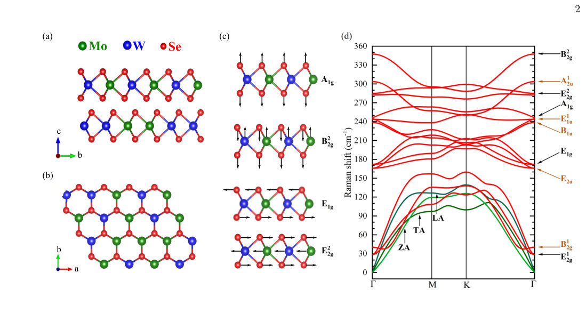 
FIG. 1. Crystal structure of the hexagonal 2H Mo0.58W0.42Se2 alloy: (a) side view along the a axis showing the bilayer (2L) structure and (b) top view along the c axis of a monolayer (1L).(c) Schematic representation of vibrational modes at the Γ point of the first BZ in monolayer MoWSe2. (d) Phonon dispersion of bulk Mo0.5W0.5Se2, calculated using density functional theory (DFT). The phonon branches are labeled according to the irreducible representations of the D4 6h point group at the Γ point. Phonon modes identified in the experimental Raman spectra are indicated by black labels, whereas those not observed are shown in brown.

📷 Fig 2

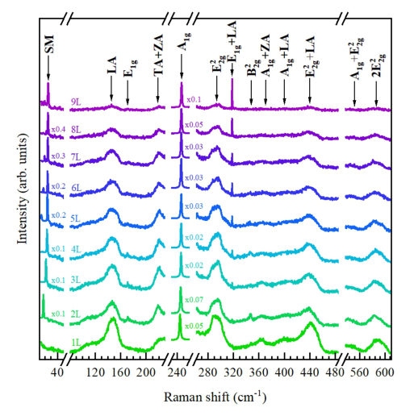 
FIG. 2. Room-temperature Stokes Raman spectra of mechan- ically exfoliated Mo0.58W0.42Se2 flakes with thicknesses rang- ing from 1L to 9L. The observed Raman modes are labeled using the conventional bulk notation, while their detailed as- signments to the corresponding high-symmetry points of the Brillouin zone are discussed in the text and summarized in the Supplementary Information. The spectra are vertically shifted for clarity. The low-frequency and A1g spectral regions were independently scaled with respect to the shear and A1g mode intensities, respectively, with the corresponding scaling factors indicated in the figure.

📷 Fig 3

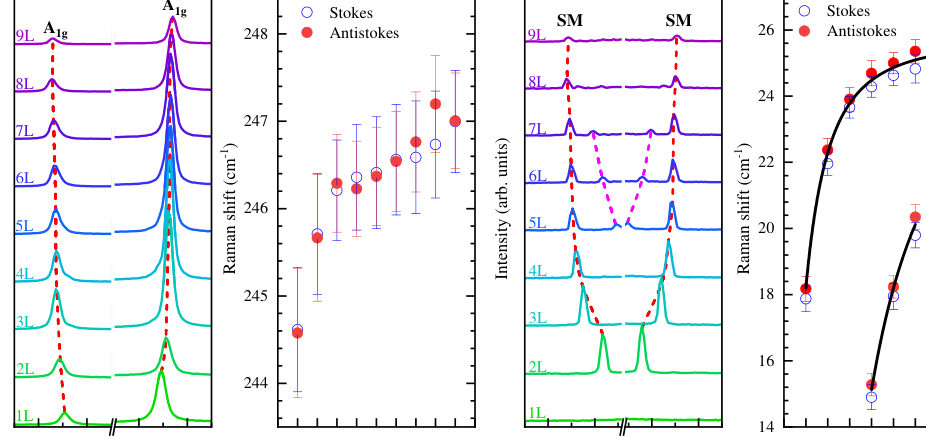 
FIG. 3. (a) Stokes and anti-Stokes Raman spectra in the vicinity of the A1g mode. The dashed lines are guides to the eye illustrating the evolution of the phonon energy with layer thickness. (b) Thickness dependence of the A1g phonon energy. Error bars correspond to one-third of the full with of the half maximum (FWHM) obtained from the Lorentzian fits. (c) Stokes and anti-Stokes Raman spectra in the vicinity of the interlayer shear mode (SM). The dashed lines are guides to the eye illustrating the evolution of the phonon energy with layer thickness. (d) Thickness dependence of the shear-mode energy. Error bars correspond to one-third of the FWHM obtained from the Lorentzian fits. The solid...

📷 Fig 4

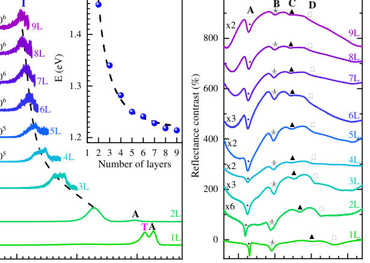 
FIG. 4. (a) Low-temperature (T = 5 K) photoluminescence spectra of Mo0.58W0.42Se2 flakes with thicknesses ranging from 1L to 9L, excited with a 2.41 eV laser. The excitation powers were 5 µW for 1–2L, 100 µW for 3L, 200 µW for 4–5L, and 500 µW for 6–9L. The spectra are normalized to the intensity of the A-exciton emission in the monolayer and vertically offset for clarity. The inset shows the thickness dependence of the indirect-emission energy. The dashed line represents a fit to the quantum-confinement model described by Eq. (3). (b) Reflectance contrast spectra of Mo0.58W0.42Se2 flakes as a function of layer thickness. (c) Thickness dependence of the energies of the optical resonances...

**Summary.** This work provides a comprehensive spectroscopic characterization of $\mathrm{Mo}_{0.58}\mathrm{W}_{0.42}\mathrm{Se}_2$ alloys across multiple layers. By combining Raman, PL, and RC spectroscopy with theoretical modeling, the authors quantified how mechanical exfoliation tunes both the vibrational coupling and the electronic band structure. The findings establish a robust, non-destructive method for analyzing 2D van der Waals materials.

**Why it may be interesting.** While focused on solid-state characterization, the quantitative determination of interlayer coupling constants and the modeling of quantum confinement effects in 2D materials are fundamental concepts relevant to understanding engineered quantum systems and heterostructures.

Detailed structure

**Main problem.** The study systematically investigates how the optical and vibrational properties of $\mathrm{Mo}_{0.58}\mathrm{W}_{0.42}\mathrm{Se}_2$ alloys change as a function of their physical thickness.

**Main result.** The research established comprehensive spectroscopic fingerprints using Raman, PL, and RC spectroscopy, showing thickness-dependent changes in both vibrational modes (interlayer coupling) and electronic band structure (excitonic resonances).

**Method.** The authors combined multiple experimental techniques—Raman scattering (RS), photoluminescence (PL), and reflectance contrast (RC) spectroscopy—with first-principles phonon calculations.

**Model / system.** The physical system is semiconducting $\mathrm{Mo}_{0.58}\mathrm{W}_{0.42}\mathrm{Se}_2$ alloys, studied as mechanically exfoliated flakes ranging from monolayer (1L) to nine layers. The analysis utilizes models like the linear-chain model for interlayer coupling and quantum-confinement models for electronic structure.

**Key observables.** Interlayer shear mode frequency, bandgap transition (direct to indirect), excitonic resonance shifts (A, B, C, D), and the interlayer force constant ($K_s$).

**Important parameters / regimes.** Layer thickness (1L to 9L), interlayer force constant ($K_s \approx 3.0 	imes 10^{19} 	ext{ N m}^{-3}$), and out-of-plane reduced effective mass ($\mu_\perp = 0.75 m_0$).

**Assumptions / limitations.** The linear-chain model is assumed to accurately describe the thickness dependence of the interlayer shear modes, and the analysis relies on comparing experimental data with DFT-calculated phonon dispersions.

**Figures summary.** Figures show room-temperature Raman spectra across various thicknesses (1L to 9L), illustrating the thickness evolution of phonon modes. Other figures detail the structural characterization via AFM height profiles and PL intensity variations.

**Paper structure.** The paper proceeds by first characterizing the material structure (AFM/EDX) to confirm thickness and composition, followed by detailed spectroscopic analysis. Vibrational properties are analyzed using RS and phonon calculations, while electronic properties are probed using PL and RC spectroscopy to map out thickness-dependent changes.

Abstract

Semiconducting Mo$_x$W$_{1-x}$Se$_2$ alloys provide a versatile platform for tailoring the optical properties of two-dimensional materials through both composition and layer thickness. Here, we systematically investigate mechanically exfoliated Mo$_{0.58}$W$_{0.42}$Se$_2$ flakes ranging from monolayer (1L) to nine layers by combining Raman scattering (RS), photoluminescence (PL), reflectance contrast (RC) spectroscopy, and first-principles phonon calculations. Thirteen RS peaks are identified, including the low-frequency interlayer shear mode, whose thickness dependence is well described by a linear-chain model, yielding an interlayer force constant of $K_s=(2.996\pm0.015)\times10^{19}$ N m$^{-3}$. PL measurements reveal a crossover from the direct-bandgap 1L to indirect-bandgap multilayers. The thickness evolution of the indirect optical transition is quantitatively reproduced using a quantum-confinement model, yielding an out-of-plane reduced effective mass of $μ_\perp=0.75 m_0$. RC spectroscopy reveals four excitonic resonances. While the A and B excitons associated with the $K^\pm$ valleys remain nearly independent of layer thickness, the higher-energy C and D resonances originating from the band-nesting regions exhibit pronounced redshifts, reflecting substantial thickness-induced modifications of the electronic band structure. These results establish comprehensive spectroscopic fingerprints of flake thickness, interlayer coupling, and electronic structure in Mo$_x$W$_{1-x}$Se$_2$ alloys and provide a reliable, non-destructive framework for their optical characterization.

[↑ back to top](#top)

### [Nitrogen based electride superconductor Nb5Ir3N under pressure: multifunctional physical properties from DFT based first-principles investigation](http://arxiv.org/abs/2609.18113v1)

**Authors:** M. Abdul Hadi Shah, J. H. Abir, S. H. Naqib  
**Type:** theory · **Category:** other · **PDF:** <https://arxiv.org/pdf/2609.18113v1>  
**Analysis basis:** full PDF text, analyzed in chunks

📷 Fig 1

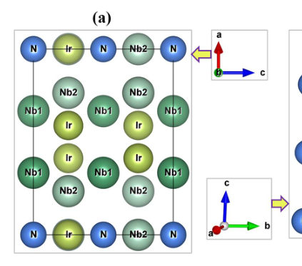 
Fig. 1. Unit cell structure of Nb5Ir3N in real space: (a) 2D view and (b) 3D view.

📷 Fig 2

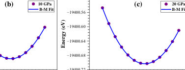 
Fig. 2. Variation of the total energy with unit cell volume obtained using the GGA–PBESol functional of Nb5Ir3N for (a) 0 GPa, (b) 10 GPa, and (c) 20 GPa.

📷 Fig 3

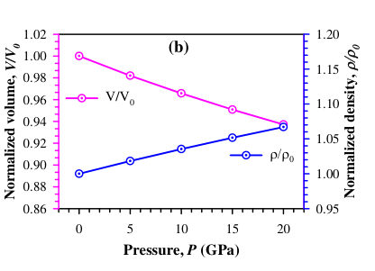 
Fig. 3. Variation of (a) lattice parameters and c/a ratio, (b) normalized volume and density with hydrostatic pressure for Nb5Ir3N.

📷 Fig 4

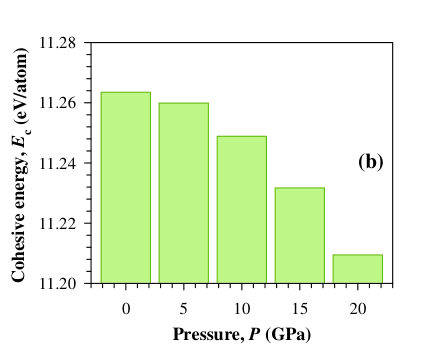 
Fig. 4. (a) Formation energy and (b) cohesive energy as a function of pressure within 0-20 GPa for Nb5Ir3N.

📷 Fig 5

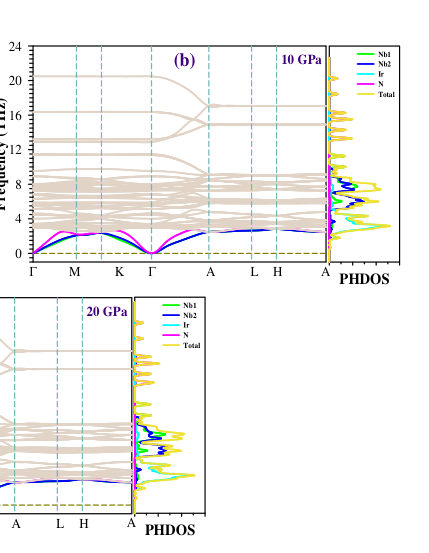 
Fig. 5. Phonon dispersion spectra of Nb5Ir3N at (a) 0 GPa, (b) 10 GPa, and (c) 20 GPa. The right panel represents their corresponding phonon density of states.

**Summary.** This theoretical study uses DFT to map out the physical properties of the electride superconductor Nb5Ir3N across pressures up to 20 GPa. It confirms the material's stability and details how its mechanical, electronic, and optical characteristics change under compression. The work provides a comprehensive computational picture of this novel superconducting material.

**Why it may be interesting.** While focused on superconductivity, the comprehensive DFT analysis of pressure-dependent electronic and optical properties provides rich data on material response under extreme conditions, relevant for understanding quantum phenomena in condensed matter.

Detailed structure

**Main problem.** The study investigates the multifunctional physical properties of the nitrogen-based electride superconductor Nb5Ir3N under varying external pressures.

**Main result.** The research confirms the structural, thermodynamic, mechanical, and dynamical stability of Nb5Ir3N across the entire pressure range, while detailing pressure-dependent electronic and optical responses.

**Method.** The investigation relies entirely on Density Functional Theory (DFT) based first-principles calculations, simulating properties from 0 to 20 GPa.

**Model / system.** The physical system is the ternary nitride electride superconductor, Nb5Ir3N, which is modeled using DFT calculations to explore its behavior under high pressure.

**Key observables.** Structural parameters, elastic constants, phonon spectra, electronic band structure, density of states, optical response ($\epsilon(\omega)$), and superconducting features.

**Important parameters / regimes.** Pressure range (0 to 20 GPa), Spin-Orbit Coupling (SOC) inclusion, and the hexagonal crystal structure.

**Assumptions / limitations.** The analysis relies on DFT approximations, and the discussion of superconducting features is noted as being qualitative.

**Figures summary.** Not specified in the notes, but the analysis covers structural, mechanical, electronic, and optical spectra as a function of pressure.

**Paper structure.** The paper systematically analyzes the material's stability (structural/thermodynamic), mechanical response (ductility/anisotropy), electronic structure (band/DOS), and optical properties (reflectivity/absorption) as pressure is varied.

Abstract

Discovery and study of superconducting electrides have opened new avenues in condensed matter physics, driven by their intriguing multifunctional features spanning ambient and high-pressure regimes. This work investigates the ternary nitride superconductor Nb5Ir3N under pressure ranging from 0 to 20 GPa via density functional theory based simulations. Estimated structural parameters agree well with the available data, confirming their reliability and supporting the validity of this analysis. Negative formation enthalpy, together with evaluated elastic constants and phonon spectra, confirm the structural, thermodynamic, mechanical, and dynamical stability of Nb5Ir3N over the entire pressure range. Pressure dependent elastic constants and polycrystalline elastic moduli are investigated. The compound is categorized as ductile in light of estimated mechanical indices. Elastic anisotropy factors indicate that Nb5Ir3N remains anisotropic, with the degree of anisotropy gradually decreasing as pressure increases. Electronic band structure and density of states are calculated with and without spin orbit coupling to investigate its influence on the electronic structure. Calculated optical response reveals substantial intraband contributions in the low energy region, intense ultraviolet absorption, and strong reflectivity. The spectra exhibit optical anisotropy and a broadening at higher pressures. Pressure induced superconducting features are also discussed qualitatively.

[↑ back to top](#top)

