
# arxiv digest (quant-ph + cond-mat) — 2026-09-19

*152 papers · 25 relevant · 4 highlighted*

## 🔥 Most relevant (25)

*Every paper with at least one nonzero topic score, sorted by best-matching score. 🔥 marks scores ≥4/5. Click the title to jump to the full entry below; click [arXiv] to open the paper page. `(secondary)` marks papers from de-prioritized cond-mat archives.*

Show 25 relevant papers

- [Observing and evading quantum back-action on a kilogram-scale oscillator](#paper-2609.19317) [[arXiv]](http://arxiv.org/abs/2609.19317v1) — 🔥 `quantum measurements` **5/5** · `quantum optics experiment` **3/5** · `correlated / nonlocal dissipation` **2/5** · `Keldysh / 2PI / non-Gaussian methods` **1/5** · `methods for driven-dissipative` **1/5**
- [Non-Thermal Effects in Fermionic Atoms Coupled to Open Cavities](#paper-2609.20434) [[arXiv]](http://arxiv.org/abs/2609.20434v1) — 🔥 `Keldysh / 2PI / non-Gaussian methods` **4/5** · 🔥 `driven-dissipative phase transition` **4/5** · 🔥 `non-equilibrium universality` **4/5** · `Tavis-Cummings & cavity-many-emitter` **3/5** · `analog quantum simulation` **3/5** · `correlated / nonlocal dissipation` **3/5** · `methods for driven-dissipative` **3/5** · `scars & prethermalization` **3/5** · `Dicke superradiance` **1/5** · `quantum measurements` **1/5** · `superradiant laser` **1/5**
- [Dephasing-Enhanced Response and Phase Transitions in Quantum Boltzmann Samplers](#paper-2609.19591) [[arXiv]](http://arxiv.org/abs/2609.19591v1) — 🔥 `driven-dissipative phase transition` **4/5** · 🔥 `non-equilibrium universality` **4/5** · `correlated / nonlocal dissipation` **3/5** · `methods for driven-dissipative` **3/5** · `Keldysh / 2PI / non-Gaussian methods` **2/5** · `analog quantum simulation` **2/5** · `quantum measurements` **1/5**
- [Observation of multiphoton entanglement in resonance fluoresce](#paper-2609.19808) [[arXiv]](http://arxiv.org/abs/2609.19808v1) — 🔥 `quantum optics experiment` **4/5** · `QC/QI experiment` **3/5** · `interference shaping light` **3/5** · `Tavis-Cummings & cavity-many-emitter` **2/5** · `quantum measurements` **2/5** · `Full counting statistics` **1/5** · `analog quantum simulation` **1/5** · `correlated / nonlocal dissipation` **1/5** · `driven-dissipative phase transition` **1/5** · `methods for driven-dissipative` **1/5**
- [Theory of post-selected entanglement transitions in monitored bosons](#paper-2609.19251) [[arXiv]](http://arxiv.org/abs/2609.19251v1) — 🔥 `quantum measurements` **4/5** · `Keldysh / 2PI / non-Gaussian methods` **3/5** · `driven-dissipative phase transition` **3/5** · `analog quantum simulation` **2/5** · `correlated / nonlocal dissipation` **2/5** · `methods for driven-dissipative` **2/5** · `non-equilibrium universality` **2/5** · `Full counting statistics` **1/5**
- [Exceptional points and Jordan-chain signatures in quantum first-passage statistics](#paper-2609.20148) [[arXiv]](http://arxiv.org/abs/2609.20148v1) — 🔥 `quantum measurements` **4/5** · `Full counting statistics` **3/5** · `correlated / nonlocal dissipation` **3/5** · `driven-dissipative phase transition` **3/5** · `methods for driven-dissipative` **2/5** · `non-equilibrium universality` **2/5** · `Keldysh / 2PI / non-Gaussian methods` **1/5**
- [Universal Suppression of Dissipation across Conformal Interface in Open Quantum Critical Systems](#paper-2609.19292) [[arXiv]](http://arxiv.org/abs/2609.19292v1) — 🔥 `non-equilibrium universality` **4/5** · `correlated / nonlocal dissipation` **3/5** · `driven-dissipative phase transition` **3/5** · `methods for driven-dissipative` **3/5** · `Keldysh / 2PI / non-Gaussian methods` **2/5** · `Frenkel-Kontorova` **1/5** · `analog quantum simulation` **1/5**
- [90%-Efficient Optical Storage in a Rare-Earth Crystal with a Low-Loss Impedance-Matched Cavity](#paper-2609.19807) [[arXiv]](http://arxiv.org/abs/2609.19807v1) — 🔥 `quantum optics experiment` **4/5** · `analog quantum simulation` **3/5** · `Tavis-Cummings & cavity-many-emitter` **2/5** · `driven-dissipative phase transition` **2/5** · `QC/QI experiment` **1/5** · `correlated / nonlocal dissipation` **1/5** · `interference shaping light` **1/5** · `methods for driven-dissipative` **1/5** · `quantum measurements` **1/5**
- [Hysteresis in Atomic Josephson Junctions](#paper-2609.19260) [[arXiv]](http://arxiv.org/abs/2609.19260v1) — 🔥 `Keldysh / 2PI / non-Gaussian methods` **4/5** · `analog quantum simulation` **3/5** · `methods for driven-dissipative` **3/5** · `driven-dissipative phase transition` **2/5** · `non-equilibrium universality` **2/5** · `Frenkel-Kontorova` **1/5**
- [Lyapunov-controlled thermalization: an exact real-time example](#paper-2609.20597) [[arXiv]](http://arxiv.org/abs/2609.20597v1) — 🔥 `Keldysh / 2PI / non-Gaussian methods` **4/5** · `methods for driven-dissipative` **3/5** · `non-equilibrium universality` **3/5** · `scars & prethermalization` **3/5** · `analog quantum simulation` **1/5** · `driven-dissipative phase transition` **1/5**
- [Energy partitioning of wave packets in one-dimensional systems](#paper-2609.19450) [[arXiv]](http://arxiv.org/abs/2609.19450v1) — 🔥 `non-equilibrium universality` **4/5** · `analog quantum simulation` **3/5** · `methods for driven-dissipative` **3/5** · `Frenkel-Kontorova` **1/5** · `Keldysh / 2PI / non-Gaussian methods` **1/5** · `driven-dissipative phase transition` **1/5** · `scars & prethermalization` **1/5**
- [Engineering and Probing a One-Dimensional Dipolar Spin Ensemble in Diamond](#paper-2609.19496) [[arXiv]](http://arxiv.org/abs/2609.19496v1) — 🔥 `QC/QI experiment` **4/5** · `analog quantum simulation` **3/5** · `correlated / nonlocal dissipation` **3/5** · `quantum measurements` **2/5** · `quantum optics experiment` **1/5**
- [Dissipative phase transitions in quantum reservoir computing](#paper-2609.20345) [[arXiv]](http://arxiv.org/abs/2609.20345v1) — 🔥 `driven-dissipative phase transition` **4/5** · `methods for driven-dissipative` **3/5** · `non-equilibrium universality` **3/5** · `correlated / nonlocal dissipation` **1/5**
- [Locally optimized variational evolution for quantum many-body systems](#paper-2609.20802) [[arXiv]](http://arxiv.org/abs/2609.20802v1) — 🔥 `methods for driven-dissipative` **4/5** · `Keldysh / 2PI / non-Gaussian methods` **1/5** · `analog quantum simulation` **1/5** · `correlated / nonlocal dissipation` **1/5** · `driven-dissipative phase transition` **1/5** · `non-equilibrium universality` **1/5** · `quantum measurements` **1/5** · `scars & prethermalization` **1/5**
- [Neutral atom quantum computing for materials science and quantum chemistry](#paper-2609.20464) [[arXiv]](http://arxiv.org/abs/2609.20464v1) — 🔥 `Rydberg arrays` **4/5** · 🔥 `analog quantum simulation` **4/5** · `QC/QI experiment` **3/5**
- [Normalizing Flow-Based Bayesian Parameter Estimation for Noisy Quantum States](#paper-2609.19534) [[arXiv]](http://arxiv.org/abs/2609.19534v1) — 🔥 `quantum optics experiment` **4/5** · `methods for driven-dissipative` **2/5** · `quantum measurements` **2/5** · `Keldysh / 2PI / non-Gaussian methods` **1/5** · `QC/QI experiment` **1/5** · `analog quantum simulation` **1/5**
- [Engineering Weak Universality with Quantum Dots](#paper-2609.20755) [[arXiv]](http://arxiv.org/abs/2609.20755v1) — 🔥 `analog quantum simulation` **4/5** · `non-equilibrium universality` **3/5** · `methods for driven-dissipative` **2/5** · `quantum measurements` **1/5**
- [How universal are warm turbulent cascades?](#paper-2609.19432) [[arXiv]](http://arxiv.org/abs/2609.19432v1) — 🔥 `non-equilibrium universality` **4/5** · `Keldysh / 2PI / non-Gaussian methods` **1/5** · `correlated / nonlocal dissipation` **1/5** · `driven-dissipative phase transition` **1/5**
- ⭐ [TetrisCNN for interpretable detection of phases of matter from experimental quantum simulator data](#paper-2609.20693) [[arXiv]](http://arxiv.org/abs/2609.20693v1) — 🔥 `analog quantum simulation` **4/5** · `Rydberg arrays` **3/5**
- [Electrostatic Stabilization of Near-Surface Quantum Sensors via Dielectric Interface Engineering](#paper-2609.20137) [[arXiv]](http://arxiv.org/abs/2609.20137v1) — 🔥 `QC/QI experiment` **4/5** · `quantum measurements` **1/5** · `quantum optics experiment` **1/5**
- [Encapsulation epitaxy of air-stable monolayer superconducting films for quantum circuits and qubits](#paper-2609.19321) [[arXiv]](http://arxiv.org/abs/2609.19321v1) `(secondary)` — 🔥 `QC/QI experiment` **4/5** · `analog quantum simulation` **2/5**
- [Coherent and ultra-low-power EDSR with a flopping-mode spin qubit in germanium](#paper-2609.20775) [[arXiv]](http://arxiv.org/abs/2609.20775v1) — 🔥 `QC/QI experiment` **4/5** · `quantum measurements` **1/5**
- [Highly uniform first-electron position in qubit arrays fabricated on dedicated QSOI(R) 300mm commercial platform](#paper-2609.20043) [[arXiv]](http://arxiv.org/abs/2609.20043v1) — 🔥 `QC/QI experiment` **4/5** · `quantum measurements` **1/5**
- [$k$-fold unbiased measurements and maximal incompatibility](#paper-2609.20728) [[arXiv]](http://arxiv.org/abs/2609.20728v1) — 🔥 `quantum measurements` **4/5**
- [Odd/Even or Half ? Entanglement Anomaly in the Bose-Hubbard model](#paper-2609.19884) [[arXiv]](http://arxiv.org/abs/2609.19884v1) — 🔥 `analog quantum simulation` **4/5**

## ⭐ Highlighted (4)

*Papers by authors on your watch list. Click the title to jump to the full entry below; click [arXiv] to open the paper page.*

Show 4 highlighted papers

- ⭐ [The effects of shot noise on the quantum computation of NMR spectra](#paper-2609.20406) [[arXiv]](http://arxiv.org/abs/2609.20406v1) — Igor Lesanovsky
- ⭐ [Analytic leakage suppression with a single control field: fast two-qubit gates with tunable couplers](#paper-2609.20766) [[arXiv]](http://arxiv.org/abs/2609.20766v1) — Aashish A. Clerk
- ⭐ [TetrisCNN for interpretable detection of phases of matter from experimental quantum simulator data](#paper-2609.20693) [[arXiv]](http://arxiv.org/abs/2609.20693v1) — Antoine Browaeys
- ⭐ [Particle Physics Driven by Quantum Technology - Quantum Simulations and Quantum Sensing](#paper-2609.20500) [[arXiv]](http://arxiv.org/abs/2609.20500v1) — Itay M. Bloch

## All papers (103, sorted by relevance)

*Papers from quant-ph and your primary cond-mat archives (quant-gas, stat-mech, str-el, dis-nn). Highlighted papers (⭐) come first, then everything else sorted by topic-relevance score, highest first.*

### ⭐ [TetrisCNN for interpretable detection of phases of matter from experimental quantum simulator data](http://arxiv.org/abs/2609.20693v1)

**Highlighted author(s):** Antoine Browaeys  
**Authors:** Kacper Cybiński, Björn van Zwol, James Enouen, Guillaume Bornet, Thierry Lahaye, Antoine Browaeys, Antoine Georges, Anna Dawid  
**Type:** both · **Category:** disordered systems and neural networks · **PDF:** <https://arxiv.org/pdf/2609.20693v1>  
**Analysis basis:** full PDF text, analyzed in chunks
**Topic relevance:** 🔥 `analog quantum simulation` **4/5** · `Rydberg arrays` **3/5**

↔ Scroll figures horizontally

<figure class="paper-figure-card">
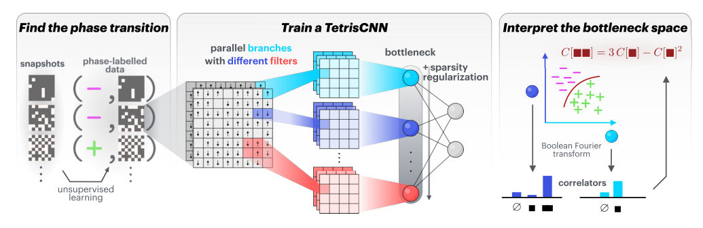
<figcaption class="paper-figure-caption"><b>Fig 1.</b> FIG. 1: TetrisCNN processes snapshots through parallel branches with differently shaped filters that map to spin correlators. Sparsity suppresses redundant or task-irrelevant branches, yielding a low-dimensional interpretable bottleneck from which the decision boundary can be expressed symbolically in terms of spin correlators.</figcaption>
</figure>
<figure class="paper-figure-card">
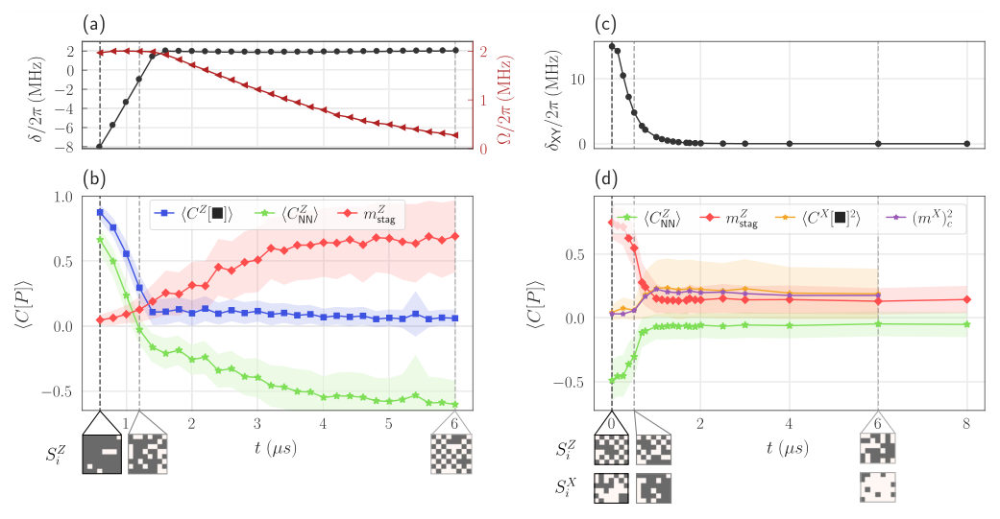
<figcaption class="paper-figure-caption"><b>Fig 2.</b> FIG. 2: Experimental quantum data. (a),(c) Experimental protocols for the Ising and XY datasets, including control parameters, measurement points, and representative snapshots from the 8 × 8 Ising [64] and 6 × 7 XY [65] Rydberg-atom quantum simulators. (b),(d) Selected snapshot-averaged spin correlators, cf. Eq. (3), with shaded regions indicating their standard deviation across the sweeps: mstag = CA[■] −CB[■], with A, B being the two sublattices, CNN = Crot[■■] = 1</figcaption>
</figure>
<figure class="paper-figure-card">
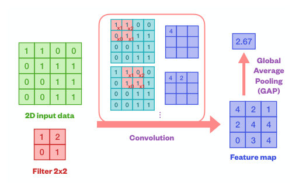
<figcaption class="paper-figure-caption"><b>Fig 3.</b> FIG. 3: Example of convolution with a 2 × 2 filter, followed by global average pooling (GAP). The filter is applied across the input to produce a feature map, which GAP reduces to a scalar.</figcaption>
</figure>
<figure class="paper-figure-card">
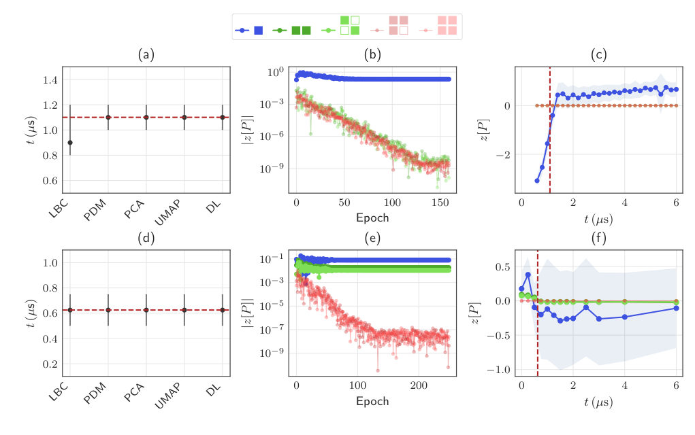
<figcaption class="paper-figure-caption"><b>Fig 4.</b> FIG. 4: Data-driven transition detection and interpretable classification from experimental snapshots for (a)–(c) Ising and (d)–(f) XY. (a,d) Transition locations estimated with established unsupervised methods (App. E). Red dashed lines mark the location used to define supervised labels. For Ising, the detected change is the polarization crossover rather than the later antiferromagnetic phase transition. (b,e) Evolution of rotationally invariant TetrisCNN branch activations during training, showing sparsity-induced suppression of task-irrelevant branches. (c,f) Activations of the surviving branches across the experimental sweeps. Unfilled squares denote masked-out sites.</figcaption>
</figure>
<figure class="paper-figure-card">
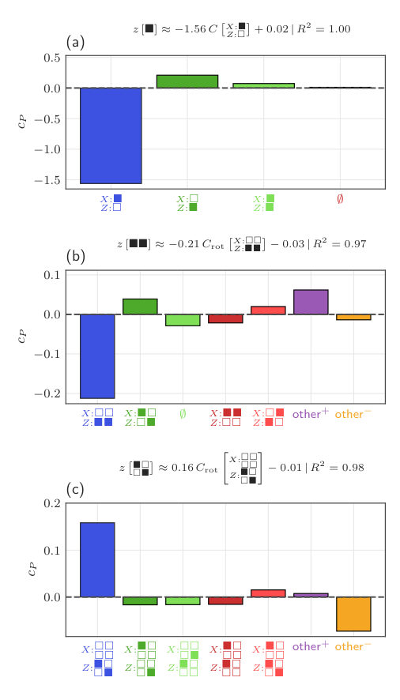
<figcaption class="paper-figure-caption"><b>Fig 5.</b> FIG. 5: Mapping from branch activations to correlators via multilinear regression for three active branches in TetrisCNN trained on the XY dataset as in Fig. 4(e)-(f), enabled by the Boolean Fourier expansion, Eq. (7). We need only to consider correlators C[P ′], P ′ ⊆P defined by patterns P ′ that are contained in the filter pattern P (see Tab. I). Note that with all C[P ′], P ′ ⊆P, the fit is perfect (R2 = 1). Small positive (negative) contributions are summed into “other+(–)”. The complete decomposition is shown in Fig. 21.</figcaption>
</figure>

**Summary.** This paper introduces TetrisCNN, an interpretable neural network designed to detect quantum phase transitions from experimental simulator data. By learning representations directly from measurable spin correlators, it overcomes the 'black box' problem of standard NNs. The key achievement is deriving the phase boundaries as explicit, symbolic formulas based on experimentally accessible quantities.

**Why it may be interesting.** It provides a concrete, interpretable bridge between advanced machine learning techniques and fundamental condensed matter physics problems, offering a pathway to extract physical laws from complex quantum simulation data.

Detailed structure

**Main problem.** Detecting quantum phases of matter is difficult, as traditional methods rely on physical intuition, while black-box neural networks fail to provide physical understanding or generalize to noisy experimental data.

**Main result.** The proposed TetrisCNN framework successfully detects phase transitions and crossovers and, crucially, expresses the decision boundaries as symbolic formulas built directly from measurable spin correlators.

**Method.** The authors introduce TetrisCNN, a convolutional architecture using parallel branches with varied filters to learn sparse, interpretable latent representations based on spin correlators.

**Model / system.** The method is applied to experimental snapshots from 2D quantum simulators, specifically modeling the Ising and XY Hamiltonians using Rydberg-atom arrays in optical tweezer lattices.

**Key observables.** Spin correlators (e.g., $	ext{mstag}$, $	ext{CNN}$), magnetization, and the classification/regression output defining the phase boundary.

**Important parameters / regimes.** Lattice spacing ($a=10 \mu	ext{m}$), interaction strength ($U/h \approx 1.95 	ext{ MHz}$), and varying external fields ($\delta, \Omega$).

**Assumptions / limitations.** The analysis relies on fitting a surrogate model (like logistic regression) to approximate the complex decision boundary learned by the deep network.

**Figures summary.** Figures illustrate the CNN architecture mapping filters to correlators, the comparison of linear vs. quadratic approximations of the phase boundary, and the stability of the learned representations.

**Paper structure.** The paper first establishes the limitations of current phase detection methods, introduces TetrisCNN, demonstrates its application to 2D Ising/XY models, and concludes by showing how the learned decision boundaries can be analytically approximated using measurable correlators.

Abstract

Detecting phases of matter in general relies on identifying the correct order parameter - a task that remains notoriously difficult for unknown transitions and traditionally is guided by physical intuition and educated guess. Neural networks have recently offered an alternative route by locating phase transitions in known models without any a priori physical knowledge. Yet these approaches remain black boxes and only identify phases without elucidating their properties. Moreover, they often struggle when confronted with realistic, noisy experimental data, which constitute the ultimate testbed for automated methods in physics. Here, we bridge these perspectives by introducing TetrisCNN, a convolutional architecture with parallel branches of differently shaped filters, reminiscent of Tetris blocks, that learns sparse, interpretable latent representations directly in terms of spin correlators. Applied to experimental snapshots of two-dimensional Ising and XY quantum simulators measured in multiple bases, the network not only detects phase transitions and crossovers but also expresses its latent representation and decision boundaries as symbolic formulas built from experimentally measurable spin correlators. This framework opens the way to integrating interpretable neural networks with quantum simulators to uncover and understand new phases of matter.

[↑ back to top](#top)

### ⭐ [The effects of shot noise on the quantum computation of NMR spectra](http://arxiv.org/abs/2609.20406v1)

**Highlighted author(s):** Igor Lesanovsky  
**Authors:** Sebastian Walch, Keith R. Fratus, Jan-Michael Reiner, Igor Lesanovsky  
**Type:** theory · **Category:** quantum information and computing · **PDF:** <https://arxiv.org/pdf/2609.20406v1>  
**Analysis basis:** full PDF text, analyzed in chunks
**Topic relevance:** `quantum measurements` **3/5** · `analog quantum simulation` **1/5**

↔ Scroll figures horizontally

<figure class="paper-figure-card">
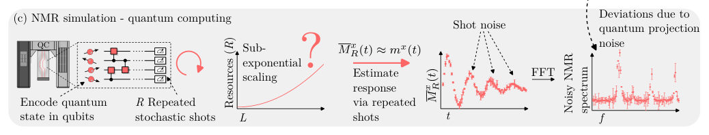
<figcaption class="paper-figure-caption"><b>Fig 1.</b> Figure 1. NMR spectroscopy and computational resources. (a) Molecules containing L NMR-active nuclei represent a many-body system modeled by coupled quantum spins [cf. Eq. (1)]. In an external magnetic field, radio-frequency pulses induce spin dynamics whose time-dependent magnetic response mx(t) (and my(t)) is measured. The corresponding NMR spectrum is obtained via a fast Fourier transform (FFT) of this signal. (b) NMR spectra may be computed up to machine precision with classical computers, for example from the FFT of the expectation values of magnetization operators ⟨ˆ M x(t)⟩(and ⟨ˆ M y(t)⟩). However, since the Hilbert space grows exponentially with the number of NMR-active nuclei L,...</figcaption>
</figure>
<figure class="paper-figure-card">
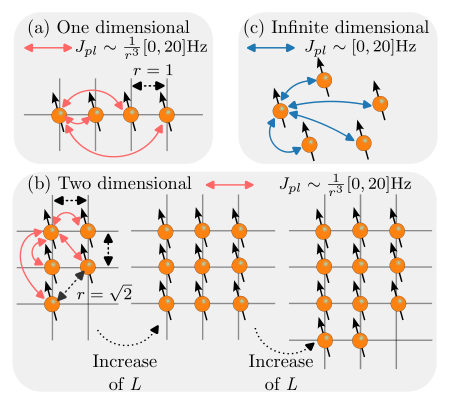
<figcaption class="paper-figure-caption"><b>Fig 2.</b> Figure 2. Considered geometries. (a) One-dimensional chain with distance-dependent couplings Jpl = Kpl/r3 pl. (b) Two-dimensional square lattice with the same distance depen- dence. For increasing L, the lattice is enlarged by complet- ing square configurations and then adding spins around the boundary. (c) Infinite-dimensional geometry without spatial dependence, where Jpl = Kpl. For all geometries, Kpl is sam- pled uniformly from [0, 20] Hz.</figcaption>
</figure>
<figure class="paper-figure-card">
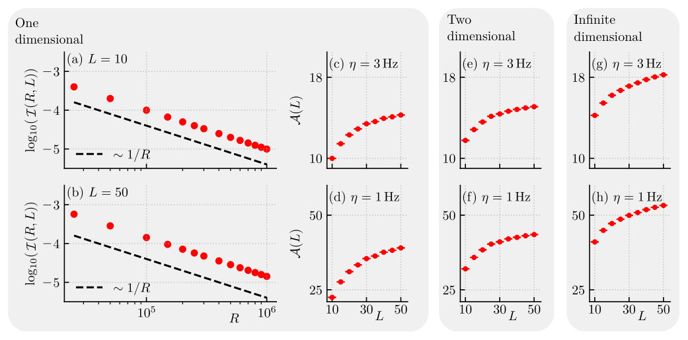
<figcaption class="paper-figure-caption"><b>Fig 3.</b> Figure 3. Infidelity and scaling function. (a,b) infidelity I(R, L) as a function of the number of shots R for the one- dimensional geometry with broadening η = 3 Hz, shown for (a) L = 10 and (b) L = 50. The scaling I(R, L) ∼R−1 is evident. (c)–(h) Scaling function A(L) for all considered geometries and broadening parameters. In all cases, A(L) increases with system size, indicating that larger molecules require more shots to achieve the same target infidelity. The growth becomes weaker for larger L. This flattening effect is most pronounced in the one- and two-dimensional geometries, while the infinite- dimensional geometry exhibits the strongest overall increase. Across all geometries,...</figcaption>
</figure>
<figure class="paper-figure-card">
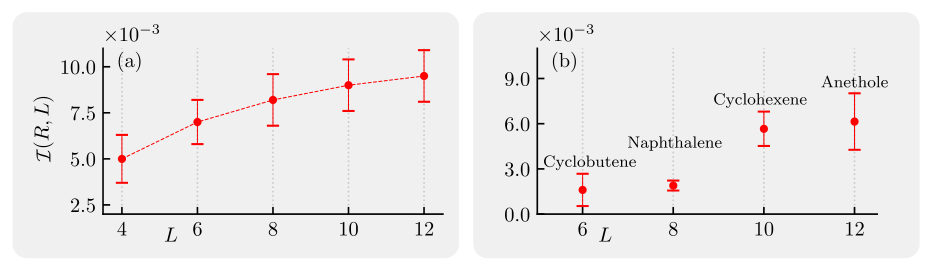
<figcaption class="paper-figure-caption"><b>Fig 4.</b> Figure 4. Scaling of the infidelity for Heisenberg Hamiltonians. (a) Infidelity I(R, L) as a function of system size L for the one-dimensional geometry with broadening parameter η = 3 Hz and R = 1024 shots. The infidelity increases only weakly with system size and does not exhibit a pronounced growth over the considered range of L, suggesting that the favorable shot noise behavior observed for the Ising model is not qualitatively changed by the more general Heisenberg interaction, although the data should be understood as an illustrative small-system check rather than a scaling analysis. (b) Infidelity I(R, L) for four example molecules with Heisenberg couplings, evaluated from noisy...</figcaption>
</figure>

**Summary.** This work analyzes the impact of shot noise on simulating quantum many-body systems using NMR spectra as a test case. By quantifying the required number of measurement shots, the authors show that the resource scaling is weak with system size. This suggests that statistical noise may not fundamentally limit the potential for quantum advantage in such simulations.

**Why it may be interesting.** It directly addresses a critical practical hurdle for quantum computation—measurement noise—by providing quantitative bounds on resource scaling for a physically relevant many-body problem like NMR.

Detailed structure

**Main problem.** The paper investigates how the statistical noise inherent in quantum measurements (shot noise) affects the ability to simulate complex quantum systems, specifically focusing on the scaling of required computational resources.

**Main result.** The required number of measurement shots needed to achieve a desired accuracy scales only weakly with the system size, suggesting that shot noise does not pose a fundamental barrier to achieving quantum advantage in NMR simulation.

**Method.** The authors analyze the scaling of the infidelity between the noisy quantum simulation result and the exact reference result by expanding the cosine similarity in powers of the noise.

**Model / system.** The test case is the simulation of Nuclear Magnetic Resonance (NMR) spectra, modeled by coupled nuclear spin systems governed by Heisenberg or Ising Hamiltonians. The simulation is mapped onto a qubit register for quantum computation.

**Key observables.** The required number of shots ($R$), the spectral noise covariance ($	ext{Cov}[\epsilon_R]$), and the resulting infidelity ($1 - C(s_R, s)$).

**Important parameters / regimes.** System size ($L$, number of nuclei), desired accuracy, and the number of shots ($R$).

**Assumptions / limitations.** The analysis focuses solely on shot noise, neglecting other error sources like decoherence or Trotterization errors, and relies on expanding the fidelity metric to second order in the noise.

**Figures summary.** Figure 1 compares NMR spectroscopy across physical, classical (exponential), and quantum (shot-noise limited) regimes. Other figures detail numerical results for both Ising and Heisenberg model Hamiltonians across varying system sizes.

**Paper structure.** The paper establishes the problem by comparing classical and quantum simulation scaling, then develops the theoretical framework by calculating the single-shot variance and deriving the scaling of the infidelity with $R$ using the Central Limit Theorem.

Abstract

Recent advances in the field of quantum computing hardware motivate the search for applications which demonstrate so-called quantum advantage. One promising use case that has been identified is the simulation of quantum many-body systems. The computational resources required for performing such a simulation on a classical computer generally grow exponentially with the size of the system being modeled, which is ultimately due to the exponential growth of the Hilbert space in which the dynamics of such a system take place. While digital quantum computers natively evolve quantum states directly in such a Hilbert space, thus naively avoiding this problem, the result of such a computation is typically not obtained as a deterministic output. Rather, it requires projective measurements which are fundamentally affected by shot noise. Any desired expectation values must therefore be reconstructed from repeated measurements, making the number of those measurements a relevant computational resource, and thus an important consideration for any potential claims of quantum advantage. In this work, we study how this resource scales with system size (a scaling which itself depends on the desired accuracy of the final result), using the simulation of nuclear magnetic resonance (NMR) spectra as a test case. We study this scaling for both real-world molecules, as well as a class of model NMR Hamiltonians which allow for efficient large-scale simulations with one-dimensional, two-dimensional, and all-to-all interactions. We find that the required resources increase only weakly with molecular size, far below the exponential growth of the underlying Hilbert space. This result suggests that shot noise should not pose a fundamental barrier to achieving quantum advantage in the simulation of NMR systems, and perhaps for many-body systems more broadly.

[↑ back to top](#top)

### ⭐ [Analytic leakage suppression with a single control field: fast two-qubit gates with tunable couplers](http://arxiv.org/abs/2609.20766v1)

**Highlighted author(s):** Aashish A. Clerk  
**Authors:** Lukas Heunisch, Michael J. Hartmann, Aashish A. Clerk  
**Type:** theory · **Category:** quantum information and computing · **PDF:** <https://arxiv.org/pdf/2609.20766v1>  
**Analysis basis:** full PDF text, analyzed in chunks
**Topic relevance:** `QC/QI experiment` **3/5**

↔ Scroll figures horizontally

<figure class="paper-figure-card">
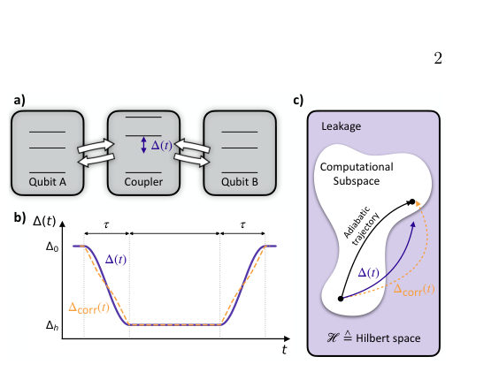
<figcaption class="paper-figure-caption"><b>Fig 1.</b> FIG. 1. a) Schematic of a generic qubit–tunable coupler–qubit architecture. b) Time-dependent coupler detuning ∆(t) (real- ized via baseband flux control), ramping from the idle detun- ing ∆0 to the hold value ∆h for a finite gate duration tg. The goal is to start with a base pulse shape (blue) and modify it slightly (orange) to mitigate leakage errors. c) Schematic of relevant trajectories in the full Hilbert space H . The goal is an ideal evolution between computational states (white). A finite gate time leads to non-adiabatic errors, and population of leakage states (purple, blue trajectory). The correction strategy is to use available controls to cancel leakage at the final time, not at...</figcaption>
</figure>
<figure class="paper-figure-card">
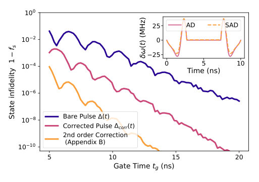
<figcaption class="paper-figure-caption"><b>Fig 2.</b> FIG. 3. State infidelity 1 −fs = 1 −| ⟨ψideal|ψ(tg)⟩|2 for an iSWAP gate simulated with the parameters of Table I. To account for realistic fabrication imperfections, the plot- ted results are averaged over normally distributed, correlated fluctuations of the coupling strengths (see main text for a detailed description). Over a wide range of gate times tg, the first-order correction (pink line) reduces the state infi- delity by at least two orders of magnitude compared to the bare pulse (blue line). Applying a higher-order correction in the superadiabatic frame (orange line, see Appendix B) sup- presses the error by approximately three more orders of mag- nitude, demonstrating the...</figcaption>
</figure>
<figure class="paper-figure-card">
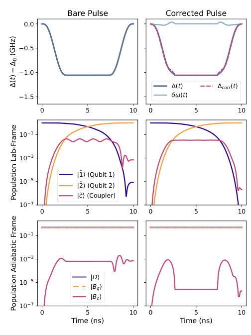
<figcaption class="paper-figure-caption"><b>Fig 3.</b> FIG. 2. Simulation of an iSWAP gate in the one-excitation subspace (cf. Eq. (1)), comparing performance of a simple base coupler pulse (left column) with a corrected version (as derived in Eq. (29)) (right column). The corrected pulse effec- tively suppresses the interaction matrix element between the |Bq⟩and |Bc⟩states, reducing the population of the coupler- like state |Bc⟩in the adiabatic frame by several orders of mag- nitude (bottom row). Consequently, leakage into the coupler state at the end of the gate is significantly mitigated, as shown in the middle row. The simulation parameters are listed in Table I.</figcaption>
</figure>
<figure class="paper-figure-card">
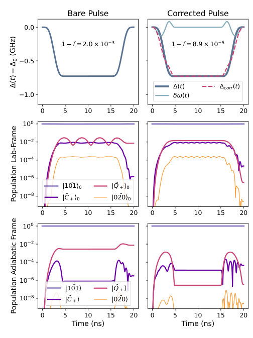
<figcaption class="paper-figure-caption"><b>Fig 4.</b> FIG. 4. Simulation of Eq. (42) for an iSWAP gate, comparing a bare coupler pulse (left column) with the active, numerically precise correction derived in Section III (right column). Pro- jected onto the computational basis, which corresponds to the eigenstates of Eq. (42) at t = 0 (middle row), the population of the fidelity-limiting state | ˜Q+⟩0 drops from O(10−2) for the bare pulse to O(10−6) with the correction. This improve- ment stems from the suppression of the interaction matrix element in the adiabatic frame, which reduces the popula- tion of the time-dependent instantaneous eigenstate | ˜Q+⟩by three orders of magnitude (bottom row). Both the bare and corrected pulses are plotted...</figcaption>
</figure>
<figure class="paper-figure-card">
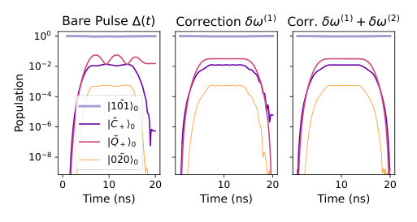
<figcaption class="paper-figure-caption"><b>Fig 5.</b> FIG. 5. State populations in the second-excited subspace dur- ing the 20 ns iSWAP gate. The dynamics of Eq. (42) was sim- ulated using three levels per qubit for three distinct scenarios: using the bare coupler pulse alone (left), with the primary correction δω(1) (middle), and with the combined correction δω(1) + δω(2) to suppress two leakage states (right). To opti- mally balance the suppression of the residual | ˜C+⟩0 popula- tion against higher-order errors induced by the secondary cor- rection, the individual amplitudes of δω(1) and δω(2) were op- timized as independent free parameters for the results shown in the right panel.</figcaption>
</figure>

**Summary.** This paper introduces a novel analytic pulse-shaping technique to mitigate leakage errors during fast two-qubit gates in superconducting qubits. By utilizing a Magnus expansion, the authors derive a correction pulse that effectively cancels non-adiabatic leakage caused by the time-varying coupler. This method is highly valuable as it works even when only a single baseband control field is available, significantly boosting gate fidelity.

**Why it may be interesting.** This work provides a powerful, general, and analytically derived tool for designing quantum control pulses in superconducting circuits, overcoming the limitations imposed by single-parameter control fields common in hardware.

Detailed structure

**Main problem.** The paper addresses the challenge of suppressing non-adiabatic leakage errors during fast two-qubit quantum gates when the control mechanism is limited to a single real-valued control field.

**Main result.** A novel analytic pulse-shaping technique, derived via a Magnus expansion, was shown to suppress leakage in a fast iSWAP gate by up to three orders of magnitude for realistic superconducting circuit parameters.

**Method.** The authors derive a correction pulse by applying a Magnus expansion to the Hamiltonian in the adiabatic frame, allowing them to cancel the non-adiabatic error terms generated by the time-varying coupling.

**Model / system.** The system modeled is two superconducting transmon qubits coupled by a tunable coupler, whose dynamics are controlled by baseband flux pulses. The analysis focuses on the evolution between instantaneous eigenstates (dark and bright states).

**Key observables.** Non-adiabatic leakage population into the coupler state, and the resulting gate fidelity (e.g., $1-f$ for CZ gate).

**Important parameters / regimes.** Gate time ($t_g$), coupling strength ($g$), detuning ($\Delta(t)$), and the required correction pulse amplitude ($\delta\omega(t)$).

**Assumptions / limitations.** The method is derived using a Magnus expansion truncated to first order, and the analysis assumes the system can be effectively described in the adiabatic frame.

**Figures summary.** Figures illustrate the schematic architecture, the time-dependent detuning profiles, and the population evolution comparing bare pulses versus the corrected pulses, showing leakage suppression.

**Paper structure.** The paper first establishes the problem (leakage with single control fields), develops the Magnus-based analytic correction technique, and then validates this technique by simulating two-qubit gates (iSWAP and CZ) against established methods.

Abstract

Simple analytic pulse-shaping techniques are of great practical utility in quantum control, with prime examples being the DRAG method for suppressing leakage in superconducting microwave gates and the transitionless-driving approach to shortcuts-to-adiabaticity. Standard versions of these methods require two orthogonal control channels, with the second channel effectively breaking time-reversal symmetry. This appears to rule out their use in settings with only a single real-valued control field, such as the kind of baseband flux control that is common in many superconducting circuit architectures. We show here that a simple analytic pulse-shaping technique derived via a Magnus expansion is effective even with just a single baseband control channel. We demonstrate its efficacy by simulating a two-qubit gate between transmons realized with a tunable coupler and baseband flux pulses. Our corrections dramatically reduce non-adiabatic leakage caused by ramping the coupler: for realistic device parameters, leakage in a fast iSWAP gate is suppressed by up to three orders of magnitude. Our approach is general, goes beyond simply suppressing unwanted spectral weight at leakage transitions, and can be applied to a variety of platforms.

[↑ back to top](#top)

### ⭐ [Particle Physics Driven by Quantum Technology - Quantum Simulations and Quantum Sensing](http://arxiv.org/abs/2609.20500v1)

**Highlighted author(s):** Itay M. Bloch  
**Authors:** Itay M. Bloch, Marcela Carena, Yifan Chen, Xinran Li, Ying-Ying Li, Jing Shu  
**Type:** theory · **Category:** other · **PDF:** <https://arxiv.org/pdf/2609.20500v1>  
**Analysis basis:** full PDF text, analyzed in chunks
**Topic relevance:** `analog quantum simulation` **2/5** · `Full counting statistics` **1/5** · `Keldysh / 2PI / non-Gaussian methods` **1/5** · `QC/QI experiment` **1/5** · `quantum measurements` **1/5** · `quantum optics experiment` **1/5**

↔ Scroll figures horizontally

<figure class="paper-figure-card">
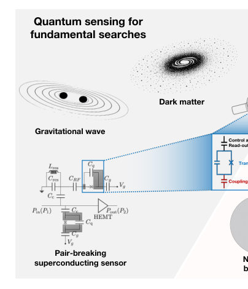
<figcaption class="paper-figure-caption"><b>Fig 1.</b> Figure 1: Quantum sensing and quantum simulation with superconducting platforms. Left: quantum sensing with superconducting cavities and pair-breaking detectors, probing weak signals from dark matter and gravitational waves. Right: quantum simulations using transmon-based superconducting processors, enabling first-principles studies of non- perturbative quantum field dynamics. Images include a superconducting quantum chip (IBM) and conceptual cavity-based sensor designs (adapted from [10]).</figcaption>
</figure>
<figure class="paper-figure-card">
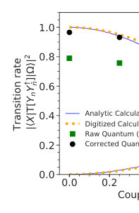
<figcaption class="paper-figure-caption"><b>Fig 2.</b> Figure 4: The transition rates from the vacuum to the lowest-lying single excited state induced by a pair of energetic particle-antiparticle moving back-to-back, for a system of three lattice sites and nq = 2 qubits per site. Adapted from Ref. [155], licensed under CC BY 4.0.</figcaption>
</figure>
<figure class="paper-figure-card">
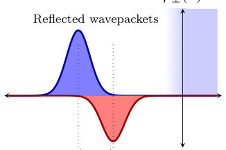
<figcaption class="paper-figure-caption"><b>Fig 3.</b> Figure 5: (a) The phase asymmetry Φ between the reflected conjugate pairs, which is defined as the distance between the peaks of the reflected Gaussian wave packets of the conjugate pair (blue for particle wave packet, red for anti-particle wave packet). ρ±(x) is the local charge densities for the wave packets. The magnitude asymmetry is the total charge difference in the symmetric phase between the conjugat pair. (b) The simulation results obtained using tensor network method for the phase asymmetry observable ˆΦ∞ —the lattice counterpart of Φ— are shown in the asymptotic regime (t →∞), once the reflection process is complete. Adapted from Ref. [156], licensed under CC BY 4.0.</figcaption>
</figure>
<figure class="paper-figure-card">
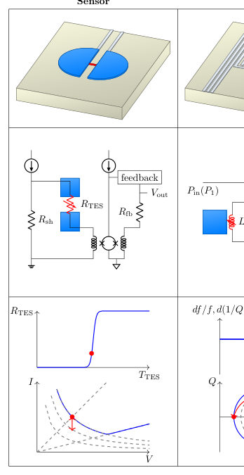
<figcaption class="paper-figure-caption"><b>Fig 4.</b> Figure 6: Three major phonon-sensitive pair-breaking superconducting sensors. The typical device geometries (top row), equivalent circuit diagram including the readout electronics (middle row), and the operation principles (bottom row) are shown for transition edge sensors (TESs, left column), kinetic inductance devices (KIDs, middle column), and Qubits (right column). The blue regions in the top and middle rows indicate the phonon-absorbing volume, red regions indicate the active sensing elements: a superconductor resistor biased on the transition edge in a TES; a superconducting inductor in a KID; a Josephson junction in a Qubit. The top diagrams in the operation principles demonstrate...</figcaption>
</figure>

**Summary.** This review surveys how rapid progress in quantum technologies—specifically quantum simulation and quantum sensing—is poised to revolutionize particle physics. It highlights that quantum computers can tackle classically intractable problems in Quantum Field Theory, while ultra-sensitive detectors can search for elusive physics beyond the Standard Model. Ultimately, the paper argues that quantum tools are reshaping the frontier of fundamental physics research.

**Why it may be interesting.** It provides a high-level roadmap connecting cutting-edge quantum hardware development (superconducting circuits, quantum algorithms) directly to fundamental physics questions, which is highly relevant for theorists working on open quantum systems and many-body dynamics.

Detailed structure

**Main problem.** The paper addresses how emerging quantum technologies can be leveraged to tackle fundamental, classically intractable problems in particle physics, particularly those beyond the Standard Model.

**Main result.** Quantum computing and quantum sensing are emerging as uniquely powerful platforms capable of simulating non-perturbative Quantum Field Theory dynamics and achieving unprecedented sensitivity for detecting weak physical signals.

**Method.** The review synthesizes progress across two main avenues: quantum simulation for QFT dynamics and quantum sensing for BSM searches, detailing the underlying quantum mechanical principles and technological requirements.

**Model / system.** The scope covers diverse physical systems, including superconducting circuits (transmons, resonators), detectors (SNSPDs, KIDs), and theoretical models like Quantum Field Theories (QFT) for phenomena such as hadronization and dark matter interactions.

**Key observables.** Detection of faint BSM signals (e.g., axions), non-perturbative QFT dynamics, and measurements related to gravitational waves.

**Important parameters / regimes.** The required development towards large-scale, fault-tolerant quantum systems, and the sensitivity limits set by quantum noise sources.

**Assumptions / limitations.** The primary assumption is that quantum technologies will mature sufficiently to overcome current computational and noise limitations to advance fundamental physics.

**Figures summary.** Figure 1 illustrates the direct connection between quantum sensing (using superconducting cavities/detectors for dark matter/GWs) and quantum simulation (using transmon processors for non-perturbative QFT dynamics).

**Paper structure.** The paper is structured as a review, first establishing the general motivation, then detailing the potential of quantum simulation for QFT, and subsequently covering the advancements in quantum sensing for BSM physics.

Abstract

We review recent advances in particle physics enabled and motivated by the rapid progress of quantum technologies. The continued development of quantum computing toward large-scale, fault-tolerant systems has the potential to address dynamical problems that remain extremely challenging for classical computational approaches, opening new avenues for studying nonperturbative dynamical processes. Tabletop detectors and quantum-enhanced technologies have reached unprecedented sensitivities, enabling novel searches for ultralight particles, gravitational waves, and other physics beyond the Standard Model in parameter regimes previously inaccessible to conventional instrumentation. Taken together, these developments highlight a rapidly evolving landscape in which quantum technologies are beginning to reshape fundamental physics. We aim to synthesize recent progress and illuminate the opportunities they present for advancing particle physics in the coming years.

[↑ back to top](#top)

### [Observing and evading quantum back-action on a kilogram-scale oscillator](http://arxiv.org/abs/2609.19317v1)

**Authors:** Begüm Kabagöz, Eric Oelker, Dhruva Ganapathy, Nergis Mavalvala, Vivishek Sudhir, Vladimir Bossilkov, Joseph Betzweiser, Valery V. Frolov, Anamaria Effler, Adam Mullavey, Lisa Barsotti, Evan D. Hall, Peter Fritschel, R. Abbott, I. Abouelfettouh, R. X. Adhikari, A. Ananyeva, S. Appert, S. K. Apple, K. Arai, N. Aritomi, S. M. Aston, M. Ball, S. W. Ballmer, D. Barker, B. K. Berger, D. Bhattacharjee, G. Billingsley, S. Biscans, C. D. Blair, N. Bode, E. Bonilla, A. Branch, A. F. Brooks, D. D. Brown, J. Bryant, C. Cahillane, A. Calafat, S. R. Callos, H. Cao, E. Capote, F. Clara, J. Collins, C. M. Compton, G. Connolly, R. Cottingham, D. C. Coyne, R. Crouch, J. Csizmazia, A. Cumming, L. P. Dartez, D. Davis, N. Demos, E. Dohmen, K. L. Dooley, J. C. Driggers, S. E. Dwyer, A. Ejlli, T. Etzel, M. Evans, J. Feicht, R. Frey, W. Frischhertz, M. Fuentes-Garcia, P. Fulda, M. Fyffe, B. Gateley, T. Gayer, J. A. Giaime, K. D. Giardina, J. Glanzer, E. Goetz, R. Goetz, A. W. Goodwin-Jones, S. Gras, C. Gray, D. Griffith, H. Grote, T. Guidry, J. Gurs, J. Hanks, J. Hanson, M. C. Heintze, A. F. Helmling-Cornell, N. A. Holland, D. Hoyland, H. Y. Huang, Y. Inoue, A. L. James, A. Jamies, R. Jaume, A. Jennings, W. Jia, D. H. Jones, S. Karat, S. Karki, M. Kasprzack, K. Kawabe, N. Kijbunchoo, P. J. King, J. S. Kissel, K. Komori, A. Kontos, R. Kumar, K. Kuns, M. Landry, B. Lantz, M. Laxen, K. Lee, M. Lesovsky, F. Llamas Villarreal, M. Lormand, H. A. Loughlin, R. Macas, M. MacInnis, C. N. Makarem, B. Mannix, G. L. Mansell, R. M. Martin, K. Mason, F. Matichard, N. Maxwell, G. McCarrol, R. McCarthy, D. E. McClelland, S. McCormick, T. McRae, F. Mera, E. L. Merilh, J. R. Mérou, F. Meylahn, R. Mittleman, D. Moraru, G. Moreno, M. Nakano, T. J. N. Nelson, A. Neunzert, J. Notte, J. Oberling, T. O'Hanlon, R. Oram, C. Osthelder, D. J. Ottaway, H. Overmier, W. Parker, O. Patane, A. Pele, H. Pham, M. Pirello, J. Pullin, V. Quetschke, K. E. Ramirez, K. Ransom, J. Reyes, J. W. Richardson, M. Robinson, J. G. Rollins, C. L. Romel, J. H. Romie, M. P. Ross, B. I. Rotimi, K. Ryan, T. Sadecki, A. Sanchez, E. J. Sanchez, L. E. Sanchez, R. L. Savage, D. Schaetzl, M. G. Schiworski, R. Schnabel, R. M. S. Schofield, E. Schwartz, D. Sellers, T. Shaffer, R. W. Short, D. Sigg, B. J. J. Slagmolen, C. Soike, S. Soni, V. Srivastava, L. Sun, D. B. Tanner, M. Thomas, P. Thomas, K. A. Thorne, M. R. Todd, C. I. Torrie, G. Traylor, A. S. Ubhi, G. Vajente, J. Vanosky, A. Vecchio, P. J. Veitch, A. M. Vibhute, E. R. G. von Reis, J. Warner, B. Weaver, R. Weiss, C. Whittle, B. Willke, C. C. Wipf, J. L. Wright, V. A. Xu, H. Yamamoto, L. Zhang, M. E. Zucker  
**Type:** both · **Category:** other · **PDF:** <https://arxiv.org/pdf/2609.19317v1>  
**Analysis basis:** full PDF text, analyzed in chunks
**Topic relevance:** 🔥 `quantum measurements` **5/5** · `quantum optics experiment` **3/5** · `correlated / nonlocal dissipation` **2/5** · `Keldysh / 2PI / non-Gaussian methods` **1/5** · `methods for driven-dissipative` **1/5**

↔ Scroll figures horizontally

<figure class="paper-figure-card">
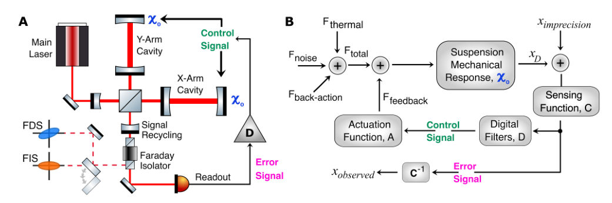
<figcaption class="paper-figure-caption"><b>Fig 1.</b> FIG. 1. Instrument overview and feedback-loop representation. A Simplified layout of the interferometer and readout chain used to sense and control the feedback-trapped differential arm mode. The main laser is resonant in the arm cavities, and the differential arm displacement is sensed at the antisymmetric port after the signal-recycling cavity and output Faraday isolator. Frequency-independent squeezing (FIS) or frequency-dependent squeezing (FDS) is injected into the readout path to modify the quantum measurement noise and radiation-pressure back-action acting on the mode. The optical readout produces an error signal, which is digitally filtered and converted into a control signal that...</figcaption>
</figure>
<figure class="paper-figure-card">
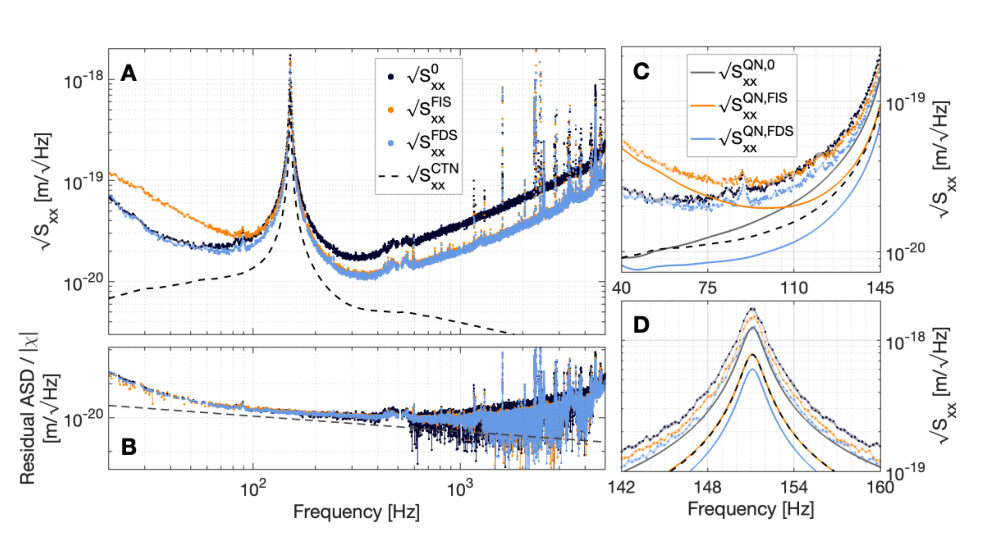
<figcaption class="paper-figure-caption"><b>Fig 2.</b> FIG. 2. Observed displacement spectra and quantum-noise model for the trapped mode. A Observed displace-</figcaption>
</figure>
<figure class="paper-figure-card">
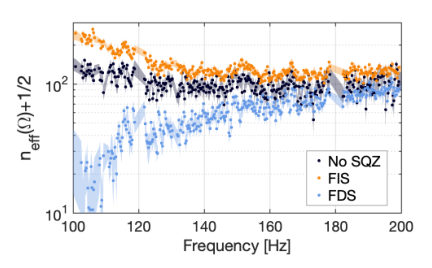
<figcaption class="paper-figure-caption"><b>Fig 3.</b> FIG. 4. Effective phonon occupancy of the reservoir. The effective phonon occupation neff(Ω) + 1</figcaption>
</figure>
<figure class="paper-figure-card">
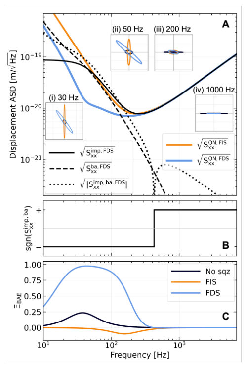
<figcaption class="paper-figure-caption"><b>Fig 4.</b> FIG. 3. Quantum-noise decomposition and correlation-driven back-action evasion. A Decom- position of the inferred displacement quantum noise for the frequency-dependent squeezing (FDS) configuration into the total noise, the effective imprecision contribution Simp xx , the effective back-action contribution Sba xx, and the magnitude</figcaption>
</figure>
<figure class="paper-figure-card">
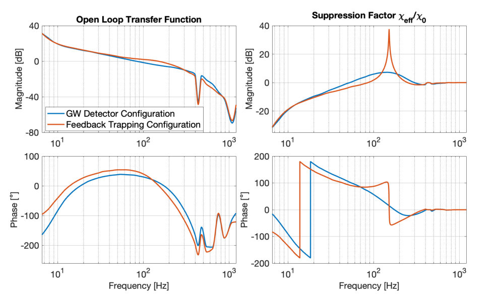
<figcaption class="paper-figure-caption"><b>Fig 5.</b> FIG. 5. Measured DARM open-loop transfer function and feedback-defined susceptibility modification. Left column: magnitude (top) and phase (bottom) of the measured DARM open-loop transfer function (OLTF) for the nominal configuration (no gain peaking) and with the feedback trap engaged. Right column: magnitude (top) and phase (bottom) of the corresponding suppression factor χeff(Ω)/χ0(Ω), where χeff is the effective closed-loop susceptibility inferred from the measured loop response and χ0 is the nominal free-mass susceptibility. The trapped configuration introduces a narrow-band modification near the trap resonance (∼151 Hz), consistent with an effective harmonic confinement of the...</figcaption>
</figure>

**Summary.** This research investigates the quantum noise limits in a massive mechanical oscillator, demonstrating that measurement back-action can be actively suppressed. By injecting frequency-dependent squeezed states, the authors engineered quantum correlations that partially cancel the inherent back-action noise, achieving a measurable 'back-action evasion' effect.

**Why it may be interesting.** This work is highly relevant as it provides a concrete, macroscopic realization of quantum control over measurement back-action, directly testing fundamental limits predicted by quantum optics and open quantum systems theory.

Detailed structure

**Main problem.** The paper addresses the fundamental quantum limit on continuous displacement measurements, which is set by the unavoidable trade-off between readout imprecision and measurement back-action noise.

**Main result.** By engineering quantum correlations using frequency-dependent squeezing, the authors successfully demonstrated quantum back-action evasion, achieving a measurable suppression of the total observed motion near resonance.

**Method.** The study uses a theoretical framework based on quantum noise decomposition and analyzes experimental data by comparing measured power spectral densities (PSDs) for different input quantum states (vacuum, FIS, FDS).

**Model / system.** The system is a macroscopic, kilogram-scale mechanical oscillator (trapped mode) interrogated via a large-scale interferometer setup, modeled as a harmonic oscillator subject to quantum noise sources.

**Key observables.** Observed displacement Power Spectral Density (PSD), the quantum noise components (imprecision, back-action, correlation), and the effective phonon occupation number ($n_{	ext{eff}}$).

**Important parameters / regimes.** The trapped mode is characterized by an effective mass ($\sim 10 	ext{ kg}$), resonant frequency ($\sim 0.5 	ext{ Hz}$), and high quality factor ($Q \gtrsim 10^8$).

**Assumptions / limitations.** The analysis relies on a linear quantum noise model and assumes that the observed suppression is due to the engineered negative correlation term in the quantum noise spectrum.

**Figures summary.** Figures show the instrument overview, the feedback loop used to reshape the measurement, and detailed comparisons of the measured quantum noise spectra for vacuum, FIS, and FDS states, highlighting the resonance suppression.

**Paper structure.** The paper progresses from defining the fundamental quantum noise trade-off in LIGO, to developing the mathematical framework incorporating correlation terms, and finally presenting quantitative results showing how specific squeezing techniques (FDS) can manipulate these correlations to achieve noise suppression.

Abstract

Continuous quantum displacement measurements are fundamentally limited by a trade-off between readout imprecision and measurement back-action, constrained by the Heisenberg uncertainty principle. In the Laser Interferometric Gravitational-Wave Observatory (LIGO), these two quantum noise components dominate much of the observation band, making it an excellent testbed. We induce a sub-Hz-linewidth optomechanical mode by trapping the differential motion of the 40-kg mirrors in a band where radiation-pressure back-action dominates the motion. Engineering the quantum state entering the dark port creates correlations between imprecision and back-action that partially cancel their contributions, reducing observed motion near resonance by ~47%. A framework resolving the imprecision, back-action, and correlation terms identifies the origin of this suppression. These results demonstrate quantum back-action evasion and quantum reservoir engineering in a macroscopic optomechanical system.

[↑ back to top](#top)

### [Non-Thermal Effects in Fermionic Atoms Coupled to Open Cavities](http://arxiv.org/abs/2609.20434v1)

**Authors:** Jules Sueiro, Marco Schiro  
**Type:** theory · **Category:** other · **PDF:** <https://arxiv.org/pdf/2609.20434v1>  
**Analysis basis:** full PDF text, analyzed in chunks
**Topic relevance:** 🔥 `Keldysh / 2PI / non-Gaussian methods` **4/5** · 🔥 `driven-dissipative phase transition` **4/5** · 🔥 `non-equilibrium universality` **4/5** · `Tavis-Cummings & cavity-many-emitter` **3/5** · `analog quantum simulation` **3/5** · `correlated / nonlocal dissipation` **3/5** · `methods for driven-dissipative` **3/5** · `scars & prethermalization` **3/5** · `Dicke superradiance` **1/5** · `quantum measurements` **1/5** · `superradiant laser` **1/5**

↔ Scroll figures horizontally

<figure class="paper-figure-card">
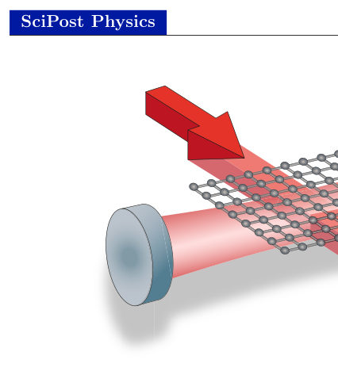
<figcaption class="paper-figure-caption"><b>Fig 1.</b> Figure 1: Illustration of the system. A system of fermionic atoms on a lattice coupled to a lossy cavity through a transverse pump.</figcaption>
</figure>
<figure class="paper-figure-card">
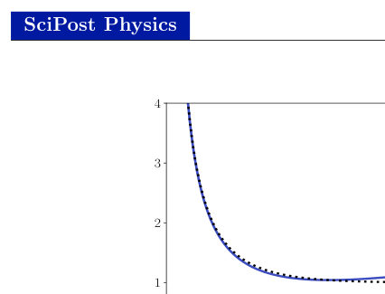
<figcaption class="paper-figure-caption"><b>Fig 2.</b> Figure 2: Distribution function ˜B(ω) of the symmetrized boson/cavity quadra- ture, compared to the thermal one at the same low-frequency effective temperature TLF.</figcaption>
</figure>
<figure class="paper-figure-card">
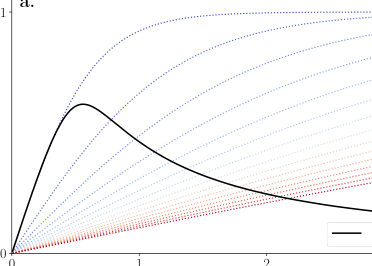
<figcaption class="paper-figure-caption"><b>Fig 3.</b> Figure 4: a. Non-equilibrium distribution function of the fermions ˜F(ε) as a function of the quasi-particle energy in units of the cavity frequency δ (full line). The dotted lines show the would-be equilibrium distribution function of fermions for different temperature in units of the LFET TLF. b. Distribution function superimposed with the density of states (green) in the normal phase for δ = 10J. c. for δ = 2J. d. in the superradiant phase with gϕ = 1.5δ and δ = 5J. e. In black, the effective temperature T ˙Q -in units of TLF- such that the heat-flux from the fermions to the cavity vanishes ˙Q = 0, as a function of the bandwidth of the fermions J/δ. In blue, the fluctuations of ˆ∆in the...</figcaption>
</figure>
<figure class="paper-figure-card">
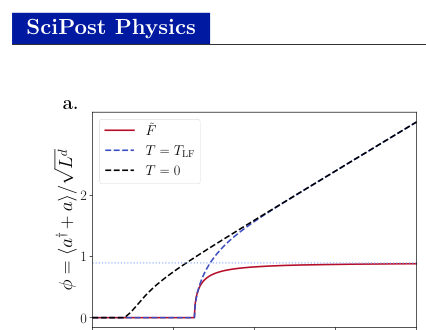
<figcaption class="paper-figure-caption"><b>Fig 4.</b> Figure 5: Order parameter obtained from the mean-field + kinetic equation resolution for a low bandwidth δ = 10J a. and high bandwidth δ = 2J b. fermionic systems. The other parameters are set to Γ = δ.</figcaption>
</figure>
<figure class="paper-figure-card">
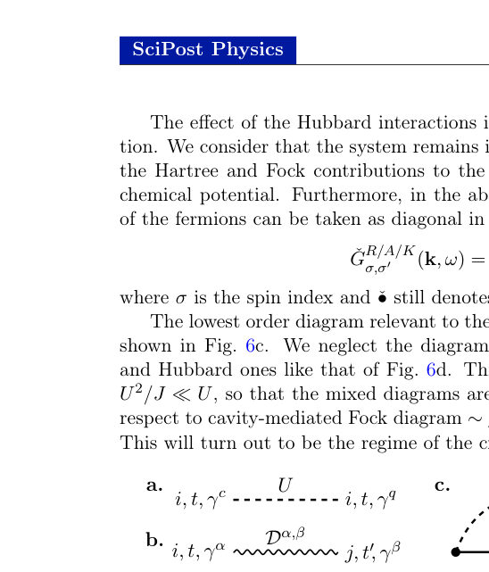
<figcaption class="paper-figure-caption"><b>Fig 5.</b> Figure 6: a. Hubbard interaction line. b. Cavity-mediated interaction line. c. Second Born self-energy diagram, to which we limit the contributions to the self-energy of the Hubbard interactions. d. Example of a diagram mixing the two types of interaction. All such contributions are neglected.</figcaption>
</figure>

**Summary.** This paper analyzes fermionic atoms coupled to a dissipative optical cavity using advanced Keldysh field theory. It demonstrates that the system can settle into a non-thermal steady state, characterized by zero net heat-current exchange. The findings are crucial for understanding non-equilibrium dynamics in quantum simulators and cavity QED platforms.

**Why it may be interesting.** This work is highly relevant as it tackles non-equilibrium dynamics in cavity QED systems, showing how dissipation and interactions lead to non-thermal steady states, which is a key area in open quantum systems.

Detailed structure

**Main problem.** The study investigates non-equilibrium steady states and thermalization dynamics in fermionic atoms coupled to an open, dissipative single cavity mode.

**Main result.** The system can reach a non-thermal steady state where the heat-current between fermions and the cavity is nullified, and the inclusion of Hubbard interactions drives a crossover towards full equilibrium.

**Method.** The authors employ Keldysh field theory and diagrammatics to solve the quantum kinetic equations derived from the Lindblad master equation.

**Model / system.** The model is a Fermi-Hubbard Hamiltonian coupled to a cavity mode, evolving under dissipation described by a Lindblad master equation. The analysis uses the Keldysh formalism to derive effective actions and kinetic equations.

**Key observables.** Non-equilibrium steady-state distribution function, heat-current between fermions and cavity, and the mean-field phase diagram for superradiance.

**Important parameters / regimes.** Hubbard interaction strength (U), cavity detuning ($\delta$), and cavity decay rate ($\Gamma$).

**Assumptions / limitations.** The analysis relies on integrating out the cavity mode and uses approximations like the local approximation for the Hubbard self-energy and the quasi-particle approximation.

**Figures summary.** Figure 1 illustrates the coupled system setup. Figure 2 compares the calculated cavity distribution function to the expected thermal distribution, showing deviations.

**Paper structure.** The paper progresses from setting up the coupled Hamiltonian and master equation, through the Keldysh formalism to derive effective actions, solving for the non-equilibrium steady state via kinetic equations, and finally calculating conserved quantities like the heat-flux.

Abstract

We study a Fermi-Hubbard model coupled to a open dissipative single cavity mode. Using Keldysh diagrammatics we derive and solve the quantum kinetic equations for the fermions, taking the bosonic cavity mode as a source of non-equilibrium noise and dissipation. In absence of Hubbard interactions we show that the fermions reach generically a non-equilibrium steady-state, characterized by a non-thermal distribution function. Quite interestingly we demonstrate that the latter exactly nullifies the heat-current between fermions and cavity mode. We discuss the regimes of parameters where a low-frequency effective temperature description emerges and how the fluctuations affect the mean-field phase diagram for the superradiance phase transition. Finally we include Hubbard interaction in the weak-coupling regime and show that it leads to a crossover towards a full equilibrium distribution.

[↑ back to top](#top)

### [Dephasing-Enhanced Response and Phase Transitions in Quantum Boltzmann Samplers](http://arxiv.org/abs/2609.19591v1)

**Authors:** Yu-Xuan Zhang, Jing-Ling Chen, Leong-Chuan Kwek, Peng Wang  
**Type:** theory · **Category:** statistical mechanics · **PDF:** <https://arxiv.org/pdf/2609.19591v1>  
**Analysis basis:** full PDF text, analyzed in chunks
**Topic relevance:** 🔥 `driven-dissipative phase transition` **4/5** · 🔥 `non-equilibrium universality` **4/5** · `correlated / nonlocal dissipation` **3/5** · `methods for driven-dissipative` **3/5** · `Keldysh / 2PI / non-Gaussian methods` **2/5** · `analog quantum simulation` **2/5** · `quantum measurements` **1/5**

↔ Scroll figures horizontally

<figure class="paper-figure-card">
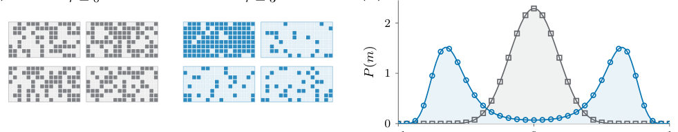
<figcaption class="paper-figure-caption"><b>Fig 1.</b> FIG. 1. Dephasing-enhanced response and stationary ordering at fixed programmed weights. (a) Single-spin Bloch trajectories at a fixed conditional field, showing the dephasing-induced change in the stationary polarization. (b) Stationary Curie–Weiss branches, m = m∗(Km). The target orders at Kc = 1, whereas dephasing shifts the sampler threshold to Kc(r) &lt; 1. (c) Four computational-basis samples at N = 128 and K = 0.75, showing disordered configurations without dephasing and ordered configurations with dephasing. (d) Stationary magnetization distributions at the same N and K: the target remains unimodal around m = 0, whereas the dephased sampler is bimodal. Throughout, the dephased sampler...</figcaption>
</figure>
<figure class="paper-figure-card">
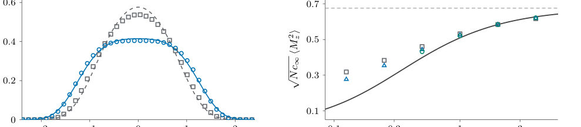
<figcaption class="paper-figure-caption"><b>Fig 2.</b> FIG. 2. Residual coherence narrows the critical stationary distribution. (a) Magnetization distributions at the fully dephased critical coupling K∞= 1/(1 + s), with s = 0.8. Lines give the limiting densities pA0,ρ for ρ = r/ √</figcaption>
</figure>
<figure class="paper-figure-card">
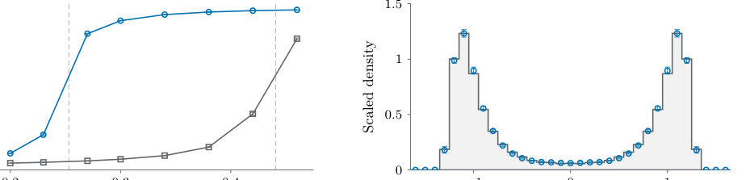
<figcaption class="paper-figure-caption"><b>Fig 3.</b> FIG. 3. Spatial order in the strong-dephasing process of Eq. (11). (a) Magnetization magnitudes for the noisy sampler and target Ising process on the same 32 × 32 lattice. Vertical lines mark their thermodynamic critical couplings; between them, the sampler is ordered and the target is disordered. (b) Standardized magnetization distributions on a 64 × 64 torus, comparing the noisy sampler at J = 0.2530 with the equilibrium Ising model at its own critical coupling. The sampler has s = 0.8. Bars are independent-run bootstrap errors, including uncertainty in the normalization. The SM gives critical exponents, moment ratios, and finite-size analysis.</figcaption>
</figure>

**Summary.** This work analyzes quantum Boltzmann samplers to understand how environmental dephasing drives the system into ordered phases, even when the desired target distribution is disordered. By analyzing the master equation and critical fluctuations, the authors establish a finite transition point and derive the scaling behavior of the magnetization near criticality. This shows that quantum noise can fundamentally alter the phase transition landscape of complex interacting quantum systems.

**Why it may be interesting.** The study provides a concrete, quantum-mechanical framework for understanding how noise (dephasing) can induce order or drive phase transitions in complex many-body systems, linking quantum dynamics to classical critical phenomena.

Detailed structure

**Main problem.** The paper investigates how dephasing affects the response and phase transitions in quantum Boltzmann samplers, especially when the underlying target probability distribution is disordered.

**Main result.** Dephasing can drive the quantum sampler into an ordered phase even if the target distribution is disordered, and the critical fluctuations retain a finite imprint of coherence.

**Method.** The analysis involves deriving and solving the master equation governing the density matrix evolution, linearizing around fixed points, and using scaling arguments near criticality.

**Model / system.** The system is a quantum Boltzmann sampler modeled by interacting spins ($\sigma_i = \pm 1$) whose dynamics are governed by a master equation incorporating engineered dissipative updates and phase noise ($\gamma$).

**Key observables.** Magnetization distribution (transition from unimodal to bimodal), rescaled magnetization $X_N$, and critical exponents ($
u, eta/
u, \gamma/
u$).

**Important parameters / regimes.** Dephasing strength ($\gamma$), coupling strength ($K$), and the ratio $r = \gamma / [
u(1 - s^2)]$.

**Assumptions / limitations.** The analysis relies on deriving the stationary law via generator methods and assuming local update costs are independent of the state.

**Figures summary.** Figures illustrate the transition from disordered to ordered phases via Bloch trajectories and show the convergence of critical stationary distributions.

**Paper structure.** The paper progresses by establishing the dynamics via a master equation, analyzing local and collective responses, determining the critical thresholds, and finally deriving the stationary law for the rescaled magnetization in the critical limit.

Abstract

Dephasing can drive a quantum Boltzmann sampler into an ordered phase while its programmed probability distribution remains disordered. We trace this transition to an enhanced conditional response: coherence loss changes how each spin responds to its neighbors, and interactions amplify the change. For all-to-all coupling, we establish the stationary transition at finite dephasing. Near criticality, the magnetization distribution depends on the ratio of dephasing strength to the square root of system size, retaining a finite imprint of coherence even as the local coherent correction vanishes. In the strong-dephasing limit on a square lattice, the dynamics generates effective multispin interactions and probability currents, with Ising-like critical statistics. Adjusting the local dissipative update restores the target probability process on arbitrary graphs.

[↑ back to top](#top)

### [Observation of multiphoton entanglement in resonance fluoresce](http://arxiv.org/abs/2609.19808v1)

**Authors:** Xiao-Long Zhou, Jian Wang, Ze-Min Shen, Dong-Yu Huang, Si-Jian He, Qi-Yang Huang, Yi-Jia Liu, Yu-Shu Chen, Quan Jiang, Chuan-Feng Li, Guang-Can Guo  
**Type:** experiment · **Category:** other · **PDF:** <https://arxiv.org/pdf/2609.19808v1>  
**Analysis basis:** full PDF text, analyzed in chunks
**Topic relevance:** 🔥 `quantum optics experiment` **4/5** · `QC/QI experiment` **3/5** · `interference shaping light` **3/5** · `Tavis-Cummings & cavity-many-emitter` **2/5** · `quantum measurements` **2/5** · `Full counting statistics` **1/5** · `analog quantum simulation` **1/5** · `correlated / nonlocal dissipation` **1/5** · `driven-dissipative phase transition` **1/5** · `methods for driven-dissipative` **1/5**

↔ Scroll figures horizontally

<figure class="paper-figure-card">
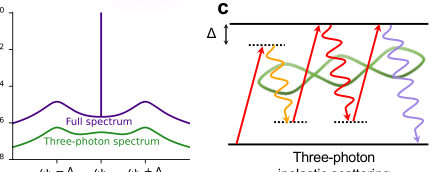
<figcaption class="paper-figure-caption"><b>Fig 1.</b> FIG. 1. Resonance fluorescence in the Heitler regime. a, Interference of mean field and quantum fluctuation re- sults in the observation of single-photon emission. b, Inten- sity spectrum of resonance fluorescence under detuned Heitler regime. The mean field spectrum is a delta-like function cen- tered at driving laser frequency ωL, The quantum fluctuation spectrum comprises three Lorentzian peaks: two sidebands at ωL ± ∆with widths Γ, and a weak central carrier at ωL of width 2Γ. The weakness of the carrier’s intensity is due to the absence of this component in two-photon scattering. c, Three-photon inelastic scattering involving three virtual en- ergy levels.</figcaption>
</figure>
<figure class="paper-figure-card">
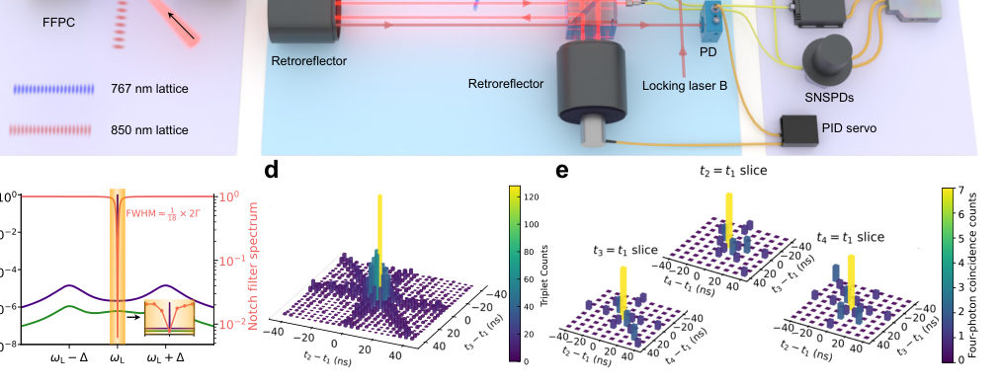
<figcaption class="paper-figure-caption"><b>Fig 2.</b> FIG. 2. Experimental setup and observation of three- and four-order photon bunching. a, A single 87Rb atom is trapped at the center of the optical cavity by a two-dimensional optical lattice formed by 850 nm and 796 nm laser beams. The atom is continuously driven by two red-detuned laser beams counter-propagating at an angle. The scattered light from the atom is efficiently collected by the fiber-coupled cavity and guided through the fiber to the measurement setup. b, The scattered light is first sent to a narrow-linewidth notch filter cavity to isolate the quantum fluctuation field, and then directed into a three-photon Franson interferometer for entanglement analysis. For visual clarity,...</figcaption>
</figure>
<figure class="paper-figure-card">
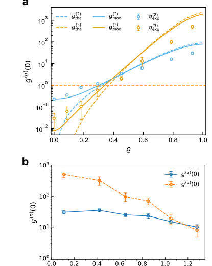
<figcaption class="paper-figure-caption"><b>Fig 3.</b> FIG. 4. Evolution of photon correlations at zero time delay with mean-field suppression ratio and notch fil- ter linewidth. a, Measured second- and third-order photon correlations for different mean field suppression ratio. Blue (orange) circles represent the second- (third-) order correla- tion data, while the corresponding dashed (solid) lines de- note the ideal (corrected) theoretical model. In the corrected model, rare multi-atom events (6% probability with another atom trapped) and background noise of ∼200 counts per second are taken into account. b, Second and third-order correlations for different notch filter linewidth.</figcaption>
</figure>
<figure class="paper-figure-card">
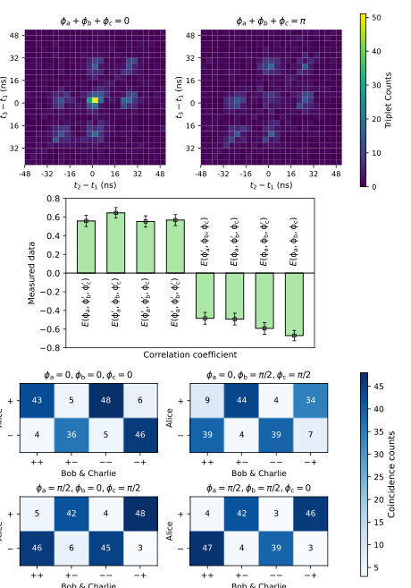
<figcaption class="paper-figure-caption"><b>Fig 4.</b> FIG. 3. Violation of three-photon Svetlichny’s inequal- ity and a data set of quantum secret sharing. a, 2D histogram of photon arrival time differences accumulated over 24 hours for the three channels of the Franson inter- ferometer. The six side peaks arise from events where the three photons do not all travel along the same arm, while the central peak originates from the coherent superposition of |l, l, l⟩and |s, s, s⟩, which are indistinguishable. The in- terference in the central peak depends on the total phase cos(ϕa + ϕb + ϕc), showing constructive (destructive) inter- ference when the phase equals 0 (π). b, The correlation coef- ficients that constitute the Svetlichny parameter...</figcaption>
</figure>

**Summary.** This paper experimentally reveals that resonance fluorescence from a single atom exhibits a multiphoton scattering nature, intrinsically generating multiphoton entanglement. By isolating quantum field fluctuations in a cavity QED setup, the authors confirmed genuine tripartite entanglement by violating Svetlichny's inequality. This establishes a simple platform for generating entangled states useful for quantum information processing.

**Why it may be interesting.** This work provides a fundamentally simple, cavity-enhanced route to generate high-order entangled states directly from a well-understood process (resonance fluorescence), which is highly relevant for quantum optics and quantum information applications.

Detailed structure

**Main problem.** To experimentally investigate the multiphoton scattering nature of resonance fluorescence, which is expected to generate intrinsic multiphoton entanglement, as higher-order processes have remained unexplored.

**Main result.** The authors experimentally demonstrated the multiphoton scattering nature, confirming genuine tripartite entanglement via the violation of Svetlichny's inequality, and showed this source can implement a quantum secret sharing protocol.

**Method.** The experiment uses a single two-level emitter coupled to a cavity, employing a notch filter to isolate quantum fluctuations and measuring higher-order correlations using a Franson-type interferometer.

**Model / system.** The system is a single two-level quantum emitter (e.g., $^{87}	ext{Rb}$ atom) interacting with near-resonant coherent light within a Fabry–Pérot cavity. The analysis focuses on the quantum fluctuation field ($\hat{\epsilon}$) resulting from the scattering process.

**Key observables.** Three-photon bunching ($g^{(3)}(0)$), violation of Svetlichny’s inequality ($	ext{SSve} > 4$), and correlation measurements as a function of the mean-field suppression ratio ($\varrho$).

**Important parameters / regimes.** The experiment operates in the detuned Heitler regime ($s \ll 1$) and relies on suppressing the mean field ($\alpha$) to isolate the quantum fluctuations ($\hat{\epsilon}$).

**Assumptions / limitations.** The analysis assumes the ability to effectively suppress the strong mean field ($\alpha$) using optical filtering to probe the weak quantum fluctuation field ($\hat{\epsilon}$).

**Figures summary.** Figures illustrate the field decomposition into mean and fluctuation components, the experimental setup involving the cavity and three-photon interferometer, and quantitative results showing the violation of the Svetlichny inequality and the QSS protocol implementation.

**Paper structure.** The paper establishes the theoretical framework by decomposing the scattered field, details the experimental setup using cavity QED and filtering, presents measurements of higher-order correlations, confirms entanglement via inequality violation, and concludes with a demonstration of a quantum information application (QSS).

Abstract

Resonance fluorescence, the process in which a single two-level quantum emitter interacts with a near-resonant coherent light, is a cornerstone of quantum optics as a paradigmatic light-matter interaction. Quantum phenomena in resonance fluorescence have been accounted for in terms of one- and two-photon processes; however, the physical processes arising from the interaction of a single two-level atom with higher photon numbers remain unexplored experimentally. Here we experimentally reveal the multiphoton scattering nature of resonance fluorescence, which intrinsically gives rise to multiphoton entanglement. By accessing quantum fluctuations in the field emitted from a cavity-quantum electrodynamics system, we resolve third- and fourth-order photon scattering events from a single two-level atom. In the three-photon component, the scattered photons are shown to be genuinely energy-time entangled, as verified by a violation of Svetlichny's inequality. As a demonstration of an application, a quantum secret sharing protocol (QSS) is implemented using this entangled photon source. Our study refines the descriptive framework of resonance fluorescence and broadens the scope of its investigation. It also establishes a fundamentally simple route for generating multiphoton entangled states for quantum information processing and quantum metrology.

[↑ back to top](#top)

### [Theory of post-selected entanglement transitions in monitored bosons](http://arxiv.org/abs/2609.19251v1)

**Authors:** Ilia Komissarov, Emanuele G. Dalla Torre, Ahana Chakraborty  
**Type:** theory · **Category:** statistical mechanics · **PDF:** <https://arxiv.org/pdf/2609.19251v1>  
**Analysis basis:** full PDF text, analyzed in chunks
**Topic relevance:** 🔥 `quantum measurements` **4/5** · `Keldysh / 2PI / non-Gaussian methods` **3/5** · `driven-dissipative phase transition` **3/5** · `analog quantum simulation` **2/5** · `correlated / nonlocal dissipation` **2/5** · `methods for driven-dissipative` **2/5** · `non-equilibrium universality` **2/5** · `Full counting statistics` **1/5**

↔ Scroll figures horizontally

<figure class="paper-figure-card">
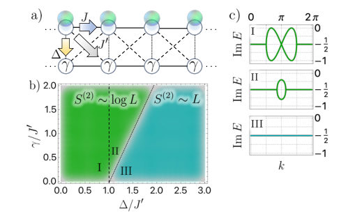
<figcaption class="paper-figure-caption"><b>Fig 1.</b> Figure 1. (a) We consider non-interacting bosons hopping on a 1D cross-stitch lattice described by the Hamiltonian (37) and initialized in a Fock state with the top (A) sublattice singly occupied by bosons represented by the spheres. The bottom (B) sublattice hosts constant imaginary on-site potentials γ, modeling the post-selected no-click trajectory of the quantum jump protocol (4). (b) The phase diagram exhibits two phases distinguished by the scaling of the steady-state entanglement. The phase with logarithmic scaling of the late-time bipartite second R´enyi entropy S(2) L/2 (7) is shown in green (regions I</figcaption>
</figure>
<figure class="paper-figure-card">
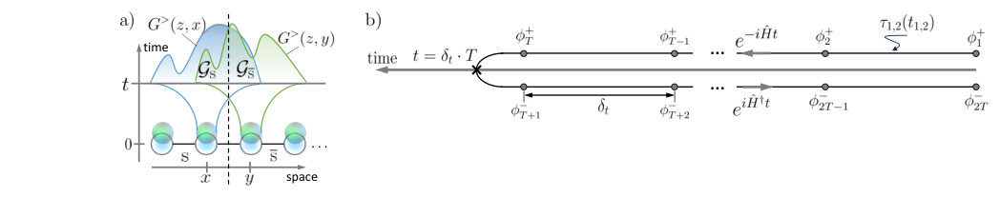
<figcaption class="paper-figure-caption"><b>Fig 2.</b> Figure 2. a) Initially localized bosons, represented by green spheres, are evolved using the Green’s function ˆG&gt;, forming extended probability density clouds, shown in blue and green spatial profiles. The overlaps Gs(x, y), Gs(x, y) (see (12)) of the wave functions to the left and to the right of the bipartition, indicated with the dashed line, give rise to the finite entanglement entropy in the system (30). The entropy is maximized when the overlaps are equal on both sides of the bipartition, thereby maximizing the uncertainty in particle positions. b) Keldysh time contour corresponding to the discretization of the time evolution of the density matrix ˆρ(t) = ei ˆ H† eff tˆρ(0)e−i ˆ Heff...</figcaption>
</figure>
<figure class="paper-figure-card">
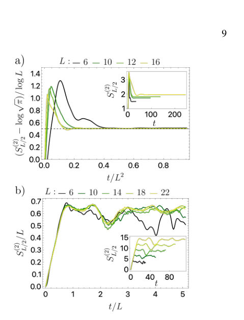
<figcaption class="paper-figure-caption"><b>Fig 3.</b> Figure 4. (a), (b): Bipartite R´enyi entanglement entropy as a func- tion of time for different sizes of the system L corresponding to the S(2) ∼log L (a) and S(2) ∼L (b) regions (see the phase diagram in Fig. 1b). The figures showcase the collapse of the curves, rescaled by the system length L, while the insets show the raw data. (a) The linear in time entropy build-up phase is followed by the decay of all but one mode. The entanglement follows the predicted S(2) ≃ 1 2 log(πL) large-L behavior already for very small system sizes (see Appendix E). The parameters used are ∆= J = J′/2, γ = 0.3J′, and S(2) is obtained by the brute-force evaluation of the permanents in (30). (b) After the...</figcaption>
</figure>
<figure class="paper-figure-card">
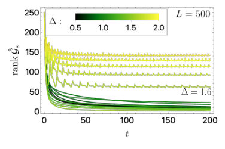
<figcaption class="paper-figure-caption"><b>Fig 4.</b> Figure 5. The late-time effective rank (33) of the Green’s function contraction Gs entering the numerator in (30) is indicative of the measurement-induced phase transition. All curves correspond to γ = J′ = 2J. When ∆≤1.5, rank Gs approaches 1 due to the decay of all but a single eigenmode in the system, while ∆&gt; 1.5 corresponds to the finite O(L) values of the late-time effective rank.</figcaption>
</figure>

**Summary.** This theoretical paper develops a novel Keldysh field-theoretic approach to study entanglement in monitored bosonic systems. It demonstrates that measurement monitoring can induce a phase transition in entanglement scaling, moving from volume-law to logarithmic scaling. This transition is fundamentally linked to the condensation of bosons into a finite set of slowest-decaying modes.

**Why it may be interesting.** This work provides a powerful, analytically tractable tool to study measurement-induced dynamics in bosonic systems, linking spectral theory (non-Hermitian spectrum) directly to macroscopic entanglement properties.

Detailed structure

**Main problem.** The paper addresses the poorly understood realization of entanglement phase transitions in bosonic systems with unbounded local occupation numbers, driven by quantum measurements.

**Main result.** It establishes a distinct mechanism showing a transition from volume-law to logarithmic entanglement scaling in monitored bosonic systems, controlled by the restructuring of the non-Hermitian spectrum.

**Method.** The authors develop a replica-free Keldysh field-theoretic framework to calculate the Rényi entropy, expressing it in terms of permanents of matrices constructed from single-particle Green's functions.

**Model / system.** The study focuses on non-interacting bosons on a one-dimensional cross-stitch lattice undergoing continuous monitoring (post-selection on the no-click trajectory). The dynamics are governed by an effective non-Hermitian Hamiltonian.

**Key observables.** Rényi entropy ($S$), entanglement scaling (Volume-law vs. Logarithmic scaling), and the structure of the non-Hermitian spectrum (number of long-lived modes).

**Important parameters / regimes.** Monitoring rate ($\gamma$), system size ($L$), and the nature of the initial state (Fock states).

**Assumptions / limitations.** The analysis is restricted to non-interacting bosons, and the framework is designed to handle non-Gaussian initial states.

**Figures summary.** Figure 1 illustrates the lattice setup and a phase diagram showing the transition between logarithmic and volume-law scaling regions marked by an exceptional point. Other figures detail the spectral properties linking the scaling regimes.

**Paper structure.** The paper develops the field-theoretic formalism, applies it to the monitored bosonic lattice, and analyzes the resulting entanglement scaling based on the spectral properties of the effective non-Hermitian Hamiltonian.

Abstract

Entanglement phase transitions driven by quantum measurements have emerged as a central paradigm in open quantum many-body physics. Such phase transitions are well established for systems with finite local Hilbert-space dimensions, such as qubits and fermions, while their realization in bosonic systems with unbounded local occupation numbers remains poorly understood. Even in the absence of interactions, number states of bosons are intrinsically non-Gaussian, preventing the use of standard correlation-matrix approaches. To address this problem, we develop a replica-free Keldysh field-theoretic framework that expresses the Renyi entropy of bosonic systems initialized in on-site Fock states in terms of permanents of matrices constructed from single-particle Green's functions. Applying this framework to a continuously monitored one-dimensional cross-stitch lattice conditioned on the no-click trajectory, we uncover a transition from volume-law to logarithmic entanglement scaling. We show that the transition is controlled by a restructuring of the non-Hermitian spectrum that changes the number of long-lived modes from extensive to finite. In the strongly monitored regime, bosons dynamically condense into a microscopic number of slowest-decaying modes, producing logarithmic entanglement scaling, whereas an extensive manifold of long-lived modes at weak monitoring gives rise to volume-law entanglement. Our results establish a distinct mechanism for measurement-induced entanglement transitions in free bosonic systems and provide a computationally efficient diagnostic of the measurement-induced bosonic condensation.

[↑ back to top](#top)

### [Exceptional points and Jordan-chain signatures in quantum first-passage statistics](http://arxiv.org/abs/2609.20148v1)

**Authors:** Lachlan Bridges  
**Type:** theory · **Category:** other · **PDF:** <https://arxiv.org/pdf/2609.20148v1>  
**Analysis basis:** full PDF text, analyzed in chunks
**Topic relevance:** 🔥 `quantum measurements` **4/5** · `Full counting statistics` **3/5** · `correlated / nonlocal dissipation` **3/5** · `driven-dissipative phase transition` **3/5** · `methods for driven-dissipative` **2/5** · `non-equilibrium universality` **2/5** · `Keldysh / 2PI / non-Gaussian methods` **1/5**

↔ Scroll figures horizontally

<figure class="paper-figure-card">
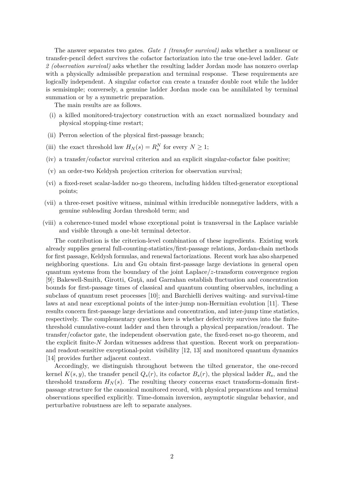
<figcaption class="paper-figure-caption"><b>Fig 1.</b> Low-resolution page preview, page 2</figcaption>
</figure>
<figure class="paper-figure-card">
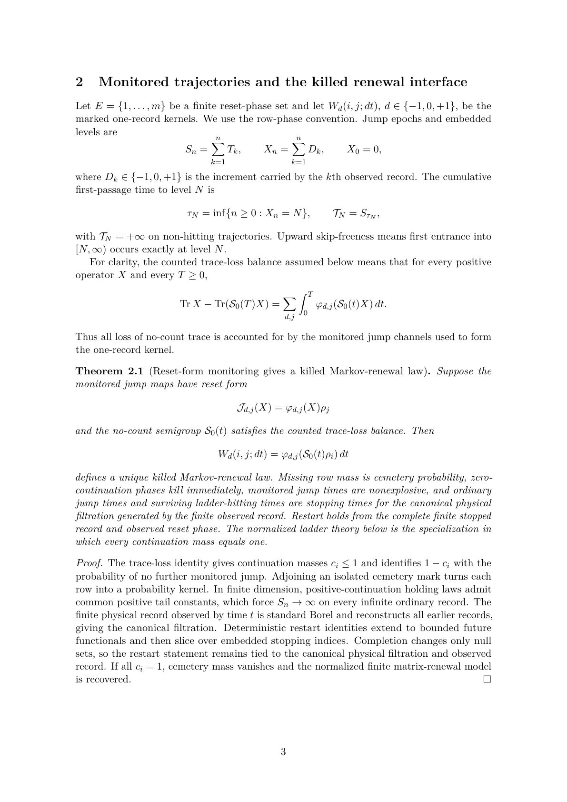
<figcaption class="paper-figure-caption"><b>Fig 2.</b> Low-resolution page preview, page 3</figcaption>
</figure>
<figure class="paper-figure-card">
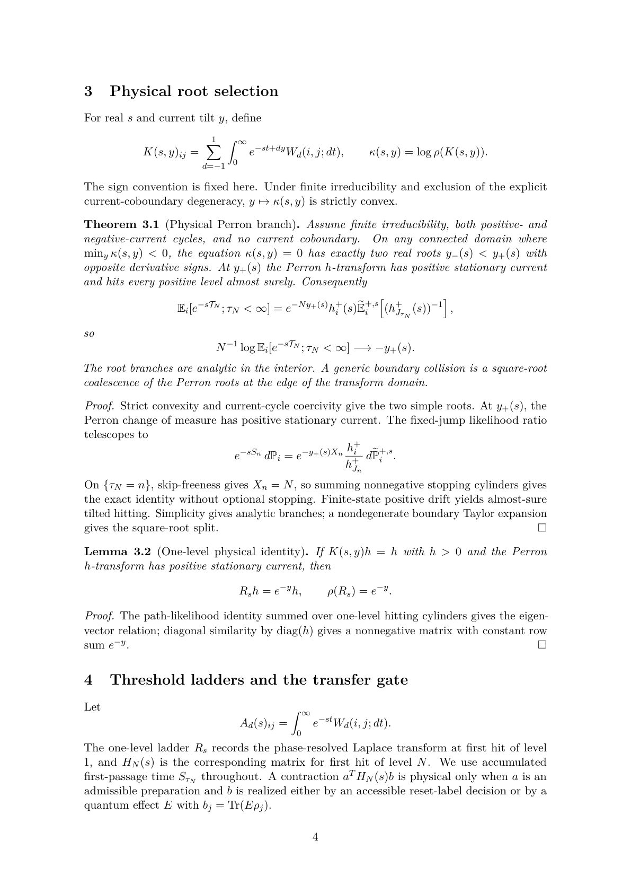
<figcaption class="paper-figure-caption"><b>Fig 3.</b> Low-resolution page preview, page 4</figcaption>
</figure>
<figure class="paper-figure-card">
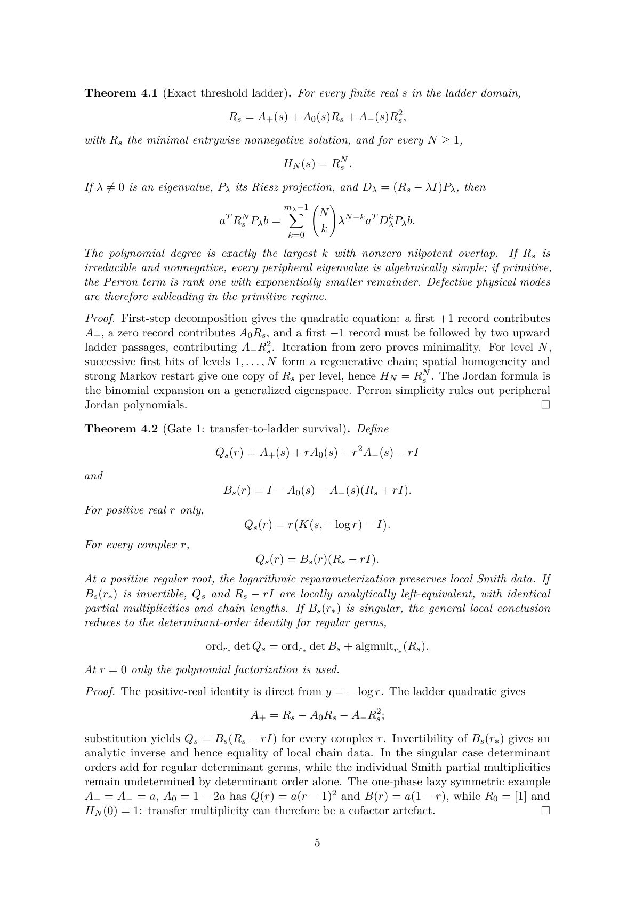
<figcaption class="paper-figure-caption"><b>Fig 4.</b> Low-resolution page preview, page 5</figcaption>
</figure>
<figure class="paper-figure-card">
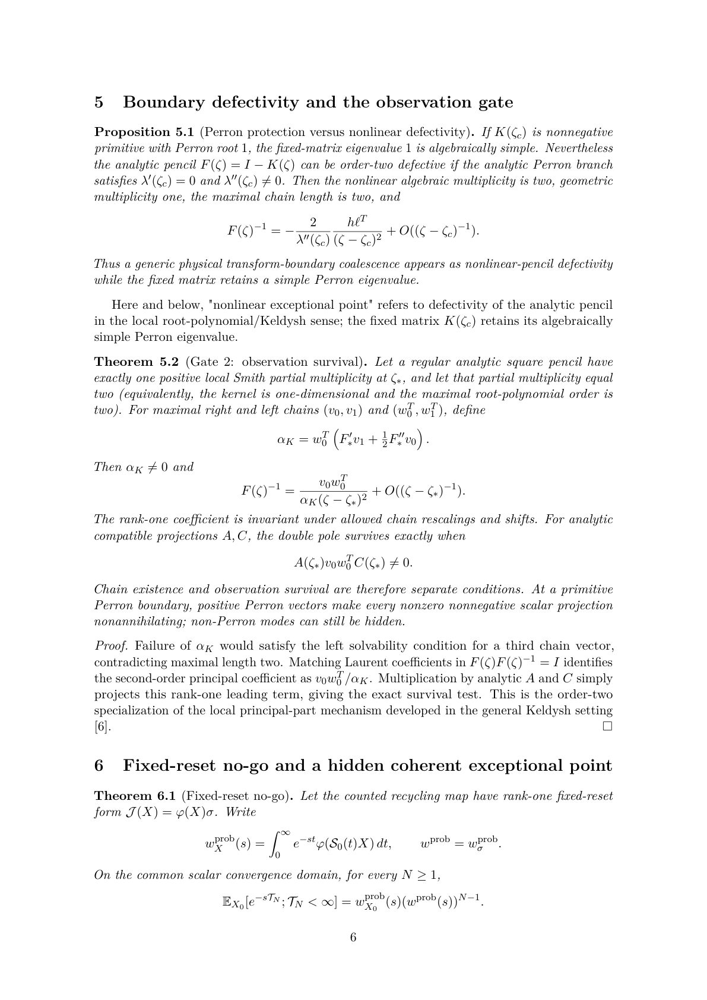
<figcaption class="paper-figure-caption"><b>Fig 5.</b> Low-resolution page preview, page 6</figcaption>
</figure>

**Summary.** This theoretical paper rigorously analyzes how spectral singularities, or exceptional points, manifest in the statistics of first-passage times for open quantum systems. Using advanced transform-domain techniques, the authors derive exact factorization theorems and establish fundamental no-go theorems regarding the relationship between generator defectivity and observable Jordan polynomial signatures. It provides a powerful mathematical framework for understanding measurement-induced spectral properties.

**Why it may be interesting.** This work provides deep mathematical tools for characterizing non-Hermitian spectral singularities (exceptional points) in the context of open quantum dynamics, which is crucial for understanding measurement back-action and quantum control.

Detailed structure

**Main problem.** The paper investigates the mathematical conditions under which exceptional point signatures, arising from nonlinear spectral defectivity, survive and manifest in physical quantum first-passage time statistics.

**Main result.** The authors establish exact threshold factorizations ($H_N(s) = R_N^s$) and prove a fixed-reset no-go theorem, showing that defective generators do not necessarily yield defective cumulative-count Jordan polynomials.

**Method.** The analysis is highly mathematical, utilizing exact transform-domain structure (Laplace/z-transforms), spectral theory for analytic matrix pencils, and renewal theory applied to monitored quantum processes.

**Model / system.** The study concerns open quantum systems monitored via quantum jumps, specifically focusing on finite reset-form monitored systems with upward-skip-free counting processes.

**Key observables.** Quantum first-passage-time distributions, threshold ladders ($R_s$), transfer factorizations ($Q_s(r)$), and the detection of Jordan-chain signatures (polynomial factors like $N\lambda^N$).

**Important parameters / regimes.** The analysis depends on the system being within the finite reset-form monitored-quantum and finite upward-skip-free matrix-renewal class.

**Assumptions / limitations.** The analysis is formulated at the level of exact transform-domain structure, explicitly separating this from time-domain asymptotics and perturbative robustness.

**Paper structure.** The paper builds from analyzing the survival of defectivity from the transfer pencil to the physical ladder, deriving exact factorization theorems, proving the no-go theorem for defective generators, and concluding with the construction of a minimal witness model.

Abstract

Exceptional-point signatures in first-passage observables are governed by two independent survival mechanisms: nonlinear spectral defectivity must pass from the one-record or transfer description to the physical one-level first-passage ladder, and the resulting ladder Jordan mode must have nonzero overlap with the chosen preparation and terminal observation. For finite reset-form monitored quantum systems with upward-skip-free counting, we prove the exact threshold factorization $H_N(s)=R_s^N$, identify the physical Perron branch, and derive the transfer factorization $Q_s(r)=B_s(r)(R_s-rI)$. Invertibility of the cofactor gives local equality of Smith data, whereas a singular cofactor can contribute transfer multiplicity absent from the ladder. An order-two Keldysh formula yields an independent observation gate. We then prove a fixed-reset no-go theorem: even a defective full tilted generator cannot generate a cumulative-count Jordan polynomial when the post-count ladder is scalar. Finally, we construct a three-reset monitored-Lindblad witness, minimal within irreducible nonnegative ladders, with a genuine subleading $Nλ^N$ threshold term and a coherence-tuned model in which a binary terminal effect retains the exact polynomial signature at a transversal transform-domain exceptional point. The analysis is formulated at the level of exact transform-domain structure; time-domain asymptotics and perturbative robustness remain separate questions.

[↑ back to top](#top)

### [Universal Suppression of Dissipation across Conformal Interface in Open Quantum Critical Systems](http://arxiv.org/abs/2609.19292v1)

**Authors:** Ruhanshi Barad, Tian Wu, Qicheng Tang, Xueda Wen  
**Type:** theory · **Category:** statistical mechanics · **PDF:** <https://arxiv.org/pdf/2609.19292v1>  
**Analysis basis:** full PDF text, analyzed in chunks
**Topic relevance:** 🔥 `non-equilibrium universality` **4/5** · `correlated / nonlocal dissipation` **3/5** · `driven-dissipative phase transition` **3/5** · `methods for driven-dissipative` **3/5** · `Keldysh / 2PI / non-Gaussian methods` **2/5** · `Frenkel-Kontorova` **1/5** · `analog quantum simulation` **1/5**

↔ Scroll figures horizontally

<figure class="paper-figure-card">
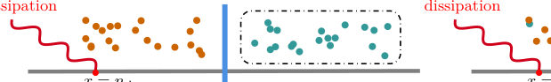
<figcaption class="paper-figure-caption"><b>Fig 1.</b> FIG. 1. Schematic illustration of the effect of a conformal interface on slowly relaxing modes. Local dissipation is introduced in the left half at x = nd, while a conformal interface is placed at the center of the system. In the perfectly reflecting limit, t = 0, half of the modes are localized in the nondissipative chain (green dots) and remain purely oscillating, while the other half are localized in the dissipative chain (orange dots) and decay with finite relaxation rates. For 0 &lt; t ≤1, the formerly oscillatory modes extend into the dissipative chain and therefore acquire finite relaxation rates. In this work, we focus on modes whose relaxation times scale as O(L3), which we refer to as...</figcaption>
</figure>
<figure class="paper-figure-card">
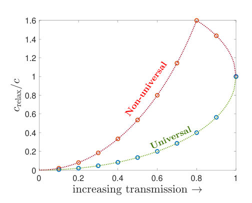
<figcaption class="paper-figure-caption"><b>Fig 2.</b> FIG. 2. crelax as a function of the interface transmission for the critical harmonic chain and the critical fermion chain. For cglobal relax , defined in terms of the Liouvillian gap accord- ing to Eq. (1.1), the result may coincide with crelax for some boundary conditions (green), but can become nonuniversal for others (red). See Sec. VI and Fig. 10 for details. In con- trast, the quantity crelax introduced in this work is universal (green).</figcaption>
</figure>
<figure class="paper-figure-card">
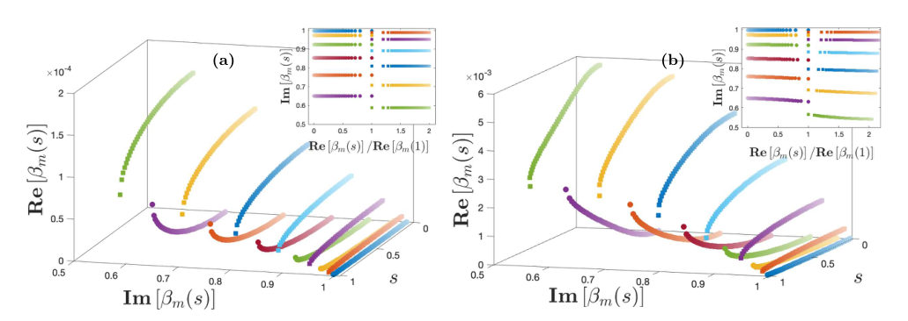
<figcaption class="paper-figure-caption"><b>Fig 3.</b> FIG. 3. Complex single-particle eigenspectrum of the critical harmonic chain with a conformal interface coupled to a local environment. For each mode m, the corresponding complex eigenvalue βm(s) is shown as the transmission parameter s is varied. The real part Re [βm(s)] &gt; 0 characterizes the relaxation rate, while the imaginary part Im [βm(s)] determines the coherent part of the mode evolution. Here, different colors label different modes, while different shades of the same color show how each mode evolves as s is varied from 1 to 0, with lighter shades corresponding to smaller values of s. Note, the curves separate into two distinct branches: the circle-marked curves, which bend downward,...</figcaption>
</figure>
<figure class="paper-figure-card">
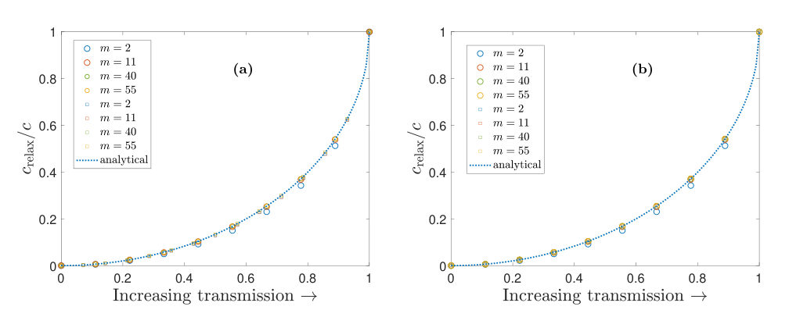
<figcaption class="paper-figure-caption"><b>Fig 4.</b> FIG. 4. Mode-resolved relaxation coefficient crelax in Eq.(1.4) for different modes in the weak-dissipation regime. Panel (a) shows free boundary conditions, while panel (b) shows fixed boundary conditions. Here, m denotes the mode index. For each panel, we consider two choices of boundary dissipation: circles correspond to local dissipation site nd in the left chain, while squares correspond to local dissipation site nd in the right chain.</figcaption>
</figure>
<figure class="paper-figure-card">
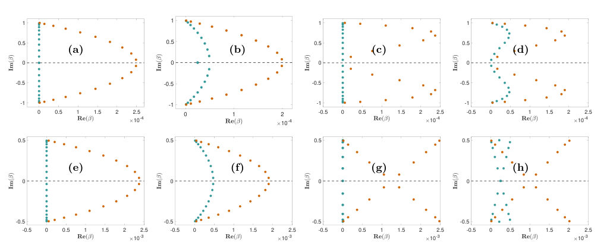
<figcaption class="paper-figure-caption"><b>Fig 5.</b> FIG. 5. (a−d) Rapidity spectrum {βi} for a harmonic chain of length N = 2L = 20. The local dissipation is introduced on the right boundary (i.e. nd = N) with interface parameter s and dissipation strengths (γl and γg, are set as: γl = 0.015 and γg = 0.01. We consider free boundary conditions in (a−b) and fixed boundary conditions in (c−d). In (a, c) we tune the conformal interface parameter s = 0 such that green dots show purely oscillating modes that do not decay or localized in non-dissipative chain. In (b, d), we tune s = 0.8 such that both modes have finite relaxation rate. (e−h) Rapidity spectrum {βi} for a fermionic chain of length N = 2L = 20. The local dissipation is introduced on the...</figcaption>
</figure>

**Summary.** This work addresses how dissipation behaves across a conformal interface in quantum critical systems. The authors introduce a mode-resolved relaxation coefficient that successfully captures the universal physics, resolving ambiguities found in previous global measures. This establishes a robust, universal framework for characterizing dissipation in open quantum systems at critical points.

**Why it may be interesting.** It provides a rigorous, universal characterization of dissipation suppression across quantum interfaces, which is crucial for understanding non-equilibrium steady states in critical systems relevant to quantum optics and condensed matter.

Detailed structure

**Main problem.** The paper investigates the role of conformal interfaces in characterizing dissipation and relaxation dynamics within open quantum critical systems.

**Main result.** A newly defined mode-resolved relaxation coefficient ($c_{	ext{relax}}$) was shown to be universal, maintaining a consistent dependence on interface transmission regardless of microscopic details or boundary conditions.

**Method.** The authors employed analytical and numerical calculations on critical harmonic and free-fermion chains, focusing on tracking individual relaxation modes rather than relying solely on the global Liouvillian gap.

**Model / system.** The study models locally dissipative quantum critical chains connected by a conformal interface, analyzed using techniques derived from Lindblad master equations and non-Hermitian effective Hamiltonians.

**Key observables.** Mode-resolved relaxation coefficient ($c_{	ext{relax}}$), global relaxation coefficient ($c_{	ext{global}}^{	ext{relax}}$), energy/information transmission coefficients ($c_{	ext{LR}}, c_{	ext{eff}}$).

**Important parameters / regimes.** Interface transmission coefficient ($t$), dissipation strength ($\gamma$), and the weak-dissipation regime.

**Assumptions / limitations.** The analysis relies on the applicability of mode-resolved tracking to resolve ambiguities found in global gap measurements.

**Figures summary.** Figures compare the non-universal behavior of the global relaxation coefficient against the universal behavior of the mode-resolved coefficient as a function of interface transmission.

**Paper structure.** The paper first establishes the problem of non-universality in global relaxation measures, then introduces the mode-resolved coefficient, and finally validates its universal behavior using specific critical chain models.

Abstract

Conformal interfaces provide an important setting for studying universal transmission phenomena in one-dimensional quantum critical systems. While energy and information transmission across such interfaces are characterized by universal quantities in closed systems, the corresponding role of conformal interfaces in dissipative dynamics is less understood. In this work, we study relaxation in locally dissipative quantum critical chains with a conformal interface and show that a universal characterization emerges at the level of individual relaxation modes. We first show that the relaxation coefficient defined in the recent work [1] from the Liouvillian gap can become non-universal for certain boundary conditions because the mode determining the smallest decay rate can change as the interface transmission is varied. To resolve this ambiguity, we introduce a mode-resolved relaxation coefficient $c_{\rm relax}$ by continuously tracking the same Liouvillian rapidity mode as a function of the interface transmission. Using analytical and numerical calculations for a critical harmonic chain and a critical free-fermion chain, we find that, in the weak-dissipation regime, $c_{\rm relax}$ follows the same universal dependence on the interface transmission in all cases considered, independent of microscopic details such as the boundary conditions, dissipation strength, and location of the local dissipation. For boundary dissipation, this universal behavior persists even at finite dissipation strength. Our results establish a universal mode-resolved characterization of relaxation across conformal interfaces in open quantum critical systems.

[↑ back to top](#top)

### [90%-Efficient Optical Storage in a Rare-Earth Crystal with a Low-Loss Impedance-Matched Cavity](http://arxiv.org/abs/2609.19807v1)

**Authors:** Weiye Sun, Fudong Wang, Mucheng Guo, Xiantong An, Zhenqi Xu, Zhehao Xu, Xingmin He, Matthew J. Sellars, Shuping Liu, and Manjin Zhong  
**Type:** experiment · **Category:** other · **PDF:** <https://arxiv.org/pdf/2609.19807v1>  
**Analysis basis:** full PDF text, analyzed in chunks
**Topic relevance:** 🔥 `quantum optics experiment` **4/5** · `analog quantum simulation` **3/5** · `Tavis-Cummings & cavity-many-emitter` **2/5** · `driven-dissipative phase transition` **2/5** · `QC/QI experiment` **1/5** · `correlated / nonlocal dissipation` **1/5** · `interference shaping light` **1/5** · `methods for driven-dissipative` **1/5** · `quantum measurements` **1/5**

↔ Scroll figures horizontally

<figure class="paper-figure-card">
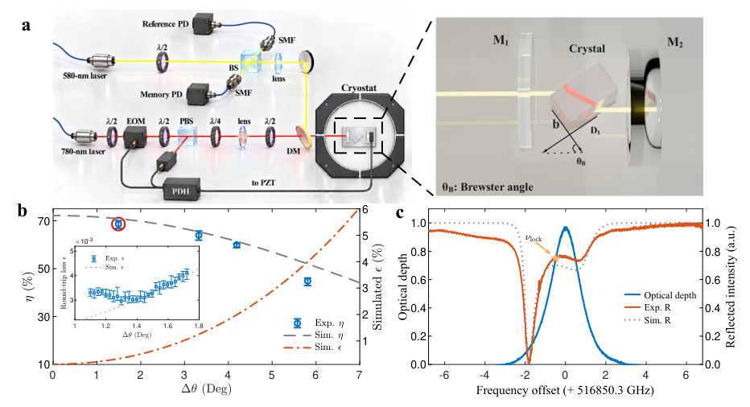
<figcaption class="paper-figure-caption"><b>Fig 1.</b> FIG. 1. a, Schematic of the experimental setup. A stabilized 780-nm laser is used for cavity locking, while a 580-nm laser is used for optical storage. The AFC preparation light and the input signal to be stored are coupled into the cavity along the same optical path. The enlarged view shows the storage cavity, with Eu3+:YSO crystal placed between a plane mirror (M1) and a concave mirror (M2). The Brewster angle θB is indicated. b, Measured storage efficiency (blue open circles), simulated storage efficiency (gray dashed curve), and simulated round-trip intracavity loss ϵ (orange dash-dotted curve) as functions of the angular deviation ∆θ from the Brewster angle. The simulations assume...</figcaption>
</figure>
<figure class="paper-figure-card">
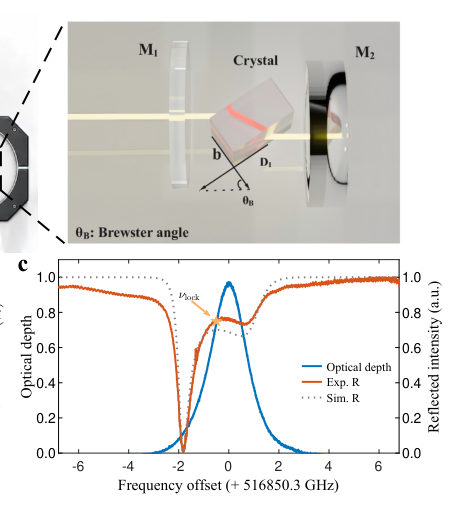
<figcaption class="paper-figure-caption"><b>Fig 2.</b> Fig. 1(c) shows the cavity reflection together with the crystal optical-depth spectrum before AFC prepara- tion. The reflection reaches a minimum at a detuning of −1.8 GHz from the absorption center, where the crystal optical depth is approximately 0.11. The reflection min- imum corresponds to 99.4% cavity coupling efficiency, in good agreement with the calculated reflection spectrum (see Supplemental Materials for details).</figcaption>
</figure>
<figure class="paper-figure-card">
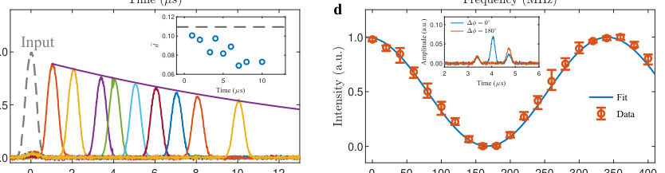
<figcaption class="paper-figure-caption"><b>Fig 3.</b> FIG. 2. Storage efficiency and phase coherence of the optical memory. a, Normalized input pulse (gray solid curve) and retrieved echo (blue solid curve) for an AFC tooth spacing of ∆= 1 MHz. The calibrated storage efficiency is η = 90.1(5)%. The center of the retrieved echo is delayed by approximately 0.05 µs relative to the nominal recall time of 1/∆= 1 µs. The orange dotted curve shows the simulated echo, with a predicted storage efficiency of 91.8%. b, Simulated AFC spectrum for ∆= 1 MHz and a finesse of FAFC = 18.1. The blue and orange curves show the imaginary and real parts of the optical susceptibility χ, respectively. The gray arrows indicate the optical depths dct and dpit. c,...</figcaption>
</figure>
<figure class="paper-figure-card">
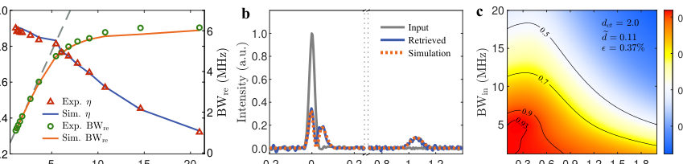
<figcaption class="paper-figure-caption"><b>Fig 4.</b> FIG. 3. Bandwidth dependence of the optical memory. a, Storage efficiency η (left axis) and retrieved-echo bandwidth BWre (right axis) as functions of the input-pulse bandwidth BWin. As the input pulse becomes wider, the BWre (green circles) deviates from the linear region (gray dashed line), and η (red triangles) drops rapidly when the input pulse width exceeds 2 MHz. Simulated results are also given for η (blue solid line) and BWre (orange solid line). b, Measured temporal profiles of the input pulse (gray solid curve) and the leakage light and retrieved echo (blue solid curve) for an input-pulse bandwidth of BWin = 21 MHz. The orange dotted curve shows the simulated temporal profile,...</figcaption>
</figure>
<figure class="paper-figure-card">
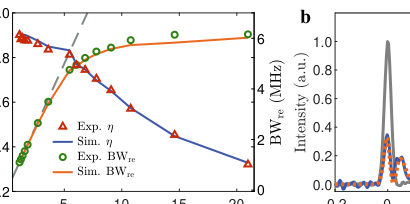
<figcaption class="paper-figure-caption"><b>Fig 5.</b> Fig. 3(c) further isolates the influence of the residual optical depth dpit at the edge of the spectral pit. For dpit between 0.1 and 0.3, the storage efficiency remains above 50% for input bandwidths up to approximately 17–18 MHz, and can exceed 93% for BWin &lt; 6 MHz. As dpit increases, both the usable bandwidth and the maxi- mum storage efficiency decrease. These results show that residual absorption surrounding the AFC limits both ef- ficiency and bandwidth through its associated dispersive response. At the measured round-trip intracavity loss of 0.37%, even complete elimination of the residual crystal-surface reflection is expected to increase the storage efficiency by only about 1.5...</figcaption>
</figure>

**Summary.** This paper reports achieving 90.1% optical storage efficiency in a rare-earth-ion-doped crystal using a specialized, low-loss, impedance-matched cavity memory. By operating at cryogenic temperatures and optimizing the cavity geometry, the researchers minimized parasitic losses. Crucially, they determined that future improvements are limited by the fundamental properties of the atomic frequency comb preparation, not by residual optical losses.

**Why it may be interesting.** This work directly addresses the practical realization of quantum memories in solid-state systems, which is a core area of research in cavity QED and quantum optics, providing crucial experimental benchmarks for theory.

Detailed structure

**Main problem.** Achieving high-efficiency optical storage in rare-earth-ion-doped crystals is challenging due to weak optical absorption and high sensitivity to parasitic intracavity loss.

**Main result.** The authors demonstrated a high storage efficiency of 90.1(5)% for coherent optical pulses using an impedance-matched cavity atomic-frequency-comb memory.

**Method.** The experiment utilized a cryogenic, impedance-matched Fabry-Pérot cavity setup operating at the Brewster angle to minimize cavity losses.

**Model / system.** The physical system is an atomic-frequency-comb (AFC) memory based on Eu3+:Y2SiO5 crystals. The efficiency is governed by impedance matching conditions involving cavity loss and AFC preparation parameters.

**Key observables.** Measured storage efficiency ($\eta$), round-trip intracavity loss ($\epsilon$), and the retrieved echo temporal profile.

**Important parameters / regimes.** Cryogenic temperature (3 K), low intracavity loss (0.37%), and the required impedance matching condition ($e_d \simeq 0.11$).

**Assumptions / limitations.** The primary limitation to further efficiency gains is identified as the AFC preparation and its associated dispersive response, rather than residual cavity loss.

**Figures summary.** Figures show the setup schematic, loss dependence on angle, the retrieved echo profile demonstrating 90.1% efficiency, and simulated AFC spectra showing spectral dependence.

**Paper structure.** The paper presents the experimental setup and measurements, demonstrating the high efficiency achieved through loss mitigation. It then uses quantitative modeling to analyze the efficiency limits, concluding that AFC preparation imperfections are the main bottleneck.

Abstract

High-efficiency optical storage in rare-earth-ion-doped crystals is challenging because of their typically weak optical absorption,which makes cavity-enhanced memories highly sensitive to parasitic intracavity loss. Here we demonstrate a 90.1(5)% storage efficiency for coherent optical pulses in an impedance-matched cavity atomic-frequency-comb memory based on Eu3+:Y2SiO5. The Brewster-angle configuration of the crystal and fully cryogenic Fabry-Pérot cavity reduce the round-trip intracavity loss to 0.37%. Quantitative modeling shows that further improvement is limited primarily by AFC preparation and its associated dispersive response rather than by residual cavity loss,identifying the principal requirements for further approaching unity efficiency.

[↑ back to top](#top)

### [Hysteresis in Atomic Josephson Junctions](http://arxiv.org/abs/2609.19260v1)

**Authors:** Vijay Pal Singh, Ludwig Mathey, Luigi Amico  
**Type:** theory · **Category:** quantum gases · **PDF:** <https://arxiv.org/pdf/2609.19260v1>  
**Analysis basis:** full PDF text, analyzed in chunks
**Topic relevance:** 🔥 `Keldysh / 2PI / non-Gaussian methods` **4/5** · `analog quantum simulation` **3/5** · `methods for driven-dissipative` **3/5** · `driven-dissipative phase transition` **2/5** · `non-equilibrium universality` **2/5** · `Frenkel-Kontorova` **1/5**

↔ Scroll figures horizontally

<figure class="paper-figure-card">
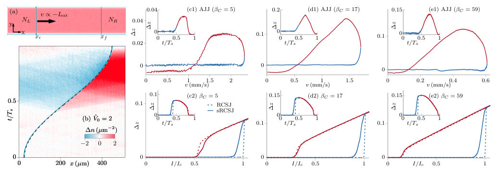
<figcaption class="paper-figure-caption"><b>Fig 1.</b> FIG. 1. Hysteresis in atomic Josephson junctions (AJJs). (a) Simulation of the AJJ consisting of two 2D clouds separated by a Gaussian tunnel barrier of height V0 and width w (indicated by two vertical dotted lines). The barrier is displaced from xi to xf following x(t) = xi + ∆x sin2[πt/(2Ts)], where ∆x ≡xf −xi = 2v1Ts/π is the maximum displacement, Ts is the sweep time, and v1 is chosen to exceed the critical velocity vc. NL (NR) denotes the atom number of the left (right) reservoir. (b) Time evolution of the density difference ∆n(x, t) = n(x, t) −n(x), averaged over the initial ensemble and the y direction, for ˜V0 ≡V0/µ = 2, w = 1 µm, v1/vc ≈1.2, and Ts = 0.75 s. The dashed line...</figcaption>
</figure>
<figure class="paper-figure-card">
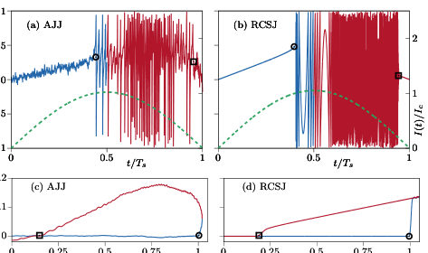
<figcaption class="paper-figure-caption"><b>Fig 2.</b> FIG. 2. Phase-slip-induced hysteresis dynamics. (a,b) Time evolution of the junction phase difference ∆ϕ obtained for βC = 37 from a single-trajectory AJJ simulation (a) and the RCSJ model (b). Blue (red) curve corresponds to increasing (decreasing) sweep protocol following the bias I(t) shown as a dashed line on the second axis. (c,d) I −∆z characteris- tics. The circle (square) denotes the switching (retrapping) current. We use Ts = 0.8 s (AJJ) and Ts/τ = 5500 (RCSJ).</figcaption>
</figure>
<figure class="paper-figure-card">
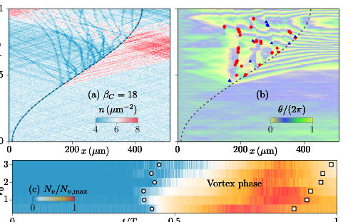
<figcaption class="paper-figure-caption"><b>Fig 3.</b> FIG. 3. Vortex dynamics. (a,b) Time evolution of the den- sity n(x) and the phase θ(x, Ly/2) along the x direction for a single sample and βC = 18. Vortices (triangles) and antivor- tices (circles) are identified from the phase winding near the line y = Ly/2. The barrier trajectory, with Ts = 0.4 ms and v1/vc ≃1.1, is indicated by the dotted line. (c) Ensemble- averaged total vortex number Nv as a function of time t/Ts and barrier height ˜V0. Maximum vortex number Nv,max and sweep time Ts correspond to each value of ˜V0. Circles (squares) represent switching (retrapping) velocities.</figcaption>
</figure>
<figure class="paper-figure-card">
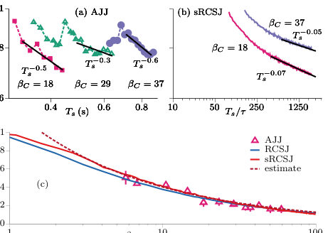
<figcaption class="paper-figure-caption"><b>Fig 4.</b> FIG. 4. Retrapping current. (a,b) Hysteresis width hw = Is −Ir as a function of Ts on logarithmic scales for different βC, obtained from AJJ simulations (a) and the sRCSJ model (b). Solid lines are power-law fits to the late-time behavior, hw(Ts) ∼T −η s . (c) Ir/Ic as a function of βC. Solid lines show the RCSJ and sRCSJ predictions, while the dashed line denotes the asymptotic expression Ir/Ic ≃4/(π√βC).</figcaption>
</figure>

**Summary.** This research demonstrates the existence of hysteresis and retrapping in atomic Josephson junctions using bosonic superfluids. By simulating a velocity-sweep protocol, the authors show that these phenomena are governed by phase-slip dynamics, establishing a quantitative link between atomic and superconducting Josephson junction physics. This confirms that AJJs serve as a robust platform for studying fundamental non-equilibrium quantum dynamics.

**Why it may be interesting.** This work directly bridges the physics of superconducting Josephson junctions with ultracold atomic systems, providing a clean, controllable platform (bosonic superfluids) to study fundamental non-equilibrium quantum dynamics like phase slips and hysteresis.

Detailed structure

**Main problem.** The paper addresses the challenge of demonstrating and understanding hysteresis and retrapping phenomena in atomic Josephson junctions (AJJs), which are key signatures of underdamped Josephson dynamics.

**Main result.** Hysteresis and retrapping are successfully demonstrated in AJJs, confirming that the dynamics are governed by persistent phase-slip mechanisms analogous to superconducting junctions.

**Method.** The study employs classical-field simulations using a velocity-sweep protocol applied to a two-dimensional bosonic superfluid model.

**Model / system.** The system is an Atomic Josephson Junction (AJJ) modeled using a semiclassical-field approach within the truncated Wigner approximation. The dynamics are compared against the Resistively and Capacitively Shunted Junction (RCSJ) model.

**Key observables.** Hysteresis width, retrapping current, particle imbalance ($\Delta z$), and the junction response ($\Delta z$ vs. velocity $v$).

**Important parameters / regimes.** Stewart–McCumber parameter ($eta_C$), critical current ($I_c$), and sweep time ($T_s$).

**Assumptions / limitations.** The analysis relies on classical-field simulations and assumes the system can be mapped onto the RCSJ framework for comparison.

**Figures summary.** Figures show time evolution of density difference, $\Delta z$ vs. barrier velocity $v$ curves demonstrating hysteresis, and the dependence of hysteresis width on sweep time.

**Paper structure.** The paper introduces the AJJ system and the need to study hysteresis. It details the velocity-sweep protocol and simulation setup, presents the results showing hysteresis matching RCSJ predictions, and concludes by establishing a common phase-dynamical framework.

Abstract

Hysteresis and retrapping are hallmarks of underdamped Josephson dynamics, yet they have remained elusive in atomic Josephson junctions. Here, we introduce a velocity-sweep protocol to demonstrate these phenomena in the underdamped regime of an atomic Josephson junction. Specifically, using classical-field simulations of a two-dimensional bosonic superfluid, we show hysteresis in the velocity-imbalance characteristics and determine the retrapping current. The dynamics are quantitatively captured by the resistively and capacitively shunted junction (RCSJ) model. We show that hysteresis originates from persistent phase slips below the critical current, with the associated dissipation mediated by vortex-antivortex pair nucleation at the weak link. The retrapping current follows the Stewart-McCumber scaling of underdamped junctions, establishing a common phase-dynamical framework for atomic and superconducting Josephson junctions.

[↑ back to top](#top)

### [Lyapunov-controlled thermalization: an exact real-time example](http://arxiv.org/abs/2609.20597v1)

**Authors:** Jonas Loy, Jan C. Louw  
**Type:** theory · **Category:** statistical mechanics · **PDF:** <https://arxiv.org/pdf/2609.20597v1>  
**Analysis basis:** full PDF text, analyzed in chunks
**Topic relevance:** 🔥 `Keldysh / 2PI / non-Gaussian methods` **4/5** · `methods for driven-dissipative` **3/5** · `non-equilibrium universality` **3/5** · `scars & prethermalization` **3/5** · `analog quantum simulation` **1/5** · `driven-dissipative phase transition` **1/5**

↔ Scroll figures horizontally

<figure class="paper-figure-card">
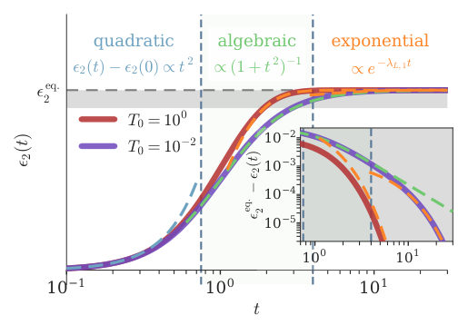
<figcaption class="paper-figure-caption"><b>Fig 1.</b> Figure 3. Relaxation of the energy density ϵ2(t) ∝ ⟨H0(t)⟩q2/N towards its post-quench equilibrium value ϵeq. 2 as the waiting time t = δt before the return quench increases (J = 1, c01 = c12 = 0.99, τ1 = 0). Dashed guides mark the three regimes: quadratic (11) at early times, algebraic (13) at intermediate times, and exponential (12) at late times, all corresponding to the low-temperature result. The higher temperature result in red has been provided to show fast thermalization relative to the T0 = 10−2 case. The ϵ2-axis is individually rescaled for comparison. Inset: distance to equilibrium on logarithmic axes, resolving the algebraic-to- exponential crossover.</figcaption>
</figure>
<figure class="paper-figure-card">
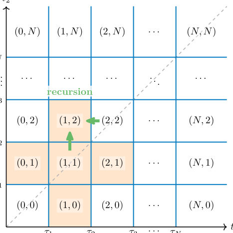
<figcaption class="paper-figure-caption"><b>Fig 2.</b> Figure 4. Partition of the (t1, t2)-plane into blocks Ia × Ib. The continuity boundary conditions (28) are imposed on the blue connecting lines. The green arrows illustrate the recursive propagation of boundary data.</figcaption>
</figure>

**Summary.** This paper investigates the true nature of thermalization in the SYK model by analyzing a 'double quench' protocol. It proves that merely satisfying the KMS condition is insufficient for equilibrium, as a measurable, non-equilibrium memory persists. This memory decays exponentially at a rate $\lambda_L$, which characterizes the rate at which the system approaches a true Gibbs state.

**Why it may be interesting.** The work provides a concrete, analytically solvable model (SYK) to study non-equilibrium dynamics, directly addressing the fundamental question of thermalization rates ($\lambda_L$) in a manner relevant to holographic theories.

Detailed structure

**Main problem.** To rigorously determine the conditions under which a unitary quantum system achieves true thermal equilibrium, demonstrating that satisfying a Kubo-Martin-Schwinger (KMS) relation is insufficient evidence.

**Main result.** The system retains a measurable, non-equilibrium memory of its initial state, which decays exponentially at a rate identified as the Lyapunov exponent, $\lambda_L$.

**Method.** The authors employ a 'double quench' protocol on the Sachdev-Ye-Kitaev (SYK) model, solving the Kadanoff-Baym equation (KBE) in the large-$N$ limit to track non-equilibrium observables.

**Model / system.** The study uses the large-$N$ large-$q$ Sachdev-Ye-Kitaev (SYK) model, a strongly interacting system, subjected to piecewise-constant coupling quenches. The analysis focuses on the real-time evolution of two-point correlation functions.

**Key observables.** The non-equilibrium (NEQ) witness, specifically the time dependence of $\langle H_0 
angle(	au_2)$, and the decay rate $\lambda_L$.

**Important parameters / regimes.** Large-$N$ limit, large-$q$ limit, waiting time $\delta t$, and the Lyapunov exponent $\lambda_L$.

**Assumptions / limitations.** The analysis relies on the large-$N$ limit and the solvability of the KBE via block-wise recursion across quench intervals.

**Figures summary.** Figures illustrate the schematic of the return-quench protocol and the partitioning of the time-correlation plane into blocks used for the recursive solution of the KBE.

**Paper structure.** The paper first establishes the problem by showing that post-quench correlators satisfying KMS are insufficient. It then develops the mathematical machinery by solving the KBE block-by-block for the SYK model. Finally, it analyzes the return-quench protocol to extract the memory witness, finding its decay rate $\lambda_L$.

Abstract

A verified Kubo-Martin-Schwinger (KMS) relation, after a drive has ceased, is not sufficient evidence to prove equilibrium. We demonstrate this in a large-$N$ large-$q$ Sachdev-Ye-Kitaev (SYK) quench protocol. Although all post-quench fermion correlators are exactly thermal, a second quench back to the initial Hamiltonian reveals hidden memory of the initial state. It is encoded in correlators connecting to times before the first quench. This memory is an extensive nonequilibrium (NEQ) witness with its decay rate being the Lyapunov exponent $λ_L$. Thus $λ_L$ sets the rate at which the state becomes effectively indistinguishable from a Gibbs state. Despite being a unitary interacting many-body system, the complete NEQ real-time evolution is obtained exactly in the large-$N$, large-$q$ limit, making the setup ideal for analytically studying thermalization.

[↑ back to top](#top)

### [Energy partitioning of wave packets in one-dimensional systems](http://arxiv.org/abs/2609.19450v1)

**Authors:** Flavia B. Ramos, Imke Schneider, Sebastian Eggert, Rodrigo G. Pereira  
**Type:** both · **Category:** strongly correlated electrons · **PDF:** <https://arxiv.org/pdf/2609.19450v1>  
**Analysis basis:** full PDF text, analyzed in chunks
**Topic relevance:** 🔥 `non-equilibrium universality` **4/5** · `analog quantum simulation` **3/5** · `methods for driven-dissipative` **3/5** · `Frenkel-Kontorova` **1/5** · `Keldysh / 2PI / non-Gaussian methods` **1/5** · `driven-dissipative phase transition` **1/5** · `scars & prethermalization` **1/5**

↔ Scroll figures horizontally

<figure class="paper-figure-card">
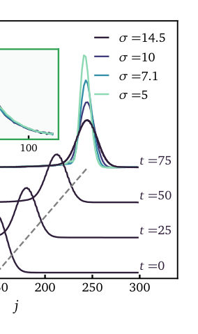
<figcaption class="paper-figure-caption"><b>Fig 1.</b> Figure 1: Snapshots of the energy excess for V = 0.5, k0 = 0.55π and the times indicated in the figure. The dashed lines indicate the light cone associated to the propagation of the low-energy modes, defined by the velocity v ≈1.299 calculated from Eq. (15). For t = 75, we show energy profiles for σ = 14.5, 10, 7.1, and 5. The inset is a zoom-in of the left-moving hump at t = 75.</figcaption>
</figure>
<figure class="paper-figure-card">
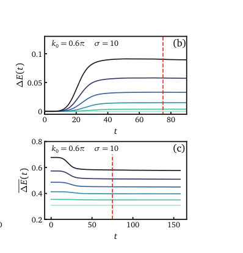
<figcaption class="paper-figure-caption"><b>Fig 2.</b> Figure 2: (a) Snapshots of the wave-packet dynamics for k0 = 0.6π, σ = 10 and several values of V. The shaded area indicates the left segment used to estimate EL. Panels (b) and (c) respectively show the energies contained in the chain segments j ∈[1, jmax] and j ∈[jmax +1, L −1], with jmax = 125. The color coding for different values of V in these panels correspond follows that in panel (a). The dashed lines indicate the time at which the estimates of EL and ER are extracted.</figcaption>
</figure>
<figure class="paper-figure-card">

<figcaption class="paper-figure-caption"><b>Fig 3.</b> Figure 3 shows pL as a function of the interaction strength V for several values of k0 and σ. Interestingly, the results clearly show that pL decreases with increasing k0. This behavior highlights the nontrivial momentum dependence of the excitation energy. In addition, for fixed values of k0, our DMRG results show that pL increases as the wave-packet width decreases; see the inset of Fig. 3.</figcaption>
</figure>
<figure class="paper-figure-card">
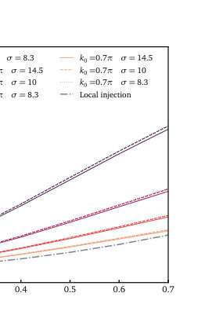
<figcaption class="paper-figure-caption"><b>Fig 4.</b> Figure 3: Fraction of the total energy propagating to the left as a function of the interaction strength V for several values of k0 and σ. The solid, dashed, and dotted lines correspond to σ = 14.5, 10, and 8.3, respectively, with each color set denoting a fixed value of k0. The dash-dotted line shows the prediction for local injection from Refs. [22,23]; see Eq. (11). The inset shows the results for k0 = 0.6π and different values of σ in the intermediate- to strong-interaction regime.</figcaption>
</figure>
<figure class="paper-figure-card">
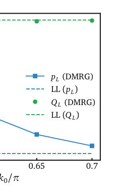
<figcaption class="paper-figure-caption"><b>Fig 5.</b> Figure 4: QL and pL as a function of k0 obtained for V = 0.5 and σ = 10 . The symbols represent the DMRG estimates. The blue and green dashed lines are the LL predictions for pL and QL, respectively; see Eqs. (8) and (11).</figcaption>
</figure>

**Summary.** This work analyzes how injected energy in 1D fermionic systems partitions into left- and right-moving excitations using both tDMRG simulations and Luttinger liquid theory. The key finding is that while charge fractionalization is universal, the energy partitioning is non-universal, depending on the initial wave packet's details. This establishes a quantitative link between real-space dynamics and effective field theory descriptions.

**Why it may be interesting.** The comparison between non-equilibrium numerical dynamics and established field-theoretical methods (LL theory) provides a rigorous testbed for understanding energy flow and excitation dynamics in strongly correlated 1D systems, which is highly relevant to quantum materials.

Detailed structure

**Main problem.** The paper investigates the non-equilibrium dynamics and the resulting energy partitioning of wave packets injected into one-dimensional critical fermionic systems.

**Main result.** Energy partitioning is found to be non-universal, depending on the details of the injected wave packet, contrasting with charge fractionalization which is governed by the Luttinger liquid parameter.

**Method.** The study combines real-time numerical simulations using the time-dependent density-matrix renormalization group (tDMRG) with analytical predictions derived from Luttinger liquid theory (bosonization).

**Model / system.** The system is a spinless fermionic model on a 1D lattice with nearest-neighbor interactions, mapping to the XXZ chain in the critical regime. The analysis focuses on the non-equilibrium evolution following the injection of a Gaussian wave packet.

**Key observables.** Local energy excess ($E_j(t)$), separated left-moving ($\Delta E_L(t)$) and right-moving ($\Delta E_R(t)$) energy components, and fractional charges ($Q_{L,R}$).

**Important parameters / regimes.** Interaction strength ($V$), wave packet width ($\sigma$), momentum ($k_0$), and the Luttinger liquid parameter ($K$).

**Assumptions / limitations.** The analysis relies on separating the wave packet into distinct left and right segments, and the field-theoretical approach assumes a continuum limit and specific approximations for correlation functions.

**Figures summary.** Figures show snapshots of local energy excess separating into left/right components, and plots comparing extracted energy plateaus ($\Delta E(t)$) for varying interaction strengths and wave-packet widths.

**Paper structure.** The paper progresses from defining the non-equilibrium setup and Hamiltonian, to performing numerical simulations (tDMRG) to observe energy separation, and finally developing and applying Luttinger liquid theory to derive analytical, quantitative predictions for the energy partitioning.

Abstract

We investigate the non-equilibrium dynamics of wave packets in a one-dimensional critical fermionic system and analyze the resulting partitioning of energy between emergent excitations. Starting from a Gaussian wave packet injected on top of the many-body ground state, we follow its real-time evolution using the time-dependent density-matrix renormalization group. We observe that interactions lead to fractionalization of the initial excitation into counter-propagating left- and right-moving modes, whose energies can be resolved in real space. To interpret these results, we employ Luttinger liquid theory, which allows us to derive analytical predictions for the energy carried by the emergent modes. We find good agreement between field-theoretical predictions and numerical simulations in the low-energy regime. In contrast to charge fractionalization, which is completely determined by the Luttinger liquid parameter, we show that energy partitioning is non-universal and depends on details of the injected wave packet, such as its width. Our results provide a real-space characterization of energy partitioning in one-dimensional systems and establish a quantitative comparison between non-equilibrium numerical simulations and the effective field-theory description.

[↑ back to top](#top)

### [Engineering and Probing a One-Dimensional Dipolar Spin Ensemble in Diamond](http://arxiv.org/abs/2609.19496v1)

**Authors:** Lingjie Chen, Shreyas Parthasarathy, Simon A. Meynell, Lillian B. Hughes Wyatt, Eveline Postelnicu, Haopu Yang, Zilin Wang, Weijie Wu, Winston V. Peloso, Casey K. Kim, Chris R. Laumann, Kunal Mukherjee, Norman Y. Yao, Ania C. Bleszynski Jayich  
**Type:** experiment · **Category:** other · **PDF:** <https://arxiv.org/pdf/2609.19496v1>  
**Analysis basis:** full PDF text, analyzed in chunks
**Topic relevance:** 🔥 `QC/QI experiment` **4/5** · `analog quantum simulation` **3/5** · `correlated / nonlocal dissipation` **3/5** · `quantum measurements` **2/5** · `quantum optics experiment` **1/5**

↔ Scroll figures horizontally

<figure class="paper-figure-card">
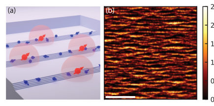
<figcaption class="paper-figure-caption"><b>Fig 1.</b> FIG. 1. (a) Schematic showing nitrogen spins (blue) incorporated on step bunches on a (100)-oriented diamond surface during CVD growth. Optically addressable NV centers (red) are used to probe the dynamics and dimensionality of the nitrogen spins through their mutual magnetic dipolar coupling, indicated by the translucent red spheres. (b) Confocal photoluminescence (PL) image of the dia- mond under 532 nm excitation, taken on the three-layer sample L043. Bright striations indicate spatially inhomogeneous NV density. Scale bar is 10 µm.</figcaption>
</figure>
<figure class="paper-figure-card">
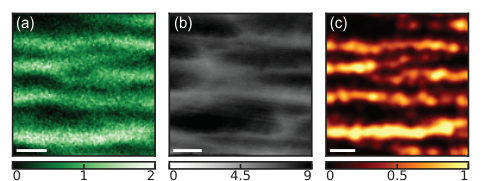
<figcaption class="paper-figure-caption"><b>Fig 2.</b> FIG. 2. Co-localized materials characterization of sample L043 re- veals the nitrogen incorporation during growth, together with com- mon features shared by the surface topography and the NV distribu- tion. (a) NanoSIMS image of the third doped layer (late in growth), showing inhomogeneous 15N incorporation (tracked via 12C15N−ion counts) with striated features. (b) AFM image showing the post- growth surface topography, indicating that the surface features cor- relate with the local nitrogen density in (a). (c) PL image showing the presence of NVs along striations correlated to those in (a) and (b). All scale bars are 1 µm.</figcaption>
</figure>
<figure class="paper-figure-card">
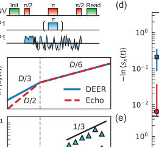
<figcaption class="paper-figure-caption"><b>Fig 3.</b> FIG. 3. (a) Pulse sequence for DEER-based extraction of P1 dimen- sionality. The parentheses around the P1 𝜋-pulse indicate whether the measurement is a Hahn echo (no concurrent 𝜋-pulse) or DEER (concurrent 𝜋-pulse). The stochastic drive on the P1s (bottom line in sequence) is on for the entire duration of both measurements other than the 𝜋-pulse during DEER. The NV pulses correspond to laser (green) and microwave 𝜋- and 𝜋/2-pulses (red). (b) Idealized Hahn echo and DEER decay curves expected for disordered spin ensembles of dimensionality 𝐷with a correlation time indicated by the dashed line. (c) Comparison of stochastically driven DEER decays on 1D and 2D regions of the sample, displaying...</figcaption>
</figure>
<figure class="paper-figure-card">
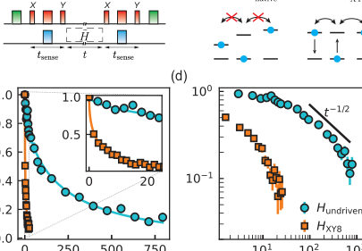
<figcaption class="paper-figure-caption"><b>Fig 4.</b> FIG. 4. (a) Pulse sequence for the correlation measurement. 𝑡sense ≪ 𝑡is the DEER sensing time held constant for all measurements. Hamiltonian engineering is performed on the P1s to achieve an effec- tive Hamiltonian ˜𝐻, and dynamics induced by this effective Hamilto- nian are measured as a function of the evolution time 𝑡. (b) Schematic of the P1 dynamics. On-site disorder in 𝐻native induces an energetic mismatch that suppresses P1-P1 flip-flops, while removal of that dis- order in 𝐻XY8 permits it. (c) Normalized correlation signal for 𝐻native (cyan circles) and 𝐻XY8 (orange squares). Operationally, 𝐻native is measured without microwave pulses on the P1s. Inset: early-time de- cay of the...</figcaption>
</figure>
<figure class="paper-figure-card">
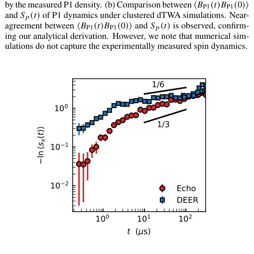
<figcaption class="paper-figure-caption"><b>Fig 5.</b> FIG. 6. Undriven echo and DEER measurements. A late-time 1/6 stretched exponential portion is observed for more than two decades of time past 𝑡∼3 µs in DEER, but not in the echo. This is consistent with P1s undergoing different dynamics in the two measurements.</figcaption>
</figure>

**Summary.** This paper reports the successful engineering of quasi-one-dimensional spin chains using nitrogen defects in diamond, leveraging surface morphology control during CVD. By using NV centers as quantum probes, the researchers measured spin dynamics and confirmed the 1D nature of the spin ensemble using characteristic decay exponents. This establishes a powerful, materials-based platform for studying fundamental quantum many-body physics in solid-state systems.

**Why it may be interesting.** This work provides an experimental realization of engineered low-dimensional quantum spin baths, which is highly relevant for studying quantum dynamics, decoherence mechanisms, and spin transport in solid-state quantum computing architectures.

Detailed structure

**Main problem.** The primary goal is to engineer and characterize low-dimensional, interacting quantum spin systems using solid-state defects in diamond.

**Main result.** The study confirms the one-dimensionality of the spin ensemble by observing a characteristic stretch exponent of 1/6 in correlation spectroscopy measurements. They also establish a materials-based route for creating such low-dimensional quantum spin systems.

**Method.** The research combines advanced materials characterization (nanoSIMS, AFM) with nanoscale quantum sensing using NV centers to probe spin dynamics via correlation spectroscopy (DEER/Hahn echo).

**Model / system.** The system is a quasi-one-dimensional spin chain formed by optically dark P1 defects in diamond, probed by addressable NV centers. The interactions are governed by a dipolar Hamiltonian with a $1/r^3$ power-law decay.

**Key observables.** Spin autocorrelation functions, the stretch exponent (used to determine dimensionality), and the spin survival probability $S_p(t)$.

**Important parameters / regimes.** The correlation time ($	au_c$) of the P1 bath, which can be tuned using external stochastic drives.

**Assumptions / limitations.** The authors validate the approximation that the measured correlation spectroscopy signal approximates the true single-spin autocorrelation function, $S_p(t)$, through numerical benchmarking.

**Figures summary.** Figures show co-localization of nitrogen defects with surface morphology, DEER/Echo measurements comparing 1D vs 2D decay signatures, and numerical validation comparing the measured signal to the theoretical single-spin autocorrelation function.

**Paper structure.** The paper progresses from establishing the physical platform (material engineering of 1D chains) to characterizing the dynamics (using correlation spectroscopy) and finally validating the theoretical interpretation of the measured signals by comparing different pulse sequences and theoretical limits.

Abstract

Dimensionality plays a central role in determining the collective behavior of interacting quantum systems. Engineering strongly interacting ensembles of solid-state spin defects in reduced dimensions remains a significant challenge at the interface between the applied and fundamental sciences. Here, we create and characterize a positionally disordered, quasi-one-dimensional spin chain in diamond, consisting of optically dark substitutional nitrogen defects (P1 centers) and optically addressable probe nitrogen-vacancy (NV) centers. Our approach exploits the preferential incorporation of nitrogen along step bunches formed during chemical vapor deposition to achieve both lateral and vertical confinement. Combining spatially resolved materials characterization with nanoscale quantum sensing, we establish the one-dimensional character of the optically dark, unpolarized P1 spin ensemble. We then use correlation spectroscopy to probe local spin autocorrelations and investigate infinite-temperature dipolar spin transport. Our results establish a materials-based route for engineering low-dimensional quantum spin systems.

[↑ back to top](#top)

### [Dissipative phase transitions in quantum reservoir computing](http://arxiv.org/abs/2609.20345v1)

**Authors:** Da Zhang, Zhang-Qi Yin  
**Type:** theory · **Category:** statistical mechanics · **PDF:** <https://arxiv.org/pdf/2609.20345v1>  
**Analysis basis:** full PDF text, analyzed in chunks
**Topic relevance:** 🔥 `driven-dissipative phase transition` **4/5** · `methods for driven-dissipative` **3/5** · `non-equilibrium universality` **3/5** · `correlated / nonlocal dissipation` **1/5**

↔ Scroll figures horizontally

<figure class="paper-figure-card">
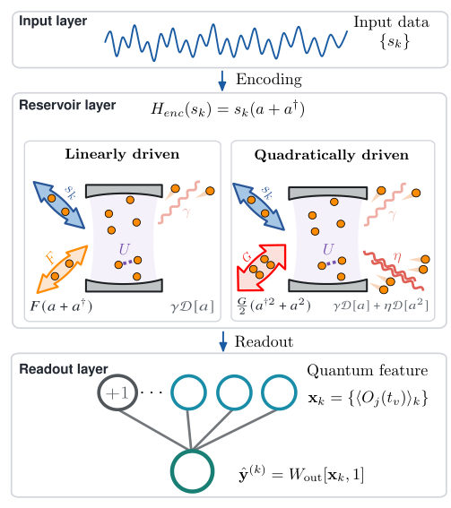
<figcaption class="paper-figure-caption"><b>Fig 1.</b> FIG. 1. Schematic of the dissipative-QRC protocol. A scalar input sk is encoded through the quadrature drive Henc = sk(a+a†) and processed by Kerr reservoirs exhibiting either a first-order or continuous (Z2)-symmetry-breaking dissipative phase transition. Virtual-time measurements form the feature vector xk, and only the affine readout ˆy(k) = Wout[xk, 1]T is trained.</figcaption>
</figure>
<figure class="paper-figure-card">
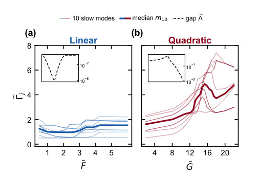
<figcaption class="paper-figure-caption"><b>Fig 2.</b> FIG. 2. Liouvillian spectral reorganization across (a) the first-order and (b) the continuous dissipative phase transition. The ten slowest nonstationary decay rates beyond the gap are shown individually, with their median m10 highlighted by the bold curve. Insets show the Liouvillian gap eΛ ≡Λ/γ on a logarithmic scale.</figcaption>
</figure>
<figure class="paper-figure-card">
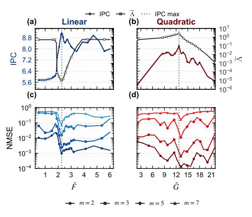
<figcaption class="paper-figure-caption"><b>Fig 3.</b> FIG. 3. Information-processing performance across dissipa- tive phase transitions. (a),(b) IPC and Liouvillian gap for the linearly and quadratically driven reservoirs. (c),(d) Normal- ized mean squared error (NMSE) for the NARMA-m tasks, whose minima occur in the same parameter regions as the IPC maxima.</figcaption>
</figure>
<figure class="paper-figure-card">
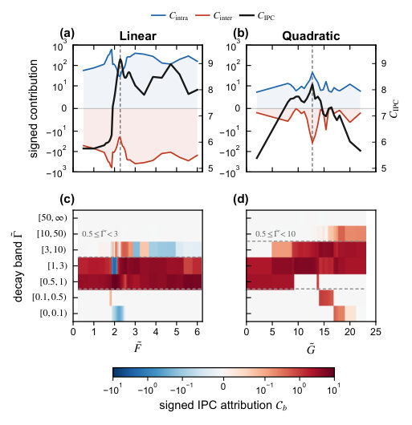
<figcaption class="paper-figure-caption"><b>Fig 4.</b> FIG. 4. Liouvillian-mode attribution of the trained informa- tion processing capacity. (a) and (b) Intra-band term Cintra, signed inter-band term Cinter, and their sum CIPC for the lin- early and quadratically driven reservoirs. (c) and (d) Band- resolved signed attributions Cb = P</figcaption>
</figure>

**Summary.** This work investigates how quantum reservoir computing performs near dissipative phase transitions in Kerr reservoirs. The authors find that while performance peaks near these transitions, the underlying mechanism is not simply the closing of the spectral gap. Instead, the enhanced memory capacity is quantitatively attributed to the reorganization of faster, finite-rate relaxation modes within the system's Liouvillian spectrum.

**Why it may be interesting.** It provides a rigorous, quantitative link between the spectral properties of open quantum systems (Liouvillian spectrum) and information processing capabilities, offering a new diagnostic tool for designing dissipative quantum devices.

Detailed structure

**Main problem.** To determine if enhanced performance in Quantum Reservoir Computing (QRC) near dissipative phase transitions is linked to the Liouvillian gap closure, and to identify the specific relaxation mechanisms responsible for this enhancement.

**Main result.** The enhanced memory capacity is dominated not by the slowest relaxation mode (the gap mode), but by the reorganization and contributions of finite-rate relaxation channels.

**Method.** The authors use mode-resolved decomposition of the trained Information Processing Capacity (IPC) by analyzing the Liouvillian spectrum and attributing computational relevance to specific relaxation channels.

**Model / system.** The study analyzes driven-dissipative Kerr reservoirs, modeled by a master equation incorporating linear and quadratic driving terms, exhibiting both first-order and continuous dissipative phase transitions.

**Key observables.** Information Processing Capacity (IPC), Normalized Mean Squared Error (NMSE) for NARMA, and the Liouvillian relaxation spectrum ($\lambda_\mu$).

**Important parameters / regimes.** Tuning parameters ($\zeta$), the Liouvillian gap ($\Lambda$), and the decay rates ($\Gamma_\mu$) of the relaxation modes.

**Assumptions / limitations.** The analysis relies on the assumption that the system dynamics can be accurately described by the Liouvillian formalism and that the trained memory can be decomposed into contributions from individual relaxation modes.

**Figures summary.** Figures show performance optima near transitions, spectral reorganization patterns (e.g., localized compression vs. gap softening), and modal attribution confirming finite-rate modes dominate capacity.

**Paper structure.** The paper systematically introduces the QRC model, analyzes the Liouvillian spectrum across different transitions, develops a mode-resolved attribution technique, and concludes by showing that task-relevant capacity tracks finite-rate dynamics rather than gap closure.

Abstract

Enhanced performance of quantum reservoir computing has been associated with dynamical phase transitions, but whether this connection extends to dissipative systems and which relaxation mechanisms underlie it remain insufficiently understood. We systematically compare driven-dissipative Kerr reservoirs across first-order and continuous dissipative phase transitions and find enhanced memory and nonlinear processing near both phase boundaries. Although the closure of the Liouvillian gap marks the transitions in the thermodynamic limit, computational performance does not generally follow gap suppression. An exact post-training Liouvillian-mode decomposition quantitatively attributes the trained memory to intrinsic relaxation channels. It shows that the gap mode contributes only weakly, while finite-rate modes and their cross-contributions dominate the enhanced capacity. These results go beyond phenomenological correlations by directly linking memory capacity to the intrinsic Liouvillian relaxation spectrum. Moreover, these findings provide a physical basis for designing dissipative quantum reservoirs and testing memory-enhancement mechanisms in experimentally accessible Kerr platforms.

[↑ back to top](#top)

### [Locally optimized variational evolution for quantum many-body systems](http://arxiv.org/abs/2609.20802v1)

**Authors:** Carolin Wille, Max Marvell, Lauren Stewart, Max Murphy, Vinul Wimalaweera, Lesley Gover, Andrew G. Green  
**Type:** both · **Category:** numerical methods · **PDF:** <https://arxiv.org/pdf/2609.20802v1>  
**Analysis basis:** full PDF text, analyzed in chunks
**Topic relevance:** 🔥 `methods for driven-dissipative` **4/5** · `Keldysh / 2PI / non-Gaussian methods` **1/5** · `analog quantum simulation` **1/5** · `correlated / nonlocal dissipation` **1/5** · `driven-dissipative phase transition` **1/5** · `non-equilibrium universality` **1/5** · `quantum measurements` **1/5** · `scars & prethermalization` **1/5**

↔ Scroll figures horizontally

<figure class="paper-figure-card">
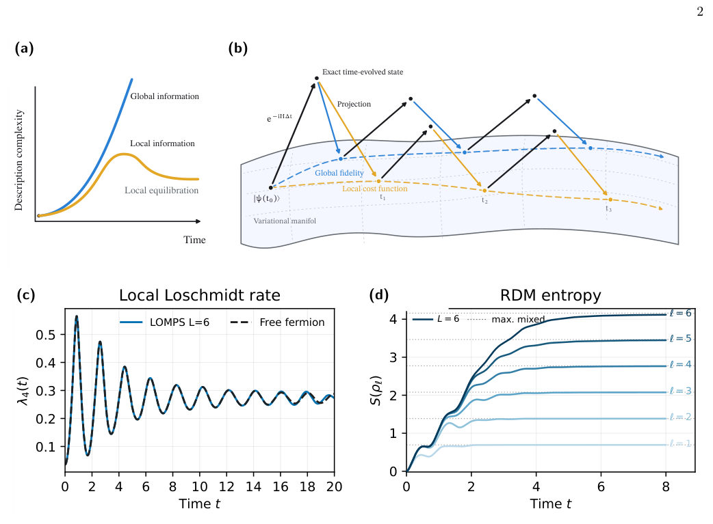
<figcaption class="paper-figure-caption"><b>Fig 1.</b> FIG. 1. (a) Evolution of local vs global description complexity. The curves presented here are symbolic. For a concrete example of local description complexity dynamics see App. A 1. (b) Variational time evolution based on global versus local optimization. The Hamiltonian dynamics takes the system off the variational manifold. Cost-function optimization projects the state back onto the variational manifold. Iterating this procedure defines a trajectory that depends on the chosen cost function. (c) Early-time coherence as demonstrated by the agreement of the four-site local Loschmidt rate λ4(t) (cf. Eq. (2)) obtained by our local variational evolution algorithm (LOMPS) compared to a...</figcaption>
</figure>
<figure class="paper-figure-card">
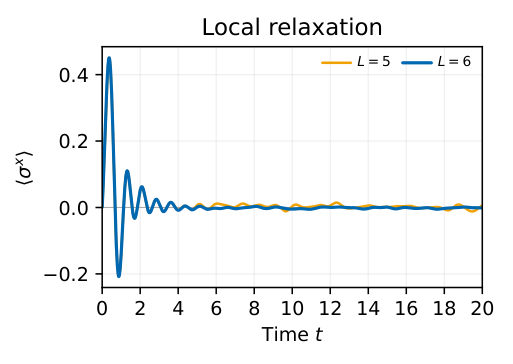
<figcaption class="paper-figure-caption"><b>Fig 2.</b> FIG. 2. Thermalization of a local observable. Single-site ⟨σx⟩dynamics in the tilted-field Ising quench. Increasing the patch sizes reduces artificial late-time oscillations.</figcaption>
</figure>
<figure class="paper-figure-card">
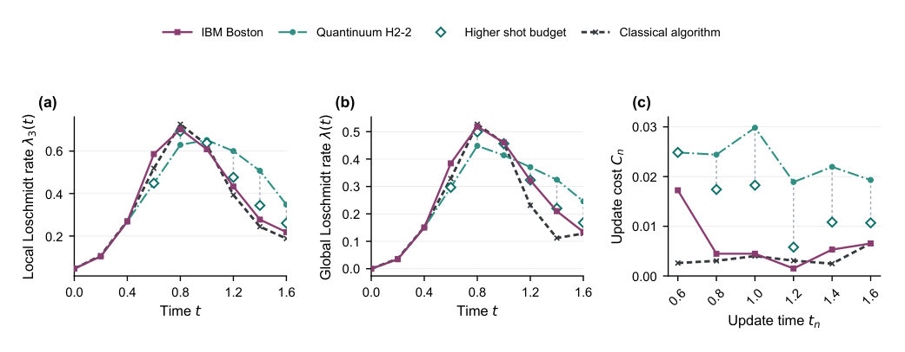
<figcaption class="paper-figure-caption"><b>Fig 3.</b> FIG. 3. Quantum algorithm. (a) Three-site local Loschmidt rate, (b) global Loschmidt rate and (c) cost function obtained by running the variational algorithm on IBM Boston Heron r3 with 5000 shots and on Quantinuum H2-2 with 500 shots per circuit evaluation, compared to the noiseless classical algorithm with the same MPS bond dimension. The first three states, at t = 0, 0.2, 0.4, were supplied by a warm start. Diamonds show the expected improvement of the Quantinuum optimization protocol performed with a higher shot budget (for details see App. B 3 a).</figcaption>
</figure>
<figure class="paper-figure-card">
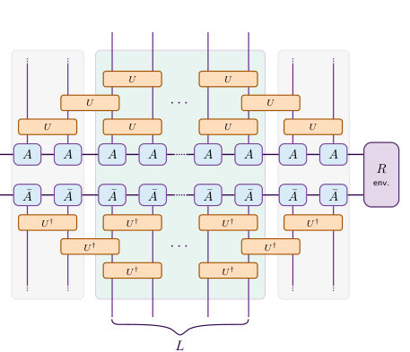
<figcaption class="paper-figure-caption"><b>Fig 4.</b> FIG. 4. Time evolution. The classical algorithm time evolves the state |Ψ(A)⟩by a short Trotter circuit and con- structs its local reduced density matrix on L sites ρevol L (t+∆t) (green) by tracing out the environment (purple).</figcaption>
</figure>
<figure class="paper-figure-card">
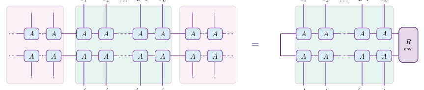
<figcaption class="paper-figure-caption"><b>Fig 5.</b> FIG. 5. Local reduced density matrix of a uniform MPS. The left and right environments of an infinite uniform (i.e., translation-invariant) MPS reduce to the left and right fixed point of the transfer matrix (see App. C 1) for details. Using the left-canonical gauge, the left-fix point is the identity and the right fixed point Renv is computed explicitly.</figcaption>
</figure>

**Summary.** This paper presents a novel variational time-evolution method, LOMPS, designed to simulate quantum many-body dynamics by optimizing local observables rather than the entire global wavefunction. By exploiting the fact that local physics can be simpler than global physics, the method achieves accurate results for both short-time coherence and long-time thermalization. The approach is demonstrated both theoretically and on superconducting quantum hardware.

**Why it may be interesting.** This work provides a powerful, resource-aware numerical technique for simulating open quantum systems and thermalization dynamics by focusing computational effort only on locally accessible information.

Detailed structure

**Main problem.** Simulating the time evolution of quantum many-body systems, which is classically intractable due to the exponential complexity of the global wavefunction.

**Main result.** The proposed Locally Optimized Matrix Product States (LOMPS) algorithm successfully captures both the coherent early-time dynamics and the late-time thermalization of local observables.

**Method.** It introduces a variational time-evolution principle that replaces global fidelity with a cost function defined on local reduced density matrices, optimized using MPS techniques.

**Model / system.** The study uses the transverse-field Ising model quench as a testbed, analyzing dynamics in both integrable and strongly thermalizing regimes.

**Key observables.** Local Loschmidt rate ($\lambda_L(t)$), local reduced density matrices ($
ho_L(t)$), and entanglement entropy.

**Important parameters / regimes.** Patch size ($L$), bond dimension ($D$), and time step ($\Delta t$).

**Assumptions / limitations.** The core assumption is that local observables' complexity is governed by an intrinsic local complexity independent of the total system size.

**Figures summary.** Figures illustrate the comparison between global and local complexity evolution, the thermalization of local observables, and the implementation details of the quantum-classical hybrid algorithm on specific hardware.

**Paper structure.** The paper develops the LOMPS variational principle, details the classical and quantum-classical optimization procedures, and validates the method by simulating quenches on both theoretical models and actual quantum hardware.

Abstract

Conventional quantum advantage in many-body dynamics is based on avoiding the simulation cost on a classical computer that arises from the extensive exponential complexity of the global wavefunction. Local observables, however, do not inherit this extensive complexity and may instead be governed by an intrinsic local complexity that is independent of the total system size. This distinction is particularly relevant in thermalising systems, where local observables lose memory of microscopic details and relax towards equilibrium values determined by only a few parameters. Here we introduce a variational time-evolution principle that exploits this distinction by replacing global-state fidelity with a cost function defined on local reduced density matrices. The resulting evolution retains coherent short-time dynamics while exploiting the simplification produced by thermalisation at later times. The concrete algorithm we propose is based on locally optimising matrix-product states and admits closed-form equations of motion analogous to the time-dependent variational principle. We show that the same variational principle has a quantum-classical counterpart, combining quantum evaluation of the local cost with an optimisation strategy robust to both shot and hardware noise. Proof-of-principle implementations on Quantinuum H2 and IBM Heron processors recover the characteristic local dynamics.

[↑ back to top](#top)

### [Neutral atom quantum computing for materials science and quantum chemistry](http://arxiv.org/abs/2609.20464v1)

**Authors:** J. D. Pritchard  
**Type:** both · **Category:** other · **PDF:** <https://arxiv.org/pdf/2609.20464v1>  
**Analysis basis:** full PDF text, analyzed in chunks
**Topic relevance:** 🔥 `Rydberg arrays` **4/5** · 🔥 `analog quantum simulation` **4/5** · `QC/QI experiment` **3/5**

↔ Scroll figures horizontally

<figure class="paper-figure-card">
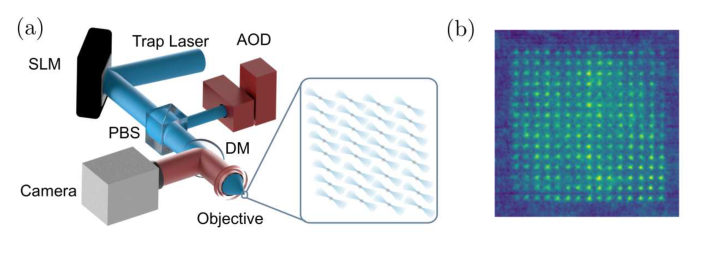
<figcaption class="paper-figure-caption"><b>Fig 1.</b> FIG. 1. (a) Schematic of a neutral atom quantum computer. Atom arrays are formed using arrays of microscopic optical tweezers created using reconfigurable holograms on a spatial light modulator (SLM) with atom sorting achieved using a fast mobile tweezer created using a crossed acousto-optical deflector (AOD) which can be combined on a polarising beam splitter (PBS). A high numerical-aperture objective lens is used to focus the tweezers and collect single atom fluorescence onto a camera for atom readout, using dichroic mirror to separate the wavelengths (DM). (b) An example image of atoms trapped in a 15×15 array using the experimental platform from [82].</figcaption>
</figure>
<figure class="paper-figure-card">
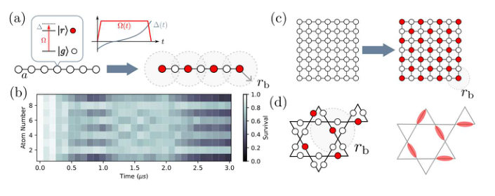
<figcaption class="paper-figure-caption"><b>Fig 2.</b> FIG. 2. Quantum simulation on a neutral atom array (a) A 1-D chain of atoms spaced with a &lt; rb can be prepared in the Z2-ordered phase with every other site Rydberg excited using adiabatic control of the global drive parameters Ω(t),∆(t) (b) Experimental data showing adiabatic evolution for a chain of 7 atoms towards the Z2 ordered state adapted from [67]. (c) Extending to 2D geometries provides access to phase-diagrams on square lattices [58, 59] (d) Placing atoms on the edges of a kagome lattice enables mapping to a dimer model on which it has been possible to prepare topological quantum spin liquids on a neutral atom array [60].</figcaption>
</figure>
<figure class="paper-figure-card">
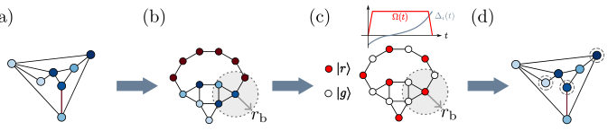
<figcaption class="paper-figure-caption"><b>Fig 3.</b> FIG. 3. Graph optimisation on neutral atom arrays. Starting from an initial graph problem (a), the first step is to embed the problem graph on a unit-disk (UD) graph as shown in (b) such that connected vertices are represented by atoms spaced within a blockade radius. (r &lt; rb) Additional atoms (shown in dark red) may be required to implement longer-range connections in the original graph. (c) Using the UD embedding, quantum annealing can be performed on a neutral atom quantum processing unit (QPU) to design time-dependent control fields Ω(t),∆i(t) that adiabatically prepare the atoms in the ground state using closed-loop feedback with the resulting readout measurements mapped to binary...</figcaption>
</figure>
<figure class="paper-figure-card">
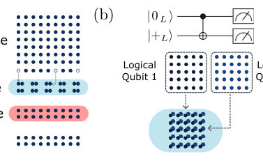
<figcaption class="paper-figure-caption"><b>Fig 4.</b> FIG. 4. (a) Zonal architecture use for scalable digital quantum computation introduced by [50, 52]. The array field of view is divided into four zones - a storage zone for data qubits, a gate zone in which atom pairs placed close together undergo high-fidelity two-qubit gate operations, a readout zone enabling local detection and mid-circuit readout and a reservoir zone for replacing atoms lost during computation. Qubits can be moved in real-time using mobile tweezers providing routes to fully-connected quantum hardware. (b) This platform allows efficient transverse gate operations between logical qubit blocks by using multiple moving tweezers simultaneously to combine 5 × 5 blocks of atoms...</figcaption>
</figure>

**Summary.** This paper reviews neutral atom arrays as a powerful, scalable platform for quantum simulation and computation. It details how the system can model complex Hamiltonians relevant to materials science and quantum chemistry using techniques like adiabatic state preparation and Rydberg blockade. The work demonstrates the platform's versatility for both simulating quantum phases and solving hard optimization problems.

**Why it may be interesting.** This work is highly relevant as it bridges fundamental AMO physics (Rydberg interactions, cold atom control) directly to cutting-edge quantum simulation and computation for chemistry and materials science.

Detailed structure

**Main problem.** The primary goal is simulating complex quantum systems relevant to materials science and quantum chemistry, which involves determining ground state configurations or modeling dynamic evolution.

**Main result.** Neutral atom arrays are shown to be a highly scalable and versatile platform capable of realizing programmable Hamiltonians for both digital and analogue quantum simulation.

**Method.** The paper details using adiabatic ramping of detuning to prepare the system in the ground state, alongside utilizing the Rydberg blockade for controlled gate operations.

**Model / system.** The physical system is neutral atom arrays trapped in optical tweezers. The dynamics are modeled using Hamiltonians like the Ising Hamiltonian, governed by dipole-dipole coupling $V(r) \propto 1/r^6$.

**Key observables.** Z2-ordered crystalline states, correlation functions (for phase characterization), and the final ground state mapping to solutions of graph problems like MWIS.

**Important parameters / regimes.** Gate fidelities ($F \gtrsim 99.5\%$), blockade radius ($r_b$), and the ability to scale to thousands of qubits.

**Assumptions / limitations.** Initial loading of atoms is stochastic, and achieving defect-free arrays requires advanced real-time rearrangement techniques.

**Figures summary.** Figures illustrate the experimental setup using optical tweezers, the preparation of Z2-ordered crystalline states in 1D and 2D lattices, and the general process flow for mapping graph optimization problems onto the atomic array.

**Paper structure.** The paper provides a broad overview, first detailing the platform's capabilities for quantum simulation (analogue approach) and then covering its use for digital computation and solving hard classical optimization problems.

Abstract

Neutral atom arrays have emerged as versatile platforms for performing both digital and analogue quantum computing and simulation, with demonstrations ranging from large-scale programmable Hamiltonians realising topological phases or weighted graph optimisation to error-corrected logical qubits with transverse gate operations. This paper provides a broad overview to the neutral atom platform, and the potential applications relevant to materials science and quantum chemistry.

[↑ back to top](#top)

### [Normalizing Flow-Based Bayesian Parameter Estimation for Noisy Quantum States](http://arxiv.org/abs/2609.19534v1)

**Authors:** Hsien-Yi Hsieh, Yuan-Ting Liu, Juan Camilo Rodrıguez, Yang-Yi Lee, Po-Hang Wang, Ole Steuernagel, Chien-Ming Wu, Ray-Kuang Lee  
**Type:** both · **Category:** quantum information and computing · **PDF:** <https://arxiv.org/pdf/2609.19534v1>  
**Analysis basis:** full PDF text, analyzed in chunks
**Topic relevance:** 🔥 `quantum optics experiment` **4/5** · `methods for driven-dissipative` **2/5** · `quantum measurements` **2/5** · `Keldysh / 2PI / non-Gaussian methods` **1/5** · `QC/QI experiment` **1/5** · `analog quantum simulation` **1/5**

↔ Scroll figures horizontally

<figure class="paper-figure-card">
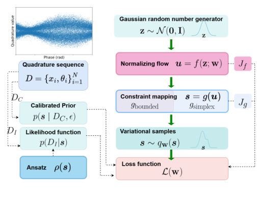
<figcaption class="paper-figure-caption"><b>Fig 1.</b> FIG. 1. Schematic illustration of the forward-pass archi- tecture of the normalizing flow-based inference model. The experimental data are split into calibration (DC) and infer- ence (DI) subsets. The calibration data DC, together with empirical knowledge ϵ, are used to construct the calibrated prior, while DI enters the likelihood defined by the chosen physical ansatz ρ(s). A single forward pass (green arrows) transforms Gaussian latent samples through the normalizing flow and subsequent constraint mappings, yielding samples from the flexible variational distribution qw(s) that satisfy the prescribed physical and empirical constraints. The two constraint mappings respectively impose...</figcaption>
</figure>
<figure class="paper-figure-card">
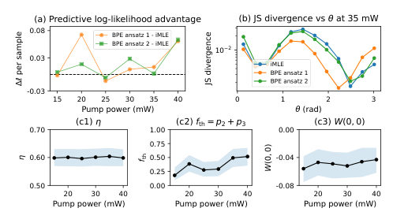
<figcaption class="paper-figure-caption"><b>Fig 2.</b> FIG. 2. Predictive performance and inferred physical param- eters for Dataset 1, with two BPE ansatzes. (a) Average log- likelihood difference, ∆ℓ= ℓBPE−ℓiMLE, per quadrature sam- ple, with the dashed line marking ∆ℓ= 0; positive values indi- cate improved agreement relative to the iMLE reconstruction. (b) Phase-resolved Jensen–Shannon (JS) divergence between the measured and predicted quadrature distributions for the 35 mW OPO setting. Posterior medians of (c1) the photon- addition fraction η, (c2) the thermal fraction fth = p2 + p3 defined in Eq. (2), and (c3) the Wigner function at the origin W(0, 0) as functions of OPO pump power. Shaded regions denote 68% credible intervals.</figcaption>
</figure>
<figure class="paper-figure-card">
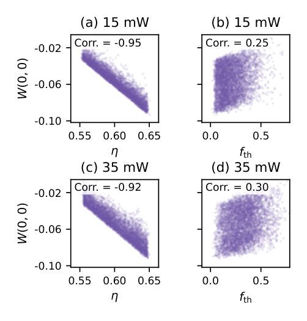
<figcaption class="paper-figure-caption"><b>Fig 3.</b> FIG. 3. Posterior correlations between the inferred photon- addition fraction η or thermal fraction fth = p2 + p3 and the Wigner function at the origin W(0, 0) for Dataset 1. Pan- els (a) and (b) correspond to the 15 mW OPO setting, while panels (c) and (d) correspond to the 35 mW setting. Corr. de- notes the Pearson correlation coefficient evaluated from pos- terior samples.</figcaption>
</figure>
<figure class="paper-figure-card">
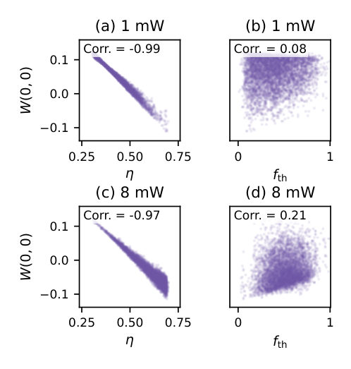
<figcaption class="paper-figure-caption"><b>Fig 4.</b> FIG. 4. Posterior correlations between the inferred photon- addition fraction η or thermal fraction fth = p2 + p3 and the Wigner function at the origin W(0, 0) for Dataset 2. Panels (a) and (b) correspond to the 1 mW StPDC setting, while panels (c) and (d) correspond to the 8 mW setting. Corr. de- notes the Pearson correlation coefficient evaluated from pos- terior samples.</figcaption>
</figure>

**Summary.** The paper introduces a Normalizing Flow-based Bayesian Parameter Estimation framework to analyze noisy quantum states from experiments like optical cat state generation. By inferring the full posterior distribution, it quantifies parameter uncertainties and reveals correlations between noise sources and quantum features. This provides crucial guidance for improving quantum state preparation in experimental quantum optics.

**Why it may be interesting.** This work directly addresses the characterization of complex, noisy quantum states using advanced ML techniques, providing quantitative tools for experimentalists working on quantum optics and quantum state tomography.

Detailed structure

**Main problem.** To develop an efficient machine learning-assisted framework for Bayesian Parameter Estimation (BPE) to extract complete information about experimental noisy quantum states and the correlations among underlying physical parameters.

**Main result.** The framework successfully infers the full posterior distribution of parameters, providing detailed insights into how noise and experimental settings affect the preparation and degradation of non-Gaussian quantum states.

**Method.** It employs Normalizing Flows within a Bayesian inference framework, utilizing data splitting into calibration and inference subsets to constrain and estimate the parameter distribution.

**Model / system.** The study focuses on characterizing noisy quantum states, specifically optical cat states realized via heralded photon-added squeezed states, which are relevant for quantum information processing.

**Key observables.** Wigner function negativity, photon-addition fraction, noisy fraction, and pump powers are analyzed for correlations.

**Important parameters / regimes.** Physically interpretable parameter vector $s$, including mixture weights $(p_1, p_2, p_3)$, photon-addition fraction ($\eta$), and thermal fraction ($f_{	ext{th}}$).

**Assumptions / limitations.** The inference assumes data independence between the calibration and inference subsets, and the prior construction relies on a heuristic anchor $s^\star$ derived from minimizing a distance metric.

**Figures summary.** Figures illustrate the forward-pass architecture of the normalizing flow model, and subsequent figures show posterior correlations between inferred parameters and derived state quantities across different experimental datasets.

**Paper structure.** The paper details the development of the BPE framework, including the data splitting, the use of Normalizing Flows with constraint mappings (for simplex and bounded domains), the calibration process using auxiliary measurements, and finally, applying the framework to analyze experimental data from optical cat state generation.

Abstract

To extract complete information about experimental noisy quantum states, as well as correlations among different physical parameters, we develop an efficient machine learning-assisted framework with the normalizing flow based Bayesian parameter estimation (BPE). By embedding a physically interpretable parameter vector, ${s}$, into the quantum state ansatzes, $ρ({s})$, the corresponding parameter distribution $p({s}|D)$ is induced from BPE, based on the available experimental data $D$. The BPE allows us to perform parameter correlation analyses, providing powerful insights about how experimental parameters and related noise sources affect quantum features of the system. As an example, the flexibility of our framework is demonstrated using two different physical ansatzes on the optical cat state experiments, where a noisy single-photon state is added to impure squeezed state. With correlations among the Wigner function negativity, photon-addition fraction, noisy fraction, and pump powers, our framework gives interpretations for complicated experimental mechanisms in generating noisy non-Gaussian states. By leveraging normalizing flow-based neural networks and Bayesian uncertainty estimation, along with physical and experimental constraints incorporated naturally, the valuable information inferred in the posterior learning provides guidelines for experimentalists, as well as theorists, in identifying promising parameters to enhance desirable features.

[↑ back to top](#top)

### [Engineering Weak Universality with Quantum Dots](http://arxiv.org/abs/2609.20755v1)

**Authors:** Warre Missiaen, Michael Wimmer, Natalia Chepiga  
**Type:** both · **Category:** strongly correlated electrons · **PDF:** <https://arxiv.org/pdf/2609.20755v1>  
**Analysis basis:** full PDF text, analyzed in chunks
**Topic relevance:** 🔥 `analog quantum simulation` **4/5** · `non-equilibrium universality` **3/5** · `methods for driven-dissipative` **2/5** · `quantum measurements` **1/5**

↔ Scroll figures horizontally

<figure class="paper-figure-card">
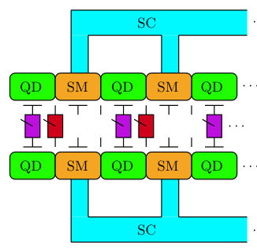
<figcaption class="paper-figure-caption"><b>Fig 1.</b> FIG. 1. Experimental setup to realize the Ashkin–Teller model using two Kitaev chains coupled to resonators (pur- ple and red represent x and z modulation respectively). The Kitaev chain is formed by an alternating array of quantum dots (QDs) and proximitized semiconductor segments host- ing Andreev bound states (SM+SC).</figcaption>
</figure>
<figure class="paper-figure-card">

<figcaption class="paper-figure-caption"><b>Fig 2.</b> FIG. 2. The magnetic and polarization scaling dimensions, xm and xP , along the Ashkin–Teller critical line, obtained using finite-size scaling. Symbols show the scaling dimen- sions extracted from DMRG calculations, while the solid and dashed lines denote the corresponding exact critical-theory predictions. The shaded region indicates the experimentally accessible range 0 ≤λ ≤0.19. The fit data underlying this figure are provided in Appendix B.</figcaption>
</figure>
<figure class="paper-figure-card">
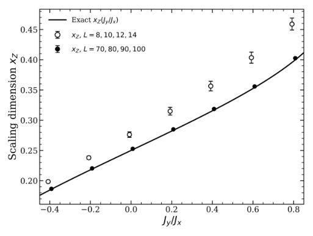
<figcaption class="paper-figure-caption"><b>Fig 3.</b> FIG. 3. The magnetic scaling dimension xm along the eight- vertex critical line obtained using finite-size scaling. Symbols show the scaling dimensions extracted from DMRG calcula- tions, while the solid line denotes the exact eight-vertex pre- diction. The fit data underlying this figure are provided in Appendix B.</figcaption>
</figure>
<figure class="paper-figure-card">
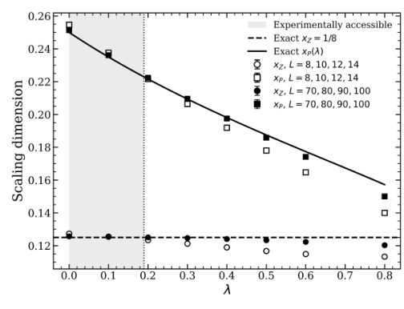
<figcaption class="paper-figure-caption"><b>Fig 4.</b> Figure 3 compares the magnetic scaling dimension xZ extracted from finite-size DMRG calculations with the exact eight-vertex prediction as a function of Jy/Jx. Along the eight-vertex critical line, the exact magnetic</figcaption>
</figure>
<figure class="paper-figure-card">
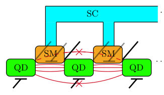
<figcaption class="paper-figure-caption"><b>Fig 5.</b> FIG. 4. Experimental setup for realizing the eight-vertex model through Coulomb interactions between neighboring quantum dots. Longer-range Coulomb interactions (red lines) are screened (red crosses) by the metallic leads (black), effec- tively restricting the interaction to nearest neighbors. The Kitaev chain is formed by an alternating array of quantum dots (QDs) and proximitized semiconductor segments host- ing Andreev bound states (SM+SC).</figcaption>
</figure>

**Summary.** This paper proposes using quantum-dot arrays to engineer and study weak universality in quantum critical systems, specifically the Ashkin-Teller and eight-vertex models. By utilizing both resonator-mediated and direct Coulomb interactions, the authors demonstrate microscopic control over parameters that govern critical exponents. The work is significant because it provides a tangible, controllable platform to test fundamental theories of phase transitions in condensed matter physics.

**Why it may be interesting.** This work bridges fundamental concepts from statistical mechanics (critical phenomena) with cutting-edge solid-state quantum simulation platforms (quantum dots), offering a concrete roadmap for experimental realization of complex quantum critical points.

Detailed structure

**Main problem.** The primary challenge is experimentally realizing and controlling weak universality, where critical exponents vary continuously along a critical line, in quantum many-body systems.

**Main result.** The authors propose quantum-dot architectures to microscopically engineer and tune the parameters governing critical exponents in the Ashkin-Teller and eight-vertex models.

**Method.** The study combines theoretical mapping (e.g., Majorana fermions, Jordan-Wigner transformation) with numerical simulations (DMRG) and proposes experimental realizations using resonator-mediated and direct Coulomb interactions in quantum dots.

**Model / system.** The models studied are the quantum Ashkin-Teller (AT) and XYZ/eight-vertex models. The physical platform is based on quantum-dot Kitaev-chain architectures, allowing for tunable interactions via resonator coupling or direct Coulomb interaction.

**Key observables.** Continuously varying critical exponents ($eta, 
u$), magnetic scaling dimension ($x_Z$), and local charge density (order parameter).

**Important parameters / regimes.** Tuning ratios like $\lambda/t$ for the AT model, and interaction ratios like $J_y/J_x$ for the eight-vertex model. The anti-adiabatic regime ($\omega \gg E_{	ext{Kitaev}}$) is a key theoretical limit.

**Assumptions / limitations.** The derivation of the effective Hamiltonian relies on the anti-adiabatic limit, and the analysis assumes that the accessible interaction range yields measurable changes in critical exponents above experimental noise.

**Figures summary.** Figure 3 compares DMRG-extracted magnetic scaling dimensions ($x_m$) against the exact theoretical prediction along the eight-vertex critical line. Figure 4 illustrates the experimental setup using Coulomb interactions for the eight-vertex model.

**Paper structure.** The paper first establishes the theoretical framework by mapping spin models (AT, XYZ) to fermionic/Majorana representations. It then details the physical realization using quantum dots, distinguishing between resonator-mediated coupling (for AT) and direct Coulomb coupling (for eight-vertex). Finally, it presents results using finite-size scaling analysis on both theoretical and simulated data.

Abstract

Quantum critical theories with continuously varying critical exponents remain challenging to access experimentally. Here, we propose quantum-dot architectures for realizing the quantum Ashkin-Teller and XYZ/eight-vertex models using resonator-mediated and direct Coulomb interactions, respectively. We focus on the Ashkin-Teller and eight-vertex critical lines, which are connected by a non-local duality relating local order parameters to topological string operators. The resulting platforms provide microscopic control over the parameters explicitly controlling critical exponents, with the Coulomb-based implementation enabling stronger interaction regimes. We demonstrate that continuously varying critical behavior can already be resolved in short chains. For experimentally realistic parameters, the accessible interaction range is expected to produce changes in the critical exponents of order $10\%$ for the Ashkin-Teller model and substantially larger changes for the eight-vertex model. In both cases, the predicted variations lie well above the estimated measurement uncertainties.

[↑ back to top](#top)

### [How universal are warm turbulent cascades?](http://arxiv.org/abs/2609.19432v1)

**Authors:** Ben Y. Israeli, Gregory Falkovich  
**Type:** theory · **Category:** statistical mechanics · **PDF:** <https://arxiv.org/pdf/2609.19432v1>  
**Analysis basis:** full PDF text, analyzed in chunks
**Topic relevance:** 🔥 `non-equilibrium universality` **4/5** · `Keldysh / 2PI / non-Gaussian methods` **1/5** · `correlated / nonlocal dissipation` **1/5** · `driven-dissipative phase transition` **1/5**

↔ Scroll figures horizontally

<figure class="paper-figure-card">
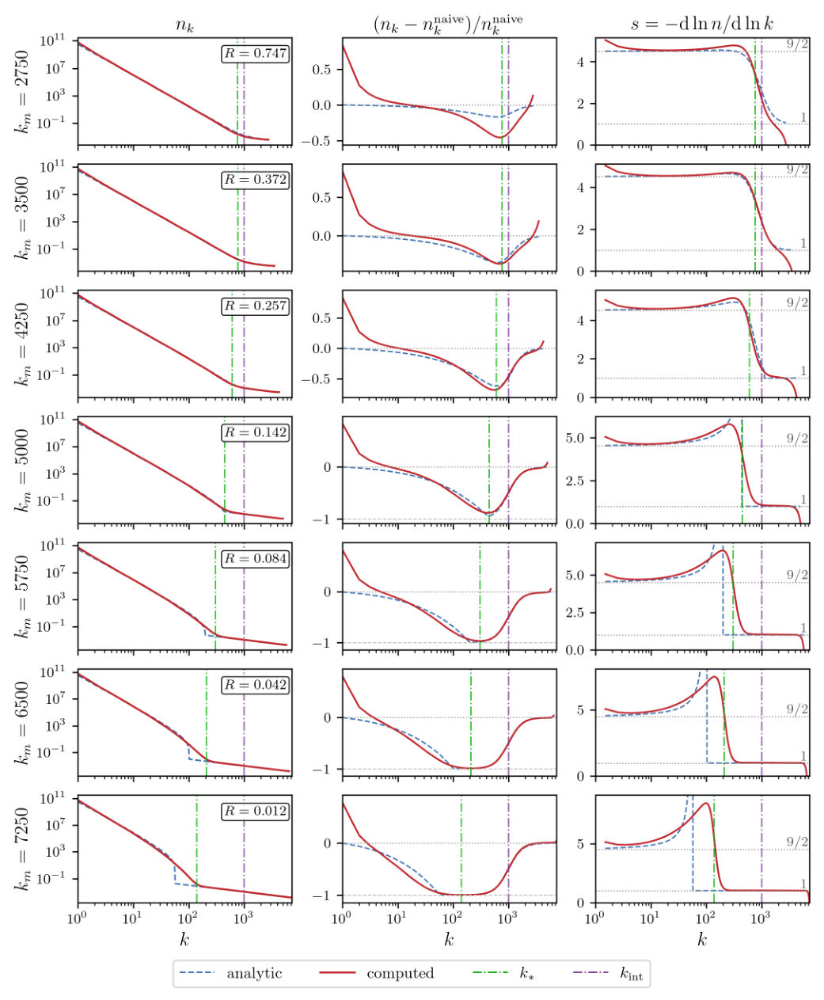
<figcaption class="paper-figure-caption"><b>Fig 1.</b> FIG. 1. Spectrum nk, difference of the spectrum from a naive sum nnaive k = λP 1/2 0 k−9/2 + T/ck, and local exponent (eq. (72)) for the stationary numerical solutions at evenly spaced km. The sum of the depleted cascade and a thermal distribution nk = λP(k)1/2k−9/2 + T/ck (using eq. (59)) are shown for reference. The thermostat contamination parameter R (eq. (71)) is indicated in the left column.</figcaption>
</figure>
<figure class="paper-figure-card">
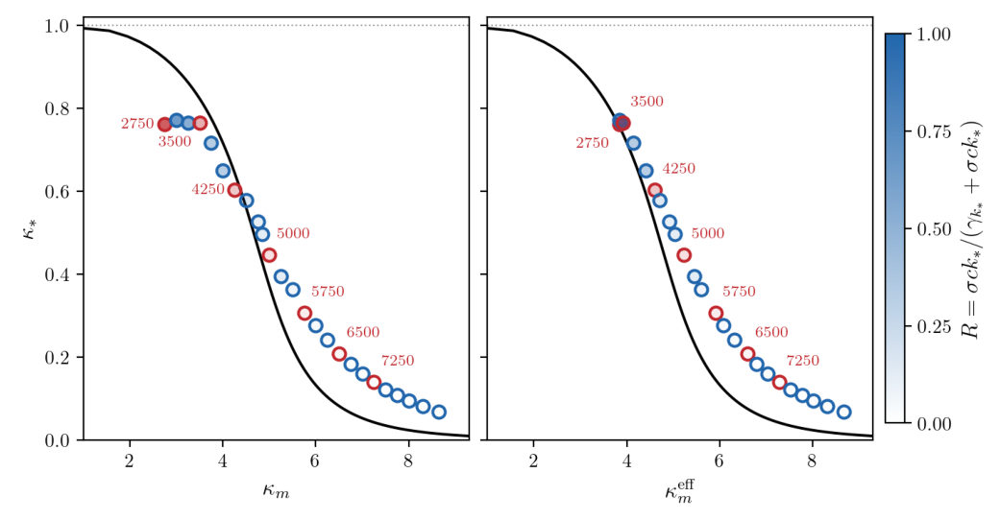
<figcaption class="paper-figure-caption"><b>Fig 2.</b> FIG. 2. Normalized transition wavenumber as a function of uncompensated (left) and compensated (right) normalized maximum wavenumber. Opacity is used to indicate thermostat contamination parameter R. Red markers indicate the runs shown in figure fig. 1 with indicated km. The curves defined by eqs. (65) and (69) are shown in black.</figcaption>
</figure>

**Summary.** This work investigates the universality of energy cascades in wave turbulence, showing that thermal damping introduces nonlocal effects dependent on the system's high-wavenumber cutoff. By analyzing the wave kinetic equation for three- and four-wave interactions, the authors demonstrate that the cascade behavior is not universal, contradicting common theoretical assumptions.

**Why it may be interesting.** The core concept of non-equilibrium statistical mechanics, particularly how boundary conditions (like the UV cutoff) can invalidate simple, universal scaling laws derived from local approximations, is highly relevant to open quantum systems and non-equilibrium dynamics.

Detailed structure

**Main problem.** The paper questions the universality of 'warm cascade' solutions in wave turbulence, which are typically assumed to depend only on conserved fluxes and temperature.

**Main result.** Nonlocal effects arising from thermal damping introduce a dependence on the UV cutoff (maximum wavenumber), challenging the assumption that these cascades are universal.

**Method.** The authors use asymptotic analysis of the wave kinetic equation for both three-wave and four-wave interactions, supplemented by numerical simulations of the energy depletion.

**Model / system.** The study concerns wave systems exhibiting turbulent cascades, governed by the wave kinetic equation, and considering interactions via both three-wave and four-wave processes.

**Key observables.** Cascade spectrum exponent s(k), energy flux P(k), transition wavenumber k*, and the ratio of damping to cascade rates.

**Important parameters / regimes.** The UV cutoff (maximum wavenumber, k_max), and the coupling constants governing the wave interactions.

**Assumptions / limitations.** The analysis initially assumes local interactions, but the conclusion demonstrates that the full collision integral is nonlocal, invalidating this approximation.

**Figures summary.** Figure 1 shows the spectrum n_k and the local exponent for various k_m, while Figure 2 compares the numerically determined transition wavenumber vs. analytic models.

**Paper structure.** The paper progresses from establishing the standard warm cascade model to analyzing the impact of thermal damping via the wave kinetic equation. It then presents analytical derivations for the depleted cascade and concludes with numerical demonstrations showing the non-universal dependence on the cutoff scale.

Abstract

It is often assumed that general stationary solutions to the wave kinetic equation are described solely by conserved fluxes and temperature. The families of solutions parameterized by these quantities are referred to as warm cascades, and are derivable from differential models of wave kinetics. These models rely on the assumption of local interactions, and we demonstrate by a time scale argument that the nonlocal effect of thermal damping on the cascade may result in dependence on an additional parameter, the UV cutoff, calling into question the validity of warm cascade solutions. This is shown for systems with both three-wave and four-wave interactions. We then consider the depletion of the cascade by this damping, and present a numerical demonstration of this nonlocal and nonuniversal behavior.

[↑ back to top](#top)

### [Electrostatic Stabilization of Near-Surface Quantum Sensors via Dielectric Interface Engineering](http://arxiv.org/abs/2609.20137v1)

**Authors:** Atharva Paranjape, Kathrin Küster, Olga Shevstova, Lisa Ebo, Toni Hache, Klaus Kern, Rainer Stöhr, Jörg Wrachtrup, Aparajita Singha  
**Type:** experiment · **Category:** quantum information and computing · **PDF:** <https://arxiv.org/pdf/2609.20137v1>  
**Analysis basis:** full PDF text, analyzed in chunks
**Topic relevance:** 🔥 `QC/QI experiment` **4/5** · `quantum measurements` **1/5** · `quantum optics experiment` **1/5**

↔ Scroll figures horizontally

<figure class="paper-figure-card">
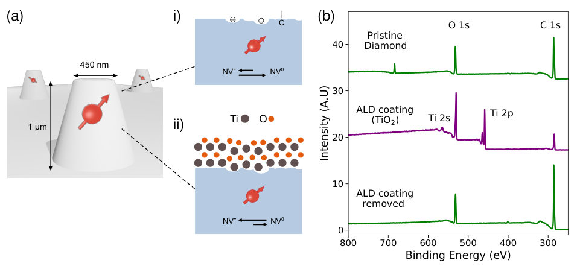
<figcaption class="paper-figure-caption"><b>Fig 1.</b> Figure 1: Schematic of dielectric coated diamond and surface characterization (a) Electronic environment of NV centers in nano-structured diamond depicted under i) pristine and ii) TiO2 coated conditions. The length of black arrows represents the relative strength of charge-state switching. b) X-ray Photoelectron Spectroscopy of a reference sample (RS) under different surface conditions. Ti signal is observed upon ALD deposition (coating performed using 500 cycles of ALD). These signatures are removed after cleaning the diamond surface. A residual peak at the top panel at 684.8 eV corresponds to F 1s.</figcaption>
</figure>
<figure class="paper-figure-card">
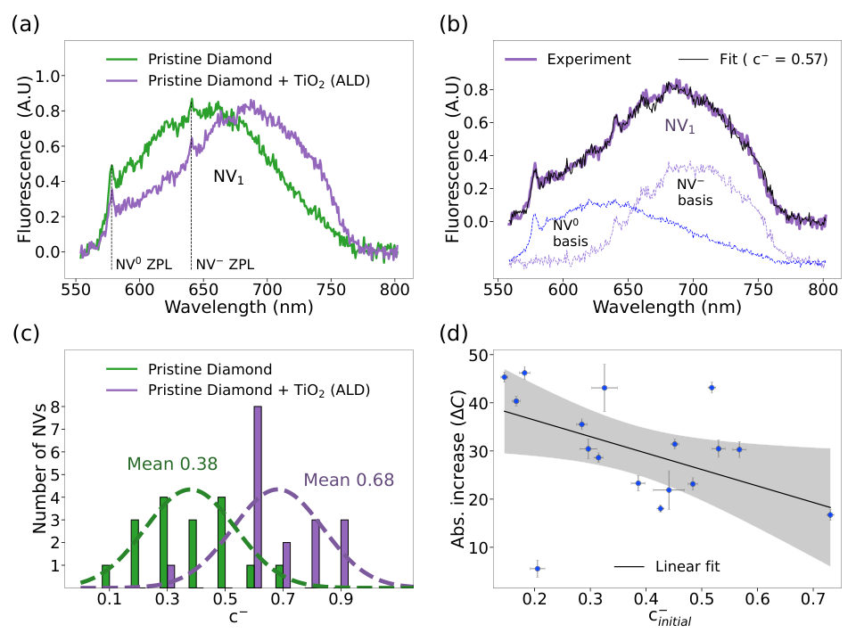
<figcaption class="paper-figure-caption"><b>Fig 2.</b> Figure 2: Fluorescence spectrum of individual NV centers in near-UHV condi- tion (a) Measured fluorescence spectrum of the same single NV center (NV1) under pristine and coated conditions. Plotted spectra are area-normalized. P= 3 x 10-9 mbar, T= 300 K, incident laser power before the objective = 130 µW. (b) Decomposition of measured spec- trum using pure NV- and NV0 spectra as basis functions to obtain NV- percentage. The least squares fit (black) is in excellent agreement with the experimentally obtained spectrum (purple) and we obtain c−=0.57. (c) Statistical representation of NV- fluorescence contri- bution from 17 measured NV centers. Dashed lines represent fits to a normal...</figcaption>
</figure>
<figure class="paper-figure-card">
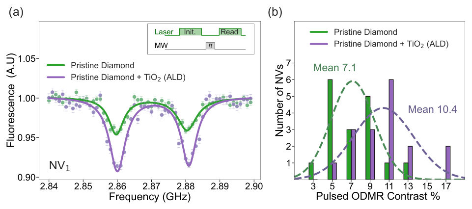
<figcaption class="paper-figure-caption"><b>Fig 3.</b> Figure 3: Pulsed ODMR spectroscopy of single NV centers in near-UHV condition (a) Inset: laser and microwave (MW) pulse sequence. Pulsed ODMR measurement of NV1 (same NV as in Figure 2) before and after the coating. P= 3 x 10-9 mbar, T= 300 K, incident laser power before the objective = 130 µW (b) Statistics of the ODMR contrast in pristine and ALD coated conditions for 17 measured NV centers. Dashed lines represent fits to a normal distribution. Bins are divided equally between green and purple only for visual clarity.</figcaption>
</figure>
<figure class="paper-figure-card">
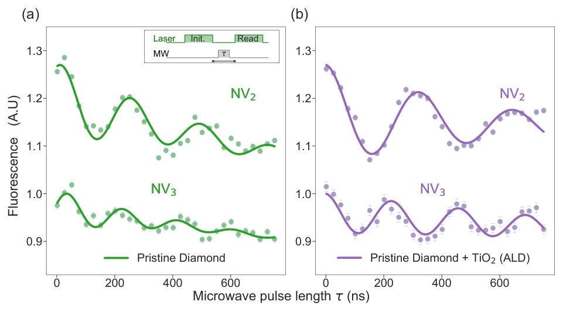
<figcaption class="paper-figure-caption"><b>Fig 4.</b> Figure 4: Improvement of Rabi oscillations of single NV centers in near-UHV condition (a) Inset: laser and microwave (MW) pulse sequence. Driven Rabi oscillations for NV2 and NV3 in pristine diamond (b) Measurements for NV2 and NV3 with TiO2 coated diamond. We observe a gradual decrease in the baseline for NV centers in pristine diamond which recovers after ALD coating. P= 3 x 10-9 mbar, T= 300 K, incident laser power before the objective = 130 µW.</figcaption>
</figure>
<figure class="paper-figure-card">
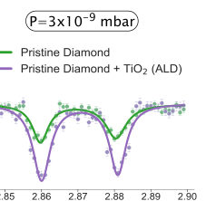
<figcaption class="paper-figure-caption"><b>Fig 5.</b> Figure 5: For Table of Contents Only</figcaption>
</figure>

**Summary.** This paper demonstrates a method to stabilize charge states in shallow NV centers within diamond by coating the surface with a dielectric TiO2 layer. By suppressing surface-induced electric fields, the coating significantly boosts the concentration of the desired NV- charge state and enhances the sensor's magnetic resonance contrast. This establishes dielectric engineering as a powerful tool for robust quantum sensing under extreme vacuum conditions.

**Why it may be interesting.** This work provides an experimental blueprint for mitigating environmental decoherence sources (surface electric fields) in solid-state quantum memories, which is highly relevant for building robust quantum sensors and quantum computing platforms.

Detailed structure

**Main problem.** Controlling the charge-state stability of near-surface quantum defects, like NV centers, is crucial for nanoscale sensing, especially in ultra-high vacuum where surface effects cause instability.

**Main result.** Applying a TiO2 dielectric coating suppresses detrimental surface-induced electrostatic fields, leading to a significant increase in the stable NV- charge state and enhancing spin resonance contrast.

**Method.** The researchers used Atomic Layer Deposition (ALD) to deposit a TiO2 coating on diamond, followed by fluorescence and optically detected magnetic resonance (ODMR) measurements under near-UHV conditions.

**Model / system.** The system involves Nitrogen-Vacancy (NV) centers implanted shallowly (< 10 nm) in diamond. The key physics revolves around the charge-state equilibrium between NV- and NV0, which dictates the sensor's performance.

**Key observables.** NV- charge state fraction (quantified via fluorescence spectroscopy), ODMR spin resonance contrast, and spin coherence dynamics (Rabi oscillations).

**Important parameters / regimes.** Near-UHV pressure ($3 	imes 10^{-9}$ mbar), room temperature (300 K), and the dielectric coating material (TiO2).

**Assumptions / limitations.** The measured charge-state fraction (c-) is used as a reliable proxy for the actual stable NV- population, and the coating process itself does not introduce significant bulk defects.

**Figures summary.** Figures compare fluorescence spectra and ODMR measurements before and after TiO2 coating, showing quantitative improvements in charge-state stability and contrast. Rabi oscillation measurements confirm preserved coherent control.

**Paper structure.** The paper establishes the problem (surface instability) and proposes the solution (dielectric engineering). It presents characterization (XPS, fluorescence) to quantify the improvement, followed by advanced measurements (ODMR, Rabi oscillations) to demonstrate enhanced sensing capability.

Abstract

Control of charge-state stability in near-surface quantum defects is critical for nanoscale sensing, yet remains particularly challenging under ultra-high vacuum (UHV), where surface-induced band bending destabilizes the metrologically relevant charge-state. Here, we present a robust and reproducible approach for stabilizing shallowly implanted (< 10 nm deep) nitrogen-vacancy (NV) centers in near-UHV conditions (P = $3 \times 10^{-9}$ mbar) based on dielectric interface engineering. Through measurements on individually addressable NV centers, we demonstrate that a TiO2 coating on the diamond suppresses surface-induced electrostatic fields, yielding a 79% increase n NV- population and a 45% enhancement in NV-spin resonance contrast at room temperature. Coherent control measurements further reveal suppressed charge-state conversion dynamics. These results establish dielectric screening as a powerful and reproducible strategy to engineer charge transition energetics of NV centers in scanning-probe-compatible geometries under extreme conditions.

[↑ back to top](#top)

### [Coherent and ultra-low-power EDSR with a flopping-mode spin qubit in germanium](http://arxiv.org/abs/2609.20775v1)

**Authors:** Alexei Orekhov, Wonjin Jang, Pan Zhang, Konstantinos Tsoukalas, Fabian Oppliger, Franco De Palma, Elena Acinapura, Younghun Ryu, Inga Seidler, Lisa Sommer, Leonardo Massai, Felix J. Schupp, Matthias Mergenthaler, Stefano Bosco, Patrick Harvey-Collard, Pasquale Scarlino  
**Type:** experiment · **Category:** quantum information and computing · **PDF:** <https://arxiv.org/pdf/2609.20775v1>  
**Analysis basis:** full PDF text, analyzed in chunks
**Topic relevance:** 🔥 `QC/QI experiment` **4/5** · `quantum measurements` **1/5**

↔ Scroll figures horizontally

<figure class="paper-figure-card">
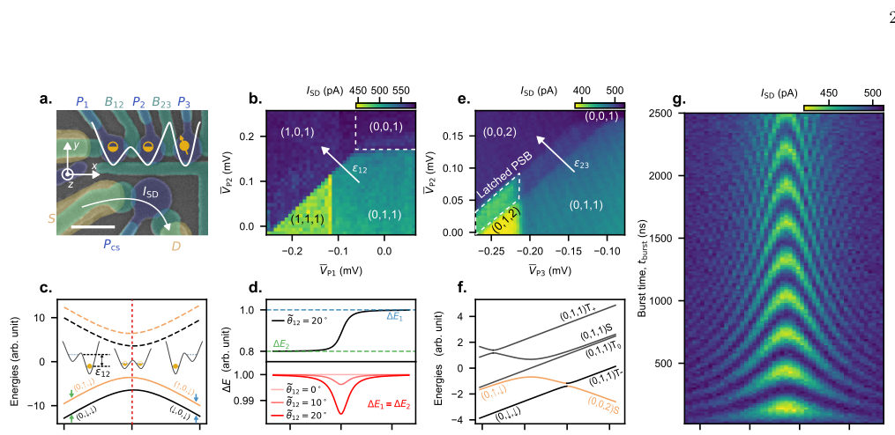
<figcaption class="paper-figure-caption"><b>Fig 1.</b> FIG. 1. a. False colored scanning electron micrograph of a QD device identical to the one utilized in this work. Plungers Pi are used to tune the chemical potential of QDi, and barriers Bij are used to control tunnel coupling between QDi and QDj. S and D indicate the source and drain ohmic contacts of the SHT charge sensor. The dc current ISD through these contacts is used to charge-sense the triple QD. b. Pulsed DQD charge stability diagram measured as a function of the virtualized gate voltages V P1 and V P2, near (1,0,1)-(0,1,1) charge transition. The DQD energy detuning ε12 is tuned along the direction illustrated by the white arrow. c. Eigenenergies as a function of energy detuning ε12...</figcaption>
</figure>
<figure class="paper-figure-card">
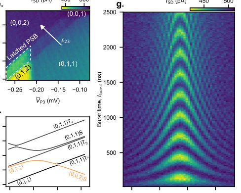
<figcaption class="paper-figure-caption"><b>Fig 2.</b> Fig. 1a displays a false-colored scanning electron mi- crograph of a device identical to the one used in this work, defined on a planar Ge/SiGe heterostructure grown by reverse-grading on a Si substrate [38]. Holes are ac- cumulated in a 20 nm strained Ge quantum well residing 47 nm below the surface and contacted with annealed Pt- GeSi ohmic contacts [39]. We make use of two gate lay- ers, with barriers and screening gates in the first layer, and plungers in the second layer. The three uppermost plunger gates Pi, with i = 1, 2, 3 are primarily used to de- fine a triple-QD, while the barriers B12 and B23 are used</figcaption>
</figure>
<figure class="paper-figure-card">
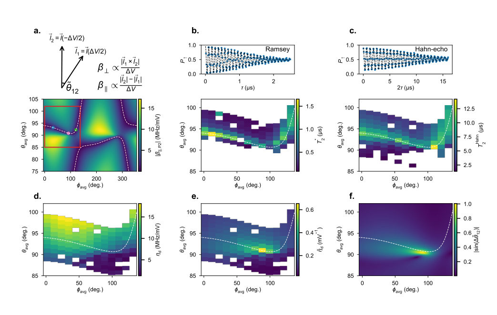
<figcaption class="paper-figure-caption"><b>Fig 3.</b> FIG. 2. a. Top panel: Schematic showing the definition of longitudinal (β|| ) and transverse (β⊥) spin-electric susceptibility (LSES and TSES), with FM qubit Larmor vector l evaluated at two (incrementally small) voltage detunings of ∆V = ∆V Pi from the charge symmetry point. Bottom panel: Absolute value of the LSES, |β||,P2|, with respect to V P2. Blue, pink and green dots define the field directions, ˆb1, ˆb2 and ˆb3 respectively, corresponding to experimentally measured zero-detuning sweet-spots. b. Top panel: Example Ramsey decay measurement at B orientation ˆb1, yielding T ∗ 2 = 1.4 µs. Bottom panel: T ∗ 2 measured as a function of B, with spherical angles defined in the average...</figcaption>
</figure>
<figure class="paper-figure-card">
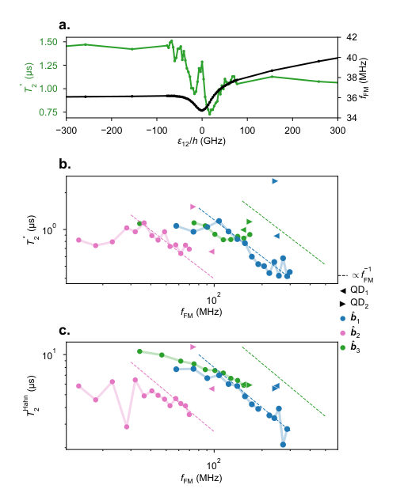
<figcaption class="paper-figure-caption"><b>Fig 4.</b> FIG. 3. a. FM qubit frequency fFM (black) and T ∗ 2 (green) as a function of ε12, extracted from the same Ramsey mea- surement, with |B| = 5 mT and tc/h = 13 GHz. b. (c.) T ∗ 2 (T Hahn 2 ) as a function of fFM for the B orientations ˆb1 (blue), ˆb2 (pink), and ˆb3 (green), and tc/h = 13 GHz. Each dashed line is proportional to 1/fFM with prefactors related by the extracted second derivatives of the qubit spectra (see text). The LD qubit coherence times in QD1(2) are measured at the center of (1,0,1) and (0,1,1) represented with left (right) pointing triangles.</figcaption>
</figure>
<figure class="paper-figure-card">
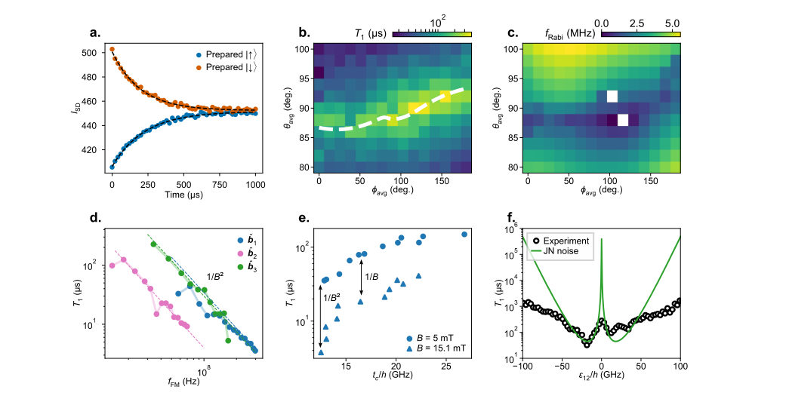
<figcaption class="paper-figure-caption"><b>Fig 5.</b> FIG. 4. a. Spin relaxation for B direction ˆb3, |B| = 5 mT, tc/h = 13 GHz. Measured for spin-up and spin-down initializations. b. T1 dependence on B direction for spin-down initialization. Dashed line shows analytical T1 sweet-spot (see Supplemen- tary section S17 2). c. Rabi frequency dependence on B direction with Ad,P2 = 600 µV. d. T1 as a function of qubit frequency at zero detuning, measured for directions ˆb1,2,3. Dashed lines are obtained as T1 = ˜η−2 d kfFM −2, where k is a fixed constant for all three B directions. e. Scaling of T1 with tunnel coupling tc for ˆb1 and two different magnetic field magnitudes |B| = 5 mT and 15.1 mT. At tc/h = 13 GHz the B scaling of T1 follows 1/|B|2,...</figcaption>
</figure>

**Summary.** This paper presents a breakthrough in solid-state quantum computing by demonstrating a flopping-mode spin qubit in germanium that enables high-fidelity single-qubit gates using ultra-low radiofrequency drive power. By engineering the qubit to operate at a charge-noise sweet-spot, the researchers overcome the power limitations of conventional spin resonance techniques. This advancement paves the way for more scalable and practical hole-spin-based quantum processors.

**Why it may be interesting.** This work directly addresses the scalability bottleneck in solid-state quantum computing by demonstrating a robust, low-power control mechanism for spin qubits, which is highly relevant to quantum information processing.

Detailed structure

**Main problem.** Conventional Electric Dipole Spin Resonance (EDSR) for hole spin qubits in Ge requires high rf drive power at low magnetic fields, causing heating and crosstalk detrimental to scalable quantum architectures.

**Main result.** The proposed flopping-mode (FM) qubit architecture achieves ultra-low-power, high-fidelity single-qubit operations at low magnetic fields, maintaining high coherence times ($T_{\phi,	ext{CPMG}32} = 130 \mu	ext{s}$) and gate fidelity ($\ge 99.76\%$).

**Method.** The study involves characterizing coherence sweet-spots by mapping out spin-electric susceptibilities and measuring qubit performance using Rabi chevron patterns.

**Model / system.** The system utilizes hole spin qubits in a double quantum dot (DQD) structure within planar Ge/SiGe heterostructures, encoding the qubit in a flopping-mode (FM) that offers first-order protection against charge noise.

**Key observables.** Coherence times ($T^*_2, T_{	ext{Hahn}}, T_{\phi,	ext{CPMG}32}, T_1$), single-qubit gate fidelity, and required drive power (achieved at $-52 	ext{ dBm}$).

**Important parameters / regimes.** Nearly in-plane magnetic field of $5 	ext{ mT}$; gate time $t_{X\pi} = 88 	ext{ ns}$.

**Assumptions / limitations.** The analysis assumes the FM qubit operation point ($\varepsilon_{12}=0$) is a sweet-spot that simultaneously suppresses charge noise and allows for efficient electrical driving.

**Figures summary.** Figures illustrate the device structure, charge stability diagrams, energy level splittings for the FM qubit, and Rabi chevron patterns confirming qubit operation at sweet-spots.

**Paper structure.** The paper progresses from identifying the power limitations of conventional EDSR to proposing and demonstrating the FM qubit mechanism. It details the coherence measurements, analyzes the low-power operation regime, and concludes by confirming the benefits for scalable architectures.

Abstract

Hole spin qubits in semiconductor quantum dots (QDs) enable high-fidelity all-electric control, but conventional electric dipole spin resonance (EDSR) can require substantial rf drive power at the low magnetic fields that are favorable for qubit coherence and readout. In planar Ge hole spin qubits, this can reach -27 dBm at the device, posing challenges for scalable architectures due to heating and crosstalk. Here, we demonstrate a flopping-mode (FM) qubit in Ge, where a single spin is delocalized in a double QD, combining first-order protection against charge noise with exceptionally efficient electric driving. By mapping out coherence sweet-spots as a function of magnetic field orientation we achieve $T_2^*= 1.4μ\mathrm{s}$, $T_2^{\mathrm{Hahn}}= 11.5 μ\mathrm{s}$, $T^{φ, \mathrm{CPMG32}}_2= 130 μ\mathrm{s}$, and $T_1= 226 μ\mathrm{s}$, and a single-qubit gate fidelity of up to 99.76$\%$ for a gate time $t_{Xπ} = 88$ ns. Importantly, these results are obtained at a nearly in-plane magnetic field of 5 mT using only -52 dBm drive power at the device. We further find that qubit relaxation in this regime is consistent with a two-photon Orbach process, providing a route for further optimization. Our results demonstrate that FM-EDSR supports ultra-low-power, high-fidelity single-qubit operations, improvements that could benefit scalable hole-spin-based architectures and hybrid spin-photon interfaces.

[↑ back to top](#top)

### [Highly uniform first-electron position in qubit arrays fabricated on dedicated QSOI(R) 300mm commercial platform](http://arxiv.org/abs/2609.20043v1)

**Authors:** Johan Pelloux-Prayer, Elise Prin, Giselle A. Elbaz, Pierre-Louis Julliard, Amaryllis Comiti, Clément Nguyen, Sylvain Martin, Patrick Torresani, Renan Lethiecq, Carlos Augusto Suarez Segovia, Franck Arnaud, Etienne Nowak, Tristan Meunier, Bruna Cardoso Paz  
**Type:** experiment · **Category:** quantum information and computing · **PDF:** <https://arxiv.org/pdf/2609.20043v1>  
**Analysis basis:** full PDF text, analyzed in chunks
**Topic relevance:** 🔥 `QC/QI experiment` **4/5** · `quantum measurements` **1/5**

↔ Scroll figures horizontally

<figure class="paper-figure-card">
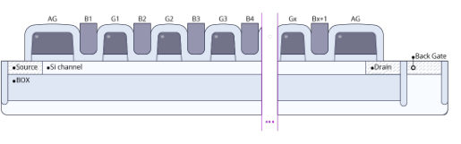
<figcaption class="paper-figure-caption"><b>Fig 1.</b> Fig. 1. Schematic of an array of quantum dots using QSOI®. Access gates (AG) are used to form electrostatic reservoirs. Plungers gates (G1, G2,..., Gx) are used to control the chemical potential of the quantum dots. Barriers (B1, B2, ..., Bx+1) are repurposed vias used to control the tunnel coupling between two neighboring quantum dots. This is an artist impression and does not reflect the real dimensions of our devices.</figcaption>
</figure>
<figure class="paper-figure-card">
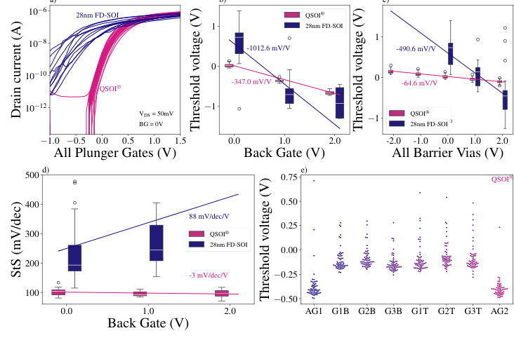
<figcaption class="paper-figure-caption"><b>Fig 2.</b> Fig. 2. Data are colored in blue for 28nm FD-SOI and in pink for QSOI® in a, b, c, and d. a) Wafer-level Id-Vg across the center, mid and edge radii (28 dies). b) - c) Boxplot of the threshold voltage for 28nm FD-SOI and QSOI® against the applied back-gate voltage in (b) and the barrier-vias voltage in (c). Box plots show the interquartile range and the median. Whiskers represent the maximum and minimum values without outliers. Outliers are defined as data points that are more than 1.5 interquartile range away from the median. d) Boxplot of the subthreshold swing (StS) extracted from Id-Vg curve for 3 back gate biases: 0V, 1V, and 2V. For a back gate of 2V the 28nm FD-SOI data is shifted to...</figcaption>
</figure>
<figure class="paper-figure-card">
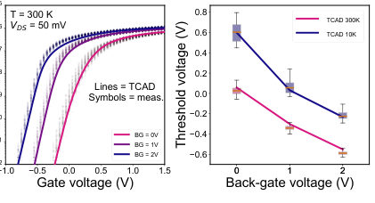
<figcaption class="paper-figure-caption"><b>Fig 3.</b> Fig. 3. Simulation and experimental data obtained for a linear array with 3 plunger gates in series. Left: transfer characteristics at room temperature for different back-gate bias VBG = 0, 1, and 2V, and VDS = 50mV. Right: Extracted threshold voltage as a function of the back-gate voltage at room and low temperatures.</figcaption>
</figure>
<figure class="paper-figure-card">
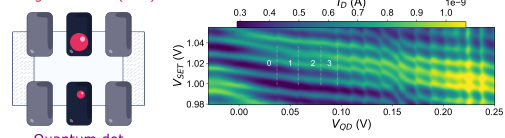
<figcaption class="paper-figure-caption"><b>Fig 4.</b> Fig. 4. Left: Schematics of a charge detection configuration on a bilinear device, where a single-electron transistor is used to sense the electrons tunneling inside the quantum dot. Right: Stability diagram showing the few- electron regime for the probed quantum dot formed underneath the plunger gate. The numbers inside the figure indicate the charge occupation of the probed QD. The interruption of the regular pattern of vertical jumps indicates that the dot has been emptied. Access gates are not shown for simplicity.</figcaption>
</figure>
<figure class="paper-figure-card">
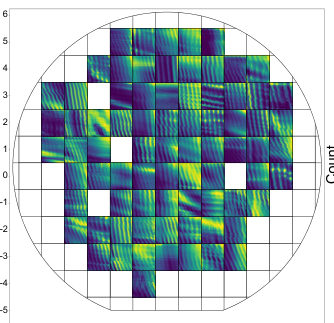
<figcaption class="paper-figure-caption"><b>Fig 5.</b> Fig. 5. Left: Wafermap of charge detection at the wafer scale for a pair of facing plunger gates. Only 4 dies were not measured since our protocol to find the first Coulomb peak rejected these dies. Each die shows the measurement between plunger gates G3T and G3B. Right: Histogram of the first electron position across the wafer measured for all the possible detectors in our device.</figcaption>
</figure>

**Summary.** This paper reports on the development of a Quantum Silicon-on-Insulator (QSOI(R)) platform, showing it is compatible with 300mm CMOS fabrication for quantum computing. By comparing it to older technologies, the authors demonstrate significant improvements in device uniformity and low variability in quantum dot charge detection. These results establish QSOI(R) as a promising, scalable foundation for integrated quantum devices.

**Why it may be interesting.** The demonstration of high uniformity and low variability in charge detection parameters at the wafer scale is crucial for scaling up any solid-state quantum computing architecture, providing a tangible engineering milestone.

Detailed structure

**Main problem.** The primary goal is to develop a scalable, highly uniform, and CMOS-compatible platform for fabricating qubit arrays.

**Main result.** The QSOI(R) technology significantly improves device uniformity and reduces variability compared to standard FD-SOI, demonstrating reproducible quantum dot operation down to the few-electron regime on a wafer scale.

**Method.** The research involves comparative electrical characterization of quantum devices fabricated using QSOI(R) versus 28nm FD-SOI, utilizing both room-temperature and cryogenic measurements.

**Model / system.** The system is a quantum dot array fabricated on a Quantum Silicon-on-Insulator (QSOI(R)) platform, adapted from 28nm FD-SOI, designed for integrating silicon spin qubits.

**Key observables.** First electron position dispersion ($\pm 35	ext{mV}$), threshold voltage ($	ext{V}_{	ext{TH}}$) distribution ($\sigma	ext{V}_{	ext{TH}}$), subthreshold swing (SS), and charge detection yield ($	ext{69\%}$).

**Important parameters / regimes.** Operating temperatures ($	ext{300K}$ and $	ext{sub-2K}$), device dimensions (28nm), and uniformity metrics.

**Assumptions / limitations.** The electrostatics of the devices are assumed to behave as predicted by TCAD simulations, and the platform is assumed to be compatible with 300mm CMOS fabrication.

**Figures summary.** Figures compare $	ext{V}_{	ext{TH}}$ dispersion (QSOI vs. FD-SOI), show tuning capabilities using back gates, and present wafer maps and histograms detailing the low dispersion of the first electron position.

**Paper structure.** The paper progresses by first establishing the need for scalable platforms, then presenting comparative electrical measurements (room and cryogenic) showing superior uniformity and performance of QSOI(R) over existing technologies, and concluding with the demonstration of wafer-scale quantum dot functionality.

Abstract

We report progress toward the development of a quantum silicon-on-insulator (QSOI(R)) technology compatible with 300mm CMOS fabrication and adapted from the 28nm Fully-Depleted SOI (28nm FD-SOI) platform for scalable quantum computing. We compare quantum devices fabricated with standard 28nm FD-SOI and QSOI(R) technologies, and show striking improvements of room temperature electrostatic properties of the individual device. Moreover, the QSOI(R) technology has significantly reduced the device variability and the dispersion of device properties at the wafer level. Transistor metrics are reproduced by TCAD simulations showing that the electrostatics of the devices behave as expected for QSOI(R) technology. Wafer-scale measurements at sub-2K show reproducible quantum dots down to the few-electron regime with 69\% yield for successful charge detection of the first electron and a dispersion of the first electron position of $\mathrm{\pm 35 mV}$ over 377 quantum dots. These results establish QSOI(R) as a promising platform for CMOS-compatible quantum device co-integration.

[↑ back to top](#top)

### [$k$-fold unbiased measurements and maximal incompatibility](http://arxiv.org/abs/2609.20728v1)

**Authors:** Sébastien Designolle, Máté Farkas  
**Type:** theory · **Category:** quantum information and computing · **PDF:** <https://arxiv.org/pdf/2609.20728v1>  
**Analysis basis:** full PDF text, analyzed in chunks
**Topic relevance:** 🔥 `quantum measurements` **4/5**

↔ Scroll figures horizontally

<figure class="paper-figure-card">
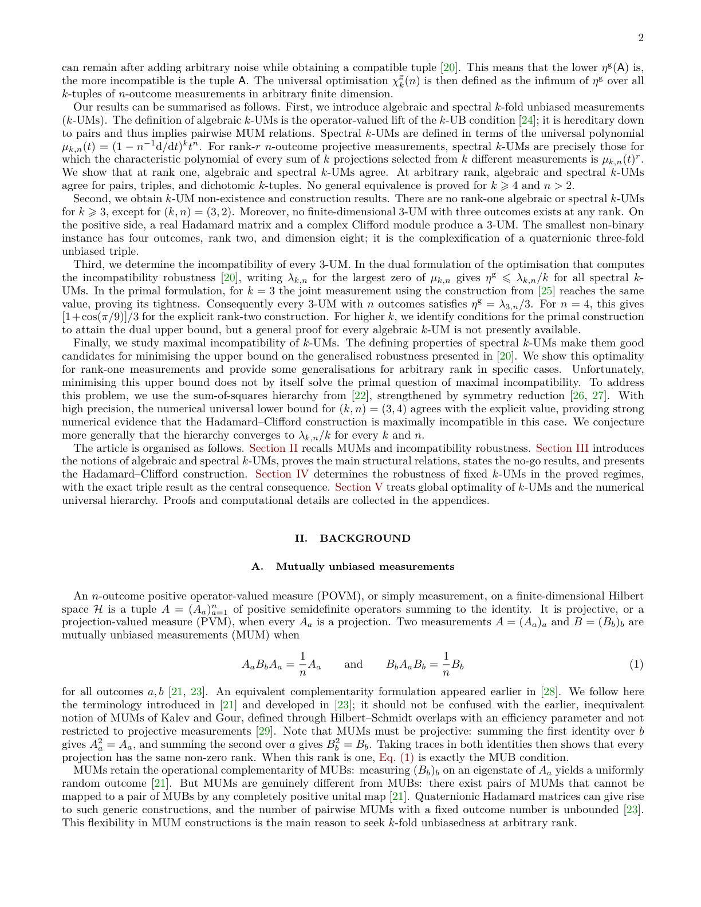
<figcaption class="paper-figure-caption"><b>Fig 1.</b> Low-resolution page preview, page 2</figcaption>
</figure>
<figure class="paper-figure-card">
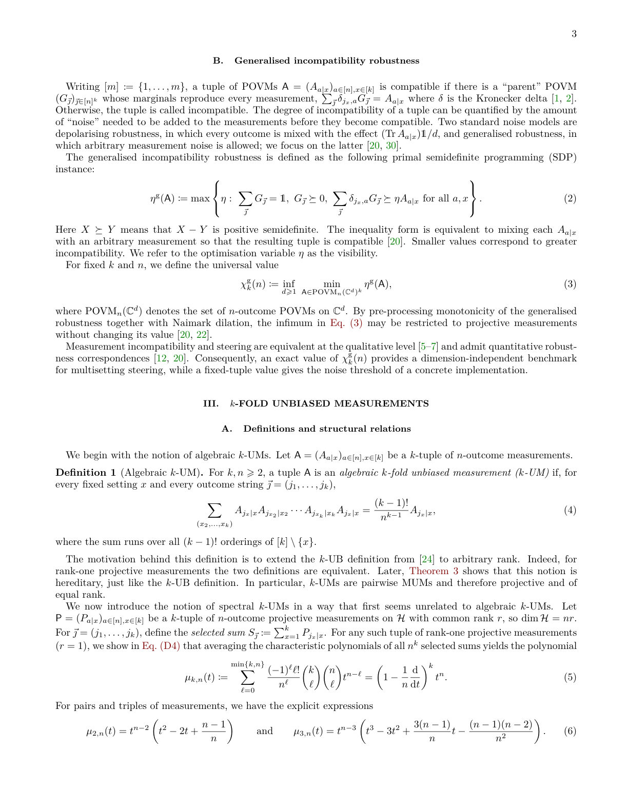
<figcaption class="paper-figure-caption"><b>Fig 2.</b> Low-resolution page preview, page 3</figcaption>
</figure>
<figure class="paper-figure-card">
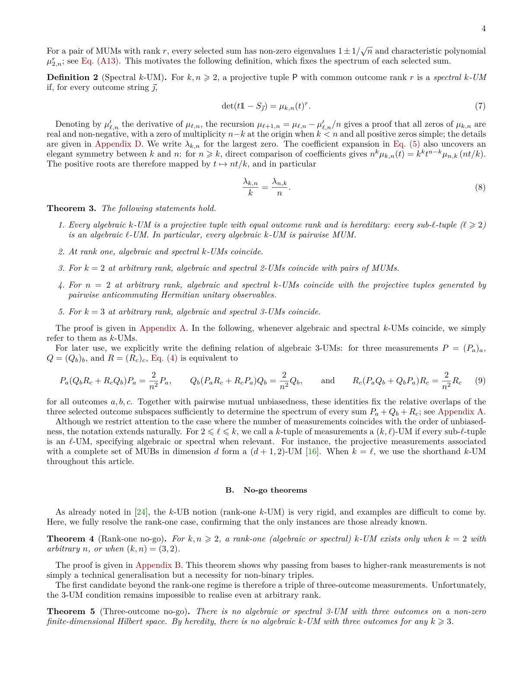
<figcaption class="paper-figure-caption"><b>Fig 3.</b> Low-resolution page preview, page 4</figcaption>
</figure>
<figure class="paper-figure-card">
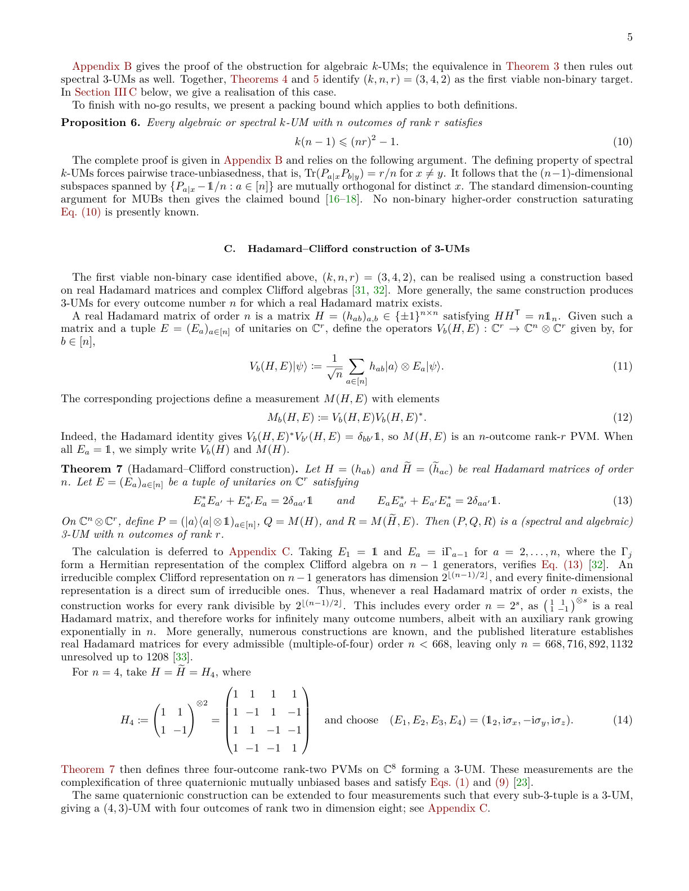
<figcaption class="paper-figure-caption"><b>Fig 4.</b> Low-resolution page preview, page 5</figcaption>
</figure>
<figure class="paper-figure-card">
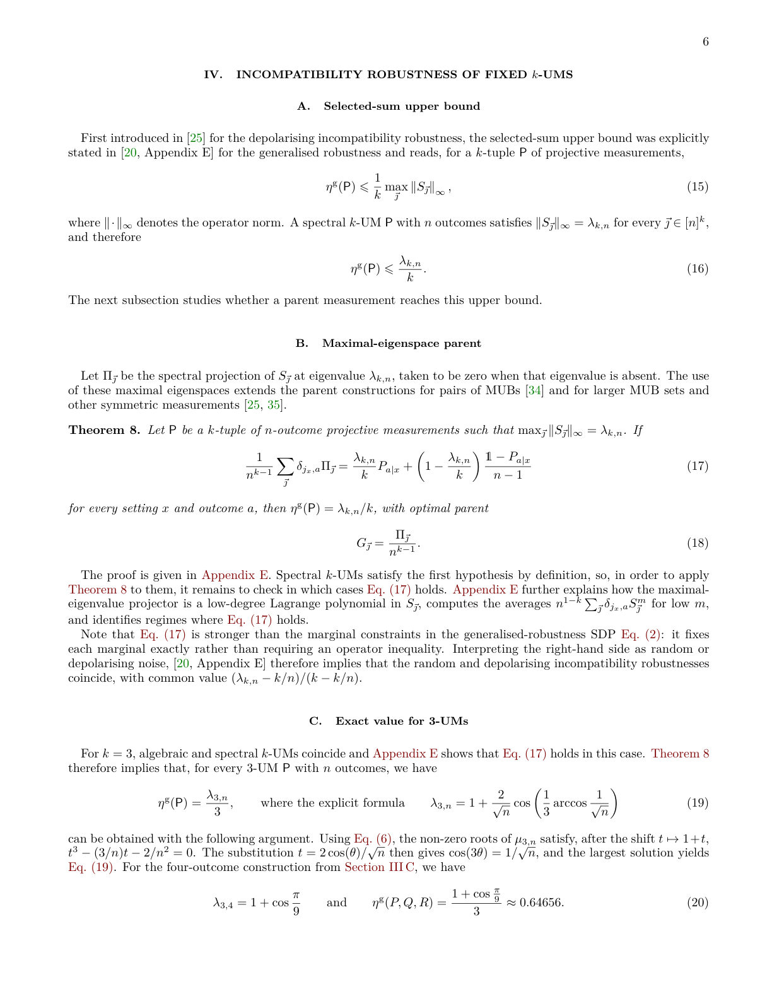
<figcaption class="paper-figure-caption"><b>Fig 5.</b> Low-resolution page preview, page 6</figcaption>
</figure>

**Summary.** This paper introduces $k$-fold unbiased measurements ($k$-UMs) to generalize the concept of MUBs to higher-order and higher-rank measurements. The authors develop mathematical tools, including generalized incompatibility robustness, to quantify how incompatible these measurements can be. The work establishes key existence theorems and provides deep structural insights into the limits of quantum measurement theory.

**Why it may be interesting.** The rigorous mathematical framework developed for characterizing measurement incompatibility provides deep insights into the fundamental limits of quantum measurement theory, which underpins quantum information protocols.

Detailed structure

**Main problem.** The paper extends the concept of mutually unbiased bases (MUBs) to higher-order, higher-rank measurements, studying $k$-fold unbiased measurements ($k$-UMs) and their connection to maximal measurement incompatibility.

**Main result.** They establish strong no-go results for higher-order rank-one constructions and determine the exact generalized incompatibility robustness for 3-UMs, while also providing explicit constructions using Hadamard matrices.

**Method.** The authors develop algebraic and spectral definitions for $k$-UMs, quantify incompatibility using generalized robustness ($\eta_g(A)$) via SDPs, and employ advanced techniques like sum-of-squares hierarchies and symmetry reduction.

**Model / system.** The study focuses on Positive Operator-Valued Measures (POVMs) representing quantum measurements on a finite-dimensional Hilbert space, specifically analyzing tuples of measurements (3-UMs).

**Key observables.** Generalized incompatibility robustness ($\eta_g(A)$), the universal lower bound $\chi_g^k(n)$, and the spectral parameter $\lambda_{k,n}$.

**Important parameters / regimes.** The order of unbiasedness ($k$), the number of outcomes ($n$), and the rank of the measurements.

**Assumptions / limitations.** The analysis relies on establishing structural relations between algebraic and spectral definitions, and uses SDP formulations to derive bounds on incompatibility.

**Figures summary.** The notes mention Tables II and III, which summarize the sizes of the SDPs after symmetry reduction and compare computed incompatibility bounds ($\chi_g^{k,t}(n)$) against conjectured universal lower bounds ($\lambda_{k,n}/k$).

**Paper structure.** The paper progresses by defining $k$-UMs, developing algebraic and spectral characterizations, proving structural equivalences and non-existence theorems, and finally applying these concepts to determine exact incompatibility values and analyze the convergence of related mathematical hierarchies.

Abstract

Mutually unbiased bases capture perfect complementarity between two quantum measurements. Extensions beyond pairwise unbiasedness have been proposed, but essentially no non-trivial higher-order constructions are known. We introduce $k$-fold unbiased measurements ($k$-UMs), extending the $k$-fold unbiased bases notion of [arXiv:1706.04446] from rank-one basis measurements to arbitrary-rank projective measurements, and show that this higher-rank setting supports a much richer theory. We develop the notions of algebraic and spectral $k$-UMs and prove that they coincide for rank-one measurements and triples of measurements (3-UMs). We establish strong no-go results for higher-order rank-one constructions and three-outcome 3-UMs, but obtain infinitely many higher-rank triples using Hadamard matrices and Clifford algebras. We then give these structures an exact operational interpretation in terms of measurement incompatibility. For 3-UMs with any number of outcomes, we determine their generalised incompatibility robustness exactly and construct an explicit joint measurement for their noisy versions at the compatibility threshold. Finally, we implement the symmetry reduction of the sum-of-squares hierarchy recently introduced in [New J. Phys. 28, 064509 (2026)] and give numerical evidence that the noise thresholds arising from the $k$-UM analysis may characterise the asymptotic behaviour of this hierarchy. In particular, with very high precision, we numerically show that our constructed four-outcome 3-UMs are among the most incompatible triples of four-outcome measurements.

[↑ back to top](#top)

### [Odd/Even or Half ? Entanglement Anomaly in the Bose-Hubbard model](http://arxiv.org/abs/2609.19884v1)

**Authors:** Humberto E. López-Hernández, Santiago F. Caballero-Benitez  
**Type:** theory · **Category:** quantum gases · **PDF:** <https://arxiv.org/pdf/2609.19884v1>  
**Analysis basis:** full PDF text, analyzed in chunks
**Topic relevance:** 🔥 `analog quantum simulation` **4/5**

↔ Scroll figures horizontally

<figure class="paper-figure-card">
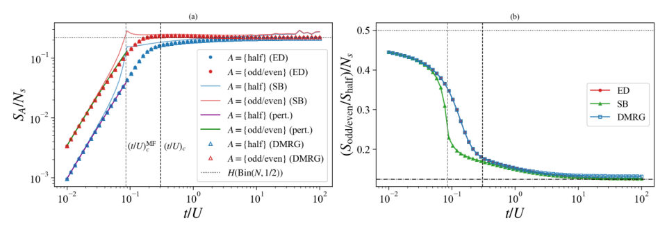
<figcaption class="paper-figure-caption"><b>Fig 1.</b> FIG. 2. Full range of t/U, Ns = 10. Left: SA from ED, SB, and perturbation theory Eq. (6), with the binomial saturation of the SF. Right: ratio Seven/odd/Shalf: it starts near Ns/2 in the MI, decays across the critical region, and tends to 1 in the SF. The critical points (t/U)c = 0.305 and (t/U)MF c ≈0.086 are marked.</figcaption>
</figure>
<figure class="paper-figure-card">
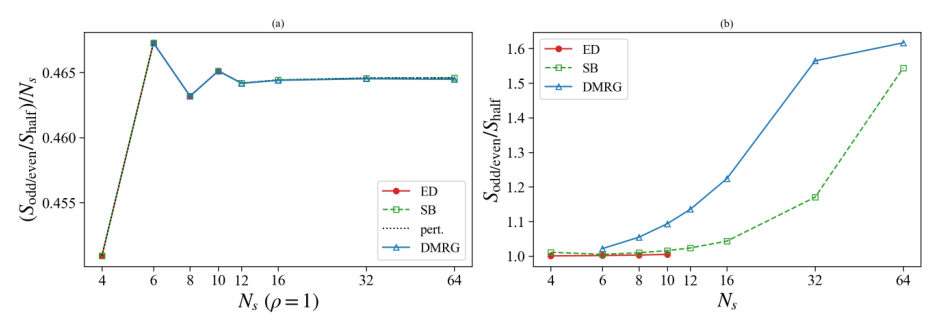
<figcaption class="paper-figure-caption"><b>Fig 2.</b> FIG. 3. Scaling with Ns at unit filling, comparing ED and SB. Left, t/U = 10−2 (MI). Right, t/U = 102 (SF).</figcaption>
</figure>

**Summary.** This paper analyzes the entanglement entropy in the 1D Bose-Hubbard model by comparing different spatial bipartitions (e.g., half vs. odd/even sites). Using a slave-boson approach, the authors reveal a significant anomaly in the Mott Insulator phase where the entanglement scaling differs drastically between contiguous and alternating cuts. This highlights that entanglement structure is not solely determined by global symmetries but by the specific geometry of the boundary.

**Why it may be interesting.** This work provides a detailed, quantitative study of entanglement structure in a fundamental quantum model relevant to ultracold atoms, showing that entanglement scaling is highly sensitive to the geometric structure of the partition, a key concept in quantum many-body physics.

Detailed structure

**Main problem.** The paper investigates how the geometry of the boundary affects the bipartite entanglement entropy in the 1D Bose-Hubbard model, comparing contiguous (half) versus alternating (odd/even) cuts.

**Main result.** In the Mott Insulator regime, the entanglement entropy exhibits a clear anomaly: the half cut follows the area law, while the alternating cut follows a volume law, demonstrating partition-dependent scaling.

**Method.** The authors employ a generalized slave-boson mean-field approach, supplemented by perturbation theory, and validate results using Exact Diagonalization (ED) and DMRG simulations.

**Model / system.** The system is the 1D Bose-Hubbard model on a periodic lattice, described by a Hamiltonian involving hopping ($t$) and on-site interaction ($U$). The analysis covers both Mott Insulator (MI) and Superfluid (SF) regimes.

**Key observables.** Bipartite entanglement entropy ($S_A$) for different spatial bipartitions (half, even/odd, single-site cuts).

**Important parameters / regimes.** The ratio of interaction to hopping ($U/t$), which dictates the phase (MI vs. SF), and the lattice size ($N_s$).

**Assumptions / limitations.** The slave-boson approach is used to compute entanglement entropy, and the analysis relies on perturbation theory in the MI regime and mean-field approximations in the SF regime.

**Figures summary.** Figures compare entanglement entropy ($S_A$) across different cuts (half vs. even/odd) in the MI regime, showing the expected scaling difference, and illustrate the agreement between ED, SB, and perturbation theory results.

**Paper structure.** The paper establishes the problem by comparing entanglement scaling laws for different cuts in the Bose-Hubbard model. It develops the slave-boson formalism to calculate $S_A$ for both cut types, derives analytical limits via perturbation theory in the MI phase, and verifies these findings against numerical benchmarks (ED/DMRG) across the phase diagram.

Abstract

The area law relates the bipartite entanglement entropy of a quantum many-body ground state to the size of the boundary between the subsystems, but the geometry of this boundary is rarely discussed. We inspect this in the 1D Bose-Hubbard model at fixed density by comparing four spatial bipartitions of the periodic lattice: first half, second half, even sites, and odd sites; sharing the same number of sites but differing in how the boundary is arranged. We find analytical limits with perturbation theory: in the Mott insulator the contiguous cut obeys the area lay while the alternating cut obeys a volume law $S\propto N_s$, in this sense an anomaly, and for the superfluid both cuts colapse to the binomial saturation due to delocalization of the state. We formulate these limits as a statement about the many-body problem using a generalized slave-boson approach based on mean-field with quantum fluctuations while verifying with Exact Diagonalization (ED) for small lattice sizes and Densitiy Matrix Renormalization Group (DMRG) simulations for $N_s\gg 1$. The slave-boson Gaussian ground state allows to compute the entanglement entropy from a reduced correlation matrix for any desired bipartition consistent with ED and DMRG results. Using slave bosons the computational cost is set by the local cutoff $n_{\max}$ rather than the Hilbert space dimension, so we can reach lattice sizes far beyond ED. Our method is capable of establishing the partition-dependent scaling laws as a many-body feature, not only a finite-size effect, in great agreement with the ED for $N_s\in[4,10]$ and DMRG for larger lattice sizes.

[↑ back to top](#top)

### [Quantum Simulation of Dissipative Non-Markovian Coupled Classical Oscillators](http://arxiv.org/abs/2609.20721v1)

**Authors:** Malte Schade, Sophia Simon, Nathan Wiebe, Scott Keating, Cyrill Bösch, Andreas Fichtner  
**Type:** theory · **Category:** quantum information and computing · **PDF:** <https://arxiv.org/pdf/2609.20721v1>  
**Analysis basis:** full PDF text, analyzed in chunks
**Topic relevance:** `correlated / nonlocal dissipation` **3/5** · `driven-dissipative phase transition` **3/5** · `methods for driven-dissipative` **3/5** · `Keldysh / 2PI / non-Gaussian methods` **2/5** · `analog quantum simulation` **2/5** · `non-equilibrium universality` **2/5** · `Frenkel-Kontorova` **1/5** · `quantum measurements` **1/5**

↔ Scroll figures horizontally

<figure class="paper-figure-card">
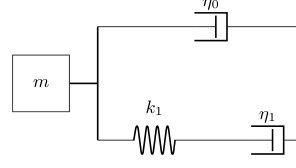
<figcaption class="paper-figure-caption"><b>Fig 1.</b> FIG. 2. Standard-Linear-Fluid (Jeffreys) model. The point mass (m) is coupled to a fixed wall through a purely viscous dashpot (η0) in parallel with a Maxwell element, which con- sists of a spring (k1) and a second dashpot (η1) in series.</figcaption>
</figure>
<figure class="paper-figure-card">
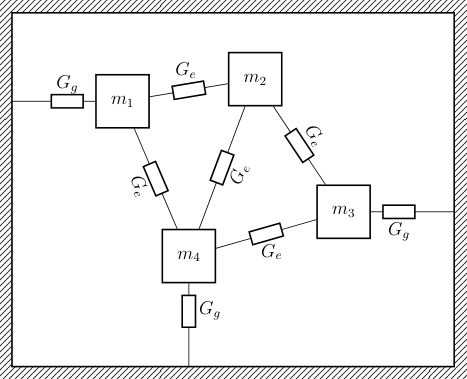
<figcaption class="paper-figure-caption"><b>Fig 2.</b> FIG. 3. Coupled oscillator network within a solid ground frame which is assumed to have infinite mass. The inter- actions between neighboring masses and the ground are ab- stracted into generalized coupling blocks (Ge and Gg, respec- tively), representing the composite Maxwell bodies and dash- pots.</figcaption>
</figure>
<figure class="paper-figure-card">
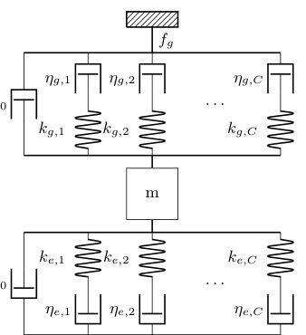
<figcaption class="paper-figure-caption"><b>Fig 3.</b> FIG. 4. A single coupling block of Figure 3. Mass m coupled to ground (top, Gg) and neighbor (bottom, Ge) via dashpots η0 in parallel with C Maxwell bodies (kc, ηc).</figcaption>
</figure>
<figure class="paper-figure-card">
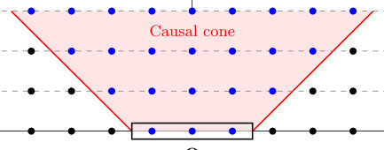
<figcaption class="paper-figure-caption"><b>Fig 4.</b> FIG. 5. Diagram of a light cone for an observable in one- dimension predicted via an information locality bound. The contribution to the evolution of the time-dependent observ- able Q from the subsystems outside the shaded area is expo- nentially small in the distance from the boundary of the light cone.</figcaption>
</figure>
<figure class="paper-figure-card">
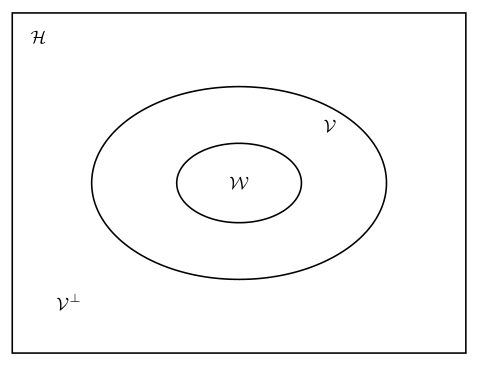
<figcaption class="paper-figure-caption"><b>Fig 5.</b> FIG. 6. Schematic diagram showing the ambient Hilbert space H along with the subspace of support for the observable Q, W the region included in the simulation V and the region excluded from the simulation V⊥</figcaption>
</figure>

**Summary.** This work presents a quantum algorithm to simulate complex classical oscillator networks featuring non-Markovian dissipation. By mapping the history-dependent dynamics to a solvable Markovian form, the authors demonstrate that energy estimation is classically hard (BQP-complete) and that quantum computation offers significant polynomial speedups for these realistic, damped systems.

**Why it may be interesting.** It directly tackles the simulation of open quantum systems (dissipation) using quantum algorithms, which is a major frontier in quantum computation, by establishing quantum advantage even when the underlying physics is complex and non-Markovian.

Detailed structure

**Main problem.** Developing a quantum algorithm to simulate classical oscillator networks characterized by non-Markovian dissipation and time-varying material properties.

**Main result.** The energy estimation task for these systems is shown to be in the worst-case classically hard (BQP-complete), and the quantum algorithm provides quartic speedups for locally coupled damped oscillator systems in three dimensions.

**Method.** The authors embed history-dependent dynamics into a Markovian state space using Prony series approximation, then employ Linear Combination of Hamiltonian Simulation (LCHS) to estimate energy.

**Model / system.** The system models coupled classical oscillators, extending from simple harmonic motion to viscoelastic media (like Kelvin-Voigt or Maxwell bodies) exhibiting non-Markovian dissipation.

**Key observables.** Instantaneous kinetic and potential energy of a subset of oscillators at time t; the ratio of the evolved state norm to the initial state norm.

**Important parameters / regimes.** Dissipation strength ($\alpha_{
m tot}$), time $t$, error $\epsilon$, and the dimensionality/topology of the coupling network.

**Assumptions / limitations.** The non-Markovian dynamics are approximated by a finite sum of coupled Markovian ODEs via a Prony series expansion.

**Figures summary.** Figures illustrate various damped oscillator models, including Kelvin-Voigt and Standard-Linear-Fluid viscoelasticity, and show the structure of coupled oscillator networks.

**Paper structure.** The paper progresses from establishing the difficulty of non-Markovian simulation, detailing the mathematical embedding into a Markovian system, analyzing the resulting spectral properties via perturbation theory, and finally proving the quantum computational hardness/speedup via state evolution analysis.

Abstract

We present a quantum algorithm for simulating classical oscillator networks characterized by non-Markovian dissipation and time-varying material properties, extending recent speedups for undamped harmonic systems to viscoacoustic and viscoelastic media. We embed the history-dependent dynamics into a Markovian state space governed by a non-Hermitian operator by approximating memory kernels through a Prony series. We then use linear combination of Hamiltonian simulation to estimate the instantaneous kinetic and potential energy for a subset of oscillators at time $t$ within error $ε$ using a number of queries to the oscillator system that scales as $\widetilde{\mathcal{O}}(α_{\rm tot} t/ε)$, where $α_{\rm tot}$ is polynomial in the strength of the dissipation, spring constants, inverse masses, and sparsity of the connections in the network. We further show that this energy estimation task is in the worst-case classically hard (i.e., a corresponding decision problem is $\mathsf{BQP}$-complete), even in the presence of strong dissipation. For time-dependent materials, we show that changes in material properties appear as effective dissipation or growth in the energy representation. Additionally, we prove the infeasibility of exponential quantum advantages in locally coupled topologies through a novel form of Lieb-Robinson-like bounds that apply to differential equations. This allows our quantum algorithms to provide quartic speedups for locally coupled damped oscillator systems in three dimensions, raising the possibility of practical quantum speedups for realistically damped oscillator networks and approximated wave equations.

[↑ back to top](#top)

### [Encounter Propagator for Multiple Targets: A Dirichlet-to-Neumann Spectral Formalism](http://arxiv.org/abs/2609.19995v1)

**Authors:** Denis S. Grebenkov  
**Type:** theory · **Category:** statistical mechanics · **PDF:** <https://arxiv.org/pdf/2609.19995v1>  
**Analysis basis:** full PDF text, analyzed in chunks
**Topic relevance:** `Keldysh / 2PI / non-Gaussian methods` **3/5** · `correlated / nonlocal dissipation` **3/5** · `methods for driven-dissipative` **3/5** · `driven-dissipative phase transition` **2/5** · `non-equilibrium universality` **2/5** · `quantum measurements` **2/5** · `analog quantum simulation` **1/5**

↔ Scroll figures horizontally

<figure class="paper-figure-card">
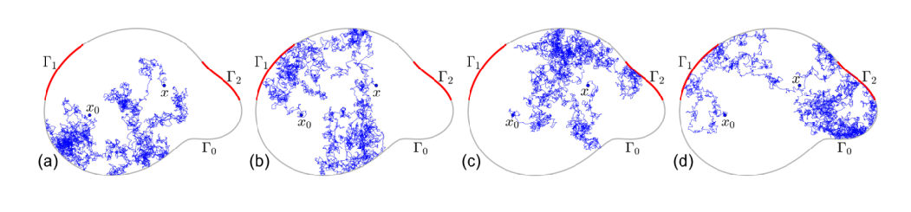
<figcaption class="paper-figure-caption"><b>Fig 1.</b> FIG. 1. Schematic representation of the two-target encounter problem in a planar bounded domain Ω, whose boundary ∂Ω is partitioned into the reflecting part Γ0 and two target regions Γ1 and Γ2. During a given time t, the particle diffuses from a point x0 to a point x, and accumulates boundary local times ℓ1,t and ℓ2,t on the target regions Γ1 and Γ2. Four representative cases are shown: (a) ℓ1,t = 0, ℓ2,t = 0; (b) ℓ1,t &gt; 0, ℓ2,t = 0; (c) ℓ1,t = 0, ℓ2,t &gt; 0; and (d) ℓ1,t &gt; 0, ℓ2,t &gt; 0. Blue curve shows a simulated random trajectory in each case.</figcaption>
</figure>

**Summary.** This paper develops a spectral formalism to calculate the encounter propagator for diffusion processes encountering multiple distinct targets on a boundary. By decomposing the governing Dirichlet-to-Neumann operator into target-specific blocks, the authors overcome mathematical difficulties associated with non-commuting operators. The resulting framework yields an exact spectral representation for the two-target case, providing deep insights into diffusion-controlled reaction rates.

**Why it may be interesting.** The rigorous mathematical treatment of non-commuting operators (DtN vs. projection operators) and the resulting spectral methods are highly relevant for modeling open quantum systems where dissipation or coupling to multiple baths/channels occurs.

Detailed structure

**Main problem.** Developing a rigorous, spectral formulation for the encounter propagator in restricted diffusion within a bounded domain containing multiple reactive targets.

**Main result.** The authors derive a convergent switching expansion for the propagator, providing explicit spectral representations for the two-target case, which can be resummed exactly using modified Bessel functions under certain conditions.

**Method.** The methodology involves decomposing the Dirichlet-to-Neumann (DtN) operator into target-restricted blocks and performing multi-dimensional Laplace inversion to handle the joint local-time dependence.

**Model / system.** The model is restricted diffusion in a bounded domain $\Omega$ with multiple targets $\Gamma_i$ on the boundary. The physics is governed by the diffusion equation with complex boundary conditions related to local time accumulation.

**Key observables.** The encounter propagator $P(x, \ell_1, \dots, \ell_N, t|x_0)$ and its Laplace transform $eP(x, \ell_1, \dots, \ell_N, p|x_0)$.

**Important parameters / regimes.** The number of targets ($N$), the separation distance between targets, and the Laplace variable $p$.

**Assumptions / limitations.** The analysis relies on decomposing the DtN operator into blocks and assumes conditions (like separation) that allow for spectral diagonalization or low-rank approximations.

**Figures summary.** Figure 1 schematically illustrates the two-target encounter problem, partitioning the boundary into reflecting and reactive target regions ($\Gamma_1, \Gamma_2$).

**Paper structure.** The paper progresses from the single-target case to the multi-target generalization, focusing on decomposing the DtN operator, deriving the switching expansion via multi-dimensional Laplace inversion, and finally presenting spectral representations and asymptotic analyses for the two-target case.

Abstract

We develop an encounter-based formulation of restricted diffusion in a bounded domain with multiple targets, resolving separately the boundary local time accumulated on each target. Unlike the single-target problem, the target projection operators do not generally commute with the governing Dirichlet-to-Neumann (DtN) operator, so that its eigenbasis does not diagonalize the local-time dependence. We overcome this difficulty by decomposing the DtN operator into target-restricted blocks. Multi-dimensional Laplace inversion then yields a convergent switching expansion, whose successive terms describe alternating diffusive transfers between the targets. We also derive an equivalent operator-valued renewal equation. For two targets, diagonalizing the target-restricted blocks provides an explicit spectral representation in terms of two DtN block spectra and an inter-target coupling matrix. When the coupling preserves spectral modes, the switching series can be resummed exactly in terms of modified Bessel functions. In general, as the off-diagonal DtN block is smoothing for separated targets, one can resort to low-rank finite-dimensional approximations. We examine an effective two-mode reduction for small, well-separated targets and identify a regime in which repeated inter-target transfers are progressively suppressed. Probabilistic interpretations and implications for diffusion-controlled reactions are discussed.

[↑ back to top](#top)

### [Emergent classicality and wavefunction branching in an isolated quantum many-body system](http://arxiv.org/abs/2609.19254v1)

**Authors:** Saúl Pilatowsky-Cameo, Jordan Cotler, Daniel Ranard, C. Jess Riedel  
**Type:** theory · **Category:** other · **PDF:** <https://arxiv.org/pdf/2609.19254v1>  
**Analysis basis:** full PDF text, analyzed in chunks
**Topic relevance:** `analog quantum simulation` **3/5** · `correlated / nonlocal dissipation` **2/5** · `driven-dissipative phase transition` **2/5** · `methods for driven-dissipative` **2/5** · `quantum measurements` **2/5** · `scars & prethermalization` **2/5** · `Keldysh / 2PI / non-Gaussian methods` **1/5** · `non-equilibrium universality` **1/5**

↔ Scroll figures horizontally

<figure class="paper-figure-card">
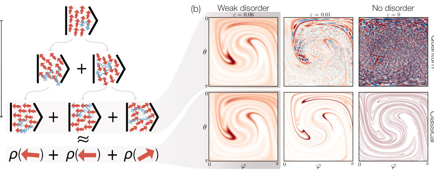
<figcaption class="paper-figure-caption"><b>Fig 1.</b> FIG. 1. (a) Emergence of decoherence in an isolated many-body system of spins. The system is initialized with all spins pointing in the same direction, with the exception of a few particles coupled in singlets (blue). The disorder in the Hamiltonian scrambles the singlets throughout, leading to microscopically distinct branches that cannot interfere in collective observables, so their superposition is indistinguishable from a classical mixture. (b) Emergence of classicality. Wigner function of the quantum evolution in the collective spin sector (top) and classical evolution according to the classical dissipative equation (7) (bottom). In the presence of a single realization of a small...</figcaption>
</figure>
<figure class="paper-figure-card">
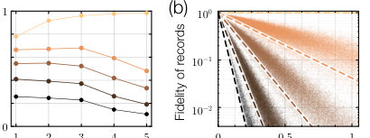
<figcaption class="paper-figure-caption"><b>Fig 2.</b> FIG. 3. (a) Quantum branching. Trace distance between the reduced state of the global unitary dynamics and the mixture of branches [left and right sides of Eq. (14), respectively], for different values of disorder ε and number of branchings M. (b) Consistent histories. Fidelity of records vs cumulative squared distance between histories D(2) after M = 5 branchings. Each dot is a pair of independently sampled branches. Dashed lines mark the decay e−ΓD(2). (N = 100, k = 4, κ = 4.2, p = π/2, θ0 = 0.5, φ0 = 1.1, ∆t = 1)</figcaption>
</figure>

**Summary.** This work demonstrates that classical behavior can emerge in isolated quantum systems by treating internal microscopic degrees of freedom as an effective bath. Using a kicked top model, the authors derive an effective Lindblad equation whose classical limit is a chaotic Fokker-Planck equation. This shows that quantum evolution naturally branches into distinct classical histories without external environmental coupling.

**Why it may be interesting.** It provides a mechanism for quantum-to-classical transition entirely within the system's Hamiltonian structure, which is highly relevant for understanding complex quantum dynamics in isolated materials.

Detailed structure

**Main problem.** To explain how classical behavior emerges in isolated quantum many-body systems without relying on coupling to an external environment.

**Main result.** Classicality emerges internally from microscopic degrees of freedom, leading to reduced dynamics that converge to a classical chaotic Fokker-Planck equation beyond the Ehrenfest time.

**Method.** The authors derive an effective Lindblad equation for the macroscopic spin sector by tracing out the microscopic permutation sector, and analyze the resulting quantum-classical correspondence.

**Model / system.** The model is a weakly disordered, 3-local chaotic kicked top of N qubits, decomposed into a macroscopic collective spin sector (S) and a microscopic permutation sector (P) acting as an internal bath.

**Key observables.** Classicality, quantum-classical correspondence, wavefunction branching, and the fidelity of microscopic records.

**Important parameters / regimes.** Disorder strength ($\varepsilon$), system size ($N$), and the thermodynamic limit ($N 	o \infty$).

**Assumptions / limitations.** The standard decoherence theory assumption of coupling to an external environment is bypassed; the system-bath decomposition is emergent.

**Figures summary.** Figure 1 illustrates decoherence and classicality in the spin sector; Figure 2 shows the effective Lindblad dynamics and rate convergence.

**Paper structure.** The paper establishes the internal mechanism for decoherence in isolated systems, derives the effective dynamics via a Lindblad equation, confirms the convergence to a classical Fokker-Planck equation, and analyzes wavefunction branching using consistent histories.

Abstract

Decoherence in quantum systems is conventionally modeled as the effect of interactions with an external environment. However, such a prescription excludes isolated many-body systems, which are also expected to display classical behavior at macroscopic scales. In isolated systems, decoherence must emerge internally from microscopic degrees of freedom that are invisible to the macroscopic description. Here we explicitly show that classicality can emerge in such a fashion. We consider a weakly disordered, $3$-local chaotic kicked top of $N$ qubits, where the collective spin sector serves as the macroscopic description, while the microscopic permutation sector acts as an internal bath, decohering the collective spin sector. Starting from closed unitary dynamics, we derive and numerically confirm an effective Lindblad equation for the collective spin variables. In the thermodynamic limit these reduced dynamics converge to a classical chaotic Fokker--Planck equation with vanishingly small diffusion on the spherical phase space, producing a quantum-classical correspondence beyond the Ehrenfest time. The chaotic dynamics evolve the pure many-body wavefunction into continuously branching components associated with distinct classical trajectories. These branches acquire nearly orthogonal microscopic records in the permutation sector, preventing quantum interferences and ensuring the corresponding histories remain consistent.

[↑ back to top](#top)

### [Noise-Robust Quantum State Characterization for Remote State Preparation with Deep Learning](http://arxiv.org/abs/2609.20523v1)

**Authors:** Bo Tang, Zixuan Liao, Hao Li, Yilin Yang, Jiani Lei, Zengya Li, Jing Qiu, Zhaohui Dong, Zhengyang Mao, Yuanhua Li, Yuanlin Zheng, Xianfeng Chen  
**Type:** both · **Category:** quantum information and computing · **PDF:** <https://arxiv.org/pdf/2609.20523v1>  
**Analysis basis:** full PDF text, analyzed in chunks
**Topic relevance:** `QC/QI experiment` **3/5** · `methods for driven-dissipative` **3/5** · `quantum measurements` **3/5** · `quantum optics experiment` **3/5**

↔ Scroll figures horizontally

<figure class="paper-figure-card">
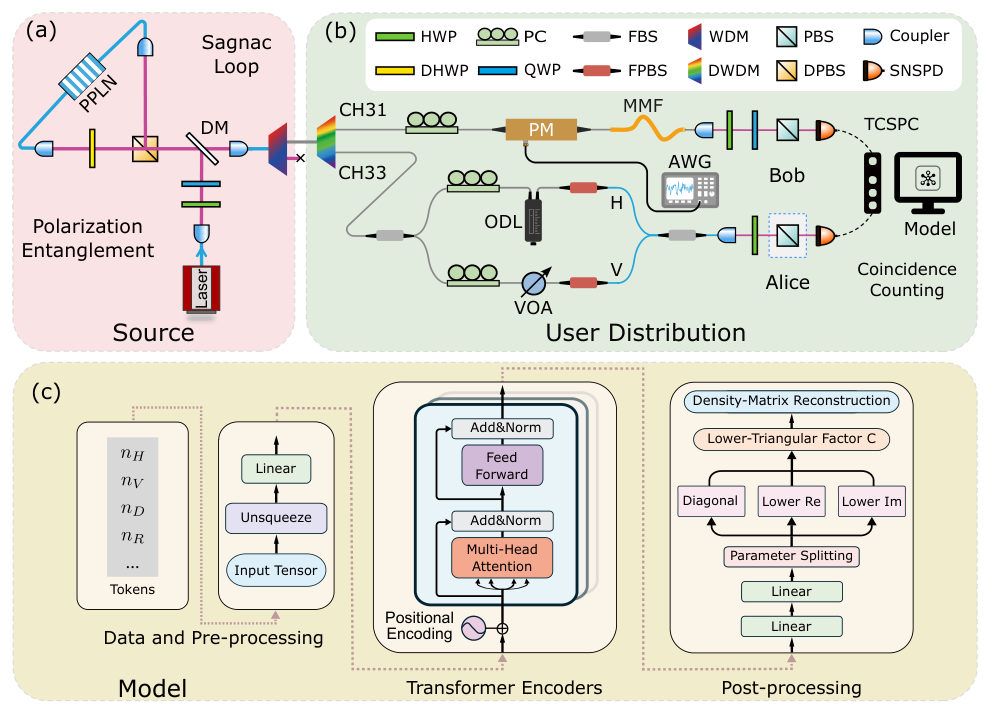
<figcaption class="paper-figure-caption"><b>Fig 1.</b> Figure 1: Schematic diagram of the experimental setup for RSP. (a) Polarization entanglement source based on Sagnac loop. (b) RSP of user distribution device. PPLN, periodically poled lithium niobate waveguide; DM, dichroic mirror; HWP, half- wave plate; DHWP, dual-wavelength half-wave plate; QWP, quarter-wave plate; PC, polarizaton controller; FBS, fiber beam splitter; FPBS, fiber polarization beam splitter; WDM, wavelength division multiplexing; DWDM, dense wavelength division multiplexing; PM, phase modulator; AWG, arbitrary waveform generator; PBS, polarizing beam splitter; DPBS, dual-polarizing beam splitter; MMF, multimode fiber; ODL, optical delay line; VOA, variable optical...</figcaption>
</figure>
<figure class="paper-figure-card">
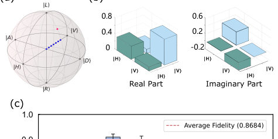
<figcaption class="paper-figure-caption"><b>Fig 2.</b> Figure 2: Characterization and verification of RSP. (a) Re- mote quantum states are prepared on the Bloch ball, with the pure state shown as a red dot and mixed states shown as blue dots [61]. (b) The real and imaginary parts of the density matrix with η = 1. (c) Reconstruction fidelity of the pure state and mixed states prepared via RSP through an MMF.</figcaption>
</figure>
<figure class="paper-figure-card">
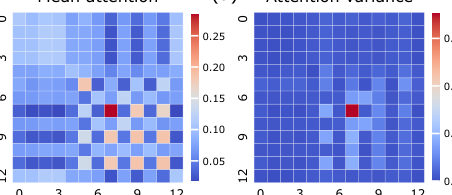
<figcaption class="paper-figure-caption"><b>Fig 3.</b> Figure 3: Performance and attention analysis of the TQSC model. (a) Fidelity distributions for the training and test datasets. (b) Excess fidelity drop from targeted token-group interventions relative to size-matched random ablations. (c) Mean attention map of Layer 3 Head 4 (L3H4). (d) Attention variance map of L3H4. In (c) and (d), the query (y) and key (x) axes index the 13 input tokens (0–12), comprising H/V/D/R coincidence counts, the corresponding Alice and Bob single-photon counts, and measurement time.</figcaption>
</figure>
<figure class="paper-figure-card">
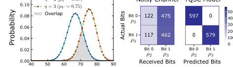
<figcaption class="paper-figure-caption"><b>Fig 4.</b> Figure 4: TQSC-based image transmission and recon- struction. (a) Degradation and recovery of BTC-compressed MNIST images through the noisy channel. (b) Probability distributions of |V ⟩measurement outcomes (N = 100) for mixed states ρ2 and ρ3. (c) Confusion matrices for the noisy channel (left) and TQSC predictions (right).</figcaption>
</figure>

**Summary.** This paper introduces a Transformer-based Quantum State Characterizer (TQSC) to overcome the difficulty of accurately characterizing quantum states during noisy Remote State Preparation. By treating measurement data as a sequence, the model reconstructs the true quantum state with extremely high fidelity, even in the presence of complex scattering and dynamic noise. This work offers a robust, data-driven tool for practical quantum information processing applications.

**Why it may be interesting.** It provides a powerful, data-driven framework for quantum state tomography and characterization that explicitly handles complex, realistic noise sources, which is crucial for advancing quantum networking and communication protocols.

Detailed structure

**Main problem.** The core challenge is accurately estimating target quantum states during Remote State Preparation (RSP) when the measurements are corrupted by complex, dynamic noise.

**Main result.** The proposed TQSC model achieved an extremely high mean estimator-target fidelity (>99.999%) under complex noise and successfully reduced the bit error rate to zero in a practical MNIST image transmission task.

**Method.** The authors developed a Transformer-based Quantum State Characterizer (TQSC) model that treats noisy measurement outcomes as sequential data to reconstruct the underlying quantum density matrix.

**Model / system.** The system involves photonic polarization states generated via an SPDC source in a Sagnac interferometer setup. The TQSC model uses a Transformer Encoder architecture to map noisy measurement data back to the predicted quantum state, incorporating physical constraints.

**Key observables.** Mean estimator-target fidelity, bit error rate (BER), density matrices ($
ho$), and Transformer attention patterns.

**Important parameters / regimes.** Complex scattering environments, dynamic Gaussian noise ($\sigma=1 	ext{ V}$), and the fidelity threshold of 99.999%.

**Assumptions / limitations.** The method assumes that the noise can be modeled and inverted using a data-driven, attention-based neural network structure, moving beyond traditional black-box approaches.

**Figures summary.** Figure 1 illustrates the experimental setup (Sagnac loop, RSP) and the data processing pipeline involving the Transformer. Other figures detail the performance metrics under noise and the MNIST image transmission results.

**Paper structure.** The paper introduces the problem of noisy RSP, details the TQSC model architecture (Transformer-based inverse channel mapping), validates its performance using fidelity metrics under controlled noise, and demonstrates its utility in a practical image transmission task.

Abstract

Quantum communication underpins secure information processing and scalable quantum networks. In particular, remote state preparation (RSP) enables efficient quantum state transfer, but accurately estimating target states under complex noise remains challenging. Here, we propose a Transformer-based Quantum State Characterizer (TQSC) model for noisy RSP experiments. Our model reconstructs experimentally prepared pure and mixed photonic polarization states from noisy measurements in complex scattering environments, while its attention patterns provide physically grounded insights into correlations among the measured observables. The method achieves a mean estimator-target fidelity exceeding 99.999% under complex scattering and dynamic Gaussian noise, while its robustness and generalization are further examined using Qiskit-simulated Bloch-ball states.Furthermore, in a practical MNIST image transmission task with held-out states, the decoded bit error rate is reduced from 50.34% to zero after TQSC post-processing. The TQSC model enables accurate tomographic characterization under dynamic noise and provides physically grounded post-hoc insights, holding promise for intelligent quantum information processing applications.

[↑ back to top](#top)

### [Fifty Years of the GKLS Master Equation: Foundations and Early Developments](http://arxiv.org/abs/2609.19404v1)

**Authors:** Fabio Benatti, Dariusz Chruściński, Saverio Pascazio  
**Type:** theory · **Category:** other · **PDF:** <https://arxiv.org/pdf/2609.19404v1>  
**Analysis basis:** full PDF text, analyzed in chunks
**Topic relevance:** `methods for driven-dissipative` **3/5** · `correlated / nonlocal dissipation` **2/5** · `driven-dissipative phase transition` **2/5** · `Keldysh / 2PI / non-Gaussian methods` **1/5** · `analog quantum simulation` **1/5** · `non-equilibrium universality` **1/5** · `quantum measurements` **1/5**

↔ Scroll figures horizontally

<figure class="paper-figure-card">
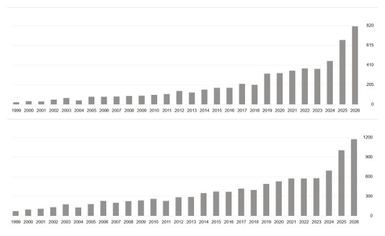
<figcaption class="paper-figure-caption"><b>Fig 1.</b> Figure 1: Citations counts (Scholar Google 20th August, 2026): upper panel – GKS paper; lower panel – Lindblad paper.</figcaption>
</figure>
<figure class="paper-figure-card">
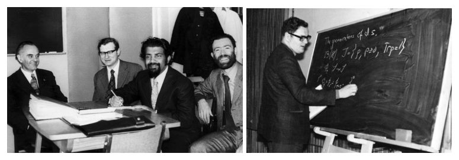
<figcaption class="paper-figure-caption"><b>Fig 2.</b> Figure 2: Left panel: picture taken in Prof. Ingarden’s office (December 1975). From left to right: Roman Ingarden, Andrzej Kossakowski, George Sudarshan and Vittorio Gorini. Right panel: picture taken during the Symposium on Mathematical Physics in Toruń (December 1974) – Göran Lindblad lecturing about quantum dynamical semigroups.</figcaption>
</figure>

**Summary.** This paper provides a comprehensive historical review of the Gorini-Kossakowski-Lindblad-Sudarshan (GKLS) master equation. It traces how disparate mathematical and physical ideas converged to establish the structural theorem for open quantum dynamics. It remains crucial reading for understanding the foundations of Markovian evolution in quantum physics.

**Why it may be interesting.** This is foundational reading for anyone working on open quantum systems, quantum optics, or quantum information, as it solidifies the mathematical bedrock upon which modern open system theories are built.

Detailed structure

**Main problem.** The paper revisits the historical and conceptual development required to characterize the generators of completely positive quantum dynamical semigroups.

**Main result.** It confirms that the GKLS structure theorem remains the foundational and active framework for describing Markovian open quantum dynamics, unifying concepts from various mathematical and physical approaches.

**Method.** The analysis is historical and conceptual, tracing the convergence of ideas from seminal works by Sudarshan, Bausch, Kossakowski, and Lindblad.

**Model / system.** The focus is on open quantum systems whose evolution is governed by a density operator $\rho_t$ and described by the GKLS master equation: $\dot{\rho}_t = L(\rho_t)$.

**Key observables.** The evolution of the density operator $\rho_t$, and the requirement of complete positivity for the dynamical map.

**Important parameters / regimes.** The Markovian nature of the evolution, and the time scale separation inherent in the weak-coupling limit.

**Assumptions / limitations.** The primary assumption is that the system dynamics are Markovian, which allows for the description via a time-local master equation.

**Figures summary.** Figure 1 shows the citation history of the GKS and Lindblad papers, demonstrating their enduring relevance. Figure 2 contains historical photographs related to the development of the theory.

**Paper structure.** The paper traces the mathematical journey from early characterizations (Sudarshan, Bausch) to the final structural theorems (GKS and Lindblad), reviewing subsequent developments like quantum stochastic calculus and quantum jump unraveling.

Abstract

The year 2026 marks the fiftieth anniversary of the two seminal papers in which Gorini, Kossakowski, and Sudarshan, and independently Lindblad, characterized the generators of completely positive quantum dynamical semigroups. We revisit the conceptual and historical route leading to the Gorini-Kossakowski-Lindblad-Sudarshan (GKLS) master equation and examine several of its early developments and consequences. Our aim is to show how several initially separate mathematical and physical ideas converged in the GKLS structure theorem, imme- diately opening the way to manifold consequences for the description of dissipative quantum phenomena and how that theorem, fifty years later, remains both a foundational result and an active framework for open quantum dynamics.

[↑ back to top](#top)

### [Formal Fluctuation-Response Relations for Non-Stationary Systems: The Dynamic Conjugate Variable](http://arxiv.org/abs/2609.20525v1)

**Authors:** Igor M. Sokolov  
**Type:** theory · **Category:** statistical mechanics · **PDF:** <https://arxiv.org/pdf/2609.20525v1>  
**Analysis basis:** full PDF text, analyzed in chunks
**Topic relevance:** `Keldysh / 2PI / non-Gaussian methods` **3/5** · `methods for driven-dissipative` **3/5** · `analog quantum simulation` **1/5** · `correlated / nonlocal dissipation` **1/5** · `driven-dissipative phase transition` **1/5** · `non-equilibrium universality` **1/5** · `quantum measurements` **1/5**

↔ Scroll figures horizontally

<figure class="paper-figure-card">
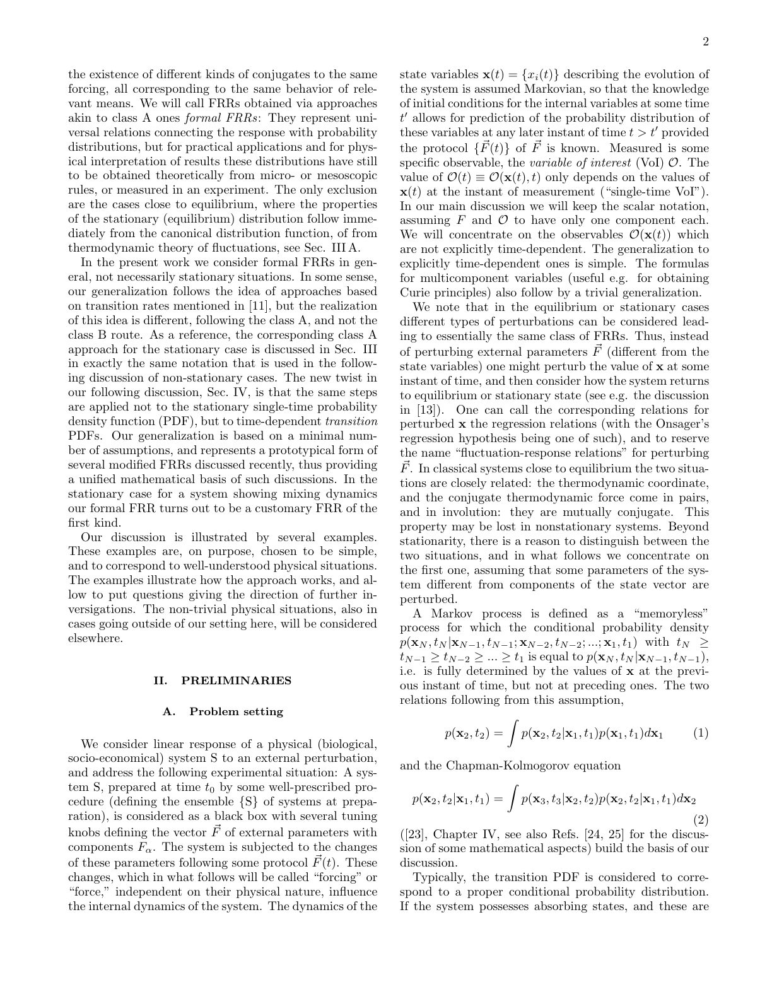
<figcaption class="paper-figure-caption"><b>Fig 1.</b> Low-resolution page preview, page 2</figcaption>
</figure>
<figure class="paper-figure-card">
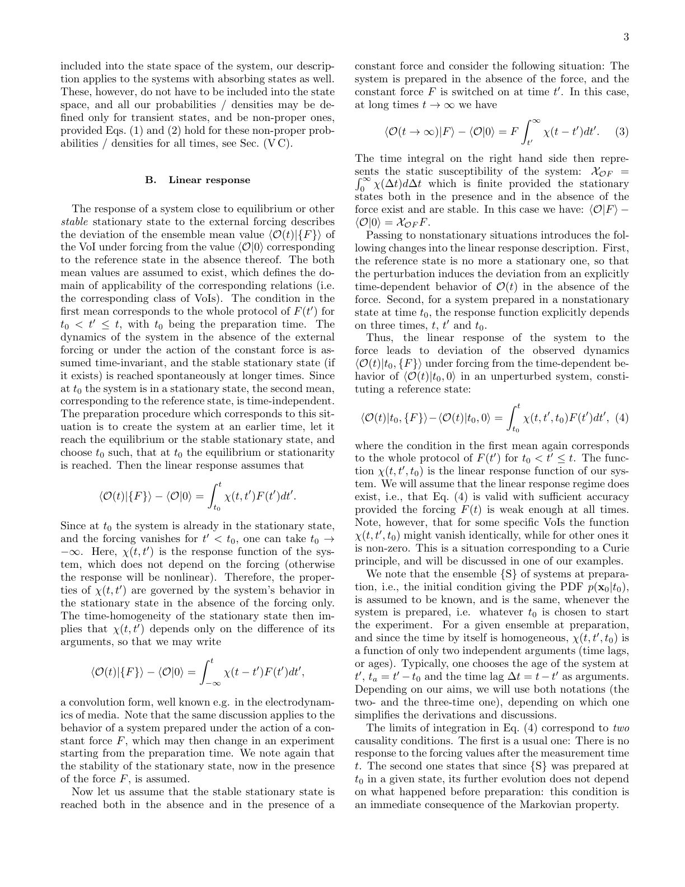
<figcaption class="paper-figure-caption"><b>Fig 2.</b> Low-resolution page preview, page 3</figcaption>
</figure>
<figure class="paper-figure-card">
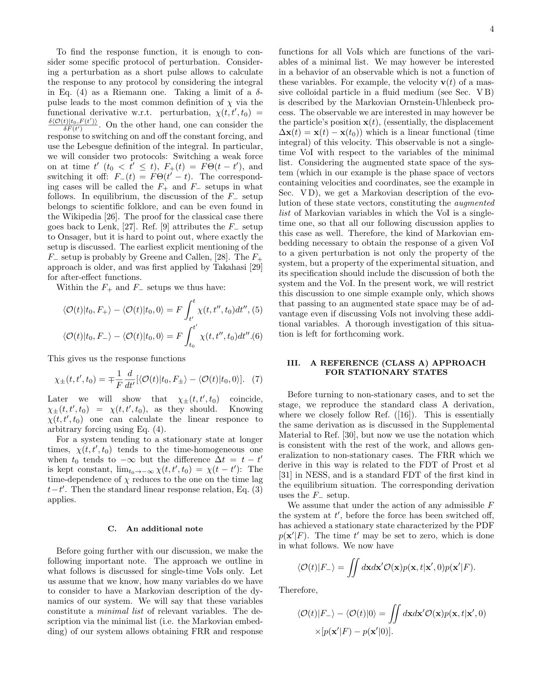
<figcaption class="paper-figure-caption"><b>Fig 3.</b> Low-resolution page preview, page 4</figcaption>
</figure>
<figure class="paper-figure-card">
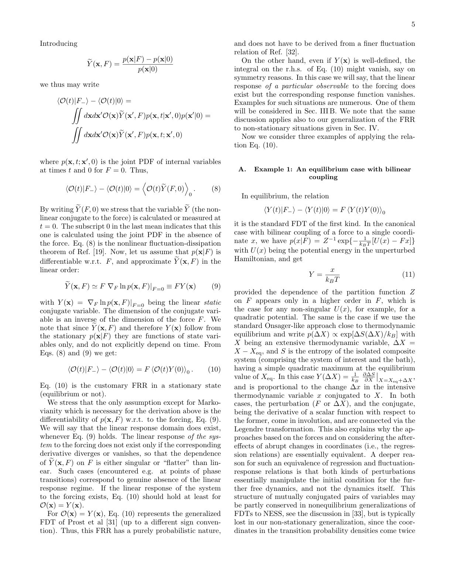
<figcaption class="paper-figure-caption"><b>Fig 4.</b> Low-resolution page preview, page 5</figcaption>
</figure>
<figure class="paper-figure-card">
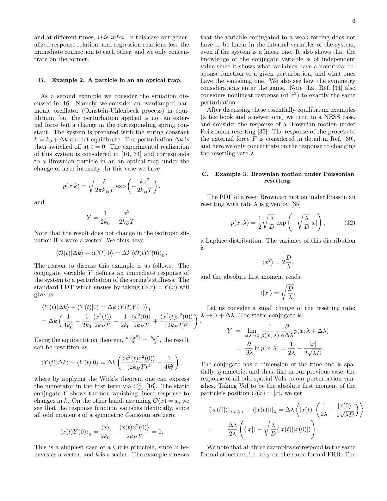
<figcaption class="paper-figure-caption"><b>Fig 5.</b> Low-resolution page preview, page 6</figcaption>
</figure>

**Summary.** This paper presents a generalized theoretical framework for deriving Fluctuation-Response Relations (FRRs) applicable to non-stationary physical systems. It introduces a 'dynamic conjugate variable' derived solely from the Markovian property of the dynamics. This formalism unifies existing FRR results, providing a robust tool for analyzing linear response in time-dependent settings.

**Why it may be interesting.** This work provides a powerful, general theoretical tool for calculating response functions in complex, time-evolving systems, which is crucial for understanding non-equilibrium dynamics in AMO and condensed matter physics.

Detailed structure

**Main problem.** The paper develops a formal framework to derive Fluctuation-Response Relations (FRRs) for systems exhibiting non-stationary dynamics.

**Main result.** It establishes a generalized formal FRR using a 'dynamic conjugate variable' that reduces to known results in stationary limits, providing a unified mathematical basis for response theory.

**Method.** The methodology involves introducing a dynamic conjugate variable conjugated to the external perturbation and relying on the Markovianity of the underlying dynamics.

**Model / system.** The framework is general, applicable to any stochastic system described by time-dependent probability density functions, with specific examples analyzed using Langevin dynamics (e.g., Ornstein-Uhlenbeck process) and diffusion equations.

**Key observables.** Response function $\chi(t, t', t_0)$, mean values $\langle O(t)|\{F\}
angle$, and the dynamic conjugate variable $Y(x, v, t|v_0)$.

**Important parameters / regimes.** The analysis focuses on the linear response regime, and the results depend on the system's Markovian nature and the time-dependence of the forcing.

**Assumptions / limitations.** The dynamics are assumed to be Markovian, and the analysis is restricted to the linear response regime.

**Figures summary.** The notes describe mathematical derivations and solutions for correlation functions and response functions in specific physical limits (e.g., overdamped/underdamped motion).

**Paper structure.** The paper builds from the general definition of FRRs, develops the formalism using the dynamic conjugate variable for non-stationary cases, and then applies this formalism to specific physical models like the OU process and forced diffusion.

Abstract

Fluctuation-response relations (FRRs) connect the linear response of a system to an external perturbation with properties of spontaneous fluctuations in the unperturbed system. We provide a simple derivation of FRRs for non-stationary dynamics following an almost standard way based on introducing a variable conjugated to perturbation (a dynamic conjugate). The derivation relies solely on the Markovianity of the underlying dynamics, with the only additional assumption that the transition PDF of the process is differentiable with respect to the strength of a constant, time- independent perturbation. The structure of this conjugate variable is however unusual: it is a two-time one, and reduces to a usual single-time conjugate in stationary situations. We show how several known results follow from this approach.

[↑ back to top](#top)

### [Radial dam breaks in a two-dimensional droplet bearing environment](http://arxiv.org/abs/2609.19508v1)

**Authors:** F. Bristy, S. Chandramouli, G. A. Bougas, G. C. Katsimiga, P. G. Kevrekidis, S. I. Mistakidis  
**Type:** both · **Category:** quantum gases · **PDF:** <https://arxiv.org/pdf/2609.19508v1>  
**Analysis basis:** full PDF text, analyzed in chunks
**Topic relevance:** `analog quantum simulation` **3/5** · `Keldysh / 2PI / non-Gaussian methods` **2/5** · `driven-dissipative phase transition` **2/5** · `methods for driven-dissipative` **2/5** · `non-equilibrium universality` **2/5**

↔ Scroll figures horizontally

<figure class="paper-figure-card">
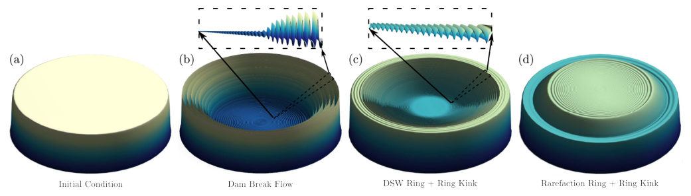
<figcaption class="paper-figure-caption"><b>Fig 1.</b> FIG. 1. Illustration of the distinct dynamically generated nonlinear wave patterns emanating from (a) a disk-shaped initial condition of uniform density, ρ0, in a binary 39K mixture within the interaction regime favoring droplet formation. Depending on the value of ρ0 three dynamical structures emerge. Namely, (b) dam break flows (DBFs) composed of ring DBF wavetrains, (c) composite ring DSWs attached to a ring kink, and (d) radial rarefaction waves along with ring kink structures. The insets in panels (b), (c) represent magnified density cross-sections of the ensuing waveforms in the spatial regions marked by the dashed lines.</figcaption>
</figure>
<figure class="paper-figure-card">
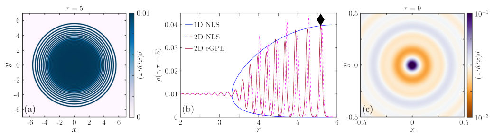
<figcaption class="paper-figure-caption"><b>Fig 2.</b> FIG. 2. Relative low background densities lead to the dynamical generation of ring DBFs in the 2D eGPE. (a) Characteristic density profile, ρ(x, y, τ), at τ = 5, within the 2D eGPE showcasing the nucleation of concentric rings following the dam break. (b) Corresponding 1D radial (with θ = 0) density profile, ρ(r, 0, τ = 5) in the 2D eGPE. The wave patterns are qualitatively described by the reduced 2D NLS model [Eq. (6)], see the legend. The envelopes of the 2D eGPE waveforms are adequately captured by the analytical expressions of the 1D NLS (see legend) pertaining to dispersive DBFs within Whitham modulation theory. The diamond marks the solitonic edge of the ring DBF. (c) At longer...</figcaption>
</figure>
<figure class="paper-figure-card">
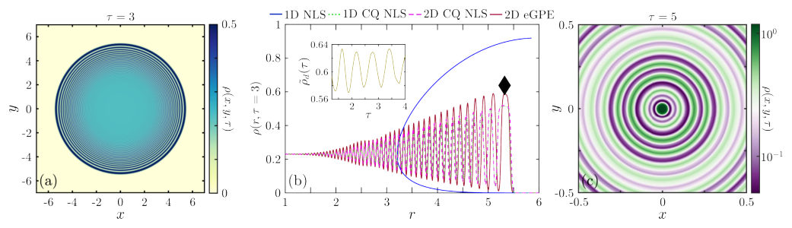
<figcaption class="paper-figure-caption"><b>Fig 3.</b> FIG. 3. (a) Prototypical density snapshot of ring DBFs at the upper limit of their parametric region of existence, i.e. at ρ0 = 0.23. (b) The radial (θ = 0) density at τ = 3 exemplifies that the nucleated ring DBFs are structurally different from their counterparts occurring at lower densities, see also Fig. 2. Their features, such as their envelopes cannot be captured by the 1D NLS model (see legend). Rather the shape of the ring DBFs is qualitatively described by the 2D and 1D CQ NLS reductions (see legend) of the 2D eGPE model [Eq. (8)]. However, the CQ NLS predicts smaller amplitudes of the ensuing rings which are also somewhat shifted to the left compared to the 2D eGPE outcome. The...</figcaption>
</figure>
<figure class="paper-figure-card">
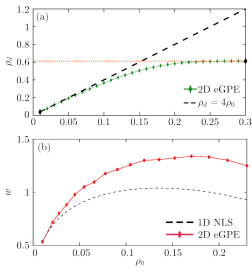
<figcaption class="paper-figure-caption"><b>Fig 4.</b> FIG. 4. (a) Dependence of the soliton edge height, ρd, of the 2D eGPE ring DBFs on the background density, ρ0. When the latter is relatively small, ρd displays an approximately linear increasing trend which is close to the ρd = 4ρ0 analytical prediction stemming from the 1D NLS (see legend). For larger densities, the soliton edge height approaches the density of the 2D eGPE kink, i.e. 1/√e (dotted line). The maroon and navy-blue diamonds correspond to the solitonic edge of the 2D eGPE for ρ0 = 0.01 [Fig. 2(b)] and ρ0 = 0.23 [Fig. 3(b)], respectively. (b) The spreading rate, w, i.e. the difference between the linear and solitonic edge velocities, of the 2D eGPE ring DBFs closely follows the...</figcaption>
</figure>
<figure class="paper-figure-card">
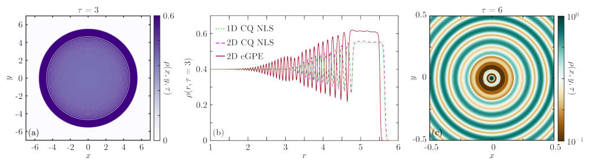
<figcaption class="paper-figure-caption"><b>Fig 5.</b> FIG. 5. Dynamical generation of composite ring kink-DSW structures in the 2D eGPE, following the dam break initial condition [Eq. (4)]. (a) Characteristic density profile at τ = 3 stemming from the evolution of a uniform background with ρ0 = 0.4. (b) Comparison of the 1D radial (at θ = 0) density snapshot, ρ(r, τ), with the respective ones stemming from the reduced 1D and 2D CQ NLS models (see legend). This comparison highlights that the competition between the attractive and repulsive interaction terms is mainly responsible for the generation of such composite wave patterns. (c) The impingement of the ring structures around r = 0 leads to the nucleation of high-amplitude waves on top of a...</figcaption>
</figure>

**Summary.** This paper analyzes the complex nonlinear dynamics of radial dam break flows in 2D ultracold atomic droplets. By modeling the system with the extended Gross-Pitaevskii equation, the authors identify three distinct wave regimes—depending on initial density—that manifest as ring solitons, shock waves, or rarefaction waves. The findings are significant because these patterns are stabilized by the competition between attraction and repulsion inherent to the droplet environment.

**Why it may be interesting.** This work directly addresses nonlinear wave dynamics in quantum many-body systems, providing concrete predictions for observable wave structures in ultracold atomic experiments that go beyond standard mean-field descriptions.

Detailed structure

**Main problem.** The study investigates the controlled dynamical generation and characterization of radial dam break flows (DBFs) in two-dimensional droplet-bearing environments.

**Main result.** Three distinct dynamical response regimes—ring DBF, composite ring DSW, and ring kink-rarefaction waves—are identified based on the initial density, demonstrating patterns prohibited in standard 2D Kerr media.

**Method.** The analysis uses the extended Gross-Pitaevskii equation (eGPE) and its reduced forms, comparing results from 2D simulations, 1D cubic-quintic nonlinear Schrödinger (CQ NLS) models, and simple wave solutions.

**Model / system.** The system models ultracold mixtures (e.g., $^{39}	ext{K}$) governed by the eGPE, which incorporates competing mean-field and quantum fluctuation effects via the Lee-Huang-Yang term. The dynamics are initialized on a disk-shaped uniform density.

**Key observables.** Density ($
ho$), phase ($\phi$), and the formation of specific nonlinear wave patterns (ring DBF, kink-rarefaction waves).

**Important parameters / regimes.** Initial density ($
ho_0$), which dictates the dynamical regime; the dispersion parameter ($\epsilon$).

**Assumptions / limitations.** The dynamics are well-described by the 2D eGPE, and approximations are made by reducing the system to 1D or using the simple wave limit, which neglects certain curvature effects.

**Figures summary.** Figures illustrate the three distinct nonlinear wave patterns: initial disk condition, ring DBF wavetrains, composite ring DSW attached to a ring kink, and radial rarefaction waves with ring kink structures.

**Paper structure.** The paper progresses by establishing the governing eGPE, identifying the three density-dependent regimes, and then using reduced models (like the CQ NLS) and simple wave analysis to characterize the transitions between these complex nonlinear wave patterns.

Abstract

The controlled dynamical generation of radial dam break flows (DBFs) is demonstrated in two-dimensional droplet environments. These ultracold mixtures feature competing mean-field and quantum fluctuation effects and are initialized on a disk-shaped uniform density. Depending on the value of the latter, reflecting also the dominance of attractive or repulsive interactions, three dynamical response regimes are identified. At small densities a moving wavetrain of bright ring solitons is observed (dubbed ring DBF), at intermediate densities a ring kink-dispersive shock wave, while at large densities the flows encompass composite ring kink-rarefaction waves moving towards the center. The emergence of these patterns, whose formation would be prohibited in two-dimensional Kerr media due to wave-collapse, is rooted in the competition between attraction and repulsion inherent to droplet environments, modeled by the extended Gross-Pitaevskii equation. The characterization of the ensuing nonlinear waveforms is further corroborated by reduced models based on the cubic-quintic nonlinear Schrödinger equation. The different wave patterns emanating from dam break flows can be experimentally realized using current state-of-the-art ultracold atom experiments.

[↑ back to top](#top)

### [Variational Solution of Non-Hermitian Quantum Field Theory in Two Dimensions](http://arxiv.org/abs/2609.19798v1)

**Authors:** Paul Romatschke  
**Type:** theory · **Category:** statistical mechanics · **PDF:** <https://arxiv.org/pdf/2609.19798v1>  
**Analysis basis:** full PDF text, analyzed in chunks
**Topic relevance:** `Keldysh / 2PI / non-Gaussian methods` **3/5** · `methods for driven-dissipative` **3/5** · `analog quantum simulation` **1/5** · `correlated / nonlocal dissipation` **1/5** · `driven-dissipative phase transition` **1/5** · `non-equilibrium universality` **1/5** · `quantum measurements` **1/5**

↔ Scroll figures horizontally

<figure class="paper-figure-card">
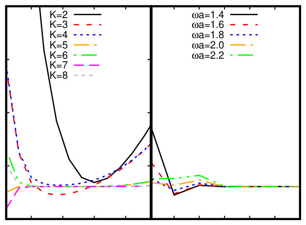
<figcaption class="paper-figure-caption"><b>Fig 1.</b> FIG. 1. Lowest-lying eigenvalue e0 of the Hamiltonian matrix Hnm truncated at n = K + 1 for</figcaption>
</figure>
<figure class="paper-figure-card">
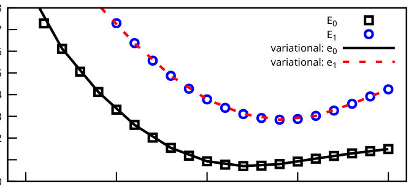
<figcaption class="paper-figure-caption"><b>Fig 2.</b> FIG. 2. Energy levels of the negative coupling Hamiltonian (1) with m2 B ̸= 0 calculated using</figcaption>
</figure>
<figure class="paper-figure-card">
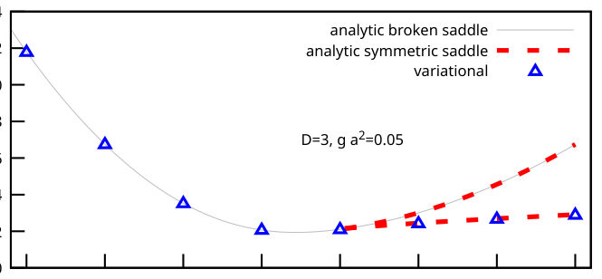
<figcaption class="paper-figure-caption"><b>Fig 3.</b> FIG. 3. Free energy of negative coupling QFT on a lattice with D = 3 transverse sites and</figcaption>
</figure>
<figure class="paper-figure-card">
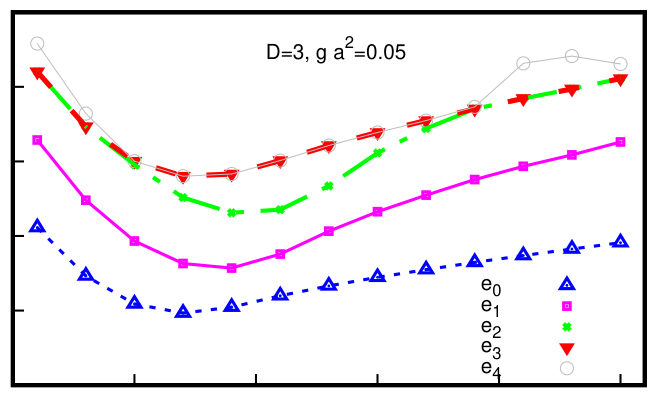
<figcaption class="paper-figure-caption"><b>Fig 4.</b> FIG. 4. Low-lying eigenvalues Hamiltonian eigenvalues e(K) n in the variational method truncated</figcaption>
</figure>
<figure class="paper-figure-card">
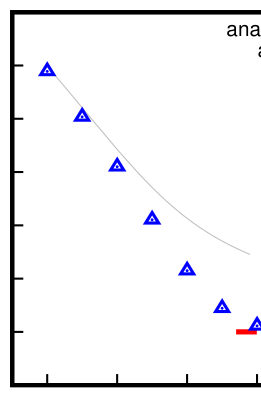
<figcaption class="paper-figure-caption"><b>Fig 5.</b> FIG. 5. Field expectation value ⟨ϕ⟩for negative coupling ϕ4 theory. See text for details.</figcaption>
</figure>

**Summary.** This work details the application of a specialized variational method to solve non-Hermitian quantum field theories, particularly those with negative coupling. It successfully analyzes the $\phi^4$ theory on a lattice in two dimensions, providing quantitative results for the energy spectrum. The paper is significant for developing robust theoretical tools for complex, non-Hermitian quantum systems.

**Why it may be interesting.** The extension of variational principles to non-Hermitian Hamiltonians is crucial for studying open quantum systems or systems exhibiting gain/loss, which is a key area of modern AMO physics and open quantum systems theory.

Detailed structure

**Main problem.** The paper develops and applies a variational technique to solve non-Hermitian quantum field theories, specifically focusing on the challenging case of negative coupling quartic self-interaction.

**Main result.** The variational method successfully calculates the ground state energy for the negative-coupling $\phi^4$ theory in $d=2$ lattice dimensions, showing convergence and agreement with other theoretical approaches.

**Method.** The core method is a variational approach adapted for non-Hermitian Hamiltonians, involving constructing matrix elements using a finite basis set and minimizing the energy expectation value.

**Model / system.** The primary model is the scalar $\phi^4$ quantum field theory in two Euclidean dimensions, regularized on a lattice, characterized by a negative coupling constant ($g<0$). The underlying physics involves non-Hermitian quantum mechanics, often related to PT-symmetric systems.

**Key observables.** Ground state energy ($e_0$), first excited state energy ($e_1$), correlation length ($C_L$), and the field expectation value ($\langle\phi
angle$).

**Important parameters / regimes.** The negative coupling constant ($g$), the mass squared ($m_B$), and the variational parameter ($\omega$ or $w$).

**Assumptions / limitations.** The method assumes the existence of a purely real energy eigenspectrum for the variational results to be physically meaningful, which limits applicability at large volumes.

**Figures summary.** Figures compare the calculated low-lying eigenvalues ($e_n$) against exact diagonalization results for the negative coupling Hamiltonian, and show the dependence of energy on the variational parameter $\omega$.

**Paper structure.** The paper first introduces the variational technique for non-Hermitian systems, applies it to the wrong-sign quartic oscillator, and then extends the methodology to analyze the lattice discretization of the $\phi^4$ theory in $d=2$, comparing results against saddle-point expansions.

Abstract

This work describes a variational technique to solve non-Hermitian quantum systems, in particular those with negative coupling quartic self-interaction. Differences of applying variational methods from standard quantum mechanics to non-Hermitian quantum mechanics -- including potential pitfalls -- are highlighted. A successful implementation of the variational approach for the non-Hermitian case is presented. The technique is used to analyze scalar quantum field theory in d=2 with negative quartic self-interaction in the Hamiltonian formulation in lattice discretization.

[↑ back to top](#top)

### [FT-Weave: Real-Time Compilation Framework for Reconfigurable Fault-Tolerant Quantum Architectures](http://arxiv.org/abs/2609.20573v1)

**Authors:** Wan-Hsuan Lin, Milan Kornjača, Chen Zhao, Sheng-Tao Wang, Jason Cong  
**Type:** theory · **Category:** quantum information and computing · **PDF:** <https://arxiv.org/pdf/2609.20573v1>  
**Analysis basis:** full PDF text, analyzed in chunks
**Topic relevance:** `Rydberg arrays` **3/5** · `analog quantum simulation` **3/5** · `QC/QI experiment` **2/5** · `methods for driven-dissipative` **1/5** · `quantum measurements` **1/5**

↔ Scroll figures horizontally

<figure class="paper-figure-card">
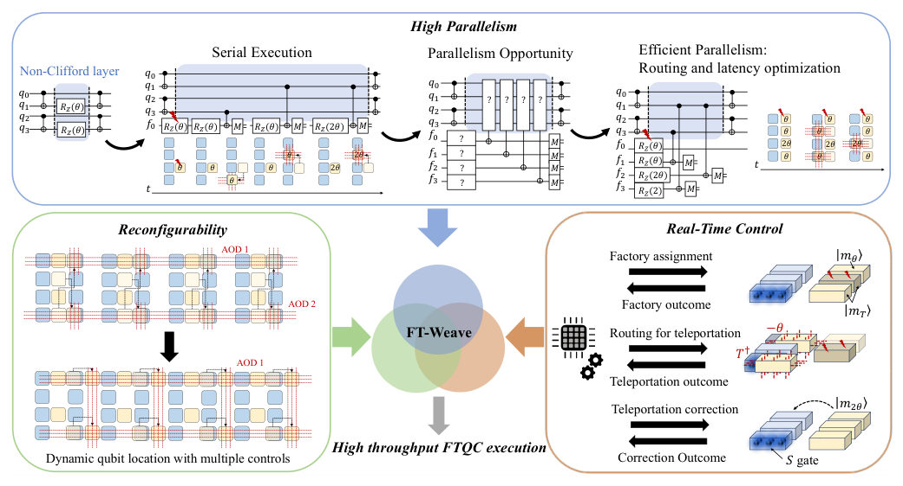
<figcaption class="paper-figure-caption"><b>Fig 1.</b> FIG. 1. Three interdependent capabilities for efficient fault-tolerant quantum computing (FTQC) execution. (Top) High parallelism overlaps resource preparation, routing, and logical execution, whereas stage serialization leaves hard- ware underutilized. (Bottom left) Reconfigurability adapts qubit layouts and control regions to changing computation and communication demands. (Bottom right) Real-time control responds to stochastic preparation and teleportation outcomes by updating resource assignment, routing, and correction handling. Because a bottleneck in any one capability can limit the others, reconfigurability, real-time control, and high parallelism must be optimized jointly,...</figcaption>
</figure>
<figure class="paper-figure-card">
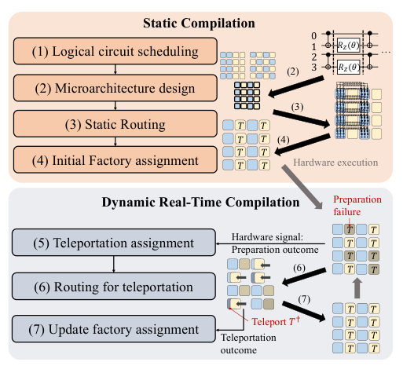
<figcaption class="paper-figure-caption"><b>Fig 2.</b> FIG. 2. Overview of the FT-Weave compilation frame- work. FT-Weave partitions compilation into four static and three dynamic steps. The static phase performs (1) logical cir- cuit scheduling, which groups logical operations into Clifford and non-Clifford layers; (2) microarchitecture design, which determines the organization of data blocks, routing space, and factory resources; (3) static routing, which determines communication paths known before execution; and (4) initial factory assignment, which associates upcoming non-Clifford operations with candidate factory outputs. In the running example, the scheduled circuit contains both Clifford and non- Clifford layers, and the high resource...</figcaption>
</figure>
<figure class="paper-figure-card">
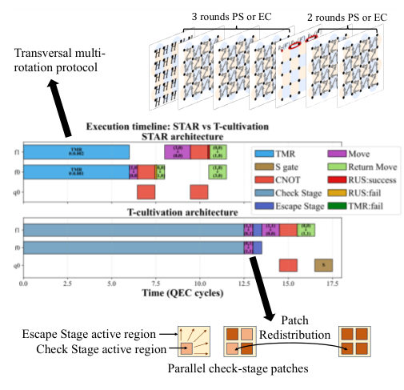
<figcaption class="paper-figure-caption"><b>Fig 3.</b> FIG. 3. Execution abstraction for EFTQC ar- chitectures. Both the STAR and T-state cultivation ar- chitectures use probabilistic resource preparation followed by teleportation-based consumption. In STAR (top), the transversal multi-rotation (TMR) protocol prepares an angle- dependent resource state on a logical patch. In the execution model used here, each TMR attempt takes six QEC cycles. After preparation, RUS teleportation consumes the resource state, and an unsuccessful teleportation requires the prepa- ration of a corrective state with a different angle, creating runtime-dependent resource demand. In T-state cultivation (bottom), the check stage uses a small footprint and takes 12.5...</figcaption>
</figure>
<figure class="paper-figure-card">
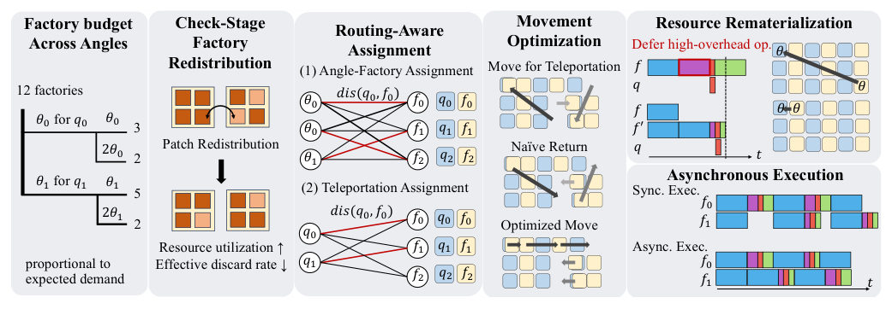
<figcaption class="paper-figure-caption"><b>Fig 4.</b> FIG. 4. Overview of the compilation techniques. From left to right, the figure summarizes techniques for resource preparation and correction handling, resource assignment, routing, and execution policy. Dynamic angle collection distributes the available factory budget across current rotation requests and speculative RUS correction angles. Check-stage factory re- distribution reassigns successful intermediate patches to available escape factories, improving resource utilization and reducing the effective discard rate. Routing-aware assignment matches angle-demand slots to factories before preparation and prepared resource states to compatible logical-qubit requests after preparation while...</figcaption>
</figure>
<figure class="paper-figure-card">
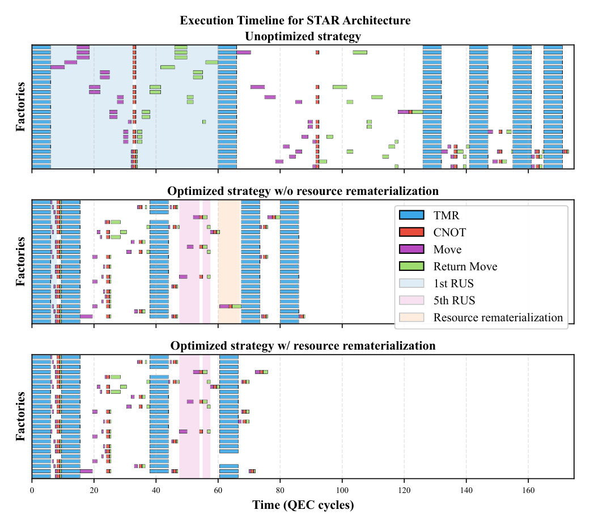
<figcaption class="paper-figure-caption"><b>Fig 5.</b> FIG. 5. Example of FT-Weave timeline output for three compilation strategies applied on STAR benchmark The same workload—a layer of identical-angle RZ rotations on 25 logical qubits executed using 25 factories and one AOD—is compiled using three strategies: an unoptimized baseline (top), routing-aware assignment and movement optimization (middle), and the same optimizations with resource rematerialization (bottom). Each row tracks the activity of one factory over QEC cycles; colors denote TMR preparation, CNOT gates, forward movement, and return movement, as indicated in the legend. The shaded regions identify the first and fifth RUS rounds and a resource-rematerialization decision examined...</figcaption>
</figure>

**Summary.** This paper presents FT-Weave, a novel, real-time compilation framework designed to manage the complex resource dependencies in Fault-Tolerant Quantum Computing. By jointly coordinating resource preparation, assignment, routing, and error correction dynamically, it overcomes the limitations of static scheduling. The framework demonstrates significant speedups on neutral-atom architectures, proving that effective runtime coordination, rather than just maximizing parallelism, dictates overall computational throughput.

**Why it may be interesting.** It provides a concrete, actionable blueprint for solving the complex, real-time resource orchestration problem inherent in scaling up quantum computation on physical platforms like neutral atoms.

Detailed structure

**Main problem.** Efficient Fault-Tolerant Quantum Computing (FTQC) requires coordinating resource preparation, assignment, routing, and logical execution in real-time, which is difficult with static, offline scheduling methods.

**Main result.** The proposed framework, FT-Weave, achieves up to a 3X speedup over baseline methods for simulating the 2D transverse-field Ising model by optimizing runtime coordination.

**Method.** The authors introduce FT-Weave, a stage-aware, real-time compilation framework that jointly coordinates four stages: resource preparation, assignment, routing, and correction handling.

**Model / system.** The framework is tested on two representative neutral-atom Early FTQC (EFTQC) architectures: the transversal STAR and a T-state cultivation architecture.

**Key observables.** Application throughput, execution time, and speedup factor (up to 3X).

**Important parameters / regimes.** Hardware and latency model constraints; the trade-off between exposed parallelism and effective runtime coordination.

**Assumptions / limitations.** The performance evaluation is based on an evaluated hardware and latency model; the framework provides a blueprint adaptable to specific resource protocols.

**Figures summary.** Figure 1 motivates the framework by showing the three interdependent capabilities (Parallelism, Reconfigurability, Real-Time Control). Figure 2 details the four recurring stages (preparation, assignment, routing, correction) partitioned into static and dynamic compilation phases.

**Paper structure.** The paper introduces the problem of real-time FTQC orchestration, details the FT-Weave framework by partitioning compilation into static and dynamic phases, and validates its performance on specific neutral-atom architectures using the 2D TFIM simulation.

Abstract

Fault-tolerant quantum computing (FTQC) is essential for large-scale quantum computation, but realizing useful application throughput requires coordinating resource preparation, assignment, routing, and logical execution under strict hardware and timing constraints. Many FTQC compilation approaches construct offline schedules using nominal or fixed magic-state factory throughput. Such schedules cannot respond to stochastic resource-preparation and teleportation outcomes, leading to execution stalls and hardware underutilization. In this work, we introduce FT-Weave, a stage-aware real-time FTQC compilation framework that jointly coordinates resource preparation, resource assignment, teleportation routing, and correction handling. By adapting to runtime resource availability and hardware constraints, FT-Weave allows preparation, communication, and logical execution to overlap. We instantiate FT-Weave on two representative neutral-atom, early FTQC architectures: transversal STAR and a T-state cultivation architecture. Under the evaluated hardware and latency model, FT-Weave achieves a speedup of up to 3X over a baseline compilation flow for simulations of the two-dimensional transverse-field Ising model. In the case study, we further find that maximizing exposed concurrency does not necessarily minimize execution time. Although fine-grained asynchronous execution can reduce local idle time, its smaller optimization windows and increased routing contention can outweigh these gains. Together, these results show that effective runtime coordination, rather then exposed parallelism alone, determines how efficiently FTQC resources translate into application throughput:FT-Weave provides a blueprint for solving this real-time orchestration problem across resource protocols and architectures.

[↑ back to top](#top)

### [High-order correlations and ultrafast Wigner negativities in bright-squeezed-vacuum-driven high-harmonic generation](http://arxiv.org/abs/2609.20559v1)

**Authors:** Sebastián de-la-Peña, Heiko Appel, Marcelo F. Ciappina, Ofer Neufeld, Angel Rubio  
**Type:** theory · **Category:** other · **PDF:** <https://arxiv.org/pdf/2609.20559v1>  
**Analysis basis:** full PDF text, analyzed in chunks
**Topic relevance:** `quantum measurements` **3/5** · `Keldysh / 2PI / non-Gaussian methods` **2/5** · `methods for driven-dissipative` **2/5** · `Full counting statistics` **1/5** · `interference shaping light` **1/5** · `quantum optics experiment` **1/5**

↔ Scroll figures horizontally

<figure class="paper-figure-card">
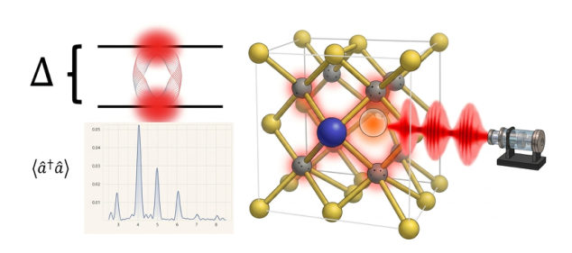
<figcaption class="paper-figure-caption"><b>Fig 1.</b> FIG. 1. Schematic depiction of a diamond nano-vacancy center (modelled by a two-level system) driven by a bright-squeezed laser pulse, depicted as oscillations of electric field quadratures, and emitting higher harmonics.</figcaption>
</figure>
<figure class="paper-figure-card">

<figcaption class="paper-figure-caption"><b>Fig 2.</b> FIG. 2. Emission specturm S(ω) of a two-level system in and out of resonance (left and right panels, respectively) driven by coherent and squeezed vacuum (top and bottom panels respectively) for different Rabi intensities ΩR. The bottom panels are analog to those of [41].</figcaption>
</figure>
<figure class="paper-figure-card">
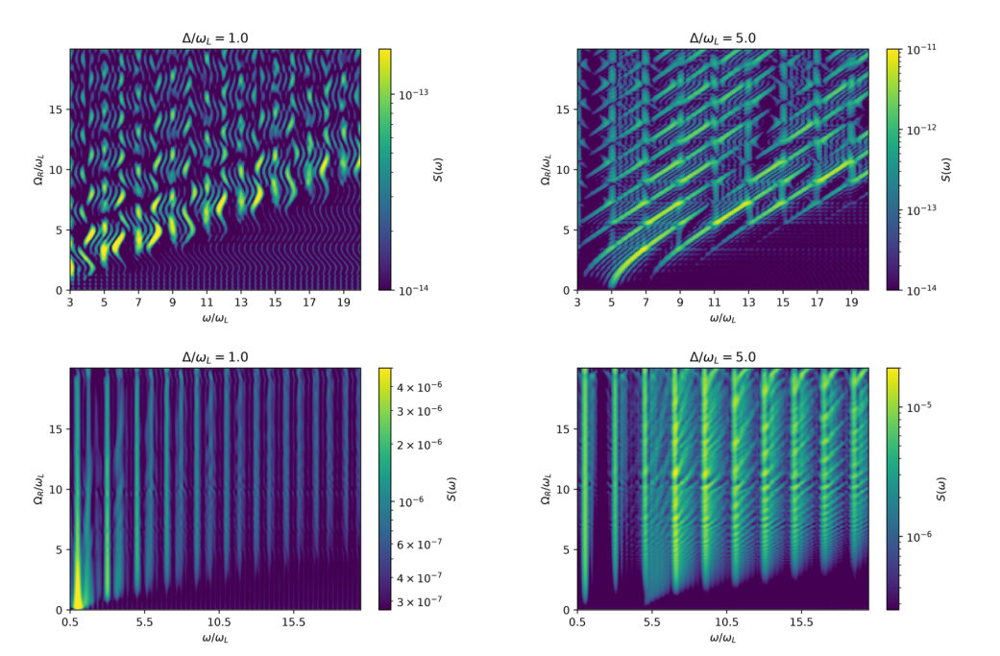
<figcaption class="paper-figure-caption"><b>Fig 3.</b> Figure 5 presents the quantum state of the driving mode through the Wigner distribution in the squeezed-interaction picture</figcaption>
</figure>
<figure class="paper-figure-card">
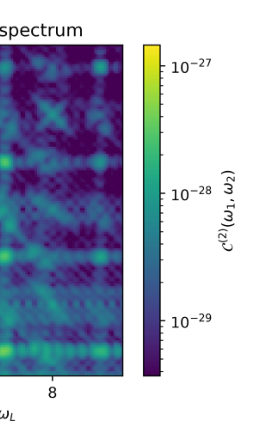
<figcaption class="paper-figure-caption"><b>Fig 4.</b> FIG. 3. Second-order photon correlation spectrum for the continuum of emission modes C(2)(ω, ω′).</figcaption>
</figure>
<figure class="paper-figure-card">
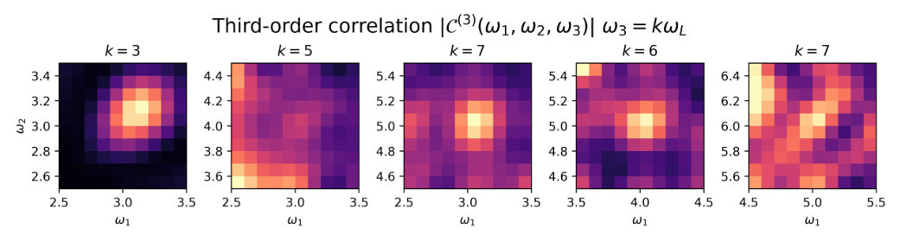
<figcaption class="paper-figure-caption"><b>Fig 5.</b> FIG. 4. Exemplary panels of the third-order photon correlation spectrum of the continuum of emission modes C(3)(ω1, ω2, ω3). The third frequency is fixed to the kth harmonic frequency, ω3 = kωL, while each panel shows the correlation spectrum as a function of the first and second frequencies, ω1 and ω2, in the vicinity of the ith and the jth harmonics.</figcaption>
</figure>

**Summary.** This theoretical study develops a fully quantum framework to model High-Harmonic Generation driven by bright-squeezed vacuum light. By solving the coupled quantum dynamics, the authors demonstrate that the nonclassical nature of the driving field leads to unique higher-order photon correlations and generates measurable, ultrafast Wigner-function negativities due to quantum back-action. This advances the understanding of nonlinear light-matter interactions in the quantum regime.

**Why it may be interesting.** This work provides a rigorous, fully quantum framework for strong-field light-matter interactions, moving beyond semiclassical approximations to predict and interpret quantum signatures like photon correlations and Wigner negativity in attosecond dynamics.

Detailed structure

**Main problem.** The paper addresses the challenge of fully quantum-mechanically describing High-Harmonic Generation (HHG) when driven by nonclassical, non-Gaussian light fields like bright-squeezed vacuum.

**Main result.** Squeezed-vacuum driving yields distinct higher-order photon correlations compared to coherent driving, and the back-action from the emitter generates measurable, time-evolving Wigner-function negativities on attosecond timescales.

**Method.** The authors solve the full quantum-electrodynamical dynamics of a two-level system coupled to quantized light modes in a multimode Hilbert space, utilizing a squeezed-picture transformation for convergence.

**Model / system.** The model uses a two-level system (TLS) as a benchmark for strong-field light-matter interaction, driven by a bright-squeezed vacuum (BSV) field, and quantizes both the driving and emitted harmonic fields.

**Key observables.** Second- and third-order photon correlations ($C^{(2)}, C^{(3)}$), Wigner function negativity volume ($V_{-}(t)$), and the full multimode quantum state.

**Important parameters / regimes.** Squeezing parameter ($\xi$), Rabi frequency ($\Omega_R$), and the ratio of the energy gap to the driving frequency ($\Delta/\omega_L$).

**Assumptions / limitations.** The analysis relies on the TLS approximation for the emitter and assumes that the continuum limit ($\Delta\omega 	o 0$) can be taken jointly with the infinite-photon limit ($|\xi| 	o \infty$) while keeping the physical driving strength finite.

**Figures summary.** Figures compare emission spectra for coherent vs. BSV driving, show second-order correlation spectra, and illustrate the time evolution of the Wigner distribution and the negativity volume $V_{-}(t)$ over attosecond timescales.

**Paper structure.** The paper establishes the fully quantum Hamiltonian, details the mathematical framework using the squeezed picture, calculates the correlation functions, and analyzes the time evolution of the quantum state's nonclassical features (Wigner negativity) due to back-action.

Abstract

High-harmonic generation (HHG) is a prototypical strong-field process in which intense light drives matter to emit radiation at integer multiples of the driving frequency. Extending HHG into the quantum-optical regime offers new opportunities to probe and control strongly nonlinear light-matter interactions using nonclassical states of light. Yet describing this regime requires a fully quantum treatment of the correlated electron-photon dynamics, which becomes computationally challenging for broadband, strongly squeezed fields. Here we solve the quantum-electrodynamical dynamics of a two-level system driven by bright squeezed vacuum in a converged multimode Hilbert space. Both the driving field and emitted harmonics are fully quantized, with the light-matter interaction treated nonperturbatively. This enables direct access to the multimode quantum state and its higher-order correlations beyond semiclassical sampling or perturbative descriptions. We show that squeezed-vacuum driving produces harmonic emission with qualitatively distinct second- and third-order photon correlations compared with coherent excitation. Moreover, back-action from the driven emitter strongly reshapes the incident squeezed field, generating pronounced Wigner-function negativities that evolve on attosecond timescales. Our results establish a fully quantum framework for broadband strong-field dynamics with squeezed light and provide a route to predicting and interpreting quantum-HHG experiments and their extension to more complex emitters.

[↑ back to top](#top)

### [State-Selective Floquet Memory in Degenerate Manifolds](http://arxiv.org/abs/2609.20428v1)

**Authors:** Ayan Sahoo, Argha Debnath, Debraj Rakshit  
**Type:** theory · **Category:** other · **PDF:** <https://arxiv.org/pdf/2609.20428v1>  
**Analysis basis:** full PDF text, analyzed in chunks
**Topic relevance:** `analog quantum simulation` **3/5** · `driven-dissipative phase transition` **2/5** · `methods for driven-dissipative` **2/5** · `Keldysh / 2PI / non-Gaussian methods` **1/5** · `non-equilibrium universality` **1/5** · `scars & prethermalization` **1/5**

↔ Scroll figures horizontally

<figure class="paper-figure-card">
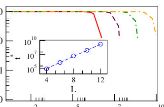
<figcaption class="paper-figure-caption"><b>Fig 1.</b> FIG. 1. shows the fidelity Fn as a function of time t for fixed param- eters λ = 0.01, ∆= 0.1, ω = 4, and ϵ = 0.02, corresponding to the initial state | ↑↑↑. . . ⟩for varied system sizes, L = 6 (red solid), L = 8 (maroon dash-dash), L = 10 (green dash-dot) and L = 12 (orange dash-dash-dot). Long-lived memory survies till threshold, t∗. The inset depicts the numerically extracted t∗(circles) as a func- tion of the system size, L, and the fitting (dotted line) from the finite size analysis suggests exponential growth of t∗, t∗∼e1.24L.</figcaption>
</figure>
<figure class="paper-figure-card">
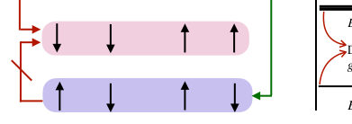
<figcaption class="paper-figure-caption"><b>Fig 2.</b> FIG. 2. (a) Kintetic blockade in the λ-channel: The off-diagonal part of the weak-bond interaction, h2i,2i+1, flips the inner spins, when they are opposite, while leaving outer spins unchanged. Under any power of h2i,2i+1, |tutd⟩= | ↑↑↓↓⟩can connect to a configuration with flipped inner pair of spins, but can not rearrange to the con- figuration of its degenerate partner |tdtu⟩= | ↓↓↑↑⟩[Eq. 14]. (b) Selection rules of the ϵ-channel: The local kick gi generator couples only |+⟩and |0⟩. In contrast, it annihilates |−⟩and |s⟩exactly, mak- ing them dark to all orders in ϵ.</figcaption>
</figure>
<figure class="paper-figure-card">
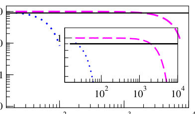
<figcaption class="paper-figure-caption"><b>Fig 3.</b> FIG. 3. Stroboscopic fidelity Fn versus t = nτ (even n) at λ = 0.01, ∆= 0.1, ϵ = 0.02, ω = 3, L = 8, for two states of the one-triplon manifold: the localized triplon |tusss⟩(dotted) and the Bloch state |k⟩= 1 2 PN j=1 eikj|j, u⟩and the Bloch state |k⟩= 1</figcaption>
</figure>
<figure class="paper-figure-card">
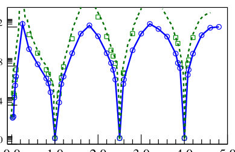
<figcaption class="paper-figure-caption"><b>Fig 4.</b> FIG. 4. shows t∗as a function of ∆corresponding to λ = 0.01, ϵ = 0.02, and ω = 3 for L = 10 (circles), and 12 (square). Two prominent features can be noticed: off-resonant enhancement of life- time with system size and periodic collapse due to the Floquet reso- nance. The lines serve as guide to the eye.</figcaption>
</figure>

**Summary.** This theoretical paper determines the precise conditions required for quantum states to maintain coherence (memory) under periodic driving in a lattice model. It analyzes two sources of imperfection—structural coupling ($\lambda$) and driving kicks ($\epsilon$)—using degenerate perturbation theory. The key finding is that protection requires both kinetic blocking and avoiding specific resonance conditions, leading to a detailed understanding of state-selective memory loss.

**Why it may be interesting.** This work provides concrete, quantitative criteria for designing quantum memories in periodically driven systems, which is highly relevant for quantum simulation and quantum information processing using engineered lattice dynamics.

Detailed structure

**Main problem.** The paper investigates the conditions under which quantum states retain coherence or 'memory' when subjected to periodic driving, especially when the system deviates from ideal, perfectly invariant limits.

**Main result.** State memory is protected only if the perturbations (both structural and driving imperfections) fail to connect the initial state to other degenerate partners, and the drive's local selection rules must avoid specific Floquet sideband resonances.

**Method.** The analysis employs degenerate perturbation theory applied to the Floquet evolution operator, expanding the dynamics in terms of small coupling strengths ($\lambda$ and $\epsilon$) to analyze stability in projected subspaces.

**Model / system.** The model is a periodically driven, clean, short-ranged alternating XXZ chain. The dynamics are analyzed by projecting the Hamiltonian onto near-degenerate manifolds defined by conserved quantities like dimer parity.

**Key observables.** Fidelity ($F_n$) over stroboscopic time steps, which measures memory retention; the lifetime ($t^*$) of the state.

**Important parameters / regimes.** Coupling strengths ($\lambda$ and $\epsilon$), the detuning ($\Delta$), and the ratio of energy gaps to driving frequencies ($\omega$).

**Assumptions / limitations.** The analysis relies on a first-order expansion in the perturbation strengths ($\lambda$ and $\epsilon$), and assumes the existence of true-energy-degenerate blocks for the projection procedure.

**Figures summary.** Figures illustrate the decay of fidelity ($F_n$ vs time) for different states, showing that lifetimes vary significantly even for states in the same manifold. Another figure maps the lifetime ($t^*$) as a function of detuning ($\Delta$), revealing collapse at resonance points.

**Paper structure.** The paper systematically analyzes the stability by decomposing the perturbation into two channels: the $\lambda$-channel (structural/weak bonds) and the $\epsilon$-channel (driving imperfection/kick). It establishes criteria for protection in each channel, culminating in a comparison of state lifetimes based on these criteria.

Abstract

In order to understand which initial states retain memory under periodic driving, it is necessary to depart from the ideal limit giving rise to invariant structures and work inside near-degenerate manifolds. We show that degeneracy itself is not conclusive and what actually matters is how perturbations, such as structural and driving imperfections, acts on the projected multiplet. For systems decoupling into the local clusters in the ideal limit, the projections can be computed within degenerate perturbation theory. There the stability is decided by two criteria: the coupling can not connect the state with other degenerate partners in the manifold, either by kinetic blocking, or more generally, by diagonalizing the projected coupling, and the drive's local selection rule must admit only transfer energies detuned from Floquet sidebands, in which case the projected drive generator exactly vanishes. We formalize these understandings in a periodically driven clean, short-ranged alternating XXZ chain and demonstrate a set of results that include, long-lived states, both of product form and entangled across the clusters, a periodic family of sideband resonances, and an explicit example showing opposite fates for states with identical energy and charges.

[↑ back to top](#top)

### [Experimental certification of the nonlocal advantages of quantum imaginarity](http://arxiv.org/abs/2609.19625v1)

**Authors:** Jian-Hao Wu, Kai-Yu Yuan, Yun-Xiang Tian, Hao-Ran Tan, Yan-Xin Rong, Zhen Shang, Yong-Jian Gu, Ya Xiao  
**Type:** experiment · **Category:** quantum information and computing · **PDF:** <https://arxiv.org/pdf/2609.19625v1>  
**Analysis basis:** full PDF text, analyzed in chunks
**Topic relevance:** `QC/QI experiment` **3/5** · `quantum optics experiment` **3/5** · `quantum measurements` **2/5**

↔ Scroll figures horizontally

<figure class="paper-figure-card">
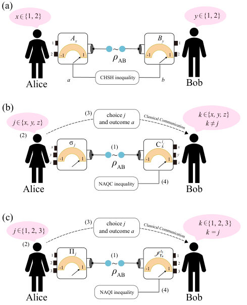
<figcaption class="paper-figure-caption"><b>Fig 1.</b> FIG. 1. Illustration of the Bell nonlocality, NAQC, and NAQI sce- narios. (a) Bell nonlocality scenario. Alice and Bob share a bipartite quantum state ρAB. Without communication, Alice and Bob choose observables from {A1,A2} and {B1,B2}, respectively. After all the measurements, they calculate the correlation function, Bell nonlo- cality is certified if and only if the Ineq. (1) is violated. (b) NAQC scenario. The procedure consists of the following steps: (1) Alice and Bob share a bipartite quantum state ρAB. (2) Alice measures one of three Pauli observables chosen from σj ( j = x,y,z). (3) Alice communicates her chosen setting j and the corresponding outcome a to Bob via a classical...</figcaption>
</figure>
<figure class="paper-figure-card">
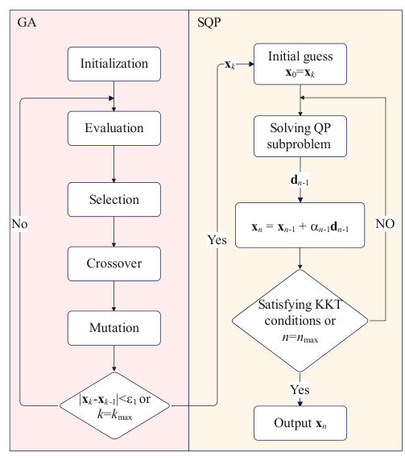
<figcaption class="paper-figure-caption"><b>Fig 2.</b> FIG. 2. Simplified flowchart of hybrid GA-SQP algorithm. GA involves five procedures: initialization, evaluation, selection, crossover, and mutation. The last four steps repeat until either |xk −xk−1| &lt; ε1 or k = kmax is satisfied, where xk and xk−1 are the optimal solutions at the k-th and (k −1)-th iteration, kmax and ε1 are the predefined maximal number of iterations and the tolerance, re- spectively. Upon termination, the GA outputs the optimized solution xk as the initial guess for SQP. In the n-th iteration of SQP, a con- structed QP subproblem is solved to provide gradient information dn−1, and the solution is updated to xn = xn−1 +αn−1dn−1, in which αn−1 is chosen to ensure...</figcaption>
</figure>
<figure class="paper-figure-card">
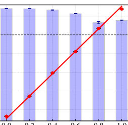
<figcaption class="paper-figure-caption"><b>Fig 3.</b> FIG. 4. Experimental results verifying NAQI. (a) Bell-state mixtures ρB(p). (b) Werner states ρW(p). In both panels, the solid light red curves show the theoretical predictions of violation parameter ∆QI as a function of p, while red markers with error bars indicate exper- imental values. The blue bars represent the fidelity of the prepared states. Error bars, estimated from the Poisson statistics of two-photon coincidences, are on the order of 10−3.</figcaption>
</figure>
<figure class="paper-figure-card">
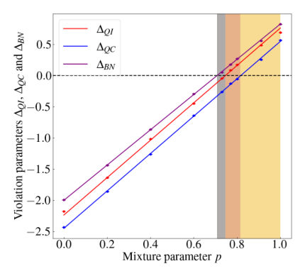
<figcaption class="paper-figure-caption"><b>Fig 4.</b> FIG. 5. Violation parameters ∆QI, ∆QC, and ∆BN as a function of the mixture parameter p. Lines and markers show theoretical and experimental values. Light yellow, light red, and grey regions denote states exhibiting: Bell nonlocality only; Bell nonlocality and NAQI without NAQC; and all three correlations, respectively.</figcaption>
</figure>

**Summary.** This paper experimentally certifies the nonlocal advantage of quantum imaginarity (NAQI) using polarization-encoded photonic qubits. The researchers developed a hybrid optimization algorithm to measure NAQI by violating a specific imaginarity inequality. The results not only confirm NAQI but also establish a hierarchy among different quantum nonclassicality resources: NAQC $\subset$ NAQI $\subset$ Bell nonlocality.

**Why it may be interesting.** This work is highly relevant as it experimentally tests a novel quantum resource (imaginarity) and rigorously compares its operational boundaries against established resources like coherence and entanglement, pushing the boundaries of quantum foundations testing.

Detailed structure

**Main problem.** The paper aims to experimentally study the nonlocal advantage of quantum imaginarity (NAQI) and compare it with nonlocal advantages of quantum coherence (NAQC) and Bell nonlocality.

**Main result.** Clear violations of the $l_1$-norm of imaginarity inequality are observed, providing experimental certification of NAQI. Furthermore, for two-qubit Werner states, the relationship $	ext{NAQC} \subset 	ext{NAQI} \subset 	ext{Bell nonlocality}$ was established.

**Method.** The study involves experimentally characterizing the imaginarity of conditional states after local measurements on photonic qubits, utilizing a hybrid optimization algorithm (GA-SQP) to find optimal measurement settings.

**Model / system.** The physical system uses polarization-encoded photonic qubits to prepare two-qubit Bell-diagonal and Werner states. The analysis focuses on bipartite quantum states $
ho_{AB}$ shared between two parties, Alice and Bob.

**Key observables.** The $l_1$-norm of imaginarity ($J_{l1}^{\Upsilon_k}(
ho)$), the $l_1$-norm of coherence ($C_{l1}^k$), and the violation of the CHSH inequality are the key observables used to certify the respective nonlocal advantages.

**Important parameters / regimes.** The analysis involves varying parameters $p$ (for state mixtures) and optimizing over measurement settings parameterized by angular variables ($	heta_p, \varphi_p$).

**Assumptions / limitations.** The primary assumption is the experimental feasibility of measuring the $l_1$-norm of imaginarity using photonic qubits. The optimization process relies on the effectiveness of the hybrid GA-SQP algorithm.

**Figures summary.** Figure 1 illustrates the three scenarios (Bell nonlocality, NAQC, NAQI) using measurements on photonic qubits. Figure 3 details the experimental setup for characterizing these three nonclassicality measures.

**Paper structure.** The paper first introduces the theoretical framework for NAQI, NAQC, and Bell nonlocality. It details the measurement protocols and the necessary optimization procedure using a hybrid GA-SQP algorithm. Finally, it presents the experimental results confirming the nonlocal advantage of imaginarity and comparing the resource regions.

Abstract

Quantum imaginarity is a distinct resource in quantum information theory, yet its nonlocal properties have not been fully explored. Here, we report an experimental study of the nonlocal advantage of quantum imaginarity (NAQI), in which local measurements on one subsystem can steer the average imaginarity of the conditional states of the other subsystem beyond the corresponding classical bound. The $l_1$-norm of imaginarity inequality is adopted as an experimentally accessible witness. A hybrid optimization algorithm that combines a genetic algorithm with sequential quadratic programming is developed to avoid local optima and accelerate the search for optimal measurement settings. Using polarization-encoded photonic qubits, we prepare two classes of two-qubit Bell-diagonal states and experimentally characterize the imaginarity of the conditional states following local measurements. Clear violations of the $l_1$-norm of imaginarity inequality are observed, providing an experimental certification of NAQI. We further investigate the relationship among NAQI, the nonlocal advantage of quantum coherence (NAQC), and Bell nonlocality based on their respective inequality criteria. For the two-qubit Werner states considered in this work, the regions of states that violate the respective criteria satisfy $\mathcal{D}_{\rm NAQC}\subset\mathcal{D}_{\rm NAQI}\subset\mathcal{D}_{\rm BN}$. Our work provides an experimental realization of NAQI and a comparison of different forms of quantum nonclassicality in a photonic platform.

[↑ back to top](#top)

### [Learning-Induced Dynamical Transition in Recurrent Neural Networks](http://arxiv.org/abs/2609.19288v1)

**Authors:** Varun Vaidya  
**Type:** theory · **Category:** disordered systems and neural networks · **PDF:** <https://arxiv.org/pdf/2609.19288v1>  
**Analysis basis:** full PDF text, analyzed in chunks
**Topic relevance:** `Keldysh / 2PI / non-Gaussian methods` **3/5** · `methods for driven-dissipative` **2/5** · `driven-dissipative phase transition` **1/5** · `non-equilibrium universality` **1/5** · `quantum measurements` **1/5**

↔ Scroll figures horizontally

<figure class="paper-figure-card">
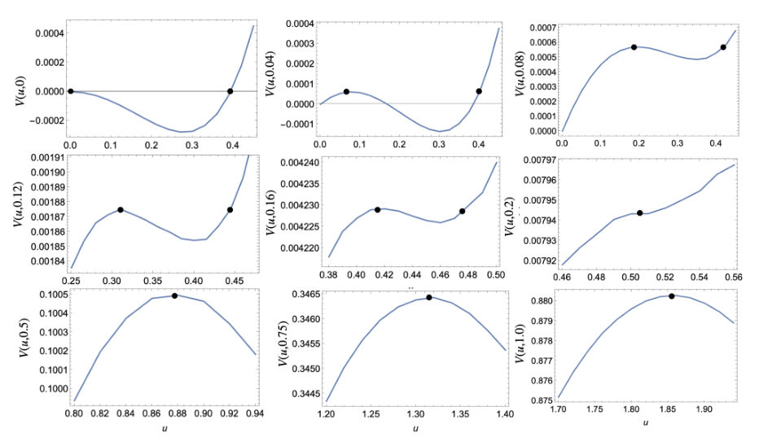
<figcaption class="paper-figure-caption"><b>Fig 1.</b> Figure 1: The deformation of the effective one dimensional potential as a function of the feedback parameter ˆy for g=1.3. Starting from the SCS picture in (a), increasing feedback with time deforms the potential to a narrower and shallower well with the simultaneous emergence of a non- zero plateau. At ˆy = 0.2, subplot (f), we see the collapse of the well signaling a qualitative change. Beyond this, the solution is frozen at the maxima of the potential and fast dynamics disappear.</figcaption>
</figure>
<figure class="paper-figure-card">
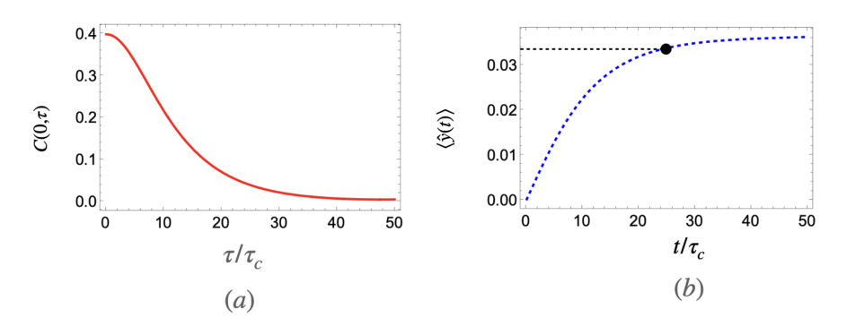
<figcaption class="paper-figure-caption"><b>Fig 2.</b> Figure 2: Evolution at early time t ≪1/α. (a) shows the fast decay of the SCS correlator C(0, τ). (b) shows the time evolution of the network output at early times dictated by this fast decay.</figcaption>
</figure>
<figure class="paper-figure-card">
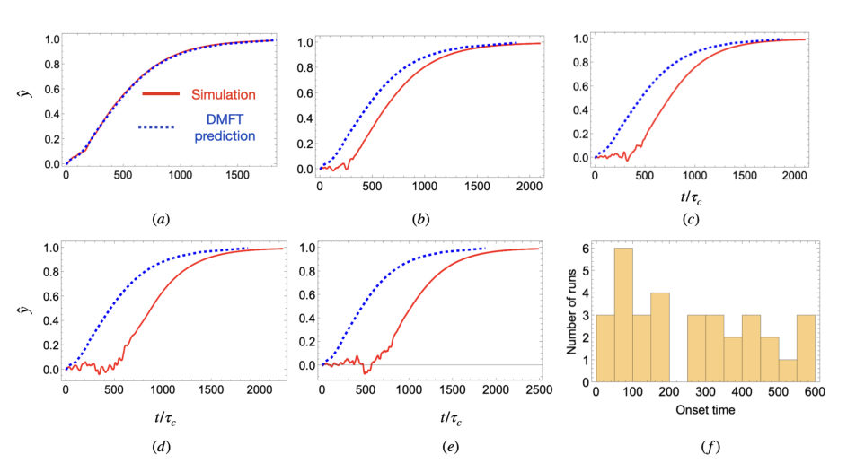
<figcaption class="paper-figure-caption"><b>Fig 3.</b> Figure 3: Network output as a function of time for five representative realizations with different onset times. The dashed curve shows the DMFT prediction. The histogram in (f) shows the distribution of onset times over 33 realizations.</figcaption>
</figure>
<figure class="paper-figure-card">
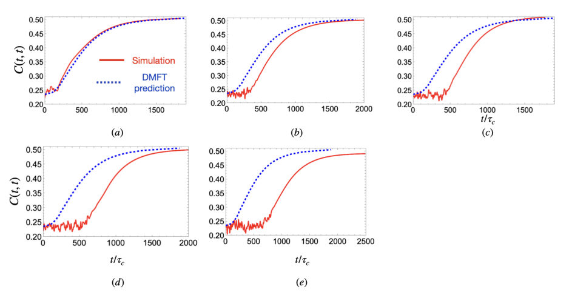
<figcaption class="paper-figure-caption"><b>Fig 4.</b> Figure 4: Diagonal correlation C(t,t) for five representative realizations. The dashed curve shows the DMFT prediction.</figcaption>
</figure>
<figure class="paper-figure-card">
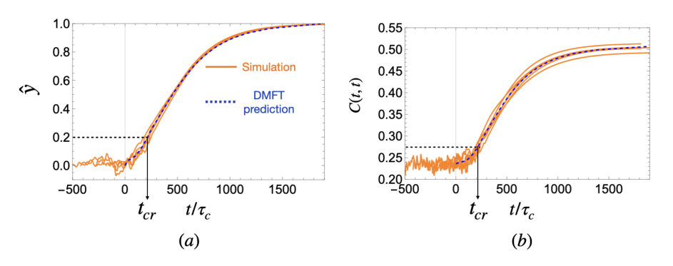
<figcaption class="paper-figure-caption"><b>Fig 5.</b> Figure 5: (a) Network output as a function of time for representative runs shifted by their onset times. Also shown is the critical time tcr as predicted by the DMFT (b) The Diagonal Correlation matrix C(t, t) as a function of time for the same representative runs shifted by their onset times.</figcaption>
</figure>

**Summary.** This work applies Dynamical Mean-Field Theory to model the non-equilibrium dynamics of learning in Recurrent Neural Networks. It shows that the slow, feedback-driven learning process drives the system through a critical transition, transforming chaotic dynamics into stable, task-specific behavior. The theory successfully predicts the time evolution of the network output by identifying a critical feedback strength and time scale.

**Why it may be interesting.** The use of advanced statistical mechanics tools like DMFT to model non-equilibrium learning dynamics provides a powerful analogy for understanding how structured information processing can stabilize complex, initially chaotic physical systems.

Detailed structure

**Main problem.** The paper investigates how the process of learning in Recurrent Neural Networks (RNNs) fundamentally alters their underlying dynamical behavior, causing a transition from initial chaotic activity to stable, task-specific dynamics.

**Main result.** The transition is characterized by a bifurcation in the Dynamical Mean-Field Theory (DMFT) solution, which is predicted by tracking the evolution of the two-time correlation function during training.

**Method.** The authors developed a non-equilibrium DMFT framework, utilizing path integrals and the large N limit to derive self-consistent equations for the network's correlation functions.

**Model / system.** The model is an RNN whose dynamics are governed by coupled differential equations, incorporating recurrent connectivity and a slow, feedback-driven learning rule that updates the readout weights.

**Key observables.** The two-time correlation function C(t, s), the average network output $\langle y(t) 
angle$, and the effective feedback strength.

**Important parameters / regimes.** The analysis relies on separating timescales: the fast intrinsic dynamics ($	au_c$) versus the slow learning timescale ($1/\alpha$).

**Assumptions / limitations.** The analysis assumes a slow learning rate ($\alpha \ll 1/	au_c$) and employs the large N limit for mathematical tractability.

**Figures summary.** Figures illustrate the quantitative agreement between DMFT predictions and numerical simulations, showing the evolution of the network output and the structure of the two-time correlation function before and after the critical transition time $t_{cr}$.

**Paper structure.** The paper builds the theory by defining the system dynamics and learning rules, then applies DMFT via path integrals to derive self-consistent equations for the correlators. It analyzes the time evolution across distinct regimes (early, intermediate, late) to pinpoint the critical transition point.

Abstract

Learning in recurrent neural networks can fundamentally reshape their underlying dynamics, transforming initially chaotic activity into stable task-dependent behavior. We develop a non-equilibrium dynamical mean-field theory(DMFT) to describe this transition during learning. We show that a slow feedback-driven learning process generates an evolving effective feedback strength that drives the network through a transition from chaotic to stable dynamics defined by a bifurcation of the DMFT solution. By deriving the two-time correlation function throughout learning, we identify a critical feedback strength and a corresponding learning rate dependent critical time separating these regimes. The transition arises from the progressive deformation of an effective dynamical landscape by the growing learned feedback structure. Starting from the untrained state, the theory predicts the time evolution of the network output during training and shows quantitative agreement with numerical simulations.

[↑ back to top](#top)

### [Experimental demonstration of finite-size general security via discrete-modulated CVQKD with real time postprocessing](http://arxiv.org/abs/2609.20596v1)

**Authors:** Sven Bodenstedt, Carlos Pascual-García, Nil Canta i Pujol, Martí Sales-Moragues, Mariana Navarro, Pau Gómez Kabelka, Sebastián Etcheverry, Saeed Ghasemi  
**Type:** experiment · **Category:** quantum information and computing · **PDF:** <https://arxiv.org/pdf/2609.20596v1>  
**Analysis basis:** full PDF text, analyzed in chunks
**Topic relevance:** `QC/QI experiment` **3/5** · `quantum optics experiment` **3/5** · `quantum measurements` **1/5**

↔ Scroll figures horizontally

<figure class="paper-figure-card">
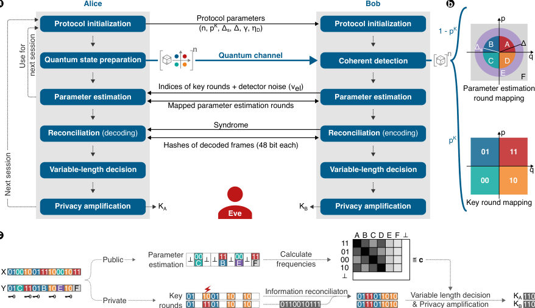
<figcaption class="paper-figure-caption"><b>Fig 1.</b> Fig. 1 Implementation overview. (a) Main steps of the protocol: initialization, quantum state preparation and coherent detection, parameter estimation, reconciliation, VLD, and privacy amplification. Black arrows between Alice and Bob represent an authenticated classical channel, whereas the blue arrow represents the quantum channel. (b) In each round, Alice randomly prepares one of the four coherent states of the QPSK alphabet {00, 01, 10, 11}. Bob then decides, with probability pK, whether to treat the round as a key round. If so, he maps his heterodyne measurement outcome to one of the four QPSK letters according to the quadrant that it occupies in phase space. Otherwise, the round is...</figcaption>
</figure>
<figure class="paper-figure-card">
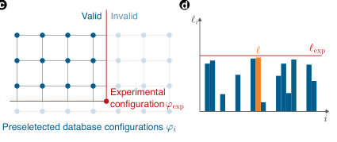
<figcaption class="paper-figure-caption"><b>Fig 2.</b> Fig. 2 Schematic overview of the database approach for the VLD. (a) In a calculation at runtime, the experimen- tally realized configuration φexp needs to be estimated from the measured data and calibrated values before the variables needed for the VLD vexp can be calculated. The whole process takes about 45 min on our experimental con- trol hardware. (b) The pre-computation approach fills a database before the actual experiment. This step is com- putationally expensive and can take days to weeks. At run- time, the calibrated values are used to filter the pre-stored values vi based on validity criteria. For each valid configu- ration, the VLD is performed using the measured data and the...</figcaption>
</figure>
<figure class="paper-figure-card">
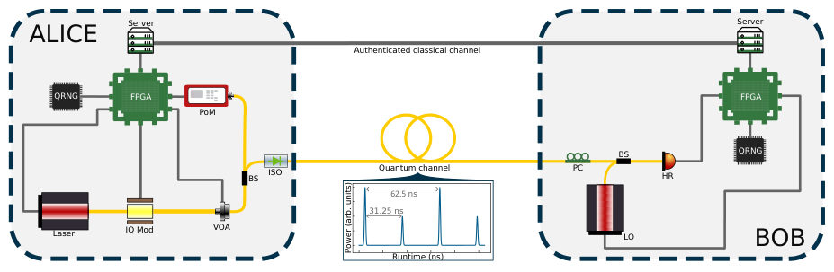
<figcaption class="paper-figure-caption"><b>Fig 3.</b> Fig. 3 Experimental hardware overview. Dark links represent electrical cables, while yellow links represent optical fiber connections. The plot below the quantum channel showcases the presence of both reference and QPSK pulses, with its relative power being exaggerated for better visualization. Acronyms: VOA (Variable Optical Attenuator), IQ Mod (In- Phase and Quadrature component Modulator), BS (Beam Splitter), PoM (Power Meter), FPGA (Field-Programmable Gate Array), QRNG (Quantum Random Number Generator), PC (Polarization Controller), LO (Local Oscillator), HR (Heterodyne Receiver).</figcaption>
</figure>
<figure class="paper-figure-card">
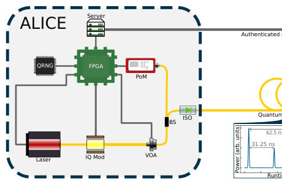
<figcaption class="paper-figure-caption"><b>Fig 4.</b> Fig. 4 (e) shows the resulting secret key rate as a function of distance for the same sessions as in Fig. 4 (b) and (c), obtained by dividing the secret key length by the per-session runtime. At 5 km and n = 108 rounds, the system delivers approxi- mately 10 kbit/s, decreasing to approximately one hundred bits per second at 40 km. Larger block sizes are favored because the SKF grows with n as finite-size penalties shrink towards the asymptotic limit. The per-session runtime is close to linear in n – measurement and LDPC reconciliation both scale with the number of rounds – but the fixed overheads (initialization, VLD, privacy amplifica- tion; together &lt; 3 s) amortize over larger blocks, so...</figcaption>
</figure>
<figure class="paper-figure-card">
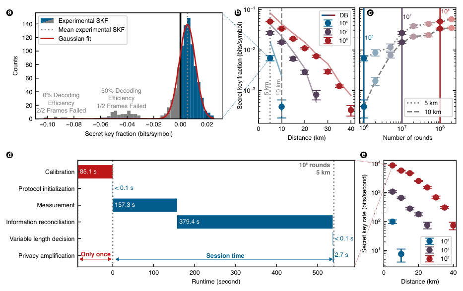
<figcaption class="paper-figure-caption"><b>Fig 5.</b> Fig. 4 Experimental results. (a) Histogram of the experimentally achieved SKF distribution for 5 km and 1 × 106 rounds. For calculating the mean, all negative values are set to zero before averaging. (b) SKF as a function of distance for n = 1×106, 1 × 107, and 1 × 108 rounds. Theoretical values (DB) correspond to the expectation value of the SKF for parameters listed in Tab. 2, calculated for an assumed error correction efficiency of 97 %, a detection efficiency of ηD = 55 %, and an electronic noise level of νel = 77.5 mSNU. As, on average, the parameters for the theoretical values are more favorable than those achieved experimentally, the plotted theoretical SKF typically sits above the...</figcaption>
</figure>

**Summary.** This paper presents the first experimental demonstration of a discrete-modulated CVQKD system achieving finite-size composable security against general attacks. By integrating advanced techniques like variable-length decision and modern entropy accumulation, the system operates in real-time on near-commercial hardware. This advances the practical viability of quantum key distribution by addressing critical security loopholes.

**Why it may be interesting.** This work pushes the boundaries of practical quantum communication by tackling the complex theoretical requirement of general security in a physical, real-time experimental setting.

Detailed structure

**Main problem.** The primary challenge addressed is experimentally demonstrating finite-size general security for Continuous-Variable Quantum Key Distribution (CVQKD) using discrete-modulated (DM) protocols.

**Main result.** The authors report the first experimental demonstration of such a system, achieving composable secret keys against general attacks in real time using QPSK modulation.

**Method.** The protocol employs a variable-length, general security framework, integrating modern entropy accumulation techniques and conic optimization for key rate estimation.

**Model / system.** The system is a CVQKD implementation using coherent states modulated via QPSK, operating over standard optical fiber and utilizing near-commercial hardware for real-time postprocessing.

**Key observables.** Secret key rate ($\kappa$), Secret Key Fraction (SKF), and the final secret key length ($\ell_\varphi$).

**Important parameters / regimes.** Detector efficiency ($\eta_D$), detector noise ($
u_{el}$), block length ($\sim 10^6$ rounds), and the constellation parameters ($\Delta_S, \Delta$).

**Assumptions / limitations.** The security analysis relies on the marginal-constrained entropy accumulation theorem (MEAT), and the post-processing requires an authenticated classical channel.

**Figures summary.** Figures illustrate the overall experimental pipeline (initialization, quantum communication, post-processing steps) and show the distribution of the SKF at 5 km for $n=10^6$.

**Paper structure.** The paper details the experimental setup, outlines the variable-length security framework, describes the post-processing steps (reconciliation, VLD, privacy amplification), and presents the results demonstrating finite-size security.

Abstract

Continuous-variable quantum key distribution (CVQKD) is compatible with telecommunication infrastructure, but implementing composable security with experimentally practical resources has remained challenging, particularly for discrete-modulated (DM) protocols. We report the first experimental demonstration of a DM CVQKD system that generates composable secret keys against general attacks with finite-size block lengths on the order of $\sim 10^{6}$ rounds via a quadrature phase shift keying (QPSK) system. Our implementation follows a variable-length, general security framework enabled by modern entropy accumulation techniques and conic optimization, whose experimental pipeline allows real-time operation on near-commercial hardware.

[↑ back to top](#top)

### [Bad metallicity in the semi-quantum regime of the Hubbard model](http://arxiv.org/abs/2609.19264v1)

**Authors:** Evyatar Tulipman, Vadim Oganesyan, Thomas P. Devereaux, Steven A. Kivelson  
**Type:** theory · **Category:** strongly correlated electrons · **PDF:** <https://arxiv.org/pdf/2609.19264v1>  
**Analysis basis:** full PDF text, analyzed in chunks
**Topic relevance:** `analog quantum simulation` **3/5** · `Keldysh / 2PI / non-Gaussian methods` **2/5** · `methods for driven-dissipative` **1/5**

↔ Scroll figures horizontally

<figure class="paper-figure-card">
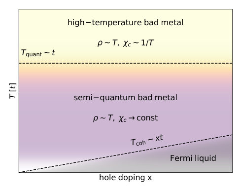
<figcaption class="paper-figure-caption"><b>Fig 1.</b> Figure 1. Schematic transport regimes of the doped infinite-U Hubbard model. The semi-quantum</figcaption>
</figure>
<figure class="paper-figure-card">
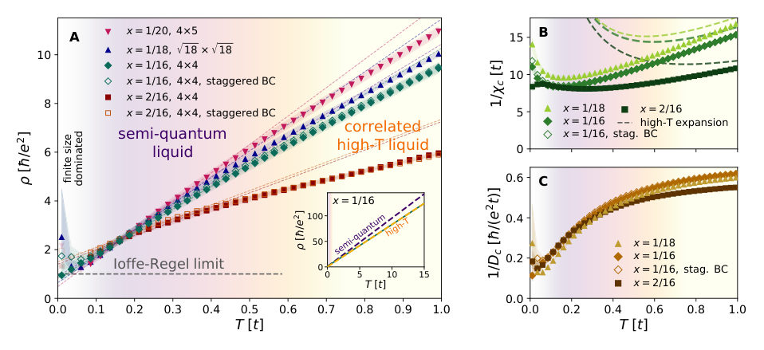
<figcaption class="paper-figure-caption"><b>Fig 2.</b> Figure 2. Bad-metallic transport regimes. (A) Twist-averaged dc resistivity for x = 1/20, 1/18, 1/16,</figcaption>
</figure>
<figure class="paper-figure-card">
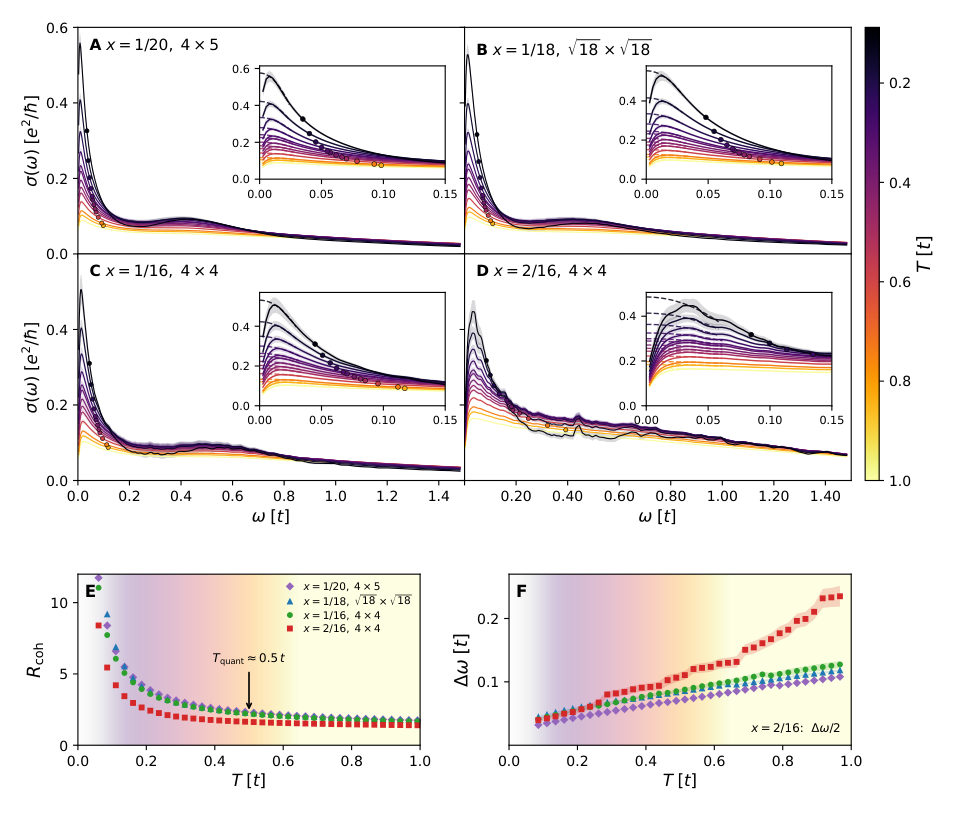
<figcaption class="paper-figure-caption"><b>Fig 3.</b> Figure 3. Optical conductivity in the semi-quantum regime. (A–D) optical conductivity σ(ω, T) for</figcaption>
</figure>
<figure class="paper-figure-card">
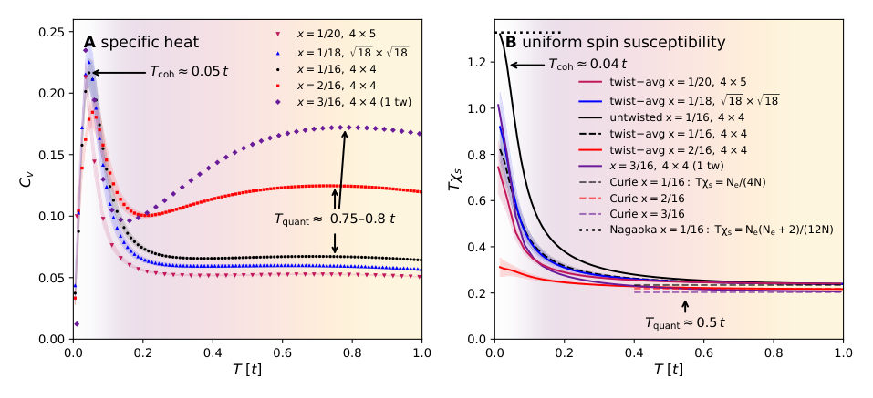
<figcaption class="paper-figure-caption"><b>Fig 4.</b> Figure 4. Thermodynamics across the semi-quantum crossover. (A) Specific heat per site for</figcaption>
</figure>
<figure class="paper-figure-card">
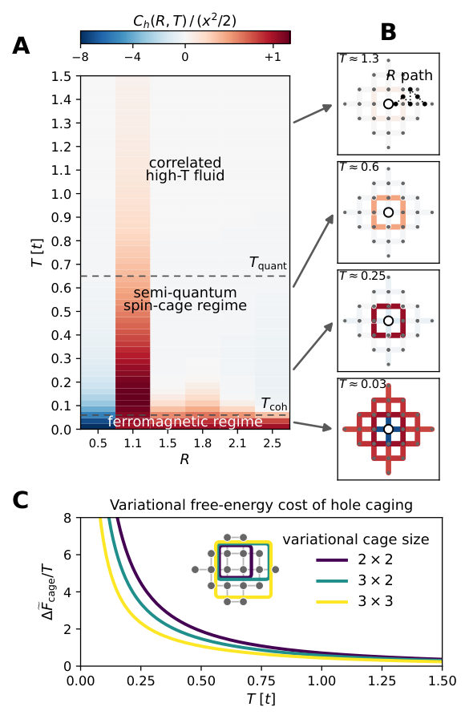
<figcaption class="paper-figure-caption"><b>Fig 5.</b> Figure 5. Formation and variational cost of a spin cage. A, Connected hole–spin-bond correlator</figcaption>
</figure>

**Summary.** This theoretical study examines 'bad metallicity' in the Hubbard model, proposing that the unusual temperature-linear resistivity arises from local quantum dynamics rather than simple thermal effects. The key finding is the emergence of a 'semi-quantum regime' characterized by the formation of spin cages around doped holes, which dictates the incoherent charge transport properties.

**Why it may be interesting.** The concept of a 'semi-quantum regime' where thermodynamics and transport decouple, governed by local quantum structures (spin cages), provides an analogy to exotic quantum states in condensed matter, which is relevant for understanding non-equilibrium dynamics in strongly correlated systems.

Detailed structure

**Main problem.** The paper investigates the origin of 'bad metallicity'—a state characterized by temperature-linear resistivity exceeding the Ioffe–Regel limit—to determine if it is a generic feature of strong local correlations.

**Main result.** The bad metal behavior in the Hubbard model is linked to the formation of quasi-local ferromagnetic 'spin cages' around doped holes, which govern incoherent charge quantum dynamics in an intermediate 'semi-quantum regime'.

**Method.** The study employs exact diagonalization on finite clusters and utilizes theoretical tools like the Nernst–Einstein decomposition and high-temperature expansions to analyze transport and thermodynamic properties.

**Model / system.** The system is the infinite-$U$ Hubbard model studied on a two-dimensional square lattice. The Hamiltonian incorporates the constraint of no double occupancy, allowing the investigation of strongly correlated electron physics.

**Key observables.** dc resistivity ($
ho$), compressibility ($\chi_c$), charge diffusivity ($D_c$), and the connected hole–spin-bond correlator ($C_h$).

**Important parameters / regimes.** Three distinct temperature regimes are identified: high-T bad metal, the intermediate 'semi-quantum regime', and the low-T Fermi liquid regime. Key scales include $T_{	ext{quant}}$ and $T_{	ext{coh}}$.

**Assumptions / limitations.** The analysis assumes that the low-doping ground state approaches a Nagaoka ferromagnetically ordered state at low temperatures.

**Figures summary.** Figures illustrate the characteristic temperature dependencies of $
ho$ and $\chi_c$ across the three regimes, showing the shift in the source of temperature dependence from thermodynamics to dynamics in the semi-quantum regime. Other figures detail the evolution of spin correlations and the caging free-energy cost.

**Paper structure.** The paper systematically analyzes the temperature dependence of transport properties, first establishing the bad metal behavior, then identifying the crossover scales ($T_{	ext{quant}}$), and finally linking the dynamics in the intermediate regime to the formation of local spin structures (spin cages).

Abstract

Bad metals exhibit approximately $T$-linear dc resistivity beyond the Ioffe--Regel limit. That this behavior occurs in systems with radically different ground states suggests it is a generic manifestation of strong local correlations. We test this hypothesis in the infinite-$U$ Hubbard model with small hole densities using exact diagonalization to compute thermodynamic and transport properties of finite clusters. Upon cooling, we find an intermediate temperature range, an electronic analogue of the ``semi-quantum regime'' of liquid helium, in which quantum effects produce a roughly $T$-independent compressibility, yet the resistivity is $T$-linear and exceeds the Ioffe--Regel limit. Entry into this regime is accompanied by the formation of quasi-local ferromagnetic ``spin cages'' around doped holes, regions that facilitate local quantum motion embedded in a fluctuating spin background, analogous to the transient crystalline cages thought to control incoherent transport in semi-quantum liquid helium. Remarkably, despite the simplicity of the model, the bad metal behavior found here resembles that seen in various material platforms.

[↑ back to top](#top)

### [Deterministic Hypergraph SYK: Melonic Dominance and Maximal Chaos Without Disorder Averaging](http://arxiv.org/abs/2609.19255v1)

**Authors:** Shiroman Prakash  
**Type:** theory · **Category:** strongly correlated electrons · **PDF:** <https://arxiv.org/pdf/2609.19255v1>  
**Analysis basis:** full PDF text, analyzed in chunks
**Topic relevance:** `Keldysh / 2PI / non-Gaussian methods` **3/5** · `analog quantum simulation` **2/5** · `methods for driven-dissipative` **1/5**

↔ Scroll figures horizontally

<figure class="paper-figure-card">
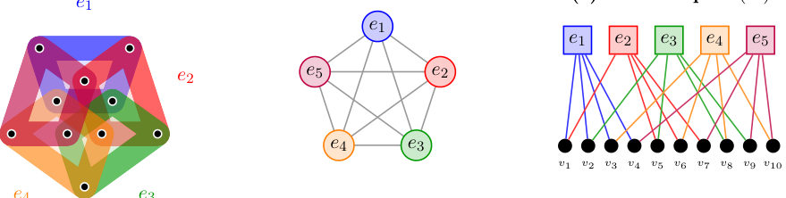
<figcaption class="paper-figure-caption"><b>Fig 1.</b> Figure 1: Three representations of a 4-uniform, 2-regular hypergraph. We present an example with |E| = 5, N = 10. (a) The physical hypergraph, where each interaction ei contains exactly q = 4 fermions. Because d = 2, every black dot lies in exactly two colored regions. (b) The line graph is fully connected (K5) because every pair of hyperedges shares exactly one fermion. (c) The bipartite Levi graph makes the parameters obvious: uniformity implies that every top node (interaction) has degree q = 4, while regularity implies that every bottom node (fermion) has degree d = 2. (Note B(H) has many cycles, so this example may not be representative of a hypergraph satisfying Axiom 2.)</figcaption>
</figure>
<figure class="paper-figure-card">
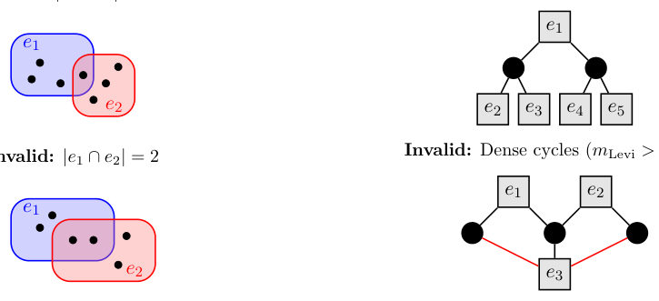
<figcaption class="paper-figure-caption"><b>Fig 2.</b> Figure 2: The two geometric axioms that must be satisfied by the hypergraph. (a) The 1-overlap condition forbids hyperedges from sharing multiple fermions. (b) The Levi sparsity axiom restricts the bipartite Levi graph (hyperedges as squares, fermions as circles). A valid model is locally tree-like. The red edges illustrate extra connections beyond the spanning tree (black), yielding a local cycle rank (mLevi) of 2. We require the density of these local cycles to remain bounded by O(1) in the limit d ≫1.</figcaption>
</figure>
<figure class="paper-figure-card">
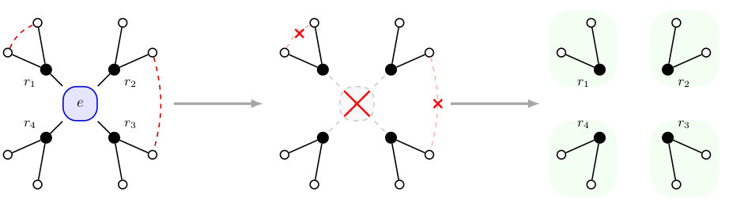
<figcaption class="paper-figure-caption"><b>Fig 3.</b> Figure 3: Schematic cavity geometry after deleting a distinguished hyperedge, shown for q = 4. (a) A radius-R neighborhood around e in the Levi graph contains four rooted branches together with O(1) short cycle-closing reconnections (dashed red). (b) Deleting e and pruning these defects produces a spanning forest with disjoint rooted neighborhoods. (c) At fixed perturbative order, couplings between distinct rooted trees require at least two additional hyperedge insertions and are therefore O(d−1).</figcaption>
</figure>
<figure class="paper-figure-card">
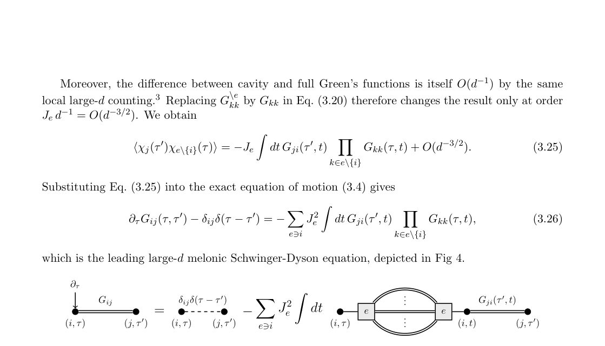
<figcaption class="paper-figure-caption"><b>Fig 4.</b> Figure 4: Leading large-d melonic Schwinger-Dyson equation, shown schematically. The left-hand side contains the kinetic and contact terms for Gij(τ, τ ′). The right-hand side is the melonic self-energy contribution: a sum over hyperedges e ∋i and intermediate time t, with q−1 site-diagonal propagators dressing the full line Gji(τ ′, t).</figcaption>
</figure>
<figure class="paper-figure-card">
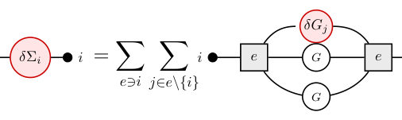
<figcaption class="paper-figure-caption"><b>Fig 5.</b> Figure 5: Diagrammatic origin of the site-space kernel K, shown schematically for q = 4. (a) The diagonal propagator is decomposed as Gi = G+δGi. (b) The leading large-d self-energy Σi is obtained by summing over hyperedges e ∋i. (c) Linearizing around the uniform saddle replaces one internal leg by δGj, and summing over e ∋i and j ∈e \ {i} yields δΣi ∝P j KijδGj.</figcaption>
</figure>

**Summary.** This paper constructs a deterministic hypergraph realization of the SYK model, aiming to show that its characteristic chaotic and melonic physics does not require random disorder averaging. By analyzing the two-point function and OTOCs using advanced techniques like the cavity formalism, the authors demonstrate that the model successfully reproduces the key theoretical predictions of SYK in a structured, non-random setting.

**Why it may be interesting.** It provides a concrete, geometrically constrained, and disorder-free platform to study universal quantum chaotic dynamics (like those seen in SYK), which is highly relevant for understanding strongly correlated quantum matter.

Detailed structure

**Main problem.** To determine if the essential melonic and chaotic features of the Sachdev-Ye-Kitaev (SYK) model can be realized in a sparse, deterministic setting without relying on disorder averaging.

**Main result.** The deterministic hypergraph SYK model (hSYK) successfully recovers the standard SYK bilocal effective action and exhibits characteristic chaotic signatures like Wigner-Dyson statistics, providing a disorder-free realization.

**Method.** The analysis uses Schwinger-Dyson equations, the cavity formalism, and spectral expansion techniques to evaluate correlation functions in the large-$d$ limit.

**Model / system.** The model is a deterministic hypergraph SYK (hSYK) defined on a $q$-uniform, $d$-regular interaction hypergraph with $N$ Majorana fermions. The interactions are sparse, scaling as $O(dN)$ rather than exponentially.

**Key observables.** Two-point function, connected four-point function, Out-of-Time-Order Correlators (OTOCs), and spectral statistics (Wigner-Dyson).

**Important parameters / regimes.** Large-$d$ limit, fixed $q \ge 4$, and the structural constraints imposed by the hypergraph geometry.

**Assumptions / limitations.** The model relies on structural axioms concerning the hypergraph, such as the 'one-overlap' condition ($|e_a \cap e_b| \le 1$) and spectral separation gaps.

**Figures summary.** Figure 1 illustrates the physical hypergraph, its line graph, and the relationship between these structures.

**Paper structure.** The paper develops the analysis by first establishing the two-point function via the Schwinger-Dyson equation and cavity formalism, then deriving the effective action, and finally confirming chaotic features using OTOCs and spectral statistics.

Abstract

We show that SYK-like melonic solvability and maximal chaos survive in a sparse deterministic model, without disorder averaging. Our deterministic hypergraph SYK model (hSYK) consists of $N$ Majorana fermions on a $q$-uniform, $d$-regular interaction hypergraph with only $O(dN)$ interaction terms and uniform positive couplings. Under explicit geometric and spectral expansion conditions, its two-point function satisfies the standard melonic Schwinger-Dyson equation up to $O(d^{-1})$ corrections, while the leading bilocal effective action coincides with that of ordinary SYK at the dominant large-$d$ saddle. Its connected four-point function factorizes into a temporal SYK ladder kernel and a line-graph random walk. A finite line-graph spectral gap controls the visibility of the maximally chaotic uniform mode in generic localized OTOCs and, by gapping non-uniform spatial modes in the bilocal spectrum, excludes additional light fluctuation modes beyond the Schwarzian. Exact diagonalization further shows melonic two-point scaling, single-instance Wigner-Dyson statistics, and the predicted graph-controlled spatial decay of OTOCs. The model therefore offers a disorder-free realization of the essential melonic and chaotic features of SYK, in a form more amenable to quantum simulation.

[↑ back to top](#top)

### [Non-Abelian Anyon Condensation: a Path-Integral Monte Carlo Approach](http://arxiv.org/abs/2609.19282v1)

**Authors:** Rafael Flores-Calderón, Frank Pollmann, Michael Knap  
**Type:** theory · **Category:** statistical mechanics · **PDF:** <https://arxiv.org/pdf/2609.19282v1>  
**Analysis basis:** full PDF text, analyzed in chunks
**Topic relevance:** `methods for driven-dissipative` **3/5** · `analog quantum simulation` **2/5** · `Keldysh / 2PI / non-Gaussian methods` **1/5**

↔ Scroll figures horizontally

<figure class="paper-figure-card">
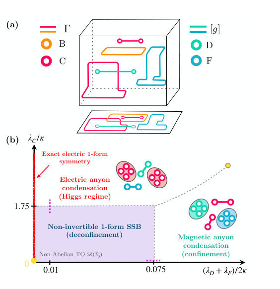
<figcaption class="paper-figure-caption"><b>Fig 1.</b> FIG. 1. From anyon condensation to a classical lattice gauge– Higgs theory. (a) The lattice path integral lifts the two-dimensional quantum-double model in a field (bottom) to a three-dimensional classical ensemble of electric Γ ∈Rep(G) and magnetic [g] ∈ Class(G) strings. (b) Phase diagram of D(S3), where short open electric strings proliferate the C anyon (Γ = E), while magnetic strings proliferate the D and F anyons (fluxes [s] and [r], respec- tively). Here κ is the plaquette energy scale. Along the vertical axis (red), the Hamiltonian preserves an exact non-invertible electric 1- form symmetry. Gray dashed lines denote first-order transitions, and purple dashed lines mark the cuts we...</figcaption>
</figure>
<figure class="paper-figure-card">
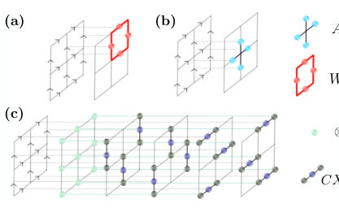
<figcaption class="paper-figure-caption"><b>Fig 2.</b> FIG. 2. Local operators and the matterization circuit. (a) Qu- dits are placed on the links of the oriented lattice. The elementary Wilson loop W Γ(∂p) measures the plaquette flux in irrep Γ. We define Oℓs = −(+) when ℓpoints away from (toward) a vertex s, and Oℓp = −(+) indicates that the conjugate ¯Γ (Γ) representation is used if the orientation of the link is opposite (equal) to the plaquette path ordering P direction. (b) The star operator Ag(s) acts by group multiplication on the four links adjacent to s. (c) The matterization isometry appends a vertex G-qudit (cyan dot) and uses controlled left and right multiplications, denoted CXs,ℓ −CXs′,ℓ + , to rewrite ev- ery link relative to...</figcaption>
</figure>
<figure class="paper-figure-card">
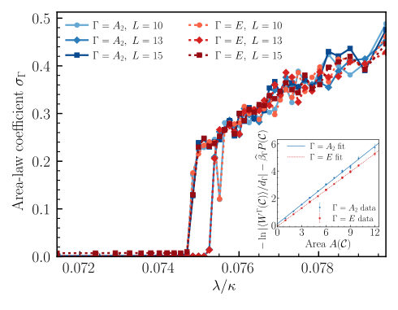
<figcaption class="paper-figure-caption"><b>Fig 3.</b> FIG. 3. Onset of the Wilson-loop area law at the confinement transition. Effective area coefficient extracted from contractible A2 (solid) and E (dotted) Wilson loops for β = 50, and ∆τ = 0.3. The fit includes both area and perimeter law contributions (inset λ/κ = 0.079). The good overlap of the two irreps is consistent with the leading order representation-independent strong-field result. The sharp onset of the area coefficient marks confinement. Here, we set λD = λF = λ and λC = 0.</figcaption>
</figure>
<figure class="paper-figure-card">
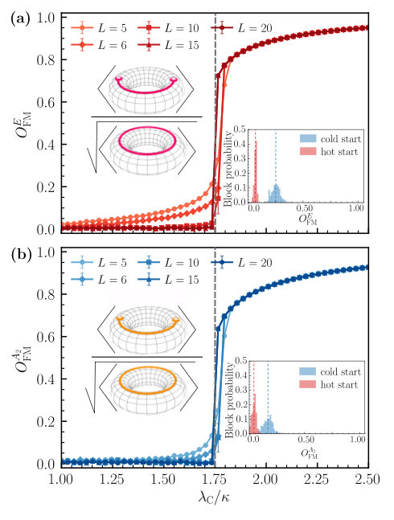
<figcaption class="paper-figure-caption"><b>Fig 4.</b> FIG. 4. Irrep-resolved electric-anyon condensation.Fredenhagen– Marcu order parameters (a) OE FM and (b) OA2 FM versus λC/κ for the S3 gauge–Higgs theory at J/κ = 10, λ/κ = 0.01, and λB = 0. We use β = 50 and ∆τ = 0.1. A simultaneous transition is ob- served at λC/κ ≃1.75 in both FM order parameters (gray dashed line). Left insets show a schematic of the FM string order parameter associated with electric anyons C (pink) and B (orange). Right in- sets show long-lived low- and high-FM order parameter branches at λC/κ = 1.75 obtained from hot and cold starts, respectively, provid- ing evidence for metastability consistent with a first-order transition. We present additional histograms in SM...</figcaption>
</figure>
<figure class="paper-figure-card">
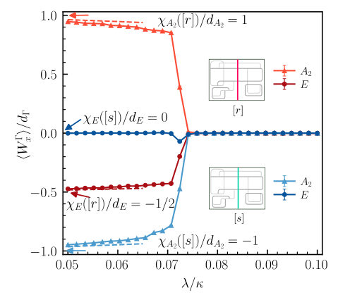
<figcaption class="paper-figure-caption"><b>Fig 5.</b> FIG. 5. Higher-form symmetry breaking and confinement. Non- contractible x-cycle Γ = {A2, E} Wilson loops for S3 at L = 10, β = 60 and ∆τ = 0.3 for different initial random Monte Carlo runs, blue and red. In the deconfined phase the [s] (blue) and [r] (red) flux sectors retain distinct expectation values approaching their respective characters as indicated by the arrows; the perturbative re- sult in λ/κ is shown as dashed lines. The values of the Wilson loops for each branch are consistent with fixed magnetic 1-form symmetry sectors indicating a broken emergent magnetic 1-form symmetry de- tected via electric 1-form symmetry operators. Across confinement all branches collapse to zero and...</figcaption>
</figure>

**Summary.** This work develops a novel, sign-free path-integral Monte Carlo approach to study transitions out of non-Abelian topological order in Kitaev quantum double models. By mapping the system to a gauge-Higgs theory, the authors successfully diagnose non-Abelian anyon condensation and confinement transitions. The results provide a unified numerical tool for understanding complex topological phase transitions in condensed matter systems.

**Why it may be interesting.** The rigorous development of a sign-free path-integral method to study topological phase transitions in lattice gauge theories is highly relevant to understanding emergent phenomena in strongly correlated quantum matter systems.

Detailed structure

**Main problem.** The paper addresses the difficulty of describing transitions out of non-Abelian topological order using standard numerical methods at large scales.

**Main result.** The authors provide a unified numerical framework demonstrating non-Abelian anyon condensation and confinement transitions in Kitaev quantum doubles for $G=S_3$. Specifically, electric anyon proliferation drives a first-order condensation transition.

**Method.** The methodology involves developing a sign-free path-integral framework by mapping the link-only model onto a $G$ gauge–Higgs theory via an exact matterization isometry. Quantum Monte Carlo simulations are used to analyze the resulting lattice gauge-Higgs model.

**Model / system.** The system is based on Kitaev quantum doubles $\mathcal D(G)$ defined on a lattice, which are perturbed by single-link operators to probe anyon condensation. This model is mathematically transformed into a $(2+1)$D $G$ gauge–Higgs theory.

**Key observables.** Generalized Fredenhagen–Marcu (FM) order parameters (for condensation) and Wilson loops (for confinement).

**Important parameters / regimes.** The group $G$ (specifically $S_3$), and coupling ratios like $\lambda_a/\kappa$ controlling the type of anyon proliferation.

**Assumptions / limitations.** The analysis relies on the existence of a unitary transformation and an isometry to map the quantum double model to a classical gauge-Higgs theory, and the use of the Trotter approximation in the path integral.

**Figures summary.** Figures illustrate the path integral lifting to a gauge-Higgs theory, the action of local operators via the matterization circuit, and the diagnostic plots showing the onset of the Wilson-loop area law and the finite jump in FM order parameters.

**Paper structure.** The paper proceeds by first establishing the physical problem and the need for a tractable numerical framework. It then details the mathematical machinery: the matterization isometry and the transformation of the Hamiltonian to the gauge-Higgs form. Finally, it applies this framework to analyze specific transitions (condensation and confinement) using Monte Carlo simulations and order parameters.

Abstract

Transitions out of non-Abelian topological order are difficult to describe in microscopic quantum models with numerical methods that remain tractable at large scales. We develop a sign-free path-integral framework for Kitaev quantum doubles $\mathcal D(G)$ by organizing single-link perturbations in terms of non-invertible electric and magnetic 1-form symmetries that proliferate distinct anyon species. For any finite group $G$, an exact $\textit{matterization}$ isometry introduces vertex degrees of freedom and maps the link-only model onto a $G$ gauge--Higgs theory. Furthermore, the 1-form symmetries of the fixed point allow us to define generalized Fredenhagen--Marcu order parameters that become finite when the corresponding anyons condense. For $G = S_3$, quantum Monte Carlo simulations show that proliferating a non-Abelian electric anyon drives a first-order transition in which all nontrivial electric anyons condense. In the purely magnetic limit, the model reduces to a $(2+1)$D pure $G$ gauge theory; for $G=S_3$, it exhibits a first-order confinement transition, diagnosed by the onset of a Wilson-loop area law and the restoration of an emergent magnetic 1-form symmetry. These results provide a unified numerical framework for non-Abelian anyon condensation, confinement, and generalized symmetry breaking.

[↑ back to top](#top)

### [Transduction-Enabled Superconducting Quantum Repeater: Toward Deterministic Entanglement Distribution with High-Fidelity Gates](http://arxiv.org/abs/2609.19784v1)

**Authors:** Francesco Fiorini, Jing Wu, Andrew Cameron, Changqing Wang, Doga M. Kurkcuoglu, Rosario G. Garroppo, Michele Pagano, Silvia Zorzetti  
**Type:** theory · **Category:** quantum information and computing · **PDF:** <https://arxiv.org/pdf/2609.19784v1>  
**Analysis basis:** full PDF text, analyzed in chunks
**Topic relevance:** `QC/QI experiment` **3/5** · `quantum optics experiment` **2/5** · `quantum measurements` **1/5**

↔ Scroll figures horizontally

<figure class="paper-figure-card">
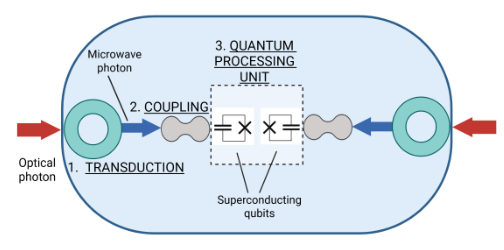
<figcaption class="paper-figure-caption"><b>Fig 1.</b> FIG. 1. Illustration of TESQR node architecture performing joint measurement on two optical photons via transduction, coupling, and superconducting QPU.</figcaption>
</figure>
<figure class="paper-figure-card">
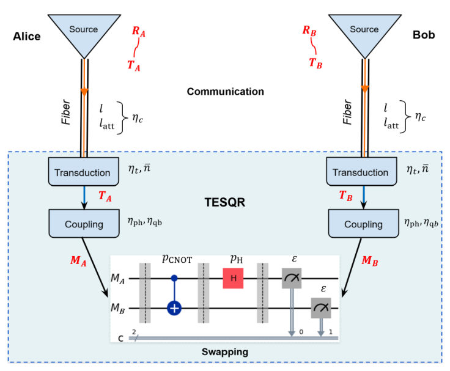
<figcaption class="paper-figure-caption"><b>Fig 2.</b> FIG. 2. Schematic of the network architecture. The setup features Alice and Bob at the endpoints, each producing an entangled pair: a transmitted photonic qubit (TA or TB) in single-rail Fock-state encoding and a remote superconducting qubit (RA or RB). Photonic qubits travel through optical fibers of length l with transmissivity ηc = e−l/latt (latt = 22 km, equivalent to 0.2 dB/km at 1550 nm). At the TESQR node, optical-to-microwave conversion occurs via electro-optic transduction with efficiency ηt and thermal noise photon number ¯n. Microwave photons couple to superconducting qubits MA and MB with photon availability ηph and transition efficiency ηqb. Gate-based entanglement swapping...</figcaption>
</figure>
<figure class="paper-figure-card">
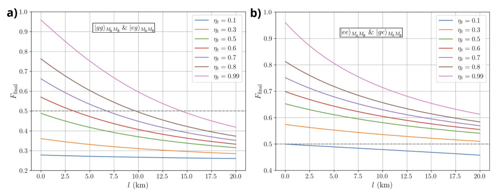
<figcaption class="paper-figure-caption"><b>Fig 3.</b> FIG. 3. Final output fidelity Ffinal as a function of fiber length l (km), for various transduction efficiency values and for MAMB measurement outcomes: a) |gg⟩MAMB and |eg⟩MAMB, b) |ee⟩MAMB and |ge⟩MAMB. The other network parameters are set according to Table IV.</figcaption>
</figure>
<figure class="paper-figure-card">
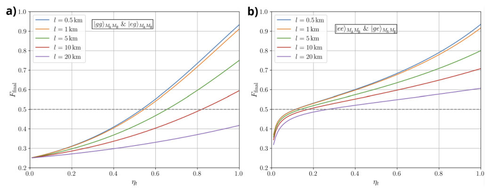
<figcaption class="paper-figure-caption"><b>Fig 4.</b> FIG. 4. Final output fidelity Ffinal as a function of transduction efficiency ηt, for various fiber length values and for MAMB measurement outcomes: a) |gg⟩MAMB and |eg⟩MAMB, b) |ee⟩MAMB and |ge⟩MAMB. The other network parameters are set according to Table IV.</figcaption>
</figure>
<figure class="paper-figure-card">
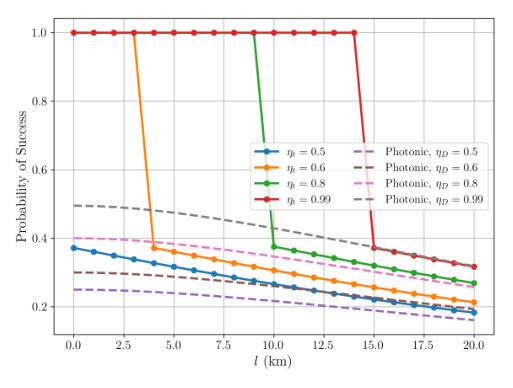
<figcaption class="paper-figure-caption"><b>Fig 5.</b> FIG. 6. Swapping success probability versus fiber length l (km) for the hybrid TESQR scheme (solid curves) and the photonic counterpart (dashed curves), plotted for different transduction efficiencies ηt and photodetection efficiencies ηD.</figcaption>
</figure>

**Summary.** This paper introduces the Transduction-Enabled Superconducting Quantum Repeater (TESQR) to overcome the probabilistic limitations of current quantum repeaters. By integrating superconducting circuits to perform deterministic entanglement swapping, the scheme significantly boosts entanglement distribution rates and maintains high fidelity over practical distances. It represents a crucial step toward building scalable quantum communication networks.

**Why it may be interesting.** This work directly addresses the engineering challenge of scaling quantum networks by proposing a concrete, high-fidelity physical implementation that bridges the gap between long-haul photonics and solid-state quantum computation.

Detailed structure

**Main problem.** Long-distance entanglement distribution is limited by photon loss and the probabilistic nature of Bell State Measurements (BSMs) in traditional quantum repeaters.

**Main result.** The proposed Transduction-Enabled Superconducting Quantum Repeater (TESQR) improves entanglement distribution rates by up to 159% and achieves end-to-end fidelities exceeding 0.8 over 20 km after purification.

**Method.** The authors propose a hybrid architecture combining photonic qubits with superconducting circuits to enable deterministic entanglement processing, avoiding probabilistic BSMs.

**Model / system.** The system integrates three components at the repeater node: quantum transduction (optical to microwave), coupling to a superconducting QPU, and local entanglement swapping performed via microwave gates. The analysis uses quantum channel formalism and density matrix evolution.

**Key observables.** Output-state fidelities, success probabilities of entanglement distribution, and end-to-end fidelities.

**Important parameters / regimes.** Fiber length (up to 20 km), transduction efficiency ($\eta_t$), coupling efficiencies ($\eta_{ph}, \eta_{qb}$), and gate error rates.

**Assumptions / limitations.** Ideal memory performance is assumed, and the analysis initially focuses on quantum-processing performance metrics rather than resource costs.

**Figures summary.** Figure 1 illustrates the TESQR node architecture (Transduction $
ightarrow$ Coupling $
ightarrow$ Superconducting QPU). Other figures analyze the degradation of fidelity due to asymmetries in transduction efficiency, fiber length, and thermal noise.

**Paper structure.** The paper first establishes the limitations of current quantum repeaters, then details the TESQR architecture, models the state evolution through sequential steps (Source $
ightarrow$ Transmission $
ightarrow$ Transduction $
ightarrow$ Coupling $
ightarrow$ Swapping), and finally analyzes the performance under various noise and asymmetry conditions.

Abstract

Long-distance entanglement distribution is hindered by photon loss in optical fibers and the nocloning theorem. Optical quantum repeater (QR) protocols rely on Bell state measurements (BSMs), they are intrinsically limited to probabilistic photon operations and fail 50% of the time. We propose a hybrid approach to building quantum repeaters that combines the high transmission speed of photonic qubits in optical fiber with the high-fidelity quantum processing capabilities enabled by superconducting circuits. The transduction-enabled superconducting QR (TESQR) architecture eliminates the need for probabilistic BSMs and allows deterministic processing operations. The TESQR framework always yields a final state at the remote nodes rather than aborting on photon loss, manifesting deterministic entanglement distribution within certain parameter regimes. We evaluate the performance by assessing output-state fidelities and success probabilities of entanglement distribution using realistic noise models. Additionally, we integrate an entanglement purification scheme and evaluate the performance through numerical simulations in QuTiP environment. Our results show that, for entanglement swapping, the proposed scheme improves the entanglement distribution rate by an average of 63% and by up to 159% compared with photonic-only architectures. Moreover, after purification, the end-to-end fidelities exceed 0.8 over distances up to 20 km.

[↑ back to top](#top)

### [Universal 1/f Noise in the Power Spectra of Energy Time-series in Solvated DNA Dynamics](http://arxiv.org/abs/2609.20391v1)

**Authors:** Harsh Sahu, Deepika Sardana, Pramod Kumar, Ajay Kumar Chand, Sobhan Sen, Sanjay Puri  
**Type:** both · **Category:** statistical mechanics · **PDF:** <https://arxiv.org/pdf/2609.20391v1>  
**Analysis basis:** full PDF text, analyzed in chunks
**Topic relevance:** `non-equilibrium universality` **3/5** · `correlated / nonlocal dissipation` **1/5** · `driven-dissipative phase transition` **1/5** · `scars & prethermalization` **1/5**

↔ Scroll figures horizontally

<figure class="paper-figure-card">
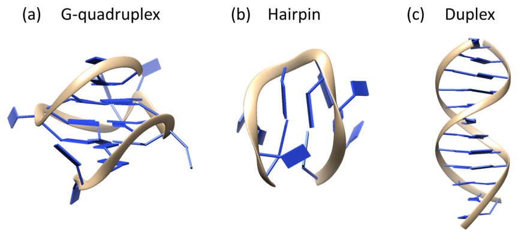
<figcaption class="paper-figure-caption"><b>Fig 1.</b> FIG. 1. Schematic illustration depicting experimentally determined structures of DNA, (a) G-</figcaption>
</figure>
<figure class="paper-figure-card">
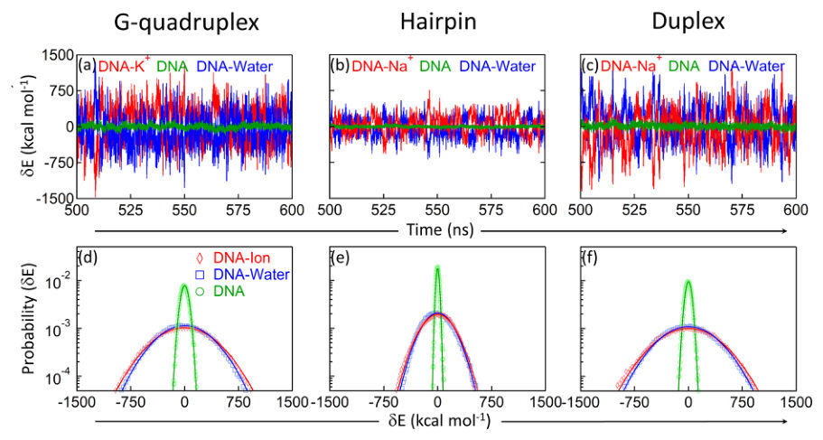
<figcaption class="paper-figure-caption"><b>Fig 2.</b> FIG. 2. (a)-(c) Energy fluctuations of DNA self (δE1, green), DNA-water (δE2, blue), DNA-ion</figcaption>
</figure>
<figure class="paper-figure-card">
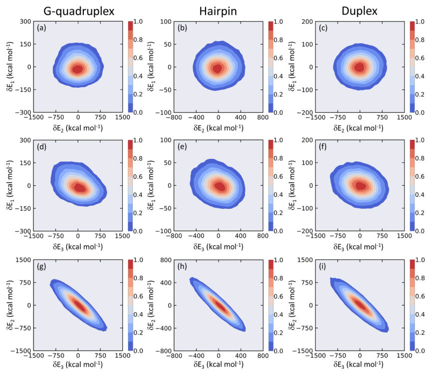
<figcaption class="paper-figure-caption"><b>Fig 3.</b> FIG. 3. Contour representation of bivariate distributions of δE1, δE2, δE3 for (a), (d), (g) G4</figcaption>
</figure>
<figure class="paper-figure-card">
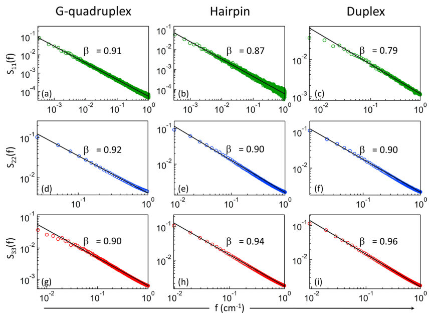
<figcaption class="paper-figure-caption"><b>Fig 4.</b> FIG. 4. Log-log plot of power spectra, Sii(f) vs. f, of energy time-series for δE1, δE2, δE3. We</figcaption>
</figure>
<figure class="paper-figure-card">
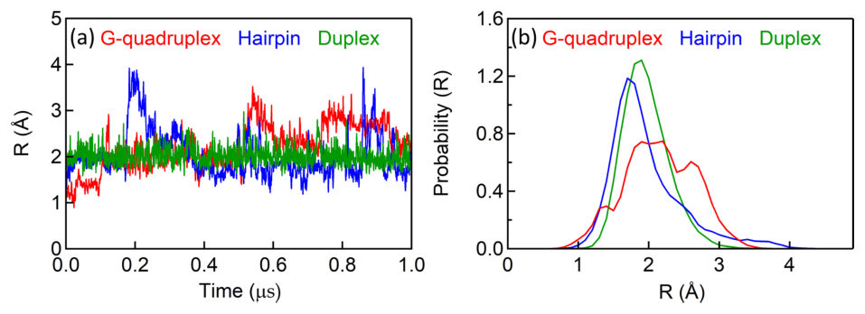
<figcaption class="paper-figure-caption"><b>Fig 5.</b> FIG. 5. (a) Time evolution of the root-mean-square deviation R(t) for the DNA backbone of G4</figcaption>
</figure>

**Summary.** This work uses molecular dynamics simulations to study energy fluctuations in solvated DNA across three topologies. The key finding is that the energy time-series exhibit universal 1/f noise, with the degree of low-frequency spectral power directly correlating with the structural flexibility of the DNA conformation. This highlights how topological constraints govern the stochastic dynamics of biomolecules in solution.

**Why it may be interesting.** The finding of universal $1/f$ noise across different structural states, coupled with the explicit link between structural flexibility and the low-frequency spectral components, provides insights into non-equilibrium dynamics relevant to biological energy dissipation.

Detailed structure

**Main problem.** The study investigates the universal nature of 1/f noise in the power spectra of energy time-series fluctuations within solvated DNA dynamics, and how DNA topology modulates its coupling with the surrounding environment.

**Main result.** All analyzed energy time-series exhibit universal 1/f noise with an exponent $\beta \simeq 0.90$, but flexible structures (G-quadruplex, Hairpin) show pronounced low-frequency modes compared to the rigid Duplex.

**Method.** The research employs comprehensive atomistic Molecular Dynamics (MD) simulations to calculate energy fluctuations ($\delta E$) and subsequently analyze their power spectral density ($S(f)$) via the Discrete Fourier Transform (DFT).

**Model / system.** The physical system is solvated DNA modeled in three distinct conformations: G-quadruplex, Hairpin, and Duplex. The environment includes explicit water molecules and mobile counter-ions, simulated using established force fields.

**Key observables.** Energy fluctuations ($\delta E_{DNA\text{-}DNA}$, $\delta E_{DNA\text{-}water}$, $\delta E_{DNA\text{-}ion}$), Pearson correlation coefficients ($\rho_{ij}$), and the power spectral density $S_{ii}(f)$ exhibiting $1/f$ noise.

**Important parameters / regimes.** The universal decay exponent $\beta \simeq 0.90$, and the structural rigidity differences between the three DNA forms.

**Assumptions / limitations.** The analysis assumes the system is in a stationary regime for power spectrum calculation, and that the observed noise characteristics reflect the underlying physical coupling mechanisms.

**Figures summary.** Figures show typical time-series and probability distributions of energy fluctuations, contour plots of bivariate distributions, and log-log plots of power spectra $S_{ii}(f)$ confirming the power-law scaling.

**Paper structure.** The paper systematically analyzes energy correlations ($\rho_{ij}$) between DNA self, water, and ion energies, demonstrating strong anti-correlation between water and ion energies. It then analyzes the power spectra $S_{ii}(f)$ across the three DNA structures, contrasting the low-frequency behavior dictated by structural flexibility.

Abstract

We investigate energy fluctuations of solvated DNA in three conformations: G-quadruplex, Hairpin, and Duplex. Our comprehensive molecular dynamics (MD) simulations demonstrate that the time-series of interaction energies for DNA self, DNA-water and DNA-ion show 1/f noise with a universal decay exponent $β\simeq 0.90$. We show that DNA topology and structural rigidity modulate its dynamic coupling with the surrounding hydration shell and mobile counter-ions. This coupling critically shapes the 1/f noise profile: DNA self energies in flexible structures (G-quadruplex, Hairpin) display pronounced low-frequency modes absent in the rigid Duplex. These findings reveal how the interplay between DNA topology and environmental coupling governs different stochastic behavior in biologically relevant forms of DNA.

[↑ back to top](#top)

### [Scaling and Condensation of Dry Active Matter Around Circular Obstacles](http://arxiv.org/abs/2609.20743v1)

**Authors:** Felipe P. S. Júnior, F. Q. Potiguar, Jorge L. C. Domingos, W. P. Ferreira  
**Type:** theory · **Category:** statistical mechanics · **PDF:** <https://arxiv.org/pdf/2609.20743v1>  
**Analysis basis:** full PDF text, analyzed in chunks
**Topic relevance:** `non-equilibrium universality` **3/5** · `Frenkel-Kontorova` **1/5** · `driven-dissipative phase transition` **1/5**

↔ Scroll figures horizontally

<figure class="paper-figure-card">
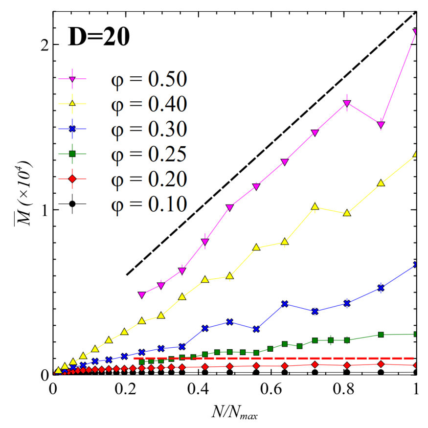
<figcaption class="paper-figure-caption"><b>Fig 1.</b> FIG. 1. Total vortex mass, M, as a function of the total number of particles normalized by the</figcaption>
</figure>
<figure class="paper-figure-card">
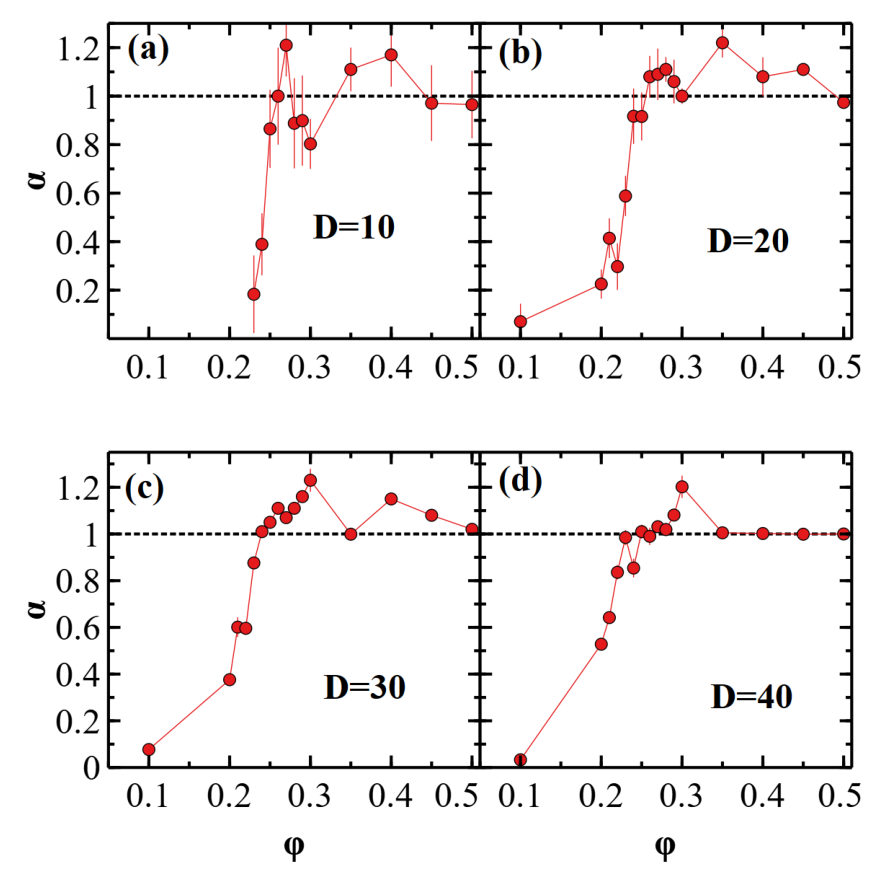
<figcaption class="paper-figure-caption"><b>Fig 2.</b> FIG. 2. Mass exponent α, as a function of the density for different obstacle sizes: (a) D = 10, (b)</figcaption>
</figure>
<figure class="paper-figure-card">
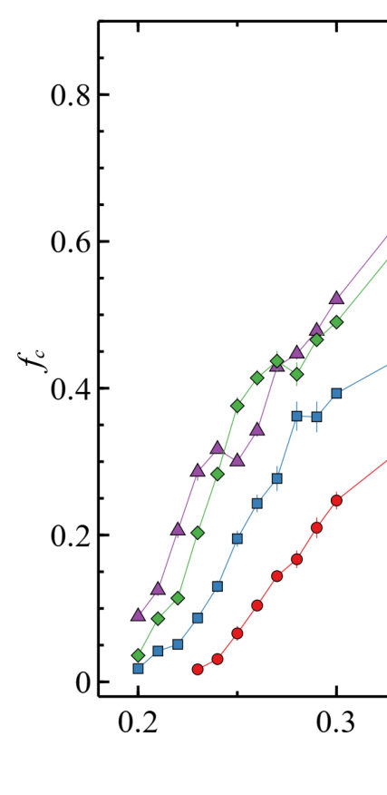
<figcaption class="paper-figure-caption"><b>Fig 3.</b> FIG. 3. Vortex mass fraction, fc, as a function of density, for all obstacle diameters.</figcaption>
</figure>
<figure class="paper-figure-card">
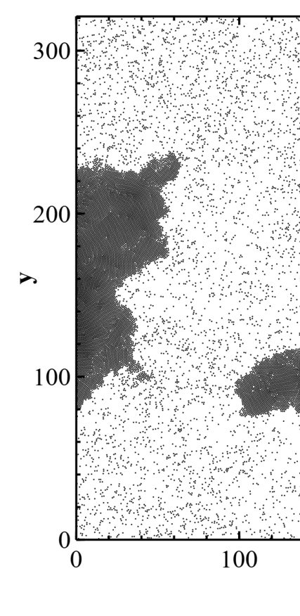
<figcaption class="paper-figure-caption"><b>Fig 4.</b> FIG. 4. System configuration at φ = 0.50, D = 40, and L = 320 (L/D = 8).</figcaption>
</figure>
<figure class="paper-figure-card">
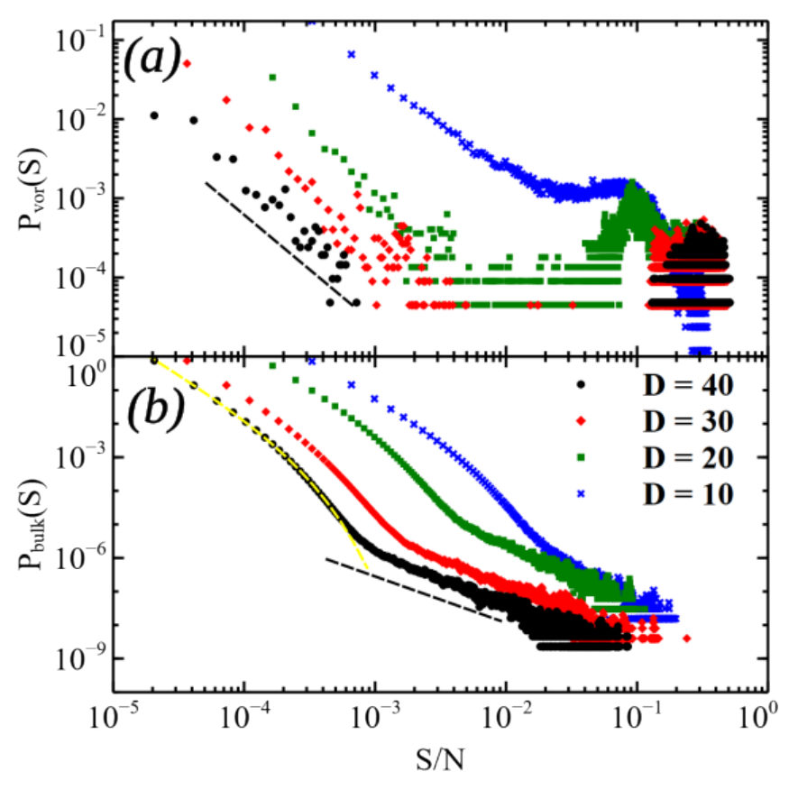
<figcaption class="paper-figure-caption"><b>Fig 5.</b> FIG. 5. Cluster Size Distribution for the vortex, Pvor(S), panel (a), and the bulk, Pbulk(S), panel</figcaption>
</figure>

**Summary.** This work studies active matter confined by circular obstacles, finding that the resulting vortices can undergo a phase transition. Below a critical density, the vortex remains localized, but above it, the vortex forms an extensive, obstacle-stabilized condensate. The findings establish a clear link between local geometry and macroscopic phase behavior in active systems.

**Why it may be interesting.** The concept of obstacle-stabilized condensation in active matter provides a non-equilibrium mechanism for phase separation that is distinct from bulk MIPS, offering insights into pattern formation in complex active systems.

Detailed structure

**Main problem.** The paper investigates how the mass and spatial extent of self-sustained vortices formed by dry active matter scale with system size, particularly analyzing the transition between localized and extensive condensed states.

**Main result.** The system exhibits two distinct scaling regimes: at low densities, the vortex is localized, but above a critical density, the vortex mass grows extensively with the total particle number, indicating an obstacle-stabilized condensed state.

**Method.** The study uses numerical simulations of Active Brownian Particles (ABPs) interacting with a fixed circular obstacle, analyzing scaling laws and comparing results to a derived kinetic model.

**Model / system.** The system consists of dry active matter particles modeled by an overdamped Langevin equation, interacting via repulsive forces near a circular obstacle. The analysis focuses on the resulting vortex structures and their thermodynamic limit behavior.

**Key observables.** Vortex mass (M), mean radius (R), maximum radius (R_max), and the scaling exponent ($\alpha$) relating vortex mass to particle number ($M \sim N^\alpha$).

**Important parameters / regimes.** Global area fraction ($\phi$), obstacle size ($D$), system size ($L$), and the critical density ($\phi^*_b$) separating scaling regimes.

**Assumptions / limitations.** The analysis assumes purely repulsive interactions and focuses on the thermodynamic limit behavior of the active system.

**Figures summary.** Figures illustrate the density dependence of vortex mass scaling ($\alpha$ vs $\phi$), the vortex mass fraction ($f_c$ vs $\phi_t$), and the scaling of vortex radii ($R, R_{max}$) with system size ratios ($L/D$).

**Paper structure.** The paper progresses by defining the physical model and observables, establishing the two distinct scaling regimes (low vs. high density), developing a kinetic model to explain the transition, and finally analyzing the geometric properties of the resulting condensate.

Abstract

Active Brownian particles confined to rigid substrates are known to accumulate near rigid boundaries and, under suitable conditions, undergo motility-induced phase separation (MIPS). A particularly intriguing manifestation of this behavior is the formation of self-sustained vortices around circular obstacles, which act as localized nucleation sites for particle aggregation. While several dynamical properties of such vortices have been previously characterized, their behavior in the thermodynamic limit remains largely unexplored. Here, we investigate how the mass and spatial extent of a dry active-matter vortex scale with system size. Using numerical simulations of repulsive active Brownian Particles interacting with a fixed circular obstacle, we measure the vortex mass, mean radius, and maximum radius as functions of the global area fraction, obstacle size, and system size. We find two distinct scaling regimes. At low densities, the vortex remains localized and its characteristic properties saturate as the system size increases. Above a critical density, however, the vortex mass grows extensively with the total number of particles, while its spatial dimensions scale linearly with the system size, indicating the emergence of an obstacle-stabilized condensed state.

[↑ back to top](#top)

### [Temporal information processing on a 4,500-qubit quantum annealer](http://arxiv.org/abs/2609.19308v1)

**Authors:** Antonio Sannia, Roberto Menta, Pratik Sathe, Dario De Santis, Vittorio Giovannetti, Luis Pedro García-Pintos, Davide Venturelli, Gian Luca Giorgi, Roberta Zambrini, Francesco Caravelli  
**Type:** both · **Category:** disordered systems and neural networks · **PDF:** <https://arxiv.org/pdf/2609.19308v1>  
**Analysis basis:** full PDF text, analyzed in chunks
**Topic relevance:** `QC/QI experiment` **3/5** · `analog quantum simulation` **1/5** · `quantum measurements` **1/5**

↔ Scroll figures horizontally

<figure class="paper-figure-card">
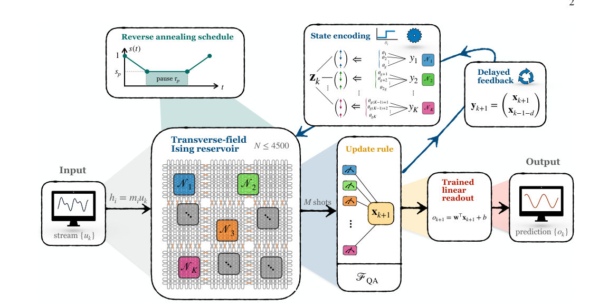
<figcaption class="paper-figure-caption"><b>Fig 1.</b> FIG. 1. Quantum reservoir computing on a quantum annealer. At each time step k, the input uk is encoded into the local fields of the transverse-field Ising Hamiltonian via random masks, hi = miuk. The reservoir state is combined with components delayed by d time steps and discretized using qubit-dependent random thresholds θi to define the initial spin configuration for reverse annealing. The final state is sampled M times, and the measured spins are coarse-grained over groups of g physical qubits to obtain the next reservoir state. Only the linear readout is trained, while all quantum-reservoir parameters remain fixed.</figcaption>
</figure>
<figure class="paper-figure-card">
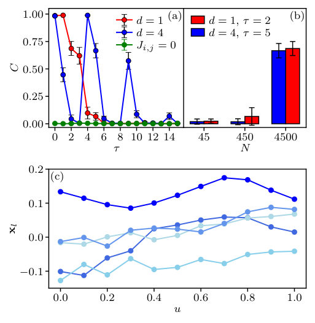
<figcaption class="paper-figure-caption"><b>Fig 2.</b> FIG. 2. Reservoir response to real-valued random input streams. (a) Linear memory capacity versus delay τ for feedback delays d = 1 and d = 4, for Jij ∈[−0.1, 0.1] compared with the non-interacting case Jij = 0, for N = 4,500 physical qubits. (b) Linear memory capacity versus reservoir size N. (c) Representative reservoir-state components xl after a constant input stream of value u, for d = 1 and N = 4,500. In all the panels, M = 103 measurements and K = 45 reservoir nodes are used. Error bars in (a)-(b) indicate the standard deviation over five independent realizations of couplings, masks, and input data.</figcaption>
</figure>
<figure class="paper-figure-card">
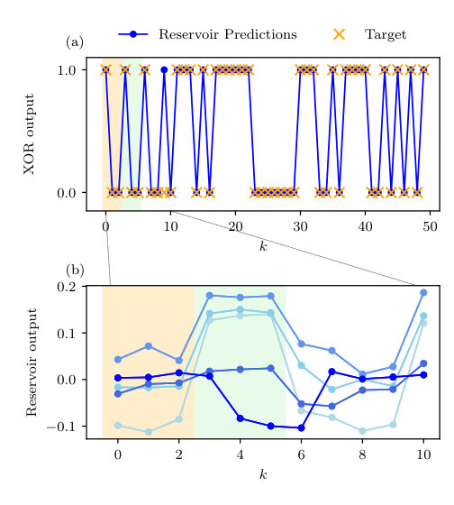
<figcaption class="paper-figure-caption"><b>Fig 3.</b> FIG. 3. XOR task. (a) Target values and reservoir predictions over discrete time steps during the test phase. (b) Representative components of the reservoir response over time for a smaller test segment. The reservoir uses feedback delay d = 1; magnetizations are estimated from M = 103 measurements to compute K = 45 outputs.</figcaption>
</figure>
<figure class="paper-figure-card">
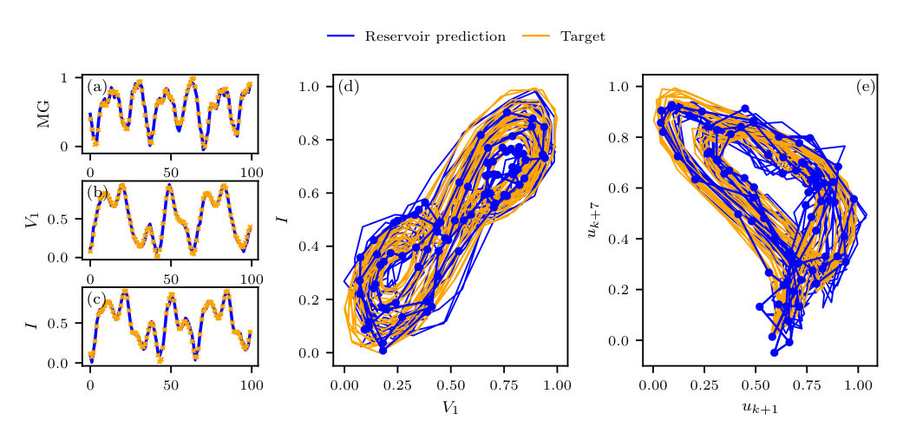
<figcaption class="paper-figure-caption"><b>Fig 4.</b> FIG. 4. Chaotic time-series forecasting. Reservoir predictions and target values for a representative 100-point segment of the test set: (a) Mackey–Glass series, and the (b) V1 and (c) I components of the double-scroll system. Chaotic attractors reconstructed from the Double-Scroll (d) and Mackey–Glass (e) series. The reservoir hyperparameters are d = 1, M = 103, and K = 45. For the attractor reconstruction shown in panel (d), the output layer was built by combining the outputs of the five reservoir realizations, all driven by the same input stream. All the other panels refer to one representative reservoir realization.</figcaption>
</figure>

**Summary.** This paper reports the largest-scale quantum machine learning experiment to date, implementing a Quantum Reservoir Computing model on a 4,500-qubit quantum annealer. By leveraging the complex, non-linear dynamics of reverse annealing, the model successfully processes temporal data, demonstrating memory retention and accurately forecasting chaotic time series. This establishes quantum annealers as a scalable platform for advanced quantum machine learning applications.

**Why it may be interesting.** The work directly bridges quantum computation hardware (quantum annealers) with advanced machine learning paradigms (Reservoir Computing), providing empirical evidence of quantum advantage in complex time-series analysis, which is highly relevant to open quantum systems modeling.

Detailed structure

**Main problem.** The paper addresses the challenge of creating large-scale, expressive quantum machine learning models capable of processing complex temporal data while avoiding prohibitively expensive training procedures.

**Main result.** They demonstrate that quantum annealers can successfully process temporal data up to 4,500 qubits, showing memory revivals and accurately forecasting chaotic time series, proving the platform's scalability.

**Method.** The authors implement a Quantum Reservoir Computing (QRC) protocol, using the intrinsic, non-linear dynamics generated by reverse annealing on the quantum annealer to map temporal inputs into a high-dimensional quantum feature space.

**Model / system.** The physical platform is a programmable superconducting quantum annealer (up to 4,500 qubits). The model utilizes the native many-body dynamics generated by reverse annealing of a transverse-field Ising Hamiltonian, employing a feedback delay to enhance memory.

**Key observables.** Memory capacity (quantified by correlation coefficient), classification accuracy (for XOR task), and Normalized Mean Squared Error (NMSE) for forecasting chaotic time series.

**Important parameters / regimes.** Number of qubits (up to 4,500), feedback delay ($d$), and the annealing schedule parameters.

**Assumptions / limitations.** The primary assumption is that the complex, interacting dynamics generated during annealing are essential for memory retention, as non-interacting reservoirs fail to retain memory.

**Figures summary.** Figures illustrate the QRC schematic, memory capacity vs. delay (showing revivals), successful solving of the XOR task, and the ability to forecast chaotic time series like Mackey-Glass and double-scroll systems.

**Paper structure.** The paper introduces the QRC framework, details the experimental implementation on the annealer, validates the necessity of quantum interactions by comparing it to non-interacting models, and finally benchmarks the model's performance on nonlinear tasks and chaotic time-series forecasting.

Abstract

Quantum machine learning could uncover statistical structure beyond the reach of classical models, but this requires quantum models large and expressive enough to be useful and cheap enough to read out. Most approaches optimize many quantum parameters and are thus limited by expensive training loops. Here we report a quantum machine-learning model implemented on a programmable superconducting quantum annealer that processes temporal data at large scale using up to 4,500 qubits-the largest quantum machine-learning experiment performed to date. Following the quantum reservoir computing paradigm, the untrained native many-body dynamics generated by reverse annealing is directly used to process temporal data. We prove that the interactions produced during annealing are indispensable-a non-interacting reservoir retains no memory of its input. We evaluate our model experimentally on standard memory benchmarks and demonstrate that it can successfully forecast chaotic time series. These results establish quantum annealers as a scalable platform for large-scale quantum machine learning.

[↑ back to top](#top)

### [A Restricted Boltzmann Machine with Quantum-State Visible Units](http://arxiv.org/abs/2609.19619v1)

**Authors:** Zhe-Hao Zhang, Yi-Cong Yu, Xiaoming Cai, Hai-Qing Lin  
**Type:** theory · **Category:** disordered systems and neural networks · **PDF:** <https://arxiv.org/pdf/2609.19619v1>  
**Analysis basis:** full PDF text, analyzed in chunks
**Topic relevance:** `analog quantum simulation` **3/5** · `quantum measurements` **1/5**

↔ Scroll figures horizontally

<figure class="paper-figure-card">
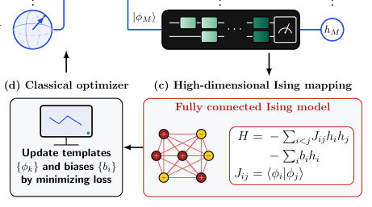
<figcaption class="paper-figure-caption"><b>Fig 1.</b> FIG. 1. Schematic of the quantum-state visible RBM. (a) A normalized many-body state |Ψ⟩serves directly as the vis- ible input. (b) Each binary hidden unit hj is associated with a normalized quantum template |ˆϕj⟩, implemented by a parametrized circuit, together with a classical gain and hid- den bias. (c) In the linear high-dimensional limit, integration over visible states yields a fully connected Ising model with weighted Gram couplings Jij = ¯κi¯κj⟨ˆϕi|ˆϕj⟩. (d) A classical optimizer updates the circuit parameters, gains, and biases by minimizing the loss.</figcaption>
</figure>
<figure class="paper-figure-card">
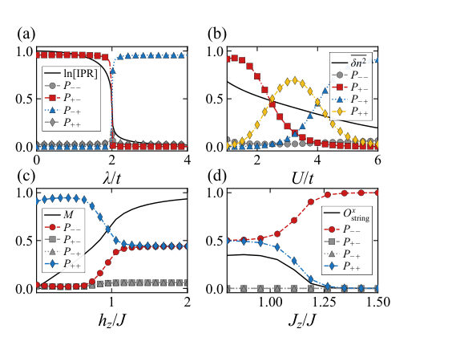
<figcaption class="paper-figure-caption"><b>Fig 2.</b> FIG. 2. Phase classification by the minimal quantum-state visible RBM with two hidden units. Colored curves give the conditional probabilities PRBM (P−−, P+−, P−+ and P++), the black solid curve shows conventional physical indicators. (a) Aubry–André model: inverse participation ratio rescaled across the localization transition at λ/t = 2 (L = 377 and β = ( √</figcaption>
</figure>
<figure class="paper-figure-card">
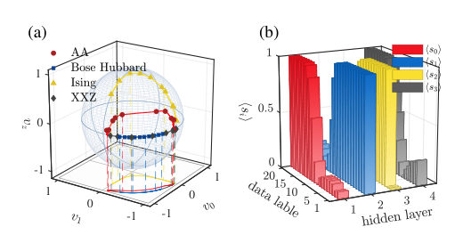
<figcaption class="paper-figure-caption"><b>Fig 3.</b> FIG. 3. Quantum-state feature extraction. (a) Unit-sphere trajectories for the four benchmark data sets constructed from v0, v1, and vz. (b) Conditional hidden-spin means ⟨σi⟩for four learned templates and 20 transverse-field Ising ground states, ordered by their data labels. The distinct response profiles provide a multicomponent representation of the input states beyond phase classification.</figcaption>
</figure>
<figure class="paper-figure-card">
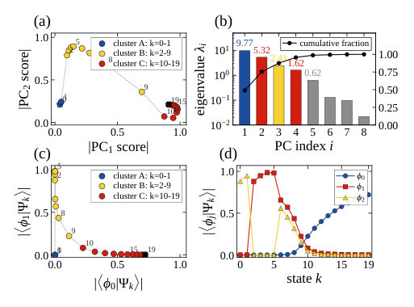
<figcaption class="paper-figure-caption"><b>Fig 4.</b> FIG. 4. PCA and quantum-RBM representations of the same 20 transverse-field Ising states. (a) Absolute scores along the first two principal components; colors mark the three state regions k = 0–1, 2–9, and 10–19. (b) Leading PCA eigen- values and their cumulative fraction. (c) The same states represented by the first two of three learned overlap features. (d) All three features |⟨ϕj|Ψk⟩|.</figcaption>
</figure>

**Summary.** This paper adapts the Restricted Boltzmann Machine (RBM) to accept quantum states as input, overcoming the mathematical difficulties associated with continuous quantum variables. By deriving controlled high-dimensional limits, the authors create robust algorithms that successfully map complex quantum many-body states onto trainable feature representations. This demonstrates a powerful ML tool for analyzing quantum phase transitions.

**Why it may be interesting.** This work provides a novel machine learning framework to analyze quantum many-body physics by mapping complex quantum states onto trainable, classical optimization objectives, which is highly relevant for understanding quantum phase transitions.

Detailed structure

**Main problem.** The paper addresses the challenge of constructing a Restricted Boltzmann Machine (RBM) where the visible input is a quantum state, rather than a classical configuration.

**Main result.** The authors derive two tractable, controlled high-dimensional limits—a Hopfield-type network and a Gram likelihood objective—allowing the RBM to perform quantum-phase recognition and feature extraction.

**Method.** The core method involves regularizing the continuous likelihood integral over the quantum state space using spherical convolution and deriving specific high-dimensional limits to make the optimization tractable.

**Model / system.** The model is a quantum-state visible RBM. It is benchmarked across several 1D quantum many-body systems, including the Aubry–André model, Bose–Hubbard model, and transverse-field Ising chain.

**Key observables.** Feature extraction capability, state recognition across quantum phase transitions, and the resulting coupling/Gram matrices ($J$ or $G$).

**Important parameters / regimes.** The high dimension $d$ of the visible space, and the controlled scaling factors ($\kappa_j$) used in the high-dimensional limits.

**Assumptions / limitations.** The primary difficulty is the ill-posed nature of the continuous likelihood integral, which necessitates deriving controlled high-dimensional limits.

**Figures summary.** Figure 1 schematically shows the RBM structure, linking the quantum state input to the derived Ising and Gram model forms. Figures 2 and 4 compare the RBM's feature representation against standard physical diagnostics and PCA for various quantum models.

**Paper structure.** The paper first introduces the quantum-state RBM and its inherent mathematical difficulties. It then derives and analyzes two controlled high-dimensional limits (linear/Hopfield and quadratic/Gram). Finally, it applies these derived algorithms to benchmark quantum many-body systems to demonstrate physical feature extraction.

Abstract

We construct a restricted Boltzmann machine (RBM) whose visible input is a quantum state rather than a classical configuration. Each hidden unit carries a trainable quantum template prepared by a parametrized circuit and converts its overlap with the input into a feature. Treating quantum states as high-dimensional continuous visible objects creates nontrivial normalization and scaling problems. We regularize the continuous likelihood and derive two controlled high-dimensional limits, yielding a Hopfield-type network with continuous Hilbert-space patterns and a data-augmented Gram likelihood. The resulting algorithms are compact and use trainable circuit-prepared templates as measurement intermediaries between quantum data and classical optimization. Numerical simulations across several many-body systems demonstrate effective quantum-phase recognition and multicomponent feature extraction.

[↑ back to top](#top)

### [Fragmentation of Quantum Fluid in dipolar Bose-Einstein condensate](http://arxiv.org/abs/2609.20013v1)

**Authors:** Shivam Singh, Ayan Khan  
**Type:** theory · **Category:** quantum gases · **PDF:** <https://arxiv.org/pdf/2609.20013v1>  
**Analysis basis:** full PDF text, analyzed in chunks
**Topic relevance:** `analog quantum simulation` **3/5** · `Keldysh / 2PI / non-Gaussian methods` **1/5**

↔ Scroll figures horizontally

<figure class="paper-figure-card">
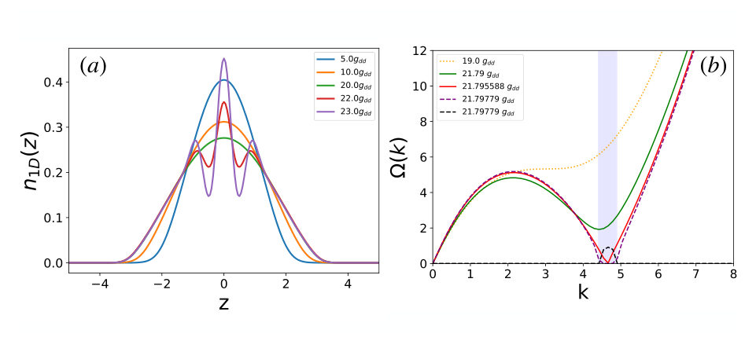
<figcaption class="paper-figure-caption"><b>Fig 1.</b> FIG. 1. (color online) (a) The ground state density profile n1D(z) with spatial coordinate z is reported here. In this case other interactions except DDI is considered to be fixed. The magnitude of MF interaction strength is set at g0 = 4πa and it is being attractive in nature, the BMF strength is g′/g0 = 60 √</figcaption>
</figure>
<figure class="paper-figure-card">
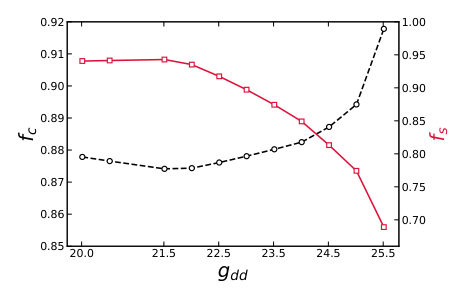
<figcaption class="paper-figure-caption"><b>Fig 2.</b> FIG. 2. (Color online) Superfluid fraction (red dashed curve) and condensate fraction (black dashed curve) as functions of the dipolar interaction strength gdd is reported here. The results are obtained from the solution presented in Fig. 1. The figure clearly illustrates the distinct dependence of the superfluid and condensate fractions on the dipolar interaction.</figcaption>
</figure>
<figure class="paper-figure-card">
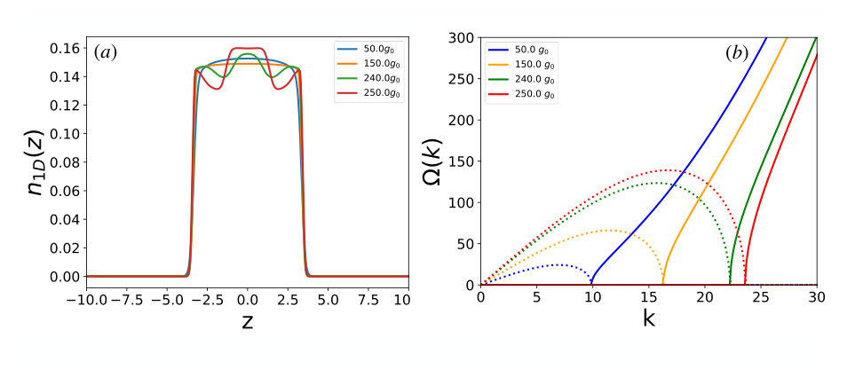
<figcaption class="paper-figure-caption"><b>Fig 3.</b> FIG. 3. (color online) (a) The ground state density profile n1D(z) with spatial coordinate z is depicted here. (b) The corre- sponding dispersion relation is exhibited here. Here, MF interaction is varied from −50g0 to −250g0. BMF strength used as g′/g0 = 60 √</figcaption>
</figure>
<figure class="paper-figure-card">
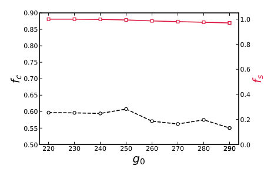
<figcaption class="paper-figure-caption"><b>Fig 4.</b> FIG. 4. (color online) The superfluid fraction and condensate fraction are depicted here. The red solid and black dashed lines describes fs and fc respectively for different values of 2B interaction strength (g0).</figcaption>
</figure>
<figure class="paper-figure-card">
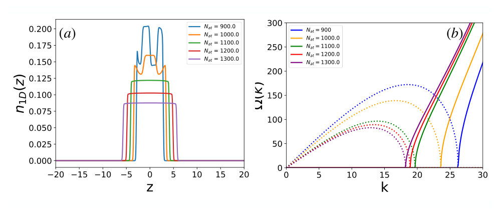
<figcaption class="paper-figure-caption"><b>Fig 5.</b> FIG. 5. (color online) (a) Density profiles of the dipolar Bose gas with varying atom number is presented here. The atom number varies from 900 to 1300. In this case, the two-body (2B) interaction strength is fixed at −250g0. The contributions from the 2B, 3B, and BMF correction are considered to be attractive (BMF strength used as g′/g0 = 60 √</figcaption>
</figure>

**Summary.** This paper theoretically investigates how competing interactions (mean-field, three-body, and dipolar) cause a quantum fluid in a dipolar BEC to fragment. The research predicts a roton instability, marking a transition into a super-solid phase, which is evidenced by measurable changes in the superfluid and condensate fractions.

**Why it may be interesting.** This work directly addresses the complex many-body physics of dipolar quantum gases, linking interaction competition to exotic phases like supersolids and providing quantitative diagnostics ($f_s, f_c$) for these transitions.

Detailed structure

**Main problem.** The study investigates the fragmentation of a quantum fluid within a dipolar Bose-Einstein condensate (BEC) due to the competition among various interaction types.

**Main result.** The system can undergo a roton instability, signaling a phase transition from a superfluid state to a super-solid or crystalline array, which is confirmed by changes in superfluid and condensate fractions.

**Method.** The analysis employs theoretical modeling using the Gross-Pitaevskii equation, analyzing the Bogoliubov spectrum to determine excitation modes and stability.

**Model / system.** The physical system is a dipolar BEC, modeled in a quasi-one-dimensional geometry. The Hamiltonian incorporates mean-field, beyond mean-field, three-body, and non-local dipole-dipole interactions.

**Key observables.** Superfluid fraction ($f_s$), condensate fraction ($f_c$), excitation dispersion relation ($\Omega(k)$), and density modulation.

**Important parameters / regimes.** Dipolar interaction strength ($\epsilon_{dd}$ or $g_{dd}$), Mean-Field (MF) interaction strength, and particle number ($N_{at}$).

**Assumptions / limitations.** The system is treated in a quasi-one-dimensional (Q1D) geometry, and the analysis relies on linear stability theory (Bogoliubov spectrum).

**Figures summary.** Figures illustrate density profiles showing fragmentation, dispersion relations highlighting roton minima and instability regions, and plots showing $f_s$ and $f_c$ changing as interaction strengths or particle numbers are varied.

**Paper structure.** The paper systematically analyzes the theoretical framework by incorporating multiple interaction terms into the governing equation, followed by detailed analysis of the excitation spectrum, superfluid/condensate fractions, and the resulting phase transitions (roton instability $
ightarrow$ supersolid).

Abstract

In this article, we study the dipolar Bosonic quantum fluid. The fluid experiences mean-field, beyond mean-field, and three body interactions. We investigate their competition with dipolar interaction and fragmentation as a result of this competition. We further investigate the elementary excitations and note two distinct dispersion regimes, namely roton-mode and modulational instability. We support our observation by calculating the superfluid fraction and the condensate fraction.

[↑ back to top](#top)

### [Khinchin's ergodicity and typicality in statistical mechanics](http://arxiv.org/abs/2609.20433v1)

**Authors:** Dario Lucente, Marco Baldovin, Giacomo Gradenigo, Angelo Vulpiani  
**Type:** theory · **Category:** statistical mechanics · **PDF:** <https://arxiv.org/pdf/2609.20433v1>  
**Analysis basis:** full PDF text, analyzed in chunks
**Topic relevance:** `scars & prethermalization` **3/5** · `Frenkel-Kontorova` **1/5**

↔ Scroll figures horizontally

<figure class="paper-figure-card">
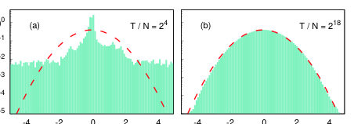
<figcaption class="paper-figure-caption"><b>Fig 1.</b> FIG. 1. Empirical density of the momentum of the j-th particle, measured in the time interval [0, T], starting from the non-equilibrium initial condition described in the main text. Two values of T are shown. Red curves correspond to the Maxwell-Boltzmann distribution. Left and right panel refer to short and long time evolutions. Here N = 103, j = 123.</figcaption>
</figure>
<figure class="paper-figure-card">
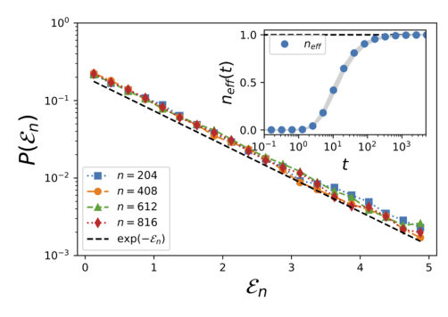
<figcaption class="paper-figure-caption"><b>Fig 2.</b> FIG. 2. Main panel: probability distribution of the single particle energy of the rotated modes for different beads. The black dashed lines is the theoretical exponential distribution. Inset: effective number of degrees of freedom as a function of time. Blue squares represent an average performed over 30 realizations of random rotations, while the grey shaded area corresponds to the evolution of each of these 30 realizations. The horizontal black dashed line corresponds to the equipar- tition value neff = 1.</figcaption>
</figure>
<figure class="paper-figure-card">
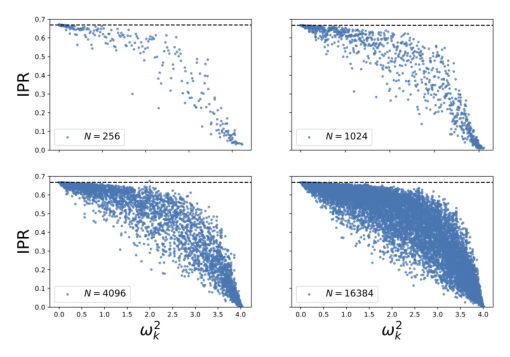
<figcaption class="paper-figure-caption"><b>Fig 3.</b> FIG. 3. Values of IPR as function of the eigenfrequency ω2 k. Different panels corresponds to different system sizes N. The dashed black lines is the value of the IPR of the linear chain without disorder, when the eigenvectors are all delocalized.</figcaption>
</figure>
<figure class="paper-figure-card">
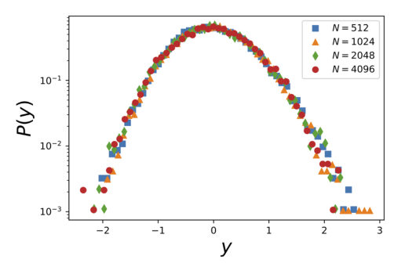
<figcaption class="paper-figure-caption"><b>Fig 4.</b> FIG. 4. Distributions of energy per particle ec computed on a subsystem of size Nc = N</figcaption>
</figure>
<figure class="paper-figure-card">
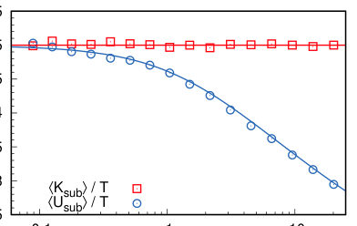
<figcaption class="paper-figure-caption"><b>Fig 5.</b> FIG. 5. Energy per particle in a subsystem. Red squares and blue circle refer to kinetic and potential energy respectively, normalized with temperature. The solid lines correspond to the theoretical predictions. Here N = 256, Nc = 16.</figcaption>
</figure>

**Summary.** This paper re-examines the ergodic hypothesis, arguing that the success of statistical mechanics stems not from the dynamics being chaotic, but from the sheer number of degrees of freedom in the system. By analyzing integrable models like the Toda chain, the authors show that key thermodynamic distributions emerge robustly in the thermodynamic limit, weakening the strict requirement of ergodicity.

**Why it may be interesting.** It provides a deep theoretical underpinning for why equilibrium statistical mechanics works, suggesting that the failure of strict ergodicity does not invalidate macroscopic thermodynamic predictions in the large-$N$ limit.

Detailed structure

**Main problem.** The paper addresses the fundamental connection between time averages (dynamics) and phase averages (ensemble theory) in statistical mechanics, specifically challenging the necessity of the strong ergodic hypothesis.

**Main result.** Key predictions of equilibrium statistical mechanics, such as the Maxwell-Boltzmann distribution, can hold true even in classically integrable systems where strong ergodicity is violated, suggesting the role of the large number of degrees of freedom is paramount.

**Method.** The authors use analytical derivations, asymptotic analysis of partition functions, and numerical simulations on integrable models to test the convergence of time averages to ensemble averages.

**Model / system.** The analysis focuses on classical Hamiltonian systems, including the harmonic chain and the non-linear Toda model. These systems are used to test the ergodic hypothesis in the context of the thermodynamic limit ($N 	o \infty$).

**Key observables.** Time averages of observables, the Maxwell-Boltzmann distribution, the intensive quantity $y$ used to test typicality, and the specific heat.

**Important parameters / regimes.** The number of degrees of freedom ($N$), the temperature parameter ($eta$), and the limit of large $N$.

**Assumptions / limitations.** The primary assumption is the validity of Khinchin's view: that statistical mechanics relies only on the large number of degrees of freedom and the choice of extensive observables, irrespective of chaotic dynamics.

**Figures summary.** Figures illustrate the distribution of time averages (e.g., $w(t^*)$) collapsing onto a single curve as $N$ increases, and show the standard deviations of time averages of conserved quantities remaining small.

**Paper structure.** The paper progresses by first defining the ergodic problem, then analyzing integrable systems (like the harmonic chain) to show expected distributions arise despite non-chaos, and finally applying this framework to the Toda model to demonstrate typicality in the thermodynamic limit.

Abstract

The formulation of statistical mechanics in terms of ensembles, originally proposed by Gibbs, has proved to be extremely effective in describing the equilibrium state of many-particle systems, in the most diverse contexts (critical phenomena, quantum mechanics, biophysics, just to mention a few). The reasons of this success are still debated, and the connection between dynamics and probability in large systems remains somehow elusive. Indeed, in order to derive the main results of equilibrium statistical mechanics, strong assumptions on the ergodicity of the dynamics are usually required. Nonetheless, empirical observations seem to suggest that the predictions of the theory hold true even when such assumptions are not verified. In this paper we reconsider the point of view put forward by Khinchin, stating that the only relevant ingredients for the validity of statistical mechanics are the large number of degrees of freedom in the system and the choice of extensive observables, irrespectively of the details of the microscopic dynamics. In particular, the presence of dynamical chaos is not required. To this aim, we discuss some analytical and numerical results on a couple of classical integrable systems, the harmonic chain and the Toda model, showing that many important features predicted by equilibrium statistical mechanics, as for instance Maxwell-Boltzmann distribution, are found even in absence of chaos.

[↑ back to top](#top)

### [Quantum WalkScore: Benchmarking Quantum Computers on the Graph Nodefinding Problem](http://arxiv.org/abs/2609.19931v1)

**Authors:** Noé Olivier, Michel Nowak  
**Type:** both · **Category:** quantum information and computing · **PDF:** <https://arxiv.org/pdf/2609.19931v1>  
**Analysis basis:** full PDF text, analyzed in chunks
**Topic relevance:** `QC/QI experiment` **3/5** · `quantum measurements` **1/5**

↔ Scroll figures horizontally

<figure class="paper-figure-card">
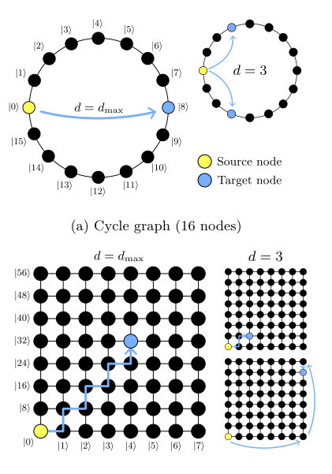
<figcaption class="paper-figure-caption"><b>Fig 1.</b> Fig. 1: Representations of the graph nodefinding problem. The cycle graphs (a) are generated for n = 4, i.e. 4 qubits, while the 2D-torus graphs (b) are generated for n = 3, i.e. 3 qubits per dimension. The target nodes (blue) are located at a distance d = dmax (left) and d &lt; dmax (right) from the source node |0⟩(yellow).</figcaption>
</figure>
<figure class="paper-figure-card">
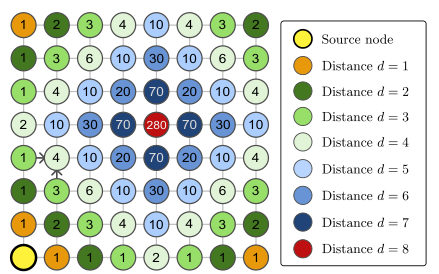
<figcaption class="paper-figure-caption"><b>Fig 2.</b> Fig. 3: Representation of the number of possible paths to each target node for a d-step random walk on a 64-node 2D-torus graph.</figcaption>
</figure>
<figure class="paper-figure-card">
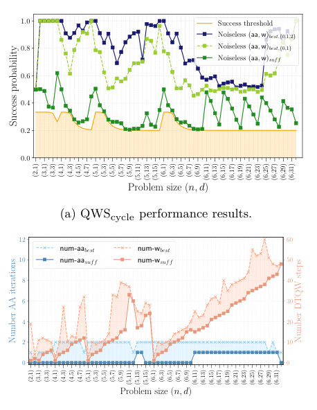
<figcaption class="paper-figure-caption"><b>Fig 3.</b> Fig. 4: QWScycle performance results (a) and algorithm resources (b) under suff-perf and best-perf scenarios on noiseless QPU.</figcaption>
</figure>
<figure class="paper-figure-card">
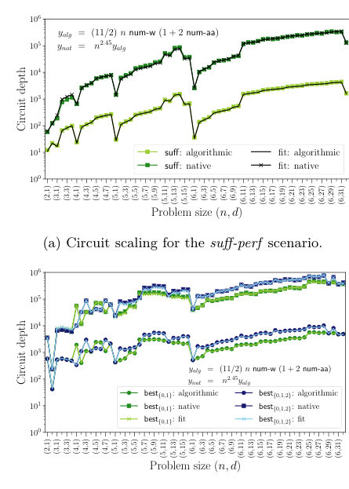
<figcaption class="paper-figure-caption"><b>Fig 4.</b> Fig. 5: Algorithmic and native implementation complexity scaling under suff-perf (a) and best- perf (b) scenarios for cycle graphs on IBM Heron QPU.</figcaption>
</figure>
<figure class="paper-figure-card">
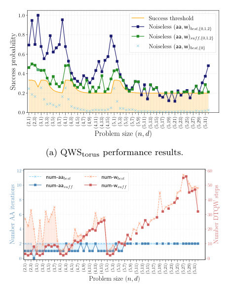
<figcaption class="paper-figure-caption"><b>Fig 5.</b> Fig. 6: QWStorus performance results (a) and algorithm resources (b) under suff-perf and best-perf scenarios on noiseless QPU.</figcaption>
</figure>

**Summary.** This paper introduces Quantum WalkScore (QWS), a standardized benchmark to test quantum computers on the graph nodefinding problem using quantum walks and amplitude amplification. It quantifies performance by determining the largest solvable problem size before the success probability drops below a defined threshold. The work provides both theoretical scaling analysis and experimental results on real quantum hardware.

**Why it may be interesting.** The rigorous benchmarking methodology and the focus on application-specific metrics (like graph search success probability) provide a concrete, hardware-agnostic framework for assessing quantum computational utility.

Detailed structure

**Main problem.** The paper introduces Quantum WalkScore (QWS) to benchmark the performance of near-term and fault-tolerant quantum computers on the graph nodefinding problem (marked-vertex search).

**Main result.** QWS provides a scalable, quantitative measure of a quantum computer's ability to solve graph search problems, showing performance drops significantly on current hardware for non-trivial problem sizes.

**Method.** The benchmark combines discrete-time quantum walks (DTQW) with quantum amplitude amplification (AA) to estimate the success probability of finding a target node on structured graphs.

**Model / system.** The problem is modeled on cycle and 2D-torus graphs, and the evaluation is performed using gate-based quantum processors, specifically citing IBM's Heron and Nighthawk architectures.

**Key observables.** Success probability ($p$) of finding the target node, and the resulting Quantum WalkScore (QWS).

**Important parameters / regimes.** Problem size defined by $(n, d)$ (qubit count and distance), and circuit parameters like the number of DTQW steps ($	ext{num\_w}$) and AA iterations ($	ext{num\_aa}$).

**Assumptions / limitations.** The benchmark assumes the ability to execute deep, complex circuits, with hardware limitations causing success probabilities to drop below theoretical thresholds quickly.

**Figures summary.** Figures illustrate the graph nodefinding problem on cycle and torus graphs, show the quantum circuit implementation of the DTQW-AA sequence, and plot QWS performance (success probability vs. problem size) across different IBM hardware generations.

**Paper structure.** The paper reviews existing quantum benchmarking methods, details the QWS protocol using DTQW and AA, presents theoretical scaling laws for circuit depth, and concludes with experimental results comparing performance across various hardware platforms.

Abstract

Recent advances in quantum computing hardware toward fault-tolerance have increased interest in evaluating near-term quantum platforms on application-relevant quantum algorithms. In this work, we introduce Quantum WalkScore (QWS), a scalable application-oriented benchmark designed to assess the performance of NISQ and future fault-tolerant quantum computers in executing essential quantum routines --discrete-time quantum walks and quantum amplitude amplification-- to solve the graph nodefinding problem (marked-vertex search). QWS quantifies performance by scoring the largest problem size for which a designated target node can be found with success probability above a defined threshold. In addition to the complete protocol description, we provide example parameter-selection scenarios designed from noiseless simulation results and demonstrate QWS evaluation through experimental runs on multiple generations of IBM real quantum processors.

[↑ back to top](#top)

### [Statistical delocalization in the Anyonic Aubry-André model](http://arxiv.org/abs/2609.20029v1)

**Authors:** Andoni Agirre, André Eckardt, Tobias Grass  
**Type:** theory · **Category:** other · **PDF:** <https://arxiv.org/pdf/2609.20029v1>  
**Analysis basis:** full PDF text, analyzed in chunks
**Topic relevance:** `analog quantum simulation` **3/5** · `Frenkel-Kontorova` **1/5**

↔ Scroll figures horizontally

<figure class="paper-figure-card">
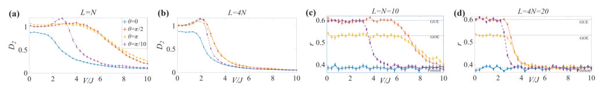
<figcaption class="paper-figure-caption"><b>Fig 1.</b> Figure 1. (a,b) Fractal dimension D2 vs. AA potential strength V , at filling N = L (a) and filling L = 4N (b), for different values of θ. We obtain D2 from linear regression of −log IPR as a function of log D, at the available system sizes (see App. A). Error bars are obtained from stochastic resampling over a normal distribution of IPR values. (c,d) Gap ratio vs. V at filling one (L = 10), and at filling 1/4 (L = 20), for different values of θ. Error bars represent standard errors from ensemble averages.</figcaption>
</figure>
<figure class="paper-figure-card">
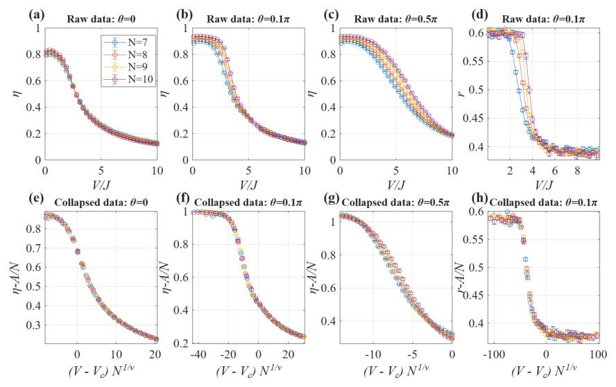
<figcaption class="paper-figure-caption"><b>Fig 2.</b> Figure 2. (a–c) Raw data of η vs V at filling 1 for different N, considering θ values for bosons (θ = 0), weak anyons (θ = 0.1π), strong anyons (θ = 0.5π), and (e–g) the corresponding collapsed data after FSS. In panels (d) and (h), we illustrate, for the case of weak anyons, the FSS based on gap ratio r.</figcaption>
</figure>
<figure class="paper-figure-card">
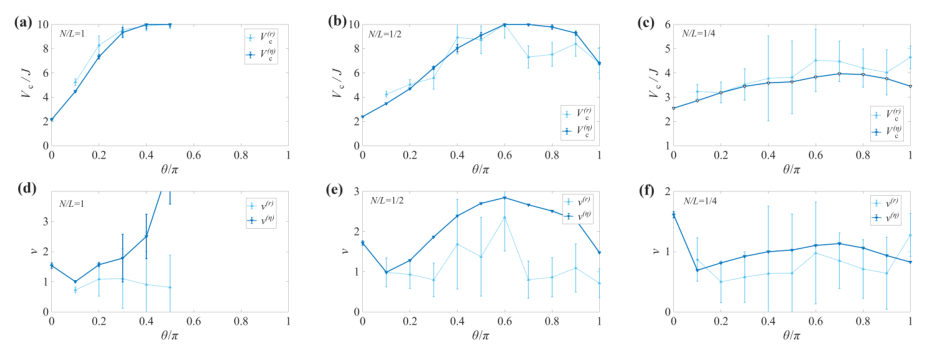
<figcaption class="paper-figure-caption"><b>Fig 3.</b> Figure 3. We plot the system parameters obtained from FSS with η and r, as a function of the statistical angle θ. In panels (a–c), we plot the critical potential strength Vc vs. θ. In panels (d–f), we plot the exponent ν vs. θ. Results at different fillings are shown: N/L = 1 in panels (a,d), N/L = 1/2 in panels (b,e), and N/L = 1/4 in panels (c,f). Error bars are the standard deviations after repeating FSS from resampling over 100 randomly generated distributions.</figcaption>
</figure>
<figure class="paper-figure-card">
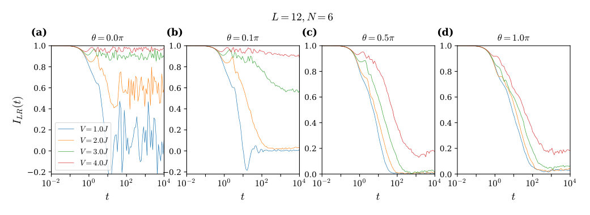
<figcaption class="paper-figure-caption"><b>Fig 4.</b> Figure 4. Left-right imbalance ILR(t) for a half-filled chain (L = 12, N = 6) following a quench from the fully imbalanced initial state in Eq. (6).Panels (a)–(d) correspond to bosons (θ = 0), weak anyons (θ = 0.1π), strong anyons (θ = 0.5π), and pseudofermions (θ = π), respectively. Different curves show different values of the Aubry-André potential strength V . Increasing the statistical angle systematically enhances the relaxation of the imbalance, indicating a shift of the localization crossover towards larger values of V .</figcaption>
</figure>
<figure class="paper-figure-card">
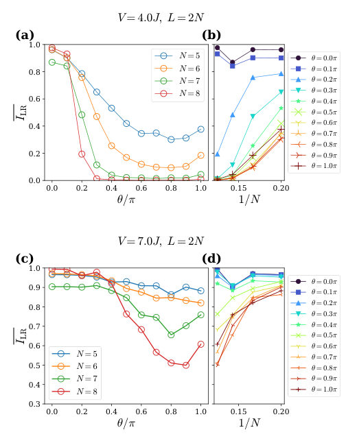
<figcaption class="paper-figure-caption"><b>Fig 5.</b> Figure 5. Saturation imbalance analysis for filling 1/2 chains at different potential strengths. The saturation value of the LR imbalance ILR is shown as a function of the statistical angle θ for different system sizes for V = 4J (a) and V = 7J (c). Panels (b) and (d) show the saturation values of the imbalance plotted against 1/N for different θ values with V = 4J and V = 7J, respectively.</figcaption>
</figure>

**Summary.** This theoretical work explores how the inherent exchange statistics of anyons can drive many-body delocalization in a quasiperiodic 1D system, even in the absence of density-density interactions. By analyzing spectral properties and dynamics, the authors show that tuning the statistical phase $	heta$ systematically shifts the system's localization transition. This reveals that exchange statistics constitutes a fundamental, independent route to quantum delocalization in low-dimensional quantum matter.

**Why it may be interesting.** This work directly addresses the interplay between particle statistics (anyons) and many-body dynamics, providing a novel, non-interaction-based mechanism to tune localization in 1D quantum systems, relevant to ultracold atomic simulations of exotic statistics.

Detailed structure

**Main problem.** The study investigates enhanced many-body delocalization in quantum systems induced solely by the exchange statistics of anyons, contrasting with conventional many-body localization (MBL).

**Main result.** Increasing the anyonic statistical phase systematically shifts the many-body localization crossover toward larger quasiperiodic potentials, establishing exchange statistics as an independent mechanism for delocalization.

**Method.** The analysis employs finite-size scaling of spectral properties (gap ratio) and the inverse participation ratio (IPR), supplemented by dynamical probes like monitoring density imbalance after quenches.

**Model / system.** The system is an anyonic Aubry-André (AA) quasiperiodic model in one dimension, described by a quadratic Hamiltonian involving anyon operators $a_j$. The statistics are controlled by the phase angle $	heta$.

**Key observables.** Fractal dimension ($D_2$), Gap ratio ($r_k$), Inverse Participation Ratio (IPR), and long-time density imbalances.

**Important parameters / regimes.** The statistical phase angle $	heta \in [0, 2\pi)$, the potential strength $V$, and the system filling $N/L$.

**Assumptions / limitations.** The analysis relies on finite-size scaling, which may not conclusively distinguish between a true phase transition and a crossover regime.

**Figures summary.** Figures illustrate the dependence of $D_2$ and the gap ratio on the potential strength $V$ for various $	heta$, and show the evolution of density imbalances over time for different statistical regimes.

**Paper structure.** The paper systematically analyzes the localization transition using multiple diagnostics (spectral, IPR, dynamics) to map out how the statistical phase $	heta$ modifies the critical potential $V_c$ required for delocalization.

Abstract

Many-body localization is remarkable in that localization persists despite the presence of dynamical interactions. Here we demonstrate the converse phenomenon: enhanced many-body delocalization induced solely by exchange statistics. We study a Aubry-André quasiperiodic system of anyons in one dimension in the absence of density-density interactions. In terms of anyon operators, the system is described by a quadratic Hamiltonian. By analyzing the finite-size scaling of its spectral properties and the inverse participation ratio of many-body eigenstates, we find that increasing the anyonic statistical phase systematically shifts the many-body localization crossover toward larger quasiperdiodic potentials. We further confirm these findings using a dynamical probe, namely the persistence of an initial density imbalance following quenches. Our results establish exchange statistics as an independent mechanism capable of altering many-body localization, revealing a fundamentally distinct route to delocalization in one-dimensional quantum systems.

[↑ back to top](#top)

### [Tunable flat band on the surface of a rhombohedral kagome ferromagnet](http://arxiv.org/abs/2609.19857v1)

**Authors:** Xinglu Que, Qingyu He, Lihui Zhou, Lilian Prodan, Vladimir Tsurkan, István Kézsmárki, Hidenori Takagi, Dennis Huang  
**Type:** both · **Category:** strongly correlated electrons · **PDF:** <https://arxiv.org/pdf/2609.19857v1>  
**Analysis basis:** full PDF text, analyzed in chunks
**Topic relevance:** `analog quantum simulation` **3/5** · `quantum measurements` **1/5**

↔ Scroll figures horizontally

<figure class="paper-figure-card">
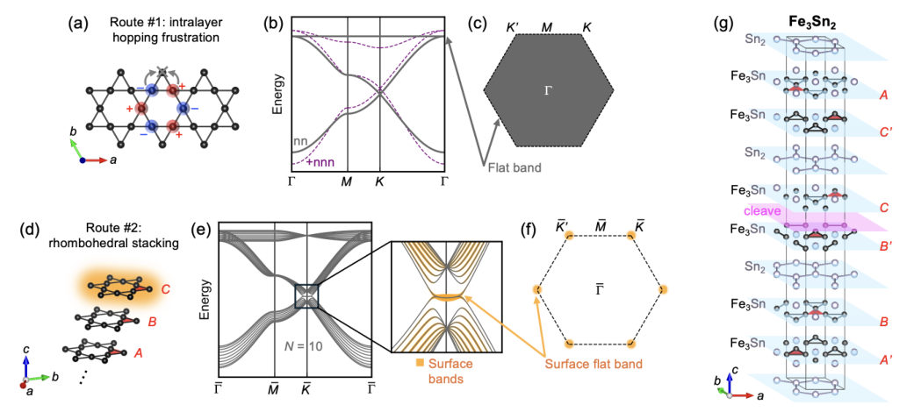
<figcaption class="paper-figure-caption"><b>Fig 1.</b> FIG. 1. Two routes to flat bands in layered kagome compounds. (a) Kagome lattice with a compact localized state illustrated. (b) Energy bands of the kagome TB model with nearest-neighbor (nn) and additional next-nearest-neighbor (+nnn) hopping. (c) Spectral weight distribution of the flat band in the BZ. (d) Kagome layers with rhombohedral ABC stacking. (e) Energy bands of a kagome TB model with N = 10 layers. The inset shows an enlarged view with the thickness of the orange shading denoting the weight of contributions from surface layers. (f) Spectral weight distribution of the surface flat band in the BZ. (g) Crystal structure of Fe3Sn2 in a hexagonal unit cell. The c-axis length is...</figcaption>
</figure>
<figure class="paper-figure-card">
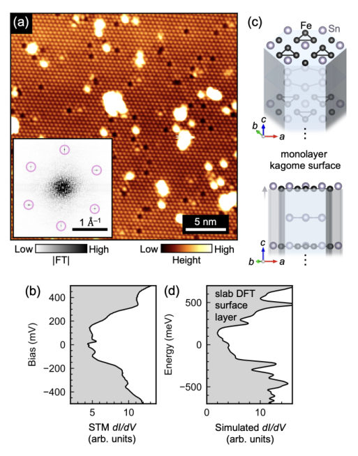
<figcaption class="paper-figure-caption"><b>Fig 2.</b> FIG. 2. (a) STM constant-current topography of the mono- layer kagome termination of Fe3Sn2. Setpoint: +50 mV, 200 pA; temperature: 4.2 K. Inset: Fourier transform (FT) am- plitude with Bragg peaks circled. (b) STM dI/dV spectrum. Setpoint: −500 mV, 800 pA; lock-in excitation: Vrms = 5 mV. (c) Surface crystal structure of the monolayer kagome termi- nation. The interlayer distance is exaggerated for clarity. The purple arrow in the side-view structure denotes an outward relaxation of surface Sn atoms. (d) DFT-simulated dI/dV spectrum of the monolayer kagome termination.</figcaption>
</figure>
<figure class="paper-figure-card">
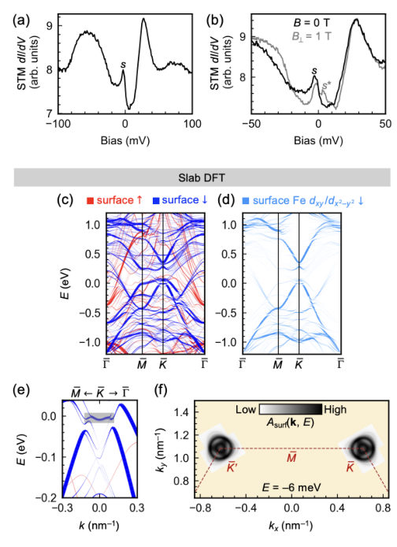
<figcaption class="paper-figure-caption"><b>Fig 3.</b> FIG. 3. (a) and (b) STM dI/dV spectra showing a near-zero- bias peak (s) at 0 T and a secondary peak (s∗) that appears with 1 T out-of-plane magnetic field. Setpoint in (a): −100 mV, 800 pA; Vrms = 1 mV. Setpoint in (b): −50 mV, 800 pA; Vrms = 0.5 mV. (c) Spin-polarized and surface-projected DFT band structure of a ferromagnetic Fe3Sn2 slab with mono- layer kagome terminations. The red and blue lines denote the majority- and minority-spin bands, whereas the line thickness reflects the weight of the surface projection. (d) Band contri- butions from the surface minority-spin Fe 3dxy/dx2−y2 states. (e) Enlarged view of the surface band structure near ¯K and EF. The gray box highlights a...</figcaption>
</figure>
<figure class="paper-figure-card">
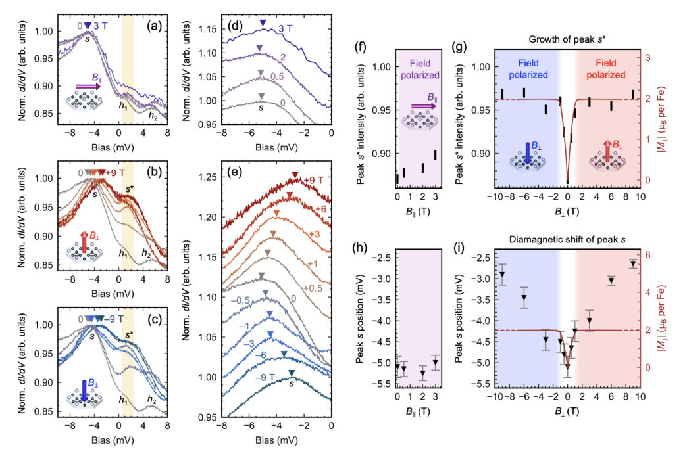
<figcaption class="paper-figure-caption"><b>Fig 4.</b> FIG. 4. dI/dV spectra with applied (a) in-plane magnetic field B∥between 0 and 3 T, (b) out-of-plane magnetic field B⊥ between 0 and +9 T, and (c) B⊥between 0 and −9 T. For comparison, all curves are normalized (norm.) by the height of peak s. The setpoints of the dI/dV spectra are ±10 mV, 200 pA. (For the spectrum with B∥= 3 T, the setpoint is +50 mV, 800 pA.) The lock-in excitation Vrms ranges from 0.2 to 0.5 mV. (d) Spectra from (a) with B∥values labeled and replotted with offsets. (e) Spectra from (b) and (c) with B⊥values labeled and replotted with offsets. (f) and (g) Growth of peak s∗</figcaption>
</figure>
<figure class="paper-figure-card">
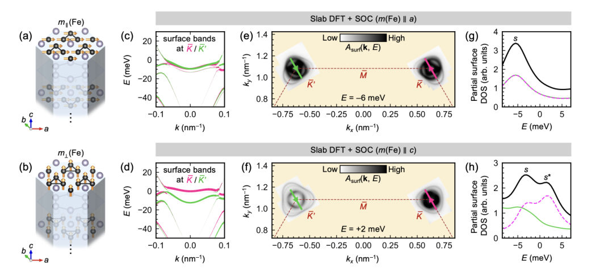
<figcaption class="paper-figure-caption"><b>Fig 5.</b> FIG. 5. DFT calculations with SOC. (a) and (b) Schematic Fe3Sn2 slabs with monolayer kagome termination and Fe moments polarized along the a [m∥(Fe)] and c [m⊥(Fe)] directions. (c) and (d) Surface-projected band structures with m∥(Fe) and m⊥(Fe), respectively. The magenta and green curves originate from cuts across the ¯K and ¯ K′ points, respectively. The line thicknesses reflect the weight of surface contributions. (e) and (f) 2D constant-energy maps of Asurf(k, E) near ¯K and ¯ K′ at −6 and +2 meV for m∥(Fe) and m⊥(Fe), respectively. The magenta and green arrows denote the line cuts along which the surface bands in (c) and (d) are shown. The brown dashed lines demarcate the BZ boundary....</figcaption>
</figure>

**Summary.** This research investigates flat bands in the kagome ferromagnet $	ext{Fe}_3	ext{Sn}_2$, demonstrating that the band flattening mechanism is governed by interlayer hopping rather than previously assumed intralayer frustration. By combining STM measurements with DFT calculations, the authors reveal that the surface band's properties are highly tunable by external magnetic fields, offering a new pathway to engineer topological electronic states.

**Why it may be interesting.** The work provides a concrete, experimentally verified example of how structural details (layer stacking) dictate electronic properties (flat bands) in magnetic materials, which is highly relevant for engineering quantum states.

Detailed structure

**Main problem.** The central goal is to understand the origin and magnetic tunability of flat electronic bands in kagome-based magnetic materials.

**Main result.** The flat band is shown to originate not from intralayer hopping frustration, but from interlayer hopping between rhombohedrally stacked planes, and exhibits rich magnetic-field dependence.

**Method.** The study combines Scanning Tunneling Microscopy (STM) measurements with first-principles Density Functional Theory (DFT) slab calculations and a tight-binding (TB) model.

**Model / system.** The physical system is the layered kagome ferromagnet $	ext{Fe}_3	ext{Sn}_2$. The analysis focuses on the electronic structure of the surface layer, which is influenced by the rhombohedral stacking sequence and the magnetic ordering of the Fe moments.

**Key observables.** Sharp peaks in the differential tunneling conductance ($	ext{d}I/	ext{d}V$), exhibiting field-dependent features like valley splitting and diamagnetic shifts.

**Important parameters / regimes.** The magnetic field orientation ($B_{\parallel}$ vs. $B_{\perp}$), the degree of magnetization polarization ($m_{\parallel}$ vs. $m_{\perp}$), and the interlayer hopping strength.

**Assumptions / limitations.** The initial assumption that flat bands arise from intralayer hopping interference is refuted; the analysis relies on the DFT/STM comparison, which has inherent approximations.

**Figures summary.** Figures illustrate the crystal structure and stacking (Fig. 1), STM topography and $	ext{d}I/	ext{d}V$ spectra showing peaks $s$ and $s^*$ (Fig. 2, 3), and DFT band structures confirming valley splitting under perpendicular magnetization (Fig. 5).

**Paper structure.** The paper progresses from establishing the existence of the flat band via STM, to theoretically identifying the interlayer hopping mechanism via DFT, and finally detailing the magnetic field dependence and underlying physics using both DFT and a TB model.

Abstract

A central goal in the exploration of kagome-based materials is the realization of a flat band that has meV bandwidth and lies close to the Fermi energy. The prevailing assumption is that band flattening originates from destructive hopping processes on the kagome lattice. We perform scanning tunneling microscopy (STM) on the layered kagome ferromagnet Fe$_3$Sn$_2$ and show that it indeed hosts a flat band near the Fermi energy, which is manifested as a sharp peak in the differential tunneling conductance. First-principles slab calculations reveal, however, that this band is flattened not by the destructive interference of intralayer hopping, but by interlayer hopping between rhombohedral-stacked kagome planes in Fe$_3$Sn$_2$, and is confined to the surface layer. This surface band, forming in the vicinity of the Brillouin zone corners $\bar{K}$ and $\bar{K'}$, exhibits rich magnetic-field dependence, including fine structure due to valley-symmetry breaking by rotated Fe moments, as well as a persistent diamagnetic shift associated with orbital magnetic moments, all reproduced by our calculations. Our results, highlighting the crucial role of layer stacking on the band structure of kagome magnets, demonstrate experimentally an alternative mechanism of generating magnetically tunable flat bands in atomically thin volumes of topological magnets.

[↑ back to top](#top)

### [Vestigial chirality from fluctuating loop currents on the kagome lattice](http://arxiv.org/abs/2609.19618v1)

**Authors:** Yin Shi, Xuande Bu, Sheng Meng  
**Type:** theory · **Category:** strongly correlated electrons · **PDF:** <https://arxiv.org/pdf/2609.19618v1>  
**Analysis basis:** full PDF text, analyzed in chunks
**Topic relevance:** `methods for driven-dissipative` **3/5** · `analog quantum simulation` **1/5**

↔ Scroll figures horizontally

<figure class="paper-figure-card">
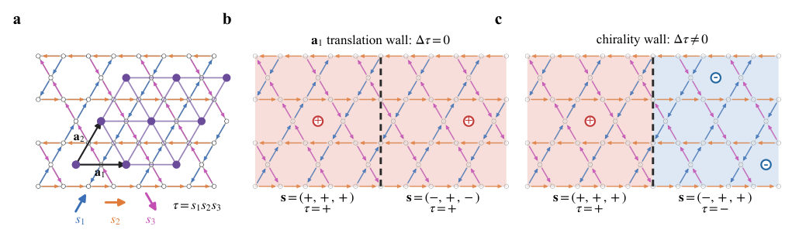
<figcaption class="paper-figure-caption"><b>Fig 1.</b> FIG. 1. Coarse graining and domain-wall classes. (a) Gray sites and bonds show the microscopic kagome lattice; purple sites at unit-cell centers and their links form the triangular GL regulator. Each GL site carries the three internal M-point components s1, s2, s3. Colored arrows show their nearest-neighbor current form factors in the convention of Ref. [14]; reversing sa reverses the corresponding extended current pattern. The second-neighbor current channel is omitted for clarity. The symbols τ = ± mark only the circulating-current hexagons of the 2 × 2 texture, separated by doubled Bravais vectors. (b) An a1-translation wall connects (+, +, +) and (−, +, −): two signs reverse while τ =...</figcaption>
</figure>
<figure class="paper-figure-card">
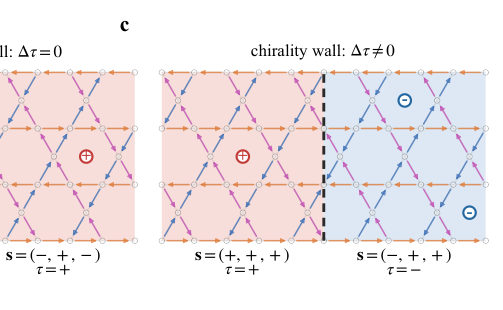
<figcaption class="paper-figure-caption"><b>Fig 2.</b> Figure 2(a) summarizes the phase diagram obtained from lattices as large as L = 384. At small q, the primary</figcaption>
</figure>
<figure class="paper-figure-card">
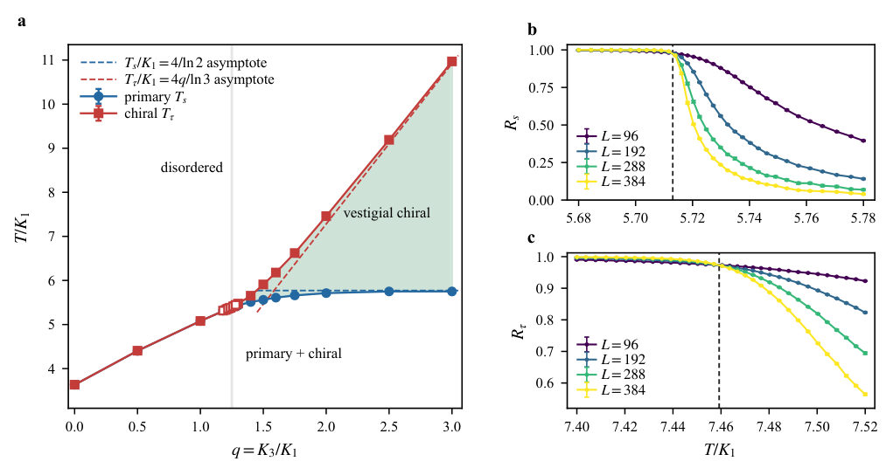
<figcaption class="paper-figure-caption"><b>Fig 3.</b> FIG. 2. Phase diagram and representative crossings of the sign model. (a) Primary (blue circles) and chiral (red squares) transition temperatures. Open symbols denote transport-limited estimates whose errors include the temperature-grid floor. Green shading marks the vestigial phase and the gray strip the conservative endpoint corridor 1.24 ≲qc ≲1.26; dashed curves are the exact asymptotes. (b,c) Correlation ratios Rs and Rτ for L = 96, 192, 288, 384 at q = 2. Vertical dashed lines mark the joint-bootstrap L = 288–384 crossings, Ts/K1 = 5.7131(7) and Tτ/K1 = 7.4592(8). Points are measured temperatures, lines guide the eye, and error bars are standard errors across independent chains.</figcaption>
</figure>
<figure class="paper-figure-card">
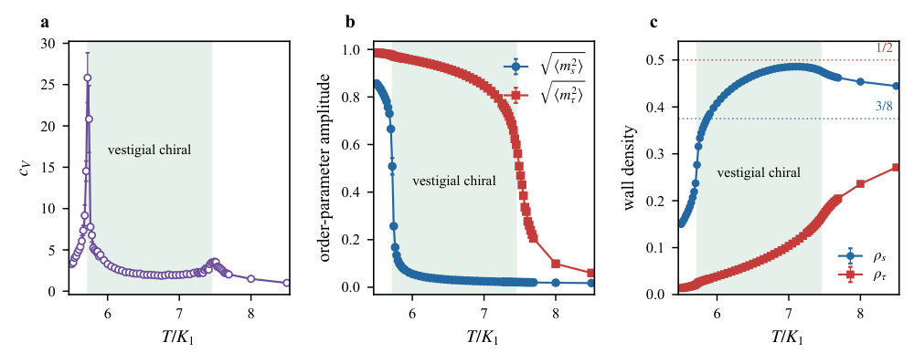
<figcaption class="paper-figure-caption"><b>Fig 4.</b> FIG. 3. Thermal observables at q = 2 and L = 96: (a) per-site specific heat, (b) primary and chiral root-mean-square order parameters, and (c) primary-sector wall density ρs and chiral-sector wall density ρτ. The former counts even-parity walls that disorder the sa fields while preserving τ; the latter counts walls that reverse τ. Dotted lines are the random-sign limits 3/8 and 1/2. Green shading marks the vestigial interval determined independently from the finite-size crossings in Fig. 2. The root-mean-square order parameters and wall densities are defined in Methods, Sec. IV B.</figcaption>
</figure>
<figure class="paper-figure-card">
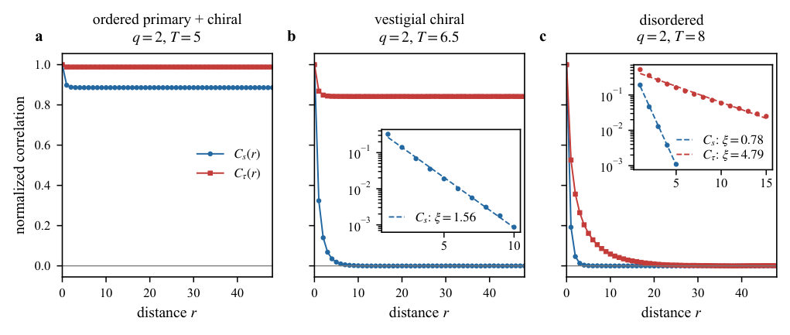
<figcaption class="paper-figure-caption"><b>Fig 5.</b> FIG. 4. Direction-averaged correlations at q = 2 and L = 96 of the sa [Cs(r)] and τ [Cτ(r)] fields. (a) Both Cs(r) and Cτ(r) plateau in the primary chiral phase. (b) In the vestigial phase, Cs(r) decays within a few lattice spacings while Cτ(r) remains long ranged. (c) Both channels decay above Tτ. Every inequivalent integer separation is shown. Semilog insets fit only the resolved short-range channels, where ξ is the descriptive correlation length.</figcaption>
</figure>

**Summary.** This work investigates the complex phase transitions of loop-current order on the kagome lattice, predicting a two-stage melting process. Using advanced Monte Carlo simulations on effective field theories, the authors establish a quantitative criterion for a 'vestigial chiral phase.' This finding offers a theoretical mechanism explaining time-reversal-odd responses observed in materials above their primary charge-density-wave transition temperatures.

**Why it may be interesting.** The concept of vestigial order—where a symmetry-breaking feature persists after the primary order melts—is highly relevant to understanding complex phase diagrams in correlated materials, bridging concepts from statistical mechanics to electronic structure.

Detailed structure

**Main problem.** The study investigates the possibility of a 'vestigial chiral regime' where a time-reversal-odd composite order persists after the primary, translation-breaking loop-current order melts.

**Main result.** The research establishes a quantitative domain-wall criterion for this vestigial order, suggesting a two-stage melting process that can provide a framework for time-reversal-odd responses above conventional CDW transitions.

**Method.** The authors employed large-scale cluster and parallel-tempering Monte Carlo simulations on effective sign and soft-spin models derived from a coarse-grained Ginzburg-Landau theory.

**Model / system.** The system models loop currents on the kagome lattice, using an effective Hamiltonian involving three symmetry-related M-point components ($\Phi_{ai}$). The analysis progresses from a sign model to a soft-spin model incorporating amplitude fluctuations.

**Key observables.** Loop-current order ($\chi$), bond order ($B$), specific heat ($c_V$), and the proliferation of domain walls (chirality-changing vs. translation walls).

**Important parameters / regimes.** The critical ratio $q = J_{\chi}A^4/K_{\Phi}$ governs the transition between regimes; the vestigial phase is predicted when the chirality-changing wall cost is only $12-13\%$ higher than the same-chirality wall.

**Assumptions / limitations.** The analysis relies on deriving an effective Hamiltonian by integrating out the bond field and assumes the stability of the vestigial phase can be confirmed by comparing domain-wall tensions.

**Figures summary.** Figures illustrate the coarse-graining process, different domain-wall classes (translation vs. chirality-changing), and real-space correlation functions ($C_s(r), C_{	au}(r)$) used to diagnose the distinct melting stages.

**Paper structure.** The paper builds from the general concept of multi-component order melting to applying it to the kagome lattice loop currents. It uses a sign model for initial analysis, extends to a soft-spin model for refinement, and concludes by establishing the quantitative domain-wall criterion for the vestigial phase.

Abstract

Multicomponent order can melt in stages, leaving a composite order after its primary constituents become short ranged. We study this possibility for commensurate three-$Q$ loop-current order on the kagome lattice. Large-scale cluster and parallel-tempering Monte Carlo simulations reveal direct and two-stage melting regimes in an effective fixed-amplitude sign model. In the latter regime, translation-sector domain walls proliferate before chirality-changing walls, restoring lattice translational symmetry while preserving long-range time-reversal-odd order. The primary $M$-point correlations are short ranged in this intermediate phase. The two-stage regime begins when the lowest-energy chirality-changing wall is only about $12$--$13\%$ more costly than a same-chirality translation wall. Finite-size scaling of a stable amplitude-resolved Ginzburg--Landau theory shows that the phase survives amplitude relaxation. Our results establish a quantitative domain-wall criterion for vestigial loop-current order and a fluctuation route to time-reversal symmetry breaking without long-range loop-current Bragg order. This separation provides a possible thermodynamic framework for time-reversal-odd responses recently reported above the critical temperature for conventional charge-density-wave ordering in kagome metals.

[↑ back to top](#top)

### [When higher-order interactions matter: reducibility, parsimony, and microscopic organization](http://arxiv.org/abs/2609.20039v1)

**Authors:** Alex Arenas, Federico Battiston, Andrea Gabrielli  
**Type:** theory · **Category:** statistical mechanics · **PDF:** <https://arxiv.org/pdf/2609.20039v1>  
**Analysis basis:** full PDF text, analyzed in chunks
**Topic relevance:** `analog quantum simulation` **3/5** · `Keldysh / 2PI / non-Gaussian methods` **1/5**

↔ Scroll figures horizontally

<figure class="paper-figure-card">
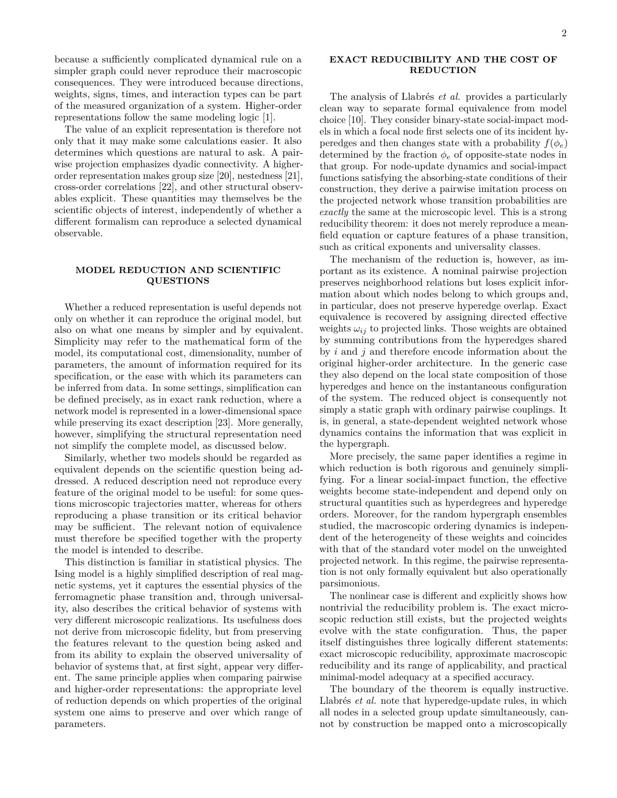
<figcaption class="paper-figure-caption"><b>Fig 1.</b> Low-resolution page preview, page 2</figcaption>
</figure>
<figure class="paper-figure-card">
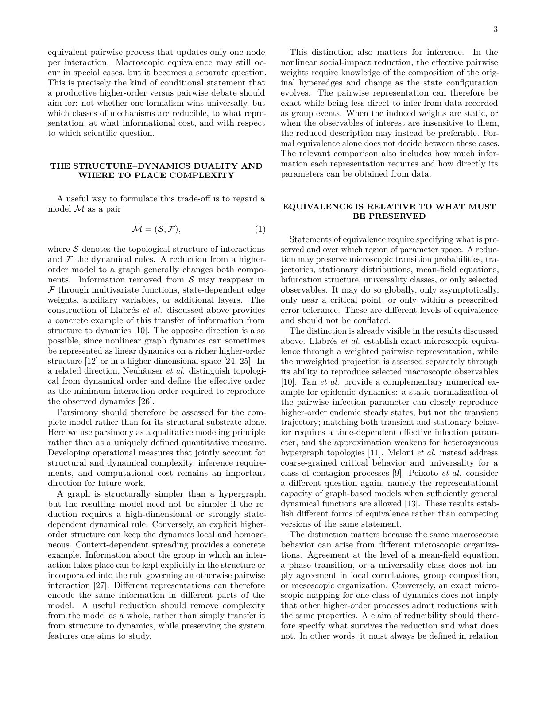
<figcaption class="paper-figure-caption"><b>Fig 2.</b> Low-resolution page preview, page 3</figcaption>
</figure>
<figure class="paper-figure-card">
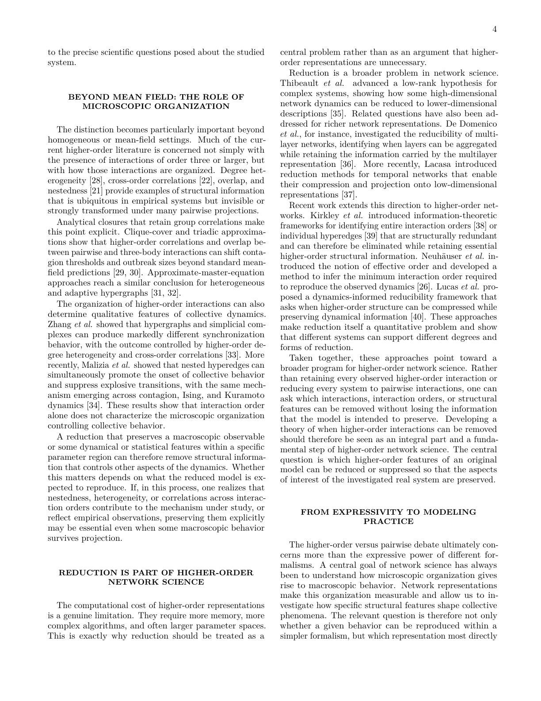
<figcaption class="paper-figure-caption"><b>Fig 3.</b> Low-resolution page preview, page 4</figcaption>
</figure>
<figure class="paper-figure-card">
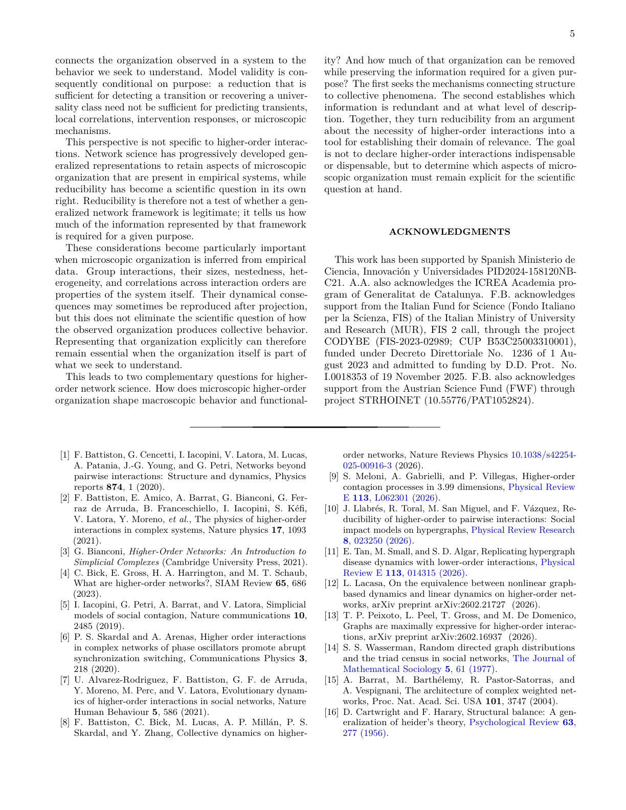
<figcaption class="paper-figure-caption"><b>Fig 4.</b> Low-resolution page preview, page 5</figcaption>
</figure>
<figure class="paper-figure-card">
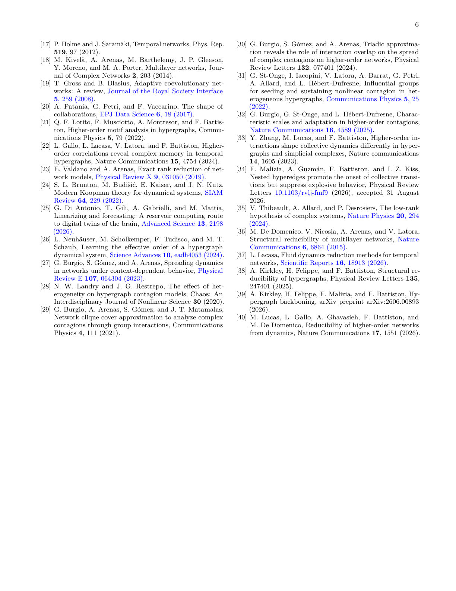
<figcaption class="paper-figure-caption"><b>Fig 5.</b> Low-resolution page preview, page 6</figcaption>
</figure>

**Summary.** This theoretical work critiques the assumption that formal mathematical reducibility implies physical simplification. It argues that for complex systems, the choice between higher-order and pairwise models must be dictated by the specific scientific question—whether one needs to track microscopic details or just locate a macroscopic phase transition. The paper emphasizes that 'simpler' and 'equivalent' are context-dependent notions.

**Why it may be interesting.** While focused on network theory, the rigorous framework for determining when a complex, high-dimensional description (like a quantum many-body state) can be safely reduced to a simpler, low-dimensional effective model (like a pairwise Hamiltonian) mirrors challenges in effective field theories and quantum information theory.

Detailed structure

**Main problem.** The paper addresses the fundamental question of when complex systems governed by higher-order group interactions can be accurately and parsimoniously represented by simpler, pairwise (graph-based) formalisms.

**Main result.** Formal reducibility is insufficient for model choice; the appropriate formalism depends entirely on the specific scientific question, requiring a careful assessment of adequacy relative to the required observables and regimes.

**Method.** The authors employ a theoretical comparison between higher-order structures (like hypergraphs) and pairwise graphs, analyzing the information loss and structural features preserved or obscured during projection.

**Model / system.** The models are general complex systems whose interactions are naturally described by groups, leading to structures like hypergraphs or simplicial complexes, which are compared against standard pairwise graph models.

**Key observables.** Phase transition detection, universality class identification, microscopic trajectories, transient dynamics, and structure-function relations.

**Important parameters / regimes.** The required observables, scales, and regimes defined by the scientific question.

**Assumptions / limitations.** The core assumption is that model choice must be conditional: what is adequate for one question may be insufficient for another.

**Paper structure.** The paper develops an argument by contrasting the formal concept of 'reducibility' with the operational concepts of 'parsimony' and 'adequacy,' concluding that the choice of model must be dictated by the physical question at hand.

Abstract

The current debate on higher-order interactions raises a fundamental question: when can systems organized through group interactions be faithfully represented within a graph-based formalism? Recent results show that graph descriptions can reproduce higher-order dynamics exactly or preserve selected macroscopic observables. Yet reducibility does not necessarily imply simplification, as information removed from the interaction structure may reappear as complexity in the effective dynamics, while structural features such as nestedness, heterogeneity, and cross-order correlations may be obscured by the reduction. We argue that formal representability alone is insufficient as a criterion for model choice. Both "simpler" and "equivalent" are question-dependent notions: parsimony must be assessed for the complete structure-dynamics model, and adequacy must be defined relative to the observables, scales, and regimes required by the scientific question. A reduced model may therefore be fully adequate for locating a phase transition or identifying a universality class while being inadequate for reproducing microscopic trajectories, transient dynamics, or structure-function relations. When group structure carries relevant microscopic information, higher-order representations may remain the most direct, interpretable, and parsimonious description, as well as the natural framework for understanding how microscopic organization gives rise to macroscopic behavior and functionality.

[↑ back to top](#top)

### [Automated search for highly contextual Kochen-Specker proofs](http://arxiv.org/abs/2609.19862v1)

**Authors:** Axel Muller, Metod Saniga  
**Type:** theory · **Category:** quantum information and computing · **PDF:** <https://arxiv.org/pdf/2609.19862v1>  
**Analysis basis:** full PDF text, analyzed in chunks
**Topic relevance:** `quantum measurements` **3/5**

↔ Scroll figures horizontally

<figure class="paper-figure-card">
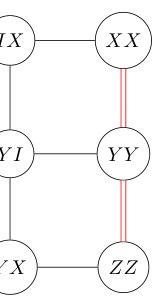
<figcaption class="paper-figure-caption"><b>Fig 1.</b> Figure 1: Building process from the finite simple graph G1 to the quantum assignment α1.</figcaption>
</figure>
<figure class="paper-figure-card">
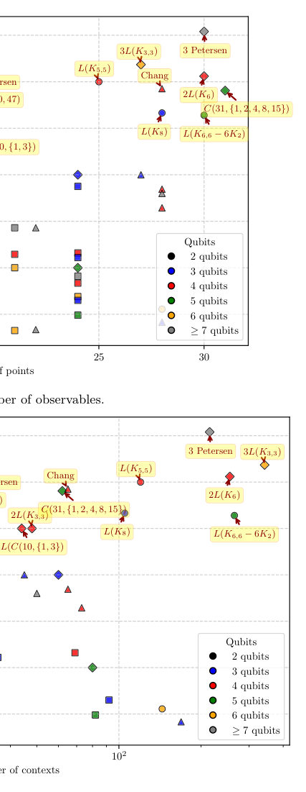
<figcaption class="paper-figure-caption"><b>Fig 2.</b> Figure 2: Plots of the ε values for all the graphs tested, respectively against their number of observables and contexts, with the shapes of the points showing if the configurations are line graphs, and/or vertex-transitive graphs, as well as colors representing their required number of qubits.</figcaption>
</figure>
<figure class="paper-figure-card">
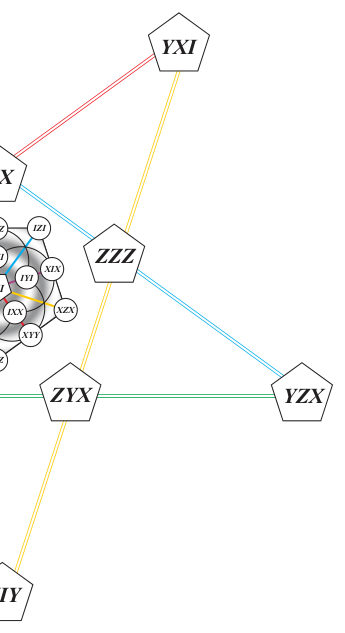
<figcaption class="paper-figure-caption"><b>Fig 3.</b> Figure 3: A doily (middle) in W3 lying on a certain hyperbolic quadric, one of its spread of lines (five colored pairwise disjoint lines) and one of the two associated Mermin pentagrams. An edge of the pentagram of a given color forms with the line of the doily that is of the same color a Fano plane.</figcaption>
</figure>
<figure class="paper-figure-card">
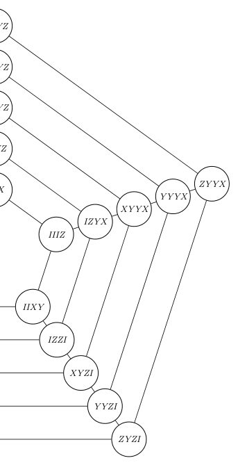
<figcaption class="paper-figure-caption"><b>Fig 4.</b> Figure 4: A portrayal of the fact that 25 observables of our L(K5,5)-configuration can be par- titioned into five pentads in two different ways; the five pentads in one set are represented by pentagons, the ones in the other set by lines. Each context thus picks up one observable from each pentad.</figcaption>
</figure>
<figure class="paper-figure-card">
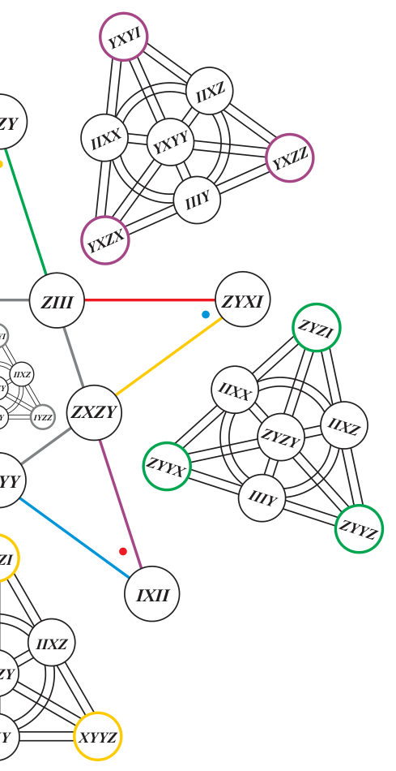
<figcaption class="paper-figure-caption"><b>Fig 5.</b> Figure 5: The composition of the Chang configuration. The central (Mermin) pentagram features ten points of order eight and the six concurrent Fano planes (the line of concurrence is always represented by a circle) comprise 18 observables of order ten (colored). Each observable of the pentagram is the meet of three colors and it commutes with each observable in the Fano planes of the corresponding colors.</figcaption>
</figure>

**Summary.** This paper presents a novel, graph-theoretic methodology to systematically search for the most contextually demanding quantum proofs (Kochen-Specker type). By abstracting the problem to the 'hypergram' structure, the authors achieved record-high contextuality measures ($\varepsilon=0.707$) by analyzing graph structures, providing deep insights into the mathematical limits of quantum contextuality.

**Why it may be interesting.** This work provides a powerful, abstract, and systematic mathematical framework (graph theory) to probe fundamental non-classical features of quantum theory, which is highly relevant for understanding the limits of quantum computation and measurement theory.

Detailed structure

**Main problem.** The paper aims to automate the search for highly contextual Kochen-Specker proofs, which test the fundamental assumption of quantum mechanics that measurement outcomes are independent of the measurement context.

**Main result.** The authors developed a graph-theoretic pipeline that recovered known highly contextual proofs and achieved a record tolerated error per context ($\varepsilon$) of 0.707, primarily by analyzing disjoint unions of graphs.

**Method.** The search is formalized by abstracting the problem to the 'hypergram' structure derived from an anticommutation graph, allowing the search to proceed independently of specific qubit labels.

**Model / system.** The model involves multi-qubit Pauli observables and their associated contextuality structure, formalized using hypergraphs and anticommutation graphs. The analysis is deeply rooted in algebraic graph theory and linear algebra over $\mathbb{F}_2$.

**Key observables.** Contextuality Degree ($d$) and Tolerated Error per Context ($\varepsilon = 2d/|H|$).

**Important parameters / regimes.** The structure of the underlying graph $G$, the size of the graph (e.g., up to 24 vertices), and the number of contexts $|H|$.

**Assumptions / limitations.** The primary assumption is that restricting the search to the hypergram formed by the full hypergraph support $	ext{HS}(G)$ of an anticommutation graph $G$ is sufficient to find the highest $\varepsilon$ values.

**Figures summary.** Figures illustrate the construction process from a graph to its context hypergraph and associated quantum assignment, showing examples like the doily and Mermin pentagram within symplectic polar spaces.

**Paper structure.** The paper establishes the mathematical framework by defining the hypergram and the measure $\varepsilon$. It then details a systematic search strategy by enumerating anticommutation graphs and applying the $	ext{HS}(G)$ construction. Results are presented by recovering known proofs and establishing new records using graph families and geometric analogies.

Abstract

Observable-based Kochen-Specker proofs are configurations of multi-qubit Pauli observables grouped into contexts whose products are plus or minus the indentity. Their robustness as state-independent contextuality tests can be measured by the tolerated error per context $\varepsilon = 2d/|H|$, where $d$ is the contextuality degree and $|H|$ the number of contexts. Since the degree depends only on an underlying abstract structure called the hypergram i.e. the pair formed by the context hypergraph and the anticommutation graph, the search for highly contextual proofs can be carried out on them instead, with no reference to qubits or to any particular Pauli labeling. We further exploit this by enumerating anticommutation graphs first, and then by associating to each graph $G$ the single hypergram carrying its entire hypergraph support $HS(G)$, so that exactly one candidate is examined per graph. Applied to the House of Graphs database and to censuses of vertex-transitive graphs on at most 24 vertices, this pipeline recovers the Peres-Mermin square, the doily and the Mermin pentagram, and yields configurations reaching $\varepsilon = 0.707$, against $0.424$ for the previous published record. The best configurations are predominantly those stemming from line graphs and unions of graphs; we explain the former by showing that every perfect matching of a graph is a context of its line graph, which exhibits the Peres-Mermin square and the doily as the first members of two infinite families. We close with finite geometric descriptions of the most striking configurations inside symplectic polar spaces, in terms of ovoids, hyperbolic quadrics and Fano planes.

[↑ back to top](#top)

### [Collective Symmetry and Criticality from Single-Component Fluctuations](http://arxiv.org/abs/2609.19629v1)

**Authors:** Chunhao Guo, Zhe Wang, Zheng Yan  
**Type:** both · **Category:** statistical mechanics · **PDF:** <https://arxiv.org/pdf/2609.19629v1>  
**Analysis basis:** full PDF text, analyzed in chunks
**Topic relevance:** `analog quantum simulation` **3/5**

↔ Scroll figures horizontally

<figure class="paper-figure-card">
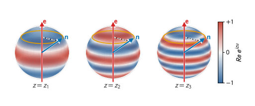
<figcaption class="paper-figure-caption"><b>Fig 1.</b> FIG. 1. Phase cancellation for an isotropic five-component shell S4 of magnitude XL. Unit vectors n and ˆe specify the order-parameter orientation and source direction. With normalized projection u = n· ˆe and source coordinate z = gXL for imaginary-field amplitude g, the exact marginal p5(u) = 3(1 −u2)/4 satisfies R 1 −1 du p5(u) cos(zku) = 0 at zk = j3/2,k, the kth positive zero of the Bessel function J3/2. The spheres visualize the phase factor; the roots are determined by the full S4 measure.</figcaption>
</figure>
<figure class="paper-figure-card">
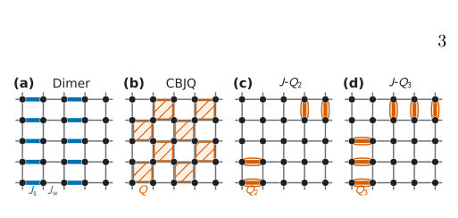
<figcaption class="paper-figure-caption"><b>Fig 2.</b> FIG. 2. Interaction geometries for (a) the dimerized Heisen- berg, (b) checkerboard J–Q (CBJQ), (c) J–Q2, and (d) J–Q3 models. Blue bonds in (a) carry the strong-bond exchange Js; gray bonds carry the remaining Heisenberg exchanges. Orange clusters denote the multispin interactions in (b)–(d).</figcaption>
</figure>
<figure class="paper-figure-card">
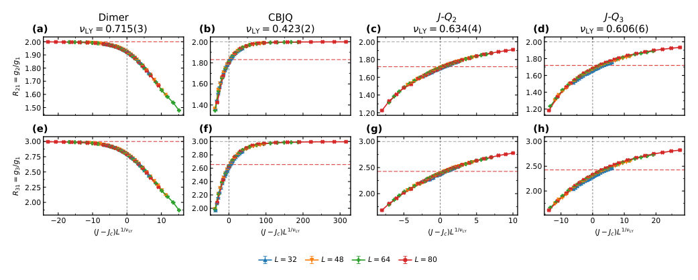
<figcaption class="paper-figure-caption"><b>Fig 3.</b> FIG. 3. Ordered-state geometry and finite-size response in a single-component Lee–Yang spectrum. The top and bottom rows show R21 and R31 versus (J −Jc)L1/νLY for the dimerized Heisenberg, checkerboard J–Q (CBJQ), J–Q2, and J–Q3 models (left to right). Each column uses one fitted coupling-response exponent νLY and separate scaling functions for the ratios, with the reference transition coupling Jc fixed in the fit. Horizontal red dashed lines mark the candidate O(3), O(4), and O(5) Bessel ratios; gray horizontal dashed lines mark the O(3) N´eel-shell limits. Vertical gray dashed lines mark J = Jc. The Bessel levels provide geometric references while the scaled coupling dependence resolves...</figcaption>
</figure>

**Summary.** This work introduces a novel diagnostic tool using Lee-Yang zero ratios derived from single-component fluctuations to probe the full collective symmetry of quantum critical systems. By comparing these ratios to theoretical Bessel sequences, the authors can extract quantitative information about hidden symmetries and critical exponents in models like quantum magnets. This method offers a powerful way to test symmetry hypotheses without needing to measure every competing order parameter.

**Why it may be interesting.** The technique provides a powerful, non-standard diagnostic tool for characterizing critical points and emergent symmetries in strongly interacting quantum matter, which is highly relevant for understanding quantum phase transitions in AMO systems.

Detailed structure

**Main problem.** The paper addresses the challenge of identifying the full 'collective symmetry' and characterizing critical behavior in many-body systems when multiple competing orders are present.

**Main result.** The authors show that Lee-Yang zero ratios derived from a single accessible order parameter can quantitatively probe the underlying collective symmetry and reveal critical information by comparing deviations from a theoretical Bessel sequence benchmark.

**Method.** The core method involves analyzing the relative positions of Lee-Yang zeros generated by a single ordering field, which are then compared against theoretical Bessel sequences fixed by the number of collective symmetry components.

**Model / system.** The study applies this method to general many-body systems exhibiting continuous transitions, using specific examples like spin-1/2 square-lattice antiferromagnets with competing Néel and Valence-Bond-Solid (VBS) orders.

**Key observables.** Lee-Yang zero ratios ($R_{k1}$), Bessel sequence fixed by the number of components, and ratio deviations near quantum criticality.

**Important parameters / regimes.** The number of collective components ($n$), the coupling constants defining competing orders (e.g., $J_w, J_s, Q$), and finite-size scaling parameters ($
u_{LY}, 
u_t$).

**Assumptions / limitations.** The method assumes that the zero ratios are sensitive to unmeasured components, and the analysis relies on comparing results across different polynomial fitting degrees to ensure robustness.

**Figures summary.** Figures illustrate the S4 phase cancellation and show finite-size collapses of the zero ratios ($R_{21}, R_{31}$) against theoretical Bessel ratios for various candidate symmetries ($O(3), O(4), O(5)$).

**Paper structure.** The paper develops the theoretical framework using Lee-Yang zeros, applies it to specific quantum magnetic models (e.g., CBJQ, J-Q2), and then performs detailed numerical simulations and finite-size scaling analyses to compare results across different symmetry assumptions.

Abstract

Symmetry plays a fundamental role in modern physics by guiding the classification of phases and the construction of effective theories of critical systems. Identifying collective symmetry remains challenging because tests based on preselected order parameters can overlook hidden components. A central goal is therefore to extract symmetry and critical information from a single accessible component. We pursue this goal using Lee--Yang zero ratios generated by a single ordering field. Unmeasured components shape the projected fluctuation distribution and hence the relative zero positions. Deep in a phase with spontaneous symmetry breaking, we show analytically that the zero ratios for an isotropic order parameter approach a parameter-free Bessel sequence fixed by the number of collective components. Near quantum criticality, fluctuations deform this distribution. The resulting ratio deviations and their finite-size coupling dependence carry additional critical information. We demonstrate these results with large-scale quantum Monte Carlo simulations of many-body systems with conventional and enlarged continuous symmetries. This approach provides quantitative access to collective symmetry and criticality without measuring every competing order.

[↑ back to top](#top)

### [Efficient Non-Uniform Quantum Hermite Transform through Adaptive Sampling](http://arxiv.org/abs/2609.20739v1)

**Authors:** Nitay Mayo, Aryeh Lev Zabokritskiy  
**Type:** theory · **Category:** quantum information and computing · **PDF:** <https://arxiv.org/pdf/2609.20739v1>  
**Analysis basis:** full PDF text, analyzed in chunks
**Topic relevance:** `analog quantum simulation` **3/5**

↔ Scroll figures horizontally

<figure class="paper-figure-card">
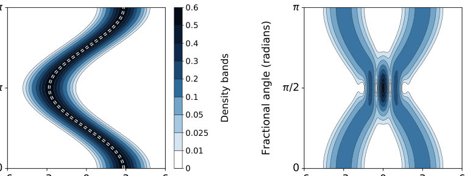
<figcaption class="paper-figure-caption"><b>Fig 1.</b> Figure 1: Visual demonstrations of the Quantum Hermite Transform applied to physical time- evolution (left) and continuous-variable signal processing (right). Filled bands show probability- density intervals. The finite-transform identities apply to the retained Hermite modes; these illus- trations are not gate-level or hardware error benchmarks.</figcaption>
</figure>

**Summary.** This paper develops an efficient quantum circuit for the Quantum Hermite Transform, which maps coefficients in the Hermite basis to weighted position samples. By utilizing adaptive sampling techniques, the authors achieve a near-linear gate complexity, making it a powerful tool for simulating quantum harmonic oscillator dynamics and related quantum processes.

**Why it may be interesting.** This work provides a concrete, resource-bounded quantum algorithm for a fundamental transform (Hermite basis change) crucial for simulating quantum harmonic oscillators and related quantum field theories, directly impacting quantum simulation protocols.

Detailed structure

**Main problem.** The paper addresses the development of an efficient quantum circuit for performing the change of basis between mode coefficients (Hermite basis) and weighted position space samples, known as the Quantum Hermite Transform.

**Main result.** They achieve a near-linear gate complexity, $O(N 	ext{ polylog}(N, 1/\epsilon))$, for implementing this transform using Clifford+T quantum circuits.

**Method.** The core method involves converting uniform-grid samples to non-uniform, weighted Hermite-root samples using signed averages on adaptive windows, which is realized via complex quantum circuit constructions.

**Model / system.** The system is based on the first $N$ oscillator modes, spanned by normalized Hermite functions, relating coefficients to weighted samples at the roots of the $N$-th Hermite polynomial.

**Key observables.** Transform matrix elements, operator error bound $\epsilon$, mode populations $p_k(\Delta t)$, and off-diagonal coherence terms $\langle k|
ho_{out}|\ell
angle$.

**Important parameters / regimes.** The number of modes $N$, the error tolerance $\epsilon$, and the time evolution parameter $t$ for QHO dynamics.

**Assumptions / limitations.** The analysis assumes the transform is applied to arbitrary superpositions and includes all auxiliary registers, though some results are limited to retained Hermite modes.

**Figures summary.** Figure 1 demonstrates the transform applied to coherent state evolution (QHO) and even cat state rotation (FrFT). Figure S2 shows simulated mode populations for $N=16$ under specific qubit relaxation parameters.

**Paper structure.** The paper progresses from establishing the need for the transform, detailing the mathematical conversion from uniform to weighted roots, deriving the required operator $R$, and finally constructing the full quantum circuit realization and analyzing noise diagnostics via the transform–idle–inverse protocol.

Abstract

On the span of the first $N$ oscillator modes, Gauss--Hermite quadrature gives an exact change of basis between mode coefficients and $N$ weighted position space samples. We implement this transform with $O(N\operatorname{polylog}(N,1/\varepsilon))$ logical gates and polylogarithmic quantum width. The operator-error bound $\varepsilon$ holds on arbitrary superpositions and includes all auxiliary registers. The construction uses signed averages on adaptive windows to convert uniform-grid samples into weighted Hermite-root samples. Their varying widths control the amplification cost, giving the near-linear bound.

[↑ back to top](#top)

### [Is higher-order physics different?](http://arxiv.org/abs/2609.20759v1)

**Authors:** Pablo Villegas, Sandro Meloni  
**Type:** theory · **Category:** statistical mechanics · **PDF:** <https://arxiv.org/pdf/2609.20759v1>  
**Analysis basis:** full PDF text, analyzed in chunks
**Topic relevance:** `non-equilibrium universality` **3/5**

↔ Scroll figures horizontally

<figure class="paper-figure-card">
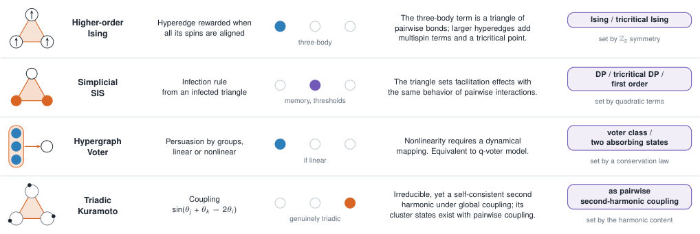
<figcaption class="paper-figure-caption"><b>Fig 1.</b> FIG. 1. The canon revisited. Canonical models with group interactions: the higher-order Ising model [23], simplicial SIS contagion [7, 24], hypergraph voter dynamics [30, 32] and triadic Kuramoto coupling [14, 35, 36]. The middle column distinguishes exact microscopic reduction to pairwise terms (blue), equivalence only at the level of the effective theory (purple) and microscopic irreducibility (orange). Microscopic reducibility and long-scale class are independent: in every case the infrared verdict is set by the operator content of the effective theory—symmetries, conservation laws, slow fields, multicritical tuning— not by interaction arity. Similar phenomenology does not imply...</figcaption>
</figure>
<figure class="paper-figure-card">
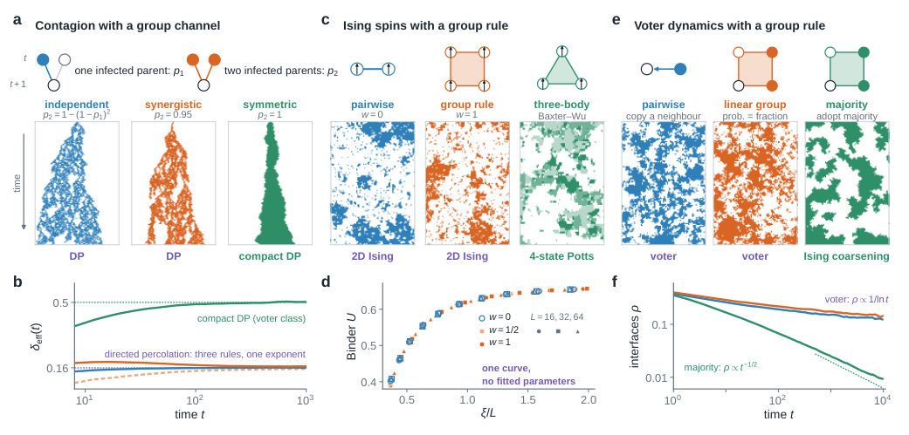
<figcaption class="paper-figure-caption"><b>Fig 2.</b> FIG. 2. Group interactions leave the long-scale behavior alone; a new symmetry or conservation law does not. (a) Domany–Kinzel contagion [39]: a site is infected with probability p1 by one infected parent and p2 by two, the group channel. Critical space–time clusters for independent [p2 = 1 −(1 −p1)2] and synergistic (p2 = 0.95) transmission are statistically alike; at the symmetric endpoint (p1, p2) = (1/2, 1) the active and inactive states become equivalent and the transition is compact DP [40]. (b) Effective survival exponent at criticality: antagonistic (p2 = 0), independent and synergistic rules all converge to directed percolation (DP), the symmetric point to compact DP; critical...</figcaption>
</figure>
<figure class="paper-figure-card">
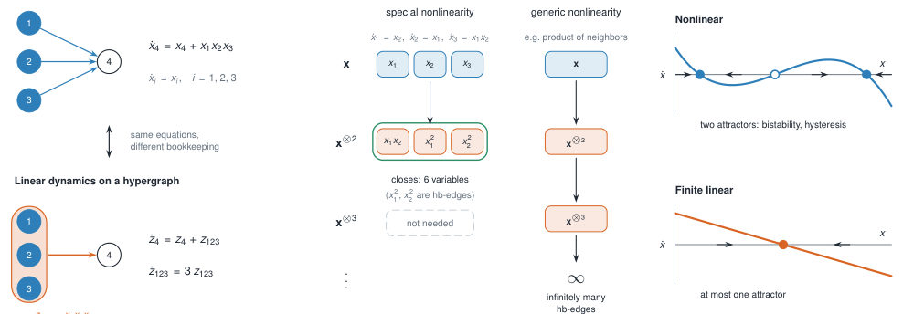
<figcaption class="paper-figure-caption"><b>Fig 3.</b> FIG. 3. Representation is not mechanism. (a) A nonlinear graph dynamics and its exact linear lift on a higher-order state space, where the hyperedge variable is z123 = x1x2x3. (b) Carleman lift [57]. For special nonlinearities the lifted space closes after a few steps; monomials with repeated indices (x2 1, x2 2) are states of hyperedges with repeated vertices. For generic nonlinearities the lift never closes, and an exact linear representation requires infinitely many edges. (c) A nonlinear flow can support multiple isolated stable attractors and hysteresis; a finite-dimensional autonomous linear system cannot. In an exact lift this complexity is transferred to the enlarged state space.</figcaption>
</figure>
<figure class="paper-figure-card">
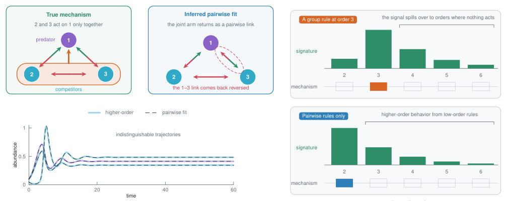
<figcaption class="paper-figure-caption"><b>Fig 4.</b> FIG. 4. What data can and cannot see. (a) A three-species community in which species 1 is affected by 2 and 3 only jointly (orange arm); arrowheads carry the sign of each effect, green positive and red negative. The best pairwise fit has no group term, so the joint arm reappears as an ordinary link between 1 and 3, with the sign reversed—a competitor is promoted to predator—while the fitted trajectories stay indistinguishable from the true ones [70]. (b) A mechanism is sparse; its signature is not. In each panel the green bars give the strength of the statistical signature of dependence at successive interaction orders, and the strip below marks the orders at which a rule actually...</figcaption>
</figure>

**Summary.** This paper argues that while higher-order interactions can generate novel, complex behavior in systems like oscillators or spin models, this novelty does not automatically imply a new fundamental physics. The authors demonstrate that the true long-term, universal behavior is dictated by the system's symmetries and conserved quantities at large scales, rather than the specific arity of the microscopic coupling terms.

**Why it may be interesting.** It provides a rigorous theoretical framework for distinguishing between necessary model complexity (for accurate prediction) and fundamental physical novelty (for new universality classes) in complex many-body systems.

Detailed structure

**Main problem.** The paper critically assesses whether collective phenomena observed in higher-order interacting models prove the existence of a distinct 'higher-order physics' beyond what is predicted by standard universality principles.

**Main result.** The long-scale physics (universality class) is determined by the infrared ingredients (symmetries and conservation laws) surviving coarse-graining, not by the arity (order) of the microscopic interaction.

**Method.** The authors revisit canonical models (Ising, contagion, Kuramoto) by comparing microscopic interaction terms (arity) with their long-scale effective theories and universality classes.

**Model / system.** The analysis uses canonical models including Ising, SIS contagion, voter, and Kuramoto oscillators, extended with three-body or higher-order group interactions.

**Key observables.** Collective phenomena such as discontinuous transitions, bistability, and the resulting universality class (e.g., Directed Percolation).

**Important parameters / regimes.** Interaction arity (order of coupling), dimensionality, and the structure of the effective theory's operator content.

**Assumptions / limitations.** The primary assumption tested is that the long-scale physics must be robust against changes in microscopic description, leading to the separation of microscopic reducibility from macroscopic universality.

**Figures summary.** Figures summarize the analysis of canonical models, distinguishing between microscopic reduction types and showing that group interactions generally leave the long-scale behavior unchanged.

**Paper structure.** The paper progresses by first establishing the conflict between observed novel collective behavior and the principle of universality. It then analyzes specific models to show that while higher-order terms can be microscopically irreducible, their long-scale behavior is often captured by lower-order effective terms, concluding that the focus should be on measurable, predictive evidence.

Abstract

Group interactions are widespread, and higher-order extensions of familiar models display collective phenomena absent from their pairwise baselines, which are routinely offered as evidence of a distinct higher-order physics. We ask whether that claim survives the test that gives new a precise meaning in statistical physics: that of universality. Revisiting canonical higher-order models, we argue that what classifies collective behavior are the infrared ingredients that survive at long scales. Arity is not a universality label. Beyond universality, we examine two further questions: whether higher-order structure is a fact about the system or a choice of description, and what data can and cannot tell us about interaction order. Higher-order descriptions remain indispensable when they expose the organizing structure, provide a better mechanistic language, or improve prediction. We close with what should be measured before new phenomena can be claimed, and where higher-order structure already earns its place.

[↑ back to top](#top)

### [Proof of Shor's conjecture on the accessible information of quantum dichotomies](http://arxiv.org/abs/2609.20600v1)

**Authors:** Michele Dall'Arno  
**Type:** theory · **Category:** quantum information and computing · **PDF:** <https://arxiv.org/pdf/2609.20600v1>  
**Analysis basis:** full PDF text, analyzed in chunks
**Topic relevance:** `quantum measurements` **3/5**

↔ Scroll figures horizontally

<figure class="paper-figure-card">
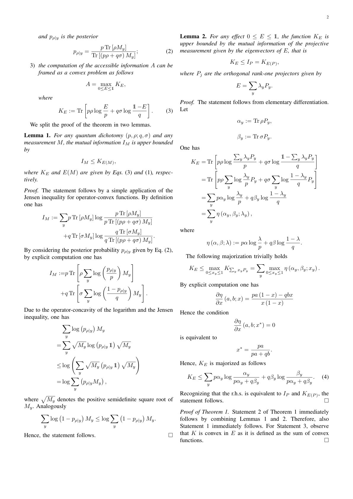
<figcaption class="paper-figure-caption"><b>Fig 1.</b> Low-resolution page preview, page 2</figcaption>
</figure>
<figure class="paper-figure-card">
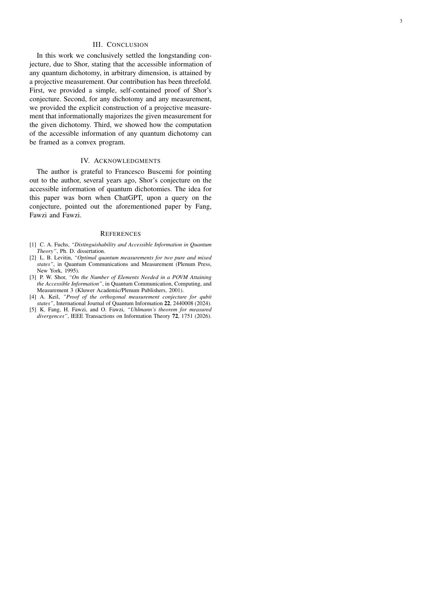
<figcaption class="paper-figure-caption"><b>Fig 2.</b> Low-resolution page preview, page 3</figcaption>
</figure>

**Summary.** This paper provides a complete and elementary proof of Shor's conjecture regarding the accessible information of quantum dichotomies. It demonstrates that this information is always attained by a simple projective measurement, regardless of the system's dimension. Furthermore, it shows that calculating this accessible information can be formulated as a convex optimization problem.

**Why it may be interesting.** This work provides fundamental theoretical tools for quantifying information extraction in quantum systems, which is crucial for understanding the limits of quantum communication and measurement protocols.

Detailed structure

**Main problem.** To conclusively prove Shor's conjecture, which posits that the accessible information of any quantum dichotomy (an ensemble of two states) is always achieved by a projective measurement.

**Main result.** The conjecture is proven for arbitrary finite dimensions, showing that any measurement is informationally majorized by a projective measurement, and furthermore, the computation of accessible information for dichotomies can be framed as a convex optimization problem.

**Method.** The proof utilizes elementary differentiation, the Jensen inequality for operator-convex functions, and reformulates the maximization problem into a convex optimization framework.

**Model / system.** The study concerns quantum ensembles, specifically a quantum dichotomy $(p, 
ho; q, \sigma)$, where $
ho$ and $\sigma$ are quantum states prepared with probabilities $p$ and $q=1-p$. The analysis is performed in arbitrary finite-dimensional Hilbert spaces.

**Key observables.** Accessible information ($A$), which quantifies the maximum extractable Shannon information, and the mutual information ($I_M$) associated with various measurements.

**Important parameters / regimes.** The probabilities $p$ and $q=1-p$ defining the ensemble, and the quantum states $
ho$ and $\sigma$.

**Assumptions / limitations.** The primary assumption is the definition of accessible information as the maximum mutual information over all possible quantum measurements (POVMs).

**Paper structure.** The paper builds the argument by first establishing inequalities relating general measurements to projective measurements, culminating in the proof of Shor's conjecture and the convex formulation of the problem.

Abstract

The accessible information of any given quantum ensemble quantifies the maximum amount of Shannon information that can be extracted from the ensemble by any quantum measurement. Almost three decades ago, Shor conjectured that the accessible information of any quantum dichotomy, that is, an ensemble of two states, is attained by a projective measurement. Recently, a proof of this conjecture restricted to the qubit case was published by Keil. Here, we conclusively settle this longstanding open problem. First, we show that Shor's conjecture follows, in arbitrary dimension, from a recent result by Fang, Fawzi and Fawzi, and we provide a self-contained, elementary proof. Second, for any given dichotomy and measurement, we provide the explicit construction of a projective measurement that outperforms such a measurement in extracting information from the given dichotomy. Third, while the computation of the accessible information is known to be non-convex in general, we frame the computation of the accessible information of dihotomies as a convex problem.

[↑ back to top](#top)

### [Scalable Simulation of Quantum Dynamics on Topological Quantum Hardware](http://arxiv.org/abs/2609.19484v1)

**Authors:** Kritanjan Polley, Mark E. Tuckerman  
**Type:** theory · **Category:** quantum information and computing · **PDF:** <https://arxiv.org/pdf/2609.19484v1>  
**Analysis basis:** full PDF text, analyzed in chunks
**Topic relevance:** `analog quantum simulation` **3/5**

↔ Scroll figures horizontally

<figure class="paper-figure-card">
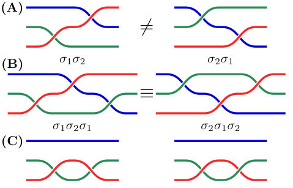
<figcaption class="paper-figure-caption"><b>Fig 1.</b> FIG. 1. Diagrammatic representation of the properties of the braid generators and braid operations. (A) shows the non-Abelian nature of the braid groups. (B) shows the Yang- Baxter relation (c.f. Eq. (A7)). (C) displays the counterclock- wise rotation for the braid generator σi’s that makes σ2 i ̸= I.</figcaption>
</figure>
<figure class="paper-figure-card">
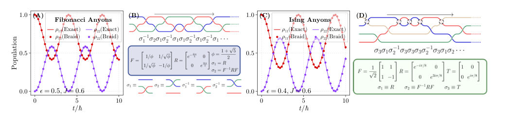
<figcaption class="paper-figure-caption"><b>Fig 2.</b> FIG. 2. Braiding sequences generated for a two-level system using the Solovay-Kitaev algorithm are employed to simulate the time propagation of the system. In panel (A), the exact propagation of population dynamics, obtained by directly exponentiating the Hamiltonian, is depicted with solid lines, while the result obtained from Fibonacci anyon braiding is shown with scattered dots. The first 10 elements of the Fibonacci braiding sequence are displayed above panel (B). Panel (B) also shows the matrix elements for the braiding operations and the individual braiding diagrams for 4 gates; σ1, σ2, and their inverses. Panel (C) presents the population dynamics of a similar Hamiltonian, where we...</figcaption>
</figure>
<figure class="paper-figure-card">
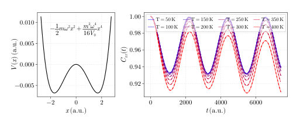
<figcaption class="paper-figure-caption"><b>Fig 3.</b> FIG. 3. The real part of the position autocorrelation function for a double well potential is displayed on the right. The shape of the potential is shown in the left. We used the parameters from Ref. 43, with ω = 500 cm−1, m = 1836 a.u., and V0 = 1500 cm−1. The position autocorrelation function is shown at different temperatures, with the solid line being the result from topological anyon braiding and dashed line being the exact result.</figcaption>
</figure>
<figure class="paper-figure-card">
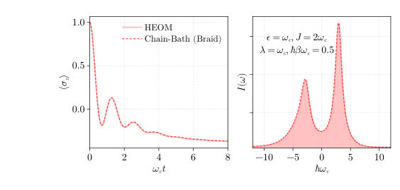
<figcaption class="paper-figure-caption"><b>Fig 4.</b> FIG. 4. Expectation value of σz for a spin Boson model is displayed on the left. The parameters are shown on the right panel. The solid light curve is the numerically exact hierarchical equations of motion (HEOM)48,49 result while the dashed line is the result obtained with topolog- ical braiding. A Lorentzian spectral density of the form, J(ω) = 2λωωc/(ω2 + ω2 c), was utilized to sample the bath frequencies and coupling constants where λ is the solvent re- organization energy and ωc is the peak frequency of the spec- tral density. The absorption spectra are plotted on the right, the shaded region being the HEOM result. For computing spectra, we added a dummy ground state (state 0), and...</figcaption>
</figure>
<figure class="paper-figure-card">
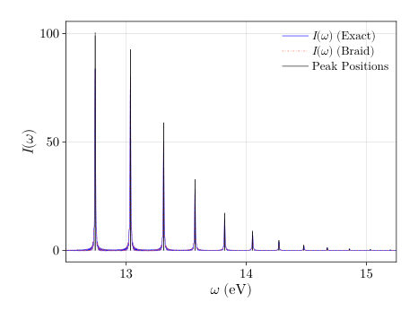
<figcaption class="paper-figure-caption"><b>Fig 5.</b> FIG. 5. Vibronic spectra for H2 molecule at T = 0 K for σ →π transition. The position of the peaks of the spectra is shown in the black vertical lines.</figcaption>
</figure>

**Summary.** This paper presents a comprehensive framework to simulate complex quantum dynamics for molecular and condensed matter physics using topological quantum hardware. It achieves this by mapping time evolution operators onto non-Abelian anyon braiding operations, utilizing the Solovay-Kitaev algorithm for high accuracy. The methodology proves scalable, offering a robust pathway for simulating strongly correlated and non-equilibrium quantum systems on fault-tolerant devices.

**Why it may be interesting.** This work directly bridges the gap between theoretical quantum simulation needs (molecular/condensed matter dynamics) and the physical realization constraints of emerging quantum hardware (topological qubits).

Detailed structure

**Main problem.** Establishing a scalable and robust framework for simulating quantum dynamics in molecular and condensed matter systems directly on topological quantum hardware.

**Main result.** The framework successfully demonstrates the ability to approximate complex quantum dynamics, including molecular kinetics and spin-boson models, using non-Abelian anyon braiding.

**Method.** The core method involves approximating unitary time propagators using the Solovay-Kitaev algorithm by simulating quantum gates via the braiding of Fibonacci and Ising anyons.

**Model / system.** The work applies to a hierarchy of systems, including two-level systems, double-well potentials, spin-boson models, and molecular reaction kinetics, all mapped onto the physics of topological quantum hardware.

**Key observables.** Position autocorrelation function, expectation value of sigma_z, vibronic spectra, and reaction rates (k(T)).

**Important parameters / regimes.** Topological anyon types (Fibonacci, Ising), target accuracy (infidelity), and system parameters like coupling strengths (J, epsilon).

**Assumptions / limitations.** The fidelity of the simulation relies on the accuracy of the Solovay-Kitaev approximation and the underlying assumption of fault-tolerant topological gate operations.

**Figures summary.** Figures compare exact dynamics (solid lines) against results from topological braiding (scattered dots/dashed lines) for various systems, showing high fidelity across different physical regimes.

**Paper structure.** The paper develops a theoretical framework, starting with simple models (two-level systems) to demonstrate the core methodology (anyon braiding via SK algorithm), and then scales this approach up to complex condensed matter and molecular physics problems.

Abstract

Quantum computers offer a significant advantage in simulating quantum systems compared to classical computers for certain problems, although most current applications are limited to calculating static molecular properties using hybrid quantum-classical hardware. In this work, we establish a framework for the representation of quantum dynamics in molecular and condensed matter systems, designed for execution on topological quantum hardware. By leveraging the non-Abelian braiding statistics of Fibonacci and Ising anyons, we utilize the Solovay-Kitaev algorithm to approximate unitary propagators for a range of systems. We demonstrate the efficacy of these algorithms across a hierarchy of complexity, from two-level systems and one dimensional double-well potentials to condensed phase spin-boson models, simple molecules, and molecular reaction kinetics. These algorithms provide a scalable and robust pathway for simulating many-body condensed phase chemical physics on fault-tolerant quantum devices.

[↑ back to top](#top)

### [Technical Report OFDM-Assisted Simultaneous Quantum and Classical THz Communications](http://arxiv.org/abs/2609.20542v1)

**Authors:** Xin Liu, Chao Xu, Soon Xin Ng, Mohammed El-Hajjar, Phuc V. Trinh, Shinya Sugiura, Lajos Hanzo  
**Type:** theory · **Category:** quantum information and computing · **PDF:** <https://arxiv.org/pdf/2609.20542v1>  
**Analysis basis:** full PDF text, analyzed in chunks
**Topic relevance:** `interference shaping light` **3/5**

↔ Scroll figures horizontally

<figure class="paper-figure-card">
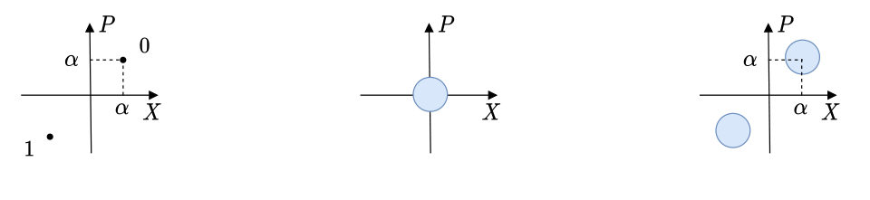
<figcaption class="paper-figure-caption"><b>Fig 1.</b> Fig. 1: Phase-space representations of various communication/quantum modulation schemes: (a) Classical BPSK scheme; (b) GM QKD scheme; (c) SQCC scheme.</figcaption>
</figure>
<figure class="paper-figure-card">
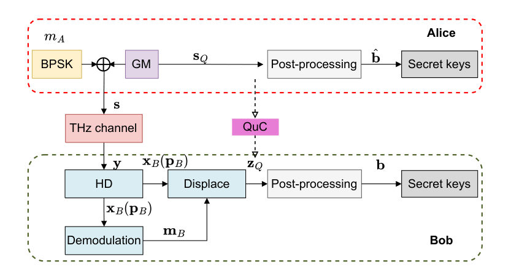
<figcaption class="paper-figure-caption"><b>Fig 2.</b> Fig. 2: SC based SQCC protocol diagram in THz transmission, where the reconciliation post- processing is detailed in [27]. GM: Gaussian modulation; HD: homodyne detection.</figcaption>
</figure>
<figure class="paper-figure-card">
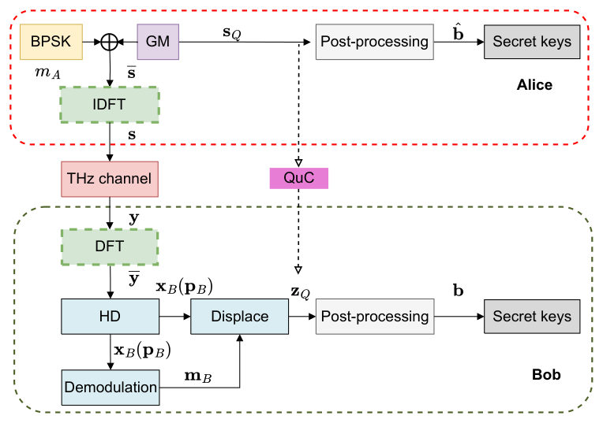
<figcaption class="paper-figure-caption"><b>Fig 3.</b> Fig. 3: OFDM based SQCC protocol diagram in THz transmission, where the reconciliation post- processing is detailed in [27].</figcaption>
</figure>
<figure class="paper-figure-card">
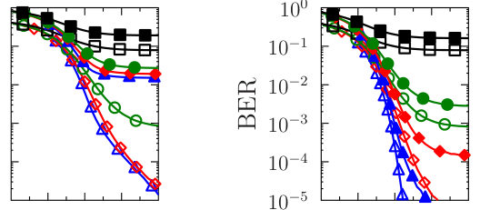
<figcaption class="paper-figure-caption"><b>Fig 4.</b> Fig. 4: BER comparisons for classical communications of OFDM and SC based SQCC systems using different power sharing ratios with 4 × 4 MIMO dimensions, where (a) K = 0 dB and (b) K = 10 dB.</figcaption>
</figure>
<figure class="paper-figure-card">
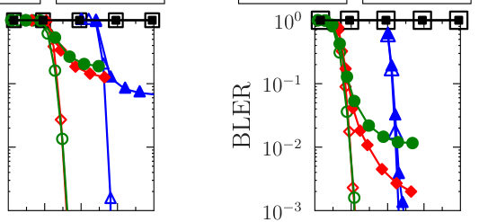
<figcaption class="paper-figure-caption"><b>Fig 5.</b> Fig. 5: BLER comparisons for quantum communications of OFDM and SC based SQCC systems using different power sharing ratios with 4 × 4 MIMO dimensions, where (a) K = 0 dB and (b) K = 10 dB.</figcaption>
</figure>

**Summary.** This paper proposes an OFDM-based system for Simultaneous Quantum and Classical Communication (SQCC) in challenging THz frequency-selective fading channels. By processing signals in the frequency domain, the OFDM scheme maintains a practical Secret Key Rate across various power allocations. This significantly improves performance compared to single-carrier methods, making THz quantum communication more viable.

**Why it may be interesting.** This work directly addresses quantum communication in a high-frequency, complex channel regime (THz), which is a major frontier in quantum optics and quantum networks, requiring advanced signal processing techniques like OFDM.

Detailed structure

**Main problem.** The paper investigates the feasibility of cost-effective Simultaneous Quantum and Classical Communication (SQCC) in realistic, frequency-selective multipath Terahertz (THz) fading channels.

**Main result.** The proposed Orthogonal Frequency Division Multiplexing (OFDM) based SQCC scheme achieves a practical Secret Key Rate (SKR) over various power sharing scenarios, significantly outperforming its single-carrier counterpart.

**Method.** The authors propose an OFDM-based protocol that superimposes classical and quantum signals in the frequency domain, utilizing LDPC coded reconciliation schemes.

**Model / system.** The system operates in the THz band, modeling the channel as frequency-selective multipath fading. The protocol involves superimposing classical BPSK signals with Gaussian Modulated (GM) CV-QKD signals.

**Key observables.** Secret Key Rate (SKR), Bit Error Rate (BER), and Block Error Rate (BLER).

**Important parameters / regimes.** Power sharing ratio ($\zeta = P_Q/P_C$), Ricean factor ($K$), and the channel fading characteristics (frequency-selective).

**Assumptions / limitations.** The investigation focuses on multipath-induced channel dispersion, treating beamforming as a link-enabling mechanism, and using LDPC CV-QKD reconciliation.

**Figures summary.** Figures illustrate phase-space representations of the signals, protocol diagrams for SC and OFDM approaches, and plots showing SKR vs. distance, and BLER vs. power sharing ratio ($\zeta$).

**Paper structure.** The paper develops the SQCC protocol by first establishing the time-domain (SC) approach, then extending it to the frequency-domain using OFDM, and finally analyzing the performance metrics like SKR and BLER under varying power sharing ratios.

Abstract

The feasibility of cost-effective simultaneous quantum and classical communication (SQCC) transmitting both the quantum key and classical information via a superimposed coherent state is investigated both in optical and Terahertz (THz) bands. Since the existing THz SQCC schemes assume single-carrier (SC) transmission over flat fading channels, we embark on investigating SQCC in realistic frequency-selective multipath THz fading channels. We then propose an orthogonal frequency division multiplexing (OFDM) based SQCC system for time-invariant frequency-selective THz scenarios, supported by low-density parity-check coded (LDPC) multidimensional QKD reconciliation schemes. Our simulation results demonstrate that the OFDM-based SQCC scheme is capable of achieving a practical secret key rate (SKR) over a wide range of power sharing scenarios between the classical and quantum signals. By contrast its single-carrier counterpart requires the classical signal to be at least 100 times stronger than the quantum signal in THz SQCC.

[↑ back to top](#top)

### [Unified hydrodynamics for density and spin supersolids](http://arxiv.org/abs/2609.20487v1)

**Authors:** Ashwath N. Madhusudan, Au-Chen Lee, P. B. Blakie, R. N. Bisset  
**Type:** theory · **Category:** quantum gases · **PDF:** <https://arxiv.org/pdf/2609.20487v1>  
**Analysis basis:** full PDF text, analyzed in chunks
**Topic relevance:** `analog quantum simulation` **3/5**

↔ Scroll figures horizontally

<figure class="paper-figure-card">
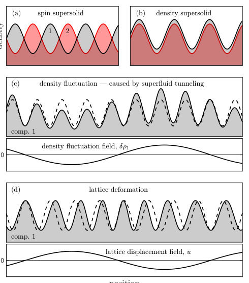
<figcaption class="paper-figure-caption"><b>Fig 1.</b> FIG. 1. Spin- and density-supersolid schematics and hydro- dynamic fields. (a) Spin-supersolid; component 1 (black) and component 2 (red) are modulated out of phase. (b) Density- supersolid; components are modulated in phase. (c) Density fluctuation (upper) and the corresponding slowly varying hy- drodynamic field (lower); dashed curves denote ground-state density. (d) Lattice deformation (upper) and the associated displacement field (lower). We only plot component 1 in (c) and (d) for clarity.</figcaption>
</figure>
<figure class="paper-figure-card">
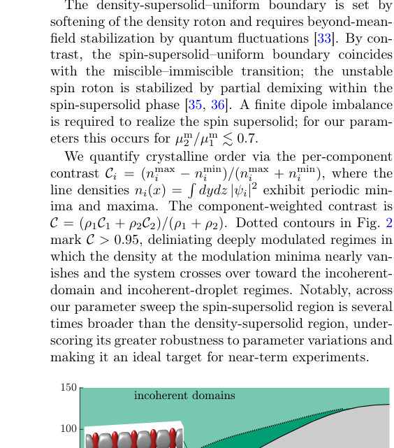
<figcaption class="paper-figure-caption"><b>Fig 2.</b> Fig. 4</figcaption>
</figure>
<figure class="paper-figure-card">
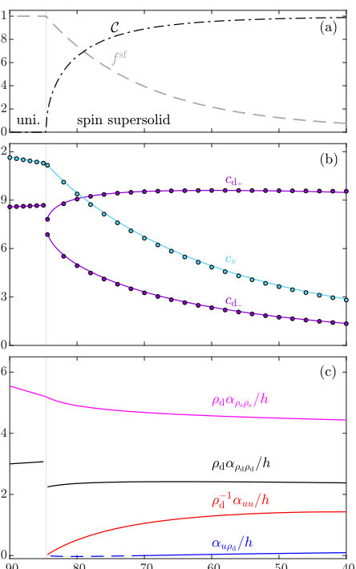
<figcaption class="paper-figure-caption"><b>Fig 3.</b> FIG. 3. Balanced spin-supersolid: superfluidity, sound and elasticity. Hydrodynamic predictions for a balanced mix- ture along the spin-supersolid cut (µm 2 /µm 1 = −1). (a) Component-weighted contrast (dot-dashed) and superfluid fraction (dashed). (b) Sound speeds from hydrodynamics (solid) and BdG (markers), agreeing to ≲1%. Density (spin) modes are shown as purple (cyan), with a spin–density cross- ing occuring near a12/a0 ≈−80 without hybridization. (c) Elastic coefficients, with negative values dashed. Parameters as in Fig. 2.</figcaption>
</figure>
<figure class="paper-figure-card">
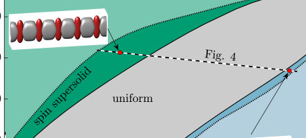
<figcaption class="paper-figure-caption"><b>Fig 4.</b> Fig. 3</figcaption>
</figure>
<figure class="paper-figure-card">
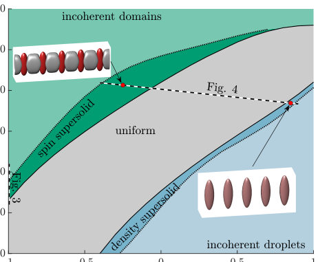
<figcaption class="paper-figure-caption"><b>Fig 5.</b> FIG. 2. Phase diagram showing spin- (green) and density- supersolid (blue) ground state regions as a function of relative dipole moment (horizontal axis) and interspecies scattering length (vertical axis). Solid lines denote phase transitions; dotted lines mark where the component-weighted modulation contrast is C = 0.95 (see main text). Inset: isosurfaces at 30 % of peak densities for component 1 (red) and component 2 (gray). Striped lines indicate the parameter cuts analyzed in Figs. 3 and 4. Parameters: a11 = a22 ≡130a0, µm 1 ≡9.93µB, with µm 2 varied.</figcaption>
</figure>

**Summary.** This paper develops a unified hydrodynamic theory for two-component supersolids, modeling systems like dipolar Bose-Einstein condensates. By deriving equations of motion from symmetry and conservation laws, the authors predict the collective excitation spectrum, including sound speeds. The theory is rigorously benchmarked against microscopic calculations, confirming its quantitative accuracy across the spin- and density-supersolid phases.

**Why it may be interesting.** This work provides a powerful, unified theoretical framework connecting macroscopic hydrodynamic measurements (like sound speed) directly to microscopic parameters (like dipolar interactions and superfluid fractions) in complex quantum matter states.

Detailed structure

**Main problem.** To formulate a general hydrodynamic theory describing the collective dynamics of multicomponent supersolids, which exhibit both density and spin modulations.

**Main result.** The hydrodynamic predictions for sound speeds quantitatively agree with microscopic Bogoliubov–de Gennes calculations across the entire phase diagram, confirming the theory's validity.

**Method.** The theory is derived from symmetry and conservation laws, leading to Euler-Lagrange equations whose normal-mode solutions are used to calculate sound speeds and elastic coefficients.

**Model / system.** The system is a binary dipolar Bose-Einstein condensate (or quantum gas mixture) confined to 1D, exhibiting supersolid phases characterized by density and spin modulations.

**Key observables.** Sound speeds of the three Goldstone branches ($c_{s}, c_{d\pm}$), superfluid fraction ($f_{sf}$), and elastic coefficients ($\alpha_{d
ho d
ho}$, $\alpha_{s
ho s
ho}$).

**Important parameters / regimes.** Relative dipole moment ($\mu_{m2}/\mu_{m1}$), interspecies scattering length ($a_{12}$), and the component imbalance.

**Assumptions / limitations.** The analysis relies on the long-wavelength limit ($\omega = cq$) and utilizes the symmetric-mixture approximation for the quantum-fluctuation energy density ($\epsilon_{QF}$).

**Figures summary.** Figures illustrate the phase diagram showing spin- and density-supersolid regions, and provide hydrodynamic predictions for sound and elasticity along specific cuts (balanced and imbalanced).

**Paper structure.** The paper systematically derives the Lagrangian and Euler-Lagrange equations for the hydrodynamic fields, analyzes the resulting dynamical matrix in different limits (imbalanced, balanced spin, symmetric density), and compares the resulting dispersion relations against microscopic BdG calculations.

Abstract

Two-component supersolids can exhibit in-phase or out-of-phase component density modulations, corresponding to density and spin supersolids, respectively. We formulate a general hydrodynamic theory for the collective dynamics of multicomponent supersolids, guided by their broken symmetries and conservation laws. We benchmark it against microscopic calculations for a binary dipolar condensate confined to an infinite tube, finding quantitative agreement for the sound speeds of all three Goldstone branches throughout the density- and spin-supersolid regions. The resulting relations link collective-mode measurements to elastic coefficients and superfluid fractions.

[↑ back to top](#top)

### [Universality of the $1/9$ Magnetization Plateau and Quantum-Disordered States in the Kagome Family $\mathrm{Cs_8AB_3Ti_{12}F_{48}}$ ($A=\mathrm{Rb},\mathrm{Li}$; $B=\mathrm{K},\mathrm{Na}$)](http://arxiv.org/abs/2609.19572v1)

**Authors:** Prena Chaudhary, Asiri Thennakoon, Tommy Park, Hanru Wang, Leshan Zhao, Laurel Winter, Neil Herrison, Christina Hoffmann, Junghong H. He, Harald O. Jeschke, Hiroyuki Nojiri, Akira Matsuo, Koichi Kindo, Miwako Takahashi, Yukio Noda, Taku J. Sato, Shiyan Li, Hiroaki Ueda, Gia-Wei Chern, Seung-Hun Lee  
**Type:** both · **Category:** strongly correlated electrons · **PDF:** <https://arxiv.org/pdf/2609.19572v1>  
**Analysis basis:** full PDF text, analyzed in chunks
**Topic relevance:** `analog quantum simulation` **3/5**

↔ Scroll figures horizontally

<figure class="paper-figure-card">
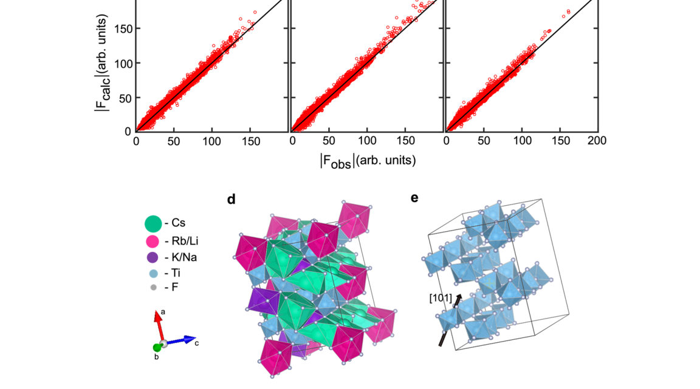
<figcaption class="paper-figure-caption"><b>Fig 1.</b> Fig. 1 | Structural refinements and representative crystal structure of the Cs8AB3Ti12F48 family. a-c, Comparison of observed and calculated structure-factor amplitudes, |Fcalc| and |Fobs|, obtained from refinements of single-crystal neutron diffraction data collected at 300 K for a, Cs8LiNa3Ti12F48, b, Cs8RbK3Ti12F48, and c, Cs8LiK3Ti12F48. The solid black line in each panel indicates ideal agreement, |Fcalc| = |Fobs|. d, Polyhedral representation of the refined monoclinic crystal structure, showing the alkali-metal sublattices and TiF6 octahedra. Cs, A-site (Rb/Li), B- site (K/Na), Ti, and F atoms are shown in green, magenta, purple, light blue, and gray, respectively. e, Ti-F framework...</figcaption>
</figure>
<figure class="paper-figure-card">
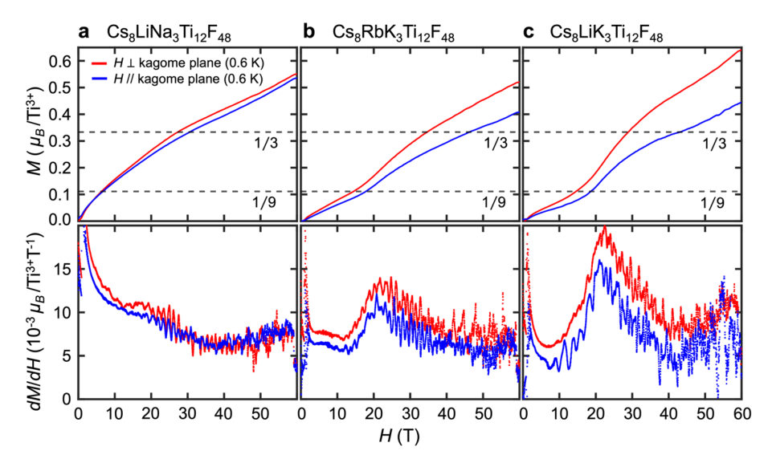
<figcaption class="paper-figure-caption"><b>Fig 2.</b> Fig. 2 | Field-dependent magnetization and its field derivative for the Cs8AB3Ti12F48 family. Field-dependent magnetization M(H) (top panels) and corresponding derivatives dM/dH (bottom panels) measured at a base temperature of 0.6 K for a, Cs8LiNa3Ti12F48, b, Cs8RbK3Ti12F48, and c, Cs8LiK3Ti12F48. Data are shown for magnetic fields applied perpendicular to the kagome plane (H ⊥ kagome plane, red lines) and within the kagome plane (H || kagome plane, blue lines). The dashed horizontal lines in the top panels indicate the 1/9 and 1/3 fractional magnetization levels. Plateau-like features are absent in the structurally compressed LiNa compound, whereas pronounced 1/9 plateau-like phases...</figcaption>
</figure>
<figure class="paper-figure-card">
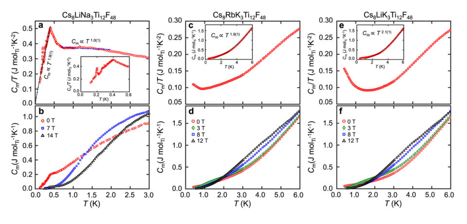
<figcaption class="paper-figure-caption"><b>Fig 3.</b> Fig. 3 | Low-temperature magnetic specific heat of the Cs8AB3Ti12F48 family. a, Zero-field magnetic specific-heat coefficient, (&amp;/I, of Cs8LiNa3Ti12F48. The black and blue lines show fits to (&amp; ∝I!.((!) in the low-temperature region and (&amp; ∝I!.+(!) above the low-temperature anomalies, respectively. The inset highlights the low-temperature anomalies. b, Temperature dependence of (&amp; for Cs8LiNa3Ti12F48 measured at 0, 7, and 14 T. c, Zero-field (&amp;/I of Cs8RbK3Ti12F48. The inset shows (&amp; together with a power-law fit, (&amp; ∝I!.((!). d, Temperature dependence of (&amp; for Cs8RbK3Ti12F48 measured at 0, 3, 8, and 12 T. e, Zero-field (&amp;/I of Cs8LiK3Ti12F48. The inset shows (&amp; together with a power-law...</figcaption>
</figure>
<figure class="paper-figure-card">
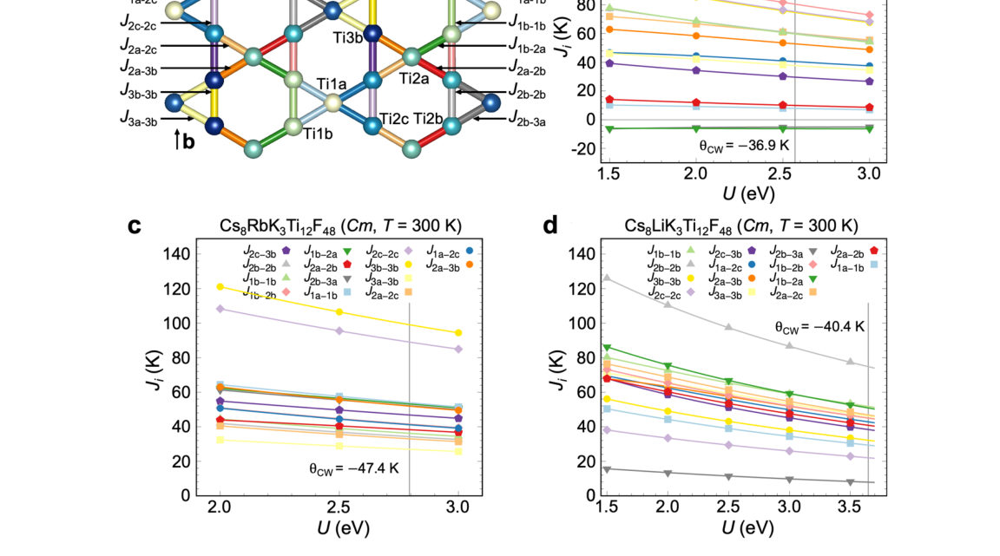
<figcaption class="paper-figure-caption"><b>Fig 4.</b> Fig. 4 | DFT-derived nearest-neighbor exchange interactions and exchange networks of the Cs8AB3Ti12F48 family. a, Common nearest-neighbor exchange network of the Cs8AB3Ti12F48 family, showing the 14 symmetry-inequivalent exchange pathways and their division into A and B exchange subsystems. Both subsystems extend along the crystallographic b direction and provide the structural basis for the chain-A and chain-B magnetic subsystems that become weakly coupled and quasi-one-dimensional in Cs8LiNa3Ti12F48. b-d, Fourteen symmetry-inequivalent nearest-neighbor exchange interactions calculated as a function of the on-site Coulomb interaction U using the 300 K Cm crystal structures of b,...</figcaption>
</figure>

**Summary.** This study investigates how structural tuning, achieved by chemical pressure in the Kagome material Cs_8AB_3Ti_12F_48, affects magnetic ordering. By comparing expanded and compressed compounds, the researchers found that the 1/9 magnetization plateau persists robustly in expanded systems, suggesting it is a fundamental feature of frustrated kagome magnetism, independent of the more common 1/3 plateau.

**Why it may be interesting.** The work provides a detailed experimental and computational study of geometric frustration in a solid-state magnetic system, directly addressing the emergence of fractional magnetization plateaus, which is central to understanding quantum magnetic ground states.

Detailed structure

**Main problem.** The study aims to resolve the microscopic origin and universality of the low-field 1/9 magnetization plateau in spin-1/2 kagome antiferromagnets.

**Main result.** The 1/9 plateau is robustly observed in expanded compounds even when the conventional 1/3 plateau is absent, suggesting the 1/9 feature may be a more universal characteristic of frustrated kagome magnetism.

**Method.** The research combines high-field magnetization measurements, specific-heat measurements, and first-principles DFT calculations, supplemented by structural refinement using neutron and X-ray diffraction.

**Model / system.** The physical system is the Kagome family of compounds, Cs_8AB_3Ti_12F_48, which are spin-1/2 antiferromagnets whose magnetic interactions are modeled by a Heisenberg Hamiltonian.

**Key observables.** Magnetization plateaus (1/9 and 1/3), specific heat anomalies, and derived magnetic exchange constants (J_i).

**Important parameters / regimes.** Chemical pressure tuning via alkali ion substitution (lattice expansion vs. compression) and high magnetic fields up to 60 T.

**Assumptions / limitations.** The analysis assumes that structural changes (compression/expansion) directly modify the magnetic exchange network, and that the magnetic behavior can be mapped onto a Heisenberg model.

**Figures summary.** Figures show structural refinements and polyhedral representations; magnetization curves illustrate the emergence of the 1/9 plateau in expanded samples; specific heat data contrast the behavior of compressed versus expanded compounds.

**Paper structure.** The paper progresses by first establishing the structural basis via joint X-ray/neutron refinement, then using DFT to map exchange interactions, and finally presenting high-field magnetization and specific heat measurements to correlate structural tuning with the magnetic plateau phases.

Abstract

The microscopic origin of the low-field $1/9$ magnetization plateau in spin-$1/2$ kagome antiferromagnets remains unresolved. Here, we show that chemical pressure reshapes the hierarchy of fractional magnetization plateaus in the titanium-based kagome family $\mathrm{Cs_8AB_3Ti_{12}F_{48}}$ ($A=\mathrm{Rb},\mathrm{Li}$; $B=\mathrm{K},\mathrm{Na}$). High-field magnetization measurements up to 60 T reveal a robust $1/9$ plateau-like phase in the expanded $\mathrm{Cs_8RbK_3Ti_{12}F_{48}}$ and $\mathrm{Cs_8LiK_3Ti_{12}F_{48}}$ compounds, despite the absence of the conventionally more robust $1/3$ plateau. In contrast, compressed $\mathrm{Cs_8LiNa_3Ti_{12}F_{48}}$ exhibits neither the $1/9$ plateau-like phase nor a quantum-disordered ground state. Specific-heat measurements and first-principles calculations show that lattice expansion preserves a frustrated, fully connected kagome exchange network and gapless quantum-disordered ground states, whereas compression reorganizes the exchange network into weakly coupled quasi-one-dimensional subsystems and induces successive magnetic transitions. These results demonstrate that the $1/9$ and $1/3$ plateaus need not share a common microscopic origin and suggest that the $1/9$ plateau may represent a more universal feature of frustrated spin-$1/2$ kagome magnetism.

[↑ back to top](#top)

### [Vehicle-Routing Clustering by Sparse Quantum Relaxation](http://arxiv.org/abs/2609.19575v1)

**Authors:** Farzan Moosavi, Bilal Farooq  
**Type:** both · **Category:** quantum information and computing · **PDF:** <https://arxiv.org/pdf/2609.19575v1>  
**Analysis basis:** full PDF text, analyzed in chunks
**Topic relevance:** `QC/QI experiment` **3/5**

↔ Scroll figures horizontally

<figure class="paper-figure-card">
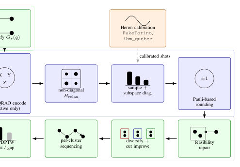
<figcaption class="paper-figure-caption"><b>Fig 1.</b> Fig. 1. Sparse QRAO pipeline with two-phase repair.</figcaption>
</figure>
<figure class="paper-figure-card">
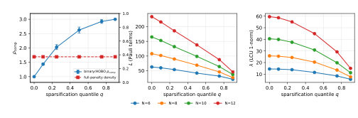
<figcaption class="paper-figure-caption"><b>Fig 2.</b> Fig. 2. Encoding resources versus sparsification level. Left: binary/HOBO compression recovers as the objective graph is sparsified, while full penalty encoding keeps interaction density pinned. Middle/right: Pauli-term count L and LCU norm λ both drop with the quantile q. Statistics use N ∈ {6, 8, 10, 12} and eight seeds.</figcaption>
</figure>
<figure class="paper-figure-card">
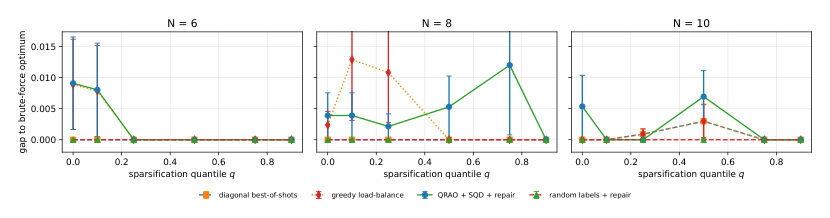
<figcaption class="paper-figure-caption"><b>Fig 3.</b> Fig. 3. Method comparison under full two-phase repair, N ∈{6, 8, 10}, mean ± SE over eight seeds with brute-force oracle gaps. Random-labels and diagonal best-of-shots overlap at gap ≈0. QRAO+SQD+repair can sit slightly above them because Pauli rounding often starts from a collapsed assignment and deterministic local repair can settle in a worse basin than repair from random labels. This near-zero collapse is expected, so the non-diagonal contribution is measured in the feasibility-only decoder ablation. N = 12 is omitted from the panel for space; the decoder ablation in the text covers it.</figcaption>
</figure>
<figure class="paper-figure-card">
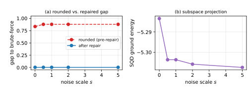
<figcaption class="paper-figure-caption"><b>Fig 4.</b> Fig. 4. Noise disambiguation at N = 8, K = 3, 8 seeds. (a) Rounded gap stays near 0.88 because Pauli rounding collapses to one cluster, while repaired gap is near zero. (b) SQD ground energy varies by less than 0.03 (−5.28→−5.31) across s∈{0, . . . , 5}; the small visual changes are within seed-level variation.</figcaption>
</figure>

**Summary.** This paper applies quantum optimization (QRAO) to the complex Vehicle-Routing Clustering problem, decomposing it into a cluster-assignment layer. It analyzes the trade-off between graph sparsity and quantum compression, showing that while quantum methods are employed, the final success hinges on a robust classical repair mechanism, leading to near-optimal results on current hardware.

**Why it may be interesting.** The work provides a detailed, practical study of applying quantum optimization techniques to complex combinatorial problems, offering empirical benchmarks on near-term quantum hardware regarding resource scaling and error mitigation.

Detailed structure

**Main problem.** The paper tackles the cluster-assignment layer of the Capacitated Pickup-and-Delivery Problem with Time Windows (CPDPTW), aiming to solve it using quantum optimization techniques.

**Main result.** The authors demonstrate that while QRAO provides necessary non-diagonality, the dense nature of the conflict graph poses a major obstruction, and the classical repair mechanism is crucial for achieving near-optimal solutions.

**Method.** The approach uses a cluster-first-route-second decomposition, employing Quantum Random Access Optimization (QRAO) on a sparsified objective Hamiltonian, followed by a two-phase classical repair procedure.

**Model / system.** The problem is modeled via a weighted conflict graph derived from time-window incompatibilities. The quantum computation is implemented using QRAO encoding binary variables via non-commuting QRAC observables on quantum hardware simulators (Qiskit Aer, calibrated FakeTorino, IBM Heron).

**Key observables.** Mean gap (0.0016), mean device-vs-ideal Total Variation Distance (TVD) (0.279), compression ratio (rho_comp), LCU 1-norm, and final routing quality.

**Important parameters / regimes.** Sparsification level (q), number of request pairs (4 to 12), Krylov dimension (r), and noise scale (s).

**Assumptions / limitations.** The authors explicitly state they make no quantum-advantage claim, relying heavily on a classical 'repair after rounding' step to enforce feasibility.

**Figures summary.** The notes reference a regime map linking various quantum parameters to routing quality, and show hardware performance metrics (Table I) and the efficacy of the repair step (Figure 3, Figure 4).

**Paper structure.** The paper first establishes the necessity of decomposition and the failure of diagonal methods (SQD). It then introduces QRAO for non-diagonality, details the sparsification/compression trade-off, and finally presents the full pipeline including two-phase repair and hardware benchmarking.

Abstract

This paper studies the cluster-assignment layer of a cluster-first-route-second decomposition for the capacitated pickup-and-delivery problem with time windows (CPDPTW), instead of a direct route-ordering quadratic unconstrained binary optimization (QUBO). Sample-based subspace diagonalization (SQD) degenerates to best-of-shots for any diagonal optimization Hamiltonian, so a useful transfer to routing requires non-diagonal relaxation. Quantum random access optimization (QRAO) provides this non-diagonality by encoding binary variables through non-commuting quantum random access code (QRAC) observables. CPDPTW-derived conflict graphs expose a routing-specific obstruction because dense objectives and penalty-encoded constraints destroy QRAO compression. We keep the Hamiltonian sparse by encoding only the sparsified objective and enforcing one-hot, capacity, and cluster time-budget feasibility by repair after rounding. We make no quantum-advantage claim. Under strong repair the classical pass alone reaches near-optimal cost at the tested sizes. The result is a regime map linking sparsification, achieved compression, linear-combination-of-unitaries (LCU) 1-norm, heavy-hex two-qubit depth, sampling drift, and final routing quality on Qiskit Aer, calibrated FakeTorino, and IBM Heron ibm_quebec. Across a 108-row ideal-calibrated-hardware evaluation grid spanning four to twelve pickup-delivery request pairs, the hardware slice has mean gap 0.0016 and mean device-vs-ideal total variation distance (TVD) 0.279; a decoder ablation at sizes six through twelve isolates the non-diagonal signal.

[↑ back to top](#top)

### [Higher-Order Interactions in Complex Systems: Mechanisms, Behaviour, Representation and Reducibility](http://arxiv.org/abs/2609.20142v1)

**Authors:** Francisco J. Pérez-Reche  
**Type:** theory · **Category:** statistical mechanics · **PDF:** <https://arxiv.org/pdf/2609.20142v1>  
**Analysis basis:** full PDF text, analyzed in chunks
**Topic relevance:** `analog quantum simulation` **2/5** · `Keldysh / 2PI / non-Gaussian methods` **1/5** · `correlated / nonlocal dissipation` **1/5** · `driven-dissipative phase transition` **1/5** · `methods for driven-dissipative` **1/5** · `non-equilibrium universality` **1/5** · `quantum measurements` **1/5**

↔ Scroll figures horizontally

<figure class="paper-figure-card">
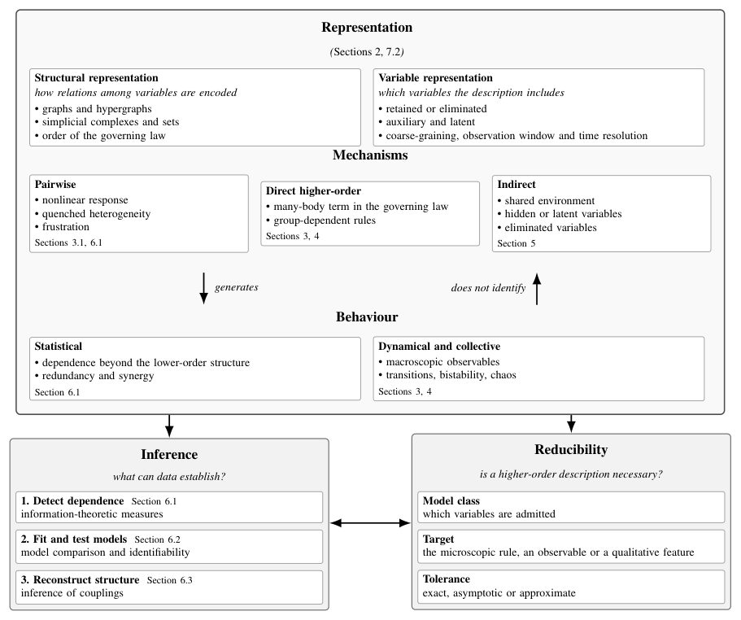
<figcaption class="paper-figure-caption"><b>Fig 1.</b> Figure 1: Conceptual structure of the review. Higher-order behaviour or dependence can arise from a pairwise mechanism, a direct many-body mechanism, or an indirect mechanism acting through a shared environment, a latent variable or a variable that has been eliminated from the description. Any such mechanism, and the behaviour it generates, is expressed within a representation, comprising the structural representation, how the relations among variables are encoded, and the variable representation, which variables the description includes. Because distinct mechanisms can generate overlapping behaviour, the mapping from mechanisms to behaviours is not one-to-one. Accordingly, an observed...</figcaption>
</figure>

**Summary.** This review provides a comprehensive theoretical framework for analyzing higher-order interactions in complex systems, separating the concepts of mechanism, observable behavior, and mathematical representation. It argues that these three aspects are not equivalent, demonstrating that observed collective phenomena can arise from multiple underlying physical causes. The work establishes formal criteria for determining when a complex, high-order model can be accurately simplified or reduced to a lower-order description.

**Why it may be interesting.** Although focused on classical statistical mechanics, the rigorous framework for distinguishing mechanism from observation, and the formal treatment of reducibility, provides powerful conceptual tools applicable to open quantum systems where distinguishing between true quantum correlations and classical approximations is paramount.

Detailed structure

**Main problem.** The paper aims to develop a unified framework for understanding higher-order interactions in complex systems by rigorously distinguishing between the underlying physical mechanism, the resulting observable behavior, and the mathematical representation used to describe them.

**Main result.** The core finding is that observed collective behavior does not uniquely determine the underlying mechanism, as the same behavior can arise from different mechanisms or through mere representational artifacts.

**Method.** The review employs conceptual analysis, drawing distinctions between mechanistic, statistical, and representational definitions, and formalizing the concept of 'reducibility' by comparing source models to admissible lower-order approximations.

**Model / system.** The analysis applies to general complex systems, including coupled oscillators (like the Kuramoto model), ecological communities, and neural networks, which are modeled using generalized Hamiltonians or non-equilibrium equations of motion containing higher-order coupling terms.

**Key observables.** Collective behaviors such as explosive synchronization, discontinuous phase transitions, and altered stability regimes.

**Important parameters / regimes.** The order of interaction (pairwise vs. higher-order), the target of reduction (microscopic rule vs. observable feature), and the tolerance level for approximation.

**Assumptions / limitations.** The primary limitation noted is that observational data alone is generally insufficient to uniquely establish the true underlying mechanism.

**Figures summary.** Figure 1 conceptually structures the relationship between mechanisms, behavior, and representation, while the notes imply tables summarizing the formalisms for defining higher-order interactions.

**Paper structure.** The paper is structured around distinguishing three core questions: what governs the system (mechanism), what does it produce (behavior), and how is it described (representation). It then formalizes the concept of reducibility and reviews information-theoretic tools for detection.

Abstract

Higher-order interactions couple three or more elements in ways that cannot be decomposed into pairwise contributions. In diverse complex systems they produce striking collective behaviours such as explosive synchronization, discontinuous transitions and altered stability. Neither such behaviour nor a description written in many-body terms establishes a many-body mechanism, since both depend on how the system is represented. This review distinguishes three questions: what mechanism governs the system, what behaviour does it produce, and how is either represented? Representation covers both which variables are included and how relations among them are encoded. We examine direct many-body mechanisms, nonlinear but pairwise mechanisms that mimic them, and indirect routes through shared environments or eliminated variables, together with temporal aggregation, an artefact of observation rather than a mechanism. The same behaviour can arise from different mechanisms, and a given higher-order mechanism has no universal behavioural consequence. We then formulate reducibility, the question of whether a higher-order model can be replaced by a lower-order one, as a comparison between a source model and an admissible class of lower-order models, relative to a target and a tolerance. The target may be a microscopic rule, an observable or a qualitative feature. Information-theoretic and inferential methods are reviewed as complementary tools for detecting higher-order dependence, testing lower-order alternatives and reconstructing interaction structure. However, observational data alone generally cannot establish the mechanism. We close by identifying open problems in linking mechanisms to measurable signatures, coarse-graining, identifiability and causality, and in extending reductions beyond mean field. (Abridged)

[↑ back to top](#top)

### [Martingale theory for heat and phase-space contraction in heterogeneous diffusions](http://arxiv.org/abs/2609.20681v1)

**Authors:** Jing Qin, Nariya Uchida, Édgar Roldán  
**Type:** theory · **Category:** statistical mechanics · **PDF:** <https://arxiv.org/pdf/2609.20681v1>  
**Analysis basis:** full PDF text, analyzed in chunks
**Topic relevance:** `Keldysh / 2PI / non-Gaussian methods` **2/5** · `non-equilibrium universality` **2/5** · `correlated / nonlocal dissipation` **1/5** · `driven-dissipative phase transition` **1/5** · `methods for driven-dissipative` **1/5** · `quantum measurements` **1/5**

↔ Scroll figures horizontally

<figure class="paper-figure-card">
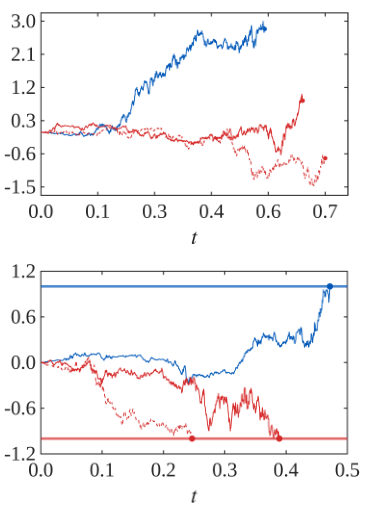
<figcaption class="paper-figure-caption"><b>Fig 1.</b> Figure 1: Illustrative examples of stopping times. In these illustrations, we con- sider two examples given by (a) the first time T at which the system crosses a ring of radius 2, and (b) the first time T elapsed until the system has dissi- pated or absorbed an amount kBT of heat. The trajectories are generated by nu- merical simulation of a Langevin equation with two–dimensional rotational flow, dXt/dt = −Yt + p</figcaption>
</figure>
<figure class="paper-figure-card">
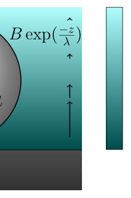
<figcaption class="paper-figure-caption"><b>Fig 2.</b> Figure 2: Sketch of a sphere moving perpendicularly to a hard wall in an aqueous environment and subject to gravity G (downward arrow) and a double-layer repul- sive force whose amplitude (upward arrows) decreases exponentially with increasing distance from the wall z; see Eq. (38). The hydrodynamic interaction between the sphere and the wall induces a space-dependent mobility µ(z) given by Eq. (37) whose value is illustrated by the color bar.</figcaption>
</figure>
<figure class="paper-figure-card">
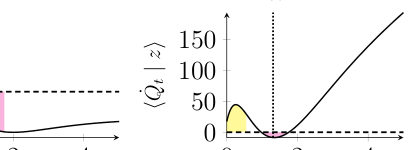
<figcaption class="paper-figure-caption"><b>Fig 3.</b> Figure 3: Analytical values for (a) the equilibrium distribution Peq(z) [Eq. (41)], (b) d(µ(z)F(z))/dz [Eq. (44)] and local expected value of the rate of heat dissipation 〈dQ/dt| zt = z〉[Eq. (45)] for the stochastic model of a sphere near a hard wall (36) with parameter values shown in Table 2. The yellow shaded regions correspond to those where ∇· (µF)(z) &gt; 0 (i.e. where exp(−Qt) is a supermartingale), and the pink shaded regions correspond to those where 〈dQ/dt| zt = z〉&lt; 0 (i.e. where Qt is a supermartingale). The horizontal dashed line in (b) and (c) are a guide to the eye set to zero, and the vertical dashed lines are set at the balance point zbal given by Eq. (42).</figcaption>
</figure>
<figure class="paper-figure-card">
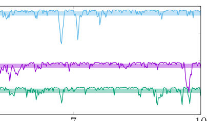
<figcaption class="paper-figure-caption"><b>Fig 4.</b> Figure 4: Representative stochastic trajectories (solid lines) of (a) the distance zt and (b,c) the heat dissipated Qt as a function of time t together with their respec- tive averages over many trajectories (〈zt〉in panel a, and 〈Qt〉in panels b and c, thick lines), obtained from numerical simulations of relaxations starting from three different initial distances: z0 = 4 (blue), z0 = 1.34 (green), and z0 = 0.4 (purple). The data is obtained by numerically integrating the stochastic model of a sphere near a hard wall (36) with parameter values shown in Table 2, using Milstein algorithm with time step ∆t = 10−4. The ensemble averages are obtained from N = 105 inde- pendent simulations. In...</figcaption>
</figure>
<figure class="paper-figure-card">
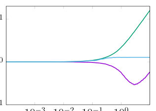
<figcaption class="paper-figure-caption"><b>Fig 5.</b> Figure 5: Numerical estimates for the average distance 〈zT 〉(a), escape probability P0 (b), average heat dissipated QT (c), and average exponential heat exp(−QT ) eval- uated using the stopping rule given by Eq. (46) and (47) with varying horizon time th. In panel (a), the pink shaded area and the yellow shaded area are respectively the regions where Qt and exp(−Qt) are supermartingales, the horizontal dashed line is the balance distance zbal given by Eq. (42), cf. Fig. 3, and the thick lines are 〈zt〉with no stopping criterion. In panel (c), the dashed lines correspond to averages of the stochastic phase contraction ΛT (see Eq. (25)). The data is obtained from numerical simulations of...</figcaption>
</figure>

**Summary.** This work develops a theoretical framework using martingale theory to analyze how heat is dissipated in complex, non-equilibrium physical systems described by Langevin dynamics. It establishes that the statistical behavior of dissipated heat—whether it appears conserved, increasing, or decreasing over time—is mathematically linked to the local contraction or expansion of the system's phase space. This extends stochastic thermodynamics by providing quantitative criteria for heat fluctuation analysis.

**Why it may be interesting.** It provides a rigorous mathematical framework (martingale theory) to characterize non-equilibrium energy dissipation, which is a core topic in modern non-equilibrium statistical mechanics, relevant for understanding energy flow in complex quantum or classical systems.

Detailed structure

**Main problem.** The paper investigates the martingale properties of heat dissipated during non-equilibrium overdamped Langevin dynamics in heterogeneous media.

**Main result.** The heat dissipation process can exhibit transient martingale, submartingale, or supermartingale behavior, which is dictated by the sign of the phase-space contraction rate. This links heat fluctuation statistics to the non-linear dynamics of the system.

**Method.** The analysis employs martingale theory, utilizing Itô calculus to derive stochastic differential equations for quantities like $\exp(-eta Q_t)$ and relating their behavior to the divergence of the drift term.

**Model / system.** The model is a generic N-dimensional overdamped Langevin system governed by an Itô equation, applicable to systems like microscopic particles interacting with walls under gravity and double-layer forces.

**Key observables.** Heat Dissipation ($Q_t$), Stochastic Entropy Production ($S_{env}$), and Phase-Space Contraction ($\Lambda_t$).

**Important parameters / regimes.** Temperature ($T$), inverse temperature ($eta$), and the sign of the divergence $
abla \cdot (\mu \cdot \mathbf{F})$.

**Assumptions / limitations.** The system is assumed to follow an overdamped Langevin equation, and the analysis relies on the mathematical framework of martingales for Itô diffusions.

**Figures summary.** Figures illustrate the dependency of $\langle \exp(-Q_t) 
angle$ on parameters, showing transient decreases when the process behaves as a supermartingale.

**Paper structure.** The paper establishes the theoretical framework by defining the Langevin dynamics and heat dissipation, develops the martingale criteria linking $Q_t$ to phase-space contraction, and concludes with theoretical bounds and applications to specific physical models.

Abstract

We investigate martingale properties of heat dissipated by generic non-equilibrium overdamped Langevin dynamics with multiple dimensions and transport coefficients that may depend explicitly on time and/or space. We find quantitative criteria that establish that heat dissipation may exhibit transient martingale (time-conserved), submartingale (time increasing), and supermartingale (time decreasing) properties in Langevin dynamics with drift coefficients with spatial non-linear dependencies. Furthermore, we reveal a tight link between the heat statistics at stopping (e.g. first-passage) times with that of a functional quantifying the phase-space contraction in the system dynamics. The theoretical results are used to predict the statistical properties of the heat dissipated by a spherical microscopic particle subject to gravity and double-layer forces and hydrodynamically interacting with a rigid wall, whose validity is confirmed by numerical simulations. These results extend the scope of stochastic energetics by revealing a non-trivial relation between heat fluctuations' statistical properties and the non-linear features of non-equilibrium processes.

[↑ back to top](#top)

### [Disorder-induced modulation of the nonlinear Hall effect in Weyl semimetals](http://arxiv.org/abs/2609.20471v1)

**Authors:** Juan A. Cañas, Daniel A. Bonilla, A. Martín-Ruiz  
**Type:** theory · **Category:** disordered systems and neural networks · **PDF:** <https://arxiv.org/pdf/2609.20471v1>  
**Analysis basis:** full PDF text, analyzed in chunks
**Topic relevance:** `Keldysh / 2PI / non-Gaussian methods` **2/5** · `methods for driven-dissipative` **2/5**

↔ Scroll figures horizontally

<figure class="paper-figure-card">
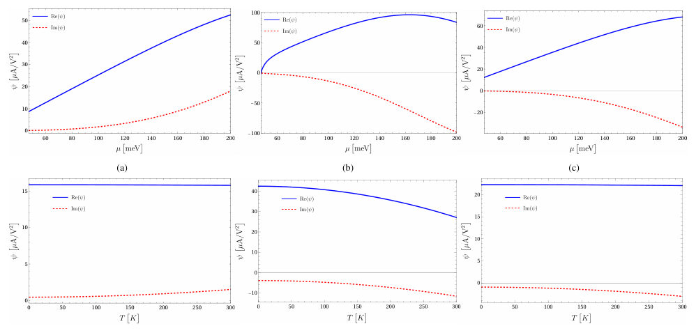
<figcaption class="paper-figure-caption"><b>Fig 1.</b> FIG. 1: Rectification efficiency ψ for various impurity models. The nodal energy separation is set to b0(+1) −b0(−1) = 40 meV, and the Fermi energy µ is measured relative to the χ = −1 node. Calculations are performed within the valid linear dispersion regime (40 ≤µ &lt; 200 meV), using vF = 105 m/s, ni = 1019 cm−3, and the angular frequency ω = 1012 s−1. The upper panels show the dependence of ψ on µ at T = 0 for (a) delta-function potentials (U0 = 30 meV nm3), (b) Gaussian potentials (d = 4 nm and U0 so that u(0) = 30 meV), and (c) screened Coulomb scatterers (ϵ = 3ϵ0). The lower panels (d, e, f) show the respective temperature dependence of ψ at a fixed chemical potential µ = 70 meV for the...</figcaption>
</figure>
<figure class="paper-figure-card">
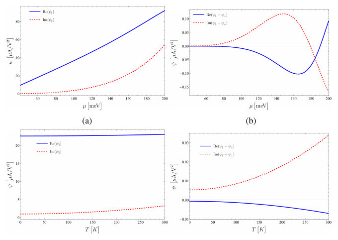
<figcaption class="paper-figure-caption"><b>Fig 2.</b> FIG. 2: Rectification efficiency for polarized magnetic impurities. The figure is arranged in a 2 × 2 grid. The upper panels display the dependence on the Fermi energy µ at T = 0 for (a) the longitudinal component ψ∥and (b) the anisotropic difference ψ∥−ψ⊥. The lower panels show the temperature dependence at a fixed chemical potential µ = 70 meV for (c) ψ∥ and (d) ψ∥−ψ⊥. As observed, the difference ψ∥−ψ⊥is finite but 3 to 4 orders of magnitude smaller than ψ∥; therefore, ψ⊥is practically identical to ψ∥and is not plotted separately. he continuum exchange strength is set to (JS)cont = 20.6 meV nm3, obtained by combining the exchange energy scale ∆ex = 165 meV used for EuCd2As2 [68] with the...</figcaption>
</figure>

**Summary.** This theoretical work examines the impact of impurities on the nonlinear Hall effect in Weyl semimetals using the semiclassical Boltzmann approach. It derives the necessary conductivity tensors by incorporating the microscopic details of impurity scattering into the transport relaxation time. The findings show that while the dominant response is isotropic, magnetic impurities introduce a measurable, helicity-dependent anisotropic correction.

**Why it may be interesting.** The explicit inclusion of disorder scattering mechanisms (like magnetic impurities) into the nonlinear transport response provides a concrete, microscopic link between material imperfections and exotic topological phenomena, which is relevant for understanding realistic quantum devices.

Detailed structure

**Main problem.** The study investigates how impurity scattering modulates the nonlinear Hall effect in Weyl semimetals.

**Main result.** The nonlinear Hall response is determined by the Berry curvature and the momentum-dependent transport relaxation time, with anisotropic corrections arising from magnetic impurities.

**Method.** The analysis employs the semiclassical Boltzmann approach, deriving rectified and second-harmonic conductivity tensors by expanding the non-equilibrium distribution function up to second order.

**Model / system.** The system is Weyl semimetals, modeled using a low-energy effective Hamiltonian. The analysis incorporates various impurity scattering potentials (short-range, Gaussian, screened Coulomb, and magnetic).

**Key observables.** Nonlinear Hall response (rectified and second-harmonic conductivity tensors), transport relaxation time ($	au_{k}$), and the anomalous velocity associated with the Berry curvature.

**Important parameters / regimes.** Impurity coupling strength ($J$), impurity polarization ($\mathbf{S}$), and the electric field orientation relative to the impurity polarization.

**Assumptions / limitations.** The analysis assumes the collision integral effect is entirely encoded in the momentum-dependent transport relaxation time ($	au_{k}$), and it neglects magnetic-field-induced orbital motion.

**Paper structure.** The paper progresses by first establishing the general framework using the Boltzmann equation, then analyzing the effect of scalar disorder, and finally detailing the qualitatively different behavior induced by polarized magnetic impurities via second-order T-matrix calculations.

Abstract

We study the effects of impurity scattering on the nonlinear Hall response of Weyl semimetals within the semiclassical Boltzmann approach. We derive the rectified and second-harmonic conductivity tensors for a general momentum-dependent transport relaxation time and evaluate this quantity microscopically for short-range, Gaussian, screened Coulomb, and magnetic impurities. For scalar disorder, the relaxation time is isotropic and chirality independent. The nonlinear Hall response is then determined by the anomalous velocity associated with the Berry curvature, and a finite net response requires energetically inequivalent Weyl nodes to avoid cancellation between opposite chiralities. Polarized magnetic impurities lead to a qualitatively different behavior. We find that interference between the first- and second-order Born amplitudes generates a helicity-dependent anisotropic correction to the relaxation time. This anisotropy changes the tensor structure of the nonlinear Hall conductivity and gives rise to a finite second-harmonic current for suitable orientations of the electric field relative to the impurity polarization. For representative parameters, however, the anisotropic contribution is several orders of magnitude smaller than the dominant isotropic response. These results establish how the microscopic form of impurity scattering enters the nonlinear Hall response of Weyl semimetals through the transport relaxation time.

[↑ back to top](#top)

### [Environment Alignment and Redundant Record Formation in Imperfect-CNOT Quantum Darwinism](http://arxiv.org/abs/2609.20823v1)

**Authors:** Aleksander Lasek, Paweł Horodecki  
**Type:** theory · **Category:** quantum information and computing · **PDF:** <https://arxiv.org/pdf/2609.20823v1>  
**Analysis basis:** full PDF text, analyzed in chunks
**Topic relevance:** `quantum measurements` **2/5** · `correlated / nonlocal dissipation` **1/5** · `driven-dissipative phase transition` **1/5**

↔ Scroll figures horizontally

<figure class="paper-figure-card">
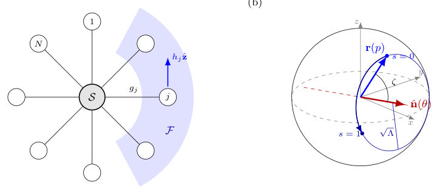
<figcaption class="paper-figure-caption"><b>Fig 1.</b> FIG. 1. Model geometry. (a) One system qubit S coupled in a star geometry to N ≡NE witness qubits with independent couplings gj; each witness also experiences a local field hj along z, illustrated by the arrow at qubit j. A fragment F (shaded) and its complement R = E \ F partition the environment. (b) Bloch-sphere geometry of one witness without a field. The initial Bloch vector r(p) and the C-INOT axis ˆn(θ) both lie in the xz plane. In the s = 0 branch the witness stays at r; in the s = 1 branch it rotates about ˆn on the circle shown, whose radius √</figcaption>
</figure>
<figure class="paper-figure-card">
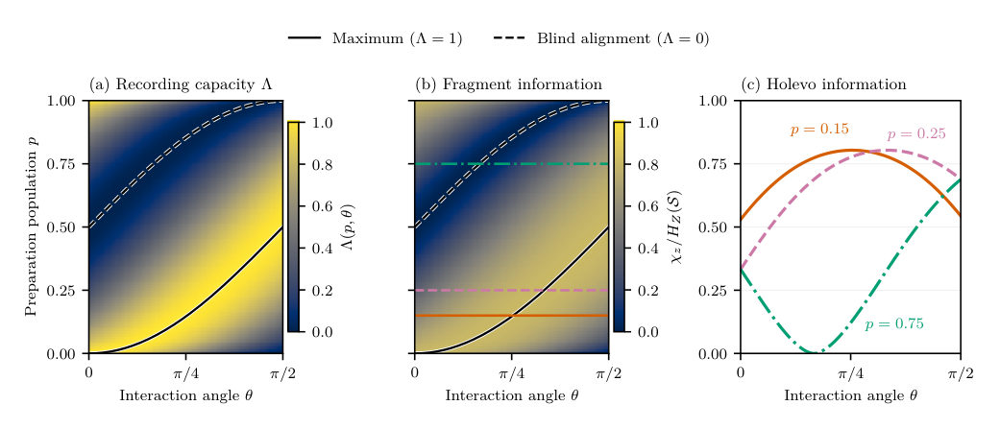
<figcaption class="paper-figure-caption"><b>Fig 2.</b> FIG. 2. Preparation and interaction-angle dependence without local fields. (a) Alignment invariant Λ over the full pure- preparation range 0 ≤p ≤1. (b) Corresponding Holevo information in fragments of size m = 2, with NE = 16 and gj ∼N (0, g2), g = 0.1. (c) Cuts through (b) at p = 0.15, 0.25, and 0.75, marked by matching horizontal lines in (b); the vertical axis shows the same normalized Holevo information as the color scale in (b). Black solid curves in (a,b) mark maximal separation (Λ = 1); black dashed curves mark blind alignment (Λ = 0). The lower-right corner, p = 0, θ = π/2, is also a blind preparation. We average over 64 sampled fragments, take the time median over t = 20, 21, . . ....</figcaption>
</figure>
<figure class="paper-figure-card">
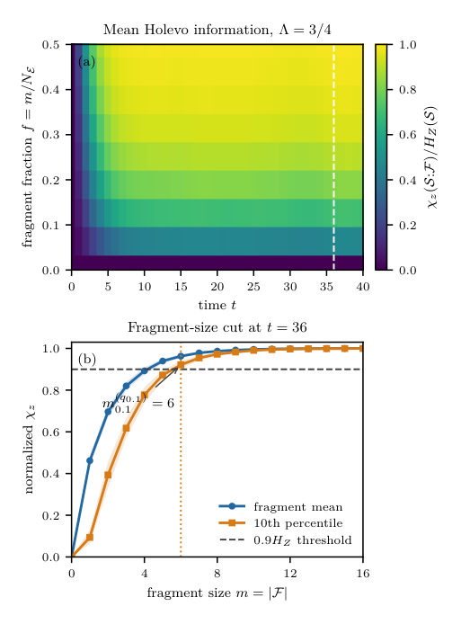
<figcaption class="paper-figure-caption"><b>Fig 3.</b> FIG. 3. Accumulation of pointer-basis Holevo information for NE = 16, p = 1/2, θ = π/3 (Λ = 3/4), without self- fields or environment–environment interactions. (a) Fragment mean versus time and f = m/NE for m ≤8, normalized by HZ(S) = 1 bit. (b) Direct fragment-size cut at t = 36 (dashed line in a), showing the fragment mean and the mean within-realization 10th percentile. Exact product overlaps are evaluated for up to 64 subsets per size in each of 24 coupling realizations; all subsets are used when fewer exist. Bands are 95% confidence intervals obtained by resampling coupling realizations. The mean curve first crosses 0.9HZ at m = 5; the orange lower-quantile curve crosses at m = 6.</figcaption>
</figure>
<figure class="paper-figure-card">
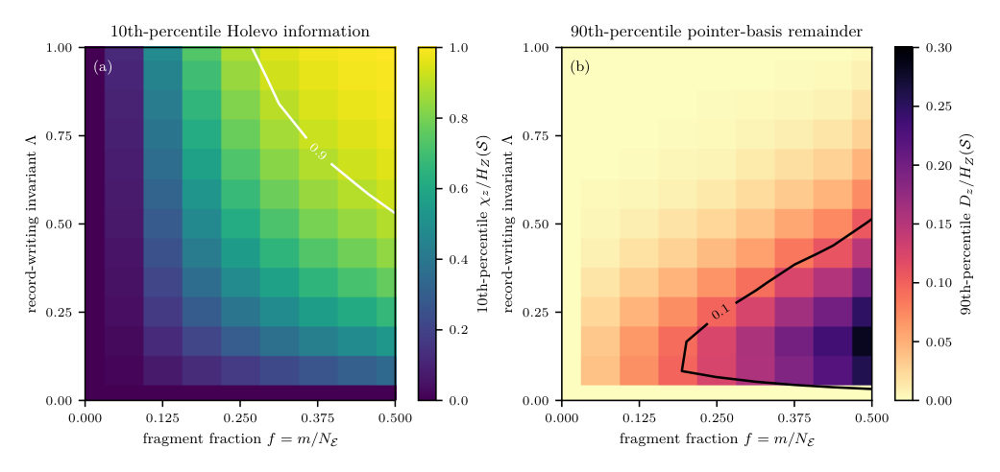
<figcaption class="paper-figure-caption"><b>Fig 4.</b> FIG. 4. Fragment statistics versus Λ and f = m/NE for NE = 16 without self-fields or environment–environment interactions. (a) Within-realization 10th percentile of χz/HZ. (b) Within-realization 90th percentile of the pointer-basis remainder Dz/HZ, where Dz = I −χz. Both panels use exact local propagators. Up to 64 subsets are sampled per size, with all 16 single-site subsets used at m = 1. Each statistic is summarized by its median over t ∈[20, 40]; preparations with the same Λ are averaged within each of 24 paired coupling realizations, followed by the disorder mean. White and black contours mark the resulting 0.9 and 0.1 levels, respectively. A value of one denotes full pointer-ensemble...</figcaption>
</figure>
<figure class="paper-figure-card">
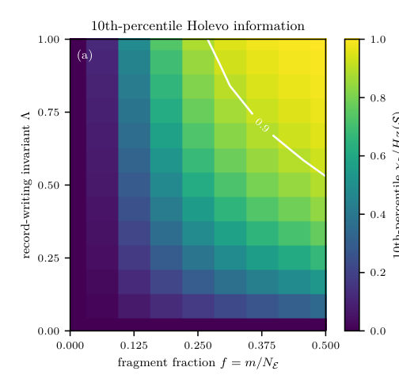
<figcaption class="paper-figure-caption"><b>Fig 5.</b> Figure 6 compares the mean and 10th-percentile Holevo information with the pointer-basis remainder at moderate and strong fields. The separation between the mean and the lower percentile shows how a high mean can conceal fragments carrying little information. As in Sec. I, a small remainder is informative only together with high Holevo information at the same fragment size; this joint assessment excludes the blind zero-field boundary, where both vanish.</figcaption>
</figure>

**Summary.** This work analyzes how objective classical information is encoded into the environment using an imperfect-CNOT gate model. By quantifying environmental record redundancy using Holevo information and branch separation, the authors show that recording efficiency depends nonmonotonically on gate imperfections and local fields. The results connect the geometry of local information acquisition to the minimum size of environmental fragments needed for reliable quantum memory.

**Why it may be interesting.** The detailed analysis of how local information acquisition geometry dictates the necessary size of environmental fragments for robust recording provides deep insights into the physical mechanisms underlying quantum Darwinism.

Detailed structure

**Main problem.** The paper investigates how objective classical information emerges from quantum dynamics through redundant environmental records, specifically within the framework of imperfect quantum gates.

**Main result.** Recording efficiency exhibits a nonmonotonic response to interaction imperfection and local field strength, and the required fragment size for robust recording is dictated by the geometry of local information acquisition.

**Method.** The analysis employs information theoretic measures like Holevo information ($\chi_z$) and conditional-state distinguishability, analyzing the evolution of environmental qubits in an imperfect-CNOT model.

**Model / system.** The model uses an imperfect-CNOT interaction coupling a system qubit $S$ to a pure, noninteracting environment $E$ composed of multiple environment qubits. The Hamiltonian includes terms for the imperfect gate and local field couplings.

**Key observables.** Quantum mutual information $I(S:F)$, Holevo information $\chi_z(S:F)$, and local branch separation $A_j(t)$ are key diagnostics for quantifying recorded information.

**Important parameters / regimes.** The alignment parameter $\Lambda$, interaction imperfection, local field strength ($h_{	ext{rms}}$), and the field distribution (uniform vs. Gaussian) are crucial parameters.

**Assumptions / limitations.** The primary claims are made assuming pure product initial environments with no environment-environment interactions ($H_{EE}=0$).

**Figures summary.** Figures illustrate the field response ($\chi_z/H_Z$, $D_z/H_Z$, $\chi_{\min}$) versus preparation bias and field strength for different interaction angles, comparing uniform and Gaussian field profiles.

**Paper structure.** The paper progresses by establishing the model (imperfect-CNOT), defining information measures, analyzing the role of the alignment parameter $\Lambda$, and then systematically investigating how field disorder and local field strengths affect the recording process via branch separation analysis.

Abstract

Quantum Darwinism explains objective information through redundant environmental records. Earlier work established that imperfect records can be amplified and that environment self-evolution can enhance or suppress their formation. We investigate how preparation, interaction angle, and field disorder combine in an imperfect-CNOT model with random Gaussian couplings and pure, noninteracting environment qubits. We find that, without fields, a single alignment parameter $Λ$ determines the preparation and interaction-angle dependence of conditional-state distinguishability. Increasing interaction imperfection or local field strength can improve or suppress recording. We explain this nonmonotonic response through the geometry of conditional branch separation. For the pure initial environments considered here, the $Z$ basis remains optimal for Holevo information, so field-assisted recording requires no change of the recorded system observable. Comparing uniform local field strengths with Gaussian-distributed strengths at equal root-mean-square strength shows how disorder broadens both beneficial and detrimental field effects. Exact expressions for fragment information and numerical simulations with up to 24 environment qubits quantify the distinction between high mean information and reliable records across fragments and throughout a finite observation window. These results connect the geometry of local information acquisition to the fragment sizes needed for robust recording. The branch-distinguishability analysis itself requires only the conditional evolution of each environment qubit and extends to other interactions that preserve a system pointer basis.

[↑ back to top](#top)

### [Unconstrained compact lattice QED$_{2+1}$ coupled to phonons: Gauss sectors, orthogonal semimetal, and deconfined criticality](http://arxiv.org/abs/2609.20502v1)

**Authors:** João C. Inácio, Fakher F. Assaad  
**Type:** theory · **Category:** strongly correlated electrons · **PDF:** <https://arxiv.org/pdf/2609.20502v1>  
**Analysis basis:** full PDF text, analyzed in chunks
**Topic relevance:** `analog quantum simulation` **2/5** · `Keldysh / 2PI / non-Gaussian methods` **1/5** · `methods for driven-dissipative` **1/5**

↔ Scroll figures horizontally

<figure class="paper-figure-card">
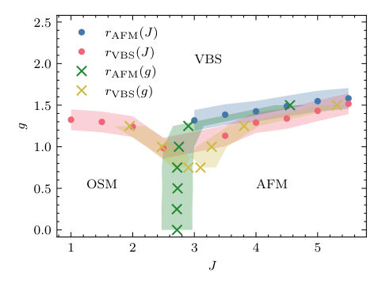
<figcaption class="paper-figure-caption"><b>Fig 1.</b> FIG. 1. Ground state phase diagram of the unconstrained Hamiltonian in Eq. (1) as a function of the electric field strength J and spinon-phonon coupling g, for ω0 = 2 and K = 1. The diagram contains OSM, AFM, and VBS phases. The positions of the phase boundaries are approximately de- termined from the crossings of the AFM and VBS correlation ratio for finite-size data. The shaded regions are an estimate of the error, i.e. half of the grid width.</figcaption>
</figure>
<figure class="paper-figure-card">
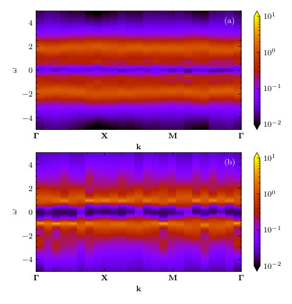
<figcaption class="paper-figure-caption"><b>Fig 2.</b> FIG. 2. Representative single particle spectral function A(k, ω) at (a) J = 1 and (b) J = 5, both at g = 0, obtained by SAC. The colour scale is logarithmic. Here β = L = 16.</figcaption>
</figure>
<figure class="paper-figure-card">
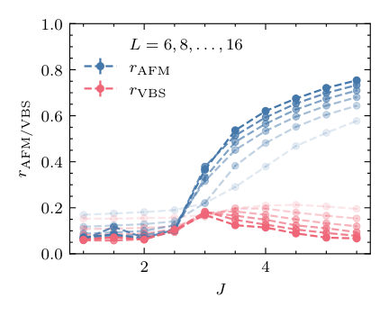
<figcaption class="paper-figure-caption"><b>Fig 3.</b> FIG. 3. AFM (blue) and VBS (red) correlation ratios as func- tions of J at g = 0 for L = 6, 8, . . . , 16. The AFM curves cross near Jc ≃2.6. The VBS ratio develops a maximum in the same region. Here we use β = L.</figcaption>
</figure>
<figure class="paper-figure-card">
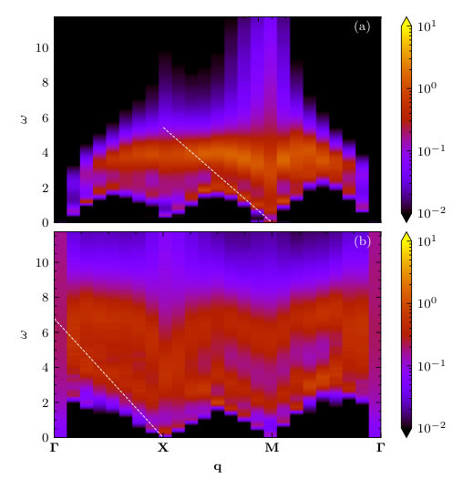
<figcaption class="paper-figure-caption"><b>Fig 4.</b> FIG. 5. Spin (a) and dimer (b) dynamical structure factors for L = 16, J = 1, and g = 0, obtained by SAC. The dashed lines are guides to the approximately linear low-energy thresholds. Here we use β = L.</figcaption>
</figure>
<figure class="paper-figure-card">
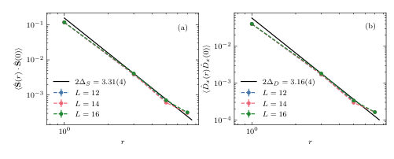
<figcaption class="paper-figure-caption"><b>Fig 5.</b> FIG. 4. Equal-time real-space (a) spin and (b) dimer corre- lations at J = 1 and g = 0. The black lines show algebraic fits, yielding 2∆S = 3.31(4) and 2∆D = 3.16(4). Here we use β = L.</figcaption>
</figure>

**Summary.** This paper studies a lattice QED$_{2+1}$ model coupled to phonons to understand the physical constraints imposed by Gauss's law. Using advanced quantum Monte Carlo simulations, the authors map out a phase diagram featuring Orthogonal Semimetallic (OSM), AFM, and VBS phases. They rigorously demonstrate that enforcing the physical constraint of Gauss's law destabilizes any deconfined phase, driving the system into a conventional magnetic or dimerized order.

**Why it may be interesting.** The work provides a detailed theoretical framework for understanding how gauge constraints fundamentally alter the low-energy physics of strongly correlated systems, particularly concerning the competition between different ordered states near quantum critical points.

Detailed structure

**Main problem.** The study investigates the physical consequences of coupling an unconstrained compact lattice QED$_{2+1}$ gauge theory to phonons, focusing on how the system selects its physical ground state sector.

**Main result.** The authors conclude that upon projecting the theory onto the physical Hilbert space (where Gauss's law is enforced), deconfinement in compact lattice QED$_{2+1}$ is always unstable towards either Antiferromagnetic (AFM) or Valence-Bond-Solid (VBS) order.

**Method.** The research employs exact auxiliary-field quantum Monte Carlo simulations and path integral formulations, analyzing the system in both unconstrained and constrained limits.

**Model / system.** The model is an unconstrained compact U(1) lattice gauge theory (QED$_{2+1}$) coupled to bond phonons on a square lattice, containing fermionic degrees of freedom. The Hamiltonian includes terms for hopping, gauge fields (electric/magnetic), and lattice vibrations.

**Key observables.** Phase diagram showing ground state orders (OSM, AFM, VBS); single-particle spectral function $A(\mathbf{k}, \omega)$; Gauss sector susceptibility ($\chi_Q$).

**Important parameters / regimes.** Fermion flavor number ($N_f=2$); electric field strength ($J$); spinon-phonon coupling ($g$); gauge constraint parameter ($\lambda$).

**Assumptions / limitations.** The analysis relies on the projection from an unconstrained gauge theory to the physical sector defined by Gauss's law ($\hat{Q}_i=0$), and uses Monte Carlo methods with approximations like Trotter decomposition.

**Figures summary.** The figures illustrate the phase diagram showing transitions between OSM, AFM, and VBS phases, and show representative single-particle spectral functions for different gauge field strengths.

**Paper structure.** The paper systematically analyzes the Hamiltonian, first in an unconstrained manner to identify the Orthogonal Semimetallic (OSM) phase, and then analyzes the effect of explicitly enforcing Gauss's law, leading to the determination of the full phase diagram and the conclusion regarding the stability of deconfinement.

Abstract

Gauge theoretic descriptions of 2D quantum magnets are defined on a restricted physical Hilbert space by imposing Gauss's law. In this work, we study an unconstrained compact lattice QED$_{2+1}$ coupled to bond phonons, in which local Gauss operators are conserved, but their eigenvalues are not a priori fixed. Using exact auxiliary-field quantum Monte Carlo simulations at $N_f = 2$, we investigate how the physical Gauss sector becomes energetically favourable, and how this process is connected to confinement and symmetry breaking. We identify an orthogonal semimetallic (OSM) phase, in which fermions striped off their gauge charge and form a Dirac liquid. This phase mixes various Gauss sectors, and becomes unstable when Gauss's law is explicitly enforced. Upon the imposition of Gauss's law, compactness allows for monopole excitations carrying antiferromagnetic (AFM) and valence-bond-solid (VBS) quantum numbers. Gauge field fluctuations and spinon-phonon coupling tune between the competition of such monopoles and generate a phase diagram with OSM, AFM and VBS orders. The transitions out of the OSM phase coincide with the dynamical generation of Gauss's law, while the competition between AFM and VBS charged monopoles produces a transition consistent with deconfined quantum criticality. Thus our results establish that upon the projection to the physical Hilbert space, deconfinement in compact lattice QED$_{2+1}$ is always unstable towards either AFM or VBS order.

[↑ back to top](#top)

### [Collective Charge-\(2e\) Bosonic Excitations in Charge-Ordered Systems](http://arxiv.org/abs/2609.20472v1)

**Authors:** Ping Tang  
**Type:** theory · **Category:** strongly correlated electrons · **PDF:** <https://arxiv.org/pdf/2609.20472v1>  
**Analysis basis:** full PDF text, analyzed in chunks
**Topic relevance:** `analog quantum simulation` **2/5** · `Keldysh / 2PI / non-Gaussian methods` **1/5**

↔ Scroll figures horizontally

<figure class="paper-figure-card">
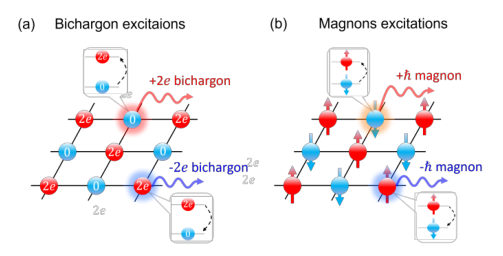
<figcaption class="paper-figure-caption"><b>Fig 1.</b> FIG. 1. Schematic of (a) two oppositely charged bichargon excitations in a charge-ordered state with alternating doubly occupied and empty sites, arising from electron-pair transi- tions between the two local charge configurations, and (b) their magnon counterparts in a bipartite antiferromagnet, as- sociated with spin-flip excitations and carrying opposite spin angular momenta ±ℏ.</figcaption>
</figure>
<figure class="paper-figure-card">
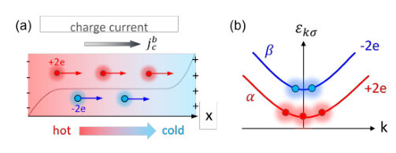
<figcaption class="paper-figure-caption"><b>Fig 2.</b> FIG. 2. Bichargon Seebeck effect. (a) When thermally excited bichargons are unequally populated in the two branches, their diffusion under a temperature gradient generates a net charge current and opposite charge accumulation at the two sample edges, constituting the charge counterpart of the magnonic spin Seebeck effect in antiferromagnets. (b) Unequal ther- mal populations of the two nondegenerate bichargon branches that arise when the chemical potential is tuned away from the charge-neutrality point.</figcaption>
</figure>
<figure class="paper-figure-card">
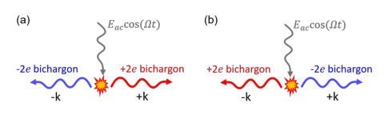
<figcaption class="paper-figure-caption"><b>Fig 3.</b> FIG. 3. Parametric excitation of coherent pairs of oppositely charged bichargons propagating in opposite directions via (a) the process α† kβ† −k in Eq. (23) and (b) its inversion-related counterpart. The two equivalent processes carry equal and opposite charge currents, resulting in a vanishing macroscopic current, whereas an applied dc bias lifts this cancellation and drives a net dc charge current carried by the parametrically generated bichargon pairs, analogous to photoconductivity in semiconductors mediated by photoexcited electron–hole pairs.</figcaption>
</figure>

**Summary.** This theoretical work introduces 'bichargons,' quantized collective bosonic excitations carrying $\pm 2e$ charge in charge-ordered systems. It establishes that these excitations can mediate a charge Seebeck effect under a temperature gradient, while also predicting a unique photoconductivity mechanism driven by AC fields. This extends the magnon concept to the charge sector, providing a new framework for understanding charge transport in correlated materials.

**Why it may be interesting.** The concept of bichargons provides a direct, charge-based analogue to magnons, allowing the application of established spin-transport physics (like the Seebeck effect) to charge-ordered Mott insulators, which is highly relevant for understanding correlated electron transport.

Detailed structure

**Main problem.** To determine if staggered charge-pseudospin order can support collective quasiparticle excitations carrying electric charge, analogous to magnons in spin-ordered systems.

**Main result.** The theory predicts the existence of 'bichargons' ($\pm 2e$ bosons) that mediate a charge Seebeck effect and can support a DC current via AC field excitation, extending the magnon paradigm to the charge sector.

**Method.** The analysis involves formulating an effective charge-pseudospin model, quantizing fluctuations via Holstein-Primakoff transformation, and diagonalizing the resulting bosonic Hamiltonian using Bogoliubov transformations.

**Model / system.** The system is a charge-ordered material modeled by an effective pseudospin-1/2 Hamiltonian derived from the extended Hubbard model, analyzed around the charge-neutrality point.

**Key observables.** Bichargon branches ($\pm 2e$ charge), Seebeck coefficient, DC charge current under bias, and the transition from insulating (static E-field) to conducting (AC field) behavior.

**Important parameters / regimes.** Chemical potential ($\mu$) tuning away from charge-neutrality, temperature gradient ($
abla T$), and applied electric fields (static $E$ vs. AC).

**Assumptions / limitations.** The analysis assumes the charge-ordered ground state is represented by staggered pseudospin order, and the quasiparticle number of bichargons is not conserved.

**Figures summary.** Figure 1 schematically compares the two oppositely charged bichargon excitations to their magnon counterparts in an antiferromagnet. Figure 2 illustrates the bichargon Seebeck effect and the resulting charge accumulation.

**Paper structure.** The paper first establishes the model and derives the two gapped bosonic branches (bichargons). It then analyzes the thermal response (Seebeck effect) and the limitations under static fields. Finally, it explores the non-equilibrium transport driven by AC fields, establishing the new bosonic charge carrier.

Abstract

Charge order is conventionally characterized by a static modulation of the electronic density, while its collective excitations remain less developed from a quasiparticle perspective than those of spin-ordered systems. Here, we formulate the collective excititations of charge order within an effective charge-pseudospin model, in which the charge-ordered ground state is represented by staggered pseudospin order. Quantizing fluctuations around this ordered state via a Holstein--Primakoff transformation, we reveal two branches of bosonic quasiparticles with degenerate, gapped dispersions that carry opposite quantized electric charges $\pm 2e$. We therefore term these charge-$2e$ bosons ``\textit{bichargons},'' closely paralleling the two magnon branches of a bipartite antiferromagnet that carry opposite spin angular momenta. We show that a temperature gradient drives the diffusion of thermally excited bichargons, generating a charge Seebeck response when the degeneracy between the oppositely charged branches is lifted by tuning the chemical potential away from the charge-neutrality point. In contrast, despite carrying finite electric charges, a thermal bichargon gas remains electrically insulating under a static electric field because bichargon quasiparticle number is not conserved. An ac electric field, however, can parametrically generate coherent pairs of oppositely charged bichargons that support a finite dc drift current in the presence of a bias electric field, offering a bosonic analogue of photoconductivity mediated by photoexcited electron--hole pairs in semiconductors. Our results establish bichargons as a new class of collective bosonic charge carriers in charge-ordered systems and extend the quasiparticle paradigm of magnons in spin-ordered systems to the charge sector, with electric charge replacing spin angular momentum as the transported quantity.

[↑ back to top](#top)

### [Corner entanglement scaling with projected entangled pair states](http://arxiv.org/abs/2609.20020v1)

**Authors:** Chloé Van Bastelaere, Rui-Zhen Huang, Laurens Vanderstraeten  
**Type:** theory · **Category:** strongly correlated electrons · **PDF:** <https://arxiv.org/pdf/2609.20020v1>  
**Analysis basis:** full PDF text, analyzed in chunks
**Topic relevance:** `methods for driven-dissipative` **2/5** · `analog quantum simulation` **1/5**

↔ Scroll figures horizontally

<figure class="paper-figure-card">
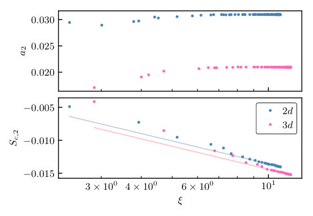
<figcaption class="paper-figure-caption"><b>Fig 1.</b> FIG. 1. Scaling of (top) the area law prefactor and (bottom) the corner contribution as a function of the correlation length for the 2d TFIM and the 3d classical Ising model at criticality. The dots are the data points, and the continuous lines are the linear fit. For the clarity of the bottom plot, we only show one in three data points.</figcaption>
</figure>
<figure class="paper-figure-card">
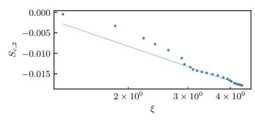
<figcaption class="paper-figure-caption"><b>Fig 2.</b> FIG. 2. Scaling of the corner contribution as a function of the correlation length for the bilayer XY model at criticality. The dots are the data points, and the continuous line is the linear fit. For the clarity of the plot, we only show one in three data points.</figcaption>
</figure>
<figure class="paper-figure-card">
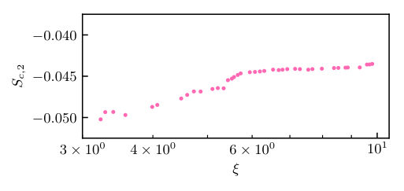
<figcaption class="paper-figure-caption"><b>Fig 3.</b> FIG. 3. Scaling of the corner contribution Sc,2 as a function of the correlation length for a gapped chiral spin liquid for D = 5.</figcaption>
</figure>
<figure class="paper-figure-card">
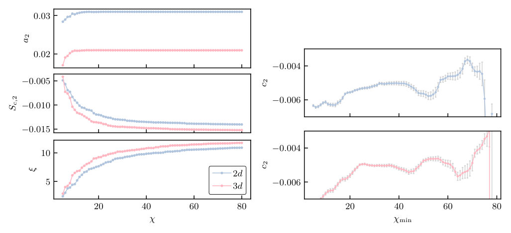
<figcaption class="paper-figure-caption"><b>Fig 4.</b> FIG. 4. (Left) The area law prefactor a2, the corner contribution Sc,2, and the correlation length ξ as a function of the bond dimension χ of the boundary MPS for the 2d quantum and the 3d classical Ising model at criticality. The continuous lines are a guide for the eye. (Right) Corner coefficient c2 extracted for the 2d TFIM (top) and the 3d classical Ising model (bottom) for different window sizes.</figcaption>
</figure>
<figure class="paper-figure-card">
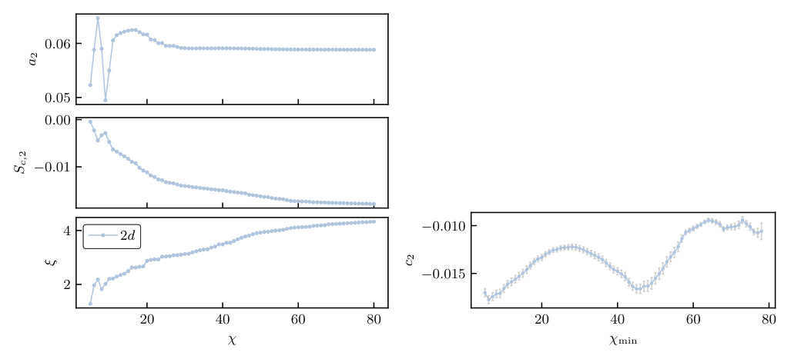
<figcaption class="paper-figure-caption"><b>Fig 5.</b> FIG. 5. (Left) The area law prefactor a2, the corner contribution Sc,2, and the correlation length ξ as a function of the bond dimension χ of the boundary MPS for the bilayer XY model at criticality. The continuous lines are a guide for the eye. (Right) Corner coefficient c2 extracted for the bilayer XY model for different window sizes.</figcaption>
</figure>

**Summary.** This work introduces a robust tensor network method to calculate the corner entanglement entropy in 2D quantum systems. By analyzing the scaling of this corner contribution, the authors successfully extract universal critical coefficients for models like the TFIM and XY model. This provides a powerful diagnostic tool for characterizing quantum critical points in strongly correlated matter.

**Why it may be interesting.** The rigorous extraction of universal critical exponents like $c_2$ using tensor networks provides a powerful, non-perturbative diagnostic tool for characterizing quantum critical points in strongly correlated materials.

Detailed structure

**Main problem.** The paper develops a method to extract the universal scaling of the corner entanglement entropy from Projected Entangled Pair States (PEPS) directly in the thermodynamic limit for 2D systems.

**Main result.** The corner entanglement contribution scales logarithmically with the effective correlation length ($\xi$) at quantum critical points, yielding consistent corner coefficients ($c_2$) when applied to the TFIM and XY models.

**Method.** The authors use the PEPS formalism to calculate the Rényi-2 entropy ($S_2$) for corner-shaped bipartitions, separating the result into an area law term and a corner contribution ($S_{c,2}$).

**Model / system.** The study applies to critical 2D quantum models, including the Transverse Field Ising Model (TFIM) and the Bilayer XY Model, and also tests universality using the classical 3D Ising Model.

**Key observables.** Corner entanglement entropy ($S_{c, 2}$), Area law prefactor ($a_2$), Correlation length ($\xi$), and the corner coefficient ($c_2$).

**Important parameters / regimes.** The analysis focuses on the thermodynamic limit and the scaling behavior with the correlation length $\xi$.

**Assumptions / limitations.** The method relies on the hypothesis of finite-entanglement scaling for PEPS simulations and approximates the infinite system using boundary MPS techniques.

**Figures summary.** Figures show the scaling of the area law prefactor ($a_2$) and the corner contribution ($S_{c,2}$) versus the bond dimension ($\chi$) for the 2D TFIM and Bilayer XY model, demonstrating the extraction of $c_2$.

**Paper structure.** The paper first reviews the theoretical framework for calculating entanglement entropy in PEPS, extending the analysis from linear to corner bipartitions. It then applies this method to calculate $c_2$ for various critical models, comparing results across different systems and methods.

Abstract

Entanglement scaling provides a powerful probe of universal properties at quantum critical points. In two dimensions, contributions originating from a corner-shaped bipartition exhibit a universal scaling, which is determined by the underlying conformal field theory. We develop a method to extract this corner entanglement entropy from projected entangled pair states directly in the thermodynamic limit. When applied to models at a quantum critical point, we show that the corner contribution exhibits scaling with the effective correlation length, in agreement with the hypothesis of finite-entanglement scaling. Our results for the corner coefficients are consistent with other methods, demonstrating the efficiency of our method for diagnosing strongly-correlated quantum critical points in two dimensions.

[↑ back to top](#top)

### [Correlation-Free Transition Path Sampling through Shooting Point Generation Guided by Committor Learning](http://arxiv.org/abs/2609.20461v1)

**Authors:** Maximilian Negedly, Sebastian Falkner, Alessandro Coretti, Christoph Dellago  
**Type:** theory · **Category:** statistical mechanics · **PDF:** <https://arxiv.org/pdf/2609.20461v1>  
**Analysis basis:** full PDF text, analyzed in chunks
**Topic relevance:** `quantum measurements` **2/5** · `methods for driven-dissipative` **1/5**

↔ Scroll figures horizontally

<figure class="paper-figure-card">
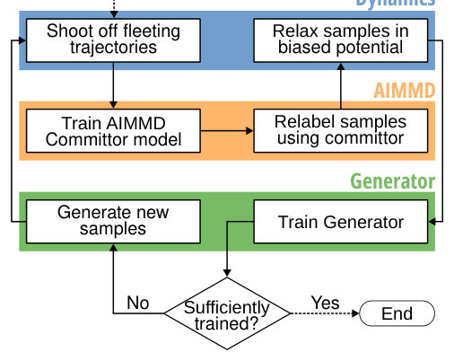
<figcaption class="paper-figure-caption"><b>Fig 1.</b> Figure 1. Overview of the steps involved in the GenAIMMD al- gorithm. Flowchart elements connected by solid arrows make up the self-consistency loop, while dashed arrows connect steps outside of the loop. The in-loop steps are assigned one of three categories: Dynamics (blue), where the main focus lies on propagating training samples, AIMMD (orange), where the committor model and sam- ple labels are updated, and Generator (green), where the Boltzmann Generator is trained and used to generate new training samples.</figcaption>
</figure>
<figure class="paper-figure-card">
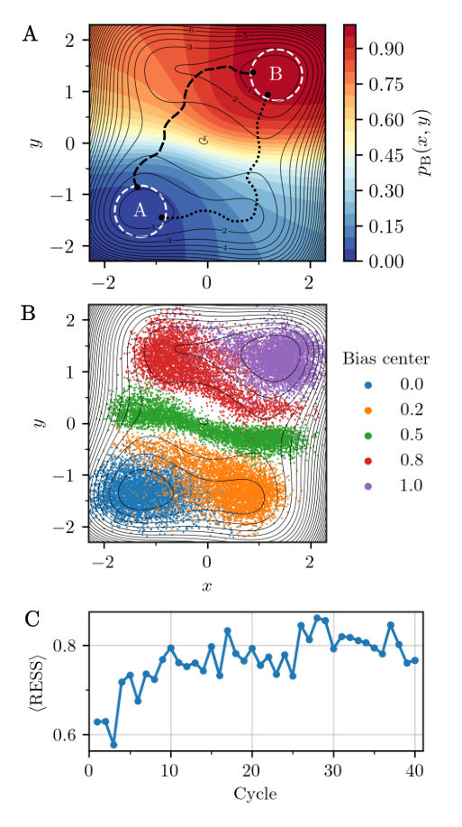
<figcaption class="paper-figure-caption"><b>Fig 2.</b> Figure 2. Training results for the two-dimensional Wolfe-Quapp po- tential. (A) shows the iso-lines of the potential energy in solid black with labels in units of kBT, as well as the committor pB(x,y) corre- sponding to the states defined by the white circles, learned using the GenAIMMD algorithm. The two black dashed lines connecting the states illustrate transition paths using the upper (long dashes) and the lower (short dashes) reaction channel, respectively. (B) depicts sam- ples generated by the Boltzmann Generator in different committor bias windows and re-sampled into the corresponding biased Boltz- mann distribution (see Eq. (10)). (C) plots the mean relative effective sample size...</figcaption>
</figure>
<figure class="paper-figure-card">
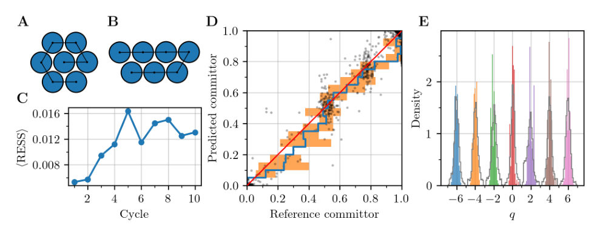
<figcaption class="paper-figure-caption"><b>Fig 3.</b> Figure 3. Training results for the polymer model. (A) and (B) depict the stable conformations of the polymer, i.e., state A and state B, respectively. (C) shows the relative effective sample size as a function of GenAIMMD cycles, averaged over multiple committor bias windows within each cycle. (D) displays the predicted committor against the numerically estimated (reference) committor for a set of test samples, where each black dot corresponds to a single system configuration and the straight red line corresponds to perfect agreement between the reference and the prediction. The blue line marks the average reference committor binned by the predicted committor, and the orange area indicates...</figcaption>
</figure>
<figure class="paper-figure-card">
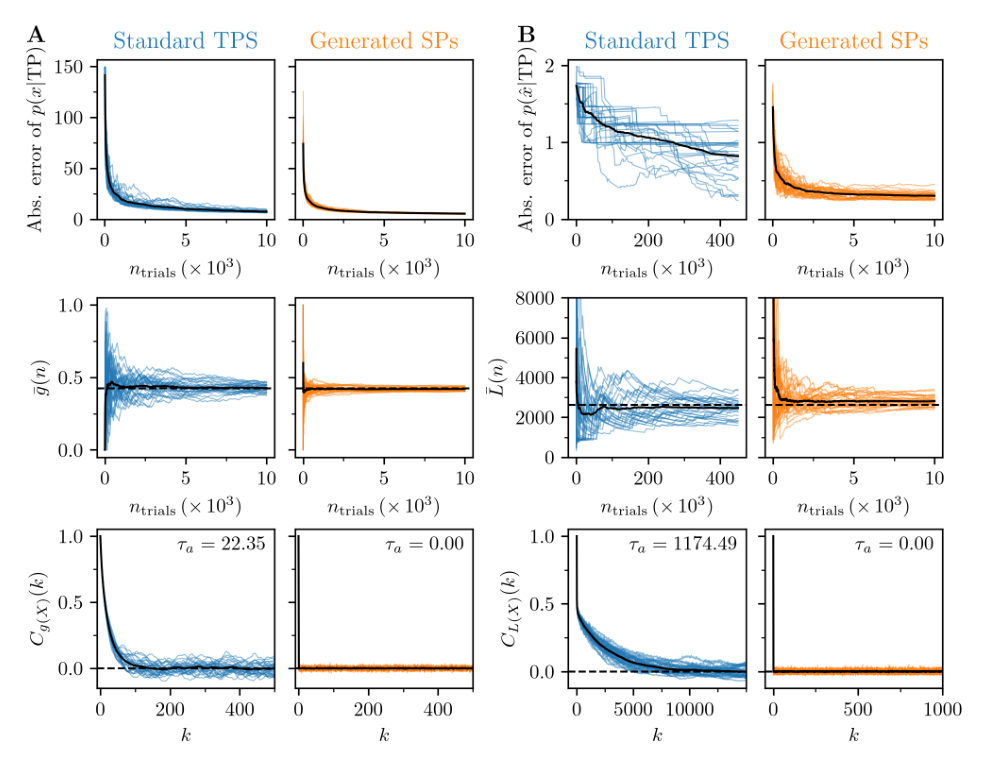
<figcaption class="paper-figure-caption"><b>Fig 4.</b> Figure 4. Performance comparison between standard TPS (blue) and shooting points generation using the GenAIMMD-trained Boltzmann Generator conditioned on the learned committor (orange) in (A) the two-dimensional model and (B) the polymer model. The colored lines are 30 independent runs (TPS simulations in case of standard TPS, blocks of generated shooting points in case of the sampled shooting points). The solid black lines are averages over the colored lines at the respective step. First row: Absolute error of the distribution of points along transition paths p(x|TP) as a function of two-way shooting trials, measured as the L1 distance between a reference histogram obtained via a...</figcaption>
</figure>

**Summary.** This paper introduces GenAIMMD, an advanced machine learning framework for path sampling that overcomes the limitations of traditional methods like TPS. By iteratively learning the system's committor and using conditioned Boltzmann Generators, it generates uncorrelated transition paths without requiring prior knowledge of the reaction coordinate. This offers a powerful, parallelizable tool for studying rare events in condensed matter and chemical physics.

**Why it may be interesting.** This work directly addresses the computational bottleneck in studying non-equilibrium dynamics and rare events, which is crucial for understanding phase transitions and chemical reaction mechanisms in complex systems.

Detailed structure

**Main problem.** The core problem is efficiently characterizing rare transitions between long-lived metastable states in complex physical systems.

**Main result.** The proposed GenAIMMD algorithm provides a correlation-free and fully parallelizable path sampling scheme that significantly outperforms standard Transition Path Sampling (TPS) by eliminating the need for a predefined reaction coordinate.

**Method.** It integrates Committor Learning (using ML models like MLPs) with Conditioned Boltzmann Generators (Normalizing Flows) in an active, self-consistent loop to learn the transition mechanism and sample paths independently.

**Model / system.** The methods are tested on a two-dimensional toy model governed by a quartic potential and a higher-dimensional polymer system modeled with standard molecular force fields (Lennard-Jones, harmonic bonds, angle potentials).

**Key observables.** Reactive trajectories, the committor probability $p_B(x)$, and the path distribution $p(x|TP)$ are key observables used for benchmarking.

**Important parameters / regimes.** The simulation involves various hyperparameters for the Boltzmann Generator (learning rates, batch sizes) and the physical systems include specific potential parameters and state definitions (e.g., Radius of Gyration thresholds for the polymer).

**Assumptions / limitations.** The primary assumption overcome is the need for prior knowledge of a reaction coordinate, which is a major limitation of previous path sampling techniques.

**Figures summary.** Figures illustrate the 2D potential energy surface, the learned committor, and the comparison of path distributions ($p(x|TP)$) between GenAIMMD and standard TPS for both the 2D and polymer systems.

**Paper structure.** The paper first introduces the limitations of TPS, then details the AIMMD framework for committor estimation, progresses to using Boltzmann Generators for sampling, and finally presents the integrated, iterative GenAIMMD algorithm, concluding with extensive benchmarks on two distinct physical models.

Abstract

Studying the dynamical behavior of a system often depends on characterizing how it transitions between long-lived states. Because such transitions are rare, observing them usually requires specialized enhanced sampling techniques. Transition Path Sampling (TPS) is a well-established method for generating reactive trajectories, which is simple to implement and does not require the definition of a preconceived reaction coordinate. However, its efficiency is limited by its sequential nature and the resulting correlations between sampled paths. Previous work addressed this limitation by combining TPS with a sampling scheme based on conditioned Boltzmann Generators, a generative machine learning model capable of sampling a given target probability distribution. This approach produces uncorrelated transition paths but relies on an accurate reaction coordinate, which is rarely known in advance. Building on recent advances in committor learning, specifically on the Artificial Intelligence for Molecular Mechanism Discovery (AIMMD) method, in this work we introduce GenAIMMD, an iterative algorithm that actively and self-consistently learns the ideal reaction coordinate (the committor) and trains a conditioned Boltzmann Generator to sample from arbitrary bias windows along it. GenAIMMD thereby provides a correlation-free and fully parallelizable path sampling scheme that does not require prior knowledge of the system's transition mechanism. We apply GenAIMMD to a two-dimensional toy model and a higher-dimensional polymer system. In both cases, GenAIMMD succeeds in training the Boltzmann Generator and learning the committor. Benchmark results show a substantial increase in performance compared to standard TPS.

[↑ back to top](#top)

### [Global Minima of the Thomson Problem in a Disk: A Molecular Dynamics Approach with Fixed Border Charges](http://arxiv.org/abs/2609.20777v1)

**Authors:** Georgiy K. Lavrov, Eduard G. Nikonov  
**Type:** theory · **Category:** statistical mechanics · **PDF:** <https://arxiv.org/pdf/2609.20777v1>  
**Analysis basis:** full PDF text, analyzed in chunks
**Topic relevance:** `analog quantum simulation` **2/5** · `methods for driven-dissipative` **1/5**

↔ Scroll figures horizontally

<figure class="paper-figure-card">
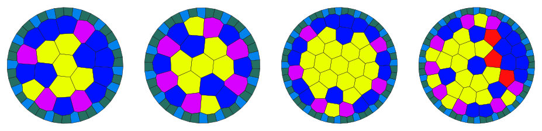
<figcaption class="paper-figure-caption"><b>Fig 1.</b> FIG. 1. Voronoi diagrams of our ground–state configurations for (a) N = 60, (b) 61, (c)</figcaption>
</figure>

**Summary.** This work tackles the classical Thomson problem in a disk by using an advanced simulation technique combining Quenched Molecular Dynamics with a fixed-border heuristic. The authors successfully found improved, highly symmetric, and robust candidates for the global minimum energy configurations for several particle numbers. This demonstrates the power of hybrid computational approaches in solving complex, high-dimensional optimization problems.

**Why it may be interesting.** While the problem is classical, the techniques used—advanced molecular dynamics simulations to find ground states in complex energy landscapes—are highly relevant to finding metastable states in quantum many-body systems or optimizing quantum circuit layouts.

Detailed structure

**Main problem.** The paper addresses finding the global minimum energy configuration for the classical Thomson problem, which involves minimizing the potential energy of $N$ mutually repelling Coulomb charges confined to a disk.

**Main result.** The authors report improved, highly reproducible global-minimum candidates for $N=60, 61, 92,$ and $99$ charges, demonstrating that their combined method yields lower energy estimates than previously known.

**Method.** The primary method combines Quenched Molecular Dynamics (QMD) simulation with a fixed-border heuristic derived from theoretical estimates to constrain the number of charges on the boundary.

**Model / system.** The system models $N$ identical classical charges confined to a unit disk, governed by a Hamiltonian involving repulsive Coulomb interactions and hard-wall confinement potential.

**Key observables.** Total energy ($E_{QMD}$), symmetry of the configuration (e.g., $C_2, D_1$), and the structure visualized via Voronoi diagrams.

**Important parameters / regimes.** The number of charges ($N$), the disk radius ($R=1$), and simulation parameters like time steps and damping coefficients.

**Assumptions / limitations.** The core assumption is that combining QMD with the fixed-border heuristic provides a systematic and robust pathway toward the global minimum, although the authors acknowledge no single algorithm is guaranteed to succeed.

**Figures summary.** Figures illustrate the Voronoi diagrams for various $N$, highlighting the observed symmetries of the optimized configurations.

**Paper structure.** The paper systematically applies the QMD method combined with the fixed-$N_b$ heuristic to calculate and compare energies and structures for specific values of $N$, demonstrating improvements over prior work and analyzing the resulting symmetries.

Abstract

We report improved global-minimum configurations for the classical Thomson problem of $N=60$, $61$, $92$, and $99$ repulsive Coulomb charges confined to a disk. By combining the quenched molecular dynamics (QMD) method with the fixed-border heuristic introduced by Amore and Zarate, we systematically obtain configurations with energies $E_{\mathrm{QMD}}(60)=2159.3584240930$, $E_{\mathrm{QMD}}(61)=2237.19264190$, $E_{\mathrm{QMD}}(92)=5358.35353314$, and $E_{\mathrm{QMD}}(99)=6254.83029083$, which improve upon the previously best-known values. For $N=60$, the Voronoi diagram of our configuration differs from the one reported earlier. The symmetries for $N=61$ $(C_{2})$ and $N=99$ $(D_{1})$ are confirmed and are consistent with the known symmetry patterns for these configurations. For $N=92$, whereas the previously reported Voronoi diagram has lower symmetry, our solution exhibits a clear $D_{1}$ (axial) symmetry of defects. The results are highly reproducible across multiple independent runs, providing strong evidence that these configurations are robust global-minimum candidates.

[↑ back to top](#top)

### [Linear combination of Schrödingerization for quantum linear systems with optimal matrix-query complexity](http://arxiv.org/abs/2609.19676v1)

**Authors:** Yin Yang, Yue Yu, Long Zhang  
**Type:** theory · **Category:** quantum information and computing · **PDF:** <https://arxiv.org/pdf/2609.19676v1>  
**Analysis basis:** full PDF text, analyzed in chunks
**Topic relevance:** `analog quantum simulation` **2/5** · `Keldysh / 2PI / non-Gaussian methods` **1/5**

↔ Scroll figures horizontally

<figure class="paper-figure-card">
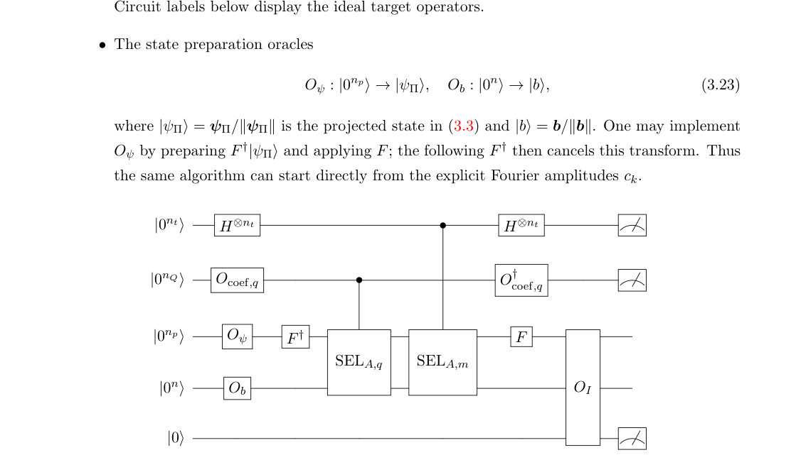
<figcaption class="paper-figure-caption"><b>Fig 1.</b> Fig. 1: Quantum circuit for the overall algorithm (see Eq. (3.17)). The interval marker OI acts</figcaption>
</figure>
<figure class="paper-figure-card">
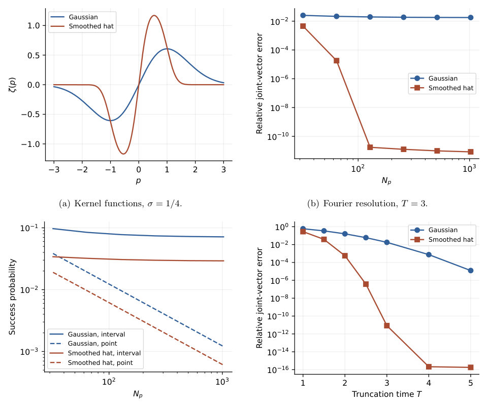
<figcaption class="paper-figure-caption"><b>Fig 2.</b> Fig. 3: Comparison of the Gaussian and smoothed hat kernels for (4.1). (a) Kernel functions, with</figcaption>
</figure>

**Summary.** This paper presents a quantum algorithm to solve linear systems $Ax=b$ by reformulating the problem using LC-Schrödingerization. The method constructs a quantum circuit based on two LCHS simulations, achieving the theoretically optimal matrix-query complexity. This advancement is significant as it provides a resource-efficient quantum tool for solving problems central to quantum simulation and computational physics.

**Why it may be interesting.** The work provides a concrete, theoretically optimal quantum algorithm for a fundamental problem in scientific computing (solving linear systems), directly applicable to simulating quantum dynamics or solving large-scale quantum chemistry problems.

Detailed structure

**Main problem.** Developing quantum algorithms to solve linear systems of equations, $Ax=b$, with an exponential speedup over classical methods.

**Main result.** The authors developed an LCHS-based quantum algorithm that achieves the optimal matrix-query complexity of $\mathcal{O}(\kappa_A \log(1/\epsilon))$ without relying on Variable-Time Amplitude Amplification.

**Method.** The solution is represented via LC-Schrödingerization, transforming the problem into a system solvable by combining two instances of the Linear Combination of Hamiltonian Simulation (LCHS) method.

**Model / system.** The problem is framed from an ODE-based perspective, where the solution $x$ is the steady-state solution to $ut = -Au + b$. For indefinite $A$, the solution uses LC-Schrödingerization, which involves unitary evolutions in the Fourier domain.

**Key observables.** Matrix-query complexity, relative joint-vector error ($E_I$), success probability ($P_I$), and truncation error.

**Important parameters / regimes.** Condition number ($\kappa_A$), target precision ($\epsilon$), and the smoothing parameter ($\sigma$).

**Assumptions / limitations.** Assumes oracle access for the matrix $A$ and the right-hand-side preparation oracle, and requires a constant-factor estimate of the solution norm.

**Figures summary.** Figures compare the performance of Gaussian versus smoothed hat kernels, showing the smoothed hat kernel achieves significantly lower relative joint-vector error and higher success probabilities for interval recovery.

**Paper structure.** The paper develops the LC-Schrödingerization framework, constructs the LCHS-based quantum algorithm using two LCHS instances (time-marching and numerical integration), and proves the optimal query complexity by employing block preconditioning techniques.

Abstract

Quantum linear systems algorithms (QLSAs) aim to solve linear systems $A\bb{x}=\bb{b}$ exponentially faster than classical methods under certain conditions. In this work, we develop quantum algorithms for solving linear algebraic equations from an ODE-based perspective. Inspired by the linear combination of Hamiltonian simulation (LCHS) representation in the Fourier approach \cite{Childs2017QLSA}, we express the solution $\bb{x}$ as a linear combination of solutions to a system of linear convection equations, which become Schrödinger-type equations with unitary evolutions in the Fourier domain. We refer to this representation as LC-Schrödingerization. Based on this result, we construct an LCHS-based quantum algorithm with two LCHS instances: one for time-marching and one for numerical integration. The key construction uses the derivative of a Gaussian-smoothed hat function and recovers the solution over a fixed auxiliary interval. This permits a truncation time independent of the target accuracy and avoids the loss in success probability from selecting a single grid point. Periodization and explicit Fourier coefficients provide the corresponding projection error bounds. Under the stated oracle assumptions and given a constant-factor estimate of the solution norm, direct simulation of the select operators and block preconditioning achieve the optimal matrix-query complexity $\mathcal{O}(κ_A\log\frac1\varepsilon)$ without using variable-time amplitude amplification (VTAA). The same upper bound holds for queries to the right-hand-side preparation oracle.

[↑ back to top](#top)

### [Parisi Formula for the ground state energy of quantum p-Spin Hamiltonians](http://arxiv.org/abs/2609.20431v1)

**Authors:** Sohom Bhattacharya  
**Type:** theory · **Category:** disordered systems and neural networks · **PDF:** <https://arxiv.org/pdf/2609.20431v1>  
**Analysis basis:** full PDF text, analyzed in chunks
**Topic relevance:** `Keldysh / 2PI / non-Gaussian methods` **2/5** · `analog quantum simulation` **1/5**

↔ Scroll figures horizontally

<figure class="paper-figure-card">
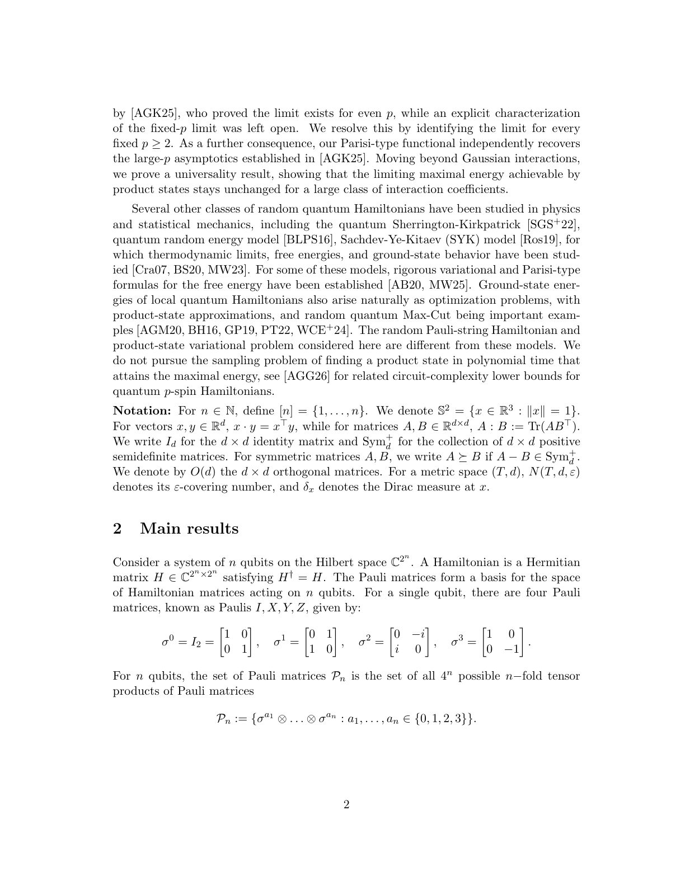
<figcaption class="paper-figure-caption"><b>Fig 1.</b> Low-resolution page preview, page 2</figcaption>
</figure>
<figure class="paper-figure-card">
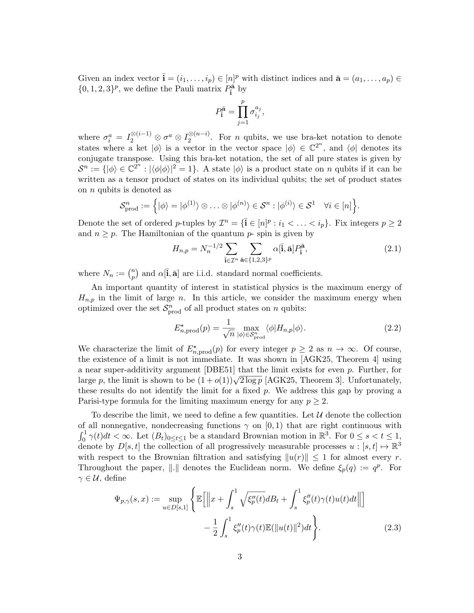
<figcaption class="paper-figure-caption"><b>Fig 2.</b> Low-resolution page preview, page 3</figcaption>
</figure>
<figure class="paper-figure-card">
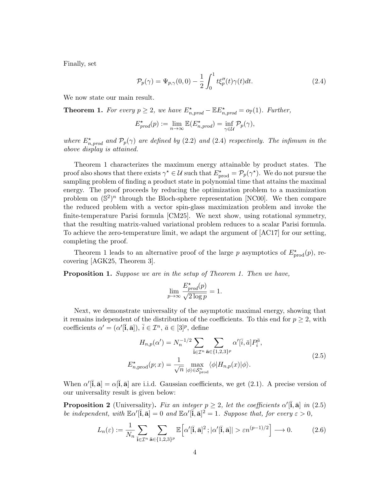
<figcaption class="paper-figure-caption"><b>Fig 3.</b> Low-resolution page preview, page 4</figcaption>
</figure>
<figure class="paper-figure-card">
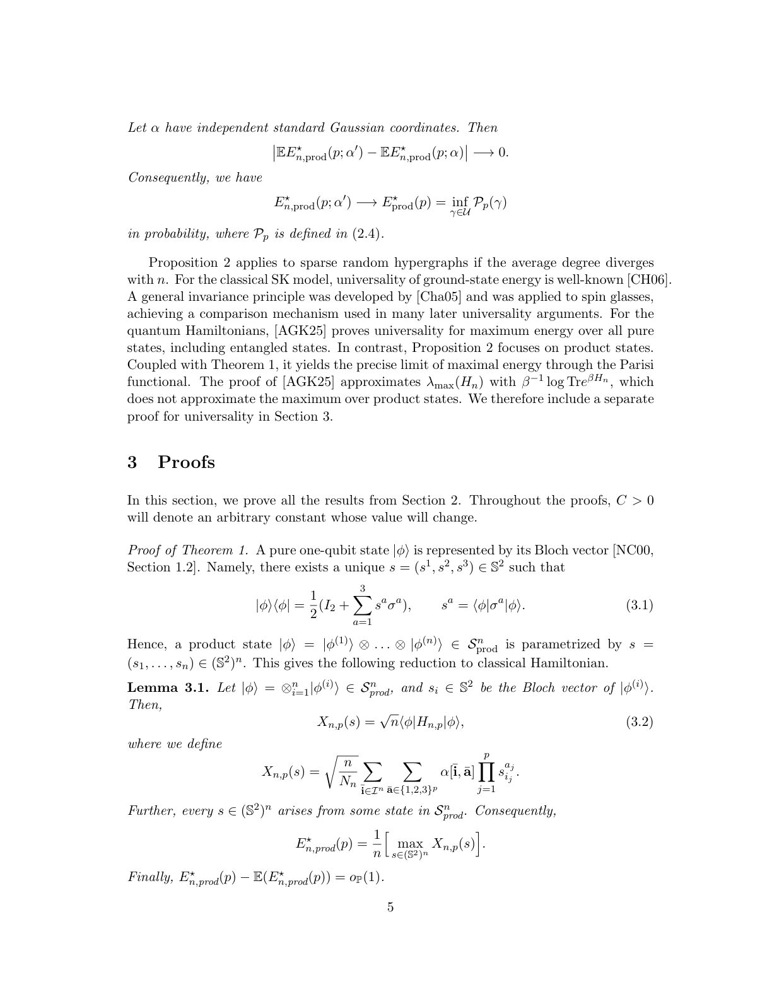
<figcaption class="paper-figure-caption"><b>Fig 4.</b> Low-resolution page preview, page 5</figcaption>
</figure>
<figure class="paper-figure-card">
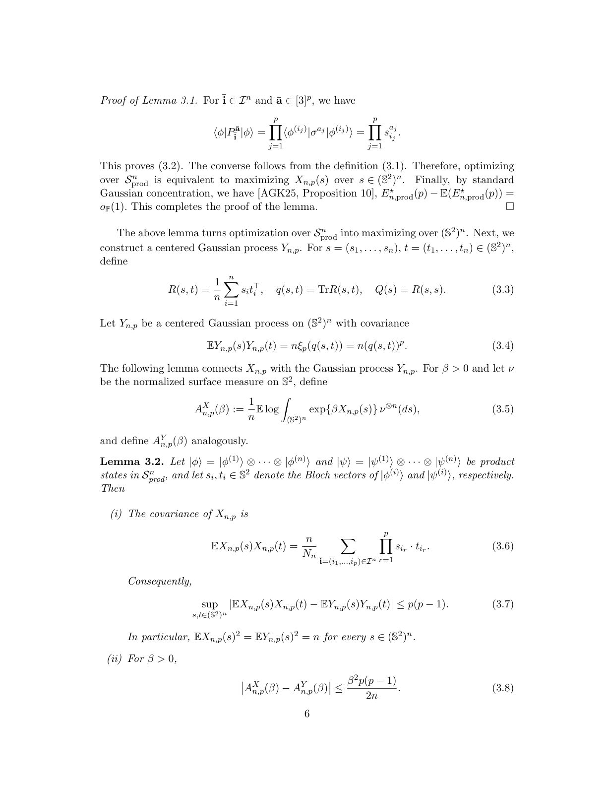
<figcaption class="paper-figure-caption"><b>Fig 5.</b> Low-resolution page preview, page 6</figcaption>
</figure>

**Summary.** This paper rigorously determines the asymptotic ground state energy for quantum p-local spin glass Hamiltonians. It achieves this by deriving a specific Parisi-type variational formula that characterizes the limit of the maximum product-state energy. The work is significant for settling an open problem in quantum statistical mechanics concerning disordered quantum systems.

**Why it may be interesting.** The connection between quantum many-body physics (spin glasses) and advanced mathematical tools like the Parisi formula and Gaussian process theory is highly relevant for understanding complex quantum ground states, which often exhibit glassy behavior.

Detailed structure

**Main problem.** The paper aims to provide an asymptotic characterization of the maximum energy achievable by product states for quantum p-local spin glass Hamiltonians.

**Main result.** It proves that the limit of the ground state energy exists and is given by a Parisi-type variational formula, settling a long-standing open question in the field.

**Method.** The analysis maps the quantum maximization problem over product states to a variational problem involving Gaussian processes and stochastic differential equations, ultimately yielding a Parisi-type variational formula.

**Model / system.** The system studied is the quantum p-local spin glass Hamiltonian, $H_{n,p}$, which serves as a quantum analogue of classical spin glass models. The analysis focuses on the expectation value of this Hamiltonian restricted to product states $|\phi
angle = igotimes_{i=1}^n |\phi(i)
angle$.

**Key observables.** The maximum product-state energy, $E^{\star}_{	ext{prod}}(p) = \lim_{n	o\infty} rac{1}{\sqrt{n}} \max_{|\phi
angle \in S_n^{	ext{prod}}} \langle\phi|H_{n,p}|\phi
angle$.

**Important parameters / regimes.** The spin parameter $p \ge 2$, the system size $n 	o \infty$, and the variational parameter $\gamma \in U$.

**Assumptions / limitations.** The derivation relies on mapping the quantum maximization to a classical one over Bloch vectors and utilizing advanced tools from Gaussian process theory and stochastic calculus (e.g., Girsanov's Theorem).

**Paper structure.** The paper first defines the problem using quantum p-local Hamiltonians and product states. It then reduces the problem to a variational principle involving Gaussian processes. The core of the work involves establishing upper and lower bounds for the variational quantity $P_p(\gamma)$ using stochastic analysis before stating the final Parisi-type formula.

Abstract

Quantum $p$-local spin glass Hamiltonians are natural quantum analogues of the classical spin glass models. We provide an asymptotic characterization of the maximal energy achievable by the product states. We prove that for every $p \ge 2$, the limit of ground state energy exists and is given by a Parisi-type variational formula. This settles a question left open by Anschuetz et. al. (2025). The variational formula also recovers the known large-$p$ asymptotics as a consequence. Finally, we prove that the limiting product state energy is universal for a broad class of non-Gaussian interactions.

[↑ back to top](#top)

### [Symmetry-driven correlation patterns in one-dimensional periodic fermionic systems: closed-form expressions and exact selection rules for correlation functions, entanglement entropies and mutual information](http://arxiv.org/abs/2609.19535v1)

**Authors:** Celestino Angeli  
**Type:** theory · **Category:** strongly correlated electrons · **PDF:** <https://arxiv.org/pdf/2609.19535v1>  
**Analysis basis:** full PDF text, analyzed in chunks
**Topic relevance:** `analog quantum simulation` **2/5** · `Frenkel-Kontorova` **1/5**

↔ Scroll figures horizontally

<figure class="paper-figure-card">
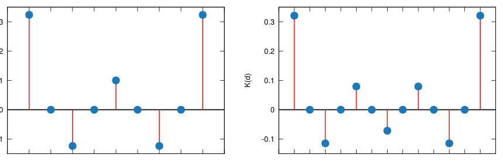
<figcaption class="paper-figure-caption"><b>Fig 1.</b> FIG. 1: Two-point correlation function K(d) as a function of the distance d for a cyclic system with n = m = 10 (left figure) and n = m = 14 (right figure) and symmetric occupation of the Fourier modes. The most important feature is the exact parity selection rule, according to which K(d) vanishes identically for all even lattice distances d. The analytic expression of K(d) is reported in Eq. 25.</figcaption>
</figure>
<figure class="paper-figure-card">
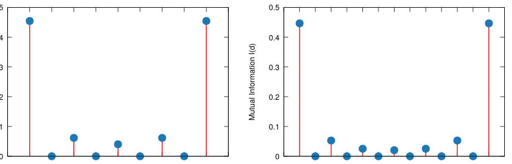
<figcaption class="paper-figure-caption"><b>Fig 2.</b> FIG. 2: Mutual information I(d) as a function of the distance d for a cyclic system with n = m = 10 (left figure) and n = m = 14 (right figure) at half filling. The most important feature is the exact vanishing of the mutual information at all even lattice distances. This is the direct consequence of the parity selection rule satisfied by the two-point correlator K(d). The analytic expression of the mutual information is reported in Eq. 37.</figcaption>
</figure>

**Summary.** This theoretical work develops a universal framework to analyze electronic correlation patterns in 1D periodic fermionic systems using symmetry principles. By exploiting cyclic symmetry, the authors derive exact analytical expressions for correlation functions and mutual information. The results demonstrate that correlation structure is dictated by occupied symmetry modes, offering deep insights into electronic behavior beyond simple orbital occupation counts.

**Why it may be interesting.** It provides a powerful, symmetry-based, and Hamiltonian-independent reference for understanding correlation patterns in 1D periodic systems, which is highly relevant for modeling correlated materials.

Detailed structure

**Main problem.** The paper analyzes the spatial structure of electronic correlations in periodic fermionic systems, aiming to find universal rules governing these patterns.

**Main result.** It shows that for cyclic systems, correlation structure is determined by occupied Fourier modes, leading to exact selection rules, such as vanishing mutual information at even distances for half-filling.

**Method.** The study employs symmetry group theory (cyclic symmetry) and quantum information measures (two-point correlators, mutual information) applied within the single Slater determinant approximation.

**Model / system.** The system is one-dimensional periodic fermionic chains or cyclic rings, analyzed at the single Slater determinant level, which is analogous to mean-field or Hartree-Fock descriptions.

**Key observables.** Fermionic two-point correlator, entanglement entropies, and mutual information between localized orbitals.

**Important parameters / regimes.** Aromatic fillings (Hückel's 4n+2 rule) and the half-filling case are key regimes analyzed.

**Assumptions / limitations.** The analysis is restricted to the single Slater determinant level, treating the system within a mean-field approximation.

**Paper structure.** The paper establishes a framework connecting symmetry, the one-particle reduced density matrix, and correlation measures, deriving analytical expressions for correlation functions based on occupied irreducible representations.

Abstract

We present an analytical study of the spatial structure of correlations in periodic fermionic systems at the single Slater determinant level, focusing on the cyclic case. Exploiting cyclic symmetry, the transformation from localized orbitals to molecular orbitals is simultaneously a discrete Fourier transform, a Vandermonde matrix on the roots of unity, a complex Hadamard matrix, and the character table of the cyclic group $C_m$. Within this framework, the spatial structure of correlations is fully determined by the occupied irreducible representations (Fourier modes), independently of the specific Hamiltonian generating them. In particular, the fermionic two-point correlator is expressed as a truncated Fourier sum over the occupied orbitals, leading to exact analytical expressions for symmetric occupation patterns of Fourier modes ($\ell$ and $-\ell$ pairs), corresponding in quantum chemistry to aromatic fillings, i.e. fillings satisfying Hückel's $4n + 2$ rule. For the half filling case, we derive exact spatial selection rules. In particular, the two-point correlator vanishes identically for all even distances along the ring. This property propagates to reduced density matrices and implies a complete absence of mutual information between the corresponding orbitals. These results reveal that, despite the global delocalization of molecular orbitals, the correlation structure in cyclic systems is highly non-uniform and governed by symmetry-induced interference. Although formulated in terms of cyclic lattice systems, the present results extend straightforwardly to one-dimensional fermionic chains with periodic conditions, reflecting the underlying translational symmetry of the problem. The framework therefore provides a Hamiltonian-independent and universal reference for understanding correlation patterns in one-dimensional periodic fermionic systems.

[↑ back to top](#top)

### [Blind Quantum Computation with a Small Quantum Server](http://arxiv.org/abs/2609.20729v1)

**Authors:** Daniel Lovsted, Filipa C. R. Peres, Joshua Nevin, Selman Ipek, Anne Broadbent  
**Type:** theory · **Category:** quantum information and computing · **PDF:** <https://arxiv.org/pdf/2609.20729v1>  
**Analysis basis:** full PDF text, analyzed in chunks
**Topic relevance:** `quantum measurements` **2/5**

↔ Scroll figures horizontally

<figure class="paper-figure-card">
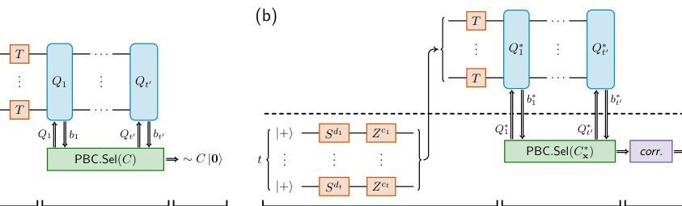
<figcaption class="paper-figure-caption"><b>Fig 1.</b> FIG. 1. (a) Pauli-based computation (PBC) and (b) Blind PBC, for a circuit C with t T gates. Information flows from left to right; single (resp. double) lines denote quantum (resp. classical) information. Each protocol has three stages. (i) Preparation of an initial state. In Blind PBC, the client chooses secret random bits ci, di ∈{0, 1} and applies rotations. (ii) Measurement of t′ ≤t Pauli observables Qj, with outcomes bj ∈{0, 1}, selected adaptively by the classical PBC.Sel algorithm. In Blind PBC, the client runs PBC.Sel on a circuit C∗ x derived from C and her secret classical input x. (iii) Output of a sample from the desired distribution, determined by PBC.Sel. In Blind PBC, the...</figcaption>
</figure>
<figure class="paper-figure-card">
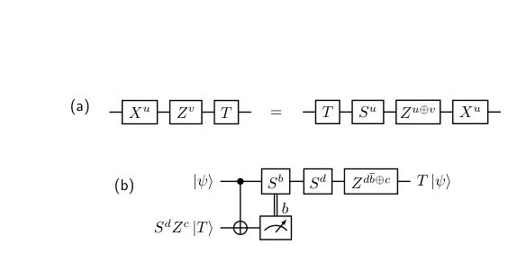
<figcaption class="paper-figure-caption"><b>Fig 2.</b> FIG. 2. Circuit identities used to derive C∗ x in Blind PBC. (a) Propagating a Pauli past a T gate introduces a condi- tional S correction. (b) Gadget for performing a T operation, where correction gates cancel out rotations on the magic state.</figcaption>
</figure>
<figure class="paper-figure-card">
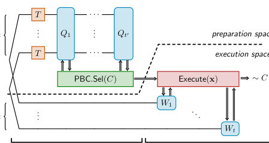
<figcaption class="paper-figure-caption"><b>Fig 3.</b> FIG. 3. Tailored resource computation (TRC). (i) Prepara- tion: PBC measurements for C |0⟩are performed on t half- EPR pairs rotated by T. The resulting state on the other t-qubit system is a computation-specific, input-independent resource state for C. (ii) Execution: The resource may be measured adaptively to sample from C |x⟩for any x ∈{0, 1}n. Only single-qubit measurements in two Pauli bases are re- quired for execution: for all i, Wi ∈{X, Y }.</figcaption>
</figure>

**Summary.** This paper presents significant advancements in Blind Quantum Computation (BQC), addressing the major bottleneck of server resource scaling. By leveraging Pauli-based computation (PBC) and introducing an entanglement-based dual protocol, the authors drastically reduce the required quantum server size. The work also provides rigorous security proofs, confirming the perfect security of the delegated computation scheme.

**Why it may be interesting.** The focus on resource scaling and the development of provably secure, resource-efficient protocols for delegated quantum computation are central theoretical topics in quantum information theory.

Detailed structure

**Main problem.** The primary challenge in Blind Quantum Computation (BQC) is the server resource cost, which historically scales poorly with the computation size.

**Main result.** The authors propose a protocol using Pauli-based computation (PBC) that reduces the required server size to depend only on the non-Clifford T gate count, and they introduce an entanglement-based dual protocol for further resource reduction.

**Method.** The work develops and analyzes three-stage protocols (Preparation, Measurement, Output) involving random Pauli rotations and classical post-processing to simulate quantum computation securely.

**Model / system.** The model is the secure delegation of quantum computation (BQC) from a low-resource client to a quantum server, utilizing Pauli operators and resource state preparation.

**Key observables.** The server resource size (qubit count), the required measurement bases (Pauli-X and Y for the dual protocol), and the resulting density matrices ($
ho_k$).

**Important parameters / regimes.** The non-Clifford T gate count ($t$), the number of qubits ($n$), and the security condition requiring indistinguishable quantum channels.

**Assumptions / limitations.** The security proof relies on establishing the perfect indistinguishability of quantum channels using an auxiliary protocol (Auxiliary BPBC) and assuming the ability to perform specific single-qubit Pauli measurements.

**Figures summary.** Figures illustrate the three stages of PBC and Blind PBC, and a separate figure details the entanglement-based dual protocol (TRC) involving preparation and adaptive measurement.

**Paper structure.** The paper progresses by first establishing the core PBC protocol, then introducing the resource-optimized dual protocol (TRC), and finally dedicating significant sections to proving the perfect security of the underlying protocols using density matrix analysis and inductive proofs.

Abstract

Blind quantum computation (BQC) allows low-resource clients to securely delegate computations to a quantum server, but server resource costs scale with the computation size, posing a bottleneck for implementations. By leveraging Pauli-based computation (PBC), we achieve BQC with a server whose size depends only on the non-Clifford gate count. Our protocol inherits fault tolerance and qubit virtualization from PBC and reveals that classical-client BQC is possible even in the absence of classical simulability. Finally, we present an entanglement-based dual protocol that performs a resource state computation with a dramatically reduced execution cost.

[↑ back to top](#top)

### [Efficiently estimating failure rates of fault-tolerant logical non-Clifford blocks](http://arxiv.org/abs/2609.19485v1)

**Authors:** Julio C. Magdalena de la Fuente, Thomas R. Scruby  
**Type:** theory · **Category:** quantum information and computing · **PDF:** <https://arxiv.org/pdf/2609.19485v1>  
**Analysis basis:** full PDF text, analyzed in chunks
**Topic relevance:** `quantum measurements` **2/5**

↔ Scroll figures horizontally

<figure class="paper-figure-card">
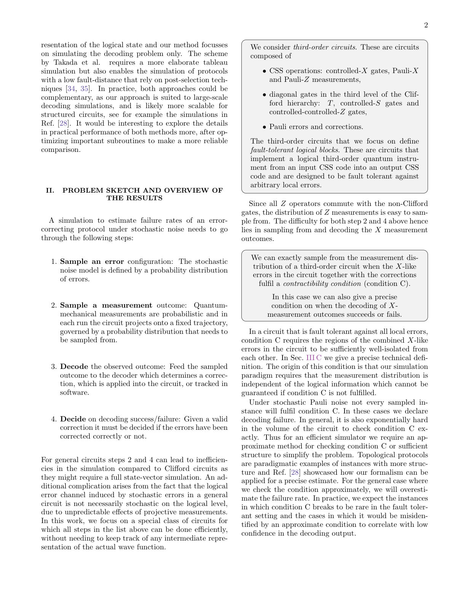
<figcaption class="paper-figure-caption"><b>Fig 1.</b> Low-resolution page preview, page 2</figcaption>
</figure>
<figure class="paper-figure-card">
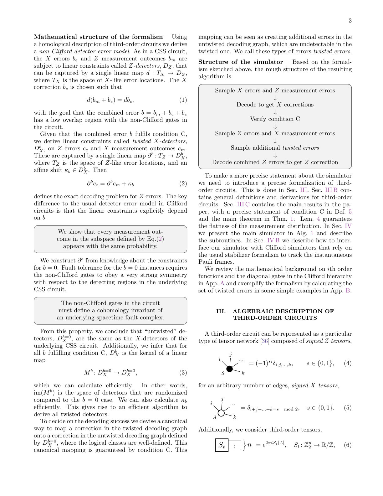
<figcaption class="paper-figure-caption"><b>Fig 2.</b> Low-resolution page preview, page 3</figcaption>
</figure>
<figure class="paper-figure-card">
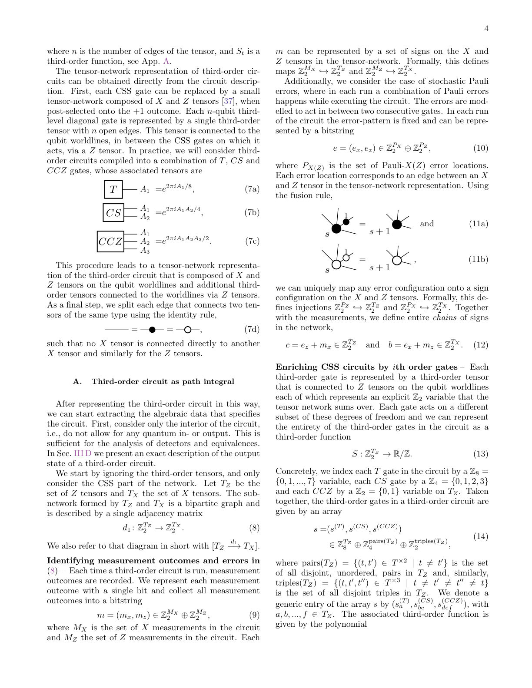
<figcaption class="paper-figure-caption"><b>Fig 3.</b> Low-resolution page preview, page 4</figcaption>
</figure>
<figure class="paper-figure-card">
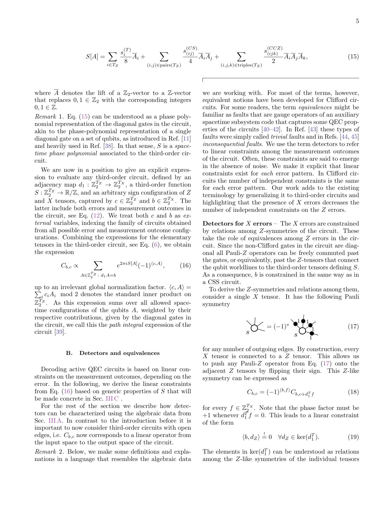
<figcaption class="paper-figure-caption"><b>Fig 4.</b> Low-resolution page preview, page 5</figcaption>
</figure>
<figure class="paper-figure-card">
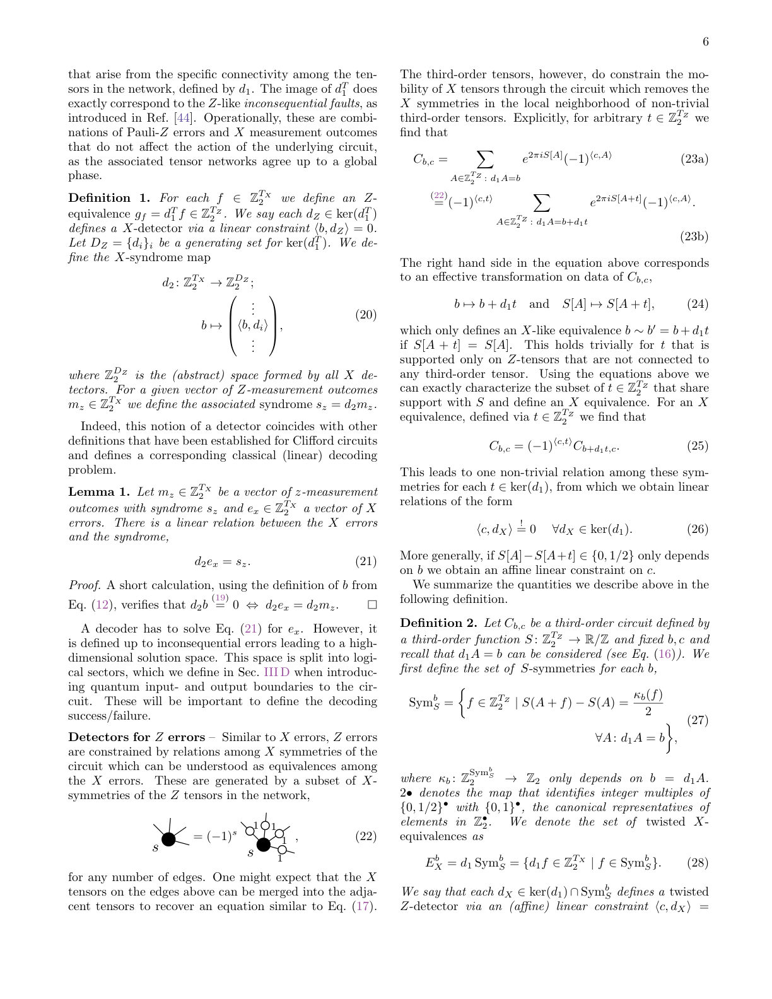
<figcaption class="paper-figure-caption"><b>Fig 5.</b> Low-resolution page preview, page 6</figcaption>
</figure>

**Summary.** This work presents an algebraic framework to efficiently estimate the failure rates of fault-tolerant quantum circuits involving non-Clifford gates. By mapping the problem onto a cohomology invariant of a fault complex, the authors derive methods to sample measurement distributions without simulating the full quantum state. This provides a scalable tool for assessing the reliability of large-scale quantum computation.

**Why it may be interesting.** The reliance on cohomology invariants and algebraic structures to analyze error rates is highly relevant for understanding the robustness and scalability of quantum computation protocols.

Detailed structure

**Main problem.** The paper addresses the challenge of efficiently estimating the failure rates associated with fault-tolerant logical non-Clifford blocks in quantum computation.

**Main result.** It develops an algebraic framework that allows for efficient sampling of the measurement distribution, yielding an estimate for the logical failure rate whose overhead is independent of the number of logical qubits.

**Method.** The method utilizes an algebraic framework based on viewing non-Clifford gates as a cohomology invariant of an underlying spacetime fault complex, allowing the simulation to focus on decoding constraints rather than full state-vector evolution.

**Model / system.** The system modeled is fault-tolerant quantum computation, specifically focusing on circuits implementing diagonal logic gates in the third level of the Clifford hierarchy, involving CSS operations and associated error structures.

**Key observables.** Logical failure rate, measurement distribution, and sufficient conditions for decoding success.

**Important parameters / regimes.** The overhead of non-Clifford simulation, which is shown to be independent of the number of logical qubits.

**Assumptions / limitations.** The estimate for the failure rate is an overestimate unless a contractibility condition (Condition C) is met, and checking this condition exactly is exponentially hard.

**Paper structure.** The paper builds the framework by deriving linear constraints for the decoding problem, characterizing detectors using algebraic data, and deriving the structure of twisted errors for various gate types (T, cup-product).

Abstract

Useful quantum computation requires the fault-tolerant implementations of a universal gate set which are generically not efficiently simulable. We devise an algebraic framework that allows for efficient sampling from the measurement distribution of fault-tolerant circuits that implement diagonal logic gates in the third level of the Clifford hierarchy. Upon successful sampling we also provide sufficient conditions for decoding success. The resulting estimate for the logical failure rate is an overestimate, which becomes more accurate for blocks that are fault tolerant against arbitrary local errors. The non-Clifford simulation overhead is independent of the number of logical qubits, making the method particularly attractive for large-scale simulations. The framework is based on viewing the non-Clifford gates in the circuit as a cohomology invariant of an underlying spacetime fault complex. The method can also be interfaced with Clifford simulators to simulate larger fault-tolerant circuits and algorithmic subroutines.

[↑ back to top](#top)

### [Parallel quantum channel discrimination and numerical ranges in tensor product subspaces](http://arxiv.org/abs/2609.20781v1)

**Authors:** Adam Bílek, Paulina Lewandowska, Ryszard Kukulski  
**Type:** theory · **Category:** quantum information and computing · **PDF:** <https://arxiv.org/pdf/2609.20781v1>  
**Analysis basis:** full PDF text, analyzed in chunks
**Topic relevance:** `quantum measurements` **2/5**

↔ Scroll figures horizontally

<figure class="paper-figure-card">
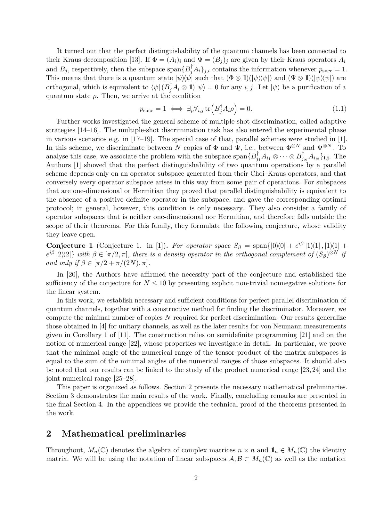
<figcaption class="paper-figure-caption"><b>Fig 1.</b> Low-resolution page preview, page 2</figcaption>
</figure>
<figure class="paper-figure-card">
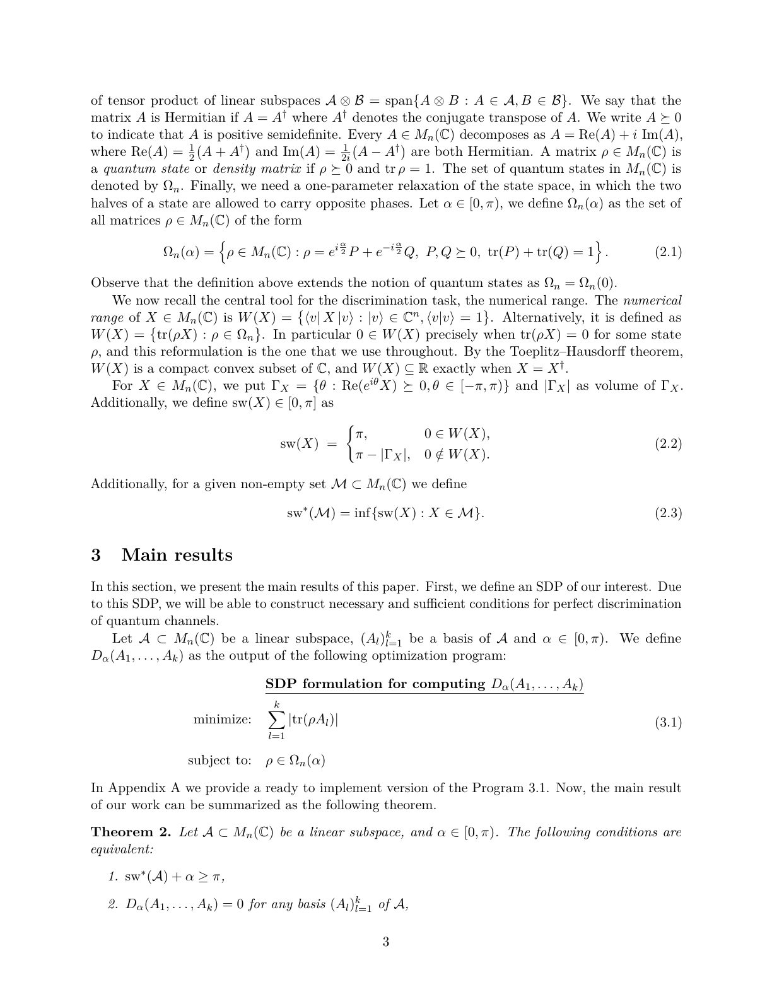
<figcaption class="paper-figure-caption"><b>Fig 2.</b> Low-resolution page preview, page 3</figcaption>
</figure>
<figure class="paper-figure-card">
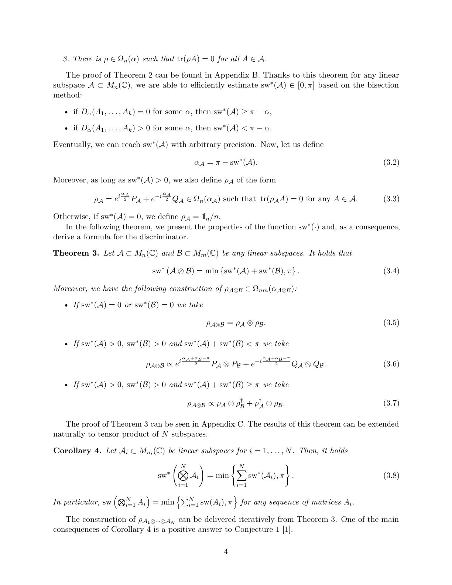
<figcaption class="paper-figure-caption"><b>Fig 3.</b> Low-resolution page preview, page 4</figcaption>
</figure>
<figure class="paper-figure-card">
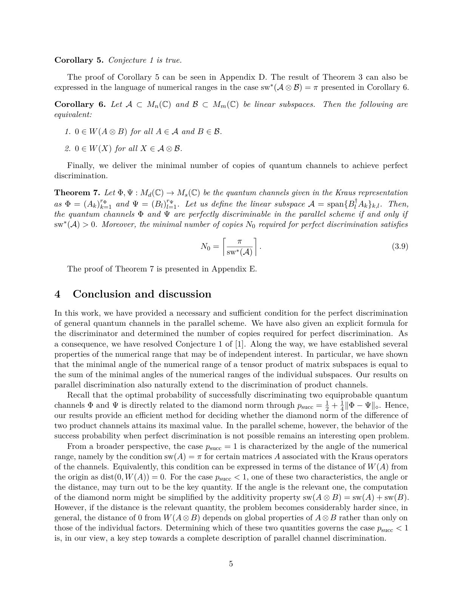
<figcaption class="paper-figure-caption"><b>Fig 4.</b> Low-resolution page preview, page 5</figcaption>
</figure>
<figure class="paper-figure-card">
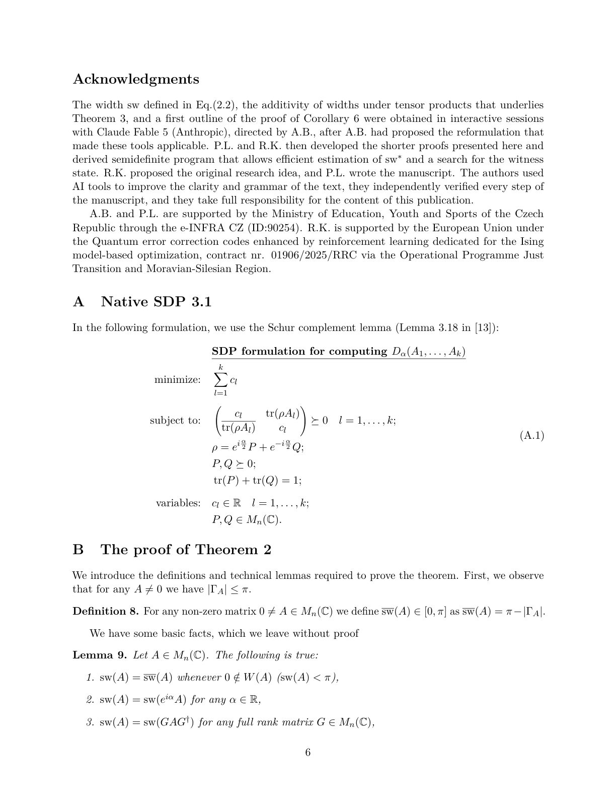
<figcaption class="paper-figure-caption"><b>Fig 5.</b> Low-resolution page preview, page 6</figcaption>
</figure>

**Summary.** This work provides a comprehensive theoretical framework for analyzing perfect quantum channel discrimination in a parallel setting. It establishes that distinguishability depends on a geometric property of the operator subspace, quantified by the minimal angle of the numerical range ($	ext{sw}^*$). The paper successfully determines the minimum number of copies needed for perfect discrimination, settling a key conjecture in the field.

**Why it may be interesting.** The rigorous mathematical tools developed (SDP, numerical range properties) provide a powerful, general framework for analyzing distinguishability in quantum channels, which has direct implications for quantum communication protocols.

Detailed structure

**Main problem.** The paper addresses the theoretical problem of determining the necessary and sufficient conditions for perfectly discriminating between two quantum channels ($\Phi$ and $\Psi$) when the discrimination is performed in a parallel scheme.

**Main result.** Perfect discrimination is possible if and only if a quantity derived from the numerical range of the associated operator subspace, $	ext{sw}^*(A) > 0$. The minimal number of copies required is $N_0 = \lceil \pi / 	ext{sw}^*(A) 
ceil$.

**Method.** The authors develop an SDP formulation and heavily rely on the mathematical properties of the numerical range, particularly its behavior under tensor products, to establish the necessary conditions.

**Model / system.** The system involves general quantum channels ($\Phi, \Psi$) acting on quantum states, analyzed using their Kraus operator representations and associated operator subspaces.

**Key observables.** The primary diagnostic tool is $	ext{sw}^*(A)$, which measures the minimal angle of the numerical range of the relevant operator subspace $A$.

**Important parameters / regimes.** The minimal number of copies, $N_0$, is determined by the relationship $N_0 \approx \pi / 	ext{sw}^*(A)$.

**Assumptions / limitations.** The analysis relies on the key property that the minimal angle of the numerical range of a tensor product equals the sum of the minimal angles of the individual subspaces.

**Paper structure.** The paper builds from defining the problem using quantum channels and the numerical range, establishing necessary and sufficient conditions via SDP, proving key properties of the numerical range under tensor products, and finally applying these results to settle a long-standing conjecture regarding the minimum number of copies.

Abstract

Quantum channel discrimination plays a crucial role in quantum information theory. Of particular interest is the case in which the channels can be discriminated perfectly. In this work, we focus on the perfect quantum channel discrimination task in a parallel scheme. We develop an SDP formulation combined with a bisection procedure to compute a quantum state for perfect discrimination in time linear in the number of copies. In addition, we obtain the minimal number of copies of quantum channels to achieve perfect discrimination. Thanks to that, we settle in the affirmative Conjecture 1 of Duan, Guo, Li and Li [arXiv:1605.02294, IEEE ISIT 2016], which characterizes the number of parallel uses needed to discriminate perfectly a distinguished family of operator subspaces. All our results are obtained using the notion and basic properties of the numerical range. In particular, the key fact that we prove and use is that the minimal angle of the numerical range of a tensor product of matrix subspaces equals the sum of the minimal angles of the numerical ranges of the individual subspaces.

[↑ back to top](#top)

### [Plasmons in twisted bilayer graphene across dispersive and flat bands](http://arxiv.org/abs/2609.20158v1)

**Authors:** Antonio Palamara, Michele Pisarra, Antonello Sindona  
**Type:** theory · **Category:** strongly correlated electrons · **PDF:** <https://arxiv.org/pdf/2609.20158v1>  
**Analysis basis:** full PDF text, analyzed in chunks
**Topic relevance:** `Keldysh / 2PI / non-Gaussian methods` **2/5**

↔ Scroll figures horizontally

<figure class="paper-figure-card">
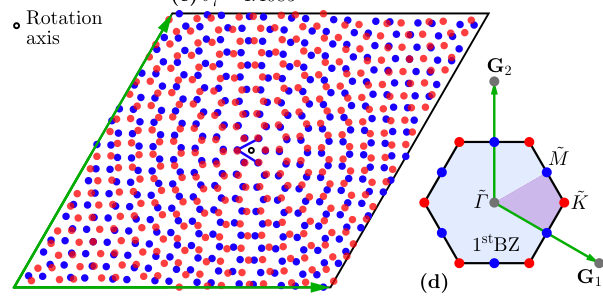
<figcaption class="paper-figure-caption"><b>Fig 1.</b> Figure 1. Real- and reciprocal-space geometry of selected commensurate TBG con-</figcaption>
</figure>
<figure class="paper-figure-card">
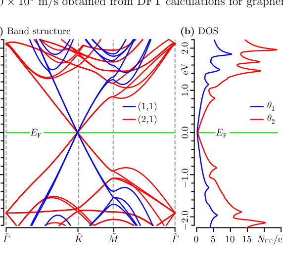
<figcaption class="paper-figure-caption"><b>Fig 2.</b> Figure 2. Semimetallic electronic structure of reference-distance TBG configurations.</figcaption>
</figure>
<figure class="paper-figure-card">
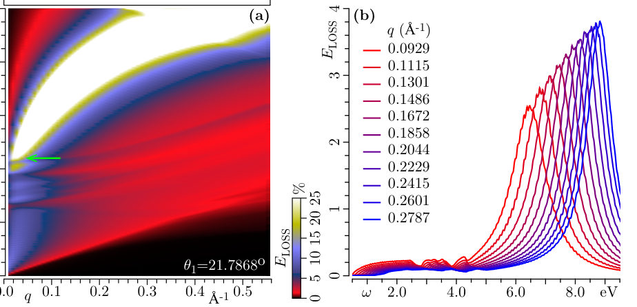
<figcaption class="paper-figure-caption"><b>Fig 3.</b> Figure 3. Electron energy-loss function of pristine θ1 TBG. (a) Momentum-energy density</figcaption>
</figure>
<figure class="paper-figure-card">
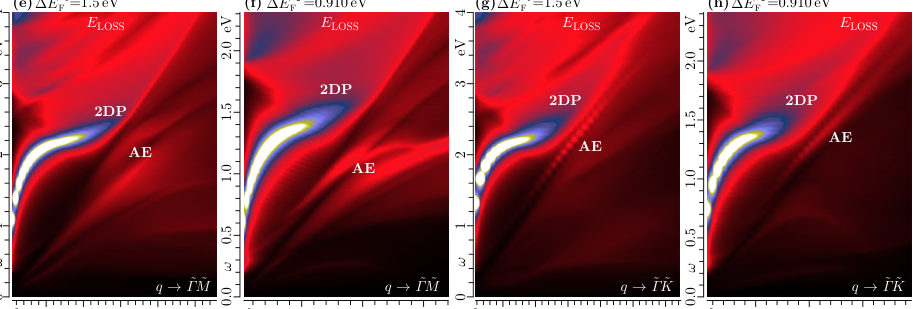
<figcaption class="paper-figure-caption"><b>Fig 4.</b> Figure 4. Electron energy-loss function of extrinsic large-angle TBG. Momentum-energy</figcaption>
</figure>
<figure class="paper-figure-card">
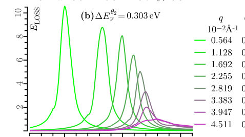
<figcaption class="paper-figure-caption"><b>Fig 5.</b> Figure 5. Quantitative test of the 2DP scaling relation. Electron energy-loss spectra and</figcaption>
</figure>

**Summary.** This work investigates plasmonic excitations in twisted bilayer graphene by comparing its response in highly dispersive versus quasi-flat band regimes. Using TDDFT-RPA, the authors identify distinct plasmon modes—a 2D Dirac plasmon in the dispersive case and a mid-infrared interband plasmon in the flat-band case. This highlights how the electronic band structure dictates the nature of collective charge excitations in moiré materials.

**Why it may be interesting.** The detailed analysis of collective excitations (plasmons) in systems exhibiting strong electronic correlations (flat bands) provides insights into how screening and charge dynamics are modified by proximity to correlated insulating states.

Detailed structure

**Main problem.** The study explores the dynamical dielectric response of twisted bilayer graphene (TBG) across different electronic band regimes, specifically comparing dispersive and quasi-flat band behavior.

**Main result.** In the dispersive regime, a 2D Dirac plasmon is activated by doping, while in the quasi-flat band regime, a distinct interband plasmon is identified with an energy in the mid-infrared range.

**Method.** The research employs Time-Dependent Density-Functional Theory (TDDFT) within the Random-Phase Approximation (RPA) to calculate the energy-loss function.

**Model / system.** The physical system is Twisted Bilayer Graphene (TBG), analyzed in three regimes: large-angle dispersive bands at a reference interlayer distance, and small-angle quasi-flat bands treated at a reduced, angle-dependent magic distance.

**Key observables.** Electron energy-loss function (ELOSS), plasmon dispersion ($\omega$ vs. $q$), and the dielectric function $\epsilon_M(q, \omega)$.

**Important parameters / regimes.** Twist angle ($	heta$), interlayer distance ($d_0$ vs. $	ilde{d}$), and doping level (Fermi level shift).

**Assumptions / limitations.** The study uses a tractable cell approximation for the magic-angle structure and is limited by the RPA approximation, excluding correlation-driven symmetry breaking.

**Figures summary.** Figures illustrate the geometry of the three configurations, band structures showing Dirac cones and quasi-flat bands, and ELOSS spectra identifying the $\pi$-plasmon and the doping-activated 2D Dirac plasmon.

**Paper structure.** The paper systematically compares the dielectric response calculated for the dispersive band regime (large angles) versus the quasi-flat band regime (magic angle approximation), contrasting the resulting plasmonic excitations.

Abstract

The dynamical dielectric response of twisted bilayer graphene is explored in large-angle dispersive-band and small-angle quasi-flat-band regimes using time-dependent density-functional theory within the random-phase approximation. At the reference bilayer-graphene interlayer distance, weak coupling in the largest-angle structures preserves Dirac dispersions and the intrinsic $π$ plasmon. Electron doping activates a two-dimensional Dirac plasmon with energies obeying approximate geometric twist-angle scaling, while acoustic-like branches remain embedded in the single-particle continuum. The prohibitively large first-magic-angle supercell is represented by a tractable cell with its interlayer separation reduced to the angle-dependent magic distance, where four quasi-flat bands emerge around the Fermi level. Their partial occupation produces a dispersive low-energy plasmon-like excitation without a clear dielectric zero at resonance. A distinct interband plasmon is instead identified, supported by transitions involving the quasi-flat manifold and neighboring high-density-of-states regions. Band-energy rescaling places its characteristic energy in the mid-infrared range of interband collective excitations measured near the magic angle.

[↑ back to top](#top)

### [Rapidity-Coupled Spin Dynamics in Pulsed Laser Fields from Physics-Informed Neural Networks](http://arxiv.org/abs/2609.19756v1)

**Authors:** N. S. Akintsov, A. P. Nevecheria, S. N. Andreev, Qing-Hua Qin  
**Type:** theory · **Category:** numerical methods · **PDF:** <https://arxiv.org/pdf/2609.19756v1>  
**Analysis basis:** full PDF text, analyzed in chunks
**Topic relevance:** `methods for driven-dissipative` **2/5**

↔ Scroll figures horizontally

<figure class="paper-figure-card">
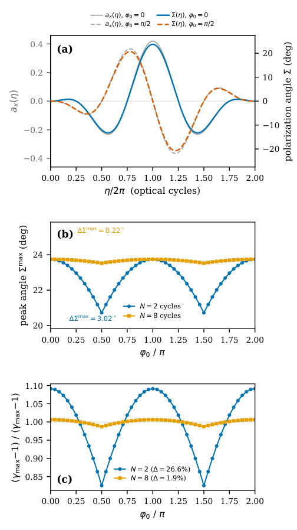
<figcaption class="paper-figure-caption"><b>Fig 1.</b> FIG. 1. Carrier-envelope-phase control of the intra-pulse spin dynamics for an electron initially at rest in a cos2-envelope pulse with a0 = 0.42. (a) Normalized vector potential ax(η) (grey) and the rest-frame polarization angle Σ(η) for φ0 = 0 and φ0 = π/2 in a two-cycle pulse; Σ = 2 arctan(ax/2)+aeax. (b) Peak angle Σmax = maxη |Σ| versus CEP for N = 2 and N = 8 cycles; the CEP-induced spread collapses from 3.02◦to 0.22◦as the pulse lengthens. (c) Peak kinetic energy γmax−1, normalized to its CEP average, showing a 26.6% spread for N = 2 against 1.90% for N = 8; γmax −1 = a2 max/2 exactly, with amax = maxη |ax|. In all cases the net rotation after the pulse vanishes, Eq. (6).</figcaption>
</figure>
<figure class="paper-figure-card">
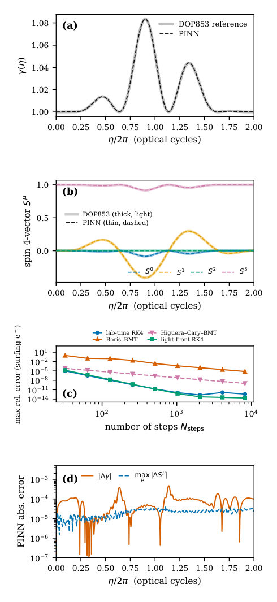
<figcaption class="paper-figure-caption"><b>Fig 2.</b> FIG. 2. Physics-informed neural network solution of the light- front orbital and BMT equations, Eq. (3) with d/dτ = κ d/dη, for a0 = 0.42, N = 2, φ0 = 0.7 rad. (a) Lorentz factor γ(η) from the PINN (dashed) against the Dormand–Prince refer- ence (solid). (b) Components of the spin four-vector Sµ(η), same convention. (c) Maximum relative error at the end of the pulse versus fixed step budget for a co-propagating elec- tron (κ = 0.050), comparing lab-time Runge–Kutta, the Boris and Higuera–Cary pushers (both with a Cayley spin update) and the light-front rapidity parameterization. (d) Pointwise absolute error of the trained network against the reference, |∆γ| and maxµ |∆Sµ|, over the pulse.</figcaption>
</figure>

**Summary.** This work investigates how the spin of an electron evolves when driven by intense, short laser pulses, focusing on the role of the Carrier-Envelope-Phase (CEP). The authors use a Physics-Informed Neural Network (PINN) to solve the complex coupled equations, achieving high accuracy and extending the analysis to elliptical polarization where analytical solutions fail. This provides validated, powerful tools for studying CEP-resolved spin dynamics in extreme electromagnetic fields.

**Why it may be interesting.** The combination of relativistic quantum electrodynamics (BMT equation) with modern machine learning tools (PINNs) to solve complex, non-linear, time-dependent physics problems is highly relevant for developing next-generation computational physics tools.

Detailed structure

**Main problem.** Characterizing the spin dynamics of an electron driven by intense, few-cycle, laser pulses, particularly resolving the dependence on the Carrier-Envelope-Phase (CEP).

**Main result.** The CEP strongly controls the transient intra-pulse polarization angle, though the net spin rotation vanishes for linear polarization. A Physics-Informed Neural Network (PINN) successfully validates the dynamics, extending to elliptical polarization where no closed-form solution exists.

**Method.** The authors employed advanced numerical techniques, including light-front parameterization, high-order integrators (Dormand-Prince), and a Physics-Informed Neural Network (PINN) trained on the governing light-front equations.

**Model / system.** The system models a relativistic electron interacting with a plane-wave, few-cycle laser pulse. The dynamics are governed by the coupled equations for the electron's orbital motion and its spin evolution (BMT equation).

**Key observables.** Rest-frame polarization angle ($\Sigma$), peak intra-pulse angle ($\Sigma_{\max}$), net spin rotation, and peak kinetic energy spread.

**Important parameters / regimes.** Carrier-Envelope-Phase (CEP, $\phi_0$), pulse duration (2-cycle vs. 8-cycle), and the electron's anomalous magnetic moment ($a_e$).

**Assumptions / limitations.** The analysis often assumes an ideal plane-wave pulse, which leads to the vanishing net spin rotation, suggesting external effects are needed to observe CEP-dependent net polarization changes.

**Figures summary.** Figures illustrate the CEP dependence of the polarization angle, showing a significant collapse in the peak angle spread ($\Delta\Sigma_{\max}$) when moving from two-cycle to eight-cycle pulses. Comparisons are made between PINN results and established reference solvers.

**Paper structure.** The paper develops the exact light-front solution for spin evolution, derives the closed-form expression for linear polarization, and then applies this framework to validate a PINN implementation. The PINN is trained to solve the coupled orbital and spin equations, demonstrating accuracy across various polarization regimes.

Abstract

Carrier-envelope-phase (CEP) stabilized few-cycle pulses make the sub-cycle field structure a control parameter for laser-driven polarized electron sources, yet spin solvers for such pulses are rarely tested against exact results. We show that for an electron initially at rest in a linearly polarized plane-wave pulse the rest-frame polarization angle follows the instantaneous vector potential, $Σ= 2\arctan(a_x/2) + a_e a_x$ with $a_e$ the electron anomaly: the net rotation vanishes for every CEP, while the peak intra-pulse angle varies over the CEP by 3.02 degrees for a two-cycle and by 0.22 degrees for an eight-cycle pulse. The result follows from the Volkov orbit in longitudinal and transverse rapidities. We use it to validate a light-front reference integrator and a physics-informed neural network trained only on the light-front equations, which reaches $4\times10^{-5}$ in the spin sector and carries over to elliptical polarization, for which no closed-form solution is known. This gives validated tools for CEP-resolved spin dynamics in intense fields.

[↑ back to top](#top)

### [Procrastinating einselection in non-Markovian quantum dynamics](http://arxiv.org/abs/2609.20757v1)

**Authors:** Michael J. Moody, Tara Kalsi, Agung Budiyono, Sebastian Deffner  
**Type:** theory · **Category:** other · **PDF:** <https://arxiv.org/pdf/2609.20757v1>  
**Analysis basis:** full PDF text, analyzed in chunks
**Topic relevance:** `Keldysh / 2PI / non-Gaussian methods` **1/5** · `correlated / nonlocal dissipation` **1/5** · `driven-dissipative phase transition` **1/5** · `methods for driven-dissipative` **1/5** · `non-equilibrium universality` **1/5** · `quantum measurements` **1/5**

↔ Scroll figures horizontally

<figure class="paper-figure-card">
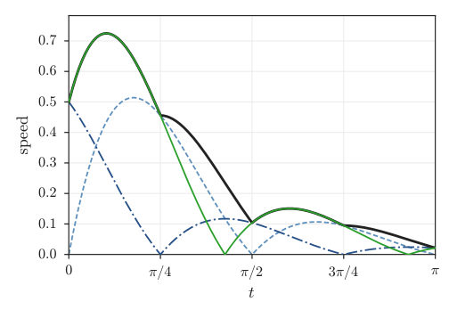
<figcaption class="paper-figure-caption"><b>Fig 1.</b> FIG. 1. Instantaneous observable speed for the pure-dephasing dynamics with H = σz, L = σz/ √</figcaption>
</figure>
<figure class="paper-figure-card">
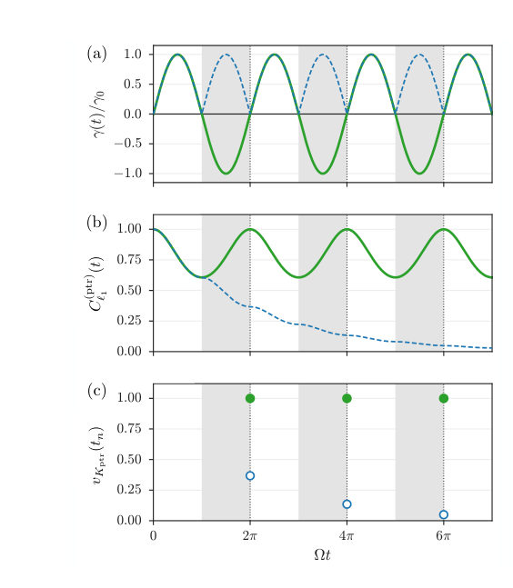
<figcaption class="paper-figure-caption"><b>Fig 2.</b> FIG. 2. Matched CP-indivisible and CP-divisible pure-dephasing dynamics for the pointer observable Kptr = σz. Solid green curves denote the CP-indivisible evolution generated by γNM(t) = γ0 sin (Ωt) with γ0/Ω= 1/4, while dashed blue curves denote the matched CP-divisible reference generated by γM(t) = |γNM(t)|. Shaded regions indicate intervals for which γNM(t) &lt; 0, and dotted vertical lines mark the comparison times tn = 2πn/Ω(see Appendix D). (a) Canonical decoherence rates normalized by γ0. The rates coincide outside the shaded intervals. (b) Pointer-basis ℓ1 coherence. Under the CP-indivisible dynamics, the coherence undergoes complete revivals at the comparison times tn, while it...</figcaption>
</figure>
<figure class="paper-figure-card">
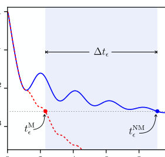
<figcaption class="paper-figure-caption"><b>Fig 3.</b> FIG. 3. Non-Markovian delay of einselection for the structured Ohmic-Lorentzian continuum (34) with A = 1, B = 4, ω0 = 3, ωc = 10, and λ = 0.3 (in dimensionless units). The relaxing quantity is the expectation value of the coherence witness ⟨σx⟩, R(t) = e−Γ(0,t), shown for the non-Markovian evolution (solid blue) and its matched CP-divisible reference (dashed red). The dotted horizontal line indicates the threshold ϵ = e−Γ∗, set by Γ∗= 6, and the shaded region corresponds to the delay ∆tϵ (36).</figcaption>
</figure>
<figure class="paper-figure-card">
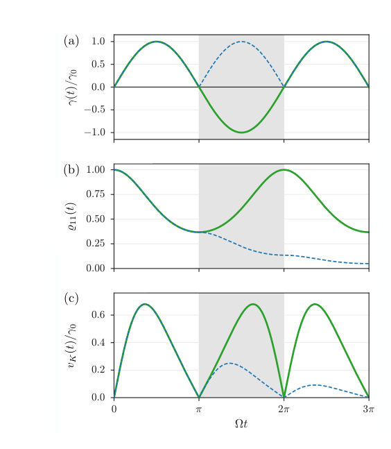
<figcaption class="paper-figure-caption"><b>Fig 4.</b> FIG. 4. Matched CP-indivisible and CP-divisible amplitude-damping dynamics. Solid green curves show the CP-indivisible evolution generated by γNM(t) = γ0 sin (Ωt), while dotted blue curves show the matched CP-divisible reference with γM(t) = |γNM(t)|. The shaded region indicates the interval for which γNM(t) &lt; 0. (a) Canonical decoherence rates normalized by γ0. The two rates coincide outside the shaded interval. (b) Excited-state population. The CP-indivisible dynamics exhibits a population revival, in contrast to the monotonic decay of the CP-divisible reference. (c) Observable speed for K = σz, normalized by γ0. The enhanced speed under CP-indivisible dynamics is due to the larger...</figcaption>
</figure>

**Summary.** This theoretical paper derives a quantum speed limit for observables undergoing non-Markovian open quantum dynamics. It analyzes how environmental dissipation affects the process of einselection, showing that non-Markovian effects can enhance or delay the approach to classicality. The findings establish a quantitative link between the accumulated negativity of the decoherence rate and the time delay in pointer state formation.

**Why it may be interesting.** This work directly addresses the fundamental connection between environmental coupling, the emergence of classicality (einselection), and the fundamental constraints on quantum evolution (QSLs) in non-Markovian regimes, which is central to modern open quantum systems theory.

Detailed structure

**Main problem.** The paper investigates the rate at which a quantum system approaches classicality (einselection) within the framework of non-Markovian open quantum dynamics.

**Main result.** Non-Markovianity can both accelerate and delay the einselection process, with the delay being bounded by the accumulated negativity of the canonical decoherence rate.

**Method.** The authors derive and analyze a quantum speed limit for observables by decomposing the time evolution into coherent and dissipative current contributions.

**Model / system.** The analysis concerns finite-dimensional quantum systems governed by open-system dynamics described by time-local master equations, incorporating both Hamiltonian evolution and environmental dissipation.

**Key observables.** Observable speed ($v_K(t)$), expectation values ($\langle K 
angle_t$), canonical decoherence rates ($\gamma_\mu(t)$), and coherence measures ($\mathcal{C}_{	ext{ptr}}^{\ell_1}(\varrho(t))$).

**Important parameters / regimes.** Non-Markovianity (signaled by $\gamma_\mu(t) < 0$), accumulated negativity ($F(0,t)$), and the time-local generator $L_t$.

**Assumptions / limitations.** The analysis is restricted to differentiable time-local open dynamics, and the speed limit derivation relies on specific mathematical inequalities.

**Figures summary.** Figure 1 compares the exact observable speed against the theoretical bound for pure-dephasing dynamics, decomposing the speed into coherent and dissipative parts.

**Paper structure.** The paper builds by first defining the observable speed limit in open systems, then analyzing the decomposition of the evolution into coherent and dissipative currents, and finally comparing the speed enhancement in non-Markovian (CP-indivisible) dynamics against Markovian references.

Abstract

Among the processes governed by open-system and dissipative quantum dynamics, environment-induced superselection, or einselection, is particularly foundational, since it describes the formation of a preferred set of pointer states through environmental monitoring and ultimately the emergence of classicality. Especially in the context of Quantum Darwinism, einselection can be studied in terms of the motion of an observable towards its pointer value. To this end, we derive a quantum speed limit for observables for finite-dimensional systems governed by differentiable time-local open dynamics. We identify two mechanisms through which non-Markovianity can enhance observable speed: direct dissipative motion supported by population retention or revival, and indirect enhancement through restoration of the asymmetry available for coherent motion. For permanent einselection, this delays the emergence of the pointer basis due to accumulated negativity.

[↑ back to top](#top)

### [Phase transitions in non-Hermitian spherical integrals](http://arxiv.org/abs/2609.20685v1)

**Authors:** Pierre Bousseyroux, Marc Potters  
**Type:** theory · **Category:** disordered systems and neural networks · **PDF:** <https://arxiv.org/pdf/2609.20685v1>  
**Analysis basis:** full PDF text, analyzed in chunks
**Topic relevance:** `Keldysh / 2PI / non-Gaussian methods` **1/5** · `analog quantum simulation` **1/5** · `driven-dissipative phase transition` **1/5** · `non-equilibrium universality` **1/5**

↔ Scroll figures horizontally

<figure class="paper-figure-card">
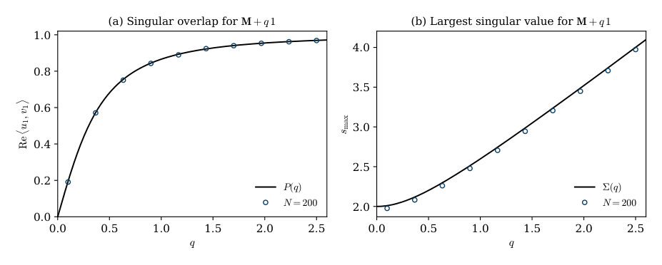
<figcaption class="paper-figure-caption"><b>Fig 1.</b> Figure 1: Singular-edge data for Ginibre, M + q 1, at N = 200. (a) Mean Re⟨u1, v1⟩compared with P(q). (b) Mean top singular value compared with Σ(q). Averages over 12 samples.</figcaption>
</figure>

**Summary.** This paper analyzes the asymptotic behavior of constrained spherical integrals for non-Hermitian random matrices. It identifies a critical phase transition point determined by the largest singular value of a related matrix. The work develops conjectures for large deviations, extending established techniques from Hermitian random matrix theory to the non-Hermitian setting.

**Why it may be interesting.** The mathematical framework of analyzing phase transitions in random matrix integrals, especially the transition from delocalized to localized regimes, has deep parallels with localization phenomena studied in disordered systems and quantum many-body physics.

Detailed structure

**Main problem.** The paper studies the large-N asymptotics of constrained spherical integrals for non-Hermitian random matrices, focusing on identifying phase transitions between delocalized and localized regimes.

**Main result.** The constrained integral exhibits a transition governed by the largest singular value of a shifted matrix, leading to conjectures for one-eigenvalue large deviations and boundary fluctuations.

**Method.** The analysis employs saddle-point methods, extending techniques from Hermitian random matrices (like the Coulomb-gas picture) to the non-Hermitian setting using complex analysis and singular value decomposition.

**Model / system.** The model involves non-Hermitian random matrices and a constrained spherical integral $H_{q,N}(\alpha, eta)$ defined by fixing norms and mutual scalar products of associated vectors.

**Key observables.** The constrained integral $H_q$, the largest singular value $\sigma_{\max}(z)$, and the one-particle rate function $\Psi_V(z)$.

**Important parameters / regimes.** The parameters $\alpha$ and $eta$ defining the constraints, and the spectral density $
ho_\mu(z)$ of the limiting measure $\mu$.

**Assumptions / limitations.** The analysis assumes the empirical spectral measure converges to a deterministic measure $\mu$ with compact support, and relies on the validity of the large-N limit and saddle-point approximations.

**Figures summary.** Figure 1 compares the mean real part of the overlap $\langle u_1, v_1 
angle$ with the mean top singular value $\Sigma(q)$ for the Ginibre ensemble.

**Paper structure.** The paper establishes the problem by comparing to Hermitian cases, develops the saddle-point analysis for the non-Hermitian integral, identifies the transition point based on singular values, and concludes with conjectures for large deviations.

Abstract

We study the large-$N$ asymptotics of a constrained spherical integral for non-Hermitian random matrices, in which the norms and mutual scalar product of two vectors are fixed. In the delocalized regime, the asymptotics are governed by the non-Hermitian transforms $\mathcal R_1$ and $\mathcal R_2$. At saddle-point level, the constrained integral exhibits a transition to a localized regime controlled by the largest singular value of a shifted matrix and by the overlap of its associated left and right singular vectors. Motivated by the Hermitian spherical-integral mechanism and by the Coulomb-gas picture, we formulate conjectures for one-eigenvalue large deviations and boundary fluctuations. Throughout, our analysis is carried out in the spirit of mathematical physics.

[↑ back to top](#top)

### [Quantum Entropy Contraction and Factorization from Hypercontractivity](http://arxiv.org/abs/2609.20753v1)

**Authors:** Li Gao, Lijun Wang  
**Type:** theory · **Category:** statistical mechanics · **PDF:** <https://arxiv.org/pdf/2609.20753v1>  
**Analysis basis:** full PDF text, analyzed in chunks
**Topic relevance:** `correlated / nonlocal dissipation` **1/5** · `driven-dissipative phase transition` **1/5** · `non-equilibrium universality` **1/5**

↔ Scroll figures horizontally

<figure class="paper-figure-card">
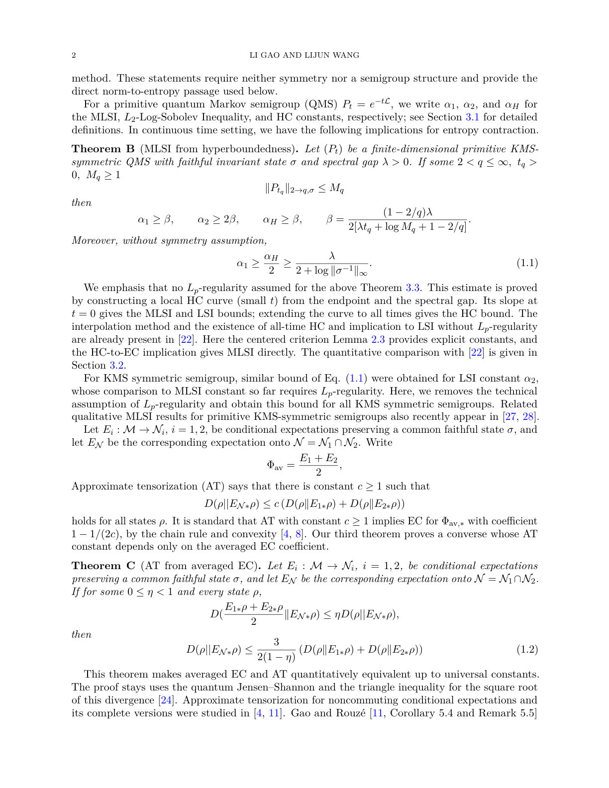
<figcaption class="paper-figure-caption"><b>Fig 1.</b> Low-resolution page preview, page 2</figcaption>
</figure>
<figure class="paper-figure-card">
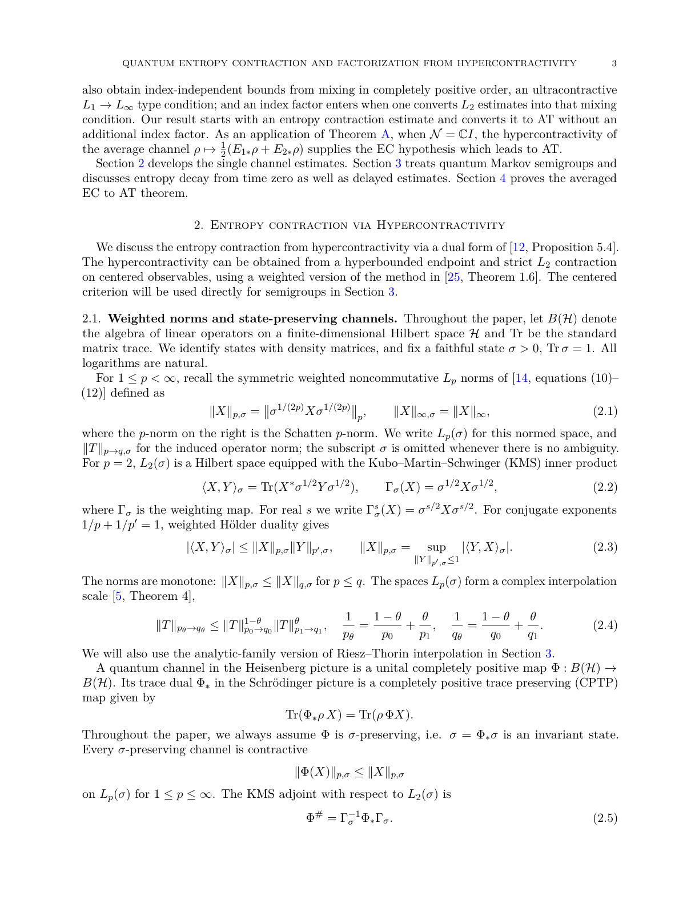
<figcaption class="paper-figure-caption"><b>Fig 2.</b> Low-resolution page preview, page 3</figcaption>
</figure>
<figure class="paper-figure-card">
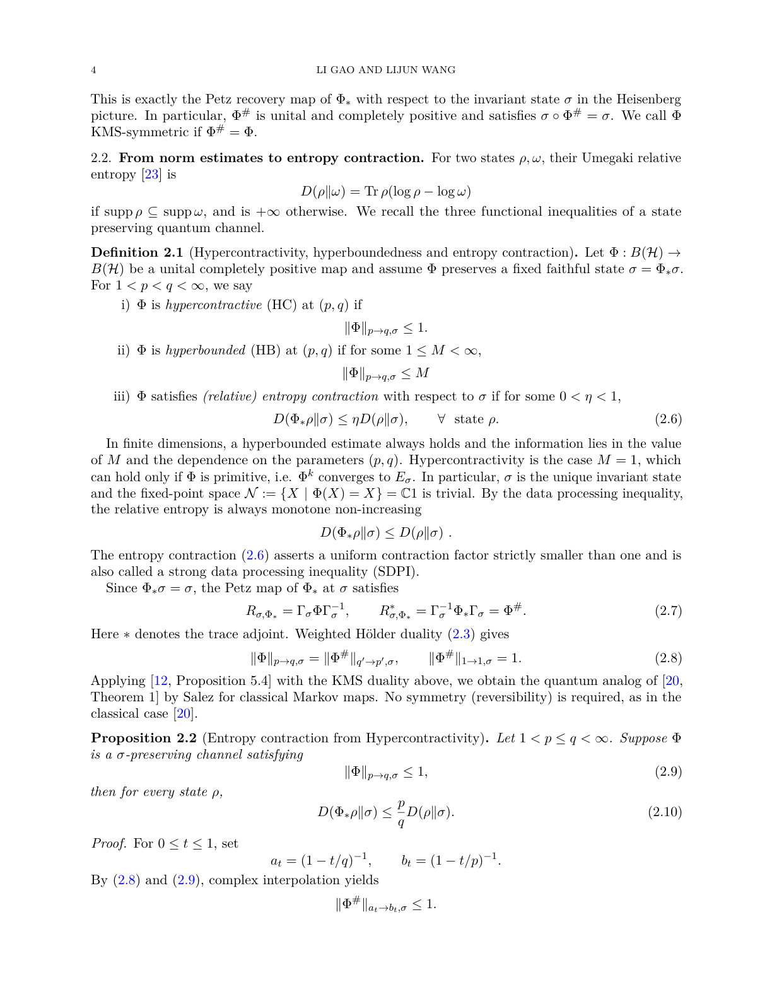
<figcaption class="paper-figure-caption"><b>Fig 3.</b> Low-resolution page preview, page 4</figcaption>
</figure>
<figure class="paper-figure-card">
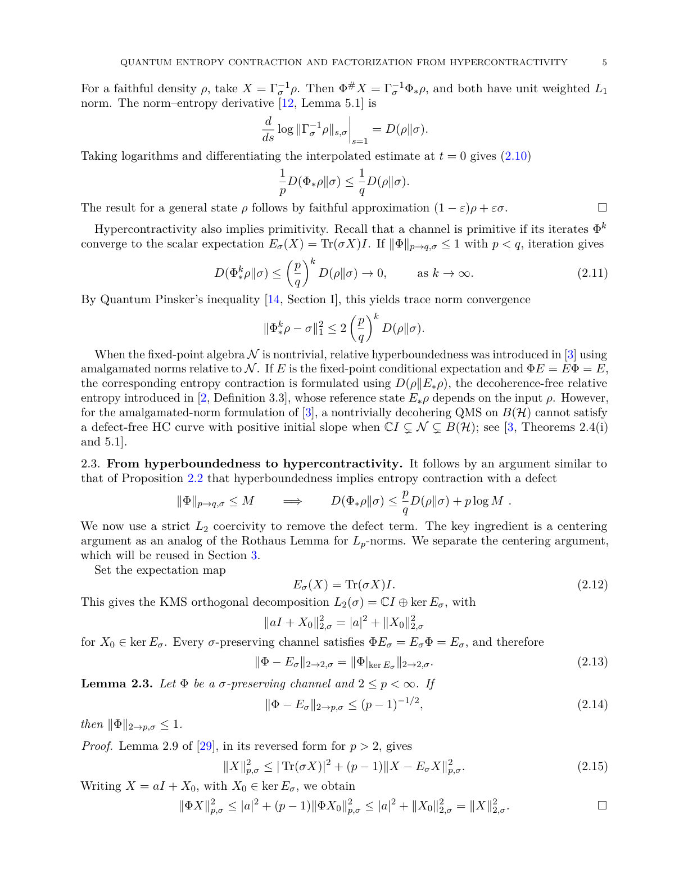
<figcaption class="paper-figure-caption"><b>Fig 4.</b> Low-resolution page preview, page 5</figcaption>
</figure>
<figure class="paper-figure-card">
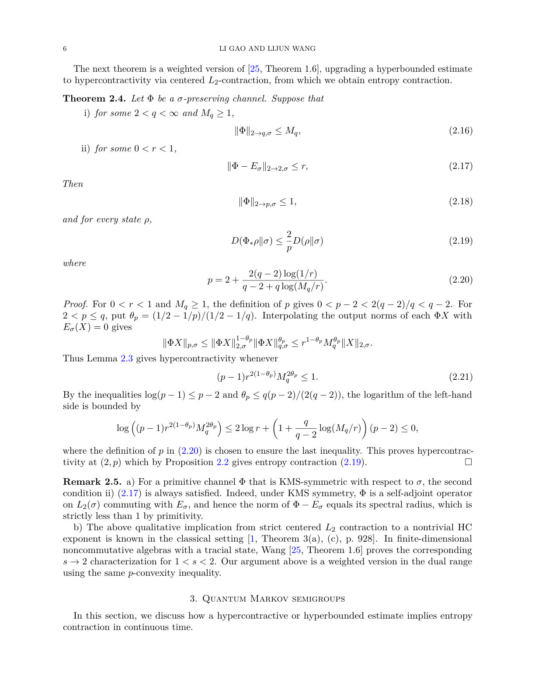
<figcaption class="paper-figure-caption"><b>Fig 5.</b> Low-resolution page preview, page 6</figcaption>
</figure>

**Summary.** This paper establishes deep mathematical links between hypercontractivity and entropy contraction for quantum channels and semigroups. By analyzing these functional inequalities, the authors derive quantitative bounds on spectral properties, such as the Log-Sobolev constant. This work is crucial for understanding the rate and mechanism of thermalization in quantum many-body systems.

**Why it may be interesting.** The connection between functional inequalities (like hypercontractivity) and fundamental thermodynamic quantities (like entropy decay) is central to understanding thermalization and mixing in open quantum systems.

Detailed structure

**Main problem.** The paper investigates the mathematical relationship between hypercontractivity estimates and entropy contraction in quantum dynamical systems.

**Main result.** It proves that hypercontractivity implies entropy contraction for single quantum channels and derives specific lower bounds on the Log-Sobolev constant for KMS-symmetric quantum Markov semigroups.

**Method.** The analysis employs techniques from functional analysis, including complex interpolation, weighted Hölder duality, and the use of the norm–entropy derivative.

**Model / system.** The study focuses on finite-dimensional quantum systems governed by quantum channels ($\Phi$) and continuous-time quantum Markov semigroups ($P_t = e^{-tL}$), assuming the existence of a faithful invariant state $\sigma$.

**Key observables.** Quantum relative entropy $D(
ho \parallel \sigma)$, entropy contraction constant $\eta$, Log-Sobolev constant $\alpha_1$, and hypercontractivity constant $\alpha_H$.

**Important parameters / regimes.** The spectral gap $\lambda$ of the generator $L$, and the parameters $p$ and $q$ defining the weighted norms.

**Assumptions / limitations.** The system is assumed to be finite-dimensional, and for the strongest results, the QMS must be primitive and KMS-symmetric with respect to $\sigma$.

**Paper structure.** The paper builds logically from single-channel estimates (Section 2) to continuous-time semigroups (Section 3), culminating in applications concerning factorization and tensorization (Section 4).

Abstract

We prove that hypercontractivity implies entropy contraction for a single quantum channel, without a detailed balance condition. For primitive quantum Markov semigroups that are KMS-symmetric with respect to a faithful invariant state \(σ\), we obtain the modified Log-Sobolev bound $α_1\geq \fracλ{(2+\log\|σ^{-1}\|_\infty)}$ where $λ$ is the spectral gap. This removes the assumption of \(L_p\)-regularity for the comparison through the log-Sobolev constant. As an application, we show that the hypercontractivity of an average of two conditional expectations implies the approximate tensorization of relative entropy.

[↑ back to top](#top)

### [A quantum representation of $π$ fragmentation functions through variational quantum circuits](http://arxiv.org/abs/2609.20557v1)

**Authors:** David F. Rentería-Estrada, Roger J. Hernández-Pinto, Germán Rodrigo, Rodolfo Sassot, German F. R. Sborlini  
**Type:** theory · **Category:** numerical methods · **PDF:** <https://arxiv.org/pdf/2609.20557v1>  
**Analysis basis:** full PDF text, analyzed in chunks
**Topic relevance:** `Keldysh / 2PI / non-Gaussian methods` **1/5** · `methods for driven-dissipative` **1/5**

↔ Scroll figures horizontally

<figure class="paper-figure-card">
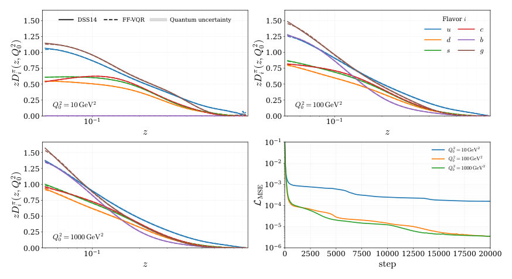
<figcaption class="paper-figure-caption"><b>Fig 1.</b> Figure 1: Comparison between DSS14 FFs and the corresponding FF-VQR at fixed scales Q2 0 = 10, 100, and 1000 GeV2. The lower-right panel shows the evolution of the training loss function.</figcaption>
</figure>
<figure class="paper-figure-card">
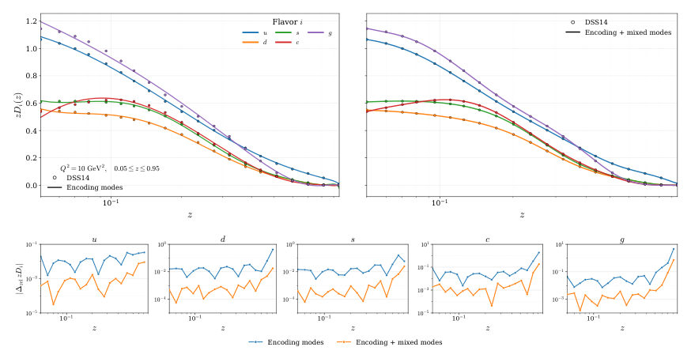
<figcaption class="paper-figure-caption"><b>Fig 2.</b> Figure 2: Comparison between the DSS fragmentation functions and their spectral reconstruc- tions at Q2 = 10 GeV2 for the five active flavor channels u, d, s, c, and g. In the upper-left panel, the DSS14 results (circles) are compared with the reconstruction obtained using only the fundamental encoding modes. The upper-right panel shows the corresponding reconstruc- tion after adding the same-layer mixed modes considered for each flavor. The lower panels show the residuals |∆rel zDi(z)| for each flavor. Blue curves correspond to the reconstruction using only the fundamental encoding modes, while orange curves include the mixed modes. The reduction of the residuals illustrates the...</figcaption>
</figure>
<figure class="paper-figure-card">
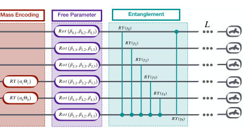
<figcaption class="paper-figure-caption"><b>Fig 3.</b> Figure 3: Pipeline and building-blocks of the two-dimensional FF-VQR.</figcaption>
</figure>
<figure class="paper-figure-card">
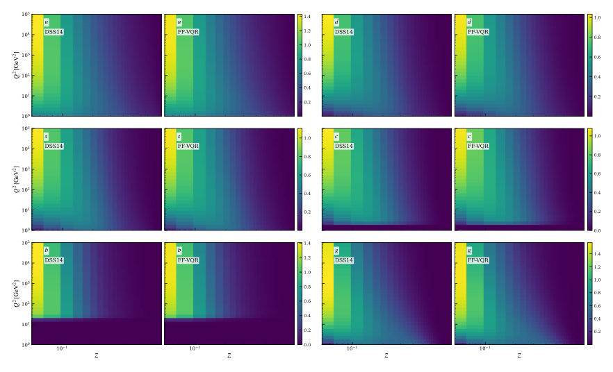
<figcaption class="paper-figure-caption"><b>Fig 4.</b> Figure 4: Comparison between DSS14 FFs and the corresponding FF-VQR of z Dπ+ i (z,Q2) in (z,Q2) space. From left to right, and top to bottom, we show u, d, s, c, b and g-initiated FFs. We appreciate a rather good agreement between the two plots for each parton flavor. The thresholds of the heavy flavors are clearly visible.</figcaption>
</figure>
<figure class="paper-figure-card">
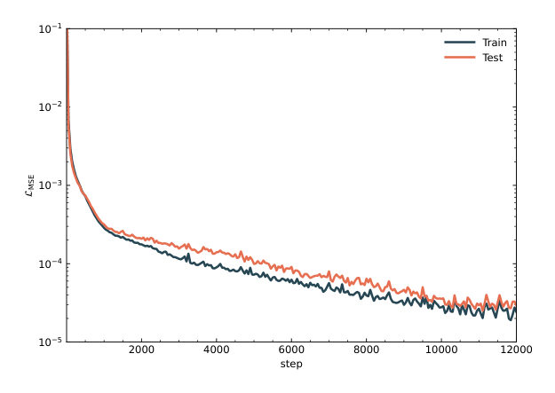
<figcaption class="paper-figure-caption"><b>Fig 5.</b> Figure 5: Evolution of the MSE loss function for the training and validation datasets during optimization of the two-dimensional FF-VQR.</figcaption>
</figure>

**Summary.** This work proposes using Variational Quantum Circuits (VQCs) as a novel, quantum-enhanced method to parametrize Fragmentation Functions (FFs) in QCD. By encoding physical symmetries and kinematic features, the VQC achieves high accuracy in reconstructing established benchmark FFs across both momentum fraction and energy scale. This demonstrates the potential of quantum circuits for creating compact, non-perturbative representations of fundamental particle physics observables.

**Why it may be interesting.** While the application is in high-energy particle physics, the core methodology—using VQCs to learn complex, structured functional dependencies from existing data—is a powerful example of applying quantum machine learning techniques to solve difficult, non-linear parametrization problems.

Detailed structure

**Main problem.** The paper addresses the challenge of non-perturbatively parametrizing Fragmentation Functions (FFs) in Quantum Chromodynamics (QCD). It seeks a quantum method to represent these complex, multi-dimensional functions.

**Main result.** The Variational Quantum Circuit (VQC) framework successfully reconstructs established benchmark FFs (like DSS14) with high accuracy across both 1D and 2D kinematic domains, demonstrating the model's expressive power.

**Method.** The authors employ Variational Quantum Circuits (VQCs) to map the functional dependence of FFs, incorporating physics-inspired Ansätze like heavy-flavor thresholds and utilizing spectral analysis for validation.

**Model / system.** The physical system is governed by QCD, specifically focusing on the non-perturbative Fragmentation Functions (FFs) describing hadronization. The model uses a VQC architecture trained to reproduce known functional forms derived from global QCD analyses.

**Key observables.** Mean-Squared Error (MSE) loss, Correlation Coefficient ($R^2$), and the relative $L^2$ error ($E(i)$) for spectral reconstruction.

**Important parameters / regimes.** Momentum fraction ($z$), energy scale ($Q^2$), and the number of variational layers used in the circuit.

**Assumptions / limitations.** The VQC is trained only on pre-existing, interpolated functional forms (e.g., DSS14), and the approach assumes that learning these parametrizations is sufficient to demonstrate the model's expressive capability.

**Figures summary.** Figures compare the VQC predictions against the DSS14 benchmark across various channels and kinematic regions, showing high correlation ($R^2 > 0.999$) and demonstrating the necessity of physics-inspired encoding terms.

**Paper structure.** The paper progresses from establishing the physical necessity of parametrizing FFs to developing the 1D VQC representation, then extending this to a full 2D representation $(z, Q^2)$ by incorporating threshold physics, and finally validating the spectral accuracy through detailed coefficient analysis.

Abstract

We present a variational quantum-circuit model for fragmentation functions (FFs). Isospin and charge-conjugation symmetries are imposed to construct an independent six-flavor basis describing charged and neutral pion production, while physics-inspired Ansätze, including logarithmic feature maps and mass thresholds, encode the relevant kinematics. This quantum architecture substantially reduces the quantum circuit redundancies and improve optimization convergence. Using the DSS14 pion FF set as a benchmark, we first develop a one-dimensional variational representation (FF-VQR) in the momentum fraction at fixed energy scale, and show how entanglement between quark and gluon FFs yields a significant improvement, with accurate results already obtained using just two variational layers. A spectral analysis further demonstrates that the quantum model achieves high expressivity with a limited number of Fourier modes, supporting its use as a compact non-perturbative parametrization suitable for DGLAP evolution. We then extend the FF-VQR to two dimensions by incorporating the energy-scale dependence. By encoding all flavor channels within a single entangled quantum circuit, the quantum model provides a unified representation with higher accuracy than an independent encoding for each partonic species.

[↑ back to top](#top)

### [Emergent Surface Kondo Flat Band Driven by Competing Interactions in a Topological Ferromagnet](http://arxiv.org/abs/2609.20432v1)

**Authors:** Nazar Zaremba, Susmita Changdar, Haojie Guo, Iñigo Robredo, Daniel Lozano-Gomez, Andreas Leithe-Jasper, Rui Lou, Yurii Prots, Mitja Krnel, Markus König, Konstantin Semeniuk, Berit H. Goodge, Yuri Grin, Andrii Kuibarov, Oleksandr Suvorov, Alexander Fedorov, Adam Pikul, Ivan Soldatov, Rudolf Schäfer, Bernd Büchner, Oksana Kvitnitskaya, Yurii Naidyuk, Louis Lamm, Meike Pfeiffer, Elena Hassinger, Matthias Vojta, Sergey Borisenko, Miguel M. Ugeda, Jeroen van den Brink, Eteri Svanidze, Maia G. Vergniory  
**Type:** both · **Category:** strongly correlated electrons · **PDF:** <https://arxiv.org/pdf/2609.20432v1>  
**Analysis basis:** full PDF text, analyzed in chunks
**Topic relevance:** `Keldysh / 2PI / non-Gaussian methods` **1/5** · `analog quantum simulation` **1/5**

↔ Scroll figures horizontally

<figure class="paper-figure-card">
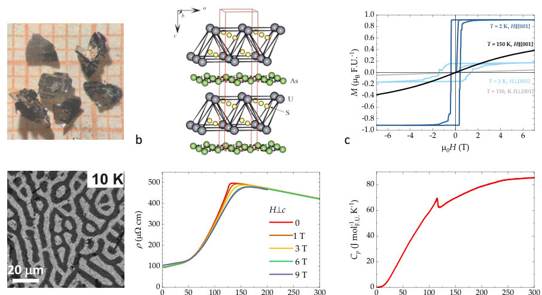
<figcaption class="paper-figure-caption"><b>Fig 1.</b> FIG. 1. Crystal structure and bulk ferromagnetism of UAsS. (a) Single crystals of UAsS typically</figcaption>
</figure>
<figure class="paper-figure-card">
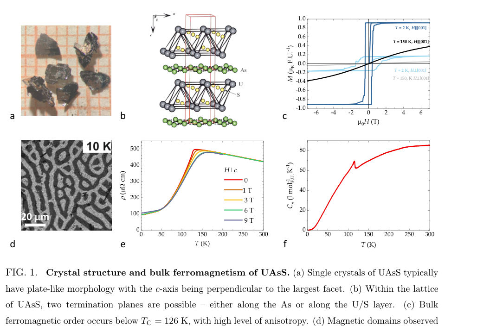
<figcaption class="paper-figure-caption"><b>Fig 2.</b> Fig. 1e and f. As reported previously46,49,50, bulk electrical resistivity of UAsS shows a large</figcaption>
</figure>
<figure class="paper-figure-card">
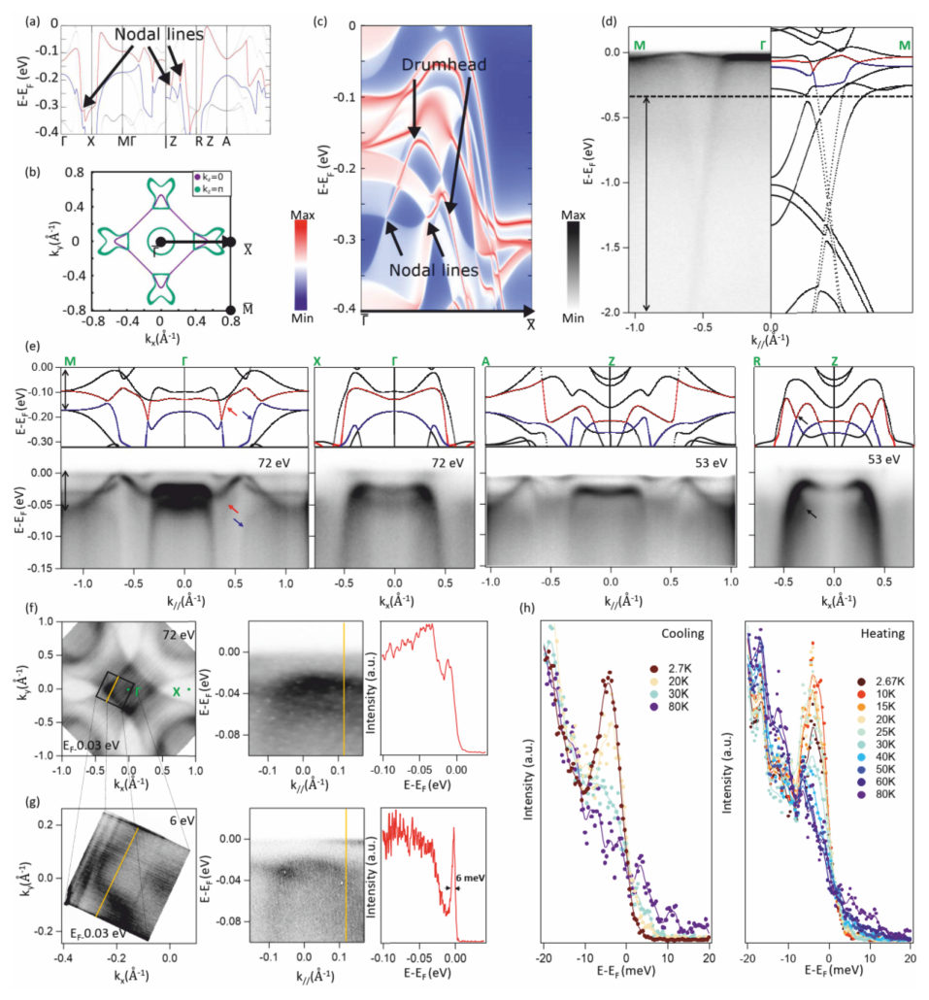
<figcaption class="paper-figure-caption"><b>Fig 3.</b> FIG. 2. Electronic structure of UAsS, from electronic structure calculations and ARPES</figcaption>
</figure>
<figure class="paper-figure-card">
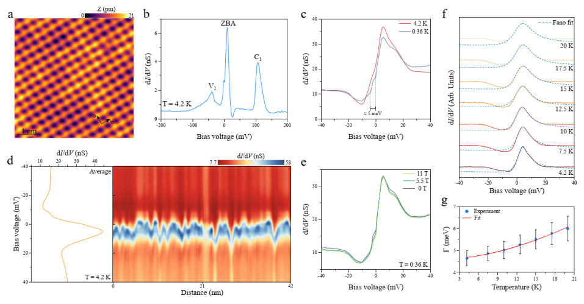
<figcaption class="paper-figure-caption"><b>Fig 4.</b> FIG. 3. Local tunneling spectroscopy characterization of UAsS. (a) Atomically resolved STM</figcaption>
</figure>
<figure class="paper-figure-card">

<figcaption class="paper-figure-caption"><b>Fig 5.</b> Fig.3e shows the evolution of the ZBA peak with H⊥up to 11 T. As seen, the manifest</figcaption>
</figure>

**Summary.** This research investigates the interplay between magnetism, topology, and strong correlations in UAsS, finding that the material exhibits a bulk topological ferromagnetism. Crucially, surface measurements reveal an emergent, strongly correlated Kondo flat band, demonstrating a mechanism where competing interactions drive distinct quantum phases to coexist spatially within one crystal.

**Why it may be interesting.** The concept of spatially separated correlated phases—where surface physics deviates fundamentally from bulk predictions due to competing interactions—is highly relevant for understanding interface effects in quantum materials.

Detailed structure

**Main problem.** The central goal is to understand quantum states arising from the competition between strong electron correlations (Kondo interactions), magnetism, and band topology in correlated materials.

**Main result.** The work reveals a novel phenomenon of spontaneous spatial separation of correlated quantum phases, where the surface exhibits a strongly correlated Kondo state distinct from the bulk ferromagnetic topological state.

**Method.** The study combines first-principles calculations (DFT), advanced spectroscopic measurements (ARPES, STM/STS), and theoretical modeling using mean-field theory for Hamiltonian analysis.

**Model / system.** The primary system is UAsS, a topological ferromagnet based on 5f electrons. Theoretical models involve analyzing the competition between Kondo and Heisenberg interactions in lattice models.

**Key observables.** Flat band pinned at the Fermi level (surface), nodal lines and Weyl points (bulk), Zero Bias Anomaly (ZBA) width, and spatial dependence of mean-field parameters.

**Important parameters / regimes.** Kondo temperature ($T_K \sim 52 	ext{ K}$), Curie temperature ($T_C = 126 	ext{ K}$), and coupling strengths ($J_K, J$).

**Assumptions / limitations.** The surface Kondo state is assumed to be emergent and not captured by bulk DFT; the ZBA analysis relies on fitting to Fermi liquid theory for Kondo resonance.

**Figures summary.** Figures show bulk ferromagnetism and topological features (nodal lines); surface probes reveal the flat band; theoretical figures map the spatial variation of electronic structure and correlation parameters.

**Paper structure.** The paper progresses by establishing the theoretical context of competing interactions, presenting experimental evidence showing bulk ferromagnetism alongside surface Kondo resonances, and finally using theoretical models to confirm the mechanism of spatial phase separation.

Abstract

A central goal of modern condensed matter physics is to uncover new quantum states of matter arising from the intertwined effects of strong electron correlations, magnetism, and band topology. Heavy-fermion phases, generated by Kondo interactions, represent one of the most remarkable manifestations of electronic correlations, and topological heavy-fermion states have been identified in several non-magnetic materials. Yet, the consequences of their competition with magnetic order have remained largely unexplored. Here, we reveal a new phenomenon: the spontaneous spatial separation of correlated quantum phases. By showing that magnetism can drive distinct strongly correlated electronic states to coexist in different regions of a single material, our work establishes a previously unknown mechanism for organizing quantum matter and opens a new direction in the study of correlated topological systems. Using \emph{bulk-sensitive} probes, we show that UAsS crystals are, in the bulk, metallic ferromagnets with only moderate correlation-driven band renormalizations. First-principles calculations reveal a topological electronic structure hosting both nodal lines and Weyl points, pointing to a rich underlying topology. Angle-resolved photoemission spectroscopy (ARPES) measurements are consistent with these predictions, resolving the nodal lines and Weyl crossings. In striking contrast, \emph{surface-sensitive} ARPES and scanning tunneling microscopy/spectroscopy (STM/STS) measurements reveal a pronounced flat band pinned at the Fermi level, accompanied by a sharp resonance -- hallmarks of an emergent, strongly correlated Kondo state not captured by first-principles calculations.

[↑ back to top](#top)

### [Semiclassical scaling of eigenstate thermalization in single-particle chaotic systems](http://arxiv.org/abs/2609.20052v1)

**Authors:** Yaoqi Ye, Xiao Wang  
**Type:** theory · **Category:** statistical mechanics · **PDF:** <https://arxiv.org/pdf/2609.20052v1>  
**Analysis basis:** full PDF text, analyzed in chunks
**Topic relevance:** `Keldysh / 2PI / non-Gaussian methods` **1/5** · `scars & prethermalization` **1/5**

↔ Scroll figures horizontally

<figure class="paper-figure-card">
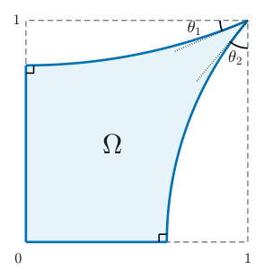
<figcaption class="paper-figure-caption"><b>Fig 1.</b> FIG. 1: Geometry of the generalized quarter-Sinai billiard. The shaded domain Ωis bounded by two straight segments on the left and bottom and two circular arcs on the top and right. The angles θ1 = 0.4 and θ2 = 0.7 radians are measured between the arc tangents at their common vertex (dotted lines) and the horizontal and vertical directions, respectively. Each arc meets the adjacent straight boundary at a right angle.</figcaption>
</figure>
<figure class="paper-figure-card">
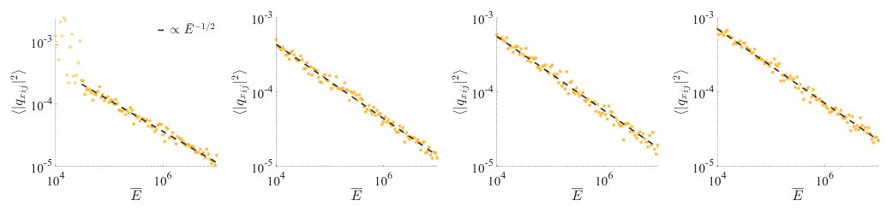
<figcaption class="paper-figure-caption"><b>Fig 2.</b> FIG. 2: Semiclassical scaling of the off-diagonal variance along traces of fixed u. Panels (a)–(d) correspond to u = 1, 2, 3, 4, respectively. The vertical axis shows the local variance of the matrix elements qxij = ⟨Ei|ˆqx|Ej⟩. For each fixed u, we select 100 target mean energies ¯E logarithmically spaced between 104 and 107, with the corresponding energy separations set by |ω| = u √¯E. At each target point, the local variance is estimated by averaging |qxij|2 over the 100 eigenstate pairs closest to that point in energy space. The dashed black lines indicate the predicted semiclassical scaling, ⟨|qxij|2⟩∝¯E−1/2, along each fixed-u trace.</figcaption>
</figure>
<figure class="paper-figure-card">
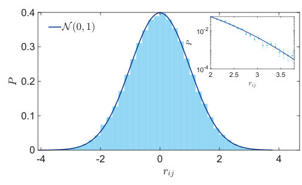
<figcaption class="paper-figure-caption"><b>Fig 3.</b> FIG. 3: Probability density of the normalized off-diagonal matrix elements rij. The histogram contains 91 695 eigenstate pairs near ¯E ≃9 × 106 within the scaled energy-separation window 2 ≤u = |ω|/ √¯E ≤3. The local variance is estimated by averaging |qxij|2 over a 9 × 9 block of eigenstate indices centered on (i, j), excluding diagonal elements. The solid dark-blue curve shows the standard normal distribution N(0, 1). The inset resolves the positive tail rij ≥2 on a logarithmic probability scale; points show the binned probability density, with error bars obtained from exact central 68.27% Poisson confidence intervals for the bin counts.</figcaption>
</figure>

**Summary.** This theoretical work analyzes the approach to thermal equilibrium in single-particle chaotic quantum systems by examining the scaling of off-diagonal matrix elements. Using semiclassical methods based on Berry's conjecture, the authors derive that the variance follows an ETH-like scaling modified by a unique kinetic-energy factor. This provides a detailed comparison between single-particle and many-body thermalization predictions.

**Why it may be interesting.** The finding of a kinetic-energy-dependent factor beyond standard many-body ETH provides a novel, single-particle perspective on thermalization, which is highly relevant for understanding quantum chaos and energy transport in mesoscopic systems.

Detailed structure

**Main problem.** The paper investigates how isolated quantum systems approach thermal equilibrium by analyzing the off-diagonal matrix elements of real-space observables.

**Main result.** It shows that these matrix elements exhibit a natural banded structure, and the variance scales according to the Eigenstate Thermalization Hypothesis (ETH) multiplied by an additional kinetic-energy-dependent factor unique to single-particle dynamics.

**Method.** The analysis employs semiclassical approximations derived from Berry's conjecture to calculate the variance and connected autocorrelation function of the off-diagonal matrix elements.

**Model / system.** The study focuses on time-reversal-invariant single-particle chaotic systems, exemplified by quantum billiards such as the generalized quarter-Sinai billiard. The dynamics are governed by a single-particle Hamiltonian.

**Key observables.** Off-diagonal matrix elements $\langle E_i|\hat{O}|E_j
angle$, the characteristic bandwidth ($\omega_b$), and the connected autocorrelation function $C_{	ext{sym}}^O(t; E)$.

**Important parameters / regimes.** The semiclassical limit ($\hbar 	o 0$), particle velocity ($v$), and the system's microcanonical entropy ($S_\Omega$).

**Assumptions / limitations.** The analysis fundamentally relies on Berry's conjecture for approximating the ensemble-averaged Wigner function, and approximations are made regarding the decay of correlation functions.

**Figures summary.** Figures illustrate the geometry of the billiard, show numerical agreement between predicted semiclassical scaling ($\langle|q_{xij}|^2
angle \propto ar{E}^{-1/2}$) and simulation results, and display the probability density of normalized matrix elements approaching a Gaussian distribution.

**Paper structure.** The paper progresses by first establishing the theoretical framework using Berry's conjecture to derive the variance scaling. It then calculates the connected autocorrelation function via Fourier transforms, culminating in the final expression for the symmetrized correlation function based on the spatial overlap function.

Abstract

We study the off-diagonal matrix elements of real-space observables in time-reversal-invariant single-particle chaotic systems. By analyzing the semiclassical expression for the off-diagonal variance derived from Berry's conjecture, we show that the banded structure of the observable matrix emerges naturally. For local observables, we identify a characteristic bandwidth associated with a late-time timescale inversely proportional to the particle velocity. We further show that, for systems with steep-wall confinement, the predicted magnitude follows the entropy scaling of the eigenstate thermalization hypothesis (ETH), multiplied by an additional kinetic-energy-dependent factor that is independent of spatial dimension and is not captured by conventional many-body ETH. We illustrate these results through a case study of quantum billiards and verify the semiclassical scaling numerically in a generalized quarter-Sinai billiard. Our results elucidate the dynamical implications of Berry's conjecture and provide a comparison between single-particle eigenstate thermalization and many-body ETH.

[↑ back to top](#top)

### [When Is Kramers-Wannier Duality Invertible?](http://arxiv.org/abs/2609.20090v1)

**Authors:** Akash Sinha, Pramod Padmanabhan, Vladimir Korepin  
**Type:** theory · **Category:** statistical mechanics · **PDF:** <https://arxiv.org/pdf/2609.20090v1>  
**Analysis basis:** full PDF text, analyzed in chunks
**Topic relevance:** `Frenkel-Kontorova` **1/5** · `analog quantum simulation` **1/5**

↔ Scroll figures horizontally

<figure class="paper-figure-card">
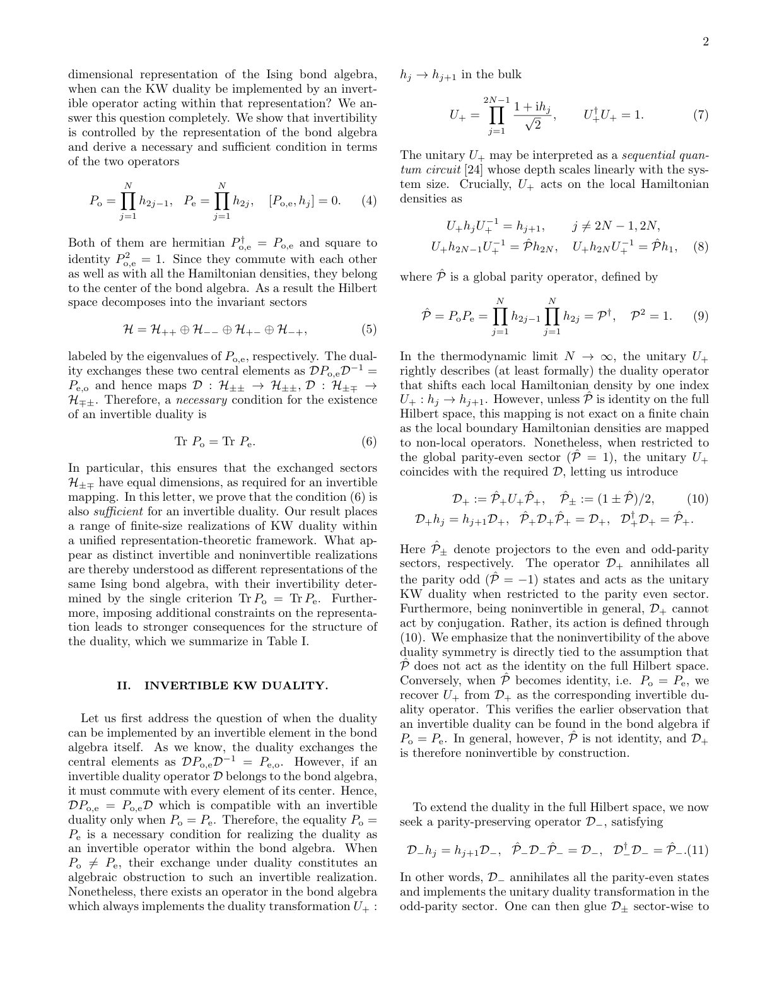
<figcaption class="paper-figure-caption"><b>Fig 1.</b> Low-resolution page preview, page 2</figcaption>
</figure>
<figure class="paper-figure-card">
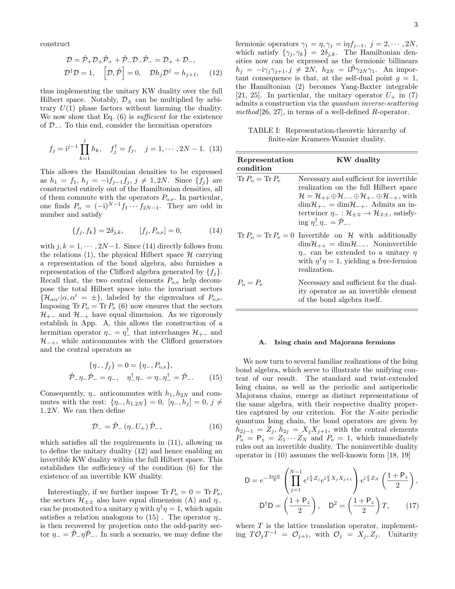
<figcaption class="paper-figure-caption"><b>Fig 2.</b> Low-resolution page preview, page 3</figcaption>
</figure>
<figure class="paper-figure-card">
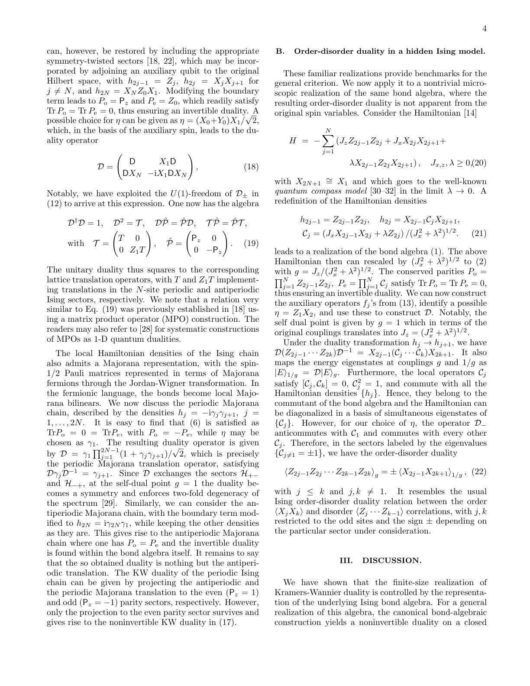
<figcaption class="paper-figure-caption"><b>Fig 3.</b> Low-resolution page preview, page 4</figcaption>
</figure>
<figure class="paper-figure-card">
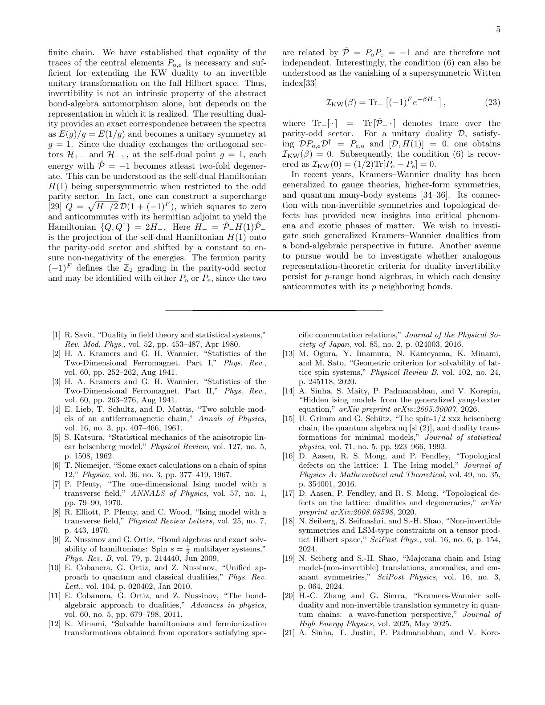
<figcaption class="paper-figure-caption"><b>Fig 4.</b> Low-resolution page preview, page 5</figcaption>
</figure>
<figure class="paper-figure-card">
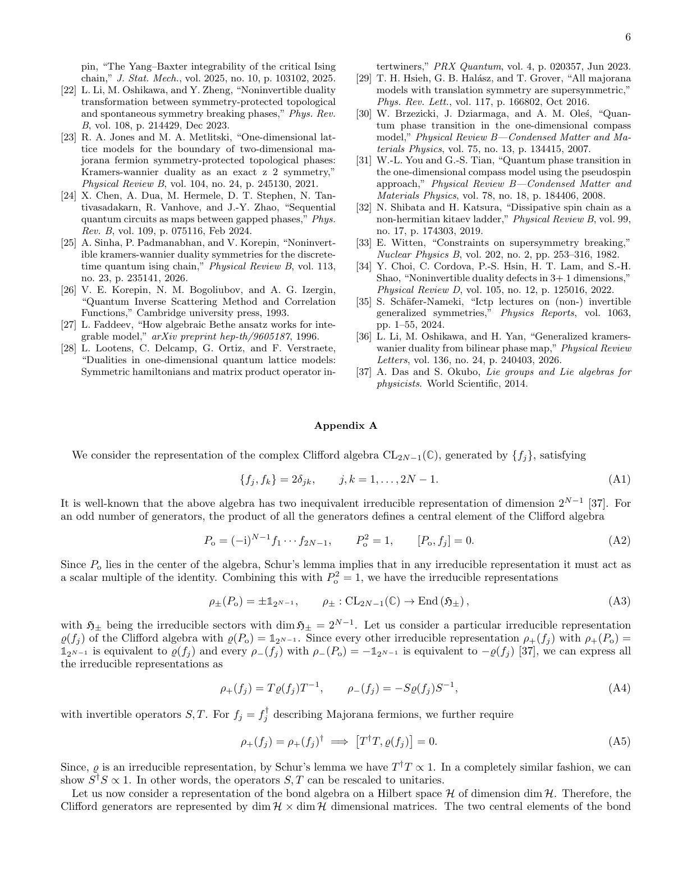
<figcaption class="paper-figure-caption"><b>Fig 5.</b> Low-resolution page preview, page 6</figcaption>
</figure>

**Summary.** This work provides a deep, representation-theoretic criterion to determine when the Kramers-Wannier duality for the quantum Ising chain is invertible on a finite lattice. By analyzing the bond algebra's central elements, the authors establish that the condition $	ext{Tr } P_o = 	ext{Tr } P_e$ is necessary and sufficient for this duality to be realized as a unitary transformation.

**Why it may be interesting.** The rigorous classification of when a fundamental duality symmetry becomes unitary is crucial for understanding the exact solvability and symmetries of quantum many-body systems, connecting algebraic structure to physical realizability.

Detailed structure

**Main problem.** The paper aims to classify the necessary and sufficient conditions under which the Kramers-Wannier (KW) duality, naturally noninvertible for finite periodic chains, can be promoted to an invertible unitary transformation.

**Main result.** Invertibility of the KW duality is determined by a representation-theoretic criterion: the trace of two central elements of the underlying bond algebra must be equal ($	ext{Tr } P_o = 	ext{Tr } P_e$).

**Method.** The analysis employs representation theory applied to the bond algebra generated by local terms of the quantum Ising chain, decomposing the Hilbert space into sectors defined by central elements.

**Model / system.** The study focuses on the quantum Ising chain, whose dynamics are governed by a Hamiltonian constructed from local terms forming a bond algebra. The duality relates strong-coupling and weak-coupling regimes.

**Key observables.** The traces of the central elements $P_o$ and $P_e$, and the existence of symmetry-twisted sectors.

**Important parameters / regimes.** The coupling constant $g$, which governs the duality transformation between $g$ and $1/g$.

**Assumptions / limitations.** The analysis assumes the applicability of representation theory to the bond algebra and relies on constructing specific symmetry operators ($\eta_-$) to define the unitary duality.

**Figures summary.** The notes reference a TABLE I summarizing the representation-theoretic hierarchy of finite-size KW duality based on trace conditions.

**Paper structure.** The paper establishes the problem, uses the bond algebra and central elements ($P_o, P_e$) to formulate the condition $	ext{Tr } P_o = 	ext{Tr } P_e$, and then proves this condition is necessary and sufficient for constructing the invertible unitary duality operator $D$.

Abstract

{\it Kramers-Wannier} duality of the quantum Ising chain is naturally realized as a noninvertible transformation on a finite periodic chain. Upon incorporating appropriate symmetry-twisted sectors, however, the duality can be promoted to an invertible unitary transformation. In this Letter, we classify when the Kramers-Wannier duality admits an invertible realization on a finite Hilbert space. We show that this is determined by the representation of the Ising bond algebra and establish a necessary and sufficient condition in terms of its two central elements. This representation-theoretic criterion unifies the conventional noninvertible realization with invertible constructions involving symmetry-twisted sectors and applies equally to other models with the same underlying bond algebra. As an explicit example, we find an order-disorder duality in a non-trivial realization of the Ising bond algebra that admits an invertible Kramers-Wannier duality.

[↑ back to top](#top)

### [A Square-Root Barrier to Quantum Gate Speed under Linear Coupling](http://arxiv.org/abs/2609.19280v1)

**Authors:** Pablo Restrepo Gaviria, Mischa P. Woods  
**Type:** theory · **Category:** quantum information and computing · **PDF:** <https://arxiv.org/pdf/2609.19280v1>  
**Analysis basis:** full PDF text, analyzed in chunks
**Topic relevance:** `Keldysh / 2PI / non-Gaussian methods` **1/5**

↔ Scroll figures horizontally

<figure class="paper-figure-card">
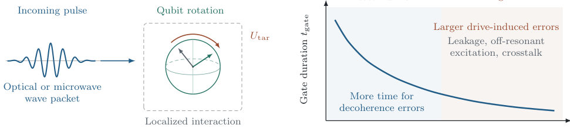
<figcaption class="paper-figure-caption"><b>Fig 1.</b> FIG. 1. Pulse-driven control and its practical energy–time tradeoff. (a) An optical or microwave wave packet drives a localized qubit rotation toward a prescribed target state. The same geometry describes atomic and ionic optical control and microwave control of superconducting qubits. (b) Schematic tradeoff for superconducting-qubit gates: weaker pulses require longer gates, leaving more time for decoherence, whereas stronger pulses shorten gates but can increase leakage, off-resonant excitation, and crosstalk.</figcaption>
</figure>
<figure class="paper-figure-card">
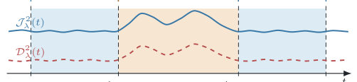
<figcaption class="paper-figure-caption"><b>Fig 2.</b> FIG. 2. Assumption B1 (schematic). The accepted gate inter- val Iλ = [tin,λ, tout,λ] is bordered by quiet windows W−,λ and W+,λ, with total length |Wλ| = |W−,λ| + |W+,λ| &gt; 0; either window may be absent, and |Wλ| may shrink with λ. Over their union Wλ, B1 uniformly bounds the dimensionless mean squares of the field activation Jλ and the system-changing interaction action Dλ. The curves are illustrative: the con- straint is on the displayed averages, not on pointwise values. Operationally, the quiet window helps distinguish an accepted gate from a transient fidelity fluctuation while limiting off-gate disturbance.</figcaption>
</figure>
<figure class="paper-figure-card">
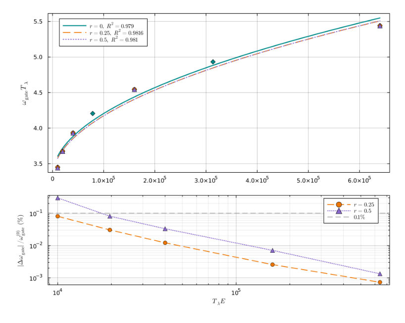
<figcaption class="paper-figure-caption"><b>Fig 3.</b> FIG. 3. Full-dynamics energy and squeezing sweep for a fixed Hamiltonian and reference time. Upper panel: diamonds show the seven-member coherent family; circles and triangles show the five-member r = 0.25 and r = 0.5 families with ϕs = π. Curves are separate square-root regressions, with R2 reported in the legend. Lower panel: magnitude of the squeezed gate-frequency shift relative to a coherent trajectory at the same displacement and numerical time step. The near-overlap above and resolved sub-percent shifts below quantify the weak sensitivity to moderate packet squeezing in the tested regime.</figcaption>
</figure>
<figure class="paper-figure-card">
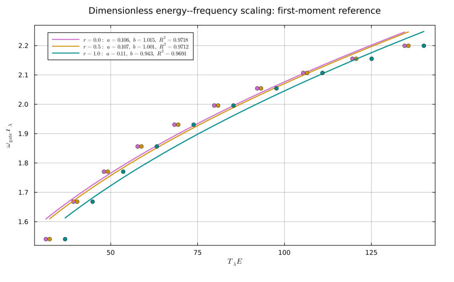
<figcaption class="paper-figure-caption"><b>Fig 4.</b> FIG. 4. First-moment dimensionless energy–frequency reference simulation for the coupling (D3). Points are threshold frequencies obtained from (D30); lines are ordinary least-squares fits of the form ωgateTλ = ar √TλE + br. The legend reports the fitted coefficients and R2. Squeezing changes the horizontal energy coordinate but not the first moment at fixed displacement.</figcaption>
</figure>
<figure class="paper-figure-card">
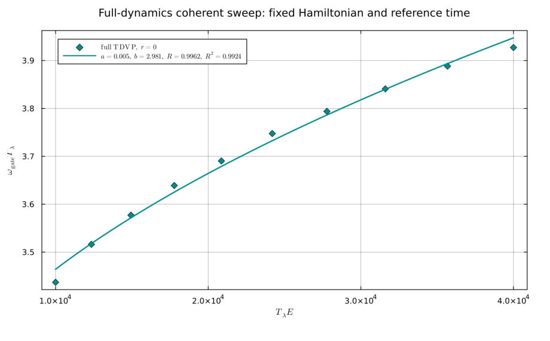
<figcaption class="paper-figure-caption"><b>Fig 5.</b> FIG. 5. Full-dynamics coherent-state simulation in the same dimensionless coordinates as Figure 4. Only the initial displacement varies; the Hamiltonian and Tλ = 1 are fixed. Diamonds are the ten entangling TDVP trajectories, and the line is the square-root least-squares fit (D34).</figcaption>
</figure>

**Summary.** This work establishes a fundamental square-root energy-speed limit for quantum gates driven by linearly coupled bosonic fields. By treating the drive as a quantum field, the authors prove that advanced state engineering, like squeezing, cannot overcome this bound. Achieving faster gates requires fundamentally changing the nature of the system-field interaction to introduce nonlinearity.

**Why it may be interesting.** It provides a rigorous theoretical limit on how fast quantum gates can operate relative to the energy input, identifying interaction nonlinearity as a necessary resource for surpassing current scaling laws.

Detailed structure

**Main problem.** The paper investigates the fundamental energy-speed-error tradeoff in quantum gate operations, specifically questioning if quantum state engineering can break the conventional square-root scaling of gate speed with pulse energy.

**Main result.** For gates driven by a linear coupling to a bosonic field, the gate transition rate is fundamentally bounded by the square root of the pulse energy, regardless of using squeezed or non-Gaussian states.

**Method.** The analysis uses theoretical derivations based on bounding quantum evolution quantities (like $J_{\lambda}$ and $D_{\lambda}$) derived from the Hamiltonian, treating the drive pulse as a quantum bosonic field.

**Model / system.** The system models a finite-dimensional quantum system (qubit) coupled linearly to a bosonic field (e.g., microwave or optical pulse). The analysis is performed using theoretical bounds derived from the Hamiltonian structure.

**Key observables.** Gate transition rate ($\omega_{	ext{gate}}$), Pulse Energy ($E$), and Fidelity ($F_{	ext{tar}}$).

**Important parameters / regimes.** The scaling exponent relating $\omega_{	ext{gate}}$ to $E$, and the coupling strength ($C_g$).

**Assumptions / limitations.** The primary assumption is the linear coupling Hamiltonian ($V$) between the system and the bosonic field, which limits the achievable scaling.

**Figures summary.** Figures illustrate the practical energy-time tradeoff in superconducting qubits and show theoretical fits confirming the square-root scaling law for the gate speed versus pulse energy.

**Paper structure.** The paper establishes the physical problem, derives theoretical bounds using quantum field methods, proves that the square-root scaling is optimal for linear coupling, and concludes that nonlinearity is required for improvement.

Abstract

Faster quantum gates can suppress the decoherence accumulated during a computation, but in superconducting processors stronger microwave pulses can also increase leakage, off-resonant excitation, stray-field errors, and crosstalk. This creates a central energy--speed--error tradeoff: can quantum state engineering make a gate parametrically faster without paying proportionally more drive energy? We address this question by treating the driving pulse as a quantum bosonic field rather than a classical waveform. For a finite-dimensional system coupled linearly to that field, we prove that fixed-fidelity gate transition rates grow at most as the square root of the pulse energy, under stated uniformity conditions on the coupling and accepted dynamics. The bound permits arbitrary pulse states, including squeezed and non-Gaussian states, as well as drive--system entanglement and back action; coherent Gaussian pulses attain its energy exponent. Thus squeezing or other state engineering alone cannot replace the square-root energy law of a conventional linear drive by the linear scaling allowed by general quantum speed limits. Achieving that improvement requires changing the interaction class, in addition to using a suitable nonclassical pulse, thereby identifying interaction nonlinearity as an essential resource for relaxing the practical gate-speed error tradeoff.

[↑ back to top](#top)

### [Exact Local Optimality Does Not Compose: The Complexity of Chronological Realization](http://arxiv.org/abs/2609.19707v1)

**Authors:** Yixin Zhao  
**Type:** theory · **Category:** quantum information and computing · **PDF:** <https://arxiv.org/pdf/2609.19707v1>  
**Analysis basis:** full PDF text, analyzed in chunks
**Topic relevance:** `quantum measurements` **1/5**

↔ Scroll figures horizontally

<figure class="paper-figure-card">
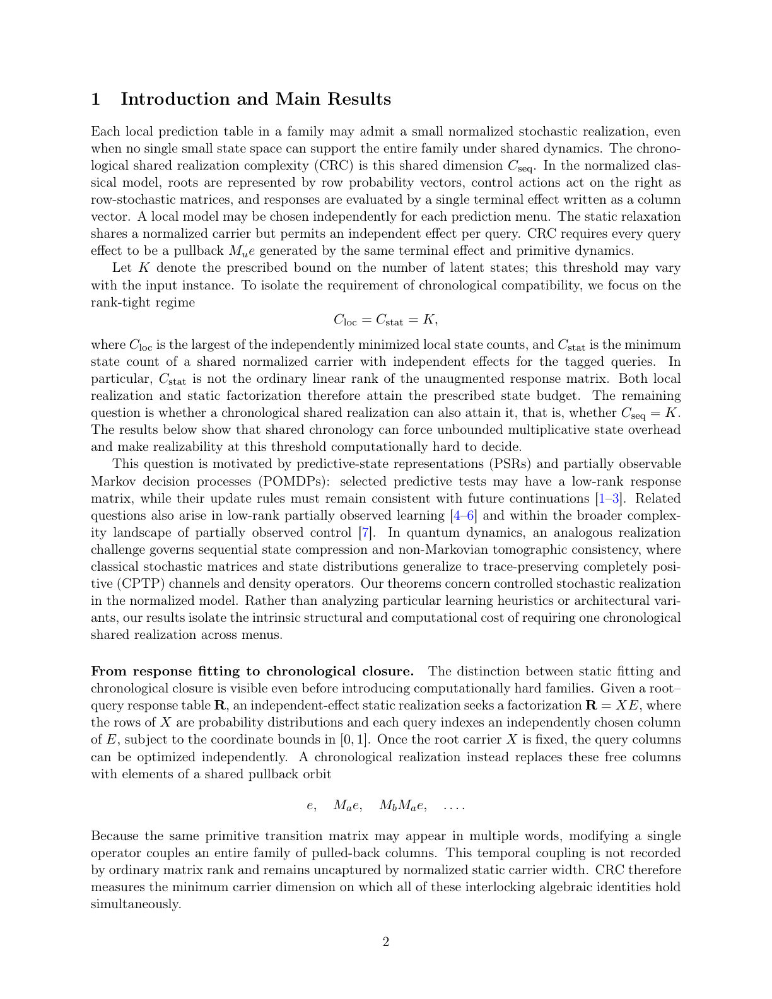
<figcaption class="paper-figure-caption"><b>Fig 1.</b> Low-resolution page preview, page 2</figcaption>
</figure>
<figure class="paper-figure-card">
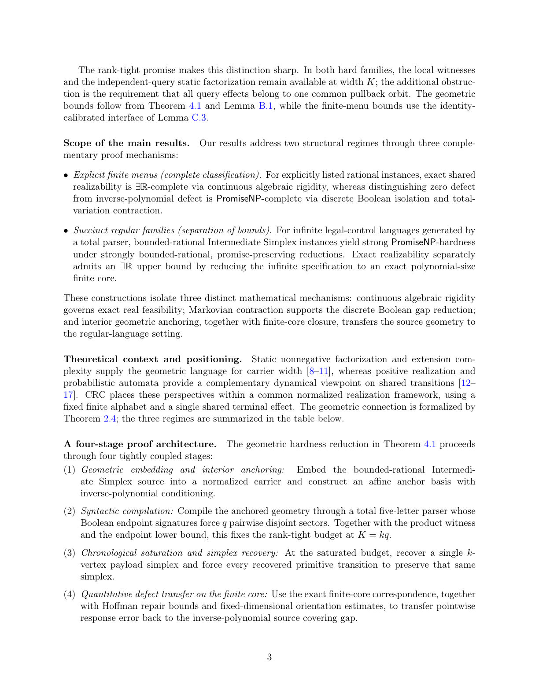
<figcaption class="paper-figure-caption"><b>Fig 2.</b> Low-resolution page preview, page 3</figcaption>
</figure>
<figure class="paper-figure-card">
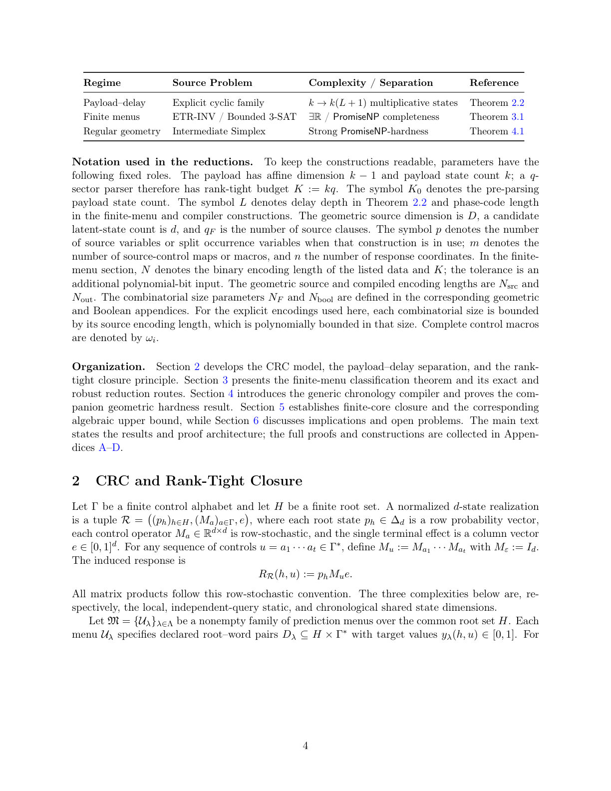
<figcaption class="paper-figure-caption"><b>Fig 3.</b> Low-resolution page preview, page 4</figcaption>
</figure>
<figure class="paper-figure-card">
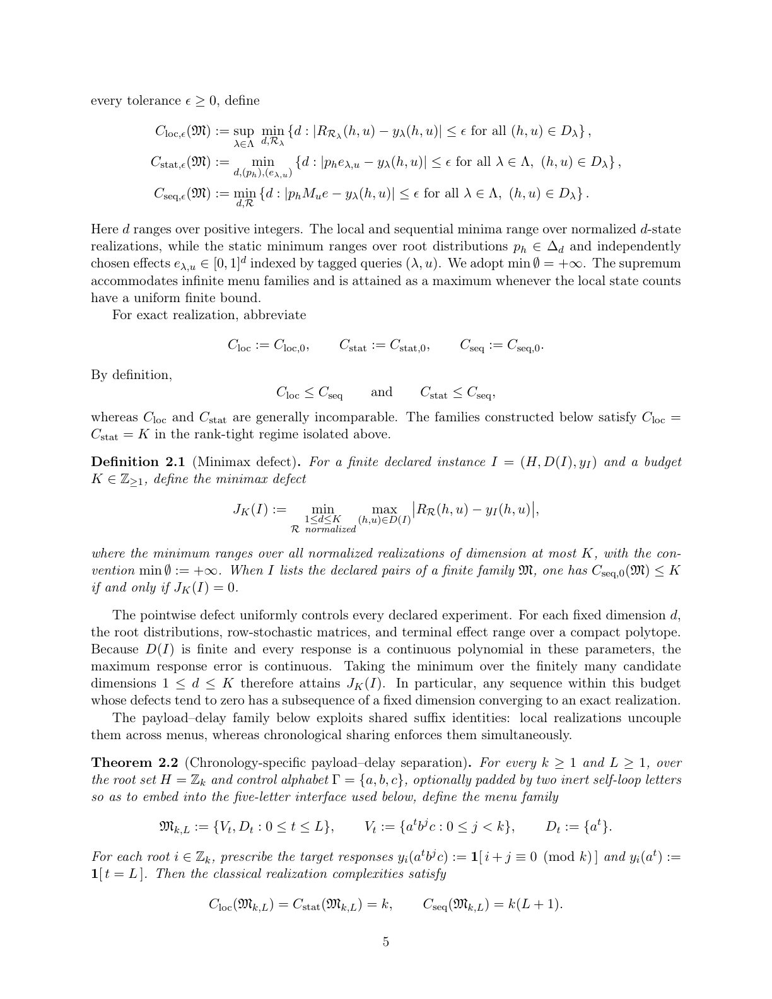
<figcaption class="paper-figure-caption"><b>Fig 4.</b> Low-resolution page preview, page 5</figcaption>
</figure>
<figure class="paper-figure-card">
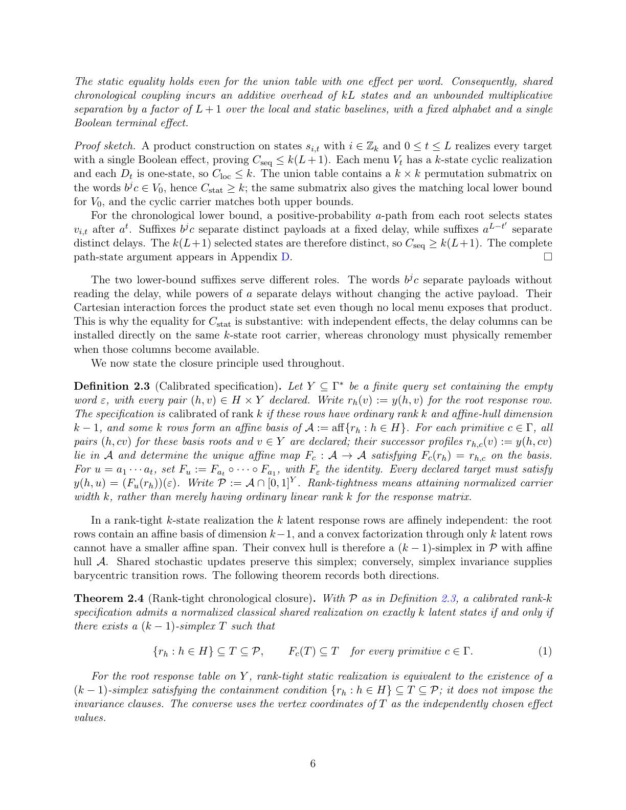
<figcaption class="paper-figure-caption"><b>Fig 5.</b> Low-resolution page preview, page 6</figcaption>
</figure>

**Summary.** This theoretical paper analyzes the complexity of modeling sequential quantum or stochastic processes using a shared state space. It demonstrates that the requirement for chronological consistency imposes a computational cost that is not simply additive or multiplicative based on local or static resource requirements. The work establishes strong computational hardness results for this shared realization problem.

**Why it may be interesting.** The findings provide fundamental computational lower bounds on the resources required to model sequential quantum or stochastic processes, showing that temporal constraints introduce non-trivial overheads beyond simple local or static resource estimates.

Detailed structure

**Main problem.** The paper investigates the chronological shared realization complexity (CRC), which measures the minimum state dimension required to reproduce future-response menus using a single shared set of controlled dynamics.

**Main result.** It proves that exact local and static optimality do not compose under chronological sharing, demonstrating significant state blow-up in the sequential complexity compared to local or static bounds.

**Method.** The analysis uses complexity theory reductions, establishing $\exists\mathbb{R}$-completeness and $	ext{PromiseNP}$-hardness by mapping problems like bounded-occurrence 3-SAT onto the shared realization framework.

**Model / system.** The model is based on controlled stochastic realization, where responses are generated by a shared family of controlled transition dynamics acting on a normalized state space. This framework generalizes to classical stochastic processes.

**Key observables.** Chronological shared realization complexity ($C_{	ext{seq}}$), local realization dimension ($C_{	ext{loc}}$), and independent-query static carrier width ($C_{	ext{stat}}$).

**Important parameters / regimes.** The analysis focuses on the 'rank-tight regime' where $C_{	ext{loc}} = C_{	ext{stat}} = K$, and involves parameters like $k$ (local dimension) and $L$ (delay/length).

**Assumptions / limitations.** The results are established under the rank-tight regime and rely on the ability to translate computational hardness problems (like 3-SAT) into the structure of finite rational menus.

**Figures summary.** The notes reference theorems and lemmas detailing the separation of complexities (e.g., $k 	o k(L+1)$ for payload-delay) and the hardness reductions for finite menus and regular geometries.

**Paper structure.** The paper progresses by defining the CRC, establishing the rank-tight regime, and then presenting three main results: an explicit payload-delay separation, $\exists	ext{R}$/$	ext{PromiseNP}$-completeness for finite menus, and a compiler translating geometry into hard instances.

Abstract

The chronological shared realization complexity (CRC) is the smallest normalized stochastic state dimension $C_{\rm seq}$ needed to reproduce a collection of future-response menus using one shared family of controlled transition dynamics. We focus on the rank-tight regime in which both the local realization dimension and the independent-query static carrier width equal $K$, thereby isolating the additional dimensional and computational constraints imposed by chronological consistency. This framework also serves as the classical baseline for state-dimension bounds in sequential quantum processes, where stochastic dynamics generalize to completely positive maps.   We establish three results in this regime. First, an explicit payload--delay family exhibits an unbounded multiplicative state blow-up: $C_{\rm loc}=C_{\rm stat}=k$ while $C_{\rm seq}=k(L+1)$, isolating the intrinsic state cost of shared temporal pullbacks. Second, for explicitly listed rational finite menus over a fixed five-letter alphabet with a single Boolean terminal effect, exact shared realizability is $\exists\mathbb{R}$-complete, and the zero-versus-inverse-polynomial defect promise problem is $\mathsf{PromiseNP}$-complete, with local and static optima fixed at $K$. Third, a total five-letter chronology compiler translates bounded-rational Intermediate Simplex instances into a polynomially specified regular geometric family over the same fixed alphabet, preserving exact local and static width $K$. The compiled family yields strong $\mathsf{PromiseNP}$-hardness for shared realization on strongly bounded-rational inputs, together with an $\exists\mathbb{R}$ upper bound certified by an exact polynomial-size finite core. Together, these results show that exact local and static optimality need not compose under chronological sharing, even in the rank-tight regime.

[↑ back to top](#top)

### [Exploring multi-parameter optimization in FRG](http://arxiv.org/abs/2609.20667v1)

**Authors:** A. Codello, G. P. Vacca, D. Zarrilli  
**Type:** theory · **Category:** statistical mechanics · **PDF:** <https://arxiv.org/pdf/2609.20667v1>  
**Analysis basis:** full PDF text, analyzed in chunks
**Topic relevance:** `Keldysh / 2PI / non-Gaussian methods` **1/5**

↔ Scroll figures horizontally

<figure class="paper-figure-card">
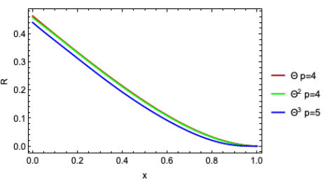
<figcaption class="paper-figure-caption"><b>Fig 1.</b> FIG. 2: DE2, comparison of Θ4 vs Θ2 4 vs Θ3 5 regula- tors.</figcaption>
</figure>
<figure class="paper-figure-card">

<figcaption class="paper-figure-caption"><b>Fig 2.</b> FIG. 3: DE2, the near-optimal Θ3 regulators from t = 0 up to t = 12.</figcaption>
</figure>
<figure class="paper-figure-card">
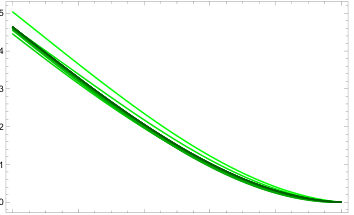
<figcaption class="paper-figure-caption"><b>Fig 3.</b> Fig. 4 shows how the critical exponents change with increasing t for each value of p = 1, 2, 3 with the Θ2 p regulator: after a few oscillations both η and ν are stabilized up to the fifth significant figure, while ω is somewhat more uncertain; still, the t = 12 val- ues are collected in Table I for each p. Extrapolated predictions in the asymptotic t region for the values of critical exponents with several methods (which we shall apply in the DE4 analysis) do not essentially lead to significant changes. As anticipated, the im- provement obtained by increasing p from 1 to 3 is very modest, but it shows a consistent relative de- crease in the value of η by around 0.18%; the scaling exponents...</figcaption>
</figure>
<figure class="paper-figure-card">
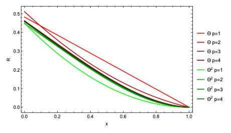
<figcaption class="paper-figure-caption"><b>Fig 4.</b> FIG. 1: DE2, comparison of Θp (ref) vs Θ2 p (green) regulators, up to p = 4 parameters. Increasing p values correspond to darker colors.</figcaption>
</figure>
<figure class="paper-figure-card">
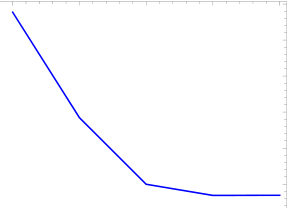
<figcaption class="paper-figure-caption"><b>Fig 5.</b> FIG. 6: DE2, t = 10, Wp regulators, optimal values of η for 1 ≤p ≤5.</figcaption>
</figure>

**Summary.** This paper advances the application of the Functional Renormalization Group (FRG) by introducing a multi-parameter optimization scheme to address the regulator dependence inherent in the theory. Using the 3D Ising model, the authors systematically minimize this dependence by optimizing the regulator shape, leading to improved predictions for critical exponents. This work provides a more robust theoretical framework for calculating critical behavior in statistical field theories.

**Why it may be interesting.** While focused on critical phenomena, the rigorous mathematical machinery of optimizing flow equations and handling regulator dependence is a powerful, general theoretical tool applicable to any field requiring systematic renormalization group analysis.

Detailed structure

**Main problem.** The paper investigates how to systematically minimize the dependence of physical observables on the arbitrary choice of the coarse-graining regulator within the Functional Renormalization Group (FRG) framework.

**Main result.** By employing a multi-parameter optimization approach based on the Principle of Minimal Sensitivity (PMS), the authors find appreciable corrections to critical exponents for the 3D Ising universality class, improving upon previous single-parameter analyses.

**Method.** The core method involves applying the FRG flow equation (Wetterich-Morris equation) truncated via the derivative expansion up to fourth order, and then optimizing the regulator parameters to satisfy stationarity conditions derived from the PMS.

**Model / system.** The study is applied to a scalar field theory representing the three-dimensional Ising universality class, which is a canonical model for continuous phase transitions in statistical mechanics.

**Key observables.** The anomalous dimension ($\eta$) and critical exponents ($
u$, $\omega$) are the key observables whose regulator dependence is minimized.

**Important parameters / regimes.** The order of the derivative expansion (up to fourth order) and the number of parameters used to define the polynomial regulator are crucial parameters.

**Assumptions / limitations.** The analysis relies on the approximation that the flow equation can be truncated (e.g., derivative expansion) and assumes that an optimal regulator shape exists within the chosen functional space of compactly supported polynomials.

**Figures summary.** Not specified, but the notes detail the structure of the flow equations and the derivation of boundary terms for various couplings.

**Paper structure.** The paper systematically develops the FRG framework, introduces the multi-parameter optimization via PMS, applies this to the 3D Ising model using the derivative expansion, and calculates the resulting flow equations and improved critical exponents.

Abstract

The use of nonperturbative Wilsonian functional renormalization group (FRG) equations within an unavoidable approximation scheme produces physical results that depend on the choice of the coarse-graining regulator. This dependence of physical observables on the regulator can be minimized according to the principle of minimal sensitivity (PMS). For the 1PI formulation based on the Wetterich-Morris equation, we propose to investigate the optimal choice within a space of compactly supported polynomial regulators parametrized by a set of variables. We test this approach using the derivative expansion of the effective average action up to fourth order, applying it to the scalar field theory representing the three-dimensional Ising universality class and minimizing the dependence of the anomalous dimension on the regulator. At fourth order, we find appreciable corrections to the critical exponents that improve the predictions, compared to previous one parameter analyses. We also observe families of compact regulators that rapidly converge towards an optimal functional form as a small number of parameters is progressively introduced.

[↑ back to top](#top)

### [Fractional quantum spin Hall crystals from hidden density-wave order](http://arxiv.org/abs/2609.19638v1)

**Authors:** Matthew Shammami, Sudip Chakravarty  
**Type:** theory · **Category:** strongly correlated electrons · **PDF:** <https://arxiv.org/pdf/2609.19638v1>  
**Analysis basis:** full PDF text, analyzed in chunks
**Topic relevance:** `analog quantum simulation` **1/5**

↔ Scroll figures horizontally

<figure class="paper-figure-card">
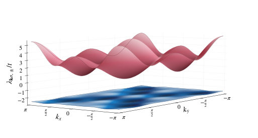
<figcaption class="paper-figure-caption"><b>Fig 1.</b> FIG. 2. Bulk band structure of the mixed singlet–triplet density-wave model for the parameters listed in Sec. III A.</figcaption>
</figure>
<figure class="paper-figure-card">
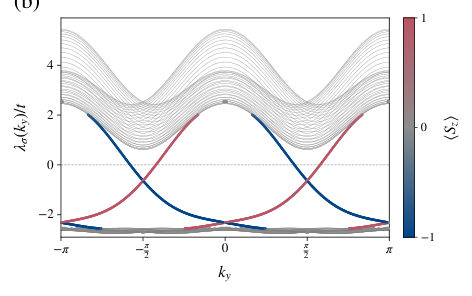
<figcaption class="paper-figure-caption"><b>Fig 2.</b> FIG. 1. (a) The mixed singlet-triplet d-density wave model in real space. The triplet component produces opposite stag- gered circulations for the two spins, whereas the singlet one modulates the diagonal bonds. (b) Edge state dispersion, computed from a ribbon geometry that is 40 sites wide and periodic along y. The spectrum shows a pair of helical edge states crossing the bulk gap per edge, with the color denoting their edge-resolved spin polarization.</figcaption>
</figure>
<figure class="paper-figure-card">
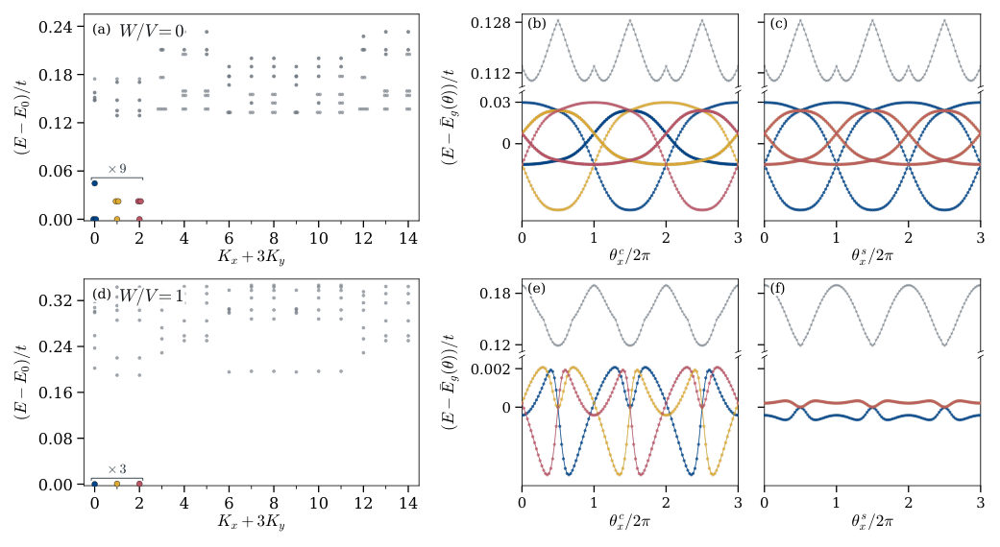
<figcaption class="paper-figure-caption"><b>Fig 3.</b> FIG. 3. Many-body spectra and flux response at ν = 1/3. Exact-diagonalization results for Ne = 10 particles on a 3 × 5 torus in the Sz = 0 sector, with the same-spin repulsive interaction set to V = 1.5t. Panels (a)–(c) show the decoupled limit W = 0, while panels (d)–(f) show W/V = 1. Panels (a) and (d) give the spectra at periodic boundary conditions as a function of a linearized momentum index K = Kx + NxKy, with energies measured from the lowest state. The nine-state product manifold at W = 0 is replaced at W/V = 1 by an isolated triplet in the momentum sectors (0, 0), (1, 0), and (2, 0). Panels (b) and (e) show spin-independent flux threading, while panels (c) and (f) show the...</figcaption>
</figure>
<figure class="paper-figure-card">
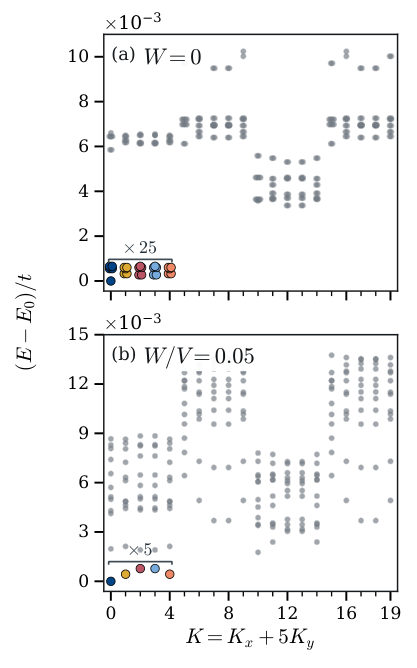
<figcaption class="paper-figure-caption"><b>Fig 4.</b> FIG. 5. Many-body spectra at ν = 1/5. Exact diagonal- ization results for a 5×4 torus (N↑= N↓= 4). Panels (a) and (b) show the spectra at W = 0 and W/V = 0.05, respectively. Colored circles denote the lowest 25 states at W = 0 and the lowest 5 states at W/V = 0.05.</figcaption>
</figure>
<figure class="paper-figure-card">
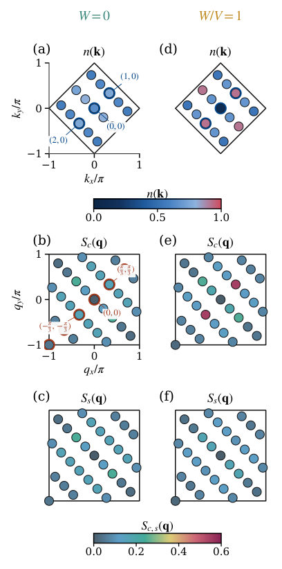
<figcaption class="paper-figure-caption"><b>Fig 5.</b> FIG. 4. Momentum occupation and density correla- tions at ν = 1/3. Equal-weight quasidegenerate manifold averages at W = 0 [panels (a)–(c)] and W/V = 1 [panels (d)–(f)]: momentum occupation n(k) on the RBZ [(a),(d)], charge structure factor Sc(q) [(b),(e)], and spin structure fac- tor Ss(q) [(c),(f)] of the 30 microscopic sites.</figcaption>
</figure>

**Summary.** This work proposes that a hidden density-wave order can spontaneously generate topological bands, leading to fractional quantum spin Hall liquid states. By analyzing the system's spectral properties under repulsive interactions, the authors demonstrate how these topological features survive and fractionalize at specific fillings. This provides a novel mechanism for realizing topological phases beyond conventional band theory.

**Why it may be interesting.** The connection drawn between symmetry breaking (hidden order) and topological properties is a powerful theoretical tool applicable to understanding emergent phases in strongly correlated materials.

Detailed structure

**Main problem.** To investigate if spontaneous symmetry breaking, specifically via a hidden density-wave order, can generate topological bands supporting fractional quantum spin Hall (FQSH) liquid states.

**Main result.** The model predicts the realization of FQSH states at fractional fillings and shows that residual interactions can fractionalize the Chern bands generated by the symmetry-broken condensate.

**Method.** The study uses mean-field gap matrix derivations, exact diagonalization on finite tori, and analysis of spectral weight distribution.

**Model / system.** The system is modeled using a mixed singlet–triplet d-density wave (stDDW) condensate, which is a particle-hole condensate on a square lattice. The Hamiltonian includes hopping terms and repulsive interactions.

**Key observables.** Spin Chern numbers, charge/spin Hall responses, spectral weight ($z_{\pm}^{	ext{max}}$, $N_{\pm}^{	ext{eff}}$), and ground state polarization ($|m_z|$).

**Important parameters / regimes.** Fractional fillings ($
u=1/3, 1/5$), interaction strengths ($V, W$), and lattice parameters ($t, t', t''$).

**Assumptions / limitations.** The analysis assumes a single uniform domain for the stDDW condensate, neglecting its self-consistent formation and collective fluctuations.

**Figures summary.** Figures illustrate the real-space stDDW order, edge state dispersion showing helical pairs, and spectral weight evolution comparing the stDDW model to the LLL spectrum.

**Paper structure.** The paper progresses from establishing the symmetry-broken topological state (stDDW) to analyzing its behavior at fractional fillings, and finally comparing the resulting spectral properties to established correlated electron models like the LLL.

Abstract

Broken symmetry and topology are distinct descriptions for how matter organizes itself. Here, we propose one gives rise to the other. A mixed singlet-triplet $d$-density wave, which is a particle-hole condensate, has a hidden bond order that breaks translation symmetry and generates a time-reversed pair of Chern bands, without producing conventional charge or spin density order. At fractional fillings with odd denominators, finite size exact diagonalization studies show how repulsive interactions can transform this symmetry-broken topological state into a fractional quantum spin Hall liquid. Its opposite chiralities produce a crossed response in which charge flux transports spin, and spin flux transports charge. The same setting also reveals what borders such a phase. Strong interspin coupling and increasingly dilute fillings favor charge order and make residual band dispersion decisive, while at half filling, the spin-decoupled limit gives a homogeneous correlated liquid with signatures consistent with the physics of a composite Fermi liquid.

[↑ back to top](#top)

### [Marton's conjecture in polynomial time](http://arxiv.org/abs/2609.20771v1)

**Authors:** Srinivasan Arunachalam, Arkopal Dutt, Sabee Grewal, Aparna Gupte  
**Type:** theory · **Category:** quantum information and computing · **PDF:** <https://arxiv.org/pdf/2609.20771v1>  
**Analysis basis:** full PDF text, analyzed in chunks
**Topic relevance:** `quantum measurements` **1/5**

↔ Scroll figures horizontally

<figure class="paper-figure-card">
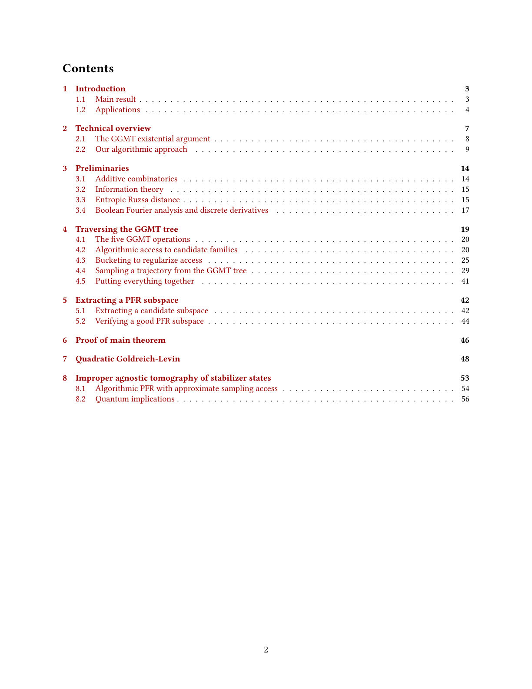
<figcaption class="paper-figure-caption"><b>Fig 1.</b> Low-resolution page preview, page 2</figcaption>
</figure>
<figure class="paper-figure-card">
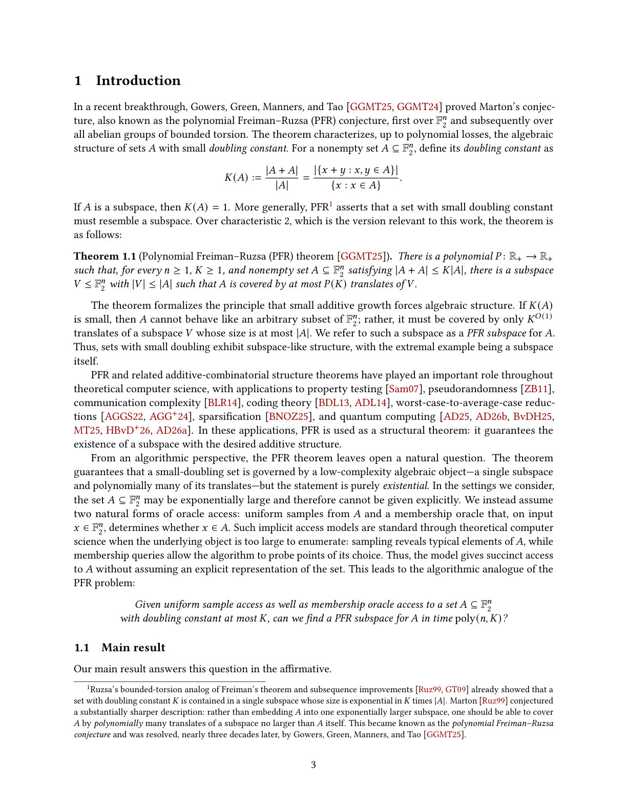
<figcaption class="paper-figure-caption"><b>Fig 2.</b> Low-resolution page preview, page 3</figcaption>
</figure>
<figure class="paper-figure-card">
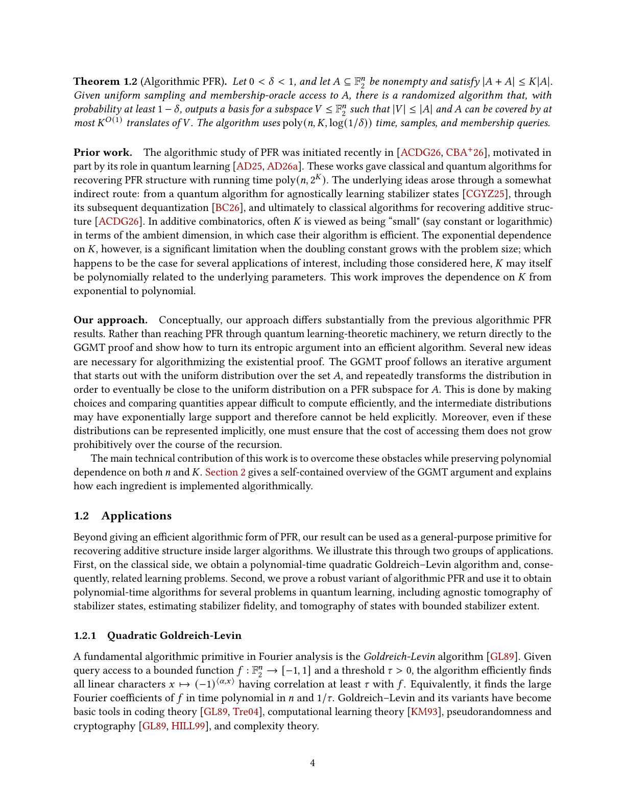
<figcaption class="paper-figure-caption"><b>Fig 3.</b> Low-resolution page preview, page 4</figcaption>
</figure>
<figure class="paper-figure-card">
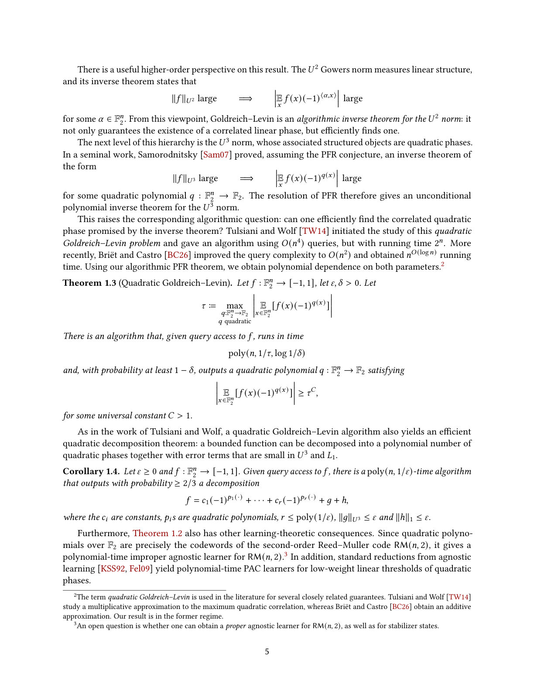
<figcaption class="paper-figure-caption"><b>Fig 4.</b> Low-resolution page preview, page 5</figcaption>
</figure>
<figure class="paper-figure-card">
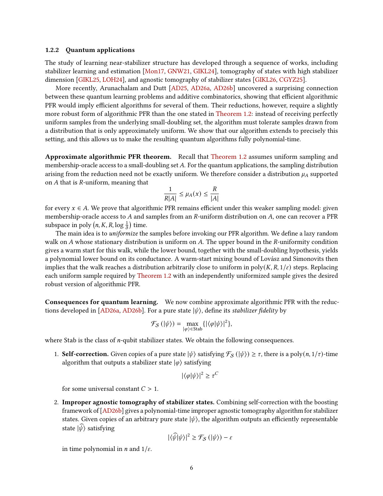
<figcaption class="paper-figure-caption"><b>Fig 5.</b> Low-resolution page preview, page 6</figcaption>
</figure>

**Summary.** This paper develops an efficient, polynomial-time algorithm for the algorithmic version of Marton's PFR conjecture. This breakthrough is then leveraged to create polynomial-time quantum algorithms for critical tasks like agnostic quantum state tomography and self-correction protocols. It significantly advances the computational understanding of quantum information theory by providing concrete, efficient tools.

**Why it may be interesting.** The polynomial-time algorithms derived for quantum state tomography and self-correction protocols provide concrete, computationally tractable tools for analyzing quantum information processing tasks, moving beyond purely existence proofs.

Detailed structure

**Main problem.** To provide an efficient, polynomial-time algorithmic counterpart to the resolution of Marton's polynomial Freiman-Ruzsa (PFR) conjecture.

**Main result.** The authors present a randomized algorithm that finds a subspace $V$ covering a set $A \subseteq \mathbb{F}_2^n$ with $O(1)$ translates, running in time polynomial in $n$ and the doubling constant $K$.

**Method.** The method involves transforming the entropic argument from the GGMT proof into an efficient, direct algorithmic procedure, overcoming previous exponential dependencies on $K$.

**Model / system.** The theory is applied to abstract sets $A \subseteq \mathbb{F}_2^n$ with a small doubling constant $K$, and its applications cover quantum states (stabilizer states) and unitaries defined over the Pauli group structure.

**Key observables.** Doubling constant $K$, subspace size $|V|$, fidelity $	au$, and the extent $\xi$ of Hamiltonians.

**Important parameters / regimes.** Dimension $n$, doubling constant $K$, error parameters $\epsilon, \delta$, and stabilizer extent $\xi$.

**Assumptions / limitations.** The algorithm assumes uniform sampling and membership oracle access to the set $A$. Quantum applications rely on the existence of such algorithmic primitives.

**Paper structure.** The paper first establishes the algorithmic PFR theorem for classical sets, then extends this to solve the quadratic Goldreich-Levin problem (U^3 norm), and finally applies these tools to develop polynomial-time quantum algorithms for state tomography and self-correction protocols.

Abstract

Gowers, Green, Manners, and Tao (Annals '25) recently resolved Marton's polynomial Freiman-Ruzsa conjecture. We give an algorithmic counterpart to their result: given uniform sampling and membership-oracle access to a set $A \subseteq \mathbb{F}_2^n$ with doubling constant at most $K$, our algorithm outputs a subspace of size at most $|A|$ whose $K^{O(1)}$ translates cover $A$. The algorithm runs in $\textsf{poly}(n,K)$ time. As applications, we obtain polynomial-time algorithms for a variety of learning problems, including quadratic Goldreich-Levin, improper agnostic tomography of stabilizer states, and tomography of quantum states with bounded stabilizer extent.

[↑ back to top](#top)

### [Quantum computers will not be that different: A blueprint for quantum computer architecture at scale](http://arxiv.org/abs/2609.19639v1)

**Authors:** Torsten Hoefler, Matthias Troyer  
**Type:** theory · **Category:** quantum information and computing · **PDF:** <https://arxiv.org/pdf/2609.19639v1>  
**Analysis basis:** full PDF text, analyzed in chunks
**Topic relevance:** `quantum measurements` **1/5**

↔ Scroll figures horizontally

<figure class="paper-figure-card">

<figcaption class="paper-figure-caption"><b>Fig 1.</b> Figure 1: At cloud scale, a quantum computer fits into the same architectural pattern as other nodes and clusters,</figcaption>
</figure>
<figure class="paper-figure-card">

<figcaption class="paper-figure-caption"><b>Fig 2.</b> Figure 1. This similarity substantially simplifies integration into cloud and heterogeneous compute</figcaption>
</figure>
<figure class="paper-figure-card">
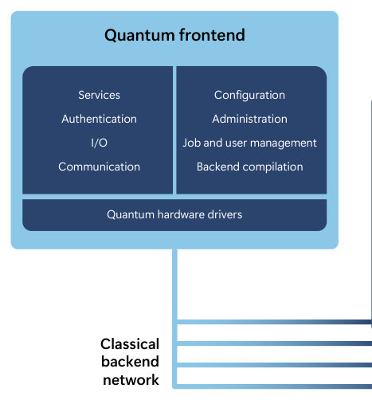
<figcaption class="paper-figure-caption"><b>Fig 3.</b> Figure 2: Components of a quantum compute cluster. A quantum cluster consists of frontend machines for job</figcaption>
</figure>
<figure class="paper-figure-card">
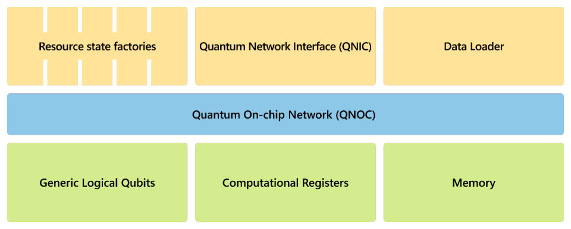
<figcaption class="paper-figure-caption"><b>Fig 4.</b> Figure 3: QPU layout example for a quantum chip illustrating functional specialization combined with generic quantum</figcaption>
</figure>
<figure class="paper-figure-card">
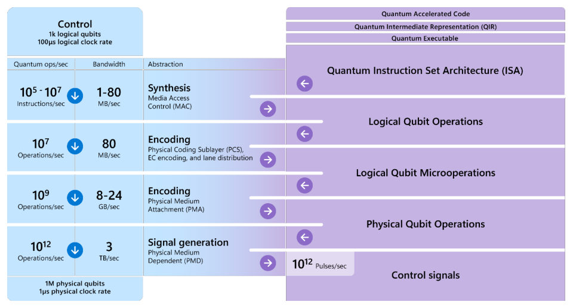
<figcaption class="paper-figure-caption"><b>Fig 5.</b> Figure 4: Encoding hierarchy and bandwidth example for qubit control showing how required bandwidths can be reduced</figcaption>
</figure>

**Summary.** This paper proposes a blueprint for building utility-scale quantum computers by treating them as complex, coupled quantum-classical heterogeneous accelerators. The core argument is that engineering success depends on managing cost and complexity across the entire system stack, not just qubit count. It advocates for aggressive functional specialization and integrating control/readout functions into specialized local hardware, mirroring classical networking practices.

**Why it may be interesting.** It provides a high-level, engineering-focused framework that bridges theoretical quantum computation with practical, resource-constrained hardware design, which is crucial for any physical realization of quantum computation.

Detailed structure

**Main problem.** To define an engineering blueprint for building utility-scale quantum computers that are economically viable.

**Main result.** The architecture should be viewed as a coupled quantum-classical heterogeneous accelerator, leveraging established classical computing and networking principles for control and resource management.

**Method.** The authors adopt a cost-constrained methodology, deriving architectural requirements by targeting specific, useful quantum algorithms (like Shor's or chemistry simulations).

**Model / system.** The system is conceptualized as a complex, integrated quantum-classical accelerator, requiring specialized local hardware for Quantum Error Correction (QEC), readout, and control, analogous to network PHY layers.

**Key observables.** Logical error rates (target $\sim 10^{-12}$), cost per useful quantum operation, and system throughput.

**Important parameters / regimes.** Utility scale (defined by cost/time), physical vs. logical qubit counts, and bandwidth/latency constraints across the control stack.

**Assumptions / limitations.** The design is independent of the specific physical qubit modality, assuming the existence of specialized, hardened local hardware for control and QEC decoding.

**Figures summary.** Figures illustrate that the quantum computer fits into the architectural pattern of classical datacenter nodes, and show the progression from analog signals to low-error logical measurements across the readout stack.

**Paper structure.** The paper argues that quantum computing should adopt principles from classical heterogeneous accelerators, detailing the necessary architectural stack from high-level ISA down to specialized local hardware for QEC and readout.

Abstract

Quantum computers are technologically novel and unusual, but at system scale they should be engineered using many of the same principles that govern classical heterogeneous accelerators. This paper argues that utility-scale quantum architecture is primarily a cost-performance problem across a coupled quantum-classical system, leading to a blueprint for scalable quantum processing unit (QPU) design. Our architecture blueprint is organized around clean logical abstractions, hiding details and complexity of physical qubit modalities below the instruction set architecture (ISA) boundary, and specializes recurring functions aggressively to minimize the cost for utility scale quantum computations. Its low-level implementation through specialized local hardware for control, readout, and quantum error correction (QEC) closely resembles the architecture of high-performance network stacks. One of our main insights is that the design principles and the resulting architecture closely follow established practice from classical computing and networking.

[↑ back to top](#top)

### [Quantum Noise Limited Nonlinear Phase-Preserving Amplification of a Bosonic Mode](http://arxiv.org/abs/2609.20644v1)

**Authors:** Abel te Riele, Tzula B. Propp  
**Type:** theory · **Category:** quantum information and computing · **PDF:** <https://arxiv.org/pdf/2609.20644v1>  
**Analysis basis:** full PDF text, analyzed in chunks
**Topic relevance:** `quantum measurements` **1/5**

↔ Scroll figures horizontally

<figure class="paper-figure-card">
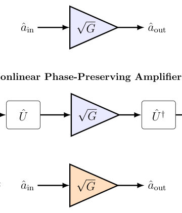
<figcaption class="paper-figure-caption"><b>Fig 1.</b> Figure 1: Phase-preserving amplification, either linear (top, Eq. (1)) or nonlinear (bottom, Eq. (3)). By sandwiching a linear amplifier (blue) between a number-operator-commuting unitary ˆU and its adjoint ˆU †, we produce a nonlinear phase-preserving amplifier (orange) e.g. to amplify cat states with minimal noise.</figcaption>
</figure>
<figure class="paper-figure-card">
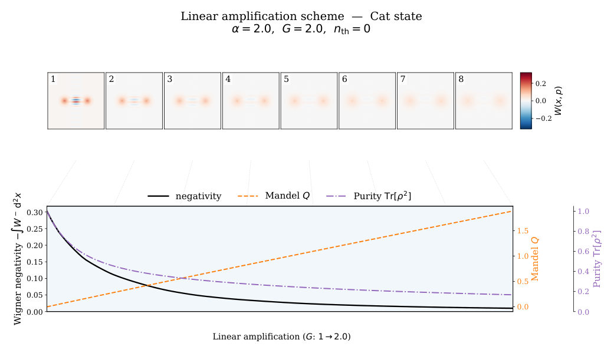
<figcaption class="paper-figure-caption"><b>Fig 2.</b> Figure 2: Evolution of the cat state N(|α⟩+ i| −α⟩) under linear phase-preserving amplification (α = 2.0, G ∈[1, 2], nth = 0). Wigner functions at eight equally spaced values of G (top) and the corresponding Wigner negativity, Mandel Q, and purity Tr[ρ2] (bottom). Linear amplification monotonically destroys the quantum coherence of the cat state, leaving a near-classical mixed output.</figcaption>
</figure>
<figure class="paper-figure-card">
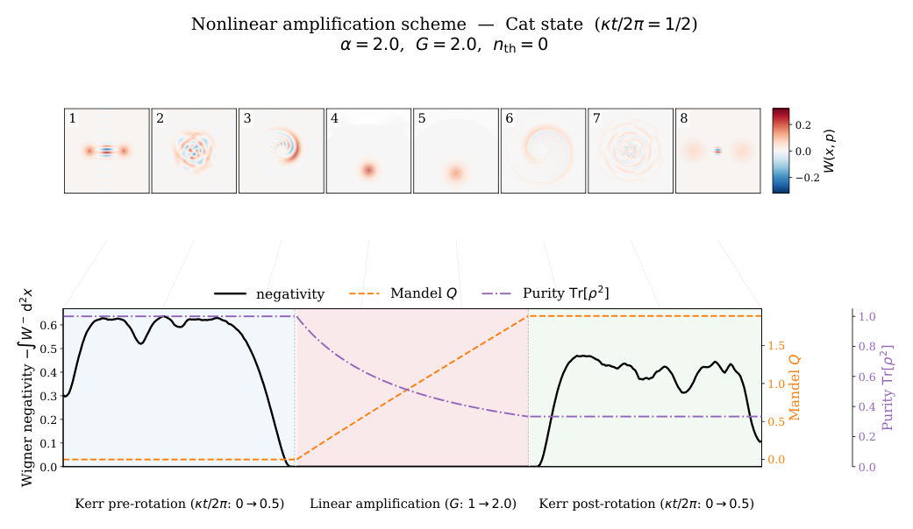
<figcaption class="paper-figure-caption"><b>Fig 3.</b> Figure 3: Evolution of the cat state N(|α⟩+ i| −α⟩) through the nonlinear scheme A = UK(π) LG UK(π) (α = 2.0, G = 2, nth = 0). Wigner functions at eight equally spaced moments across the three stages (top) and the corresponding Wigner negativity, Mandel Q, and purity Tr[ρ2] (bottom), with background shading distinguishing the Kerr pre-rotation, linear amplification, and Kerr post-rotation stages. By sandwiching the linear amplifier between two Kerr rotations, the scheme preserves significantly more negativity and purity than the linear scheme alone.</figcaption>
</figure>

**Summary.** This theoretical paper characterizes all possible deterministic, nonlinear, phase-preserving amplifiers for bosonic modes. It proves that the optimal schemes, particularly for cat states, require sandwiching linear amplification between Kerr unitaries. This provides a crucial understanding of noise limitations and coherence preservation in quantum amplification processes.

**Why it may be interesting.** This work provides rigorous mathematical constraints on quantum noise processes, directly impacting the feasibility and performance limits of quantum state preparation and amplification protocols relevant to quantum memory and sensing.

Detailed structure

**Main problem.** The paper investigates the existence and characterization of deterministic, nonlinear, phase-preserving amplification schemes for bosonic modes.

**Main result.** Such amplifiers are highly constrained, and the optimal scheme involves sandwiching linear amplification between two Kerr unitaries to maximize coherence preservation.

**Method.** The authors used commutator analysis to constrain the general form of the amplifier and derived lower bounds on the Mandel Q parameter and upper bounds on purity by analyzing the output state.

**Model / system.** The system involves bosonic modes undergoing amplification, modeled using input/output operators and analyzed via the preservation of bosonic commutation relations and Wigner negativity.

**Key observables.** Mandel Q parameter, Purity (Tr[rho^2]), Wigner Negativity, and the commutation relation $[\hat{a}_{out}, \hat{a}_{out}^\dagger] = 1$.

**Important parameters / regimes.** Amplification gain (G), coherent state amplitude (alpha), and thermal noise parameter (n_th).

**Assumptions / limitations.** The analysis assumes the internal noise term is independent of the input field operators, and the optimal scheme relies on the large-alpha limit for purity calculations.

**Figures summary.** Figures illustrate the structural difference between linear and nonlinear phase-preserving amplification, showing the decay and recovery of Wigner negativity and purity for cat states.

**Paper structure.** The paper first establishes the general mathematical constraints on phase-preserving nonlinear amplifiers, then derives optimal bounds using the Mandel Q parameter, and finally proposes a concrete, optimal scheme using Kerr unitaries to saturate these bounds.

Abstract

Does quantum mechanics allow for deterministic amplification schemes that simultaneously behave uniformly for all angles of bosonic phase space (i.e. phase preserving) and are nonlinear in the underlying field operators? Would such a scheme have some utility to quantum information science? In this paper we answer both questions with a resounding yes. Such amplifiers exist, but their form is highly constrained compared to the more general set of noise limited nonlinear amplifiers previously studied in the literature. This enables us to characterize the entire class of bosonic noise-limited nonlinear phase preserving amplifiers, and identify their utility: namely, the optimal amplification of Yurke-Stoler cat states and Kerr kitten states.

[↑ back to top](#top)

### [Scalable entanglement distribution using encoded hybrid repeater chains](http://arxiv.org/abs/2609.19783v1)

**Authors:** Stav Haldar, Saikat Guha, Don Towsley, Filip Rozpędek  
**Type:** theory · **Category:** quantum information and computing · **PDF:** <https://arxiv.org/pdf/2609.19783v1>  
**Analysis basis:** full PDF text, analyzed in chunks
**Topic relevance:** `methods for driven-dissipative` **1/5**

↔ Scroll figures horizontally

<figure class="paper-figure-card">
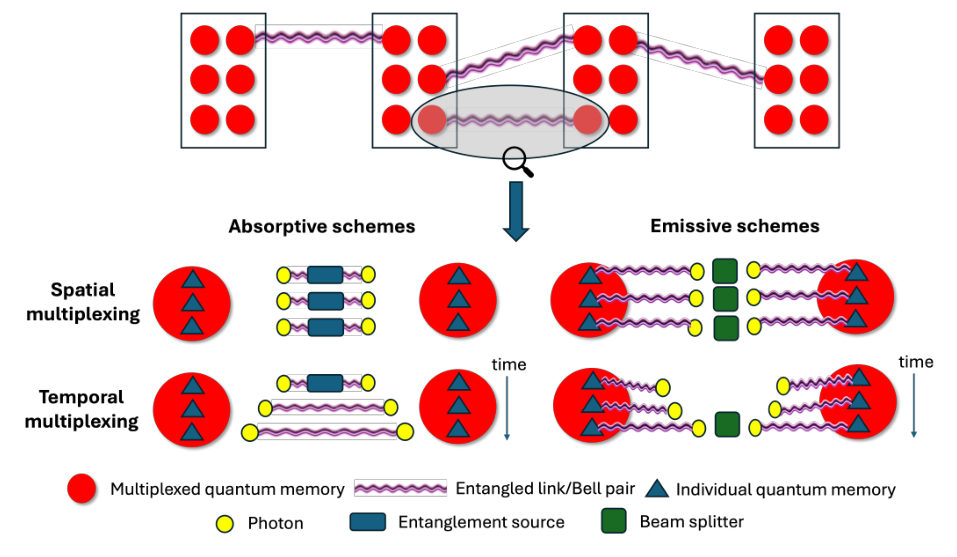
<figcaption class="paper-figure-caption"><b>Fig 1.</b> FIG. 1: (top) A multiplexed repeater chain with 4 nodes. Each node has several quantum memories and</figcaption>
</figure>
<figure class="paper-figure-card">
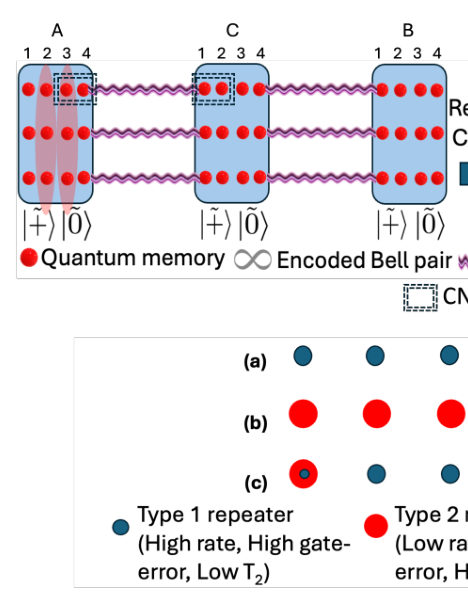
<figcaption class="paper-figure-caption"><b>Fig 2.</b> FIG. 2: (top) An encoded repeater chain. Encoded states are created locally at each node (by using</figcaption>
</figure>
<figure class="paper-figure-card">
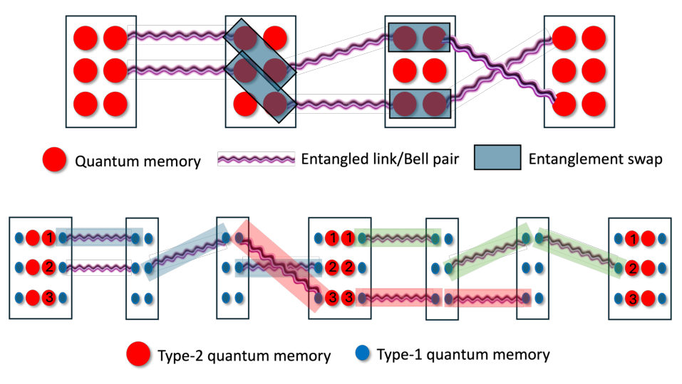
<figcaption class="paper-figure-caption"><b>Fig 3.</b> FIG. 3: Entanglement swap policy and order of remote CNOT operations determine the performance of the</figcaption>
</figure>
<figure class="paper-figure-card">
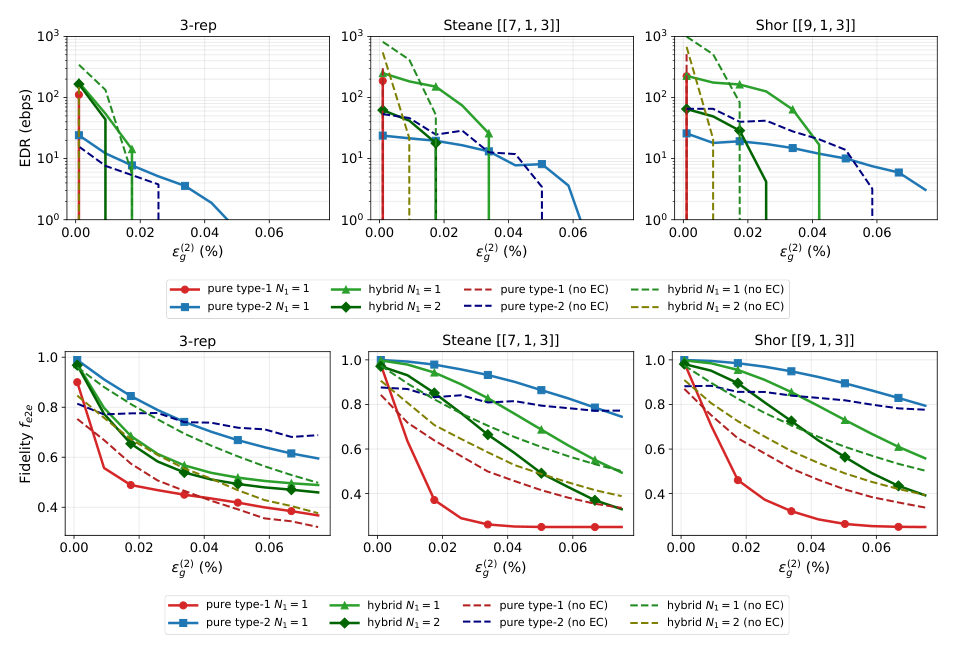
<figcaption class="paper-figure-caption"><b>Fig 4.</b> FIG. 4: (top) Entanglement distribution rate R∞(ebits/s) and (bottom) End-to-end fidelity vs. type-2 gate</figcaption>
</figure>
<figure class="paper-figure-card">
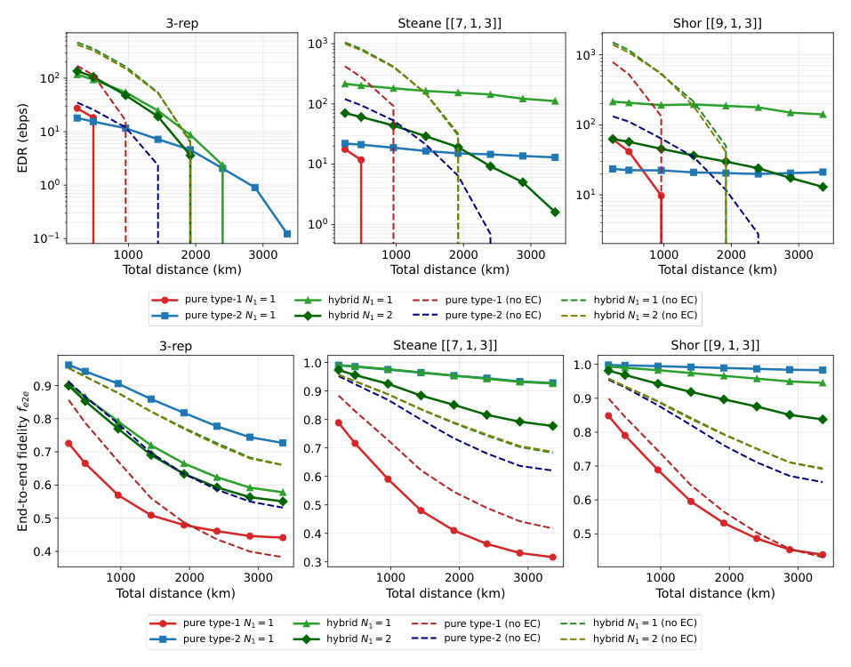
<figcaption class="paper-figure-caption"><b>Fig 5.</b> FIG. 5: (top) Entanglement distribution rate R∞and (bottom) end-to-end fidelity as a function of total</figcaption>
</figure>

**Summary.** This paper proposes a novel hybrid repeater architecture for long-distance quantum communication, combining fast Type-1 memories with high-fidelity Type-2 memories. Through extensive simulations, the authors demonstrate that this hybrid approach significantly boosts the end-to-end entanglement distribution rate compared to using either memory type alone. This provides a crucial roadmap for building practical, fault-tolerant quantum networks.

**Why it may be interesting.** This work directly addresses the hardware limitations of quantum networking by proposing a resource-aware, hybrid architecture that maximizes entanglement distribution rates by strategically combining different physical memory platforms.

Detailed structure

**Main problem.** The primary challenge is achieving scalable, long-distance entanglement distribution by compensating for qubit decoherence and noise accumulated during entanglement swapping over repeater chains.

**Main result.** The proposed hybrid repeater architectures, which combine Type-1 and Type-2 quantum memories, significantly outperform pure architectures based on a single memory platform in terms of end-to-end entanglement distribution rate.

**Method.** The authors use detailed Monte Carlo simulations to analyze fault-tolerant encoded repeater protocols, comparing performance across different memory combinations and optimized swapping policies.

**Model / system.** The system models quantum repeater chains utilizing two types of quantum memories: Type-1 (fast generation, multiplexing) and Type-2 (long coherence, low gate error). Error correction is implemented using codes like the Steane and Shor codes.

**Key observables.** End-to-end entanglement distribution rate, logical error probabilities (perr,x, perr,y, perr,z), and the evolution of Bell state coefficients.

**Important parameters / regimes.** Gate error rates ($\epsilon_g$), coherence times ($T_2$), multiplexing capability ($\mu$), and the spacing between error-correcting nodes ($N_1$).

**Assumptions / limitations.** The analysis assumes that only a subset of nodes need to be the resource-intensive hybrid type, and it develops a modified swap-ASAP policy to optimize storage time.

**Figures summary.** Figures illustrate the multiplexed repeater chain structure, the process of generating logical Bell pairs via local CNOTs and BSMs, and a comparison showing the performance advantage of the hybrid architecture over pure Type-1 or Type-2 chains.

**Paper structure.** The paper first establishes the need for hybrid repeaters, then details the simulation methodology using specific error-correcting codes (Steane, Shor), and finally presents the results demonstrating the rate enhancement and the optimization of the swapping policy.

Abstract

Long-distance entanglement distribution requires error correction protocols to compensate for qubit decoherence in quantum memories and noise introduced during entanglement swapping. We argue that repeater chains with error-correction capabilities should exploit more than one physical platform, combining the complementary strengths of different quantum memory technologies into a single hybrid repeater architecture. An important constituent of such an architecture is a hybrid repeater which combines type-1 memories, characterized by fast entanglement generation rates and suitability for multiplexing, and type-2 memories that offer long coherence times and low two-qubit gate error rates. Taking the resource-intensive nature of hybrid nodes into account, we propose and analyze repeater chains in which only a subset of nodes need to be hybrid, while the remaining nodes are simpler first-generation repeaters with no error-correction capability. Through detailed Monte Carlo simulations of fault-tolerant encoded repeater chain protocols based on the three-qubit phase-flip repetition code, the $[[7,1,3]]$ Steane code, and the $[[9,1,3]]$ Shor code, we demonstrate that these hybrid architectures outperform pure architectures based on a single memory platform in terms of end-to-end entanglement distribution rate. In our study we develop a full circuit-level noise model of our architectures and examine the impact of an imperfect interface between the two platforms on our hybrid architecture. We also develop a modified version of the swap-as-soon-as-possible policy with multiplexing, more suited to our architecture where some nodes perform error-correction while others do not. This modified policy significantly reduces the information storage time in memory qubits relative to the previously considered swap policies in encoded repeater chains.

[↑ back to top](#top)

### [Spacetime Dynamics of Altermagnetic Magnons](http://arxiv.org/abs/2609.20767v1)

**Authors:** Ali Emami Kopaei, Karthik Subramaniam Eswaran, Krzysztof Wohlfeld  
**Type:** theory · **Category:** strongly correlated electrons · **PDF:** <https://arxiv.org/pdf/2609.20767v1>  
**Analysis basis:** full PDF text, analyzed in chunks
**Topic relevance:** `analog quantum simulation` **1/5**

↔ Scroll figures horizontally

<figure class="paper-figure-card">
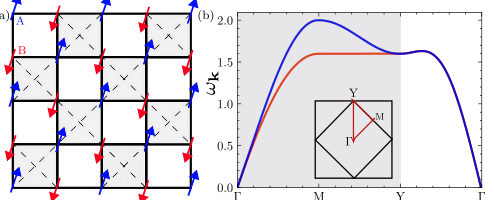
<figcaption class="paper-figure-caption"><b>Fig 1.</b> FIG. 1. (a) Schematic representation of the Heisenberg model on a 2D checkerboard lattice featuring collinear Ne´el order. The A and B sublattices are connected by a compos- ite symmetry operation consisting of a mirror reflection and a spin inversion. (b) Magnon dispersion relations ωk for the next-nearest-neighbor Heisenberg exchange J2 = 0.2 (with the nearest neighbor exchange J1 = 1). The introduction of next-nearest-neighbor coupling J2 unequivocally lifts the band degeneracy across the Brillouin zone, except along the high-symmetry nodal axes (kx = 0, ky = 0) where the degen- eracy is protected by the lattice symmetry.</figcaption>
</figure>
<figure class="paper-figure-card">
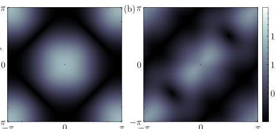
<figcaption class="paper-figure-caption"><b>Fig 2.</b> FIG. 3. Magnitude of the magnon group velocity, |vσ(k)|, across the Brillouin zone. (a) In the antiferromagnetic limit, J2 = 0, the largest group velocities are distributed nearly isotropically around the Γ point. (b) For finite J2 &gt; 0, this distribution becomes direction dependent, with the largest ve- locities concentrated along selected diagonal directions. This deformation of the group-velocity distribution reflects the di- rection dependence of the altermagnetic magnon dispersion discussed in the main text. The parameters are (a) θ = 0 (J1 = 1, J2 = 0) and (b) θ = 0.3 (J1 ≃0.95, J2 ≃0.29), with σ = −1.</figcaption>
</figure>
<figure class="paper-figure-card">
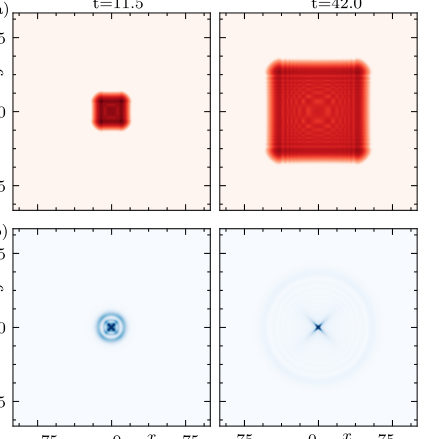
<figcaption class="paper-figure-caption"><b>Fig 3.</b> FIG. 2. Comparison of the real-space spreading of a single-site spin-flip excitation in the absence of next-nearest- neighbor interactions (J2 = 0). (a) In the ferromagnetic case (J1 &lt; 0), the largest group velocities occur at finite momenta, making the propagation sensitive to short-wavelength, lattice- scale physics and producing the characteristic square-shaped density profile. (b) In the antiferromagnetic case (J1 &gt; 0), the largest group velocities occur in the long-wavelength regime, where the linear magnon dispersion is approximately rotation- ally symmetric. The resulting wavefront is therefore nearly circular and much less sensitive to the underlying square- lattice structure.</figcaption>
</figure>
<figure class="paper-figure-card">
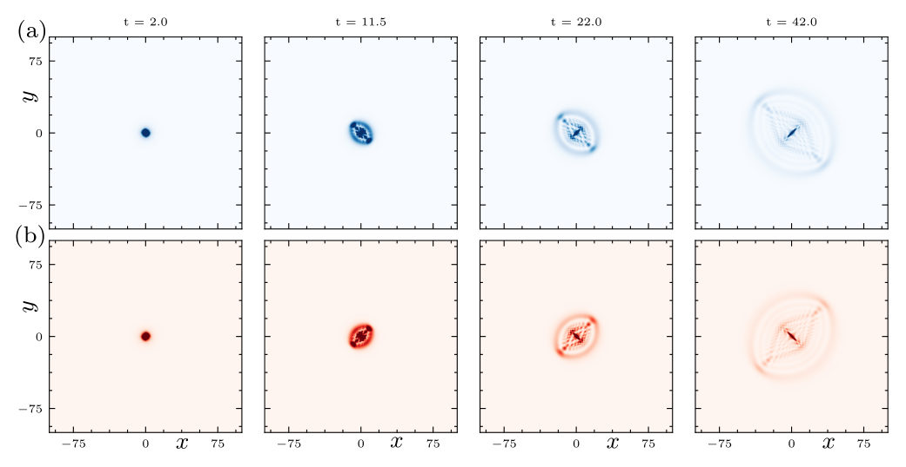
<figcaption class="paper-figure-caption"><b>Fig 4.</b> FIG. 4. Time-resolved spatial density profiles following a single-site spin flip in the representative altermagnetic regime, θ = 0.3 (J1 ≃0.95, J2 ≃0.29), at t = 2.0, 11.5, 22.0, and 42.0. The outer propagation front remains approximately circular, reflecting the dominant antiferromagnetic-like propagation, while the direction-dependent base dispersion and the altermagnetic branch splitting produce a cross-like structure inside the wave packet. Panels (a) and (b) show the σ = +1 and σ = −1 magnon branches, respectively. The lattice size is N = 200.</figcaption>
</figure>
<figure class="paper-figure-card">
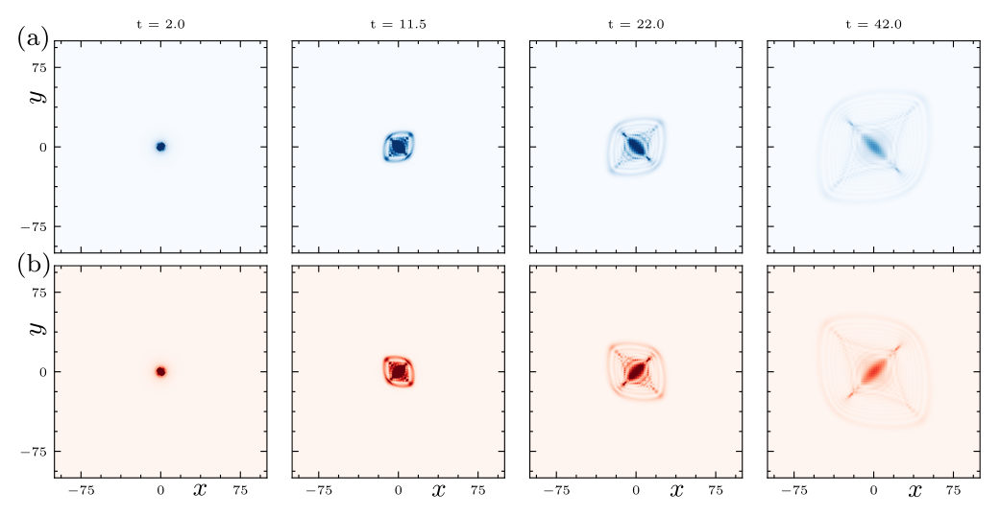
<figcaption class="paper-figure-caption"><b>Fig 5.</b> FIG. 5. Time-resolved spatial density profiles following a single-site spin flip in the unfrustrated altermagnetic regime, θ = −0.4 (J1 ≃0.92, J2 ≃−0.38), at t = 2.0, 11.5, 22.0, and 42.0. Compared with the frustrated regime shown in Fig. 4, the wave packet spreads considerably farther and its anisotropic spatial pattern is rotated by π/2. These changes reflect the larger characteristic magnon group velocities for J2 &lt; 0 and the reversal of the branch-dependent altermagnetic contribution discussed in the main text. Panels (a) and (b) show the σ = +1 and σ = −1 magnon branches, respectively. The lattice size is N = 200.</figcaption>
</figure>

**Summary.** This theoretical work establishes that the real-space propagation pattern of a localized spin excitation serves as a unique fingerprint for altermagnetic order. By analyzing the time evolution of magnons on a 2D lattice, the authors show that the resulting spatial structure—a cross-like pattern—is distinct from both ferromagnetic and antiferromagnetic counterparts. This provides a powerful, complementary method for identifying unconventional magnetic states in quantum materials.

**Why it may be interesting.** The focus on real-space, time-domain dynamics (wave packet spreading) provides a novel diagnostic tool for characterizing magnetic order, which is highly relevant for understanding complex many-body ground states in correlated materials.

Detailed structure

**Main problem.** To find a distinctive dynamical fingerprint of altermagnetic order, moving beyond conventional momentum-space probes.

**Main result.** The real-space spreading of a localized spin excitation reveals a cross-like structure inside the wavefront, distinguishing altermagnetism from ferromagnetism and antiferromagnetism.

**Method.** Linear spin-wave theory is applied to calculate the time evolution of a localized spin excitation, tracking its real-space probability density.

**Model / system.** The study uses a Heisenberg model on a 2D checkerboard lattice with nearest-neighbor ($J_1$) and next-nearest-neighbor ($J_2$) couplings, modeling altermagnetic magnets.

**Key observables.** Real-space density profile $
ho(r, t)$ of the spin excitation, magnon group velocities $v_{\sigma}(k)$, and the resulting spatial pattern.

**Important parameters / regimes.** The ratio $J_2/J_1$, and the sign of $J_2$ (frustrated vs. unfrustrated regimes).

**Assumptions / limitations.** The analysis relies on linear spin-wave theory, which approximates the Hamiltonian up to quadratic order in bosonic operators.

**Figures summary.** Figures illustrate magnon dispersion splitting due to $J_2$, and density profiles showing the characteristic cross-like structure in the altermagnetic regime, compared to square (FM) or circular (AFM) fronts.

**Paper structure.** The paper develops the theory by first establishing the Hamiltonian and using spin-wave theory to find magnon dispersion. It then calculates the time evolution of a localized excitation, comparing the resulting real-space density patterns across FM, AFM, and altermagnetic regimes, concluding with the physical interpretation of the results.

Abstract

Distinguishing altermagnetism from conventional ferromagnetism and antiferromagnetism typically relies on momentum-space probes. Here, we show that the real-space spreading of a localized spin excitation provides a distinctive dynamical fingerprint of altermagnetic order. Using linear spin-wave theory on a two-dimensional checkerboard lattice with nearest-neighbor and next-nearest-neighbor couplings J_1 and J_2, we demonstrate that finite J_2 produces direction-dependent magnon group velocities and splits the two magnon branches. The resulting propagation remains closer to that of an antiferromagnet than a ferromagnet, retaining an approximately circular outer wavefront, while the direction-dependent magnon velocities produce a pronounced cross-like spatial structure inside this front. We further show that changing the sign of J_2 to enter the unfrustrated regime (J_2<0) increases the characteristic propagation velocities and interchanges the diagonal directions of enhanced propagation, corresponding to a pi/2 rotation of the anisotropic spatial pattern. These results establish spacetime dynamics as a complementary probe of altermagnetic magnons, providing a route to identifying unconventional magnetic order through real-space propagation patterns in solid-state and synthetic quantum systems.

[↑ back to top](#top)

### [State-Space-Based FIR Filtering on a Quantum Computer](http://arxiv.org/abs/2609.20331v1)

**Authors:** Roope Salmi, Davide Rocchesso, Vesa Välimäki  
**Type:** theory · **Category:** quantum information and computing · **PDF:** <https://arxiv.org/pdf/2609.20331v1>  
**Analysis basis:** full PDF text, analyzed in chunks
**Topic relevance:** `quantum measurements` **1/5**

↔ Scroll figures horizontally

<figure class="paper-figure-card">
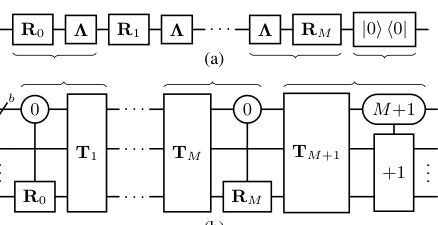
<figcaption class="paper-figure-caption"><b>Fig 1.</b> Fig. 4. (a) The FIR filter circuit in the z-domain and (b) its realiza- tion with the delay and projection gates expanded. Braces indicate corresponding groups of gates between the two circuits. Rotations Rk are applied in (b) to the least significant qubit at the bottom.</figcaption>
</figure>
<figure class="paper-figure-card">

<figcaption class="paper-figure-caption"><b>Fig 2.</b> Fig. 5. Two input signals (red) shown at the top, the impulse x0(n) and the randomly generated sequence x1(n), are filtered with a low- pass FIR filter (M = 12) to produce the bottom outputs (blue), y0(n) and y1(n), respectively. The input signals are encoded in the superposition |0⟩|Ax0⟩+ |1⟩|Ax1⟩and are filtered simultaneously. Data is extracted from the simulator QSV before (red) and after fil- tering (blue). The dotted lines show 1024-shot measurement results.</figcaption>
</figure>
<figure class="paper-figure-card">
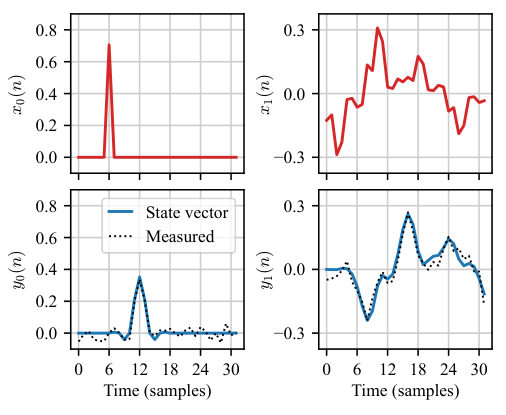
<figcaption class="paper-figure-caption"><b>Fig 3.</b> Fig. 4(b) is then implemented with these parameters. We choose the projection delay length p = 32. The qubit counts are b = 4 and q = 5. Since there are no measurements, it is possible to compose other kinds of processing after filtering. Using Fig. 1, we design a circuit to filter a signal of N = 32 samples. The size of the circuit scales with the number of samples processed, leading to longer circuits that require fault-tolerant hard- ware. The test implementation is not optimal and suffers from some Qiskit limitations. Nevertheless, if the circuit is transpiled to single- qubit rotations and CNOT gates, there are 59,292 ≈154NM gates with depth 38,387. The same circuit can process...</figcaption>
</figure>

**Summary.** This paper develops a quantum circuit implementation for FIR filtering by mapping classical signal processing into a state-space framework on qubits. It utilizes unitary quantum circuits and a quantum delay gate to process signals, demonstrating the potential for parallelization and composition. The work is significant for advancing quantum algorithms in the field of signal processing.

**Why it may be interesting.** This work directly tackles the mapping of classical signal processing algorithms onto quantum hardware, providing a concrete quantum circuit blueprint for a widely applicable computational task.

Detailed structure

**Main problem.** The paper addresses the challenge of creating an efficient and composable quantum circuit implementation for Finite Impulse Response (FIR) filtering, a fundamental tool in classical signal processing.

**Main result.** A state-space-based framework is proposed that allows for the unitary implementation of FIR filters, enabling parallel processing and composition within larger quantum algorithms.

**Method.** The authors encode the signal into a quantum state and model the filtering process using the state-space realization equations, implementing the system dynamics via controlled unitary quantum circuits.

**Model / system.** The system uses qubits to encode discrete-time signals and models linear time-invariant systems using state-space representations (SSV). Key components include a quantum delay gate and the emulation of projection operators for bounded filters.

**Key observables.** Output signal amplitudes ($y(n)$), the residual state $|s(N)
angle$, and the fidelity of the processed signals.

**Important parameters / regimes.** The circuit size scales with the number of samples ($N$) and the filter order ($M$); the implementation requires fault-tolerant hardware for large scale.

**Assumptions / limitations.** The process assumes the total energy cannot be increased, and the method relies on decomposing the filter into lattice structures for implementation.

**Figures summary.** Figures illustrate the quantum circuit structure for processing samples using the SISO realization matrix U, showing delay gates and the block diagram of the lattice sections used for filter implementation.

**Paper structure.** The paper introduces the state-space framework, details the quantum delay gate and the use of unitary circuits for lossless systems, presents the method for emulating bounded filters via projection operators, and concludes with testing the FIR filter implementation on a simulator.

Abstract

Many signal processing tasks require intensive computations. Quantum computing promises to accelerate certain tasks, but algorithms must be designed around the limitations of quantum mechanics. This paper provides a quantum implementation of finite impulse response (FIR) filters, which are a widely used tool in classical signal processing. The filter can be parallelized and composed as part of larger quantum algorithms, with potential for speedups using quantum amplitude estimation and future fault-tolerant quantum hardware. To accomplish these properties, we introduce a state-space framework wherein sample-based signal processing is performed with unitary quantum circuits. We present the quantum delay gate as the quantum analog of the delay line in discrete-time signal processing. Unitary circuits intrinsically describe lossless systems, but we also implement lowpass and other bounded filters by emulating a projection operator. The FIR filter implementation is tested and demonstrated with a quantum circuit simulator.

[↑ back to top](#top)

### [Statistics, 't Hooft Anomaly, and the Else-Nayak Index: a careful comparison of concepts](http://arxiv.org/abs/2609.20813v1)

**Authors:** Hanyu Xue  
**Type:** theory · **Category:** strongly correlated electrons · **PDF:** <https://arxiv.org/pdf/2609.20813v1>  
**Analysis basis:** full PDF text, analyzed in chunks
**Topic relevance:** `analog quantum simulation` **1/5**

↔ Scroll figures horizontally

<figure class="paper-figure-card">
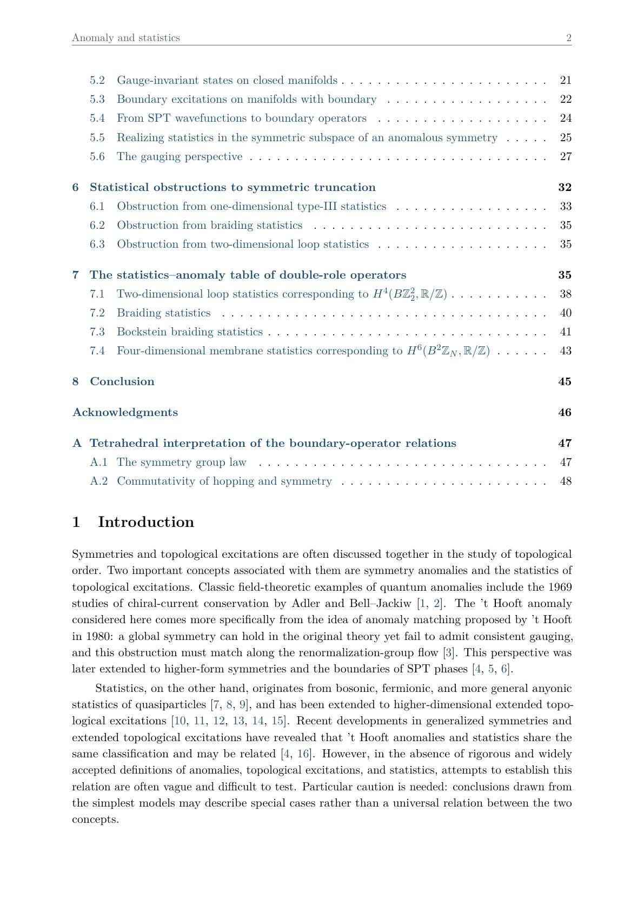
<figcaption class="paper-figure-caption"><b>Fig 1.</b> Low-resolution page preview, page 2</figcaption>
</figure>
<figure class="paper-figure-card">
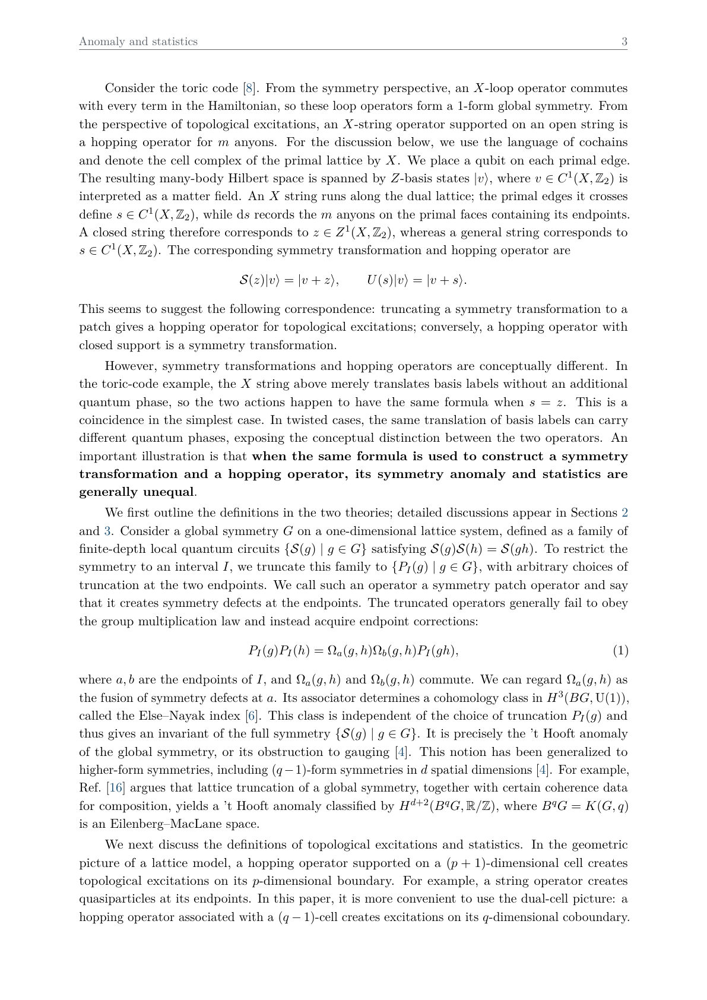
<figcaption class="paper-figure-caption"><b>Fig 2.</b> Low-resolution page preview, page 3</figcaption>
</figure>
<figure class="paper-figure-card">
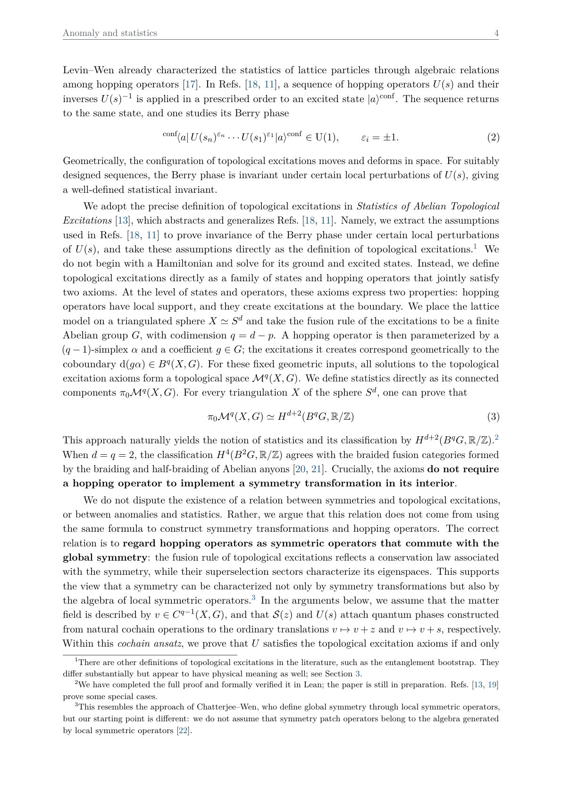
<figcaption class="paper-figure-caption"><b>Fig 3.</b> Low-resolution page preview, page 4</figcaption>
</figure>
<figure class="paper-figure-card">
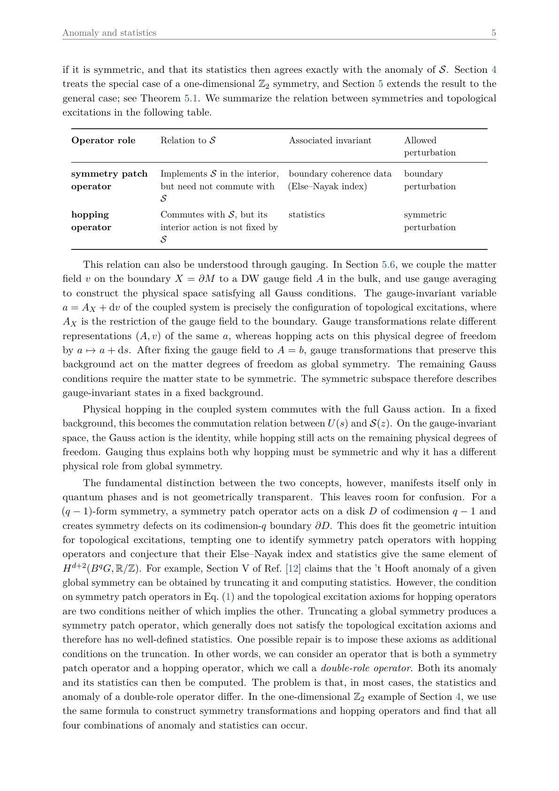
<figcaption class="paper-figure-caption"><b>Fig 4.</b> Low-resolution page preview, page 5</figcaption>
</figure>
<figure class="paper-figure-card">
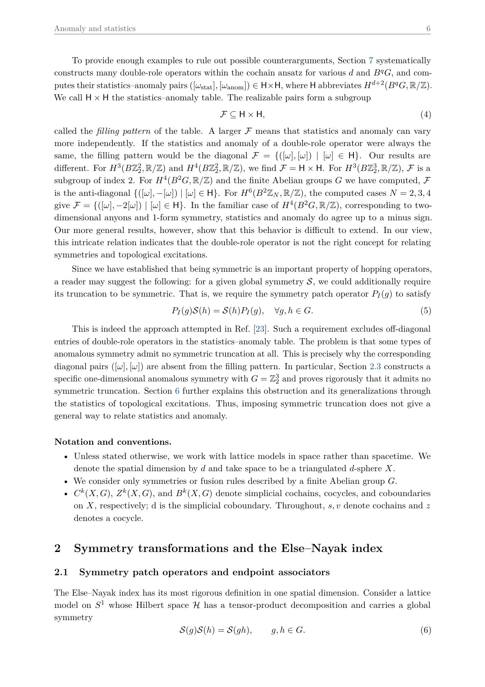
<figcaption class="paper-figure-caption"><b>Fig 5.</b> Low-resolution page preview, page 6</figcaption>
</figure>

**Summary.** This theoretical paper rigorously compares the mathematical concepts of symmetry anomalies and the statistics of topological excitations. It argues that previous analogies linking the two are flawed because the derived invariants generally disagree. The work establishes a robust framework using gauge theory to clarify the necessary conditions for a consistent relationship between symmetries and topological order.

**Why it may be interesting.** The rigorous mathematical machinery developed here—comparing topological invariants derived from different physical principles (symmetry vs. excitation)—provides a powerful, abstract tool for understanding constraints in strongly correlated systems where symmetries and topological order are key.

Detailed structure

**Main problem.** The paper aims to establish a rigorous and reliable relationship between generalized symmetries (and their anomalies) and the statistics of topological excitations in quantum field theories.

**Main result.** The authors argue that the statistics and the anomaly derived from symmetry transformations and topological excitations generally do not match, suggesting that the simple identification of the two concepts is flawed.

**Method.** The analysis uses advanced concepts from algebraic topology, specifically comparing cocycles derived from symmetry patch operators (related to the Else-Nayak index) with those derived from the connectivity of topological spaces associated with hopping operators.

**Model / system.** The framework is highly abstract, involving lattice truncations, symmetry patch operators, and topological excitations defined on manifolds like $S^d$. It utilizes concepts from gauge theory by coupling boundary matter to a DW gauge field in one higher dimension.

**Key observables.** The Else-Nayak index, the 't Hooft anomaly, the statistics $\pi_0 M_q(X, G)$, and the filling pattern $F$ which tracks realizable pairs of $(	ext{stat}, 	ext{anom})$.

**Important parameters / regimes.** The dimension $d$, the structure of the Abelian group $G$, and the level of the cocycles (e.g., $H^3(BG, \mathbb{R}/\mathbb{Z})$).

**Assumptions / limitations.** The analysis relies on abstracting axioms for topological excitations and making specific assumptions about the commutation relations of operators in the presence of gauge fields.

**Paper structure.** The paper progresses by first identifying the conceptual pitfalls in relating symmetries and statistics, then developing a rigorous framework using cochain complexes and gauge theory to calculate both quantities independently, and finally comparing the resulting invariants to show they are generally distinct.

Abstract

Generalized symmetries and topological excitations, as well as symmetry anomalies and the statistics of topological excitations, are widely believed to be related. There are, however, pitfalls in how this relation is established. A lattice truncation of a symmetry transformation to a finite patch gives a symmetry patch operator that creates symmetry defects at its boundary. This geometric picture resembles a hopping operator creating topological excitations at the boundary of its support, but does not provide well-defined statistics, let alone guarantee agreement with the symmetry anomaly. A more natural and robust relation is that the hopping operators of topological excitations are symmetric: they commute with symmetry transformations. Under suitable assumptions, this condition yields a one-to-one correspondence between statistics and anomalies. We further couple boundary matter to a DW gauge field in one higher dimension to explain this relation from the perspective of gauging. A hopping operator is, in essence, a gauge-invariant operator acting on the physical degrees of freedom after gauging. Once the gauge-field background is fixed, global symmetry comes from gauge transformations that preserve that background, while the symmetric condition on hopping is precisely the remaining gauge invariance. This distinction clarifies potential misconceptions in the literature and provides a more reliable framework for comparing symmetries and topological excitations.

[↑ back to top](#top)

### [Topological entanglement entropy in 3D gravity](http://arxiv.org/abs/2609.19247v1)

**Authors:** Vijay Balasubramanian, Charlie Cummings  
**Type:** theory · **Category:** other · **PDF:** <https://arxiv.org/pdf/2609.19247v1>  
**Analysis basis:** full PDF text, analyzed in chunks
**Topic relevance:** `methods for driven-dissipative` **1/5**

↔ Scroll figures horizontally

<figure class="paper-figure-card">
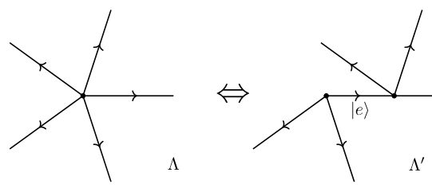
<figcaption class="paper-figure-caption"><b>Fig 1.</b> Figure 1. An example of move 1, which can be performed to add or remove a bulk vertex/leg from the graph Λ. In other words, we can split or combine bulk vertices.</figcaption>
</figure>
<figure class="paper-figure-card">
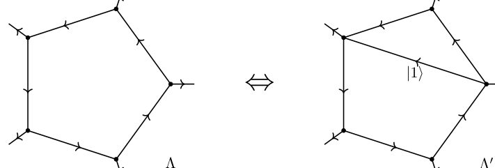
<figcaption class="paper-figure-caption"><b>Fig 2.</b> Figure 2. An example of move 2, which can add or remove a leg/plaquette from the graph Λ. In other words, we can split or fuse two bulk plaquettes together.</figcaption>
</figure>
<figure class="paper-figure-card">
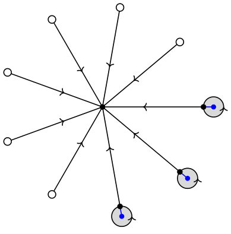
<figcaption class="paper-figure-caption"><b>Fig 3.</b> Figure 3. Reduced lattice of the disk with six marked points on the boundary and three legs carrying matter. The boundary vertices are shown in white, and the out-of-plane legs that carry matter are shown in blue. The matter legs are attached to a bulk vertex and plaquette (shown in gray), which we call a “lollipop”. This lollipop is connected to the central vertex of the reduced lattice through another bulk leg.</figcaption>
</figure>
<figure class="paper-figure-card">
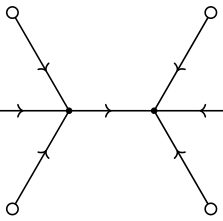
<figcaption class="paper-figure-caption"><b>Fig 4.</b> Figure 4. The bowtie lattice Λb between the boundary legs R and R for a tensor network without matter legs.</figcaption>
</figure>
<figure class="paper-figure-card">
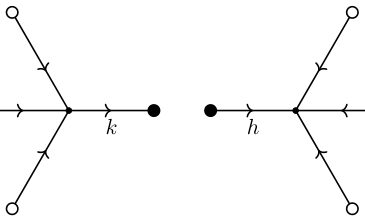
<figcaption class="paper-figure-caption"><b>Fig 5.</b> Figure 5. The state after the Gauss constraint between R and R is lifted. The newly exposed legs, with black dots, are the edge modes. Each subgraph represents the entanglement wedge for R, R, respectively. Left G multiplication on the edge modes is a gauge/global symmetry for the R, R, edge modes, respectively. Right G multiplication on the edge modes is a global/gauge symmetry for the R, R edge modes, respectively. The edge mode legs are therefore crucial for each subregion being gauge-invariantly defined, while simultaneously allowing the Hilbert space between the subregions to factorize because the other multiplication is lifted to a global symmetry.</figcaption>
</figure>

**Summary.** This work develops an entropy formula for 3D gravity using a tensor network model quantized canonically. The key achievement is demonstrating that this formula reproduces the Quantum Extremal Surface formula, extending its applicability beyond time-symmetric spacetimes. It offers a novel, non-path-integral method to calculate gravitational entanglement entropy.

**Why it may be interesting.** The use of tensor networks to model quantum gravity and derive holographic entropy formulas provides a powerful, non-path-integral tool for understanding entanglement in curved spacetime, which is highly relevant to modern quantum information approaches to gravity.

Detailed structure

**Main problem.** The paper aims to derive an entropy formula for 3D gravity that rigorously matches the Quantum Extremal Surface (QES) formula without relying on path integral methods.

**Main result.** The derived entropy formula matches the QES formula for small but finite $G_N$ and is shown to be applicable beyond time-symmetric spacetimes.

**Method.** The derivation uses canonical quantization applied to a tensor network model of states in 3D gravity, comparing the resulting entropy to the established QES formula.

**Model / system.** The system is 3D gravity, modeled using a tensor network approach that incorporates matter effects and satisfies diffeomorphism invariance constraints. The physical Hilbert space is defined by imposing gauge invariance on the network structure.

**Key observables.** Topological entanglement entropy, the generalized entropy for a bulk region, and the area operator $\hat{A}$.

**Important parameters / regimes.** The gravitational constant $G_N$, and the structure of the matter content (fixed vs. random).

**Assumptions / limitations.** The analysis assumes the invertibility of the spacetime metric and relies on defining the physical Hilbert space as a quotient by null states.

**Paper structure.** The paper reviews the tensor network model, computes entropy with matter, demonstrates minimization over cuts, connects to 3D gravity, argues for the full QES formula, and generalizes the result to compact bulk regions.

Abstract

We derive an entropy formula for a recently proposed tensor network model of states in 3D gravity which satisfy the constraint equations of diffeomorphism invariance, and including the effects of matter. After accounting for the invertibility of the spacetime metric, we argue that this formula matches the quantum extremal surface formula (for small but finite $G_N$), and is not restricted to time symmetric spacetimes. We derive the result via canonical quantization without relying on path integrals, and discuss an extension to compact bulk subregions.

[↑ back to top](#top)

### [Valley-Helical Superconductivity Driven by Repulsion and Quantum Geometry: Applications to Time-Reversal Symmetric Rhombohedral Graphene](http://arxiv.org/abs/2609.19283v1)

**Authors:** Julian May-Mann, Trithep Devakul, Gal Shavit  
**Type:** theory · **Category:** strongly correlated electrons · **PDF:** <https://arxiv.org/pdf/2609.19283v1>  
**Analysis basis:** full PDF text, analyzed in chunks
**Topic relevance:** `Keldysh / 2PI / non-Gaussian methods` **1/5**

↔ Scroll figures horizontally

<figure class="paper-figure-card">
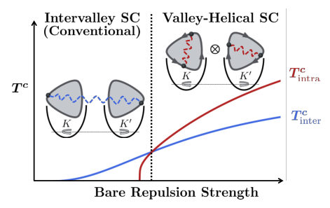
<figcaption class="paper-figure-caption"><b>Fig 1.</b> FIG. 1. Competition between intravalley and intervalley pair- ing channels. Schematic plot of the intravalley (red) and intervalley (blue) transition temperatures for a two-valley system with valley- contrasting Berry curvature and a Kohn-Luttinger-like pairing mech- anism. Since the Fermi surfaces in each valley are generically not particle-particle nested, the intravalley superconductivity requires the repulsion to exceed a threshold, which is set by the strength of trig- onal warping and related normal state properties. The intravalley channel quickly becomes dominant upon exceeding this threshold.</figcaption>
</figure>
<figure class="paper-figure-card">
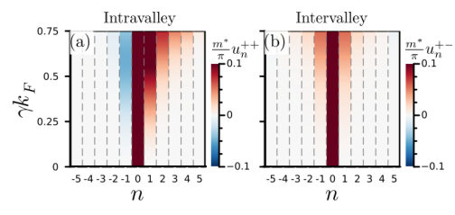
<figcaption class="paper-figure-caption"><b>Fig 2.</b> FIG. 2. Pairing strength in the ideal limit of R7G. (a) Coefficients from the angular momentum decomposition of the intravalley pairing interaction for ideal R7G as a function of γkF . RPA calculations were performed using m∗</figcaption>
</figure>
<figure class="paper-figure-card">
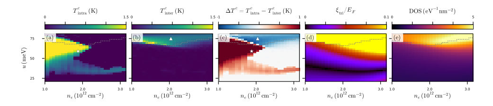
<figcaption class="paper-figure-caption"><b>Fig 3.</b> FIG. 3. SC in time-reversal symmetric R7G. (a) Superconducting transition temperature for intravalley pairing. The dashed line indicates a transition from a normal state with a single Fermi pocket to one with 4 Fermi pockets in each valley (Note: this does not induce a topological transition for the superconducting state) (b) Same as (a) but for intervalley pairing. (c) The difference between the intravalley and intervalley transition temperatures, ∆T c = T c intra −T c inter. (d) The magnitude of trigonal warping at the Fermi level, ξtri, relative to the Fermi-energy, EF . (e) The DOS per spin-valley flavor at the Fermi level.</figcaption>
</figure>
<figure class="paper-figure-card">
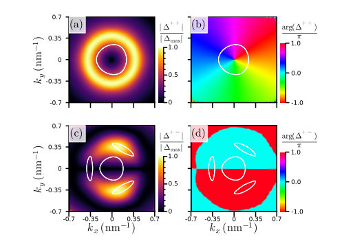
<figcaption class="paper-figure-caption"><b>Fig 4.</b> FIG. 4. R7G Intravalley and intervalley gap functions. (a-b) Amplitude and phase of the leading intravalley gap function in mo- mentum space for u = 59meV and n = 1.9 × 1012/cm2 (star in Fig. 3). The Fermi-surface is shown in white. (c-d) Same as (a-b) but for one of the two degenerate leading intervalley gap functions, at u = 75meV and n = 2 × 1012/cm2 (triangle in Fig. 3). Both the intravalley and intervalley gap functions are spin-triplet.</figcaption>
</figure>

**Summary.** This theoretical study explores how strong electron-electron repulsion can drive a unique valley-helical superconducting state in graphene, even when time-reversal symmetry is preserved. By comparing intravalley and intervalley pairing instabilities using RPA, the authors show that the valley-helical state becomes dominant under specific coupling conditions. This work highlights the role of quantum geometry and repulsive interactions in stabilizing exotic superconducting phases.

**Why it may be interesting.** The mechanism of intravalley pairing overcoming intervalley pairing due to 'residual repulsion poisoning' is a sophisticated many-body effect relevant to understanding unconventional superconductivity in low-dimensional materials.

Detailed structure

**Main problem.** The study investigates the possibility of realizing chiral, valley-helical superconductivity in time-reversal symmetric graphene systems without breaking valley polarization or time-reversal symmetry.

**Main result.** The analysis shows that overscreened repulsion (Kohn-Luttinger mechanism) can induce a valley-helical superconducting state where intravalley pairing outcompetes conventional intervalley pairing at intermediate coupling.

**Method.** The research employs Random-Phase Approximation (RPA) calculations to solve linearized gap equations, analyzing the competition between different pairing channels.

**Model / system.** The primary system is time-reversal symmetric rhombohedral graphene (RNG), modeled using a tight-binding Hamiltonian. The analysis focuses on the interplay between intravalley and intervalley pairing channels.

**Key observables.** Critical transition temperatures ($T_c^{	ext{intra}}$ vs $T_c^{	ext{inter}}$), the difference $\Delta T_c$, and the topological nature of the resulting edge modes.

**Important parameters / regimes.** Intermediate coupling strength, trigonal warping strength ($\xi_{tri}$), and the number of graphene layers ($4 \le N \le 8$).

**Assumptions / limitations.** The analysis relies on RPA for pairing interactions and assumes certain symmetries (e.g., continuous rotation symmetry in both valleys) for simplification.

**Figures summary.** Figures compare the competition between intravalley and intervalley SC transition temperatures, demonstrating the dominance of the intravalley channel when repulsion exceeds a threshold set by trigonal warping.

**Paper structure.** The paper progresses by setting up the Hamiltonian and gap equations, calculating pairing interactions via RPA, and then analyzing the competition between intravalley and intervalley instabilities to establish the conditions for valley-helical SC.

Abstract

Motivated by the recent experimental signatures of chiral superconductivity in valley-polarized graphene- and transition-metal-dichalcogenide-based systems, we investigate the possibility of chiral pairing in the absence of valley polarization or time-reversal symmetry breaking. For systems with opposite Berry curvature in the two valleys, we find that overscreened repulsion (i.e., the Kohn-Luttinger mechanism) can indeed induce pairing of opposite chiralities in each valley, producing a valley-helical state. Moreover, the valley-helical state can outcompete more conventional intervalley paired states at intermediate coupling, despite only the latter having a weak-coupling instability. Using a realistic model of time-reversal-symmetric rhombohedral graphene, we find extended ranges of fillings and displacement fields with dominant valley-helical superconductivity. This occurs for all layer numbers considered here, $4\leq N\leq 8$. We show that the valley-helical states can display topologically projected edge modes, unusual magnetic responses, and intertwined Kekulé-like bond-order; features that can be used to distinguish them from more conventional superconductors.

[↑ back to top](#top)

## Other papers (28)

*Papers from primary archives without highlighted authors or any topic match. Click to expand.*

Show other papers

### [A Bi-Objective Routing Framework for Hybrid Terrestrial-Satellite Quantum Networks](http://arxiv.org/abs/2609.19561v1)

**Authors:** Yashpreet Khambay, Nitish K. Panigrahy  
**Type:** theory · **Category:** quantum information and computing · **PDF:** <https://arxiv.org/pdf/2609.19561v1>  
**Analysis basis:** full PDF text, analyzed in chunks

↔ Scroll figures horizontally

<figure class="paper-figure-card">
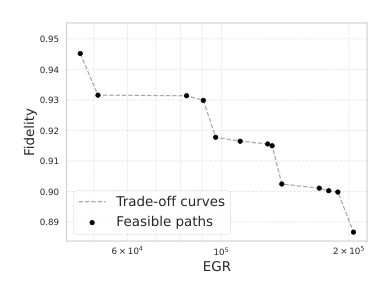
<figcaption class="paper-figure-caption"><b>Fig 1.</b> Fig. 1: Trade-off between end-to-end entanglement gen- eration rate (EGR) and fidelity for routing between representative end users in Iselin, NJ and Chicago Ridge, IL. Each point represents a feasible route, while the dashed line highlights the rate-fidelity trade-off.</figcaption>
</figure>
<figure class="paper-figure-card">

<figcaption class="paper-figure-caption"><b>Fig 2.</b> Fig. 2: Example of terrestrial-only and hybrid routes between Cleveland Heights, OH and High Point, NC. The green route uses only terrestrial fiber links, whereas the blue route incorporates a satellite-assisted virtual edge (dashed) between two OGSs.</figcaption>
</figure>
<figure class="paper-figure-card">
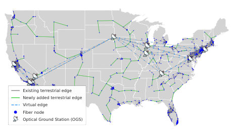
<figcaption class="paper-figure-caption"><b>Fig 3.</b> Fig. 3: Simulated hybrid quantum network topology over the United States. The network integrates 1000 fiber end-nodes at the top population centers with 10 strate- gically selected Optical Ground Stations (OGS). Solid lines (green and gray) represent static terrestrial edges, while dashed lines (blue) indicate satellite-assisted vir- tual edges for a network snapshot.</figcaption>
</figure>
<figure class="paper-figure-card">
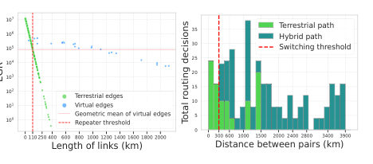
<figcaption class="paper-figure-caption"><b>Fig 4.</b> Fig. 4: Selection of (a) the repeater spacing drep, and (b) the terrestrial-satellite switching distance dswitch used in the baseline distance-based routing.</figcaption>
</figure>
<figure class="paper-figure-card">
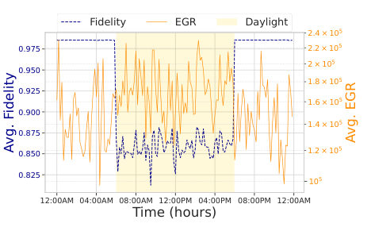
<figcaption class="paper-figure-caption"><b>Fig 5.</b> Fig. 5: Temporal characteristics of the satellite-assisted virtual edge set Es(t) over a 24-hour period. Daytime solar background noise reduces the average fidelity of satellite-assisted virtual links, whereas nighttime condi- tions provide consistently higher-quality links.</figcaption>
</figure>

**Summary.** This paper develops a bi-objective routing framework for quantum networks combining terrestrial fiber and satellite links. It formulates the path selection as a Pareto optimization problem, jointly optimizing both entanglement generation rate and fidelity. The resulting framework allows network controllers to select the optimal path based on the specific trade-off required by the end application.

**Why it may be interesting.** The rigorous mathematical formulation of multi-objective optimization (Pareto front) applied to quantum communication channels is highly relevant for designing robust quantum network protocols.

Detailed structure

**Main problem.** The paper addresses the limitation of existing quantum network routing algorithms that optimize only a single metric, proposing a framework to jointly optimize both End-to-End Entanglement Generation Rate (EGR) and fidelity.

**Main result.** The proposed bi-objective framework successfully models the trade-off, showing that hybrid terrestrial-satellite networks yield substantially richer Pareto frontiers than terrestrial-only links, allowing applications to select paths based on specific utility requirements.

**Method.** The problem is formulated as a Pareto optimization problem and mathematically transformed into a MAXMIN–MINSUM bicriterion path problem, enabling the exact polynomial-time computation of the minimal complete Pareto set using Martins' bicriterion routing algorithm.

**Model / system.** The system is a hybrid quantum network combining static terrestrial fiber links with time-varying virtual links provided by Low Earth Orbit (LEO) satellites. Entanglement is distributed across these mixed links.

**Key observables.** End-to-End Entanglement Generation Rate (EGR) and the fidelity of the distributed entanglement.

**Important parameters / regimes.** The network structure includes terrestrial links (limited by attenuation) and satellite links (time-varying visibility). Performance is evaluated across 24 hours.

**Assumptions / limitations.** Terrestrial nodes are assumed to have perfect quantum memories, and the satellite layer assumes a dual downlink architecture without inter-satellite links.

**Figures summary.** Figures illustrate the trade-off between EGR and fidelity for different routing policies (Pareto vs. single-objective), and one figure compares the aggregate utility (e.g., Negativity, SKR) achieved by various policies.

**Paper structure.** The paper introduces the bi-objective problem, models the hybrid network using time-varying graphs, derives the MAXMIN-MINSUM transformation, and then applies Martins' algorithm to compute the Pareto set, concluding with performance comparisons against single-objective baselines.

Abstract

Hybrid terrestrial-satellite quantum networks combine terrestrial fiber infrastructure with free-space links to enable long-distance entanglement distribution. Entanglement can be routed over different combinations of terrestrial and satellite links, resulting in paths with different entanglement generation rates (EGRs) and fidelities. Existing routing algorithms, however, typically reduce routing to a single-objective problem by optimizing either EGR or fidelity, or by optimizing one while constraining the other, and thus do not explicitly capture the trade-off between the two. In this paper, we present a bi-objective routing framework for hybrid quantum networks that jointly optimizes end-to-end EGR and fidelity. We formulate routing as a Pareto optimization problem and show that it possesses a special mathematical structure: the bottleneck nature of end-to-end EGR and the multiplicative nature of end-to-end fidelity allow the problem to be transformed into a MAXMIN-MINSUM bi-criterion path problem. This transformation enables the exact polynomial-time computation of a minimal complete Pareto set using Martins' bicriterion routing algorithm. Our results demonstrate that hybrid networks expose substantially richer Pareto frontiers than terrestrial-only networks and that the proposed framework outperforms representative single-objective routing policies by allowing applications to select paths based on their EGR and fidelity requirements.

[↑ back to top](#top)

### [A counterexample to the quantum Hedetniemi conjecture](http://arxiv.org/abs/2609.20690v1)

**Authors:** Julius A. Zeiss  
**Type:** theory · **Category:** other · **PDF:** <https://arxiv.org/pdf/2609.20690v1>  
**Analysis basis:** full PDF text, analyzed in chunks

↔ Scroll figures horizontally

<figure class="paper-figure-card">
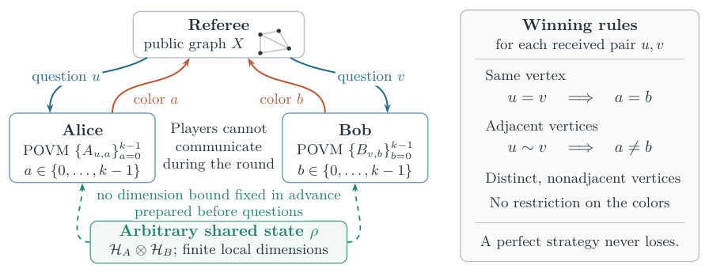
<figcaption class="paper-figure-caption"><b>Fig 1.</b> Figure 1: Quantum coloring game for X in the finite-dimensional tensor-product model. Alice and Bob share an arbitrary density operator ρ on HA ⊗HB, with both local dimensions finite and no dimension bound fixed in advance. On receiving vertices u, v ∈V (X), they apply local positive operator-valued measurements (POVMs) {Au,a}a and {Bv,b}b, respectively, giving p(a, b | u, v) = Tr[ρ(Au,a ⊗Bv,b)]. A strategy is perfect if it satisfies the displayed winning rules for every input pair. The quantum chromatic number χq(X) is the least number k of colors admitting such a strategy.</figcaption>
</figure>
<figure class="paper-figure-card">
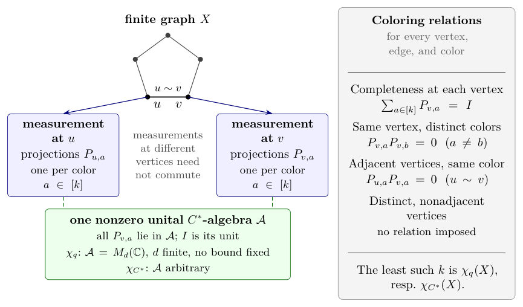
<figcaption class="paper-figure-caption"><b>Fig 2.</b> Figure 2: The projective formulation (2) of quantum coloring, shown at one edge uv of X. Every vertex carries a projection-valued measurement with one outcome per color; all measurements lie in a single algebra, with no commutativity assumed between the projections at different vertices. The relations mirror the rules of the coloring game: agreement on equal vertices, distinct colors on adjacent vertices, and no constraint on distinct nonadjacent pairs [3, Proposition 1]. For χq the algebra is a matrix algebra Md(C) with d finite but unrestricted; an arbitrary nonzero unital C∗-algebra defines χC∗.</figcaption>
</figure>
<figure class="paper-figure-card">
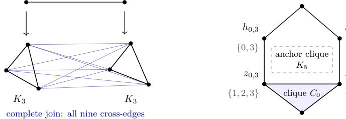
<figcaption class="paper-figure-caption"><b>Fig 3.</b> Figure 3: The graphs F[Kt] and Ht for small parameters. (a) In F[K3], the two cliques that replace the ends of an edge uv of F are completely joined. (b) The vertices f, h0,b, z0,b and ℓ0,1 of H1; braces give their lists. The three vertices of C0 form a clique, and the edges h0,bz0,b form a matching. Every displayed vertex is adjacent to every anchor er with r not in its list; these edges and the vertices with i = 1 are omitted.</figcaption>
</figure>

**Summary.** This paper provides a rigorous counterexample to the quantum Hedetniemi conjecture, which relates the quantum chromatic number of a graph product to the minimum of the factors' quantum chromatic numbers. By constructing specific graphs and using advanced algebraic techniques involving $C^*$-algebras, the authors demonstrate that the conjecture fails for several related graph parameters.

**Why it may be interesting.** While the topic is graph theory, the use of $C^*$-algebras and projection operators connects it to algebraic quantum theory, which shares mathematical tools with quantum information theory.

Detailed structure

**Main problem.** The paper aims to disprove the quantum Hedetniemi conjecture, which posits that the quantum chromatic number of a graph product equals the minimum of the quantum chromatic numbers of its factors.

**Main result.** The authors construct explicit finite graphs $G$ and $H$ for which the quantum chromatic number of the product, $\chi_q(G 	imes H)$, is strictly less than the minimum of the individual quantum chromatic numbers, $\min\{\chi_q(G), \chi_q(H)\}$.

**Method.** The proof involves adapting constructions from graph theory (related to Zhu's counterexample) and applying algebraic techniques using colorings defined by projections in a $C^*$-algebra, leading to explicit integer bounds.

**Model / system.** The study is purely mathematical, focusing on graph theory and algebraic graph parameters like the quantum chromatic number ($\chi_q$) and its $C^*$-algebraic variants ($\chi_C^*$).

**Key observables.** The primary observables are the graph parameters $\chi_q(G 	imes H)$, $\chi_q(G)$, and $\chi_q(H)$, with specific numerical counterexamples provided (e.g., $\chi(G 	imes H) \le 1538 < 1539 = \min\{\chi(G), \chi(H)\}$).

**Important parameters / regimes.** The parameters involve graph structures derived from Cayley graphs and the Lovász theta number of the complement ($ar{\vartheta}$).

**Assumptions / limitations.** The analysis relies on the relationship $\chi_C^*(X) \le \pi(X) \le \chi(X)$ for various graph parameters $\pi$, and the formalization of the coloring problem using projections in a $C^*$-algebra.

**Figures summary.** Figure 1 illustrates the quantum coloring game setup, while Figure 2 details the projective formulation of quantum coloring using required projections in an algebra $A$.

**Paper structure.** The paper develops the problem by defining the quantum chromatic number and its variants, presenting the conjecture, and then constructing counterexamples using specific graph products and algebraic matrix inequalities to show the conjecture fails for multiple related parameters.

Abstract

Godsil, Roberson, Šámal and Severini conjectured that the quantum chromatic number of the categorical product of two graphs equals the minimum of the quantum chromatic numbers of the factors. We disprove this conjecture: we construct explicit finite graphs $G,H$ with \[ χ(G\times H) \leq 1538 < 1539 = \min(χ_q(G),χ_q(H)).\]The graphs are obtained from Zhu's counterexample to Hedetniemi's conjecture by using a base graph for which the Lovász theta number of the complement, and not only the fractional chromatic number, is large. The lower bound for the first factor is the theta bound. For the second factor we adapt Zhu's argument to projections that do not commute: the step that fixes the colors of a clique is replaced by identities between operators. Both lower bounds hold for colorings by projections in an arbitrary nonzero unital $C^*$-algebra. Hence the conjecture also fails for the spatial, approximate, commuting-operator and $C^*$-algebraic variants of the quantum chromatic number. We also give smaller counterexamples certified by exact integer data. The graph constructions, the certificates and the counterexample statements in the projective formulation are formalized in Lean~4.

[↑ back to top](#top)

### [Achieving the limits of automorphism gates](http://arxiv.org/abs/2609.19250v1)

**Authors:** Jin Ming Koh, Shayan Majidy, Aranya Chakraborty, Anqi Gong, Shi Jie Samuel Tan, Norman Y. Yao  
**Type:** theory · **Category:** quantum information and computing · **PDF:** <https://arxiv.org/pdf/2609.19250v1>  
**Analysis basis:** full PDF text, analyzed in chunks

↔ Scroll figures horizontally

<figure class="paper-figure-card">
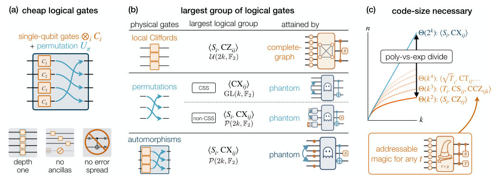
<figcaption class="paper-figure-caption"><b>Fig 1.</b> Figure 1. Largest logical groups from physical single-qubit gates and qubit permutations, and their physical- qubit costs. (a) Logical gates implemented using physical single-qubit gates and permutations are cheap: they are depth one, require no ancillas, and do not spread errors when the permutations are performed by rearranging qubits or relabelling them in software. (b) For single-qubit Cliffords, permutations, and their combination (automorphisms), we show the largest logical group achievable, a generating gate set, and a code construction attaining it; all maxima are tight. (c) The minimum physical- qubit costs for implementing all addressable logical S and CZ gates using only physical...</figcaption>
</figure>
<figure class="paper-figure-card">
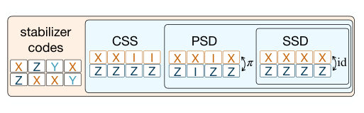
<figcaption class="paper-figure-caption"><b>Fig 2.</b> Figure 2. Classes of codes. CSS codes admit separate X- and Z-type stabilizers. We distinguish permutationally self- dual (PSD) codes, whose X- and Z-stabilizer spaces coincide up to a qubit permutation, and strictly self-dual (SSD) codes, for which they coincide directly.</figcaption>
</figure>
<figure class="paper-figure-card">
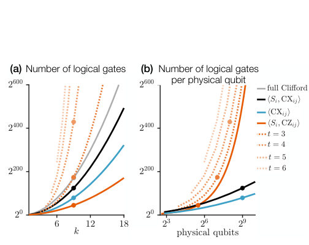
<figcaption class="paper-figure-caption"><b>Fig 3.</b> Figure 3. Number of logical gates in each logical group. Solid lines (other than grey) denote tight logical groups for au- tomorphism, transversal, and permutation gates; dotted lines denote additional diagonal logical groups achievable by code constructions at level t of the Clifford hierarchy. We plot the number of logical gates (i.e. order of the logical groups) against the number of logical qubits k in (a) and the mini- mum required number of physical qubits in (b). For scale, markers indicate k = 9 on each curve when the corresponding point lies within the displayed range.</figcaption>
</figure>
<figure class="paper-figure-card">
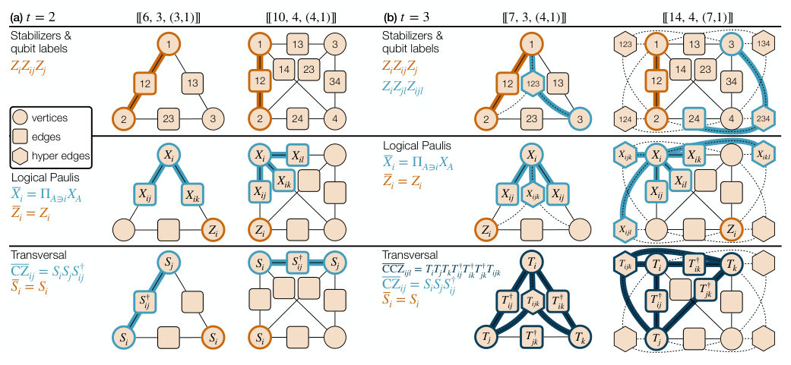
<figcaption class="paper-figure-caption"><b>Fig 4.</b> Figure 4. Complete-hypergraph CSS codes. For any t, these codes realize every diagonal logical gate in the tth level of the Clifford hierarchy transversally, through tensor products of single-qubit rotations. The code is defined on the rank-t complete hypergraph of k vertices—with one hyperedge per nonempty subset of ≤t vertices—placing one qubit per hyperedge. Here qubits are labelled by the vertices in the hyperedges omitting set notation (e.g. 12 for {1, 2}). Rows: stabilizers, logical Pauli representatives, and transversal gates (examples highlighted). (a) t = 2 at k = 4, 5, giving all addressable logical S and CZ gates and products thereof. (b) t = 3 at k = 3, 4, giving all addressable...</figcaption>
</figure>
<figure class="paper-figure-card">
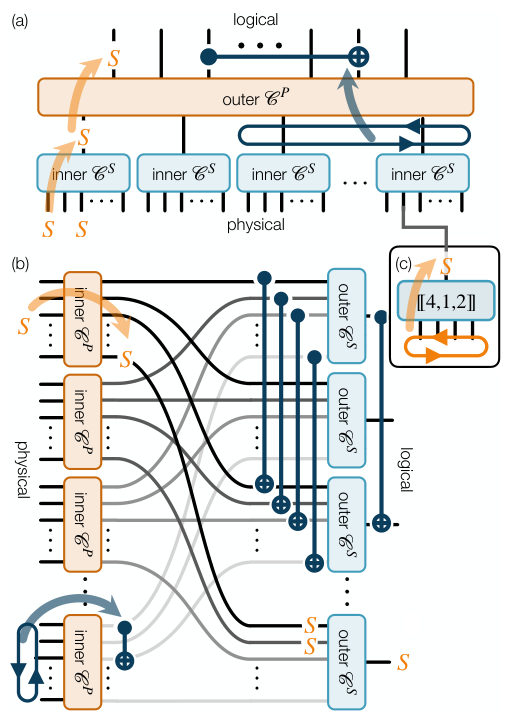
<figcaption class="paper-figure-caption"><b>Fig 5.</b> Figure 5. Concatenated phantom codes. These codes realize every addressable logical CX by qubit permutations and logical S transversally, at arbitrary distance. The con- structions concatenate a distance-one phantom code Cp and a code Cs supporting a transversal S logical gate. (a) With the phantom code as the outer code, its permutation gates shuffle whole inner Cs codeblocks. (b) Alternatively, the phantom code can serve as the inner code. A transversal CX between outer Cs codeblocks becomes within-block logical CX gates, which the inner phantom codes implement by qubit permu- tations. Either way, permutations alone realize all logical CX gates, and transversal rotations supply logical S...</figcaption>
</figure>

**Summary.** This paper develops a comprehensive theory characterizing the logical power and resource cost of using automorphism gates in quantum error correction. It shows that while automorphisms can generate large logical groups, the required physical qubit overhead scales exponentially for CX gates but only polynomially for diagonal gates. This establishes a critical resource trade-off for building scalable quantum computers.

**Why it may be interesting.** This work provides fundamental theoretical limits on resource overhead in quantum computation, directly impacting the design of fault-tolerant quantum hardware architectures.

Detailed structure

**Main problem.** The paper develops a complete theory to characterize the maximum logical gate group and the minimum physical code size required to achieve it using automorphism gates in fault-tolerant quantum computing.

**Main result.** The sharpest physical-qubit cost divide for achieving logical gates is between diagonal and CX-type gates, not between Clifford and non-Clifford gates. Furthermore, achieving the maximum automorphism group requires an exponentially large number of physical qubits ($\Theta(2^k)$) compared to diagonal gates ($\Theta(k^2)$).

**Method.** The authors use theoretical group theory, analyzing the structure of logical groups generated by physical single-qubit Clifford gates and qubit permutations within the framework of stabilizer codes.

**Model / system.** The study focuses on fault-tolerant quantum computation implemented using stabilizer codes, specifically analyzing general, CSS, and related subclasses of codes encoding $k$ logical qubits.

**Key observables.** The largest attainable logical gate group, the minimum physical qubit cost ($n$), and the number of logical qubits ($k$).

**Important parameters / regimes.** The number of logical qubits ($k$), the physical qubit cost ($n$), and the type of physical gates used (e.g., single-qubit Cliffords, CX gates).

**Assumptions / limitations.** The analysis assumes the code is indecomposable and relies on characterizing the automorphism group $	ext{AutL}(C)$ relative to transversal and permutation logical gates.

**Figures summary.** Figures summarize the comparison of logical gate implementations and their associated physical-qubit costs for different gate sets (e.g., $\Theta(2k)$ for CX vs. $\Theta(k^2)$ for CZ).

**Paper structure.** The paper progresses by first defining the problem using automorphism gates, then deriving bounds and constructing codes for specific gate sets (S, CX, CZ) across various code classes (CSS, PSD, SSD), culminating in a comparison of the physical cost scaling.

Abstract

Universal fault-tolerant quantum computing combines versatile but expensive operations with specialized but cheap ones. Its efficiency depends on how much computation can be pushed onto the cheap operations and on the size of the code needed to do so. Automorphism gates provide such cheap operations using only physical single-qubit Clifford gates and qubit permutations. Yet no general theory characterizes their maximum logical power or the minimum code size needed to attain it. We develop such a theory. For stabilizer codes encoding $k\geq3$ logical qubits, we show that the largest logical group attainable by automorphisms is generated by all addressable $S$ and $\mathrm{CX}$ gates, and we construct codes attaining it. While this group contains exponentially fewer gates than the full Clifford group, adding one suitable non-Clifford gate yields universality. We further classify the largest logical groups attainable using qubit permutations, physical single-qubit Cliffords, or both across general stabilizer and CSS codes, and derive refined bounds for self-dual CSS subclasses. Achieving the maximum-size logical group through automorphisms requires $n=Θ(2^k)$ physical qubits. By contrast, all addressable diagonal Clifford gates, generated by $S$ and $\mathrm{CZ}$, require only $n=Θ(k^2)$ physical qubits when implemented using physical single-qubit Cliffords alone. Both bounds are tight. This polynomial qubit cost extends beyond Cliffords to all addressable diagonal gates at any fixed level of the Clifford hierarchy, using physical single-qubit diagonal gates. Thus, for full addressability, the sharpest physical-qubit cost divide lies between diagonal and $\mathrm{CX}$-type gates, not between Clifford and non-Clifford gates.

[↑ back to top](#top)

### [All causally separable quantum processes are quantum circuits with classical control of causal order](http://arxiv.org/abs/2609.20774v1)

**Authors:** Julian Wechs, Alastair A. Abbott, Cyril Branciard  
**Type:** theory · **Category:** quantum information and computing · **PDF:** <https://arxiv.org/pdf/2609.20774v1>  
**Analysis basis:** full PDF text, analyzed in chunks

↔ Scroll figures horizontally

<figure class="paper-figure-card">
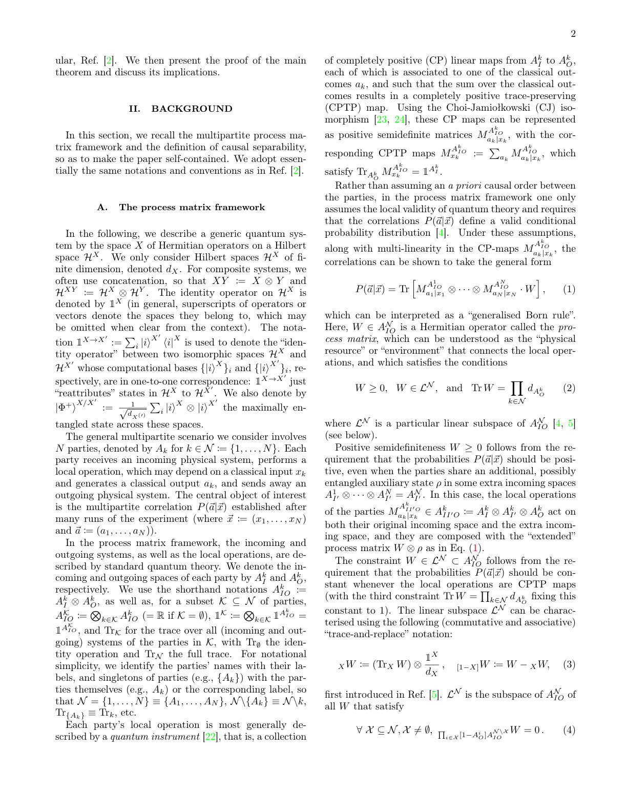
<figcaption class="paper-figure-caption"><b>Fig 1.</b> Low-resolution page preview, page 2</figcaption>
</figure>
<figure class="paper-figure-card">
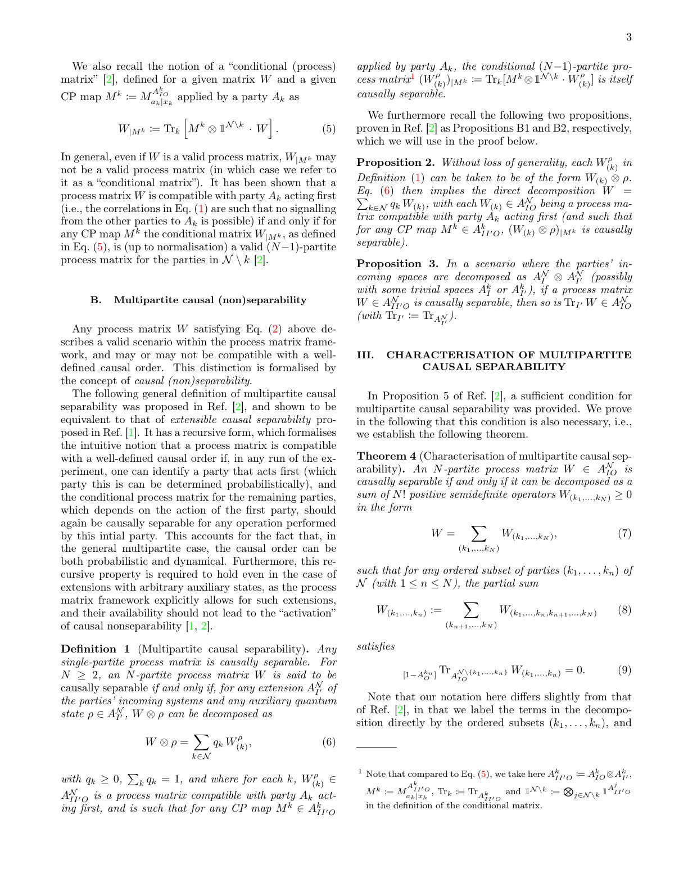
<figcaption class="paper-figure-caption"><b>Fig 2.</b> Low-resolution page preview, page 3</figcaption>
</figure>
<figure class="paper-figure-card">
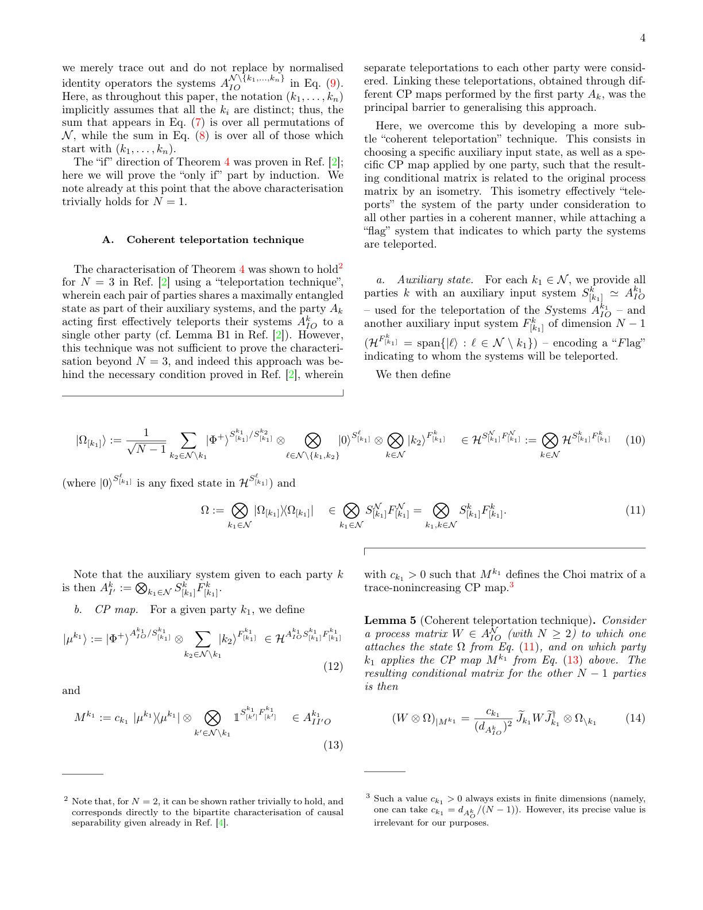
<figcaption class="paper-figure-caption"><b>Fig 3.</b> Low-resolution page preview, page 4</figcaption>
</figure>
<figure class="paper-figure-card">
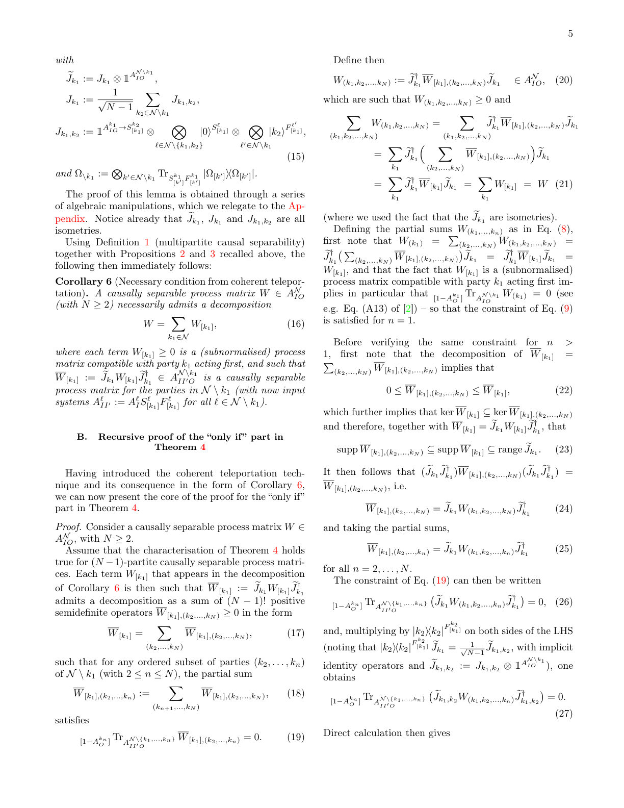
<figcaption class="paper-figure-caption"><b>Fig 4.</b> Low-resolution page preview, page 5</figcaption>
</figure>
<figure class="paper-figure-card">
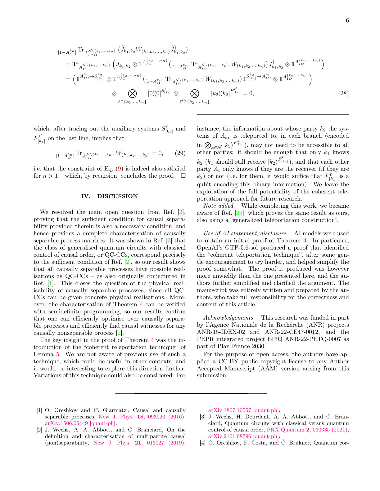
<figcaption class="paper-figure-caption"><b>Fig 5.</b> Low-resolution page preview, page 6</figcaption>
</figure>

**Summary.** This theoretical paper characterizes multipartite causal separability in quantum processes, showing that the abstract mathematical condition is equivalent to the physical realization as a quantum circuit with classical control over the order of operations. By developing a novel 'coherent teleportation technique,' the authors complete the characterization, providing a powerful tool for understanding causality in quantum information theory.

**Why it may be interesting.** This work provides a fundamental structural characterization of quantum correlations based on causality, which is crucial for understanding the limits of quantum computation and communication protocols.

Detailed structure

**Main problem.** The paper aims to provide a complete characterization of causal separability in general multipartite quantum processes.

**Main result.** They prove that a quantum process is causally separable if and only if it can be realized as a quantum circuit where the order of operations is controlled classically (QC-CCs).

**Method.** The authors utilize a novel "coherent teleportation technique" within the process matrix framework to establish the necessity of previously known sufficient conditions.

**Model / system.** The study analyzes multipartite quantum processes described by process matrices $W \in \mathcal{A}^{N}_{IO}$, which encode correlations between $N$ parties performing local quantum operations.

**Key observables.** The process matrix $W$ and the constraint equations derived from the causal separability definition (e.g., Eq. (9)).

**Important parameters / regimes.** The number of parties $N$, and the structure of the local quantum operations (CP maps $M_{A_kIO}^{a_k|x_k}$).

**Assumptions / limitations.** The analysis relies on the process matrix framework and the recursive definition of causal separability.

**Paper structure.** The paper reviews the process matrix framework and causal separability, then employs the coherent teleportation technique to prove that the necessary condition for causal separability is equivalent to the process admitting a QC-CC realization.

Abstract

The concept of causal (non)separability describes whether the causal order between parties that perform local quantum operations is well-defined or indefinite. Causal (non)separability in the general multipartite setting was introduced and studied in [Oreshkov and Giarmatzi, New J. Phys. 18, 093020 (2016); Wechs, Abbott, and Branciard, New J. Phys. 21, 013027 (2019)]. We resolve an open problem from these earlier works by showing -- using a novel "coherent teleportation technique" -- that a sufficient condition for causal separability identified in [Wechs, Abbott, and Branciard, New J. Phys. 21, 013027 (2019)] is also necessary, and thus provides a complete characterisation of multipartite causal separability. A consequence of this result is that all causally separable processes admit a realisation as generalised quantum circuits in which the order between the operations is classically controlled, known as "quantum circuits with classical control of causal order".

[↑ back to top](#top)

### [Asymptotically Good Quantum Locally Testable Codes](http://arxiv.org/abs/2609.20780v1)

**Authors:** William Gay, Fernando Granha Jeronimo  
**Type:** theory · **Category:** quantum information and computing · **PDF:** <https://arxiv.org/pdf/2609.20780v1>  
**Analysis basis:** full PDF text, analyzed in chunks

↔ Scroll figures horizontally

<figure class="paper-figure-card">

<figcaption class="paper-figure-caption"><b>Fig 1.</b> Low-resolution page preview, page 2</figcaption>
</figure>
<figure class="paper-figure-card">
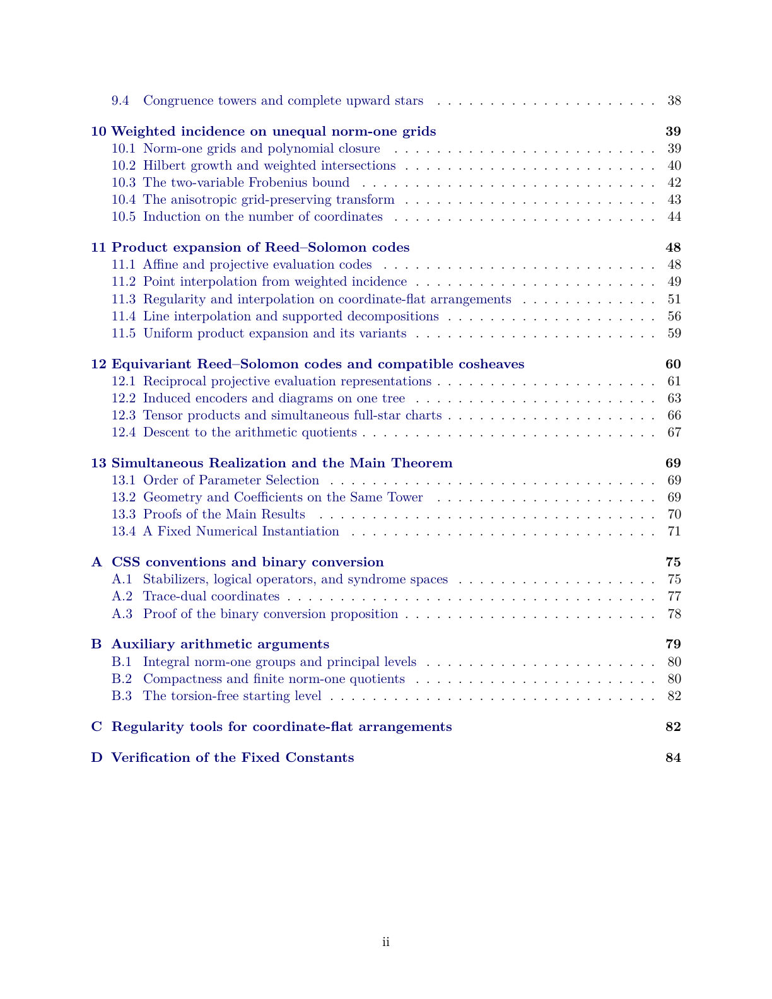
<figcaption class="paper-figure-caption"><b>Fig 2.</b> Low-resolution page preview, page 3</figcaption>
</figure>
<figure class="paper-figure-card">
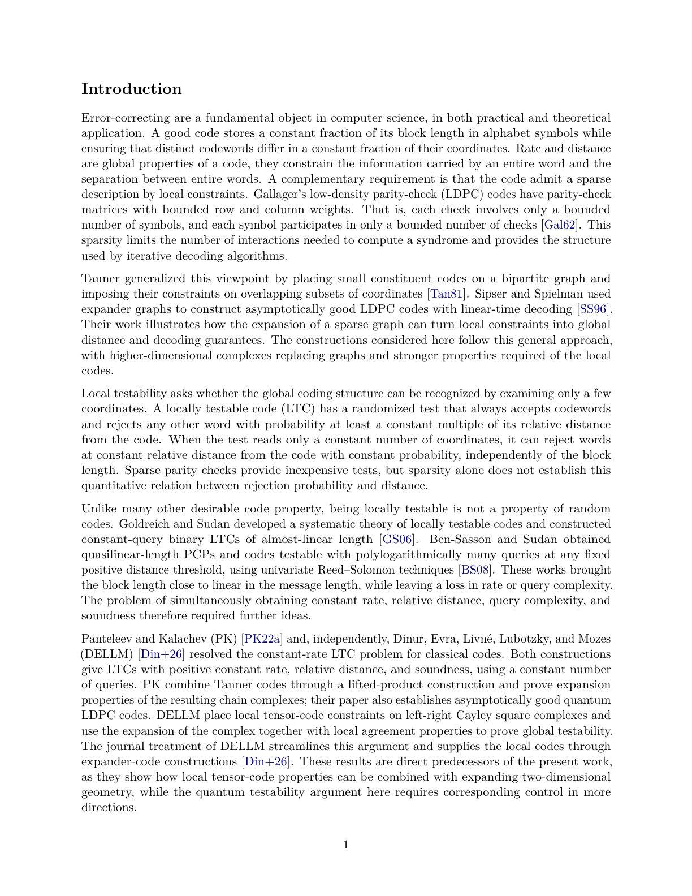
<figcaption class="paper-figure-caption"><b>Fig 3.</b> Low-resolution page preview, page 4</figcaption>
</figure>
<figure class="paper-figure-card">
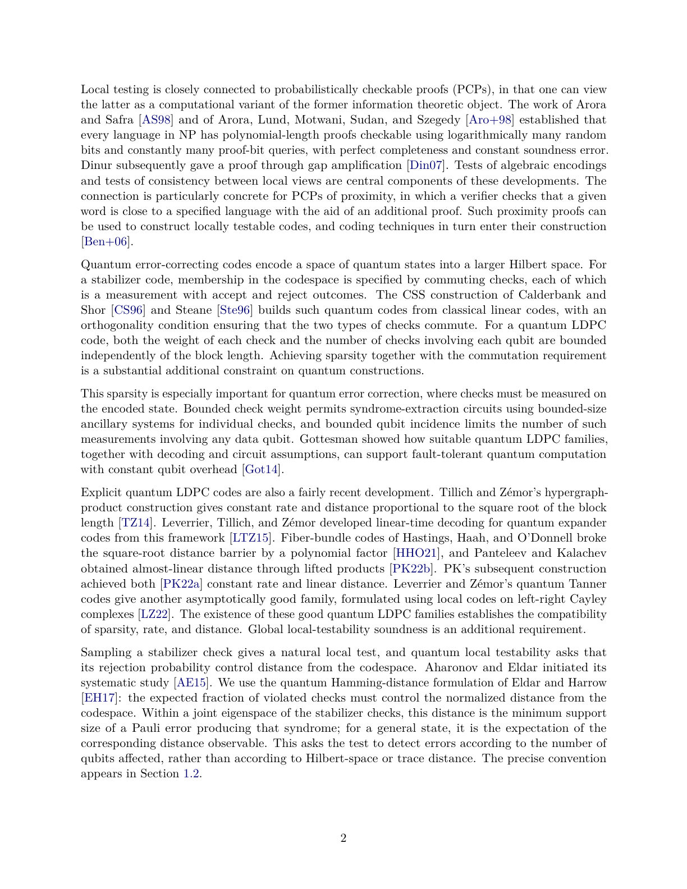
<figcaption class="paper-figure-caption"><b>Fig 4.</b> Low-resolution page preview, page 5</figcaption>
</figure>
<figure class="paper-figure-card">
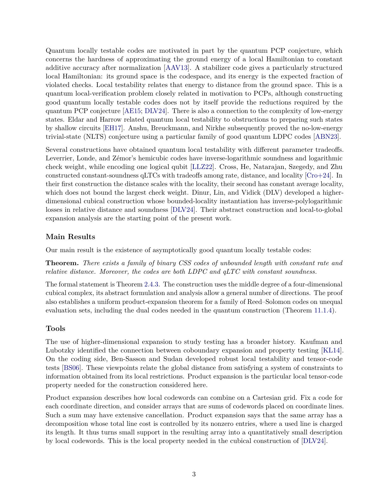
<figcaption class="paper-figure-caption"><b>Fig 5.</b> Low-resolution page preview, page 6</figcaption>
</figure>

**Summary.** This paper presents a theoretical construction of quantum locally testable codes (qLTCs) over qubits. By utilizing advanced algebraic and combinatorial techniques, the authors achieve codes with optimal asymptotic parameters, including constant rate and distance. This is a significant theoretical advance for quantum error correction, enabling the design of robust quantum hardware protocols.

**Why it may be interesting.** This work provides concrete constructions for quantum codes with desirable local testing properties, which is crucial for building fault-tolerant quantum computation protocols.

Detailed structure

**Main problem.** The primary goal is to construct explicit families of asymptotically good quantum locally testable codes (qLTCs) over qubits.

**Main result.** The authors construct explicit quantum LDPC CSS codes that achieve constant rate, constant relative distance, constant weight local testers, and constant soundness.

**Method.** The construction employs advanced algebraic and combinatorial tools, including cubical complexes, cosheaves, and product expansion, adapting abstract frameworks from coding theory and algebraic topology.

**Model / system.** The model is quantum error-correcting codes, specifically focusing on quantum LDPC CSS codes over qubits. The testability relates to the expected fraction of violated checks, which controls the normalized distance from the codespace.

**Key observables.** Code parameters such as rate, relative distance, tester weight, and soundness constant are key observables. Syndrome weight and distance eigenvalues are also central.

**Important parameters / regimes.** The construction requires maintaining constant values for rate, relative distance, tester weight, and soundness, alongside managing complex algebraic parameters related to the underlying geometry.

**Assumptions / limitations.** The work relies on deep mathematical machinery, including the properties of Ramanujan cubical complexes and the ability to reconcile their noncommuting labels with the required differential structure.

**Paper structure.** The paper follows a highly technical development path, moving from general preliminaries to complex constructions involving cubical complexes and cosheaves, culminating in the main theorems establishing the existence of the desired code family.

Abstract

We construct explicit families of asymptotically good quantum locally testable codes over qubits. More precseily, we construct explicit quantum LDPC CSS codes over qubits having constant rate, constant relative distance and constant weight local testers with constant soundness.

[↑ back to top](#top)

### [Coherent error threshold for quantum LDPC codes](http://arxiv.org/abs/2609.20537v1)

**Authors:** Zhengyi Han, Yuanchen Zhao, Yijia Xu, Yixu Wang, Zi-Wen Liu  
**Type:** theory · **Category:** quantum information and computing · **PDF:** <https://arxiv.org/pdf/2609.20537v1>  
**Analysis basis:** full PDF text, analyzed in chunks

↔ Scroll figures horizontally

<figure class="paper-figure-card">
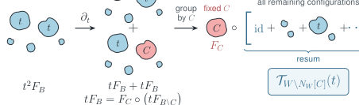
<figcaption class="paper-figure-caption"><b>Fig 1.</b> FIG. 1. Schematic illustration of cluster resummation. (a) A con- figuration in Eq. (7) that contains two large components and several small components. Each large component provides a factor t. (b) Differentiating with respect to t is equivalent to marking each large component C of B in turn and removing its associated factor of t. (c) The terms are grouped by the marked component C, and FC is factored out. Summing the remaining terms, with their associated powers of t, over all configurations B \ C ⊆W \ NW [C] gives TW \NW [C](t), yielding Eq. (8).</figcaption>
</figure>
<figure class="paper-figure-card">
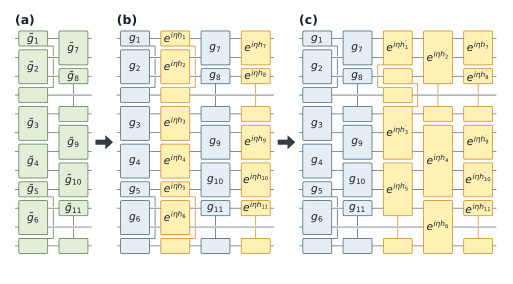
<figcaption class="paper-figure-caption"><b>Fig 2.</b> FIG. 2. Local coherent error arising from a constant-depth logi- cal operation. (a) A two-layer noisy logical operation composed of bounded-support noisy physical gates ˜gi. (b) Each ˜gi can be decom- posed into an ideal physical gate gi and a coherent error gate eiηhi. (c) Propagating every error gate eiηhi through the physical circuit allows the decomposation of the full circuit into a two-layer ideal logical operation followed by a three-layer local coherent error.</figcaption>
</figure>

**Summary.** This paper establishes a nonzero code capacity threshold for quantum LDPC codes against coherent noise, resolving a key challenge in fault tolerance theory. Using a novel 'cluster resummation' technique, the authors prove that the logical error decays exponentially with code distance for noise below this threshold. This provides a strong theoretical foundation for building fault-tolerant quantum technologies.

**Why it may be interesting.** This work provides rigorous, general robustness guarantees for qLDPC codes against coherent noise, which is crucial for designing fault-tolerant quantum computation protocols that must handle realistic, structured noise sources.

Detailed structure

**Main problem.** The paper addresses the challenge of determining the code capacity threshold for quantum Low-Density Parity Check (qLDPC) codes when subjected to coherent errors, which are fundamentally different from standard stochastic Pauli noise.

**Main result.** It proves that general qLDPC codes possess a nonzero code capacity threshold against local coherent noise, ensuring that the logical error decays exponentially with the code distance for noise strengths below this threshold.

**Method.** The core technique is 'cluster resummation,' which allows the authors to exactly resum error contributions from large connected error clusters in the channel expansion, leading to exponential suppression bounds.

**Model / system.** The system involves quantum error correction using qLDPC codes. The noise is modeled by a local coherent error $U$ acting on the qubits, followed by syndrome measurement and recovery.

**Key observables.** Logical error measured in diamond distance ($\lVert \cdot 
Vert_{\diamond}$), and the existence of a nonzero code capacity threshold ($\eta_{th}$).

**Important parameters / regimes.** Code distance $d = \Omega(\log n)$, noise strength $\eta$, and the comparison between optimal recovery and minimum-weight decoding.

**Assumptions / limitations.** The analysis assumes the noise is described by a constant-depth unitary circuit with bounded operator norm generators, and the code distance must scale at least logarithmically with the system size.

**Figures summary.** Figure 1 illustrates the cluster resummation process by showing how an error configuration is decomposed into a large connected cluster and smaller, resummed components.

**Paper structure.** The paper proceeds by defining the coherent noise model, developing the proof for optimal recovery using cluster resummation, and then extending the analysis to minimum-weight decoding, comparing the resulting thresholds.

Abstract

A key appeal of quantum low-density parity check (qLDPC) codes is their ability to suppress stochastic Pauli noise below nonzero thresholds. Coherent errors are fundamentally different: they produce superpositions of error patterns whose amplitudes can interfere even after syndrome measurement. Rigorous understanding of coherent errors remains limited. Here we show that general qLDPC codes admit a nonzero code capacity threshold against local coherent noise and more generally local channel noise. For any family of qLDPC codes with distance $d=Ω(\log n)$, we show that there is a constant noise strength below which the logical recovery error in diamond distance decays exponentially with the code distance. The result is established for optimal recovery as well as the minimum-weight decoder. The key technical ingredient is what we call a \emph{cluster resummation}: rather than bounding superposed error configurations one by one, we isolate a large connected error cluster in the channel expansion and exactly resum all errors disconnected from it before taking norms. Standard cluster counting then yields exponential suppression. This work resolves a longstanding challenge in fault tolerance theory, providing general robustness guarantees for qLDPC codes against coherent noise and laying a rigorous foundation for future studies of fault-tolerant quantum technologies.

[↑ back to top](#top)

### [Crystallographic imperfections and exotic superconductivity of UBe$_{13}$](http://arxiv.org/abs/2609.19678v1)

**Authors:** Andreas Leithe-Jasper, Markus König, Yusei Shimizu, Konstantin Semeniuk, Primož Koželj, Mitja Krnel, Paul Simon, Wilder Carrillo-Cabrera, Nazar Zaremba, Marcel Naumann, Ulrich Burkhardt, Thomas Doert, Yurii Prots, Alfred Amon, Elena Gati, Matthias Vojta, Yuri Grin, Elena Hassinger, Eteri Svanidze  
**Type:** experiment · **Category:** strongly correlated electrons · **PDF:** <https://arxiv.org/pdf/2609.19678v1>  
**Analysis basis:** full PDF text, analyzed in chunks

↔ Scroll figures horizontally

<figure class="paper-figure-card">
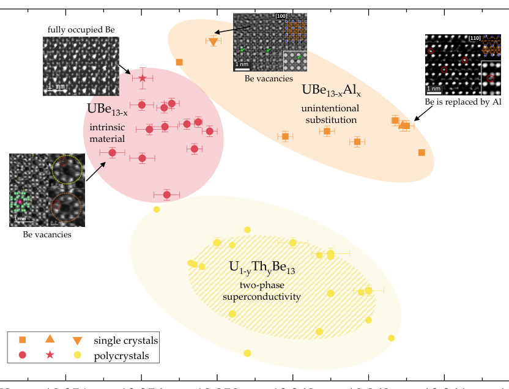
<figcaption class="paper-figure-caption"><b>Fig 1.</b> Figure 1. Interplay of chemistry and physics in U1−yThyBe13−xAlx: superconductivity as a function of structural disorder, as reflected by the value of Tc (vertical axis) vs. lattice parameter a (horizontal axis). Three distinct regions exist, representing three different materials UBe13−x (red, present study), UBe13−xAlx (orange [8]), and U1−yThyBe13 (yellow [9, 10]) – all showing superconductivity, albeit of different character. In some cases, imperfections on the atomic scale can only be seen by means of transmission electron microscopy (insets).</figcaption>
</figure>
<figure class="paper-figure-card">
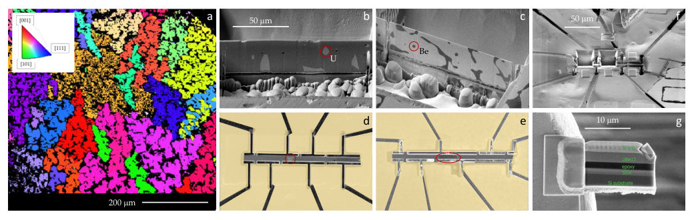
<figcaption class="paper-figure-caption"><b>Fig 2.</b> Figure 2. Extraction of intrinsic electrical resistivity of UBe13−x: (a) Electron back-scatter diffraction is used to estimate grain size. (b) and (c): Inclusions of U (light gray) or Be (dark gray) secondary phases is easily recognizable in the lamellae, extracted from polycrystalline material. (d) and (e): Micro-scale devices, fabricated from polycrystalline samples. The current flow is left to right, which means that several voltage pairs avoid inclusions of U or Be – this allows to capture the intrinsic resistivity of UBe13−x. (f) and (g): A piece from the same device is then used to pinpoint defects on the atomic scale by means of transmission electron microscopy.</figcaption>
</figure>
<figure class="paper-figure-card">
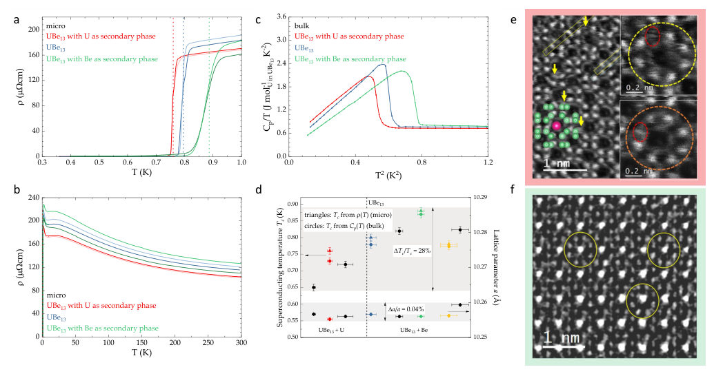
<figcaption class="paper-figure-caption"><b>Fig 3.</b> Figure 3. Intrinsic superconductivity of UBe13−x: (a) and (b) Micro-scale resistivity reveals that the superconducting transition temperature of UBe13−x is changing by almost 30%, depending on whether polycrystalline material is growing from U (red) or Be (green) excess. For all samples, only one superconducting anomaly is observed, with its position being different for different starting U:Be ratios. (c) The specific heat data follow the same trend. (d) All of the UBe13−x grains within a given sample have the same composition, given the agreement between the value of Tc extracted from the micro-scale (triangles, resistivity) and bulk (circles, specific heat) data. Corresponding change in...</figcaption>
</figure>
<figure class="paper-figure-card">
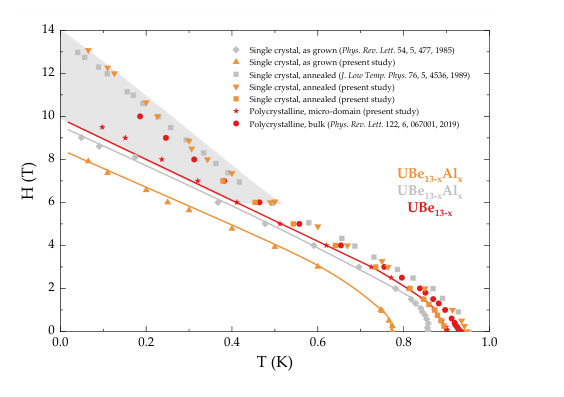
<figcaption class="paper-figure-caption"><b>Fig 4.</b> Figure 4. Comparison of critical fields of UBe13−xAlx and UBe13−x from previous studies on single crystals (gray sym- bols [30, 95]), together with the current work on single crystals (orange), polycrystalline micro-scale (red stars), and bulk (red circles) samples.</figcaption>
</figure>

**Summary.** This work examines the relationship between crystal structure and exotic superconductivity in UBe13. By using microstructuring, the authors demonstrate that even minuscule imperfections, such as Be vacancies, cause drastic changes in the superconducting critical temperature. This highlights the extreme structural sensitivity of unconventional superconductors and suggests that material perfection is crucial for understanding their fundamental physics.

**Why it may be interesting.** The extreme sensitivity of the superconducting state to atomic-scale disorder provides a tangible experimental realization of how local structural perturbations can dramatically alter complex quantum many-body ground states, which is relevant to understanding disorder effects in quantum materials.

Detailed structure

**Main problem.** The study investigates how minute crystallographic imperfections affect the exotic superconductivity observed in UBe13, a heavy-fermion superconductor.

**Main result.** The critical temperature (Tc) of UBe13 is extremely sensitive to Be vacancies, showing drastic changes with minor lattice parameter shifts, suggesting the superconducting gap symmetry is highly dependent on the crystal environment.

**Method.** The research employs microstructuring techniques to isolate single crystallites and measures superconducting properties (Tc, upper critical field) alongside structural characterization (EBSD, TEM).

**Model / system.** The physical system is UBe13, a uranium-based unconventional superconductor, whose properties are studied across various stoichiometric variants (UBe13-x) and impurity-doped forms (UBe13-xAl_x).

**Key observables.** Critical temperature (Tc), upper critical field (Hc2), lattice parameter (a), and electrical resistivity (r(T)).

**Important parameters / regimes.** Lattice parameter changes ($\sim 0.006\%$ causing $28\%$ change in Tc); Be deficiency concentration ($x$); Temperature range (down to 60 mK).

**Assumptions / limitations.** The observed sensitivity is attributed to the oxidation state of uranium being highly sensitive to its local crystal environment, and that strain from secondary phases is insufficient to explain the observed Tc shifts.

**Figures summary.** Figures illustrate the relationship between Tc and lattice parameter for various compounds, show microstructural analysis (EBSD/TEM), and present resistivity/specific heat data comparing samples with different levels of structural disorder.

**Paper structure.** The paper progresses by establishing the link between crystal symmetry and superconducting gap symmetry, detailing microstructural characterization, quantifying the extreme sensitivity of Tc to Be deficiency, and finally comparing these findings with theoretical expectations for unconventional superconductors.

Abstract

The symmetry of the superconducting gap is related to the symmetry of the crystal structure. In unconventional superconductors, big changes of the critical temperature, critical field or even the gap structure can happen even for small perturbations of the lattice. In this letter, we use microstructuring to study aluminium-free crystals of UBe$_{13}$ which are expected to be closer to "perfect" material than previously studied aluminium-grown single crystals. We compare the effect of minuscule imperfections on the value of the critical temperature and critical field, which, in the case of UBe$_{13}$, has drastic effects, supporting its unconventional nature. We conjecture that this likely arises from the oxidation state of uranium, which is sensitive to its crystal environment. Our findings suggests that uranium-based materials provide not only an excellent reservoir of new unconventional phenomena, but also a way to identify the gap symmetry of unconventional superconductors.

[↑ back to top](#top)

### [Disorder on the hyperbolic square lattice I: Anderson delocalization and absolutely continuous spectrum](http://arxiv.org/abs/2609.20798v1)

**Authors:** Simon Becker, Izak Oltman  
**Type:** theory · **Category:** disordered systems and neural networks · **PDF:** <https://arxiv.org/pdf/2609.20798v1>  
**Analysis basis:** full PDF text, analyzed in chunks

↔ Scroll figures horizontally

<figure class="paper-figure-card">
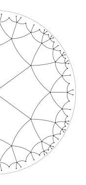
<figcaption class="paper-figure-caption"><b>Fig 1.</b> Figure 2. A finite portion of the graph G4,5. Each vertex is the corner of exactly five squares.</figcaption>
</figure>

**Summary.** This paper analyzes the Anderson model on a hyperbolic square lattice to determine if the electronic spectrum is localized or extended. The authors prove that under weak disorder, the spectrum exhibits a purely absolutely continuous component, confirming quantum delocalization. The methodology is highly technical, relying on advanced spectral theory applied to random operators on curved graphs.

**Why it may be interesting.** The study of Anderson localization on non-Euclidean geometries like hyperbolic lattices is crucial for understanding wave propagation and transport in complex, curved media, which has implications for quantum chaos and disordered quantum systems.

Detailed structure

**Main problem.** The paper investigates the nature of the spectrum (specifically, the existence of absolutely continuous spectrum) for the Anderson model on a hyperbolic lattice.

**Main result.** The authors prove that for weak disorder and under certain conditions, the spectrum is purely absolutely continuous on specific intervals, indicating delocalization.

**Method.** The analysis employs advanced spectral theory, utilizing the resolvent operator, comparing path counts with coupling decay, and applying techniques related to Poincaré inequalities.

**Model / system.** The system is the Anderson model, defined by the Hamiltonian $H_{\lambda, \omega} = A_d + V_\omega$, where $A_d$ is the adjacency operator on the hyperbolic square lattice $G_{4,5}$ (or its Cartesian product), and $V_\omega$ is a random potential.

**Key observables.** Local spectral measure $\mu_{\omega, x}$, the absolutely continuous part $(\mu_{\omega, x})_{ac}$, and the local spectral density $rac{1}{\pi} 	ext{Im } G_{xx}(E + i0)$.

**Important parameters / regimes.** Disorder strength $\lambda$, the geometry of the lattice (hyperbolic), and the bounds on the disorder potential $
ho$.

**Assumptions / limitations.** The disorder potential $
ho$ is assumed to be bounded and have a positive density on a central interval; the analysis relies on controlling interference between paths.

**Figures summary.** Figure 1 compares spectral behavior (localization vs. a.c. spectrum) across different lattices ($\mathbb{Z}, \mathbb{Z}^2$, hyperbolic); Figure 2 illustrates the hyperbolic graph structure.

**Paper structure.** The paper builds from defining the model and the goal (proving a.c. spectrum) to developing mathematical machinery involving resolvents and self-energies, culminating in the application of spectral inequalities to establish the final result.

Abstract

We study the Anderson model on hyperbolic lattices. The graph is the Cartesian product of the Euclidean lattice with the regular hyperbolic square lattice having five squares at each vertex. We prove the existence of absolutely continuous spectrum and the absence of singular spectrum on a deterministic set of positive measure at weak disorder, and for $0<λ\le2$ when the single-site density is bounded below on $[-1,1]$. Truncated Cauchy distributions and controlled perturbations give purely absolutely continuous spectrum on intervals.

[↑ back to top](#top)

### [Hardness of Pathfinding in a Welded Tree](http://arxiv.org/abs/2609.20651v1)

**Authors:** David Miloschewsky, Supartha Podder  
**Type:** theory · **Category:** quantum information and computing · **PDF:** <https://arxiv.org/pdf/2609.20651v1>  
**Analysis basis:** full PDF text, analyzed in chunks

↔ Scroll figures horizontally

<figure class="paper-figure-card">
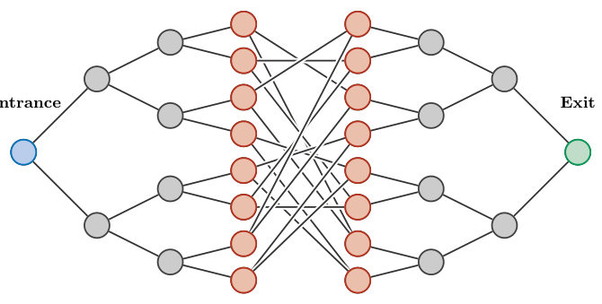
<figcaption class="paper-figure-caption"><b>Fig 1.</b> Figure 1: An instance of a welded tree graph. The blue node is the entrance, the green node is the exit and the red nodes are the leaves. The edges between the leaves are the weld edges.</figcaption>
</figure>
<figure class="paper-figure-card">
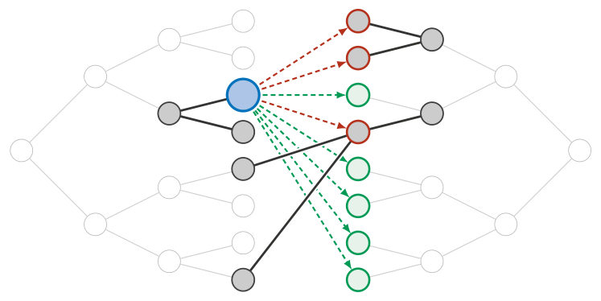
<figcaption class="paper-figure-caption"><b>Fig 2.</b> Figure 2: Example of a fresh query of a welded edge. The blue node is the origin, gray nodes and edges represent the recorded information in (L, C), green nodes are available connections and red nodes are forbidden under the freshness condition. Note that in the actual oracle, every column in the middle of the graph behaves this way.</figcaption>
</figure>
<figure class="paper-figure-card">
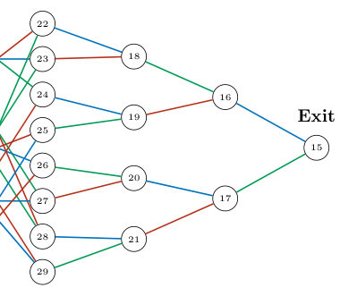
<figcaption class="paper-figure-caption"><b>Fig 3.</b> Figure 3: An instance of a welded tree G3.</figcaption>
</figure>
<figure class="paper-figure-card">
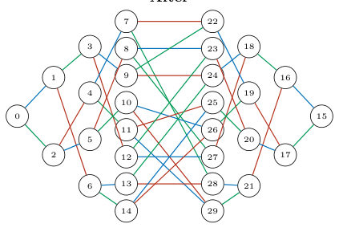
<figcaption class="paper-figure-caption"><b>Fig 4.</b> Figure 4: An example of an application of σedg on G3 (σlabel is 1).</figcaption>
</figure>

**Summary.** This paper proves a strong quantum query lower bound for finding a path between two points in a welded tree graph. By employing advanced techniques involving compressed permutation oracles, the authors demonstrate that the required number of queries grows exponentially with the height of the tree. This result contrasts with known quantum speedups for simply locating the exit vertex.

**Why it may be interesting.** The work establishes a fundamental quantum query lower bound for pathfinding in a structured graph, providing a theoretical limit on the efficiency of quantum computation for graph traversal problems.

Detailed structure

**Main problem.** The paper addresses the open question of whether an efficient quantum algorithm exists to output a path from an entrance to an exit vertex in a welded tree graph.

**Main result.** The authors prove an exponential quantum query lower bound, showing that any quantum algorithm requires at least $\Omega(2^{n/24})$ queries to find the path with constant probability.

**Method.** The proof utilizes the compressed permutation oracle technique within a recording/compressed oracle framework to construct databases tracking learned graph information.

**Model / system.** The model is a welded tree graph ($G_n$), which is constructed from two binary trees whose leaves are joined by a cycle. The analysis focuses on the query complexity of algorithms operating on this graph structure.

**Key observables.** Query complexity (lower bound $\Omega(N^{1/24})$), success probability of path output ($O(q^6 N^{-1/4})$), and the state of the recorded information in databases $(L, C)$.

**Important parameters / regimes.** Graph height $n$, number of queries $q$, and the size of the graph $N$.

**Assumptions / limitations.** The proof relies on constructing a 'fresh oracle' ($\hat{	ext{cpWT}}$) and uses techniques from previous work regarding compressed query operators.

**Figures summary.** Figure 1 illustrates the welded tree graph with marked entrance, exit, and leaves. Figure 2 provides an example of a fresh query, distinguishing between recorded information and available/forbidden connections.

**Paper structure.** The paper develops the proof by first establishing necessary lemmas regarding the difference between compressed and uncompressed query operators (using block partitions), and then applying these bounds to the specific structure of the welded tree to derive the final exponential lower bound for pathfinding.

Abstract

Starting from the entrance of a welded tree, a quantum walk algorithm can find its exit vertex exponentially faster than any classical algorithm. However, it has been an open question whether any quantum algorithm is able to efficiently find a path from the entrance to the exit. We answer this by proving an exponential quantum query lower bound for finding such path. Specifically, for trees of height $n$, any quantum query algorithm requires at least $Ω(2^{n/24})$ queries in order to succeed with constant probability.   Our proof uses the compressed permutation oracle technique in order to construct databases which track the graph information an algorithm has learned and forgotten, and show that no efficient quantum algorithm can build an entrance-to-exit path in these records.

[↑ back to top](#top)

### [Improving Sample Efficiency in Peptide-HLA Binding Prediction with Hybrid Quantum-Classical Neural Networks](http://arxiv.org/abs/2609.19642v1)

**Authors:** Chenyan Jia, Cong Guo, Siyue Chen, Pengpeng Ye, Xiaochun Chen  
**Type:** both · **Category:** disordered systems and neural networks · **PDF:** <https://arxiv.org/pdf/2609.19642v1>  
**Analysis basis:** full PDF text, analyzed in chunks

↔ Scroll figures horizontally

<figure class="paper-figure-card">
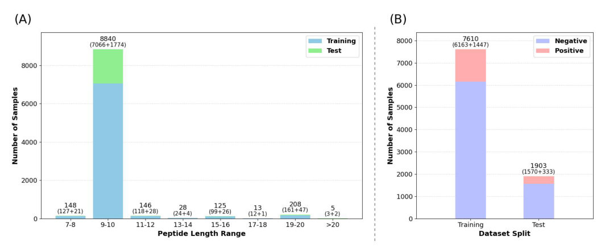
<figcaption class="paper-figure-caption"><b>Fig 1.</b> Fig. 1 Dataset composition and peptide length distribution. (A) Distribution of peptide lengths. (B) Class distribution of</figcaption>
</figure>
<figure class="paper-figure-card">
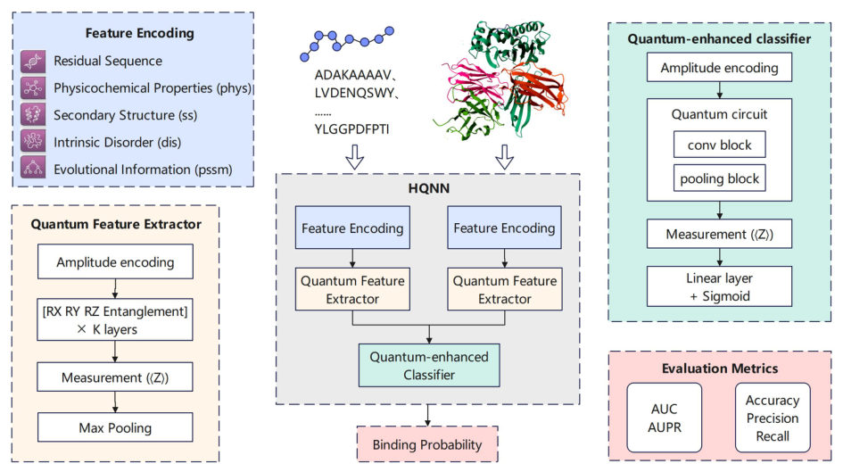
<figcaption class="paper-figure-caption"><b>Fig 2.</b> Fig. 2 Overview of the HQNN framework . HQNN consists of three components: Feature Encoding, Quantum Feature</figcaption>
</figure>
<figure class="paper-figure-card">
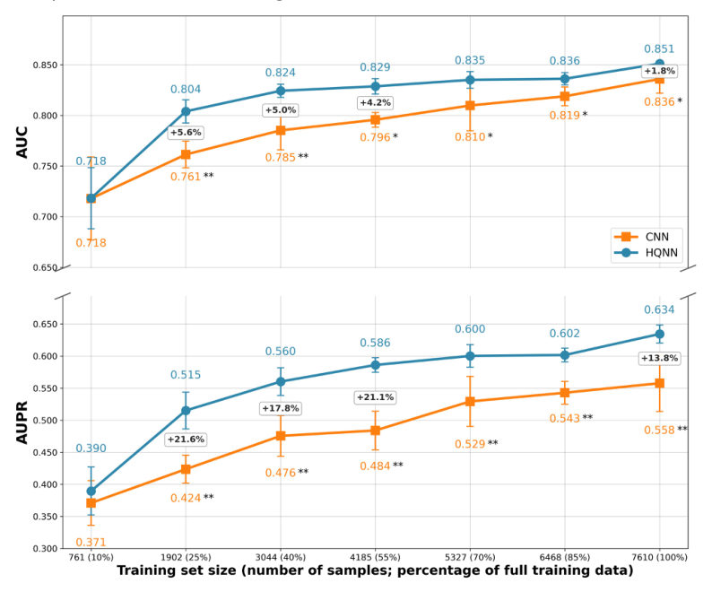
<figcaption class="paper-figure-caption"><b>Fig 3.</b> Fig. 3 Sample efficiency comparison between HQNN and CNN on HLA-A*02:01. Statistical significance uses t-test: *P &lt;.05,</figcaption>
</figure>
<figure class="paper-figure-card">
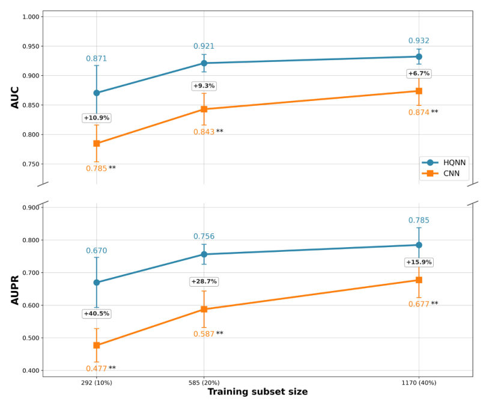
<figcaption class="paper-figure-caption"><b>Fig 4.</b> Fig. 4 Cross-allele performance comparison on HLA-B*07:02 under different training data scales. Statistical significance</figcaption>
</figure>
<figure class="paper-figure-card">
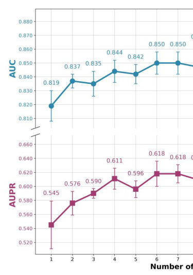
<figcaption class="paper-figure-caption"><b>Fig 5.</b> Fig. 5 Impact of quantum feature extractor depth on model performance</figcaption>
</figure>

**Summary.** This work proposes a Hybrid Quantum-Classical Neural Network (HQNN) to solve the data scarcity problem in predicting peptide-HLA binding for cancer immunotherapy. By integrating quantum feature extractors, the model demonstrates superior performance compared to classical methods, especially when training data is limited. This suggests that quantum machine learning architectures can provide practical, sample-efficient tools for complex biological prediction tasks.

**Why it may be interesting.** The application of quantum circuits to encode complex, high-dimensional biological feature spaces (like amino acid properties) and enhance learning in data-scarce regimes is a direct intersection of quantum machine learning and biophysics, relevant to understanding complex system representations.

Detailed structure

**Main problem.** The core challenge is improving the sample efficiency of peptide-HLA binding prediction, which is crucial for personalized cancer immunotherapy but suffers from extremely limited training data for many HLA alleles.

**Main result.** The proposed Hybrid Quantum-Classical Neural Network (HQNN) consistently outperforms classical CNN baselines across all tested training sizes, with the performance gap widening significantly in low-data regimes.

**Method.** The authors developed an HQNN that integrates multi-source biological feature encoding with parallel quantum feature extractors and a quantum-enhanced classifier.

**Model / system.** The system models the binding interaction between peptides and HLA molecules. The model utilizes parameterized quantum circuits (PQC) within the feature extractor, processing encoded residue features to induce beneficial inductive biases for small datasets.

**Key observables.** AUC, AUPR, Accuracy, Precision, and Recall, measured across various training data proportions.

**Important parameters / regimes.** Low-data regimes (subsampling training sets down to 10% of original data); quantum hardware noise levels ($T_1, T_2$, gate error rates).

**Assumptions / limitations.** The quantum circuits are assumed to provide practical sample-efficiency gains, and performance is tested under realistic, though simulated, quantum hardware noise levels.

**Figures summary.** Figures show dataset composition, performance comparison across training sizes (showing HQNN advantage), and t-SNE visualizations comparing feature clustering between HQNN and CNN embeddings.

**Paper structure.** The paper establishes the clinical need (neoantigen prediction), introduces the HQNN architecture (encoding, quantum feature extraction, classification), rigorously compares it against classical baselines (CNN, CAMP, NetMHCpan4.1), and validates its superior sample efficiency and robustness under noise.

Abstract

Peptide-HLA binding prediction is a critical step in neoantigen identification for personalized cancer immunotherapy and holds significant clinical value. However, the training data available for many HLA alleles are extremely limited, which severely constrains the performance of conventional methods on this task. Parameterized quantum circuits are hypothesized to induce inductive biases beneficial for learning from small datasets, yet their application to biological sequence prediction remains underexplored. To address this, we propose a hybrid quantum-classical neural network (HQNN) specifically designed for peptide-HLA binding prediction. HQNN integrates multi-source biological feature encoding with parallel quantum feature extractors and a quantum-enhanced classifier. On two HLA alleles (A*02:01 and B*07:02), HQNN outperforms a parameter-matched classical CNN baseline across all training sizes, with the performance gap widening as training data decreases. Ablation studies confirm the respective contributions of the quantum feature extraction module and the quantum classifier. In noise-aware simulations, performance degrades only mildly, and such degradation is reasonable and acceptable under realistic quantum hardware noise levels. These results suggest that hybrid quantum-classical architectures can provide practical sample-efficiency gains for immunoinformatics tasks in low-data regimes.

[↑ back to top](#top)

### [Landau diamagnetism and the de Haas-van Alphen effect from a single geometric construction](http://arxiv.org/abs/2609.20146v1)

**Authors:** Sung-Hoon Lee  
**Type:** theory · **Category:** statistical mechanics · **PDF:** <https://arxiv.org/pdf/2609.20146v1>  
**Analysis basis:** full PDF text, analyzed in chunks

↔ Scroll figures horizontally

<figure class="paper-figure-card">
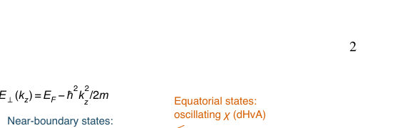
<figcaption class="paper-figure-caption"><b>Fig 1.</b> Fig. 2</figcaption>
</figure>
<figure class="paper-figure-card">
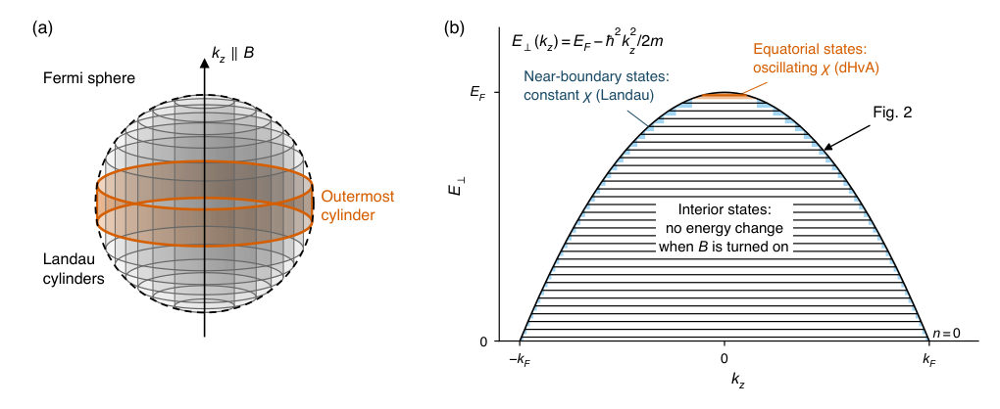
<figcaption class="paper-figure-caption"><b>Fig 2.</b> FIG. 1. (a) Landau cylinders inside the Fermi sphere (dashed silhouette). The outermost occupied cylinder (orange) is a thin band near the equator: its level energy 𝐸𝑛lies just below 𝐸𝐹, so only a short segment around 𝑘𝑧= 0 is occupied. (b) The same system in the (𝑘𝑧, 𝐸⊥) plane, with a denser ladder (32 occupied levels; the spacing is still hugely exaggerated, ℏ𝜔𝐵/𝐸𝐹∼10−5 in reality). Landau cylinders are horizontal lines; the occupied segments lie below the boundary parabola of Eq. (3). Each shaded triangle is the occupied part of one strip 𝐸𝑛± 1</figcaption>
</figure>
<figure class="paper-figure-card">
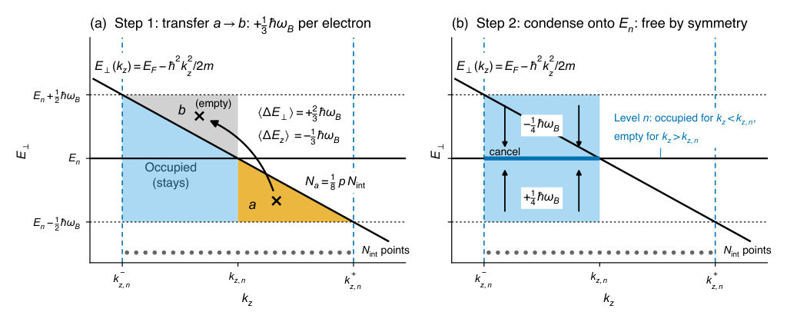
<figcaption class="paper-figure-caption"><b>Fig 3.</b> FIG. 2. The triangle construction in one tiling interval (the interval marked in Fig. 1(b), magnified; the boundary is locally linear). (a) Step 1: the occupied triangle 𝑎(yellow), which contains 𝑁𝑎= 1</figcaption>
</figure>
<figure class="paper-figure-card">
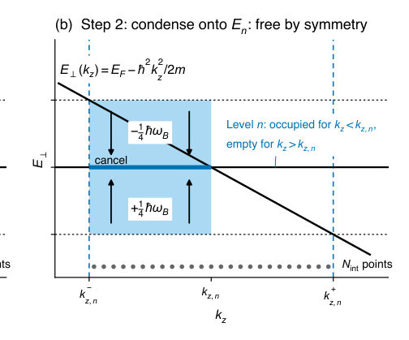
<figcaption class="paper-figure-caption"><b>Fig 4.</b> Figure 2 magnifies one interval. The boundary crosses the upper strip edge at 𝑘− 𝑧,𝑛, the level 𝐸𝑛at 𝑘𝑧,𝑛, and the lower strip edge at 𝑘+ 𝑧,𝑛; by linearity, 𝑘𝑧,𝑛bisects the interval. At 𝐵= 0 the occupied strip states are those below the boundary line: for 𝑘𝑧&lt; 𝑘𝑧,𝑛the column is filled beyond the level (blue region of Fig. 2), while for 𝑘𝑧&gt; 𝑘𝑧,𝑛the occupied states form the triangle 𝑎and the states of triangle 𝑏are empty. The ground state at 𝐵≠0 is built in two steps. Step 1: transfer. Move the electrons of triangle 𝑎into trian- gle 𝑏. The two triangles are congruent, so the books balance locally and exactly: no reservoir, no averaging assumption. The energy cost per electron follows from the...</figcaption>
</figure>
<figure class="paper-figure-card">
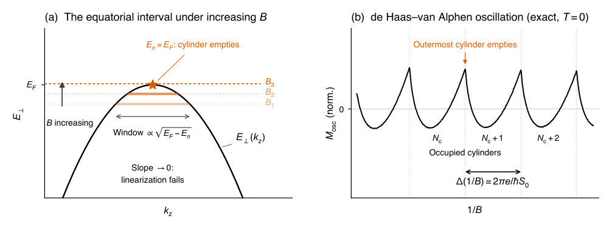
<figcaption class="paper-figure-caption"><b>Fig 5.</b> FIG. 3. (a) The equatorial interval under increasing field. The topmost level [the outermost cylinder of Fig. 1(a)] rises with 𝐵(𝐵1 &lt; 𝐵2 &lt; 𝐵3); its occupied window (11) shrinks like a square root and vanishes when 𝐸𝑛= 𝐸𝐹(star): one cylinder empties. (b) The resulting oscillation of the magnetization, computed at 𝑇= 0 for the free-electron gas in reduced units, by direct state counting as in the Supplementary Information. Dotted verticals mark the events of panel (a); between events the number of occupied cylinders 𝑁𝑐is constant; the period is Eq. (12).</figcaption>
</figure>

**Summary.** This paper presents an elementary geometric method to derive Landau diamagnetism and explain the de Haas-van Alphen effect for a free-electron gas. It achieves this by tiling the occupied states into Landau levels, showing that the smooth susceptibility comes from regular intervals, while the characteristic oscillations emerge precisely where the geometric tiling breaks down near the Fermi surface extrema. The work provides a unified, intuitive understanding of these fundamental quantum oscillations.

**Why it may be interesting.** While focused on solid-state magnetism, the method's reliance on systematic state counting and the geometric interpretation of quantum oscillations (stationary phase arguments) provides a powerful, elementary analogy for analyzing complex many-body phenomena in other quantum systems.

Detailed structure

**Main problem.** To derive Landau diamagnetism and explain the de Haas-van Alphen (dHvA) oscillations using a single, elementary geometric construction, overcoming limitations of standard derivations.

**Main result.** The smooth diamagnetic susceptibility is derived from the energy cost across non-extremal Landau level intervals, while the dHvA oscillations arise specifically from the failure of the geometric tiling near the extremal cross section of the Fermi surface.

**Method.** The authors employ a geometric construction by tiling the $k_z$-axis into strips corresponding to Landau levels and analyzing the energy cost of state transfer between congruent triangles within each interval.

**Model / system.** The system is a free-electron gas subjected to a uniform magnetic field $\mathbf{B} = B\hat{z}$. The physics is analyzed by projecting the occupied states onto a 2D plane of perpendicular energy ($E_\perp$) versus $k_z$.

**Key observables.** Landau susceptibility ($\chi_L$), dHvA oscillations in magnetization ($M$), and the Onsager period ($\Delta(1/B)$).

**Important parameters / regimes.** Zero temperature ($T=0$), magnetic field $B$, Fermi energy $E_F$, and the cyclotron frequency $\omega_B$.

**Assumptions / limitations.** The primary assumption is the ability to linearize the occupation boundary across one Landau level interval, which is known to fail only near the extremal cross section.

**Figures summary.** Figures illustrate the Landau cylinder projection, the 'triangle construction' for energy transfer in a single interval, and numerical results showing the smooth background and the oscillatory residual contribution near the apex.

**Paper structure.** The paper introduces the problem by contrasting standard derivations with the proposed geometric method. It details the state-counting mechanism via interval tiling, derives the smooth diamagnetic term from the flanks, and then analyzes the oscillatory term arising from the failure of the tiling near the extremal cross section, culminating in numerical verification.

Abstract

Landau diamagnetism is usually derived from the grand canonical potential, a calculation that yields the correct susceptibility but little physical insight, while the rule that extremal cross sections govern the de Haas-van Alphen (dHvA) oscillations is commonly asserted rather than exhibited. We present an elementary zero-temperature construction in which the occupied states of a free-electron gas are grouped, interval by interval along the field direction, into the Landau levels onto which they condense. Within each interval the field-induced energy cost reduces to a transfer of states between two congruent triangles, and center-of-mass arithmetic yields the Landau susceptibility. The construction fails only in a narrow neighborhood of an extremal cross section of the Fermi surface; there the contribution oscillates with the dHvA period, one oscillation for each Landau level that passes through the extremal cross section. Direct zero-temperature state counting locates the oscillation: the residual is concentrated in the few intervals nearest the extremal cross section, the summed contribution of the distant ones being negligible on the scale of the peak oscillation amplitude.

[↑ back to top](#top)

### [Local unitary equivalence of orthogonal arrays and related linear codes](http://arxiv.org/abs/2609.19811v1)

**Authors:** Miaomiao Zheng, Yajuan Zang, Xiuling Shan, Zihong Tian  
**Type:** theory · **Category:** quantum information and computing · **PDF:** <https://arxiv.org/pdf/2609.19811v1>  
**Analysis basis:** full PDF text, analyzed in chunks

↔ Scroll figures horizontally

<figure class="paper-figure-card">
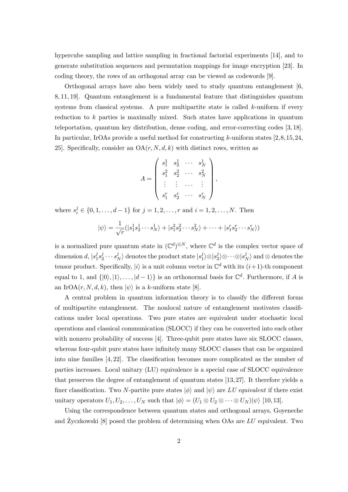
<figcaption class="paper-figure-caption"><b>Fig 1.</b> Low-resolution page preview, page 2</figcaption>
</figure>
<figure class="paper-figure-card">
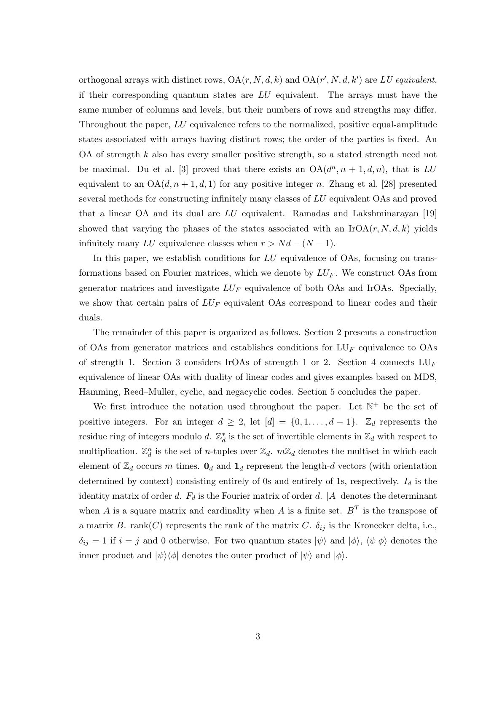
<figcaption class="paper-figure-caption"><b>Fig 2.</b> Low-resolution page preview, page 3</figcaption>
</figure>
<figure class="paper-figure-card">
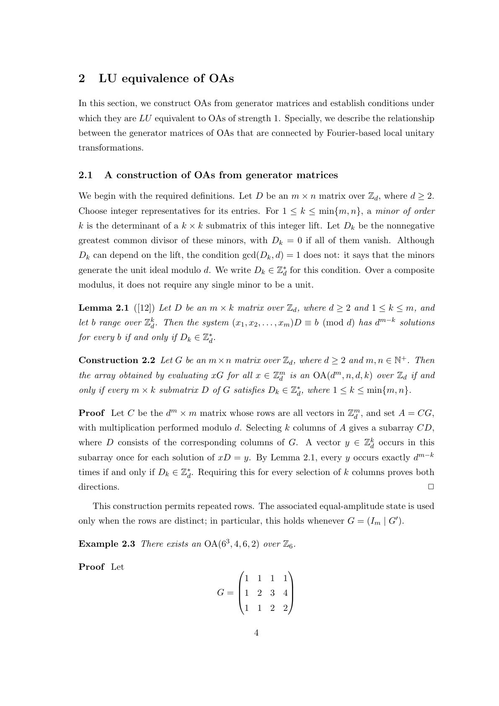
<figcaption class="paper-figure-caption"><b>Fig 3.</b> Low-resolution page preview, page 4</figcaption>
</figure>
<figure class="paper-figure-card">
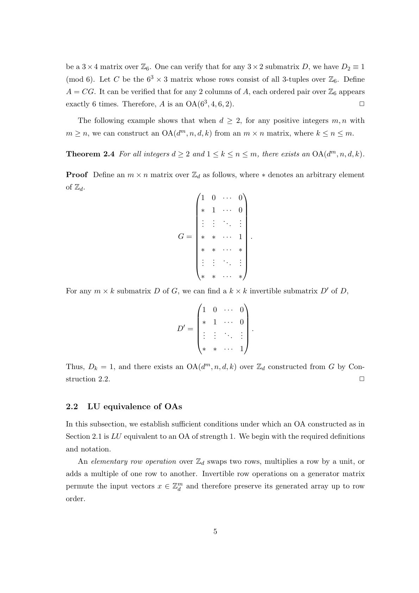
<figcaption class="paper-figure-caption"><b>Fig 4.</b> Low-resolution page preview, page 5</figcaption>
</figure>
<figure class="paper-figure-card">
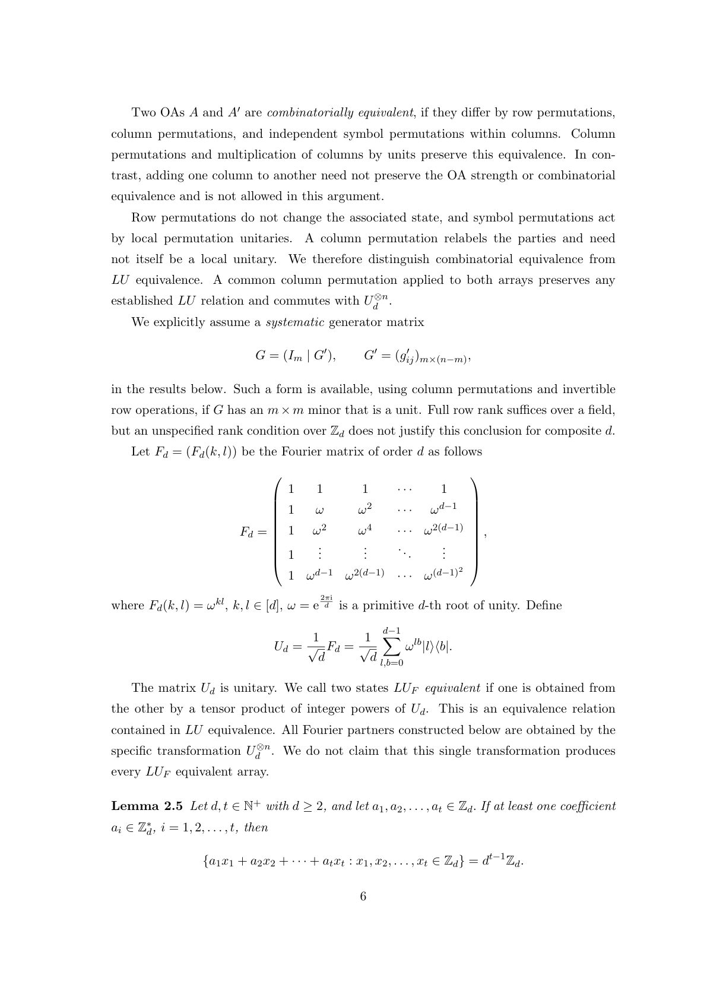
<figcaption class="paper-figure-caption"><b>Fig 5.</b> Low-resolution page preview, page 6</figcaption>
</figure>

**Summary.** This paper connects the combinatorial theory of Orthogonal Arrays (OAs) to the quantum theory of multipartite entanglement via Local Unitary (LU) equivalence. By relating OAs to quantum states, the authors establish that the LU equivalence of these states is directly determined by the relationship between the underlying linear codes and their duals. This provides powerful tools for classifying quantum states arising from structured experimental designs.

**Why it may be interesting.** This work provides a rigorous mathematical framework for classifying quantum states derived from structured combinatorial objects (OAs), which is crucial for understanding the resource theory of quantum information.

Detailed structure

**Main problem.** The paper determines the conditions under which Orthogonal Arrays (OAs) are Locally Unitary (LU) equivalent, establishing a deep connection between this combinatorial structure and quantum error-correcting codes.

**Main result.** It provides explicit constructions showing that the Fourier partners of OAs generated by linear codes and their duals are LU equivalent, yielding specific parameters for these equivalent arrays.

**Method.** The analysis uses linear algebra over finite fields ($\mathbb{Z}_d$) to construct OAs from generator matrices and employs the Fourier transform to establish the necessary conditions for LUF equivalence.

**Model / system.** The physical system involves multipartite pure quantum states $|\psi
angle$ constructed from OAs, which are related to experimental design and quantum information theory. The mathematical framework relies on the properties of linear codes and their duals.

**Key observables.** Local Unitary (LU) equivalence, the strength ($t$) of the OA, and the parameters of the associated linear codes (e.g., minimum distance).

**Important parameters / regimes.** The alphabet size $d$, the number of parties $N$, and the parameters defining the OA structure $	ext{OA}(N, M, d, t)$.

**Assumptions / limitations.** The analysis often assumes the existence of specific code structures (like cyclic/negacyclic codes) and focuses on LUF equivalence, a specific type of LU equivalence.

**Figures summary.** Not specified, but the text relies heavily on matrix representations (generator matrices $G, G', G''$) and mathematical formulas.

**Paper structure.** The paper systematically builds the connection by first defining the OA-to-state mapping, then establishing conditions for LUF equivalence using generator matrices, and finally applying these tools to show that OAs derived from dual codes are equivalent.

Abstract

Orthogonal arrays (OAs) are combinatorial configurations with applications in experimental design, error-correcting codes, and quantum information. Local unitary (LU) equivalence provides a natural framework for classifying multipartite entangled states. Using the correspondence between OAs and quantum states, Goyeneche and Życzkowski [Phys. Rev. A, 2014, 90: 022316] posed the problem of determining when OAs are $LU$ equivalent. In this paper, we construct OAs from generator matrices and establish conditions for Fourier-based $LU$ equivalence of OAs and irredundant orthogonal arrays (IrOAs). For prime alphabets, we identify the Fourier partners of the linear OAs considered here with the arrays of their corresponding dual codes. This gives an explicit connection between $LU$ equivalence and coding theory. We also identify families of $LU$ equivalent OAs arising from specific classes of linear codes.

[↑ back to top](#top)

### [Long-horizon autoformalization of a core theorem underlying MIP* = RE](http://arxiv.org/abs/2609.19814v1)

**Authors:** Sirui Lu, Ruixuan Deng, Yanqiao Zhu, Zhengfeng Ji  
**Type:** theory · **Category:** quantum information and computing · **PDF:** <https://arxiv.org/pdf/2609.19814v1>  
**Analysis basis:** full PDF text, analyzed in chunks

↔ Scroll figures horizontally

<figure class="paper-figure-card">
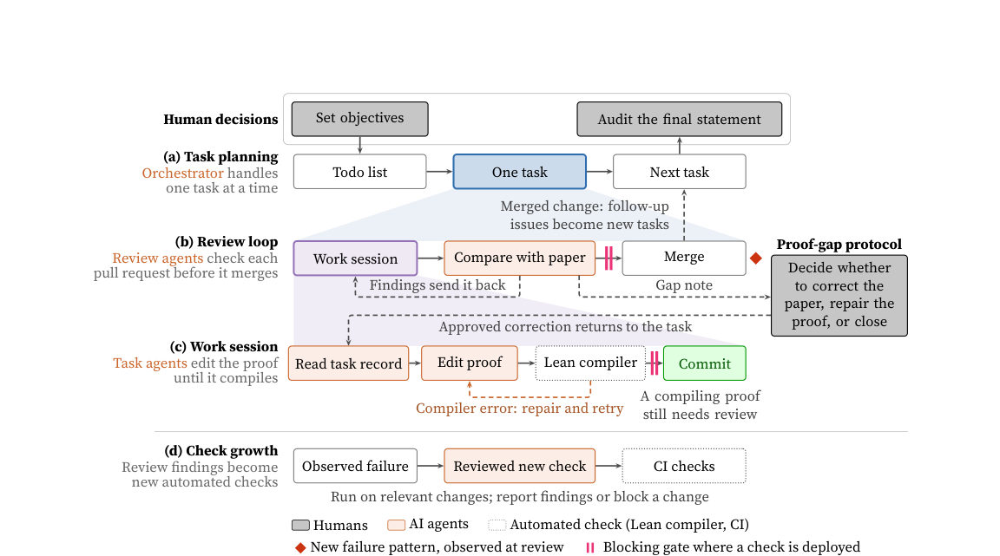
<figcaption class="paper-figure-caption"><b>Fig 1.</b> Figure 1 | Three nested scales of work and one cross‑scale process. Rows (a)–(c) read from the largest scale to the smallest: (a) task planning, (b) the review loop, and (c) the work session, inside which the proof loop repeats until the proof compiles. The highlighted task expands into the review row, and the highlighted session expands into the work‑session row. In (a), the orchestrator takes one task at a time from the todo list; the follow‑up issues of a merged change become new tasks. In (b), review agents compare each pull request with the paper: findings send it back to the work session, and a passing request merges through a blocking gate. In (c), task agents read the task record...</figcaption>
</figure>
<figure class="paper-figure-card">
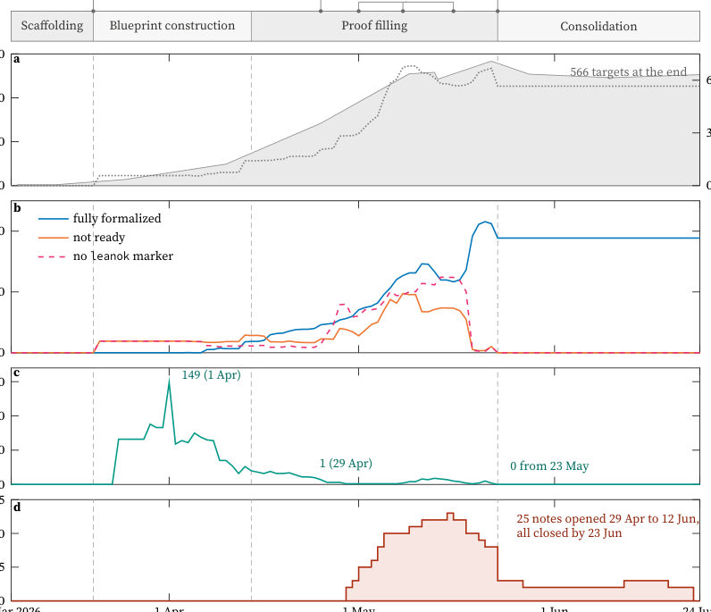
<figcaption class="paper-figure-caption"><b>Fig 2.</b> Figure 2 | Two measures of progress, 7 March to 24 June 2026. The ribbon marks the four phases of the work and the events that separated them; dashed lines carry the phase boundaries through the panels. By the compiler’s measure (c), the proof was nearly done seven weeks in: the sorry count rose to 149 on 1 April as the Lean skeleton was stubbed out, then fell to one by 29 April. By the blueprint’s measure (b) it was not: that day 114 of 283 target declarations were still not ready (orange) and 240 carried no leanok marker (dashed magenta). The next three weeks went into statements and interfaces rather than placeholders. The blueprint grew to 681 targets (a, dotted, right axis), the...</figcaption>
</figure>
<figure class="paper-figure-card">
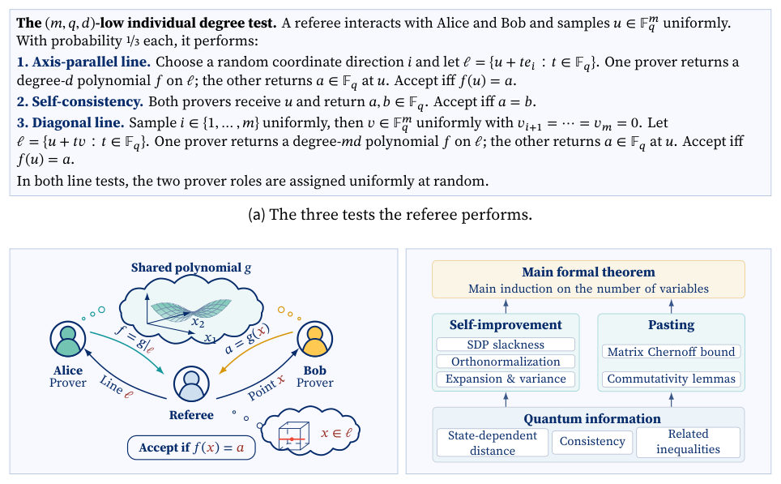
<figcaption class="paper-figure-caption"><b>Fig 3.</b> Figure 3 | The low individual‑degree test and its formal proof. (a) The referee plays one of three tests with the two provers, Alice and Bob. (b) An honest strategy uses a shared polynomial 𝑔: Alice returns 𝑓= 𝑔|ℓ and Bob returns 𝑎= 𝑔(𝑥). The referee accepts when 𝑓(𝑥) = 𝑎; the roles may be interchanged. The surface illustrates 𝑔schematically; its domain is 𝔽𝑚 𝑞. (c) The Lean formalization combines a base layer of quantum‑ information inequalities with self‑improvement and pasting in the main induction. For a strategy accepted with high probability, quantum soundness gives question‑independent polynomial‑valued measurements whose evaluations approximately agree with the provers’ answers. The...</figcaption>
</figure>
<figure class="paper-figure-card">

<figcaption class="paper-figure-caption"><b>Fig 4.</b> Figure 4 | The FormalFlow workflow. Task agents work on open proof tasks and submit their changes as pull requests. Issue‑tracking agents organize follow‑up proof obligations. Review agents compare statements with the blueprint and paper; Lean checks proofs and the axiom audit checks their dependencies. These checks run independently, according to the files changed: Lean and build changes trigger compilation and the axiom audit, while changes to Lean, blueprint, gap notes, or project instructions trigger review. Agents merge reviewed changes under the project instructions; authors steer the work and assess mathematical gaps. Agents document deviations from the paper in separate paper‑gap...</figcaption>
</figure>

**Summary.** This paper introduces FormalFlow, a novel autoformalization system designed to tackle the immense challenge of verifying complex mathematical theorems over long time horizons. By treating proof construction like software engineering, the authors successfully formalized the quantum soundness of the LIDT, demonstrating a powerful, reproducible route for verifying foundational results in quantum complexity theory.

**Why it may be interesting.** This work is highly relevant as it provides a concrete, scalable methodology for verifying foundational theorems in quantum complexity theory, which underpins many quantum information protocols.

Detailed structure

**Main problem.** The core challenge is the long-horizon autoformalization of complex mathematical theorems, specifically proving the quantum soundness of the classical low individual-degree test (LIDT), a key component underlying the $	ext{MIP}^* = 	ext{RE}$ result.

**Main result.** The authors successfully generated a machine-checked Lean 4 proof of the quantum soundness of the LIDT, resulting in a library of over 126,000 lines of code, while correcting several errors in the original published statements.

**Method.** They developed FormalFlow, an autoformalization framework that coordinates AI proving agents using software engineering principles, shared blueprints, and nested planning/review loops to manage complexity and prevent statement drift.

**Model / system.** The underlying mathematical model involves the Low-Degree Test (LIDT), which tests the quantum soundness of a polynomial $g$ of low individual degree, typically involving shared quantum entanglement between two provers (Alice and Bob).

**Key observables.** The process tracks proof gaps, open obligations, compiler diagnostics (sorry count), and the successful formalization of the quantum soundness theorem.

**Important parameters / regimes.** The proof was completed over 63 days of agent work, and the final code base size is 126,367 lines of Lean code.

**Assumptions / limitations.** The framework assumes that by rigorously applying software engineering principles to mathematical proof construction, the verification of major theorems can become an affordable, automated process.

**Figures summary.** Figure 1 illustrates the nested scales of work (planning, review, work session) involving humans and AI agents. Figure 2 tracks progress metrics like blueprint completion and compiler diagnostics over time. Figure 3 details the formal proof architecture for the LIDT.

**Paper structure.** The paper details the FormalFlow framework, its operational scales (macro, meso, micro), the process of using a shared blueprint to map informal claims to formal Lean declarations, and the step-by-step process of auditing and repairing the complex LIDT proof.

Abstract

Landmark mathematical formalizations have taken specialist teams years to complete. We present FormalFlow, a system that coordinates AI proving agents under human supervision to address statement drift and proof composition in long-horizon formalization. Drawing on software engineering principles and practices, it uses a shared blueprint to guide nested planning, proving and review loops. Agents strengthen verification and review throughout formalization. We completed a machine-checked Lean 4 proof of the quantum soundness of the classical low individual-degree test, a core theorem underlying MIP* = RE. Developing the proof took 63 days; greater parallelism could further reduce this time. The final library contains 126,367 lines of Lean code, all generated by agents. The formalization corrects side conditions and intermediate errors while preserving the published final error bound under corrected assumptions. This work provides a verified foundation for quantum complexity and demonstrates a route to affordable verification of major research proofs by small teams.

[↑ back to top](#top)

### [Mermin-Peres magic rectangles modulo odd primes](http://arxiv.org/abs/2609.20746v1)

**Authors:** Josse van Dobben de Bruyn, Remy van Dobben de Bruyn, Peter Zeman  
**Type:** theory · **Category:** quantum information and computing · **PDF:** <https://arxiv.org/pdf/2609.20746v1>  
**Analysis basis:** full PDF text, analyzed in chunks

↔ Scroll figures horizontally

<figure class="paper-figure-card">
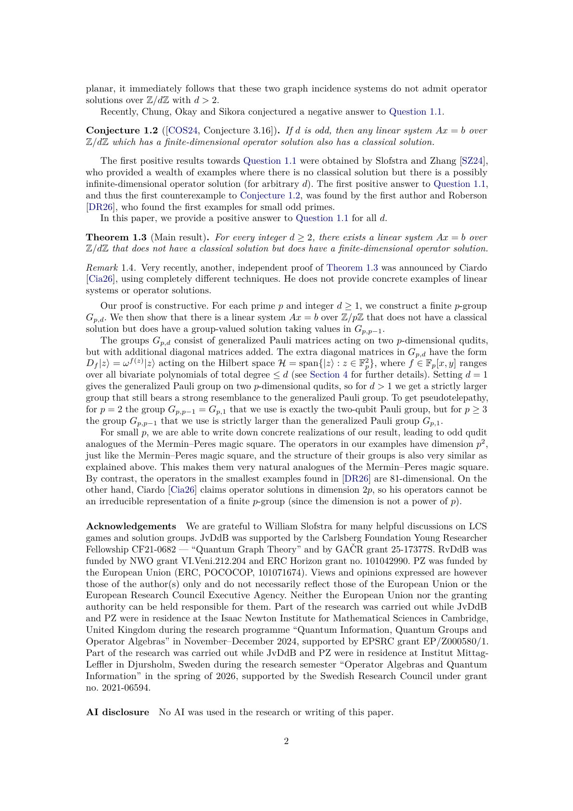
<figcaption class="paper-figure-caption"><b>Fig 1.</b> Low-resolution page preview, page 2</figcaption>
</figure>
<figure class="paper-figure-card">

<figcaption class="paper-figure-caption"><b>Fig 2.</b> Low-resolution page preview, page 3</figcaption>
</figure>
<figure class="paper-figure-card">
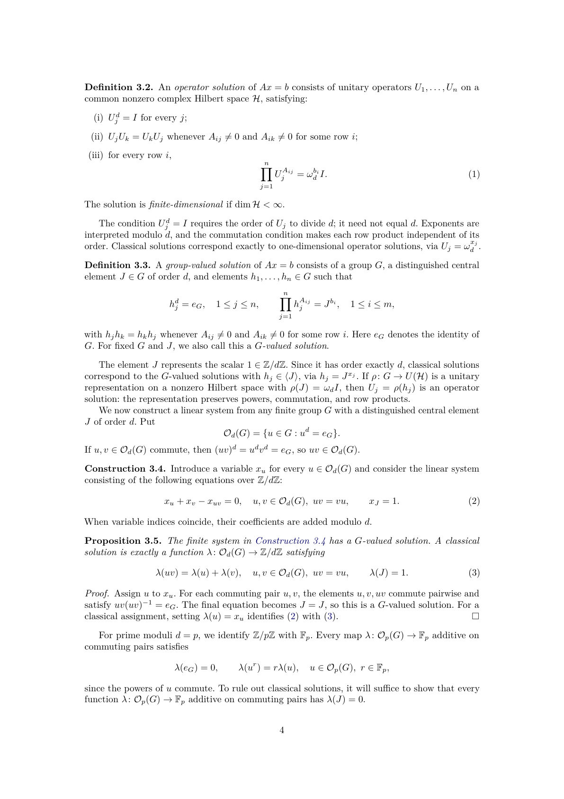
<figcaption class="paper-figure-caption"><b>Fig 3.</b> Low-resolution page preview, page 4</figcaption>
</figure>
<figure class="paper-figure-card">
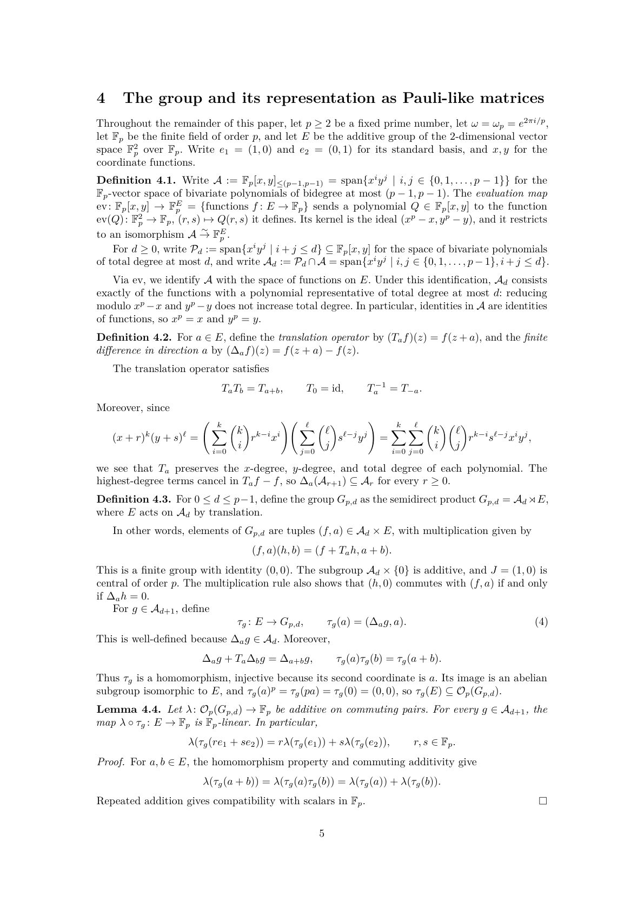
<figcaption class="paper-figure-caption"><b>Fig 4.</b> Low-resolution page preview, page 5</figcaption>
</figure>
<figure class="paper-figure-card">
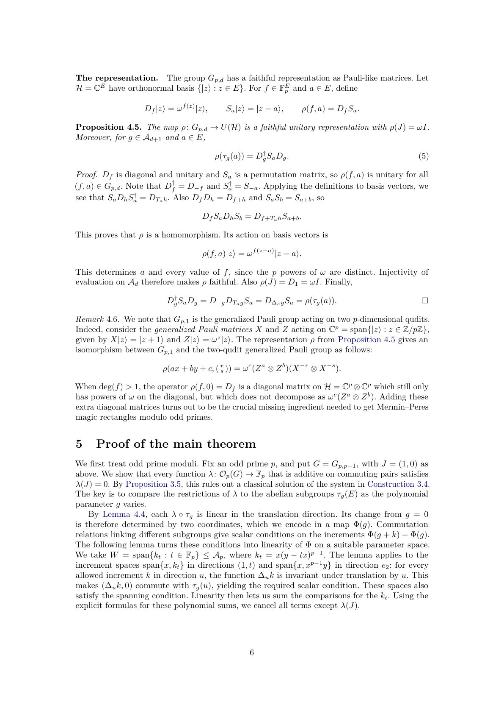
<figcaption class="paper-figure-caption"><b>Fig 5.</b> Low-resolution page preview, page 6</figcaption>
</figure>

**Summary.** This paper constructs explicit examples of quantum constraint systems over $\mathbb{Z}/d\mathbb{Z}$ that violate classical realism, extending the Mermin-Peres paradox to arbitrary odd moduli. The authors use group theory and advanced algebraic techniques to prove the existence of these systems, demonstrating that quantum correlations persist even when the underlying algebra is not based on $\mathbb{Z}/2\mathbb{Z}$. This is significant for understanding the limits of local realism in generalized quantum systems.

**Why it may be interesting.** This work directly addresses fundamental questions about the boundary between quantum correlations (operator solutions) and classical correlations (local hidden variable theories) in generalized settings beyond qubits.

Detailed structure

**Main problem.** To construct linear constraint systems over $\mathbb{Z}/d\mathbb{Z}$ (for odd $d$) that possess a solution in the operator algebra but no corresponding classical solution, generalizing the Mermin-Peres paradox.

**Main result.** The authors prove that such systems exist for every integer $d \ge 2$, providing a constructive proof that contradicts previous conjectures regarding odd moduli.

**Method.** The proof involves constructing the system using generalized Pauli operators acting on qudits and employing an elementary linearity argument comparing assignments on abelian subgroups to show classical inconsistency.

**Model / system.** The model is a linear system $Ax=b$ defined over $\mathbb{Z}/d\mathbb{Z}$. The operators are constructed using generalized Pauli matrices acting on two $p$-dimensional qudits, forming a finite $p$-group $G_{p,d}$.

**Key observables.** The existence of a group-valued solution versus the non-existence of a classical assignment satisfying the constraints.

**Important parameters / regimes.** The modulus $d$ (specifically odd primes $p$), the dimension of the qudits ($p$), and the structure of the underlying finite $p$-group $G_{p,d}$.

**Assumptions / limitations.** The analysis for the prime case relies on the structure of the group $G_{p, p-1}$ and the application of a general linearity criterion (Lemma 5.1) derived from difference equations.

**Figures summary.** The text notes the inclusion of large matrices illustrating concrete examples of Mermin-Peres magic rectangles over $\mathbb{Z}/3\mathbb{Z}$.

**Paper structure.** The paper first establishes the general existence theorem for all $d \ge 2$. For the prime case, it develops advanced mathematical tools, including a linearity criterion (Lemma 5.1), which is then applied to prove that the required function $\lambda$ must vanish on a specific element $J$ (Theorem 5.2).

Abstract

The Mermin-Peres magic square provides a simple example of a system of linear equations over $\mathbb{Z}/2\mathbb{Z}$ which has no classical solutions but does have a finite-dimensional operator solution. For a long time, it was not known how to construct similar examples over $\mathbb{Z}/d\mathbb{Z}$ with $d$ odd. In this paper, we construct, for every integer $d\ge2$, a linear system over $\mathbb{Z}/d\mathbb{Z}$ that has a finite-dimensional operator solution but no classical solution. For an odd prime $p$, our operators act on two $p$-dimensional qudits and generate a finite $p$-group obtained by adjoining diagonal polynomial phase operators to the generalized Pauli group. Classical inconsistency follows from an elementary linearity argument comparing assignments on abelian subgroups.

[↑ back to top](#top)

### [Multiconfigurational Analysis of Local Electronic Structure of $\mathrm{RuO_2}$ Using Relativistic Embedded Clusters](http://arxiv.org/abs/2609.20526v1)

**Authors:** Zhosan I. A., Lomachuk Yu. V., Maltsev D. A., Moiseev I. A., Andreev O. Yu  
**Type:** theory · **Category:** strongly correlated electrons · **PDF:** <https://arxiv.org/pdf/2609.20526v1>  
**Analysis basis:** full PDF text, analyzed in chunks

↔ Scroll figures horizontally

<figure class="paper-figure-card">
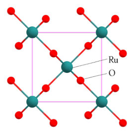
<figcaption class="paper-figure-caption"><b>Fig 1.</b> FIG. 1. Crystal structure of RuO2 with Ru atoms in green and O atoms in red. The four corner Ru atoms form a square plane, while the central Ru atom is displaced from this plane. Each Ru atom is surrounded by a compressed octahedron of O atoms (red spheres), featuring two short apical Ru–O bonds (fully shown) and four longer equatorial Ru–O bonds (only two of which are shown for clarity).</figcaption>
</figure>
<figure class="paper-figure-card">
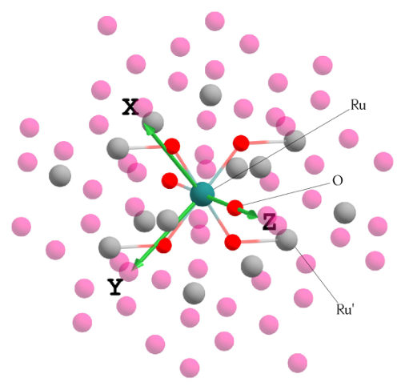
<figcaption class="paper-figure-caption"><b>Fig 2.</b> FIG. 2. Cluster model of ruthenium dioxide (RuO2) with the structural formula Ru −O6 −Ru′ 14 −Q58. The pseudoatoms representing the nearest cationic environment (NCE, Ru′ 14) and the nearest anionic environment (NAE, Q58) are shown as gray and pink spheres, respectively. The central Ru atom and the surrounding O octahedron that form the main cluster are depicted in green and red, respectively. The octahedron exhibits two distinct Ru–O distances: four equatorial bonds to O atoms in the xy-plane of 1.933 ˚A, and two axial bonds along the z-axis of 1.988 ˚A.</figcaption>
</figure>
<figure class="paper-figure-card">
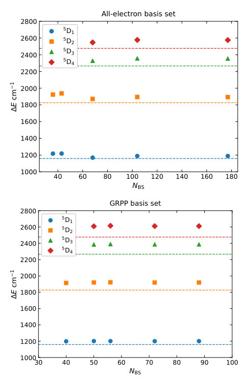
<figcaption class="paper-figure-caption"><b>Fig 3.</b> FIG. 3. Convergence plots for the energies of the 5DJ terms of the 4d6 configuration as a function of the basis-set size (NBS). The energy levels appear in descending order: J = 3, 2, 1, 0 (representing an inverted multiplet). The ground-state 5D4 level is taken as the reference baseline and is omitted from the curves. Experimental values are indicated by dashed lines.</figcaption>
</figure>
<figure class="paper-figure-card">
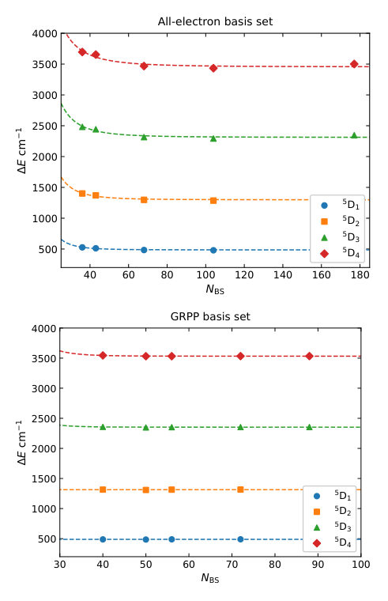
<figcaption class="paper-figure-caption"><b>Fig 4.</b> FIG. 4. Convergence plots for the energies of the 5DJ terms of the 4d4 configuration as a function of the basis-set size (NBS). The energy levels appear in ascending order: J = 1, 2, 3, 4 (representing an normal multiplet). The ground-state 5D0 level is taken as the reference baseline and is omitted from the curves. The power-law fit of the all-electron basis set energies is shown as a dashed line.</figcaption>
</figure>
<figure class="paper-figure-card">
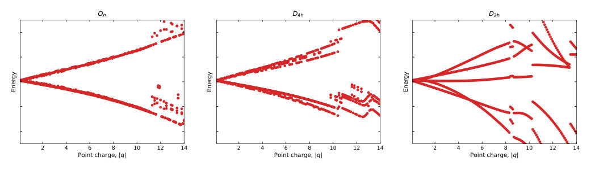
<figcaption class="paper-figure-caption"><b>Fig 5.</b> FIG. 5. Orbital energies of the Ru4+ + 6 Q system derived from the atomic Ru 4d orbitals, plotted as a function of the point charge magnitude |q|. The orbital energies are calculated at the SA-CAS(4e,5o) level and are given in arbitrary units.</figcaption>
</figure>

**Summary.** This work investigates the electronic structure of RuO2, a material predicted to be altermagnetic, using advanced multiconfigurational cluster calculations. The authors find that the local orbital symmetry is higher (tetragonal) than expected (orthorhombic). This symmetry preservation naturally explains why bulk RuO2 does not exhibit the predicted altermagnetism, contrasting with thin film results.

**Why it may be interesting.** The detailed treatment of strong correlation and spin-orbit coupling in a solid-state context is highly relevant to understanding complex magnetic ground states in transition metal oxides.

Detailed structure

**Main problem.** To resolve contradictory experimental and theoretical findings regarding the altermagnetic state of ruthenium dioxide (RuO2).

**Main result.** The local electronic structure suggests that orbital quasi-degeneracy, behaving closer to tetragonal symmetry than the formal orthorhombic symmetry, suppresses the quadrupolar order needed for altermagnetism in bulk RuO2.

**Method.** A multiconfigurational, relativistic embedded-cluster study combining DFT with high-accuracy CASSCF and NEVPT2+SOC calculations.

**Model / system.** The study focuses on the local electronic structure of RuO2, modeling the environment using an embedded cluster approach (RuO6@CTEP) built upon periodic DFT calculations.

**Key observables.** Local 4d-orbital energy spectrum and splitting pattern; evidence for altermagnetism (anisotropic spin splitting).

**Important parameters / regimes.** Lattice parameters (a = b = 4.4876 A, c = 3.1065 A); SOC and strong electron correlation effects.

**Assumptions / limitations.** The use of the CTEP method and the assumption that orbital quasi-degeneracy is the key factor suppressing the expected magnetic order.

**Figures summary.** Figure 1 illustrates the crystal structure of RuO2 (rutiles structure) showing the local coordination environment of Ru and O atoms.

**Paper structure.** The paper progresses from initial DFT calculations to construct the embedding potential, followed by high-accuracy multiconfigurational calculations (CASSCF/NEVPT2+SOC) on the embedded cluster to analyze the local orbital physics.

Abstract

We present a multiconfigurational, relativistic embedded-cluster study of the local electronic structure of ruthenium dioxide ($\mathrm{RuO_2}$), a candidate altermagnetic material. Starting from free $\mathrm{Ru}$ ions, we progressively build up the local environment through a $\mathrm{Ru+Q_6}$ electrostatic model, a bare $\mathrm{[RuO_6]^{8-}}$ ligand model, and finally a high-accuracy $\mathrm{RuO_6}$@CTEP embedded cluster that reproduces the crystalline surroundings. All systems are treated at the SA-CASSCF and NEVPT2+SOC levels of theory to capture strong electron correlation and spin-orbit coupling on an equal footing. While the formal local site symmetry of the $\mathrm{Ru}$ sites in $\mathrm{RuO_2}$ is orthorhombic ($D_{2h}$), we find that the calculated $4d$-orbital energy spectrum and its splitting pattern behave much closer to the higher tetragonal ($D_{4h}$) symmetry, preserving a strong quasi-degeneracy among the relevant $4d$ orbitals. Since the local $xy$ quadrupolar order responsible for altermagnetic spin splitting in independent-particle models relies on this symmetry reduction, its suppression by orbital quasi-degeneracy offers a natural explanation for why altermagnetism is not observed in bulk $\mathrm{RuO_2}$ experiments, in contrast to the robust altermagnetic signatures reported in strained thin films.

[↑ back to top](#top)

### [Multinegativity and single-letter formulas for asymptotic entanglement](http://arxiv.org/abs/2609.20698v1)

**Authors:** Raphael Brinster, Tulja Varun Kondra, Hermann Kampermann, Dagmar Bruß, Nikolai Wyderka  
**Type:** theory · **Category:** quantum information and computing · **PDF:** <https://arxiv.org/pdf/2609.20698v1>  
**Analysis basis:** full PDF text, analyzed in chunks

↔ Scroll figures horizontally

<figure class="paper-figure-card">
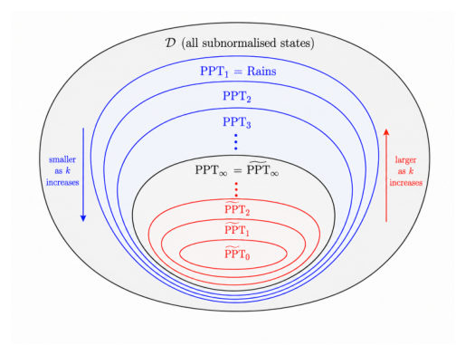
<figcaption class="paper-figure-caption"><b>Fig 1.</b> FIG. 1. Schematic illustration of the set hierarchies PPTk and ] PPTk defined in equations (18) and (19). As k increases, PPTk decreases while ] PPTk increases, and both converge to the common limiting set PPT∞= ] PPT∞.</figcaption>
</figure>

**Summary.** This paper develops a structured hierarchy of computable upper bounds for asymptotic entanglement measures, such as the relative entropy of entanglement with respect to PPT states. By showing that the regularization of these bounds yields the true asymptotic value, the authors provide state-dependent single-letter formulas. Crucially, they also construct counterexamples demonstrating that these entanglement cost hierarchies do not collapse at any finite level.

**Why it may be interesting.** This work provides rigorous, computable tools (single-letter formulas) to approximate notoriously difficult-to-calculate asymptotic entanglement measures, which is fundamental to understanding quantum resource theories.

Detailed structure

**Main problem.** The central problem is finding single-letter formulas for complex, asymptotic entanglement quantities, such as the asymptotic relative entropy of entanglement with respect to PPT states ($E_\infty^R$).

**Main result.** The authors introduce a computable, decreasing hierarchy of upper bounds ($	ilde{E}_{1N,k}$) that regularizes to the true asymptotic entanglement measure, while also constructing states that disprove the conjecture of a finite collapse for entanglement cost hierarchies.

**Method.** The work employs the construction of a hierarchy of constrained sets ($	ext{PPT}_k$, $	ext{]PPT}_k$) and utilizes convex optimization (semidefinite programming) to derive single-letter upper bounds on entanglement measures.

**Model / system.** The study focuses on bipartite quantum states ($
ho_{AB}$) and the quantification of entanglement, particularly concerning the constraints imposed by the Positive Partial Transpose (PPT) condition.

**Key observables.** Asymptotic relative entropy of entanglement ($E_\infty^R$), $k$-multinegativity, and the exact PPT entanglement cost ($E_{	ext{exact}c, 	ext{PPT}}$).

**Important parameters / regimes.** The hierarchy level $k$, which dictates the strength of the partial transpose constraint, and the state $
ho$ itself.

**Assumptions / limitations.** The analysis relies on the existence of the hierarchy of upper bounds and the tractability of the optimization problems defining these bounds.

**Figures summary.** Figure 1 schematically illustrates the convergence of the set hierarchies $	ext{PPT}_k$ and $	ext{]PPT}_k$ towards their infinite limits.

**Paper structure.** The paper first introduces the hierarchy of upper bounds using single-letter formulas, then establishes additivity for specific state families, and finally motivates $k$-multinegativity, culminating in the construction of counterexamples that show the hierarchy does not collapse at finite levels.

Abstract

The study of entanglement inevitably leads to the concept of regularization, where measures are evaluated on infinitely many copies of a state. Single-letter formulas try to make these asymptotic entanglement quantities accessible through a calculation on one copy of a state, but are rarely available. We introduce a decreasing hierarchy of computable upper bounds on the asymptotic relative entropy of entanglement with respect to positive-partial-transpose (PPT) states. The regularization of every fixed hierarchy level equals this asymptotic quantity. Additivity at any level therefore yields a single-letter formula, even when the usual one-copy relative entropy is nonadditive. We establish such additivity at the first nontrivial level for two broad multiparameter families, both containing all Werner states. The upper-bound construction also extends to sandwiched Renyi divergences. The hierarchy motivates $k$-multinegative states, a generalization of binegative states and the associated $k$-multinegativity, which gives explicit upper bounds on both the asymptotic relative entropy and exact PPT entanglement cost. We construct states which are $k$-multinegative at arbitrarily large depths $k$ that separate consecutive levels of the previously introduced entanglement-cost hierarchy, disproving its conjectured finite collapse. These results provide state-dependent single-letter formulas while identifying a limitation of universal finite-level characterizations.

[↑ back to top](#top)

### [Pressure induced structural phase transition and magneto-elastic coupling in Eu doped LaCrO$_3$](http://arxiv.org/abs/2609.19795v1)

**Authors:** Asish Kumar Mishra, Mrinmay Sahu, Bhagyashri Giri, Bidisha Mukherjee, Suvashree Mukherjee, Harekrishna Bhunia, Tamalkanti Mukherjee, Sujoy Ghosh, Partha Mitra, Peter Liermann, Goutam Dev Mukherjee  
**Type:** experiment · **Category:** strongly correlated electrons · **PDF:** <https://arxiv.org/pdf/2609.19795v1>  
**Analysis basis:** full PDF text, analyzed in chunks

↔ Scroll figures horizontally

<figure class="paper-figure-card">
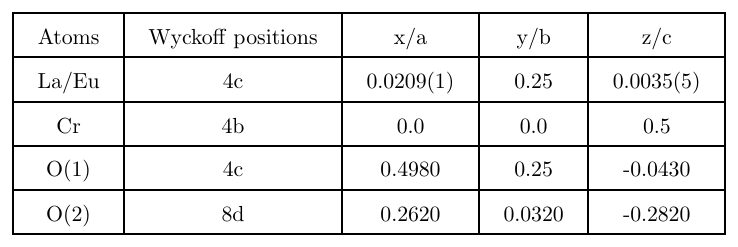
<figcaption class="paper-figure-caption"><b>Fig 1.</b> Fig 2. With the increase in pressure the XRD patterns show no significant changes up to</figcaption>
</figure>
<figure class="paper-figure-card">
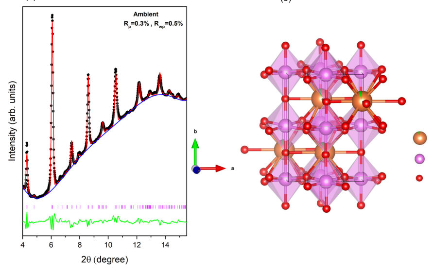
<figcaption class="paper-figure-caption"><b>Fig 2.</b> FIG. 1: (a) The Rietveld refinement of the XRD pattern of ELCO at ambient pressure.</figcaption>
</figure>
<figure class="paper-figure-card">
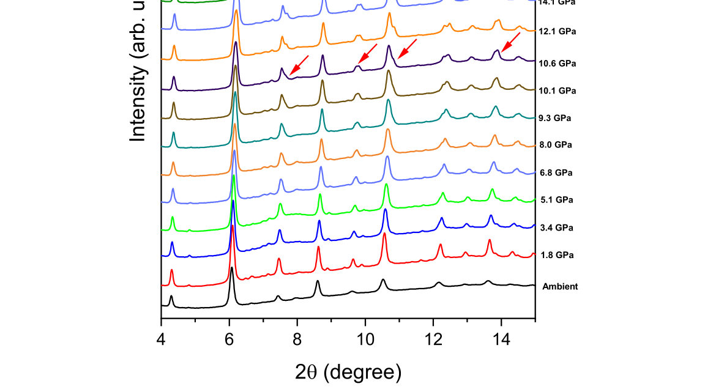
<figcaption class="paper-figure-caption"><b>Fig 3.</b> FIG. 2: Pressure dependent XRD pattern of ELCO at selected pressures. The arrow marks</figcaption>
</figure>
<figure class="paper-figure-card">
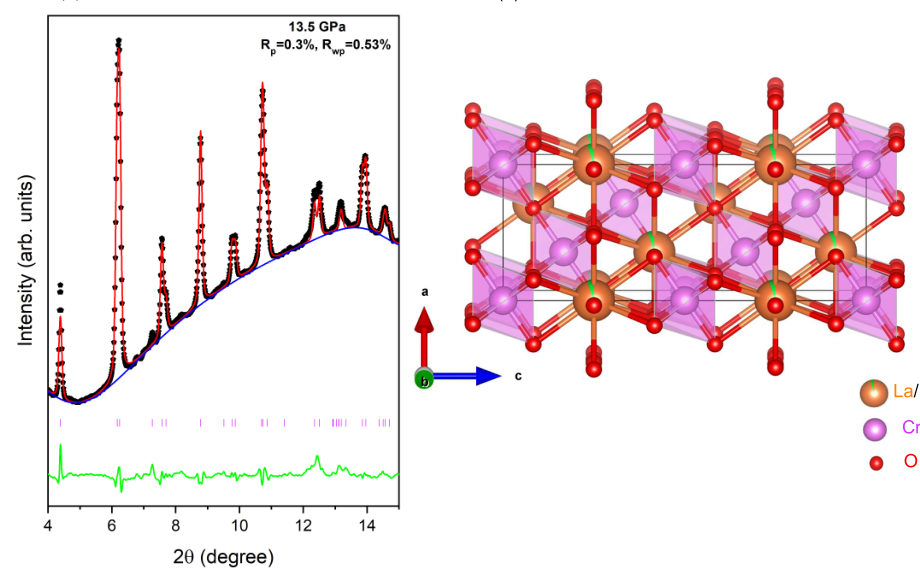
<figcaption class="paper-figure-caption"><b>Fig 4.</b> FIG. 3: (a) The Rietveld refinement of the XRD pattern of ELCO at 13.5 GPa. The black</figcaption>
</figure>
<figure class="paper-figure-card">
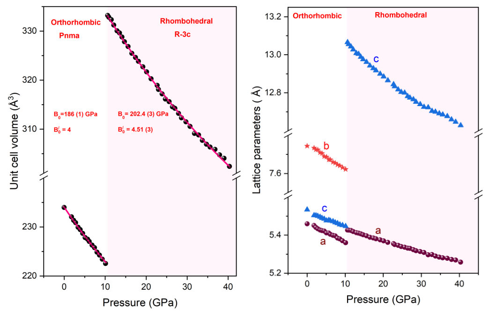
<figcaption class="paper-figure-caption"><b>Fig 5.</b> FIG. 4: (a) The pressure dependence of the unit cell volume of ELCO. The black spheres</figcaption>
</figure>

**Summary.** This work uses high-pressure XRD, Raman, and magnetization measurements to characterize Eu-doped LaCrO3. It reports a structural phase transition at 10.6 GPa and identifies a critical anomaly at 4.5 GPa. This anomaly strongly suggests the onset of antiferromagnetic ordering, demonstrating significant magneto-elastic coupling in the material.

**Why it may be interesting.** The strong coupling observed between structural transitions (XRD/Raman) and magnetic ordering (Magnetization) provides a rich platform for studying emergent quantum phenomena in correlated oxides, relevant to understanding magnetic ground states under extreme conditions.

Detailed structure

**Main problem.** The study investigates how external pressure influences the structural, vibrational, and magnetic properties of Eu-doped LaCrO3 to understand the underlying structure-property correlations.

**Main result.** The research reveals a pressure-induced structural phase transition from orthorhombic to rhombohedral symmetry around 10.6 GPa, alongside a distinct anomaly at 4.5 GPa suggesting the onset of long-range antiferromagnetic ordering coupled to structural changes.

**Method.** The investigation employs a combination of high-pressure synchrotron X-ray Diffraction (XRD), micro Raman spectroscopy, and low-temperature magnetization measurements.

**Model / system.** The physical system is Eu-doped LaCrO3 (ELCO), a perovskite-like oxide material whose properties are studied under extreme pressure conditions.

**Key observables.** Structural phase transition (Orthorhombic to rhombohedral), lattice parameters, Raman mode shifts and intensities, and the evolution of the Néel temperature ($T_N$).

**Important parameters / regimes.** Pressure (up to 13.5 GPa), doping concentration (5% Eu), and temperature (low-temperature magnetization).

**Assumptions / limitations.** The analysis combines structural, vibrational, and magnetic measurements to establish a comprehensive link between pressure, structure, and magnetism.

**Figures summary.** Figures show pressure-dependent XRD patterns indicating peak splitting and structural transitions, volume evolution plots, and Raman spectra tracking mode changes across different pressure regimes.

**Paper structure.** The paper systematically presents results from XRD to map structural changes, followed by Raman spectroscopy to track vibrational anomalies, and finally integrates magnetization data to pinpoint the magneto-elastic coupling associated with magnetic ordering.

Abstract

In this study, we have carried out a detailed high pressure investigation on 5$\%$ Eu doped LaCrO$_3$ (ELCO) using synchrotron X-ray diffraction (XRD), micro Raman spectroscopy, and low-temperature magnetization measurements to correlate the structural and magnetic properties under pressure. The high pressure XRD reveals the orthorhombic to rhombohedral structural phase transition around 10.6 GPa. The high pressure Raman data corroborate this result and indicate that the lattice instabilities associated with the low-frequency soft modes play a crucial role in driving this transition. In addition, a pronounced anomaly in the Raman shift and integrated intensity of several Raman modes is observed around 4.5 GPa. By combining the low-temperature magnetization measurements with the anomalies observed in the XRD and Raman data and by comparing with the similar results in LaCrO$_3$ (LCO), a pressure-induced change in the magnetic ground state to antiferromagnetic ordering is predicted.

[↑ back to top](#top)

### [Pressure-induced electronic and structural evolution of EuIrGe3](http://arxiv.org/abs/2609.20376v1)

**Authors:** N. S. Dhami, V. Baledent, I. Batistic, C. M. N. Kumar, D. Kaczorowski, L. Nataf, J. M. Ablett, J. -P. Rueff, J. P. Itie, P. Fertey, S. R. Shieh, P. Popcevic, Y. Utsumi Boucher  
**Type:** both · **Category:** strongly correlated electrons · **PDF:** <https://arxiv.org/pdf/2609.20376v1>  
**Analysis basis:** full PDF text, analyzed in chunks

↔ Scroll figures horizontally

<figure class="paper-figure-card">
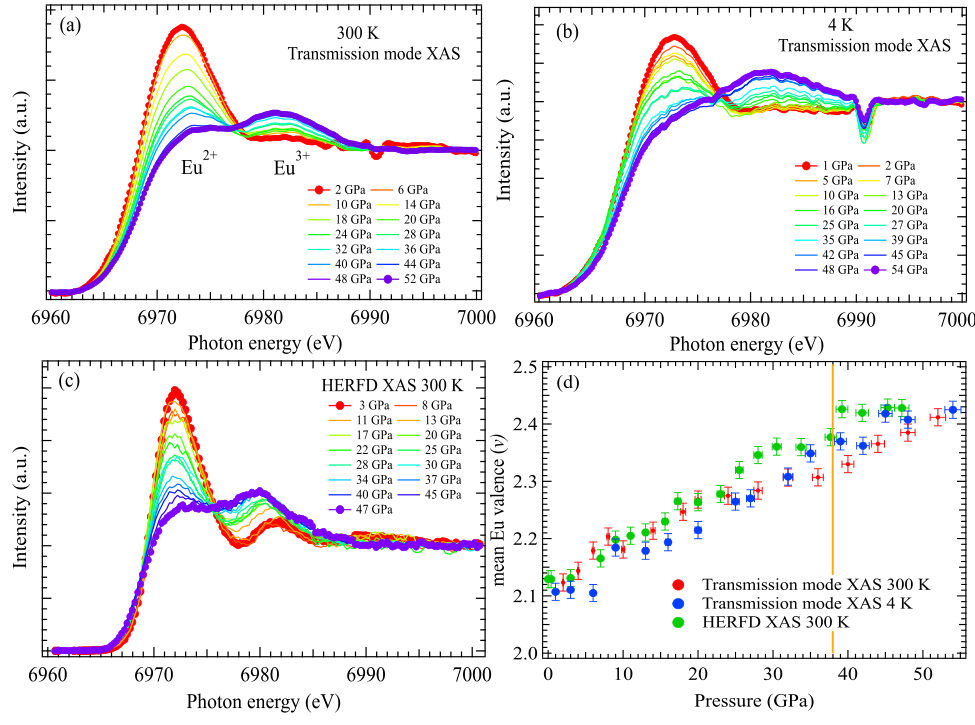
<figcaption class="paper-figure-caption"><b>Fig 1.</b> FIG. 1. Pressure-dependent Eu L3-edge XAS spectra of EuIrGe3 measured in (a) transmission mode at 300 K, (b) transmission mode at 4 K, and (c) HERFD mode at 300 K. All spectra were normalized to the high energy region after subtraction of a constant pre-edge background. The feature at 6991 eV in the transmission spectra is an artifact of the beamline optics. (d) Pressure dependence of the mean Eu valence extracted from all measurements. The vertical orange line indicates the pressure at which the structural transition was observed (see Sec.III B).</figcaption>
</figure>
<figure class="paper-figure-card">
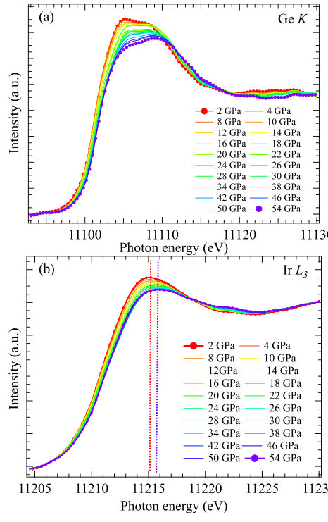
<figcaption class="paper-figure-caption"><b>Fig 2.</b> FIG. 2. Pressure-dependent (a) Ge K-edge and (b) Ir L3-edge XAS spectra of EuIrGe3 measured at 300 K in transmission mode. The spectra were normalized following the same procedure as for the Eu L3-edge data. The red and violet vertical dashed lines indicate the peak positions at 2 and at 54 GPa, respectively, as determined from the Gaussian fits.</figcaption>
</figure>
<figure class="paper-figure-card">
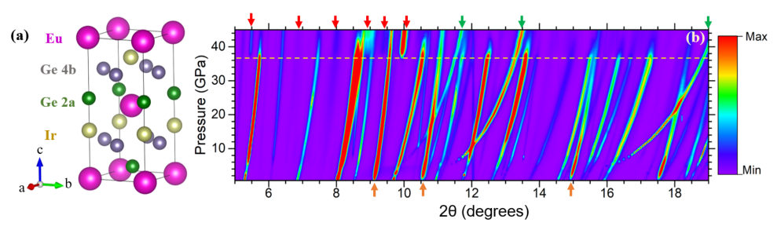
<figcaption class="paper-figure-caption"><b>Fig 3.</b> FIG. 3. (a) Crystal structure of EuIrGe3. The Ge 2a and Ge 4b sites are shown in different colors for clarity. The structure was drawn using VESTA [25]. (b) Contour map of the powder XRD intensity of EuIrGe3 measured at room temperature as a function of pressure. The rapidly shifting peaks, indicated by green arrows, originate from the solidification of the neon pressure transmitting medium [26]. The emergence of additional diffraction peaks above ∼38 GPa indicates a possible structural phase transition. Diffraction peaks from the gold pressure calibrant are marked by golden arrows, while those associated with the high-pressure phase are indicated by red arrows.</figcaption>
</figure>
<figure class="paper-figure-card">
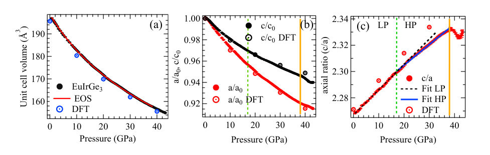
<figcaption class="paper-figure-caption"><b>Fig 4.</b> FIG. 4. (a) Pressure dependence of the unit-cell volume of EuIrGe3 (black circles), together with the EOS fit (solid line). Unit-cell volumes obtained from DFT calculations at selected pressures (open blue circles) are also shown. Error bars are smaller than the symbol size. (b) Relative changes in the lattice parameters of EuIrGe3, normalized to their values at the lowest experimental pressure, as a function of pressure. The orange vertical bar indicates the pressure at which the structural phase transition occurs. DFT results are shown as open circles. (c) Pressure dependence of the axial ratio, c/a. Linear fits to the LP (≤17 GPa; dashed black line) and HP (17–38 GPa; solid blue line)...</figcaption>
</figure>
<figure class="paper-figure-card">
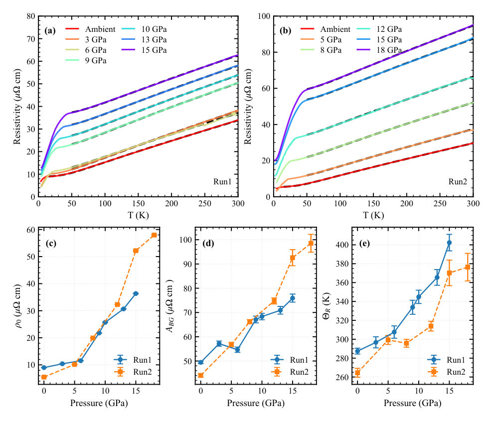
<figcaption class="paper-figure-caption"><b>Fig 5.</b> FIG. 5. Temperature-dependent electrical resistivity of EuIrGe3 measured at various pressures during (a) Run1 and (b) Run2. The two runs were performed on different crystals from the same growth. The dashed black lines represent fits to the BG model over the temperature range 50–300 K at high pressures and 15–300 K at ambient pressure. Pressure dependence of the fitted (c) residual resistivity, ρ0, (d) BG coefficient, ABG, and (e) BG temperature, ΘR.</figcaption>
</figure>

**Summary.** This work comprehensively examines how high pressure alters the electronic structure and crystal lattice of the antiferromagnet EuIrGe3. By combining XAS, XRD, and resistivity measurements with DFT calculations, the authors show that pressure drives a valence change in Eu and induces a structural phase transition. These results highlight the critical role of transition metal d-electron hybridization in governing the material's response to extreme conditions.

**Why it may be interesting.** The strong dependence of electronic properties (valence changes, hybridization) on external pressure, particularly in systems involving localized f-electrons (Eu) coupled to itinerant d-electrons (Ir), is highly relevant to understanding pressure-induced quantum phase transitions in correlated materials.

Detailed structure

**Main problem.** The study investigates the pressure-induced electronic and structural evolution of the noncentrosymmetric antiferromagnet EuIrGe3.

**Main result.** The material exhibits a continuous increase in the mean Eu valence and undergoes a structural phase transition above 38 GPa, demonstrating a pressure response distinct from related compounds.

**Method.** The research combines experimental techniques like X-ray Absorption Spectroscopy (XAS), synchrotron X-ray Diffraction (XRD), and electrical resistivity measurements with theoretical calculations using Density Functional Theory (DFT).

**Model / system.** The system is EuIrGe3, a member of the BaNiSn3-type EuTGe3 family, which is studied across a range of high pressures (up to 40 GPa). The electronic structure is analyzed by tracking the valence changes of Eu and the hybridization between transition metal d-electron states (Ir 5d, Ge 4p).

**Key observables.** Mean Eu valence, anisotropic lattice compression parameters ($a, c$), antiferromagnetic ordering temperatures ($T_N$), and the evolution of the Density of States (DOS) components.

**Important parameters / regimes.** Pressure (up to 40 GPa), temperature (4 K to 300 K), and the Hubbard interaction U for Eu (3.8 eV).

**Assumptions / limitations.** The analysis assumes the structural stability within the tetragonal I4mm phase up to the transition pressure, and DFT calculations utilize the PBEsol functional with DFT+U treatment for Eu 4f states.

**Figures summary.** Figures show pressure-dependent Eu L3-edge XAS spectra revealing valence changes, high-pressure XRD patterns indicating structural transitions, and DFT-calculated DOS evolving with increasing pressure.

**Paper structure.** The paper follows a structure of presenting multiple complementary measurements: XAS tracks valence changes; XRD maps structural changes and phase transitions; resistivity measures magnetic stability; and DFT provides the underlying electronic structure calculations to interpret the experimental findings.

Abstract

We investigated the pressure-induced evolution of the electronic and crystal structure of the noncentrosymmetric BaNiSn3-type antiferromagnet EuIrGe3 using x-ray absorption spectroscopy, synchrotron x-ray diffraction complemented by density functional theory calculations, and electrical resistivity measurements. The Eu L3-edge spectra reveal a continuous increase in the mean Eu valence under compression, accompanied by modifications of the Ge and Ir electronic states. High- pressure x-ray diffraction shows anisotropic lattice compression in the tetragonal (I4mm) phase and provides evidence for a structural phase transition above 38 GPa. The experimentally deter- mined lattice and equation-of-state parameters are in good agreement with the DFT calculations. Electrical resistivity measurements reveal a monotonic increase in the antiferromagnetic ordering temperatures up to 18 GPa, indicating that the antiferromagnetic ground state remains robust despite the increasing contribution of the nonmagnetic Eu3+ configuration to the intermediate va- lence state. These results demonstrate that EuIrGe3 exhibits a pressure response distinct from EuCoGe3 and EuRhGe3, highlighting the important role of the transition metal d-electron states in the pressure-induced electronic and structural evolution of the EuT Ge3 family

[↑ back to top](#top)

### [Private communication from Pauli channels with no privacy](http://arxiv.org/abs/2609.20133v1)

**Authors:** Uthirakalyani G, Pritam Halder, David Elkouss  
**Type:** theory · **Category:** quantum information and computing · **PDF:** <https://arxiv.org/pdf/2609.20133v1>  
**Analysis basis:** full PDF text, analyzed in chunks

↔ Scroll figures horizontally

<figure class="paper-figure-card">
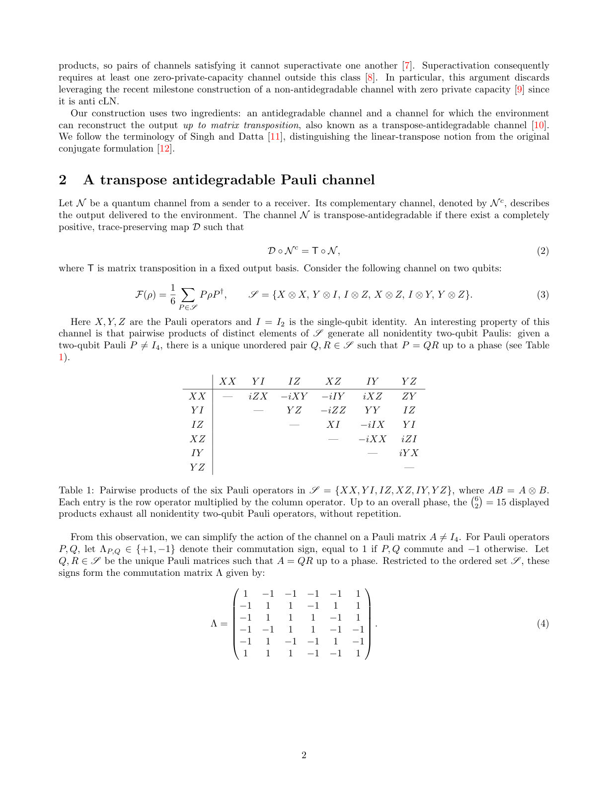
<figcaption class="paper-figure-caption"><b>Fig 1.</b> Low-resolution page preview, page 2</figcaption>
</figure>
<figure class="paper-figure-card">
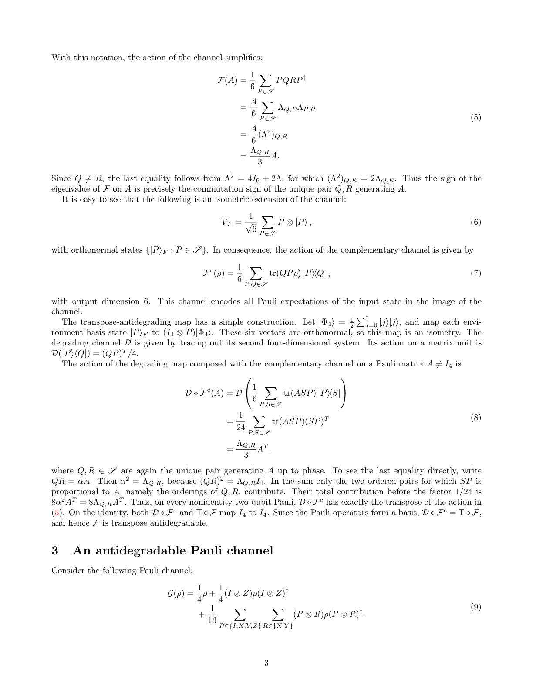
<figcaption class="paper-figure-caption"><b>Fig 2.</b> Low-resolution page preview, page 3</figcaption>
</figure>
<figure class="paper-figure-card">
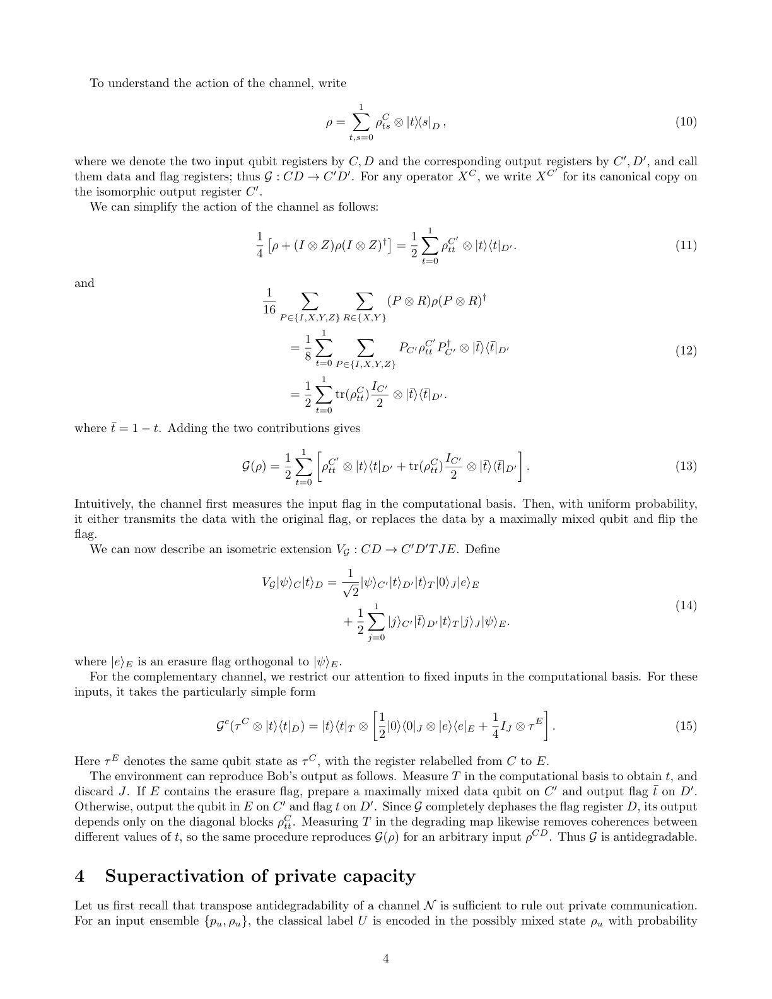
<figcaption class="paper-figure-caption"><b>Fig 3.</b> Low-resolution page preview, page 4</figcaption>
</figure>
<figure class="paper-figure-card">
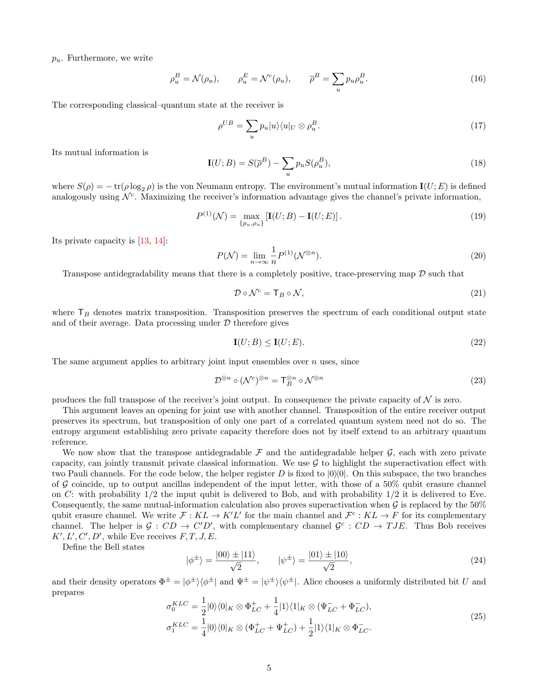
<figcaption class="paper-figure-caption"><b>Fig 4.</b> Low-resolution page preview, page 5</figcaption>
</figure>
<figure class="paper-figure-card">
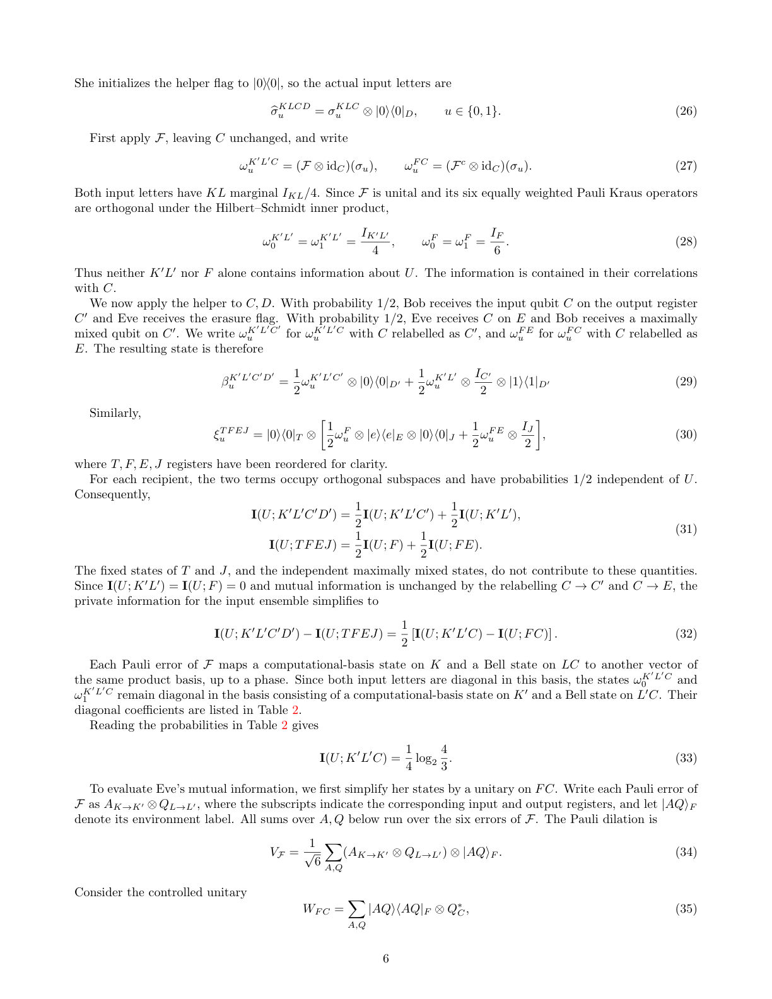
<figcaption class="paper-figure-caption"><b>Fig 5.</b> Low-resolution page preview, page 6</figcaption>
</figure>

**Summary.** This theoretical paper explores quantum channel capacity, specifically focusing on private information. The core finding is that two individual quantum channels, each incapable of transmitting private information, can be combined to create a joint channel that *can* transmit private information. This phenomenon, called superactivation, highlights the complex, non-additive nature of quantum communication capabilities.

**Why it may be interesting.** This work provides deep insights into the structural properties of quantum channels (degradability, antidegradability) and how these properties dictate fundamental communication limits, which is crucial for understanding quantum communication protocols.

Detailed structure

**Main problem.** The paper investigates the phenomenon of 'private-capacity superactivation,' demonstrating that combining two quantum channels, each having zero private classical capacity, can enable the transmission of private information.

**Main result.** The authors show that two specific Pauli two-qubit channels, $F$ and $G$, can jointly transmit private information, achieving a positive private capacity even though $P(F)=P(G)=0$.

**Method.** The analysis relies on defining private information using mutual information and analyzing the properties of quantum channels, specifically focusing on concepts like transpose-antidegradability and antidegradability.

**Model / system.** The study uses abstract quantum communication channels, specifically Pauli two-qubit channels and the 50% qubit erasure channel, analyzed using Pauli operators and tensor products.

**Key observables.** Private classical capacity ($P(N)$), Mutual Information ($I$), and Coherent Information ($I_c$).

**Important parameters / regimes.** The zero private capacity condition is linked to the channel being transpose-antidegradable, while superactivation requires the joint channel to violate this property.

**Assumptions / limitations.** The construction relies on the specific Pauli structure of the channels and the use of Bell states to build the activating binary code.

**Figures summary.** The notes reference tables detailing the action of Pauli operators on specific Pauli products and the resulting environment states after channel application.

**Paper structure.** The paper builds from defining channel capacities and the zero-capacity condition (related to transpose-antidegradability) to constructing a pair of channels $(F, G)$ that exhibit superactivation, and finally extending this to include the 50% erasure channel $(F, H)$.

Abstract

A channel capacity quantifies the communication capability of a noisy physical process. In contrast to communication channels in the classical world, quantum theory makes this capability contextual. We show that two Pauli two-qubit channels, each with zero private classical capacity, can be used to transmit private information when used together. One is a two-qubit Pauli channel whose environment can reconstruct the receiver output up to matrix transposition; the other is an antidegradable channel. We obtain a similar result when the second channel is the 50% qubit erasure channel. A simple binary code built from rank-three mixtures of Bell states activates private communication. The main ingredient in our construction is a transpose-antidegradable channel that is not antidegradable.

[↑ back to top](#top)

### [Proof of a positive coherent-error threshold for topological quantum codes](http://arxiv.org/abs/2609.20708v1)

**Authors:** Shiro Tamiya, Masato Koashi  
**Type:** theory · **Category:** quantum information and computing · **PDF:** <https://arxiv.org/pdf/2609.20708v1>  
**Analysis basis:** full PDF text, analyzed in chunks

↔ Scroll figures horizontally

<figure class="paper-figure-card">
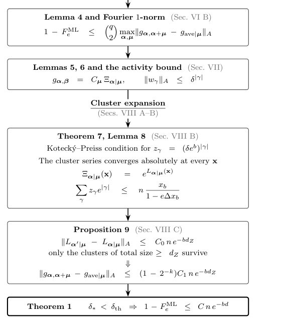
<figcaption class="paper-figure-caption"><b>Fig 1.</b> FIG. 1. Roadmap of the proof of Theorem 1, showing the statement, key identity or bound, and sections for each step. The boxes indicate the sections in which the corresponding statements are established.</figcaption>
</figure>

**Summary.** This paper establishes a theoretical proof for a positive error threshold in topological quantum codes when facing coherent errors, a significant advance over previous stochastic-only models. By combining Fourier analysis and polymer model techniques, the authors show that the logical error rate decays exponentially with code distance for Z-rotation errors. This work deepens the theoretical understanding of quantum error correction in realistic, non-stochastic noise environments.

**Why it may be interesting.** It provides a rigorous theoretical framework for understanding fault tolerance beyond the standard assumption of independent, stochastic errors, which is crucial for modeling real-world quantum hardware imperfections.

Detailed structure

**Main problem.** The paper aims to rigorously prove the existence of a positive error threshold for topological quantum codes when subjected to coherent errors, extending previous results limited to stochastic error models.

**Main result.** It proves that a positive threshold exists for coherent Z-rotation errors for CSS QLDPC codes, showing that the entanglement infidelity is suppressed exponentially with code distance.

**Method.** The proof combines Fourier analysis to handle interference effects from coherent errors with the cluster expansion technique applied to abstract polymer models.

**Model / system.** The system analyzed is quantum error correction (QEC) applied to topological stabilizer codes, such as the surface code, defined on local lattices. The errors considered are coherent Z-rotation errors.

**Key observables.** Entanglement infidelity of the recovered logical information, and the existence of a positive error threshold.

**Important parameters / regimes.** Code distance ($d$), the magnitude of the coherent rotation angles ($	heta_j$), and the number of physical qubits ($n$).

**Assumptions / limitations.** The analysis assumes the syndrome measurement is performed in a noiseless way (code-capacity setting) and that the rotation angles are bounded by a constant independent of code size.

**Paper structure.** The paper builds from preliminaries (stabilizer codes, CSS codes, QLDPC codes, Fourier analysis) to derive the main theorem using advanced mathematical tools like Fourier analysis and the cluster expansion.

Abstract

Threshold analyses of quantum error-correcting codes are well established for stochastic error models, in which errors occur randomly with given probabilities. However, errors in actual devices can also be coherent, such as unwanted $Z$ rotations due to imperfect control, which are not captured by stochastic error models. For the surface code, numerical studies have indicated threshold behavior even under coherent errors, but a rigorous proof of threshold existence is lacking. Here we prove that a positive threshold for coherent $Z$-rotation errors exists for quantum low-density parity-check codes with a bounded number of logical qubits, including the surface code and other topological codes. Specifically, we show that the maximum-likelihood Pauli recovery suppresses the entanglement infidelity exponentially in the code distance up to a prefactor linear in the number of physical qubits whenever the rotation angles lie below a constant that is independent of the code size. The proof combines Fourier analysis to retain the interference among the amplitudes of coherent errors with the cluster expansion of abstract polymer models. Our results expand the theoretical foundation of quantum error correction and offer a statistical-mechanical description of quantum error correction beyond stochastic errors.

[↑ back to top](#top)

### [Quantum Graph Convolutional Networks: Implementation and Trainability Analysis](http://arxiv.org/abs/2609.19983v1)

**Authors:** Paul San Sebastian Sein, Theodor Iosif, Tilen G. Limbäck-Stokin, Kin Ian Lo, Yidong Liao  
**Type:** both · **Category:** disordered systems and neural networks · **PDF:** <https://arxiv.org/pdf/2609.19983v1>  
**Analysis basis:** full PDF text, analyzed in chunks

↔ Scroll figures horizontally

<figure class="paper-figure-card">
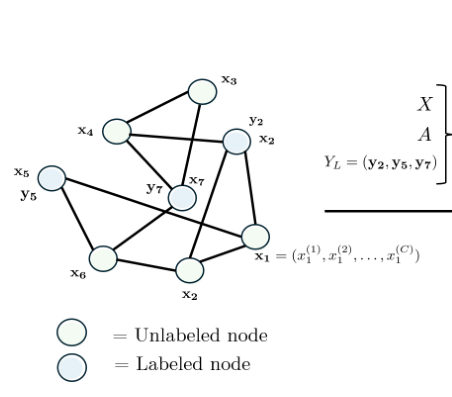
<figcaption class="paper-figure-caption"><b>Fig 1.</b> Figure 1: Schematic illustration of the semi-supervised node classification.</figcaption>
</figure>
<figure class="paper-figure-card">
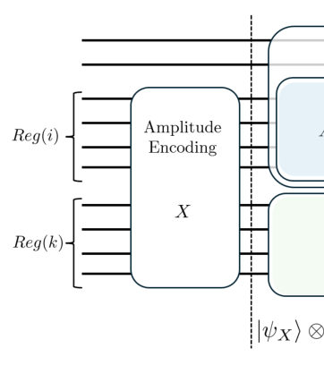
<figcaption class="paper-figure-caption"><b>Fig 2.</b> Figure 2: Quantum circuit implementing the proposed graph convolution operation.</figcaption>
</figure>
<figure class="paper-figure-card">
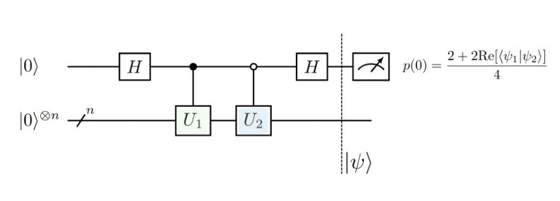
<figcaption class="paper-figure-caption"><b>Fig 3.</b> Figure 3: Schematic representation of the quantum circuit applying the Modified Hadamard Test.</figcaption>
</figure>
<figure class="paper-figure-card">
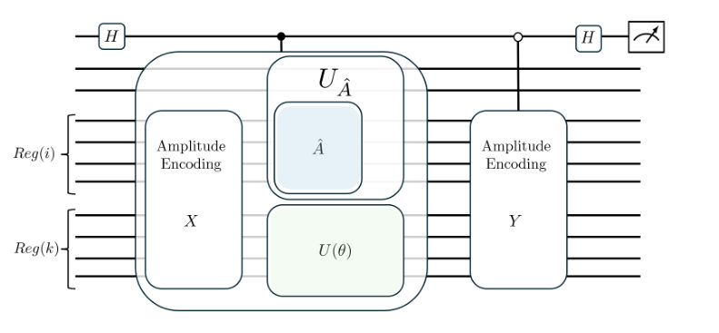
<figcaption class="paper-figure-caption"><b>Fig 4.</b> Figure 4: Quantum circuit implementing the QSGC network. The cost function is evaluated via the Modified Hadamard Test.</figcaption>
</figure>
<figure class="paper-figure-card">
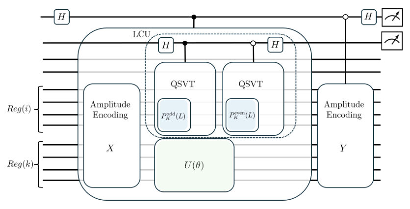
<figcaption class="paper-figure-caption"><b>Fig 5.</b> Figure 5: Quantum circuit implementing QLGC network. The polynomial of L is split into odd and even parity polynomials implemented by QSVT and added by LCU. The cost function is evaluated by the Modified Hadamard test.</figcaption>
</figure>

**Summary.** This paper explores using Quantum Graph Convolutional Networks (QGNNs) to overcome the memory and computational bottlenecks of classical GNNs on large graphs. By implementing and analyzing specific quantum architectures, the authors demonstrate that QGNNs can achieve comparable performance to classical methods with fewer parameters. The work provides a comprehensive analysis of the model's trainability and classical simulability regimes.

**Why it may be interesting.** The work directly bridges quantum machine learning with graph theory, providing a framework for simulating complex, structured data processing tasks using quantum primitives, which is highly relevant for understanding quantum algorithms applied to network science.

Detailed structure

**Main problem.** The paper addresses the scalability limitations of classical Graph Neural Networks (GNNs) on large graphs and proposes quantum computing as a potential solution for graph learning.

**Main result.** Quantum Graph Convolutional Networks (QGNNs) achieve competitive predictive performance compared to classical baselines while potentially requiring fewer parameters.

**Method.** The authors implement and analyze two QGNN architectures (SGC and LGC) by encoding graph data into quantum states and approximating the convolution operation using quantum circuits.

**Model / system.** The system is graph-structured data $G=(V,E)$, modeled by node features $X$ and adjacency matrix $A$. The quantum model utilizes amplitude encoding and parameterized quantum circuits to simulate graph convolution.

**Key observables.** Predictive performance, trainability (cost gradient analysis), and parameter count compared to classical methods.

**Important parameters / regimes.** Graph size ($N$), feature dimension ($C$), and the rank ($r$) of the normalized adjacency matrix.

**Assumptions / limitations.** The analysis assumes an efficient Quantum Random Access Memory (QRAM) and relies on approximating the classical cross-entropy loss with a quantum overlap-based surrogate loss.

**Figures summary.** Figure 1 illustrates semi-supervised node classification; Figure 2 shows the quantum circuit for graph convolution; and Figure 3 depicts the Modified Hadamard Test used for loss estimation.

**Paper structure.** The paper first introduces the problem of GNN scalability, then details the quantum implementation of GCNs using quantum circuits and a surrogate loss function. It follows with detailed cost gradient analysis, classical simulability studies, and asymptotic derivations for graph invariants.

Abstract

Graph Neural Networks (GNNs) achieve state-of-the-art performance on graph-structured data, but training and inference on large graphs are often bottlenecked by memory constraints and sparse linear-algebra workloads. Quantum computing offers an alternative set of primitives that may improve scalability for graph learning. Building on the quantum graph neural network (QGNN) framework of Liao \textit{et al.}, this work implements two representative architectures --- the Simplified Graph Convolution (SGC) and Linear Graph Convolution (LGC) models --- and evaluates them on open benchmark graph datasets and semi-supervised learning tasks using quantum simulation. We compare predictive performance and optimization behavior against classical baselines, showing that the quantum models achieve competitive performance with fewer parameters. Finally, we present a cost gradient analysis that identifies the tasks for which the models showcased are trainable. This is followed by a classical simulability study to find regimes in which the proposed circuits remain robust during training.

[↑ back to top](#top)

### [Quantum tree networks: complete semidefinite hierarchies and the source-transfer model](http://arxiv.org/abs/2609.19310v1)

**Authors:** Xiangling Xu, Igor Klep, Marc-Olivier Renou  
**Type:** theory · **Category:** quantum information and computing · **PDF:** <https://arxiv.org/pdf/2609.19310v1>  
**Analysis basis:** full PDF text, analyzed in chunks

↔ Scroll figures horizontally

<figure class="paper-figure-card">
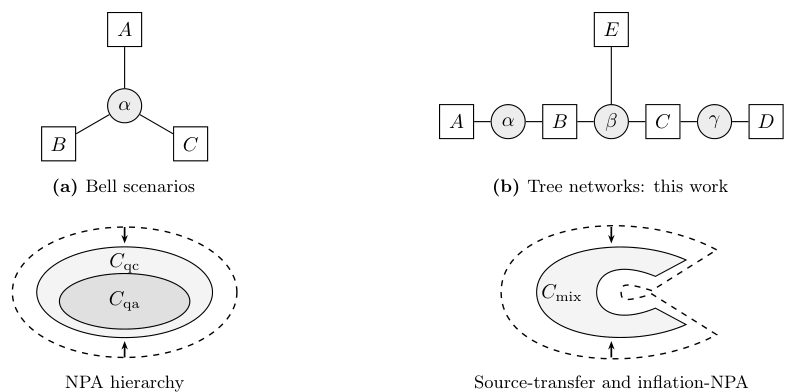
<figcaption class="paper-figure-caption"><b>Fig 1.</b> Figure 1: From Bell scenarios to quantum tree networks. Squares denote parties and circles denote independent sources. Dashed contours illustrate outer approximations, with arrows indicating convergence. In (a), the NPA hierarchy converges from outside to the commuting-operator set Cqc, which in general strictly contains Cqa, the closure of finite-dimensional tensor-product correlations. In (b), the source-transfer and inflation-NPA hierarchies both converge from outside to the nonconvex mixed-model correlation set Cmix on tree networks.</figcaption>
</figure>
<figure class="paper-figure-card">
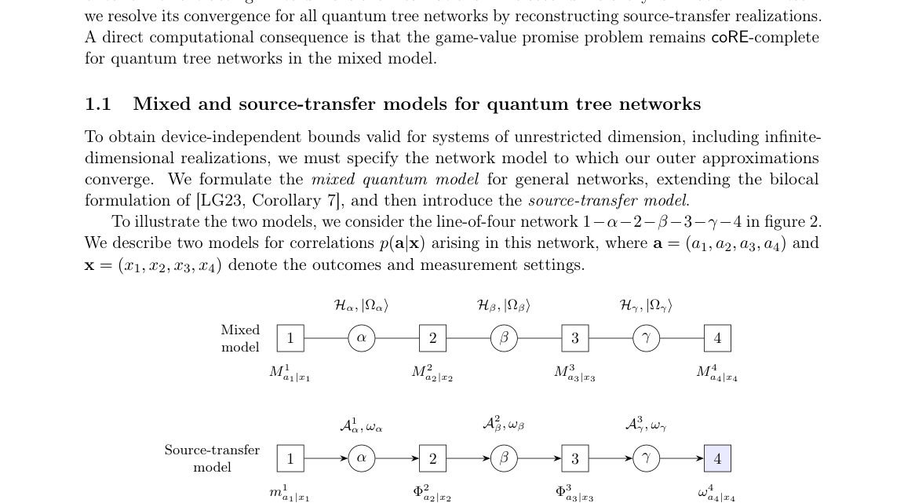
<figcaption class="paper-figure-caption"><b>Fig 2.</b> Figure 2: Two quantum models for the line-of-four network. Squares denote parties and circles denote independent sources. In the mixed model, local measurements act on the source systems. In the source-transfer model, arrows indicate the recursive evaluation of the correlation from party 1 towards the root at party 4.</figcaption>
</figure>
<figure class="paper-figure-card">
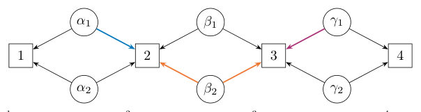
<figcaption class="paper-figure-caption"><b>Fig 3.</b> Figure 3: Quantum inflation of the line-of-four network with two copies of each source. Squares denote parties and circles denote independent source copies. Colored indices and edges indicate the source copies on which each measurement acts.</figcaption>
</figure>
<figure class="paper-figure-card">
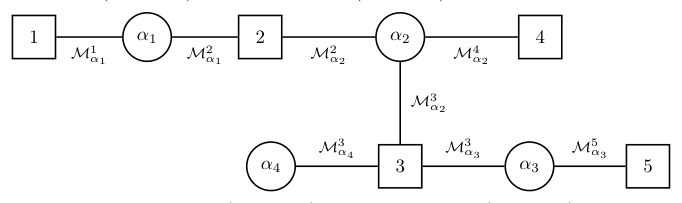
<figcaption class="paper-figure-caption"><b>Fig 4.</b> Figure 4: A source-party tree with parties 1, . . . , 5 represented by squares and independent sources α1, . . . , α4 represented by circles. The source α2 is tripartite and is shared by parties 2, 3, 4, while α1 and α3 are bipartite. The source α4 is a local source connected only to party 3. In the mixed model of definition 2.1, each source αj carries a Hilbert space Hαj and a unit vector Ωαj . For every adjacent party i ∈NT(αj), the von Neumann algebra Mi αj ⊂B  Hαj  describes the observables of party i on source αj; for each fixed source, these algebras mutually commute. The local observable algebras are M1 = M1 α1, M2 = M2 α1 ⊗M2 α2, M3 = M3 α2 ⊗M3 α3 ⊗M3 α4, M4 = M4 α2, and M5 = M5...</figcaption>
</figure>
<figure class="paper-figure-card">
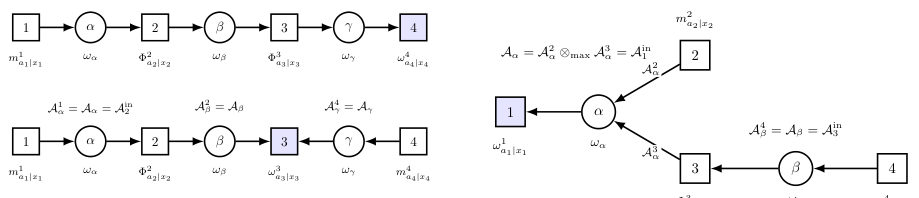
<figcaption class="paper-figure-caption"><b>Fig 5.</b> Figure 5: Source-transfer descriptions of two quantum tree networks. Circles denote sources, squares denote parties, and blue squares denote roots. Each source α carries a state ωα on the joint source algebra Aα, formed from the algebras Av α of its child parties. The input algebra of a party v is Ain v = Nmax α∈ch(v) Aα. Leaf parties carry POVM elements, internal non-root parties carry transfer maps, and root parties carry positive functionals. Arrows indicate the direction of transfer toward the root.</figcaption>
</figure>

**Summary.** This paper develops a comprehensive mathematical framework to characterize correlations in quantum tree networks, resolving the difficulty of finding dimension-free bounds. It introduces the source-transfer model, proving its equivalence to the mixed quantum model, and establishes two complete SDP hierarchies for bounding these correlations. This work advances the theory of quantum correlations beyond simple tensor product assumptions.

**Why it may be interesting.** The rigorous mathematical characterization of quantum correlations in complex network structures provides fundamental tools for understanding resource theories in quantum information, applicable to quantum communication and computation protocols.

Detailed structure

**Main problem.** The paper addresses the challenge of finding a systematic, dimension-free method to bound correlations achievable in general quantum networks, specifically quantum tree networks.

**Main result.** The authors introduce and prove the equivalence of the novel source-transfer model and the mixed quantum model for tree networks, establishing two complete outer SDP hierarchies for bounding these correlations.

**Method.** The methodology involves developing and proving the completeness of two specialized Semidefinite Programming (SDP) hierarchies—the source-transfer and inflation-NPA hierarchies—using advanced mathematical tools like noncommutative real algebraic geometry and completely positive maps.

**Model / system.** The focus is on quantum tree networks, which generalize the Bell scenario. The correlations are characterized by the Mixed Quantum Model ($	ext{C}_{	ext{mix}}$) and formalized using the Source-Transfer Model, which employs $C^*$-algebras and recursive completely positive maps.

**Key observables.** The game-value promise problem for quantum tree networks in the mixed model, and the convergence of the SDP hierarchies to the true correlation set.

**Important parameters / regimes.** The structure of the network (tree topology), the dimension of the local measurements, and the number of parties involved.

**Assumptions / limitations.** The primary assumption is that the correlation set is governed by the source-transfer model, which is shown to be equivalent to the mixed quantum model. A key limitation overcome is that simple measurement factorization is insufficient.

**Figures summary.** Figure 1 illustrates the hierarchy progression from Bell scenarios to quantum tree networks using the source-transfer and inflation-NPA hierarchies. Figure 2 compares the mathematical structure of the Mixed vs. Source-Transfer models for a line-of-four network.

**Paper structure.** The paper progresses by first defining the physical problem (bounding correlations in tree networks), then introducing the source-transfer model as the necessary formalism, proving its equivalence to the mixed model, and finally establishing the completeness of the corresponding SDP hierarchies.

Abstract

Understanding the capabilities and limits of quantum systems is central to quantum information processing. This includes determining which correlations can arise in networks of quantum systems distributed by independent sources. Yet for general quantum networks, no systematic, dimension-free method is known to bound these correlations arbitrarily well. We resolve this problem for all quantum tree networks through a new source-transfer model, which we prove equivalent to a mixed quantum model. The mixed model places no restriction on dimension and reduces to the standard tensor-product model in finite dimensions; the source-transfer model instead describes these correlations through states on $C^*$-algebras and completely positive maps composed recursively along the tree. We prove the equivalence by reconstructing local measurements as Radon-Nikodym derivatives in the spatial tensor products prescribed by the network. Building on this characterization, we establish two convergent outer hierarchies of semidefinite programs (SDPs): a novel source-transfer hierarchy and the inflation-NPA hierarchy. For the source-transfer hierarchy, we extend noncommutative real algebraic geometry to multi-state polynomials with completely positive maps, prove a reconstruction theorem establishing its convergence, and give a sufficient stopping criterion for extracting finite-dimensional realizations. For the inflation-NPA hierarchy, we reconstruct source-transfer realizations from weak-operator limits of averages over source copies. Consequently, the game-value promise problem for quantum tree networks in the mixed model is $\mathsf{coRE}$-complete.

[↑ back to top](#top)

### [Scalable logical qubits](http://arxiv.org/abs/2609.20549v1)

**Authors:** Matthias Troyer, Chetan Nayak, John Martinis  
**Type:** theory · **Category:** quantum information and computing · **PDF:** <https://arxiv.org/pdf/2609.20549v1>  
**Analysis basis:** full PDF text, analyzed in chunks

↔ Scroll figures horizontally

<figure class="paper-figure-card">
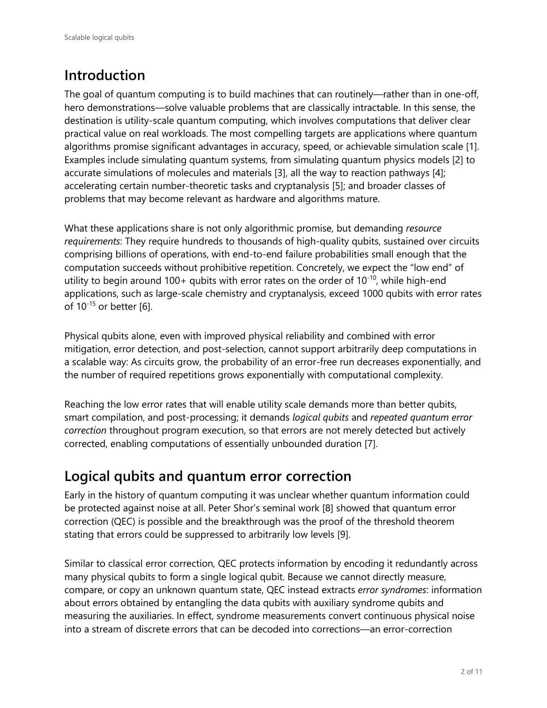
<figcaption class="paper-figure-caption"><b>Fig 1.</b> Low-resolution page preview, page 2</figcaption>
</figure>
<figure class="paper-figure-card">

<figcaption class="paper-figure-caption"><b>Fig 2.</b> Low-resolution page preview, page 3</figcaption>
</figure>
<figure class="paper-figure-card">

<figcaption class="paper-figure-caption"><b>Fig 3.</b> Low-resolution page preview, page 4</figcaption>
</figure>
<figure class="paper-figure-card">

<figcaption class="paper-figure-caption"><b>Fig 4.</b> Low-resolution page preview, page 5</figcaption>
</figure>
<figure class="paper-figure-card">

<figcaption class="paper-figure-caption"><b>Fig 5.</b> Low-resolution page preview, page 6</figcaption>
</figure>

**Summary.** This paper establishes a rigorous framework for measuring progress toward utility-scale quantum computation by defining 'scalable logical qubits.' It characterizes progress across four coupled dimensions—reliability, scale, capability, and performance—and emphasizes that system cost, balancing error correction overhead against runtime, is the ultimate metric. This provides a necessary roadmap for researchers building fault-tolerant quantum processors.

**Why it may be interesting.** It provides a comprehensive, multi-dimensional framework for assessing the maturity of quantum hardware, which is crucial for theorists designing algorithms or analyzing resource requirements for future quantum simulations.

Detailed structure

**Main problem.** Achieving utility-scale quantum computing requires error rates far below what physical qubits can support directly, necessitating robust error correction.

**Main result.** The authors introduce the concept of 'scalable logical qubits,' characterizing progress across four coupled dimensions: reliability, scale, capability, and performance.

**Method.** The paper defines a rigorous metric for progress by analyzing the trade-offs inherent in quantum error correction (QEC) schemes.

**Model / system.** The focus is on abstract quantum error correction codes (e.g., surface codes, LDPC codes) used to encode logical qubits redundantly across physical qubits.

**Key observables.** Logical error rates ($\epsilon$), number of logical qubits ($N$), logical cycle time, and physical-to-logical qubit overhead.

**Important parameters / regimes.** Target error rates ($\sim 10^{-12}$ to $10^{-15}$), required physical qubit count scaling ($O(N \log \epsilon^{-1})$), and decoding latency.

**Assumptions / limitations.** The analysis assumes the existence of low-latency, real-time decoding and feedback mechanisms necessary for fault-tolerant operation.

**Paper structure.** The paper establishes the necessity of logical qubits, defines the four characterization dimensions (Reliability, Scale, Capability, Performance), discusses the trade-offs between these dimensions, and concludes by framing progress assessment around overall system cost.

Abstract

Utility-scale quantum computing will require executing long, complex algorithms with end-to-end error rates far below what physical qubits can support directly. Error-corrected logical qubits are needed to achieve this goal. To make the progress on logical qubits measurable and comparable we introduce the definition of scalable logical qubits: logical qubits preserved for long computations by repeated quantum error correction, capable of fault-tolerant universal operations with low-latency real-time decoding and feedback, and replicable to the hundreds or thousands, as required by applications. We characterize these scalable logical qubits along four coupled dimensions: reliability, scale, capability, and performance, and discuss trade-offs among these dimensions.

[↑ back to top](#top)

### [Schrijver-Delsarte rigidity in association schemes and undecidability of quantum graph homomorphism](http://arxiv.org/abs/2609.20678v1)

**Authors:** Lorenzo Ciardo, Iris Hebbeker, Gideo Joubert, Jana Kreiß, Antoine Mottet  
**Type:** theory · **Category:** other · **PDF:** <https://arxiv.org/pdf/2609.20678v1>  
**Analysis basis:** full PDF text, analyzed in chunks

↔ Scroll figures horizontally

<figure class="paper-figure-card">
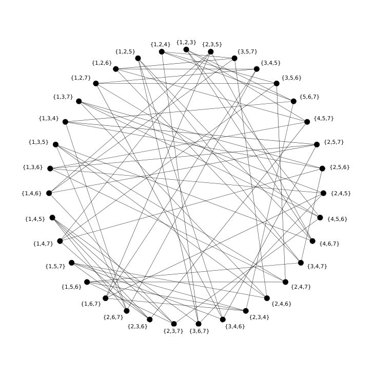
<figcaption class="paper-figure-caption"><b>Fig 1.</b> Figure 1: The Kneser graph KG(7, 3). Its vertex labels are the 3-subsets of [7] = {1, . . . , 7}, and two vertices are adjacent precisely when the corresponding subsets are disjoint. The graph has 35 vertices and 70 edges.</figcaption>
</figure>
<figure class="paper-figure-card">
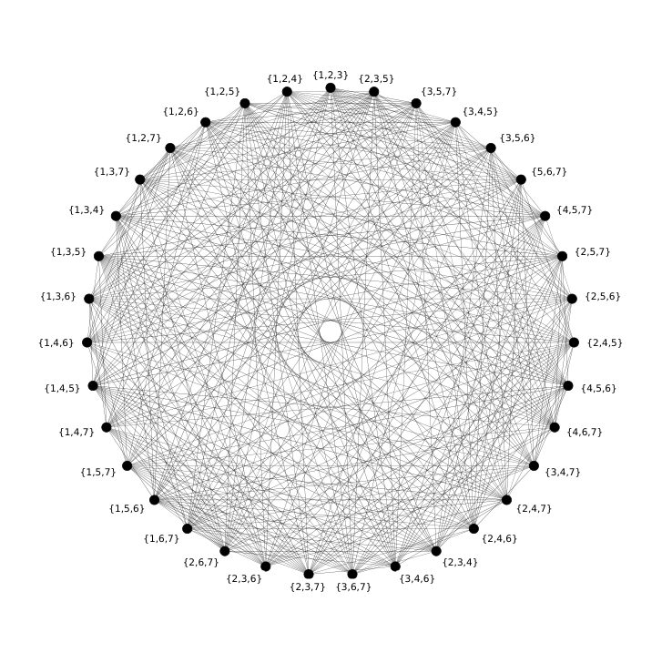
<figcaption class="paper-figure-caption"><b>Fig 2.</b> Figure 2: The complement J(7, 3) of the Johnson graph. Its vertex labels are the 3-subsets of [7] = {1, . . . , 7}, and two distinct vertices x, y are adjacent precisely when |x ∩y| ≤1. The graph has 35 vertices and 385 edges.</figcaption>
</figure>
<figure class="paper-figure-card">
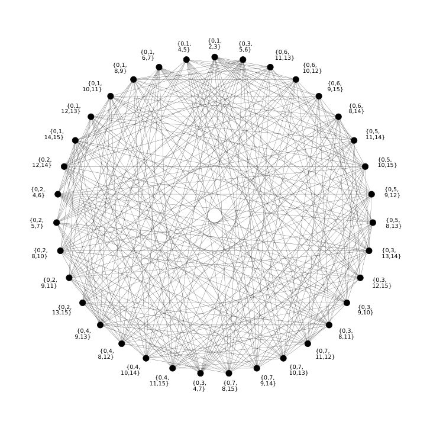
<figcaption class="paper-figure-caption"><b>Fig 3.</b> Figure 3: The graph KG2(4, 2) = J2(4, 2), which is both a q-Kneser graph and the complement of a Grassmann graph. Its 35 vertices are the two-dimensional subspaces of F4 2. We identify each integer r ∈{0, . . . , 15} with its four-bit binary representation in F4 2; each vertex label lists the four elements of the corresponding subspace. Two vertices are adjacent precisely when the corresponding subspaces intersect only in 0. The graph has 280 edges.</figcaption>
</figure>
<figure class="paper-figure-card">
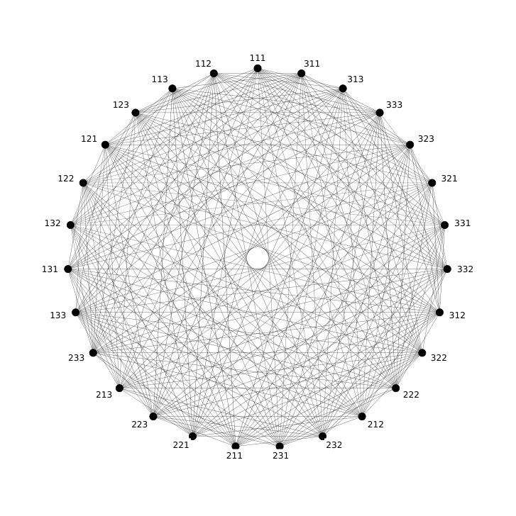
<figcaption class="paper-figure-caption"><b>Fig 4.</b> Figure 4: The complement H(3, 3) of the Hamming graph H(3, 3). The label x1x2x3 denotes the word (x1, x2, x3) ∈{1, 2, 3}3, and two distinct words are adjacent precisely when their Hamming distance is at least 2. The graph has 27 vertices and 270 edges.</figcaption>
</figure>

**Summary.** This theoretical paper proves that determining if a quantum homomorphism exists for certain structured graphs (like Kneser graphs) is computationally hard (RE-complete). It achieves this by developing a novel spectral method that links graph rigidity properties (derived from association schemes) to the non-contextuality of quantum operations. The work significantly advances the understanding of complexity in quantum graph theory.

**Why it may be interesting.** While highly mathematical, establishing computational hardness results for quantum problems provides theoretical boundaries for quantum computation models, which is relevant to understanding the limits of quantum information processing.

Detailed structure

**Main problem.** The paper determines the computational complexity of the quantum graph homomorphism problem parameterized by specific families of graphs derived from association schemes.

**Main result.** It proves that this quantum homomorphism problem is RE-complete for graphs like Kneser graphs and complements of Johnson/Grassmann/Hamming graphs.

**Method.** The proof develops a spectral method to establish the non-contextuality of quantum polymorphisms, combining analysis of Roberson's bound with structural arguments from EKR theory.

**Model / system.** The model involves the quantum graph homomorphism problem defined over finite-dimensional tensor-product oracular settings, utilizing concepts from algebraic combinatorics like association schemes.

**Key observables.** Quantum homomorphism problem, Projective Packing Number (alpha_p(G)), Schrijver's theta (vartheta^-), and quantum polymorphisms.

**Important parameters / regimes.** The graph structure derived from symmetric association schemes (e.g., Kneser, Hamming).

**Assumptions / limitations.** The method relies on establishing a spectral condition that forces quantum polymorphisms to be non-contextual, linking graph rigidity to computational complexity.

**Figures summary.** Figure 4 illustrates the complement of the Hamming graph H(3, 3), showing its vertex and edge count.

**Paper structure.** The paper builds from defining the quantum homomorphism problem and related bounds ($\alpha_p, \vartheta^-$) to developing a spectral criterion for non-contextuality. It then applies this criterion to specific graph families (like those from association schemes) to prove RE-completeness.

Abstract

We prove RE-completeness of the quantum homomorphism problem parameterised by families of graphs derived from the classic metric association schemes. These include Kneser graphs, $q$-Kneser graphs, and the complements of Johnson, Grassmann, and Hamming graphs. Our proof develops a spectral method for establishing non-contextuality of quantum polymorphisms. It combines an equality analysis of Roberson's bound on the projective packing number in terms of Schrijver's theta with a structural argument inspired by Erdős-Ko-Rado theory.

[↑ back to top](#top)

### [Sensitivity of Nucleation Thermodynamics and Kinetics to the Treatment of Long-Range Interactions](http://arxiv.org/abs/2609.19646v1)

**Authors:** Fernanda Sulantay Vargas, Kimia Sinaeian, Amir Haji-Akbari  
**Type:** theory · **Category:** statistical mechanics · **PDF:** <https://arxiv.org/pdf/2609.19646v1>  
**Analysis basis:** full PDF text, analyzed in chunks

↔ Scroll figures horizontally

<figure class="paper-figure-card">
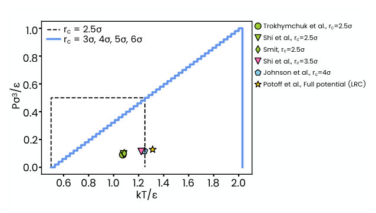
<figcaption class="paper-figure-caption"><b>Fig 1.</b> FIG. 1. Reversible paths in the p–T plane used for thermodynamic integration of the liquid Lj system. The dashed path is employed for rc = 2.5σ, whereas the solid path is used for rc = 3σ, 4σ, 5σ, and 6σ. Each path circumvents the liquid–vapor critical point associated with the corresponding cutoff radius. Critical point locations were taken from Trokhymchuk et al.,42 Shi et al.,66 and Smit41 for rc = 2.5σ; Shi et al.66 for rc = 3.5σ; Johnson et al.67 for rc = 4.0σ; and Potoff and Panagiotopoulos68</figcaption>
</figure>
<figure class="paper-figure-card">
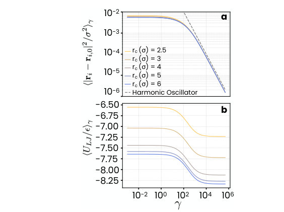
<figcaption class="paper-figure-caption"><b>Fig 2.</b> FIG. 2. (a) Mean-squared displacement and (b) average po- tential energy as a function of the coupling parameter γ, for different cutoff radii. The dashed line in (a) corresponds to the slope of the analytical large-γ limit for non-interacting harmonic oscillators.</figcaption>
</figure>
<figure class="paper-figure-card">
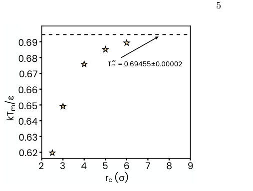
<figcaption class="paper-figure-caption"><b>Fig 3.</b> FIG. 3. Cutoff dependence of the melting temperature of the Lj system at pσ3/ϵ = 0. For rc ≥4 σ, the melting temperatures lie near the full-potential value of kTm/ϵ ≈ 0.6945.55,83</figcaption>
</figure>
<figure class="paper-figure-card">
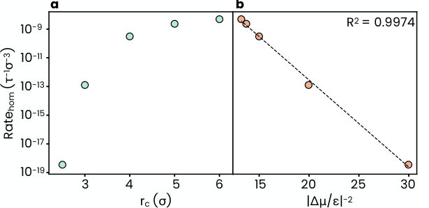
<figcaption class="paper-figure-caption"><b>Fig 4.</b> FIG. 4. (a) Homogeneous nucleation rates in the Lj system at pσ3/ϵ = 0 and kT/ϵ = 0.5 for different cutoff radii. The symbols correspond to actual rates computed from jFfs with error bars smaller than the symbols. (b) Relationship between ln Rhom and |∆µ|−2, consistent with Cnt predictions.</figcaption>
</figure>
<figure class="paper-figure-card">
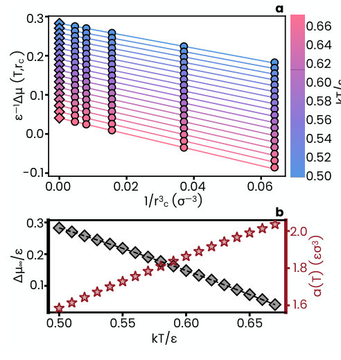
<figcaption class="paper-figure-caption"><b>Fig 5.</b> FIG. 5. (a) Scaling of finite-cutoff ∆µ with r−3 c at different temperatures. (b) The dependence of ∆µ∞(gray) and a(T) (red) on temperature.</figcaption>
</figure>

**Summary.** This work rigorously investigates the artificial sensitivity of nucleation rates to the cutoff radius used for long-range intermolecular interactions in the Lennard-Jones model. The study finds that the kinetic rate changes drastically with $r_c$, necessitating a systematic, theory-guided framework to extrapolate results to the full-potential limit. It emphasizes that the choice of truncation scheme must be treated as a fundamental convergence parameter in simulations of phase transitions.

**Why it may be interesting.** While focused on classical fluid dynamics, the rigorous treatment of convergence parameters ($r_c$) and the development of extrapolation frameworks are highly relevant to any simulation involving long-range forces, including those encountered in quantum many-body systems or complex quantum field theories.

Detailed structure

**Main problem.** The paper quantifies how the calculated nucleation rates and melting thermodynamics are artificially sensitive to the method used to truncate long-range intermolecular interactions.

**Main result.** The nucleation rate exhibits extreme sensitivity, changing by about ten orders of magnitude when varying the cutoff radius, suggesting that the choice of cutoff is a critical, non-trivial parameter in simulations.

**Method.** The study combines Molecular Dynamics (MD) simulations, jumpy forward-flux sampling (jFFS), and free-energy calculations, utilizing Classical Nucleation Theory (CNT) to analyze the cutoff dependence.

**Model / system.** The benchmark system is the Lennard-Jones (LJ) fluid undergoing homogeneous crystal nucleation into an Fcc structure. The potential is truncated at a cutoff radius $r_c$, leading to the need for careful long-range corrections.

**Key observables.** Melting temperature ($T_m$), homogeneous crystal nucleation rate ($R_{hom}$), and the chemical potential difference between liquid and crystalline phases.

**Important parameters / regimes.** The cutoff radius ($r_c$) is the primary variable, tested in the range $2.5\sigma \le r_c \le 6\sigma$. The simulation is run at $kT/\epsilon = 0.5$.

**Assumptions / limitations.** The authors assume that the kinetic sensitivity stems primarily from cutoff-induced changes in the chemical potential difference ($\Delta\mu$) between the liquid and crystal phases, and they develop a framework to extrapolate finite-cutoff rates.

**Figures summary.** Figures illustrate reversible paths in the p-T plane for thermodynamic integration, and show the cutoff dependence of the melting temperature and nucleation rate.

**Paper structure.** The paper establishes the problem of long-range interaction truncation, applies MD/jFFS to the LJ system to calculate thermodynamics and kinetics across various $r_c$, derives the kinetic sensitivity from $\Delta\mu$, and proposes a CNT-based framework for extrapolation and optimal cutoff selection.

Abstract

Nucleation rates are exponentially sensitive to the thermodynamic driving force and can therefore depend strongly on the treatment of long-range intermolecular interactions. Here, using the Lennard--Jones (LJ) system as a benchmark, we combine molecular dynamics (MD) simulations, jumpy forward-flux sampling (jFFS), and free-energy calculations to quantify the effect of potential truncation on melting thermodynamics, homogeneous crystal nucleation kinetics, and computational cost. Within the cutoff-radius range $2.5σ\le r_c\le 6σ$, the melting temperature at zero pressure varies by approximately 11%, while the nucleation rate changes by approximately ten orders of magnitude. By invoking classical nucleation theory (CNT), we show that this pronounced kinetic sensitivity originates primarily from cutoff-induced changes in the chemical potential difference between the liquid and crystalline phases. Building on this observation, we develop a CNT-based framework for extrapolating finite-cutoff rates to the full-potential limit and for estimating the expected rate deviations at other cutoff radii and temperatures. These findings also provide a systematic basis for cutoff selection: the optimal cutoff should minimize computational cost while keeping the deviation from the full-potential rate within acceptable bounds. At $kT/ε=0.5$, $r_c=4σ$ provides a reasonable compromise according to these criteria. We further demonstrate that conventional homogeneous tail corrections do not offer a reliable alternative, as they cannot consistently account for the liquid, crystalline, and interfacial environments present during nucleation. Our findings highlight the need to specify and validate the truncation scheme as an integral component of force-field development in simulations of nucleation and other interfacial phase transitions within inhomogeneous environments.

[↑ back to top](#top)

### [Transformers as Intrinsic Optimizers for Quantum Approximate Optimization Algorithm](http://arxiv.org/abs/2609.19392v1)

**Authors:** Kuan-Cheng Chen, Xiaotian Xu, Hiromichi Matsuyama, Wei-Hao Huang, Haomu Yuan, Yu Yamashiro  
**Type:** both · **Category:** quantum information and computing · **PDF:** <https://arxiv.org/pdf/2609.19392v1>  
**Analysis basis:** full PDF text, analyzed in chunks

↔ Scroll figures horizontally

<figure class="paper-figure-card">
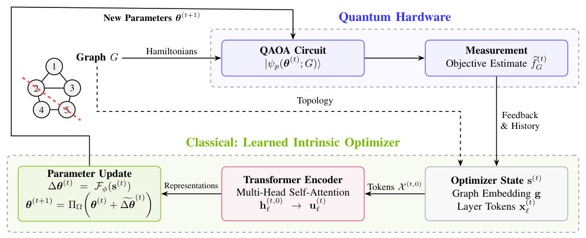
<figcaption class="paper-figure-caption"><b>Fig 1.</b> Fig. 1: Schematic of the proposed Transformer-based intrinsic optimizer for QAOA on MaxCut. The graph instance G defines the cost Hamiltonian and provides topological input to the learned optimizer. Measurement feedback from the QAOA circuit is encoded in the optimizer state s(t), processed by a Transformer encoder, and decoded into a projected parameter update that produces θ(t+1).</figcaption>
</figure>
<figure class="paper-figure-card">
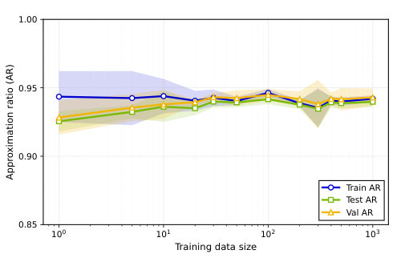
<figcaption class="paper-figure-caption"><b>Fig 2.</b> Fig. 2: Training-, validation-, and test-set approximation ratios as functions of the training dataset size for the pro- posed Transformer-based intrinsic optimizer. Shaded regions indicate the standard deviation over five independent random seeds.</figcaption>
</figure>
<figure class="paper-figure-card">
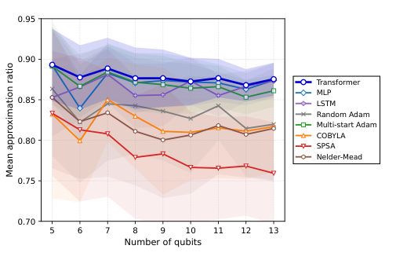
<figcaption class="paper-figure-caption"><b>Fig 3.</b> Fig. 3: Mean approximation ratio versus number of qubits for the proposed Transformer-based intrinsic optimizer and representative baselines. Shaded regions indicate the corre- sponding standard deviation across benchmark instances.</figcaption>
</figure>
<figure class="paper-figure-card">
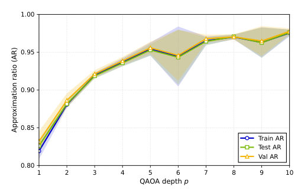
<figcaption class="paper-figure-caption"><b>Fig 4.</b> Fig. 4: Approximation ratio as a function of QAOA circuit depth for the proposed Transformer-based intrinsic optimizer. Curves correspond to training, validation, and test perfor- mance, and the shaded regions indicate the standard deviation over five independent runs with different random seeds.</figcaption>
</figure>
<figure class="paper-figure-card">
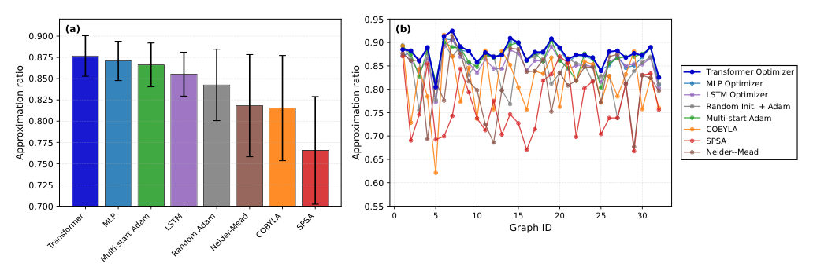
<figcaption class="paper-figure-caption"><b>Fig 5.</b> Fig. 5: Comprehensive benchmarking of the proposed Transformer-based intrinsic optimizer against learned and conventional baselines on unseen MaxCut instances for the case of n = 11 vertices, equivalently 11 qubits, and QAOA depth p = 2. (a) Reports the mean approximation ratio with standard-deviation error bars. (b) Shows the per-instance approximation ratio across benchmark graphs, illustrating the relative robustness and consistency of each method.</figcaption>
</figure>

**Summary.** This paper introduces a novel Transformer-based intrinsic optimizer to overcome the limitations of classical optimization within the QAOA framework for quantum computing. By learning the parameter updates directly from the optimization history, the method transforms the difficult outer-loop optimization into a structured, learned policy. This significantly enhances the performance and transferability of QAOA for solving hard combinatorial problems like MaxCut.

**Why it may be interesting.** This work bridges quantum algorithms with advanced machine learning techniques, providing a concrete, data-driven method to improve the practical utility of variational quantum algorithms for optimization problems.

Detailed structure

**Main problem.** The classical optimization loop required for training the Quantum Approximate Optimization Algorithm (QAOA) is nonconvex, sensitive to initialization, and computationally expensive.

**Main result.** A Transformer-based intrinsic optimization framework successfully learns the parameter updates, significantly outperforming conventional and learned baselines across various MaxCut benchmarks.

**Method.** The authors embed the optimizer directly into the hybrid loop, using a Transformer to process the problem structure, current parameters, and optimization history to predict the next parameter update as an amortized learned policy.

**Model / system.** The work focuses on QAOA, a variational quantum algorithm used for combinatorial optimization, specifically applied to the MaxCut problem on graph instances. The optimization involves finding parameters $	heta$ that maximize the expectation value of the cost Hamiltonian.

**Key observables.** Approximation Ratio (AR) and Mean Energy are the primary metrics used to quantify the quality of the optimized solution.

**Important parameters / regimes.** QAOA depth ($p$), graph size ($n$), and the dimensions of the Transformer model ($d, L$) are varied to test scalability and robustness.

**Assumptions / limitations.** The performance gain is attributed to the structured, learned update mechanism provided by the Transformer, rather than simply increasing the circuit depth or using better classical optimizers.

**Figures summary.** Figures demonstrate that the Transformer optimizer achieves superior AR compared to baselines across varying QAOA depths and graph sizes, and that the performance gain is substantial compared to a zero-update control.

**Paper structure.** The paper first establishes the limitations of standard QAOA optimization. It then details the Transformer architecture, including state tokenization and the prediction head. The core of the work involves formulating the meta-training objective and benchmarking the full system against multiple classical and learned optimizers.

Abstract

The Quantum Approximate Optimization Algorithm (QAOA) is a leading variational framework for combinatorial optimization on noisy intermediate-scale quantum hardware, but its practical performance depends strongly on the classical optimizer used to train its variational parameters. This outer-loop optimization is often nonconvex, initialization-sensitive, and costly when repeated across large families of related problem instances. In this work, we propose a Transformer-based intrinsic optimization framework for QAOA, in which the optimizer itself is learned and embedded directly into the hybrid quantum-classical loop. The proposed graph-conditioned Transformer processes problem structure, current QAOA parameters, measurement feedback, and recent optimization history to predict the next variational-parameter update, thereby reformulating instance-wise classical optimization as an amortized learned policy. We develop a mathematical formulation of this intrinsic-optimization perspective and evaluate the method on QAOA-based MaxCut benchmarks across multiple problem settings, with comparisons against representative classical and learned optimization baselines. The results demonstrate that Transformer-based intrinsic optimization can provide a structured and transferable mechanism for improving the classical component of hybrid quantum optimization algorithms.

[↑ back to top](#top)

### [Type-I superconductivity in a quasi-2D topologically nontrivial YbBi$_2$](http://arxiv.org/abs/2609.20093v1)

**Authors:** Karolina Górnicka, Sudip Malick, Joanna Bławat, Michał Modrzejewski, Hanna Świątek, Michał J. Winiarski, Federico Mazzola, Ivana Vobornik, Chiara Bigi, Jacob Cook, Brenden R. Ortiz, Andrew F. May, Andrzej P. Kądzielawa, John Singleton, Bartlomiej Wiendlocha, Tomasz Klimczuk  
**Type:** both · **Category:** strongly correlated electrons · **PDF:** <https://arxiv.org/pdf/2609.20093v1>  
**Analysis basis:** full PDF text, analyzed in chunks

↔ Scroll figures horizontally

<figure class="paper-figure-card">
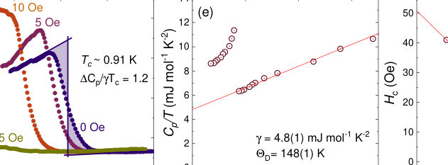
<figcaption class="paper-figure-caption"><b>Fig 1.</b> FIG. 1. Superconducting properties of YbBi2. (a) Temperature-dependent zero-field-cooled (ZFC) and field-cooled (FC) magnetic susceptibility. (b) Field-dependent magnetization measured at T = 0.4 K, indicating type-I superconductivity. (c) Electrical resistivity over the full temperature range, with the superconducting transition shown in the inset. (d) Heat- capacity measurements presented as Cp/T versus T below 1 K in zero field and under low applied magnetic fields (5, 10, and 15 Oe). These measurements confirm the type-I superconductivity of YbBi2. (e) Cp/T versus T 2 together with the low- temperature fit described in the main text. (f) Critical field (Hc) versus T 2 with a linear fit...</figcaption>
</figure>
<figure class="paper-figure-card">
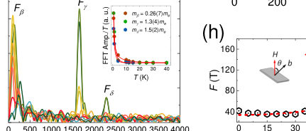
<figcaption class="paper-figure-caption"><b>Fig 2.</b> FIG. 2. a) Magnetization as a function of applied field for various temperatures measured along H ∥b up to 12 T. (b) Fast Fourier transform spectra of dHvA-oscillation data for various temperatures. The inset shows the temperature dependence of the FFT amplitude fitted to the temperature-dependent part of the LK formula. (c) Landau-level fan diagram along with the dHvA-oscillation data at 2 K. FFT spectra of SdH oscillations measured at 640 mK using the PDO for H ∥b for various temperatures for (e) 19−60 T and (f) 28−59 T field windows. Insets show the fitting of the FFT amplitudes to the temperature- dependent part of the LK equations. (g) and (h) FFTs for two field windows for various...</figcaption>
</figure>
<figure class="paper-figure-card">
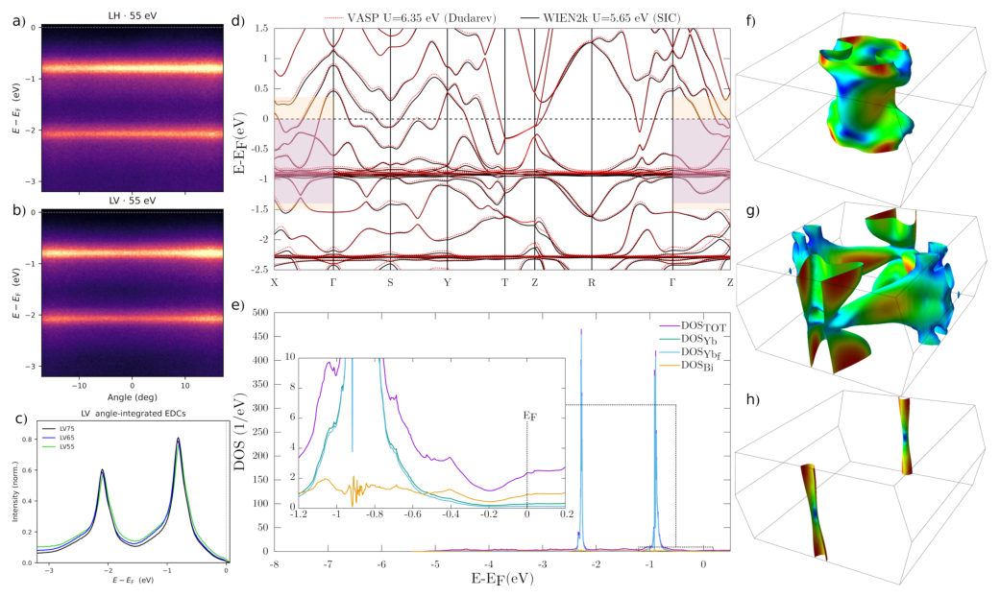
<figcaption class="paper-figure-caption"><b>Fig 3.</b> FIG. 3. (a-c) ARPES (synchrotron) measurements of the valence band. (a,b) maps show the photoemission intensity versus energy relative to the Fermi level (E −EF; EF = 0, white dashed line) and emission angle (±17◦about normal emission), recorded with linearly-horizontal (LH) and linearly-vertical (LV) polarized light at hν = 55 eV. Additional spectra for 65 and 75 eV are shown in Supplemental Material. Panel (c) show angle-integrated energy distribution curves (EDCs) for LV, with hν = 75, 65 and 55 eV overlaid (black, blue, green). The spectra are governed by two essentially non-dispersive features at E−EF ≃−0.9 and -2.3 eV originating from localized f states; (d-h) Calculated...</figcaption>
</figure>
<figure class="paper-figure-card">
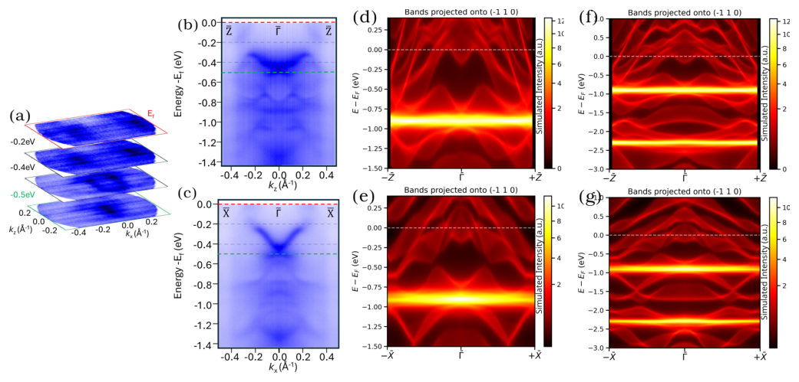
<figcaption class="paper-figure-caption"><b>Fig 4.</b> FIG. 4. (a)-(c) ARPES results. Energy isosurfaces along ¯Z–¯Γ– ¯Z and ¯ X–¯Γ– ¯ X paths. Cuts across the electronic structure correspond to the iso-energy contours to the left. Regions measured and recreated in DFT are marked in the band structure Fig. 3(a), while the high symmetry points in both full and reduced Brillouin zones are marked in Fig. 3(c). For the theoretical modeling, we project the bulk bands onto the (010) surface (elementary cell), equivalent to (¯110) in the primitive cell, of YbBi2: in (d)-(e), we plot the projected band intensity near the Fermi energy EF along the ¯Γ →¯Z and ¯Γ →¯ X paths, respectively, while in (f)-(g) we present the projected band intensity for a...</figcaption>
</figure>
<figure class="paper-figure-card">
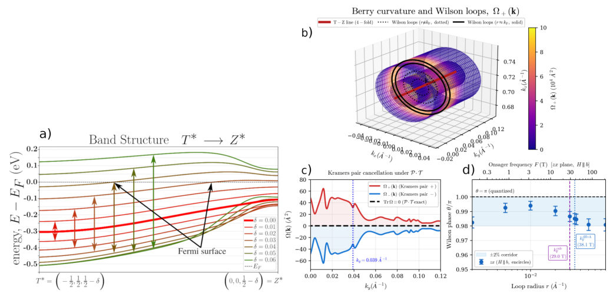
<figcaption class="paper-figure-caption"><b>Fig 5.</b> FIG. 5. a) Split (colored arrows) of a degenerate T-Z band, leading to the crossing of the Fermi level (black arrow). b) Berry curvature and Wilson loops near T-Z line. The Fermi radii (both calculated and measured for α frequency) are marked with solid lines. c) Berry curvatures of a pair of bands and the center of the Fermi surface kmax ≈(0, 0.039, 0.710)(Å−1) (marked with the blue dashed vertical line). Note that the curvatures cancel out exactly. d) Wilson phase θ =∼π calculated around the kmax on the T-Z line. Onsager frequencies F corresponding to the radii are marked on the top axis.</figcaption>
</figure>

**Summary.** This paper reports on YbBi2, demonstrating that it is a rare material exhibiting both intrinsic Type-I superconductivity and signatures of nontrivial electronic topology. By combining quantum oscillation measurements, ARPES, and theoretical calculations, the authors establish YbBi2 as a crucial platform for understanding superconductivity in topologically rich electronic environments.

**Why it may be interesting.** The confluence of superconductivity, topology, and heavy fermion physics in YbBi2 provides a model system for studying how strong electronic correlations and topological order can interact to mediate superconductivity, which is a key area in condensed matter theory.

Detailed structure

**Main problem.** The study investigates the challenging coexistence of intrinsic Type-I superconductivity and nontrivial electronic topology within a single, stoichiometric material.

**Main result.** The compound YbBi2 exhibits bulk Type-I superconductivity near 0.9 K, which coexists with strong evidence of a quasi-two-dimensional electronic structure and nontrivial band topology.

**Method.** The research combines multiple experimental techniques, including transport, magnetic susceptibility, quantum oscillations (dHvA/SdH), and ARPES, with theoretical calculations of electronic structure and topological invariants.

**Model / system.** The physical system is YbBi2, a layered rare-earth compound characterized by a nonsymmorphic crystal structure and a quasi-two-dimensional Fermi surface.

**Key observables.** Superconducting transition temperature (Tc ~ 0.9 K), light effective carrier mass (0.07 me), nonzero Berry phase (0.82 pi), and agreement between experimental quantum oscillation frequencies and theoretical band structure calculations.

**Important parameters / regimes.** Tc ~ 0.9 K; Cyclotron mass as low as 0.07 me; Berry phase $\approx 0.82 \pi$; $\Delta C/\gamma_n T_c = 1.2$.

**Assumptions / limitations.** The analysis assumes the applicability of models for topological invariants (like Wilson phases) and relies on fitting data to models like the McMillan equation for coupling strength.

**Figures summary.** Figures show superconducting properties (magnetization, resistivity, heat capacity) confirming Type-I behavior, and quantum oscillation data (dHvA, FFT spectra) detailing the Fermi surface structure and topological signatures.

**Paper structure.** The paper progresses by first establishing the superconducting state via multiple measurements, then characterizing the normal state electronic structure using quantum oscillations and ARPES, and finally synthesizing these results with theoretical calculations of topological invariants to confirm the unique platform.

Abstract

Intrinsic superconductivity in stoichiometric materials with nontrivial electronic topology remains uncommon, limiting opportunities to investigate how these two phenomena coexist within a single electronic system. Here, we report bulk type-I superconductivity below $T_c$ $\sim$ 0.9~K in YbBi$_2$, a layered rare-earth compound with a nonsymmorphic crystal structure and a quasi-two-dimensional Fermi surface. Thermodynamic and transport measurements establish the superconducting ground state, while quantum oscillations reveal exceptionally light carriers, with a cyclotron mass as low as 0.07 $m_e$, and a nonzero Berry phase of approximately 0.82 $π$. The latter closely matches the calculated value of the corresponding Wilson phase 0.99 $π$ for the corresponding orbit near a symmetry-protected band degeneracy. ARPES measurements show good agreement with key features of the calculated electronic structure, providing complementary experimental constraints on the normal-state band structure. The combination of intrinsic type-I superconductivity, light quasi-two-dimensional carriers, and signatures of nontrivial electronic topology identifies YbBi$_2$ as a distinct stoichiometric platform for investigating superconductivity in a topologically nontrivial electronic environment.

[↑ back to top](#top)

### [VQE Validation on the Mononuclear T1 (Blue-Copper) Site: A Stepping Stone to the Multi-Copper Laccase Cluster](http://arxiv.org/abs/2609.20439v1)

**Authors:** Lucia Malickova  
**Type:** theory · **Category:** strongly correlated electrons · **PDF:** <https://arxiv.org/pdf/2609.20439v1>  
**Analysis basis:** full PDF text, analyzed in chunks

↔ Scroll figures horizontally

<figure class="paper-figure-card">
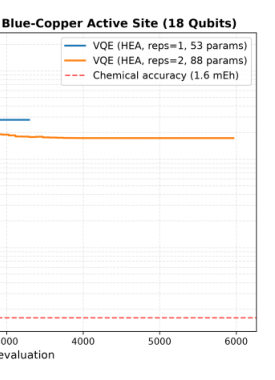
<figcaption class="paper-figure-caption"><b>Fig 1.</b> Figure 1: VQE energy convergence for both ansatz depths (running best), from the emulator run histories; deviation from the exact active-space ground state, log scale.</figcaption>
</figure>
<figure class="paper-figure-card">
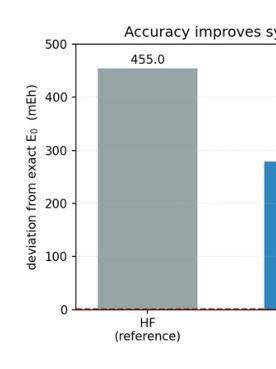
<figcaption class="paper-figure-caption"><b>Fig 2.</b> Figure 2: Deviation from the exact ground state decreases monotonically with ansatz depth.</figcaption>
</figure>
<figure class="paper-figure-card">
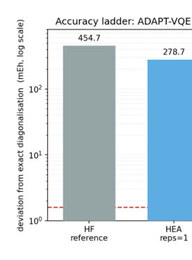
<figcaption class="paper-figure-caption"><b>Fig 3.</b> Figure 3: Accuracy ladder (log scale): the problem-tailored ADAPT-VQE (sin- gles–doubles–triples) removes &gt; 99% of the correlation error, 454.7 →4.03 mEh — a &gt; 40× improvement over the hardware-efficient ansatz.</figcaption>
</figure>
<figure class="paper-figure-card">
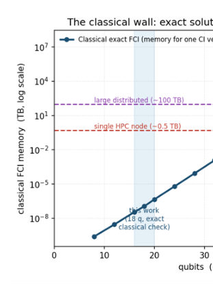
<figcaption class="paper-figure-caption"><b>Fig 4.</b> Figure 4: The classical wall: exact-FCI memory requirements grow exponentially with active-space size (half-filling regime). While the validated 18-qubit case remains classically checkable, the multi-copper target (50–70 qubits) lies far beyond any classical memory limit—entering the regime that strictly necessitates quantum hardware.</figcaption>
</figure>

**Summary.** This paper validates a Variational Quantum Eigensolver (VQE) pipeline on a model of a copper enzyme active site, demonstrating that a problem-tailored ansatz significantly outperforms simpler methods. By achieving high accuracy on a manageable 18-qubit system, the authors establish a robust methodology necessary for tackling the full, classically intractable multi-copper enzyme cluster on future quantum hardware.

**Why it may be interesting.** This work directly tackles the limitations of current quantum algorithms for simulating chemically relevant, strongly correlated open-shell systems, providing a concrete, validated roadmap for quantum chemistry hardware.

Detailed structure

**Main problem.** The paper addresses the challenge of simulating strongly correlated electronic structure in complex, open-shell transition metal active sites, which are classically intractable.

**Main result.** The problem-tailored ADAPT-VQE successfully validated a quantum computational pipeline, achieving a $>40	imes$ improvement in accuracy over simpler ansätze by removing over 99% of the correlation error.

**Method.** The Variational Quantum Eigensolver (VQE) algorithm was employed, utilizing a problem-tailored ansatz (ADAPT-VQE) to minimize the energy expectation value of the mapped Hamiltonian.

**Model / system.** The study focuses on the mononuclear T1 (Blue-Copper) active site of a laccase enzyme, modeled using a CAS(15e, 9o) active space and mapped to 18 qubits via the Jordan-Wigner transformation.

**Key observables.** Ground state energy ($E_0 = -2518.995 	ext{ Eh}$), energy convergence plateaus, and the relative improvement ratio ($> 40	imes$) between ansatz types.

**Important parameters / regimes.** The system size is limited to 18 qubits for validation, while the ultimate target requires 50–70 qubits, exceeding classical FCI memory limits.

**Assumptions / limitations.** The primary assumption is that the dynamically constructed, physically-motivated ansatz (ADAPT-VQE) represents the correct algorithmic path, despite the residual few-mEh gap suggesting limitations in the single-reference excitation ansatz.

**Figures summary.** Figures illustrate the energy convergence of different ansätze (HEA vs. ADAPT-VQE) and demonstrate the exponential classical memory wall encountered when scaling to the full multi-copper cluster.

**Paper structure.** The paper first validates the VQE pipeline on the T1 site using an emulator, comparing HEA and ADAPT-VQE performance. It establishes the methodology's robustness before framing it as a necessary stepping stone for tackling the full, classically intractable multi-copper enzyme cluster.

Abstract

Validating variational quantum eigensolver (VQE) pipelines on realistic chemical systems is a critical stepping stone toward tackling classically intractable molecules. In this work, we report emulator-based validation of the VQE workflow proposed for the copper active site, executed on the LRZ Eviden Qaptiva emulator. A problem-tailored ADAPT-VQE with a full singles-doubles-triples (S+D+T) pool removes over 99% of the correlation error, reaching a stable plateau at 4.03 mEh relative to exact diagonalisation (148 selected operators). This establishes a >40x improvement over the hardware-efficient ansatz (HEA). Finally, we frame these emulator results as a robust baseline for upcoming physical quantum hardware runs on Euro-Q-Exa.

[↑ back to top](#top)

## Secondary cond-mat archives

*Papers from cond-mat.mtrl-sci, mes-hall, other, soft, supr-con. These archives are de-prioritized — they appear at the end regardless of relevance score.*

### Relevant in secondary archives (18)

### [Encapsulation epitaxy of air-stable monolayer superconducting films for quantum circuits and qubits](http://arxiv.org/abs/2609.19321v1)

**Authors:** Xudong Zheng, Sameia Zaman, Kenan Zhang, Connor A Occhialini, Haowei Xu, Zhien Wang, Fangyuan Liu, Luiz Gustavo Pimenta Martins, Sejoon Lim, Tianyi Zhang, Tilo H. Yang, Jiangtao Wang, Yunyue Zhu, Zachariah Hennighausen, Sein Park, Steven Vitale, Kevin Tibbetts, Stephen Margiotta, Phillip Kim, Cong Su, Ju Li, Riccardo Comin, William D. Oliver, Joel Î-j. Wang, Jing Kong  
**Type:** both · **Category:** strongly correlated electrons · **PDF:** <https://arxiv.org/pdf/2609.19321v1>  
**Analysis basis:** full PDF text, analyzed in chunks
**Topic relevance:** 🔥 `QC/QI experiment` **4/5** · `analog quantum simulation` **2/5**

↔ Scroll figures horizontally

<figure class="paper-figure-card">
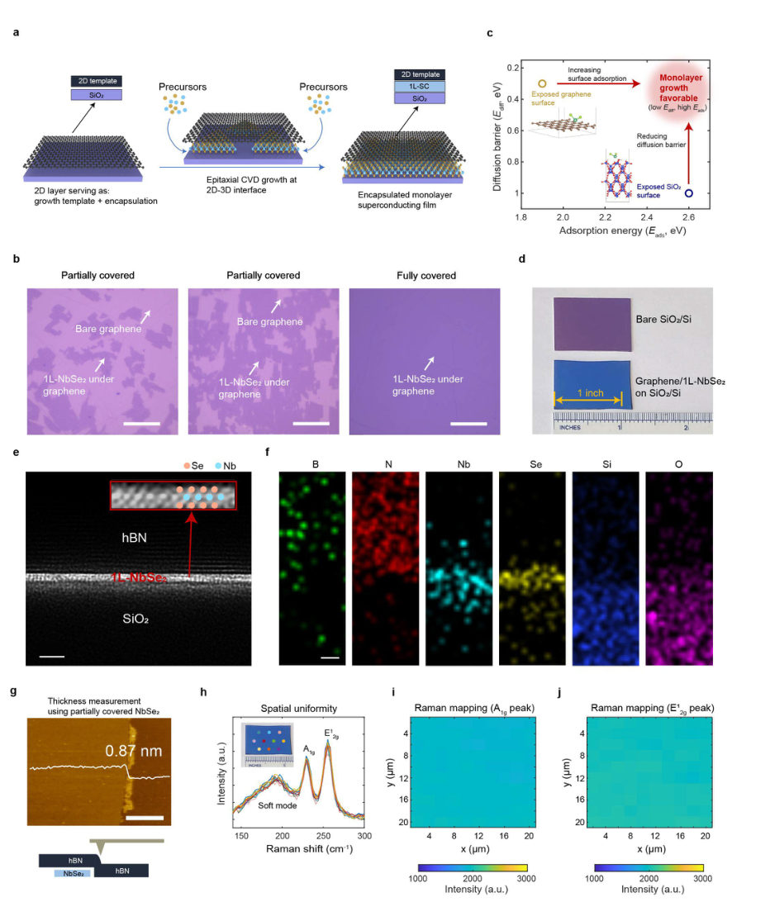
<figcaption class="paper-figure-caption"><b>Fig 1.</b> Fig. 1 | Encapsulation epitaxy: growth process and resulting 1L-NbSe2 film. a, Schematic illustration of the</figcaption>
</figure>
<figure class="paper-figure-card">
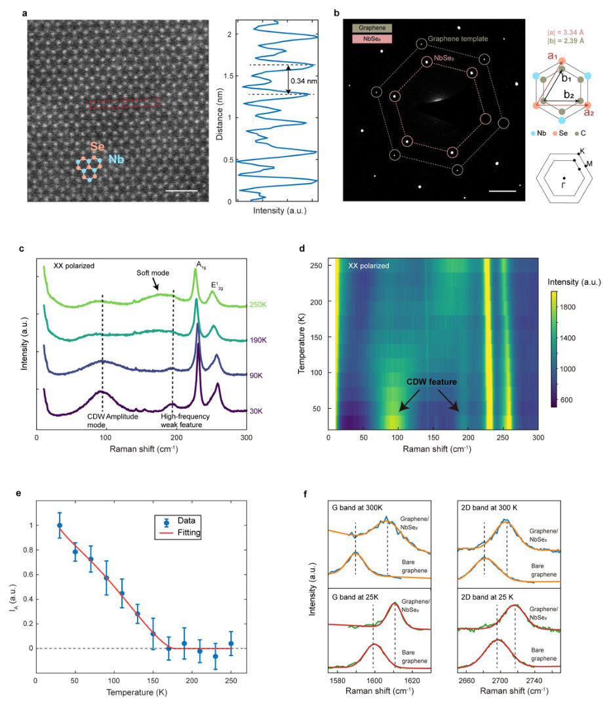
<figcaption class="paper-figure-caption"><b>Fig 2.</b> Fig. 2 | Atomic imaging and charge density wave characterization. a, (left panel) HAADF-STEM image of a</figcaption>
</figure>
<figure class="paper-figure-card">
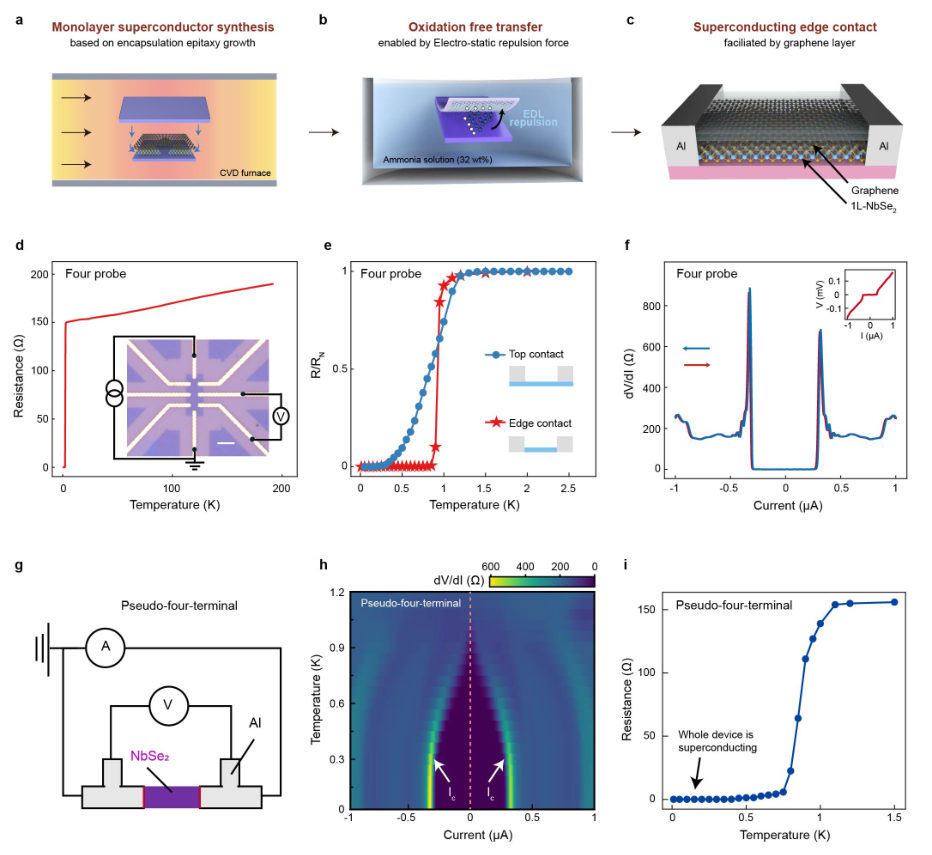
<figcaption class="paper-figure-caption"><b>Fig 3.</b> Fig. 3 | Superconductivity and superconducting edge contact. a-c, Schematics of the fabrication process</figcaption>
</figure>
<figure class="paper-figure-card">
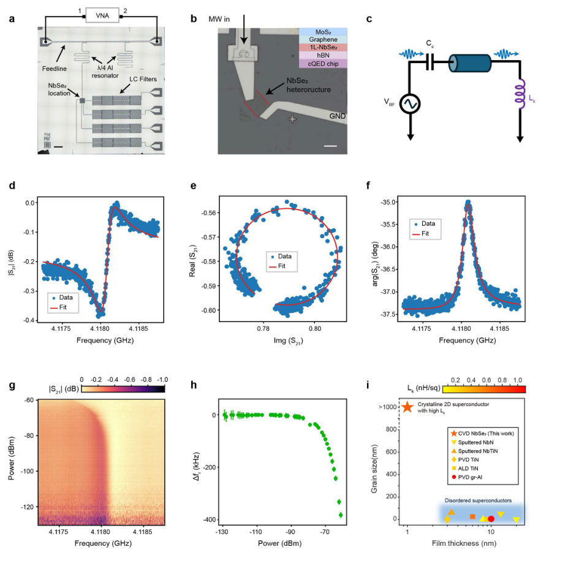
<figcaption class="paper-figure-caption"><b>Fig 4.</b> Fig. 4 | Integrating 1L-NbSe2 into a superconducting circuit. a, Optical image of the superconducting circuit</figcaption>
</figure>

**Summary.** This paper reports an 'encapsulation epitaxy' technique to grow large-area, air-stable monolayer superconducting $	ext{NbSe}_2$ films. By using a 2D layer as both a template and a protective cover, they overcome the material's susceptibility to oxidation. This enables the fabrication of high-quality superconducting heterostructures suitable for next-generation quantum circuits.

**Why it may be interesting.** The work directly addresses material synthesis challenges for quantum hardware, linking fundamental condensed matter physics (superconductivity, CDW) to practical device engineering, which is highly relevant for quantum information science.

Detailed structure

**Main problem.** The primary challenge is developing a scalable, air-stable method to synthesize large-area, monolayer superconducting films necessary for integrating into quantum circuits and qubits.

**Main result.** The authors introduce an 'encapsulation epitaxy' mechanism that successfully grows large-area, air-stable monolayer $	ext{NbSe}_2$ films, demonstrating robust superconductivity and suitability for wafer-scale quantum circuit fabrication.

**Method.** The method combines epitaxial growth techniques with a protective 2D encapsulation layer (graphene/hBN) on a 3D substrate, supported by DFT calculations to guide the growth mechanism.

**Model / system.** The physical system is the 2D superconductor $	ext{NbSe}_2$ grown epitaxially at the interface between a 2D encapsulating layer (e.g., graphene) and a 3D substrate ($	ext{SiO}_2$ or $	ext{Si}_3	ext{N}_4$). The process is governed by surface diffusion and adsorption energies.

**Key observables.** Superconducting transition temperature ($T_c \approx 1 	ext{ K}$), Charge Density Wave temperature ($T_{	ext{CDW}} \approx 177 	ext{ K}$), kinetic inductance ($L_K \approx 0.7 	ext{ nH}/\square$), and resistance measurements showing zero resistance.

**Important parameters / regimes.** Diffusion barrier ($E_{	ext{diff}}$) and adsorption energy ($E_{	ext{ads}}$) are key kinetic parameters derived from DFT modeling.

**Assumptions / limitations.** The method assumes the 2D layer acts effectively as both a template for epitaxial growth and a protective barrier against ambient oxidation.

**Figures summary.** Figures illustrate the encapsulation epitaxy process, structural characterization (STEM, SAED) confirming interface growth, and electrical measurements demonstrating superconducting edge contacts and air stability.

**Paper structure.** The paper progresses from identifying the synthesis challenge to proposing the encapsulation epitaxy method, validating the growth mechanism using DFT, characterizing the resulting material quality (superconductivity, CDW), and finally demonstrating device integration and air stability.

Abstract

Two-dimensional (2D) superconductors are an emerging platform for strongly correlated physics and quantum information science. Their reduced dimensionality, atomically flat interfaces, and high crystallinity are attractive for realizing compact lumped-element devices in superconducting circuits. However, synthesizing large-area, monolayer 2D superconductors remains challenging because of their susceptibility to oxidation. Here, we report an "encapsulation epitaxy" mechanism that enables the growth of large-area, air-stable, monolayer superconducting NbSe2 films and explore their use in superconducting quantum circuits. A 2D encapsulation layer, such as graphene or hexagonal boron nitride (hBN), pre-deposited on a 3D substrate (e.g., SiO2 or Si3N4), serves both as a template for epitaxial growth of monolayer NbSe2 (1L-NbSe2) underneath it and as a protective cover. This approach produces uniform, large-area (>1-inch) 1L-NbSe2 with greatly enhanced ambient stability, enabling device fabrication in air. The resulting 1L-graphene/NbSe2 heterostructures exhibit robust superconductivity (Tc ~ 1 K) and enhanced charge density wave order (TCDW ~ 177 K), indicative of high material quality. We further integrate 1L-NbSe2 into superconducting circuits using oxidation-free transfer and superconducting edge-contact techniques. The 1L-NbSe2 exhibits a measured kinetic inductance LK ~ 0.7 nH/square, making it suitable for quantum circuits requiring high-kinetic-inductance elements. Encapsulation epitaxy thus provides a route to air-stable 2D superconductors and van der Waals heterostructures, with potential for wafer-scale, monolithic fabrication of superconducting quantum circuitry.

[↑ back to top](#top)

### [Coplanar Lateral Gating MoS2 on SrTiO3: A Unified Platform for Classical and Quantum Devices](http://arxiv.org/abs/2609.20426v1)

**Authors:** Prasad Muragesh, Manav Murali, Venkatesha Modur Ramachandra, Madhu Thalakulam  
**Type:** both · **Category:** other · **PDF:** <https://arxiv.org/pdf/2609.20426v1>  
**Analysis basis:** full PDF text, analyzed in chunks
**Topic relevance:** `QC/QI experiment` **3/5** · `Keldysh / 2PI / non-Gaussian methods` **1/5** · `analog quantum simulation` **1/5** · `methods for driven-dissipative` **1/5** · `quantum measurements` **1/5**

↔ Scroll figures horizontally

<figure class="paper-figure-card">
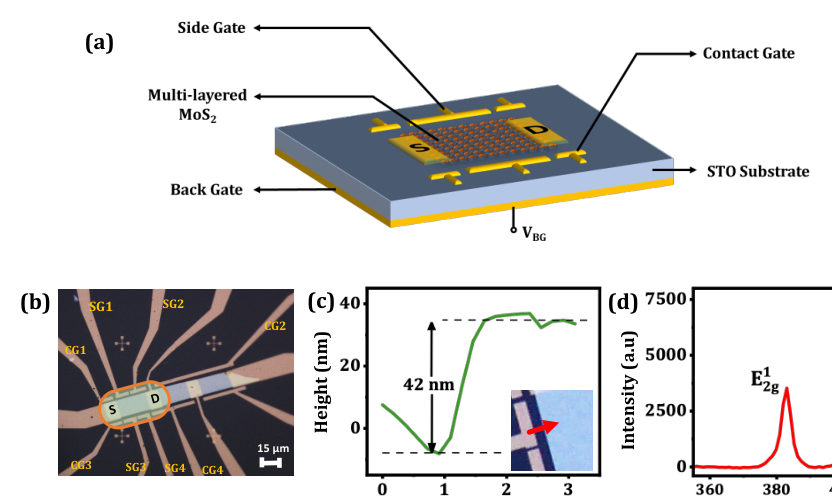
<figcaption class="paper-figure-caption"><b>Fig 1.</b> Figure 1. Device architecture. (a) Schematic representation of the lateral-gate architecture for MoS2 on STO. (b) Optical image of the fabricated device on STO; the highlighted region indicates the portion of the device used for the measurements. (c) Atomic force microscope (AFM) height profile at the edge of the MoS2 flake and thickness of about 42 𝑛𝑚 corresponding to a multilayer flake ∼60 layers. (d) Raman spectrum of exfoliated multilayer MoS2 on STO, the two characteristic peaks of MoS2, 𝐸!&quot;</figcaption>
</figure>
<figure class="paper-figure-card">
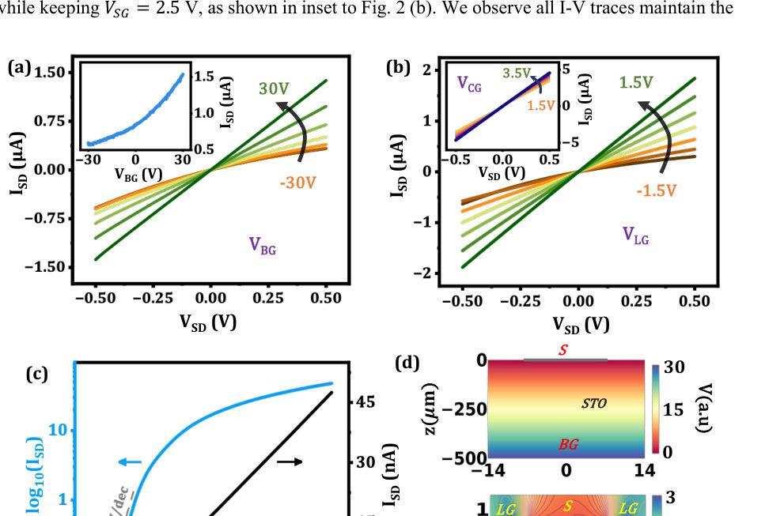
<figcaption class="paper-figure-caption"><b>Fig 2.</b> Figure 2. Room-temperature electrical characterization. (a) I-V characteristics measured for back- gate voltages (𝑉%&amp;) from −30 𝑉 to 30 𝑉. Inset - transfer characteristics with respect to the back-gate voltage. (b) I-V characteristics for various lateral-gate (LG) voltages. Inset – I-V characteristics for various contact gate (CG) voltages for side-gate voltage 𝑉&#x27;&amp; = 2.5 𝑉. (c) Transfer characteristics with resoect to the lateral gate (LG) voltage for 𝑉&#x27;( = 10 𝑚𝑉 in both linear (right) and logarithmic (left) scales showing an extracted subthreshold swing of ~641 𝑚𝑉/𝑑𝑒𝑐, and threshold voltage ~ −3.39. (d) Simulated electrostatic potential map of the device with BG (top) and LG (bottom)...</figcaption>
</figure>
<figure class="paper-figure-card">
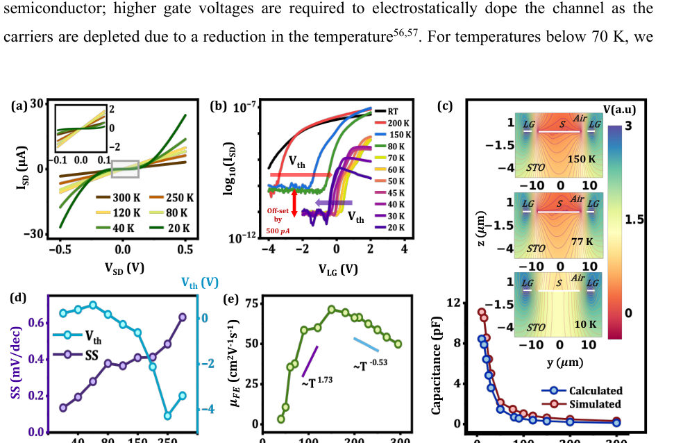
<figcaption class="paper-figure-caption"><b>Fig 3.</b> Figure 3. Temperature-dependence and threshold-voltage reversal (a) I-V characteristics recorded at 𝑉&#x27;&amp; = 2.5 𝑉 for temperatures ranging from room temperature to 20 𝐾. The device gradually transitions from linear to nonlinear behaviour with decreasing temperature, primarily due to the increasingly insulating nature of MoS2 at low temperatures. (b) Transfer characteristics woithrespect to lateral gates (LG), measured for 𝑉&#x27;( = 10 𝑚𝑉. The red and violet arrow represent the progressive shoft in the threshold voltage as the sample is cooled. (c) Gate-channel capacitance extracted from electrostatic simulations (red) and theoretical calculations (blue). Inset - electrostatic simulations showing...</figcaption>
</figure>

**Summary.** This work demonstrates a novel transistor platform using MoS2 on SrTiO3 with coplanar lateral gates. The key innovation is leveraging the temperature-dependent, high permittivity of STO, which enhances gate coupling, leading to excellent electrostatic control. This makes the architecture promising for both low-power classical electronics and cryogenic quantum devices.

**Why it may be interesting.** The strong, tunable gate coupling mechanism derived from the quantum paraelectric nature of STO provides a novel, highly controllable electrostatic environment for 2D materials, which is crucial for realizing scalable quantum devices.

Detailed structure

**Main problem.** To develop a unified, low-power platform for both classical and cryogenic quantum electronic devices using atomically thin MoS2 transistors.

**Main result.** The coplanar lateral-gating architecture on SrTiO3 exhibits enhanced gate coupling, leading to superior electrostatic control and a temperature-dependent threshold voltage shift beneficial for quantum applications.

**Method.** The study combines experimental characterization (I-V measurements down to 10 K) with advanced numerical simulations solving the Poisson equation to model charge transport.

**Model / system.** The system is a MoS2 field-effect transistor fabricated on a single-crystal SrTiO3 substrate, utilizing coplanar lateral gates and a back gate. The simulation models the temperature-dependent permittivity of STO and self-consistently solves for the electrostatic potential and charge density.

**Key observables.** Source-drain current (I-V characteristics), subthreshold swing (SS), threshold voltage (Vth), and the temperature dependence of gate coupling.

**Important parameters / regimes.** Cryogenic temperatures (down to 10 K), high permittivity of SrTiO3, and the gate coupling strength modulated by temperature.

**Assumptions / limitations.** The STO substrate remains crystalline and defect-free, and the simulation relies on solving the nonlinear Poisson equation with temperature-dependent dielectric constants.

**Figures summary.** Figures show device schematics, I-V characteristics demonstrating n-type behavior and gate modulation, and temperature dependence plots illustrating the change in Vth and SS as temperature decreases.

**Paper structure.** The paper establishes the physical platform, presents experimental characterization showing superior performance over SiO2, and uses simulations to model the temperature-dependent electrostatic potential enhancement provided by the STO substrate.

Abstract

Atomically thin transition-metal dichalcogenides, such as MoS2, offer a promising route to surpass the scaling limits of silicon owing to their excellent electrostatic control and resilience to short-channel effects. Realizing this potential depends critically on gate-stack engineering, where strong gate coupling must be achieved without compromising the pristine two-dimensional interface. Here, we demonstrate a coplanar lateral-gating architecture for MoS2 field-effect transistors fabricated directly on single-crystal SrTiO3. The exceptionally high permittivity of SrTiO3 enhances gate-channel coupling. The coplanar geometry eliminates the need for a separate gate insulator, reducing interface disorder. Owing to the quantum paraelectric nature, the SrTiO3 dielectric constant increases upon cooling, enhancing the gate coupling, leading to a decrease in threshold voltage and subthreshold swing an effect that contrasts with conventional FET architectures. The dielectric-free MoS2 surface, combined with enhanced electrostatic control, makes this architecture a promising platform for low-power two-dimensional electronics and cryogenic quantum devices.

[↑ back to top](#top)

### [Quantum transport across normal-superlattice-normal graphene junctions: Fabry-Pérot interference, Hofstadter butterfly, and supersnake states](http://arxiv.org/abs/2609.19627v1)

**Authors:** Che-Pin Hsu, Alina Mreńca-Kolasińska, Aitor Garcia-Ruiz, Szu-Chao Chen, Denis Kochan, Klaus Richter, Ming-Hao Liu  
**Type:** theory · **Category:** other · **PDF:** <https://arxiv.org/pdf/2609.19627v1>  
**Analysis basis:** full PDF text, analyzed in chunks
**Topic relevance:** `interference shaping light` **3/5** · `analog quantum simulation` **1/5**

↔ Scroll figures horizontally

<figure class="paper-figure-card">
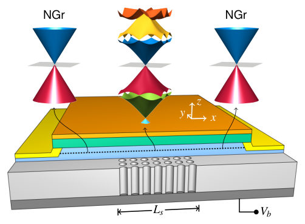
<figcaption class="paper-figure-caption"><b>Fig 1.</b> FIG. 1. Schematics of the gate-controlled graphene superlattice de- vice. The graphene layer (thick dotted line) encapsulated by hBN layers (blue) is sandwiched between a pre-etched substrate (gray) and a dielectric layer (green). Shown above are representative band structures for normal graphene (NGr) at the left and right regions and superlattice graphene (SGr) in the middle.</figcaption>
</figure>
<figure class="paper-figure-card">
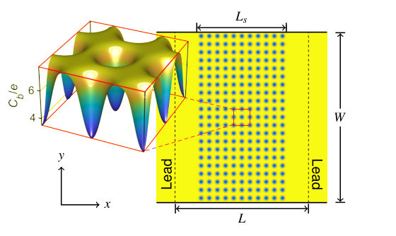
<figcaption class="paper-figure-caption"><b>Fig 2.</b> FIG. 2. Bottom-gate capacitance profile Cb based on Eqs. (1)– (2) across the two-terminal system (main panel), where the region marked by a 2P × 2P red square at the center is magnified in the inset as a surface plot for Cb/e in units of 1010 cm−2 V−1.</figcaption>
</figure>
<figure class="paper-figure-card">
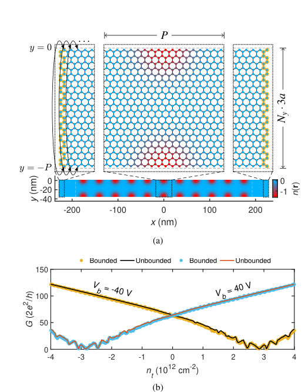
<figcaption class="paper-figure-caption"><b>Fig 3.</b> FIG. 3. (a) Bottom: An exemplary carrier density profile, n(r), in units of 1012 cm−2 for the scaled graphene lattice with the lat- eral periodic boundary condition applied, considering nt = −3 × 1012 cm−2 and Vb = 40 V. White dashed lines mark x = ±Ls/2, and the black dotted boxes mark the regions where the lattice struc- tures are shown in the upper panels. Lattice sites encircled in or- ange at the left and right ends mark those coupled to the semi-infinite leads made of the same zigzag ribbon, also with the lateral periodic boundary condition applied. The curved double-headed arrows in the upper-left panel represent periodic boundary hopping between edge sites, which applies to the...</figcaption>
</figure>
<figure class="paper-figure-card">
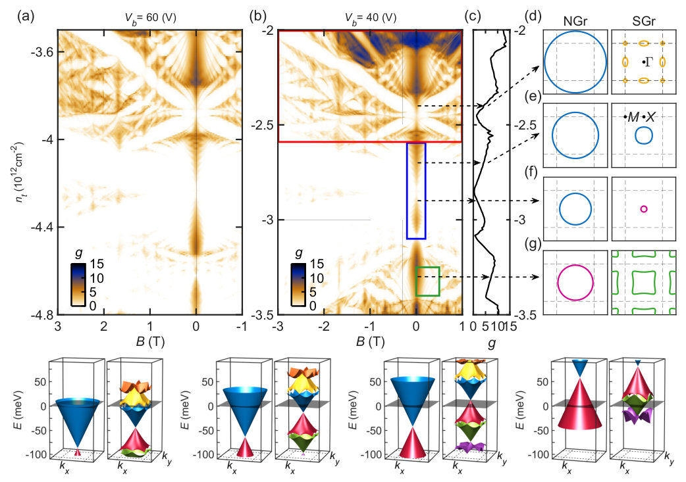
<figcaption class="paper-figure-caption"><b>Fig 4.</b> FIG. 4. Integrated transmission g as a function of magnetic field B and top-gate carrier density nt for fixed bottom gate voltage at (a) 60 V and (b) 40 V. (c) Line cut of panel (b) at B = 0. (d)–(g) Fermi contours for the NGr region (left column) and the SGr region (right column), corresponding to band structures intersected by the E = 0 plane shown in (h)–(k), considering respectively nt = (−2.4, −2.7, −2.9, −3.3)× 1012 cm−2 and Vb = 40 V. Dashed lines in (d)–(g) as well as the bottom of (h)–(k) mark the mini-Brillouin-zone boundaries of the SGr region.</figcaption>
</figure>
<figure class="paper-figure-card">
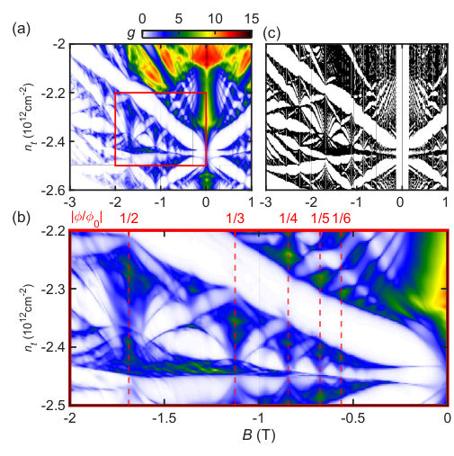
<figcaption class="paper-figure-caption"><b>Fig 5.</b> FIG. 5. (a) Integrated transmission g as a function of B and nt around the second mDC corresponding to the area marked by the red rectangle in Fig. 4(b). (b) Zoom-in view of the region marked by the red rectangle in (a); red dashed lines indicate rational reduced- flux values |ϕ/ϕ0| = 1/2, 1/3, ..., 1/6. (c) Calculated Hofstadter energy spectrum using the continuum model.</figcaption>
</figure>

**Summary.** This work theoretically models quantum transport in a graphene junction structured as Normal-Superlattice-Normal. By simulating the system under magnetic fields, the authors predict the observation of three distinct quantum phenomena: Fabry-Pérot interference, the Hofstadter butterfly, and a unique 'supersnake state.' This demonstrates the versatility of gate-defined superlattices as platforms for controlling quantum electronic behavior.

**Why it may be interesting.** The ability to engineer and observe multiple, distinct quantum phenomena (FP, Hofstadter, supersnake) within a single, gate-tunable device architecture is highly relevant for understanding controllable quantum transport in 2D materials.

Detailed structure

**Main problem.** The study investigates quantum transport phenomena across a gate-defined graphene superlattice junction (NGr-SGr-NGr) under varying magnetic fields.

**Main result.** The junction was shown to host multiple distinct transport regimes, including Fabry-Pérot interference, the Hofstadter butterfly spectrum, and a novel 'supersnake state' in the conductance map.

**Method.** Quantum transport simulations were performed using a tight-binding model, employing real-space Green's function methods for both periodic and open boundary conditions.

**Model / system.** The system is a graphene superlattice junction formed by confining a 2D superlattice graphene (SGr) region between normal graphene (NGr) regions. The physics is modeled using a scalable tight-binding Hamiltonian incorporating gate-defined potentials.

**Key observables.** Conductance ($G$), Fabry-Pérot interference fringes, Hofstadter butterfly spectrum, and the signature of the supersnake state.

**Important parameters / regimes.** Magnetic field strength (up to 3 T), carrier density ($n_t$), and the superlattice period ($P$).

**Assumptions / limitations.** The simulations assume the clean limit, requiring the superlattice length to be much smaller than the mean free path ($\ell_{mfp}$), and the model neglects certain quantum corrections to carrier density.

**Figures summary.** Figures illustrate the schematic of the gate-controlled device (NGr-SGr-NGr) and the bottom-gate capacitance profile across the junction.

**Paper structure.** The paper develops the theoretical framework using a tight-binding Hamiltonian, applies quantum transport methods (Green's functions) to calculate conductance in different magnetic field regimes, and analyzes the resulting characteristic interference patterns and energy spectra.

Abstract

Electrostatic modulation of graphene provides a tunable route to engineering miniband structures. We perform quantum transport simulations on a gate-defined graphene superlattice junction, formed by confining a two-dimensional superlattice graphene (SGr) region between two normal graphene (NGr) regions. In the low-field regime at low carrier densities, robust Fabry-Pérot interference fringes emerge even in the unipolar regime due to Fermi-velocity renormalization in the SGr region. At stronger magnetic fields but only up to 3 T, the conductance map clearly reveals the Hofstadter butterfly spectrum. At intermediate fields, our finite-width transport simulations reveal a new type of snake state, the supersnake state, composed of alternating anomalous cyclotron arcs on the SGr side and conventional semicircular arcs on the NGr side, forming a weaving trajectory along the junction. The resulting conductance oscillations agree well with geometrical conditions derived from semiclassical cyclotron orbits. Our results demonstrate that gate-defined NGr-SGr-NGr junctions provide a versatile platform hosting multiple transport regimes within a single device architecture and can be generalized to other types of superlattices not restricted to graphene.

[↑ back to top](#top)

### [Multiple Andreev Reflection Spectroscopy of Spin-Resolved Proximity States](http://arxiv.org/abs/2609.19380v1)

**Authors:** A. A. Golubov, M. Yu. Kupriyanov  
**Type:** theory · **Category:** other · **PDF:** <https://arxiv.org/pdf/2609.19380v1>  
**Analysis basis:** full PDF text, analyzed in chunks
**Topic relevance:** `Keldysh / 2PI / non-Gaussian methods` **3/5**

↔ Scroll figures horizontally

<figure class="paper-figure-card">
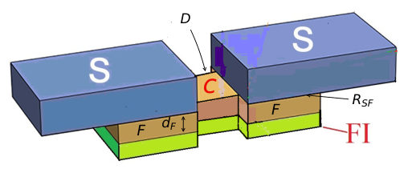
<figcaption class="paper-figure-caption"><b>Fig 1.</b> FIG. 1. Schematic of a possible SFcFS nanoconstriction. The conducting spin-split F layers form the effective ferro- magnetic parts of the two SF electrodes. In one possible realization, these F layers are initially normal-metal films whose spectra are exchange-split by the adjacent ferromag- netic insulators (FI). The FI layers serve only as sources of spin polarization and do not participate directly in electronic transport through the junction. The short central connector c forms the constriction and is characterized by the transmis- sion coefficient D. The marked thickness dF belongs to the conducting F film, and RSF is the resistance–area product of its interface with S, indicated by...</figcaption>
</figure>
<figure class="paper-figure-card">
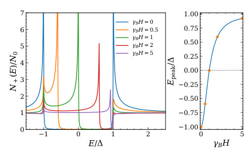
<figcaption class="paper-figure-caption"><b>Fig 2.</b> FIG. 2. Local spin-resolved density of states N+(E) = N0Re GR +(E) in the F-region of the SF electrode. The curves correspond to γBH = 0, 0.5, 1, 2, and 5. With increasing γBH, the positive-energy coherence peak remains close to E = ∆, while an exchange-induced spectral singularity shifts from E ≃−∆toward higher energies. Inset: position Epeak of the shifted spectral peak as a function of γBH.</figcaption>
</figure>
<figure class="paper-figure-card">
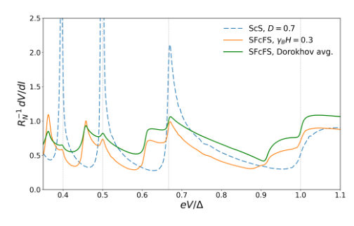
<figcaption class="paper-figure-caption"><b>Fig 3.</b> FIG. 3. Reference MAR spectra in the differential-resistance representation. The curves show a conventional ScS junction with D = 0.7, an SFcFS junction with the same transparency, and the SFcFS response obtained by averaging the current over the Dorokhov distribution of channel transparencies. The SFcFS curves are calculated for γB = 0.01, γBH = 0.3, and Γ = 0.005∆. Vertical dashed lines mark the conventional BCS MAR voltages eV/∆= 2/n. The exchange-induced sub- harmonic anomalies remain visible after transmission averag- ing.</figcaption>
</figure>
<figure class="paper-figure-card">

<figcaption class="paper-figure-caption"><b>Fig 4.</b> Figure 4 focuses on n = 3 and n = 4 as a consec- utive odd–even pair. In these windows, shifted peaks and shoulders can be followed with increasing field and compared directly with the same evolving spin-resolved electrode DOS. This provides a compact illustration that proximity reconstruction modifies both parities in the symmetric parallel configuration.</figcaption>
</figure>
<figure class="paper-figure-card">

<figcaption class="paper-figure-caption"><b>Fig 5.</b> Figure 4 identifies this spectral origin directly. As γBH increases, the negative-energy peak in N+(E) moves away from −∆, and the low-voltage component of the split MAR anomaly shifts accordingly. If the shifted sin- gularity is located at E = Epeak &lt; 0, the reconstructed spectral interval ∆+|Epeak| gives the approximate MAR</figcaption>
</figure>

**Summary.** This work theoretically predicts that in superconducting junctions coupled to ferromagnets, the characteristic multiple Andreev reflection features will be split and redistributed due to the reconstruction of the spin-resolved electronic density of states. This effect provides a robust, measurable transport signature that distinguishes proximity-induced magnetism from simple Zeeman splitting. The methodology relies on solving the Andreev-Bardas recurrence using spin-resolved quasiclassical Green's functions.

**Why it may be interesting.** The study provides a detailed theoretical mechanism for how magnetic proximity effects modify superconducting transport signatures, offering a clean spectroscopic probe of spin-resolved electronic structure in mesoscopic superconducting devices.

Detailed structure

**Main problem.** The paper predicts and analyzes the coherent multiple Andreev reflection (MAR) regime in superconducting nanoconstrictions containing parallel proximity-induced exchange fields.

**Main result.** The subharmonic gap structure (SGS) is controlled by the reconstruction of the spin-resolved electrode spectra, causing MAR anomalies to be split and redistributed rather than showing a rigid shift of BCS gap edges.

**Method.** The analysis uses a theoretical framework connecting quasiclassical Green's functions to the coherent Andreev-Bardas MAR recurrence, solving the problem independently for each spin sector.

**Model / system.** The system is an SFcFS nanoconstriction, where S is a superconductor and F is a diffusive ferromagnet with a collinear exchange field. The theory models the proximity-induced spectral reconstruction in the F layer.

**Key observables.** The subharmonic-gap structure (SGS) observed in the differential resistance ($dV/dI$), which serves as a direct transport probe of spin-resolved proximity states.

**Important parameters / regimes.** The relevant energy scale is set by the interval between the outer gap edge and an exchange-induced singularity in the density of states (DOS).

**Assumptions / limitations.** The central connector (c) is assumed to be short and spin-independent, and the analysis uses the equilibrium spectral-reservoir approximation.

**Figures summary.** Figures compare the MAR spectra for conventional ScS junctions against the predicted SFcFS junctions, showing the redistribution of spectral features due to proximity effects.

**Paper structure.** The paper builds the theory by deriving spin-resolved Green's functions in the thin-F limit, solving the MAR recurrence separately for spin-up and spin-down sectors, and finally analyzing the resulting differential resistance spectra.

Abstract

We predict a coherent multiple Andreev reflection regime in superconducting nanoconstrictions with parallel proximity-induced exchange fields in the electrodes. The subharmonic gap structure is controlled by reconstruction of the spin-resolved electrode spectra, rather than by a rigid displacement of BCS gap edges. This produces split and redistributed anomalies governed by the interval between the outer gap edge and a shifted exchange induced density of states singularity. The effect survives channel transparency averaging and provides a direct transport probe of spin-resolved proximity states.

[↑ back to top](#top)

### [Physical and emergent nonpairwise interactions in oscillator networks: from higher-order phase reduction to coupling design](http://arxiv.org/abs/2609.20632v1)

**Authors:** Riccardo Muolo, Hiroya Nakao, Christian Bick  
**Type:** theory · **Category:** other · **PDF:** <https://arxiv.org/pdf/2609.20632v1>  
**Analysis basis:** full PDF text, analyzed in chunks
**Topic relevance:** `analog quantum simulation` **2/5** · `correlated / nonlocal dissipation` **2/5** · `driven-dissipative phase transition` **2/5** · `Keldysh / 2PI / non-Gaussian methods` **1/5** · `methods for driven-dissipative` **1/5** · `non-equilibrium universality` **1/5** · `quantum measurements` **1/5**

↔ Scroll figures horizontally

<figure class="paper-figure-card">
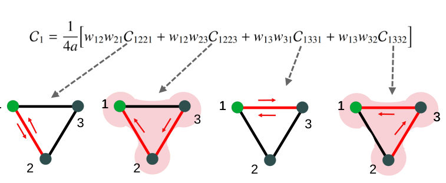
<figcaption class="paper-figure-caption"><b>Fig 1.</b> FIG. 1: Pictorial representation of the emergent pairwise and nonpairwise interaction motifs from the contribution ⃗U of the second order phase reduction.</figcaption>
</figure>
<figure class="paper-figure-card">
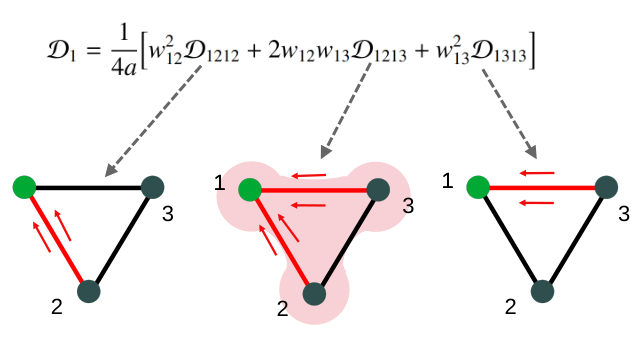
<figcaption class="paper-figure-caption"><b>Fig 2.</b> FIG. 2: Pictorial representation of the emergent pairwise and nonpairwise interaction motifs from the contribution ⃗V of the second order phase reduction.</figcaption>
</figure>
<figure class="paper-figure-card">
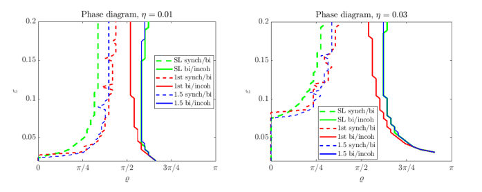
<figcaption class="paper-figure-caption"><b>Fig 3.</b> FIG. 3: Comparison of the full Stuart–Landau system with linear and nonlinear coupling, its first order phase reduction, and the mixed (1.5) order phase reduction of Eq. (15), in the (ϱ, ε) plane, at fixed ξ = 0. Panels (a) and (b) show the boundaries separating the synchronized, bistable, and incoherent regions, obtained from two initial conditions (an almost synchronized state and a splay state), for η = 0.01 and η = 0.03, respectively. Dashed lines mark the boundary between the synchronized and bistable regions, solid lines the boundary between the bistable and incoherent regions, and colors denote the model (green: full system; red: first order reduction; blue: mixed order reduction)....</figcaption>
</figure>
<figure class="paper-figure-card">
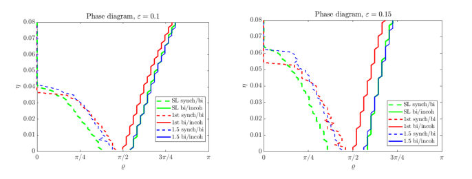
<figcaption class="paper-figure-caption"><b>Fig 4.</b> FIG. 4: Comparison of the full Stuart–Landau system with linear and nonlinear coupling, its first order phase reduction, and the mixed (1.5) order phase reduction of Eq. (15), in the (ϱ, η) plane, at fixed ξ = 0. The left and right panels show the boundaries separating the synchronized, bistable, and incoherent regions, obtained from two initial conditions (an almost synchronized state and a splay state), for ε = 0.1 and ε = 0.15, respectively. Dashed lines mark the boundary between the synchronized and bistable regions, solid lines the boundary between the bistable and incoherent regions, and colors denote the model (green: full system; red: first order reduction; blue: mixed order...</figcaption>
</figure>
<figure class="paper-figure-card">
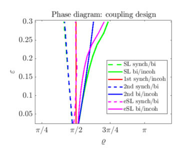
<figcaption class="paper-figure-caption"><b>Fig 5.</b> FIG. 5: Phase diagram in the (ϱ, ε) plane for the Stuart–Landau model (green), its first order phase reduction (red), its second order phase reduction (blue), and the engineered Stuart–Landau model with the physical nonpairwise coupling of Eq. (19) (magenta). Dashed lines mark the boundary between the synchronized and bistable regions; solid lines mark the boundary between the bistable and incoherent regions, obtained from two initial conditions (an almost synchronized state and a splay state), integrated until convergence of the order parameter. The first order phase reduction displays no bistability and therefore has a single boundary at ϱ = π/2. The second order phase reduction...</figcaption>
</figure>

**Summary.** This work develops a systematic method to analyze nonpairwise interactions in coupled oscillator networks, distinguishing between those inherent to the physics (physical) and those generated by the approximation technique (emergent). By comparing these two sources, the authors propose a coupling design strategy that uses physical interactions to actively counteract undesirable emergent phase dynamics, advancing synchronization engineering.

**Why it may be interesting.** While focused on classical nonlinear dynamics, the rigorous mathematical framework for reducing high-dimensional systems to low-dimensional phase models, and the concept of engineering interactions to counteract systematic errors (emergent vs. physical), has strong parallels with controlling quantum many-body states or designing quantum feedback.

Detailed structure

**Main problem.** The paper investigates the fundamental difference between physical nonpairwise interactions (inherent in the system) and emergent nonpairwise interactions (arising from the phase reduction procedure) in coupled oscillator networks.

**Main result.** The framework successfully computes both types of interactions, demonstrating that physical nonpairwise terms can be exploited to design couplings that compensate for the effects of emergent nonpairwise corrections, thereby improving synchronization control.

**Method.** The authors employ a recently developed parametrization method for higher-order phase reduction, systematically comparing its results against classic Kuramoto-style approximations.

**Model / system.** The analysis is performed on general oscillator networks, specifically using the coupled Stuart-Landau (SL) oscillator model for detailed calculations involving three oscillators.

**Key observables.** The primary observables are the phase dynamics ($\dot{\vec{	heta}}$) and the identification of nonpairwise harmonic terms, distinguishing between physical (PN) and emergent (EN) contributions.

**Important parameters / regimes.** The analysis often considers the small coupling parameter $\epsilon$, and specific regimes like straight isochrones ($d=0$).

**Assumptions / limitations.** The method assumes the existence of an attracting invariant torus near the uncoupled torus, and detailed calculations often assume specific simplifications like straight isochrones.

**Figures summary.** Figures are noted to provide pictorial representations of the nonpairwise motifs arising from the $\vec{U}$ and $\vec{V}$ contributions to the phase dynamics.

**Paper structure.** The paper progresses by introducing the problem of nonpairwise interactions, developing the higher-order phase reduction parametrization, systematically calculating and comparing PN and EN contributions using the SL model, and concluding with a coupling design approach.

Abstract

Phase reduction is a powerful technique to obtain phase models from highly dimensional oscillatory systems. Starting from pairwise interactions, a first order approximation yields Kuramoto and Winfree phase models, while nonpairwise interactions emerge at the second order. Recently, phase models have been extended to account for nonpairwise interactions, notably, the higher-order Kuramoto model. Is there an intrinsic difference between physical and emergent nonpairwise interactions? And can we make use of the former to even out the effects of the latter? In this work, we exploit a recently developed parametrization method to compute the phase reduction and answer these questions. After a comparison of the new method with the classic Kuramoto-style phase reduction, we solve the network motifs of the emergent nonpairwise interactions and compare them with the physical once. Lastly, we exploit the motifs to adopt a coupling design approach. Our framework paves the way for further exploitations of physical nonpairwise interactions for applications in synchronization engineering.

[↑ back to top](#top)

### [Multiferroic Quantum Dot in an Artificial van der Waals Heterostructure](http://arxiv.org/abs/2609.19408v1)

**Authors:** Antti Karjasilta, Mohammad Amini, Liwei Jing, Robert Drost, Jose Lado, Shawulienu Kezilebieke, Peter Liljeroth, Adolfo O. Fumega  
**Type:** both · **Category:** other · **PDF:** <https://arxiv.org/pdf/2609.19408v1>  
**Analysis basis:** full PDF text, analyzed in chunks
**Topic relevance:** `quantum measurements` **2/5**

↔ Scroll figures horizontally

<figure class="paper-figure-card">
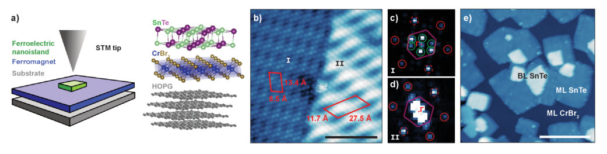
<figcaption class="paper-figure-caption"><b>Fig 1.</b> FIG. 1. Growth of SnTe-CrBr2 heterostructure and characterization of monolayer CrBr2. a. Schematic illustrations of the bilayer heterostructure. b. Monolayer CrBr2 at atomic scale inside the band gap (1.0 V, 28.7 pA, scale bar 4 nm). The unit cells of two different moir´e supercells are illustrated. c, d. FFTs of the left (I) and right (II) domains in panel b, respectively. Red circles highlight the unit cell, with the dashed circles showing the distorted direction. The first Brillouin zone is depicted with magenta dashed lines, and in panel c the moir´e superstructure is illustrated by the green circles. e. Full monolayer CrBr2, with rectangular SnTe islands grown on top (1.2 V, 8.0 pA,...</figcaption>
</figure>
<figure class="paper-figure-card">
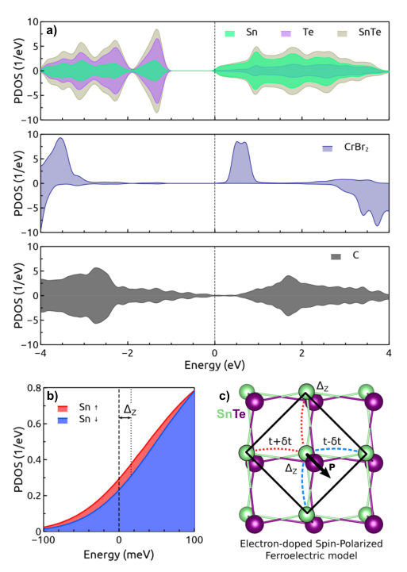
<figcaption class="paper-figure-caption"><b>Fig 2.</b> FIG. 3. Ab initio calculation on the artificial van der Waals heterostructure a. Projected Density of States (PDOS) for SnTe, CrBr2, and graphene, respectively. Positive (negative) PDOS denotes the majority (minority) spin channel. A charge transfer between graphene and the conduction band of SnTe can be identified. b. SnTe PDOS comparison between the spin channels around the Fermi level. For clarity, the ma- jority and minority PDOS are plotted as positive values. A spin-imbalance Zeeman term ∆z is observed as a consequence of the underlying magnetic CrBr2. c. Sketch of the low- energy minimal model that captures the electron-doped spin- polarized ferroelectric nature of SnTe in the...</figcaption>
</figure>
<figure class="paper-figure-card">
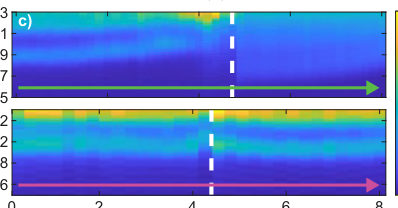
<figcaption class="paper-figure-caption"><b>Fig 3.</b> FIG. 2. STS characterization of SnTe-CrBr2 heterostructure. a. Monolayer SnTe island on monolayer CrBr2. The ferro- electric distortion on SnTe is visible, with a domain bound- ary shown by the dashed white line. The red and blue squares show the locations of the spectra plotted in panel (b), and the green and purple arrows show the locations of the line spectra plotted in panel (c) (1.2 V, 8 pA, scale bar 5 nm). b. dI/dV spectroscopy of monolayer CrBr2 and monolayer SnTe on top of CrBr2. c. Line spectra from monolayer SnTe to monolayer CrBr2 (top panel) and across the ferroelectric domain bound- ary of SnTe (bottom panel). The dashed white lines show the location of the SnTe-CrBr2 edge and...</figcaption>
</figure>
<figure class="paper-figure-card">
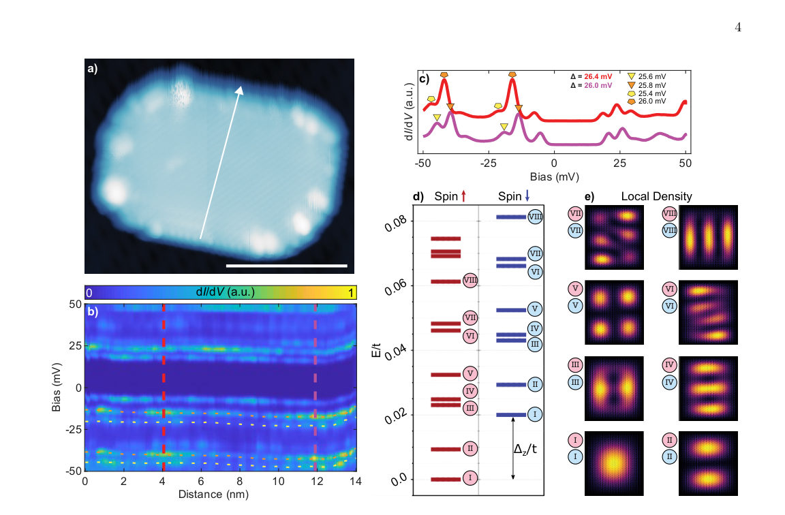
<figcaption class="paper-figure-caption"><b>Fig 4.</b> FIG. 4. Low-energy LDOS features in a single ferroelectric domain SnTe island. a. STM image of a single ferroelectric domain SnTe island with the arrow indicating the positions of the recorded dI/dV spectra shown in panel (b) (1 V, 3 pA, scale bar 10 nm). b. Color-scale plot of dI/dV spectra. The dashed orange and gray lines indicate LDOS features that have identical spatial dependence. c. Individual dI/dV spectra taken from the data in panel b, indicating that the separation of doubled signals (red and orange markers) is constantly ∼26 mV. The gap size is ∼26 mV. d, e. Calculated energy levels (panel d) and the corresponding LDOS maps (panel e) for a spin-polarized quantum dot formed in...</figcaption>
</figure>
<figure class="paper-figure-card">
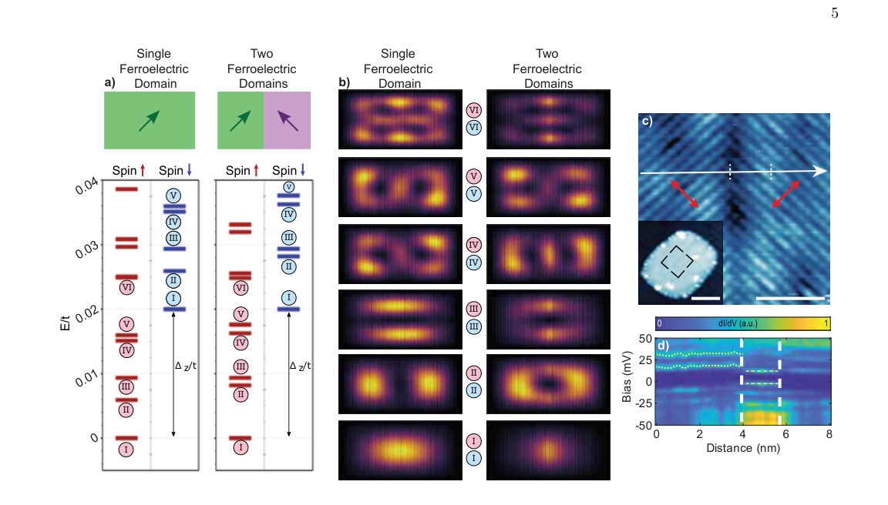
<figcaption class="paper-figure-caption"><b>Fig 5.</b> FIG. 5. Investigation of multiple domains and low energy gap in SnTe islands. a, b. Calculated energy levels (panel a) and the corresponding LDOS maps (panel b) for two spin-polarized quantum dots of the same size formed in the SnTe island with a single and two ferroelectric domains. c. The boundary between two ferroelectric domains. Red arrows show the alignment of polarization. The white arrow shows the location of the line spectra presented in panel d, with the dashed white lines highlighting specific details presented in panel d (1 V, 51 pA, scale bar 3 nm). The inset shows the SnTe island with two ferroelectric domains. The dashed black line indicates the location of the boundary area...</figcaption>
</figure>

**Summary.** This work engineers a multiferroic quantum dot within a van der Waals heterostructure combining ferroelectric SnTe and magnetic CrBr2. By combining STM/STS measurements with DFT calculations, the authors prove that the QD's electronic properties are dictated by the interplay between quantum confinement, magnetism, and the ferroelectric domain structure. This establishes a promising platform for electrically controlling quantum spin states.

**Why it may be interesting.** The explicit coupling mechanism between ferroelectric polarization and spin-polarized electronic states in a confined geometry is highly relevant for designing next-generation, electrically tunable quantum spintronic devices.

Detailed structure

**Main problem.** The central challenge is realizing and characterizing a multiferroic quantum dot (QD) where quantum confinement is simultaneously coupled with both magnetic and ferroelectric order.

**Main result.** The study successfully demonstrates that the electronic spectrum of the QD is highly sensitive to the ferroelectric domain configuration, confirming the interplay between quantum confinement, magnetism, and ferroelectricity at the atomic scale.

**Method.** The research combines experimental characterization using STM/STS with theoretical modeling via ab initio DFT calculations and low-energy tight-binding models.

**Model / system.** The system is an artificial van der Waals heterostructure composed of ferroelectric SnTe nanoislands deposited on a layered magnet, CrBr2, which is supported on HOPG.

**Key observables.** Spin-polarized discretized electronic states, ferroelectric domain configuration (observed via STS shifts), and the energy splitting ($\Delta_z$) induced by proximity exchange coupling.

**Important parameters / regimes.** The coupling strength ($\Delta_z$), the ferroelectric modulation strength ($\delta t$), and the temperature (low temperature, $\sim 4.2$ K) are key parameters.

**Assumptions / limitations.** The primary assumption is that the vdW heterostructure can maintain distinct ferroelectric and magnetic orders while allowing for quantum confinement effects.

**Figures summary.** Figures illustrate the growth schematic, STS measurements showing polarization-dependent shifts, and theoretical PDOS calculations confirming spin polarization and energy level reconstruction based on domain structure.

**Paper structure.** The paper progresses from establishing the physical system and growth methods to presenting experimental evidence of spin-polarization and ferroelectricity, culminating in theoretical modeling that links the QD spectrum directly to the ferroelectric domain texture.

Abstract

Quantum dots (QDs) provide a versatile platform for engineering quantum-confined electronic states with functionalities relevant for optoelectronics, spintronics, and quantum technologies. While substantial progress has been achieved in coupling confined states to spin, valley, topological, or ferroelectric degrees of freedom, the realization of a multiferroic QD in which quantum confinement simultaneously intertwines with magnetism and ferroelectricity remains elusive. Here, we engineer a multiferroic QD in an artificial van der Waals heterostructure grown by molecular beam epitaxy under ultra-high-vacuum conditions. The heterostructure consists of ferroelectric SnTe nanoislands deposited on the layered magnet CrBr$_2$ supported on highly oriented pyrolytic graphite. Combining scanning tunneling microscopy and spectroscopy with ab initio calculations and low-energy tight-binding models, we demonstrate the emergence of spin-polarized discretized electronic states confined within the SnTe islands. Remarkably, the spectroscopic response of the QD strongly depends on the ferroelectric domain configuration of the SnTe nanoislands, demonstrating an interplay between quantum confinement, magnetic exchange, and ferroelectric order at the atomic scale. Our results establish engineered van der Waals heterostructures as a platform for multiferroic quantum confinement and open new routes toward electrically tunable quantum spintronic devices.

[↑ back to top](#top)

### [Surface-condition-mediated supercooling of the A-B transition in confined superfluid helium-3](http://arxiv.org/abs/2609.19471v1)

**Authors:** Daksh Malhotra, Aymar Muhikira, Alexander J. Shook, John P. Davis  
**Type:** experiment · **Category:** statistical mechanics · **PDF:** <https://arxiv.org/pdf/2609.19471v1>  
**Analysis basis:** full PDF text, analyzed in chunks
**Topic relevance:** `driven-dissipative phase transition` **1/5** · `non-equilibrium universality` **1/5**

↔ Scroll figures horizontally

<figure class="paper-figure-card">
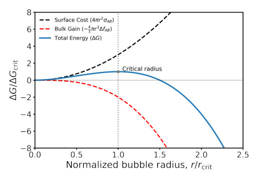
<figcaption class="paper-figure-caption"><b>Fig 1.</b> FIG. 1. Schematic nucleation energy barrier for a first- order A→B conversion. The surface (interfacial) energy cost (4πr2σAB) competes with the bulk free-energy gain (−4</figcaption>
</figure>
<figure class="paper-figure-card">
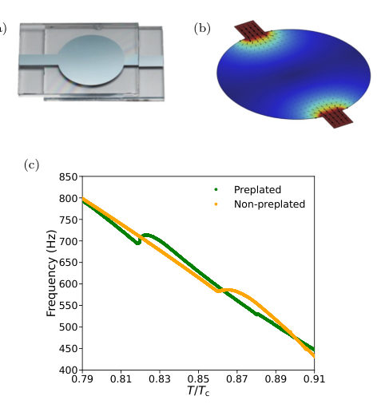
<figcaption class="paper-figure-caption"><b>Fig 2.</b> FIG. 2. (a) 1.8 µm nanofluidic Helmholtz resonator used in this work. (b) Simulated flow field for the Helmholtz mode, il- lustrating that the oscillatory superflow is concentrated in the channels connecting the basin to the bath. (c) Representative temperature sweep showing the confined A→B switching sig- nature in the mode frequency during cooling with and without 4He preplating at 25 bar and 0.07 mK h−1 ramp rate.</figcaption>
</figure>
<figure class="paper-figure-card">
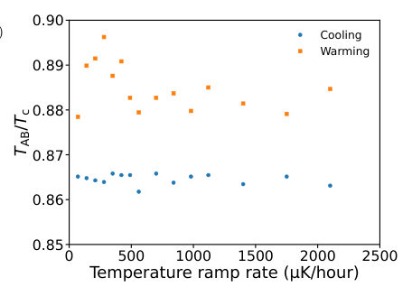
<figcaption class="paper-figure-caption"><b>Fig 3.</b> FIG. 3. (a) Repeated temperature sweeps at 21 bar under nominally identical conditions showing stochastic switching of the A↔B transition at 0.56 mK h−1 ramp rate. The data were collected in order from 1 to 4, alternating between cool- ing and warming. Thew arming traces exhibit larger run-to- run variability in the switching onset than the cooling transi- tions. Arrows mark T ↓ AB and T ↑ AB, as determined from local maxima of the cooling traces and local minima of the warm- ing traces, respectively. (b) Switching temperatures extracted from frequency traces as a function of ramp rate at 22 bar. Over the range of ramp rates explored here, the mean cooling and warming switching temperatures...</figcaption>
</figure>
<figure class="paper-figure-card">
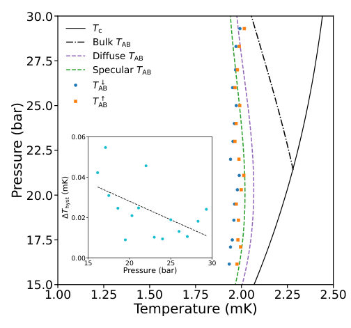
<figcaption class="paper-figure-caption"><b>Fig 4.</b> FIG. 4. Pressure–temperature compilation of TAB switching in the 1.8 µm Helmholtz resonator after 4He preplating. Blue circles and orange squares denote the measured phase transi- tion temperatures on cooling, T ↓ AB(P), and warming, T ↑ AB(P), at a fixed ramp rate of 0.14 mK h−1. Dashed curves indi- cate representative Ginzburg–Landau expectations for TAB for 1.8 µm slab geometry (diffuse and specular limits). The separation between cooling and warming curves quantifies the thermal hysteresis and decreases towards the highest pres- sures. Inset shows the difference between warming and cool- ing transitions as a function of pressure. The straight line is a least squares linear fit for the...</figcaption>
</figure>

**Summary.** This research uses a confined superfluid $	ext{He}^3$ resonator to study the first-order A–B phase transition. By preplating the internal surfaces with $	ext{}^4	ext{He}$, the authors induced a measurable thermal hysteresis, proving that surface boundary conditions can qualitatively control the transition kinetics. This establishes surface preparation as a key experimental knob for controlling metastability in topological superfluid systems.

**Why it may be interesting.** This work provides a clean, tunable platform to study non-equilibrium phase transitions in a quantum fluid, directly linking macroscopic thermodynamic measurements (hysteresis) to microscopic boundary physics, which is highly relevant for understanding topological states in reduced dimensions.

Detailed structure

**Main problem.** The study investigates how surface boundary conditions qualitatively modify the kinetics of the first-order A–B phase transition in confined superfluid Helium-3.

**Main result.** Preplating the internal surfaces with $	ext{}^4	ext{He}$ causes the appearance of a clear cooling-warming hysteresis in the transition temperature, demonstrating that surface preparation acts as a controllable parameter for metastability.

**Method.** The experiment uses a fourth-sound Helmholtz resonator to measure the superfluid fraction during controlled cooling and warming sweeps, comparing results with and without surface preplating.

**Model / system.** The system is superfluid $	ext{He}^3$ confined to a $1.8\ \mu	ext{m}$ cavity. The A-B transition is a first-order phase transition whose kinetics are sensitive to boundary conditions imposed by the surrounding surfaces.

**Key observables.** Thermal hysteresis ($\Delta T_{	ext{hyst}}$) between cooling and warming transition temperatures, and the mode frequency shift tracking the superfluid fraction.

**Important parameters / regimes.** Confinement size ($1.8\ \mu	ext{m}$), surface preplating layer ($\sim 4$ atomic layers of $	ext{}^4	ext{He}$), and applied pressure ($P$).

**Assumptions / limitations.** The observed hysteresis is attributed to kinetic barriers controlled by the surface state, which is consistent with theoretical models of boundary scattering.

**Figures summary.** Figures illustrate the resonator setup, temperature sweeps showing the A $\leftrightarrow$ B switching signature, and plots comparing measured hysteresis dependence on pressure against Ginzburg-Landau predictions for different scattering types.

**Paper structure.** The paper establishes the physical system and the problem of surface influence, presents experimental measurements comparing preplated vs. non-preplated samples, analyzes the resulting hysteresis and its pressure dependence, and concludes by linking these findings to boundary-controlled kinetics.

Abstract

Chiral $p$-wave superconductors and superfluids are central model systems in the search for topological quantum matter, but in reduced dimensions their properties are inseparable from the boundary conditions imposed by surrounding surfaces. Superfluid $^3$He provides a uniquely clean, well-established spin-triplet $p$-wave condensate in which these boundary conditions can be engineered directly. Here, we use a fourth-sound Helmholtz resonator to study the A--B phase transition of $^3$He confined to a $1.8\,μ$m cavity after preplating the internal surfaces with $\sim4$ atomic layers of $^4$He. In contrast to our previous fourth-sound measurements, which showed no resolvable hysteresis in the transition temperature, the preplated device exhibits a clear separation between cooling and warming transition temperatures together with stochastic run-to-run variations. The hysteresis decreases toward the highest pressures studied, consistent with previous observations of the pressure dependence of $^4$He-mediated quasiparticle boundary scattering. These results demonstrate that surface preparation can qualitatively modify first-order transition kinetics in confined $^3$He, making boundary conditions an experimentally accessible control parameter for metastability and for future studies of reduced-dimension topological superfluid states.

[↑ back to top](#top)

### [A Computational Method to Simulate Electrostatic Actuation in Polycatenated Architected Materials](http://arxiv.org/abs/2609.20373v1)

**Authors:** Mateus Maciel Vivaldi, Alexandre F. Fonseca  
**Type:** theory · **Category:** numerical methods · **PDF:** <https://arxiv.org/pdf/2609.20373v1>  
**Analysis basis:** full PDF text, analyzed in chunks
**Topic relevance:** `analog quantum simulation` **1/5**

↔ Scroll figures horizontally

<figure class="paper-figure-card">
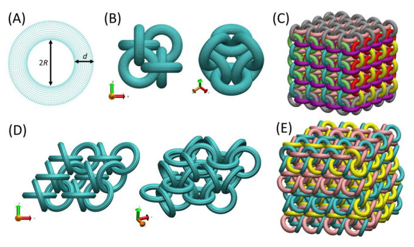
<figcaption class="paper-figure-caption"><b>Fig 1.</b> Figure 1. Circular ring discretization and PAM structures considered in this study. (A) Schematic of a single ring, defined by inner radius R and thickness d. (B, D) Two views of the unit cells of the J4 and T6 topologies, respectively. (C, E) Corresponding supercells – J4 with 384 rings (952 points each) and T6 with 543 rings (690 points each) – assembled by periodic replication along x,y,z. Individual rings are color-coded for clarity in (C) and (E).</figcaption>
</figure>
<figure class="paper-figure-card">
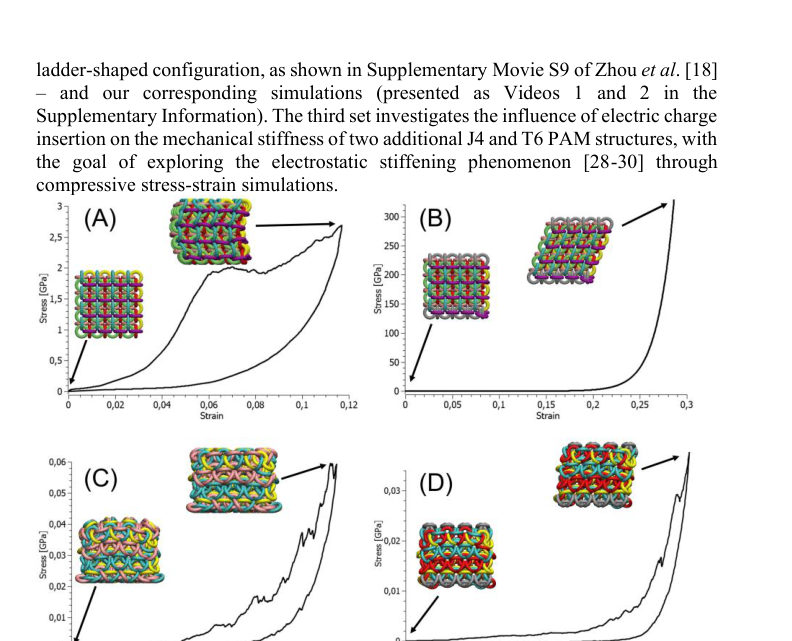
<figcaption class="paper-figure-caption"><b>Fig 2.</b> Figure 2. Compressive (A, C) and shear (B, D) stress-strain curves of the J4 (top) and T6 (bottom) PAM structures depicted in Figure 1. Insets show representative snapshots of each structure at zero and maximum applied strain.</figcaption>
</figure>
<figure class="paper-figure-card">
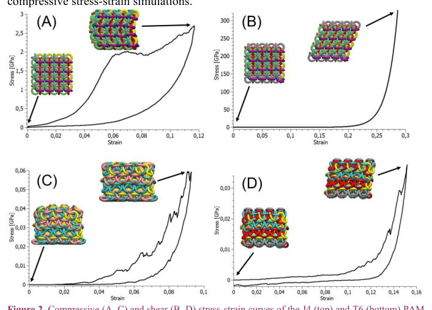
<figcaption class="paper-figure-caption"><b>Fig 3.</b> Figure 2 displays the compressive and shear stress-strain responses of the J4 and T6 PAM structures shown in Figure 1. The J4 PAM is composed of 384 rings (with 952 points per ring), each with mass 𝑚 = 10 g, internal radius R = 0.62 mm, and thickness 𝑑 = 0.37 mm. The T6 PAM consists of 543 rings (with 690 points per ring) of the same mass (𝑚 = 10 g), but with larger characteristic dimensions (R = 4.13 mm, 𝑑 = 1.79 mm). A comprehensive listing of all simulation parameters is provided in Table 1.</figcaption>
</figure>
<figure class="paper-figure-card">
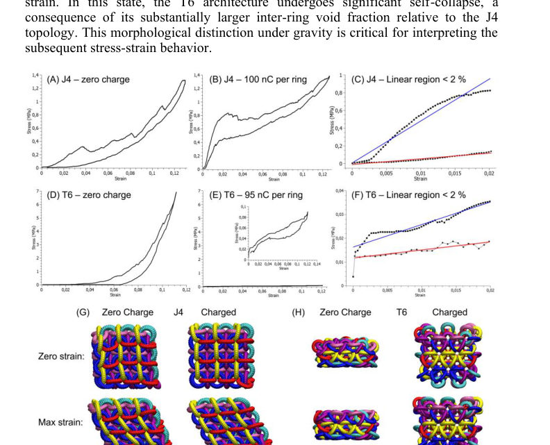
<figcaption class="paper-figure-caption"><b>Fig 4.</b> Figure 3. Mechanical response of J4 (162 rings, 100 points per ring) and T6 (198 rings, 95 points per ring) PAM structures under uniaxial compression. (A, D) Stress-strain curves for uncharged structures. (B, E) Corresponding curves with electrostatic charges inserted (1 nC per point). (C, F) Linear elastic regime (strain &lt; 2%) comparing charged (squares) and uncharged (circles) conditions. Blue and red lines represent linear fittings. (G, H) Representative snapshots of J4 and T6 structures, respectively, at zero and maximum compressive strain, for both charge states. All rings have a mass of 10 g.</figcaption>
</figure>
<figure class="paper-figure-card">
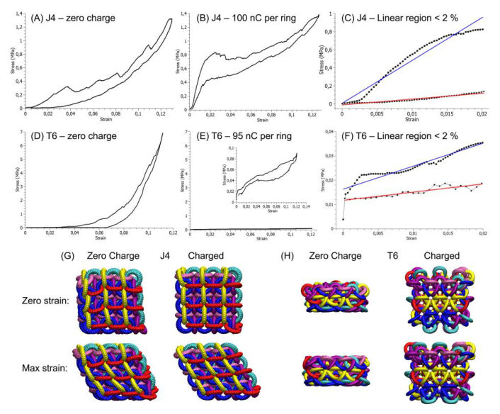
<figcaption class="paper-figure-caption"><b>Fig 5.</b> Figure 3 presents the compressive stress-strain response of both uncharged PAM structures over a full 10% strain cycle (panels A, D). Although the J4 structure is known to exhibit lower compliance, the T6 architecture sustains a peak stress approximately five times higher, an effect attributed to gravitational collapse of the T6 and concurrent shear deformation in the J4, consistent with experimental observations (Fig. S8 in Ref. [18]).</figcaption>
</figure>

**Summary.** This work introduces a computational method using LAMMPS to simulate how electrostatic charges affect the mechanical behavior of Polycatenated Architected Materials (PAMs). The simulations successfully reproduce experimental observations of electrostatic actuation and show that charging significantly stiffens the material, enabling active control over mechanical properties. This provides a predictive tool for designing advanced, controllable mechanical metamaterials.

**Why it may be interesting.** While focused on classical mechanics, the development of a robust, multi-physics simulation framework (combining mechanical and electrostatic forces) is highly relevant for modeling complex, interacting quantum or mesoscopic systems where external fields play a critical role.

Detailed structure

**Main problem.** The paper addresses the lack of computational models for simulating electrostatic actuation in Polycatenated Architected Materials (PAMs), which are complex mechanical metamaterials.

**Main result.** The proposed framework successfully simulates electrostatic actuation, demonstrating that charging PAMs can induce a reversible fluid-to-solid transition and enhance stiffness by up to sevenfold.

**Method.** A LAMMPS-based computational framework is developed to model the structure, dynamics, and mechanical response of charged PAMs using Lennard-Jones and Coulomb interactions.

**Model / system.** The system consists of PAMs, which are architected materials formed by interlocked rings (topologies J4 and T6). The simulation models the mechanical and electrostatic interactions between these rings.

**Key observables.** Stress-strain curves (under compression and shear), electrostatic actuation magnitude, and calculated electrostatic stiffness.

**Important parameters / regimes.** The study compares uncharged vs. charged states, analyzing mechanical responses across different strain regimes and topologies (J4 vs. T6).

**Assumptions / limitations.** The method simplifies interactions using LJ potentials, limiting the capture to geometric/topological effects, and absolute stress values are noted to lack physical meaning due to method limitations.

**Figures summary.** Figures illustrate the point-based ring representation of J4 and T6, and show stress-strain curves comparing uncharged and charged states for both topologies under compression and shear.

**Paper structure.** The paper introduces the computational framework, validates its ability to reproduce electrostatic actuation, and then presents comparative mechanical analyses of different PAM topologies (J4 and T6) under both uncharged and charged conditions.

Abstract

A novel class of polycatenated architected materials (PAMs) has recently emerged, exhibiting distinctive mechanical properties such as stress-strain hysteresis and a geometry-driven transition between solid-like and fluid-like behavior. Although finite element models exist for conventional PAMs, none currently account for electrostatic effects. Here, we propose and qualitatively validate a computational framework to simulate the structure, dynamics, and mechanical response of electrostatically charged PAMs. Our approach successfully reproduces electrostatic actuation in close agreement with experiments, and reveals that electrostatic charges enable a reversible fluid-to-solid transition while also providing a means to estimate electrostatic stiffness. Notably, stiffness enhancements of up to sevenfold are achieved upon charging. This work expands the design space of PAMs and offers a predictive tool for actively controllable mechanical metamaterials.

[↑ back to top](#top)

### [Displacement field stabilizes even-denominator and partonic fractional quantum Hall states in the $\mathcal{N}{=}2$ Landau levels of Bernal-stacked bilayer graphene](http://arxiv.org/abs/2609.19379v1)

**Authors:** Rakesh K. Dora, Udit Khanna, Ajit C. Balram  
**Type:** theory · **Category:** strongly correlated electrons · **PDF:** <https://arxiv.org/pdf/2609.19379v1>  
**Analysis basis:** full PDF text, analyzed in chunks
**Topic relevance:** `analog quantum simulation` **1/5**

↔ Scroll figures horizontally

<figure class="paper-figure-card">
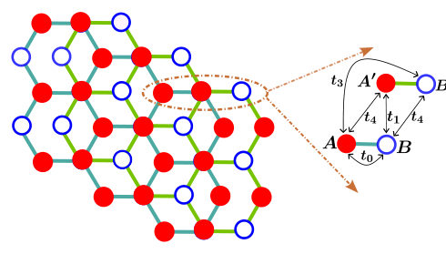
<figcaption class="paper-figure-caption"><b>Fig 1.</b> FIG. 1. Schematic lattice structure of Bernal-stacked bilayer graphene. The left-hand side shows the top view of the bilayer graphene, with the unit cell highlighted by a brown dashed ellipse. The side view of the unit cell is shown on the right- hand side. The inequivalent sublattice sites in each layer are represented by filled red circles for A (bottom layer) and A ′</figcaption>
</figure>
<figure class="paper-figure-card">
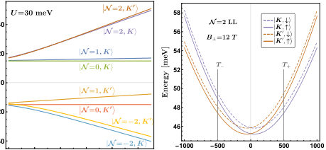
<figcaption class="paper-figure-caption"><b>Fig 2.</b> FIG. 2. Landau level energies in bilayer graphene. Panel (a) shows the valley-resolved Landau level energies for N=0, 1, and ±2 as a function of the magnetic field, with the interlayer potential fixed at U=30 meV. For visual clarity, we have set the Zeeman coupling to zero. Panel (b) shows the energy of each N=2 Landau level in bilayer graphene, labeled by spin- valley quantum numbers, as a function of displacement field D at a fixed magnetic field of B⊥=12 T. We have used a renor- malized value of the Land´e g factor, g≈0.9 [50]. The vertical lines marked by T+ and T−in panel (b) highlight the displace- ment fields D=500 and D=−500 mV/nm, respectively.</figcaption>
</figure>
<figure class="paper-figure-card">
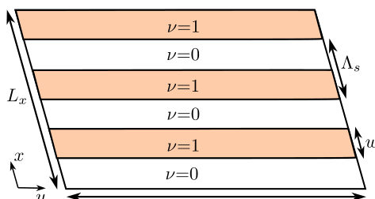
<figcaption class="paper-figure-caption"><b>Fig 3.</b> FIG. 3. Schematic of the stripe phase that is composed of al- ternating strips of ν=0 and ν=1 integer quantum Hall states. The specific case of half-filling is shown, for which Λs=2ws.</figcaption>
</figure>
<figure class="paper-figure-card">
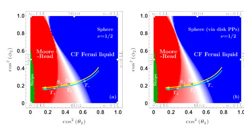
<figcaption class="paper-figure-caption"><b>Fig 4.</b> FIG. 4. Phase diagram showing the competition between the composite fermion Fermi liquid (blue), Moore-Read (red), and stripe phases (green) in the half-filled N=2 LL of bilayer graphene as a function of parameters cos2(θ2) and cos2(ϕ2). The yellow- and cyan colored lines mark the direction of increasing displacement field in the phase diagram at fixed B⊥=13.95 T and B⊥=12 T, respectively. The points S0 and S+ on the yellow line denote the displacement field D=0 mV/nm, and D=342.9 mV/nm (relevant for the STM ex- periment, wherein U=Dd/ϵ=30 meV with ϵ=4, and the layer separation d=0.35 nm [46]), respectively. Similarly, the points T± and T0 denote D=±500 mV/nm and D=0 mV/nm, re- spectively,...</figcaption>
</figure>
<figure class="paper-figure-card">
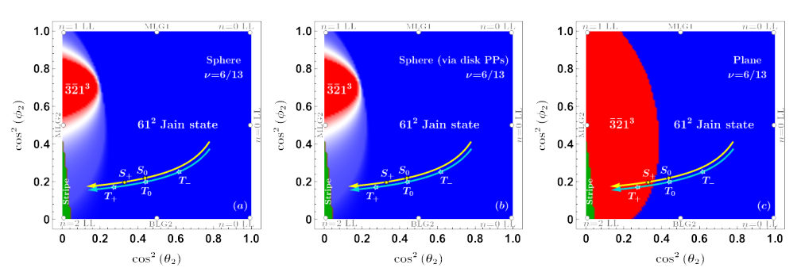
<figcaption class="paper-figure-caption"><b>Fig 5.</b> FIG. 5. Phase diagram at ν=6/13 obtained from the competition between the 6/13 Jain state, ¯3¯213 parton state, and stripe phase in the N=2 LL of bilayer graphene as a function of parameters cos2(θ2) and cos2(ϕ2). (a) The phase diagram obtained entirely on the spherical geometry. (b) The phase diagram obtained through mapping disk PPs onto the sphere. In both panels (a) and (b), we have considered N∼36 to 96 electrons for the Jain state, and N∼18 to 60 electrons for the ¯3¯213 parton state, to compute their thermodynamic limit energies. (c) The phase diagram computed in the planar geometry, where we have fitted the pair-correlation data of N=60 electrons on the sphere to its planar analytic...</figcaption>
</figure>

**Summary.** This paper theoretically investigates how an interlayer displacement field in Bernal-stacked bilayer graphene stabilizes exotic even-denominator fractional quantum Hall states. By comparing the energies of competing correlated states, the authors demonstrate that the displacement field drives the system from a Fermi liquid phase into a topologically ordered Moore-Read state. This work highlights the tunability of correlated electron phases in graphene heterostructures.

**Why it may be interesting.** The work provides a detailed theoretical understanding of how external tuning parameters (like displacement fields) can stabilize exotic, topologically ordered correlated states in a tunable solid-state system, which is highly relevant to modern condensed matter theory.

Detailed structure

**Main problem.** The study investigates the stabilization of even-denominator and partonic fractional quantum Hall (FQH) states in the N=2 Landau level of Bernal-stacked bilayer graphene (BLG). It focuses on the competition between different correlated electronic states.

**Main result.** Increasing the interlayer displacement field stabilizes the Moore-Read state over the Composite Fermion Fermi Liquid (CFFL) at half-filling. Furthermore, it shows that other FQH states transition into topologically distinct states described by parton wave functions.

**Method.** The authors compute the thermodynamic energies of competing states (like CFFL and Moore-Read) and analyze the phase diagram as a function of the displacement field.

**Model / system.** The physical system is Bernal-stacked bilayer graphene (BLG) under a perpendicular magnetic field and an interlayer displacement field. The analysis is performed within the context of the N=2 Landau level, treating the electron-electron interaction via effective Coulomb interactions.

**Key observables.** Fractional quantum Hall states at fillings like 1/2, 2/5, 3/7, 4/9, and 6/13; the competition between CFFL and Moore-Read states.

**Important parameters / regimes.** Interlayer displacement field, perpendicular magnetic field, and specific filling fractions ($
u$).

**Assumptions / limitations.** The theoretical calculation is performed in the thermodynamic limit, and the study notes that other competing phases (like Wigner crystals) were not fully considered.

**Figures summary.** The main results are summarized in phase diagrams (e.g., Fig. 9) showing the transition between different electronic phases as a function of the displacement field.

**Paper structure.** The paper builds upon experimental observations of FQH states in BLG, develops a theoretical framework by calculating the energy competition between candidate states (CFFL vs. MR), and maps out the resulting phase diagram across various fillings.

Abstract

Bernal-stacked bilayer graphene (BLG), in which a graphene layer is stacked atop another and laterally shifted by a lattice constant, offers remarkable tunability in its single-particle states under applied magnetic and displacement fields. Owing to this tunability, recent transport and scanning tunneling microscopy experiments in the presence of a perpendicular magnetic field and finite interlayer displacement fields have observed even-denominator fractional quantum Hall (FQH) states at half-filling in the first excited, namely, $\mathcal{N}{=}2$, Landau level (LL) of BLG. In contrast, at zero displacement field, a gapless composite fermion Fermi liquid (CFFL) is realized at half-filling of the $\mathcal{N}{=}2$ LL. Motivated by these experiments, we compute the phase diagram as a function of the displacement field in the half-filled $\mathcal{N}{=}2$ LL of BLG by studying the competition between the CFFL and the Moore-Read state---a candidate even-denominator FQH state---by calculating their thermodynamic energies in this setting. We find that the modified effective Coulomb interaction, induced by changes in the single-particle states with increasing displacement field, softens the inter-electronic repulsion at short distances, thereby stabilizing the Moore-Read state over the CFFL in the $\mathcal{N}{=}2$ LL of BLG. We also study the nature of FQH states at fillings $2/5$, $3/7$, $4/9$, and $6/13$ in the $\mathcal{N}{=}2$ LL of BLG. Our results suggest that, with increasing displacement field, the Jain composite-fermion states at $3/7$, $4/9$, and $6/13$ transition into states with distinct topological order that are well-captured by parton wave functions.

[↑ back to top](#top)

### [Generic thermodynamics of condensates with extremely small superfluid density ---Application to UTe$_2$ and hidden second phase transition---](http://arxiv.org/abs/2609.19834v1)

**Authors:** Kazushige Machida  
**Type:** theory · **Category:** strongly correlated electrons · **PDF:** <https://arxiv.org/pdf/2609.19834v1>  
**Analysis basis:** full PDF text, analyzed in chunks
**Topic relevance:** `Keldysh / 2PI / non-Gaussian methods` **1/5**

↔ Scroll figures horizontally

<figure class="paper-figure-card">
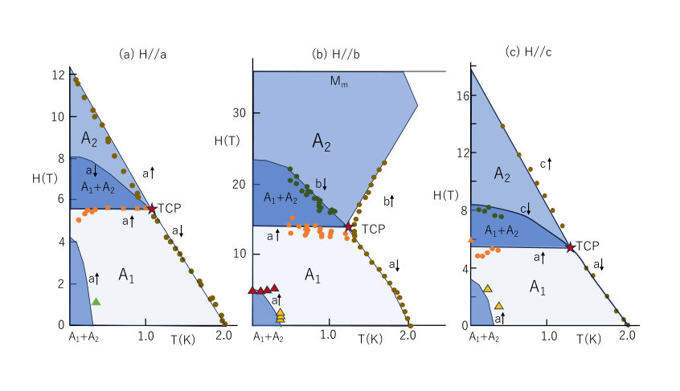
<figcaption class="paper-figure-caption"><b>Fig 1.</b> FIG. 1: Phase diagrams consisting of A1, A2, and its mixture A1+A2 for (a) H∥a-axis with the</figcaption>
</figure>
<figure class="paper-figure-card">
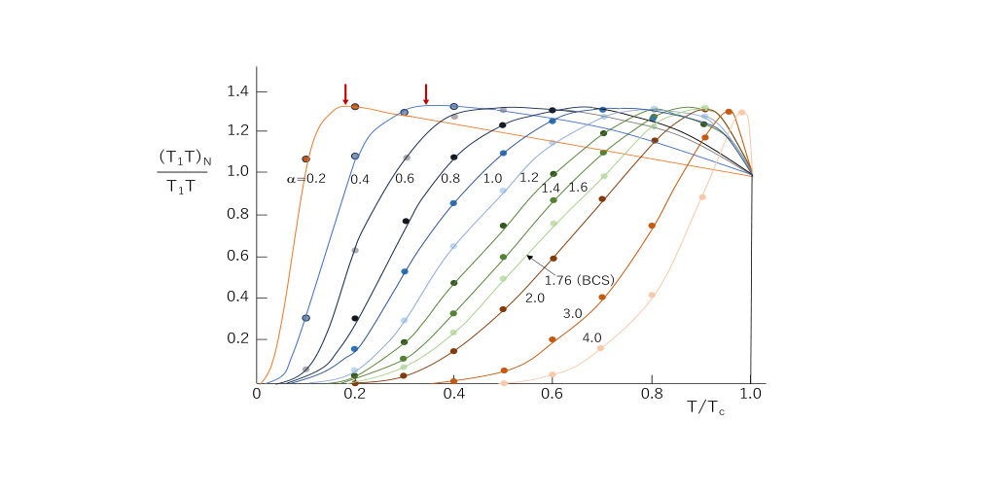
<figcaption class="paper-figure-caption"><b>Fig 2.</b> FIG. 2: The normalized (T1T)N/(T1T) as a function of T for various α values from larger to smaller</figcaption>
</figure>
<figure class="paper-figure-card">
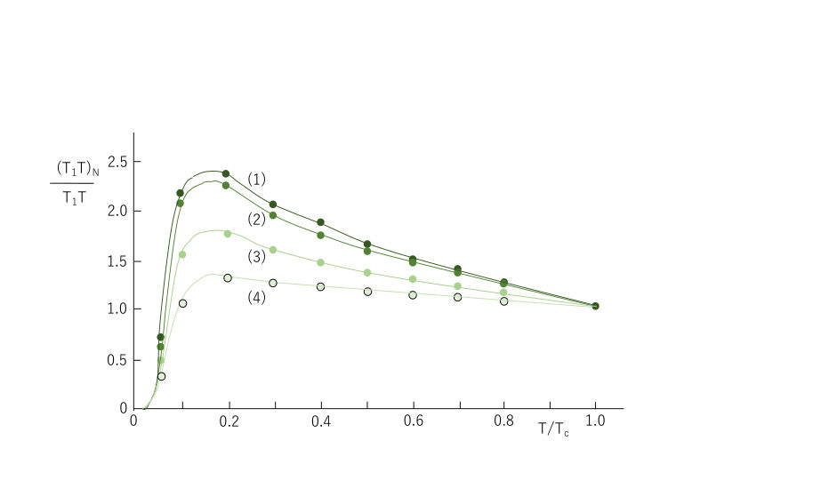
<figcaption class="paper-figure-caption"><b>Fig 3.</b> FIG. 3: (T1T)N/(T1T) as a function of T for various η. (1) η=0.00005, (2) 0.0001, (3) 0.001, and</figcaption>
</figure>
<figure class="paper-figure-card">
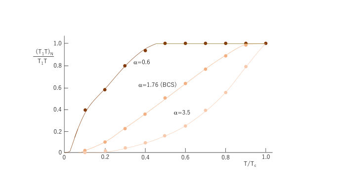
<figcaption class="paper-figure-caption"><b>Fig 4.</b> FIG. 4: (T1T)N/(T1T) as a function of T for various α, including the BCS case for the line nodes.</figcaption>
</figure>
<figure class="paper-figure-card">
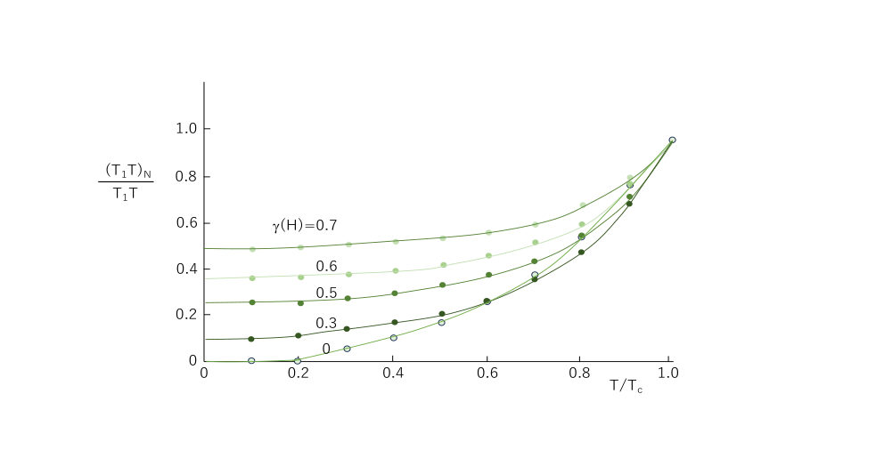
<figcaption class="paper-figure-caption"><b>Fig 5.</b> FIG. 5: (T1T)N/(T1T) for the line node case as a function of T in various γ(H) (α=3.5). After</figcaption>
</figure>

**Summary.** This work theoretically investigates the thermodynamics of superconductors with very low superfluid density, using UTe2 as a primary example. The authors predict the existence of a hidden second superconducting phase ($A_2$) and unify the phase diagram using a non-unitary spin-triplet pairing symmetry. By analyzing key observables like $1/T_1$ and $C(T)$, the paper provides a comprehensive theoretical picture for complex, multi-phase superconducting behavior.

**Why it may be interesting.** The theoretical modeling of unconventional superconductivity, particularly the incorporation of spin-triplet pairing and the analysis of suppressed thermodynamic signatures, connects directly to advanced topics in strongly correlated electron physics relevant to AMO/quantum materials research.

Detailed structure

**Main problem.** The paper theoretically explores the thermodynamic signatures of superconducting condensates exhibiting extremely small superfluid density, motivated by experimental findings in UTe2.

**Main result.** It identifies a hidden second superconducting phase ($A_2$) in UTe2, suggesting a universal origin for the phase transition lines based on non-unitary spin-triplet pairing symmetry ($^3B_{3u}$).

**Method.** The analysis uses theoretical derivations for generic thermodynamics of low-$
ho_s$ condensates, calculating observables like the nuclear spin-lattice relaxation rate ($1/T_1$) and specific heat ($C(T)$).

**Model / system.** The system is the heavy Fermion superconductor UTe2. The theoretical framework involves modeling superconductivity using a non-unitary spin-triplet pairing symmetry, allowing for the description of multiple superconducting phases across the H-T-P phase space.

**Key observables.** Superfluid density ($
ho_s$), phase stiffness, nuclear spin-lattice relaxation rate ($1/T_1$), specific heat jump ($\Delta C$), and the existence of multiple superconducting phases ($A_1, A_2$).

**Important parameters / regimes.** Small superfluid density ($
ho_s$), the gap ratio ($\alpha = \Delta_0/k_B T_c$), and external parameters like magnetic field ($H$) and pressure ($P$).

**Assumptions / limitations.** The analysis focuses on the limit of extremely small superfluid density, which suppresses characteristic superconducting signatures like the Hebel-Slichter peak.

**Figures summary.** Figures illustrate phase diagrams in the H-T plane for different field directions, showing the coexistence of $A_1$ and $A_2$ phases, and plot the temperature dependence of $1/T_1$ and $C(T)$ for varying $\alpha$.

**Paper structure.** The paper builds from analyzing the general thermodynamic signatures of low-$
ho_s$ condensates, applies these concepts to the specific case of UTe2, and develops a unified phase diagram incorporating multiple superconducting phases ($A_1$ and $A_2$) across the H-T-P space.

Abstract

Motivated by recent experimental findings on UTe$_2$ via NMR and specific heat experiments, we theoretically explore the thermodynamic signatures of condensates with small superfluid density and characterize their physical properties. We identify the hidden superconducting phase $A_2$ composed of spin-up Cooper pairs   at lower temperature ($T$) and field ($H$) under ambient pressure of UTe$_2$ and show that $A_2$ reappears at higher $H$ for all three principal field directions, $a$, $b$, and $c$-axis. The phase transition lines from the $A_1$ phase with spin down pairs to the $A_2$ phase in the $H$-$T$ plane are all horizontal in common, implying a universal physical origin due to the originating from the magnetic-energy gain of the spin-up pairing state with increasing magnetic field. This multiple-phase diagram is extended to these under pressure ($P$), resulting in a simple picture based on non-unitary spin-triplet pairing symmetry $^3B_{3u}$, which enables us to consistently capture the evolution of the superconducting phases throughout the entire $H$-$T$-$P$ phase space.

[↑ back to top](#top)

### [Momentum-dependent precessional and nutational spin pumping in a honeycomb antiferromagnet](http://arxiv.org/abs/2609.19289v1)

**Authors:** Suman Mukherjee, Subhadip Ghosh, Ritwik Mondal  
**Type:** theory · **Category:** other · **PDF:** <https://arxiv.org/pdf/2609.19289v1>  
**Analysis basis:** full PDF text, analyzed in chunks
**Topic relevance:** `Keldysh / 2PI / non-Gaussian methods` **1/5**

↔ Scroll figures horizontally

<figure class="paper-figure-card">
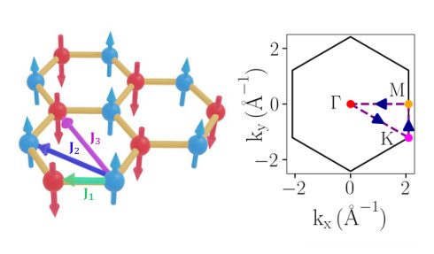
<figcaption class="paper-figure-caption"><b>Fig 1.</b> FIG. 1: Schematic illustration of two-dimensional MnPS3, showing the NN, NNN, and NNNN exchange interactions, denoted by J1, J2, and J3, respectively. The corresponding Brillouin zone and the high-symmetry path are also shown.</figcaption>
</figure>
<figure class="paper-figure-card">
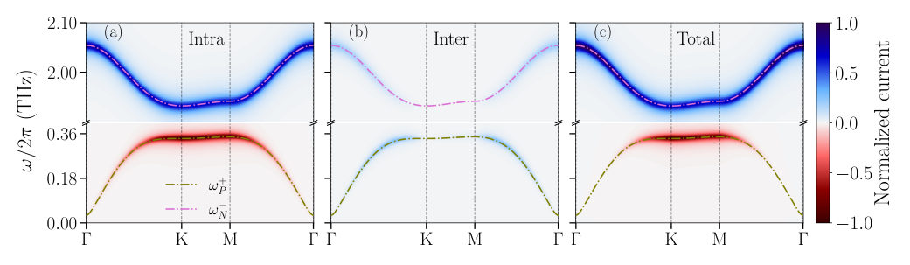
<figcaption class="paper-figure-caption"><b>Fig 2.</b> FIG. 2: Calculated magnon spectra with the weighted (a) intra-sublattice, (b) inter-sublattice, and (c) total spin pumping current along the high-symmetry points in the Brillouin zone.</figcaption>
</figure>
<figure class="paper-figure-card">
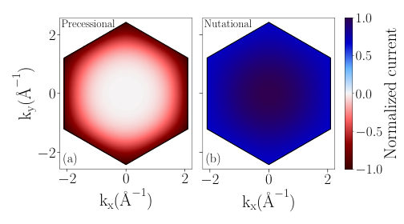
<figcaption class="paper-figure-caption"><b>Fig 3.</b> FIG. 3: Color maps of the normalized precessional and nutational spin pumping currents as functions of kx and ky across the Brillouin zone.</figcaption>
</figure>
<figure class="paper-figure-card">
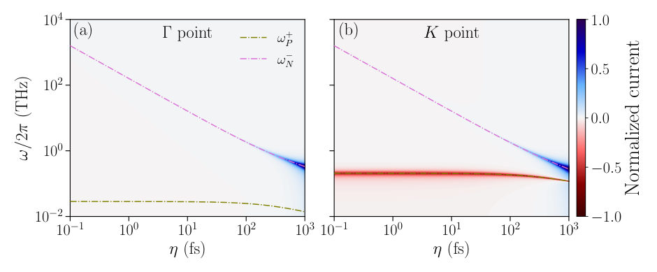
<figcaption class="paper-figure-caption"><b>Fig 4.</b> FIG. 4: Normalized precessional and nutational spin pumping currents as a function of the inertial relaxation time η at (a) Γ and (b) K.</figcaption>
</figure>
<figure class="paper-figure-card">
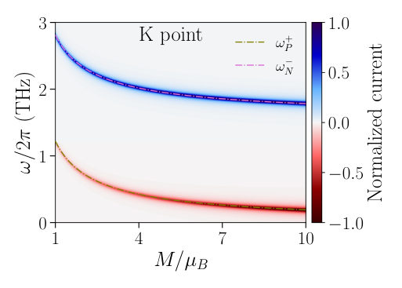
<figcaption class="paper-figure-caption"><b>Fig 5.</b> FIG. 5: The normalized precessional and nutational spin pumping currents as a function of magnetization at the K point.</figcaption>
</figure>

**Summary.** This theoretical work analyzes spin pumping in a honeycomb antiferromagnet by incorporating magnetic inertia, leading to the emergence of nutational dynamics alongside conventional precession. The key finding is the contrasting momentum dependence of these two spin pumping channels, which can be used to experimentally separate them. The results also show that the nutational response is highly sensitive to the inertial relaxation time.

**Why it may be interesting.** The explicit inclusion of magnetic inertia leading to nutational dynamics, combined with momentum-resolved spin pumping calculations, provides a sophisticated theoretical tool to distinguish between different types of magnetic excitations in complex quantum magnets.

Detailed structure

**Main problem.** The study investigates the momentum-dependent precessional and nutational spin pumping in a two-dimensional honeycomb antiferromagnet.

**Main result.** The precessional and nutational spin pumping currents exhibit contrasting momentum dependencies across the Brillouin zone, allowing for their experimental distinction. Furthermore, the nutational current is strongly controlled by the inertial relaxation time, while the ratio of nutational to precessional current increases with the applied magnetic field.

**Method.** The authors used a microscopic two-sublattice model incorporating spin inertia into the Landau-Lifshitz-Gilbert equation to calculate the magnon spectra and spin pumping contributions.

**Model / system.** The system is a 2D honeycomb antiferromagnet, modeled using a two-sublattice approach with $J_1$-$J_2$-$J_3$ exchange interactions, and dynamics are governed by the inertial LLG equation.

**Key observables.** Precessional and nutational spin pumping currents, their momentum dependence across the Brillouin zone ($\Gamma$ to $K$ to $M$), and the ratio of these currents under varying fields.

**Important parameters / regimes.** Inertial relaxation time ($\eta$), exchange interaction strengths ($J_i$), and the strength of the static magnetic field ($\mathbf{B}$).

**Assumptions / limitations.** The analysis uses a linearized inertial LLG equation and assumes the equilibrium magnetization is oriented out of the plane.

**Figures summary.** Figures likely show color maps of the normalized precessional and nutational spin pumping currents across the Brillouin zone, illustrating their distinct momentum profiles.

**Paper structure.** The paper builds upon previous work by extending the analysis of spin pumping from uniform ($\Gamma$ point) dynamics to map the currents across the entire Brillouin zone, detailing the role of spin inertia and external magnetic fields.

Abstract

The ultrafast magnetic inertial dynamics on subpicosecond timescales generate an additional high-frequency terahertz nutational resonance. Here, we investigate momentum-resolved spin pumping in a two-dimensional honeycomb antiferromagnet by incorporating spin inertia into the Landau-Lifshitz-Gilbert equation. Using a microscopic two-sublattice model with $J_1$-$J_2$-$J_3$ exchange interactions, we calculate the precessional and nutational magnon spectra and their corresponding intra- and inter-sublattice spin pumping contributions throughout the Brillouin zone. For parameters representative of MnPS$_3$, we find a pronounced complementary momentum dependence of the two spin pumping channels: the precessional current is strongly suppressed around the $Γ$ point ($0.01\%$) and increases towards the Brillouin zone boundary ($100\%$ at $K$ and $87\%$ at $M$), whereas the nutational current is largest near $Γ$ ($100\%$) and decreases towards the boundary ($68\%$ at $K$ and $69\%$ at $M$). This contrasting momentum dependence provides a means of distinguishing spin nutation from conventional precessional motion. We further demonstrate that the nutational spin pumping current is strongly controlled by the inertial relaxation time $η$, in contrast to the comparatively weak $η$ dependence of the precessional current. In the small-$η$ regime, our analytical results show that the intra-sublattice nutational spin pumping current exhibits a leading-order dependence of $1/η^3$. The spin pumping response can also be tuned through the exchange interaction strengths and magnetic moment. Our further results on the magnetic field dependence of spin pumping reveal that the ratio of nutational spin pumping current increases with magnetic field strength, whereas the corresponding precessional counterpart decreases.

[↑ back to top](#top)

### [Observation of Dyakonov-Perel-type magnon spin relaxation in uniaxial antiferromagnetic insulators](http://arxiv.org/abs/2609.19700v1)

**Authors:** Qinwu Gao, Andi Cong, Bokai Liang, Meng Yang, Jingjing Liu, Lang Chen, Shiwei Wu, Ka Shen, Junxue Li  
**Type:** experiment · **Category:** other · **PDF:** <https://arxiv.org/pdf/2609.19700v1>  
**Analysis basis:** full PDF text, analyzed in chunks
**Topic relevance:** `correlated / nonlocal dissipation` **1/5**

↔ Scroll figures horizontally

<figure class="paper-figure-card">
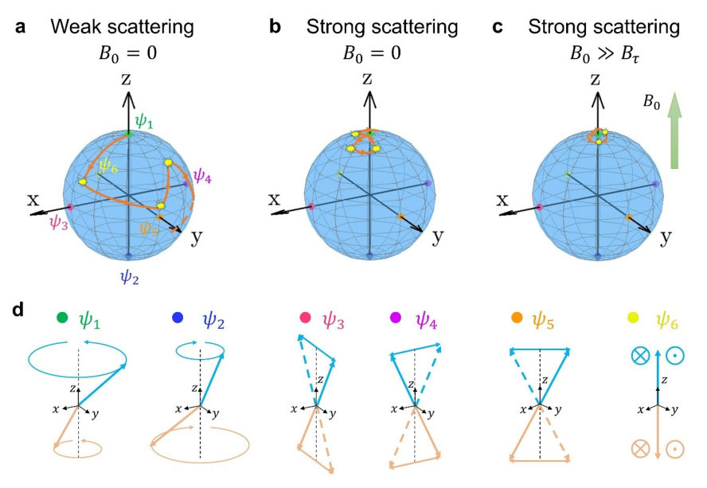
<figcaption class="paper-figure-caption"><b>Fig 1.</b> Fig. 1. D’yakonov-Perel’ (DP)-type magnon spin relaxation in uniaxial antiferromagnet. a, b, c The</figcaption>
</figure>
<figure class="paper-figure-card">
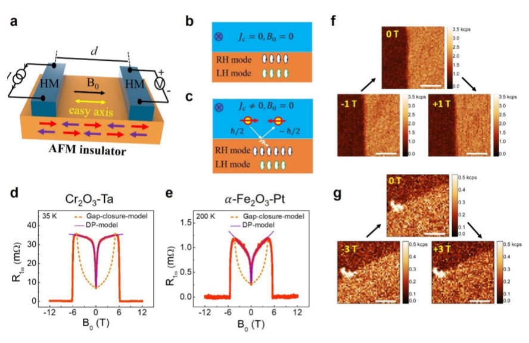
<figcaption class="paper-figure-caption"><b>Fig 2.</b> Fig. 2. Long-distance spin current transport and antiferromagnetic domain images in uniaxial</figcaption>
</figure>
<figure class="paper-figure-card">
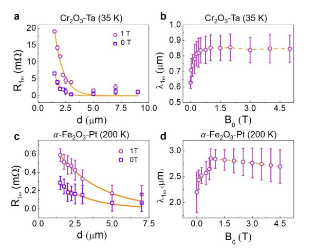
<figcaption class="paper-figure-caption"><b>Fig 3.</b> Fig. 3. Magnetic field suppression of magnon spin relaxation in the uniaxial antiferromagnetic</figcaption>
</figure>
<figure class="paper-figure-card">
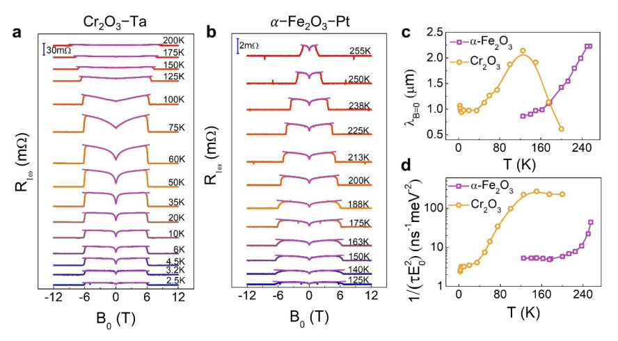
<figcaption class="paper-figure-caption"><b>Fig 4.</b> Fig. 4. Temperature dependence of magnon spin diffusion length. a, b First-harmonic nonlocal</figcaption>
</figure>

**Summary.** This work investigates magnon spin relaxation in uniaxial AFM insulators using nonlocal transport measurements. The authors successfully identify the Dyakonov-Perel mechanism as the governing relaxation process, explaining field-dependent enhancements in the spin signal and the temperature dependence of the spin diffusion length. These findings are crucial for designing low-dissipation antiferromagnetic spintronic devices.

**Why it may be interesting.** The application of the DP mechanism, typically associated with electron spin relaxation, to magnons provides a powerful, transferable theoretical tool for understanding spin dynamics in insulating magnetic systems, which is relevant to quantum spintronics.

Detailed structure

**Main problem.** The primary goal is to elucidate the elusive magnon spin relaxation mechanisms governing spin current transport in antiferromagnetic (AFM) insulators.

**Main result.** The study reports that the Dyakonov-Perel-type mechanism governs spin current transport in $	ext{Cr}_2	ext{O}_3$ and $\alpha	ext{-Fe}_2	ext{O}_3$, evidenced by field-dependent enhancements in the nonlocal signal and saturation of the spin diffusion length.

**Method.** The research combines nonlocal transport measurements (using AC and DC techniques) with theoretical modeling based on the DP relaxation mechanism.

**Model / system.** The physical systems are uniaxial AFM insulators ($	ext{Cr}_2	ext{O}_3$ and $\alpha	ext{-Fe}_2	ext{O}_3$). The theoretical framework models magnon spin relaxation using the Dyakonov-Perel analogy, treating magnons as carrying pseudospin.

**Key observables.** Nonlocal first-harmonic resistance ($R_{1\omega}$), magnon spin diffusion length ($\lambda_s$), and the dependence of these quantities on applied magnetic field ($B_0$) and temperature.

**Important parameters / regimes.** Magnetic field strength (especially relative to the spin-flop transition field $B_{SF}$), temperature, and the characteristic relaxation time ($	au_s$).

**Assumptions / limitations.** The analysis assumes the spin current propagates along the easy axis and draws an analogy between magnon dynamics and electron spin dynamics.

**Figures summary.** Figures illustrate the DP-type relaxation on the Bloch sphere, the measurement setup, and comparisons between different theoretical models (e.g., gap closure vs. DP-model) for the nonlocal resistance.

**Paper structure.** The paper first establishes the context of magnon spin transport, then presents the experimental measurements showing field-dependent anomalies, systematically rules out alternative relaxation mechanisms, and finally confirms the DP-type model by fitting the field and temperature dependencies of the key observables.

Abstract

Long-distance transport of magnon spin currents in antiferromagnetic (AFM) insulators has attracted tremendous attention recently, however, the AFM magnon spin relaxation mechanisms remain elusive. Here, we report that the Dyakonov-Perel-type magnon spin relaxation mechanism governs the spin current transport along the easy axis in two prototypical uniaxial AFM insulators, Cr2O3 and alpha-Fe2O3. First, an over 450% enhancement of the first-harmonic nonlocal signal induced by a magnetic field is observed prior to the spin-flop transition, which can be well-interpreted by our model incorporating Dyakonov-Perel-type magnon spin relaxation. Secondly, we find that the magnon spin diffusion length in both crystals increases with magnetic field and saturates at fields above 0.8 T, consistent with our model. Finally, the temperature dependence of the zero-field magnon spin diffusion length in both AFM insulators can be qualitatively explained through our model. These findings are valuable for the development of low-dissipation antiferromagnetic spintronic devices.

[↑ back to top](#top)

### [Superconductivity at the metal-insulator phase boundary in a bulk nickelate at ambient pressure](http://arxiv.org/abs/2609.19686v1)

**Authors:** Hyo-Bin Ahn, Xinglong Chen, Hong Zheng, Yu Zhang, Ramakanta Chapai, Yu Li, Arashdeep S. Thind, Robert F. Klie, Michael R. Norman, Ulrich Welp, J. F. Mitchell, Daniel Phelan  
**Type:** experiment · **Category:** strongly correlated electrons · **PDF:** <https://arxiv.org/pdf/2609.19686v1>  
**Analysis basis:** full PDF text, analyzed in chunks
**Topic relevance:** `analog quantum simulation` **1/5**

↔ Scroll figures horizontally

<figure class="paper-figure-card">
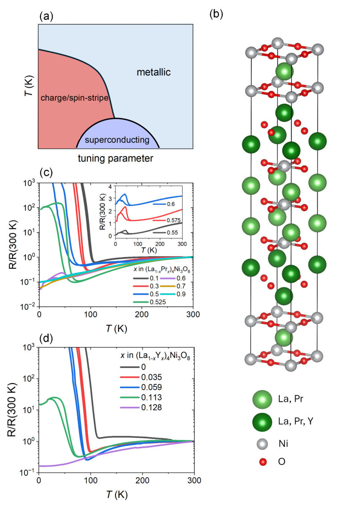
<figcaption class="paper-figure-caption"><b>Fig 1.</b> Fig. 1: (a) Generic phase diagram of a tuning parameter suppressing a density wave leading to superconductivity. (b) Trilayer R4Ni3O8 structure. The R sites are distinguished by two colors of green to separate those from the fluorite-like spacer layers from those inside the trilayers. (c, d) Normalized resistance versus temperature for LPNO and LYNO for different values of x. The inset in (c) shows the data over a narrower range of x, from 0.55 to 0.6.</figcaption>
</figure>
<figure class="paper-figure-card">
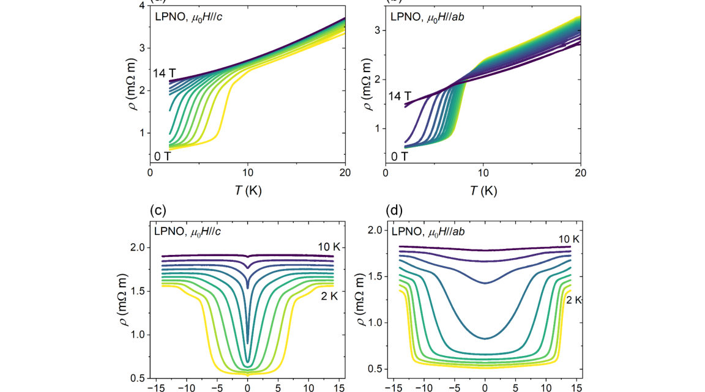
<figcaption class="paper-figure-caption"><b>Fig 2.</b> Fig. 2: Resistivity as a function of temperature for LPNO (x=0.55) measured with various magnetic fields applied parallel to the c-axis (a) and parallel to the ab-plane (b), and isothermal field sweeps of the resistivity measured with magnetic field applied parallel to the c-axis (c) and parallel to the ab-plane (d).</figcaption>
</figure>
<figure class="paper-figure-card">
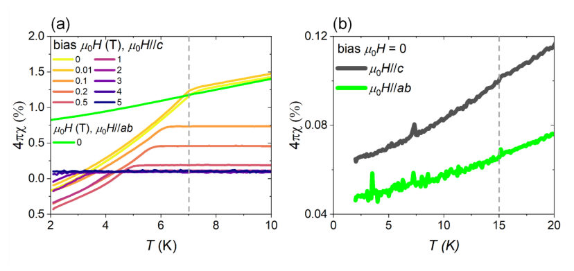
<figcaption class="paper-figure-caption"><b>Fig 3.</b> Fig. 3: χ’ from AC susceptibility measurements of (a) LPNO (x=0.55) and (b) LYNO (x=0.11) with applied DC bias fields parallel to c-axis, as specified. Note the absence of a diamagnetic anomaly for the magnetic field applied parallel to ab-plane (green curves). The vertical dashed line indicates the zero-field resistive TC.</figcaption>
</figure>
<figure class="paper-figure-card">
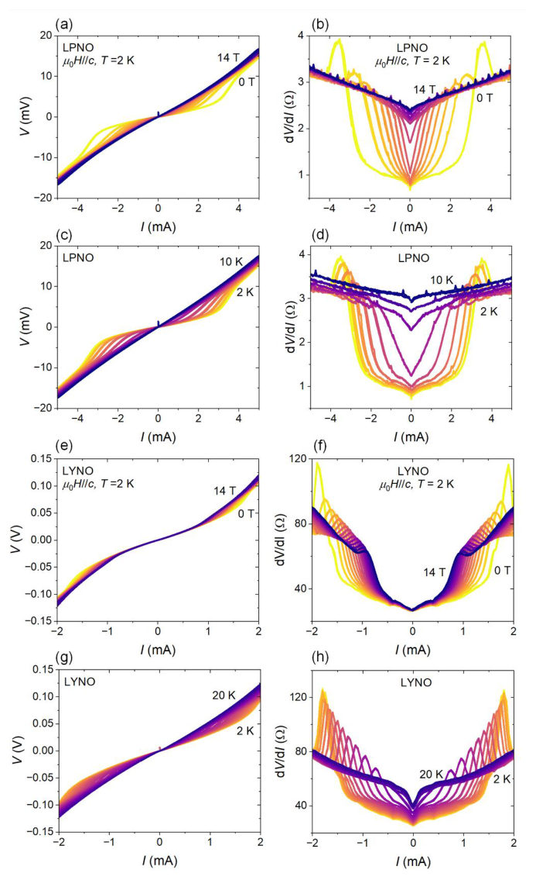
<figcaption class="paper-figure-caption"><b>Fig 4.</b> Fig. 4: (a) I-V characteristics of LPNO (x=0.55) at T=2 K measured with various magnetic fields applied parallel to the c-axis. (b) Differential resistance (dV/dI) for data shown in (a). (c) I-V characteristics of LPNO (x=0.55) at zero-field for various temperatures. (d) Differential resistance for data shown in (c). (e-h) Corresponding plots to (a-d) for LYNO (x=0.11).</figcaption>
</figure>
<figure class="paper-figure-card">
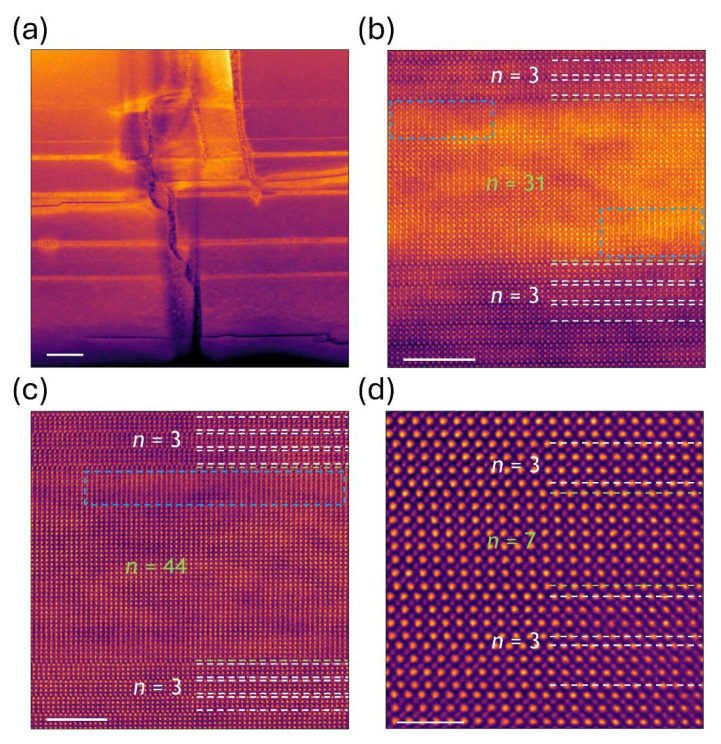
<figcaption class="paper-figure-caption"><b>Fig 5.</b> Fig. 5: STEM images for an LPNO crystal (x=0.55). (a) A wide field-of-view STEM-LAADF image showing a high density of defects. (b) STEM-LAADF image showing an incoherently strained intergrowth region with n = 31. STEM-HAADF images showing intergrowth regions with (c) n = 44 and (d) n = 7, respectively. The blue boxes in (b) and (c) highlight the defects associated with the incoherent strain in the intergrowth regions. Scale bars correspond to 100 nm for (a), 5 nm for (b) and (c), and 2 nm for (d).</figcaption>
</figure>

**Summary.** This work reports ambient-pressure superconductivity in bulk nickelates by tuning the system near the metal-insulator phase boundary using lanthanide substitution. The findings establish that the electronic structure is profoundly controlled by the spacer layer volume, suggesting that phase competition is the key mechanism for achieving high-temperature superconductivity in this material class.

**Why it may be interesting.** The strong correlation between structural parameters (spacer layer volume) and the superconducting phase diagram mirrors concepts in strongly correlated electron systems where lattice strain or doping tunes the proximity to a quantum critical point.

Detailed structure

**Main problem.** The study investigates the emergence and nature of superconductivity in bulk nickelate single crystals at ambient pressure, particularly focusing on the region near the metal-insulator phase boundary.

**Main result.** Superconductivity is observed in both Pr and Y substituted nickelates proximate to the insulator-metal transition, suggesting that phase competition and spacer-layer engineering are key to realizing bulk superconductivity.

**Method.** The research employs magneto-transport measurements (resistivity, susceptibility) and controlled chemical processing (reduction/oxidation cycles) to probe the electronic state and superconducting properties.

**Model / system.** The system is bulk nickelate single crystals, specifically (La1-xPrx)4Ni3O8 and (La1-xYx)4Ni3O8, which feature an interleaving structure of square-planar nickel oxide trilayers and fluorite-like spacer layers.

**Key observables.** Superconducting signatures (resistive drops, diamagnetic susceptibility), the location of the insulator-metal phase boundary, and the sensitivity of superconductivity to oxygen stoichiometry.

**Important parameters / regimes.** The volume of the fluorite-like spacer layers, the doping concentration ($x$), and the oxygen content (controlled via reduction/oxidation cycles).

**Assumptions / limitations.** The superconducting state is non-percolative, and the electronic phase diagram can be parameterized by the spacer layer volume, suggesting steric engineering is a primary control mechanism.

**Figures summary.** Figures show the evolution of resistivity and AC susceptibility across doping series and during controlled reduction/oxidation cycles, demonstrating the emergence and suppression of superconductivity based on stoichiometry.

**Paper structure.** The paper systematically explores the phase diagram by varying doping (Pr/Y substitution) to tune the system across the insulator-metal boundary, followed by detailed transport measurements and chemical tuning using controlled redox cycles to confirm the role of oxygen stoichiometry.

Abstract

The discovery of superconductivity in nickelates has seeded a new field for exploring unconventional superconductivity in transition metal oxides. However, to date superconductivity has only been realized in thin films or under extreme pressure in the bulk. Here we report signatures of superconductivity at ambient pressure in bulk nickelate single crystals of (La1-xPrx)4Ni3O8 and (La1-xYx)4Ni3O8, whose crystal structure comprises interleaving trilayers of square-planar nickel oxide and fluorite-like spacer layers. The parent compound La4Ni3O8 exhibits an insulating ground state, where electrons order into intertwined, insulating charge/spin stripes. Substitution of smaller lanthanide ions disrupts this order, eventually leading to a metallic ground-state. We find that superconductivity emerges in a narrow window proximate to the insulator-metal phase boundary, where both metallic and charge-stripe phases co-exist. The observed low volume-fraction superconductivity is non-percolative, suggesting the prospect of filamentary superconductivity nucleated at the boundary between these phases. However, intergrowth defects that approximate the known infinite layer nickelates are observed in TEM, leaving open the possibility that superconductivity resides here rather than in the trilayer matrix. Remarkably, the electronic phase diagrams of both the Y and Pr series coincide when parameterized by the volume of the fluorite like spacer layers, revealing that this steric parameter profoundly modifies the nickel oxide trilayer electronic structure. Our results identify better understanding of the co-existence region between metallic and charge-ordered phases as a priority for expanding the range of bulk, ambient-pressure nickelate superconductivity and establish spacer-layer engineering as a design tool for exploring this regime of phase competition.

[↑ back to top](#top)

### [Superconductivity in Pb2-xBixPd Single Crystals](http://arxiv.org/abs/2609.20364v1)

**Authors:** S. Srivastava, R. P. Singh  
**Type:** experiment · **Category:** other · **PDF:** <https://arxiv.org/pdf/2609.20364v1>  
**Analysis basis:** full PDF text, analyzed in chunks
**Topic relevance:** `analog quantum simulation` **1/5**

↔ Scroll figures horizontally

<figure class="paper-figure-card">
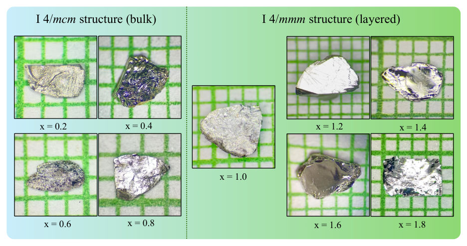
<figcaption class="paper-figure-caption"><b>Fig 1.</b> FIG. 1. Microscopic images of as grown single crystals for Pb2–xBixPd. Crystals with I4/mcm structure (x = 0.2 −0.8) have bulk morphology, whereas the I4/mmm structure crystals (x = 1.0 −1.8) have layered structure.</figcaption>
</figure>
<figure class="paper-figure-card">
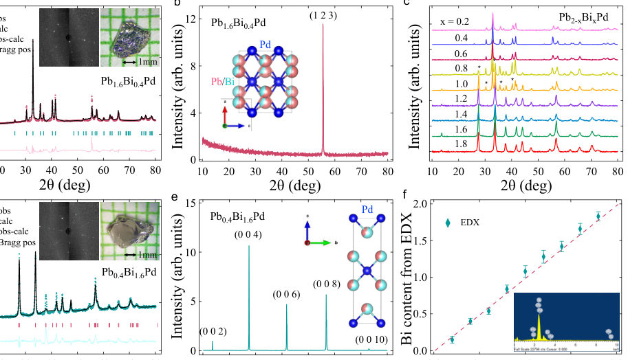
<figcaption class="paper-figure-caption"><b>Fig 2.</b> FIG. 2. (a) and (d) Rietveld refinement of powder XRD for Pb1.6Bi0.4Pd and Pb0.4Bi1.6Pd samples, respectively, at room temperature. The linked insets show the Laue diffraction patterns (left) and microscopic images (right) for the respective single crystals. (b) and (e) Room temperature XRD on the single crystals of Pb1.6Bi0.4Pd and Pb0.4Bi1.6Pd, respectively. The insets of (b) and (e) represent the crystal structures of Pb2–xBixPd, for x &lt; 1 and x ≥1, respectively. The blue balls represent the Pd atoms, and the pink/cyan ball denotes the Pb/Bi atoms. (c) Powder XRD patterns for Pb2–xBixPd, 0.2 ≤x ≤1.8. The extra peaks due to phase mixing are represented by the asterisk (*). (f) Average Bi...</figcaption>
</figure>
<figure class="paper-figure-card">
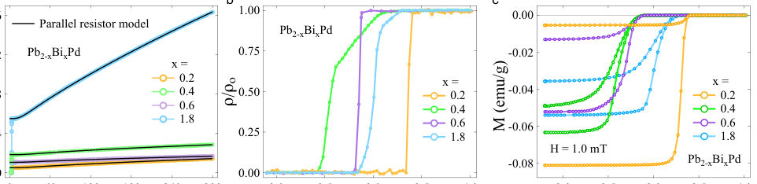
<figcaption class="paper-figure-caption"><b>Fig 3.</b> FIG. 3. (a) The variation of resistivity with temperature (1.9 K to 300 K) under zero magnetic field for Pb2–xBixPd, x = 0.2, 0.4, 0.6, and 1.8, fitted with the parallel resistor model. (b) The normalized resistivity versus temperature indicates a zero drop in resistivity for the compounds. (c) Temperature dependence of the magnetization in ZFCW and FCC modes under 1 mT magnetic field for the compounds.</figcaption>
</figure>
<figure class="paper-figure-card">
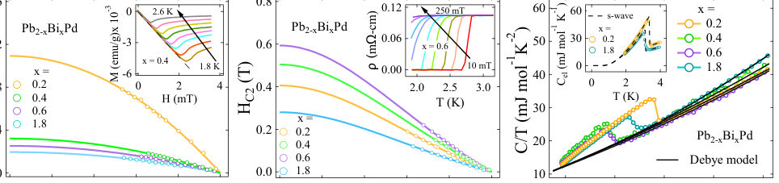
<figcaption class="paper-figure-caption"><b>Fig 4.</b> FIG. 4. The reduced temperature (T/TC) variation of the (a) lower critical field, and the (b) upper critical field for Pb2–xBixPd single crystals, fitted with the GL equations to obtain the HC1(0) and HC2(0), respectively. The inset of (a) shows the magnetic field variation of magnetization for Pb1.6Bi0.4Pd at different temperatures (1.8 K to 2.6 K), and the inset of (b) shows the temperature variation of resistivity between different applied magnetic fields of 10 mT to 250 mT for Pb1.4Bi0.6Pd. (c) C/T versus T 2 at H = 0 mT fitted with Debye model (Eq. 9). Inset: Temperature variation of electronic specific heat, Cel(T) best fitted with the isotropic s-wave model.</figcaption>
</figure>
<figure class="paper-figure-card">
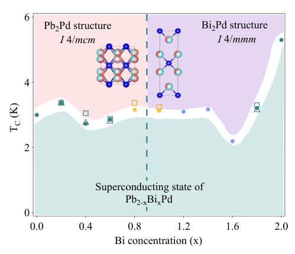
<figcaption class="paper-figure-caption"><b>Fig 5.</b> FIG. 5. Superconducting phase diagram for the Pb2–xBixPd single crystals. The green, yellow, and blue markers indicate single-phase bulk superconductors, mixed-phase bulk super- conductors, and superconductors with volume fraction less than 2%, respectively. Circle, square, and triangle markers show TC from magnetization, resistivity, and specific heat, respectively. The green dotted line marks the transition in the crystal structure. The TC for Pb2Pd and Bi2Pd were taken from Refs. [29, 39].</figcaption>
</figure>

**Summary.** This work systematically studies the superconducting properties of $	ext{Pb}_{2-x}	ext{Bi}_x	ext{Pd}$ single crystals by varying the Pb/Bi ratio. The researchers found that doping causes a structural phase transition while maintaining weak-coupling, s-wave superconductivity. The comprehensive analysis uses multiple techniques to map out the superconducting phase diagram.

**Why it may be interesting.** While primarily condensed matter, the study of tunable superconducting gaps and phase transitions in chemically substituted materials provides insights into pairing mechanisms relevant to strongly correlated electron systems.

Detailed structure

**Main problem.** The study investigates how chemical substitution of Pb with Bi affects the structural, superconducting, and topological properties of the $	ext{Pb}_2	ext{Pd}$ and $eta-	ext{Bi}_2	ext{Pd}$ systems.

**Main result.** The doping induces a controlled structural phase transition, and all superconducting samples behave as weakly-coupled type-II superconductors with isotropic s-wave gaps.

**Method.** The research combines single-crystal synthesis via the modified Bridgman technique with extensive characterization using XRD, magnetization (SQUID), resistivity, and specific heat measurements.

**Model / system.** The physical system is the $	ext{Pb}_{2-x}	ext{Bi}_x	ext{Pd}$ single crystal, studied across a doping range ($0.2 \le x \le 1.8$). Superconductivity is analyzed using models like the parallel resistor model and Ginzburg-Landau theory.

**Key observables.** Superconducting Transition Temperature ($T_c$), critical fields ($H_{C1}, H_{C2}$), superconducting volume fraction (SVF), and structural phase transition markers.

**Important parameters / regimes.** Doping concentration ($x$), lattice parameters, and the Ginzburg-Landau parameter ($\kappa_{GL}$), which increases with doping.

**Assumptions / limitations.** The analysis assumes the applicability of the parallel resistor model for resistivity fitting and uses standard superconducting models (GL equations) to characterize the phase.

**Figures summary.** Figures show crystal morphology changes (bulk vs. layered structure) based on doping, XRD patterns confirming crystal structure, and resistivity vs. temperature curves demonstrating the zero resistance drop.

**Paper structure.** The paper follows a standard experimental structure: introduction of the doping concept, detailed characterization of structure (XRD/Laue), measurement of superconducting properties ($
ho(T)$, $M(T)$, $C(T)$), and analysis using established superconducting models.

Abstract

Chemical substitution provides an effective route to tune the structural and superconducting properties and to explore the evolution of superconductivity across related materials. In this work, we investigate the effect of Pb/Bi mixing on superconductivity in possible topological superconductors \ch{Pb2Pd} and $β$-\ch{Bi2Pd}, by synthesizing and characterizing single crystals of \ch{Pb_{2-x}Bi_{x}Pd} ($0.2\le x\le1.8$). Increasing Bi content triggers a structural phase transition from non-symmorphic ($I4/mcm$, $x<1$) to layered ($I4/mmm$, $x\ge1$) and induces a monotonic expansion of the lattice parameters. Across the doped range, all superconducting samples behave as weakly-coupled type-II superconductors exhibiting isotropic s-wave superconducting gaps.

[↑ back to top](#top)

### [The Origin of Imperfection Sensitivity in the Buckling of Cylindrical Shells](http://arxiv.org/abs/2609.19436v1)

**Authors:** Tian Yang, Tobias M. Schneider  
**Type:** theory · **Category:** other · **PDF:** <https://arxiv.org/pdf/2609.19436v1>  
**Analysis basis:** full PDF text, analyzed in chunks
**Topic relevance:** `analog quantum simulation` **1/5**

↔ Scroll figures horizontally

<figure class="paper-figure-card">
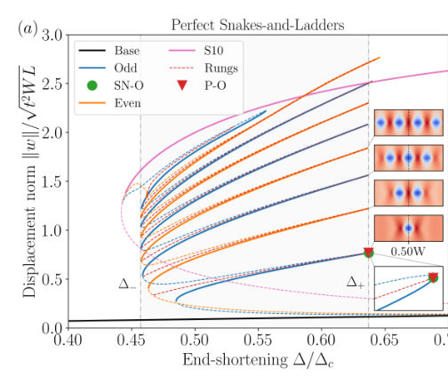
<figcaption class="paper-figure-caption"><b>Fig 1.</b> FIG. 1. Bifurcation diagrams of the normalized radial-displacement norm, ∥w∥/ √</figcaption>
</figure>
<figure class="paper-figure-card">
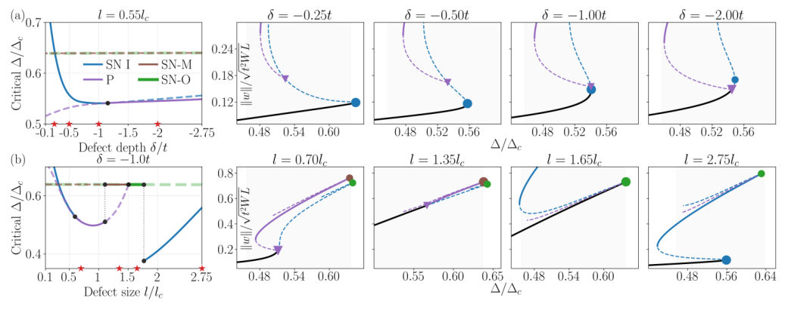
<figcaption class="paper-figure-caption"><b>Fig 2.</b> FIG. 2. (a) Normalized critical end-shortening ∆/∆c versus defect depth δ/t at fixed l/lc = 0.55, with representative bifurcation diagrams for δ/t = −0.25, −0.50, −1.00, and −2.00. (b) Corresponding dependence on defect size l/lc at fixed δ/t = −1.0, with bifurcation diagrams for l/lc = 0.70, 1.35, 1.65, and 2.75. Blue, purple, brown, and green curves denote SN I, P, SN-M, and SN-O, respectively. Solid curves identify the bifurcation that triggers buckling; dashed curves show the remaining bifurcations. Black markers indicate transitions between primary buckling bifurcations, with dotted lines in (b) marking discontinuous changes in the buckling threshold. Red stars mark the parameter...</figcaption>
</figure>
<figure class="paper-figure-card">
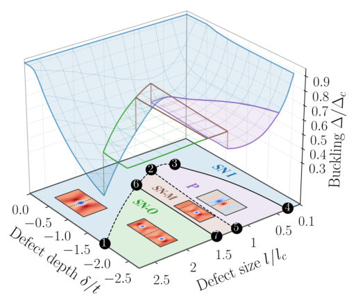
<figcaption class="paper-figure-caption"><b>Fig 3.</b> FIG. 4. The colored defect-parameter plane (δ/t, l/lc) iden- tifies the primary buckling bifurcation in each region; the insets show representative eigenmodes with the dotted line indicating the defect location. The normalized buckling end-shortening, ∆/∆c, is plotted as color-matched surfaces. Markers 1–7 divide the region boundaries into six segments. Segments 1–6, 6–2 and 2–3 indicate the existence of SN I, while segment 3–4 indicates the relative position of SN I and P. Segment 2–5 marks where P changes between subcritical and supercritical; when P is supercritical, buckling instead occurs at SN-M. Segment 6–7 marks the disappearance of P, beyond which buckling occurs at SN-O on the...</figcaption>
</figure>
<figure class="paper-figure-card">
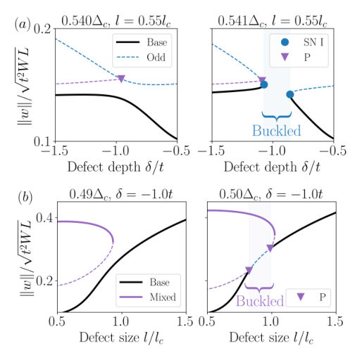
<figcaption class="paper-figure-caption"><b>Fig 4.</b> FIG. 3. Bifurcation diagrams obtained by continuation in (a) defect depth δ/t at fixed l/lc = 0.55 for ∆/∆c = 0.540 and 0.541, and (b) defect size l/lc at fixed δ/t = −1.0 for ∆/∆c = 0.49 and 0.50. The SN I bifurcations in (a) bound an interval where the base branch is absent, whereas the P bifurcations in (b) bound an interval where it is unstable. These intervals widen as ∆increases, confirming the non- monotonic dependence of ∆SNI on δ and of ∆P on l.</figcaption>
</figure>

**Summary.** This paper investigates why small imperfections cause large variations in the buckling load of cylindrical shells. Using bifurcation analysis, the authors demonstrate that the sensitivity stems not just from the defect's size, but from how the defect's geometry alters the underlying mathematical structure of the shell's stability manifold. This provides a deep, structural understanding of mechanical instability.

**Why it may be interesting.** While focused on classical mechanics, the concept of how a small perturbation (the defect) fundamentally alters the stability landscape by pinning an existing equilibrium structure is analogous to how local disorder can dictate the global behavior of quantum systems, such as in localization phenomena.

Detailed structure

**Main problem.** The study aims to uncover the fundamental origin of extreme imperfection sensitivity observed in the buckling of thin cylindrical shells, where minor geometric flaws cause drastic changes in the critical buckling load.

**Main result.** Imperfection sensitivity is not merely a function of the defect's magnitude, but rather a sensitivity of the underlying bifurcation structure to the defect's specific geometry. The defect pins pre-existing localized equilibria, fundamentally altering the bifurcation path that triggers buckling.

**Method.** The research employs advanced numerical continuation and bifurcation analysis techniques, systematically varying the depth and size of a localized Gaussian defect.

**Model / system.** The physical system is a thin cylindrical shell subjected to axial compression, modeled using a geometrically exact shell theory (Cosserat surface). The analysis tracks the equilibrium states and stability boundaries as a function of applied load and defect parameters.

**Key observables.** Critical end-shortening ($\Delta/\Delta_c$), the type of primary instability bifurcation (e.g., Saddle-Node, Pitchfork), and the reaction force ($P/P_c$).

**Important parameters / regimes.** Defect depth ($\delta$), defect size ($l$), and the ratio of the applied end-shortening ($\Delta/\Delta_c$).

**Assumptions / limitations.** The analysis relies on a finite-element discretization of geometrically exact shell theory and assumes that the buckling threshold is determined by the first loss of stability of the prebuckling state.

**Figures summary.** Figures illustrate bifurcation diagrams showing the dependence of the critical load on defect depth and size, mapping out how the primary buckling bifurcation switches between symmetry-preserving and symmetry-breaking types.

**Paper structure.** The paper establishes the physical model and the problem of imperfection sensitivity, then uses bifurcation analysis to show that the instability originates from pre-existing localized equilibria. It systematically varies defect parameters to demonstrate the non-monotonic and discontinuous dependence of the buckling threshold on defect geometry.

Abstract

Buckling of thin cylindrical shells under axial compression, a classical example of a subcritical instability, is highly sensitive to small imperfections, with minute geometric variations causing large changes in buckling threshold. To uncover the origin of this sensitivity, we use numerical continuation and bifurcation analysis while systematically varying the depth and size of a single localized Gaussian defect. We show that the instabilities of the imperfect shell originate from localized equilibria already present in the perfect shell. By breaking translation symmetry, the defect pins these equilibria and changes how they connect to the imperfect base state. Small changes in defect geometry can thereby switch the bifurcation that triggers buckling, producing non-monotonic and discontinuous changes in buckling threshold and abrupt changes in buckling mode. Imperfection sensitivity is therefore not simply sensitivity to imperfection magnitude, but sensitivity of the underlying bifurcation structure to imperfection geometry.

[↑ back to top](#top)

### [Transport Relaxation Mechanisms in Bilayer Graphene: Effects of Pauli Blocking](http://arxiv.org/abs/2609.19643v1)

**Authors:** Amit Varshney, SSZ Ashraf  
**Type:** theory · **Category:** other · **PDF:** <https://arxiv.org/pdf/2609.19643v1>  
**Analysis basis:** full PDF text, analyzed in chunks
**Topic relevance:** `Keldysh / 2PI / non-Gaussian methods` **1/5**

↔ Scroll figures horizontally

<figure class="paper-figure-card">
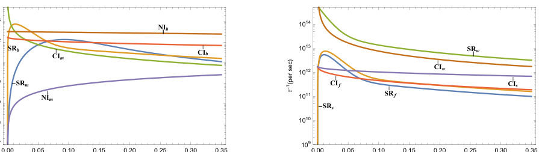
<figcaption class="paper-figure-caption"><b>Fig 1.</b> Figure 1: (a) Energy dependence of the carrier scattering rates, τ −1, in monolayer (subscript m) and bilayer (subscript b) graphene due to surface-roughness (SR), neutral-impurity (NI), and charged-impurity (CI) scattering. (b) Energy dependence of the CI and SR scattering rates in bilayer graphene for three screening regimes: without screening (w), full screening (f), and the asymptotic strong-screening approximation (s). The corresponding rates are denoted by CIw, CIf, CIs and SRw, SRf, SRs.</figcaption>
</figure>
<figure class="paper-figure-card">
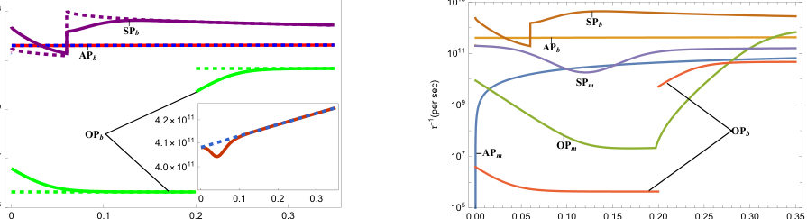
<figcaption class="paper-figure-caption"><b>Fig 2.</b> Figure 2: (a) Calculated carrier transport scattering rates, τ −1, as a function of carrier energy Ek in bilayer graphene for AP (APb), optical-phonon (OPb), and surface-polar-phonon (SPPb) scattering mechanisms. Solid curves represent the results without Pauli-blocking (PB), whereas dashed curves include the PB factor. The inset shows an enlarged view of the acoustic-phonon contribution, highlighting its energy dependence in the range of approximately 0–0.35 eV. (b) Calculated carrier transport scattering rates, τ −1, as a function of carrier energy Ek for monolayer and bilayer graphene due to acoustic-phonon (AP), optical-phonon (OP), and surface-polar-phonon (SPP) scattering mechanisms....</figcaption>
</figure>
<figure class="paper-figure-card">
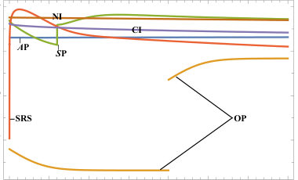
<figcaption class="paper-figure-caption"><b>Fig 3.</b> Figure 3: Calculated carrier transport scattering rates, τ−1, as a function of carrier energy Ek in bilayer graphene for surface-roughness (SR), acoustic-phonon (AP), surface-polar-phonon (SPP), neutral-impurity (NI), charged-impurity (CI), and optical-phonon (OP) scattering mechanisms. The figure compares the relative magnitudes and energy dependences of the different scattering channels over the investigated energy range.</figcaption>
</figure>

**Summary.** This paper analytically treats carrier transport relaxation in bilayer graphene by incorporating multiple scattering mechanisms, including impurities and phonons. It derives closed-form expressions for the relaxation rates using the Boltzmann equation, highlighting the crucial, energy-dependent role of Pauli blocking in determining the dominant scattering channel.

**Why it may be interesting.** The detailed analysis of momentum relaxation in a tunable 2D material like BLG, especially the inclusion of Pauli blocking effects, provides insights into non-equilibrium transport dynamics relevant to quantum devices.

Detailed structure

**Main problem.** To provide a unified analytical treatment of carrier transport relaxation mechanisms in bilayer graphene (BLG), specifically addressing the influence of Pauli blocking.

**Main result.** Neutral-impurity scattering is found to be the dominant relaxation mechanism over a substantial energy range, while Pauli blocking modifies rates in a mechanism- and energy-dependent manner.

**Method.** The study uses the semiclassical Boltzmann Transport Equation (BTE) combined with Fermi's golden rule to derive closed-form expressions for various scattering rates.

**Model / system.** The system is Bilayer Graphene (BLG) modeled using a low-energy two-band approximation with an approximately parabolic dispersion relation. Scattering is considered from impurities (neutral and charged), acoustic/optical phonons, and substrate polar phonons.

**Key observables.** Transport relaxation rates ($	au^{-1}$) as a function of carrier energy ($E_k$), and the relative importance of different scattering channels.

**Important parameters / regimes.** Carrier energy ($E_k$), temperature, carrier density (especially in the degenerate regime), and coupling constants for various scattering interactions.

**Assumptions / limitations.** The analysis assumes the total scattering rate is additive via Matthiessen's rule, and approximations like the first Born approximation and long-wavelength Thomas–Fermi screening are employed.

**Figures summary.** Figures compare the calculated transport scattering rates ($	au^{-1}$) versus carrier energy ($E_k$) for all considered mechanisms, illustrating their relative magnitudes and energy dependencies.

**Paper structure.** The paper progresses from establishing the general formalism (BTE/Fermi's Golden Rule) to detailing the specific scattering mechanisms (disorder and phonons), deriving the rate equations incorporating Pauli blocking, and finally comparing the results across different energy regimes.

Abstract

We present a unified analytical treatment of carrier transport relaxation in bilayer graphene (BLG), including scattering by surface roughness, charged and neutral impurities, acoustic and optical phonons, and substrate polar phonons. The calculation is formulated within the low-energy two-band approximation using Fermi's golden rule and the semiclassical Boltzmann transport equation. Closed-form expressions for the transport relaxation rates are derived and verified by numerical evaluation of the corresponding scattering integrals. Particular attention is given to Pauli blocking, whose influence becomes important under degenerate carrier conditions owing to the approximately parabolic low-energy dispersion and nearly constant density of states of BLG. We find that Pauli blocking modifies the relaxation rates in a mechanism- and energy-dependent manner for both suspended and substrate-supported BLG. For the parameters considered, neutral-impurity scattering provides the dominant contribution over a substantial energy range, while acoustic-phonon and charged-impurity scattering remain important competing mechanisms. Optical-phonon scattering is suppressed below its emission threshold, whereas substrate polar phonons provide an additional relaxation channel in supported BLG. Comparison with monolayer graphene and a conventional two-dimensional electron gas highlights the role of band dispersion, density of states, screening, and chirality in determining the distinct scattering behavior of BLG. These results provide analytical insight into the relative importance of the principal momentum-relaxation mechanisms and the role of Pauli blocking in BLG transport.

[↑ back to top](#top)

### [Ultralow-Tensile Strain Enables Exciton Funneling and Energy Transfer to Boost MoSe2 Photoluminescence Quantum Yield](http://arxiv.org/abs/2609.20387v1)

**Authors:** Gayatri, Mehdi Arfaoui, Debashish Das, Mateusz Raczyński, Marta Bilska, Piotr Tatarczak, Aleksandra Krystyna Dąbrowska, Tomasz Kazimierczuk, Takashi Taniguchi, Kenji Watanabe, Piotr Kossacki, Andrzej Wysmołek, Saroj Kumar Nayak, Adam Babiński, Johannes Binder, Maciej R. Molas, Arka Karmakar  
**Type:** both · **Category:** other · **PDF:** <https://arxiv.org/pdf/2609.20387v1>  
**Analysis basis:** full PDF text, analyzed in chunks
**Topic relevance:** `quantum optics experiment` **1/5**

↔ Scroll figures horizontally

<figure class="paper-figure-card">
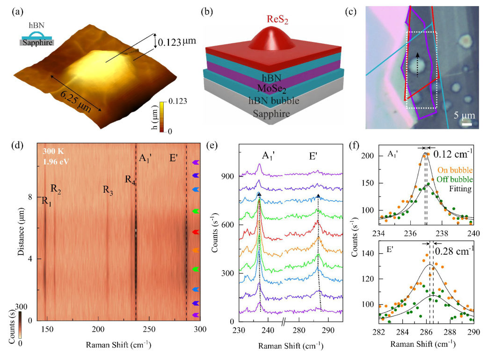
<figcaption class="paper-figure-caption"><b>Fig 1.</b> FIG. 1. (a) Three-dimensional AFM image of the hBN bubble on the sapphire substrate, showing a height of ∼0.12 µm and base diameter of ∼6.25 µm. (b) Schematic illustration of the HS cross-section (from top): ML ReS2, interlayer hBN, ML MoSe2 and the bottom hBN bubble/sapphire substrate. (c) Optical image of the sample. Colored outlines correspond to the layers shown in (b). (d) RT Raman intensity map along the black dotted arrow shown in (c) measured using 1.96 eV excitation. Overall, Raman intensity on the bubble is significantly higher as compared to the outside of the bubble. (e) Selected Raman spectra from different positions along the line scan shown in (d) — showing small shifts in...</figcaption>
</figure>
<figure class="paper-figure-card">
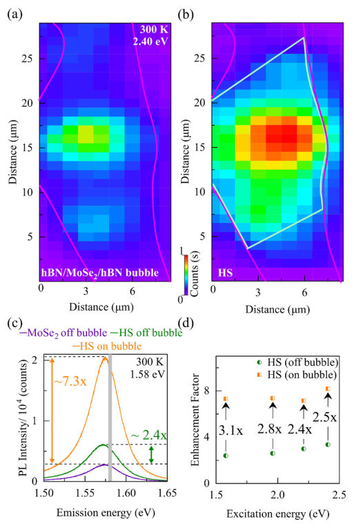
<figcaption class="paper-figure-caption"><b>Fig 2.</b> FIG. 2. (a) Spatially resolved RT PL intensity map un- der 2.40 eV excitation from the white dotted area marked in Fig.1(c) prior to the transfer of top ReS2 layer. The marked area indicates the ML MoSe2 region. MoSe2 emis- sion is stronger in the bubble region than in the surrounding flat region. (b) PL intensity map of the same region under the same experimental conditions, after placing the top ReS2 layer. HS area at the bubble apex shows the maximum PL intensity. (c) RT PL spectra measured under 1.58 eV exci- tation, from ML MoSe2, on bubble and off bubble HS areas show ∼7.3× and ∼2.4× enhancement, respectively. The gray shaded line indicates the spectral range blocked by the Bragg...</figcaption>
</figure>
<figure class="paper-figure-card">
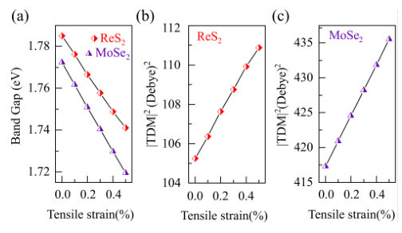
<figcaption class="paper-figure-caption"><b>Fig 3.</b> FIG. 3. (a) First-principles DFT calculations of the elec- tronic band structures of both TMDCs showing a contin- uous reduction of the bandgaps with an increasing biaxial tensile strain. The solid lines are guides to the eye. ReS2 al- ways maintains a higher bandgap than MoSe2 throughout this range. (b–c) Calculated |TDM|2 for MLs of ReS2 and MoSe2, respectively, as a function of biaxial tensile strain. |TDM|2</figcaption>
</figure>
<figure class="paper-figure-card">
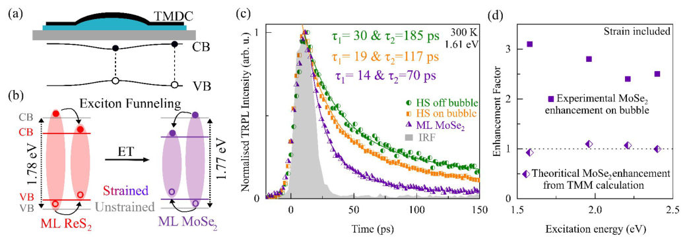
<figcaption class="paper-figure-caption"><b>Fig 4.</b> FIG. 4. (a,b) Schematic illustration of strain-induced bandgap modulation and exciton funneling and the proposed dipole- mediated ET pathway from ReS2 to MoSe2. (c) RT TRPL spectra acquired from the ML MoSe2, and the strained and unstrained HS area under 1.61 eV excitation. The gray shaded region shows the instrument response function (IRF). The decay curves are fitted using a biexponential decay function to extract the fast (τ1) and slow (τ2) decay components. The strained HS exhibits a faster decay components than the unstrained HS. (d) Strain dependent TMM calculation of the MoSe2 optical enhancement factor shows a near unity value for the entire excitation range. The adopted model shows...</figcaption>
</figure>

**Summary.** This research demonstrates that applying minute biaxial tensile strain to a vdW heterostructure ($	ext{ReS}_2/	ext{hBN}/	ext{MoSe}_2$) can dramatically enhance its photoluminescence quantum yield. The enhancement stems from a synergistic effect: the strain funnels excitons toward high-strain regions while simultaneously boosting energy transfer efficiency. This offers a powerful, strain-tunable route for designing high-performance 2D optoelectronic devices.

**Why it may be interesting.** This work provides a concrete, tunable platform for controlling quantum optical properties in 2D materials by coupling mechanical strain to electronic structure and energy transfer pathways, which is highly relevant for quantum light sources.

Detailed structure

**Main problem.** The goal is to enhance the photoluminescence (PL) quantum yield (QY) in van der Waals (vdW) heterostructures by synergistically combining strain engineering and interlayer energy transfer (ET).

**Main result.** Applying only a small biaxial tensile strain ($\sim 0.1\%$) enables efficient exciton funneling and boosts the relative PL QY by approximately 8-fold in a $	ext{ReS}_2/	ext{hBN}/	ext{MoSe}_2$ heterostructure.

**Method.** The study combines experimental measurements (PL mapping, Raman spectroscopy, Time-Resolved PL) with theoretical calculations (DFT and coherent transfer-matrix method) to confirm the underlying physical mechanisms.

**Model / system.** The physical system is a multilayer vdW heterostructure ($	ext{ReS}_2/	ext{hBN}/	ext{MoSe}_2$) placed on a substrate, where localized tensile strain is induced using $	ext{hBN}$ bubbles. The physics involves exciton dynamics, energy transfer, and strain-dependent band structure modification.

**Key observables.** PL Quantum Yield (QY) enhancement factor ($\sim 8	imes$), PL redshift (indicating strain), and exciton decay lifetimes ($	au_1, 	au_2$).

**Important parameters / regimes.** Tensile strain ($\sim 0.1\%$), $	ext{hBN}$ spacer thickness ($\sim 12 	ext{ nm}$), and excitation energies ($1.58 	ext{ eV}$ to $2.40 	ext{ eV}$).

**Assumptions / limitations.** The enhancement mechanism is confirmed to be due to strain-induced funneling and ET, ruling out optical interference effects via TMM calculations.

**Figures summary.** Figures show AFM images of the bubble structure, Raman maps confirming strain gradients, and PL intensity maps demonstrating localized enhancement at the bubble apex.

**Paper structure.** The paper establishes the problem by reviewing strain/ET control in vdW materials, presents the experimental setup using engineered $	ext{hBN}$ bubbles, measures strain and PL enhancement, and supports the findings with theoretical modeling of exciton dynamics.

Abstract

Strain engineering is a powerful route for controlling the exciton dynamics in van der Waals (vdW) heterostructures (HSs). The interlayer energy transfer (ET) process is another key factor in controlling the photocarrier relaxation pathways in vdW HSs. In this work, we combine these two processes to achieve an 8-fold enhancement to the relative photoluminescence (PL) quantum yield (QY) in a HS formed from monolayers of ReS2 and MoSe2, separated by a thin hBN interlayer, placed onto an hBN bubble. We achieve this enhancement by applying only 0.1% biaxial tensile strain, which results in efficient exciton funneling and an increased transition dipole moment. Our experimental data are supported by first-principles density-functional theory and coherent transfer-matrix method calculations, ruling out optical interference as the dominant origin of the enhancement. This work provides an innovative route for enhancing the PL QY of vdW materials via interplay between the tensile strain and the ET process.

[↑ back to top](#top)

### [Unified Transport and Susceptibility Analysis of a Thin BSCCO Film: From Local Pairing to Global Phase Coherence](http://arxiv.org/abs/2609.19303v1)

**Authors:** Santu Prasad Jana, Bismaya Ranjan Nayak, Sohini Guin, Akshay Naik, Dhavala Suri, Arindam Ghosh  
**Type:** both · **Category:** strongly correlated electrons · **PDF:** <https://arxiv.org/pdf/2609.19303v1>  
**Analysis basis:** full PDF text, analyzed in chunks
**Topic relevance:** `Keldysh / 2PI / non-Gaussian methods` **1/5**

↔ Scroll figures horizontally

<figure class="paper-figure-card">
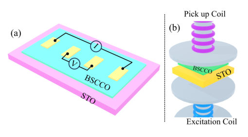
<figcaption class="paper-figure-caption"><b>Fig 1.</b> FIG. 1. Experimental configurations for (a) four-probe resistance–temperature (R-T) measurements and (b) AC magnetic susceptibility measurements of the BSCCO thin film on an STO substrate.</figcaption>
</figure>
<figure class="paper-figure-card">
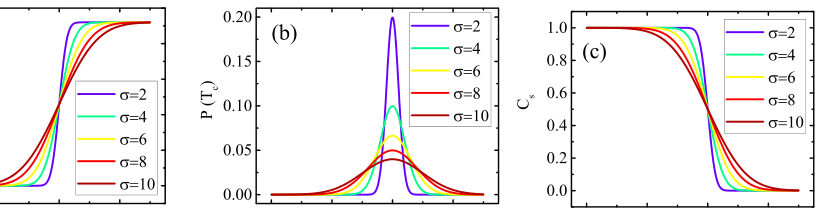
<figcaption class="paper-figure-caption"><b>Fig 2.</b> FIG. 2. Superconducting transition simulated using a Gaussian distribution of local transition temperatures. (a) Resistance R(T) calculated for different standard deviations σ. (b) Corresponding probability distributions P(Tc). (c) Superconducting fraction Cs(T). Increasing σ broadens the resistive transition and produces a more gradual development of the superconducting fraction, while the mean transition temperature Tc0 remains fixed.</figcaption>
</figure>
<figure class="paper-figure-card">
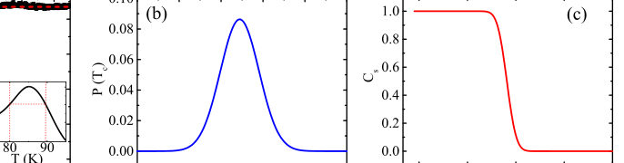
<figcaption class="paper-figure-caption"><b>Fig 3.</b> FIG. 3. Gaussian-distribution analysis of the superconducting transition. (a) Experimental resistance R(T) (black circles) and fit obtained using the cumulative Gaussian model (red dashed line). The inset shows the temperature derivative dR/dT; the horizontal and vertical dashed lines indicate the half-maximum level and corresponding temperatures used to determine the full width at half maximum (FWHM) of the derivative peak. (b) Probability distribution P(Tc) of local superconducting transition temperatures obtained from the fitted parameters. (c) Corresponding superconducting fraction Cs(T) calculated from the fitted Tc distribution.</figcaption>
</figure>
<figure class="paper-figure-card">
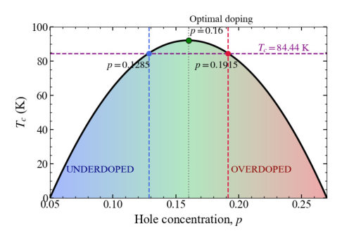
<figcaption class="paper-figure-caption"><b>Fig 4.</b> FIG. 4. Empirical Tc–p superconducting dome for Bi2Sr2CaCu2O8+δ calculated using the Presland relation. The measured value Tc0 = 84.44 K gives two possible hole concentrations, p = 0.1285 (underdoped) and p = 0.1915 (overdoped), located symmetrically about the optimal value p = 0.16.</figcaption>
</figure>
<figure class="paper-figure-card">
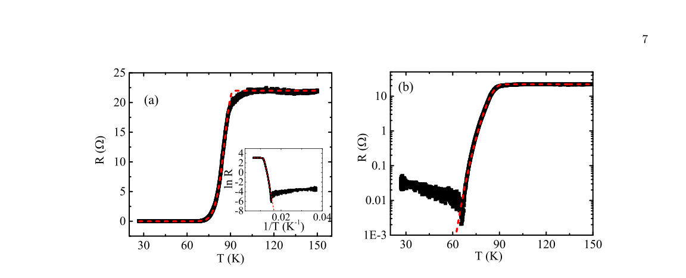
<figcaption class="paper-figure-caption"><b>Fig 5.</b> FIG. 5. Comparison of the measured resistance with the Ambegaokar–Halperin model. (a) Resistance R(T) on a linear scale, showing the experimental data (black symbols) and AH fit (red dashed line). The inset shows an Arrhenius representation of ln R as a function of 1/T; the linear fit is used to estimate an effective activation energy. (b) Same data and AH fit on a semilogarithmic scale, emphasizing the low-resistance region of the transition.</figcaption>
</figure>

**Summary.** This work develops a unified theoretical and experimental framework to analyze the superconducting transition in inhomogeneous high-Tc films like BSCCO. By combining transport and magnetic susceptibility measurements, the authors demonstrate that the transition is not instantaneous but proceeds through distinct stages, from local pairing to global phase coherence. This approach successfully distinguishes the physics of highly disordered superconductors from those with more uniform superconducting properties.

**Why it may be interesting.** The framework provides a powerful, quantitative method to decouple different physical processes—such as local pairing versus long-range phase locking—which is crucial for understanding complex, disordered superconductors where multiple energy scales compete.

Detailed structure

**Main problem.** The study aims to understand the complex superconducting transition in thin high-Tc films by developing a unified framework that connects local pairing mechanisms to the establishment of global phase coherence.

**Main result.** The superconducting transition is found to be a progressive process, occurring in distinct stages: local pairing onset, superconducting fraction expansion, magnetic screening development, and finally, global phase coherence establishment.

**Method.** The authors combine electrical transport measurements (analyzing resistive transitions using Gaussian distributions) with AC magnetic susceptibility measurements, extending the Choy-Stoneham model.

**Model / system.** The primary system is a thin Bi2Sr2CaCu2O8+delta (BSCCO) film. The analysis models spatial inhomogeneity using a Gaussian distribution of local Tc values and incorporates phase dynamics via the Ambegaokar-Halperin model and a temperature-dependent connectivity factor.

**Key observables.** Resistive transition R(T), superconducting fraction C_s(T), magnetic susceptibility $\chi(T)$, and characteristic temperatures ($T_{AHc}, T_{c0}, T_{\chi}, T_J$).

**Important parameters / regimes.** The separation between the mean resistive transition temperature ($T_{c0}$) and the connectivity midpoint temperature ($T_J$) is a key diagnostic parameter, which is compared across different material systems (BSCCO vs. NbTiN).

**Assumptions / limitations.** The analysis assumes that the resistive transition can be modeled by a Gaussian distribution of local Tc values, and that the magnetic response can be effectively described by modifying the Choy-Stoneham susceptibility model with a connectivity factor.

**Figures summary.** Figures illustrate the progressive nature of the transition, showing how different physical responses (resistance, susceptibility) map onto distinct temperature regimes. Table I compares transition parameters across BSCCO, NbTiN, and nanoporous NbN.

**Paper structure.** The paper first establishes the need for a unified framework by analyzing BSCCO films, detailing the combined use of transport and susceptibility data. It then develops the mathematical models (Gaussian $P(T_c)$, modified susceptibility) and applies them to characterize the sequential nature of the transition. Finally, the framework is validated by applying it to other superconducting systems (NbTiN, NbN) to show its general applicability.

Abstract

The superconducting transition in thin high-$T_c$ films can be significantly broadened by disorder, spatial inhomogeneity, and phase fluctuations. Here, we study the transition in a 30-nm-thick sputter-grown Bi$_2$Sr$_2$CaCu$_2$O$_{8+δ}$ (BSCCO) film through electrical-transport and ac-susceptibility measurements. The resistive transition is examined using a Gaussian distribution of local $T_c$ values and the Ambegaokar--Halperin model, describing spatial variations in superconductivity and thermally activated phase dynamics, respectively. To relate the transport and magnetic responses, we extend the Choy--Stoneham susceptibility model by introducing the superconducting fraction extracted from transport and a temperature-dependent connectivity factor representing the gradual development of Josephson coupling among superconducting regions. The results identify separate temperature regimes corresponding to the onset of local superconductivity, expansion of the superconducting fraction, development of magnetic screening, and establishment of global phase coherence. The transition therefore proceeds progressively, from locally superconducting regions to a connected, phase-coherent state. This analysis provides a common framework for relating spatial inhomogeneity, dissipative phase dynamics, and magnetic screening in inhomogeneous superconducting films.

[↑ back to top](#top)

### Other secondary papers (3)

Show other secondary papers

### [Pairing symmetry and superconductivity from long-range Coulomb interactions in the extended t-t'-t''-Jz model for cuprates](http://arxiv.org/abs/2609.19490v1)

**Authors:** U. A. Diaz-Reynoso, F. Mireles  
**Type:** theory · **Category:** strongly correlated electrons · **PDF:** <https://arxiv.org/pdf/2609.19490v1>  
**Analysis basis:** full PDF text, analyzed in chunks

↔ Scroll figures horizontally

<figure class="paper-figure-card">
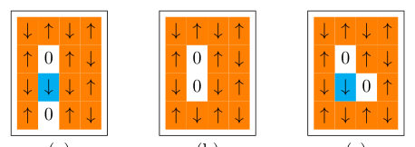
<figcaption class="paper-figure-caption"><b>Fig 1.</b> FIG. 1. Three high-symmetry two-hole configurations in a 4 × 4 antiferromagnetic lattice. The staggered magnetization Sz i,j = (−1)i+jSz(i, j) is indicated with a background color in orange/blue for positive/negative values. Here, Sz(i, j) = ±1/2 for spin ↑, ↓(respectively) is the on-site magnetization at site (i, j), with i = j = −1 at bottom-left corner. Empty sites (holes) are blank and marked with 0. Using the D4 gen- erators defined in the text: (a) is invariant under sr3 (hori- zontal) and r2 (180◦rotation), implying sr (vertical); (b) is invariant under sr; (c) is invariant under s.</figcaption>
</figure>
<figure class="paper-figure-card">
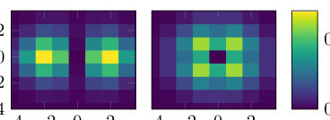
<figcaption class="paper-figure-caption"><b>Fig 2.</b> FIG. 2. Hole-hole correlation function Ch(r) for (a) the |px⟩ component of the degenerate ground state, and (b) the first excited state dx2−y2 . In each case, Ch(r) exhibits the same spatial symmetry as the corresponding state.</figcaption>
</figure>
<figure class="paper-figure-card">
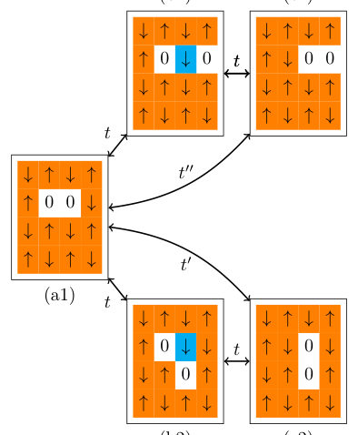
<figcaption class="paper-figure-caption"><b>Fig 3.</b> FIG. 3. Schematic depiction of the hopping sequences for hole-pair propagation. The |px⟩state propagates by (1, 0) via the t-mediated sequence (a1)-(b1)-(c1), while the dx2−y2</figcaption>
</figure>
<figure class="paper-figure-card">
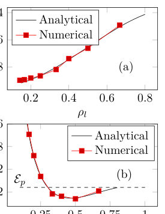
<figcaption class="paper-figure-caption"><b>Fig 4.</b> FIG. 7. Comparison of the energy cost to add holes to a unidirectional stripe as a function of the linear hole density ρl, contrasting the rigid-band approximation with numerical estimates. (a) Within the rigid approximation, hole addition to the antiphase domain wall follows a simple one-dimensional filling rule. (b) The numerically computed energy per hole in a single stripe ES (for J = 0.4, t = 1, t′ = −0.3, and t′′ = 0.2; remaining parameters are given in the main text) exhibits a minimum at ρl ≈0.5. At this density, ES is approximately 0.1t lower than the pair energy, i.e., ES −Ep ≈−0.1t.</figcaption>
</figure>
<figure class="paper-figure-card">
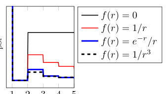
<figcaption class="paper-figure-caption"><b>Fig 5.</b> FIG. 8. Total potential energy (in a.u.) as a function of hole separation r (in lattice units), computed for various repul- sive interaction potentials with V = J/2. The minima of the potential energy pockets have been aligned for direct compar- ison.</figcaption>
</figure>

**Summary.** This paper models cuprate superconductivity using an extended $t-t'-t''-J_z$ Hamiltonian that includes long-range Coulomb repulsion. The study finds that the pairing symmetry depends critically on hopping parameters and demonstrates that repulsive interactions can stabilize reentrant superconductivity in the underdoped regime. The methodology combines advanced quantum many-body techniques with symmetry analysis to diagnose superconducting order.

**Why it may be interesting.** This work provides a detailed theoretical framework for understanding high-Tc superconductivity by incorporating multiple hopping terms and long-range Coulomb repulsion, which is a key challenge in strongly correlated electron theory.

Detailed structure

**Main problem.** The study investigates the pairing symmetry and superconducting behavior in cuprate superconductors, addressing the limitations of existing models in describing superconductivity across the full doping range.

**Main result.** The pairing symmetry is highly sensitive to the hopping parameters ($t', t''$), and repulsive Coulomb interactions are shown to drive reentrant superconducting behavior in the underdoped regime, consistent with experimental observations.

**Method.** The authors use theoretical calculations on an extended two-dimensional $t-t'-t''-J_z$ model, employing techniques like the truncated Lanczos method and symmetry analysis based on the $	ext{D}_4$ point group.

**Model / system.** The system is the extended two-dimensional $t-t'-t''-J_z$ model, which incorporates nearest, second, and third-nearest neighbor hopping terms ($t, t', t''$), an Ising-like antiferromagnetic interaction ($J_z$), and long-range Coulomb repulsive interactions ($H_V$).

**Key observables.** Pairing symmetry (p-wave, d-wave, or coexisting), pair-pair correlation function $P_{xx}(|r|)$, and the superconducting phase diagram ($\delta$ vs. $V$).

**Important parameters / regimes.** Hopping parameters ($t', t''$), doping level ($\delta$), and the strength of repulsive interactions ($V$).

**Assumptions / limitations.** The analysis uses the large-$U$ limit of the Hubbard model, approximates the spin exchange with an Ising term ($H_{Jz}$), and utilizes the Clifford torus distance metric for long-range interactions.

**Figures summary.** Figures illustrate high-symmetry two-hole configurations and show the decay of the pair-pair correlation function $P_{xx}(|r|)$, confirming long-range order for superconducting states. A phase diagram maps reentrant superconductivity based on doping and repulsion.

**Paper structure.** The paper systematically analyzes the Hamiltonian components, determines the ground state symmetry using group theory, diagnoses superconductivity via correlation functions, and finally maps out the superconducting phase diagram showing reentrant behavior.

Abstract

We investigate the pairing symmetry of the ground-state phase diagram of an extended two-dimensional $t$-$t'$-$t''$-$J_z$ model, in which the first-, second-, and third-nearest neighbor electron hopping terms ($t,t'$ and $t''$) and an anisotropic Ising-like antiferromagnetic interaction $J_z$ are treated on the same framework. We find that the dominant pairing symmetry depends sensitively on the sign and magnitude of the hopping parameters $t'$ and $t''$, showing pure $p$-wave, pure $d$-wave, or coexisting pairing channels, highlighting the decisive role of these terms. We further explore the role of the long-range and short-range repulsive interactions in the formation of pairs and analyze the specific case of hole-doped cuprates. Our results indicate that repulsive interactions favors hole pair escaping of the stripe domains. Furthermore, pairing correlation calculations strongly suggest that repulsive Coulomb interactions drive reentrant superconducting behavior at experimentally observed underdoped regime ($δ\approx0.07$ to $0.15$), as in Neodymium-based cuprates.

[↑ back to top](#top)

### [Predictive Structure to Thermal Conductivity Modeling Framework for BEOL Interconnect Stacks in Advanced Technology Nodes Enabled by Extensive Layer Resolved Thermal Measurements](http://arxiv.org/abs/2609.20379v1)

**Authors:** Zifeng Huang, Yiyang Sun, Tianyu Jia, Runsheng Wang, Zhe Cheng  
**Type:** both · **Category:** other · **PDF:** <https://arxiv.org/pdf/2609.20379v1>  
**Analysis basis:** full PDF text, analyzed in chunks

↔ Scroll figures horizontally

<figure class="paper-figure-card">
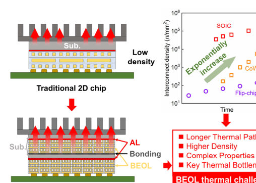
<figcaption class="paper-figure-caption"><b>Fig 1.</b> Fig. 1. Motivation of this work: The rapid evolution of conventional chips toward advanced 2.5D/3D integrated systems has led to an exponential increase in interconnect density. This increase results in longer thermal dissipation paths and more complex heat transport characteristics, making the BEOL interconnect stack a major bottleneck for advanced thermal management.</figcaption>
</figure>
<figure class="paper-figure-card">
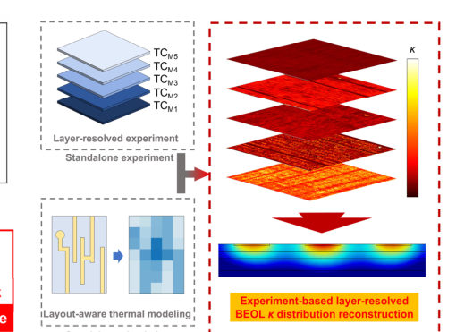
<figcaption class="paper-figure-caption"><b>Fig 2.</b> Fig. 2. Comparison between conventional standalone experimental/simulation approaches and the proposed coupled experiment–simulation framework for layer-resolved BEOL thermal conductivity reconstruction.</figcaption>
</figure>
<figure class="paper-figure-card">
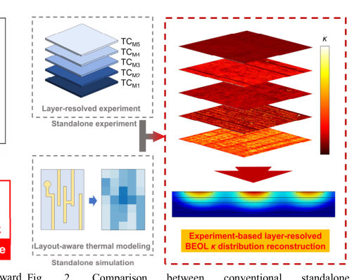
<figcaption class="paper-figure-caption"><b>Fig 3.</b> Fig. 4. Schematic illustration of the TDTR experimental setup used in this study.</figcaption>
</figure>
<figure class="paper-figure-card">
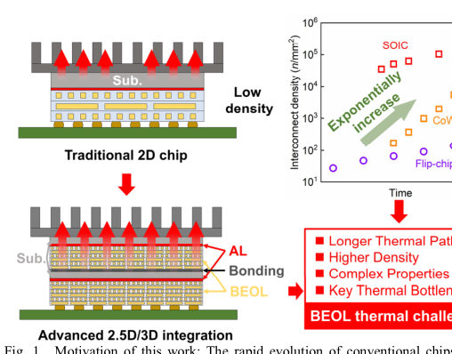
<figcaption class="paper-figure-caption"><b>Fig 4.</b> Fig. 3. Schematic of sample preparation and the measurement workflow. (a) Original BEOL structure of the chip. (b) Exposed BEOL stack after P-FIB delayering. (c) Al transducer layer deposition followed by sequential measurements. (d) Optical and surface morphology observation during the actual experiment.</figcaption>
</figure>
<figure class="paper-figure-card">
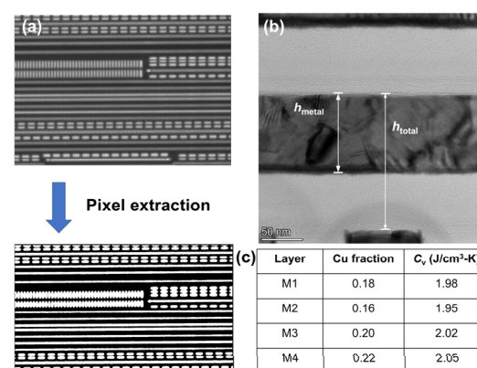
<figcaption class="paper-figure-caption"><b>Fig 5.</b> Fig. 5. Workflow of volumetric heat capacity extraction for individual layers: (a) Identification of Cu regions by extracting high-brightness pixels from the SEM image to yield the surface Cu fraction. (b) Determination of the total Cu fraction by combining hmetal and htotal. (c) Extracted volumetric heat capacity (CV) of each individual interconnect layer.</figcaption>
</figure>

**Summary.** This paper develops a novel, structure-aware framework to predict the thermal conductivity of complex BEOL interconnect stacks in advanced microelectronics. By combining extensive time-domain thermoreflectance measurements with statistical modeling, the authors create an empirical model that accounts for nanoscale structural variations. This allows for highly accurate thermal analysis, which is crucial for preventing hotspots in next-generation 3D integrated circuits.

**Why it may be interesting.** Not directly relevant

Detailed structure

**Main problem.** The increasing structural complexity of BEOL interconnect stacks in advanced ICs requires a structure-aware thermal conductivity modeling framework because conventional models fail to capture local thermal variations.

**Main result.** The authors established an experimentally derived, generalizable framework that predicts thermal conductivity ($\kappa$) based on interconnect structure, showing that neglecting local inhomogeneity underestimates temperature rise.

**Method.** The framework combines Time-Domain Thermoreflectance (TDTR) measurements to gather extensive layer-resolved data, which is then used with statistical analysis and Effective Medium Theory (EMT) to build predictive models.

**Model / system.** The physical system is the Back-End-of-Line (BEOL) interconnect stack in advanced integrated circuits. The model predicts $\kappa$ as a function of structural parameters like linewidth ($w$) and Cu volume fraction ($f$).

**Key observables.** Thermal conductivity ($\kappa$), layer-resolved $\kappa$ distributions, and maximum temperature rise.

**Important parameters / regimes.** Interconnect linewidth ($w$), Cu volume fraction ($f$), and thermal boundary resistance (TBR) parameters ($A, B, w_0$).

**Assumptions / limitations.** The framework assumes that the thermal behavior can be generalized from measured layer-resolved data and that EMT can accurately map spatial variations within layers.

**Figures summary.** Figures illustrate the TDTR setup, sample preparation, the empirical $\kappa$ prediction model vs. experimental data, and Finite Element Analysis (FEA) results comparing averaged vs. spatially resolved thermal predictions.

**Paper structure.** The paper progresses from identifying the limitations of current thermal models (motivation) to presenting the experimental methodology (TDTR measurements on BEOL stacks), deriving the structure-aware empirical model, and finally validating the framework using FEA to demonstrate the necessity of local thermal inhomogeneity.

Abstract

The increasing structural complexity of BEOL interconnect stacks in advanced integrated circuits demands a structure-aware thermal conductivity (\k{appa}) modeling framework. However, generalizable models derived from layer-resolved thermal measurements that quantitatively capture the dependence of \k{appa} on interconnect structures remain lacking, limiting predictive thermal analysis. Here, we establish an experimentally derived, structure-aware \k{appa} modeling framework enabled by time-domain thermoreflectance measurements with ~100 nm depth resolution. Statistical analysis of a compiled dataset comprising over 40 experimentally measured layer-resolved \k{appa} values across diverse BEOL layers reveals a generalizable empirical structure-to-\k{appa} relationship, enabling predictive modeling based on interconnect structure. An intra-layer three-dimensional \k{appa} distribution model based on effective medium theory and realistic layouts further resolves spatial \k{appa} variations within practical interconnect layers. Together, these models establish an experimentally derived, structure-aware \k{appa} modeling framework for predictive and generalizable thermal analysis of advanced interconnect stacks and 3D ICs.

[↑ back to top](#top)

### [Vortex-mediated spin current injection into two-dimensional superconductor NbSe2](http://arxiv.org/abs/2609.19727v1)

**Authors:** Meng Yang, Xiaolong Yin, Jingjing Liu, Yifeng Chen, Qinwu Gao, Hongxing Zhu, Danni Huang, Lang Chen, Shuo-Ying Yang, Junxue Li  
**Type:** experiment · **Category:** other · **PDF:** <https://arxiv.org/pdf/2609.19727v1>  
**Analysis basis:** full PDF text, analyzed in chunks

↔ Scroll figures horizontally

<figure class="paper-figure-card">
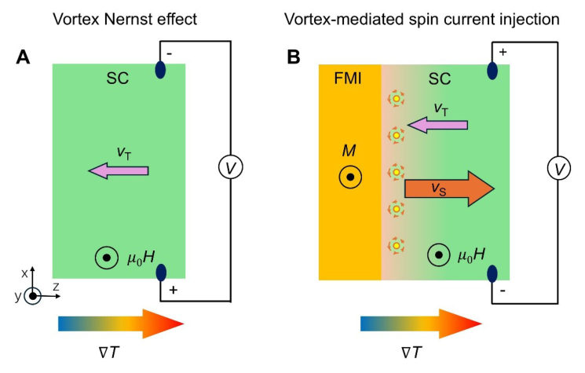
<figcaption class="paper-figure-caption"><b>Fig 1.</b> Fig. 1. Vortex Nernst effect and vortex-mediated spin current injection. (A) Vortex Nernst effect. In a type-</figcaption>
</figure>
<figure class="paper-figure-card">
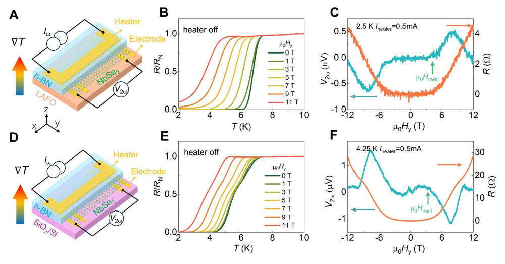
<figcaption class="paper-figure-caption"><b>Fig 2.</b> Fig. 2. Device architecture and thermoelectric transport measurements. (A, D) Schematics of the</figcaption>
</figure>
<figure class="paper-figure-card">
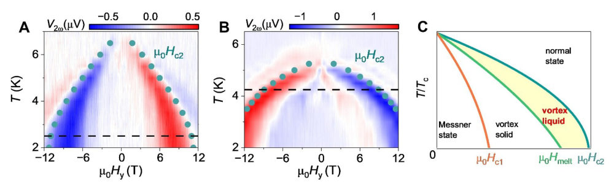
<figcaption class="paper-figure-caption"><b>Fig 3.</b> Fig. 3. Temperature-magnetic field phase diagram of the thermoelectric voltage. (A, B) Magnetic field</figcaption>
</figure>
<figure class="paper-figure-card">
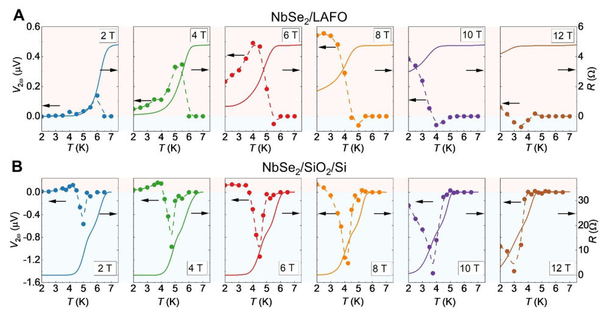
<figcaption class="paper-figure-caption"><b>Fig 4.</b> Fig. 4. Temperature dependence of the thermoelectric voltage. (A, B), Thermoelectric voltage as a function of</figcaption>
</figure>

**Summary.** This paper investigates the injection of pure spin current into a superconductor using a $	ext{NbSe}_2/	ext{LAFO}$ heterostructure. By measuring a sign-reversed thermoelectric signal, the authors demonstrate that topological vortices act as efficient carriers of spin angular momentum. This opens a new pathway for designing vortex-mediated superconducting spintronic devices.

**Why it may be interesting.** The work bridges superconducting physics with spintronics by proposing a novel, measurable mechanism (vortex-mediated spin current) that can be probed using established superconducting transport measurements.

Detailed structure

**Main problem.** Injecting pure spin current into superconductors remains a major challenge in superconducting spintronics.

**Main result.** The study reports a pronounced, sign-reversed thermoelectric peak in a superconductor/ferrimagnetic insulator bilayer, establishing vortices as efficient carriers of spin information.

**Method.** Thermoelectric transport measurements were performed on a $	ext{NbSe}_2/	ext{LAFO}$ bilayer using an out-of-plane temperature gradient and sweeping an in-plane magnetic field.

**Model / system.** The system is an $	ext{NbSe}_2/	ext{LiAl}_2	ext{Fe}_3	ext{O}_8$ ($	ext{LAFO}$) bilayer, an Ising superconductor/ferrimagnetic insulator heterostructure, studied in the vortex liquid phase of a type-II superconductor.

**Key observables.** Thermoelectric peak ($	ext{V}_{2\omega}$), resistance ($	ext{R}$), and the comparison of the signal sign relative to the conventional vortex Nernst effect.

**Important parameters / regimes.** Out-of-plane temperature gradient, in-plane magnetic field, and the superconducting transition temperature ($T_c$).

**Assumptions / limitations.** The observed signal is attributed to vortex motion driven by spin current injection, which is confirmed by the signal vanishing above $T_c$ and the sign reversal relative to thermal effects.

**Figures summary.** Figures illustrate the theoretical mechanisms (VNE vs. VMSC), device setups for $	ext{NbSe}_2/	ext{LAFO}$ and control samples, and the field/temperature phase diagram showing the vortex liquid regime.

**Paper structure.** The paper establishes the challenge of spin current injection, details the $	ext{SC}/	ext{FMI}$ setup, presents measurements showing a sign-reversed thermoelectric peak, and concludes by confirming the vortex-mediated mechanism and its implications for spintronics.

Abstract

Injection of pure spin current into superconductors remains a major challenge in superconducting spintronics. Previous studies have primarily focused on spin-polarized quasiparticles and spin-triplet supercurrents, while vortices, ubiquitous topological defects in type-2 superconductors, have been theoretically proposed as alternative carriers of spin angular momentum, yet direct experimental evidence is still lacking. Here, we report the vortex-mediated spin current injection in NbSe2/LiAl2Fe3O8(LAFO) bilayer, an Ising superconductor/ferrimagnetic insulator heterostructure. Under an out-of-plane temperature gradient and an in-plane magnetic field, the NbSe2/LAFO bilayer shows a pronounced thermoelectric peak near the upper critical magnetic field, which has the opposite sign to the conventional vortex Nernst signal observed in a single-layer NbSe2. The sign reversal suggests that the vortex flow induced by spin current injection is opposite to the flow driven by the temperature gradient, which is consistent with theoretical mechanisms including spin-vorticity transmutation and the inverse vortex spin Hall effect. By mapping the field temperature phase diagram, we reveal that the spin current injection occurs exclusively in the vortex liquid phase of NbSe2. Absence of the thermoelectric signal above the superconducting transition temperature further rules out the quasiparticle contribution. Our results establish vortices as efficient carriers of spin information in superconductors, opening a new route towards vortex-mediated superconducting spintronic devices.

[↑ back to top](#top)

