
# arxiv digest (quant-ph + cond-mat) — 2026-09-22

*103 papers · 8 relevant · 0 highlighted*

## 🔥 Most relevant (8)

*Every paper with at least one nonzero topic score, sorted by best-matching score. 🔥 marks scores ≥4/5. Click the title to jump to the full entry below; click [arXiv] to open the paper page. `(secondary)` marks papers from de-prioritized cond-mat archives.*

Show 8 relevant papers

- [Robust many-body quantum batteries](#paper-2609.20966) [[arXiv]](http://arxiv.org/abs/2609.20966v1) — 🔥 `quantum measurements` **4/5** · 🔥 `scars & prethermalization` **4/5** · `driven-dissipative phase transition` **3/5** · `methods for driven-dissipative` **3/5** · `non-equilibrium universality` **3/5** · `analog quantum simulation` **2/5** · `Keldysh / 2PI / non-Gaussian methods` **1/5** · `correlated / nonlocal dissipation` **1/5**
- [The Critical Role of Itinerant Contributions to Orbital Angular Momentum Relaxation and Dynamics](#paper-2609.21300) [[arXiv]](http://arxiv.org/abs/2609.21300v1) — 🔥 `methods for driven-dissipative` **4/5** · `Keldysh / 2PI / non-Gaussian methods` **3/5** · `correlated / nonlocal dissipation` **3/5** · `driven-dissipative phase transition` **2/5** · `non-equilibrium universality` **2/5** · `analog quantum simulation` **1/5** · `quantum measurements` **1/5** · `scars & prethermalization` **1/5**
- [Autonomous stabilization of many-body entanglement with Floquet Hamiltonians and weak measurement](#paper-2609.21086) [[arXiv]](http://arxiv.org/abs/2609.21086v1) — 🔥 `quantum measurements` **4/5** · `correlated / nonlocal dissipation` **3/5** · `methods for driven-dissipative` **3/5** · `driven-dissipative phase transition` **2/5** · `analog quantum simulation` **1/5** · `non-equilibrium universality` **1/5**
- [Do Quantum Models Scale Like LLMs?](#paper-2609.20912) [[arXiv]](http://arxiv.org/abs/2609.20912v1) — 🔥 `Rydberg arrays` **4/5** · `analog quantum simulation` **3/5** · `non-equilibrium universality` **3/5** · `quantum measurements` **2/5** · `Full counting statistics` **1/5** · `driven-dissipative phase transition` **1/5**
- [Experimental Measurement and Theoretical Analysis of Energy Relaxation Rates of an Interacting Two-Qubit System on a D-Wave Quantum Annealer](#paper-2609.21598) [[arXiv]](http://arxiv.org/abs/2609.21598v1) — 🔥 `QC/QI experiment` **4/5** · `quantum measurements` **2/5** · `correlated / nonlocal dissipation` **1/5** · `driven-dissipative phase transition` **1/5** · `methods for driven-dissipative` **1/5**
- [Singular high-harmonic transport above a quantum threshold](#paper-2609.20990) [[arXiv]](http://arxiv.org/abs/2609.20990v1) `(secondary)` — 🔥 `non-equilibrium universality` **4/5** · `Keldysh / 2PI / non-Gaussian methods` **2/5** · `methods for driven-dissipative` **2/5** · `driven-dissipative phase transition` **1/5**
- [Intrinsic Vectorial Gradiometry via Quantum Control of a Spin-based Sensor](#paper-2609.21776) [[arXiv]](http://arxiv.org/abs/2609.21776v1) — 🔥 `quantum measurements` **4/5** · `QC/QI experiment` **3/5**
- [Ultimate Information Rate for Quantum Sensing under Multilevel Relaxation](#paper-2609.21418) [[arXiv]](http://arxiv.org/abs/2609.21418v1) — 🔥 `quantum measurements` **4/5** · `correlated / nonlocal dissipation` **1/5** · `driven-dissipative phase transition` **1/5** · `methods for driven-dissipative` **1/5**

## All papers (63, sorted by relevance)

*Papers from quant-ph and your primary cond-mat archives (quant-gas, stat-mech, str-el, dis-nn). Highlighted papers (⭐) come first, then everything else sorted by topic-relevance score, highest first.*

### [Robust many-body quantum batteries](http://arxiv.org/abs/2609.20966v1)

**Authors:** Finn Schmolke, Karen Hovhannisyan, Milton Aguilar  
**Type:** theory · **Category:** statistical mechanics · **PDF:** <https://arxiv.org/pdf/2609.20966v1>  
**Analysis basis:** full PDF text, analyzed in chunks
**Topic relevance:** 🔥 `quantum measurements` **4/5** · 🔥 `scars & prethermalization` **4/5** · `driven-dissipative phase transition` **3/5** · `methods for driven-dissipative` **3/5** · `non-equilibrium universality` **3/5** · `analog quantum simulation` **2/5** · `Keldysh / 2PI / non-Gaussian methods` **1/5** · `correlated / nonlocal dissipation` **1/5**

📷 Fig 1

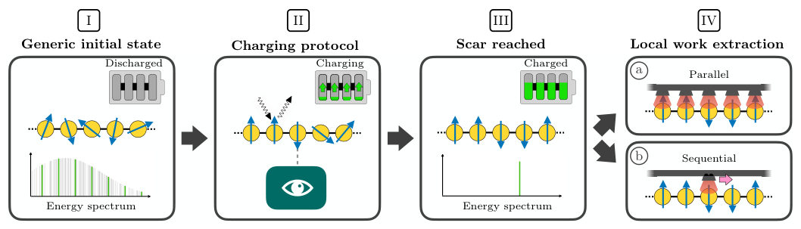 
Figure 1. Schematic representation of the battery charging and discharging protocols. The charge–discharge cycle proceeds in four stages. I The battery starts in some arbitrary state represented in terms of a distribution over its energy spectrum. The ETH bulk (gray lines) is interspersed by rare equidistantly spaced scars (green lines). This is considered a discharged state of the battery, as it is useless for local work extraction. II The universal charging protocol sets in, where the concurrent action of local engineered dissipation and continuous measurement of a local operator filters out the ETH bulk while driving the system to one of the scars. III Each scar represents a charged...

📷 Fig 2

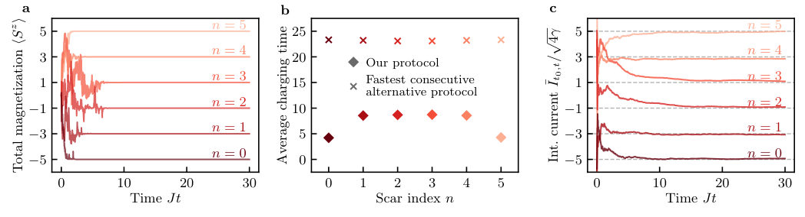 
Figure 2. Battery charging and certification for the spin-1 XY chain. The universal charging protocol [Eq. (6)] drives every initial state into a scar. Here it is realized by choosing M = Sz, where Sz is the total magnetization, and the jump operators as in Eq. (11). For N = 5 the model hosts six scars |sn⟩with n = 0, . . . , 5, represented by different colors indicated on top of the figure. a, Six typical realizations of the protocol for the same initial state ρ(0) = 1/3N. The convergence of trajectories to scars is witnessed by tracking ⟨Sz⟩= tr(ρc tSz)—by construction, each scar is an eigenvector of Sz with a distinct eigenvalue. b, Average charging time of our protocol, quantified by...

📷 Fig 3

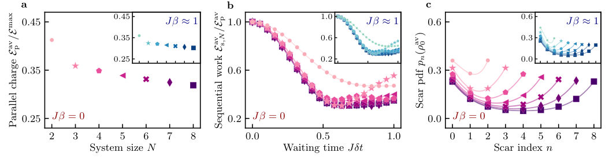 
Figure 3. Battery characterization of the spin-1 XY chain. The initial state ρ0 is sampled from the Scrooge ensemble [49], so that ρav 0 = exp(−βH)/Z, with Z the partition function. In the main panels, β = 0, whereas in the insets, Jβ ≈1 (see SI for details on this choice). a, Average charge of the battery that can be retrieved by locally discharging all cells simultaneously, Eav p , scaled by its maximal capacity Emax, as a function of the system size. Recall that Emax = Emax −Emin, with Emax and Emin the largest and smallest eigenvalues of H, and thus it can only be attained by initializing the system in its highest energy eigenstate and then rotating it to the ground state via highly...

📷 Fig 4

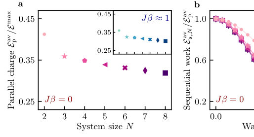 
Figure 3(a) shows Eav p scaled by the maximal capacity Emax, which equals the largest eigenvalue difference of H, with ρav 0 ∝exp(−βH), for different values of β. As argued above, a more realistic usage scenario for a many-body bat- tery is the sequential cell-by-cell discharging, characterized by Es,ℓ(ρ, δt) [Eq. (2)]. Figure 3(b) shows that its ensem- ble average, Eav s,N(δt), is appreciably robust with respect to variations of δt. Furthermore, we show in the SI that cer- tain scars support stable, almost linear in ℓ, discharging for waiting times as large as Jδt ≈0.42. The apparent macroscopicity of Eav p in Fig. 3(a) results from the counterintuitive behavior of the asymptotic scar...

**Summary.** This paper introduces a novel, low-complexity protocol to extract macroscopic work from quantum batteries modeled by nonintegrable many-body systems. It achieves this by using a combination of engineered dissipation and continuous measurement to force the system into a rare, stable 'scar' state. This method bypasses the limitations imposed by the Eigenstate Thermalization Hypothesis, offering a pathway for reliable quantum energy storage.

**Why it may be interesting.** This work directly addresses non-equilibrium thermodynamics and energy harvesting in complex quantum matter, providing a concrete, hardware-implementable mechanism for energy storage in interacting quantum systems.

Detailed structure

**Main problem.** The core challenge is developing a reliable, local method to extract macroscopic amounts of work from large, strongly interacting quantum systems (quantum batteries) whose bulk eigenstates are useless due to thermalization.

**Main result.** The authors propose a combined protocol using engineered dissipation and continuous indirect measurement to steer the system into a rare, non-thermal 'scar' state, enabling sustained, local work extraction.

**Method.** The protocol is derived using quantum stochastic differential equations, combining engineered Lindblad dissipation with measurement backaction to drive the system to a specific, stable steady state.

**Model / system.** The study focuses on generic nonintegrable many-body systems, exemplified by the spin-1 XY chain Hamiltonian. The key resource is the 'scar' state, which is a specific, non-thermal eigenstate.

**Key observables.** Local ergotropy (extractable work), average charging time, and the time-integrated measurement current used for scar certification.

**Important parameters / regimes.** The protocol's performance is analyzed across various coupling regimes and depends on the structure of the underlying algebra (e.g., su(2)).

**Assumptions / limitations.** The protocol is assumed to work directly on hardware, requiring no simulation or suppression of interactions between subsystems.

**Figures summary.** Figures illustrate the four stages of the process (discharged to work extraction), compare the charging time of the proposed protocol against alternatives, and show the time-integrated measurement current for state certification.

**Paper structure.** The paper first establishes the physical limitation (ETH bulk vs. local work). It then details the combined protocol (dissipation + measurement) to reach a scar state. Finally, it optimizes the local unitaries to calculate the maximum extractable work from the resulting scar state.

Abstract

Realistic work extraction from many-body quantum batteries must be local. However, only a small fraction of energy eigenstates of a generic many-body system, called scars, can support local extraction. The remaining bulk is useless for the task due to the eigenstate thermalization hypothesis. Here we devise a universal low-complexity protocol that steers any initial state towards exactly one scar---representing a charged state of the battery---from which a macroscopic amount of work can be extracted using local unitary operations. This is achieved by leveraging the nontrivial interplay of engineered dissipation and continuous indirect measurement that, in addition, leads to enhanced stability and charging speed compared to any other strategy using these processes independently. Moreover, the protocol works directly on the hardware level, in that it requires no simulation or suppression of interactions between subsystems. Our construction thereby enables macroscopic charge storage in steady states of generic nonintegrable many-body systems indefinitely, from which a reliable stream of work can be extracted via purely local means.

[↑ back to top](#top)

### [The Critical Role of Itinerant Contributions to Orbital Angular Momentum Relaxation and Dynamics](http://arxiv.org/abs/2609.21300v1)

**Authors:** Andrew C. Grieder, Luis M. Canonico, Frederico Simões, Aron W. Cummings, Yuan Ping  
**Type:** theory · **Category:** other · **PDF:** <https://arxiv.org/pdf/2609.21300v1>  
**Analysis basis:** full PDF text, analyzed in chunks
**Topic relevance:** 🔥 `methods for driven-dissipative` **4/5** · `Keldysh / 2PI / non-Gaussian methods` **3/5** · `correlated / nonlocal dissipation` **3/5** · `driven-dissipative phase transition` **2/5** · `non-equilibrium universality` **2/5** · `analog quantum simulation` **1/5** · `quantum measurements` **1/5** · `scars & prethermalization` **1/5**

📷 Fig 1

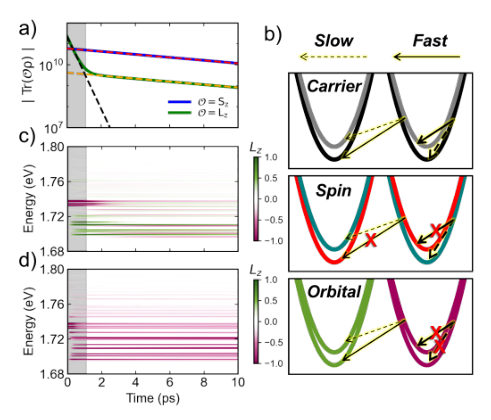 
FIG. 1. Spin and orbital dynamics of optically excited electrons in MoS2. (a) Spin and orbital relaxation at 300 K. Dashed lines indicate the two decay time scales, 0.25 ps (black) and 6.1 ps (orange, red). (b) Schematics of carrier, spin, and orbital inter- and intra-valley relaxation pathways. (c) Energy-resolved orbital relaxation for only intervalley re- laxation, and (d) intravalley relaxation. The color scale indi- cates normalized orbital polarization.

📷 Fig 2

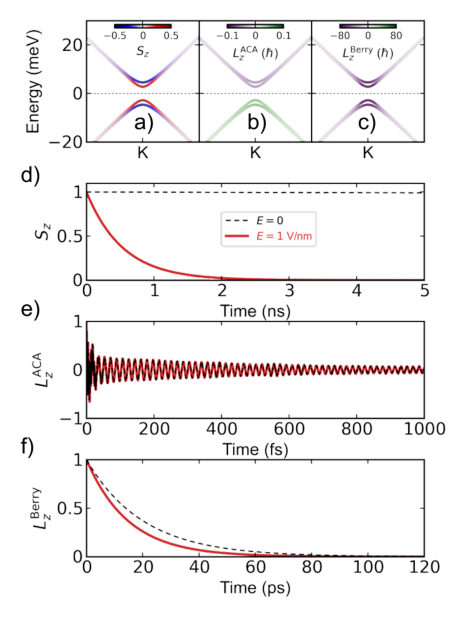 
FIG. 2. Spin and orbital textures and dynamics in silicene near the K valley. (a-c) Band structure at E = 1 V/nm with color indicating (a) spin, (b) atom-centered OAM, and (c) itinerant OAM. Note the opposite (same) sign of Sz (Lz) of the field-split branches. (d-f) Polarization dynamics at E = 0 (dashed) and E = 1 V/nm (solid) for (d) spin by FPDMD at 100 K, (e) atom-centered OAM by TB, and (f) itinerant OAM by FPDMD at 100 K.

📷 Fig 3

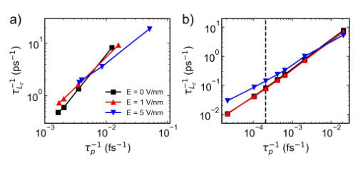 
FIG. 4. Orbital relaxation rate as a function of momentum relaxation rate, for (a) the TB-ACA and (b) the FPDMD (Berry-phase) OAM at 100 K. Colors denote different applied electric fields. The dashed line in (b) denotes the intrinsic electron-phonon scattering rate.

📷 Fig 4

 
FIG. 3. Spin and orbital lifetimes in silicene, with the Fermi level at the conduction band minimum, as a function of ap- plied electric field. (a) Lifetimes arising from FPDMD with electron-phonon scattering at 100 K, and (b) lifetimes from real-space TB dynamics with Anderson disorder strength W = 700 meV. In (a), τ EY Sz and τ DP Sz are evaluated from the EY and DP models of spin relaxation. In (b), τ Berry Lz is the or- bital lifetime including the itinerant contributions and τ ACA Lz only considers the atom-centered component.

📷 Fig 5

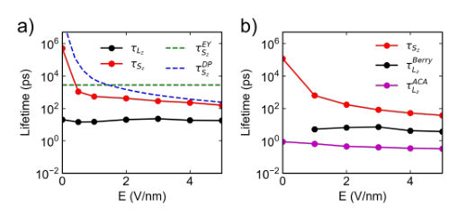 
Fig. 2(e), which is independent of the external field and

**Summary.** This work resolves a major theoretical conflict regarding orbital angular momentum (OAM) relaxation in 2D materials by distinguishing between atom-centered (ACA) and itinerant contributions. Using advanced density-matrix simulations, the authors show that the itinerant component, which accounts for momentum-space texture, dictates the true, much longer orbital lifetimes, proving that ACA models are insufficient for accurate predictions.

**Why it may be interesting.** The explicit separation and comparison of local (ACA) versus delocalized (itinerant) degrees of freedom in a quantum system is highly relevant to understanding open quantum dynamics and decoherence mechanisms in solid-state devices.

Detailed structure

**Main problem.** The paper addresses the discrepancy between predicted and experimentally observed orbital angular momentum (OAM) relaxation lengths, noting that atom-centered approximations (ACA) severely underestimate the true relaxation dynamics.

**Main result.** The itinerant contribution to OAM relaxation, which captures momentum-space texture, is crucial and leads to orbital lifetimes significantly longer (by an order of magnitude) than those predicted by ACA models.

**Method.** The study employs first-principles Lindbladian density-matrix dynamics and a parameterized tight-binding approach to explicitly separate and calculate the contributions of ACA and itinerant OAM components.

**Model / system.** The research focuses on 2D materials like $	ext{MoS}_2$ (strong SOC) and silicene (weak SOC), analyzing orbital dynamics under electron-phonon scattering and external electric fields.

**Key observables.** Orbital lifetimes ($	au_{Lz}$), OAM relaxation dynamics, spin-orbital coupling effects, and the ratio of itinerant to ACA relaxation rates.

**Important parameters / regimes.** Spin-orbit coupling strength (SOC), electric field strength, and the distinction between intravalley and intervalley scattering channels.

**Assumptions / limitations.** The primary assumption is that the full dynamics must be described by including the itinerant OAM component, moving beyond simplified atom-centered models.

**Figures summary.** Figures illustrate the two distinct timescales of orbital relaxation in $	ext{MoS}_2$, contrast spin/orbital textures for ACA vs. itinerant OAM in silicene, and show the scaling of relaxation rates with momentum scattering rates.

**Paper structure.** The paper establishes the theoretical discrepancy, details the advanced computational methods (FPDMD, TB), applies these methods to $	ext{MoS}_2$ and silicene to characterize the two OAM components, and concludes that the itinerant component governs the long-time dynamics.

Abstract

Orbital angular momentum (OAM) is a promising degree of freedom for low-dissipation transport and magnetization control, yet its relaxation mechanisms remain controversial, with atomcentered approximations (ACA) predicting much shorter OAM diffusion lengths than experiments. We address this discrepancy using first-principles Lindbladian density-matrix dynamics, capturing electron-phonon scattering and itinerant OAM contributions, together with a first-principles parameterized tight-binding approach that separates the ACA and itinerant components. In MoS2,a strong-spin-orbit-coupling (SOC) system, orbital relaxation is multi-timescale, with fast intervalley redistribution followed by slower decay coupled to the spin. In weak-SOC silicene, spin and orbital dynamics decouple; an electric field tunes spin relaxation while leaving orbital lifetimes unchanged. In both materials, ACA orbital lifetimes are at least one order of magnitude shorter than itinerant ones, due to ultrafast precession driven by crystal-field splitting, absent from the itinerant component. These results demonstrate that going beyond atom-centered models is essential for describing orbital relaxation and diffusion.

[↑ back to top](#top)

### [Autonomous stabilization of many-body entanglement with Floquet Hamiltonians and weak measurement](http://arxiv.org/abs/2609.21086v1)

**Authors:** Charlotte Franke, Dorian A. Gangloff  
**Type:** theory · **Category:** quantum information and computing · **PDF:** <https://arxiv.org/pdf/2609.21086v1>  
**Analysis basis:** full PDF text, analyzed in chunks
**Topic relevance:** 🔥 `quantum measurements` **4/5** · `correlated / nonlocal dissipation` **3/5** · `methods for driven-dissipative` **3/5** · `driven-dissipative phase transition` **2/5** · `analog quantum simulation` **1/5** · `non-equilibrium universality` **1/5**

📷 Fig 1

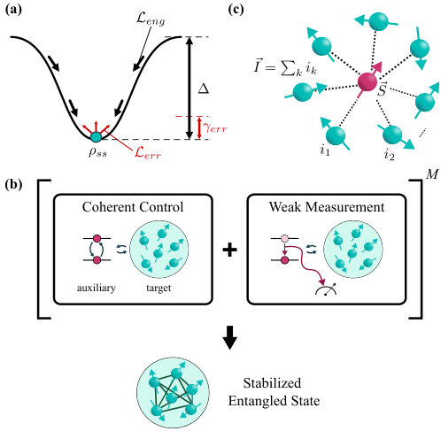 
FIG. 1. Stroboscopic dissipative engineering. (a) The engineered dissipation Leng drives the system into a steady state ρss, protected by the Liouvillian gap ∆against residual error processes Lerr acting at rate γerr ≪∆. (b) Each cycle interleaves a coherent-control window, in which an auxiliary system interacts unitarily with the target, with a weak mea- surement of the auxiliary that induces dissipation. Repeating the cycle M times stabilizes the target in an entangled steady state. (c) Central-spin realization: a single electron spin ⃗S (auxiliary) is collectively coupled to a nuclear ensemble de- scribed by ⃗I = P

📷 Fig 2

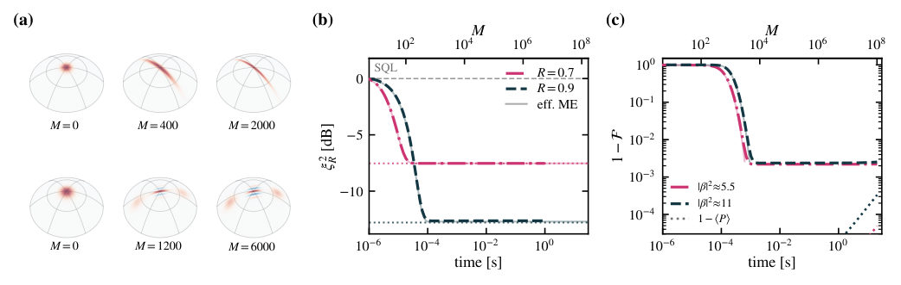 
FIG. 2. Stabilization of the two targets. (a) Wigner snapshots on the Bloch sphere at cycle number M: the squeezed state (top) contracts along one quadrature, and the cat (bottom) splits off the pole into two lobes with interference fringes. Shown on a reduced ensemble (I = 100) for visibility. (b) Squeezing parameter ξ2 R versus time for ratios R = |Ω−/Ω+| = 0.7, 0.9, driven below the SQL (dashed) to the steady floors (dotted). (c) Cat infidelity 1 −F to the target even cat versus time, for sizes |β|2 ≈5.5 and ≈11. Dotted: the parity error 1 −⟨P⟩, which drifts up within the gapless 2D dark manifold and grows with cat size, staying below 10−3 out to ∼20s. In (b,c) the top axis is the...

📷 Fig 3

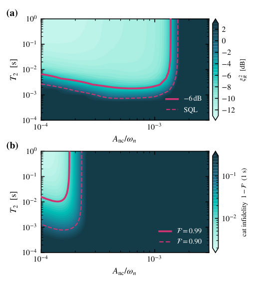 
FIG. 3. Robustness to nuclear dephasing. Quality pa- rameter at 1s under collective dephasing over the coupling- coherence plane, from the full stroboscopic simulation. Each region is bounded on the left where the engineered Liouvillian gap drops below the dephasing rate. Stronger coupling widens the gap and tolerates shorter T2, up to a strong-coupling edge where the Floquet engineering breaks down. (a) Squeezing ξ2 R [dB] at R = 0.90; solid/dashed mark −6dB and the SQL. The floor is −12.6dB. (b) Cat infidelity 1 −F at fixed size |β|2 ≈5.5 (colour, log scale); solid and dashed lines mark F = 0.99 and F = 0.90 in a narrow high-fidelity window around Anc/ωn ∼1.5×10−4. Throughout, ωn/2π =...

📷 Fig 4

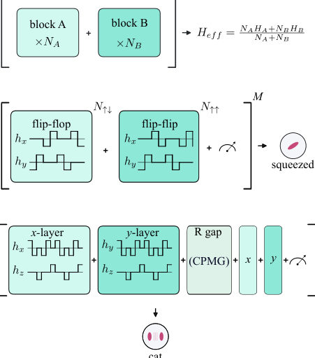 
FIG. 4. Pulse sequences (toggling-frame controls h(t)). (a) General principle: a macro-cycle concatenates NA periods of block A and NB of block B and repeats ℓtimes; to leading (zeroth-order Magnus) order the engineered Hamiltonian is the time-weighted average Heff = (NAHA + NBHB)/(NA + NB) [Eq. (B13)]. (b) Squeezing: two 8-slot primitives over one period T, sharing a common hy and differing by a T/4 shift of hx (solid: flip-flop, S+I−+S−I+; dashed: flip-flip, S+I++S−I−); interleaving N↑↓flip-flop and N↑↑flip-flip pe- riods with a weak measurement stabilizes the squeezed state. (c) Cat: the engineered train Uφ (period 2T) runs an x- transverse layer (H2, t/T ∈[0, 1]) then a y-transverse...

📷 Fig 5

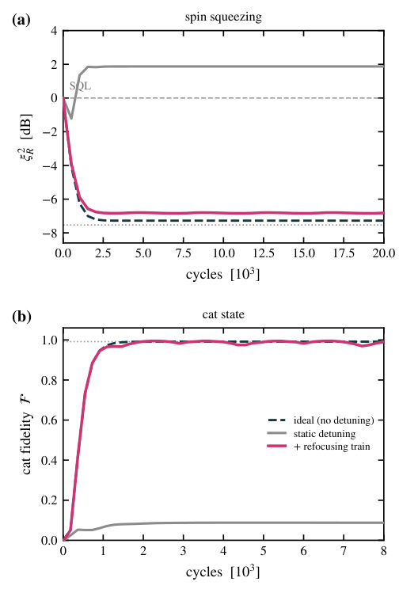 
FIG. 5. A nuclear refocusing pulse train coexists with the stabilization. Full stroboscopic protocol at I = 50 (ex- act 2I + 1 space, so the π pulse is a genuine pole-to-pole rotation). (a) Spin squeezing ξ2 R(t), R = 0.7. (b) Cat fi- delity F(t), |β|2 ≈12. In each panel: the ideal run with no detuning (blue dashed); a static collective detuning δIz that destroys the engineered state (grey); and the same detuning with a single-π nuclear refocusing train interleaved, includ- ing the state-specific frame correction, a toggling-layer sign flip (flip-flop ↔flip-flip for squeezing; the H2-layer flip for the cat) together with the refocusing-pulse axis of Eq. (B30), which restores the engineered...

**Summary.** This paper proposes a novel technique to autonomously stabilize complex many-body entangled states, such as spin-squeezed and Schrödinger-cat states, in quantum systems. The technique combines periodic Hamiltonian engineering (Floquet drives) with weak measurement to create a programmable dissipative environment. This approach offers a powerful pathway for practical quantum computation by actively counteracting environmental decoherence.

**Why it may be interesting.** This work provides a concrete, platform-agnostic blueprint for actively controlling quantum dynamics using engineered dissipation, which is a key concept in quantum error correction and quantum control.

Detailed structure

**Main problem.** Safeguarding many-body entanglement in large quantum systems against decoherence caused by dissipation.

**Main result.** The authors successfully demonstrated an autonomous protocol to stabilize both spin-squeezed and collective Schrödinger-cat states, even against realistic noise levels.

**Method.** The method interleaves Floquet Hamiltonian engineering to create non-native coherent interactions with weak measurement to impose a tunable dissipative channel.

**Model / system.** The system is modeled using a central-spin system in a semiconductor quantum dot, coupling an electron spin ($\vec{S}$) to a nuclear spin ensemble ($\vec{I}$). The dynamics are governed by a stroboscopic evolution mimicking a Lindblad master equation.

**Key observables.** Squeezing parameter ($\xi_2^R$), Cat infidelity ($1-F$), and the steady-state density matrix ($
ho_{ss}$).

**Important parameters / regimes.** Weak measurement strength ($\epsilon$), Liouvillian gap ($\Delta$), and the ratio of coupling strengths ($\Omega_+/\Omega_-$).

**Assumptions / limitations.** The process assumes the ability to separate coherent and dissipative steps in time, and that the auxiliary system decay is fast enough for adiabatic elimination.

**Figures summary.** Figures illustrate the dissipative engineering cycle, show Wigner snapshots of stabilized states (squeezed/cat), and plot time evolution of the squeezing parameter and cat infidelity, demonstrating stabilization below the Standard Quantum Limit (SQL).

**Paper structure.** The paper details the theoretical framework by combining Floquet engineering and weak measurement into a stroboscopic cycle. It then applies this to the quantum dot model to derive effective master equations for specific entangled states, analyzing robustness against various noise sources.

Abstract

Reaching a technological advantage with large quantum systems requires safeguarding their many-body entanglement. Dissipation typically acts to decohere a quantum system via random projective noise but, when judiciously engineered together with coherent interactions, it can funnel the system towards a target entangled state. The native interactions and dissipative channels available to most systems are, however, difficult to combine effectively. Here we propose interleaving Floquet Hamiltonian engineering, which allows the construction of non-native coherent interactions, with weak measurement, which enables a tuneable dissipative channel, to enable programmable and autonomous stabilization of many-body entanglement. We show this analytically and numerically for the central-spin system of a semiconductor quantum dot, for which we construct spin-squeezed and Schrödinger-cat states that are stabilized against realistic levels of dephasing. Our approach is applicable to any system compatible with periodic drives and tuneable measurement strength and could enable novel approaches to practical error correction.

[↑ back to top](#top)

### [Do Quantum Models Scale Like LLMs?](http://arxiv.org/abs/2609.20912v1)

**Authors:** David S. Berman, Ying-Jer Kao, Roger G. Melko, Alexander G. Stapleton  
**Type:** theory · **Category:** other · **PDF:** <https://arxiv.org/pdf/2609.20912v1>  
**Analysis basis:** full PDF text, analyzed in chunks
**Topic relevance:** 🔥 `Rydberg arrays` **4/5** · `analog quantum simulation` **3/5** · `non-equilibrium universality` **3/5** · `quantum measurements` **2/5** · `Full counting statistics` **1/5** · `driven-dissipative phase transition` **1/5**

📷 Fig 1

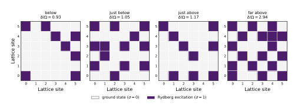 
Figure 1: Representative randomly selected occupation- basis configurations from an open 6 × 6 Rydberg array at the four labelled detunings [14]. Light sites are in the ground state and dark sites represent Rydberg ex- citations. The samples were selected with a fixed pseu- dorandom seed from the same data archive used for the data-scaling and mutual-information analyses. They are individual measurements and are shown for visual orient- ation only.

📷 Fig 2

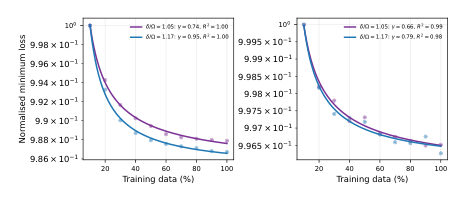 
Figure 3: Normalised aggregate loss curves and fitted forms for the two detunings in Figure 2. Points are ob- served seed means and lines are fits to Equation (11). Each series is normalised by its largest observed loss for display only.

📷 Fig 3

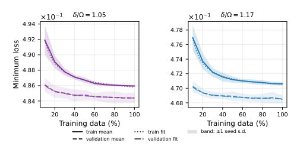 
Figure 2: Fixed-model RydbergGPT data-scaling curves on the two sides of the critical detuning point. The sys- tem parameters are L = 6, Rb/a = 1.15 and βΩ= 8. Solid and dashed curves denote the seed-averaged training and validation losses, respectively; shaded re- gions show one standard deviation across seeds. Dotted and dash-dotted curves are fits to Equation (11). The scientific-notation multiplier is shown once per vertical axis.

📷 Fig 4

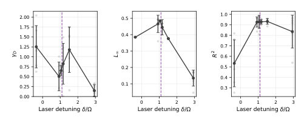 
Figure 4: Validation-fit parameters for the six retained detunings. Faint points denote fits to individual ran- dom seeds, while circles and error bars indicate the cor- responding mean and standard deviation at each detun- ing. The dashed vertical line marks the critical point at δ/Ω= 1.10.

📷 Fig 5

 
Figure 4 extends the preceding analysis to six detun- ing values by displaying the results of validation fits per- formed independently for each random seed. The plot- ted spread directly characterises seed-to-seed variability in the fitted parameters and should not be interpreted as a confidence interval for a thermodynamic critical exponent. The values closest to the critical point at δ/Ω= 1.10 are consistent with the aggregate results re- ported in Table I. The strongest agreement with the power-law ansatz is observed in the vicinity of the critical point. Near the dashed line in Figure 4, the fitted R2 values are both high

**Summary.** This work tests the hypothesis that quantum systems near a critical point exhibit scaling laws analogous to those seen in LLMs. By training a transformer on Rydberg atom measurements, the authors found that stable power-law scaling occurs only near criticality. Furthermore, the statistical dependencies of these near-critical quantum measurements closely match those found in natural language, suggesting multi-scale structure is key to robust scaling.

**Why it may be interesting.** It bridges the gap between machine learning scaling laws and fundamental physics, suggesting that critical phenomena might manifest as universal scaling behaviors in information-theoretic measures, which is highly relevant for understanding complex quantum many-body systems.

Detailed structure

**Main problem.** To investigate whether the scaling laws observed in Large Language Models (LLMs) are replicated when training transformers on quantum measurement data from interacting Rydberg atoms.

**Main result.** The transformer loss exhibits stable power-law scaling near the quantum critical point, and the statistical structure of these near-critical measurements most closely resembles that of natural language corpora.

**Method.** The study uses autoregressive transformers (RydbergGPT) to model qubit projective measurements and compares the resulting statistical dependencies using entropy-normalized mutual information 'two-point' functions.

**Model / system.** The physical system is an interacting Rydberg atom array modeled by a Hamiltonian involving interaction terms and controlled by a laser detuning parameter ($\delta$). The model is trained on the resulting qubit projective measurement data.

**Key observables.** Transformer loss vs. dataset size, and the entropy-normalized, finite sample corrected mutual information 'two-point' function $	ext{b}I(r)$.

**Important parameters / regimes.** The laser detuning parameter ($\delta$), especially near the critical point ($\delta/\Omega \approx 1.1$), and the effective dataset size ($D_{	ext{eff}}$).

**Assumptions / limitations.** The scaling behavior is hypothesized to be a property of the model-data pair, and the analysis relies on fitting empirical power-law ansatze to both loss and mutual information.

**Figures summary.** Figures show representative occupation-basis measurements, data-scaling curves for the loss near and far from criticality, and mutual information profiles comparing Rydberg measurements to natural language corpora.

**Paper structure.** The paper first establishes the quantum model and its critical behavior. It then analyzes the loss scaling laws, showing power-law behavior near criticality. Finally, it compares the statistical structure via mutual information, finding the strongest analogy to language near the critical point.

Abstract

In this work, we study the neural scaling laws of RydbergGPT, an autoregressive transformer model trained on qubit projective measurement data gathered from interacting Rydberg atom arrays. The quantum system is known to exhibit a finite-size remnant of a critical point as the laser detuning parameter is varied. We find that near the critical point the transformer loss as a function of training dataset size is well described by a power-law with a loss floor correction. However, away from criticality the quality of the power-law description is substantially reduced. We then compare the statistical structure of both Rydberg measurements and natural-language corpora using an entropy-normalised, finite sample corrected mutual information "two-point" function. We find that near-critical statistics of the two point functions are closest to those observed in natural-language, whilst other qubit configurations far from the critical point have two-point functions that decay more rapidly. This supports the hypothesis that multi-scale dependence contributes to stable neural scaling, and that scaling behaviour should be viewed as a property of the model-data pair.

[↑ back to top](#top)

### [Experimental Measurement and Theoretical Analysis of Energy Relaxation Rates of an Interacting Two-Qubit System on a D-Wave Quantum Annealer](http://arxiv.org/abs/2609.21598v1)

**Authors:** Yusei Amano, Sorato Suzuki, Hiroki Kuji, Tetsuro Nikuni, Takashi Imoto, Yuichiro Matsuzaki  
**Type:** both · **Category:** quantum information and computing · **PDF:** <https://arxiv.org/pdf/2609.21598v1>  
**Analysis basis:** full PDF text, analyzed in chunks
**Topic relevance:** 🔥 `QC/QI experiment` **4/5** · `quantum measurements` **2/5** · `correlated / nonlocal dissipation` **1/5** · `driven-dissipative phase transition` **1/5** · `methods for driven-dissipative` **1/5**

📷 Fig 1

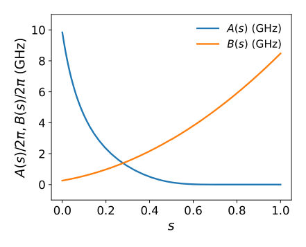 
FIG. 1. Annealing schedule functions A(s) and B(s) for the D-Wave Advantage 4.1 quantum annealer. The curves were generated by the authors using the device-specific annealing- schedule data provided by D-Wave Quantum Inc. [30]. Here, s is the normalized annealing parameter ranging from 0 to 1. The function A(s) represents the transverse-field energy scale, whereas B(s) sets the energy scale multiplying the prob- lem Hamiltonian, including the longitudinal-field and Ising- interaction terms.

📷 Fig 2

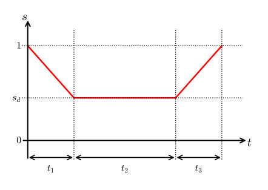 
FIG. 2. Reverse-annealing schedule used to measure the re- laxation from the first excited state. The annealing parameter s is linearly decreased from s = 1 to the hold point s = sd over a time t1, kept at s = sd for a hold time t2, and then linearly increased back to s = 1 over a time t3.

📷 Fig 3

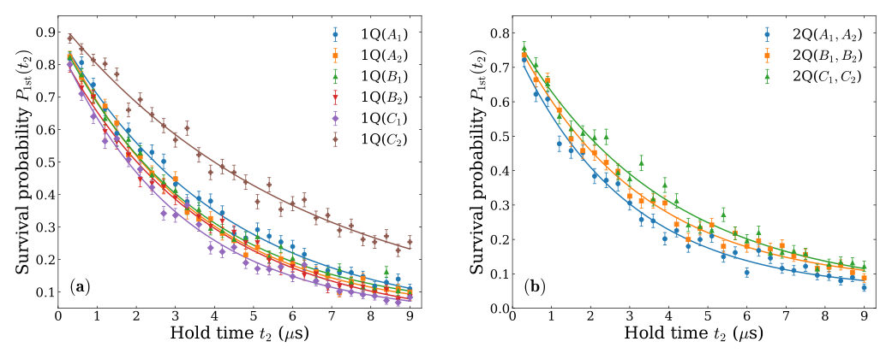 
FIG. 3. Representative energy-relaxation curves for the single-qubit and interacting two-qubit systems. For all measurement conditions listed in Table I, the survival probability was measured as a function of the hold time t2, and the energy relaxation rate was extracted using the same weighted exponential fitting procedure. Panel (a) shows a representative single-qubit result corresponding to measurement condition No. 5 in Table I(a), whereas panel (b) shows a representative interacting two-qubit result corresponding to measurement condition No. 9 in Table I(b). The symbols represent the experimentally measured survival probabilities, and the solid curves represent the weighted exponential...

📷 Fig 4

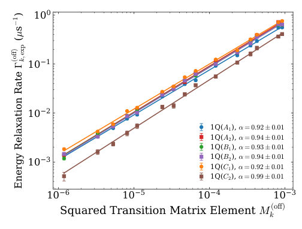 
FIG. 4. Relationship between the squared transition matrix elements and the experimentally measured energy relaxation rates for single qubits in the non-interacting case. All data points shown in this figure correspond to the non-interacting measurement conditions listed in Table I(a). Each point rep- resents the result obtained by measuring each physical qubit as an individual single qubit. The horizontal axis shows the squared transition matrix element of qubit k, M (off) k , and the vertical axis shows the corresponding experimentally mea- sured energy relaxation rate, Γ(off) k,exp. Here, k = 1, 2 denotes the qubit index within each pair. For example, 1Q(A1) and 1Q(A2) in the legend...

📷 Fig 5

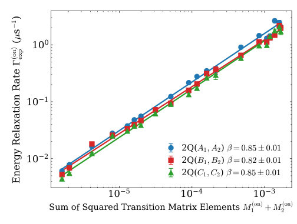 
FIG. 5. Relationship between the sum of the squared tran- sition matrix elements and the experimentally measured en- ergy relaxation rate for the interacting two-qubit system. All data points shown in this figure correspond to the interacting two-qubit measurement conditions listed in Table I(b). The horizontal axis shows M (on) 1 + M (on) 2 , and the vertical axis shows Γ(on) exp . The value of β represents the scaling exponent obtained by fitting all data points for each qubit pair sepa- rately using Eq. (21). The obtained exponents are below the linear scaling β = 1 predicted by the model adopted in this study, which assumes independent σz-type noise and approx- imately constant...

**Summary.** This paper experimentally measures and theoretically analyzes the energy relaxation rates in interacting two-qubit systems on a D-Wave quantum annealer. By relating these rates to entanglement measures like concurrence, the authors demonstrate that single-qubit measurements can provide a practical and quantitatively accurate estimate for relaxation in small interacting quantum circuits.

**Why it may be interesting.** This work directly addresses open quantum system dynamics in a programmable quantum hardware platform, providing crucial experimental validation for theoretical models of decoherence in superconducting qubits.

Detailed structure

**Main problem.** The study aims to bridge the gap between theoretical predictions and experimental measurements of energy relaxation rates in interacting multi-qubit systems implemented on quantum annealers.

**Main result.** The predicted relaxation rates, derived by calibrating single-qubit measurements, remain within a factor of four of the experimentally measured rates, suggesting single-qubit measurements can practically estimate relaxation in small interacting systems.

**Method.** The analysis combines experimental measurements of energy relaxation rates with theoretical modeling using the Gorini-Kossakowski-Sudarshan-Lindblad master equation.

**Model / system.** The system is an interacting two-qubit model realized on a D-Wave quantum annealer using rf-SQUID flux qubits. The theory employs the GKSL master equation with independent local sigma_z noise channels.

**Key observables.** Energy relaxation rate ($\Gamma$), Concurrence ($C$), and the squared transition matrix element ($\mu^{(on)}_k$).

**Important parameters / regimes.** The energy gap ($\Delta E \approx 1.5 	ext{ GHz}$), and the noise model assumes independent local $\sigma_z$-type noise channels.

**Assumptions / limitations.** The primary assumptions include the use of the Born-Markov and rotating wave approximations, and the assumption of independent noise channels between qubits.

**Figures summary.** Figures compare theoretical calculations (e.g., concurrence vs. field strength) with experimental measurements of relaxation rates, often showing power-law scaling relationships between these quantities.

**Paper structure.** The paper progresses from establishing the theoretical framework using the GKSL equation, to developing a prediction method by calibrating single-qubit rates, and finally correlating the measured relaxation rates with entanglement measures like concurrence.

Abstract

In D-Wave quantum annealers, various properties of the ground state have been clarified, whereas the correspondence between theory and experiment for energy relaxation rates in multiqubit excited states remains insufficiently understood. Here, we measured the energy relaxation rates of the first excited states in single-qubit systems and interacting two-qubit systems using a D-Wave quantum annealer. We analyzed the measured relaxation rates using a Gorini-Kossakowski-Sudarshan-Lindblad master equation with independent local $σ^{\,\,z}$-type noise channels. The calculated relaxation rates reproduced the overall trends observed experimentally, supporting the model at a qualitative level. We then used the relaxation rates measured for the uncoupled single-qubit systems to calibrate the local relaxation parameters and predict the relaxation rates of the interacting two-qubit systems. The predicted rates remained within a factor of approximately four of the measured rates. These results show that the relaxation measurements on individual qubits can provide a practical estimate of relaxation in small interacting quantum systems and may help clarify relaxation mechanisms in programmable quantum annealers.

[↑ back to top](#top)

### [Intrinsic Vectorial Gradiometry via Quantum Control of a Spin-based Sensor](http://arxiv.org/abs/2609.21776v1)

**Authors:** Jaime García Oliván, Pablo Acedo, Oliver T. Whaites, Jorge Casanova  
**Type:** theory · **Category:** other · **PDF:** <https://arxiv.org/pdf/2609.21776v1>  
**Analysis basis:** full PDF text, analyzed in chunks
**Topic relevance:** 🔥 `quantum measurements` **4/5** · `QC/QI experiment` **3/5**

📷 Fig 1

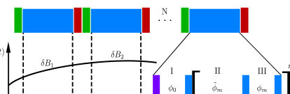 
FIG. 1. Gradiometric sensing scheme. Our protocol comprises an initialization and a readout step, and a measurement sequence (in green, red and blue, respectively), sequentially repeated N times. Our sequence allows to measure the magnetic field difference between two points separated by a time ∆t. Considering that the magnetic field B(t) changes slowly within a single sequence, each measure- ment will be proportional to the field difference within the sequence, δBi = B(ti +∆t)−B(ti), such that, after N repetitions, the full gradient of the field can be recovered. Here, ti sets the start of i-th measure- ment. Each of these sequences consists of two interrogation stages (I and III) wherein...

📷 Fig 2

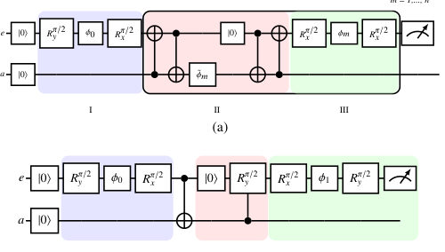 
FIG. 2. Circuit diagram of the memory assisted pulse sequence for intrinsic temporal gradiometry. (a) General sequence for measuring the n-th order derivative of the field. SWAP gates may be used during stage II for encoding/recovering the sensor (e) state in/from a nuclear ancillary qubit (a) such that the protocol is limited by the nuclear de- phasing time T a 2. (b) Modified protocol for T a 1-limited magnetome- try. Here, only the population information is encoded in the nuclear memory during stage II.

📷 Fig 3

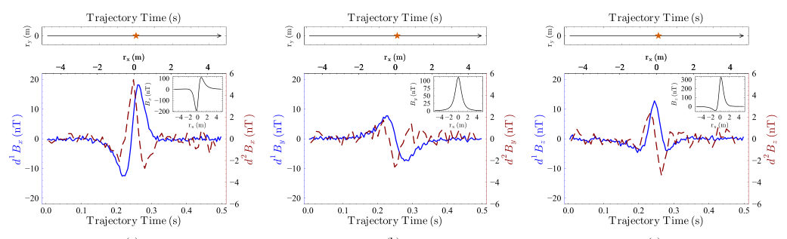 
FIG. 4. Numerical simulation of vectorial gradiometry for magnetic anomaly detection. The sensor vibrates at a frequency ν/(2π) = 1 MHz and is displaced at a constant speed v = 20 m/s and height h = 1 m over the source of the magnetic anomaly (marked with a star), which is located at the center of the trajectory (shown in the top panel). The source of the anomaly is a ferromagnetic sphere of radius R = 16 cm, which is magnetized by a geomagnetic field of intensity B = 45.84 µT, colatitude ϑ = 105.63◦and longitude φ = 320.72◦. The intensity of the anomaly field as a function of the sensor position is shown in the inset. Nonetheless, the geomagnetic field is also included in the simulations....

📷 Fig 4

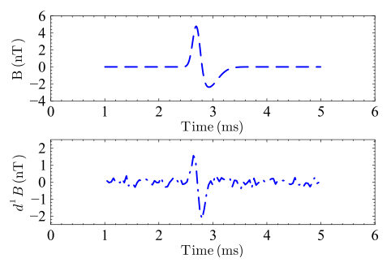 
FIG. 5. (Upper panel) Expected magnetic field from a neuron AP in a giant axon from a marine worm. (Lower panel) Differential sig- nal measured from our gradiometry protocol. Stage II occurs in the sensor state and has a duration of 32 µs. Photon shot noise is ac- counted for in our simulation, such that the measurement contrast is C = 10%, the average number of photons received per NV center is nav = 0.022, the number of NVs in the ensemble is NNV = 1011 and the number of repetitions is 103. Note that the x-axis corresponds to a single run, such that the total duration of the ‘experiment’ is t = 4s.

**Summary.** This paper introduces a novel quantum control protocol enabling intrinsic vectorial gradiometry of magnetic fields using a single quantum sensor, such as NV centers in diamond. By manipulating spin evolution through controlled pulse sequences, the method suppresses common-mode noise and provides direct access to magnetic field derivatives. This breakthrough has demonstrated potential for high-precision applications like detecting magnetic anomalies and mapping neuronal activity.

**Why it may be interesting.** This work is highly relevant as it develops advanced quantum sensing protocols that leverage quantum coherence and memory effects to achieve superior noise suppression and higher-order field measurements, pushing the boundaries of quantum metrology.

Detailed structure

**Main problem.** To overcome the limitations of traditional multi-sensor gradiometry by achieving intrinsic temporal and spatial vectorial gradiometry using a single quantum sensor.

**Main result.** The proposed quantum control sequence allows for direct measurement of the first and higher-order derivatives of magnetic fields using only one sensor, which can be applied to detect magnetic anomalies or map neuronal action potentials.

**Method.** The method employs a quantum control sequence involving initialization, signal evolution, and readout stages, which can be repeated or modified to measure field differences ($\delta b_i$) or higher-order derivatives ($\langle\sigma_z
angle^{(n)}$).

**Model / system.** The physical platform is a quantum sensor, specifically Nitrogen-Vacancy (NV) centers in diamond, which is interrogated using tailored pulse sequences. The theory generalizes the measurement to any pair of electron and nuclear spin qubits.

**Key observables.** The measured expectation value $\langle\sigma_z
angle$, which is proportional to the magnetic field difference ($\delta b_i$) or the $n$-th derivative of the field.

**Important parameters / regimes.** The measurement is limited by the sensor dephasing time ($T_2$), but can be extended to the coherence time ($T_2$) or even the nuclear relaxation time ($T_1$) using memory techniques.

**Assumptions / limitations.** The initial theoretical derivations assume small accumulated phases ($	ilde{\phi}_1$ small) for the gradient reconstruction, although AC sensing techniques allow for higher frequency measurements.

**Figures summary.** Figures illustrate the gradiometric sensing scheme, detailing the multi-stage sequence for measuring field differences, and show circuit diagrams for memory-assisted pulse sequences for intrinsic temporal gradiometry.

**Paper structure.** The paper develops the theory by first establishing the general quantum control sequence for gradiometry, then extending this to higher-order derivatives, and finally demonstrating the applicability of the protocol to both DC anomaly detection and high-frequency AC sensing via mechanical oscillation.

Abstract

Gradiometry provides a versatile alternative to passive environmental shielding in quasi-static magnetometry, effectively suppressing background noise through differential signal extraction. Nevertheless, traditional implementations rely on multi-sensor architectures restricted to spatial gradients, where subtracting signals from independent detectors involves imperfect suppression of common-mode noise and artifacts, limiting their sensitivity. To overcome these limitations, we introduce a quantum control sequence that enables intrinsic temporal and spatial vectorial gradiometry of magnetic fields using a single quantum sensor. Our method provides direct access to first and higher-order derivatives of the magnetic field and extended applicability via auxiliary nuclear spin memory. We showcase this protocol on an ensemble of nitrogen-vacancy (NV) centers in diamond and combine it with mechanical control to realize high-precision differential sensing. Through detailed numerical simulations, we demonstrate the performance of our scheme in two critical DC magnetometry applications: (i) vector magnetic anomaly detection and (ii) non-invasive gradiometry of neuronal action potentials.

[↑ back to top](#top)

### [Ultimate Information Rate for Quantum Sensing under Multilevel Relaxation](http://arxiv.org/abs/2609.21418v1)

**Authors:** Changhun Oh, Seok Hyung Lie, Youngrong Lim  
**Type:** theory · **Category:** quantum information and computing · **PDF:** <https://arxiv.org/pdf/2609.21418v1>  
**Analysis basis:** full PDF text, analyzed in chunks
**Topic relevance:** 🔥 `quantum measurements` **4/5** · `correlated / nonlocal dissipation` **1/5** · `driven-dissipative phase transition` **1/5** · `methods for driven-dissipative` **1/5**

📷 Fig 1

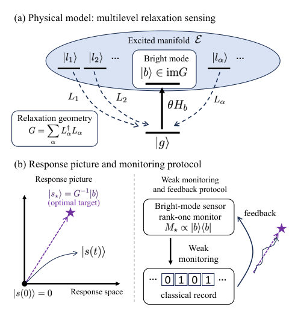 
FIG. 1. Multilevel relaxation sensing and its optimal control. (a) The signal Hb couples the ground state to the excited manifold, which relaxes back to the ground state. (b) Weak monitoring along the bright direction and outcome-dependent feedback stabilize the rate-optimal response |s⋆⟩= G−1 |b⟩, continuously transferring information to the classical record.

📷 Fig 2

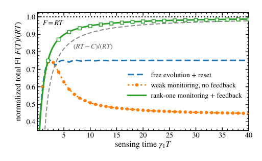 
FIG. 2. Normalized total FI F(T)/(RT) for G = γ1 diag(1, 9) in the decay-mode basis {|µ1⟩, |µ2⟩} and |b⟩= (|µ1⟩+ |µ2⟩)/ √

**Summary.** This paper establishes the theoretical limit for quantum sensing in multilevel systems subject to relaxation, proving that the ultimate information rate equals the bright state's mean population lifetime. They construct an explicit, simple monitoring protocol that achieves this rate asymptotically, demonstrating that entanglement cannot improve the rate beyond the sum of independent local rates.

**Why it may be interesting.** This work provides a fundamental benchmark for quantum sensing in realistic, dissipative environments, showing how the intrinsic relaxation dynamics dictate the ultimate measurement precision, even with advanced adaptive control.

Detailed structure

**Main problem.** The paper determines the ultimate rate at which information can be extracted from a quantum sensor undergoing multilevel relaxation, especially when using unrestricted adaptive control.

**Main result.** The ultimate information rate is found to be exactly equal to the mean population lifetime of the bright state coupled by the signal. This rate can be achieved asymptotically using a simple rank-one monitoring and feedback protocol.

**Method.** The authors derive the ultimate bound using the Channel-Extension (CE) bound and then construct an explicit, rank-one monitoring protocol that saturates this bound asymptotically.

**Model / system.** The system is a multilevel quantum sensor with a ground state and an excited manifold. Sensing involves a weak field coupling the ground state to the excited manifold, while relaxation is governed by a master equation involving multiple decay modes.

**Key observables.** Ultimate Information Rate ($R$), Quantum Fisher Information (QFI), and the mean population lifetime ($	au_b$).

**Important parameters / regimes.** The relaxation geometry, characterized by the positive operator $G$, and the coupling strength of the weak signal.

**Assumptions / limitations.** The analysis assumes independent local relaxation for multiple sensors and relies on the existence of an optimal rank-one monitoring strategy.

**Figures summary.** Figures illustrate the physical model, the optimal control protocol involving weak monitoring and feedback, and comparisons between the ultimate bound, free evolution, and the achieved rate for multiple sensors.

**Paper structure.** The paper progresses from establishing the theoretical upper bound (CE bound) to deriving the rate-optimal response, and finally constructing a physical, rank-one monitoring protocol that achieves this bound asymptotically.

Abstract

We determine the ultimate information rate of a relaxing multilevel quantum sensor under unrestricted adaptive control and construct an explicit strategy that attains it. We consider sensing a weak field that couples the ground state to several excited states that decay back to the ground state, a setting that reduces to amplitude-damping sensing for a single excited state. We show that the ultimate information rate is exactly the mean population lifetime of the bright state coupled to the ground state by the signal. Although the sensing dynamics generally involve several decay modes, an explicit rank-one protocol that monitors the ground--bright coherence using fresh meters and classical feedback attains this rate while keeping its finite-time information deficit bounded by a constant. For independently relaxing identical sensors, independent local monitoring attains the sum of their individual optimal rates, so intersensor entanglement and joint quantum error correction cannot increase the asymptotic rate. Consequently, the free population-decay curve provides an operational measure of the optimal sensing performance under arbitrary adaptive control.

[↑ back to top](#top)

### [Shock-Capturing Quantum Algorithm for the Linear Advection Operator](http://arxiv.org/abs/2609.21153v1)

**Authors:** Samuel Hagele, William Gregory, Yuan Shi  
**Type:** both · **Category:** quantum information and computing · **PDF:** <https://arxiv.org/pdf/2609.21153v1>  
**Analysis basis:** full PDF text, analyzed in chunks
**Topic relevance:** `QC/QI experiment` **3/5** · `correlated / nonlocal dissipation` **3/5** · `driven-dissipative phase transition` **3/5** · `methods for driven-dissipative` **3/5** · `analog quantum simulation` **2/5** · `non-equilibrium universality` **2/5** · `quantum measurements` **2/5** · `Keldysh / 2PI / non-Gaussian methods` **1/5**

📷 Fig 1

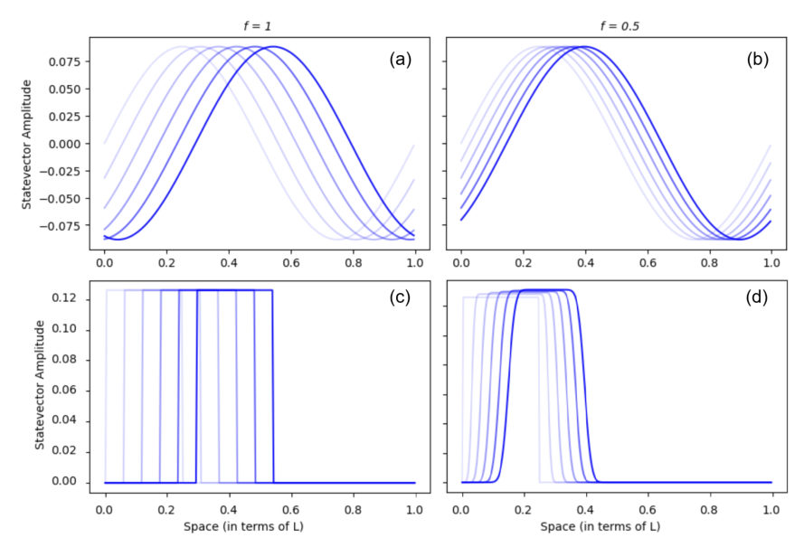 
Figure 1: Using Qiskit’s state vector simulator, the upwind quantum advection operator is repeatedly applied to a sine (a)-(b) and a square (c)-(d) waveform on 8 data qubits with a positive speed. In each figure, lines are separated by 15 time steps, and later time steps are represented by darker lines. When f = 1 (left), the algorithm is exact. When 0 &lt; f &lt; 1, the algorithm introduces numerical diffusion, whose worst case (f = 1/2) is shown on the right. The advection algorithm preserves the norm of waveforms and their spatial integrals.

📷 Fig 2

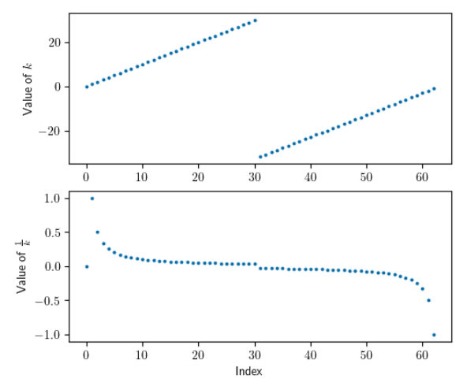 
Figure 2: Failure recovery is performed in the momentum space after quantum Fourier transform, whose natural order- ing of k is unshifted (upper). The failure recovery scheme requires 1/k, which goes to zero towards the middle of the box (lower). The index starts from zero and the example uses N = 64 grid points.

📷 Fig 3

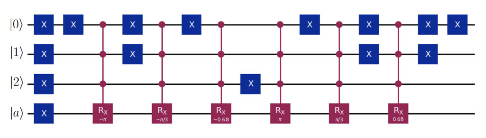 
Figure 3: Quantum circuit for the failure recovery operator ˆK in the case of three data qubits and one ancilla qubit |a⟩. X (NOT) gates are initially applied to all qubits, setting the bit string to all 0’s. The X gate on the ancilla creates a tem- plate that resembles ˆK. We then count up in binary using X gates, applying appropriate multi-controlled RX rotations in between. At the halfway point, the single X gate on the last data qubit switches to the end of the ˆK matrix, from which the matrix is edited by the remaining gates in reverse order. The final X gates reset the bit string to its original values.

📷 Fig 4

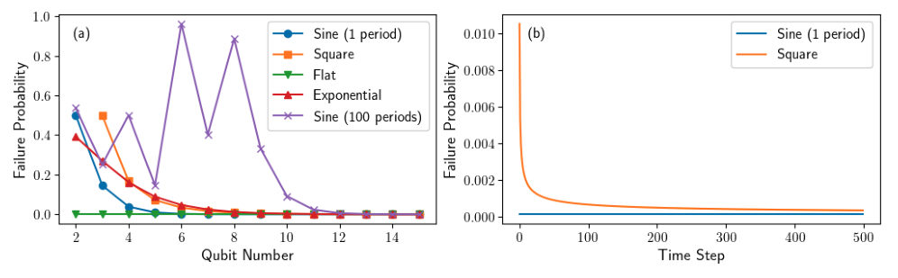 
Figure 4: (a) The failure probability decreases exponentially with increasing resolution for all waveforms after transient be- haviors at small numbers of qubits. (b) At a given resolution (8 qubits), the failure probability decreases with time due to numerical diffusion that smooths the waveforms as the simulations progress. The failure probability is calculated classically according to Eq. (21) with the worst-case f = 1/2.

📷 Fig 5

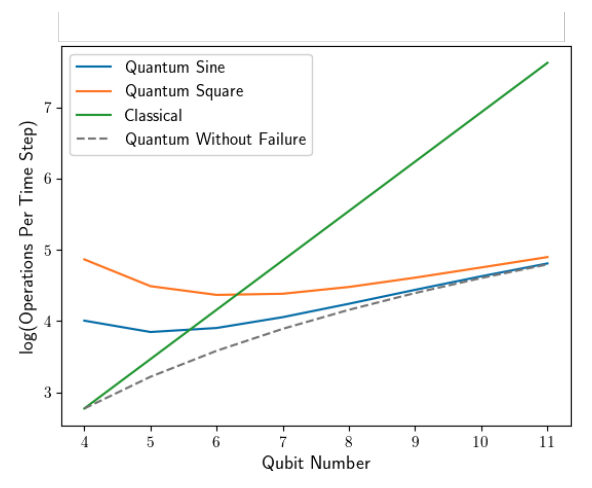 
Figure 5: The expected number of operations per time step for the classical algorithm (green) and the quantum algorithm. In the absence of failure, the complexity of the ideal quantum algorithm (dashed gray line) attains an exponential speedup over the classical algorithm. In the presence of failure, whose probability depends on the initial waveforms, the non-ideal complexity for the sine (blue) and the square (orange) waveform is higher [Eq. (20)]. Nevertheless, the non-ideal complex- ity converges to the ideal case when the number of qubits increases. The non-ideal complexity is evaluated for propagation across one box length and for the worst-case f = 1/2.

**Summary.** This paper presents a quantum algorithm for simulating the linear advection operator, a fundamental tool in fluid dynamics. It overcomes the non-unitary nature of the required numerical scheme by using Linear Combinations of Unitaries (LCUs) and introduces a novel failure recovery protocol based on the Quantum Fourier Transform. The result demonstrates an exponential speedup per time step while maintaining stability and providing rigorous analysis of the failure probability.

**Why it may be interesting.** This work directly addresses the simulation of non-unitary, dissipative physical processes (like advection) on quantum computers, which is a major challenge beyond simple Hamiltonian evolution. The integration of failure recovery mechanisms makes it highly relevant for near-term quantum simulation.

Detailed structure

**Main problem.** The paper develops a quantum algorithm to simulate the linear advection operator, which is crucial for fluid and plasma physics, while ensuring stability near sharp gradients.

**Main result.** The quantum algorithm achieves an exponential speedup per time step over classical methods by implementing the non-unitary upwind scheme via Linear Combinations of Unitaries (LCUs) and incorporating a QFT-based failure recovery mechanism.

**Method.** The core methodology involves embedding the non-unitary advection operator into a unitary framework using LCUs, and developing a probabilistic failure recovery scheme based on quantum indefinite integration using the Quantum Fourier Transform (QFT).

**Model / system.** The model is the one-dimensional linear advection equation ($\partial_t A + c \cdot 
abla A = 0$) solved on a uniform spatial grid with periodic boundary conditions. The simulation is implemented on quantum hardware, demonstrated on trapped-ion qubits.

**Key observables.** Waveform propagation (sine/square), failure probability ($P_{	ext{fail}}$), and computational gate complexity ($O(n^2)$ per step).

**Important parameters / regimes.** CFL number ($f = |c|\Delta t / \Delta x$), system size ($N=2^n$), and the decay exponent $\alpha$ governing convergence.

**Assumptions / limitations.** The primary assumptions include the applicability of LCUs to approximate the non-unitary operator and the assumption that the failure state is proportional to the derivative of the true state, enabling recovery.

**Figures summary.** Figures demonstrate the quantum algorithm matching classical upwind results for both sine and square waveforms under advection, illustrating the stability and accuracy of the scheme.

**Paper structure.** The paper introduces the physical problem and the need for a quantum approach. It details the use of LCUs to implement the non-unitary upwind scheme, followed by the development and analysis of a probabilistic failure recovery algorithm using QFT. Finally, it analyzes the convergence of the failure probability in the large $N$ limit.

Abstract

The linear advection operator is an ubiquitous building block in fluid and plasma problems. We develop a quantum algorithm for enacting the operator. When the advection velocity is constant in space, our algorithm is exponentially more efficient per time step than classical and avoids spurious oscillations near steep gradients. The algorithm is most cleanly illustrated using the one-dimensional advection equation on a uniform spatial grid with periodic boundary conditions, which can be extended to higher dimensions. The algorithm uses a first-order upwind scheme, which captures discontinuities in the wave envelope but is not unitary. We embed the non-unitary upwind scheme using Linear Combinations of Unitaries (LCUs), and develop an efficient quantum gate decomposition of the upwind unitary, which performs one step of advection using $O(n^2)$ two-qubit gates, where $N=2^n$ is the number of spatial grid points, as opposed to a classical computer which costs $O(N)$. Although LCUs introduces a small bounded probability of failure per time step, we show that the accumulation of failures does not lead to exponential-in-time complexity as one would naively expect. Moreover, when LCUs fails, we develop a probabilistic scheme to recover from the failure state, which avoids a full restart of the simulation. The failure recovery scheme uses quantum Fourier transform (QFT) and effectively achieves quantum indefinite integration of an unknown quantum state. The recovery, which can itself fail, is more efficient than a full restart if the wave envelop is well-resolved to include only low Fourier modes. We emulate our scheme classically and demonstrate small problems on Quantinuum's trapped-ion qubits. Our quantum algorithm provides a subroutine for physics simulations that involve linear advection.

[↑ back to top](#top)

### [Non-negative differential mobility of one-dimensional underdamped Langevin dynamics: Proof via mapping to a marginally stable oscillator](http://arxiv.org/abs/2609.21833v1)

**Authors:** Udo Seifert  
**Type:** theory · **Category:** statistical mechanics · **PDF:** <https://arxiv.org/pdf/2609.21833v1>  
**Analysis basis:** full PDF text, analyzed in chunks
**Topic relevance:** `Frenkel-Kontorova` **3/5** · `Keldysh / 2PI / non-Gaussian methods` **3/5** · `driven-dissipative phase transition` **3/5** · `methods for driven-dissipative` **3/5** · `non-equilibrium universality` **3/5** · `correlated / nonlocal dissipation` **1/5** · `quantum measurements` **1/5** · `scars & prethermalization` **1/5**

📷 Fig 1

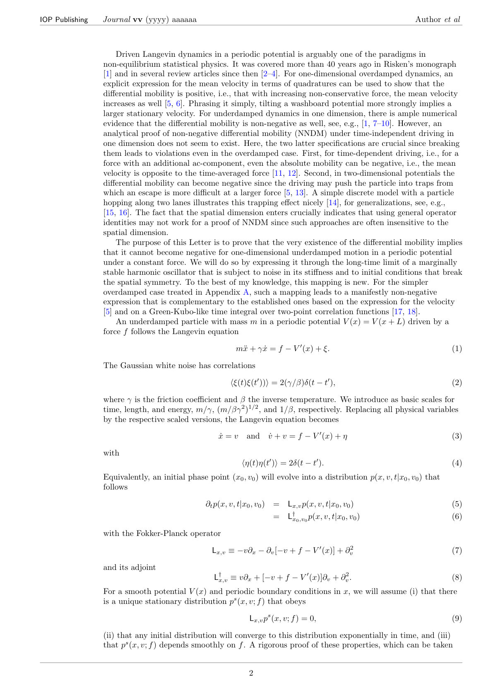 
Low-resolution page preview, page 2

📷 Fig 2

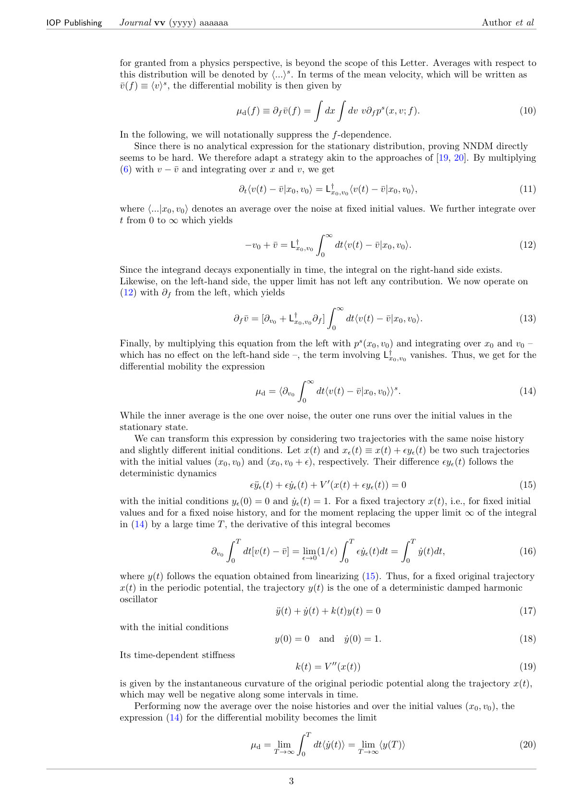 
Low-resolution page preview, page 3

📷 Fig 3

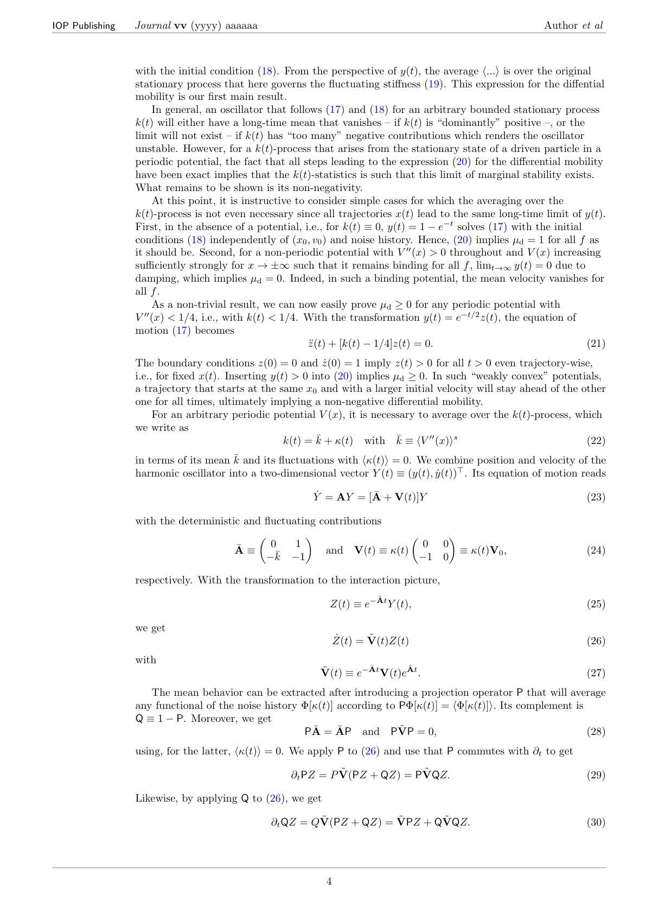 
Low-resolution page preview, page 4

📷 Fig 4

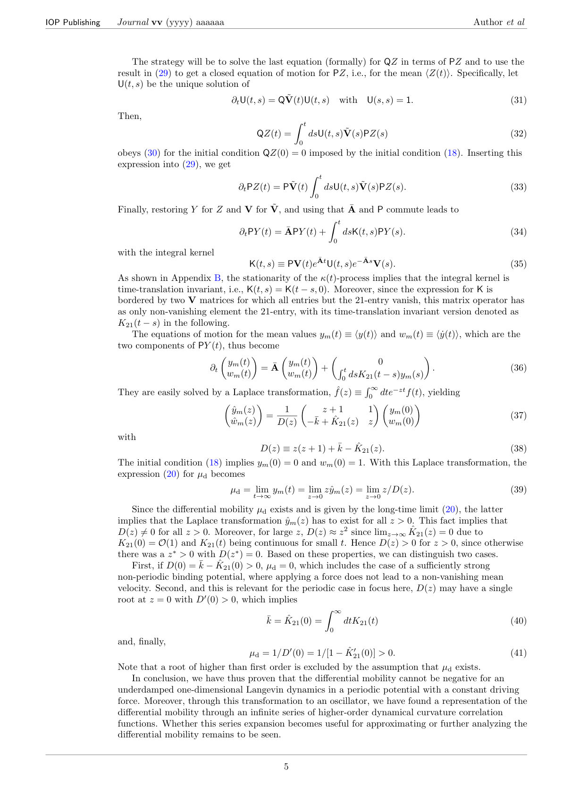 
Low-resolution page preview, page 5

📷 Fig 5

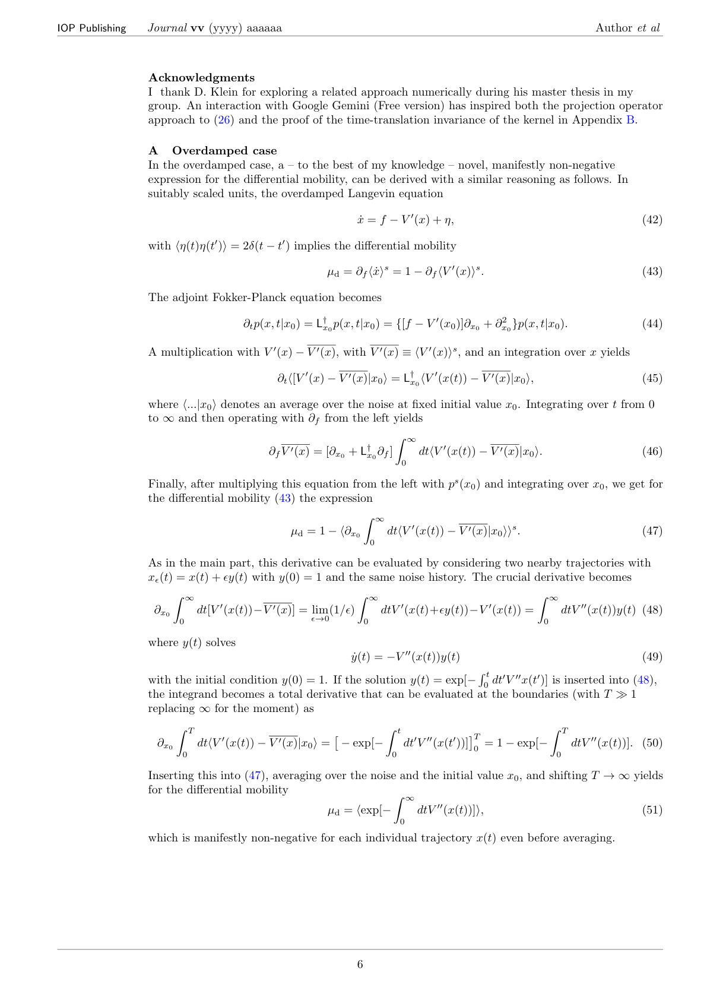 
Low-resolution page preview, page 6

**Summary.** This paper provides a rigorous analytical proof that the differential mobility for an underdamped particle in a periodic potential is non-negative. It achieves this by transforming the stochastic dynamics into an analysis of a marginally stable harmonic oscillator. The result is significant for understanding transport properties in systems driven by external forces.

**Why it may be interesting.** The mathematical techniques used—analyzing long-time limits of stochastic differential equations via projection operators and spectral analysis—are highly relevant to non-equilibrium statistical mechanics and open quantum systems.

Detailed structure

**Main problem.** To provide an analytical proof that the differential mobility ($\mu_d$) of one-dimensional underdamped Langevin dynamics driven by a constant non-conservative force across a periodic potential is non-negative.

**Main result.** The differential mobility $\mu_d$ is proven to be non-negative ($\mu_d \ge 0$) for the underdamped case, with specific results derived for the zero-potential and binding potential limits.

**Method.** The proof maps the problem to the long-time behavior of a marginally stable harmonic oscillator, utilizing projection operators and solving coupled equations of motion derived from the Fokker-Planck equation.

**Model / system.** The system is a one-dimensional particle undergoing underdamped Langevin dynamics in a periodic potential $V(x)$, governed by the equation $m\ddot{x} + \gamma \dot{x} = f -V'(x) + \xi$.

**Key observables.** Differential mobility ($\mu_d$), mean velocity ($\overline{v}(f)$), and the time evolution of the difference between velocity and mean velocity.

**Important parameters / regimes.** The driving force $f$, the damping coefficient $\gamma$, and the potential curvature $V''(x)$.

**Assumptions / limitations.** Assumes the existence of a unique stationary distribution and exponential convergence to it.

**Paper structure.** The paper establishes the definition of $\mu_d$, relates it to the dynamics of a linearized oscillator, and then uses projection operators and Laplace transforms to derive and analyze the long-time limit of the mean correlation functions, leading to the final non-negativity proof.

Abstract

For an underdamped particle driven by a constant non-conservative force across a periodic potential in one spatial dimension at finite temperature, numerical studies have shown that the differential mobility is non-negative. Here, an analytical proof will be given that is based on expressing the differential mobility by the long-time mean position of a marginally stable harmonic oscillator subject to noise in its stiffness.

[↑ back to top](#top)

### [Giant-Atom-Induced High-Order Output Zeros in a Coupled-Cavity Array](http://arxiv.org/abs/2609.21560v1)

**Authors:** Mengxue Li, Bo Liu, H. Z. Shen, H. D. Liu, Gangcheng Wang  
**Type:** theory · **Category:** other · **PDF:** <https://arxiv.org/pdf/2609.21560v1>  
**Analysis basis:** full PDF text, analyzed in chunks
**Topic relevance:** `Tavis-Cummings & cavity-many-emitter` **3/5** · `correlated / nonlocal dissipation` **3/5** · `interference shaping light` **3/5** · `analog quantum simulation` **2/5** · `driven-dissipative phase transition` **2/5** · `methods for driven-dissipative` **2/5** · `Keldysh / 2PI / non-Gaussian methods` **1/5** · `non-equilibrium universality` **1/5**

📷 Fig 1

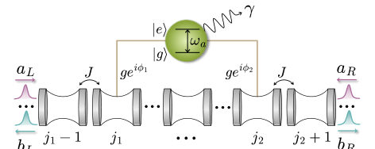 
FIG. 1. Schematic of a two-site coupled giant atom interacting with a coupled-resonator waveguide. The waveguide consists of resonators interconnected with hopping strength J. The transition frequency of the two-level giant atom is ωa, and γ stands for the atomic dissipation rate. The giant atom couples to the j1th and j2th resonators with coupling strengths geiϕ1 and geiϕ2, respectively.

📷 Fig 2

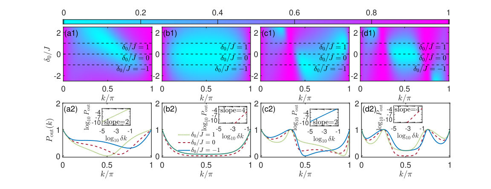 
FIG. 2. Normalized total output intensity Pout(k) under two-sided coherent excitation as a function of various system parameters. (a1)–(d1) Density plots as a function of wave vector k and detuning δ0. Here δ0 = ωc −ωa. (a2)–(d2) The cuts indicated by the black dashed lines. The inset displays the corresponding double-logarithmic plots near k0 = π/2. The four columns correspond to (a) L = 1, ∆ϕ = 0, η = 1, g = J, and γ = 2J; (b) L = 2, ∆ϕ = π, η = −1, g = J, and γ = 4J; (c) L = 3, ∆ϕ = 0, η = 1, g = J, and γ = 2J; and (d) L = 4, ∆ϕ = 0, η = 1, g = J/ √

📷 Fig 3

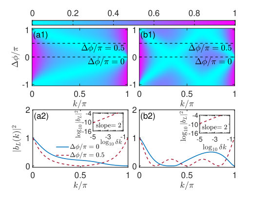 
FIG. 3. Left-port reflection intensity |bL(k)|2 under single-sided inci- dence (η = 0) as a function of various system parameters. (a1)–(b1) Density plots as a function of wave vector k and ∆ϕ for L = 1 and 3, respectively. (a2)–(b2) The cuts indicated by the black dashed lines. The inset displays the corresponding double-logarithmic plots near k0 = π/2. The common parameters are ωc = ωa, g = J, and γ = 2J.

📷 Fig 4

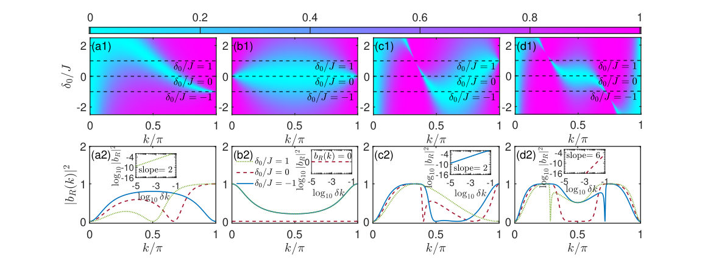 
FIG. 4. Right-port transmission intensity |bR(k)|2 = |tL(k)|2 under single-sided incidence (η = 0) as a function of various system parameters. (a1)–(d1) Density plots as a function of wave vector k and detuning δ0. Here δ0 = ωc −ωa. (a2)–(d2) The cuts along the black dashed lines. The inset displays the corresponding double-logarithmic plots near k0 = π/2. The four columns correspond to (a) L = 1, ∆ϕ = 0, g = J, and γ = 0; (b) L = 2, ∆ϕ = π, g = J, and γ = 0; (c) L = 3, ∆ϕ = 0, g = J, and γ = 0; and (d) L = 4, ∆ϕ = 0, g = J/ √

📷 Fig 5

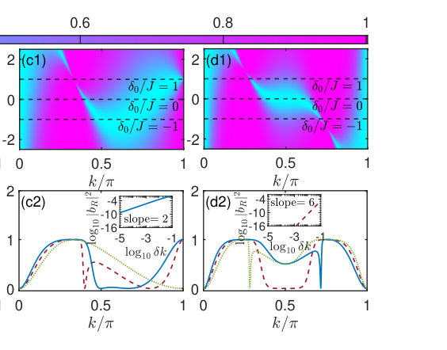 
Figure 5 illustrates the dynamical evolution of scattering wave packets |uj(t)| with wave-packet width σ = 5 under distinct scattering regimes for L = 1. Figure 5(a) depicts the CPA realized by two counterpropagating Gaussian wave packets initially centered at jL = −201/2 and jR = 201/2. Counterpropagating wave-packet components with equal in- cident weights propagate toward the scattering center without reflection. When the two wave-packet components reach the scattering region, they are almost completely absorbed, with only negligible residual fields observed in the reflection and transmission channels. This phenomenon verifies the CPA ef- fect. Figure 5(b) shows the dynamics of a single...

**Summary.** This paper proposes using a giant atom coupled nonlocally to a coupled-cavity array to achieve advanced wave control. By engineering the coupling geometry, the authors demonstrate a method to realize bandwidth-enhanced coherent perfect absorption and zero transmission. This approach is significant because it achieves these effects without relying on complex theoretical tools like exceptional points.

**Why it may be interesting.** This work provides a concrete, physical mechanism using engineered quantum systems (giant atoms) to achieve advanced wave manipulation (high-order spectral control) in coupled quantum networks, which is highly relevant to cavity QED and open quantum systems.

Detailed structure

**Main problem.** The research aims to engineer high-order output zeros in scattering phenomena, such as zero transmission or zero reflection, within coupled-cavity arrays.

**Main result.** The giant-atom coupling mechanism enables bandwidth-enhanced coherent perfect absorption and zero transmission without needing exceptional points or momentum-dependent phase delays.

**Method.** The analysis involves deriving the two-port scattering matrix S(k) and applying conditions on the derivatives of the output amplitudes with respect to the wave vector k.

**Model / system.** The system consists of a two-level giant atom coupled nonlocally to a one-dimensional coupled-cavity array, modeled using a tight-binding Hamiltonian and analyzed via scattering theory.

**Key observables.** Coherent Perfect Absorption (CPA), zero transmission, zero reflection, and the order of the output zeros (e.g., second-order CPA).

**Important parameters / regimes.** Cavity frequency ($\omega_c$), atomic frequency ($\omega_a$), hopping rate ($J$), coupling strengths ($g_1, g_2$), and the spatial separation ($L$) of the coupling sites.

**Assumptions / limitations.** The analysis assumes an infinite 1D array and focuses on the scattering response governed by the derived scattering matrix S(k).

**Figures summary.** Figure 1 schematically illustrates the setup: a two-site coupled giant atom interacting with a coupled-resonator waveguide, detailing the coupling strengths.

**Paper structure.** The paper establishes the physical model and Hamiltonian, derives the scattering matrix S(k), and then systematically applies conditions on the vanishing derivatives of the output amplitudes to achieve higher-order zero transmission/CPA.

Abstract

Coherent perfect absorption, zero transmission and zero reflection are several scattering phenomena governed by interference engineering in Hermitian and non-Hermitian systems. Higher-order coherent perfect absorption can significantly broaden the absorption bandwidth, while existing implementations rely on scattering zero degeneracy induced by exceptional points or additional momentum-dependent phase delays introduced in incident waves. We propose a scheme where a giant atom couples to a one-dimensional coupled-cavity array at two spatially separated sites. The spatially separated coupling configuration of the giant atom generates tunable nonlocal interference phases that dominate the scattering interference process. We further investigate the zero-reflection and zero-transmission behaviors under single-sided incidence. Remarkably, we find that for certain parameter choices, zero transmission can persist over the entire propagating band, rather than being restricted to a single momentum. Our results reveal that the giant-atom interference mechanism enables bandwidth-enhanced coherent perfect absorption and bandwidth-enhanced zero transmission in the absence of exceptional points and incident momentum-dependent phase delays. Our work provides a physical route for coherent wave manipulation in coupled-cavity quantum networks.

[↑ back to top](#top)

### [Arctic Curves and a Gapped Gas Phase in a Two-Band Free-Fermion Chain](http://arxiv.org/abs/2609.21004v1)

**Authors:** Charles Jordan, Dimitri M. Gangardt, Alexander G. Abanov  
**Type:** theory · **Category:** statistical mechanics · **PDF:** <https://arxiv.org/pdf/2609.21004v1>  
**Analysis basis:** full PDF text, analyzed in chunks
**Topic relevance:** `Frenkel-Kontorova` **3/5** · `Keldysh / 2PI / non-Gaussian methods` **3/5** · `analog quantum simulation` **2/5** · `driven-dissipative phase transition` **2/5** · `methods for driven-dissipative` **2/5** · `non-equilibrium universality` **2/5** · `quantum measurements` **1/5**

📷 Fig 1

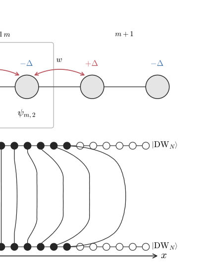 
Figure 1: Model and Euclidean return geometry. (a) Rice-Mele free-fermion chain with a two-site unit cell (boxed). The red and blue orbitals have on-site potentials +∆ and −∆, respectively. The nearest-neighbor hopping amplitudes alternate between v and w in the general Rice–Mele chain; throughout the main text we specialize to uniform hopping, v = w = 1. (b) Euclidean slab of height 2R defining the finite- interval return amplitude ZN(R) = 〈DWN|e−2RÒ H|DWN〉. In the boundary state |DWN〉, both orbitals are occupied in the cells m = 0,..., N −1, while all other cells are empty. The figure shows both domain walls bounding the occupied interval.

📷 Fig 2

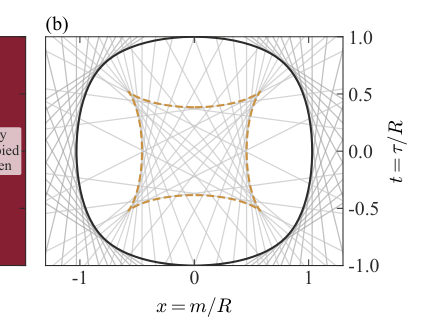 
Figure 2: Space-time phase diagram for ∆= 2. (a) Finite-R average density ¯ρ(m,τ) = 1

📷 Fig 3

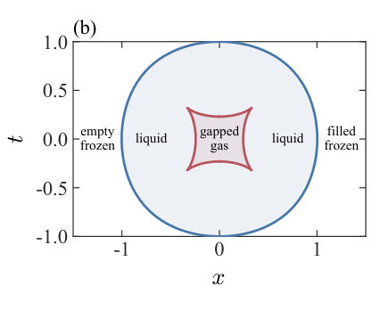 
Figure 3: Spectral origin of the two arctic boundaries. (a) Branch-cut representation of the elliptic spectral curve η2 = z(z + κ)(z + κ−1) in the complex z-plane. The cuts are chosen along the positive interval [0,∞) and the compact negative interval [−κ,−κ−1]; their lifts form the two real components of the spectral curve. Both cuts cross the unit circle |z| = 1, shown by the dashed line. (b) Images of these intervals in the (x, t) plane under the parametric map in Eq. (13), obtained from the envelope condition ∂z xσ(t,z) = 0. The positive interval gives the outer frozen–liquid boundary, while the compact negative interval gives the inner liquid–gas boundary.

📷 Fig 4

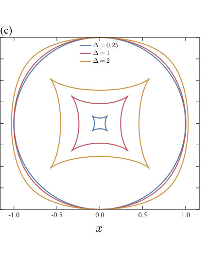 
Figure 4: Gap dependence and diagnostics of the gas phase. (a) Finite-chain sublat- tice densities at t = 0, ∆= 2, and R = 6 are plotted in red circles for ρ1, blue squares for ρ2, and black circles for ¯ρ. Inside the shaded gas region their average is 1/2 and the individual densities approach Eq. (14). The analytic results for these densities presented in Section 8 are plotted in solid lines. (b) Connected cell-density correla- tions for a completely filled lower band and for a representative partially filled band. The former decay exponentially as in Eq. (16), whereas the latter show the r−2 liquid behavior of Eq. (15). Numerical results are shown for the gapped gas (blue) and a...

📷 Fig 5

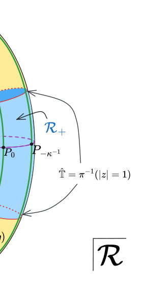 
Figure 5: Schematic representation of the elliptic spectral curve η2(z) = z(z + κ)(z + κ−1) which defines a two-dimensional surface in four di- mensional space (z,η). Each point P = (z,η) on the surface has a conjugate point P∗= (z,−η), except for ramification (branch) points P = P∗for which η = 0 or ∞. The lift eT = π−1(|z| = 1) of the Wiener–Hopf contour |z| = 1 separates two domains, R+ and R−, corresponding to |z| &lt; 1 and |z| &gt; 1, respectively. The green lines are a-cycles surrounding branch cuts between pairs of ramification (branch) points P−κ = (−κ,0), P−κ−1 = (−κ−1,0) and P0 = (0,0), P∞= (∞,∞), while purple lines are b-cycles.

**Summary.** This theoretical paper analyzes the phase structure of a two-band free-fermion chain, revealing a distinct frozen-liquid-gas regime. The authors use sophisticated mathematical methods, including Riemann-Hilbert factorization, to precisely locate the boundaries between these phases. This work provides a deep, mathematically rigorous understanding of how spectral gaps dictate macroscopic quantum behavior.

**Why it may be interesting.** The connection between the gap-induced phase structure (gas phase) and the rigorous mathematical tools of Riemann-Hilbert problems and determinantal processes provides a powerful, generalizable framework for understanding quantum many-body ground states.

Detailed structure

**Main problem.** The paper studies the imaginary-time evolution and resulting phase structure of a domain-wall state in a staggered free-fermion chain.

**Main result.** It establishes a frozen-liquid-gas phase diagram, characterized by two 'arctic curves,' which are mathematically derived from the caustics of free quasiparticle trajectories.

**Method.** The analysis employs advanced techniques including matrix Wiener-Hopf factorization, reduction to a scalar Riemann-Hilbert problem on an elliptic spectral curve, and connections to continuum hydrodynamics.

**Model / system.** The system is a two-band free-fermion chain, a specific limit of the Rice-Mele chain, described by a Hamiltonian involving alternating on-site potentials and hopping terms.

**Key observables.** Thermodynamic return amplitude, equal-time correlation kernel, local densities ($
ho_1, 
ho_2$), and the phase boundaries (arctic curves).

**Important parameters / regimes.** The spectral gap ($\Delta$), the system size ($N$), and the imaginary time/spatial scaling parameters ($R, 	au$).

**Assumptions / limitations.** The analysis relies on taking the thermodynamic limit ($N 	o \infty$) and the large time limit ($R 	o \infty$), and mapping the problem to a continuum description.

**Figures summary.** Not specified, but the notes describe the geometry of the phase diagram and the mathematical derivation of the curves.

**Paper structure.** The paper progresses from defining the physical model and key observables to applying advanced mathematical techniques (Toeplitz operators, Wiener-Hopf factorization) to derive the exact structure of the phase diagram and correlation functions.

Abstract

We study the imaginary-time evolution of a domain-wall state constrained to return to itself in a staggered free-fermion chain. The resulting space-time profile separates into frozen, liquid, and gas phases divided by sharp boundaries known as arctic curves. The spectral gap produces an incompressible half-filled gas phase bounded by an inner arctic curve, in addition to the outer frozen-liquid boundary. We determine both arctic curves, the thermodynamic return amplitude, and the complete equal-time correlation kernel. Correlations decay algebraically in the liquid regions and exponentially in the gas, while both arctic boundaries arise as caustics of free quasiparticle trajectories. The return amplitude and correlation kernel are respectively controlled by the determinant and inverse of the same block-Toeplitz operator. We obtain an exact matrix Wiener-Hopf factorization of this operator by reducing the problem to a scalar Riemann-Hilbert problem on an elliptic spectral curve. The factorization also yields the exact thermodynamic return amplitude: its logarithm consists of a quadratic term with explicit gap dependence and a bounded periodic theta-function correction. The resulting frozen-liquid-gas structure is a continuous-time free-fermion counterpart of that found in doubly periodic dimer models.

[↑ back to top](#top)

### [Cavity-QED analysis of InAs quantum-dot single photon production](http://arxiv.org/abs/2609.22025v1)

**Authors:** W. W. Chow, S. Peana, D. I. Herman, K. Y. Lee, A. Cejan, C. Shang, G. Moody, J. E. Bowers, F. Jahnke  
**Type:** theory · **Category:** other · **PDF:** <https://arxiv.org/pdf/2609.22025v1>  
**Analysis basis:** full PDF text, analyzed in chunks
**Topic relevance:** `Tavis-Cummings & cavity-many-emitter` **3/5** · `correlated / nonlocal dissipation` **3/5** · `Keldysh / 2PI / non-Gaussian methods` **2/5** · `analog quantum simulation` **2/5** · `methods for driven-dissipative` **2/5** · `driven-dissipative phase transition` **1/5** · `interference shaping light` **1/5** · `quantum measurements` **1/5**

📷 Fig 1

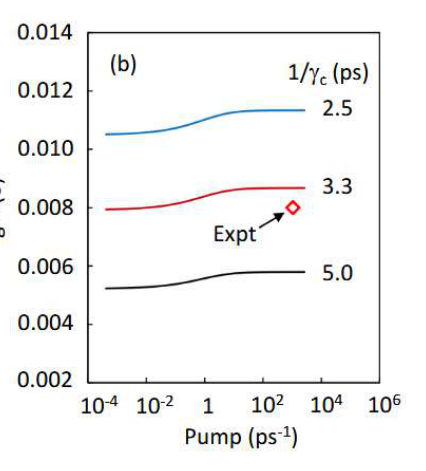 
Figure 1. (a) Output and (b) equal-time intensity correlation 𝑔(2)(0) versus pump rate. The curves are for cavity photon lifetime 1/c as indicated. The experimental device gives single photon emission rate of 10−3 𝑝𝑠−1 and 𝑔(2)(0) = 0.008.

📷 Fig 2

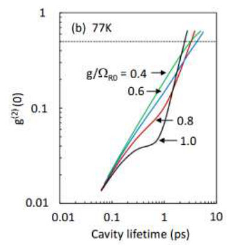 
Figure 2. Computed (a) output and (b) 𝑔(2)(0) versus cavity lifetime for light-matter coupling strength as labeled. The dashed portions in Figure 2 (a) indicate when 𝑔(2)(0) &gt; 0.5.

📷 Fig 3

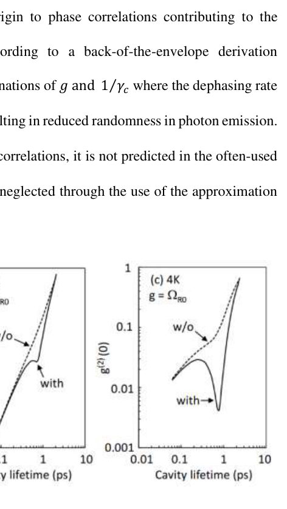 
Figure 3. (a) 𝑔(2)(0) versus cavity lifetime at liquid He temperature, using 𝛾= 3.9 × 1010 𝑠−1for 𝑇= 4 𝐾. (b) Multiphoton expectation value and (c) 𝑔(2)(0) versus cavity lifetime computed for 𝑔= Ω𝑅0, with and without the (𝑛𝑒+ 𝑛ℎ− 1)𝛿〈𝑎†𝑎†𝑎𝑎〉 contribution in the equation of motion for 𝛿〈𝑏†𝑐†𝑎†𝑎𝑎〉 (solid and dashed curves, respectively).

📷 Fig 4

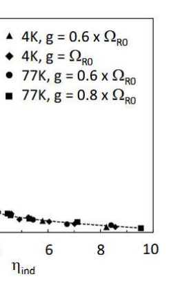 
Figure 4. Coincidence count versus product of photon output rate and coherence time. The data points are from calculations at 𝑇= 4 𝐾 and 77 𝐾.

📷 Fig 5

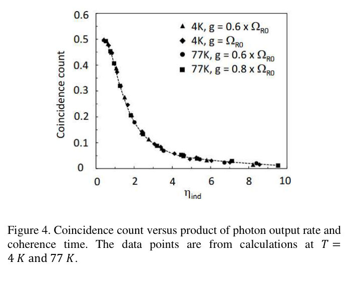 
Figure 5 are plots of coherence time and indisguishability versus cavity lifetime, for

**Summary.** This theoretical paper analyzes single-photon generation from InAs quantum dots coupled to optical cavities using Cavity-QED. It models the system dynamics by incorporating complex quantum carrier-photon correlations into the equations of motion. The key finding is that these correlations significantly modify performance metrics like purity and rate, revealing crucial trade-offs that must be accounted for beyond simple mean-field approximations.

**Why it may be interesting.** This work is highly relevant as it tackles the non-trivial quantum corrections (beyond mean-field) necessary for accurately predicting single-photon sources in solid-state quantum emitters, a core topic in cavity QED.

Detailed structure

**Main problem.** The study investigates how cavity enhancement affects the single photon performance (rate, purity, and indistinguishability) of an InAs quantum dot.

**Main result.** The analysis reveals fundamental trade-offs between single photon production rate and purity, emphasizing that quantum carrier-photon correlations provide substantial corrections beyond mean-field predictions, especially at high coupling strengths.

**Method.** The authors use a theoretical framework based on the Heisenberg picture, deriving equations of motion for various correlation terms and employing a factorization scheme to separate mean-field and correlation contributions.

**Model / system.** The system modeled is an InAs quantum dot coupled to an optical micro- or nanocavity, described by a Hamiltonian involving photon, electron, and hole operators. The analysis tracks the evolution of populations and polarizations.

**Key observables.** Single photon emission rate ($\gamma_c n_p$), purity ($g^{(2)}(0)$), indistinguishability ($\eta_{ind}$), and coherence time ($	au_{coh}$).

**Important parameters / regimes.** Light-matter coupling strength ($g$), cavity photon decay rate ($\gamma_c$), dephasing rate ($\gamma$), and temperature ($T$).

**Assumptions / limitations.** Initial parametric studies often neglect correlation terms for computational ease, and the analysis assumes steady-state values for solving correlation functions.

**Figures summary.** Figures compare $\gamma_c n_p$ and $g^{(2)}(0)$ vs. pump rate or cavity lifetime, illustrating the impact of correlation terms and temperature on single-photon metrics.

**Paper structure.** The paper develops the theory by deriving equations of motion, performing parametric studies comparing mean-field vs. correlated results, and analyzing the resulting trade-offs between key single-photon metrics.

Abstract

Cavity quantum electrodynamics is used to study the extent cavity enhancement affects single photon performance of an InAs quantum dot, in terms of emission rate, purity and indistinguishability at different temperatures. Parametric studies show a tradeoff between single photon production rate and purity, as well as between indistinguishability and purity. The results indicate the importance of quantum carrier-photon correlations that yield substantial corrections to mean-field treatments, especially at high light-matter coupling strength, where cavity enhancement is most effective.

[↑ back to top](#top)

### [Transport statistics and thermoelectric performance of Hofstadters butterfly](http://arxiv.org/abs/2609.21588v1)

**Authors:** Friedemann Queißer, Gernot Schaller  
**Type:** theory · **Category:** statistical mechanics · **PDF:** <https://arxiv.org/pdf/2609.21588v1>  
**Analysis basis:** full PDF text, analyzed in chunks
**Topic relevance:** `Keldysh / 2PI / non-Gaussian methods` **3/5** · `analog quantum simulation` **3/5** · `Full counting statistics` **2/5** · `methods for driven-dissipative` **2/5** · `non-equilibrium universality` **2/5** · `correlated / nonlocal dissipation` **1/5** · `driven-dissipative phase transition` **1/5** · `quantum measurements` **1/5**

📷 Fig 1

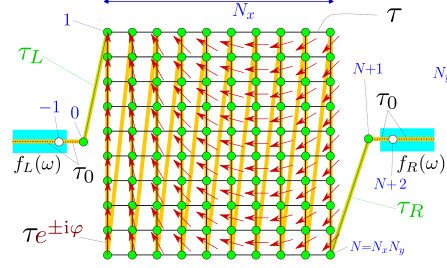 
FIG. 1. Sketch of the model for Nx = Ny = 10. The left (sites −∞. . . 0) and right (sites N + 1 . . . ∞) semi-infinite chain reservoirs are described by local thermal equilibrium Fermi functions fν(ω) and bare tunneling amplitude τ0 (dot- ted black). Inside the system (sites 1 . . . N), tunneling am- plitudes (magnitude τ, black lines) in y-direction have phase factors that depend on the horizontal position (red arrows). Transport is enabled by coupling the system to the leads via amplitudes τν (green lines). The system together with the adjacent reservoir sites forms the central system (green cir- cles). The bold yellow curve in the background denotes the ordering of the lattice sites.

📷 Fig 2

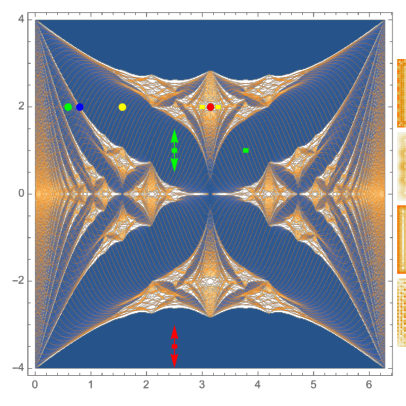 
FIG. 2. Level density of the Hofstadter Hamiltonian versus the magnetic field parameter B = e ℏB∆2 (horizontal axis) and energy (vertical axis, in units of τ) for Nx = Ny = 40 (background) and actual spectrum for a 10×10 grid (orange curves). The characteristic butterfly structure is clearly visi- ble, in the infinite-size limit Nx, Ny →∞it develops a fractal structure. The blue regions inside the butterfly wings denote regions of lower level density populated only by boundary states. Circles (from left to right) mark positions for which the amplitude distribution of exemplary eigenstates is shown on the right (from top to bottom). Within the butterfly wings (green and yellow dots), they...

📷 Fig 3

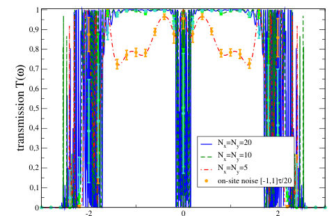 
FIG. 4. Plot of the transmission T(ω) vs. frequency ω/τ for B = 2.5 (passing along the arrow symbols in Fig. 2). With increasing system size (red dash-dotted to green dashed to blue solid), the transmission exhibits plateaus where the transmission is near unity. Here, transport is mainly carried by topologically protected boundary modes. Outside these plateaus, the transmission shows for larger system sizes a lot of very narrow spikes that result from bulk state transmis- sion. When we add moderate on-site noise of the form (17) with α = 0.1, we find that the large-transmission plateaus are hardly affected (small error bars), whereas smaller trans- missions suffer rather large variations...

📷 Fig 4

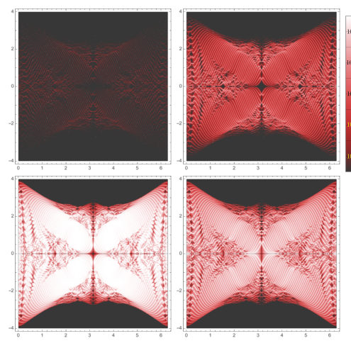 
FIG. 3. Density plots of transmission (note the log-scale colorbar) versus magnetic field B = (e/ℏ)B∆2 (horizon- tal axis) and frequency ω/τ (vertical axis). At weak cou- pling (top left), the transmission is in general very small and has extremely narrow (hardly visible) peaks that re- produce the Hofstadter butterfly spectrum from Fig. 2. Al- ready at intermediate coupling (top right), the transmission is much larger. At specific coupling strengths, the transmis- sion of the boundary modes is extremely close to one (bot- tom left), whereas at even larger coupling, the transmission reduces again (bottom right). Parameters: Nx = Ny = 10, τ0 = 10τ, τL = τR = τc, where from top left to bottom...

📷 Fig 5

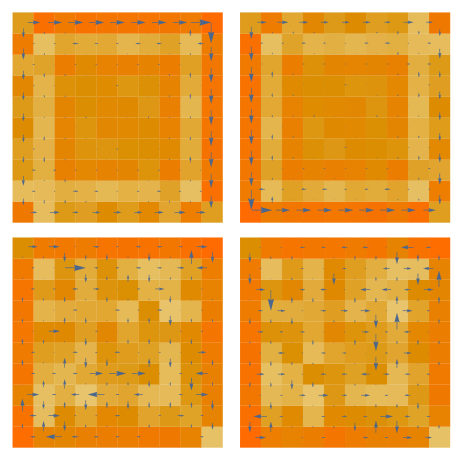 
FIG. 5. Plots of stationary occupations (background colors) and bond currents (arrow lengths correlates with strength) for different average potentials and magnetic fields (top vs. bottom row) under reversal of the respective magnetic field B (left vs right column). The top row shows the occupa- tion for average potential ¯µ = (µL + µR)/2 = +1.0τ for B = ±2.5 (green rectangles in Fig. 2) and thus exhibits the transport mediated by topological boundary modes (total current IM ≈0.079τ). The bottom row is for average po- tential ¯µ = 2 and similarly contrasts B = ±3 (yellow rect- angles in Fig. 2) the transport through bulk modes as well as ring currents without net charge transfer (total...

**Summary.** This work analyzes electron transport in the Hofstadter model under a magnetic field, using non-equilibrium Green's functions. It reveals that topologically protected boundary modes create regions of near-perfect transmission, which can be utilized for building highly reliable quantum standards and energy devices. The theoretical framework also rigorously connects transport properties to fundamental thermodynamic laws.

**Why it may be interesting.** The connection between topological protection, robust transport (near-unity transmission), and thermodynamic quantities like entropy production makes this highly relevant for understanding energy flow and dissipation in quantum mesoscopic systems.

Detailed structure

**Main problem.** The paper investigates the transport statistics and thermoelectric performance of electrons in a lattice subjected to a magnetic field, focusing on identifying robust transport features.

**Main result.** The study identifies 'sweet spots' characterized by near-unit transmission plateaus, which are carried by topologically protected boundary modes robust against local disorder. These features are promising for developing robust quantum devices.

**Method.** The analysis employs non-equilibrium Green's functions to calculate transport quantities like particle and energy currents, as well as zero-frequency noise and entropy production rate.

**Model / system.** The system is modeled by electrons tunneling on a square lattice under a perpendicular magnetic field, described by the Hofstadter Hamiltonian. The system is coupled to semi-infinite leads acting as reservoirs.

**Key observables.** Transmission function T(w), Matter current (I_M), Energy current (I_E), Zero-frequency noise (S_M), and Entropy production rate (sigma).

**Important parameters / regimes.** Magnetic flux per plaquette (B), coupling strength (tau), and bias/temperature gradients.

**Assumptions / limitations.** The analysis assumes non-interacting electrons and relies on the framework of non-equilibrium Green's functions for transport calculations.

**Figures summary.** Figures illustrate the Hofstadter butterfly structure (level density vs. B), the evolution of transmission T(w) with coupling strength, and plots contrasting boundary mode transport versus bulk mode transport.

**Paper structure.** The paper progresses by first establishing the theoretical framework using non-equilibrium Green's functions to calculate transport observables. It then analyzes the model's behavior across different magnetic field regimes and coupling strengths, culminating in the identification of topologically protected transport channels and deriving thermodynamic bounds.

Abstract

We investigate electrons subject to a magnetic field that may tunnel along a square lattice and additionally to two electronic leads. Using non-equilibrium Greens functions we evaluate the transmission and from that particle and energy currents and zero-frequency noise of the setup. We identify sweet spots for which the transmission reaches unity over broad frequency windows -- carried by topologically protected boundary modes that are quite robust against local fluctuations of on-site energies. These transmission plateaus can be exploited for the implementation robust current standards, clocks and thermoelectric devices.

[↑ back to top](#top)

### [Ensemble Dependence of the Critical Exponent at a Quantum Error Correction Threshold](http://arxiv.org/abs/2609.21886v1)

**Authors:** Idan Dror, Moshe Goldstein  
**Type:** theory · **Category:** statistical mechanics · **PDF:** <https://arxiv.org/pdf/2609.21886v1>  
**Analysis basis:** full PDF text, analyzed in chunks
**Topic relevance:** `driven-dissipative phase transition` **3/5** · `non-equilibrium universality` **3/5** · `Keldysh / 2PI / non-Gaussian methods` **2/5** · `methods for driven-dissipative` **2/5** · `analog quantum simulation` **1/5** · `correlated / nonlocal dissipation` **1/5** · `quantum measurements` **1/5**

📷 Fig 1

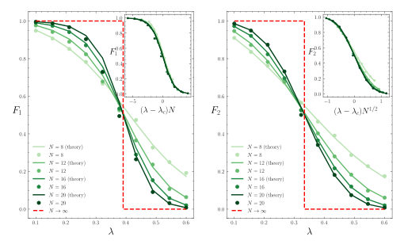 
Figure 2. Fidelity of the z-only depolarization channel with r = 1 2 and ϕ = π 2 , both simulated encoding-quenched (dots) and analytical encoding-annealed (lines) for the grand- canonical ensemble. Left: Error-annealed. Right: Error- quenched. Insets: A scaling plot of the same result.

📷 Fig 2

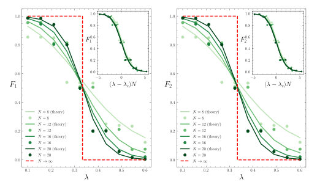 
Figure 3. Fidelity of the z-only depolarization channel with r = 1

**Summary.** This theoretical work demonstrates that for quantum error correction thresholds, the critical exponents characterizing the phase transition are not universal but depend on the statistical ensemble used for averaging errors. By comparing canonical and grand-canonical ensembles, the authors find distinct exponents, challenging the common assumption of ensemble independence in critical phenomena.

**Why it may be interesting.** The finding that fundamental physical quantities like critical exponents depend on the ensemble choice provides a deep, non-trivial insight into the nature of phase transitions in open quantum systems, which is relevant to understanding decoherence and thermalization.

Detailed structure

**Main problem.** The paper investigates whether the choice of thermodynamic ensemble (micro-canonical vs. canonical vs. grand-canonical) affects the critical exponents characterizing a phase transition in quantum error correction.

**Main result.** The critical exponent ($
u$) governing the scaling of observables like fidelity is found to be ensemble-dependent, yielding different values (e.g., $
u=1$ vs. $
u=2$) depending on the averaging procedure used.

**Method.** The analysis employs techniques from statistical mechanics, comparing quenched and annealed averages of fidelity in the thermodynamic limit, and utilizing information-theoretic bounds.

**Model / system.** The model is a simplified quantum error correction (QEC) scheme involving single-step encoding and decoding using random unitaries and global error channels acting on $N$ qudits.

**Key observables.** Fidelity ($F$ or $	ilde{F}$), Magic ($M_q$), and the critical exponent ($
u$).

**Important parameters / regimes.** Error strength ($\lambda$), redundancy rate ($r$), and the system size ($N$) in the thermodynamic limit.

**Assumptions / limitations.** The analysis relies on comparing different ensemble averages (canonical vs. grand-canonical) and assumes the applicability of scaling laws near the critical point.

**Figures summary.** The notes mention a schematic diagram (Figure 1) illustrating the QEC process and a summary table (Table I) comparing critical exponent bounds and exact values across different ensembles.

**Paper structure.** The paper systematically compares the calculation of averaged fidelity ($	ilde{F}$) using different ensemble averaging methods (quenched vs. annealed) and derives the resulting critical exponents ($
u$) for the canonical and grand-canonical limits.

Abstract

In thermodynamics it is common to assume that the choice of ensemble (e.g., micro-canonical, canonical, or grand-canonical) should not affect the underlying physics in the thermodynamics limit. We show that this does not necessarily hold for critical exponents. Examining a simplified model of quantum error correction (single step encoding and decoding by a random unitary) and the behavior of both the fidelity and magic at the corresponding threshold, we find different exponents when using generic channels or supposedly equivalent quantum trajectories. Interestingly, the obtained exponents saturate a recently derived information theoretic bound by Feldman et al. (2026), which we extend from the grand-canonical to the canonical case, including intermediate ensembles which we define. Moreover, even the existence of the transition is shown to be ensemble-dependent.

[↑ back to top](#top)

### [Floquet physics from quantized light-matter interaction: geometric phases, gauge consistency, and entanglement](http://arxiv.org/abs/2609.21741v1)

**Authors:** Beatriz Pérez-González, Sigmund Kohler, Mónica Benito  
**Type:** theory · **Category:** other · **PDF:** <https://arxiv.org/pdf/2609.21741v1>  
**Analysis basis:** full PDF text, analyzed in chunks
**Topic relevance:** `Tavis-Cummings & cavity-many-emitter` **3/5** · `analog quantum simulation` **3/5** · `driven-dissipative phase transition` **2/5** · `methods for driven-dissipative` **2/5** · `Keldysh / 2PI / non-Gaussian methods` **1/5** · `non-equilibrium universality` **1/5**

📷 Fig 1

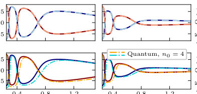 
FIG. 1. Semiclassical Floquet (solid) vs quantum (dashed lines): (a) quasienergies and energies, (b) mean energies (left panel), and Anandan phases (right panel), all for n0 = 150. (c) Mean energies (left panel) and Anandan phases (right panel), for n0 = 4. For all plots, A/∆= 1.25. In (a), the Floquet-Brillouin zone is shaded.

**Summary.** This theoretical work rigorously connects Floquet engineering in periodically driven systems to quantized light-matter interactions using the Quantum Rabi Model. By analyzing the system in a phase basis, the authors establish a direct, gauge-consistent correspondence between Floquet quasienergies and the full quantum energy spectrum. This confirms that the semiclassical limit can be derived quantum mechanically without relying on mean-field approximations.

**Why it may be interesting.** This work provides a deep, fundamental understanding of how semiclassical approximations (like Floquet theory) emerge from the full quantum description of cavity QED, which is crucial for designing quantum optical experiments.

Detailed structure

**Main problem.** The paper aims to establish a rigorous, fully quantum-level correspondence between Floquet physics (from periodically driven systems) and light-matter interaction in the quantized regime, especially beyond mean-field approximations.

**Main result.** A one-to-one correspondence is established between quasienergies and photon-sector-shifted quantum energies, demonstrating that the quantum-to-classical mapping emerges directly from the full quantum Hamiltonian.

**Method.** The authors use a phase representation for the photonic field and analyze the eigenvalue equation of the fully quantized Hamiltonian in the large-photon-number limit to derive the Floquet structure.

**Model / system.** The system is a light-matter interaction modeled by the Quantum Rabi Model (QRM) in a cavity, comparing its fully quantized dynamics to the semiclassical Rabi Model (SCRM) under periodic driving.

**Key observables.** Quasienergies, geometric phases (Anandan phase), light-matter entanglement (quantified by purity), and photon statistics.

**Important parameters / regimes.** Coupling strength ($g$), cavity frequency ($\Omega$), driving frequency ($\omega$), and large photon occupation number ($n_0$).

**Assumptions / limitations.** The analysis bypasses the need for assuming coherent states or mean-field decoupling, although the semiclassical limit ($n_0 	o \infty$) is explored.

**Figures summary.** Figures compare the quasienergy spectra and phases derived from the semiclassical Floquet model against the full quantum spectrum, showing convergence across different gauges.

**Paper structure.** The paper progresses by defining the fully quantized Hamiltonian, transforming it into a phase basis, and then deriving the correspondence to the Floquet quasienergy spectrum, while rigorously checking gauge invariance across different gauges.

Abstract

Floquet engineering and cavity quantum electrodynamics represent two complementary descriptions of light-matter interaction, yet their precise connection beyond the small-coupling regime remains subtle. Here, by representing the cavity field in a large-photon-number phase basis, we show that the time-dependent Schrödinger equation of a classically driven system emerges directly from the fully quantized problem, without replacing the field by a classical trajectory or assuming a mean-field decoupling. This establishes a one-to-one correspondence between quasienergies and photon-sector-shifted quantum energies, while providing a direct quantum interpretation of the Floquet mean energy and Anandan phase. Because gauge invariance is exactly preserved at the level of the quantum Hamiltonian, the quantum-to-classical correspondence remains valid beyond perturbative and small-coupling regimes. We further show that light--matter entanglement is encoded in matter--harmonic correlations of the corresponding Floquet mode, thus identifying a semiclassical limit in which Floquet physics emerges without requiring the quantum field itself to approach a coherent classical state.

[↑ back to top](#top)

### [Local Detailed Balance in the Lorenz Model: Replaces the Butterfly with Frenetic Bursting](http://arxiv.org/abs/2609.21415v1)

**Authors:** Faezeh Khodabandehlou, Christian Maes  
**Type:** theory · **Category:** statistical mechanics · **PDF:** <https://arxiv.org/pdf/2609.21415v1>  
**Analysis basis:** full PDF text, analyzed in chunks
**Topic relevance:** `driven-dissipative phase transition` **3/5** · `non-equilibrium universality` **3/5** · `Keldysh / 2PI / non-Gaussian methods` **2/5** · `methods for driven-dissipative` **2/5** · `Frenkel-Kontorova` **1/5** · `correlated / nonlocal dissipation` **1/5**

📷 Fig 1

 
FIG. 1: Attracting set in (x, y, z) for σ = 10, κ = 1, ε = 0.05, r = 15 in (7) after discarding a

📷 Fig 2

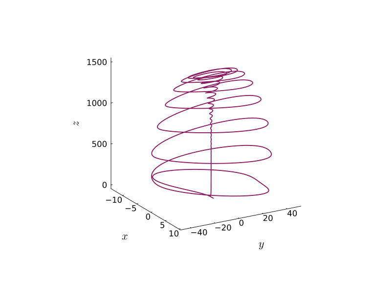 
Fig. 1 shows the post-transient trajectory: a single closed spatial loop, traversed with

📷 Fig 3

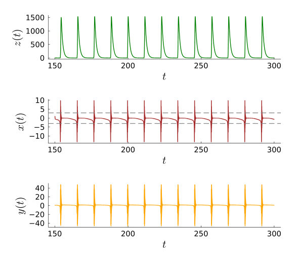 
FIG. 2: Spikes in z(t) recur with period T ∼11, the hallmark of an exactly periodic relaxation

📷 Fig 4

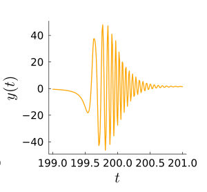 
FIG. 3: x(t), y(t) in a short time window.

📷 Fig 5

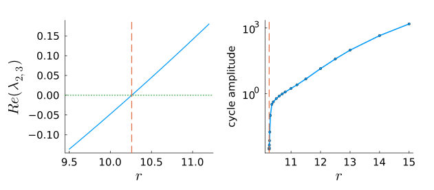 
FIG. 4: (a) Linear stability. Re(λ2,3) from (19), crossing zero at rH = 10.260 (dashed). (b) Canard

**Summary.** This paper modifies the classic Lorenz model to enforce local detailed balance, transforming its dynamics from a chaotic attractor to a stable, periodic relaxation oscillator. This new structure models physical processes that alternate between quiescent recharge periods and intense, irreversible discharge bursts. It provides a rigorous thermodynamic framework for analyzing non-equilibrium steady states in convective systems.

**Why it may be interesting.** The rigorous application of non-equilibrium thermodynamics (detailed balance) to a classical, non-Hamiltonian system like the Lorenz model provides a powerful framework for understanding energy dissipation and irreversible processes in complex physical systems.

Detailed structure

**Main problem.** To determine the thermodynamic consistency of the Lorenz model by modifying it to satisfy the local-detailed-balance condition, thereby identifying the associated thermodynamic force and entropy production.

**Main result.** The modified model replaces the chaotic butterfly attractor with a robust, periodic relaxation oscillation characterized by alternating long, reversible recharge phases and brief, violently frenetic discharge bursts.

**Method.** The authors derived a modified set of equations satisfying local detailed balance, analyzed the system's dynamics using linear response theory, and calculated the entropy production rate.

**Model / system.** The system is based on a modified Lorenz model ($\dot{x}, \dot{y}, \dot{z}$) derived from the original convective instability model, incorporating a thermodynamic force $F$ to enforce local detailed balance.

**Key observables.** Entropy-production rate, thermodynamic force, frenesy, and the transition from a fixed point to a limit cycle.

**Important parameters / regimes.** The bifurcation parameter $r$, and the system parameters $\sigma$ and $
ho$ (or $\sigma$ and $r$ in the modified form).

**Assumptions / limitations.** The primary assumption is the validity of imposing the local detailed-balance condition on the dissipative and driving terms of the Lorenz system.

**Figures summary.** Figures illustrate the trajectory settling onto a single closed loop (limit cycle) and show recurring spikes in the $z(t)$ variable, confirming periodic relaxation oscillations.

**Paper structure.** The paper first derives the modified model satisfying local detailed balance, then analyzes the resulting dynamics showing the transition to a limit cycle, and finally uses linear response theory to calculate the non-zero entropy production associated with the bursting behavior.

Abstract

The Lorenz system is the canonical low-order model of convective instability, yet its dissipative and driving terms have never been checked against, nor constructed from, an explicit thermodynamic bookkeeping. We derive a modification that satisfies the local-detailed-balance condition for macroscopic relaxation toward nonequilibrium steady states, thereby identifying the thermodynamic force, entropy-production rate and frenesy of the resulting flow. The resulting model produces a transition from a quiescent fixed point to a robust, large-amplitude relaxation oscillation, closely analogous to recharge-discharge oscillator paradigms used for the El Nino-Southern Oscillation. The system alternates between a long, nearly reversible recharge phase and a brief, violently frenetic discharge burst, during which essentially all of the cycle's activity and entropy production is concentrated.

[↑ back to top](#top)

### [Resonant spin mode from retarded relaxation](http://arxiv.org/abs/2609.21623v1)

**Authors:** J. Beater, G. S. Uhrig  
**Type:** theory · **Category:** strongly correlated electrons · **PDF:** <https://arxiv.org/pdf/2609.21623v1>  
**Analysis basis:** full PDF text, analyzed in chunks
**Topic relevance:** `correlated / nonlocal dissipation` **3/5** · `methods for driven-dissipative` **3/5** · `Keldysh / 2PI / non-Gaussian methods` **2/5** · `driven-dissipative phase transition` **2/5** · `non-equilibrium universality` **1/5** · `quantum measurements` **1/5**

📷 Fig 1

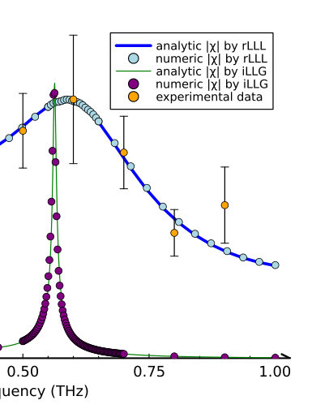 
Fig. 1 Dynamic susceptibility in arbitrary units as measured in epitaxial permalloy in Ref. [32] (yellow circles); as fitted with the iLLG equation (3) with λ = 0.0058 and τi = 49ps (parameters from Ref. [32]) from analytics (green line) and numerics (purple circles); as fitted with retarded LLL equation (7) with λ = 0.0058, τ = 1.26 ps, and ˜γ = 1.28 ps−1.

📷 Fig 2

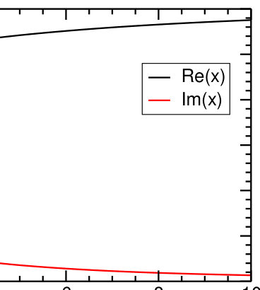 
Fig. 2 First solution x of Eq. (11) as function of the parameter α. The real part defines the oscillabory circular frequency Re(x)/τ while the negative imaginary part determines the decay rate −Im(x)/τ. The relative width of the resonances decreases for increasing α.

📷 Fig 3

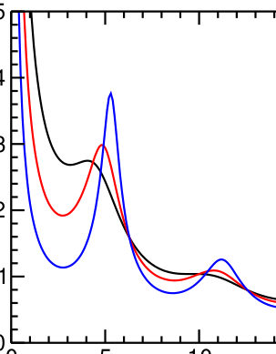 
Fig. 3 The absolute value of the susceptibility (12) is depicted. The resonances are clearly visible as peaks, at least for not too small values of α. The intrinsic width of these peaks results from the one-parameter form of the susceptibility. Strikingly, there occur many additional resonances after the first one which, however, become increasingly broader.

📷 Fig 4

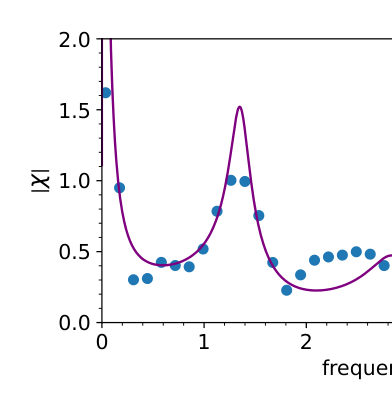 
Fig. 4 Fit to the measured susceptibility data from Unikandanunni et al. [33]. The data was taken from a thin cobalt film of fcc structure. The theory is fitted to the first peak at finite frequency, the subsequent peaks are not fitted. In both data sets the response at low frequencies is deducted to highlight the high-frequency response.

**Summary.** This work addresses the discrepancy between standard spin dynamics models and experimental observations of high-frequency spin resonances. By proposing and analyzing the retarded Lindbladian relaxation model, the authors provide a theoretically robust framework that accurately predicts the characteristic multiple resonance peaks seen in ferromagnetic materials. This advances the understanding of non-Markovian effects in ultrafast magnetism.

**Why it may be interesting.** The incorporation of retarded relaxation mechanisms into magnetization dynamics provides a powerful, non-Markovian extension to standard spin models, which is crucial for accurately describing ultrafast phenomena in spintronics and magnonics.

Detailed structure

**Main problem.** The paper aims to explain additional, high-frequency spin resonance modes observed during ultrafast spin dynamics that cannot be accounted for by standard Landau-Lifshitz-Gilbert equations.

**Main result.** The retarded Lindbladian relaxation model (rLLL equation) successfully predicts the existence of these multiple, equidistant resonance peaks, showing superior agreement with experimental data compared to the inertial LLG approach.

**Method.** The authors derive and analyze the retarded LLL equation by incorporating time retardation into the quantum Lindblad framework, linearizing the resulting differential equations to compute the dynamic susceptibility.

**Model / system.** The study focuses on spin dynamics in thin ferromagnetic films, such as epitaxial permalloy and cobalt, modeled using extensions of the LLG equation, specifically the retarded LLL equation.

**Key observables.** Resonant spin modes in the THz range, the width and frequency of these resonance peaks, and the presence of multiple, equidistant resonance peaks.

**Important parameters / regimes.** Damping parameter ($\lambda$), relaxation rate ($\gamma$), and the retardation time ($	au$ or $	au_i$).

**Assumptions / limitations.** The primary assumption is that the observed dynamics are governed by retarded Lindbladian relaxation, which avoids the limitations of Taylor expansions inherent in the inertial LLG approach.

**Figures summary.** Figures compare the dynamic susceptibility data fitted by the iLLG model versus the retarded LLL model for permalloy and CoFeB films, highlighting the successful fit of the rLLL model to multiple resonance peaks.

**Paper structure.** The paper progresses by first identifying the failure of conventional LLG/iLLG models, proposing the retarded LLL approach based on Lindblad theory, and then validating this model by comparing its predictions for resonance frequencies and peak structures against multiple sets of experimental magnetic susceptibility data.

Abstract

In ultrafast spin dynamics additional modes in the THz range appear which cannot be captured by conventional Landau-Lifshitz equations. Extending these equations by further time derivatives (inertial Landau-Lifshitz-Gilbert equation) solves the issue only partly. Here we suggest to explain these modes by retarded Lindbladian relaxation. In spite of the simplicity of this phenomenological approach the agreement with the experimental data is promising: physically plausible parameters describe the position and the large width of these resonances. The salient feature of several almost equidistant resonance peaks is in-line with experimental evidence as well.

[↑ back to top](#top)

### [Smectic Superconductivity](http://arxiv.org/abs/2609.20932v1)

**Authors:** Grayson R. Frazier, Erez Berg  
**Type:** theory · **Category:** statistical mechanics · **PDF:** <https://arxiv.org/pdf/2609.20932v1>  
**Analysis basis:** full PDF text, analyzed in chunks
**Topic relevance:** `analog quantum simulation` **3/5** · `Keldysh / 2PI / non-Gaussian methods` **2/5** · `correlated / nonlocal dissipation` **2/5** · `driven-dissipative phase transition` **2/5** · `Frenkel-Kontorova` **1/5** · `methods for driven-dissipative` **1/5** · `non-equilibrium universality` **1/5**

📷 Fig 1

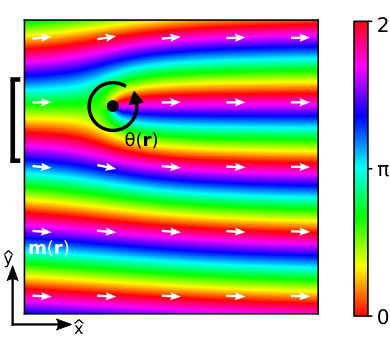 
FIG. 1. Illustration of a vortex in a smectic superconductor. The color represents the superconducting phase. Through the magnetoelectric coupling, the spin polarization of the conden- sate acts as an emergent gauge field for the superconducting phase. The U(1) phase gradient is locked to the transverse nonunitary magnetization, displaying a helical texture with pitch 2π/|λm0|. In absence of in-plane pinning of the trans- verse fluctuations, a vortex defect (black) has finite energy cost and QLRO is destroyed. White arrows indicate the local in-plane magnetization, m(r).

📷 Fig 2

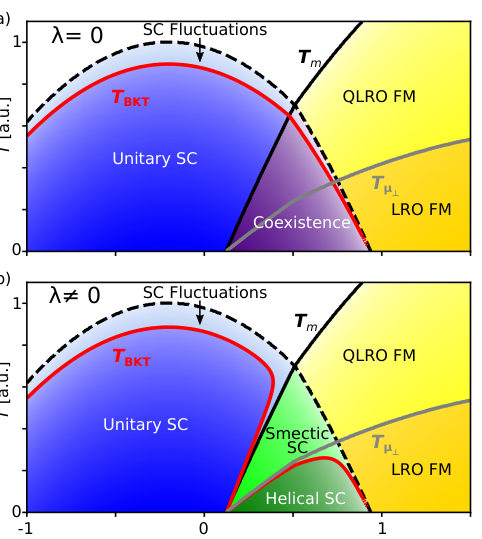 
FIG. 2. Phase diagrams for a Rashba superconductor co- existing with easy-plane ferromagnetism for magnetoelectric coupling (a) λ = 0 and (b) λ ̸= 0, as a function of tem- perature and phenomenological parameter, J. The ferromag- net is assumed to have an in-plane sixfold anisotropy. Dark blue denotes a uniform unitary superconductor, and the light and dark yellow phases denote the QLRO and LRO canted ferromagnetic (FM) phases, respectively. The solid red line denotes the BKT transition, and above, light shading indi- cates a vortex-deconfined regime. The solid black contour denotes Tm which describes the onset of QLRO FM, and the solid gray line, Tµ⊥, separates the QLRO FM from the LRO FM....

📷 Fig 3

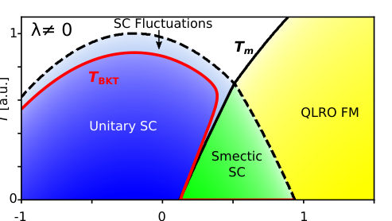 
FIG. 3. Phase diagram in the absence of pinning of the in- plane ferromagnetic order. Because the transverse magnetic mode remains gapless, the estimated BKT transition is sup- pressed to zero temperature. For λ ̸= 0, the smectic su- perconducting phase occupies the entire finite-temperature region of coexistence. Apart from the absence of pinning (Tµ(0) ⊥ = 0), the colors, labels, and parameters are same as

**Summary.** This theoretical work analyzes the interplay between superconductivity and easy-plane ferromagnetism in 2D materials, showing that magnetic fluctuations induce a 'smectic' superconducting state. This state suppresses phase coherence by modifying the superfluid stiffness, leading to a finite vortex energy cost. The restoration of true order requires external pinning mechanisms, providing insight into superconducting phase transitions in magnetically coupled heterostructures.

**Why it may be interesting.** The concept of emergent gauge fields and the resulting smectic phase transition provides a rich analogy for understanding phase coherence loss in coupled quantum systems, which is relevant to superconducting qubits or Josephson junction arrays.

Detailed structure

**Main problem.** The paper investigates how soft nonunitary fluctuations of the pair condensate suppress phase coherence in a 2D Rashba superconductor near easy-plane ferromagnetic order.

**Main result.** This interaction drives the system into a 'smectic' superconducting state, destroying quasi-long-range order at finite temperatures unless weak lattice anisotropy pinning is present.

**Method.** The analysis involves integrating out soft magnetic fluctuations to derive an effective free energy for the superconducting phase, leading to a smectic elasticity description.

**Model / system.** The model is a 2D superconductor coupled to an easy-plane ferromagnet, relevant to rhombohedral graphene on a TMD substrate. The physics is governed by a magnetoelectric coupling term derived from a Lifshitz invariant.

**Key observables.** Superfluid stiffness ($
ho_{x, eff}, 
ho_{y, eff}$), vortex energy cost, and the superconducting phase coherence temperature ($T_{	ext{BKT}}$).

**Important parameters / regimes.** Magnetoelectric coupling strength ($\lambda$), pinning strength ($\mu_\perp$), and the ratio of characteristic length scales ($\xi_{\lambda}$ vs $\xi_{\mu\perp}$).

**Assumptions / limitations.** The analysis relies on expanding the free energy around a magnetized saddle point and treating fluctuations perturbatively.

**Figures summary.** Not specified.

**Paper structure.** The paper progresses by establishing the effective Hamiltonian incorporating magnetoelectric coupling, deriving the smectic elasticity, analyzing the consequences for vortex energy, and finally discussing the restoration of order via pinning mechanisms.

Abstract

We identify a mechanism in which soft nonunitary fluctuations of the pair condensate can suppress phase coherence in a two-dimensional Rashba superconductor proximate to easy-plane ferromagnetic order. This spin polarization couples linearly to the supercurrent through a Lifshitz invariant, acting as an emergent gauge field for the superconducting $\mathrm{U}(1)$ phase. Integrating out soft magnetic fluctuations renormalizes the effective superfluid stiffness and drives the system into a "smectic" superconducting state, characterized by a finite-momentum helical phase texture and a long-wavelength stiffness that vanishes in one direction. Consequently, vortices no longer have a logarithmically divergent energy cost, and the quasi-long-range superconducting order is destroyed at any finite temperature. Weak lattice anisotropy pins the ferromagnetic order, cutting off the smectic-like behaviour at long wavelengths and thereby restoring a finite effective stiffness. Nonetheless, near the onset of magnetic order, the enhanced magnetic susceptibility leads to a vortex-deconfined regime for arbitrarily weak magnetoelectric coupling. The results provide insight into how intertwined superconducting and easy-plane ferromagnetic orders can reshape phase coherence, with relevance to rhombohedral graphene proximitized by a transition-metal dichalcogenide substrate.

[↑ back to top](#top)

### [Analytic results for thermal correlation enhancement after a trap quench](http://arxiv.org/abs/2609.21128v1)

**Authors:** Giorgio Li, Paola Ruggiero, Stefano Scopa  
**Type:** theory · **Category:** statistical mechanics · **PDF:** <https://arxiv.org/pdf/2609.21128v1>  
**Analysis basis:** full PDF text, analyzed in chunks
**Topic relevance:** `non-equilibrium universality` **3/5** · `scars & prethermalization` **3/5** · `Keldysh / 2PI / non-Gaussian methods` **2/5** · `analog quantum simulation` **2/5** · `methods for driven-dissipative` **1/5**

📷 Fig 1

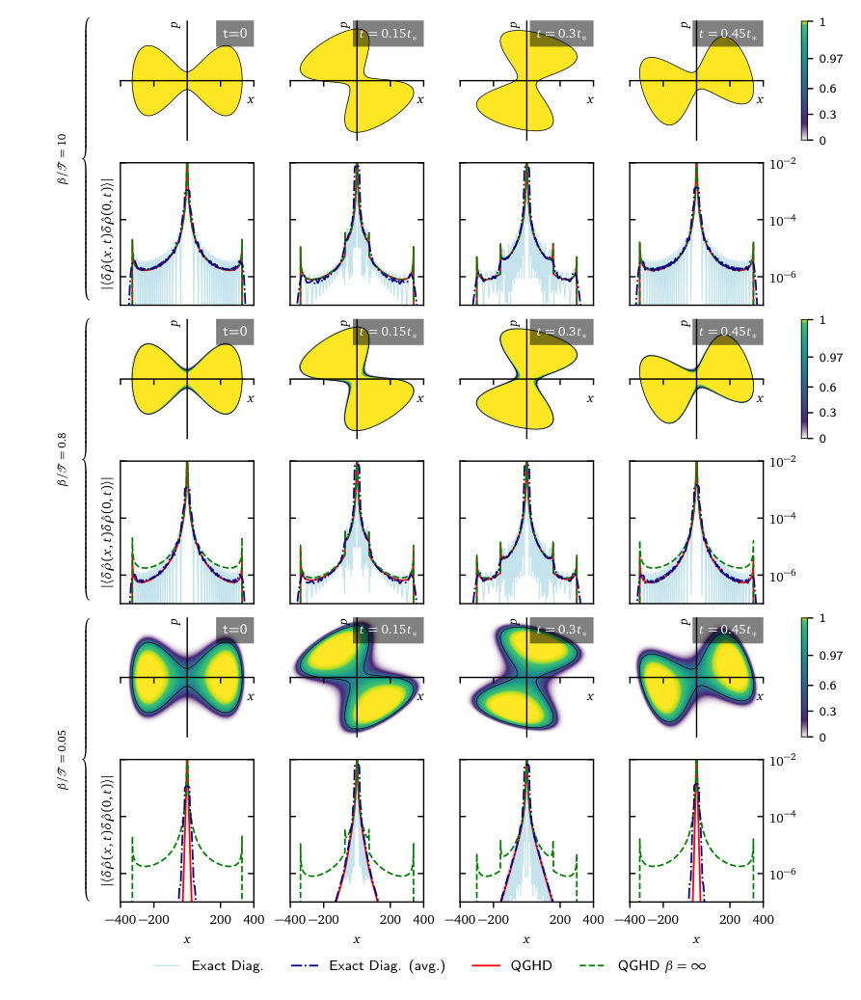 
Figure 1. Occupation function and density-density correlations after a double-well to harmonic quench for three temperature regimes. Each two-row block shows the occupation function nt;β(x, p) in phase space (upper row) and the corresponding density-density correlation on a logarithmic scale (lower row) at different times. The exact lattice results are shown in light blue and with their short-wavelength oscillations averaged out in dark blue. These are compared with the QGHD predictions at zero temperature (green) and finite temperature (red). Low-temperature regime, β/T = 10: the zero-temperature and finite-temperature curves are indistinguishable from each other. Intermediate regime, β/T...

📷 Fig 2

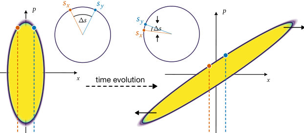 
Figure 2. Illustration of the correlation-enhancement mechanism. We consider the expansion of the phase-space occupation nt(x, p) shown on the left, and focus on two fixed spatial positions x and y, at which we wish to characterize the density correlations. Such real-space positions are mapped onto a unit circle in terms of contour coordinates, sx and sy respectively for the upper branch. During the evolution, the contour separation ∆s decreases with time. As a result, the bulk correlations become asymptotically sensitive only to the short-distance sector of the CFT.

📷 Fig 3

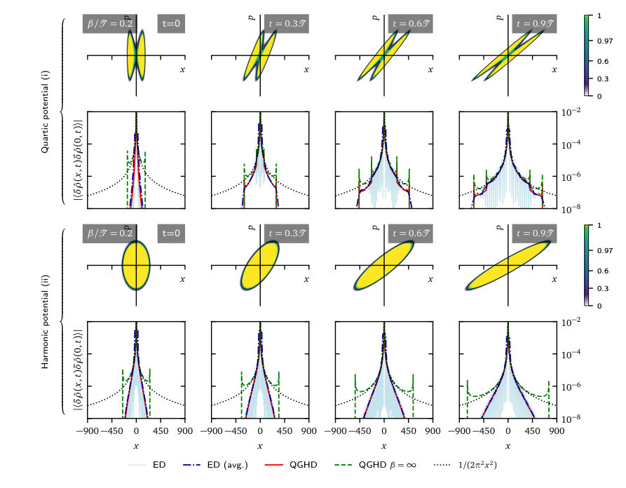 
Figure 3. Trap release in the finite-temperature regime (β/T = 0.2) from two pre-quench potentials: (i) a double-well quartic potential, V0 = a4x4 −a2x2, with system size L = 1801; number of particles N = 22; pre-quench parameters a2 = 1/ℓ2, a4 = 6/ℓ4, ℓ= 401; and (ii) a harmonic potential, V0 = a2x2, with system size L = 1801; number of particles N = 50; pre-quench parameter a2 = 1/ℓ2, ℓ= 901. The parameters are chosen such that the gas remains within the lattice throughout the expansion, ensuring that finite-size effects do not affect the results. Each two-row block shows the occupation function nt;β(x, p) in phase space (upper row) and the corresponding density-density correlation on a...

**Summary.** This work analytically describes how density correlations evolve in a 1D Bose gas after a sudden quench. By extending Quantum Generalized Hydrodynamics to finite temperatures, the authors show that in the long-time hydrodynamic limit, the correlations forget their initial temperature and approach the universal zero-temperature equilibrium form. This provides a deep understanding of thermalization dynamics in strongly interacting quantum gases.

**Why it may be interesting.** It provides a powerful, analytical tool (finite-T QGHD) to study how thermal initial conditions decay or approach universal zero-temperature limits during non-equilibrium dynamics, which is crucial for understanding thermalization in 1D quantum systems.

Detailed structure

**Main problem.** The paper investigates the non-equilibrium evolution of density correlations in a thermal one-dimensional Bose gas following a sudden quench of the confining potential.

**Main result.** The bulk density correlations approach their zero-temperature equilibrium form in the hydrodynamic long-time regime, independent of the initial temperature.

**Method.** The authors develop an analytical description using a finite-temperature extension of Quantum Generalized Hydrodynamics (QGHD) and map the problem onto a Conformal Field Theory (CFT).

**Model / system.** The system is a 1D Bose gas with repulsive interactions, studied in the Tonks-Girardeau (TG) limit. The quench involves changing the confining potential from an initial state to a final state (e.g., harmonic trap or trap release).

**Key observables.** The two-point density-density correlation function, $\langle \hat{
ho}(x) \hat{
ho}(y) 
angle$, and the associated chiral-current correlator.

**Important parameters / regimes.** Temperature ($eta$), interaction strength ($g$), and time ($t$). The analysis focuses on the hydrodynamic long-time limit.

**Assumptions / limitations.** The analysis relies on the strong-repulsion (Tonks-Girardeau) limit, which allows the mapping to a quadratic Hamiltonian solvable via QGHD/CFT.

**Paper structure.** The paper develops the QGHD framework for finite temperatures, analyzes the evolution of density fluctuations using a coarse-grained occupation function, and derives the long-time asymptotic behavior of the correlation function for specific quench protocols like trap release.

Abstract

We investigate the nonequilibrium evolution of density correlations in a thermal one-dimensional Bose gas following a trap quench. We focus on the Tonks--Girardeau limit and develop an analytical description based on a finite-temperature extension of Quantum Generalized Hydrodynamics. We benchmark our predictions against exact numerics for a quench from a double well to a harmonic trap and for a trap release, and assess their temperature range of validity. Our results capture the dynamical enhancement of correlations during the expansion stages, namely the crossover from thermally suppressed to power-law bulk correlations. For the trap release, the conformal distance associated with fixed bulk points decreases as $1/t$, so the correlations progressively probe a universal regime~$\sim1/x^2$ that is independent of temperature. We thus show that, in the hydrodynamic long-time regime, the bulk density correlations approach their zero-temperature equilibrium form independently of the initial temperature.

[↑ back to top](#top)

### [Persistent Quantum-Enhanced Frequency Sensing with T^{-3/2} Scaling](http://arxiv.org/abs/2609.22046v1)

**Authors:** Clayton Z. C. Ho, Hao Wu, Grant D. Mitts, Joshua A. Rabinowitz, Eric R. Hudson  
**Type:** experiment · **Category:** other · **PDF:** <https://arxiv.org/pdf/2609.22046v1>  
**Analysis basis:** full PDF text, analyzed in chunks
**Topic relevance:** `QC/QI experiment` **3/5** · `quantum measurements` **3/5** · `quantum optics experiment` **3/5** · `interference shaping light` **1/5**

📷 Fig 1

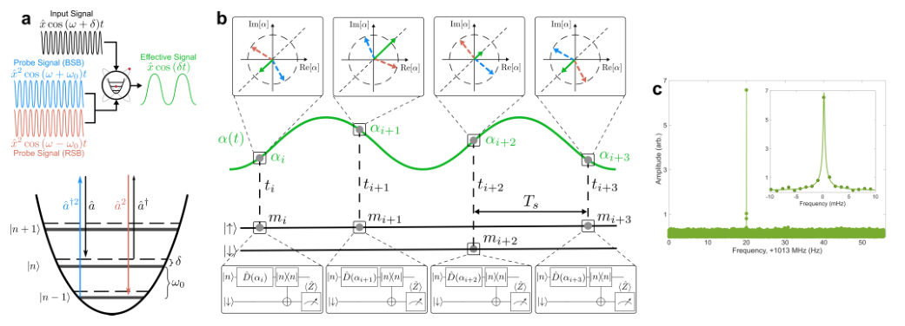 
FIG. 1. Quantum-enhanced Qdyne on a trapped-ion quantum harmonic oscillator (QHO). (a) Quantum frequency downconversion via motional Raman excitation. Quadrupole probe tones at ωd ±ω0 (blue, red) mix with a dipole signal tone at ωd+δ (black), driving interfering two-phonon Raman pathways that produce a displacement ˆD(α) whose amplitude oscillates at a baseband detuning δ (green). (b) Stroboscopic sampling of the downconverted signal for Qdyne. The QHO probes the signal with measurements of duration τ, repeated with sample period Ts; phase-tracking of tones against a fiducial reference ensures mutual coherence of successive measurements. At each instance ti, the red- and blue-sideband Raman...

📷 Fig 2

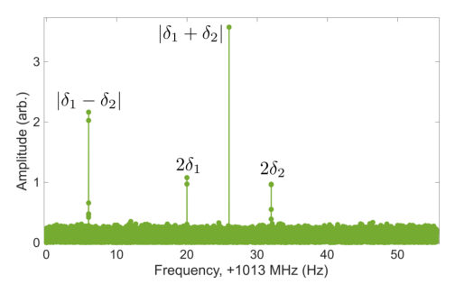 
FIG. 2. Simultaneous reconstruction of a multi-tone spectrum. Two equal-amplitude dipole tones at ωd/(2π) = 1013 MHz are heterodyned to δ1,2/(2π) = 10 Hz and 16 Hz and sampled; acquisition parameters follow Figure 1(c). Overlap readout responds to |α(t)|2 = P

📷 Fig 3

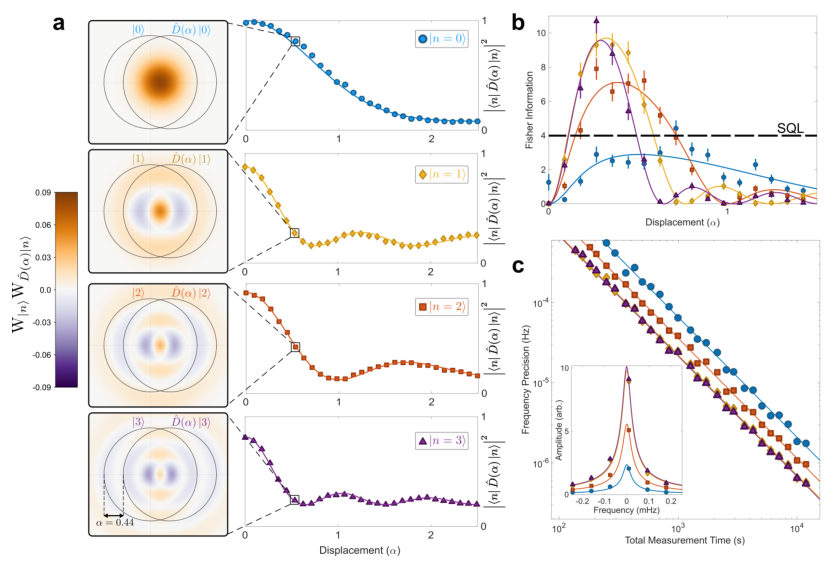 
FIG. 3. Quantum-enhanced Qdyne extends metrological gain to arbitrarily long measurement times. Colors denote measurements on the n = 0 (blue circles), n = 1 (yellow diamonds), n = 2 (orange squares), and n = 3 (purple triangles) Fock states. (a) The overlap response (eq. (5)) sharpens with n and becomes non-injective as Wigner negativity allows overlap to vanish before states fully separate [6]. Solid curves are fits to eq. (5) with additional factors to account for protocol infidelities (Section C). Insets show the product W|n⟩W ˆ D(α)|n⟩at α = 0.44, which is integrated to yield the overlap; 90% contours of the |n = 0⟩Wigner function (solid, black) are shown for scale. Points represent...

**Summary.** This paper reports a breakthrough in quantum sensing by developing and demonstrating a Quantum Heterodyne (Qdyne) protocol on trapped $^{40}	ext{Ca}^+$ ions. This technique successfully decouples the measurement sensitivity from the decoherence time, allowing quantum-enhanced frequency precision to persist over extremely long timescales. The results confirm a T^{-3/2} scaling and achieve state-of-the-art fractional precision, opening new avenues for nanoscale spectroscopy.

**Why it may be interesting.** This work directly addresses the fundamental trade-off between quantum enhancement and decoherence in quantum metrology, providing a robust experimental technique (Qdyne) applicable to trapped ions and extending operation into higher frequency regimes.

Detailed structure

**Main problem.** The primary challenge in quantum sensing is that the nonclassical states providing metrological gain also decohere rapidly, limiting the usable interrogation time and preventing ultimate sensitivity improvement.

**Main result.** The authors demonstrated persistent quantum advantage by implementing a Quantum Heterodyne (Qdyne) protocol combined with Fock-state enhancement on a trapped ion, achieving frequency precision scaling as T^{-3/2} far beyond the dephasing limit.

**Method.** They utilized a Qdyne protocol, which decouples the short-time interrogation ($	au$) from the long-term measurement accumulation time ($T$), allowing for enhanced sensitivity measurement.

**Model / system.** The experiment was performed on the motional mode of a trapped $^{40}	ext{Ca}^+$ ion, using the quantum harmonic oscillator (QHO) as the sensing platform. The protocol involves motional Raman transitions to heterodyne the signal.

**Key observables.** Frequency precision ($\sigma_{\delta}/(2\pi)$), quantum-enhanced gain (in dB), and the scaling of precision with total measurement time ($T^{-3/2}$).

**Important parameters / regimes.** Fock state index ($n=3$), measurement time ($T$), interrogation time ($	au$), and the carrier frequency (86 MHz).

**Assumptions / limitations.** The readout relies on projecting the motional state onto a Fock state, and the analysis assumes the Qdyne protocol successfully decouples sensitivity from decoherence time.

**Figures summary.** Figures illustrate the Qdyne setup, showing signal reconstruction via motional Raman excitation, and demonstrate the sharpening of the overlap response and the T^{-3/2} scaling of frequency precision versus measurement time.

**Paper structure.** The paper first introduces the Qdyne protocol to overcome decoherence limits, details the implementation on trapped ions using motional Raman transitions, presents the quantitative results showing T^{-3/2} scaling and high precision, and concludes with implications for long-term quantum sensing.

Abstract

Quantum sensing uses nonclassical states to improve measurement sensitivity, but the same states that provide metrological gain also decohere more rapidly. This limits the usable interrogation time and, in practice, often precludes improvement in ultimate sensitivity - realized useful quantum advantage has consequently remained rare. Here, we restore persistent quantum advantage by embedding Fock-state enhancement within a quantum heterodyne (Qdyne) protocol, decoupling sensitivity from the decoherence-limited interrogation time τ. Measurements are acquired at short τ where the quantum-enhanced gain is optimal, while precision accumulates with the total measurement time. Demonstrated on the motional mode of a trapped 40Ca+ ion, we observe quantum-enhanced precision that persists to measurement times seven orders of magnitude beyond the dephasing limit, scaling as T^{-3/2} with no indication of saturation. Using the n=3 Fock state, we reach a frequency precision of 0.5uHz relative to an 86MHz carrier, achieving a fractional precision ~6x10^{-15}. This represents a quantum-enhanced gain of 7.1(10) dB over the n=0 state, in agreement with Fisher information predictions. This is the first demonstration of Qdyne beyond solid-state spin-defects. Further, by using the quantum harmonic oscillator to perform frequency mixing, we extend operation beyond 1GHz, two orders of magnitude above the ceiling of pulsed dynamical-decoupling implementations. These results recover quantum advantage at the long timescales required to improve ultimate sensitivity, with direct implications for nanoscale NMR and quantum logic spectroscopy.

[↑ back to top](#top)

### [A memory-information window in finite-duration quantum control](http://arxiv.org/abs/2609.21380v1)

**Authors:** Doyeol, Ahn  
**Type:** theory · **Category:** quantum information and computing · **PDF:** <https://arxiv.org/pdf/2609.21380v1>  
**Analysis basis:** full PDF text, analyzed in chunks
**Topic relevance:** `methods for driven-dissipative` **3/5** · `quantum measurements` **3/5** · `correlated / nonlocal dissipation` **1/5** · `driven-dissipative phase transition` **1/5**

📷 Fig 1

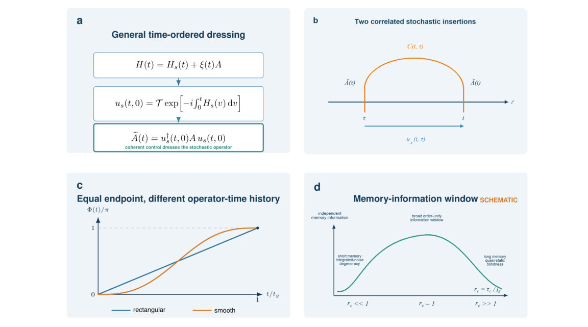 
Fig. 1 | Time-ordered control dressing of correlated stochastic interactions. a, A time-dependent coherent propagator dresses the stochastic coupling operator without assuming commuting Hamiltonians. b, Environmental correlation connects stochastic insertions at two times while coherent evolution fixes the operator orientation at each insertion. c, Equal-endpoint rectangular and smooth Xπ controls realize the same final unitary but different accumulated-phase histories; the panel compares temporal weighting along the same operator path, not different geometric paths. d, Short-memory integrated-noise degeneracy and long-memory quasi-static blindness bound a broad, order-unity...

📷 Fig 2

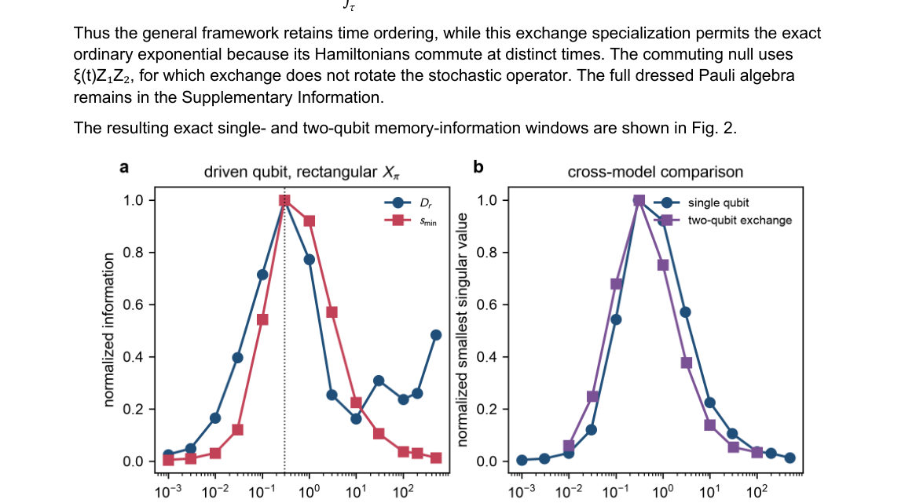 
Fig. 2 | Exact memory-information windows. a, Normalized correlation-time derivative and smallest PTM- Jacobian singular value for a rectangular single-qubit Xπ gate at λ=0.084. b, Peak-normalized smallest singular values for the single-qubit and full informative two-qubit maps. Raw values are not compared across dimensions.

📷 Fig 3

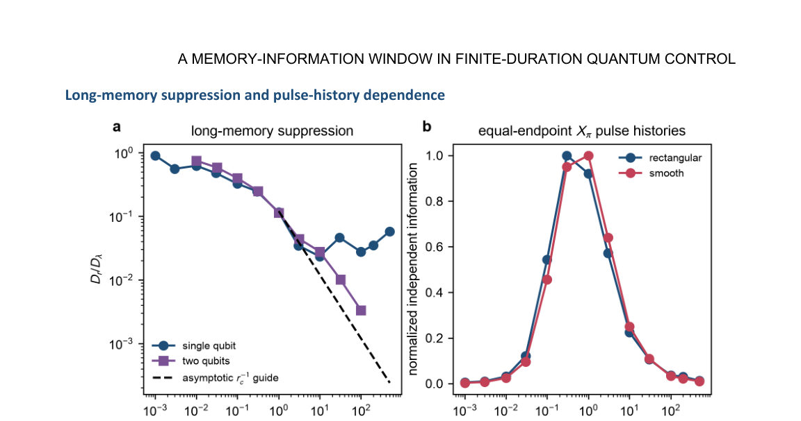 
Fig. 3 | Asymptotic loss and control-history dependence. a, Exact 𝑫𝒓/𝑫𝝀 ratios. A finite-range log–log fit for the single-qubit rectangular control at 𝒓𝒄 = 1, 3 and 10 gives a slope of approximately −0.69. The two-qubit exchange calculation shows the same qualitative long-memory suppression. The dashed 𝒓𝒄

📷 Fig 4

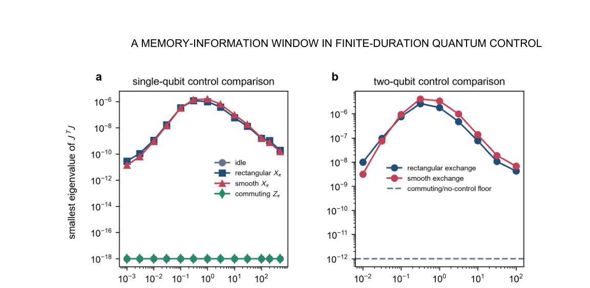 
Fig. 4 | Control-induced memory observability. a, Single-qubit smallest eigenvalue of JTJ for idle, noncommuting Xπ and commuting Zπ controls. b, Two-qubit exchange controls with the commuting/no-control level at the numerical floor.

📷 Fig 5

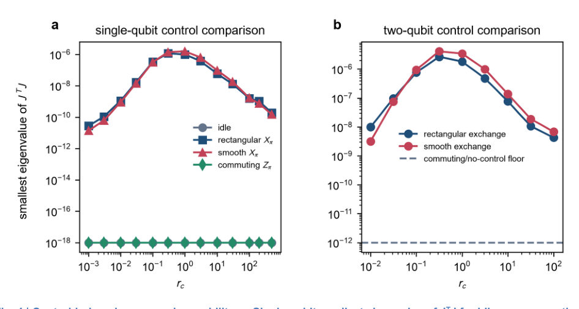 
Fig. 5 | Gate-duration scaling and direct exact-OU validation. a, Dashed curves are peak-normalized interpolants for 𝑿𝝅 gates with 𝒕𝒈=0.5, 1 and 2; markers with Monte Carlo standard errors are new direct physical-parameter

**Summary.** This paper develops a theoretical framework to probe environmental memory in quantum systems using coherent control. By analyzing the process map's dependence on noise correlation time ($	au_c$) versus gate duration ($t_g$), the authors identify a 'memory-information window.' This window shows that optimal noise characterization occurs when the environmental and control timescales are comparable.

**Why it may be interesting.** This work provides a concrete, measurable principle—the timescale-matching principle—for designing quantum experiments to characterize complex, realistic noise environments beyond simple Markovian assumptions.

Detailed structure

**Main problem.** The paper investigates how the finite correlation time of environmental noise (non-Markovianity) can be experimentally detected using coherent quantum control protocols.

**Main result.** The ability to extract information about the noise correlation time is maximized when the environmental and control timescales are comparable, defining a 'memory-information window.'

**Method.** The authors use exact stochastic trajectory calculations and analyze the parameter identifiability of the quantum process map by examining the Jacobian matrix of the process evolution.

**Model / system.** The system involves quantum control operations (e.g., single-qubit rotations, two-qubit gates) subjected to non-Markovian environmental noise, modeled using the Ornstein-Uhlenbeck process.

**Key observables.** Process map elements, Pauli-transfer matrix (PTM) elements, and the smallest singular value of the process Jacobian.

**Important parameters / regimes.** Noise variance ($\sigma^2$), correlation time ($	au_c$), and gate duration ($t_g$), analyzed via the dimensionless ratio $	au_c/t_g$.

**Assumptions / limitations.** The noise is modeled as Gaussian noise with a finite correlation time, and the analysis relies on the concept of independent parameter identifiability.

**Figures summary.** Figures illustrate the time-ordered dressing of stochastic interactions, showing the memory-information window, and comparing information observability for different control types (commuting vs. noncommuting).

**Paper structure.** The paper develops the theoretical framework for noise-induced process evolution, analyzes the short-memory and long-memory limits, and uses stochastic simulations to pinpoint the optimal timescale matching for information extraction.

Abstract

Environmental noise is a major source of decoherence and errors in quantum systems. In a non-Markovian environment, the noise has a finite correlation time, and the system can retain information about its previous interactions with the environment. Here, we investigate how such environmental memory can be observed through a finite-duration coherent quantum operation. Coherent control dynamically reshapes the stochastic coupling operator and thereby changes how two-time noise correlations affect the quantum process. For Ornstein-Uhlenbeck noise, we show analytically that two different limits reduce the information on the correlation time. In the short-memory limit, the leading dynamics depend on the integrated-noise combination σ/τc, where σ is the noise variance and τc is the correlation time, making these parameters locally degenerate. In the long-memory limit, the stochastic field becomes quasi-static during the operation, and sensitivity to the correlation time is suppressed. Exact stochastic simulations for a driven single-qubit Xπ rotation and a two-qubit exchange gate show that independent correlation-time information becomes largest between these limits, when the environmental and control timescales are comparable. Noncommuting controls enhance this information, whereas commuting controls do not. Simulations at different gate durations tg further show that the information window approximately follows the dimensionless correlation ratio τc/tg. These results provide a timescale-matching principle for probing finite-correlation non-Markovian noise with coherent quantum control.

[↑ back to top](#top)

### [Guiding Agents of Quantum Games to Equilibrium using Matrix Exponential Fixed-Point Iteration](http://arxiv.org/abs/2609.21944v1)

**Authors:** Alireza Habibi, Luis F. Abanto Leon, Setareh Maghsudi  
**Type:** theory · **Category:** other · **PDF:** <https://arxiv.org/pdf/2609.21944v1>  
**Analysis basis:** full PDF text, analyzed in chunks
**Topic relevance:** `methods for driven-dissipative` **3/5** · `Keldysh / 2PI / non-Gaussian methods` **1/5** · `analog quantum simulation` **1/5** · `driven-dissipative phase transition` **1/5** · `non-equilibrium universality` **1/5** · `quantum measurements` **1/5**

📷 Fig 1

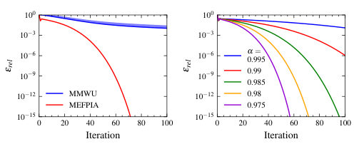 
Fig. 1. Relative error for mini-experiment 1 (left) MMWU (γ = 0.05) and MEFPIA (T0 = 1, α = 0.98) (right) MEFPIA with T0 = 1 with different cooling rates.

📷 Fig 2

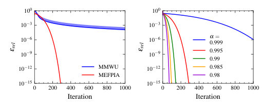 
Fig. 2. Relative error for mini-experiment 2. (left) MMWU (γ = 0.05) and MEFPIA (T0 = 1, α = 0.995) (right) MEFPIA with T0 = 1 with different cooling rates.

📷 Fig 3

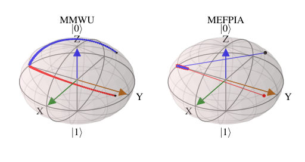 
Fig. 3. Bloch sphere for Prisoner’s Dilemma quantum game with non- entangled outcome. Player 1 is represented by blue color, and player 2 by red color. (left) MMWU (γ = 0.05) and (right) MEFPIA (T0 = 1, α = 0.99)

📷 Fig 4

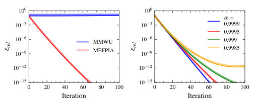 
Fig. 4. Relative error for mini-experiment 3 with entangled outcomes. (left) MMWU (γ = 0.01) and MEFPIA (T0 = 3, α = 0.9995) (right) MEFPIA with T0 = 3 with different values for cooling rate.

📷 Fig 5

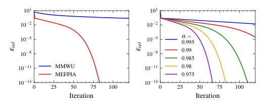 
Fig. 5. Relative error for Experiment 2 with separable outcomes and large system. (left) MMWU (γ = 0.01) and MEFPIA (T0 = 1, α = 0.98) (right) MEFPIA with T0 = 1 with different cooling rates.

**Summary.** This paper tackles the computational bottleneck in quantum game theory by developing tensor-contraction methods to handle large joint Hilbert spaces. It introduces the MEFPIA algorithm, a novel fixed-point iteration technique, which successfully finds quantum game equilibria with superior convergence compared to established methods. This provides a powerful tool for analyzing complex decision-making processes in quantum multi-agent systems.

**Why it may be interesting.** While the core topic is game theory, the reliance on density matrices, entropy, and fixed-point iteration connects to concepts in open quantum systems and non-equilibrium dynamics.

Detailed structure

**Main problem.** The primary challenge addressed is the computational difficulty of finding equilibrium strategies in multi-agent quantum games due to the exponential growth of the joint Hilbert space dimension.

**Main result.** The proposed Matrix Exponential Fixed-Point Iteration with Annealing (MEFPIA) algorithm is shown to be a promising and efficient numerical method for searching for these equilibrium points, achieving lower error in fewer steps than existing methods.

**Method.** The authors derive tensor-contraction expressions for payoff functions and gradients to circumvent explicit construction of the full joint density matrix, and then apply the MEFPIA algorithm.

**Model / system.** The study focuses on the Extended Gutoski-Watrous (EGW) game, where players' quantum strategies are modeled by local density matrices ($
ho$). The system is defined on a joint Hilbert space $H = igotimes_{i=1}^N H(i)$.

**Key observables.** Payoff functions, gradients, relative payoff error, and convergence rate.

**Important parameters / regimes.** Temperature ($T$) used in the annealing process, and the local dimensions of the players' Hilbert spaces.

**Assumptions / limitations.** The analysis relies on simplifying the calculation of traces and gradients using tensor contraction rules to manage computational complexity.

**Paper structure.** The paper builds from the theoretical framework of quantum game theory, details the computational simplification using tensor contractions, proposes the MEFPIA algorithm, and compares its performance against the MMWU algorithm.

Abstract

In recent years, quantum game theory has gained significant attention as a framework for studying decision-making in multi-agent systems using quantum principles. However, computing equilibrium strategies is challenging because the dimension of the joint Hilbert space grows as the product of the players' local dimensions. In this paper, we consider an extended Gutoski-Watrous (EGW) game in which each player's quantum strategy is represented by a local density matrix. We derive tensor-contraction expressions for the payoff functions and their gradients, thereby avoiding the explicit construction of the full joint density matrix and its computationally expensive multiplication by the payoff operators. Building on the resulting effective Hamiltonians, we propose the Matrix Exponential Fixed-Point Iteration with Annealing (MEFPIA) algorithm to search for equilibrium points in EGW games. We compare MEFPIA with the Matrix Multiplicative Weights Update (MMWU) algorithm in terms of convergence. For the tested instances and parameter settings, both algorithms approach the same strategy profiles and payoffs, while MEFPIA achieves lower relative error in fewer iterations. These results indicate that MEFPIA is a promising numerical method for equilibrium search in multi-agent quantum games. Our findings provide important insights into the quantum game theory's potential for addressing complex decision-making processes, as well as opening up new paths for future research and exploration in multi-agent quantum systems.

[↑ back to top](#top)

### [Optimal control for duty-cycle-limited interferometry with single-NV centers](http://arxiv.org/abs/2609.21501v1)

**Authors:** Ugur Tamer, Sina Zeytinoglu, Ozgur E. Mustecaplioglu  
**Type:** theory · **Category:** other · **PDF:** <https://arxiv.org/pdf/2609.21501v1>  
**Analysis basis:** full PDF text, analyzed in chunks
**Topic relevance:** `quantum measurements` **3/5** · `QC/QI experiment` **2/5** · `methods for driven-dissipative` **2/5** · `driven-dissipative phase transition` **1/5**

📷 Fig 1

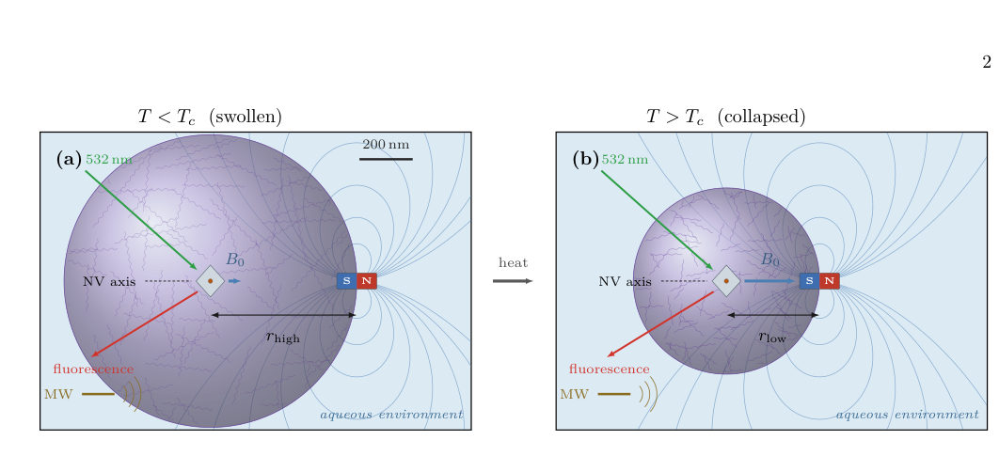 
FIG. 1. Schematic of the hydrogel-transduced single-NV sensor in its two limiting states. (a) Below the critical temperature the polymer network is hydrated and swollen, holding the surface-bound nanomagnet at a separation rhigh from the NV center in the nanodiamond. (b) Heating through the volume phase transition collapses the network to rlow, which brings the magnet closer and raises the dipolar field at the NV as r−3 following Eqs. (2) and (3); for the radii used here this is a 3.9-fold enhancement. The magnetic moment lies along the NV–magnet separation vector, so B0 is parallel to the NV symmetry axis and Eq. (1) applies with no projection factor. Green and red arrows mark optical...

📷 Fig 2

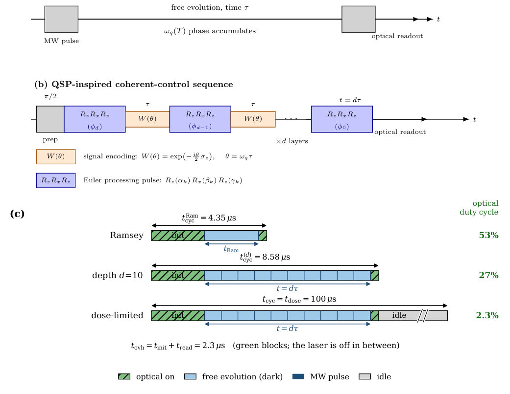 
FIG. 2. Pulse sequences and the measurement cycle. (a) Ramsey protocol: an initial π/2 pulse, free evolution under ωq(T) for time τ, and a final π/2 readout pulse. (b) Coherent-control protocol following Eq. (7): Euler processing pulses Rz(αk)Rx(βk)Rz(γk) interleaved with free-evolution blocks W(θ), proceeding from ϕd down to ϕ0, giving a total interrogation time t = dτ. (c) One full experimental cycle for both protocols, drawn to scale with tinit = 2.0 µs, tread = 0.3 µs and tp = 25 ns for the illustrated π/2 pulses; the rate calculations below conservatively assign tp = 50 ns to each processing block unless stated otherwise. Optical excitation enters only through initialization and...

📷 Fig 3

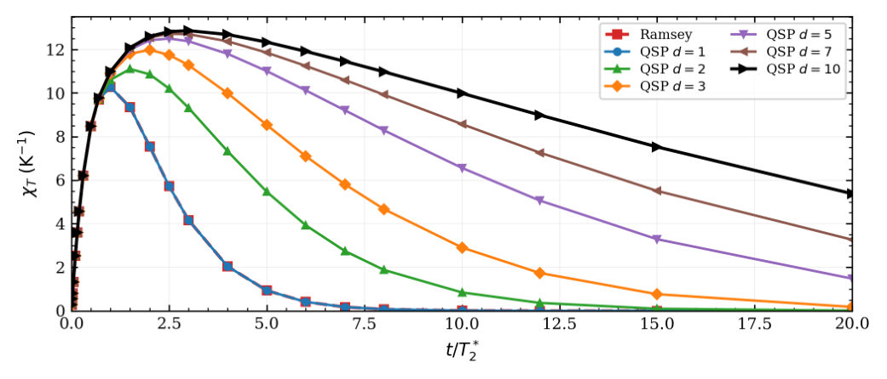 
FIG. 3. Thermal spin susceptibility χT = |∂T ⟨σz⟩| as a function of normalized interrogation time t/T ∗ 2 for phase-optimized Ramsey (red squares) and QSP-inspired coherent-control sequences with d = 1, 2, 3, 5, 7, 10 layers (circles). The controlled response increases with depth and shifts to longer nominal interrogation time, reaching a finite-depth ceiling near 13 K−1. The large equal-time separation at long times is interpreted in Sec. IV H through the optimized state trajectory. All simulations use the full Lindblad master equation at T = 305.0 K.

📷 Fig 4

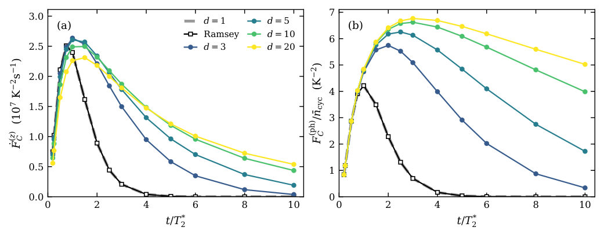 
FIG. 4. (a) Binary Fisher-information rate ˙F (z) C and (b) photon-normalized Fisher information F (ph) C /¯ncyc for Ramsey and QSP-inspired coherent-control sequences. The d = 1 sequence reproduces the Ramsey baseline; the two are drawn separately for visibility. Panel (a) includes the finite pulse duration tp = 50 ns through the cycle time of Eqs. (14)–(15), while panel (b) shows the per-detected-photon gain. Both axes are linear, so the comparison that matters operationally is visible directly: every protocol peaks at nearly the same rate, within 8% of Ramsey, and the depth only moves where that peak sits. The long-time separation is a decay of the Ramsey reference, not a rate advantage.

📷 Fig 5

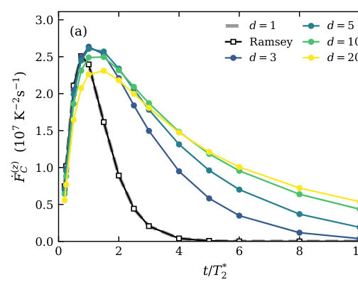 
Figure 4(b) shows the photon-normalized Fisher infor- mation of Eq. (24). Because the optimum lies at z ≃0 for both protocols, ¯n is common to the two, and Eq. (23) then gives F (ph) C /¯n ∝(∂T z)2, so Eq. (28) applies. The photon-budget result restates the per-shot gain: the se- quence realizes it at the same detected-photon budget per shot, so the gain carries over one-to-one into information per detected photon. This photon-budget result belongs to the pulsed single- NV model. The control gain is obtained at the same detected-photon budget per shot as optimized Ramsey.

**Summary.** This paper develops an optimal control strategy for enhancing temperature sensing using single NV centers coupled to hydrogels. By implementing QSP-inspired coherent control sequences, the authors demonstrate a significant gain in measurement sensitivity (up to 60% in Fisher information) compared to standard Ramsey methods. This shows that optimizing the measurement sequence, rather than just the physical setup, is crucial for high-performance quantum sensing in practical settings.

**Why it may be interesting.** This work directly addresses the optimization of quantum sensing protocols in realistic, resource-constrained environments (like biosensing), providing quantitative gains by optimizing the measurement sequence itself.

Detailed structure

**Main problem.** The paper aims to improve the sensitivity of temperature measurements using single Nitrogen-Vacancy (NV) centers in hydrogels, particularly when the measurement is limited by the duty cycle.

**Main result.** The authors achieved a reproducible 25–27% per-shot sensitivity gain over optimized Ramsey interrogation, corresponding to a 57–60% gain in Fisher information.

**Method.** They employed quantum control techniques, specifically QSP-inspired coherent control, applied to a pulsed single-NV measurement sequence.

**Model / system.** The system involves single NV centers coupled to stimulus-responsive hydrogels, which transduce temperature changes into magnetic field shifts. The physics is modeled using a sigmoidal volume-phase-transition model and simulated via Lindblad master equations.

**Key observables.** Per-shot sensitivity gain, Fisher information gain, and the rate gain governed by the measurement duty cycle.

**Important parameters / regimes.** The advantage is most pronounced when the dephasing time ($T_2$) is short compared with the measurement overhead or dose-limited waiting time.

**Assumptions / limitations.** The analysis assumes a point-dipole magnetic field and that the primary decoherence mechanism is dephasing ($\sigma_z$).

**Figures summary.** Figures illustrate the schematic of the sensor (hydrogel states), the comparison of signal envelopes (calibrated vs. uncalibrated), and global gain maps showing the dependence on control depth and time.

**Paper structure.** The paper develops the theoretical framework by modeling the temperature-to-field transduction, comparing standard Ramsey interrogation against optimized coherent control protocols, and deriving the resulting sensitivity gains.

Abstract

Stimulus-responsive hydrogels convert temperature changes into magnetic-field shifts detectable by nitrogen-vacancy (NV) centers, enabling nanoscale thermometry in soft and biological environments. Existing hydrogel-nanodiamond demonstrations rely on NV ensembles, whose high photon throughput is accompanied by gradient-induced inhomogeneous broadening, while idealized single-NV projections assume high-fluence fluorescence/ODMR readout. Here we study a pulsed single-NV route for the same class of sensors and ask whether decoherence-aware coherent control can improve thermometric performance over optimized Ramsey interrogation at equal detected-photon budget. Using a sigmoidal volume-phase-transition model, dipolar magnetic transduction, and Lindblad master-equation simulations, we find a reproducible 25-27% per-shot sensitivity gain over optimized Ramsey, i.e., a 57-60% gain in Fisher information (1.57-1.60). The same gain carries over to the photon-normalized Fisher information. The rate gain is governed by the measurement duty cycle, the fraction of the experimental cycle spent accumulating signal rather than initializing, reading out or waiting, and becomes largest when the overhead or optical-dose constraint dominates the cycle time. The optimized trajectories reveal a response-shaping mechanism in which phase accumulation is concentrated near the end of the sequence, and a closed-form depth-two solution reproduces the numerical optimum and exhibits that mechanism analytically. The advantage is most pronounced when the dephasing time is short compared with the measurement overhead or dose-limited waiting time, which is the operating regime targeted by hydrogel-transduced single-spin biosensing.

[↑ back to top](#top)

### [Single-atom-based asynchronous photonic interconnect for scalable modular quantum computing](http://arxiv.org/abs/2609.21961v1)

**Authors:** Jérémy Raskop, Nadav Kandel, Yaniv Amichy, Yaron Jarach, Tal Kanonich, Andrei Militaru, Johannes Fink, Barak Dayan  
**Type:** theory · **Category:** quantum information and computing · **PDF:** <https://arxiv.org/pdf/2609.21961v1>  
**Analysis basis:** full PDF text, analyzed in chunks
**Topic relevance:** `Tavis-Cummings & cavity-many-emitter` **3/5** · `analog quantum simulation` **2/5** · `quantum measurements` **2/5** · `correlated / nonlocal dissipation` **1/5**

📷 Fig 1

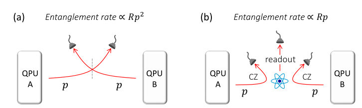 
Fig 1 Scaling of the entanglement rate. (a) In conventional type-II fusion, quantum processing units A and B must each successfully deliver a photon in the same attempt. If each does so with probability p at attempt rate R, the entanglement rate scales as Rp2. (b) Using a photon–atom controlled-Z gate, a midpoint atomic qubit memory preserves the entanglement established by whichever photon arrives first while the other QPU continues attempting. If the system coherence time allows a sufficiently long waiting window, the same-attempt requirement is removed and the entanglement rate approaches the linear scaling Rp.

📷 Fig 2

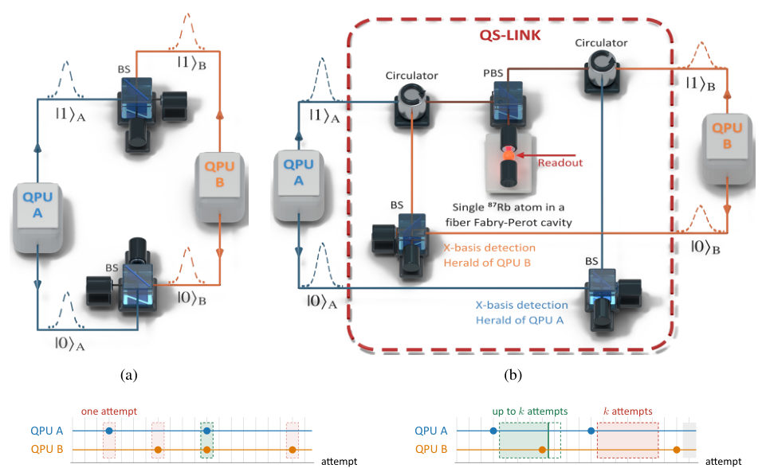 
Fig 2 Type-II fusion and atomic-qubit-based Bell-state measurements. (a) Linear-optics BSM. Photons from both QPUs must arrive at the interconnect in the same attempt. (b) Memory-assisted atom–cavity BSM. For each photon, the |0p⟩rail bypasses the cavity, while the |1p⟩rail is reflected from it and acquires an atom-state-dependent phase, implementing the controlled-Z gate. A circulator directs the reflected rail to a balanced beam splitter, where it interferes with the bypassed rail. Detection at either output supplies the herald, and the output port identifies the X- basis outcome. Atomic read-out completes the BSM after a photon from each QPU has been detected and measured. (c) Example...

📷 Fig 3

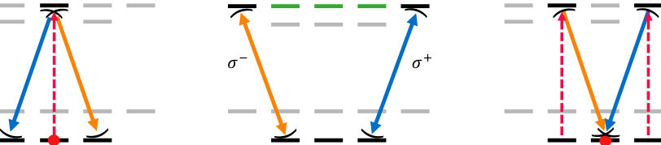 
Fig 3 Atomic transitions used by the cavity-QED memory. (a) Preparation. A π-polarized pulse (dashed red) excites the atom from the |F = 1, mF = 0⟩ground state. Subsequent decay through the cavity-enhanced σ−and σ+ channels (orange and blue, respectively) prepares the atomic qubit in a superposition of |0a⟩and |1a⟩. (b) CZ gate. The two atomic qubit states couple to separate excited states through the cavity-enhanced σ−and σ+ transitions. A resonant 1324 nm level-engineering field (green) dresses the central |F ′ = 2, mF = 0⟩excited state, suppressing unwanted transitions through it and enabling the atomic-state-dependent cavity response required for the gate. (c) Read-out. A π-polarized...

📷 Fig 4

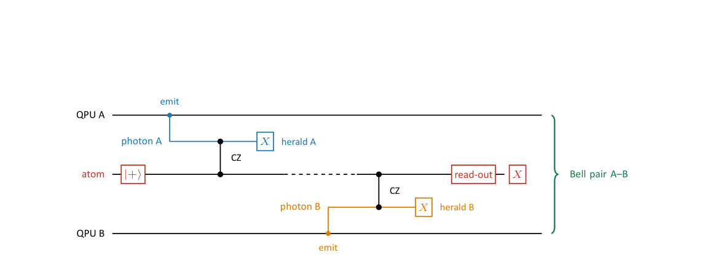 
Fig 4 Circuit representation of the atom-mediated Bell-state measurement. The two photon–atom CZ gates and photonic X-basis measurements establish the two heralds. The dashed portion of the atomic line denotes storage between them, and atomic read-out completes the BSM.

📷 Fig 5

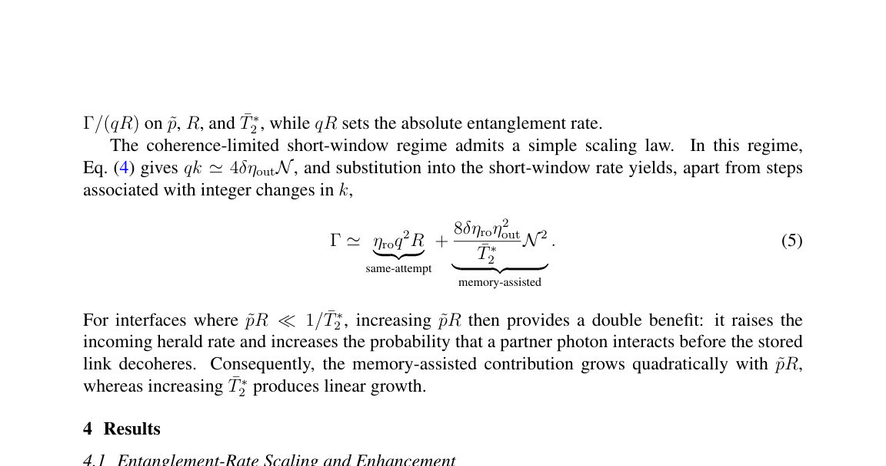 
Figure 5 summarizes how the entanglement rate of the memory-assisted interconnect depends on N and ˜pR, together with its gain over type-II fusion. Panel (a) shows the entanglement rate normal- ized by the per-QPU herald rate, Γ/(qR). At small N, the infidelity budget permits no additional attempt, so k = 0 and only same-attempt heralds contribute. As additional attempts become admis- sible, the memory-assisted contribution grows and the curves for different ˜p gradually converge. At large N, unheralded photon interactions limit the waiting-window length, and the normalized rate approaches a plateau below the unbounded-window limit. For comparison, the entanglement rate for type-II fusion is

**Summary.** This paper proposes a memory-assisted quantum interconnect using a trapped atom in a cavity to link modular quantum processors. By allowing photons to arrive sequentially rather than simultaneously, the protocol achieves a linear scaling of the entanglement rate, dramatically improving scalability over existing quadratic-scaling methods. This breakthrough removes a major bottleneck for building large-scale quantum computers.

**Why it may be interesting.** This work directly addresses a core bottleneck in quantum networking by providing a theoretically derived, high-rate protocol that circumvents the quadratic scaling limitations inherent in standard linear-optics entanglement distribution.

Detailed structure

**Main problem.** Scaling quantum computation requires robust quantum interconnects to distribute entanglement between modular quantum processing units (QPUs).

**Main result.** The proposed memory-assisted interconnect achieves an entanglement rate scaling linearly ($\propto p$) with photon probability, offering orders-of-magnitude improvement over the quadratic scaling ($\propto p^2$) of conventional linear-optics methods.

**Method.** The method utilizes a memory-assisted Bell-State Measurement (BSM) mediated by a single trapped atom in a cavity, allowing for sequential photon detection rather than simultaneous arrival.

**Model / system.** The system involves single trapped neutral atoms (e.g., Rb) coupled to a high-finesse cavity, implementing photon-atom controlled-Z (CZ) gates. The analysis models the rate by accounting for sequential photon interactions and decoherence.

**Key observables.** Entanglement rate ($\Gamma$), infidelity ($\delta_{tot}$), and the scaling dependence on photon delivery probability ($p$).

**Important parameters / regimes.** Photon delivery probability ($p$), cavity cooperativity ($C$), coherence time ($ar{T}^*$), and the total infidelity budget ($\delta$).

**Assumptions / limitations.** The protocol assumes the memory coherence time is long enough to allow for sequential photon arrivals, and the analysis models the total infidelity as a sum of added noise and memory errors.

**Figures summary.** Figures compare entanglement rate scaling ($\propto p^2$ vs. $\propto p$), illustrate the sequential vs. simultaneous arrival process, and show trade-offs between rate and pump power/noise.

**Paper structure.** The paper first establishes the limitation of quadratic scaling in standard interconnects. It then details the memory-assisted protocol using sequential CZ gates. The latter sections focus on rigorous rate derivations, modeling the total infidelity budget, and optimizing operational parameters based on noise trade-offs.

Abstract

Scaling quantum computation beyond the capacity of a single quantum processing unit requires quantum interconnects between modular processors. Optical photons are natural carriers for distributing entanglement between these processors. Most loss-resilient protocols use photonic Bell-state measurements based on the linear-optics type-II fusion gate. The resulting entanglement rate scales quadratically with each processor's typically low photon-delivery probability. Here we analyze a memory-assisted quantum interconnect using a near-deterministic, robust photon--atom controlled-$Z$ gate via a single atom trapped in a high-finesse cavity. Detecting and measuring a photon from one processor heralds entanglement between that processor and the atom. This entanglement is preserved while the process repeats with the second processor until the second photon is detected and measured. Reading out the atomic qubit finalizes the entanglement between the processors. As the entanglement is mediated by the atom, the photons from both processors do not need to be indistinguishable, removing a major source of infidelity. Furthermore, by removing the simultaneous photon-arrival requirement, the protocol allows the entanglement rate to scale linearly rather than quadratically with photon-arrival probability over a wide parameter range. We derive entanglement rates under realistic parameters, accounting for decay of the atom's entanglement with the first processor and for decoherence caused by unheralded photon interactions. The nanosecond-scale of the gate and read-out operations leads to orders-of-magnitude entanglement-rate gain over linear optics, removing a key bottleneck in modular quantum computing.

[↑ back to top](#top)

### [Exact DeWitt kernels in Lorentzian quantum cosmology](http://arxiv.org/abs/2609.21585v1)

**Authors:** Hiroki Matsui  
**Type:** theory · **Category:** other · **PDF:** <https://arxiv.org/pdf/2609.21585v1>  
**Analysis basis:** full PDF text, analyzed in chunks
**Topic relevance:** `Keldysh / 2PI / non-Gaussian methods` **3/5** · `methods for driven-dissipative` **2/5** · `quantum measurements` **2/5**

📷 Fig 1

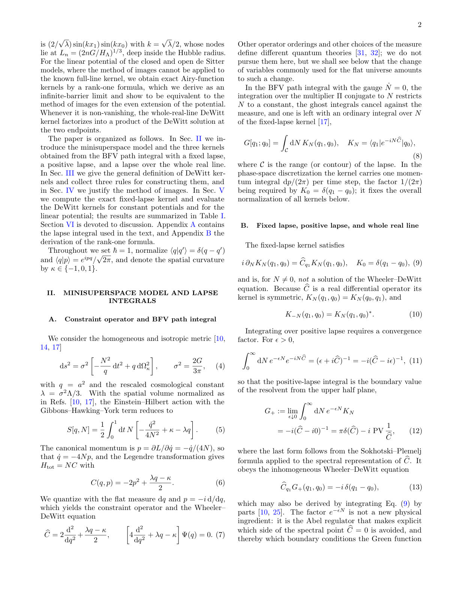 
Low-resolution page preview, page 2

📷 Fig 2

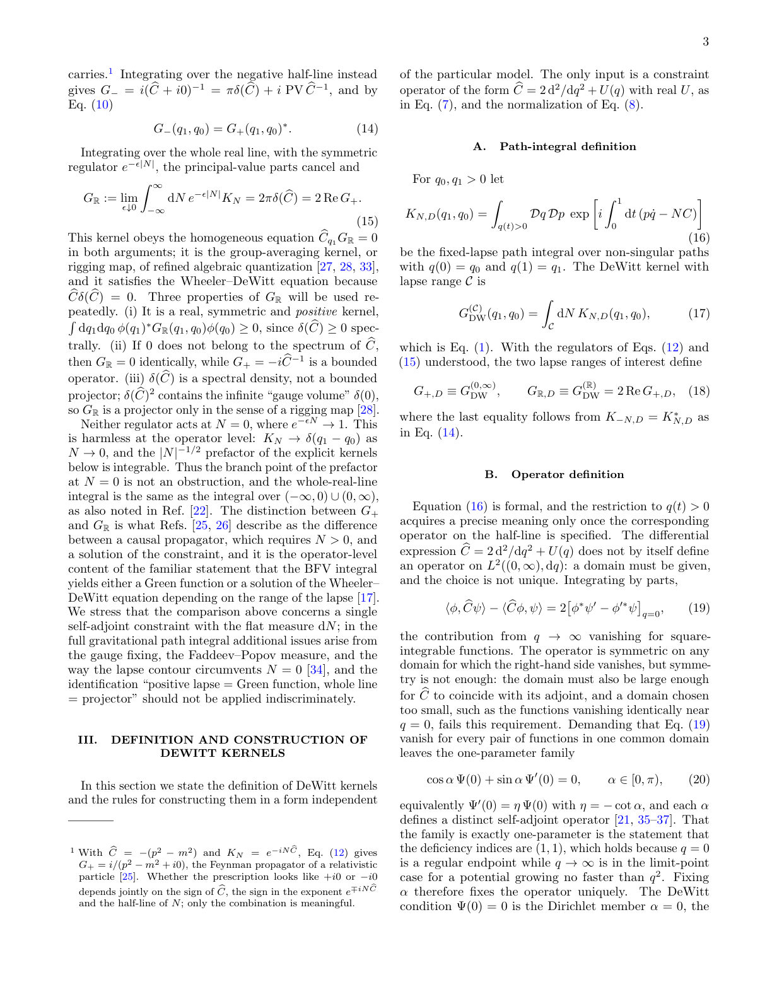 
Low-resolution page preview, page 3

📷 Fig 3

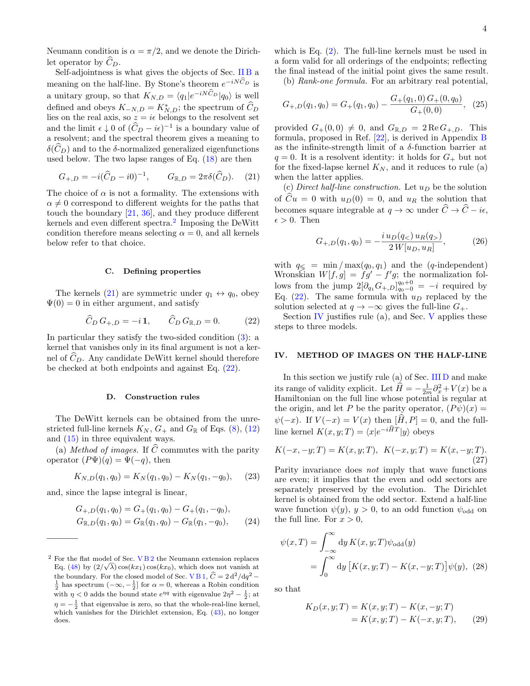 
Low-resolution page preview, page 4

📷 Fig 4

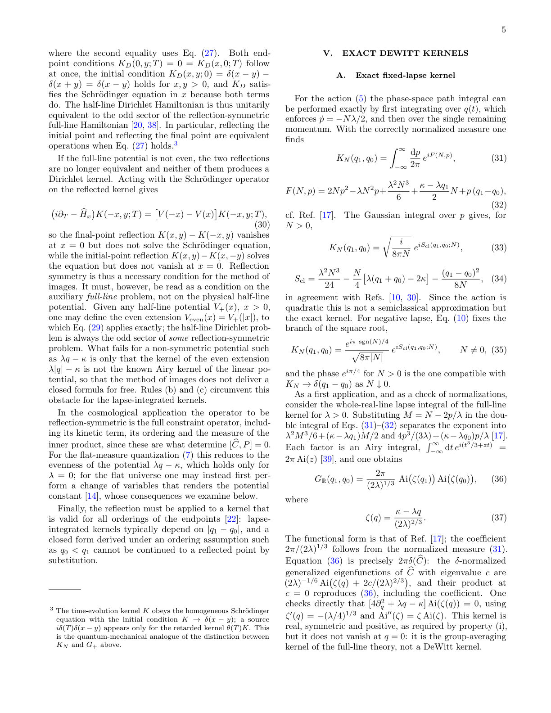 
Low-resolution page preview, page 5

📷 Fig 5

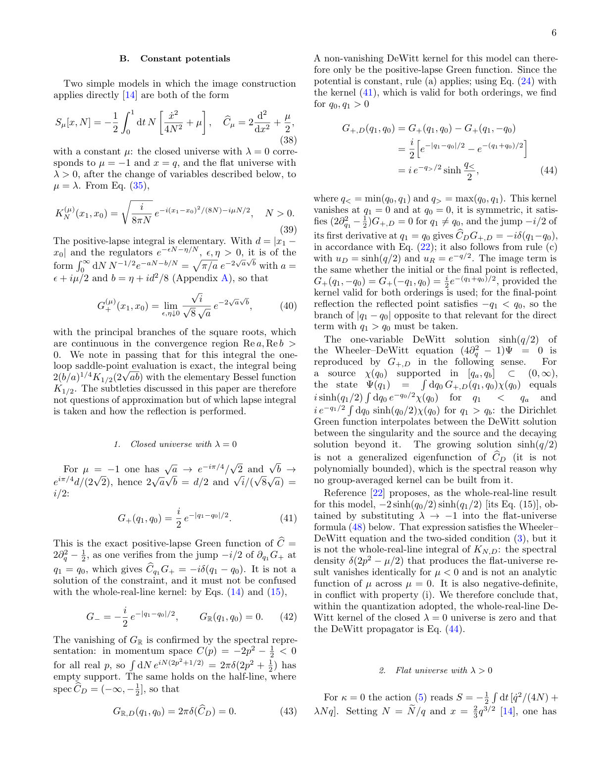 
Low-resolution page preview, page 6

**Summary.** This paper provides a rigorous, exact calculation of DeWitt kernels for quantum cosmology by implementing the DeWitt boundary condition in the Lorentzian path integral. It establishes general construction rules and derives explicit kernel forms for various cosmological models, confirming the consistency between different mathematical approaches for defining quantum propagators in constrained systems.

**Why it may be interesting.** While focused on cosmology, the rigorous mathematical techniques for defining propagators via path integrals over gauge degrees of freedom (the lapse $N$) and handling boundary conditions (like the Dirichlet condition) are highly relevant to open quantum systems and quantum field theory in curved spacetime.

Detailed structure

**Main problem.** The paper addresses the technical challenge of correctly implementing the DeWitt boundary condition within the Lorentzian path integral formulation of minisuper-space quantum cosmology.

**Main result.** The authors provide general definitions and exact construction rules for DeWitt kernels, yielding explicit, closed-form expressions for these kernels in various cosmological backgrounds (e.g., de Sitter space).

**Method.** The methodology involves using the Batalin–Fradkin–Vilkovisky (BFV) path integral approach, analyzing lapse integrals over different contours (positive half-line vs. whole real line), and imposing the DeWitt condition as a boundary constraint.

**Model / system.** The physical system is minisuper-space quantum cosmology, governed by a constraint operator derived from the metric $ds^2 = \sigma^2 (-N^2 q dt^2 + q d\Omega^2)$. The dynamics are described by the Wheeler–DeWitt equation.

**Key observables.** The DeWitt kernels, specifically the positive-lapse kernel ($G^+$) and the whole-real-line kernel ($G_R$), are the primary observables.

**Important parameters / regimes.** The cosmological constant ($\Lambda$), the scale factor variable ($q$), and the boundary condition parameter ($\alpha$) are key parameters.

**Assumptions / limitations.** The analysis is restricted to a single self-adjoint constraint operator with the flat measure $dN$, neglecting full gauge fixing and Faddeev–Popov measures.

**Paper structure.** The paper develops the general framework for constructing DeWitt kernels, derives specific forms for the positive-lapse and whole-real-line kernels, and then applies these general results to calculate exact kernels for specific cosmological models like the closed, flat, and open de Sitter universes.

Abstract

The DeWitt boundary condition can be implemented in the Lorentzian path integral of minisuperspace quantum cosmology by summing only over non-singular paths. We give a general definition of the resulting DeWitt kernels, together with explicit rules for constructing them, and evaluate them exactly. The lapse integral over the positive half-line yields the Dirichlet Green function of the Wheeler--DeWitt operator, whereas the integral over the whole real line yields the Dirichlet group-averaging kernel; both vanish when either endpoint lies at the singularity. Since the minisuperspace actions are at most quadratic, all lapse integrals are performed in closed form without saddle-point approximations. We obtain the kernels for the closed universe without cosmological constant, where the whole-real-line kernel vanishes identically, for the flat de Sitter universe, and, in terms of Airy functions, for the closed and open de Sitter universes. Throughout, the DeWitt condition is imposed as the boundary condition at the singularity, which selects a self-adjoint constraint operator on the half-line and fixes the kernels uniquely, including their normalization.

[↑ back to top](#top)

### [Microwave dielectric properties of LiNbO$_{\mathbf{3}}$ and AlN at millikelvin temperatures and single-photon power](http://arxiv.org/abs/2609.22002v1)

**Authors:** Alessandro Reineri, Francesco Crisa, Akshay Murthy, Maithlee Shinde, Daniel Bafia, Changqing Wang, Tanay Roy, Alexander Romanenko, John Zasadzinski, Anna Grassellino, Silvia Zorzetti  
**Type:** experiment · **Category:** quantum information and computing · **PDF:** <https://arxiv.org/pdf/2609.22002v1>  
**Analysis basis:** full PDF text, analyzed in chunks
**Topic relevance:** `QC/QI experiment` **3/5** · `quantum optics experiment` **2/5** · `correlated / nonlocal dissipation` **1/5**

📷 Fig 1

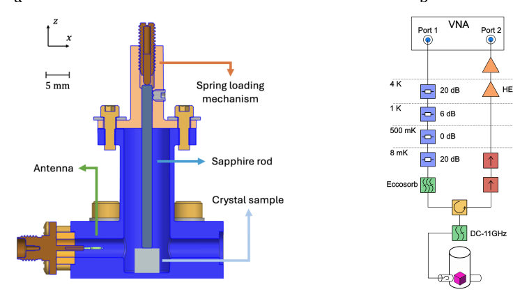 
Figure 1: (a) CAD section of the cavity architecture in a one-port measurement configuration. The z-cut samples are aligned with the main cylinder’s axis so that the TM mode excites the ε∥ component of the dielectric tensor and the TE mode the ε⊥component. (b) One-port reflection setup wire diagram, showing the standard implementation of isolators and circulators to prevent noise leakage from the amplifier stages to reach back to the cavity. It is noted that the low-pass DC-11GHz filter was removed for the AlN TE011 mode, as it had a resonance frequency above 15 GHz [34]. (c) Field distribution vector heatmap of the TM010 and (d) TE011 modes in the cavity in presence of one of the...

📷 Fig 2

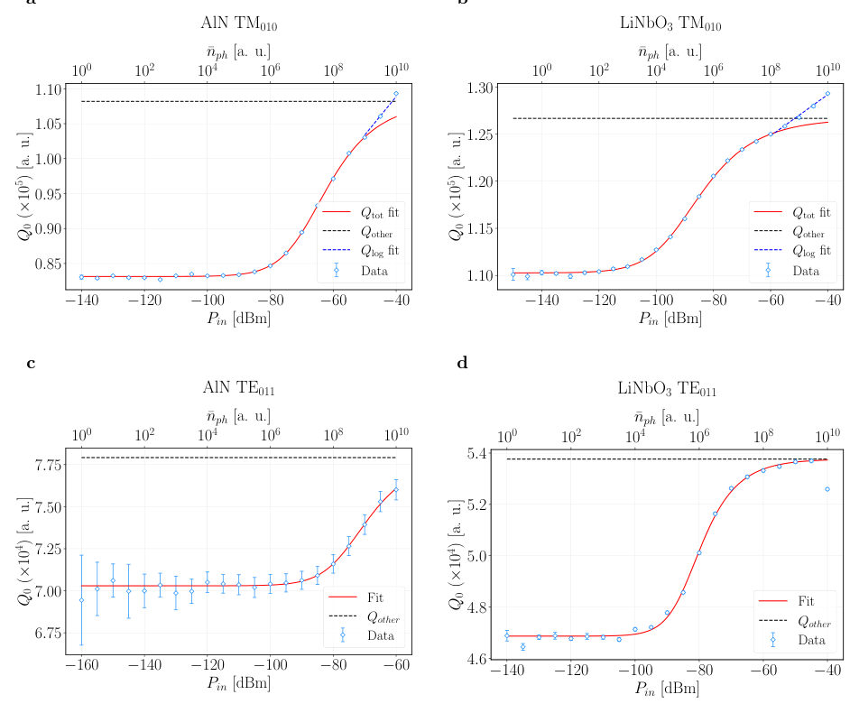 
Figure 2: Power sweeps at base temperature of AlN and LiNbO3. (a) TM010 of AlN with TLS- logarithmic model fit–Eq. (4–3b). (b) TM010 of LiNbO3 with TLS-logarithmic model fit–Eq. (4–3b). (c) TE011 of AlN with TLS model fit, as in Eq. (4). (d) TE011 of LiNbO3 with TLS model fit, as in Eq. (4). The outlier is due to the HEMT gain compression, not fully mitigated by the decompression strategy implemented in the circle fit routine (see Supplementary Note 2). Error bars are related to regression to the circle fit model (Eq. 2) and depend on the signal-to-noise ratio of each single S11 trace.

📷 Fig 3

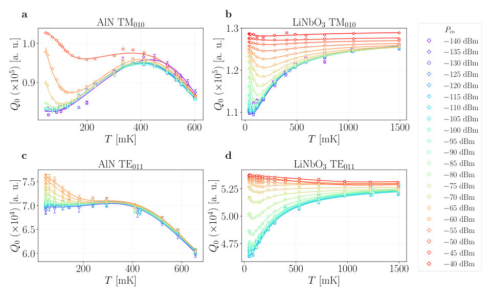 
Figure 3: Samples TM010 (a)(b) and TE011 (c)(d) mode internal quality factor toward temperature measurements at different cavity input power and corresponding regressions to model in Eq. (5). In the case of AlN, the Q0 (¯n, T) curves show a distinct local/global maximum for the transverse magnetic resonance and an inflection point for the transverse electric one around T ≃400 mK, indicating a clear presence of non-negligible quasiparticle dissipation in the aluminum cavity walls at high temperatures. For LiNbO3, the absence of quasiparticle-related contribution in the Q0 (¯n, T) data series is consistent with the high critical temperature of the niobium cavity. The difference in high power...

📷 Fig 4

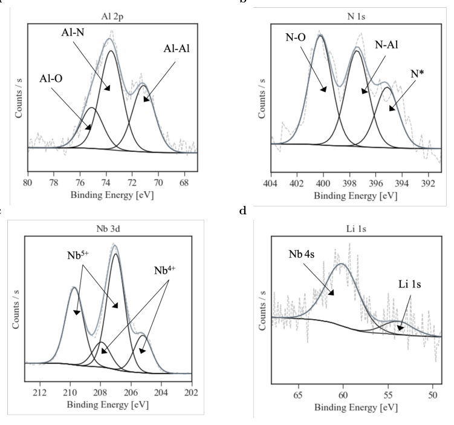 
Figure 4: High resolution XPS of (a) Al 2p, and (b) N 1s of the AlN bulk crystal, and (c) Nb 3d and (d) Li 1s of the LiNbO3 bulk crystal. The solid and dashed gray lines represent the envelope and the raw spectrum, respectively.

**Summary.** This experimental study characterizes the microwave dielectric losses in $	ext{LiNbO}_3$ and $	ext{AlN}$ crystals down to single-photon levels at millikelvin temperatures. By analyzing power and temperature dependencies, the authors determined that losses are primarily due to surface-localized Two-Level Systems (TLS), not intrinsic bulk properties. These findings provide crucial material science guidance for engineering high-efficiency quantum transduction interfaces.

**Why it may be interesting.** This work directly addresses a critical hardware bottleneck—material loss—for scaling superconducting quantum processors into distributed quantum networks by characterizing electro-optic materials at the quantum limit.

Detailed structure

**Main problem.** The study aims to characterize the microwave dielectric properties of $	ext{LiNbO}_3$ and $	ext{AlN}$ at millikelvin temperatures and single-photon power to understand loss mechanisms for efficient bidirectional microwave-optical photon conversion.

**Main result.** The research found that microwave losses are dominated by Two-Level Systems (TLS) localized on the surface rather than being an intrinsic bulk property, confirming that high-efficiency transduction is achievable.

**Method.** The authors used superconducting radiofrequency (SRF) cavity measurements, performing power and temperature sweeps while fitting the $S_{11}$ data to extract quality factors ($Q_0$).

**Model / system.** The physical system involves single-crystal bulk $	ext{LiNbO}_3$ and $	ext{AlN}$ placed within a superconducting cavity cooled to millikelvin temperatures. The analysis models loss contributions from TLS, power-dependent effects, and temperature-dependent superconducting losses.

**Key observables.** Internal microwave quality factor ($Q_0$), loss tangent ($	an \delta_m$), and the dependence of $Q_0$ on microwave power and temperature.

**Important parameters / regimes.** Millikelvin temperatures (down to 10 mK), single-photon power levels, and the critical power for TLS saturation.

**Assumptions / limitations.** The analysis assumes that the observed losses are dominated by near-surface defects, which is corroborated by complementary XPS and ToF-SIMS depth profiling analyses.

**Figures summary.** Figures illustrate the cavity architecture, field distribution for TM and TE modes, and power sweeps showing the model fits for $Q_0$ dependence on input power for both materials.

**Paper structure.** The paper follows a structure of problem definition (need for efficient transduction) $
ightarrow$ experimental setup (SRF cavity measurements) $
ightarrow$ detailed analysis (power/temperature sweeps using multi-component fitting models) $
ightarrow$ physical interpretation (surface vs. bulk losses) $
ightarrow$ conclusion regarding material engineering.

Abstract

Efficient bidirectional microwave optical photon conversion is a key capability for scaling superconducting quantum processors into distributed networks. However, achieving the necessary conversion efficiency requires filling a critical knowledge gap in understanding the loss mechanisms of electro optic materials. Here, we characterize the microwave properties of single crystal bulk LiNbO3 and AlN over a broad range of powers, down to single photon levels, and spanning from millikelvin temperatures to above 1K. We demonstrate that both materials exhibit two level systems (TLS) behavior, while piezoelectric related losses are excluded. We show that TLS induced dissipation is predominantly localized on the surface rather than being an intrinsic bulk property, a result further corroborated by room temperature 3D XPS and time of flight SIMS analyses. These findings provide useful insights to engineer hybrid architectures that integrate bulk electro optic crystals within superconducting cavities, proving that microwave quality factors compatible with high efficiency microwave optical transduction are within reach.

[↑ back to top](#top)

### [Phase Separation in a system of Brownian inertial rotors](http://arxiv.org/abs/2609.21556v1)

**Authors:** Lucio Mauro Carenza, Pasquale Digregorio, Massimiliano Semeraro, Antonio Suma, Ignacio Pagonabarraga, Giuseppe Gonnella  
**Type:** theory · **Category:** statistical mechanics · **PDF:** <https://arxiv.org/pdf/2609.21556v1>  
**Analysis basis:** full PDF text, analyzed in chunks
**Topic relevance:** `non-equilibrium universality` **3/5** · `driven-dissipative phase transition` **2/5** · `Frenkel-Kontorova` **1/5**

📷 Fig 1

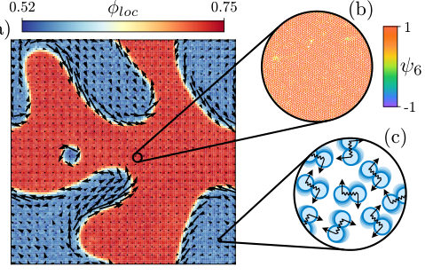 
FIG. 1. (a) A configuration of Nd = 2 · 10242 dumbbells, evolving according to Eq. (1), during coarsening from the ho- mogeneous state into the separated state, for Pr = 5 · 10−3, Pe = 5 and global surface fraction ϕ = 0.65. Colors represent local surface fraction ϕloc, while the black arrows represent lo- cal velocities. (b) An enlargement of the dense phase, showing the projection ψ6 of the local hexatic order parameter ψ6,i [see definition in the text] on the global mean orientation. (c) An enlargement of the disordered phase, showing internal bonds and active torques acting on the dumbbells.

📷 Fig 2

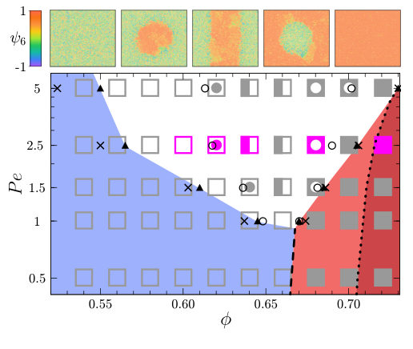 
FIG. 2. Phase diagram of the model, in the regime of large inertia at Pr = 200. The blue and red regions represent the homogeneous liquid and the ordered phases, respectively. Black dashed and dotted lines indicate the liquid-hexatic and hexatic-solid transition, respectively. The phase separated re- gion (white area) is delimited by the binodal, indicated with black triangles representing the measured coexisting densities. Black crosses and circles indicate the binodal and spinodal densities, respectively, as extracted by the Maxwell construc- tion and the location of the maximum and minimum of the measured pressure. Accordingly, symbols indicate the typical state morphology: represents a...

📷 Fig 3

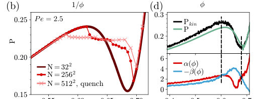 
FIG. 3. (a) IK pressure for a system of N = 1024 beads and different P´eclet numbers, showing the Maxwell equal area construction for Pe ≥1. (b) Pressure as a function of ϕ for a system of N = 1024 beads (green line), N = 2562 (light blue dots), N = 5122 quenched from the separated state (blue crosses). (c) Kinetic temperature as a function of ϕ for a system of 1024 beads at Pe = 2.5 and different values of Pr. (d) (Top) Comparison between the IK and kinetic pressure for a system of 1024 beads. (Bottom) The two contribution α(ϕ) and β(ϕ) to the pressure slope.

📷 Fig 4

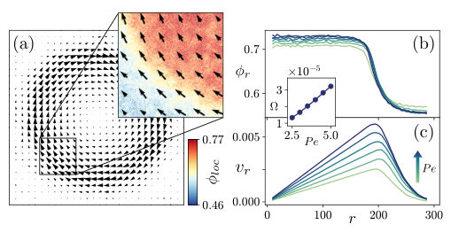 
FIG. 5. (a) Local particle velocity, coarse-grained over a grid of size 20σ for a dense droplet immersed in the liquid phase. The inset shows an enlargement of this field across the interface, on top of the local density. Radial profile of (b) the local density and (c) the local velocity, averaged over concentric circular shells, centered in the center of mass of the droplet, for different Pes and clusters of similar radii.

📷 Fig 5

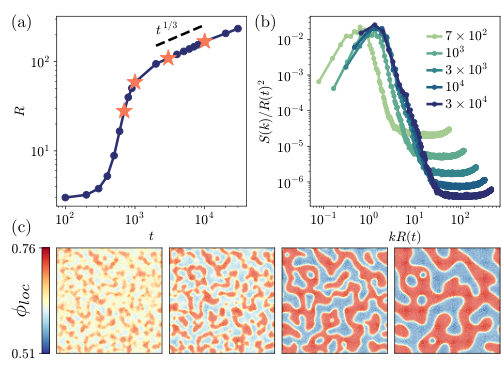 
FIG. 4. (a) Growth of the domain characteristic length R(t) after a quench from the disordered state, averaged over 3 independent simulations. (b) Rescaled structure factor at different times. (c) Snapshots of the system, representing the local surface fraction, at the times indicated by red stars in panel (a).

**Summary.** This work explores phase separation in active matter composed of inertial rotors driven by external torques. By analyzing the system's pressure and order parameters, the authors demonstrate that inertia is key to driving the system into a coexistence region between a dense hexatic solid and a dilute liquid. This provides a quantitative understanding of non-equilibrium phase transitions in active colloidal systems.

**Why it may be interesting.** The study provides a detailed, non-equilibrium framework for understanding how active driving and inertia can induce phase separation, offering insights into active matter physics relevant to complex systems dynamics.

Detailed structure

**Main problem.** The paper investigates the emergence of phase separation in a system of active, inertial rotors subjected to a constant applied torque, which breaks chiral symmetry.

**Main result.** Phase separation into a dense, ordered hexatic phase and a dilute liquid phase is observed, with the mechanism being critically controlled by the system's inertia, leading to a generically unstable homogeneous state.

**Method.** The study employs Molecular Dynamics (MD) simulations to map out the phase diagram and analyze thermodynamic quantities like the Irving-Kirkwood pressure.

**Model / system.** The model consists of 2D dumbbells (inertial rotors) interacting via repulsive hard-core potentials and driven by an active torque ($	au_a$). The dynamics are governed by Langevin equations incorporating inertia.

**Key observables.** Local hexatic order parameter ($\psi_{6,i}$), Irving-Kirkwood pressure ($P$), kinetic temperature ($T_{kin}$), and the phase diagram boundaries (binodal/spinodal).

**Important parameters / regimes.** Péclet number ($	ext{Pe}$), Active Reynolds number ($	ext{Re}$), and Prandtl number ($	ext{Pr}$), which control the balance between active driving, inertia, and dissipation.

**Assumptions / limitations.** The analysis assumes a constant applied torque ($	au_a$) and relies on MD simulations to characterize non-equilibrium phase behavior.

**Figures summary.** Figures illustrate the phase diagram showing liquid-hexatic separation, pressure vs. density loops indicating instability, and domain coarsening kinetics ($R(t) \sim t^{1/3}$).

**Paper structure.** The paper systematically analyzes the phase diagram based on activity ($	ext{Pe}$) and inertia ($	ext{Pr}$), detailing the mechanism of phase separation via pressure analysis and characterizing the resulting ordered hexatic phase.

Abstract

We uncover an emergent phase separation in a system of inertial dumbbells put into persistent rotation by a constant applied torque, breaking chiral symmetry, while interacting with each other through repulsive hard-core interactions. We numerically determine the phase diagram of the model, showing that there exists a binodal and a spinodal region where the system separates into a dense liquid and an ordered phase, which we identify as hexatic. An analysis of the system pressure unveils that the mechanism underlying the phase separation is heavily controlled by inertia. Locally injected kinetic energy is steadily stored into the system in a way that depends on density and that, at large inertia, results in a hot dilute and cool dense state, leading to a generically unstable homogeneous phase. The interplay between dumbbells' arrangement into clusters and chiral forces produces a spontaneous rigid rotation of the clusters around their centers of mass.

[↑ back to top](#top)

### [Spatially resolved quantum magnetometry and stray-field reconstruction of permalloy microdisks using boron-vacancy centers in hexagonal boron nitride](http://arxiv.org/abs/2609.21630v1)

**Authors:** Peiting Wen, Shuyu Wen, Jiang Qu, Zeling Xiong, Katrin Schultheiss, Slawomir Prucnal, Artur Erbe, Kenji Watanabe, Takashi Taniguchi, Jürgen Lindner, Jürgen Fassbender, Manfred Helm, Shengqiang Zhou, Ruslan Salikhov, Helmut Schultheiss, Yonder Berencén  
**Type:** experiment · **Category:** other · **PDF:** <https://arxiv.org/pdf/2609.21630v1>  
**Analysis basis:** full PDF text, analyzed in chunks
**Topic relevance:** `quantum measurements` **3/5** · `QC/QI experiment` **2/5** · `quantum optics experiment` **1/5**

📷 Fig 1

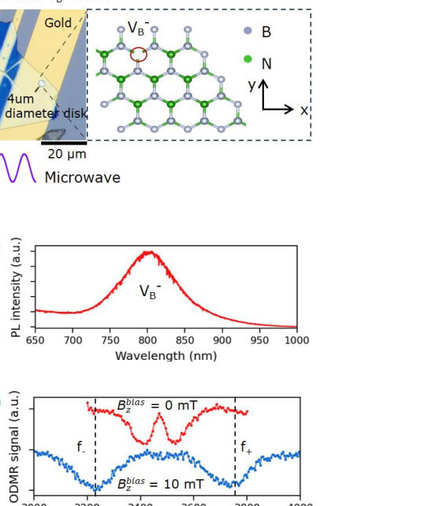 
Figure 1. Hybrid VB⁻ quantum sensing platform and sensor characterization. (a) Schematic of the experimental configuration and optical microscope image of the transferred hBN flake integrated with a row of Py microdisks of different diameters fabricated on a coplanar waveguide; the present study focuses on the 4 μm-diameter disk. The right panel illustrates the atomic structure of the VB⁻ center. (b) Spin-dependent optical cycle and ground-state energy levels of the VB⁻ center. (c) Room-temperature photoluminescence spectrum of the VB⁻ centers in hBN. (d) ODMR spectra

📷 Fig 2

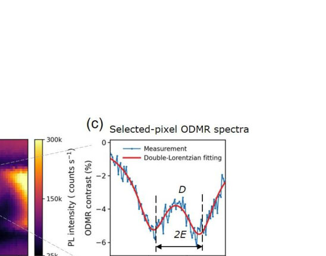 
Figure 2. Pixel-resolved ODMR analysis. (a) Optical image of the investigated device showing the measurement region for the 4 μm-diameter Py microdisk (red dotted square). (b) PL map of the transferred VB⁻ ensembles within the selected area. (c) Representative ODMR spectrum recorded from a single selected pixel and the double-Lorentzian fitting used to extract the local spin- resonance parameters 𝐷 and 𝐸.

📷 Fig 3

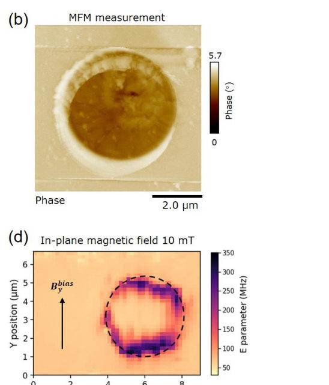 
Figure 3. Magnetic characterization of the vortex-state Py microdisk by MFM and ODMR. (a) AFM topography of the fabricated Py microdisk on the coplanar waveguide, showing a measured disk diameter of approximately 4.2 μm, close to the nominal design diameter of 4.0 μm. (b) Corresponding zero-field MFM image showing no extended bipolar or multidomain magnetic

📷 Fig 4

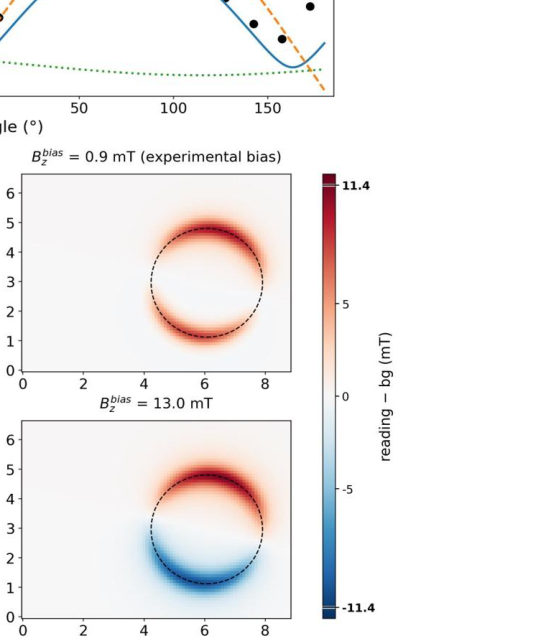 
Figure 4. Quantitative reconstruction and validation of the magnetic-field distribution in

**Summary.** This study reports on a novel method for quantitative magnetometry by integrating boron-vacancy spin defects in hBN onto permalloy microdisks. Using spatially resolved ODMR measurements, the researchers successfully reconstructed the out-of-plane stray magnetic field from a vortex-state disk. This validates the use of hBN quantum defects as highly sensitive, room-temperature sensors for mapping magnetic textures.

**Why it may be interesting.** This work demonstrates a powerful, room-temperature quantum sensing modality for mapping magnetic fields, bridging quantum defect physics with classical condensed matter magnetism, which is highly relevant for quantum sensing applications.

Detailed structure

**Main problem.** The paper addresses the challenge of quantitatively imaging magnetic microstructures, specifically the stray-field distribution from permalloy microdisks, using spatially resolved quantum magnetometry.

**Main result.** The authors successfully reconstructed the out-of-plane stray-field distribution, revealing peak fields of approximately 11.2 mT, and validated this reconstruction using an edge-charge model.

**Method.** Spatially resolved Optically Detected Magnetic Resonance (ODMR) measurements were performed on boron-vacancy (VB-) spin defects in hexagonal boron nitride (hBN) integrated with the magnetic sample.

**Model / system.** The system involves a permalloy microdisk exhibiting a vortex state, measured using VB- centers in hBN. The analysis relies on relating the measured ODMR splitting to the local magnetic field via established quantum resonance equations.

**Key observables.** Reconstructed out-of-plane stray-field distribution ($	ext{B}_z$), ODMR transition frequencies ($f_-, f_+$), and the magnetic-field-dependent splitting parameters ($D$ and $E$).

**Important parameters / regimes.** Peak stray field $\approx 11.2 	ext{ mT}$; measurement temperature (room temperature); sensor sensitivity ($\approx 100 \mu	ext{T}/\sqrt{	ext{Hz}}$).

**Assumptions / limitations.** The analysis assumes that local variations in the ODMR parameters can be separated into contributions from intrinsic spin properties (strain) and the external magnetic field.

**Figures summary.** Figures illustrate the schematic setup, ODMR spectra used for fitting, the reconstructed magnitude and signed distribution of the stray field, and comparisons between the reconstructed field and predictions from the edge-charge model.

**Paper structure.** The paper follows a structure of establishing the platform (hBN/VB- sensor), detailing the measurement technique (ODMR), applying the technique to a specific magnetic problem (Py disk vortex state), and finally quantitatively reconstructing the stray field using theoretical models (edge-charge model) for validation.

Abstract

Transferable hexagonal boron nitride (hBN) hosting negatively charged boron-vacancy (VB$^{-}$) spin defects offers a versatile platform for integrated quantum magnetometry, yet quantitative imaging of magnetic microstructures remains challenging. Here, we integrate a transferred hBN flake with a 4 $μ$m-diameter permalloy (Py = Ni${81}$Fe${19}$) microdisk and perform spatially resolved optically detected magnetic resonance measurements at room temperature. An applied in-plane magnetic field distorts the vortex-state magnetization, generating edge-localized magnetic surface charges and pronounced stray-field signatures at opposite disk edges. By referencing each pixel to its local zero-field splitting and correcting for a residual out-of-plane bias field, we quantitatively reconstruct the out-of-plane stray-field distribution, revealing peak fields of approximately 11.2 mT. An edge-charge model reproduces the spatial distribution and amplitude of the reconstructed field, linking the ODMR response to the field-driven evolution of the vortex state. These results establish transferred hBN VB$^{-}$ sensors for quantitative magnetometry of magnetic microstructures.

[↑ back to top](#top)

### [Efficient MPO Construction for Long-Range Hamiltonians with Periodic Boundary Conditions: Application to Many-Body Dynamics](http://arxiv.org/abs/2609.21290v1)

**Authors:** Xin Wang, Bo Xiong  
**Type:** theory · **Category:** numerical methods · **PDF:** <https://arxiv.org/pdf/2609.21290v1>  
**Analysis basis:** full PDF text, analyzed in chunks
**Topic relevance:** `methods for driven-dissipative` **3/5** · `analog quantum simulation` **1/5** · `non-equilibrium universality` **1/5**

📷 Fig 1

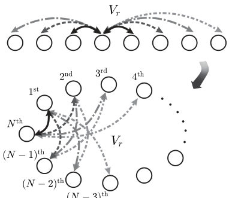 
FIG. 1. Schematic illustration of finite-range interactions and peri- odic boundary conditions used for the MPO construction. (a) The 1D chain with OBC, where interactions of different ranges are repre- sented by different line styles. (b) The corresponding periodic chain forms a ring, highlighting the additional interaction terms introduced by the PBC. These interaction patterns determine the additional prop- agation channels required in the MPO representation.

📷 Fig 2

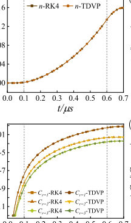 
FIG. 2. Numerical benchmark of TDVP against RK4 method for quantum dynamical evolution. (a) Time dependence of the average occupation number n. (b) Relative error of the occupation number. (c) Time evolution of the absolute values of three spatial correlation functions Cr(r = 1, 2, 3) displayed on a base-10 logarithmic vertical axis. (d) Relative errors of the correlation functions versus evolution time. The gray dashed lines indicate the transitions between different stages of the quench protocol.

📷 Fig 3

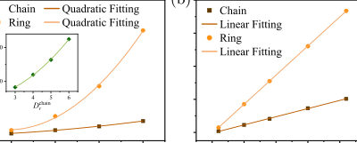 
FIG. 3. Computational cost of the TDVP simulations as a function of the interaction range and system size. OBC and PBC results are represented by brown filled squares and orange filled circles, respec- tively. (a) Runtime as a function of the maximum interaction range r for N = 24, with second-order polynomial fits shown as solid lines. The inset shows the OBC runtime as a function of the corresponding MPO bond dimension DOBC r , where green diamonds and a green solid line denote the data and second-order polynomial fit, respec- tively. (b) Runtime as a function of system size N for r = 3, with linear fits shown as solid lines.

**Summary.** This paper introduces a novel and efficient Matrix Product Operator (MPO) construction designed to handle long-range interactions on quantum spin chains with periodic boundary conditions. By embedding the PBC structure directly into the MPO formalism, the authors enable accurate time evolution simulations using the TDVP framework. The method is validated against high-accuracy classical benchmarks, offering a practical tool for studying complex many-body dynamics on rings.

**Why it may be interesting.** This work provides a crucial algorithmic advancement for simulating complex, realistic quantum systems (like those with long-range interactions) on periodic lattices, overcoming known limitations of standard tensor network techniques.

Detailed structure

**Main problem.** Developing an efficient Matrix Product Operator (MPO) construction to simulate quantum many-body dynamics in systems with long-range interactions under Periodic Boundary Conditions (PBC).

**Main result.** The proposed systematic MPO construction accurately simulates quench dynamics in spin-1/2 chains under PBC, showing excellent agreement with the RK4 benchmark method.

**Method.** The authors generalize the MPO formalism by embedding PBC and finite-range couplings directly into an open boundary MPO structure, utilizing the Time-Dependent Variational Principle (TDVP) for time evolution.

**Model / system.** The study focuses on a spin-1/2 chain governed by a Hamiltonian containing both nearest-neighbor and finite-range interactions. The simulation is performed on lattices with both open and periodic boundary conditions.

**Key observables.** Single-body and two-body observables, and spatial correlation functions.

**Important parameters / regimes.** Interaction range ($r$), system size ($N$), and the bond dimension ($D$), which grows quadratically for PBC ($D_{	ext{ring}}^r \propto r^2$).

**Assumptions / limitations.** The core assumption is that the PBC structure can be efficiently incorporated into the MPO framework without destroying the canonical gauge or causing excessive bond dimension inflation, which is a known issue with standard trace-based methods.

**Figures summary.** Figure 1 schematically illustrates interaction patterns for OBC and PBC. Figure 3 compares the computational runtime scaling with interaction range ($r$) and system size ($N$) for both boundary conditions.

**Paper structure.** The paper systematically develops the MPO construction for finite-range interactions, first addressing the OBC case, then extending it to PBC by adding independent propagation channels. Finally, it validates the method by benchmarking against RK4 and analyzing the computational scaling.

Abstract

Matrix product operator (MPO) serves as a fundamental component in tensor network simulations of quantum many-body dynamics. We employ an MPO construction that introduces additional propagation channels to embed both periodic boundary conditions and finite-range couplings directly into an open boundary MPO. We apply this construction within the time-dependent variational principle (TDVP) framework to simulate quench dynamics in a spin-1/2 chain with finite-range interactions, and benchmark the results numerically against the fourth-order Runge-Kutta method, finding excellent agreement for both single-body and two-body observables. The approach offers a practical route for tensor network simulations of many-body dynamics in periodic finite-range systems.

[↑ back to top](#top)

### [Quantized Transport of Gap Solitons in the Harper-Hofstadter Model](http://arxiv.org/abs/2609.21917v1)

**Authors:** Oliver Ashfield, Henry Davenport, Tom Sheppard, David G. Reid, Holly A. J. Middleton-Spencer, A. C. Berceanu, Frank Schindler, Iacopo Carusotto, Hannah M. Price  
**Type:** theory · **Category:** other · **PDF:** <https://arxiv.org/pdf/2609.21917v1>  
**Analysis basis:** full PDF text, analyzed in chunks
**Topic relevance:** `analog quantum simulation` **3/5** · `Frenkel-Kontorova` **1/5** · `quantum measurements` **1/5**

📷 Fig 1

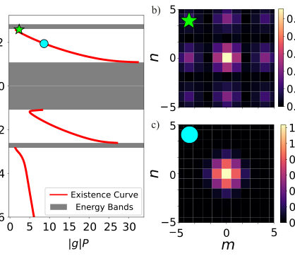 
Figure 1. (a) The existence curve of solitons found in the Harper- Hofstadter model at α = 1/4 for attractive interactions (g = −1). The single-particle energy bands (gray shaded regions) are shown along with the frequency of the solitons (red solid line) as a function of the scaled power |g|P. It can be seen that the frequency of the solitons is restricted to the energy band gaps. Note also that there is a minimum power requirement in a given gap for solitons to form; a known feature of 2D gap solitons [56, 57]. (b) The density profile of a soliton with ω = 2.605 and P = 2.33, at a frequency close to the linear band edge (band-edge). (c) The density profile of a soliton with ω = 2 and P =...

📷 Fig 2

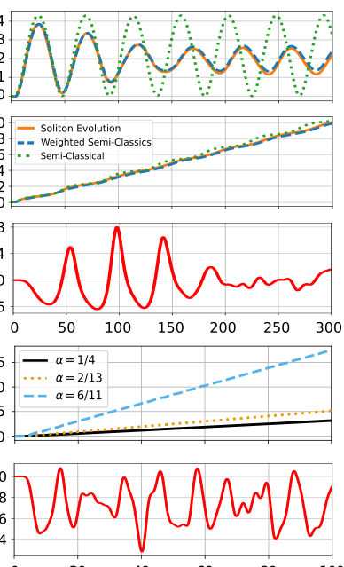 
Figure 2. The centre-of-mass (C.O.M) dynamics for various gap solitons. All solitons are evolved under the external force with F = 0.05J/a, θ = π/4, τ = 1/J, and t0 = 3τ. (a-b) The parallel (r∥) and perpendicular (r⊥) motion, relative to the direction of the force, of a band-edge α = 1/4 soliton (ω = 2.605 and P = 2.33) (orange solid line) along with the weighted (blue dashed line) and un-weighted (green dotted line) semi-classical motion. (c) The normalized inverse participation ratio. (d) The perpendicular C.O.M motion of mid-gap solitons with: α = 1/4 (solid black line) at ω = 2.00 and P = 7.95 bifurcating from the top band with C4 = 1; α = 2/13 (dotted gold line) at ω = 2.5 and P =...

📷 Fig 3

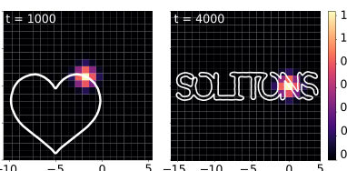 
Figure 3. An α=1/4 mid-gap soliton (P =7.95, ω =2) tracing out an arbitrary, continuous curves in real-space using only a time- dependent external force F(t) where |F(t)|a ≪EBG.

📷 Fig 4

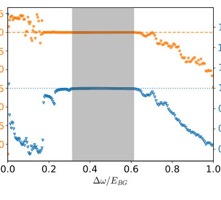 
Figure 4. Existence of quantized motion for α = 1/4 gap solitons bifurcating from the top i = 4 single-particle band. A dual plot showing the fitted velocity v⊥and β against the difference ∆ω of the soliton frequency from the band minimum as a fraction of the band gap EBG. The error bars are each point are omitted due to them being too small. Dashed lines indicate the values of v⊥and β corresponding to ideal quantized motion for these parameters. The shaded grey region is added by eye to indicate the range of solitons undergoing quantized motion. All solitons were found for g = −1 and evolved under a force with F = 0.05J/a, τ = 1/J, t0 = 3τ and θ = π/4. The evolution was run until tfinal =...

**Summary.** This paper analyzes gap solitons in the nonlinear Harper-Hofstadter model to demonstrate a robust, quantized transport mechanism. Mid-gap solitons exhibit a velocity perpendicular to the applied force that is linearly proportional to the force, enabling precise, controllable steering. This contrasts sharply with band-edge solitons, which become unstable under the same driving force.

**Why it may be interesting.** This work provides a concrete, controllable mechanism for steering nonlinear wavepackets in systems relevant to quantum optics and cold atoms, linking transport properties directly to the topological invariants (Chern numbers) of the underlying band structure.

Detailed structure

**Main problem.** The study investigates the dynamics and transport of gap solitons in the nonlinear Harper-Hofstadter model when subjected to an external force.

**Main result.** Gap solitons with frequencies deep within the band gap exhibit a robust, quantized velocity perpendicular to the applied force, which is linearly proportional to the force and allows for arbitrary steering.

**Method.** The analysis involves numerically solving the nonlinear evolution equation and analyzing the center-of-mass motion by fitting the position evolution to an ideal quantized trajectory.

**Model / system.** The system is modeled by the Harper-Hofstadter model, which describes particle hopping on a 2D lattice under a magnetic field, augmented with a cubic nonlinearity (e.g., for cold atoms or Kerr optics).

**Key observables.** Quantized transverse velocity ($v_{\perp}$), Inverse Participation Ratio (IPR) for localization, and the center-of-mass position $r_{\perp}(t)$.

**Important parameters / regimes.** Soliton frequency ($\omega$) relative to the band gap, the strength of the external force ($F$), and the Chern number ($C_i$) of the underlying bands.

**Assumptions / limitations.** The analysis assumes that the quantized motion is robust and can be characterized by fitting the position evolution to a specific functional form derived from the external force.

**Figures summary.** Figures compare the perpendicular motion of band-edge versus mid-gap solitons under force, demonstrating the robust, quantized motion for mid-gap solitons, and show the fitting of the center-of-mass trajectory to the ideal quantized curve.

**Paper structure.** The paper progresses by establishing the model (Harper-Hofstadter with nonlinearity), contrasting the unstable motion of band-edge solitons with the stable, quantized transport of mid-gap solitons, and finally quantifying this robust steering mechanism.

Abstract

We investigate the dynamics of gap solitons found in the Harper-Hofstadter model with an additional cubic nonlinearity, such as that describing weakly-interacting cold atoms or a Kerr nonlinearity in an optical platform. We find that certain solitons with frequencies deep in the band gap travel with a robust, quantized velocity perpendicular to the applied force and maintain their spatial profile over long timescales. Crucially, this velocity is linearly proportional to the applied force, allowing for arbitrary steering of the nonlinear wavepacket, without breakdown, using only a tunable external force. This quantized transport persists despite a highly non-uniform occupation of the linear Bloch states, and contrasts with solitons near the band edge, which deform and delocalize under the same force. These results point to a robust and highly controllable mechanism for steering nonlinear solitons in experimentally accessible platforms.

[↑ back to top](#top)

### [Sine-Gordon Model with Bosonic Tensor Networks: Continuum Matching and Soliton Scattering](http://arxiv.org/abs/2609.21846v1)

**Authors:** Florian Hechenberger, Tommaso Rainaldi, Felix Ringer  
**Type:** theory · **Category:** numerical methods · **PDF:** <https://arxiv.org/pdf/2609.21846v1>  
**Analysis basis:** full PDF text, analyzed in chunks
**Topic relevance:** `methods for driven-dissipative` **3/5** · `Frenkel-Kontorova` **1/5** · `analog quantum simulation` **1/5**

📷 Fig 1

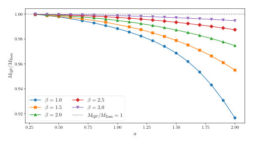 
FIG. 1: Ratio of the quasiparticle soliton mass to the scheme-corrected Zamolodchikov result (30) as a function of the lattice spacing, for d = 90 and χ = 64.

📷 Fig 2

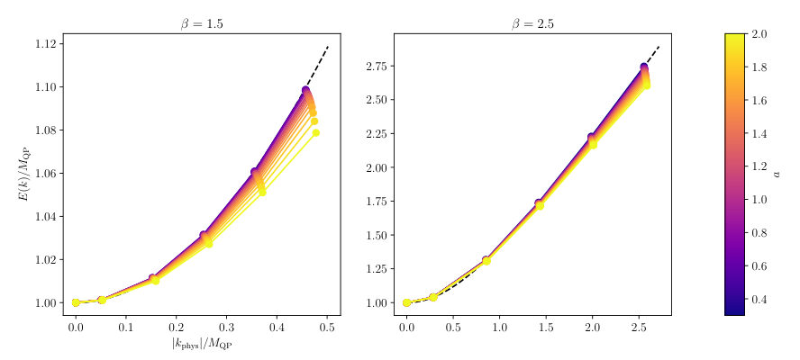 
FIG. 2: Normalized soliton dispersion relation E(k)/MQP at two representative couplings β = 1.5 and β = √

📷 Fig 3

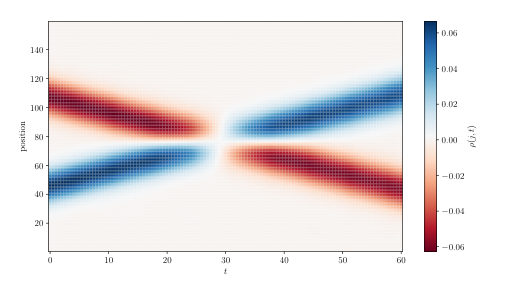 
FIG. 3: Topological charge density ρ(j, t) for run 4 of Table III at a = 0.75, p = 0.60, N = 160. The soliton carries positive topological charge density ρ &gt; 0 while the antisoliton carries ρ &lt; 0. The trajectories confirm the expected transmissive behavior.

📷 Fig 4

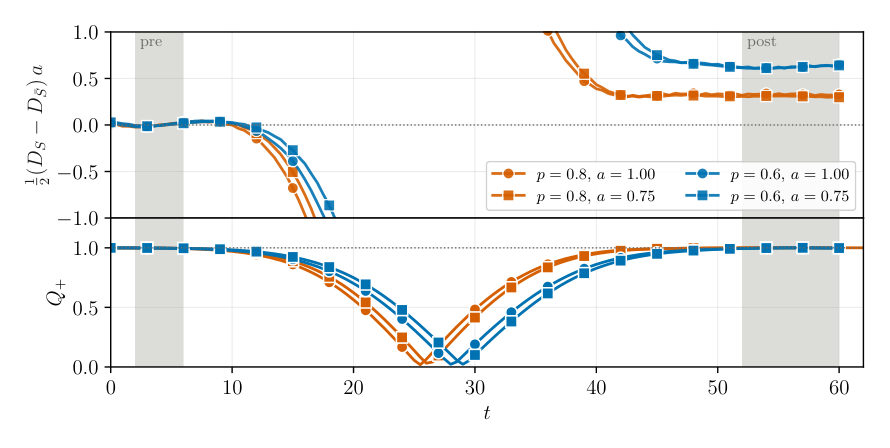 
FIG. 4: Antisymmetric displacement 1 2(DS −D ¯S)a relative to the free reference, referenced to the pre-collision window, and the positive charge Q+. Shaded bands mark the pre-collision window [2, 6] and the post-collision window [52, 60].

📷 Fig 5

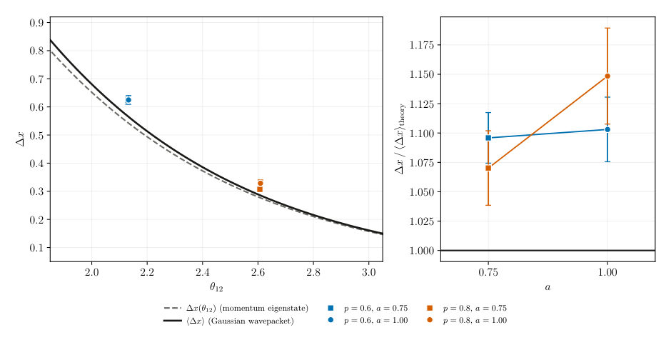 
FIG. 5: Measured displacement versus relative rapidity, compared with Eq. (13) for momentum eigenstates (dashed) and with its packet average (36) at σk = 0.088 (solid). The right panel shows the ratio to the packet average as a function of lattice spacing. Color encodes the momentum and the marker the lattice spacing.

**Summary.** This paper uses bosonic tensor networks to bridge the gap between the lattice Sine-Gordon model and its continuum limit. By matching lattice couplings to continuum normalization, the authors accurately predict key physical quantities like soliton masses and scattering dynamics. This work establishes a robust numerical framework for studying renormalization and dynamics in quantum field theories.

**Why it may be interesting.** The use of bosonic tensor networks to simulate integrable field theories like Sine-Gordon provides a powerful, non-perturbative benchmark for quantum simulation techniques applicable to other complex Hamiltonian lattice field theories.

Detailed structure

**Main problem.** The paper aims to quantitatively connect the lattice Sine-Gordon model to its continuum theory and study the dynamics of soliton scattering.

**Main result.** The bosonic simulations successfully recover the exact continuum predictions for the soliton mass, breather masses, and the characteristic rapidity dependence of the Wigner spatial displacement during collisions.

**Method.** The study employs bosonic tensor networks (MPS) for time evolution and uses continuum matching techniques by comparing lattice vertex operators to conformal field theory normalization.

**Model / system.** The physical system is the Sine-Gordon model in 1+1 dimensions, described by a Hamiltonian involving a cosine potential. The analysis uses lattice discretization and bosonic tensor networks to simulate quantum dynamics.

**Key observables.** Soliton mass ($M_{sol}$), breather masses, and the Wigner spatial displacement ($\Delta x$) during soliton-antisoliton scattering.

**Important parameters / regimes.** The bare lattice coupling, the renormalized continuum mass parameter, and the parameter $eta^2/(8\pi)$ governing the model's flow.

**Assumptions / limitations.** The method relies on the ability to perform continuum matching at the free-boson UV fixed point and assumes the validity of the variational ansatz for state construction.

**Figures summary.** Figures compare the measured antisymmetric displacement during scattering against theoretical predictions derived from momentum eigenstates and wave packet averages, showing good agreement.

**Paper structure.** The work proceeds by first establishing the continuum matching procedure, then using tensor networks to simulate the time evolution of localized excitations (solitons) and finally analyzing the scattering dynamics by measuring the Wigner displacement.

Abstract

We use bosonic tensor networks to connect the lattice sine-Gordon model in the Hamiltonian formulation quantitatively to its continuum theory. Matching the lattice vertex operator to its conformal normalization at the free-boson ultraviolet fixed point yields the exact relation between the bare lattice coupling and the renormalized continuum mass parameter. The soliton mass then approaches Zamolodchikov's exact continuum prediction throughout the studied parameter range, without adjustable parameters. Using uniform matrix product states and a quasiparticle ansatz, we also recover the relativistic soliton dispersion and the two lightest breather masses at the percent level. We simulate real-time collisions of Gaussian soliton-antisoliton wave packets near a reflectionless point and extract the Wigner spatial displacement. We compare this displacement with the exact continuum prediction obtained from the momentum derivative of the transmission phase, recovering its characteristic rapidity dependence. Our bosonic simulations provide a foundation for nonintegrable extensions, offer lessons for renormalization in other Hamiltonian lattice field theories, including gauge theories, and provide benchmarks for continuous-variable quantum simulations.

[↑ back to top](#top)

### [Parameter-Decoupled Quantum Superresolution without Multiparameter Estimation](http://arxiv.org/abs/2609.21796v1)

**Authors:** X. -F. Qian  
**Type:** theory · **Category:** other · **PDF:** <https://arxiv.org/pdf/2609.21796v1>  
**Analysis basis:** full PDF text, analyzed in chunks
**Topic relevance:** `quantum measurements` **3/5**

📷 Fig 1

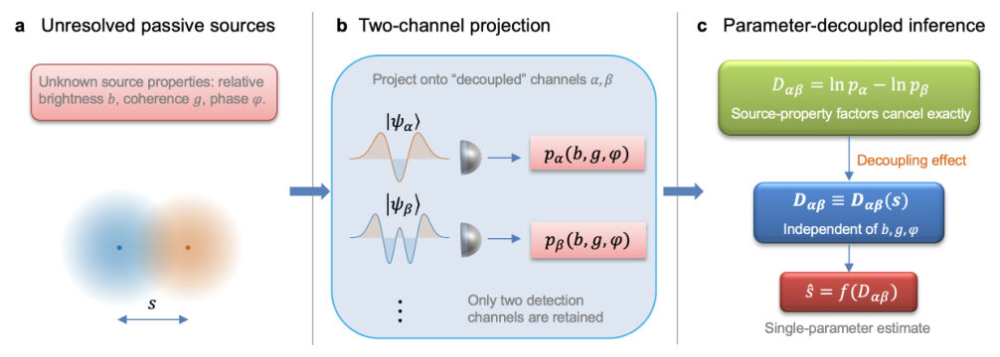 
FIG. 1: Concept of parameter-decoupled quantum superresolution. (a) Two passive sources separated by s produce overlapping point-spread functions. Their brightness imbalance b, mutual-coherence magnitude g, and relative phase φ are generally unknown. (b) The received field is projected onto two “decoupled” channels, producing detection probabilities pα and pβ that depends on multiple source parameters b, g, φ. (c) Their log-probability observable Dαβ = ln pα −ln pβ = Dαβ(s) cancels the common dependence on b, g, and φ, leaving a function of the separation alone. The separation can therefore be recovered through ˆs = f(Dαβ) without estimating the three source-property nuisance parameters.

📷 Fig 2

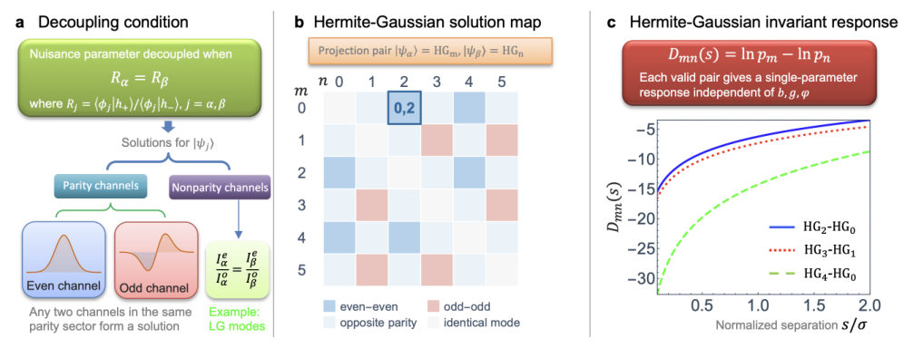 
FIG. 2: General families of parameter-decoupled measurements. (a) For a pair of projection modes {ϕα, ϕβ}, the dependence on the source-property nuisance parameters cancels when their shifted-PSF overlap ratios satisfy Rα(s) = Rβ(s), where Rj(s) = ⟨ϕj|h+⟩/⟨ϕj|h−⟩. The general solutions turn into two families : parity eigenmodes and nonparity channels. For parity eigen modes, any two channels belonging to the same parity sector provide a parameter-decoupling solution. (b) Solution map for example pairs of Hermite–Gaussian modes (HGm, HGn). Even–even and odd–odd pairs satisfy the same-parity condition, whereas opposite-parity pairs do not. The lowest-order nontrivial pair, HG0–HG2, is...

📷 Fig 3

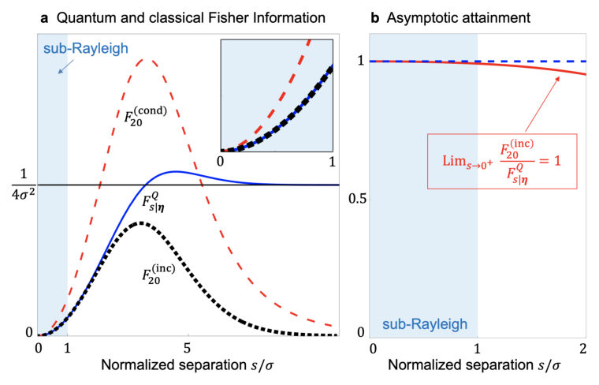 
FIG. 3: Fisher information performance and asymptotic attainment of the quantum limit. (a) Fisher information as a function of normalized separation s/σ for the representative source parameters b = 0.4, g = 0.6, and φ = π/8. The solid blue curve is the nuisance-adjusted quantum Fisher information F Q s|η for the full four-parameter model. The red dashed curve is the conditional

**Summary.** This paper introduces a novel measurement technique to achieve quantum superresolution for passive sources by eliminating the need to estimate unknown source parameters. By constructing a parameter-decoupled log-probability observable, the separation distance can be robustly determined, converting a complex multiparameter problem into a simple, single-parameter measurement.

**Why it may be interesting.** This work provides a practical, resource-consistent method for quantum metrology in realistic, noisy environments, which is highly relevant for quantum optics and sensing applications.

Detailed structure

**Main problem.** The paper addresses the challenge of achieving quantum superresolution for closely spaced sources when the measurement is corrupted by unknown nuisance parameters (like brightness imbalance, coherence, or phase).

**Main result.** A parameter-decoupled measurement, based on a log-probability invariant, can be constructed that allows the separation distance to be determined without estimating these unknown nuisance parameters.

**Method.** The authors use a complete four-parameter Quantum Fisher Information analysis to identify the accessible separation information, and then construct a measurement observable invariant under the nuisance parameters.

**Model / system.** The system models a generic two-center signal from realistic passive sources, described by a mixed state dependent on separation ($s$) and nuisance parameters ($	heta = (s, b, g, \varphi)$).

**Key observables.** The directly measurable log-probability contrast, $D_{\alphaeta} = \ln p_\alpha - \ln p_eta$, and the nuisance-adjusted Quantum Fisher Information, $F_{Q,s|\eta}$.

**Important parameters / regimes.** Separation distance ($s$), nuisance parameters ($b, g, \varphi$), and the sub-Rayleigh regime ($0 < s < \sigma$).

**Assumptions / limitations.** The method relies on finding measurement channels that satisfy a specific parameter-decoupling condition ($R_\alpha(s) = R_eta(s)$) and assumes a calibrated PSF.

**Figures summary.** Figure 1 illustrates the concept by showing how the log-probability observable $D_{\alphaeta}$ cancels common parameter dependence, leaving a function of $s$. Figure 3 confirms the finite information in the sub-Rayleigh regime.

**Paper structure.** The paper first analyzes the full four-parameter QFI, derives the parameter-decoupled observable $D_{\alphaeta}$ using specific measurement channels (like parity eigenmodes), and finally shows that the achievable classical Fisher information saturates the nuisance-adjusted quantum limit in the sub-Rayleigh regime.

Abstract

Quantum superresolution promises to resolve closely spaced sources beyond the diffraction limit, but existing approaches generally rely on idealized source properties or require simultaneous estimation of multiple coupled parameters of realistic sources. Here we introduce a parameter-decoupled measurement that determines the separation of realistic passive sources without estimating their unknown brightness imbalance, mutual coherence, or relative phase. A complete four-parameter quantum Fisher information analysis identifies the separation information that remains accessible in the presence of these nuisance parameters. We then construct a directly measurable log-probability invariant from projection channels whose conditional statistics depend only on the separation. Broad classes of channel pairs satisfy the resulting decoupling condition. For a Gaussian point-spread function, the lowest-order implementation asymptotically attains the four-parameter quantum limit per incident signal in the sub-Rayleigh regime. This approach converts a realistic multiparameter imaging problem into an operationally single-parameter measurement, providing a practical route toward quantum-enhanced resolution of passive spatial, temporal, and spectral signals.

[↑ back to top](#top)

### [The Pinnacle Architecture with fixed connectivity of degree eight](http://arxiv.org/abs/2609.21249v1)

**Authors:** Paul Webster, Tom Peham, Lawrence Z. Cohen  
**Type:** theory · **Category:** quantum information and computing · **PDF:** <https://arxiv.org/pdf/2609.21249v1>  
**Analysis basis:** full PDF text, analyzed in chunks
**Topic relevance:** `QC/QI experiment` **3/5**

📷 Fig 1

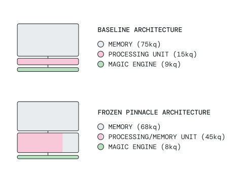 
FIG. 1. Comparison of the baseline architecture of Ref. [1], which allows for RSA-2048 factoring with approximately 100 000 qubits in one month and the Frozen Pinnacle Architecture presented here, which allows factoring with approximately 120 000 qubits in the same time while ensuring a fixed connectivity degree of eight. The Processing/Memory Unit refers to a dual-use module made up of blocks with both a processing sector and a memory sector, as explained in section III A and section III B 2.

📷 Fig 2

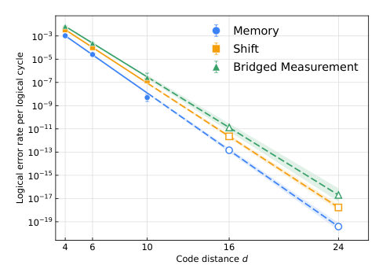 
FIG. 2. Circuit-level simulation results for the per-block logi- cal error rate of the Frozen Pinnacle components at p = 10−3, versus code distance d. Filled markers are simulated data (d = 4, 6, 10) while open markers (d = 16, 24) are extrapolated from the fit of eq. (1). Error bars and the shaded extrapolation band denote 95% confidence intervals.

**Summary.** This paper details the adaptation of the Pinnacle quantum computing architecture for superconducting qubits, which inherently have fixed connectivity. By developing the 'Frozen Pinnacle Architecture' with a fixed connectivity degree of eight, the authors demonstrate a viable pathway to factor 2048-bit RSA integers using about 120,000 physical qubits in one month.

**Why it may be interesting.** This work provides a concrete, resource-estimated roadmap for scaling quantum computation on superconducting hardware by solving the critical issue of fixed connectivity, which is a major bottleneck in realizing large-scale quantum processors.

Detailed structure

**Main problem.** The core challenge is adapting the high-level Pinnacle quantum computation architecture to the physical constraints of superconducting qubits, specifically the requirement for fixed qubit connectivity.

**Main result.** The modified 'Frozen Pinnacle Architecture' successfully supports the factoring of a 2048-bit RSA integer within one month using approximately 120,000 physical qubits.

**Method.** The authors modified the architecture by using specific gadgets and relying on cyclic shift automorphisms to implement necessary logical Pauli measurements while strictly maintaining a fixed connectivity degree of eight.

**Model / system.** The system is based on superconducting qubits and utilizes the generalized bicycle (GB) code, implemented through interconnected 'gadget systems' and 'processing blocks' to achieve fault-tolerant quantum computation.

**Key observables.** Factoring time (one month), physical qubit count (120,000), and the fixed connectivity degree (eight).

**Important parameters / regimes.** Physical error rate ($10^{-3}$), code cycle time ($1 \mu s$), and reaction time ($10 \mu s$).

**Assumptions / limitations.** The resource estimate assumes a runtime limit of one month, and the analysis relies on extrapolating simulation results for larger code distances using an ansatz.

**Figures summary.** Figure 1 compares the baseline vs. frozen architecture qubit counts. Figure 2 shows the per-block logical error rate vs. code distance for various measurement components.

**Paper structure.** The paper details the architectural modification to enforce fixed connectivity, describes the implementation of complex operations like memory access and Toffoli gates using specific automorphisms, and concludes with a resource estimation for RSA-2048 factoring.

Abstract

We show how the Pinnacle architecture can be adapted to be compatible with superconducting qubits, where the connectivity between qubits must be fixed at fabrication. Specifically, we present a modified instantiation of the architecture that has fixed connectivity degree of eight. With this instantiation, we show that a 2048-bit RSA integer can be factored in one month with approximately 120 000 physical qubits, given a physical error rate of $10^{-3}$, code cycle time of 1 microsecond and reaction time of 10 microseconds.

[↑ back to top](#top)

### [Time rescaling for second-order feedback-based quantum optimization](http://arxiv.org/abs/2609.21640v1)

**Authors:** Leticia Bertuzzi, João P. Engster, Evandro C. R. da Rosa, Eduardo I. Duzzioni  
**Type:** theory · **Category:** quantum information and computing · **PDF:** <https://arxiv.org/pdf/2609.21640v1>  
**Analysis basis:** full PDF text, analyzed in chunks
**Topic relevance:** `quantum measurements` **3/5**

📷 Fig 1

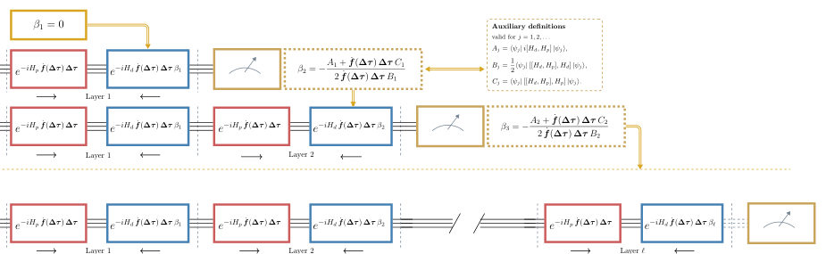 
FIG. 1. Circuit model for TR-Hy-FALQON. At the end of each layer, the same quantities required for SO-FALQON are measured and used to calculate the control parameter. The effective time step ˙f∆τ is determined according to Eq. (10).

📷 Fig 2

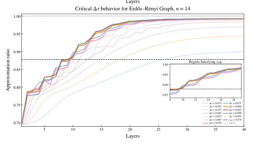 
FIG. 2. TR-Hy-FALQON approximation ratios for different values of ∆τ up to its critical value. The results were obtained for the selected geometries in Fig. 3, and the bold curves in- dicate the top five best-performing values for ∆τ, highlighted in the insets. The horizontal dashed line is the theoreti- cal approximation ratio guarantee provided by the classical Goemans–Williamson algorithm.

📷 Fig 3

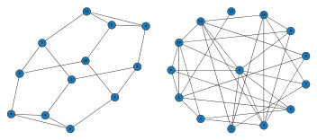 
FIG. 3. Selected geometries employed to obtain the best ap- proximation ratios for TR-Hy-FALQON described in Fig. 2. Left: 12-vertex 3-regular graph. Right: 14-vertex Erd˝os– R´enyi graph, with p = 0.3.

📷 Fig 4

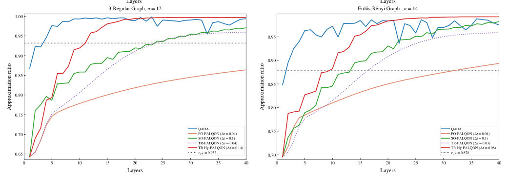 
FIG. 4. Approximation ratios for random 12-vertex 3-regular graphs and 14-vertex Erd˝os–R´enyi graphs as a function of the number of layers employed in the quantum circuits generated by the QAOA, FO-FALQON, SO-FALQON, TR-FALQON, and TR-Hy-FALQON algorithms. Top: averaged results for 30 different graphs chosen randomly. The shaded regions correspond to the standard deviation. For each FALQON variant, only one critical time-step value, ∆t or ∆τ, has been used. Bottom: in particular, we used those values of the critical time steps that return the best approximation ratios for the graphs depicted in Fig. 3. The horizontal dashed line is the theoretical approximation ratio guarantee provided by...

**Summary.** This paper introduces TR-Hy-FALQON, a novel quantum optimization algorithm that merges time-rescaling and second-order feedback corrections into the FALQON framework. By doing so, it significantly reduces the required circuit depth and improves convergence stability compared to prior methods. This advancement makes quantum optimization more viable for near-term NISQ quantum hardware.

**Why it may be interesting.** The focus on reducing circuit depth and achieving stable convergence with larger time steps directly addresses major hardware limitations in current quantum computing architectures, making it highly relevant for theoretical work on quantum algorithms.

Detailed structure

**Main problem.** The primary goal is to improve quantum optimization algorithms, specifically Feedback-based Quantum Algorithms (FQAs), to reduce circuit depth for practical implementation on Noisy Intermediate-Scale Quantum (NISQ) devices.

**Main result.** The proposed unified framework, TR-Hy-FALQON, significantly improves upon previous variants by achieving high approximation ratios with fewer required circuit layers compared to existing methods.

**Method.** The authors merge time-rescaling techniques with second-order error corrections within the FALQON framework to derive a robust control parameter.

**Model / system.** The work models quantum computation for solving optimization problems, governed by a total Hamiltonian $H = H_p + eta(t)H_d$, where $H_p$ is the problem Hamiltonian and $H_d$ is the driver Hamiltonian.

**Key observables.** Approximation ratio ($r$), circuit depth (number of layers $\ell^*$), and the cost function $C(t) = \langle H_p 
angle$.

**Important parameters / regimes.** The time step $\Delta	au$ (for time-rescaling) and the critical time step $\Delta	au_c$ are key parameters determining convergence stability.

**Assumptions / limitations.** The analysis assumes that the combined method allows for stable convergence with few layers, avoiding the need for iterative classical optimization loops.

**Figures summary.** Figures compare the approximation ratio vs. number of layers for various algorithms (including QAOA and different FALQON variants) across 3-regular and Erdős–Rényi graphs, benchmarking against the classical Goemans–Williamson bound.

**Paper structure.** The paper builds upon existing FALQON variants (TR-FALQON, SO-FALQON) by developing a unified, time-rescaled, second-order approach (TR-Hy-FALQON). It then rigorously benchmarks this new method against established quantum and classical optimization techniques.

Abstract

Feedback-based quantum algorithms recently gained attention by demonstrating how quantum computers can be used to solve optimization problems without resorting to hybrid quantum-classical architectures. Recent progress made with Feedback-based Algorithm for Quantum Optimization (FALQON) variants significantly reduced the depth of the required circuits. In this work, we merge the time-rescaled and second-order FALQON variants into a unified framework. The results show an important improvement over past modifications, reducing circuit depth and allowing a more flexible choice of time-steps, while maintaining stable solutions. This FALQON variant makes it suitable for the NISQ era.

[↑ back to top](#top)

### [Persistence, resetting, and first-passage times of an active Ornstein--Uhlenbeck particle](http://arxiv.org/abs/2609.21124v1)

**Authors:** Demosthenes K. Georgiou, Paul C. Bressloff, Thibault Bertrand  
**Type:** theory · **Category:** statistical mechanics · **PDF:** <https://arxiv.org/pdf/2609.21124v1>  
**Analysis basis:** full PDF text, analyzed in chunks
**Topic relevance:** `Keldysh / 2PI / non-Gaussian methods` **2/5** · `methods for driven-dissipative` **2/5** · `analog quantum simulation` **1/5** · `correlated / nonlocal dissipation` **1/5** · `driven-dissipative phase transition` **1/5** · `non-equilibrium universality` **1/5** · `quantum measurements` **1/5**

📷 Fig 1

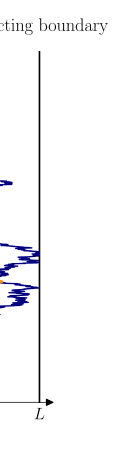 
Figure 1. Schematic trajectory of an active Ornstein–Uhlenbeck particle on the interval [0, L], with an absorbing boundary at x = 0 and a reflecting boundary at x = L. Resetting returns the particle to x0, and the propulsion velocity is reset according to the chosen protocol.

📷 Fig 2

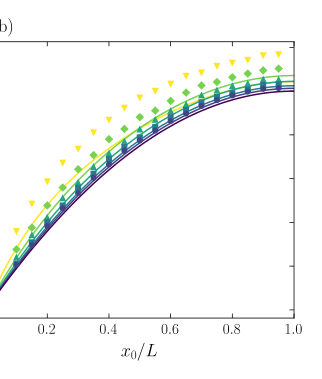 
Figure 2. MFPT without resetting as a function of x0/L for (a) τ = 0.25 and (b) τp = 1 for the values of Pe indicated in the figure. Solid lines show the perturbative approximation to O(Pe2) and symbols show simulation results.

📷 Fig 3

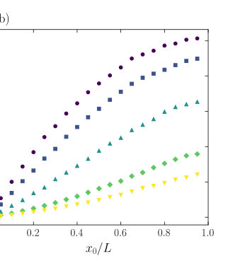 
Figure 4. MFPT without resetting for fixed initial velocities, for (a) v0 = +1 and (b) v0 = −1 for τp = 0.25 and the values of Pe indicated in the figure. The results are obtained from simulations.

📷 Fig 4

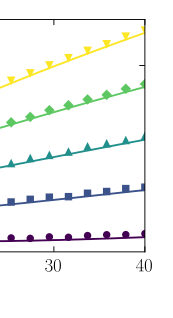 
Figure 5. MFPT Tr as a function of the resetting rate r for varying values of x0/L, at fixed τp = 1, and Pe = 1. The solid curves show the perturbative prediction to O(Pe2), and the symbols are the simulation results. Depending on the initial position, the dependence on r is either monotonic or non-monotonic.

📷 Fig 5

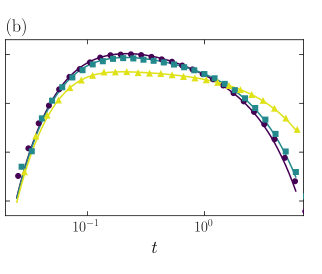 
Figure 6. FPT distributions for (a) x0/L = 0.25 and (b) x0/L = 0.75 at fixed Pe = 1 and τp = 1. Solid lines and symbols denote the theory and simulations results respectively. Resetting suppresses the long-time tail when it is beneficial, but delays absorption when it interrupts trajectories that would otherwise reach the target.

**Summary.** This theoretical work analyzes how the mean first-passage time of an active particle is affected by intrinsic activity and external stochastic resetting. Using perturbative methods on the Fokker-Planck equation, the authors map out parameter regimes where the combination of activity and resetting can synergistically accelerate the process towards an absorbing boundary.

**Why it may be interesting.** While focused on classical active matter, the mathematical techniques involving non-equilibrium dynamics, boundary value problems, and the interplay between external driving (activity) and external intervention (resetting) are highly relevant to open quantum systems and quantum control theory.

Detailed structure

**Main problem.** The study investigates the statistics of first-passage times (FPT) for an active Ornstein-Uhlenbeck particle confined to a 1D interval with specific boundary conditions, incorporating stochastic resetting.

**Main result.** The paper determines the conditions under which activity and resetting together reduce the mean first-passage time, identifying a phase diagram controlling this reduction.

**Method.** The analysis employs perturbative solutions to the Fokker-Planck equation in the weak-activity regime, utilizing a renewal framework for the resetting dynamics.

**Model / system.** The model is an active Ornstein-Uhlenbeck particle (AOUP) confined to $[0, L]$, featuring an absorbing boundary at one end and a reflecting boundary at the other. Stochastic resetting is added to the dynamics.

**Key observables.** Mean First-Passage Time (MFPT), survival probability, and the FPT density.

**Important parameters / regimes.** Diffusivity ($D$), persistence time ($	au_p$), activity strength ($p$), and the resetting rate ($r$).

**Assumptions / limitations.** The analysis is restricted to the weak-activity regime ($	ext{Pe} \ll 1$), and Poissonian resetting is assumed.

**Figures summary.** Figure 1 schematically illustrates the AOUP trajectory, boundaries, and the effect of resetting. Figure C1 shows the relative error decreasing as persistence time increases.

**Paper structure.** The paper develops the dynamics via the Fokker-Planck equation, solves it perturbatively in the weak-activity limit, applies renewal theory for resetting, and analyzes the resulting MFPT dependence on activity and resetting rates.

Abstract

We study the first-passage time statistics of an active Ornstein--Uhlenbeck particle on a finite one-dimensional interval with an absorbing boundary at one end and a reflecting boundary at the other, subject to stochastic resetting. In the weak-activity regime, we develop a perturbative solution of the Fokker--Planck equation and use a renewal framework to obtain analytical expressions for the first-passage-time distribution and its low-order moments. In the absence of resetting, activity can either increase or decrease the mean first-passage time, depending on the relation between the persistence time and the diffusive time to absorption. When resetting is introduced, we determine both the onset of beneficial resetting and the finite range of resetting rates for which resetting lowers the mean first-passage time of the active system. We further show that the resetting transition depends on the velocity resetting protocol. Finally, by comparing the active particle with resetting to the passive Brownian particle without resetting, we construct a phase diagram that identifies the regions of parameter space in which activity and resetting together reduce the mean first-passage time.

[↑ back to top](#top)

### [Polariton Bell Node for Quantum Repeaters](http://arxiv.org/abs/2609.21428v1)

**Authors:** Junhui Cao, Alexey Kavokin  
**Type:** theory · **Category:** quantum information and computing · **PDF:** <https://arxiv.org/pdf/2609.21428v1>  
**Analysis basis:** full PDF text, analyzed in chunks
**Topic relevance:** `Tavis-Cummings & cavity-many-emitter` **2/5** · `analog quantum simulation` **2/5** · `QC/QI experiment` **1/5** · `driven-dissipative phase transition` **1/5** · `methods for driven-dissipative` **1/5** · `quantum measurements` **1/5** · `quantum optics experiment` **1/5**

📷 Fig 1

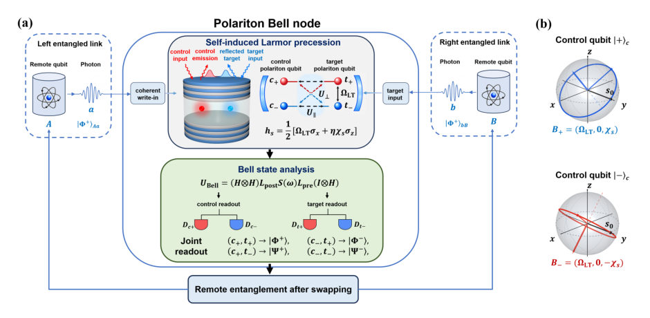 
FIG. 1. Polariton Bell node and conditional spin rotation. (a) Conditional scattering and the local rotations in Eq. (7) map (Φ+, Φ−, Ψ+, Ψ−) to outcomes (00, 10, 01, 11) at the chosen frequency ω0. Operators act from right to left. The optional input rotation Qθ adjusts the measurement for a finite pulse. Each outcome specifies a Pauli correction on the remote pair. Loading and optical readout are assumed coherent interfaces. (b) The control states |+⟩c and |−⟩c select target fields B± = (ΩLT, 0, ±χs) in angular-frequency units. The condition Tr(R† +R−) = 0 makes the scattering gate locally equivalent to CZ.

📷 Fig 2

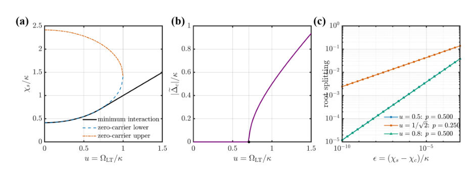 
FIG. 2. Solutions of the CZ condition, Eq. (9). (a) Minimum interaction cmin(u) (black) and the two branches at zero detuning. The threshold changes form at u = 1/ √

📷 Fig 3

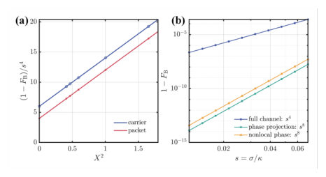 
FIG. 3. Bell-state discrimination for finite pulses near c = u = 1/ √

📷 Fig 4

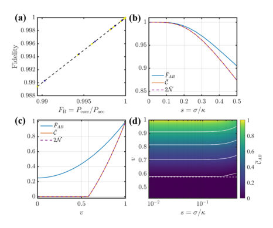 
FIG. 4. Entanglement swapping with imperfect elemen- tary links. (a) Outcome-averaged remote fidelity and FB = Pcorr/Pacc for ideal links, including sampled trace- nonincreasing operations. The dashed line is F AB = FB. (b) Remote Bell fidelity F AB, concurrence CAB, and twice the negativity 2N AB versus s = σ/κ for ideal links. (c) Two identical Werner links and an ideal analyzer (s = 0), giving re- mote visibility v2 and entanglement for v &gt; 1/ √

**Summary.** This paper proposes a novel Bell-measurement node for quantum repeaters using semiconductor microcavity polaritons. By exploiting spin-dependent polariton interactions, the authors demonstrate the feasibility of implementing a controlled-Z gate and distinguishing all Bell states. The analysis rigorously quantifies performance metrics, showing that the scheme offers lower interaction thresholds and characterizing entanglement decay with finite bandwidth.

**Why it may be interesting.** This work directly tackles the hardware implementation challenge for quantum networks by proposing a solid-state platform (polaritons) to realize fundamental quantum gates (CZ) necessary for quantum repeaters.

Detailed structure

**Main problem.** The paper addresses the need for an efficient Bell-measurement node for quantum repeaters to enable entanglement swapping, overcoming limitations of passive linear optics.

**Main result.** They demonstrate that a polariton-based node can implement a controlled-Z gate and distinguish all four Bell states, achieving a lower interaction threshold than scalar Kerr references.

**Method.** The analysis involves deriving the controlled-Z gate condition from the effective spin-dependent polariton-polariton interaction Hamiltonian and analyzing error scaling with bandwidth.

**Model / system.** The physical platform is a planar semiconductor microcavity operating in the strong-coupling regime, forming polaritons from cavity photons and quantum-well excitons. The interaction is modeled via an effective Hamiltonian involving control and target photons.

**Key observables.** Controlled-Z (CZ) gate fidelity, entanglement swapping fidelity ($F_{AB}$), concurrence ($C_{AB}$), and negativity ($N_{AB}$).

**Important parameters / regimes.** Interaction strength ($c$), detunings ($x^2_\pm$), pulse bandwidth ($s$), and link visibility ($v$).

**Assumptions / limitations.** The analysis assumes coherent loading and readout, and uses approximations for small bandwidths ($s 	o 0$) when analyzing error scaling.

**Figures summary.** Figures illustrate the polariton Bell node, conditional spin rotation, CZ gate mapping, and the dependence of entanglement fidelity on bandwidth and link visibility, showing quartic decay ($s^4$).

**Paper structure.** The paper progresses from proposing the physical node and deriving the CZ gate condition using the interaction Hamiltonian, to analyzing finite bandwidth effects and error scaling, and finally characterizing entanglement swapping fidelity under noise models.

Abstract

We propose a Bell-measurement node for quantum repeaters based on a planar semiconductor microcavity operating in the strong-coupling regime. Cavity photons hybridize with quantum-well excitons to form polaritons combining properties of photons and matter quasiparticles. A control photon loaded into one polariton mode changes the polarization response seen by a subsequently incident target photon. This conditional rotation is governed by the interplay of self-induced Larmor precession triggered by spin-dependent exciton-exciton interactions and the polarization beats caused by the splitting of transverse-electric and transverse-magnetic cavity modes. We identify conditions of the experiment that enable implementation of a controlled-Z gate and allow to distinguish all four Bell states in the ideal limit. The one-sided scattering scheme provides a lower interaction threshold than a scalar Kerr reference under the same assumptions. At a selected operating point, the bandwidth-induced identification error scales as the fourth power of the pulse bandwidth in the narrow-band limit. An additional fixed input rotation reduces this error even further. We describe the entanglement swapping between remote memories and determine the minimum quality of the elementary links needed to obtain an entangled output.

[↑ back to top](#top)

### [Floquet-spin-orbit compensation and flat- and quadratic-band contact in the $α$-$T_3$ lattice](http://arxiv.org/abs/2609.21586v1)

**Authors:** Imtiaz Khan, Muzamil Shah, Reza Asgari, Gao Xianlong  
**Type:** theory · **Category:** other · **PDF:** <https://arxiv.org/pdf/2609.21586v1>  
**Analysis basis:** full PDF text, analyzed in chunks
**Topic relevance:** `Keldysh / 2PI / non-Gaussian methods` **2/5** · `analog quantum simulation` **2/5** · `methods for driven-dissipative` **2/5** · `driven-dissipative phase transition` **1/5**

📷 Fig 1

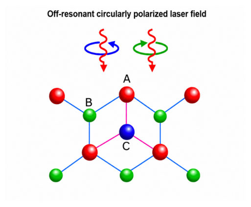 
FIG. 1. Schematic of the off-resonantly driven, spin–orbit- coupled α-T3 lattice. The three sublattices form the kinetic chain A–B–C and are distinguished by color: A (red), B (green), and C (blue); the sublattice-resolved spin–orbit and Floquet masses acting on the three on-site levels are indicated.

📷 Fig 2

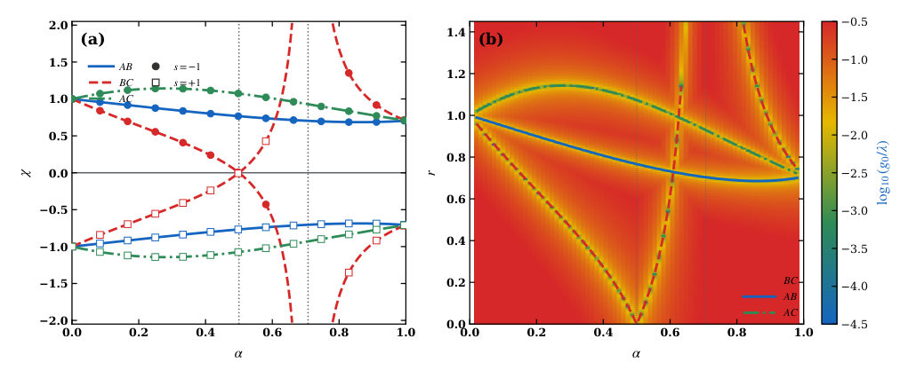 
FIG. 2. Signed and positive-drive critical geometry. (a) Exact pairwise degeneracies χij. The three branches are distinguished by both color and line style: AB is shown by blue solid lines, BC by orange dashed lines, and AC by magenta dash-dotted lines. The real-spin sectors are further distinguished by filled-circle markers for s = −1 and open-square markers for s = +1. The dotted vertical lines mark α = 1/2 and 1/ √

📷 Fig 3

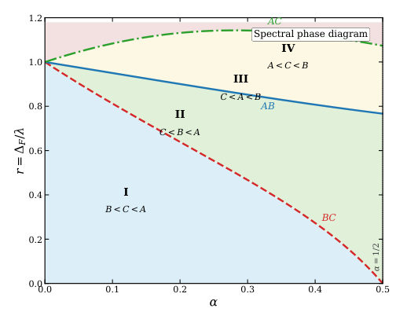 
FIG. 3. Spectral phase diagram of the positive-drive branch in the interval 0 ≤α ≤1/2. The exact compensation lines BC, AB, and AC divide the (α, r) plane, with r = ∆F /λ, into four regions with distinct q = 0 level orderings. As the drive increases at fixed α, the sequence of spectral rearrange- ments is BC →AB →AC. The BC and AB boundaries correspond to linear Dirac contacts, whereas the AC bound- ary marks the restoration of the exact dark flat band and its quadratic touching partner. At the graphene endpoint α = 0 the three boundaries emanate from the single point (α, r) = (0, 1), where the two intermediate orderings collapse because the C level stays at zero energy for every drive. The...

📷 Fig 4

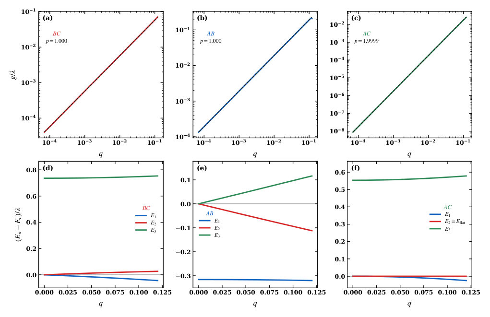 
FIG. 4. Critical dispersion from direct diagonalization of the complete 3 × 3 Hamiltonian at α = 0.30. (a)–(c) Minimum adjacent gap g and small-q power-law fits: linear g ∝q for the BC and AB contacts, quadratic g ∝q2 at AC. (d)–(f) The same full calculation plotted as (En −Ec)/λ, with one common crossing energy Ec in each panel. All three energy-ordered eigenvalues are shown and annotated. The remote band remains separated from the touching pair; no two-band eigenvalue is substituted into these panels. At AC, E2 = Eflat = Ec is the exact dark flat band, E1 is its quadratic partner, and E3 remains nondegenerate.

📷 Fig 5

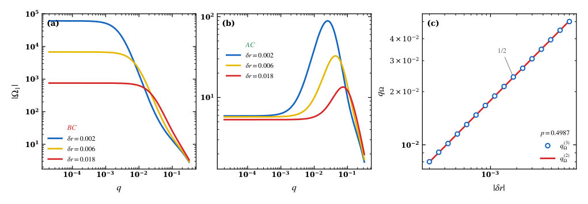 
FIG. 5. Berry curvature near the linear BC and quadratic AC degeneracies at α = 0.30. (a) |Ω1| for three BC drive detunings. (b) Corresponding AC profiles, with the maximum at finite q. (c) Curvature-ring radius from the complete three-band Kubo calculation and from Eq. (57). The numerical points are fitted to a power law; the solid curve is Eq. (57) with coefficients fixed by the Schrieffer-Wolff reduction, with no fit to the three-band data.

**Summary.** This work analyzes the $\alpha$-$T_3$ lattice under optical driving to study Floquet-spin-orbit compensation. The key finding is that the resulting exact band degeneracies, such as flat-band contacts, can be quantitatively mapped back to determine the system's structural parameter ($\alpha$) by measuring its transverse thermoelectric response. This establishes a powerful, experimentally accessible diagnostic tool for characterizing engineered quantum materials.

**Why it may be interesting.** It provides a concrete, measurable link between tunable Floquet engineering (optical driving) and fundamental topological/geometric properties (band degeneracies) in condensed matter systems.

Detailed structure

**Main problem.** The study investigates how the compensation between intrinsic spin-orbit coupling and an external optical field creates specific band degeneracies in a lattice model.

**Main result.** The degeneracy structure, including an exact flat- and quadratic-band contact, is shown to be robust and can be mapped back to determine the system's underlying lattice parameter ($\alpha$) using measurable thermoelectric responses.

**Method.** The authors use continuum Hamiltonian analysis, Floquet theory, and Kubo response calculations to relate spectral degeneracies to transport coefficients.

**Model / system.** The system is the $\alpha$-$T_3$ lattice, a minimal three-band extension interpolating between graphene and the dice lattice. The physics is governed by the interplay of intrinsic Kane-Mele SOC and an off-resonant circularly polarized optical field.

**Key observables.** Valley-spin degeneracy, spin-band degeneracy, flat-dispersive band degeneracy, transverse thermoelectric response ($\alpha_{c,xy}$), and Berry curvature.

**Important parameters / regimes.** The lattice parameter $\alpha$ ($0 \le \alpha \le 1$), the strength of the optical field, and the common spin-orbit energy scale.

**Assumptions / limitations.** The analysis is valid in the high-frequency limit and the inverse characterization scheme has a finite domain of validity, particularly failing when spin-reassignment occurs.

**Figures summary.** Figures illustrate the lattice structure, the momentum dependence of band shifts $[	ext{En}(q) - 	ext{En}(0)]/\lambda$, and the comparison between calculated response extrema and spectral degeneracies.

**Paper structure.** The paper progresses from defining the Hamiltonian and identifying three types of band degeneracies, to deriving a scale-free ratio from linear degeneracies to enable parameter inversion, and finally confirming these results using full three-band Kubo calculations.

Abstract

We investigate Floquet--spin-orbit compensation in the three-band $α$-$T_3$ system, which interpolates between graphene at $α=0$ and the dice lattice at $α=1$. By tuning the interplay between an off-resonant circularly polarized optical field and intrinsic spin--orbit coupling, we identify three distinct pairwise band-degeneracy conditions in the quasienergy spectrum: (i) valley--spin degeneracy, (ii) spin--band degeneracy, and (iii) flat--dispersive band degeneracy. The flat band is not an artifact of a two-band reduction but rather an exact property of the continuum Hamiltonian at this compensation point, where the complete three-band Hamiltonian supports a momentum-independent dark state. A winding-two low-energy Hamiltonian and a finite-momentum Berry-curvature maximum, whose radius scales as the square root of the detuning, emerge from detuning this contact. We further show that the intrinsic transverse thermoelectric response encodes these spectrum patterns. The flat- and quadratic-band degeneracy can be predicted for $0<α<1/2$ because the two response scales linked to the linear contacts have a monotonic ratio independent of the common spin--orbit energy scale. This allows an inverse determination of $α$ and of the common spectral scale. The analytical results are confirmed by full three-band Kubo calculations, which also define the regime in which this inverse characterization is still observable. These results connect an experimentally accessible, Berry-curvature-sensitive thermoelectric response to tunable Floquet--spin--orbit band geometry.

[↑ back to top](#top)

### [Digital-analog concept for superconducting perceptron-like neural networks](http://arxiv.org/abs/2609.21613v1)

**Authors:** Andrey E. Schegolev, Vsevolod I. Ruzhickiy, Georgy I. Gubochkin, Alexander S. Ionin, Ivan A. Nazhestkin, Mikhail Y. Fominskii, Lyudmila V. Filippenko, Igor I. Soloviev, Maxim V. Tereshonok, Nikolay V. Klenov  
**Type:** both · **Category:** disordered systems and neural networks · **PDF:** <https://arxiv.org/pdf/2609.21613v1>  
**Analysis basis:** full PDF text, analyzed in chunks
**Topic relevance:** `QC/QI experiment` **2/5** · `driven-dissipative phase transition` **1/5** · `methods for driven-dissipative` **1/5** · `quantum measurements` **1/5**

📷 Fig 1

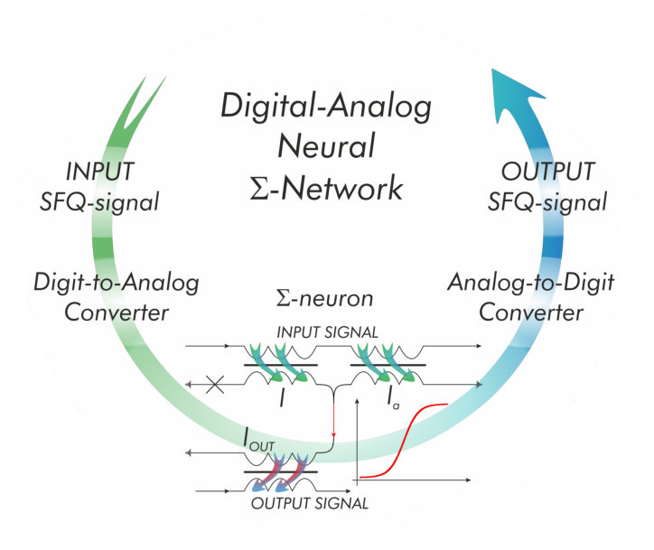 
FIG. 1. Illustration of concept of a digital-analog neural network using the example of a ”DAC +

📷 Fig 2

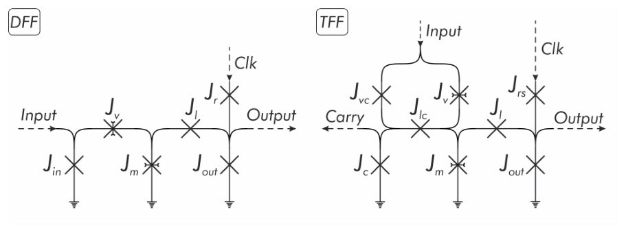 
FIG. 2. Inductor-free all-Josephson-junction storage cells used in the digital parts of the DAD

📷 Fig 3

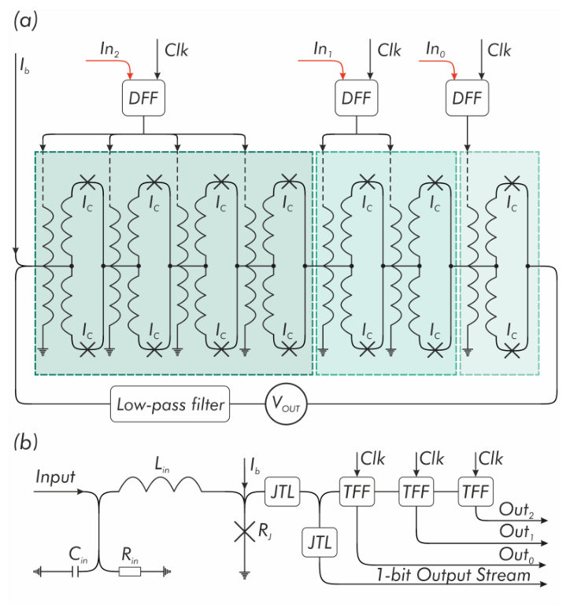 
FIG. 3. Schematic representation of (a) a digital-to-analog and (b) analog-to-digital converter.

📷 Fig 4

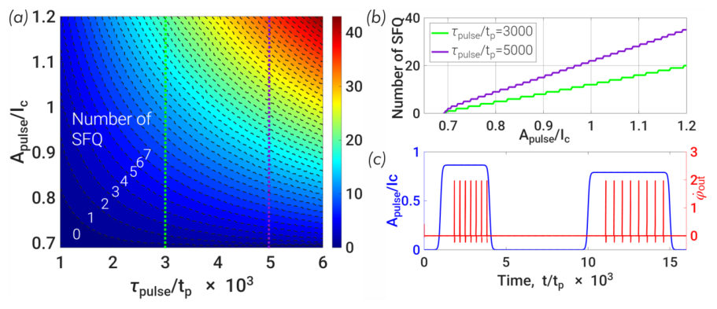 
FIG. 4. Calibration and time-domain operation of the ADC front end. (a) Simulated number

📷 Fig 5

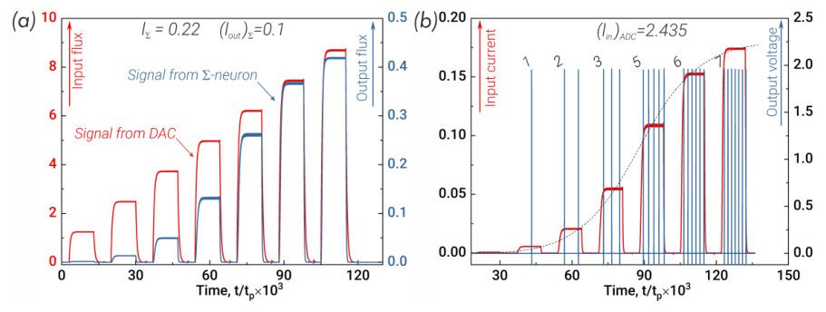 
FIG. 5. (a) Modelling the conversion of the {0, 1, 2, 3, 4, 5, 6, 7} SFQ signal by 3-bit DAC (red

**Summary.** This work proposes a superconducting neural network architecture that bridges the gap between digital SFQ logic and analog nonlinear processing using a $\Sigma$-neuron. By fabricating and characterizing this hybrid DAD converter, the authors demonstrate that the system can achieve high classification accuracy on MNIST, validating the feasibility of superconducting neuromorphic hardware.

**Why it may be interesting.** While focused on superconducting electronics, the underlying principles of using nonlinear dynamics ($\Sigma$-neuron) to model complex computation and the integration of physical constraints into machine learning models resonate with the study of non-equilibrium dynamics in complex systems.

Detailed structure

**Main problem.** The paper addresses the challenge of building energy-efficient superconducting artificial neural networks by proposing a hybrid digital-analog architecture.

**Main result.** They successfully demonstrated that a perceptron trained using the measured, non-ideal $\Sigma$-neuron characteristic achieved high classification accuracy (91.9%) on the MNIST dataset.

**Method.** The study combines circuit-level simulations with physical device characterization, fabricating and measuring a $\Sigma$-neuron to validate its use in a full digital-analog-digital (DAD) processing chain.

**Model / system.** The core system is a superconducting perceptron utilizing Single-Flux-Quantum (SFQ) communication for digital I/O, coupled with an analog $\Sigma$-neuron for nonlinear processing. The architecture is modeled as a DAC $
ightarrow$ $\Sigma$-neuron $
ightarrow$ ADC chain.

**Key observables.** Classification accuracies on MNIST (97.0% for ideal sigmoid vs. 91.9% for measured $\Sigma$-neuron); the measured sigmoid-like transfer characteristic of the $\Sigma$-neuron.

**Important parameters / regimes.** Operating range matching requirements for DAC, neuron, and ADC blocks; Josephson junction parameters ($eta, \alpha, b, a$).

**Assumptions / limitations.** The approach assumes the $\Sigma$-neuron can serve as the constrained nonlinear element, and that individual blocks can be simulated and integrated despite not being co-simulated as a single self-consistent circuit.

**Figures summary.** Figures illustrate the conceptual DAD path (DAC + $\Sigma$-neuron + ADC), the specific superconducting circuit elements (DFF, TFF), and the simulation results showing the conversion process and final network performance.

**Paper structure.** The paper progresses from establishing the need for a hybrid architecture, detailing the circuit models for the digital (SFQ) and analog ($\Sigma$-neuron) components, presenting the characterization of the fabricated $\Sigma$-neuron, and concluding with system-level simulations and performance testing on MNIST.

Abstract

A promising route to superconducting artificial neural networks is a hybrid digital-Analog architecture that combines digital single-flux-quantum (SFQ) communication with compact Analog nonlinear processing. The study focused on the dynamic conversion of a discrete signal passing through a digital-to-Analog-to-digital (DAD) converter, in which the role of the Analog cell was performed by a $Σ$-neuron with a nonlinear transfer function -- the basic cell of perceptron-like neural networks. Furthermore, the DAD converter, the elementary functional block of the hybrid architecture, combines a digital-to-analog converter (DAC) and an Analog-to-digital converter (ADC), and re-encodes the Analog $Σ$-neuron waveforms as an SFQ pulse sequence. Circuit-level simulations demonstrate how input values encoded by SFQ pulse trains are converted into analog signal levels, transformed by the $Σ$-neuron, and mapped back to pulse-based outputs. As a key experimental step, we fabricated and characterised a redesigned $Σ$-neuron and measured a sigmoid-like transfer characteristic suitable for activation-function implementation. The extracted response was incorporated into system-level simulations to assess the influence of realistic device parameters on the conversion process. We delineate the operating-range matching requirements for the DAC, neuron, and ADC blocks, supporting the feasibility of the proposed interface as a building block for perceptron-like superconducting neural networks with digital inputs and outputs. Finally, we developed two perceptron networks, one using a mathematical sigmoid activation and the other the measured $Σ$-neuron transfer characteristic, which reached classification accuracies of $97.0\%$ and $91.9\%$, respectively, on the MNIST handwritten digit dataset.

[↑ back to top](#top)

### [Machine learning magnetic interactions from neutron powder diffraction data](http://arxiv.org/abs/2609.21970v1)

**Authors:** Adit S. Desai, Yongqiang Cheng, Joseph A. M. Paddison  
**Type:** both · **Category:** disordered systems and neural networks · **PDF:** <https://arxiv.org/pdf/2609.21970v1>  
**Analysis basis:** full PDF text, analyzed in chunks
**Topic relevance:** `analog quantum simulation` **2/5** · `methods for driven-dissipative` **2/5** · `quantum measurements` **1/5**

📷 Fig 1

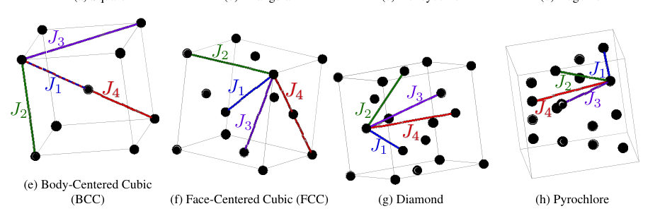 
FIG. 1: The lattices studied in this paper and their four near neighbor magnetic interactions with pathways labeled J1, J2, J3 and J4. Note that the kagome and pyrochlore lattices have two types of symmetry-inequivalent third neighbors that can have different interactions; one of these is labeled J3 in the figure and the other is at double the vector corresponding to J1. In this work we assumed that both third-neighbor interactions are the same.

📷 Fig 2

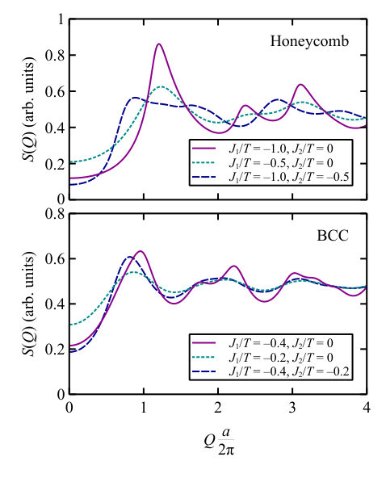 
FIG. 2: Simulated magnetic diffuse S(Q) for the honeycomb lattice (top panel) and BCC lattice (bottom panel), with values of the interaction parameters labeled on the plots.

📷 Fig 3

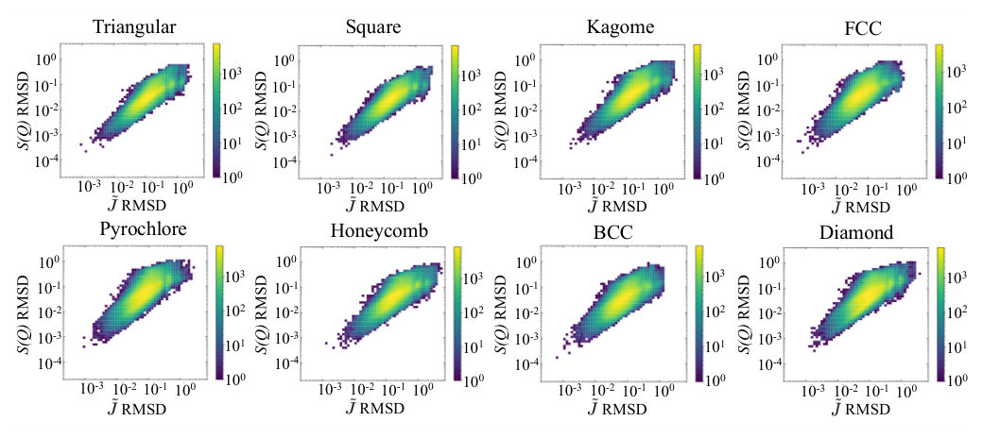 
FIG. 3: Graphs demonstrating sensitivity of the simulated diffuse intensity S(Q) to differences in the magnetic interactions Jn. In each panel, the root-mean-square deviation (RMSD) in S(Q) for a given lattice is plotted against the RMSD in the interaction values ˜Jn, for randomly-chosen pairs of simulations in the training data. Probability density is shown in false color.

📷 Fig 4

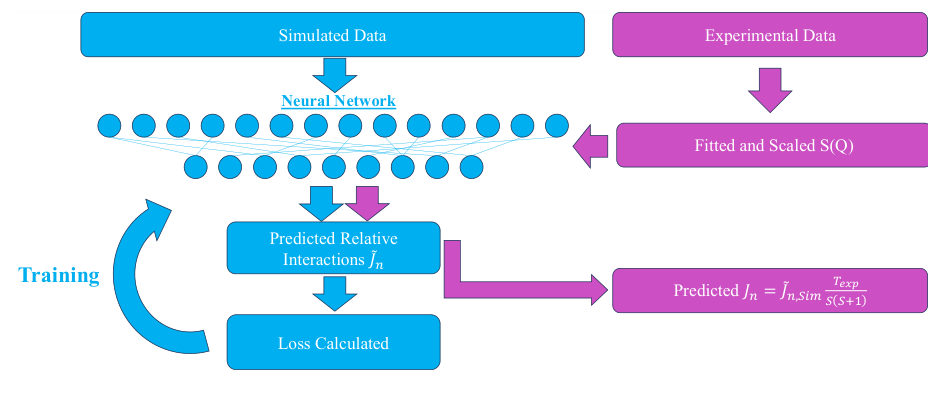 
FIG. 4: Schematic for training the neural network and applying it to experimental data. Blue blocks on the left show the process of training the neural network, and purple blocks on the right show the application to experimental data, which must first be fitted to a smoothing function and normalized before being input to the network.

📷 Fig 5

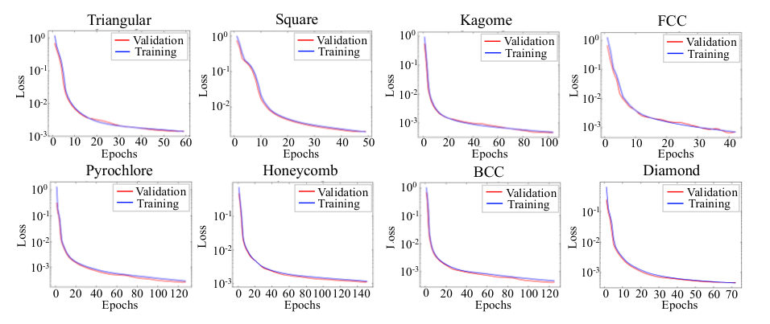 
FIG. 5: Learning curves of the neural network for validation data (red lines) and training data (blue lines). Each panel shows the loss defined in Eq. (7) as a function of the number of completed training loops (epochs) for the lattice indicated.

**Summary.** This work introduces a machine learning framework to solve the inverse problem of extracting magnetic interaction parameters from neutron diffuse scattering data. By training a neural network on simulated data across multiple lattices, the authors demonstrate high accuracy in parameter estimation. This provides a powerful, robust tool for characterizing magnetic interactions in condensed matter systems.

**Why it may be interesting.** While focused on magnetism, the core methodology—using ML to solve an ill-posed inverse problem from complex experimental data—is highly relevant for analyzing quantum many-body systems where direct parameter extraction is difficult.

Detailed structure

**Main problem.** The paper addresses the challenging inverse scattering problem of accurately determining magnetic interaction parameters from diffuse neutron scattering data.

**Main result.** A machine learning approach successfully estimates interaction parameters with high accuracy, avoiding pitfalls like false minima encountered with traditional non-linear least-squares refinement.

**Method.** The study trains a neural network on simulated diffuse scattering data generated across various high-symmetry lattices and interaction parameter sets.

**Model / system.** The system involves magnetic materials modeled by the isotropic Heisenberg Hamiltonian, considering up to four nearest-neighbor interactions on eight high-symmetry lattices.

**Key observables.** Diffuse magnetic intensity S(Q), which serves as a 'fingerprint' of the magnetic interactions.

**Important parameters / regimes.** The reduced interaction parameter $\tilde{J}_n = J_n / T$, and the lattice structure (e.g., Honeycomb, BCC, Kagome).

**Assumptions / limitations.** The approach is limited to high-symmetry lattices, and one assumption involves equating two types of symmetry-inequivalent third-neighbor interactions in certain lattices.

**Figures summary.** Figures illustrate the 8 lattices studied and show representative simulated diffuse S(Q) data for different interaction parameter sets, comparing ML performance against least-squares regression.

**Paper structure.** The paper establishes the physical problem, details the simulation setup (Hamiltonian, data generation), introduces the ML methodology (training, loss function), and validates the approach by comparing ML predictions against experimental data and traditional fitting techniques.

Abstract

Neutron diffraction is a versatile experimental technique capable of probing a material's magnetic properties. While diffraction is typically used to determine the magnetic structure of a material, magnetic diffuse scattering data from a diffraction experiment are also sensitive to the magnetic interactions in its Hamiltonian. However, accurately determining magnetic interaction parameters from neutron-scattering data involves an inverse scattering problem that is challenging to solve in general. Here, we investigate the effectiveness of a machine learning approach to predict the interaction parameters given magnetic diffuse-scattering data measured on powder samples, for a comprehensive survey of isotropic interactions on eight high-symmetry lattices. Across all lattices we considered, the machine-learning approach estimates the interaction parameters with high (~2%) accuracy, while avoiding the issue of false minima that is encountered with non-linear least squares refinement. Our results highlight that powder diffuse-scattering data can provide a compact "fingerprint" of the magnetic interactions for many materials.

[↑ back to top](#top)

### [Nonlocal Magic Spreading in Many-body Quantum Dynamics: From Chaotic Evolution to Quasi-particle Picture in Integrable Models](http://arxiv.org/abs/2609.20951v1)

**Authors:** Sreemayee Aditya, Piotr Sierant, Xhek Turkeshi  
**Type:** theory · **Category:** statistical mechanics · **PDF:** <https://arxiv.org/pdf/2609.20951v1>  
**Analysis basis:** full PDF text, analyzed in chunks
**Topic relevance:** `analog quantum simulation` **2/5** · `Keldysh / 2PI / non-Gaussian methods` **1/5** · `non-equilibrium universality` **1/5** · `scars & prethermalization` **1/5**

📷 Fig 1

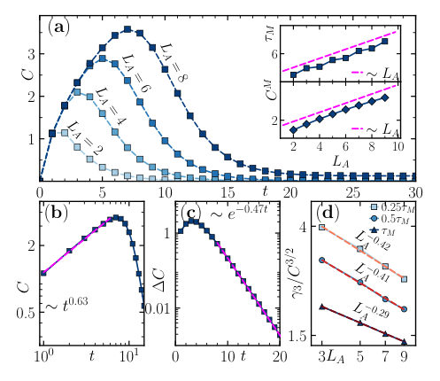 
FIG. 2. Capacity of entanglement in the Haar brick- wall circuit. (a) Rise–peak–fall profile of C(t) for LA = 2, 4, 6, 8. Insets show the linear scaling of the peak time τ M

📷 Fig 2

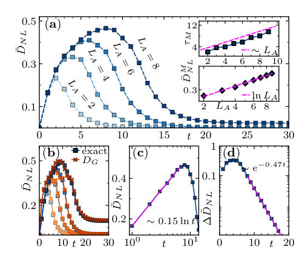 
FIG. 3. Nonlocal magic in the Haar-random brick- wall circuit. (a) Rise–peak–fall profile of DNL(t) for LA = 2, 4, 6, 8. Insets show the peak-time scaling τ M ∝LA and peak-height scaling DM NL ∝log2 LA. (b) Comparison of the Gaussian estimate DG(S, C) with DNL evaluated from the ex- act Schmidt spectrum. (c) Initial logarithmic growth. (d) Ex- ponential relaxation of ∆DNL = DNL −DNL(∞), with a rate independent of LA. All data are for L = 20. Markers denote exact state-vector results and magenta dashed lines denote fits.

📷 Fig 3

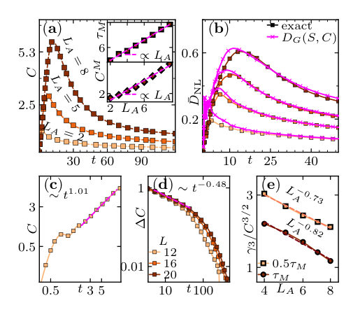 
FIG. 4. Capacity of entanglement in the mixed-field Ising model. (a) C(t) for LA = 2, 5, 8 at L = 20. Insets show the linear scaling of the peak time τ M and peak value CM

📷 Fig 4

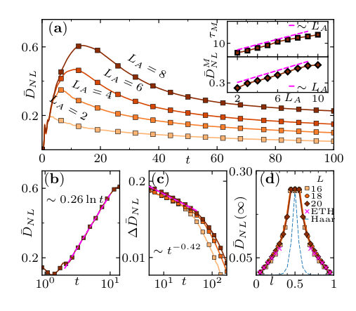 
FIG. 5. Nonlocal magic in the mixed-field Ising model. (a) Rise–peak–fall profile of DNL(t). Insets show a peak time linear in LA and a peak height growing approximately lin- early over the accessible sizes. (b) Initial logarithmic growth. (c) Algebraic relaxation of ∆DNL = DNL −DNL(∞), fitted by ∆DNL ∝t−0.42. (d) Stationary nonlocal magic versus the subsystem fraction ℓ= LA/L, compared with the ther- mal prediction of Eq. (4) (crosses) and the balanced-cut Haar value D0 ≃0.244 (dashed line). We use L = 20 in panels (a)–(b) and L = 16, 18, 20 in panels (c)–(d). Markers denote exact state-vector results and magenta dashed lines denote fits.

📷 Fig 5

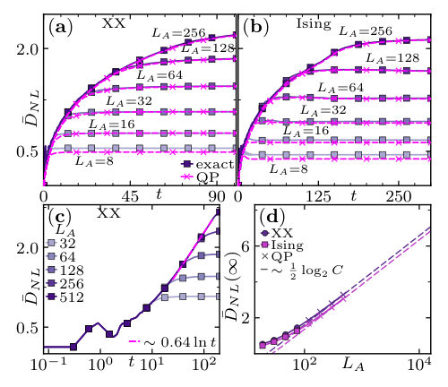 
FIG. 6. Nonlocal magic in free-fermionic Hamiltonian quenches. (a)–(b) Growth–saturation profiles of DNL(t) in the XX and transverse-field Ising chains, comparing exact results (squares) with the quasiparticle prediction (crosses). (c) Initial logarithmic growth, DNL ∝log2 t. (d) Stationary values, obtained from long-time averages for LA ≤64 and from the quasiparticle prediction for LA &gt; 64, approach the asymptotic law 1 2 log2(π ln22 C/8). We use L = 4096 sites and subsystem sizes LA = 8–512.

**Summary.** This work explores the spreading of 'nonlocal magic,' a measure of quantum resource, by linking it to the capacity of entanglement. The authors find that chaotic systems show transient buildup of this magic, while integrable systems sustain a steady-state value proportional to the subsystem size. This reveals fundamental differences in how quantum information is scrambled or preserved in different physical models.

**Why it may be interesting.** The contrast between transient scrambling in chaotic systems and sustained, universal embezzlement in integrable systems provides a deep, quantifiable diagnostic tool for characterizing the underlying dynamics of complex quantum matter.

Detailed structure

**Main problem.** The paper investigates how 'nonlocal magic,' a resource quantifying magic surviving local basis changes, spreads across different quantum many-body dynamics.

**Main result.** Nonlocal magic exhibits transient logarithmic growth followed by decay in chaotic systems, but saturates at a value proportional to the subsystem size logarithm in integrable (free-fermionic) systems.

**Method.** The authors connect nonlocal magic to the capacity of entanglement, using Gaussian approximations and comparing results across different dynamical regimes.

**Model / system.** The study analyzes many-body quantum systems using models ranging from chaotic dynamics (e.g., Haar random circuits) to integrable systems (e.g., free-fermionic Hamiltonians).

**Key observables.** Nonlocal Magic (DNL), Capacity of Entanglement (C), and Entanglement Entropy (S).

**Important parameters / regimes.** Time ($t$), subsystem size ($L_A$), and the distinction between chaotic vs. integrable dynamics.

**Assumptions / limitations.** The initial analysis relies on the Gaussian approximation for Schmidt sums, which is controlled when higher normalized cumulants are small.

**Figures summary.** Figure 1 compares DNL evolution for ergodic vs. free-fermionic dynamics, showing $\log t 	o \mathcal{O}(1)$ vs. $\log t 	o \log^2 L_A$. Figure 2 shows the rise-peak-fall profile of capacity in random circuits.

**Paper structure.** The paper establishes the connection between nonlocal magic and entanglement capacity, then analyzes the time evolution of this quantity across chaotic, integrable, and quasi-equilibrium systems, concluding with operational consequences for entanglement embezzlement.

Abstract

Entanglement and magic are resources that reveal complementary aspects of quantum many-body systems. Their interplay is captured by nonlocal magic, the magic that survives arbitrary local changes of basis. Yet their markedly different dynamical behavior leaves open how this irreducible component of magic spreads. Here we connect nonlocal magic to the capacity of entanglement, a tractable quantity measuring fluctuations of the entanglement Hamiltonian. This connection enables analytically controlled predictions across a wide range of many-body dynamics, from chaotic to integrable systems, which we investigate also using large-scale numerical simulations. In chaotic systems, nonlocal magic exhibits a transient buildup, with logarithmic growth in time followed by decay to a size-independent value. For integrable systems, we develop a quasiparticle picture in quantitative agreement with numerics, showing that the same initial growth instead leads to saturation at a value logarithmic in subsystem size. These contrasting behaviors have an operational consequence for entanglement embezzlement: the strongest scramblers embezzle only transiently, whereas free-fermionic dynamics can sustain universal embezzlement in the steady state.

[↑ back to top](#top)

### [Quantum Loads and the Generalized Telegrapher's Problem](http://arxiv.org/abs/2609.21463v1)

**Authors:** E. Collin, A. Delattre  
**Type:** theory · **Category:** other · **PDF:** <https://arxiv.org/pdf/2609.21463v1>  
**Analysis basis:** full PDF text, analyzed in chunks
**Topic relevance:** `Keldysh / 2PI / non-Gaussian methods` **2/5** · `methods for driven-dissipative` **2/5** · `interference shaping light` **1/5**

📷 Fig 1

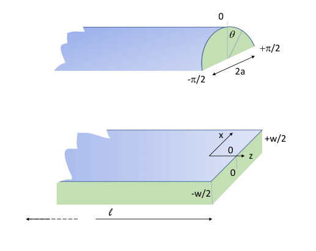 
FIG. 2. One of the electrodes from the pair that confines mi- crowaves in the envisaged guides. Top: the cylindrical (half- electrode) case [17], which can be mapped onto the Cartesian (flat) case [16] (bottom). Metal in blue, dielectric in green.

📷 Fig 2

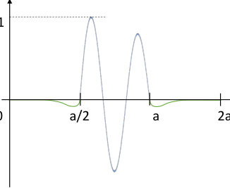 
FIG. 3. Illustration of the mathematical extension of the gv(x) transverse function for a coaxial mode. Here, explic- itly we plot the m = 3 case with a = 2b. The green line can be such that extremities are ”ideally” flat around 0, with |gv(x)| ≪1 (see text).

📷 Fig 3

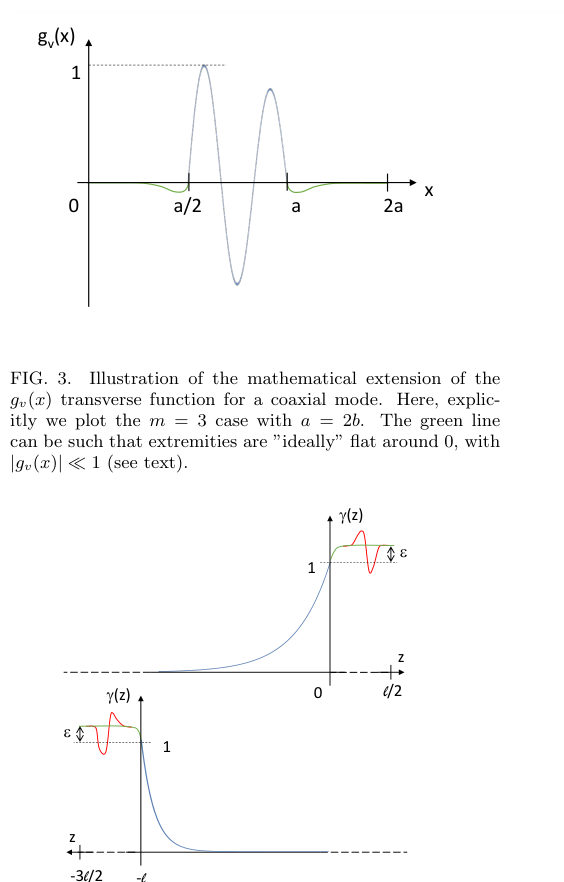 
FIG. 4. Illustration of the mathematical extension of the function γ(z) [not to scale]. The two sides are in principle not symmetric, we simply require in the first place γ(−3/2ℓ) = γ(+ℓ/2) and all derivatives equal to 0 at these extremities. The simplest possibility is the green curve. However, one can as well produce a more involved pattern (schematically the red one), fulfilling a specific integral property (see text).

**Summary.** This work develops a quantum theoretical framework to describe microwave signal propagation in waveguides by mapping classical transmission line theory onto quantum scattering matrices. Using a generalized flux formalism and Hodge decomposition, the authors classify wave dynamics into gradient and curl components. This provides a universal tool for analyzing quantum loads and is directly applicable to microwave-based quantum information transfer.

**Why it may be interesting.** The rigorous mathematical framework connecting classical electromagnetism (waveguides) to quantum scattering theory provides powerful tools for modeling quantum information transfer in solid-state microwave circuits.

Detailed structure

**Main problem.** The paper maps classical microwave transmission line theory onto a quantum scattering matrix description to analyze quantum loads.

**Main result.** It establishes a universal theoretical framework that classifies traveling waves into gradient-type and curl-type charge-currents, shedding light on broken gauge symmetries in TE modes.

**Method.** The authors use a generalized flux formalism and apply a Hodge-like decomposition to the charge-current vector living on the confining electrodes.

**Model / system.** The system involves quantum signals traveling through microwave waveguides (Cartesian and cylindrical geometries) in a cryogenic environment, analyzed via input-output quantum optics theory.

**Key observables.** The load is characterized by complex coefficients $Z_{	ext{load}}(\alpha)$ for each propagating mode $\alpha$.

**Important parameters / regimes.** Waveguide geometries (Cartesian, cylindrical), mode types (TEM, TM, TE), and effective electrode width ($w_{	ext{eff}}$).

**Assumptions / limitations.** The analysis extends beyond conventional TEM transport to include TM and TE modes, requiring the use of a generalized flux field.

**Figures summary.** Figures schematically relate classical transmission lines to quantum scattering matrices and illustrate electrode geometries for different guides.

**Paper structure.** The paper progresses from mapping classical theory to quantum scattering, deriving the charge-current vector via generalized flux, applying Hodge decomposition, and finally classifying wave types and analyzing modal parameters for various geometries.

Abstract

We report on the mapping of classical microwave transmission line theory onto the quantum scattering matrix description. By means of a generalized flux formalism a la Devoret, we derive a charge-current vector living on the confining electrodes, to which a Hodge-like decomposition is applied. The presented theory holds equally well for all types of waves traveling within Cartesian and cylindrical guide geometries (the usual Transverse Electric Magnetic, but also Transverse Magnetic and Transverse Electric ones). We then demonstrate how a generic load decomposes into a series of complex coefficients $Z_{load}(α)$, for each mode $α$ propagating along the line. This decomposition leads to a particular classification of traveling waves: gradient-type and curl-type charge-currents. This distinction shines a new light on a broken gauge symmetry exhibited by a class of Transverse Electric modes. Our results provide a universal theoretical framework, which finds a direct usage in microwave-based quantum information transfer.

[↑ back to top](#top)

### [Semiclassical Arrhenius law for quantum-thermal escape rates](http://arxiv.org/abs/2609.21625v1)

**Authors:** Luca Salasnich, Cesare Vianello  
**Type:** theory · **Category:** statistical mechanics · **PDF:** <https://arxiv.org/pdf/2609.21625v1>  
**Analysis basis:** full PDF text, analyzed in chunks
**Topic relevance:** `Keldysh / 2PI / non-Gaussian methods` **2/5** · `methods for driven-dissipative` **2/5**

📷 Fig 1

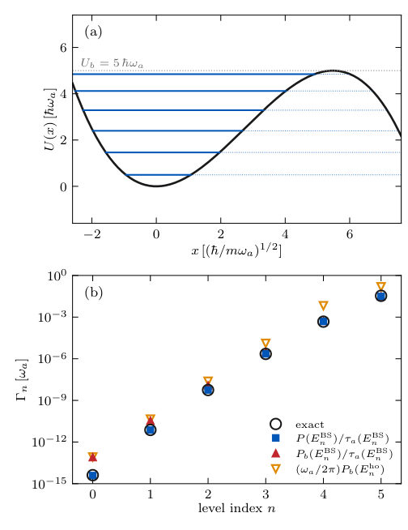 
FIG. 1. (a) Cubic potential with Ub = 5 ℏωa. Horizon- tal lines mark the six exact quasibound levels En of Table I. (b) Partial decay rates Γn: exact (circles), uniform semi- classical P(EBS n )/τa(EBS n ) of Eq. (19) (squares), Hill-Wheeler Pb(EBS n )/τa(EBS n ) of Eq. (21) (filled triangles), and harmonic (ωa/2π)Pb(Eho n ) of Eq. (8) (open triangles). The uniform val- ues are almost indistinguishable from the exact ones on this scale. The filled triangles approach the exact widths mono- tonically as the barrier top is reached, showing the effect of the parabolic approximation alone; the open triangles do not, because the harmonic ladder adds an independent error that grows with n.

📷 Fig 2

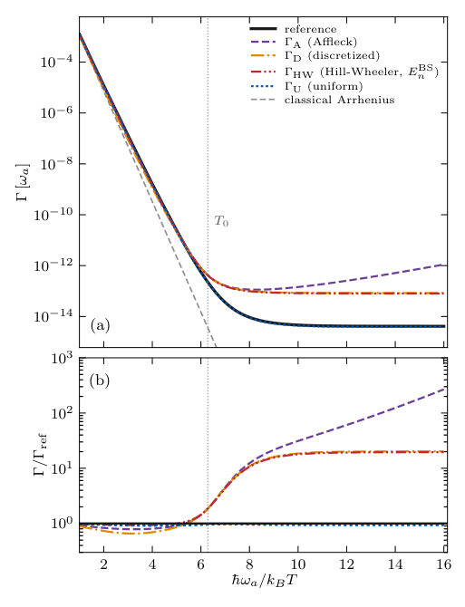 
FIG. 2. (a) Quantum-thermal escape rate of the cubic po- tential with Ub = 5 ℏωa as a function of inverse temperature. Solid black: reference rate (1) obtained from the exact reso- nances of Table I and the above-barrier Kemble transmission. Dashed purple: Affleck’s formula (2). Dot-dashed yellow: dis- cretized formula (8), i.e. the Hill-Wheeler transmission eval- uated on the harmonic ladder Eho n . Dash-dot-dotted red: in- termediate formula (21), i.e. the Hill-Wheeler transmission on Bohr-Sommerfeld levels. Dotted blue: uniform formula (19), i.e. the Kemble transmission on Bohr-Sommerfeld levels. Comparing the last three curves separates the two sources of error in the discretized...

**Summary.** This paper develops advanced semiclassical theories to accurately calculate the quantum-thermal escape rate from a metastable potential barrier. It resolves a known divergence in continuum rate calculations at low temperatures by incorporating the discrete nature of the quantum spectrum. The resulting uniform formula provides a highly accurate description of the rate across all temperature regimes.

**Why it may be interesting.** This work is highly relevant to AMO physics and open quantum systems because calculating escape rates is fundamental to understanding tunneling and decay processes in quantum devices (e.g., Josephson junctions, molecular dynamics). The rigorous treatment of the low-temperature crossover is a key theoretical challenge.

Detailed structure

**Main problem.** The paper addresses the calculation of the quantum-thermal escape rate from a metastable potential well, specifically resolving the divergence encountered when using continuum approximations at low temperatures.

**Main result.** A uniform semiclassical formula is derived that remains accurate over eleven orders of magnitude, successfully recovering the standard WKB decay rate at zero temperature while maintaining physical consistency across temperature regimes.

**Method.** The authors employ semiclassical methods, comparing continuum approximations (like Affleck's formula) with more rigorous approaches involving discrete quasi-bound states and uniform transmission probabilities derived from complex scaling techniques.

**Model / system.** The model is a quantum particle in a one-dimensional potential $U(x)$ featuring a metastable well and a barrier. The analysis uses harmonic approximations for the well and parabolic approximations for the barrier, applied to potentials like cubic or quintic forms.

**Key observables.** Escape rate ($\Gamma$), resonance widths ($\hbar\Gamma_n$), and the barrier height ($U_b$).

**Important parameters / regimes.** Temperature ($T$) or inverse temperature ($eta$), well frequency ($\omega_a$), barrier frequency ($\omega_b$), and the crossover temperature ($T_0$).

**Assumptions / limitations.** The primary assumption being tested is the validity of continuum vs. discrete treatments; the paper assumes the applicability of semiclassical quantization rules (Bohr-Sommerfeld) and complex scaling methods.

**Figures summary.** The notes mention comparing rates derived from different formulas (uniform, discretized, Affleck's) and referencing tables comparing resonance positions and widths for potentials like the cubic case.

**Paper structure.** The structure moves from establishing the general rate formula (resonance + continuum) to analyzing the failure of continuum treatments at low T, developing discrete and uniform semiclassical corrections, and finally benchmarking these results against exact complex scaling calculations.

Abstract

The quantum-thermal escape rate from a metastable well in the absence of dissipation is customarily written as a Boltzmann average of the Hill-Wheeler flux over a continuum of energies. However, this continuum treatment diverges exponentially at low temperature. The divergence originates in a mismatch between a quantum partition function and a classical flux integral; retaining the discrete nature of the quasibound spectrum removes it exactly, and the resulting semiclassical Arrhenius law is obtained in closed form on both sides of the crossover temperature. Evaluating a uniform Kemble transmission probability on Bohr-Sommerfeld levels further recovers the standard WKB decay rate of the lowest resonance at zero temperature. Benchmarked against the resonances of cubic and quintic potentials, obtained by complex scaling, this uniform semiclassical result stays within $9\%$ of the exact rate over eleven orders of magnitude.

[↑ back to top](#top)

### [The charge dependent hard-sphere model: Polycrystals as low-energy configurations](http://arxiv.org/abs/2609.21508v1)

**Authors:** Leonard Kreutz, Timo Ziereis  
**Type:** theory · **Category:** statistical mechanics · **PDF:** <https://arxiv.org/pdf/2609.21508v1>  
**Analysis basis:** full PDF text, analyzed in chunks
**Topic relevance:** `analog quantum simulation` **2/5** · `Frenkel-Kontorova` **1/5** · `Keldysh / 2PI / non-Gaussian methods` **1/5**

📷 Fig 1

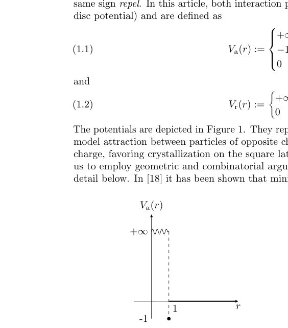 
Figure 1. The interaction potentials: The attractive potential Va on the left and the repulsive potential Vr on the right.

📷 Fig 2

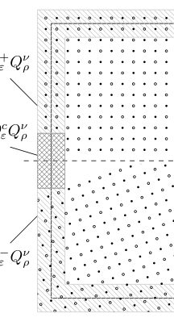 
Figure 4. Schematic Illustration of a competitor X for the cell problem on Qν ρ in the definition of φ. Also, this shows an illustration of the boundary regions ∂± ε Qν ρ, ∂c εQν ρ, in which we assume X = Lε(z±) and X = ∅, respectively. Note that this is only for illustration purposes, i.e., the scaling factor between the lattice spacing and the boundary thickness does not match the definition.

📷 Fig 3

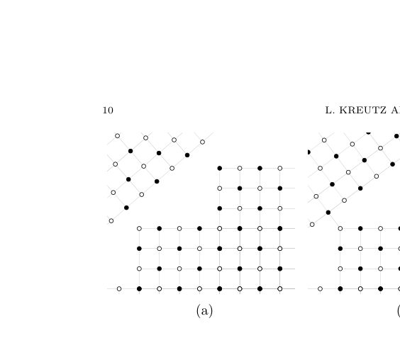 
Figure 5. Different scenarios for optimal interfaces. Edges are depicted between points at distance 1. (a): Two lattices for which φ is equal to twice the surface energy between lattice and vacuum. (b): Two lattices for which φ is less than twice the energy between lattice and vacuum. (c): Two lattices for which the lower bound in Theorem 2.5(ii) is attained.

📷 Fig 4

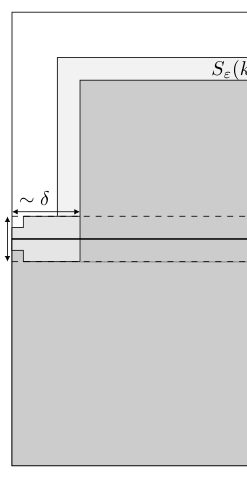 
Figure 6. Illustration of the different regions in the definition of Y + ε . In the grey region, we set Y + ε = Xε. In the light gray strip Sε(kε) we have Y + ε = Xε = Lε(z+ ε ). In the grey region is (Rν 1,δ \ Qν rkε−1) \ (∂+ ε Qν ∪∂− ε Qν) we set Y + ε = ∅. Finally, in the white region we set Y + ε = Lε(z+ ε ). The dashed lines enclose Rν 1,δ.

📷 Fig 5

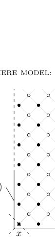 
Figure 7. Schematic picture of a point x ∈X ∩∂+ 1 Qν T (y) with x /∈M +.

**Summary.** This work analyzes how rigid polycrystalline structures form as the low-energy ground state in a model of interacting charged hard spheres. Using $\Gamma$-convergence, the authors derive a continuum theory showing that the energy concentrates at grain boundaries. The resulting surface energy is anisotropic and depends critically on the misorientation mismatch, providing a detailed theoretical description of solid-solid interfaces.

**Why it may be interesting.** While focused on classical condensed matter, the rigorous mathematical machinery of $\Gamma$-convergence and the study of low-energy configurations in complex, constrained systems are highly relevant to understanding phase transitions and ground states in quantum many-body systems.

Detailed structure

**Main problem.** The paper investigates the emergence of rigid polycrystalline structures as low-energy configurations in atomistic ionic particle systems.

**Main result.** The limiting energy density at grain boundaries is anisotropic and depends on the relative misorientation and translation misfit, showing a 'brittle surface energy' due to the rigid potentials.

**Method.** The analysis employs $\Gamma$-convergence to derive a continuum theory from the discrete atomistic energy functional, describing the system via piecewise constant fields encoding local orientation.

**Model / system.** The system is an atomistic ionic particle model with charges $\pm 1$, governed by a pair-potential Hamiltonian involving hard-sphere interactions for both attraction (opposite charges) and repulsion (same charges).

**Key observables.** Limiting energy density ($\phi$), surface energy, and the function $u_{\epsilon}$ describing local lattice orientation.

**Important parameters / regimes.** The scaling parameter $\epsilon$ (related to $1/\sqrt{N}$), relative misorientation angle, and translation misfit vector.

**Assumptions / limitations.** The analysis assumes that interpolating grain boundary layers are energetically unfavorable, leading to a 'brittle set-up' dictated by the rigid potentials.

**Figures summary.** Figure 1 shows the attractive and repulsive potentials; Figure 2 illustrates a minimizer configuration; Figure 3 shows the local orientation function $u_{\epsilon}$; and Figure 4 schematically depicts boundary regions.

**Paper structure.** The paper establishes the problem using the Hamiltonian, applies $\Gamma$-convergence to derive the continuum limit, proves key inequalities (Theorem 2.5) through complex energy estimations involving competitor constructions, and concludes by characterizing the anisotropic surface energy.

Abstract

We investigate the emergence of rigid polycrystalline structures in atomistic ionic particle systems as low-energy configurations. The interaction between particles of opposite charge is modeled by hard spheres that interact when they are tangential. The interaction between particles of same charge is modeled as a hard repulsion that forces a minimal distance between them. The atomistic energy is frame invariant, and no underlying reference lattice is assumed on the ionic configurations. The asymptotic behavior of configurations with finite surface energy scaling is identified by means of $Γ$-convergence. The related continuum theory is described by piecewise constant fields that encode the local orientation of the configuration. The limiting energy is local and concentrates at grain boundaries, which correspond to the boundaries of the regions where the underlying configuration has a constant orientation. The limiting energy density is anisotropic and depends on the relative misorientation of the two grains, their translation misfit, and the normal to their interface. Furthermore, we perform a fine analysis of surface energies for solid-solid and solid-vacuum phase transitions and determine energetically favorable orientation mismatches. This relies on a structure result for our grain boundaries, which shows that, due to the rigid setup, interpolating layers near the grain interface are energetically not favorable.

[↑ back to top](#top)

### [Entanglement-Inducing Quantum Markov Processes](http://arxiv.org/abs/2609.21438v1)

**Authors:** J. Fransson, A. P. Sowa  
**Type:** theory · **Category:** other · **PDF:** <https://arxiv.org/pdf/2609.21438v1>  
**Analysis basis:** full PDF text, analyzed in chunks
**Topic relevance:** `analog quantum simulation` **2/5** · `Keldysh / 2PI / non-Gaussian methods` **1/5**

📷 Fig 1

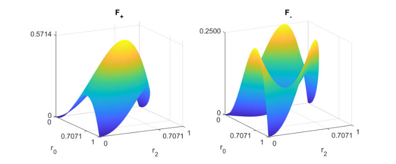 
FIG. 1. Functions F+ = F+(r0,r2) and F−= F−(r0,r2). Both graphs are symmetric with respect to the interchange r0 ↔r2. F+ attains the maximum where r0 = r2 = √

**Summary.** This paper introduces the Schrödinger-Dirichlet equation (SDE) to model interacting bosons, proposing a novel, non-dissipative quantum Markov process capable of generating entanglement. The mathematical analysis is highly technical, relying on harmonic analysis on the group of positive rationals and analyzing the evolution of quantum states in Fock space.

**Why it may be interesting.** The work bridges quantum many-body physics (interacting bosons) with advanced mathematical structures (harmonic analysis on $\mathbb{Q}^+$), providing a non-standard, non-dissipative framework for studying quantum dynamics and entanglement.

Detailed structure

**Main problem.** The paper develops a mathematical framework to analyze nonlinear, nonlocal quantum dynamics for interacting bosons, specifically focusing on the generation of entanglement from initially separable states.

**Main result.** The proposed Schrödinger-Dirichlet equation (SDE) generates entanglement, and the analysis utilizes harmonic analysis on the multiplicative group of positive rationals to characterize the system's evolution.

**Method.** The analysis combines quantum field theory techniques (Fock space, generalized bosons) with advanced mathematical tools, including harmonic analysis on $\mathbb{Q}^+$ and the study of nonlinear differential equations for probability distributions.

**Model / system.** The core model is a system of interacting bosons on an array of sites, governed by the nonlinear Schrödinger-Dirichlet equation (SDE). The analysis is mathematically grounded in the structure of the bosonic Fock space and its representation via the group $\mathbb{Q}^+$.

**Key observables.** Entanglement generation, entropy $E(P)$, expectation values of local number operators $\langle \hat{N}_q 
angle$, and the functional $F = \|\psi \odot \psi\|^2$.

**Important parameters / regimes.** The structure of the interaction (nonlinear, nonlocal), the nature of the underlying group ($\mathbb{Q}^+$), and the time evolution parameter $t$.

**Assumptions / limitations.** The analysis assumes the existence of a generalized-bosonic creation operator and relies on harmonic analysis techniques applicable to the multiplicative group of positive rationals.

**Figures summary.** Not specified, but the notes refer to tables summarizing Critical Points (CPs) for two-particle states and figures illustrating the behavior of functionals $F_+$ and $F_-$.

**Paper structure.** The paper progresses from analyzing classical Markov processes (discrete and continuous time) to introducing the quantum mechanical model for bosonic sites indexed by primes, culminating in the analysis of entanglement-inducing functionals.

Abstract

We introduce a new model for a system of interacting bosons placed in an array of sites. At its core is a nonlinear, nonlocal evolution equation, which we have dubbed the Schrödinger-Dirichlet equation. The construction is closely related to the Bose-Hubbard model and to a specific type of generalized bosons. In contrast to conventional mean-field closures, the resulting nonlinear dynamics need not preserve product structure and can generate entanglement from initially separable states. The relevant methods of analysis are based on harmonic analysis for the multiplicative group of positive rationals.

[↑ back to top](#top)

### [Global Entanglement Quantification via Classical Shadows](http://arxiv.org/abs/2609.21579v1)

**Authors:** João P. Engster, Eduardo I. Duzzioni  
**Type:** theory · **Category:** quantum information and computing · **PDF:** <https://arxiv.org/pdf/2609.21579v1>  
**Analysis basis:** full PDF text, analyzed in chunks
**Topic relevance:** `quantum measurements` **2/5** · `analog quantum simulation` **1/5**

📷 Fig 1

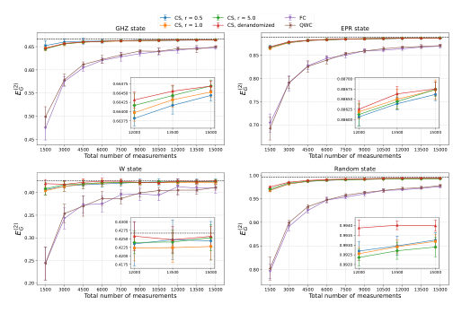 
FIG. 1. E(2) G as a function of the total number of measure- ments for 10-qubit GHZ, EPR, W, and random states, re- quiring the estimation of 675 Pauli words. The results show a faster convergence to the exact entanglement value (dotted line) for shadow estimations, and the insets highlight how, even with different values of r, the randomized shadow esti- mations perform as well as the derandomized shadow proto- col. The uncertainty bars represent the standard deviation over ten independent runs.

📷 Fig 2

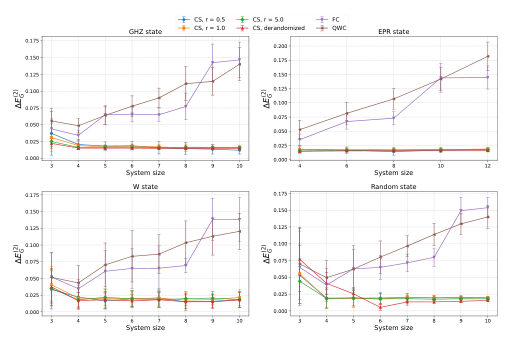 
FIG. 3. Absolute difference between the exact and estimated values of E(2) G for different system sizes, considering GHZ, EPR, W, and Haar random states. When the system size grows, the absolute error estimated with grouping methods also grows, while the shadow approach is able to maintain the errors relatively low.

📷 Fig 3

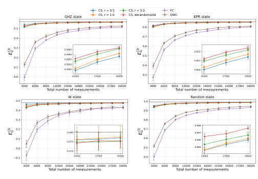 
FIG. 2. E(3) G as a function of the total number of measure- ments for 10-qubit GHZ, EPR, W, and random states. The results strengthen the observations in Fig 1, tackling a signif- icantly harder estimation task, involving 7560 observables to characterize E(3) G . The uncertainty bars represent the stan- dard deviation over ten independent runs.

**Summary.** This paper introduces the use of the classical shadows technique to estimate the generalized global entanglement, $E_G^{(n)}$, which quantifies multipartite entanglement. By leveraging classical shadows, the authors overcome the severe measurement overhead associated with directly estimating all necessary Pauli observables. The results demonstrate that this method offers a clear, resource-efficient advantage over traditional estimation techniques for characterizing entanglement in large quantum systems.

**Why it may be interesting.** This work provides a crucial resource-efficient tool for characterizing complex quantum correlations, which is vital for benchmarking quantum hardware and understanding entanglement scaling in many-body quantum systems.

Detailed structure

**Main problem.** The core challenge is quantifying multipartite entanglement, a difficult task for which no universal measure exists.

**Main result.** The classical shadows technique provides a significant and measurable advantage over direct estimation methods for quantifying global entanglement, especially for large systems with limited measurement resources.

**Method.** The authors propose using the classical shadows protocol to estimate the expectation values of Pauli observables required for the generalized global entanglement measure, $E_G^{(n)}$.

**Model / system.** The study analyzes general quantum states ($
ho$) across $n$-qubit partitions, simulating results for well-known entangled states like GHZ, W, and EPR states, as well as random states.

**Key observables.** Generalized global entanglement ($E_G^{(n)}$), linear entropy of reduced density matrices ($	ext{SL}(
ho_{\ell})$), and expectation values of Pauli observables.

**Important parameters / regimes.** The analysis explores scaling with system size ($N$), the number of qubits in the partition ($n$), and measurement resource ratios ($r$).

**Assumptions / limitations.** The classical shadows estimator is only unbiased in the asymptotic limit, and direct estimation suffers from severe scaling issues.

**Figures summary.** Figures illustrate the faster convergence of shadow estimations towards the exact entanglement value compared to grouping methods, particularly as system size or required observables increase.

**Paper structure.** The paper introduces the entanglement measure, details the classical shadows technique for estimating required observables, compares its performance against grouping methods (QWC, FC) through simulations on various entangled states, and concludes with a demonstration of its feasibility in resource-limited regimes.

Abstract

Detecting and characterizing quantum correlations are tasks of great relevance in quantum information. More specifically, quantifying the amount of multipartite entanglement is a known difficult task, even for pure states. To this end, several entanglement measures have been proposed, although there is currently no universal manner to do so. In this work, we propose the classical shadows technique to measure the generalized global entanglement introduced in Phys. Rev. A 74, 022314. This particular multipartite entanglement quantifier $E_G^{(n)}$ relies on the linear entropies of all $n$-qubit partitions of a state. As the linear entropy can be written in terms of a complete set of observables of the subsystem, we employ classical shadows to estimate many observables with fewer measurements. We simulate the quantification of $E_G^{(n)}$ for well-known entangled states and for random states, comparing shadow estimations and grouping techniques. Our results show a clear advantage of classical shadows over direct estimation approaches, indicating that it can be a useful tool to quantify entanglement without the need to reconstruct the density operator of the whole system.

[↑ back to top](#top)

### [A Functorial Theory of Defects in Abelian Chern-Simons Theory](http://arxiv.org/abs/2609.21414v1)

**Authors:** Daniel Galviz  
**Type:** theory · **Category:** strongly correlated electrons · **PDF:** <https://arxiv.org/pdf/2609.21414v1>  
**Analysis basis:** full PDF text, analyzed in chunks
**Topic relevance:** `analog quantum simulation` **2/5**

📷 Fig 1

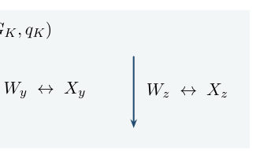 
Figure 1. Bulk Wilson sectors. A charge modulo monopole screening labels both a topological Wilson line Wx and a simple object Xx of CK. The arrows specify line orientations; the shaded region denotes the bulk phase.

📷 Fig 2

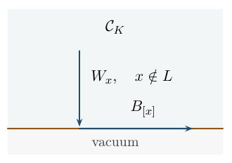 
Figure 2. A Lagrangian boundary. (a) A condensed charge ℓ∈L can end in the boundary vacuum. (b) A charge x /∈L induces a nontrivial boundary line B[x], indexed by [x] ∈GK/L; it does not disappear into the boundary vacuum.

📷 Fig 3

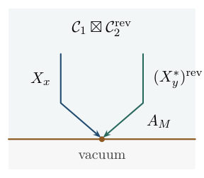 
Figure 3. Folding a fully gapped domain wall. Transmission of x to y is expressed by absorption of Xx ⊠(X∗ y)rev into AM in the folded bulk. Here M uses transmission coordinates (x, y); the corresponding simple-object degree in the folded category is (x, −y). The superscript rev reverses the braiding, while X∗ y accounts for the outgoing-line orientation.

📷 Fig 4

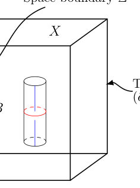 
Figure 4. A 3-alterfold with time boundary. Here X is an oriented compact 3-manifold with boundary, and Σ ⊂X is an embedded oriented surface meeting ∂X transversely. The surface Σ separates X \ Σ into connected components colored by A and B. The separating surface Σ is the space boundary, while the pair (∂X, ∂Σ) is the time boundary. The interior of the tube is colored by A, and the exterior is colored by B; the tube carries additional Alterfold data, that is, the black strings indicate the boundary of the torus, the red circle denotes the Kirby color and the blue strand denotes an object label in the center sector.

📷 Fig 5

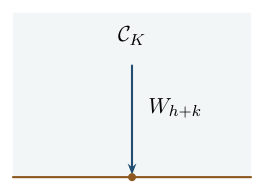 
Figure 5. Fusion of condensed endpoints in chosen homogeneous bases: εhεk = µ(h, k)εh+k. The left panel denotes the ordered fusion of two endpoint insertions, including fusion of their incident Wilson lines. The coefficient µ(h, k) is a basis-dependent fusion amplitude.

**Summary.** This paper develops a comprehensive, functorial mathematical theory for Abelian Chern-Simons field theories, treating them as Topological Quantum Field Theories (TQFTs). It classifies the theory and its defects using a mathematical invariant called the finite quadratic module. This work provides a rigorous framework for understanding topological order in condensed matter systems.

**Why it may be interesting.** The deep connection between Chern-Simons theory, topological order, and categorical structures provides powerful mathematical tools for understanding the ground state degeneracy and robust properties of strongly correlated electron systems.

Detailed structure

**Main problem.** To provide a unified, functorial description of Abelian Chern-Simons theories, organizing previously separate aspects like closed-manifold partition functions, BF theory, Turaev-Viro realizations, symmetries, and defect structures.

**Main result.** The theory is rigorously classified by the finite quadratic module $(	ext{GK}, q_K)$, which governs the bulk theory, defects, and symmetries. The framework successfully relates defect structures to categorical data, providing a concrete model for topological orders.

**Method.** The authors utilize the framework of Categorical TQFTs, employing the Alterfold construction and analyzing the theory via its classification invariant, the finite quadratic module.

**Model / system.** The primary model is Abelian Chern-Simons theory, which serves as an effective topological field theory for topological phases of matter, such as those found in fractional quantum Hall states.

**Key observables.** The theory is governed by the invariant $(	ext{GK}, q_K)$; defects are classified by specific categorical data within the associated pointed modular category $	ext{C}(	ext{GK}, q_K)$.

**Important parameters / regimes.** The classification depends on the lattice $	ext{GK}$ and the quadratic form $q_K$.

**Assumptions / limitations.** The analysis relies on establishing functorial relationships between different mathematical realizations (e.g., Turaev-Viro vs. Alterfold) and assumes the validity of the categorical framework for defect extension.

**Paper structure.** The paper progresses by first establishing the functorial TQFT structure using the quadratic module invariant, then detailing the classification of defects (boundaries, domain walls) via categorical theorems, and finally comparing this structure with known lattice models (like the toric code) and addressing dualities.

Abstract

Recent work has constructed Abelian Chern-Simons theories as categorical TQFTs, allowing us to naturally incorporate categorical defects and construct defect extensions of Abelian Chern-Simons TQFTs. We first identify the Turaev-Viro realizations of Abelian Chern-Simons theory in the center and doubled pointed modular cases, clarifying the distinction between single bulk realizations and canonical doubled ones. Alternatively, the Alterfold construction supplies the associated topological boundaries, domain walls, and condensation sectors, establishing an explicit Alterfold/Chern-Simons dictionary. We show that the finite quadratic module is the invariant controlling the bulk theory, its topological symmetries, orientation-reversal invariance, and defects. We further show that multicomponent Abelian BF theory arises as the extended TQFT of an off-diagonal Abelian Chern-Simons theory, placing it naturally within the same extended framework. Finally, we demonstrate that recently proposed Abelian Chern-Simons dualities do not define a genuine TQFT duality. These results provide a concrete model for defects in Abelian topological orders and suggest a route toward the non-Abelian case.

[↑ back to top](#top)

### [Denser Planar Color Codes](http://arxiv.org/abs/2609.21376v1)

**Authors:** Noah Shutty  
**Type:** theory · **Category:** quantum information and computing · **PDF:** <https://arxiv.org/pdf/2609.21376v1>  
**Analysis basis:** full PDF text, analyzed in chunks
**Topic relevance:** `QC/QI experiment` **2/5**

📷 Fig 1

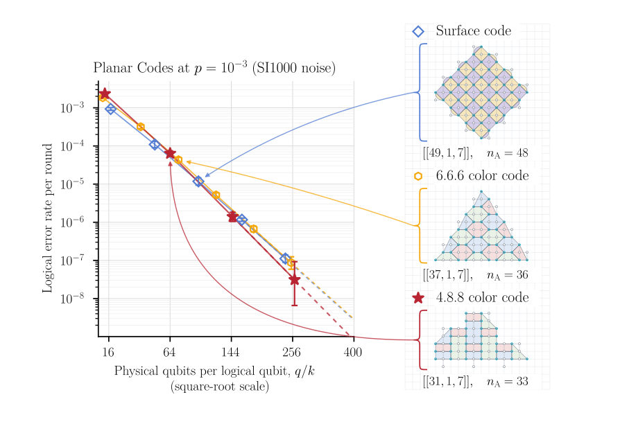 
Figure 1: Denser planar quantum memories. Left: equally weighted X/Z memory performance at p = 10−3 under SI1000 noise with native CZ gates. Error bars represent 95% confidence intervals. Dashed lines extrapolate log ℓlinearly in p

📷 Fig 2

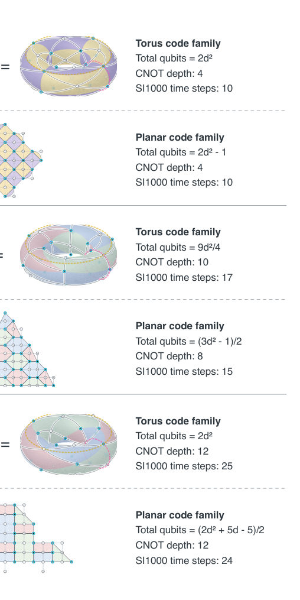 
Figure 2: From stabilizer tilings to finite torus and planar codes.

📷 Fig 3

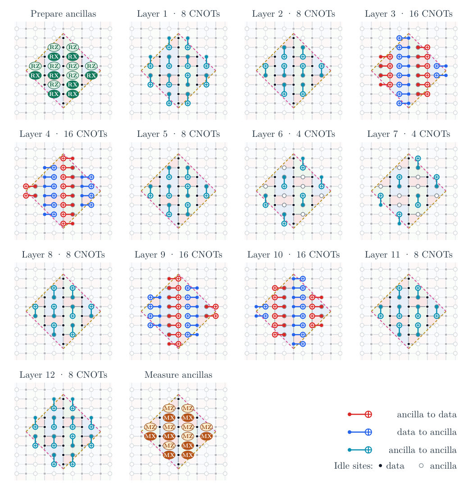 
Figure 3: Complete CNOT cycle for the 4.8.8 color code on a torus: preparation, twelve CNOT layers, and measurement, read left to right and then top to bottom. The cycle repeats unchanged each round, without forward–backward alternation. Matching dashed seams are identified. Gates crossing the periodic boundary are drawn twice. RX/MX are implemented via a Hadamard combined with RZ/MZ. Long connections in the linked viewer denote periodic wraparound. Open a d = 8 torus superdense 4.8.8 color code circuit in Crumble.

📷 Fig 4

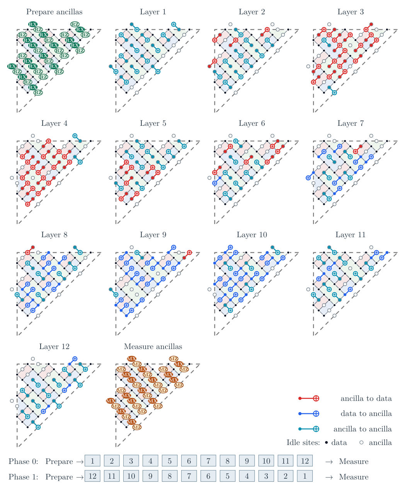 
Figure 4: Complete CNOT cycle at d = 7 (31 data and 33 ancillas, 195 CNOTs per cycle). Read preparation, layers L1–L12, and measurement left to right and then top to bottom for phase zero. Phase one reverses the CNOT-layer order, not the control–target directions. Both phases use the same preparation and measurement bases and extract both X and Z checks. Open the triangular superdense 4.8.8 color code circuit in Crumble.

📷 Fig 5

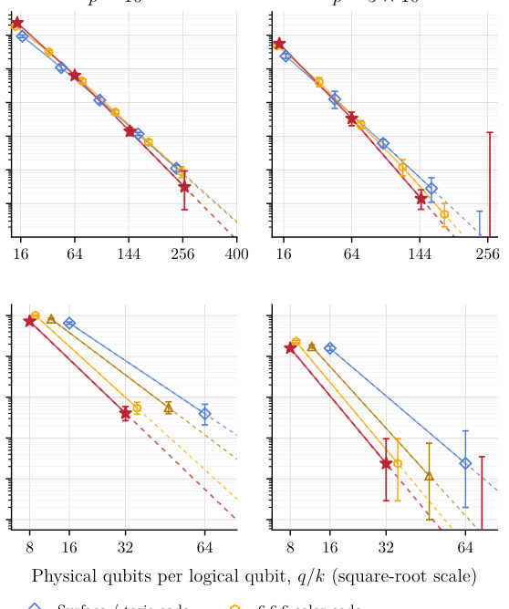 
Figure 5: Comparison of quantum memories under SI1000 noise with native CZ gates, at p = 10−3 (left) and p = 5 × 10−4

**Summary.** This paper analyzes the 4.8.8 color code as a viable quantum memory candidate for superconducting quantum processors. By optimizing its circuit layout and utilizing periodic superdense circuits, the authors demonstrate favorable qubit scaling compared to established codes like the surface code. The work provides detailed circuit-level simulations showing the code's robustness at plausible noise levels.

**Why it may be interesting.** The detailed analysis of resource scaling and circuit depth for topological codes is highly relevant for designing fault-tolerant quantum computation architectures.

Detailed structure

**Main problem.** The paper aims to improve quantum memory performance by comparing different topological quantum error-correcting codes and optimizing their circuit implementation on superconducting hardware.

**Main result.** The 4.8.8 color code, when optimized with a brickwork layout and periodic circuits, is shown to be a competitive quantum memory, exhibiting favorable qubit scaling compared to other codes at the same distance.

**Method.** The authors analyze circuit structures, construct periodic superdense circuits using CNOT layers, and compare qubit overheads and circuit depths for various color codes.

**Model / system.** The study focuses on implementing topological quantum error-correcting codes (like 4.8.8 color codes) on the square lattice, modeled for superconducting quantum processors with nearest-neighbor gates.

**Key observables.** Qubit count ($q$), circuit depth (CNOT layers), logical error rate ($\ell_F$), and physical noise scaling ($p$).

**Important parameters / regimes.** Code distance ($d$), physical noise rate ($p=10^{-3}$), and the specific gate set (SI1000).

**Assumptions / limitations.** The analysis assumes the use of Tesseract decoding and specific circuit optimizations (brickwork layout, superdense extraction) for favorable noise scaling.

**Figures summary.** Figures compare X/Z memory performance at low noise, show qubit counts for different tilings, and illustrate the spatial repeat structure of the torus circuit.

**Paper structure.** The paper progresses by defining the 4.8.8 code on a square lattice, detailing the periodic superdense circuit construction, comparing its resource overheads against triangular and surface codes, and analyzing circuit-level noise scaling.

Abstract

We consider the 4.8.8 color code in a brickwork layout on the square lattice with nearest-neighbor gates. We identify periodic superdense circuits with twelve CNOT layers that appear to preserve the full distance of these codes. Including ancillas, the family uses $q=(2d^2+5d-5)/2$ physical qubits for distance $d$: asymptotically $2/3$ as many as the triangular 6.6.6 color code and $1/2$ as many as the rotated surface code at the same code distance. Circuit-level simulations targeting superconducting architectures demonstrate favorable scaling of 4.8.8 color codes at plausible physical noise rates, including both for planar codes and their toroidal cousins under periodic boundary conditions.

[↑ back to top](#top)

### [Functional Renormalization for Random Matrix Theory: The relational background field method](http://arxiv.org/abs/2609.21031v1)

**Authors:** Vincent Lahoche, Dine Ousmane Samary  
**Type:** theory · **Category:** statistical mechanics · **PDF:** <https://arxiv.org/pdf/2609.21031v1>  
**Analysis basis:** full PDF text, analyzed in chunks
**Topic relevance:** `Keldysh / 2PI / non-Gaussian methods` **2/5**

📷 Fig 1

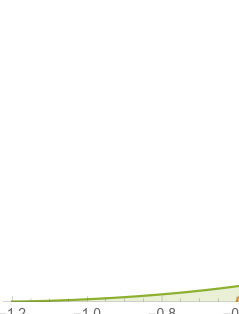 
Figure 2.1. Profile of the distribution µ−βM2(x) for β = 0.15 and a4 = 1 (blue curve), a4 = 0 (yellow curve), a4 = −1/12 (green curve).

📷 Fig 2

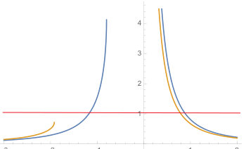 
Figure 2.2. On the left: In blue, typical behavior of −g′ −βM2(z) for β = 1/5 and a4 = 1. In yellow, the corresponding distribution µ−βM4(x). The equation −g′ −βM2(w∗) = 1 has a solution on both the negative and positive sides, beyond the boundaries of µ−βM4(x). On the right: Behavior of −g′ −βM2(z) at the critical point a4 = −1/12, for β = 0.1 (blue curve) and β = 0.24 (yellow curve). There is no longer a solution to the equation −g′ −βM2(w∗) = 1 on the left in the second case.

📷 Fig 3

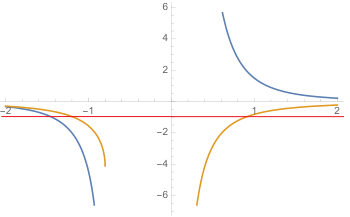 
Figure 2.3. On the left: Typical behavior of the second derivative g′′ −βM2(z) (in blue) versus the first de- rivative (in yellow), outside the critical domain (a4 = 1, β = 1/5). On the right: Behavior of the same functions at the critical point for β = 0.1.

📷 Fig 4

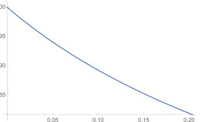 
Figure 2.4. On the left: behavior of w−(β) (blue curve) and −8β (yellow curve). On the right: behavior of w+(β).

📷 Fig 5

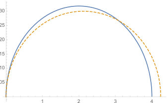 
Figure 2.8. Left: behavior of the canonical dimension for a pure Wigner law (β = 0, in blue) and in the case where the matrix M is critical (a4 = −1/12, β = 0.2, in dashed yellow). Right: the corresponding generalized moment distributions in the limit N →∞.

**Summary.** This paper introduces a novel Renormalization Group approach for random matrix models used to study quantum gravity. By employing a partial matrix-valued intermediate field in the large-N limit, the authors construct a symmetry-preserving RG flow. This leads to a well-defined continuum limit exhibiting a critical fixed point whose exponent matches known results from double-scaling theory.

**Why it may be interesting.** While focused on quantum gravity, the rigorous application of RG techniques, especially the background-field method, provides advanced theoretical tools for analyzing critical phenomena and continuum limits in complex many-body systems, which has parallels in strongly correlated electron models.

Detailed structure

**Main problem.** The primary challenge is developing a reliable Renormalization Group (RG) flow for discrete gravity models that successfully preserves the underlying symmetry group, such as U(N) or O(N).

**Main result.** The authors construct a relational RG flow that preserves symmetry and yields an infrared theory described by a 3D non-local Euclidean field theory with a non-trivial Wilson-Fisher-like fixed point.

**Method.** The method involves introducing a partial matrix-valued intermediate field and utilizing the large-N limit, where measure concentration allows this field to act as a self-consistent background field.

**Model / system.** The study focuses on random matrix models, which are used to model the random geometry of two-dimensional quantum Euclidean spacetime. The analysis relates these models to discrete gravity partition functions.

**Key observables.** Critical exponents, the Wilson-Fisher fixed point structure, and the double-scaling exponent.

**Important parameters / regimes.** The large-$N$ limit, the continuum limit, and the coupling constants defining the random matrix interactions.

**Assumptions / limitations.** The approach relies on the large-$N$ limit to justify the background field approximation, which is necessary to maintain symmetry and define a scale.

**Figures summary.** Figure 1.1 illustrates the eigenvalue distribution approaching the Wigner semicircle in the large-N limit, and Figure 1.2 shows the duality between random matrix Feynman graphs and surface triangulations.

**Paper structure.** The paper introduces the symmetry-preserving RG challenge, develops the novel background-field approach using the intermediate field, derives the resulting continuum theory, and concludes by discussing extensions to other discrete gravity models.

Abstract

The construction of a reliable renormalization group (RG) flow for discrete gravity models that preserves their underlying symmetry group, typically $U(N)$ or $O(N)$, remains an open problem. For random matrix models, which are the focus of this paper, this symmetry is intrinsically tied to the interactions encoding the random geometry of two-dimensional quantum Euclidean spacetime. We develop a novel approach based on the introduction of a partial matrix-valued intermediate field. In the large-$N$ limit, measure concentration strongly suppresses fluctuations of its singular values, allowing it to play the role of a self-consistent background field. This provides the basis for a relational RG in which the notion of scale is dynamically induced by the effective Gaussian measure in the basis where the intermediate field is diagonal. Our construction preserves the symmetry of the original model and admits a well-defined continuum limit. We show that the resulting infrared theory is described by a three-dimensional non-local Euclidean field theory with a non-trivial Wilson-Fisher-like fixed point and a single relevant direction. Remarkably, the associated critical exponent exactly matches the standard double-scaling exponent. We finally discuss extensions of the background-field approach to other discrete gravity models, such as random tensor models, and to different symmetry groups, as well as connections with more formal RG frameworks and information geometry.

[↑ back to top](#top)

### [Uhlmann Geometry of Fixed-Rank Density Matrices: A Fiber-Bundle Approach](http://arxiv.org/abs/2609.21875v1)

**Authors:** Xu-Yang Hou, Hao Guo  
**Type:** theory · **Category:** other · **PDF:** <https://arxiv.org/pdf/2609.21875v1>  
**Analysis basis:** full PDF text, analyzed in chunks
**Topic relevance:** `quantum measurements` **2/5**

📷 Fig 1

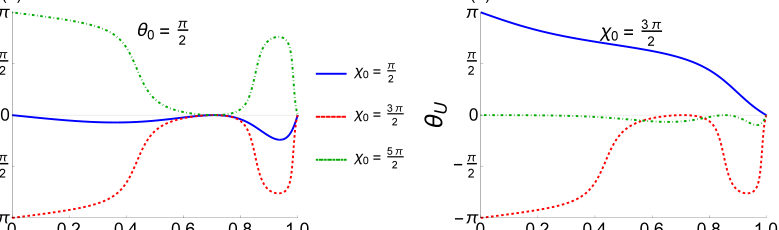 
Figure 1. The Uhlmann phase θU as a function of the spectral factor f. (a) Fixed θ0 = π/2 and three values of χ0; (b) fixed χ0 = 3π/2 and three values of θ0. The phase varies continuously and non-monotonically with f, reaching values of order π at intermediate weights, and vanishes at f = 1 where λ1 = λ2 = 1

📷 Fig 2

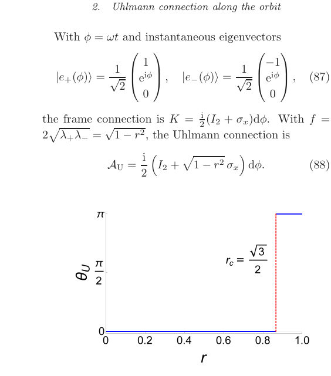 
Figure 2. The Uhlmann phase θU as a function of the Bloch- vector length r: it jumps from 0 to π at the critical purity rc = √

📷 Fig 3

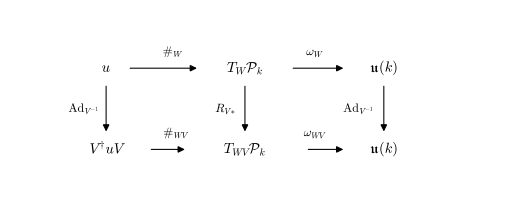 
Figure 3. The Ehresmann connection ω intertwines the nat- ural U(k) action on T Pk with the adjoint action on u(k), cf. Eq. (A7).

**Summary.** This paper develops a geometric theory for mixed quantum states by formulating Uhlmann's phase on the manifold of fixed-rank density matrices. It constructs this space as a principal fiber bundle, yielding a unique connection form. The key finding is that this framework predicts non-trivial, quantized topological invariants, linking the geometry of mixed states to measurable phenomena like the quantum Hall effect.

**Why it may be interesting.** This work provides a powerful geometric tool to analyze mixed states, moving beyond the limitations of full-rank assumptions. The connection to topological invariants suggests that geometric phases in mixed systems can carry quantized, measurable information.

Detailed structure

**Main problem.** The paper extends Uhlmann's geometric phase theory from full-rank to the physically relevant case of fixed-rank density matrices ($	ext{rank}(
ho) = k < N$). It aims to provide a robust geometric diagnostic for mixed-state quantum matter.

**Main result.** The fixed-rank state space forms the base of a principal $U(k)$-bundle, allowing the Uhlmann connection to be uniquely determined by a Sylvester equation. This framework predicts non-trivial, quantized topological invariants like the second Chern number for these mixed states.

**Method.** The authors employ differential geometry, constructing the theory on the manifold of rank-$k$ density matrices by defining a principal fiber bundle structure over this base manifold. They derive the connection form using techniques related to minimal purifications and the Bures metric.

**Model / system.** The system is described by density matrices $
ho$ whose rank is fixed at $k < N$. This models physical scenarios such as reduced states of subsystems or states confined to a decoherence-free subspace.

**Key observables.** Uhlmann phase, Chern numbers (especially the second Chern number), Bures distance, and the Uhlmann connection form $\omega$.

**Important parameters / regimes.** The fixed rank $k$ relative to the Hilbert space dimension $N$, and the degeneracy of the spectral weights.

**Assumptions / limitations.** The theory assumes the existence of minimal purifications $W$ that define the principal $U(k)$-bundle structure over the fixed-rank stratum.

**Paper structure.** The paper establishes the principal $U(k)$-bundle structure over the fixed-rank stratum, derives the Uhlmann connection via the Sylvester equation, and calculates topological invariants (like the Chern number) by relating the geometry to known physical responses (e.g., quantum Hall effect).

Abstract

For full-rank density matrices the state space is contractible, the Uhlmann bundle is topologically trivial, and the holonomy admits no quantized invariants; although the Uhlmann phase is genuinely geometric, this topological poverty has kept it from serving as a robust physical diagnostic of mixed-state matter. Mixed states of fixed rank below the Hilbert-space dimension, however, are ubiquitous: reduced states of subsystems, states in an invariant sector, and states in a decoherence-free subspace all have a support smaller than the Hilbert space that can vary with parameters. Their geometry is far richer: the support carries genuine curvature, non-Abelian holonomy, and Chern topology. We formulate Uhlmann's theory directly on the manifold of rank-$k$ density matrices: minimal purifications make the fixed-rank stratum the base of a principal $U(k)$-bundle whose Uhlmann connection is uniquely determined by a Sylvester equation, and in an eigenframe this connection takes a closed form reducing to the Berry, Wilczek--Zee, and faithful Uhlmann connections at $k=1$, at equal weights, and at $k=N$. The fixed-rank bundle inherits the topology of the Grassmannian, and non-factorizable higher Chern topology requires failure of the global eigenline splitting, which in the present spectral setting requires degeneracy, minimally realized by a rank-2 Yang monopole whose quantized second Chern number links the geometry to the four-dimensional quantum Hall response. Solvable models, from a genuinely non-Abelian holonomy to a decoherence-free Lindblad orbit, illustrate the content: the supporting subspace carries the topology, the spectral weights shape the transport, and the Uhlmann phase provides a direct geometric signature of these mixed-state phase transitions.

[↑ back to top](#top)

### [Universal Eigenvector Statistics of Non-Hermitian Random Matrices](http://arxiv.org/abs/2609.22079v1)

**Authors:** Ze Chen, Zhenyu Xiao, Shinsei Ryu  
**Type:** theory · **Category:** statistical mechanics · **PDF:** <https://arxiv.org/pdf/2609.22079v1>  
**Analysis basis:** full PDF text, analyzed in chunks
**Topic relevance:** `Keldysh / 2PI / non-Gaussian methods` **2/5**

📷 Fig 1

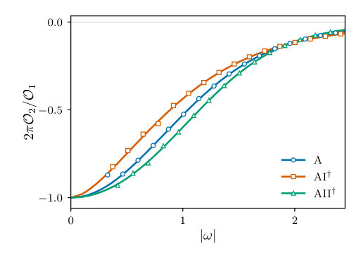 
FIG. 1. Off-diagonal overlaps in classes A, AI†, and AII†, using 100,000 matrices of effective size N = 512 per class. Lines are the replica predictions in Eq. (18).

📷 Fig 2

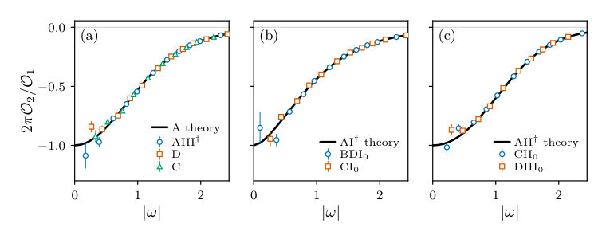 
FIG. 2. Bulk off-diagonal overlaps at N = 256 and ν = 0, using 100,000 matrices per class. (a) Classes AIII†, D, and C compared with class A. (b) Classes BDI0 and CI0 compared with class AI†. (c) Classes CII0 and DIII0 compared with class AII†. Midpoints lie between radii 0.25 √

📷 Fig 3

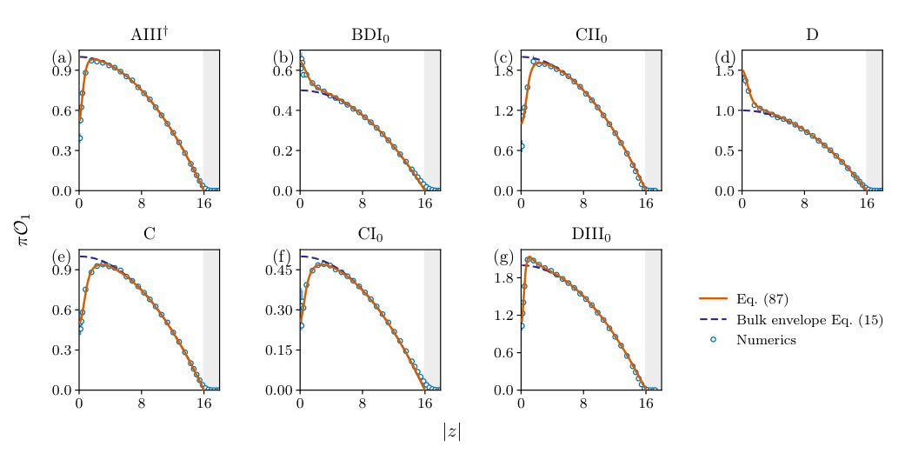 
FIG. 3. Diagonal overlaps at N = 256 and ν = 0, from 600,000 matrices per class: (a) AIII†, (b) BDI0, (c) CII0, (d) D, (e) C, (f) CI0, and (g) DIII0. Solid orange curves show the additive interpolation in Eq. (87), while dashed curves retain only the bulk envelope. The shaded region lies beyond √

📷 Fig 4

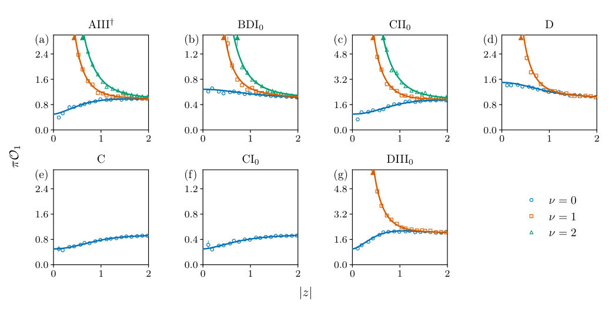 
FIG. 4. Diagonal overlaps, in (a) AIII†, (b) BDI0, (c) CII0, (d) D, (e) C, (f) CI0, and (g) DIII0. Colors and symbols identify ν. Each sector uses 600,000 matrices, with N = 257 for ν = 1 and N = 256 otherwise. Lines show the additive interpolation in Eq. (87). Top-edge triangles indicate the outermost displayed off-scale mean in each series. Protected zero modes, origin-touching bins, and bins with fewer than 100 multiplets are omitted.

📷 Fig 5

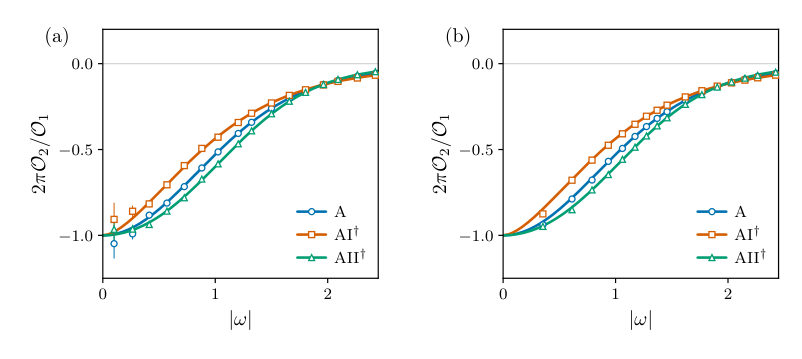 
FIG. 5. Off-diagonal overlaps in physical models. (a) The q = 4 non-Hermitian SYK models in classes A, AI†, and AII† have 18, 16, and 20 Majorana fermions and parity-block dimensions 256, 128, and 512, respectively. Midpoints lie in the central 30% of the spectrum. (b) The Anderson data in classes A and AI† use periodic three-dimensional lattices with L = 8 and W = 3. The data in class AII† use a periodic two-dimensional square lattice with L = 16, W = 3.8, and µ = 2. Each Anderson matrix has dimension 512. Midpoints lie in the central 30% of the spectrum. In class AII†, the spectrum contains 256 distinct rank-two eigenspaces. Both panels use 100,000 realizations per class and local...

**Summary.** This work investigates the statistics of eigenvector overlaps in non-Hermitian random matrices, extending universality beyond eigenvalues. Using advanced techniques like replica sigma models, the authors derive analytical results for these overlaps across ten symmetry classes. The key finding is the establishment of a duality connecting non-Hermitian eigenvector statistics directly to known Hermitian spectral correlations.

**Why it may be interesting.** The established duality between Hermitian and non-Hermitian spectral statistics provides a powerful theoretical tool for understanding non-Hermitian quantum dynamics, which is crucial for open quantum systems.

Detailed structure

**Main problem.** The paper extends the concept of universality from eigenvalue statistics to the statistics of eigenvector overlaps in non-Hermitian random matrices.

**Main result.** It establishes a duality between Hermitian level statistics and non-Hermitian eigenvector overlaps, providing analytical expressions for these overlaps across ten symmetry classes.

**Method.** The analysis employs fermionic replica nonlinear sigma models to derive analytical expressions for the overlaps in the spectral bulk and near the origin.

**Model / system.** The study focuses on non-Hermitian random matrices, covering ensembles characterized by ten Altland-Zirnbauer (AZ0) symmetry classes, and relates findings to physical models like the non-Hermitian Sachdev-Ye-Kitaev (SYK) model.

**Key observables.** Eigenvector overlaps (diagonal $O_1$ and off-diagonal $O_2$), eigenvalue densities, and spectral correlations.

**Important parameters / regimes.** The results are derived in the limit of large matrix size ($N 	o \infty$), and the universality depends on symmetry classes ($	ext{TRS}^\dagger$, $	ext{PHS}$, $	ext{SLS}$).

**Assumptions / limitations.** The analysis assumes the existence of a statistical rotation symmetry for the random matrix ensemble.

**Figures summary.** The notes mention Tables I, II, and III summarizing the ten symmetry classes, the bulk diagonal and normalized off-diagonal overlaps for the three main families (A, $	ext{AI}^\dagger$, $	ext{AII}^\dagger$), and the hard-edge diagonal overlaps.

**Paper structure.** The paper structure involves reviewing the symmetries, presenting the replica calculation using the sigma model, and comparing the derived predictions with numerical results from various physical models.

Abstract

Eigenvector overlaps quantify nonorthogonality and govern the response and dynamics of non-Hermitian systems. We extend the universality of non-Hermitian random matrices to the statistics of these overlaps. We obtain analytical expressions for eigenvector overlaps in the spectral bulk and near the origin, covering ten symmetry classes in the limit of large matrix size. Using fermionic replica nonlinear $σ$ models, we relate these overlaps to Hermitian level statistics, symmetry class by symmetry class and topological sector by topological sector. Numerical calculations in various physical models support the universality of the normalized overlaps in the regimes studied. Our work establishes a duality between Hermitian level statistics and non-Hermitian eigenvector overlaps.

[↑ back to top](#top)

### [Granular thermostat implementation within the soft-sphere Discrete Element Method (DEM) framework, considerations and limitations](http://arxiv.org/abs/2609.21297v1)

**Authors:** Marco Previtali, Herbert Eric Huppert, Sergio Andres Galindo Torres  
**Type:** theory · **Category:** statistical mechanics · **PDF:** <https://arxiv.org/pdf/2609.21297v1>  
**Analysis basis:** full PDF text, analyzed in chunks
**Topic relevance:** `Frenkel-Kontorova` **1/5** · `Keldysh / 2PI / non-Gaussian methods` **1/5** · `analog quantum simulation` **1/5** · `correlated / nonlocal dissipation` **1/5** · `driven-dissipative phase transition` **1/5** · `methods for driven-dissipative` **1/5** · `non-equilibrium universality` **1/5** · `quantum measurements` **1/5**

📷 Fig 1

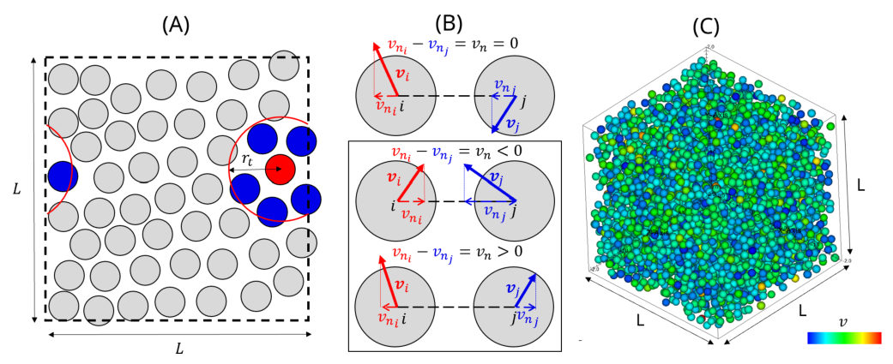 
FIG. 1. (A) Schematic representation of the constant volume periodic cell. Given a particle (red), its thermostat pairs (blue) are identified within the distance rt. (B) Relative velocities of a particle pair projected onto the normal vector. Outside the box, the particles have coherent motion (zero thermal energy, vn = 0). (C) Screenshot of the granular medium during a simulation.

📷 Fig 2

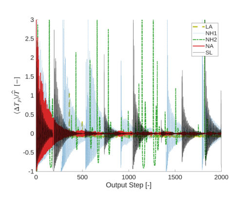 
FIG. 2. Example of the temperature oscillations observed for a fixed Rt = 3 and different thermostats for the first 2000 output steps: LA, ξLa = 102; NH1, ξNH = 10−2; NH2, ξNH = 100. NA and SL adopt the same parameters (ξLa = 10−1, ξNH = 10−2). Note that the maximum value of ⟨∆Tp⟩/ ˆT is capped at 3 in the plot, while some of the Nos´e- Hoover induced oscillations go up to 14.

📷 Fig 3

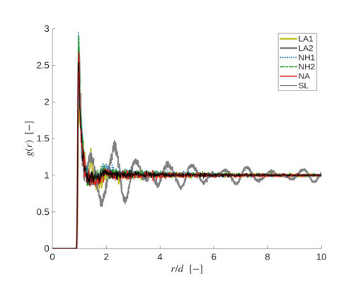 
FIG. 5. Example of the RDF distribution for the different thermostats. The same legend as Figure 3 is used here.

📷 Fig 4

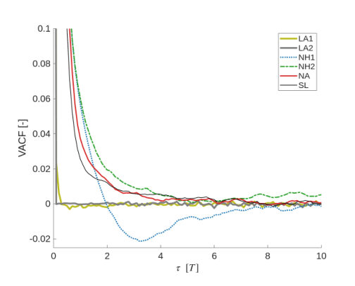 
FIG. 3. Example of the VACF plot for the different ther- mostats. LA1, ξLa = 102, Rt = 3; LA2, ξLa = 103, Rt = 4. NH1, ξNH = 10−2; NH2 ξNH = 100. NA and SL have the same parameters (ξLa = 100, ξNH = 10−2). Rt is set to 3 in all scenarios, except for (LA2) where it is set to 4 to highlight the stronger effect of Langevin dynamics at increased Rt [28].

📷 Fig 5

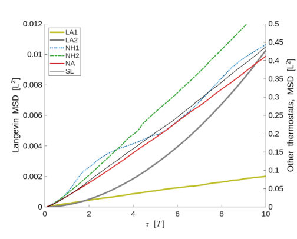 
FIG. 4. Example of the MSD evolution for the different ther- mostats. The same legend as Figure 3 is used here.

**Summary.** This paper addresses the difficulty of simulating granular materials by proposing hybrid thermostat algorithms for the Discrete Element Method (DEM). These new methods allow researchers to independently control the granular temperature while also tuning the underlying velocity statistics. This provides a crucial, controlled reference state for developing accurate constitutive models for complex, dissipative systems.

**Why it may be interesting.** While focused on classical granular physics, the challenges in implementing thermostats—specifically decoupling energy control from correlation structure—are fundamental problems in non-equilibrium statistical mechanics applicable to open quantum systems.

Detailed structure

**Main problem.** The paper aims to develop controlled reference states for studying granular rheology by independently controlling the magnitude of velocity fluctuations (granular temperature) from the statistical character of the forcing.

**Main result.** The proposed pairwise hybrid formulations successfully enforce a prescribed granular temperature while allowing independent modification of velocity statistics, providing a controlled framework for constitutive model development.

**Method.** The authors introduce two novel pairwise hybrid formulations that combine deterministic temperature regulation with stochastic decorrelation techniques to simulate granular systems.

**Model / system.** The study focuses on dense granular flows simulated using the soft-sphere Discrete Element Method (DEM). The system is inherently dissipative, requiring specialized thermostats to maintain controlled energy states.

**Key observables.** Granular temperature (variance of velocity fluctuations), apparent friction, diffusivity, and velocity statistics.

**Important parameters / regimes.** Inertial number (I), coupling strengths ($\xi_{La}, \xi_{NH}$), and the stochastic decorrelation timescale.

**Assumptions / limitations.** Conventional thermostats (Langevin, Nosé-Hoover) have limitations: Langevin requires strong coupling, and Nosé-Hoover fails to account for correlations generated by inelastic collisions.

**Figures summary.** Figure 14 (mentioned in notes) shows the Mean Squared Displacement (MSD) evolution for different thermostats, indicating that the growth is only linear for a limited time window.

**Paper structure.** The paper analyzes the limitations of existing thermostats (Langevin, Nosé-Hoover) in dissipative DEM systems, introduces the hybrid formulations, and validates the framework by applying it to simple shear flow to study temperature-dependent rheology.

Abstract

Dense granular flows are commonly investigated using the soft-sphere Discrete Element Method (DEM), whereas large-scale applications generally require continuum models. Granular temperature, defined as the variance of particle velocity fluctuations, is a relevant variable to collapse rheological scaling. However, experimental forcing approaches used to control temperature also affects other aspects of the granular state.   An alternative is to use a thermostat algorithm to control the fluctuation energy directly. Although thermostat algorithms are well established in Molecular Dynamics (MD), their behaviour in dissipative DEM systems has received comparatively little attention. We show that conventional Langevin and Nosé-Hoover thermostats exhibit complementary limitations: Langevin control requires strong coupling to offset collisional dissipation, thereby damping particle dynamics, whereas Nosé-Hoover does not independently disrupt the correlations and segregation generated by repeated inelastic collisions, leading to non-ergodic and numerically unstable states.   To address these limitations, we introduce two pairwise hybrid formulations combining deterministic temperature regulation with stochastic decorrelation. Both enforce the prescribed temperature, while variation of the stochastic decorrelation timescale modifies velocity statistics and associated mesoscopic properties such as diffusivity. Finally, application to pressure-controlled simple shear shows that increasing granular temperature at fixed inertial number reduces the apparent friction, consistent with previously reported trends. The framework therefore provides controlled reference states for comparing differently forced granular systems and identifying the variables required for temperature-dependent constitutive models.

[↑ back to top](#top)

### [Full macroscopic thermalization and the formation of Schrödinger's cats by unitary time evolution in the weakly perturbed Ising model - Applications of the Roos-Sugimoto-Teufel-Tumulka-Vogel theory](http://arxiv.org/abs/2609.21757v1)

**Authors:** Hal Tasaki  
**Type:** theory · **Category:** statistical mechanics · **PDF:** <https://arxiv.org/pdf/2609.21757v1>  
**Analysis basis:** full PDF text, analyzed in chunks
**Topic relevance:** `analog quantum simulation` **1/5** · `non-equilibrium universality` **1/5** · `scars & prethermalization` **1/5**

📷 Fig 1

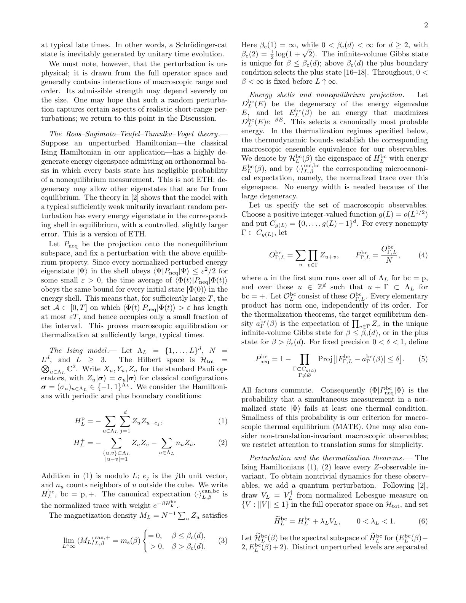 
Low-resolution page preview, page 2

📷 Fig 2

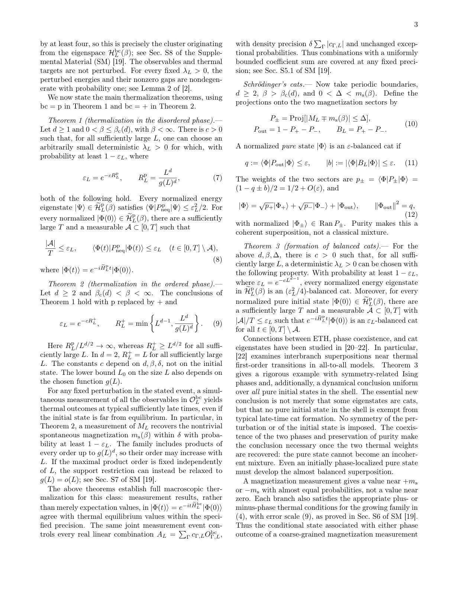 
Low-resolution page preview, page 3

📷 Fig 3

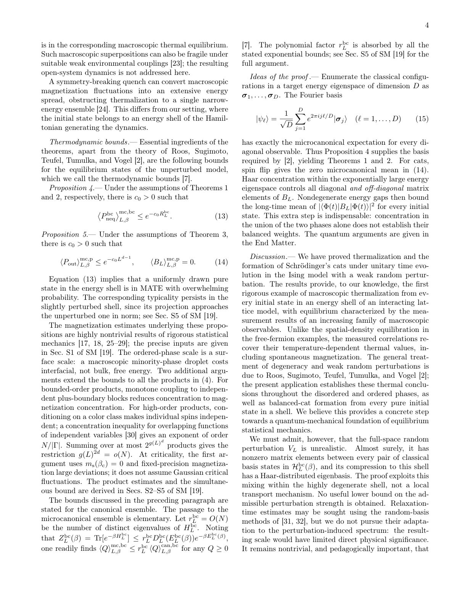 
Low-resolution page preview, page 4

📷 Fig 4

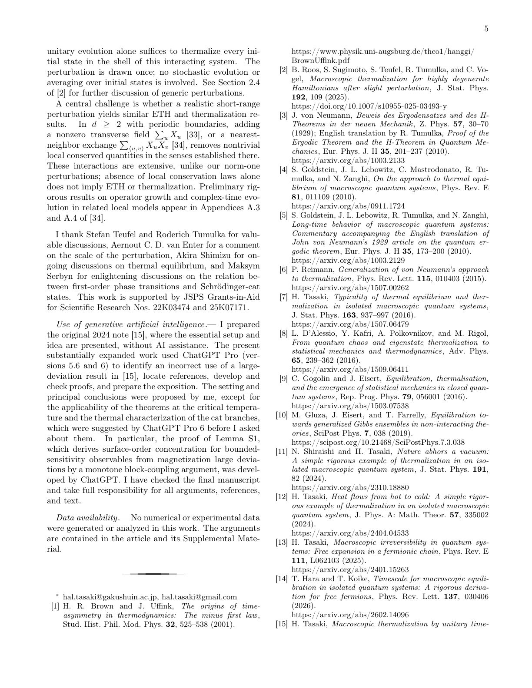 
Low-resolution page preview, page 5

📷 Fig 5

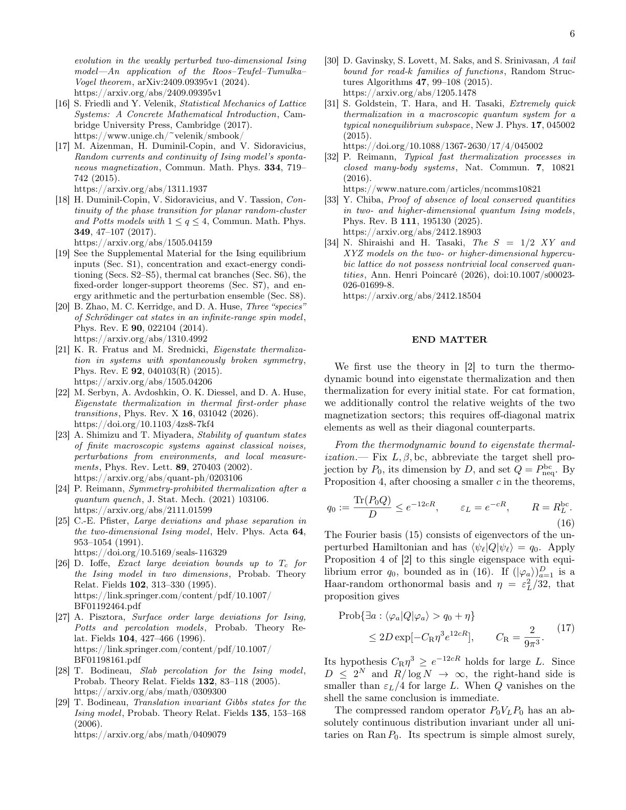 
Low-resolution page preview, page 6

**Summary.** This paper establishes a rigorous quantum-mechanical proof that the weakly perturbed Ising model undergoes full macroscopic thermalization via unitary time evolution. It demonstrates that initial states approach thermal equilibrium values for macroscopic observables and, crucially, that the system evolves into a macroscopic Schrödinger's cat state in the ordered phase. The methodology combines advanced quantum theory with rigorous statistical mechanics estimates.

**Why it may be interesting.** This work provides a rigorous, purely unitary mechanism for thermalization, which is a major theoretical goal in non-equilibrium statistical mechanics, offering insights into how quantum coherence is lost into thermal equilibrium.

Detailed structure

**Main problem.** To rigorously prove that a quantum system, evolving unitarily, achieves macroscopic thermal equilibrium and forms Schrödinger's cat states, even when starting from an arbitrary initial state.

**Main result.** The paper proves that for the weakly perturbed Ising model, any initial state thermalizes to the correct equilibrium expectation values, and in the ordered phase, the state evolves into a balanced superposition (Schrödinger's cat state) of the two macroscopic phases.

**Method.** The proof combines the Roos–Sugimoto–Teufel–Tumulka–Vogel theory with rigorous Ising large-deviation estimates, analyzing the decay of non-equilibrium projections.

**Model / system.** The system is the ferromagnetic Ising model, described by a Hamiltonian $H_L$ (with periodic or plus boundary conditions) perturbed by a weak, generic, highly nonlocal random quantum perturbation. The dynamics are governed by unitary time evolution $e^{-i\widetilde H_L t}$.

**Key observables.** Macroscopic observables (sums of Pauli operators), the non-equilibrium projection $P_{neq}$, and the imbalance observable $B_L$ quantifying the superposition between two magnetization sectors.

**Important parameters / regimes.** The finite-temperature range ($eta$), the system size $L$, and the perturbation strength $\lambda_L$. The results distinguish between the disordered ($eta \le eta_c$) and ordered ($eta > eta_c$) phases.

**Assumptions / limitations.** The analysis relies on the perturbation being random and highly nonlocal, and the proof requires the perturbation strength $\lambda_L$ to be sufficiently small.

**Paper structure.** The paper builds from establishing general thermalization bounds for various observables (including linear combinations) in different phases, culminating in the proof that energy eigenstates and typical-time states are almost perfectly balanced Schrödinger-cat states in the ordered phase.

Abstract

We study macroscopic thermalization in the ferromagnetic Ising model with a weak generic (highly nonlocal and many-body) random quantum perturbation. We prove that a single typical perturbation makes every initial state $|Φ(0)\rangle$ in a specified energy shell thermalize: a measurement of a large class of macroscopic observables in the time-evolved state $|Φ(t)\rangle=e^{-i\widetilde H_Lt}|Φ(0)\rangle$ yields their thermal equilibrium values, within a prescribed precision and with overwhelming probability, at sufficiently large, typical times $t$. The result covers the full finite-temperature range, including the ordered phase, where we use plus boundary conditions. With periodic boundary conditions in the ordered phase, every energy eigenstate in the shell is shown to be an almost balanced macroscopic Schrödinger-cat state. Moreover, every pure initial state becomes such a cat at sufficiently large, typical times, with each branch in the corresponding macroscopic thermal equilibrium. The proof combines the theory of Roos, Sugimoto, Teufel, Tumulka, and Vogel with rigorous Ising large-deviation estimates.

[↑ back to top](#top)

### [Multi-Resolution Wire-Fencing for Efficient Path Sampling](http://arxiv.org/abs/2609.21897v1)

**Authors:** Simen Z. Stenersen Michler, Lukas Baldauf, Titus S. van Erp  
**Type:** theory · **Category:** statistical mechanics · **PDF:** <https://arxiv.org/pdf/2609.21897v1>  
**Analysis basis:** full PDF text, analyzed in chunks
**Topic relevance:** `analog quantum simulation` **1/5** · `methods for driven-dissipative` **1/5** · `quantum measurements` **1/5**

📷 Fig 1

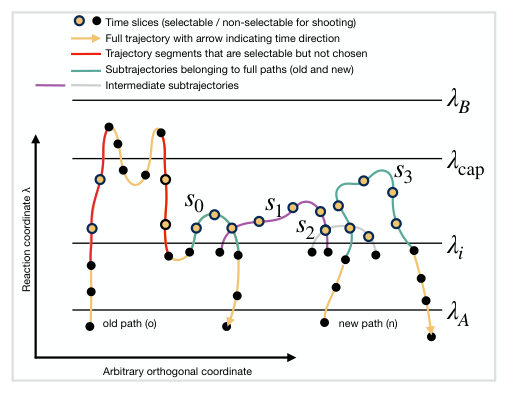 
FIG. 1: Schematic illustration of a wire-fencing (WF) move in the [i+] ensemble, showing how a new path is generated through a sequence of shorter subtrajectories.

📷 Fig 2

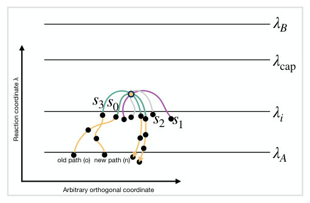 
FIG. 2: Illustration of a wire-fencing (WF) move in which multiple subtrajectories originate from the same shooting point. This scarcity of shooting points can arise from infrequent frame saving, corresponding to a high subcycle number, while at the same time, steep gradients on the potential energy surface lead to a rapid decrease in the order parameter during shooting. Colors, markers, and line styles have the same meaning as in Fig. 1.

📷 Fig 3

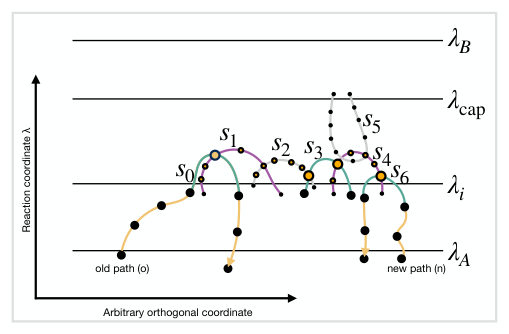 
FIG. 3: Illustration of the multi-resolution wire-fencing move. Colors, markers, and line styles have the same meaning as in Fig. 1, with the smaller spheres representing the high-resolution points. This example illustrates how a new path is obtained from an old path using two sets of three subtrajectories. s5 is a rejected subtrajectory, and s4 is therefore used again to select a shooting point for generating s6.

📷 Fig 4

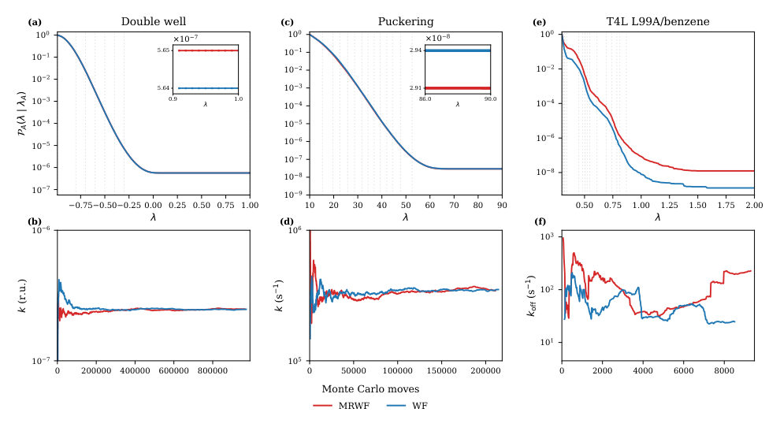 
FIG. 4: Comparison of MRWF and conventional wire-fencing for the double-well, puckering, and T4L L99A/benzene systems. Panels (a,b), (c,d), and (e,f) correspond to the double-well, puckering, and T4L systems, respectively; within each pair, the first panel shows the crossing-probability profile and the second the corresponding running rate estimate as a function of Monte Carlo moves. Insets in (a) and (c) show the endpoint region of the double-well and puckering crossing-probability profiles on a linear scale. The vertical dashed lines in panels (a), (c), and (e) represent the interface positions.

**Summary.** This paper introduces the Multi-Resolution Wire-Fencing (MRWF) move to overcome sampling bottlenecks in path sampling simulations. By temporarily refining sub-trajectories at higher resolution, MRWF dramatically increases the diversity of available shooting points. This leads to substantial, often order-of-magnitude, improvements in the statistical efficiency of calculating rare-event kinetics.

**Why it may be interesting.** While focused on classical MD/path sampling, the core concept of enhancing sampling efficiency by refining intermediate states echoes challenges in simulating complex quantum dynamics or open quantum systems where rare transitions are key.

Detailed structure

**Main problem.** The primary challenge is efficiently sampling rare events in complex systems, such as protein unbinding, using path sampling methods.

**Main result.** The proposed Multi-Resolution Wire-Fencing (MRWF) move significantly improves sampling efficiency by enhancing the diversity of available shooting points along the trajectory.

**Method.** MRWF refines the standard wire-fencing move by propagating selected sub-trajectories at a higher temporal resolution than the stored path frames.

**Model / system.** The methods are tested on model systems including a 1D double-well potential, a puckering example, and a realistic protein–ligand unbinding process.

**Key observables.** Sampling efficiency, shooting-point diversity ($D_{shot}$), crossing-probability profiles, and estimated rate constants.

**Important parameters / regimes.** Frame-saving frequency (low frequency limits sampling), temporal resolution, and the order parameter ($\lambda(x)$) defining the reaction coordinate.

**Assumptions / limitations.** The method assumes that the underlying path sampling framework (like super-detailed balance) can be maintained while introducing higher-resolution intermediate steps.

**Figures summary.** Figures compare MRWF and WF performance, showing improved crossing-probability profiles and significantly reduced repetition of successive shooting points for MRWF.

**Paper structure.** The paper introduces the MRWF move, derives its acceptance criteria using super-detailed balance, and then validates its superior performance by comparing it against conventional wire-fencing on multiple model systems.

Abstract

Path sampling methods enable the computation of thermodynamic and kinetic properties through Monte Carlo (MC) moves that generate trajectories from short forward and backward molecular dynamics (MD) segments. Recently, the wire-fencing move was developed to achieve near-unity acceptance while also rapidly decorrelating successive paths, two properties that are usually in conflict in conventional MC schemes. However, in large systems, such as biomolecular simulations, the frame-saving frequency is often kept low to reduce storage requirements. Likewise, when evaluating the order parameter is expensive, frames are saved less frequently to reduce the associated cost. In either situation, this can severely limit the number of available shooting points, in extreme situations leaving only a single point, typically the one with the highest order parameter value, accessible for shooting. Repeated shootings may then originate from the same configuration, reducing sampling efficiency. Here, we introduce a multi-resolution variant of the wire-fencing move in which selected subtrajectories are propagated at higher temporal resolution than the stored trajectories. This refinement affects only the MC move and does not alter the structure or storage of the generated paths, but enhances the diffusion of shooting points along the trajectory and thereby improves sampling efficiency. The approach is demonstrated on two model systems and a realistic protein--ligand unbinding process, with the latter showing an estimated efficiency improvement of more than an order of magnitude.

[↑ back to top](#top)

### [Passive Pauli Toggling of Polarization Qubits in Optical Fibers: Error Bounds and QKD Performance](http://arxiv.org/abs/2609.21373v1)

**Authors:** Bongjune Kim, Jeongho Bang  
**Type:** theory · **Category:** quantum information and computing · **PDF:** <https://arxiv.org/pdf/2609.21373v1>  
**Analysis basis:** full PDF text, analyzed in chunks
**Topic relevance:** `correlated / nonlocal dissipation` **1/5** · `interference shaping light` **1/5** · `quantum measurements` **1/5**

📷 Fig 1

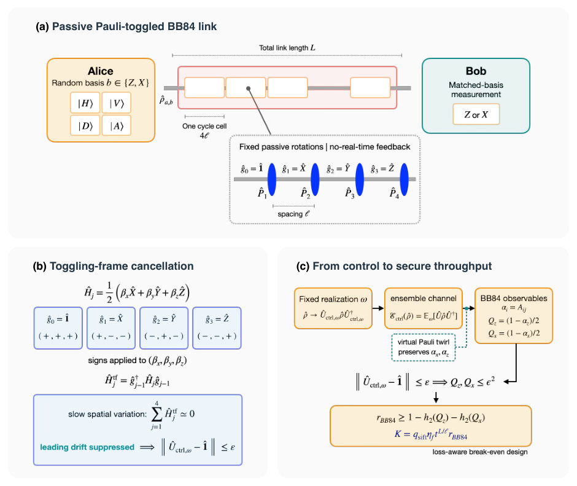 
FIG. 1. Passive spatial Pauli toggling for a polarization-encoded BB84 link. (a) Alice sends a ˆZ- or ˆ X-basis qubit through a fiber of length L containing cyclic Pauli cells of length 4ℓ, where ℓis the device spacing. The physical rotations ˆPj generate the cumulative frames ˆ1, ˆ X, ˆY , ˆZ without real-time feedback, after which Bob performs matched-basis detection. (b) In the toggling frame, ˆHtf j = ˆg† j−1 ˆHjˆgj−1, the four frames reverse different components of the local birefringence generator. Sufficiently slow spatial drift therefore cancels to leading order, yielding ˆVctrl,ω −ˆ1 ≤ε after removal of the known final phase; the schematic denotes this representative by ˆUctrl,ω....

📷 Fig 2

 
FIG. 2. Suppression of polarization-induced channel errors in the spatial OU fiber model. (a) Ensemble-averaged BB84 QBER in the ˆZ and ˆ X bases as a function of device spacing ℓ. Horizontal dashed/dotted lines show the uncontrolled channel. (b) Total Pauli error weight 1 −Fe obtained from the entanglement fidelity. The small-ℓfit is a visual diagnostic of typical scaling in this stochastic model; it is not imposed by the theorem. Error bars are 95% confidence intervals over 200 realizations.

📷 Fig 3

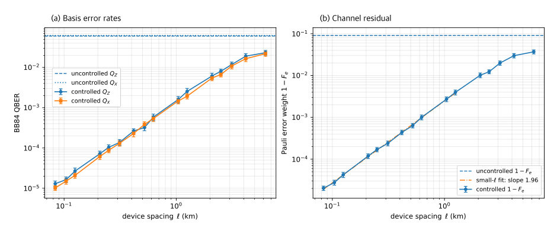 
Fig. 4 summarizes the engineering message. There is a finite design window, not a monotone rule that “more devices are always better.” For high-transmission devices, decreasing ℓinitially improves the rate because it suppresses coherent polarization errors. Once the QBER is already small, further densification only multiplies loss and reduces the launched-pulse key rate. This behavior is consistent with Eq. (49) and provides a practical way to choose ℓonce device loss and measured polarization drift statistics are known.

📷 Fig 4

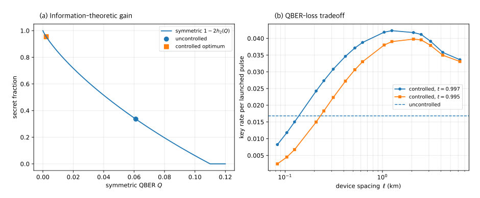 
FIG. 3. BB84 information gain and insertion-loss tradeoff. (a) The symmetric-error secret fraction 1 −2h2(Q), with markers indicating the uncontrolled channel and the controlled optimum for t = 0.997. (b) Key rate per launched pulse versus spacing for two per-device transmissions. The horizontal line is the uncontrolled key rate.

📷 Fig 5

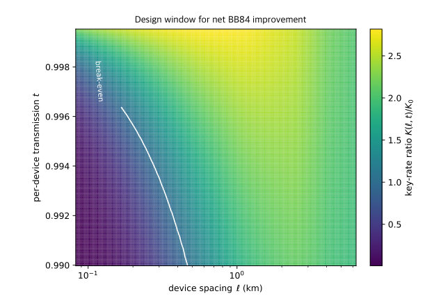 
FIG. 4. Design map for net BB84 improvement. The color scale is K(ℓ, t)/K0, where K0 is the uncontrolled key rate. The white contour is the break-even line. Above this contour, the QBER reduction produced by spatial Pauli toggling compensates for the insertion loss.

**Summary.** This paper introduces a technique called passive Pauli toggling, where fixed Pauli rotations are embedded within an optical fiber to counteract polarization drift caused by birefringence. By repeatedly reversing the accumulated phase rotation, the scheme significantly reduces the Quantum Bit Error Rate (QBER) and boosts the key rate for QKD systems. It offers a loss-aware design principle for stabilizing polarization qubits without requiring continuous active monitoring.

**Why it may be interesting.** This work provides a novel, passive, and mathematically rigorous method to precondition quantum communication channels, shifting the burden of error correction from active feedback to the physical structure of the link itself.

Detailed structure

**Main problem.** To determine if the quantum channel itself (the optical fiber) can suppress coherent polarization drift in polarization qubits before active feedback is applied, thereby improving Quantum Key Distribution (QKD) performance.

**Main result.** The proposed passive Pauli toggling scheme significantly reduces the mean QBER (e.g., from 6.11% to 0.224% in simulation) and increases the asymptotic key rate by a factor of approximately 2.5.

**Method.** The authors developed a spatial-control framework by embedding a fixed cyclic sequence of Pauli rotations along the fiber to repeatedly reverse the leading action of the accumulated polarization drift.

**Model / system.** The system uses single-photon polarization qubits transmitted through an optical fiber, modeled by a spatial Schrödinger equation whose evolution is controlled by inserting ideal Pauli rotators at discrete segments.

**Key observables.** Quantum Bit Error Rates (QBERs) in the X and Z bases, the resulting secret fraction, and the asymptotic key rate per launched pulse.

**Important parameters / regimes.** The optimal design is constrained by a finite operating window determined by the balance between error suppression and optical loss.

**Assumptions / limitations.** The model excludes polarization-dependent loss and Polarization-Mode Dispersion (PMD); the analysis assumes the Pauli-twirled description is an operational reduction for QBERs.

**Figures summary.** The notes do not describe specific figures, but mention a practical workflow table summarizing the measurement of error suppression, insertion penalty, and operational gain by scanning cell spacing.

**Paper structure.** The paper establishes the theoretical framework for Pauli toggling, derives end-to-end residual-error bounds for noncommuting drift, connects these bounds to operational QKD quantities (QBERs), and concludes with a loss-aware design principle.

Abstract

Polarization qubits offer a direct route to fiber-based quantum communication, yet the fiber that carries them also scrambles their reference frame through uncontrolled birefringence. Active compensation commonly relies on monitoring and feedback, raising a natural question: can the link itself suppress coherent polarization drift before it reaches the receiver? We show that it can within a regime of sufficiently correlated unitary drift. Our central idea is to embed a fixed cyclic sequence of Pauli rotations along the fiber, turning propagation distance into a spatial toggling frame. Rather than estimating and inverting the unknown transformation, the sequence repeatedly reverses its leading action. We establish exact refocusing for constant generators compatible with a two-segment echo, show that a four-frame Pauli cell cancels the leading contribution of any traceless quasi-static generator, and bound the residual error for smoothly varying birefringence. We then connect these guarantees to operational BB84 quantities, including measured QBERs, the resulting secret fraction, and insertion loss. In simulations of a 50 km fiber with spatially correlated birefringence, a representative design reduces the mean QBER from 6.11% to 0.224% at a device spacing of 1.25 km. With an assumed per-device transmission of t = 0.997, this raises the asymptotic key rate per launched pulse by a factor of approximately 2.5. For this parameter set, the best design in the tested scan is not the densest one: error suppression and optical loss create a finite operating window. These results provide a loss-aware design principle for passive polarization stabilization and suggest a low-overhead complement to active tracking in polarization-encoded QKD networks.

[↑ back to top](#top)

### [Self-avoiding trails in two and three dimensions](http://arxiv.org/abs/2609.21724v1)

**Authors:** Xiaodi Su, Zongzheng Zhou, Qianqian Wu  
**Type:** theory · **Category:** statistical mechanics · **PDF:** <https://arxiv.org/pdf/2609.21724v1>  
**Analysis basis:** full PDF text, analyzed in chunks
**Topic relevance:** `analog quantum simulation` **1/5** · `methods for driven-dissipative` **1/5** · `non-equilibrium universality` **1/5**

📷 Fig 1

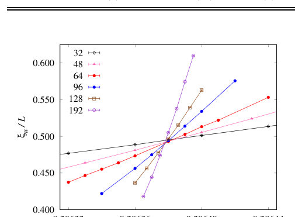 
Fig. 1. Plot of the unwrapped end-to-end distance ξu rescaled by L, on the simple-cubic lattice.

📷 Fig 2

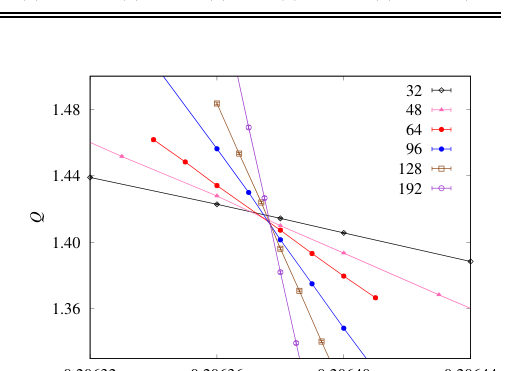 
Fig. 2. Plot of the Binder ratio Q versus z on the simple-cubic lattice.

📷 Fig 3

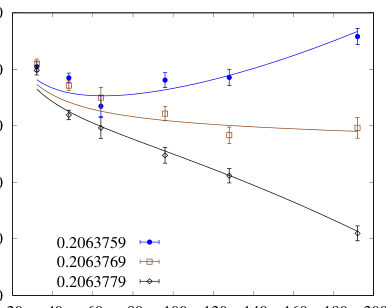 
Fig. 3. Plot of Q versus L at our estimated zc and at five standard deviations above and below our estimated zc. The curves correspond to our preferred fits of the data by the ansatz Eq. (5) on the simple cubic lattice.

📷 Fig 4

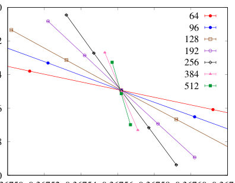 
Fig. 5. Plot of the Binder ratio Q versus z on the square lattice.

📷 Fig 5

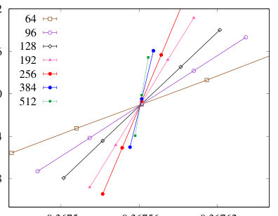 
Fig. 4. Plot of the unwrapped end-to-end distance ξu rescaled by L on the square lattice.

**Summary.** This work investigates the critical properties of self-avoiding trails on 2D and 3D lattices using advanced Monte Carlo simulations. By analyzing observables like the Binder ratio and end-to-end distance, the authors provide highly precise estimates for the critical points. The study confirms that the critical scaling behavior of SATs mirrors that of standard self-avoiding walks.

**Why it may be interesting.** While focused on classical lattice statistics, the rigorous application of advanced Monte Carlo techniques and finite-size scaling analysis is highly relevant to understanding critical phenomena in complex quantum many-body systems.

Detailed structure

**Main problem.** The paper aims to accurately estimate the critical points and study the critical scaling behavior of self-avoiding trails (SATs) in two and three dimensions.

**Main result.** Accurate critical point estimates were obtained for the simple cubic (0.206...) and square lattices (0.367...), significantly improving previous results. Furthermore, the scaling behaviors of SATs and SAWs were shown to be consistent at the critical point.

**Method.** The study employs finite-size analyses of observables like the unwrapped end-to-end distance and the Binder ratio, utilizing advanced Markov Chain Monte Carlo algorithms.

**Model / system.** The model is the self-avoiding trail (SAT) on square and simple cubic lattices with periodic boundary conditions. SATs differ from self-avoiding walks (SAWs) by prohibiting multiple traversals along the same lattice edge.

**Key observables.** Unwrapped end-to-end distance ($\xi_u$), Binder ratio ($Q$), mean trail length ($N$), susceptibility ($\chi$), and critical exponents ($
u, \gamma, \alpha$).

**Important parameters / regimes.** The fugacity parameter ($z$), lattice dimensionality (2D and 3D), and lattice size ($L$).

**Assumptions / limitations.** The analysis relies on the validity of finite-size scaling ansatzes and the efficiency of the irreversible MCMC algorithm.

**Figures summary.** Figures illustrate the convergence of observables like $\xi_u/L$ and $Q$ to estimate $z_c$ on both lattices, and show data collapse for scaling behaviors of $N, \chi, C$ for both SAT and SAW.

**Paper structure.** The paper systematically develops the methodology using irreversible MCMC to calculate observables, performs finite-size scaling fits to determine $z_c$, and then compares the resulting critical exponents and distribution functions for SATs versus SAWs.

Abstract

The self-avoiding trail is an important variant of the self-avoiding walk. In this work, we employ an irreversible Markov chain Monte Carlo algorithm, together with the reversible Berretti-Sokal algorithm for comparison, to simulate self-avoiding trails on the square and simple cubic lattices with periodic boundary conditions. Based on finite-size analyses of the unwrapped end-to-end distance and the Binder ratio, we accurately estimate the critical points on the simple cubic and square lattices to be 0.206\,376\,9(2) and 0.367\,561\,1(1), respectively, improving the precision of previous best estimates by factors of 500 and 70. At the estimated critical point of the simple cubic lattice, we numerically demonstrate that both the critical scaling behaviors of various quantities and the length distributions of self-avoiding trails and walks are consistent with each other. Our accurate numerical results are attributed to the efficiency of the irreversible algorithm, whose advantage over the reversible algorithm is even more pronounced for the self-avoiding trail model than for the self-avoiding walk model.

[↑ back to top](#top)

### [Simulation and Network Assembly Pipelines for Dynamically Bonded Soft Materials](http://arxiv.org/abs/2609.21204v1)

**Authors:** Tanner A. Wilcoxson, Tianhao Li, Tyla R. Holoman, Gaurav Mitra, Thomas M. Truskett, Glen M. Hocky  
**Type:** theory · **Category:** statistical mechanics · **PDF:** <https://arxiv.org/pdf/2609.21204v1>  
**Analysis basis:** full PDF text, analyzed in chunks
**Topic relevance:** `driven-dissipative phase transition` **1/5** · `methods for driven-dissipative` **1/5** · `non-equilibrium universality` **1/5**

📷 Fig 1

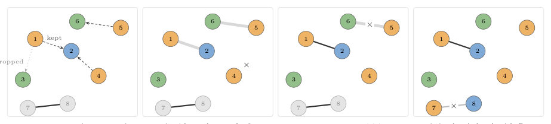 
FIG. 1. One bonding sweep, drawn for a single reaction pair set at frozen particle positions; the coordinates are identical in all four panels because a sweep is evaluated between integration steps. Circles are reactive sites, colored by particle type, and heavy lines are dynamic bonds. (a) Every unoccupied site scans the neighbor list and keeps the one free, type-compatible partner lying in [rmin, rmax] whose separation is closest to the bond rest length; site 1 accordingly proposes 2 (dashed) rather than the more distant 3 (dotted), and sites 7 and 8, which already carry a bond, are invisible to the search. (b) Claims are resolved so that no site appears in more than one proposal: sites 1...

📷 Fig 2

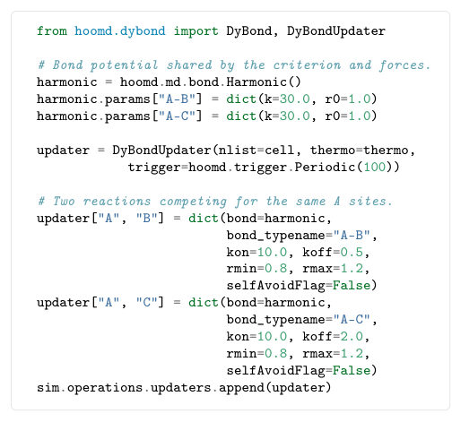 
FIG. 2. Example of registering two competing reactions with the DyBond plugin. Sites of type A may bond to either B or C, but hold at most one dynamic bond at a time, so the two reactions compete through the shared occupancy record of Sec. II C. Here the fourfold difference in koff makes the A–B product the more stable of the two by kBT ln 4. Each reaction takes its rest length r0 from the bond potential it names and must state, through selfAvoidFlag, whether sites of the same molecule may bond to each other. The neighbor list cutoff for each reacting type pair is raised to rmax, if it is smaller, when the updater attaches, and the trigger period supplies the n of Eq. (2).

📷 Fig 3

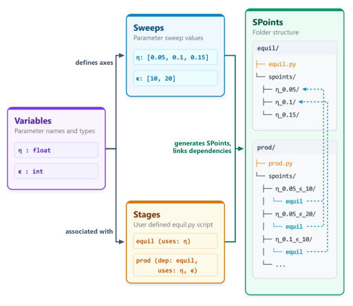 
FIG. 3. Architecture of pySNAP’s declarative workflow en- gine. Pipelines are defined by typed Variables and discrete pa- rameter Sweeps, whose Cartesian product produces the para- metric space. Simulation Stages are user-defined tasks topo- logically sorted by execution dependencies. The engine maps parameter combinations into discrete SPoints (state points) and automatically links upstream stage artifacts to down- stream stages for unified access across SPoints.

📷 Fig 4

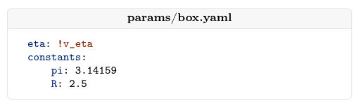 
FIG. 4. Example parameter declarations within the params/ directory. The specified SPoint values of each variable are injected in-place at variable directives (denoted by !v_variable) before the SPoint is executed. Nested dictio- naries and lists are allowed.

📷 Fig 5

 
FIG. 5. Example stage simulation script demonstrating SPoint_Manager use, simulation checkpointing, parameter and variable fetching, and dependency access. The stage sim- ulation script is run from within each specific SPoint direc- tory, allowing direct access to dependency links created during SPoint generation.

**Summary.** This paper presents pySNAP, an open-source computational platform designed to simulate soft materials held together by dynamic, reversible bonds. It integrates GPU-accelerated molecular dynamics with a specialized plugin that accurately models bond formation and breaking kinetics. This allows researchers to systematically study how microscopic bond chemistry dictates macroscopic material properties in a high-throughput manner.

**Why it may be interesting.** The focus on controlling bond kinetics and simulating phase behavior in soft matter falls directly under non-equilibrium statistical mechanics, making it highly relevant for understanding complex many-body dynamics.

Detailed structure

**Main problem.** The primary challenge is bridging the gap between the microscopic kinetics of reversible bonds and the resulting macroscopic, bulk properties of soft materials.

**Main result.** The authors introduce pySNAP, a comprehensive, modular platform that enables systematic, high-throughput simulation studies of soft materials governed by dynamic bonding kinetics.

**Method.** The platform integrates GPU-accelerated molecular dynamics (HOOMD-blue) with a specialized plugin (DyBond) that handles dynamic bond formation and breaking based on equilibrium distributions.

**Model / system.** The system involves soft materials linked by reversible covalent or supramolecular bonds, modeled using dynamic bonding reactions treated as two-state systems with defined on-rates and off-rates.

**Key observables.** Elastic moduli, stress relaxation time, gelation state, and the kinetics of bond formation/dissociation.

**Important parameters / regimes.** Bonding/dissociation rate constants ($k_{on}, k_{off}$), temperature ($T$), and the timescale separation between bond kinetics and network rearrangement.

**Assumptions / limitations.** The method assumes that the bonding sweep process maintains detailed balance and that the rate constants can be modified by external factors like temperature or mechanical load.

**Figures summary.** Figure 1 illustrates the four sequential phases (Proposal, Matching, Acceptance, Breaking) of a single dynamic bonding sweep. Figure 12 compares the throughput of a rigid-core droplet model versus a standard model as a function of the number of tether beads ($n$).

**Paper structure.** The paper first identifies the scientific gap, then details the pySNAP platform architecture (integrating HOOMD-blue and DyBond). It mathematically describes the dynamic bonding mechanism (two-state reactions, Metropolis acceptance), discusses advanced rate modifiers (load-dependent unbinding), and concludes with demonstrations on various complex systems.

Abstract

Soft materials linked by reversible covalent or supramolecular bonds form a diverse class of assemblies with promising applications from nanoscience to medicine. Experiments typically probe bulk phase behavior and rheology, but it remains difficult to measure how microscopic bonding kinetics and the mechanics of the constituent elements give rise to bulk properties. Coarse-grained molecular dynamics (MD) simulations can bridge these scales, but most simulation approaches do not control individual bond kinetics, and those that do were mostly developed for bespoke applications that do not readily generalize. Here we present pySNAP (Simulation and Network Assembly Pipelines), a modular open source Python platform that integrates tunable dynamic bonding with a workflow, template, and analysis setup, so that users can study a wide range of systems with only small changes to input files. The platform is built on the GPU-accelerated HOOMD-blue MD engine and integrates DyBond, a GPU-accelerated plugin that forms and breaks bonds consistent with an equilibrium distribution and supports bonding between multiple types of partner species. Around this core, the snap_simulate package compiles a directory of parameter files into a HOOMD-blue simulation, and the snap_workflow package orchestrates the resulting parameter sweeps across workstations and high-performance computing schedulers. We describe the theory behind simulated dynamic bonding and how to use the package, from setting up a parameter sweep to analyzing its results, and demonstrate the framework on a diverse range of dynamically bonded systems, showing that it accommodates distinct interaction mechanisms, geometries, and physical scenarios within a unified workflow, while enabling both reproduction of existing models and rapid construction of more complex composite systems.

[↑ back to top](#top)

### [Unified Field Bosonization Technique for strongly inhomogenous Luttinger Liquids](http://arxiv.org/abs/2609.21973v1)

**Authors:** Soundarya P, Venkata Suryanarayana M, Joy Prakash Das  
**Type:** theory · **Category:** strongly correlated electrons · **PDF:** <https://arxiv.org/pdf/2609.21973v1>  
**Analysis basis:** full PDF text, analyzed in chunks
**Topic relevance:** `Frenkel-Kontorova` **1/5** · `Keldysh / 2PI / non-Gaussian methods` **1/5** · `analog quantum simulation` **1/5**

📷 Fig 1

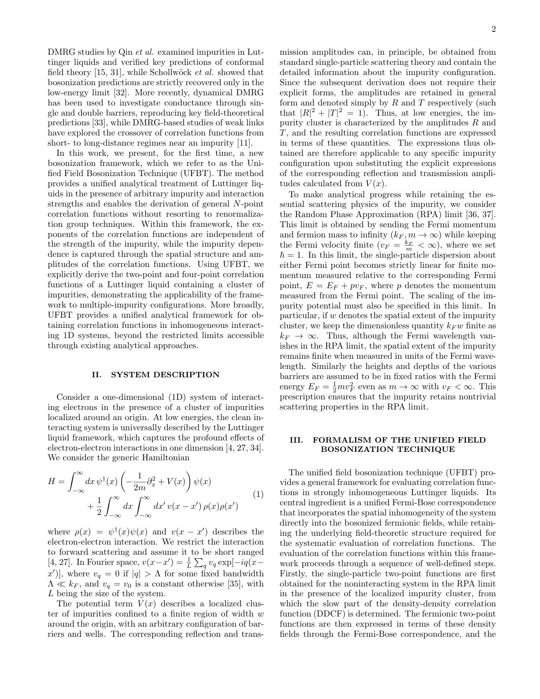 
Low-resolution page preview, page 2

📷 Fig 2

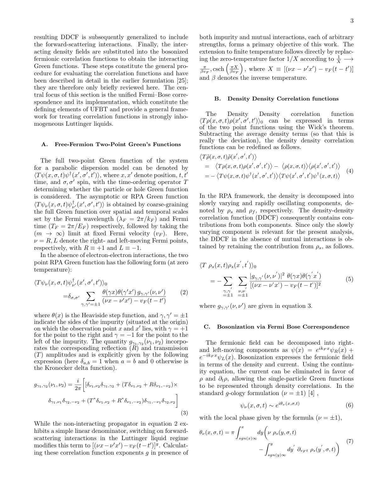 
Low-resolution page preview, page 3

📷 Fig 3

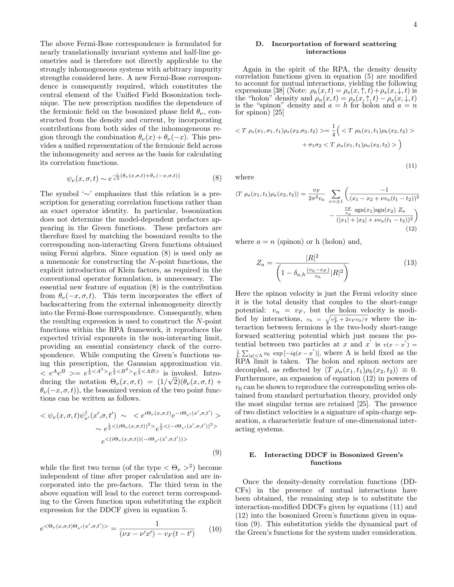 
Low-resolution page preview, page 4

📷 Fig 4

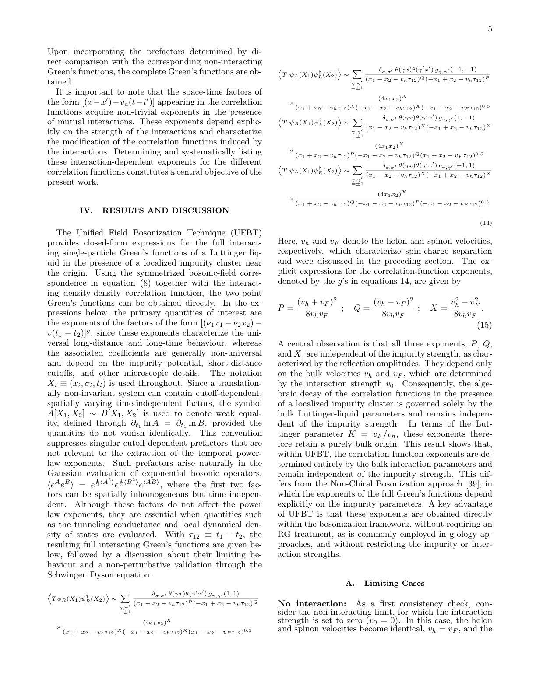 
Low-resolution page preview, page 5

📷 Fig 5

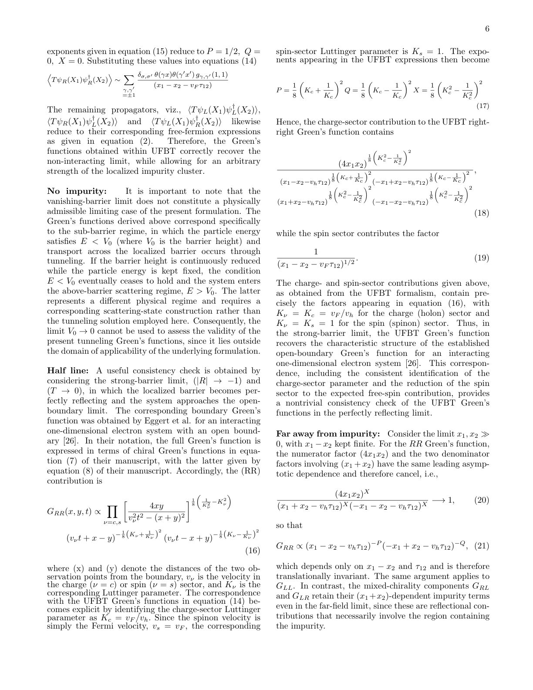 
Low-resolution page preview, page 6

**Summary.** This work introduces the Unified Field Bosonization Technique (UFBT) to analytically calculate correlation functions in strongly inhomogeneous Luttinger Liquids. The technique successfully handles static impurities without relying on perturbative expansions or renormalization group methods. It provides universal results for correlation exponents while accurately capturing the spatial structure imposed by the impurities.

**Why it may be interesting.** The analytical treatment of strong spatial inhomogeneity in 1D correlated systems is crucial for understanding transport phenomena in nanoscale conductors, which often exhibit strong electron-electron interactions.

Detailed structure

**Main problem.** The paper aims to develop an analytical method to calculate correlation functions in strongly inhomogeneous one-dimensional Luttinger Liquids (LLs) containing static impurities.

**Main result.** The Unified Field Bosonization Technique (UFBT) yields closed-form expressions for N-point correlation functions, showing that correlation exponents are independent of impurity strength.

**Method.** It introduces the UFBT, a direct bosonization framework that incorporates impurity scattering via a symmetrized combination of bosonic phase fields, avoiding RG analysis or perturbative expansions.

**Model / system.** The system is an interacting electron gas modeled as a Luttinger Liquid in one dimension, perturbed by localized static impurities (barriers and wells). The Hamiltonian involves electron-electron interactions and impurity potentials.

**Key observables.** N-point correlation functions, single-particle Green's functions, local/dynamical density of states, and Friedel oscillations.

**Important parameters / regimes.** Impurity strength (characterized by reflection/transmission amplitudes), Luttinger parameter (K), and bulk velocities ($v_h, v_F$).

**Assumptions / limitations.** The method relies on a generalized Fermi-Bose correspondence for strong inhomogeneity and uses the Gaussian approximation for calculating bosonized two-point functions.

**Figures summary.** Not specified.

**Paper structure.** The paper builds the formalism by first establishing the non-interacting case, then incorporating forward-scattering interactions via the DDCF, and finally deriving the full interacting Green's functions and N-point correlation functions using the UFBT.

Abstract

We introduce the Unified Field Bosonization Technique (UFBT), a direct bosonization framework for strongly inhomogeneous one-dimensional Luttinger liquids (LLs) containing static impurities. UFBT incorporates impurity scattering through a symmetrized combination of bosonic phase fields and yields closed-form expressions for arbitrary N-point correlation functions for a broad class of static impurity potentials, including delta barriers, finite barriers and finite wells. The formalism requires neither renormalization-group analysis nor perturbative expansions, providing an analytical description of the inhomogeneous system at the bosonized level. The technique is validated by recovering known limiting cases, showing agreement with the first-order perturbative expansion in the interaction strength, and demonstrating consistency with the Schwinger-Dyson equations. A key result is that the correlation function exponents remain independent of the impurity strength, while the impurity dependence is captured by the spatial structure and amplitudes of the correlation functions. The resulting correlation functions establish a foundation for analytical studies of transport, Friedel oscillations, and the local and dynamical density of states in strongly inhomogeneous Luttinger liquids.

[↑ back to top](#top)

### [Correlation enhanced magnetism at a superconducting cuprate/manganite interface](http://arxiv.org/abs/2609.22051v1)

**Authors:** Vitor A. M. Lima, Marcello Civelli, Walber Hugo de Brito  
**Type:** theory · **Category:** strongly correlated electrons · **PDF:** <https://arxiv.org/pdf/2609.22051v1>  
**Analysis basis:** full PDF text, analyzed in chunks
**Topic relevance:** `Keldysh / 2PI / non-Gaussian methods` **1/5** · `methods for driven-dissipative` **1/5**

📷 Fig 1

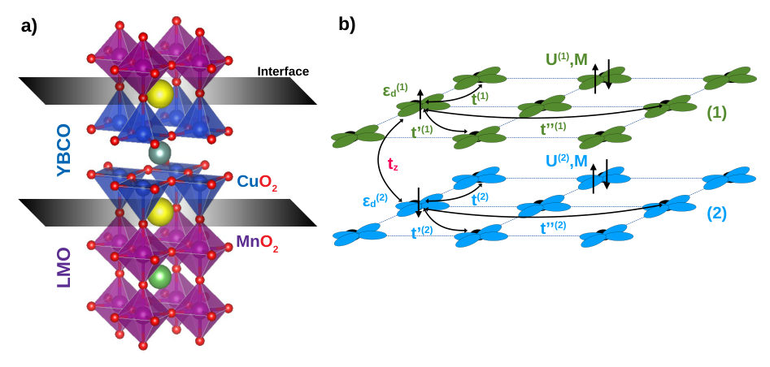 
FIG. 1. a) Relaxed structure of YBa2Cu3O7 (1 u.c.)/LaMnO3 (1 u.c.) reference supercell, with MnO2–BaO interface termina- tion. Blue, violet, and red spheres represent the Cu, Mn, and O atoms, respectively. Ba atoms are represented in yellow, while La in green. b) Effective bilayer Hubbard model for the two CuO2 planes. We retain hopping amplitudes up to third-nearest neighbors (t, t′, and t′′). The two planes are coupled by the interlayer hopping tz, while local correlations and on-site energies are described by U and εd, respectively. In the schematic, M labels the spin-dependent on-site term associated with magnetic proximity to the manganite; it shifts the two spin projections in...

📷 Fig 2

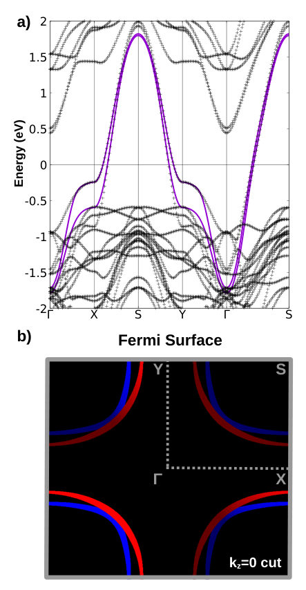 
FIG. 2. a) All-electron DFT band structure of the YBCO/LMO reference structure (black curves) and Wan- nier interpolation of the two low-energy CuO2-derived anti- bonding bands retained in the effective bilayer model (purple curves). The Fermi level is set to zero. b) Corresponding non- interacting Fermi-surface cut in the kx-ky plane at kz = 0. The two Fermi-surface sheets originate from the bonding– antibonding (red–blue) splitting of the CuO2 bilayer.

📷 Fig 3

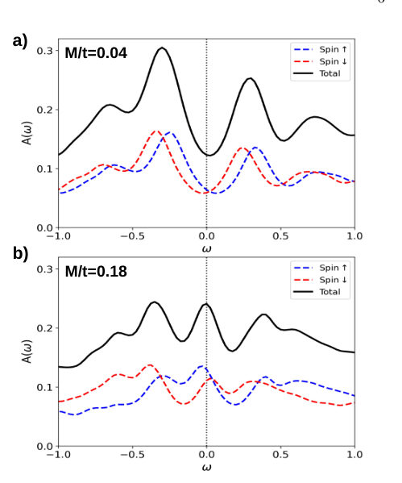 
FIG. 3. Local spectral functions in the superconducting state at fixed hole doping p = 7%, for a) M/t = 0.04 and b) M/t = 0.18, the last superconducting solution on the increasing-field branch. Blue and red dashed curves show the spin-up and spin-down contributions, respectively; the black solid curve is their sum. Increasing the exchange field separates the spin- resolved features and brings spectral weight toward the Fermi level, producing the low-energy peak in panel b). The vertical dotted line marks ω = 0. Energies are expressed in units of the nearest-neighbor hopping |t| ≈0.404 eV.

📷 Fig 4

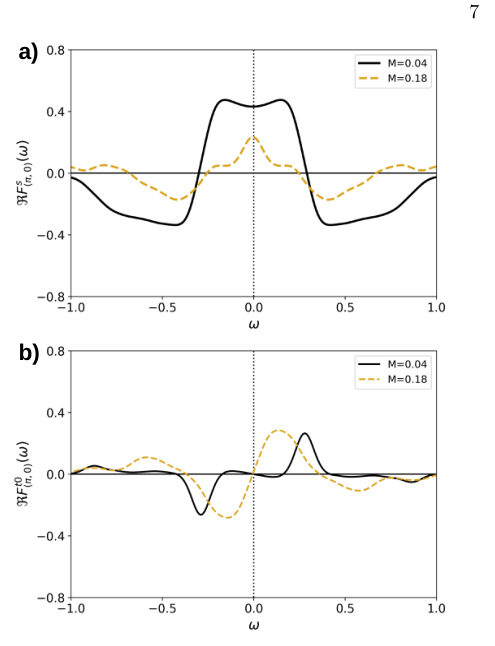 
FIG. 4. Real parts of the retarded anomalous Green’s func- tions at the antinode k = (π, 0): a) even-frequency spin- singlet and b) odd-frequency Sz = 0 spin-triplet components. Black solid and gold dashed curves correspond to M/t = 0.04 and M/t = 0.18, respectively. The singlet real part is even in ω, while the triplet real part is odd. At the higher field, the singlet features are reduced and the opposite-sign triplet lobes move closer to ω = 0.

📷 Fig 5

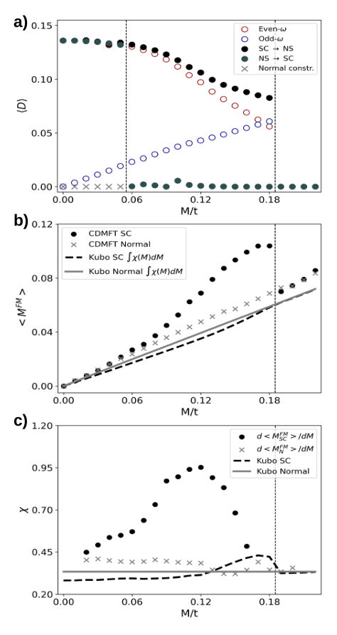 
FIG. 5. Field evolution at fixed hole doping p = 7%. a) Superconducting amplitude ⟨D⟩: black filled circles follow in- creasing M/t from 0 to 0.22 (SC →NS), and dark green filled circles follow the reverse scan (NS →SC). Their dif- ferent switching fields reveal hysteresis. Open red and blue circles are Deven and Dodd on the superconducting increasing- field branch; gray crosses denote constrained normal solu- tions. The two vertical dashed lines bracket the transition fields of the two scans. b) Induced magnetic moment: black circles and gray crosses are the direct CDMFT results along the increasing-field and constrained normal branches, respec- tively. Black dashed and gray solid lines...

**Summary.** This theoretical study models the magnetic coupling at a superconducting cuprate/manganite interface using a correlated Hubbard model solved via CDMFT. The key finding is that strong electronic correlations allow superconductivity to enhance the interfacial magnetism, contrary to simple expectations. This work provides insights into the complex interplay between magnetism and unconventional superconductivity in high-temperature superconductors.

**Why it may be interesting.** The mechanism by which strong correlations mediate a coupling between superconductivity and magnetism—specifically enhancement rather than suppression—is a central, highly active area of research in condensed matter theory relevant to unconventional superconductivity.

Detailed structure

**Main problem.** The study investigates the complex interplay between proximity-induced ferromagnetism from a manganite layer and superconductivity in cuprate heterostructures.

**Main result.** The research finds that under strong electronic correlations, superconductivity can enhance, rather than suppress, the interfacial magnetism, leading to a counterintuitive reversal of the magnetic moment in the superconducting state.

**Method.** The authors employed Cluster Dynamical Mean-Field Theory (CDMFT) to solve a correlated bilayer Hubbard model derived from first-principles calculations.

**Model / system.** The system is a cuprate/manganite interface modeled by a correlated bilayer Hubbard Hamiltonian incorporating a local exchange spin-splitting field ($H_F M$). The model is applied to the $	ext{CuO}_2$ layers of YBCO.

**Key observables.** Superconducting-induced Cu spin polarization, total magnetic moment ($\langle M 
angle$), and the emergence of a spin-polarized pseudogap.

**Important parameters / regimes.** The strength of the interfacial exchange field ($M$), the Hubbard repulsion ($U$), and the doping level (underdoped regime).

**Assumptions / limitations.** The magnetic proximity effect is modeled phenomenologically via a local exchange term, and the analysis excludes orbital effects like screening or vortex formation.

**Figures summary.** Figures illustrate the structural relaxation and effective model parameters for the interface, and later show the dependence of magnetic susceptibility ($\chi$) and magnetization ($M$) on the proximity field $M$.

**Paper structure.** The paper first establishes the physical model using DFT/tight-binding parameterization, then applies CDMFT to solve the correlated Hubbard model, analyzing the coexistence regime, the magnetic moment reversal, and the first-order collapse of superconductivity at strong fields.

Abstract

Motivated by experimental studies on cuprate-manganite heterostructures, we study a correlated bilayer Hubbard model subject to a local interfacial exchange field using cluster dynamical mean-field theory in the underdoped cuprate regime. We find that superconductivity coexists with a manganite-induced Cu spin polarization. Remarkably, throughout this coexistence regime, the superconducting solution carries a larger magnetic moment than the corresponding constrained normal state. Analysis of the magnetic response shows that this reversal is driven by correlations, which enhance magnetism already in the normal state and even more strongly in the superconducting solution. At stronger exchange fields, superconductivity collapses abruptly, displaying hysteresis consistent with a first-order transition, and a strongly spin-polarized pseudogap emerges. These results show that, under strong electronic correlations, superconductivity can enhance rather than suppress interfacial magnetism.

[↑ back to top](#top)

### [Metallic Néel order stabilized by coupling between inequivalent Hubbard layers](http://arxiv.org/abs/2609.20922v1)

**Authors:** Yi-Ming Wu, Jessica Yiqi Pan, Hong Yao, Steven A. Kivelson  
**Type:** theory · **Category:** strongly correlated electrons · **PDF:** <https://arxiv.org/pdf/2609.20922v1>  
**Analysis basis:** full PDF text, analyzed in chunks
**Topic relevance:** `Frenkel-Kontorova` **1/5** · `analog quantum simulation` **1/5**

📷 Fig 1

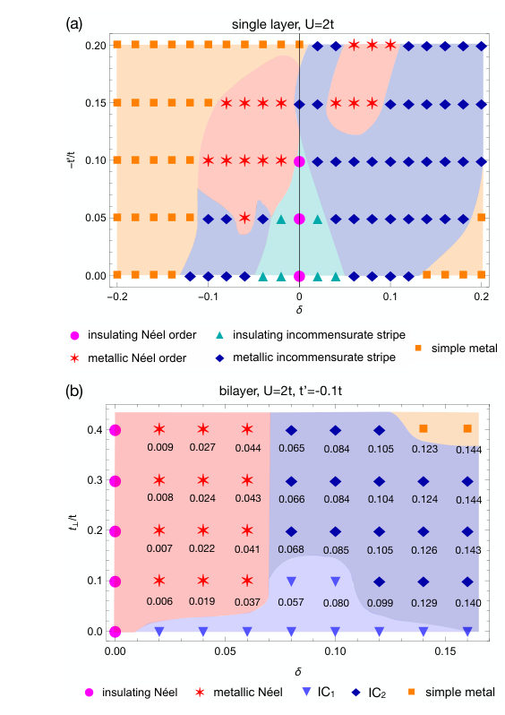 
FIG. 1. Hartree-Fock ground-state phase diagrams of the square-lattice Hubbard model with U = 2t: (a) on a single layer 60 × 60 torus and (b) on a bilayer 2 × 40 × 40 torus. Positive δ corresponds to hole doping while negative δ elec- tron doping. In (a), t′/t is varied. The N´eel and stripe states marked by magenta circles and turquoise triangles, respec- tively, are insulating, while all other phases are metallic. In (b), t⊥/t is varied at fixed t′ = −0.1t and fixed potential dif- ference δµ = 0.1t between the two layers. Blue triangles de- note the layer-decoupled incommensurate stripe phase (IC1), in which the two layers have different stripe periods, while blue diamonds indicate the...

📷 Fig 2

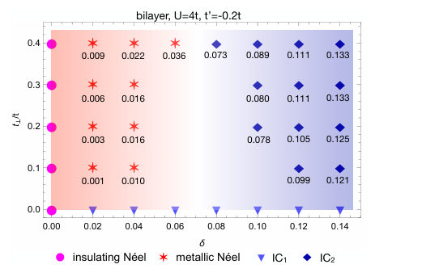 
FIG. 2. Hartree-Fock ground-state phase diagram of a 2×30× 30 torus with U = 4t, t′ = −0.2t, and δµ = 0.1t. At t⊥= 0, the phase diagram reduces to that of the single-layer model. Blank regions between the metallic N´eel and IC2 phases are where the calculations did not reliably converge. The number below each symbol gives δmin, the mean hole density on the less-doped layer.

📷 Fig 3

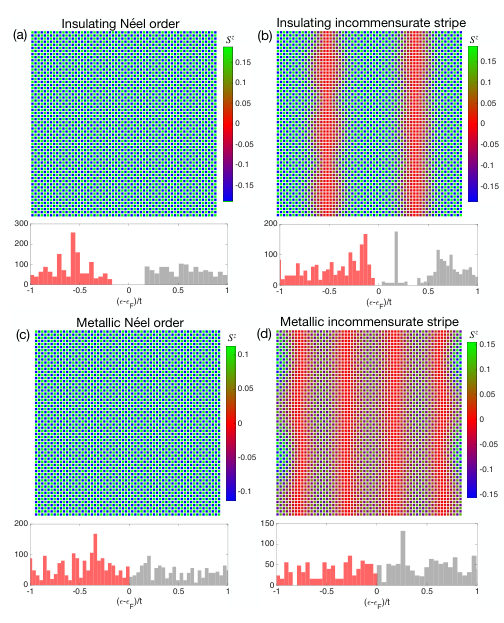 
FIG. 3. Real-space pattern of Sz and corresponding finite- system densities of states (DOS) for the 60 × 60 single -layer model with U = 2t. Energies are measured relative to the Fermi level ϵF . Occupied states are shown in red and unoc- cupied states in gray. The parameters and the corresponding phases are: (a) insulating N´eel order at δ = 0, t′ = −0.1t; (b) insulating incommensurate stripe order at δ = 0.04, t′ = 0; (c) metallic N´eel order at δ = 0.08, t′ = −0.2t; and (d) metal- lic incommensurate stripe order at δ = 0.1, t′ = 0.

📷 Fig 4

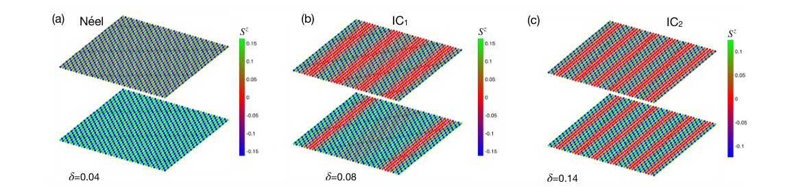 
FIG. 4. Real-space patterns of Sz r in a 2 × 40 × 40 bilayer with U = 2t, t′ = −0.1t, δµ = 0.1t, and t⊥= 0.1t [see Fig. 1(b) for the whole phase diagram]. The upper and lower surfaces represent the two layers. (a) At δ = 0.04, interlayer coupling suppresses the incompatible stripe tendencies and stabilizes metallic N´eel order. (b) At δ = 0.08, the layers retain different stripe patterns, producing the IC1 phase. (c) At δ = 0.14, t⊥is strong enough to lock the stripe patterns in the two layers, producing the IC2 phase. Note the differences in the color scale indicating the decrease in the magnitude of the magnetization at large enough δ.

📷 Fig 5

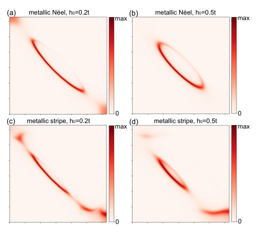 
FIG. 6. Fermi-level spectral function A(k, ω = εF ) in the first quadrant of the Brillouin zone for a single-layer model with t′ = −0.2t. (a,b) Metallic N´eel state at δ = 0.08, with (a) h0 = 0.2t and (b) h0 = 0.5t. (c,d) Metallic stripe state with period L = 12 and δ = 0.15, with (c) h0 = 0.2t and (d)h0 = 0.5t.

**Summary.** This theoretical work models multilayer cuprates using the Hubbard Hamiltonian to determine the ground-state magnetic order. It finds that interlayer coupling stabilizes a commensurate Néel-ordered metal phase, overcoming the tendency toward incommensurate spin-stripe order seen in isolated layers. This provides a crucial theoretical insight into the complex interplay between dimensionality and magnetic order in high-temperature superconductors.

**Why it may be interesting.** The mechanism of stabilizing a commensurate magnetic order via interlayer coupling in a strongly correlated system is a key theoretical concept relevant to understanding high-Tc superconductivity mechanisms.

Detailed structure

**Main problem.** The study investigates how interlayer coupling influences the magnetic ground state in lightly hole-doped multilayer cuprates, specifically contrasting the tendency toward incommensurate spin-stripe order with the stabilization of a commensurate Néel-ordered metal.

**Main result.** The interlayer coupling is shown to destabilize the stripe order relative to a commensurate Néel-ordered metal, leading to a reconstructed Fermi surface consistent with experimental observations in cuprates.

**Method.** The research employs the unrestricted Hartree-Fock approximation to map the ground-state phase diagram of the coupled Hubbard layers.

**Model / system.** The model consists of two coupled, inequivalently doped square-lattice Hubbard layers, described by a Hamiltonian including hopping terms ($t, t', t_\perp$) and on-site repulsion ($U$).

**Key observables.** Phase diagram mapping, site-dependent spin densities, and spectral function analysis to distinguish between Néel and stripe order.

**Important parameters / regimes.** Doping ($\delta$), interlayer hopping ($t_\perp/t$), and the ratio of interaction strength to hopping ($U/t$).

**Assumptions / limitations.** The use of the unrestricted Hartree-Fock approximation, which is assumed reliable at weak to intermediate Hubbard interaction strengths.

**Figures summary.** Figures illustrate single-layer and bilayer phase diagrams showing transitions between various ordered phases (Néel, stripe) and metallic states as doping and coupling strength change.

**Paper structure.** The paper systematically analyzes the phase diagram by first considering the decoupled limit ($t_\perp=0$), then introducing interlayer coupling ($t_\perp>0$) to show the stabilization of the commensurate Néel state over the stripe state.

Abstract

Inspired by recent ARPES studies on multilayer ($n\geq3$ layers) cuprate superconductors, we use the unrestricted Hartree-Fock approximation to explore the ground-state phase diagram of two coupled, inequivalently doped square-lattice Hubbard layers. In the decoupled-layer limit, the lightly hole-doped ground state is typically an incommensurate spin-stripe state. However, with sufficiently strong interlayer coupling, stripe order is destabilized relative to a commensurate Néel-ordered metal. The resulting state exhibits a reconstructed Fermi surface with hole pockets centered at $(\pmπ/2,\pmπ/2)$ that are similar in character to those seen in experiments. Our results illustrate the qualitatively new physics that can arise from interlayer coupling in multilayer cuprates.

[↑ back to top](#top)

### [Selection rules for pinned and quasipinned occupation numbers with degeneracy](http://arxiv.org/abs/2609.22010v1)

**Authors:** Robin Reuvers  
**Type:** theory · **Category:** strongly correlated electrons · **PDF:** <https://arxiv.org/pdf/2609.22010v1>  
**Analysis basis:** full PDF text, analyzed in chunks
**Topic relevance:** `analog quantum simulation` **1/5** · `quantum measurements` **1/5**

📷 Fig 1

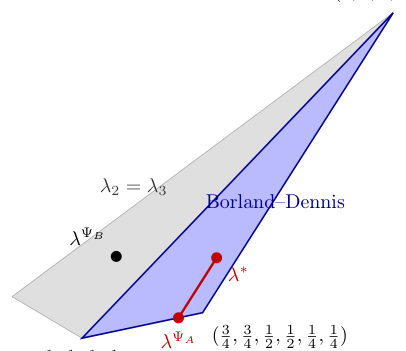 
Figure 1: The Borland–Dennis polytope Δ6,3 [3], a tetrahedron with vertices as labelled. The- orem 2 applies on the blue facet 𝜆4 = 𝜆5 +𝜆6, while on the grey ordering facet 𝜆2 = 𝜆3 the rule can fail, as 𝜆Ψ𝐵of Example 6 shows. The two hidden facets are the ordering facets 𝜆1 = 𝜆2 and 𝜆3 = 𝜆4. The ordering facets meet the blue facet in its edges, and 𝜆Ψ𝐴from Example 1 sits on the lower one, shared with 𝜆3 = 𝜆4. To prove Theorem 3, we approach 𝜆Ψ𝐴through some path (in red) that contains non-degenerate 𝜆* in the relative interior of the blue facet. For states corresponding to these 𝜆*, we know the selection rule is satisfied because they have no degenerate eigenvalues.

**Summary.** This theoretical paper rigorously proves selection rules governing the occupation numbers of fermionic states when these numbers are constrained by generalized Pauli principles. It extends previous results to handle degeneracy without assumptions and provides quantitative bounds for 'quasipinning' scenarios. This work is vital for developing accurate theoretical descriptions of strongly correlated electron systems.

**Why it may be interesting.** The rigorous mathematical treatment of selection rules in the presence of degeneracy and approximations (quasipinning) is crucial for accurately modeling strongly correlated electron systems where simple mean-field approaches fail.

Detailed structure

**Main problem.** The paper establishes selection rules for occupation numbers when these numbers saturate generalized Pauli constraints in fermionic systems.

**Main result.** It proves the selection rule for every generalized Pauli constraint, even in the degenerate case, and extends the rule to quasipinned states with quantifiable error bounds.

**Method.** The proof combines algebraic techniques related to moment maps, compactness arguments, and analysis of the polytope defined by occupation numbers.

**Model / system.** The system involves fermionic states ($\Psi$) whose properties are characterized by the one-body reduced density matrix ($\gamma\Psi$) and its eigenvalues, the natural occupation numbers ($\lambda_\Psi$). The constraints define a polytope ($\Delta_{d,N}$).

**Key observables.** Natural occupation numbers ($\lambda_j$), the one-body reduced density matrix ($\gamma\Psi$), and the deviation function $f(\Psi)$ from the constraint manifold.

**Important parameters / regimes.** The degree of degeneracy, the specific generalized Pauli constraint $D$, and the small deviation parameter $f(\Psi)$ for quasipinned states.

**Assumptions / limitations.** The rule fails for ordering constraints ($\lambda_j \ge \lambda_{j+1}$), and the proof for the general case relies on advanced geometric properties of moment maps.

**Paper structure.** The paper develops from the known non-degenerate case to the general degenerate case, proving the selection rule for all generalized Pauli constraints, and then analyzing the implications for quasipinned states.

Abstract

When the natural occupation numbers of a fermionic state saturate a generalized Pauli constraint, the state obeys a selection rule: only those configurations of natural orbitals that saturate the constraint themselves contribute. Pinning thus singles out an active space. The selection rule was proved for non-degenerate occupation numbers; for degenerate ones it was conjectured, and proved for one saturated constraint under an unverified assumption. Here, it is proved for every generalized Pauli constraint, with no assumption, and also in the spin-adapted setting. The rule can only fail for the ordering constraints $λ_j\geλ_{j+1}$. Several saturated constraints are served by one basis whenever their common zero face contains a non-degenerate point. In practice, occupation numbers are quasipinned rather than pinned, and I show what the rule then becomes.

[↑ back to top](#top)

### [Bootstrapping Disordered Quantum Systems](http://arxiv.org/abs/2609.20916v1)

**Authors:** Yaprak Önder, Michael G. Scheer, Minjae Cho, Eslam Khalaf  
**Type:** theory · **Category:** disordered systems and neural networks · **PDF:** <https://arxiv.org/pdf/2609.20916v1>  
**Analysis basis:** full PDF text, analyzed in chunks
**Topic relevance:** `analog quantum simulation` **1/5**

📷 Fig 1

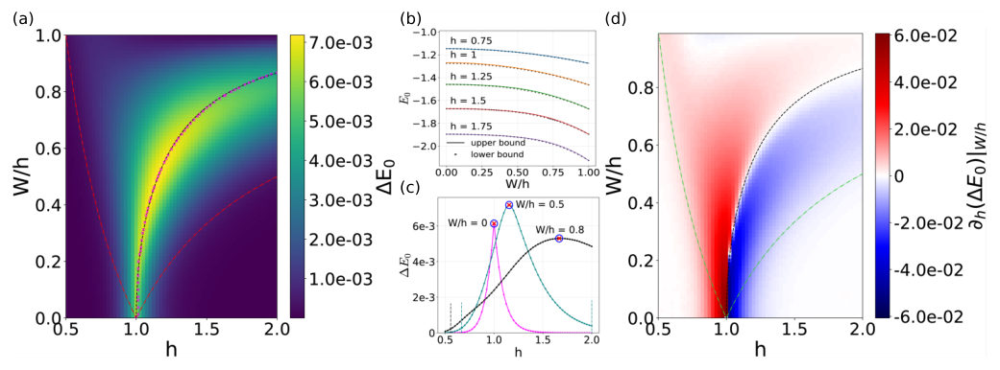 
FIG. 1: Bounds on disorder-averaged ground-state energy density for Z2 disorder. (a) Colormap of the difference between upper and lower bootstrap bounds (the bootstrap gap ∆E0), as a function of relative disorder strength W/h and field h. The red lines indicate the crossover to the Griffiths region and the black line indicates the analytical critical point. Zeros of the partial derivative ∂h∆E0|W/h of the bootstrap gap with respect to h at fixed W/h are indicated with magenta crosses. (b) Upper and lower bootstrap bounds on the ground-state energy density for the RTFIM with Z2 disorder for h = 0.5, 1, 1.5, 2. The maximum bootstrap gap over the entire scanned set is less than 0.0072. (c)...

📷 Fig 2

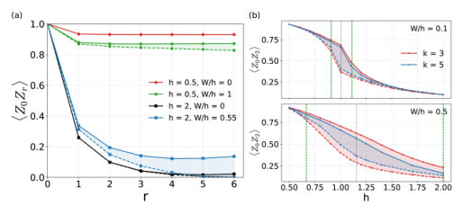 
FIG. 2: Bounds on disorder-averaged ground-state spin-spin correlators ⟨Z0Zr⟩for Z2 disorder. (a) ⟨Z0Zr⟩as a function of r for weakly and strongly disordered ferromagnetic and paramagnetic parameters. (b) ⟨Z0Z2⟩as a function of h for W/h = 0.1, 0.5. Results are shown for two different operator sets with Krylov depth k = 3, 5 (see Tab. I). The vertical green lines indicate the onset of Griffiths regions and the vertical black lines indicate the critical point.

📷 Fig 3

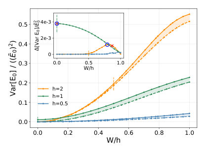 
FIG. 3: Bounds on the scaled energy density variance for Z2 disorder. The variance is scaled by the square of the average of lower and upper bounds on the energy density, with the differences between upper and lower bounds shown in the inset. The onset of the Griffiths region is indicated with vertical lines. The maximum of the difference between upper and lower bounds (indicated with blue circles in the inset) is maximized near the critical point (indicated with red crosses in the inset).

📷 Fig 4

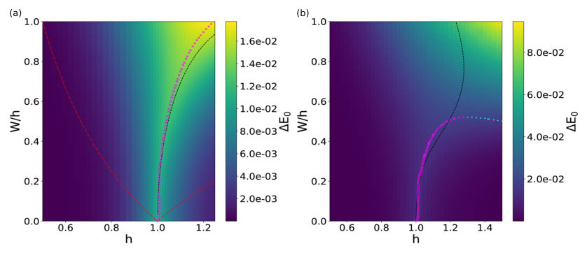 
FIG. 4: Bootstrap gap for uniform and Gaussian disorder. Colormap of difference between upper and lower bootstrap bounds on ground-state energy density (the bootstrap gap ∆E0) of the RTFIM with (a) uniform and (b) Gaussian disorder. The Griffiths lines for uniform disorder are indicated in red and the analytical critical line is indicated in black. The magenta crosses indicate zeros for the partial derivatives with respect to h of the bootstrap bounds at fixed W/h. The blue plus signs in (b) indicate inflection points in the bootstrap gap.

📷 Fig 5

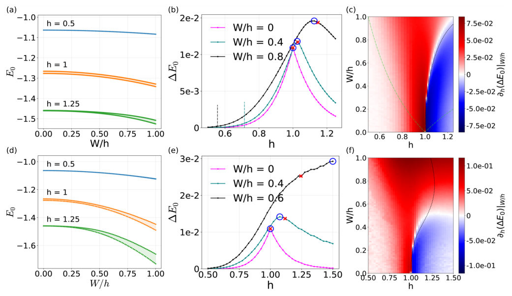 
FIG. 5: Bounds on disorder-averaged ground-state energy for uniform (top row) and Gaussian (bottom row) disorder. From left to right: (a,d) Upper and lower bootstrap bounds for uniform disorder and h = 0.5, 1, 1.25., (b,e) bootstrap gap for W/h = 0, 0.4, 0.6, with the analytical critical point is shown with a red cross and the zeros of ∂h∆E0|W/h indicated with the blue circles. The crossover to the Griffiths region is indicated with vertical lines. (c,f) colormap of ∂h∆E0|W/h, with Griffiths lines indicated in green and the critical line indicated in black, demonstrating the sign change near the critical line.

**Summary.** This paper introduces a novel bootstrap framework to rigorously bound ground-state properties of quantum systems with quenched disorder, exemplified by the 1D RTFIM. By extending the operator algebra to include disorder variables, it derives bounds that do not require sampling disorder realizations. The resulting 'bootstrap gap' serves as a powerful diagnostic tool for mapping out the system's phase diagram, revealing critical behavior and Griffiths regimes.

**Why it may be interesting.** The rigorous, non-perturbative nature of the bounds and the diagnostic power of the bootstrap gap provide powerful theoretical tools to map out complex phase diagrams in disordered quantum matter, which is highly relevant to understanding localization and critical phenomena.

Detailed structure

**Main problem.** The paper develops a rigorous bootstrap framework to obtain two-sided bounds on disorder-averaged ground-state observables for quantum systems subjected to quenched disorder.

**Main result.** The method successfully applies to the 1D RTFIM, yielding a 'bootstrap gap' diagnostic that characterizes the phase diagram, showing distinct behavior near Griffiths regions and critical points.

**Method.** It extends the operator algebra to include classical disorder variables and uses positivity constraints (including two-replica conditions) within an algebraic quantum mechanics framework to derive rigorous bounds without needing to sample disorder realizations.

**Model / system.** The primary model studied is the one-dimensional Random Transverse Field Ising Model (RTFIM), characterized by a Hamiltonian involving random couplings and fields ($\xi_j$). The method is claimed to be generalizable beyond this specific model.

**Key observables.** Disorder-averaged ground-state energy density, short-range spin-spin correlators, the variance of the energy density, and the 'bootstrap gap' ($\Delta E_0$).

**Important parameters / regimes.** Disorder strength ($W$), magnetic field ($h$), and the disorder distribution type ($\mathbb{Z}_2$, Uniform, Gaussian).

**Assumptions / limitations.** The method relies on enforcing positivity constraints on finite subsets of disorder operators and operators, and its application to the thermodynamic limit is a key feature.

**Figures summary.** Figures illustrate the bootstrap gap ($\Delta E_0$) for different disorder types, mapping out phase boundaries, and analyze the convergence of the gap with increasing Krylov depth ($k$) using exponential and power-law fits.

**Paper structure.** The paper introduces the bootstrap framework, details its application to the RTFIM Hamiltonian using Majorana operators, derives bounds for various observables (including variance via two-replica methods), and analyzes the resulting bootstrap gap's behavior across different quantum phases.

Abstract

We present a bootstrap framework that yields rigorous two-sided bounds on ground-state observables of quantum systems with quenched disorder. The key idea is to extend the operator algebra to include classical disorder variables and to encode the disorder distribution through a set of moments. The method directly bounds disorder-averaged expectation values for finite or infinite lattice systems and for arbitrary disorder distributions. In contrast to conventional approaches, we do not need to sample disorder realizations, which enables us to make thorough use of symmetries that hold only on average rather than for each disorder realization. Additionally, we show that multi-replica operators can be used to access disorder fluctuations such as the variance of an observable. We apply the method to the one-dimensional random transverse-field Ising model (RTFIM) with discrete, uniform, and Gaussian disorder, obtaining tight bounds on the disorder-averaged ground-state energy density and short-range spin-spin correlators, as well as bounds on the disorder variance of the energy density. Additionally, we show that the difference between the upper and lower bounds on the disorder-averaged ground-state energy density, which we term the bootstrap gap, can be used to map out the phase diagram of the RTFIM. The bootstrap gap is small and flat within the paramagnetic and ferromagnetic phases at weak disorder, grows upon entering the Griffiths regions, and peaks along the critical line.

[↑ back to top](#top)

### [Commutator Geometry and Information Preservation in the Quantum Switch](http://arxiv.org/abs/2609.21310v1)

**Authors:** Xu Chen, Xue Ma  
**Type:** theory · **Category:** quantum information and computing · **PDF:** <https://arxiv.org/pdf/2609.21310v1>  
**Analysis basis:** full PDF text, analyzed in chunks
**Topic relevance:** `quantum measurements` **1/5**

📷 Fig 1

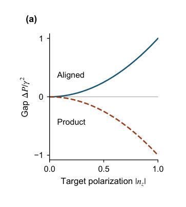 
Fig. 1 Commutator contributions and input orientation for Pauli X and Y channels with a common error probability 0 &lt; γ ≤1. The gap is ∆P = F 2 SW −F 2 FO. (a) For the product input |+⟩C|m⟩T and the aligned input (|0m⟩+|1n⟩)/ √

📷 Fig 2

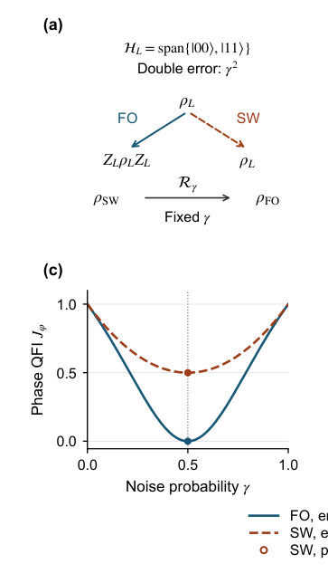 
Fig. 2 Logical error structure, state preservation, and parameter estimation for Pauli X and Y channels with a common error probability γ. (a) The double error branch, of probability γ2, acts on a state ρL in HL = span{|00⟩, |11⟩} as ρL 7→ZLρLZL under fixed order (FO) and as ρL 7→ρL under the quantum switch (SW), where ZL is the logical Pauli Z operator. The branch outputs shown are normalized. The lower arrow represents the CPTP map Rγ, which converts the complete switched output into the fixed order output for every encoded state at fixed γ. (b,c) Squared input fidelity and phase QFI for |ψφ⟩= (|00⟩+ eiφ |11⟩)/ √

**Summary.** This theoretical work investigates the difference in information preservation when quantum channels are applied via a 'quantum switch' versus a fixed sequence. By using commutator geometry, the authors derive quantitative bounds showing how the switch affects fidelity and Quantum Fisher Information. The findings connect fundamental algebraic structures to the robustness of quantum information encoding against noise.

**Why it may be interesting.** It provides rigorous mathematical tools (commutator geometry) to quantify the advantage or disadvantage of indefinite causal order in noisy quantum processes, which is highly relevant for quantum communication protocols.

Detailed structure

**Main problem.** The paper compares how information preservation (fidelity, QFI) differs when two commuting quantum channels are applied in a quantum switch versus a fixed sequential order.

**Main result.** For product inputs, the switch preserves fidelity at least as well as the fixed order; however, the gap is quantified by commutator identities, showing complex dependencies on the input state and channel structure.

**Method.** The analysis uses operator sum descriptions, commutator identities, and root fidelity to derive exact mathematical relationships between the output states of the two operational orders.

**Model / system.** The model involves two commuting quantum channels acting on a joint system, analyzed using concepts from quantum error correction (e.g., Pauli codes) and quantum metrology.

**Key observables.** Fidelity gap ($F_{FO} - F_{SW}$), Quantum Fisher Information (QFI), distinguishability, and commutator components ($Q_{ij}$).

**Important parameters / regimes.** Input state ($
ho$), channel parameters (e.g., error probabilities for Pauli X/Y channels), and the structure of the joint code.

**Assumptions / limitations.** The analysis is restricted to two commuting channels and often assumes specific product or pure encoded state families for deriving exact formulas.

**Figures summary.** Figures illustrate the fidelity gap ($\Delta P$) for Pauli X and Y channels as a function of input orientation and control angle, showing distinct gain/loss regimes.

**Paper structure.** The paper progresses by defining the comparison between switch and fixed order, deriving commutator identities, establishing monotonicity for product states, and finally connecting the fidelity gap to QFI gain for pure encoded families.

Abstract

Two commuting channels yield the same composite channel in either fixed order, yet their quantum switch can alter information preservation. We study how this effect depends on the input state, retaining the joint output of the control and target. Exact Kraus commutator identities determine overlap and squared fidelity gaps. Fixed order preserves product inputs at least as well as the switch in fidelity. The reverse inequality holds for pure states of two qubits whose control Schmidt basis can be chosen to coincide with the order basis. A commutator matrix determines the target basis that maximizes the squared fidelity gap at fixed entanglement within this aligned family. For Pauli $X$ and $Y$ channels with equal error probabilities, the switch replaces a logical phase flip with an operator that stabilizes a joint code. At fixed noise, the switch preserves at least as much distinguishability and quantum Fisher information as fixed order for every state family in this code. For the pure encoded family studied here, exact formulas connect the phase information gain to the squared fidelity gap and quantify the reduction in information about the noise probability. Optimizing the probes yields equal maximal quantum Fisher information for noise estimation under both joint channels. These results connect commutator geometry and logical error structure to state preservation and the retention of encoded information.

[↑ back to top](#top)

### [From Trainability Diagnostics to Optimization Claims: Boundaries and Controls in Variational Quantum Optimization](http://arxiv.org/abs/2609.21243v1)

**Authors:** Pilsung Kang  
**Type:** theory · **Category:** quantum information and computing · **PDF:** <https://arxiv.org/pdf/2609.21243v1>  
**Analysis basis:** full PDF text, analyzed in chunks
**Topic relevance:** `quantum measurements` **1/5**

📷 Fig 1

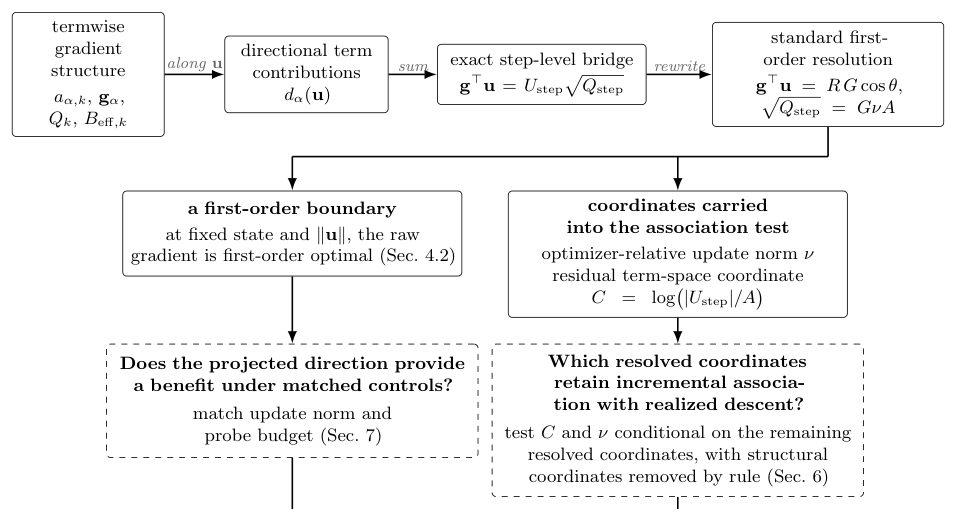 
Figure 1: Overview of the analysis. The exact step-level bridge is rewritten in standard first-order geometry, which exposes a fixed-norm first-order boundary and, on the nondegenerate domain, a residual term-space coordinate C. The lower branches summarize the association and matched- control tests and their main conclusions. Notation is defined in Sections 3 and 4.

📷 Fig 2

 
Figure 1 summarizes how these pieces fit together. The remainder of this paper is organized as follows. Section 2 reviews related work on BPs, trainability mitigation, and gradient surgery. Sections 3 and 4 introduce the Hamiltonian-term

📷 Fig 3

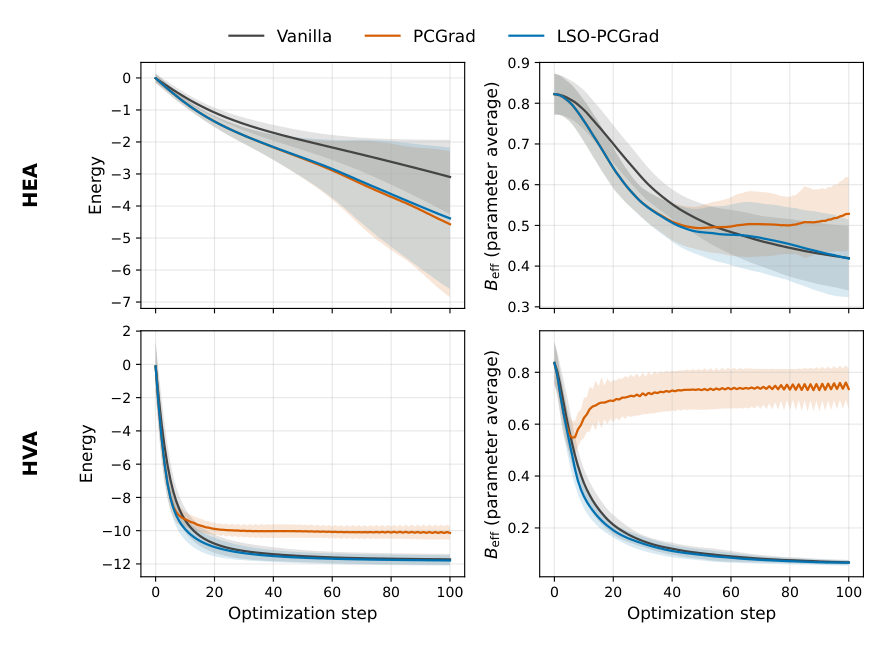 
Figure 2: Seed-averaged optimization trajectories for the three primary update rules at the largest tested condition, (n, d) = (10, 8): energy (left) and parameter-averaged Beff (right) for HEA (top) and HVA (bottom). Lines are means over 30 seeds and bands indicate one standard deviation across seeds. In HVA, PCGrad sustains an elevated Beff while its energy plateaus above the vanilla and LSO-PCGrad trajectories. The late-step oscillation in the former trajectory reflects a two-step alternation present in individual seed trajectories rather than an averaging artifact. In HEA, this condition is among the minority in which PCGrad improves final energy (cf. Table 3). Corresponding figures for...

**Summary.** This work investigates the gap between knowing if a quantum circuit is 'trainable' and actually achieving good optimization results. By developing step-level diagnostics based on Hamiltonian term decomposition, the authors show that while these diagnostics characterize the gradient structure, they are insufficient on their own to prove optimization success. True performance requires careful matching of update norms and search budgets.

**Why it may be interesting.** It provides a deep theoretical understanding of the limitations of current diagnostic tools in VQA, suggesting that structural metrics must be paired with rigorous control matching to claim optimization success.

Detailed structure

**Main problem.** The paper addresses the 'trainability–optimization gap' in Variational Quantum Algorithms (VQAs), where gradient signal availability does not guarantee successful energy minimization.

**Main result.** Gradient-structure diagnostics can characterize trainability and update geometry, but they cannot serve as standalone evidence of optimization benefit; true benefit requires controls matched on update norm and search budget.

**Method.** The authors introduce step-level diagnostics by treating coefficient-weighted Hamiltonian-term gradients as task-like components, deriving a bridge between termwise organization, directional activity, and first-order descent.

**Model / system.** The study uses Variational Quantum Algorithms (VQAs) applied to transverse-field Ising model instances, employing both hardware-efficient and Hamiltonian variational ansatzes.

**Key observables.** Step-level diagnostics ($U_{	ext{step}}$, $Q_{	ext{step}}$), first-order descent, final energy, and various correlation coefficients ($	ext{corr}(\Delta E_{	ext{pred}}, \Delta E_{	ext{act}})$).

**Important parameters / regimes.** Update norm, search budget, and the structure of the Hamiltonian decomposition into Pauli terms.

**Assumptions / limitations.** The analysis relies on establishing an exact bridge between gradient components and assumes that optimization benefit requires matched controls on update norm and search budget.

**Figures summary.** Figure 1 provides an overview summarizing the step-level bridge, its resolution into standard first-order geometry, and the main conclusions regarding association tests and matched controls.

**Paper structure.** The paper progresses by defining the step-level diagnostic framework, deriving the mathematical bridge, testing various optimization rules (vanilla, PCGrad, LSO-PCGrad) on Ising models, and concluding with rigorous analysis showing the limitations of structure-based diagnostics.

Abstract

Barren plateau diagnostics characterize whether gradient signal remains available for training, but surviving signal need not translate into successful optimization. We study this trainability--optimization gap at the level of optimizer steps. Treating coefficient-weighted Hamiltonian-term gradients as task-like components, we introduce step-level diagnostics and derive an exact bridge between signed termwise organization, directional activity, and first-order descent. Resolving this bridge into standard first-order geometry shows that the apparent organization--activity factors are not independent optimization axes and that, at fixed state and update norm, the raw gradient maximizes first-order descent of the summed objective. We compare vanilla gradient descent, a deterministic Hamiltonian-term PCGrad variant, and probe-gated LSO-PCGrad on transverse-field Ising model instances with hardware-efficient and Hamiltonian variational ansatzes, together with matched controls for update norm and probe budget. Blind projection can improve an organization diagnostic while worsening final energy and first-order predictability. After conditioning on standard first-order geometry, residual term-space composition shows no reproducible material incremental association with realized descent, while optimizer-relative update norm shows positive material associations in some settings without cross-regime reproducibility. Matched controls provide no resolved final-energy benefit attributable to the projected direction, and the improvement of LSO-PCGrad is more consistent with probe-based search and step-norm adaptation than with Hamiltonian-term projection itself. These results show that gradient-structure diagnostics can characterize trainability and update geometry without serving as standalone evidence of optimization benefit, which requires controls matched on update norm and search budget.

[↑ back to top](#top)

## Other papers (21)

*Papers from primary archives without highlighted authors or any topic match. Click to expand.*

Show other papers

### [Asymmetric quantum cloning on orthogonal orbits and four-mode fermionic states](http://arxiv.org/abs/2609.22047v1)

**Authors:** Piotr Ćwikliński, Michał Studziński  
**Type:** theory · **Category:** quantum information and computing · **PDF:** <https://arxiv.org/pdf/2609.22047v1>  
**Analysis basis:** full PDF text, analyzed in chunks

📷 Fig 1

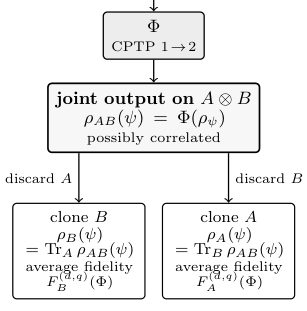 
FIG. 1. Operational setup for asymmetric one-to-two cloning on an orthogonal orbit. The channel maps the unknown input ρψ to a joint state on A⊗B, which is not assumed to factorize. The downward branches denote partial traces: discarding A gives clone B, while discarding B gives clone A. The pointwise overlaps are fA(ψ; Φ) and fB(ψ; Φ); their orbit averages are the fidelities in Eqs. (10) and (11).

📷 Fig 2

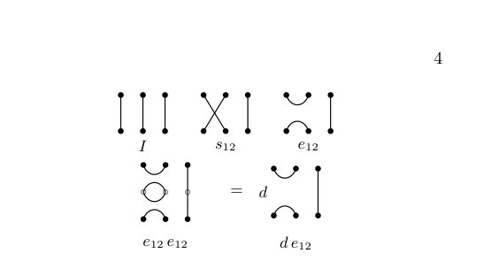 
FIG. 2. Pairing diagrams in B3(d). Each diagram has three upper (output) and three lower (input) vertices, ordered from left to right. Upper row: the identity, transposition s12, and contraction e12; each leaves the third tensor factor unchanged. Lower row: multiplication by vertical concatenation. The hollow circles mark the identified vertices. Summing the common index around the closed loop contributes d, giving e2 12 = de12.

📷 Fig 3

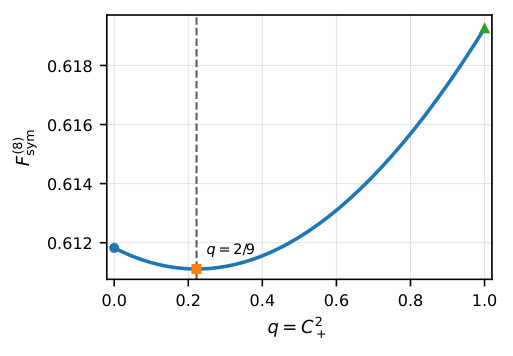 
FIG. 4. Optimal symmetric local fidelity for the four-mode family, with q = C2 +. The circle, square, and triangle mark the Gaussian orbit q = 0, the projective 2-design orbit q = 2/9, and the maximal-concurrence orbit q = 1, respectively. The dashed vertical line locates the unique minimum at q = 2/9, where the second moment equals the Haar moment.

📷 Fig 4

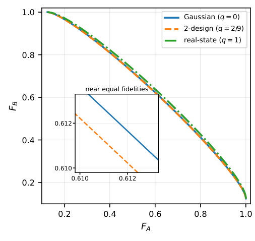 
FIG. 3. Pareto boundaries in the (FA, FB) plane for three d = 8 orthogonal orbits, corresponding through triality to three four-mode fermionic concurrence classes. The solid curve is the Gaussian orbit q = 0; the dashed curve is the projective 2-design orbit q = 2/9, with the universal eight-dimensional average local-fidelity boundary. The dash-dotted curve is q = 1, the real-state ensemble in orthogonal coordinates. The inset uses the same axes and resolves the Gaussian and 2- design curves near equal fidelities.

📷 Fig 5

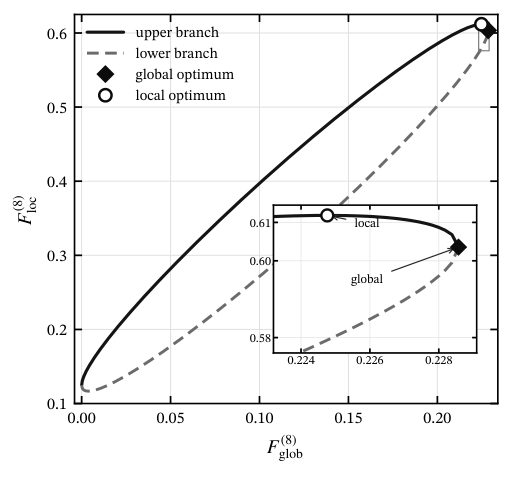 
FIG. 5. Average local fidelity versus average global fidelity on the four-mode Gaussian orbit, restricted to the covariant channels Φc with real coefficients c = (x, x, z)T and cT G8c = 1. These channels are output-exchange symmetric and have Choi rank eight. The solid and dashed curves are the + and − branches of Eq. (107). The diamond at their common right endpoint marks the global optimum; the circle marks the unique local optimum. The inset separates these points. The plotted curves describe only this family of channels and not the full set of attainable local–global fidelity pairs.

**Summary.** This paper rigorously determines the achievable fidelity region for asymmetric quantum cloning when the input states are constrained to specific orbits of the orthogonal group. By employing advanced algebraic techniques involving the Brauer algebra, the authors derive explicit optimal cloning channels. The results are then applied to the physical system of four-mode fermionic states, establishing fundamental limits on quantum state duplication for these systems.

**Why it may be interesting.** This work provides deep connections between quantum information theory (cloning bounds) and representation theory (Brauer algebra, orthogonal groups), which is highly relevant for understanding fundamental limits in quantum communication protocols.

Detailed structure

**Main problem.** The paper investigates the achievable fidelity region for asymmetric quantum cloning processes ($1 	o 2$) applied to pure states residing on orbits generated by the orthogonal group $O(d)$. It specifically applies these general results to four-mode fermionic states.

**Main result.** The full region of achievable average single-copy fidelities is determined by solving a spectral problem derived from the Brauer algebra. The optimal cloner for the joint two-copy fidelity is shown to be different from the one optimal for single-copy fidelities.

**Method.** The authors reduce the optimization over all CPTP maps to a finite-dimensional spectral problem using orthogonal covariance and the Brauer algebra. They characterize the achievable region using a support function derived from the Uhlmann–Jozsa fidelity.

**Model / system.** The primary model is the quantum cloning process ($\Phi: 
ho_\psi 	o 
ho_{AB}(\psi)$) acting on states $\psi$ belonging to orbits $O(d)_q$ generated by the orthogonal group $O(d)$. The specific application involves four-mode fermionic states in the even-parity sector.

**Key observables.** Average single-copy fidelities ($F^A, F^B$), the two-copy moment ($\mathcal{M}^{(d)}_2(q)$), and the support function $h_{O(d)}^q(a, b)$.

**Important parameters / regimes.** The dimension $d \ge 3$, the orbit parameter $q(\psi) = |\psi^T \psi|^2 \in [0, 1]$, and the fidelity parameters $a$ and $b$.

**Assumptions / limitations.** The analysis assumes the input state $\psi$ is drawn from the invariant measure $\mu_q$ on the orbit $O(d)_q$, and the optimization is performed over CPTP maps.

**Figures summary.** Figure 1 illustrates the operational setup for asymmetric one-to-two cloning. Figure 2 illustrates pairing diagrams in the Brauer algebra $B_3(d)$ related to the cloning process.

**Paper structure.** The paper first establishes the general framework for asymmetric cloning on $O(d)$ orbits, determining the fidelity region via spectral methods. It then applies these general results to the specific case of four-mode fermionic states, utilizing triality to connect the two analyses.

Abstract

In this work, we study asymmetric $(1\to2)$ quantum cloning for pure states belonging to orbits generated by the orthogonal group. For every dimension $(d\geq3)$, we determine the full region of achievable pairs of average single-copy fidelities. Using orthogonal covariance and the Brauer algebra, we reduce the optimization over all CPTP maps to a finite-dimensional spectral problem and construct explicit optimal cloning channels. We then apply the general results to four-mode fermionic states in the even-parity sector. Using triality, we identify the fixed-concurrence fermionic families with the orthogonal orbits considered in the first part of the paper. In particular, for pure Gaussian states we show that the symmetric locally optimal cloner is unique. We also compare local and global cloning and find that the channel optimal for the joint two-copy fidelity is different from the one optimal for the single-copy fidelities. Finally, we show that the locally optimal cloner cannot be implemented using only operations which preserve fermionic Gaussian states.

[↑ back to top](#top)

### [Asymptotics for Frequency Redundancies in Quantum Machine Learning Models](http://arxiv.org/abs/2609.21916v1)

**Authors:** Felix Paul, Bhilahari Jeevanesan, Peter Jung  
**Type:** theory · **Category:** quantum information and computing · **PDF:** <https://arxiv.org/pdf/2609.21916v1>  
**Analysis basis:** full PDF text, analyzed in chunks

📷 Fig 1

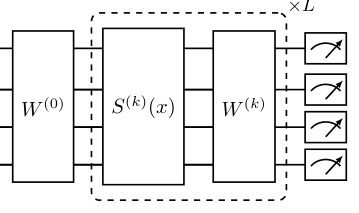 
FIG. 1. Circuit representation of the re-uploading scheme described in Eq. (2). Encoding and variational blocks are being used in an alternating pattern.

📷 Fig 2

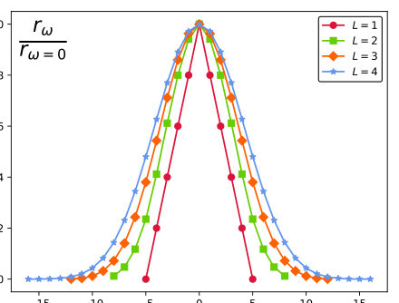 
FIG. 2. Normalized redundancy profiles for the arithmetic progres- sion of eigenvalues for varying values of L at d = 5. For L = 1, rω is a triangle function, see Eq. (25). As L grows, the profile becomes an increasingly narrow Gaussian.

📷 Fig 3

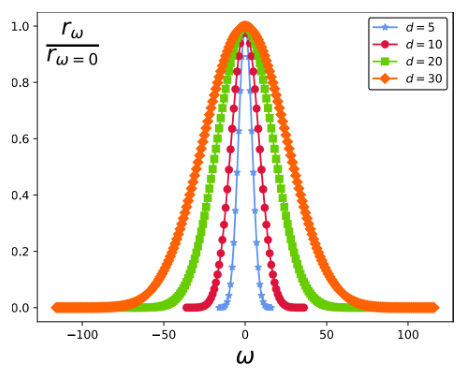 
FIG. 3. Normalized redundancy profiles for the arithmetic progres- sion of eigenvalues with L = 4 and varying d.

📷 Fig 4

 
Figure 2 illustrates the emerging Gaussian profile for in- creasing values of L while Fig. 3 highlights the increasing width of the Gaussian envelope with growing d at fixed L.

📷 Fig 5

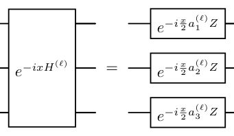 
FIG. 4. Illustrative circuit representation of Eq. (26) for three qubits.

**Summary.** This work mathematically analyzes the frequency redundancy spectrum in Quantum Fourier Models (QFMs) by studying how the eigenvalues of the data re-uploading Hamiltonians shape this spectrum. The authors prove that for many structured eigenvalue choices, the redundancy profile converges to a Gaussian distribution as the model depth increases. This highlights that the choice of encoding strategy is crucial for controlling the model's spectral bias.

**Why it may be interesting.** The universal Gaussian convergence suggests that the structure of the encoding Hamiltonian dictates the spectral properties of the model, providing theoretical constraints on designing QFMs for specific tasks.

Detailed structure

**Main problem.** The paper investigates how the frequency redundancy spectrum in Quantum Fourier Models (QFMs) is determined by the choice of eigenvalues in the data re-uploading Hamiltonians.

**Main result.** The frequency redundancy profile ($r_\omega$) generically converges to a Gaussian profile as the number of layers increases, a feature linked to the central limit theorem for random walks.

**Method.** The analysis employs generating functions and Cauchy's integral formula to calculate the redundancy, followed by asymptotic evaluation techniques like Laplace's method for large numbers of layers.

**Model / system.** The model is a Quantum Fourier Model (QFM) built using Parametrized Quantum Circuits (PQCs) with a layered, data re-uploading structure, characterized by diagonal encoding Hamiltonians $H^{(\ell)}$ with eigenvalues $\Lambda^{(\ell)}$.

**Key observables.** Frequency redundancy ($r_\omega$), which measures the number of ways a specific frequency $\omega$ can be constructed from the eigenvalues.

**Important parameters / regimes.** Number of layers ($L$), dimension of the Hilbert space ($d$), and the specific structure of the eigenvalues (e.g., arithmetic progressions, fixed values).

**Assumptions / limitations.** The analysis assumes the encoding Hamiltonians are diagonal and that the feature vector $x$ is one-dimensional for simplicity.

**Figures summary.** Figures illustrate the QFM circuit structure, showing the transition of the redundancy profile from a simple function (like a triangle) to a Gaussian shape as the number of layers increases.

**Paper structure.** The paper introduces the QFM structure and the redundancy definition using generating functions. It then derives and analyzes the asymptotic behavior of $r_\omega$ for structured eigenvalue choices (arithmetic, fixed), demonstrating the universal Gaussian limit.

Abstract

The redundancy distribution of the frequency spectrum has been shown in the literature to impact the expressivity and trainability of Quantum Fourier Models (QFMs). In this work, we address the question of how this redundancy spectrum is shaped by the choice of eigenvalues of the data re-uploading Hamiltonians, using a simple mathematical formalism based on generating functions. We derive exact and asymptotic redundancy profiles for several structured eigenvalue choices identical for every layer, including arithmetic progressions and single-qubit Pauli encodings, and show that both approach a Gaussian profile as the number of layers grows. We then show that this Gaussian limit is not specific to these constructions but is a generic feature of QFMs built from integer eigenvalues that are identical in every layer. These results can be tied to the central limit theorem for random walks. These results clarify why generic or unstructured encoding choices give rise to a redundancy bias that favours low frequencies, highlighting the importance of well-thought-out encoding strategies when constructing a QFM.

[↑ back to top](#top)

### [Bootstrapping Classical Systems with Quenched Disorder](http://arxiv.org/abs/2609.20927v1)

**Authors:** Minjae Cho, Yaprak Önder, Eslam Khalaf, Michael G. Scheer  
**Type:** theory · **Category:** statistical mechanics · **PDF:** <https://arxiv.org/pdf/2609.20927v1>  
**Analysis basis:** full PDF text, analyzed in chunks

📷 Fig 1

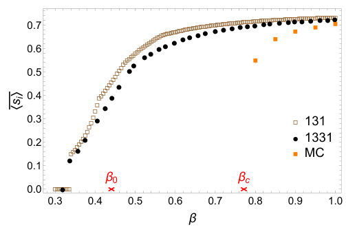 
FIG. 1. Upper bounds on ⟨si⟩at p = 0.75 obtained from LP(D131) (brown) and LP(D1331) (black), together with Monte Carlo estimates (orange) obtained using the Metropo- lis algorithm for 200 disorder realizations on a 50×50 periodic lattice with 100000 sweeps. Also shown are the critical val- ues of β for the clean case (β0 = log(1+ √

📷 Fig 2

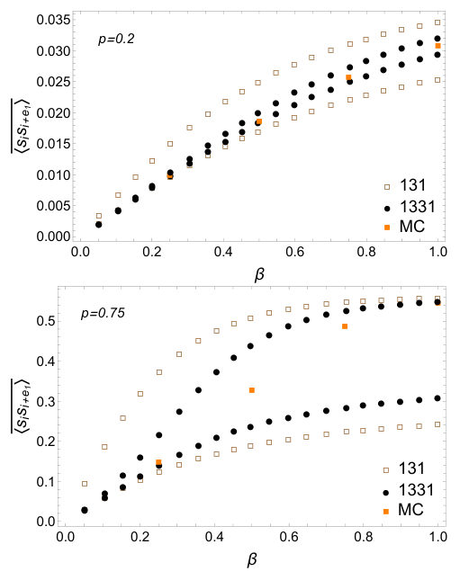 
FIG. 2. Lower and upper bounds on ⟨sisi+e1⟩at p = 0.2 (top) and p = 0.75 (bottom) obtained from LPZ2(D131) (brown) and LPZ2(D1331) (black), together with Monte Carlo estimates (orange) obtained using the Metropolis algorithm for 200 disorder realizations on a 50×50 periodic lattice with 100000 sweeps.

📷 Fig 3

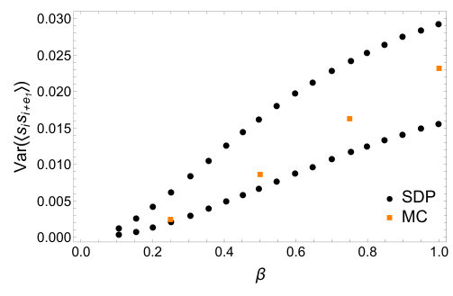 
FIG. 3. Lower and upper bounds (black) on Var(⟨sisi+e1⟩) at p = 0.2 obtained from SDPZ2(D131), together with Monte Carlo estimates (orange) obtained using the Metropolis algo- rithm for 200 disorder realizations on a 50×50 periodic lattice with 30000 sweeps.

📷 Fig 4

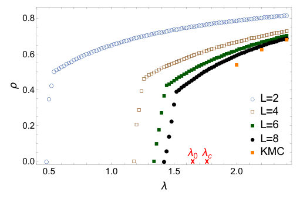 
FIG. 4. Upper bounds on the infection density ρ =

📷 Fig 5

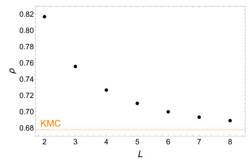 
FIG. 5. Upper bounds (black) on the infection density ρ = ⟨ 1+si

**Summary.** This work introduces a powerful bootstrap framework using linear and semidefinite programming to derive rigorous bounds on observables in disordered classical statistical systems. By applying this to models like the random Ising model, the authors successfully analyze complex phenomena such as the Griffiths region. It provides a mathematically rigorous approach to tackling the notoriously difficult problem of quenched disorder.

**Why it may be interesting.** The rigorous mathematical techniques developed (LP/SDP bounds) provide powerful, non-perturbative tools to analyze complex, disordered many-body systems, which is a major challenge in modern statistical physics.

Detailed structure

**Main problem.** The paper develops a bootstrap method to derive rigorous mathematical bounds on disorder-averaged observables in classical statistical systems subjected to quenched disorder.

**Main result.** The method successfully applies to models like the random site-diluted Ising model and the disordered contact process, yielding bounds that can be analyzed for critical behavior, such as identifying the Griffiths region.

**Method.** The core method involves reformulating the constraints imposed by the disorder average into a sequence of linear programming (LP) and semidefinite programming (SDP) problems.

**Model / system.** The study focuses on classical statistical systems with quenched disorder, exemplified by the two-dimensional random site-diluted Ising model and the one-dimensional disordered contact process. The physics is governed by disorder-averaged Hamiltonians and probability measures.

**Key observables.** Disorder-averaged magnetization, nearest-neighbor correlators, two-replica correlators, and probabilities $P_1, P_2, P_3$ exhibiting kinks.

**Important parameters / regimes.** The disorder concentration parameter ($p$), temperature/inverse temperature ($eta$), and lattice size ($L$) are crucial parameters defining the phase diagram and scaling behavior.

**Assumptions / limitations.** The method relies on the positivity of probability measures, the existence of disorder averages, and the ability to formulate constraints as linear/semidefinite inequalities.

**Figures summary.** Figures illustrate the transition of probabilities across 'kinks' in the phase diagram and compare bootstrap bounds (with and without specific inequalities) against expected theoretical values.

**Paper structure.** The paper builds the framework by defining the mathematical constraints (positivity, equations of motion) and then applying this framework to specific models (RSIM, DCP) to derive bounds and analyze critical phenomena like the Griffiths region.

Abstract

We introduce a bootstrap method for deriving bounds on disorder-averaged observables in classical statistical systems with quenched disorder. The three main ingredients of the bootstrap are the positivity of ensembles of probability measures, disorder-averaged equations of motion, and explicit expectation values of random coupling variables. Together, these ingredients lead to a linear programming problem over the space of disorder averages. By further employing the positivity of the two-replica Gram matrix, we also formulate a semidefinite programming problem that produces bounds on two-replica correlators. We demonstrate the method using two examples: the two-dimensional random site-diluted Ising model and the one-dimensional disordered contact process. For the latter example, the bootstrap bounds exhibit a region of multiple kinks that we relate to the Griffiths region, whose finite-size scaling analysis yields a typical correlation length exponent in good numerical agreement with the known value.

[↑ back to top](#top)

### [Dual-Sublattice Ferromagnetism Driven by Cooperative Double Exchange and Superexchange at NdNiO$_3$/CaMnO$_3$ Interfaces](http://arxiv.org/abs/2609.21002v1)

**Authors:** Sharup Sheikh, Uditha M. Jayathilake, Michael Terilli, Mikhail Kareev, Jay R. Paudel, Arian Arab, Christoph Klewe, Tien-Lin Lee, Jak Chakhalian, Alexander X. Gray  
**Type:** experiment · **Category:** strongly correlated electrons · **PDF:** <https://arxiv.org/pdf/2609.21002v1>  
**Analysis basis:** full PDF text, analyzed in chunks

📷 Fig 1

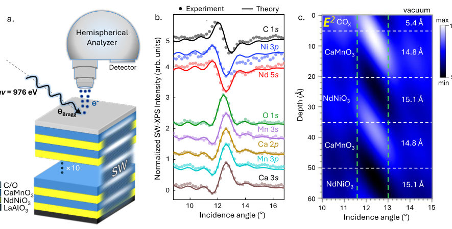 
Figure 1. Soft X-ray standing-wave geometry and depth-selective photoemission response in the

📷 Fig 2

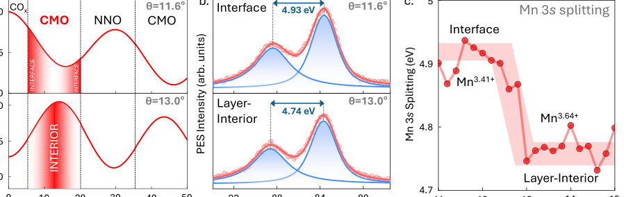 
Figure 2. Depth-resolved Mn valence reconstruction within CaMnO3 at the NdNiO3/CaMnO3

📷 Fig 3

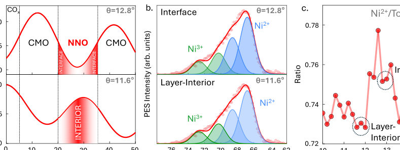 
Figure 3. Depth-resolved Ni valence reconstruction within NdNiO3 at the NdNiO3/CaMnO3

📷 Fig 4

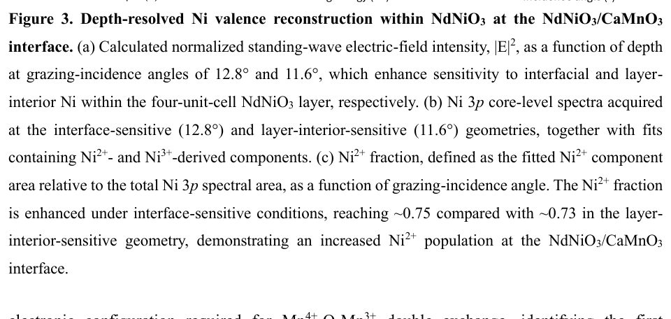 
Figure 3a shows the calculated standing-wave intensity profiles at 12.8° and 11.6°, which enhance

📷 Fig 5

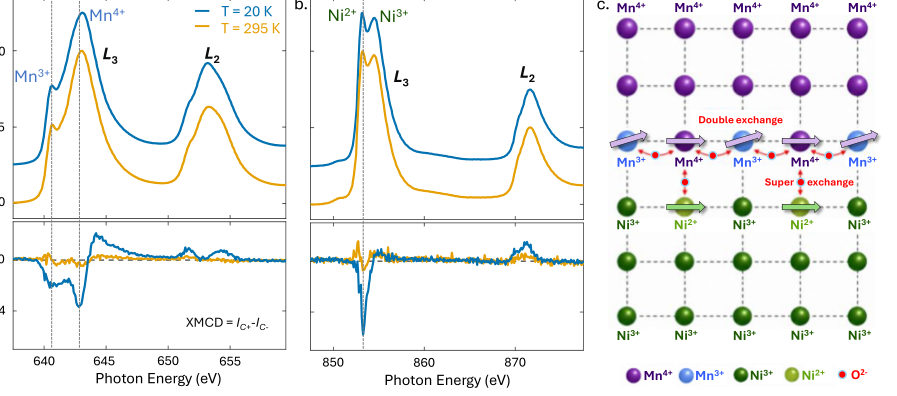 
Figure 4. Dual-sublattice ferromagnetism and cooperative interfacial exchange in the

**Summary.** This paper investigates how to induce ferromagnetism at the interface of $	ext{NdNiO}_3/	ext{CaMnO}_3$ superlattices. Using advanced X-ray spectroscopies, the authors prove that interfacial valence reconstruction creates the necessary conditions—specifically, $	ext{Mn}^{3+}$ and $	ext{Ni}^{2+}$—to activate cooperative double exchange and superexchange. This coupling mechanism successfully engineers a robust, dual-sublattice ferromagnetism.

**Why it may be interesting.** This work provides a clear, experimentally validated blueprint for designing magnetic properties in artificial quantum materials by engineering the local electronic structure at interfaces, which is highly relevant to correlated electron physics.

Detailed structure

**Main problem.** The study aims to understand how to engineer emergent ferromagnetism at the interface between correlated oxides by controlling the electronic structure.

**Main result.** The research demonstrates that interfacial valence reconstruction, specifically enhanced $	ext{Mn}^{3+}$ and $	ext{Ni}^{2+}$ character, activates cooperative double exchange and superexchange pathways, leading to dual-sublattice ferromagnetism.

**Method.** The study employs depth-resolved Standing-Wave X-ray Photoelectron Spectroscopy (SW-XPS) to map valence states and X-ray Magnetic Circular Dichroism (XMCD) to measure magnetic responses.

**Model / system.** The physical system is an epitaxial superlattice of $	ext{NdNiO}_3/	ext{CaMnO}_3$. The mechanism relies on the interplay between charge transfer, valence state reconstruction, and magnetic exchange interactions (double exchange and superexchange) at the heterointerface.

**Key observables.** Interfacial $	ext{Mn}^{3+}$ and $	ext{Ni}^{2+}$ enhancement (via SW-XPS); Ferromagnetic response from both Mn and Ni sublattices (via XMCD).

**Important parameters / regimes.** Low temperature ($20 	ext{ K}$); Specific incidence angles for depth profiling; The ratio of $	ext{Mn}^{3+}/	ext{Mn}^{4+}$ and $	ext{Ni}^{2+}/	ext{Total Ni}$.

**Assumptions / limitations.** The ability to distinguish interfacial vs. layer-interior electronic states using the standing-wave electric field profile is crucial for the analysis.

**Figures summary.** Figures illustrate the SW-XPS geometry and depth-selective measurements, showing valence profiles (Mn and Ni) and the resulting XMCD signals confirming magnetic coupling.

**Paper structure.** The paper first establishes the structural and chemical composition using RHEED/HAXPES, then uses SW-XPS to map the necessary interfacial valence reconstruction ($	ext{Mn}^{3+}$ and $	ext{Ni}^{2+}$), and finally uses XMCD to confirm the resulting dual-sublattice ferromagnetism driven by the identified exchange mechanisms.

Abstract

Engineering emergent ferromagnetism at correlated-oxide interfaces offers a powerful route to creating collective states that do not exist in the parent materials. Here, we show that interfacial valence reconstruction in NdNiO$_3$/CaMnO$_3$ superlattices generates dual-sublattice ferromagnetism involving both Mn and Ni. Depth-resolved standing-wave X-ray photoelectron spectroscopy reveals enhanced Mn$^{3+}$ character on the CaMnO$_3$ side of the interface and enhanced Ni$^{2+}$ character on the NdNiO$_3$ side, establishing the configurations required for Mn$^{4+}$-O-Mn$^{3+}$ double exchange and Ni$^{2+}$-O-Mn$^{4+}$ superexchange, respectively. At low temperature, element-specific XMCD reveals ferromagnetic responses from both sublattices, with the Ni response concentrated predominantly in the Ni$^{2+}$-derived spectral component that SW-XPS independently shows to be enhanced at the interface. Together, these results show that cooperative double exchange within CaMnO$_3$ and superexchange across the interface couple the Mn and Ni sublattices, providing a general strategy for engineering interfacial ferromagnetism in correlated oxides.

[↑ back to top](#top)

### [Entanglement entropy in holographic CFTs with generic boundaries](http://arxiv.org/abs/2609.21370v1)

**Authors:** Fabio Ori, Peng-Xiang Hao  
**Type:** theory · **Category:** statistical mechanics · **PDF:** <https://arxiv.org/pdf/2609.21370v1>  
**Analysis basis:** full PDF text, analyzed in chunks

📷 Fig 1

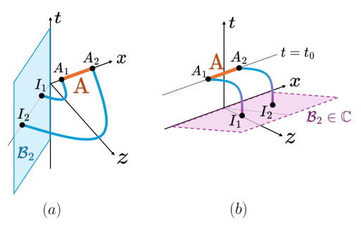 
FIG. 1. Pictorial representation of the disconnected contribu- tion to the entanglement (pseudo) entropy of a spacelike region A = [A1, A2] in the AdS3/BCFT2 correspondence. (a) For a timelike brane, the RT surface (blue) is real and anchored at two points I1, I2 on the real brane B2. (b) When the brane is spacelike, the anchoring points I1, I2 that satisfy the RT condition are complex. As a consequence, the RT surface is complex (purple), yet still anchored at a real boundary.

📷 Fig 2

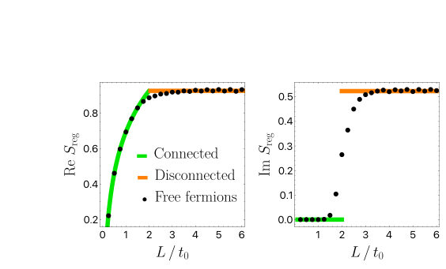 
FIG. 2. The entanglement (pseudo) entropy of a spacelike interval of size L lying on the time-slice t = t0 for the constant- time brane t = 0 in Poincar´e AdS3. We plot the regularized quantity Sreg ≡6

📷 Fig 3

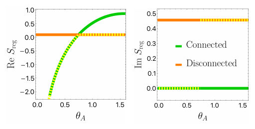 
FIG. 4. Real and imaginary part of the entanglement (pseudo) entropy with a de Sitter brane at finite cutoff as a function of the angular size 2θA of the spacelike boundary region A. The entropy is regularized as Sreg ≡6

📷 Fig 4

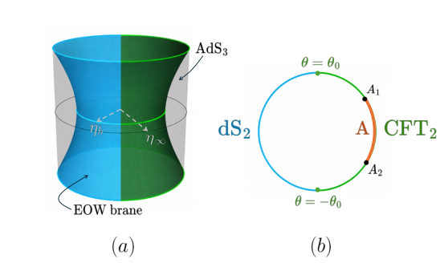 
FIG. 3. Schematic picture of the AdS3/BCFT2 correspondence in presence of a de Sitter brane at finite cutoff. (a) The AdS3 bulk spacetime is sliced in dS2 slices along the η-coordinate, with the asymptotic boundary at η = η∞and the EOW brane at η = ηb. (b) Representation of the constant time-slice where the entangling region A lies. As a consequence of the slicing, the CFT2 is coupled to a dS2 spacetime with dynamical gravity at some value of the angular coordinate θ = ±θ0. The figure is inspired by a similar one appearing in [17].

**Summary.** This work extends the holographic description of entanglement entropy to CFTs with boundaries of generic spacetime signature. It demonstrates that achieving consistency requires complexifying the dual bulk spacetime, forcing relevant geometric objects like extremal surfaces to possess complex coordinates. This complexification successfully reproduces known results from boundary quantum field theory calculations.

**Why it may be interesting.** The necessity of complexifying the bulk geometry to match boundary quantum field theory results provides a powerful, non-trivial constraint on the holographic duality, suggesting that the mathematical structure of the dual spacetime must be generalized beyond simple Lorentzian signatures.

Detailed structure

**Main problem.** The paper addresses the challenge of calculating entanglement entropy in holographic Conformal Field Theories (CFTs) when the boundary conditions are generic, particularly those leading to spacelike boundaries.

**Main result.** To maintain consistency with CFT predictions for generic boundaries, the dual bulk spacetime geometry, including the Ryu-Takayanagi surfaces and branes, must be extended into complex coordinates.

**Method.** The authors employ the holographic duality (AdS/CFT) framework, calculating entanglement entropy via the area of extremal surfaces (RT formula) and comparing this result to predictions derived from the boundary CFT (e.g., twist operator correlators).

**Model / system.** The model involves holographic CFTs dual to gravitational theories, specifically analyzing entanglement entropy in static and time-dependent setups with boundaries of generic spacetime signature, including free Gaussian fermions as a numerical check.

**Key observables.** Entanglement Entropy ($S_A$), which is calculated as $\min(	ext{Re } S_{	ext{con}}, 	ext{Re } S_{	ext{dis}})$, and the complex geodesic length ($D_{	ext{disc}}$).

**Important parameters / regimes.** The ratio of region size ($L$) to the brane location ($t_0$), and the boundary cutoff $\epsilon$.

**Assumptions / limitations.** The standard real Lorentzian AdS/BCFT prescription fails for general causal structures; the selection of the dominant saddle point requires minimizing the *real part* of the area.

**Figures summary.** Figures illustrate the difference between real (timelike) and complex (spacelike) anchoring points for RT surfaces, and plot the regularized entropy showing a phase transition matching Gaussian free fermion results.

**Paper structure.** The paper develops the formalism by first noting the failure of real bulk descriptions for spacelike boundaries, then deriving the necessary complex extensions for the RT surfaces and branes, and finally confirming the results by matching the complex geodesic length to known boundary CFT calculations.

Abstract

Entanglement entropy in holographic conformal field theories with boundaries of generic spacetime signature cannot be described entirely within the standard holographic duality to a real bulk spacetime. We show, both in static and time-dependent setups, that an exact match with the conformal field theory predictions in two boundary dimensions entails an extension of the dual spacetime to complex coordinates. As a consequence, relevant bulk objects such as Ryu-Takayanagi surfaces and branes are in general complex, yet anchored on a real asymptotic boundary preserving the physical meaning of field-theoretical quantities. We also provide a third numerical check of the holographic prediction with a two-dimensional system of free Gaussian fermions exhibiting the same asymptotic regimes across different entanglement phases.

[↑ back to top](#top)

### [From sparse quantum-computing data to atomistic simulation with universal machine-learning interatomic potentials](http://arxiv.org/abs/2609.21536v1)

**Authors:** Tuan Minh Do, Yuichiro Yoshida, Kenji Ishihara, Wataru Mizukami  
**Type:** theory · **Category:** numerical methods · **PDF:** <https://arxiv.org/pdf/2609.21536v1>  
**Analysis basis:** full PDF text, analyzed in chunks

📷 Fig 1

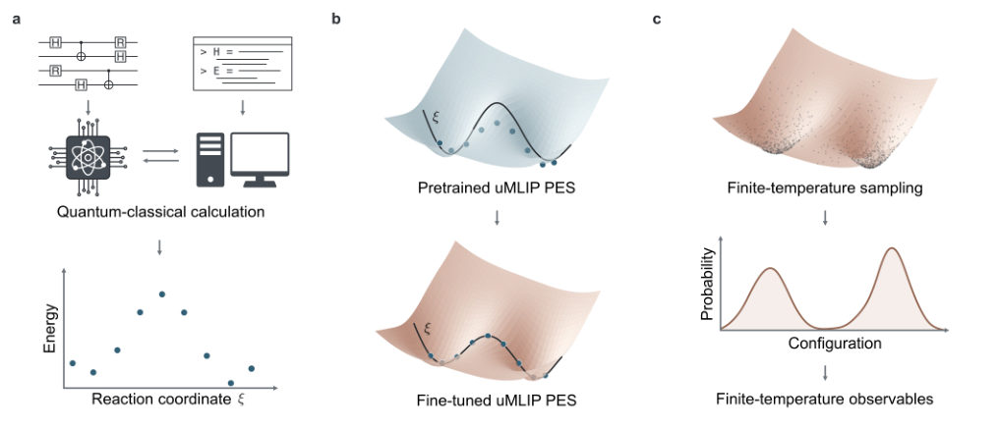 
FIG. 1. Computational workflow for transferring quantum-computing reference energies to finite-temperature atomistic simulations. a, Quantum–classical electronic-structure calculations provide reference energies (blue points) for a small number of configurations along a reaction coordinate ξ. b, These reference energies are used to fine-tune a pretrained universal machine-learning interatomic potential (uMLIP). The energy profile along ξ (black line) illustrates how the potential-energy surface (PES) changes after fine-tuning around the reference configurations. c, The fine-tuned uMLIP is subsequently used to sample an ensemble of configurations (gray points) at finite temperature. The...

📷 Fig 2

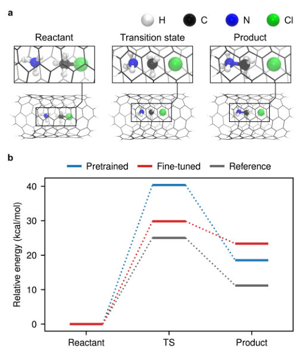 
FIG. 2. Transfer of gas-phase fine-tuning to the confined Men- shutkin reaction. a, Reactant, transition-state, and product struc- tures of the Menshutkin reaction inside a carbon nanotube (CNT), with enlarged views of the reacting species. b, Relative energies of the reactant, transition state (TS), and product obtained with the pretrained and fine-tuned uMLIPs, together with THC-CASPT2 ref- erence values from Ref. [47]. Energies are reported relative to the corresponding reactant. The uMLIP was fine-tuned on quantum- computing-based reference data for the gas-phase Menshutkin reac- tion and evaluated under confinement.

📷 Fig 3

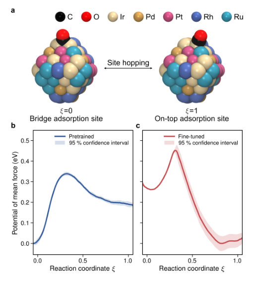 
FIG. 4. Transfer of quantum-computing reference data from a static hopping pathway to a finite-temperature free-energy pro- file on a high-entropy-alloy nanoparticle. a, CO hopping from a bridge adsorption site (ξ = 0) to an on-top adsorption site (ξ = 1) on an IrPdPtRhRu high-entropy-alloy nanoparticle. b, Potential of mean force (PMF) at 300 K obtained from umbrella-sampling simulations using the pretrained uMLIP. c, Corresponding PMF obtained using the uMLIP fine-tuned on the static QSCI-based hopping-energy pro- file. Fine-tuning reverses the relative stability of the two adsorption sites and changes the forward and reverse free-energy barriers. Solid lines show the mean PMFs over five...

📷 Fig 4

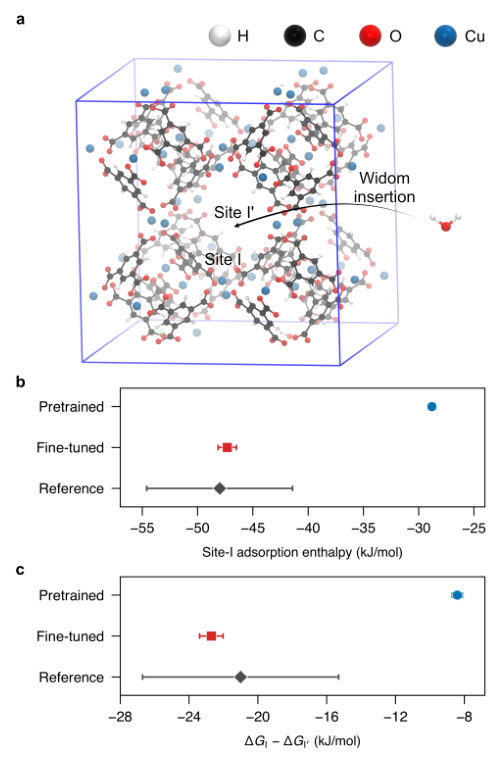 
FIG. 3. Transfer of quantum-computing-based adsorption en- ergetics to adsorption thermodynamics in HKUST-1. a, Widom insertion of water in HKUST-1, highlighting adsorption Sites I and I′. The uMLIP is fine-tuned using quantum-computing-based ref- erence energies along a water–Cu adsorption profile that covers the local environment of Site I and also includes configurations associ- ated with Site I′. b, Site I adsorption enthalpy at 295 K obtained with the pretrained and fine-tuned uMLIPs, compared with the reference value reported in Ref. [49]. c, Free-energy difference between Sites I and I′ at 295 K obtained with the pretrained and fine-tuned uMLIPs and compared with the corresponding...

**Summary.** This paper introduces a novel methodology to enhance machine-learning interatomic potentials (uMLIPs) by fine-tuning them with sparse, high-accuracy energy data obtained from quantum computing. The framework is successfully demonstrated across three chemically diverse systems, showing that quantum data can significantly improve the prediction of complex, finite-temperature properties like reaction barriers and adsorption thermodynamics.

**Why it may be interesting.** This work directly addresses the computational bottleneck of simulating complex quantum phenomena by creating a robust bridge between highly accurate but sparse quantum calculations and computationally feasible, large-scale molecular dynamics simulations.

Detailed structure

**Main problem.** The core problem is developing a practical framework to incorporate sparse, high-accuracy electronic structure data from quantum computing into large-scale, finite-temperature atomistic simulations.

**Main result.** The proposed fine-tuning framework successfully transfers quantum-level accuracy to improve predictions of complex, finite-temperature properties for diverse chemical systems.

**Method.** The authors fine-tune a pretrained universal Machine-Learning Interatomic Potential (uMLIP) using limited reference energies derived from quantum-computing-based electronic structure calculations.

**Model / system.** The framework is tested on three systems: the Menshutkin reaction, water adsorption in the HKUST-1 MOF, and CO hopping on an IrPdPtRhRu high-entropy-alloy nanoparticle.

**Key observables.** Transition-state energies, adsorption thermodynamics ($\Delta H_s$, $\Delta G$), and free-energy profiles (PMF) for chemical reactions and adsorption processes.

**Important parameters / regimes.** Finite temperature (e.g., 295 K, 300 K), small number of reference configurations (e.g., 14 for HKUST-1), and the use of enhanced-sampling molecular dynamics.

**Assumptions / limitations.** The primary assumption is that refining a pretrained uMLIP with sparse, high-fidelity quantum data is sufficient to accurately model complex, thermally sampled configurations.

**Figures summary.** Figure 1 illustrates the workflow: quantum-classical calculations provide sparse reference energies to fine-tune a uMLIP, which is then used for finite-temperature sampling. Other figures compare calculated relative energies against high-level reference data.

**Paper structure.** The paper introduces the workflow, applies it to three distinct chemical problems (Menshutkin, HKUST-1, HEA), details the fine-tuning process, and presents quantitative results demonstrating improved accuracy in predicting finite-temperature observables.

Abstract

We propose a framework for incorporating quantum-computing-based electronic-structure calculations into universal machine-learning interatomic potentials (uMLIPs). Rather than constructing an interatomic potential from scratch, we refine a pretrained DFT-based uMLIP using a small set of accurate reference energies obtained from quantum computing. We demonstrate the approach for three chemically distinct applications: the Menshutkin reaction, water adsorption in the metal-organic framework HKUST-1, and CO hopping on a high-entropy-alloy nanoparticle. For the Menshutkin reaction, fine-tuning on gas-phase configurations improves the transition-state energy inside a carbon nanotube but not the product energy. For water adsorption in HKUST-1, fine-tuning with only 14 reference configurations brings adsorption thermodynamics obtained from millions of configurations sampled by Widom insertion into closer agreement with reference values. For CO hopping on an IrPdPtRhRu nanoparticle, the preference for on-top over bridge adsorption is recovered in the finite-temperature free-energy profile obtained from enhanced-sampling molecular dynamics, even though the reference data contain only energies. These results demonstrate that the proposed framework provides a practical route for incorporating quantum-computing calculations into realistic atomistic simulations and that quantum-computing reference data can improve pretrained uMLIPs.

[↑ back to top](#top)

### [Hybrid quantum-classical attention for histopathology-based molecular profiling in data-limited cancers](http://arxiv.org/abs/2609.21115v1)

**Authors:** Kahn Rhrissorrakrai, Aritra Bose, Aldo Guzman-Saenz, Filippo Utro, Laxmi Pardia  
**Type:** theory · **Category:** other · **PDF:** <https://arxiv.org/pdf/2609.21115v1>  
**Analysis basis:** full PDF text, analyzed in chunks

📷 Fig 1

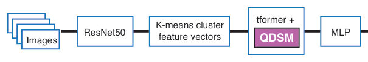 
Figure 1: Quantum-derived doubly stochastic attention integrated into the SEQUOIA histopathology-to-transcriptome workflow. a, Schematic comparison of standard transformer attention and QDSM attention. In a conventional transformer attention head, query and key matrices are used to compute scaled attention scores, which are normalized by a row-wise softmax operation before multiplication with the value matrix. This produces a right-stochastic attention matrix in which each row sums to one. In the QDSM attention head (right), the softmax normalization is replaced by a quantum-derived doubly stochastic matrix generated using the QDSFormer procedure. The resulting attention matrix constrains...

📷 Fig 2

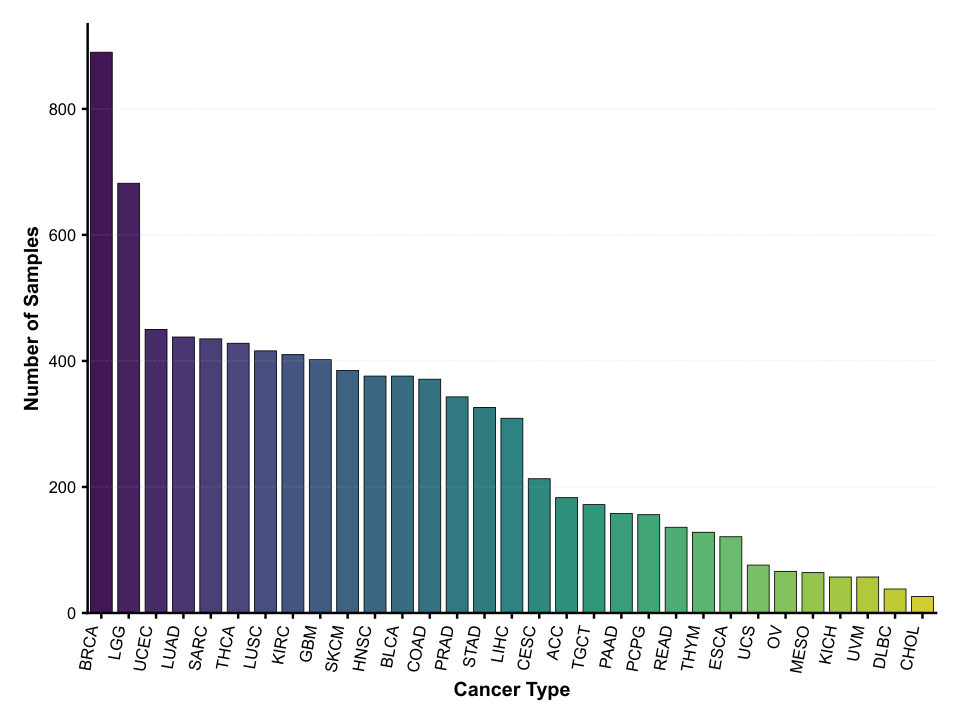 
Figure 2: Number of whole-slide images with matched gene-expression data per cancer type. Shown are the numbers of TCGA samples, defined here as whole-slide histopathology images (WSIs) with matched RNA-seq expression profiles, for cancer types with at least 50 matched WSI– expression pairs. Cancers include: Adrenocortical carcinoma (ACC), Bladder Urothelial Carcinoma (BLCA), Breast invasive carcinoma (BRCA), Cervical squamous cell carcinoma and endocervical adenocarcinoma (CESC), Colon adenocarcinoma (COAD), Esophageal carcinoma (ESCA), Glioblas- toma multiforme (GBM), Head and Neck squamous cell carcinoma (HNSC), Kidney Chromophobe (KICH), Kidney renal clear cell carcinoma (KIRC), Low...

📷 Fig 3

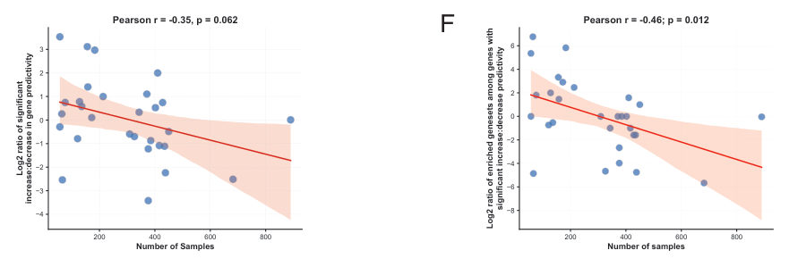 
Figure 3: QDSM attention alters molecular profiling across TCGA cancer types. SEQUOIA ViT models were trained for 200 epochs with either standard softmax attention or QDSM attention in each cancer type with at least 50 samples. Prediction performance was assessed by Pearson correlation between predicted and measured expression across 10 train-test splits. a, Number of genes with significantly improved and significantly worsened prediction under QDSM attention relative to softmax attention. Cancer types with the largest net differences are labeled. b, log2 ratio of genes with significantly improved to significantly worsened prediction. c, Number of enriched gene sets among genes with...

📷 Fig 4

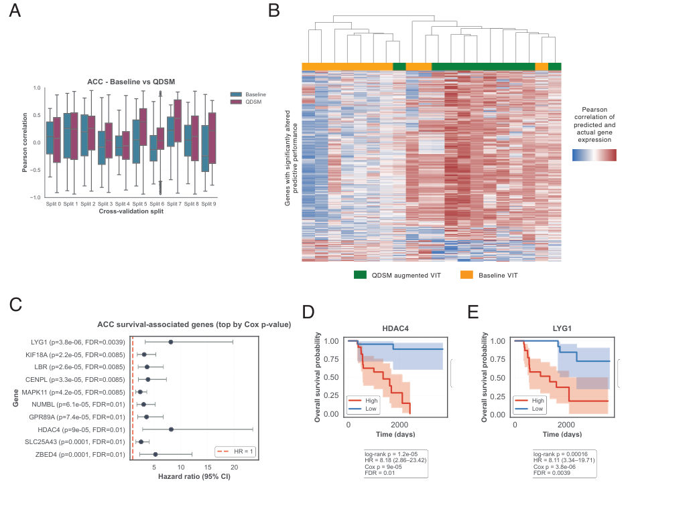 
Figure 4: QDSM attention improves prediction for a subset of genes in ACC. a, Boxplots showing the distribution of gene-level Pearson correlations between predicted and measured expression across 10 train-test splits for baseline SEQUOIA with softmax attention and SEQUOIA with QDSM attention. Higher Pearson correlation values indicate better gene expression prediction. b, Heatmap of Pearson correlation values across train-test splits for genes with significantly altered predictive performance under QDSM attention relative to softmax attention, based on a two-sided t-test with nominal p &lt; 0.05. c, Forest plot of the top survival-associated genes in ACC among genes with improved prediction...

📷 Fig 5

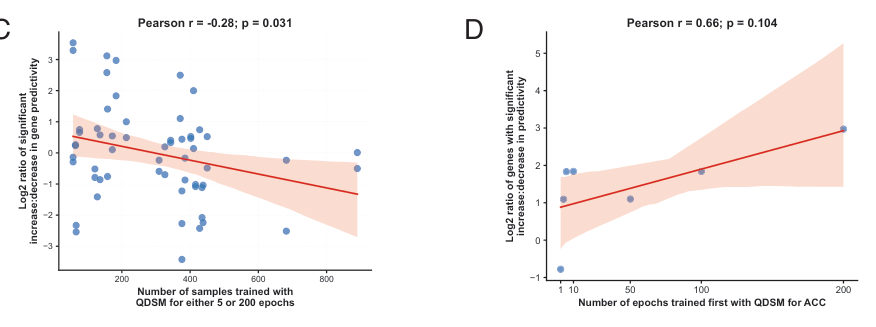 
Figure 5: Performance of mixed QDSM and softmax training. a, Difference in the log2 ratio of genes with significantly improved to significantly worsened prediction between full-QDSM training (200 epochs) and QDSM warm-starting (5 epochs). b, Cohort sample size versus the log2 ratio of significantly improved to significantly worsened genes after 5-epoch QDSM warm-starting, with Pearson correlation and p value reported. c, Cohort sample size versus the log2 ratio of significantly improved to significantly worsened genes across both 5-epoch warm-start and 200-epoch full-QDSM training, with Pearson correlation and p value reported. d, QDSM warm-start duration versus the log2 ratio of...

**Summary.** This work proposes a novel hybrid quantum-classical attention mechanism (QDSM) to enhance molecular profiling in cancer using routine histopathology images. By replacing standard attention with a quantum-derived doubly stochastic matrix, the model achieves selective improvements in predicting gene expression, especially in rare or data-limited cancers. This positions QDSM as a context-aware tool for molecular triage when direct genomic testing is impractical.

**Why it may be interesting.** While the application is in bioinformatics, the core novelty lies in replacing a standard mathematical function (softmax) with a quantum-derived constraint (doubly stochastic matrix) within a deep learning attention layer, which touches upon quantum information theory applied to classical ML.

Detailed structure

**Main problem.** The paper addresses the challenge of performing molecular profiling in cancer when traditional sequencing methods are limited by data scarcity, tissue availability, or cost.

**Main result.** A hybrid quantum-classical attention mechanism (QDSM) showed selective, context-dependent gains in predicting gene expression from histopathology images, particularly benefiting smaller, data-limited cancer cohorts.

**Method.** The authors developed and tested a transformer model that replaces standard softmax attention with a Quantum-Derived Doubly Stochastic Matrix (QDSM) attention module.

**Model / system.** The system uses Whole-Slide Images (WSIs) from histopathology as input to predict gene expression. The core model is a transformer architecture augmented with the QDSM attention mechanism, which constrains attention weights to be doubly stochastic.

**Key observables.** Selective gains in predictive accuracy at the gene and pathway level, and the correlation between improved molecular inference and adverse overall survival.

**Important parameters / regimes.** The performance gain ($\Delta r_{g,s,c}$) relative to standard softmax attention, and the size of the attention matrix (restricted to $8 	imes 8$ for main TCGA experiments).

**Assumptions / limitations.** The primary assumption is that imposing a doubly stochastic constraint on the attention mechanism provides a beneficial, structured alternative to the standard softmax normalization in molecular prediction.

**Figures summary.** Figure 1 schematically compares standard transformer attention (right-stochastic) versus the proposed QDSM attention within the SEQUOIA workflow.

**Paper structure.** The paper introduces the problem of data-limited molecular profiling, details the hybrid QDSM attention mechanism replacing softmax in a transformer, presents results across multiple cancer cohorts showing selective gains, and discusses the implications for molecular triage.

Abstract

Molecular profiling from routine histopathology could expand access to precision oncology when sequencing is unavailable, tissue is limited, or training cohorts are small. We developed a hybrid quantum-classical strategy that replaces softmax attention in a transformer for histopathology-based gene expression prediction with a quantum-derived doubly stochastic matrix (QDSM). Across 29 cancer cohorts from The Cancer Genome Atlas and an independent pancreatic cancer cohort from the Clinical Proteomic Tumor Analysis Consortium, QDSM attention produced selective gains, with the largest relative improvements in smaller, data-limited cohorts, including adrenocortical carcinoma and uveal melanoma. Rather than improving transcriptome-wide performance uniformly, QDSM redistributed predictive accuracy across genes and pathways, improving biologically relevant targets in some tumor contexts while worsening others. In adrenocortical carcinoma, preferentially improved genes were enriched for adverse overall-survival associations, linking enhanced molecular inference to prognostically relevant biology. In pancreatic cancer transfer experiments, QDSM improved selected metabolic and lineage-associated genes but did not consistently improve performance under cross-cohort shift. Leave-one-cancer-out mixed-effects analysis showed that baseline molecular features predicted part of the gene-level benefit, while residuals identified cancer-specific programs that improved more or less than expected. Separate experiments on IBM quantum processors recovered the doubly stochastic matrix primitive underlying the attention mechanism. These findings position QDSM attention as a context- and target-dependent strategy for image-based molecular profiling and molecular triage when direct testing is unavailable, incomplete, or impractical.

[↑ back to top](#top)

### [Isometry Groups of Right Invariant Metrics in Geometric Quantum Complexity](http://arxiv.org/abs/2609.20987v1)

**Authors:** Xiaobo Liu, Lei Zheng  
**Type:** theory · **Category:** quantum information and computing · **PDF:** <https://arxiv.org/pdf/2609.20987v1>  
**Analysis basis:** full PDF text, analyzed in chunks

📷 Fig 1

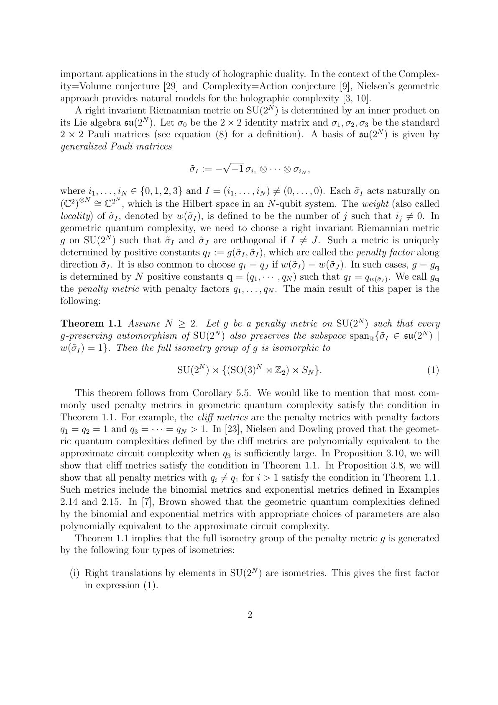 
Low-resolution page preview, page 2

📷 Fig 2

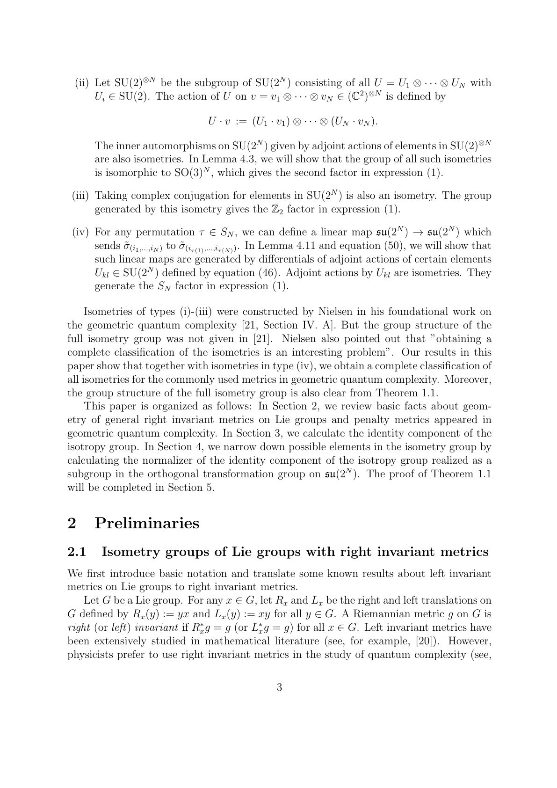 
Low-resolution page preview, page 3

📷 Fig 3

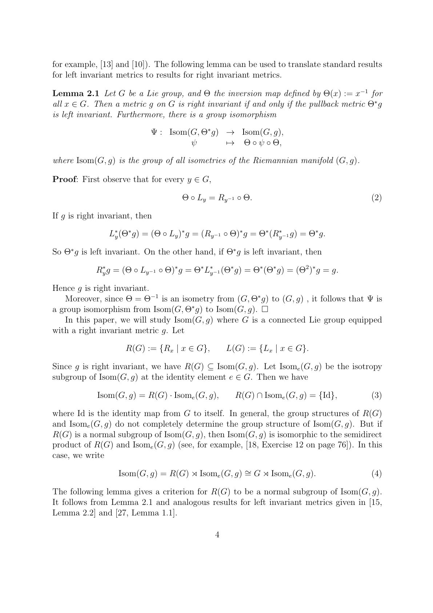 
Low-resolution page preview, page 4

📷 Fig 4

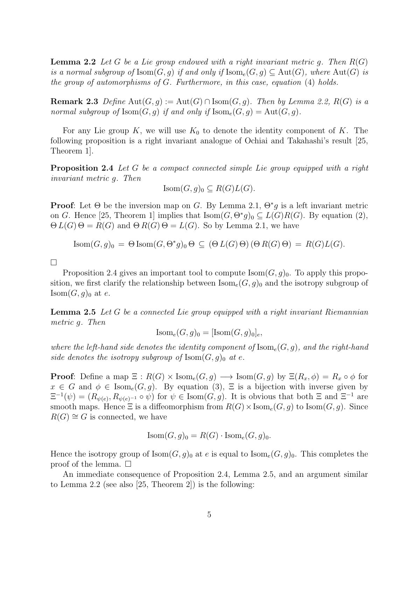 
Low-resolution page preview, page 5

📷 Fig 5

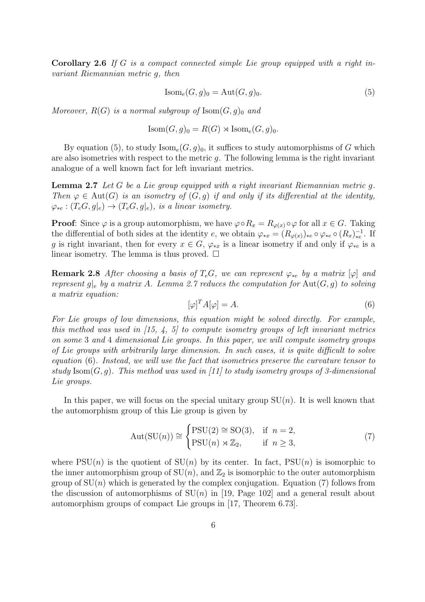 
Low-resolution page preview, page 6

**Summary.** This paper provides a complete mathematical description of the isometry groups for specific right-invariant metrics on the special unitary group SU(2^N). By analyzing the symmetries of these metrics, the authors provide deep structural insights into the geometric framework used to define and study quantum computational complexity.

**Why it may be interesting.** The geometric approach to quantum complexity is a major theoretical tool. Understanding the symmetries (isometries) of the underlying metric space is fundamental, as these symmetries dictate which transformations preserve the notion of 'distance' or 'complexity' in the quantum computational model.

Detailed structure

**Main problem.** The paper determines the full isometry groups of a specific class of right invariant Riemannian metrics defined on the special unitary group SU(2^N). This analysis is crucial for understanding the geometric structure used to define quantum complexity.

**Main result.** The full isometry group is found to be isomorphic to a semidirect product involving SU(2N) and components related to permutations and internal symmetries: Isom(G, g) is isomorphic to SU(2N) $
times \{(	ext{SO}(3)^N 
times \mathbb{Z}_2) 
times 	ext{S}_N\}$.

**Method.** The authors use techniques from differential geometry on Lie groups, analyzing the structure of the isometry group by examining how potential isometries must preserve the metric and the associated curvature tensor.

**Model / system.** The physical system is quantum computation, modeled by unitary operators $U \in 	ext{SU}(2^N)$ acting on $N$ qubits. The complexity is quantified using a right-invariant Riemannian metric, specifically a 'penalty metric' $g_q$, on the group manifold.

**Key observables.** Geometric quantum complexity (distance between $U$ and identity), and the structure of the isometry group $	ext{Isom}(G, g)$.

**Important parameters / regimes.** The penalty factors $q_I$ defining the metric, and the number of qubits $N$.

**Assumptions / limitations.** The analysis is restricted to 'penalty metrics' $g$ on $	ext{SU}(2N)$ that satisfy specific conditions related to the preservation of weight-1 generators.

**Paper structure.** The paper builds from general results on isometry groups of right-invariant metrics on Lie groups, applies these tools to the specific case of $	ext{SU}(2N)$ with penalty metrics, and culminates in determining the explicit structure of the isometry group via analysis of the differential action on the Lie algebra.

Abstract

In this paper, we give a complete description for the full isometry groups of a class of right invariant Riemannian metrics on the special unitary group $\mathrm{SU}(2^N)$. These metrics have been used by physicists to study Nielsen's geometric approach for complexities in quantum computations.

[↑ back to top](#top)

### [Mechanical Activation of Terahertz Tunneling in Metallic Nanogaps](http://arxiv.org/abs/2609.21506v1)

**Authors:** Dasom Kim, Dukhyung Lee, Young-Mi Bahk, Dai-Sik Kim  
**Type:** both · **Category:** other · **PDF:** <https://arxiv.org/pdf/2609.21506v1>  
**Analysis basis:** full PDF text, analyzed in chunks

📷 Fig 1

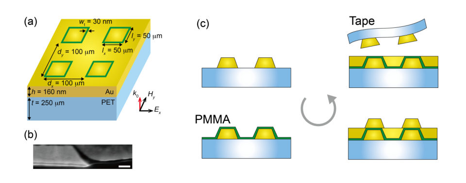 
Figure 1: Fabrication and geometry of the flexible nanogap metasurface. (a) Schematic of the metasurface consisting of square-ring Au nanogaps patterned on a 250-µm-thick polyethylene terephthalate (PET) sub- strate. The slot dimensions are lx = ly = 50 µm, the array periods are dx = dy = 100 µm, the gap width is wt = 30 nm, and the Au thickness is h = 160 nm. The incident THz electric field Ex is polarized perpen- dicular to two opposing sides of the squares. (b) The cross-sectional electron micrograph shows the tapered nanogap formed between the adjacent metal surfaces. Scale bar: 100 nm. (c) Schematic illustration of the fabrication procedure. Prepatterned Au structures on PET are...

📷 Fig 2

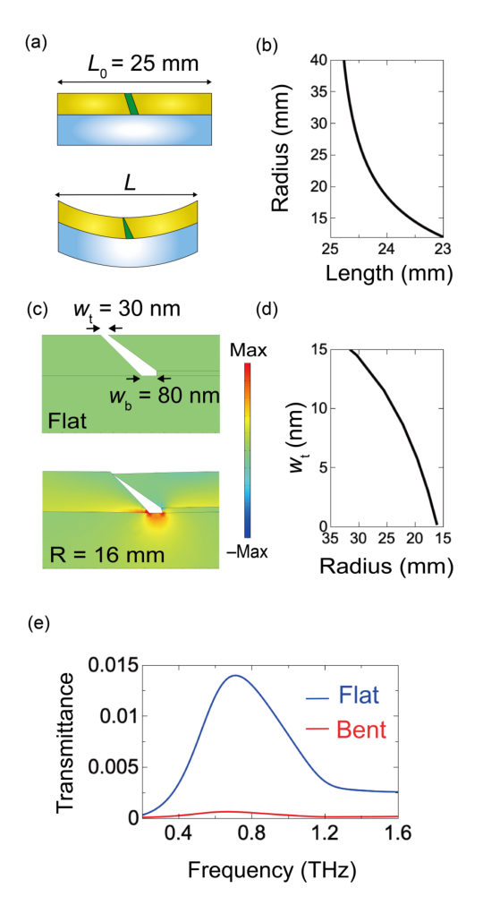 
Figure 2: Mechanical narrowing and low-field THz response of the flexible nanogap metasurface. (a) Cross- sectional schematics of the metasurface in the flat and bent states. L0 = 25 mm and L denote the initial and bent sample lengths, respectively. (b) Bending radius calculated as a function of L. (c) Finite-element structural-mechanics simulations of the nanogap cross section before and after bending, respectively. The color map shows the pressure distribution near the gap. PMMA is omitted from the simulations. (d) Upper- end gap width as a function of bending radius calculated from the simulation. (e) Low-field THz transmission spectra of the metasurface in the flat (blue) and bent (R =...

📷 Fig 3

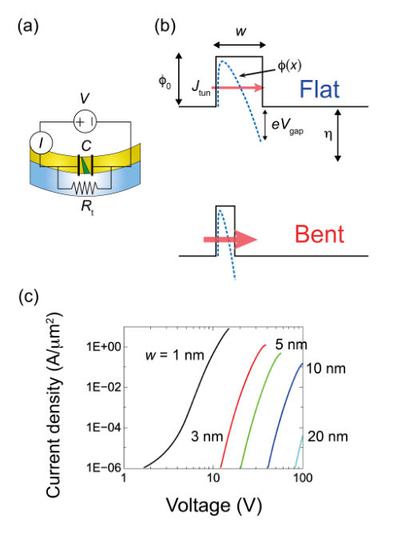 
Figure 3: Calculated tunneling response of a mechanically narrowed Au/PMMA/Au nanogap. (a) Equivalent circuit representation of the bent nanogap, in which the gap capacitance is accompanied by a tunneling conduction channel across the narrowed PMMA barrier. (b) Schematic potential-energy profiles of wide and narrow barriers under an applied gap voltage (dashed lines) and zero bias (solid lines) . Here, ϕ0 = 4.8 eV is the zero-bias barrier height, ϕ(x) is the voltage-dependent barrier profile, eVgap is the energy drop across the junction, η is the Au Fermi energy, and Jtun is the tunneling current density. Barrier narrowing and field-induced tilting increase the electron tunneling...

📷 Fig 4

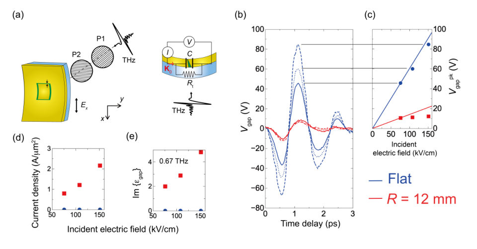 
Figure 4: Gap voltage under high-field THz excitation and estimated tunneling response. (a) Schematic of the high-field THz transmission measurement performed on the mechanically bent nanogap metasurface. The incident THz electric field is polarized perpendicular to the narrowed sides of the nanogaps. (b) Temporal waveforms of the voltage developed across the nanogaps in the flat (blue) and bent (R = 12 mm, red) states at 75 (solid line), 108 (dotted line), and 150 kV/cm (dashed line). (c) Peak gap voltage as a function of the incident electric field strength for the flat and bent states. In the flat state, the gap voltage increases approximately linearly with the incident field, whereas it...

📷 Fig 5

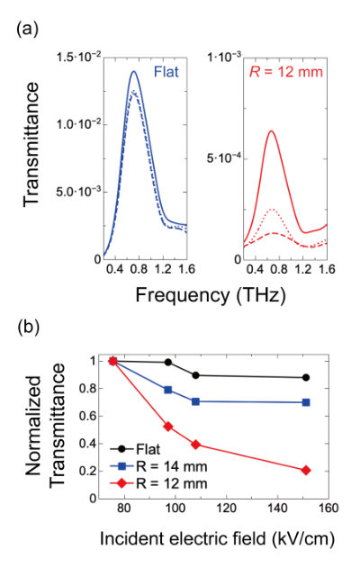 
Figure 5: Mechanically activated nonlinear THz transmission. (a) THz transmittance spectra of the nanogap metasurface in the flat and bent states, respectively, obtained by Fourier transformation of the time-domain waveforms in Fig. 4 and normalized to the transmittance through a bare PET substrate. The solid, dot- ted, and dashed curves correspond to incident field strengths of 75, 108, and 150 kV/cm, respectively. (b) Normalized resonant transmittance as a function of incident field strength for the flat, intermediately bent (R = 14 mm), and strongly bent (R = 12 mm) configurations, including an additional measurement at 97 kV/cm. For each bending condition, the transmittance is...

**Summary.** This work reports on controlling nonlinear THz transmission in flexible metallic nanogaps by physically bending the structure. Bending mechanically narrows the insulating barrier, activating a tunneling conduction channel. This transition shifts the junction's electrical behavior from a linear capacitive response to a nonlinear, tunneling-dominated regime, demonstrating mechanical control over quantum electronic properties.

**Why it may be interesting.** The coupling of macroscopic mechanical deformation to ultrafast, nonlinear quantum tunneling phenomena at THz frequencies provides a novel, tunable platform for studying charge transport in nanoscale junctions.

Detailed structure

**Main problem.** The paper demonstrates the ability to control nonlinear Terahertz (THz) tunneling-mediated transmission in metallic nanogaps by applying macroscopic mechanical strain.

**Main result.** Mechanical bending transitions the junction from a capacitive regime (flat state) to a tunneling-dominated regime (bent state), causing pronounced resonance suppression and voltage saturation.

**Method.** The study combines THz time-domain spectroscopy measurements with theoretical modeling using the Simmons tunneling model and structural mechanics simulations.

**Model / system.** The system is an Au/PMMA/Au nanogap metasurface fabricated on a flexible PET substrate. The physics involves modeling the junction as a parallel combination of capacitance and field-dependent tunneling conductance.

**Key observables.** THz transmittance spectra, gap voltage ($V_{gap}$), tunneling current density ($J_{tun}$), and the imaginary part of the effective dielectric constant ($	ext{Im}\{\epsilon_{gap}\}$).

**Important parameters / regimes.** Gap width (approaching the few-nanometer regime), incident THz field strength (up to 150 kV/cm), and bending curvature/radius.

**Assumptions / limitations.** The gap voltage estimation uses an area-averaging approximation based on the Kirchhoff integral formalism, and the local barrier width is approximated as 1 nm for tunneling calculations.

**Figures summary.** Figures illustrate the fabrication process, the effect of bending on geometry (structural simulations), and the THz transmittance spectra showing systematic nonlinear suppression in the bent state compared to the flat state.

**Paper structure.** The paper establishes the physical system, details the mechanical and electrical characterization methods, presents the comparison between the flat (capacitive) and bent (tunneling) states, and concludes by linking macroscopic mechanical control to ultrafast nanoscale nonlinear THz response.

Abstract

Metallic nanogaps concentrate terahertz (THz) fields into deep subwavelength volumes and support field-driven electron tunneling when the insulating barrier becomes sufficiently narrow. Here, we demonstrate mechanical control of tunneling-mediated nonlinear THz transmission in a flexible nanogap metasurface. The metasurface consists of Au/PMMA/Au nanogaps fabricated on a polyethylene terephthalate substrate, enabling continuous tuning of the gap geometry through macroscopic bending. In the flat state, the resonant transmission exhibits only a weak dependence on the incident THz field strength. Upon bending, increasing the incident field strength induces pronounced resonance suppression accompanied by saturation of the voltage developed across the nanogaps. This nonlinear response is consistent with the opening of a field-dependent tunneling conduction channel through the mechanically narrowed PMMA barriers. Simmons-model calculations illustrate the strong increase in tunneling current density and the associated dissipative gap response as the local gap width approaches the few-nanometer regime. These results establish mechanical deformation as a macroscopic means of controlling tunneling-mediated THz nonlinearities in flexible metasurfaces.

[↑ back to top](#top)

### [Multiscale Schmidt-Spectrum Bounds for High-Dimensional Entanglement: Geometric Measures and Schmidt-Number Witnesses](http://arxiv.org/abs/2609.21209v1)

**Authors:** Liang Xiong, Zhixiang Jin, Yanling Wang, Wei Chen, Hong Tao, Nung-sing Sze  
**Type:** theory · **Category:** quantum information and computing · **PDF:** <https://arxiv.org/pdf/2609.21209v1>  
**Analysis basis:** full PDF text, analyzed in chunks

📷 Fig 1

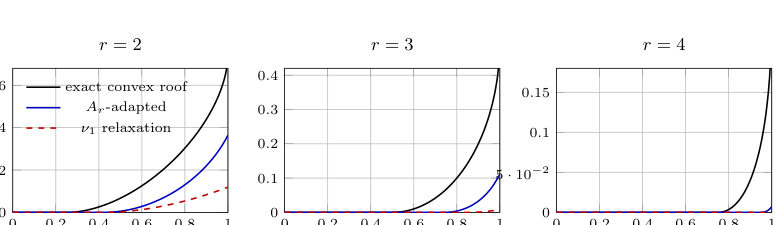 
FIG. 1. Exact Vidal-tail convex roofs and two fixed-fidelity bounds for the cross-referenced isotropic family. The state is centered on Φ4, while the measured projector is |ϕc⟩⟨ϕc|. The gap to the exact curve shows that this mixed family does not saturate the bound associated with the nonmaximally entangled reference.

📷 Fig 2

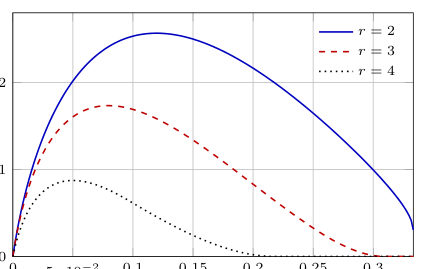 
FIG. 2. Reference-spectrum scan at fixed ρiso 0.98. The ordinate is Rr,ϕ(s)(Fϕ(s)) minus the largest-coefficient lower bound. Nonmonotonicity reflects both retained cumulative informa- tion and loss of threshold violation for highly nonuniform ref- erences.

**Summary.** This paper develops advanced multiscale mathematical bounds to quantify high-dimensional bipartite entanglement using the Schmidt spectrum. It connects geometric measures, like nested Vidal tails, to quantitative witnesses for the Schmidt number. The results provide sharp, analytically derived bounds that are essential for characterizing entanglement in complex quantum optical systems.

**Why it may be interesting.** This work provides rigorous, quantitative tools (multiscale bounds) to certify entanglement in complex, high-dimensional quantum systems, which is crucial for designing and analyzing photonic quantum communication protocols.

Detailed structure

**Main problem.** The paper addresses the challenge of quantifying high-dimensional bipartite entanglement by developing multiscale bounds that connect geometric measures to quantitative Schmidt-number witnesses.

**Main result.** They derive sharp upper bounds for the normalized nuclear-norm coordinate based on nested Vidal tails, showing equality holds when the Schmidt spectrum is uniform within defined blocks.

**Method.** The methodology involves developing multiscale Schmidt-spectrum bounds, solving relaxed weighted multiscale optimizations globally, and utilizing geometric measures like Vidal tails and convex-roof techniques.

**Model / system.** The focus is on bipartite quantum states $
ho$ in high dimensions, relevant for photonic entanglement encoding schemes (e.g., orbital-angular-momentum, path, time-bin).

**Key observables.** Schmidt spectrum, Schmidt number ($	ext{SN}(
ho)$), Vidal tails ($	ext{Er}$), Normalized nuclear-norm coordinate, and entanglement measures like Negativity.

**Important parameters / regimes.** The number of spectral blocks ($r$), the fidelity parameter, and the unique parameter $\alpha$ governing the optimization.

**Assumptions / limitations.** The analysis requires block-resolved or independently certified spectral information for multistep tails, and the single-tail boundary equivalence is limited to single-scale problems.

**Figures summary.** Not specified (Notes focus on mathematical derivations and theoretical results rather than figure descriptions).

**Paper structure.** The paper builds from defining the problem using Schmidt decomposition and entanglement measures, develops the multiscale bounds using nested Vidal tails, solves the associated global optimization problem, and concludes with refined bounds for mixed states and extensions to incomplete data.

Abstract

High-dimensional bipartite entanglement depends on how probability is distributed across the Schmidt spectrum, whereas a single reference-state fidelity resolves only one spectral scale. We develop multiscale Schmidt-spectrum bounds that connect geometric measures with quantitative Schmidt-number witnesses. For any partition of a pure-state Schmidt spectrum, several nested Vidal tails determine block masses. We derive the sharp upper boundary of the associated normalized nuclear-norm coordinate and show that equality holds if and only if the spectrum is uniform within each block. Refining the partition gives a monotone hierarchy of tighter bounds whenever the added tail data distinguish unequal block means. We also solve a relaxed weighted multiscale optimization globally: one scalar parameter specifies its unique full-support optimizer and explicit value on the nontrivial branch. Using the established single-tail fidelity--resource curve as a baseline, we obtain exact-fidelity equality refinements, convex-roof lower bounds for mixed states, and quantitative calibrations of Schmidt-number witnesses. A higher-tail relation further bounds convex-roof extended negativity in terms of Vidal tails and identifies the pure-state equality spectra. Leakage-aware and joint-confidence formulations state how these bounds can be used with incomplete data. Multistep tails require block-resolved or independently certified spectral information; they are not determined by one projector expectation.

[↑ back to top](#top)

### [Orbital character and photoemission signatures of the A-pocket in infinite-layer nickelates](http://arxiv.org/abs/2609.21665v1)

**Authors:** Leonard M. Verhoff, Michael Seidl, Liang Si, Karsten Held  
**Type:** theory · **Category:** strongly correlated electrons · **PDF:** <https://arxiv.org/pdf/2609.21665v1>  
**Analysis basis:** full PDF text, analyzed in chunks

📷 Fig 1

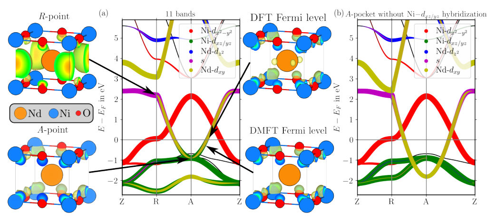 
FIG. 1. DFT bands and projections onto local orbitals for the 11-band Wannier model in the kz = π plane. (a) Full 11-band model. Side panels show DFT-calculated charge density for the A-pocket band at different k-points indicated by arrows. (b) Hopping from Ni-dxz/yz to interstitial-s and Nd-dxy is set to 0 such that the A-pocket does not hybridize with Ni on its way down.

📷 Fig 2

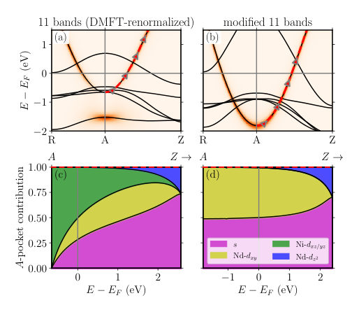 
FIG. 2. Zoom-in on the A-pocket for (a) 11-band model and (b) artificial model without hybridization of Nd-dxy and interstitial-s to Ni-dxz/yz orbital. The interstitial-s orbital character is shown as the colormap. (c) and (d) Quantitative contribution of relevant atomic orbitals to the A-pocket for the two models of (a) and (b) as a function of energy along the path indicated by gray arrows in (a,b). While the DFT and DMFT-renormalized bands contain Ni-dxz/yz, Nd-dxy, and interstitial-s contributions around EF , the pocket in the artificial model in (b,d) is formed by Nd-dxy and interstitial-s states. In the 10-band model, which excludes the interstitial-s state, the corresponding band...

📷 Fig 3

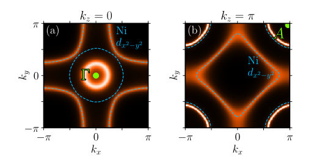 
FIG. 3. DFT Fermi surface (blue-dashed lines) for (a) kz = 0 and (b) kz = π. Colormap shows DMFT Fermi surface with correlations renormalizing and smearing the bands. In both cases we have a Ni-dx2−y2 Fermi surface, and a pocket around the Γ- and A-momentum.

📷 Fig 4

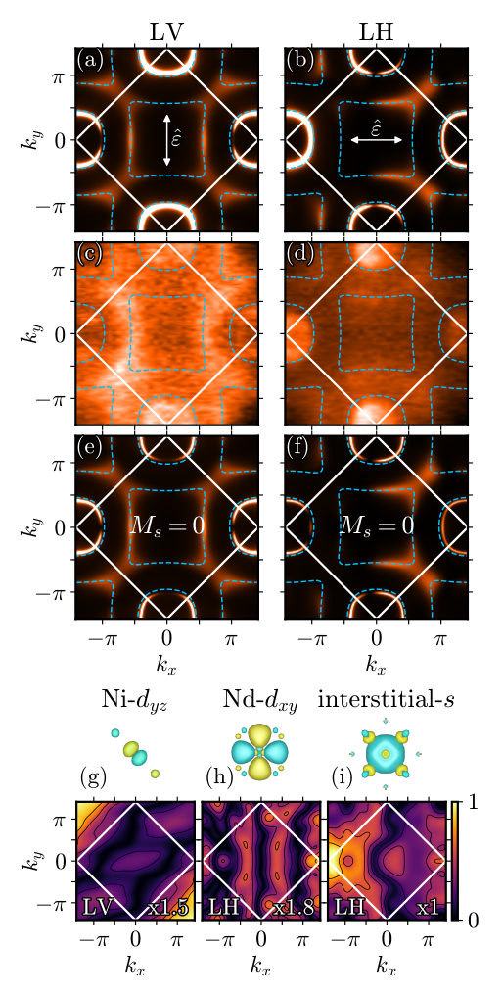 
FIG. 4. Fermi surface maps in the rotated basis at kz = 7π/c. Left: linear vertical, right: linear horizontal polarization. (a) and (b): our simulated ARPES images in the 11-band model. (c) and (d): Experimental images recreated from [9]. (e) and (f): Simulated ARPES images in the 11-band model, with Ms ≡0 artificially enforced. (g)–(i): Matrix elements, includ- ing a top-view of the corresponding Wannier function above the panels. The incident angle is 45°, relevant for the normal component of polarization in LH. White squares indicate the first Brillouin zone, and blue dashed lines are the DFT Fermi contour. Note that in the rotated basis, following the nota- tion of [9], kx and ky are no...

📷 Fig 5

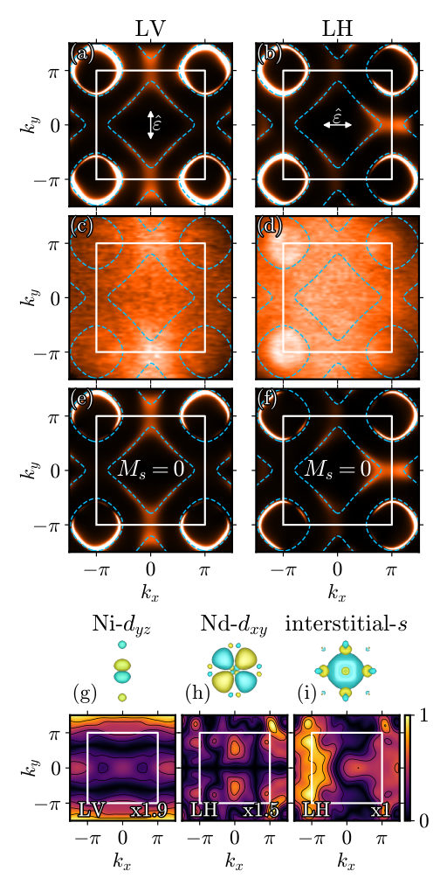 
FIG. 5. Same as Fig. 4, but measured in the conventional basis in which the Ni–O bonds point along the x- and y- directions.

**Summary.** This theoretical study investigates the electronic structure and spectroscopic signatures of the A-pocket in nickelates using DFT+DMFT. The authors conclude that the A-pocket arises from strong hybridization among several orbitals, and critically, that the measured photoemission intensity is primarily governed by the interstitial-$s$ orbital's matrix element, resolving previous ambiguities in the field.

**Why it may be interesting.** The detailed analysis of orbital hybridization and the explicit calculation of photoemission matrix elements provide a rigorous theoretical framework for interpreting complex spectroscopic features in strongly correlated transition metal oxides.

Detailed structure

**Main problem.** The paper addresses the long-standing debate regarding the orbital character and physical origin of the A-pocket feature in infinite-layer nickelates.

**Main result.** The A-pocket is identified as a strongly hybridized state involving interstitial-$s$, $	ext{Nd-}d_{xy}$, and $	ext{Ni-}d_{xz/yz}$ orbitals, with the photoemission signal intensity being dominated by the interstitial-$s$ channel.

**Method.** The study employs Density-Functional Theory combined with Dynamical Mean-Field Theory (DMFT) to calculate electronic structure, followed by simulating Angle-Resolved Photoemission Spectroscopy (ARPES) spectra.

**Model / system.** The system is infinite-layer nickelates, modeled using a low-energy 11-band tight-binding model incorporating local Hubbard-Kanamori interactions. Calculations are performed for $	ext{NdNiO}_2$ and $	ext{LaNiO}_2$.

**Key observables.** Orbital character contributions to the A-pocket, polarization-dependent ARPES spectra, and Fermi surface maps.

**Important parameters / regimes.** The hybridization strength between different orbital types (e.g., interstitial-$s$ vs. $d$-orbitals) and the inclusion of local correlations via DMFT.

**Assumptions / limitations.** The analysis relies on the Plane-Wave Final-State Approximation (PWA) for ARPES simulations, and the $k_z$ assignment in the final-state model is noted as an approximation.

**Figures summary.** Figures illustrate DFT band structures, orbital projections onto the A-pocket, and simulated ARPES Fermi surface contours for different orbital channels and polarizations.

**Paper structure.** The paper progresses by first establishing the need to treat orbital hybridizations and photoemission matrix elements together. It then uses a full 11-band model to calculate orbital contributions, contrasting these with artificial, decoupled models to pinpoint the dominant physical mechanism governing the ARPES signal.

Abstract

The orbital character of the so-called $A$-pocket in infinite-layer nickelates remains under debate. We investigate bulk NdNiO$_2$ using density-functional theory combined with dynamical mean-field theory and identify the $A$-pocket as a strongly hybridized state with substantial interstitial-$s$, Nd-$d_{xy}$ and Ni-d_${xz/yz}$ contributions. Our angle-resolved photoemission spectroscopy simulations reproduce the main polarization-dependent features measured experimentally. Removing the interstitial-$s$ matrix element leads to a clear disagreement with the measured Fermi surface maps, even though the interstitial-$s$ contribution is not dominant. Suppressing instead the Nd-d$_{xy}$ or Ni-$_{dxz/yz}$ matrix elements leaves the maps almost unchanged, because these are small at the zone corner. More generally, our results demonstrate that assigning the microscopic origin of spectral features in infinite-layer nickelates requires treating orbital hybridizations and photoemission matrix elements together.

[↑ back to top](#top)

### [Pair density Shannon information measures and their $N$-dependent behaviour in diatomic molecular systems](http://arxiv.org/abs/2609.21260v1)

**Authors:** Saul J. C. Salazar, J. Antonio Zarate, J. M. Solano-Altamirano, Humberto G. Laguna, Julio M. Hernandez-Perez, Robin P. Sagar  
**Type:** theory · **Category:** other · **PDF:** <https://arxiv.org/pdf/2609.21260v1>  
**Analysis basis:** full PDF text, analyzed in chunks

📷 Fig 1

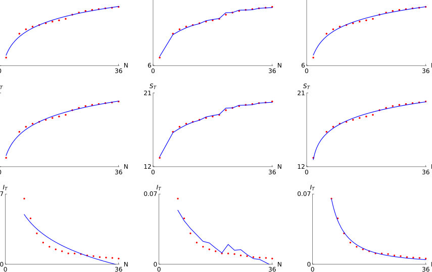 
Figure 1: Shannon entropy sums St (first row), ST (second row) and IT (third row) as a function

📷 Fig 2

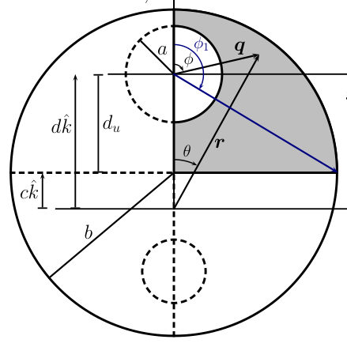 
Figure 2: The azimuthally symmetric upper half of the domain (denoted Σu 2v) is mapped using

📷 Fig 3

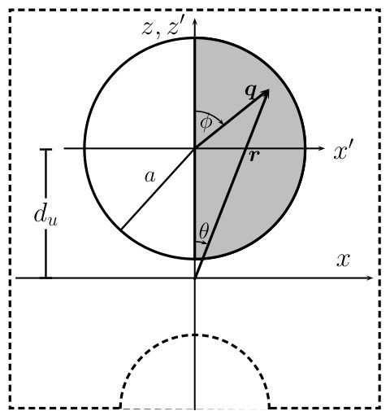 
Figure 3: The upper core part of the integration domain (denoted as Σu 2c in the text), and its

📷 Fig 4

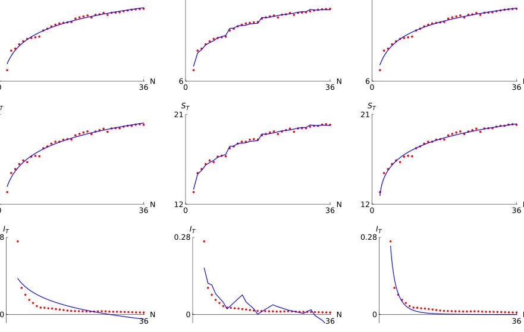 
Figure 4: Shannon entropy sums St (first row), ST (second row) and IT (third row) as a function

📷 Fig 5

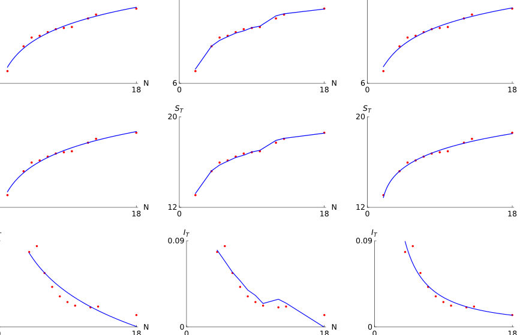 
Figure 5: Shannon entropy sums St (first row), ST (second row) and IT (third row) as a

**Summary.** This paper applies information theory, specifically Shannon entropy and mutual information, to analyze the pair density properties of diatomic molecules using Hartree-Fock theory. The authors examine how these measures change with system size ($N$) and find evidence for universal scaling laws. This work provides a quantitative, information-theoretic characterization of molecular bonding and correlation.

**Why it may be interesting.** The use of information-theoretic measures like entropy and mutual information to characterize molecular structure and correlation provides a novel, quantitative lens through which to view electronic structure, which is highly relevant to understanding quantum correlations in molecular physics.

Detailed structure

**Main problem.** The study investigates pair density Shannon information measures and their dependence on system size ($N$) in diatomic molecules.

**Main result.** The analysis suggests a potential universal $N$-dependent behavior for the entropy sums, and it finds that momentum space pair density is closer to the Hartree-like reference than position space.

**Method.** Calculations utilize Hartree-Fock wave functions to compute pair density Shannon entropies and mutual information in both position and momentum space.

**Model / system.** The physical systems studied are homonuclear and heteronuclear diatomic molecules. The calculations are performed using the Hartree-Fock approximation.

**Key observables.** Pair density Shannon entropies ($S_\Gamma, S_\Pi, S_T$) and mutual information ($I_r, I_p$).

**Important parameters / regimes.** System size ($N$), basis set quality, and the comparison between position and momentum space representations.

**Assumptions / limitations.** The analysis is based on Hartree-Fock wave functions, and the study focuses on entropy sums derived from entropic uncertainty relations.

**Figures summary.** Figures show Shannon entropy sums ($S_t, S_T, I_T$) for neutral and heteronuclear diatomic molecules as a function of $N$, comparing theoretical models to basis set data.

**Paper structure.** The paper develops the theoretical framework using Shannon entropy definitions for reduced and pair densities, calculates these measures for diatomic systems in both position and momentum space, and finally examines the $N$-dependent behavior by fitting the data to various theoretical models.

Abstract

Pair density Shannon entropies and mutual information in position and in momentum space are calculated for two series of homonuclear and heteronuclear diatomic molecules using Hartree-Fock wave functions. The pair density entropy sum increases with the quality of the basis set. Mutual information, a measure of statistical correlation, is seen to be smaller in momentum space as compared to position space. The interpretation is that the momentum pair density is closer than the position pair density to a Hartree-like reference. The $N$-dependent behaviours of the entropy and mutual information sums are examined by fitting the data to three different model behaviours. Results show that these models are capable of representing the molecular data in differing degrees. The parameters obtained from a particular model are relatively constant across different chemical series. This adds evidence to the argument of a universal $N$-dependent behaviour of the entropy sums.

[↑ back to top](#top)

### [Quantum states with the same entanglement and local unitary equivalence](http://arxiv.org/abs/2609.21558v1)

**Authors:** Julio I. de Vicente  
**Type:** theory · **Category:** quantum information and computing · **PDF:** <https://arxiv.org/pdf/2609.21558v1>  
**Analysis basis:** full PDF text, analyzed in chunks

📷 Fig 1

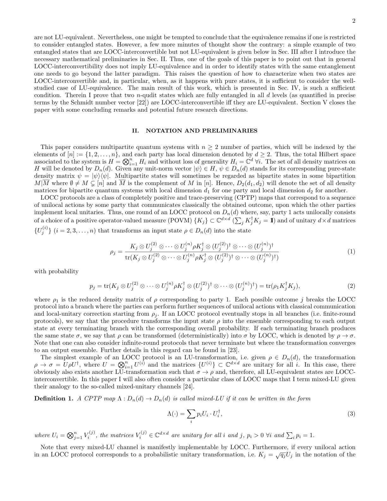 
Low-resolution page preview, page 2

📷 Fig 2

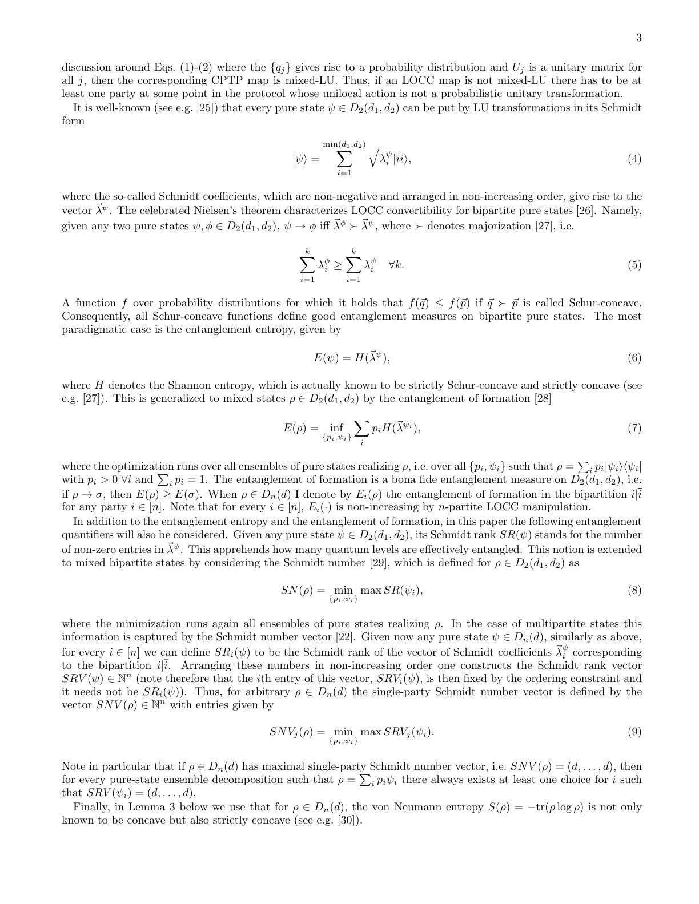 
Low-resolution page preview, page 3

📷 Fig 3

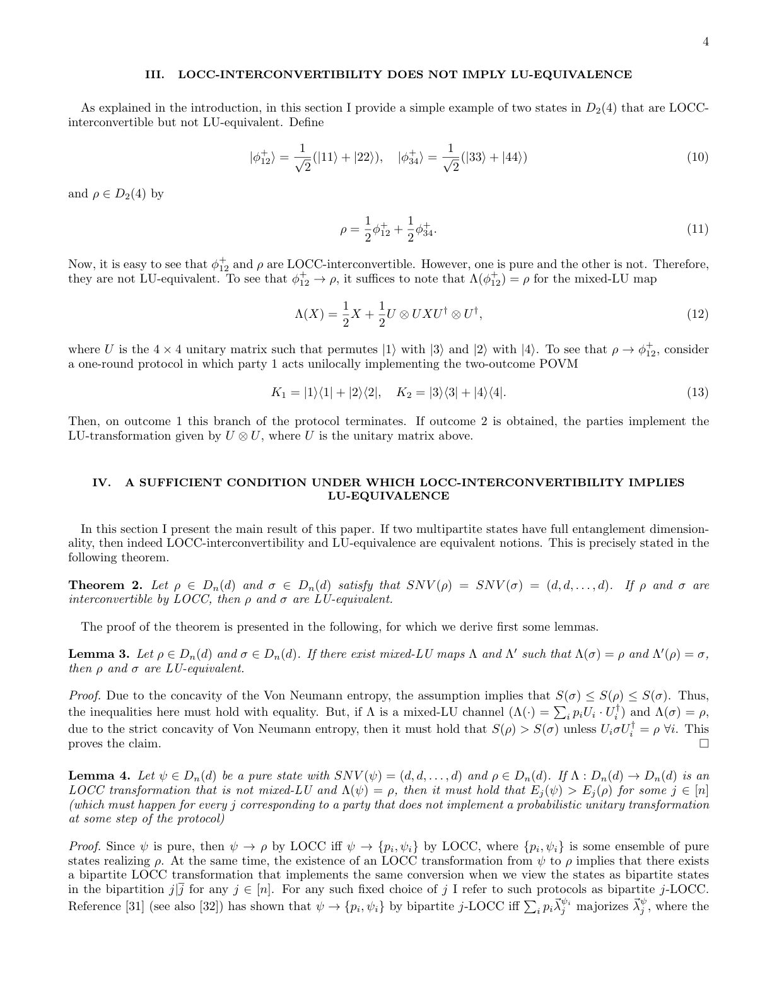 
Low-resolution page preview, page 4

📷 Fig 4

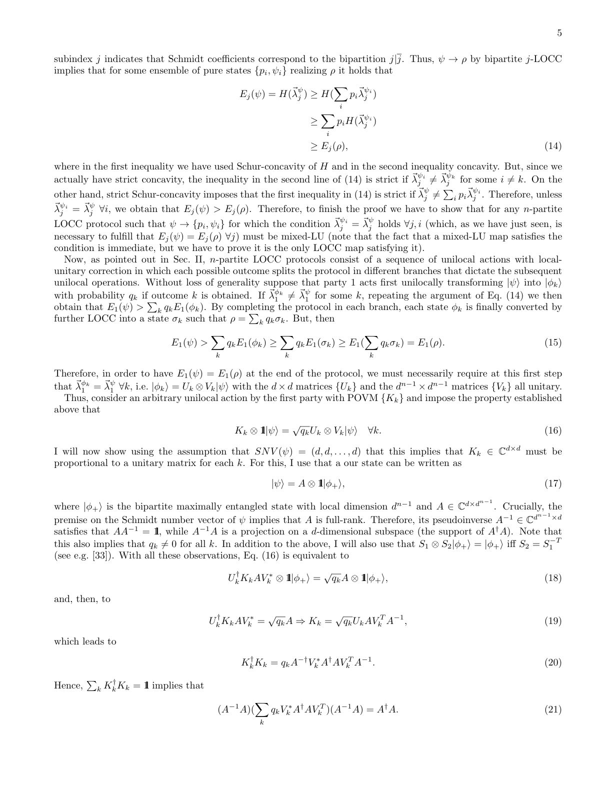 
Low-resolution page preview, page 5

📷 Fig 5

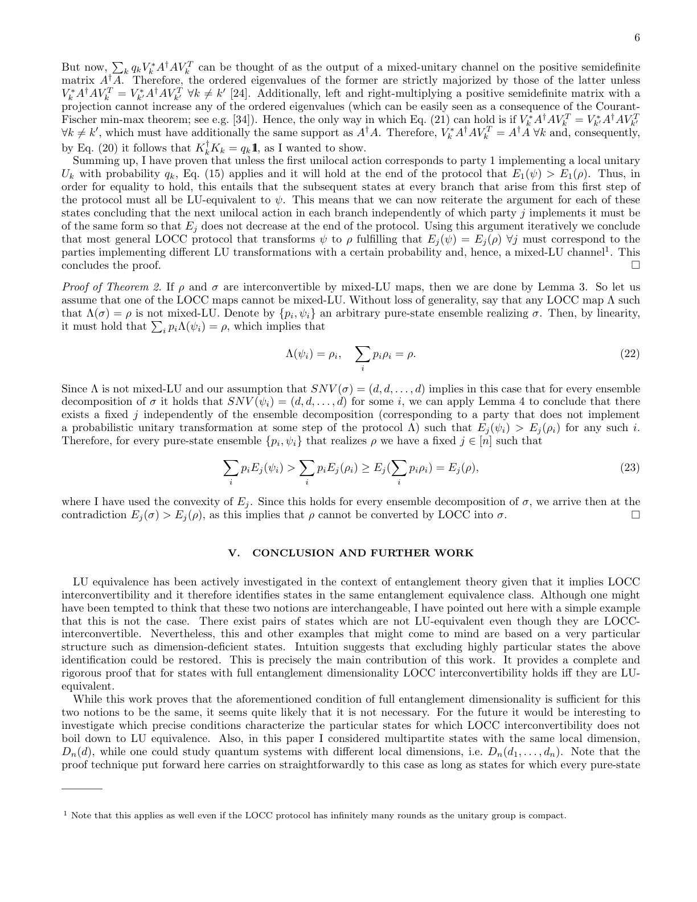 
Low-resolution page preview, page 6

**Summary.** This paper tackles the relationship between two notions of state equivalence: LOCC-interconvertibility and Local Unitary (LU) equivalence. It proves that for highly entangled multipartite states (those with full entanglement dimensionality), these two concepts coincide. This provides a powerful, sufficient condition for when operational indistinguishability implies a simpler, unitary-based equivalence.

**Why it may be interesting.** This work provides a rigorous mathematical criterion (full entanglement dimensionality) that simplifies the complex operational question of entanglement equivalence, which is crucial for understanding resource theories in quantum information.

Detailed structure

**Main problem.** The paper investigates the conditions under which LOCC-interconvertibility of quantum states implies Local Unitary (LU) equivalence, as this implication is not generally true.

**Main result.** For multipartite quantum states that possess full entanglement dimensionality (quantified by the Schmidt number vector), LOCC interconvertibility is proven to be equivalent to LU-equivalence.

**Method.** The proof strategy involves using properties of entanglement measures (like entropy) and contradiction, showing that if the states are interconvertible but not LU-equivalent, an inequality must arise contradicting the assumed equality of entanglement measures.

**Model / system.** The study focuses on multipartite quantum systems ($
ho \in \mathcal{D}_n(d)$) involving $n$ parties, each with local dimension $d \ge 2$. The analysis uses density matrices and concepts derived from entanglement theory.

**Key observables.** Entanglement of Formation, Schmidt number vector (SNV), and various entanglement entropy measures ($E_j$).

**Important parameters / regimes.** The condition of 'full entanglement dimensionality' ($	ext{SNV}(
ho) = (d, \dots, d)$) is the critical parameter regime where the equivalence holds.

**Assumptions / limitations.** The main result is conditional on the states having full entanglement dimensionality; the general case for mixed states remains open.

**Figures summary.** Not specified.

**Paper structure.** The paper establishes the known implication (LU $\implies$ LOCC) and then focuses on finding sufficient conditions for the converse (LOCC $\implies$ LU). The core result is presented in Section IV, proving equivalence under the full entanglement dimensionality condition.

Abstract

Local operations assisted by classical communication (LOCC) play a fundamental role in the resource-theoretic formulation of entanglement theory inducing an operationally meaningful ordering in the set of entangled states. The particular class within LOCC of local unitary (LU) transformations is obviously closed under inversion. Thus, LU-equivalent states are interconvertible by LOCC and have therefore the same entanglement. For this reason LU-equivalence has been thoroughly studied in the context of entanglement theory. However, as I note here with a simple example, the converse is not true: there exist entangled states that are interconvertible by LOCC but which are not LU-equivalent. This motivates studying under which conditions LOCC interconvertibility is characterized by LU-equivalence. I provide a sufficient condition for this to hold. When one considers multipartite states with full entanglement dimensionality (as quantified by the Schmidt number vector) LOCC interconvertibility can only hold under LU-equivalence.

[↑ back to top](#top)

### [ReFINE: Scheduling of Distillation and Coding for Rate-Fidelity Tradeoff in Quantum Networks](http://arxiv.org/abs/2609.21152v1)

**Authors:** Narges Alavisamani, Matthieu Bloch, Moinuddin Qureshi  
**Type:** theory · **Category:** quantum information and computing · **PDF:** <https://arxiv.org/pdf/2609.21152v1>  
**Analysis basis:** full PDF text, analyzed in chunks

📷 Fig 1

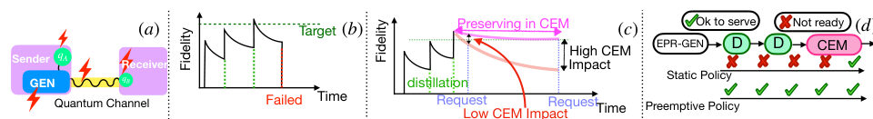 
Fig. 1. (a) Entanglement distribution: Sender generates an EPR pair, sends one qubit of the pair to Receiver. Errors reduce EPR pair’s fidelity. (b) As decoherence reduces fidelity, CED attempts to restore it, but frequent distillation rounds increase failure rates. (c) Depending on when consumption requests arrive, the utility of CEM varies. (d) ReFINE schedules limited distillation rounds, preservation in CEM (only if needed), and serves requests preemptively.

📷 Fig 2

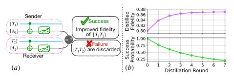 
Fig. 3. (a) Entanglement Distillation. Equal results of measurement of |A1A2⟩: success, improved fidelity of |T1T2⟩. Unequal results: failure, corruption of both |A1A2⟩and |T1T2⟩. (b) Fidelity and success probability across distillation rounds.

📷 Fig 3

 
Fig. 4. Static vs. Preemptive Scheduling. Unlike Static policies, preemptive demand-aware scheduling adapts distillation/CEM order and serves requests at any stage.

📷 Fig 4

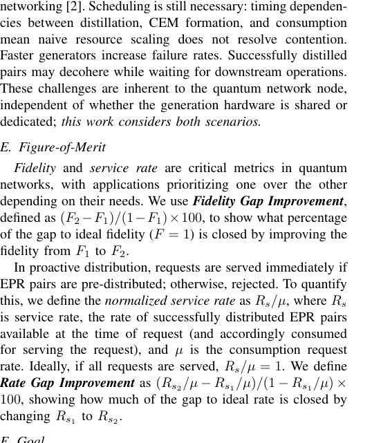 
Figure 5 illustrates the rate-fidelity tradeoff in quantum networks. Prior static policies achieve suboptimal tradeoffs due to fixed sequences and resource allocation that ignores network demand. The timing interactions between distillation and CEM formation mean that simply increasing resources does not guarantee better performance. Ideally, we aim for unit service rate and fidelity, but theoretical limits in current distillation protocols make perfect fidelity and rate practically unattainable (gray area in Figure 5). Nonetheless, there exists a gap between prior work and the best achievable case (green area in Figure 5). Our objective is to close this gap and enable a bet- ter balance...

📷 Fig 5

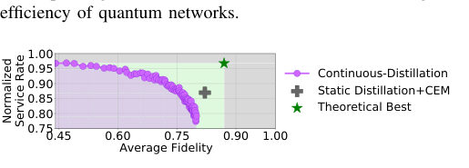 
Fig. 5. The rate-fidelity tradeoff in quantum networks. There exists a gap (green area) between prior work and theoretical best achievable service rate and fidelity.

**Summary.** This paper introduces ReFINE, a novel, demand-aware scheduler designed to optimize the trade-off between fidelity and service rate in quantum networks. It dynamically manages the use of entanglement distillation and error correction memory (CEM) based on real-time network demands. By implementing three distinct scheduling policies, ReFINE significantly improves resource utilization compared to fixed, static protocols.

**Why it may be interesting.** It provides a sophisticated resource management framework for quantum communication channels, which is crucial for scaling quantum networks by optimizing the use of fragile quantum resources like entanglement.

Detailed structure

**Main problem.** The paper addresses the challenge of optimizing the trade-off between maintaining high fidelity and achieving a high service rate for shared Einstein-Podolsky-Rosen (EPR) pairs in quantum networks.

**Main result.** The proposed ReFINE scheduler significantly outperforms static scheduling methods by dynamically managing resource allocation, closing substantial gaps in both fidelity and service rate compared to existing protocols.

**Method.** ReFINE is a demand-aware, preemptive scheduler that intelligently decides whether to immediately use an available EPR pair or preserve it in a Coding-Enhanced Memory (CEM), implementing three distinct priority policies (ReFINE-D, ReFINE-M, ReFINE-C).

**Model / system.** The system modeled is a quantum network where nodes share EPR pairs, which degrade due to decoherence. The core components managed are entanglement distillation (to boost fidelity) and Quantum Error Correction (QEC) via CEM (to protect pairs over time).

**Key observables.** Fidelity of EPR pairs, Service Rate (rate of successful pair delivery), and the rate-fidelity tradeoff curve.

**Important parameters / regimes.** The scheduling policies (D, M, C) dictate the balance between prioritizing rate (Distillation-First) or fidelity (Memory-First).

**Assumptions / limitations.** Existing methods often rely on static combinations of distillation and CEM, failing to account for dynamic variations in network demand.

**Figures summary.** Figures illustrate the basic entanglement distribution process, the limitations of continuous distillation (CED), the utility of CEM based on timing, and a comparison showing ReFINE's superior preemptive scheduling capability over static approaches.

**Paper structure.** The paper introduces the resource management problem, details the limitations of static protocols, proposes the ReFINE scheduler with its three policies, and presents quantitative results demonstrating its superior performance across various metrics.

Abstract

In quantum networks, nodes are connected via sharing of Einstein-Podolsky-Rosen (EPR) pairs, ideally with high fidelity and high rate. However, the fidelity of EPR pairs degrades due to imperfect generation and decoherence errors. Entanglement Distillation is a method that increases the fidelity but operates probabilistically and may destroy all involved EPR pairs upon failure. This failure reduces available EPR pairs for application use, thereby decreasing the service rate. Quantum Error Correction (QEC) is another mechanism to protect EPR pairs against error by forming what we term as Coding-Enhanced Memory (CEM). While effective, CEM requires extra time and resources to form the code, which also reduces the service rate. Existing methods often use static combinations of distillation and CEM, ignoring demand variations. This results in a low service rate without significant fidelity gain. Limited resources together with this rate-fidelity tradeoff make it essential to schedule when to run distillation, form CEM, or serve requests.   We propose ReFINE, a demand-aware preemptive scheduler that based on application requirements either serves an available EPR pair immediately or preserves it in CEM. This selective use of CEM, only when needed, enables a better balance for rate-fidelity tradeoff than always using CEM. Between request arrivals, ReFINE either schedules distilling EPR pairs or forming CEM to protect distilled pairs, following one of the three priority policies: ReFINE-D (Distillation-First) first generates EPR pairs for distillation and then forms the CEM, prioritizing service rate. ReFINE-M (Memory-First) first forms the CEM, then generates the EPR pairs for distillation, prioritizing fidelity. ReFINE-C (Concurrent) performs both distillation and CEM formation concurrently, balancing between fidelity and service rate.

[↑ back to top](#top)

### [Reformulating Pfaffian Quantum Monte Carlo with the Hybrid Monte Carlo formalism](http://arxiv.org/abs/2609.21631v1)

**Authors:** Thomas Hauschild, Lin Wang, Finn L. Temmen, Thomas Luu  
**Type:** theory · **Category:** strongly correlated electrons · **PDF:** <https://arxiv.org/pdf/2609.21631v1>  
**Analysis basis:** full PDF text, analyzed in chunks

📷 Fig 1

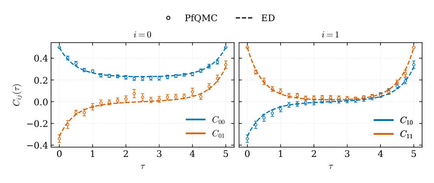 
Figure 1: Comparison of PfQMC and ED results for the unequal-time Dirac correlators 𝐶𝑖𝑗(𝜏) = ⟨𝑐𝑖(𝜏)𝑐† 𝑗(0)⟩in an interacting Kitaev chain with 𝐿= 4 and inverse temperature 𝛽= 5. The model pa- rameters are 𝜇= 0, Δ = 1, 𝑉= 1, and 𝑡= 1. The PfQMC parameters are 𝑁𝜏= 20, Δ𝜏= 0.25, 𝑁MD = 7, 𝑡MD = 0.8, and 𝑁cut = 5.

📷 Fig 2

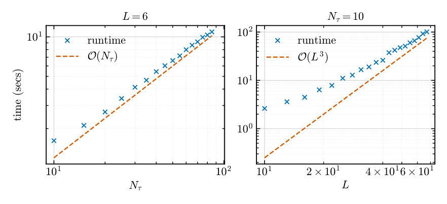 
Figure 2: Runtime as a function of the number of time slices (left) and the system size (right). The parameters are 𝜇= 0.0, Δ = 1, 𝑡= 1, 𝑉= 1, 𝑡MD = 0.8, 𝑁MD = 7, 𝑁cut = 5, and 500 configurations. When varying the number of time slices, 𝛽= 5, Δ𝜏= 𝛽/𝑁𝜏, and 𝐿= 6. When varying the system size, 𝑁𝜏= 10 and Δ𝜏= 0.3, so that 𝛽= 3. The reference scalings have arbitrary coefficients.

📷 Fig 3

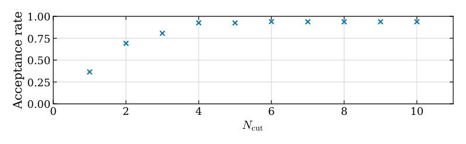 
Figure 3: Acceptance rate as a function of the gradient-expansion truncation order 𝑁cut. The parameters are 𝐿= 20, 𝑡= 1, 𝑉= 1, Δ = 1, Δ𝜏= 0.25, 𝑁𝜏= 40, 𝛽= 10, 𝜇= 0, 𝑡MD = 0.9, and 𝑁MD = 20. Each simulation contains 600 configurations.

📷 Fig 4

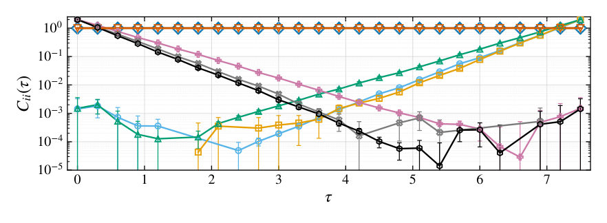 
Figure 4: Unequal-time Majorana correlators ⟨𝛾𝑖(𝜏)𝛾𝑖(0)⟩in the eigenbasis of the non-interacting 𝐴kernel for a selection of modes. Excitation energies are encoded in the decay rates and can be extracted from the slopes on the logarithmic scale. The parameters are 𝐿= 14, 𝑡= 1, 𝑉= 0.2, Δ = 0.8, Δ𝜏= 0.3, 𝑁𝜏= 25, 𝑁MD = 9, 𝑡MD = 0.8, and 𝑁cut = 5, with 2000 configurations.

📷 Fig 5

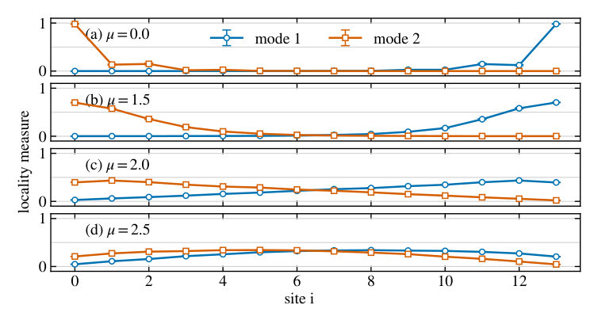 
Figure 5: Unnormalized localization profiles for several chemical potentials. The parameters are 𝐿= 14, 𝑡= 1, 𝑉= 0.2, Δ = 0.8, Δ𝜏= 0.3, 𝑁cut = 5, 𝑁𝜏= 25, and 𝑡MD = 0.8. For panels (a), (b), and (d), 𝑁MD = 9; for panel (c), 𝑁MD = 25. Error bars are mostly obscured by data markers.

**Summary.** This work introduces a novel combination of Pfaffian Quantum Monte Carlo (PfQMC) with the Hybrid Monte Carlo (HMC) formalism to efficiently simulate anomalous fermionic Hamiltonians. By simplifying the force calculation based on the Pfaffian weight's determinant representation, the method achieves favorable computational scaling. It is successfully applied to the interacting Kitaev chain, confirming its ability to resolve low-energy topological features.

**Why it may be interesting.** The development of an efficient, globally updated sampling technique (HMC) for Pfaffian QMC is crucial for studying complex pairing mechanisms and topological phases in strongly correlated electron systems that are difficult for standard determinant methods.

Detailed structure

**Main problem.** The paper addresses the challenge of extending Pfaffian Quantum Monte Carlo (PfQMC) to incorporate the global updates provided by the Hybrid Monte Carlo (HMC) formalism for simulating anomalous fermionic Hamiltonians.

**Main result.** The authors successfully combine PfQMC with HMC, achieving a computational scaling of O(N_tau L^3) and validating the method on the interacting Kitaev chain, where results agree with exact diagonalization.

**Method.** They utilize the HMC framework, noting that the molecular dynamics force depends only on the magnitude of the Pfaffian weight, which simplifies the force calculation significantly.

**Model / system.** The primary model studied is the interacting Kitaev chain, a 1D system of spinless fermions characterized by nearest-neighbor hopping, p-wave pairing, and density interactions. The Hamiltonian includes terms for hopping, pairing, and density-density interactions.

**Key observables.** Unequal-time Majorana correlators, low-energy excitation modes, and the computational scaling of the simulation time.

**Important parameters / regimes.** The simulation is applied to the Kitaev chain, with key parameters including the hopping term (t), pairing term (Delta), chemical potential (mu), and the interaction strength (V).

**Assumptions / limitations.** For interaction kernels lacking analytic exponential derivatives, a truncated force expansion is employed, whose errors are corrected by the exact Metropolis accept-reject step.

**Figures summary.** Figures compare PfQMC–HMC correlators with Exact Diagonalization (ED), demonstrate the runtime scaling (linear in N_tau, cubic in L), and show the acceptance rate dependence on the truncation order (N_cut).

**Paper structure.** The paper details the theoretical framework for combining PfQMC with HMC, derives the simplified force expression, applies the method to the interacting Kitaev chain, validates the results against ED, and analyzes the scaling and physical observables like Majorana correlators.

Abstract

Pfaffian quantum Monte Carlo extends auxiliary field methods to anomalous fermionic Hamiltonians, opening access to pairing systems and Hubbard-Stratonovich decompositions that are unavailable in determinant formulations. We show that this flexibility can be combined with the global updates of Hybrid Monte Carlo (HMC), leading to an algorithm scaling as $\mathcal{O}(N_τL^3)$, similar to its determinant quantum Monte Carlo (DQMC) counterpart without pseudofermions. The central observation is that the molecular dynamics force depends only on the magnitude of the Pfaffian weight, which admits a determinant representation and leads to a simplified force expression. This construction also yields unequal-time Majorana correlators at essentially no additional cost. For interaction kernels with no convenient analytic exponential derivative, we employ a truncated force expansion whose errors are removed by the exact Metropolis accept-reject step. Applied to the interacting Kitaev chain, the method agrees with exact diagonalization and resolves low-energy modes localized at opposite boundaries, together with their increasing overlap near the topological transition. These results establish HMC as an efficient sampling framework for Pfaffian auxiliary-field simulations.

[↑ back to top](#top)

### [Shape Deformation and Braid Statistics of Fractional Quantum Hall Quasiparticles](http://arxiv.org/abs/2609.20985v1)

**Authors:** Mytraya Gattu, J. K. Jain  
**Type:** theory · **Category:** strongly correlated electrons · **PDF:** <https://arxiv.org/pdf/2609.20985v1>  
**Analysis basis:** full PDF text, analyzed in chunks

📷 Fig 1

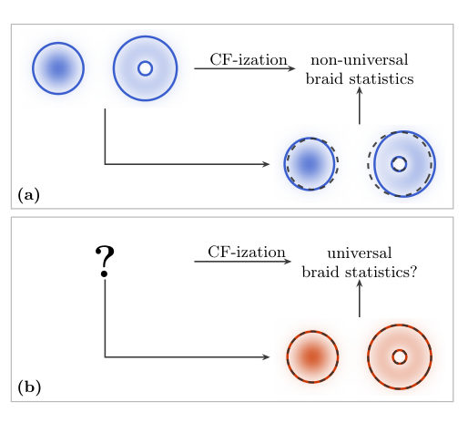 
FIG. 1. (a) Composite-fermionization (CF-ization) of an in- teger quantum Hall wave function with two localized quasi- particles (QPs) yields fractional quantum Hall (FQH) QPs whose braid statistics, obtained by taking one QP around the other, is shape-dependent, i.e., non-universal [Eq. (41)]. We notice that CF-ization deforms the shape of the QPs ever so slightly, with the deformation vanishing as the distance be- tween the two QPs is increased. (b) We ask: Is it possible to write down IQH wave functions with two QPs that produce, upon CF-ization, undistorted FQH QPs? And if so, what is their braid statistics? We answer the first question in the affirmative by explicit construction, and...

📷 Fig 2

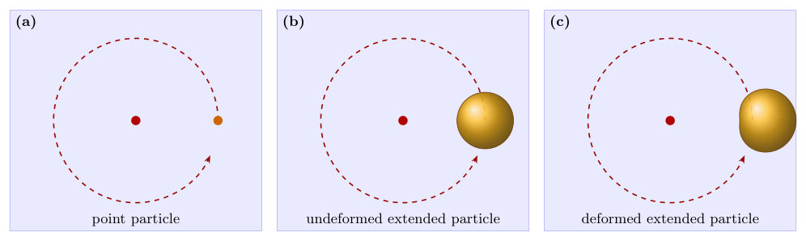 
FIG. 2. The braid statistics is given by the difference between the Berry phases acquired by a quasiparticle (QP) along a circular loop (dashed) with and without another QP (red dot) localized at its center. The Berry phase is set by the number of CFs enclosed by the loop, because the orbiting QP, which is also a CF, sees a braid phase of 4pπ per enclosed CF. (a) If the orbiting QP were a point particle, the counting of CFs would be unambiguous. (b) Even when the orbiting QP is in fact an extended, cloud-like object, so long as its shape is unaffected by the presence of the QP inside the loop, the Berry phase difference is still unambiguous. (c) When the shape of the orbiting QP is deformed...

📷 Fig 3

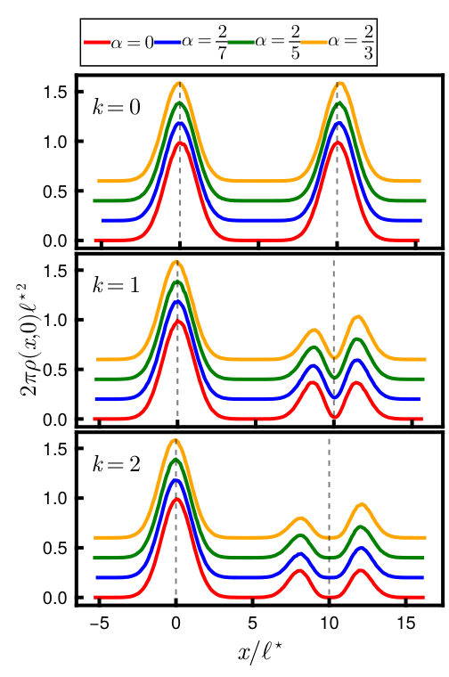 
FIG. 3. Density profile 2πρ(x, 0)ℓ⋆2 along the x axis for the two-anyon wave function Ψk1,k2 ω1,ω2 of Eq. (10) with k1 = 0, ω1 = 0 and k2 = k, ω2 = ω. One anyon is localized at the origin, and the second is localized at ω = 10ℓ⋆in the k angular- momentum orbital about ω. The top panel shows k = 0, analogous to the situation considered by Jeon et al. [52, 53]; here α is the statistical exponent. For α ̸= 0, the Jastrow factor (Z1 −Z2)α shifts the two density peaks away from each other, a displacement that can be accounted for by a position correction. The lower panels show k = 1 and k = 2. In these cases, vortex attachment produces not only a shift but also a deformation of the wavepacket...

📷 Fig 4

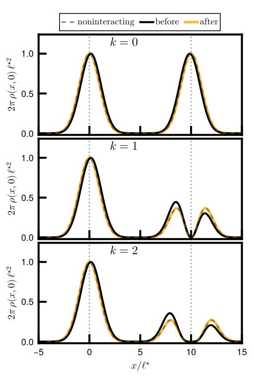 
FIG. 4. In Fig. 3, we saw how multiplication by the factor (Z1 −Z2)α distorts the density profile of two anyons. In this figure, the dashed gray curve shows the density ρ(x, 0) of two independent particles: one localized at the origin in the k1 = 0 angular-momentum state and the second at ω = 10ℓ⋆in the k state. The dotted vertical lines mark their positions. The orange curve shows the density profile of ˜Ψk1,k2 ω1,ω2 in Eq. (13) ; this is essentially identical to the gray dashed curve. The solid black curve is the density profile of (Z1 −Z2)−α ˜Ψk1,k2 ω1,ω2, i.e. of the Slater determinant on the right hand side of Eq. (13); this density is distorted in precisely such a fashion that the...

📷 Fig 5

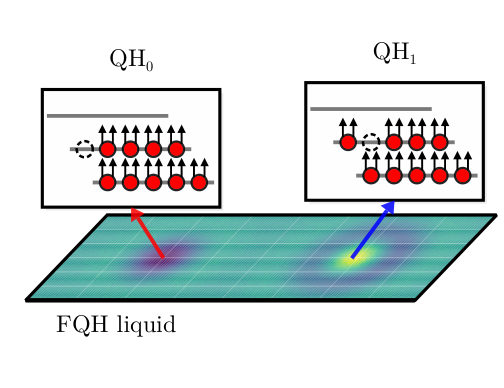 
FIG. 5. Schematic illustration of localized QHs in an FQH liquid at Jain fillings ν = n/(2pn+1). The color on the plane depicts the density of electrons in the bulk of an FQH liquid with two localized QHs, and the callouts show the correspond- ing CF occupation of the ΛLs, with orbitals defined relative to the center of each QH. CFs are depicted as electrons with two attached flux tubes, while a QH, which is a missing CF, is indicated by a dashed circle.

**Summary.** This paper investigates the topological statistics of quasiparticles in the Fractional Quantum Hall Effect, finding that the measurable Berry phase is complicated by geometric shape effects. Using Composite Fermion theory, the authors decompose this phase and propose that while shape dependence is a major hurdle, the underlying braid statistics can be extracted by considering idealized, 'undistorted' quasiparticle configurations.

**Why it may be interesting.** The explicit mathematical decomposition of the Berry phase into geometric and topological parts, and the discussion of how shape effects mask fundamental topological invariants, is highly relevant to understanding anyonic braiding in complex quantum systems.

Detailed structure

**Main problem.** The primary challenge is determining the robust braid statistics of Fractional Quantum Hall (FQH) quasiparticles (QPs) because the Berry phase is contaminated by shape-dependent and area-dependent contributions.

**Main result.** The authors show that the Berry phase decomposes into AB, shape, and braid contributions, and while the AB and shape terms can dominate, constructing 'undistorted' QPs can yield universal braid statistics.

**Method.** The analysis uses the Composite-Fermionization (CF) theory to model FQH QPs and decomposes the Berry phase associated with a closed loop around a QP.

**Model / system.** The system is the Fractional Quantum Hall Effect (FQHE) state, modeled using Composite Fermion (CF) theory. QPs are treated as excitations whose properties (charge, flux, statistics) are derived from the CF picture.

**Key observables.** Berry phase ($\Theta$), Braid Statistics, Aharonov-Bohm phase ($\Theta_{AB}$), and the shape-dependent term ($\Theta_{shape}$).

**Important parameters / regimes.** Fractional filling factors ($
u$), local potential variations, and the enclosed area of the loop.

**Assumptions / limitations.** The analysis relies on the CF theory framework and assumes that the dominant AB contribution can be separated from the topological braid contribution.

**Figures summary.** Figure 1 illustrates the CF-ionization process, showing how initial QPs exhibit shape-dependent (non-universal) statistics, motivating the search for undistorted QPs.

**Paper structure.** The paper builds from the general problem of shape dependence in FQH QPs, introduces the CF theory as a framework, analyzes the decomposition of the Berry phase, and discusses implications for experimental measurements like phase jumps.

Abstract

For ``ideal anyons,'' the Berry phase associated with a closed loop of an anyon around another is robust, that is, independent of the size or the shape of the loop, and directly yields the braid statistics. That is not the case for the fractional quantum Hall (FQH) quasiparticles (QPs), which are charged and have finite size. We consider here how the Berry phase depends on the shape of the QP, which, unlike its charge, is not a topological property and varies along the path in response to the local potential. We show that the Berry phase $Θ$ associated with the loop of a fractionally charged QP around another contains three distinct contributions: $Θ=Θ_{\rm AB}+Θ_{\rm shape}+Θ_{\rm braid}$. The Aharonov-Bohm phase $Θ_{\rm AB}$ is dominant, being proportional to the area of the loop, and the shape-dependent term $Θ_{\rm shape}$, identified in this work, can be larger than the order-one contribution from the braid statistics $Θ_{\rm braid}$. A precise determination of the braid statistics is challenging because it can be swamped by practically undetectable uncertainties in its trajectory and shape. We discuss these results in the context of the interference experiments. We also note that the fractional phase jumps in these experiments can be understood without assuming the existence of QPs with sharply quantized fractional charges at the edges of the FQH system, wherein these phase jumps are a direct measure of the fractionally quantized vorticity of the QPs in the bulk of the fractional quantum Hall state.

[↑ back to top](#top)

### [The Quantum KKL Inequality](http://arxiv.org/abs/2609.21900v1)

**Authors:** Yong Jiao, Wenlong Lin, Sijie Luo, Dejian Zhou  
**Type:** theory · **Category:** quantum information and computing · **PDF:** <https://arxiv.org/pdf/2609.21900v1>  
**Analysis basis:** full PDF text, analyzed in chunks

📷 Fig 1

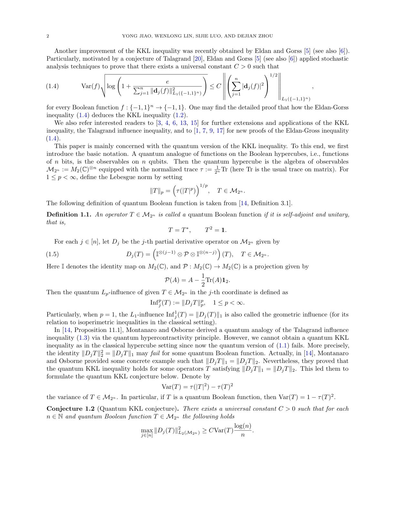 
Low-resolution page preview, page 2

📷 Fig 2

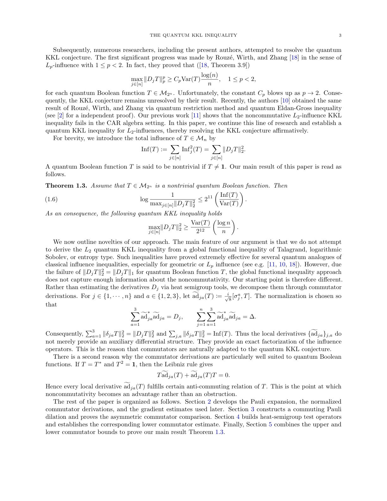 
Low-resolution page preview, page 3

📷 Fig 3

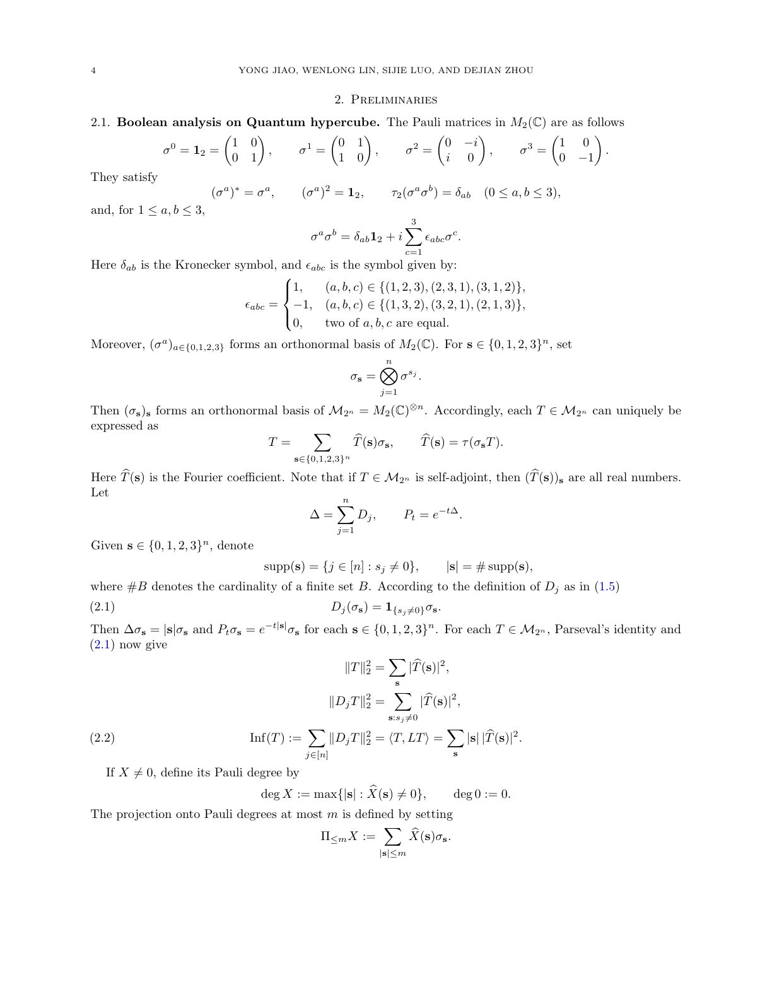 
Low-resolution page preview, page 4

📷 Fig 4

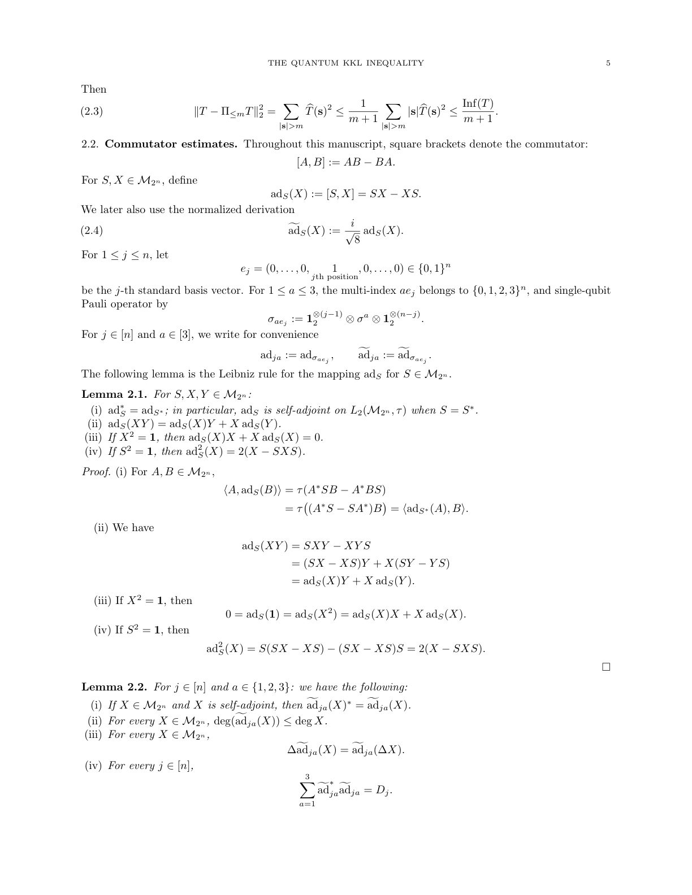 
Low-resolution page preview, page 5

📷 Fig 5

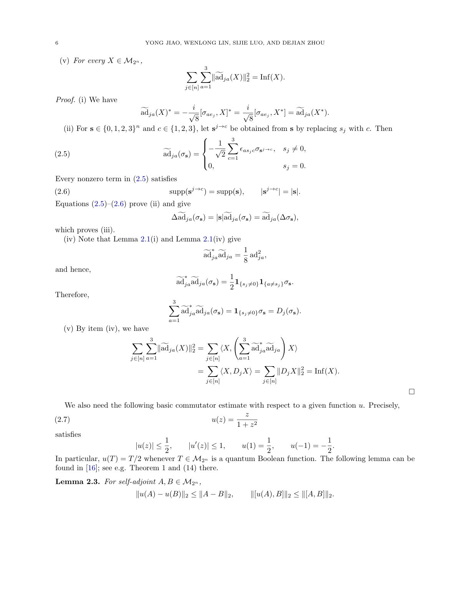 
Low-resolution page preview, page 6

**Summary.** This paper resolves the quantum KKL conjecture by providing a rigorous lower bound on the influence of quantum Boolean functions on the $n$-qubit hypercube. The authors achieve this by developing sophisticated commutator estimates and bounding the logarithm of the influence quantity. This result provides a fundamental quantitative measure of quantum correlations in high-dimensional quantum systems.

**Why it may be interesting.** The techniques used—relying on commutator estimates and functional inequalities on the hypercube—are fundamental tools for analyzing quantum correlations and complexity in quantum information theory.

Detailed structure

**Main problem.** The paper aims to resolve the quantum KKL conjecture for quantum Boolean functions defined on the $n$-qubit hypercube.

**Main result.** The authors establish a lower bound for the largest $L_2$-influence of a self-adjoint unitary operator $T$, proving the quantum KKL inequality holds.

**Method.** The proof heavily relies on deriving and bounding commutator estimates using commutator derivations and analyzing the structure of the operators via Pauli expansions.

**Model / system.** The system is the quantum hypercube, modeled by the algebra of observables $M_{2^n}$ acting on a $2^n$-dimensional Hilbert space. The key objects are self-adjoint unitary operators $T$ representing quantum Boolean functions.

**Key observables.** Total Influence ($	ext{Inf}(T)$), Variance ($	ext{Var}(T)$), and the $L_2$-influence ($\|D_j T\|_2$).

**Important parameters / regimes.** The number of qubits ($n$), and the parameters $K, d, t$ used in the commutator bounding lemmas.

**Assumptions / limitations.** The analysis assumes $T$ is a nontrivial self-adjoint unitary operator on the $n$-qubit hypercube, and the proof circumvents classical limitations by using commutator derivations.

**Paper structure.** The paper proceeds by establishing upper bounds on commutators (Chunk 2), deriving lower bounds for expected commutator norms (Chunk 3), and finally combining these results to bound $\log eta(T)$, leading to the final KKL inequality (Chunk 4).

Abstract

In this paper, we resolve the quantum KKL conjecture of Montanaro and Osborne \cite{MO2010} for quantum Boolean functions on the $n$-qubit hypercube. More precisely, for every self-adjoint unitary $T$, we bound the largest $L_2$-influence from below by a constant multiple of $\mathrm{Var}(T)\log(n)/n$. The proof heavily depends on upper and lower commutator estimates on the Hilbert space.

[↑ back to top](#top)

### [Transcript-Bound Combiners for Downgrade-Resilient Hybrid Post-Quantum Key Establishment: Definition, Proof, and Embedded-Device Cost](http://arxiv.org/abs/2609.21273v1)

**Authors:** Bhanwar Gupta, Sanjeev Rana  
**Type:** theory · **Category:** other · **PDF:** <https://arxiv.org/pdf/2609.21273v1>  
**Analysis basis:** full PDF text, analyzed in chunks

📷 Fig 1

 
Fig. 1 Transcript-bound hybrid key establishment. The combiner mixes both component secrets and the transcript hash; an active man-in-the-middle who strips the post-quantum suite changes τ, causing KI ̸= KR and forcing an abort

📷 Fig 2

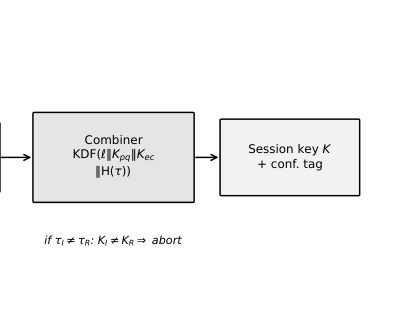 
Figure 4 reports handshake computation from the cost model of Section 7.3. The bound hybrid totals 4.43 M cycles across both parties, against 3.96 M for the plain hybrid; transcript binding adds 0.47 M cycles, or 11.8%. The hybrid handshake places 2,386 bytes on the wire (Figure 5); binding adds none. Peak stack is 6,468 bytes, dominated by ML-KEM-768 and within the Class-2 constrained-node memory budget (Table 4). The model is internally consistent: the plain-hybrid cycle count is exactly the sum of the ML-KEM-only and X25519-only handshakes, since the hybrid performs the union of their operations.

📷 Fig 3

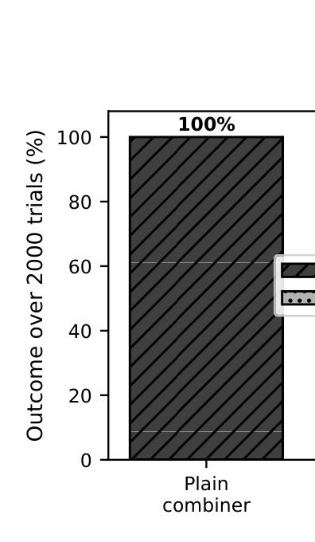 
Fig. 2 Downgrade outcome across 2,000 trials. The plain combiner is silently degraded to the classical suite in every trial; the transcript-bound combiner aborts every attempt

📷 Fig 4

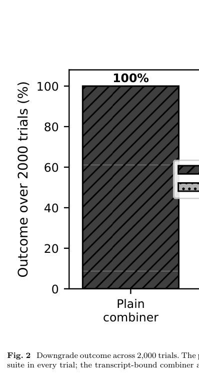 
Figure 6 separates compute from radio energy. For the bound hybrid, compute accounts for 1.83 mJ and radio for 11.45 mJ, making radio 86% of the 13.28 mJ total. Transcript binding is 11.8% of compute energy but only 1.5% of the total handshake budget. The dominant post-quantum cost on a constrained radio link is transmitting the larger ML-KEM-768 key material and ciphertext, not the binding hash. On a five-year CR2032 budget, the radio-inclusive energy supports about 80 bound-hybrid

📷 Fig 5

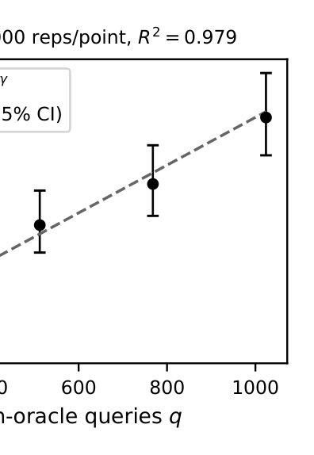 
Fig. 3 Exposed-component distinguisher with 95% confidence intervals. With one component fully broken, key-recovery success grows as q/2γ; the fitted slope tracks the analytic line (R2 = 0.98) and extrapolates below 2−190 at full parameters

**Summary.** This paper develops a cryptographic primitive, the Transcript-Bound Combiner, to secure hybrid Post-Quantum Key Establishment protocols. It solves the critical issue of downgrade attacks by cryptographically binding the session key to the entire handshake transcript. The solution is shown to be highly efficient for embedded devices while providing strong, provable security guarantees.

**Why it may be interesting.** not directly relevant

Detailed structure

**Main problem.** The paper addresses the vulnerability of standalone hybrid Post-Quantum Key Establishment (PQC) combiners to downgrade attacks because they fail to authenticate the negotiation transcript.

**Main result.** By modifying the key schedule to bind the derived session key to a hash of the entire handshake transcript, the combiner achieves local downgrade resilience, resisting active attackers who attempt to strip the post-quantum component.

**Method.** The authors propose a game-based definition of downgrade resilience and provide a two-sided separation proof showing that transcript binding prevents downgrade attacks with negligible probability.

**Model / system.** The model is a cryptographic key schedule combiner that merges a post-quantum KEM (like ML-KEM) with a classical Diffie-Hellman primitive within a hybrid key establishment framework.

**Key observables.** The derived session key ($K$) and the integrity of the negotiation transcript ($	au$).

**Important parameters / regimes.** The computational overhead of transcript binding is quantified as adding about 11.8% to handshake computation but only 1.5% to radio-inclusive energy on Cortex-M4 devices.

**Assumptions / limitations.** The security analysis relies on the random-oracle model, and the cost model is calibrated using specific Cortex-M4 measurements.

**Figures summary.** Figure D1 shows that the overhead of transcript-binding remains stable (near 12%) regardless of the number of advertised cryptographic suites.

**Paper structure.** The paper defines the problem, proposes the transcript-bound key schedule (Equation 2), proves the two-sided separation theorem, and analyzes the concrete implementation cost using a calibrated model.

Abstract

Hybrid key establishment runs a post-quantum key-encapsulation mechanism (KEM) alongside a classical Diffie-Hellman primitive, so that the session key stays secure while either component resists attack. This design is now standardized in the Transport Layer Security protocol, Secure Shell, and the Internet Key Exchange, with the standardized module-lattice KEM (ML-KEM) as the post-quantum component. A hybrid KEM secures the derived key, but not the integrity of the negotiation that selects which primitives are used. Full protocols authenticate that negotiation through a handshake transcript; a hybrid KEM deployed as a standalone drop-in primitive, or inside a minimal handshake without transcript authentication, inherits no such guarantee, and an active attacker can strip the post-quantum option. We ask what the key schedule alone must contain to make downgrade resilience a local property of the combiner. We give a game-based definition at the combiner layer and prove a two-sided separation: a combiner that ignores the transcript is downgraded with certainty, whereas one that binds the session key and the confirmation tag to a hash of the transcript blocks every such attempt, up to a term negligible for a 256-bit transcript hash. We also give an explicit strongest-link security bound. Using a calibrated cost model composed from published Cortex-M4 measurements, transcript binding adds one hash per party - about 11.8% of handshake computation but only 1.5% of radio-inclusive energy - and adds no messages or bytes on the wire. Every reported number is produced by a released harness that passes a 30-check validation gate.

[↑ back to top](#top)

### [Unconditional quantum advantage from a two-round CHSH problem in one dimension](http://arxiv.org/abs/2609.21237v1)

**Authors:** Yonghae Lee, Jeonghyeon Shin, Soojoon Lee  
**Type:** theory · **Category:** quantum information and computing · **PDF:** <https://arxiv.org/pdf/2609.21237v1>  
**Analysis basis:** full PDF text, analyzed in chunks

📷 Fig 1

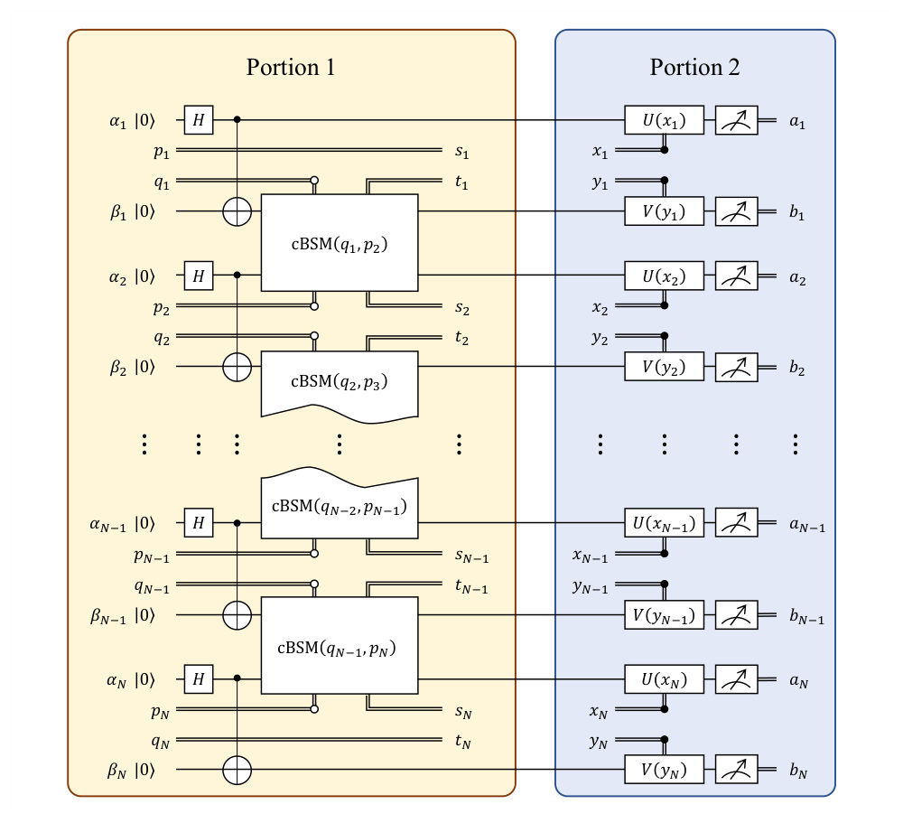 
FIG. 1. Quantum circuit for the 2R1D-CHSH problem. The first portion (left shaded area) receives the input pair (p[j], q[k]) of the first round, distributes entanglement between the selected positions, and generates the output pair (s, t). The second portion (right shaded area) receives the input pair (x, y) of the second round and generates the output pair (a, b) by implementing the CHSH measurements. An open control circle indicates that the corresponding operation is selected when the classical control bit is 0. In particular, cBSM(qi, pi+1) acts when both qi and pi+1 are 0. Each cBSM box includes the selected change to the Bell basis, the computational basis measurements, and the resets...

**Summary.** This paper constructs a specific quantum game, the two-round 1D CHSH problem, to demonstrate an unconditional quantum advantage. It shows that a shallow quantum circuit can solve this problem optimally, while any classical circuit attempting to match this performance must exhibit super-polynomial circuit depth. This highlights that quantum advantage does not require perfect success probability or complex connectivity.

**Why it may be interesting.** It provides a concrete, physically realizable example demonstrating quantum advantage using only local interactions (1D geometry) and shallow circuits, which is highly relevant for near-term quantum hardware.

Detailed structure

**Main problem.** The paper establishes an unconditional quantum advantage by analyzing a relation problem derived from the two-round CHSH game in one dimension (2R1D-CHSH).

**Main result.** It proves that the quantum circuit, restricted to a shallow depth and one dimension, achieves the optimal CHSH success probability, while any classical circuit achieving a comparable success probability requires super-polynomial depth ($\Omega(\log N)$).

**Method.** The analysis compares the quantum success probability against the average success probability of randomized classical circuits, using techniques involving circuit depth bounding and temporal separation of inputs.

**Model / system.** The model is the 2R1D-CHSH problem, implemented on a quantum circuit of $2N$ qubits using only adjacent two-qubit gates with a depth of at most eight.

**Key observables.** Quantum success probability ($\omega_q(	ext{CHSH}) = (2+\sqrt{2})/4$) and the required depth of the classical circuit ($\Omega(\log N)$).

**Important parameters / regimes.** The separation holds for any fixed $0 \le \delta < (\sqrt{2}-1)/4$. The size parameter is $N$.

**Assumptions / limitations.** The quantum circuit is restricted to a one-dimensional geometry, and the classical circuit is assumed to have fixed wiring and bounded gate fan-in.

**Figures summary.** Not specified in the notes.

**Paper structure.** The paper defines the CHSH game and its generalization, formally defines the 2R1D-CHSH problem, constructs the shallow quantum circuit, bounds the classical performance, and finally combines these results to prove the depth separation.

Abstract

We introduce a relation problem constructed from the Clauser--Horne--Shimony--Holt (CHSH) game, which we call the two-round one-dimensional CHSH problem. Its two-round structure ensures that the CHSH questions are supplied only after the relevant Pauli-frame data have been fixed, thereby ruling out a simple classical strategy that solves the corresponding problem perfectly when all inputs are supplied simultaneously. We construct a quantum circuit on $2N$ qubits that uses only adjacent two-qubit gates, has operational depth at most eight, and achieves the optimal quantum success probability of CHSH, which is strictly smaller than one. We prove that, for every fixed $0\leqδ<(\sqrt{2}-1)/4$, any randomized classical circuit with fixed wiring and bounded gate fan-in that achieves an average success probability of at least $(2+\sqrt{2})/4-δ$ requires depth $Ω(\log N)$ after the questions of the second round are supplied. This yields an unconditional separation even though the quantum circuit is restricted to a one-dimensional geometry, whereas the classical circuit has no geometric locality restriction. The result shows that perfect quantum success is not necessary for unconditional quantum advantage with shallow circuits.

[↑ back to top](#top)

### [Weighted Berry curvature and global geometry of mixed quantum states](http://arxiv.org/abs/2609.21355v1)

**Authors:** Dominik Kuczyński, Erik Sjöqvist  
**Type:** theory · **Category:** other · **PDF:** <https://arxiv.org/pdf/2609.21355v1>  
**Analysis basis:** full PDF text, analyzed in chunks

📷 Fig 1

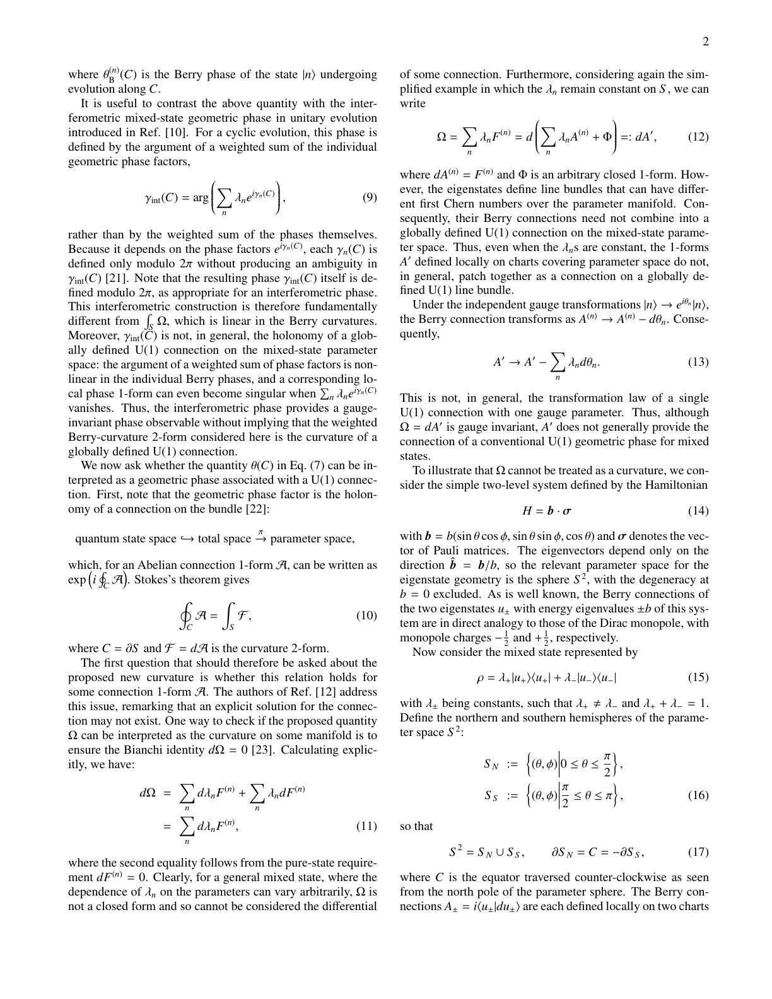 
Low-resolution page preview, page 2

📷 Fig 2

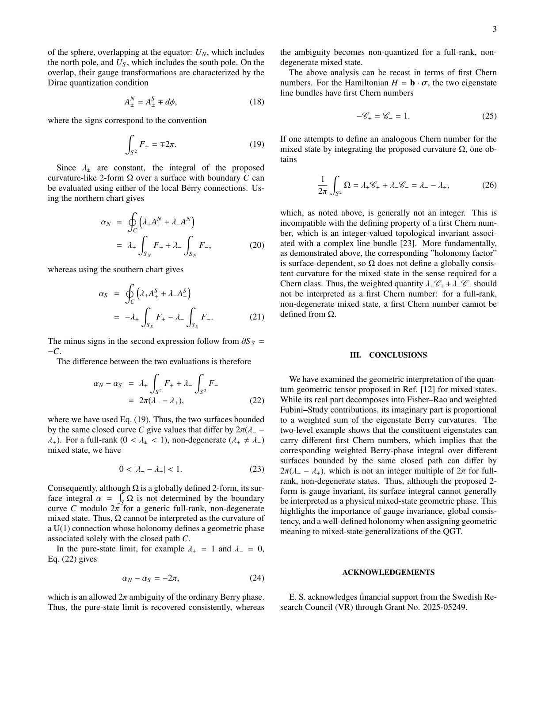 
Low-resolution page preview, page 3

📷 Fig 3

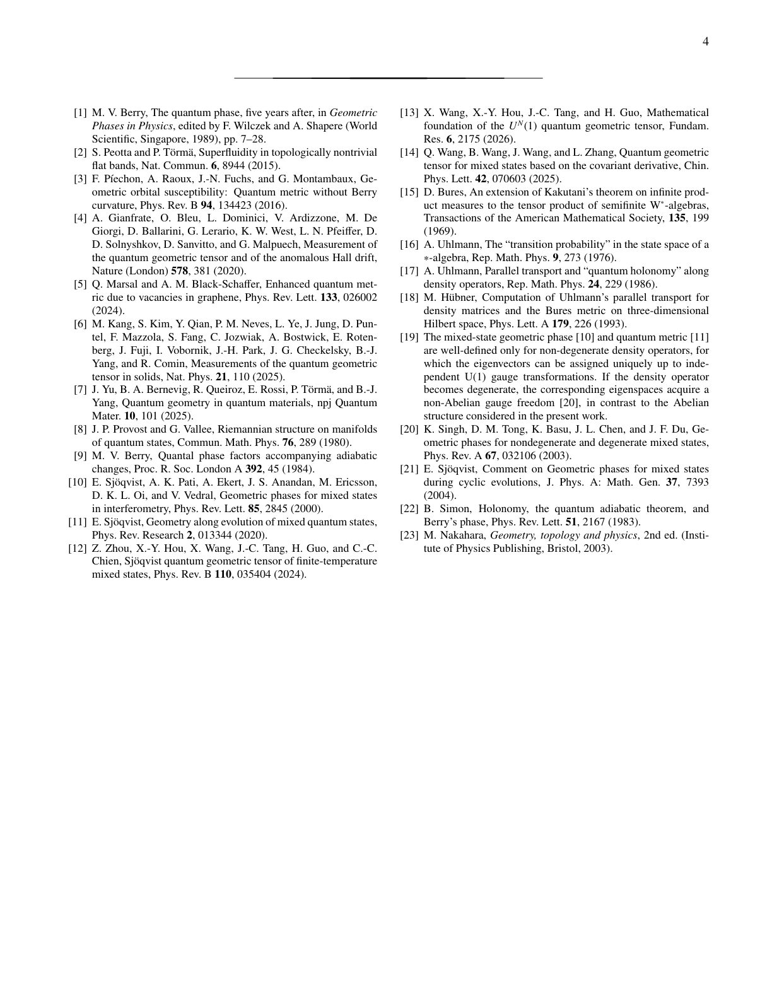 
Low-resolution page preview, page 4

**Summary.** This paper rigorously examines the geometric properties of the Quantum Geometric Tensor for mixed quantum states. The authors demonstrate that the imaginary part of this tensor fails to define a globally consistent curvature, as its surface integral is path-dependent and not quantized. This implies that the concept of a topological invariant, like a Chern number, cannot be straightforwardly assigned to the mixed-state geometric phase using this tensor.

**Why it may be interesting.** This work directly addresses the topological aspects of quantum geometry for mixed states, which is crucial for understanding decoherence and geometric phases in open quantum systems, linking fundamental geometry to physical observables.

Detailed structure

**Main problem.** The paper investigates the geometric interpretation of the imaginary part of the Quantum Geometric Tensor (QGT) for mixed quantum states, specifically questioning if it corresponds to a well-defined curvature for a global U(1) line bundle.

**Main result.** The imaginary part of the QGT is generally not a closed form, and its surface integral is found to be surface-dependent and not quantized in integer multiples of $2\pi$, thus failing to define a first Chern number for mixed states.

**Method.** The authors employ mathematical analysis, comparing the proposed weighted curvature integral with the Stokes' theorem relation, and use an explicit two-level system model to test the quantization condition.

**Model / system.** The analysis focuses on mixed quantum states described by a density operator $
ho$, using a two-level system Hamiltonian $H = \mathbf{b} \cdot \sigma$ whose parameters vary over a parameter space (like $S^2$).

**Key observables.** Quantum Geometric Tensor (QGT), its imaginary part $\Omega$, and the resulting surface integral $rac{1}{2\pi} \oint_S \Omega$.

**Important parameters / regimes.** The eigenvalues $\lambda_n$ of the density operator, and the path/surface $C$ and $S$ used for integration.

**Assumptions / limitations.** The analysis assumes the existence of a connection whose curvature should yield a topological invariant (like a Chern number), which is tested against the mixed-state QGT.

**Paper structure.** The paper first introduces the QGT for mixed states, then analyzes the mathematical closure condition ($d\Omega=0$) for the imaginary part $\Omega$. It proceeds to test this condition using a two-level system example, comparing surface integrals over different charts to demonstrate the lack of path/surface independence required for a topological invariant.

Abstract

We examine the geometric interpretation of the quantum geometric tensor proposed in [Phys. Rev. B {\bf 110}, 035404 (2024)] for mixed quantum states, focusing on its imaginary part, which is proportional to a weighted sum of the Berry curvatures of the eigenstates of the density operator. While the real part naturally decomposes into Fisher--Rao and weighted Fubini--Study contributions, we show that the imaginary part does not, in general, coincide with the curvature of a connection on a globally defined U(1) line bundle whose holonomy yields a mixed-state geometric phase. Using a two-level system as an explicit example, we demonstrate that its surface integral depends on the choice of surface bounded by the same closed path, with ambiguities that are not integer multiples of $2π$.

[↑ back to top](#top)

### [Weighted Quantum Signal Processing: Low-Depth Polynomial Approximation with Applications to Kolmogorov-Arnold Networks](http://arxiv.org/abs/2609.21567v1)

**Authors:** Rohit Sarma Sarkar, Rupayan Bhattacharjee, Elias F. Combarro, Michele Grossi, Lirandë Pira, Carmen G. Almudéver, Sergi Abadal, Eduard Alarcon  
**Type:** theory · **Category:** quantum information and computing · **PDF:** <https://arxiv.org/pdf/2609.21567v1>  
**Analysis basis:** full PDF text, analyzed in chunks

📷 Fig 1

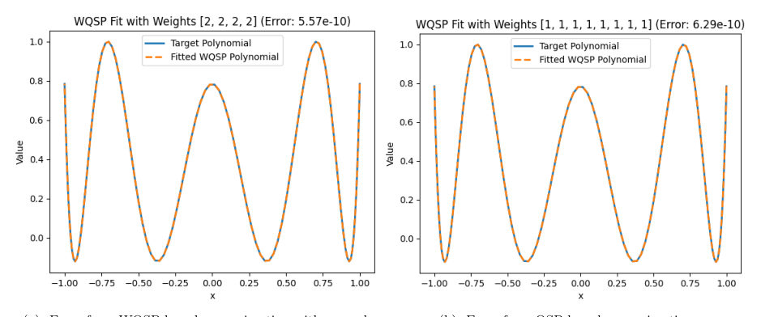 
Figure 1. WQSP fitting of a real 8 degree target polynomial P(x) = c1T0 + c2T4 + c3T8 with weight partition (2, 2, 2, 2) and whose coefficients are randomly generated. The WQSP fitting in 1a is compared with the standard QSP fitting as depicted 1b.

📷 Fig 2

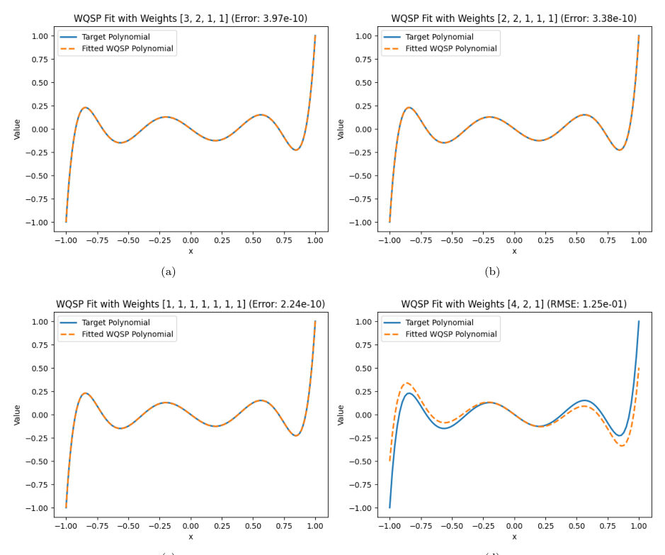 
Figure 2. WQSP fitting of a real 7 degree target polynomial (fixed odd parity) with different weight partitions whose coefficients are randomly generated. In 2a and 2b the weight partitions are respectively (3, 2, 1, 1) and (2, 2, 1, 1, 1) whose weight vector lengths are greater than or equal to the coefficient vector length and thus the necessary degrees of freedom are achieved. For 2c, we have the QSP case which produces an error of a similar order compared to 2a and 2b. In 2d, we see that the weight vector length is less than the coefficient vector length and thus such a setup doesn’t cross the degrees of freedom which incurs a higher error.

📷 Fig 3

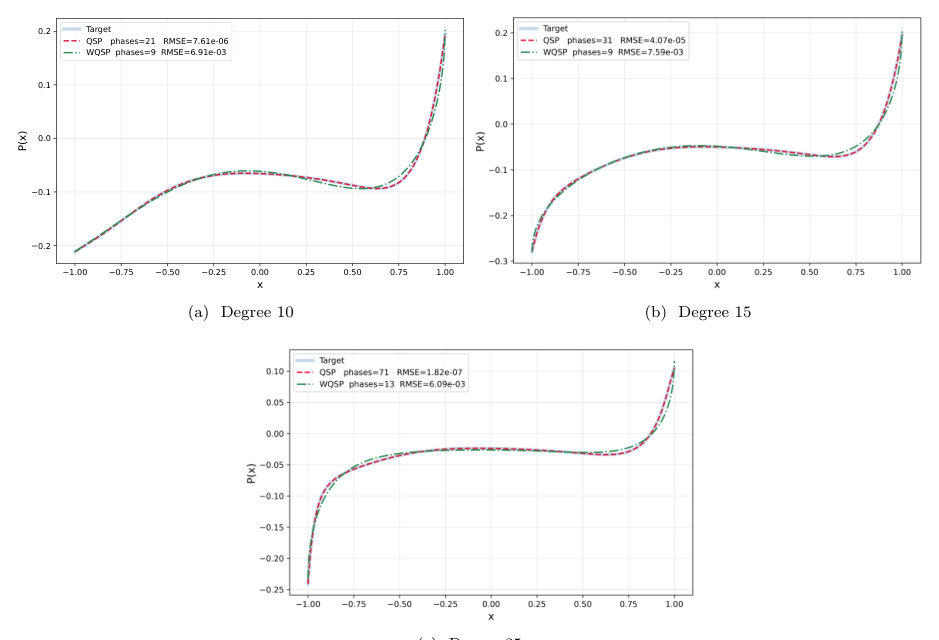 
Figure 3. WQSP fitting results for random real polynomials of degrees 10, 15 and 35 whose Chebyshev coefficients were independently sampled respectively from the uniform distribution U[−1/11, 1/11], U[−1/16, 1/16] and U[−1/36, 1/36]. For both QSP and WQSP, the polynomial was first broken into odd and even components and the corresponding approx- imation errors were added up. The weight vectors for WQSP are chosen for degree 10 : [2, 2, 2, 4](even part),[1, 2, 2, 4] (odd part). For degree 15 : [1, 2, 4, 8](odd part), [1, 1, 4, 8] (even part). For degree 35 : [1, 2, 2, 2, 4, 8, 16](odd part), [2, 2, 2, 4, 8, 16](even part).

📷 Fig 4

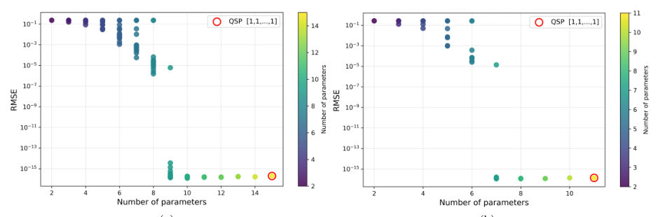 
Figure 4. WQSP fitting error across all partitions for a real degree-14 (4a) and degree-10 (4b) polynomial. Polynomial coefficients were generated by uniformly sampling from [−1/8, 1/8] and [−1/6, 1/6], respectively, and approximated using WQSP. Phase parameters were optimized using the Levenberg–Marquardt method with 20 random restarts, and the solution achieving the lowest approximation error was reported.

📷 Fig 5

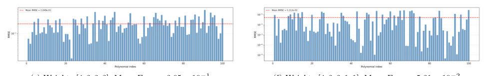 
Figure 5. Illustration of approximating real degree 10 polynomials using learning based WQSP under different par- titions of 10. A total of 100 random polynomials were generated by sampling Chebyshev coefficients uniformly from [−1/11, 1/11]. For each polynomial and partition, phase optimization was performed using the Levenberg–Marquardt method with 20 random restarts, and the minimum approximation error was retained. Each subfigure is labeled by the corresponding partition, with the first subfigure representing standard QSP.

**Summary.** This paper introduces Weighted Quantum Signal Processing (WQSP) as an advanced quantum framework to overcome the parameter and depth limitations of standard QSP for polynomial approximation. By strategically weighting the quantum circuit layers, WQSP achieves significant parameter compression while maintaining high approximation fidelity. This efficient method is successfully applied to create quantum-enhanced, parameter-efficient activation functions for Kolmogorov–Arnold Networks.

**Why it may be interesting.** While focused on polynomial approximation, the development of WQSP represents a novel, structured quantum circuit primitive that could be adapted to encode complex Hamiltonians or quantum state preparation protocols in quantum simulation or quantum machine learning algorithms.

Detailed structure

**Main problem.** Standard Quantum Signal Processing (QSP) is limited by circuit depth and parity constraints when approximating high-degree polynomials. The goal is to develop a more efficient quantum framework for this task.

**Main result.** Weighted Quantum Signal Processing (WQSP) provides a compact, flexible, and parameter-efficient alternative to QSP, achieving comparable approximation quality with significantly fewer trainable parameters and shallower circuits.

**Method.** The authors introduce WQSP, an extension of QSP that incorporates a weight function into the central rotation operator, allowing for structured control over the circuit's expressivity.

**Model / system.** The work is based on quantum circuits used for polynomial approximation, specifically applied to parameterizing learnable activation functions within Kolmogorov–Arnold Networks (KANs).

**Key observables.** Approximation error (RMSE), number of trainable parameters, and circuit depth.

**Important parameters / regimes.** The choice of integer weights ($w_j$) is crucial, as it dictates the parameter reduction, achieving exponential reductions in parameters for polynomial realization.

**Assumptions / limitations.** The analysis often assumes the target function can be decomposed into even and odd parts for parity constraints, and the initial focus is on real-valued functions.

**Figures summary.** Figures compare the Root Mean Square Error (RMSE) versus the number of parameters for WQSP-KANs versus QSP-KANs, demonstrating WQSP's superior parameter efficiency while maintaining accuracy.

**Paper structure.** The paper builds from the limitations of QSP, introduces WQSP as an improvement, analyzes its performance in the integer weight regime, and culminates in applying the framework to parameterize KANs for multivariate function approximation.

Abstract

Quantum Signal Processing is a powerful quantum framework for generating and approximating univariate polynomials. However, QSP is often limited by circuit-depth bottlenecks and parity constraints on the class of realizable polynomials. In this work, we introduce Weighted Quantum Signal Processing, an extension of QSP in which a weight function is assigned to the central rotation operator. This formulation provides a deeper understanding of QSP, which emerges as the special case of WQSP with unit weights. The choice of weights determines the structure and expressive capabilities of WQSP circuits. When the weights are natural numbers greater than one, WQSP reduces to a pruned version of QSP, revealing parameter redundancies in the standard framework. Through appropriate selection of integer weights, WQSP achieves linear-to-exponential reductions in the number of parameters required to realize arbitrary bounded univariate polynomials while preserving approximation quality. For generic weights, we establish corresponding approximation error bounds and show that, in many cases, the approximation is exact. We analyze WQSP from both a deterministic perspective, where polynomial generation is formulated as the solution of a linear system, and a quantum machine learning perspective, where WQSP serves as a structured and expressive quantum learning model. We further employ this learning framework to parameterize learnable activation functions in Kolmogorov--Arnold Networks for multivariate function approximation. Our results show that WQSP provides a compact, flexible, and theoretically grounded framework for realizing arbitrary univariate polynomials while requiring significantly fewer trainable parameters than conventional QSP. This yields expressive and parameter-efficient neural architectures, highlighting the potential of WQSP as a scalable primitive for quantum-enhanced machine learning.

[↑ back to top](#top)

## Secondary cond-mat archives

*Papers from  mes-hall, other, soft, supr-con. These archives are de-prioritized — they appear at the end regardless of relevance score.*

### Relevant in secondary archives (14)

### [Singular high-harmonic transport above a quantum threshold](http://arxiv.org/abs/2609.20990v1)

**Authors:** Yugo Onishi, Su-Yang Xu, Liang Fu  
**Type:** theory · **Category:** other · **PDF:** <https://arxiv.org/pdf/2609.20990v1>  
**Analysis basis:** full PDF text, analyzed in chunks
**Topic relevance:** 🔥 `non-equilibrium universality` **4/5** · `Keldysh / 2PI / non-Gaussian methods` **2/5** · `methods for driven-dissipative` **2/5** · `driven-dissipative phase transition` **1/5**

📷 Fig 1

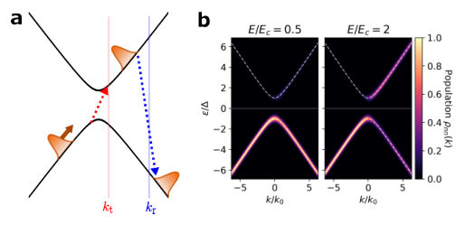 
FIG. 1. Landau-Zener tunneling and relaxation. (a) Elec- trons tunnel from the valence band to the conduction band within |k| ≲kt and relax over the scale |k| ∼kr. (b) Electron population at finite field calculated with Eq. (5); dashed lines show the band dispersion. k0 = ∆/(ℏv). The relaxation time is τ = 5.0ℏ/∆.

📷 Fig 2

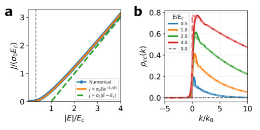 
FIG. 2. Comparison with the numerical solution of Eq. (7). (a) Current–voltage relation of the 1D massive Dirac model. The orange line shows Eq. (15); the black dashed line marks the onset field E ≈0.336Ec, defined by the peak of d2J  dE2 . (b) Conduction-band population in momentum space. Dashed lines show Eq. (14). k0 = ∆/(ℏv). Both cal- culations use τ = 5.0ℏ/∆.

📷 Fig 3

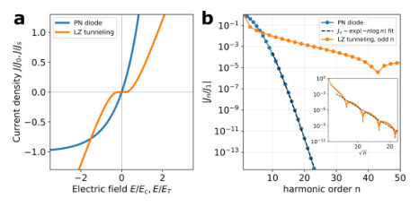 
FIG. 3. Comparison of high-harmonic transport from 1D Landau-Zener (LZ) tunneling and an ideal PN diode. (a) Current–voltage relations for the PN diode, J(E) = Js[eE/ET −1], and LZ tunneling, Eq. (15). (b) Harmonic amplitudes for E0 = 5.0 and ET = Ec = 1.0. The dashed line shows the super-exponential decay exp[−O(n log n)]; the dashed line in the inset shows the sub-exponential decay exp[−O(√n)].

📷 Fig 4

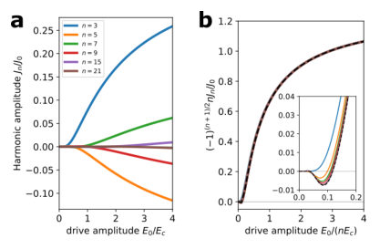 
FIG. 4. High-harmonic transport from 1D Landau-Zener tun- neling. (a) Harmonic amplitude Jn versus drive amplitude E0. (b) Rescaled amplitude (−1)(n+1)/2nJn/J0 versus E0/(nEc). The black dashed line is the scaling function f(x) in Eq. (23); the inset enlarges the small-E0/(nEc) region.

📷 Fig 5

 
Fig. 4, which agrees well with Jn at large n and relatively large E0/(nEc) ≳0.1. We note that the enhancement of the high harmonics and the scaling law originate from a current–voltage re- lation with a sharp onset behavior, and we expect that they do not depend on details of the singularity in the current–voltage relation (also see SM). Higher dimensions. — Higher-dimensional systems can be treated as families of 1D momentum-space slices. In contrast to 1D cases, the singular response survives when the full system is gapless at an isolated point, be- cause almost all slices retain a finite effective gap. For example, near the gap minimum of a 2D system, the linearized k · p Hamiltonian is

**Summary.** This theoretical work analyzes the strong-field transport in band insulators exhibiting a quantum power threshold. It shows that the resulting singular current-voltage relation generates high-harmonic radiation whose amplitude decays sub-exponentially. The authors derive universal scaling laws governing these harmonics, offering a pathway for THz generation in solids.

**Why it may be interesting.** The study of non-equilibrium, strong-field quantum transport, particularly the emergence of universal scaling laws for high harmonics, connects fundamental quantum tunneling physics to observable THz generation phenomena.

Detailed structure

**Main problem.** The paper investigates the nonperturbative, strong-field transport in band insulators, specifically characterizing the singular high-harmonic generation resulting from a quantum power threshold.

**Main result.** The current exhibits a singular DC-voltage relation due to Landau-Zener tunneling, leading to high-harmonic generation whose amplitude decays sub-exponentially with harmonic order, following a derived scaling law.

**Method.** The analysis uses the quantum master equation in the steady state, followed by Fourier analysis and the saddle-point approximation to derive asymptotic scaling laws for the harmonic components.

**Model / system.** The model is a small-gap insulator, initially treated as a 1D system governed by a massive Dirac Hamiltonian. Transport is driven by interband tunneling, characterized by a quantum power threshold $w_Q$.

**Key observables.** DC current-voltage relation $J(E)$, and the high-harmonic current amplitudes $J_n$ at frequency $n\omega$.

**Important parameters / regimes.** The quantum power threshold $w_Q = \Delta^2/\hbar$, and the characteristic field scale $E_c = \pi\Delta^2 / \hbar v e$.

**Assumptions / limitations.** Approximations include the relaxation time approximation (RTA) and the use of the saddle-point method for evaluating Fourier integrals, assuming the main contribution comes from the singularity near $E=0$.

**Figures summary.** Figures compare the calculated $J-V$ relation to numerical solutions, contrast the sub-exponential decay of harmonics from singular transport against super-exponential decay from analytic models, and illustrate the collapse of harmonic amplitudes onto a universal scaling function.

**Paper structure.** The paper builds from establishing the singular DC current-voltage relation via Landau-Zener tunneling in a 1D model, then extends this to AC transport by analyzing the Fourier components, deriving universal scaling laws, and comparing these results to other transport regimes.

Abstract

We show that Landau-Zener tunneling in a small-gap insulator produces a singular DC current--voltage relation, and correspondingly, strong high-harmonic generation in AC transport. Remarkably, high-harmonic responses decrease subexponentially with harmonic order, which is parametrically slower than in ordinary conductors and PN diodes. We further derive a scaling law for the current amplitude at frequency $nω$ produced by the applied electric field $E$ at fundamental frequency $ω$. Our work offers a promising route to THz generation based on frequency multiplication in solids.

[↑ back to top](#top)

### [Topological Optical Frequency Combs](http://arxiv.org/abs/2609.21375v1)

**Authors:** Rujiang Li, Wenfu Zhang  
**Type:** theory · **Category:** other · **PDF:** <https://arxiv.org/pdf/2609.21375v1>  
**Analysis basis:** full PDF text, analyzed in chunks
**Topic relevance:** `analog quantum simulation` **3/5** · `driven-dissipative phase transition` **3/5** · `interference shaping light` **3/5** · `Keldysh / 2PI / non-Gaussian methods` **1/5** · `methods for driven-dissipative` **1/5** · `non-equilibrium universality` **1/5**

📷 Fig 1

 
FIG. 1. Roadmap of topological optical frequency combs (OFCs). In the early stages, OFCs were realized using mode-locked lasers. Then the advent of high-quality factor (Q) optical microresonators led to the emergence of microresonator-based OFCs, known as microcombs. Recently, topological photonics, rooted in the introduction of topological phases into photonics, has converged with OFCs, resulting in the emergence of topological OFCs. Future development directions for topological OFCs may include exploring novel nonlinear dynamics, incorporating various types of topological phases, and discovering emerging applications. The inset beneath the “Microcombs” guidepost depicts a typical...

**Summary.** This perspective reviews the evolution of optical frequency combs, detailing the shift from bulk lasers to integrated microresonators. It emphasizes the breakthrough concept of Topological OFCs, which utilize arrays of coupled resonators to generate nested combs protected by topological edge states. This advances the field toward more robust and scalable photonic light sources.

**Why it may be interesting.** This work sits at the intersection of quantum optics and condensed matter physics, specifically bridging nonlinear wave dynamics (solitons) with topological protection, which is highly relevant for developing robust quantum light sources.

Detailed structure

**Main problem.** The paper addresses the development of advanced, miniaturized light sources by exploring the generation of Topological Optical Frequency Combs (T-OFCs). It seeks to advance OFC technology beyond conventional microresonators by incorporating topological photonics principles.

**Main result.** The key result is the theoretical and experimental demonstration of T-OFCs generated in arrays of coupled microresonators, which exhibit nested spectral structures due to topological edge states.

**Method.** The work combines nonlinear wave physics (soliton dynamics, Kerr nonlinearity) with topological concepts (topological invariants, edge states) in integrated photonic platforms.

**Model / system.** The physical systems include arrays of coupled microresonators (e.g., SiN, LiNbO3) engineered to mimic topological structures, allowing light propagation in robust edge channels.

**Key observables.** Nested spectral comb structure, unidirectional photonic modes, and the existence of topologically protected edge states.

**Important parameters / regimes.** High-Q factor, Kerr nonlinearity ($\chi^{(3)}$), array coupling strength, and topological invariants.

**Assumptions / limitations.** The primary assumption is that coupling resonators into arrays can induce topological phases, and that nonlinear effects (solitons) can manifest within these topologically protected edge states.

**Figures summary.** Figure 1 illustrates the technological roadmap: progressing from bulky mode-locked lasers to single-resonator microcombs, culminating in the array-based topological OFCs.

**Paper structure.** The paper provides a historical perspective on OFCs, detailing the evolution from early lasers to microcombs, and then focusing heavily on the theoretical framework and recent experimental breakthroughs involving topological photonics to realize T-OFCs.

Abstract

Optical frequency combs (OFCs) are revolutionary light sources characterized by discrete and equally spaced spectral lines, and they have found widespread applications in metrology, spectroscopy, and communications. In the early stages, OFCs were realized using mode-locked lasers. With advancements in the fabrication of high-quality factor ($Q$) microresonators and the increasing demand for miniaturized and integrable photonic chips, microresonator-based OFCs, commonly referred to as microcombs, have been developed. Although early studies of microcombs primarily focused on single microresonators or a few resonators, a significant breakthrough occurred in 2021 when it was theoretically predicted that light propagating in the topological edge channel of an array of ring resonators could generate nested frequency combs known as topological OFCs. Since then, the field of topological OFCs has progressed rapidly, with experimental observations made in 2024. This Perspective will introduce the history of OFCs, placing particular emphasis on the emergence and development of topological OFCs, as well as exploring the research challenges and opportunities associated with them.

[↑ back to top](#top)

### [Defect-mediated orientational ordering in stripe-forming magnetic systems](http://arxiv.org/abs/2609.21091v1)

**Authors:** Premarun Barik, Johan van Lierop, Robert L. Stamps  
**Type:** theory · **Category:** statistical mechanics · **PDF:** <https://arxiv.org/pdf/2609.21091v1>  
**Analysis basis:** full PDF text, analyzed in chunks
**Topic relevance:** `non-equilibrium universality` **3/5** · `methods for driven-dissipative` **2/5** · `analog quantum simulation` **1/5**

📷 Fig 1

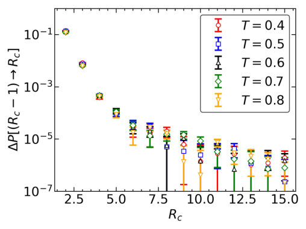 
FIG. 1. Convergence with dipolar-interaction cutoff. Change in the single-spin transition probability, ∆P = P(Rc) − P(Rc + 1), when the dipolar cutoff is increased by one lattice spacing. Results are averaged over 1000 independent config- urations and are shown for several temperatures. The mag- nitude of ∆P decreases rapidly with Rc and is of order 10−5

📷 Fig 2

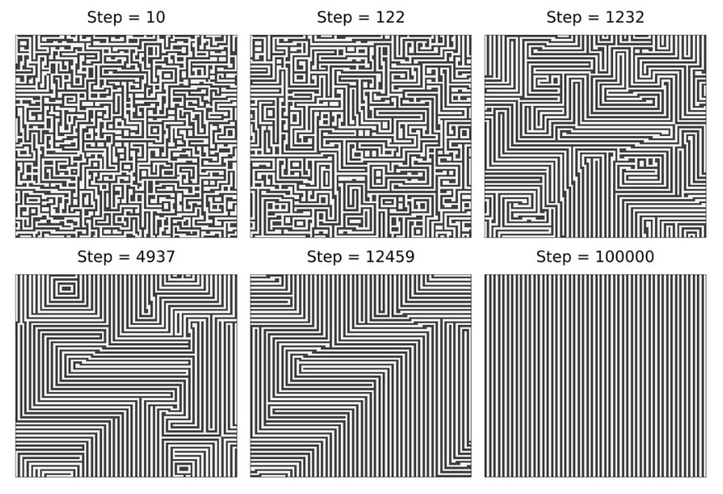 
FIG. 2. Representative snapshots of stripe evolution following a quench from a random configuration to T = 0.5. Local horizontal and vertical stripe regions grow with time, eventually producing a globally ordered stripe state. Snapshots are shown at t=10, 122, 1232, 4937, 12459, and 100000 Monte Carlo steps.

📷 Fig 3

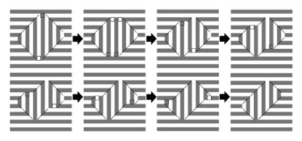 
FIG. 4. A schematic illustration of T-junction motion lead- ing to the shrinkage of a vertical diamond-shaped super- domain. The small boxes indicate regions where spin flips are most probable, resulting in successive displacement of the T-junctions and reduction of the super-domain area. Black lines are included as guides to the eye to identify the super- domain boundary.

📷 Fig 4

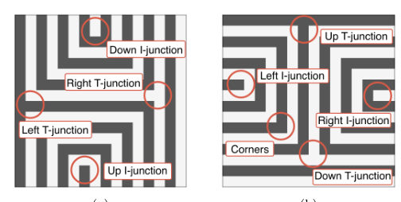 
FIG. 3. Schematic illustration of the different defect types associated with orientational super-domains. (a) Horizontal super-domain embedded in a vertical-stripe background. The boundary contains left and right T-junctions together with up and down I-junctions. (b) Vertical super-domain embedded in a horizontal-stripe background. In this case, the boundary contains up and down T-junctions together with left and right I-junctions. Representative corners along the super-domain boundary are also indicated.

📷 Fig 5

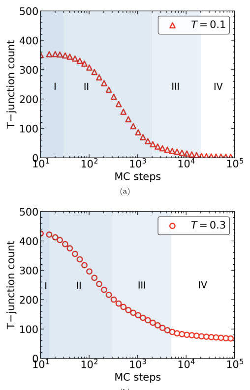 
FIG. 6. Evolution of the T-junction count with Monte Carlo steps for L = 100 and δ = 1.1 at (a) T = 0.1 and (b) T = 0.3. The shaded regions, labelled I–IV, indicate four successive stages of the evolution. In regime I, the T-junction population increases as locally formed horizontal and vertical stripes or- ganize into orientational super-domains. In regime II, the T- junction count decreases as the super-domains reorganize and grow through the motion and elimination of their boundary defects. Regime III corresponds to the single-super-domain stage, where one stripe orientation occupies most of the sys- tem, and the rate of T-junction elimination decreases as only a small number of residual...

**Summary.** This work develops a microscopic theory for how stripe-forming magnetic systems achieve global orientational order after a sudden quench. It demonstrates that this ordering process is governed by the dynamics of topological defects, particularly T-junctions, which move and eliminate over time. The key finding is the quantitative link between tracking these defects in real space and observing corresponding changes in the system's structure factor in reciprocal space.

**Why it may be interesting.** The connection drawn between the dynamics of topological defects (T-junctions) in real space and the measurable signatures in the structure factor (reciprocal space) provides a powerful, generalizable diagnostic tool for studying non-equilibrium ordering in complex many-body systems.

Detailed structure

**Main problem.** The paper investigates the non-equilibrium process by which a two-dimensional stripe-forming magnetic system develops global orientational order following a quench.

**Main result.** Global order is shown to be mediated by the motion and elimination of topological defects, specifically T-junctions, which provides a microscopic, defect-based description of the ordering process.

**Method.** The study uses Monte Carlo simulations to track the real-space evolution of spin configurations and compares these defect dynamics to signatures observed in the structure factor in reciprocal space.

**Model / system.** The system is a 2D stripe-forming magnetic model described by an Ising Hamiltonian incorporating nearest-neighbor exchange and long-range dipolar interactions. The evolution is studied by quenching the system into the stripe-ordered regime.

**Key observables.** T-junctions, corners, I-junctions (defects), the T-junction population dynamics, and the structure factor in reciprocal space.

**Important parameters / regimes.** Temperature (T), relative strength of interactions (delta), and system size. The dynamics are characterized by distinct regimes (formation, growth, equilibration).

**Assumptions / limitations.** The dipolar interaction is approximated using a finite cut-off radius (Rc), and the analysis relies on comparing real-space defect elimination rates with reciprocal-space structure factor changes.

**Figures summary.** Figures illustrate stripe pattern evolution after a quench, showing defect formation and subsequent elimination leading to global order. Another figure compares defect elimination rates measured in real space versus reciprocal space.

**Paper structure.** The paper establishes the physical model, details the simulation methodology (quenching, defect tracking), analyzes the time evolution through distinct dynamical regimes based on defect counts, and finally confirms the microscopic mechanism by showing the correspondence between real-space defect decay and reciprocal-space structure factor sharpening.

Abstract

We investigate the nonequilibrium development of orientational order in a two-dimensional stripe-forming magnetic system with competing interactions. Following a quench into the stripe-ordered regime, horizontal and vertical stripes organize into orientational regions(super-domains) separated by characteristic defects. We show that the evolution towards a globally oriented stripe state is mediated by the motion and elimination of these defects, with T-junctions providing a direct microscopic measure of super-domain reorganization. The T-junction population reveals distinct dynamical regimes associated with super-domain formation, growth, and equilibration. Temperature, system size, and equilibrium stripe width modify the characteristic time scales of this evolution, while thermal fluctuations produce a finite defect population at higher temperatures. We further show that the defect dynamics observed in real space are reflected in the structure factor, providing a reciprocal-space signature of defect elimination. These results establish a microscopic defect-based description of orientational ordering in stripe-forming magnetic systems.

[↑ back to top](#top)

### [Collective excitation-mediated transport in nanoscale Josephson junctions that exhibit quantum confinement](http://arxiv.org/abs/2609.21725v1)

**Authors:** Zhengyuan Liu, Sebastian Scherb, Werner M. J. van Weerdenburg, Daniel Wegner, Nadine Hauptmann, Alexander A. Khajetoorians  
**Type:** experiment · **Category:** other · **PDF:** <https://arxiv.org/pdf/2609.21725v1>  
**Analysis basis:** full PDF text, analyzed in chunks
**Topic relevance:** `correlated / nonlocal dissipation` **3/5** · `Keldysh / 2PI / non-Gaussian methods` **1/5**

📷 Fig 1

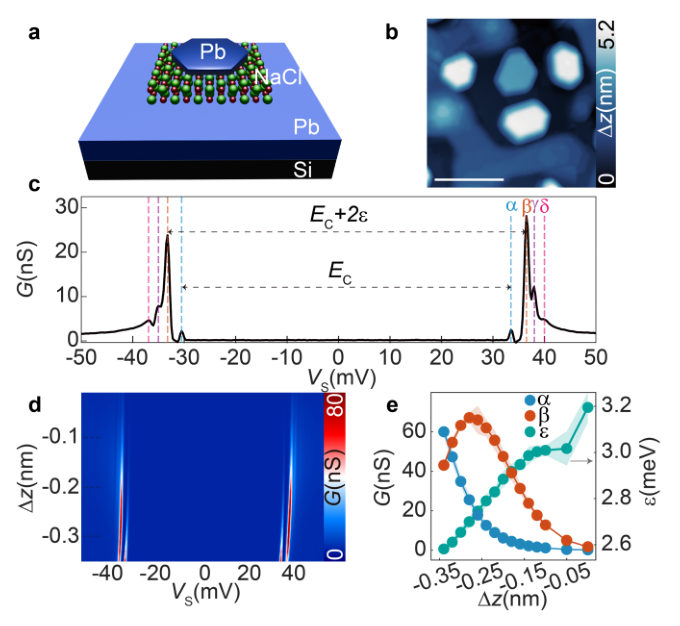 
Figure 1. Coulomb blockade and collective excitations in Pb/NaCl/Pb stack. a Schematic of the Pb/NaCl/Pb stack grown on Si(111). b STM image showing four stacks with overlayer of thickness that ranges from 11 ML to 17 ML (VS = 2 V, It = 20 pA, scale bar is 10 nm). c Point dI/dV spectra taken on top of a typical stack with a 15 ML overlayer (VS = 50 mV, It = 165 pA, Vmod = 500 𝜇V). d Point dI/dV spectra taken on the same stack as in c at different tip-sample separation (∆z). ∆z = 0 refers to stabilization at VS = 150 mV, It = 200 pA. e Intensity of peak 𝛼 and 𝛽 and collective excitation energy 𝜀 as a function of ∆z. Error bars in e obtained from Gaussian fitting of each peak and indicated by...

📷 Fig 2

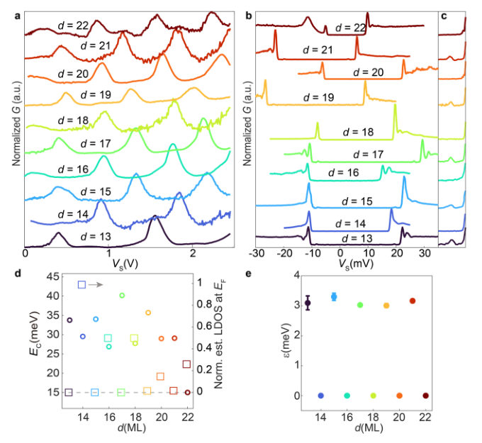 
Figure 2. Quantum oscillations of Coulomb gap and the collective excitation. a Normalized point dI/dV spectra taken on stacks with overlayer thickness ranges from 13 ML to 22 ML (VS = 2.5 V, It = 200 pA, Vmod = 10 mV). b Normalized point dI/dV spectra taken on the same stacks as in a. (VS = 30 mV, It = 200 pA, Vmod = 500 V). c Zoomed-in spectra for better view of the inelastic excitation peaks. d Coulomb gap (EC) and normalized estimated-LDOS at the Fermi energy as a function of overlayer thickness. e Collective excitation energy 𝜀 as a function of overlayer thickness.

📷 Fig 3

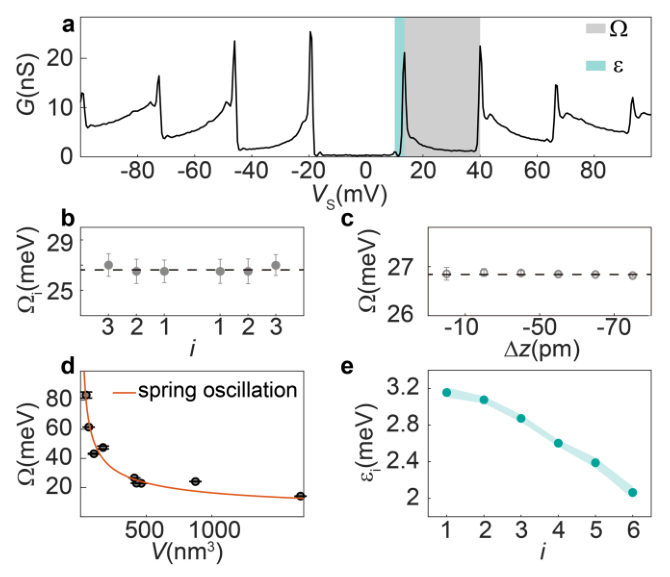 
Figure 3. Mechanical motion of the overlayer and its coupling to the collective excitation. a Typical point dI/dV spectroscopy taken on top of a stack with a 17 ML overlayer (VS = 100 mV, It = 600 pA, Vmod = 200 𝜇V). Shaded regions indicate the energies for collective excitations and phonon excitations respectively. b Phonon energy Ω for different harmonic order. c Phonon energy Ω as a function of ∆z. d Phonon energy Ω as a function of overlayer volume. Red line is a fit based on classical spring oscillation. e Collective excitation energy 𝜀for different harmonic order. Error bars are obtained from the gaussian fitting of each peak and indicated by the shaded regions.

📷 Fig 4

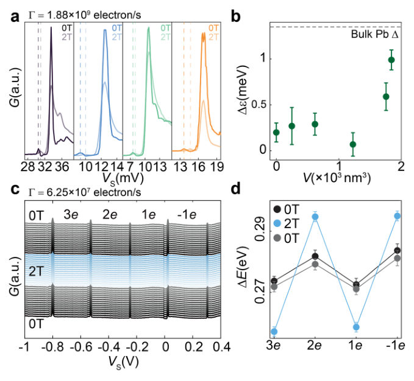 
Figure 4. Quantifying the collective excitation behavior in magnetic field. a Normalized point dI/dV spectra taken on four different stacks without field, with out-of-plane magnetic field (B = 2 T, VS = 30 mV, It = 200 pA, Vmod = 500 𝜇V). Dashed lines indicate the energies of peak 𝛼. b Reduction of collective excitation energy Δ𝜀 = 𝜀(0T) – 𝜀(2T)as a function of overlayer volume. c Point dI/dV spectra taken on top of a typical stack with 17 ML overlayer without field, with out-of-plane magnetic field (B = 2 T), and retaken without field (VS = 1 V, It = 200 pA, Vmod = 2 mV). Under each field 16 spectra were taken over a 1 nm2 area to minimize the spatial variations. Excess charge on the...

**Summary.** This work uses advanced STM spectroscopy to study electron transport in quantum-confined Josephson junctions. The researchers find that the transport is significantly mediated by a collective excitation mode intrinsic to the junction structure. This mode's energy is highly sensitive to the underlying quantum well states and external fields, offering a novel probe into the superconducting state.

**Why it may be interesting.** The coupling between electronic transport (quasiparticles) and collective excitations (plasmons/phonons) in confined superconducting systems is a key area for understanding energy dissipation and superconducting mechanisms in nanoscale devices.

Detailed structure

**Main problem.** The study investigates how collective excitation modes mediate quasiparticle transport in nanoscale Josephson junctions that are subject to strong vertical quantum confinement.

**Main result.** The transport is strongly enhanced by a collective excitation mode whose energy and the Coulomb gap both show strong modulation dependent on the quantum well states (QWS) of the metallic overlayer.

**Method.** The research employs Scanning Tunneling Spectroscopy (STS) on nanoscale Josephson junction stacks, measuring differential conductance (dI/dV) under varying bias, magnetic fields, and tip-sample separation.

**Model / system.** The physical system consists of Pb/NaCl/Pb Josephson junction stacks grown on Si(111). The analysis involves modeling the system in the Coulomb blockade regime, considering quantum confinement effects in the metallic overlayers.

**Key observables.** Coulomb gap strength, collective excitation energy ($\epsilon$), Quantum Well States (QWS) spectra, and the dependence of these features on overlayer thickness and magnetic field.

**Important parameters / regimes.** Temperature (1.2 K), magnetic field (up to 9 T), junction thickness (nanometer scale), and the ratio of charging energy to Josephson energy ($E_C \gg E_J$).

**Assumptions / limitations.** The analysis assumes the collective excitation may originate from phonons, plasmons, or polarons, and that the superconducting gap is masked by the strong Coulomb blockade.

**Figures summary.** Figures illustrate Coulomb gap spectra showing multi-gap structures, QWS spectra exhibiting bilayer oscillations, and plots detailing the dependence of the collective excitation energy on tip separation and magnetic field.

**Paper structure.** The paper systematically characterizes the QWS and Coulomb blockade features, demonstrating the enhancement of transport via a collective mode. It then investigates the dependence of this mode on external perturbations like magnetic fields and mechanical motion, comparing it to known vibrational excitations.

Abstract

Quantum confinement can strongly modify transport through Josephson junctions. Here, we study local tunneling transport through nanoscale Josephson junction stacks in the Coulomb blockade regime, where the metallic layers exhibit strong vertical quantum confinement. We find that quasiparticle transport is strongly enhanced by a collective excitation mode intrinsic to the junction and localized in the isolated metallic overlayer. We quantify both the collective-mode energy and the Coulomb gap and show that both exhibit strong layer-dependent modulation, consistent with the modulation of the underlying quantum well states. We further investigate how the collective excitation responds to various perturbations, including mechanical motion and an applied magnetic field. Our results suggest that this collective mode is sensitive to quasiparticles near the Fermi level and may therefore provide an indirect probe of the superconducting state.

[↑ back to top](#top)

### [Impact of exciton-phonon and exciton-magnon interaction on transport in anisotropic 2D magnetic semiconductors](http://arxiv.org/abs/2609.21746v1)

**Authors:** Daniel Erkensten, Katarzyna Sadecka, Marie-Christin Heißenbüttel, Thorsten Deilmann, Ermin Malic  
**Type:** theory · **Category:** other · **PDF:** <https://arxiv.org/pdf/2609.21746v1>  
**Analysis basis:** full PDF text, analyzed in chunks
**Topic relevance:** `Keldysh / 2PI / non-Gaussian methods` **2/5** · `methods for driven-dissipative` **2/5** · `analog quantum simulation` **1/5** · `correlated / nonlocal dissipation` **1/5** · `driven-dissipative phase transition` **1/5** · `quantum measurements` **1/5**

📷 Fig 1

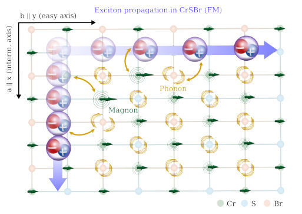 
FIG. 1. Schematic illustration of anisotropic exciton propa- gation in a ferromagnetic CrSBr monolayer in the presence of in-plane phonons and magnons. Magnons are localized on the Cr atoms (green) with the equilibrium magnetic mo- ments being aligned along the b-axis (magnetic easy axis), and phonons are depicted as vibrating atoms (illustrated as outgoing soundwaves).

📷 Fig 2

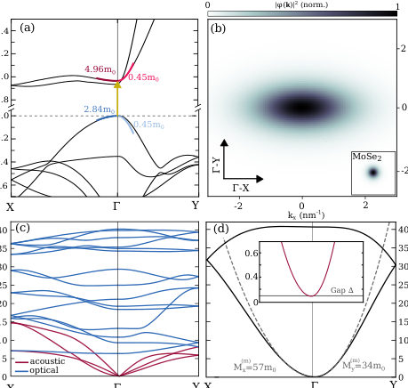 
FIG. 2. Excitons, phonons and magnons in monolayer CrSBr. (a) Electronic band structure along the X-Γ-Y path in the rectangular Brillouin zone obtained from ab initio calcula- tions with the relevant carrier masses stated explicitly. (b) Anisotropic 1s exciton wave function corresponding to the (v, c + 1) transition in (a) obtained by solving the Wannier equation – in comparison with the isotropic 1s wave func- tion of KK excitons in MoSe2 monolayers (inset). The mo- mentum scale is the same for both CrSBr and MoSe2 wave functions. (c) Phonon dispersion with acoustic (red) and opti- cal (blue) modes. (d) Ferromagnetic magnon dispersion with the low-energy magnon mode showing a parabolic...

📷 Fig 3

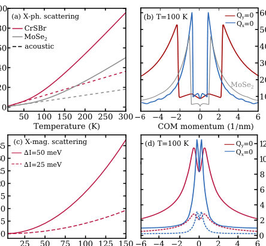 
FIG. 3. Phonon- and magnon-induced dephasing in mono- layer CrSBr. (a) Non-radiative exciton broadening from exci- ton–phonon scattering, showing contributions from acoustic phonons only (dashed) and from both acoustic and optical phonons (solid). For comparison, the linewidth of MoSe2 monolayers is also shown (gray). (b) Direction-dependent momentum-resolved phonon-induced dephasing in CrSBr (red line: scattering along Qx, blue line: scattering along Qy) and isotropic scattering in monolayer MoSe2. (c) Non- radiative exciton broadening due to exciton-magnon scat- tering for different carrier-magnon couplings, ∆I = |Ie − Ih|. (d) Direction-dependent momentum-resolved magnon- induced...

📷 Fig 4

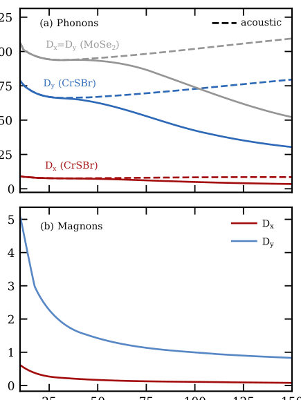 
FIG. 4. Anisotropic exciton propagation in CrSBr mono- layers. (a) Direction-dependent diffusion coefficient due to exciton-phonon scattering in CrSBr (red and blue) in com- parison with the isotropic diffusion coefficient of monolayer MoSe2 (gray). The contributions from acoustic phonons are marked as dashed lines, whereas the solid lines include con- tributions from both acoustic and optical phonons. (b) Exci- ton diffusion due to two-magnon-exciton scattering (carrier- magnon couplings set such that ∆I = |Ie −Ih| = 50 meV).

📷 Fig 5

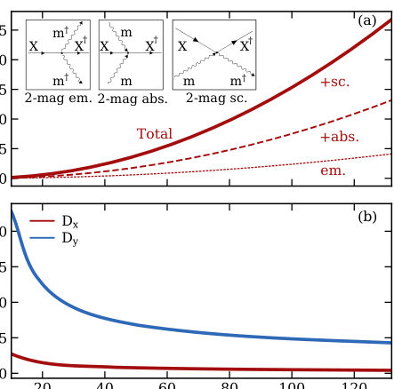 
FIG. 5. Impact of exciton-magnon interaction on exciton transport in CrSBr bilayers. (a) Exciton linewidth due to exciton-magnon interaction. The relevant two-magnon emis- sion, absorption and scattering processes contributing to the linewidth are schematically shown as Feynman diagrams in the insets. Note that the contributions from two-magnon emission (dashed lines), two-magnon absorption and two- magnon scattering are added up cumulatively. (b) Exciton diffusion coefficient in CrSBr bilayers revealing anisotropic propagation in x- and y-directions (red and blue lines, re- spectively).

**Summary.** This theoretical work develops a comprehensive many-body framework to model exciton transport in 2D magnetic semiconductors like $	ext{CrSBr}$. It quantifies how coupling to phonons and magnons causes anisotropic scattering, predicting measurable, temperature-dependent signatures in the exciton linewidths and diffusion coefficients.

**Why it may be interesting.** The detailed derivation of temperature-dependent dephasing rates ($\propto T^2$ for magnons) and the explicit inclusion of spin-lattice coupling mechanisms provide a rich theoretical framework for understanding open quantum systems in magnetic materials.

Detailed structure

**Main problem.** The paper investigates how exciton dynamics and transport in anisotropic 2D magnetic semiconductors are governed by the coupling to lattice vibrations (phonons) and spin excitations (magnons).

**Main result.** The quasi-one-dimensional nature of excitons leads to strongly anisotropic scattering, resulting in direction-dependent diffusion coefficients, and the temperature dependence of dephasing rates is characterized by distinct one-phonon and two-magnon signatures.

**Method.** The authors developed a microscopic many-body theory, deriving coupled equations of motion for the exciton polarization using techniques like the Heisenberg equation-of-motion and applying approximations such as the Born-Markov approximation.

**Model / system.** The system studied is $	ext{CrSBr}$, an anisotropic 2D magnetic semiconductor, modeled using Hamiltonians incorporating exciton, phonon, and magnon terms. The analysis covers both monolayer and bilayer (antiferromagnetic) configurations.

**Key observables.** Direction-dependent diffusion coefficients, exciton spectral linewidths, phonon-induced dephasing ($\gamma_{	ext{ph}}(T)$), and magnon-induced dephasing ($\gamma_{	ext{m}}(T)$).

**Important parameters / regimes.** Temperature ($T$), exciton binding energy ($	ext{E}_b$), and the magnon gap ($\Delta$).

**Assumptions / limitations.** Approximations include the low-density limit for excitons, the use of the Born-Markov approximation, and treating the exciton-magnon interaction via one- and two-magnon terms.

**Figures summary.** Figures illustrate the anisotropic exciton propagation, the electronic band structure, phonon dispersion, and magnon dispersion relations in $	ext{CrSBr}$.

**Paper structure.** The paper builds the theory by defining the Hamiltonian, deriving the equations of motion for the exciton polarization, and then calculating the dephasing rates separately for phonon and magnon interactions, distinguishing between one- and two-magnon processes.

Abstract

Two-dimensional magnetic semiconductors provide a unique platform for exploring the interplay between charge, lattice, spin, and light. The strong Coulomb interaction combined with long-range magnetic order enables efficient coupling between excitons and both lattice vibrations and spin excitations, thereby strongly influencing exciton dynamics and transport in these materials. Here, we develop a microscopic many-body theory of exciton--phonon and exciton--magnon interactions in mono- and bilayer CrSBr. We demonstrate that the quasi-one-dimensional character of excitons in CrSBr gives rise to strongly anisotropic exciton--phonon and exciton--magnon scattering, resulting in direction-dependent diffusion coefficients. Furthermore, we identify a distinct temperature dependence originating from one-phonon and two-magnon scattering processes, providing characteristic signatures of the underlying microscopic interactions. Our work establishes a microscopic framework for understanding exciton transport in magnetic van der Waals semiconductors and provides guidance for future optical spectroscopy and exciton transport experiments.

[↑ back to top](#top)

### [Bend Contour Electron Tomography (BCET): Quantitative strain and topography mapping](http://arxiv.org/abs/2609.21041v1)

**Authors:** Henry G. Bell, Chenhang Xu, Arthur McCray, Minyong Han, Yicheng Zhuang, Harold Y. Hwang, Colin Ophus, Alfred Zong  
**Type:** experiment · **Category:** other · **PDF:** <https://arxiv.org/pdf/2609.21041v1>  
**Analysis basis:** full PDF text, analyzed in chunks
**Topic relevance:** `Keldysh / 2PI / non-Gaussian methods` **2/5** · `methods for driven-dissipative` **2/5** · `quantum measurements` **2/5** · `analog quantum simulation` **1/5**

📷 Fig 1

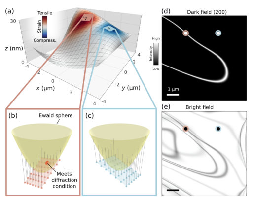 
FIG. 1. Principles of bend contours. (a) An example freestanding thin film of a cubic SrTiO3 lattice that features two regions with compressive (blue) and tensile (red) strains. Tangent planes are drawn at the two respective locations on the film surface. (b, c) Schematic of the local reciprocal lat- tice at each point. Black lines extending to the Ewald sphere (yellow) represent the deviation from meeting the Bragg con- dition; the graphics are vertically stretched for clarity. For the blue region, no diffraction condition is met as none of the reciprocal lattice points reside on the Ewald sphere. In the pink region, the (200) peak (red dot) resides on the Ewald sphere, leading to locally...

📷 Fig 2

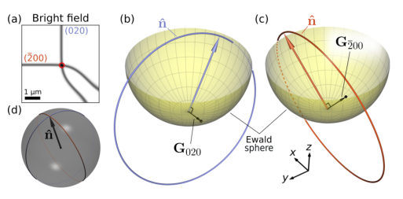 
FIG. 2. Surface normal constrained by the bend con- tours. (a) Simulated bright-field electron micrograph with two intersecting bend contours: (200) and (020). (b) Illus- tration of the constraints on the surface normal vector ˆn at positions along the (020) contour. First, G020 is constrained to the Ewald sphere. Second, ˆn must be perpendicular to G020 in this cubic lattice example. Hence, ˆn must fall on to a point prescribed by the blue circle. (c) Schematic for the corresponding normal vector constraint at all locations on the (200) contour. (d) At the intersection point of the two bend contours [red circle in (a)], combining constraints from (b) and (c) uniquely determines ˆn up to a...

📷 Fig 3

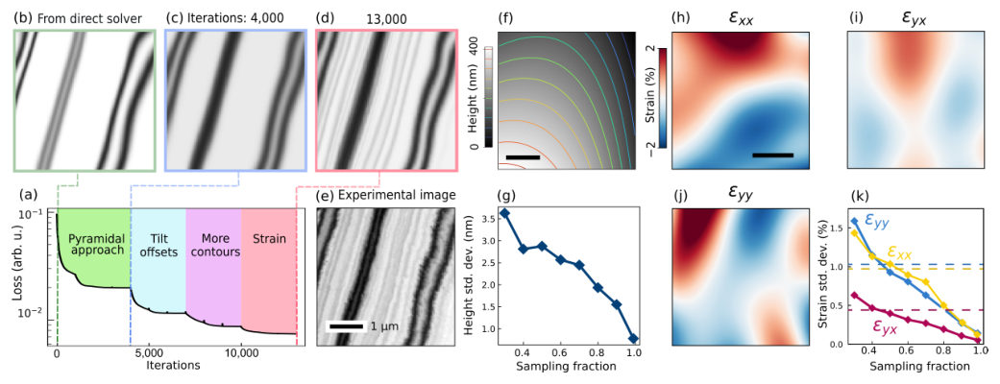 
FIG. 3. Iterative reconstruction of a SrTiO3 thin film. (a) The loss function in Eq. (1) over different iterations. Colored regions refer to different parts of the multiphase optimization procedure; see main text and Sec. S8 of the Supplemental Material for details. (b–d) Simulated bright-field micrographs at zero-tilt throughout the multiphase optimization: (b) initial guess from the direct solver, (c) after the pyramidal optimization on the Bézier control points, and (d) the final converged solution. (e) Experimental image at zero tilt; data at other tilt angles are shown in Fig. S7 of the Supplemental Material. High spatial frequency deviations between the optimized [panel (d)] and...

📷 Fig 4

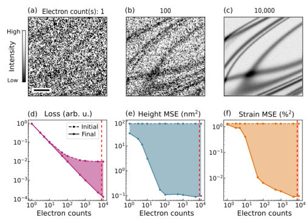 
FIG. 4. Assessment of reconstruction accuracy at varying noise levels. (a–c) Representative simulated elec- tron micrographs with Poisson noise generated using 1, 100, and 10,000 electron counts per pixel, respectively. Scale bar: 1 µm. (d–f) Electron count-dependent MSE compared to the ground truth for the initial and final loss, height, and strain. Vertical dashed lines denote the experimental noise condition, estimated using a screen current of 1.38 nA for 1 s acquisition using a detector with 1, 024 × 1, 024 pixels.

**Summary.** This work introduces Bend Contour Electron Tomography (BCET), a novel computational framework to quantitatively map strain and topography in freestanding quantum thin films using wide-field TEM images. By treating the analysis as an inverse problem, BCET reconstructs strain and surface geometry without requiring scanning probes. This opens new avenues for studying how spatial strain inhomogeneity governs phase transitions in 2D quantum materials.

**Why it may be interesting.** While focused on condensed matter characterization, the use of iterative, physics-constrained inverse problem solving and multi-scale optimization techniques is highly relevant to computational physics methods applicable in quantum simulation.

Detailed structure

**Main problem.** The challenge is to quantitatively map sub-micrometer, nonuniform strain fields and topography in freestanding quantum thin films, especially for fast, dynamical measurements.

**Main result.** The authors developed BCET, a framework that successfully reconstructs local strain distributions and curvature fields in $	ext{SrTiO}_3$ films using wide-field TEM imaging.

**Method.** BCET treats the problem as a physics-constrained inverse problem, iteratively minimizing a loss function comparing measured bend contours to simulated images derived from a parameterized surface geometry and strain tensor.

**Model / system.** The study uses freestanding thin films of quantum materials, specifically $	ext{SrTiO}_3$, which naturally develop strain fields. The analysis relies on interpreting bend contours observed in transmission electron microscope images.

**Key observables.** Quantitative 2D maps of in-plane strain tensor fields and surface morphology (topography).

**Important parameters / regimes.** Sub-micrometer length scales; varying sample tilt angles ($	heta_a, 	heta_eta$); strain tensor components.

**Assumptions / limitations.** The method assumes the ability to vary sample tilt angles (tomography concept) and uses a Bézier surface mesh for parameterization, which may limit nanoscale resolution.

**Figures summary.** Figures illustrate the principles of bend contours using $	ext{SrTiO}_3$ films, showing how compressive/tensile strain regions correlate with observable contrast in simulated dark-field TEM images.

**Paper structure.** The paper introduces the problem, details the BCET computational framework (forward model, inverse minimization), applies it to $	ext{SrTiO}_3$ films, and demonstrates the quantitative reconstruction of strain and topography.

Abstract

Freestanding thin films of quantum materials naturally develop sub-micrometer, nonuniform strain fields that strongly affect their electronic, magnetic, and structural properties in both equilibrium and nonequilibrium conditions. However, current methods to quantitatively resolve these mesoscopic features are primarily restricted to scanning probes, making it challenging for dynamical measurements such as single-shot imaging and femtosecond microscopy. Here, we present a new computational framework which we denote as bend contour electron tomography (BCET), which efficiently converts bend contours in transmission electron microscope images into quantitative two-dimensional maps of strain and topography. By iteratively minimizing a designed loss function between experimental and simulated bend contour images, BCET retrieves both surface morphology and in-plane strain tensor fields without requiring scanning or diffraction mapping. We applied BCET to freestanding SrTiO$_3$ thin films, demonstrating the successful reconstruction of the local strain distribution and curvature field with high fidelity. Our approach provides a quantitative framework for characterizing mesoscale structures in freestanding films using wide-field imaging, opening new avenues to investigate how spatial inhomogeneity governs phase transitions and nonequilibrium dynamics in two-dimensional quantum materials.

[↑ back to top](#top)

### [Photogalvanic effect in monolayers of transition metal dichalcogenides](http://arxiv.org/abs/2609.22001v1)

**Authors:** G. V. Budkin, E. L. Ivchenko  
**Type:** theory · **Category:** other · **PDF:** <https://arxiv.org/pdf/2609.22001v1>  
**Analysis basis:** full PDF text, analyzed in chunks
**Topic relevance:** `Keldysh / 2PI / non-Gaussian methods` **2/5** · `methods for driven-dissipative` **2/5**

📷 Fig 1

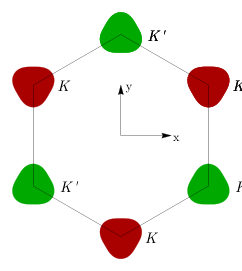 
FIG. 1: Schematic illustration of the Brillouin zone of a TMDC monolayer. Direct band gaps are located at the K and K′ vertices. A trigonal warping of the electronic spec- trum has opposite orientations in the valleys K and K′.

📷 Fig 2

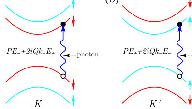 
FIG. 2: The band structure of MoX2 monolayers the near the fundamental gap at K (a) and K′ (b) points. Wavy blue lines illustrate the photon absorption transitions, labeled by terms of the matrix elements responsible for the LPGE current gen- eration.

**Summary.** This paper presents a comprehensive theoretical study of the photogalvanic effect in TMD monolayers, developing a microscopic theory to calculate both the shift and ballistic photocurrent components. It finds that the Coulomb interaction between photoexcited carriers enhances the ballistic current, making it the dominant contribution in these 2D semiconductors. This work advances the understanding of nonlinear optical responses in TMDs by providing a rigorous separation of these two key physical mechanisms.

**Why it may be interesting.** The detailed separation and quantitative comparison of the ballistic and shift contributions provide a deeper understanding of nonlinear optical responses in 2D materials, which is crucial for designing next-generation photovoltaic or optoelectronic devices.

Detailed structure

**Main problem.** The paper theoretically investigates the photocurrent generated by linearly polarized radiation in monolayers of transition metal dichalcogenides (TMDs), specifically separating and analyzing the contributions from the ballistic and shift mechanisms.

**Main result.** The theory demonstrates that in typical 2D semiconductors, the Coulomb correlation between photoexcited electrons and holes causes the ballistic contribution to dominate over the shift photocurrent.

**Method.** A microscopic theory using perturbation theory applied to the density matrix evolution equation is developed to calculate the dc electric photocurrent, separating it into distinct ballistic and shift components.

**Model / system.** The system is modeled as monolayers of TMDs, which are 2D semiconductors lacking inversion symmetry. The theory utilizes a minimal two-band Hamiltonian and accounts for the electron-hole Coulomb interaction.

**Key observables.** The dc electric photocurrent (j), which is decomposed into the shift photocurrent (j_shift) and the ballistic photocurrent (j_ball).

**Important parameters / regimes.** The ratio of the ballistic to shift current ($\chi_{	ext{ball}} / \chi_{	ext{shift}}$), the exciton Bohr radius ($a_B$), and the mean free path ($l$).

**Assumptions / limitations.** The theory assumes a two-band model and incorporates finite decay of excited states ($\hat{\gamma}$); the calculation is valid in specific limits regarding photon energy relative to the band gap and exciton binding energy.

**Figures summary.** Figure 1 shows the hexagonal Brillouin zone of a TMD monolayer with direct band gaps at K and K' vertices. Figure 2 illustrates the band structure near the fundamental gap, highlighting matrix elements relevant for LPGE current generation.

**Paper structure.** The paper develops the theory by first establishing the general formalism for the photocurrent, then deriving separate expressions for the shift and ballistic contributions using density matrix formalism, and finally comparing the magnitudes of these two contributions.

Abstract

We present a theoretical study of photocurrents generated by direct optical transitions induced by linearly polarized radiation in monolayers of transition metal dichalcogenides. A microscopic theory of both the ballistic and shift contributions to the photocurrent is developed that accounts for Coulomb attraction between photoexcited electrons and holes. It is demonstrated that, in typical 2D semiconductors, the Coulomb correlation causes the ballistic contribution to dominate over the shift photocurrent.

[↑ back to top](#top)

### [Pressure and Proximity Tuned Twisted Bilayer Graphene](http://arxiv.org/abs/2609.20958v1)

**Authors:** David T. S. Perkins, Joseph J. Betouras  
**Type:** theory · **Category:** strongly correlated electrons · **PDF:** <https://arxiv.org/pdf/2609.20958v1>  
**Analysis basis:** full PDF text, analyzed in chunks
**Topic relevance:** `analog quantum simulation` **2/5** · `Keldysh / 2PI / non-Gaussian methods` **1/5**

📷 Fig 1

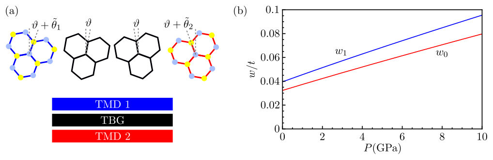 
Figure 1: (a): Schematic of an encapsulated TBG sample with the twist angle between the graphene layers given by θ = 2ϑ, whilst the twists between a graphene layer and its proximitising TMD partner are denotedby ˜θl (l = 1, 2). (b): Variation of w0 and w1 with applied pressure assuming d(AA) ⊥ /d(AB) ⊥ remains constant.

📷 Fig 2

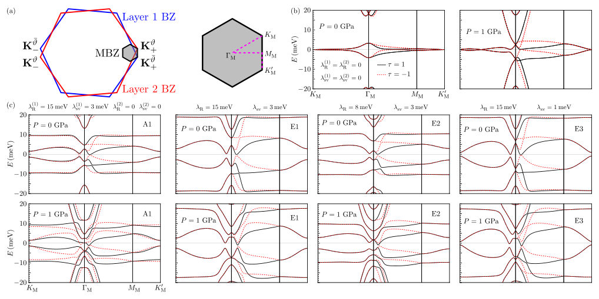 
Figure 2: MBZ construction and band structures for TBG at the first magic angle of the unproximitised system, θ = 1.05◦, for various choices of the proximity-induced SOCs at zero pressure and 1 GPa and a schematic for the different proximitisation setups. (a): construction of the MBZ from the BZs of the individual graphene layers. (b): Band structure of regular MATBG with no proximity induced SOC. Solid black (dashed red) lines are calculated in the τ = 1 (τ = −1) valley of the monolayer. (c): Band structures for proximity-coupled MATBG systems A1, E1, E2, and E3 from left to right for zero pressure (top) and 1 GPa pressure (bottom).

📷 Fig 3

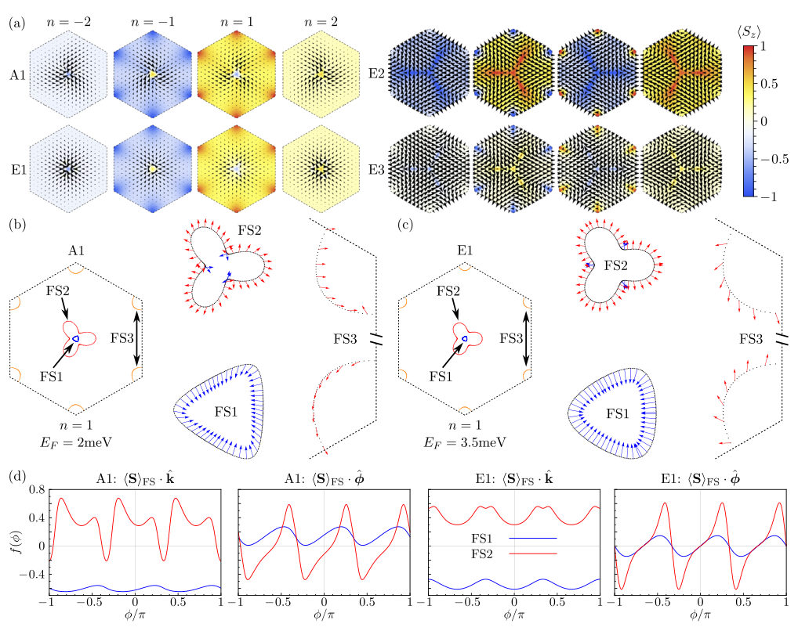 
Figure 3: Zero pressure spin maps, Fermi surfaces, and spin textures. (a): Spin maps for the |n| = 1, 2 bands of the A1, E1, E2, and E3 systems. The arrows indicate the in-plane spin projection at that point in the MBZ, with the arrow size indicating the magnitude of in-plane spin projection: larger arrow heads represent larger values of ⟨S∥⟩k. The colour density plot in the background encodes the out-of-plane spin projection. Band inversions can be seen to occur near ΓM (KM/K′ M) for A1 and E1 (E2 and E3) in the |n| = 1 bands where the sign of ⟨Sz⟩k can be seen to flip relative to the rest of the band. (b)-(c): Fermi surfaces and spin textures for the n = 1 band of the A1 system at EF = 2...

📷 Fig 4

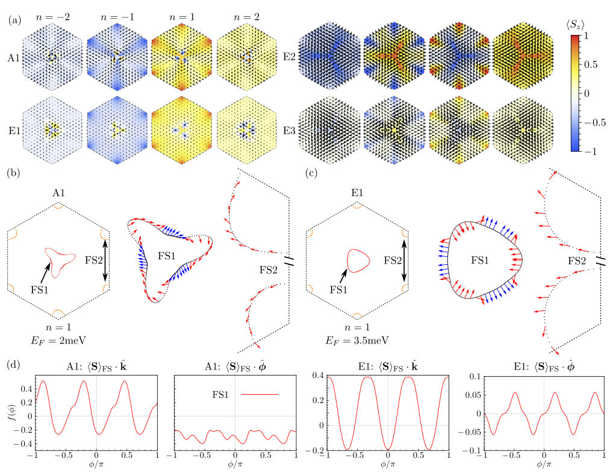 
Figure 4: Pressurised spin maps, Fermi surfaces, and spin textures for P = 1GPa. (a): Spin maps for the |n| = 1, 2 bands of the A1, E1, E2, and E3 systems. The arrows indicate the in-plane spin projection at that point in the MBZ, with the arrow size indicating the magnitude of in-plane spin projection: larger arrow heads represent larger values of ⟨S∥⟩k. The colour density plot in the background encodes the out-of-plane spin projection. Band inversions can be seen to occur near ΓM (KM/K′ M) for A1 and E1 (E2 and E3) in the |n| = 1 bands where the sign of ⟨Sz⟩k can be seen to flip relative to the rest of the band. (b)-(c): Fermi surfaces and spin textures for the n = 1 band of the A1 system...

📷 Fig 5

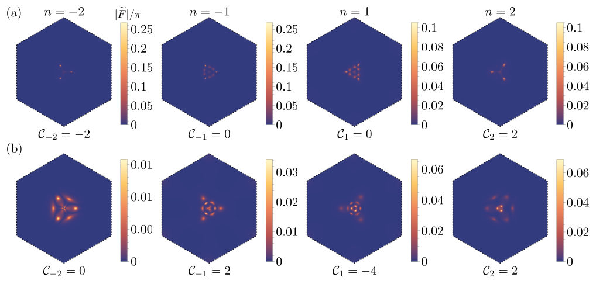 
Figure 5: Berry curvature variation depicted by the lattice field, eF, as defined by Fukui et al. [73] for the spin- split conduction and valence bands at zero pressure (a) and 1 GPa (b) for the E1 system alongside their associated abelian valley Chern number, Cn. The lattice field is calculated using a grid of 200 × 200 points, giving the relation between Berry curvature and lattice field as |Ω|(δk)2 ≈| eF| &lt; π with δk = 8π sin(ϑ)/(199 √

**Summary.** This work theoretically investigates how encapsulating twisted bilayer graphene with TMDs and applying uniaxial pressure modifies its electronic topology and spin properties. The researchers demonstrate that the system maintains a purely collinear Edelstein effect and that pressure can tune the band structure and redistribute the Berry curvature. These findings highlight the tunability of moiré heterostructures for advanced spintronic applications.

**Why it may be interesting.** The study explores how external tuning parameters (pressure) can control topological properties and spin-charge coupling in engineered 2D materials, which is highly relevant for designing novel spintronic and valleytronic devices.

Detailed structure

**Main problem.** To investigate how encapsulation by Transition Metal Dichalcogenides (TMDs) and external uniaxial pressure can drastically alter the topology and spin-charge interconversion processes in moiré heterostructures, specifically twisted bilayer graphene (TBG).

**Main result.** The system exhibits a purely collinear Edelstein effect even with non-radial spin texture, and uniaxial pressure can tune the band structure, change the number of active Fermi surfaces, and spread the Berry curvature across the moiré Brillouin zone.

**Method.** Theoretical modeling using a continuum Hamiltonian approach, incorporating proximity-induced SOC and pressure effects via interlayer distance modification.

**Model / system.** The system is Twisted Bilayer Graphene (TBG) encapsulated by TMDs. The model uses a continuum Hamiltonian derived from the Bistritzer-MacDonald formalism, including terms for SOC and interlayer hopping, with pressure modifying the interlayer distance.

**Key observables.** Spin texture (collinear Edelstein effect), band structure, Berry curvature distribution, and the number of active Fermi surfaces.

**Important parameters / regimes.** Twist angle ($	heta \approx 1.05^\circ$), applied uniaxial pressure ($P$), and interlayer coupling strengths ($w_0, w_1$).

**Assumptions / limitations.** The analysis truncates the Hamiltonian to 10 shells for convergence, and the interlayer coupling strength is modeled based on interpolation between AA and AB stacking distances.

**Figures summary.** Figures illustrate the construction of the Moiré Brillouin Zone (MBZ), band structures under varying SOC and pressure, and spin maps showing the evolution of spin texture and Berry curvature.

**Paper structure.** The paper systematically analyzes the effect of encapsulation and pressure on the electronic structure, first establishing the spin texture and Edelstein effect, then detailing how pressure tunes the band topology and the quantum geometry (Berry curvature).

Abstract

The coupling between layered atomically-thin materials mediated by van der Waals forces allows strong electronic correlations, unique topological signatures, and non-trivial spin textures, all of which play an important role in the creation of spin-, valley-, and orbitronic devices. Here, we demonstrate that twisted bilayer graphene encapsulated by transition metal dichalcogenides exhibits a generically non-radial spin texture yet hosts a purely collinear Edelstein effect despite this lack of radial symmetry. Moreover, we show how uniaxial pressure can be used to further tune the band structure and change the number of active Fermi surfaces without compromising the collinear response. Lastly, we illustrate how the quantum geometry changes in the encapsulated twisted graphene bilayer with larger pressures spreading the Berry curvature over large regions of the moiré Brillouin zone. These results illustrate how encapsulation and pressure can be used to drastically alter the topology and spin-charge interconversion processes of moiré heterostructures.

[↑ back to top](#top)

### [Rydberg excitons in core-shell nanostructures I. Optical properties](http://arxiv.org/abs/2609.21488v1)

**Authors:** Sylwia Zielińska-Raczyńska, Gerard Czajkowski, David Ziemkiewicz  
**Type:** theory · **Category:** other · **PDF:** <https://arxiv.org/pdf/2609.21488v1>  
**Analysis basis:** full PDF text, analyzed in chunks
**Topic relevance:** `analog quantum simulation` **2/5**

📷 Fig 1

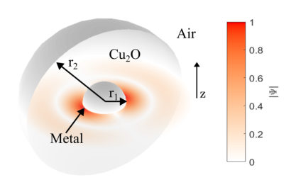 
FIG. 1: Schematic of the considered system; metal ball with a radius r1 is surrounded by a layer of Cu2O with radius r2. Color marks a cross-section of the hole wavefunction of 2P exciton.

📷 Fig 2

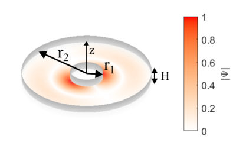 
FIG. 2: Schematic of the quantum ring system; metal cylinder with a radius r1 is surrounded by a layer of Cu2O with radius r2. Color marks a cross-section of the hole wavefunction of 2P exciton.

📷 Fig 3

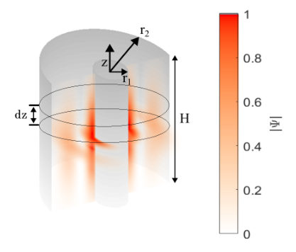 
FIG. 3: Schematic of the quantum rod system; metal cylinder with a radius r1 is surrounded by a layer of Cu2O with radius r2. Color marks horizontal and vertical cross-sections of the hole wavefunction of 2P exciton.

📷 Fig 4

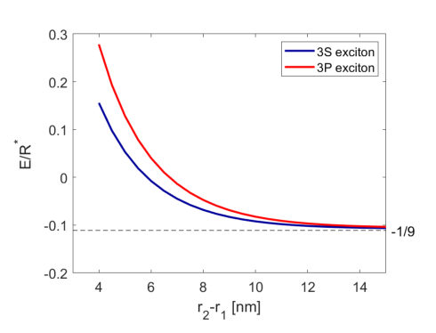 
FIG. 5: Energy of 3S and 3P exciton in a core-shell structure, for r1 = 2 nm, as a function of r2 −r1. Asymptotic bulk limit R∗/9 is marked by a horizontal, dashed line.

📷 Fig 5

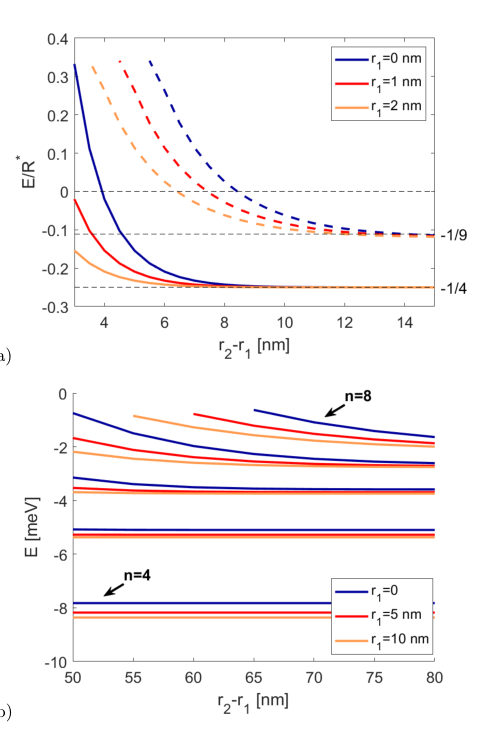 
FIG. 4: a) Energy of a 2P exciton (continuous line) and 3P exciton (dashed line) in a core-shell structure, for three values of r1, as a function of r2 −r1. Asymptotic bulk limits R∗/4, R∗/9 and E = 0 are marked by a horizontal, dashed line. b) Energies of n=4-8 excitons in a core-shell structure, calculated for r1 = 0, 5, 10 nm.

**Summary.** This theoretical study calculates the optical response of Rydberg excitons confined in $	ext{Cu}_2	ext{O}$-metal core-shell nanostructures. By employing the Real Density Matrix Approach, the authors model how exciton energy and optical susceptibility are tuned by varying the nanostructure's geometry, extending the analysis from 3D spheres to 2D rings and 1D rods.

**Why it may be interesting.** This work directly addresses Rydberg excitons and quantum confinement effects in solid-state systems, which are central topics in AMO physics, quantum optics, and quantum information processing using solid-state emitters.

Detailed structure

**Main problem.** The paper investigates the optical properties of Rydberg excitons confined within core-shell semiconductor nanostructures.

**Main result.** The study calculates the exciton energy and susceptibility, showing how confinement and geometry strongly tune these optical properties across different nanostructure dimensions.

**Method.** The Real Density Matrix Approach (RDMA) is employed, utilizing a two-band effective mass Hamiltonian solved via Schrödinger equations to determine exciton eigenenergies and susceptibility.

**Model / system.** The system modeled is a $	ext{Cu}_2	ext{O}$-metal core-shell nanostructure, generalized to include quantum rings and quantum rods. The exciton interaction is governed by a dielectrically screened Coulomb potential.

**Key observables.** Exciton energy, excitonic susceptibility ($\chi(\omega, \mathbf{k})$), and the resulting absorption spectrum.

**Important parameters / regimes.** Core radius ($r_1$), shell thickness, dimensionality (3D, 2D, 1D effective), and the principal quantum number of the exciton.

**Assumptions / limitations.** The electron and hole are confined to the shell, and the calculation uses approximations such as the long wave approximation and specific forms for the Coulomb potential based on geometry.

**Figures summary.** Figures schematically illustrate the core-shell, quantum ring, and quantum rod geometries, while other figures detail the behavior of exciton wavefunctions in various limiting cases of the core radius.

**Paper structure.** The paper systematically develops the theoretical framework, starting with the general Hamiltonian and the RDMA formalism. It then applies this formalism to model three distinct geometries: 3D core-shell spheres, 2D quantum rings, and intermediate quantum rods, detailing the specific mathematical solutions for each.

Abstract

Optical properties of Cu$_2$O-metal core-shell nanostructures containing Rydberg excitons are examined. Calculations of electron and hole eigenfunctions and eigenenergies are used to calculate exciton energy and its dependence on system geometry and dimensionality. The limits of very small and very large structures are discussed, making the results applicable to low principal quantum number excitons as well as to Rydberg states. The Real Density Matrix Approach method is used to calculate the optical properties of the studied systems.

[↑ back to top](#top)

### [Field-free and Sub-ns Magnetization Reversal in Synthetic Anti-ferromagnets using Sequential Spin-Orbit Torque and Spin-Transfer Torque Pulses](http://arxiv.org/abs/2609.21669v1)

**Authors:** Subham Das, Naveen Sisodia  
**Type:** theory · **Category:** other · **PDF:** <https://arxiv.org/pdf/2609.21669v1>  
**Analysis basis:** full PDF text, analyzed in chunks
**Topic relevance:** `Keldysh / 2PI / non-Gaussian methods` **1/5** · `analog quantum simulation` **1/5** · `driven-dissipative phase transition` **1/5** · `methods for driven-dissipative` **1/5** · `non-equilibrium universality` **1/5** · `quantum measurements` **1/5** · `scars & prethermalization` **1/5**

📷 Fig 1

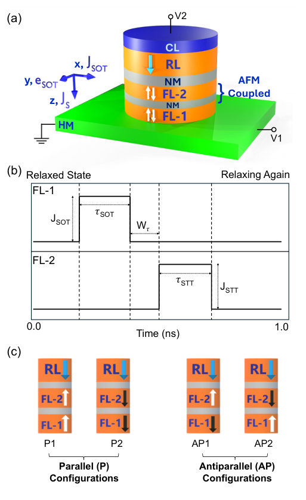 
FIG. 1: (a) A schematic of a three-terminal SAF free- layer based p-MTJ device. (b) SOT and STT pulse pro- file with all the tunable parameters. JSTT and JSOT rep- resent the amplitude of STT and SOT currents, respec- tively, while τSTT and τSOT represent the corresponding current pulse widths. The parameter Wτ represents the delay between the SOT and STT pulses. Wτ is taken to be zero for this work. (c) Four possible magnetization states of the system are shown, with parallel configura- tions (P1 and P2) on the left and anti-parallel configura- tions (AP1 and AP2) on the right.

📷 Fig 2

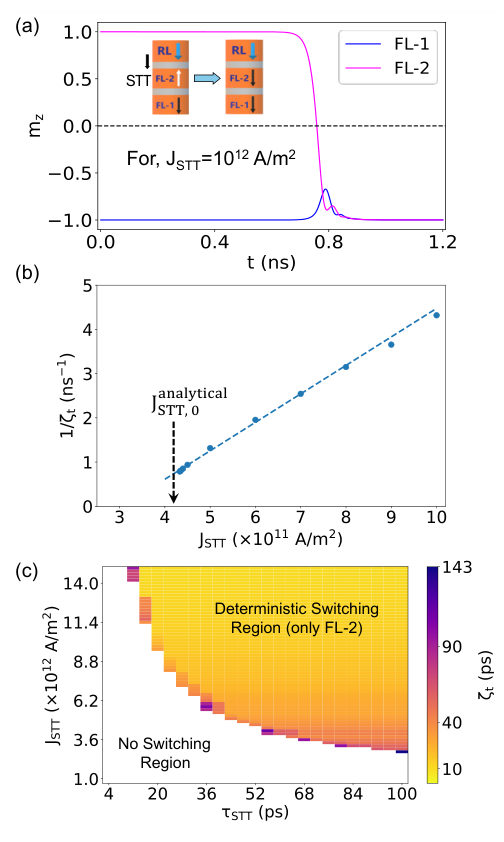 
FIG. 2: (a) Change in the z-component of mag- netization, mz, as a function of time with the ap- plication of continuous STT current of amplitude, JSTT = 1012 A/m2. (b) Inverse of Switching time for FL- 2 (1/ζt) vs. JST T . The extrapolated threshold current density is approximately 3 × 1011 A/m2. (c) Switching Time (ζt) Phasemap for various values of STT current amplitudes (JSTT) and pulsewidths (τSTT). Color repre- sents the switching time, ζt.

📷 Fig 3

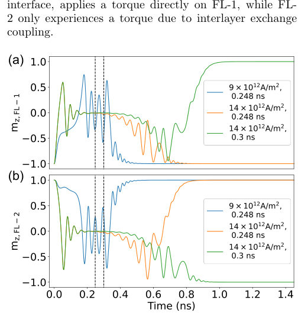 
FIG. 3: mz components of (a) FL-1, (b) FL-2, vs. time for various values of JSOT and τSOT when only SOT is applied on FL-1.

📷 Fig 4

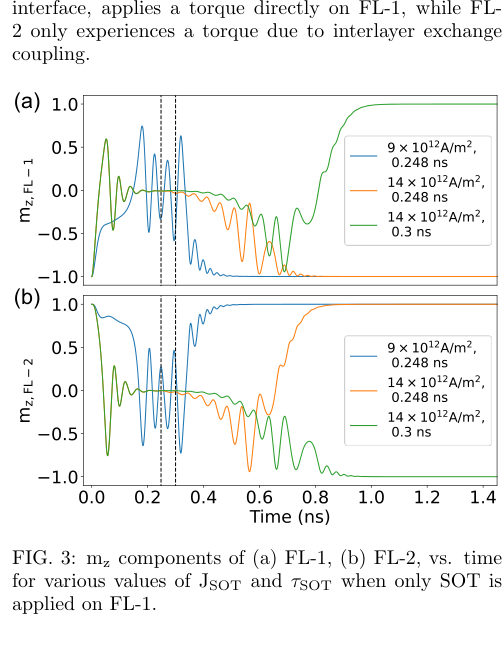 
Figure 3(a) shows the mz components of FL-1 and FL-2 for three different combinations of SOT pulse am- plitude JSOT and width τSOT. For all three cases, in contrast to the pure-STT case, where a large incubation time was seen before the beginning of the mz transition, for pure-SOT cases, the transition begins immediately with magnetization rotating from out-of-plane (OOP) to in-plane (IP) state with a precessional motion. For a smaller JSOT value of 9 × 1012 A/m2, the magnetiza- tion oscillations have a very large amplitude. For larger JSOT value, this precession quickly decays and pushes the magnetization into a pure IP state. This is seen for the two cases with JSOT = 14 × 1012 A/m2 where...

📷 Fig 5

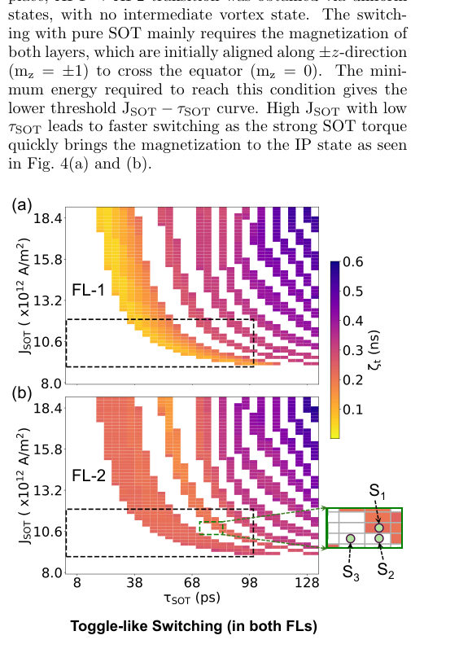 
FIG. 4: Switching Time (ζt) phasemap for various val- ues of SOT current amplitudes (JSOT) and pulsewidths (τSOT); (a) for FL-1, (b) for FL-2. The black dashed rectangles show the region of interest for SOT+STT driven switching discussed in Sec. II C. The outset of (b) shows a magnified view of the phasemap within the green dashed rectangle, highlighting three neighboring points (S1, S2, and S3) selected to obtain the phasemaps for STT parameters (Fig. 7).

**Summary.** This work numerically investigates magnetization reversal in SAF-MTJs using combined SOT and STT pulses. By applying a sequential SOT-STT protocol, the authors demonstrate achieving field-free, sub-nanosecond switching. This research is crucial for developing next-generation, high-speed, low-power magnetic memory devices.

**Why it may be interesting.** While the core physics is spintronics, the detailed, non-linear dynamics governed by coupled differential equations (LLG) and the analysis of switching thresholds via phase diagrams connect to the study of non-equilibrium dynamics and energy landscapes, which are relevant to open quantum systems.

Detailed structure

**Main problem.** The research investigates achieving fast, field-free magnetization reversal in Synthetic Antiferromagnets (SAFs) integrated into Magnetic Tunnel Junctions (MTJs). The goal is to utilize sequential spin-orbit torque (SOT) and spin-transfer torque (STT) pulses to achieve sub-nanosecond switching.

**Main result.** The sequential SOT-STT pulse protocol successfully drives the magnetization reversal, achieving deterministic switching regions and demonstrating the feasibility of energy-efficient, high-speed operation.

**Method.** The study employs a micromagnetic framework to numerically solve the Landau-Lifshitz-Gilbert (LLG) equation, incorporating SOT and STT torque terms.

**Model / system.** The physical system is a p-MTJ with a SAF-based free layer. The model incorporates magneto-static, anisotropic, and inter-layer exchange coupling terms, allowing for the simulation of magnetization dynamics in various coupled states (P and AP).

**Key observables.** Switching times ($\zeta_t$), threshold current densities ($J_{STT,0}$), and phase maps showing deterministic switching regions.

**Important parameters / regimes.** Pulse amplitudes ($J_{	ext{SOT}}, J_{	ext{STT}}$), pulse widths ($	au_{	ext{SOT}}, 	au_{	ext{STT}}$), and the pulse gap ($W_{	au}$).

**Assumptions / limitations.** The effect of STT torque on FL-1 is assumed to be small and is neglected in some simulations; the pulse-gap ($W_{	au}$) is often taken to be zero.

**Figures summary.** Figures illustrate the device schematic, the applied SOT/STT pulse profiles, the four possible magnetization states, and time evolution plots of magnetization components ($m_z$) under different pulse sequences.

**Paper structure.** The paper progresses by first establishing the physical model (LLG equation with SOT/STT), then comparing pure STT and pure SOT switching mechanisms, and finally detailing the optimized, successive SOT-STT pulse protocol to achieve the fastest and most deterministic switching.

Abstract

Single free-layer Magnetic Tunnel Junctions (MTJs) with a perpendicular easy axis driven by spin currents have demonstrated fast, deterministic switching, non-volatility, and low-power memory capabilities when integrated with modern nanoelectronic devices. In this article, we numerically investigate sub-ns and field-free switching characteristics of a p-MTJ with a Synthetic Antiferromagnet (SAF) based free layer structure using sequential sub-ns current pulses of Spin Orbit Torque (SOT) and Spin Transfer Torque (STT). While the SOT pulse applied to one layer decreases the transition time by bringing the coupled layers into an in-plane configuration, the subsequent STT pulse on the system determines the switching direction. Various pulse protocols have been investigated for both SOT and STT current amplitude and pulse widths, while also considering the effect of the Reference Layer (RL). While significant regions of deterministic switching events are observed, limitations in SOT, STT parameters are further investigated in presence of thermal fluctuations.

[↑ back to top](#top)

### [Non-Hermitian impurity scattering in graphene: Boltzmann transport and thermoelectric response](http://arxiv.org/abs/2609.22023v1)

**Authors:** Juan A. Cañas, Daniel A. Bonilla, A. Martín-Ruiz  
**Type:** theory · **Category:** other · **PDF:** <https://arxiv.org/pdf/2609.22023v1>  
**Analysis basis:** full PDF text, analyzed in chunks
**Topic relevance:** `Keldysh / 2PI / non-Gaussian methods` **1/5** · `correlated / nonlocal dissipation` **1/5** · `driven-dissipative phase transition` **1/5** · `methods for driven-dissipative` **1/5**

📷 Fig 1

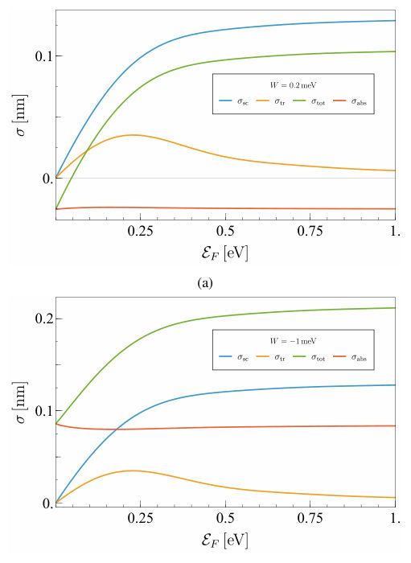 
FIG. 1: Energy dependence of the macroscopic scattering cross-sections for non-Hermitian impurities with radius a = 3 nm and Hermitian depth U = 20 meV. Top panel (a): Active source regime (W = 0.2 meV). The non-Hermitian cross-section (σabs) is strictly negative. At low energies, the total cross-section (σtot) drops below zero, indicating the threshold where active gain overcomes elastic scattering and destabilizes the semiclassical Boltzmann steady-state. Bottom panel (b): Absorptive sink regime (W = −1 meV). The strictly positive σabs heavily dominates the scattering landscape at low energies, drastically increasing the overall cross-section and suppressing transport. Across both panels,...

📷 Fig 2

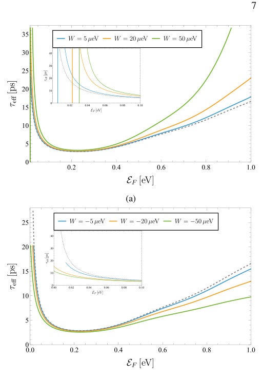 
FIG. 2: Plots of the effective transport relaxation time, calculated using (19), for several positive (top) and negative (bottom) values of the non-Hermiticity parameter W. The dotted gray line indicates the Hermitian baseline (W = 0).

📷 Fig 3

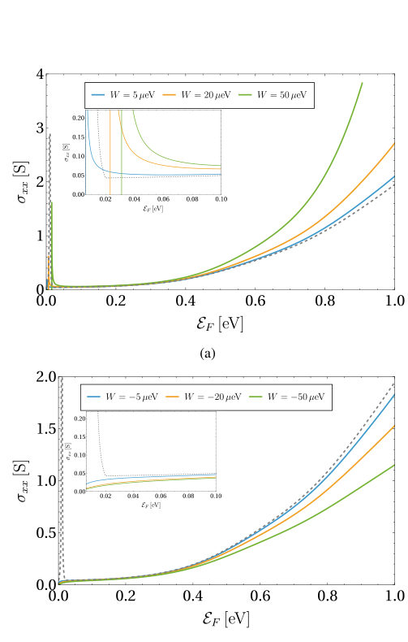 
FIG. 3: Plots of the longitudinal component of the DC electrical conductivity, calculated using (23), for several positive (top) and negative (bottom) values of the non-Hermiticity parameter W. The dotted gray line indicates the Hermitian baseline (W = 0).

📷 Fig 4

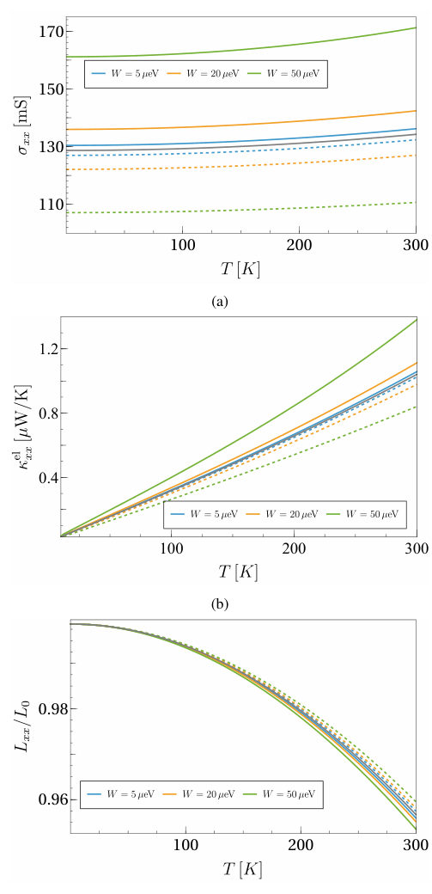 
FIG. 4: Temperature dependence of the transport coefficients at EF = 330 meV for several non-Hermitian potential strengths W. Top panel (a): longitudinal DC electrical conductivity σ(T). Central panel (b): electronic thermal conductivity κel(T). Bottom panel (c): Normalized Lorenz number L/L0. Across all panels, Solid and dotted lines correspond to gain (W &gt; 0) and loss (W &lt; 0) regimes, respectively, while the solid gray line is the strictly Hermitian baseline W = 0. All curves are computed using the exact integral representation of the Onsager coefficients given in Eq. (22).

📷 Fig 5

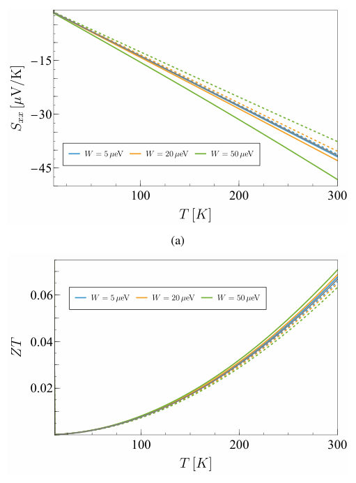 
FIG. 5: Temperature dependence of the thermoelectric generation and efficiency at a fixed quasi-Fermi energy of EF = 330 meV. Top panel (a): Seebeck coefficient S(T). Bottom panel (b): electronic thermoelectric figure of merit ZTel(T). Across both panels, solid and dotted lines correspond to the active source (W &gt; 0) and absorptive sink (W &lt; 0) regimes for various non-Hermitian potential strengths W, while the solid gray line indicates the strictly Hermitian baseline (W = 0). All curves are computed via the exact integral representation of the Onsager coefficients in Eq. (22).

**Summary.** This theoretical work analyzes charge and thermoelectric transport in graphene contaminated with non-Hermitian impurities that simulate local carrier gain or loss. By solving the scattering problem exactly and applying a Boltzmann transport approach, the authors show that gain significantly enhances the thermoelectric figure of merit, while loss suppresses it. This demonstrates that non-Hermiticity offers a powerful, controllable knob for tailoring graphene's energy transport properties.

**Why it may be interesting.** The explicit incorporation of non-Hermitian physics into transport coefficients provides a concrete, tunable mechanism for engineering electronic properties, which is relevant for open quantum systems modeling energy exchange.

Detailed structure

**Main problem.** The study investigates how non-Hermitian impurity scattering, which models local carrier gain or loss, affects charge and thermoelectric transport in graphene.

**Main result.** Weak gain enhances both charge and heat conductivities and increases the electronic figure of merit, while absorption produces the opposite effect. Non-Hermitian scattering provides a novel mechanism to control the energy dependence of carrier relaxation.

**Method.** The authors combine an exact partial-wave solution for the Dirac scattering problem with a semiclassical Boltzmann transport description.

**Model / system.** The system is monolayer graphene subjected to dilute, finite-range non-Hermitian impurities modeled by a complex potential $V(r) = (U + iW)\Theta(a-r)$. The transport is analyzed via the Boltzmann equation, incorporating non-Hermitian flux exchange.

**Key observables.** Electrical conductivity, electronic thermal conductivity, Seebeck coefficient, Lorenz ratio, and electronic thermoelectric figure of merit ($ZT_{el}$).

**Important parameters / regimes.** Non-Hermitian strength ($W$), impurity density ($n_{ia}$), and temperature ($T$).

**Assumptions / limitations.** The analysis assumes a semiclassical Boltzmann description, a dilute disorder limit, and only considers the electronic contribution to thermal transport.

**Paper structure.** The paper first derives the nonunitary scattering matrix from the Dirac equation using partial waves, yielding scattering and absorption cross-sections. It then extends this to a semiclassical Boltzmann framework, calculating transport coefficients and analyzing the impact of gain versus loss on the thermoelectric response.

Abstract

We investigate charge and thermoelectric transport in monolayer graphene containing a dilute distribution of finite-range non-Hermitian scattering centers. The impurities are modeled as circular complex potentials, whose imaginary component describes local carrier loss or gain. By solving the Dirac scattering problem exactly within a partial-wave approach, we obtain the nonunitary scattering matrix and derive the transport and absorption cross sections, which separately characterize momentum relaxation and net carrier exchange with the environment. To connect the microscopic scattering problem with stationary transport, we formulate a semiclassical Boltzmann description in which an external reservoir compensates the equilibrium particle loss or gain. This leads to an effective relaxation time governed by both elastic momentum scattering and non-Hermitian flux exchange. Using the full energy-dependent relaxation time, we evaluate the Onsager coefficients and the resulting electrical conductivity, electronic thermal conductivity, Seebeck coefficient, Lorenz ratio, and electronic thermoelectric figure of merit. We find that weak gain increases the effective carrier lifetime and enhances both charge and heat conductivities, while absorption produces the opposite behavior. More importantly, gain enhances the magnitude of the thermopower and the electronic figure of merit, whereas loss suppresses them. The Lorenz ratio remains close to the Sommerfeld value, with non-Hermiticity mainly modifying its finite-temperature corrections. Our results show that non-Hermitian scattering provides an additional mechanism for controlling the energy dependence of carrier relaxation and, consequently, the thermoelectric response of graphene.

[↑ back to top](#top)

### [Symmetry Properties of Bound States in the Continuum in Hexagonal Lattice Photonic Crystal Slabs](http://arxiv.org/abs/2609.21727v1)

**Authors:** Rhys Jones, Sang Soon Oh  
**Type:** theory · **Category:** other · **PDF:** <https://arxiv.org/pdf/2609.21727v1>  
**Analysis basis:** full PDF text, analyzed in chunks
**Topic relevance:** `analog quantum simulation` **1/5** · `interference shaping light` **1/5**

📷 Fig 1

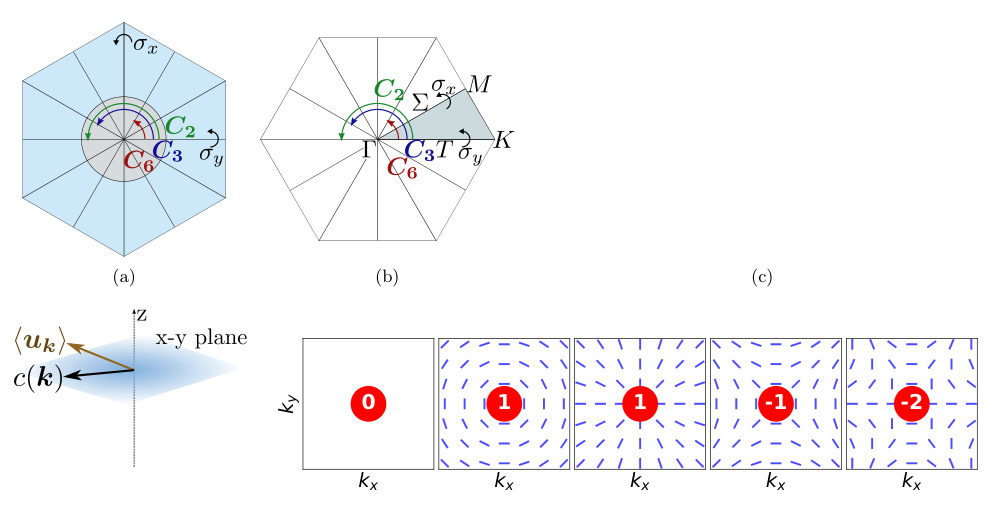 
FIG. 1: (a) and (b) The symmetries of a PhC belonging to the C6v group in real and reciprocal space respectively. High symmetry points and lines in reciprocal space are shown. (c) Band structure of the same PhC calculated using the finite-element method (FEM) method in COMSOL Multiphysics. Simulation details are provided in Section IV. (d) Illustrative diagram explaining the method for calculating the far-field polarisation. (e) Far-field polarisation distributions for different topological charges (TCs).

📷 Fig 2

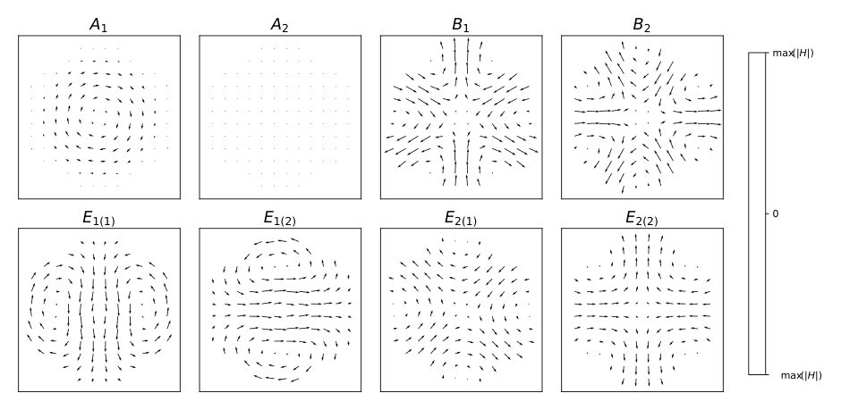 
FIG. 2: Electromagnetic fields within a unit cell for each of the 6 irreps with n = 0. Colour plot shows the imaginary part of the magnetic field. Arrows represent the real part of the electric field. While any linear combination of Ei(1) and Ei(2) for i = 1, 2 are an acceptable basis function, the angular momentum basis vectors (x, y) and (x2 −y2, −2xy) have been chosen as the basis functions for convenience.

📷 Fig 3

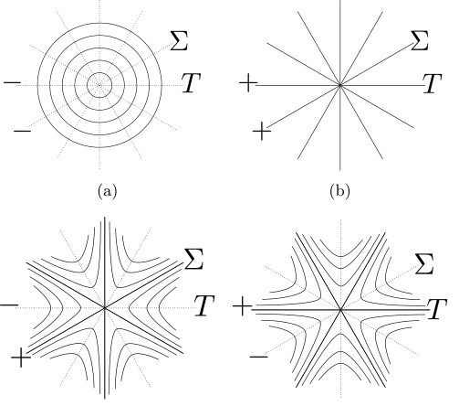 
FIG. 3: The four possible methods by which the parity can decompose. Solid lines represent the far-field polarisation, while dotted lines represent the high symmetry lines with odd parity. (a) and (b) possess a TC of 1, while (c) and (d) possess a TC of -2.

📷 Fig 4

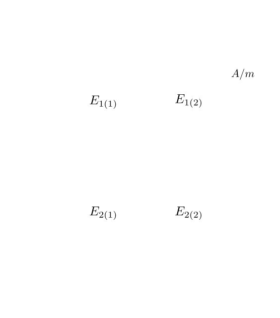 
FIG. 4: Near-field distribution of the unit cell in the six bound resonance / BIC modes at the Γ point. The colour plot shows the distribution of the imaginary component of the magnetic field, while the arrows represent the direction of the electric field.

**Summary.** This paper investigates the symmetry properties of Bound States in the Continuum (BICs) in hexagonal photonic crystal slabs using group theory. By analyzing the system's irreducible representations and applying $k \cdot p$ theory, the authors determine that the confinement quality factor and topological charge are fundamentally governed by the underlying crystal symmetry. This provides a powerful theoretical framework for designing next-generation photonic devices.

**Why it may be interesting.** The rigorous application of group theory to photonic band structure analysis provides powerful tools for predicting and understanding mode confinement, which is crucial for designing high-quality optical cavities relevant to quantum optics and photonics.

Detailed structure

**Main problem.** The paper aims to develop a fundamental understanding of Bound States in the Continuum (BICs) within photonic crystal (PhC) cavities by analyzing their symmetry properties.

**Main result.** The analysis uses group theory and $k \cdot p$ perturbation theory to characterize BICs, showing that their quality factor scaling and topological charge are dictated by the irreducible representation symmetry of the lattice.

**Method.** The study employs a group theoretical approach based on the $C_{6v}$ space group symmetry, combined with $k \cdot p$ perturbation theory and the calculation of far-field polarization via Stokes parameters.

**Model / system.** The physical system is a photonic crystal slab with a hexagonal lattice structure. The analysis determines the basis functions for the irreducible representations (irreps) of this system.

**Key observables.** Quality factor ($Q$), Topological Charge ($T_C$ or $q$), Far-field polarization angle ($\psi(\mathbf{k}_{\|})$), and the symmetry-derived basis functions.

**Important parameters / regimes.** The $C_{6v}$ point group symmetry, the wave vector $\mathbf{k}$ near the $\Gamma$ point, and the coupling strength to the radiative mode.

**Assumptions / limitations.** The analysis focuses on the TE mode polarization and utilizes the $k \cdot p$ theory near the $\Gamma$ point for far-field analysis.

**Figures summary.** Figures illustrate the symmetry properties in real and reciprocal space, the band structure, and the method for calculating far-field polarization distributions for various modes.

**Paper structure.** The paper proceeds by first establishing the symmetry framework using group theory to find basis functions for the $C_{6v}$ irreps. It then applies $k \cdot p$ theory and reflection parity to determine far-field polarization and topological charges, concluding with an analysis of how the $Q$ factor depends on the irrep symmetry.

Abstract

Bound states in the continuum (BICs) within photonic crystal (PhC) cavities realise the full confinement of light despite lying within the continuum of radiation modes. While their diverse practical applications has attracted considerable research interest, developing the fundamental understanding of BICs is important for the design of future devices. This paper uses a group theoretical approach to determine the basis functions of the irreducible representations (irreps) of a PhC with the symmetry of the $C_{6v}$ space group, from which the spatial distribution of the electromagnetic fields within the cavity can be determined. Furthermore, the reflection parity of the electric field and a $k \cdot p$ perturbation theory approach are used to determine the far-field polarisation of each irrep. The $k \cdot p$ perturbation explains why the $E_2$ irrep has a topological charge of $-2$, as well as showing that a topological charge does not necessarily indicate the presence of a BIC. Additionally, it is found that the quality factor of the modes do not necessarily scale as $Q \propto 1/|k|^{2|q|}$, but are instead dependent on the coupling to the radiative mode in the $k \cdot p$ perturbation, which is determined from the symmetry of each irrep.

[↑ back to top](#top)

### [Projective representation theory of spin space groups](http://arxiv.org/abs/2609.21289v1)

**Authors:** Zheng Zhang, Peiyuan Wang, Y. X. Zhao  
**Type:** theory · **Category:** other · **PDF:** <https://arxiv.org/pdf/2609.21289v1>  
**Analysis basis:** full PDF text, analyzed in chunks
**Topic relevance:** `analog quantum simulation` **1/5**

📷 Fig 1

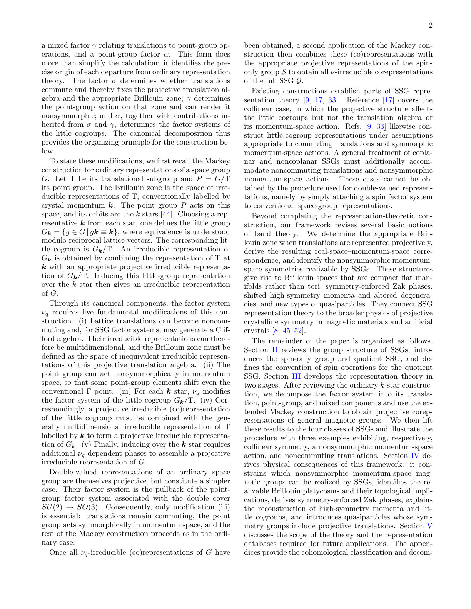 
Low-resolution page preview, page 2

📷 Fig 2

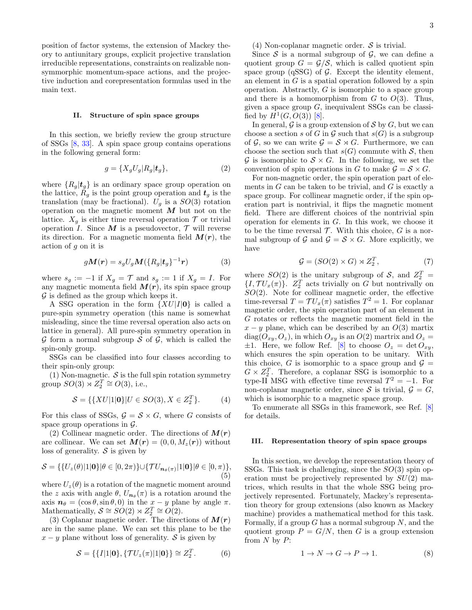 
Low-resolution page preview, page 3

📷 Fig 3

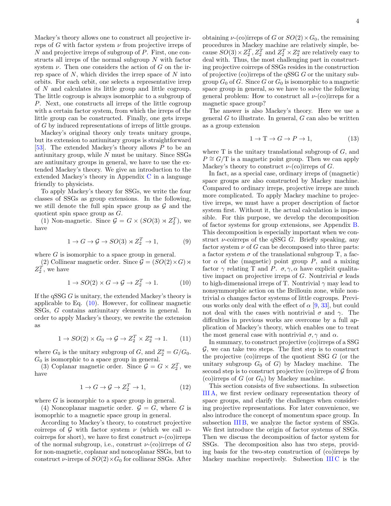 
Low-resolution page preview, page 4

📷 Fig 4

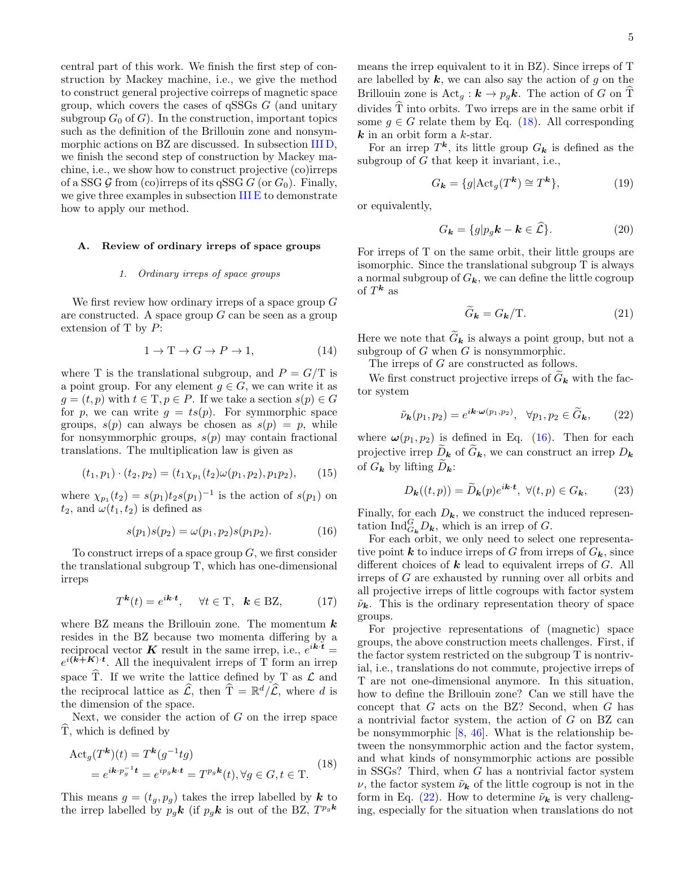 
Low-resolution page preview, page 5

📷 Fig 5

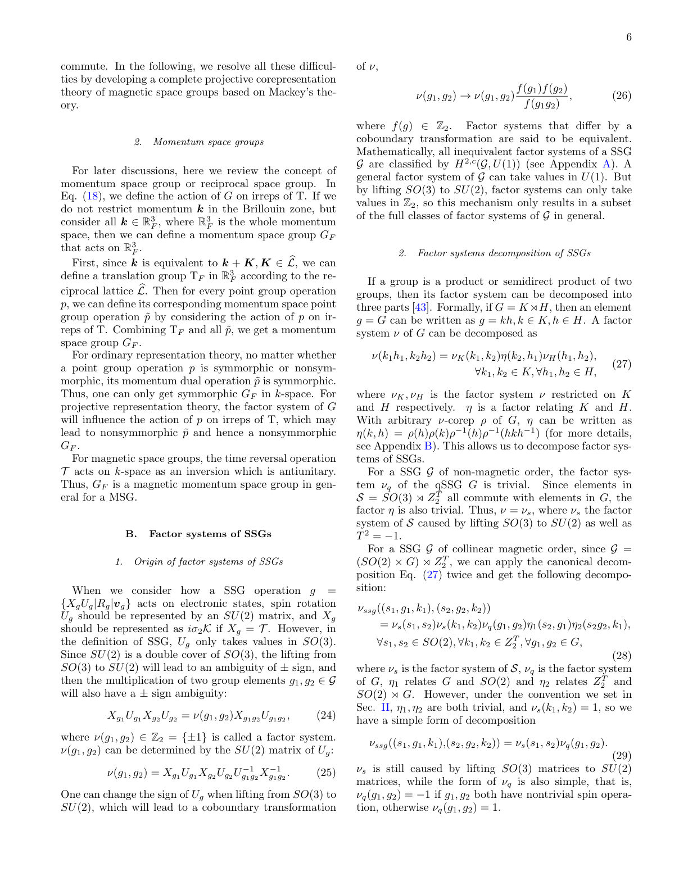 
Low-resolution page preview, page 6

**Summary.** This work establishes a comprehensive representation-theoretic foundation for studying magnetic crystals by developing a unified theory for Spin Space Groups. It tackles the mathematical difficulty posed by the projective nature of these symmetries using an extended Mackey theory. The resulting framework predicts novel physical consequences, such as modified Brillouin zones and symmetry-enforced topological phases, for weak spin-orbit coupling materials.

**Why it may be interesting.** While focused on condensed matter symmetry, the rigorous development of projective representation theory and group extensions provides powerful mathematical tools applicable to any system where symmetries are described by non-trivial factor systems, including those studied in quantum optics or AMO physics.

Detailed structure

**Main problem.** The paper addresses the need for a general, unified representation theory for Spin Space Groups (SSGs) because their projective nature complicates standard group and double-group representation methods.

**Main result.** The authors develop a canonical decomposition of the magnetic factor system into translational, mixed, and point-group factors, allowing for the construction of all projective irreducible corepresentations for various SSG classes.

**Method.** The theory employs Mackey's theory of group extensions, extending it to handle antiunitary symmetries and developing a systematic framework based on the decomposition of the factor system.

**Model / system.** The theory applies to magnetic crystals characterized by weak spin-orbit coupling, using the SSG as the fundamental symmetry framework for describing their electronic and magnetic properties.

**Key observables.** Symmetry-enforced Zak phases, reconstructed high-symmetry momenta, and the identification of new types of quasiparticles.

**Important parameters / regimes.** The structure of the factor system $
u$, which decomposes into $\sigma$ (translational), $\gamma$ (mixed), and $\alpha$ (point-group) factors.

**Assumptions / limitations.** The central assumption is that the physical symmetries can be systematically classified and analyzed by extending Mackey's theory to account for the projective nature of the spin operations.

**Paper structure.** The paper reviews the group structure of SSGs, develops the theory in two stages (projective corepresentations of the quotient group, then the full SSG), and finally derives physical consequences regarding symmetry constraints and Brillouin spaces.

Abstract

Spin space groups provide the natural symmetry framework for magnetic crystals with weak spin-orbit coupling, but extracting their physical consequences requires a general theory of irreducible representations. The central difficulty is that spin space groups are represented projectively: their factor systems can render lattice translations noncommuting, induce nonsymmorphic actions in momentum space, and modify the projective structure of little cogroups. These effects lie beyond conventional space-group and double-group representation theory. Here, using Mackey's theory of group extensions, we develop a unified constructive framework for all collinear, coplanar, and noncoplanar spin space groups, including antiunitary symmetries and general factor systems. A central technical result is a canonical decomposition of the relevant factor system $ν$ into a translational factor $σ$, a mixed factor $γ$ coupling translations to point-group operations, and a point-group factor $α$. This decomposition makes transparent how ordinary representation theory is modified: $σ$ determines the projective translation algebra and the appropriate Brillouin zone, $γ$ controls the momentum-space group action and can make it nonsymmorphic, and $α$ contributes to the factor systems of little cogroups. On this basis, we construct all projective irreducible corepresentations by induction over momentum-space orbits. The framework identifies which nonsymmorphic momentum-space symmetries can be realized by spin space groups and reveals Brillouin spaces that are compact flat manifolds rather than tori, symmetry-enforced Zak phases, reconstructed high-symmetry momenta and band degeneracies, and new types of quasiparticles. Our results establish the representation-theoretic foundation for systematic studies of weak-spin-orbit-coupled magnetic materials.

[↑ back to top](#top)

### [Topological properties and gap structure of the paired state in twisted TMD bilayers within a two-band effective model](http://arxiv.org/abs/2609.21825v1)

**Authors:** Palash Saha, Michał Zegrodnik  
**Type:** theory · **Category:** strongly correlated electrons · **PDF:** <https://arxiv.org/pdf/2609.21825v1>  
**Analysis basis:** full PDF text, analyzed in chunks
**Topic relevance:** `Keldysh / 2PI / non-Gaussian methods` **1/5**

📷 Fig 1

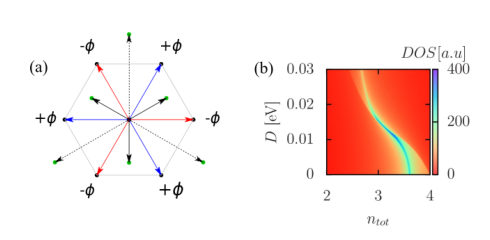 
FIG. 1. (a) The sign of the direction dependent complex phase for the spin-up hoppings (σz = 1) to the six NNN neighbors [cf. Eq. (1)]. The remaining hopping amplitudes shown in the figure are real. The green and black dots represent the lattice sites corresponding to MX and XM, stacking configu- rations, respectively. The position of Van Hove singularity in (b) influences the behavior of the superconducting gap away from half-filling as shown in the following.

📷 Fig 2

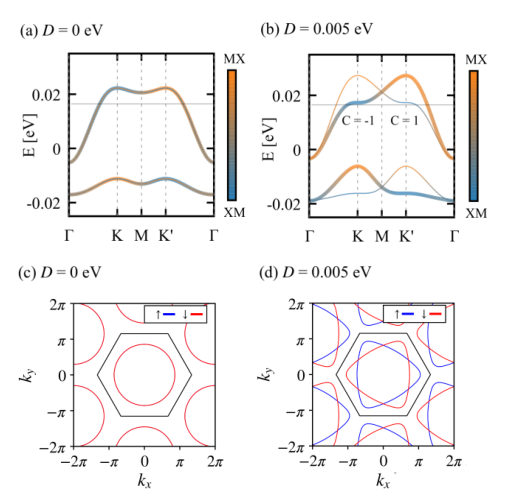 
FIG. 2. Dispersion relations and Fermi surfaces of the effec- tive two-band non-interacting model. Panels (a) and (b) show the band dispersions for two selected values of the displace- ment field, while panels (c) and (d) show the corresponding Fermi surfaces at half filling. The blue and red curves de- note the two spin sectors. In the dispersion plots, the thicker (thinner) curves correspond to the spin-up (spin-down) sec- tor. For non-zero displacement field, single particle bands are topological with the two spin sectors carrying opposite value of the Chern number (C = ±1).

📷 Fig 3

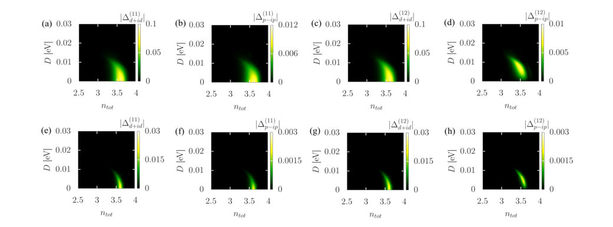 
FIG. 3. Symmetry resolved superconducting gap amplitudes corresponding to mixed spin-singlet d + id and spin-triplet p −ip paired state as a function of band filling n and displacement field D. In (a-d) the exchange interaction parameters are J1 = 5.6 meV and J2 = 2.4 meV, while for the bottom (e-h) J1 = 2.8 meV and J2 = 1.2 meV. The ratio of the exchange parameters ( J1/J2 = 7/3) is selected from 4t2/U where the on-site Coulomb repulsion U = 95 meV,|t1| = 5.689 meV and |t2| = 3.715 meV. We provide only the l = 1 component of the gap since the l = 2 shows the same behavior with approximately same absolute value.

📷 Fig 4

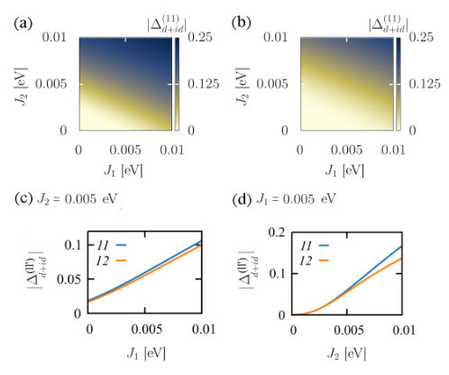 
FIG. 4. Superconducting singlet gap at band filling ntot = 3.5 as a function of J1 and J2 for (a) D = 0 and (b) D = 10 meV. For D = 10 meV, panels (c) and (d) show the induced inter- orbital and intra-orbital gap components upon varying J1 at fixed J2 = 5 meV and varying J2 at fixed J1 = 5 meV, respec- tively. The triplet component exhibits the same qualitative evolution and is not shown for clarity.

📷 Fig 5

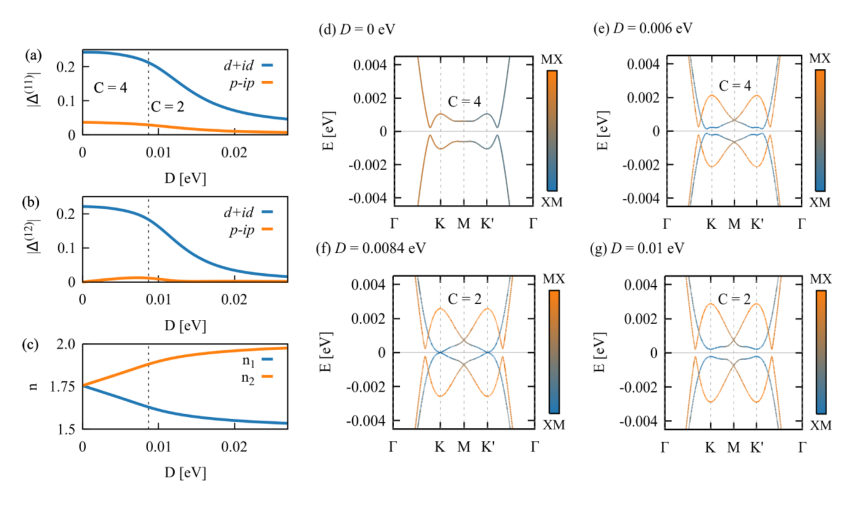 
FIG. 5. Panels (a) and (b) show the magnitude of the superconducting gap for the mixed d + id and p −ip pairing states, while panel (c) presents the orbital-resolved carrier concentration as a function of D for ntot = 3.5, J1 = J2 = 10 meV, and U = 95 meV. The dashed line marks the topological transition in the superconducting bands. Panels (d)–(g) show the corresponding superconducting band structures for increasing displacement field. At D = 0 in (d), the upper superconducting bands are degenerate and carry a total Chern number C = 4; at D = 6 meV in (e), the degeneracy is lifted while the system remains in the same C = 4 phase. Near D = 8.4 meV in (f), the relevant bands touch at the...

**Summary.** This theoretical study analyzes superconductivity in twisted TMD bilayers using an effective two-band model incorporating electron-electron interactions. By applying mean-field theory, the authors map out the superconducting phase diagram, revealing that the pairing state is topologically non-trivial. The work demonstrates how external fields can drive topological phase transitions while stabilizing unconventional superconducting pairing.

**Why it may be interesting.** The interplay between strong correlation effects (treated via mean-field interactions) and topological band structure in a solid-state platform like TMDs is highly relevant to modern condensed matter theory, particularly concerning unconventional superconductivity.

Detailed structure

**Main problem.** The study investigates the topological properties and superconducting gap structure that emerge in twisted TMD bilayers due to electron-electron interactions.

**Main result.** The superconducting state is found to be topologically non-trivial, exhibiting a mixed singlet-triplet pairing character, and its stability is governed by the evolution of the Van Hove singularity and the applied displacement field.

**Method.** The authors employ a theoretical mean-field approach, utilizing the Hartree-Fock approximation on an effective two-band Kane-Mele-like model.

**Model / system.** The system is twisted TMD bilayers, modeled by an effective two-band Hamiltonian incorporating nearest, next-nearest, and second nearest-neighbor hoppings. Interactions are treated via onsite Coulomb repulsion and intersite exchange terms.

**Key observables.** Superconducting gap symmetry, Chern number (topological invariant), superconducting gap magnitude, and orbital-resolved carrier concentration.

**Important parameters / regimes.** Band filling ($n$), applied displacement field ($D$), and interaction strengths ($U, J_1, J_2$).

**Assumptions / limitations.** The analysis relies on the Hartree-Fock mean-field approximation for interactions, and the model assumes the adiabatic integration out of certain orbital degrees of freedom.

**Figures summary.** Figures illustrate band dispersions, Fermi surfaces, and the evolution of the superconducting gap magnitude and band structures as a function of the displacement field, highlighting topological phase transitions.

**Paper structure.** The paper progresses by first establishing the non-interacting model, then applying the mean-field treatment to the interaction terms to find the superconducting pairing symmetries, and finally analyzing how the superconducting phase diagram and topological invariants change with external tuning parameters like $D$ and $n$.

Abstract

We present a theoretical study motivated by the recent experimental results which demonstrate superconductivity emerging from flat topological bands of twisted transition metal dichalcogenide (TMD) bilayers. To capture the non-trivial band topology of the system, we employ an effective two-band Kane-Mele-like model and substitute it with Coulomb repulsion and inter-site pairing interactions treated at the Hartree-Fock mean-field level. Assuming a real-space pairing scenario, we analyze the resulting superconducting gap symmetry and the stability of the paired state as a function of band filling and applied displacement field. Finally, we highlight the interplay between superconductivity and non-trivial topology, detailing how interaction-induced effects and the evolution of the density of states shape the resulting superconducting phase diagram.

[↑ back to top](#top)

### Other secondary papers (5)

Show other secondary papers

### [Failure of Conventional Roughness Metrics in Assessing Field-Limiting Mesoscopic Topography in SRF Nb Films on Cu](http://arxiv.org/abs/2609.21835v1)

**Authors:** Eric M. Lechner, Brandi Redman, Theodore S. Cahall, Anne-Marie Valente-Feliciano  
**Type:** theory · **Category:** other · **PDF:** <https://arxiv.org/pdf/2609.21835v1>  
**Analysis basis:** abstract only; PDF text extraction failed or PDF unavailable

**Summary.** This work analyzes how the nanoscale corrugations on superconducting Nb films impact SRF cavity performance. It shows that standard roughness measurements are insufficient because local geometric features can cause significant magnetic field enhancements. Furthermore, the study demonstrates that impurity diffusion can mitigate these detrimental nanoscale field enhancements.

**Why it may be interesting.** The detailed analysis of local field enhancement due to geometry, which is a form of boundary condition effect, is relevant to understanding energy dissipation and boundary effects in quantum systems.

Detailed structure

**Main problem.** The paper investigates how the nanoscale, corrugated surface morphology of superconducting Nb films affects the performance metrics of superconducting radio frequency (SRF) cavities.

**Main result.** Conventional roughness metrics fail to capture the impact of nanoscale features, as these features can cause substantial local field enhancement and significantly suppress the Bean-Livingston barrier, even on seemingly smooth surfaces.

**Method.** The authors calculated magnetic field enhancement factors and superheating field suppression factors using the London model applied to a representative corrugated geometry.

**Model / system.** The system is superconducting Nb thin films deposited on Cu substrates, exhibiting a characteristic corrugated surface morphology with mesoscopic features comparable to the London penetration depth and coherence length.

**Key observables.** Magnetic field enhancement factors, superheating field suppression factors, and near-surface impurity distributions.

**Important parameters / regimes.** London penetration depth, coherence length, and the scale of mesoscopic surface features.

**Assumptions / limitations.** The analysis is performed within the framework of the London model.

**Paper structure.** The paper examines the impact of the characteristic corrugated surface morphology on SRF cavity performance, calculates field enhancement/suppression factors, and investigates the role of impurity diffusion in mitigating these nanoscale magnetic field enhancements.

Abstract

A characteristic corrugated surface morphology of Nb films on Cu is identified, with mesoscopic features comparable to the London penetration depth and coherence length, and its impact on superconducting radio frequency cavity performance metrics is examined. Magnetic field enhancement factors and superheating field suppression factors are calculated within the London model for a representative corrugated geometry. These results demonstrate that roughness trends derived from buffered chemical polished and electropolished Nb cavities do not capture the impact of nanoscale surface morphology on SRF Nb thin film performance, as even surfaces that possess low average roughness can contain geometric features that generate substantial local field enhancement and significantly suppress the Bean Livingston barrier. The influence of surface roughness on impurity diffusion is also investigated, which highlights the roles of increased surface area and local geometric confinement in modifying near surface impurity distributions. Tracking the effect of impurity diffusion on the evolution of magnetic field enhancement, we show that geometrically confined impurity distributions can mitigate nanoscale magnetic field enhancement substantially.

[↑ back to top](#top)

### [Orbital angular momentum accumulation in SrVO3 thin films](http://arxiv.org/abs/2609.21551v1)

**Authors:** Julien Brehin, Montserrat X. Aguilar-Pujol, Dongwook Go, F. Casanova, J. Fontcuberta, E. Longo  
**Type:** both · **Category:** strongly correlated electrons · **PDF:** <https://arxiv.org/pdf/2609.21551v1>  
**Analysis basis:** full PDF text, analyzed in chunks

📷 Fig 1

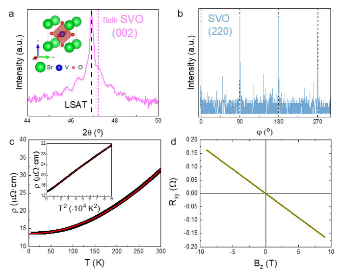 
Fig. 1. Structural and transport characterization of the LSAT/SVO(20.8 nm) thin film. (a) Bragg-Brentano θ-2θ scan around the (002) reflections. Inset: cubic perovskite crystal structure. (b) Phi-scan of the (220) reflection. (c) Longitudinal resistivity ρ plotted versus T. The quadratic dependence is commonly observed in SVO films, indicated by the linear trend with R-square = 0.9995 when ρ(T) plotted versus T2 (see inset). (d) Transverse Hall resistance Rxy versus out-of-plane field Bz at T = 300 K, showing a linear electron-like Hall response.

📷 Fig 2

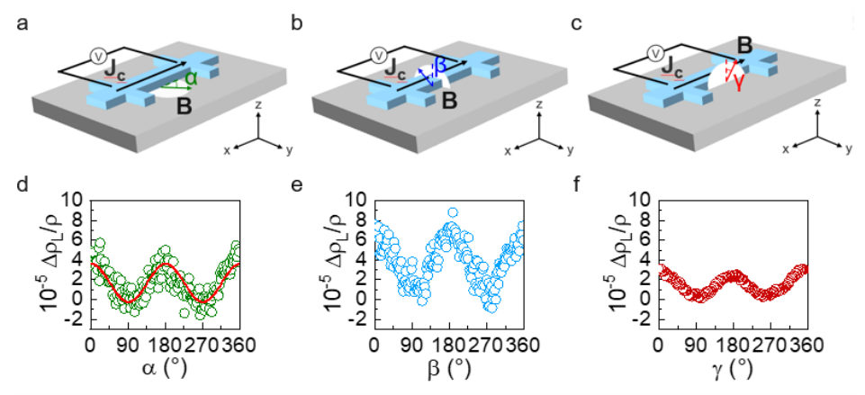 
Fig. 2. Angle-dependent magnetoresistance of LSAT/SVO(20.8 nm) at T = 100 K and B = 9 T. (a–c) Schematics of the three magnetic-field rotation planes, α (xy), β (yz), and γ (xz), defined with respect to the current direction x. (d–f) Corresponding longitudinal magnetoresistance ΔρL/ρ as a function of rotation angle. The α-plane data are fitted with the expected cos2 dependence (red solid line in panel d), yielding Aα = (4.0 ± 0.2) × 10⁻⁵. The α and β rotations display the angular dependence expected for Hanle magnetoresistance, whereas the finite modulation observed in the γ plane indicates an additional non-Hanle contribution.

📷 Fig 3

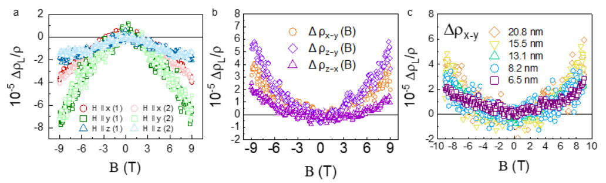 
Fig. 3. Field-dependent magnetoresistance of SVO films at T = 100 K. (a) Longitudinal magnetoresistance ΔρL/ρ of the LSAT/SVO(20.8 nm) film for magnetic fields applied along the x, y, and z directions. Two independent field sweeps (B1 and B2) are shown for each orientation, confirming the reproducibility of the measurements. (b) Field- dependent resistivity differences Δρₓ₋ᵧ/ρ and Δρz₋ᵧ/ρ, where Δρₓ₋ᵧ ≡ ρₓ − ρᵧ and Δρz₋ᵧ ≡ ρz − ρᵧ. Both differences exhibit a positive, even-in-field response with a similar field evolution, consistent with the expected HMR contribution. Their small deviation at high fields indicates an additional non-Hanle magnetoresistance contribution that depends on the...

📷 Fig 4

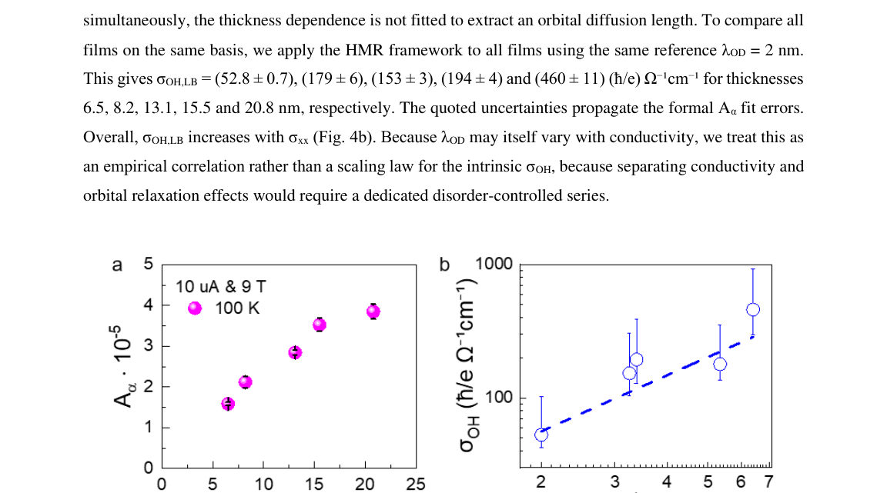 
Figure 4. Thickness and conductivity dependence of the orbital response in SVO films. (a) α-plane magnetoresistance amplitude at T = 100 K and B = 9 T as a function of film thickness; error bars are the formal cos2-fit uncertainties. (b) Saturation- limit lower-bound estimates σOH,LB, calculated using the same reference λOD = 2 nm for all films, plotted as a function of the longitudinal conductivity σxx = 1/ρ(100 K). Vertical bars in panel (b) represent the model sensitivity to λOD varied between 0.5 and 5 nm. The dashed line is a guide to the eye.

📷 Fig 5

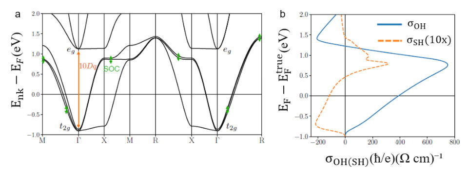 
Figure 5. First-principles electronic structure and intrinsic Hall conductivities of SVO. (a) Calculated electronic band structure of bulk SVO at zero strain. The crystal-field-split V t2g and eg manifolds are indicated, together with the characteristic crystal-field energy scale 10Dq and SOC. (b) Energy dependence of the intrinsic orbital Hall conductivity (solid blue line) and spin Hall conductivity (dashed orange line; multiplied by 10 for visibility), with energy referenced to the Fermi level EF. At EF, the calculated conductivities are σOHDFT = +390 (ħ/e)(Ω cm)⁻¹ and σSHDFT = −12 (ħ/e)(Ω cm)⁻¹, demonstrating a predominantly orbital transverse response.

**Summary.** This work reports on the observation of orbital Hall magnetoresistance in $	ext{SrVO}_3$ thin films, confirming the presence of orbital angular momentum transport. By analyzing angle- and field-dependent resistance, the authors extract quantitative values for the orbital Hall conductivity, which align well with first-principles DFT calculations. The findings establish narrow-band $d^1$ oxides as a promising platform for studying orbital electronics.

**Why it may be interesting.** While focused on oxides, the detailed study of orbital angular momentum transport and its quantitative comparison between experiment and DFT provides a model for understanding exotic charge/spin/orbital coupling phenomena relevant to strongly correlated systems.

Detailed structure

**Main problem.** The study investigates orbital angular momentum transport, specifically the Orbital Hall Effect (OHE), in narrow-band $d^1$ transition metal oxides.

**Main result.** The measurements confirm signatures consistent with orbital HMR, and the extracted orbital Hall conductivity ($\sigma_{OH}$) is found to be comparable to theoretical DFT predictions, suggesting orbital transport dominates.

**Method.** The research combines angle- and field-dependent magnetoresistance measurements (Hanle magnetoresistance) with Density Functional Theory (DFT) calculations.

**Model / system.** The physical system is epitaxial $	ext{SrVO}_3$ (SVO) thin films, which are characterized as narrow-band $d^1$ metallic oxides, studied across varying thicknesses.

**Key observables.** Hanle magnetoresistance (HMR) signatures ($\Delta
ho_{x-y}$), orbital Hall conductivity ($\sigma_{OH}$), and the ratio $|\sigma_{OH}^{	ext{DFT}}/\sigma_{\mathrm{SH}}^{	ext{DFT}}| \approx 33$.

**Important parameters / regimes.** Orbital diffusion length ($\lambda_{OD}$), orbital Hall angle ($	heta_{OH}$), and the film thickness ($t$).

**Assumptions / limitations.** The analysis relies on the diffusive HMR framework, and the calculation of carrier density uses a single-band approximation.

**Figures summary.** Figures show $
ho$ vs $T$ (quadratic dependence), $R_{xy}$ vs $B_z$ (linear, electron-like), and angle-dependent magnetoresistance ($\Delta
ho/
ho$) exhibiting $\cos^2$-like modulation.

**Paper structure.** The paper progresses from structural characterization and basic transport measurements to detailed analysis of angle-dependent and field-dependent magnetoresistance using the HMR framework to extract orbital transport parameters.

Abstract

Orbital transport in light transition metals has emerged as a promising route toward angular-momentum electronics, with Hanle magnetoresistance (HMR) providing a direct electrical probe of the orbital Hall effect (OHE) in non-magnetic conductors. Here we report magnetoresistance signatures consistent with orbital HMR in epitaxial SrVO$*3$ (SVO), a narrow-band $d^1$ oxide grown on (001)-oriented (LaAlO$*3$)$*{0.3}$(Sr$*2$TaAlO$*6$)$*{0.7}$ substrates. In films of different thickness and longitudinal resistivity, field-dependent measurements reveal a reproducible positive, even-in-field, and approximately quadratic $Δρ*{x-y}$ response, as expected for HMR. Angular measurements characterize the corresponding magnetoresistance anisotropy and reveal an additional non-Hanle contribution. Density functional theory (DFT) calculations yield an intrinsic orbital Hall conductivity $σ*{\mathrm{OH}}^{\mathrm{DFT}} = 390,(\hbar/e),Ω^{-1}\mathrm{cm}^{-1}$ and a spin Hall conductivity $σ_{\mathrm{SH}}^{\mathrm{DFT}} = -12,(\hbar/e),Ω^{-1}\mathrm{cm}^{-1}$ at the Fermi level, corresponding to $|σ_{\mathrm{OH}}^{\mathrm{DFT}}/σ_{\mathrm{SH}}^{\mathrm{DFT}}| \approx 33$, thus indicating a predominantly orbital response. Using the diffusive HMR framework with $λ_{\mathrm{OD}} = 2$ nm as a reference value, the 20.8 nm film gives conservative saturation-limit lower-bound (LB) estimates $θ_{\mathrm{OH,LB}} = 0.0144 \pm 0.0004$ and $σ_{\mathrm{OH,LB}} = (460 \pm 11),(\hbar/e),Ω^{-1}\mathrm{cm}^{-1}$, comparable to the DFT value. Across the series, lower-bound estimates obtained with the same $λ_{\mathrm{OD}}$ increase overall with longitudinal conductivity. These results suggest that narrow-band $d^1$ metallic oxides are a promising platform for orbital transport.

[↑ back to top](#top)

### [Strong-coupling multigap superconductivity in the Heusler compound ScAu$_2$Al](http://arxiv.org/abs/2609.21845v1)

**Authors:** Jozef Kačmarčík, Zuzana Pribulová, Yevhen Petrenko, Gabriel Kuderowicz, Paweł Wójcik, Michał J. Winiarski, Szymon M. Królak, Filip Košuth, Pavol Szabó, Tomasz Klimczuk, Bartlomiej Wiendlocha, Peter Samuely  
**Type:** both · **Category:** other · **PDF:** <https://arxiv.org/pdf/2609.21845v1>  
**Analysis basis:** full PDF text, analyzed in chunks

📷 Fig 1

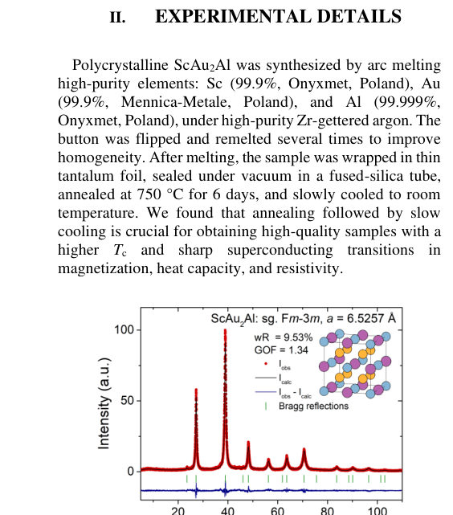 
FIG. 1. PXRD pattern of annealed ScAu₂Al (red points) with the Rietveld refinement (black line). Green ticks mark the Bragg- reflection positions of the full-Heusler structure; the unit cell is shown in the upper-right inset. The blue line is the difference between observed and calculated intensities.

📷 Fig 2

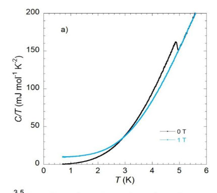 
FIG. 2. (a) Total specific heat of ScAu₂Al in zero field (superconducting state, black) and at 1 T (normal state, blue). (b) Normalized superconducting electronic contribution Ces/γnT = (Cs − Cn)/ γnT + 1 (black), compared with weak-coupling BCS behavior (blue dashed line), a single-gap strong-coupling α-model fit with 2Δ/kBTc = 4.5 (green), and a two-gap fit with 2ΔS/ kBTc = 4.1 and 2ΔL/ kBTc = 4.8 (red). Inset: residuals between the models and the experimental data.

📷 Fig 3

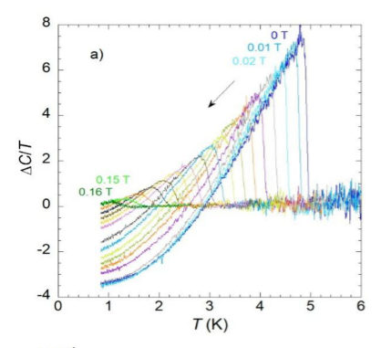 
FIG. 3. (a) Superconducting transition in (CS - Cn)/T at selected magnetic fields. (b) Resistive transitions as a function of magnetic field at selected temperatures. electron-phonon coupling [6], our calorimetric data consistently indicate strong coupling. First-principles calculations including spin-orbit coupling yield a density of states at the Fermi level N(EF) ≈ 2 states eV⁻¹ per formula unit [7], corresponding to a bare Sommerfeld coefficient band = 4.74 mJ mol⁻¹ K⁻². Using γexp/γband = 1 + λe-ph with our experimental γexp ≈ 10 mJ mol⁻¹ K⁻² gives λe-ph ≈ 1.1, again placing ScAu2Al in the strong electron-phonon-coupling regime.

📷 Fig 4

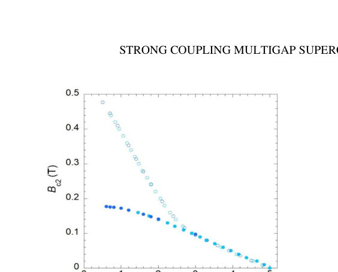 
FIG. 4. Temperature dependence of the upper critical field Bc2 determined from the specific-heat anomaly (closed circles) and from resistive transitions (open circles). 2.5 K. In both tunneling and point-contact regimes, the gap- like features are suppressed by fields of approximately 0.5– 0.6 T at 0.5 K (Fig. S3). These surface-sensitive measurements therefore probe superconductivity substantially modified from that of the bulk.

📷 Fig 5

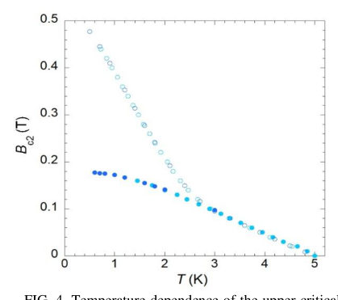 
Figure 3(b) shows resistive transitions R(B) measured at temperatures from 0.5 to 4.8 K. The transitions shift systematically to lower fields with increasing temperature and remain relatively narrow, indicating that the electrical transport is not dominated by a random weak-link Josephson network. Remarkably, zero resistance persists to approximately 0.44 T at the lowest temperature, far above the thermodynamic Bc2(0) ≈ 0.18 T. We also measured R(T) at fixed fields in steps of 0.02 T. In both temperature and field sweeps, the resistive critical field was defined at 50% of the normal-state resistance. The resulting Bc2(T), shown by open circles in Fig. 4, follows the thermodynamic field near...

**Summary.** This paper characterizes the superconductivity in the Heusler compound ScAu2Al, confirming it is a strong-coupling, multigap superconductor using calorimetry and transport measurements. The findings are supported by first-principles calculations, which help explain the observed superconducting gaps and the difference between the bulk and resistive upper critical fields.

**Why it may be interesting.** While focused on conventional BCS-like superconductivity, the strong-coupling nature, multigap structure, and the detailed analysis of critical field discrepancies (bulk vs. grain boundary) provide rich material for understanding complex many-body interactions in condensed matter systems.

Detailed structure

**Main problem.** The study investigates the nature of superconductivity in the Heusler compound ScAu2Al, specifically determining if it exhibits strong-coupling and multigap characteristics.

**Main result.** The material is established as a strong-coupling, multigap superconductor, with evidence pointing to distinct superconducting gaps and a significant discrepancy between bulk and resistive critical fields.

**Method.** The research combines high-resolution ac calorimetry and electrical transport measurements with first-principles Eliashberg calculations.

**Model / system.** The physical system is the Heusler superconductor ScAu2Al. The analysis utilizes models ranging from BCS theory to two-gap descriptions, supported by Eliashberg theory calculations.

**Key observables.** Specific-heat jump (ΔC/γ_nT_c), electron-phonon coupling constant (λ), superconducting gap ratios (2Δ/k_B T_c), and the upper critical field (B_c2).

**Important parameters / regimes.** Tc ≈ 4.95 K; Strong coupling indicators: ΔC/γ_nT_c = 2.2 (> 1.43); λ ≈ 1.1.

**Assumptions / limitations.** The discrepancy between the thermodynamic B_c2 (calorimetric) and the resistive B_c2 is attributed to superconductivity occurring in a percolating network of disordered grain boundaries and interfaces.

**Figures summary.** Figures show phase purity (PXRD), specific heat vs. T and B (comparing BCS, single-gap, and two-gap fits), and superconducting transition curves vs. B (comparing calorimetric and resistive measurements).

**Paper structure.** The paper proceeds by presenting multiple experimental diagnostics (calorimetry, transport) to characterize the superconducting state, confirming strong coupling and multigap behavior, and then using first-principles calculations to support and interpret the observed parameters like λ and B_c2.

Abstract

ScAu$_2$Al is the Heusler superconductor with the highest reported transition temperature, Tc, close to 5 K. Here, we combine high-resolution ac calorimetry and electrical-transport measurements with first-principles-based Eliashberg calculations. The large specific-heat jump, $ΔC/{γ_nT_c} =$ 2.2, well above the weak-coupling BCS value of 1.43, together with an electron-phonon coupling constant $λ = $1.1, establishes ScAu2Al as a strong-coupling superconductor. The electronic specific heat is described better by a two-gap α model, with $2Δ_S/k_BT_c = $ 4.1 and $2Δ_L/k_BT_c = $ 4.8, than by a single-gap model. The thermodynamic upper critical field follows a conventional WHH-like temperature dependence with $B_{c2}(0) = 0.18$ T, whereas the resistively determined critical field reaches values about three times larger and exhibits a pronounced positive curvature. We attribute the enhanced resistive field scale to superconductivity in disordered grain-boundary and interfacial regions. The experimental results are supported by calculations of the heat capacity and upper critical field within the Eliashberg formalism using Fermi-surface and electron-phonon parameters obtained from first-principles calculations

[↑ back to top](#top)

### [Tunneling Spectroscopy Study of Low Baked Bulk Niobium for Superconducting RF Cavity Applications](http://arxiv.org/abs/2609.21865v1)

**Authors:** Ivana Curci, Gregoire Jullien, Luc Maurice, Fabien Eozenou, Patrick Sahuquet, Thomas Proslier  
**Type:** both · **Category:** other · **PDF:** <https://arxiv.org/pdf/2609.21865v1>  
**Analysis basis:** full PDF text, analyzed in chunks

📷 Fig 1

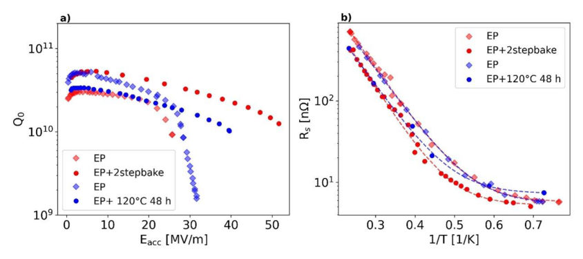 
FIG 1. a) Q0 versus Eacc results of two 1.3 GHz niobium cavities measured at temperatures in the range 1.35 K- 1.5 K. Symbol color indicates the cavity (red: Cavity 1; blue: Cavity 2). Squares denote the electropolished (EP) baseline and circles denote the same cavity after baking. (b) Surface resistance Rs measured as a function of temperature at an accelerating field of 1MV/m (4.3 mT). The dashed lines correspond to fits with Eq. (5).

📷 Fig 2

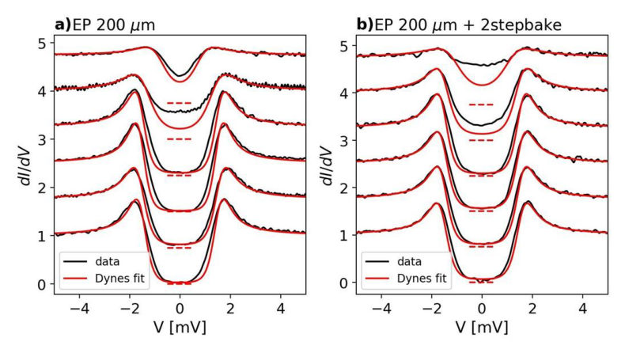 
FIG 2: Selected tunneling conductance curves and the corresponding fits from a Nb EP 200 µm sample before a) and after b) two-step bake. The curves have been vertically shifted for clarity. The red dashed lines indicate the zero-conductance level.

📷 Fig 3

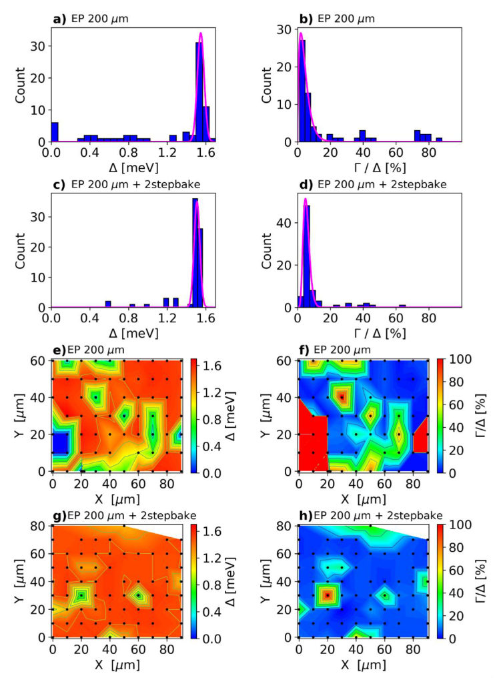 
FIG 3: ∆ and Γ/∆ statistics and maps obtained from a Nb EP 200 µm sample before and after two-step bake over areas of 100 µm x 100 µm. In magenta, gaussian (a-c) and gamma (b-d) fits. The black dots correspond to the locations of the tunnel junctions.

📷 Fig 4

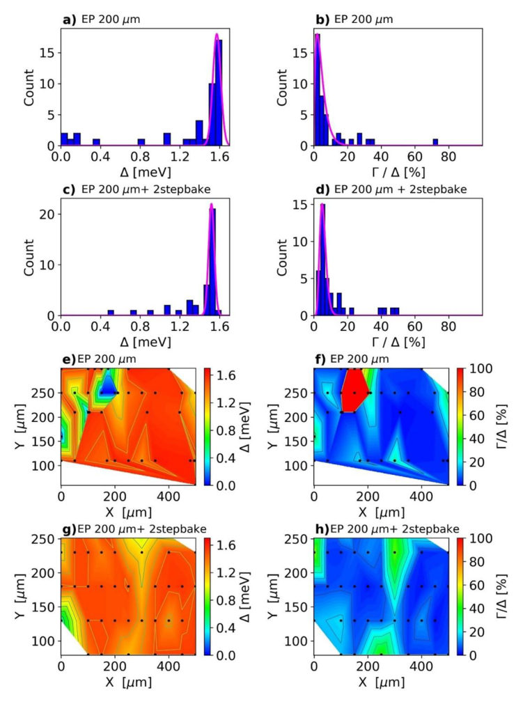 
FIG 4: ∆ and Γ/∆ statistics and maps obtained from a Nb EP 200 µm sample before and after two-step bake over areas of 500 µm x 300 µm. In magenta, gaussian (a-c) and gamma (b-d) fits. The black dots correspond to the locations of the tunnel junctions.

📷 Fig 5

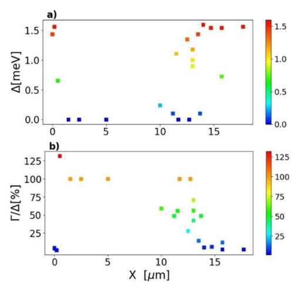 
FIG 5: ∆ and Γ/∆ parameters extracted from Dynes fits of conductance spectra obtained through a scan along the x-axis on the Nb EP 200 µm sample. The color scale indicates the magnitude of the values.

**Summary.** This work uses tunneling spectroscopy to examine how surface treatments affect the superconducting gap in niobium used for RF cavities. The key finding is that low-temperature baking effectively eliminates localized superconducting defects (minigaps) linked to hydride formation. This microscopic suppression of defects correlates directly with improved macroscopic RF performance, suggesting a clear path to optimizing superconducting materials.

**Why it may be interesting.** The direct link established between nanoscale superconducting defects (minigaps) and macroscopic device failure (HFQS) provides a powerful, measurable diagnostic tool for understanding superconducting material limitations.

Detailed structure

**Main problem.** To microscopically understand the mechanisms limiting the performance of Superconducting Radio-Frequency (SRF) cavities by studying the local superconducting properties of niobium.

**Main result.** Low-temperature baking treatments significantly suppress regions of degraded surface superconductivity (minigaps), providing direct evidence that these localized defects limit high-field performance.

**Method.** The study combines Point-Contact Tunneling (PCT) spectroscopy to probe local superconducting gaps with macroscopic RF measurements of surface resistance and quench fields.

**Model / system.** The physical system is cavity-grade niobium (Nb) used in SRF cavities. Analysis involves using the Usadel proximity-effect model to describe minigaps caused by coupling to normal regions, attributed to hydride formation.

**Key observables.** Superconducting energy gap (Delta), fraction of minigaps, residual resistance (R_res), and the onset field of high-field quench (E_onset).

**Important parameters / regimes.** Baking temperatures ($120^\circ	ext{C}$, two-step bake), critical current density, and the characteristic size of proximity-effect regions ($\sim 10$ nm).

**Assumptions / limitations.** The superconducting degradation is modeled as a proximity effect due to normal regions, which are linked to hydride formation during surface treatments.

**Figures summary.** Figures show the reduction of minigap fractions after baking, and plots correlate the fraction of minigaps with the decrease in the high-field quench onset field (E_onset).

**Paper structure.** The paper systematically compares EP samples to baked samples using PCT spectroscopy to quantify minigaps, then correlates these microscopic findings (minigap fraction, $\Gamma/\Delta$) with macroscopic RF performance metrics ($R_s$, $E_{	ext{onset}}$).

Abstract

Point-contact tunneling (PCT) spectroscopy was used to probe the local superconducting properties of cavity-grade niobium following surface treatments representative of superconducting radio-frequency (SRF) cavities. Electropolished (EP) samples were compared with samples baked at 120~$^\circ$C for 48 h and subjected to a two-step bake at 75~$^\circ$C for 2 h followed by 120~$^\circ$C for 48 h. Although the superconducting gap $Δ$ is predominantly distributed around the bulk Nb value (~1.5 meV), regions exhibiting strongly suppressed gaps (minigaps) are observed in 15--29% of junctions on EP samples. Their occurrence decreases to 6% after the 120~$^\circ$C bake and to only 1% after the two-step treatment. Spectra exhibiting minigaps are well described by the Usadel proximity-effect model, consistent with superconducting Nb coupled to normal regions that we attribute to hydride formation. These results provide direct microscopic evidence that low-temperature baking suppresses regions of degraded surface superconductivity in cavity-grade Nb. The pronounced reduction achieved by the two-step bake further supports a link between hydride-related proximity effects and the surface superconducting properties governing SRF cavity performance.

[↑ back to top](#top)

### [Universal Dzyaloshinski-Moriya interaction dictates pairing in unconventional superconductor families](http://arxiv.org/abs/2609.21731v1)

**Authors:** Baishun Yang, Yida Chu, Xuelei Sui, Haiqing Lin, Shijie Hu, Bing Huang  
**Type:** theory · **Category:** strongly correlated electrons · **PDF:** <https://arxiv.org/pdf/2609.21731v1>  
**Analysis basis:** full PDF text, analyzed in chunks

📷 Fig 1

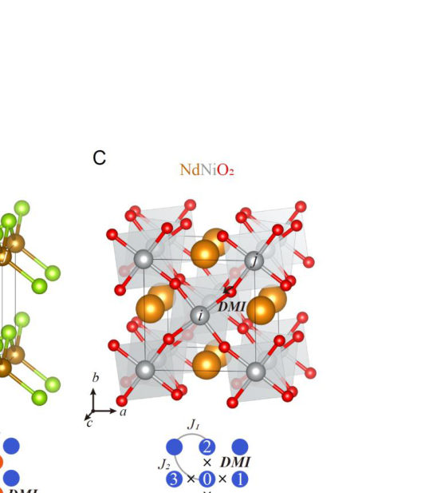 
Fig. 1. Local inversion symmetry breaking induces DMI across unconventional superconductors. Crystal structures of a, YBa₂Cu₃O₆, b, FeSe, and c, NdNiO₂. Black arrows show DMI vectors for representative magnetic atom pairs. Lower panels depict the DMI vector patterns on the four relevant bonds. Blue and red circles indicate different sublattices. Local buckling, tetrahedral distortions, or octahedral rotations break local inversion symmetry, generating DMI in cuprates, iron‑based superconductors, and nickelates, respectively.

📷 Fig 2

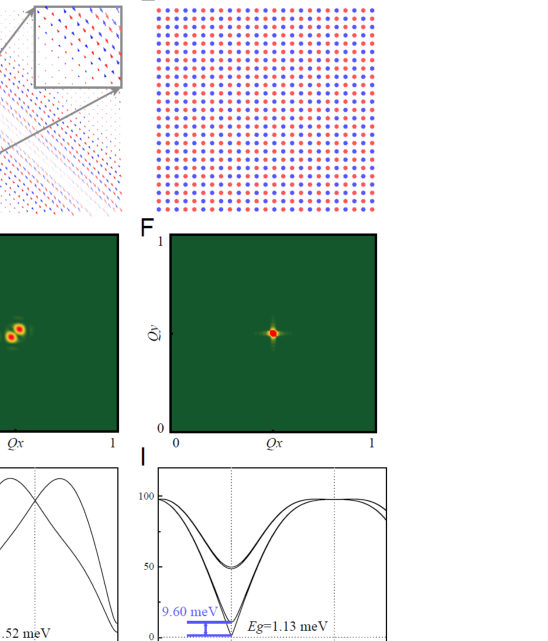 
Fig. 2. Spin textures and excitations from DMI. Real‑space spin configurations (a,c,e), reciprocal‑space spin fluctuations (b,d,f), and spin wave spectra (g,h,i) for YBa₂Cu₃O₆, FeSe, and NdNiO₂. Incommensurate order, spin wave gaps, and noncollinear textures are captured by the Hamiltonian including DMI (Equation 1).

📷 Fig 3

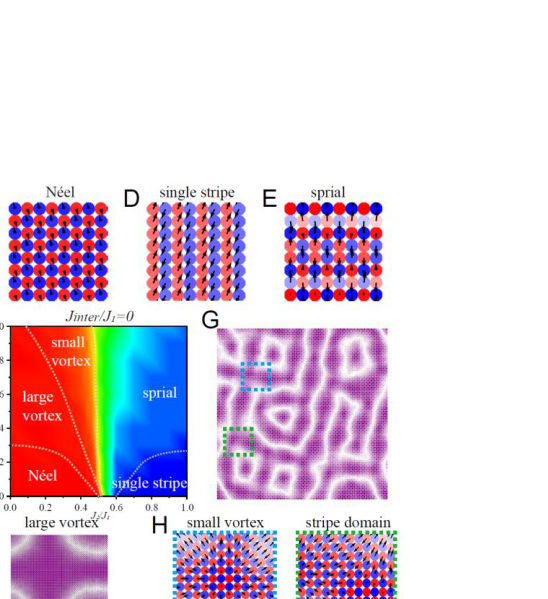 
Fig. 3. Magnetic phase diagram from MC simulations including DMI. a, Phase diagram of spin textures in the 𝐽1–𝐽2–𝐽inter–𝐷 parameter space. Colors represent the peak intensity of the Fourier-transformed reciprocal wave vector Q2 in the square lattice. b, Phase diagram for 𝐽inter/𝐽1 = 0, showing four distinct magnetic states. Real-space spin configurations for c, Néel order, d, single-stripe order, e, spiral order. f, large vortex, and g, small vortex. h, Zoomed-in view of a single vortex and stripe domain in (g). Red-blue color scale and arrows denote out-of-plane and in-plane spin components, respectively. The emergence of vortex states between Néel and stripe phases highlights the crucial...

📷 Fig 4

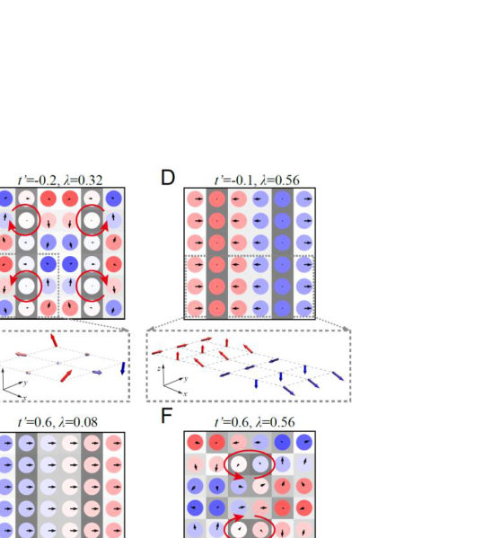 
Fig. 4. Ground state phase diagram for the Rashba–Hubbard model. Calculations are performed on a cylindrical lattice of size 𝐿𝑥= 12, 𝐿𝑦= 6 at a doping level 𝛿ℎ= 1/9 . a, Ground-state phase diagram showing five distinct phases. In the hole-CDW-1/3 phase, regions where vortexes form are marked with “×” symbols. b– f, Spin textures and charge distributions for five representative parameter sets. In panels c–f, results are extracted from the central 6 × 6 region of the square lattice for clarity. Vectors represent the in-plane spin components (−1)𝑖〈𝑆̂𝑖

📷 Fig 5

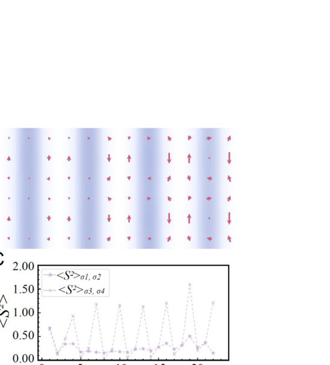 
Fig. 5. Ground state characterics of the Rashba–Hubbard model with parameters close to DFT-fitted those of YBa2Cu3O6. a, Spin textures in the 𝑥𝑦-plane (red arrows) and grayscale hole distribution on a larger square-lattice cylinder with dimensions 𝐿𝑥= 24 and 𝐿𝑦= 6. b, Spin-singlet superconducting correlations as a function of distance, measured from a vertical bond (black bold line) connecting sites 1 and 2 to another vertical bond (blue bold line) connecting sites 3 and 4. The green bold line denotes the best fit to a power-law decay. c, Pairing angular momentum on these two bonds.

**Summary.** This work proposes that the Dzyaloshinskii-Moriya interaction (DMI) is the fundamental, unifying ingredient responsible for noncollinear magnetism in multiple families of unconventional superconductors. By simulating the interplay between DMI-driven spin vortices and charge stripes, the authors identify hole-stripe–vortex coupling as the key microscopic mechanism stabilizing superconductivity under hole doping.

**Why it may be interesting.** The detailed study of non-collinear spin textures and their interplay with charge order (CDW) and superconductivity provides a rich, complex many-body problem relevant to understanding exotic quantum states in correlated materials.

Detailed structure

**Main problem.** The paper addresses the failure of the traditional collinear spin-fluctuation paradigm to explain unconventional superconductivity across diverse families like cuprates, iron-based superconductors, and nickelates.

**Main result.** The Dzyaloshinskii-Moriya interaction (DMI) is established as a universal link between noncollinear magnetism and superconductivity, suggesting hole-stripe–vortex coupling is the microscopic pairing engine.

**Method.** The study employs a combination of first-principles calculations, unbiased large-scale DMRG simulations, and Monte Carlo (MC) simulations to model spin textures and magnetic phases.

**Model / system.** The research focuses on unconventional superconductors (cuprates, pnictides, nickelates) modeled using spin Hamiltonians incorporating the DMI term, and sometimes the Rashba–Hubbard model.

**Key observables.** Incommensurate spin wave vectors ($\mathbf{Q}$), spin wave gaps, noncollinear spin textures (vortices, stripes), and superconducting correlations.

**Important parameters / regimes.** DMI strength ratio ($D_{ij}/J_1$), doping level (hole vs. electron), and various magnetic exchange couplings ($J_1, J_2, D$).

**Assumptions / limitations.** The analysis assumes that DMI, arising from local inversion-symmetry breaking, is the dominant non-collinear magnetic interaction governing the pairing mechanism.

**Figures summary.** Figures illustrate local symmetry breaking mechanisms (Fig. 1), spin textures and spectra for multiple materials (Fig. 2), magnetic phase diagrams showing vortex/stripe transitions (Fig. 3), and ground state phase diagrams for the Hubbard model (Fig. 4).

**Paper structure.** The paper progresses by first identifying the failure of existing models, then introducing DMI as the unifying ingredient via DFT/MC simulations across multiple material classes, detailing the doping dependence of the resulting vortex-stripe phases, and finally proposing the pairing mechanism.

Abstract

The collinear-antiferromagnetic spin-fluctuation paradigm has long guided unconventional superconductivity research, yet fails to reconcile the noncollinear spin phenomena observed across cuprates, iron-based superconductors, and nickelates. Using extensive first-principles calculations and unbiased large-scale DMRG simulations, we show that Dzyaloshinski-Moriya interaction (DMI)-arising from local inversion-symmetry breaking-is a common ingredient across these families. This DMI unifies hallmark observations in parent compounds-incommensurate orders, spin-wave gaps, and noncollinear textures. Under hole doping, strong DMI drives spin vortices to merge with pi-shifted hole stripes, forming hybrid vortex-hole stripe phases. These phases stabilize charge order while supporting, not suppressing, superconductivity. By contrast, under electron doping, these vortices pin holes and suppress long-range superconductivity. Our results establish DMI as a unifying link between noncollinear magnetism and superconductivity, identifying hole-strip-vortex coupling as a microscopic pairing engine. Given that DMI is common across major superconductor families, these findings challenge the prevailing pairing mechanism and offer an experimentally testable roadmap for materials optimization.

[↑ back to top](#top)

