
# arxiv digest (quant-ph + cond-mat) — 2026-09-25

*143 papers · 21 relevant · 2 highlighted*

## 🔥 Most relevant (21)

*Every paper with at least one nonzero topic score, sorted by best-matching score. 🔥 marks scores ≥4/5. Click the title to jump to the full entry below; click [arXiv] to open the paper page. `(secondary)` marks papers from de-prioritized cond-mat archives.*

Show 21 relevant papers

- [Optical Schrödinger cat states generated using cavity Rydberg quantum photonics](#paper-2609.27983) [[arXiv]](http://arxiv.org/abs/2609.27983v1) — 🔥 `quantum optics experiment` **4/5** · `QC/QI experiment` **3/5** · `Tavis-Cummings & cavity-many-emitter` **3/5** · `analog quantum simulation` **3/5** · `Rydberg arrays` **2/5** · `driven-dissipative phase transition` **2/5** · `correlated / nonlocal dissipation` **1/5** · `interference shaping light` **1/5** · `methods for driven-dissipative` **1/5** · `quantum measurements` **1/5**
- [Measurement-Only Dynamical Phase Transitions in Spin-1 Chains](#paper-2609.26941) [[arXiv]](http://arxiv.org/abs/2609.26941v1) — 🔥 `driven-dissipative phase transition` **4/5** · 🔥 `quantum measurements` **4/5** · `analog quantum simulation` **3/5** · `methods for driven-dissipative` **3/5** · `non-equilibrium universality` **3/5** · `correlated / nonlocal dissipation` **2/5**
- [Quantum dynamics of spinful impurity in ideal Bose gas](#paper-2609.28180) [[arXiv]](http://arxiv.org/abs/2609.28180v1) — 🔥 `Keldysh / 2PI / non-Gaussian methods` **4/5** · `analog quantum simulation` **3/5** · `methods for driven-dissipative` **3/5** · `non-equilibrium universality` **3/5** · `scars & prethermalization` **3/5** · `correlated / nonlocal dissipation` **1/5** · `driven-dissipative phase transition` **1/5** · `quantum measurements` **1/5**
- [Universal splitting of nonequilibrium phase transitions in driven Potts heat engines](#paper-2609.28148) [[arXiv]](http://arxiv.org/abs/2609.28148v1) — 🔥 `driven-dissipative phase transition` **4/5** · `methods for driven-dissipative` **3/5** · `non-equilibrium universality` **3/5** · `Keldysh / 2PI / non-Gaussian methods` **2/5** · `analog quantum simulation` **2/5** · `correlated / nonlocal dissipation` **2/5** · `Frenkel-Kontorova` **1/5** · `quantum measurements` **1/5**
- [Measurement-based feedback as a flexible tool to control non-Poissonian photon statistics](#paper-2609.26949) [[arXiv]](http://arxiv.org/abs/2609.26949v1) — 🔥 `Full counting statistics` **4/5** · 🔥 `quantum measurements` **4/5** · `driven-dissipative phase transition` **2/5** · `methods for driven-dissipative` **2/5** · `analog quantum simulation` **1/5** · `correlated / nonlocal dissipation` **1/5** · `non-equilibrium universality` **1/5** · `quantum optics experiment` **1/5**
- [Scalable simulation of non-Markovian quantum transport by stochastic-phase bath reduction](#paper-2609.28318) [[arXiv]](http://arxiv.org/abs/2609.28318v1) — 🔥 `methods for driven-dissipative` **4/5** · `correlated / nonlocal dissipation` **3/5** · `Keldysh / 2PI / non-Gaussian methods` **2/5** · `driven-dissipative phase transition` **2/5** · `non-equilibrium universality` **2/5** · `quantum measurements` **2/5** · `analog quantum simulation` **1/5**
- [Deterministic photon waveform adaptation for quantum connectivity](#paper-2609.26889) [[arXiv]](http://arxiv.org/abs/2609.26889v1) — 🔥 `quantum optics experiment` **4/5** · `QC/QI experiment` **3/5** · `interference shaping light` **3/5** · `analog quantum simulation` **2/5** · `methods for driven-dissipative` **1/5** · `quantum measurements` **1/5**
- [Optimal low-rank compression of quantum dynamics](#paper-2609.27497) [[arXiv]](http://arxiv.org/abs/2609.27497v1) — 🔥 `methods for driven-dissipative` **4/5** · `analog quantum simulation` **3/5** · `correlated / nonlocal dissipation` **2/5** · `driven-dissipative phase transition` **2/5** · `non-equilibrium universality` **2/5** · `Keldysh / 2PI / non-Gaussian methods` **1/5**
- [Dynamic moiré-like band modulation in Dirac materials via multi-beam optical interference](#paper-2609.28293) [[arXiv]](http://arxiv.org/abs/2609.28293v1) `(secondary)` — 🔥 `interference shaping light` **4/5** · `analog quantum simulation` **3/5** · `Keldysh / 2PI / non-Gaussian methods` **2/5** · `driven-dissipative phase transition` **2/5** · `methods for driven-dissipative` **2/5**
- [Scalable integration of silicon carbide color centers into nanophotonic structures](#paper-2609.27601) [[arXiv]](http://arxiv.org/abs/2609.27601v1) — 🔥 `QC/QI experiment` **4/5** · `quantum optics experiment` **3/5** · `Tavis-Cummings & cavity-many-emitter` **1/5** · `analog quantum simulation` **1/5** · `quantum measurements` **1/5**
- [A photonic integrated comb engine for ultracold quantum gases](#paper-2609.28294) [[arXiv]](http://arxiv.org/abs/2609.28294v1) — 🔥 `analog quantum simulation` **4/5** · `interference shaping light` **2/5** · `quantum optics experiment` **2/5** · `QC/QI experiment` **1/5**
- [Beyond Antibunching: Photon Correlation Analysis Reveals Blinking Origin](#paper-2609.28139) [[arXiv]](http://arxiv.org/abs/2609.28139v1) — 🔥 `quantum optics experiment` **4/5** · `quantum measurements` **2/5** · `Full counting statistics` **1/5** · `correlated / nonlocal dissipation` **1/5** · `methods for driven-dissipative` **1/5**
- [Charge and spin qubits in interacting quantum dots coupled to Rashba-active leads](#paper-2609.27648) [[arXiv]](http://arxiv.org/abs/2609.27648v1) — 🔥 `methods for driven-dissipative` **4/5** · `Keldysh / 2PI / non-Gaussian methods` **1/5** · `analog quantum simulation` **1/5** · `correlated / nonlocal dissipation` **1/5** · `driven-dissipative phase transition` **1/5** · `quantum measurements` **1/5**
- [Dual Boundary Condition Inference: A Two-Boundary Product Rule and Its Implications](#paper-2609.27120) [[arXiv]](http://arxiv.org/abs/2609.27120v1) — 🔥 `quantum measurements` **4/5** · `Keldysh / 2PI / non-Gaussian methods` **2/5** · `methods for driven-dissipative` **2/5**
- [Multiscale Entropies as Order Parameters for Nonequilibrium Phase Transitions](#paper-2609.27705) [[arXiv]](http://arxiv.org/abs/2609.27705v1) — 🔥 `non-equilibrium universality` **4/5** · `driven-dissipative phase transition` **3/5** · `Frenkel-Kontorova` **1/5**
- [Theory of Airy-Beam Wavefront Sensing](#paper-2609.28050) [[arXiv]](http://arxiv.org/abs/2609.28050v1) — 🔥 `interference shaping light` **4/5** · `quantum measurements` **3/5** · `analog quantum simulation` **1/5**
- [Bosonic Error Correction with Fluxonium](#paper-2609.26880) [[arXiv]](http://arxiv.org/abs/2609.26880v1) — 🔥 `QC/QI experiment` **4/5** · `quantum measurements` **2/5** · `quantum optics experiment` **1/5**
- [Precision and resource scaling of real-time flux distortion compensation for superconducting quantum control](#paper-2609.27456) [[arXiv]](http://arxiv.org/abs/2609.27456v1) — 🔥 `QC/QI experiment` **4/5** · `quantum measurements` **1/5**
- [Soft decoding for quantum LDPC codes with experimental validation](#paper-2609.26958) [[arXiv]](http://arxiv.org/abs/2609.26958v1) — 🔥 `QC/QI experiment` **4/5** · `quantum measurements` **1/5**
- [A Proof of Shor's Orthogonal-Measurement Conjecture and the Structure of Information-Optimal Quantum Measurements](#paper-2609.27992) [[arXiv]](http://arxiv.org/abs/2609.27992v1) — 🔥 `quantum measurements` **4/5**
- [Optimising Cryogenic Wiring for Microwave-frequency Millikelvin Quantum Processors](#paper-2609.27239) [[arXiv]](http://arxiv.org/abs/2609.27239v1) — 🔥 `QC/QI experiment` **4/5**

## ⭐ Highlighted (2)

*Papers by authors on your watch list. Click the title to jump to the full entry below; click [arXiv] to open the paper page.*

Show 2 highlighted papers

- ⭐ [Monolithic Quantum Error Correction in the Presence of Distinguishability](#paper-2609.26946) [[arXiv]](http://arxiv.org/abs/2609.26946v1) — Alexey V. Gorshkov
- ⭐ [Nonabelian vortices: From topological strings to nonvolatile memory](#paper-2609.28025) [[arXiv]](http://arxiv.org/abs/2609.28025v1) `(secondary)` — Yaroslav Tserkovnyak

## All papers (100, sorted by relevance)

*Papers from quant-ph and your primary cond-mat archives (quant-gas, stat-mech, str-el, dis-nn). Highlighted papers (⭐) come first, then everything else sorted by topic-relevance score, highest first.*

### ⭐ [Monolithic Quantum Error Correction in the Presence of Distinguishability](http://arxiv.org/abs/2609.26946v1)

**Highlighted author(s):** Alexey V. Gorshkov  
**Authors:** Shubham P. Jain, Eric R. Hudson, Wesley C. Campbell, Alexey V. Gorshkov, Victor V. Albert  
**Type:** theory · **Category:** quantum information and computing · **PDF:** <https://arxiv.org/pdf/2609.26946v1>  
**Analysis basis:** full PDF text, analyzed in chunks
**Topic relevance:** `quantum measurements` **3/5** · `QC/QI experiment` **1/5** · `analog quantum simulation` **1/5** · `correlated / nonlocal dissipation` **1/5** · `driven-dissipative phase transition` **1/5** · `methods for driven-dissipative` **1/5**

📷 Fig 1

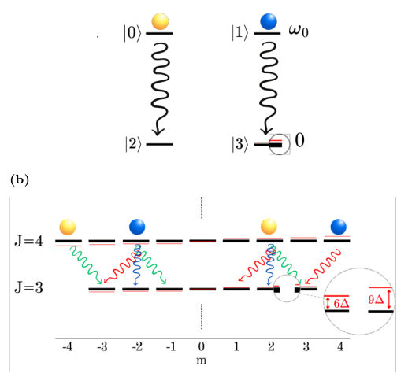 
FIG. 1: (a) The four-level model with the degeneracy-lifting term Δ|3⟩⟨3| and (b) a representative atomic system with the degeneracy-lifting term ∑︀

📷 Fig 2

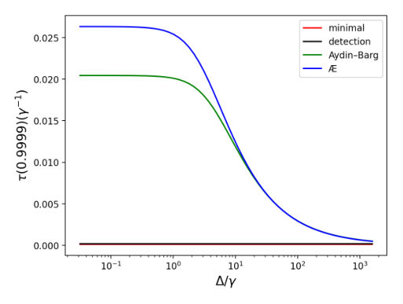 
FIG. 3: Checking time 𝜏(𝐹0) at target fidelity 𝐹0 = 0.9999 as a function of the degeneracy-lifting strength Δ, with ev- ery state decaying at rate 𝛾. At small Δ the checking time saturates at a code-dependent value 𝜏⋆, with 𝜏⋆minimal &lt; 𝜏⋆detection &lt; 𝜏⋆Aydin–Barg &lt; 𝜏⋆Æ. The Æ curve stays above the Aydin–Barg curve until Δ/𝛾≈50, after which Aydin– Barg is marginally ahead.

📷 Fig 3

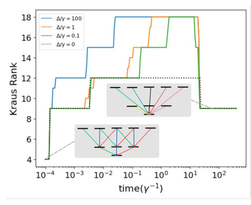 
FIG. 2: Effective Kraus rank versus time for the channel generated by 𝐻𝒮+𝐻Δ and the jump operators 𝐿𝛿with 𝐽≤2, counting Kraus operators with weight above 10−8. The insets sketch the error channel at early and late times, with colors denoting distinct Kraus operators: early Kraus operators have support on several source states, whereas in the long-time limit each maps a single source state to the ground state |0, 0⟩.

📷 Fig 4

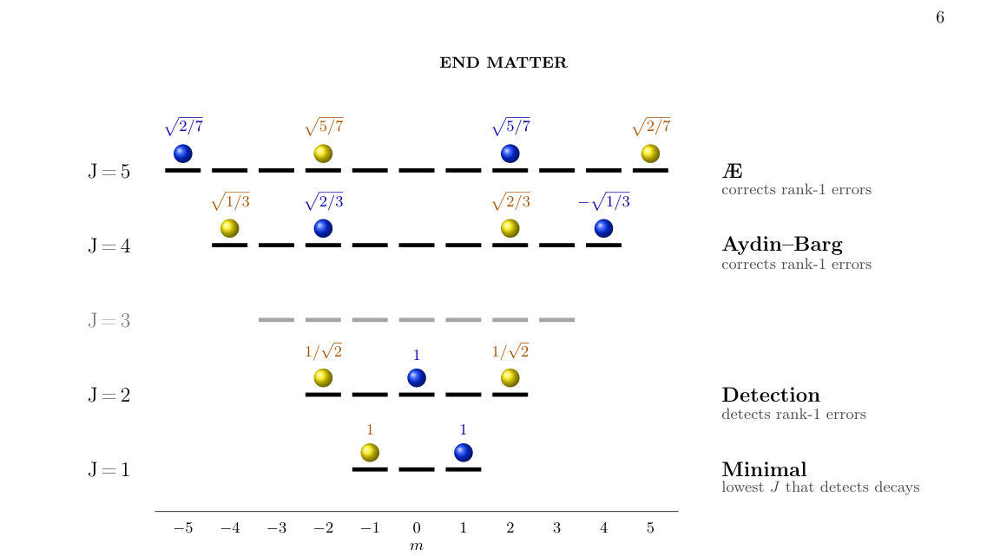 
FIG. 4: Representative encodings used in the numerical comparisons. Each row of black bars is a degenerate angular- momentum manifold 𝐽, and horizontal position gives the magnetic quantum number 𝑚. Yellow and blue spheres mark the basis states supporting |¯0⟩and |¯1⟩, respectively, with their nonzero amplitudes indicated. The minimal and detection encodings serve as baselines, while the Æ and Aydin–Barg codes both correct rank-1 transitions.

📷 Fig 5

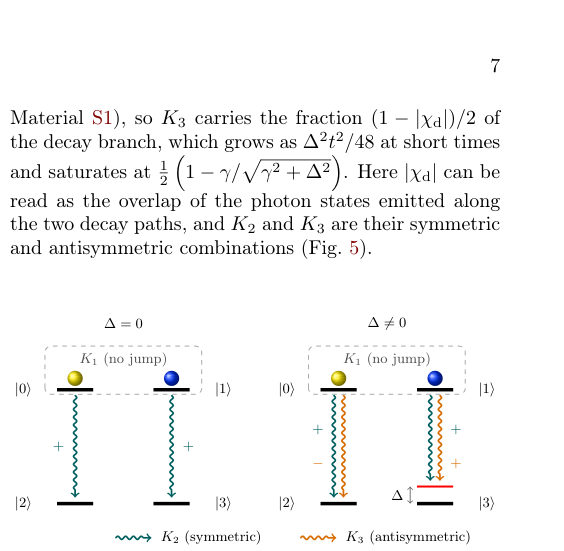 
FIG. 5: Onset of the third Kraus operator in the four-level model. At Δ = 0 the channel has two Kraus operators, the no-jump operator 𝐾1 and a single decay operator 𝐾2 that acts identically on the two decay paths. For Δ ̸= 0 the decay branch splits into the symmetric and antisymmetric combi- nations 𝐾2 and 𝐾3 of the two paths, Eqs. (13) and (14). The signs indicate the relative sign of the two paths in each oper- ator.

**Summary.** This paper analyzes the practical limitations of Quantum Error Correction when environmental noise makes error processes distinguishable. Using an atomic model, the authors show that distinguishability degrades fidelity and increases the required checking frequency. They conclude that implementing fast syndrome extraction is essential to maintain robust quantum information processing.

**Why it may be interesting.** This work directly addresses a practical limitation in implementing QEC in real physical systems (like atoms), connecting fundamental quantum information theory with the specifics of open quantum dynamics and measurement protocols.

Detailed structure

**Main problem.** The paper investigates how the distinguishability of environmental error processes degrades the performance of Quantum Error Correction (QEC) codes.

**Main result.** Rapid and frequent syndrome checking is identified as a crucial mechanism to mitigate the buildup of error distinguishability, thereby restoring near-perfect quantum state recovery.

**Method.** The analysis uses analytical modeling of fidelity decay, calculating state-level and channel-level fidelities, and deriving scaling laws for the required syndrome checking time.

**Model / system.** The study employs an analytically solvable four-level model, representing atomic and molecular angular-momentum systems subjected to spontaneous-emission noise.

**Key observables.** Branch-averaged decoded state fidelity ($F_\psi$), transpose fidelity ($F_{	ext{tr}}$), and the required syndrome checking time ($	au$).

**Important parameters / regimes.** Degeneracy-lifting strength ($\Delta$), spontaneous emission rate ($\gamma$), and the target fidelity ($F_0$).

**Assumptions / limitations.** The analysis assumes the validity of the Lindblad master equation formalism and focuses on the regime where rapid syndrome checking can counteract distinguishability buildup.

**Figures summary.** Figures illustrate the four-level model, the evolution of the effective Kraus rank over time, and the dependence of the required checking time ($	au$) on the distinguishability parameter ($\Delta$) for various QEC codes.

**Paper structure.** The paper progresses by first establishing the physical model (four-level system, spontaneous emission), quantifying the impact of distinguishability ($\Delta$) on error channels (increasing Kraus rank), and finally deriving the necessary condition (fast syndrome extraction) to maintain high fidelity over time.

Abstract

Quantum error-correcting codes require that the environment cannot distinguish relevant error processes acting on different codewords. In practice, residual Zeeman, Stark, or anharmonic interactions shift the underlying states, making errors distinguishable and weakening the conditions for perfect recovery. We study this effect with an analytically solvable four-level model and a canonical spontaneous-emission noise model for atoms and molecules. Distinguishability raises the effective Kraus rank of the noise channel, lowers the recovered fidelity, and sets an operational checking time that shortens as the frequency separation between the emitted photons increases. We find that rapid syndrome checking suppresses the buildup of distinguishability and quantify how fast one needs to check to restore near-perfect recovery. Error distinguishability is thus a practical limitation of monolithic error correction, and our analysis identifies fast syndrome extraction as a route to mitigating it.

[↑ back to top](#top)

### [Optical Schrödinger cat states generated using cavity Rydberg quantum photonics](http://arxiv.org/abs/2609.27983v1)

**Authors:** Hendrik Hegels, Mae Eichenberger, Gerhard Rempe, Stephan Dürr  
**Type:** both · **Category:** other · **PDF:** <https://arxiv.org/pdf/2609.27983v1>  
**Analysis basis:** full PDF text, analyzed in chunks
**Topic relevance:** 🔥 `quantum optics experiment` **4/5** · `QC/QI experiment` **3/5** · `Tavis-Cummings & cavity-many-emitter` **3/5** · `analog quantum simulation` **3/5** · `Rydberg arrays` **2/5** · `driven-dissipative phase transition` **2/5** · `correlated / nonlocal dissipation` **1/5** · `interference shaping light` **1/5** · `methods for driven-dissipative` **1/5** · `quantum measurements` **1/5**

📷 Fig 1

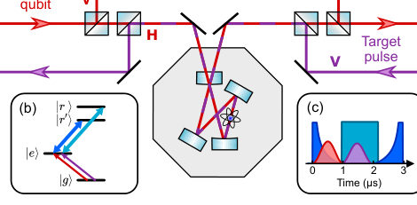 
FIG. 1. (a) Scheme of the cat-state generation. A polar- ization qubit carried by the control photon (red) is converted into a dual-rail qubit by a polarizing beam splitter (PBS, blue square). In one rail the photon is stored as a Rydberg excita- tion inside the cavity, in the other rail the photon bypasses the cavity. Next, the target light pulse (purple) enters the setup and experiences a conditional π phase shift upon reflection off the cavity. Subsequently, the control photon is retrieved and overlapped with the bypass on another PBS. An optical fiber in the bypass matches the delay resulting from storage. The vacuum chamber is represented by the octagon. The scheme is simplified for...

📷 Fig 2

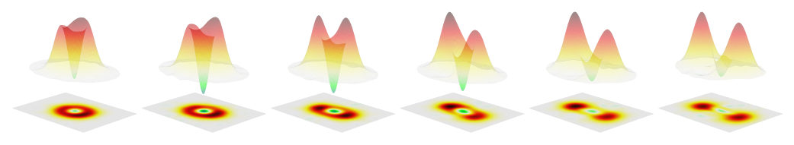 
FIG. 2. Wigner functions of odd cat states of six different sizes. The data are not corrected for detection loss. All Wigner functions have negative regions (green), thus featuring a nonclassical property. The loss-corrected cat size increases from left (α2 g = 0.18) to right (α2 g = 2.4).

📷 Fig 3

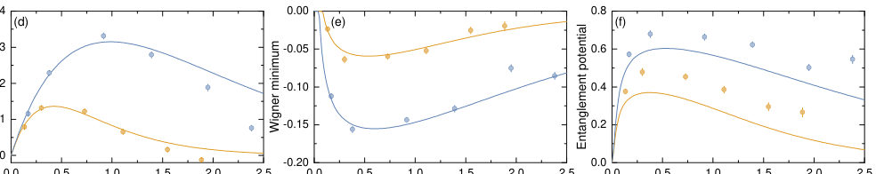 
FIG. 3. Cat-state properties. (a) The fidelities Fpure (Fmix) between the measured HES and the pure (mixed) best-fit HES show that the dominant limitation in the cat-state generation is a reduced visibility V . (b) The dependence of V on α2 eff agrees well with a model that assumes that loss of target photons is the dominant experimental imperfection. The Bell-state fidelity (a) and the negativity (c) show that the HES is entangled. (d) The macroscopicity measures how macroscopic the superposition in the HES is. If the minimum of the Wigner function (e) is negative or if the entanglement potential (f) is nonzero, then the odd CSS is nonclassical.

**Summary.** This paper reports on the generation of large optical Schrödinger cat states using cavity Rydberg quantum photonics. The authors achieved a record state size while rigorously characterizing the state's entanglement and nonclassicality through quantum state tomography. They also provide a deep theoretical analysis of loss mechanisms, offering pathways to improve state fidelity for quantum information applications.

**Why it may be interesting.** This work is highly relevant as it pushes the boundaries of quantum state generation in cavity QED platforms, directly addressing decoherence and scaling challenges critical for quantum information processing.

Detailed structure

**Main problem.** The primary goal is to generate and characterize high-size hybrid entangled states (HESs) of optical photons, specifically Schrödinger cat states, using a novel quantum platform.

**Main result.** The authors achieved a world-record size for these optical HESs, reaching $|\alpha|^2 = 2.4$, while also providing detailed theoretical and experimental analysis of the decoherence mechanisms limiting state fidelity.

**Method.** The work combines quantum state tomography and fidelity measurements on the generated states with detailed theoretical modeling of photon loss mechanisms in the cavity system.

**Model / system.** The system utilizes cavity Rydberg quantum photonics, employing Rydberg Electromagnetically Induced Transparency (EIT) to generate entanglement between a superposition of two coherent states and a polarization qubit.

**Key observables.** Uhlmann fidelity ($F_{	ext{mix}}$), Negativity ($N$), Lee-Jeong macroscopicity ($I$), and the effective cat state size ($\alpha^2$).

**Important parameters / regimes.** Decoherence rates, blockade parameters ($C, \Lambda_V$), and interaction times ($t_t$).

**Assumptions / limitations.** The analysis relies on modeling photon loss due to cavity and mirror imperfections, and later assumes specific functional forms for the optimal homodyne measurement mode function.

**Figures summary.** Figures show Wigner functions demonstrating increasing cat state size up to $\alpha^2=2.4$, and subsequent figures analyze fidelities, visibility dependence, and entanglement measures derived from tomography.

**Paper structure.** The paper progresses from demonstrating the generation and measurement of large HESs (state tomography) to quantifying the limitations imposed by decoherence (fitting visibility vs. size) and finally to a detailed theoretical analysis of minimizing total loss ($L_g$) by optimizing measurement modes and operational parameters.

Abstract

We introduce cavity Rydberg quantum photonics as a novel platform for generating hybrid entangled states of optical photons. The system achieves world-record sizes of these states and has the potential to produce yet larger states in the future. In the hybrid entangled state produced here, a superposition of two coherent states is entangled with a polarization qubit carried by a photon in another beam path. We perform quantum state tomography of this hybrid entangled state and evaluate various key properties. By optimizing the decoherence we increase the size compared to previous hybrid entangled states, reaching a size of $α^2= 2.4$. Besides the fundamental interest in Schrödinger cat states, this work is interesting because of potential applications in the field of quantum information processing.

[↑ back to top](#top)

### [Measurement-Only Dynamical Phase Transitions in Spin-1 Chains](http://arxiv.org/abs/2609.26941v1)

**Authors:** Kemal Aziz, Haining Pan, J. H. Pixley  
**Type:** theory · **Category:** statistical mechanics · **PDF:** <https://arxiv.org/pdf/2609.26941v1>  
**Analysis basis:** full PDF text, analyzed in chunks
**Topic relevance:** 🔥 `driven-dissipative phase transition` **4/5** · 🔥 `quantum measurements` **4/5** · `analog quantum simulation` **3/5** · `methods for driven-dissipative` **3/5** · `non-equilibrium universality` **3/5** · `correlated / nonlocal dissipation` **2/5**

📷 Fig 1

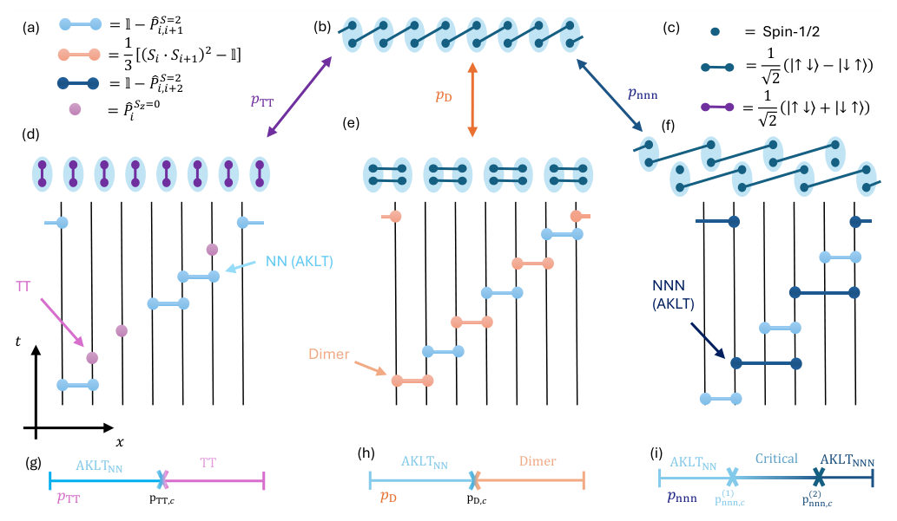 
FIG. 1. Overview of the measurement-only spin-1 protocols. (a) Local projectors used in the three protocols: the NN AKLT projector (light blue), dimer VBS projector (orange), NNN AKLT projector (dark blue), and single-site Sz i = 0 projector (purple). (b) Virtual-spin construction of the NN AKLT state. The solid points denote virtual spin-1/2 degrees of freedom paired into singlets; the ovals project each pair of virtual spins onto the physical spin-1 subspace. (c) Conventions for the virtual spin-1/2 degrees of freedom and their singlet and Sz = 0 triplet pairings. (d) Circuit diagram of the SPT-to-TT model. For each qutrit i, the single-site Sz i = 0 projector is applied on i with...

📷 Fig 2

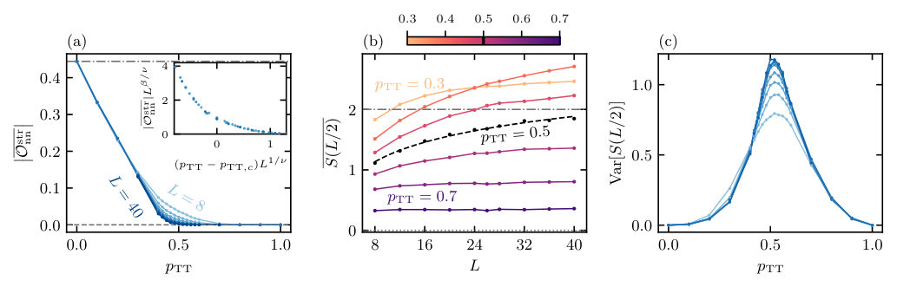 
FIG. 2. Data are shown for the SPT–TT model depicted in Fig. 1(d), where the TT projector is applied with probability pTT and the NN AKLT projector with probability 1 −pTT. (a) Ostr nn , defined in Eq. (22), as a function of pTT for available even system sizes up to L = 40. The overline denotes averaging over circuits. The MIPT location pTT,c = 0.50(1), correlation-length exponent ν = 1.4(2), and order-parameter exponent β = 2.0(3) are obtained from the finite-size scaling collapse in the inset following Eq. (19). The horizontal reference lines mark the analytic limiting values of the NN string order parameter: |Ostr nn | = 0 in the TT product-state limit and |Ostr nn | = 4/9 in the NN AKLT...

📷 Fig 3

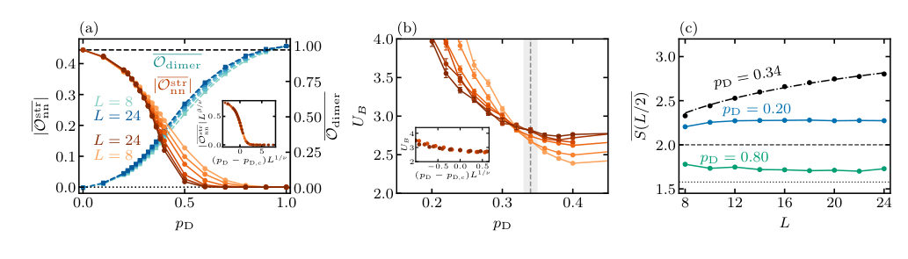 
FIG. 3. Data are shown for the SPT–dimer model depicted in Fig. 1(e), where the dimer projector is applied on odd bonds with probability pD and the NN AKLT projector with probability 1 −pD. (a) Ostr nn , defined in Eq. (22), and Odimer, defined in Eq. (25), as functions of pD for L ∈{8, 10, 12, 16, 20, 24}. The overline denotes averaging over circuits. The horizontal reference lines mark the analytic limiting values of the two order parameters. The inset in panel (a) shows a finite-size scaling collapse of Ostr nn following Eq. (19), yielding pD,c = 0.34(1), ν = 1.3(2), and β = 0.22(3). (b) Centered Binder cumulant UB, defined in Eq. (26), for the dimer order parameter as a function of pD....

📷 Fig 4

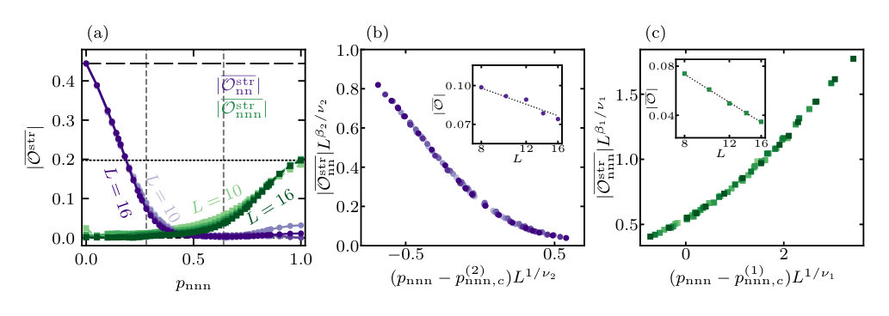 
FIG. 4. Data are shown for the NN–NNN AKLT model as depicted in Fig. 1(f), where the NNN AKLT projector is applied with probability pnnn and the NN AKLT projector with probability 1 −pnnn. Order-parameter diagnostics for the NN–NNN AKLT statevector transition are shown for L ∈{8, 10, 12, 14, 16}. (a) Global view of |Ostr nn | and |Ostr nnn| as functions of pnnn. The NN AKLT Haldane SPT and topologically trivial NNN AKLT regimes are separated by an intermediate interval in which both measured string order parameters vanish. The entanglement scaling in Fig. 6 supports the identification of this interval as an extended critical regime. Horizontal reference lines mark the analytic limiting...

📷 Fig 5

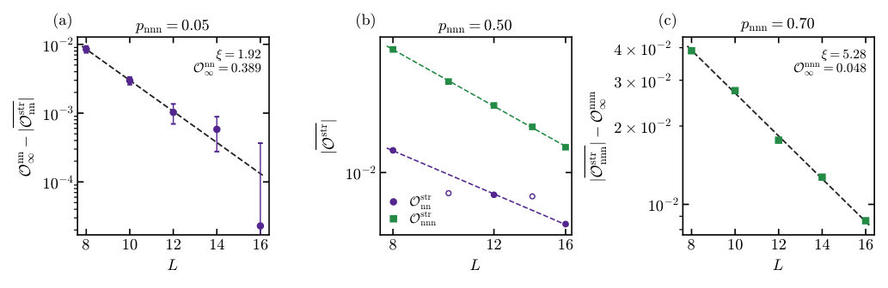 
FIG. 5. Finite-size decay of the string order parameters across the NN–NNN AKLT phase diagram. (a) In the NN AKLT phase at pnnn = 0.05, the correction to the nonzero NN string order plateau decays exponentially, Onn ∞−|Ostr nn | ∝e−L/ξ, with ξ = 1.92 and Onn ∞= 0.389. (b) At the representative critical-phase point pnnn = 0.50, the NN and NNN string order parameters are shown with separate power-law fits |Ostr α | ∝L−ηα. Filled and open NN markers distinguish the two L mod 4 branches, and the NN fit uses the filled-marker branch. The same algebraic decay is observed at representative points throughout the intermediate critical phase, as shown in Fig. 13 of Appendix F. (c) In the NNN AKLT...

**Summary.** This paper explores how measurement-only dynamics can induce phase transitions in an interacting spin-1 chain, moving beyond standard unitary evolution. By competing local projectors, the system is shown to transition between topologically distinct phases, characterized by measurable order parameters and entanglement scaling. It provides a powerful tool for studying non-equilibrium quantum matter.

**Why it may be interesting.** This work provides a concrete, measurable framework for understanding how non-unitary, measurement-induced dynamics can stabilize or transition between distinct topological and valence-bond-solid orders in quantum magnets.

Detailed structure

**Main problem.** The study investigates dynamical phase transitions occurring in an interacting spin-1 chain driven solely by sequential, forced local measurements rather than standard unitary evolution.

**Main result.** Competing local projectors can drive the system through three distinct dynamical phases—a trivial product state, a dimerized VBS state, and an NNN AKLT state—with evidence suggesting intervening extended critical regimes.

**Method.** The analysis employs matrix product state (MPS) simulations and exact statevector calculations to track the evolution under forced local projections, supplemented by finite-size scaling analysis.

**Model / system.** The system is a spin-1 chain, starting from the nearest-neighbor (NN) Affleck-Kennedy-Lieb-Tasaki (AKLT) Haldane symmetry-protected topological (SPT) state. The dynamics are governed by the competition between projectors corresponding to NN AKLT, Dimer VBS, and NNN AKLT interactions.

**Key observables.** Nonlocal string order parameters, local dimer order, entanglement scaling, and the MPS bond dimension ($\chi$).

**Important parameters / regimes.** The relative strengths/probabilities of the competing local projectors (e.g., $p_{	ext{nnn},c} \simeq 0.28$ and $p_{	ext{nnn},c} \simeq 0.64$).

**Assumptions / limitations.** The dynamics are modeled using forced, normalized local projections, which bypass the constraints of unitary evolution, and the analysis relies on specific transfer-matrix identities for observables.

**Figures summary.** Figures illustrate the three competing projector protocols (NN AKLT, Dimer, NNN AKLT) and show objective landscapes for statevector collapses and the time evolution of entanglement entropy in different phases.

**Paper structure.** The paper systematically analyzes the effect of competing local projectors on the spin-1 chain, characterizing the resulting dynamical phases using multiple order parameters and performing finite-size scaling to locate critical points.

Abstract

We study measurement-only dynamics in an interacting spin-1 chain, using forced, normalized local projections rather than Born-rule-sampled measurement outcomes. Starting from the nearest-neighbor (NN) Affleck-Kennedy-Lieb-Tasaki (AKLT) Haldane symmetry-protected topological state, we show that competing local projectors drive this order toward three distinct dynamical phases: a featureless topologically trivial product state, an explicitly dimerized valence-bond-solid state, and a topologically trivial next-nearest-neighbor (NNN) AKLT state consisting of two interwoven Haldane chains. Using matrix product state and exact statevector simulations, we identify continuous transitions among these phases and characterize them using nonlocal string order parameters, local dimer order, and entanglement scaling. For the NN-NNN AKLT model, finite-size signatures are consistent with an intervening extended critical regime rather than a single direct transition. These results extend studies of monitored topology to a bosonic SPT and show that local projections can control both topological and valence-bond-solid order.

[↑ back to top](#top)

### [Quantum dynamics of spinful impurity in ideal Bose gas](http://arxiv.org/abs/2609.28180v1)

**Authors:** O. Hryhorchak, V. Pastukhov  
**Type:** theory · **Category:** quantum gases · **PDF:** <https://arxiv.org/pdf/2609.28180v1>  
**Analysis basis:** full PDF text, analyzed in chunks
**Topic relevance:** 🔥 `Keldysh / 2PI / non-Gaussian methods` **4/5** · `analog quantum simulation` **3/5** · `methods for driven-dissipative` **3/5** · `non-equilibrium universality` **3/5** · `scars & prethermalization` **3/5** · `correlated / nonlocal dissipation` **1/5** · `driven-dissipative phase transition` **1/5** · `quantum measurements` **1/5**

📷 Fig 1

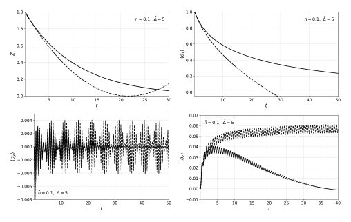 
FIG. 3: Same density of the system as in Fig. 1 but at larger Rabi coupling ˆ∆= 5.

📷 Fig 2

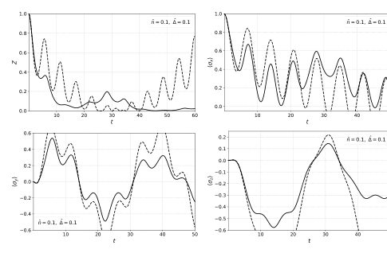 
FIG. 1: Time dependence of the modulus squared wave- function overlap Z(t) and average spin components ⟨σα⟩for set of parameters ˆn = 0.1 and ˆ∆= 0.1 (see text). Solid lines correspond to our mean-field-like approach, while dashed lines represent the linear in density of bosons expansion of the ex- act result.

📷 Fig 3

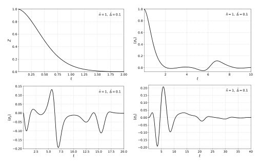 
FIG. 4: Impurity observables for dimensionless coupling ˆn = 1 and Rabi field ˆ∆= 0.1.

📷 Fig 4

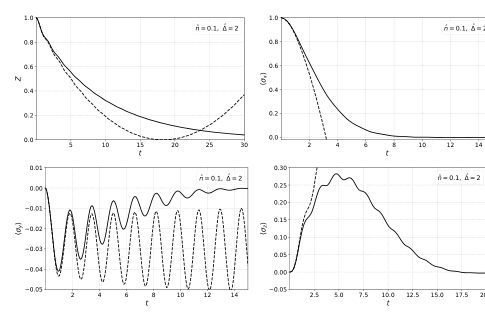 
FIG. 2: Same as in Fig. 1 but for another set of parameters ˆn = 0.1 and ˆ∆= 2.

📷 Fig 5

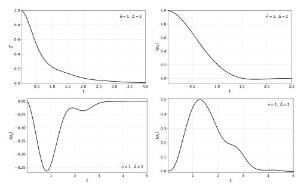 
FIG. 5: Same density of the system as in Fig. 4 and resonant Rabi coupling ˆ∆= 2.

**Summary.** This theoretical study analyzes how a spinful impurity interacts with a Bose-Einstein condensate after a sudden change (quench). By developing an advanced mean-field approximation, the authors calculate the spin's decoherence dynamics, showing that their method provides a significant improvement over existing theoretical models.

**Why it may be interesting.** This work directly addresses non-equilibrium dynamics and decoherence in quantum many-body systems, which is central to understanding quantum thermalization in ultracold atomic settings.

Detailed structure

**Main problem.** The paper investigates the non-equilibrium quantum dynamics of a single spinful impurity immersed in an ideal Bose gas following a quench.

**Main result.** The authors predict a substantial speed-up in the decoherence (thermalization) dynamics of the impurity's spin degree of freedom compared to previous theoretical ansatze.

**Method.** The analysis employs an original mean-field-like approximation, utilizing Green's function formalism and variational techniques to calculate time-dependent expectation values.

**Model / system.** The system consists of a spin-$rac{1}{2}$ impurity interacting via a spin-dependent contact potential with a bath of non-interacting 2D or 3D bosons, subjected to a transverse Rabi field.

**Key observables.** Time-dependent average impurity spin components ($\langle\sigma_\alpha
angle$) and the wave function overlap between initial and time-evolved states ($Z(t)$).

**Important parameters / regimes.** Boson-impurity coupling strengths ($\hat{n}$), Rabi coupling strength ($\hat{\Delta}$), and dimensionality (2D vs 3D).

**Assumptions / limitations.** The primary approximation is a mean-field-like treatment that neglects higher-order boson-boson interaction terms, though it is shown to be more accurate than simpler linear approximations.

**Figures summary.** Figures illustrate the divergence of the mean-field result from simpler linear approximations at late times, and show the time evolution of spin observables for varying coupling strengths and Rabi fields in both 2D and 3D.

**Paper structure.** The paper builds from the single-boson limit calculation using T-matrix methods to a full many-body treatment using a mean-field ansatz, comparing results against known limits and previous approximations.

Abstract

We discuss the quench dynamics of an isolated system composed of a single spinful impurity in the transverse Rabi field and bath of non-interacting three- and two-dimensional bosons. Specifically, we consider the evolution of bosons and a spin-$\frac{1}{2}$ particle, initially prepared in a Bose-Einstein condensate state and a magnetic ground state, respectively, with the spin-dependent contact boson-impurity interaction switched on. Applying an original mean-field-like approximation, which naturally reflects the statistical effects of the bosonic bath, we calculate time-dependent components of the average impurity spin and the overlap of the wave function between initial and arbitrary time moments. A key prediction is a substantial speed-up in the decoherence (thermalization) dynamics of the spin degree of freedom compared to results obtained with the Chevy-like ansatz.

[↑ back to top](#top)

### [Universal splitting of nonequilibrium phase transitions in driven Potts heat engines](http://arxiv.org/abs/2609.28148v1)

**Authors:** Vitória T. Henkes, Gustavo A. L. Forão, Andre C. Barato, Carlos E. Fiore  
**Type:** theory · **Category:** statistical mechanics · **PDF:** <https://arxiv.org/pdf/2609.28148v1>  
**Analysis basis:** full PDF text, analyzed in chunks
**Topic relevance:** 🔥 `driven-dissipative phase transition` **4/5** · `methods for driven-dissipative` **3/5** · `non-equilibrium universality` **3/5** · `Keldysh / 2PI / non-Gaussian methods` **2/5** · `analog quantum simulation` **2/5** · `correlated / nonlocal dissipation` **2/5** · `Frenkel-Kontorova` **1/5** · `quantum measurements` **1/5**

📷 Fig 1

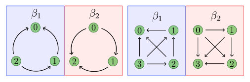 
FIG. 1. Schematics of the driving forces. Small green circles denote the unit states si, and arrows indicate the favored direction, i.e. d(ν) s′s &gt; 0, of the driving force for q = 3 (left) and q = 4 (right). The driving favors higher (lower) states due to the contact with the hot (cold) thermal reservoir.

📷 Fig 2

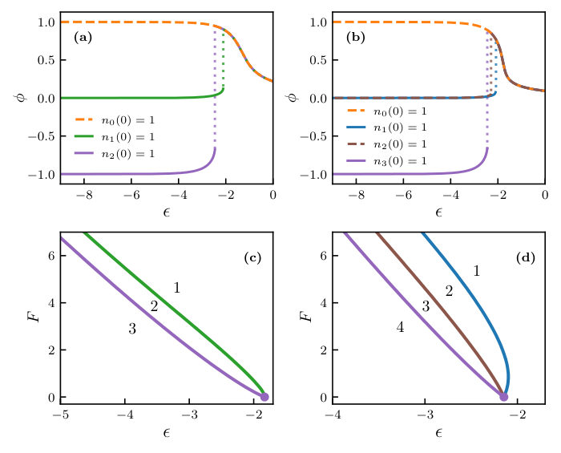 
FIG. 2. Main results of the phase transitions for MF interactions for q = 3 and q = 4. For F = 1, panels (a) and (b) depict the order parameter ϕ for q = 3 and q = 4, respectively, and different initial conditions nα(0) (α ∈{0, .., q −1}). Panels (c) and (d) show the corresponding phase diagrams, where 1, 2, 3 and 4 denote the number of stable fixed points in that phase, and lines denote the discontinuous transitions. Parameters: β1 = 2 and β2 = 1.

📷 Fig 3

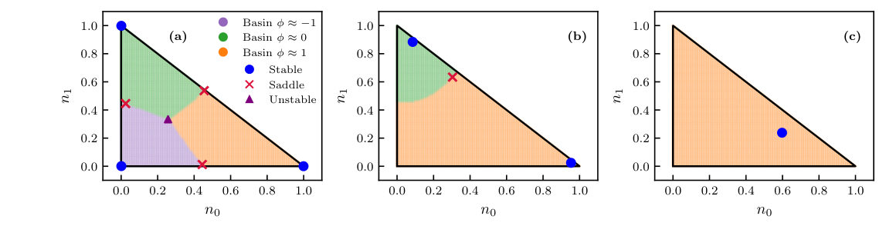 
FIG. 3. Basin of attraction for the fixed points for q = 3. Each panel represent a phase, with (a) ϵ = −5, (b) ϵ = −2.3 and (c) ϵ = −1. Parameters: F = 1, β1 = 2 and β2 = 1.

📷 Fig 4

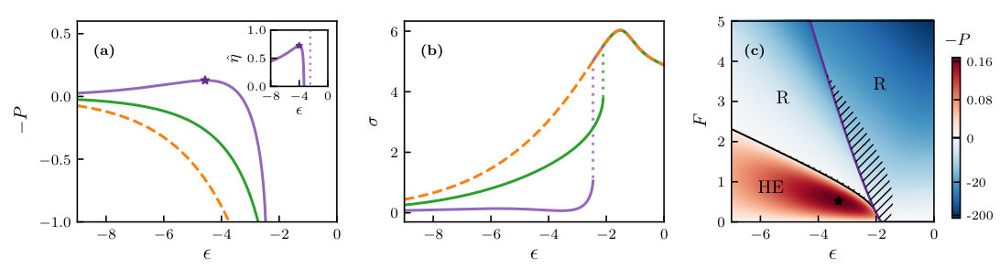 
FIG. 4. Main results of the thermodynamics for MF interactions for q = 3. Panels (a) and (b) show the depiction of the mean power −P and of the entropy productions per unit σ, respectively, versus ϵ for F = 1 Inset: the scaled efficiency ˆη = η/ηc. Curves label are the same as in Fig. 2. Panel (c) show the power heat-map for n2(0) = 1 where HE and R denote, respectively, the heat-engine and the refrigerator regimes. The hatched region indicate the dud regime. The symbol ⋆denotes the simultaneous maximization of −P with respect to F and ϵ. The purple continuous line indicate the phase transition as in Fig. 2(c). Parameters: β1 = 2 and β2 = 1.

📷 Fig 5

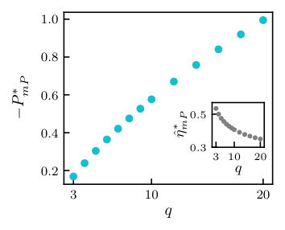 
FIG. 5. The dependence of maximal power −P∗ mP with q. Inset: The same but for ˆη∗ mP. Parameters: β1 = 2 and β2 = 1.

**Summary.** This work analyzes a driven Potts model acting as a heat engine, revealing that the interplay between multi-state interactions, external driving, and thermal bias generates a rich phase structure. The authors demonstrate that the ordered phase splits into multiple distinct phases, and they derive analytical and numerical results characterizing the system's ability to perform work as a heat engine.

**Why it may be interesting.** The study provides a concrete, solvable model (Potts model) to explore complex non-equilibrium phenomena like phase transition splitting and energy conversion (heat engines) driven by external fields, which has parallels in open quantum systems dynamics.

Detailed structure

**Main problem.** The paper investigates the nonequilibrium phase transitions and thermodynamic properties of a driven Potts model coupled to two thermal reservoirs.

**Main result.** The driving mechanism causes the ordered phase to split into multiple distinct phases, leading to $q-1$ observable transitions, and the system can operate as a collective heat engine.

**Method.** The study employs both mean-field (MF) analytical techniques and numerical simulations (Gillespie algorithm) to analyze the steady-state dynamics.

**Model / system.** The system is a driven Potts model with $q$ discrete states, interacting units, and coupled to two heat baths at different temperatures. The dynamics are governed by transition rates derived from the energy landscape and external driving forces.

**Key observables.** Power, heat currents ($Q_
u$), efficiency ($\eta$), order parameter ($\phi$), and steady-state occupation densities ($n_{st\alpha}$).

**Important parameters / regimes.** Interaction strength ($\epsilon$), number of states ($q$), temperature difference ($eta_1, eta_2$), and the driving force ($F$).

**Assumptions / limitations.** The analysis relies on the mean-field approximation for one set of results and a strong ordering limit for analytical derivations in the MF case.

**Figures summary.** Figures illustrate phase transitions for $q=3, 4$ in the MF model, map power and entropy production regimes, and compare numerical vs. MF predictions for power and efficiency.

**Paper structure.** The paper progresses from defining the driven Potts model and its coupling to two baths, through analyzing the phase splitting and heat engine operation using MF theory, and finally confirming these results using 2D lattice simulations and developing analytical approximations in the strongly ordered limit.

Abstract

We investigate nonequilibrium phase transitions and thermodynamic properties of driven Potts models coupled to two thermal reservoirs at different temperatures. The interplay with the multi-state structure of the Potts model leads to distinct phase-transition scenarios. The proposed driving scheme breaks the symmetry between the Potts states and gives rise to multiple transitions within the ordered phases, where the phases are characterized by different numbers of stable fixed points. This number can vary from $q$ fixed points to $1$ fixed point, corresponding to $q-1$ distinct transitions. The driving scheme strongly affects the thermodynamic operation regimes, allowing the system to operate as a heat engine. We demonstrate that these phenomena persist for both a mean-field (MF) model and a two-dimensional model, confirming the robustness of the results with respect to dimensionality. For the MF case, we also develop a phenomenological description in the strongly ordered regime that yields analytical expressions for the power, heat currents, and efficiency. Our results show how multi-state collective interactions, nonequilibrium driving, and thermal bias jointly generate a rich phase structure and the emergence of a collective heat engine.

[↑ back to top](#top)

### [Measurement-based feedback as a flexible tool to control non-Poissonian photon statistics](http://arxiv.org/abs/2609.26949v1)

**Authors:** Ming Li, JunYan Luo, Georg Engelhardt  
**Type:** theory · **Category:** other · **PDF:** <https://arxiv.org/pdf/2609.26949v1>  
**Analysis basis:** full PDF text, analyzed in chunks
**Topic relevance:** 🔥 `Full counting statistics` **4/5** · 🔥 `quantum measurements` **4/5** · `driven-dissipative phase transition` **2/5** · `methods for driven-dissipative` **2/5** · `analog quantum simulation` **1/5** · `correlated / nonlocal dissipation` **1/5** · `non-equilibrium universality` **1/5** · `quantum optics experiment` **1/5**

📷 Fig 1

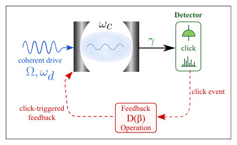 
FIG. 1. Schematic of a coherently driven cavity under measurement-based feedback. Photons emitted from the cav- ity are monitored by a detector, and each detection event trig- gers a feedback displacement ˆD(β) of the intracavity field.

📷 Fig 2

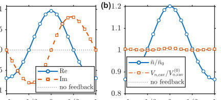 
FIG. 2. Stationary cavity response to click-triggered feed- back. (a) Normalized feedback-induced shift of the station- ary cavity amplitude, δα/|α0|. Symbols show the exact stationary-state results, while lines show the mean-field pre- diction. (b) Mean intracavity photon number ¯n/¯n0 and nor- malized photon-number variance Vn,cav/V (0) n,cav as functions of the feedback phase ∆Φ. For ¯n/¯n0, symbols denote exact re- sults and the solid line is the mean-field prediction; the dash- dotted line connecting the variance data is a guide to the eye. The dotted horizontal lines indicate the corresponding no-feedback references.

📷 Fig 3

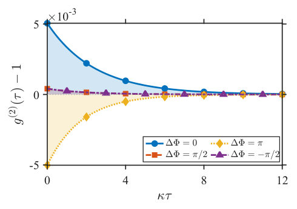 
FIG. 3. Post-click photon correlations g(2)(τ) −1 for rep- resentative feedback phases. The response is positive near ∆Φ = 0, negative near ∆Φ = π, and strongly suppressed at ∆Φ = ±π/2. The shaded areas indicate the integrated corre- lation response that determines the Mandel parameter.

📷 Fig 4

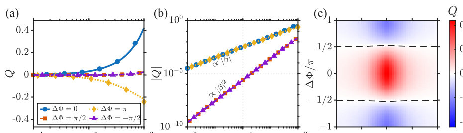 
FIG. 4. Phase dependence and weak-feedback scaling of the measurement noise. (a) Mandel parameter Q as a function of the feedback amplitude |β| for representative feedback phases. (b) Log–log plot of |Q| versus |β|, showing linear scaling at generic phases and quadratic scaling at the specific phases ∆Φ = ±π/2. Lines show the second-order analytical results, while markers denote the numerical full-counting-statistics results. (c) Mandel parameter Q in the (∆/γ, ∆Φ/π) plane at fixed feedback amplitude |β| = 10−2. The dashed curves mark the Q = 0 boundaries separating the super- and sub-Poissonian counting regimes.

📷 Fig 5

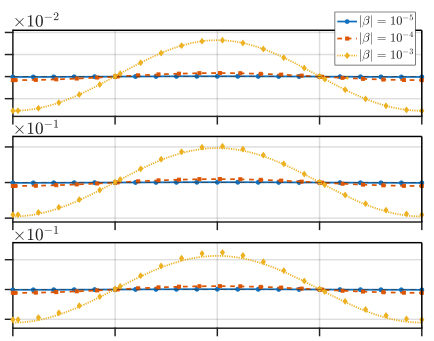 
FIG. 5. Higher-order cumulants of the photon emission as a function of the feedback phase ∆Φ for several feedback amplitudes. The Mandel parameter Q and the higher-order deviations Q3 and Q4 exhibit the same overall phase depen- dence. Markers denote the numerical full-counting-statistics results, while lines show the weak-feedback analytical predic- tions in Eq. (17).

**Summary.** This paper demonstrates that measurement-based feedback can be used to actively control the photon statistics emitted from a linear optical cavity. By tuning the phase of the feedback operation, the system's statistics can be continuously tuned between super- and sub-Poissonian regimes. This establishes measurement-based feedback as a powerful, general method for engineering quantum noise in open quantum systems.

**Why it may be interesting.** This work is highly relevant to AMO physics and quantum optics as it demonstrates a non-Hamiltonian, measurement-induced mechanism to engineer quantum noise properties in cavity QED systems, moving beyond simple dissipation models.

Detailed structure

**Main problem.** The paper addresses the control of non-Poissonian photon statistics in a driven linear cavity using measurement-based feedback.

**Main result.** Measurement-based feedback is shown to be a versatile tool capable of continuously tuning the emission statistics between super- and sub-Poissonian regimes by controlling the feedback phase.

**Method.** The analysis uses full counting statistics, calculating cumulants and the Mandel parameter, and employs an auxiliary density matrix approach to evaluate correlation functions.

**Model / system.** The system is a coherently driven single-mode cavity coupled to a monitored photonic output channel, whose dynamics are governed by a master equation incorporating click-triggered displacement operations.

**Key observables.** Full counting statistics, Mandel parameter (Q), higher-order cumulants ($Q_m$), mean intracavity photon number ($ar{n}$), and normalized variance.

**Important parameters / regimes.** Feedback phase ($\Delta\Phi$), feedback amplitude ($|eta|$), and the cavity detuning ($\Delta$).

**Assumptions / limitations.** The analysis assumes an ideal zero-delay feedback limit and often relies on weak-feedback scaling approximations for deriving simple power-law dependencies.

**Figures summary.** Figures illustrate the feedback-induced shift of the cavity amplitude, the dependence of mean photon number and variance on the feedback phase, and the scaling of the Mandel parameter and higher-order cumulants with feedback strength.

**Paper structure.** The paper establishes the physical model and the role of feedback, develops the theoretical tools (auxiliary density matrix, cumulant calculation), derives the dependence of correlation functions on the feedback phase, and concludes by showing the control over statistics across different regimes.

Abstract

Non-Poissonian photon statistics are usually traced to nonlinear interactions, nonclassical states, or engineered reservoirs. Here we show that measurement-based feedback can be alternatively deployed to control the Poissonian character of the measurement statistics in an externally-driven linear cavity. Each photon detection triggers a weak displacement operation whose phase determines how the feedback interferes with the coherent cavity field, resulting in a significant cavity response. Full counting statistics and two-time photon correlations show that the feedback phase controls the sign and strength of the induced correlations, continuously tuning the emission statistics between super- and sub-Poissonian regimes. At generic phases, the Mandel parameter responds linearly to the feedback amplitude, whereas at specific phases, the leading response becomes quadratic. The same phase dependence is also found in higher-order cumulants of the emission statistics. These results establish measurement-based feedback as a route to controlling photon statistics in otherwise linear driven-dissipative systems.

[↑ back to top](#top)

### [Scalable simulation of non-Markovian quantum transport by stochastic-phase bath reduction](http://arxiv.org/abs/2609.28318v1)

**Authors:** Zhen Huang, Lin Lin, Pinchen Xie  
**Type:** theory · **Category:** other · **PDF:** <https://arxiv.org/pdf/2609.28318v1>  
**Analysis basis:** full PDF text, analyzed in chunks
**Topic relevance:** 🔥 `methods for driven-dissipative` **4/5** · `correlated / nonlocal dissipation` **3/5** · `Keldysh / 2PI / non-Gaussian methods` **2/5** · `driven-dissipative phase transition` **2/5** · `non-equilibrium universality` **2/5** · `quantum measurements` **2/5** · `analog quantum simulation` **1/5**

📷 Fig 1

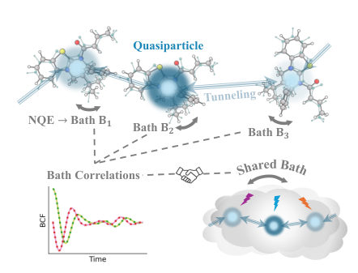 
FIG. 1. Schematics of quantum transport in organic materials and the SPA approach.

📷 Fig 2

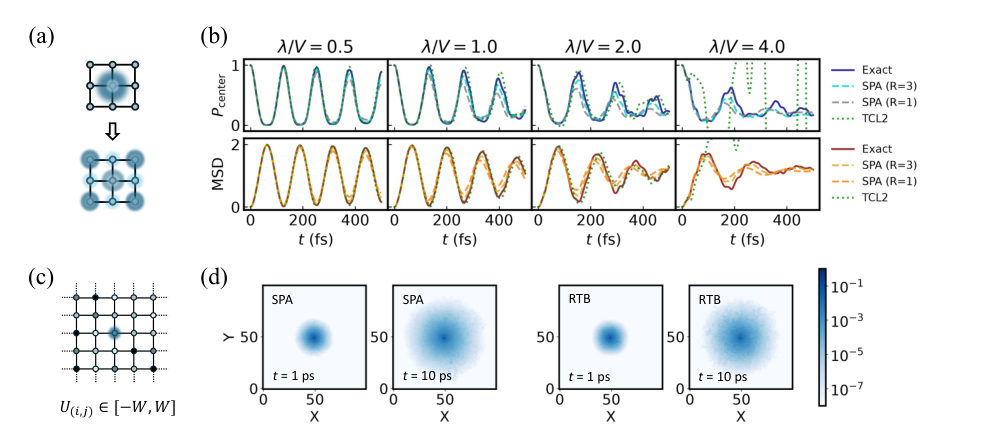 
FIG. 2. (a) Schematic of the population dynamics on the 3 × 3 lattice. (b) Pcenter and the MSD as functions of time, obtained from exact simulation, SPA, and TCL2. The statistical uncertainties in the SPA results are smaller than the plotted line width and are therefore not shown. (c) Schematic of the disordered site energies U(X,Y ) and the localized initial state on the 2D lattice. U(X,Y ) ∈[−W, W] is uniformly sampled with W = 200 cm−1 for each realization of random phases. (d) Snapshots of the site populations P(X,Y)(t) on a logarithmic color scale obtained with λ/V = 8.0.

📷 Fig 3

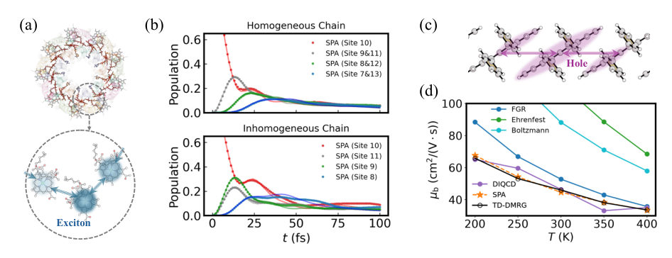 
FIG. 3. (a) The experimental crystal structure of LH2 B800-850 [52, 53] and a schematic of exciton migration within the B850 ring. (b) Exciton population dynamics for homogeneous and inhomogeneous (staggered) 19-site BChl chains at T = 300 K. SPA predictions are reported as dots, while MPI predictions are reported as lines. (c) The bc plane of a rubrene crystal. Purple shading indicates a localized hole [54]. (d) b-axis carrier mobility as a function of temperature. In (b) and (d), statistical uncertainties of the SPA results are smaller than the marker size and are not shown.

**Summary.** This paper introduces the Stochastic Phase Algorithm (SPA) to overcome the computational limitations of simulating non-Markovian quantum transport in large molecular systems. SPA achieves scalability by replacing numerous local bath descriptions with a small number of shared, phase-modulated baths. It successfully reproduces benchmark results for charge transport in materials like rubrene and BChl aggregates, providing a powerful tool for open quantum system dynamics.

**Why it may be interesting.** This work directly addresses the simulation of open quantum systems, particularly those involving electron-phonon or electron-vibration coupling, which is a core topic in AMO physics and quantum optics.

Detailed structure

**Main problem.** Accurately simulating non-Markovian quantum transport in extended molecular systems is challenging due to the exponential growth of the Hilbert space and the complexity of intermediate electron-vibronic coupling.

**Main result.** The Stochastic Phase Algorithm (SPA) provides a scalable method to simulate these dynamics by replacing independent local baths with shared baths, achieving a fixed-time error bound independent of system size.

**Method.** The SPA replaces local Gaussian baths with $R$ shared baths modulated by stochastic site-dependent phases, and the resulting dynamics are obtained via phase averaging, which is combined with coupled-Lindblad spectral compression.

**Model / system.** The study uses single-quasiparticle transport on Holstein-type tight-binding networks, applied to physical systems like bacteriochlorophyll aggregates and rubrene crystals.

**Key observables.** Quasiparticle population ($P_i(t)$), Mean-Squared Displacement ($	ext{MSD}(t)$), and electronic mobility ($\mu_b(T)$).

**Important parameters / regimes.** The error scales as $O(R^{-1})$, and the method is shown to be robust in the intermediate-coupling regime ($\lambda/V > 2$).

**Assumptions / limitations.** The primary assumption is that phase averaging correctly reproduces the two-point bath correlation matrix, and the method is combined with spectral compression to manage bath dimensionality.

**Figures summary.** Figures illustrate population dynamics, MSD vs. time, and site population snapshots comparing SPA against exact and other theoretical benchmarks.

**Paper structure.** The paper introduces the SPA to address the simulation bottleneck, derives the error bounds, and then validates the method by applying it to multiple physical benchmarks: 2D Holstein models, BChl aggregates, and rubrene charge transport.

Abstract

Accurate simulations of non-Markovian quantum transport remain limited to small systems, and a key bottleneck is that each system site requires an independent set of quantum bath orbitals. We introduce the Stochastic Phase Algorithm (SPA), which replaces the independent local Gaussian baths in single-quasiparticle Holstein models by $R$ shared quantum baths with stochastic site-dependent phases. We prove that phase averaging reproduces the target two-point bath correlation matrix for every $R$, while increasing $R$ systematically suppresses errors from higher-order cross-site correlations. We obtain a fixed-time $O(R^{-1})$ trace-norm error bound with a prefactor independent of system size and connectivity. This spatial compression applies directly to unitary baths and can be combined with coupled-Lindblad spectral compression [Phys. Rev. Lett. 136, 090403 (2026)], which represents each shared environment by a very small number of coupled, damped quantum modes fitted to its thermal bath correlation over the simulation window. Numerically, SPA converges against direct unitary benchmarks on a $3\times3$ lattice, enables full-state-vector quantum-bath dynamics on a $100\times100$ lattice, and, with $R=1$, closely reproduces near exact benchmarks for exciton populations in bacteriochlorophyll aggregates and carrier mobility in rubrene.

[↑ back to top](#top)

### [Deterministic photon waveform adaptation for quantum connectivity](http://arxiv.org/abs/2609.26889v1)

**Authors:** Jeffrey Mohan, Jérémy Berroir, Filippo Borselli, David Libault, Ferhat Loubar, Kilian Müller, Jed Rowland, Félix Hoffet, Eleni Diamanti, Tom Darras, Tommaso Mazzoni, Julien Laurat  
**Type:** experiment · **Category:** quantum information and computing · **PDF:** <https://arxiv.org/pdf/2609.26889v1>  
**Analysis basis:** full PDF text, analyzed in chunks
**Topic relevance:** 🔥 `quantum optics experiment` **4/5** · `QC/QI experiment` **3/5** · `interference shaping light` **3/5** · `analog quantum simulation` **2/5** · `methods for driven-dissipative` **1/5** · `quantum measurements` **1/5**

📷 Fig 1

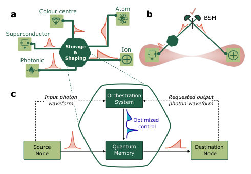 
FIG. 1. Programmable photonic interface for quantum connectivity. a, Photons emitted by heterogeneous quan- tum platforms exhibit incompatible temporal waveforms. A programmable quantum memory reshapes them into match- ing waveforms, enabling photonic interconnects between het- erogeneous nodes. b, Schematic of interference-based entan- glement generation via Bell-state measurement (BSM) be- tween two nodes, illustrating a key application of photon adaptation. c, For given input and target output waveforms, the temporal profile of the control beam power is computed and applied to optimally store and reshape the photon.

📷 Fig 2

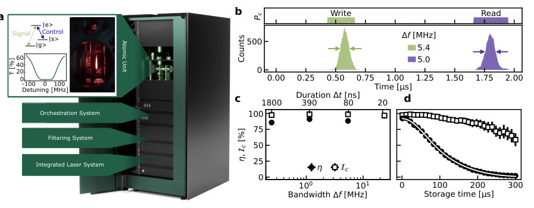 
FIG. 2. QDrive quantum memory system. a, Schematic of the manufactured integrated system, which we name QDrive. The implementation relies on a large ensemble of 87Rb atoms trapped in a vertically-oriented elongated magneto-optical trap. Storage and retrieval are realised via EIT using a control beam with programmable power. The plot shows the signal transmission as a function of the detuning, corresponding to an optical depth of about 750. b, Example memory sequence showing the temporal profile of the control field power Pc together with histograms of photodetection events, revealing the input and retrieved signal waveforms. c, Memory storage-and-retrieval efficiency η and conditional...

📷 Fig 3

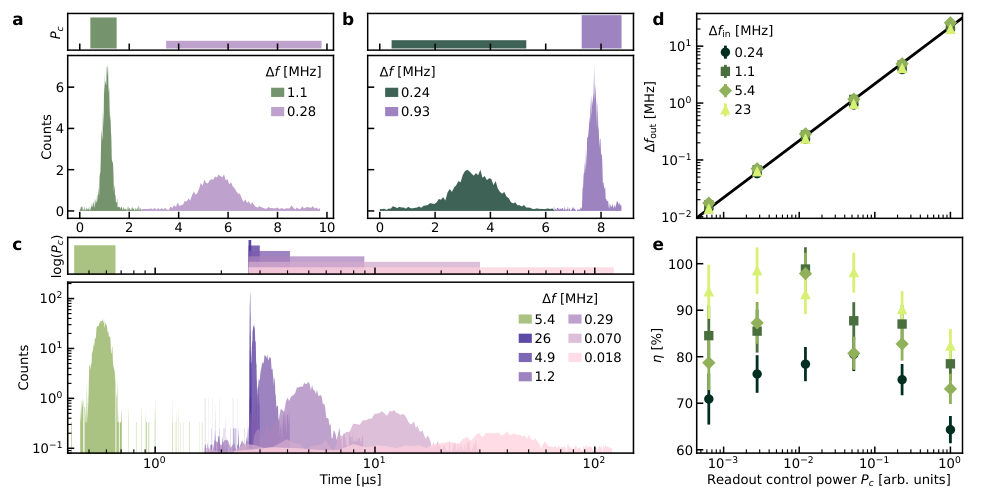 
FIG. 3. Bandwidth adaptation of single-photon Gaussian pulses. a-b, Examples of pulse stretching and compression. When the read pulse has lower power and longer duration than the write pulse, the signal pulse bandwidth is reduced and the pulse is temporally stretched. Conversely, when the read pulse has higher power and shorter duration than the write pulse, the bandwidth increases and the pulse is compressed. c, By simultaneously varying the power and duration of the read pulse while keeping their product constant, the same input pulse can be either compressed or stretched in time, providing over three decades of tunable output bandwidths. d, Bandwidth of the output pulse ∆fout as a...

📷 Fig 4

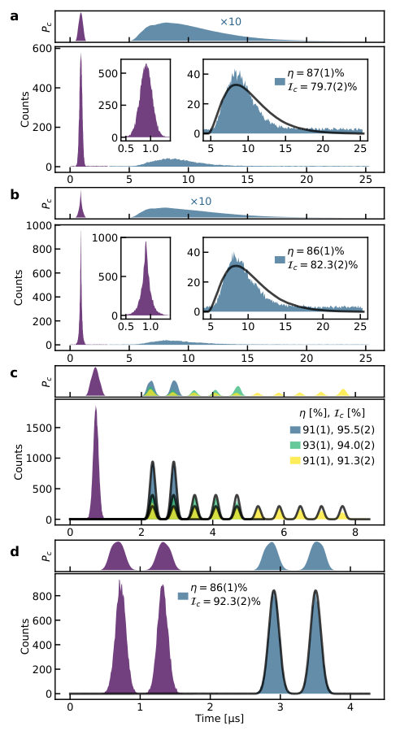 
FIG. 4. High-efficiency storage and generation of ar- bitrary waveforms. We compute and implement the tem- poral profile of the control field power Pc during both the write and read stages to write an arbitrary input and de- terministically shape the retrieved signal pulse while main- taining high memory efficiency η and conditional overlap be- tween the retrieved and target waveforms Ic. a, A Gaus- sian input pulse (∆t = 285 ns) is read out as a non-Gaussian waveform (∆t = 4.1 µs) characteristic of photons emitted by an ion embedded in a cavity; the grey line in the inset shows the target waveform. b, A double-exponential wave- form (∆t = 110 ns) characteristic of single photons generated...

**Summary.** This paper demonstrates a cold-atom quantum memory that acts as a programmable photonic interface, solving the challenge of connecting quantum systems with mismatched photon properties. By using optimal control theory, the system can deterministically reshape stored single-photon pulses to match any desired output waveform. This capability establishes a key building block for scalable, modular quantum networks and computing architectures.

**Why it may be interesting.** This work directly addresses a critical hardware bottleneck in quantum networking by transforming a passive storage element into an active, programmable quantum interface, which is highly relevant for quantum information processing.

Detailed structure

**Main problem.** Scalability of quantum technologies requires interconnecting independent quantum systems, which is limited by the differing photonic properties of heterogeneous quantum platforms.

**Main result.** The system achieves deterministic and programmable temporal adaptation of single-photon pulses while maintaining near-unity storage-and-retrieval efficiency.

**Method.** Optimal control theory is used to dynamically modulate the pulse group velocity in a cold-atom memory, allowing reshaping of the retrieved photon waveform.

**Model / system.** The platform is a cold-atom optical quantum memory using Electromagnetically Induced Transparency (EIT) in a $^{87}	ext{Rb}$ ensemble, functioning as an active, programmable photonic interface.

**Key observables.** Storage-and-retrieval efficiency ($\eta$), conditional overlap ($I_c$), and the ability to reshape output waveforms to match arbitrary target profiles.

**Important parameters / regimes.** Storage durations spanning over three orders of magnitude; the control field power $P_c(t)$ is the key tunable parameter.

**Assumptions / limitations.** The system requires ultra-high optical depth and low temperature for high efficiency, and the control mechanism relies on engineering the control beam power $P_c(t)$.

**Figures summary.** Figures illustrate the concept of reshaping incompatible waveforms for quantum interconnects, the integrated system setup, and demonstrations of bandwidth adaptation and arbitrary waveform generation.

**Paper structure.** The paper establishes the need for quantum interconnects, presents the cold-atom memory as an active interface, details the use of optimal control to achieve deterministic waveform reshaping, and demonstrates high efficiency across wide bandwidths.

Abstract

The scalability of quantum technologies will depend on the ability to interconnect independent quantum systems through photonic channels. However, heterogeneous quantum platforms emit and absorb photons with widely differing properties, severely limiting inter-node interference and modular connectivity. Here we demonstrate a cold-atom optical quantum memory that simultaneously achieves near-unity storage-and-retrieval efficiency and deterministic temporal adaptation of single photons between arbitrary and programmable input and output pulse waveforms. Operating at high optical depth and within a fully integrated architecture, the system can store photons with durations spanning over three orders of magnitude and reshape them arbitrarily without compromising efficiency, achieving compatibility with many current platforms. By augmenting the role of a quantum memory from a passive storage element to an active programmable photonic interface, our results establish a key building block for scalable entanglement-based quantum networks and modular quantum computing architectures.

[↑ back to top](#top)

### [Optimal low-rank compression of quantum dynamics](http://arxiv.org/abs/2609.27497v1)

**Authors:** Hugo Mackay, Donghoon Kim, Tan Van Vu, Tomotaka Kuwahara  
**Type:** theory · **Category:** statistical mechanics · **PDF:** <https://arxiv.org/pdf/2609.27497v1>  
**Analysis basis:** full PDF text, analyzed in chunks
**Topic relevance:** 🔥 `methods for driven-dissipative` **4/5** · `analog quantum simulation` **3/5** · `correlated / nonlocal dissipation` **2/5** · `driven-dissipative phase transition` **2/5** · `non-equilibrium universality` **2/5** · `Keldysh / 2PI / non-Gaussian methods` **1/5**

📷 Fig 1

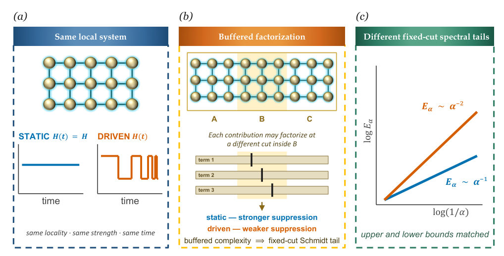 
FIG. 1. Arbitrary temporal control can change the extremal compression law. (a) We compare time-independent and arbitrarily driven evolution under the same spatial locality, local interaction strength, and total evolution time. (b) Keeping a finite buffer B between endpoint regions A and C leads to the buffered Schmidt rank (BSR), which is the minimum number of product terms when different terms may factorize across different cuts within the buffer B. Our bounds show stronger suppression of this buffered complexity for static dynamics than in the worst case allowed by arbitrary driving; converting the BSR bounds to a prescribed cut controls the corresponding Schmidt-spectrum tail. (c) At...

📷 Fig 2

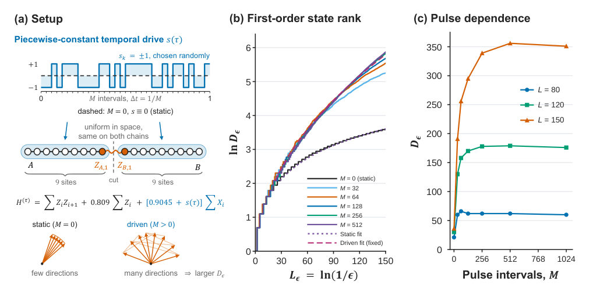 
FIG. 2. Temporal entanglement-capacity amplification of a boundary interaction. (a) We numerically probe the first-order contribution in Eq. (17) for two identical open spin-1/2 chains, A and B, of length b = 9 (i.e., 18 spins in total). The uncoupled evolution is generated by H(τ) 0 = H(τ) A + H(τ) B , with H(τ) A = H(τ) B = Pb−1 i=1 ZiZi+1 + 0.809 Pb i=1 Zi + (0.9045 + s(τ)) Pb i=1 Xi, in units J = ℏ= 1, and the boundary interaction is V = ZA,1 ⊗ZB,1. The total evolution time is t = 1. For M &gt; 0, s(τ) = ±1 is spatially uniform and piecewise constant over M equal intervals, with the same random sequence applied to both chains; M = 0 denotes the static case s(τ) = 0. For the product state...

📷 Fig 3

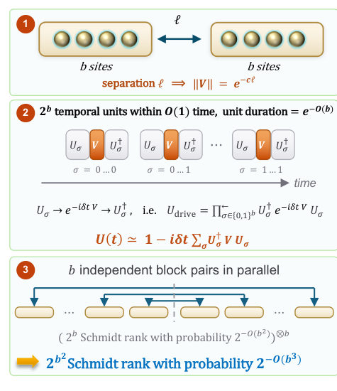 
FIG. 3. Driven lower-bound protocol underlying the 2/3 accuracy exponent. Step 1: Weak interaction between dis- tant blocks. Consider two b-site blocks on opposite sides of the target cut, separated by a distance ℓand coupled by a weak interaction V . For exponentially decaying interactions, the coupling strength is suppressed as ∥V ∥∼e−cℓ. The blocks otherwise evolve independently, so local control on the two sides can change the operator direction of V without increasing its instantaneous Schmidt rank. Step 2: Temporal amplification within one block pair. For each bit string σ ∈{0, 1}b, local encoding operations Uσ = Uσ,A ⊗Uσ,B rotate the same weak interaction into a different direction,...

📷 Fig 4

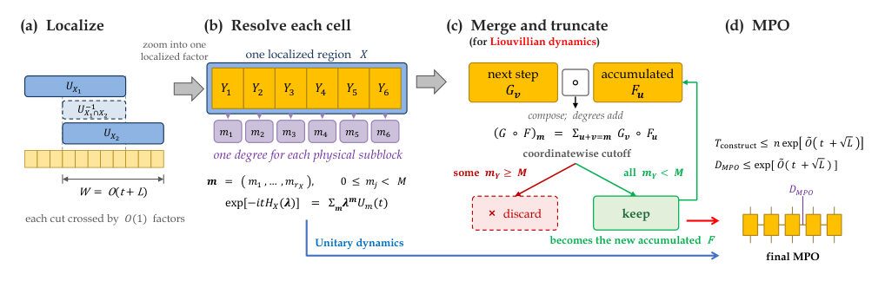 
FIG. 4. Constructive MPO realization of the static compression bound. (a) Localization. For unitary dynamics, the HHKL decomposition reduces the full evolution to a product of localized unitaries supported on intervals of width W = O(t + L), where L = log[Cn(1 + t)/ϵ]. For each cut, the decomposition has bounded multiplicity: every microscopic cut is crossed by only O(1) localized unitaries. It is therefore sufficient to construct an MPO for one localized evolution UX(t) = e−itHX , where |X| = O(t + L). (b) Resolution by local degrees. A localized region X is partitioned into coarse physical subblocks Yj of width b ≍ √

📷 Fig 5

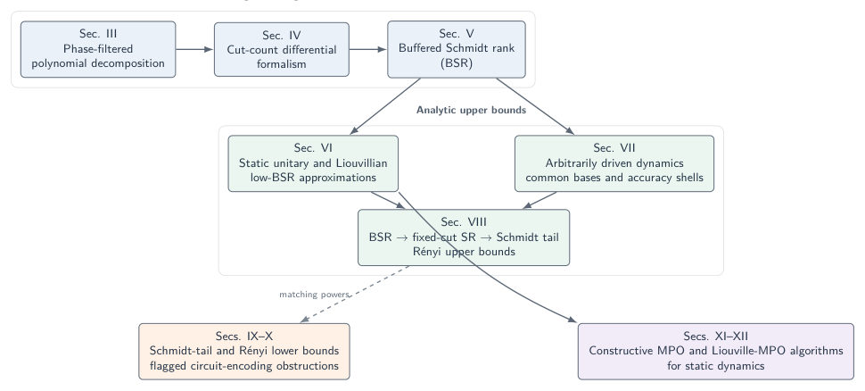 
FIG. 1. Road map of the paper. Sections III–V provide the algebraic engine. Sections VI and VII turn it into static and driven low-BSR approximations; Proposition 9 and Sec. VIII convert them into fixed-cut Schmidt-spectrum and R´enyi bounds. Sections IX and X give matching entanglement-spectrum lower bounds and independent flagged-circuit obstructions. Section VII.B identifies structured drives with static-type compression bounds. Sections XI and XII give explicit unitary and Liouville-MPO algorithms, with the extensions in Secs. XI.A and XII.A recovering the static scaling for efficiently represented structured driving.

**Summary.** This paper establishes rigorous bounds on the minimum information content required to simulate local quantum dynamics. By comparing static versus time-dependent driving, the authors show that the required computational complexity differs significantly. These results provide a deep understanding of the fundamental entanglement structures governing quantum evolution.

**Why it may be interesting.** This work provides fundamental, quantitative bounds on the complexity of quantum information storage and processing, directly impacting how we model and simulate complex, interacting quantum systems in condensed matter theory.

Detailed structure

**Main problem.** The paper determines the minimum information (low-rank complexity) required to accurately represent the time evolution generated by local quantum interactions in an exponentially large Hilbert space.

**Main result.** The optimal compression law differs significantly between static (time-independent) and arbitrarily driven quantum dynamics, with the static case requiring less information than the driven case.

**Method.** The authors utilize tensor networks, specifically analyzing the Buffered Schmidt Rank (BSR), to quantify the required low-rank representation needed to bound the error in approximating the time evolution operator.

**Model / system.** The study considers quantum many-body systems on a lattice ($\Lambda$) governed by local Markovian dynamics, described by either a time-dependent Hamiltonian $H(	au)$ or a Lindblad master equation $L(	au)$.

**Key observables.** Low-rank complexity ($D_\epsilon$), dynamical entanglement spectra, and the Buffered Schmidt Rank (BSR).

**Important parameters / regimes.** Time ($t$), accuracy ($\epsilon$), and the nature of the driving (static vs. arbitrary).

**Assumptions / limitations.** The analysis relies on the assumption of exponentially decaying local interactions and the use of tensor network techniques to exploit locality bounds.

**Figures summary.** Figure 1 compares the extremal compression laws for static versus driven evolution and illustrates the distinct small-alpha Rényi scaling ($\alpha^{-1}$ vs. $\alpha^{-2}$) for the entanglement spectra.

**Paper structure.** The paper develops the problem by first establishing the general framework using tensor networks and locality bounds. It then derives specific scaling laws for static and driven dynamics, culminating in constructive algorithms for the 1D case and detailed analysis of entanglement spectra.

Abstract

Local quantum interactions generate dynamics in an exponentially large Hilbert space, yet locality and entanglement restrict the information that can spread and accumulate. Bounds on propagation and entanglement growth, together with tensor networks, exploit these restrictions to discard information unnecessary for describing the evolution. This leads to a sharper question: how much information must any low-rank representation retain? Here we determine these limits, up to logarithmic factors, for short-range interactions. For time-independent evolution, the optimal rank obeys $\log D=\widetilde O(t+\sqrt{\log(1/ε)})$, with matching lower bounds fixing the accuracy exponent $1/2$; for arbitrary driving, matching fixed-time bounds instead give $2/3$. Correspondingly, the corresponding dynamical entanglement spectra exhibit distinct small-$α$ Rényi laws, $α^{-1}$ and $α^{-2}$. In one dimension, the static limit is constructively attained by an explicit MPO algorithm, with an analogous extension to Liouvillian dynamics. Together, these results determine the irreducible information required to represent local quantum evolution and uncover distinct entanglement structures in static and driven dynamics.

[↑ back to top](#top)

### [Scalable integration of silicon carbide color centers into nanophotonic structures](http://arxiv.org/abs/2609.27601v1)

**Authors:** Raphael Wörnle, Jonas Schmid, Dennis Grüner, Jonah Heiler, Flavie Davidson-Marquis, Georgy V. Astakhov, Vadim Vorobyov, Florian Kaiser, Jonathan Körber, Jörg Wrachtrup  
**Type:** experiment · **Category:** quantum information and computing · **PDF:** <https://arxiv.org/pdf/2609.27601v1>  
**Analysis basis:** full PDF text, analyzed in chunks
**Topic relevance:** 🔥 `QC/QI experiment` **4/5** · `quantum optics experiment` **3/5** · `Tavis-Cummings & cavity-many-emitter` **1/5** · `analog quantum simulation` **1/5** · `quantum measurements` **1/5**

📷 Fig 1

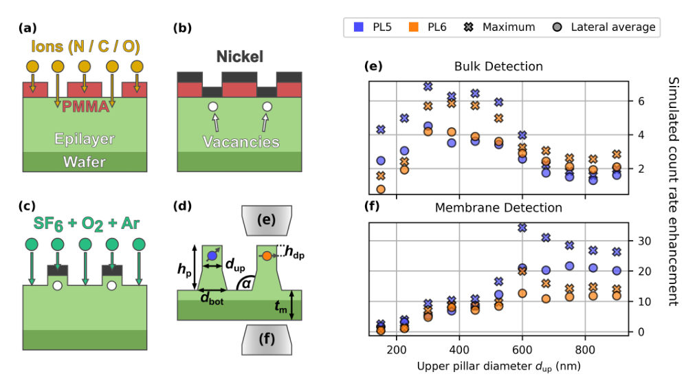 
Figure 1: Fabrication and optimization of nanopillars with integrated color centers. (a) Patterning of the im- plantation mask by electron-beam lithography in a 400 nm-thick spin-coated PMMA layer and implantation of nitrogen, carbon, or oxygen ions to create vacancies in the SiC lattice. (b) Evaporation of a 250 nm-thick nickel layer using electron-beam evaporation to create the nickel etching mask after a subsequent lift-off. (c) Reactive-ion-etching to fab- ricate the nanopillars. (d) Sketch of the finished pillars after etching, including the relevant parameters and the different methods for photon collection. PL5 and PL6 color centers are created using a two-step thermal annealing...

📷 Fig 2

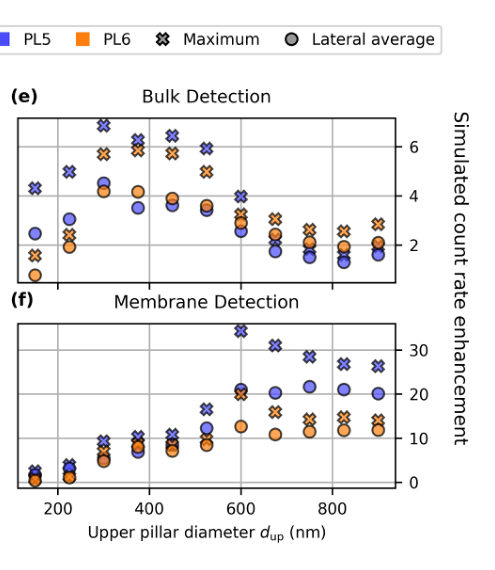 
Figure 2(a) shows a typical continuous-wave optically de- tected magnetic resonance (CW-ODMR) measurement for a PL5 center with a two-Lorentzian fit function in zero mag- netic field with a measured contrast of 15%. Analogously, a CW-ODMR spectrum is depicted in Figure 2(b) for a PL6 center reaching a contrast of 18%. For the PL6 center, the visible splitting between the two dips without an applied ex- ternal magnetic field can be attributed to a local magnetic field in the setup near the sample likely resulting from a magnetization of the objective as already reported in other works [37]. Calculating the center frequency of both dips

📷 Fig 3

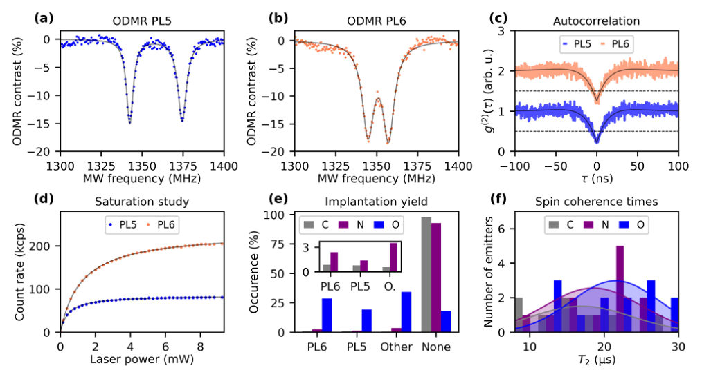 
Figure 2: Properties of PL5 &amp; PL6 centers in bulk SiC. CW-ODMR spectra for a PL5 center (a) and PL6 center (b) in zero magnetic field with a two-Lorentzian fit function. (c) Second-order autocorrelation measurements for a PL5 (blue) and PL6 center (orange), confirming the single-defect behavior with a g(2)(0) &lt; 0.5 for both color centers. (d) Background-corrected saturation study of a PL5 (blue) and for a PL6 center (orange) with saturation intensities of 85.0 ± 0.6 kcps and 233.1 ± 1.8 kcps, respectively. (e) Implantation yield for the three different ions used for the generation of color centers. Inset shows zoomed in version for the carbon and nitrogen implantation. (f) Measured spin...

📷 Fig 4

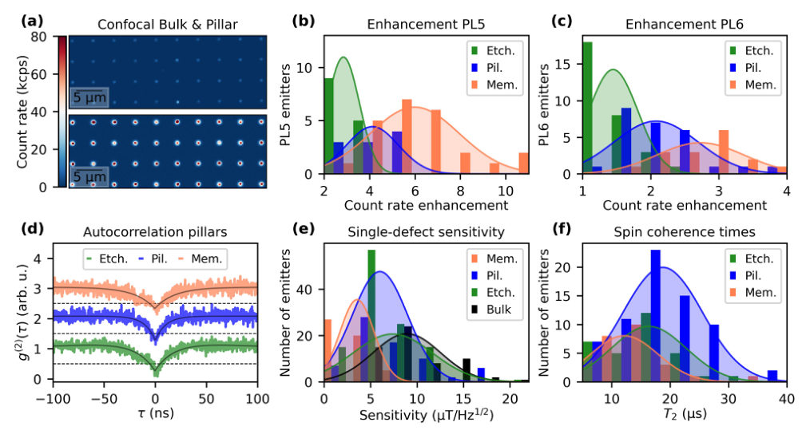 
Figure 3: Color centers integrated into nanopillars. (a) Confocal luminescence maps of color centers in bulk SiC (top) and nanopillars (bottom) at similar laser excitation levels. (b) and (c) Measured photon count-rate enhancement relative to bulk SiC emitters for PL5 and PL6 centers in etched nanopillars (green), bulk nanopillars (blue) and mem- brane pillars (orange). Colored lines correspond to the Gaussian distributions of the enhancement. (d) Second-order autocorrelation measurements for individual emitters inside the fabricated nanostructures with corresponding fit function (black). (e) Single-defect sensitivity calculated after equation (1) for emitters in etched nanopillars (green),...

**Summary.** This paper presents a scalable, deterministic fabrication technique to embed color centers in silicon carbide (SiC) nanopillars. By integrating ion implantation and dry etching using a single mask, the authors overcome low photon collection efficiency, achieving significant count rate enhancements while maintaining the quantum coherence properties of the emitters.

**Why it may be interesting.** This work directly addresses the engineering challenge of coupling solid-state quantum emitters to photonic structures, which is crucial for building scalable quantum networks and quantum memories.

Detailed structure

**Main problem.** The primary challenge addressed is overcoming the low photon collection efficiency when integrating color centers into nanophotonic structures for quantum applications.

**Main result.** The authors report a scalable, deterministic method to integrate color centers into SiC nanopillars, achieving count rate enhancements up to an order of magnitude while preserving spin coherence times.

**Method.** The method combines deterministic ion implantation (using a patterned PMMA mask) with subsequent dry etching to define the nanopillar structure, enabling precise placement of quantum emitters.

**Model / system.** The system utilizes color centers (PL5 and PL6) in silicon carbide (SiC) embedded within fabricated nanopillars. Characterization involves optical measurements (luminescence, ODMR) and quantum measurements ($g^{(2)}(0)$, $T_2$).

**Key observables.** Count rate enhancement factor, spin coherence time ($T_2$), second-order correlation function ($g^{(2)}(0)$), and defect creation yield.

**Important parameters / regimes.** Pillar dimensions (e.g., 200–900 nm diameter, $2.5\ \mu	ext{m}$ height), implantation ion species ($	ext{O}, 	ext{N}, 	ext{C}$), and annealing temperatures.

**Assumptions / limitations.** The method assumes the PMMA mask defines both the implantation sites and the final nanopillar geometry, and that spin coherence times are preserved during the etching process.

**Figures summary.** Figures illustrate the fabrication process flow, simulated count rate enhancements vs. pillar diameter, ODMR spectra, $g^{(2)}(0)$ measurements confirming single-emitter behavior, and $T_2$ measurements across different pillar types.

**Paper structure.** The paper details the fabrication process flow, starting with lithography and implantation, followed by etching to create nanopillars. Characterization proceeds by measuring optical enhancement, confirming single-photon emission statistics, and measuring spin coherence times, comparing results across bulk, membrane, and etched pillar geometries.

Abstract

Color centers in silicon carbide are a promising platform for quantum technologies, offering long-coherence electron and nuclear spins for storing and manipulating quantum information, as well as single-photon emission for quantum communication. Low photon collection efficiency is commonly addressed by integrating color centers into nanophotonic devices. Here, we report a scalable method for the deterministic integration of color centers into silicon carbide nanopillars, using the same nanoscale mask for both implantation of oxygen-related color centers (PL5, PL6) and subsequent nanopillar fabrication via dry etching. This approach solves the issue of low color center creation yield in nanostructures, with figures of merit comparable to bulk samples. We demonstrate count rate enhancements of up to one order of magnitude for PL5 and four times for PL6, while preserving spin coherence times. Our method is directly applicable to other solid-state platforms, offering a scalable route to efficiently integrate color centers into nanostructures.

[↑ back to top](#top)

### [A photonic integrated comb engine for ultracold quantum gases](http://arxiv.org/abs/2609.28294v1)

**Authors:** Wei Sun, Xiaoying Yan, Jinbao Long, Sanli Huang, Zhixin Duan, Zhenyuan Shang, Zeying Zhong, Jiahao Sun, Yue Hu, Shichang Li, Baoqi Shi, Yi-Han Luo, Shuyi Li, Hao Tan, Chen Shen, Zhichuan Niu, Shengjun Yang, Junqiu Liu  
**Type:** experiment · **Category:** quantum gases · **PDF:** <https://arxiv.org/pdf/2609.28294v1>  
**Analysis basis:** full PDF text, analyzed in chunks
**Topic relevance:** 🔥 `analog quantum simulation` **4/5** · `interference shaping light` **2/5** · `quantum optics experiment` **2/5** · `QC/QI experiment` **1/5**

📷 Fig 1

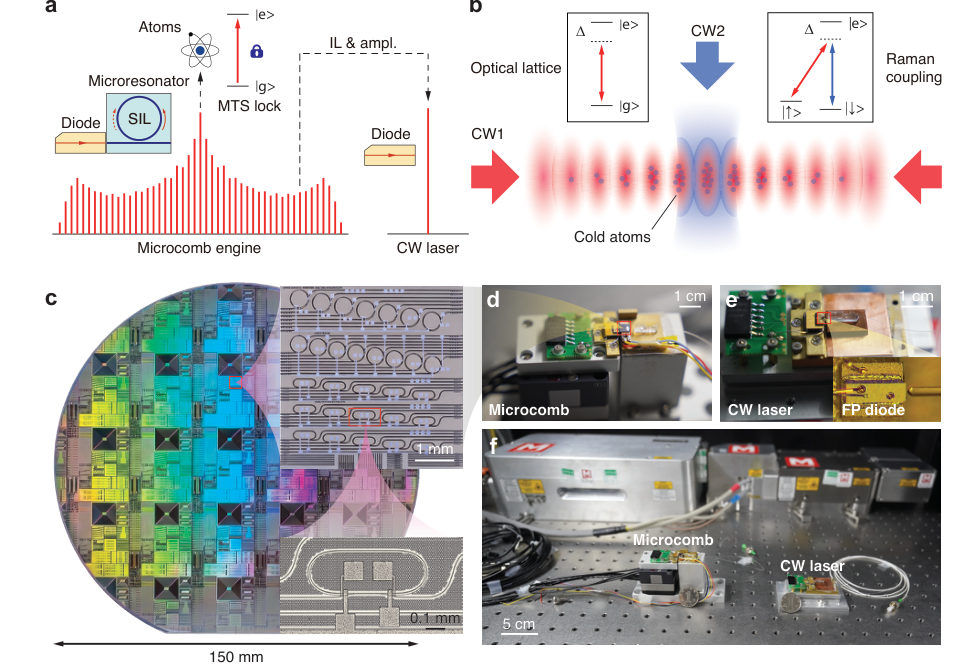 
Figure 1. Integrated microcomb engine for cold-atom manipulation. a, Generation of a platicon microcomb within a nonlinear microresonator edge-coupled to a laser diode. The CW pump is stabilized to an atomic transition |g⟩→|e⟩via a modulation-transfer spectroscopy (MTS) lock. A far-detuned comb line is filtered and amplified via injection locking (IL &amp; ampl.) into a secondary laser diode, creating a high-power, narrow-linewidth CW laser for downstream cold-atom manipulation. b, Configuration for cold-atom manipulation. Counter-propagating beams (CW1) from the high-power diode form an optical lattice (left inset). A frequency-shifted secondary beam (CW2) from the same diode intersects CW1 to...

📷 Fig 2

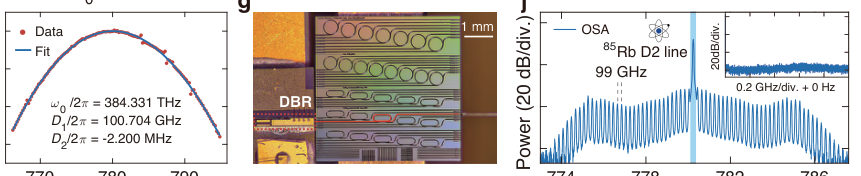 
Figure 2. Microresonator characterization and platicon microcomb generation. a, Self-injection locking (SIL) and platicon microcomb generation in the hybrid diode–microresonator chip. A+ is the forward propagating light in the microresonator, coupled from the diode pump. Backscattering light, A−, is induced and propagates backward into the diode, locking the diode laser frequency to the microresonator resonance and narrowing its linewidth. With sufficient pump power, a platicon/dark pulse is generated in the microresonator via Kerr nonlinearity. b, Typical resonance profile of the high-Q Si3N4 microresonators in the 780 nm band. Lorentzian fitting yields an intrinsic loss of κ0/2π = 41 MHz...

📷 Fig 3

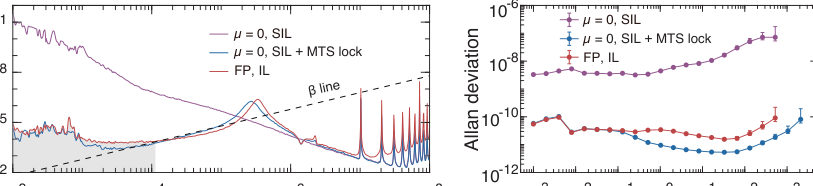 
Figure 3. Frequency stabilization, power amplification, and noise suppression of the microcomb. a, Schematic of the experimental setup for microcomb generation and stabilization (via SIL and MTS), amplification of a selected comb line (via injection locking), and free-space delivery to cold atoms. b, Optical spectra of the SIL-generated, 99-GHz-spaced microcomb (left) and the injection- amplified CW laser (right). Injection locking amplifies (IL &amp; ampl.) the −10th comb line to 102 mW (40.6 dB gain) with an SMSR of 41.7 dB. c, Laser frequency tuning dynamics driven by diode currents during SIL (left) and IL (right). Vertical axes denote the respective beat frequencies of the DBR and FP...

📷 Fig 4

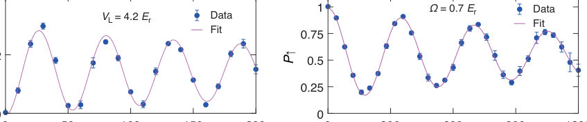 
Figure 4. Optical lattice construction and Raman coupling calibrations. a, Absorption images (left to right) detailing the emergence of a BEC from a thermal atomic cloud during evaporative cooling, evidenced by the formation of a bimodal density distribution. b, Energy-level diagram of 87Rb. The 87Rb D1 and D2 transition wavelengths are 794.98 and 780.24 nm, respectively, with F denoting the total atomic angular momentum and mF the corresponding magnetic quantum number. The BEC is initialized in the |F, mF ⟩= |1, −1⟩ state, and the amplified microcomb line provides the 782.25-nm driving field. c, Kapitza–Dirac diffraction calibration of the optical lattice. Retro-reflected CW1 beams of...

📷 Fig 5

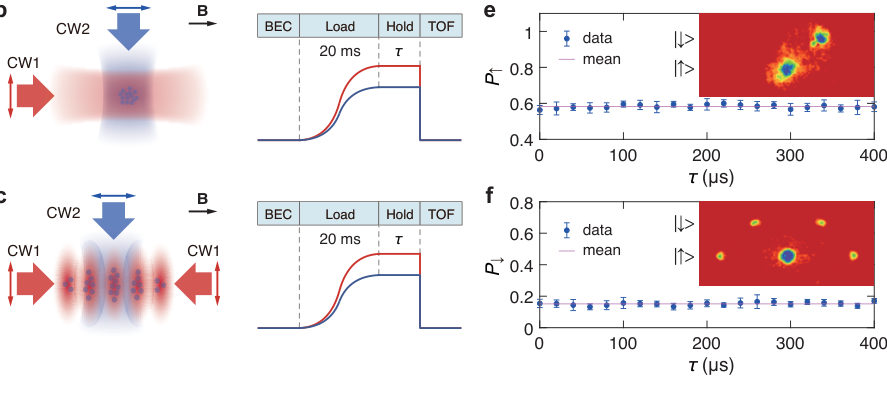 
Figure 5. Adiabatic preparation of stationary quantum states. a–c, Schematic protocols for loading the BEC into a one- dimensional optical lattice (panel a), a spin-orbit coupling configuration (panel b), and a Raman lattice (panel c). The laser intensity is adiabatically ramped along an S-shaped profile over 20 ms and held for time τ prior to TOF imaging. d–f, Corresponding temporal evolution of the atomic populations. The invariant responses across varying hold times τ in the ±2ℏk0 momentum fraction (panel d), spin-up-state fraction (panel e), and spin-down-state fraction (panel f) confirm stable loading of the atoms into the ground state. Insets display the resulting momentum profiles...

**Summary.** The research presents a fully integrated, scalable microcomb engine that solves the major challenge of generating stable optical fields for quantum gas experiments. By combining microresonator physics, laser stabilization, and atomic referencing, they achieve a highly stable light source capable of controlling quantum states in Bose-Einstein condensates.

**Why it may be interesting.** This work directly addresses the engineering bottleneck in quantum simulation by providing a robust, chip-scale source of highly stable, multi-frequency light necessary for complex quantum control protocols.

Detailed structure

**Main problem.** Coherently controlling ultracold quantum gases requires highly stable optical fields, but generating, referencing, and scaling these fields remains a formidable integration challenge.

**Main result.** The authors demonstrated a scalable, hybrid-integrated microcomb engine that successfully provides a synchronized optical grid for controlling quantum states in an ultracold Bose-Einstein condensate.

**Method.** The system uses self-injection locking of III-V lasers into Si3N4 microresonators to generate a microcomb, which is then actively referenced to an atomic transition and amplified for use in lattice/Raman interactions.

**Model / system.** The platform is a photonic integrated comb engine operating at 780 nm, designed for Bose-Einstein condensates of Rb atoms. It integrates frequency synthesis (microcomb generation), atomic referencing, and power amplification into one chip-scale module.

**Key observables.** Frequency stability (suppressing drift from >200 MHz to 100 kHz over 2,000 s), mode spacings (20- and 100-GHz), and successful preparation of spin-orbit-coupled and Raman-lattice states.

**Important parameters / regimes.** 780 nm wavelength, 102 mW amplified power, and the ability to scale multiple optical control channels from a single reference source.

**Assumptions / limitations.** The work establishes a transformative, fully integrated frequency-synthesis architecture, implying previous methods were functionally fragmented.

**Figures summary.** Figures illustrate the integrated setup, comb generation via SIL, cold-atom manipulation showing optical lattices and Raman coupling, and comparisons highlighting SWaP-C advantages.

**Paper structure.** The paper details the generation of the microcomb via SIL on Si3N4 resonators, followed by active referencing to an atomic transition (MTS), subsequent amplification, and finally, the application of this stable field to create and manipulate quantum states in an ultracold gas.

Abstract

Cold atoms underpin quantum sensing, simulation and computation, but their coherent control demands highly stable optical fields whose generation, referencing and power scaling remain formidable integration challenges. While photonic integrated circuits have yielded compact visible lasers and high-$Q$ microresonators have enabled chip-scale optical frequency combs, these crucial technologies have largely remained functionally fragmented. Consequently, the coherent manipulation of ultracold quantum gases using a fully integrated laser-comb source has yet to be realized. Here we demonstrate a scalable, hybrid-integrated microcomb engine at 780 nm that seamlessly bridges frequency synthesis, atomic referencing and power amplification to achieve quantum state control of a Bose--Einstein condensate. By self-injection locking of electrically driven III--V lasers to high-$Q$ Si$_3$N$_4$ microresonators, we generate coherent platicon microcombs featuring 20- and 100-GHz mode spacings. Absolute referencing of the microcomb to an $^{85}$Rb transition actively suppresses long-term frequency drift from over 200 MHz to the 100-kHz level across 2,000 s. A selected comb tooth is subsequently injection-amplified to 102 mW, entirely preserving the microcomb's pristine coherence and stability. We utilize this synthesized field to construct an optical lattice, drive coherent two-photon Raman transitions, and prepare stationary spin-orbit-coupled and Raman-lattice states within an $^{87}$Rb condensate. By providing a synchronized optical grid, this atom-referenced microcomb allows multiple optical-control channels to scale without a proportional multiplication of independent frequency references. Our work establishes a transformative, fully integrated frequency-synthesis architecture essential for realizing deployable, large-scale atomic quantum systems.

[↑ back to top](#top)

### [Beyond Antibunching: Photon Correlation Analysis Reveals Blinking Origin](http://arxiv.org/abs/2609.28139v1)

**Authors:** Patricia Kallert, Santiago Bermúdez-Feijóo, Giorgio De Pascalis, Nicolas Claro-Rodriguez, Ioannis Caltzidis, Normen Auler, Eva Berger, Rebecca Aschwanden, Tobias Krieger, Saimon. F. Covre da Silva, Sandra Stroj, Quirin Buchinger, Michele B. Rota, Thomas Hummel, Sven Höfling, Armando Rastelli, Rinaldo Trotta, Dirk Reuter, Sonja Barkhofen, Klaus D. Jöns, Tobias Huber-Loyola  
**Type:** both · **Category:** other · **PDF:** <https://arxiv.org/pdf/2609.28139v1>  
**Analysis basis:** full PDF text, analyzed in chunks
**Topic relevance:** 🔥 `quantum optics experiment` **4/5** · `quantum measurements` **2/5** · `Full counting statistics` **1/5** · `correlated / nonlocal dissipation` **1/5** · `methods for driven-dissipative` **1/5**

📷 Fig 1

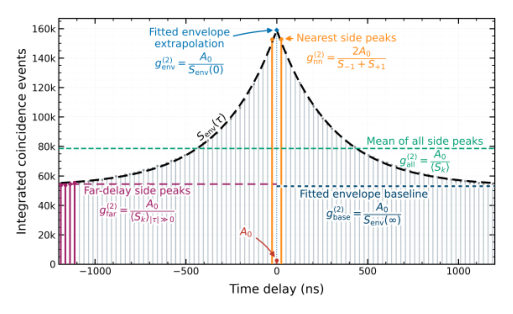 
FIG. 1. Normalization methods for estimating g(2)(0) from a pulsed correlation histogram. The central peak area A0 is compared with different reference levels extracted from the side peaks according to Eqs. (2a-2e).

📷 Fig 2

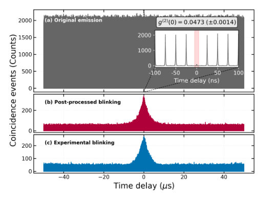 
FIG. 2. Correlation histograms. (a) Reference measurement of the initially non-blinking quantum dot emission, where a flat side peak envelope is obtained for long time delays. The inset displays the short-time pulsed correlation. A value of g(2)(0) = 0.0473 ± 0.0014 is extracted using Eq. (2a). (b) Artificial blinking generated by timestamp masking, applying an RTN waveform to the raw time-tagged photon streams. The imposed intermittency produces a pronounced rapidly decaying envelope in the side peak amplitudes with increasing delay, here shown for r = Poff/Pon = 5.3 and τb = 2.3 µs. (c) Experimentally induced blinking obtained by gating the excitation pulse train with an RTN waveform...

📷 Fig 3

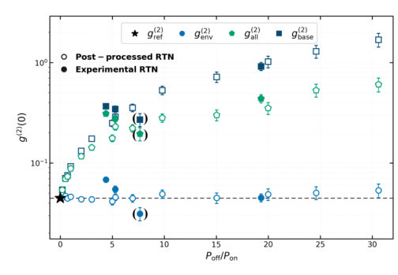 
FIG. 3. g(2)(0) estimators for random telegraph noise blinking as a function of the blinking strength Poff/Pon. The non- blinking reference value is shown by the black star and dashed horizontal line. Open markers correspond to post-processed RTN blinking, while filled markers show experimentally in- duced RTN blinking. The data points within the bracket deviate from the expected trend due to a different pulsed sup- pression. The envelope and baseline estimators, g(2) env and g(2) base, are obtained from the fit to the side peak envelope Senv(τ) given by Eq. (26) in the appendix.

📷 Fig 4

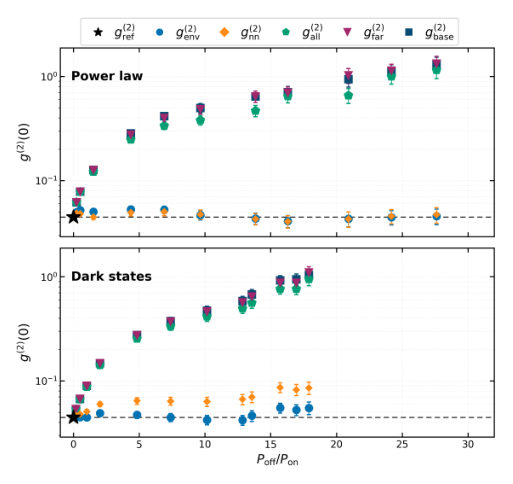 
FIG. 4. g(2)(0) estimators for power law and dark state blink- ing generated by post-processed blinking, shown as a function of the blinking strength Poff/Pon. These models are defined in the appendix. The non-blinking reference value is indicated by the black star and dashed horizontal line.

📷 Fig 5

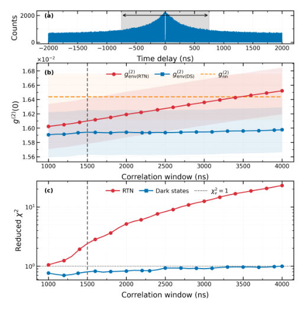 
FIG. 5. g(2)(0) estimators for an inherently blinking quantum dot under phonon-assisted excitation. (a) Measured pulsed correlation histogram showing a pronounced bunching envelope due to blinking. The shaded region indicates the correlation window used for the estimator calculation, with the arrows marking the corresponding window width. (b) Extracted g(2)(0) estimator values as a function of the correlation window. The vertical dashed line corresponds to the window shown in panel (a). (c) Reduced χ2 for increasing correlation window for both the fit with random telegraph noise blinking and the dark state model.

**Summary.** This paper tackles the challenge of measuring single-photon source quality (g^(2)(0)) when the emitters exhibit intensity fluctuations called 'blinking'. By comparing multiple mathematical estimators, the authors demonstrate that only model-based analysis correctly accounts for the slow blinking envelope. This provides a crucial, standardized benchmark for future quantum light source characterization.

**Why it may be interesting.** This work is highly relevant to quantum optics and open quantum systems, as it provides a rigorous framework for extracting fundamental quantum properties (like antibunching) from noisy, fluctuating experimental data streams common in solid-state quantum emitters.

Detailed structure

**Main problem.** The paper addresses the lack of a consistent methodology for analyzing the second-order auto-correlation function, g^(2)(0), of single-photon sources, particularly when the sources exhibit intensity fluctuations known as 'blinking'.

**Main result.** The model-based estimator, which correctly accounts for the slow blinking envelope, provides the most accurate estimate of g^(2)(0), showing that simple normalization methods significantly overestimate the antibunching signature.

**Method.** The authors compare five different estimators for g^(2)(0) by analyzing artificially induced blinking (via post-processing masking or laser gating) on a reference non-blinking quantum dot.

**Model / system.** The system under study is semiconductor quantum dots (QDs) acting as single-photon emitters. The blinking process is modeled using stochastic processes like Random Telegraph Noise (RTN), Dark States (DS), and Powerlaw (PL) decay.

**Key observables.** The primary observable is the zero-delay second-order correlation function, g^(2)(0). Other key diagnostics include the blinking autocorrelation function B(τ) and the blinking contrast r.

**Important parameters / regimes.** The intermittency ratio r = P_off/P_on, the blinking timescale $\tau_b$, and the exponents $\alpha_{on/off}$ characterizing the blinking decay.

**Assumptions / limitations.** The analysis often relies on separating the blinking dynamics from the intrinsic photon statistics, assuming the blinking process is statistically independent of the photon emission process.

**Figures summary.** Figures compare the performance of various g^(2)(0) estimators against increasing blinking strength (e.g., for RTN), demonstrating the failure of simple estimators compared to the envelope-fitting method. They also compare model fits (RTN vs. DS) for inherently blinking QDs.

**Paper structure.** The paper first establishes the problem of inconsistent g^(2)(0) measurement due to blinking. It then details the comparison of multiple estimators using controlled blinking (masking/gating) on a reference QD. Finally, it applies these rigorous methods to analyze an inherently blinking QD, comparing different underlying blinking models (RTN vs. DS).

Abstract

A variety of quantum emitters compete in the quest for the best single-photon source for photonic quantum technologies. Consequently, only a consistent approach to analyze the second-order auto correlation function allows comparison of the multi-photon contribution ($g^{(2)}(0)$) of different sources. However, the community employs different and inconsistent methods for blinking sources, leading to incomparable benchmarks of source quality. Here, we use the emission of an inherently non-blinking quantum dot (QD) and apply artificial blinking through two different mechanisms: masking the recorded raw data in post-processing and emulation of a blinking system by gating the laser excitation pulses. We then compare the $g^{(2)}(0)$ values with the non-blinking result. For the analysis, we investigate five estimators of $g^{(2)}(0)$ actively used in the literature. While fitting the envelope of the correlations on long-time scales with the correct blinking model is the best choice, normalizing to the Poisson level gives by far the worst proximity. Furthermore, we test our predictive model to identify the underlying blinking mechanism of a QD in a circular Bragg grating cavity.

[↑ back to top](#top)

### [Charge and spin qubits in interacting quantum dots coupled to Rashba-active leads](http://arxiv.org/abs/2609.27648v1)

**Authors:** Grazia Di Bello, Fabrizio Pavan, Mattia Trama, Roberta Citro, Giulio De Filippis, Carmine Antonio Perroni  
**Type:** theory · **Category:** quantum information and computing · **PDF:** <https://arxiv.org/pdf/2609.27648v1>  
**Analysis basis:** full PDF text, analyzed in chunks
**Topic relevance:** 🔥 `methods for driven-dissipative` **4/5** · `Keldysh / 2PI / non-Gaussian methods` **1/5** · `analog quantum simulation` **1/5** · `correlated / nonlocal dissipation` **1/5** · `driven-dissipative phase transition` **1/5** · `quantum measurements` **1/5**

📷 Fig 1

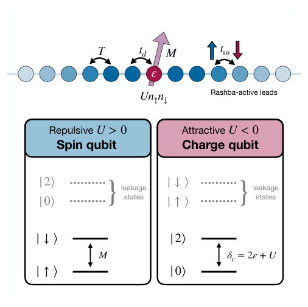 
FIG. 1. Schematic representation of the interacting quan- tum dot coupled to Rashba-active leads and of the spin- and charge-qubit encodings considered for repulsive and attractive interactions, respectively.

📷 Fig 2

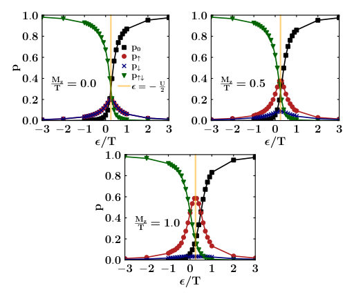 
FIG. 2. DMRG ground-state populations of the dot as a function of the gate energy ϵ (in units of T) for U = −0.5T and tso = 0. The three panels correspond to Mz/T = 0, 0.5, 1.0, where Mz quantifies the Zeeman term. The curves show the empty, singly occupied, and doubly occupied probabilities. The yellow vertical line marks the particle–hole symmetric point ϵ = −U/2.

📷 Fig 3

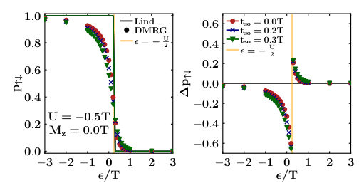 
FIG. 3. Comparison between DMRG and Lindblad results for the stationary double-occupation probability p↑↓as a function of ϵ, for U = −0.5T, Mz = 0, and different values of tso. Panel (a) shows p↑↓: solid lines are Lindblad result and symbols are DMRG data. Panel (b) shows the difference ∆p↑↓= pDMRG ↑↓ − pLindblad ↑↓ for the same values of tso. The vertical line marks the particle–hole symmetric point ϵ = −U/2. The observed SOC dependence reflects the modified reservoir spectral structure and dot–lead hybridization.

📷 Fig 4

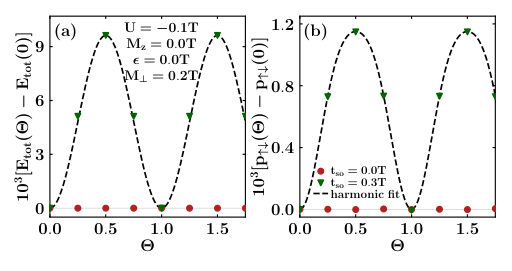 
FIG. 4. Angular response to an in-plane magnetic field for U = −0.1T, ϵ = 0, Mz = 0, and M⊥= 0.2T. The magnetic field is applied to both the dot and the leads, whereas the Rashba axis remains fixed. Panel (a) shows 103[Etot(Θ) −Etot(0)], where Etot is the DMRG ground- state energy of the complete dot–lead system, while panel (b) shows 103[p↑↓(Θ) −p↑↓(0)]. Symbols are DMRG data. The dashed black curves are harmonic fits to the finite-SOC data, tso = 0.3T, performed on the absolute angular dependence and then shifted by subtracting the fitted value at Θ = 0. Panel (a) uses the leading harmonic, while panel (b) includes the first two harmonics (see Appendix E).

📷 Fig 5

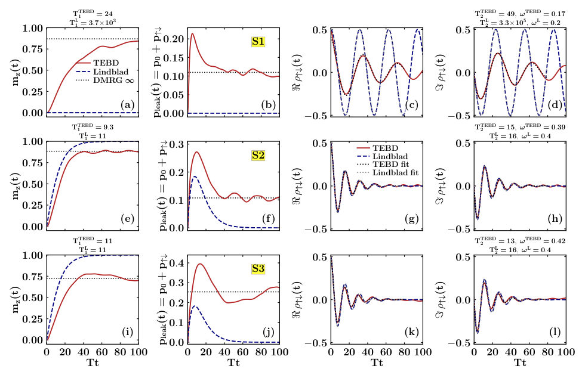 
FIG. 5. Spin-qubit dynamics for the parameter sets S1–S3 of Table V at fixed Rashba tunneling tso = 0.1T. The logical qubit is encoded in Hs = span{|↑⟩, |↓⟩} and is initialized in (|↑⟩+ |↓⟩)/ √

**Summary.** This paper provides a unified theoretical framework for understanding charge and spin qubits in quantum dots coupled to Rashba leads. By combining Lindblad master equations with advanced MPS simulations, the authors analyze how spin-orbit coupling and interactions govern qubit coherence. The findings highlight that the energetic structure of leakage states and SOC-dependent coupling are critical factors determining qubit performance.

**Why it may be interesting.** This work directly addresses the open quantum system dynamics crucial for quantum computing hardware, showing how realistic couplings (like SOC) dictate coherence times in solid-state qubits.

Detailed structure

**Main problem.** The study unifies the investigation of charge and spin qubits encoded in a single interacting quantum dot coupled to leads exhibiting Rashba spin-orbit coupling.

**Main result.** The paper shows that key ingredients for coherent spin and charge qubits, such as leakage state structure and SOC-dependent hybridization, can be captured even with a minimal Anderson-impurity description.

**Method.** The authors combine a weak-coupling Lindblad master equation approach with nonperturbative Matrix-Product-State (MPS) simulations to analyze open-system dynamics.

**Model / system.** The system is an interacting quantum dot modeled by an Anderson impurity Hamiltonian, coupled to Rashba fermionic leads. The analysis distinguishes between spin-qubit encoding (repulsive U) and charge-qubit encoding (attractive U).

**Key observables.** Relaxation and decoherence rates (T1, T2), magnetic pair breaking, and Rashba-induced magnetic anisotropy.

**Important parameters / regimes.** Interaction strength (U), magnetic field orientation, and Rashba SOC strength ($t_{so}$).

**Assumptions / limitations.** The Lindblad approach assumes weak coupling and Markovian dynamics, which is benchmarked against the more rigorous MPS simulations.

**Figures summary.** Figures illustrate the schematic coupling of the QD to leads and show the angular dependence of observables like total energy and double occupation probability.

**Paper structure.** The paper first establishes the Hamiltonian and the qubit subspaces (spin vs. charge). It then compares results from weak-coupling (Lindblad) vs. nonperturbative (MPS) methods, analyzing equilibrium properties (anisotropy) and dynamic properties (decoherence rates $T_1, T_2$).

Abstract

We present a unified study of charge and spin qubits encoded in a single interacting quantum dot tunnel-coupled to Rashba fermionic leads. The dot is described by an Anderson impurity Hamiltonian with either repulsive or attractive local interactions and a magnetic field of arbitrary orientation. In the repulsive regime, a spin qubit is encoded in the singly occupied spin sector, whereas in the attractive regime, close to the degeneracy between the empty and doubly occupied configurations, these two states define a charge-qubit subspace. We combine a weak-coupling Lindblad master equation in the Markovian secular limit with numerically controlled matrix-product-state simulations of the full dot-reservoir system. In equilibrium, we identify magnetic pair breaking in the attractive regime and a weak Rashba-induced magnetic anisotropy when the magnetic field is rotated relative to the spin-orbit axis. In the dynamical regime, relaxation and decoherence are controlled by the energetic gap between the logical manifold and nearby leakage states, and are further enhanced by Rashba-dependent tunneling. These findings show that even a minimal Anderson-impurity description captures key ingredients for coherent spin and charge qubits: the energetic structure of leakage states and spin-orbit-dependent dot-lead hybridization.

[↑ back to top](#top)

### [Dual Boundary Condition Inference: A Two-Boundary Product Rule and Its Implications](http://arxiv.org/abs/2609.27120v1)

**Authors:** Luis Razo, Eliahu Cohen  
**Type:** theory · **Category:** other · **PDF:** <https://arxiv.org/pdf/2609.27120v1>  
**Analysis basis:** full PDF text, analyzed in chunks
**Topic relevance:** 🔥 `quantum measurements` **4/5** · `Keldysh / 2PI / non-Gaussian methods` **2/5** · `methods for driven-dissipative` **2/5**

📷 Fig 1

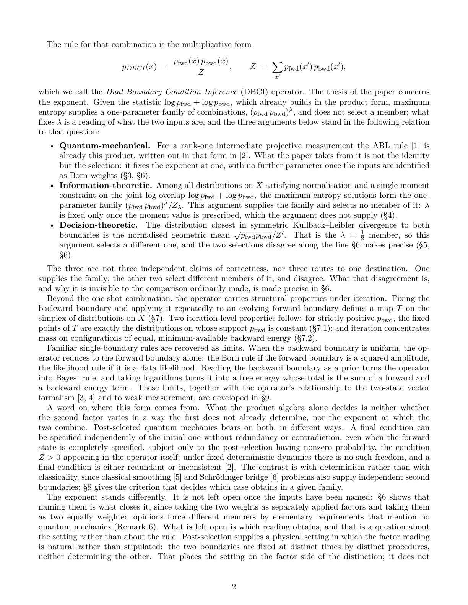 
Low-resolution page preview, page 2

📷 Fig 2

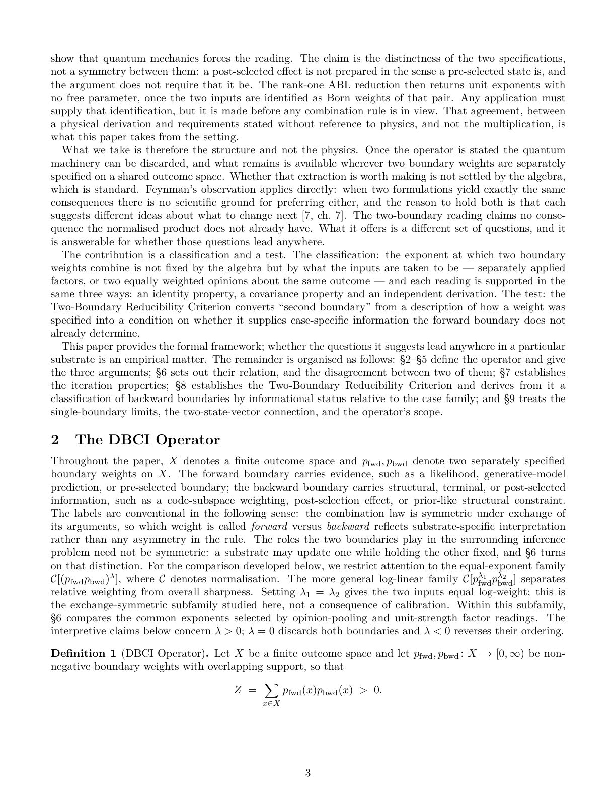 
Low-resolution page preview, page 3

📷 Fig 3

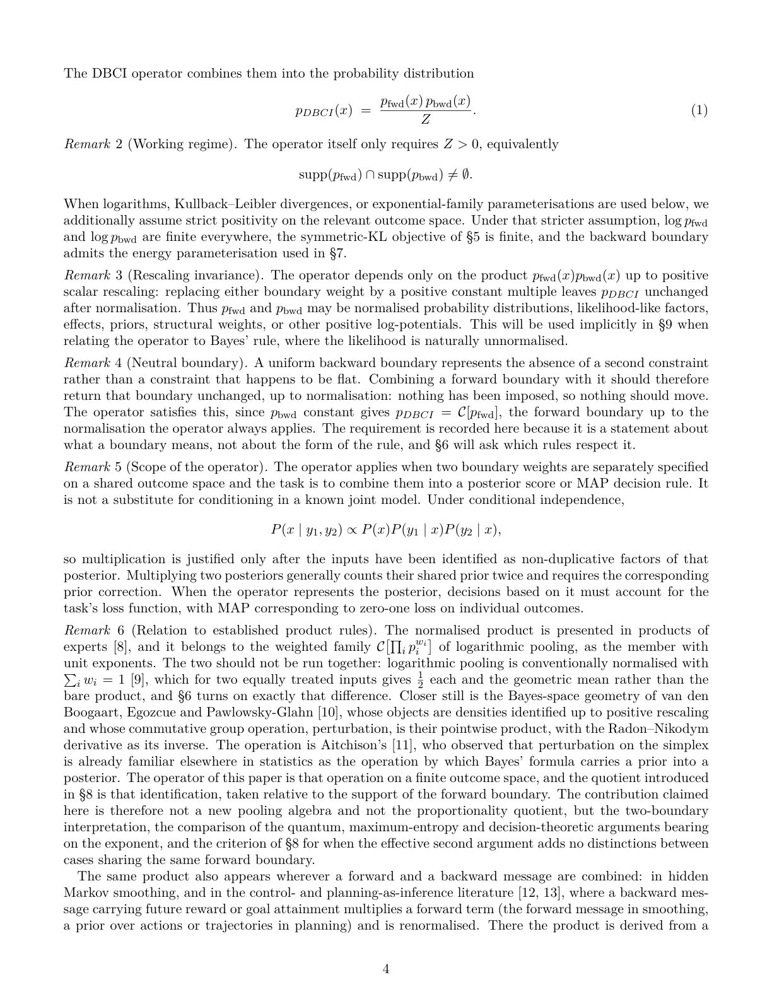 
Low-resolution page preview, page 4

📷 Fig 4

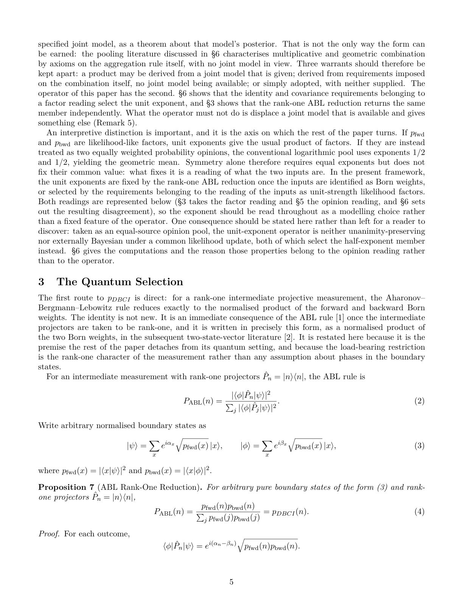 
Low-resolution page preview, page 5

📷 Fig 5

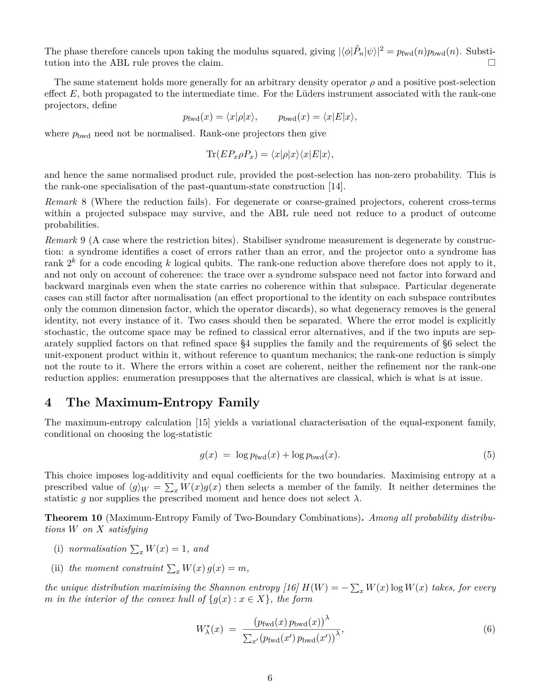 
Low-resolution page preview, page 6

**Summary.** This paper develops the Dual Boundary Condition Inference (DBCI) rule for combining two separate constraints on an outcome space. It shows this rule is mathematically equivalent to the Aharonov-Bergmann-Lebowitz rule in quantum mechanics. The work is significant because it classifies the combination rule and establishes a criterion to determine when one boundary constraint is redundant given the other.

**Why it may be interesting.** It provides a rigorous framework for combining disparate pieces of information (like pre-selection and post-selection) into a single probability estimate, which has deep implications for interpreting quantum measurements.

Detailed structure

**Main problem.** The paper addresses the formal problem of combining two independent constraints (a forward and a backward boundary) on an outcome space to infer a probability distribution.

**Main result.** It introduces the Dual Boundary Condition Inference (DBCI) operator, which is shown to be equivalent to the Aharonov-Bergmann-Lebowitz (ABL) rule for rank-one intermediate projective measurements.

**Method.** The authors use information-theoretic arguments (like maximum entropy and KL divergence minimization) alongside quantum mechanical formalism (Two-State Vector Formalism) to characterize the combination rule.

**Model / system.** The model involves inferring a probability distribution $p(x)$ constrained by two boundary weights, $p_{fwd}(x)$ and $p_{bwd}(x)$, which can represent likelihoods or pre/post-selection information.

**Key observables.** The inferred probability distribution $p_{DBCI}(x)$, the exponent $\lambda$ governing the combination, and the Reducibility Criterion.

**Important parameters / regimes.** The exponent $\lambda$, which determines the specific combination rule (e.g., $\lambda=1$ for ABL, $\lambda=1/2$ for geometric mean).

**Assumptions / limitations.** The analysis often restricts attention to the equal-exponent family of combination rules, and the quantum connection relies on rank-one intermediate projective measurements.

**Paper structure.** The paper develops the DBCI operator, analyzes the mathematical requirements for the combination exponent $\lambda$ using three different physical/mathematical interpretations (quantum, information-theoretic, decision-theoretic), and concludes with the Two-Boundary Reducibility Criterion.

Abstract

Many inference problems are constrained from two sides: forward information and a second constraint on outcomes. Dual Boundary Condition Inference (DBCI) multiplies them and renormalises. The rule is not new: it is the product-of-experts form and the unit-exponent member of the logarithmic-pooling family. The paper contributes a classification and reducibility characterisation. The algebra does not fix the exponent at which the inputs combine: given the statistic log p_fwd + log p_bwd, which already builds in the product form, maximum entropy supplies the family (p_fwd p_bwd)^lambda and selects no member. If the inputs are read as two equally weighted opinions, three requirements select lambda = 1/2: unanimity preservation, consistency under a common Bayesian update, and minimal symmetric Kullback-Leibler divergence. If they are read as separately applied factors, two requirements select lambda = 1: a neutral second input must leave the first unchanged, and an update to one input must pass through unchanged. For a rank-one intermediate projective measurement, the Aharonov-Bergmann-Lebowitz (ABL) rule realises this form with no extra parameter. Every positive exponent orders outcomes identically, so the choice is invisible to picking the likeliest outcome, but not to scoring a class by total mass. Under the relevant identifications, the same product form gives Bayes' rule, while a final effect proportional to the identity returns the ordinary forward Born probabilities. The second result is a Two-Boundary Reducibility Criterion: DBCI factors through the forward boundary exactly when the effective backward boundary, up to positive rescaling, does. So a fixed prior or model-fixed structural constraint adds no distinctions between cases sharing the same forward boundary, though it may encode substantial information and still materially affect the result.

[↑ back to top](#top)

### [Multiscale Entropies as Order Parameters for Nonequilibrium Phase Transitions](http://arxiv.org/abs/2609.27705v1)

**Authors:** Gerhard Jung, Misaki Ozawa  
**Type:** theory · **Category:** statistical mechanics · **PDF:** <https://arxiv.org/pdf/2609.27705v1>  
**Analysis basis:** full PDF text, analyzed in chunks
**Topic relevance:** 🔥 `non-equilibrium universality` **4/5** · `driven-dissipative phase transition` **3/5** · `Frenkel-Kontorova` **1/5**

📷 Fig 1

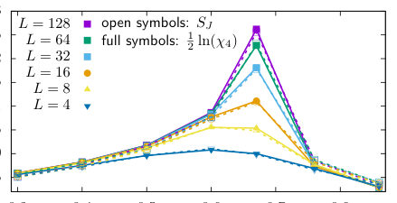 
FIG. 2. Coarse-grained entropy SJ and susceptibility χ4 for the φ4 model for different control parameters β and different system sizes L. SJ has been shifted to account for different normalization. Lines are a guide for the eye.

📷 Fig 2

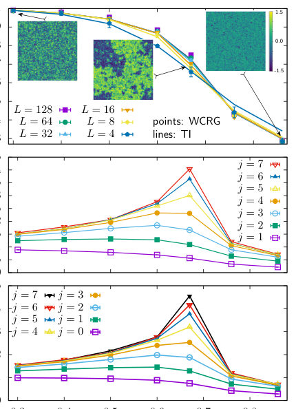 
FIG. 1. Multiscale and conditional entropies per site in the φ4 model for different values of the control parameter β. (a) Comparison of the total entropy S0 obtained by thermody- namic integration (TI) of the microscopic model and by the wavelet conditional renormalization group (WCRG) model for different system sizes L = 4, 8, 16, 32, 64, 128. Snapshots show representative configurations at β = 0.3, 0.67, and 0.86 (same color code) for L = 128. (b) Conditional entropies Sj ex- tracted from the WCRG model at scales ranging from j = 1 to j = J = 7 for L = 128. (c) Multiscale entropies Sj for the same system as in panel (b).

📷 Fig 3

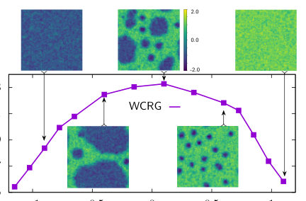 
FIG. 3. The total entropy per site in the AMB+ for differ- ent mean fields Φ and L = 128. Snapshots show exemplary configurations at Φ = −0.9, −0.4, 0.1, 0.6 and 1.1 (same color code).

📷 Fig 4

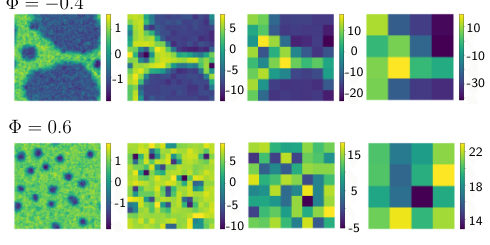 
FIG. 4. (a) Multiscale entropy in the AMB+ compared to the correlation length ξ for different mean fields Φ and L = 128. The black dotted line corresponds to ln ξ + const. (b) Snapshots show exemplary coarse-grained configurations at Φ = −0.4 and 0.6 for different scales j.

📷 Fig 5

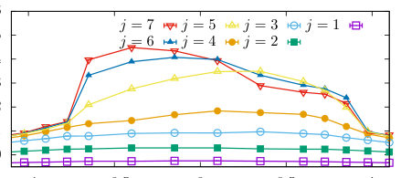 
FIG. 5. Conditional wavelet entropies Sj extracted for the AMB+ using the WCRG model at different scales j.

**Summary.** This work introduces a multiscale entropy framework based on the Wavelet Conditional Renormalization Group to analyze phase transitions. By decomposing the total entropy across spatial scales, the authors demonstrate that these multiscale entropies act as robust order parameters. This technique successfully identifies critical points and characterizes spatial ordering in both equilibrium and complex nonequilibrium systems.

**Why it may be interesting.** The concept of using entropy decomposition as a universal, scale-dependent order parameter is highly relevant for understanding critical phenomena and pattern formation in complex many-body systems, bridging statistical mechanics with information theory.

Detailed structure

**Main problem.** To develop and apply a multiscale entropy framework to characterize phase transitions, particularly in complex nonequilibrium systems where traditional order parameters might fail.

**Main result.** Multiscale entropies successfully reveal critical points and spatial organization in both equilibrium ($\phi^4$) and nonequilibrium (Active Model B+) systems, providing scale-dependent order parameters.

**Method.** The core method is the Wavelet Conditional Renormalization Group (WCRG), which decomposes the total Shannon entropy into contributions from different spatial scales by learning conditional probability distributions.

**Model / system.** The framework is applied to the equilibrium $\phi^4$ model and the nonequilibrium Active Model B+ (AMB+), as well as an opinion dynamics model. The method is designed to handle systems where the underlying probability distribution is unknown.

**Key observables.** Multiscale Entropy ($S_j$), Conditional Entropy ($S_j$), Total Shannon Entropy ($S_0$), and comparison with susceptibility ($\chi$) and correlation length ($\xi$).

**Important parameters / regimes.** Control parameters like $eta$ (for $\phi^4$) and $\epsilon_u$ (for opinion dynamics); the analysis focuses on the behavior across different spatial scales ($j$).

**Assumptions / limitations.** The method relies on factorizing the probability distribution across scales and uses generative modeling (minimizing KL divergence) to estimate the necessary energy functions.

**Figures summary.** Figures compare total entropy estimates from WCRG vs. Thermodynamic Integration (TI) for $\phi^4$; they show multiscale entropies peaking near critical points for $\phi^4$ and revealing asymmetry in AMB+ phase transitions.

**Paper structure.** The paper introduces the WCRG framework for entropy decomposition, validates it on the $\phi^4$ model, and then applies it to more complex, non-equilibrium systems like AMB+ and opinion dynamics models to demonstrate its utility as a universal order parameter.

Abstract

We develop a multiscale entropy framework based on the wavelet conditional renormalization group that decomposes the total Shannon entropy into contributions from different spatial scales. Generative modeling enables accurate estimation of these entropies from configurations or snapshots, even in nonequilibrium systems whose underlying probability distributions are unknown. Applications to the equilibrium $\varphi^4$ model and nonequilibrium active Model B+ show that multiscale entropies reveal criticality and spatial organization obscured in the total entropy. These entropies serve as scale-dependent order parameters for characterizing phase transitions and pattern formation.

[↑ back to top](#top)

### [Theory of Airy-Beam Wavefront Sensing](http://arxiv.org/abs/2609.28050v1)

**Authors:** Surya Kamal  
**Type:** theory · **Category:** other · **PDF:** <https://arxiv.org/pdf/2609.28050v1>  
**Analysis basis:** full PDF text, analyzed in chunks
**Topic relevance:** 🔥 `interference shaping light` **4/5** · `quantum measurements` **3/5** · `analog quantum simulation` **1/5**

📷 Fig 1

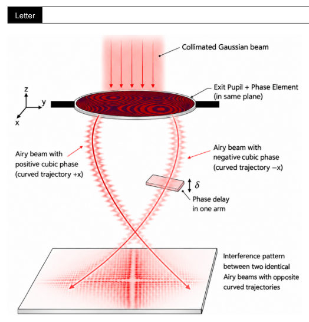 
Fig. 1. Conceptual architecture of the proposed Airy-beam wavefront sensor. A Gaussian beam illuminates an aberrated exit pupil containing the optical phase structure of the system. An engineered cubic-phase element generates two coherent channels with opposite cubic phase. The corresponding Airy fields propagate to the Fourier plane, where they interfere and the resulting intensity is recorded for phase recovery.

📷 Fig 2

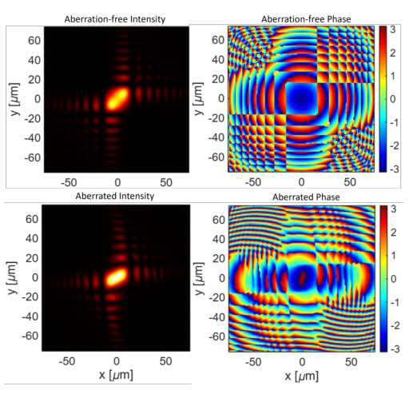 
Fig. 2. Interference of the conjugate cubic-phase channels with- out and with exit-pupil aberrations. The aberrated case in- cludes −2 waves of defocus, 3 waves of astigmatism, and 10 waves of spherical aberration. A visible phase-shearing pat- tern appears in the interference phase in the presence of aber- rations.

📷 Fig 3

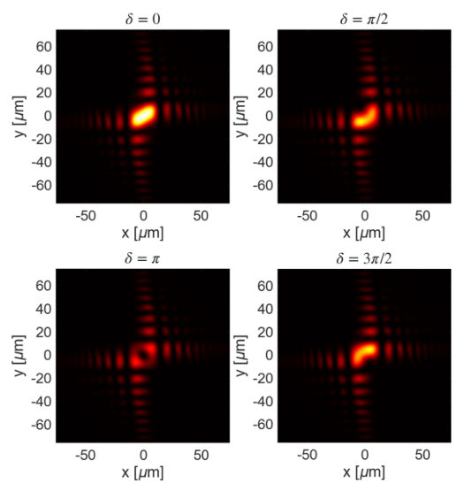 
Fig. 3. Four-step interferometric phase retrieval in the Fourier plane for a wavefront containing 10λ spherical aberration, −2λ defocus, and 3λ astigmatism. Four intensity measure- ments are acquired with controlled relative phase shifts of 0, π/2, π, and 3π/2. These four phase-shifted measurements form the standard four-step phase-shifting interferometry scheme for recovering the relative phase through quadra- ture combinations [13]. The resulting quadratures provide the wrapped relative phase and the interference modulation used to define a valid reconstruction region.

📷 Fig 4

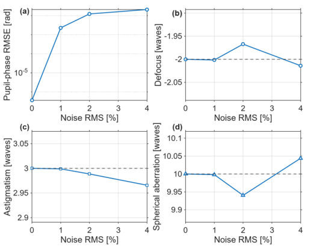 
Fig. 5. Noise tolerance of the proposed wavefront sensor. Reconstruction error is evaluated as a function of additive measurement noise applied independently to the four phase- shifted interferograms.

📷 Fig 5

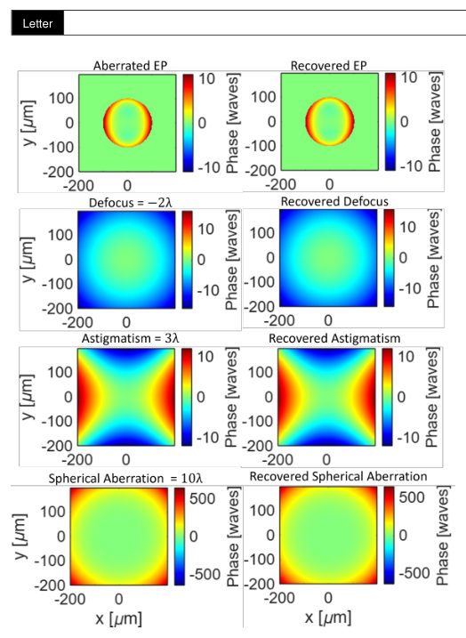 
Fig. 4. Inverse aberration recovery. The measured four-step interferometric data are used in an inverse forward-model op- timization to recover the exit-pupil aberration coefficients. De- focus, astigmatism, and spherical aberration are recovered as −2.00000, 3.00000, and 9.99998 waves, respectively, compared with the true values of −2, 3, and 10 waves. The resulting exit-pupil phase is reconstructed with an RMS phase error of &lt; 10−6 rad, demonstrating accurate recovery of the imposed aberration.

**Summary.** This paper presents a novel, compact wavefront sensing technique utilizing the interference of counter-accelerating Airy beams. By encoding the unknown exit-pupil aberration into the relative phase of the interference pattern, the method allows for highly accurate phase reconstruction. This eliminates bulky collection optics, making it ideal for integrating wavefront sensing into complex systems like electron-optical or AR/VR devices.

**Why it may be interesting.** This work is highly relevant to quantum optics and open quantum systems because it proposes a compact, non-interferometric method for measuring complex phase structures (aberrations) that can be crucial for high-precision quantum state preparation or quantum sensing applications.

Detailed structure

**Main problem.** To develop a wavefront sensing framework that accurately reconstructs unknown aberrations in an exit pupil without requiring conventional collection optics.

**Main result.** The proposed method achieves accurate phase reconstruction with an RMS error below $10^{-6}$ rad, demonstrating high performance even in the presence of measurement noise.

**Method.** The technique uses the interference pattern generated by two coherent Airy beams, derived from a single Gaussian beam via an engineered cubic phase function, and measures the resulting phase shift using a four-step phase-shifting interferometry scheme.

**Model / system.** The system models the propagation of light through an aberrated exit pupil, encoding the aberration into the relative phase difference ($\Delta\psi$) measured in the Fourier plane via the interference of counter-accelerating Airy beams.

**Key observables.** The resulting interference pattern intensity $I_\delta(r)$ and the wrapped relative phase $\Delta\psi_{	ext{wrap}}$ obtained from the four-step measurement.

**Important parameters / regimes.** The aberration is parameterized by low-order coefficients (e.g., defocus, astigmatism, spherical aberration).

**Assumptions / limitations.** The reconstruction relies on solving an inverse problem using the full wave-optical forward model, although a local relationship approximation is also discussed.

**Figures summary.** Figures illustrate the conceptual architecture (Fig. 1), the phase-shearing pattern due to aberrations (Fig. 2), and the four-step phase-shifting interferometry scheme (Fig. 3).

**Paper structure.** The paper introduces the physical setup using cubic phase elements to generate Airy beams, details the four-step phase measurement process, formulates the aberration recovery as an inverse problem, and presents numerical simulations validating the reconstruction accuracy and noise tolerance.

Abstract

A new wavefront sensing framework based on the interference of counter-accelerating Airy beams is presented. An engineered cubic phase function transforms a single Gaussian beam into two coherent Airy beams with opposite transverse accelerations, which self-recombine during free-space propagation to form an interference pattern encoding the aberrated incident wavefront. Numerical simulations demonstrate accurate recovery of the aberrated exit-pupil phase across the aberration sets considered, with a root-mean-square phase reconstruction error below $10^{-6} \mathrm{\;rad}$ for the aberration set shown and consistently low errors for the other sets, while maintaining accurate recovery in the presence of measurement noise. The approach eliminates collection optics and enables a compact wavefront-sensing architecture for applications where conventional interferometric systems are difficult to implement, including electron-optical systems, augmented and virtual reality systems.

[↑ back to top](#top)

### [Bosonic Error Correction with Fluxonium](http://arxiv.org/abs/2609.26880v1)

**Authors:** Shantanu R. Jha, Shoumik D. Chowdhury, Gabriele Rolleri, Anaida Ali, Lev-Arcady Sellem, Réouven Assouly, David Pahl, Lukas Pahl, Junyoung An, Farid Hassani, Hung-Yu Tsao, Chia-Chin Tsai, Aranya Goswami, Jeremie Boudreault, Jeffrey M. Gertler, Michael A. Gingras, Bethany M. Niedzielski, Jeffrey M. Knecht, Mollie E. Schwartz, Kyle Serniak, Jeffrey A. Grover, Baptiste Royer, Max Hays, William D. Oliver  
**Type:** experiment · **Category:** quantum information and computing · **PDF:** <https://arxiv.org/pdf/2609.26880v1>  
**Analysis basis:** full PDF text, analyzed in chunks
**Topic relevance:** 🔥 `QC/QI experiment` **4/5** · `quantum measurements` **2/5** · `quantum optics experiment` **1/5**

📷 Fig 1

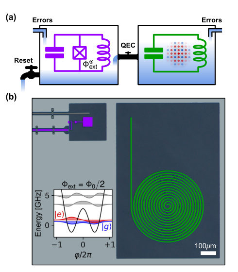 
FIG. 1. Fluxonium-resonator device. (a) Schematic of the fluxonium-resonator system, with the flow of liquid rep- resenting errors entering and leaving the system. The error- correction protocol maps errors from the resonator (green) to the fluxonium (purple) at a controllable rate, represented by the middle tunable valve. The fluxonium is then reset at a controllable rate, represented by the leftmost valve, removing the errors from the system. Error correction thus acts as engi- neered dissipation that restores the system to the code space. (b) False-colored optical micrograph of the device, with the fluxonium and its flux line in purple, ASR in green, readout resonator stub in dark grey,...

📷 Fig 2

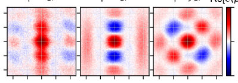 
FIG. 3. GKP state preparation. (a) Circuit for prepar- ing an arbitrary fluxonium-resonator state using N rounds of single-qubit rotations and ECD gates; b is the batch index within the optimization. (b) Infidelity traces for a multi-start optimization of the preparation circuit for the |+yL⟩GKP state with size ∆= 0.438, N = 7 blocks, and regularization strength λ = 0.5. The minimum-loss parameter set (bold black line) does not coincide with the minimum-infidelity set (dashed black line), illustrating how regularization shapes the optimal circuit. (c) Characteristic functions of the prepared |+zL⟩, |−zL⟩, and |+yL⟩GKP states at ∆= 0.438.

📷 Fig 3

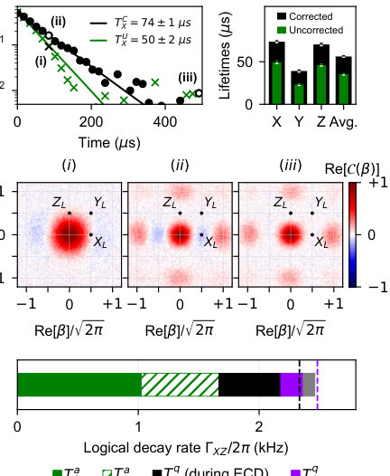 
FIG. 4. Measurement-free GKP QEC. (a) Circuit for a single stabilizer round of measurement-free GKP error cor- rection, indexed by k, enabling cycling through X/Z stabiliz- ers along each cardinal direction in phase space. (b) Decay of the logical-state distinguishability 1

**Summary.** This paper reports the first realization of bosonic quantum error correction in a fully planar superconducting circuit. By coupling a long-lived fluxonium qubit to a small, planar resonator, the authors successfully prepared GKP logical states and demonstrated error correction, extending the logical coherence time by a factor of 1.59.

**Why it may be interesting.** This work directly addresses the hardware limitations of superconducting QEC by moving to a planar architecture and utilizing a high-coherence qubit (fluxonium) for error syndrome extraction.

Detailed structure

**Main problem.** The primary goal is to achieve fault-tolerant quantum computation using bosonic quantum error correction (QEC) in a scalable hardware platform.

**Main result.** The authors demonstrated the first standalone bosonic QEC in a fully planar superconducting circuit architecture, achieving a logical lifetime enhancement factor of $1.59 \pm 0.05$.

**Method.** The technique involves preparing finite-energy Gottesman-Kitaev-Preskill (GKP) states and stabilizing them using measurement-free error correction implemented via rapid fluxonium reset.

**Model / system.** The system uses a heavy fluxonium qubit coupled dispersively to an on-chip Archimedean spiral resonator (ASR). The control relies on the weak coupling regime and the fluxonium's long bit-flip lifetime.

**Key observables.** Logical lifetimes ($T_C$), fluxonium excited-state population $P(e)$ vs. photon number ($ar{n}$), and Husimi Q-functions of the resonator state.

**Important parameters / regimes.** Fluxonium bit-flip lifetime ($451 \pm 70 \mu s$), resonator quality factor ($Q = 2.65 	imes 10^6$), and the logical lifetime enhancement factor ($1.59 \pm 0.05$).

**Assumptions / limitations.** The fluxonium is operated at the half-flux sweet spot ($\Phi_{	ext{ext}} = \Phi_0/2$) to minimize flux noise sensitivity, and the weak coupling regime is maintained.

**Figures summary.** Figure 1 illustrates the error correction protocol mapping errors from the resonator to the fluxonium followed by reset. Figure 2 shows characterization of the ECD gate action via Q-functions and characteristic functions of cat states.

**Paper structure.** The paper details the physical setup (fluxonium coupled to ASR), the implementation of necessary quantum control gates (ECD), the preparation of GKP states, and finally, the measurement and demonstration of the measurement-free error correction protocol.

Abstract

Bosonic quantum error correction (QEC) offers a hardware-efficient route to fault-tolerant quantum computing. To date, however, superconducting circuit implementations of bosonic codes have utilized centimeter-scale 3D microwave cavities controlled by fixed-frequency transmon qubits, with logical lifetimes limited by transmon bit-flip errors. Here, we realize bosonic QEC in a fully planar architecture by pairing a heavy fluxonium, whose $451 \pm 70~μ\mathrm{s}$ bit-flip lifetime exceeds that of any control qubit in previous demonstrations, with an on-chip Archimedean spiral resonator several orders of magnitude smaller in mode volume than prior 3D cavities. We prepare finite-energy Gottesman-Kitaev-Preskill (GKP) states and stabilize them using measurement-free error correction with rapid fluxonium reset, extending the logical lifetime by a factor of $1.59 \pm 0.05$. These results provide the first demonstration of resonator control using a weakly coupled fluxonium and, with it, the first realization of standalone bosonic QEC in a fully planar superconducting circuit architecture.

[↑ back to top](#top)

### [Precision and resource scaling of real-time flux distortion compensation for superconducting quantum control](http://arxiv.org/abs/2609.27456v1)

**Authors:** Qi Zhou, Zi-Hao Mei, Peng Duan, Peng Wang, Liang-Liang Guo, Hao-Ran Tao, Wei-Cheng Kong, Hui Yang, Guo-Ping Guo, Zhao-Yun Chen  
**Type:** experiment · **Category:** quantum information and computing · **PDF:** <https://arxiv.org/pdf/2609.27456v1>  
**Analysis basis:** full PDF text, analyzed in chunks
**Topic relevance:** 🔥 `QC/QI experiment` **4/5** · `quantum measurements` **1/5**

📷 Fig 1

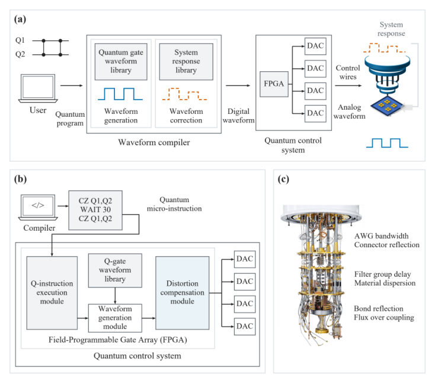 
FIG. 1. Schematic comparison of distortion-compensation architectures. (a) Offline pre-distortion of complete waveforms before storage and playback. (b) Real-time inverse filtering after gate-level waveform synthesis. (c) Representative flux-line distortion sources in room-temperature electronics (top), the cryogenic transmission chain (middle), and processor interconnects (bottom).

📷 Fig 2

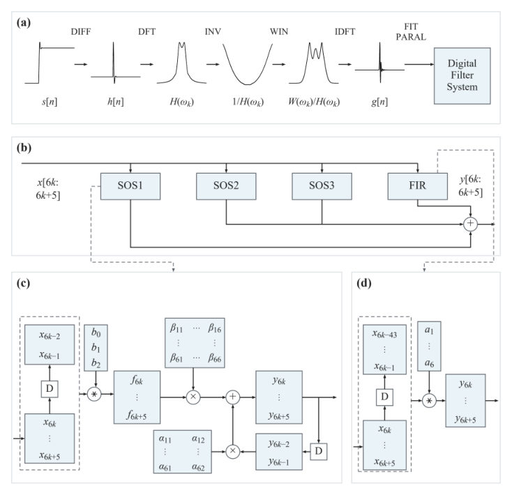 
FIG. 2. Inverse-filter reconstruction and parallel filtering scheme. (a) FDI-TDF workflow from the measured step response s[n] to the reconstructed compensation impulse response g[n] and compact IIR/FIR model. (b) Three parallel second-order IIR sections (SOS) and a 44-tap FIR branch represent the long- and short-time components of the compensation response. (c) Logical structure of block look-ahead IIR filtering and (d) sliding-window FIR filtering, each producing six consecutive samples per FPGA clock within one channel. In (c), αij and βij denote the entries of A and B in equation (9), and D denotes a delay of one FPGA clock cycle.

📷 Fig 3

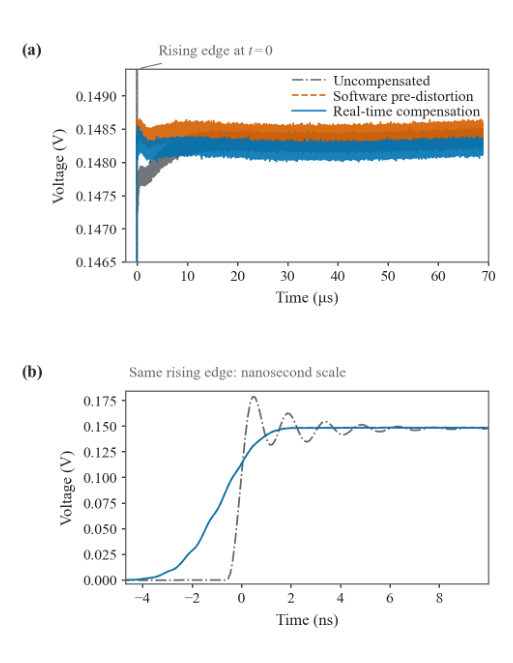 
FIG. 3. Room-temperature step responses for a 500 µs-period square wave: uncompensated (gray dash-dotted), software pre-distorted (orange dashed), and FPGA compensated (blue solid). Each trace averages 1000 waveforms. (a) Microsecond- scale settling and (b) a nanosecond-scale view of the same rising edge. The FPGA configuration uses a fourth-order IIR branch and an FIR branch with 14 effective taps.

📷 Fig 4

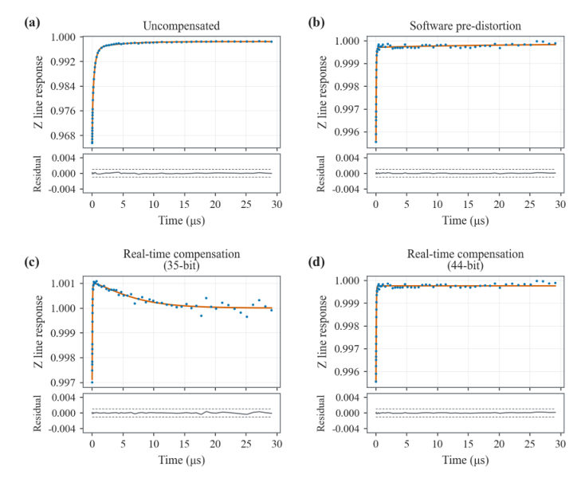 
FIG. 4. Cryogenic flux-line step responses measured with the qubit. Blue points are measurements and orange curves are fits; gray traces beneath each response show the fit residuals, with dashed reference lines at ±10−3. (a) Uncompensated; (b) software pre-distorted; (c), (d) FPGA compensated using fourth-order IIR filters at 35 and 44 bits, respectively. The 44-tap FIR branch uses 44-bit arithmetic.

📷 Fig 5

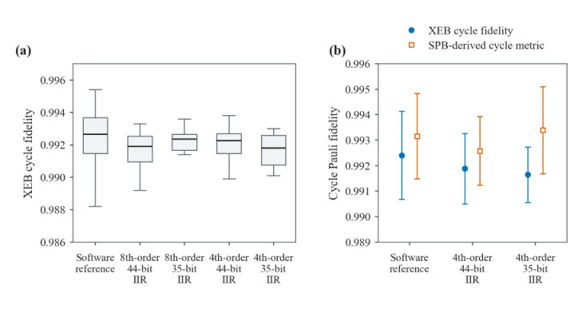 
FIG. 5. Benchmarking results in the cycle Pauli fidelity convention. (a) XEB distributions for the software reference (40 rounds) and four IIR configurations (10 rounds each), labeled by order and word length. Boxes span the interquartile range; black lines mark medians. (b) Mean XEB fidelity (blue circles) and SPB-derived cycle metric (orange open squares) for the software reference and fourth-order configurations. Error bars are one sample standard deviation.

**Summary.** This paper presents a novel, resource-efficient hardware method for compensating flux distortions in superconducting quantum processors. By using a Frequency-Domain Inversion and Time-Domain Fitting approach, the authors implement a hybrid IIR/FIR filter on an FPGA. This technique maintains high gate fidelity (near 99.57%) while showing only logarithmic growth in hardware resource use as the required compensation timescale increases.

**Why it may be interesting.** This work directly tackles a major experimental bottleneck in superconducting quantum computing—control fidelity—by providing a resource-efficient, scalable hardware solution for real-time pulse shaping.

Detailed structure

**Main problem.** The paper addresses the critical challenge of maintaining high gate fidelity in superconducting quantum processors by compensating for long-lived distortions in the flux-control lines during dynamic quantum circuits.

**Main result.** The proposed real-time IIR filtering technique successfully achieved a median controlled-Z Pauli fidelity close to the software-reference value of 99.57%, demonstrating a scalable hardware foundation for high-fidelity flux control.

**Method.** A Frequency-Domain Inversion and Time-Domain Fitting (FDI-TDF) method is used to reconstruct the compensation filter, which is then implemented using a compact hybrid Infinite Impulse Response (IIR) and Finite Impulse Response (FIR) structure.

**Model / system.** The system is a superconducting quantum processor controlled via flux-control lines, modeled as a Linear Time-Invariant (LTI) system. The compensation is implemented on an FPGA, operating at 1.2 GSa/s.

**Key observables.** Two-qubit cross-entropy benchmarking (XEB) controlled-Z Pauli fidelity; hardware resource use (LUT and DSP) vs. compensation timescale.

**Important parameters / regimes.** Sampling rates up to 1.2 GSa/s; resource scaling showing only ~14% increase in LUT use when extending compensation from microsecond to hundred-microsecond timescales.

**Assumptions / limitations.** The method assumes the flux-line response can be accurately modeled and inverted using the FDI-TDF approach, avoiding the limitations of pre-determined pulse sequences.

**Figures summary.** Figures compare different compensation architectures (offline vs. real-time inverse filtering) and show the step responses achieved by the FPGA compensation method relative to software pre-distortion.

**Paper structure.** The paper details the physical problem (flux distortion), introduces the FDI-TDF algorithm (involving frequency-domain inversion and time-domain fitting to a hybrid IIR/FIR model), presents the hardware implementation details (parallelization on FPGA), and validates the results using fidelity benchmarking and resource scaling analysis.

Abstract

Real-time waveform generation supports dynamic quantum circuits without pre-storing complete waveforms for every execution path. However, long-lived distortions in flux-control lines degrade gate fidelity, requiring compensation to account for the actual pulse history. A frequency-domain inversion and time-domain fitting method is proposed for resource-efficient real-time flux distortion compensation. The method fits the reconstructed compensation impulse response with a compact hybrid infinite impulse response (IIR) and finite impulse response (FIR) filter. Look-ahead parallelization enables this filter to process synthesized waveforms at 1.2GSa/s on a field-programmable gate array (FPGA). Two-qubit cross-entropy benchmarking shows that real-time IIR filtering achieves a median controlled-Z Pauli fidelity close to the software-reference value of 99.57%. Numerical analysis and FPGA synthesis indicate approximately logarithmic growth in hardware resource use with compensation timescale. Extending compensation from microsecond to hundred-microsecond timescales increases look-up table (LUT) and digital signal processing (DSP) resource use by only about 14% and 4%, respectively, while maintaining a relative arithmetic error below $10^{-4}$. This work provides a scalable hardware foundation for high-fidelity flux control in dynamic superconducting quantum circuits.

[↑ back to top](#top)

### [Soft decoding for quantum LDPC codes with experimental validation](http://arxiv.org/abs/2609.26958v1)

**Authors:** Arda Aydin, Edwin Tham, Nicolas Delfosse, Min Ye  
**Type:** both · **Category:** quantum information and computing · **PDF:** <https://arxiv.org/pdf/2609.26958v1>  
**Analysis basis:** full PDF text, analyzed in chunks
**Topic relevance:** 🔥 `QC/QI experiment` **4/5** · `quantum measurements` **1/5**

📷 Fig 1

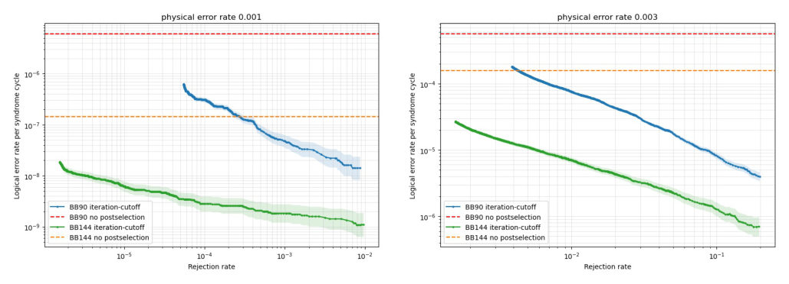 
FIG. 1. Comparison of iteration-cutoff post-selection with the no-post-selection baseline for BB90 and BB144 at (left) p = 10−3

📷 Fig 2

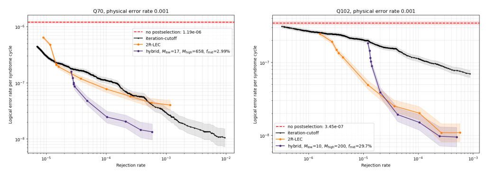 
FIG. 2. Comparison of the iteration-cutoff rule, the hybrid rule, and 2R-LEC at p = 10−3 for (left) Q70 and (right) Q102. The thresholds Mlow and Mhigh and the fraction fmid are defined in Sec. II.

📷 Fig 3

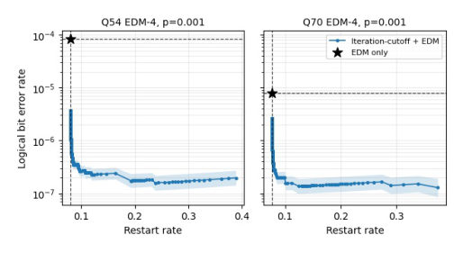 
FIG. 3. Logical bit error rate versus restart rate for the (w = 5, c = 3) soft sliding-window decoder applied to EDM-4 at p = 10−3 for (left) Q54 and (right) Q70. Each curve plots the tradeoff obtained by varying the iteration cutoff Mcut.

📷 Fig 4

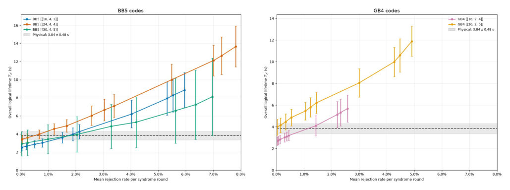 
FIG. 4. Overall logical lifetime TN versus mean rejection rate per syndrome round under iteration-cutoff post-selection for the experimental (left) BB5 and (right) GB4 memory data. Each point corresponds to a different value of Mcut. Vertical error bars denote 95% confidence intervals from the lifetime fits. The dashed line and gray band mark the measured physical-qubit lifetime, 3.84 ± 0.48 s.

**Summary.** This paper presents a novel soft beam search decoder for quantum LDPC codes, which uses the internal computational effort (BP iterations) as a confidence score. By implementing smart post-selection rules based on this score, the authors achieve substantial improvements in logical error suppression and demonstrate that these techniques can push trapped-ion quantum memories into the beyond-breakeven regime.

**Why it may be interesting.** The development of soft decoding methods that leverage internal decoder statistics (like BP iterations) to guide post-selection is highly relevant for improving fault-tolerance in physical quantum hardware.

Detailed structure

**Main problem.** The paper addresses the critical need to improve the logical performance of quantum error correction (QEC) by developing advanced decoding techniques.

**Main result.** The proposed soft beam search decoder significantly enhances logical error suppression (up to $580	imes$) and doubles logical qubit lifetimes in trapped-ion memory experiments, pushing codes into the beyond-breakeven regime.

**Method.** A soft beam search decoder is introduced that uses the cumulative number of Belief Propagation (BP) iterations as a computationally cheap confidence metric for post-selection.

**Model / system.** The work focuses on Quantum Low-Density Parity-Check (qLDPC) codes, which are simulated for superconducting and trapped ion architectures. It also analyzes error detection measurements (EDMs) relevant to the walking cat architecture.

**Key observables.** Logical Error Suppression factor, Logical Qubit Lifetime ($T_N$), Rejection Rate, and Mean BP Iterations.

**Important parameters / regimes.** Physical error rate ($10^{-3}$), rejection rate (e.g., 2.6%–5.6%), and tunable thresholds ($M_{cut}, M_{low}, M_{high}$).

**Assumptions / limitations.** The confidence metric relies on the cumulative BP iteration count, which is assumed to be a reliable proxy for decoding confidence.

**Figures summary.** Figures compare LER suppression factors using different decoding rules (Hybrid vs. Cutoff) and plot the overall logical lifetime ($T_N$) versus the mean rejection rate for experimental memory data.

**Paper structure.** The paper introduces the soft beam search decoder, details its application via various post-selection rules (Iteration-Cutoff, Hybrid Rule), benchmarks performance on simulated qLDPC codes, and concludes by applying the method to analyze trapped-ion memory experiments.

Abstract

The decoder is a critical component of a fault-tolerant quantum computer, computing corrections based on parity-check measurements performed throughout the computation. A soft decoder supplements its output with a confidence score which, when used alongside post-selection, can substantially improve logical performance. We introduce a soft beam search decoder for quantum low-density parity-check codes that uses internal decoder data as a confidence metric, removing the need for extra computation. We perform circuit-level simulations of five quantum LDPC codes relevant for superconducting and trapped ion architectures equipped with our global soft decoder and we obtain up to $580\times$ logical-error suppression at a physical error rate of $10^{-3}$ while rejecting only $0.1\%$ of shots. Then, we simulate an error detected measurement, which is a core logical operation of the walking cat architecture, using a streaming version of soft beam decoder and we achieve up to $210\times$ error suppression while increasing the rejection probability by only $0.5$ percentage points. Finally, we revisit recent quantum LDPC code memory experiments on trapped ions, demonstrating that our soft decoder doubles the logical qubit lifetimes at the price of a mean rejection rate of $2.6\%$--$5.6\%$ per syndrome round, bringing all five codes into the beyond-breakeven regime.

[↑ back to top](#top)

### [A Proof of Shor's Orthogonal-Measurement Conjecture and the Structure of Information-Optimal Quantum Measurements](http://arxiv.org/abs/2609.27992v1)

**Authors:** Jinbo Wang, Qihang Wang, Kun Chen  
**Type:** theory · **Category:** quantum information and computing · **PDF:** <https://arxiv.org/pdf/2609.27992v1>  
**Analysis basis:** full PDF text, analyzed in chunks
**Topic relevance:** 🔥 `quantum measurements` **4/5**

📷 Fig 1

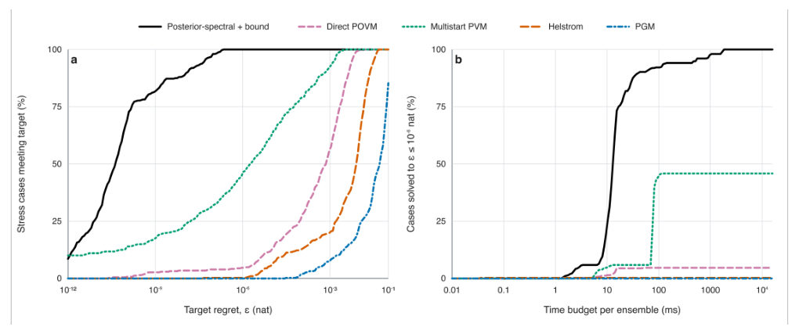 
FIG. 1. Performance of the posterior-spectral receiver on 408 faithful binary mixed-state stress instances. (a) Fraction of instances whose information regret is below a target ϵ. (b) Fraction solved to ϵ ≤10−6 nat within a given time budget. Higher and further left are better. The posterior-spectral curve uses its certified affine upper-minus-PVM gap. The other curves use empirical regret relative to the posterior-spectral PVM.

**Summary.** This paper develops a rigorous mathematical framework to find the measurement that extracts the maximum classical information from a quantum state ensemble. It introduces the 'posterior algebra' and proves that optimal measurements correspond to this algebra being commutative. The work successfully proves Shor's conjecture for binary ensembles and provides a highly robust, certified receiver design method.

**Why it may be interesting.** This work provides a deep structural understanding of measurement optimization in quantum information, linking it to algebraic properties (commutativity) which is a powerful theoretical tool applicable across quantum physics.

Detailed structure

**Main problem.** The central problem is determining the optimal quantum measurement (POVM) that maximizes the mutual information extracted from a given ensemble of quantum states.

**Main result.** The authors prove Shor's finite-dimensional binary orthogonal-measurement conjecture and establish that the optimal measurement structure is governed by the commutativity of a newly defined 'posterior algebra'.

**Method.** They introduce the posterior algebra and an affine information bound, showing that the maximum accessible information equals this bound if and only if the posterior algebra is abelian.

**Model / system.** The analysis focuses on a finite ensemble $E = \{(p_i, 
ho_i)\}_{i=1}^m$ of quantum states, and the measurement is described by a POVM $\{M_y\}_y$. The framework is general but has specific proofs for binary ensembles.

**Key observables.** Accessible Information $I(E, M)$, the affine information bound $U_{	ext{aff}}$, and the information regret $\epsilon_M = U_{	ext{aff}} - I(E, M)$.

**Important parameters / regimes.** The ensemble must be 'faithful' (full rank $	au$), and the analysis is particularly detailed for binary ensembles.

**Assumptions / limitations.** The framework relies on the ensemble being faithful; the proof for Shor's conjecture is restricted to the binary case.

**Figures summary.** Figures compare the performance of the proposed posterior-spectral receiver against other methods across 408 mixed-state instances, showing superior success rates and performance.

**Paper structure.** The paper builds from defining the information maximization problem to introducing the posterior algebra, proving the equivalence between information optimality and algebra commutativity, and finally developing a robust, certified posterior-spectral receiver.

Abstract

Which quantum measurement extracts the most classical information from an ensemble? We introduce the posterior algebra, a new canonical operator algebra selected by mutual information. For faithful ensembles, an affine information bound is exact precisely when this algebra is commutative; its joint spectral measurement is then optimal, and every optimal finite POVM refines it. Binary ensembles have one generator; compactness covers singular states, giving a proof of Shor's finite-dimensional binary orthogonal-measurement conjecture. The framework also gives rigidity bounds and a certified posterior-spectral receiver, validated on 408 mixed-state instances.

[↑ back to top](#top)

### [Optimising Cryogenic Wiring for Microwave-frequency Millikelvin Quantum Processors](http://arxiv.org/abs/2609.27239v1)

**Authors:** Adrien Di Lonardo, Giorge Gemisis, Juan Pablo Dehollain, Nathan K. Langford  
**Type:** both · **Category:** quantum information and computing · **PDF:** <https://arxiv.org/pdf/2609.27239v1>  
**Analysis basis:** full PDF text, analyzed in chunks
**Topic relevance:** 🔥 `QC/QI experiment` **4/5**

📷 Fig 1

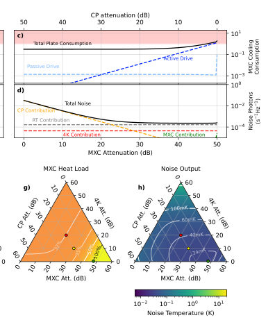 
Fig. 1 Systematic analysis of microwave drive line attenuation configurations for fourteen (14) 2.19mm stainless-steel coaxial drive lines (219-SS-SS) (with flux and output lines fixed to defaults, see Tab. A1). Total attenuation is fixed at 60 dB, with output power normalised at −72 dBm with a duty cycle of 33%. Expected heat loads (a) and noise performance (b) at the MXC stage where the device is located (at the output of the microwave lines) are shown for configurations with attenuation at the 4K and MXC stages only. Panel (a) shows both total full-system heat loads, and passive and active heat load contributions, expressed as a fraction of the MXC cooling power budget (see text). Panel...

📷 Fig 2

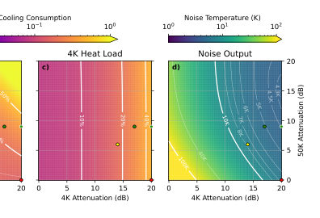 
Fig. 2 Systematic analysis of “DC” flux-biasing line attenuation configurations for fourteen (14) 2.19mm stainless-steel flux lines (219-SS-SS), with half the lines at each of 0 and 2 mA biasing currents fixed at the device (with flux and output lines fixed to defaults, see Tab. A1). Expected total flux line heat loads on the Still, CP and MXC plates (a) are shown for marginal attenuation values, indicating that attenuation below the 4K stage is of limited practical use, even at attenuation values below what is commercially available. This has implications for the utility of 0 dB attenuators (see Figure 3). Panels (b,c) and (d) show heat loads and noise, respectively, for the full remaining...

📷 Fig 3

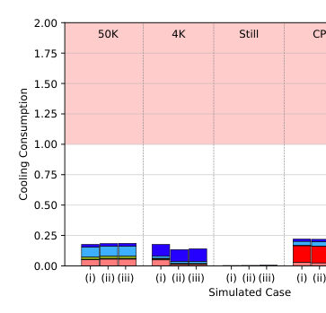 
Fig. 3 Practical limitations of 0 dB attenuation. Numerical modelling of heat loads is shown compar- ing the optimised configurations identified from Figures 1 and 2 with (i) no 0 dB attenuators, (ii) ideal lossless 0 dB attenuators, and (iii) lossy Areal = 0.1 dB attenuators. When included, 0 dB attenuators are placed at all locations with no existing attenuation. The 0 dB attenuators provide thermalisation of the inner coaxial conductor which reduces passive loads on subsequent (lower) plates, and active drive loads on the CP. However, even a marginal loss of 0.1 dB (better than standard commercially available performance) introduces untenable active flux loads on the MXC plate where the...

📷 Fig 4

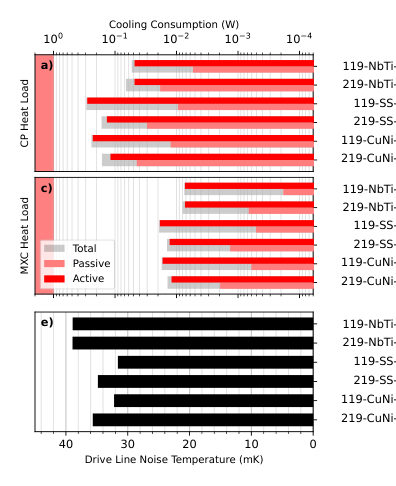 
Fig. 4 Comparing the impacts of cable materials and sizes on optimised performance. Modelling includes 14 drive and 14 flux biasing lines with optimised configurations identified in Figures 1 and 2. Heat loads are shown for the CP (a, b) and MXC plates (c, d) divided by passive and active loads including attenuator losses and cable losses, for both drive lines (a, c) and flux biasing lines (b, d). Active loads and passive loads are inversely related, as cable resistivity and thermal conductivity are inversely related. Drive (e) and flux (f) line noise performance is shown as effective output noise temperature. Based on these results, we choose 2.19mm CuNi cables for the flux biasing lines,...

📷 Fig 5

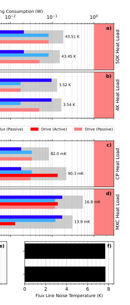 
Fig. 5 Evaluation of a “switchable” line design (see text), which can be readily converted to either microwave drive or “DC” flux biasing signals between cooldowns, without modifying the basic wiring stack. The “Optimal” configuration incorporates the optimised selections from from Figures 1, 2, and 4, and is compared against a fully “switchable” installation of 28 “switchable” lines, with 14 used for microwave drives, and 14 for “DC” flux biasing. Heat load comparisons are shown across the 50K (a), 4K (b), CP (c), and MXC (d) plates, along with estimated temperature responses. Heat loads from the readout-in and -out lines are included in the total heat loads, but not shown directly as...

**Summary.** This paper presents a systematic, whole-system numerical framework to optimize the complex cryogenic wiring required for scaling superconducting quantum processors. By modeling heat loads and noise propagation across multiple temperature stages, the authors demonstrate that performance gains are achieved by moving beyond simple heuristics. The resulting tool provides a general methodology for maximizing computational resources in future quantum computing platforms.

**Why it may be interesting.** The rigorous, quantitative analysis of noise and thermal management in superconducting circuits directly impacts the feasibility and scaling limits of quantum processors, which is a core concern for quantum information scientists.

Detailed structure

**Main problem.** The primary bottleneck for scaling superconducting quantum processors is the heat and noise burden imposed by the necessary control wiring at millikelvin temperatures.

**Main result.** Systematic optimization of wiring configurations can substantially outperform conventional 'best practice' designs, revealing that the optimal solution is highly dependent on the specific system context and operating regime.

**Method.** The authors developed a whole-system numerical modeling approach to systematically optimize coaxial wiring design, incorporating heat load and noise propagation calculations.

**Model / system.** The system modeled is a superconducting quantum processor connected via coaxial wiring through multiple cryogenic stages (e.g., 4K, MXC). The model calculates heat loads from conduction and signal dissipation, and noise propagation using established quantum noise formulas.

**Key observables.** Device temperature, noise burden (power spectral density), and achievable qubit capacity.

**Important parameters / regimes.** Total attenuation levels, cable geometry, and the operating temperature of various cryogenic stages.

**Assumptions / limitations.** The model uses phenomenological cooling-power curves for the dilution refrigerator and adopts an empirical Ohmic model for DC losses.

**Figures summary.** Figures illustrate temperature responses and noise contributions across different cryogenic stages as a function of total attenuation, identifying an 'equal balance' point for minimum total noise.

**Paper structure.** The paper introduces the bottleneck problem, details the holistic numerical modeling approach (including equations for noise and heat load), presents systematic optimization results showing context-dependency, and concludes by providing a web-based tool for general application.

Abstract

Cryogenic capacity is a key bottleneck in the scaling of superconducting quantum processors, critically impacted by control wiring. Currently, wiring architectures are often designed following a small set of "best-practice" heuristics, little changed since they emerged for early, small-scale systems, and not rigorously evaluated for wider contexts. Here, we adopt a whole-system numerical modelling approach and present a systematic optimisation for the coaxial wiring design of a superconducting quantum processor. We identify optimised configurations that substantively outperform conventional designs in device temperature, noise burden, qubit capacity and other practical metrics. Importantly, our analysis delivers varied outcomes for different system contexts and operating regimes, illustrating the benefits of a systematic approach when there is no universal solution. Our results evaluate and sometimes challenge conventional wisdom in relation to design factors such as the utility of 0dB attenuators. We also use a wide exploration of cable configurations---directly enabled by our holistic and flexible numerical modelling approach---to develop more rigorously supported general principles for future cryogenic system design, based on a new conceptual framework to describe attenuator cascades that draws on analogies to low-noise amplifier chains. Our approach, design outcomes, and generalised analyses should also be readily applicable to other cryogenic quantum computing platforms. Finally, we support ready adoption of this approach through a web-based graphical tool which streamlines the analysis of the proposed framework under different contexts. Our results illustrate how our approach can help maximise the available computational resources of quantum processors at all system scales.

[↑ back to top](#top)

### [Antiblockade Quantum Batteries](http://arxiv.org/abs/2609.27407v1)

**Authors:** Guohui Dong, Yao Yao  
**Type:** theory · **Category:** other · **PDF:** <https://arxiv.org/pdf/2609.27407v1>  
**Analysis basis:** full PDF text, analyzed in chunks
**Topic relevance:** `Tavis-Cummings & cavity-many-emitter` **3/5** · `driven-dissipative phase transition` **3/5** · `methods for driven-dissipative` **3/5** · `Keldysh / 2PI / non-Gaussian methods` **2/5** · `analog quantum simulation` **2/5** · `correlated / nonlocal dissipation` **2/5** · `interference shaping light` **2/5** · `non-equilibrium universality` **2/5** · `quantum measurements` **1/5**

📷 Fig 1

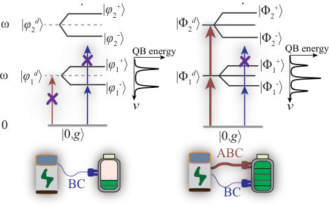 
Figure 1. (a) The schematic diagram of the collectively charged V-type three-level QB. In the bright and dark ba- sis, only the bright state |𝑏⟩couples with the charger mode. The energy gap Δ induces an effective interaction between the bright |𝑏⟩and dark |𝑑⟩states. (b) The energy diagram of the single-cell degenerate case (Δ = 0). The QB can only be charged via the Rabi-split blockade channel. (c) The energy diagram of the single-cell non-degenerate case (Δ ≠0). The bright-dark coupling Δ opens up a new antiblockade channel.

📷 Fig 2

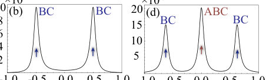 
Figure 2. The spectra of the equal-time second-order corre- lation function 𝑔(2) (0) and steady-state energy storage Es for Δ = 0 (a,b) and Δ = 0.7𝑔(c,d). The insets in (a) and (c) show the second-order correlation function 𝑔(2) (𝜏) versus the time delay 𝜏. Here C0 ≡𝑔2/𝜅𝛾= 100, 𝜅/𝛾= 1, and 𝜉= 0.01𝑔.

📷 Fig 3

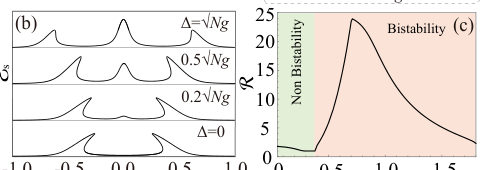 
Figure 3. (a) Left panel: The collective charging spectra for a series of driving strength with Δ = 0. Right panel: The driving-intensity and -frequency hysteresis. The red circle and green diamond in the left panel for 𝜉= 1.5 √

📷 Fig 4

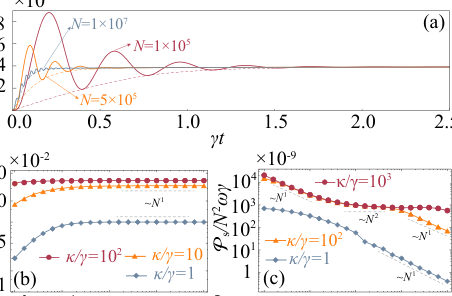 
Figure 4. (a) The energy in the QB versus time for representa- tive QB size, e.g., 𝑁= 105, 5×105, and 107 (magenta, orange, and blue). (b) The steady-state energy in the QB versus 𝑁 for 𝜅/𝛾= 102, 10, and 1 (magenta line with circles, orange line with triangles, and blue line with diamonds). (c) The steady- state charging power in the QB versus 𝑁for 𝜅/𝛾= 103, 102, and 1 (magenta line with circles, orange line with trian- gles, and blue line with diamonds). Here 𝜅/𝛾= 102 for (a), 𝜉= 0.1 √

**Summary.** This paper introduces an antiblockade charging protocol for quantum batteries by engineering a bright-dark interaction within a three-level system. This novel protocol circumvents the energy-limiting blockade effect, leading to significantly enhanced energy storage capacity. The scheme is shown to be robust and capable of achieving superradiant power scaling in the bad-cavity limit.

**Why it may be interesting.** This work directly addresses energy storage limitations in quantum devices by leveraging engineered quantum interference (bright-dark coupling) to create an antiblockade channel, which is highly relevant to cavity QED and open quantum system dynamics.

Detailed structure

**Main problem.** The primary challenge is overcoming the energy accumulation limitation in Quantum Batteries (QBs) caused by the inherent blockade effect.

**Main result.** The proposed antiblockade charging protocol, enabled by engineering a bright-dark interaction, significantly outperforms traditional blockade designs, achieving at least a 20-fold enhancement in energy storage.

**Method.** The analysis uses non-Hermitian Hamiltonians and steady-state solution derivations to model the charging dynamics in the presence of engineered coupling.

**Model / system.** The system is modeled as a V-type three-level QB cell ensemble coupled to a bosonic charger, analyzed in the bright and dark state basis.

**Key observables.** Steady-state energy storage ($E_s$), mean charging power ($P(t)$), and the second-order correlation function ($g^{(2)}(	au)$).

**Important parameters / regimes.** The key regimes include the resonant scenario ($\omega_c = \omega_0$), the blockade ($\Delta=0$), and the antiblockade ($\Delta 
eq 0$) channel.

**Assumptions / limitations.** The analysis is simplified by restricting to the resonant scenario and retaining only lowest-order excitations for energy storage calculations.

**Figures summary.** Figures illustrate energy diagrams comparing blockade ($\Delta=0$) vs. antiblockade ($\Delta 
eq 0$) channels, and compare $g^{(2)}(	au)$ and $E_s$ for both regimes.

**Paper structure.** The paper introduces the blockade problem, proposes the antiblockade charging protocol via bright-dark coupling, derives the enhanced energy storage using non-Hermitian methods, and demonstrates superradiant power scaling in the bad-cavity limit.

Abstract

Blockade, a phenomenon in which one particle hinders the transport of another, constitutes a core research topic in mesoscopic and microscopic physics. Benefiting from the unique single-particle characteristics, it underpins versatile applications spanning from quantum computation to quantum metrology. Nevertheless, in the context of quantum energy?storage devices, i.e., quantum batteries (QBs), blockade triggered by the intrinsic level splitting is in turn detrimental to energy accumulation. Here we propose an antiblockade charging protocol enabled by deliberately engineering a bright-dark interaction. Rooted in a manifold of equally-spaced dressed-dark states, this elaborate configuration opens up a new charging channel facilitating an antiblockade energy flow and outperforms the Rabi-split blockade design with at least a 20-fold enhancement in energy storage. Additionally, we further illustrate the achievement of superextensive (quadratic) charging characteristic by operating the system in the bad-cavity limit. In view of its inherent generality, our scheme offers a universal and feasible pathway toward high-performance quantum energy architectures.

[↑ back to top](#top)

### [Non-Hermitian Purcell Physics in Dissipatively Coupled Planar Photon-Magnon Systems](http://arxiv.org/abs/2609.28071v1)

**Authors:** Shubham Singh, Sachin Verma, Animesh Chakraworty, Abhishek Maurya, Biswanath Bhoi, Rajeev Singh  
**Type:** theory · **Category:** other · **PDF:** <https://arxiv.org/pdf/2609.28071v1>  
**Analysis basis:** full PDF text, analyzed in chunks
**Topic relevance:** `analog quantum simulation` **3/5** · `correlated / nonlocal dissipation` **3/5** · `driven-dissipative phase transition` **3/5** · `methods for driven-dissipative` **3/5** · `Keldysh / 2PI / non-Gaussian methods` **2/5** · `Tavis-Cummings & cavity-many-emitter` **2/5** · `non-equilibrium universality` **2/5** · `interference shaping light` **1/5** · `quantum measurements` **1/5**

📷 Fig 1

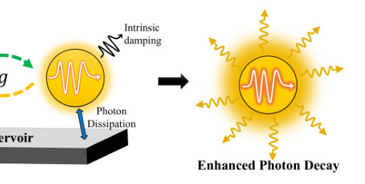 
FIG. 1. Schematic illustration of the Purcell effect in a dissipatively coupled magnon–photon hybrid system.

📷 Fig 2

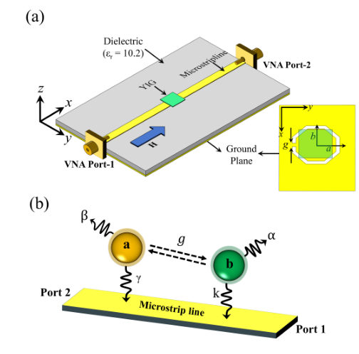 
FIG. 2. The simulation setup is shown in (a) hybrid sys- tem composed of a YIG film (green) and a microstrip line (yellow) fabricated on an RO3010 substrate with a dielectric constant of 10.2. The substrate thickness is 0.6 mm, and the ground plane thickness is 35 µm. The inverted octagonal-ring resonator (IORR) has an outer radius of a=3mm, an inner radius of b=2mm, and a gap of g =0.64mm. The YIG film dimensions are 4mm x 4mm x 20 µm , while the microstrip line has a width of 0.57 mm and a thickness of 35 µm. (b) Schematic diagram of the quantum coupled-mode model.

📷 Fig 3

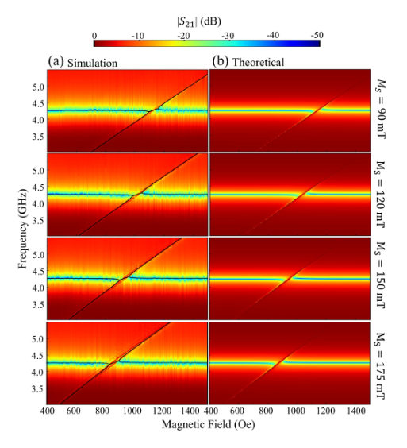 
FIG. 4. Simulated, fitted, and theoretical |S21| spectra (0 to −50 dB) in the f–H plane at fixed magnon damping. Each row corresponds to a different saturation magnetization value: Ms = 90, 120, 150, and 175 mT (top to bottom). (a) The first column shows the full-wave simulated |S21| spectra with eigenvalue fitting results overlaid as black solid curves, and (b) shows the corresponding theoretical |S21| spectra.

📷 Fig 4

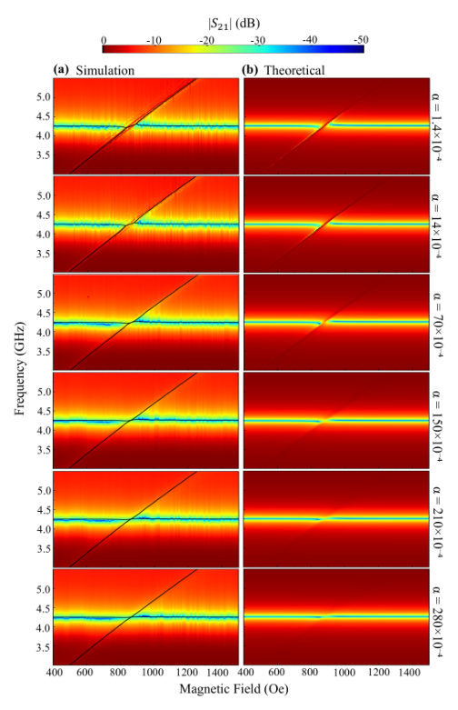 
FIG. 3. (a) Simulated and (b) Theoretical microwave trans- mission spectra |S21| (0 to -50 dB) in the frequency–magnetic field (f–H) plane for Ms=175mT and different magnon damp- ing values. The right panel shows the simulated spectra with fitted eigenvalue solutions (black solid lines), while the left panel presents the corresponding theoretical spectra.

📷 Fig 5

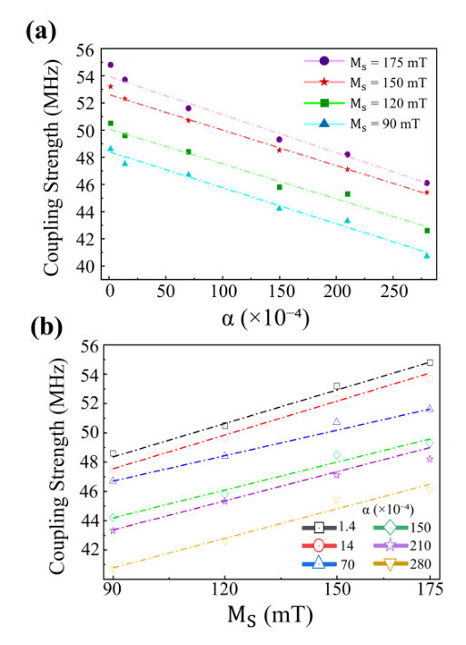 
FIG. 5. Coupling strength g/2π (MHz) as a function of (a) magnon damping α for different saturation magnetization val- ues and (b) saturation magnetization Ms (mT) for different magnon damping values.

**Summary.** This paper explores controlling the Purcell effect in a planar photon-magnon system by treating the coupling and dissipation using non-Hermitian quantum theory. By systematically tuning magnon damping and magnetization, the authors show they can engineer the system into a regime where cavity photon decay is selectively enhanced by magnon-mediated losses. This establishes a versatile, chip-compatible method for controlling hybrid quantum dissipation.

**Why it may be interesting.** This work is highly relevant to AMO physics and open quantum systems as it provides a concrete, tunable platform (magnonics) to study non-Hermitian physics, level attraction, and engineered dissipation effects, which are central topics in modern quantum optics.

Detailed structure

**Main problem.** The paper investigates the realization and control of the Purcell effect in hybrid quantum systems where photon and magnon dynamics are coupled and subject to dissipation.

**Main result.** The study demonstrates that engineered magnon damping and saturation magnetization can be used to drive the system into a Purcell regime, enabling precise control over cavity-photon dissipation.

**Method.** The authors developed a quantum theoretical framework using non-Hermitian coupled-mode theory and the input-output formalism, validated by full-wave electromagnetic simulations.

**Model / system.** The system models a planar hybrid quantum platform consisting of an Inverted Octagon-Ring Resonator (IORR) photon cavity coupled to a Yttrium Iron Garnet (YIG) magnon film. The dynamics are described by an open-system Hamiltonian incorporating coherent and dissipative photon-magnon coupling.

**Key observables.** Purcell factor ($F_P$), effective cavity decay rate ($eta$), hybrid-mode spectra, and time-domain decay profiles.

**Important parameters / regimes.** Magnon damping parameter ($\alpha$), Saturation Magnetization ($M_s$), and the ratio of coherent to dissipative coupling ($J$ vs. $\Gamma$).

**Assumptions / limitations.** The analysis assumes that the system can be modeled effectively using non-Hermitian quantum mechanics and that the explored parameter space is experimentally accessible.

**Figures summary.** Figures illustrate the schematic setup, the quantum coupled-mode model, and simulation results showing the dependence of decay rates and Purcell factors on damping and coupling strength.

**Paper structure.** The paper progresses from establishing the theoretical framework (non-Hermitian theory) to simulating the system response by varying key parameters ($\alpha$ and $M_s$), culminating in the demonstration of controlled Purcell enhancement via dissipation engineering.

Abstract

The Purcell effect has emerged as a powerful mechanism for controlling spontaneous emission and dissipation in cavity and nanophotonic systems; however, its realization in dissipative non-Hermitian hybrid platforms remains largely unexplored. In this work, we investigate the Purcell effect in a dissipatively coupled photon-magnon hybrid quantum system consisting of a yttrium iron garnet (YIG) thin film integrated with an inverted octa-ring resonator (IORR) in a planar geometry. To describe the underlying dissipative hybrid dynamics, we develop a quantum theoretical framework based on non-Hermitian coupled-mode theory combined with the input-output formalism. We also analyze the temporal decay dynamics of the photon-magnon system. Full-wave electromagnetic simulations demonstrate that the system can be engineered to operate in the level-attraction regime through dissipative photon-magnon coupling. By systematically tuning the magnon damping, we uncover the emergence of a Purcell regime in which cavity-photon dissipation is selectively enhanced through magnon-mediated loss channels. We further show that the saturation magnetization (Ms) provides an additional degree of control over the onset, tunability, and robustness of the Purcell enhancement. The combined modulation of magnon damping and Ms strongly influences the effective photon-magnon coupling, hybrid-mode evolution, and dissipation landscape, enabling precise control of hybrid quantum states. These findings establish a versatile strategy for engineering magnetization- and dissipation-controlled photon-magnon interactions in planar, chip-compatible architectures, opening new avenues for non-Hermitian cavity magnonics, tunable microwave dissipation engineering, and hybrid quantum information technologies.

[↑ back to top](#top)

### [Analog neutral-atom for in-memory processing in quantum reservoir computing](http://arxiv.org/abs/2609.28441v1)

**Authors:** Luca Nigro, Gian Luca Giorgi, Enrico Prati, Roberta Zambrini  
**Type:** theory · **Category:** disordered systems and neural networks · **PDF:** <https://arxiv.org/pdf/2609.28441v1>  
**Analysis basis:** full PDF text, analyzed in chunks
**Topic relevance:** `Rydberg arrays` **3/5** · `analog quantum simulation` **3/5** · `correlated / nonlocal dissipation` **3/5** · `driven-dissipative phase transition` **3/5** · `methods for driven-dissipative` **3/5** · `Keldysh / 2PI / non-Gaussian methods` **1/5** · `non-equilibrium universality` **1/5** · `quantum measurements` **1/5**

📷 Fig 1

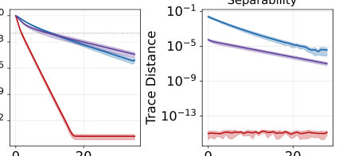 
Figure 1. Validation of reservoir computing properties for N = 4 atoms under amplitude damping (AD, blue), phase damping (PD, purple), and depolarizing (Dep, red) channels at a fixed decay rate γ = 0.4 µs−1. (a) Trace distance be- tween reservoirs initialized in 10 distinct random states and driven by identical inputs. The decay to zero confirms the echo state property (ESP): Dep converges almost instanta- neously, while AD and PD both drop below 1% within 10 µs and below 0.1% after 20 µs, defining the washout period. (b) Trace distance between reservoirs driven by distinct input se- quences that share a common tail of increasing length. Dep fails separability entirely, PD loses it over...

📷 Fig 2

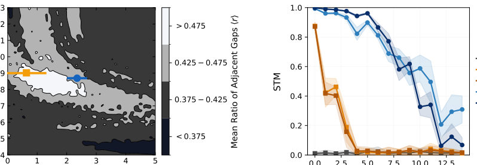 
Figure 2. Phase space analysis and memory capacity comparison for the Short Term Memory (STM) task for a system of 8 atoms. (a) Contour plot of the mean ratio of adjacent gaps characterizing the dynamical phase space as a function of the interatomic distance d and the normalized global detuning ∆/Ω. The yellow region indicates the standard operating range utilized in previous QuEra implementations (d = 9 µm, ∆center = 0.64 Ω) [23], while the blue region highlights our proposed operating point at the edge of chaos (d = 8.69 µm, ∆center = 2.35 Ω). (b) Memory capacity as a function of the delay time τ. The colors correspond to the operating regimes defined in panel (a). For both regimes, we...

📷 Fig 3

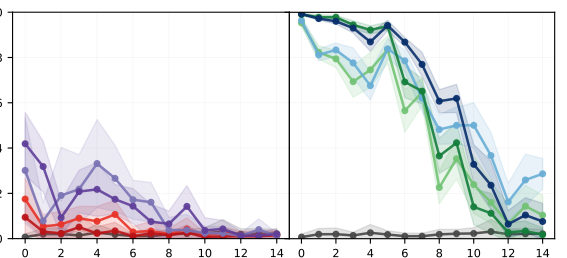 
Figure 3. Memory capacity on the Short-Term Memory (STM) task under different dissipative regimes. (a) Unital channels: depolarizing (Dep, red) and phase damping (PD, purple). (b) Non-unital channels: amplitude damping (AD, blue) and generalized amplitude damping (GAD, green). We consider here again N = 8 atoms. Solid lines represent the average performance over 10 independent input realizations, while the shaded bands denote the standard deviation. Lighter colors correspond to a dissipation rate γ = 0.2 µs−1, while darker colors indicate γ = 0.4 µs−1. The gray line represents the unitary baseline (γ = 0), which fails to encode memory due to the lack of the echo state property. While Dep...

📷 Fig 4

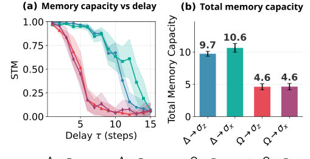 
Figure 5. Comparison of input encoding and readout strate- gies on the Short-Term Memory (STM) task, evaluated on a system of N = 8 atoms with V = 4 virtual nodes under amplitude damping at γ = 0.4 µs−1. (a) Memory capacity as a function of delay τ for four configurations: global detuning encoding with σz readout (blue), global detuning encoding with σx readout (green), Rabi amplitude encoding with σz readout (red), and Rabi amplitude encoding with σx readout (purple). In all cases, single-qubit expectation values are aug- mented with all-to-all two-body correlators to form the com- plete feature vector. (b) Total memory capacity integrated over 15 delay steps for each strategy. All data...

📷 Fig 5

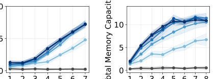 
Figure 4. Total memory capacity summed over delays τ = 0 to 15 under amplitude damping. We compare the perfor- mance of physical scaling against time-multiplexing strate- gies. (a) Capacity as a function of the number of physical atoms N with V = 1. (b) Capacity as a function of the num- ber of virtual nodes V for a fixed system size of N = 4. The curves correspond to damping rates γ ranging from 0.0 (gray, unitary) to 0.5. Solid lines represent the average over 10 in- dependent realizations while shaded regions denote the ±1σ standard deviation.

**Summary.** This work develops a theoretical framework for engineering dissipative quantum reservoirs using neutral atom arrays to enable intrinsic temporal memory for Quantum Reservoir Computing. By demonstrating that controlled dissipation is crucial for achieving necessary properties like the echo state property, the authors show that complex non-linear tasks can be solved efficiently with minimal physical resources.

**Why it may be interesting.** It bridges the gap between open quantum systems theory (dissipation, steady states) and quantum machine learning, providing concrete, physically realizable mechanisms (controlled dissipation) for achieving temporal memory in neutral atom arrays.

Detailed structure

**Main problem.** The paper addresses the challenge of implementing Quantum Reservoir Computing (QRC) on NISQ hardware by achieving intrinsic temporal memory without relying on external classical buffering.

**Main result.** Controlled dissipation is shown to be strictly necessary to induce the required echo state property, fading memory, and separability in neutral atom arrays, enabling complex non-linear task solving with few atoms.

**Method.** The study simulates and empirically identifies specific dynamical regimes by analyzing the system's evolution under various noise channels using the Lindblad master equation framework.

**Model / system.** The physical platform is an analog neutral-atom array trapped in optical tweezers, whose dynamics are governed by a Hamiltonian including Rydberg interactions and dissipation modeled by the Lindblad master equation.

**Key observables.** Echo State Property (ESP), fading memory, separability, computational capacity, and the residual memory provided by the phase damping channel.

**Important parameters / regimes.** The amount of dissipation ($\gamma$), the proximity to the edge of quantum chaos, and the number of atoms ($N$, shown to work for $N=5$).

**Assumptions / limitations.** The analysis relies on engineering dissipative quantum reservoirs and utilizes the Pure Output (PO) formalism to classify the dynamical behavior of the quantum channels.

**Paper structure.** The paper establishes a framework by first defining the problem (QRC memory), then analyzing the necessary dissipative dynamics using the Lindblad equation and PO formalism, and finally demonstrating performance on complex time-series tasks.

Abstract

Quantum Reservoir Computing (QRC) exploits the rich dynamics of quantum many-body systems to process time-dependent information with high-dimensional state spaces. While neutral atom arrays offer a scalable platform for this paradigm, realizing intrinsic temporal memory without relying on external classical buffering requires precise control over the relaxation dynamics of the system. We address the necessity of specific non-unitary dynamics for enforcing fading memory while overcoming the lack of separability. This study simulates and empirically identifies the specific dynamical regimes required to maximize the computational capacity of the reservoir, addressing the amount of dissipation, the effectiveness of lying at the edge of quantum chaos, and that of time-multiplexing compared to the scaling of the physical size of the system. Here we show that controlled dissipation is strictly necessary to induce echo state property, fading memory, and separability, in neutral atom arrays. Computational performance increases at the edge of quantum chaos. The counter-intuitive residual memory provided by the unital phase damping channel is justified by introducing a model based on pure outputs. The consequent implementation enables the solution of complex non-linear tasks, such as the Mackey-Glass time series, with as few as $N=5$ atoms. We establish a rigorous framework for engineering dissipative quantum reservoirs required for intrinsic temporal processing on near-term quantum devices.

[↑ back to top](#top)

### [Non-Hermitian engineering of superfluidity in a Rashba spin-orbit-coupled Fermi gas](http://arxiv.org/abs/2609.27723v1)

**Authors:** Pingcheng Zhu, Lihong Zhou, Jianxin Zhong  
**Type:** theory · **Category:** quantum gases · **PDF:** <https://arxiv.org/pdf/2609.27723v1>  
**Analysis basis:** full PDF text, analyzed in chunks
**Topic relevance:** `Keldysh / 2PI / non-Gaussian methods` **3/5** · `analog quantum simulation` **3/5** · `correlated / nonlocal dissipation` **3/5** · `driven-dissipative phase transition` **3/5** · `methods for driven-dissipative` **3/5** · `non-equilibrium universality` **2/5** · `quantum measurements` **1/5**

📷 Fig 1

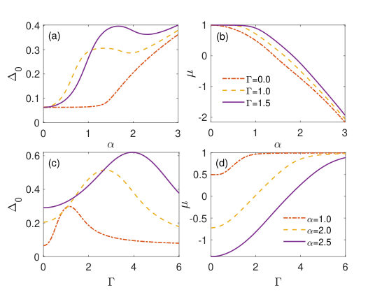 
Figure 1. Plots of (a) order parameter ∆0 and (b) chemical po- tential µ with respect to SOC strength α for different dissipation Γ = (0, 1, 1.5)EF . Plots of (c) ∆0 and (d) µ with respect to Γ for different α = (1, 2, 2.5)EF /kF . Here the interaction strength Eb = 0.002EF .

📷 Fig 2

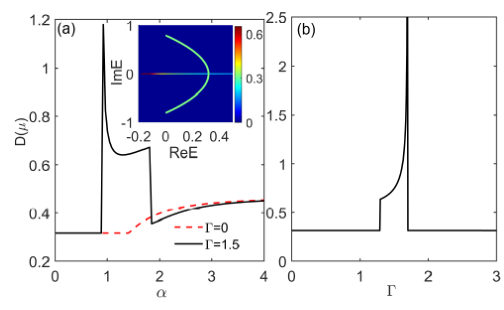 
Figure 2. Plot of density of states (DOS) at Fermi energy µ as functions of (a) SOC strength α with different dissipation Γ = 0EF (dashed line), Γ = 1.5EF (solid line), the inset is the DOS in the complex energy plane for α = 1EF /kF , Γ = 0.8EF , and (b)Γ with fixed α = 1EF /kF . All plots with parameter Eb = 0.002EF .

📷 Fig 3

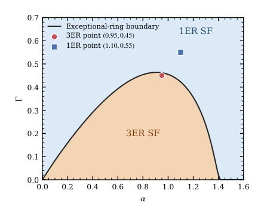 
Figure 3. Self-consistent exceptional-ring superfluid phase diagram in the(α–Γ) plane at Eb = 0.002EF .

📷 Fig 4

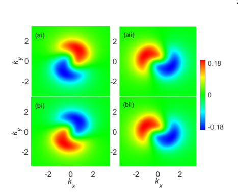 
Figure 5. Plots of triplet pairing correlation (a)L⟨c−k↑ck↑⟩R and (b)L⟨c−k↓ck↓⟩R, where (ai) and (bi) represent the real parts, (aii) and (bii) are the imaginary parts. The other parameters are α = 1.5EF /kF , Γ = 1EF and Eb = 0.4EF

📷 Fig 5

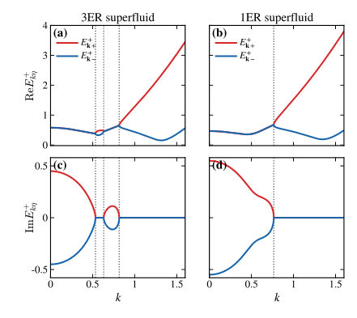 
Figure 4. Real and imaginary parts of the Bogoliubov quasipar- ticle energies E+ k±. (a) Three-exceptional-ring regime with α = 0.95EF /kF , Γ = 0.45EF . (b) One-exceptional-ring regime with α = 1.10EF /kF , Γ = 0.55EF . The interaction strength is fixed at Eb = 0.002EF .

**Summary.** This paper explores superfluidity in a spin-orbit-coupled Fermi gas by introducing controlled dissipation. Using non-Hermitian mean-field theory, the authors demonstrate that moderate loss can unexpectedly enhance the pairing gap and allow continuous tuning across the BCS-BEC crossover. This establishes dissipation as a versatile control parameter for quantum gas physics.

**Why it may be interesting.** This work is highly relevant as it extends standard BCS/BEC theory into the non-Hermitian domain, showing how engineered dissipation can actively enhance quantum correlations, a key topic in open quantum systems.

Detailed structure

**Main problem.** The study investigates how spin-selective dissipation (loss) affects superfluid pairing in a two-dimensional Fermi gas coupled with Rashba spin-orbit coupling.

**Main result.** Moderate dissipation significantly enhances the pairing gap in a non-monotonic fashion, providing a new control knob to tune the system across the BCS-BEC crossover and modify the spectral structure.

**Method.** The authors employed a non-Hermitian mean-field BCS-BEC crossover theory, solving the gap and number equations self-consistently.

**Model / system.** The system is a 2D Rashba spin-orbit-coupled Fermi gas subjected to spin-dependent one-body loss ($\propto i\Gamma\sigma_z$). The theory uses the Bogoliubov-de Gennes formalism.

**Key observables.** Pairing gap ($\Delta_0$), chemical potential ($\mu$), quasiparticle spectrum (exceptional rings), and singlet/triplet pairing correlations.

**Important parameters / regimes.** Dissipation strength ($\Gamma$), SOC strength ($\alpha$), and interaction strength ($E_b$).

**Assumptions / limitations.** The analysis relies on the non-Hermitian mean-field approximation and assumes a symmetric solution for the order parameters.

**Figures summary.** Figures illustrate the non-monotonic dependence of $\Delta_0$ and $\mu$ on $\Gamma$ and $\alpha$, the reconstruction of the Density of States (DOS) in the complex plane, and the phase diagram showing 1ER vs. 3ER superfluid regimes.

**Paper structure.** The paper proceeds by setting up the non-Hermitian Hamiltonian, solving the self-consistent gap and number equations, analyzing the resulting quasiparticle spectrum (exceptional rings), and finally discussing the implications for pairing enhancement and crossover physics.

Abstract

We investigate superfluid pairing in a two-dimensional Rashba spin-orbit-coupled Fermi gas subject to spin-selective one-body loss. Within the non-Hermitian mean-field framework, we self- consistently solve the gap and number equations and find that moderate dissipation can significantly enhance the pairing gap, resulting in a pronounced nonmonotonic dependence on the dissipation strength. Dissipation also provides an additional control parameter for driving the system across the BCS-BEC crossover. We further analyze the quasi-particle spectrum and identify two distinct superfluid regimes characterized by one and three exceptional rings, separated by an exceptional spectral transition. Interestingly, dissipation can enhance both pairing channels while simultaneously inducing a momentum-dependent phase twist in the triplet component. These results demonstrate that spin-selective dissipation provides a versatile non-Hermitian control knob for manipulating superfluid pairing, spectral structure, and crossover physics in spin-orbit-coupled quantum gases.

[↑ back to top](#top)

### [Dynamics-structure interchangeability in binary opinion models on multiplex networks](http://arxiv.org/abs/2609.28340v1)

**Authors:** Julian Sienkiewicz, Anna Chmiel  
**Type:** theory · **Category:** statistical mechanics · **PDF:** <https://arxiv.org/pdf/2609.28340v1>  
**Analysis basis:** full PDF text, analyzed in chunks
**Topic relevance:** `analog quantum simulation` **3/5** · `driven-dissipative phase transition` **3/5** · `non-equilibrium universality` **3/5** · `Keldysh / 2PI / non-Gaussian methods` **2/5** · `methods for driven-dissipative` **2/5** · `correlated / nonlocal dissipation` **1/5** · `quantum measurements` **1/5**

📷 Fig 1

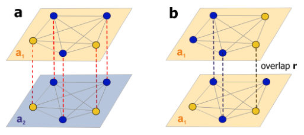 
FIG. 1. Schematic representation of examined settings: (a) a fully overlapped system governed with different dynamical parameters a1 and a2, (b) system with partial overlap r gov- erned by the same parameter a1 in both layers.

📷 Fig 2

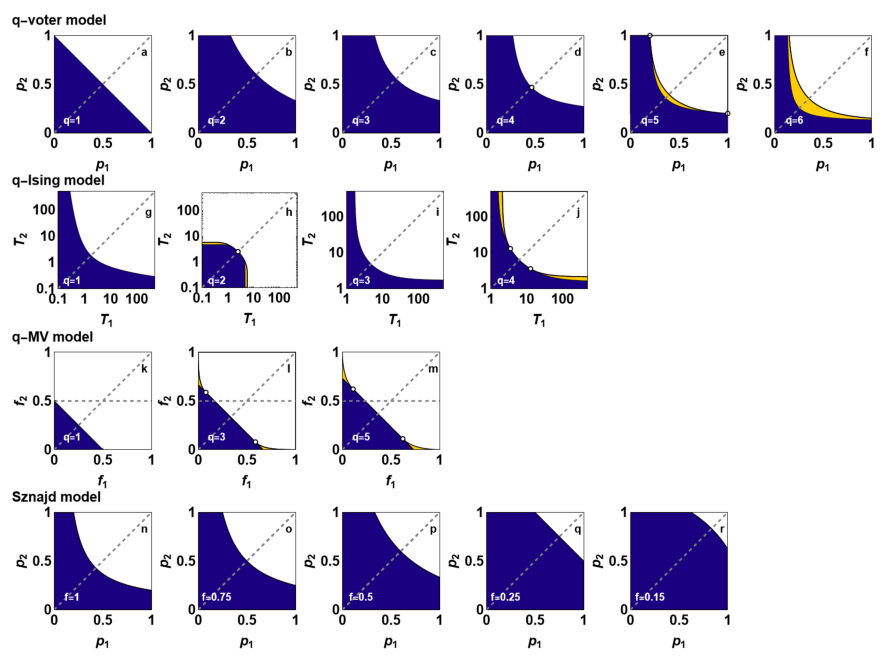 
FIG. 2. Phase diagrams of heterogeneous q-voter model (a-f), q-Ising model (g-j), q-MV model (k-m), and the Sznajd model (n-r) for selected values of parameters q and f. Dark regions indicate an ordered phase, white regions – an unordered one. Orange regions mark the area of bistability of these two phases. Circles mark tricritical points. The diagonal dashed line represents phase diagram for a homogeneous duplex, while the horizontal line in the case of the q-MV model — phase diagram for a monoplex.

📷 Fig 3

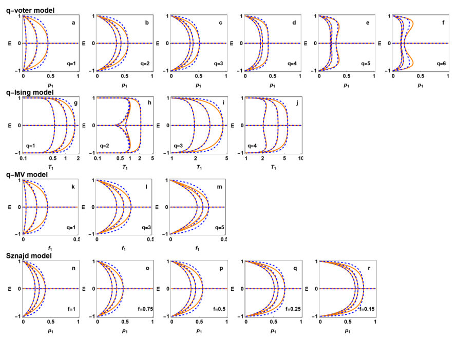 
FIG. 3. Solutions of Fr(m, a1, r) = 0 with F(m, a1, a2(r)) = 0 for parameters q (q-voter, q-Ising and q-MV) and f (Sznajd) used previously in Fig. 2 and for specific values of r (r = {4/7, 0.58, 0.9} in the case of q-Ising model for q = 2 and r = {0.1, 0.5, 0.9} in any other system)

📷 Fig 4

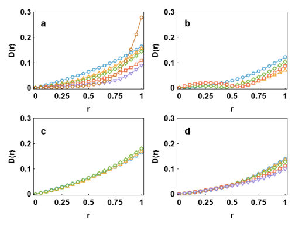 
FIG. 4. Relative distance D(r) against overlap r. Each point is a numerical integration of Eq. (8), parameters q and f as in Figs. 2 and 3: (a) q-voter model – q = 1 (blue circles), q = 2 (upward triangles), q = 3 (diamonds), q = 4 (squares), q = 5 (downward triangles), q = 6 (brown circles); (b) q- Ising model – q = 1 (blue circles), q = 2 (upward triangles), q = 3 (diamonds), q = 4 (squares); (c) q-MV model – q = 1 (blue circles), q = 3 (upward triangles), q = 5 (diamonds), q = 4 (squares) and (d) Sznajd model – f = 1 (blue circles), f = 0.75 (upward triangles), f = 0.5 (diamonds), f = 0.25 (squares), q = 0.15 (downward triangles). Lines are guidance to the eye.

**Summary.** This paper develops a theoretical framework to show that the effects of having different interaction parameters on different layers of a multiplex network can be mathematically mapped onto the effects of partial structural overlap between those layers. By analyzing various opinion models, the authors demonstrate a powerful interchangeability principle connecting dynamical heterogeneity to structural disorder.

**Why it may be interesting.** While focused on social dynamics, the mathematical techniques—analyzing phase transitions, mapping between parameter spaces, and using mean-field rate equations—are highly relevant to understanding phase transitions in complex quantum many-body systems.

Detailed structure

**Main problem.** The paper investigates the interchangeability between two duplex opinion dynamics systems: one with distinct dynamics parameters on each layer and full overlap, and another with identical parameters but only partial node overlap.

**Main result.** A general framework is established showing that dynamical heterogeneity (different parameters) can be formally mapped onto structural randomization (partial overlap $r$) via a derived functional relationship $a_2(r) = f(g(r))$.

**Method.** The analysis uses rate equations derived from the opinion dynamics on multiplex networks, employing the Landau approach to identify critical lines between ordered and disordered phases.

**Model / system.** The system is a binary opinion model on a two-layer full-graph multiplex (duplex) network, analyzed using models like the q-voter, q-Ising, and Sznajd models.

**Key observables.** Total magnetization ($m$), critical lines separating ordered/disordered phases, and the relative distance $D(r)$ quantifying solution correspondence.

**Important parameters / regimes.** Dynamics parameters ($a_1, a_2$), overlap fraction ($r$), and model-specific parameters like lobby size ($q$) and independence probability ($p$).

**Assumptions / limitations.** The analysis relies on a mean-field approach, assuming the thermodynamic limit ($N 	o \infty$).

**Figures summary.** Figures illustrate schematic comparisons of the two system types, phase diagrams showing the effect of heterogeneity on transitions, and plots quantifying the relative distance $D(r)$ between solutions from the two settings.

**Paper structure.** The paper introduces the two system settings, develops the general framework for phase transition analysis using rate equations, derives the key mapping equation, and then applies this framework to several specific, well-known opinion dynamics models to validate the interchangeability.

Abstract

We examine the interchangeability between two duplex systems with opinion dynamics: one characterized by different dynamics parameters $a_1$ and $a_2$ on each layer and full node overlap, and the second with the same parameter $a_1$ on both layers but only partial node overlap $r$. We introduce a general framework for identifying the critical line between the ordered and disordered phases, thereby translating one system into another. The description is supported by several examples of opinion dynamics models and a rigorous measure of the distance between the stationary solutions of the rate equations in both settings. Our results show that even large values of $r$ are sufficient to obtain very good correspondence between the two settings.

[↑ back to top](#top)

### [An interdimensional funnel enhances topologically protected oscillations in high-dimensional stochastic systems](http://arxiv.org/abs/2609.26966v1)

**Authors:** Varsha Traynor, Jaime Agudo-Canalejo  
**Type:** theory · **Category:** statistical mechanics · **PDF:** <https://arxiv.org/pdf/2609.26966v1>  
**Analysis basis:** full PDF text, analyzed in chunks
**Topic relevance:** `driven-dissipative phase transition` **3/5** · `methods for driven-dissipative` **3/5** · `non-equilibrium universality` **2/5** · `Keldysh / 2PI / non-Gaussian methods` **1/5** · `analog quantum simulation` **1/5** · `correlated / nonlocal dissipation` **1/5** · `quantum measurements` **1/5** · `scars & prethermalization` **1/5**

📷 Fig 1

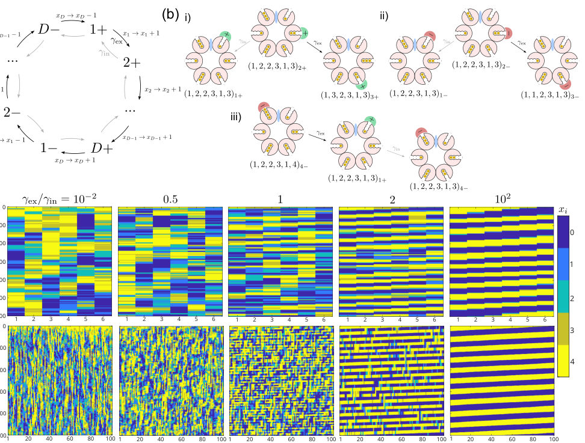 
FIG. 1. Futile cycles enable a global edge cycle in arbitrary dimensions. (a) Abstract depiction of the stochastic dynamics. The 2D internal states form a ring. External transitions (black, rate γex) change the internal state clockwise while also changing the external state, incrementing or decrementing xn when leaving state n+ or n−, respectively. Internal transitions (gray, rate γin) change the internal state anticlockwise without affecting the external state. (b) Molecular implementation on a protein ring of D phosphorylatable subunits. The external state corresponds to the phosphorylation state of all subunits. (i,ii) The internal state n+ or n−indicates an enzyme bound to the nth...

📷 Fig 2

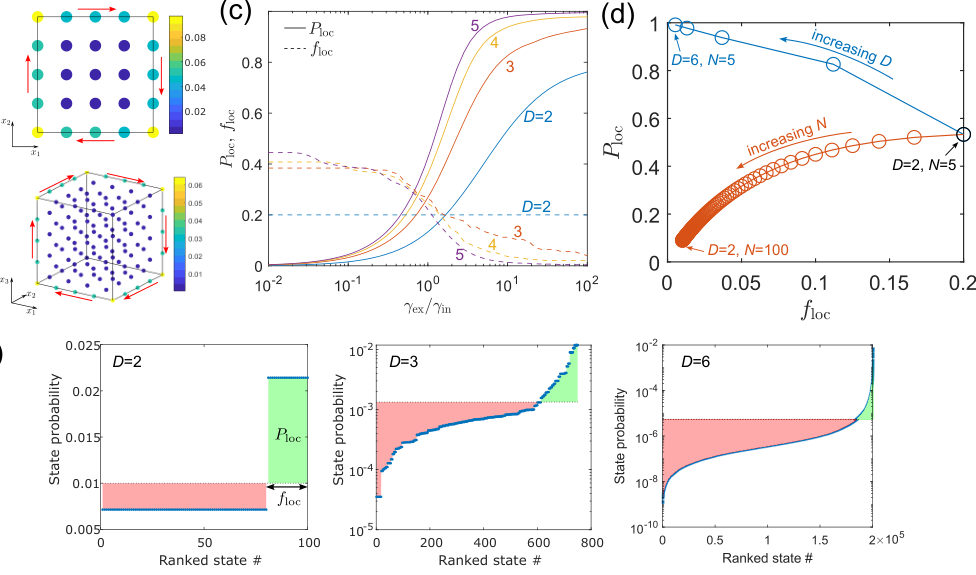 
FIG. 2. Higher dimensionality induces stronger localization onto a smaller fraction of states. (a) Steady-state probability of external states (summed over internal states) for D = 2 (top) and D = 3 (bottom), with arrows indicating the direction of the steady-state edge current (global cycle). (b) Rank-ordered steady-state probabilities for several values of D. Dotted lines mark the value corresponding to a uniform distribution; green and red areas indicate excess and deficit, respectively, from which the localization measures Ploc and floc are defined. (c) Total variation distance Ploc (solid) and fraction of localized states floc (dashed) versus γex/γin for several values of D. (d)...

📷 Fig 3

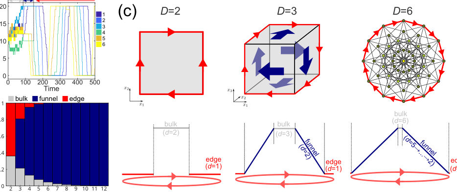 
FIG. 3. Boundaries funnel trajectories to the global cycle. (a) A stochastic trajectory (with D = 6, N = 21, and γex/γin = 2) starting from the center of the bulk shows that the dynamics can be separated into three intervals: bulk diffusion (gray), biased dynamics along intermediate-dimensional boundaries (funnel, blue), and oscillatory dynamics on the one-dimensional edge (red). The six coordinates are colored as indicated. (b) Fractions of bulk, funnel, and edge cycle configurations versus D for N = 5, calculated from Eqs. 2–4. (c) Geometric interpretation of the funneling effect for D = 2, D = 3, and D = 6. Top row: depiction in real space, with the edge cycle in red. Bottom row:...

📷 Fig 4

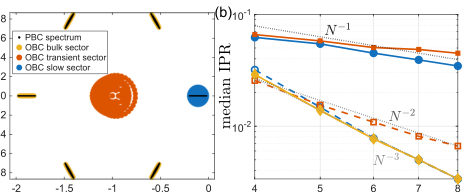 
FIG. 5. Localization is supported by a structured non- Hermitian skin effect. (a) Complex spectrum under open boundaries (OBC) compared with the periodic-boundary spectrum (PBC), for D = 3, N = 6, and γex/γin = 10. OBC modes are separated into slow, transient, and bulk sectors by continuity with the γin = 0 limit (Methods). The first two concentrate on one-dimensional boundaries, while the lat- ter stay bulk-extended. (b) Finite-size scaling of the median right-eigenvector (solid lines) and biorthogonal (dashed lines) inverse participation ratios (IPR) for the three sectors, for D = 3 and γex/γin = 10. The color coding is as in (a). The scaling laws are shown as dotted lines. The slow...

📷 Fig 5

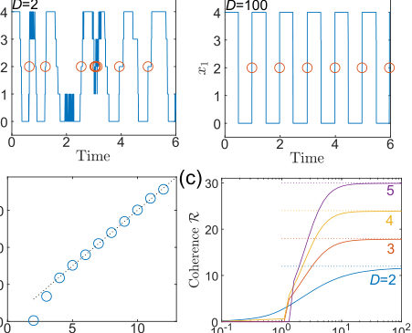 
FIG. 4. Higher dimensionality increases oscillatory co- herence. (a) Representative stochastic trajectories of coordi- nate x1 for D = 2 and D = 100, with N = 5 and γex/γin = 10. Time is in units of 2NDγ−1 in , and circles mark upwards cross- ings of x1 = 2, defining an oscillation period. (b) Period pre- cision of the oscillations versus dimensionality D for N = 3 and γex/γin = 102. (c) Spectral coherence versus γex/γin for N = 3 and several values of D. In (b) and (c), the dotted lines correspond to N ≈R ≈2DN valid at large γex/γin.

**Summary.** This work demonstrates that in high-dimensional stochastic systems, the geometry of the state space—specifically the 'interdimensional funnel'—can enhance topological protection. By increasing dimensionality, the system's steady-state probability becomes increasingly localized onto a coherent one-dimensional cycle, a phenomenon unique to stochastic systems and not found in standard quantum models.

**Why it may be interesting.** The findings provide a novel mechanism where high dimensionality, instead of causing decoherence, structures the dynamics into highly coherent, low-dimensional topological cycles, which has implications for understanding complex biological or active matter systems.

Detailed structure

**Main problem.** The paper investigates how high dimensionality can enhance topologically protected oscillations in stochastic systems, contrary to the expectation that high dimensions complicate dynamics.

**Main result.** Increasing the dimensionality ($D$) enhances an 'interdimensional funnel,' leading to improved one-dimensional localization and enhanced oscillatory coherence in the steady state.

**Method.** The analysis uses stochastic simulation (Gillespie method) alongside rigorous spectral analysis of the transition matrix to characterize localization and coherence.

**Model / system.** The system is modeled as a continuous-time Markov process on a configuration space defined by a hypercubic lattice of dimension $D$, incorporating both external and internal transitions.

**Key observables.** Localization measures ($	ext{Ploc}$, $	ext{floc}$), oscillation coherence (Period Precision $N$, Spectral Coherence $R$), and the steady-state probability distribution.

**Important parameters / regimes.** Dimensionality ($D$), the ratio of transition rates ($\gamma_{ex}/\gamma_{in}$), and the system size ($N$).

**Assumptions / limitations.** The model assumes a specific structure for the stochastic dynamics (hypercubic lattice, ring-like internal states) and analyzes the system in the topological regime ($\gamma_{ex}/\gamma_{in} > 1$).

**Figures summary.** Figures illustrate stochastic trajectories showing the funneling effect from the bulk to a 1D cycle, and compare steady-state probabilities across varying dimensions ($D$).

**Paper structure.** The paper progresses from establishing the physical model and the counter-intuitive result (high D enhances coherence) to detailed mathematical analysis using spectral theory to prove the isolation of the steady-state band and characterize the mode structure.

Abstract

Biochemical systems such as protein complexes often occupy configuration spaces whose dimensionality grows with the number of molecular components. Although usually viewed as an obstacle to coherent dynamics, here we show that high dimensionality can enhance topologically protected oscillations. In the topological regime, a stochastic system with a $D$-dimensional configuration space develops a steady-state current confined to a one-dimensional edge cycle. The intervening boundary faces between the $D$-dimensional bulk and the one-dimensional cycle form an interdimensional funnel, sequentially pushing the system towards lower dimensional faces, down to the one-dimensional cycle. As a consequence, increasing $D$ enhances the funnel, leading to improved one-dimensional localization and oscillatory coherence. A quantized biorthogonal Zak phase identifies the transition to the topological regime, which additionally exhibits a highly structured non-Hermitian skin effect. In contrast with previous realizations of topological states in stochastic systems, the phenomena we uncover have no counterpart in quantum condensed matter or active matter systems.

[↑ back to top](#top)

### [Position-dependent friction in protein folding from a GLE derived with a non-stationary localized projection distribution](http://arxiv.org/abs/2609.28113v1)

**Authors:** Salma Salem, Lucas Tepper, Benjamin J. A. Héry, Henrik Kiefer, David D. Girardier, Roland R. Netz  
**Type:** theory · **Category:** statistical mechanics · **PDF:** <https://arxiv.org/pdf/2609.28113v1>  
**Analysis basis:** full PDF text, analyzed in chunks
**Topic relevance:** `Keldysh / 2PI / non-Gaussian methods` **3/5** · `methods for driven-dissipative` **3/5** · `correlated / nonlocal dissipation` **2/5** · `Frenkel-Kontorova` **1/5** · `driven-dissipative phase transition` **1/5** · `non-equilibrium universality` **1/5** · `quantum measurements` **1/5** · `scars & prethermalization` **1/5**

📷 Fig 1

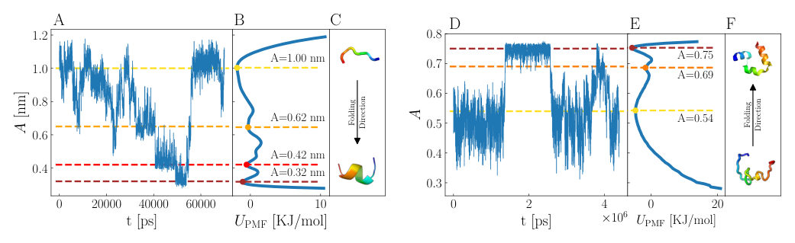 
FIG. 1. Exemplary trajectory and free energy landscape of Ala9 (left) and villin (right). A/D contain segments of the MD simulation trajectories which show how the reaction coordinates change in time. B/E show the free energy landscape which is constructed from the position probability density of the trajectory using Eq. 1, with distinct states corresponding to free energy ”wells”. The colored lines run through the free energy minima; these values will be used for the time constrained MSD analysis. C/F illustrate the folding direction with respect to the reaction coordinate value from the unfolded to the folded state. Snapshots of two conformations are placed at their respective positions....

📷 Fig 2

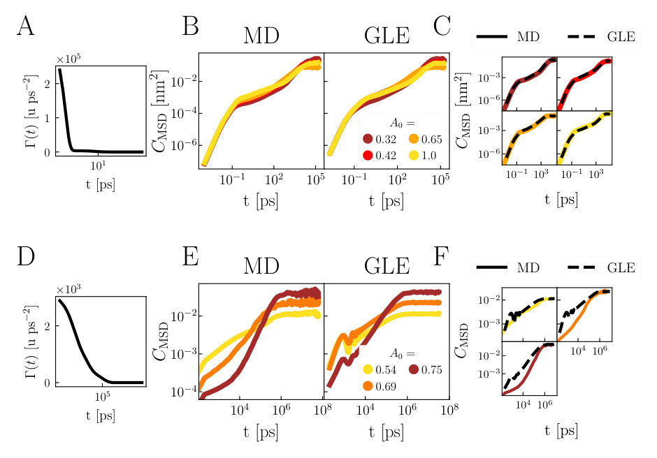 
FIG. 2. Comparison between constrained mean squared displacement (MSD) obtained from molecular dynamics (MD) and generalized Langevin equation (GLE) simulations, using Eq. 2, for Ala9 (top) and villin (bottom). A/D show the memory kernels Γ(t) extracted from MD simulations and used to simulate the GLE. B/E show the constrained MSDs from MD trajec- tories. We can see that villin generally exhibits higher position dependence than Ala9. C/F show an individual comparison between the constrained MSDs from MD and GLE trajectories at specific A0 values. While for Ala9 the MD and GLE MSDs are in agreement, for villin significant deviation is seen in the folded and intermediate states.

📷 Fig 3

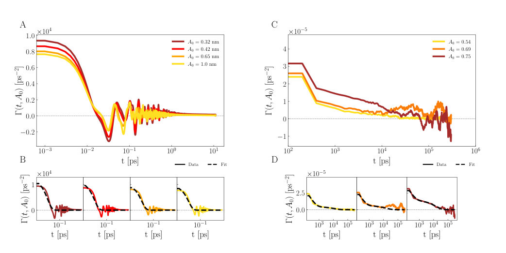 
FIG. 3. Position-dependent memory kernels of Ala9 (left) and villin (right) extracted from MD trajectories. A/C show a comparison of the extracted kernels. While the Ala9 kernels decay to zero, the villin kernels oscillate towards the end due to the shorter trajectory. B/D compare individual kernels with their fits. Ala9 kernels are fitted to a single exponential while villin kernels are fitted to a double exponential.

📷 Fig 4

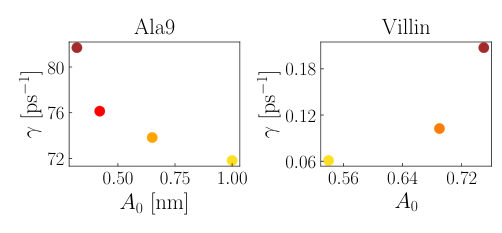 
FIG. 4. Total friction γ of Ala9 and villin as a function of position A0, obtained from the integral over the kernel fits. For both proteins, γ increases towards the folded state. The increase is much more significant for villin (here large A0 cor- responds to the folded state), where γ in the folded state is about three times as high as γ in the unfolded state. The increase for Ala9 (here small A0 corresponds to the folded state) is only around 15%.

📷 Fig 5

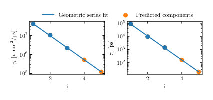 
FIG. 5. Fit of the memory kernel components for Villin. We show three original components as blue dots and the two ex- trapolated short-memory components as orange dots. The lines represent the fitted geometric progression for γi and τi based on Eq. B3.

**Summary.** This work develops a novel Generalized Langevin Equation (GLE) framework by employing a non-stationary projection distribution, allowing friction parameters to depend on the observable's position. Applying this to protein folding, the authors find that position-dependent friction effects are significant, especially for larger proteins like villin, suggesting that standard, stationary models are insufficient for accurate dynamic description.

**Why it may be interesting.** The methodology of deriving dynamics from constrained, non-stationary ensembles is highly relevant to open quantum systems and non-equilibrium statistical mechanics, providing a framework to incorporate system-specific constraints into generalized equations of motion.

Detailed structure

**Main problem.** The paper investigates the role of position-dependent friction effects in describing the complex dynamics of protein folding.

**Main result.** The study demonstrates that observable-dependent friction effects are non-negligible, particularly for proteins like villin, requiring the use of non-stationary Generalized Langevin Equations (GLEs).

**Method.** The authors derive and apply a novel class of GLEs using a non-stationary projection distribution, constraining the initial ensemble to a hypersurface in phase space.

**Model / system.** The system modeled is protein folding, using reduced models like poly-alanine and villin, whose dynamics are described by a Hamiltonian system and analyzed via the GLE.

**Key observables.** Constrained Mean Squared Displacements (CMSD), total friction ($\gamma$), and the memory friction kernel ($\Gamma$).

**Important parameters / regimes.** The initial constraint value ($A_0$), which dictates the position-dependent nature of the friction parameters.

**Assumptions / limitations.** The standard GLE derivation assumes a stationary canonical distribution, which the authors overcome by using a non-stationary projection scheme.

**Figures summary.** Figures compare CMSD predictions from Molecular Dynamics (MD) versus the non-stationary GLE for Ala9 and villin, showing significant deviations for villin, and plot total friction vs. position $A_0$.

**Paper structure.** The paper introduces the GLE formalism, details the derivation using a non-stationary projection, applies this to protein folding trajectories (Ala9 and villin), and compares the resulting dynamics (CMSD and friction) against standard MD simulations.

Abstract

The Generalized Langevin Equation (GLE) is an integro-differential equation of motion for a general observable of a many-body system and is rigorously derived using the projection operator formalism. In the standard derivation, a stationary canonical phase space distribution is used for the projection. Here, we derive a novel class of GLEs using a non-stationary projection distribution that constrains the initial ensemble to a hypersurface in phase space on which the observable has a fixed value $A_0$. As a result, all GLE parameters, and in particular the memory friction kernel, depend on $A_0$ and can be extracted from short simulations that do not sample the entire phase space. Applying this non-stationary GLE to protein folding trajectories, we find for villin and an $α$-helical poly-alanine segment that the total friction is higher in the folded state. These results demonstrate that observable-dependent friction effects are non-negligible and can be accounted for using non-stationary GLEs derived by constrained projection schemes.

[↑ back to top](#top)

### [Cooperative Domain-Wall Dynamics in a Two-Dimensional Quasiclassical Holstein Model](http://arxiv.org/abs/2609.28436v1)

**Authors:** Arunangshu Bora, Sankha Subhra Bakshi, Ho Jang, Gia-Wei Chern  
**Type:** theory · **Category:** strongly correlated electrons · **PDF:** <https://arxiv.org/pdf/2609.28436v1>  
**Analysis basis:** full PDF text, analyzed in chunks
**Topic relevance:** `non-equilibrium universality` **3/5** · `Keldysh / 2PI / non-Gaussian methods` **2/5** · `methods for driven-dissipative` **2/5** · `Frenkel-Kontorova` **1/5** · `analog quantum simulation` **1/5** · `correlated / nonlocal dissipation` **1/5** · `driven-dissipative phase transition` **1/5** · `scars & prethermalization` **1/5**

📷 Fig 1

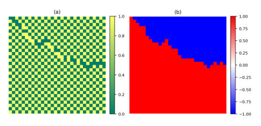 
FIG. 1. Relation between the microscopic charge pattern and the local CDW order parameter. (a) Representative checker- board charge configuration ni. (b) Corresponding staggered field ϕi, which removes the microscopic checkerboard modu- lation and maps the two symmetry-related CDW states onto positive and negative domains.

📷 Fig 2

 
Figure 1 illustrates the relation between the micro- scopic charge configuration and the local CDW order pa- rameter used throughout the analysis. Panel (a) shows a representative checkerboard charge configuration. While the alternating pattern of charge-rich and charge-poor sites directly reflects the microscopic CDW, it obscures the larger-scale domain structure. We therefore define a local staggered order parameter

📷 Fig 3

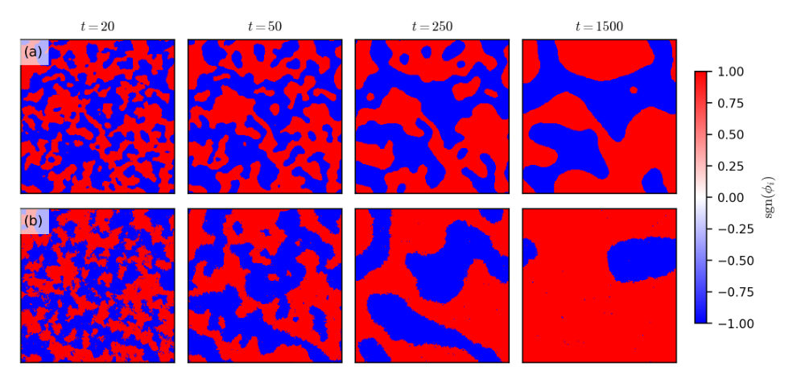 
FIG. 2. Evolution of CDW domains following thermal quenches on a 200 × 200 lattice. Colors indicate the sign of the local staggered CDW order parameter, sgn(ϕi). (a) Quench to T = 0.05. (b) Quench to T = 0.40. In both cases, initially disordered domain patterns coarsen through the elimination of small domains and motion of the domain walls. The higher-temperature quench exhibits noticeably faster domain growth over the time window shown.

📷 Fig 4

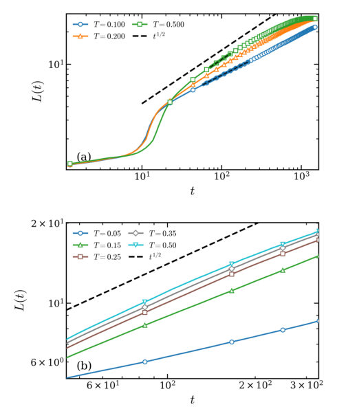 
FIG. 4. Characteristic domain length following thermal quenches. (a) Log–log plot of L(t) for representative final temperatures. The dashed line indicates the Allen–Cahn ref- erence behavior, L(t) ∼t1/2. (b) Enlarged view of the same regime for a broader set of temperatures, showing the system- atic increase of the apparent growth rate with temperature. For the representative curves shown in panel (b), the appar- ent growth exponents are extracted over the time intervals t ∈[80, 150] for T = 0.05, [60, 180] for T = 0.15, [110, 200] for T = 0.25, [80, 180] for T = 0.35, and [65, 135] for T = 0.50. The precise fitting window varies modestly with temperature and is chosen within the...

📷 Fig 5

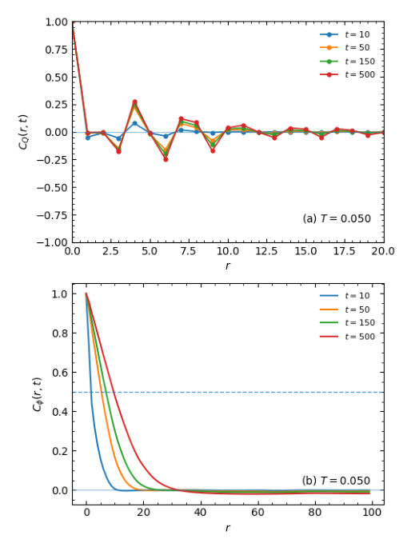 
FIG. 3. Equal-time correlation functions following a thermal quench to T = 0.050. (a) Correlation function CQ(r, t) of the microscopic lattice distortion field. The alternating short- distance structure reflects the underlying checkerboard CDW modulation, while the spatial extent of its envelope grows with time. (b) Correlation function Cϕ(r, t) of the staggered CDW order parameter. The dashed horizontal line marks the half-height criterion Cϕ(r, t) = 1/2 used to define the characteristic domain length L(t).

**Summary.** This work analyzes the coarsening of charge-density waves in a 2D quasiclassical Holstein model after a thermal quench. It reveals that while the order parameter is nonconserved, microscopic charge conservation forces the domain growth to follow an anomalous $t^{1/4}$ law at low temperatures. This behavior smoothly crosses over to the expected $t^{1/2}$ law at higher temperatures, demonstrating the profound influence of microscopic constraints on macroscopic dynamics.

**Why it may be interesting.** The interplay between emergent order parameters (CDW) and underlying microscopic conservation laws provides a rich example of non-equilibrium dynamics in strongly correlated systems, relevant to understanding phase separation in cuprates or manganites.

Detailed structure

**Main problem.** The study investigates how charge-density-wave (CDW) coarsening dynamics proceed in two dimensions following a thermal quench into the ordered phase, particularly focusing on the constraints imposed by microscopic charge conservation.

**Main result.** The dynamics exhibit a crossover between two regimes: a low-temperature, charge-conserving limit leading to $L(t) \sim t^{1/4}$, and a high-temperature, curvature-driven limit restoring $L(t) \sim t^{1/2}$.

**Method.** The research employs quasiclassical approximations and Langevin simulations on the Holstein model to track the evolution of domain-wall size $L(t)$.

**Model / system.** The system is modeled by the two-dimensional quasiclassical Holstein model, which couples lattice vibrations ($Q_i$) to electronic charge density ($n_i$). The dynamics are governed by a Langevin equation for the lattice coordinates.

**Key observables.** Domain growth length scale $L(t)$, and the apparent power-law exponents characterizing the coarsening kinetics.

**Important parameters / regimes.** Temperature ($T$), the crossover length scale $L_	imes(T)$, and the ratio of cooperative to local contributions.

**Assumptions / limitations.** The primary assumption is the quasiclassical limit, treating lattice motion as slow compared to fast electronic dynamics, and assuming rapid electronic relaxation to quasi-equilibrium.

**Figures summary.** The analysis relies on fitting measured growth rates and performing dimensionless rate collapses to confirm the crossover picture between different power-law behaviors.

**Paper structure.** The paper develops the quasiclassical Hamiltonian and equations of motion, simulates the thermal quench protocol, analyzes the resulting correlation functions to define $L(t)$, and finally discusses the crossover kinetics linking the $t^{1/4}$ and $t^{1/2}$ regimes.

Abstract

We investigate charge-density-wave (CDW) coarsening in a two-dimensional quasiclassical Holstein model following thermal quenches into the ordered phase. Although the staggered CDW order parameter is nonconserved, domain-wall motion remains constrained by conservation of the microscopic electronic charge. The simulations exhibit apparent growth exponents between $1/4$ and the Allen--Cahn value $1/2$. These apparent exponents are primarily accounted for by the crossover kinetics $\dot{L}=[D(T)/L][1+L_\times^2(T)/L^2]$, where $L_\times(T)$ is a temperature-dependent crossover length. At low temperature, nearly binary occupations require compatible wall segments to rearrange cooperatively, producing the $L(t)\sim t^{1/4}$ limit. Thermal broadening creates partially occupied interfacial sites that permit local curvature-driven motion and restore $L(t)\sim t^{1/2}$ at late times. Fits to the measured growth rate, a dimensionless rate collapse, and a long-time large-system simulation consistently support this crossover picture. These results show that a microscopic conservation law can generate long-lived anomalous coarsening even when the emergent order parameter is nonconserved.

[↑ back to top](#top)

### [Programmable Coherent Memory Kernels for Quantum Reservoir Computing in Waveguide QED](http://arxiv.org/abs/2609.27072v1)

**Authors:** Hong Jiang, Yu Wu, Yue Ban, Xi Chen, Juan José García-Ripoll  
**Type:** theory · **Category:** other · **PDF:** <https://arxiv.org/pdf/2609.27072v1>  
**Analysis basis:** full PDF text, analyzed in chunks
**Topic relevance:** `analog quantum simulation` **3/5** · `driven-dissipative phase transition` **2/5** · `methods for driven-dissipative` **2/5** · `Tavis-Cummings & cavity-many-emitter` **1/5** · `correlated / nonlocal dissipation` **1/5** · `quantum measurements` **1/5** · `quantum optics experiment` **1/5**

📷 Fig 1

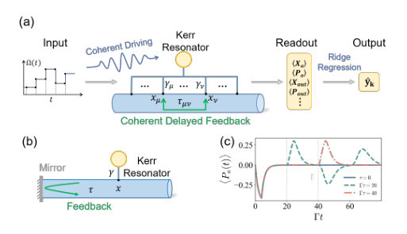 
FIG. 1. Non-Markovian waveguide-QED reservoir. (a) A driven Kerr-resonator couples to a 1D waveguide at multiple points, gen- erating coherent delayed feedback with propagation times τµν. The drive Ω(t) encodes the input, while the measured reservoir features are mapped to ˆyk through a trained linear readout. (b) Minimal single-delay geometry equivalently represented by a resonator cou- pled to a semi-infinite waveguide, with coherent memory-return de- lay τ. (c) Resonator dynamics following a short-pulse excitation for representative delays Γτ = {0, 20, 40}, illustrating the delay- controlled return of information to the resonator.

📷 Fig 2

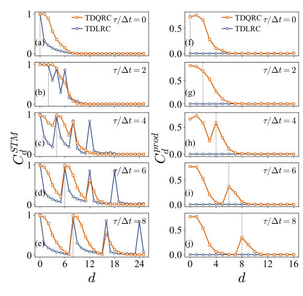 
FIG. 2. Delay-resolved linear and nonlinear memory. The left and right columns show the STM capacity CSTM d for reconstruct- ing uk−d and the delayed-product capacity Cprod d for reconstructing (uk −¯u)(uk−d −¯u), respectively. Rows correspond to feedback de- lays τ/∆t = 0, 2, 4, 6, 8; vertical dashed lines mark d = τ/∆t. TDQRC denotes the Kerr-nonlinear time-delay quantum reservoir, while TDLRC the linear reference reservior with the same feedback geometry. Parameters are ∆t = 2, ϵ = 1, γ1 = γ2 = 0.1 (Γ = 0.2), Nv = 20, and θ = 0.1. Washout, training, and test sequences contain 100, 600, 200 input steps, respectively. Shaded regions indicate one standard deviation over independent input...

📷 Fig 3

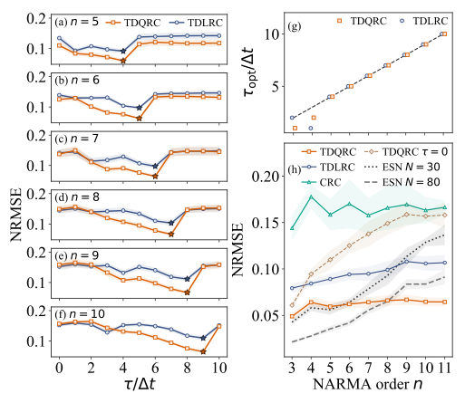 
FIG. 3. Task-matched prediction results on NARMA-n sequences. (a)-(f) Test NRMSE as a function of programmed delay τ/∆t for n ∈{5, 6, 7, 8, 9, 10}, comparing TDQRC and TDLRC. Stars indicate the minimum NRMSE for each curve. (g) Extracted optimal delay τopt/∆t versus the explicit input-product lag n −1. The dashed iden- tity line represents the matching condition in Eq. (14). (h) NRMSE as a function of NARMA order for the reservoir designs and base- lines considered. All parameters are the same as in Fig. 2.

📷 Fig 4

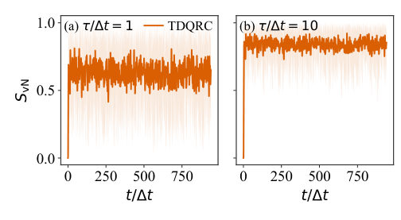 
FIG. 4. Schmidt entropy during the STM task for representative feedback delays. The entropy is evaluated across the bipartition be- tween the resonator and the active delay-line modes in the time-bin MPS.

📷 Fig 5

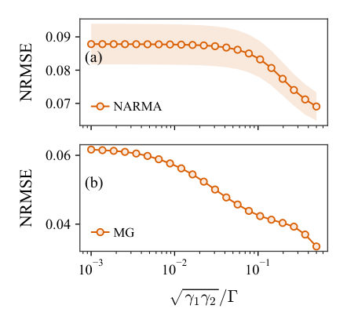 
FIG. 6. Prediction performance as a function of the normalized delayed-feedback coupling factor at fixed Γ = γ1 + γ2 = 0.2, U = 6, and τ/∆t = 4. The horizontal axis is √γ1γ2/Γ. (a) Test NRMSE for the NARMA-5 task. (b) Forecasting NRMSE for the Mackey-Glass task described in Appendix I, evaluated at prediction horizon D = 10.

**Summary.** This paper proposes using a waveguide-QED system to create a quantum reservoir with programmable memory. By coupling a nonlinear resonator to a waveguide, the system achieves coherent, delayed feedback that acts as a controllable memory source. This establishes a novel physical mechanism for engineering memory required for advanced quantum machine learning tasks.

**Why it may be interesting.** This work directly bridges quantum optics (waveguide QED, cavity QED) with quantum information processing (reservoir computing), providing a concrete physical platform for realizing complex quantum computation tasks.

Detailed structure

**Main problem.** The core challenge is engineering task-relevant memory profiles in Quantum Reservoir Computing (QRC) because intrinsic dynamics do not naturally provide the necessary memory control.

**Main result.** The authors demonstrate that coherent delayed feedback, realized via a waveguide-QED setup, provides a hardware-level mechanism to engineer task-relevant memory in QRC.

**Method.** The study models the reservoir using a driven Kerr-nonlinear resonator coupled nonlocally to a 1D waveguide, deriving the memory kernel from the waveguide propagation delay.

**Model / system.** The physical system is a waveguide-QED quantum reservoir, involving a Kerr-nonlinear resonator coupled to a 1D waveguide. The dynamics are governed by a Hamiltonian incorporating Kerr nonlinearity and coupling terms, leading to a non-Markovian feedback channel.

**Key observables.** Delay-resolved memory benchmarks, including Short-Term-Memory (STM) capacity ($C_{	ext{STM}}^d$) and delayed-product capacity ($C_{	ext{prod}}^d$), and the prediction error (NRMSE) for time-series forecasting.

**Important parameters / regimes.** The coupling geometry dictates the finite propagation delay ($	au_{\mu
u}$), while the Kerr nonlinearity ($U$) controls the conversion of returned fields into nonlinear features.

**Assumptions / limitations.** The method assumes that the unmeasured propagating field acts as a coherent memory carrier, avoiding intermediate measurement or classical reinjection.

**Figures summary.** Figures illustrate the waveguide-QED setup, showing how the resonator response depends on the programmed delay. Capacity plots compare STM and product reconstruction capabilities for varying delays, and NRMSE plots compare performance against different reservoir types (TDQRC vs TDLRC) for forecasting tasks.

**Paper structure.** The paper first introduces the physical setup and the concept of engineering memory via delayed feedback. It then uses capacity benchmarks (STM, product) to separate the roles of waveguide propagation (timing) and Kerr nonlinearity (feature transformation). Finally, it applies this framework to forecasting chaotic time series (Mackey-Glass) to compare model performance.

Abstract

Reservoir computing requires not only long memory, but also memory distributed over the timescales relevant to a given task. In most quantum reservoir computing architectures, however, the memory profile emerges from intrinsic dynamics and cannot be directly engineered. Here we introduce a waveguide-QED quantum reservoir in which coherent memory return is controlled by the coupling geometry. The reservoir consists of a driven Kerr-nonlinear resonator coupled to a one-dimensional waveguide at spatially separated points. An unmeasured propagating field carries information about past inputs and coherently returns it to the resonator after a finite propagation time, forming a non-Markovian feedback channel without intermediate measurement or classical reinjection. Delay-resolved memory benchmarks reveal two complementary functions: waveguide propagation determines when past information returns, whereas Kerr dynamics convert the returned field into nonlinear temporal features accessible through a linear readout. NARMA-$n$ prediction shows that the optimal feedback delay shifts systematically with task order and approximately tracks the explicit input-product lag. These results establish coherent delayed feedback as a mechanism for engineering task-relevant memory in quantum reservoir computing.

[↑ back to top](#top)

### [Quantum Simulation of Si/SiGe Devices with Experimentally Calibrated Micromagnet Effects](http://arxiv.org/abs/2609.27724v1)

**Authors:** Andrii Sokolov, Conor Power, Mathieu Moras, Claude Rohrbacher, Brian Malone, Sergey Amitonov, Agostino Apra, Amir Sammak, Nodar Samkharadze, Elena Blokhina  
**Type:** both · **Category:** quantum information and computing · **PDF:** <https://arxiv.org/pdf/2609.27724v1>  
**Analysis basis:** full PDF text, analyzed in chunks
**Topic relevance:** `QC/QI experiment` **3/5** · `analog quantum simulation` **2/5** · `methods for driven-dissipative` **2/5** · `quantum measurements` **2/5** · `Keldysh / 2PI / non-Gaussian methods` **1/5**

📷 Fig 1

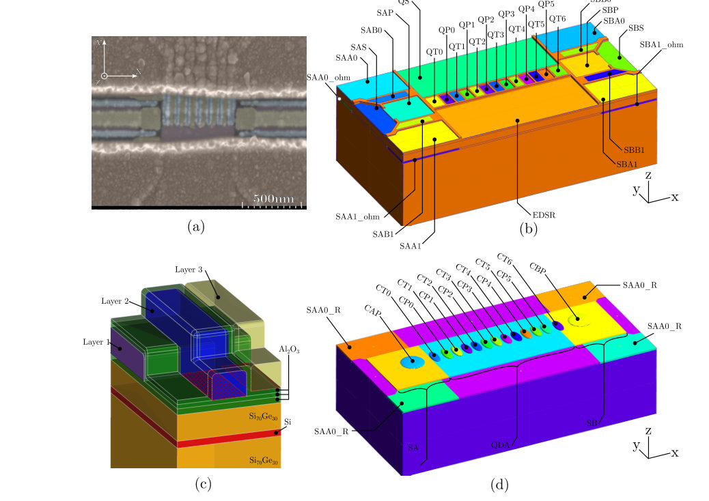 
Figure 1: Finite element method model of the Si/SiGe device under test. (a) SEM image of the device. (b) The 3D structure of the model with boundary conditions. (c) The material stack used in the model and the overlapping gates. (d) The same device with a hidden aluminium oxide layer. Here we show the QDA dot region, sensor dot regions, and reservoir domains. Additionally, parasitic charge regions are shown.

📷 Fig 2

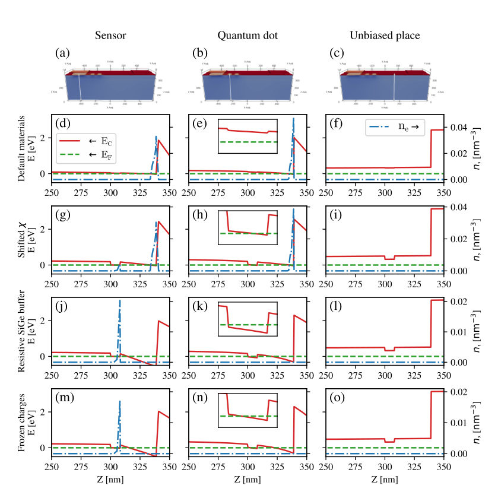 
Figure 2: Examples of the transverse conduction band line-cuts at different compositions of materials and charges. The columns correspond to different line cuts: through the sensor, through one of the quantum dots, and through an unbiased region. Lines represent different material compositions: the default Anderson’s rule; the case with shifted electron affinity χ; the case where the SiGe buffer layer is forced to be an insulator; the case that includes the influence of the semi-field parasitic quantum wells.

📷 Fig 3

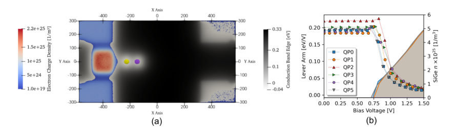 
Figure 3: (a) The plane-cuts of the conduction band edge EC in the middle of the Si channel and the electron charge density ne where it is non-zero. The ground states of the quantum dot under the QP0 — yellow, and under the QP1 is violet. (b) Lever-arm variation with applied gate voltages and charges induced in SiGe buffer layer.

📷 Fig 4

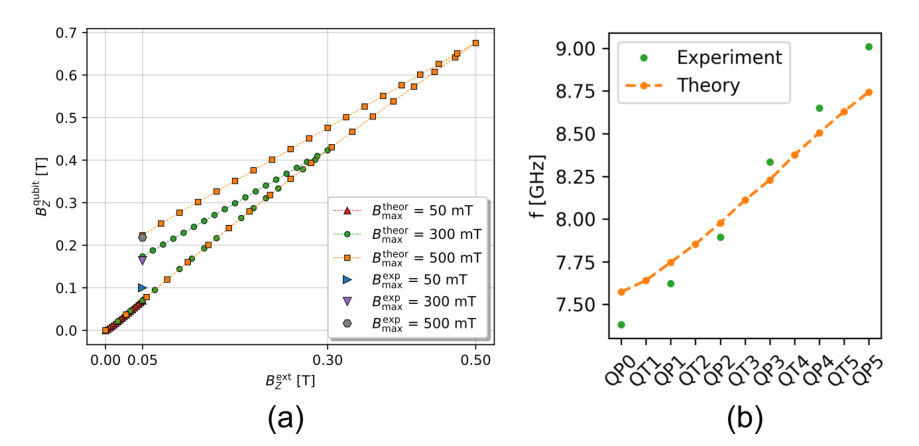 
Figure 4: (a) Calibration step for the definition of Jiles-Atherton models parameters. (b) Ex- perimental and simulated frequencies of all 6 qubits using the calibrated model.

📷 Fig 5

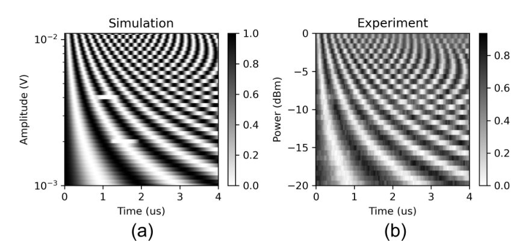 
Figure 5: (a) Simulated power chevron of the device (b) Experimental power chevron of the device.

**Summary.** This paper presents an advanced, fully calibrated simulation framework for spin qubits in Si/SiGe devices, designed to overcome discrepancies between theory and experiment. By integrating complex physics—including charge screening effects and magnetic hysteresis via the Jiles-Atherton model—the authors successfully predict key experimental signatures like resonant frequencies and power chevrons. This robust tool significantly advances the predictive capability for scalable quantum computing architectures.

**Why it may be interesting.** The rigorous coupling of classical charge effects (electrostatics) and magnetic dynamics (micromagnetics) into a quantum Hamiltonian provides a highly realistic framework for modeling solid-state qubits, which is crucial for understanding decoherence and control.

Detailed structure

**Main problem.** The primary challenge is bridging the gap between theoretical quantum device simulations and actual experimental measurements for silicon-based spin qubits.

**Main result.** The authors developed a comprehensive, experimentally calibrated simulation pipeline that successfully reproduces key experimental observables, such as resonant frequencies and microwave power chevrons, across a multi-dot qubit array.

**Method.** The work combines advanced 3D classical electrostatics (Poisson solver) with micromagnetism (Jiles-Atherton model) and quantum dynamics (time-dependent RWA Hamiltonian) to model the coupled system.

**Model / system.** The system is a Si/SiGe heterostructure containing a 6-dot quantum dot array, coupled to integrated cobalt micromagnets. The simulation incorporates refined band alignment, a semi-empirical charge screening model, and the Jiles-Atherton model for magnetic hysteresis.

**Key observables.** Microwave power chevrons, qubit resonant frequencies ($f = g\mu_B / h B$), and gate lever-arm variation ($dE_C/dV_{	ext{gate}}$).

**Important parameters / regimes.** Microwave frequency ($\omega_0$), external magnetic field ($B_{	ext{ext}}$), and material parameters calibrated against experimental data.

**Assumptions / limitations.** The model assumes the use of the Rotating-Wave Approximation (RWA) for dynamics and required significant empirical calibration for charge screening and magnetic hysteresis.

**Figures summary.** Figures illustrate the FEM model components, band alignment shifts, the calibration of Jiles-Atherton parameters, and direct comparisons between simulated and measured power chevrons for the six qubits.

**Paper structure.** The paper systematically addresses simulation failures by first refining the electrostatic model (charge screening) and then incorporating the magnetic hysteresis via the Jiles-Atherton model, finally coupling these results into a time-dependent RWA Hamiltonian to predict dynamic observables.

Abstract

Silicon-based spin qubits in Si/SiGe heterostructures are a leading platform for scalable quantum computing, yet bridging the gap between theoretical computer-aided design(CAD) models and experimental reality remains a significant challenge. Standard simulations often fail to capture critical physical phenomena, such as interface dipoles, parasitic charge accumulation, and the magnetic hysteresis of on-chip micromagnets. In this work, we present a comprehensive, experimentally calibrated 3D simulation pipeline for a 6-dot Si/SiGe device. We refine the semiconductor band alignment and introduce a semi-empirical classical charge screening model to accurately capture the formation of parasitic wells and their suppression of gate lever-arms. Furthermore, we apply the Jiles-Atherton model to account for the hysteresis and pre-magnetization of integrated cobalt micromagnets, successfully reproducing the experimental resonant frequencies across all six qubits. By coupling these calibrated electrostatic and magnetic profiles into a time-dependent rotating wave approximation (RWA) Hamiltonian, we reproduce experimental observables, including microwave power chevrons. This framework provides a robust foundation for predicting device behavior, evaluating microwave line losses, and optimizing future scalable spin qubit architectures prior to fabrication.

[↑ back to top](#top)

### [Repairability of Inexact Solvers in Recursive State Estimation with Machine Learning](http://arxiv.org/abs/2609.28425v1)

**Authors:** Yanjun Ji, Dennis Willsch, Orkun Şensebat, Priyanka Arkalgud Ganeshamurthy, Zhi Pei, M. Sahnawaz Alam, Ivelina Stoyanova, Frank K. Wilhelm, Bo Zhao, Chao Wang, Kristel Michielsen  
**Type:** both · **Category:** numerical methods · **PDF:** <https://arxiv.org/pdf/2609.28425v1>  
**Analysis basis:** full PDF text, analyzed in chunks
**Topic relevance:** `quantum measurements` **3/5** · `Keldysh / 2PI / non-Gaussian methods` **2/5** · `methods for driven-dissipative` **2/5** · `analog quantum simulation` **1/5** · `driven-dissipative phase transition` **1/5** · `non-equilibrium universality` **1/5**

📷 Fig 1

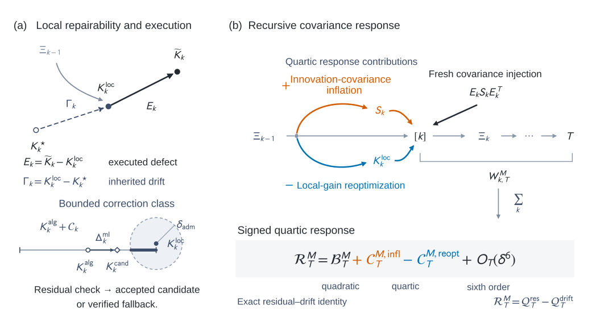 
Figure 1. Schematic of local repairability, certified execution, and recursive response. (a) Gain coordinates separate the executed defect Ek = e Kk −Kloc k from inherited drift Γk = Kloc k −K⋆ k. The inset shows a one-dimensional bounded correction class Ck = {∆∈Vcorr : ∥∆∥F ≤δc}. The reachable segment Kalg k + Ck intersects the admissible ball of radius δadm centered on Kloc k . The intersection contains admissible gains, while the learned candidate Kcand k = Kalg k + ∆ml k (diamond) lies outside: correction existence does not guarantee learned attainment. Independent residual checking determines whether the candidate or a verified fallback is executed. (b) Executed defects inject EkSkET...

📷 Fig 2

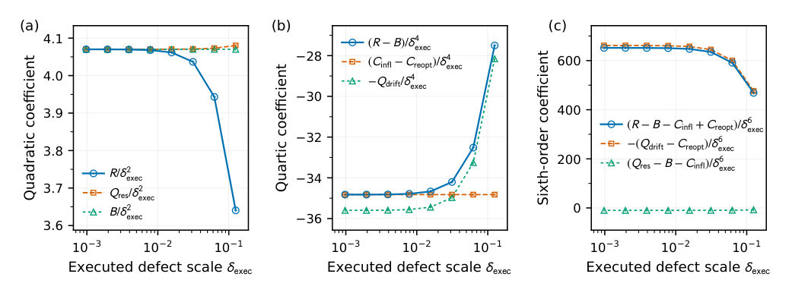 
Figure 2. Signed-quartic response and sixth-order remainder for one synthetic linear-Gaussian instance constructed from the network geometry of the pandapower IEEE 14-bus case [40] (IEEE 14; Sec. V A) with n = 27, m = 64, T = 100, and Mk = I. The reference and implemented recursions are initialized identically, and a single prescribed defect-direction sequence is used to construct gains at eight amplitudes from 2−10 to 2−3, where δexec := maxk ∥Ek∥F is the represented executed-defect amplitude and corresponds to δ in Eq. (22). In the figure, R, B, Qres, Qdrift, Cinfl, Creopt denote RM T , BM T , Qres T , Qdrift T , CM,infl T , CM,reopt T , respectively. (a) Quadratic effect. (b) Quartic...

📷 Fig 3

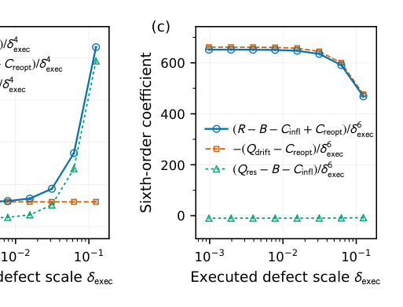 
Figure 2 displays the asymptotic hierarchy predicted by Theorem 1. In Fig. 2(a), the normalized finite-horizon response approaches the fixed-reference quadratic con- tribution as the executed defect decreases. Figure 2(b) isolates the leading recursive-feedback correction: along this prescribed defect direction, the quartic contribu- tion is negative, with local-gain reoptimization exceeding innovation-covariance inflation. After both quartic terms are retained, the residual in Fig. 2(c) is consistent with the sixth-order remainder in Eq. (31).

📷 Fig 4

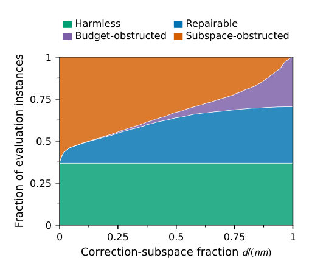 
Figure 3. Repairability boundary for finite conjugate gradi- ent (CG) gain defects. The stacked bands show the fractions of 4096 held-out evaluation instances classified as harmless (green), repairable (blue), budget-obstructed (purple), and subspace-obstructed (orange) by Theorem 2 as a function of the normalized correction-subspace fraction d/(nm), where d = dim(Vcorr). Here n = 27, m = 16, and nm = 432. For each independently generated local estimation instance, the approximate gain is obtained after three zero-start, unprecon- ditioned CG iterations. The correction subspaces are nested prefixes of a single principal component analysis (PCA) basis fitted on an independent acquisition...

📷 Fig 5

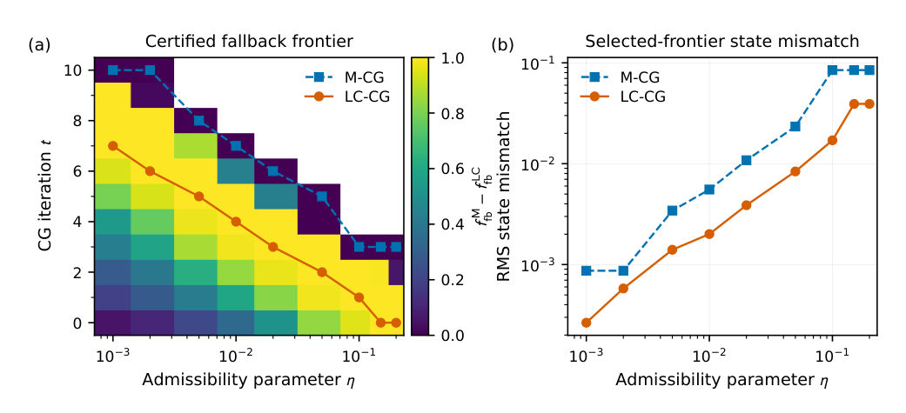 
Figure 4. Monitored conjugate gradient (M-CG) and learned-corrected conjugate gradient (LC-CG) on one IEEE 14 re- alization with n = 27, m = 64, and correction dimension cap dcap = 64. Both policies use the same residual cer- tificate, admissibility tolerance, and verified fallback at each η. Evaluation covers 600 deployment steps following 400 commissioning steps. (a) Reduction in fallback fraction, f M fb −f LC fb , from Eq. (46), versus admissibility parameter η ∈ {0.001, 0.002, 0.005, 0.01, 0.02, 0.05, 0.1, 0.15, 0.2} and CG iteration t. Curves mark each policy’s smallest evaluated CG iteration with zero deployment fallbacks; blank cells were not evaluated. (b) Normalized root mean...

**Summary.** This work develops a rigorous theory to assess how errors from inexact numerical solvers accumulate in recursive state estimation processes. It introduces a framework that certifies the repairability of these solvers, allowing for the practical integration of machine learning and quantum-derived gains into classical control loops. This provides a vital tool for analyzing hybrid quantum-classical computation in physical systems.

**Why it may be interesting.** While the application is classical state estimation, the rigorous mathematical framework for error bounding, certification, and hybrid quantum-classical integration is highly relevant for controlling open quantum systems where measurement and feedback are inherently noisy and approximate.

Detailed structure

**Main problem.** The paper analyzes the repairability of inexact numerical solvers used within recursive state estimation loops, addressing how local approximation errors affect the overall finite-horizon system performance.

**Main result.** It establishes an exact one-step repairability boundary and provides a framework to evaluate approximate solvers and ML-proposed corrections through independent residual certification, even when integrating quantum solvers.

**Method.** The authors derive an exact residual-drift identity for the covariance response and compare classical iterative solvers (like CG) against quantum-inspired solvers (VQLS) within a state-space estimation framework.

**Model / system.** The core model is a fixed linear Kalman model used for recursive state estimation, applicable to systems like power grids or adaptive optics. The analysis uses a finite-horizon linear-Gaussian state-space model.

**Key observables.** Local defect ($E_k$), inherited gain drift ($\Gamma_k$), finite-horizon covariance response (showing quartic contributions), and the minimum conjugate-gradient iteration count.

**Important parameters / regimes.** The analysis depends on the prescribed subspace, the Frobenius-norm budget for corrections, and the tolerance levels ($\eta$) used in the solvers.

**Assumptions / limitations.** The initial analysis assumes a fixed linear model and matched initialization, though the framework is designed to evaluate extensions to more complex dynamics.

**Figures summary.** Figures illustrate the separation of current solve error from inherited drift, the opposing quartic contributions to the covariance response, and deployment trajectories comparing different solver policies across various IEEE test systems.

**Paper structure.** The paper builds from characterizing the error propagation via an exact identity, defining the local repairability boundary, integrating ML-proposed corrections via a residual certificate, and finally validating the framework by applying it to power-grid state estimation using quantum and classical solvers.

Abstract

Recursive state estimation often executes approximate numerical solutions inside a feedback loop, where highly accurate local steps do not guarantee better overall results. For a fixed linear Kalman model, we characterize when a correction within a prescribed subspace and norm budget can meet a local admissibility tolerance, and how the defects actually executed affect the finite-horizon covariance response. Centering each defect on the exact gain for the implemented covariance separates current solve error from inherited gain drift. Expanding the exact residual-drift identity reveals opposing quartic contributions beyond the quadratic response: innovation-covariance inflation enters positively, while local-gain reoptimization enters subtractively. Under matched initialization, an absolute sixth-order remainder bound, uniform over bounded defect sequences at fixed horizon, gives sufficient conditions for quadratic under- or overprediction. Machine learning proposes bounded corrections, while a learner-independent residual certificate and verified fallback govern execution of classical and quantum candidates without changing the reference estimator. In a power-grid tolerance study, learned correction lowers the minimum conjugate-gradient iteration count for deployment without fallback relative to uncorrected solves under the same residual certificate. Gains reconstructed from a variational quantum linear solver and from an annealing-based binary encoding, with small-scale terminal measurements on superconducting hardware and sampling on a quantum annealer, are executed through the same interface. By linking local repairability to nonlinear error propagation, the framework evaluates approximate solvers and learned corrections through independent certification and finite-horizon response, providing a practical basis for studying hybrid quantum--classical computation.

[↑ back to top](#top)

### [Sub-Doppler cooling of trapped ions using optical tweezers](http://arxiv.org/abs/2609.28138v1)

**Authors:** Bas Gerritsen, Liam J. Bond, Jiri Minář, Arghavan Safavi-Naini, Robert J. Spreeuw, Rene Gerritsma  
**Type:** theory · **Category:** other · **PDF:** <https://arxiv.org/pdf/2609.28138v1>  
**Analysis basis:** full PDF text, analyzed in chunks
**Topic relevance:** `methods for driven-dissipative` **3/5** · `quantum measurements` **3/5** · `QC/QI experiment` **1/5** · `analog quantum simulation` **1/5** · `correlated / nonlocal dissipation` **1/5** · `driven-dissipative phase transition` **1/5**

📷 Fig 1

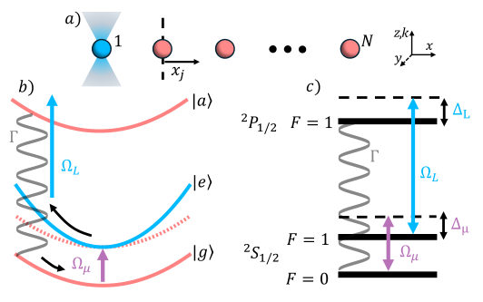 
FIG. 1. Sisyphus-like cooling of trapped ions with op- tical tweezers. a) Schematic drawing of an N-ion crystal cooled by a single tweezer. The ions are labeled j = 1, . . . , N. The first ion is addressed by a hollow optical tweezer. The equilibrium position displacement of ion j is described by xj. The axial motion (perpendicular to the tweezer wave-vector) is cooled by attractive Sisyphus-like cooling mechanism. b) Schematic drawing of attractive Sisyphus cooling using a hol- low near-resonant tweezer. A particle in the internal ground state |g⟩is pumped to the excited state |e⟩with microwave Rabi frequency Ωµ as it passes the bottom of the ground state potential. Then, it is most likely...

📷 Fig 2

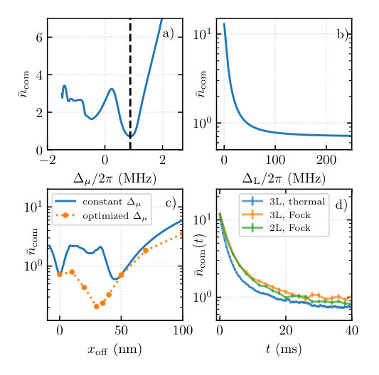 
FIG. 2. Single-ion cooling with an optical tweezer. a) Steady-state excitation number ¯ncom as a function of the microwave detuning ∆µ. b) Steady-state excitation number ¯ncom as a function of the tweezer detuning ∆L. The tweezer trapping frequency is kept constant. c) Steady-state occupa- tion number as a function of tweezer pointing error xoff. The blue curve corresponds to a constant detuning ∆µ = 2π×0.89 MHz. For the orange curve, ∆µ is optimized at each data point. d) Single ion cooling dynamics for a 3-level ion initial- ized in a thermal state and in a Fock state, and a 2-level ion initialized in a Fock state.

📷 Fig 3

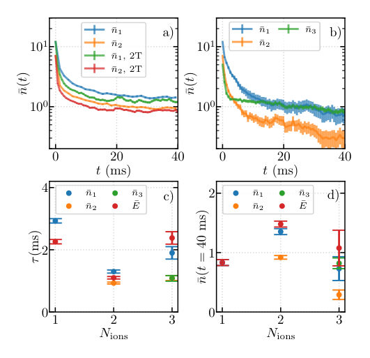 
FIG. 3. Cooling multi-ion crystals with optical tweezer(s). a) Cooling dynamics of a two-ion crystal ini- tialized in the |n1 = 12, n2 = 7⟩Fock states cooled by either a single or two tweezers (2T). The tweezer trapping frequency is ωT = 2π × 0.77 MHz. With two tweezers, the 1/e cooling time is reduced by a factor ≈1.5. b) Cooling dynamics of a three-ion crystal initialized in the |n1 = 12, n2 = 7, n3 = 5⟩ Fock states. The tweezer trapping frequency is ωT = 2π×0.77 MHz. c) The 1/e cooling times of the motional modes and the average energy per mode ¯E as a function of the number of ions in the crystal. d) Mean excitation number and mean energy per mode ¯E cf. Eq. (11) after 40 ms of cooling...

**Summary.** This paper details a theoretical sub-Doppler cooling scheme for trapped-ion crystals using optical tweezers and microwave drives. By modeling the system as a three-level atom coupled to motional modes, the authors numerically demonstrate fast cooling rates for multiple ion chains. This method offers a versatile tool for preparing quantum states in trapped-ion quantum simulators.

**Why it may be interesting.** This work provides a detailed theoretical framework for implementing advanced cooling techniques in trapped ions, moving beyond standard Doppler cooling by leveraging engineered light-matter interactions in a controlled manner.

Detailed structure

**Main problem.** The paper proposes and investigates a novel sub-Doppler cooling scheme for trapped-ion crystals using optical tweezers.

**Main result.** The scheme achieves fast cooling rates, reaching $1/e$ cooling times below 2 ms for the center of mass mode, and is suitable as an intermediate cooling stage between Doppler and ground-state sideband cooling.

**Method.** The dynamics are modeled using a three-level system and solved by numerically simulating the open quantum system evolution via the Lindblad master equation and quantum trajectories.

**Model / system.** The physical system is trapped ions in Paul traps, cooled by a combination of a hollow optical tweezer and microwave drive. The internal states are modeled as a three-level system ($\{|g
angle, |e
angle, |a
angle\}$) which is reduced to an effective two-level system for analysis.

**Key observables.** Cooling time ($	au$), steady-state excitation number ($ar{n}_{	ext{com}}$), and the evolution of motional modes (center of mass, stretch).

**Important parameters / regimes.** Tweezer detunings ($\Delta_L$), Rabi frequencies ($\Omega$), and trapping frequencies ($\omega_P, \omega_T$).

**Assumptions / limitations.** The scheme does not rely on the Lamb-Dicke regime and utilizes off-resonant light. The analysis often involves adiabatic elimination of auxiliary states.

**Figures summary.** Figures schematically illustrate the cooling mechanism (Sisyphus cooling) and show the time evolution of the center of mass mode occupation for one, two, and three ion crystals, comparing numerical results with variational ansatz predictions.

**Paper structure.** The paper introduces the cooling scheme and the underlying physics, develops the Hamiltonian and master equation, and then uses advanced numerical techniques (quantum trajectories, variational ansatz) to simulate and optimize the cooling parameters for various ion crystal sizes.

Abstract

We propose a sub-Doppler cooling scheme for trapped-ion crystals in Paul traps. The combination of a hollow tweezer and microwave drive creates an effective two-level system which is cooled through attractive Sisyphus cooling. For ${}^{171}\rm{Yb}^+$ ions, we numerically identify optimal parameters for one- and two-ion crystals, and investigate the cooling rate in ion crystals with up to three ions. Our cooling scheme utilizes a single ion addressed with a tweezer to achieve sub-Doppler cooling of the $N$ axial motional modes perpendicular to the tweezer propagation direction, does not rely on the Lamb-Dicke regime and uses off-resonant light. We reach $1/e$ cooling times for the center of mass mode of $τ_{\rm com}<2$ ms, and a steady-state excitation number of $\bar{n}_{\rm{com}}\approx 0.7$. Our scheme is well-suited as an intermediate stage between Doppler cooling and ground-state sideband cooling, and can be readily realized in trapped-ion platforms.

[↑ back to top](#top)

### [Optimal local oscillators for the homodyne detection of multiphoton states](http://arxiv.org/abs/2609.28133v1)

**Authors:** Gisell Lorena Osorio, Paul Virally, Sean Molesky, Nicolás Quesada  
**Type:** theory · **Category:** other · **PDF:** <https://arxiv.org/pdf/2609.28133v1>  
**Analysis basis:** full PDF text, analyzed in chunks
**Topic relevance:** `interference shaping light` **3/5** · `quantum measurements` **3/5** · `quantum optics experiment` **3/5**

📷 Fig 1

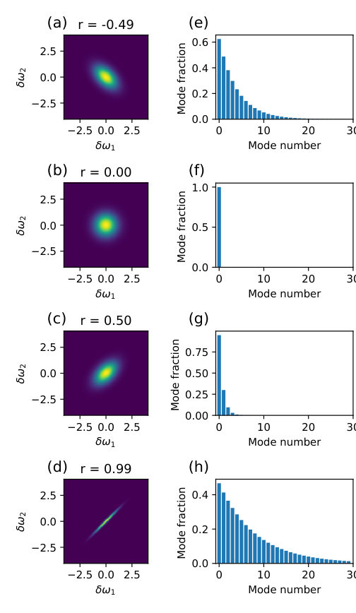 
FIG. 1. (a-d) Intensity projections of three-dimensional Gaussian JSAs in the plane {δω1, δω2} with varying correla- tion degrees (r ∶Correlation parameter). (e-h) Mode decom- position obtained from the HOSVD, each paired with the JSA directly to its left.

📷 Fig 2

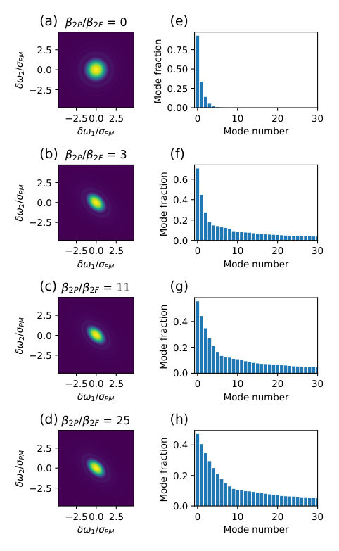 
FIG. 2. (a-d) Intensity projections of JSAs associated with photon-number states generated through HOPDC varying the ratio between the pump’s and N−photon signal’s group- velocity dispersion parameters β2P /β2F . The frequency vari- ables are normalized to the bandwidth σP M of each JSA. (e-h) Mode decomposition obtained from the HOSVD, each paired with the JSA directly to its left.

📷 Fig 3

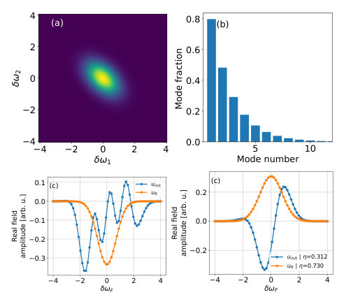 
FIG. 3. (a) 2D projection of a Gaussian photon triplet JSA with correlation parameter r = −0.46. (b) Mode distribution from the HOSVD of the JSA. (c) Initializing distributions: u0: Leading HOSVD vector, uinit: Linear combination of 8 first HOSVD vectors. (d) Optimized local oscillators. The routine initialized with uinit converges to a local maximum.

📷 Fig 4

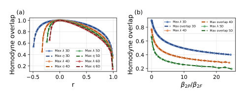 
FIG. 4. Maximum homodyne overlap η per correlation parameter r for (a) Gaussian JSAs with N ∈{3, 4, 5, 6} and for different ratios β2P /β2F for (b) HOPDC JSAs, with N ∈{3, 4, 5}. The dashed curves represent the maximum eigenvalue λ for each JSA.

📷 Fig 5

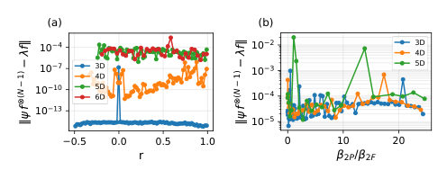 
FIG. 5. Residual eigenvalue condition ∥ψ ⋅f ⊗(N−1) −λf∥2 considering the optimal LO distributions f obtained from our optimization algorithm for (a) Gaussian JSAs, sweeping across the correlation parameter r at N ∈{3, 4, 5, 6}, and (b) HOPDC JSAs, with N ∈{3, 4, 5}, sweeping across different ratios β2P /β2F .

**Summary.** This paper presents a theoretical framework to optimize local oscillators for measuring multiphoton quantum states via homodyne detection. It reformulates the problem as finding the leading eigenpair of the state's Joint Spectral Amplitude tensor, using HOSVD for initial estimates. The results guide experimentalists on when simple spectral analysis suffices versus when complex, full optimization is required.

**Why it may be interesting.** This work provides a rigorous, computationally guided framework for designing experimental measurement settings (LOs) necessary to characterize and verify non-Gaussian quantum states generated in quantum optics experiments.

Detailed structure

**Main problem.** The paper aims to develop a method for optimizing the local oscillator (LO) used in homodyne detection to maximize the detection efficiency of multiphoton-number states.

**Main result.** For weakly correlated states, the leading HOSVD mode provides the optimal LO, achieving near-unity visibility; however, strongly correlated states require full, complex optimization and saturate below unit visibility.

**Method.** The optimization problem is formulated as finding the leading eigenpair of the Joint Spectral Amplitude (JSA) tensor, utilizing the Tucker Higher-Order Singular Value Decomposition (HOSVD) for initial bounds and gradient-based optimization for refinement.

**Model / system.** The system involves the homodyne detection of $N$-photon states, whose spectral properties are encoded in the totally symmetric $N$-photon JSA tensor $\psi(\omega_1, \dots, \omega_N)$.

**Key observables.** Homodyne visibility ($\eta$), which quantifies the detection efficiency, and the convergence trace of $\eta$ during optimization.

**Important parameters / regimes.** The photon number ($N$), the spectral resolution ($n$), and the degree of correlation within the multiphoton state.

**Assumptions / limitations.** The primary bottleneck is the explicit storage of the JSA tensor, which scales exponentially ($O(n^N)$), necessitating approximations or symmetry exploitation.

**Figures summary.** Figures show convergence traces of the objective function $\eta$ over outer iterations for optimization methods like APH, comparing convergence rates across different photon numbers ($N=3, 4, 5$).

**Paper structure.** The paper establishes the mathematical equivalence between optimal LO design and finding the leading tensor eigenpair of the JSA. It then details the use of HOSVD for bounding and initialization, followed by comparisons of advanced optimization algorithms (e.g., APH vs. TRBH) for the general case.

Abstract

We propose a framework for optimizing pulsed local oscillators (LO) for homodyne detection of multiphoton-number states by exploiting the tensor structure of their joint-spectral amplitude (JSA). We show that finding the optimal LO is equivalent to computing the JSA tensor's leading unitary eigenpair and that the factor matrices of the JSA's Tucker higher-order singular value decomposition (HOSVD) coincide with the Schmidt modes of the photon number state's single-particle reduced density matrix. We use the HOSVD to bound the optimal homodyne visibility and to initialize gradient based optimization. In simulated JSAs, weakly correlated, few-mode states reach near-unity visibility, with the leading HOSVD mode being the optimal LO, while strongly correlated, multimode states require full optimization and saturate below unit visibility even at the true optimum. These results offer a practical route to design LOs for homodyne detection experiments with realistic sources of photon-number states, which contributes to the practical implementation of sources of non-Gaussian quantum states.

[↑ back to top](#top)

### [Quantum score matching with applications to learning thermal states](http://arxiv.org/abs/2609.28391v1)

**Authors:** Yulong Dong, Jiaqi Leng  
**Type:** both · **Category:** statistical mechanics · **PDF:** <https://arxiv.org/pdf/2609.28391v1>  
**Analysis basis:** full PDF text, analyzed in chunks
**Topic relevance:** `analog quantum simulation` **3/5** · `methods for driven-dissipative` **2/5** · `Keldysh / 2PI / non-Gaussian methods` **1/5** · `QC/QI experiment` **1/5** · `driven-dissipative phase transition` **1/5** · `quantum measurements` **1/5**

📷 Fig 1

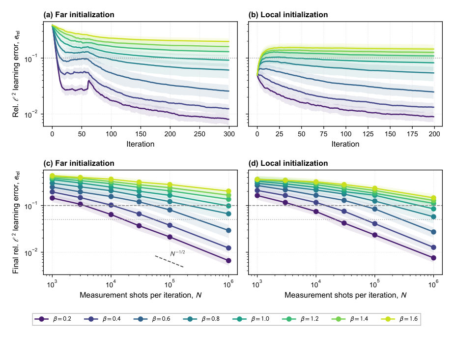 
Figure 1: Finite-shot QSM learning for the inhomogeneous TFIM in Eq. (35). The top row shows the mean relative parameter error at N = 106 from far and local initializations. The bottom row shows the error of the Polyak–Ruppert averaged output as a function of the total measurement budget per iteration. Solid curves and shaded regions show the mean and one standard deviation over 100 independent trajectories. The short dashed segment indicates the N−1/2 sampling rate. Optimization details are given in Section E.

📷 Fig 2

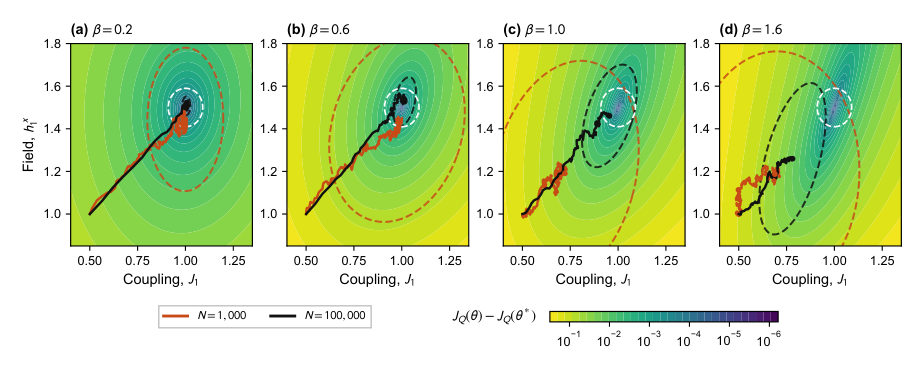 
Figure 2: Temperature-dependent population landscape and finite-shot learning dynamics from far initialization. The color map shows JQ(θ) −JQ(θ∗) in the (J1, hx 1) plane with the remaining coefficients fixed at their target values. Orange and black curves are the mean trajectories for N = 103 and 105, respectively. Dashed ellipses show one standard deviation of the trajectory endpoints over 100 independent trajectories, and the white circle has radius 0.05∥(J∗ 1, (hx 1)∗)∥2. The trajectories are projected onto the displayed coordinate plane.

📷 Fig 3

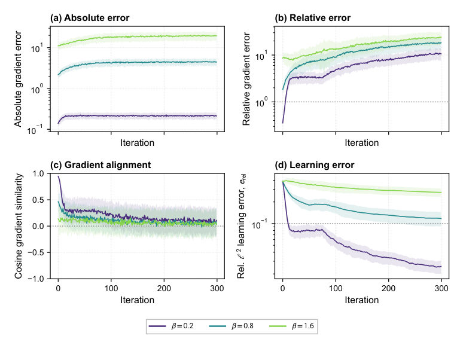 
Figure 3: Gradient accuracy and learning from far initialization with N = 105. The first three panels show the absolute gradient error ∥[ ∇JQ −∇JQ∥2, its value relative to ∥∇JQ∥2, and the cosine similarity between the estimated and exact gradients. The final panel shows the relative parameter error. Curves and shaded regions show the pointwise mean and one standard deviation over 100 independent trajectories.

📷 Fig 4

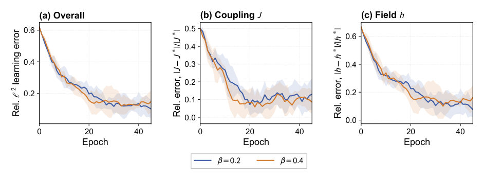 
Figure 4: Learning a four-qubit TFIM on IBM quantum hardware. Curves and shaded regions show the mean and one sample standard deviation of the errors over five independent runs from a common initialization.

📷 Fig 5

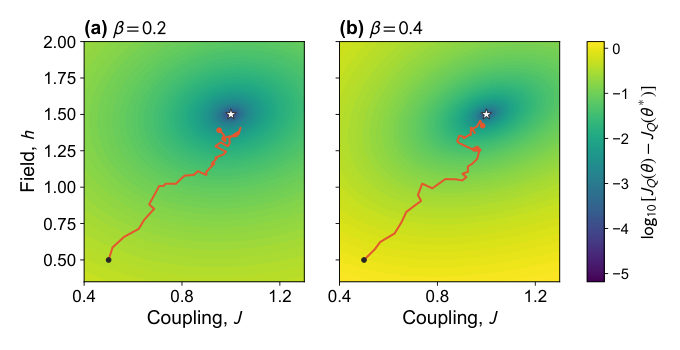 
Figure 5: Mean hardware learning trajectories over 45 updates on the population loss landscape. Each curve averages the parameters of five independent runs. The black point and white star mark the initialization and target.

**Summary.** This paper introduces quantum score matching, adapting a powerful classical generative model technique to learn unknown quantum thermal states (Gibbs states). By establishing a theoretically sound framework and demonstrating its effectiveness on real quantum hardware, it offers a new, experimentally realizable route for quantum state tomography and characterization.

**Why it may be interesting.** This work provides a concrete, experimentally viable machine learning paradigm for characterizing thermal quantum states, which is crucial for simulating and understanding complex many-body physics beyond simple mean-field approximations.

Detailed structure

**Main problem.** The core challenge is extending classical score matching, a generative learning technique, to the quantum domain where states are governed by noncommuting density operators.

**Main result.** The authors establish a theoretically guaranteed quantum score-matching framework that achieves information-theoretic optimal sample complexity for learning high-temperature Gibbs states.

**Method.** They define a symmetric quantum score and formulate an objective function (squared score discrepancy) that can be evaluated using Monte Carlo sampling from the unknown target state.

**Model / system.** The focus is on learning quantum Gibbs states, $\sigma \propto e^{-eta H(	heta^*)} / 	ext{Tr}(e^{-eta H(	heta^*)})$, parameterized by a Hamiltonian $H(	heta)$. The method is tested on IBM quantum hardware.

**Key observables.** The primary observables are the quantum scores ($S_a$), the objective function $J_Q(	heta)$, and the relative Hamiltonian-parameter error.

**Important parameters / regimes.** Key parameters include the inverse temperature ($eta$), the measurement budget (limited shots), and the locality/interaction degree of the Hamiltonian.

**Assumptions / limitations.** The framework assumes the existence of a 'sufficiently rich' derivation frame for global identifiability, and the theoretical guarantees are strongest in the high-temperature regime.

**Figures summary.** The notes describe a table (Table 3) tracking the mean and relative parameter errors of observables ($ar{J}, ar{h}$) over 46 epochs of optimization on IBM hardware for two different temperatures ($eta=0.2$ and $eta=0.4$).

**Paper structure.** The paper introduces the quantum score-matching framework, derives the objective function and gradient estimators, proves theoretical guarantees (including sample complexity bounds), and validates the method through numerical simulations and hardware experiments.

Abstract

Score matching has driven major advances in classical generative learning by enabling models to learn from data without evaluating intractable normalization constants, or partition functions. Yet, extending this principle to quantum learning requires rethinking its foundations, as quantum states are described by noncommuting density operators rather than scalar probabilities. The noncommutativity creates fundamental challenges not only in defining quantum scores, but also in developing a training framework with efficient circuit implementations and rigorous theoretical guarantees. In this work, we bridge this gap by establishing a general quantum score-matching framework with end-to-end theoretical guarantees. Applied to Gibbs-state learning, our approach avoids additional thermal-state preparation and achieves information-theoretically optimal sample complexity in the high-temperature regime for Hamiltonians with bounded locality and interaction degree. This positions score matching as a new route to state-of-the-art performance in learning quantum Gibbs states.   Beyond these theoretical results, numerical simulations show that our method remains effective even when gradients are estimated inaccurately under limited measurement budgets. Experiments on IBM quantum hardware further demonstrate that quantum score matching is NISQ-friendly: without any error mitigation or correction, it reduces the relative Hamiltonian-parameter error from 64% to approximately 10%. Together, these results extend score matching into an experimentally realizable paradigm for quantum-state learning.

[↑ back to top](#top)

### [Broadband Quantum Optical Storage with Chemically Engineered Molecular Eu$^\text{3+}$ Complex](http://arxiv.org/abs/2609.28271v1)

**Authors:** Yisheng Lei, Senthil Kumar Kuppusamy, Idris Tlemsani, Suma Al-Hunaishi, Pengrui Jiao, Olaf Fuhr, Mario Ruben, Philippe Goldner, Diana Serrano  
**Type:** both · **Category:** quantum information and computing · **PDF:** <https://arxiv.org/pdf/2609.28271v1>  
**Analysis basis:** full PDF text, analyzed in chunks
**Topic relevance:** `QC/QI experiment` **3/5** · `quantum optics experiment` **3/5** · `interference shaping light` **1/5** · `quantum measurements` **1/5**

📷 Fig 1

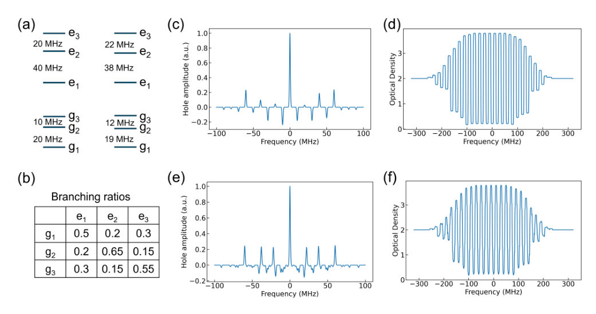 
FIG. 1. HAGEM memory protocol: (a) HAGEM-compatible three-level hyperfine structures. (b) Branching ratio values for hyperfine levels between the optical transition states. (c) Simulation of a single spectral hole burning for the first case. (d) Simulation of HAGEM spectrum for the first case. (e) Simulation of a single spectral hole burning for the second case. (f) Simulation of HAGEM spectrum for the second case.

📷 Fig 2

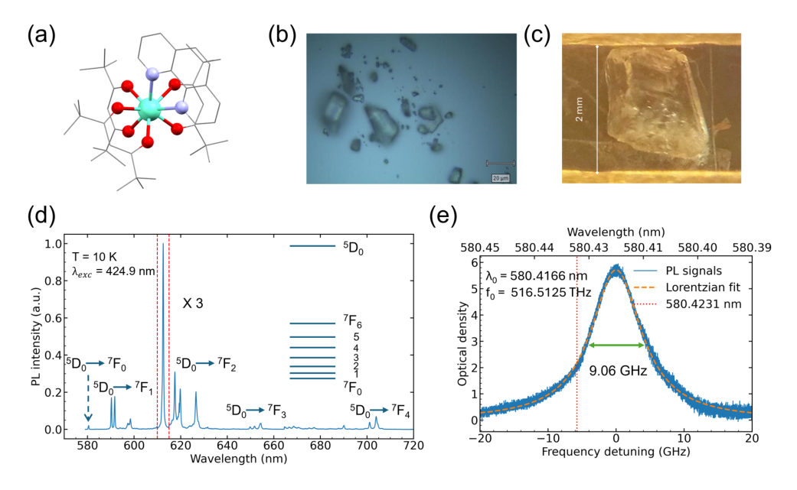 
FIG. 2. Molecular material Eu3+(TMHD)3(phen): (a) Illustration of the chemical composition: oxygen (red), europium (green) and carbon (light purple). (b) Microscope image of the micro-crystalline powder. (c) Microscope image of the millimeter-size single crystal. (d) Photoluminescence spectrum of the single crystal. The actual intensity of the region inside the two red dashed lines is three times the plotted intensity. (e) Inhomogeneous broadening of the single crystal.

📷 Fig 3

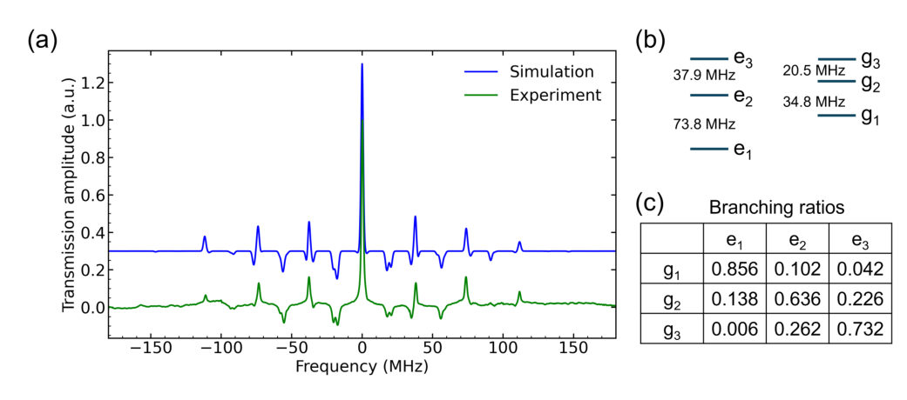 
FIG. 3. SHB spectrum simulation: (a) A single spectral hole burning: experimental and simulated spectrum of 360 MHz. (b) Hyperfine level separation values. (c) Branching ratio values derived from the spectral simulation.

📷 Fig 4

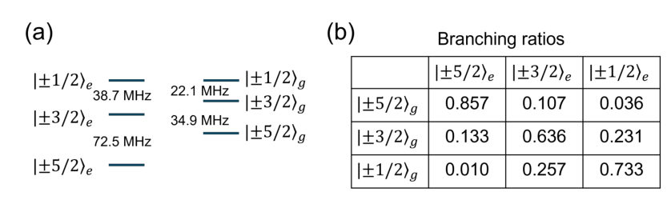 
FIG. 4. Crystal field calculation: (a) Hyperfine level separation values. (b) Branching ratios between hyperfine levels.

📷 Fig 5

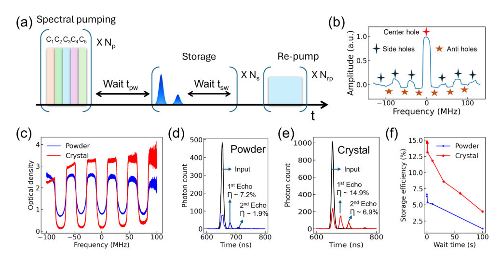 
FIG. 5. Quantum storage: (a) Experimental sequence of quantum storage experiments. (b) Spectral pumping of a single comb. (c) 200 MHz optical density spectrum of powder and crystal after spectral pumping sequence. (d) SPD (single photon detection) measurements of quantum storage for powder. (e) SPD measurements of quantum storage for crystal. (f) Storage efficiencies with different wait times after spectral preparation for powder and crystal.

**Summary.** This paper proposes and experimentally demonstrates a novel quantum memory scheme, HAGEM, using $	ext{Eu}^{3+}$ ions engineered within molecular complexes. By chemically tailoring the hyperfine structure, the authors achieved high quantum optical storage efficiency and bandwidth. This establishes a new paradigm where molecular engineering enables quantum applications unattainable with conventional solid-state rare-earth materials.

**Why it may be interesting.** This work directly addresses quantum networking by providing a solid-state platform for quantum memory, bridging the gap between molecular chemistry and quantum information science.

Detailed structure

**Main problem.** The primary goal is to develop a broadband quantum memory device essential for future quantum networks.

**Main result.** The authors demonstrated a quantum optical storage efficiency of 14.9% and a memory bandwidth of 200 MHz using a novel molecularly engineered $	ext{Eu}^{3+}$ complex.

**Method.** The work combines theoretical modeling of hyperfine structures with experimental demonstrations using spectral hole burning and quantum optical storage protocols.

**Model / system.** The system utilizes $	ext{Eu}^{3+}$ ions embedded in molecular complexes, employing the Hole Anti-hole Grating Echo Memory (HAGEM) protocol, which relies on specific correlations in hyperfine level separations.

**Key observables.** Quantum optical storage efficiency (14.9%), memory bandwidth (200 MHz), hyperfine level separations ($\delta$), and spectral grating structure.

**Important parameters / regimes.** Memory bandwidth (extendable to GHz), hyperfine level structure correlations, and the coupling between molecular engineering and quantum memory function.

**Assumptions / limitations.** The protocol requires specific hyperfine level structures that are engineered into the molecular complex, overcoming limitations of naturally occurring solid-state materials.

**Figures summary.** Figures illustrate the HAGEM memory protocol, showing spectral hole burning simulations and the resulting broadband spectrum achievable with the designed $	ext{Eu}^{3+}$ complex.

**Paper structure.** The paper progresses from establishing the need for broadband quantum memory, proposing the HAGEM scheme, detailing the molecular engineering approach using $	ext{Eu}^{3+}$ complexes, and finally presenting experimental demonstrations of storage efficiency and bandwidth.

Abstract

Broadband quantum memory devices are essential elements for future quantum networks. Here we propose a broadband quantum memory scheme called Hole Anti-hole Grating Echo Memory (HAGEM) for rare-earth ions in solids. We provide a Eu$^\text{3+}$ molecular complex with special hyperfine level structures of which the hyperfine level separations are in a specific mathematical correlation that can be obtained by harnessing chemical engineering. Using the memory protocol and material, we experimentally demonstrate a quantum optical storage efficiency of 14.9% and a memory bandwidth of 200MHz, which can easily be extended to a few GHz. With this demonstration, we show the first quantum application enabled by molecular engineering which cannot be achieved by any other existing Eu$^\text{3+}$ solid-state materials. In addition, we provide a framework for the chemical engineering of solid-state materials with rare-earth ions for quantum applications consisting of material design, synthesis & characterization techniques, and analytical methods for the quantum properties of rare-earth (RE) ions in solids. This work establishes a new direction in which molecular rare-earth ions can be used for a wide range of quantum applications, which cannot be realized by existing solid-state materials. This will greatly facilitate the development of molecular quantum emitter systems for real world applications.

[↑ back to top](#top)

### [Coherence-Enhanced Spatial Quantum Thermometry](http://arxiv.org/abs/2609.26936v1)

**Authors:** Asghar Ullah, Giovanni Scala, Luis L. Sánchez-Soto, Özgür E. Müstecaplıoğlu  
**Type:** theory · **Category:** other · **PDF:** <https://arxiv.org/pdf/2609.26936v1>  
**Analysis basis:** full PDF text, analyzed in chunks
**Topic relevance:** `quantum measurements` **3/5** · `Keldysh / 2PI / non-Gaussian methods` **1/5** · `analog quantum simulation` **1/5** · `correlated / nonlocal dissipation` **1/5** · `driven-dissipative phase transition` **1/5** · `methods for driven-dissipative` **1/5**

📷 Fig 1

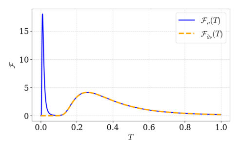 
FIG. 2. QFI for full state 𝜚𝑝(𝑇) (dot-dashed blue) and dephased state ¯𝜚𝑝(𝑇)) (dashed red) on the points 𝑥of the sample where the temperature is 𝑇= 𝑇(𝑥). The rest of the parameters are set to 𝑔= 0.04, 𝜔𝑝= 1, 𝜔𝑎= 0.04, and 𝜈= 1.

📷 Fig 2

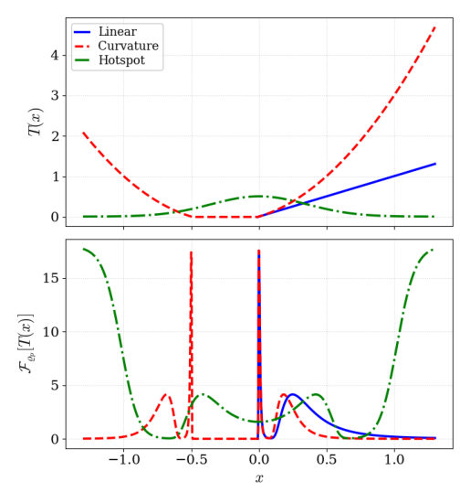 
FIG. 3. Top panel shows the three different profiles of 𝑇(𝑥). The bottom panel shows the corresponding QFI for the full state 𝜚𝑝as a function of 𝑥for three different temperature profiles 𝑇(𝑥). For the linear profile, the spatial domain is restricted to 𝑥≳−0.01 (𝑇0 = 0.01, 𝛼= 1) to enforce 𝑇(𝑥) &gt; 0 across the plotted range. The parameters for these profiles are set to 𝛼= 1, 𝛽= 2, Δ𝑇= 0.5, 𝑥0 = 0, 𝑤= 0.5, and 𝑇0 = 0.01. The remaining system parameters are set to 𝜔𝑝= 1.0, 𝜔𝑎= 0.04, and 𝑔= 0.04.

📷 Fig 3

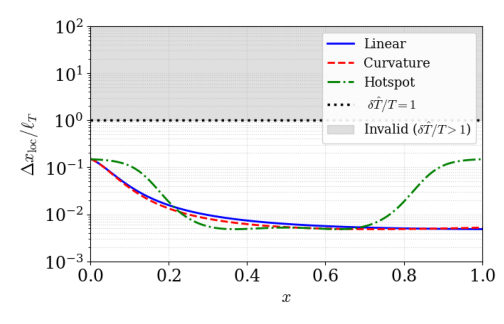 
FIG. 4. Local spatial distinguishability Δ𝑥loc(𝑥) as a function of 𝑥for three distinct thermal landscapes, such as linear gradient (solid blue), curvature estimation (dashed red), and hotspot detection (dot-dashed green). Here, Δ𝑥loc denotes the 1𝜎spatial uncertainty (standard de- viation) of the estimator; a corresponding two-sided 95% confidence interval has a width of approximately 4Δ𝑥loc for Gaussian errors. The parameters for these profiles are set to 𝛼= 0.3, 𝛽= 0.2, Δ𝑇= 0.5, 𝑥0 = 0.5, 𝑤= 0.2, and 𝑇0 = 0.1. The rest of the parameters are set to 𝑔= 0.04, 𝜔𝑝= 1, 𝜔𝑎= 0.04, 𝜈= 105, and 𝛼= 0.3.

📷 Fig 4

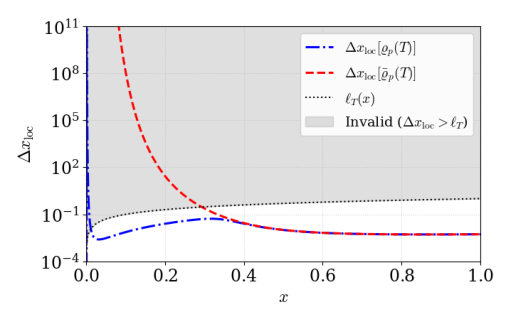 
FIG. 5. Local spatial distinguishability Δ𝑥loc of Eq. (3.12) at each point of sample profile 𝑥where the temperature is 𝑇(𝑥) = 𝑇0 + 𝛼𝑥is linear gradient. The parameters are set to 𝜔𝑝= 1, 𝜔𝑎/𝜔𝑝= 0.04, 𝑔= 0.04, 𝛼= 0.3, 𝑇0 = 0, and 𝜈= 105. As 𝑥→0, also 𝑇→0 and consequently F ¯𝜚𝑝(𝑇) →0; therefore, the probe has completely lost local resolving power there at any unit scale [𝐿], driving the relative temperature uncertainty Δ𝑥loc to diverge.

📷 Fig 5

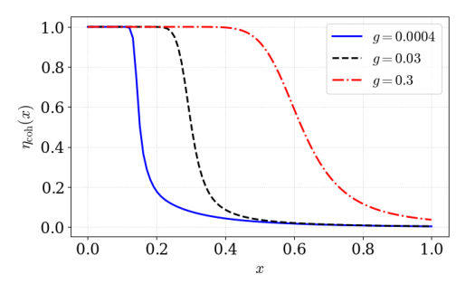 
FIG. 6. Dephasing susceptibility of the thermometric information 𝜂coh(𝑥) as a function of 𝑥. Here, the solid blue, dashed black, and dot-dashed red curves correspond to 𝑔= 4 × 10−4, 𝑔= 0.03, and 𝑔= 0.3, respectively. The remaining parameters are set to 𝜔𝑝= 1, 𝜔𝑎= 0.04, 𝜈= 1, 𝑇0 = 0.01, and 𝛼= 0.3.

**Summary.** This paper develops a method to measure temperature gradients across a surface using quantum probes. By coupling a probe TLS to an auxiliary TLS, the system generates temperature-sensitive coherence in the probe state. This coherence enhances the measurement precision, allowing for the determination of a local spatial temperature distinguishability bound.

**Why it may be interesting.** This work directly addresses quantum metrology using open quantum systems, specifically leveraging coherence in coupled quantum probes to surpass classical limits for spatial sensing, which is highly relevant to AMO physics and quantum optics.

Detailed structure

**Main problem.** The paper extends quantum thermometry from measuring temperature at a single point to estimating temperature profiles $T(x)$ across a spatial region with enhanced precision.

**Main result.** The use of quantum coherence in the probe state leads to a Quantum Fisher Information exponentially larger at low temperatures compared to measurements relying only on population differences.

**Method.** The authors derive the reduced probe state by tracing out an auxiliary TLS from the Gibbs state and calculate the Quantum Fisher Information (QFI) using the Bloch vector representation.

**Model / system.** The model involves a probe two-level system (TLS) coupled asymmetrically to an auxiliary TLS, which equilibrates with the sample exhibiting the temperature profile $T(x)$. The dynamics are governed by a Markovian master equation.

**Key observables.** Quantum Fisher Information (QFI), local spatial distinguishability bound ($\Delta x_{	ext{loc}}$), and the reduced probe state coherence $c(T)$.

**Important parameters / regimes.** Low temperature regime ($T 	o 0$), coupling strengths ($g$), and the temperature gradient $|	ext{T}'(x)|$.

**Assumptions / limitations.** The validity of the reparametrization requires a sufficiently small relative temperature uncertainty, and the system is assumed to relax via a Markovian master equation.

**Figures summary.** Figure 1 illustrates the temperature sensing protocol involving the probe, auxiliary TLS, and sample $T(x)$. Figure 2 plots the QFI in different regimes.

**Paper structure.** The paper first establishes the framework for spatial quantum thermometry, derives the enhanced QFI due to coherence, and then discusses the resulting local spatial distinguishability bound and experimental realization via a Mach-Zehnder interferometer.

Abstract

Quantum thermometry has long promised sensitivities beyond classical limits, with recent paradigms highlighting quantum coherence as a primary driver of precision. While most studies focus on single-point temperature estimation, we extend this framework to the spatial domain. We consider a probe two-level system (TLS) coupled asymmetrically to an auxiliary TLS that equilibrates with a sample of profile T(x). The reduced probe state carries coherence in its local basis that remains temperature-sensitive after the probe transition has frozen out, yielding a Fisher information exponentially larger at low temperature than that of a population-only readout. An exact reparametrization converts the thermometric precision into a local spatial distinguishability bound; its validity requires only a sufficiently small relative temperature uncertainty and yields an explicit measurement budget. Adding auxiliary TLSs shifts the array's optimal working temperature upward and broadens the useful sensing window, with the achievable gain ultimately limited by the total available coupling rather than by an indefinite scaling law. Finally, we propose a microwave Mach-Zehnder interferometer that maps the temperature-dependent probe coherence onto an experimentally accessible quadrature observable.

[↑ back to top](#top)

### [Nonequilibrium Phases of Repulsive Self-Attention: Chaos, Attention Condensation, and Emergent Locality](http://arxiv.org/abs/2609.28448v1)

**Authors:** Qucheng Gao, Zuyi Yang, Xiao Chen  
**Type:** theory · **Category:** disordered systems and neural networks · **PDF:** <https://arxiv.org/pdf/2609.28448v1>  
**Analysis basis:** full PDF text, analyzed in chunks
**Topic relevance:** `driven-dissipative phase transition` **3/5** · `non-equilibrium universality` **3/5** · `methods for driven-dissipative` **1/5**

📷 Fig 1

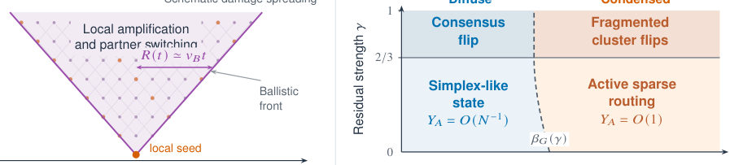 
FIG. 1. Overview of the dynamical regimes of the minimal transformer with Q = K = I and V = −I. (a) For d = 2 at fixed finite β, increasing the attention feedback strength γ can produce a uniform polygon, period-two angular waves, chaotic dynamics, and cluster-flip states. The illustrated sequence is representative of sufficiently large finite β at finite N, rather than a universal progression. All these regimes remain attention-diffuse as N →∞at fixed β, with YA = O(N −1). Within each of the first three columns, the black open marker tracks the same representative token between successive layers. (b) In the scaling regime √

📷 Fig 2

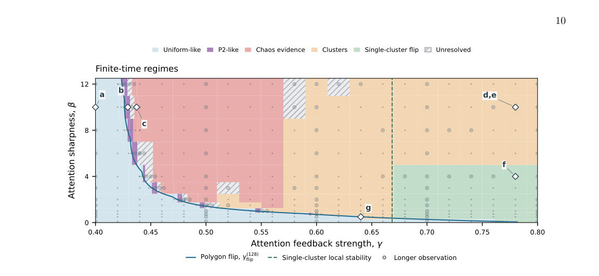 
FIG. 2. Finite-time dynamical regimes at N = 128 from q = 5 and Gaussian perturbations of a uniform polygon. Colored cells agree across the tested preparations, samples, and diagnostic threshold checks. Gray hatched cells have mixed outcomes or no robust classification; they do not denote a separate phase. The solid curve marks the polygon flip threshold γ(128) flip (β). The

📷 Fig 3

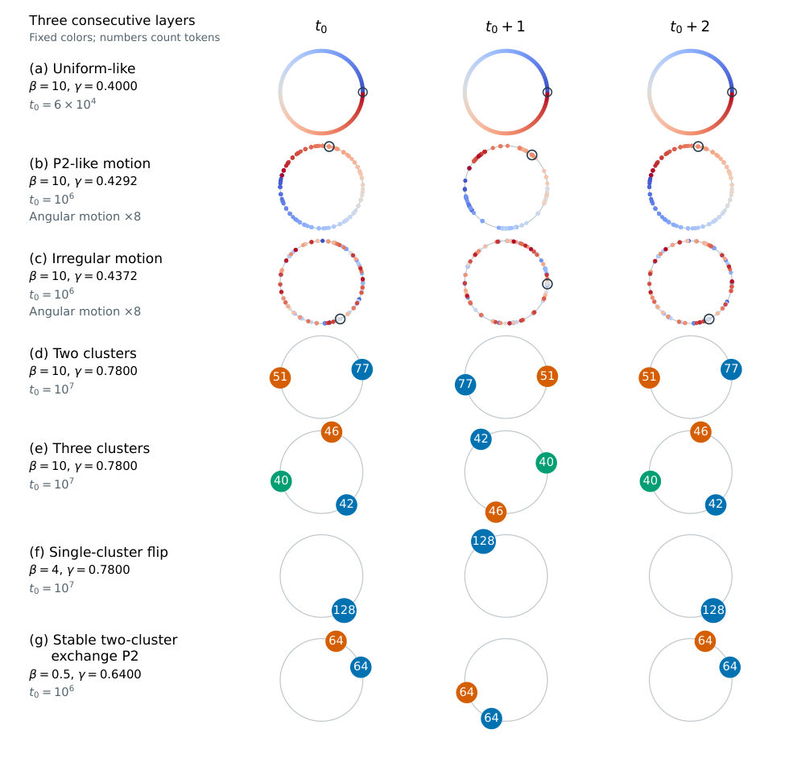 
FIG. 3. Configurations at t0, t0 +1, t0 +2 for the marked examples in Fig. 2, all at N = 128. (a–c) Near-uniform, period-two-like, and irregular motion. Displacements in (b,c) are magnified eightfold; chaos is assessed using the long-window diagnostics of Fig. 5. (d,e) Two and three slowly drifting clusters. They are expected to merge on much longer time scales. (f) A single-cluster flip. (g) The locally stable two-cluster exchange orbit. Colors preserve token or cluster identity, numbers give cluster populations, and the outlined point in (a–c) tracks one token. All preparations use a q = 5 perturbation except the Gaussian preparation in (e). No common rotation is removed.

📷 Fig 4

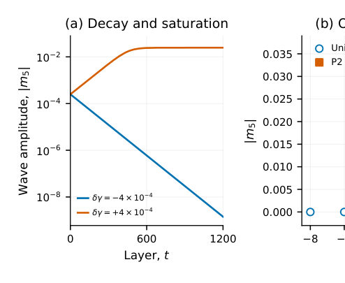 
FIG. 4. Formation and stability of P2 motion at N = 40, β = 10. The amplitude is |m5| = |N −1 P

📷 Fig 5

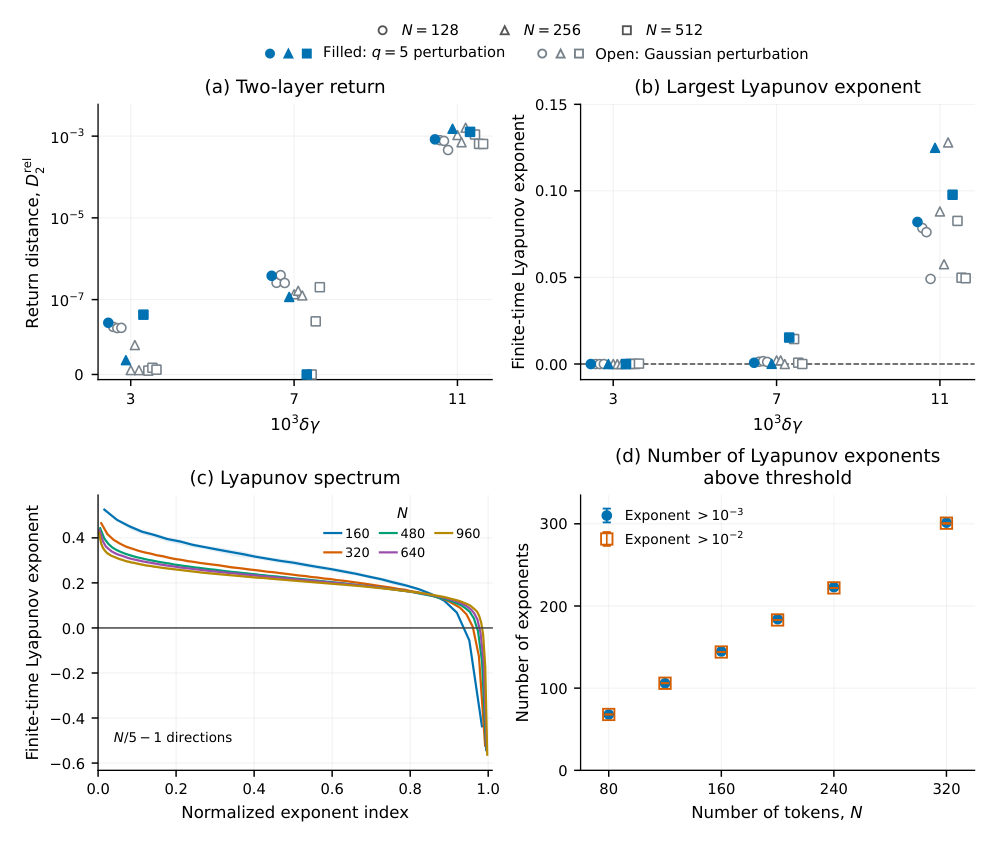 
FIG. 5. Return distances and finite-time Lyapunov estimates at β = 10. (a) Mean two-layer relative return distance Drel 2 . (b) Finite-time estimate of the largest Lyapunov exponent, per layer, with the global rotation direction removed. Every N, γ pair has one five-wave and three independent Gaussian perturbations of the uniform polygon. Each point is a single trajectory’s time average over the final 105 of 106 layers; the three open symbols of each shape are separate samples. The shared legend gives size and preparation. Horizontal offsets are for visibility; samples with the same N and δγ use the same γ. The return-distance axis is linear close to zero. (c) Mean Lyapunov spectrum within...

**Summary.** This paper analyzes the complex, non-equilibrium dynamics of self-attention in a recurrent transformer model. It identifies three distinct collective phenomena—temporal activity, attention condensation, and geometric clustering—that emerge from the feedback between token representations and attention weights. The work is significant for showing that sparse attention can maintain rich, persistent dynamics rather than leading to system stagnation.

**Why it may be interesting.** The study provides a rich, non-equilibrium dynamical framework for understanding how information processing units (like attention heads) can exhibit complex, collective, and persistent dynamics analogous to phase transitions in condensed matter systems.

Detailed structure

**Main problem.** The study investigates the nonequilibrium dynamics of self-attention mechanisms, focusing on the emergence of collective behaviors like temporal activity, attention condensation, and geometric clustering.

**Main result.** The research establishes that these three phenomena are distinct, showing that sparse attention can sustain persistent dynamics rather than causing the system to freeze.

**Method.** The analysis employs dynamical systems theory, bifurcation analysis, and scaling arguments across various dimensional limits ($d=2$ and $d=N 	o \infty$).

**Model / system.** The model is a minimal recurrent transformer with $N$ tokens, utilizing a negative value map ($V=-I$) and similarity-based attention, which creates a feedback loop between representation geometry and attention routing.

**Key observables.** Inverse Participation Ratio ($Y_A$), Maximal Lyapunov exponent ($\lambda_{\max}$), and the stability of geometric configurations (e.g., simplices).

**Important parameters / regimes.** Attention feedback strength ($\gamma$), softmax sharpness ($eta$), and the dimensionality ($d$ or $N$).

**Assumptions / limitations.** The analysis distinguishes its findings from finite-model artifacts observed in pre-trained LLMs, and some local stability tests are limited to linearization.

**Figures summary.** Figures illustrate dynamical regimes in $d=2$ (polygon stability loss), the emergence of the butterfly cone, and the comparison between geometric and attention clustering in high dimensions.

**Paper structure.** The paper progresses by analyzing the system in low dimensions ($d=2$) to characterize bifurcations, then moves to the scaling and high-dimensional limits ($d=N 	o \infty$) to rigorously define attention condensation and its associated phases.

Abstract

We study the nonequilibrium dynamics of a minimal recurrent transformer with $N$ normalized tokens, $Q=K=I$, and a negative value map $V=-I$. Similarity-based attention selects nearby representations, while the negative value map drives tokens away from the selected field. This feedback can continually reorganize both the representation geometry and the attention network. For $d=2$, the tokens lie on a circle, where the regular polygon is an exact fixed point. As the attention feedback strength $γ$ is increased, the polygon loses stability through a flip bifurcation, giving rise to period-two motion, chaos, and cluster-exchange or cluster-flip states. Despite this temporal complexity, attention remains diffuse as $N\to\infty$ at finite fixed softmax sharpness $β$. Attention condensation instead emerges in the scaling regime $β\sim N^2$. In the hard-routing limit, repulsive updates amplify local perturbations and routing-partner switches transmit them ballistically, producing an emergent butterfly cone in representation space. High-dimensional geometry provides a distinct route to localization. For $d=N\to\infty$, simulations from Gaussian initial conditions provide evidence for a condensation transition at $β=O(1)$, driven by dynamically generated finite overlap gaps. Depending on $γ$, the resulting phases include diffuse simplex-like states, consensus flips, condensed active routing with signatures of chaos, and fragmented cluster flips. These results establish temporal activity, attention condensation, and geometric clustering as distinct collective phenomena, and show that sparse attention can sustain persistent dynamics rather than freeze it.

[↑ back to top](#top)

### [Optimal limits on weak integrability breaking and protected thermal memory near qutrit exchange](http://arxiv.org/abs/2609.28237v1)

**Authors:** Hanbing Liang, Fujun Liu  
**Type:** theory · **Category:** statistical mechanics · **PDF:** <https://arxiv.org/pdf/2609.28237v1>  
**Analysis basis:** full PDF text, analyzed in chunks
**Topic relevance:** `scars & prethermalization` **3/5** · `Keldysh / 2PI / non-Gaussian methods` **1/5** · `analog quantum simulation` **1/5** · `non-equilibrium universality` **1/5** · `quantum measurements` **1/5**

📷 Fig 1

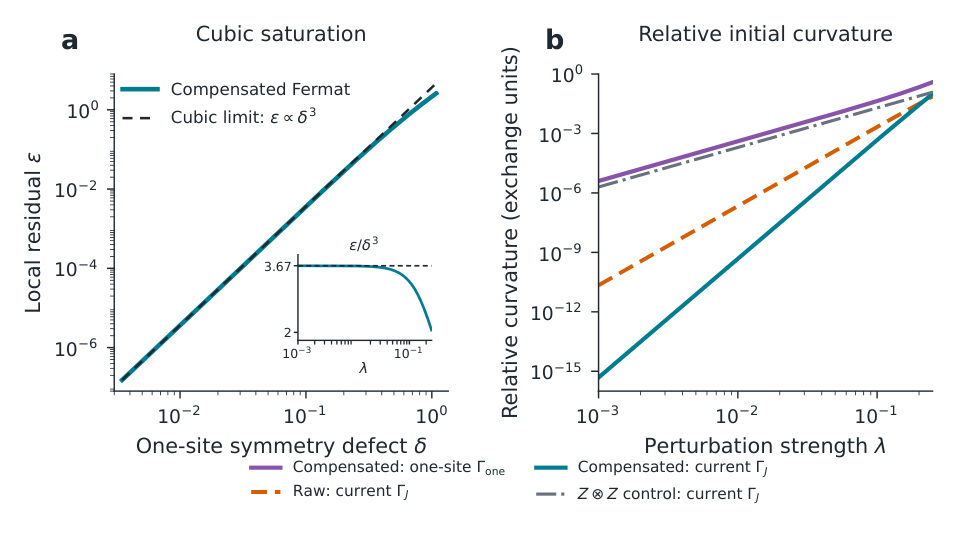 
FIG. 1. Sharp local stability and separated initial responses. (a) Exact defects of the compensated Fermat

📷 Fig 2

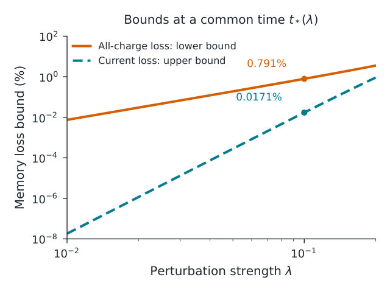 
FIG. 2. Bounds on complete charge-memory loss and current loss for the compensated Fermat model. At

**Summary.** This paper rigorously determines the optimal mathematical constraints governing weak integrability breaking in qutrit quantum systems. It proves a cubic relationship between symmetry defects and current residuals, and shows that structural compensation can dramatically extend the time window for observing conserved energy-current correlations. The findings establish robust bounds on thermal memory even when the system is perturbed away from perfect integrability.

**Why it may be interesting.** The work provides quantitative, rigorous bounds on how far a quantum system can be driven from integrability while retaining measurable, long-lived correlations, which is crucial for understanding thermalization dynamics.

Detailed structure

**Main problem.** The paper investigates the fundamental limits on weak integrability breaking and the persistence of protected thermal memory in quantum systems near a qutrit exchange interaction.

**Main result.** It establishes a sharp cubic bound ($\delta^3 \le C\epsilon$) relating the symmetry defect to the current residual, and demonstrates that optimal compensation can extend the guaranteed energy-current correlation window to order $|\lambda|^{-3}$.

**Method.** The analysis employs rigorous mathematical techniques involving Yang-Baxter deformations, commutator expansions, and the study of spectral measures in the thermodynamic limit.

**Model / system.** The system is a qutrit chain undergoing exchange interactions, analyzed through the framework of Yang-Baxter deformations and weak perturbations ($\lambda$).

**Key observables.** Symmetry defect ($\delta$), local current-conservation residual ($\epsilon$), energy-current correlation window, and the eight-dimensional charge memory matrix.

**Important parameters / regimes.** Perturbation strength ($\lambda$), time scale ($t$), and the system size ($L$ in the thermodynamic limit).

**Assumptions / limitations.** The analysis assumes the existence of jointly analytic, regular Yang-Baxter deformations and that the thermodynamic limit is taken before the weak-coupling limit.

**Figures summary.** Figures compare the evolution of local residuals and initial current forces for raw versus optimally compensated paths, illustrating the improvement in scaling exponents.

**Paper structure.** The structure moves from establishing the fundamental symmetry constraints (Theorem 1) to deriving sharp quantitative bounds ($\delta^3 \le C\epsilon$), demonstrating the effect of structural compensation, and finally analyzing the resulting protected memory in the thermodynamic limit.

Abstract

Although integrability does not universally require a continuous one-site symmetry, we rigorously prove that every jointly analytic, regular Yang-Baxter deformation of the qutrit exchange interaction necessarily retains a nontrivial, analytically varying one-site charge. Breaking this local symmetry imposes a fundamental physical constraint on approximate conservation, governed by the optimal uniform bound $δ^3 \le C\varepsilon$ that explicitly relates the minimal one-site symmetry defect $δ$ to the local current-conservation residual $\varepsilon$. While breaking all one-site charges strictly forbids an exact integrable completion, an optimally compensated nearest-neighbor interaction saturates this cubic limit and anomalously extends the guaranteed infinite-temperature energy-current correlation window to order $|λ|^{-3}$ in the perturbation strength $λ$. Furthermore, we reveal a fundamental resonance obstruction for intrinsic conversion perturbations that strictly prevents any exact first-order repair of a broken one-site charge on any finite ring. Nevertheless, we demonstrate that the complete eight-dimensional charge memory matrix remains thermodynamically protected and approaches the identity for timescales $t=o(|λ|^{-3/2})$, a robust feature of the full infinite-temperature dynamics when the thermodynamic limit is taken before weak coupling.

[↑ back to top](#top)

### [CP asymmetry and visible decay in $3+1$ neutrino oscillations on a quantum computer](http://arxiv.org/abs/2609.27670v1)

**Authors:** Amartya Sengupta, Sidhartha Samtani, Ani Girgvliani, Dejan Stojkovic  
**Type:** both · **Category:** other · **PDF:** <https://arxiv.org/pdf/2609.27670v1>  
**Analysis basis:** full PDF text, analyzed in chunks
**Topic relevance:** `methods for driven-dissipative` **3/5** · `correlated / nonlocal dissipation` **1/5** · `driven-dissipative phase transition` **1/5** · `quantum measurements` **1/5**

📷 Fig 1

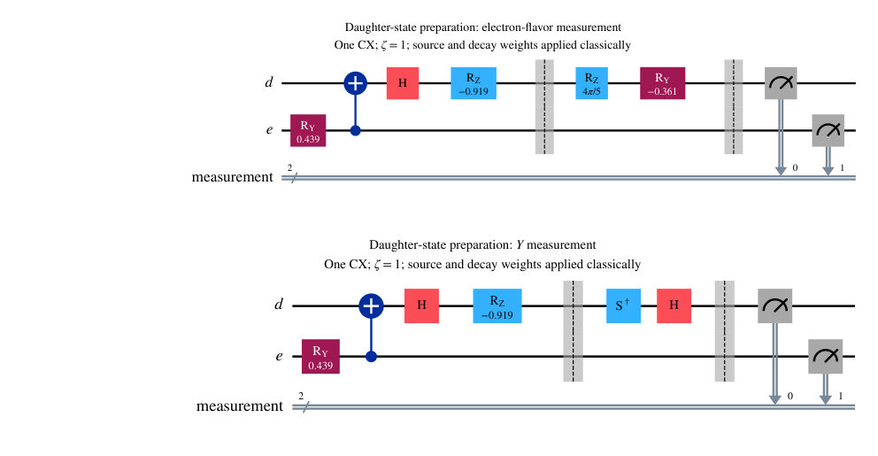 
Figure 2. Compact circuits at ζ = 1 for electron-flavor projection (upper) and the Y quadrature (lower). The qubit d encodes the ordered daughter pair, while the auxiliary qubit e completes its purification. The preparation angles are β1 ≃0.439 and χ ≃0.919, in radians. The flavor rotation uses the normalized projection in eq. (3.3); S† = diag(1, −i) followed by the Hadamard gate H selects the Y basis. Environment outcomes are summed.

📷 Fig 2

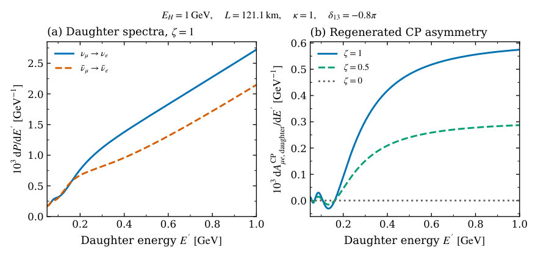 
Figure 3. Continuous daughter spectra for the reference source and propagation parameters. Panel (a) shows neutrino and antineutrino electron-appearance densities at ζ = 1; panel (b) shows their difference at ζ = 1, 0.5, 0. The spectral profiles follow eq. (A.5), with m1 = 0.01 eV and equal branching fractions into ν1 and ν3. The plotted interval is 0.05 ≤E′/GeV ≤1, and vertical-axis values scaled by 103. Energy-bin convergence is checked in appendix A.

📷 Fig 3

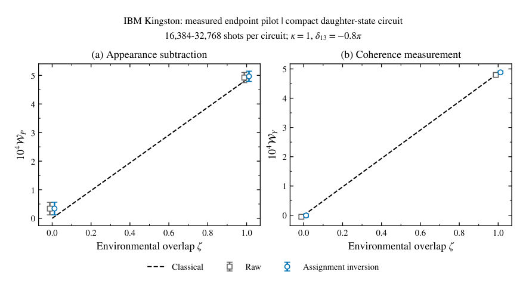 
Figure 4. IBM Kingston measurements of WP and WY at ζ = 0, 1. Grey squares denote raw estimates and blue circles denote corrected estimates. Error bars represent one standard error. Dashed curves show the classical prediction. All estimates include the normalization wD; the flavor-probability estimates also include n13 e . Horizontal offsets separate overlapping symbols.

📷 Fig 4

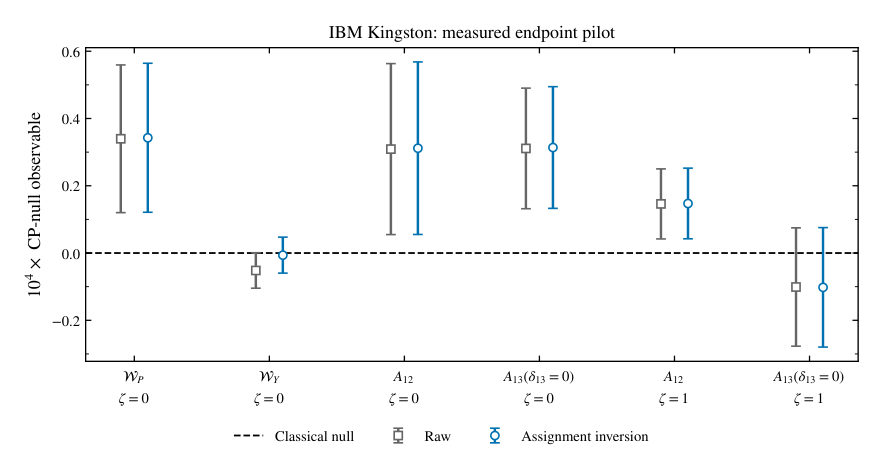 
Figure 5. Six predefined null controls: WP and WY at ζ = 0, and the pair-(1, 2) and δ13 = 0 appearance differences at both endpoints. Symbols distinguish raw and corrected estimates. Error bars represent one standard error; the dashed line denotes zero. The predefined precision criterion is | bA| + 1.96σA &lt; 0.20SCP. Individual values appear in table 5.

📷 Fig 5

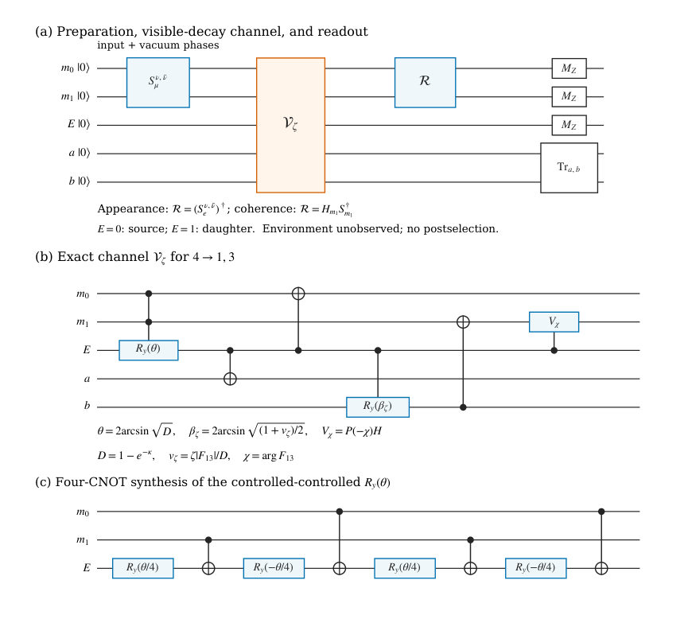 
Figure 6. Five-qubit circuit for the 4 →1, 3 decay channel. (a) Sν,¯ν µ prepares the source including the phases ΦiH, and R selects the measurement basis for appearance probabilities or coherence. The symbols MZ denote computational-basis measurements. (b) Vζ acts on (m0, m1, E, a, b) with Eab initially zero. The drawing labels the full-channel eigenmode angle by βζ; here it is written eβζ to distinguish it from the compact angle. The three angles are defined in eq. (B.5); the block Vχ = P(−χ)H applies the Hadamard gate H followed by P(−χ). (c) Four controlled-NOT gates implement the controlled-controlled rotation exactly. We sum over all environment measurement outcomes.

**Summary.** This paper uses quantum simulation to model how neutrino decay affects the CP asymmetry in neutrino oscillations within a $3+1$ model. It separates the effect into parent attenuation and daughter regeneration, demonstrating that the quantum simulation results match classical predictions. This work is significant for understanding neutrino physics using quantum computing tools.

**Why it may be interesting.** The application of quantum simulation techniques to model complex, non-unitary open quantum systems like neutrino decay provides a valuable testbed for quantum computation in particle physics.

Detailed structure

**Main problem.** The study investigates how visible neutrino decay modifies the vacuum CP asymmetry observed in muon-to-electron neutrino oscillations within a $3+1$ neutrino framework.

**Main result.** The quantum simulation results for both flavor-probability and coherence measurements agreed with theoretical predictions within one standard error, confirming the model's consistency.

**Method.** The authors combine quantum simulation on an IBM quantum processor with theoretical modeling using open-system dynamics (Lindblad master equation) to track energy redistribution.

**Model / system.** The system involves four Dirac neutrinos ($
u_1$ to $
u_4$), where $
u_4$ is unstable and decays into lighter states ($
u_j$) and an environment. The evolution is governed by Hamiltonian dynamics combined with decay jump operators.

**Key observables.** CP Asymmetry ($	ext{ACP}$), Daughter Coherence ($\zeta$), Parent Attenuation, and Daughter Regeneration contribution.

**Important parameters / regimes.** The decay width ($\Gamma_{4n}$), the environmental overlap parameter ($\zeta$), and the neutrino mass-squared differences ($\Delta m^2$).

**Assumptions / limitations.** The decay interaction is assumed to be CP symmetric, and the analysis separates the total change into parent attenuation and daughter regeneration components.

**Figures summary.** Figure 1 illustrates the CP-conjugate decay processes ($
u_4 	o 
u_j + J^\dagger$ and $
u_4 	o 
u_j + J$).

**Paper structure.** The paper establishes the theoretical framework using open-system dynamics, separates the CP asymmetry change into parent and daughter contributions, simulates the evolution on a quantum processor, and validates the results against classical benchmarks and null controls.

Abstract

We use quantum simulation to study how visible neutrino decay modifies the vacuum CP asymmetry in muon-to-electron oscillations within a $3+1$ neutrino scenario. The decay channel preserves CP symmetry, with CP violation arising from phases in the mixing matrix. We track the energy redistribution from visible decay and distinguish how parent attenuation and daughter regeneration modify the CP asymmetry. For the reference benchmark, the regenerated contribution is $4.85\times10^{-4}$, approximately $46\%$ of the total decay-induced shift. The full circuit for an effective two-energy model agrees with independent classical evolution. On an IBM quantum processor, we prepare the daughter state conditioned on decay and restore its physical normalization using fixed source and decay probabilities. After correction for measurement errors, the flavor-probability and coherence measurements both agree with the prediction within one standard error. Null controls test the suppression of the regenerated signal when daughter coherence or the relevant CP-sensitive mixing factor vanishes.

[↑ back to top](#top)

### [Unmodeled states and uncertain action outcomes in agentic scanning tunneling microscopy](http://arxiv.org/abs/2609.27302v1)

**Authors:** Siyu Cheng, Muxian Xu, Christopher Candelora, Ilija Zeljkovic  
**Type:** experiment · **Category:** strongly correlated electrons · **PDF:** <https://arxiv.org/pdf/2609.27302v1>  
**Analysis basis:** full PDF text, analyzed in chunks
**Topic relevance:** `quantum measurements` **3/5** · `methods for driven-dissipative` **2/5** · `analog quantum simulation` **1/5**

📷 Fig 1

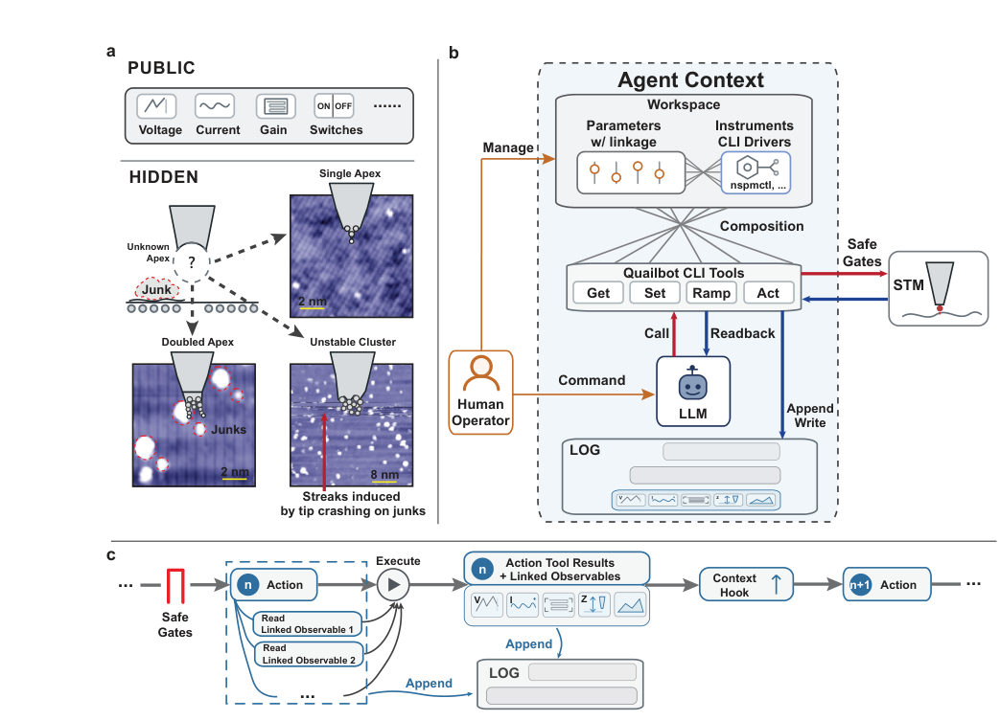 
Figure 1: Overview of hidden states, tip conditioning and the quailbot harness. a, A representative example of public states and hidden states in tip conditioning. Tip conditioning acts on an unknown apex and can produce distinct imaging outcomes. The three topographs show a single apex with lattice contrast, a doubled apex with junk, and an unstable cluster with streaks. b, The overview of the quailbot harness. The human operator defines the workspace and instrument interfaces, including the linked observables of each declared capability. The LLM selects declared capabilities and supplies their arguments through four instrument-control CLI tools: Get, Set, Ramp and Act. The harness returns...

📷 Fig 2

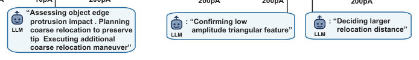 
Figure 2: Anatomy of an end-to-end STM tip-conditioning run. a, STM topograph on FeTe acquired before the launch and its corresponding FFT. b, Partial topograph from the linked live-scan observable, showing a protrusion at the object edge. The scan was stopped by the agent before the topograph completed. c, Partial topograph from the linked live-scan observable, showing a triangular feature and a local streak. d, The final delivered topograph and its corresponding FFT. The four circles mark the first-order Bragg peaks. The BraggZ scores are 20.7 in a and 295.4 in d. e, Chronological trajectory of the presented run. Task events, agent-issued commands, and representative agent reasoning...

📷 Fig 3

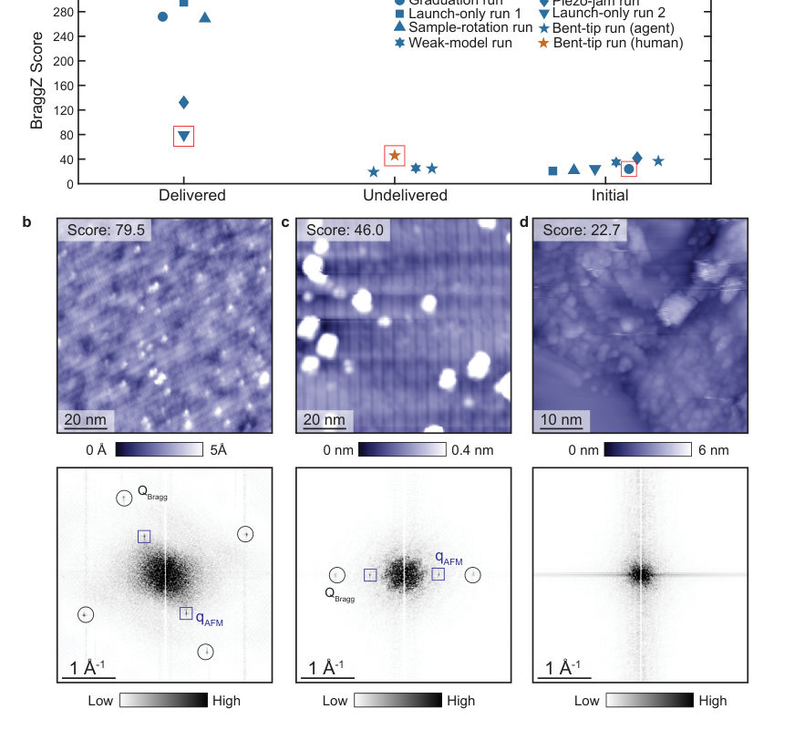 
Figure 3: Post-run assessment of initial and endpoint STM images. a, BraggZ scores of to- pographs across all runs discussed in this paper. Topographs are classified as delivered, undelivered and initial states. The ”delivered/undelivered” classification is based on human expert’s assess- ment. The ”initial” states are topographs taken before a run starts. Blue markers denote agent-run results and the orange marker denotes the result after human takeover. Red boxes highlight the examples in b–d. b, Delivered topograph and corresponding FFT from Launch-only run 2, with a BraggZ score of 79.5. Four first-order Bragg peaks are resolved. The tip remains stable across isolated small surface...

📷 Fig 4

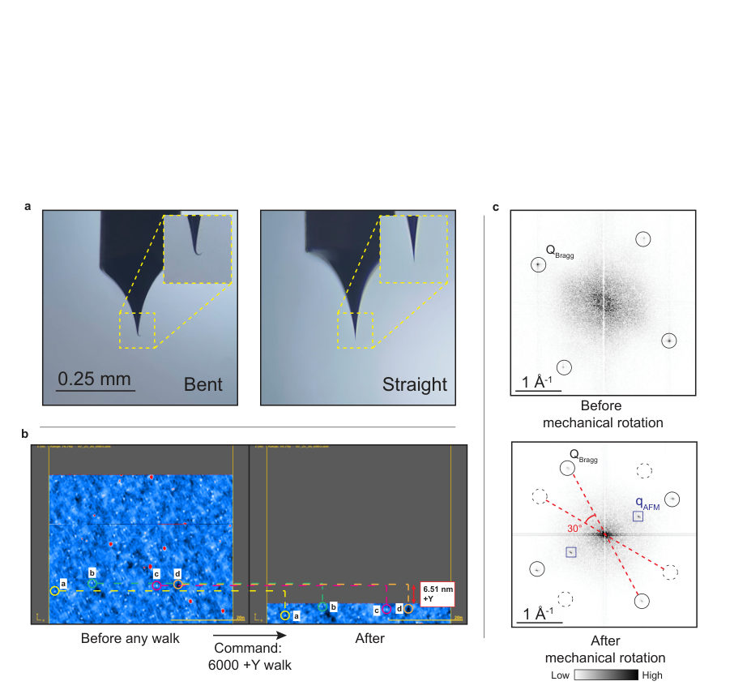 
Figure 4: Unexpected conditions in STM tip conditioning. a, Optical microscopic images of a bent (left) and a straight (right) tungsten tip. b, Processed live-scan images before (left) and after (right) commands for a total of 6,000 coarse-walker steps along +Y . Colored circles mark corresponding defect features. Dashed lines connect their positions. The red arrow marks the displacement of 6.51 nm along Y . c, Amplitude FFTs of topographs from the pre-rotation (top) and post-rotation (bottom) periods. Both topographs were acquired over a 50 × 50 nm field of view at a scan angle of 0◦. Solid circles mark the first-order Bragg peaks. Dashed circles in the bottom FFT indicate the pre-rotation...

**Summary.** This work demonstrates an LLM-based agent system, 'quailbot,' capable of autonomously performing complex, multi-step scientific tasks like STM tip conditioning. By integrating the LLM into the instrument's feedback loop, the agent learns to adapt to physical uncertainties and hidden experimental states. It advances the field by showing how AI can manage real-world, unpredictable physical measurements.

**Why it may be interesting.** While the focus is on AI control, the underlying physical measurements (STM, lattice structure, correlated materials) are highly relevant to condensed matter physics, particularly in characterizing electronic states.

Detailed structure

**Main problem.** Autonomous scientific agents must interpret the consequences of their interventions when operating with incomplete knowledge of the experimental state, especially when interventions alter hidden states unpredictably.

**Main result.** LLM agents successfully completed end-to-end STM tip conditioning after apprenticeship, demonstrating adaptation to unexpected physical conditions.

**Method.** The authors developed 'quailbot,' an agent harness that embeds an LLM into the instrument feedback loop to link physical interventions with experimental readbacks.

**Model / system.** The physical system is Scanning Tunneling Microscopy (STM) tip conditioning on FeTe at 4 K. The agent interacts with the instrument using CLI tools to control physical parameters.

**Key observables.** BraggZ score, topographs, Fourier transforms, and tunneling current are used to diagnose tip quality and surface structure.

**Important parameters / regimes.** The experiment operates under conditions of hidden states (e.g., tip apex configuration) and unmodeled latent contingencies.

**Assumptions / limitations.** The primary limitation is that the agent's autonomy is constrained by the observability and action limits of the real instrument, and it struggles when states are hidden or unmodeled.

**Figures summary.** Figures illustrate the comparison of public vs. hidden states in tip conditioning, the architecture of the quailbot harness, and the sequence of agent actions during a successful run.

**Paper structure.** The paper introduces the problem of action-outcome uncertainty in physical experiments, details the quailbot agent harness and its apprenticeship training, presents results showing autonomous completion of STM tip conditioning, and concludes by discussing the necessity of inferring hidden states.

Abstract

In physical experiments, interventions can alter hidden experimental states in ways that cannot be predicted in advance. Autonomous scientific agents must therefore interpret the consequences of their interventions while operating with incomplete knowledge of the experimental state. Here we investigate this problem using scanning tunneling microscopy (STM) tip conditioning, traditionally a human-expert-intensive task governed by inaccessible tip apex conditions and uncertain action outcomes. We introduce quailbot, an agent harness that places the LLM inside the instrument feedback loop by linking physical interventions with experimental readbacks. After a brief apprenticeship with a human expert, frontier LLM agents autonomously completed end-to-end tip conditioning on an STM and passed an independent verification. The contingencies that arose during the experiments further exposed the limits of LLM agentic autonomy when relevant experimental states or dynamics were hidden or unmodeled. Our results show that future autonomous physical experimentation requires agents to infer hidden and unmodeled experimental states, track the outcomes of their actions, and operate within the observability and action limits of real instruments.

[↑ back to top](#top)

### [Certifying fermionic Gaussian states (and a little more) with optimal precision dependence](http://arxiv.org/abs/2609.28233v1)

**Authors:** Ninnat Dangniam, Laphas Premcharoen, Metrasit Sripech, Thiparat Chotibut  
**Type:** theory · **Category:** statistical mechanics · **PDF:** <https://arxiv.org/pdf/2609.28233v1>  
**Analysis basis:** full PDF text, analyzed in chunks
**Topic relevance:** `quantum measurements` **3/5** · `analog quantum simulation` **2/5**

📷 Fig 1

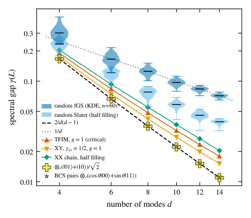 
FIG. 1. Spectral gap γ(L) of the certification walk versus the number of modes d, on logarithmic axes. Violin plots show the distribution over n = 60 random instances per d—Haar- random pure fGS (dark) and random half-filled Slater de- terminants (light)—with horizontal lines at the medians and at the extreme values. Solid curves are the ground states of the critical transverse-field Ising chain (g = 1), the XY chain (γxy = 1/2, g = 1) and the half-filled XX chain. The two product families N

📷 Fig 2

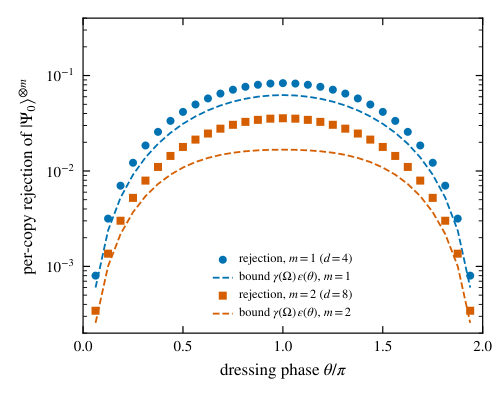 
FIG. 2. Detection of a Gaussian impostor. Per- copy probability that Algorithm 1, run with target |Ψθ⟩⊗m

**Summary.** This work develops an efficient, adaptive protocol to certify fermionic Gaussian states by analyzing the spectral gap of an associated Markov chain walk. It achieves optimal sample complexity scaling ($\epsilon^{-1}$) using only single-qubit measurements. This provides a rigorous theoretical tool for characterizing complex quantum states relevant to condensed matter physics.

**Why it may be interesting.** The connection between quantum state verification complexity and the spectral gap of a Markov chain is a powerful theoretical tool, providing quantitative bounds on the resources needed for quantum characterization.

Detailed structure

**Main problem.** The paper addresses the quantum state certification problem, specifically for fermionic Gaussian states, aiming to find measurement protocols with optimal sample complexity.

**Main result.** They propose an adaptive protocol that certifies any $d$-mode pure fermionic Gaussian state using $O(d^2\epsilon^{-1})$ copies, achieving optimal $\epsilon^{-1}$ scaling with single-qubit measurements.

**Method.** The approach involves establishing a spectral gap lower bound for a 'certification walk' (a Markov chain) associated with the state, linking efficiency to the Markov chain's relaxation time to equilibrium.

**Model / system.** The focus is on fermionic Gaussian states (fGSs), which are ground states of quadratic fermionic Hamiltonians, relevant for quantum simulation of fermionic systems. The analysis uses concepts from Markov chain theory, such as spectral gaps, applied to the certification process.

**Key observables.** The spectral gap ($\gamma(L)$) of the certification walk, and the sample complexity $N$ required for certification.

**Important parameters / regimes.** Precision $\epsilon$, number of modes $d$, and the target fidelity $\delta$.

**Assumptions / limitations.** The protocol relies on the spectral gap of a $d \leftrightarrow d-2$ down-up walk, and the analysis compares results against known bounds for Haar-typical states.

**Figures summary.** Table II compares computed median and minimum spectral gaps ($\gamma(L)$) for random ensembles against the theoretical bound $rac{2}{d(d-1)}$ for various dimensions $d$.

**Paper structure.** The paper builds from general QSV techniques, develops the connection between certification and spectral gaps via homogenization to a down-up walk, and concludes with detailed spectral gap calculations for various physical ensembles.

Abstract

Fermionic Gaussian states are the workhorse reference states for qubit-based quantum simulation of fermionic systems, yet existing certification protocols either proceed via fidelity estimation, leading to suboptimal sample complexity in the target precision $ε$, only apply to Haar-typical states, or require adaptive measurements on a large fraction of qubits. We give an adaptive protocol that certifies any $d$-mode pure fermionic Gaussian state using $O(d^2ε^{-1})$ copies, single-qubit measurements with only one qubit measured adaptively per copy, and $O(d^3)$ classical processing time per copy. The $ε^{-1}$ dependence is optimal for the certification problem, even among strategies using entangled measurements. The sample complexity is controlled by the spectral gap of a $d\leftrightarrow d-2$ down-up walk---a Markov chain studied in the theory of high-dimensional expanders, equivalent to a two-site Glauber dynamics in statistical physics---relating certification efficiency to relaxation time to equilibrium. The worst-case bound is tight for this protocol and is attained by physically relevant states, including ground states of the fully dimerized Su-Schrieffer-Heeger (SSH) chain and BCS pair states. In contrast, numerics up to $d=14$ suggest that $O(d ε^{-1})$ copies suffice to certify Haar-typical Gaussian states, a factor of $d$ improvement over the worst-case bound. Finally, because the bound depends only on the target's computational-basis distribution, the protocol extends to efficiently phase-dressed states---states obtained by injecting an efficiently computable diagonal phase to Gaussian states---with the same sample complexity. The class includes a continuous family of four-mode non-Gaussian magic states for matchgate computation.

[↑ back to top](#top)

### [Computation of anisotropic singular sums from high-order derivatives of Epstein zeta functions](http://arxiv.org/abs/2609.28282v1)

**Authors:** Andreas A. Buchheit, Jonathan K. Busse  
**Type:** theory · **Category:** strongly correlated electrons · **PDF:** <https://arxiv.org/pdf/2609.28282v1>  
**Analysis basis:** full PDF text, analyzed in chunks
**Topic relevance:** `analog quantum simulation` **3/5** · `Keldysh / 2PI / non-Gaussian methods` **2/5**

📷 Fig 1

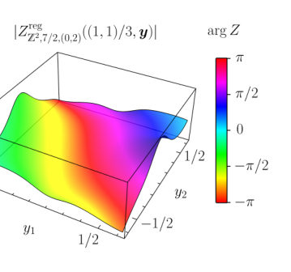 
Figure 1. Two-dimensional anisotropic Epstein zeta function (a) and its regularized counterpart (b) for ν = 7/2, Λ = Z2, x = (1, 1)/3 and α = (0, 2) as a function of y ∈[−1/2, 1/2]2, where the height of the surface encodes the absolute function val- ues and the color encodes the arguments of the complex function values according to the cyclic colormap shown on the right. The anisotropic Epstein zeta function exhibits discontinuities at wave vector points in the reciprocal lattice, in particular at the origin y = 0, where the absolute value of the function at the origin, approximately equal to 3.11, can be seen as a dark dot through the transparent surface (a). The regularized anisotropic...

📷 Fig 2

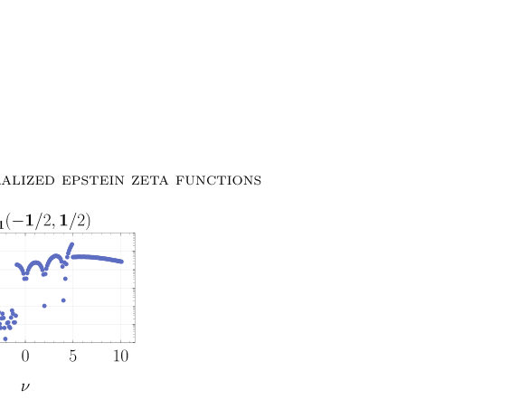 
Figure 2. Error for a special case of the eight-dimensional anisotropic Epstein zeta function for the square lattice Λ = Z8, x = −1/2, y = 1/2 and α = 1 as a function of −10 ≤ν ≤10, where it can be exactly represented by the Ramanujan tau L- function. We achieve machine precision with a maximum error E &lt; 3 · 10−14 overall and an error E &lt; 2 · 10−16 for ν &lt; 1.

📷 Fig 3

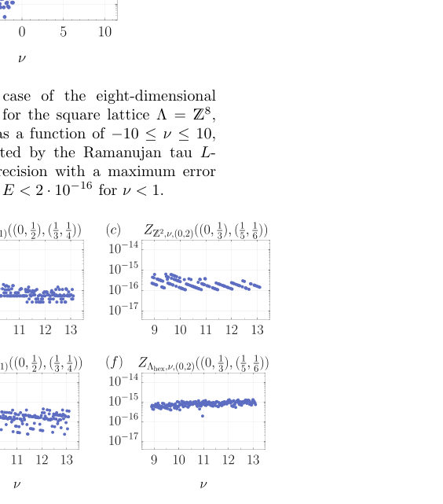 
Figure 3. Minimum of absolute and relative error of ZΛ,ν,α(x, y) for various values of x, y and second order derivatives α for the square lattice Λ = Z2 (a-c) and the hexagonal lattice Λ = Λhex (d- f) as a function of 9 ≤ν ≤13 where the direct sum gives accurate reference values. The error is flat and bounded by E &lt; 2 · 10−15.

📷 Fig 4

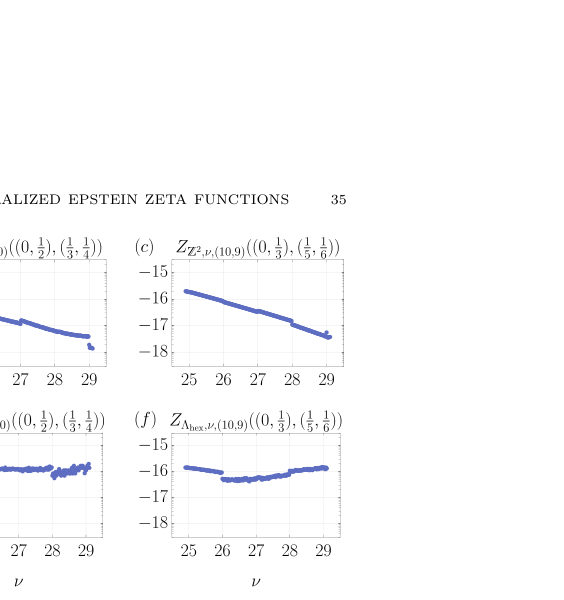 
Figure 4. Minimum of absolute and relative error of ZΛ,ν,α(x, y) for various values of x, y and high-order anisotropy α for the square lattice Λ = Z2 (a-c) and the hexagonal lattice Λ = Λhex (d-f) as a function of 25 ≤ν ≤29 where the direct sum gives accurate reference values. The error is flat and bounded by E &lt; 3 · 10−16.

📷 Fig 5

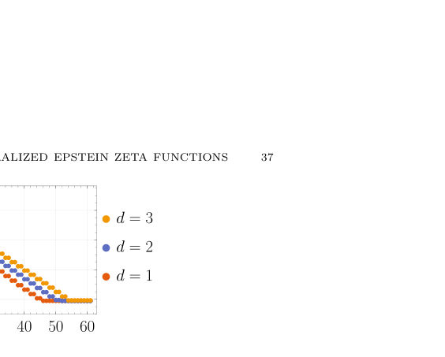 
Figure 6. Error of the regularized Epstein zeta func- tion Zreg Zd,1/2(0, y) reconstructed through its Taylor se- ries in terms of the anisotropic Epstein zeta function P

**Summary.** This work provides a rigorous mathematical and computational framework for evaluating anisotropic Epstein zeta functions, which are crucial for modeling long-range interactions in quantum and classical lattice systems. By developing stable algorithms, the authors overcome previous limitations in handling anisotropic kernels, providing tools for advanced simulations in condensed matter physics.

**Why it may be interesting.** While the focus is mathematical, the direct application to dipolar interactions in magnetic materials and lattice models with long-range interactions makes it highly relevant for condensed matter theorists studying correlated electron systems.

Detailed structure

**Main problem.** The paper addresses the fundamental computational challenge of precisely and efficiently evaluating large-scale lattice sums involving power-law kernels, especially in the anisotropic case.

**Main result.** The authors derive a stably computable representation for the anisotropic Epstein zeta function and develop a high-precision numerical algorithm for its evaluation across various lattice geometries and anisotropy orders.

**Method.** The methodology involves generalizing Epstein zeta functions, utilizing wave vector derivatives of lattice sums, and connecting the results to a generalized Euler-Maclaurin summation formula.

**Model / system.** The theory applies to simulating classical and quantum systems characterized by long-range, anisotropic interactions, such as dipolar interactions in magnetic materials or in the context of topological superconductivity.

**Key observables.** The anisotropic Epstein zeta function, its regularized form, and the coefficients derived from the singular Euler-Maclaurin expansion.

**Important parameters / regimes.** Lattice structure ($\Lambda$), power-law decay exponent ($
u$), and anisotropy order ($\alpha$).

**Assumptions / limitations.** The derivation relies on analytic continuation and the assumption that the function can be related to derivatives of theta functions and established identities.

**Paper structure.** The paper is structured analytically, first defining the problem and deriving the stable representations, followed by developing the computational algorithm, and concluding with applications and benchmarking.

Abstract

The precise and efficient evaluation of large-scale lattice sums involving power-law kernels is a fundamental computational problem in the simulation of classical and quantum systems with long-range interactions. While methods for spatially isotropic kernels, some based on Epstein zeta functions, have advanced considerably in recent years, the anisotropic case has lagged behind, despite its broad relevance to both fundamental and effective interactions such as the dipole interaction in magnetic materials. In this work, we solve this issue by defining and analyzing anisotropic Epstein zeta functions for which we derive stably computable representations obtained from wave vector derivatives of lattice sums over isotropic interaction kernels. These functions find direct application in the analytical and numerical study of anisotropically interacting lattice systems. Going further, they provide the correction term in an exact equivalence between discrete lattices and their continuous analogs in a recent generalization of the classical Euler-Maclaurin summation formula to lattices and summands involving power-law kernels. Their connection to high-order derivatives of zeta functions can be used to improve convergence rates of numerical algorithms, for instance in micromagnetics, or to provide rapidly convergent expansions suitable for precomputations of generalized zeta functions. We derive a stably computable representation of anisotropic Epstein zeta functions, including the possibility for analytically removing Rayleigh--Wood singularities, and we develop a numerical algorithm for their stable evaluation for any lattice, power-law decay exponent and anisotropy order. We benchmark the algorithm against closed-form identities, direct summation and multi-precision results, obtaining machine precision across various lattices, power-law exponents, and anisotropy orders.

[↑ back to top](#top)

### [Investigation of Widefield NV-Center Magnetic Imaging for Non-Destructive Materials Testing](http://arxiv.org/abs/2609.27097v1)

**Authors:** Niklas Mathesa, Marvin Feuerhelm, Simon Philipp, Ivan Soldatov, Philipp DÁstolfo, Peter Knittel, Thomas Straubb, Jan Jeske, Rüdiger Quay, Xavier Vidal  
**Type:** experiment · **Category:** other · **PDF:** <https://arxiv.org/pdf/2609.27097v1>  
**Analysis basis:** full PDF text, analyzed in chunks
**Topic relevance:** `QC/QI experiment` **3/5** · `quantum measurements` **2/5**

📷 Fig 1

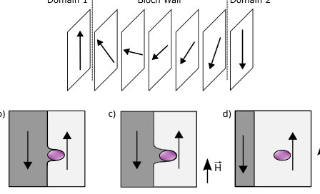 
Figure 1: a) Schematic illustration of a domain wall separating two oppositely magnetized domains. The wall involves a gradual rotation of the magnetization between the domains. The typical width of a Bloch wall in bulk ferromagnetic materials is in the order of several tens to hundred nanometers b,c) Sketch of domain wall pinning at a material defect (purple). Although further wall motion would reduce magnetic free energy, the defect locally increases the energy barrier and hinders movement. d) The pinning barrier can be overcome by applying a sufficiently strong external magnetic field.

📷 Fig 2

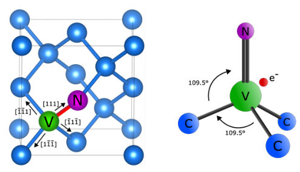 
Figure 2: The basic structure of the NV center in diamond consisting of a substitutional nitrogen atom and a vacancy (V) within a diamond lattice consisting of carbon atoms. For the NV−-center, an additional electron is trapped in the vacancy.

📷 Fig 3

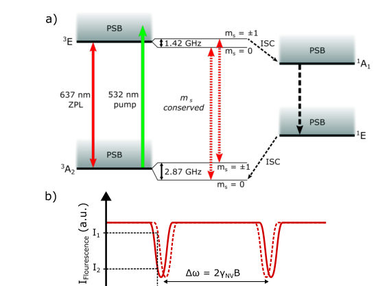 
Figure 3: a) Simplified Energy Diagram of the NV−-center. The left hand side shows the triplet states and right hand side the singlet states. The fluorescence zero phonon line (ZPL) wavelength is 637 nm, the spin state is conserved for the fluorescent transitions. Absorption of the 532 nm laser light results in an excitation of the electronic system from the ground state to the excited state. The transitions in most cases involve the phononic sideband (PSB). The zero field splitting of the 𝑚𝑠= 0 and 𝑚𝑠= ±1 spin ground states is 2.87 GHz (1.42 GHz for the excited state). An alternative inter system crossing (ISC) decay path via an excited singlet results in a spin dependency of the...

📷 Fig 4

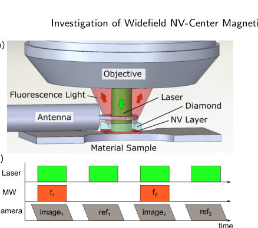 
Figure 4: a) Simplified sketch of the widefield magnetometry setup. The NV-layer located near the top surface of the diamond is illuminated from the bottom using a collimated 532 nm laser beam. The fluorescence light is collected by the objective and imaged onto a camera sensor. The dichroic mirror reflects the green laser light letting only the fluorescence light pass. The AOM is needed for pulsing the laser, the image data is captured by a camera sensor. The presented graphic contains components from [49]. b) Scheme of the used cw- ODMR protocol. The microwave frequency is swept and an additional reference image is captured for each frequency step. The angled sides of the camera frames...

📷 Fig 5

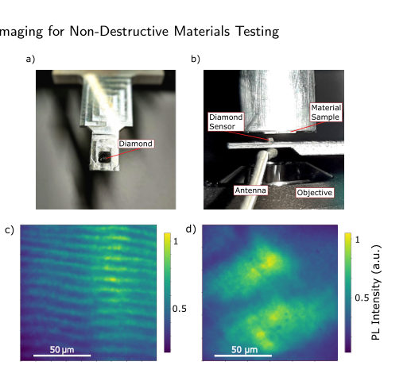 
Figure 5: Photograph of a) the diamond sensor fixed on a cus- tom holder without sample and b) the diamond brought close to a material sample glued on an aluminum rod (side view). Both diamond and sample can be positioned individually, the diamond position angles can also be altered for alignment optimization. Interference pattern formed between diamond and sample surface during alignment c) far from optimum alignment and d) after alignment optimization.

**Summary.** This research presents a novel, widefield quantum sensing technique using NV centers in diamond to image magnetic stray fields for non-destructive testing. By achieving high spatial resolution and sensitivity, the method can detect subtle magnetic signatures associated with early-stage material fatigue and microstructural damage. This advances the application of quantum sensing from fundamental physics into practical materials engineering.

**Why it may be interesting.** This work demonstrates a direct, applied use of quantum sensing (NV centers) to solve a complex condensed matter problem (material failure analysis), bridging quantum physics with industrial materials science.

Detailed structure

**Main problem.** The paper addresses the need for non-destructive testing (NDT) techniques capable of imaging microstructural changes in miniaturized materials, particularly those related to fatigue damage.

**Main result.** A widefield NV-center magnetic imaging technique was developed, achieving high sensitivity and spatial resolution to detect characteristic magnetic stray field changes indicative of early fatigue damage in materials like electrical steel.

**Method.** The authors developed and applied an experimental system using Nitrogen-Vacancy (NV) centers in diamond to image magnetic stray field distributions over macroscopic areas.

**Model / system.** The physical system is the NV center in diamond, which acts as a quantum sensor whose spin state is sensitive to the local magnetic field ($\vec{B}$). The measurement relies on mapping the magnetic stray field distribution, which is influenced by the material's magnetic microstructure and defects.

**Key observables.** Magnetic stray field distribution, Zeeman splitting maps, and characteristic changes in the magnetic field pattern after cyclic loading.

**Important parameters / regimes.** Magnetic sensitivities below $10 \mu	ext{T}/\sqrt{	ext{Hz}}$ and a spatial resolution of $1-2 \mu	ext{m}$.

**Assumptions / limitations.** The technique assumes that material fatigue alters the magnetic microstructure (e.g., domain wall pinning) in a way that produces a measurable, localized change in the stray magnetic field.

**Figures summary.** Figures illustrate the physics of domain wall separation and pinning at defects, and the general setup for widefield sensing.

**Paper structure.** The paper establishes the problem (NDT for small scales), introduces the quantum sensor (NV center), details the widefield experimental setup and achieved metrics, and demonstrates the application by detecting fatigue-related magnetic changes in test samples.

Abstract

Due to progressing miniaturization, material fatigue is expected to gain importance on microscopic scales. Nevertheless, most non-destructive testing techniques are optimized for macroscopic scales. Therefore, new approaches applicable to miniaturized samples need to be explored. High spatial resolution imaging of a material's magnetic stray field enables sensitive detection of microstructural changes due to the local interplay of magnetic properties, strain, and defects. Up to now, this approach has rarely been used for materials testing since high-resolution magnetic sensing is traditionally challenging. Novel quantum sensing techniques offer the potential to close this gap. One of the most prominent quantum sensors, the nitrogen vacancy center in diamond, is investigated for non-destructive testing applications within the scope of this work. An experimental system based on a widefield sensing approach was developed to image magnetic stray field distributions within seconds to minutes over areas up to 1 x 1 $mm^2$. Magnetic sensitivities below 10 $μ$T/$\sqrt{\text{Hz}}$ and a spatial resolution of 1-2 $μ$m were achieved. The technique offers high mechanical stability, which is crucial for non-destructive testing applications. Comparison with magneto-optical Kerr effect measurements showed that the magnetic field maps are strongly correlated with the material's surface domains while containing additional information from deeper inside the sample. Characteristic changes in the magnetic stray field distribution were detected in an electrical steel sample after cyclic loading. A potential marker for early fatigue damage was deduced from the splitting gradient distribution, while 2D Fourier transform analysis provided additional insight.

[↑ back to top](#top)

### [Quantum Metrology for Signals with an Unknown Causal Structure](http://arxiv.org/abs/2609.28066v1)

**Authors:** Gwon Ryul Han, Hyukgun Kwon, Seok Hyung Lie  
**Type:** theory · **Category:** other · **PDF:** <https://arxiv.org/pdf/2609.28066v1>  
**Analysis basis:** full PDF text, analyzed in chunks
**Topic relevance:** `quantum measurements` **3/5** · `interference shaping light` **2/5**

📷 Fig 1

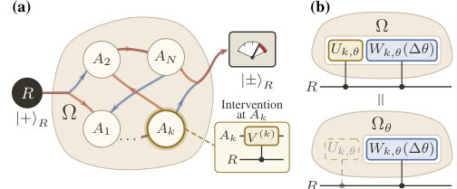 
FIG. 1. (a) Causally agnostic interferometry. A reference system R prepared in |+⟩R probes events in spacetime state Ωthrough local interventions V (k) Ak controlled on |1⟩R, followed by measurement in |±⟩R. The same local probing prescription applies without specify- ing an encounter order. (b) Absorbing all fixed local signals Uk,θ into Ωθ = UθΩleaves only the deviations Wk,θ(∆θ) around θ as nominal interventions. The fixed signals act only on arm |1⟩R, so Ωθ can be irregular.

**Summary.** This theoretical paper develops a framework for quantum metrology when the causal structure of the interacting signals is unknown. It proves that the measurement must be interferometric and establishes a universal spacetime Heisenberg limit for the achievable precision. This result is significant because it provides an order-independent bound for sensing parameters in complex physical systems like radar or scattering experiments.

**Why it may be interesting.** This work provides a powerful, order-independent generalization of quantum metrology bounds, which is crucial for interpreting data from complex, non-sequential physical measurements where causality cannot be assumed.

Detailed structure

**Main problem.** The paper addresses quantum metrology for signals where the causal structure (the order and timing of interactions) is unknown beforehand, a scenario common in experiments like radar or scattering.

**Main result.** The authors derive a universal upper bound, the spacetime Heisenberg limit, for the Fisher information that is independent of the unknown event ordering, demonstrating that causal agnosticity forces the measurement scheme to be interferometric.

**Method.** The analysis utilizes the 'quantum state over spacetime' formalism ($\Omega$) and derives bounds on the Fisher information by analyzing interference terms associated with local unitary interactions.

**Model / system.** The model involves quantum sensing using interferometry, described by a spacetime state $\Omega$ acting on multiple discrete events $A_k$. The formalism generalizes density operators to arbitrary spacetime regions to handle unknown causal structures.

**Key observables.** Fisher information ($F_	heta$), Interference Term ($I_\Omega$), Spacetime Heisenberg Limit ($\mathcal{F}_	heta$), and the shared reference system coherence.

**Important parameters / regimes.** The number of sensing events ($N$), the signal parameter ($	heta$), and the local generator norms ($\|h_{k,	heta}\|_\infty$).

**Assumptions / limitations.** The analysis is based on the assumption of causal agnosticity, meaning the measurement protocol must work regardless of the true causal ordering of the signals.

**Figures summary.** Figure 1 illustrates the general setup for causally agnostic interferometry and probing spacetime states using local interventions.

**Paper structure.** The paper builds from establishing that causal agnosticity mandates an interferometric measurement scheme, deriving the universal bound (spacetime Heisenberg limit), and then analyzing saturation conditions using both general spacetime states and specific cases like classical mixtures or fixed causal orders.

Abstract

Quantum sensing protocols usually presuppose where and when each signal acts, yet this information is unavailable beforehand in experiments such as scattering and radar. We show that causal agnosticity forces a measurement scheme to be interferometric even when only discrete interactions are allowed. Describing the sensing events in the recently developed quantum state over spacetime formalism, we then prove that the Fisher information of an interferometer is bounded by the squared sum of the local generator norms, independently of how the events are ordered. Nonunitary and spatiotemporally correlated signals can be explained as well when their physical dilation has a spacetime state on the enlarged events. Notably, the bound holds without presupposing a background spacetime that orders the events whenever the full collection of target and auxiliary events has a spacetime state. We show that this bound yields the spacetime Heisenberg limit and characterize its saturation through marginals of the spacetime state `dressed' by the signal. The $N^2$ scaling of the Fisher information with $N$ sensing events arises from the coherence of a single reference system shared across spacetime, whereas independently repeated interferometry obeys the standard quantum limit.

[↑ back to top](#top)

### [Robust Strange Metallicity across Attractive and Repulsive Hubbard Models](http://arxiv.org/abs/2609.26971v1)

**Authors:** Xiaoyue Ma, Emily Z. Zhang, Thomas P. Devereaux  
**Type:** theory · **Category:** strongly correlated electrons · **PDF:** <https://arxiv.org/pdf/2609.26971v1>  
**Analysis basis:** full PDF text, analyzed in chunks
**Topic relevance:** `analog quantum simulation` **3/5** · `Keldysh / 2PI / non-Gaussian methods` **1/5** · `non-equilibrium universality` **1/5**

📷 Fig 1

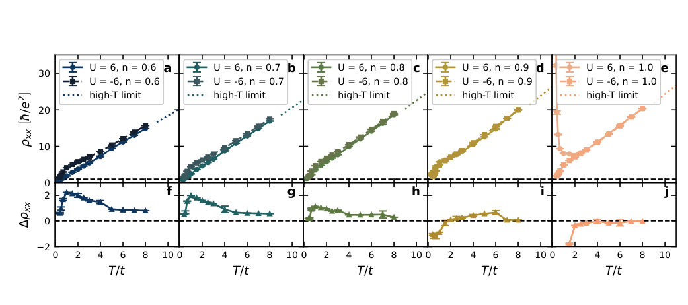 
FIG. 1. a–e Temperature dependence of the dc resistivity ρxx in the attractive and repulsive Hubbard models, obtained from DQMC simulations combined with MaxEnt analytic continuation. The model parameters are |U|/t = 6. The black dashed line marks the MIR limit, ρxx = ℏ/e2, while the dotted lines show the high-temperature asymptotes obtained from the moments expansion. f–j Corresponding resistivity difference between the attractive and repulsive models, defined as ∆ρxx (|U| , n) ≡ρxx(U &lt; 0, n) −ρxx(U &gt; 0, n).

📷 Fig 2

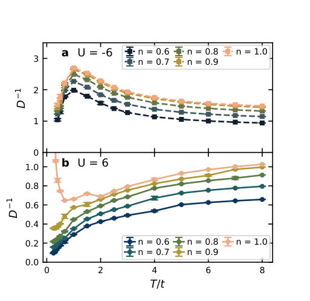 
FIG. 3. Inverse charge diffusivity D−1 of a the attractive Hubbard model, and b the repulsive Hubbard model, as func- tions of temperature T = 1/β, obtained through DQMC sim- ulations, with | U | /t = 6.

📷 Fig 3

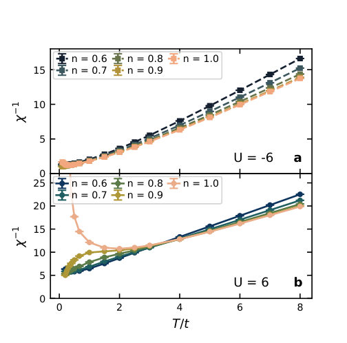 
FIG. 2. Inverse charge compressibility χ−1 of a the attrac- tive Hubbard model, and b the repulsive Hubbard model, as functions of temperature T = 1/β, obtained through DQMC simulations, with | U | /t = 6.

📷 Fig 4

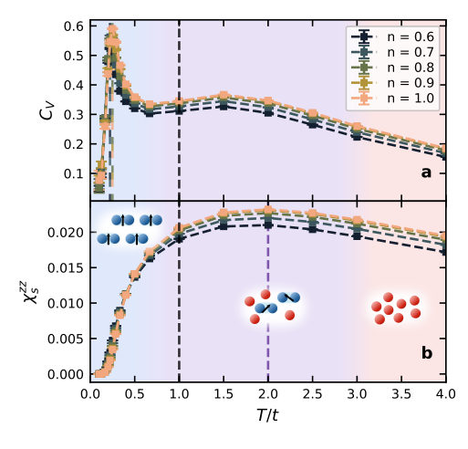 
FIG. 4. Temperature scales associated with pair formation in the attractive Hubbard model. a Specific heat CV , and b uniform spin susceptibility χzz s as functions of tempera- ture T = 1/β, calculated using DQMC for U/t = −6 at the indicated fillings. The black vertical dashed line marks the temperature at which the inverse diffusivity D−1 reaches its maximum. The purple vertical dashed line in b indicates the peak temperature of χzz s . In a, the colored vertical dashed lines mark the low-temperature peaks in CV , with each color corresponding to the filling ⟨n⟩of the associated data.

**Summary.** This work uses DQMC simulations to compare charge transport in attractive and repulsive Hubbard models at strong coupling. The authors find that both models exhibit strange-metal behavior ($
ho \propto T$) over a wide temperature range, suggesting this linear resistivity is a generic feature of incoherent transport rather than being dictated by the system's ultimate low-temperature state. The distinction between the two models only becomes apparent at much lower temperatures.

**Why it may be interesting.** The finding that transport linearity is robust across different low-energy correlation types suggests a universal transport constraint in the incoherent regime, which is a general concept applicable to many-body dynamics.

Detailed structure

**Main problem.** The study investigates the origin of 'strange metallicity,' characterized by linear-in-temperature resistivity, in strongly correlated electron systems.

**Main result.** The linear-in-temperature resistivity observed in both attractive and repulsive Hubbard models is robust and appears insensitive to the microscopic nature of the low-energy correlations.

**Method.** The research employs Determinant Quantum Monte Carlo (DQMC) simulations combined with the Maximum Entropy (MaxEnt) method for analytic continuation of current-current correlators.

**Model / system.** The system is the two-dimensional Hubbard model, analyzed in both attractive ($U<0$) and repulsive ($U>0$) regimes at strong coupling ($|U|/t=6$).

**Key observables.** DC longitudinal resistivity ($
ho_{xx}$), charge compressibility ($\chi_c$), and charge diffusivity ($D$).

**Important parameters / regimes.** Strong coupling regime ($|U|/t=6$), temperature dependence across intermediate and high-temperature regimes, and comparison between $U<0$ and $U>0$.

**Assumptions / limitations.** The analysis relies on the Nernst–Einstein relation connecting resistivity to compressibility and diffusivity, and the high-temperature behavior is analyzed via moment expansion.

**Figures summary.** Figures illustrate the temperature dependence of resistivity ($
ho_{xx}$) for both interaction signs, showing the common linear-T behavior, and also plot the temperature dependence of $\chi^{-1}$ and $D^{-1}$ separately.

**Paper structure.** The paper compares transport properties in the attractive and repulsive Hubbard models across various temperatures, establishing the common linear-T resistivity in the incoherent regime, and then analyzing the low-temperature deviations where the models separate.

Abstract

Using determinant quantum Monte Carlo simulations, we compare charge transport in the two-dimensional attractive and repulsive Hubbard models at strong coupling, $|U|/t=6$. Although the interaction with opposite signs generates qualitatively different low-energy spin, charge, and pairing correlations, both exhibit approximately linear-in-temperature resistivity over a broad intermediate- and high-temperature regime. At asymptotically high temperature this common behavior follows from the moment expansion of the conductivity, whose leading contribution is even in $U$. More strikingly, the similarity persists to temperatures well below $|U|$, where strong interaction-dependent correlations have already developed, and also irrespective of whether resistivity crosses the MIR limit. Using the Nernst--Einstein relation, we find that the common linear-in-temperature resistivity is primarily associated with an approximately Curie-like charge compressibility and weakly temperature-dependent diffusivity. The two models separate only at lower temperatures, where the attractive model develops a pronounced feature in the charge diffusivity correlated with signatures of pair formation. These results show that linear-in-temperature incoherent transport in the Hubbard model can be remarkably insensitive to the microscopic nature of the low-energy correlations. Our results suggest that transport in the incoherent regime appears insensitive to what the system will ultimately become at low temperature; the distinction between competing low-energy states becomes visible only when their characteristic correlations acquire sufficiently long spatial or temporal coherence.

[↑ back to top](#top)

### [The winner's curse in hardware VQE: drift-differenced remeasurement of finite-shot selection bias](http://arxiv.org/abs/2609.27704v1)

**Authors:** Julen Larrucea  
**Type:** experiment · **Category:** quantum information and computing · **PDF:** <https://arxiv.org/pdf/2609.27704v1>  
**Analysis basis:** full PDF text, analyzed in chunks
**Topic relevance:** `QC/QI experiment` **3/5** · `quantum measurements` **2/5**

📷 Fig 1

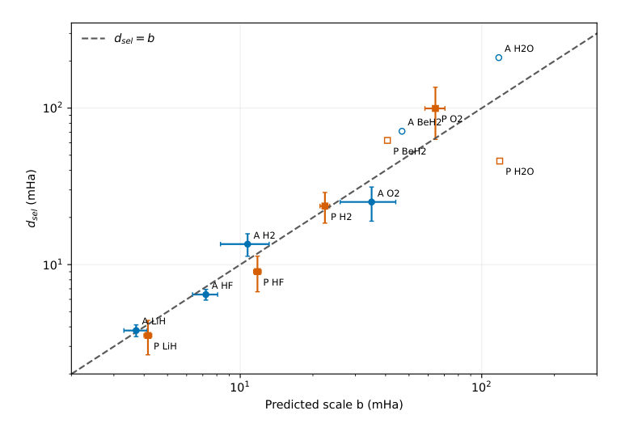 
Figure 1: Drift-differenced contrast against the Gaussian order-statistic scale based on each source run’s archived evaluation count and later fixed-parameter scatter. Labels identify molecule and backend (A/P); bars show descriptive source-record SEMs in both coordinates where replicated, without accounting for cross-cell session dependence. Single-source stress cells are open symbols without bars. The dashed identity line is the parameter-free prediction; Blom’s approximation defines the expected minimum coefficient [25].

📷 Fig 2

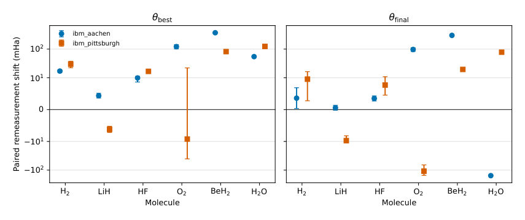 
Figure 2: Change in active-space energy when θbest (left) and θfinal (right) are remeasured independently without mitigation. Markers show mean paired shifts; error bars are ±1 source- record SEM and are omitted for the single-source BeH2 and H2O stress tests. The symmetric- logarithmic ordinate preserves the small core effects while displaying the full interval from the Pittsburgh O2 lower bar below −150 mHa to the Aachen BeH2 shift of +373 mHa. Positive values indicate a higher remeasured energy.

📷 Fig 3

 
Figure 1 summarizes the drift-differenced scale comparison; Table 3 and Figure 2 show molecule- and backend-dependent remeasurement. On ibm pittsburgh, H2 and HF shift up- ward by 29.9 and 16.7 mHa, LiH shifts downward by 6.2 mHa, and O2 is unresolved. On ibm aachen, H2, LiH, and HF shift upward by 17.1, 4.4, and 9.9 mHa; all three survive Holm

📷 Fig 4

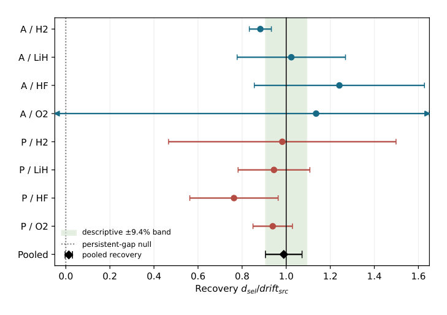 
Figure 3: Recovery for the eight replicated cells. Markers use the same ratio-of-means estimator as Table 4. Cell bars are approximate delta-method intervals with a tn−1 critical value; arrows mark truncated intervals. The pooled diamond uses the cell-balanced session-cluster interval. Shading is the retrospective ±9.4% containment band, not a prespecified equivalence margin. A/P denote Aachen/Pittsburgh.

**Summary.** This paper investigates the reliability of Variational Quantum Eigensolver (VQE) results obtained on current quantum hardware by analyzing finite-shot selection bias. Using drift-differenced remeasurement, the authors demonstrate that the apparent accuracy gains from optimization are often artifacts of the measurement process. They conclude that hardware-reported best-case energies must be treated with caution and require rigorous, independent validation.

**Why it may be interesting.** This work directly tackles the practical limitations of near-term quantum hardware for quantum chemistry, providing crucial diagnostics on how measurement noise and optimization procedures can mislead users into overestimating computational accuracy.

Detailed structure

**Main problem.** The paper addresses the 'winner's curse' in hardware Variational Quantum Eigensolver (VQE) calculations, where finite-shot optimization can lead to artificially accurate energy estimates.

**Main result.** Independent evaluation using drift-differenced remeasurement showed that most of the apparent advantage gained by the optimizer disappears, suggesting that accuracy claims based on best-observed hardware VQE values require independent verification.

**Method.** The authors use a drift-differenced estimator to compare later remeasurements of optimized parameters against the initial best-observed values, effectively canceling common epoch shifts to quantify selection bias.

**Model / system.** The study benchmarks molecular ground-state energies for six molecules ($	ext{H}_2$, $	ext{LiH}$, $	ext{HF}$, $	ext{O}_2$, $	ext{BeH}_2$, $	ext{H}_2	ext{O}$) using active-space Hamiltonians.

**Key observables.** Signed best error (relative to exact active-space eigenvalue), primary recovery estimate (e.g., 0.989), and energy shifts ($	ext{dsel}$) between measurement epochs.

**Important parameters / regimes.** The analysis is performed on two IBM Heron processors, utilizing fixed active-space Hamiltonians and varying shot counts.

**Assumptions / limitations.** Accuracy claims based on best-observed hardware VQE values require independent checking, and the benchmark primarily tests estimator reproducibility rather than absolute chemical accuracy.

**Figures summary.** The figures summarize hardware optimization traces showing signed errors, and tables detail the calculated energy shifts ($	ext{dsel}$ and $	ext{dsel}/	ext{b}$) across different molecules and backends.

**Paper structure.** The paper systematically benchmarks VQE performance across multiple molecules on two hardware backends, focusing on quantifying systematic energy shifts ($	ext{dsel}$) using drift-differenced analysis to correct for finite-shot selection bias.

Abstract

Finite-shot optimization can make noisy variational quantum eigensolver energies look artificially accurate. We studied six molecules on two IBM Heron r3 processors in eight replicated cells. Seven optimizer-selected values fell below the exact active-space eigenvalue by up to mHa. Independent later evaluation of the selected and final parameter points, differenced to remove a common epoch shift, showed that most of the selected advantage disappeared: the primary recovery was (approximate 95% session-level interval). Across the reported aggregation choices, recovery estimates ranged from 0.892 to 0.989. The measured contrast was consistent in scale with finite-shot selection, while calibration drift and other sources of variation remain possible. Accuracy claims based on best-observed hardware VQE values therefore require an independent check.

[↑ back to top](#top)

### [Near-Optimal Bell Nonlocality with GKP and Entangled Cat States](http://arxiv.org/abs/2609.27640v1)

**Authors:** Özlem Erkılıç, Aritra Das, S. Nibedita Swain, Simon Devitt, Timothy C. Ralph  
**Type:** theory · **Category:** quantum information and computing · **PDF:** <https://arxiv.org/pdf/2609.27640v1>  
**Analysis basis:** full PDF text, analyzed in chunks
**Topic relevance:** `quantum measurements` **3/5** · `quantum optics experiment` **1/5**

📷 Fig 1

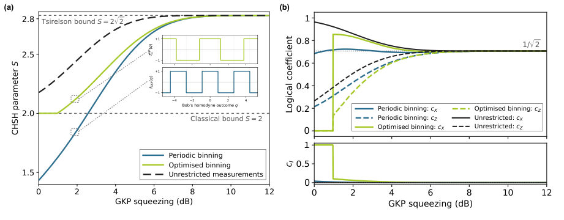 
FIG. 1. Measurement-constrained Bell nonlocality of finite-energy GKP Bell states. (a) Maximum CHSH parameter as a function of GKP squeezing for periodic GKP binning, optimised homodyne binning, and unrestricted dichotomic measurements (Refer to Appendix C for the simulation parameters). The horizontal lines indicate the classical bound S = 2 and the Tsirelson bound S = 2 √

📷 Fig 2

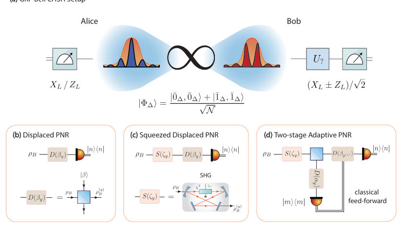 
FIG. 2. GKP Bell-test setup and photon-number-resolving receiver architectures. (a) Alice and Bob share the logical GKP Bell state |Φ∆⟩. Alice measures either XL or ZL, while the optimal CHSH measurements for Bob correspond to the tilted logical observables (XL ± ZL)/ √

📷 Fig 3

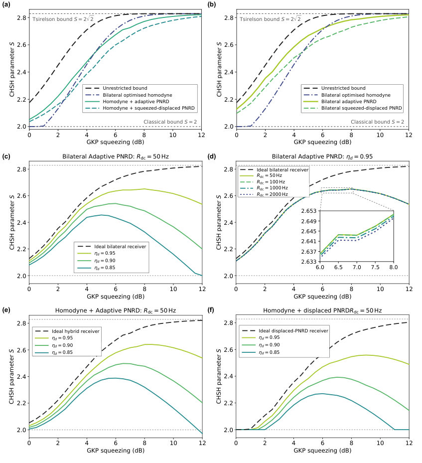 
FIG. 3. Physical measurement strategies and detector-noise robustness for finite-energy GKP Bell states. (a) The unrestricted dichotomic benchmark, bilateral optimised homodyne detection, and homodyne detection for Alice combined with either adap- tive PNRD or squeezed-displaced PNRD for Bob. (b) The unrestricted benchmark, bilateral optimised homodyne detection, bilateral adaptive PNRD, and bilateral squeezed-displaced PNRD without a tapped mode. In the adaptive receiver, the first PNR outcome selects the second displacement according to m = 0 or m ≥1. Panels (c)–(f) include detector imperfections. (c) Bilateral adaptive PNRD for ηd = 0.95, 0.90, and 0.85 at Rdc = 50 Hz. (d) Dark-count...

📷 Fig 4

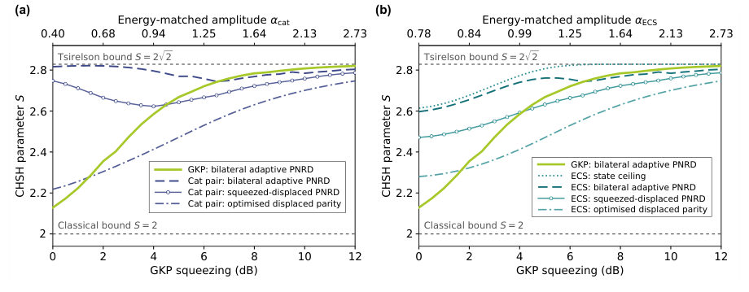 
FIG. 4. Energy-matched comparison of the finite-energy GKP Bell state with coherent-state Bell resources. Panel (a) shows the cat-code Bell pair and panel (b) the entangled coherent state (ECS), each compared with the bilateral adaptive-PNRD result for the GKP Bell state. At each value of GKP squeezing, the mean photon number per mode is matched across the three state families, with the corresponding cat-state and ECS amplitudes shown on the upper axes. The yellow-green curve shows the bilateral adaptive-PNRD result for the GKP Bell state. Blue curves in (a) and teal curves in (b) correspond to the cat-code Bell pair and ECS, respectively. For each coherent-state family, the dashed curve...

📷 Fig 5

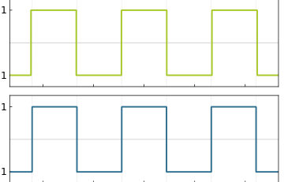 
FIG. 5. Homodyne binning functions underlying Fig. 1(a) at 10 dB of GKP squeezing. The upper panel shows Bob’s optimised binary filter f opt 0 (q) for the y = 0 CHSH setting, obtained from the joint optimisation of Alice’s and Bob’s ho- modyne binning functions. The lower panel shows the stan- dard periodic GKP binning function fGKP(q). The vertical dotted lines indicate the periodic GKP bin boundaries. At this squeezing level, the optimised filter has converged to the periodic assignment over the displayed range, consistent with the near coincidence of the two CHSH curves in Fig. 1(a).

**Summary.** This work investigates how to demonstrate Bell nonlocality using GKP states, which are key for fault-tolerant quantum computing but are limited by current squeezing technology. The authors show that by employing non-Gaussian measurements, specifically photon-number-resolving detection, they can achieve high Bell violations without needing complex quantum gates. This identifies non-Gaussian measurement techniques as a practical tool for characterizing nonlocality in realistic bosonic systems.

**Why it may be interesting.** It provides a concrete, experimentally relevant pathway to testing fundamental quantum properties (nonlocality) in resource-constrained quantum systems (finite-squeezing GKP states), bridging theory with near-term quantum optics capabilities.

Detailed structure

**Main problem.** The paper addresses the challenge of realizing quantum information tasks, specifically Bell nonlocality, using finite-squeezing Gottesman-Kitaev-Preskill (GKP) states, given current experimental limitations.

**Main result.** The authors demonstrate that non-Gaussian measurements, such as photon-number-resolving detection combined with Gaussian preprocessing, can reveal significant Bell nonlocality in finite-energy bosonic states without requiring complex logical non-Clifford gates.

**Method.** The study involves calculating the CHSH Bell inequality violation ($S$) for GKP Bell states under various measurement constraints (periodic vs. optimized homodyne binning) and comparing these to the theoretical maximum.

**Model / system.** The system under study is the GKP state, a bosonic encoding used for fault-tolerant quantum computing. The analysis models the state using finite-energy approximations and tests its nonlocality using continuous-variable measurements.

**Key observables.** CHSH violation parameter ($S$), squeezing parameter ($\Delta$), and the effective logical measurement directions.

**Important parameters / regimes.** Squeezing parameter ($\Delta$), detection efficiency ($\eta_d$), and electronic noise ($\epsilon_{el}$).

**Assumptions / limitations.** The analysis assumes the ability to perform photon-number-resolving detection and models noise sources like detection inefficiency and electronic noise in the measurement apparatus.

**Figures summary.** Figures compare the CHSH violation ($S$) versus GKP squeezing for different measurement strategies (periodic, optimized, unrestricted), showing the improvement gained by adaptive measurement techniques.

**Paper structure.** The paper progresses by first establishing the theoretical limitations of ideal GKP states, then rigorously comparing the CHSH violation achievable through standard homodyne detection versus optimized, non-Gaussian measurement schemes. It concludes by extending the measurement principle's utility to other bosonic states.

Abstract

Gottesman-Kitaev-Preskill (GKP) states are widely studied as a bosonic encoding for fault-tolerant quantum computing because small displacement errors can be identified and corrected through syndrome measurements. However, fault-tolerant operation requires substantially greater GKP squeezing than is currently available in optical platforms. It is therefore important to identify quantum-information tasks that can be realised with finite-squeezing GKP states. Here, we study Bell nonlocality in finite-energy GKP Bell states under experimentally motivated measurement constraints. Although finite-energy GKP Bell states support Bell nonlocality even at low squeezing, logical Pauli measurements alone cannot reveal it. Accessing the maximum CHSH violation supported by the state generally requires logical non-Clifford rotations. We instead show that the required non-Gaussian resource can reside in the measurement itself. Photon-number-resolving detection combined with Gaussian preprocessing and adaptive feed-forward closely approaches the maximum violation of the CHSH Bell inequality without implementing logical non-Clifford gates. The same measurement principle strongly enhances Bell violations for cat-code Bell pairs and entangled coherent states, demonstrating that its usefulness extends beyond the GKP lattice. Our results identify non-Gaussian measurements as a practical route to revealing Bell nonlocality in finite-energy bosonic states.

[↑ back to top](#top)

### [On Relationship Between Circuit Depth and Trainability of VQAs](http://arxiv.org/abs/2609.27488v1)

**Authors:** Jan Michálek, Martin Friák, Petr Vašík  
**Type:** theory · **Category:** quantum information and computing · **PDF:** <https://arxiv.org/pdf/2609.27488v1>  
**Analysis basis:** full PDF text, analyzed in chunks
**Topic relevance:** `analog quantum simulation` **3/5** · `Keldysh / 2PI / non-Gaussian methods` **1/5**

📷 Fig 1

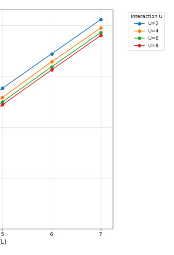 
Figure 1: Exponential scaling of the degrees of freedom parameter 𝑚with respect to the system size for the Fermi-Hubbard model for varying interaction strengths 𝑈, with the hopping amplitude fixed at 𝑡= 1 .

📷 Fig 2

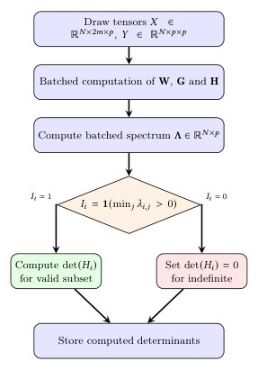 
Figure 2: Comparison of sampling workflows for estimating the conditioned Hessian determinant. The traditional sequential loop (a) introduces multiple loops, whereas the proposed tensor approach (b) does everything in one operation.

📷 Fig 3

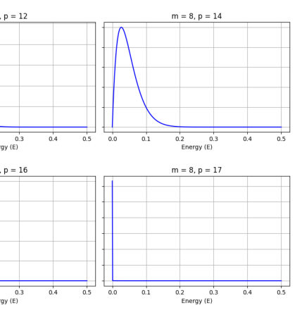 
Figure 3: Theoretical transition in the distribution of local minima across the energy domain. Two distinct regimes can be observed. Note that the 𝑦-axis scales vary across subfigures to best highlight the behavioural change of the local minima.

📷 Fig 4

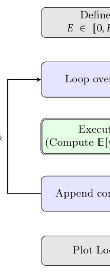 
Figure 4: Global simulation workflow illustrating the energy domain discretisation, iterative grid evaluation via batched sampling, and final density curve reconstruction.

📷 Fig 5

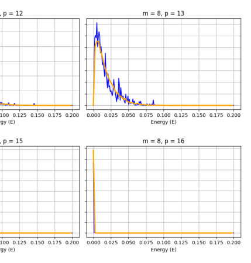 
Figure 5: Expected local minima count for the 𝑚= 8 toy model. The plot illustrates both the phase transition across the critical threshold (𝑝= 14) and the rare-event sampling variance. The blue curves represent a lower sample size (𝑁= 1000), exhibiting severe stochastic noise, while the orange curves (𝑁= 100, 000) converge to a stable distribution.

**Summary.** This work theoretically analyzes the trainability of Variational Quantum Algorithms by mapping their loss landscapes to Wishart Hypertoroidal Random Fields. Using the Kac-Rice formula, the authors predict a phase transition governing whether local minima approximate the global minimum. The key finding is that symmetry reduction can artificially lower the effective complexity, enabling the theoretical study of larger quantum systems.

**Why it may be interesting.** It provides a rigorous mathematical framework (random field theory) to predict when and how VQAs will fail or succeed in finding ground states, which is crucial for designing practical quantum algorithms.

Detailed structure

**Main problem.** The paper analyzes the training efficiency (trainability) of Variational Quantum Algorithms (VQAs) by studying the geometry of their loss landscapes.

**Main result.** A phase transition exists in the local minima distribution, where local minima concentrate near the global minimum when the overparameterization factor exceeds a critical threshold.

**Method.** The VQA loss landscape is mapped to a Wishart Hypertoroidal Random Field (WHRF), and the distribution of critical points is analyzed using a reformulated Kac-Rice formula.

**Model / system.** The analysis uses the Fermi-Hubbard model Hamiltonian, which is mapped onto a VQA cost function $E(	heta)$. The complexity is analyzed on the hypertorus $\mathbb{T}^p$.

**Key observables.** Expected number of critical points ($\mathbb{E}[	ext{Crit}]$), the overparameterization factor ($\gamma$), and the degrees of freedom ($m$).

**Important parameters / regimes.** The ratio between the problem Hamiltonian degrees of freedom and the number of independent VQA parameters ($p$).

**Assumptions / limitations.** The mapping to WHRFs is a statistical model, and the analysis relies on the Kac-Rice formula, which assumes the function is a Morse function.

**Figures summary.** Figure 1 shows the exponential scaling of the degrees of freedom parameter $m$ with system size for the Fermi-Hubbard model.

**Paper structure.** The paper first establishes the connection between VQA trainability and random field theory, then develops the WHRF framework using the Kac-Rice formula, and finally simulates the phase transition using the Fermi-Hubbard model, proposing symmetry reduction techniques to mitigate exponential scaling.

Abstract

The training efficiency of Variational Quantum Algorithms (VQAs) is dictated by the geometry of their loss landscapes, which can be formally analysed by mapping these functions to random fields on manifolds. Instead of VQAs, we can then directly study the corresponding random fields, in our case, the Wishart Hypertoroidal Random Fields (WHRFs). We are mostly interested in the distribution of critical points (especially local minima) of WHRFs. For this purpose, the Kac-Rice formula is presented, reformulated, and simulated. The findings identify a phase transition in the distribution of local minima. Beyond a specific threshold, local minima concentrate near the global minimum in function value, meaning that even local minima are good approximators of the global one. The threshold is governed by the ratio between the problem Hamiltonian degrees of freedom and by the number of independent parameters in the VQA. Since the degrees of freedom parameter scales exponentially, we propose symmetry reduction operations to lower the degrees of freedom. This mathematically reduces the dimension, scaling down the required parameter threshold and enabling to solve bigger problems.

[↑ back to top](#top)

### [Spin Configurations of Anyonic excitations in Moiré Fractional Chern Insulators](http://arxiv.org/abs/2609.26991v1)

**Authors:** Vadym Apalkov, Tapash Chakraborty  
**Type:** theory · **Category:** strongly correlated electrons · **PDF:** <https://arxiv.org/pdf/2609.26991v1>  
**Analysis basis:** full PDF text, analyzed in chunks
**Topic relevance:** `analog quantum simulation` **3/5** · `quantum measurements` **1/5**

📷 Fig 1

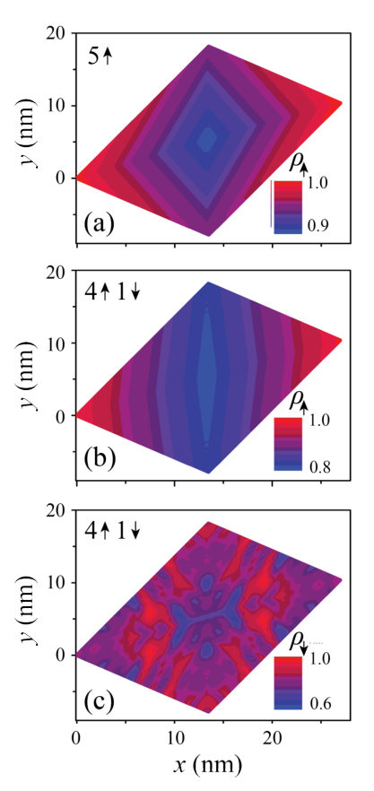 
FIG. 1. Electron density for a 1

📷 Fig 2

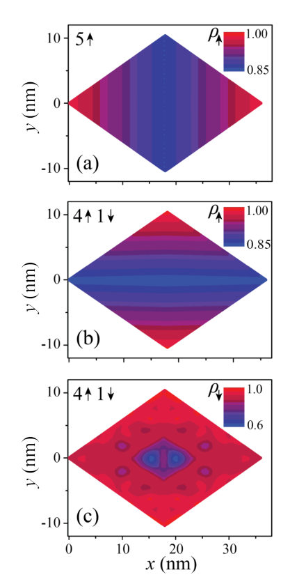 
FIG. 2. Electron density for a 1

📷 Fig 3

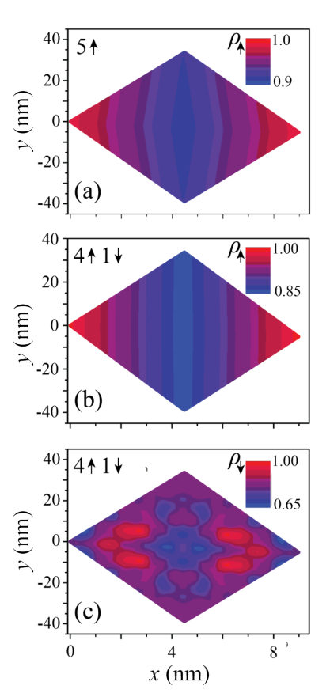 
FIG. 3. Electron density for a 1

**Summary.** This theoretical work examines how coupling a fractional Chern insulator in a moiré bilayer to a quantum dot affects its elementary excitations. The authors find that the coupling drives the system towards a spin-unpolarized state, characterized by distinct charge localization patterns in the spin-up versus spin-down components. This work advances the understanding of topological phases in engineered solid-state systems.

**Why it may be interesting.** The study bridges concepts from strongly correlated electron physics (FQHE, FCI) with localized quantum structures (QDs), providing insights into how local perturbations can fundamentally alter global topological states.

Detailed structure

**Main problem.** The study investigates the nature and spin polarization of elementary excitations (quasiparticles and quasiholes) within a zero-field fractional Chern insulator (FCI).

**Main result.** The coupling of the FCI to a quantum dot modifies the excitation spectrum, leading to spin-unpolarized low-energy excitations, particularly for the quasiparticles.

**Method.** The analysis employs a finite-size approach using exact diagonalization on a torus, calculating charge densities and energy gaps for various excitation configurations.

**Model / system.** The system models a twisted bilayer MoTe2 forming a moiré pattern, which acts as a fractional Chern insulator ($
u=1/3$) coupled to a planar parabolic quantum dot (QD).

**Key observables.** Spin polarization ($\Delta E$), charge density localization ($
ho_s(\vec{r})$), and the energy gap of the FCI.

**Important parameters / regimes.** Filling factor ($
u=1/3$), QD separation distance ($d_0$), and the presence of single electrons or holes in the QD.

**Assumptions / limitations.** The analysis is performed using a low-energy effective Hamiltonian projected onto a single, nearly flat valence band, and it relies on a finite-size approximation.

**Figures summary.** Figures illustrate the electron density profiles ($
ho_\uparrow$ and $
ho_\downarrow$) for the FCI state coupled to a QD, showing strong positive charge localization near the QD for the spin-down component.

**Paper structure.** The paper develops from establishing the FCI state in the bilayer, to modeling the interaction with the QD via the total Coulomb Hamiltonian, and finally analyzing the resulting spin and charge properties of the excitations.

Abstract

We have examined the nature of elementary excitations in particular, their spin polarization, in recently discovered zero-field fractional Chern insulator in twisted bilayer MoTe$_2$. We have found that the finite-size bilayer system, in close proximity to a planar parabolic quantum dot containing a single electron (or a hole), forms an incompressible spin-unpolarized fractional Chern insulator at 1/3 filling factor. The corresponding energy gap is found to be large and weakly dependent on the separation between the quantum dot and the bilayer. We predict that in this fractional Chern insulator coupled to a quantum dot, spin-unpolarized quasiparticles and quasiholes are expected to appear as low-energy elementary excitations. The charge density results indicate that, for the spin-unpolarized quasiparticles, the positive charge is strongly localized near the negatively charged QD within the spin-flipped component, whereas for the spin-polarized quasiparticles, such localization is much less pronounced.

[↑ back to top](#top)

### [Sustained growth of quantum circuit complexity in many-body Hamiltonian dynamics](http://arxiv.org/abs/2609.26885v1)

**Authors:** Wonjun Lee, Saúl Pilatowsky-Cameo, Soonwon Choi  
**Type:** theory · **Category:** statistical mechanics · **PDF:** <https://arxiv.org/pdf/2609.26885v1>  
**Analysis basis:** full PDF text, analyzed in chunks
**Topic relevance:** `analog quantum simulation` **3/5** · `scars & prethermalization` **1/5**

📷 Fig 1

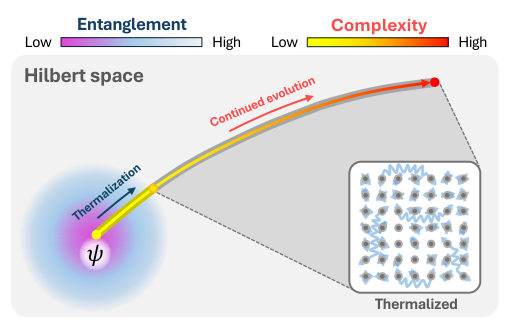 
FIG. 1. Post-thermalization dynamics. An initial prod- uct state ψ evolves under a local Hamiltonian. At thermal- ization, entanglement saturates and the state becomes locally indistinguishable from the Gibbs state, but nevertheless the state continues to evolve. We show that quantum circuit com- plexity continues to grow for a very long period of time, even after the onset of thermalization.

📷 Fig 2

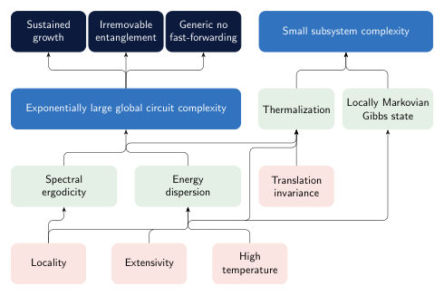 
FIG. 2. Logical structure of the main results. Orange boxes denote assumptions, green boxes denote derived prop- erties, blue boxes denote main results in this work, and dark- blue boxes denote implications of our results.

📷 Fig 3

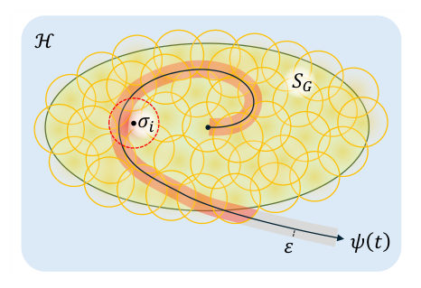 
FIG. 3. Main counting argument. Set SG of states that can be prepared by a sequence of G two-qubit channels (green) and its covering net with states σi (orange circles). The system is initialized in a product state (black circle) which evolves in time (arrow). At time t, the circuit com- plexity is ≤G only if |ψ(t)⟩is within the neighborhood of some σi. We bound the fraction of time that |ψ(t)⟩can spend near a particular σi (red) to be double-exponentially small, so a union bound guarantees that the total time spent inside the green region is double-exponentially small, as long as G is exponential.

**Summary.** This paper proves that for generic, energy-conserving quantum systems, the quantum circuit complexity of large subsystems grows exponentially over extremely long timescales, persisting long after the system has reached apparent thermal equilibrium. The result hinges on proving deep structural properties of local Hamiltonians and initial states. It establishes that the dynamics are computationally complex even when the system appears simple locally.

**Why it may be interesting.** This work provides a rigorous, non-trivial lower bound on the computational complexity of quantum states generated by local Hamiltonians, extending the understanding of quantum information retention far beyond simple thermalization timescales.

Detailed structure

**Main problem.** To determine if the quantum circuit complexity of an evolving many-body quantum system exhibits sustained growth for timescales much longer than the onset of thermalization, particularly for energy-conserving dynamics.

**Main result.** The quantum circuit complexity of subsystems in generic local Hamiltonian dynamics is proven to grow exponentially over very long timescales, even after the system appears to have thermalized.

**Method.** The proof relies on rigorously establishing two structural properties of generic local Hamiltonians and high-temperature product states: generalized spectral no-resonance conditions and effective support in exponentially many energy eigenstates.

**Model / system.** The study concerns many-body quantum systems evolving unitarily under generic, local, time-independent, and extensive Hamiltonians on a Euclidean lattice of qubits.

**Key observables.** Quantum Circuit Complexity ($C_\epsilon$), robust volume-law entanglement, and the time scale of complexity growth.

**Important parameters / regimes.** High effective temperature ($eta=0$ or $|eta| < eta_c$), subsystem size $|A|$, and the time elapsed $t$.

**Assumptions / limitations.** The Hamiltonian must be generic (satisfying spectral no-resonance conditions) and the initial state must be typical (energy dispersed).

**Figures summary.** Figure 1 illustrates that circuit complexity continues to grow post-thermalization. Figure 2 summarizes the logical flow connecting assumptions, derived properties, main results, and implications.

**Paper structure.** The paper builds by first establishing the necessity of structural properties (spectral conditions, state support) and then using these to prove the exponential growth of complexity (Theorem 1). It contrasts this with saturation for small subsystems and establishes related results like no fast-forwarding.

Abstract

The quantum circuit complexity of an evolving many-body quantum system is believed to exhibit a sustained growth, maintained for timescales much longer than the onset of thermalization. Most previous works have focused on models which violate energy conservation, such as random unitary circuits. Here we study generic, local time-independent Hamiltonian dynamics. We unconditionally prove that for generic local Hamiltonians and typical initial product states at high effective temperature, the robust quantum circuit complexity must grow over a very long period of time, attaining an exponentially large value at late times. Our approach relies on two structural properties that we prove rigorously: (i) generic local Hamiltonians satisfy generalized spectral no-resonance conditions of arbitrary order, and (ii) typical high-temperature product states are effectively supported in exponentially many energy eigenstates. These properties have been widely assumed without proof in prior works. As corollaries of this result, we show the late-time state displays robust volume-law entanglement that is irremovable by polynomial-size circuits, and we establish a no fast-forwarding result for generic local Hamiltonians. We also lower bound the complexity of preparing sufficiently large subsystems with local quantum channels, in contrast with sufficiently small thermalizing regions which we show retain low complexity at late times.

[↑ back to top](#top)

### [Transparent Domain Walls through Information Convex Sets](http://arxiv.org/abs/2609.26892v1)

**Authors:** Jintae Kim, Amanda Gatto Lamas, Jacopo Gliozzi, Bowen Shi, Taylor L. Hughes, Jong Yeon Lee  
**Type:** theory · **Category:** other · **PDF:** <https://arxiv.org/pdf/2609.26892v1>  
**Analysis basis:** full PDF text, analyzed in chunks
**Topic relevance:** `analog quantum simulation` **3/5** · `quantum measurements` **1/5**

📷 Fig 1

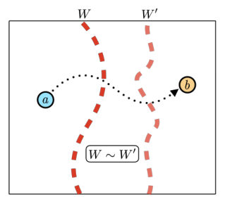 
FIG. 1. Transparent domain walls. Transporting an anyon a along the black dotted line across a transparent do- main wall transmutes a into b, i.e., a →b. The two walls W and W ′ represent physically equivalent choices of the wall po- sition, illustrating that the position of a transparent domain wall is not a physical observable. Thus, a local topological probe cannot detect the wall: any segment of W can be de- formed to W ′ and moved away from the probed region.

📷 Fig 2

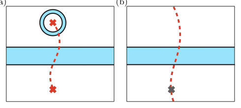 
FIG. 2. (a) Illustration of two point defects (red × symbols) connected by a domain wall (red dotted line) on a torus. The local and noncontractible annuli used in the ICS analysis are also shown. (b) Closed domain wall winding around a non- contractible cycle, obtained by transporting one defect around the torus along a noncontractible cycle. The gray × symbol indicates the disappearance of the two point defects.

📷 Fig 3

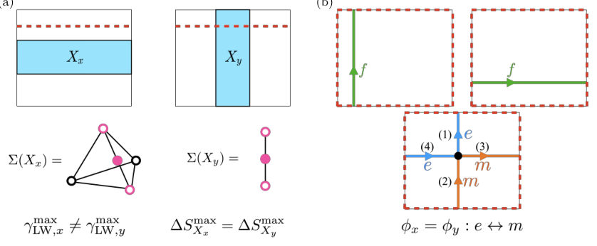 
FIG. 3. (a) Probing transparent domain walls. A transparent domain wall (red dashed line) winds around the x- cycle. The noncontractible annulus Xy crosses the wall, whereas Xx runs parallel to it. The wall modifies Σ(Xy) but leaves Σ(Xx) unchanged, leading to different maximal TEEs for the two annuli. Open pink circles denote extreme points obtained as reductions of MESs, while open black circles denote the remaining ICS extreme points. The filled pink circle marks the equal-weight barycenter of the MES-associated extreme points, representing the symmetrized state. The maximal entanglement asymmetry is the entropy of this barycenter minus that of an MES-associated extreme point. It takes...

📷 Fig 4

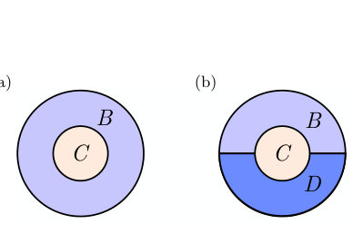 
FIG. 4. Configurations used in axioms (a) A0 and (b) A1.

📷 Fig 5

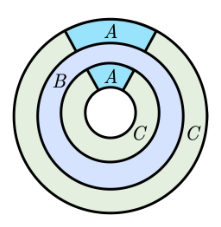 
FIG. 5. Partition of X = ABC used in Definition 3.2.

**Summary.** This work introduces an entanglement-bootstrap framework using Information Convex Sets (ICSs) to detect 'transparent domain walls' in 2+1D topological states. By analyzing entanglement on noncontractible annuli, the authors show that global topological invariants, like the GSD, can be extracted without knowing the specific defect structure. This provides a powerful, purely entanglement-based diagnostic tool for characterizing exotic topological order.

**Why it may be interesting.** The use of entanglement measures (ICSs) to diagnose global topological features like domain walls, which are otherwise invisible to local measurements, provides a powerful, non-local diagnostic tool for quantum phases.

Detailed structure

**Main problem.** The paper aims to characterize 'transparent domain walls' in $(2+1)$-dimensional topologically ordered many-body states, which are invisible to local probes but still affect global properties like Ground State Degeneracy (GSD).

**Main result.** The authors develop an entanglement-bootstrap framework using Information Convex Sets (ICSs) on noncontractible annuli to diagnose these walls, showing that maximal entanglement asymmetry ($\Delta S_{\max}^X$) equals $\log 	ext{GSD}$.

**Method.** The core method involves using ICSs defined on noncontractible annuli to extract topological information directly from ground state wavefunctions, bypassing the need for explicit defect data.

**Model / system.** The study applies to $(2+1)$-dimensional topologically ordered systems, specifically examining fixed points of Abelian topological phases on a torus, with applications to models like Wen's plaquette model and the toric code.

**Key observables.** Maximal Topological Entanglement Entropy ($\gamma_{\max}^{LW}$), Maximal Entanglement Asymmetry ($\Delta S_{\max}^X$), and the number of extreme points of the ICS.

**Important parameters / regimes.** The system is analyzed on a torus, utilizing two fundamental cycles ($l_x, l_y$) corresponding to noncontractible loops.

**Assumptions / limitations.** The analysis assumes the ICS framework faithfully captures the global topological structure, and it compares global effects (ICS) against local diagnostics.

**Figures summary.** Figures illustrate the concept of transparent domain walls being undetectable locally, and show the use of noncontractible annuli to probe these walls and reveal joint symmetries.

**Paper structure.** The paper introduces the problem of transparent walls, develops the ICS framework using noncontractible annuli, derives fusion rules and entanglement diagnostics ($\gamma_{\max}^{LW}$ vs $\Delta S_{\max}^X$), and concludes by applying the method to specific lattice models.

Abstract

In $(2+1)$-dimensional topologically ordered many-body states, transparent (topologically deformable) domain walls are invisible to local topological probes, yet can modify the ground state degeneracy (GSD) and transmute anyons transported across them. Here, we develop an entanglement-bootstrap framework using information convex sets (ICSs) on local and noncontractible annuli to extract information about transparent domain walls directly from ground state wavefunctions at fixed points of Abelian topological phases on a torus, without taking categorical defect data as input. We derive fusion rules governing the action of anyons on extreme points of ICSs on noncontractible annuli and determine their quantum dimensions. Extreme points invariant under transport around the complementary cycle correspond one-to-one to minimum entropy states (MESs), and their number equals the GSD. The maximal topological entanglement entropy (TEE), $γ_{\rm LW}^{\max}=\log({D}/d_α)$, probes the net effect of walls crossing the chosen annulus, where ${ D}$ is the total quantum dimension and $d_α$ is the quantum dimension of an extreme point of its ICS. In contrast, the maximal entanglement asymmetry is $ΔS_X^{\max}=\log\mathrm{GSD}$. This value is the same for both annulus orientations and reflects the combined effect of the transparent domain walls. We further show that transparent domain walls can give rise to symmetries supported jointly on the two chosen fundamental cycles that cannot be decomposed into a product of two $1$-form symmetry operators, one supported on each cycle. By relating their action on MESs to anyon tunneling and the fusion rules, we clarify how these symmetries connect distinct ground states. Additionally, we apply the framework to Wen's plaquette model, the anisotropic dipolar toric code, and the rank-2 toric code.

[↑ back to top](#top)

### [Compressed Permutation Oracles Revisited](http://arxiv.org/abs/2609.28469v1)

**Authors:** Joseph Carolan, Christian Majenz  
**Type:** theory · **Category:** quantum information and computing · **PDF:** <https://arxiv.org/pdf/2609.28469v1>  
**Analysis basis:** full PDF text, analyzed in chunks
**Topic relevance:** `quantum measurements` **3/5**

📷 Fig 1

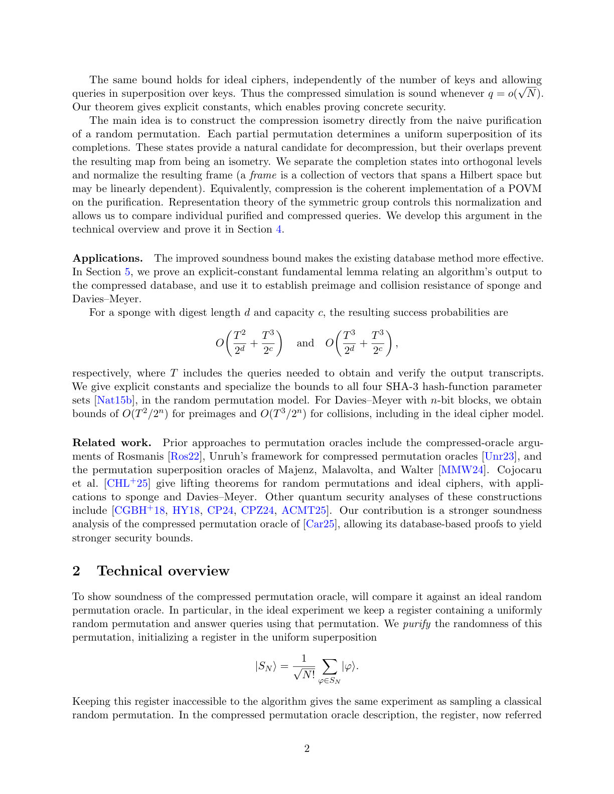 
Low-resolution page preview, page 2

📷 Fig 2

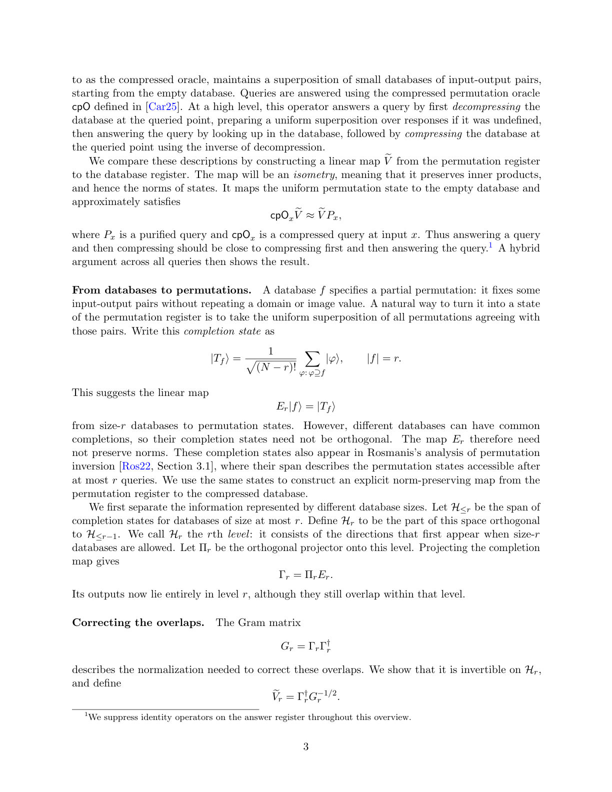 
Low-resolution page preview, page 3

📷 Fig 3

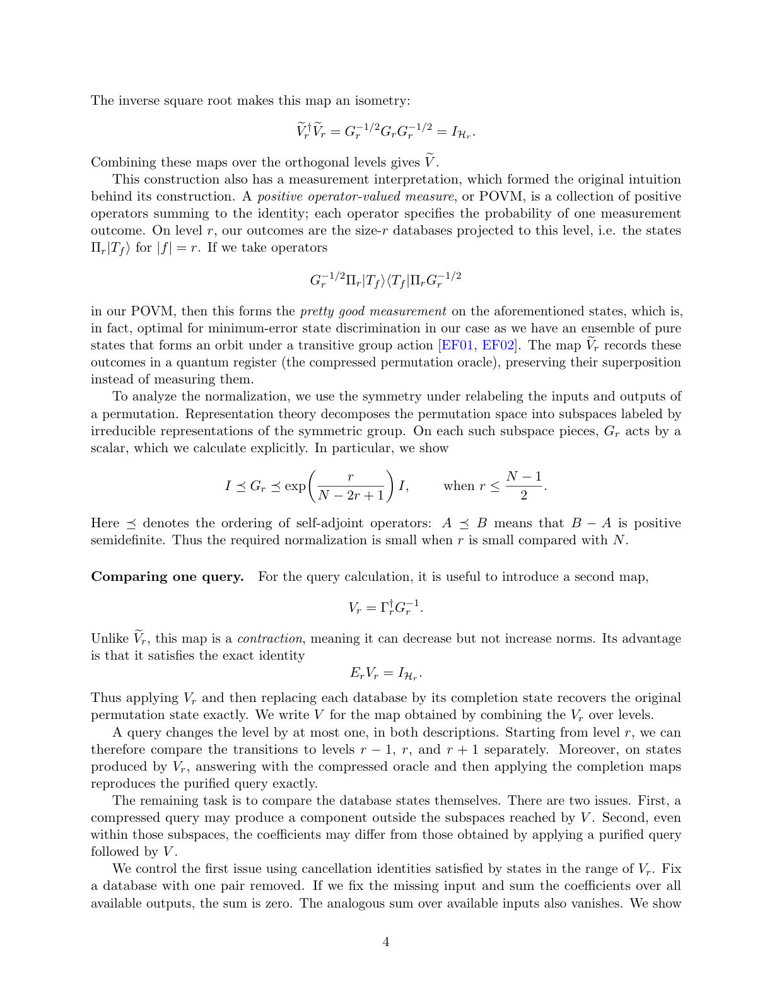 
Low-resolution page preview, page 4

📷 Fig 4

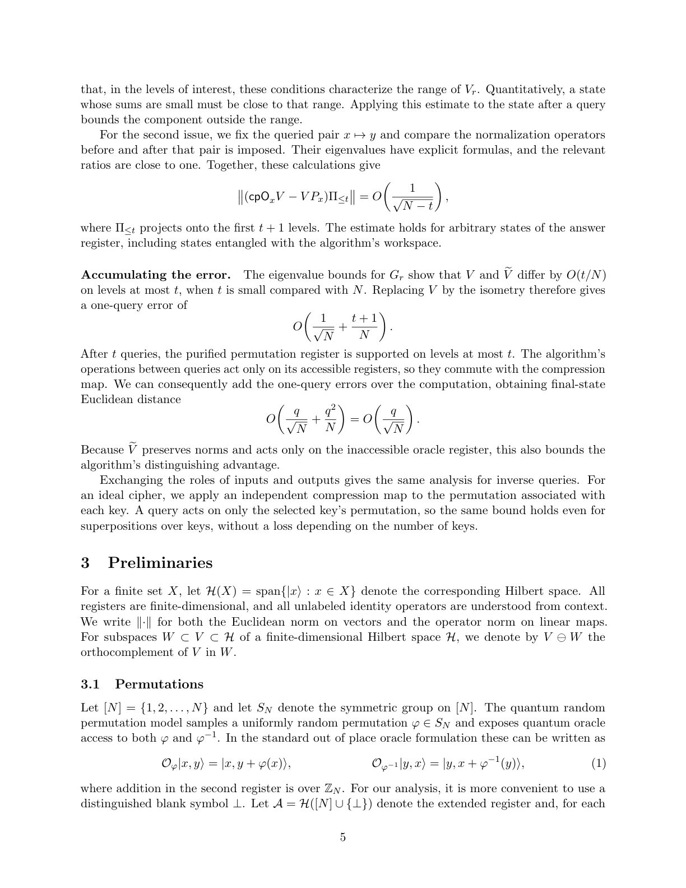 
Low-resolution page preview, page 5

📷 Fig 5

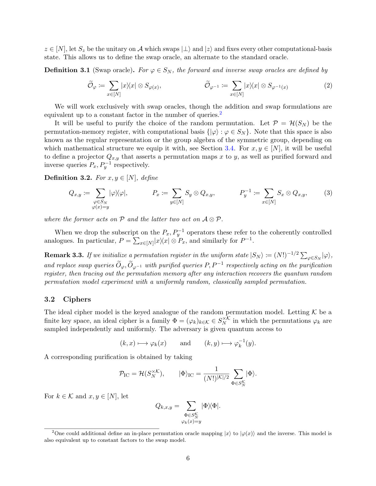 
Low-resolution page preview, page 6

**Summary.** This paper significantly improves the theoretical soundness bound for analyzing quantum security using the compressed permutation oracle, raising it to $\Omega(N^{1/2})$. This advancement provides a powerful, general tool for quantum cryptography. It yields concrete, tighter lower bounds for the collision and pre-image resistance of major hash functions like SHA3.

**Why it may be interesting.** The techniques developed for analyzing oracle queries and information recovery via isometries are fundamental tools in quantum information theory, applicable to understanding quantum limitations in complex physical systems.

Detailed structure

**Main problem.** The paper revisits the analysis of the compressed permutation oracle to improve the soundness bound used in quantum security proofs for cryptographic constructions.

**Main result.** The soundness bound is improved from $O(N^{1/12})$ to a tight $\Omega(N^{1/2})$, providing a general-purpose tool for analyzing quantum security.

**Method.** The improvement involves constructing the compression isometry from a simple POVM on the naive purification, leading to a conceptually simpler and more direct proof.

**Model / system.** The analysis focuses on the compressed permutation oracle, which is used to analyze the quantum security of cryptographic primitives like sponge hash constructions (SHA3) and the Davies-Meyer function.

**Key observables.** Soundness bound (query advantage), collision/pre-image lower bounds for hash functions.

**Important parameters / regimes.** N (size of the set), q (number of queries), $O(N^{1/2})$ (improved bound).

**Assumptions / limitations.** The analysis assumes the underlying primitive can be modeled by a random permutation or ideal cipher, and the final bounds are concrete within the random permutation model.

**Figures summary.** Not specified.

**Paper structure.** The paper develops the improved soundness theorem by constructing the isometry using Gram matrices and POVMs, then applies this general tool to derive concrete, tight lower bounds for the collision and pre-image resistance of SHA3 and SHA1/SHA2.

Abstract

The compressed permutation oracle has been used to analyze the quantum security of a number of cryptographic constructions which resisted prior techniques. However, these analyses were fundamentally limited by the poor soundness of the method: the technique was proven sound only up to $O(N^{1/12})$ queries to permutations on $N$ elements. We revisit this analysis, improving the soundness bound to a tight $Ω(N^{1/2})$. In addition to being tighter, our proof is conceptually simpler and more direct, and gives the same bound in the ideal cipher model. The main technical idea is to construct the compression isometry from a simple POVM on the naive purification, a technique which may find wider applications.   As immediate applications, our results yield tight, concrete collision and pre-image lower bounds for the sponge hash construction underlying SHA3 and the Davies--Meyer compression function used in SHA1 and SHA2. More broadly, the improved soundness theorem provides a general-purpose tool for analyzing quantum security in settings where random permutations or ideal ciphers serve as the underlying primitive.

[↑ back to top](#top)

### [Frustration-Free Models for Topological Holography: Fusion Spin Chains as Boundary Algebras](http://arxiv.org/abs/2609.28120v1)

**Authors:** Zhengwei Liu, Zishuo Zhao  
**Type:** theory · **Category:** strongly correlated electrons · **PDF:** <https://arxiv.org/pdf/2609.28120v1>  
**Analysis basis:** full PDF text, analyzed in chunks
**Topic relevance:** `analog quantum simulation` **3/5**

📷 Fig 1

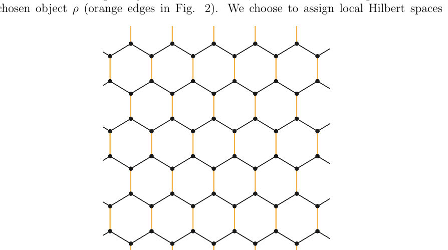 
Figure 2: The colored honeycomb lattice Γ: each vertical edge is colored by the chosen object ρ in C.

📷 Fig 2

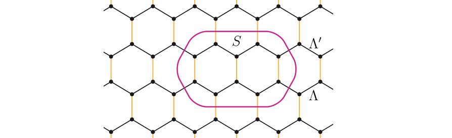 
Figure 3: The support of the operator FS defined from a set of generating set of weight k = 3, which occupies two consecutive plaquettes in a row.

📷 Fig 3

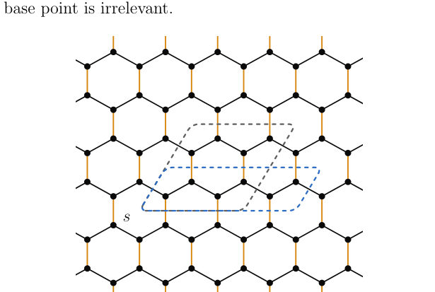 
Figure 4: The parallelogram region in dashed gray has shape (2, 2, s), and the one in dashed blue has shape (3, 1, s).

📷 Fig 4

 
Figure 5: Example: a parallelogram Λ of shape (3, 3) is partitioned into 3 parallelograms of shape (3, 1), ordered from top to bottom.

**Summary.** This work constructs a novel class of frustration-free quantum spin models for topological holography using unitary spherical fusion categories. By applying advanced mathematical techniques, the authors demonstrate that the boundary algebra of these 2D systems precisely realizes fusion spin chains. This provides a powerful algebraic framework for understanding topological order in correlated quantum matter.

**Why it may be interesting.** The connection between abstract algebraic structures (fusion categories) and concrete physical models (spin chains) that exhibit topological order is highly relevant for understanding emergent quantum phases in condensed matter systems.

Detailed structure

**Main problem.** The paper aims to develop frustration-free quantum spin models for Topological Holography by realizing fusion spin chains as boundary algebras.

**Main result.** It proves that applying Osterwalder–Schrader reconstruction to specific 2D quantum spin systems yields boundary algebras isomorphic to the fusion spin chains determined by the input unitary spherical fusion category.

**Method.** The methodology involves constructing local Hamiltonians on lattices (like the honeycomb lattice) using fusion categories and then employing techniques like reflection positivity and OS reconstruction to determine the boundary structure.

**Model / system.** The models are 2D quantum spin systems defined by a unitary spherical fusion category C and an object $\rho$. They generalize Levin-Wen string-net models and feature frustration-free, reflection positive local interactions.

**Key observables.** Topological order, ground-state degeneracy, anyonic excitations, and the structure of the boundary algebra.

**Important parameters / regimes.** The input unitary spherical fusion category C and the chosen object $\rho$.

**Assumptions / limitations.** The models are assumed to be frustration-free and reflection positive; the existence of a uniform gap and the LTQO condition are noted as open questions.

**Figures summary.** Figure 1 illustrates two types of interactions (horizontal edge and rectangle) for a qubit system, while Figure 2 shows the colored honeycomb lattice structure.

**Paper structure.** The paper builds from defining the general 2D spin system based on a fusion category, detailing the local Hamiltonian construction on the honeycomb lattice, proving the ground state projection via evaluation maps, and finally analyzing the resulting boundary algebra structure using modular automorphism techniques.

Abstract

We introduce a class of $2d$ quantum spin systems based on a unitary spherical fusion category with a chosen object. These models have frustration-free, reflection positive, but generally non-commuting local interactions, generalizing the Levin-Wen string-net models. Based on the theory developed in arXiv:2510.20662, we explicitly realize the Temperley-Lieb-Jones algebra, and more generally fusion spin chains as their boundary algebras.

[↑ back to top](#top)

### [Limits for molecular spectroscopy from quantum channel discrimination](http://arxiv.org/abs/2609.27344v1)

**Authors:** Anirban Dey, Akib Karim, Pieter Kok, Mark M. Wilde, Zixin Huang  
**Type:** theory · **Category:** other · **PDF:** <https://arxiv.org/pdf/2609.27344v1>  
**Analysis basis:** full PDF text, analyzed in chunks
**Topic relevance:** `quantum measurements` **3/5**

📷 Fig 1

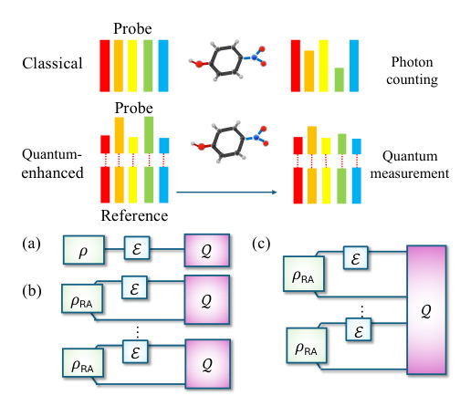 
FIG. 1. Molecular absorption spectroscopy: different molecules correspond to different frequency-dependent loss channels. Three strategies for quantum channel discrimi- nation. (a) Unentangled probes are sent through the chan- nel and measured independently. (b) Entanglement-assisted probes, with a joint measurement on each output–reference pair but separable measurements across channel uses. This is the near-term-compatible setting emphasized in this work. (c) Fully entanglement-assisted strategies across many output– reference systems can potentially achieve a higher error expo- nent but can require collective measurements.

📷 Fig 2

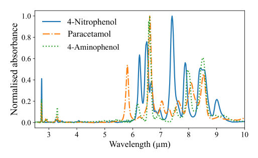 
FIG. 2. Infrared absorption data [32] used to define the multi-frequency molecular channel. The plot shows nor- malised absorbance spectra for the molecules of interest over the mid-infrared range. For the multi-frequency examples, we select three representative 4-nitrophenol absorption fea- tures at 6.502 µm, 7.407 µm, and 7.874 µm. The table gives the normalised absorbance of each molecule at these wave- lengths. The strongest 4-nitrophenol feature, at 7.407 µm, is set to unity to be the reference signal strength η⋆, while the other frequency modes are scaled accordingly.

📷 Fig 3

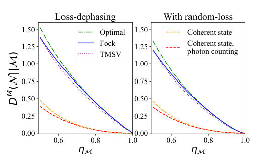 
FIG. 3. The measured relative entropy as a function of the signal transmissivity ηM, for E = 2. (Left) The chan- nel consists of signal-dependent loss together with dephas- ing, with dephasing parameter γ = 0.01. (Right) The same loss–dephasing channel is combined with baseline random- loss, modelled by a uniformly distributed transmissivity with ϵf = 0.05. The results shown are: coherent state (orange dashed line), coherent state with photon counting (red dashed line), TMSV (purple dotted line), Fock state (blue solid line) and optimal state (green dotted-dashed line).

📷 Fig 4

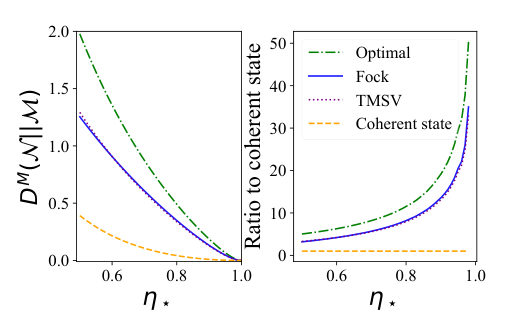 
FIG. 4. (Left) Measured relative entropy for three-frequency detection of 4-nitrophenol. The channel includes random-loss with ϵf = 0.05, and dephasing with γ = 0.01. The results shown are: coherent state (orange dashed line), TMSV (pur- ple dotted line), Fock state (blue solid line) and optimal state (green dotted-dashed line). The optimisation uses a Fock- space truncation d = 7. (Right) The measured relative en- tropy ratio between different states and the coherent state; the coherent state is equal to 1 on this plot.

📷 Fig 5

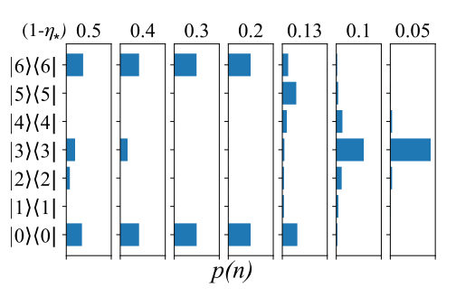 
FIG. 5. Photon-number populations p(n) = ⟨n|ρ⋆ A|n⟩of the optimal reduced probe state at the 7.407 µm absorption line, calculated with a Fock-space truncation d = 7 (nmax = 6).

**Summary.** This work establishes the ultimate quantum limit for molecular spectroscopy by framing it as a quantum channel discrimination problem. Using semidefinite programming, the authors show that non-classical light sources can significantly improve detection sensitivity over standard laser methods. This framework is highly relevant for quantum optics and AMO physics as it sets fundamental performance boundaries for chemical sensing.

**Why it may be interesting.** It provides rigorous, quantum-limited benchmarks for spectroscopic techniques, directly connecting fundamental quantum information theory (channel discrimination) to practical molecular physics measurements.

Detailed structure

**Main problem.** The paper develops a general quantum framework to determine the ultimate theoretical limit for molecular absorption spectroscopy.

**Main result.** Optimized non-classical quantum probes can significantly outperform conventional laser spectroscopy, and this advantage remains robust even when accounting for realistic background random losses.

**Method.** The problem is formulated as an asymmetric quantum hypothesis testing task, solved using semidefinite programming (SDP) to maximize the measurable quantum channel relative entropy.

**Model / system.** The system models molecular identification via absorption spectroscopy, treating the process as distinguishing between a null channel (background loss) and an alternative channel (target molecule absorption). The analysis extends to multi-frequency measurements using product state assumptions.

**Key observables.** The measurable quantum channel relative entropy, D_M(N||M), which quantifies the distinguishability between the null and alternative absorption channels.

**Important parameters / regimes.** The total available photon number budget (E) and the spectral frequencies (s) across which the measurement is performed.

**Assumptions / limitations.** The background loss is modeled as a random-loss channel, and the analysis often relies on product state assumptions for multi-frequency measurements.

**Figures summary.** Figure 1 illustrates different quantum channel discrimination strategies (unentangled vs. entangled probes). Figure 2 shows normalized absorbance spectra for several molecules across the mid-infrared range, defining the spectral channels.

**Paper structure.** The paper builds from the general quantum hypothesis testing framework to specific SDP formulations for single and multi-frequency measurements, culminating in joint optimization techniques to handle complex contaminant scenarios.

Abstract

Absorption spectroscopy identifies molecules by detecting frequency-dependent optical loss, and its fundamental limit is a quantum channel-discrimination problem. In this work, we develop a general framework for characterizing the ultimate quantum limit of molecular absorption spectroscopy without collective measurements: we formulate it as an asymmetric quantum hypothesis testing task between different absorption channels. Using a semidefinite-programming formulation, we construct optimal probe states and compare them with coherent-state photon counting, Fock states, and two-mode squeezed vacuum probes. We introduce a random-loss channel model for imperfectly known background transmission, reflecting the fact that a blank experiment need not return all incident photons due to scattering, solvent absorption, or collection losses. Our results show that optimized non-classical probes can substantially outperform conventional laser spectroscopy, and that the advantage is robust to realistic baseline random loss. % In multi-frequency spectroscopy, the optimization also determines how photons should be allocated across absorption lines, revealing an additional resource-allocation advantage beyond single-mode state engineering. We illustrate our framework using infrared detection of 4-nitrophenol against chemically relevant comparison molecules, showing how quantum channel-discrimination methods provide constructive performance limits for molecular spectroscopy under realistic photon constraints.

[↑ back to top](#top)

### [Sample-Efficient Tomography of a Class of Mixed States with Extensive Entanglement and Magic](http://arxiv.org/abs/2609.27177v1)

**Authors:** Pengcheng Liao, Quntao Zhuang  
**Type:** theory · **Category:** quantum information and computing · **PDF:** <https://arxiv.org/pdf/2609.27177v1>  
**Analysis basis:** full PDF text, analyzed in chunks
**Topic relevance:** `quantum measurements` **3/5**

📷 Fig 1

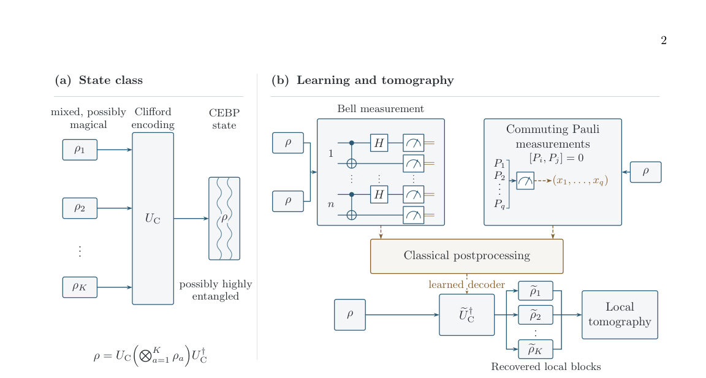 
FIG. 1. Schematic of the CEBP state class and learning protocol. (a) A CEBP state is obtained by applying an unknown Clifford unitary UC to a product of local blocks ρa, each supported on at most d qubits. The local blocks may be mixed and magical, while the Clifford encoding can generate a highly entangled global state. (b) The learner combines Bell measurements on many pairs of copies with joint measurements of commuting Pauli tuples on fresh single copies. The former are used to estimate |Tr(ρP)|2, while the latter provide the signed moments required for cumulant grouping. Classical postprocessing combines these data to construct a decoding Clifford eU † C. Applying the learned decoder...

📷 Fig 2

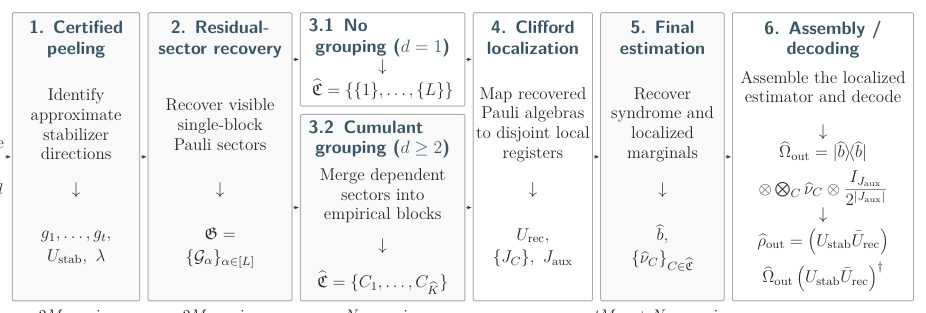 
FIG. 2. Schematic of the CEBP tomography protocol. Starting from an unknown CEBP state ρ and a known upper bound d on the hidden block size, the learner first peels approximate stabilizer directions, recovering g1, . . . , gt, Ustab, and λ, and then performs rank-guided recovery of the visible single-block Pauli sectors G. For d = 1, each recovered sector forms its own empirical block, whereas for d ≥2 cumulant grouping merges dependent sectors to obtain the empirical partition bC. A simultaneous Clifford localization maps the recovered Pauli algebras to disjoint registers {JC} and Jaux. Final estimation recovers the syndrome bb and the localized marginals {bνC}, which are assembled into...

📷 Fig 3

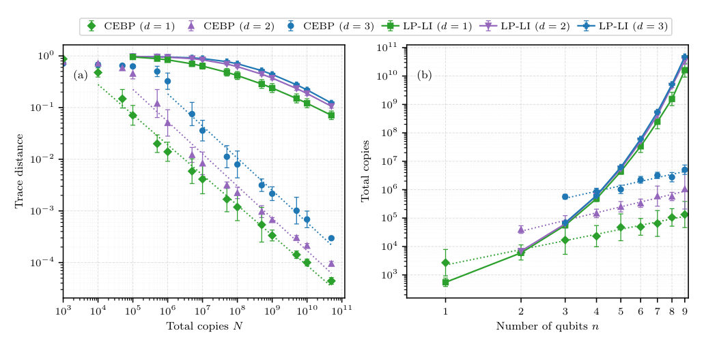 
FIG. 3. Sample complexity of CEBP tomography versus local-Pauli linear inversion (LP-LI). For each (n, d), we generate 20 independent CEBP target states. The n qubits are partitioned into blocks of maximum size d, with d = 1 corresponding to (1, . . . , 1), d = 2 to (2, . . . , 2, 1/2) with a final one-qubit block when n is odd, and d = 3 to (3, . . . , 3, 1/2/3) with a final block of size one or two when required. For each block, the density matrix is sampled independently from the Hilbert–Schmidt ensemble using a normalized complex Ginibre matrix [29], and the resulting block-product state is encoded by a random Clifford circuit generated by a nonuniform 5n-step random walk over Hadamard,...

**Summary.** This paper develops a sample-efficient quantum state tomography protocol for a specific class of mixed states called CEBP states. By exploiting the underlying, hidden block-product structure, the authors demonstrate that the required number of quantum copies scales polynomially with system size $n$ for a fixed block size $d$. This suggests that structural complexity, rather than just entanglement, dictates the learnability of quantum states.

**Why it may be interesting.** This work provides a powerful theoretical framework showing that structural constraints (like bounded block size) can drastically reduce the resource scaling required for quantum state characterization, even when the physical state appears highly complex (entangled and magical).

Detailed structure

**Main problem.** The paper addresses the challenge of performing sample-efficient quantum state tomography for mixed quantum states that possess both extensive entanglement and extensive magic.

**Main result.** They prove that for a structured class of states called CEBP states, tomography can be achieved using a number of copies polynomial in the system size $n$ when the hidden block size $d$ is fixed.

**Method.** The protocol combines Bell measurements on pairs of copies to estimate Pauli correlations with single-copy measurements of commuting observables to recover the latent block structure.

**Model / system.** The focus is on Clifford-encoded block-product (CEBP) states, $
ho = U_c (igotimes_{a=1}^K 
ho_a) U_c^\dagger$, where the state is built from local mixed states ($
ho_a$) via an unknown global Clifford unitary ($U_c$).

**Key observables.** Pauli expectation values, squared Pauli expectation values ($|	ext{Tr}(
ho P)|^2$), and mixed cumulants of commuting Pauli observables.

**Important parameters / regimes.** The upper bound $d$ on the hidden block size, the target error $\epsilon$, and the failure probability $\delta$.

**Assumptions / limitations.** The primary assumption is the existence of a known, bounded upper limit $d$ on the size of the latent blocks, and the protocol requires fresh, independent pools of copies for different measurement stages.

**Figures summary.** Figure 1 schematically illustrates the CEBP state formation and the multi-stage tomography protocol. Figure 2 details the five constructive stages of the tomography protocol, including resource budgets for different measurement types.

**Paper structure.** The paper first defines the CEBP state model and the tomography task. It then details a multi-stage protocol involving Bell-sampling for initial structural identification (peeling), followed by residual sector recovery using single-copy measurements and cumulant analysis to localize the hidden blocks, culminating in local tomography.

Abstract

Full tomography of a generic many-qubit quantum state requires exponentially many copies, while suitable structural constraints can make reconstruction sample-efficient. Existing approaches exploit, for example, limited entanglement structure, low magic, or constrained state-preparation circuits. Here we consider a class of mixed states that can simultaneously exhibit extensive entanglement and extensive magic. Specifically, we introduce Clifford-encoded block-product (CEBP) states, obtained by applying an unknown global Clifford unitary to a tensor product of arbitrary mixed states supported on unknown blocks of bounded size. We show that, for a fixed block size, CEBP states can be reconstructed using polynomially many copies by exploiting Clifford-preserved Pauli correlations to recover the latent structure and reduce the remaining problem to local tomography. Our result demonstrates that sample-efficient tomography can arise from bounded complexity in a latent frame even when the physical state is highly entangled, highly magical, and mixed, and suggests complexity modulo structured transformations as a broader organizing principle for quantum-state learnability.

[↑ back to top](#top)

### [Sharp pairwise reduction for quantum hypothesis testing](http://arxiv.org/abs/2609.28440v1)

**Authors:** Kuan-Yi Lee, Ludovico Lami  
**Type:** theory · **Category:** quantum information and computing · **PDF:** <https://arxiv.org/pdf/2609.28440v1>  
**Analysis basis:** full PDF text, analyzed in chunks
**Topic relevance:** `quantum measurements` **3/5**

📷 Fig 1

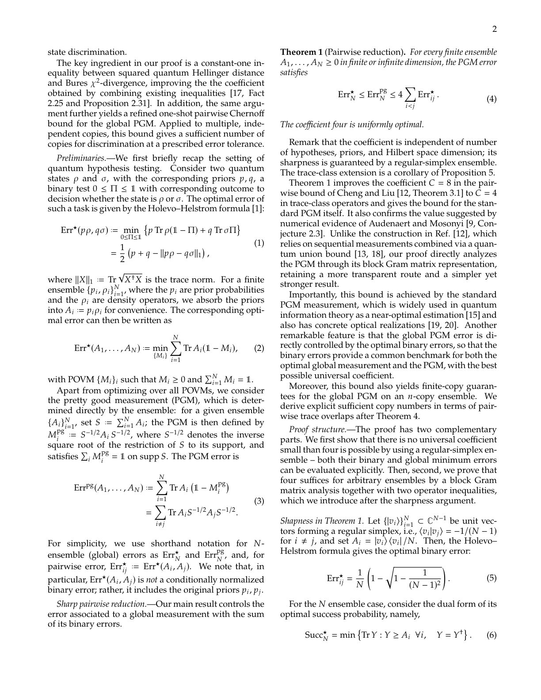 
Low-resolution page preview, page 2

📷 Fig 2

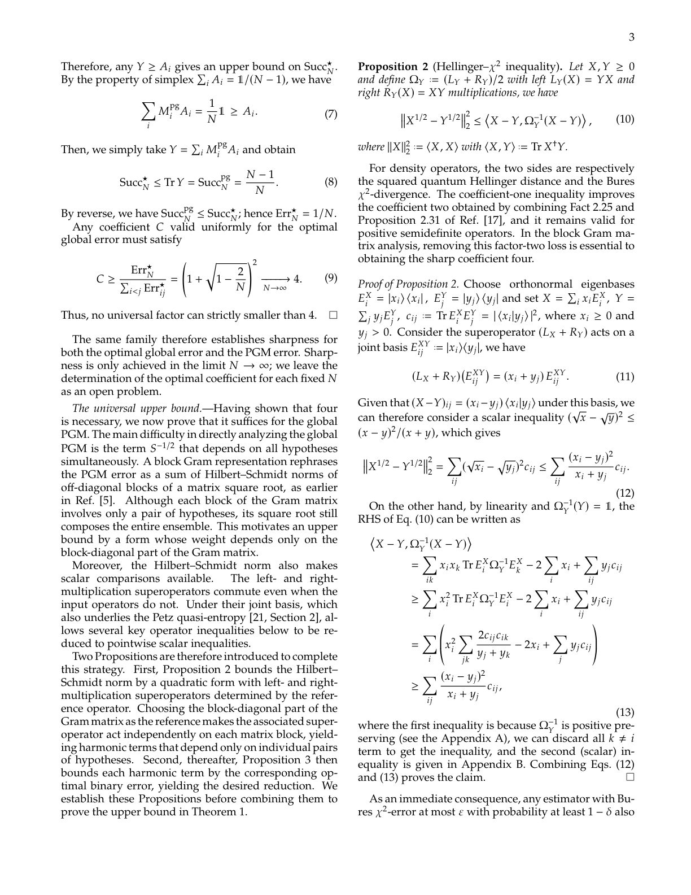 
Low-resolution page preview, page 3

📷 Fig 3

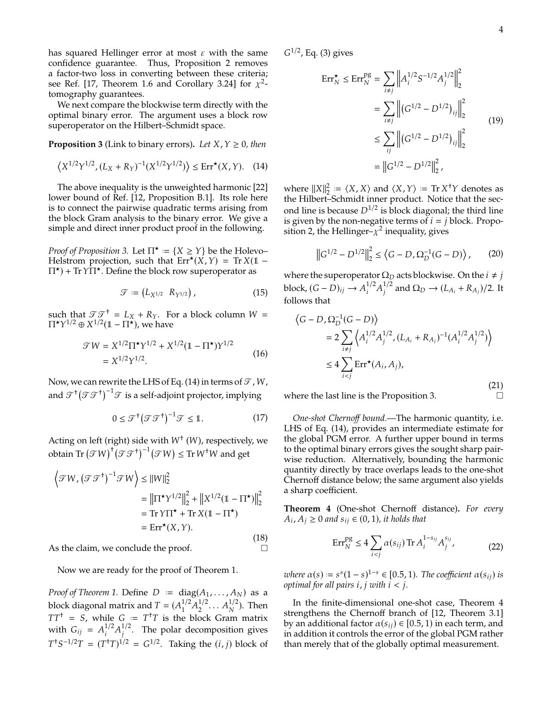 
Low-resolution page preview, page 4

📷 Fig 4

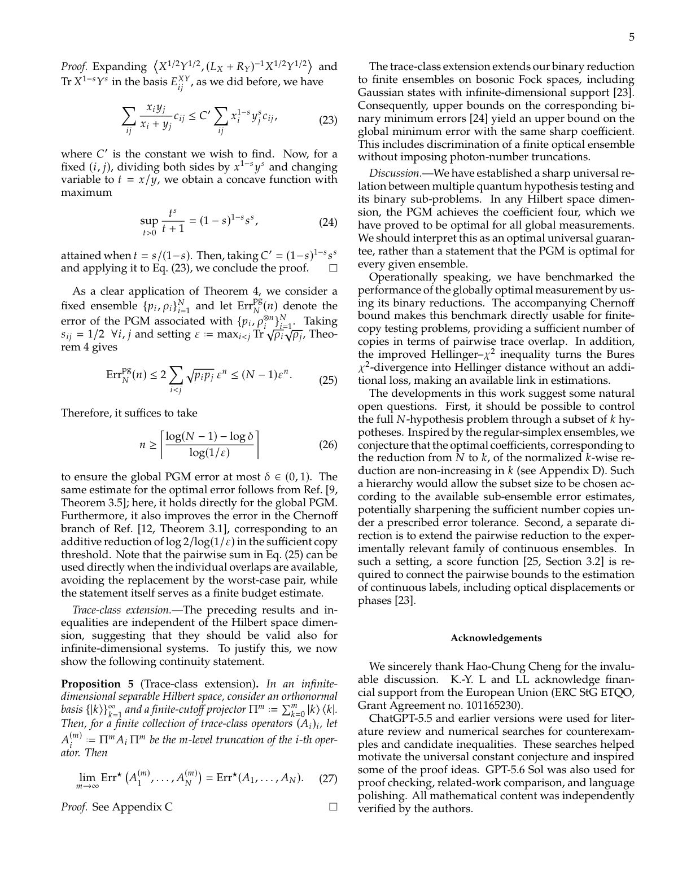 
Low-resolution page preview, page 5

📷 Fig 5

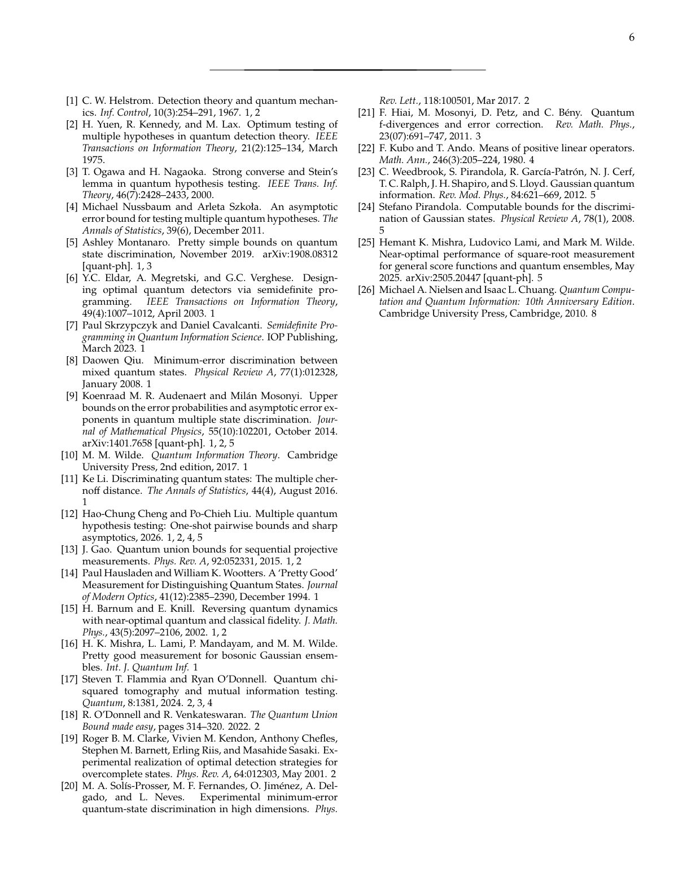 
Low-resolution page preview, page 6

**Summary.** This work establishes a sharp, universal bound for quantum hypothesis testing, showing that the error in distinguishing multiple quantum states can be bounded by four times the sum of the errors from all possible pairs of states. The authors achieve this using advanced matrix analysis techniques and prove the constant four is optimal using a specific ensemble. This provides a significant theoretical improvement over previous bounds in the field.

**Why it may be interesting.** The rigorous determination of universal constants in quantum information theory provides fundamental benchmarks for quantum measurement protocols, which are crucial for designing quantum communication and sensing schemes.

Detailed structure

**Main problem.** The paper determines the optimal universal coefficient required to bound the error probability of global quantum hypothesis testing by the sum of optimal pairwise binary error probabilities.

**Main result.** It proves that the global error probability is bounded by at most four times the sum of the optimal pairwise binary error probabilities, and this coefficient of four is shown to be optimal.

**Method.** The proof employs purely matrix-analytic techniques, including direct block Gram matrix analysis and utilizing a refined inequality between quantum Hellinger distance and Bures $\chi^2$-divergence.

**Model / system.** The analysis concerns quantum hypothesis testing involving an ensemble of quantum states $\{p_i, 
ho_i\}$ in arbitrary Hilbert space dimensions. Sharpness is demonstrated using a regular-simplex ensemble.

**Key observables.** Global measurement error ($	ext{Err}_{	ext{global}}$) and optimal pairwise binary error ($	ext{Err}_{	ext{binary}}$).

**Important parameters / regimes.** The universal coefficient $C$ in the bound $	ext{Err}_{	ext{global}} \le C \sum 	ext{Err}_{	ext{binary}}$.

**Assumptions / limitations.** The analysis relies on the structure of the Pretty Good Measurement (PGM) and its relationship to pairwise terms.

**Paper structure.** The paper develops the bound by first simplifying the global error term using superoperators and block Gram representations, then linking this structure to known binary error bounds, culminating in the sharp bounds for the global PGM error.

Abstract

We determine the optimal universal coefficient in a reduction of multiple to binary quantum hypothesis testing. Specifically, for every finite ensemble in any Hilbert space dimension (finite or infinite), we prove that the error probability of the global pretty good measurement (PGM) is at most four times the sum of the optimal binary error probabilities. By constructing a family of regular-simplex ensembles, we further show that the coefficient four is optimal, even for arbitrary global measurements. This result improves on the pairwise bounds established by Cheng and Liu [arXiv:2606.06246 (2026)] and entails an explicit, sharp guarantee for the standard PGM itself. Our proof is also simpler: rather than constructing sequential measurements and applying a union bound, our proof relies on purely matrix-analytic techniques, combining a direct block Gram matrix analysis of the PGM error and a refined inequality between quantum Hellinger distance and Bures $χ^2$-divergence. Our analysis also yields a refined, one-shot pairwise Chernoff bound and explicit sufficient number of copies for a desired discrimination error.

[↑ back to top](#top)

### [Structured Hamiltonian Learning for Multiqubit Conditional Phase Gates](http://arxiv.org/abs/2609.27629v1)

**Authors:** Xiu-Hao Deng  
**Type:** theory · **Category:** quantum information and computing · **PDF:** <https://arxiv.org/pdf/2609.27629v1>  
**Analysis basis:** full PDF text, analyzed in chunks
**Topic relevance:** `quantum measurements` **3/5**

📷 Fig 1

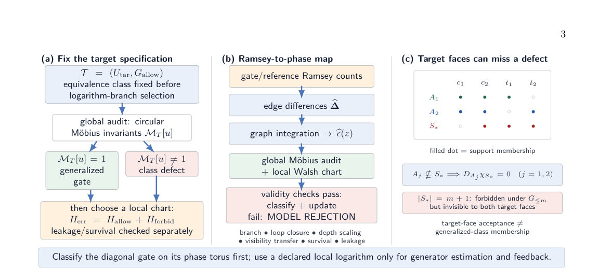 
FIG. 1. Target-relative structured Hamiltonian learning. (a) The allowed group is fixed as part of the target contract. Global multiplicative invariants decide class membership; a selected logarithm supplies local generator coordinates for feedback. (b) Gate/reference Ramsey counts give edge phases; graph integration gives the phase field, followed by both the global Möbius audit and the local Walsh transform. Generator coordinates are reported for feedback only after the model-validity checks pass. (c) The support-membership rows make the incompleteness explicit: for two controls and two targets, S∗= {c2, t1, t2} is forbidden under G≤2 but contains neither complete target face, so both...

📷 Fig 2

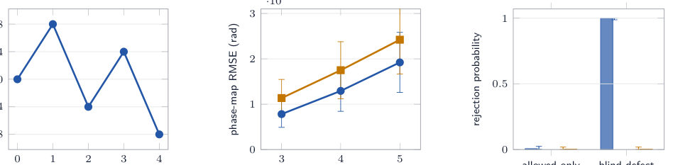 
FIG. 2. Global-quotient and acquisition checks. (a) Principal phases of the allowed dressing in the CCCZ alias regression: a local logarithm reports a spurious four-body coefficient, while the branch-independent invariant passes. (b) Gauge-aligned phase-map RMSE for end-to-end multiplexed and separately compiled statewise acquisition under a common nominal attempted-circuit budget. Points and error bars are the mean and sample SD of the per-map RMSE across 200 independent replicates; they are not standard errors. (c) Rejection rates for the allowed-only control and the blind-defect alternative over 300 replicates. Vertical intervals are score-Wilson 95% binomial intervals computed from the...

📷 Fig 3

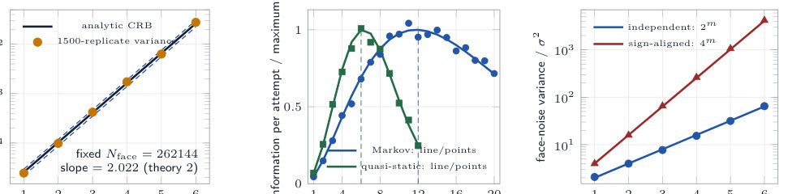 
FIG. 3. Complexity and noise validation. (a) Exact equation (51) (solid line) and sample variances from 1500 saved replicate-level estimates (points). Dashed lines are the prespecified 0.85–1.15 ratio criterion, not uncertainty bars. (b) Analytic information per attempted circuit and empirical inverse variance, each normalized by the analytic maximum. Blue and green vertical lines mark the predicted integer optima q = 12 (Markov) and q = 6 (quasi-static); empirical optima are 11 and 6. Lines are analytic and points are empirical. (c) Face-noise variance normalized by σ2 for independent and sign-aligned Gaussian covariance; points use 3000 replicates and lines are 2m and 4m. Common-mode...

📷 Fig 4

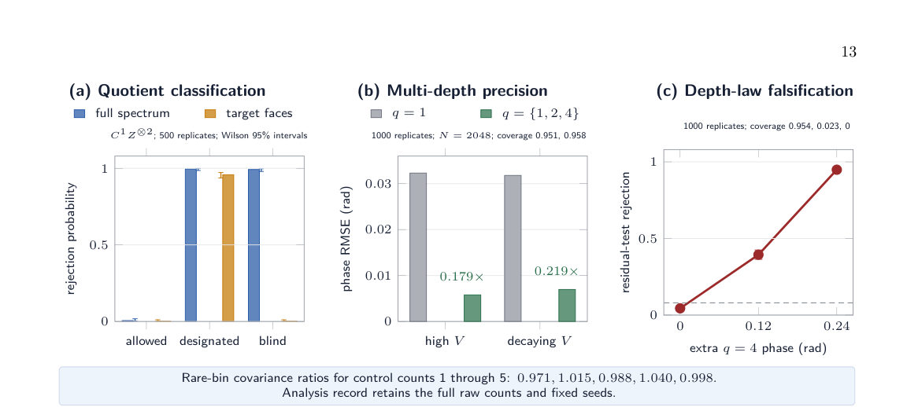 
FIG. 4. Count-level observation-model validation. (a) Full-spectrum versus target-face rejection in the representative C1Z⊗2

📷 Fig 5

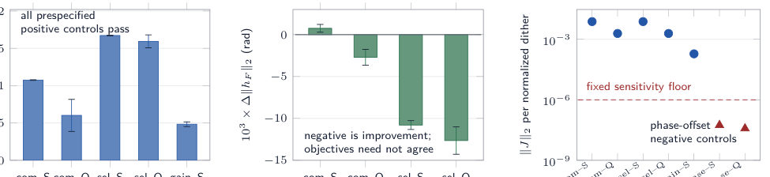 
FIG. 5. Central-spin learning-to-control simulation. S and Q denote strict and quotient-aware objectives. (a,b) Bars are mean changes and error bars are the sample standard deviation—not the standard error—over the same 30 prespecified training replicates; the deterministic pre-update simulator value is common to those replicates. The visibly different error-bar sizes follow directly from the stored replicate outcomes. (c) Deterministic finite-difference Jacobian sensitivities; triangles are selected-tone-phase negative controls below the prespecified sensitivity floor. The simulated system and Jacobian use the same conditional-block model, so this is not a model-robust or hardware...

**Summary.** This paper develops a sophisticated theoretical framework to certify the global equivalence class of multiqubit conditional phase gates, addressing the limitation that local measurements are insufficient for this task. It introduces multiplicative Boolean-Möbius invariants as a branch-independent criterion for global membership. The work is highly relevant for quantum computing hardware certification by providing a robust diagnostic tool.

**Why it may be interesting.** This work provides a mathematically rigorous framework for certifying the global equivalence class of quantum gates, moving beyond simple local fidelity checks which are known to be insufficient.

Detailed structure

**Main problem.** The core problem is determining if a measured multiqubit conditional phase gate belongs to its declared generalized-gate equivalence class, distinguishing global equivalence from local measurement outcomes.

**Main result.** The authors derived an exact, branch-independent criterion for global equivalence using multiplicative Boolean-Möbius invariants, and demonstrated that local measurements are insufficient to guarantee global membership.

**Method.** The methodology combines Ramsey measurements to reconstruct a target-relative eigenphase map, followed by applying a Walsh transform to yield the error generator, and finally using Möbius invariants for a global class membership test.

**Model / system.** The system involves multiqubit conditional phase gates, modeled by a structured Hamiltonian representing a diagonal successful block in a known basis. The analysis focuses on the error generator $	ext{Herr}$ and its relationship to the target-relative unitary $U_{	ext{err}}$.

**Key observables.** Multiplicative Boolean-Möbius invariants ($	ext{M}_T[u]$), the relative phase $\epsilon(z)$, and the mean phase-map RMSE from multiplexed acquisition.

**Important parameters / regimes.** The number of qubits ($m$), the number of multiplexing settings ($M=3, 4, 5$), and specified tolerances/confidence levels for statistical decision-making.

**Assumptions / limitations.** The results estimate the error generator under a specified acquisition model, and the method explicitly separates global equivalence-class membership from the local error generator estimation.

**Figures summary.** Figure 1 illustrates the structured Hamiltonian learning process, showing how global invariants fix the allowed group, Ramsey counts yield local phases via a Walsh chart, and target faces can miss forbidden interactions.

**Paper structure.** The paper progresses from defining the global equivalence problem (Möbius invariants) to local estimation (Ramsey/Walsh transforms) and culminates in rigorous statistical bounds (Cramér-Rao) and a multi-step experimental protocol for deployment.

Abstract

Accurate measurement of an intended conditional phase does not by itself place a multiqubit phase gate in its declared generalized-gate equivalence class. We cast the diagnosis as structured Hamiltonian learning of the diagonal successful block in a known basis: Ramsey measurements on a connected graph reconstruct a target-relative eigenphase map; a Walsh transform then yields the per-cycle stroboscopic error generator in a selected logarithm branch, whose branch-dependent coefficients alone cannot decide global equivalence. For diagonal Pauli-Z dressing of weight at most m we derive an exact branch-independent criterion from multiplicative Boolean-Mobius invariants, converted at finite shot counts into a pass/fail/unresolved decision under prespecified tolerances and simultaneous confidence, separate from model rejection. For shared-control C^mZ gates a circular target-face contrast isolates each intended conditional phase, yet a support theorem exhibits forbidden interactions invisible to every target face once multiple targets or external spectators are present. We derive a Cramer-Rao bound for arbitrary integer phase contrasts, recovering the 4^m attempted-circuit scaling of a uniform (m+1)-body face, and quantify degradation from visibility loss, heralded survival, readout confusion, and correlated noise, while systematic bias triggers model rejection. Seeded simulations implement the 4M-setting multiplexed acquisition end to end: for M=3,4,5 at a common budget its mean phase-map RMSE is 0.689-0.794 times a separately compiled statewise scan, and a blind-interaction test yields 300/300 global-audit rejections versus 1/300 for target faces. These results estimate the error generator of a diagonal successful block under a specified acquisition model; they are not unknown-basis Hamiltonian identification, arbitrary-channel tomography, or hardware certification.

[↑ back to top](#top)

### [Decoherence Tuning in Voltage-Driven Plasmonic Cavities](http://arxiv.org/abs/2609.28287v1)

**Authors:** Yuchen Wang, Oliver Tan, Norah M. Hoffmann  
**Type:** theory · **Category:** other · **PDF:** <https://arxiv.org/pdf/2609.28287v1>  
**Analysis basis:** full PDF text, analyzed in chunks
**Topic relevance:** `Keldysh / 2PI / non-Gaussian methods` **2/5** · `methods for driven-dissipative` **2/5** · `Tavis-Cummings & cavity-many-emitter` **1/5** · `analog quantum simulation` **1/5** · `correlated / nonlocal dissipation` **1/5** · `driven-dissipative phase transition` **1/5** · `quantum measurements` **1/5**

📷 Fig 1

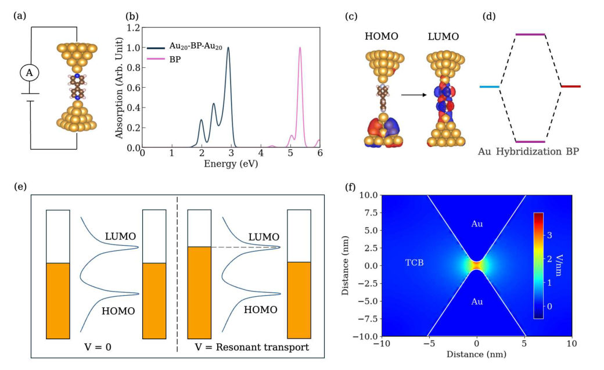 
FIG. 1. (a) Schematic representation of a typical STM-BJ experimental setup. (b) Calculated absorption spectra of BP and the Au20–BP–Au20 molecular junction. (c) Molecular orbital character analysis of the HOMO–LUMO transition in the Au20– BP–Au20 system. (d) Schematic illustration of orbital hybridization between BP and the Au20 electrodes. (e) Energy-level alignment diagram of the STM-BJ, showing the relative positions of the molecular orbitals with respect to the Fermi level of the electrodes. (f) Electric-field distribution within the STM-BJ nanocavity under an applied bias of 2 V.

📷 Fig 2

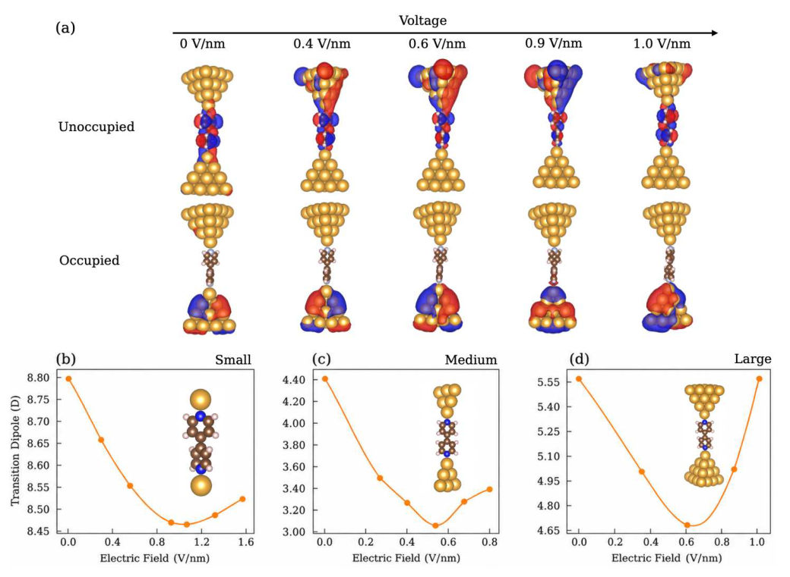 
FIG. 2. (a): Molecular orbitals of the Au20–BP–Au20 junction under applied electric fields from 0 to 1 V/nm, showing the bias-dependent evolution of the occupied and unoccupied orbitals. (b–d): LR-TDDFT transition dipole moment as a function of applied electric field for the small Au1–BP–Au1, medium Au6–BP–Au6, and large Au20–BP–Au20 junction models. All three systems exhibit a minimum at an intermediate field.

📷 Fig 3

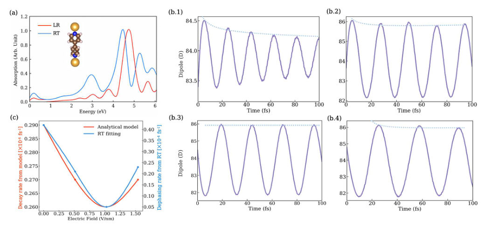 
FIG. 3. (a) Comparison of the absorption spectra calculated using LR-TDDFT and RT-TDDFT. (b.1–b.4) Time-varying RT- TDDFT dipole moments during the first 100 fs under external electric field strengths of 0, 0.6, 1.0, and 1.5 V/nm, respectively. The oscillation envelopes were fitted to determine the dephasing behavior. (c) Comparison between the decay rates predicted by the analytical model and the dephasing rates obtained from fitting the RT-TDDFT dipole envelopes.

📷 Fig 4

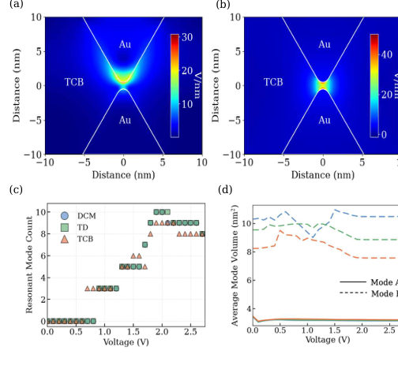 
FIG. 4. (a–b): Electric field distributions of two exemplary resonant plasmon modes A and B in a voltage-driven STM- BJ. (c): Resonant Mode Count calculated in DCM, TD, and TCB solvents with bias ranging from 0 V to 2.75 V. (d): Mode volumes of the exemplary resonant plasmon modes A and B as a function of bias.

**Summary.** This paper demonstrates that voltage bias can be used to engineer single-molecule plasmonic cavities within STM-BJ junctions. By tuning the bias, researchers can drive an interfacial exciton while actively suppressing its decay into metallic loss channels. This establishes a powerful, electrically controllable platform for molecular quantum control.

**Why it may be interesting.** This work directly addresses open quantum systems dynamics (exciton decay) in a solid-state, nanoscale environment, providing a clear mechanism (voltage tuning) to suppress decoherence in a highly lossy setting, which is central to quantum optics and molecular physics.

Detailed structure

**Main problem.** The central challenge is realizing strong light-matter coupling at the single-molecule level within highly lossy metallic environments.

**Main result.** The applied voltage can be used to drive an interfacial exciton while simultaneously suppressing its coupling to metallic loss channels, establishing voltage-tunable plasmonic cavities.

**Method.** The study employs a combination of Linear Response/Real Time TDDFT for electronic structure and dynamics, and time-harmonic Maxwell equations for plasmonic mode confinement.

**Model / system.** The system is a Scanning Tunneling Microscope Break Junction (STM-BJ) acting as a plasmonic cavity coupled to a single molecule (e.g., BP). The physics is modeled using a minimal molecule-metal Hamiltonian and analyzing the decay of an interfacial exciton.

**Key observables.** Exciton lifetime/population decay rate ($	ext{w}_T$), Rabi splitting, plasmonic mode confinement, and the bias-dependent orbital overlap.

**Important parameters / regimes.** Applied bias voltage ($V$), coupling strength ($g_c$), and the metal continuum density of states ($\Pi(E_k)$).

**Assumptions / limitations.** The analysis relies on modeling the system with a minimal molecule-metal Hamiltonian and assumes the continuum limit for decay rate calculations.

**Figures summary.** Figures illustrate the STM-BJ setup, compare absorption spectra, show orbital hybridization confirming interfacial transitions, and map out electric field distributions under bias.

**Paper structure.** The paper develops the theoretical framework by defining the coupled Hamiltonian, calculating the decay rate via Fermi's golden rule, and then applying TDDFT and Maxwell simulations to show how bias controls the exciton lifetime and mode structure.

Abstract

Strong light-matter coupling offers a powerful framework for modifying molecular structure, dynamics, and optical response, yet achieving this regime at the single-molecule level remains a central challenge. Scanning Tunneling Microscope Break Junctions (STM-BJ) provide a promising route by combining single-molecule addressability with extreme nanoscale field confinement. However, the metallic environment that enables such confinement also introduces substantial plasmonic and excitonic losses, raising the question of how strong coupling can be realized in a metal-molecule-metal junction. Here, we identify the voltage as the key control parameter. We show that the applied bias not only drives the formation of an interfacial exciton through resonant charge transport but also suppresses its coupling to metallic loss channels. Simultaneously, the plasmonic cavity retains extreme mode confinement while the availability of modes is moderately tuned by voltage. Together, these results establish voltage-driven STM-BJs as electrically tunable single-molecule plasmonic cavities and open new routes for using the powerful STM-BJ toolbox, including quantum transport, tracking chemical dynamics, optoelectronics, and molecular-scale quantum control under strong light-matter coupling.

[↑ back to top](#top)

### [Rank-One Signal Recovery in Sparse Wishart Noise](http://arxiv.org/abs/2609.28163v1)

**Authors:** Preben Forer, Urte Adomaityte, Pierpaolo Vivo  
**Type:** theory · **Category:** disordered systems and neural networks · **PDF:** <https://arxiv.org/pdf/2609.28163v1>  
**Analysis basis:** full PDF text, analyzed in chunks
**Topic relevance:** `Keldysh / 2PI / non-Gaussian methods` **2/5** · `driven-dissipative phase transition` **2/5** · `methods for driven-dissipative` **2/5** · `non-equilibrium universality` **2/5** · `analog quantum simulation` **1/5**

📷 Fig 1

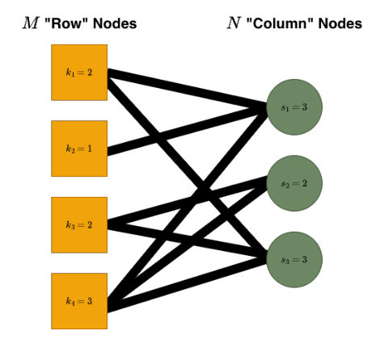 
Figure 1: Schematic example of the underlying bipartite structure of the graph defining the adjacency matrix C. We see the two types of nodes, row and column, as well as that the handshake constraint is satisfied since P4 i=1 ki = P3 j=1 sj = 8.

📷 Fig 2

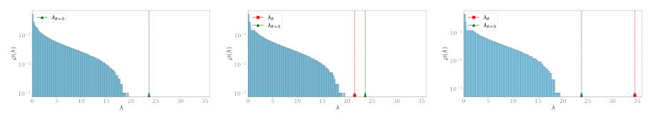 
Figure 2: Eigenvalue density of 1000 matrices A of size N × N = 4000 × 4000 as defined in (2), with X ∈RM×N a pure 5000 × 4000 adjacency matrix of a Poissonian random graph with mean column degree ⟨s⟩= 4, mean row degree ⟨k⟩= 3.2 (following ⟨k⟩= 1 α2⟨s⟩as per (8)), and weight distribution ϱW(W) = δW,1. The signal x has i.i.d. entries xi ∼N(0, 1). (Left) Density for θ = 0 corresponding to the matrix defined in [29], where there is one sole outlier from the bulk located at λθ=0 ≃23.65. The sole outlier is due to the bond weights having a non-zero mean. (Centre) Density for 0 &lt; θ = 16 &lt; θcrit. Here the signal-associated eigenvalue has separated from the bulk, yet remains smaller than λθ=0.

📷 Fig 3

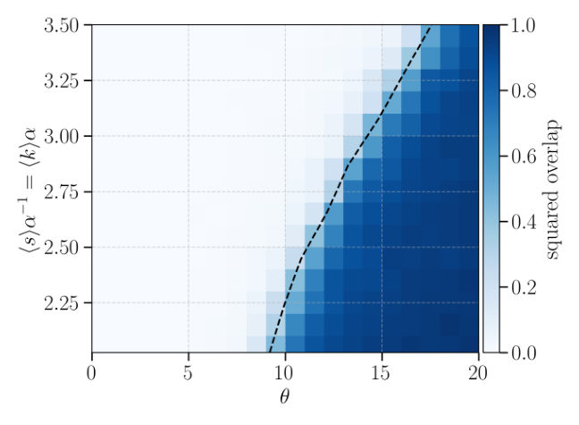 
Figure 3: Heat map of the average squared overlap between the top eigenvector vtop and the signal vector x obtained for the truncated Poisson setup with kmax = smax = 20 for various values of ⟨s⟩α−1 = ⟨k⟩α with α = q

📷 Fig 4

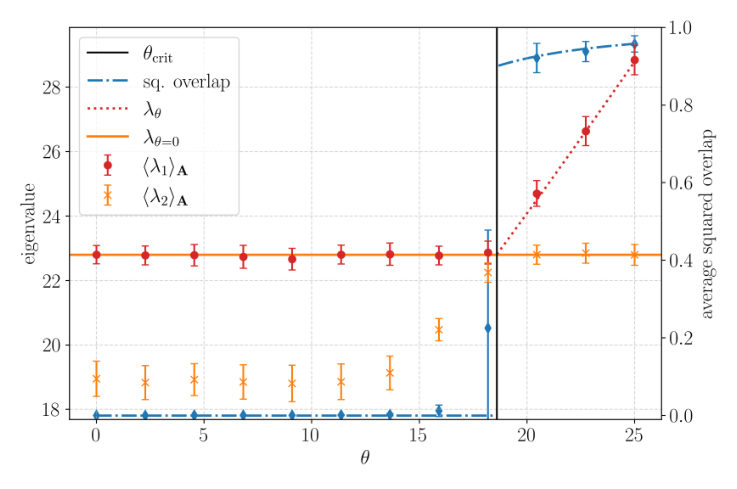 
Figure 4: Truncated Poisson setup with ⟨s⟩= 3, ⟨k⟩= 4, smax = kmax = 15 and α = q

📷 Fig 5

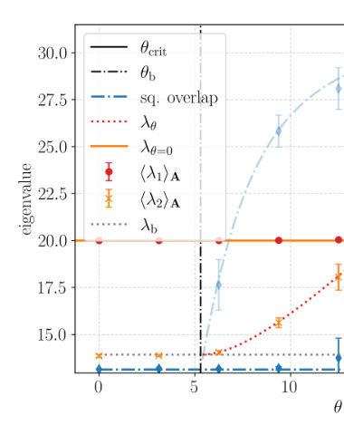 
Figure 5: Random Biregular setup with α = q

**Summary.** This theoretical paper analyzes signal recovery from data corrupted by sparse Wishart noise using advanced random matrix techniques. It establishes a critical signal strength threshold ($\theta_{\text{crit}}$) that dictates whether the underlying signal can be reliably extracted from the matrix's top eigenvector. The work provides rigorous analytical results confirming a BBP-like phase transition in this sparse setting.

**Why it may be interesting.** While focused on classical random matrix theory, the mathematical tools (replica method, phase transitions) are highly relevant to understanding spectral properties in complex, disordered quantum systems or neural network models.

Detailed structure

**Main problem.** The paper addresses the high-dimensional recovery of a rank-one signal vector embedded within a matrix corrupted by sparse Wishart-like noise.

**Main result.** A critical threshold, $\theta_{\text{crit}}$, is identified: signal recovery is only possible when the signal strength $\theta$ exceeds this threshold, marking a BBP-like phase transition.

**Method.** The analysis employs the replica method combined with a Population Dynamics algorithm to analytically compute the top eigenpair statistics.

**Model / system.** The system is defined by the matrix $A = J + (\theta/N)\mathbf{x}\mathbf{x}^	op$, where $J = \mathbf{X}^	op\mathbf{X}$ is a Wishart-like matrix derived from a sparse random matrix $\mathbf{X}$.

**Key observables.** Average largest eigenvalue $\langle\lambda_1\rangle_A$, average top eigenvector component density, and the average overlap between the top eigenvector and the signal $\mathbf{x}$.

**Important parameters / regimes.** Signal strength $\theta$, rectangularity ratio $\alpha=M/N$, and the average connectivity of the noise.

**Assumptions / limitations.** The analysis relies on the replica formalism and the assumption that the system can be analyzed in the thermodynamic limit.

**Figures summary.** No specific figure summaries were extracted, but the analysis relates to spectral observables and phase transitions.

**Paper structure.** The paper reviews literature on signal inference and spiked random matrices, formulates the sparse Wishart model, and then presents the main results detailing the BBP-like transition and recovery conditions.

Abstract

We study the high-dimensional recovery of a signal vector $\mathbf{x}$ in the presence of sparse Wishart-like noise. We define an $N \times N$ matrix $A = J+(θ/N)\mathbf{xx}^{\top}$, where $\mathbf{xx}^{\top}$ is the rank-one deformation of the random noise matrix $J$. We consider a Wishart-like matrix $J={X}^{\top} X$, where $X$ is a sparse $M \times N$ random matrix with entries $X_{ij} = c_{ij}W_{ij}$, with $c_{ij}$ regulating the density of non-zero elements, and $W_{ij}$ the bond weights. Using the replica method, we compute analytically the top eigenpair statistics of $A$, and their dependence on the signal strength $θ$, the rectangularity ratio $α=\sqrt{M/N}$, and the average connectivity of the noise. The spectral observables are expressed in terms of a system of Recursive Distributional Equations, which are efficiently solved via a Population Dynamics algorithm. They allow us to compute the average largest eigenvalue $\langleλ_1\rangle_{A}$, the average top eigenvector component density, and the average overlap between the top eigenvector of $A$ and $\mathbf{x}$. We identify a critical threshold $θ_{\mathrm{crit}}$--depending on the average connectivity of the noise--that marks a BBP-like phase transition: below this value, $\langleλ_1\rangle_{A}$ is unaffected by the signal, and the overlap vanishes. Thus, the signal is not recoverable from the top eigenvector of $A$. For $θ>θ_{\mathrm{crit}}$, the signal-related outlier eigenvalue becomes $\langleλ_1\rangle_{A}$ and the overlap is nonzero, allowing for recovery of the signal. The results are in excellent agreement with numerical diagonalisation. We show that in the dense limit, the recovery threshold and eigen-statistics converge to the results predicted by the classical BBP transition for additive rank-one deformations of dense Wishart matrices.

[↑ back to top](#top)

### [Resonantly Enhanced Phonon Transport by Magnon Pumping in a Ferromagnetic/Piezoelectric Bilayer](http://arxiv.org/abs/2609.27101v1)

**Authors:** André José, Carlos Eduardo, Adrielson Dias, José Araújo, José Holanda  
**Type:** experiment · **Category:** other · **PDF:** <https://arxiv.org/pdf/2609.27101v1>  
**Analysis basis:** full PDF text, analyzed in chunks
**Topic relevance:** `analog quantum simulation` **2/5** · `driven-dissipative phase transition` **2/5** · `correlated / nonlocal dissipation` **1/5** · `interference shaping light` **1/5** · `non-equilibrium universality` **1/5** · `quantum measurements` **1/5**

📷 Fig 1

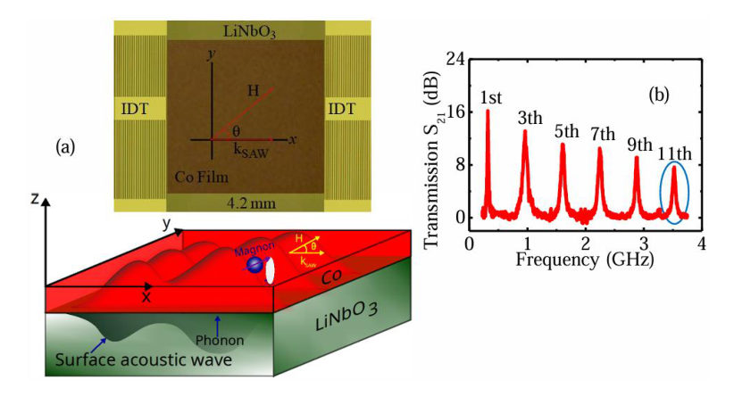 
Figure 1: (a) Optical micrograph and schematic illustration of the Co/LiNbO3 hybrid SAW

📷 Fig 2

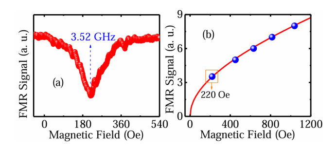 
Figure 2: (a) Representative conventional ferromagnetic resonance spectrum of the 60-nm-

📷 Fig 3

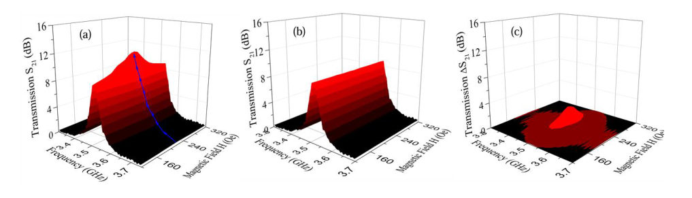 
Figure 3: (a) Measured transmission coefficient (S21) of the Co/LiNbO3 bilayer as a function

📷 Fig 4

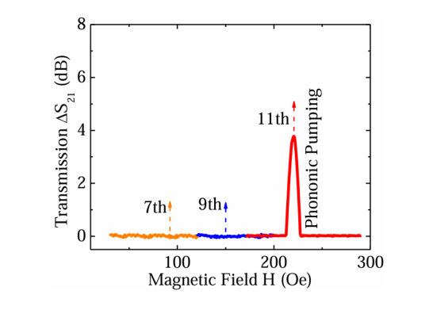 
Figure 4: Differential transmission (ΔS21) measured as a function of the applied magnetic

**Summary.** The researchers experimentally observed that propagating phonon transport in a ferromagnetic/piezoelectric bilayer is significantly enhanced only when the acoustic wave frequency matches the ferromagnetic resonance frequency of the magnetic film. This confirms a direct, resonant energy transfer mechanism from magnons to phonons, establishing a new method for actively controlling acoustic energy flow using magnetism.

**Why it may be interesting.** This work provides a direct experimental realization of energy transfer between magnetic excitations (magnons) and mechanical waves (phonons) in a controlled, resonant manner, which is highly relevant for understanding coupled quantum systems.

Detailed structure

**Main problem.** To experimentally demonstrate and investigate the phenomenon of resonantly enhanced propagating phonon transport induced by magnon pumping in a ferromagnetic/piezoelectric bilayer.

**Main result.** The enhancement of the transmitted acoustic signal occurs exclusively when the SAW frequency matches the ferromagnetic resonance (FMR) condition, confirming resonant magnon-phonon coupling.

**Method.** The study measures the SAW transmission coefficient ($S_{21}$) spectrum while sweeping the external magnetic field, comparing results on the bilayer versus a bare substrate.

**Model / system.** The physical system is a Co/LiNbO3 hybrid bilayer. The interaction mechanism relies on magnetoelastic coupling between propagating Surface Acoustic Waves (SAWs) and the magnetization dynamics of the Co film.

**Key observables.** The enhanced transmitted acoustic signal ($\Delta S_{21}$) measured as a function of the applied magnetic field and SAW harmonic.

**Important parameters / regimes.** The SAW frequency must satisfy the Kittel dispersion relation for the Co film's FMR condition.

**Assumptions / limitations.** The observed enhancement is solely due to the dynamic, resonant interaction between propagating phonons and coherent magnetization precession.

**Figures summary.** Figures show the device schematic, the measured SAW transmission spectrum ($S_{21}$) highlighting the resonance, and comparisons showing that only the SAW harmonic matching the FMR condition exhibits the enhancement.

**Paper structure.** The paper establishes the physical setup, uses FMR measurements to predict the resonance condition (Kittel fit), and then measures the SAW transmission, demonstrating that the enhancement is localized precisely at the predicted resonance field and is frequency-selective.

Abstract

We report the first experimental observation of resonantly enhanced propagating phonon transport induced by magnon pumping in a ferromagnetic/piezoelectric bilayer. Surface acoustic waves (SAWs) generated in a 128$^{\circ}$ Y-cut LiNbO$_3$ delay-line device resonantly excite magnetization dynamics in an adjacent Co film through magnetoelastic coupling. The enhancement of the transmitted acoustic signal occurs exclusively when the SAW frequency satisfies the ferromagnetic resonance condition predicted by the Kittel dispersion, providing a direct experimental fingerprint of resonant magnon-phonon coupling. A systematic comparison between the Co/LiNbO$_3$ bilayer and the bare LiNbO$_3$ substrate demonstrates that the observed transmission enhancement originates solely from the dynamic interaction between propagating phonons and coherent magnetization precession. Furthermore, measurements performed at different SAW harmonics reveal that only the harmonic satisfying the FMR condition produces a measurable enhancement, confirming the frequency-selective nature of the phenomenon. These findings establish an efficient mechanism for transferring energy from magnons to propagating phonons and provide a new strategy for actively controlling coherent acoustic transport in hybrid spintronic, straintronic, and quantum phononic platforms.

[↑ back to top](#top)

### [The refractive index of the medium within the volume of deep inelastic $ep$ scattering: I. Group velocity of interaction carriers](http://arxiv.org/abs/2609.27626v1)

**Authors:** B. B. Levchenko  
**Type:** both · **Category:** other · **PDF:** <https://arxiv.org/pdf/2609.27626v1>  
**Analysis basis:** full PDF text, analyzed in chunks
**Topic relevance:** `Keldysh / 2PI / non-Gaussian methods` **2/5** · `analog quantum simulation` **2/5** · `methods for driven-dissipative` **1/5** · `quantum measurements` **1/5**

📷 Fig 1

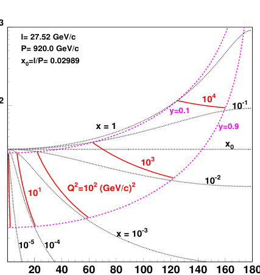 
FIG. 1: Isolines of the kinematic variables x (short-dashed, black), Q2 (full, red), and y (long-dashed, magenda) are shown in the (θ, ℓ ′) phase space for electron-proton scatter- ing at the HERA collider. The polar angle, θ, of the scattered lepton is defined with respect to the direction of the incoming lepton. The momentum of the scattered lepton is ℓ ′. The line marked x0 corresponds to space-like virtual bosons.

📷 Fig 2

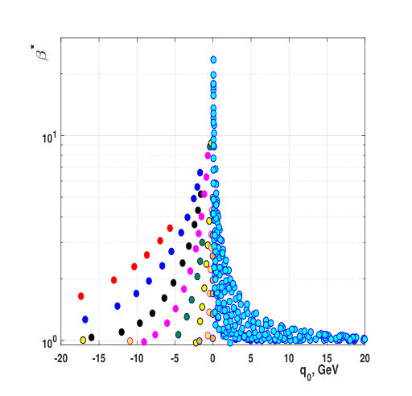 
FIG. 3: The normalized speed of B, β∗= |U∗ B|/c, as a func- tion of the energy q0 extracted with the use of Eqs. (13)-(17) from the combined HERA II data for neutral current e+p deep inelastic scattering events at the center-of-mass energy √s ≈318 GeV [36], Table 10. The color of the markers cor- responds to different values of the variable x, as described in Table 1.

📷 Fig 3

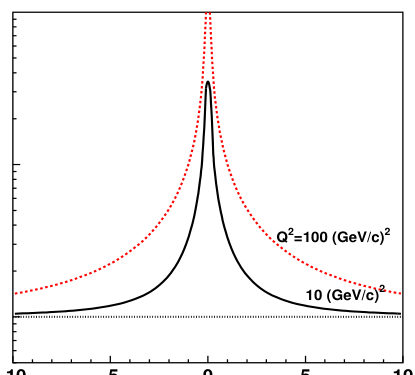 
FIG. 2: The normalized virtual boson speed accoding to the model based on the relativistic dispersion relation (6) and the HERA collider kinematics.

📷 Fig 4

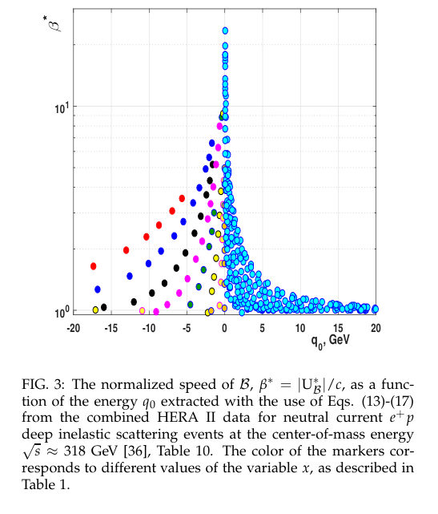 
Figure 3 shows the speed of virtual B normalized to the speed of real photons as a function of q0 at different x-values. Data points are grouped into strips with same values of ¯x and marked with different colors (see cap- tion to Table 1). Such structuring reflects the kinematic relationship between the variables x, y and Q2, and the procedure for combining data from two different exper- iments by translation onto common grids [36].

📷 Fig 5

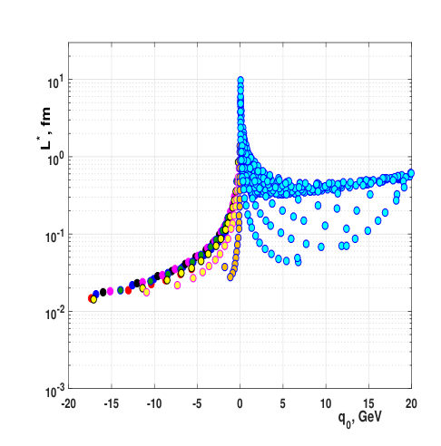 
FIG. 4: The virtual B absorption mean free path L∗= cβ∗∆t (in femtometers) as a function of the energy q0, extracted with the use of Eqs (13)-(17) from the combined HERA II data for neutral current e+p deep inelastic scattering events at the center-of-mass energy √s ≈318 GeV [36], Table 10. The color of the markers is the same as in Fig. 3 and corresponds to different values of the variable x.

**Summary.** This paper investigates the speed of the virtual mediator boson in deep inelastic scattering by treating the interaction region as a dispersive medium. It develops a theoretical framework relating group and phase velocities and applies it to HERA data. The key finding is that the derived speed can exceed the speed of light and exhibits strong singularities as the virtual boson's energy approaches zero.

**Why it may be interesting.** While the core physics is high-energy particle physics, the methodology—using dispersion relations and velocity measurements to probe medium properties—shares conceptual overlap with how collective excitations are studied in condensed matter systems.

Detailed structure

**Main problem.** The paper proposes a novel method to measure the characteristics of a fermion-boson medium formed during deep inelastic electron-proton scattering by analyzing the group and phase velocities of the mediating wave process.

**Main result.** Analysis of HERA data suggests that the effective mediator boson's speed can exceed the speed of light in free space, and the derived model shows a strong, singular dependence on the virtual boson's energy ($q_0$) as $q_0$ approaches zero.

**Method.** The authors use the Rayleigh differential condition and derive expressions for group and phase velocities from a relativistic dispersion relation model, comparing these theoretical predictions against indirect measurements from HERA collider data.

**Model / system.** The physical system is deep inelastic $ep$ scattering, where the interaction is mediated by an effective, non-perturbative boson ($B$). The analysis utilizes a relativistic dispersion relation model ($\omega^2 = \omega_0^2 + c^2 \sum k_i^2$) to define the velocities.

**Key observables.** Group velocity modulus ($U^*_B$), Phase velocity ($V^*_B$), Normalized speed ($eta^*$), and the absorption mean free path ($L^*$).

**Important parameters / regimes.** Kinematic variables like $Q^2$, Bjorken variable $x$, and the virtual boson energy $q_0$. The analysis focuses on the limits $q_0 	o 0$ and $y 	o 1$.

**Assumptions / limitations.** The analysis assumes the applicability of the Rayleigh condition and relies on deriving velocity estimates from modified Heisenberg uncertainty relations and specific kinematic limits.

**Figures summary.** Figures illustrate the kinematic view of the scattering process, the dependence of the normalized speed ($eta^*$) on $q_0$ (showing divergence near $q_0=0$), and the extracted $eta^*$ vs. $Q^2$ from HERA II data.

**Paper structure.** The paper progresses by establishing the theoretical framework (velocity definitions, Rayleigh condition), applying this framework to the DIS process, deriving model predictions for $eta^*(q_0)$, and finally comparing these model results against actual HERA experimental data across various kinematic limits.

Abstract

We propose a new method for measuring several characteristics of a fermion-boson medium formed during deep inelastic particle scattering. This method involves measuring the group and phase velocities of the accompanying wave process. The phase and group velocities of a wave process are related by the Rayleigh differential condition. The refractive index of a medium is determined by the phase velocity, while the group velocity characterises the medium's dispersion properties. In the case of deep inelastic $ep$ scattering under consideration, the wave process in an individual event is understood to be the exchange between an electron and a proton of an effective, non-perturbative mediator of interaction (${\cal B}$) with the quantum numbers of a neutral current. In the first report, we present new data on the group velocity of interaction carriers ${\cal B}$. We extracted the group velocity modulus values, $U_{_{\cal B}}^*$, from the HERA collider data using a formula derived from modified Heisenberg uncertainty relations and applying the indirect measurement method.. etc...(see preprint text)

[↑ back to top](#top)

### [Thermodynamic Uncertainty Relations in Chaotic Andreev Billiards](http://arxiv.org/abs/2609.27065v1)

**Authors:** I. R. A. C. Lucena, T. J. A. Mori, M. M. Soares, D. Bazeia, A. R. Rocha  
**Type:** theory · **Category:** statistical mechanics · **PDF:** <https://arxiv.org/pdf/2609.27065v1>  
**Analysis basis:** full PDF text, analyzed in chunks
**Topic relevance:** `Full counting statistics` **2/5** · `Keldysh / 2PI / non-Gaussian methods` **1/5** · `interference shaping light` **1/5** · `methods for driven-dissipative` **1/5**

📷 Fig 1

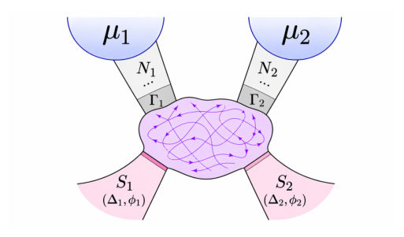 
FIG. 1. Schematic view of the chaotic Andreev billiard in the universal regime. The mesoscopic cavity is coupled to two normal-metal electron reservoirs at chemical potentials µ1 and µ2 via leads supporting N1 and N2 open channels, and to superconducting contacts, S1 and S2. In the ballistic regime, electrons undergo multiple coherent reflections, leading to chaotic scattering.

📷 Fig 2

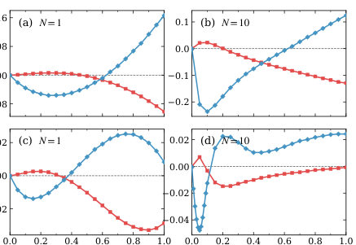 
FIG. 3. Weak-localization correction GQIC to the conductance (upper panels) and the analogous correction PQIC to the shot- noise power (lower panels) as a function of Γ for all four Altland–Zirnbauer classes, for N = 1 (left) and N = 10 (right).

📷 Fig 3

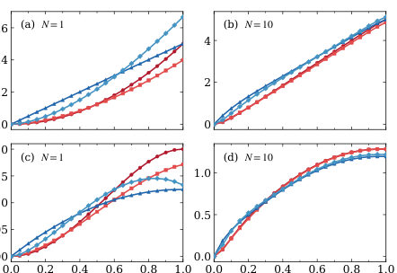 
FIG. 2. Ensemble averages of the charge conductance G (up- per panels) and shot-noise power P (lower panels) as a function of barrier transparency Γ for all four Altland–Zirnbauer classes, for N = 1 (left) and N = 10 (right).

📷 Fig 4

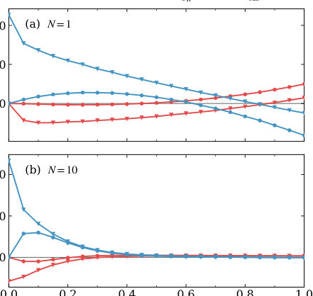 
FIG. 5. Quantum interference correction QQIC to the TUR-R and TUR-MS for the DIII (T-CRE) and CI (T-CQE) Altland– Zirnbauer symmetry classes, as a function of barrier trans- parency Γ, for N = 1 (upper) and N = 10 (lower). Parameters: µ = 0.05 V and (kBT)−1 ≈2000 eV−1.

📷 Fig 5

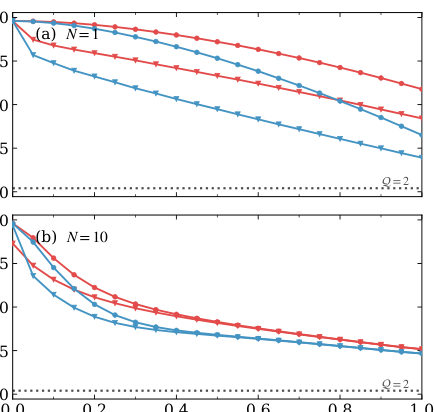 
FIG. 4. Total factors QR and QMS for the DIII (T-CRE) and CI (T-CQE) Altland–Zirnbauer symmetry classes as a function of Γ. Both observables satisfy the TUR bound Q ≥2 for all values of Γ investigated. Parameters: µ = 0.05 V and (kBT)−1 ≈2000 eV−1.

**Summary.** This work analyzes the Thermodynamic Uncertainty Relations in chaotic Andreev billiards, a system exhibiting particle-hole symmetry. By using RMT, the authors test how quantum interference and barrier transparency affect the TUR across various symmetry classes. They confirm that the fundamental thermodynamic bound remains satisfied, establishing TUR as a powerful symmetry-sensitive diagnostic tool for superconducting quantum transport.

**Why it may be interesting.** The investigation of TUR in superconducting mesoscopic systems provides a unique, symmetry-sensitive probe of universal transport, linking quantum chaos, superconductivity, and fundamental thermodynamic laws.

Detailed structure

**Main problem.** The study investigates how particle-hole symmetry, quantum interference, and tunnel barriers influence the Thermodynamic Uncertainty Relations (TUR) in chaotic Andreev billiards.

**Main result.** The standard TUR bound is consistently satisfied across all investigated regimes, confirming that Andreev billiards remain compatible with fundamental thermodynamic constraints.

**Method.** The research employs Random Matrix Theory (RMT) and the Mahaux–Weidenmüller scattering approach to analyze transport properties.

**Model / system.** The system is an open chaotic Andreev billiard, modeled using the Bogoliubov-de Gennes (BdG) Hamiltonian, which inherently possesses particle-hole symmetry.

**Key observables.** Charge conductance, shot noise power, and the TUR observable, $Q$, which is compared using two ensemble averages ($Q_R$ and $Q_{MS}$).

**Important parameters / regimes.** The analysis spans multiple regimes: the extreme quantum limit ($N=1$) to the semiclassical multichannel regime ($N=10$), and varying barrier transparencies ($\Gamma$) from ideal to opaque.

**Assumptions / limitations.** The analysis relies on the Random Matrix Theory framework and assumes operation within the universal RMT regime ($	au_\phi, 	au_D \gg 	au_E$).

**Figures summary.** Figures illustrate the dependence of conductance, noise, and the TUR observable on barrier transparency ($\Gamma$) for different symmetry classes and system sizes, showing the relative contributions of quantum interference.

**Paper structure.** The paper systematically analyzes the TUR across different symmetry classes and transport regimes, comparing two distinct definitions of the TUR observable to probe mesoscopic fluctuations and the role of quantum interference corrections.

Abstract

We investigate how particle-hole symmetry, quantum interference, and tunnel barriers shape thermodynamic uncertainty relations in chaotic Andreev billiards. Using random-matrix theory and the Mahaux-Weidenmüller scattering approach, we study charge conductance and shot noise across the four Altland-Zirnbauer symmetry classes, from the single-channel extreme quantum limit to the multichannel semiclassical regime and from ideal to opaque contacts. We characterize thermodynamic precision through two complementary ensemble observables: either by averaging the sample-resolved noise-to-conductance ratio, or from the separately averaging noise and conductance. Their pronounced discrepancy in the extreme quantum regime reveals the non-self-averaging character of mesoscopic transport and persists over a broad range of barrier transparencies. For ideal contacts, the first provides a sensitive fingerprint of the Altland-Zirnbauer symmetry class. In the opaque regime, this hierarchy changes. Despite these strong symmetry- and barrier-dependent effects, the standard thermodynamic uncertainty relation remains satisfied throughout all regimes investigated. Our results establish thermodynamic uncertainty as a symmetry-sensitive probe of universal transport in chaotic normal-superconducting systems.

[↑ back to top](#top)

### [Correlated quasiperiodicity enables efficient thermoelectric energy conversion](http://arxiv.org/abs/2609.28021v1)

**Authors:** Swaraj Biswas, Santanu K. Maiti  
**Type:** theory · **Category:** disordered systems and neural networks · **PDF:** <https://arxiv.org/pdf/2609.28021v1>  
**Analysis basis:** full PDF text, analyzed in chunks
**Topic relevance:** `Frenkel-Kontorova` **2/5** · `Keldysh / 2PI / non-Gaussian methods` **1/5** · `methods for driven-dissipative` **1/5**

📷 Fig 1

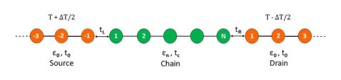 
FIG. 1: (Color online). Schematic representation of a 1D chain coupled to two 1D heat baths, source and drain. The heat baths are kept at temperatures T +∆T/2 and T −∆T/2, respectively. T is the equilibrium temperature of the system, and ∆T is the temperature difference.

📷 Fig 2

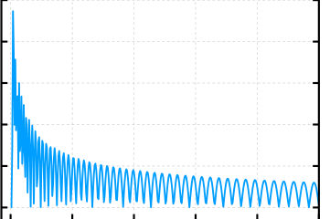 
FIG. 2: (Color online). Absolute derivative of site potential as a function of site index.

📷 Fig 3

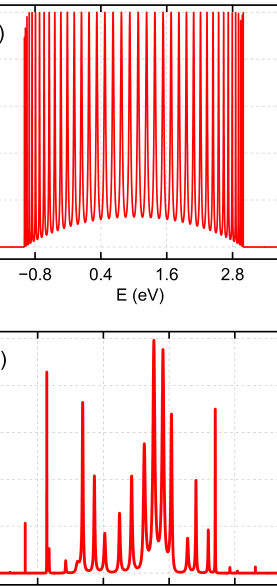 
FIG. 3: (Color online). Electronic transmission probability as a function of energy for (a) ν = 0 and (b) ν = 0.55 with N = 40 and W = 1 eV.

📷 Fig 4

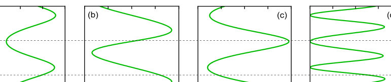 
FIG. 4: (Color online). (a) Electrical conductance (G), (b) Seebeck coefficient (S), (c) thermal conductance (ke), and (d) figure of merit (ZT ) as a function of Fermi energy (EF ) for ν = 0 with N = 40 , T = 200 K, and W = 1 eV.

📷 Fig 5

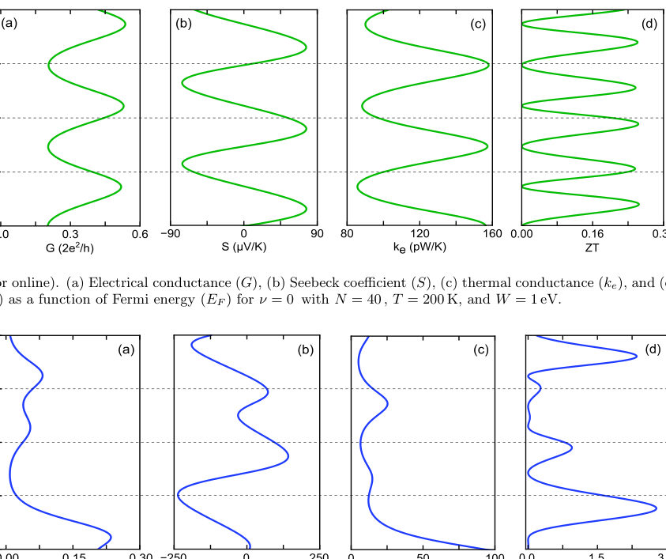 
FIG. 5: (Color online). (a) Electrical conductance (G), (b) Seebeck coefficient (S), (c) thermal conductance (ke), and (d) figure of merit (ZT ) as a function of Fermi energy (EF ) for ν = 0.55 with N = 40, T = 200 K, and W = 1 eV.

**Summary.** This work proposes using correlated quasiperiodic nanostructures to boost thermoelectric energy conversion efficiency. By modeling a 1D chain with an AAH-type potential, the authors show that the resulting non-uniform electronic transmission spectrum is crucial. This engineered disorder allows for high ZT values, surpassing those achievable in simpler or perfectly periodic systems.

**Why it may be interesting.** The core mechanism relies on engineering the electronic density of states via quasiperiodicity, a concept deeply related to localization phenomena studied in disordered systems, making it relevant to understanding transport in complex, aperiodic materials.

Detailed structure

**Main problem.** The paper investigates methods to enhance thermoelectric energy conversion efficiency in nanoscale systems by engineering the electronic energy landscape.

**Main result.** Correlated quasiperiodic potentials, specifically weakly varying Aubry-André-Harper (AAH) potentials, can induce highly non-uniform electronic transmission spectra, leading to a figure of merit (ZT) exceeding 2.

**Method.** The study employs the tight-binding framework combined with the non-equilibrium Green's function (NEGF) formalism and the Landauer approach to calculate transport coefficients.

**Model / system.** The model is a one-dimensional quantum chain coupled to source and drain reservoirs, featuring a modulated on-site energy potential belonging to the AAH family. The potential is characterized by an incommensurability parameter ($
u$).

**Key observables.** Figure of Merit (ZT), electrical conductance (G), Seebeck coefficient (S), electronic thermal conductance ($\kappa_e$), and phonon thermal conductance ($\kappa_{ph}$).

**Important parameters / regimes.** Incommensurability factor ($
u$), disorder amplitude ($W$), Fermi energy ($E_F$), and temperature ($T$).

**Assumptions / limitations.** The analysis is performed in the linear response regime, assuming small temperature differences ($\Delta T$), and includes detailed analysis of phonon contributions.

**Figures summary.** Figures compare the electronic transmission spectrum ($	au(E)$) for perfect ($
u=0$) versus correlated ($
u=0.55$) lattices, showing the latter yields necessary asymmetry for high ZT. Other figures plot ZT vs. $E_F$, $
u$, and $T$.

**Paper structure.** The paper systematically introduces the Hamiltonian and methods (NEGF/Landauer). It compares the results for perfect vs. correlated disorder, demonstrating that the non-uniformity induced by correlated disorder is key to maximizing ZT. Finally, it analyzes the dependence of ZT on coupling asymmetry and temperature.

Abstract

We investigate a route to enhanced thermoelectric energy conversion in nanoscale systems by exploiting a correlated quasiperiodic energy landscape in a one-dimensional chain coupled to source and drain reservoirs. The considered modulation generates a highly non-uniform electronic transmission spectrum, providing favorable conditions for achieving a large thermoelectric figure of merit. By systematically tuning the incommensurability parameter, a variety of quasiperiodic configurations are explored, several of which yield high values of the figure of merit exceeding $2$. Electronic transport properties are evaluated within a tight-binding framework using the non-equilibrium Green's function formalism, while the thermoelectric coefficients, including electrical conductance, Seebeck coefficient, and electronic thermal conductance, are determined through the Landauer approach. The underlying quasiperiodic potential belongs to the Aubry-André-Harper (AAH) family and exhibits a weakly varying spatial profile, leading to transmission characteristics that are favorable for thermoelectric optimization. The influence of phonon thermal conductance on the overall energy-conversion efficiency is also analyzed in detail. For the sake of completeness, we also critically inspect the effect of conductor to electrode coupling and the coupling asymmetry on $ZT$. We also check the thermoelectric response of conventional AAH system and an elaborate comparison is made with our chosen quantum system. Our findings highlight the potential of correlated quasiperiodic nanostructures as promising candidates for efficient thermoelectric applications.

[↑ back to top](#top)

### [Angular Modulations in Magnetic Torque Induced by Phase Transitions in the Triangular Supersolid $2H$-AgNiO$_2$](http://arxiv.org/abs/2609.28445v1)

**Authors:** John S. Pearce, Zeyu Ma, Alimamy Bangura, Timo Sorgel, Martin Jansen, Radu Coldea, Amalia I. Coldea  
**Type:** both · **Category:** strongly correlated electrons · **PDF:** <https://arxiv.org/pdf/2609.28445v1>  
**Analysis basis:** full PDF text, analyzed in chunks
**Topic relevance:** `analog quantum simulation` **2/5** · `quantum measurements` **1/5**

📷 Fig 1

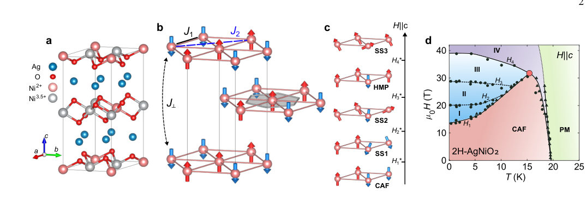 
FIG. 1. Magnetic ordering in 2H-AgNiO2. (a) Crystallographic unit cell (space group P6322). (b) Collinear antiferromagnetic stripe ordering of Ni2+ ions (pink) on triangular layers. The shaded gray hexagon depicts a piece of itinerant Ni3.5+ honeycomb surrounding a Ni2+ spin. The full Ni3.5+ honeycomb has been omitted for clarity. J1,2,⊥are Heisenberg exchange interactions, corresponding to the first nearest-neighbour, second nearest-neighbour, and interlayer interactions, respectively. (c) Semi-classical cartoons depicting the collinear antiferromagnet (CAF), first supersolid (SS1), 2:1:1 canted supersolid (SS2), half-magnetisation plateau (HMP), and 3:1 canted supersolid (SS3) structures,...

📷 Fig 2

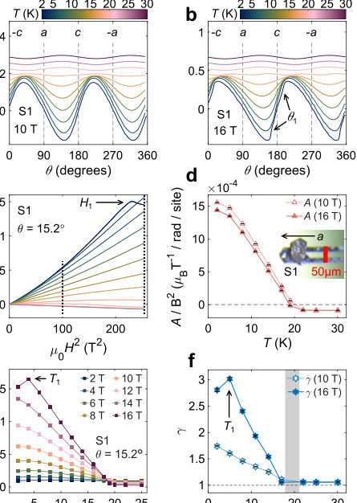 
FIG. 2. Evolution of the angular dependence of the magnetic torque with temperature. (a, b) Angular dependence of the mag- netic torque τ of sample S1 at different temperatures and in constant magnetic fields of 10 T and 16 T, respectively. θ is the angle of the field with respect to the crystallographic c axis for field rotations within the ac plane. Traces have been offset vertically for clarity. Dashed vertical lines indicate where the magnetic field is aligned with crystallographic axes. In panel (b), the arrows labelled θ1 point to kinks in τ observed near the easy c axis at 2 K. (c, e) Torque ver- sus (c) field squared and (e) temperature at a constant θ = 15◦away from the c axis. In...

📷 Fig 3

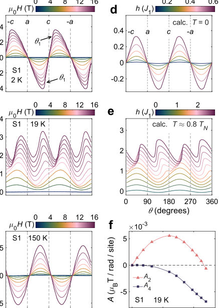 
FIG. 3. Evolution of the angular dependence of magnetic torque with magnetic field. (a-c) Angular dependence of the magnetic torque for sample S1 in different magnetic field strengths up to 16 T and at constant temperatures of 2, 19, and 150 K, respectively. θ de- notes the field rotation angle with respect to the crystallographic −c axis in the ac plane. Traces have been offset vertically for clarity in panel (b). In (a), the arrows labelled θ1 point to kinks that appear near the easy c axis above 14 T. (d, e) Calculated angular dependence of the magnetic torque at T = 0 and 0.8 TN, respectively, using mean field theory and Monte Carlo. Traces are offset vertically for clar- ity in panel...

📷 Fig 4

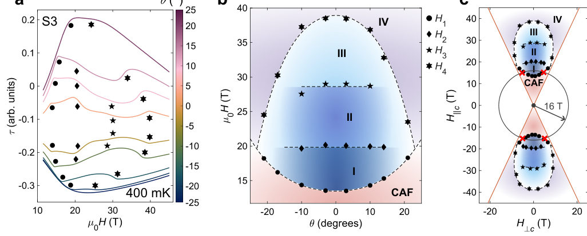 
FIG. 4. Magnetic field dependence of the torque up to 45 T in different field orientations. (a) Field dependence of the magnetic torque at 400 mK measured at constant field angles, θ, tilted away from the easy axis. The locations of four torque anomalies H1−4 are indicated by circles, diamonds, stars and hexagrams, respectively. (b) Angular dependence of the transition fields H1−4. Dashed black lines are guides to the eye, dividing the experimentally observed CAF, I, II, III, and IV phases. (c) Polar phase diagram constructed at 400 mK after imposing a two-fold symmetry axis perpendicular to the easy axis. The vertical and horizontal axes correspond to the applied field components parallel...

📷 Fig 5

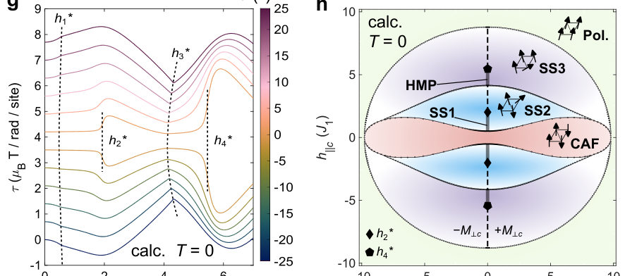 
FIG. 5. Polar phase diagram at absolute zero for the J1-J2-D-J⊥model. (a-c) Mean field calculations of the magnetisation components (in units µB per spin) parallel and perpendicular to the easy axis, and the magnetic torque, respectively, for constant θ = 1◦away from the easy c axis. The inset in panel (c) shows a zoom-in of the torque at the field h∗ 1, with an arrow to highlight the transition. (d-f) Calculations analogous to panels (a-c) performed for constant θ = 20◦away from the easy axis. (g) Field dependence of the magnetic torque for different angles, θ, away from the easy axis. The transition fields h∗ 1 and h∗ 3 represent the CAF–SS2 and SS2–SS3 boundaries, respectively. h∗ 2 and...

**Summary.** This work uses angle- and field-dependent magnetic torque measurements on $2H$-AgNiO$_2$ to map out its complex magnetic phase diagram. By comparing these experimental results with theoretical simulations, the authors confirm the existence of multiple field-induced transitions, providing strong evidence for a magnetic supersolid phase in this anisotropic material.

**Why it may be interesting.** The study provides a concrete, measurable platform (magnetic torque) to probe exotic quantum phases like supersolids in a strongly correlated magnetic insulator, linking macroscopic measurements to microscopic spin models.

Detailed structure

**Main problem.** The study investigates the complex magnetic phase transitions, particularly the potential supersolid phase, in the triangular lattice antiferromagnet $2H$-AgNiO$_2$.

**Main result.** The angular and field-dependent magnetic torque measurements reveal characteristic sawtooth signals and multiple anomalies, which are qualitatively explained by crossing different predicted phase boundaries.

**Method.** The research combines detailed experimental measurements of magnetic torque ($	au$) with theoretical modeling using mean-field and Monte-Carlo simulations on a minimal spin model.

**Model / system.** The physical system is the delafossite $2H$-AgNiO$_2$, which features localized $S=1$ moments on a triangular lattice interacting with itinerant electrons. The theory uses a minimal easy-axis $J_1-J_2$ spin model.

**Key observables.** Magnetic torque ($	au$) as a function of angle ($	heta$) and applied field ($H$), and the identification of multiple field-induced anomalies ($H_1$ to $H_4$).

**Important parameters / regimes.** Critical temperatures ($T_N \approx 19$ K), applied fields up to 45 T, and anisotropy parameters ($D/J_1$).

**Assumptions / limitations.** The theoretical analysis relies on a minimal spin model and semi-classical approximations, potentially neglecting quadrupolar moments or itinerant electron effects for certain anomalies.

**Figures summary.** Figures illustrate the magnetic ordering (CAF, SS1, SS2, etc.) and show the evolution of the angular dependence of the torque ($	au$) at various temperatures and fields, highlighting kinks and anomalies corresponding to phase boundaries.

**Paper structure.** The paper progresses by presenting experimental torque measurements across varying fields and angles, correlating the observed anomalies with theoretical phase diagrams constructed via mean-field and Monte-Carlo simulations to map out the complex magnetic phase space.

Abstract

Easy-axis frustrated triangular lattice antiferromagnets provide an important playground for stabilising a wide range of exotic magnetic phases. The delafossite $2H$-AgNiO$_2$ offers a unique model system containing a lattice of localised ($S=1$) moments surrounded by a honeycomb of itinerant electrons. Below $T_{\rm N} =19$ K, the system exhibits collinear stripe antiferromagnetic order, whereas applied magnetic fields induce a cascade of transitions which has been proposed to contain a magnetic supersolid phase. In this study, we perform detailed angular and field-dependent torque measurements in static fields of up to 45~T on single crystal samples. The angular dependence of the torque displays a sawtooth-shaped signal close to the first supersolid phase, while near $T_{\rm N}$, an unexpected additional modulation emerges. On the other hand, the field dependence of the torque indicates the presence of four field-induced anomalies which evolve in distinct ways as a function of field orientation. To understand these complex behaviours and assess the role of local moments, we employ mean-field and Monte-Carlo calculations on a minimal spin model and construct comprehensive polar phase diagrams at different temperatures. We find that the angular dependence of the torque can be understood in terms of crossing different phase boundaries by field rotation, and we identify qualitative similarities between the experimental and theoretical polar phase diagrams. Our study highlights $2H$-AgNiO$_2$ as a rich anisotropic system that provides a robust example of how spin supersolid orders can manifest in angle-dependent magnetic torque.

[↑ back to top](#top)

### [Discrete Diffusion Models via Evolving Variational Autoregressive Networks](http://arxiv.org/abs/2609.27306v1)

**Authors:** Kewen Pan, Ying Tang  
**Type:** theory · **Category:** disordered systems and neural networks · **PDF:** <https://arxiv.org/pdf/2609.27306v1>  
**Analysis basis:** full PDF text, analyzed in chunks
**Topic relevance:** `methods for driven-dissipative` **2/5** · `analog quantum simulation` **1/5**

📷 Fig 1

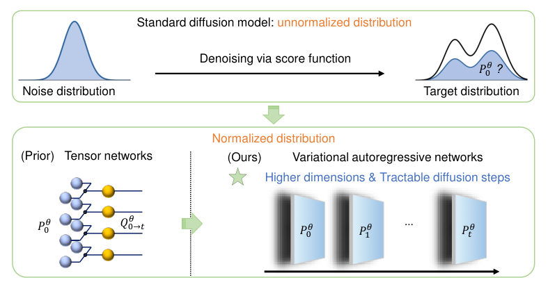 
FIG. 1. Discrete diffusion model by denoising normalized distribution of variational autoregressive networks. Standard diffusion models adopt a forward noising process and recover samples via a learned score function, without yielding explicit and tractable normalized probability representations for physical simulations. Prior work based on tensor networks addressed this by encoding normalized distributions as matrix product states, and representing the operators acting on them as matrix product operators. Building on that idea, we replace tensor networks with VAN, which learns the normalized distribution at each diffusion step under a fixed transition operator. Compared with tensor...

📷 Fig 2

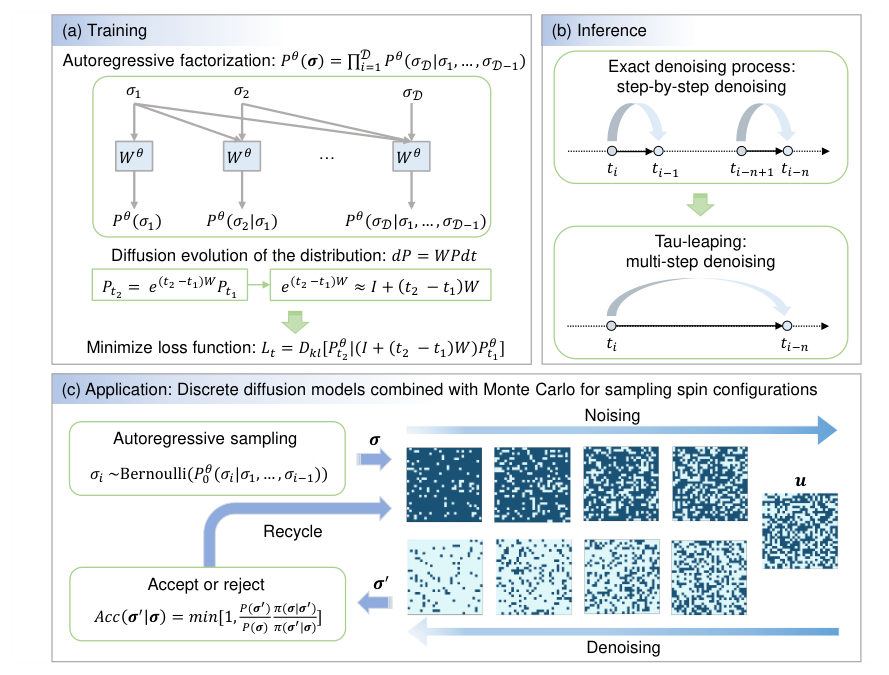 
FIG. 2. Overview of our discrete diffusion model: training procedure, inference strategy, and application. (a) The autoregressive mechanism and diffusion evolution enable tractable optimization of the loss function. (b) We consider two denoising strategies for inference: an exact denoising scheme for the Euler-discretized forward noising process, and an accelerated denoising scheme based on the tau-leaping algorithm. (c) We integrate the discrete diffusion model with the MCMC sampler to enable efficient sampling of spin configurations.

📷 Fig 3

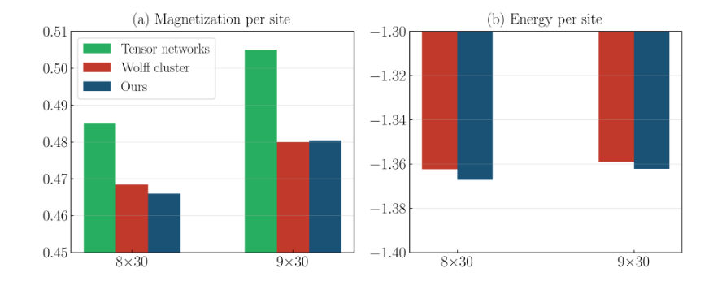 
FIG. 3. Tensor networks and VAN-based discrete diffusion models on 2D Ising model. (a) Magnetization per site obtained via the tensor network approach [24], the Wolff cluster algorithm, and our method with averages taken over 105

📷 Fig 4

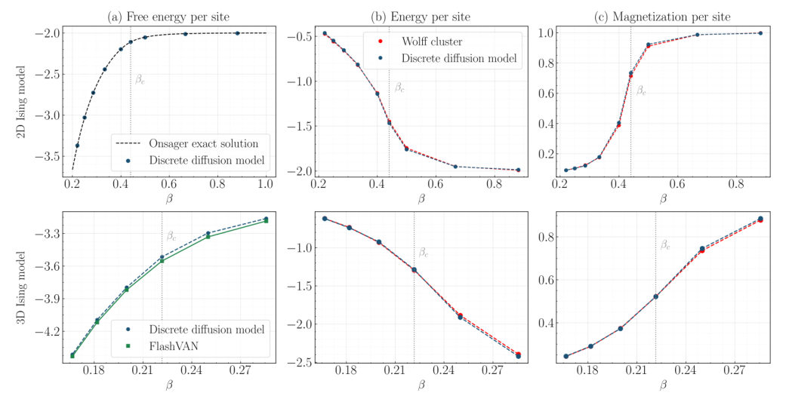 
FIG. 4. Learned discrete diffusion models for 2D and 3D Ising models at distinct temperatures. (a) Free energy per site, (b) energy per site and (c) magnetization per site as functions of inverse temperature β. The upper row corresponds to the D = 16 × 16 two-dimensional Ising model with temperatures T = 1/β = 1/ ln  1 + √

📷 Fig 5

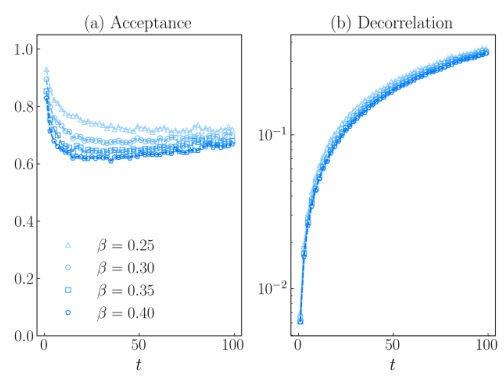 
FIG. 5. Sampling characteristics for different distribu- tions and diffusion steps. (a) Acceptance rate as a func- tion of diffusion steps for N = 128 independent configurations of the 16×16 two-dimensional Ising model in the first MCMC iteration, each initialized at inverse temperature β = βc/2 and quenched to target inverse temperatures β = 0.25, 0.30, 0.35 and 0.40 (repeated over 40 independent runs). (b) Decor- relation coefficient versus diffusion steps for the same set of configurations at each target temperature. The results reveal two consistent trends across all tested temperatures: a larger temperature gap reduces both the acceptance and configura- tion decorrelation, while...

**Summary.** This paper presents a novel discrete diffusion model utilizing Variational Autoregressive Networks (VAN) to accurately parameterize normalized probability distributions for spin systems. By applying this framework to the 2D and 3D Ising models, the authors successfully compute key thermodynamic quantities across different phases. This establishes a powerful, scalable neural-network approach for statistical mechanics simulations.

**Why it may be interesting.** The integration of advanced deep learning (autoregressive networks) with established statistical physics tools (Ising models, MCMC) provides a powerful, generalizable computational framework for analyzing complex many-body systems.

Detailed structure

**Main problem.** The paper addresses the need for a discrete diffusion model capable of parameterizing normalized probability distributions, overcoming limitations in both conventional score-based models and low-dimensional tensor-network approaches.

**Main result.** They introduce a framework using Variational Autoregressive Networks (VAN) that successfully models normalized distributions for spin systems on higher-dimensional lattices, allowing for accurate computation of thermodynamic quantities.

**Method.** The core method involves training a VAN to approximate the target Boltzmann distribution, governing the forward noising and reverse denoising dynamics via explicit Markov jump operators.

**Model / system.** The model is applied to spin systems, specifically the two- and three-dimensional Ising model, whose target distribution follows the Boltzmann distribution $P(\sigma) \propto e^{-eta E(\sigma)}$.

**Key observables.** Free energy, energy, and magnetization per site.

**Important parameters / regimes.** Inverse temperature $eta$ (spanning ordered, critical, and disordered regimes); lattice dimensions (2D and 3D).

**Assumptions / limitations.** The primary assumption is the use of the variational autoregressive factorization $P_	heta(\sigma) = \prod_{i=1}^D P_	heta(\sigma_i | \sigma_1, \dots, \sigma_{i-1})$ to decompose the joint probability.

**Figures summary.** Figure 1 contrasts the proposed normalized VAN model against standard unnormalized diffusion models. Figure 2 provides an overview of the framework, detailing training, denoising strategies, and MCMC integration.

**Paper structure.** The paper establishes the theoretical framework by defining the VAN-based discrete diffusion model, details the dynamics using Markov jump operators, applies it to the Ising model across various regimes, and integrates the method with MCMC sampling techniques.

Abstract

Conventional score-based diffusion models learn scores without representing normalized densities, whereas tractable normalized models support both sampling and direct likelihood evaluation. A recent tensor-network approach provides such a representation but is largely restricted to low-dimensional lattices. Here we introduce a discrete diffusion model that parameterizes normalized probability distributions using variational autoregressive networks. Explicit Markov jump operators govern the forward noising and reverse denoising dynamics, extending discrete diffusion models with normalized distributions to spin systems on higher-dimensional lattices. We apply this framework to the two- and three-dimensional Ising models across ordered, critical, and disordered regimes, accurately computing thermodynamic quantities including free energy, energy, and magnetization. We further integrate the framework with Monte Carlo sampling, using adaptive diffusion steps to maintain high acceptance rates even at low temperatures while enhancing sample diversity. These results establish a neural-network framework for the discrete diffusion model with normalized probability distributions.

[↑ back to top](#top)

### [Free semigroup non-relativistic phase space states quantisation](http://arxiv.org/abs/2609.27004v1)

**Authors:** Georgii Koniukov  
**Type:** theory · **Category:** other · **PDF:** <https://arxiv.org/pdf/2609.27004v1>  
**Analysis basis:** full PDF text, analyzed in chunks
**Topic relevance:** `quantum measurements` **2/5** · `Keldysh / 2PI / non-Gaussian methods` **1/5**

📷 Fig 1

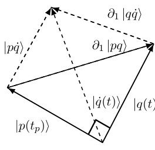 
Figure 2. Legendre transformation.

📷 Fig 2

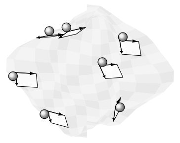 
Figure 5. Main contributors (slow oscillations) to the path integral in case of quadratic potentials

**Summary.** This paper proposes a novel quantization procedure for non-relativistic quantum mechanics by reformulating classical dynamics using a 'state language' based on free semigroups. It successfully derives the Schrödinger equation and the Born rule by analyzing the geometry of phase space states and path integral amplitudes. The work offers a mathematically rigorous, foundational approach to bridging classical and quantum descriptions.

**Why it may be interesting.** The deep mathematical restructuring of classical dynamics using semigroup theory and the derivation of fundamental quantum rules like the Born rule from first principles make it highly relevant for foundational quantum theory.

Detailed structure

**Main problem.** The paper addresses the quantization of non-relativistic phase space states by developing a formalism based on the free semigroup contribution of time, aiming to replace the principle of stationary action.

**Main result.** The formalism successfully derives the Lagrangian and the Schrödinger equation from a state-vector approach, and it derives the Born rule by comparing path integral amplitudes with density matrix calculations.

**Method.** The methodology involves introducing a 'state language/Dirac notation' for classical mechanics, dividing quantization into two stages (operator action and Planck scale consideration), and utilizing path integrals with time-slicing.

**Model / system.** The model is non-relativistic quantum mechanics applied to a general 1D particle system, utilizing phase space concepts, state vectors, and path integrals. The Hamiltonian structure is central to the analysis.

**Key observables.** The solid angle ($\Omega$) between states, the probability $p$ (for the Born rule), and the state vectors themselves ($|q
angle, |p
angle$).

**Important parameters / regimes.** The Planck length ($\hbar$), the free semigroup time contribution, and the scale relative to $\hbar$ (quantum vs. classical limits).

**Assumptions / limitations.** The formalism assumes the structure of time contribution as a free semigroup and relies on specific conventions for state definitions and operator ordering.

**Figures summary.** Figures illustrate the Legendre transformation structure, the quantum limit of phase space states, and the quasi-classical limit of phase space states.

**Paper structure.** The paper progresses by establishing a state language for classical mechanics, deriving the Lagrangian, analyzing the solid angle in phase space, deriving the path integral propagator, and finally applying the formalism to derive the Born rule.

Abstract

Quantisation is considered as an action of classical point operators on field states at the Planck scale of the phase space. Emphasis is placed on the sequence of physical variables. A "state language/Dirac notation" for classical mechanics is introduced; in many cases, it replaces the principle of stationary action for conservative systems. Observed classical and quantum dynamics are considered as different vectorisations of the free semigroup contribution of time. There is a dream of describing classical dynamics as complex transformations of state vectors over such a free semigroup, rather than solving differential equations. The transition from the alphabet to states, from states to state functions, and from state functions to measurable quantities is managed by projectors. An attempt is made to provide a derivation of the Legendre transformation. The trivial multiplication of the potential energy by the wave function in the coordinate representation and its non-trivial operator action in the momentum representation are obtained without a Fourier transform nor the Planck scale. The quantisation procedure is divided into two stages: first, the action of point-like classical operators on field functions; and second, accounting for the physically finite scale of the Planck length against the backdrop of the possible infinitesimality in the classical phase space. The concept of an angle between states is introduced, defining the measure of "quantumness". The free semigroup time contribution is studied in the context of the Born rule.

[↑ back to top](#top)

### [Geometric perspective on quantum Rabi model: Super adiabatic universality and curvature non-adiabatic effects](http://arxiv.org/abs/2609.27662v1)

**Authors:** Zu-Jian Ying  
**Type:** theory · **Category:** other · **PDF:** <https://arxiv.org/pdf/2609.27662v1>  
**Analysis basis:** full PDF text, analyzed in chunks
**Topic relevance:** `analog quantum simulation` **2/5** · `Tavis-Cummings & cavity-many-emitter` **1/5**

📷 Fig 1

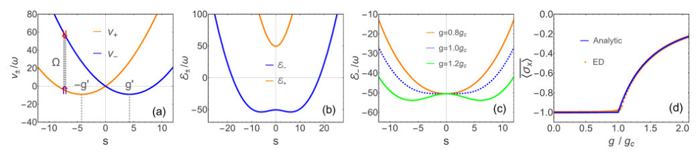 
FIG. 1. Reliability of the adiabatic basis: Capturing the quantum phase transition (QPT). (a) Description of QRM in effective s space. (b) Local energy E±. (c) Dependence of lower-branch energy E−around gc. (d) Comparison of the spin expectation ⟨σx⟩[Eqs. (14) and (15)] with exact diagonalization (ED). Here ω = 0.01/Ωin all panels and g = 1.2gc in (a) and (b).

📷 Fig 2

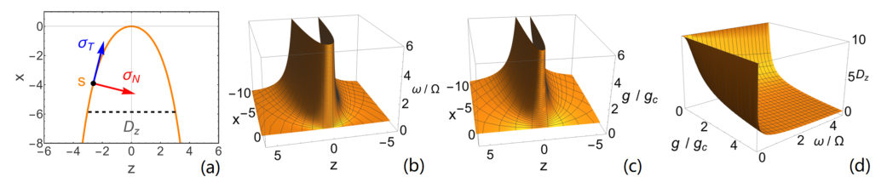 
FIG. 2. Mapping the QRM to curved nanowire system with curvature controlled by the coupling or frequency. (a) Effective geometric path of the QRM in the z–x plane at ω = 0.5Ωand g = 0.8gc. (b) 3D plot for the geometric path depending on coupling g at ω = 0.5Ω. (c) 3D plot for the geometric path depending on frequency ω at g = 0.8gc. (d) 3D plot for the path width Dz depending on g and ω at |s| = 5.

📷 Fig 3

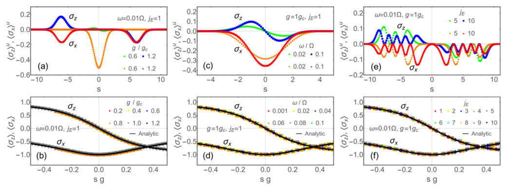 
FIG. 3. Super adiabatic universality: Universal scaling relation of the spin texture ⟨σz,x⟩[(b), (d) and (f)] ubiquitously valid for different couplings g [(a) and (b)], different frequencies ω [(c) and (d)], different energy levels jE [(e) and (f)]. (a),(b) Different g/gc at ω = 0.01 for jE = 1 (ground state). (c),(d) Different ω/Ωat g = 1.0gc for jE = 1. (e),(f) Different excited states jE at ω = 0.01 and g = 1.0gc. In (a),(c) and (e) the diversified spin textures are unscaled (with superscript u), while in (b),(d) and (f) they are normalized by the density ρ and position scaled with sg. All the spin textures (symbols) collapse into a same line [(b),(d) and (f)] captured by the analytic...

📷 Fig 4

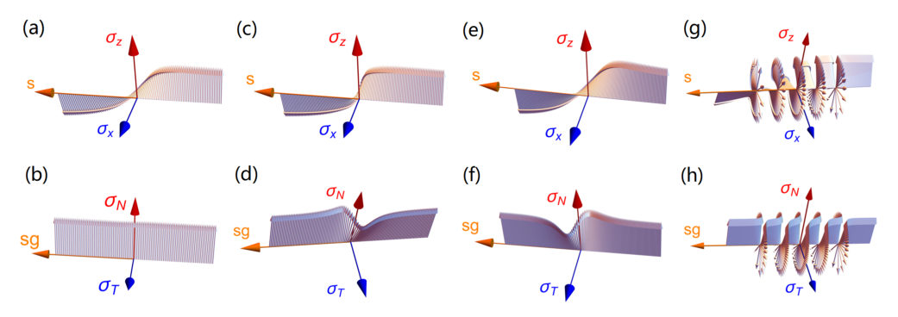 
FIG. 4. Non-adiabatic 3D spin texture [(c)–(h)] compared with adiabatic one [(a) and (b)] in the lab frame [(a),(c),(e) and (g)] and curve frame [(b),(d),(f) and (h)]. (a),(b) ω = 0.1Ω, g = 1.0gc and jE = 1. (c),(d) ω = 0.1Ωand g = 3.0gc and jE = 1. (e),(f) ω = 2.0Ωand g = 1.0gc and jE = 1. (g),(h) ω = 0.1Ωand g = 1.0gc and jE = 6. In the curve frame [(b),(d),(f) and (h)] it is direct to see the non-adiabaticity arising when the spin trajectory deviates from the normal direction (labeled by σN), as in a large coupling (d), high frequency (f) or excited state (h).

📷 Fig 5

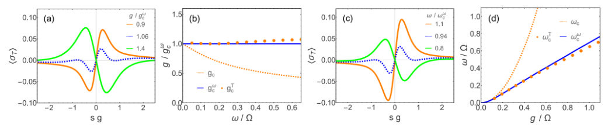 
FIG. 5. Changeover of non-adiabatic spin-swing direction in association with the QPT of the QRM. (a) Spin swing in the tangential component ⟨σT ⟩around the QPT: g/gω c = 0.9 [orange (gray) solid], 1.06 (blue dotted]) and 1.4 [green (light gray) solid] at ω = 0.5Ω. (b) Frequency dependence of critical coupling gT c (ED, dots) of spin swing changeover in agreement with the analytical critical coupling gω c (blue solid line) of the QPT. (c) Spin swing in ⟨σT ⟩around the critical frequency: ω/ωω c = 1.1 [orange (gray) solid], 0.94 (blue dotted) and 0.8 [green (light gray) solid] at g = 0.8gω c . (d) Coupling dependence of critical frequency ωT c (ED, dots) of the tangential spin-swing...

**Summary.** This paper introduces a novel geometric framework by mapping the Quantum Rabi Model (QRM) onto a curved nanowire system. This approach allows the authors to reveal a 'super-universality' in the adiabatic regime and provides a geometric interpretation for the QRM's quantum phase transition. The method offers a powerful tool for gaining deeper insights into light-matter interactions.

**Why it may be interesting.** This work directly bridges geometry (curved manifolds) with fundamental quantum physics (light-matter interaction), offering a powerful, generalizable framework for understanding complex quantum dynamics beyond simple approximations.

Detailed structure

**Main problem.** To develop a unified, geometric perspective for the Quantum Rabi Model (QRM) to understand its universal properties and the nature of its quantum phase transitions (QPTs).

**Main result.** The geometric mapping reveals a 'super-universality' in the adiabatic regime and provides a geometric interpretation for the QPT via a changeover in the non-adiabatic spin texture.

**Method.** The authors map the QRM to a curved nanowire system, employing geometric analysis, local diagonalization, and semiclassical approximations to analyze the system's behavior.

**Model / system.** The study focuses on the Quantum Rabi Model (QRM), a fundamental model for light-matter interactions (LMIs). The analysis involves mapping this system onto a curved nanowire Hamiltonian that incorporates curvature-induced spin-orbit coupling (SOC).

**Key observables.** Super-universality of spin texture, changeover of tangential spin swing direction, spectral bifurcation, and spectral oscillations.

**Important parameters / regimes.** LMI strength ($g$), frequency ratio ($\omega/\Omega$), and the curvature of the nanowire geometry.

**Assumptions / limitations.** The analysis relies on mapping the system to a curved geometry and utilizing approximations like the semiclassical limit in certain regimes.

**Figures summary.** Figure 1 compares adiabatic basis results with exact diagonalization for QPT analysis. Figure 2 illustrates the mapping of the QRM onto a curved nanowire system, showing paths dependent on coupling and frequency.

**Paper structure.** The paper introduces the QRM, develops the geometric mapping to a curved nanowire, analyzes the adiabatic and non-adiabatic regimes to find universal scaling laws, and interprets the QPT through geometric non-adiabaticity.

Abstract

Quantum Rabi model (QRM) is a fundamental model in light-matter interactions (LMIs), whereas this finite-component system manifests infinite physics to be explored and a full understanding has not yet been reached after a hundred years since it was proposed. In the present work we create a geometric perspective for the QRM by mapping to a curved nanowire system, with curvature-induced spin-orbit coupling (SOC) manipulatable by LMI strength and frequency ratio, which is capable of revealing and perceiving the property universality and diversity from the ground state to the whole spectrum in a unified picture. Indeed, we unveil a super university in the adiabatic regime which manifests a universal scaling of spin texture ubiquitously valid for different couplings, different frequencies and different energy levels. The curve frame also facilitates our finding that a direction changeover of tangential spin swing emerges in the non-adiabatic spin texture in association with the quantum phase transition (QPT) in the QRM, which endows a geometric non-adiabaticity interpretation and connotation to the QPT. We also clarify that, among the curvature-induced effects, the SOC accounts for the spectral bifurcation and oscillations. Our method and analysis, readily generalized to other light-matter models, opens a dialogue between geometry and physics, thus paving a novel way to gain deeper insight into LMIs.

[↑ back to top](#top)

### [Image Compression Using Quantum Wavelet Transform and Quantum Convolutional Networks](http://arxiv.org/abs/2609.28387v1)

**Authors:** Harshdeep Jadhav, Sreeraj Rajan Warrier, Jayasri Dontabhaktuni  
**Type:** both · **Category:** quantum information and computing · **PDF:** <https://arxiv.org/pdf/2609.28387v1>  
**Analysis basis:** full PDF text, analyzed in chunks
**Topic relevance:** `QC/QI experiment` **2/5** · `methods for driven-dissipative` **1/5**

📷 Fig 1

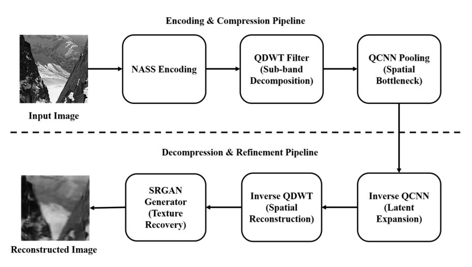 
Figure 1: Overall schematic of the proposed hybrid quantum-classical image compression and decompression framework.

📷 Fig 2

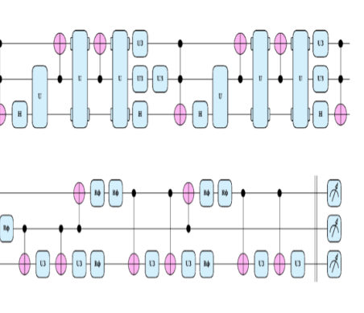 
Figure 2: Quantum circuit structure for preparing a NASS state.

📷 Fig 3

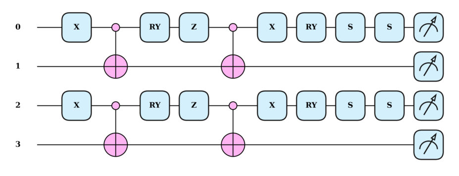 
Figure 3: Quantum circuit implementing a 4-qubit Daubechies-like wavelet transform using multi-controlled gates and rotation-based filtering.

📷 Fig 4

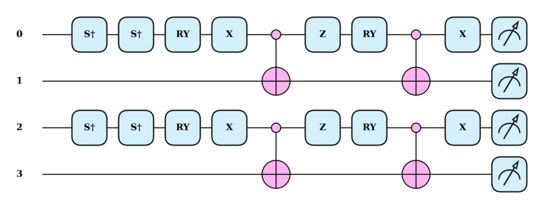 
Figure 4: Quantum circuit implementing the inverse Daubechies D4 wavelet transform on a 4-qubit register.

📷 Fig 5

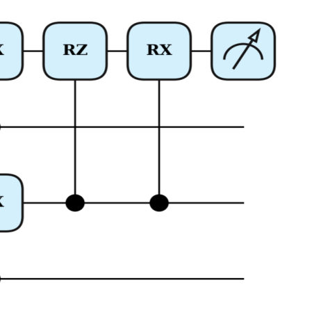 
Figure 5: Quantum circuit used in QCNN for the Image Compression.

**Summary.** This work proposes a hybrid quantum-classical framework for image compression, combining Variational Quantum Wavelet Transforms and Quantum CNNs for quantum feature extraction. The quantum latent representation is then refined using a classical Super-Resolution GAN, achieving state-of-the-art perceptual quality metrics. It demonstrates the potential of quantum computation to enhance classical signal processing tasks.

**Why it may be interesting.** While focused on image processing, the reliance on variational quantum circuits (V-QDWT, QCNN) for feature extraction and dimensionality reduction provides a concrete, near-term application of quantum machine learning algorithms.

Detailed structure

**Main problem.** The paper addresses the challenge of efficient and high-fidelity image compression and decompression by integrating quantum computational techniques with classical deep learning models.

**Main result.** The hybrid quantum-classical framework achieves superior structural fidelity, with the final reconstruction significantly surpassing baseline quantum methods by incorporating a classical Super-Resolution GAN.

**Method.** The process involves encoding images into quantum states (NASS), performing multi-resolution analysis using a Variational Quantum Daubechies Wavelet Transform (V-QDWT), and feature reduction via a trainable Quantum Convolutional Neural Network (QCNN).

**Model / system.** The core model is a hybrid quantum-classical pipeline tested on NISQ hardware (IBM Fez) and simulated. It utilizes quantum circuits for state preparation, wavelet transforms, and convolutional layers, followed by classical SRGAN refinement.

**Key observables.** PSNR (30.0667 dB), SSIM (0.8744), and Histogram Correlation (0.9244) are key performance metrics used to validate reconstruction quality.

**Important parameters / regimes.** The compression ratio is mathematically defined (e.g., 4:1), and the process involves mapping pixel intensities to quantum rotation angles ($\phi_i$).

**Assumptions / limitations.** The framework assumes the feasibility of implementing inverse QCNN and QDWT circuits, and that classical SRGAN post-processing is necessary to restore perceptual quality lost during quantum compression.

**Figures summary.** Figures illustrate the overall hybrid framework schematic, quantum circuits for NASS state preparation and wavelet transforms, and comparisons showing the improvement from base quantum reconstruction to SRGAN-refined output.

**Paper structure.** The paper details the encoding (NASS), the quantum compression pipeline (V-QDWT $
ightarrow$ QCNN), the decompression pipeline (Inverse QCNN $
ightarrow$ IQDWT $
ightarrow$ SRGAN), and includes ablation studies comparing quantum vs. classical components.

Abstract

This paper presents a hybrid quantum-classical framework for grayscale image compression and decompression, leveraging the strengths of quantum computing and deep learning. The compression pipeline integrates a Variational Quantum Daubechies Wavelet Transform (V-QDWT) and a trainable Quantum Convolutional Neural Network (QCNN) optimized end-to-end to achieve efficient, image-adaptive multi-resolution analysis and entanglement-based feature reduction. Input images are encoded using the Normal Arbitrary Superposition State (NASS) representation, enabling compact and scalable quantum storage. For decompression, we implement inverse QCNN and V-QDWT circuits to reconstruct coarse image features natively, followed by a classical Super-Resolution Generative Adversarial Network (SRGAN) to enhance perceptual quality. Experimental evaluations on benchmark grayscale datasets demonstrate the efficacy of our hybrid approach. By jointly training the quantum layers, the base quantum pipeline closely rivals classical JPEG2000 standards. Subsequent SRGAN refinement substantially pushes the boundaries of the reconstruction, achieving superior structural fidelity (PSNR: 30.0667 dB, SSIM: 0.8744, Histogram Correlation: 0.9244). Histogram analysis and qualitative comparisons further validate the restoration of fine textures and intensity distributions. Our findings highlight the potential of combining variational quantum compression with classical deep learning to enable efficient, scalable, and perceptually-aware image processing in quantum-enhanced computing environments.

[↑ back to top](#top)

### [Influence of fast and slow laser phase noise on the fidelity of the Mølmer-Sørensen trapped-ion gate](http://arxiv.org/abs/2609.26912v1)

**Authors:** Nikita Semenin, Ksenia Khabarova, Nikolay Kolachevsky  
**Type:** theory · **Category:** other · **PDF:** <https://arxiv.org/pdf/2609.26912v1>  
**Analysis basis:** full PDF text, analyzed in chunks
**Topic relevance:** `QC/QI experiment` **2/5** · `Keldysh / 2PI / non-Gaussian methods` **1/5**

📷 Fig 1

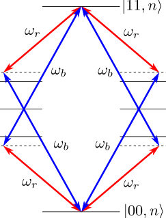 
Figure 1. The MS gate level scheme. The bichromatic field (ωb, ωr) creates 4 Raman paths between states |00, n⟩↔|11, n⟩. The intermediate states are the blue and red motional sidebands of the l-th mode with frequency ωl

📷 Fig 2

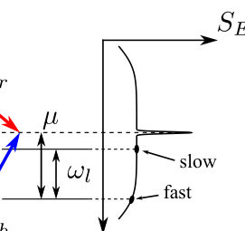 
Figure 2. The influence of laser phase noise on the MS gate. Parasitic interactions arise from the overlap of the laser field power spectral density (PSD) SE(ω) with the closest states of the system, outlining the "slow" and "fast" parts (see main text)

📷 Fig 3

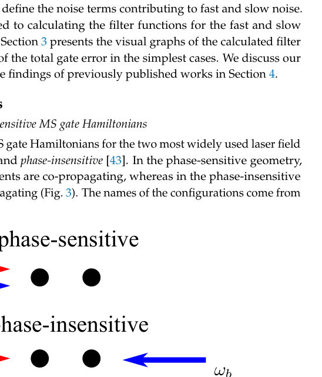 
Figure 3. The phase-sensitive and phase-insensitive laser beam geometries. In this example the axial motional modes of the ionic chain are excited

📷 Fig 4

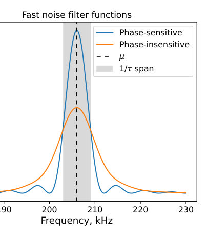 
Figure 4. Filter functions for fast laser phase noise, both sensitive and insensitive configurations. The dashed line represents the detuning from the carrier transition µ. The width of the shaded region is 1/τ, where τ is the gate time. For other details of the calculation see main text

📷 Fig 5

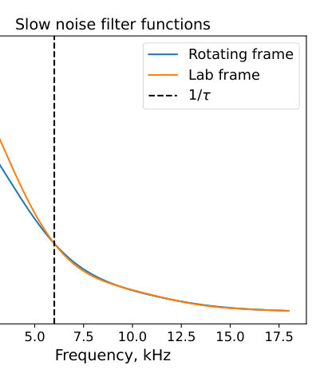 
Figure 5. Slow laser frequency noise filter functions. The dashed line represents the value 1/τ. Note the different units compared to Ffast( f )

**Summary.** This paper provides a detailed theoretical analysis of how laser phase noise affects the fidelity of the Mølmer-Sørensen gate in trapped-ion quantum computing. The authors derive analytical expressions for the gate error by separating the noise into 'fast' and 'slow' spectral components. This work offers essential quantitative guidelines for improving laser spectral purity in quantum processors.

**Why it may be interesting.** This work provides crucial, detailed analytical tools for quantifying decoherence sources specific to trapped-ion quantum gates, which is vital for designing fault-tolerant quantum hardware.

Detailed structure

**Main problem.** The paper analyzes how laser phase noise degrades the fidelity of the Mølmer-Sørensen (MS) entangling gate used in trapped-ion quantum computing.

**Main result.** The gate error is shown to be determined by the convolution of the laser noise Power Spectral Density (PSD) with analytically derived filter functions, which are separated into 'fast' and 'slow' noise regimes.

**Method.** The authors perform a comprehensive theoretical analysis, deriving noise Hamiltonians and calculating the average gate error using the Dyson series formalism, leading to analytical expressions for the error.

**Model / system.** The system is trapped-ion quantum computing utilizing the Mølmer-Sørensen gate. The analysis models the influence of intrinsic laser phase noise on the qubit dynamics.

**Key observables.** Gate Fidelity and the average gate error ($\epsilon$).

**Important parameters / regimes.** Laser noise Power Spectral Density (PSD), gate time ($	au$), and spectral frequency ranges ('fast' near motional spectrum, 'slow' near inverse gate time).

**Assumptions / limitations.** The analysis assumes the noise is intrinsic phase noise of the common laser source, and it utilizes approximations valid in the Lamb-Dicke regime.

**Figures summary.** Figure 1 illustrates the MS gate level scheme with four Raman paths, and Figure 2 shows how the laser field PSD overlaps with system energy levels, distinguishing between 'slow' and 'fast' noise components.

**Paper structure.** The paper progresses from defining the MS gate and the source of noise, to deriving the noise Hamiltonians for different geometries, calculating the error using the Dyson series, and finally presenting analytical expressions for the error in both fast and slow noise regimes.

Abstract

High-fidelity two-qubit entangling gates are essential for the realization of useful quantum algorithms on quantum processors. The Mølmer-Sørensen (MS) gate has become a common choice for trapped-ion quantum computing due to its resilience to ion temperature and its demonstrated record fidelities. However, the spectral impurity of the driving laser field impacts gate performance, with phase noise influencing the qubit dynamics through mechanisms operating on different timescales. In this work, we present a comprehensive theoretical analysis of laser phase noise in the MS gate, identifying two spectral ranges which influence the gate fidelity the most: "fast" noise at frequencies near the motional mode spectrum, and "slow" noise at frequencies on the order of the inverse gate time. We derive the noise Hamiltonians for two common laser beam geometries and obtain analytical expressions for the average gate error in terms of the laser noise power spectral density and gate parameters. For slowly varying noise spectra, we provide simplified error estimates. In addition, we validate our findings against previously published numerical simulations.

[↑ back to top](#top)

### [Efficient Learning of Clifford-Scrambled Product States](http://arxiv.org/abs/2609.27128v1)

**Authors:** Tobias Haug  
**Type:** theory · **Category:** quantum information and computing · **PDF:** <https://arxiv.org/pdf/2609.27128v1>  
**Analysis basis:** full PDF text, analyzed in chunks
**Topic relevance:** `quantum measurements` **2/5**

📷 Fig 1

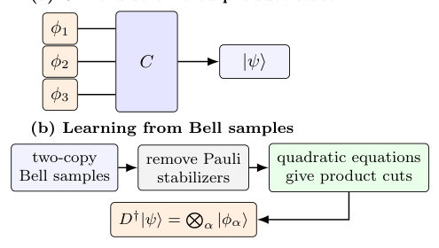 
FIG. 1. Learning product subsystems hidden by a Clifford circuit. (a) The unknown Clifford C spreads the input blocks across the system and can generate volume-law entanglement. (b) We measure pairs of copies in the Bell basis. Affine equa- tions identify Pauli stabilizers, and quadratic equations on the residual samples determine the hidden subsystems. Applying the learned Clifford decoder D† to fresh copies disentangles the subsystems, followed by tomography of each block.

**Summary.** This work presents a method to efficiently determine the underlying product structure of quantum states that have been scrambled by Clifford circuits. By analyzing quadratic relations derived from two-copy Bell sampling, the authors can pinpoint the hidden independent subsystems. This advances the field by providing scalable measurement-based techniques for characterizing complex quantum entanglement structures.

**Why it may be interesting.** The techniques developed for state tomography and structure recovery using limited measurements (Bell samples) are highly relevant for characterizing complex quantum states generated in quantum computation or quantum simulation settings.

Detailed structure

**Main problem.** The paper addresses the challenge of efficiently recovering the hidden product structure of quantum states that have been scrambled by a global Clifford circuit.

**Main result.** The hidden product structure can be efficiently recovered using two-copy Bell sampling by analyzing the quadratic relations satisfied by the samples, which determine unique irreducible symplectic subspaces.

**Method.** The core method involves using two-copy Bell sampling to generate quadratic equations, which are then analyzed via polarization to extract bilinear forms that identify the independent product subsystems.

**Model / system.** The system under study consists of $n$-qubit pure states prepared by applying a global Clifford circuit to independent product blocks, often analyzed via their Choi states or Bell samples.

**Key observables.** Clifford-product width ($w_{CP}(\psi)$), quadratic relations satisfied by Bell samples, and the gap ($\gamma_2$) between the state and the Haar random ensemble.

**Important parameters / regimes.** The required number of Bell samples scales polynomially, often $O(n^2)$, for both exact and approximate learning.

**Assumptions / limitations.** Approximate learning relies on the state remaining sufficiently separated from acquiring additional Pauli stabilizers, and exact recovery depends on the gap $\gamma_2$ being large enough.

**Figures summary.** Figure 1 illustrates the process: (a) a Clifford-scrambled product state, and (b) the recovery process using Bell samples where affine equations identify stabilizers and quadratic equations determine hidden subsystems.

**Paper structure.** The paper progresses from establishing the general framework using two-copy Bell sampling to deriving theorems that classify the product structure using quadratic forms (Theorem 1). It then quantifies the sample complexity for exact recovery (Theorem 2) and extends this to approximate learning (Theorem 4), concluding with distinguishing these states from Haar random states.

Abstract

Clifford circuits acting on product magic states provide a compact ansatz exhibiting extensive magic, volume-law entanglement, and even classically hard sampling under standard complexity assumptions. Here, we efficiently recover its hidden product subsystems from two-copy Bell sampling. Quadratic relations between Bell samples determine the irreducible blocks after removing Pauli stabilizers, and binary linear algebra constructs a Clifford disentangler. For logarithmic-size blocks, approximate learning of the full state is efficient whenever the state remains inverse-polynomially separated from acquiring additional Pauli stabilizers. We efficiently learn $n$-qubit states prepared by random $T$-doped Clifford circuits with $T$-gate density below one via $O(n^2)$ Bell samples, and disentangle hidden product blocks in Clifford-augmented matrix product states. For unitary learning, we exactly learn $T$-depth-one circuits using $O(n^2)$ queries. Finally, we rule out pseudorandom states and unitaries with a product bipartition hidden by Clifford circuits.

[↑ back to top](#top)

### [Fermion bag study of the two-dimensional Majorana-Hubbard model at finite hopping](http://arxiv.org/abs/2609.26881v1)

**Authors:** Mark Johnston, Emilie Huffman  
**Type:** theory · **Category:** strongly correlated electrons · **PDF:** <https://arxiv.org/pdf/2609.26881v1>  
**Analysis basis:** full PDF text, analyzed in chunks
**Topic relevance:** `analog quantum simulation` **2/5**

📷 Fig 1

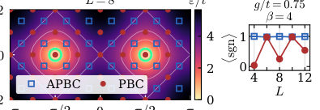 
FIG. 1. (a) π-flux square lattice with one Majorana per site, defining ηij. Shaded: one plaquette carrying the interaction gηijηklγiγjγkγl. (b) Average sign at β = L/4 versus g/t with APBC. The sign is unity to g ≃0.6t and then decays with volume near the mean-field transition g ≃0.9t (dashed). (c) Free-fermion spectrum ϵ(k) for L = 8 showing the two Ma- jorana cones at k = (±π/2, 0) that form one two-component Dirac fermion. PBC contains the zero modes whenever 4 | L, while APBC is displaced by π/L and never do. Inset: the sign at fixed (g, β) collapses at 4 | L PBC and is flat APBC.

📷 Fig 2

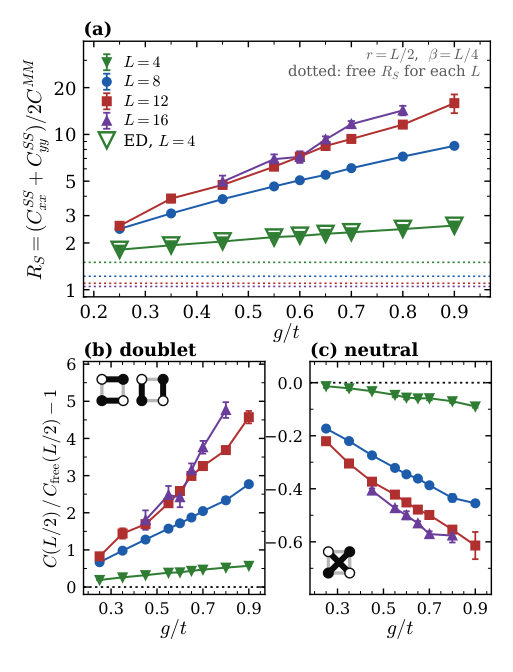 
FIG. 2. (a) Channel ratio RS = (CSS xx + CSS yy )/2CMM at r = L/2 versus g/t. Sx, Sy are the columnar dimerization operators, the two real components of the U(1)-charged dou- blet ψeψo, and M the U(1)-neutral Dirac mass. RS exceeds its free value everywhere and rises with g and L. (b,c) The two channels separately, each relative to its own free value at the same (L, β). The doublet lies above the free theory and rises with g and with L, to 3.9 ± 0.3 times free at L = 16, g = 0.7t; the neutral lies below and falls with both, to 0.40 of free at the same point. The two channels move in opposite directions at every coupling and size. The cartoons mark the bonds each operator lives on:...

📷 Fig 3

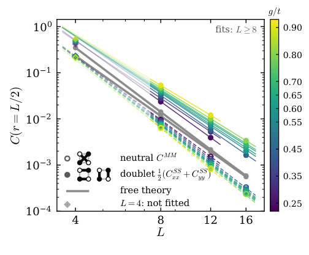 
FIG. 3. Connected correlators of the charged doublet 1/2(CSS xx + CSS yy ) (filled, solid fits) and of the neutral mass CMM (open, dashed) at r = L/2 versus L on logarithmic axes. The free theory is in gray and at the same β. Lines are power-law fits C ∝L−p, fitted to L &gt; 4 values. They are faded and continued back through L = 4. Both channels re- main power-law through g = 0.9t on these sizes, and the two exponents move in opposite directions with g: for the range g = 0.25t to 0.8t the doublet moved from from p = 4.40(14) to 3.81(6) against the free 4.64, the neutral from 4.54(2) to 4.88(7) against the free 4.39.

📷 Fig 4

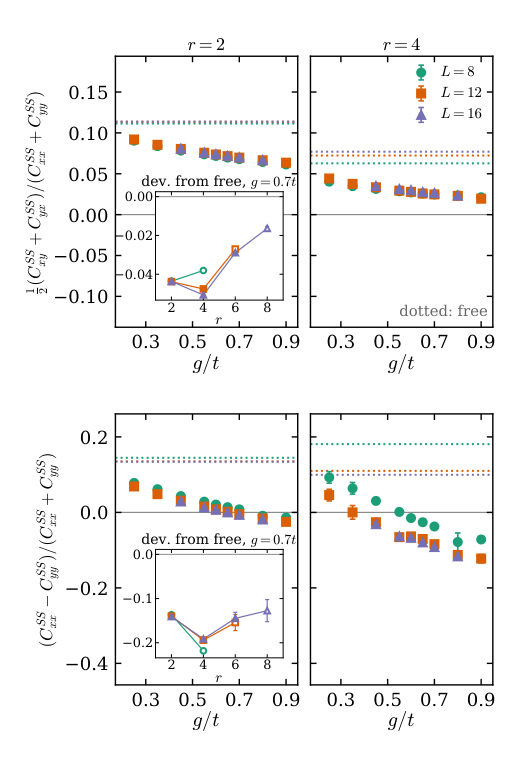 
FIG. 4. With Φ = Sx + iSy, the charge-4 correlator ⟨Φ(0)Φ(r)⟩can be used to compute whether U(1) emerges. Its imaginary part, the off-diagonal 1

**Summary.** This work tackles the computationally difficult problem of simulating the 2D Majorana-Hubbard model at finite hopping using advanced Quantum Monte Carlo methods based on Pfaffians. The authors successfully remove the sign problem for a significant parameter range and find that the system remains a gapless semimetal, confirming theoretical predictions about its electronic structure.

**Why it may be interesting.** The rigorous application of advanced QMC techniques (Pfaffians) to a model featuring Majorana fermions and emergent symmetries provides deep insights into topological phases relevant to condensed matter physics.

Detailed structure

**Main problem.** The primary challenge is performing nonperturbative lattice calculations for the two-dimensional Majorana-Hubbard model at finite hopping, which was previously limited to zero hopping.

**Main result.** The simulations consistently show that the system remains in a gapless semimetal phase across the sign-problem-minimal parameter window, confirming the expected behavior.

**Method.** Quantum Monte Carlo (QMC) simulations are employed using novel Hamiltonian fermion bags, which utilize Pfaffians derived from a continuous-time expansion to manage the sign problem.

**Model / system.** The system is the two-dimensional Majorana-Hubbard model defined on a $\pi$-flux lattice, involving one relativistic Majorana fermion per site. The Hamiltonian includes hopping terms ($t$) and interaction terms ($g$).

**Key observables.** Dimerization correlators (charged doublet vs. neutral singlet), the average sign, and the free-fermion spectrum $\epsilon(\mathbf{k})$ showing Dirac points.

**Important parameters / regimes.** Coupling strengths ($g/t$), hopping parameter ($t$), and lattice size/inverse temperature ($eta=L/4$).

**Assumptions / limitations.** The method relies on the Pfaffian calculation being stable and successfully removing the sign problem for couplings $g \lesssim 0.7$ and specific $eta$ values.

**Figures summary.** Figures illustrate the $\pi$-flux lattice structure, the free-fermion spectrum with Dirac points, and the evolution of the average sign and correlation functions as a function of interaction strength $g/t$.

**Paper structure.** The paper introduces the model and the computational difficulty (sign problem), details the Hamiltonian fermion bag QMC method using Pfaffians, presents results showing sign-problem removal, and concludes by analyzing the symmetry and gapless nature of the resulting semimetal.

Abstract

The two-dimensional Majorana-Hubbard model on the $π$-flux lattice involves the most local interaction possible for a lattice with one relativistic Majorana fermion per site. It is predicted to host a Majorana semimetal, dimerized phases, and quantum-critical points with an emergent $U(1)$ symmetry. Nonperturbative lattice calculations for this model remain a major open challenge, thus far limited to zero hopping. We present quantum Monte Carlo simulations of the model at finite hopping using Hamiltonian fermion bags, which are based on a continuous-time expansion with Boltzmann weights that are Pfaffians of a matrix with dimension set by the expansion order, and which give the sign of the weight. Sign problem severity is related to the location of zero modes in the free hopping matrix, and for couplings $g\lesssim 0.7$ and $β=L/4$ it is fully removed for lattices up to at least $256$ sites. The interaction strength $g>0$ enhances the $U(1)$-charged dimerization doublet and suppresses the neutral channel, as the renormalization group predicts. Increasing the interactions also restores $U(1)$ symmetry in the component of the dimerization correlator that is even under bond orientation exchange, but not its odd component. There is a persistent anisotropy in the odd component with the symmetry of a lattice nematic. The data is consistent with a gapless semimetal throughout the sign-problem-minimal window.

[↑ back to top](#top)

### [Mobility-Gap Robustness and Středa-Hall Separation in Disordered Axion Pumping](http://arxiv.org/abs/2609.27324v1)

**Authors:** Bryan Leung, Emil Prodan  
**Type:** theory · **Category:** strongly correlated electrons · **PDF:** <https://arxiv.org/pdf/2609.27324v1>  
**Analysis basis:** full PDF text, analyzed in chunks
**Topic relevance:** `analog quantum simulation` **2/5**

📷 Fig 1

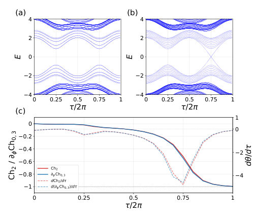 
FIG. 1. Clean spectra and topological responses. Panels (a) and (b) show spectra versus τ for L = 9 with periodic and open boundary conditions in z, respectively. Panel (c) shows Ch2(τ) (red) and ∂ϕCh0,3(τ) (blue) at L = 60, M = 2048, Nτ = 20; dashed curves show the τ-resolved integrands (right axis).

📷 Fig 2

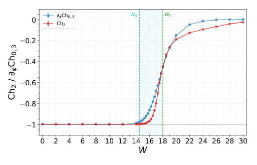 
FIG. 3. Ch2 and ∂ϕCh0,3 versus W at L = 60, M = 2048 (5 disorder realizations). The shaded mobility-gap regime ex- tends from Wg ≈14.5 to Wc ≈18.

📷 Fig 3

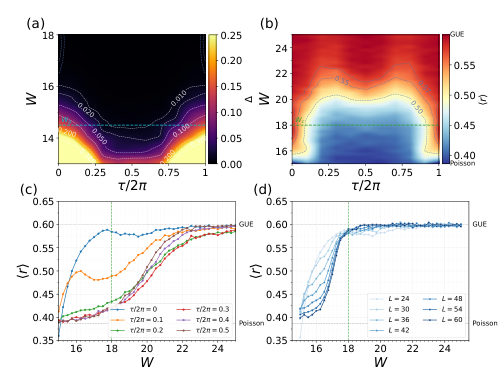 
FIG. 2. Mobility-gap window at EF = 0. (a) Spectral gap for L = 60 and 20 disorder realizations; the cyan line marks global spectral gap closure Wg ≈14.5, and blue dashed con- tours show ⟨r⟩= 0.55 and 0.57 from panel (b). (b) Level- spacing ratio ⟨r⟩(τ, W) for L = 24 (500 realizations); dashed contours mark 0.50, 0.55, and 0.57. (c) Fixed-τ cuts for L = 24 (k = 30, |E| &lt; 0.25, 1000 realizations). (d) Finite-size flow at τ = 0 for L = 24–60 (1000 realizations at L = 24, 500 otherwise), giving the critical disorder Wc ≈18. See Ref. [27] for the τ-resolved finite-size scaling.

📷 Fig 4

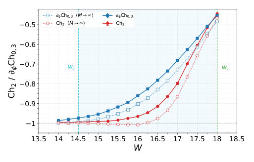 
FIG. 5. KPM-order extrapolation at L = 60 (5 disorder real- izations). Filled markers show Ch2 and ∂ϕCh0,3 at M = 2048; open markers show linear extrapolations to 1/M = 0. Shad- ing marks the mobility-gap window.

📷 Fig 5

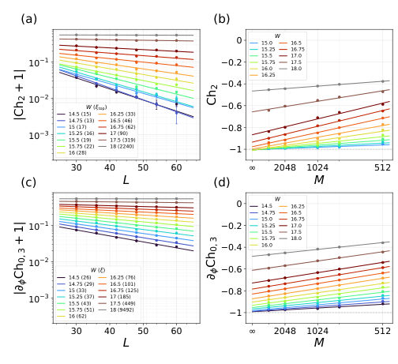 
FIG. 4. Finite-size and KPM-order scaling for W = 14.5–18. Top: Ch2; bottom: ∂ϕCh0,3. Panels (a) and (c) show devia- tions from −1 versus L, with exponential fits and fit lengths ξtop and ξ, respectively (M = 2048; 20 disorder realizations for L = 30, 10 for L = 36, 42, and 5 for L = 48, 54, 60). Panels (b) and (d) show KPM-order scaling at L = 60 for M = 512, 768, 1024, 2048, 4096, using 5 disorder realizations, with linear fits in 1/M.

**Summary.** This work investigates the robustness of topological quantization in a disordered 3D axion pump. The authors show that the second Chern number ($	ext{Ch}_2$) remains quantized even when the system's spectral gap closes, a phenomenon distinct from the behavior of the Středa-Hall response. This demonstrates a robust topological protection mechanism surviving deep into the mobility-gap regime.

**Why it may be interesting.** The concept of mobility-gap protection for topological invariants is highly relevant to understanding robust quantum states in realistic, disordered condensed matter systems, which is a key area for quantum simulation and topological quantum computing.

Detailed structure

**Main problem.** The paper investigates the robustness of the quantized second Chern number ($	ext{Ch}_2$) in a disordered, dynamically pumped axion insulator, specifically comparing its protection mechanism to the Středa-Hall response ($\partial\phi_{	ext{Ch}0,3}$).

**Main result.** The second Chern number ($	ext{Ch}_2$) remains quantized well into the mobility-gap regime beyond the global spectral gap closure, while the Středa-Hall response rapidly departs, demonstrating a distinct form of topological protection.

**Method.** The study employs large-scale numerical computations, including the Kernel Polynomial Method (KPM) for calculating topological invariants and analyzing level statistics to detect Anderson transitions.

**Model / system.** The system is a (3+1)D disordered axion pump, modeled as a stack of bilayer Haldane sheets with $	au$-dependent interlayer coupling. A 1D counterpart (Rice–Mele model) is also analyzed for contrast.

**Key observables.** Second Chern number ($	ext{Ch}_2$), Středa-Hall response ($\partial\phi_{	ext{Ch}0,3}$), Spectral Gap ($\Delta$), Level-spacing ratio ($\langle r 
angle$).

**Important parameters / regimes.** Disorder strength ($W$), System size ($L$), Time/cycle parameter ($	au$), Critical disorder ($W_c \approx 18$), Global spectral gap closure ($W_g \approx 14.5$).

**Assumptions / limitations.** The analysis relies on approximations like the Kernel Polynomial Method (KPM) to handle large system sizes, and it distinguishes between gap-dependent and mobility-gap protection mechanisms.

**Figures summary.** Figures illustrate the comparison of $	ext{Ch}_2$ and $\partial\phi_{	ext{Ch}0,3}$ across disorder strengths, showing the separation beyond the spectral gap closure ($W_g$) and the identification of the mobility-edge bottleneck ($W_c$).

**Paper structure.** The paper first establishes the model and key diagnostics, then analyzes the behavior of $	ext{Ch}_2$ and $\partial\phi_{	ext{Ch}0,3}$ relative to the spectral gap closure ($W_g$). It then uses level statistics to pinpoint the mobility-edge bottleneck ($W_c$), contrasting the 3D robustness with the breakdown observed in a 1D model.

Abstract

We show that the noncommutative second Chern number of a $(3+1)$D disordered axion pump remains quantized beyond global spectral gap closure at $W_g \approx 14.5$. Large-scale computation of the second Chern number and finite-size scaling demonstrate convergence of $\mathrm{Ch}_2$ toward $-1$ well into the mobility-gap regime ($W \lesssim 16.5$), while the Středa-Hall response $\partial_φ\mathrm{Ch}_{0,3}$ departs rapidly after global spectral gap closure, serving as an internal control that distinguishes bulk mobility-gap protection from finite-size artifacts. Level statistics identify a 3D unitary Anderson transition at each pump slice and locate the mobility-edge bottleneck at $τ=0$, with critical disorder $W_c \approx 18$.

[↑ back to top](#top)

### [Quantum Soundness of a Total-Degree Line-versus-Point Test](http://arxiv.org/abs/2609.27129v1)

**Authors:** Tianrun Zhao  
**Type:** theory · **Category:** quantum information and computing · **PDF:** <https://arxiv.org/pdf/2609.27129v1>  
**Analysis basis:** full PDF text, analyzed in chunks
**Topic relevance:** `quantum measurements` **2/5**

📷 Fig 1

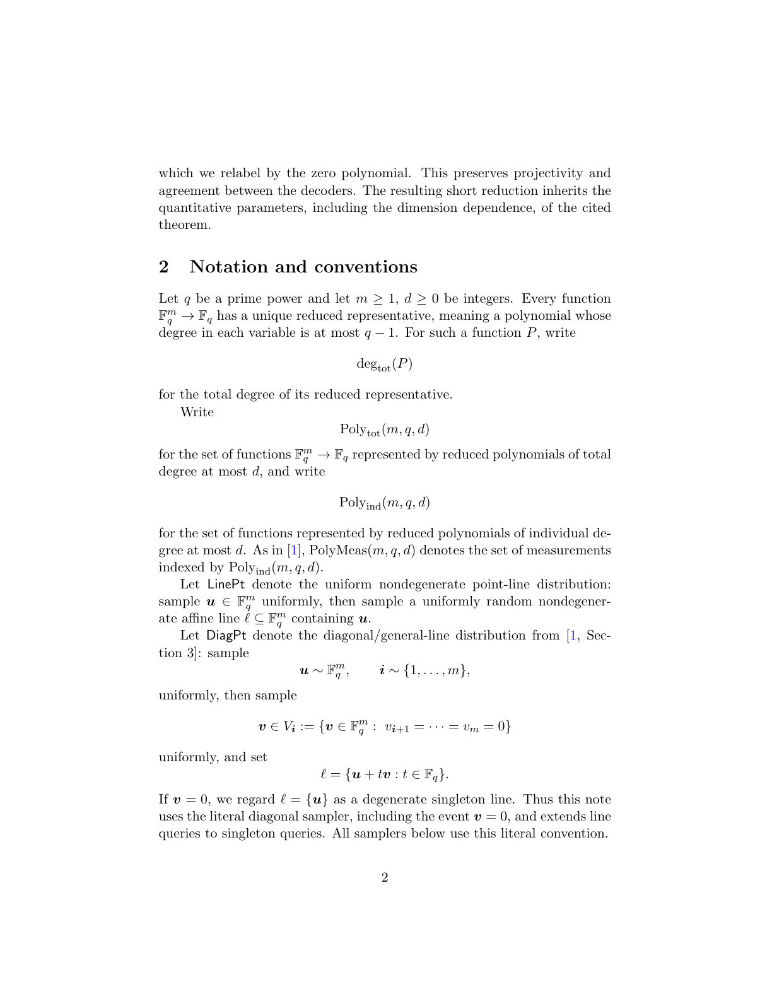 
Low-resolution page preview, page 2

📷 Fig 2

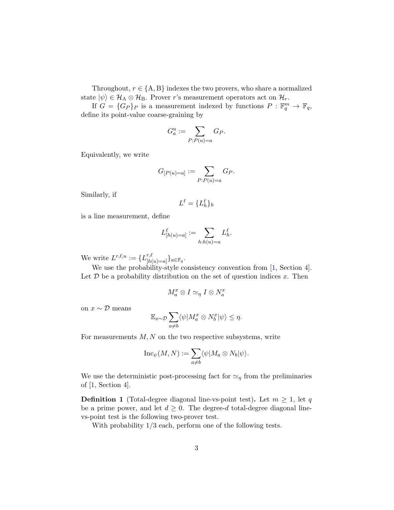 
Low-resolution page preview, page 3

📷 Fig 3

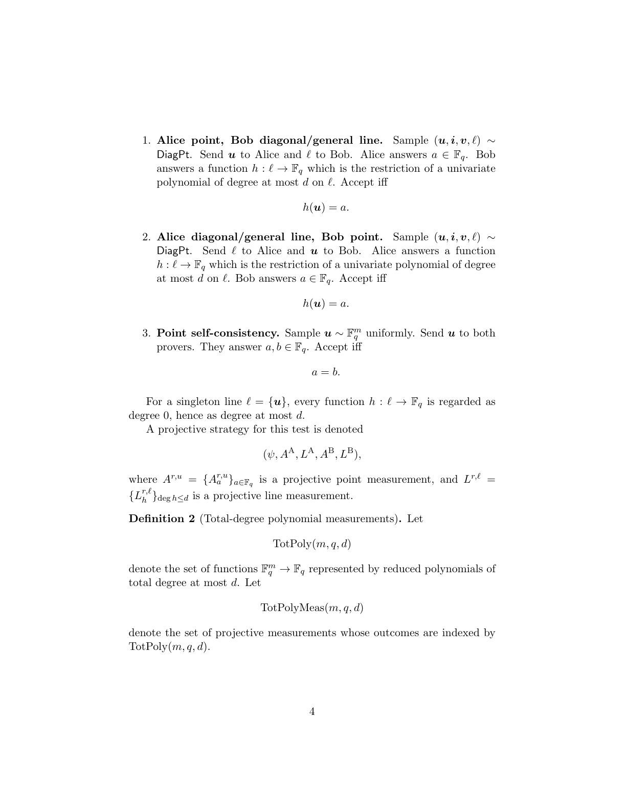 
Low-resolution page preview, page 4

📷 Fig 4

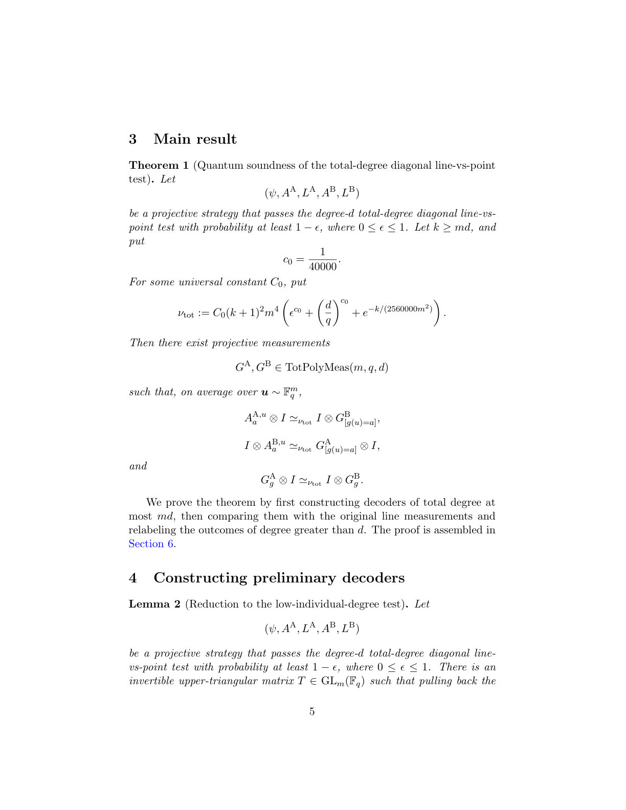 
Low-resolution page preview, page 5

📷 Fig 5

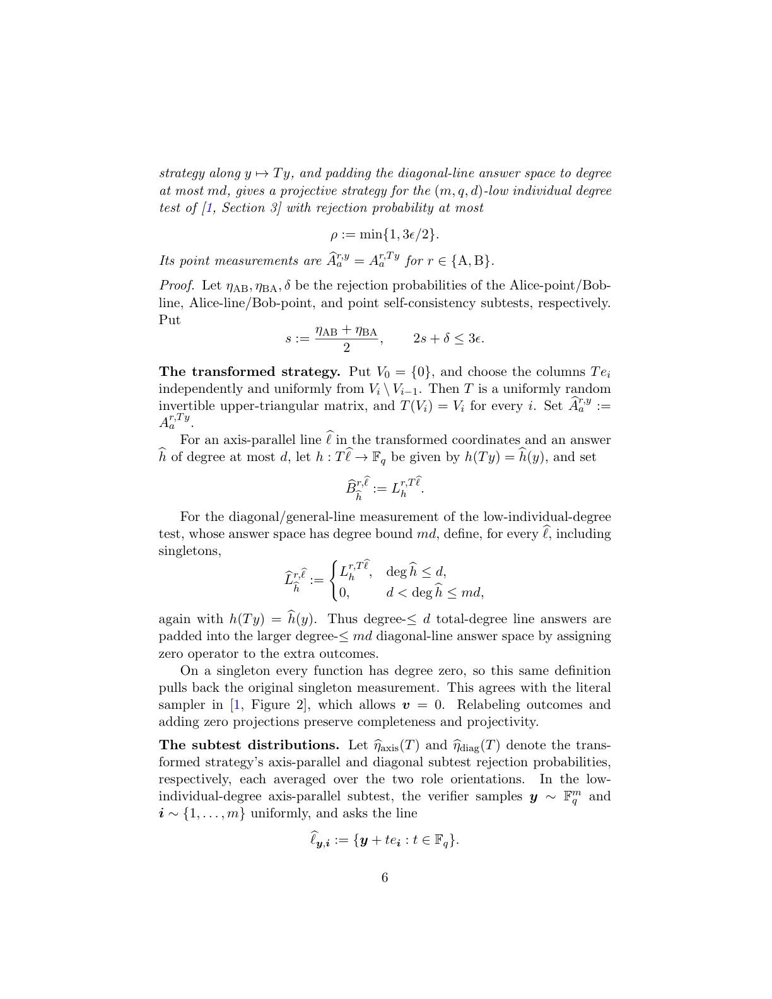 
Low-resolution page preview, page 6

**Summary.** This theoretical paper proves the quantum soundness of a specific quantum test called the total-degree diagonal line-versus-point test. It achieves this by mathematically reducing the complex total-degree test to a known individual-degree soundness theorem. The work is significant for establishing the security and reliability of quantum protocols based on polynomial constraints.

**Why it may be interesting.** While highly abstract, the techniques used for bounding quantum correlations and establishing soundness in quantum testing protocols are foundational to quantum information theory and cryptography.

Detailed structure

**Main problem.** The paper aims to prove the quantum soundness of the total-degree diagonal line-versus-point test.

**Main result.** It establishes the quantum soundness of this test by reducing it to an existing individual-degree soundness theorem, although the resulting bound retains a polynomial dependence on the dimension $m$.

**Method.** The proof employs a random change of coordinates and utilizes a reduction strategy that leverages the individual-degree soundness theorem, combined with bounding techniques for high-degree outcomes.

**Model / system.** The analysis is set up in a two-prover quantum test scenario involving measurements on a shared entangled state $|\psi
angle$. The test itself is the total-degree diagonal line-vs-point test.

**Key observables.** Inconsistency errors ($
u_{	ext{tot}}, 
u_{	ext{ind}}$) for projective measurements ($	ext{eGA}, 	ext{eGB}$) on the shared quantum state.

**Important parameters / regimes.** Field size $q$, dimension $m$, degree bound $d$, and test failure probability $\epsilon$.

**Assumptions / limitations.** The proof assumes $q$ is sufficiently large relative to $md$ for the main theorems to hold, and the reduction process relies on the existence of specific invertible linear maps $T$.

**Paper structure.** The structure involves applying the individual-degree theorem via a random change of coordinates, followed by bounding the contribution of high-degree outcomes using the uniform-line slice, and culminating in the final soundness bound.

Abstract

We prove quantum soundness of the total-degree diagonal line-vs-point test using the individual-degree soundness theorem of Ji, Natarajan, Vidick, Wright, and Yuen. A random change of coordinates yields projective polynomial decoders of total degree at most $md$. The uniform-line slice of the test bounds the weight of outcomes of degree greater than $d$, which are removed by a common relabeling. This reduction does not yield a dimension-independent soundness bound: the $\operatorname{poly}(m)$ dependence of the individual-degree theorem persists, as discussed in Section 1.2 of arXiv:2009.12982.

[↑ back to top](#top)

### [Quantum Topological Data Analysis Beyond Betti Numbers: Complexity Hardness $\&$ An Algorithm for Torsion Witness](http://arxiv.org/abs/2609.28112v1)

**Authors:** Nhat A. Nghiem, Dominic W. Berry, Trung V. Phan  
**Type:** theory · **Category:** quantum information and computing · **PDF:** <https://arxiv.org/pdf/2609.28112v1>  
**Analysis basis:** full PDF text, analyzed in chunks
**Topic relevance:** `analog quantum simulation` **2/5**

📷 Fig 1

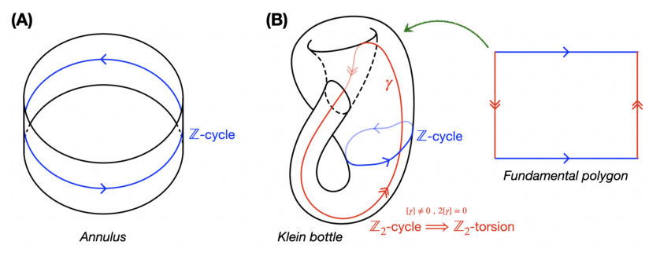 
FIG. 1. Torsion-free and torsion-bearing manifolds. Torsion is detected in the homology classes of closed cycles. (A) An annulus with a noncontractible Z-cycle. (B) A Klein bottle with a Z-cycle and a Z2-cycle γ. Although γ is homologically nontrivial, traversing it twice yields a cycle homologous to zero. The fundamental polygon on the right shows the edge identifications responsible for this Z2-torsion.

**Summary.** This paper advances quantum TDA by moving beyond simple connectivity measures (Betti numbers) to analyze the computationally difficult torsion structure of homology groups. It proves this detection problem is NP-hard and presents a quantum algorithm that achieves a near-quadratic speedup for detecting this crucial, discrete topological information.

**Why it may be interesting.** The connection between algebraic topology (homology/torsion) and computational complexity, coupled with a quantum speedup claim, provides a new, hard-to-compute diagnostic tool for quantum systems.

Detailed structure

**Main problem.** The paper investigates extending Topological Data Analysis (TDA) from Betti numbers to include the full integral homology structure, specifically the torsion subgroup, which captures global constraints.

**Main result.** It proves that determining the presence of $p$-torsion in the homology group is NP-hard, and develops a quantum algorithm achieving a near-quadratic speedup to witness this torsion.

**Method.** The work combines complexity theory (NP-hardness proofs via reduction) with quantum algorithm design, utilizing techniques like the Quantum Singular Value Transformation (QSVT) framework.

**Model / system.** The mathematical model is a simplicial complex $K$ derived from a graph $G$, whose homology groups $H_r(K, \mathbb{Z})$ are analyzed. Physical relevance is drawn from homological quantum rotor codes and gauge theory.

**Key observables.** Betti numbers ($eta_r$) and the torsion subgroup ($	ext{Tor}_r(K, \mathbb{Z})$), which quantifies discrete topological information.

**Important parameters / regimes.** The prime $p$ and the set of primes $P$ used in the quantum algorithm are key parameters. The complexity analysis depends on the size of the complex and the number of primes.

**Assumptions / limitations.** The quantum algorithm provides a one-sided witness (WITNESS or INCONCLUSIVE) and does not fully determine the torsion structure, only its presence for specific primes.

**Figures summary.** Figure 1 illustrates the difference between torsion-free and torsion-bearing manifolds (e.g., Annulus vs. Klein bottle) in the context of homology classes.

**Paper structure.** The paper first establishes the NP-hardness of detecting $p$-torsion in homology groups. It then develops a quantum algorithm to act as a one-sided torsion witness, followed by detailed mathematical sections on finite field arithmetic and reversible quantum circuit construction.

Abstract

Recent advances have revealed an interplay between quantum computing and topological data analysis (TDA). Most quantum TDA has focused on Betti numbers, which characterize the connectivity and ``holes'' of a dataset. Homology, however, contains additional information in the form of torsion: a nontrivial cycle can become trivial after being repeated finitely, revealing global constraints on how cycles combine and wrap around one another. Beyond applications in biomolecular studies, torsion appears in physical settings including homological quantum rotor codes, discrete charges, and gauge sectors. We study torsion from both classical and quantum perspectives. Given a graph $G$ and its clique complex $K = \mathrm{Cl}(G)$, we first prove that, for fixed $r$ and prime $p$, deciding whether $H_r(K,\mathbb{Z})$ contains $p$-torsion is NP-hard. As a corollary, when a homological rotor code is specified by $G$, deciding whether the code has a finite-dimensional logical sector of a given order is NP-hard. We discuss related problems, including the Bockstein homomorphism, Smith normal form, lattice saturation, and cohomology. Second, for a finite set of primes $P$, we develop a quantum algorithm that serves as a one-sided torsion witness. For fixed $r$, it outputs WITNESS or INCONCLUSIVE, i.e. WITNESS certifies that either $H_r(K,\mathbb{Z})$ or $H_{r-1}(K,\mathbb{Z})$ contains $p$-torsion for some $p\in P$ while INCONCLUSIVE makes no claim about its presence or absence. We identify a regime in which the algorithm achieves a near-quadratic quantum speedup over the corresponding classical algorithm under the same input model. Our NP-hardness result complements recent hardness results for estimating Betti numbers, adding a complexity-theoretic perspective to quantum TDA. Together, these results demonstrate that integral homology, beyond its Betti numbers, can be computationally challenging.

[↑ back to top](#top)

### [The logical set of Gaussian states under the stabilizer subsystem decomposition](http://arxiv.org/abs/2609.26898v1)

**Authors:** Santiago Zamora, Kaustav Chatterjee, Ulrik Lund Andersen, Thiago Lucena de Macedo Guedes, Jonatan Bohr Brask, A. de Oliveira Junior, Rafael Chaves  
**Type:** theory · **Category:** quantum information and computing · **PDF:** <https://arxiv.org/pdf/2609.26898v1>  
**Analysis basis:** full PDF text, analyzed in chunks
**Topic relevance:** `quantum measurements` **2/5**

📷 Fig 1

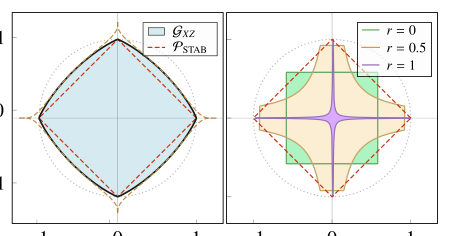 
FIG. 1. Gaussian images projected onto the XZ plane. Left: Pro- jection GXZ for all Gaussian inputs (light blue), with its exact bound- ary (black). The orange dashed curve is the leading-harmonic ap- proximation in Eq. (8). Right: Exact projections for fixed squeezing r = 0, 0.5, 1. In both panels, the gray dotted circle is the boundary of the Bloch disk and the red dashed diamond is projXZ PSTAB.

📷 Fig 2

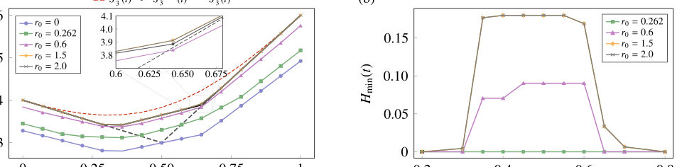 
FIG. 2. Certification from Gaussian geometry. (a) The red dashed, black solid, and black dashed lines show the qubit, stabilizer, and classical bounds, respectively. Colored markers show the numerically optimized values for Gaussian states with squeezing r ≤r0 under the SSD map. The vacuum cannot violate the classical bound, so nonzero squeezing is required. The inset shows a violation of the stabilizer bound near t ≈0.643. (b) Worst-case conditional min-entropy Hmin for the generation setting (x = 2, y = 1) versus the tilting parameter t, for different squeezing bounds r0. The result was obtained with the level L(1, 2) of the SDP relaxation introduced in Ref. [21]. Since S 3(t) does not...

**Summary.** This paper analyzes how Gaussian quantum states behave when encoded into the GKP logical subspace using the stabilizer subsystem decomposition. The authors derive geometric bounds showing that these states can exhibit non-stabilizer properties, which they use to create novel certification tools. These tools allow for quantifying resources like 'set-magic' and certifying cryptographic randomness based on measurable squeezing levels.

**Why it may be interesting.** It provides a rigorous mathematical framework connecting continuous-variable resource theory (squeezing, Gaussian states) to discrete-variable quantum information concepts (stabilizer codes, magic states, randomness certification).

Detailed structure

**Main problem.** The paper characterizes the logical set of Gaussian states when mapped into the Gottesman-Kitaev-Preskill (GKP) logical subspace via the stabilizer subsystem decomposition (SSD). It aims to derive practical certification tools based on this geometric understanding.

**Main result.** The logical image of single-mode Gaussian states can violate the stabilizer bound, certifying a resource called "set-magic." Furthermore, violating the classical bound allows for the certification of cryptographic randomness at moderate squeezing levels.

**Method.** The authors derive exact series expressions for the logical Bloch vector components and analyze the resulting reachable set geometry. They apply this framework by mapping discrete-variable witnesses to continuous-variable squeezing witnesses.

**Model / system.** The study focuses on continuous-variable (CV) bosonic systems, specifically single-mode Gaussian states, and their behavior when subjected to the GKP logical subspace extraction channel (SSD).

**Key observables.** Logical Bloch vector components (X, Y, Z), robustness of magic $R(1)(
ho_L)$, and the conditional min-entropy $H_{\min}(B|E)$.

**Important parameters / regimes.** Squeezing parameter ($r$), displacement ($\mathbf{d}$), and the time/witness parameter ($t$).

**Assumptions / limitations.** The analysis relies on the ideal GKP error correction and the faithful SSD extraction channel. Approximations are used for the maximum robustness and worst-case entropy calculations.

**Figures summary.** Figures illustrate the XZ projections of the logical state set, comparing the exact boundary to leading-harmonic approximations, and show the relationship between various bounds and the certified min-entropy.

**Paper structure.** The paper progresses by first characterizing the logical set geometry, deriving series expressions for the Bloch vector, and establishing the relationship between Gaussian inputs and the stabilizer polytope. It then applies this geometry to develop certification tools for set-magic and cryptographic randomness.

Abstract

Universal quantum computation requires non-Gaussianity in continuous-variable systems and non-stabilizerness in discrete-variable systems. Yet, mapping a Gaussian state into the Gottesman-Kitaev-Preskill logical subspace can yield a logical qubit with non-stabilizer resources. To understand how the continuous-variable structure determines logical resources, we characterize the image of single-mode Gaussian states under the corresponding extraction channel, known as the stabilizer subsystem decomposition. Specifically, we derive series expressions for the logical Bloch vector and characterize the resulting reachable set, enabling an analytical treatment of the robustness of magic of the logical states. We then turn this geometric framework into a certification tool: by mapping a discrete-variable qubit witness to a continuous-variable squeezing witness, we obtain lower bounds on the squeezing of prepared states. We also show that ensembles of Gaussian states can violate both stabilizer and classical bounds. Violation of the stabilizer bound certifies the relational resource known as "set-magic," while violation of the classical bound enables the certification of cryptographic randomness at moderate squeezing.

[↑ back to top](#top)

### [Unbounded Operators, Physicality, and Modality in Quantum Theories](http://arxiv.org/abs/2609.28136v1)

**Authors:** Zhonghao Lu  
**Type:** theory · **Category:** other · **PDF:** <https://arxiv.org/pdf/2609.28136v1>  
**Analysis basis:** full PDF text, analyzed in chunks
**Topic relevance:** `quantum measurements` **2/5**

📷 Fig 1

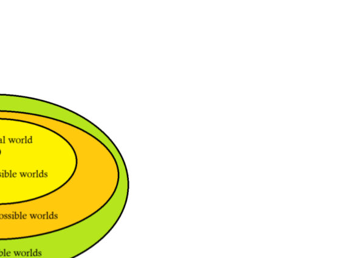 
Figure 1 The hierarchy of logical, metaphysical, and physical possible worlds

📷 Fig 2

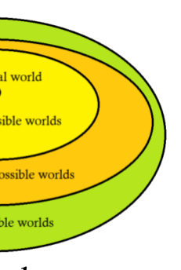 
Figure 2 The hierarchies of physically possible worlds

📷 Fig 3

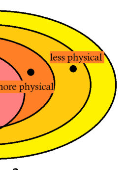 
Figure 3 The hierarchies of physically possible worlds in quantum field theory

**Summary.** This paper tackles deep foundational questions regarding what constitutes a 'physical' state in quantum theory, especially when operators are unbounded. The author develops a hierarchical view of physicality, arguing that physical reality is not monolithic but layered. This framework is used to critique existing arguments and to provide a potential resolution for interpretational problems in Quantum Field Theory.

**Why it may be interesting.** While highly abstract, the development of a 'hierarchical view of physicality' provides a novel meta-framework for interpreting foundational inconsistencies arising in advanced quantum theories, which is relevant to understanding the limits of current quantum descriptions.

Detailed structure

**Main problem.** The paper tackles the foundational issue of the physicality of the Hilbert space in quantum mechanics, particularly when dealing with unbounded operators and defining the set of physical states.

**Main result.** The author proposes a hierarchical view of physicality, arguing that physicality is layered and admits degrees, which helps reconcile foundational issues in quantum field theory.

**Method.** The methodology involves distinguishing between ontological/modal and pragmatic/operational readings of physicality, and applying modal metaphysics to quantum structures.

**Model / system.** The discussion centers on standard quantum mechanics axioms, the position and Hamiltonian operators, and extends to the algebraic structures of Quantum Field Theory (QFT) involving the Weyl algebra.

**Key observables.** Position operator expectation values ($\langle x 
angle_\psi$), probability distributions of measurement results, and the structure of physical states defined by normal states in QFT.

**Important parameters / regimes.** The distinction between potential and actual infinities, and the nature of singularities versus the existence of infinite expectation values.

**Assumptions / limitations.** The paper assumes that the difficulties raised by restricting the state space (e.g., by Heathcote or Carcassi et al.) are artifacts of an overly rigid interpretation of physical axioms.

**Figures summary.** The figures illustrate the hierarchy of logical, metaphysical, and physical possible worlds, suggesting multiple, nested structures of physical possibility.

**Paper structure.** The paper progresses by first addressing the Hilbert space physicality problem with unbounded operators, then applying this framework to critique arguments regarding infinite expectation values in position measurements, and finally extending the hierarchical view to resolve interpretational issues in QFT.

Abstract

In this paper, I address the problem regarding the physicality of Hilbert space in quantum mechanics, a topic brought into focus by Carcassi et al.'s paper "The unphysicality of Hilbert spaces" recently. I argue for the physicality of the Hilbert space in quantum mechanics, and demonstrate that there are inevitable ambiguity and arbitrariness if we want to identify the set of physical states with a proper subset of it. Moreover, I distinguish the ontological and modal reading of physicality from the pragmatic and operational reading of physicality, and then develop what I call the hierarchical view of physicality. According to this view, physicality is not a monolithic concept, but a layered one that admits degrees. I show the connection between the concept of physicality and modal metaphysics, and finally explain how it can be used to address the interpretational problem of quantum field theory brought by the existence of inequivalent representations.

[↑ back to top](#top)

### [First Passage in the Presence of Jump Rate Fluctuations: A Transition from Infinite to Finite Mean](http://arxiv.org/abs/2609.26925v1)

**Authors:** Bara Levit, Shlomi Reuveni  
**Type:** theory · **Category:** statistical mechanics · **PDF:** <https://arxiv.org/pdf/2609.26925v1>  
**Analysis basis:** full PDF text, analyzed in chunks
**Topic relevance:** `Keldysh / 2PI / non-Gaussian methods` **1/5** · `analog quantum simulation` **1/5** · `correlated / nonlocal dissipation` **1/5** · `driven-dissipative phase transition` **1/5** · `methods for driven-dissipative` **1/5** · `non-equilibrium universality` **1/5** · `quantum measurements` **1/5**

📷 Fig 1

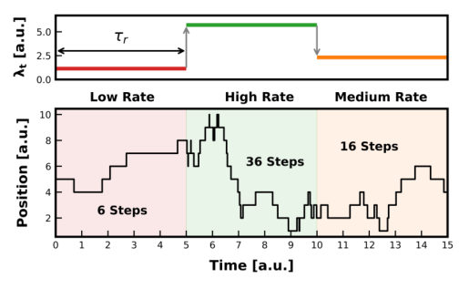 
FIG. 1. Example of a doubly stochastic continuous-time random walk (DSCTRW). The top and bottom panels show the rate and po- sition as a function of time, respectively. In this particular example, the jump rate is resampled, from an exponential distribution with unit mean, at fixed time intervals of length τr = 5 [a.u.].

📷 Fig 2

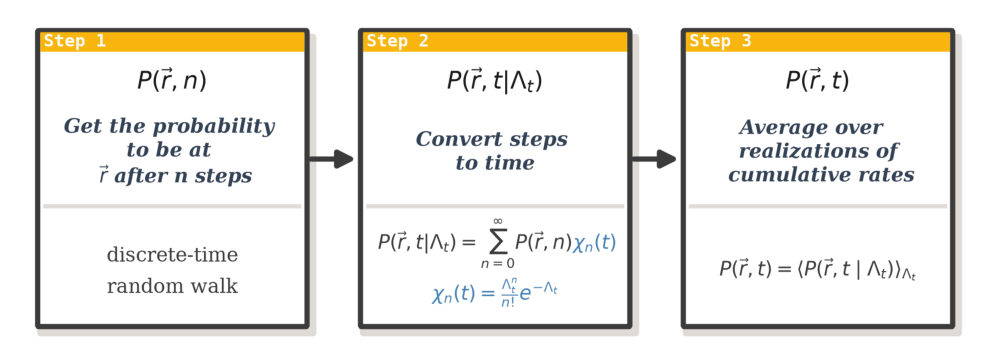 
FIG. 2. DSCTRW Recipe. Follow these steps to obtain the probability to be at position⃗r at time t in the DSCTRW. Step 1: Start with the probability to be at⃗r after n steps for the discrete-time random walk. Step 2: Convert steps to time: Multiply the probability in step 1 by χn(t), the probability to take n steps by time t given a specific realization of the cumulative jump rate Λt. This is a Poisson distribution with mean Λt. Then, sum over all steps. Step 3: Average over all possible cumulative rates Λt.

📷 Fig 3

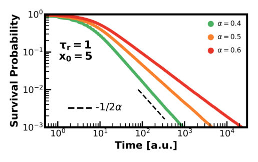 
FIG. 3. Survival Probability. Log-log plot of the survival proba- bility as a function of time. Here, τr = 1 and x0 = 5, and data come from simulations for α = 0.4,0.5,0.6 (green, orange, and red, re- spectively). Survival probability is based on one million walkers. A dashed line with slope −1/2α, as predicted by Eq. (3), is shown par- allel to the survival probability tail for α = 0.4.

📷 Fig 4

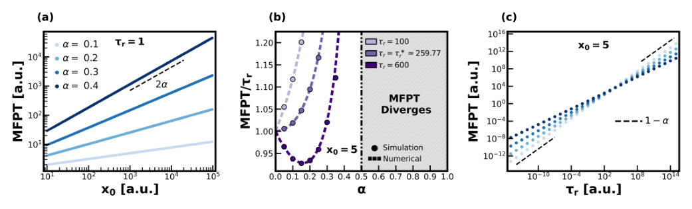 
FIG. 4. MFPT Phase Transition. a. Log-log plot of the MFPT as a function of x0 for τr = 1. Numerical evaluations of Eq. (5) for four different values of α are shown in blue, from α = 0.1 (lightest blue) to α = 0.4 (darkest blue); the dashed line shows the 2α slope attained at x0 ≫1 for α = 0.4. b. MFPT/τr as a function of α for three different values of τr: small (100), critical (≃259.77) and large (600), from lightest to darkest purple. Data coming from simulations is in circles, and dashed lines come from numerical evaluation of equation Eq. (5). Here, x0 = 5 and simulations are based on one million walkers. For α ≥1

📷 Fig 5

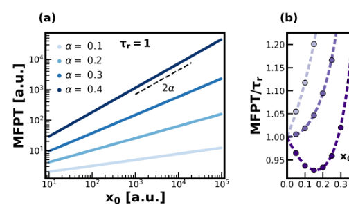 
Fig. 4(b) exhibits rich behavior of the MFPT. First, as α  0, the MFPT converges to τr regardless of its value. This is not a coincidence. In this limit, the Mittag-Leffler distribution becomes increasingly concentrated at two extremes: rate zero and rate infinity. The probability of sampling either converges to half. Thus, sampling a rate is analogous to flipping a coin: heads for rate zero; tails for rate infinity. When we flip tails (rate infinity), the walker reaches the target in zero time. This occurs on average after two flips. As we first flip at t = 0, and then again every τr, the second flip is at t = τr. Therefore, the MFPT is τr. A detailed derivation of this result is provided...

**Summary.** This theoretical paper analyzes a random walk whose jump rate fluctuates stochastically. It discovers a critical transition point: if the rate fluctuations are strong enough, the mean time to reach a target site becomes finite, overcoming the natural divergence seen in simple random walks. This demonstrates that temporal noise can fundamentally regularize spatial transport dynamics.

**Why it may be interesting.** The concept of temporal fluctuations regularizing otherwise divergent spatial transport times is highly relevant to open quantum systems, anomalous diffusion in disordered media, and quantum transport where noise sources are inherent.

Detailed structure

**Main problem.** The paper investigates how stochastic fluctuations in the jump rate of a random walk fundamentally alter its mean first-passage time (MFPT), potentially causing a transition from an infinite to a finite mean.

**Main result.** A phase transition occurs at a critical fluctuation parameter ($\alpha_c = 1/2$): when fluctuations are sufficiently broad ($\alpha < 1/2$), the MFPT becomes finite, whereas weaker fluctuations ($\alpha \ge 1/2$) leave it infinite.

**Method.** The analysis uses the framework of the Doubly Stochastic Continuous-Time Random Walk (DSCTRW), employing Laplace transforms and asymptotic analysis of the survival probability $S(t|x_0)$.

**Model / system.** The model is a simple symmetric random walk on a 1D lattice, generalized to a DSCTRW where the jump rate ($\lambda_t$) itself is a stochastic process, specifically resampled from a Mittag-Leffler distribution.

**Key observables.** Mean First Passage Time (MFPT) and the Survival Probability $S(t|x_0)$.

**Important parameters / regimes.** The Mittag-Leffler distribution parameter $\alpha$, which dictates the rate fluctuation strength; the critical value $\alpha_c = 1/2$.

**Assumptions / limitations.** The jump rate is assumed to be resampled every fixed time interval $	au_r$, and the analysis relies on asymptotic power-law decay of the survival probability.

**Figures summary.** Figures illustrate the DSCTRW process, the asymptotic power-law decay of the survival probability $S(t|x_0) \propto t^{-1/2\alpha}$, and the phase transition of the MFPT versus the fluctuation parameter $\alpha$ and relaxation time $	au_r$.

**Paper structure.** The paper develops the mathematical machinery for the DSCTRW, derives the asymptotic decay of the survival probability using Laplace transforms, and then analyzes the resulting MFPT to pinpoint the critical transition point governed by the rate fluctuation parameter $\alpha$.

Abstract

A simple symmetric random walk on a one-dimensional lattice is guaranteed to reach any target site, yet its mean first-passage time diverges. Here, we show that stochastic fluctuations in the jump rate can fundamentally alter this classic result. We find a phase transition in the mean first-passage time: sufficiently broad rate fluctuations render it finite, whereas weaker fluctuations leave it infinite. Our results demonstrate that temporal fluctuations in the jump rate---and hence in the diffusivity---can overcome spatial wandering and regularize otherwise divergent first-passage times.

[↑ back to top](#top)

### [Spectroscopic signatures of persistent exciton condensation in a bulk magnetic topological insulator](http://arxiv.org/abs/2609.27079v1)

**Authors:** Paulina Majchrzak, Chakradhar Sahoo, Manuel Tuniz, Wibke Bronsch, Denny Puntel, Federico Cilento, Xing-Chen Pan, Jakob Kjærulff Svaneborg, Yong P. Chen, Søren Ulstrup  
**Type:** experiment · **Category:** strongly correlated electrons · **PDF:** <https://arxiv.org/pdf/2609.27079v1>  
**Analysis basis:** full PDF text, analyzed in chunks
**Topic relevance:** `Keldysh / 2PI / non-Gaussian methods` **1/5** · `analog quantum simulation` **1/5** · `driven-dissipative phase transition` **1/5** · `non-equilibrium universality` **1/5** · `quantum measurements` **1/5** · `quantum optics experiment` **1/5**

📷 Fig 1

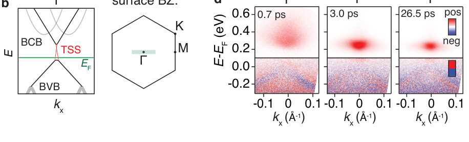 
Figure 1. Chemical and optical doping of a magnetic topological insulator. (a) Carrier

📷 Fig 2

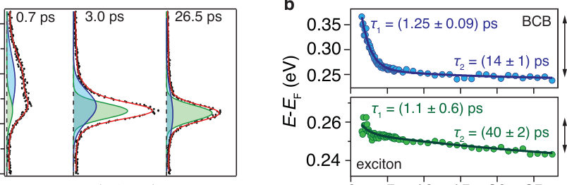 
Figure 2. Overview of dynamics at T = 110 K. (a) Energy-distribution curves (EDCs) around

📷 Fig 3

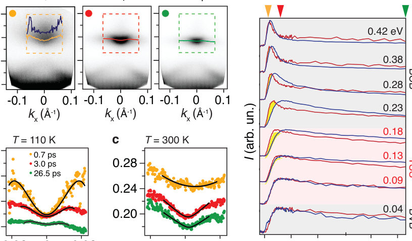 
Figure 3. Evolution of band dispersion with time and temperature. (a) ARPES spectra

📷 Fig 4

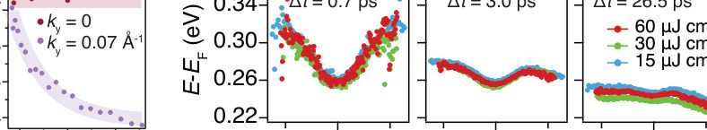 
Figure 4. Fluence and momentum dependence of exciton state. (a) Schematic illustrating

📷 Fig 5

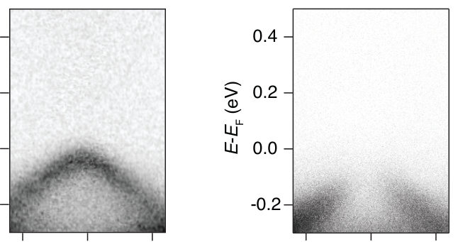 
Figure 5. (a) Equilibrium high-resolution ARPES spectrum of MnBi1.7Sb0.3Te4 taken using syn-

**Summary.** This experimental study uses trARPES on a magnetic topological insulator to investigate light-induced exciton condensation. By observing a transient state with a characteristic Mexican-hat dispersion and long lifetime, the authors provide strong evidence for a metastable, BCS-like excitonic condensate. This work establishes magnetic topological insulators as a promising platform for studying correlated many-body physics.

**Why it may be interesting.** The work bridges concepts from topological physics (TSS) with strongly correlated many-body physics (excitonic condensation), providing an experimental platform to study non-equilibrium correlated states in novel materials.

Detailed structure

**Main problem.** The study aims to find direct evidence for a light-induced exciton condensate (EC) state within the bulk of a quantum material.

**Main result.** The authors observed spectral signatures, including a Mexican-hat-like quasiparticle dispersion and a microsecond lifetime, consistent with the formation of a metastable BCS-type excitonic condensate.

**Method.** Time- and angle-resolved photoemission spectroscopy (trARPES) was employed to probe the evolution of photoexcited carriers over time delays.

**Model / system.** The physical system is an intrinsic magnetic topological insulator, specifically MnBi2Te4 doped with Sb to tune the chemical potential into the topological surface state. The analysis focuses on the many-body physics of photoexcited electron-hole pairs.

**Key observables.** Quasiparticle dispersion shape (Mexican-hat profile), transient state lifetime (microsecond scale), Exciton Binding Energy (EB), and BCS gap ($\Delta$).

**Important parameters / regimes.** Temperature (110 K vs 300 K), doping concentration (Sb substitution), and time delay ($\Delta t$).

**Assumptions / limitations.** The observed spectral signatures are interpreted as evidence for a metastable excitonic condensate state, and the analysis relies on fitting procedures like Lorentzian functions.

**Figures summary.** Figures illustrate the evolution of Energy-Distribution Curves (EDCs) showing peak flattening and the development of the Mexican-hat shape over time, alongside comparisons of spectra taken through and away from the proposed EC state.

**Paper structure.** The paper progresses by first establishing the experimental setup and tuning the material into the topological surface state, then presenting time-resolved measurements showing the delayed emergence of a transient state, and finally analyzing the spectral features (dispersion, gap opening) to confirm the BCS-like nature of the condensate.

Abstract

Exciton condensates are long-sought correlated quantum states arising from macroscopic coherence of bound electron-hole pairs. Although equilibrium and transient excitonic states have been reported in several material platforms, direct evidence for a light-induced exciton condensate state has been challenging to achieve as an intrinsic property of a bulk quantum material. Here, we use time- and angle-resolved photoemission spectroscopy to investigate long-lived photoexcited carriers in the intrinsic magnetic topological insulator MnBi$_2$Te$_4$ with the chemical potential tuned to the topological surface state by Sb substitution. Following optical excitation, we observe the delayed emergence of a transient state whose formation coincides with depopulation of the bulk conduction band and whose lifetime extends to the microsecond timescale. The quasiparticle dispersion exhibits a pronounced flattening and develops a Mexican-hat-like profile. These spectral signatures are consistent with the formation of a metastable excitonic condensate state. Our results establish magnetic topological insulators as a promising platform for investigating long-lived photoinduced many-body states and their interplay with topology and magnetism.

[↑ back to top](#top)

### [Response of Hellinger-distance based coherence to weak decoherence in two-flavor neutrino oscillations](http://arxiv.org/abs/2609.27697v1)

**Authors:** Saurabh Rai, Nilakshi Das, Tejhas Kapoor  
**Type:** theory · **Category:** other · **PDF:** <https://arxiv.org/pdf/2609.27697v1>  
**Analysis basis:** full PDF text, analyzed in chunks
**Topic relevance:** `correlated / nonlocal dissipation` **1/5** · `driven-dissipative phase transition` **1/5** · `methods for driven-dissipative` **1/5** · `non-equilibrium universality` **1/5** · `quantum measurements` **1/5**

📷 Fig 1

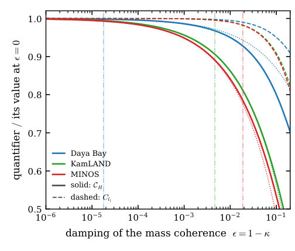 
FIG. 1. Fractional response to mass-coherence damping at the three benchmark working points. Solid curves are the exact CH(ϵ)/C(0) H from Eq. (18); dotted curves are the asymp- totic law 1 −K√ϵ/C(0) H of Eqs. (23)–(24); dashed curves are Cl1(ϵ)/C(0) l1 for the same configurations, which is linear in ϵ. Vertical dash-dotted lines mark the upper limits on ϵ of Ta- ble III; the region to the left of each is the weak-damping range allowed by the bound used here, and the region to its right is shown only to expose the crossover.

📷 Fig 2

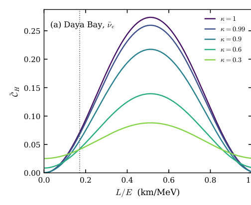 
FIG. 2. Normalized Hellinger coherence ˜ CH = CH/(2 − √

📷 Fig 3

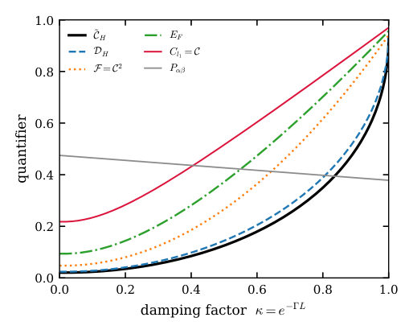 
FIG. 3. Quantifiers at the MINOS working point as functions of the damping factor κ = e−ΓL: the normalized Hellinger co- herence ˜ CH, the Hellinger correlation DH, the local quantum Fisher information F = C2, the entanglement of formation EF , the l1 coherence, which for this state equals the con- currence, and the transition probability Pαβ. The analytic and square-root responses separate near κ = 1, where ˜ CH and DH approach their undamped values with infinite slope; away from that neighborhood, the figure shows only the global shape of each quantifier and implies no general classification.

📷 Fig 4

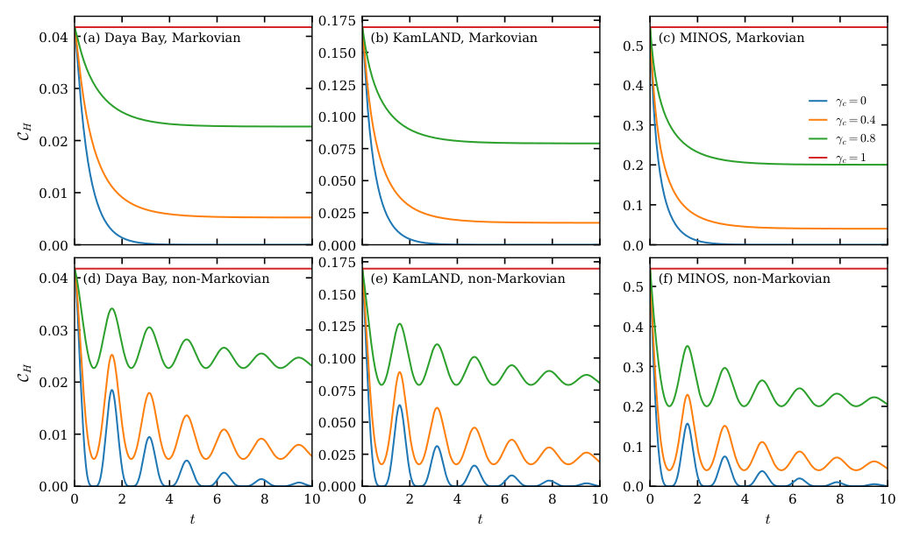 
FIG. 4. Hellinger coherence under the flavor-basis correlated dephasing channel of Eq. (26), in the memoryless regime τ = 0.1 (top row) and the memory-retaining regime τ = 5 (bottom row), for classical correlation strengths γc = 0, 0.4, 0.8, 1. Columns correspond to the three working points of Table II. The values γc = 0.4 and 0.8 are chosen to illustrate the channel dynamics and correspond to asymptotic coherence losses far outside the weak-damping region of Table III. Note the different vertical scales.

**Summary.** This theoretical paper investigates the sensitivity of Hellinger-distance coherence in two-flavor neutrino oscillations to weak decoherence. It finds that while most quantum measures decay linearly with the damping parameter, the Hellinger coherence exhibits a distinct non-analytic $\sqrt{\epsilon}$ decay. This provides a powerful diagnostic tool for characterizing decoherence effects in neutrino physics.

**Why it may be interesting.** The study provides a detailed comparison of how different quantum information measures decay under decoherence, highlighting the unique non-analytic scaling of the Hellinger coherence, which is valuable for understanding quantum process monitoring in particle physics.

Detailed structure

**Main problem.** The paper evaluates how Hellinger-distance based coherence in two-flavor neutrino oscillations responds to weak decoherence induced by Lindblad damping.

**Main result.** The Hellinger coherence exhibits a nonanalytic $\sqrt{\epsilon}$ correction in the weak-damping limit, contrasting with other quantum measures that respond linearly in the damping parameter $\epsilon$.

**Method.** The analysis involves deriving closed-form expressions for various coherence measures and comparing the results obtained from the weak-damping expansion ($\epsilon 	o 0$) against the exact solutions.

**Model / system.** The system is two-flavor neutrino oscillations, modeled using a density matrix $
ho$ subjected to Lindblad damping in the mass basis, characterized by a damping factor $\kappa = e^{-\Gamma L}$.

**Key observables.** Hellinger-distance coherence ($C_H$), flavor-transition probability, $l_1$ coherence, concurrence, entanglement of formation, and local quantum Fisher information.

**Important parameters / regimes.** The weak-damping parameter $\epsilon = 1 - \kappa$, and oscillation parameters derived from Daya Bay, KamLAND, and MINOS working points.

**Assumptions / limitations.** The analysis assumes the two-flavor vacuum treatment with negligible wave-packet separation, and the weak-damping expansion is only valid near $\epsilon = 0$.

**Figures summary.** Figures compare the exact Hellinger coherence ratio against the asymptotic law and the $l_1$ result, and show the coherence decay/revival under correlated dephasing channels.

**Paper structure.** The paper establishes the mathematical framework for coherence measures, derives the closed-form expression for $C_H$, analyzes the weak-damping expansion showing the $\sqrt{\epsilon}$ dependence, and concludes with quantitative comparisons using experimental data points.

Abstract

We evaluate the Hellinger-distance coherence of the two-flavor neutrino state subject to Lindblad damping of the mass-eigenstate interference term, and obtain a closed expression in terms of the flavor-basis density-matrix elements. In the two-flavor vacuum treatment with negligible wave-packet separation, the undamped state is pure, and the smallest eigenvalue of the damped state grows linearly with $ε=1-κ$, where $κ=e^{-ΓL}$. An expansion about the pure state then yields a nonanalytic $\sqrtε$ correction to the Hellinger coherence, with coefficient $K=2\sqrt{2}\,u\sin2θ/\sqrt{1-2u}$, whereas the flavor-transition probability, the $l_1$ coherence, the concurrence, the entanglement of formation and the local quantum Fisher information all respond linearly in $ε$. Using representative Daya Bay, KamLAND and MINOS working points together with a current $90\%$ C.L. bound on energy-independent damping, we find fractional changes in the Hellinger coherence of $0.18\%$, $9.40\%$ and $21.51\%$, against $0.0009\%$, $0.43\%$ and $1.81\%$ for the concurrence. The comparison concerns the response of the quantifiers to the damping parameter and carries no implication about experimental resolution. The same mechanism operates, with a different coefficient, for a correlated dephasing channel acting on the flavor coherence, where the non-Markovian regime produces damped revivals.

[↑ back to top](#top)

### [Transfer Dynamics and Spectral Cascades in Graph-Coupled Kuramoto Networks](http://arxiv.org/abs/2609.28432v1)

**Authors:** Marcin Kowalczyk, Pietro Liò, Zbigniew R. Struzik  
**Type:** theory · **Category:** statistical mechanics · **PDF:** <https://arxiv.org/pdf/2609.28432v1>  
**Analysis basis:** full PDF text, analyzed in chunks
**Topic relevance:** `analog quantum simulation` **1/5** · `correlated / nonlocal dissipation` **1/5** · `driven-dissipative phase transition` **1/5** · `methods for driven-dissipative` **1/5** · `non-equilibrium universality` **1/5**

📷 Fig 1

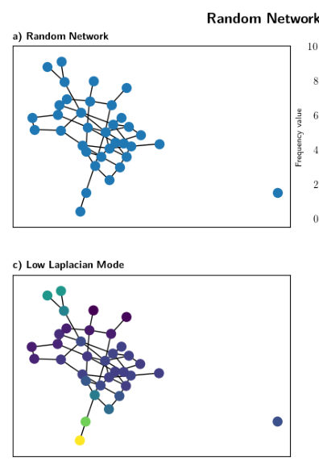 
Fig. 1 Illustration of graph spectral decomposition. (a) Example of a random network. (b) Laplacian spectrum of the network shown in panel (a), with graph frequencies ordered by eigenvalue. (c) First non-trivial Laplacian eigenvector of the same network, representing a low-frequency graph mode associated with large-scale structural organisation. (d) Highest-frequency Laplacian eigenvector of the network, representing fine-scale variation across the graph. Together, panels (b)–(d) illustrate how the network structure shown in panel (a) gives rise to a hierarchy of graph-spectral modes that form the basis of the graph Fourier representation used throughout this work.

📷 Fig 2

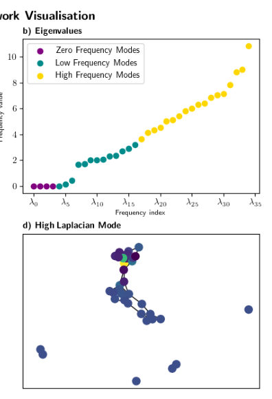 
Fig. 2 Illustration of the modular network architecture used throughout this study. (a) Example of a modular network, with node colours indicating community affiliation. (b) Laplacian spectrum of the network shown in panel (a), with graph frequencies ordered by eigenvalue. (c) First non-zero Laplacian eigenvector of the same network, representing a low-frequency mode associated with large- scale community structure. (d) Highest-frequency Laplacian eigenvector of the network, representing fine-scale variation across the graph. Together, panels (b)–(d) illustrate how the modular structure shown in panel (a) is encoded in the graph-spectral representation used throughout this work.

📷 Fig 3

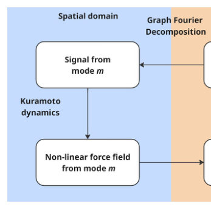 
Fig. 3 Transfer matrix construction schematic display steps described in Section 2.3

📷 Fig 4

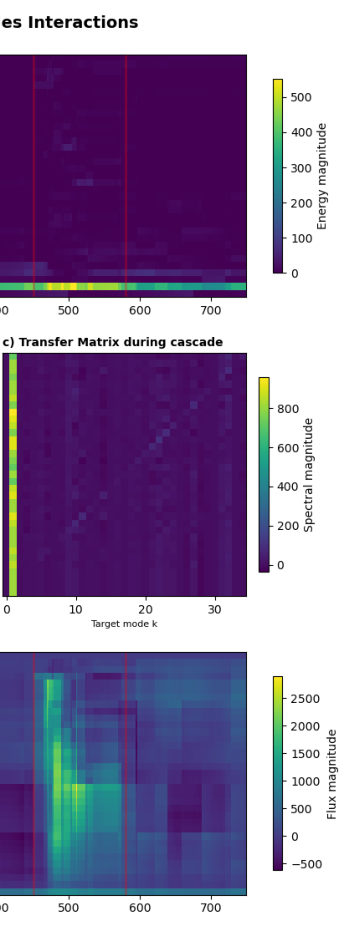 
Fig. 4 Emergence of graph-spectral cascade dynamics. (a) Temporal evolution of the modal energy Em(t), showing persistent low-frequency organisation together with intermittent redistribution across higher graph-spectral modes. Cross-sections of the transfer matrix Tm→k(t) are shown (b) outside a cascade episode and (c) during an active cascade event. Panel (d) shows the corresponding spectral flux Π(t, K0). Red vertical lines in panels (a) and (d) indicate a representative cascade episode.

📷 Fig 5

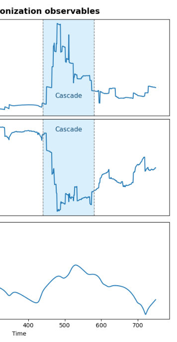 
Fig. 5 Comparison of synchronisation and transfer observables for a representative network realisa- tion. The figure consists of three time-dependent panels: (a) mean spectral flux Π(t) averaged over the spectral cutoff parameter K0, (b) interaction ratio Q(t), and (c) synchronisation order parameter R(t). The figure illustrates the relationship between graph-spectral transfer dynamics and global syn- chronisation. While the synchronisation order parameter remains comparatively smooth, the transfer observables exhibit pronounced fluctuations, intermittent bursts, and rapid reorganisations. These results demonstrate that substantial changes in graph-spectral transfer dynamics may occur even...

**Summary.** This paper develops a spectral transfer formalism to analyze nonlinear synchronization in coupled oscillator networks, moving beyond simple global measures. By projecting dynamics onto the graph Laplacian eigenbasis, the authors quantify how activity redistributes across structural scales via a transfer matrix. This reveals hidden, structured spectral reorganizations that persist even when the overall system appears macroscopically stable.

**Why it may be interesting.** The concept of spectral reorganisation and the separation of global coherence from underlying spectral dynamics provides a powerful, multiscale diagnostic tool applicable to analyzing complex, non-equilibrium dynamics in many-body systems, which is relevant to open quantum systems.

Detailed structure

**Main problem.** The work aims to resolve how internal dynamical activity redistributes across network scales during nonlinear synchronization, moving beyond traditional global observables like the Kuramoto order parameter.

**Main result.** The study demonstrates a clear separation between macroscopic coherence and microscopic spectral interactions, showing that structured, fluctuating internal redistribution dynamics persist even when global synchronisation is nearly stationary.

**Method.** A spectral transfer formalism is introduced by projecting Kuramoto phase dynamics onto the eigenbasis of the graph Laplacian, constructing a time-dependent transfer matrix.

**Model / system.** The model uses the Kuramoto oscillator system coupled on a general graph structure, with analysis focusing on modular and hierarchical network architectures.

**Key observables.** Spectral flux, Spectral Modal Energy ($E_m(t)$), Transfer Matrix elements ($T_{m 	o k}(t)$), Net Spectral Flux ($\Pi(t, K_0)$), and the conventional Kuramoto order parameter ($R(t)$).

**Important parameters / regimes.** Coupling strength ($K$), frequency heterogeneity ($\sigma_{\omega}$), and the structural scales defined by the graph Laplacian eigenmodes.

**Assumptions / limitations.** The spectral flux quantifies redistribution between *structural* dynamical scales defined by the Laplacian eigenbasis, not physical transport across nodes.

**Figures summary.** Figures illustrate graph spectral decomposition (showing mode hierarchies) and the temporal evolution of spectral activity, including cross-sections of the transfer matrix and the spectral flux ($\Pi$).

**Paper structure.** The paper builds the spectral transfer formalism by decomposing the state onto graph eigenmodes, constructing the transfer matrix to quantify mode exchange, and analyzing the resulting spectral flux and various transfer observables to characterize different dynamical regimes.

Abstract

This work introduces a spectral transfer formalism for nonlinear synchronisation dynamics to resolve how internal dynamical activity redistributes across network scales, moving beyond traditional global observables like the Kuramoto order parameter. By projecting Kuramoto phase dynamics onto the eigenbasis of the graph Laplacian, we construct a time-dependent transfer matrix and derive novel network metrics, including the spectral flux, which quantifies directional redistribution between structural dynamical scales rather than physical transport across nodes. Numerical simulations on modular and hierarchical networks reveal highly structured, intermittent spectral transfer episodes characterised by forward and inverse spectral cascades, directional reversals, and complex interaction geometries. Crucially, we demonstrate a clear separation between macroscopic coherence and microscopic spectral interactions, showing that highly organised, fluctuating internal redistribution dynamics persist even beneath nearly stationary and featureless global synchronisation states. This framework extends conventional synchronisation analysis and establishes a multiscale approach for interpreting network dynamics as an evolving process of spectral reorganisation.

[↑ back to top](#top)

### [A 75-mL intrinsically stable atom-filtered laser enabling deployable quantum devices](http://arxiv.org/abs/2609.27447v1)

**Authors:** Zijie Liu, Zheng Xiao, Zhiyang Wang, Xiaolei Guan, Xiaomin Qin, Suyang Wei, Hongtian Song, Baoshuai Wang, Jia Zhang, Xiaopeng Xie, Tiantian Shi, Anhong Dang, Jingbiao Chen  
**Type:** experiment · **Category:** other · **PDF:** <https://arxiv.org/pdf/2609.27447v1>  
**Analysis basis:** full PDF text, analyzed in chunks
**Topic relevance:** `interference shaping light` **1/5** · `quantum measurements` **1/5** · `quantum optics experiment` **1/5** · `superradiant laser` **1/5**

📷 Fig 1

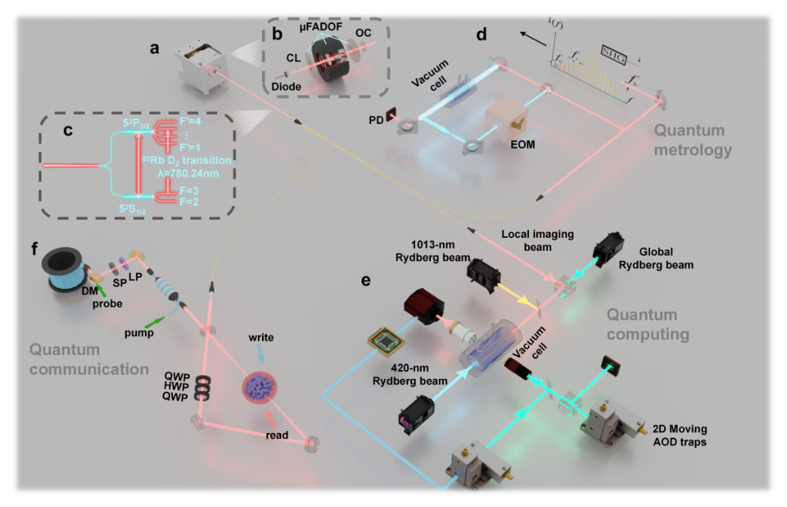 
Fig. 1. 75-mL atom-filtered laser (75-mL AFL) and its applications in deployable quantum devices. a. External struc- ture of the 75-mL AFL. b. Internal structure of the 75-mL AFL, in which a micro 85Rb Faraday anomalous dispersion optical filter (µFADOF) is integrated inside the laser resonator. CL, collimating lens; OC, output coupler. c. The 75-mL AFL output laser is di- rectly tuned to the 85Rb 52S1/2 →52P3/2 transition. d. Quantum metrology application: a compact optical atomic clock based on modulation transfer spectroscopy (MTS) frequency locking, in which the 75-mL AFL serves as the local oscillator laser. A erbium-doped optical frequency comb, which has undergone frequency doubling...

📷 Fig 2

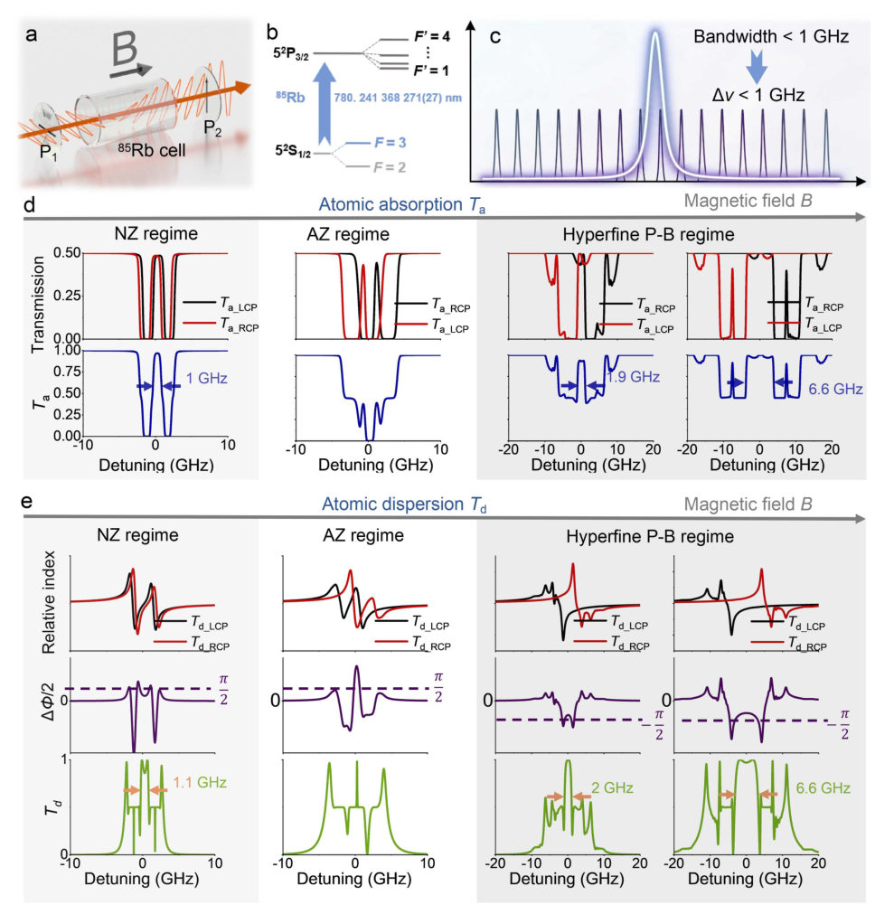 
Fig. 2. Working principle of FADOF frequency selection and flat-top FADOF design. a, Schematic diagram illustrating the frequency selection principle of the FADOF. b, Energy-level diagram of the 85Rb 52S1/2 →52P3/2 transition. c, Frequency selec- tion principle of the AFL. Only the laser resonator modes (blue lines) located within the FADOF transmission spectrum (white line) can oscillate. d, The left-hand circularly polarized (LCP, red curves) and right-hand circularly polarized (RCP, black curves) compo- nents of the atomic absorption term Ta (blue curves) across different magnetic field regimes. e, The LCP (black curves) and RCP (red curves) components of the atomic dispersion term Td...

📷 Fig 3

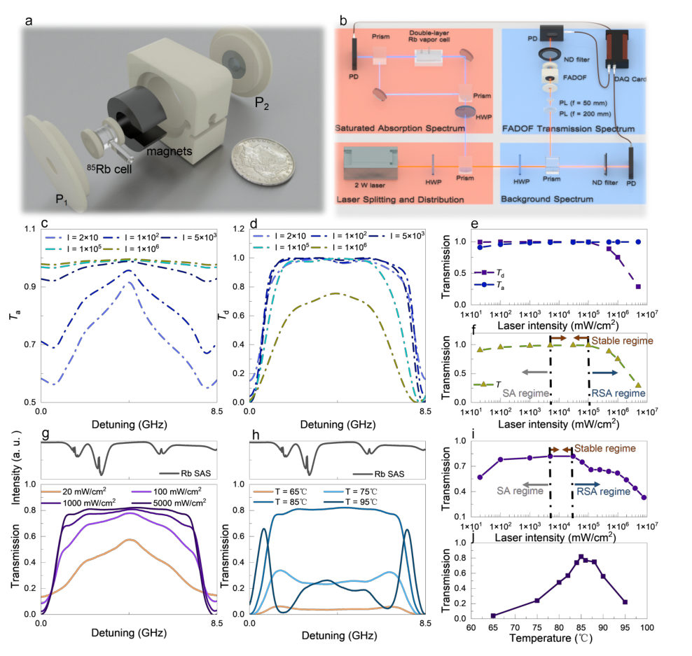 
Fig. 3. µFADOF device, test system, optical feedback characteristics, and temperature characteristics. a, Schematic of the µFADOF device. The cold finger of the atomic vapor cell, the two probes of the temperature control system, and the power supply lines are all positioned within the gap of the C-shaped magnet. Two polarizers, each 0.1 mm thick, are placed in front of and behind the atomic vapor cell, functioning as the polarizer and analyzer for the FADOF. b, The µFADOF transmission spectrum measurement sys- tem, which is divided into four functional sections. Laser splitting and distribution: A small portion (a few mW) of the test laser is uti- lized for saturated absorption...

📷 Fig 4

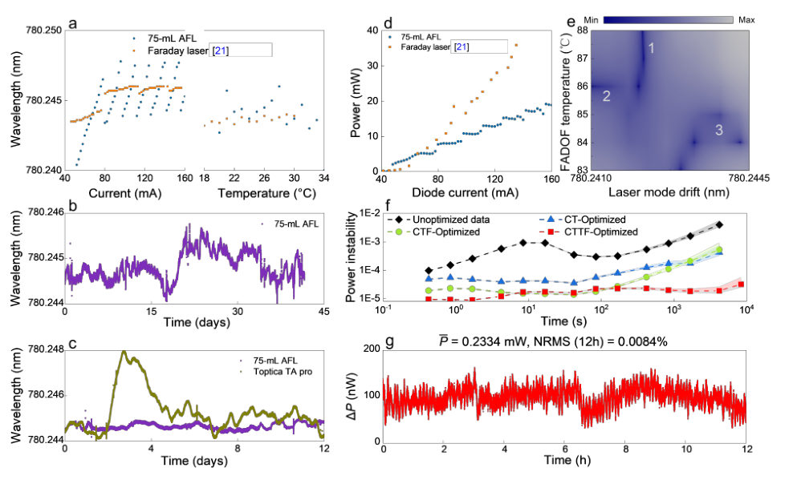 
Fig. 4. Wavelength and power characteristics of the 75-mL AFL. a, Output wavelengths of the 75-mL AFL and previous Faraday lasers [21] under varying diode currents and temperatures. b, Wavelength drift of the 75-mL AFL over a 42-day free-running period. c, Wavelength drift of the 75-mL AFL compared with an established commercial laser (Toptica TA pro) operating simultane- ously in free-running mode for 12 days in the same laboratory environment. d, Output power of the 75-mL AFL and previous Faraday lasers [21] under varying diode currents. e, The rate of power change at different FADOF temperatures and laser wavelengths during the power optimization process (darker colors indicate lower...

📷 Fig 5

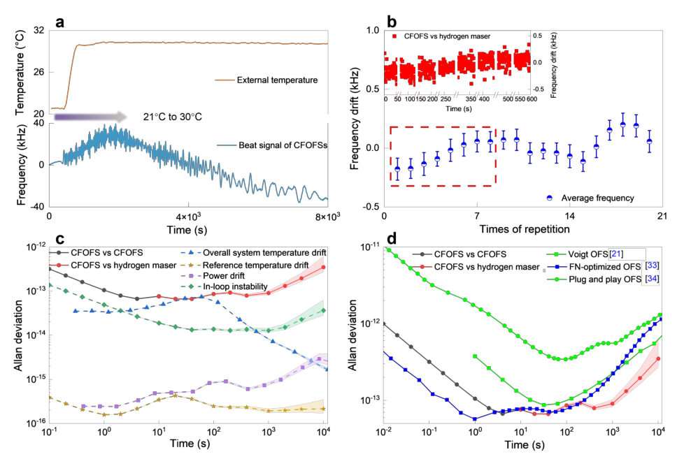 
Fig. 5. Turn-key characteristics and frequency instability of the CFOFS. a, Frequency drift of the beat signal between two CFOFSs when subjected to an ambient temperature shock of +9°C within 6 minutes. b, Laser frequency drift during 20 vibration shock tests. The inset displays the CFOFS frequency output during the first 8 vibration shocks; after each shock, the data is averaged over 1 minute and recorded before the subsequent shock is applied. c, CFOFS frequency instability and the noise contributions from indi- vidual parameters. CFOFS vs CFOFS: Short-term frequency instability evaluated via the beat note between two CFOFSs. CFOFS vs hydrogen maser: long-term frequency instability...

**Summary.** This paper presents a novel, miniaturized Atom-Filtered Laser (AFL) using a micro Faraday anomalous dispersion optical filter ($\mu$FADOF). By engineering the filter to achieve a wide, flat-top transmission window, the authors overcome the size limitations of conventional AFLs, resulting in a compact 75 mL device. This device demonstrates excellent stability and turn-key operation, making it highly promising for next-generation quantum technology.

**Why it may be interesting.** This work directly addresses the engineering challenges of integrating atomic physics principles into practical, deployable quantum hardware, which is a major focus area for AMO physicists.

Detailed structure

**Main problem.** Miniaturizing and stabilizing Atom-Filtered Lasers (AFLs) for quantum devices, which are currently limited by the bulky size and narrow bandwidth of conventional atomic filters.

**Main result.** The authors developed a micro Faraday anomalous dispersion optical filter (μFADOF) that achieves a 7.5 GHz flat-top transmission window, enabling a 30-fold volume reduction to a compact 75 mL package while maintaining high frequency stability.

**Method.** The research involves designing and characterizing the $\mu$FADOF operating in the extreme hyperfine Paschen-Back regime, optimizing its operation through active temperature and current control to leverage stable optical self-feedback.

**Model / system.** The core system is the AFL utilizing the $\mu$FADOF, which is based on the anomalous dispersion properties of alkali atoms (like ${}^{85}	ext{Rb}$). The operation relies on achieving a stable self-feedback regime where the filter's transmission profile is robust against environmental fluctuations.

**Key observables.** Power instability ($9 	imes 10^{-6}$ at 1 s), long-term frequency stability ($3 	imes 10^{-13}$ at 10000 s), and the achieved flat-top transmission bandwidth (7.5 GHz).

**Important parameters / regimes.** Operating regime (hyperfine Paschen-Back), bandwidth (7.5 GHz), volume reduction (30-fold to 75 mL), and stabilization parameters (temperature/current control).

**Assumptions / limitations.** The stability of the laser output is critically dependent on operating the $\mu$FADOF in a specific, stable optical self-feedback regime.

**Figures summary.** Figures illustrate the external structure of the 75-mL AFL and its applications; one figure details the working principle of the FADOF using energy-level diagrams for ${}^{85}	ext{Rb}$ to derive the dispersion profile.

**Paper structure.** The paper progresses from identifying the miniaturization bottleneck of AFLs to proposing the $\mu$FADOF solution. It details the physics of the filter (operating regimes, intensity dependence) and concludes with experimental results demonstrating high stability and compactness.

Abstract

Numerous quantum devices require lasers strictly locked to atomic transitions. Atom-filtered lasers (AFLs) are considered a leading candidate for quantum device laser sources due to their ability to self-align to atomic transitions. However, the sub-GHz sharp transmission spectra of conventional atomic filters impose constraints on both laser miniaturization and output stability. Herein, we demonstrate a micro Faraday anomalous dispersion optical filter (μFADOF) operating within the extreme hyperfine Paschen-Back regime, generating a 7.5 GHz flat-top transmission window. By integrating this filter, the miniaturization bottleneck of the AFLs is overcome, achieving a 30-fold volume reduction to a compact package volume of 75 mL. Simultaneously, investigations into the optical self-feedback characteristics of the μFADOF reveal a stable operating regime, where the optical self-feedback of the atomic filter acts as a stabilizing mechanism, enabling the laser to achieve a power instability of 9 x 10^-6 at 1 s and 3.2 x 10^-5 at 8400 s. The optical frequency standard based on this 75-mL AFL achieves a further improvement in long-term frequency stability to 3 x 10^-13 at 10000 s and maintains turn-key operation under environmental shocks, highlighting the critical role of this laser in the development of deployable quantum devices.

[↑ back to top](#top)

### [Classical Root Systems Reveal Defect-Junction Data in Stabilizer Renyi Entropy](http://arxiv.org/abs/2609.27537v1)

**Authors:** M. A. Rajabpour  
**Type:** theory · **Category:** statistical mechanics · **PDF:** <https://arxiv.org/pdf/2609.27537v1>  
**Analysis basis:** full PDF text, analyzed in chunks
**Topic relevance:** `Full counting statistics` **1/5** · `Keldysh / 2PI / non-Gaussian methods` **1/5** · `analog quantum simulation` **1/5** · `quantum measurements` **1/5**

📷 Fig 1

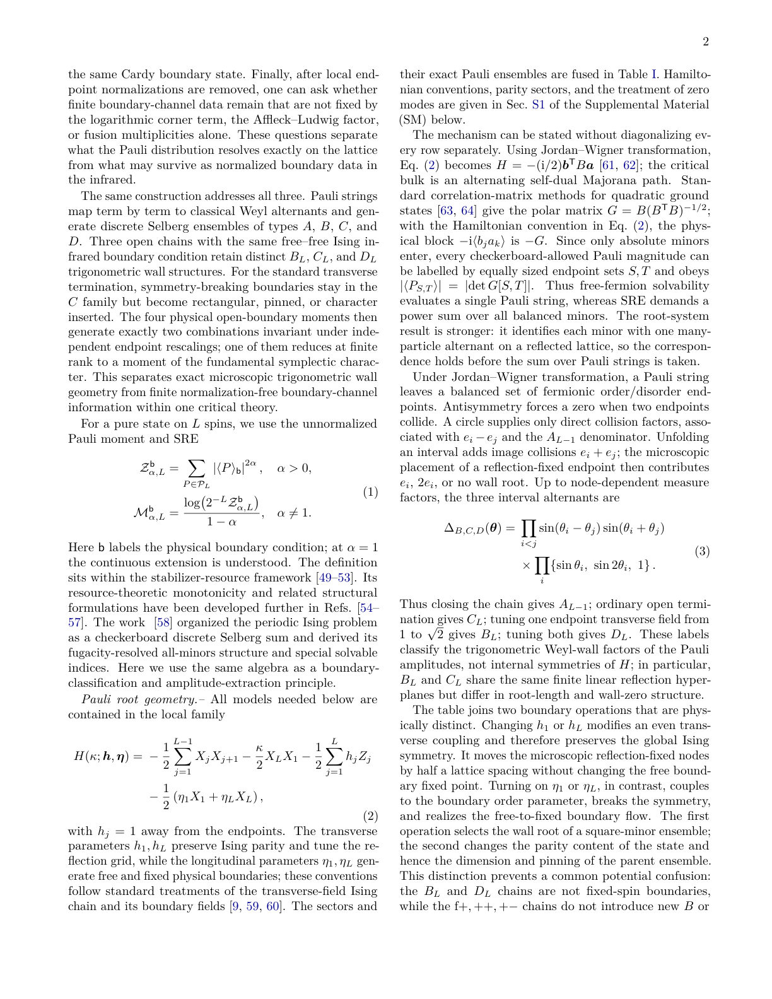 
Low-resolution page preview, page 2

📷 Fig 2

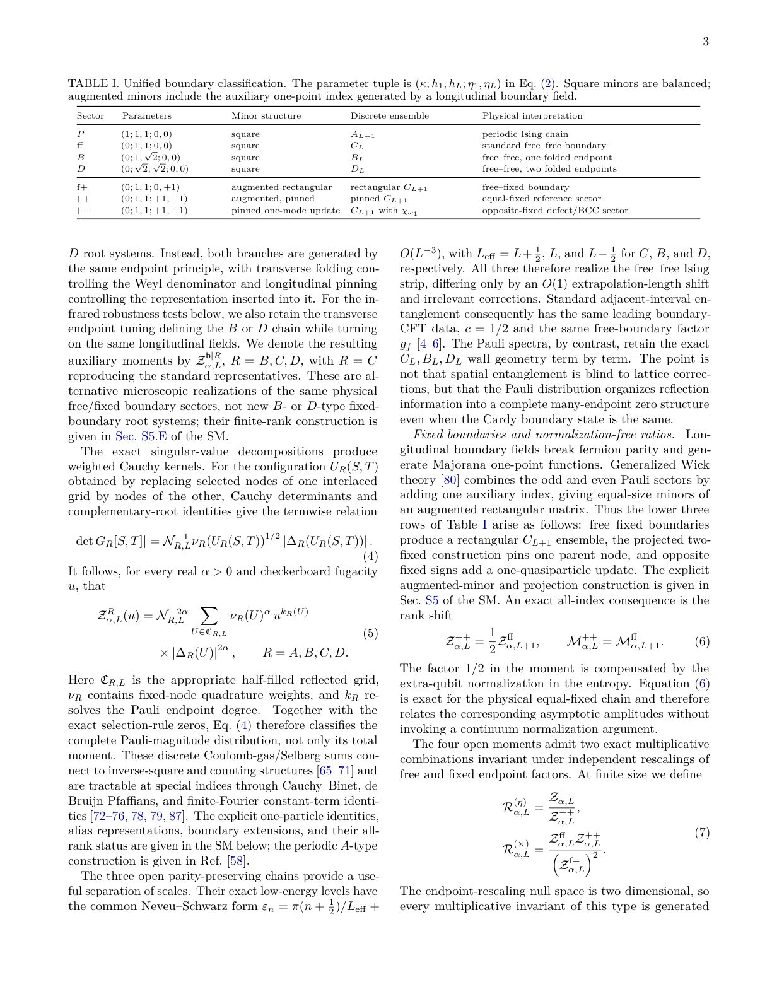 
Low-resolution page preview, page 3

📷 Fig 3

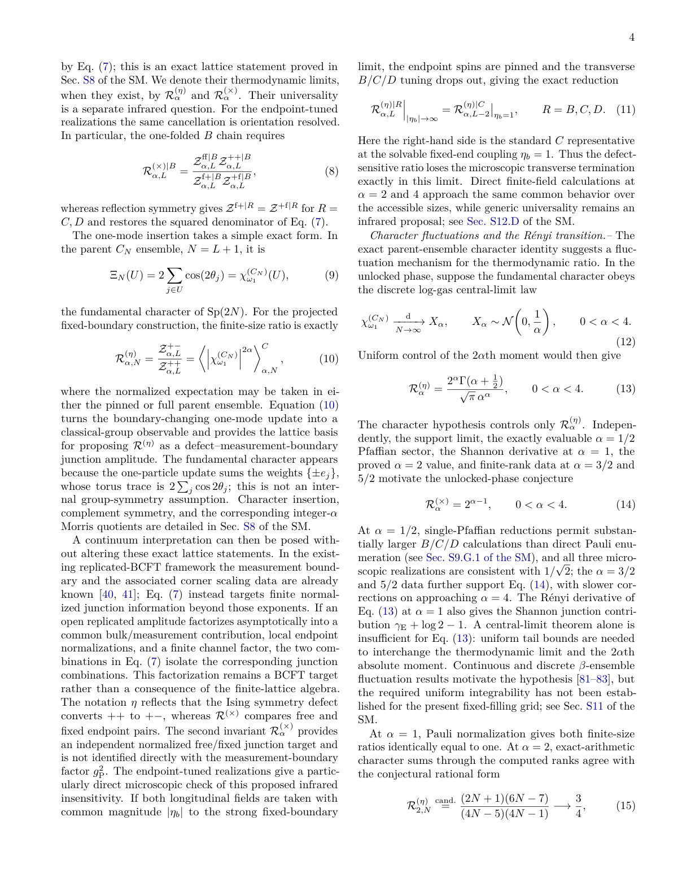 
Low-resolution page preview, page 4

📷 Fig 4

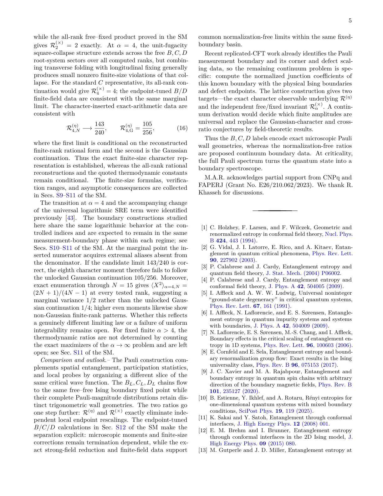 
Low-resolution page preview, page 5

📷 Fig 5

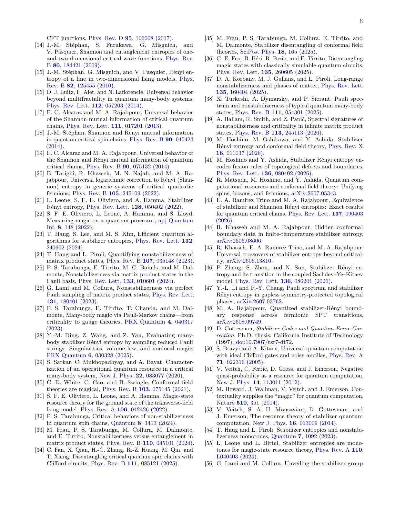 
Low-resolution page preview, page 6

**Summary.** This theoretical paper analyzes the boundary information encoded in the full Pauli spectrum of critical quantum chains, showing it goes beyond what is captured by standard Rényi entropy measures. By mapping the system to classical root systems, the authors derive exact lattice invariants that serve as precise targets for understanding defect-junction amplitudes in boundary conformal field theory. The results confirm that the full spectrum retains crucial boundary details lost in the continuum limit.

**Why it may be interesting.** The work provides a deep, mathematically rigorous link between critical quantum systems, boundary conformal field theory, and algebraic structures (root systems), which is highly relevant for understanding boundary effects in quantum many-body systems.

Detailed structure

**Main problem.** The paper investigates what boundary information is retained in the full Pauli distribution of critical quantum states, which may be invisible when only considering single Rényi entropy moments or the infrared fixed point.

**Main result.** The full Pauli spectrum resolves boundary information by generating specific multiplicative invariants related to classical root systems (A, B, C, D), providing concrete lattice targets for defect-measurement-boundary junction amplitudes.

**Method.** The analysis uses advanced techniques involving Selberg ensembles, Cauchy determinants, and the comparison of ratios of partition functions derived from different boundary conditions.

**Model / system.** The study focuses on critical Ising chains, whose properties are analyzed using Pauli strings and mapped onto structures governed by classical root systems A, B, C, and D.

**Key observables.** Stabilizer Rényi Entropy moments, Pauli magnitudes, and ratios of moments $R(\eta)_{\alpha,L}$ and $R(	imes)_{\alpha,L}$.

**Important parameters / regimes.** The Renyi index $\alpha$, the system length $L$, and boundary field parameters $\eta_b$ are crucial parameters explored across various limits.

**Assumptions / limitations.** The analysis assumes that the lattice ratios converge to universal continuum junction targets in the thermodynamic limit, despite microscopic differences between boundary realizations.

**Figures summary.** Figures compare the convergence of ratios for different root system realizations (B, C, D) towards common theoretical limits, and show the flow of observables away from exactly solvable points.

**Paper structure.** The paper progresses by first establishing the connection between Pauli distributions and root systems, deriving exact lattice invariants, and then performing detailed finite-size and strong-boundary limit analyses to confirm the universality of the derived junction amplitudes.

Abstract

Universal information extracted from a critical quantum state depends on how the state is probed. Spatial entanglement, participation statistics, and stabilizer Rényi entropy correspond to different replica geometries and need not isolate the same boundary data. We show that the complete distribution of Pauli magnitudes in critical Ising chains carries an exact geometric fingerprint of boundary termination, distinguishing lattice realizations that flow to the same infrared boundary fixed point. This structure is organized by discrete Selberg ensembles associated with the classical root systems $A$, $B$, $C$, and $D$: three open chains sharing the free--free Ising boundary condition retain distinct $B_L$, $C_L$, and $D_L$ trigonometric wall geometries. The standard symmetry-breaking representatives instead produce rectangular, pinned, and character-inserted $C$ ensembles. Their four boundary moments contain exactly two independent multiplicative combinations invariant under local endpoint normalizations. One of these reduces exactly at finite rank to a moment of the fundamental symplectic character and provides a lattice target for a defect--measurement-boundary junction amplitude. A conditional Gaussian-character law predicts its values throughout the unlocked phase, while exact-arithmetic finite-rank results at the $α=4$ transition depart sharply from the Gaussian continuation. These results show that the full Pauli spectrum resolves boundary information invisible to the infrared boundary fixed point alone and provide concrete targets for replicated boundary conformal field theory.

[↑ back to top](#top)

### [Bridging two families of non-Hermiticity: from non-reciprocal couplings to an imaginary potential using the Lanczos transformation](http://arxiv.org/abs/2609.28326v1)

**Authors:** Li Ge  
**Type:** theory · **Category:** other · **PDF:** <https://arxiv.org/pdf/2609.28326v1>  
**Analysis basis:** full PDF text, analyzed in chunks
**Topic relevance:** `analog quantum simulation` **1/5** · `correlated / nonlocal dissipation` **1/5** · `driven-dissipative phase transition` **1/5**

📷 Fig 1

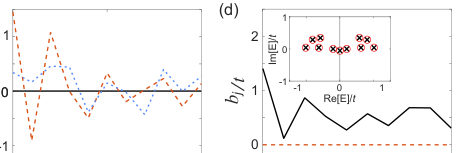 
FIG. 1. Non-Hermitian symmetric tight-binding Hamil- tonian isospectral to the Hatano-Nelson model. (a,b) Real (solid) and imaginary (dashed) parts of the on-site po- tential aj and symmetric couplings bj with |u0), (v0| given by Eq. (11) and g = 0.6. Inset in (b): Identical energy spectrum of H (red circles) and HL (black crosses). (c,d) Same as (a,b) but with imaginary Vj randomly chosen in [−it/2, it/2] [dotted line in (c)].

📷 Fig 2

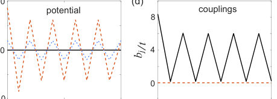 
FIG. 2. Bi-Lanczos transformation with EPs. (a,b) Identical energy spectrum of H (red circles) and HL (black crosses) with q = 5 and 1 in Eq. (15), respectively. (c,d) Real (solid) and imaginary (dashed) parts of the on-site potential aj and symmetric couplings bj in (b) using Eq. (11) and g = 1. The origin imaginary potential Vj = ±iγ = ±i1.9319t at this EP [dotted line in (c)].

📷 Fig 3

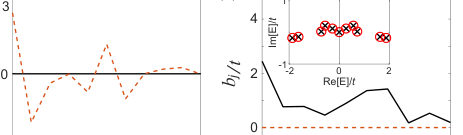 
FIG. 5. A two-dimensional example. (a) Schematic of the triangular ribbon. Asymmetric real and imaginary couplings are shown as solid and dashed lines, respectively. (b,c) Real (solid) and imaginary (dashed) parts of the on-site potential aj and symmetric couplings bj with |u0), (v0| given by Eq. (11) and g = 1. Inset in (c): Identical energy spectrum of H (red circles) and HL (black crosses).

📷 Fig 4

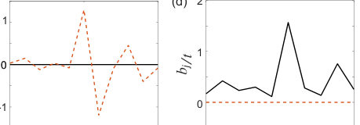 
FIG. 4. Regulating all symmetric couplings to be real after the bi-Lanczos transformation. (a,b) Real (solid) and imaginary (dashed) parts of the on-site potential aj and symmetric couplings bj with |u0), (v0| given by Eq. (11) and g = 1. Vj = 0 and all random couplings are in [0, t] in H. (c,d) Same as (a,b) for the same H but with g = 0.1.

**Summary.** This paper introduces a novel mathematical technique using the Lanczos transformation to bridge two distinct physical descriptions of non-Hermiticity: non-reciprocal couplings and imaginary potentials. It demonstrates that a generalized Hatano-Nelson model can be mapped to an equivalent model with real couplings and an imaginary on-site potential. This provides a versatile framework for designing and understanding complex non-Hermitian quantum systems.

**Why it may be interesting.** This work provides a powerful mathematical tool (the Lanczos mapping) to unify the understanding of different non-Hermitian physics phenomena, which is highly relevant for designing and analyzing open quantum systems in optics and condensed matter.

Detailed structure

**Main problem.** The paper aims to establish an isospectral mapping between two distinct families of non-Hermiticity: those arising from non-reciprocal couplings and those involving an imaginary on-site potential.

**Main result.** The Lanczos transformation, when applied with specific initial vectors, successfully maps a generalized Hatano-Nelson model to an equivalent tight-binding model featuring real symmetric couplings and an imaginary on-site potential.

**Method.** The core method is the bi-Lanczos transformation, adapted for non-symmetric Hamiltonians, which constructs an isospectral mapping between the two non-Hermitian forms.

**Model / system.** The study focuses on 1D and 2D tight-binding lattice models, specifically generalizing the Hatano-Nelson model, which incorporates non-reciprocal couplings and potentially imaginary on-site potentials.

**Key observables.** The primary observables are the couplings (real vs. imaginary) and the resulting energy spectrum, which is shown to be isospectral between the original and transformed Hamiltonians.

**Important parameters / regimes.** The initial vectors $|u_0
angle$ and $\langle v_0|$ are crucial parameters, as their specific choice dictates whether the resulting model has an imaginary potential or real couplings.

**Assumptions / limitations.** The success of the mapping relies on choosing non-standard initial vectors for the bi-Lanczos transformation, and the method is shown to hold even when the original Hamiltonian already contains imaginary potentials or exceptional points.

**Figures summary.** Figures illustrate the transformation on a 1D lattice, showing how different choices of initial vectors control the real/imaginary nature of the on-site potential and couplings. Further figures demonstrate the mapping in 2D (triangular ribbon) and the behavior of exceptional points.

**Paper structure.** The paper introduces the two non-Hermitian families, develops the Lanczos mapping technique using specific initial vectors, proves the isospectrality, and then applies this framework to construct novel non-Hermitian systems with desired spectral properties (e.g., real spectrum without PT symmetry).

Abstract

Two types of non-Hermiticity found in physical systems, i.e., non-reciprocal couplings and complex potentials, have gained considerable interest recently. The former leads to the non-Hermitian skin effect, while the latter gives rise to a range of non-Hermitian symmetries such as parity-time ($PT$) and particle-hole symmetries. Although these two non-Hermitian forms have been incorporated in the same models, so far they have been treated as distinct families of non-Hermiticity. In this work, we establish an isospectral mapping between them using the Lanczos transformation. More specifically, we show that a generalized Hatano-Nelson model $H$ with non-reciprocal and spatially varying couplings can be mapped to a tight-binding model $H_L$ with real symmetric couplings and an imaginary on-site potential. This result holds even when the original $H$ already has an imaginary potential and exceptional points. Our work provides a refreshed understanding of the connection between different forms of non-Hermiticity. It also offers an approach to obtaining an intuitive physical understanding of exceptional points in $H_L$ that are elusive in $H$. Finally, our findings also warrant a versatile approach to constructing non-Hermitian systems with a complex potential and a real spectrum, without $PT$ symmetry.

[↑ back to top](#top)

### [Uphill and downhill first passage of an active Brownian particle: Asymmetry and exact path reweighting](http://arxiv.org/abs/2609.27425v1)

**Authors:** Mykola Tasinkevych, Xuan My Le, Artem Ryabov  
**Type:** theory · **Category:** statistical mechanics · **PDF:** <https://arxiv.org/pdf/2609.27425v1>  
**Analysis basis:** full PDF text, analyzed in chunks
**Topic relevance:** `Frenkel-Kontorova` **1/5** · `Keldysh / 2PI / non-Gaussian methods` **1/5** · `non-equilibrium universality` **1/5**

📷 Fig 1

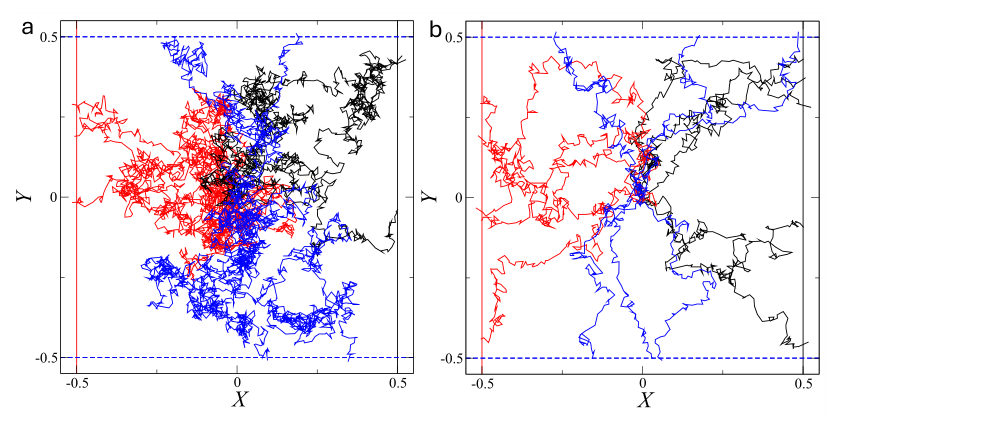 
FIG. 1. Representative planar trajectories (X(τ), Y (τ)) of an active Brownian particle subject to a constant bias directed along +x. Downhill trajectories reaching the absorbing boundary at X = +1/2 are shown in black, uphill trajectories reaching X = −1/2 in red, and selected trajectories with large transverse excursions in blue. No absorbing boundary is imposed in the transverse direction. Panels (a) and (b) correspond to the dimensionless self-propulsion speeds U = 0.21 and U = 1.05, respectively, at fixed dimensionless bias F = 9.66. The planar trajectories are shown for illustration; all quantitative first passage calculations use the closed process (X, ϕ).

📷 Fig 2

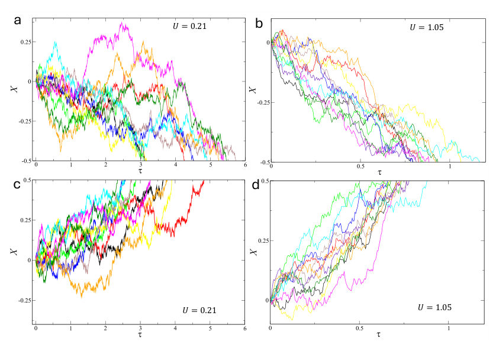 
FIG. 2. Representative projected trajectories X(τ) generated from the closed process (X, ϕ) for an active Brownian particle undergoing first passage between the absorbing boundaries X = ±1/2 in the presence of a constant bias directed along +x. Panels (a,b) show uphill trajectories terminating at X = −1/2, while panels (c,d) show downhill trajectories terminating at X = +1/2. The two columns correspond to the dimensionless self-propulsion parameters U = 0.21 [panels (a,c)] and U = 1.05 [panels (b,d)], at fixed dimensionless bias F = 9.66. Increasing persistence makes the projected motion more correlated and accentuates the contrast between uphill and downhill passages.

📷 Fig 3

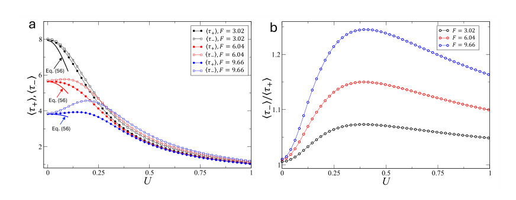 
FIG. 3. (a) Mean first passage times for downhill and uphill crossings, ⟨τ+⟩and ⟨τ−⟩, plotted as functions of the persistence parameter U for several values of the dimensionless bias F, at fixed eD = 0.013. The solid curves show the effective drift-diffusion prediction of Eq. (56), whose small U expansion reproduces the common leading O(U 2) asymptotic contribution derived in Sec. IV A. The boundary-sensitive remainder Rσ is not included in these curves; any directional separation at O(U 2) is contained in the difference R−−R+. Panel (b) shows that the ratio ⟨τ−⟩/⟨τ+⟩depends non-monotonically on the persistence parameter. For the values of F shown, its maximum increases and shifts to larger...

📷 Fig 4

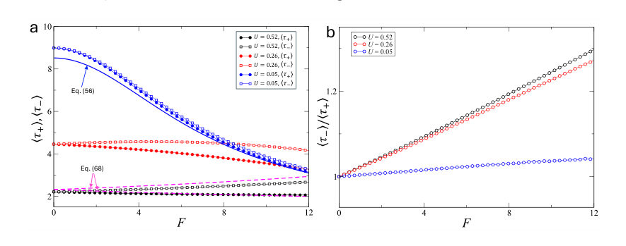 
FIG. 4. (a) Mean first passage times for downhill and uphill crossings, ⟨τ+⟩and ⟨τ−⟩, shown as functions of the dimensionless bias F for several values of the persistence parameter U, at fixed eD = 0.013. The solid curve labelled Eq. (56) shows the effective drift-diffusion results. For U = 0.52, the dashed magenta curves show the frozen-orientation prediction in Eq. (68), where the upper and lower curves represent ⟨τ−⟩and ⟨τ+⟩, respectively. (b) Corresponding ratio ⟨τ−⟩/⟨τ+⟩as a function of F. The figure shows that increasing the external bias increases the difference between the downhill and uphill mean first passage times, with a more pronounced separation at larger U.

📷 Fig 5

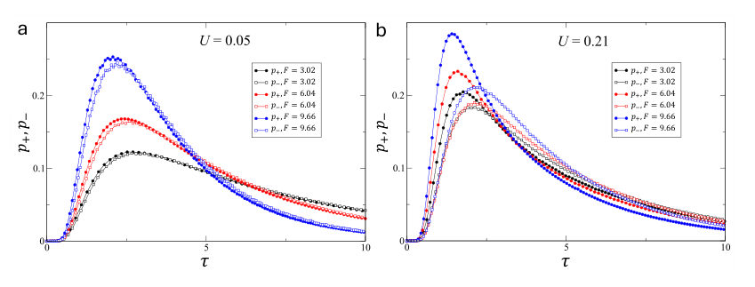 
FIG. 5. Conditional first passage time probability densities for downhill (filled symbols) and uphill (open symbols) passages, shown for (a) U = 0.05 and (b) U = 0.21. Different curves correspond to different values of the dimensionless bias F, at fixed eD = 0.013. The comparison illustrates how increasing persistence enhances the asymmetry between uphill and downhill first passage time distributions, shifting the downhill peak to shorter times and broadening the uphill tail.

**Summary.** This work analyzes how self-propulsion introduces asymmetry in the passage times of an active particle moving against or with an external bias. The core finding is that the path ensembles are related by a spatial reflection symmetry, which yields an exact reweighting functional. This functional allows researchers to calculate rare event statistics (uphill) using more common measurements (downhill).

**Why it may be interesting.** The concept of exact path reweighting based on symmetry is a powerful tool applicable to non-equilibrium statistical mechanics problems, suggesting general protocols for analyzing directional biases in active matter.

Detailed structure

**Main problem.** The paper investigates the asymmetry in first passage processes (uphill vs. downhill) for an Active Brownian Particle (ABP) driven by an external force between absorbing boundaries.

**Main result.** While self-propulsion breaks the equality of unweighted first passage time distributions, the two directional path ensembles remain exactly related by spatial reflection, allowing for an exact reweighting to reconstruct rare uphill statistics from common downhill trajectories.

**Method.** The analysis employs path-weighting techniques, deriving an exact reweighting functional based on spatial reflection symmetry, and uses perturbative/asymptotic expansions to calculate mean first passage times.

**Model / system.** The system is an Active Brownian Particle (ABP) moving in 2D under a constant external force, whose dynamics are reduced to a 1D stochastic process $(x(t), \phi(t))$ in the overdamped limit.

**Key observables.** Splitting probabilities, conditional first passage time distributions, and the path-dependent asymmetry functional.

**Important parameters / regimes.** Self-propulsion speed ($U$), external force bias ($F$), and rotational diffusion coefficient ($D_r$).

**Assumptions / limitations.** The analysis is performed in the overdamped regime, and later sections analyze the rapid angular relaxation limit ($\epsilon 	o 0$).

**Figures summary.** Figures illustrate planar trajectories showing both uphill and downhill paths, and projected $X(	au)$ trajectories demonstrating the effect of persistence ($U$) on directional contrast.

**Paper structure.** The paper introduces the ABP model, derives the exact path-reweighting relation based on spatial reflection, and then uses this relation to calculate the directional first passage time distributions and mean times via expansions.

Abstract

First passage processes in active systems combine stochastic transport with self-propulsion and orientational persistence, making motion along and against an external bias sensitive to the internal active dynamics. For passive biased diffusion, opposite exits can have different splitting probabilities while their conditional first passage time distributions remain identical. We study how this relation changes for an active Brownian particle driven by a constant external force between two absorbing boundaries. Self-propulsion breaks the equality of the uphill and downhill first passage time distributions and modifies the splitting probabilities. Nevertheless, the two directional path ensembles remain exactly related by spatial reflection, which pairs downhill and uphill first passage paths of the same duration while preserving their orientational history. The log-ratio of the probabilities of a path and its reflected partner defines a path-dependent asymmetry functional and provides an exact reweighting between the two ensembles. In the symmetric half-weighted representation, the uphill and downhill first passage time distributions coincide for arbitrary orientational persistence. The same path relation also allows rare uphill statistics to be reconstructed from the more frequently sampled downhill trajectories. Numerical simulations confirm the weighted equality across the explored bias and persistence regimes, while perturbative and asymptotic analyses clarify how orientational persistence produces the directional asymmetry of the unweighted statistics. The exact relation between the two directional path ensembles suggests that similar symmetry-based reconstruction protocols may be found in other nonequilibrium first-passage problems.

[↑ back to top](#top)

### [Improved convergence radius of the Fer expansion for Hermitian generators](http://arxiv.org/abs/2609.28302v1)

**Authors:** Lorenzo Bagnasacco, Vittorio Giovannetti  
**Type:** theory · **Category:** other · **PDF:** <https://arxiv.org/pdf/2609.28302v1>  
**Analysis basis:** full PDF text, analyzed in chunks
**Topic relevance:** `Keldysh / 2PI / non-Gaussian methods` **1/5** · `analog quantum simulation` **1/5**

📷 Fig 1

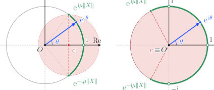 
Figure 1. The spectrum of e−µX for anti-Hermitian X. The eigenvalues eiθ (blue) lie on the arc |θ| ≤µ∥X∥of the unit circle (green). The pink disc is the smallest disc centered at c containing that arc; its radius, drawn as the red dashed segments from c to the end points of the arc, is the quantity minimized over c in Eq. (14). (a) For µ∥X∥&lt; π/2 the op- timal center is c = cos(µ∥X∥), where the chord through the end points meets the real axis, and the radius is sin(µ∥X∥), half that chord. (b) For µ∥X∥&gt; π/2 the arc contains the antipodal points ±i, so no disc of radius smaller than 1 can contain it: the optimal center is the origin, c ≡O, and the radius is 1.

📷 Fig 2

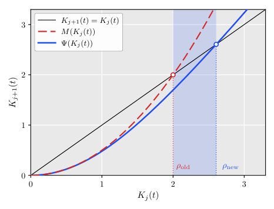 
Figure 2. The recursion (24) seen as a map Kj(t) 7→Kj+1(t): the finite-angle map Ψ of Eq. (23) (blue, solid) and the map M of Eq. (32) (red, dashed), which underlies the radius 2 of Ref. [14], together with the diagonal (thin, solid). The sufficient convergence radius is the positive fixed point, where the graph crosses the diagonal (circles): ρold = 2 for M and ρnew ≈2.6058 for Ψ, Eq. (27). Since Ψ &lt; M, the crossing moves to the right: the shaded interval is the set of initial values K1(t) covered by the new bound but not the old one. Near the origin the two maps agree to leading order, so the rate of convergence is unaffected.

**Summary.** This paper enhances the mathematical tool known as the Fer expansion, which calculates quantum time evolution operators using a product of unitary matrix exponentials. By optimizing the bounding technique for commutators, the authors increase the guaranteed convergence radius from 2 to approximately 2.6058. This improvement is vital for accurately simulating quantum dynamics governed by time-dependent Hamiltonians.

**Why it may be interesting.** The work provides a significant quantitative improvement to a fundamental mathematical tool (the Fer expansion) used for time evolution in quantum mechanics, which is crucial for simulating dynamics in AMO physics and quantum information.

Detailed structure

**Main problem.** The paper aims to improve the convergence radius for the Fer expansion, a method used to calculate the time-evolution operator for quantum systems governed by time-dependent Hamiltonians.

**Main result.** The authors successfully improve the known convergence radius for Hermitian generators from $2$ to approximately $2.6058$, representing an improvement of about $30\%$.

**Method.** The improvement is achieved by optimizing the bound on the commutator $\left[e^{-\mu X}, Y
ight]$ over a free parameter $c$, which is then used to refine the recursive bound governing the expansion's convergence.

**Model / system.** The analysis concerns a quantum system described by a time-dependent Hamiltonian $H(t)$, whose time evolution is captured by the operator $U(t)$. The mathematical framework involves comparing the Dyson series with the unitary-preserving Fer expansion.

**Key observables.** The convergence radius, defined by the maximum value of the time integral $\int_0^t \|H(s)\| ds$ for which the expansion is guaranteed to converge.

**Important parameters / regimes.** The convergence radius $
ho$, which is determined by the fixed point of the recursion map $\Psi(x)$, and the Hamiltonian $H(t)$ itself.

**Assumptions / limitations.** The convergence is only guaranteed within a finite radius, and the derivation relies on bounding the commutator using spectral properties of $e^{-\mu X}$ on the unit circle.

**Figures summary.** Figure 1 illustrates the spectrum of $e^{-\mu X}$ for anti-Hermitian $X$ lying on an arc of the unit circle. Figure 2 depicts the recursion relation as a map showing the improvement from the old bound ($
ho_{old}$) to the new bound ($
ho_{new}$).

**Paper structure.** The paper builds upon the known Fer expansion, derives a refined bound for the commutator using optimization over a scalar multiple of the identity, and propagates this improved bound through the recursive relation to determine the new, larger convergence radius.

Abstract

The Dyson series expands the propagator of a time-dependent Hamiltonian in powers of the Hamiltonian, but its truncations are in general not unitary. The Fer expansion writes the same propagator as an infinite product of matrix exponentials, each of them unitary, and its remainder decays doubly exponentially with the number of factors. Convergence, however, is guaranteed only within a finite radius: the time integral of the norm of the Hamiltonian must be smaller than $2$. This is the best value known to date. Here we improve it by about $30\%$, raising it to about $2.6058$.

[↑ back to top](#top)

### [Local time-reversal-invariant topological markers in two dimensions](http://arxiv.org/abs/2609.28213v1)

**Authors:** Thomas Klein Kvorning, Miguel F. Martínez, Julia D. Hannukainen  
**Type:** theory · **Category:** disordered systems and neural networks · **PDF:** <https://arxiv.org/pdf/2609.28213v1>  
**Analysis basis:** full PDF text, analyzed in chunks
**Topic relevance:** `analog quantum simulation` **1/5** · `quantum measurements` **1/5**

📷 Fig 1

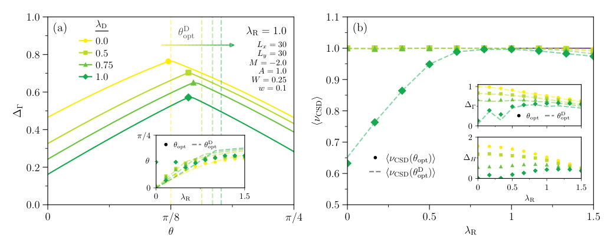 
FIG. 1. (a) Spectral gap of the operator Γ, Eq. (31), as a function of the angle θ. Γ is constructed from the one-parameter family S(θ), Eq. (55), and the one-particle density matrix of the ground state of the Hamiltonian in Eq. (38), with internal hopping matrix given by Eq. (69) and defined in an amorphous arrangement with w = 0.1 constructed from a parent square lattice with linear system sizes Lx = Ly = 30 and periodic boundary conditions. Aside from amorphicity, we use onsite disorder of strength W = 0.25, and set the parameters M = −2, A = 1. The different solid lines denote different values of the Dresselhaus spin-orbit coupling, while the Rashba contribution is fixed to λ = 1. The...

📷 Fig 2

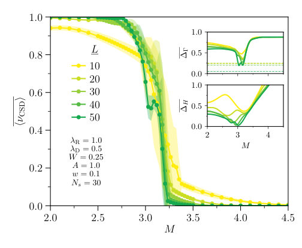 
FIG. 2. Bulk- and sample-averaged CS-descendant marker as a function of the onsite potential M and for linear sys- tem sizes: L = 10, 20, 30, 40, 50. The marker is calculated for the ground state of the Hamiltonian in Eq. (38), with in- ternal hopping matrix given by Eq. (69) and defined in an amorphous arrangement with w = 0.1 constructed from a parent square lattice with periodic boundary conditions. We consider onsite disorder of strength W = 0.25, and set the parameters A = 1, λR = 1, λD = 0.5. At each data point we average the marker over the whole arrangement of sites and over Ns = 30 samples of the amorphous and disordered arrangement. The shaded contours show the standard devi-...

**Summary.** This work introduces the Chern-Simons descendant marker, a novel, local, and state-based tool to characterize the $\mathbb{Z}_2$ topological invariant in 2D time-reversal-invariant systems. It achieves this by deriving the marker from the one-particle density matrix and systematically optimizing an auxiliary operator $S$ to ensure the marker remains well-defined even in the presence of disorder. This provides a powerful, practical diagnostic tool for condensed matter physics.

**Why it may be interesting.** The development of a local, measurable marker for topological invariants in disordered systems is crucial for understanding real-world materials where perfect crystalline order is absent, bridging abstract topology with measurable physical quantities.

Detailed structure

**Main problem.** The paper aims to develop a practical, real-space, and state-based local topological marker for characterizing topological phases in two-dimensional time-reversal-invariant systems.

**Main result.** A local Chern-Simons descendant marker is derived directly from the one-particle density matrix, providing a robust $\mathbb{Z}_2$ invariant that remains well-defined even when the system is disordered or when simple commutation relations are not met.

**Method.** The marker is obtained via dimensional reduction from an auxiliary three-dimensional state, requiring the identification and optimization of a local Hermitian involution $S$ that maximizes the spectral gap of an associated operator $\Gamma$.

**Model / system.** The analysis focuses on two-dimensional time-reversal-invariant near-Gaussian states, utilizing the one-particle density matrix $\rho$ as the primary input. The method is tested in models exhibiting strong Rashba and Dresselhaus spin-orbit coupling.

**Key observables.** Local Chern-Simons descendant marker, $\mathbb{Z}_2$ invariant, spectral gap of $\Gamma$, one-particle density matrix ($\rho$).

**Important parameters / regimes.** The optimal angle $\theta$ used to define the involution $S$, which is shown to be robust across different physical regimes.

**Assumptions / limitations.** The derivation relies on the properties of Gaussian states and the assumption that the spectral gap condition on $\Gamma$ is the key requirement for the marker's definition, rather than exact commutation $[S, \rho]=0$.

**Paper structure.** The paper introduces the concept of local topological markers, derives the Chern-Simons descendant marker through dimensional reduction, and details the systematic procedure for selecting and optimizing the auxiliary operator $S$ by maximizing the spectral gap of $\Gamma$.

Abstract

Local topological markers provide a real-space characterization of topological phases and are suited to noncrystalline models. We derive a local topological marker, the Chern-Simons descendant marker, for characterizing the topology of two-dimensional time-reversal-invariant near-Gaussian states from the one-particle density matrix \(ρ\). We construct an auxiliary three-dimensional state characterized by the local Chern-Simons marker, and use dimensional reduction to obtain the Chern-Simons descendant marker for the original two-dimensional state. This derivation introduces a local Hermitian involution \(S\) that is odd under time reversal. When \([S,ρ]=0\), the local Chern-Simons descendant marker reduces to half the difference of the local Chern markers in the \(S=\pm1\) sectors. Constructing an \(S\) that commutes exactly with \(ρ\) generally requires fine-tuning, but this is not needed---the local Chern-Simon marker remains well defined whenever \(Γ=\{ρ,S\}-S\) has a spectral gap around zero, even when \([S,ρ]\neq0\). This leaves the practical problem of identifying a suitable \(S\) for a given state, which, importantly, is straightforward even when spin is not a candidate. We show this by considering both strong Rashba and Dresselhaus spin-orbit coupling, for which knowledge of the physical origin of the state reduces the general problem of choosing $S$ to a one-parameter family \(S(θ)\). We evaluate the optimal angle $θ$ maximizing the spectral gap of $Γ$ analytically assuming translation invariance, and find that the gap of $Γ$ remains open for a broad range of angles around the optimum. The same value of \(θ\) remains valid in disordered systems, providing an easy way to obtain choice of \(S\) for evaluating the local Chern-Simons descendant marker of the state.

[↑ back to top](#top)

### [Matrix Density Waves and Fractionally Charged Point Defects in Flavor Weyl Semimetals](http://arxiv.org/abs/2609.26957v1)

**Authors:** Shantonu Mukherjee, Hridis K. Pal  
**Type:** theory · **Category:** strongly correlated electrons · **PDF:** <https://arxiv.org/pdf/2609.26957v1>  
**Analysis basis:** full PDF text, analyzed in chunks
**Topic relevance:** `Keldysh / 2PI / non-Gaussian methods` **1/5** · `analog quantum simulation` **1/5**

📷 Fig 1

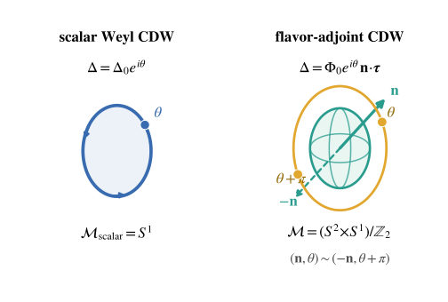 
FIG. 1. Order-parameter manifolds of the scalar and flavor- adjoint Weyl CDWs. For a nondegenerate Weyl pair, the internode order is a complex scalar, ∆= ∆0eiθ, with fixed- amplitude manifold Mscalar = S1. For a flavor doublet, the adjoint condensate ∆= Φ0eiθn · τ carries both a CDW phase and an internal orientation n ∈S2. The identification (n, θ) ∼(−n, θ + π) gives M = (S2 × S1)/Z2.

📷 Fig 2

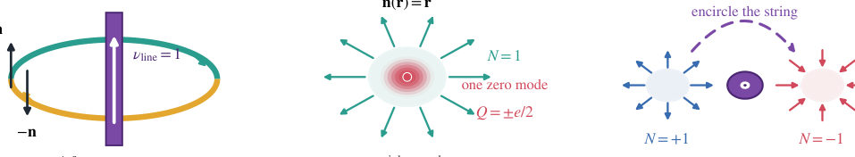 
FIG. 2. Topological defects and their fermionic consequences in the matrix density wave. (a) The elementary line defect is a half-quantum vortex in which the density-wave phase winds by π while the flavor orientation reverses, n →−n. Its mass determinant winds once, so the resulting Alice axion string carries a single chiral mode, νline = 1. (b) A unit hedgehog, n(r) = ˆr, forces the adjoint mass to vanish at its core and binds one normalizable zero mode with charge sectors Q = ±e/2 at neutrality in the spectrally symmetric limit. (c) The line and point defects are intertwined: transporting a hedgehog around the Alice string reverses its winding, N →−N.

**Summary.** This work analyzes Weyl semimetals exhibiting a Matrix Density Wave order, showing that internal flavor degrees of freedom induce complex topological defects. These defects include unit hedgehogs and Alice strings, which are linked by the condensate structure. The key finding is the realization of point-defect fractionalization, where localized zero modes carry fractional electronic charges ($\pm e/2$).

**Why it may be interesting.** The concept of fractionalization and the interplay between different types of topological defects (point vs. line) is highly relevant to understanding emergent phenomena in strongly correlated electronic systems, such as fractional quantum Hall states or topological superconductors.

Detailed structure

**Main problem.** Investigating how adding internal flavor degrees of freedom to interaction-driven Weyl density waves leads to point-defect fractionalization and intertwines point- and line-defect physics.

**Main result.** The system supports both unit hedgehog monopoles and half-quantum Alice strings, which are linked by the condensate structure and result in fractional charges ($\pm e/2$) at the point defects.

**Method.** Theoretical analysis using low-energy effective Hamiltonians, topological index theorems (Callias index), and solving radial differential equations for zero modes.

**Model / system.** A minimal model based on a pair of opposite-chirality Weyl nodes exhibiting a Matrix Density Wave (MDW) order parameter, driven by a local flavor-symmetric repulsion.

**Key observables.** Fractional charges ($\pm e/2$), chiral electronic modes ($
u_{	ext{line}}=1$), and the winding number ($N$) characterizing point defects.

**Important parameters / regimes.** The interaction strength ($U$), the separation distance ($d$) between defects, and the topological winding number ($N$).

**Assumptions / limitations.** The analysis is restricted to the adjoint component and assumes the asymptotic gap remains open for index theorem application.

**Figures summary.** Figures illustrate the topological defects: the half-quantum vortex (Alice string) and the unit hedgehog monopole, showing how transporting one around the other reverses the winding number ($N 	o -N$).

**Paper structure.** The paper progresses from establishing the general MDW order parameter, deriving the topological classification of line and point defects, calculating the fermionic zero modes using index theorems, and finally analyzing the fractional charge carried by isolated and paired defects.

Abstract

A conventional interaction-driven Weyl density wave is a complex scalar and supports vortex lines, but no topologically stable point defects. We show that two Weyl flavors do not merely duplicate this order. Starting from the matrix-valued internode coherence, a local flavor-symmetric repulsion selects a traceless adjoint condensate within the density-wave sector, while the fermionic ground-state energy locks its complex components into the collinear form $\mathbfΔ=Φ_0\mathbf{n} e^{iθ}$. The resulting order-parameter manifold, $(S^2\times S^1)/\mathbb Z_2$, supports both unit hedgehogs and half-quantum Alice strings of the same electronic mass that gaps the Weyl fermions. An elementary hedgehog binds a single normalizable zero mode whose empty and occupied sectors carry charges $-e/2$ and $+e/2$ at neutrality. An elementary Alice string carries a single chiral electronic mode despite its $π$ phase winding, and transporting a hedgehog around it reverses the hedgehog winding, $N\rightarrow-N$. Flavor therefore converts spontaneous translation breaking into a route to point-defect fractionalization and intertwines the point- and line-defect sectors of an interaction-generated electronic mass.

[↑ back to top](#top)

### [Simulation of a Battery Cell on Quantum Computers: Reactions & Transport](http://arxiv.org/abs/2609.28369v1)

**Authors:** Albert J. Pool, Michael Schelling, Birger Horstmann  
**Type:** theory · **Category:** quantum information and computing · **PDF:** <https://arxiv.org/pdf/2609.28369v1>  
**Analysis basis:** full PDF text, analyzed in chunks
**Topic relevance:** `Keldysh / 2PI / non-Gaussian methods` **1/5** · `methods for driven-dissipative` **1/5**

📷 Fig 1

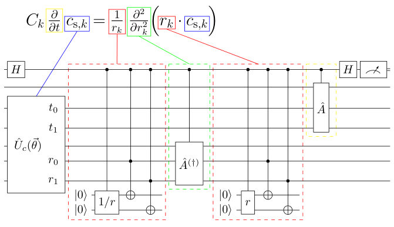 
Figure 1: One of the quantum circuits encoding Eq. (1), showcasing the quantum implementation of a differ- ential equation for two qubits in space and time. The ansatz circuit ˆUc(⃗θ) (blue) encodes the concentration in time and space. The multiplication with r and 1/r (red) realises the transformation to spherical coordinates. The binary shift operator ˆA(†) (green) implements the spatial derivative; the dagger in parentheses indicates that both the left and right derivative are required (in separate circuits) to determine the Laplacian. The shift operator ˆA on the right (yellow) implements the time derivative. Both have an ancilla qubit as their most significant bit to remove...

📷 Fig 2

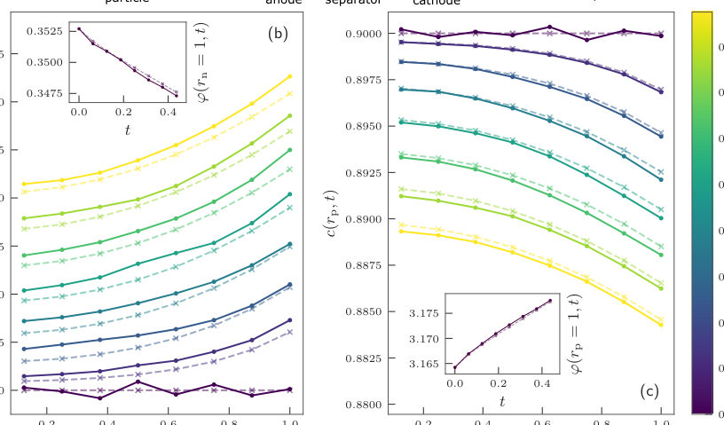 
Figure 2: Concentration and potential for the anode and cathode for a charging process with a constant current density jn = 0.0125/jp = −0.0125 and ∆t = 1/16, starting at an anode concentration of 0.1 and a cathode concentration of 0.9. (a) Schematic explaining the two electrodes and representative particles, inspired by.34 (b) Concentration and electrochemical potential φn = ϕs,n −ϕe,n (inset) in the anode repre- sentative particle as a function of time and space, with an infidelity of 2.8 × 10−6 for the concentration. (c) Concentration and electrochemical potential φp = ϕs,p −ϕe,p (inset) in the cathode representative particle as a function of time and space, with an infidelity of 2.1 ×...

📷 Fig 3

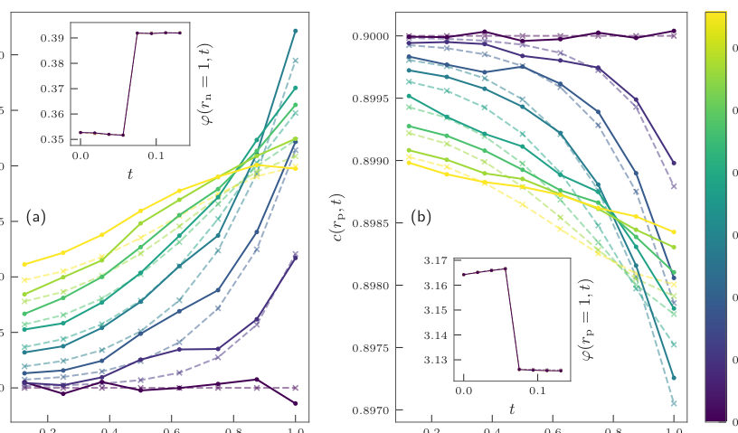 
Figure 3: Concentration and potential for the anode and cathode for a GITT pulse with a duration of 0.075 and an equally long relaxation phase, starting at an anode concentration of 0.1 and a cathode concentration of 0.9. (a) Anode concentration and electrochemical potential φn = ϕs,n −ϕe,n (inset) as a function of time and space, with an infidelity of 4.5 × 10−7 for the concentration. (b) Cathode concentration and electrochemical potential φp = ϕs,p −ϕe,p (inset) as a function of time and space, with an infidelity of 3.0 × 10−7 for the concentration. In all figures, the dashed lines represent a numerical solution to the model equations.

📷 Fig 4

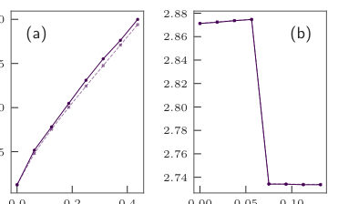 
Figure 4: Cell voltage for (a) charging with a constant current and ∆t = 1/16 and (b) a GITT pulse lasting 0.075 s followed by an equally long relaxation phase. The dashed lines represent a numerical solution to the model equations.

📷 Fig 5

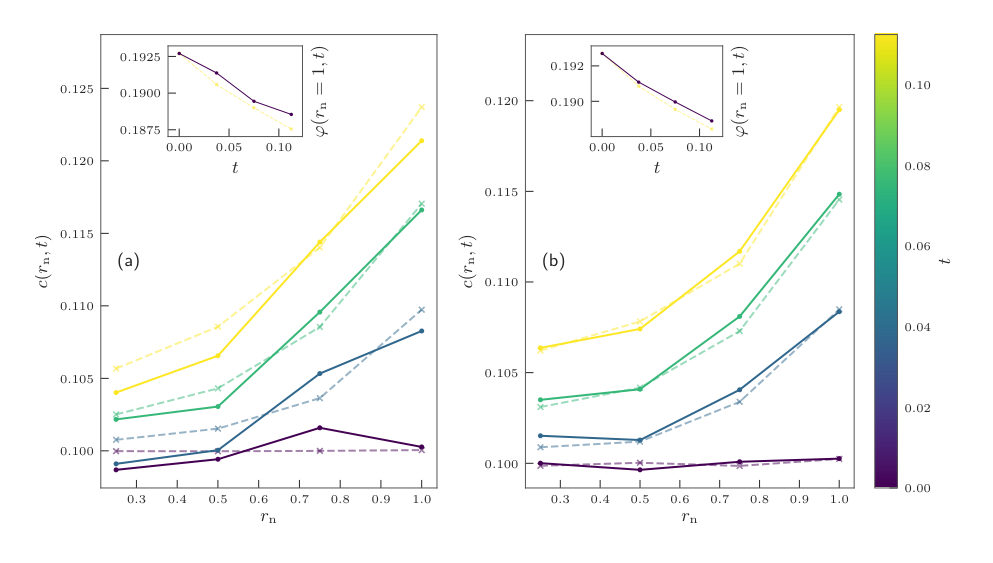 
Figure 5: Comparison of two different circuits with 2 + 2 qubits (22 = 4 points in space and time) on the IBM Berlin fake backend, showing concentration as a function of time and space and (inset) potential as a function of time. (a) 4 layers with all-to-all connectivity. (b) 3 layers hardware-efficient, only including connections that are physically present. The dashed lines correspond to a result from a noiseless simulator for the same circuits. Both results were produced using 2.5 million shots with M3 error mitigation.

**Summary.** This paper tackles the computational challenge of simulating battery cells by mapping the governing non-linear PDEs onto a quantum circuit framework. They propose and demonstrate a hybrid quantum-classical algorithm using the Feynman-Kitaev Hamiltonian to achieve the first quantum simulation of the SPMe model. This work shows a viable pathway for quantum computation to accelerate materials science simulations.

**Why it may be interesting.** It represents a direct application of quantum computing principles (Hamiltonian encoding, variational algorithms) to solve complex, time-dependent, non-linear partial differential equations arising in condensed matter electrochemistry.

Detailed structure

**Main problem.** Simulating complex electrochemical materials and systems, like battery cells, which are computationally limited by classical methods.

**Main result.** The authors successfully demonstrated the first quantum simulation of a battery cell using the Single Particle Model with electrolyte (SPMe) via a hybrid quantum-classical algorithm.

**Method.** A hybrid quantum-classical algorithm is employed, utilizing the Feynman-Kitaev Hamiltonian to encode the non-linear partial differential equations governing charge transport and reactions.

**Model / system.** The system is a battery cell modeled by the SPMe, involving coupled non-linear PDEs for concentration and potential. The physics is encoded into a Hamiltonian structure suitable for quantum circuit implementation.

**Key observables.** Cell voltage (U), solid concentration (c_s,k), and electrochemical potential ($\phi_k$).

**Important parameters / regimes.** Diffusion coefficients ($D_{s,k}$), particle radii ($R^*_k$), and current density ($j_k$).

**Assumptions / limitations.** The use of a hybrid quantum-classical approach is necessary due to current quantum hardware noise (NISQ era).

**Figures summary.** Figures show the evolution of concentration and potential during charging and GITT cycles, comparing quantum simulation results to established numerical solutions.

**Paper structure.** The paper introduces the computational bottleneck, details the adaptation of the SPMe equations into a quantum Hamiltonian formulation, describes the hybrid quantum-classical algorithm, and validates the method by simulating charging and GITT cycles.

Abstract

Simulations of electrochemical materials and systems accelerate technological progress, but are still limited by computational power. In particular, quantum computing offers prospects for higher resolutions, due to the exponential amount of data that can be stored in a quantum state. As current quantum computers are still noisy, we consider a hybrid quantum-classical algorithm, that divides the problem into smaller computational tasks. We describe how to implement such an algorithm for non-linear partial differential equations, the Feynman-Kitaev Hamiltonian, in a scalable way for an electrochemical system. We show how it can evaluate general electrochemical models and present a quantum simulation of the Single Particle Model with electrolyte (SPMe) as the first quantum simulation of a battery cell.

[↑ back to top](#top)

### [Spectral Gap of the Hexagonal AKLT Model via Boundary-State Factorization](http://arxiv.org/abs/2609.27993v1)

**Authors:** Michael J. Kastoryano  
**Type:** theory · **Category:** statistical mechanics · **PDF:** <https://arxiv.org/pdf/2609.27993v1>  
**Analysis basis:** full PDF text, analyzed in chunks
**Topic relevance:** `analog quantum simulation` **1/5** · `methods for driven-dissipative` **1/5**

📷 Fig 1

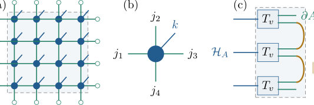 
Figure 1: PEPS tensors and the regional map, redrawn from [9, Fig. 1]. (a) A square-lattice patch with open virtual boundary legs. (b) One tensor with four virtual indices (green) and one physical index (blue). (c) A chain schematic of the contraction that forms VA: gold arcs are virtual bonds, exterior virtual legs are inputs, and physical legs extend to the left.

📷 Fig 2

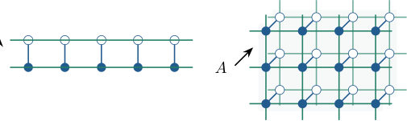 
Figure 2: Boundary states, adapted from [9, Fig. 2]. The chain and the two-dimensional patch illustrate the same double contraction. Filled and open nodes represent the ket and bra tensors; blue links contract their physical indices. Green virtual legs at the boundary remain open, giving the input and output indices of ρ∂A.

📷 Fig 3

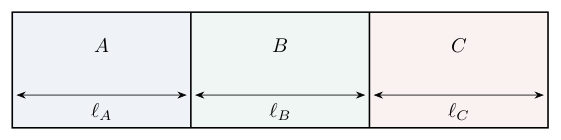 
Figure 3: Rectangular decomposition for the martingale criterion, redrawn from [9, Fig. 3]. The overlap of AB and BC has width ℓB; the remaining geometric scale is L∗= max{ℓV , ℓA, ℓC}.

📷 Fig 4

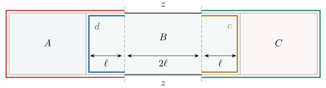 
Figure 4: The shared boundary geometry, adapted from [9, Fig. 4]. The arcs a, d coincide on the left top and bottom buffers, while b, c coincide on the right buffers; the slight offsets make these overlaps visible. The two central segments form z. The drawing shows widths ℓ, 2ℓ, ℓacross B, for a total of 4ℓ. Each component of z has length 2ℓ, leaving distance ℓfrom its midpoint to either end.

📷 Fig 5

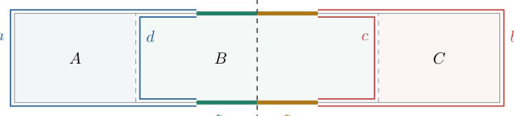 
Figure 5: The geometry of Figure 4 with the middle cut inserted. Green and gold mark zL and zR on the upper and lower edges of B. Each displayed component of z has total length 2ℓ; the cut is at distance ℓfrom either end, where the exterior arcs outside z begin. Choosing a or d on the left and b or c on the right gives the four geometries.

**Summary.** This work develops a powerful mathematical criterion to prove the spectral gap of quantum systems modeled by PEPS, particularly for the AKLT model on the hexagonal lattice. By analyzing how boundary states factorize across overlapping regions, the authors establish that exponential decay of this factorization error guarantees a positive spectral gap. This provides a systematic theoretical tool for characterizing the ground state properties of 2D quantum magnets.

**Why it may be interesting.** The rigorous connection between local correlation decay (boundary response) and global spectral properties (spectral gap) is fundamental for understanding the stability and ground state properties of quantum materials modeled by PEPS.

Detailed structure

**Main problem.** The paper establishes a rigorous, systematic condition based on the approximate factorization of overlapping boundary states to prove the existence of a spectral gap for quantum lattice models described by PEPS.

**Main result.** The method successfully yields a uniform spectral gap for the hexagonal AKLT model and provides a general framework connecting local boundary response properties to the spectral gap of 2D parent Hamiltonians.

**Method.** The core technique involves decomposing the boundary response induced by cutting bonds into a common, absorbable contribution and a remainder controlled by an instantaneous boundary metric, leading to a sufficient condition for the gap.

**Model / system.** The analysis focuses on Projected Entangled Pair States (PEPS) applied to specific models, notably the Ising PEPS and the spin-3/2 AKLT model defined on the hexagonal lattice.

**Key observables.** The spectral gap ($\lambda(\Lambda)$), the boundary state ($
ho_{\partial R}$), and the factorization error $\lVert P_{AB}P_{BC} - P_{ABC} 
Vert$.

**Important parameters / regimes.** The overlap width ($\ell_B$) and the lattice geometry (hexagonal lattice).

**Assumptions / limitations.** The method assumes the existence of a common linear transport to absorb the common boundary response, and for PEPS, it often requires compatible injective regional contractions.

**Figures summary.** Figures illustrate the PEPS tensor structure, the boundary state calculation via double contraction, and the geometric decomposition used for the martingale criterion on rectangular regions.

**Paper structure.** The paper progresses by first defining the boundary state criterion, then developing the common-response theorem using linear transport, and finally applying this framework to the Ising PEPS (reducing to a Dobrushin-Shlosman-type condition) and the hexagonal AKLT model (using rooted path expansions).

Abstract

We establish a sufficient condition under which overlapping PEPS boundary states satisfy the approximate factorization criterion for a spectral gap. The condition is formulated in terms of the boundary response induced by cutting bonds through the center of a rectangular region. We decompose this response into a contribution common to all four associated regions and a remainder measured in the instantaneous boundary metric. A single linear transport absorbs the common contribution and yields compatible factorization operators, with an error controlled solely by the remainder.   We apply this framework to Ising PEPS and to the spin-3/2 AKLT model on the hexagonal lattice. For Ising PEPS, the required boundary-response estimate reduces to a Dobrushin-Shlosman-type condition. For the hexagonal AKLT model, a rooted expansion in paths and loops isolates the common response, while a local comparison of boundary states together with a scalar Kotecký-Preiss estimate controls the remaining terms. In both cases, the factorization error decays exponentially with the overlap width, up to a prefactor proportional to the cut length. For AKLT, we establish the corresponding physical projector estimate and obtain a uniform spectral gap. For Ising PEPS, the gap implication additionally requires compatible injective regional contractions, as specified in the paper. More generally, the method provides a systematic route from locality of PEPS boundary response to spectral gaps of two-dimensional parent Hamiltonians.

[↑ back to top](#top)

### [Topological Fingerprints of Commensurate Order in Twisted Moiré Lattices](http://arxiv.org/abs/2609.28330v1)

**Authors:** Collin J. Kovacs, Jiangxu Li, Yang Zhang, Konstantinos D. Vogiatzis, Adrian Del Maestro, Vasileios Maroulas  
**Type:** theory · **Category:** disordered systems and neural networks · **PDF:** <https://arxiv.org/pdf/2609.28330v1>  
**Analysis basis:** full PDF text, analyzed in chunks
**Topic relevance:** `Frenkel-Kontorova` **1/5** · `analog quantum simulation` **1/5**

📷 Fig 1

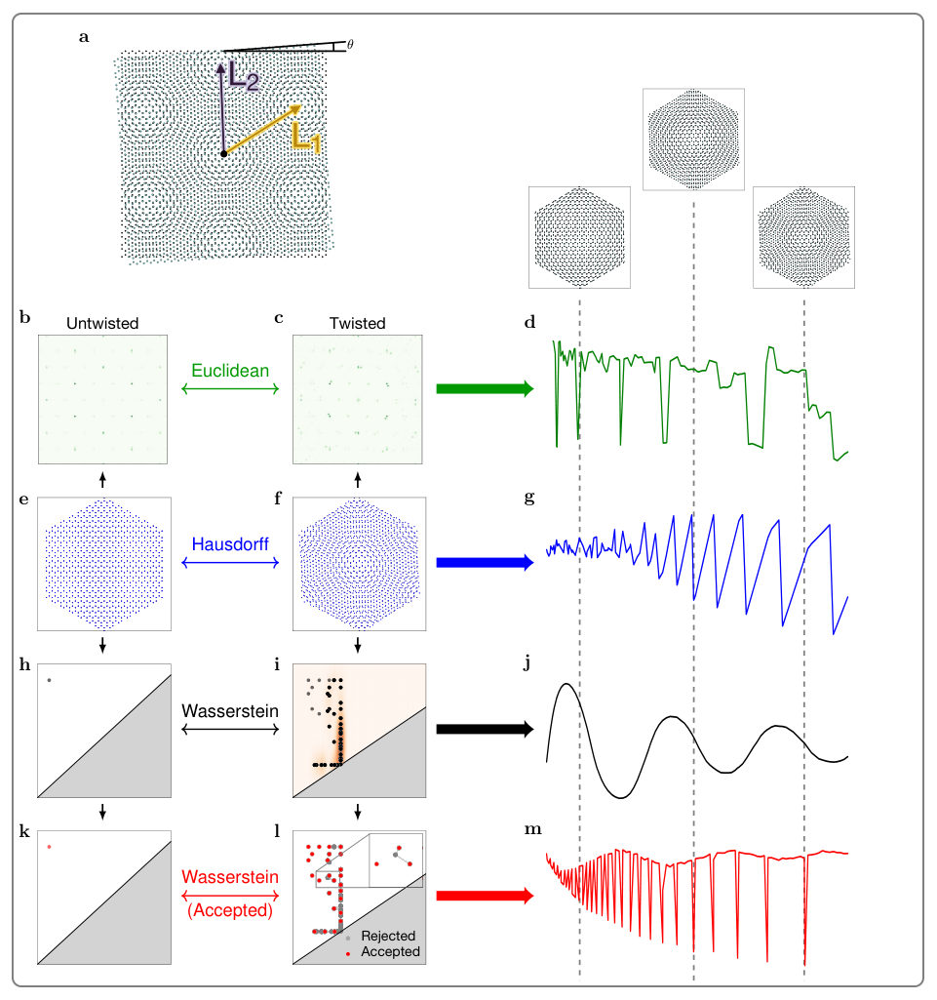 
Figure 1 | Comparative structural descriptors for detecting commensurate order in twisted moir´e lattices. a Twisted bilayer graphene configuration with moir´e vectors L1, L2. b, c: Static structure factors in momentum space are compared with the Euclidean norm, with angle- dependent response in d. e, f: Point-cloud xy positions compared using the Hausdorff distance, with response in g. h, i: Persistence diagrams (PDs) compared using the Wasserstein distance, with response in j. k, l: δ-separated PDs compared using the Wasserstein distance, with response in m. Insets in the upper right show the fixed box size at three commensurate angles.

📷 Fig 2

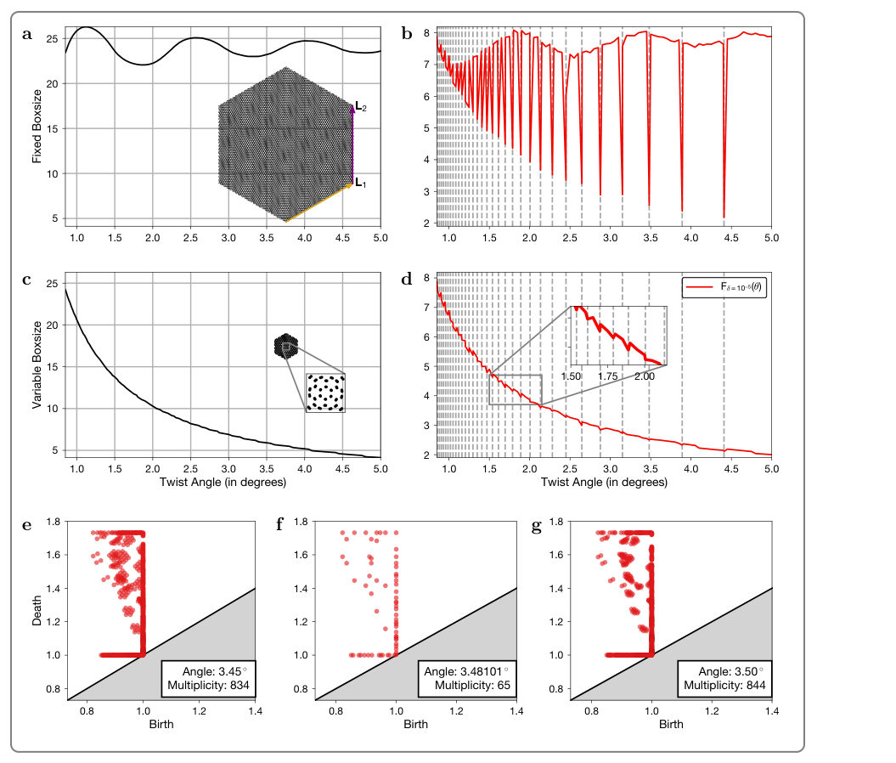 
Figure 2 | Reduction in diagram multiplicity results in commensurate minima. a Fixed-box topological similarity versus twist angle, showing oscillatory behavior with few local minima. b δ-separated topological similarity Fδ=10−5(θ) over a fixed-box lattice with sharp min- ima at commensurate angles. c Variable-box topological similarity versus twist angle, showing predominantly monotonic decay. d Coarser topological signal Fδ=10−5(θ) over the variable box- size, illustrating the localization of extrema across decreasing cell size. e, f, g: δ-separated PDs at representative incommensurate, commensurate, and incommensurate twist angles, respectively, for δ = 10−5. The commensurate...

📷 Fig 3

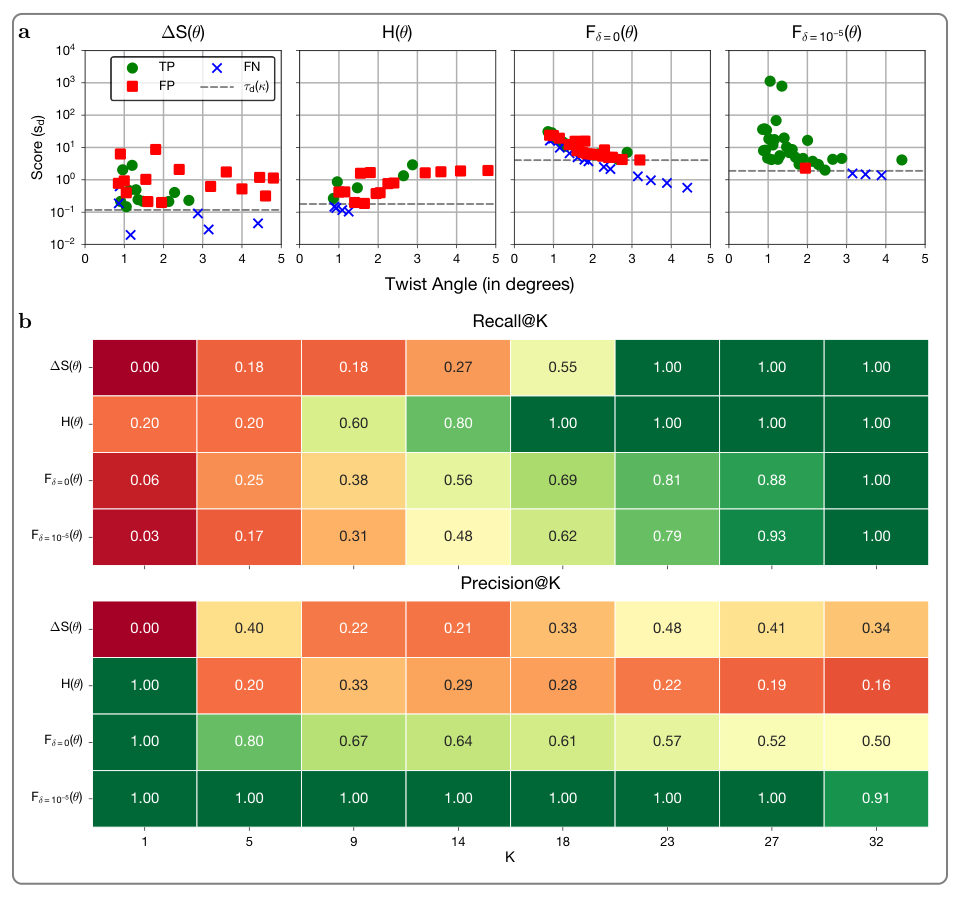 
Figure 3 | Classification performance as additional twist angles are incorporated. a Detected peaks classified as true positives (TPs), false positives (FPs), and false negatives (FNs). The horizontal dashed line τd(κ) indicates the Median Absolute Deviation (MAD) threshold applied to sd(θ). TPs are detected candidate angles that match known commensurate angles within the chosen angular tolerance, FPs are detected candidates with no commensurate-angle match within that tolerance, and FNs are known commensurate angles for which no candidate is detected within that tolerance. b Heatmaps of Recall@K (top) and Precision@K (bottom) for ∆S(θ), H(θ), Fδ=0(θ), and Fδ=10−5(θ) as a function of K.

📷 Fig 4

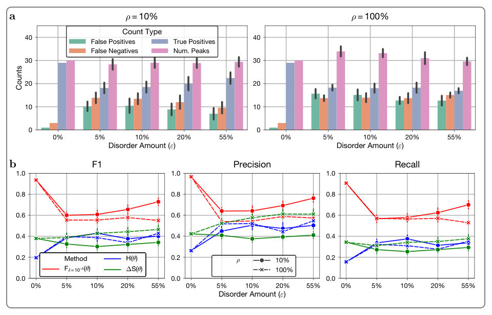 
Figure 4 | Classification results over multiple disorder regimes. a Classification counts for sparse disorder (ρ = 10%) and global disorder (ρ = 100%) from the results of Fδ=10−5(θ). True Positives (TPs), False Positives (FPs), False Negatives (FNs), and the total detected number of peaks are shown. b Precision, recall, and F1 score as a function of disorder amplitude for fine (δ = 10−5) separation, compared with spectral- and geometric-based detection. Solid and dashed lines denote local (ρ = 10%) and global (ρ = 100%) disorder, respectively.

📷 Fig 5

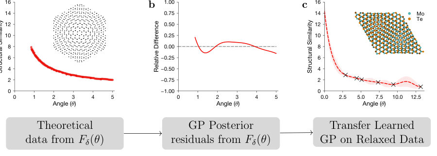 
Figure 5 | Pipeline for Gaussian Process transfer-learning inference. a Theoretical dis- tance curve Fδ=10−5(θ). A moir´e point cloud twisted at a commensurate angle 5.085848◦is inset for visualization purposes. b The Gaussian Process (GP) posterior residual curve after training on Fδ. c Final overlay of the δ-level fit, with uncertainty bands shown after prediction on the DFT-relaxed similarities (black ×’s). MoTe2 dichalcogenide twisted at commensurate angle 5.085848◦is inset for visualization purposes.

**Summary.** This paper proposes a novel topological data analysis framework using persistent homology to robustly identify commensurate moiré order in twisted bilayer materials. By filtering out noise using a small-neighborhood separation technique, the authors show that their topological descriptors accurately pinpoint known commensurate angles even when the atomic structure is perturbed by disorder or sampled sparsely. This establishes a powerful, disorder-resilient tool for characterizing moiré superlattices.

**Why it may be interesting.** While the focus is on structural characterization rather than quantum dynamics, the use of topological data analysis (TDA) to extract robust, symmetry-aware fingerprints from complex, disordered atomic structures is highly relevant for characterizing the underlying physical states in quantum materials.

Detailed structure

**Main problem.** The primary challenge is developing a robust method to identify commensurate moiré order in twisted bilayer materials directly from atomic coordinates, overcoming limitations of traditional spectral or geometric methods sensitive to disorder.

**Main result.** The authors introduce a data-driven topological framework using persistent homology with a small-neighborhood separation filter, which successfully recovers sharp signatures corresponding to known commensurate angles even under significant positional disorder.

**Method.** The method treats atomic configurations as point clouds and applies persistent homology to extract multiscale topological signatures. A key innovation is the small-neighborhood separation filter applied to persistence diagrams to enhance the signal related to periodicity.

**Model / system.** The study focuses on Moiré patterns in twisted bilayer materials, using twisted MoTe2 dichalcogenide bilayers and twisted bilayer graphene as test cases. The analysis involves projecting 3D atomic coordinates into 2D point clouds.

**Key observables.** Topological descriptors derived from persistent homology, specifically sharp minima in Wasserstein distances between twisted and untwisted reference configurations, which correlate with commensurate angles.

**Important parameters / regimes.** Twist angle ($	heta$), disorder magnitude ($\epsilon$), and sampling ratio ($
ho$) are key parameters used to test the robustness of the descriptor.

**Assumptions / limitations.** The framework assumes that the topological signature of commensurate order manifests as a distinct, sharp feature (minimum) in the calculated topological distance metric.

**Figures summary.** Figures compare the performance of various structural descriptors (SSF, Hausdorff, PDs) for detecting commensurate order, showing that the proposed $\delta$-separated topological score yields the clearest and most robust correlation with known angles.

**Paper structure.** The paper progresses by first identifying the limitations of existing methods, introducing the topological framework using persistent homology, benchmarking this framework against geometric/spectral measures, and finally demonstrating its robustness by testing it under controlled levels of positional disorder and sparsity.

Abstract

Moiré patterns in twisted bilayer materials exhibit long-range periodic order that is highly sensitive to twist angle. Identifying commensurate angles from real-space atomic structures remains challenging, as spectral and geometric methods emphasize global periodicity and are sensitive to disorder and finite-size effects. Here, we introduce a data-driven topological framework that quantifies moiré periodicity by treating atomic configurations as point-cloud data and extracting multiscale signatures using persistent homology. At the core of our approach is a small-neighborhood separation filter that removes redundant local motifs in persistence diagrams while preserving key structural features, enabling sharp minima in Wasserstein distances between twisted and untwisted reference configurations that accurately recover commensurate angles. We benchmark this framework against geometric and spectral similarity measures and show that the resulting topological descriptors remain stable under positional disorder ranging from weak to strong perturbations in the bond length. We further transfer these descriptors using a constrained Gaussian process surrogate to sparsely sampled configurations of a twisted MoTe$_2$ dichalcogenide bilayer. These results establish topological descriptors with neighborhood separation as a robust framework for identifying commensurate order in moiré systems and tracking commensurate structural similarity under disorder, sparsity, and finite-size effects.

[↑ back to top](#top)

### [Beyond Maximal Entanglement: Exact Resources for Multiparty Encrypted Quantum Cloning](http://arxiv.org/abs/2609.28241v1)

**Authors:** Pritam Roy, Shashank Gupta  
**Type:** theory · **Category:** quantum information and computing · **PDF:** <https://arxiv.org/pdf/2609.28241v1>  
**Analysis basis:** full PDF text, analyzed in chunks
**Topic relevance:** `quantum measurements` **1/5**

📷 Fig 1

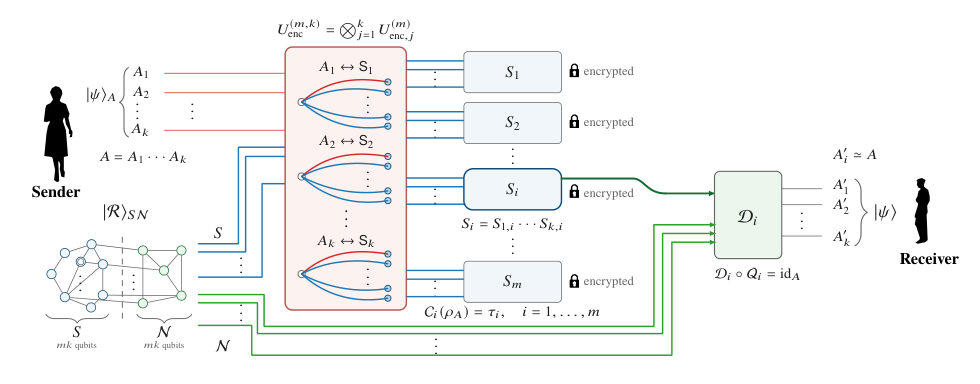 
Figure 1: Operational architecture of multiparty encrypted quantum cloning. An arbitrary k-qubit state |ψ⟩A, with A = A1 · · · Ak, is encoded together with a pure multipartite resource |R⟩SN containing ν = mk signal qubits and ν noise, or key, qubits. The signal register has two compatible decompositions: the logical sector Sj = (Sj,1, . . . , Sj,m) is associated with input qubit Aj, while Si = S1,i · · · Sk,i forms the ith encrypted output. The sector-wise encoder leaves the common key N untouched. Each Si is individually concealed, whereas SiN permits exact recovery of the complete logical state. The registers S1, . . . , Sm therefore constitute alternative encrypted recovery pathways...

📷 Fig 2

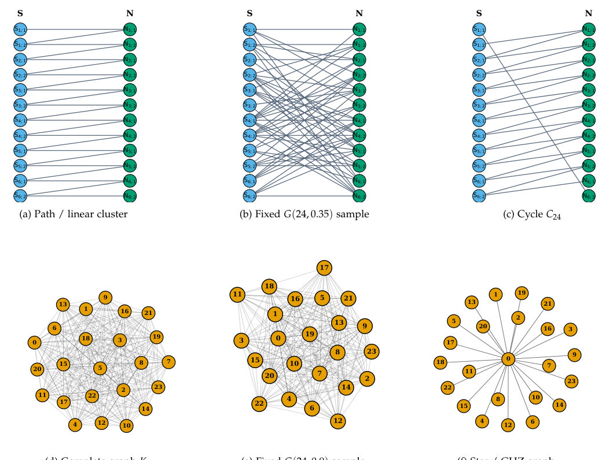 
Figure 2: Representative 24-qubit graph states for the (m, k) = (2, 6) task. Top row: certified resources: (a) a path / linear cluster, (b) a fixed sparse Erd˝os–Rényi sample G(24, 0.35) [47, 48], and (c) the cycle C24. Each admits a balanced cut with rankF2 BSN = 12. Bottom row: excluded resources: (d) the complete graph K24, (e) a fixed dense Erd˝os–Rényi sample G(24, 0.9) [47, 48], and (f) the star/GHZ graph. For each excluded graph, the maximum cut rank over all balanced signal–noise bipartitions is strictly smaller than 12. The Erd˝os–Rényi examples are fixed sampled realizations and should not be interpreted as evidence for an edge-density threshold; their explicit adjacency data are...

**Summary.** This theoretical paper characterizes the precise quantum states that can function as resources for encrypted quantum cloning. It establishes that exact recovery requires specific correlation structures within the resource, not just high entanglement. The findings exclude large families of states, such as the Dicke states, from being valid resources for this cryptographic task.

**Why it may be interesting.** The work provides deep structural constraints on quantum resources, showing that mere entanglement quantity is insufficient; the specific correlation structure relative to the encoding scheme dictates feasibility.

Detailed structure

**Main problem.** The paper characterizes the exact multipartite pure quantum states that can serve as resources for performing 'Encrypted Quantum Cloning' (EQC).

**Main result.** The resource state's suitability depends not only on its total entanglement but critically on how its correlations are organized relative to the specific encoding architecture. The entire Dicke family of states is proven to be excluded for this task.

**Method.** The authors derive necessary and sufficient conditions for exact recovery by analyzing the structure of the signal-noise cut and applying information-theoretic criteria derived from the cloning process.

**Model / system.** The model involves distributing an unknown $k$-qubit state ($\vert \psi 
angle_A$) among $m$ encrypted clones using a resource state $\vert R 
angle_{SN}$ and a sector-wise two-Pauli encoder.

**Key observables.** Signal-noise entanglement (ebits), the rank of the signal-noise cut matrix, and the structure of the signal marginal $
ho_S$.

**Important parameters / regimes.** Number of clones ($m \ge 2$), number of input qubits ($k$), and the specific encoder architecture.

**Assumptions / limitations.** The analysis is performed for a fixed sector-wise two-Pauli encoder, although general bounds independent of the encoder are also derived.

**Figures summary.** Figure 1 illustrates the operational architecture of EQC, showing the encoding process and the recovery mechanism from individual clones and the key.

**Paper structure.** The paper proceeds by defining the EQC problem, deriving necessary conditions for exact recovery, characterizing the required structure of the resource state $
ho_S$ for fixed encoders, and finally testing these conditions against specific resource families like graph states and Dicke states.

Abstract

Encrypted quantum cloning distributes an unknown $k$-qubit state among $m$ encrypted clones so that no individual clone reveals the input, yet the state can be recovered from any one clone together with a common quantum key. We ask the inverse question: for a fixed encoding architecture, which multipartite pure states can serve as exact resources for this task? For $m\ge2$, we completely characterize the pure resources compatible with a sector-wise two-Pauli encoder, with necessity holding for arbitrary completely positive trace-preserving (CPTP) recovery maps. For even $m$, exact recovery requires maximal entanglement across the signal--noise cut. For odd $m$, less entanglement can suffice, provided that the surviving signal correlations have the structure selected by the encoder. We further show, without fixing the encoder, that exact recovery from every authorized subsystem already implies perfect concealment of each individual signal and requires at least $(m-1)k$ ebits of signal--noise entanglement. For graph states, the resource classification reduces to an exact condition on the kernel of the signal--noise cut matrix, leading to binary certification and constructive Clifford recovery. We identify rank-deficient graph resources that attain the architecture-independent entanglement bound and prove that the entire Dicke family, including $W$ states, is excluded for every sector-wise two-Pauli encoder. Our results show that encrypted recovery depends not only on how much entanglement a resource contains, but also on how its correlations are organized relative to the encoder.

[↑ back to top](#top)

### [Efficient learning of Clifford disentanglers and typical $t$-doped unitaries with exponentially more $T$ gates](http://arxiv.org/abs/2609.27565v1)

**Authors:** Gerard Aguilar, Sofiene Jerbi, Jens Eisert, Lennart Bittel  
**Type:** theory · **Category:** quantum information and computing · **PDF:** <https://arxiv.org/pdf/2609.27565v1>  
**Analysis basis:** full PDF text, analyzed in chunks
**Topic relevance:** `quantum measurements` **1/5**

📷 Fig 1

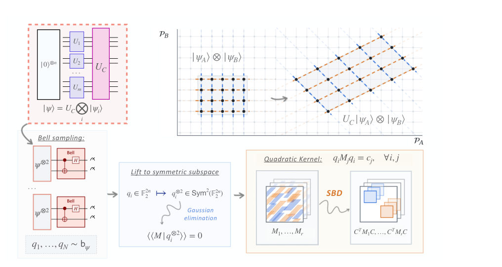 
Figure 1: Graphical overview of the protocol in Algorithm 1. From m Bell samples {qi}i of an unknown state vector |ψ⟩, Gaussian elimination on the lifted vectors q⊗2 i ∈F2n 2 ⊗F2n 2 , yields a basis of the quadratic kernel Ker2,m(ψ) of the distribution, consisting of quadratic forms M satisfying qT i Mqi = c for every observed outcome. For state vectors of the form |ψ⟩= UC Nm i=1 |ψi⟩ci this kernel has a common hidden block structure. Indeed, before the action of UC, the Bell distribution factorizes across the product decomposition, forcing its quadratic symmetries to respect the corresponding blocks. The unknown Clifford scrambles both the distribution and its symmetries through an affine...

**Summary.** This paper presents efficient algorithms to recover the hidden product structure within quantum states that have been scrambled by an unknown Clifford unitary. By analyzing the quadratic symmetries of the state's Bell distribution, the authors linearize the problem, enabling the recovery of the disentangling Clifford and the underlying partitions. This framework is particularly powerful for learning complex, T-doped quantum circuits previously thought inaccessible.

**Why it may be interesting.** The techniques developed for characterizing structured quantum states via symmetry analysis are highly relevant for certifying quantum computations and understanding the limitations imposed by gate sets (like Clifford vs. T-gates).

Detailed structure

**Main problem.** The paper develops efficient algorithms to test for and recover hidden tensor-product structure in unknown pure quantum states $|\psi
angle = U_C igotimes_i |\psi_i
angle$, where $U_C$ is an unknown Clifford unitary.

**Main result.** The authors provide polynomial-time algorithms to recover the disentangling Clifford $U_C$ and the hidden product partitions, extending these methods to efficiently learn typical $t$-doped Clifford unitaries in regimes with exponentially more T gates.

**Method.** The core method involves analyzing the quadratic symmetries of the state's Bell distribution, linearizing the problem by block-diagonalizing these symmetries, and utilizing classical post-processing.

**Model / system.** The system consists of pure quantum states on $n$ qubits, $|\psi
angle$, whose structure is obscured by an arbitrary unknown Clifford unitary $U_C$. The analysis focuses on the algebraic properties of the state's Bell distribution.

**Key observables.** Quadratic symmetries of the Bell distribution, $q^T M q = c$, and the ability to block-diagonalize the symmetry kernel $	ext{Ker}_2(\psi)$.

**Important parameters / regimes.** The number of qubits ($n$), the degree of T-doping ($t$), and the required sample complexity ($N$).

**Assumptions / limitations.** The state must possess a hidden tensor-product structure of the form $|\psi
angle = U_C igotimes_i |\psi_i
angle$, and the symmetries must retain a characteristic quadratic structure.

**Paper structure.** The paper builds from defining the problem (testing/learning hidden structure) to developing the mathematical machinery (analyzing quadratic symmetries and block-diagonalization) and concluding with concrete applications (learning $t$-doped unitaries and Hamiltonian compression).

Abstract

Highly entangled and highly non-stabilizer quantum states need not be hard to learn. We give efficient algorithms for testing and recovering hidden tensor-product structure in unknown pure state vectors of the form $\lvertψ\rangle = U_C \bigotimes_i \lvertψ_i\rangle$, where $U_C$ is an arbitrary unknown Clifford unitary. Although the Clifford can thoroughly scramble the visible product structure, we prove that the Bell distribution retains a characteristic family of quadratic symmetries. By simultaneously block-diagonalising these symmetries, our algorithms linearize the problem and manage to recover both a disentangling Clifford and the hidden partitions with polynomial sample and computational complexity. This may be viewed as an extension of the abelian StateHSP paradigm in which classical post-processing exposes genuinely quadratic structure. Applied to Choi states, the method yields efficient proper learning algorithms for typical $t$-doped Clifford unitaries in regimes containing exponentially more $T$ gates than previously accessible: the required condition fails only for an exponentially small fraction of circuits when $t\sim n$, and continues to hold for a constant fraction even when $t=2n$. Our framework also provides tools for compressing structured many-body Hamiltonians and suggests benchmarking protocols for encoded logical product states in the early fault-tolerant regime.

[↑ back to top](#top)

### [Exact Equivariance from Ordinary Neural Networks for Lattice Many-Body Dynamics](http://arxiv.org/abs/2609.27132v1)

**Authors:** Ho Jang, Sankha Subhra Bakshi, Gia-Wei Chern  
**Type:** theory · **Category:** strongly correlated electrons · **PDF:** <https://arxiv.org/pdf/2609.27132v1>  
**Analysis basis:** full PDF text, analyzed in chunks
**Topic relevance:** `analog quantum simulation` **1/5**

📷 Fig 1

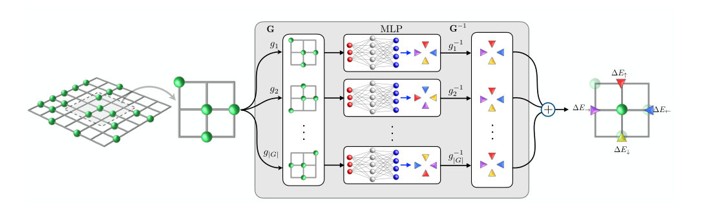 
FIG. 1. Equivariant projection network (EPN) for Falicov–Kimball dynamics. Each D4 operation transforms the local f- electron configuration before it enters a shared MLP. The four predicted hopping free-energy differences are transformed back and averaged, yielding an exactly equivariant output.

📷 Fig 2

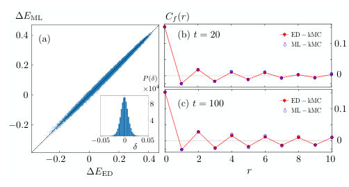 
FIG. 2. Microscopic and dynamical benchmarks of the EPN for the Falicov–Kimball model. (a) Predicted hopping energy changes ∆EML versus exact-diagonalization values ∆EED. The dashed line denotes perfect agreement; the inset shows the distribution of prediction errors δ = ∆EML−∆EED. (b,c) f-electron density correlation function Cf(r) = ⟨nf i nf j ⟩−ρ2 f, with r = |ri−rj|, obtained from ED-kMC and EPN-kMC sim- ulations after a thermal quench at (b) t = 20 and (c) t = 100 sweeps.

📷 Fig 3

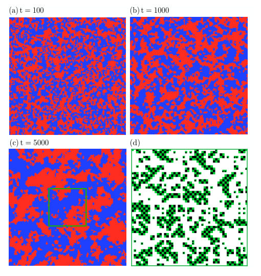 
FIG. 3. Large-scale FK phase ordering with EPN-kMC. (a– c) Effective Ising configurations at t = 100, 1000, and 5000 sweeps show coarsening of superclusters. Red and blue dis- tinguish opposite sublattice polarities. (d) Microscopic f- electron configuration in the green square in (c), resolving the disconnected checkerboard clusters underlying the larger domains.

📷 Fig 4

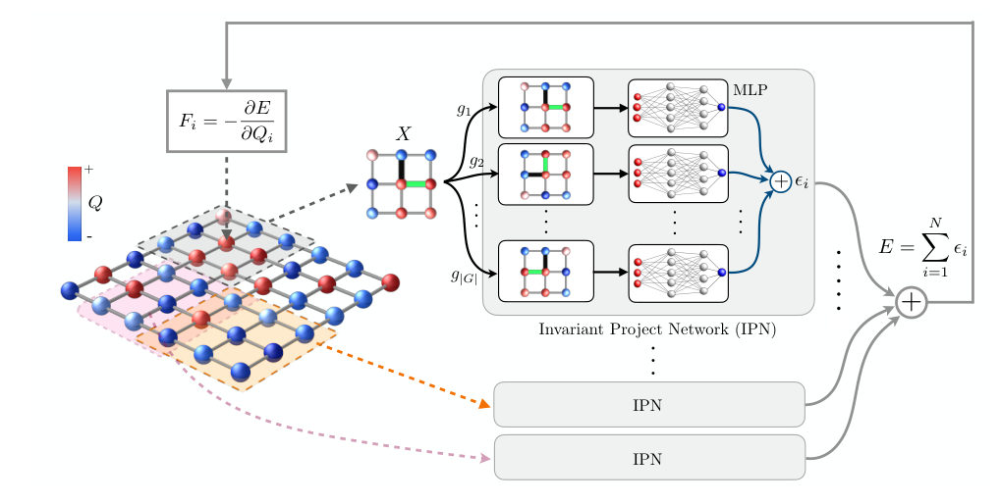 
FIG. 4. Invariant projection network (IPN) for Holstein dynamics. For each lattice site i, the local distortion environment Xi is transformed by all g ∈D4 and evaluated by a shared MLP; averaging the scalar outputs gives an invariant local energy ϵi. Applying the same IPN to overlapping local environments throughout the lattice forms the standard Behler–Parrinello construction, EML = P

📷 Fig 5

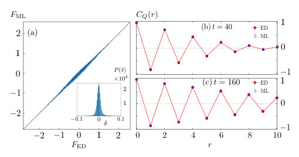 
FIG. 5. Microscopic and dynamical benchmarks of the IPN for the Holstein model. (a) IPN-predicted forces FML ver- sus exact-diagonalization values FED. The dashed line de- notes perfect agreement; the inset shows the distribution of prediction errors δ = FML −FED. (b,c) Equal-time lattice- distortion correlation function CQ(r) obtained from ED and IPN Langevin dynamics after a thermal quench at (b) t = 40 and (c) t = 160.

**Summary.** This paper introduces an Equivariant Projection Network (EPN) that allows ordinary neural networks to generate predictions that inherently respect the underlying physical symmetries of lattice Hamiltonians. By averaging predictions across symmetry transformations, the method bypasses the need for specialized equivariant network architectures. This provides an accessible and accurate tool for simulating complex, symmetry-governed dynamics in correlated electron systems.

**Why it may be interesting.** The development of symmetry-preserving ML surrogates is crucial for simulating complex quantum materials dynamics, providing a computationally tractable route to study phenomena like charge ordering and phase transitions in systems where traditional methods are too slow.

Detailed structure

**Main problem.** Developing efficient, symmetry-preserving machine learning surrogates to replace computationally expensive electronic structure calculations for large-scale simulations of correlated electron systems.

**Main result.** The proposed Equivariant Projection Network (EPN) framework successfully generates exactly equivariant surrogates for electronic forces and transition energies directly from ordinary MLPs.

**Method.** The EPN enforces symmetry by evaluating an ordinary MLP on all symmetry-related configurations and averaging the results according to the finite-group averaging formula.

**Model / system.** The work applies to correlated electron systems, specifically demonstrating success with the Falicov–Kimball model and the Holstein model, which involve lattice dynamics and charge ordering.

**Key observables.** Directional hopping free-energy differences ($\Delta E_{i,\alpha}$), conservative lattice forces ($\mathbf{F}_{	ext{ML}}$), and charge-density-wave coarsening.

**Important parameters / regimes.** The method is applicable to systems with known, finite lattice point groups ($G$).

**Assumptions / limitations.** The approximation relies on the assumption of electronic nearsightedness and that the local environment contains sufficient information to predict local dynamics.

**Figures summary.** Figure 1 illustrates the EPN for Falicov–Kimball dynamics using $D_4$ symmetry. Figure 2 compares predicted hopping free-energy differences ($\Delta E_{ML}$) against Exact Diagonalization (ED) values and shows agreement in kMC simulations.

**Paper structure.** The paper introduces the EPN framework, demonstrates its application to calculate directional hopping free-energy differences in the Falicov-Kimball model, and then applies it to generate conservative lattice forces for the Holstein model, validating results against ED benchmarks and large-scale simulations.

Abstract

Large-scale simulations of correlated electron systems require repeated evaluations of the electronic forces and transition energies driving collective dynamics. Machine-learning surrogates alleviate this bottleneck, but incorporating symmetry often involves carefully designed descriptors or specialized network architectures. We show that ordinary multilayer perceptrons equipped with finite-group averaging provide exactly equivariant surrogates directly from microscopic configurations. The construction separates symmetry enforcement from the internal network architecture and applies to both discrete and continuous lattice degrees of freedom. In the Falicov--Kimball model, it predicts directional hopping free-energy differences; in the Holstein model, its invariant limit generates conservative lattice forces. Benchmarks against exact diagonalization establish microscopic accuracy and agreement of dynamical correlations, while large-scale simulations recover multiscale charge ordering and charge-density-wave coarsening. These results demonstrate an accessible, reusable route to symmetry-preserving many-body dynamics for systems with finite lattice point groups.

[↑ back to top](#top)

### [Maximal Total Quantum Dimension at Bounded Rank in Dijkgraaf-Witten Theories](http://arxiv.org/abs/2609.26914v1)

**Authors:** Ce Shen  
**Type:** theory · **Category:** strongly correlated electrons · **PDF:** <https://arxiv.org/pdf/2609.26914v1>  
**Analysis basis:** full PDF text, analyzed in chunks
**Topic relevance:** `analog quantum simulation` **1/5**

📷 Fig 1

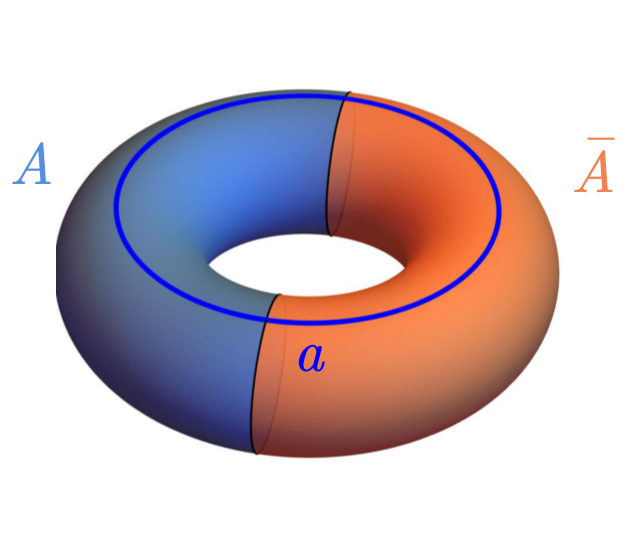 
Figure 1. Cylindrical bipartition of a spatial 2-torus into regions A and ¯A. The entanglement cut consists of two disjoint circles of lengths L1 and L2. The state |a⟩corresponds to threading an anyon flux label a through the cylinder, giving rise to the universal TEE in (2.3). (Reproduced from Ref. [15].)

**Summary.** This theoretical paper studies the maximum possible topological complexity, quantified by the total quantum dimension, in 2+1 dimensional topological phases modeled by Dijkgraaf-Witten theories. By analyzing the impact of gauge group structure and topological twists, the authors derive sharp asymptotic bounds on this dimension relative to the system's rank. This work provides quantitative constraints crucial for classifying exotic topological order phases.

**Why it may be interesting.** The connection between topological invariants (like quantum dimension) and entanglement entropy provides deep insights into the nature of quantum order, which is fundamental to understanding strongly correlated electron systems and topological phases.

Detailed structure

**Main problem.** The paper investigates the maximal total quantum dimension achievable in three-dimensional Dijkgraaf-Witten (DW) theories subject to a bound on the categorical rank.

**Main result.** It establishes that introducing cocycle twists in Abelian gauge groups can elevate the growth of the total quantum dimension from square-root to linear in the rank cutoff, and provides upper bounds like $O((\log R)^2)$ for almost-simple groups.

**Method.** The analysis uses advanced group theory, optimization techniques, and asymptotic analysis to relate topological invariants (quantum dimensions) to the constraints imposed by the categorical rank.

**Model / system.** The theoretical framework is based on (2+1)-dimensional topological phases described by Unitary Modular Tensor Categories, specifically realized through Dijkgraaf-Witten theories involving finite gauge groups and 3-cocycle twists.

**Key observables.** Total Quantum Dimension ($D(C)$), Topological Entanglement Entropy (TEE), and Categorical Rank ($r(C)$).

**Important parameters / regimes.** The rank cutoff $R$, the structure of the gauge group $G$ (e.g., $(\mathbb{Z}_p)^n$, almost-simple groups), and the topological twist $\omega$.

**Assumptions / limitations.** The analysis assumes the validity of the DW theory description for the topological order and relies on specific structural properties of the gauge groups being studied.

**Figures summary.** Not specified, but the notes refer to Figure 1 illustrating the cylindrical bipartition for TEE calculation.

**Paper structure.** The paper proceeds by defining the optimization problem, analyzing the effect of cocycle twists on Abelian groups, deriving sharp envelopes for untwisted theories (like almost-simple groups), and concluding with a comparison to WZW models and the general conjecture.

Abstract

We investigate the maximal total quantum dimension at a bounded categorical rank cutoff $R$ in three-dimensional Dijkgraaf--Witten theories. This optimization problem physically governs the maximal state-optimized torus topological entanglement entropy at a fixed torus ground-state degeneracy, while providing a quantitative constraint on the search space required to classify these topological order phases. We analyze how topological twists (3-cocycles) and gauge-group structures independently govern this trade-off. For elementary-Abelian gauge groups at a fixed prime $p$, we prove that introducing cocycle twists elevates the maximum total quantum dimension from square-root growth $Θ_p(R^{1/2})$ to linear growth $Θ_p(R)$ in the rank cutoff, driven by the geometric protection of cyclic holonomies. For untwisted theories, we establish sharp envelopes for symmetric and alternating gauge groups, and derive group-theoretic bounds across almost-simple, solvable, and radical-free families. In particular, almost-simple groups and their direct products obey a quadratic-logarithmic upper envelope: $\log\mathcal{D} = O((\log R)^2)$. Finally, we compare these scales against WZW models and discuss the status of the general quadratic-logarithmic envelope conjecture.

[↑ back to top](#top)

### [Minimal representations of topology-preserving quantum-like states](http://arxiv.org/abs/2609.27318v1)

**Authors:** William Horvat, Debadrita Saha, Nicolás Gigena, Prineha Narang, Gregory D. Scholes  
**Type:** theory · **Category:** quantum information and computing · **PDF:** <https://arxiv.org/pdf/2609.27318v1>  
**Analysis basis:** full PDF text, analyzed in chunks
**Topic relevance:** `analog quantum simulation` **1/5**

📷 Fig 1

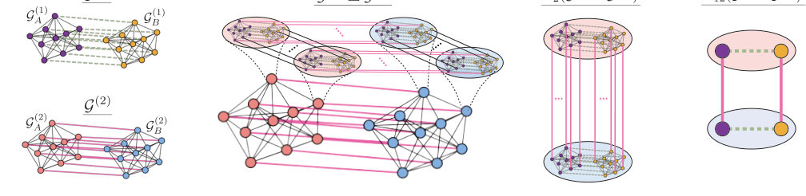 
FIG. 1. (a) Graph G(1) with subgraphs G(1) A and G(1) B shows the construction of a QL-bit. The subgraphs are k-regular, with k = 5, while the coupling between them is ℓ-regular, ℓbeing equal to 1. QL-bit graph G(2) is also constructed in a similar manner. (b) Cartesian product G = G(1)□G(2) of QL-bits in (a). For each node in G(2), there is a copy of G(1). (c) Quotient graph formed by taking the equitable partition generated by holding constant the subgraph indices of second graph G(2) in the Cartesian product. (d) The minimal representation of the QL-bit product, subgraphs of each QL-bit are reduced to nodes and the coupling ℓfor between each subgraph persists.

📷 Fig 2

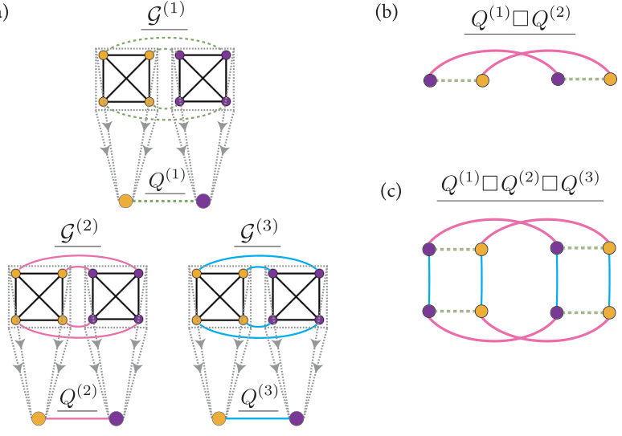 
FIG. 3. Method to form quantum-like products without first generating the Cartesian product: (a) QL-bits G(1), G(2) and G(3) are contracted to their minimal representation quotient graph. Their respective subgraphs are reduced to single vertices (shown using dotted gray arrows) while preserving the coupling ℓbetween nodes. This allows for the construction of the quotient graph without first forming the full Cartesian product from QL-bits. (b),(c) Direct construction of quotient graphs, π(G(1)□G(2)) = Q(1)□Q(2) and π(G(1)□G(2)□G(3)) = Q(1)□Q(2)□Q(3). The loops generated in taking equitable partition in this construction of composite QL systems have been removed to keep the construction...

📷 Fig 3

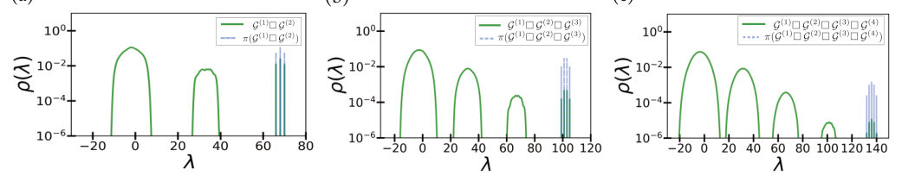 
FIG. 4. Spectra of full Cartesian products and quotient graph when coupling (a) 2, (b) 3, and (c) 4 QL-bits. Each QL-bit is formed from subgraphs of size |G(q) A,B| = 40, k = 34 and ℓ= 1. The spectra for both the full Cartesian product and the quotient graph, corresponding to the minimal representation, were generated by the convolution method described in Eq(2.15) of [28], with the discrete set of incoherent states smoothed by a Gaussian filter.

📷 Fig 4

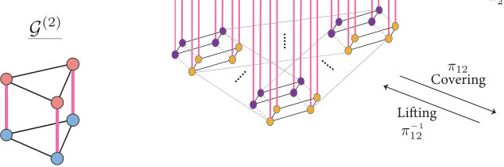 
FIG. 5. Equivalence of the base graph and quotient graph. The Cartesian product of QL-bits G(1) and G(2) is reduced to the quotient graph via an equitable partition π. This reduction is equivalent to a graph fibration that functions as a covering projection over the uniform subgraphs. The inverse operation of the equitable partition is realized through the unique lifting of the base graph’s adjacency structure, exactly reconstructing the full graph along the fibers defined by π−1.

**Summary.** This theoretical paper develops a method to find a minimal, computationally tractable representation for complex quantum-like systems built from the Cartesian product of smaller units. By employing equitable partitions and framing the problem in terms of graph fibrations, the authors show that the structure of the composite system can be analyzed by studying the product of the individual component structures. This circumvents the exponential scaling problem inherent in direct product constructions.

**Why it may be interesting.** This work provides a powerful mathematical tool (equitable partitions/fibrations) to manage the complexity of large, composite quantum-like systems, circumventing exponential resource scaling issues common in quantum information theory.

Detailed structure

**Main problem.** The paper addresses the exponential computational cost associated with constructing composite Quantum-Like (QL) systems by taking the Cartesian product of multiple QL-bit graphs.

**Main result.** It provides an exact, minimal representation for this graph Cartesian product using equitable partitions, showing that the resulting quotient graph is itself a Cartesian product of the individual quotient graphs.

**Method.** The core method involves applying graph theory concepts, specifically utilizing equitable partitions and relating the structure to graph fibrations, which allows for the decomposition of the large system into smaller, manageable components.

**Model / system.** The model uses QL-bits, which are represented by classical synchronizing networks built from two interacting $k$-regular random subgraphs. Composite systems are formed via the graph Cartesian product, $G = igotimes G(q)$.

**Key observables.** The emergent eigenvalues of the composite system, which are sums of constituent eigenvalues, and the structure of the quotient graph.

**Important parameters / regimes.** The number of QL-bits ($N_{QL}$), the regularity parameters ($k$ and $\ell$), and the structure of the equitable partition.

**Assumptions / limitations.** The analysis assumes the existence of an equitable partition and relies on the commutativity of taking the Cartesian product and constructing equitable partitions.

**Figures summary.** Figure 1(b) illustrates the construction of the Cartesian product graph, $G = G(1) \square G(2)$, and the mapping to the tensor product of Hilbert spaces.

**Paper structure.** The paper progresses by first defining the QL-bit model and the challenge of the Cartesian product. It then introduces equitable partitions to find a minimal representation, proving that the quotient graph structure preserves the product nature. Finally, it generalizes this to associativity using graph fibrations.

Abstract

We provide an equitable partition that gives an exact, minimal representation for the graph Cartesian product formed from quantum-like bits that preserves the relevant spectral and topological properties. We show that this result follows from the fact that the operations of taking the Cartesian product of graphs and constructing equitable partition of the graphs commute. Numerical simulations illustrate the preserved emergent eigenstates in the reduced structures. Additionally, we provide a construction of the minimal structure without passing through the Cartesian product. Finally, we frame quantum-like structures in the language of topology and fibrations.

[↑ back to top](#top)

### [Near-optimal high-rate surgery from linear PCPPs](http://arxiv.org/abs/2609.26973v1)

**Authors:** Alexander Cowtan, Benjamin Ide  
**Type:** theory · **Category:** quantum information and computing · **PDF:** <https://arxiv.org/pdf/2609.26973v1>  
**Analysis basis:** full PDF text, analyzed in chunks
**Topic relevance:** `quantum measurements` **1/5**

📷 Fig 1

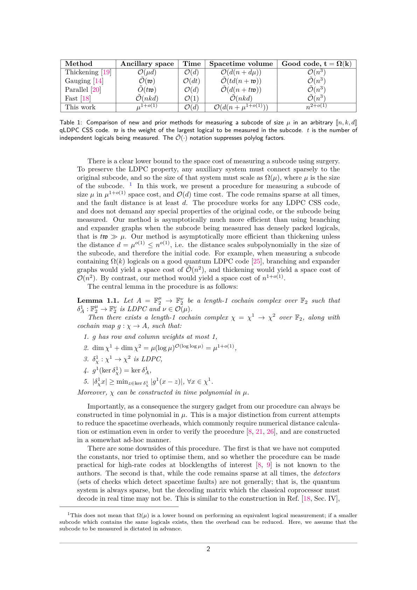 
Low-resolution page preview, page 2

📷 Fig 2

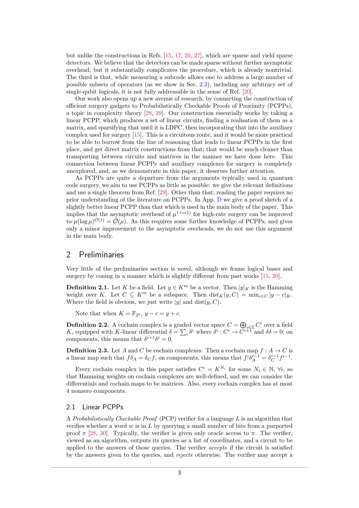 
Low-resolution page preview, page 3

📷 Fig 3

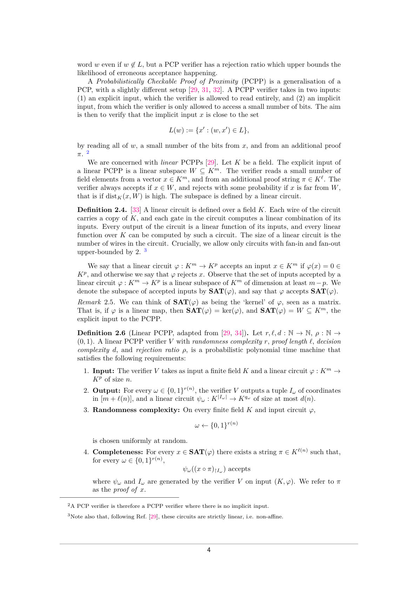 
Low-resolution page preview, page 4

📷 Fig 4

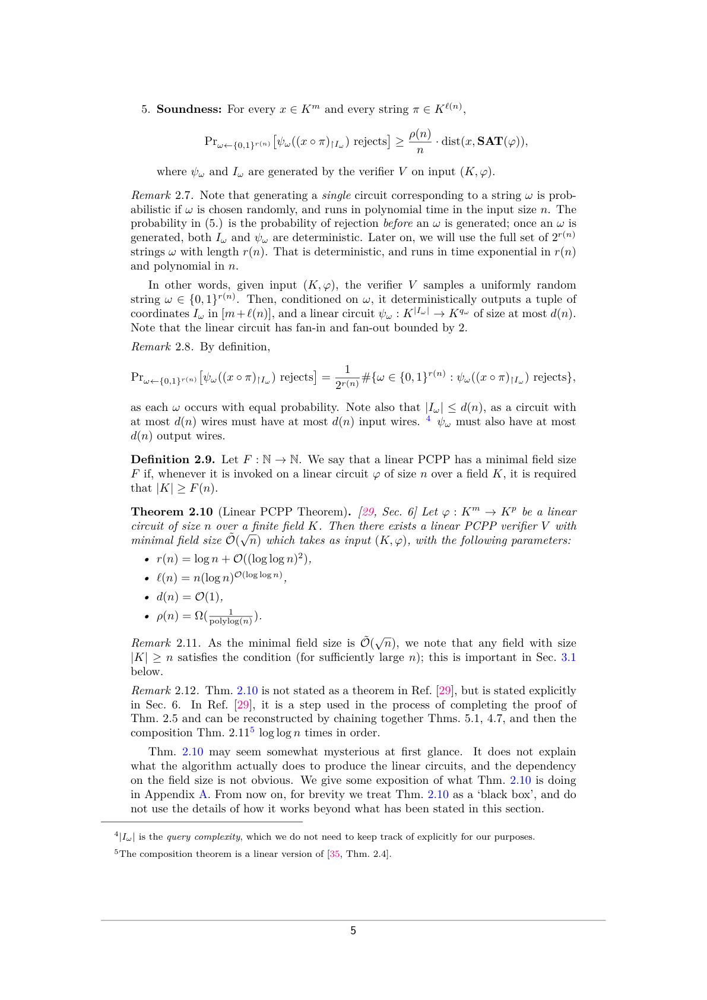 
Low-resolution page preview, page 5

📷 Fig 5

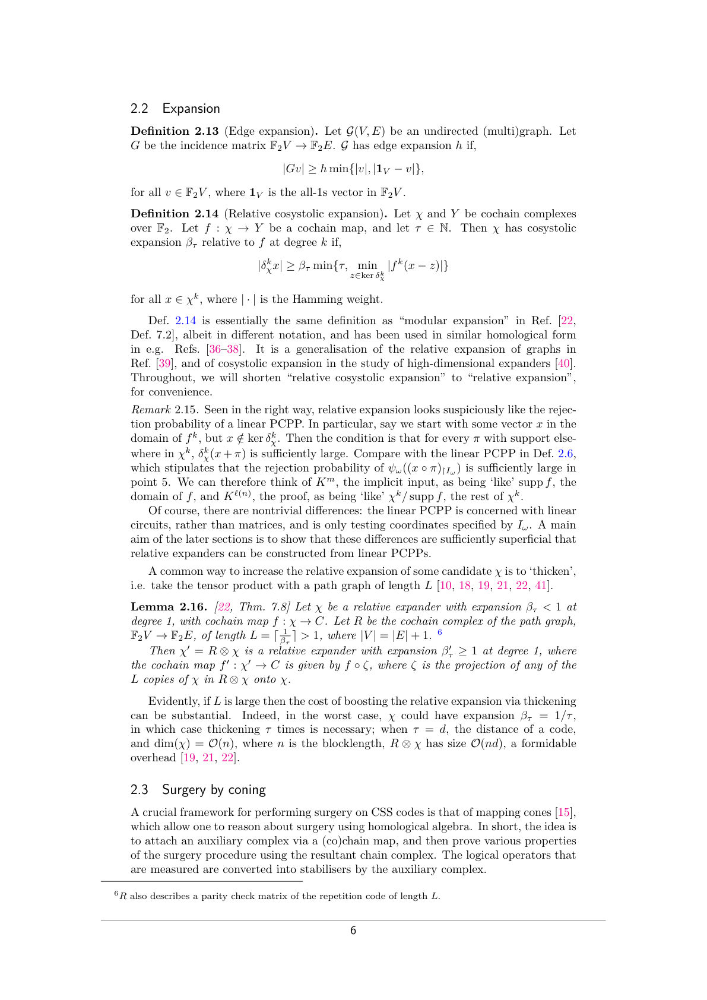 
Low-resolution page preview, page 6

**Summary.** This paper presents a novel, general method for designing highly efficient auxiliary systems for quantum error correction surgery on LDPC codes. By relating these gadgets to linear Probabilistically Checkable Proofs of Proximity (PCPPs), the authors achieve space overhead that is asymptotically optimal for measuring multiple logical operators. This advances the theoretical understanding of fault-tolerant quantum computation.

**Why it may be interesting.** The connection between topological/homological methods (cochain complexes) and computational complexity tools (PCPPs) provides a powerful, abstract framework for analyzing resource bounds in quantum error correction.

Detailed structure

**Main problem.** The central challenge is designing sparse, high-rate auxiliary systems for quantum error correction surgery using LDPC codes to measure large sets of logical operators in parallel.

**Main result.** The authors introduce a general method achieving a space overhead of $\mu^{1+o(1)}$ for measuring $t$ logicals in a subcode of size $\mu$, which is asymptotically optimal.

**Method.** The technique relates the construction of these surgery gadgets to linear Probabilistically Checkable Proofs of Proximity (PCPPs) and utilizes concepts from homological algebra, specifically cochain complexes.

**Model / system.** The work analyzes quantum Low-Density Parity Check (LDPC) Calderbank-Shor-Steane (CSS) codes undergoing 'surgery' operations. The mathematical framework involves constructing and analyzing cochain complexes associated with these codes.

**Key observables.** Fault distance ($d$), space overhead ($\mu^{1+o(1)}$), and the dimension of homology groups related to logical faults ($ar{X}$ and $ar{Z}$ logicals).

**Important parameters / regimes.** Code parameters like blocklength $n$, quantum dimension $k$, and distance $d$; PCPP parameters like randomness complexity $r(n)$ and proof length $\ell(n)$.

**Assumptions / limitations.** The analysis relies heavily on advanced mathematical tools, including the Künneth formula and established theorems regarding linear PCPPs.

**Figures summary.** Table 1 compares the space, time, and spacetime volume costs of the new method against prior techniques for measuring a subcode.

**Paper structure.** The paper builds from defining the physical problem (surgery gadgets) to introducing the mathematical machinery (PCPPs and relative cosystolic expansion) and culminates in proving the near-optimal bounds on the required resources.

Abstract

A central problem for surgery with quantum Low-Density Parity Check (LDPC) codes is the design of auxiliary systems which measure large sets of logical operators in parallel, while preserving sparsity and fault distance. We introduce a very general method for designing surgery gadgets which are 'high rate', meaning that the number of operators measured in parallel is large in comparison to the size of the auxiliary system. Given an arbitrary initial $[[ n, k, d ]]$ quantum LDPC Calderbank-Shor-Steane (CSS) code, and an arbitrary subcode of size $μ\leq n$ that contains $t \leq k$ logical qubits, the method produces a sparse high-rate surgery gadget with size $μ(\logμ)^{O(\log\log μ)}=μ^{1+o(1)}$ which measures all $t$ logicals in the subcode. The space overhead is asymptotically optimal up to subpolynomial factors, as the lower bound is $Ω(μ)$. This gadget is produced in time polynomial in $μ$. When logical measurement is performed using these surgery gadgets, the phenomenological fault distance is at least $d$ when performed for $d$ rounds.   Our main result comes from relating surgery gadgets with relative cosystolic expansion to linear Probabilistically Checkable Proofs of Proximity (PCPPs), which allow a randomised verifier to probabilistically verify the input to a linear circuit, using only oracle access to the input and a claimed proof.

[↑ back to top](#top)

### [Optimal Evasion from a Resetting Searcher](http://arxiv.org/abs/2609.28126v1)

**Authors:** Ami Taitelbaum, Matan Shporer, Shlomi Reuveni, Michael Assaf  
**Type:** theory · **Category:** statistical mechanics · **PDF:** <https://arxiv.org/pdf/2609.28126v1>  
**Analysis basis:** full PDF text, analyzed in chunks
**Topic relevance:** `non-equilibrium universality` **1/5**

📷 Fig 1

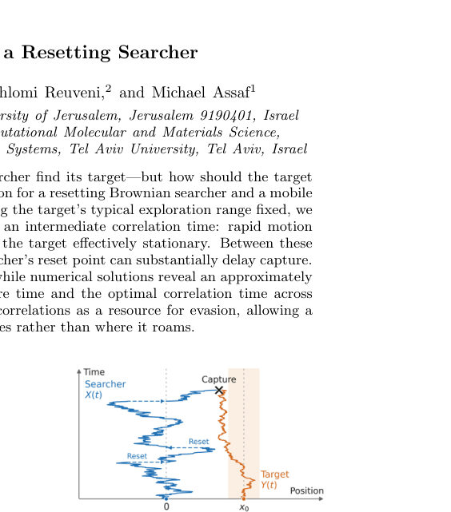 
FIG. 1. Space-time schematic of a Brownian searcher that repeatedly resets to the origin, and a target undergoing OU motion around its home at x0. The shaded region indicates the target’s typical exploration range, σ, while the correlation time τ controls how long excursions away from home persist. Capture occurs when the two trajectories first meet.

📷 Fig 2

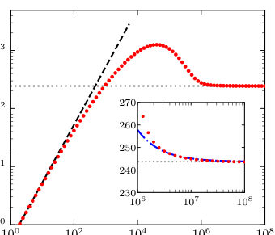 
FIG. 2. MCT vs. target correlation time for z = 5.5 and γ = 2.8, with D = r = 1. Circles are the numerical solution of Eq. (6). Dashed and dotted lines are the fast-target asymp- tote [Eq. (11)], and frozen-target value T∞. The dash-dotted curve in the inset is the slow-target asymptote [Eq. (9)].

📷 Fig 3

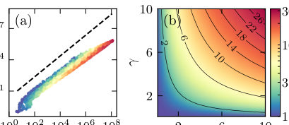 
FIG. 3. The maximum MCT ⟨T⟩max vs. the optimal correla- tion time τ⋆, for 1024 pairs (z, γ) drawn uniformly at random from [0.1, 10]2 with D = r = 1, so that ρ = τ. The color denotes the ratio ⟨T⟩max/T∞, which measures how strongly target mobility increases the MCT. The dashed line is a guide to the eye with unit slope. Right panel: the same ratio ⟨T⟩max/T∞across the (z, γ) plane, on the same color scale.

📷 Fig 4

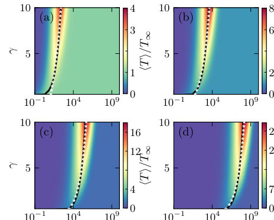 
FIG. 4. Ratio ⟨T⟩/T∞between the MCT and its frozen- target value, as a function of the target correlation time τ and the relative fluctuation amplitude γ = σ/x0, for D = r = 1 (so that ρ = τ) and (a) z = 1, (b) z = 2.35, (c) z = 5.5, and (d) z = 10. White stars mark the numerically determined optimal correlation time τ⋆(γ). The solid curve is the crossover estimate [Eq. (12)] with a fitted multiplicative factor of 3.5, 4.9, 9.2, and 16.0 in panels (a-d), respectively.

**Summary.** This work models the optimal evasion strategy for a mobile target against a searcher that resets periodically. By analyzing the mean capture time, the authors find that the delay is maximized not at the fastest or slowest movement, but at an intermediate persistence time. This highlights that temporal memory in motion is a key resource for survival in stochastic pursuit problems.

**Why it may be interesting.** The concept of using temporal correlations as a resource for evasion is a general principle in non-equilibrium statistical physics, applicable to trapping, reaction-diffusion, and search problems in complex media.

Detailed structure

**Main problem.** The paper investigates how a mobile target can optimally move to maximize the mean capture time when being pursued by a searcher that periodically resets to a fixed location.

**Main result.** The mean capture time is maximized at an intermediate correlation time, demonstrating that temporal correlations are a resource for evasion, allowing the target to prolong survival by tuning its movement.

**Method.** The problem is formulated using a steady-state partial differential equation (PDE) for the mean capture time, which is analyzed by examining different asymptotic limits (fast and slow target motion).

**Model / system.** The system involves a searcher undergoing Brownian motion with stochastic resetting, and a target following an Ornstein-Uhlenbeck (OU) process around a home location. The dynamics are governed by coupled stochastic differential equations.

**Key observables.** Mean Capture Time (MCT), $\langle T 
angle$, and the ratio $\langle T 
angle_{	ext{max}} / T_{\infty}$ quantifying the enhancement due to target mobility.

**Important parameters / regimes.** The key parameters are the target's correlation time ($	au$), the searcher's resetting rate ($r$), and the target's spatial exploration range ($\sigma$). The dimensionless product $
ho = r	au$ is crucial.

**Assumptions / limitations.** The analysis relies on solving a steady-state PDE, and specific asymptotic limits ($
ho 	o 0$ and $
ho 	o \infty$) are derived analytically, while the intermediate regime requires numerical solutions.

**Figures summary.** Figures compare the calculated MCT versus $	au$, showing a clear intermediate maximum, and illustrate the enhancement ratio $\langle T 
angle_{	ext{max}} / T_{\infty}$ dependence on system parameters.

**Paper structure.** The paper establishes the physical model and the governing PDE, analyzes the limiting cases (fast/slow target motion) to derive analytical approximations, and then numerically solves the full PDE to locate the optimal correlation time $	au_\star$ where the maximum MCT occurs.

Abstract

Returning to a familiar location can help a searcher find its target---but how should the target move to avoid being found? We address this question for a resetting Brownian searcher and a mobile target fluctuating around a home location. Keeping the target's typical exploration range fixed, we find that the mean capture time is maximized at an intermediate correlation time: rapid motion promotes encounters, whereas slow motion leaves the target effectively stationary. Between these extremes, persistent excursions away from the searcher's reset point can substantially delay capture. Analytical limiting results explain this optimum, while numerical solutions reveal an approximately linear relation between the maximal mean capture time and the optimal correlation time across many decades. These findings identify temporal correlations as a resource for evasion, allowing a target to prolong survival by changing how it moves rather than where it roams.

[↑ back to top](#top)

### [Relational background field formulation of discrete quantum gravity models: The case of $O(N)$ vector models in zero dimensions](http://arxiv.org/abs/2609.28032v1)

**Authors:** Vincent Lahoche, Dine Ousmane Samary, Parham Radpay  
**Type:** theory · **Category:** statistical mechanics · **PDF:** <https://arxiv.org/pdf/2609.28032v1>  
**Analysis basis:** full PDF text, analyzed in chunks
**Topic relevance:** `Keldysh / 2PI / non-Gaussian methods` **1/5**

📷 Fig 1

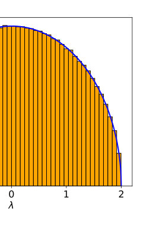 
Figure 3.1. Illustration of the convergence toward Wigner’s law. The histogram shows the eigenvalue distribution for a Wigner matrix of size 104 with variance 1/N. The blue line materialises the limiting analytical Wigner semicircle law.

📷 Fig 2

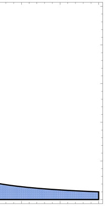 
Figure 3.2. The validity domain of the equivalence between quenched and annealed limit.

📷 Fig 3

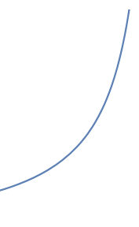 
Figure 4.1. Behavior of the canonical dimension for the coupling u. It goes toward 1/2 as µ →0.

**Summary.** This paper introduces a relational background field formulation as a new Renormalization Group technique for discrete quantum gravity models, particularly random matrix theories. By utilizing the $O(N)$ model, the authors show how this method preserves gauge symmetry while defining a stable RG flow. The key finding is the existence of an asymptotic Wilson-Fisher fixed point, offering a controlled path to the continuum limit.

**Why it may be interesting.** While focused on quantum gravity, the rigorous application of RG techniques, fixed-point analysis, and symmetry preservation in the large-N limit provides advanced theoretical tools applicable to critical phenomena in complex many-body systems.

Detailed structure

**Main problem.** Developing a reliable Renormalization Group (RG) approach for discrete quantum gravity models while preserving the underlying gauge symmetry and achieving a satisfactory continuum limit.

**Main result.** The authors demonstrate the existence of an asymptotic Wilson-Fisher-type fixed point using a novel relational background field formulation.

**Method.** The method employs a relational background field formulation combined with a partial Hubbard-Stratonovich decomposition to define an RG flow based on the BBP phase transition.

**Model / system.** The study focuses on random matrix models, specifically the $O(N)$ vector model in zero dimensions, which serves as a pedagogical review of the general construction.

**Key observables.** Asymptotic Wilson-Fisher fixed point, relevant critical exponent, free energy singularity exponent (gamma=1/2).

**Important parameters / regimes.** Large N limit, $O(N)$ symmetry, BBP phase transition, dimension $D=2k+3$.

**Assumptions / limitations.** The method relies on the self-averaging property for large random matrices and is presented as a review of the construction.

**Paper structure.** The paper introduces the relational background field concept, reviews its application to the $O(N)$ model, details the use of the BBP transition to define the RG flow, and analyzes the resulting fixed point structure.

Abstract

In a recent paper arxiv.org/abs/2609.21031, we have introduced the concept of a relational background field as a new approach to the renormalization group (RG) for discrete quantum gravity models, focusing on random matrix models. The proposed method offers the dual advantage of preserving the model's gauge symmetry (typically $U(N)$ or $O(N)$), whose breaking in conventional approaches has remained an open problem, and providing a more satisfactory treatment of the continuum or infrared (IR) limit. In this limit, the theory is described by a non-local field theory in dimension $D = 2k + 3$, where $k$ denotes the number of cuts in the effective spectrum as dictated by random matrix theory. This pedagogical paper reviews this construction for real random vector models in zero dimensions, with $O(N)$ as the symmetry group. Following the general strategy of background-field-type formulations, we show, using the BBP (Baik-Ben Arrous-P'ech'e) phase transition, that a partial Hubbard--Stratonovich decomposition of the quartic interaction, involving a matrix-valued intermediate field, allows a preferred notion of scale to emerge. This scale, in turn, defines an RG flow, whose perturbative structure is analyzed. Our calculation demonstrates the existence of an \textit{asymptotic} Wilson--Fisher-type fixed point, whose sole relevant critical exponent is in qualitative agreement with the double-scaling critical exponent of these models.

[↑ back to top](#top)

### [Strain Engineering of the Topological Gap and Tunable Chern Numbers in the 2D Kagome Metal-Organic Framework Eu$_2$(C$_6$H$_4$)$_3$](http://arxiv.org/abs/2609.27388v1)

**Authors:** Jiaxuan Guo, Simin Nie, Fritz B. Prinz  
**Type:** theory · **Category:** other · **PDF:** <https://arxiv.org/pdf/2609.27388v1>  
**Analysis basis:** full PDF text, analyzed in chunks
**Topic relevance:** `analog quantum simulation` **1/5**

📷 Fig 1

 
FIG. 1. (Color online). (a) Top and side views of Eu2(C6H4)3. (b) First Brillouin zone and the high-symmetry k points. (c) Phonon dispersion of the monolayer and (d) its low-frequency region. (e),(f) Temperature and total energy during a 3 ps AIMD simulation at 300 K.

📷 Fig 2

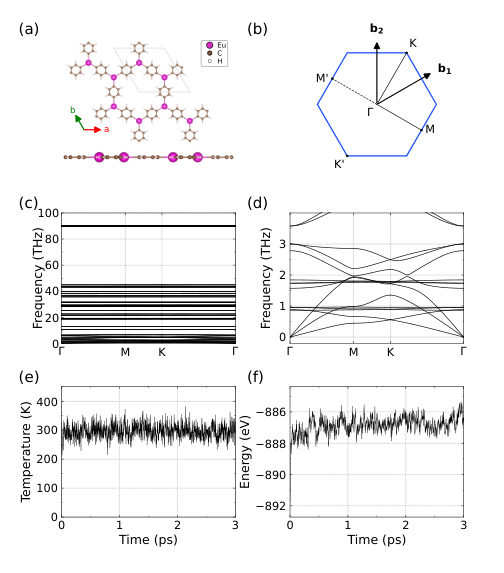 
Figure 1(a) depicts the atomic configuration of the monolayer Eu2(C6H4)3. The monolayer crystallizes in the hexagonal space group P6/m: each Eu atom sits at the center of a triangle of three benzene rings, and the corner-sharing triangles trace out a 2D metal-organic kagome lattice. After full relaxation the in-plane lattice constant is a = 13.84 ˚A. We first evaluated the dynamical stability. The phonon dispersion along the high-symmetry lines, shown in Figs. 1(c) and 1(d), contains no imaginary branch, so the monolayer is dynamically stable. Thermal stability was then probed by ab initio molecular dynamics (AIMD) on a 2 × 2 × 1 supercell: over 3 ps at 300 K the framework remains intact...

📷 Fig 3

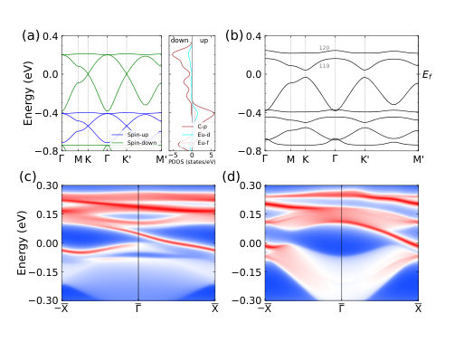 
FIG. 2. (Color online). The electronic band structures of the monolayer Eu2(C6H4)3 (a) without SOC, with the projected density of states of the C-p, Eu-d, and Eu-f orbitals shown alongside, and (b) with SOC, where a 72.7 meV gap opens at K/K′. (c)-(d) The armchair and zigzag edge spectra, each showing the single chiral mode of the C = −1 phase.

📷 Fig 4

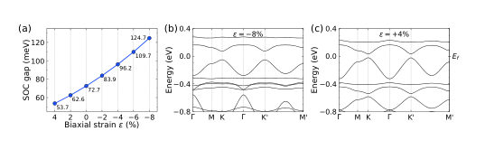 
FIG. 3. (Color online). (a) Evolution of the SOC-induced topological gap of monolayer Eu2(C6H4)3 under biaxial strain ε. (b),(c) SOC band structures at ε = −8% and ε = +4%, showing the enlarged and reduced gaps at K/K′.

📷 Fig 5

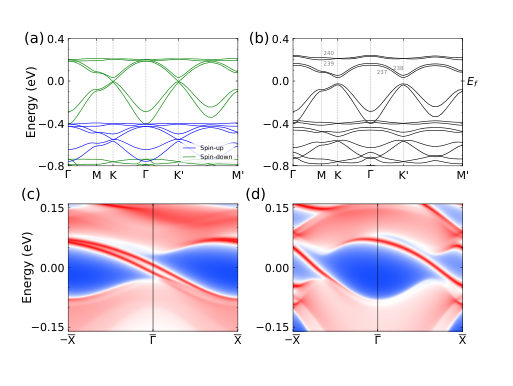 
FIG. 5. (Color online). Band structures of the bilayer Eu2(C6H4)3 (a) without and (b) with SOC, where a 57.6 meV gap opens. (c)-(d) The armchair and zigzag edge spectra, each showing the two co-propagating chiral modes of the C = −2 phase.

**Summary.** This theoretical study investigates the tunable topological properties of the 2D metal-organic framework $	ext{Eu}_2(	ext{C}_6	ext{H}_4)_3$. Using DFT calculations, the authors show that the material functions as a controllable Chern insulator. By applying strain, stacking, and electric fields, they demonstrate three distinct methods to manipulate both the size of the topological gap and the quantized Chern number, offering a versatile platform for quantum electronics.

**Why it may be interesting.** This work provides a clear, multi-faceted blueprint for engineering topological electronic states using purely structural and electric field controls, which is highly relevant for designing novel quantum devices.

Detailed structure

**Main problem.** The primary challenge addressed is improving the operating temperature and controlling the number of edge channels in the Quantum Anomalous Hall Effect (QAHE).

**Main result.** The study demonstrates that mechanical strain, stacking, and out-of-plane electric fields can independently tune both the topological gap and the Chern number in the single material $	ext{Eu}_2(	ext{C}_6	ext{H}_4)_3$.

**Method.** The research relies heavily on first-principles density functional theory (DFT) calculations, supplemented by tight-binding models derived from maximally localized Wannier functions to characterize the topological invariants.

**Model / system.** The physical system is the two-dimensional metal-organic kagome ferromagnet $	ext{Eu}_2(	ext{C}_6	ext{H}_4)_3$. The electronic properties are modeled as an intrinsic Chern insulator whose topology is sensitive to external perturbations.

**Key observables.** Chern number ($\mathcal{C}$), topological gap size, Hall conductance, strain ($\epsilon$), and out-of-plane electric field ($E_{	ext{out-of-plane}}$).

**Important parameters / regimes.** The initial SOC gap is $72.7 	ext{ meV}$, which widens to $124.7 	ext{ meV}$ under $-8\%$ biaxial strain. The system exhibits Chern numbers of $\mathcal{C}=-1$ (monolayer) and $\mathcal{C}=-2$ (bilayer).

**Assumptions / limitations.** The analysis assumes that the topological gap opening is primarily sourced by the hybridization between C-$p$ states and the $	ext{Eu}$ $5d$ states, and that the material remains stable under applied strain and fields.

**Figures summary.** Figures illustrate the atomic structure, phonon dispersion, and AIMD simulations confirming stability. Band structure plots show the evolution of the topological gap under varying strain, while theoretical calculations map out the transitions between different Chern number phases.

**Paper structure.** The paper first establishes the material's stability and intrinsic topological properties (monolayer, $C=-1$). It then systematically explores the tunability by applying mechanical strain (widening the gap) and stacking (achieving $C=-2$). Finally, it introduces an out-of-plane electric field to drive the system through multiple topological transitions.

Abstract

The quantum anomalous Hall effect carries dissipationless chiral edge currents without an external magnetic field, yet raising its operating temperature and controlling the number of edge channels remain difficult. Using first-principles calculations, we identify the two-dimensional metal-organic kagome ferromagnet Eu$_2$(C$_6$H$_4$)$_3$ as an intrinsic Chern insulator whose topological gap can be enlarged by mechanical strain. The monolayer has a spin-orbit-coupling-induced gap of 72.7 meV that widens to 124.7 meV under -8% biaxial strain, realizing a quantum anomalous Hall phase with Chern number $\mathcal{C}=-1$ and a single chiral edge state. The local moments come from the half-filled Eu $4f^{7}$ shell, while the gap-opening spin-orbit coupling is carried by Eu $5d$ states hybridized into the carbon kagome bands. The AB-stacked bilayer couples ferromagnetically and accumulates the per-layer Chern numbers, giving $\mathcal{C}=-2$ with two co-propagating chiral channels. An out-of-plane electric field then drives the bilayer through a sequence of topological transitions among $\mathcal{C}=-2$, $-3$, and $-1$, switching the number of edge channels. Together, strain, stacking, and gating give three distinct handles on the gap and the Chern number within a single stoichiometric material.

[↑ back to top](#top)

## Other papers (18)

*Papers from primary archives without highlighted authors or any topic match. Click to expand.*

Show other papers

### [Asymmetric magnetoresistance in 3$d$-5$d$ based La$_{0.67}$Ca$_{0.33}$MnO$_3$/SrIrO$_3$ bilayer: The role of unidirectional anisotropy](http://arxiv.org/abs/2609.27642v1)

**Authors:** A. G. A. Rahman, Subham Naskar, R. K. Patel, S. Manna, Chandrani Nath, Kranti Kumar, A. K. Pramanik  
**Type:** experiment · **Category:** strongly correlated electrons · **PDF:** <https://arxiv.org/pdf/2609.27642v1>  
**Analysis basis:** full PDF text, analyzed in chunks

📷 Fig 1

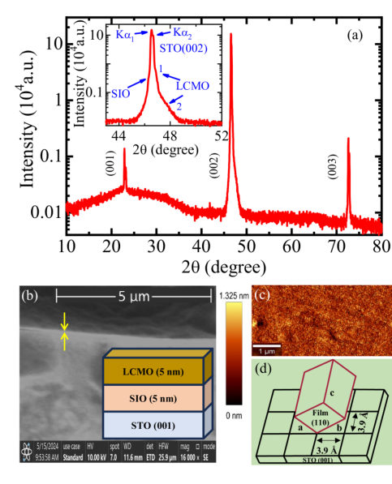 
FIG. 1: (a) The x-ray diffraction (XRD) pattern of the bilayer LCMO/SIO deposited on STO(001) substrate is presented in a semi-log scale. The inset displays the magnified view of the (002) peak showing contributions from both the substrate and film. The (002) substrate peak is split, as contributed by Cu Kα1 and Kα2 radiation. Thickness fringes on the right side due to LCMO are seen, as marked by 1 and 2. (b) shows the FE-SEM side image and the schematic of present bilayer. The arrows in FE-SEM image indicates the thin layer of film on the substrate. (c) shows an atomic force microscopy image of film surface. (d) Schematic diagram of film’s (110) growth is shown with respect to substrate’s (001)...

📷 Fig 2

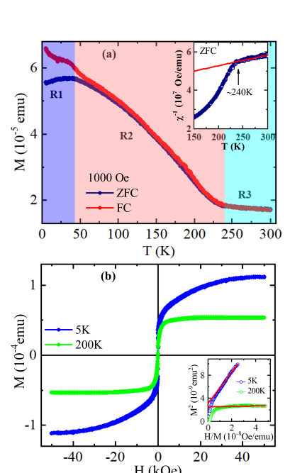 
FIG. 2: (a) Temperature dependent magnetization data for LCMO/SIO BL, collected with 1 kOe applied magnetic field following zero-field cooled (ZFC) and field cooled (FC) proto- cols, are shown. Here, R1, R2 and R3 represent three different temperature regions related to magnetic ordering of LCMO and SIO layer. The inset displays the inverse magnetic suscep- tibility χ−1 against temperature where the red straight line is a guide to the nearly linear high-temperature behavior. (b) Magnetization data as a function of applied magnetic field are shown for present LCMO/SIO BL at 5 and 200 K. The upper inset shows the magnified view of M(H) data across origin while the lower inset shows an Arrott’s plot...

📷 Fig 3

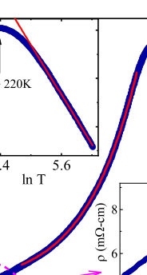 
FIG. 3: Temperature dependent electrical resistivity of present LCMO/SIO BL on STO(001) substrate have been shown. Solid red line indicates the fitting of ρ(T ) data with power-law equation (Eq. 2) in metallic regime. Lower inset magnify the low temperature anomaly in ρ(T ) around 47 K. Upper inset displays the power-law fitting of ρ(T ) with Eq. 3 in high temperature insulating state.

📷 Fig 4

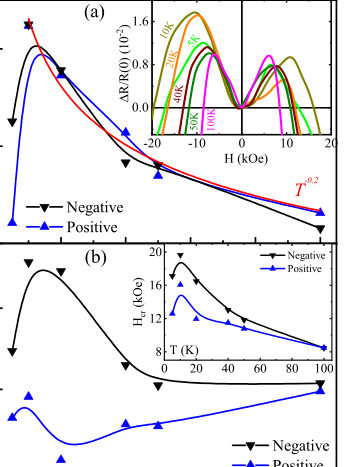 
FIG. 5: Temperature dependent (a) peak field (Hp) and (b) peak MR value (MRp) for positive MR are shown with both positive and negative field scan. The solid red line in (a) indicates a power-law fit of ∝T −0.2. The inset provides a magnified view of MR in low field regime, showing the asym- metric positive MR. The inset in (b) shows the positive to negative MR crossover field Hcr for both negative and posi- tive field cycling.

📷 Fig 5

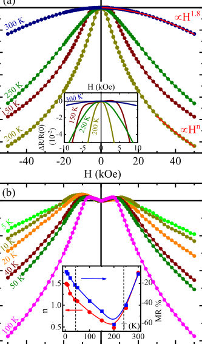 
FIG. 4: Field dependent magnetoresistance (MR) of present LCMO/SIO BL are shown at various temperatures with field scan of ±50 kOe. (a) shows the MR data in (150 - 300) K high temperature range. The MR at 300 K shows a nearly field-quadratic behavior (∝H1.8) throughout the field range (red solid line). Similarly, the red line in high field (30 - 50) kOe for 200 K data represents a power-law fit (ρ(T ) ∝Hn). The inset shows a magnified view of MR data close to zero field. (b) shows the low temperature MR as a function of magnetic field in (100 - 5) K range. The inset demonstrates the temperature dependence of the exponent n (left scale) and the percentage MR (right scale), where the vertical lines...

**Summary.** This work reports on the magnetic and magneto-transport properties of a $	ext{LCMO}/	ext{SIO}$ heterostructure. The researchers found that the magnetoresistance exhibits complex, asymmetric behavior linked directly to the magnetic ordering of both the $3d$ and $5d$ layers. This suggests that interfacial spin scattering is a crucial, tunable mechanism for controlling charge transport in these correlated magnetic materials.

**Why it may be interesting.** The study explores how interfacial magnetic coupling (via DM interaction and SOC) dictates charge transport properties, which is a key area for understanding correlated electron behavior in engineered quantum materials.

Detailed structure

**Main problem.** Investigating the origin and tuning of asymmetric magnetoresistance (MR) in a $3d$-$5d$ magnetic heterostructure.

**Main result.** The unusual MR behavior is attributed to interface-driven varying spin scattering between itinerant and localized electrons, demonstrating tunable interfacial magnetic transport.

**Method.** The study combines epitaxial thin-film growth (PLD) with comprehensive characterization, including magnetic measurements (SQUID) and electrical transport measurements (four-probe technique).

**Model / system.** The system is an epitaxially grown bilayer of a $3d$ ferromagnet, $	ext{La}_{0.67}	ext{Ca}_{0.33}	ext{MnO}_3$ (LCMO), and a $5d$ heavy metal, $	ext{SrIrO}_3$ (SIO), on an $	ext{STO}$ substrate. The physics involves the interplay of spin-orbit coupling, magnetism, and interfacial interactions.

**Key observables.** Magnetoresistance (MR), resistivity $
ho(T)$, magnetization $M(H)$, and magnetic ordering temperatures ($	ext{T}_c$ for LCMO, $	ext{T}_p$ for SIO).

**Important parameters / regimes.** Temperature (especially near magnetic ordering points), applied magnetic field ($H$), and interfacial coupling strength.

**Assumptions / limitations.** The unusual MR behavior is ascribed to interface-driven varying spin scattering between itinerant and localized electrons.

**Figures summary.** Figures confirm epitaxial growth (XRD), show smooth film morphology (AFM), detail magnetic transitions in both layers (ZFC/FC, M(H)), and present the temperature and field dependence of the MR.

**Paper structure.** The paper follows a standard experimental structure: structural characterization (XRD, AFM, SEM) $	o$ magnetic characterization (SQUID) $	o$ transport measurements ($
ho(T)$, MR) $	o$ interpretation linking MR evolution to the magnetic state of the bilayer.

Abstract

The complex interplay between spin-orbit coupling, magnetism, and magnetic field at the interface of a heterostructure consisting of ferromagnet (FM) and heavy metal (HM), often exhibit extraordinary magnetic and electric phenomena where an in-plane Dzyaloshinskii-Moriya (DM) interaction plays a crucial role to stabilize local spin texture in FM layer. Here, we report detailed magnetic and magneto-transport behaviour on an epitaxially grown thin heterostructure with 3$d$ FM La$_{0.67}$Ca$_{0.33}$MnO$_3$ (LCMO) and 5$d$ HM SrIrO$_3$ (SIO). Magnetic measurements show an unusual development of magnetic ordering in SrIrO3 around 42 K, which further leads to a Mn/Ir magnetic coupling at the interface. The magnetoresistance (MR) measurements show an evolution of its value and shape with the magnetic state of this bilayer. While MR is negative at high temperature, it shows a positive to negative crossover with stable magnetic ordering of LCMO, and finally the positive MR exhibits an asymmetry at low temperature with the ordering of SIO. While we ascribe this unusual MR behaviour to interface-driven varying spin scattering between itinerant and localized electrons, our results shed a light to comprehend the complex but tunable interface behavior on charge transport in a particularly designed heterostructure, offering valuable insights for future functional material engineering.

[↑ back to top](#top)

### [Circuit-depth optimization of quantum partial-search algorithms](http://arxiv.org/abs/2609.28147v1)

**Authors:** Yan-Bo Jiang, Xiao-Hui Wang, Kun Zhang, Vladimir Korepin  
**Type:** theory · **Category:** quantum information and computing · **PDF:** <https://arxiv.org/pdf/2609.28147v1>  
**Analysis basis:** full PDF text, analyzed in chunks

📷 Fig 1

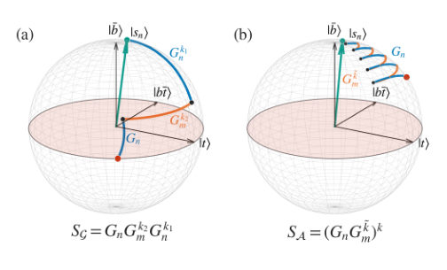 
FIG. 1. Geometric illustration of the two families of partial-search sequences in the three-dimensional invariant subspace. (a) The GRK sequence SG = GnGk2 m Gk1 n follows a global-local-global trajectory. The blue arcs denote global Grover iterations Gk1 n , whereas the or- ange arc denotes the local Grover iterations Gk2 m . (b) The depth- efficient alternating sequence SA = (GnG ˜k m)k repeatedly applies the same local–global pair (orange and blue), producing a spiral tra- jectory. The coordinate axes mark the target item |t⟩, the non-target- in-block state |b¯t⟩, and the non-target-block state |¯b⟩.

📷 Fig 2

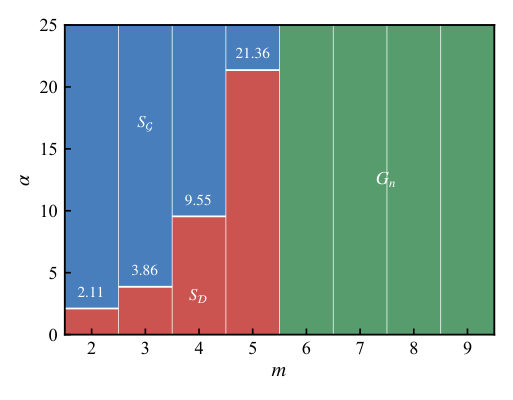 
FIG. 3. Phase diagram of depth-optimal partial-search operators obtained from a numerical scan in α for the discrete block sizes m = 2, . . . , 9 at N = 210. We assume the linear-depth model of diffusion operators with ℓn = n and ℓm = m. Red denotes the non-GRK SD region, blue SG, and green the single global iteration Gn. The annotated crossings are αc = 2.11, 3.86, 9.55, 21.36 for m = 2, 3, 4, 5.

📷 Fig 3

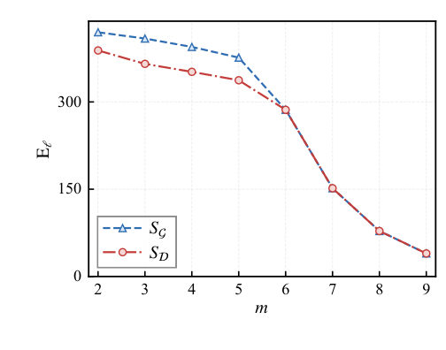 
FIG. 2. Expected circuit depth Eℓas a function of the block-size parameter m for N = 210 and α = 1. We assume the linear-depth model of diffusion operators with ℓn = n and ℓm = m. Circles show the depth-optimal sequences listed in Table II, which have the form SD defined in Eq. (28). Triangles show the optimal expected circuit depth restricted to the GRK sequence given by SG = GnGk2 m Gk1 n .

📷 Fig 4

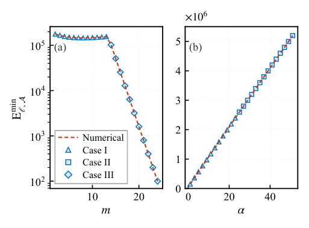 
FIG. 5. Minimum expected circuit depth Emin ℓ,A of the alternating se- quence for N = 225. Panel (a) shows its dependence on m at fixed α = 1 on a logarithmic vertical scale. Panel (b) shows its depen- dence on α at fixed m = 5 on a linear vertical scale. Red dashed lines denote numerical results. Blue triangles, squares, and diamonds de- note the analytical predictions in Cases I, II, and III, given by Corol- laries 5, 7, and Theorem 8, respectively. We use the linear-depth model ℓn = n and ℓm = m.

📷 Fig 5

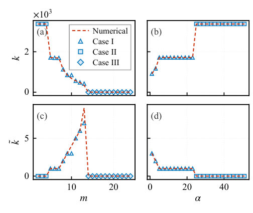 
FIG. 4. Depth-optimal iteration counts for the alternating sequence SA = (GnG ˜k m)k at N = 225. Panels (a) and (b) show the outer iteration count k as functions of m at fixed α = 20 and of α at fixed m = 5, respectively. Panels (c) and (d) show the corresponding inner iteration count ˜k. Red dashed lines denote numerical results. Blue triangles, squares, and diamonds denote the analytical predictions in Cases I, II, and III, given by Theorems 4, 6, and 8, respectively.

**Summary.** This paper optimizes the circuit depth for quantum partial-search algorithms by proposing an alternating sequence of global and local Grover operators. By analyzing the expected circuit depth, the authors demonstrate that this new sequence can significantly outperform the established GRK algorithm in depth-constrained scenarios. This advances the practical implementation of quantum search algorithms by providing a depth-optimal alternative.

**Why it may be interesting.** This work directly addresses resource optimization in quantum computation, providing concrete, improved circuit implementations for search problems that are crucial for quantum algorithm development.

Detailed structure

**Main problem.** The paper aims to optimize the circuit depth of quantum partial-search algorithms, moving beyond the established optimality criteria based solely on the number of oracle queries.

**Main result.** An alternating sequence of global and local Grover operators can achieve a significantly lower expected circuit depth (over 20% reduction) compared to the standard Grover-Radhakrishnan-Korepin (GRK) sequence when the oracle and diffusion operator depths are comparable.

**Method.** The authors systematically analyze the expected circuit depth, $E_\ell(S)$, for various sequence structures, comparing the depth-optimal alternating sequence ($S_A$) against the query-optimal GRK sequence ($S_G$).

**Model / system.** The model is a quantum partial-search algorithm applied to a database of size $N=2^n$, utilizing global ($G_n$) and local ($G_m$) Grover operators. The analysis compares depth-based optimization against query-count optimization.

**Key observables.** Expected circuit depth ($E_\ell(S)$), success probability ($	ext{Pr}(S)$), and the ratio of operator depths ($\alpha$).

**Important parameters / regimes.** The ratio $\alpha$ between the oracle and global diffusion operator depths, and the block size $b$ relative to the total size $N$.

**Assumptions / limitations.** The analysis relies on asymptotic approximations for large $N$ and $K$, and the comparison is made between depth-optimal and query-optimal regimes.

**Figures summary.** Figure 1 illustrates the geometric paths of the GRK sequence versus the depth-efficient alternating sequence in the invariant subspace. Figure 3 presents a phase diagram mapping the optimal sequence choice across different depth ratios ($\alpha$).

**Paper structure.** The paper reviews the GRK algorithm's query optimality, proposes the depth-efficient alternating sequence ($S_A$), and then systematically analyzes $S_A$ to derive its exact success probability and expected depth, establishing the boundary separating depth-optimal and oracle-optimal regimes.

Abstract

Grover's algorithm is optimal in terms of oracle queries. We can trade accuracy for speed, which gives rise to the quantum partial-search algorithm. The partial-search algorithm is implemented using two kinds of Grover operators, global and local, where the former is the standard Grover operator for full search and the latter has a diffusion operator acting on the search subspace. The global-local-global sequence, also known as the Grover-Radhakrishnan-Korepin (GRK) algorithm, has been proved optimal in the oracle-query metric. In this work, we show that the alternating sequence of global and local Grover operators, formed by repeatedly applying a fixed product of global and local Grover operators, can achieve a lower expected circuit depth than the GRK algorithm. Through systematic analysis, we obtain its exact success probability, expected depth, and asymptotically optimal parameters. We derive the boundary, characterized by the ratio between the depths of the oracle and the global diffusion operator, separating the depth-optimal and oracle-optimal partial-search algorithms. When the depths of the oracle and the global diffusion operator are comparable, our proposed alternating partial-search sequence can reduce the minimum expected circuit depth by more than 20\% compared with the GRK algorithm.

[↑ back to top](#top)

### [Complexity of Nuclear States for 48Ca](http://arxiv.org/abs/2609.26982v1)

**Authors:** L. López-Hernández, D. A. Lara Bustillos, Carlos E. Vargas, V. Velázquez  
**Type:** theory · **Category:** statistical mechanics · **PDF:** <https://arxiv.org/pdf/2609.26982v1>  
**Analysis basis:** full PDF text, analyzed in chunks

📷 Fig 1

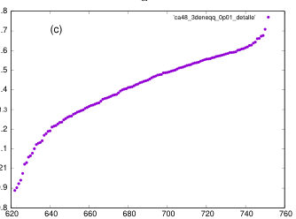 
Figure 1: Energy levels of 48Ca as a function of the interaction parameter χ. The quadrupole two-body interaction in (a) χ = 0.25 is 25 times greater than in (b). In (c), a selected sector of the energy spectrum from (b) is shown.

📷 Fig 2

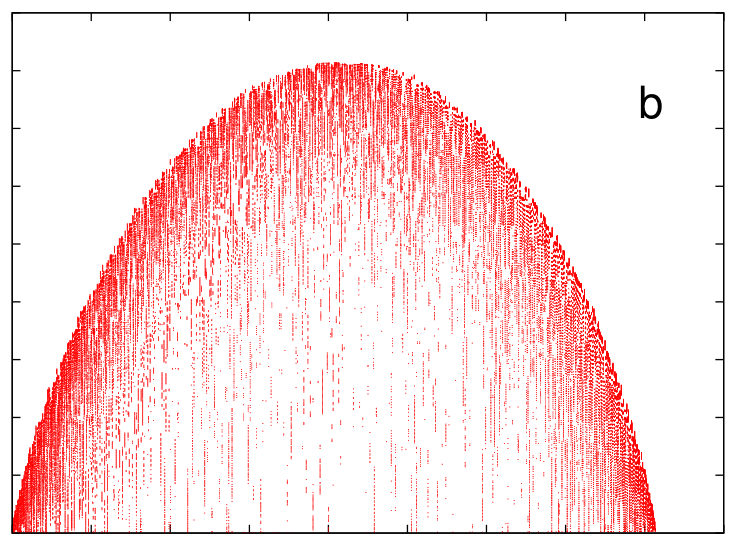 
Figure 2: Distribution of k states for which the probabilities (P α k = |Cα k |2 &gt; 0.05 for each state vector |α⟩on the horizontal axis for the 48Ca nucleus with Jπ = 3+. We use two values of the quadrupole–quadrupole interaction: (a) χ = 0.01 and (b) χ = 0.25. The probability distributions show gaps for weak interactions.

📷 Fig 3

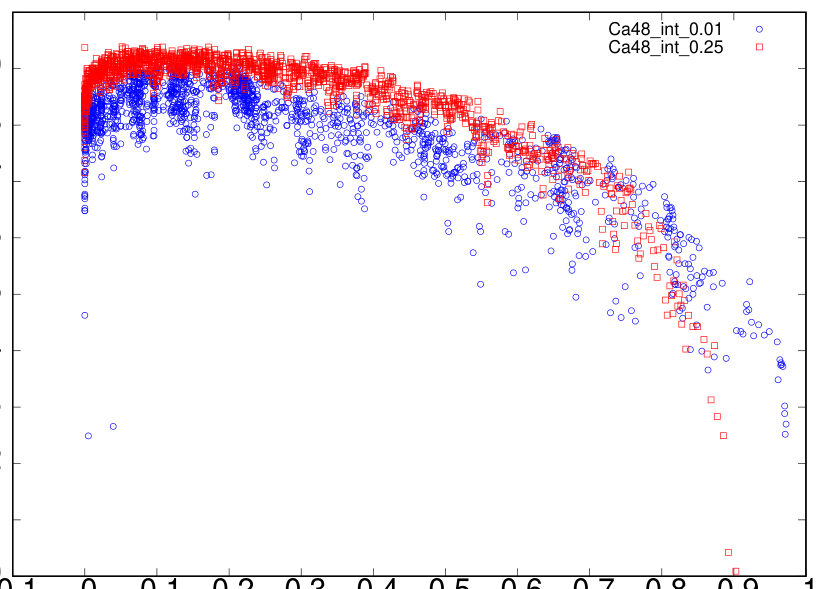 
Figure 3: Shannon entropy as a function of the interaction parameter for χ = 0.01 (blue circles) and χ = 0.25 (red squares). (a) Shannon entropy versus basis state α; (b) Shannon entropy versus disequilibrium D. 7

📷 Fig 4

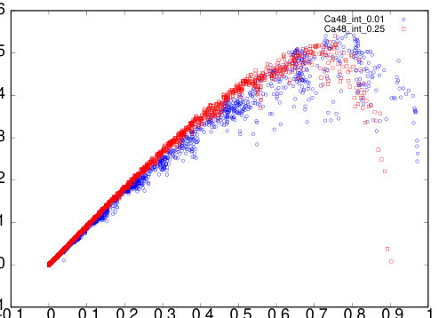 
Figure 4: Complexity as a function of the interaction parameter for χ = 0.01 (blue circles) and χ = 0.25 (red squares). (a) Complexity versus basis state α; (b) Complexity versus disequilibrium D.

**Summary.** This theoretical study applies information-theoretic measures, specifically entropy and complexity, to analyze the quantum dynamics of the $^{48}	ext{Ca}$ nucleus. By comparing results obtained under weak (regular) versus strong (chaotic) quadrupole interactions, the authors demonstrate that the system's complexity is sensitive to the degree of internal interaction, providing a diagnostic tool for quantum chaos in nuclear physics.

**Why it may be interesting.** This work connects concepts from quantum chaos theory (regular vs. chaotic dynamics) with information theory (entropy/complexity) in a nuclear structure context, providing a quantitative diagnostic tool for understanding complex many-body quantum systems.

Detailed structure

**Main problem.** The study investigates the differences in information entropy and complexity measures for many-body quantum systems as they transition between regular and chaotic dynamical regimes.

**Main result.** The complexity and entropy of the nuclear states are demonstrably different between the regular and chaotic regimes, indicating that the internal quadrupole interactions significantly influence the system's information structure.

**Method.** The authors diagonalize the two-body Hamiltonian for the $^{48}	ext{Ca}$ nucleus to obtain eigenvectors, and then calculate Shannon entropy ($S_\alpha$) and a disequilibrium measure ($D$) to define complexity ($C=S \cdot D$).

**Model / system.** The system analyzed is the $^{48}	ext{Ca}$ nucleus, modeled using the shell model Hamiltonian $\hat{H} = \hat{H}_m - \chi \hat{Q} \cdot \hat{Q}$. The analysis compares two regimes: a regular one ($\chi = 0.01$) and a chaotic one ($\chi = 0.25$).

**Key observables.** Shannon Entropy ($S_\alpha$), Complexity ($C$), Energy Spectra (Power spectrum $P(f)$), and eigenvector probability distributions ($P_{\alpha k}$).

**Important parameters / regimes.** The interaction strength parameter $\chi$, which controls the transition from regular ($\chi=0.01$) to chaotic ($\chi=0.25$) behavior.

**Assumptions / limitations.** The analysis assumes the validity of using information-theoretic measures (entropy and complexity) to characterize the underlying quantum dynamics and chaos in the nuclear shell model.

**Figures summary.** Figures illustrate the energy levels across different $\chi$ values, the probability distributions of components for both regimes, and plots showing Shannon entropy and Complexity as functions of the basis state ($\alpha$) and the disequilibrium measure ($D$).

**Paper structure.** The paper establishes the theoretical framework using complexity measures, applies these measures to the $^{48}	ext{Ca}$ nucleus Hamiltonian across varying interaction strengths ($\chi$), and compares the resulting entropy and complexity values to diagnose the transition from regular to chaotic quantum dynamics.

Abstract

In complex systems theory, there are different ways to describe a system in terms of information, such as emergence (Shannon entropy), self-organization, and com- plexity. These measures provide information about the dynamic behavior of a complex system. We study the differences in entropy and complexity for many-body systems undergoing a transition from a regular to a chaotic regime. To do this, we analyze the eigenvectors of the 48 Ca nucleus for different quadrupole-type two-body interactions. We obtain the eigenvectors by diagonalizing the two-body Hamiltonian for 48 Ca us- ing the Antoine code. We then calculate the entropy and complexity for the different quadrupole-type interactions. The differences found in information entropy and com- plexity are clear when comparing a regular system with a chaotic one. We find that the complexity of the regular and chaotic states of 48 Ca shows differences associated with its internal interactions.

[↑ back to top](#top)

### [Cubical Sheaf Complexes with Constant Expansion with Applications to Asymptotically Good qLTCs](http://arxiv.org/abs/2609.28028v1)

**Authors:** Yeyuan Chen, Miryam Mi-Ying Huang, Yinchen Liu, Er-Cheng Tang  
**Type:** theory · **Category:** quantum information and computing · **PDF:** <https://arxiv.org/pdf/2609.28028v1>  
**Analysis basis:** full PDF text, analyzed in chunks

📷 Fig 1

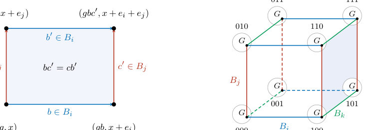 
Figure 1: Edges and cubes in a decorated Cayley cubical complex. In (a), the two paths to the opposite vertex agree by bc′ = cb′. The two blue opposite edges are vertices joined by an edge in the direction-j parallel-face graph. In (b), the three bits record colors in directions (i, j, k); each circle represents a copy of G, and the dots and segments select one cube. The shaded square has type {j, k}.

**Summary.** This paper develops a sophisticated mathematical construction for building quantum locally testable codes (qLTCs) with optimal asymptotic parameters. It achieves this by embedding the coding problem within the framework of cubical sheaf complexes defined over arithmetic quotients of trees. The work is significant for providing explicit, polynomial-time methods to construct highly efficient quantum error correction codes.

**Why it may be interesting.** While highly abstract, the reliance on complex combinatorial structures (sheaves, complexes) to guarantee robust coding properties is a theoretical advancement that could inspire new ways to analyze error correction in complex quantum systems.

Detailed structure

**Main problem.** The primary goal is to construct quantum error correcting codes (qLTCs) that simultaneously achieve constant rate, linear distance, and constant soundness while maintaining bounded local check and qubit degrees.

**Main result.** The authors present an explicit, polynomial-time computable family of codes derived from $r$-dimensional cubical sheaf complexes, achieving the desired asymptotic bounds for qLTCs.

**Method.** The construction method combines cubical sheaf complexes with a uniform product-expansion theorem applied to Reed-Solomon codes on arithmetic cubical complexes, leveraging the local-to-global framework.

**Model / system.** The theoretical model is quantum error correction, specifically focusing on CSS codes derived from the structure of cubical sheaf complexes built upon arithmetic quotients of products of trees.

**Key observables.** Code parameters such as rate ($K/N$), minimum distance ($D$), and soundness ($
ho$), which are shown to be bounded away from zero or linear in $N$.

**Important parameters / regimes.** The construction is parameterized by fixed integers $r \ge 4$ and $2 \le k \le r-2$.

**Assumptions / limitations.** The construction relies on the existence of arithmetic quotients of products of trees and the successful establishment of uniform product expansion for the local Reed-Solomon codes and their duals.

**Figures summary.** Figure 1 illustrates the structure of a decorated Cayley cubical complex, detailing how edges and cubes are defined and how opposite edges must agree.

**Paper structure.** The paper builds from the general framework of cubical complexes and sheaf theory, applies this to arithmetic quotients of products of trees, establishes the necessary local coding conditions (product expansion), and culminates in the main theorems proving the existence of the desired quantum codes.

Abstract

For every fixed integers $r \ge 4$ and $2 \le k \le r-2$, we construct $r$-dimensional cubical sheaf complexes whose degree-$k$ CSS codes have positive constant rate, linear distance, and constant soundness, with bounded row and column weights. Taking $r=4$ and $k=2$ gives a family of asymptotically good binary qLTCs.   At the core of our construction is a uniform product-expansion theorem for explicit Reed-Solomon codes on norm-one evaluation sets. The key point is that the expansion constant stays bounded away from zero as the local code lengths grow. We place these codes on arithmetic cubical complexes, obtaining constant local expansion for both the resulting sheaf and its dual. Together with the local-to-global framework of Dinur, Lin, and Vidick (FOCS 2024) and sheaf duality, this gives linear distance and constant soundness, while an asymmetric choice of local code dimensions gives positive rate. The resulting codes are explicit and polynomial-time computable.

[↑ back to top](#top)

### [Distilling Datasets into Shallow Circuits for Quantum Machine Learning](http://arxiv.org/abs/2609.28229v1)

**Authors:** Guang Lin, Qibin Zhao  
**Type:** both · **Category:** quantum information and computing · **PDF:** <https://arxiv.org/pdf/2609.28229v1>  
**Analysis basis:** full PDF text, analyzed in chunks

📷 Fig 1

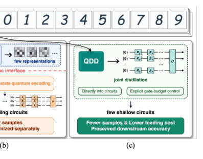 
Figure 1: Three approaches to quantum training data. (a) Per-sample preparation. (b) Hybrid distil- lation with a separate encoding. (c) Quantum dataset distillation (QDD).

📷 Fig 2

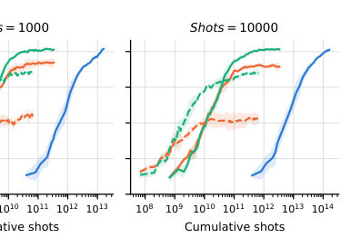 
Figure 2: Finite-shot parameter-shift training on MNIST: test accuracy vs. cumulative shots.

**Summary.** This paper introduces Quantum Dataset Distillation (QDD) to solve the high computational cost of training quantum models on large datasets. QDD synthesizes the entire dataset into a small set of shallow, executable quantum circuits. This approach drastically reduces the required quantum shots while maintaining high classification accuracy, making QML more practical for real quantum hardware.

**Why it may be interesting.** The work directly addresses the practical resource constraints of running QML algorithms on near-term quantum hardware by creating data representations that are inherently compatible with shallow circuit execution.

Detailed structure

**Main problem.** Training quantum machine learning models is computationally expensive because the loading circuit must be re-executed for every data sample at every training step.

**Main result.** The proposed Quantum Dataset Distillation (QDD) achieves accuracy comparable to full-data training using only a tiny fraction (e.g., 10 circuits) of the original dataset size.

**Method.** QDD directly distills the entire dataset into a small set of shallow, executable quantum circuits by optimizing circuit parameters using a joint objective function that matches both mean features and density matrices.

**Model / system.** The system involves Quantum Machine Learning (QML) applied to classical data (like MNIST images), where data states are represented by low-rank tensor network states realized by shallow, parameterized quantum circuits.

**Key observables.** Test accuracy on MNIST/Fashion-MNIST, cumulative shot count reduction (up to $100	imes$), and loading circuit cost (number of two-qubit gates).

**Important parameters / regimes.** The number of distilled circuits per class (IPC), the loading budget, and the weight $\alpha$ balancing distribution matching vs. density-matrix matching.

**Assumptions / limitations.** The key assumption is that the synthetic samples must be parameterized *as* executable circuits, avoiding the information loss associated with post-hoc state-preparation synthesis.

**Figures summary.** Figures illustrate the comparison between different data preparation methods (per-sample vs. QDD) and show performance metrics like shot savings and accuracy vs. sample budget.

**Paper structure.** The paper introduces the computational bottleneck, proposes QDD as a solution, details the joint optimization objective (distribution and density matrix matching), presents results on MNIST/Fashion-MNIST showing massive shot savings, and validates the method on real quantum hardware.

Abstract

In quantum machine learning, training a quantum model requires each sample to be prepared as a quantum state by a loading circuit that must be re-executed for every shot at every training step. The total burden therefore scales with both the number of samples and the cost of preparation. Existing approaches reduce the loading cost of individual inputs or distill data and compress their representations before applying a separate quantum encoding. This separation can leave resulting samples costly to prepare or cause additional loss of the information during subsequent compilation into shallow circuits. We propose quantum dataset distillation (QDD), which distills the full dataset directly into a small set of shallow circuits. Each synthetic sample is parameterized as a staircase circuit corresponding to a low-rank tensor network, making the sample and its loading circuit the same object. The circuit parameters are optimized classically with exact gradients using distribution matching under an explicit loading budget, without post-hoc state-preparation synthesis. On MNIST and Fashion-MNIST, only 10 circuits per class ($0.0017\times$ the full dataset size) achieve accuracy comparable to full-data training and outperform selection baselines under matched sample and loading budgets. In finite-shot training, QDD reaches 95\% of the full-data accuracy with more than $100\times$ fewer cumulative shots. Additionally, we validate QDD on real quantum hardware, demonstrating its practical deployment potential.

[↑ back to top](#top)

### [Equivalence of maximal and generic reachability for non-universal Variational Quantum Circuits](http://arxiv.org/abs/2609.27053v1)

**Authors:** Vishal S. Ngairangbam, Michael Spannowsky  
**Type:** theory · **Category:** quantum information and computing · **PDF:** <https://arxiv.org/pdf/2609.27053v1>  
**Analysis basis:** full PDF text, analyzed in chunks

📷 Fig 1

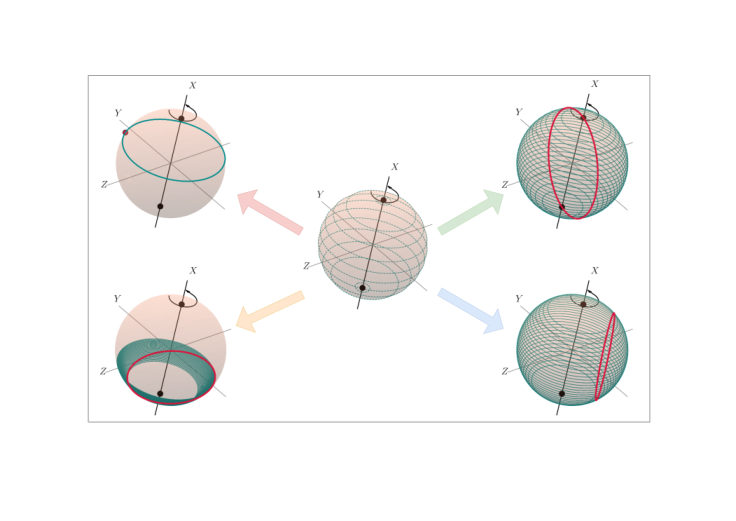 
FIG. 1. Stratification of the sphere S2 under SO(2) rotations about the X axis and its relation to different orientations of the solution manifold M∗. At the top left, M∗is a single point on S2 and the initial point must lie on the exact orbit. When M∗

📷 Fig 2

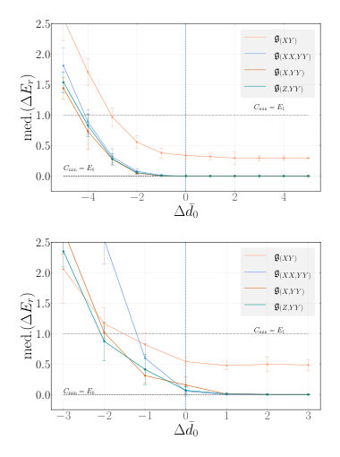 
FIG. 2. Median of the ∆Er and its interquartile range as error bars over ten randomly initialised training runs on a fixed random reference state for n = 5 (top) and n = 7 (bottom) verifying that overparametrisation is necessary for improved convergence where ∆¯d0 = 0 denotes the threshold.

**Summary.** This theoretical work rigorously analyzes the limitations of Variational Quantum Circuits (VQCs) by establishing conditions for state reachability on the quantum state manifold. It derives a crucial dimensional criterion stating that the target set must have sufficient topological dimension relative to the circuit's generic orbit. This provides a powerful diagnostic tool for designing trainable and effective quantum algorithms.

**Why it may be interesting.** It provides rigorous mathematical guarantees regarding the limitations of current quantum machine learning approaches, specifically diagnosing when VQCs are fundamentally incapable of reaching a target state due to geometric constraints.

Detailed structure

**Main problem.** The paper establishes the mathematical conditions for determining the reachability and trainability of non-universal Variational Quantum Circuits (VQCs) on the pure state manifold.

**Main result.** It proves the equivalence of maximal and generic reachability and derives a necessary dimensional criterion: the target set's dimension must be at least as large as the co-dimension of the generic orbit for non-zero probability of reachability.

**Method.** The analysis employs tools from differential geometry, including the principal orbit-type theorem, the Quantum Fisher Information Matrix (QFIM), and measure theory to analyze the image of the VQC parameter map.

**Model / system.** The system involves Variational Quantum Circuits (VQCs) acting on an n-qubit system, whose dynamics are analyzed on the pure state manifold (MN). The focus is on the orbit generated by the VQC parameters from a reference state.

**Key observables.** Reachability probability, rank of the QFIM, topological dimension of the solution manifold, and the co-dimension of the generic orbit.

**Important parameters / regimes.** The depth of the VQC (finite-depth optimization), the structure of the reference state ($\psi_r$), and the target state ($\psi^*$).

**Assumptions / limitations.** Assumes the global minimum of the cost function lies on a smooth subset and that the solution set can be realized via a real analytic map embedding a solution manifold.

**Figures summary.** Figure 1 illustrates the stratification of the sphere under SO(2) rotations, showing how generic circular orbits cover the sphere except for fixed antipodal points.

**Paper structure.** The paper builds from establishing the equivalence of maximal and generic reachability using the principal orbit-type theorem, deriving necessary and sufficient conditions based on the smoothness of the cost function minimum, and concluding with a dimensional criterion derived from local surjectivity arguments.

Abstract

Employing problem-specific non-universal Variational Quantum Circuits aligned with a suitable state preparation has become a standard approach to counter the difficulty in training universal ansätze. However, due to their non-universality, diagnosing their reachability and trainability remains reference-state-specific. In this work, we establish the equivalence of maximal reachability and generic reachability over arbitrary reference states as a consequence of the \emph{principal orbit-type theorem}. Thereafter, assuming that the global minimum of the cost function is achieved on a subset that can be described as the image of a smooth function, we derive necessary and sufficient conditions for non-zero probability of reachability under generically sampled reference states. Furthermore, when the solution set is assumed to be realised through a real analytic map that embeds a solution manifold, we show that local surjectivity is generically obtained on the entire solution manifold if it is attained at a single point. As a practical design rule, the need for local surjectivity automatically translates to a necessary dimensional criterion: reachability requires the target set's topological dimension to be at least as large as the co-dimension of the generic orbit. Numerical simulations show that finite-depth optimisation consistently fails when the dimensional obstruction applies, while unobstructed cases show improved convergence.

[↑ back to top](#top)

### [Field-induced incipient spin-density phase stabilized inside the nematic phase of FeSe$_{1-x}$S$_x$](http://arxiv.org/abs/2609.28446v1)

**Authors:** I. Paulescu, R. M. Abedin, J. S. Pearce, W. H. Fong, Z. Zajicek, A. Morfoot, W. Knafo, O. Squire, D. Graf, A. A. Haghighirad, A. I. Coldea  
**Type:** experiment · **Category:** strongly correlated electrons · **PDF:** <https://arxiv.org/pdf/2609.28446v1>  
**Analysis basis:** full PDF text, analyzed in chunks

📷 Fig 1

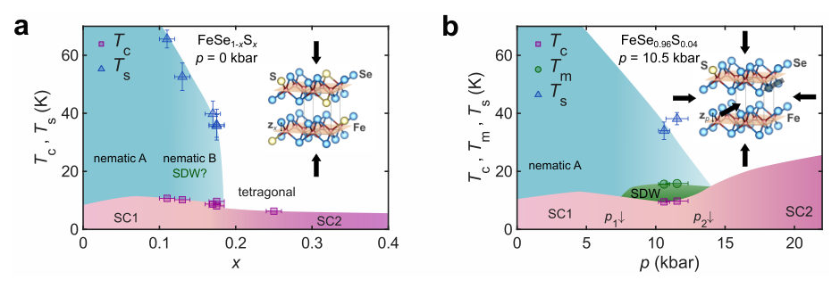 
FIG. 1. Phase diagrams of FeSe1−xSx tuned by chemical and applied pressure. (a) Phase diagram, T −x, as a function of sulfur substitution, x in the absence of magnetic field. Systems investigated in this study, x = 0.11 −0.17(5) (blue triangles) lie close to the border of the nematic electronic phase indicated by Ts which is suppressed close to x ∼0.18. Superconducting regions with different pairing mechanisms, SC1 and SC2, emerge on either side of the nematic endpoint below Tc (pink squares). Schematic boundaries are constructed from refs. [20, 25, 26] and based on data in Supplementary Fig. S1 and Supplementary Fig. S2. (b) Phase diagram of FeSe0.96S0.04 as a function of applied pressure...

📷 Fig 2

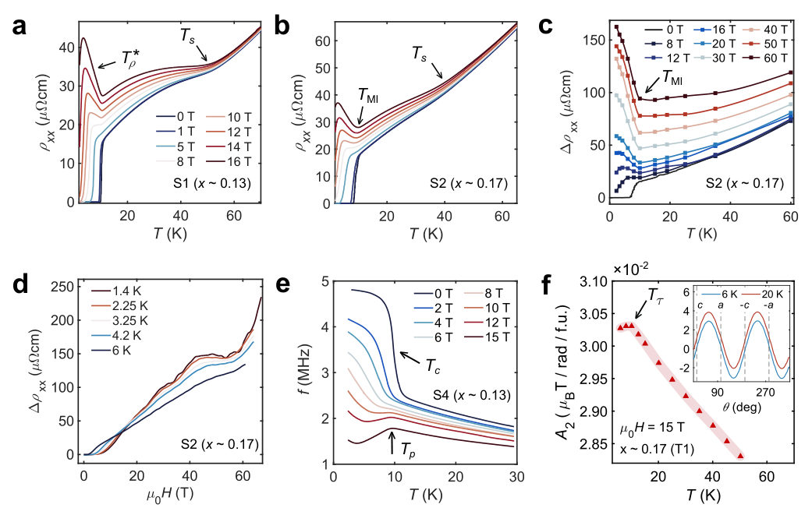 
FIG. 2. Transport and tunnel diode oscillator (TDO) behaviour of nematic FeSe1-xSx (0.13 &lt; x &lt; 0.175) in magnetic field. (a)-(b) Longitudinal resistivity, ρxx, against temperature for two nematic samples S1 and S2 with different compositions, x, in magnetic fields up to 16 T. Ts marks the nematic transition temperature of each sample. The emergence of resistivity upturns at low temperatures is quantified by the metallic-to insulating-like crossover at TMI and additionally by the minimum in first-order derivative at T ∗ ρ (as defined in Supplementary Fig. S5). (c) Resistivity change against temperature in zero field (solid black line) and at fixed magnetic fields (filled squares), as...

📷 Fig 3

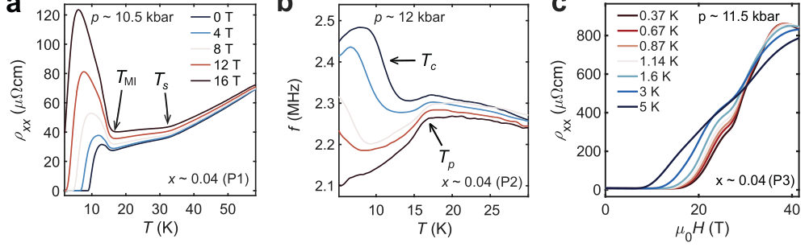 
FIG. 3. Temperature-dependent transport and tunnel diode oscillator (TDO) behaviour of nematic FeSe0.96S0.04 under pressure in different magnetic fields. (a) The longitudinal resistivity ρxx against temperature under pressure of p ∼10.5 kbar for sample P1 in fixed magnetic fields up to 16 T aligned parallel to the c-axis. The arrow at Ts points out the nematic transition and TMI indicates the metallic- insulating-like transition at the development of the SDW phase. (b) The temperature dependence of TDO resonant frequency, f, in different magnetic fields. The arrows indicate the position of the magnetic transition at Tp and the superconducting transition at Tc. (c) The field dependence of...

📷 Fig 4

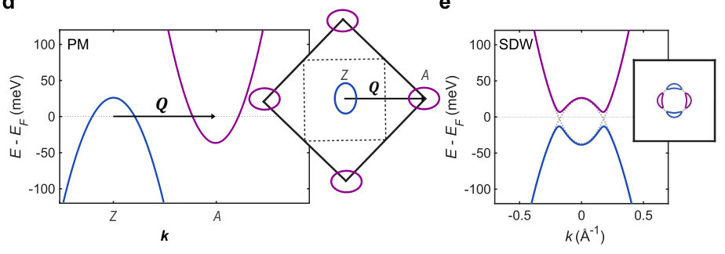 
FIG. 4. Phase diagrams of FeSe1−xSx. (a) Phase diagram, T −x, as a function of sulfur substitution, x, in the presence of magnetic field. Systems investigated in this study, x = 0.11 −0.17(5) (blue triangles) lie close to the border of the nematic electronic phase indicated by Ts, which is suppressed close to x ∼0.18. The pink region represents residual superconductivity in high magnetic fields. The SDW boundaries are constructed based on transport data in 16 T shown in Supplementary Fig. S2 and Supplementary Fig. S3 (solid green squares). Boundary at T ∗reflects the change in resistivity slope in 34 T after Ref. [25] (open green squares). (b) Magnetic field-temperature phase diagram in...

**Summary.** This work investigates the complex interplay between SDW order, nematicity, and superconductivity in FeSe1-xS_x. Using high-field magnetotransport and TDO measurements, the authors report finding an incipient SDW phase stabilized within the nematic state. This suggests that tuning or weakening nematicity is key to stabilizing the magnetic order that promotes superconductivity in these materials.

**Why it may be interesting.** The interplay between competing electronic orders (SDW, nematicity, SC) in iron-based superconductors is a canonical problem in strongly correlated electron physics, providing experimental insights into pairing mechanisms.

Detailed structure

**Main problem.** Investigating the competition and coexistence between Spin-Density Wave (SDW) order and superconductivity (SC) in iron-chalcogenide superconductors, specifically focusing on the role of the nematic electronic state.

**Main result.** The study reports evidence for an incipient SDW phase stabilized within the nematic state of FeSe1-xS_x under high magnetic fields, suggesting that weakening nematicity promotes the dominant superconducting pairing mechanism.

**Method.** The research employed magnetotransport measurements (resistivity, quantum oscillations), Tunnel Diode Oscillator (TDO) frequency response, and magnetic torque anisotropy measurements.

**Model / system.** The physical system is the iron-chalcogenide superconductor FeSe1-xS_x, studied under varying conditions including chemical doping (x), applied hydrostatic pressure, and high magnetic fields (up to 68 T).

**Key observables.** Longitudinal resistivity upturns, TDO frequency anomalies, quantum oscillation frequencies (F), and magnetic torque anisotropy.

**Important parameters / regimes.** High magnetic fields (up to 68 T), chemical doping concentration (x), and applied pressure (p).

**Assumptions / limitations.** The interpretation of resistivity upturns and TDO anomalies as definitive evidence for field-induced electronic order (SDW).

**Figures summary.** Figures illustrate phase diagrams showing the field-induced SDW phase in relation to doping and pressure, alongside transport and TDO behavior measurements demonstrating the SDW development.

**Paper structure.** The paper systematically analyzes transport and TDO data across different doping levels and pressures, mapping out the phase boundaries where the field-induced SDW order emerges within the nematic superconducting state.

Abstract

Spin-density wave (SDW) order and superconductivity frequently compete and coexist in unconventional superconductors, where spin fluctuations often mediate superconducting pairing. In iron-chalcogenide superconductors, FeSe$_{1-x}$S$_x$, SDW order has only been detected under applied pressure, while both spin and nematic fluctuations are involved in determining their rich superconducting phase diagrams. Here, we report evidence for an incipient SDW phase, within the nematic state of FeSe$_{1-x}$S$_x$, revealed in magnetic fields up to 68~T. Once superconductivity is quenched, we observe sharp upturns in longitudinal resistivity accompanied by anomalies in tunnel diode oscillator frequency response and torque anisotropy, consistent with a field-induced electronic order. Dominant low-frequency quantum oscillations reveal a small reconstructed Fermi surface, consistent with a field-induced SDW order. Direct experimental comparisons with a pressure-tuned nematic, analogue, FeSe$_{0.96}$S$_{0.04}$, demonstrate that SDW phases are stabilized within the nematic phase of FeSe$_{1-x}$S$_x$ via both chemical substitution and applied pressure. These findings reveal that by weakening nematicity, the SDW orders are stabilised, which promotes the dominant superconducting pairing mechanism in iron chalcogenides.

[↑ back to top](#top)

### [Intrinsic anomalous Hall effect in the surface conduction regime of non-magnetic narrow-gap insulator FeSi](http://arxiv.org/abs/2609.28418v1)

**Authors:** Yong-Cheng Pan, Hwai-Chi Lin, Li-Han Wang, Chia-Nung Kuo, Han-Shiuan Lin, Che-Ning Yeh, Chin-Shan Lue, Anne de Visser, Yu-Te Hsu  
**Type:** experiment · **Category:** strongly correlated electrons · **PDF:** <https://arxiv.org/pdf/2609.28418v1>  
**Analysis basis:** full PDF text, analyzed in chunks

📷 Fig 1

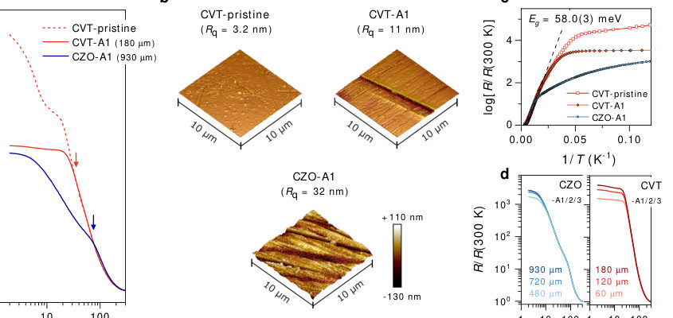 
Figure 1: Transport characteristics of FeSi. (a) Resistance normalized by the room- temperature value R/R(300 K) versus temperature (T) for three representative FeSi sin- gle crystals with distinct surface conditions: a pristine crystal grown by chemical vapor transport (CVT) method (red dashed line), a cut-and-polished CVT crystal of 180-µm thickness (CVT-A1; red solid line), and a crystal grown by the Czochralski (CZO) method of 930-µm thickness cut by spark erosion saw (CZO-A1; blue solid line). Note that the axes are on a double-log scale. (b) Surface topography of the three sample-surface types over a 10 µm × 10 µm area measured by atomic force microscopy. A clear distinction in...

📷 Fig 2

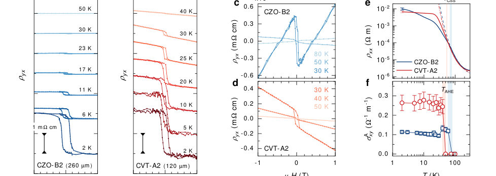 
Figure 2: Anomalous Hall effect in FeSi. (a,b) Hall resistivity ρyx(H) isotherms of (a) a CZO crystal (CZO-B2, 260 µm-thickness) and (b) a CVT crystal (CVT-A2, 120 µm- thickness). For clarity, isotherms are successively shifted by 1 mΩcm, as specified by the vertical arrowed lines. A clear hysteresis in ρyx(H) can be seen between −0.2 and 0.2 T, indicating an anomalous Hall effect (AHE). (c,d) Close-ups of unshifted ρyx(H) shown in (a,b) at T ≥30 K. A clear AHE is seen at 30 K for both samples, which becomes strongly suppressed albeit resolvable at 50 and 40 K for CZO and CVT samples, respectively; at 80 and 50 K, the AHE is no longer present. (e) Temperature-dependent electrical...

📷 Fig 3

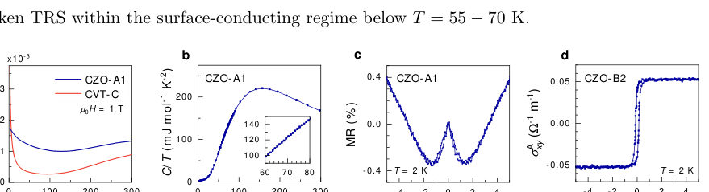 
Figure 3: Evidence for absent magnetic transition and present surface magnetic order. (a) Molar magnetic susceptibility χm(T) measured on CZO-A1 and CVT-C (a sizable pristine crystal with a total mass ≈20 mg from the same batch as the transport CVT samples) at an applied magnetic field of 1 T under field-cooled condition. (b) Heat capacity versus temperature of for CZO-A1 measured in zero magnetic field plotted as C/T(T). Inset shows a close-up between 60 and 80 K. No discernible anomaly is found at T ≃70 K, TAHE of CZO-type crystals. (c) Magnetoresistance (MR) and (d) anomalous Hall conductivity σA xy versus magnetic field measured at 2 K. The complex MR functional form and σA xy(H)...

**Summary.** This work reports the discovery of an intrinsic anomalous Hall effect in the surface conduction layer of the non-magnetic insulator FeSi. By correlating the AHE onset with the emergence of surface conducting states, the authors argue for the existence of an emergent, surface-confined magnetic order. This establishes FeSi as a key platform for studying the interplay between strong correlations and anomalous transport phenomena.

**Why it may be interesting.** The observation of intrinsic AHE without bulk magnetism provides a clean platform to study emergent magnetic order driven purely by surface electronic structure, which is relevant to understanding topological surface states and symmetry breaking in correlated systems.

Detailed structure

**Main problem.** The research investigates the rare phenomenon of observing an intrinsic anomalous Hall effect (AHE) in a material that lacks bulk magnetism, suggesting surface-confined symmetry breaking.

**Main result.** The authors report a robust, field-hysteretic intrinsic AHE confined to the surface conduction regime of the non-magnetic insulator FeSi, indicating emergent magnetic order at the surface.

**Method.** The study combines systematic single-crystal growth, low-temperature magnetotransport measurements (Hall and longitudinal resistivity), and thermodynamic characterization (susceptibility and specific heat).

**Model / system.** The physical system is the non-magnetic narrow-gap insulator FeSi. The focus is on the electronic properties of the surface conduction states (CSS) that emerge at low temperatures.

**Key observables.** Anomalous Hall conductivity ($\sigma_{Axy}$), low-temperature electrical conductivity ($\sigma_{xx}$), magnetic susceptibility ($\chi(T)$), and specific heat ($C/T$).

**Important parameters / regimes.** Low temperatures ($T_{AHE} \simeq 45-70 	ext{ K}$), surface roughness ($R_q$), and sample thickness.

**Assumptions / limitations.** The AHE is intrinsic and surface-driven, confirmed by conductivity scaling, and the bulk material remains non-magnetic despite surface magnetism.

**Figures summary.** Figures show normalized resistance vs. T for different sample types, Hall resistivity ($
ho_{xy}$) vs. applied field isotherms demonstrating hysteresis, and $\sigma_{Axy}(T)$ tracking the CSS temperature scale.

**Paper structure.** The paper systematically presents evidence for surface conduction states (CSS) via thickness/roughness dependence, followed by the observation of a robust, hysteretic AHE confined to this surface regime, while simultaneously ruling out bulk magnetic origins via thermodynamic measurements.

Abstract

The realization of an intrinsic anomalous Hall effect (AHE) in the absence of bulk magnetism is a rare phenomenon, requiring a spontaneous breaking of the time-reversal symmetry within the boundary states without a thermodynamic phase transition. Here, we report a robust, zero-field-hysteretic intrinsic AHE confined to the low-temperature surface-conduction regime of the prototypical narrow-gap insulator FeSi. By systematically investigating single crystals grown via Czochralski and chemical vapor transport methods with controlled thicknesses and surface preparations, we demonstrate that low-temperature electrical conductivity correlates with surface roughness and anti-correlates with sample thickness, confirming the emergence of surface conducting states (CSS) below $T_{\rm CSS} \simeq 55-75\text{ K}$. Meanwhile, a robust, field-hysteretic and temperature-independent anomalous Hall conductivity is found below $T_{\rm AHE}\simeq45-70\text{ K}$, implying the presence of magnetic order in the surface conduction regime. Bulk magnetic susceptibility and specific-heat measurements reveal no thermodynamic phase transitions, verifying that the sample interior remains a non-magnetic insulator. Analyses of conductivity scaling and effective three-dimensional conductivity reveal the intrinsic nature of this surface-driven AHE, evidencing the presence of an emergent magnetic order within the metallic surface of a non-magnetic bulk insulator. These findings establish FeSi as a compelling platform to investigate the interplay between strong electron correlations and anomalous Hall transport.

[↑ back to top](#top)

### [Multipartite GHZ diagonal states and their entanglement properties](http://arxiv.org/abs/2609.28351v1)

**Authors:** Luka Burduli, Johannes Moerland, Peter Schupp  
**Type:** theory · **Category:** quantum information and computing · **PDF:** <https://arxiv.org/pdf/2609.28351v1>  
**Analysis basis:** full PDF text, analyzed in chunks

📷 Fig 1

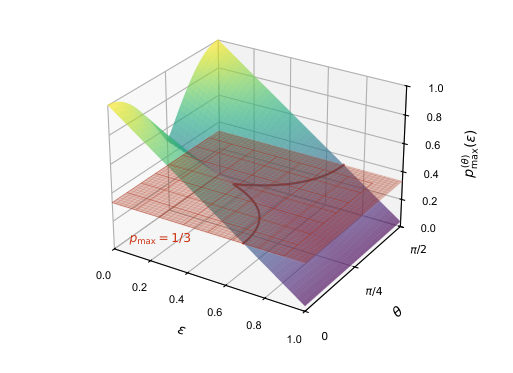 
FIG. 1. For the three-qutrit coherent-superposition family, the depolarized noisy state satisfies p(θ) max(ϵ) = (1−ϵ)cθ +ϵ/27, where cθ = max{cos2 θ, sin2 θ}. The surface is shown over the noise strength ϵ and angle θ; Horizontal plane denotes the GME threshold pmax = 1/3, and its intersection with the surface gives the boundary ϵ = ϵ∗(θ).

📷 Fig 2

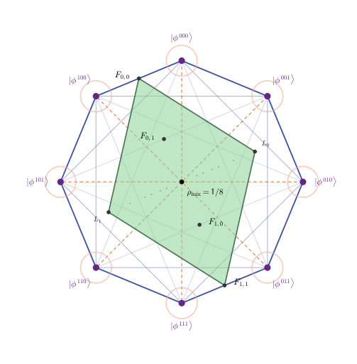 
FIG. 2. Planar shadow of the seven-dimensional GHZ sim- plex ∆7 for N = 3 qubits, with an FS inner shadow. The eight GHZ vertices ϕΛ sit at the vertices vΛ of a regular octagon in bit-complement order, joined by all 8 2  = 28 sim- plex edges. Dashed diagonals connect bit-complement pairs through the centre, where the maximally mixed reference state ρmix = 1/8 sits. Each probability vector is projected linearly as p 7→P

**Summary.** This work provides a deep mathematical characterization of entanglement for GHZ diagonal quantum states in multipartite systems. By utilizing the Heisenberg-Weyl decomposition and Fourier analysis, the authors derive multiple necessary and sufficient criteria to distinguish entangled states from fully separable ones within this specific state manifold. This advances the theoretical understanding of multipartite entanglement witnesses.

**Why it may be interesting.** The rigorous mathematical characterization of separability boundaries within highly symmetric quantum state manifolds is crucial for designing robust quantum communication protocols and understanding resource theories.

Detailed structure

**Main problem.** The paper investigates the entanglement properties and develops necessary and sufficient separability criteria for a specific class of mixed multipartite quantum states called GHZ diagonal states.

**Main result.** The authors establish that the set of fully separable states within the GHZ simplex is characterized by the convex hull of depolarized pure product projectors, and they provide multiple criteria (e.g., $\ell_1$ norm, majorization) to detect entanglement.

**Method.** The analysis heavily relies on the Heisenberg-Weyl (HW) decomposition, Fourier transforms (DFT), and applying concepts from majorization theory to derive algebraic and geometric separability witnesses.

**Model / system.** The system is an $N$-qudit quantum system, restricted to states $
ho$ that are diagonal in a GHZ-type basis, $
ho = \sum_{\Lambda} p_\Lambda |\phi_\Lambda
angle\langle\phi_\Lambda|$.

**Key observables.** GHZ probabilities ($p_\Lambda$), the correlation hypermatrix $\mathcal{C}(
ho)$, the $\ell_1$ norm of the flattened correlation tensor ($\Phi_1(f)$), and partial transpose eigenvalues.

**Important parameters / regimes.** The number of qudits ($N$), the local dimension ($d$), and the degree of depolarization ($\epsilon$).

**Assumptions / limitations.** The analysis is restricted to states diagonal in the GHZ basis, and the derived criteria are necessary but not always sufficient for general separability.

**Figures summary.** Figure 2 illustrates the planar shadow of the GHZ simplex for $N=3$ qubits, showing the vertices, the 'FS inner shadow' (green polygon), and the locations of specific test states.

**Paper structure.** The paper progresses by first defining the state class and its algebraic structure via the HW decomposition. It then develops multiple criteria (majorization, $\ell_1$ norm) to test for separability. Finally, it characterizes the intersection of the GHZ simplex with the fully separable set using explicit constructions.

Abstract

In this paper, we investigate the family of GHZ diagonal states, which are mixed multipartite quantum states that are diagonal in a GHZ type basis. We show that the class of GHZ diagonal states is highly symmetric and exhibits rich entanglement properties, making it relevant for applications in multipartite quantum key distribution.

[↑ back to top](#top)

### [Percolation in the Stochastic Block Model](http://arxiv.org/abs/2609.27141v1)

**Authors:** Luca Pieleanu, Moritz Laber, Narayan G. Sabhahit, Dmitri Krioukov  
**Type:** theory · **Category:** statistical mechanics · **PDF:** <https://arxiv.org/pdf/2609.27141v1>  
**Analysis basis:** full PDF text, analyzed in chunks

📷 Fig 1

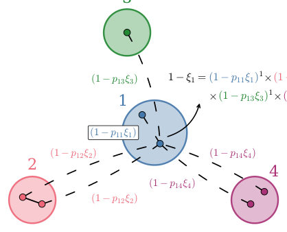 
FIG. 2. Self-consistency equation. A root vertex in community 1 reaches the giant connected component (GCC) through a potential neighbor in community s with probability p1sξs for all s ∈{1, 2, 3, 4}, where ξs is the probability that a vertex in community s belongs to the GCC. Consequently, 1 −p1sξs is the probability that this neighbor does not con- nect the root vertex to the GCC. Assuming these events are asymptotically independent, which is valid when local neigh- borhoods are asymptotically tree-like, multiplying over all po- tential neighbors yields the probability 1 −ξ1 that the root vertex does not belong to the GCC, giving the self-consistency equation (5).

📷 Fig 2

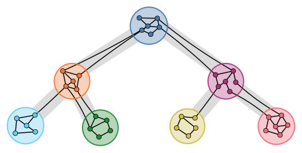 
FIG. 3. Community-scale branching process. Each col- ored disk represents a community after ignoring intercommu- nity edges, with the internal graph containing the connected component of a randomly chosen vertex. If T denotes the size of this component and ¯kout is the expected number of intercommunity edges leaving a single vertex, then a compo- nent generates, on average, T ¯kout outgoing intercommunity edges. Treating these sparse intercommunity connections as a branching process yields the condition E[T]¯kout ≥1 in or- der for the branching process to survive and hence the GCC to form, which remains valid even though the local neighbor- hoods inside communities are not tree-like.

📷 Fig 3

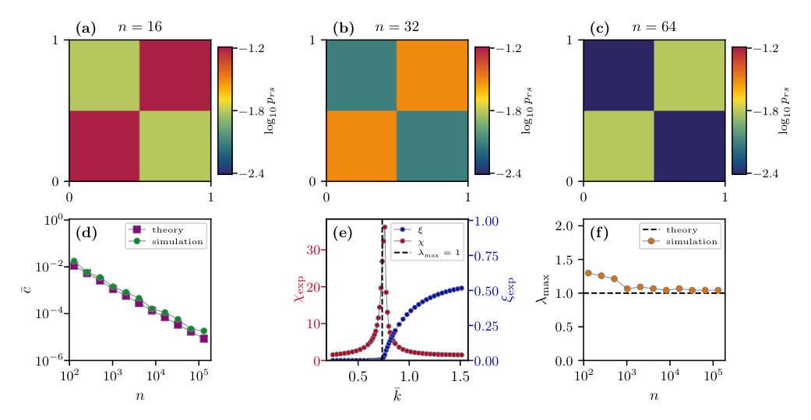 
FIG. 4. SBM with a constant number of blocks. (a)–(c) The connection-probability maps showing two blocks whose relative sizes remain fixed while all connection probabilities decrease as n increases. (d) The average local clustering coefficient ¯c at the experimentally determined critical point, showing both the theoretical prediction from Eq. (3) and the average value measured in simulations. (e) The experimental GCC membership probability ξexp and susceptibility χexp (defined in Sec. III C) as functions of the average degree ¯k; the vertical line marks the value of ¯k corresponding to the spectral threshold λmax = 1. (f) The largest eigenvalue λmax evaluated at the experimentally...

📷 Fig 4

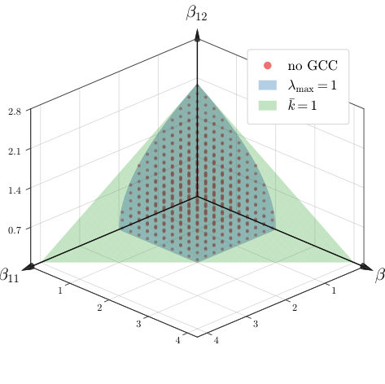 
FIG. 5. Spectral versus average degree percolation conditions in the two-block SBM. The points indicate parameter values for which the self-consistent equations (5) admit only the trivial solution (ξ1, ξ2) = (0, 0), correspond- ing to the absence of a GCC. Parameter values with a GCC are omitted so that the boundary of the no-GCC region re- mains visible. The blue surface shows the spectral threshold λmax = 1, while the green surface shows the average-degree condition ¯k = 1.

📷 Fig 5

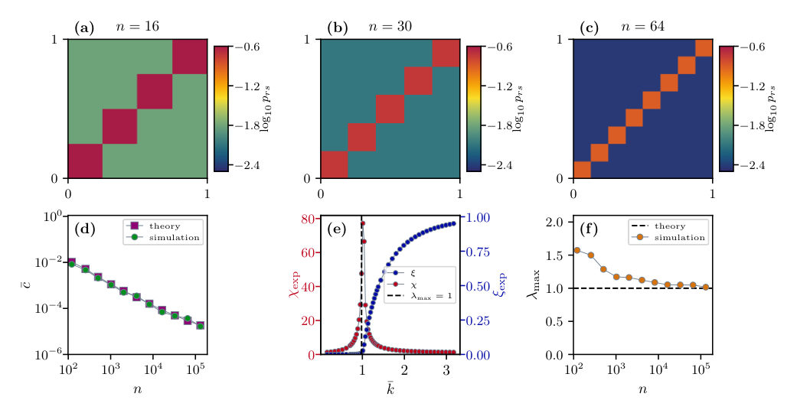 
FIG. 6. SBM with a growing number of blocks. (a)–(c) The connection-probability maps for a sequence with an increasing number of equal-size blocks and stronger intrablock than interblock connectivity. (d) The average local clustering coefficient ¯c evaluated at the experimentally determined critical point. The theoretical prediction from Eq. (3) is compared with the average value measured from simulations, with both tending to zero as n increases. (e) The experimental GCC membership probability ξexp and susceptibility χexp (defined in Sec. III C) as functions of the average degree ¯k; the vertical line indicates the average degree corresponding to the spectral threshold λmax = 1, which...

**Summary.** This paper extends percolation theory to the Stochastic Block Model by analyzing scenarios where the underlying community structure evolves with network growth. It develops and applies advanced analytical tools, including self-consistent equations and branching processes, to determine the percolation threshold. The key finding is that the critical threshold deviates from simple expectations due to the dynamic nature of community connections.

**Why it may be interesting.** While focused on network theory, the analysis of phase transitions (percolation) in complex, evolving structures shares mathematical techniques with critical phenomena in statistical mechanics, particularly concerning connectivity thresholds.

Detailed structure

**Main problem.** The paper investigates the percolation threshold in the Stochastic Block Model (SBM) when the community structure is not fixed but evolves as the network size grows.

**Main result.** The critical average degree for percolation is not generally equal to 1, and the transition depends critically on how connections are distributed across the evolving community structure.

**Method.** The authors employ two primary analytical methods: linearized self-consistent equations for locally tree-like models and a community-scale branching process for models with persistent clustering.

**Model / system.** The system studied is the Stochastic Block Model (SBM), specifically analyzing sequences of SBMs where the number, sizes, and connection probabilities between communities can all change with the network size.

**Key observables.** Percolation threshold (emergence of a Giant Connected Component), average degree ($ar{k}$), and average local clustering coefficient ($ar{c}$).

**Important parameters / regimes.** The scaling behavior of community sizes and connection probabilities ($	ext{p}_{rs}(n)$) with network size $n$.

**Assumptions / limitations.** The analysis distinguishes between regimes: locally tree-like (allowing spectral analysis) versus clustered (requiring branching processes), and notes limitations when intercommunity correlations are strong.

**Figures summary.** Figure 1 illustrates connection-probability maps for different SBM sequences showing how connection probabilities vary with size. Figure 2 and 3 illustrate the mathematical frameworks used: the self-consistency equation and the community-scale branching process, respectively.

**Paper structure.** The paper develops the theory by first establishing the general framework for evolving SBMs, then applying two distinct analytical tools (self-consistency equations and branching processes) depending on the local structure, and finally comparing these results to highlight the limitations of simpler assumptions.

Abstract

The stochastic block model is a paradigmatic model of networks with community structure. Yet percolation in the model has been studied primarily in cases with a fixed block structure, even though in real networks, the community structure may evolve as the network grows. Here we study percolation in sequences of stochastic block models in which the numbers and sizes of communities, as well as the intra- and intercommunity connection probabilities may all change with the network size. We analyze five such sequences using two methods: linearized self-consistent equations for the locally tree-like models and a branching process at the community scale for the models with nonvanishing clustering. We find that the critical average degree is not generally equal to $1$, even in locally tree-like sequences, because the transition depends on how connections are distributed across the evolving community structure. We also show that the community-scale branching process accurately predicts the transition when intercommunity connections are sufficiently sparse, even in the presence of nonvanishing clustering, while a geometric stochastic block model sequence demonstrates the limitations of this method when correlations between intercommunity connections cannot be neglected. These results extend percolation studies in the stochastic block model to more realistic scenarios with evolving community structure, and may provide new methods to derive the upper and lower bounds for the percolation threshold in geometric long-range percolation.

[↑ back to top](#top)

### [Purely-logarithmic-time- and constant-space-overhead fault-tolerant quantum computation](http://arxiv.org/abs/2609.28461v1)

**Authors:** Zhengyi Han, Zi-Wen Liu  
**Type:** theory · **Category:** quantum information and computing · **PDF:** <https://arxiv.org/pdf/2609.28461v1>  
**Analysis basis:** full PDF text, analyzed in chunks

📷 Fig 1

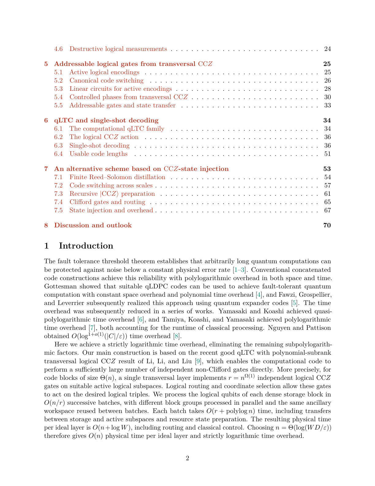 
Low-resolution page preview, page 2

📷 Fig 2

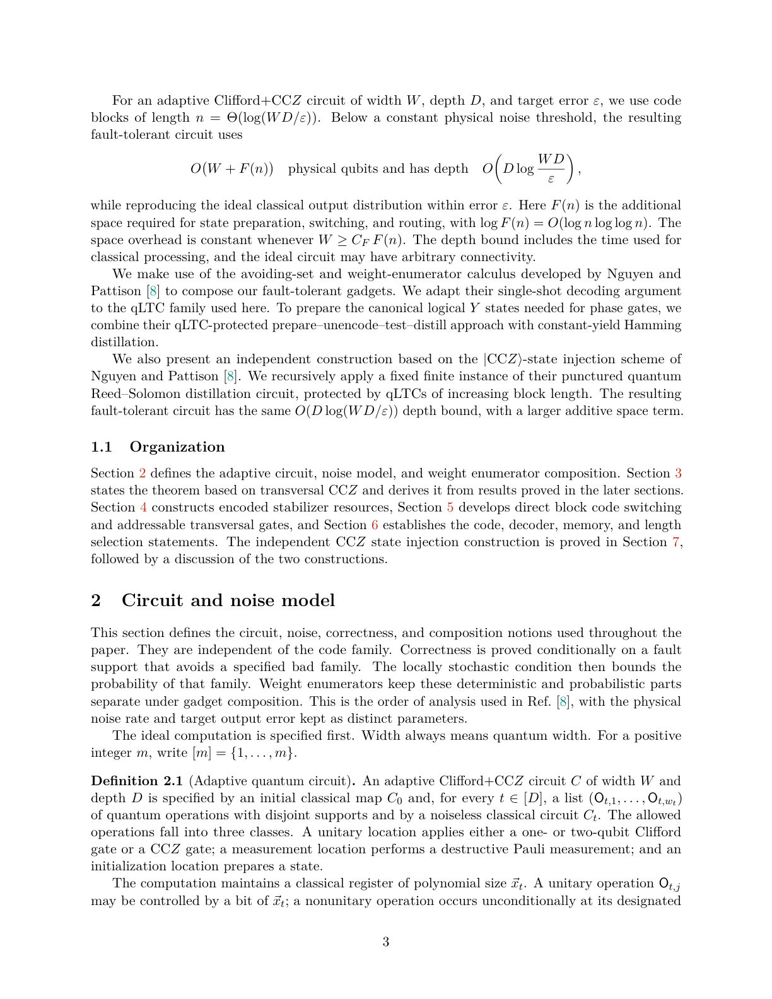 
Low-resolution page preview, page 3

📷 Fig 3

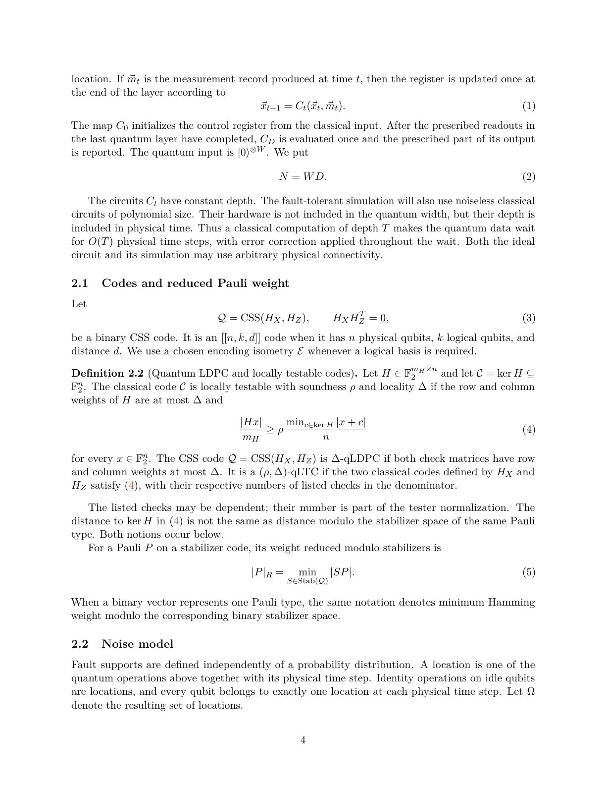 
Low-resolution page preview, page 4

📷 Fig 4

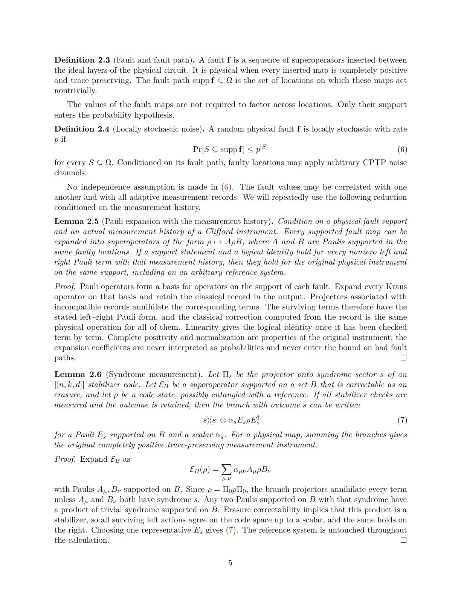 
Low-resolution page preview, page 5

📷 Fig 5

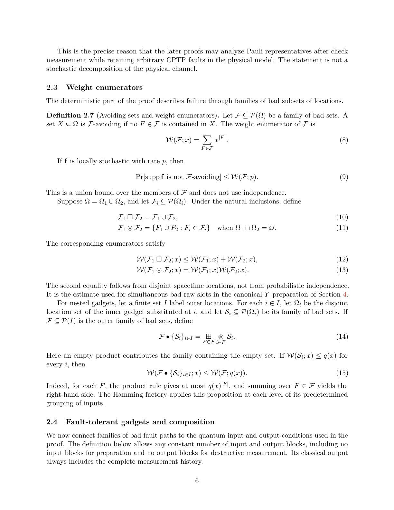 
Low-resolution page preview, page 6

**Summary.** This paper presents a significant theoretical advancement in fault-tolerant quantum computation, proving that universal computation can be achieved with purely logarithmic time overhead and constant space overhead. The authors achieve this using advanced techniques involving transversal logical gates on locally testable codes. This result significantly improves upon previous state-of-the-art bounds for building scalable quantum computers.

**Why it may be interesting.** This work provides concrete, optimized theoretical bounds on the resource overheads (time/space) for universal quantum computation, which is foundational knowledge for designing practical quantum hardware architectures.

Detailed structure

**Main problem.** The paper aims to achieve fault-tolerant quantum computation with the optimal overheads of purely logarithmic time and constant space overhead.

**Main result.** It proves that such computation is possible using transversal logical CCZ gates on good quantum locally testable codes, achieving a strictly logarithmic time overhead.

**Method.** The construction involves transferring logical qubits between dense storage and active subspaces while reusing ancillary workspace, or alternatively, modifying quantum Reed-Solomon magic-state distillation.

**Model / system.** The model is an adaptive Clifford+CCZ quantum circuit operating under a fault-tolerance framework using CSS codes, specifically $\Delta$-qLDPC and $(
ho, \Delta)$-qLTCs.

**Key observables.** The primary observables are the time and space overheads required to simulate the ideal logical gate operations.

**Important parameters / regimes.** Key parameters include the target error $\epsilon$, the circuit width $W$, and the circuit depth $D$. The time overhead is $O(D \log(WD/\epsilon))$ and the space overhead is constant.

**Assumptions / limitations.** The proof relies on the fault path avoiding specific 'bad' families of errors, and the analysis is conditional on the existence of certain positive constants.

**Paper structure.** The paper develops a rigorous framework by first establishing fault-tolerance using weight enumerators to constrain bad fault paths, then details the main construction using transversal CCZ gates for state transfer, and finally presents an alternative scheme via recursive distillation.

Abstract

We prove that constant-space-overhead fault-tolerant quantum computation can be achieved with provably strictly logarithmic time overhead, improving over the best known results with additional subpolylogarithmic factors. Our main construction uses polynomial-subrank transversal logical $\CCZ$ gates on good quantum locally testable codes to implement addressable universal computation by transferring batches of logical qubits between dense storage and active logical subspaces while reusing the same ancillary workspace. Logical $\CCZ$ gates are implemented directly by the transversal operation, so only stabilizer resource states require separate preparation. Furthermore, we give an alternative construction that also achieves purely logarithmic time overhead based on modifying the quantum Reed--Solomon magic-state distillation scheme of Nguyen and Pattison. Recursively applying a fixed distillation circuit protected by qLTCs of increasing block length eliminates the subpolylogarithmic time factor.

[↑ back to top](#top)

### [Quantum Advantage in Topological Data Analysis via Mayer Homology](http://arxiv.org/abs/2609.28058v1)

**Authors:** Nhat A. Nghiem, Ryan Babbush, Adam Zalcman, Dominic W. Berry, Trung V. Phan, Guo-Wei Wei, Ryu Hayakawa  
**Type:** theory · **Category:** quantum information and computing · **PDF:** <https://arxiv.org/pdf/2609.28058v1>  
**Analysis basis:** full PDF text, analyzed in chunks

📷 Fig 1

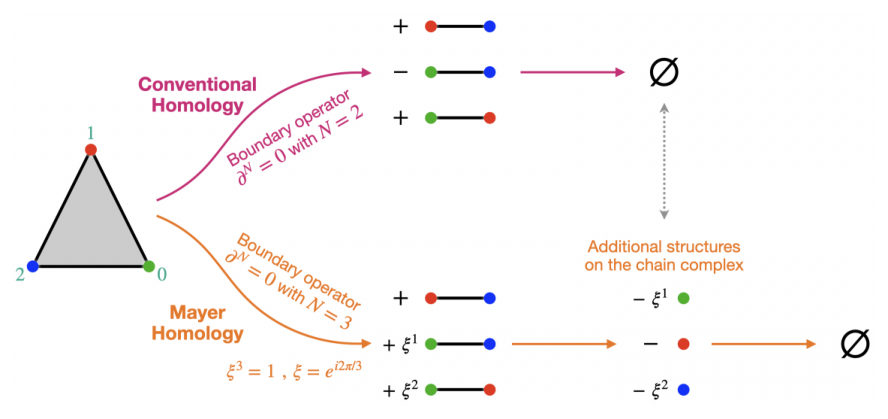 
FIG. 1. The difference between Conventional Homology and Mayer Homology. In Mayer homology, the chain complex – specifically, the boundary sequence – can retain deeper lower-dimensional incidence structure through successive boundary operations. Here, we consider N = 2 (conventional homology) and N = 3 (the simplest nontrivial Mayer homology).

📷 Fig 2

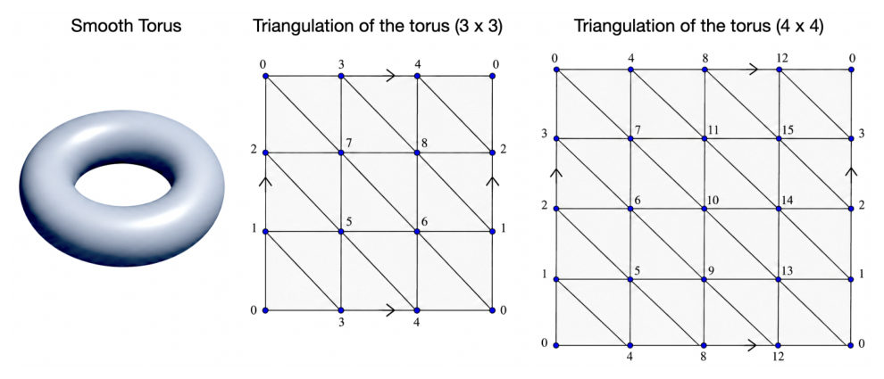 
FIG. 2. A torus and its triangulations. The 3 × 3 triangulation has number of vertices, edges and triangles to be |S0| = 9, |S1| = 27, |S2| = 18. The 4 × 4 triangulation has number of vertices, edges and triangles to be |S0| = 16, |S1| = 48, |S2| = 32.

📷 Fig 3

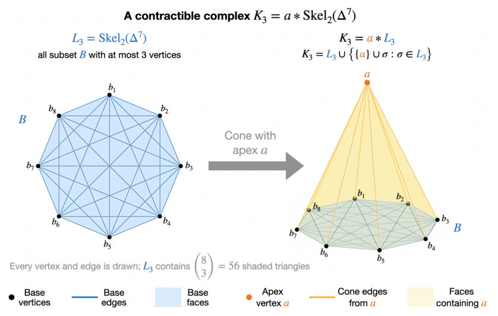 
FIG. 3. Illustration for an example of the cone-complex K = a ∗Skelm−1(∆3m−2), in which we choose m = 3.

📷 Fig 4

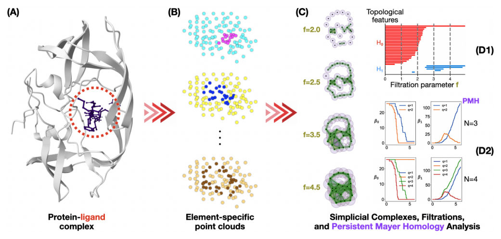 
FIG. 4. Mayer Homology Analysis Pipeline for Protein–Ligand Complexes. (A) A protein-ligand complex (RCSB PDB 1A94, rendered with Mol*). (B) Point clouds constructed directly from the physical positions of the atoms that make up the protein and ligand. (C) Simplicial complexes built from either Euclidean distances or a correlation matrix at different values of the filtration parameter f. (D1) The persistent barcode plot. (D2) Characterization of persistent Mayer homology (PMH) at homological degrees N = 3 and N = 4. Images adapted from [23].

📷 Fig 5

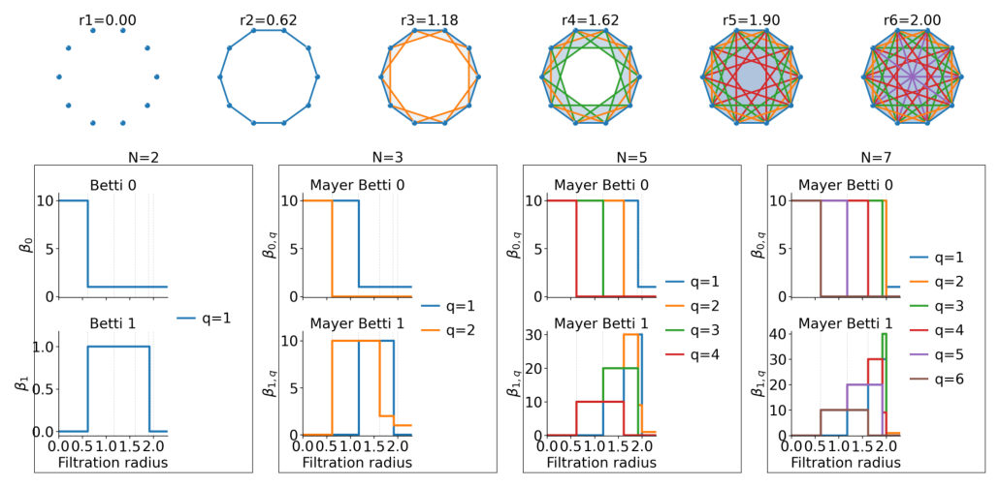 
FIG. 5. Comparison persistent homology (N = 2) and persistent Mayer homology (N = 3, 5, 7) Betti barcodes. For the Betti-0 barcodes, classical persistent homology (N = 2) is insensitive to all geometric connectivity changes except the one occurring at r2. In contrast, persistent Mayer homology with N = 7 captures every geometric connectivity change. For the Betti-1 barcodes, classical persistent homology (N = 2) fails to detect the geometric connectivity changes occurring at r3, r4, and r6. By comparison, persistent Mayer homology at N = 5, 7 successfully resolves all of these geometric changes. Image courtesy of Caleb Khaemba.

**Summary.** This paper proposes using Mayer homology to achieve a quantum advantage in Topological Data Analysis (TDA) by developing efficient quantum algorithms. By analyzing Mayer Betti numbers, the authors circumvent limitations found in conventional TDA methods. The work provides theoretical resource estimates and discusses potential real-world applications across various scientific domains.

**Why it may be interesting.** The paper develops novel quantum algorithms for calculating topological invariants, which is a complex area of quantum computation that bridges quantum information theory with advanced mathematics.

Detailed structure

**Main problem.** The authors address the limited prospect of achieving quantum advantage in conventional Topological Data Analysis (TDA) due to the difficulty in estimating small Betti numbers.

**Main result.** They develop quantum algorithms for Mayer homology, proving that Mayer Betti numbers are often exponentially large in the dense regime, thereby overcoming the normalization bottleneck of conventional quantum TDA.

**Method.** The work involves developing quantum algorithms for Mayer homology, which generalizes simplicial homology using $N$-nilpotent boundary operators, and deriving resource estimates for quantum computation.

**Model / system.** The model is Topological Data Analysis (TDA) applied to simplicial complexes, utilizing the mathematical framework of Mayer homology, which involves roots of unity and iterated boundary operators.

**Key observables.** Mayer Betti numbers ($eta_{d,p}$), minimum singular value of the boundary operator ($\sigma_{\min}$), and the Mayer Laplacian eigenvalue ($\gamma_{d,p}$).

**Important parameters / regimes.** The quantum resource estimate suggests a few hundred qubits and sixty million Toffoli gates are sufficient for quantum advantage.

**Assumptions / limitations.** The analysis assumes the applicability of quantum algorithms to Mayer homology and notes that Mayer Betti numbers are not true topological invariants, depending on triangulation.

**Figures summary.** Figures illustrate the difference between conventional and Mayer homology (e.g., for a torus) and show the number of simplices for different dimensions.

**Paper structure.** The paper reviews homology theory (simplicial vs. Mayer), introduces the quantum algorithms for Mayer Betti numbers, details the quantum complexity analysis, discusses classical benchmarks, and concludes with real-world applications in genomics and neuroscience.

Abstract

Prior work has explored quantum algorithms for topological data analysis (TDA), revealing the possibility of exponential quantum speedups in estimating the ratios of Betti numbers to the dimension of the combinatorial Laplacian. However, this quantity is only non-vanishing and efficient-to-quantumly-estimate when Betti numbers are exponentially large, a case for which concrete examples are rarely known. Furthermore, certain randomized classical algorithms are sometimes efficient in this regime. Thus, the prospect of achieving quantum advantage in conventional TDA appears fairly narrow. Here, we address these challenges to the quantum advantage in TDA by developing quantum algorithms for Mayer homology, which generalize simplicial homology to $N$-nilpotent boundary operators ($\partial^N =0$) and have recently been successfully applied to real-world TDA contexts. We introduce an efficient quantum algorithm for estimating Mayer Betti numbers and their persistent counterparts. We then prove that for high-order simplices, Mayer Betti numbers are often exponentially large in the dense regime, which ameliorates the normalization bottleneck of conventional quantum TDA. In the same regime, we argue that existing dequantization algorithms developed for conventional TDA, when applied to Mayer homology, generally lose theoretical guaranties, facing certain structural barriers that prevent their practical utilities. We also provide logical resource estimates revealing that a quantum computer with roughly a few hundred qubits and sixty million Toffoli gates could solve Mayer homology problems beyond the capabilities of known classical approaches. Finally, we discuss real-world applications of Mayer homology in genomics, supersymmetry, drug discovery, and neuroscience, revealing the potential of our quantum algorithm to deliver real-world impacts via Mayer homology.

[↑ back to top](#top)

### [Quantum Channel Stein's Lemma with an Exponential Strong Converse](http://arxiv.org/abs/2609.27196v1)

**Authors:** Minbo Gao, Zhengfeng Ji, Chenghua Liu  
**Type:** theory · **Category:** quantum information and computing · **PDF:** <https://arxiv.org/pdf/2609.27196v1>  
**Analysis basis:** full PDF text, analyzed in chunks

📷 Fig 1

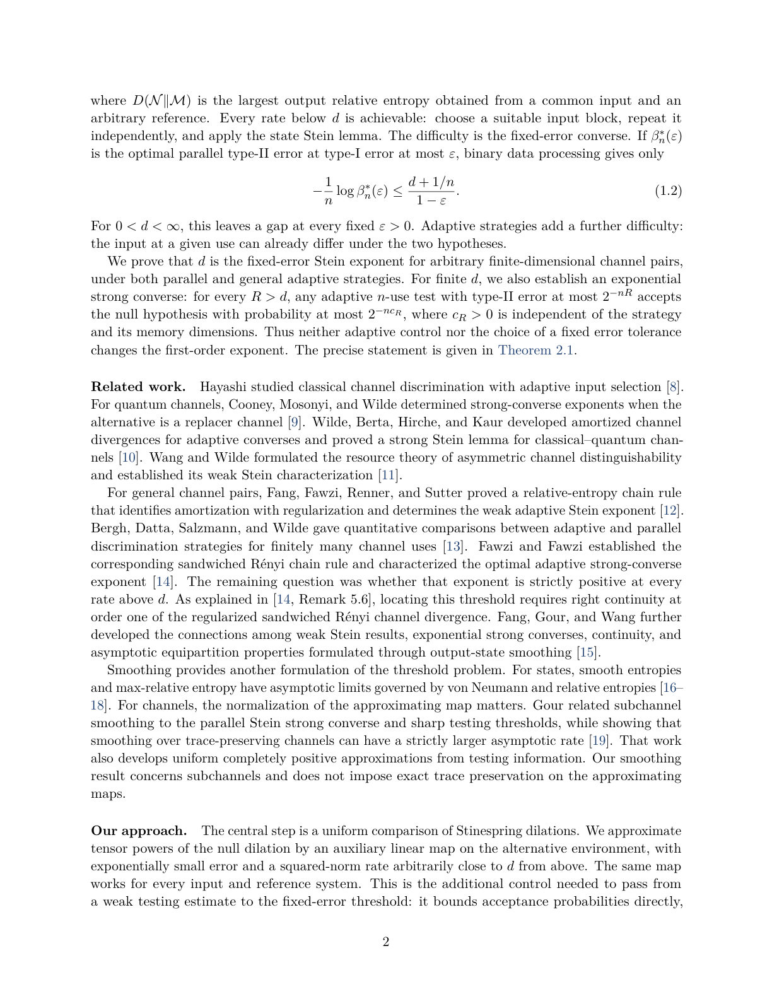 
Low-resolution page preview, page 2

📷 Fig 2

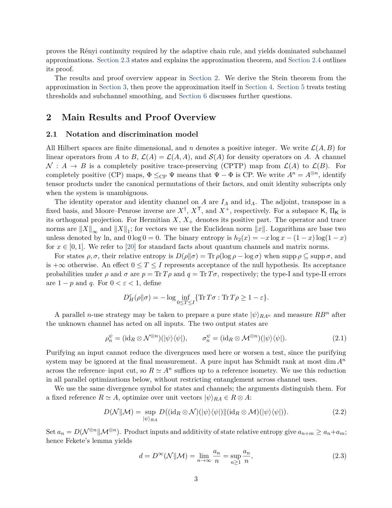 
Low-resolution page preview, page 3

📷 Fig 3

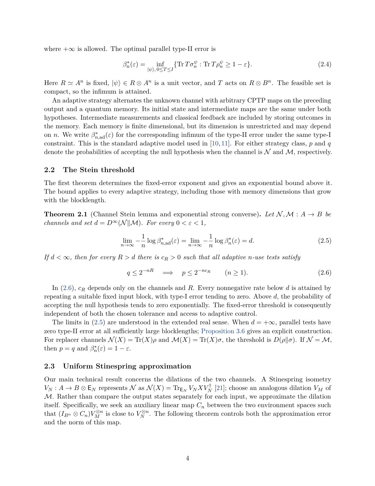 
Low-resolution page preview, page 4

📷 Fig 4

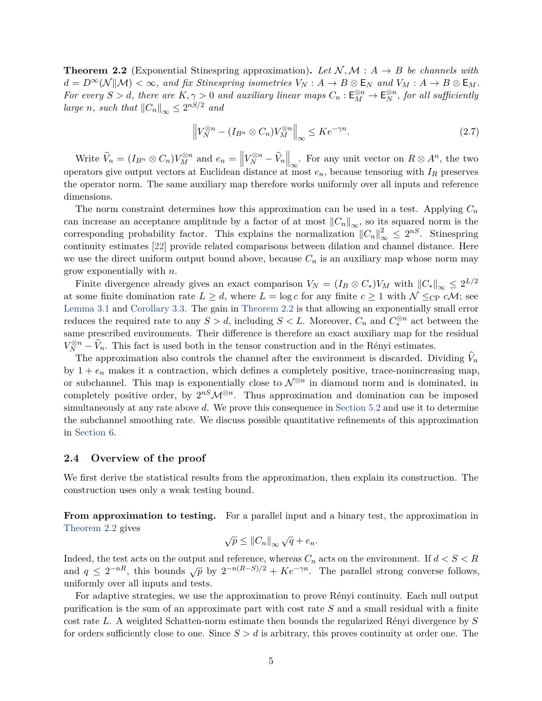 
Low-resolution page preview, page 5

📷 Fig 5

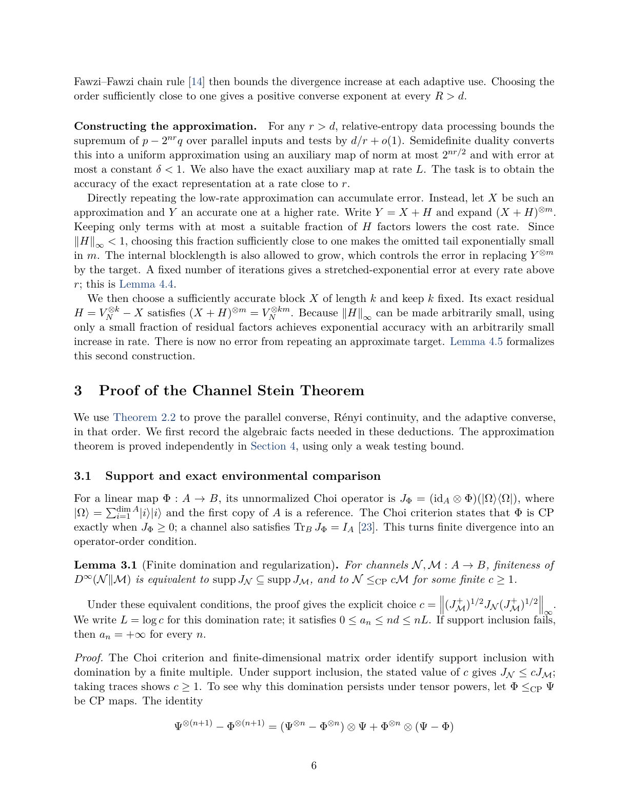 
Low-resolution page preview, page 6

**Summary.** This theoretical paper establishes the quantum channel Stein's lemma, proving that the optimal error exponent for distinguishing two quantum channels equals the regularized channel relative entropy. It achieves this by developing a powerful uniform Stinespring approximation technique. The result provides a rigorous, exponentially strong converse for quantum hypothesis testing, crucial for understanding quantum channel capacity limits.

**Why it may be interesting.** It provides fundamental, quantitative bounds on the distinguishability of quantum processes, which underpins the theory of quantum communication capacity and hypothesis testing.

Detailed structure

**Main problem.** The paper establishes the quantum channel Stein's lemma and proves an exponential strong converse for distinguishing between two unknown quantum channels, N and M.

**Main result.** The optimal type-II error exponent is shown to equal the regularized channel relative entropy, and the strong converse dictates that any rate exceeding this divergence forces the acceptance probability to decay exponentially.

**Method.** The proof relies on a uniform Stinespring approximation technique, comparing tensor powers of the null and alternative channel dilations, and utilizing iterative rate reduction from weak testing bounds.

**Model / system.** The system involves comparing two finite-dimensional quantum channels, N and M, acting on a quantum state space. The analysis is performed over multiple uses (tensor powers) of these channels.

**Key observables.** The regularized channel relative entropy, $D_\infty(N\|M)$, and the error probabilities (Type-I and Type-II).

**Important parameters / regimes.** The error tolerance $\epsilon \in (0,1)$, the blocklength $n$, and the divergence rate $d$.

**Assumptions / limitations.** All Hilbert spaces are assumed to be finite dimensional. The analysis requires the existence of a uniform Stinespring approximation.

**Paper structure.** The paper builds from the classical Stein's lemma to its quantum extension, proving the fixed-error exponent matches the regularized relative entropy. It then develops the core technical tool—the uniform Stinespring approximation—to establish the exponential strong converse for general adaptive strategies.

Abstract

We establish the quantum channel Stein lemma at every fixed type-I error tolerance in $(0,1)$ and prove an exponential strong converse under arbitrary adaptive strategies. For any finite-dimensional channel pair, the optimal type-II exponent equals the regularized channel relative entropy and is attained by parallel strategies. When this divergence is finite, every strictly larger type-II rate forces the probability of accepting the null hypothesis to decay exponentially, uniformly over strategies and quantum memories. The proof rests on a uniform Stinespring approximation: tensor powers of the null dilation are approximated by tensor powers of the alternative dilation after applying an auxiliary linear map to the environment. The operator-norm error is exponentially small under a squared-norm bound at any rate above the regularized relative entropy. We construct the approximation from a weak testing bound by iterative rate reduction and a fixed-block tensor expansion with an exact residual. It implies right continuity at order one of the regularized sandwiched Rényi channel divergence, which yields the adaptive converse through the channel chain rule. We also obtain a sharp hockey-stick threshold and a subchannel smoothing asymptotic equipartition property for fixed and subexponentially vanishing diamond-norm errors.

[↑ back to top](#top)

### [Quantum Reinforcement Learning for Cost and Delay Tradeoffs in Quantum Cloud Orchestration](http://arxiv.org/abs/2609.27446v1)

**Authors:** An N. H. Phan, Dang Van Huynh, Muhammad Usman, Hoa T. Nguyen  
**Type:** theory · **Category:** quantum information and computing · **PDF:** <https://arxiv.org/pdf/2609.27446v1>  
**Analysis basis:** full PDF text, analyzed in chunks

📷 Fig 1

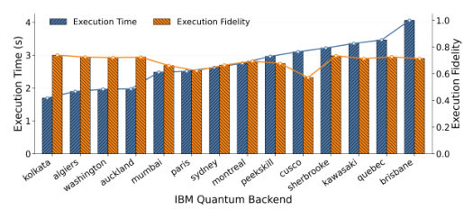 
Fig. 1. Average execution time and execution fidelity across selected IBM Quantum simulated backends for the evaluated circuits with varying depths.

📷 Fig 2

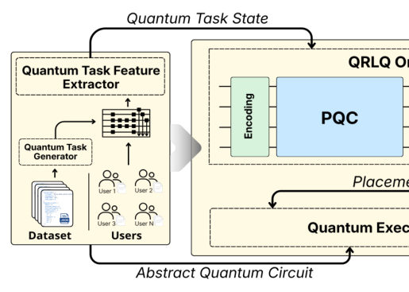 
Fig. 2. System-level workflow of the proposed QRLQ framework for cost-delay-aware resource orchestration.

📷 Fig 3

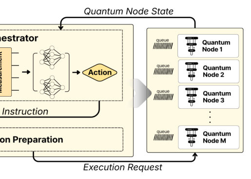 
Fig. 2 illustrates the system-level workflow of the proposed QRLQ framework within a heterogeneous QaaS environment. The architecture consists of a centralised broker managed by the QRLQ orchestrator and a set of heterogeneous quantum nodes (QNodes) to process user-submitted quantum tasks (QTasks). Each QTask includes an abstract circuit with specific technical characteristics. Initially, a feature extractor processes this circuit to extract key task features. By evaluating these task features alongside the dynamic QNode states, the QRLQ core allocates each QTask to the QNode with the highest estimated action value. Then, the circuit is passed to the preparation stage before execution on...

📷 Fig 4

 
Fig. 3. Example of quantum circuit transpilation and its DAG representation for execution time and execution fidelity estimation.

📷 Fig 5

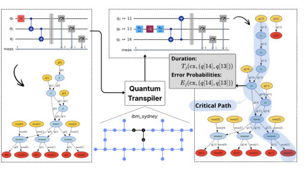 
Figure 3 illustrates the processing of a QTask by quantum computing resources and the associated circuit compilation process. The abstract circuit, shown in the left panel, must be compiled and mapped to the physical qubit topology of the target quantum hardware, such as the ibm_sydney system depicted in the centre panel. This procedure produces a transpiled circuit, represented as a DAG in the right panel. Notably, the DAG of the transpiled circuit enables execution time estimation via the critical path using operation times Tj, and supports fidelity evaluation through error probabilities Ej.

**Summary.** This paper introduces QRLQ, a quantum reinforcement learning framework designed to optimally schedule quantum tasks across heterogeneous quantum cloud resources. By integrating Parameterized Quantum Circuits with a D3QN, QRLQ effectively manages the critical trade-off between minimizing execution cost and reducing overall system delay. The results demonstrate that QRLQ offers superior performance compared to existing heuristics while being significantly more parameter-efficient than classical deep RL methods.

**Why it may be interesting.** While focused on cloud orchestration, the use of PQCs as compact function approximators for complex resource management decisions is a key topic at the intersection of quantum machine learning and quantum networking.

Detailed structure

**Main problem.** The paper addresses the complex task of orchestrating quantum cloud computing resources (QaaS) by jointly minimizing execution costs and system delays.

**Main result.** The proposed QRLQ framework significantly outperforms heuristic baselines by achieving lower mean cost and substantial reductions in mean delay while maintaining high execution fidelity.

**Method.** It proposes QRLQ, a novel framework that integrates Parameterized Quantum Circuits (PQCs) with a Dueling Double Deep Q-Network (D3QN) for decision-making.

**Model / system.** The system models a heterogeneous quantum cloud environment composed of multiple Quantum Processing Units (QPUs) accessed via a QaaS model. The problem is formulated as an online sequential decision process (MDP).

**Key observables.** Mean Cost, Mean Delay, Execution Fidelity, Execution Time, and Waiting Time.

**Important parameters / regimes.** Qubit count, quantum volume, gate error rates, and the weighting factors ($\eta$) used in the scheduling score calculation.

**Assumptions / limitations.** The work assumes a uniform time-based pricing model and is motivated by the constraints of the NISQ era, though it aims for future fault-tolerant environments.

**Figures summary.** Figures illustrate the system workflow (Fig. 2) and compare average execution time and waiting time across various scheduling policies (Fig. 6a-d).

**Paper structure.** The paper introduces the problem setup, details the QRLQ methodology integrating PQCs into D3QN, presents the cost/delay objective function, and validates the approach through extensive simulations comparing QRLQ against multiple heuristic and classical DRL baselines.

Abstract

Quantum cloud computing, delivered through the quantum-as-a-service (QaaS) model, provides access to quantum computing resources. However, applying uniform time-based pricing across fundamentally heterogeneous quantum resources significantly complicates task orchestration, particularly when addressing the tradeoff between execution costs and system performance. While heuristic methods rely on predefined scheduling rules, classical deep reinforcement learning (DRL) models may require more trainable parameters in this setting. Motivated by the potential of parameterised quantum circuits (PQCs) as compact function approximators, we propose QRLQ, a cost-delay-aware quantum cloud scheduling framework integrating PQCs with a dueling double deep Q-network (D3QN) to dynamically account for both cost and delay. Our simulation results show that QRLQ achieves lower mean cost and delay than the heuristic baselines, achieving a 5-11% lower mean cost relative to availability-based and rotation-based heuristics and reducing mean delay by 17% and 82% relative to the strongest and weakest heuristic baselines, respectively, while retaining execution fidelity within 2% of a fidelity-greedy policy. Compared with the classical DRL baseline, QRLQ achieves comparable scheduling performance while using 72% fewer trainable parameters. This work explores the feasibility of using QRL for task orchestration in quantum cloud environments and demonstrates its potential for cost-delay-aware quantum resource management.

[↑ back to top](#top)

### [Quantum-Enhanced Sampling of Schrödinger Bridges](http://arxiv.org/abs/2609.27103v1)

**Authors:** Tom Lollier, Eyal Neuman  
**Type:** theory · **Category:** quantum information and computing · **PDF:** <https://arxiv.org/pdf/2609.27103v1>  
**Analysis basis:** full PDF text, analyzed in chunks

📷 Fig 1

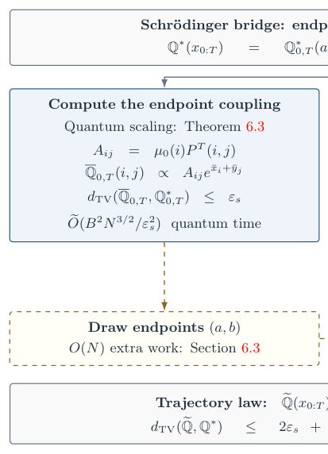 
Figure 1: Roadmap of the sampling procedure. The dashed step samples eQ0,T using the row pro- cedure in Section 6.3, with additional work beyond computing the scaling vectors. The path-error bound assumes a successful scaling run and ideal endpoint sampling. The conditional sampler requires coherent row preparation for P and the bridge Gibbs kernel. After failure, the entire condi- tional procedure is repeated independently with the endpoints fixed, requiring a constant expected number of attempts.

**Summary.** This paper presents quantum algorithms to enhance the sampling of Schrödinger bridges on finite state spaces. It achieves significant computational speedups over classical methods by utilizing quantum walks for path sampling and quantum Newton methods for coupling potentials. This work is crucial for efficiently simulating quantum processes constrained between known initial and final states.

**Why it may be interesting.** The quantum speedups demonstrated for sampling complex path distributions are highly relevant for simulating open quantum systems or quantum channels where path integrals or optimal control problems are central.

Detailed structure

**Main problem.** The paper addresses the challenge of efficiently sampling from the Schrödinger bridge distribution on a finite state space, which is mathematically equivalent to finding an optimal path law connecting two given marginal distributions.

**Main result.** The authors develop quantum algorithms that improve the computational complexity for both conditional path sampling (from quadratic to linear dependence on time horizon $T$) and endpoint coupling calculation (from quadratic to $N^{3/2}$ dependence on state size $N$) compared to classical methods.

**Method.** The core methods involve developing a quantum Gibbs sampler based on quantum walks for path sampling, and adapting a quantum box-constrained Newton method for computing the necessary Schrödinger potentials.

**Model / system.** The model is the Schrödinger bridge problem defined on a finite state space, requiring the estimation of the optimal path law $Q^*$ that minimizes the relative entropy between the path law and the reference Markov process $P$.

**Key observables.** Total variation error ($\epsilon$), spectral gap ($\delta$), and the complexity scaling with time horizon ($T$) and state-space size ($N$).

**Important parameters / regimes.** Time horizon $T$, state-space size $N$, and the required accuracy $\epsilon$ or $\epsilon_s$.

**Assumptions / limitations.** The analysis relies on the existence of positive transition probabilities and assumes coherent input access for the quantum algorithms.

**Figures summary.** Figure 1 provides a roadmap summarizing the entire sampling procedure, detailing the components for endpoint coupling and Markov bridge sampling.

**Paper structure.** The paper is structured around decomposing the problem into endpoint coupling and conditional path sampling. It then details the quantum enhancements for each part, culminating in an analysis of error bounds when approximating the resulting distributions.

Abstract

We consider the dynamic Schrödinger bridge problem on a finite state space and exploit its Markov structure to decompose the problem into an endpoint coupling and a collection of conditional Markov bridges. To sample from the conditional bridges, we develop a quantum Gibbs sampler based on quantum walks on the bridge path space. Under uniformly positive transition probabilities, we derive a spectral-gap bound and provide an explicit procedure for preparing the initial state. Compared with the update bounds of the corresponding classical Gibbs sampler, our quantum walk-query complexity improves the dependence on the time horizon $T$ from quadratic to linear. For the endpoint coupling, we adapt a quantum box-constrained Newton method to compute the Schrödinger potentials, improving the matrix-scaling complexity, at fixed accuracy, from quadratic to $N^{3/2}$ in the state-space size $N$. Finally, we show that exponential reweighting extends both the Schrödinger bridge formulation and the Gibbs spectral-gap estimate to models with additive running costs.

[↑ back to top](#top)

### [Refuting the QAOA fixed-angle conjecture](http://arxiv.org/abs/2609.27703v1)

**Authors:** Lennart Binkowski  
**Type:** theory · **Category:** quantum information and computing · **PDF:** <https://arxiv.org/pdf/2609.27703v1>  
**Analysis basis:** full PDF text, analyzed in chunks

📷 Fig 1

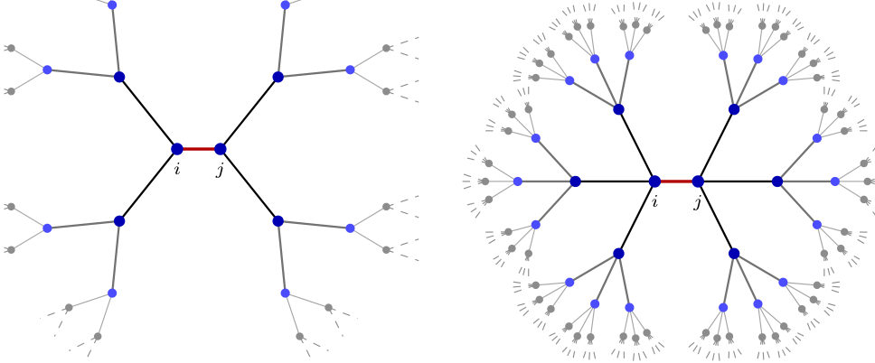 
FIG. 1. The tree T p d is built from a centre edge ij (red) by including every vertex within graph distance p of i or j in a d-regular graph G of girth ≥2(p +1). Edges and vertices are shaded by their graph distance to the centre edge, from saturated blue at distance 1, i.e., T 1 d , to faded grey at distance 3; the latter lie outside T 2 d , and the dashed stubs indicate that G extends even further. Shown are d = 3 on the left, and d = 4 on the right.

📷 Fig 2

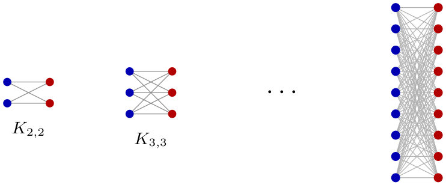 
FIG. 2. The complete bipartite graphs Kd,d for d = 1, 2, 3, . . . , 9; every vertex in one part is joined to every vertex in the other part, so each edge lies in (d −1)2 four-cycles. K9,9 serves as a counterexample to the fixed-angle conjecture for p = 2 on 9-regular graphs.

**Summary.** This paper rigorously analyzes the fixed-angle conjecture for QAOA applied to MaxCut, a key problem in quantum optimization. It proves the conjecture holds for shallow depths or low-degree graphs, but crucially refutes it by providing a counterexample on the 9-regular graph $K_{9,9}$ at depth $p=2$. This refutation refines the theoretical understanding of when and how QAOA performance scales with graph structure.

**Why it may be interesting.** This work directly impacts the theoretical understanding of quantum algorithms for combinatorial optimization, providing concrete counterexamples that challenge existing assumptions about parameter optimization in QAOA.

Detailed structure

**Main problem.** The paper investigates and refutes the fixed-angle conjecture concerning the performance of the Quantum Approximate Optimization Algorithm (QAOA) for solving the MaxCut problem.

**Main result.** The fixed-angle conjecture is proven false for depth-2 QAOA on 9-regular graphs, while it is confirmed to be true for depth-1 on any regular graph and for all depths on 2-regular graphs.

**Method.** The analysis uses theoretical bounds derived from the structure of the QAOA expectation value, comparing performance on general graphs to optimized tree structures, and employs advanced techniques like symmetry-adapted bases and tensor product factorization.

**Model / system.** The model is the QAOA applied to the MaxCut problem, formulated using an Ising encoding Hamiltonian $H_f$ on $d$-regular graphs, particularly focusing on complete bipartite graphs $K_{d,d}$.

**Key observables.** The approximation ratio $C(eta, \gamma) = F(eta, \gamma) / C_{\max}$, and the difference $\delta_e$ between the tree-optimal objective value and the edge expectation value.

**Important parameters / regimes.** QAOA depth ($p$), graph regularity ($d$), and the graph structure (e.g., $K_{9,9}$ for the counterexample).

**Assumptions / limitations.** The analysis relies on the locality property of QAOA, which restricts correlations to a distance $p$ on the graph.

**Figures summary.** Figure 1 illustrates the tree structure $T_{p}^d$ used for comparison. Figure 2 shows complete bipartite graphs $K_{d,d}$ up to $d=9$, highlighting $K_{9,9}$ as the counterexample for $p=2$.

**Paper structure.** The paper first establishes the context of the conjecture, then proves its validity for specific cases ($p=1$ and $d \le 2$), and finally presents a rigorous counterexample for $p=2$ on $K_{9,9}$ by analyzing the expectation values in a symmetry-adapted basis.

Abstract

The fixed-angle conjecture for the quantum approximate optimisation algorithm (QAOA) is shown to be false for depth-2 QAOA on 9-regular graphs, and proven to be correct for depth-1 on any regular graph, as well, as for any depth on all 2-regular graphs.

[↑ back to top](#top)

### [Resonantly Enhanced Multiphonon Scattering and Local Orbital-Phonon Coupling in Bulk and Thin Flakes of 2D Single Crystals of Antiferromagnetic (NixFe1-x)2P2S6](http://arxiv.org/abs/2609.27721v1)

**Authors:** Nasaru Khan, Miłosz Rybak, Yuliia Shemerliuk, Sebastian Selter, Bernd Büchner, Saicharan Aswartham, Krzysztof Wohlfeld, Pradeep Kumar  
**Type:** experiment · **Category:** strongly correlated electrons · **PDF:** <https://arxiv.org/pdf/2609.27721v1>  
**Analysis basis:** full PDF text, analyzed in chunks

📷 Fig 1

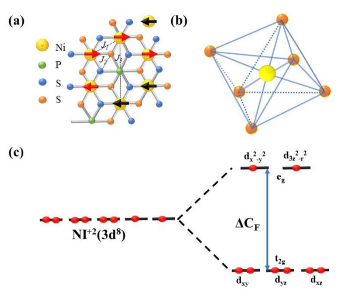 
Figure 1. (a) Top-view illustration of the antiferromagnetic arrangement in Ni₂P₂S₆. Yellow,

📷 Fig 2

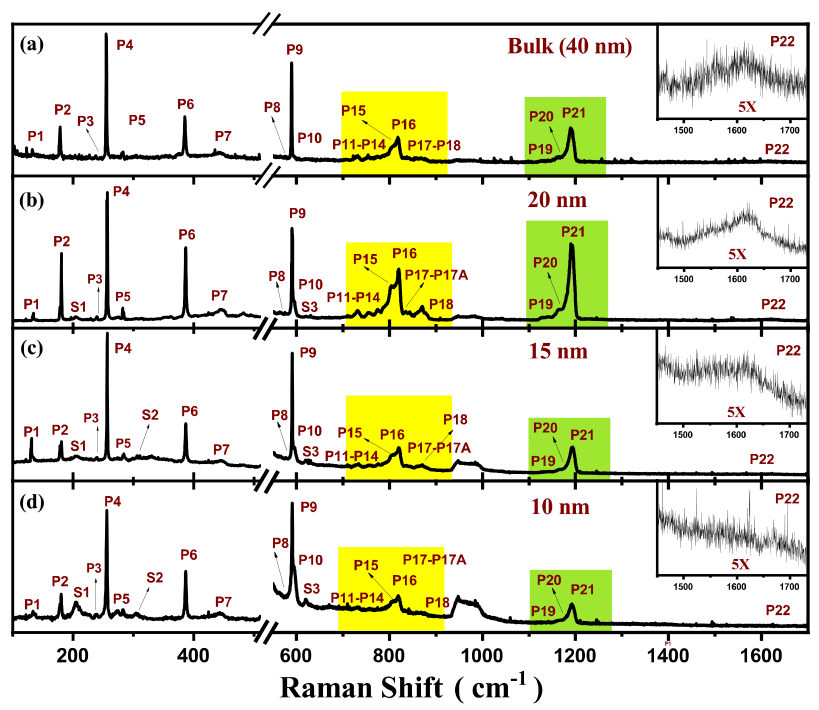 
Figure 2. Raw Raman spectra measured at 4 K using a 633 nm excitation laser across the

📷 Fig 3

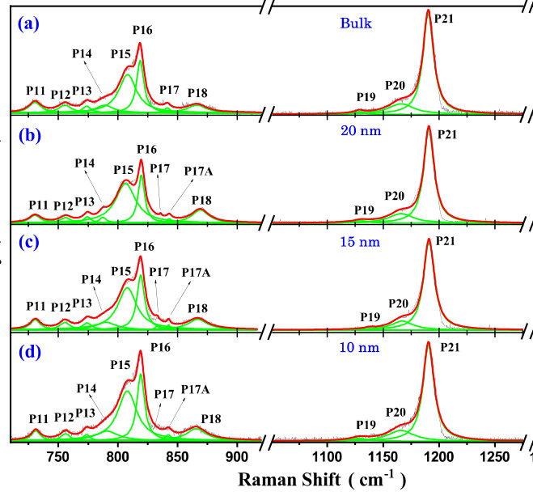 
Figure 3. Fitted Raman spectra recorded at 4 K using a 633 nm excitation laser in the spectral

📷 Fig 4

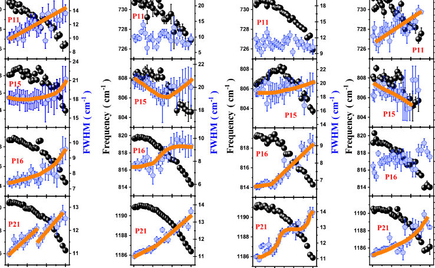 
Figure 4. Temperature-dependent evolution of peak frequency and FWHM for Raman modes

📷 Fig 5

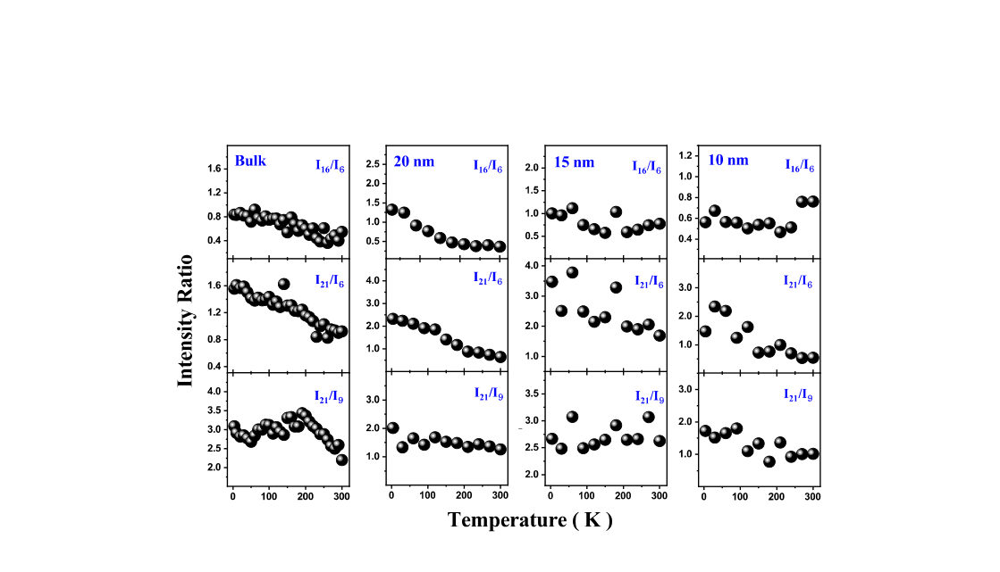 
Figure 5. Variation of the intensity ratios I₁₆/I₆ (P16 to P6), I₂₁/I₆ (P21 to P6), and I₂₁/I₉ (P21 to

**Summary.** This work uses Raman spectroscopy to study 2D antiferromagnetic materials, finding that high-frequency scattering is not due to simple phonon overtones. Instead, the intensity is resonantly enhanced by localized Ni 3d electronic excitations, confirming the crucial role of local orbital-phonon coupling in these correlated magnets.

**Why it may be interesting.** The strong coupling between electronic excitations (Ni 3d orbitals) and lattice vibrations (phonons) provides a concrete, measurable example of strong electron-phonon coupling in a correlated magnetic system, relevant to understanding charge transfer and orbital ordering.

Detailed structure

**Main problem.** To determine the microscopic origin of anomalously strong, high-frequency Raman scattering in 2D van der Waals antiferromagnetic materials, focusing on the interplay between local orbital excitations and lattice vibrations.

**Main result.** The high-frequency scattering is attributed to resonantly enhanced multiphonon scattering mediated by localized Ni 3d8 multiplet excitations, which is distinct from standard phonon overtones.

**Method.** Temperature and thickness-dependent Raman spectroscopy, complemented by theoretical cluster calculations and Franck-Condon modeling.

**Model / system.** The study investigates 2D single crystals of antiferromagnetic (Ni_xFe_{1-x})2P2S6, comparing the charge-transfer character of Ni2P2S6 with the Mott-Hubbard insulator regime of Fe2P2S6.

**Key observables.** Anomalously high and weakly temperature-dependent intensity ratio of higher-order modes relative to low-energy first-order phonons; specific phonon clusters around 800 cm-1 and 1170 cm-1.

**Important parameters / regimes.** Temperature (4 K to 300 K); crystal thickness (down to 10 nm); doping concentration (x in Ni_xFe_{1-x}).

**Assumptions / limitations.** The anomalous scattering behavior suggests resonance phenomena involving localized Ni 3d8 multiplets, rather than simple harmonic overtones.

**Figures summary.** Figures illustrate raw and fitted Raman spectra for varying flake thicknesses, showing specific peak clusters; temperature dependence plots track mode softening and anomalies near the AFM transition.

**Paper structure.** The paper systematically analyzes Raman spectra across varying thicknesses and compositions, contrasting the observed high-order features in Ni-containing compounds against the background of established phonon modes and theoretical expectations.

Abstract

Orbital degrees of freedom play a pivotal role in shaping the physical properties of two-dimensional (2D) van der Waals magnetic systems, strongly influencing electron-phonon coupling and intermediate-state dynamics. In this study, we present a comprehensive temperature and thickness-dependent Raman investigation of the single crystals of 2D van der Waals antiferromagnetic series (NixFe1-x)2P2S6. Utilizing Raman spectroscopy, we explore the interplay between local orbital excitations and lattice vibrations, observing higher-order phonon modes extending up to the fourth order. We observe an anomalously high and weakly temperature-dependent intensity ratio of these higher-order modes relative to low-energy first-order phonons. Theoretical cluster calculations and Franck-Condon modelling reveal that these features originate from resonantly enhanced multiphonon scattering mediated by localized intermediate Ni 3d8 multiplet excitations. The local orbital occupancy of these intermediate states couples strongly to lattice coordinates, providing a selective enhancement mechanism for specific phonon channels. Notably, these higher-order features are absent in the end-member Fe2P2S6. This distinction reflects the charge-transfer character of Ni2P2S6, which places optical transitions in resonance with local multiplet states, contrasted with the Mott-Hubbard insulator regime in Fe-rich analogues. Our findings clarify the microscopic origin of high-frequency Raman scattering in transition metal thiophosphates and underscore the central role of local orbital-phonon interactions in 2D correlated magnets.

[↑ back to top](#top)

### [The Minimal Dimension of Entangled-Noise Advantage](http://arxiv.org/abs/2609.28367v1)

**Authors:** Xiao-Ke Wang, Zi-Yuan Liu, Ming-Yang Li, Shengjun Wu, Zeng-Bing Chen  
**Type:** theory · **Category:** quantum information and computing · **PDF:** <https://arxiv.org/pdf/2609.28367v1>  
**Analysis basis:** full PDF text, analyzed in chunks

📷 Fig 1

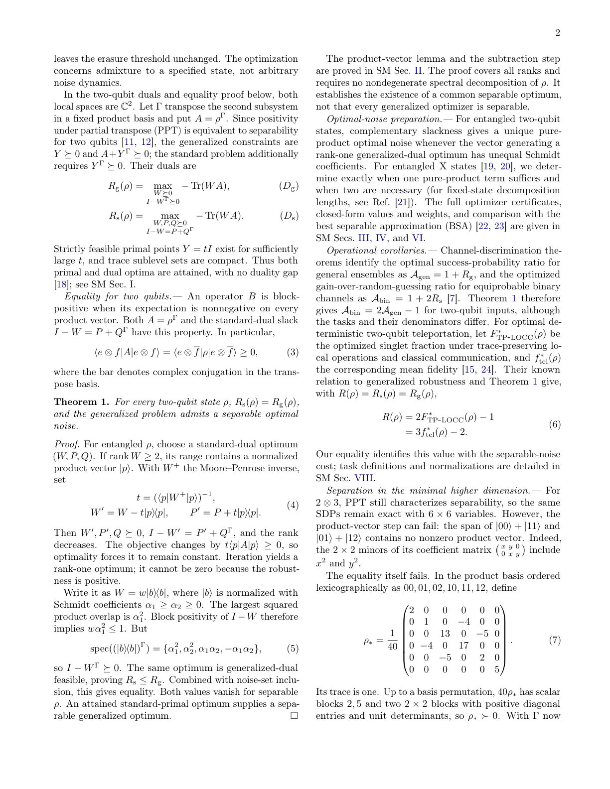 
Low-resolution page preview, page 2

📷 Fig 2

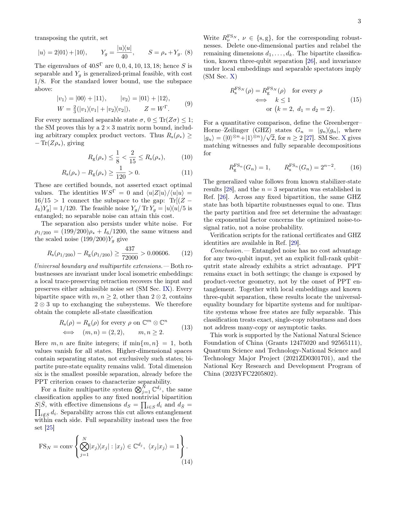 
Low-resolution page preview, page 3

📷 Fig 3

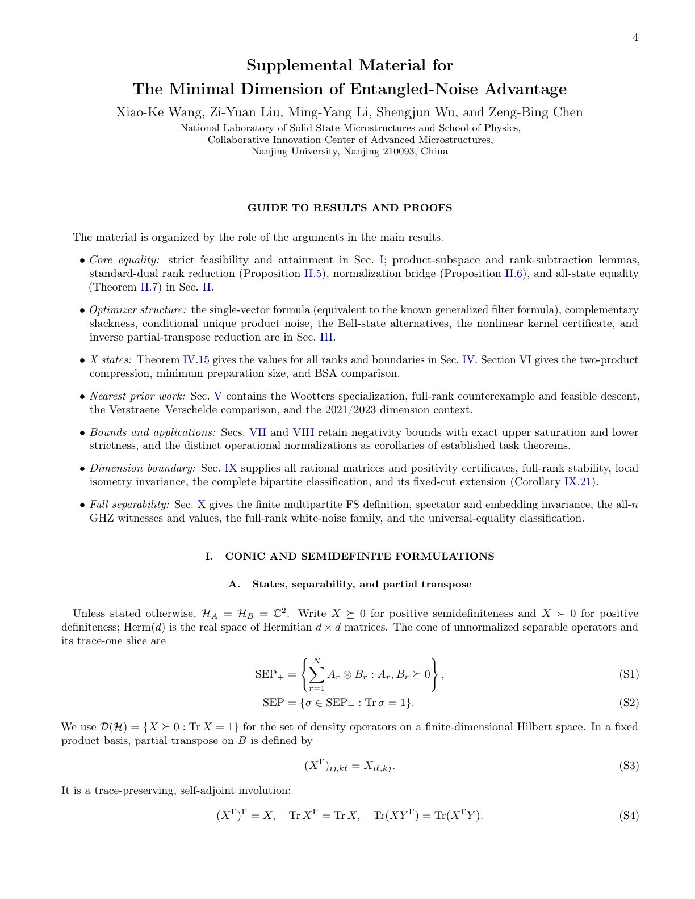 
Low-resolution page preview, page 4

📷 Fig 4

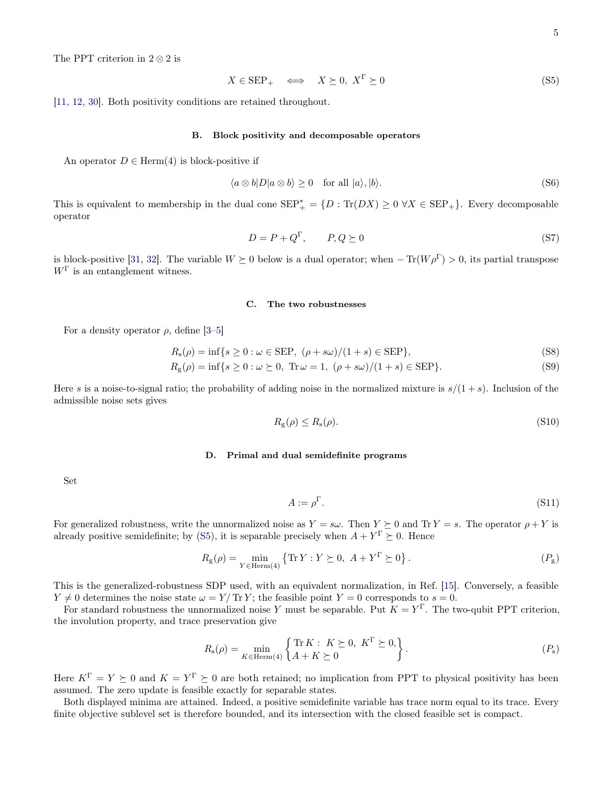 
Low-resolution page preview, page 5

📷 Fig 5

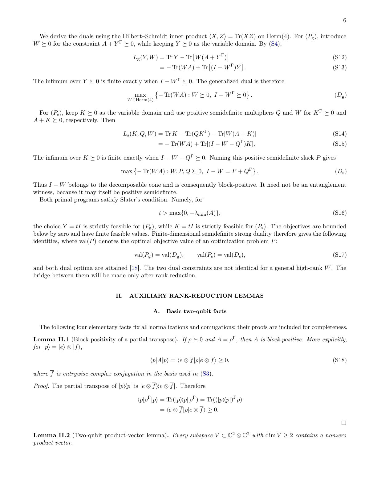 
Low-resolution page preview, page 6

**Summary.** This theoretical paper investigates the difference between two measures of entanglement robustness: standard (separable noise) and generalized (any noise). It proves that for two-qubit systems, these two measures are always equal, but demonstrates a strict inequality for the qubit-qutrit system. This work provides a comprehensive classification of when entangled noise offers a quantifiable advantage over separable noise in finite quantum systems.

**Why it may be interesting.** It provides a rigorous, quantitative classification of when entanglement resources are equally protected against different types of noise, which is fundamental for understanding noise resilience in quantum communication protocols.

Detailed structure

**Main problem.** The paper compares two measures of entanglement robustness—standard ($R_s$) and generalized ($R_g$)—to determine if entangled noise can erase entanglement more efficiently than separable noise.

**Main result.** The equality $R_s(
ho) = R_g(
ho)$ holds only for two-qubit states in bipartite systems, but a strict gap is found for the qubit-qutrit system, indicating an advantage for entangled noise.

**Method.** The analysis uses semidefinite programming (SDP) formulations, optimization over noise operators, and geometric arguments involving product-vector spaces to classify the equality boundaries.

**Model / system.** The study focuses on bipartite quantum states ($\mathcal{C}^m \otimes \mathcal{C}^n$) and general finite multipartite systems, analyzing robustness relative to full separability.

**Key observables.** The two robustness measures, $R_s(
ho)$ and $R_g(
ho)$, and the gap $R_s(
ho) - R_g(
ho)$.

**Important parameters / regimes.** The dimensions of the subsystems ($m, n$) and the number of parties ($N$) in the multipartite setting.

**Assumptions / limitations.** The analysis assumes the PPT criterion characterizes separability in both robustness settings, and the results are for single-copy robustness, not asymptotic tasks.

**Paper structure.** The paper proceeds by first establishing the problem in bipartite systems, proving equality for $2 \otimes 2$, then constructing a counterexample for $2 \otimes 3$, and finally generalizing the classification to arbitrary finite multipartite systems.

Abstract

Can entangled noise erase entanglement more efficiently than separable noise? Standard robustness restricts the added noise to separable states; generalized robustness allows any state. We prove that the two costs coincide for every two-qubit state and give an explicit full-rank qubit--qutrit state with a strict gap. Positivity under partial transpose (PPT) characterizes separability in both dimensions, so the boundary is not caused by a failure of the PPT criterion. Instead, product-vector geometry permits a rank-one bridge between the two-qubit dual optimizations and supplies a two-dimensional completely entangled subspace for the qubit--qutrit separation. Local isometric embeddings complete the finite-dimensional bipartite classification, also for any fixed multipartite cut. Combined with known three-qubit separation, the result classifies universal equality relative to full separability in all finite multipartite systems.

[↑ back to top](#top)

## Secondary cond-mat archives

*Papers from  mes-hall, other, soft, supr-con. These archives are de-prioritized — they appear at the end regardless of relevance score.*

### Relevant in secondary archives (21)

### ⭐ [Nonabelian vortices: From topological strings to nonvolatile memory](http://arxiv.org/abs/2609.28025v1)

**Highlighted author(s):** Yaroslav Tserkovnyak  
**Authors:** Chau Dao, Eric Kleinherbers, Yaroslav Tserkovnyak  
**Type:** theory · **Category:** other · **PDF:** <https://arxiv.org/pdf/2609.28025v1>  
**Analysis basis:** full PDF text, analyzed in chunks
**Topic relevance:** `analog quantum simulation` **3/5**

📷 Fig 1

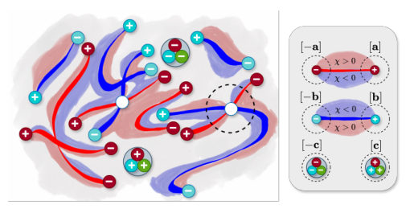 
FIG. 1. Illustration of the soup of vortex-antivortex pairs with a legend labeling the elementary vortex-antivortex pairs on top of the ground state (gray). The red, green, and blue circles inscribed with plus and minus signs denote singular vortex cores with relative winding numbers n01 = ±1, n12 = ±1, and n20 = ±1, respectively. The light red (blue) shaded regions indicate a chirality χ = +1 (χ = −1), where the complex numbers ψ0, ψ1, and ψ2 are ordered counterclockwise (clockwise) in the complex plane. Solid red and blue strings connecting the vortex cores correspond to excited collinear configurations with chirality χ = 0, where ψ1 and ψ2 are located in the center, respectively. At the...

📷 Fig 2

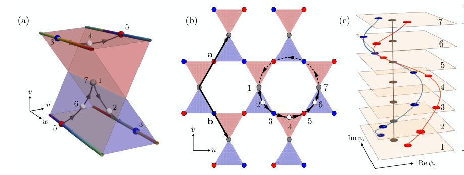 
FIG. 2. (a) Unit cell of order parameter space, (b) extended order parameter space projected to the plane orthogonal to the (1, 1, 1) direction, and (c) texture of ψ0 (gray), ψ1 (red) and ψ2 (blue) on a loop ∂A with 0 ≤ℓ&lt; L encircling a [b, a] vortex. In (a)-(b), we plot along the high symmetry directions by introducing the coordinates u = θ01 −2θ12 + θ20, v = √

📷 Fig 3

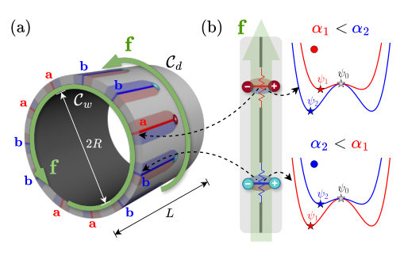 
FIG. 3. (a) Memory storage concept and (b) schematic of weak links facilitating vortex nucleation. The Mexican hat potentials show how α1 and α2 must be tuned to select for [a] and [b] vortices. The green arrows represent the external drive f, which nucleates the vortex-antivortex pairs at the weak links (red and blue zigzags) in (b) and transports the vortices from Cw to Cd via the Magnus force in (a).

**Summary.** This theoretical work analyzes nonabelian vortices in a two-component condensate, showing that their topology is richer than previously assumed. By utilizing the mathematical structure of the pure braid group, the authors predict the existence of novel defects and propose a physical realization of a nonvolatile memory device that encodes information robustly in the vortex texture.

**Why it may be interesting.** The connection between topological defects in condensed matter systems (like vortices in superfluids or superconductors) and information storage mechanisms is highly relevant to quantum information science, particularly in realizing robust, non-dissipative memory elements.

Detailed structure

**Main problem.** The paper investigates the topological classification and properties of nonabelian vortices arising in a two-dimensional film of a two-component condensate.

**Main result.** Nonabelian vortices possess an enriched internal structure compared to abelian vortices, allowing for the storage of exponentially large amounts of topologically robust information, which is demonstrated via a nonvolatile memory concept.

**Method.** The analysis uses homotopy group theory, classifying defects using the pure braid group $P_3$, and derives topological invariants like higher-order winding numbers ($Q^{(2)}$) from the geometry of the order parameter space.

**Model / system.** The model is a 2D film of a two-component condensate, described by an order parameter $\Psi \in \mathbb{C}^3$. The physics is governed by a Hamiltonian including kinetic, Mexican hat potential, and repulsive interaction terms.

**Key observables.** Relative winding numbers ($n_{ij}$), nonabelian vortex types ($[a], [b]$), Brunnian vortices (detected by $Q^{(2)}$), and the topological information capacity scaling with $S$.

**Important parameters / regimes.** The repulsive interaction strength $U_0$, the characteristic length scale $\xi \sim \sqrt{A/U_0}$, and the number of stored strings $S$.

**Assumptions / limitations.** The analysis relies on the order parameter space $C_3(\mathbb{C})$ and assumes the system can be driven to transport vortices along an engineered cylinder geometry.

**Figures summary.** Figures illustrate the vortex soup structure, the unit cell projections in the order parameter space, and the schematic for the nonvolatile memory storage mechanism using red and blue strings.

**Paper structure.** The paper progresses from defining the physical system and its order parameter space, to classifying vortices using homotopy groups ($P_3$), identifying higher-order defects (Brunnian vortices), and finally applying this theory to devise a nonvolatile memory storage device based on vortex transport.

Abstract

We investigate the topological classification and properties of nonabelian vortices that arise in a 2-dimensional film of a two-component condensate. For a repulsive interaction between the condensates, we realize an order parameter in the ordered configuration space of three complex numbers $\mathcal C_3(\mathbb C)$. Analyzing the homotopic properties, we find the emergence of elementary nonabelian vortex-antivortex pairs connected by energetic strings that are rooted in the repulsive interaction and carry the nonabelian information. Moreover, we predict the existence of Brunnian vortices, which are textures exhibiting zero net winding of the condensate phases and can only be detected by a higher-order winding number. Finally, to motivate technological applications rooted in nonabelian vortex transport, we devise a nonvolatile memory storage device that encodes topologically robust information.

[↑ back to top](#top)

### [Dynamic moiré-like band modulation in Dirac materials via multi-beam optical interference](http://arxiv.org/abs/2609.28293v1)

**Authors:** Evelyn P. Sinaga, Rizky Setiawan, Herri Trilaksana, Lukas P. A. Krisna, Eddwi H. Hasdeo  
**Type:** theory · **Category:** other · **PDF:** <https://arxiv.org/pdf/2609.28293v1>  
**Analysis basis:** full PDF text, analyzed in chunks
**Topic relevance:** 🔥 `interference shaping light` **4/5** · `analog quantum simulation` **3/5** · `Keldysh / 2PI / non-Gaussian methods` **2/5** · `driven-dissipative phase transition` **2/5** · `methods for driven-dissipative` **2/5**

📷 Fig 1

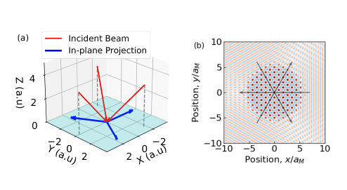 
FIG. 1. (a) Illustrates the interference geometry: red arrows denote the incident plane waves, and blue arrows denote their in-plane wavevector projections, mutually separated by 120◦. (b) Resulting electric field intensity exhibiting optical trian- gular superlattice from the interference pattern in the sample plane. aM = 2πλ/3 is the lattice period, related to the inci- dent light wavelength λ.

📷 Fig 2

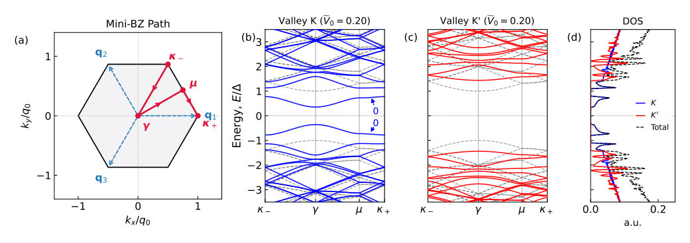 
FIG. 2. (a) The first mini-Brillouin zone (mBZ) of the optical superlattice formed by N = 3 interfering circularly polarized beams with in-plane wavevectors q1, q2, q3 symmetrically separated by 120◦. The red directed path traces the high-symmetry trajectory κ−→γ →µ →κ+. (b, c) Valley-resolved moir´e miniband structures along the high-symmetry path for (b) valley K (τ = +1) and (c) valley K′ (τ = −1). The gray dashed lines indicate the case of V0 = 0. We used ℏvq0 = ∆, and eV0 = V0/∆= 0.2 for the solid lines. (d) Corresponding valley-resolved and total density of states (DOS) calculated over the full two-dimensional mBZ.

📷 Fig 3

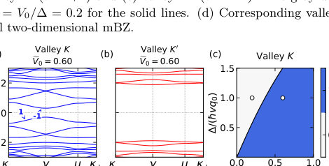 
FIG. 3. Valley-resolved topological phase transition under cir- cularly polarized light. (a,b) Band structures at ∆/(ℏvq0) = 1.0 for V0/∆= 0.60, representing the CK v = 1 for K valley. (c) Corresponding topological phase diagrams for the K val- ley. Black lines denote the phase boundaries, while the open circles indicate the parameter points used in panels (a) and (b).

📷 Fig 4

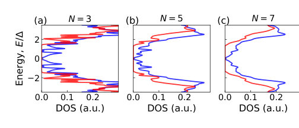 
FIG. 5. Density of states (DOS) of optical moir´e pattern from N laser beams. N = 3 to be compared with Fig. 2(c). DOS of N = 5 and N = 7 represent the electronic structure of quasicrystals.

📷 Fig 5

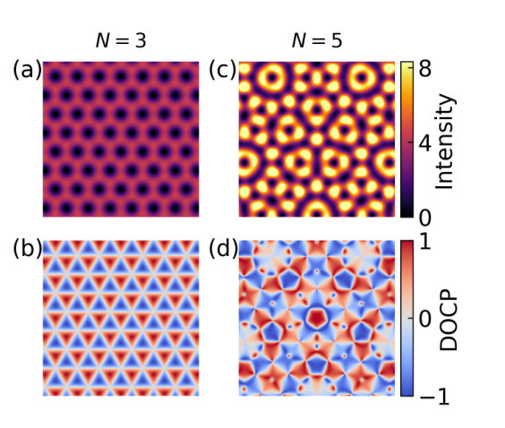 
FIG. 6. Creating CP light from (a,b) N = 3 and (c,d) N = 5 beams of LP light with phase delay Eq. (21). Spatial de- pendence of (a,b) electric field intensity and (c,d) degree of circular polarization (DOCP) Eq. (20).

**Summary.** This paper proposes an all-optical method to engineer moiré-like band structures in Dirac materials by interfering multiple coherent laser beams. By utilizing the Floquet framework, the authors show that this technique can create tunable, valley-selective potentials, even achieving quasicrystalline order. This provides a powerful, non-mechanical route for dynamic band engineering and topological control in 2D materials.

**Why it may be interesting.** This work is highly relevant to AMO physics and quantum optics as it uses structured light fields (optical interference) to engineer synthetic gauge fields and topological properties in solid-state systems, mimicking effects usually requiring strain or magnetic fields.

Detailed structure

**Main problem.** The research aims to develop a purely optical method to dynamically generate moiré-like superlattices and quasicrystalline potentials in gapped Dirac materials, thereby bypassing the need for physical mechanical twisting.

**Main result.** The authors demonstrate that using multi-beam interference, especially with confined surface plasmon polaritons, allows for the creation of reconfigurable, all-optical platforms capable of engineering valley-dependent topology and miniband structures.

**Method.** The study employs the high-frequency Floquet framework and Magnus expansion to derive an effective time-independent Hamiltonian, which is then solved using a plane-wave basis and numerical diagonalization.

**Model / system.** The system is modeled using low-energy Dirac fermions in a 2D material subjected to a time-periodic, spatially modulated effective mass potential generated by the interference of multiple coherent optical beams.

**Key observables.** Valley-selective miniband reconstruction, topological phase transitions (quantized Chern numbers), and the effective valley Landé g-factor.

**Important parameters / regimes.** The number of interfering beams ($N$), the optical field strength ($A_0$), the ratio of optical frequency to gap ($\hbar\omega / \Delta$), and the relative phases of the beams.

**Assumptions / limitations.** The analysis relies on the high-frequency Floquet approximation and, for the plasmonic extension, assumes the ability to control relative phases to overcome the free-space diffraction limit.

**Figures summary.** Figures illustrate the interference geometry for $N=3$ beams forming a triangular superlattice, and the resulting optical field intensity patterns.

**Paper structure.** The paper progresses from establishing the general Floquet framework for time-periodic driving, deriving the effective Hamiltonian via the Magnus expansion, applying this to multi-beam interference to generate spatially modulated potentials, and finally analyzing the resulting band structure and topological invariants.

Abstract

We propose a purely optical Floquet framework to dynamically generate moiré-like superlattices and quasicrystalline potentials in a gapped Dirac material, entirely bypassing the need for physical twisting. The interference of three coherent circularly polarized beams produces a triangular, valley-dependent Floquet mass landscape that folds the Dirac spectrum into a mini-Brillouin zone, driving pronounced valley-selective miniband reconstruction. We further show that the bands near the Fermi level undergo a light-driven topological phase transition. Remarkably, interfering five or seven beams yields non-crystallographic spatial patterns, giving rise to optical quasicrystals with similar valley contrasting features. Although this purely optical approach provides a versatile route to band engineering, reaching deep subwavelength modulation requires overcoming the free-space diffraction limit. To overcome this limitation, we consider highly confined, linearly polarized surface plasmon polariton fields with controlled relative phases. Their phase-controlled interference generates a spatially alternating chiral mass with zero spatial average. Consequently, the two valleys exhibit degenerate energy spectra while hosting opposite valley-resolved miniband Chern numbers. Our findings establish a reconfigurable, all-optical platform for dynamically engineering moiré-like bands, quasicrystalline electronic states, and valley-dependent topology without mechanical twisting.

[↑ back to top](#top)

### [THz-Driven Quantum Ionic Magnetism in a Quantum Paraelectric SrTiO3](http://arxiv.org/abs/2609.27347v1)

**Authors:** In Hyeok Choi, Sergei Urazhdin, Man Tou Wong, Zi-Jie Liu, Keith A. Nelson  
**Type:** both · **Category:** other · **PDF:** <https://arxiv.org/pdf/2609.27347v1>  
**Analysis basis:** full PDF text, analyzed in chunks
**Topic relevance:** `Keldysh / 2PI / non-Gaussian methods` **3/5** · `driven-dissipative phase transition` **3/5** · `methods for driven-dissipative` **3/5** · `analog quantum simulation` **2/5** · `non-equilibrium universality` **2/5** · `quantum measurements` **2/5** · `Frenkel-Kontorova` **1/5** · `interference shaping light` **1/5** · `scars & prethermalization` **1/5**

📷 Fig 1

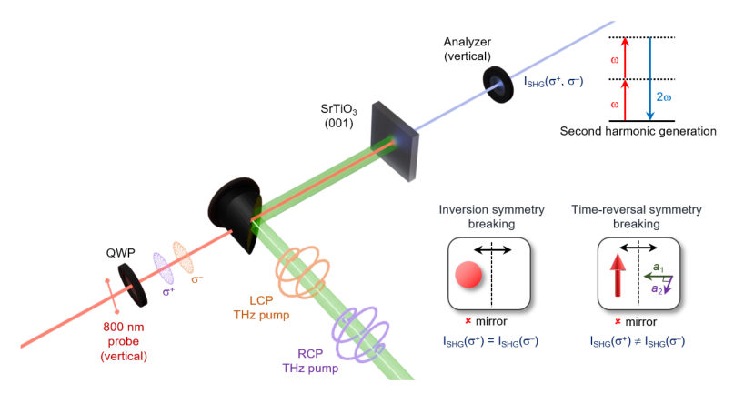 
Figure 1. THz-field-driven ultrafast manipulation of polarization and magnetization

📷 Fig 2

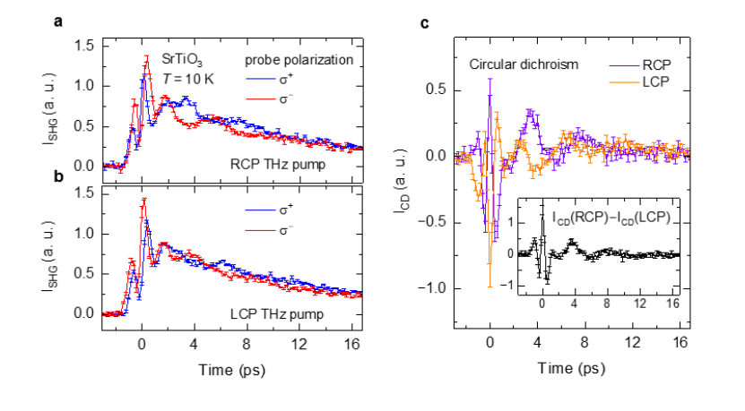 
Figure 2. Time-reversal-symmetry-broken THz oscillations in second harmonic

📷 Fig 3

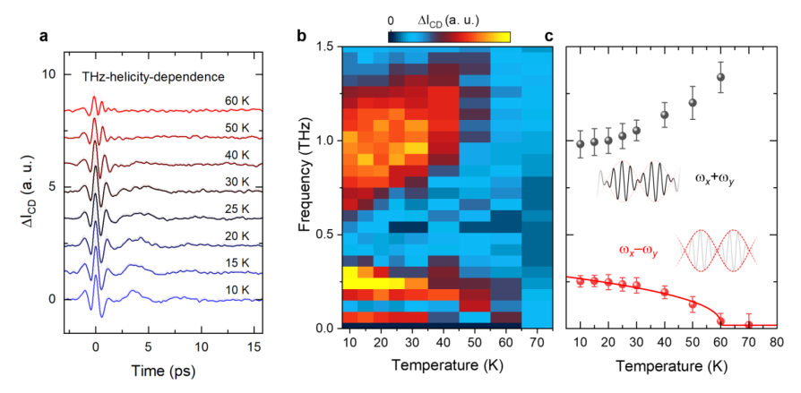 
Figure 3. Temperature-dependent fast and slow oscillatory signals in elliptically

📷 Fig 4

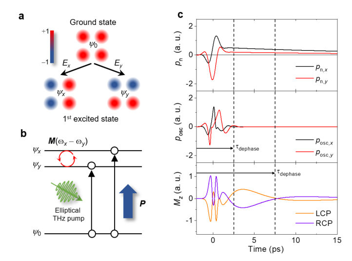 
Figure 4. Numerical simulation for elliptically polarized THz-pump-induced quantum

**Summary.** This paper reports the detection and characterization of quantum ionic magnetism in SrTiO3 using THz-pumped nonlinear optical techniques. By observing oscillatory magnetization that defies classical predictions, the authors confirm that the effect originates from quantum beating between ionic eigenstates. This work establishes a method for ultrafast control of ionic magnetism crucial for advanced spintronic and thermotronic applications.

**Why it may be interesting.** This work provides a direct experimental pathway to observe and control quantum mechanical magnetic moments arising from lattice vibrations (ionic motion) using ultrafast THz pulses, which is highly relevant to understanding emergent magnetism in quantum materials.

Detailed structure

**Main problem.** The study investigates the generation and ultrafast control of quantum ionic magnetism in the quantum paraelectric material SrTiO3.

**Main result.** The research observes oscillatory ionic magnetization that persists beyond the relaxation time of polarization oscillations, confirming a quantum mechanical origin distinct from classical electro-optic effects.

**Method.** The authors combine THz-pump-induced Second Harmonic Generation Circular Dichroism (SHG-CD) measurements with theoretical modeling using density matrix formalism.

**Model / system.** The system is quantum paraelectric SrTiO3, whose dynamics are modeled using the density matrix formalism, considering ionic displacements in a double-well or four-well potential. The THz pulse drives the system, probing coherence between ionic eigenstates.

**Key observables.** THz-helicity-dependent $\Delta	ext{ICD}$ and $\Delta	ext{ISHG}$ signals, fast ($\sim 1 	ext{ THz}$) and slow ($\sim 0.2 	ext{ THz}$) oscillatory components, and the time-domain decay of ionic magnetization.

**Important parameters / regimes.** Low temperatures (10 K), the quantum paraelectric regime, and the temperature dependence of the slow oscillation frequency ($\sim (1-T/T^*)^{0.5}$ with $T^* \approx 60 	ext{ K}$).

**Assumptions / limitations.** The fast oscillations are attributed to the quantum ionic effect rather than purely non-magnetic contributions, and the slow oscillation's temperature dependence is linked to polar nanodomain evolution.

**Figures summary.** Figures show time-domain THz-helicity-dependent $\Delta	ext{ICD}$ signals, frequency analysis (FFT) confirming fast and slow oscillations, and temperature dependence plots illustrating the decay of these oscillations.

**Paper structure.** The paper establishes the physical problem, presents THz-CD measurements showing helicity-dependent oscillations, develops a quantum model using the density matrix, and finally compares simulation results (showing slow oscillations persisting after polarization decay) with the experimental observations.

Abstract

Magnetic moments carried by rotating ionic motion in crystals are becoming recognized as an important contribution to magnetism, angular momentum transport, and optical activity. However, efficient approaches to their dynamical control are lacking. Here, we report THz-driven generation and optical detection of quantum ionic magnetism in quantum paraelectric SrTiO3. We observe an oscillatory ionic magnetization without a corresponding oscillatory polarization, contradicting from the classical relation M~PXdP/dt while its suppression above the quantum paraelectric regime points to a quantum ionic origin. Analysis shows that this effect results from the beating between quantum ionic eigenstates whose degeneracy is lifted due to the directional symmetry breaking by the THz pulse. The presented approach provides a pathway for the ultrafast control of ionic magnetization in quantum materials for spintronic and thermotronic applications.

[↑ back to top](#top)

### [Spurious spin nutation modes arising from truncated memory effects](http://arxiv.org/abs/2609.27487v1)

**Authors:** Markus Weißenhofer, Ritwik Mondal, M. S. Mrudul, Peter M. Oppeneer  
**Type:** theory · **Category:** other · **PDF:** <https://arxiv.org/pdf/2609.27487v1>  
**Analysis basis:** full PDF text, analyzed in chunks
**Topic relevance:** `correlated / nonlocal dissipation` **3/5** · `Keldysh / 2PI / non-Gaussian methods` **2/5** · `driven-dissipative phase transition` **2/5** · `methods for driven-dissipative` **2/5** · `Tavis-Cummings & cavity-many-emitter` **1/5** · `analog quantum simulation` **1/5** · `non-equilibrium universality` **1/5** · `quantum measurements` **1/5**

📷 Fig 1

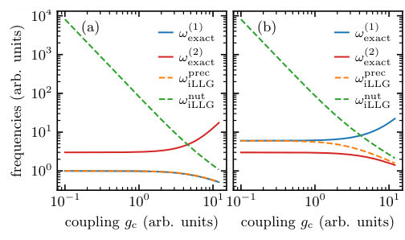 
Figure 1. Comparison between the frequency spectrum ob- tained from the nM-LLG and iLLG for the bare magnon en- ergy being lower (a) and higher (b) than that of the cavity modes.

📷 Fig 2

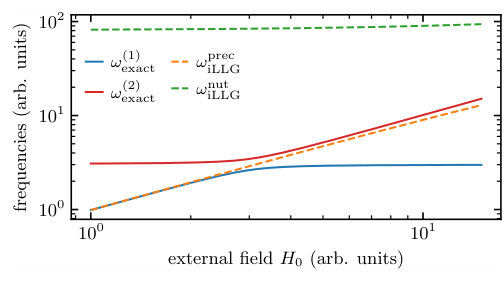 
Figure 2. Hybridization of a magnon and a bath mode. The linearized nM-LLG captures the avoided crossing between magnon and bath modes at the resonance between the bare modes. The character of the modes reverses at the avoided crossing. The linearized iLLG only reproduces the behavior of the low-energy magnetic mode far away from the resonant regime.

**Summary.** This theoretical work analyzes spin dynamics, comparing the full non-Markovian description with the simplified inertial Landau-Lifshitz-Gilbert (iLLG) equation. The authors demonstrate that the iLLG is merely a low-frequency truncation of the true dynamics. Consequently, the high-frequency nutation mode predicted by the iLLG is identified as a spurious artifact, cautioning against interpreting such spectral matches as definitive physical evidence.

**Why it may be interesting.** This work is highly relevant to AMO physics and open quantum systems as it provides a rigorous warning about the pitfalls of approximating memory effects in open quantum dynamics, particularly when dealing with high-frequency spectral features.

Detailed structure

**Main problem.** The paper investigates the physical validity of high-frequency 'spin nutation modes' predicted by the inertial Landau-Lifshitz-Gilbert (iLLG) equation, questioning if they are genuine physical excitations or mathematical artifacts.

**Main result.** The iLLG equation is shown to be a low-frequency, second-order truncation of the true, non-Markovian dynamics, leading to the prediction of spurious, high-frequency roots that do not exist in the exact spectrum.

**Method.** The authors compare the exact dynamics derived from a non-Markovian memory kernel (nM-LLG) against the simplified iLLG approximation by analyzing the frequency spectrum in the context of a minimal spin-cavity model.

**Model / system.** The system is a localized atomic spin moment coupled to additional dynamical variables (e.g., bosonic cavity modes), leading to a non-Markovian spin dynamics described by a memory kernel.

**Key observables.** Frequency spectra ($\omega$) of the coupled system, specifically comparing the iLLG nutation frequency ($\omega_{nut}^{iLLG}$) against the exact spectrum ($\omega_{exact}$).

**Important parameters / regimes.** The coupling strength ($g_c$), the cavity resonance frequency ($\omega_c$), and the memory kernel parameters ($\alpha, \eta$).

**Assumptions / limitations.** The primary assumption being tested is the validity of low-frequency, second-order truncations of memory kernels; the iLLG itself is based on such a truncation.

**Figures summary.** Figures compare the exact and iLLG spectra, showing the divergence of the iLLG nutation mode and the failure of the iLLG to capture physical phenomena like avoided crossings near resonance.

**Paper structure.** The paper establishes the full non-Markovian dynamics, derives the iLLG as a low-frequency approximation, and then uses a minimal model to explicitly calculate and compare the resulting frequency spectra, demonstrating the artifactual nature of the iLLG root.

Abstract

Spin dynamics is conventionally treated as inertia-free. The inertial Landau-Lifshitz-Gilbert equation (iLLG) extends this with a second-order time derivative, predicting a high-frequency nutational mode that recent experiments have claimed to observe and interpreted as direct evidence for spin inertia. We show that when spin inertia is generated by eliminating additional dynamical degrees of freedom, the resulting exact spin-only description is generally non-Markovian. The iLLG is recovered as the low-frequency, second-order truncation of the underlying memory kernel. Using a minimal spin--cavity model, we show that the exact eigenfrequencies and those obtained via the iLLG differ and that the spin nutation mode predicted by the latter is a truncation-induced high-frequency artifact. This raises a broader question of the applicability of the iLLG obtained from analogous low-frequency truncations, which may likewise generate spurious high-frequency roots. Consequently, agreement of a high-frequency spectral feature with the iLLG nutation frequency does not, by itself, establish a physical nutation mode.

[↑ back to top](#top)

### [Ultrastrong coupling of topologically protected edge and bulk magnetoplasmons without a dedicated cavity](http://arxiv.org/abs/2609.27575v1)

**Authors:** F. Velli, P. Sai, M. Dub, J. Dzian, F. Le Mardele, M. Mittendorff, M. Orlita, W. Knap, C. Lange  
**Type:** both · **Category:** other · **PDF:** <https://arxiv.org/pdf/2609.27575v1>  
**Analysis basis:** full PDF text, analyzed in chunks
**Topic relevance:** `analog quantum simulation` **3/5** · `Tavis-Cummings & cavity-many-emitter` **2/5** · `quantum optics experiment` **2/5** · `correlated / nonlocal dissipation` **1/5** · `driven-dissipative phase transition` **1/5** · `interference shaping light` **1/5**

📷 Fig 1

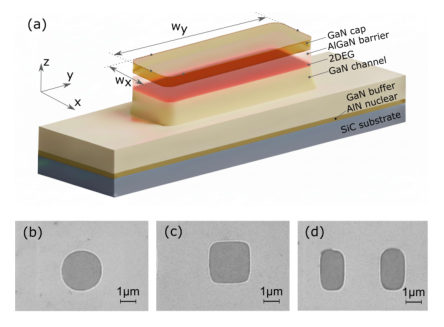 
FIG. 1. (a) Schematic of etched AlGaN/GaN rectangular mesa with layers of the heterostructure.

📷 Fig 2

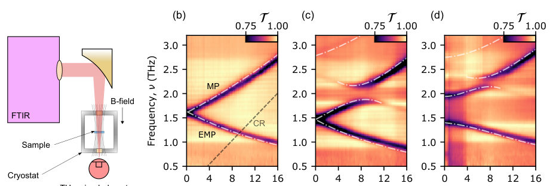 
FIG. 2. Magnetospectroscopy of patterned GaN plasmonic structures in transmission configu-

📷 Fig 3

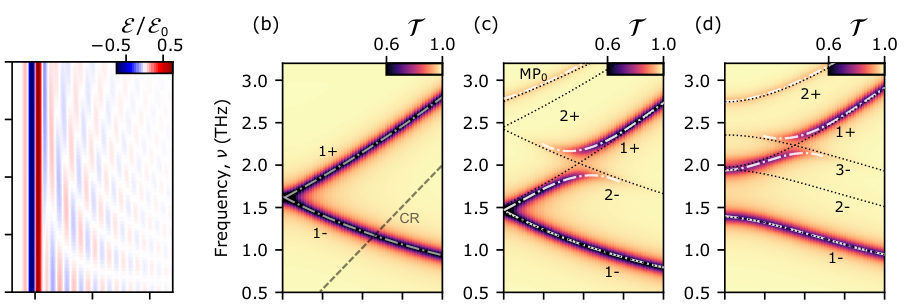 
FIG. 3. Results of the quantum model. (a) Transmitted electric field in the case of disk magneto-

📷 Fig 4

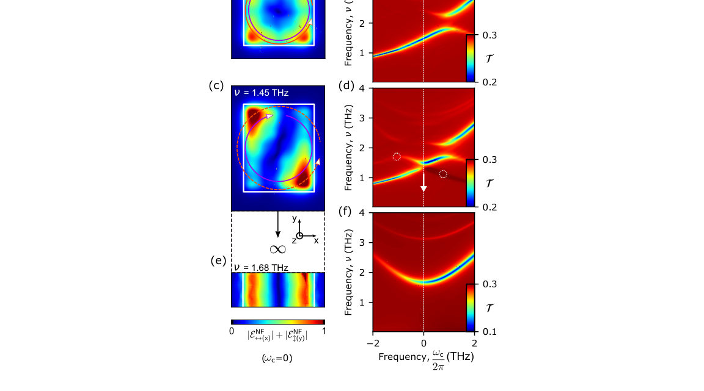 
FIG. 4. FEM simulations for right-circularly polarized incident light. (a),(c),(e) Normalized

📷 Fig 5

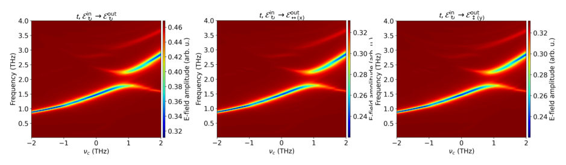 
FIG. 5. FEM far-field transmission spectra for the square patch with right-circularly polarized

**Summary.** This paper demonstrates how to achieve ultrastrong coupling between magnetoplasmon modes in patterned semiconductor nanostructures, eliminating the need for external resonant cavities. By controlling the geometry and symmetry of the electron gas, researchers can engineer strong, tunable interactions between topologically protected edge and bulk plasmon modes. This opens a new parameter space for quantum light-matter interaction based on material topology.

**Why it may be interesting.** This work provides a novel, purely material-based method to engineer strong light-matter coupling, which is a central theme in cavity QED and quantum optics, by leveraging topological and symmetry properties of plasmons.

Detailed structure

**Main problem.** The research aims to achieve ultrastrong light-matter coupling between magnetoplasmon excitations without relying on conventional dedicated electromagnetic cavities.

**Main result.** By patterning the semiconductor material geometry (e.g., square or rectangular patches), the coupling strength can be engineered up to 0.1, leading to observable energy gaps and chiral-mode hybridization.

**Method.** The study combines experimental magnetospectroscopy on patterned AlGaN/GaN quantum wells with theoretical modeling using quantum Hamiltonians and Finite-Element Method (FEM) simulations.

**Model / system.** The system is a two-dimensional electron gas (2DEG) in patterned AlGaN/GaN quantum wells subjected to a perpendicular magnetic field. The physics is described by a quantum Hamiltonian incorporating magnetoplasmon modes and coupling terms.

**Key observables.** Magnetoplasmon-Polariton (MPP) doublet splitting, energy gaps at zero magnetic field, and the magnetic field dependence of the plasmon resonance frequency.

**Important parameters / regimes.** Ultrastrong coupling regime ($\Omega_R/\omega_0 \approx 0.1$), magnetic field strength (up to 16 T), and the geometric symmetry (disk $	o$ square $	o$ rectangle).

**Assumptions / limitations.** The analysis assumes the ability to tailor interactions solely through the spatial symmetry of the confined medium, bypassing cavity-related field distortions.

**Figures summary.** Figures show SEM images of patterned patches (disk, square, rectangle) and corresponding magnetospectroscopy results illustrating the anti-crossing and mode hybridization.

**Paper structure.** The work progresses by first establishing the physical platform and the need to bypass cavities, then developing the quantum model and Hamiltonian, and finally demonstrating the control over coupling and mode hybridization by systematically changing the geometry's symmetry.

Abstract

In the ultrastrong light-matter coupling regime, the ability to confine the electric field to subwavelength scales and define an electromagnetic mode is essential. This task is typically achieved through dedicated cavities, such as THz metal resonators. Here, we instead introduce ultrastrong coupling directly between distinct magnetoplasmon excitations, leveraging solely the spatial symmetry of a confined electronic medium in the presence of a magnetic field. By patterning an AlGaN/GaN single quantum well hosting a two-dimensional electron gas into micrometer-scale patches, we tailor the mutual interactions between topologically protected edge and bulk magnetoplasmons, achieving coupling strengths of up to 0.1. The progressive breaking of rotational symmetry determines the coupling rules and leads to the emergence of energy gaps and unique chiral-mode hybridization. Our results highlight a path towards exploiting the symmetry class and topology of the magnetoplasmon wavefunction as a new parameter space for ultrastrong light-matter interaction without a dedicated cavity.

[↑ back to top](#top)

### [Aharonov-Bohm interference probing of chiral Andreev edge states via scanning gate microscopy](http://arxiv.org/abs/2609.27716v1)

**Authors:** S. Maji, M. P. Nowak  
**Type:** theory · **Category:** other · **PDF:** <https://arxiv.org/pdf/2609.27716v1>  
**Analysis basis:** full PDF text, analyzed in chunks
**Topic relevance:** `quantum measurements` **3/5** · `Keldysh / 2PI / non-Gaussian methods` **2/5** · `methods for driven-dissipative` **2/5** · `analog quantum simulation` **1/5** · `interference shaping light` **1/5**

📷 Fig 1

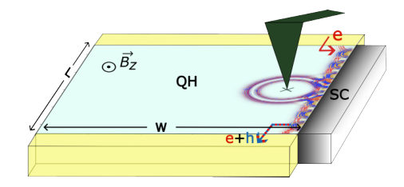 
Figure 1. Schematic diagram of the QH-SC system. The light green part denotes the QH part, the gray region denotes the superconducting part and the yellow parts denote the semi- infinite normal leads. The electrons propagating on the QH edge mode forms CAES at the NS interface. We plot resulting probability current at the edge, where colors correspond to its electron (red) and hole (blue) character. The SGM tip, introduced in the system and denoted by the dark green color, locally perturbs the CAES at the QH-SC edge, detouring its path from the interface.

📷 Fig 2

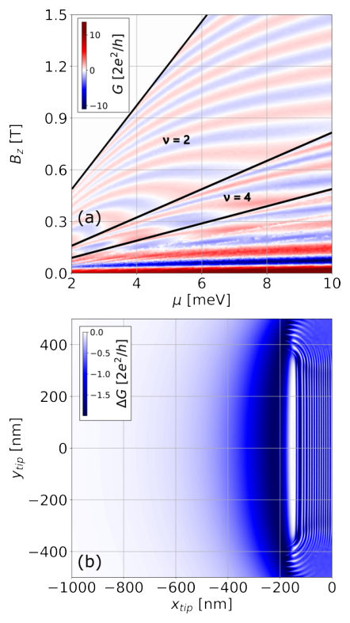 
Figure 2. (a) Conductance map for QH-SC system without the SGM tip versus the chemical potential and the magnetic field. (b) Conductance difference varying the SGM tip posi- tion for B = 0.912 T, µ = 5 meV.

📷 Fig 3

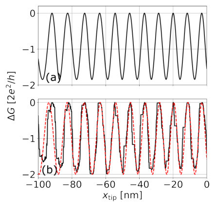 
Figure 4. (a) Conductance cross-section from Fig. 2(b) for ytip = 0. (b) Black curve shows the conductance versus the tip position for the approximation of the circular hardwall potential. Red dashed curve shows the analytical approxima- tion of the conductance due to Aharonov-Bohm interference obtained through Eq. 11. µ = 5 meV and B = 0.912 T for all plots.

📷 Fig 4

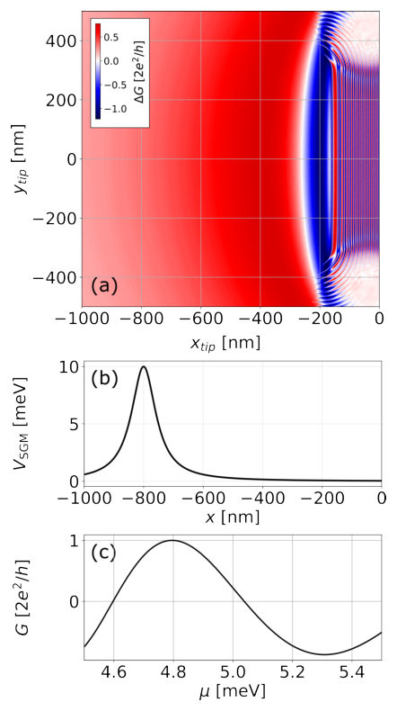 
Figure 3. (a) Conductance difference varying SGM tip at µ = 5 meV. (b) SGM potential distribution along the x-direction for the tip center located at x = −800 nm. (c) Conductance without the tip versus the chemical potential. The results are obtained for B = 1 T.

📷 Fig 5

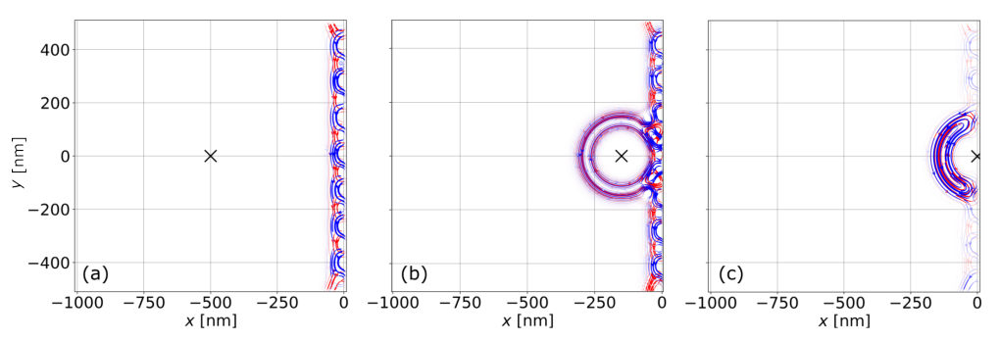 
Figure 5. Probability currents obtained with SGM tip at magnetic field Bz = 0.912 T and µ = 5 meV (a) at xtip = −500 nm, (b) xtip = −150 nm, ytip = 0 (c) xtip = 0 nm, ytip = 0. The red (blue) colors correspond to electron (hole) part of the probability currents.

**Summary.** This work theoretically models how chiral Andreev edge states behave when probed by a scanning gate microscope at a quantum Hall-superconductor interface. By analyzing the system using the Bogoliubov-de Gennes formalism, the authors predict and demonstrate that the local tip potential induces Aharonov-Bohm oscillations in the conductance. This technique offers a robust method to characterize superconducting edge states, even when disorder is present.

**Why it may be interesting.** The ability to use a local probe (SGM) to map out fundamental quantum interference phenomena (AB effect) in superconducting edge states provides a powerful conceptual link between topological superconductivity and mesoscopic transport measurements.

Detailed structure

**Main problem.** The paper theoretically investigates how chiral Andreev edge states (CAESs) at a quantum Hall-superconductor interface respond to local perturbations from a scanning gate microscope (SGM).

**Main result.** The SGM tip forces the electron and hole components of the CAESs to accumulate a relative magnetic phase, leading to observable Aharonov-Bohm-type conductance oscillations, which persist even in the presence of disorder.

**Method.** The analysis uses the Bogoliubov-de Gennes formalism and the Landauer-Büttiker approach to calculate non-local conductance ($G$) as a function of the tip position.

**Model / system.** The system is a Quantum Hall-Superconductor (QH-SC) hybrid structure. The physics is governed by the Bogoliubov-de Gennes Hamiltonian, incorporating the local potential of the SGM tip and the magnetic field via the vector potential.

**Key observables.** Aharonov-Bohm-type conductance oscillations ($\Delta G$), probability current maps, and the dependence of oscillation amplitude on the filling factor ($
u$).

**Important parameters / regimes.** Filling factors ($
u=2, 
u=4$), magnetic field ($B$), disorder strength ($U_d$), and the tip position ($x_{	ext{tip}}, y_{	ext{tip}}$).

**Assumptions / limitations.** Assumes negligible Zeeman interaction and spin degeneracy; the analysis often relies on approximating the tip potential and assuming adiabatic evolution of the edge states.

**Figures summary.** Figures illustrate conductance maps ($\Delta G$) showing characteristic oscillations as the tip scans across the edge, and probability current maps demonstrating the decoupling of electron and hole paths.

**Paper structure.** The paper progresses from establishing the theoretical framework (Bogoliubov-de Gennes model) to deriving the AB oscillation formula based on mode decoupling, demonstrating this effect for $
u=2$ and $
u=4$, and finally extending the analysis to show the robustness of the signature against disorder.

Abstract

We theoretically investigate the spatial response of chiral Andreev edge states at a quantum Hall-superconductor interface probed by scanning gate microscopy. Using the Bogoliubov-de Gennes formalism, we demonstrate that the localized potential of the scanning gate tip decouples the chiral Andreev edge states from the superconductor into independent electron and hole paths. In the $ν=2$ regime, this local separation forces the quasiparticles to accumulate a relative magnetic phase in the normal region, resulting in Aharonov-Bohm-type conductance oscillations that are captured by a geometric analytical model. At higher filling factors (e.g., $ν=4$), the tip progressively interacts with spatially distinct edge channels, dynamically altering the Andreev-induced mode mixing and modifying the transport resonances. Furthermore, we show that these highly localized interferometric signatures survive in the presence of disorder, even when conventional non-local transport oscillations are masked.

[↑ back to top](#top)

### [Detecting a large magneto-optical shift in Py/NiO bilayers](http://arxiv.org/abs/2609.27106v1)

**Authors:** Adrielson Dias, Maria Clara, Ozéas Rodrigues, Gabriel Henrique, José Lucas, José Holanda  
**Type:** experiment · **Category:** other · **PDF:** <https://arxiv.org/pdf/2609.27106v1>  
**Analysis basis:** full PDF text, analyzed in chunks
**Topic relevance:** `quantum optics experiment` **3/5** · `analog quantum simulation` **2/5** · `quantum measurements` **2/5** · `interference shaping light` **1/5**

📷 Fig 1

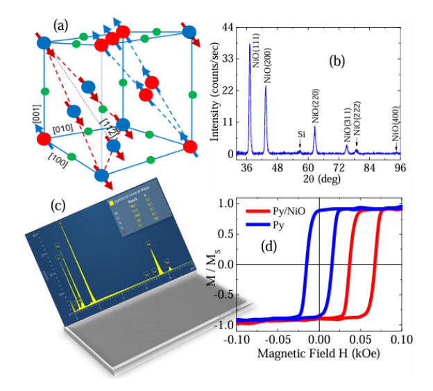 
Figure 1: (a) NiO unit cell in an fcc structure with two distinct anisotropy axes: a hard axis

📷 Fig 2

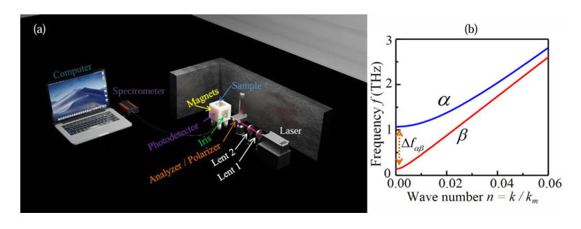 
Figure 2: Illustrates the experimental setup used for the magneto-optical measurements.

📷 Fig 3

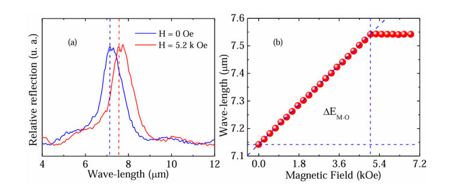 
Figure 3: (a) (a) Shows the relative optical reflection spectra of the Py (20 nm)/NiO (200

📷 Fig 4

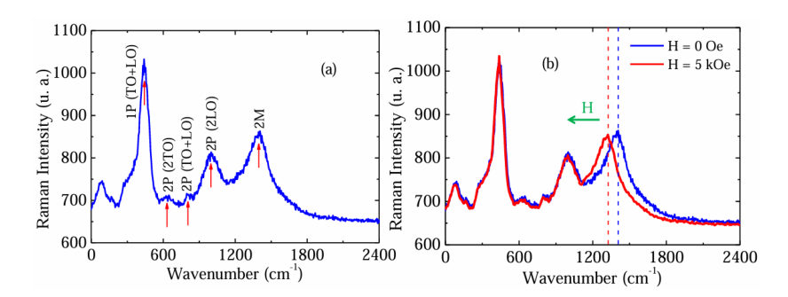 
Figure 4: (a) Presents the vibrational and magnon Raman peaks. The observed features are

**Summary.** This paper reports on magneto-optical measurements on Py/NiO bilayers, observing a large, field-dependent spectral shift. The findings confirm that this shift arises from the control of antiferromagnetic magnon energies within the NiO layer. This establishes the bilayer as a promising platform for optically probing and manipulating antiferromagnetic spin dynamics.

**Why it may be interesting.** The direct experimental control of magnon energies using optical probes and magnetic fields is highly relevant to understanding and manipulating quantum excitations in magnetic materials, which connects to open quantum systems and quantum optics.

Detailed structure

**Main problem.** The study aims to detect and characterize a large magneto-optical shift in Py/NiO bilayers, demonstrating strong magneto-optical coupling in an antiferromagnetic system.

**Main result.** The research provides direct experimental evidence for magnetic-field control of antiferromagnetic magnon energies via magneto-optical interactions in the NiO layer.

**Method.** Magneto-optical magnetometry measurements were performed on the bilayers, analyzing spectral shifts using a laser source and spectrometer.

**Model / system.** The physical system is a Py/NiO bilayer, where NiO acts as the antiferromagnetic layer and Py is the ferromagnetic underlayer. The effect is attributed to magnons intrinsic to the NiO layer.

**Key observables.** Pronounced, systematic, and monotonic spectral shift (wavelength shift) up to ~400 nm, and associated magneto-optical energy variation on the order of 10^7 eV.

**Important parameters / regimes.** The bilayer thickness is Py (20 nm)/NiO (200 nm). The shift saturates at higher applied magnetic fields.

**Assumptions / limitations.** The observed effect originates from magnons intrinsic to the AF NiO layer, and the contribution from the Py underlayer is negligible due to the large NiO thickness.

**Figures summary.** Figure 3 shows the wavelength shift induced by the magnetic field in reflectance spectra. Figure 4 compares Raman spectra, showing the shift only in the two-magnon (2M) mode.

**Paper structure.** The paper establishes the physical system and measurement setup, presents the observation of the field-dependent spectral shift, analyzes the shift magnitude and origin (confirming magnon control), and concludes by establishing the platform's potential.

Abstract

Here, magneto-optical magnetometry measurements on Py/NiO bilayers reveal a pronounced magnetic-field-induced wavelength shift, demonstrating strong magneto-optical coupling in this antiferromagnetic system. A systematic and monotonic spectral shift of up to ~ 400 nm is observed as the applied magnetic field increases, saturating at higher fields. Quantitative analysis shows that the associated magneto-optical energy variation is on the order of 107 eV, comparable to the magnon energy scale in NiO. Owing to the large NiO thickness, the observed effect originates from magnons intrinsic to the antiferromagnetic NiO layer rather than from spin currents injected by the Py underlayer. These results provide direct experimental evidence for magnetic-field control of antiferromagnetic magnon energies via magneto-optical interactions, establishing Py/NiO bilayers as a promising platform for optically probing and manipulating antiferromagnetic spin dynamics.

[↑ back to top](#top)

### [Helical Anomaly from Concurrent $\mathbb{Z}$ and $\mathbb{Z}_2$ Topology in an Acoustic Semimetal](http://arxiv.org/abs/2609.28125v1)

**Authors:** Hou-Yin Li, Hua-Shan Lai, Jian-Lan Xie, Xiao-Chen Sun, Yan-Feng Chen, Cheng He  
**Type:** both · **Category:** other · **PDF:** <https://arxiv.org/pdf/2609.28125v1>  
**Analysis basis:** full PDF text, analyzed in chunks
**Topic relevance:** `analog quantum simulation` **3/5**

📷 Fig 1

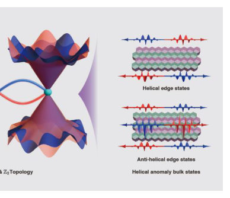 
Fig.1| Semimetal band structure hosting bulk ℤ and boundary ℤ𝟐 topology, leading to the realization of

📷 Fig 2

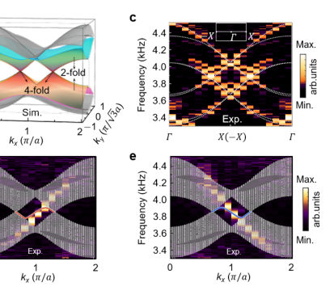 
Fig. 2| Concurrent ℤ and ℤ𝟐 topology in acoustic crystal bands. a Schematic of the acoustic staggered lattice.

📷 Fig 3

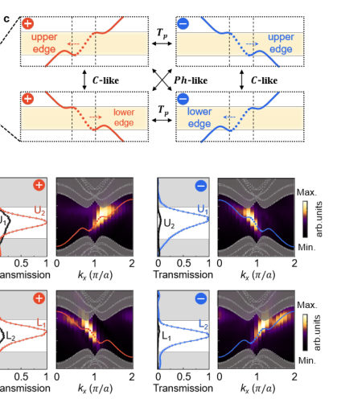 
Fig. 3| Realization of HESs. a Lattice for HESs. Periodic boundary conditions along x; finite configuration along y

📷 Fig 4

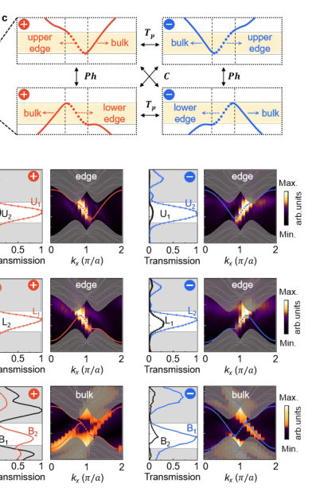 
Fig. 4| Realization of anti-HESs. It is similar to Fig. 3 except for the following points: a The sample possesses

**Summary.** This paper reports the realization of a novel topological regime in an acoustic semimetal where bulk and boundary properties are simultaneously protected by distinct $\mathbb{Z}$ and $\mathbb{Z}_2$ invariants. By engineering the lattice symmetries, the authors demonstrate 'helical anomaly bulk states' (HABSs), establishing a new paradigm for understanding topological transport beyond conventional single-class theories.

**Why it may be interesting.** The work extends topological physics beyond single-invariant descriptions, providing a concrete, experimentally verifiable platform (acoustic metamaterials) to study complex, multi-faceted topological invariants.

Detailed structure

**Main problem.** The paper investigates topological phases characterized by the concurrent presence of both $\mathbb{Z}$ (integer) and $\mathbb{Z}_2$ invariants, a regime that is theoretically challenging to realize and study.

**Main result.** The authors realize and characterize 'helical anomaly bulk states' (HABSs) in a 2D acoustic semimetal, demonstrating that bulk and boundary degeneracies can be jointly governed by distinct topological invariants.

**Method.** The research combines theoretical modeling (Hamiltonian construction, symmetry analysis) with advanced experimental techniques involving 3D printing and point-by-point sound pressure field measurements.

**Model / system.** The physical system is a two-dimensional acoustic semimetal realized in a staggered lattice structure. The model utilizes engineered degrees of freedom (layer, sublattice, gauge-staggered) to control symmetries like time-reversal and particle-hole symmetry.

**Key observables.** Bulk degeneracies protected by $\mathbb{Z}$ invariants (Weyl points), boundary degeneracies protected by $\mathbb{Z}_2$ invariants (twisted boundary arcs), and the resulting pseudospin-selective HABSs.

**Important parameters / regimes.** The system's behavior is controlled by engineered symmetries and the interplay between the $\mathbb{Z}$ and $\mathbb{Z}_2$ topological invariants.

**Assumptions / limitations.** The analysis assumes the system can be effectively classified within the DIII symmetry class, and that the acoustic system can mimic electronic topological properties.

**Figures summary.** Figures illustrate the band structure showing the coexistence of $\mathbb{Z}$ and $\mathbb{Z}_2$ topology, visualizing HESs/anti-HESs, and confirming the existence of HABSs through measured and simulated dispersions.

**Paper structure.** The paper progresses from establishing the theoretical framework of concurrent $\mathbb{Z}$ and $\mathbb{Z}_2$ topology to detailing the physical realization in an acoustic semimetal, culminating in the experimental measurement and characterization of the novel HABS states.

Abstract

Topological classification constitutes a cornerstone of modern condensed-matter physics. Historically, topological systems have been predominantly characterized by invariants confined to a single topological class, such as topological insulators with a $\mathbb{Z}_2$ invariant and Weyl semimetals with an integer ($\mathbb{Z}$) topological charge. While such classification frameworks in principle permit gapless phases in which bulk and boundary degeneracies are protected by distinct invariants, this regime has received limited focused attention, as coordinating the requisite symmetries within a single band structure is highly nontrivial. Here, we realize such concurrent $\mathbb{Z}$ and $\mathbb{Z}_2$ topology in a two-dimensional acoustic semimetal, revealing pseudospin-selective topological bulk modes arising from the interplay between these distinct invariants, termed helical anomaly bulk states (HABSs). Our lattice design exploits layer, sublattice, and gauge-staggered degrees of freedom, enabling modular control of effective time-reversal, chiral, and particle-hole symmetries. The resulting system exhibits bulk degeneracies protected by an integer $\mathbb{Z}$ invariant and Kramers-like boundary degeneracies protected by a $\mathbb{Z}_2$ invariant, forming twisted boundary arcs. Crucially, finite-size systems manifest helical or anti-helical edge states coexisting with HABSs, a distinctive signature absent in single-invariant topologies. Our results establish HABSs as a characteristic signature of concurrent topology and demonstrate a new regime where bulk and boundary invariants jointly govern topological transport beyond conventional single-class frameworks.

[↑ back to top](#top)

### [Computation of Turing bifurcation normal form for n-component reaction-diffusion systems](http://arxiv.org/abs/2609.28039v1)

**Authors:** Edgardo Villar-Sepúlveda, Alan R. Champneys  
**Type:** theory · **Category:** statistical mechanics · **PDF:** <https://arxiv.org/pdf/2609.28039v1>  
**Analysis basis:** full PDF text, analyzed in chunks
**Topic relevance:** `Keldysh / 2PI / non-Gaussian methods` **2/5** · `analog quantum simulation` **2/5** · `driven-dissipative phase transition` **2/5** · `methods for driven-dissipative` **2/5** · `non-equilibrium universality` **2/5** · `correlated / nonlocal dissipation` **1/5**

📷 Fig 1

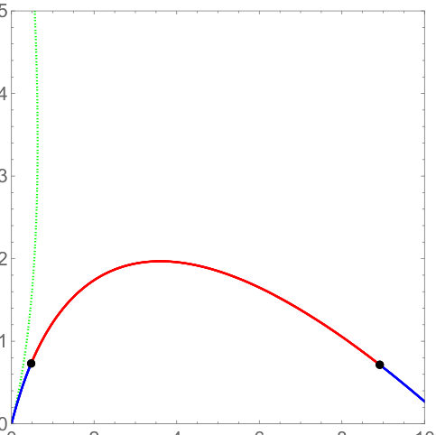 
Fig. 1. Bifurcation diagram of the Schnakenberg model with the addition of cross-diffusion. The dotted green curve represents a BD-line and the blue (resp. red) curve is a subcritical (resp. supercritical) Turing bifurcation. The black points are codimension-two bifurcation points where the third-order coefficient becomes zero.

📷 Fig 2

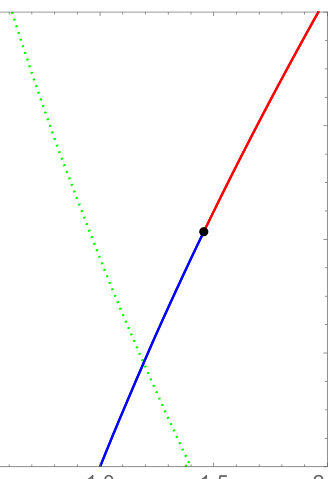 
Fig. 2. Bifurcation diagram of Konishi and Hara’s model. The green dotted curve represents a BD-line and the blue (resp. red) curve is a subcritical (resp. supercritical) Turing bifurcation. The black point is a codimension- two bifurcation point where the third-order coefficient becomes zero.

📷 Fig 3

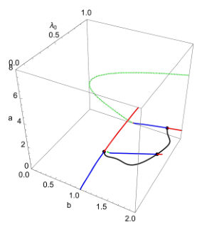 
Fig. 3. Codimension-2 bifurcation curve, together with some Turing bifurcation curves plotted along the way, together with the corresponding colors. The green dotted curve represents a BD-line and the blue (resp. red) curves are subcritical (resp. supercritical) Turing bifurcations. The black points are codimension-two bifurcation points where the third-order coefficient becomes zero.

**Summary.** This paper develops a general, high-order mathematical framework to analyze Turing bifurcations in complex $n$-component reaction-diffusion systems. It derives the amplitude equation and calculates coefficients up to the fifth order, allowing researchers to precisely map out where the nature of the instability changes (codimension-two points). The method is highly computational, providing robust tools for analyzing pattern formation in nonlinear physics.

**Why it may be interesting.** While focused on classical reaction-diffusion systems, the mathematical machinery of deriving amplitude equations and analyzing codimension-two points is highly relevant to the stability analysis of non-equilibrium quantum systems or pattern formation in quantum field theories.

Detailed structure

**Main problem.** The paper derives general expressions for the amplitude equation (normal form) valid at a Turing bifurcation for $n$-component reaction-diffusion systems in one spatial dimension.

**Main result.** General expressions for the normal form coefficients up to the fifth order are derived, enabling the systematic detection and analysis of codimension-two points where the bifurcation criticality changes.

**Method.** The method involves an order-by-order expansion (Taylor series) of the system's nonlinear terms, leading to an amplitude equation whose coefficients determine the bifurcation type and higher-order stability.

**Model / system.** The study concerns $n$-component reaction-diffusion systems governed by $\partial u/\partial t = f(u, \epsilon) + D(\epsilon) \partial^2 u/\partial x^2$. Examples include the Schnakenberg model and four-component systems.

**Key observables.** The normal form coefficients ($C_{1,1}, C_3, C_5$) determine the bifurcation criticality; the sign of $C_3$ distinguishes between subcritical and supercritical bifurcations.

**Important parameters / regimes.** The bifurcation parameter $\epsilon$ (or $\epsilon^*$), the wavenumber $\hat{k}$, and the order of the expansion (up to fifth order).

**Assumptions / limitations.** The analysis assumes the bifurcation occurs at $\epsilon=0$ and is valid for periodic or homogeneous Neumann boundary conditions; the derivation relies on solvability conditions from multiple scales analysis.

**Figures summary.** Figures illustrate the bifurcation diagram for models like the Schnakenberg system, showing Turing bifurcation curves colored by the sign of $C_3$, and marking codimension-two points.

**Paper structure.** The paper systematically derives the normal form coefficients ($C_3, C_5$) using solvability conditions, presents the resulting amplitude equation, and validates the method computationally using Python and Mathematica to trace bifurcation curves and critical points.

Abstract

General expressions are derived for the amplitude equation valid at a Turing bifurcation of a system of reaction-diffusion equations in one spatial dimension, with an arbitrary number of components. The normal form is computed up to fifth order, which enables the detection and analysis of codimension-two points where the criticality of the bifurcation changes. The expressions are implemented within a Python package, in which the user needs to specify only expressions for the reaction kinetics and the values of diffusion constants. The code is augmented with a Mathematica routine to compute curves of Turing bifurcations in a parameter plane and automatically detect codimension-two points. The software is illustrated with examples that show the versatility of the method including a case with cross-diffusion, a higher-order scalar equation, and a four-component system.

[↑ back to top](#top)

### [Amplitude equations for wave bifurcations in reaction-diffusion systems](http://arxiv.org/abs/2609.28037v1)

**Authors:** Edgardo Villar-Sepúlveda, Alan R. Champneys  
**Type:** theory · **Category:** other · **PDF:** <https://arxiv.org/pdf/2609.28037v1>  
**Analysis basis:** full PDF text, analyzed in chunks
**Topic relevance:** `analog quantum simulation` **2/5** · `driven-dissipative phase transition` **2/5** · `non-equilibrium universality` **2/5** · `Keldysh / 2PI / non-Gaussian methods` **1/5** · `correlated / nonlocal dissipation` **1/5** · `methods for driven-dissipative` **1/5**

📷 Fig 1

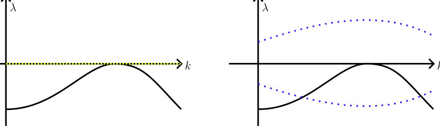 
Figure 1: One branch of dispersion relations corresponding to (a) Turing bifurcation and (b) wave bifurcation. In (a), the eigenvalue plotted is real whilst in (b), two complex-conjugate eigenvalues are plotted. In each plot, solid lines represent the real part of an eigenvalue, and dotted lines correspond to the imaginary part.

📷 Fig 2

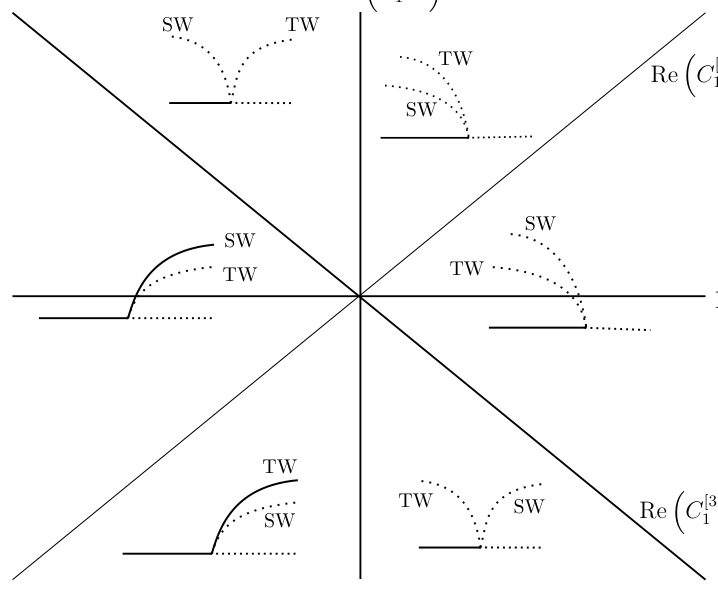 
Figure 2: The region of parameter space in which standing waves (SW) and travelling waves (TW) bifurcate super- or subcriticality as a function of the cubic coefficients of the normal form (6) and (6). This figure is based on [10, Fig.1].

📷 Fig 3

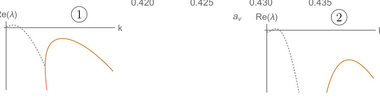 
Figure 3: Bifurcation diagram of model (30)–(32) when f3 (u, k0) = u −u3, kw = 0, and kv = 1 at P, for the parameter values given in (33). The purple vertical line is a subcritical Hopf bifurcation of the steady-state, the magenta curve represents a subcritical wave bifurcation, while the blue curve represents a subcritical Turing bifurcation. Furthermore, the black dotted curve is formed by points in which the conditions for a wave bifurcation are fulfilled for a negative value of k2. Here, (av, D2) ∈[0.42, 0.44] × [0.05, 0.25]. The marked dots are codimension-two bifurcation points and the numbers denote the regions delimited by the bifurcation curves, except the dotted black curve. The...

📷 Fig 4

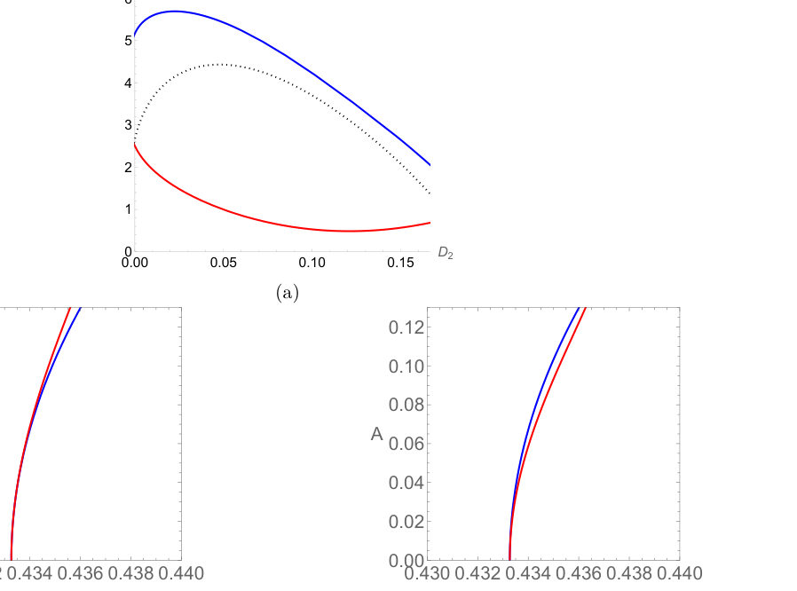 
Figure 4: (a) Third-order coefficients along the wave bifurcation curve shown in Figure 3. The red (resp. blue) curve represents the numerical value of Re  C[3,0] 1   resp. Re  C[3,0] 1 + C[1,2] 1  , while

📷 Fig 5

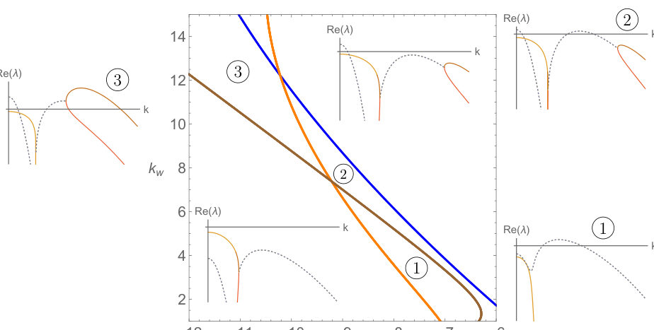 
Figure 5: Bifurcation diagram of system (30)–(32) with f3 (u, k0) = k0 + 2 u −u3, a0 = aw = 0, av = aw = 1, and εv = 1

**Summary.** This theoretical paper develops comprehensive mathematical tools to analyze wave bifurcations in complex reaction-diffusion systems. It derives the weakly nonlinear normal form equations up to the fifth order, providing explicit formulas for the coefficients that determine whether the resulting waves are supercritical or subcritical. This work significantly advances the mathematical understanding of pattern formation in non-equilibrium physical models.

**Why it may be interesting.** While focused on classical reaction-diffusion systems, the rigorous mathematical machinery of deriving high-order normal forms and analyzing pattern formation stability is highly relevant to understanding the dynamics of open quantum systems or complex many-body dynamics where pattern formation or phase transitions occur.

Detailed structure

**Main problem.** The paper aims to derive general amplitude equations for wave bifurcations in reaction-diffusion systems, which are counterparts to Turing instabilities.

**Main result.** Complete formulae for the weakly nonlinear normal form coefficients up to order five are derived for both standing and rotating wave solutions in arbitrary n-component systems.

**Method.** The analysis employs a multi-scale asymptotic methodology, extending normal-form analysis from Hopf and Turing bifurcations to derive amplitude equations for the system's modes.

**Model / system.** The study concerns general n-component reaction-diffusion systems ($\partial_t u = f(u, \mu) + D(\mu) \partial_{xx} u$) exhibiting wave bifurcations, which require at least three components.

**Key observables.** The coefficients of the weakly nonlinear normal form (e.g., $C[\cdot]$) and the resulting bifurcation diagrams characterizing the stability and type (super/subcritical) of standing and travelling waves.

**Important parameters / regimes.** The number of components ($n \geq 3$), the bifurcation parameter ($\mu$), and the spatial/temporal wave number ($k^*$).

**Assumptions / limitations.** The analysis assumes the existence of a stable, isolated homogeneous steady state and relies on non-degeneracy conditions to perform the asymptotic expansions.

**Figures summary.** Figure 1 illustrates the difference between dispersion relations for Turing (real eigenvalue) and wave (pure imaginary pair) bifurcations. Figure 2 summarizes the parameter space region showing the bifurcation type (SW/TW) based on cubic coefficients.

**Paper structure.** The paper progresses by first establishing the general framework for wave bifurcations, then deriving the normal form equations up to fifth order, and finally analyzing the coefficients to determine the precise nature (supercritical vs. subcritical) of the resulting wave patterns.

Abstract

A wave bifurcation is the counterpart to a Turing instability in reaction-diffusion systems, but where the critical wavenumber corresponds to a pure imaginary pair rather than a zero temporal eigenvalue. Such bifurcations require at least three components and give rise to patterns that are periodic in both space and time. Depending on boundary conditions, these patterns can comprise either rotating or standing waves. Restricting to systems in one spatial dimension, complete formulae are derived for the evaluation of the coefficients of the weakly nonlinear normal form of the bifurcation up to order five, including those that determine the criticality of both rotating and standing waves. The formulae apply to arbitrary $n$-component systems ($n\geq 3$) and their evaluation is implemented in software which is made available as supplementary material. The theory is illustrated on two different versions of three-component reaction-diffusion models of excitable media that were previously shown to feature super- and subcritical wave instabilities and on a five-component model of two-layer chemical reaction. In each case, two-parameter bifurcation diagrams are produced to illustrate the connection between complex dispersion relations and different types of Hopf, Turing, and wave bifurcations, including the existence of several codimension-two bifurcations.

[↑ back to top](#top)

### [Shift-register synchronization of dual-wavelength pulse trains in resonators with quadratic nonlinearity](http://arxiv.org/abs/2609.27655v1)

**Authors:** Stepan Bogdanov, Anastasiya Bednyakova, Sergei K. Turitsyn  
**Type:** theory · **Category:** other · **PDF:** <https://arxiv.org/pdf/2609.27655v1>  
**Analysis basis:** full PDF text, analyzed in chunks
**Topic relevance:** `Keldysh / 2PI / non-Gaussian methods` **2/5** · `driven-dissipative phase transition` **2/5** · `methods for driven-dissipative` **2/5** · `interference shaping light` **1/5** · `non-equilibrium universality` **1/5**

📷 Fig 1

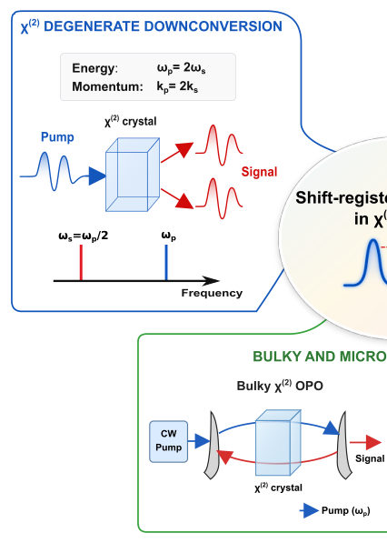 
Figure 1: Concept of shift-register synchronization in a degenerate χ(2) OPO. Quadratic downconversion couples the pump field b at 2ω to the half-harmonic signal field a at ω. Because the two fields propagate with different group velocities, their pulse trains acquire a relative temporal displacement during each cavity round trip. In a shift-register state, the complete intracavity pattern is reproduced after one round trip up to an integer temporal translation of one train relative to the other. The mechanism can, in principle, be implemented in both bulk and integrated quadratic resonators.

📷 Fig 2

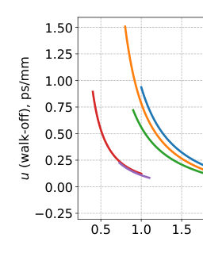 
Figure 2: Linear group-velocity mismatch (walk-off) for representative χ(2) materials (including lithium niobate (LN), lithium tantalate (LT), aluminum nitride (AlN), barium borate (BBO), and lithium triborate (LBO)) in degenerate downconversion as a function of pump wavelength, calculated from published Sellmeier relations. The accessible values span the range required for the shift-register states investigated below, showing that the synchronization conditions are compatible with realistic bulk and integrated quadratic platforms.

📷 Fig 3

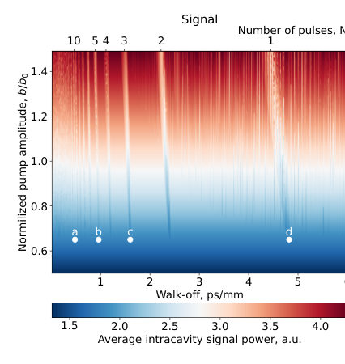 
Figure 3: Numerical synchronization maps obtained by adiabatically varying the normalized input pump amplitude b/b0 for each value of the linear walk-off u. Shown are the intracavity signal (left) and pump (right) powers. Narrow high-power domains correspond to stable shift-register states with different integer numbers N of signal pulses in the cavity and N + M pump pulses. The systematic shift of these domains with pump amplitude demonstrates that the synchronization condition cannot be determined by the linear walk-off alone and indicates a nonlinear renormalization of the effective relative velocity. White markers “a”, “b”, “c”, “d” with corresponding N values 10, 5, 3, 1 indicate...

📷 Fig 4

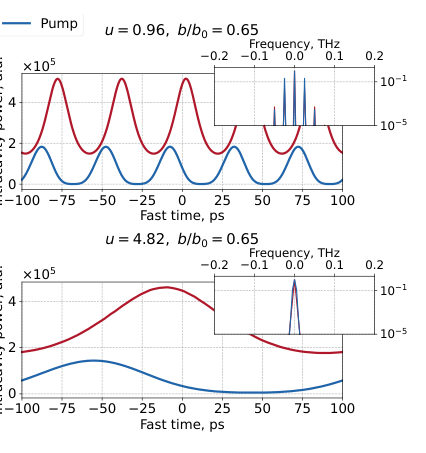 
Figure 4: Representative stationary shift-register states selected from the synchronization domains in Fig. 3, corresponding from upper left to lower right to N = 10, 5, 3, and 1 pulses per cavity round trip. Main panels show the intracavity signal and pump powers versus fast time; insets show the corresponding normalized spectra. As the walk-off increases, the synchronized state reorganizes into progressively smaller integer pulse-number states while preserving regular pulse-train operation.

📷 Fig 5

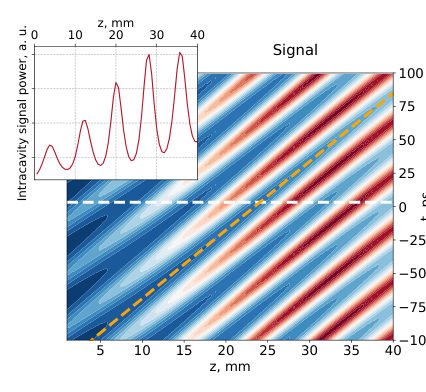 
Figure 5: Intracavity spatiotemporal evolution of the signal (left) and pump (right) in a representative shift-register state at u = 0.9 ps/mm and b/b0 = 1.05. The diagonal pulse trajectories reveal the different effective propagation velocities of the two harmonics (as indicated by their different slopes; the orange line serves to demonstrate that having the same tilt in both plots). Nevertheless, the two pulse trains remain globally synchronized: the cavity contains N = 5 signal pulses and N + M = 6 pump pulses, so that their relative displacement accumulated during one round trip corresponds to one pulse period (M = 1). Insets show cross-sections along the indicated dashed lines.

**Summary.** This paper details a shift-register synchronization mechanism for dual-wavelength pulse trains in nonlinear optical resonators. It shows that parametric energy exchange can stabilize this synchronization even when group-velocity mismatch is significant. This mechanism offers a pathway toward advanced photonic applications like frequency combs and optical memories.

**Why it may be interesting.** This work bridges nonlinear optics with concepts of discrete state transitions (like shift registers), providing a robust mechanism for controlling complex wave patterns in optical cavities, which has implications for ultrafast photonics.

Detailed structure

**Main problem.** The paper introduces and demonstrates a novel shift-register synchronization mechanism for dual-wavelength pulse trains propagating in resonators with quadratic nonlinearity.

**Main result.** The synchronization is achieved not through conventional velocity locking, but via continuous parametric energy exchange that modifies the effective walk-off, allowing for deterministic discrete pulse shifts after each cavity round trip.

**Method.** The analysis combines coupled-mode equations with the Ikeda-map formalism and employs variational methods to derive reduced dynamical systems for the pulse envelopes.

**Model / system.** The system is modeled as a doubly resonant degenerate $\chi^{(2)}$ Optical Parametric Oscillator (OPO) in a resonator, governed by coupled nonlinear wave equations.

**Key observables.** Intracavity signal and pump powers, number of pulses ($N$), pulse spacing ($T$), and the effective walk-off ($u_{eff}$).

**Important parameters / regimes.** Group-velocity mismatch ($u$), nonlinear coupling ($\kappa$), and the ratio of round-trip times to pulse periods ($M/N$).

**Assumptions / limitations.** The analysis often assumes the neglect of chromatic-dispersion terms and treats the pulse trains as periodic with well-separated pulses for variational reduction.

**Figures summary.** Figures illustrate the concept of synchronization via temporal displacement, show synchronization domains in parameter space, and depict representative stationary shift-register states for varying pulse numbers.

**Paper structure.** The paper progresses from defining the physical system and the synchronization concept, deriving the necessary coupled equations and conservation laws, and finally applying variational and numerical techniques to confirm the nonlinear modification of the walk-off condition.

Abstract

Self-organization of nonlinear waves underpins phenomena ranging from hydrodynamic pattern formation to optical frequency-comb generation. We introduce and numerically demonstrate a shift-register synchronization mechanism for pulse trains in quadratic nonlinear resonators. The synchronized state persists despite substantial group-velocity mismatch through continuous parametric energy exchange, resulting in deterministic discrete pulse shifts after each cavity round trip. Nonlinear parametric interaction modifies the effective walk-off, allowing the pulse trains to satisfy the shift-register synchronization conditions. The proposed mechanism reveals a previously unexplored synchronization regime in quadratic resonators and provides a route toward multicolour frequency combs, optical memories, and ultrafast photonic information processing.

[↑ back to top](#top)

### [General conditions for Turing and wave instabilities in reaction-diffusion systems](http://arxiv.org/abs/2609.28036v1)

**Authors:** Edgardo Villar-Sepúlveda, Alan R. Champneys  
**Type:** theory · **Category:** other · **PDF:** <https://arxiv.org/pdf/2609.28036v1>  
**Analysis basis:** full PDF text, analyzed in chunks
**Topic relevance:** `analog quantum simulation` **2/5** · `Keldysh / 2PI / non-Gaussian methods` **1/5** · `correlated / nonlocal dissipation` **1/5** · `driven-dissipative phase transition` **1/5** · `methods for driven-dissipative` **1/5** · `non-equilibrium universality` **1/5**

📷 Fig 1

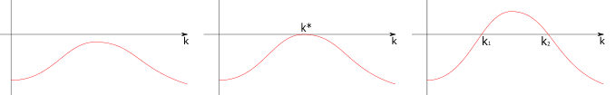 
Fig. 1: Sketches of dispersion relations, that is the locus of the real part of an eigenvalue λ(k), for different parameter values. Upon parameter variation we have: (a) absence of instability; (b) a bifurcation point giving onset to insta- bility; (c) unstable patterns exist for wavenumbers k1 &lt; k &lt; k2. For simplicity we depict only the dispersion curve of a mode for which maxk(Re(λi(k))) is largest.

📷 Fig 2

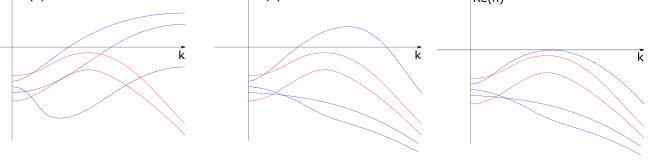 
Fig. 2: Illustrating the main idea of Theorem 5 via sketches of dispersion curves of a five-component system, for three different sets of values of the diffusion rates. In (a) three diffusion rates (corresponding to the blue curves) are zero, while the others are positive. In (b) all diffusion rates are positive and there is an interval of k-values corresponding to a Turing instability. Panel (c) shows the critical situation between cases (a) and (b), which would correspond to a Turing bifurcation.

📷 Fig 3

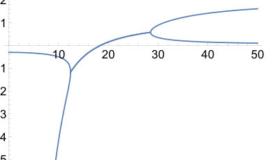 
Fig. 3: Eigenvalues with the largest real parts of the matrix Ju f(P) −k2 D, where Ju f(P) is given by (16), and D = diag (10, 0, 0).

📷 Fig 4

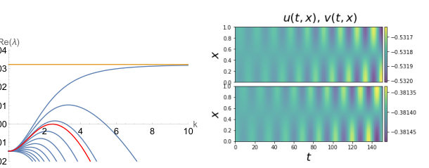 
Fig. 4: (a) Dispersion relation of model (17) at parameter values (20) (av, aw, ϵv, ϵw, a0) = (0.435, 0.5, 0.2, 1, −0.1) and (D1, D2, D3) = (δ, δ, 0.1) as δ varies from 0 to 0.01 in uniform steps. The red line is the dispersion curve for δ = 2.27312 × 10−3, where the wave bifurcation occurs, and the orange line is the straight line Re(λ) = 0.0322485. (b) Simulation of (17) on a 1D domain of length L = 1 with Neumann boundary conditions, for δ = 0.001 and an initial condition that is a perturbation of P proportional to cos(πx) with amplitude 10−5 in all three components.

📷 Fig 5

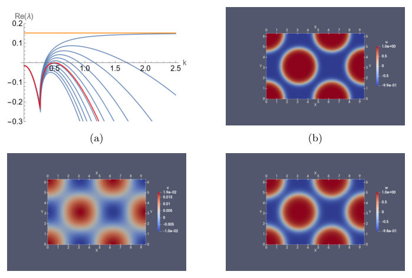 
Fig. 5: (a) Similar to Fig. 4(a) but for (D1, D2, D3) = (δ, 5, δ) and δ vary- ing from 0 to 0.5 in uniform steps; the distinguished (red) curve is for δ = 0.28684, where a Turing bifurcation occurs, and the (orange) straight line is at Re(λ) = 0.151497. (b), (c), (d) variables u, v, w, respectively, at the Turing instability pattern obtained after integrating the system in two spatial dimensions with δ = 0.03. Here, we make a perturbation in all components equally corresponding to wave numbers (kx, ky) = (3, 2) with an amplitude ε = 10−4.

**Summary.** This paper provides a comprehensive mathematical theory for determining when stable chemical or biological steady states in reaction-diffusion systems become unstable due to diffusion. It rigorously derives necessary and sufficient conditions for both Turing (stationary pattern) and wave (traveling wave) instabilities. The work is significant for modeling pattern formation in fields ranging from biology to chemical kinetics.

**Why it may be interesting.** While the subject matter is far from quantum physics, the rigorous mathematical framework of stability analysis, bifurcation theory, and pattern formation in non-linear PDEs is foundational to many areas of theoretical physics, including quantum field theory and non-equilibrium statistical mechanics.

Detailed structure

**Main problem.** The paper aims to provide general necessary and sufficient mathematical conditions for the onset of diffusion-driven instabilities, specifically Turing or wave instabilities, in reaction-diffusion systems.

**Main result.** The authors establish general criteria for both Turing (real eigenvalue) and wave (imaginary eigenvalue) bifurcations, providing a constructive method for selecting diffusion constants that induce instability.

**Method.** The analysis relies on linear stability theory, examining the dispersion relation $\lambda(k)$ derived from the Jacobian matrix and the diffusion operator. Key techniques involve analyzing limits of the wavenumber $k$ and using matrix determinant properties.

**Model / system.** The core model is the reaction-diffusion system $u_t = f(u) + D 
abla^2 u$, where $u$ is the state vector, $f$ is the reaction kinetics, and $D$ is a diagonal diffusion matrix. Examples include malaria dispersion models and coupled Brusselator systems.

**Key observables.** The real part of the eigenvalue $	ext{Re}(\lambda(k))$ as a function of the wavenumber $k$, which determines stability ($	ext{Re}(\lambda) > 0$ indicates instability).

**Important parameters / regimes.** Diffusion coefficients ($D_i$), system parameters (e.g., $a, b, c, \eta$), and the wavenumber $k$.

**Assumptions / limitations.** The analysis primarily assumes diagonal diffusion matrices and is based on linear stability analysis around a homogeneous steady state. Extensions to cross-diffusion or non-sinusoidal modes are noted as future work.

**Figures summary.** Figures sketch the dispersion relation $	ext{Re}(\lambda)$ vs. $k^2$, illustrating regimes of stability, the precise point of bifurcation onset, and the range of unstable wavenumbers ($k_1 < k < k_2$).

**Paper structure.** The paper develops theory by first establishing general conditions using matrix properties (Lemmas 1-5) for Turing bifurcations, and then applies this framework to specific physical models (like the FitzHugh-Nagumo or Brusselator) to illustrate both Turing and wave instability mechanisms.

Abstract

Necessary and sufficient conditions are provided for a diffusion-driven instability of a stable equilibrium of a reaction-diffusion system with $n$ components and a diagonal diffusion matrix. These can be either Turing or wave instabilities. Known necessary and sufficient conditions are reproduced for there to exist diffusion rates that cause a Turing bifurcation of a stable homogeneous state in the absence of diffusion. The method of proof here though, which is based on a study of dispersion relations in the contrasting limits in which the wavenumber tends to zero and to $\infty$, gives a constructive method for choosing diffusion constants. The results are illustrated on a model for the dispersion of malaria, a 3-component FitzHugh-Nagumo-like model proposed to study excitable wavetrains, and for two different coupled Brusselator systems with 4 components

[↑ back to top](#top)

### [Multiprecision computation of bright and dark solitons in the discrete nonlinear Schrödinger equation](http://arxiv.org/abs/2609.27663v1)

**Authors:** Rudy Kusdiantara, Farrell T. Adriano, Hadi Susanto  
**Type:** theory · **Category:** numerical methods · **PDF:** <https://arxiv.org/pdf/2609.27663v1>  
**Analysis basis:** full PDF text, analyzed in chunks
**Topic relevance:** `analog quantum simulation` **2/5** · `Frenkel-Kontorova` **1/5** · `Keldysh / 2PI / non-Gaussian methods` **1/5** · `methods for driven-dissipative` **1/5**

📷 Fig 1

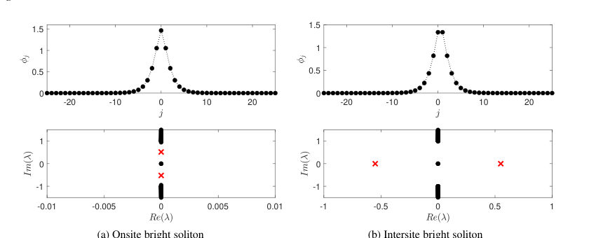 
Fig. 1: Profiles of discrete bright solitons obtained from the stationary DNLS equation (3) with focusing nonlinearity (σ = +1) and frequency ω = 1, together with the spectra of the corresponding linear operator (11) in the complex plane; the symbols mark the eigenvalues of interest. Results are shown for h = 0.7: (a) onsite soliton; (b) intersite soliton.

📷 Fig 2

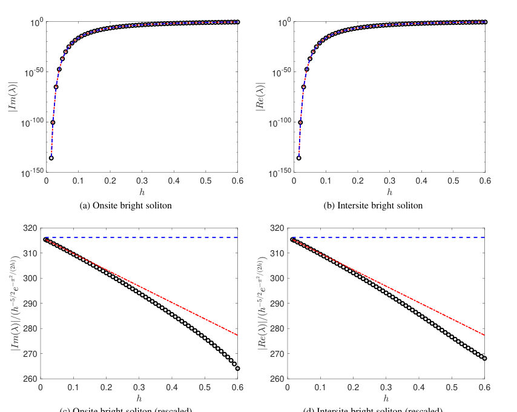 
Fig. 2: Spectra of discrete bright solitons. Black open circles: numerical eigenvalues; blue dashed lines: exponential asymptotics of Adriano et al. [9]; red dash-dotted curves: higher-order corrections of Lustri et al. [10]. (a) Onsite branch: |Im λ| versus h on a logarithmic vertical scale. The internal mode remains purely imaginary and exponentially small as h →0. (b) Intersite branch: |Re(λ)| versus h (log scale). A real pair ±Re(λ) persists for all h, indicating a weak structural instability with exponentially small growth rate. (c)-(d) Rescaled data: eigenvalues divided by h−5/2 e−π2/(2h), showing agreement with the predicted prefactors.

📷 Fig 3

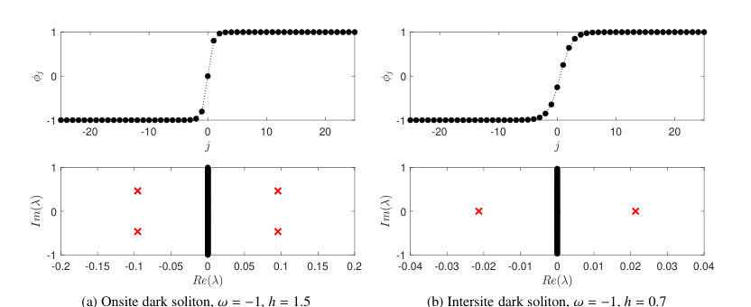 
Fig. 3: The same as Figure 1, but for discrete dark solitons obtained from the stationary equation (3) with defocusing nonlinearity (σ = −1) and frequency ω = −1. (a) Onsite case (h = 1.5); (b) intersite case (h = 0.7).

📷 Fig 4

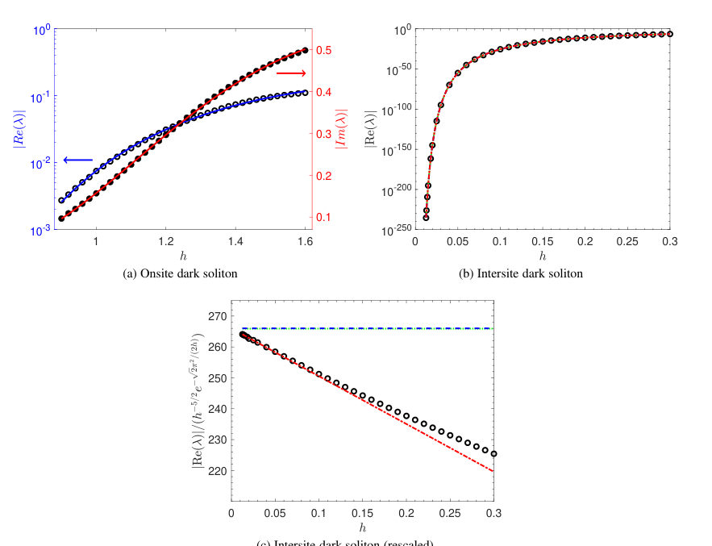 
Fig. 4: Spectra of discrete dark solitons and comparison with asymptotic results. (a) Onsite branch: blue open circles show Re(λ) (left axis), and red dots show Im(λ) (right axis) versus h. Green and cyan curves are exponential fits of the form (15) with parameters given in the text, confirming the exponentially small instability growth and corresponding prefactors. (b) Intersite branch: black open circles show Re(λ) versus h on a logarithmic vertical scale. The green dotted curve is the factor-of-two-corrected prediction of Adriano et al. [9]. The blue dashed curve shows the leading-order term of the Lustri et al. formula, while the red dash-dotted curve shows the full next-order formula...

📷 Fig 5

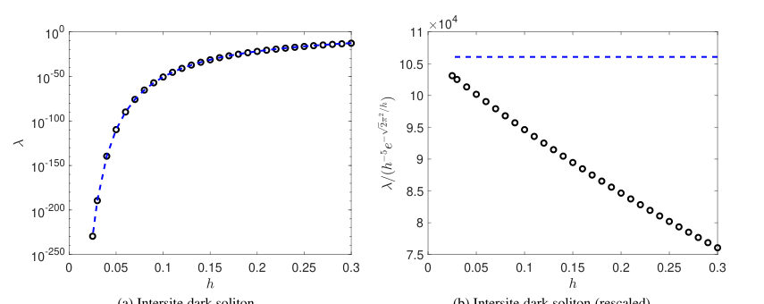 
Fig. 5: Spectra from the corresponding parabolic (gradient-flow) problem for the intersite dark soliton. (a) Magnitude |λ| of the negative intersite eigenvalue of −L(h) + versus lattice spacing h on a logarithmic vertical scale. (b) Same magnitude rescaled by h−5 exp(− √

**Summary.** This work develops a high-precision computational framework to analyze the spectral stability of solitons in the discrete nonlinear Schrödinger equation. By employing multiprecision arithmetic, the authors accurately resolve exponentially small eigenvalues, determining that onsite bright solitons are stable while other configurations are unstable. This highlights the computational challenges in studying nonlinear wave dynamics near continuum limits.

**Why it may be interesting.** The rigorous computational techniques developed for handling exponentially small eigenvalues in nonlinear lattice systems are highly relevant for analyzing stability in quantum optics and many-body systems where continuum limits are approached.

Detailed structure

**Main problem.** The paper investigates the spectral stability of bright and dark solitons governed by the discrete nonlinear Schrödinger (DNLS) equation.

**Main result.** Onsite bright solitons are found to be spectrally stable, while intersite bright and all dark solitons are unstable. The study demonstrates the necessity of multiprecision arithmetic to resolve exponentially small eigenvalues.

**Method.** A computational framework combining multiprecision arithmetic, an exact Jacobian for the stationary problem, and a squared-operator formulation is developed for spectral analysis.

**Model / system.** The primary model is the one-dimensional DNLS equation, which describes nonlinear wave phenomena in discrete lattices. The continuous limit ($h 	o 0$) corresponds to the standard NLS equation.

**Key observables.** Spectral eigenvalues ($\lambda$) determining stability, and the profiles of onsite/intersite bright and dark solitons.

**Important parameters / regimes.** Lattice spacing ($h$), nonlinearity parameter ($\sigma$), and the required working precision (MP).

**Assumptions / limitations.** The analysis assumes that standard double precision fails to resolve the stability eigenvalues, necessitating high-precision computation.

**Figures summary.** Figures illustrate the profiles and spectra for bright solitons (onsite/intersite) and dark solitons, confirming asymptotic predictions for bright solitons.

**Paper structure.** The paper first establishes the DNLS model and the standing wave ansatz. It then details the numerical methods, emphasizing the use of multiprecision arithmetic to solve the nonlinear system and compute the spectrum via the squared-operator formulation.

Abstract

We study the spectral stability of bright and dark solitons in the discrete nonlinear Schrödinger (DNLS) equation using multiprecision arithmetic. The eigenvalues governing stability are exponentially small in the lattice spacing and cannot be resolved with standard double precision. To address this, we develop a computational framework combining multiprecision arithmetic, an exact Jacobian for the stationary problem, and a squared-operator formulation for spectral analysis. This enables accurate resolution of exponentially small eigenvalues and direct comparison with exponential-asymptotic predictions. Our results show that onsite bright solitons are spectrally stable, whereas intersite bright solitons and both onsite and intersite dark solitons are unstable. Bright solitons require only a few eigenvalues and allow efficient large-scale computations, while dark solitons demand higher precision due to their proximity to the continuous spectrum. Simulations up to \(N=65{,}250\) grid points (31.7 GB RAM) highlight the necessity of multiprecision arithmetic for capturing beyond-all-orders spectral effects.

[↑ back to top](#top)

### [Direct observation of the electronic structure of even-layer puckered SnTe monolayer films on graphene](http://arxiv.org/abs/2609.27672v1)

**Authors:** Satoru Ichinokura, Shunsuke Tsuda, Kiyohisa Tanaka, Koichiro Yaji  
**Type:** both · **Category:** other · **PDF:** <https://arxiv.org/pdf/2609.27672v1>  
**Analysis basis:** full PDF text, analyzed in chunks
**Topic relevance:** `Keldysh / 2PI / non-Gaussian methods` **2/5** · `quantum measurements` **2/5**

📷 Fig 1

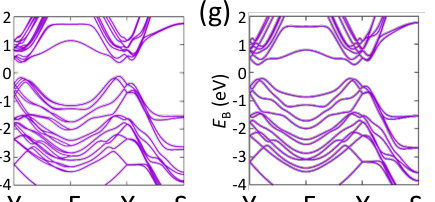 
FIG. 1. Structural and electronic reference models for ul- trathin SnTe. (a),(b) Top and side views of the 2UC puck- ered structure. (c) Corresponding pseudotetragonal Brillouin zone. (d),(e) Calculated band structures of puckered and non- puckered 1UC SnTe. (f),(g) Calculated band structures of puckered and nonpuckered 2UC SnTe.

📷 Fig 2

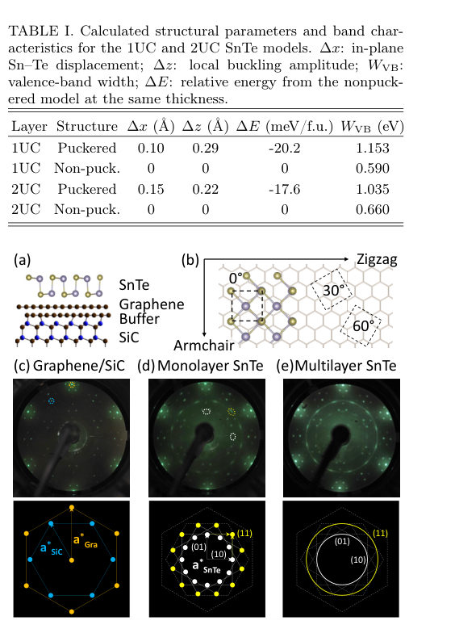 
FIG. 2. LEED characterization of graphene-supported ultra- thin SnTe. (a) Schematic side view of the sample structure consisting of SnTe on graphene/buffer/SiC. (b) In-plane ori- entation relationship between the pseudotetragonal SnTe lat- tice and the graphene lattice, illustrating domains rotated by 0◦, 30◦, and 60◦. (c)–(e) LEED patterns of Graphene/SiC, monolayer SnTe, and multilayer SnTe, respectively, together with schematic reciprocal-space patterns shown below.

📷 Fig 3

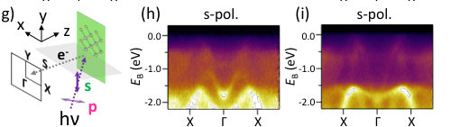 
FIG. 3. Momentum-space electronic structure of graphene- supported ultrathin SnTe. (a)–(c) Constant-energy maps near the Fermi level for Graphene/SiC, monolayer SnTe, and multilayer SnTe, respectively, measured by momentum mi- croscopy. In (b) and (c), pseudotetragonal Brillouin zones of SnTe rotated by 0◦, 30◦, and 60◦are overlaid. (d) Calculated band structure of 1UC puckered SnTe for the experimentally constrained structure with a = b = 4.49 Å and a buckling amplitude of 0.13 Å, with marker size and color represent- ing the Te pz and px + py orbital projections. (e),(h) Mono- layer ARPES spectra measured along X–Γ–X with p- and s-polarized light, respectively. (f),(i) Corresponding...

📷 Fig 4

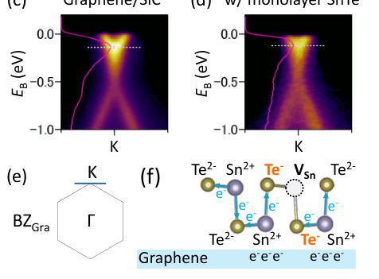 
FIG. 4. Thickness-dependent core-level spectra and graphene- interface signatures in graphene-supported ultrathin SnTe. (a),(b) Te 4d and Sn 4d core-level spectra for monolayer and multilayer SnTe. (c),(d) ARPES spectra near the graphene K point before and after monolayer SnTe growth. The solid lines indicate EDCs taken at K. (e) Schematic of the graphene Brillouin zone indicating the K point. The navy line denotes the momentum cut used for the ARPES measurements in (c) and (d). (f) Schematic illustration of the proposed interfacial electrostatic picture.

**Summary.** This work provides direct spectroscopic evidence that monolayer SnTe on graphene adopts a puckered electronic structure, contradicting simpler square-flat models. By combining ARPES with DFT, the authors quantify the substrate's influence, showing graphene renormalizes the material's structural buckling amplitude. This establishes a crucial understanding of interface-stabilized 2D electronic properties.

**Why it may be interesting.** While focused on solid-state materials, the detailed understanding of orbital hybridization, spin-orbit coupling effects, and the emergence of quantum confinement/interface effects in 2D materials is highly relevant to designing novel quantum electronic components.

Detailed structure

**Main problem.** The study aims to directly observe and determine the electronic structure of monolayer SnTe films grown on graphene, specifically resolving whether the structure is puckered or idealized as square-flat.

**Main result.** The electronic structure is confirmed to be consistent with a puckered even-layer biatomic-layer building block, and graphene actively modifies this structure by renormalizing the buckling amplitude.

**Method.** The research combines Angle-Resolved Photoemission Spectroscopy (ARPES) measurements with Density Functional Theory (DFT) calculations, supplemented by LEED and momentum microscopy.

**Model / system.** The system involves SnTe films (monolayer to multilayer) grown epitaxially on graphene/SiC substrates. The theoretical modeling compares puckered vs. non-puckered structural models (1UC/2UC) to reproduce experimental electronic features.

**Key observables.** Electronic band dispersion, polarization dependence, valence-band width, and the substrate-renormalized buckling amplitude ($\Delta z$).

**Important parameters / regimes.** The monolayer limit is characterized by a specific, reduced buckling amplitude ($\Delta z = 0.13$ Å), which is crucial for matching the observed valence-band width.

**Assumptions / limitations.** The analysis relies on the assumption that the observed electronic structure is best described by the puckered model, and that the DFT calculations accurately capture the substrate-induced renormalization effects.

**Figures summary.** Figures show LEED patterns confirming domain structure, momentum-space maps illustrating hole pockets, and ARPES spectra demonstrating band dispersion that matches DFT calculations for the puckered structure.

**Paper structure.** The paper progresses by first establishing the necessity of the puckered model over the flat model, then using ARPES/momentum microscopy to characterize the monolayer state, and finally comparing this to multilayer films to track thickness evolution toward a bulk-like state.

Abstract

We report a direct observation of the electronic structure of monolayer SnTe on graphene by angle-resolved photoemission spectroscopy. By combining low-energy electron diffraction, momentum microscopy, core-level spectroscopy, and first-principles calculations, we show that the observed monolayer-limit electronic structure is consistent with a puckered even-layer biatomic-layer building block rather than a nonpuckered square-flat structure. The observed band dispersion and its polarization dependence are reproduced by a puckered structure with a substrate-renormalized buckling amplitude. We further show that graphene actively interacts with ultrathin SnTe by selecting its in-plane orientational texture, renormalizing the buckling amplitude, and modifying the local interfacial electrostatic environment in the monolayer limit. In comparison, multilayer SnTe exhibits a more ringlike momentum-space distribution, interlayer-split valence bands, and a stronger p-type character, revealing the onset of thickness evolution from an interface-stabilized puckered ultrathin limit toward a more bulklike state.

[↑ back to top](#top)

### [Larger physical volume and bounds on the number of matter fields in noncompact gauge theories on a lattice](http://arxiv.org/abs/2609.28168v1)

**Authors:** Fabrizio Palumbo  
**Type:** theory · **Category:** other · **PDF:** <https://arxiv.org/pdf/2609.28168v1>  
**Analysis basis:** full PDF text, analyzed in chunks
**Topic relevance:** `Keldysh / 2PI / non-Gaussian methods` **2/5** · `analog quantum simulation` **2/5**

📷 Fig 1

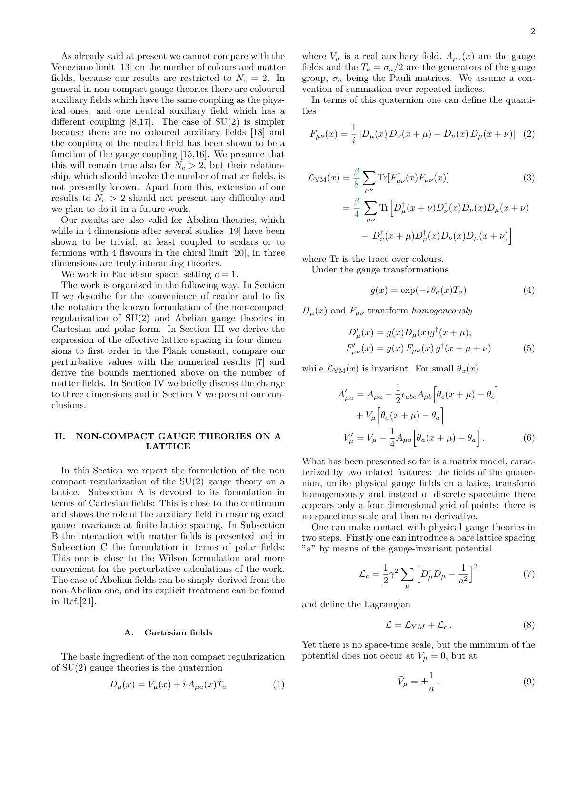 
Low-resolution page preview, page 2

📷 Fig 2

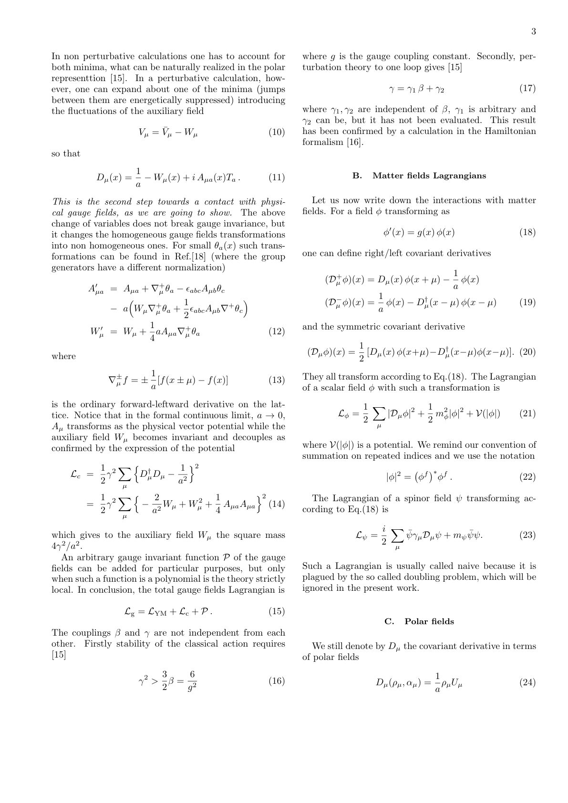 
Low-resolution page preview, page 3

📷 Fig 3

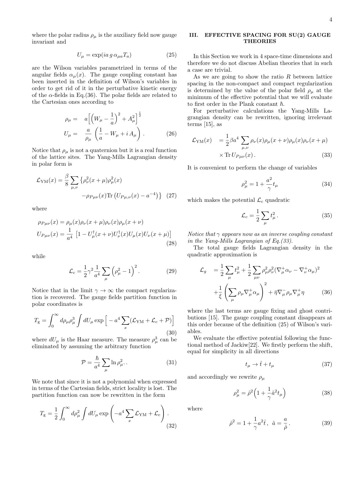 
Low-resolution page preview, page 4

📷 Fig 4

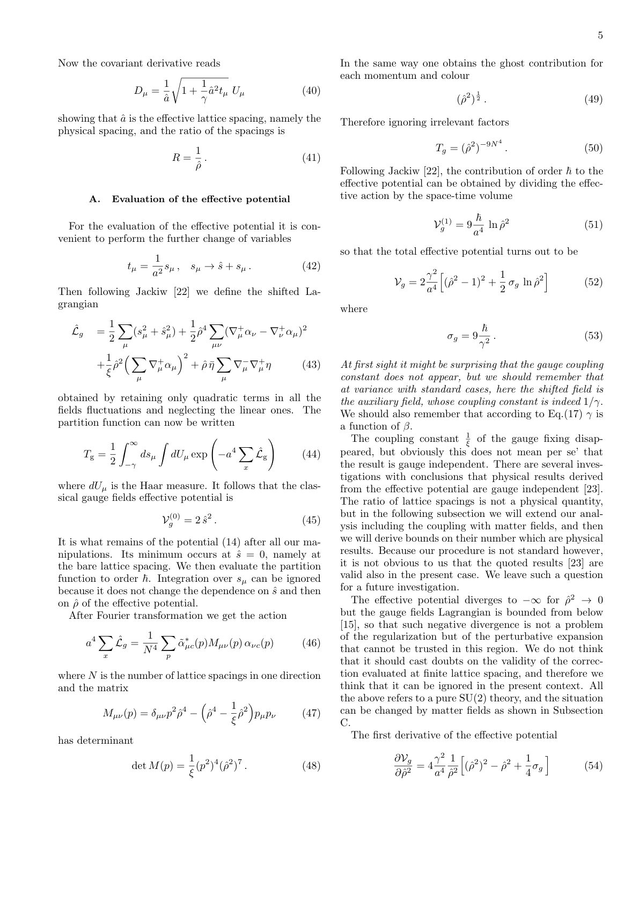 
Low-resolution page preview, page 5

📷 Fig 5

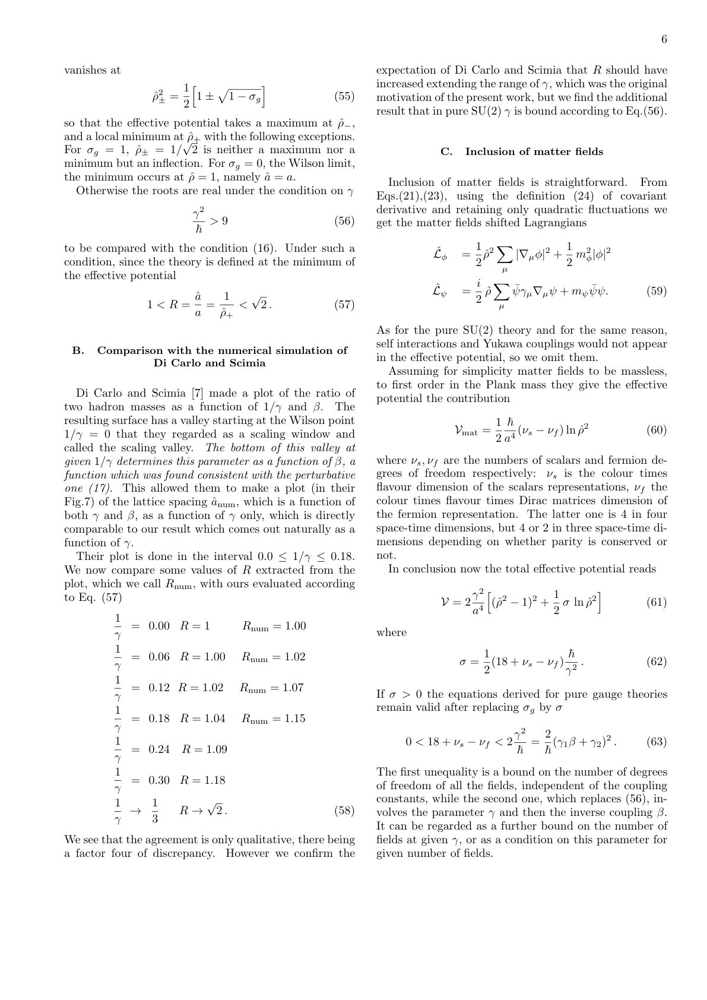 
Low-resolution page preview, page 6

**Summary.** This work analyzes noncompact gauge theories on a lattice to study the effective lattice spacing ratio, R. Using perturbative methods, the authors find that R is bounded, reaching a maximum of sqrt(2) for pure gauge theories. The inclusion of matter fields modifies this ratio, leading to constraints on the allowed difference between scalar and spinor degrees of freedom.

**Why it may be interesting.** While focused on lattice gauge theory, the rigorous derivation of bounds on field content and the study of effective parameters in a lattice regularization scheme are fundamental theoretical tools applicable to many-body physics models.

Detailed structure

**Main problem.** The paper investigates the effective lattice spacing ratio (R) in noncompact gauge theories, determining how this ratio behaves when considering the inclusion of matter fields and establishing bounds on the number of matter fields.

**Main result.** For pure SU(2) and Abelian theories, the ratio R is found to increase up to a maximum value of sqrt(2). Including matter fields causes R to either increase or decrease, depending on the difference between scalar and spinor degrees of freedom, subject to specific bounds.

**Method.** The analysis employs perturbative evaluation of the effective lattice spacing using an expansion in the Planck constant, alongside functional methods to determine the effective potential.

**Model / system.** The study focuses on noncompact gauge theories formulated on a lattice, specifically examining pure SU(2) and Abelian gauge theories, and extending the analysis to include scalar ($\phi$) and spinor ($\psi$) matter fields.

**Key observables.** The ratio R of effective non-compact to compact lattice spacing, and the effective potential V.

**Important parameters / regimes.** Gauge coupling constant (g), Planck constant (hbar), number of scalar ($
u_s$) and spinor ($
u_f$) degrees of freedom, and the parameter $\sigma$.

**Assumptions / limitations.** The analysis is perturbative and restricted to $N_c=2$ for SU(2), with limitations noted regarding comparison to the Veneziano limit or asymptotic safety.

**Paper structure.** The paper builds from analyzing the pure gauge theory in the continuum limit, deriving the effective potential, and then incorporating matter fields to derive bounds on the degrees of freedom and the behavior of the ratio R in different dimensions (4D vs 3D).

Abstract

The work was motivated by the numerical result that in a pure SU(2) gauge theory the ratio R of the effective non-compact and compact lattice spacing is larger than 1 and increasing with decreasing gauge coupling, as well as the expectation that it should further increase extending the parameter space. This means that with a noncompact regularization, at given number of lattice sites and comparable scaling, one can obtain a larger physical volume, whose importance for the control of size effects has long been known. We confirm qualitatively results and expectation by a perturbative evaluation of the effective lattice spacing in an expansion in the Plank constant of non-compact pure SU(2) and Abelian gauge theories, but we find in addition that R reaches the maximum value of sqrt(2). Including matter fields we find that R increases ( still up to sqrt(2) ) or decreases depending on the difference between the number of scalar and spinor degrees of freedom, and there are bounds on such a difference.

[↑ back to top](#top)

### [Theory of optical alignment and orientation of excitons in an ensemble of semiconductor nanoplatelets](http://arxiv.org/abs/2609.28042v1)

**Authors:** O. O. Druzhinina, A. V. Rodina  
**Type:** theory · **Category:** other · **PDF:** <https://arxiv.org/pdf/2609.28042v1>  
**Analysis basis:** full PDF text, analyzed in chunks
**Topic relevance:** `Tavis-Cummings & cavity-many-emitter` **1/5** · `analog quantum simulation` **1/5** · `correlated / nonlocal dissipation` **1/5** · `driven-dissipative phase transition` **1/5** · `interference shaping light` **1/5** · `methods for driven-dissipative` **1/5** · `quantum measurements` **1/5**

📷 Fig 1

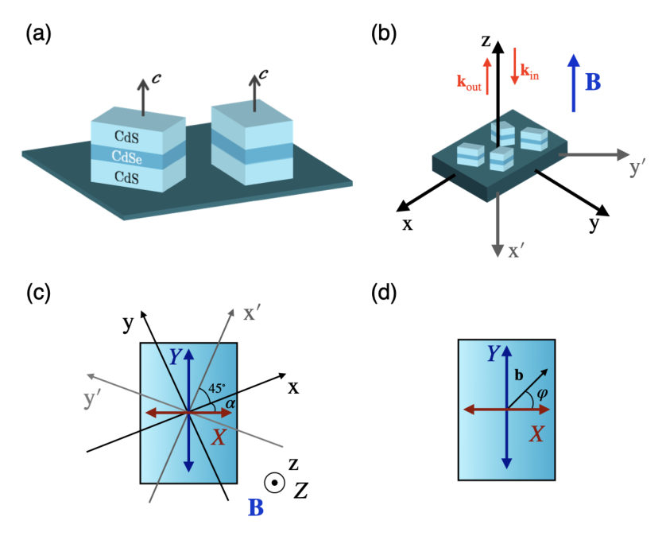 
Figure 1. (a) Horizontally oriented NPLs with the c-axis perpendicular to the substrate. (b) An ensemble of NPLs in the experimental geometry: kin and kout are the wave vectors of the incident and registered light and B is the external magnetic field directed along the z-axis of the laboratory frame and parallel to the c-axis. Linear polarization is registered in the axes x, y and rotated by 45◦around z-axis x′, y′ axes. (c) A scheme of a single NPL with its own axes Z ∥z and X, Y rotated by the angle −α with respect to x, y around z. (d) A scheme of a single NPL with internal in-plane magnetic field b directed by angle φ with respect to the X-axis.

📷 Fig 2

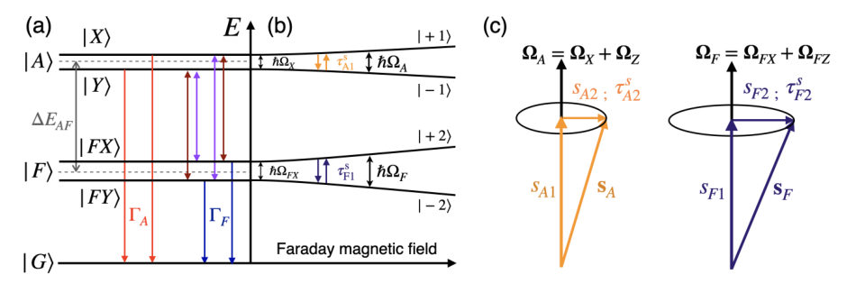 
Figure 2. (a) A scheme of the bright |A⟩and dark |F⟩exciton levels split by ∆EAF in zero magnetic field, with the possible transitions between them. ΓA and ΓF denote the bright and dark exciton recombination rates. (b) Schematic evolution of the exciton states in the Faraday magnetic field from the states |X⟩, |Y ⟩of the bright exciton (split by the energy ¯hΩX in zero field) and states |FX⟩, |FY ⟩of the dark exciton (split by the energy ¯hΩF X) into states | + 1⟩, | −1⟩(split by the energy ¯hΩA) and | + 2⟩, | −2⟩(split by the energy ¯hΩF ), respectively, in the case of gA &gt; 0 and gF &gt; 0. Orange (violet) arrows show the longitudinal spin relaxation between split states of the bright (dark)...

📷 Fig 3

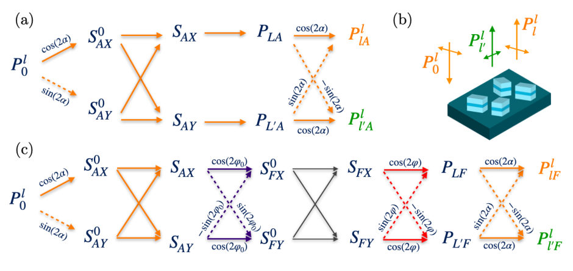 
Figure 3. (a) A scheme of the linear polarization P l 0 conversion in the bright exciton into detectable effects of optical alignment P l l (marked in orange) and rotation of the linear polarization plane P l l′ (marked in green) for the NPL oriented at the angle α (Fig. 1(b)). (b) Geometry of the optical alignment effect registration from the isotropically oriented NPL ensemble. (c) A scheme of the transfer of the linearly polarized pseudospin components from the bright to dark exciton and its further contribution to the linearly polarized light emission. The angles φ0 and φ (Fig. 1(d)) correspond to the direction of the magnetic field b acting in the polarization transfer and radiation,...

📷 Fig 4

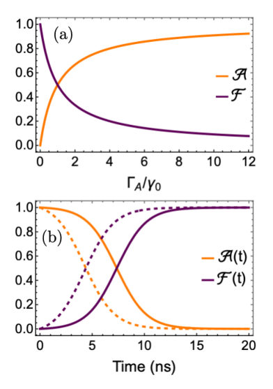 
Figure 4. Bright A and dark F excitons relative intensities shown by orange and purple lines, respectively, for the case of τA = 1.4 ns (a) in cw regime as function of the ratio ΓA/γ0, and (b) as function of time after pulsed excitation for ΓA/γ0 = 0.3 (dashed lines) [11] and ΓA/γ0 = 2.5 (solid lines) [38].

📷 Fig 5

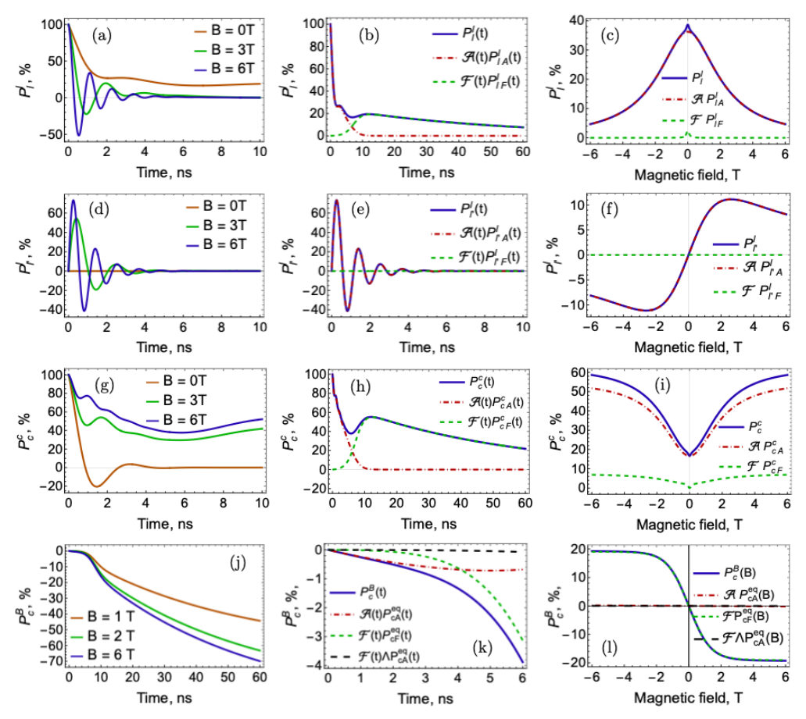 
Figure 5. Time dependences in different magnetic fields of (a) the optical alignment effect P l l , (d) the linear polarization plane rotation P l l′, (g) the optical orientation effect P c c , (j) the magnetic-field-induced circular polarization P B c . The time-dependence decomposition into the contributions of the bright and dark excitons for (b) P l l in B = 0 T, (e) P l l′ in B = 6 T, (h) P c c in B = 6 T, (k) P B c in B = 6 T. Faraday magnetic field dependence and its analogous decomposition of (c) P l l , (f) P l l′, (i) P c c , (l) P B c . The parameters used are listed in Table I.

**Summary.** This paper presents a comprehensive theory for understanding how excitons align and orient themselves in semiconductor nanoplatelets. By modeling the coupling between bright and dark exciton states using a pseudospin formalism, the authors predict polarization signatures observable in photoluminescence. This work is crucial for controlling and characterizing spin-related quantum phenomena in solid-state nanostructures.

**Why it may be interesting.** This work is highly relevant to quantum optics and open quantum systems because it models spin dynamics and polarization transfer in solid-state quantum emitters (excitons) under external fields, which is a core topic in quantum light sources.

Detailed structure

**Main problem.** The paper develops a theoretical framework to describe the optical alignment and orientation effects of excitons within single and ensemble semiconductor nanoplatelets (NPLs). It specifically models the interplay between bright and dark exciton states.

**Main result.** The theory predicts distinct symmetries for the optical response ($C_2$ for a single NPL and $C_{\infty}$ for the ensemble) and shows how bright-to-dark exciton coupling allows for the observation of dark exciton optical alignment.

**Method.** The authors use a density matrix formalism applied to two interacting pseudospins (bright and dark excitons) to calculate time-dependent and steady-state polarized photoluminescence.

**Model / system.** The system is semiconductor nanoplatelets (e.g., CdSe/CdS core/shell) whose excitons are modeled using a pseudospin formalism. The Hamiltonian accounts for exchange interactions and Zeeman splitting, while the polarization is analyzed using Stokes parameters.

**Key observables.** Polarized photoluminescence (PL), Stokes parameters ($P_l, P_{l'}, P_c$), and the degree of exciton optical alignment/orientation.

**Important parameters / regimes.** Low temperature regime, Faraday magnetic field, and the strength of the electron-hole exchange interaction.

**Assumptions / limitations.** Assumes an isotropic distribution of in-plane NPL edge orientations in the ensemble and treats the system in the linear optical response regime.

**Figures summary.** Figures illustrate the geometry of NPLs (single and ensemble), the axes used for polarization analysis, and the energy splitting/pseudospin evolution in a magnetic field.

**Paper structure.** The paper builds from defining the physical system and the need for the theory, developing the pseudospin formalism for bright/dark excitons, deriving the polarization response equations, and finally applying these to analyze specific effects like alignment and ensemble averaging.

Abstract

We present the theory of exciton optical alignment and optical orientation effects in a single semiconductor nanoplatelet (NPL) and in an ensemble of NPLs. The theoretical model is developed to take into account the emission from both bright and dark exciton states in the case of strong electron-hole exchange interaction and an isotropic distribution of in-plane orientations of the NPLs' edges with respect to the linear polarization axis. The conditions for the linear optical response regime on the polarized resonant excitation of the bright exciton are considered, and the steady-state and time-dependent expressions for polarized photoluminescence are presented for the low temperature case in the Faraday magnetic field at normal incidence. The symmetry of the obtained optical response corresponds to the $C_{2}$ point group for the single NPL and the $C_{\infty}$ point group for the NPL ensemble. The bright-to-dark exciton coupling mechanism allowing one to observe the optical alignment of the dark exciton is considered. The example calculations of the effects are presented for the parameters close to those of CdSe/CdS core/shell NPLs. The effect of the fluctuations in the exciton parameters in the ensemble on the polarization dephasing in the transverse effective magnetic field is demonstrated.

[↑ back to top](#top)

### [Morphological evolution of an Au crystalline domain in a nano-particle investigated by Bragg coherent diffraction imaging](http://arxiv.org/abs/2609.28346v1)

**Authors:** Seonghyun Han, Saehyun Kang, Ouyoung Kwon, Wonsuk Cha, Hyon Chol Kang, Chan Kim, Do Young Noh  
**Type:** experiment · **Category:** other · **PDF:** <https://arxiv.org/pdf/2609.28346v1>  
**Analysis basis:** full PDF text, analyzed in chunks
**Topic relevance:** `Keldysh / 2PI / non-Gaussian methods` **1/5** · `analog quantum simulation` **1/5** · `methods for driven-dissipative` **1/5** · `non-equilibrium universality` **1/5** · `quantum measurements` **1/5** · `scars & prethermalization` **1/5**

📷 Fig 1

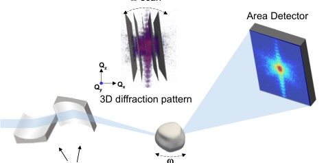 
FIG. 1. Bragg coherent diffraction imaging setup. A coher- ent X-ray beam, focused by a Kirkpatrick–Baez (KB) mirror, illuminates an Au nanocrystal satisfying the Bragg condition. The diffraction signal is collected during an ω-scan to enable 3D image reconstruction of the nanocrystal.

📷 Fig 2

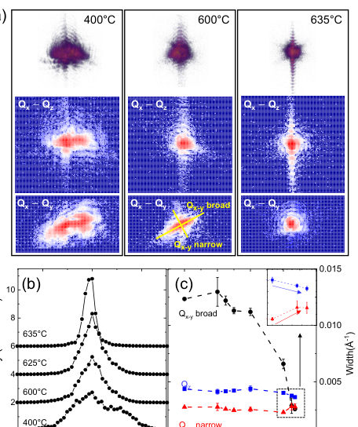 
FIG. 2. (a) 3D coherent diffraction profiles around the Au(111) Bragg peak at 400 ◦C, 600 ◦C, and 635 ◦C. The Qx–Qz and Qx–Qy cross-sections of the 3D diffraction pat- terns at each temperature are shown. At 635 ◦C, the fringe patterns corresponding to each plane become prominent. (b) Temperature-dependent line profiles along the in-plane direc- tion (Qx–y broad direction). The profile exhibits a double- peak structure at lower temperatures; however, as the tem- perature increases beyond 600 ◦C, it changes to a single-peak profile. (c) Temperature-dependent XRD profile widths in the Qz (blue) Qx–y broad (black),and Qx–y narrow (red) di- rections.

📷 Fig 3

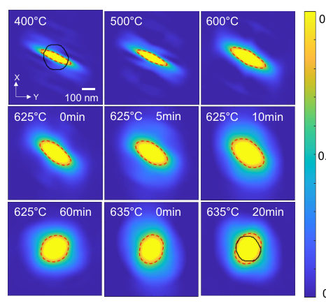 
FIG. 4. Auto-correlation function (ACF) obtained from 3D coherent XRD. This is a slice plane corresponding to the Qx–Qy plane. The red dashed line indicates the boundary where the ACF drops to 1/e. The color scale was set to a maximum of 0.5. The domain morphology can be roughly identified from the ACF. Initially, it is elongated and gradu- ally thickens from 625 ◦C. At 625 ◦C, there is a dynamics that changes over time as atoms gradually attach and thicken.

📷 Fig 4

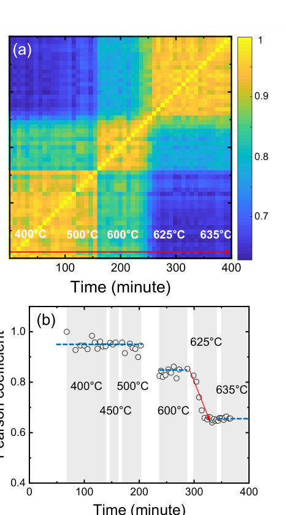 
FIG. 3. (a) Pearson correlation map calculated from 3D diffraction datasets acquired during in-situ annealing. The map illustrates the correlation of 3D XRD patterns as a func- tion of temperature change and experimental time within the same temperature range. The diagonal represents the self- correlation, which is equal to 1. (b) Line profile of the Pearson correlation coefficient along the red line shown in (a). Two major changes are observed at 600 ◦C and 625 ◦C. After the temperature is raised to 625 ◦C, the correlation coefficient changes continuously.

📷 Fig 5

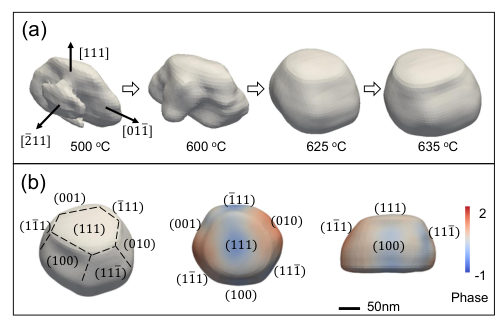 
FIG. 5. (a) 3D rendering of BCDI images acquired at various annealing temperatures. For each temperature, the recon- struction was performed using a diffraction dataset acquired after the system reached a stabilized state. (b) Domain mor- phology resembling a truncated octahedron, observed at the final annealing stage of 635 ◦C. The crystalline facets are la- beled, and the phase values are displayed in both the top and side views of the domain.

**Summary.** This work uses in-situ coherent X-ray diffraction to track how Au nanocrystalline domains reorganize during heating. By analyzing changes in diffraction patterns and domain correlation functions, the researchers observed the system evolving from a disordered, multi-domain state toward a stable, faceted truncated octahedron. This provides a fundamental framework for understanding domain growth and equilibrium shape formation in metallic nanoparticles.

**Why it may be interesting.** While focused on materials science, the study's rigorous use of time-resolved structural diagnostics (BCDI, ACF) to track non-equilibrium phase evolution and domain coarsening provides a powerful methodology applicable to understanding relaxation dynamics in complex quantum or many-body systems.

Detailed structure

**Main problem.** The study investigates the dynamic structural evolution of metallic nanoparticles, specifically tracking the transformation from an initial anisotropic multi-domain state to a single crystalline equilibrium morphology.

**Main result.** The Au nanocrystalline domains undergo continuous coarsening during annealing, eventually converging to a stable, faceted truncated octahedral geometry characterized by low-energy {111} and {100} facets.

**Method.** The research employs in-situ three-dimensional coherent X-ray diffraction (BCDI) combined with autocorrelation function (ACF) analysis to non-destructively probe the structural changes during controlled thermal annealing.

**Model / system.** The physical system is Au nanocrystalline domains embedded within a multi-domain nanoparticle, studied by monitoring diffraction patterns as a function of temperature up to 635 degrees Celsius.

**Key observables.** 3D diffraction patterns, line profile widths ($	ext{Q}_x-	ext{Q}_y$, $	ext{Q}_z$), autocorrelation function (ACF) shape, and the emergence of specific crystallographic facets ({111} and {100}).

**Important parameters / regimes.** Annealing temperature (e.g., $400^\circ	ext{C}$, $600^\circ	ext{C}$, $625^\circ	ext{C}$, $635^\circ	ext{C}$), X-ray energy (10 keV).

**Assumptions / limitations.** The analysis assumes that BCDI and ACF provide a robust, artifact-free method for interpreting complex, time-dependent domain dynamics.

**Figures summary.** Figures illustrate temperature-dependent diffraction profiles showing peak merging and sharpening, and 3D renderings visualize the transition from anisotropic domains to the final truncated octahedral shape.

**Paper structure.** The paper follows a progression from initial characterization at low temperatures to observing domain merging at intermediate temperatures, culminating in the detailed analysis of facet formation and equilibrium shape convergence at the highest temperatures.

Abstract

Understanding the dynamic structural evolution of metallic nanoparticles is crucial for tailoring their functional properties. In this study, we utilized three-dimensional coherent X-ray diffraction to investigate the morphological transformation of Au nanocrystalline domains in a multi-domain nanoparticle during in-situ annealing. By combining Bragg coherent diffraction imaging with autocorrelation function analysis, we observed a transformation from an anisotropic multi-domain configuration toward a single crystalline equilibrium morphology. Above 600 degrees Celsius, a small subsidiary domain merged into the primary domain, which was continuously coarsened at 625 degrees Celsius, resulting in a more isotropic morphology. Finally, at 635 degrees Celsius, the low-energy {111} and {100} facets emerged, and the crystal shape converged toward an equilibrium truncated octahedral geometry. This work demonstrates a framework for interpreting complex domain dynamics, offering fundamental insights into domain growth and equilibrium shape formation.

[↑ back to top](#top)

### [Active control of THz plasmon propagation in a one-dimensional electronic waveguide](http://arxiv.org/abs/2609.28224v1)

**Authors:** Thomas Vasselon, Uzer Ahmad, Clément Geffroy, Lucas Mazzella, Matteo Aluffi, Seddik Ouacel, Jashwanth Shaju, Kevin Bredillet, Nathan Roussel, Jean-François Roux, Pierre-Baptiste Vigneron, Arne Ludwig, Andreas D. Wieck, Matias Urdampilleta, Hermann Sellier, Giorgos Georgiou, Christopher Bäuerle  
**Type:** experiment · **Category:** other · **PDF:** <https://arxiv.org/pdf/2609.28224v1>  
**Analysis basis:** full PDF text, analyzed in chunks
**Topic relevance:** `driven-dissipative phase transition` **1/5** · `interference shaping light` **1/5** · `quantum measurements` **1/5**

📷 Fig 1

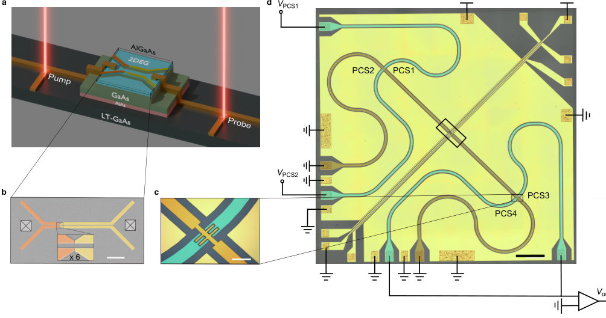 
FIG. 1. Device architecture and chip layout a. Schematic of the device, featuring integrated THz opto-electronics and a coplanar waveguide alongside a quantum device fabricated on an AlGaAs/GaAs heterostructure. The heterostructure was etched to expose the low-temperature- grown GaAs (LT-GaAs), where two electrodes form the photoconductive switches (PCS), labelled "pump" and "probe". Both electrodes are illuminated by a 780 nm, 100 fs laser. b. Scanning electron microscopy image of the quantum device. It comprises a 1D electronic waveguide divided into two segments: a 10 µm section (orange) and a 30 µm section (yellow). The distance between the upper and lower electrodes is 500 nm as...

📷 Fig 2

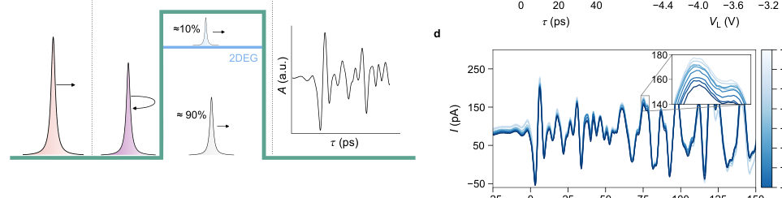 
FIG. 2. THz voltage pulse generation and plasmon wavepacket excitation a. Schematic illustrating the propagation of the THz voltage pulse. (i) Generated pulse at the photoconductive switch. (ii) Proportion of the generated pulse reflected at the ohmic contact, along with the injected pulse into the 2DEG and the portion propagating through the substrate. (iii) Transmitted signals after the quantum device, as measured at the second set of photoconductive switches. b. Time-resolved measurement of the generated pulse (orange) just after the photoconductive switch and reflected pulse (purple) at the injection ohmic contact measured at 300 K. The generated pulse is 3.4 ps short, with a reflection...

📷 Fig 3

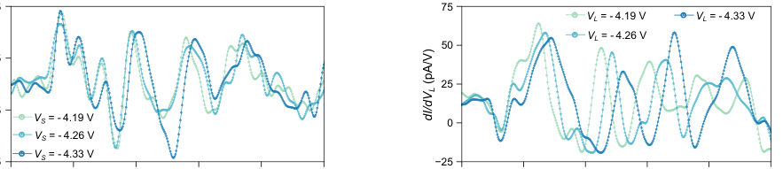 
FIG. 3. THz Plasmonic excitations of the quantum device a. Scanning electron microscopy image of the quantum device, with the 10 µm (coloured in orange) and 30 µm (coloured in yellow) long electronic waveguides. Voltages VS and VL are swept to tune the conductance in a part of the wire. Uncoloured gate are polarized to form a electronic waveguide at fixed conductance. The crossed square boxes represent the ohmic contacts, enabling electrical connection between the coplanar waveguide and the two-dimensional electron gas. The scale bar represents 10 µm b. Two-dimensional map of the time-resolved transmitted signal, derived with respect to the voltage VS on the short waveguide (and VL on the...

📷 Fig 4

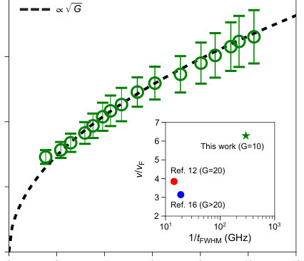 
FIG. 4. Plasmonic velocity in 1D electronic waveguide. The main figure is the THz plasmonic velocity as a function of the conductance G in 1D electronic waveguide. The dotted line is a fit to the experi- mental data following a √

**Summary.** The researchers report an experiment demonstrating active control over THz plasmon propagation in a gated 1D electronic waveguide. By measuring the time-domain response of the plasmons while tuning the gate voltage, they successfully extracted the plasmon velocity, confirming a theoretical square-root dependence on the waveguide's conductance. This work establishes a key building block for ultrafast quantum operations using propagating electron wavepackets.

**Why it may be interesting.** This work provides a highly controlled, solid-state platform for studying fundamental quantum transport phenomena (plasmon dynamics) at THz frequencies, which is relevant for understanding energy dissipation and coherent electron dynamics in nanoscale quantum devices.

Detailed structure

**Main problem.** The primary goal is to achieve and demonstrate active control over the propagation speed of ultrashort electron wavepackets (THz plasmons) within a quasi-one-dimensional electronic waveguide.

**Main result.** The experiment successfully demonstrated that the plasmon propagation velocity ($v_{1D}$) can be actively tuned by varying the electrostatic gate voltage, showing a clear square-root dependence on the waveguide conductance ($v_{1D} \propto \sqrt{G}$).

**Method.** Time-resolved THz spectroscopy was employed, using photoconductive switches to generate femtosecond/picosecond pulses that excite plasmons in a gated 2DEG waveguide. Velocity was extracted by analyzing the time delay ($	au$) or the separation ($\delta$) of interference fringes as a function of gate voltage.

**Model / system.** The physical system is a quantum nanoelectronic device built on a GaAs/AlGaAs heterostructure, featuring a quasi-1D electron waveguide (2DEG) integrated with coplanar waveguides (CPWs) for THz excitation/detection. The system is controlled electrostatically via gate voltages.

**Key observables.** Transmitted THz current amplitude, time delay ($	au$) of interference fringes, and fringe separation ($\delta$) as functions of gate voltage.

**Important parameters / regimes.** Picosecond timescales (e.g., 4 ps pulse duration), THz frequencies, and the dependence of velocity on conductance ($G$).

**Assumptions / limitations.** The analysis assumes the plasmonic excitation remains effectively one-dimensional, and the measured signal is dominated by the plasmonic propagation through the gated 2DEG, filtering out background substrate/capacitive coupling.

**Figures summary.** Figures illustrate the device schematic, the dependence of the transmitted THz pulse on gate voltage, and plots showing the extracted plasmon velocity ($v_{1D}$) dependence on conductance, confirming the $\sqrt{G}$ scaling.

**Paper structure.** The paper details the device architecture, describes the time-resolved measurement techniques using PCSs, and then presents multiple analyses (using both $	au$ and $\delta$ methods) to extract the plasmon velocity, consistently confirming the $\sqrt{G}$ scaling law.

Abstract

Quantum nanoelectronics is pushing towards ever higher operating frequencies in order to realise quantum technologies capable of processing information at unprecedented speeds. A particularly promising direction is the development of flying electron qubits, which offer the prospect of quantum operations on picosecond timescales. Achieving in-flight quantum control in this regime would establish a fundamentally new paradigm for studying quantum entanglement and enable a novel form of quantum information processing based on propagating electronic wavepackets. Here we report a first step towards this goal by injecting ultrashort electron wavepackets into an engineered quantum nanoelectronic device. We demonstrate active control over the propagation speed of an electron wavepacket with a temporal duration as short as 4 ps in a quasi-one-dimensional electron waveguide with a length ranging from 10 $\mathrmμ$m to 40 $\mathrmμ$m. This advance provides a key building block for ultrafast quantum operations using flying electrons. Beyond its technological implications, our approach offers a platform for exploring the intrinsic dynamical processes that govern quantum transport and coherence in nanoscale electronic systems.

[↑ back to top](#top)

### [Observation of the orbital Nernst effect](http://arxiv.org/abs/2609.27604v1)

**Authors:** Yuto Masuda, Takamasa Hirai, Daegeun Jo, Naoki Yano, Peter M. Oppeneer, Hossein Sepehri-Amin, Ken-ichi Uchida, Kazuya Ando  
**Type:** experiment · **Category:** statistical mechanics · **PDF:** <https://arxiv.org/pdf/2609.27604v1>  
**Analysis basis:** full PDF text, analyzed in chunks
**Topic relevance:** `Keldysh / 2PI / non-Gaussian methods` **1/5** · `non-equilibrium universality` **1/5**

📷 Fig 1

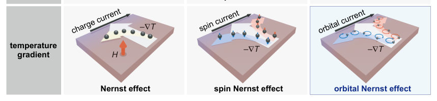 
Figure 1. Electrical and thermal generation of charge, spin, and orbital currents. Top row: Electrical generation via the Hall effect (left), the spin Hall effect (center), and the orbital Hall effect (right), where an applied electric field E induces a transverse charge current jC, spin current jS, or orbital current jL, respectively. Bottom row: Thermal generation via the Nernst effect (left), the spin Nernst effect (center), and the orbital Nernst effect (right), where a temperature gradient ∇T drives a transverse charge current jC, spin current jS, or orbital current jL, respectively. The spin and orbital effects are illustrated for positive spin and orbital Hall and Nernst...

📷 Fig 2

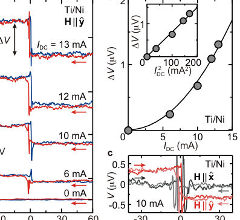 
Figure 3. Orbital Nernst effect in Ti. a Electric potential difference V between the Ni electrodes in the Ti(10 nm)/Ni(8 nm) device as a function of the in-plane mag- netic field µ0H applied along the y axis for different heating currents IDC, where the numbers in parentheses indicate the layer thicknesses, and µ0 denotes the vacuum permeability. The red and blue curves correspond to magnetic-field sweeps from positive to negative and negative to positive fields, re- spectively. For each dataset, a constant background voltage has been subtracted. b Voltage step ∆V as a function of the heating current IDC in the Ti(10 nm)/Ni(8 nm) device. The solid circles represent experimental data, and...

📷 Fig 3

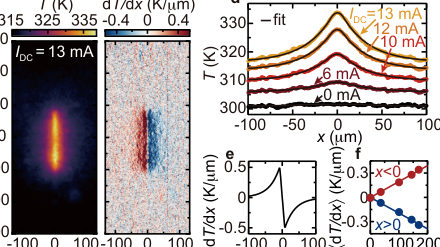 
Figure 2. Experimental setup and temperature distri- bution. a Optical image of the fabricated device. The central cross-bar structure consists of Ti, while the two lines on the left and right sides are Ni. Bright yellow regions indicate elec- trodes. b Schematic of the experimental setup. A DC current IDC is applied to the Ti line, generating a temperature gra- dient dT/dx along the x axis. The orbital current generated by the orbital Nernst effect flows along the z axis, with the orbital Nernst conductivity assumed to be negative. A mag- netic field H is applied along the y axis. Orbital-to-spin (L- to-S) conversion in the Ni layers is schematically illustrated. c Spatial distributions of...

📷 Fig 4

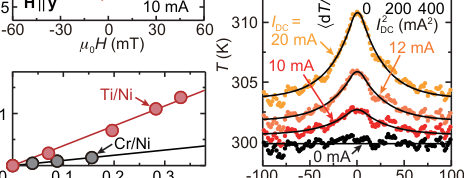 
Figure 4. Thermoelectric response in Cr/Ni. a µ0H de- pendence of V in the Cr(10 nm)/Ni(8 nm) device measured at IDC = 10 mA, with the magnetic field applied along the y axis (H ∥ˆy). b Temperature profiles T along the x axis mea- sured by thermography in the Cr(10 nm)/Ni(8 nm) device at IDC = 0, 10, 12, and 20 mA. The inset shows the in-plane tem- perature gradient ⟨dT/dx⟩spatially averaged over the Cr/Ni junction region as a function of I2 DC for the two junctions lo- cated at x &lt; 0 (red) and x &gt; 0 (blue). c Voltage step ∆V as a function of the in-plane temperature gradient ⟨dT/dx⟩for the Ti(10 nm)/Ni(8 nm) (red) and Cr(10 nm)/Ni(8 nm) (gray) devices. Here, ⟨dT/dx⟩denotes the in-plane...

📷 Fig 5

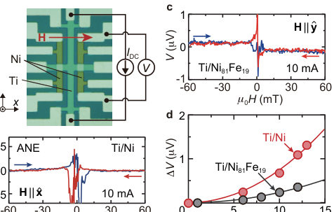 
Figure 5. Anomalous Nernst contribution and ferromagnetic-electrode dependence of orbital Nernst signal. a Optical image of the Ti/Ni device with the mea- surement configuration for detecting the anomalous Nernst effect induced by an out-of-plane temperature gradient. The red arrow indicates the direction of the applied magnetic field H. b µ0H dependence of V between the ends of the Ni wire (see a) in the Ti(10 nm)/Ni(8 nm) device at IDC = 10 mA for H ∥ˆx. c Electric potential difference V between the Ni81Fe19 electrodes in the Ti(10 nm)/Ni81Fe19(8 nm) device as a func- tion of in-plane magnetic field µ0H applied along the y axis under IDC = 10 mA. The measurements were performed in the...

**Summary.** This work reports the first experimental observation of the orbital Nernst effect in a solid-state device using Ti/Ni junctions. By generating a temperature gradient via Joule heating and measuring the resulting transverse voltage, the authors provide strong evidence for thermally driven orbital transport. This opens a new field, orbital caloritronics, by demonstrating a mechanism beyond traditional spin or charge transport.

**Why it may be interesting.** While primarily condensed matter/thermoelectrics, the study of orbital currents and their coupling to thermal gradients touches upon non-equilibrium transport phenomena that are relevant to understanding energy dissipation and thermalization in quantum systems.

Detailed structure

**Main problem.** The primary goal was the experimental observation and confirmation of the orbital Nernst effect, which predicts a transverse orbital current driven by a temperature gradient.

**Main result.** The authors successfully detected a measurable, magnetization-dependent voltage signal in Ti/Ni devices that scales linearly with the temperature gradient, strongly suggesting the orbital Nernst effect.

**Method.** The experiment involved applying a DC current to generate a controlled Joule heating-induced temperature gradient ($
abla T$) across a Ti cross-bar, and measuring the resulting transverse voltage using Ni electrodes.

**Model / system.** The physical system is a metal/ferromagnet junction (e.g., Ti/Ni or Cr/Ni). The measurement relies on the orbital-to-spin conversion occurring at the interface, allowing the detection of orbital currents via spin accumulation.

**Key observables.** Thermally induced voltage ($\Delta V$), dependence of $\Delta V$ on magnetization direction, and the quantitative dependence of $\Delta V$ on the temperature gradient ($\langle dT/dx 
angle$).

**Important parameters / regimes.** Temperature gradient ($\langle dT/dx 
angle$), applied current ($I_{DC}$), and the material composition (Ti vs. Cr).

**Assumptions / limitations.** The signal is assumed to originate from the orbital Nernst effect, which is differentiated from the anomalous or spin Nernst effects by material substitution ($	ext{Ti} 
ightarrow 	ext{Cr}$) and control measurements.

**Figures summary.** Figures illustrate the setup using thermography to map temperature gradients, showing the measured voltage ($\Delta V$) dependence on magnetic field and heating current, and comparing results between Ti and Cr samples.

**Paper structure.** The paper establishes the theoretical background of orbital transport, details the experimental setup using high-resolution thermography to generate $
abla T$, presents the measurements showing the $\Delta V$ dependence on $
abla T$ and magnetization, and concludes by using material substitutions to confirm the orbital nature of the effect.

Abstract

The Nernst effect, which converts a temperature gradient into a transverse charge current, is fundamental to thermoelectrics. Its spin analogue, the spin Nernst effect, enables thermal generation of transverse spin currents and is central to spin caloritronics. Recently, the discovery of orbital currents, the orbital counterpart of spin currents, has extended angular-momentum transport beyond spin, leading to the prediction of the orbital Nernst effect, in which a temperature gradient drives a transverse orbital current. However, experimental evidence for this effect has been lacking. Here, we report the observation of the orbital Nernst effect in Ti. Using Ni electrodes on Ti, we detect a thermally induced voltage that depends on the magnetization direction and scales linearly with the temperature gradient. This voltage is strongly suppressed both when Ni is replaced with Ni$_{81}$Fe$_{19}$ and when Ti is replaced with Cr, providing strong evidence that the signal originates from the orbital Nernst effect rather than the anomalous Nernst or spin Nernst effect. These results establish thermally driven orbital transport, opening a pathway toward orbital caloritronics.

[↑ back to top](#top)

### [Robustness of mKdV Breathers: A Numerical Perspective](http://arxiv.org/abs/2609.27080v1)

**Authors:** Chandler Haight, Svetlana Roudenko, Diana Son, Kai Yang  
**Type:** theory · **Category:** other · **PDF:** <https://arxiv.org/pdf/2609.27080v1>  
**Analysis basis:** full PDF text, analyzed in chunks
**Topic relevance:** `analog quantum simulation` **1/5** · `scars & prethermalization` **1/5**

📷 Fig 1

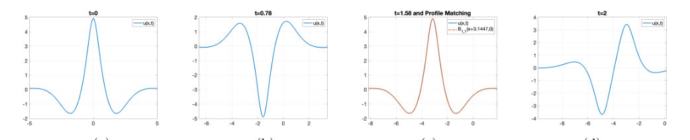 
Figure 1. Time evolution of u0(x) = B1,1(x, 0) from (2.8). In (c), matching the numerical simulation of u(x, t) at t = 1.58 with the exact (shifted) breather B1,1(x −a, 0), a = −3.1447.

📷 Fig 2

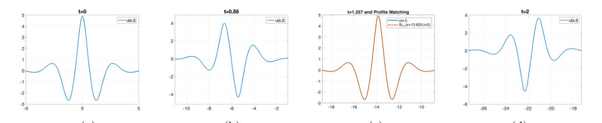 
Figure 2. Time evolution of u0(x) = B2,1(x, 0) from (2.8). In (c), matching the numerical simulation of u(x, t) at t = 1.27 with the exact (shifted) breather B2,1(x −a, 0), a = −13.825.

📷 Fig 3

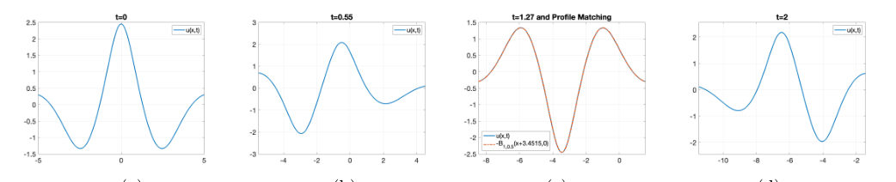 
Figure 3. Time evolution of u0(x) = B1,0.5(x, 0) from (2.8). In (c), matching u(x, t) at t = 1.27 with the exact (shifted) breather B1,0.5(x −a, 0), a = −3.4515.

📷 Fig 4

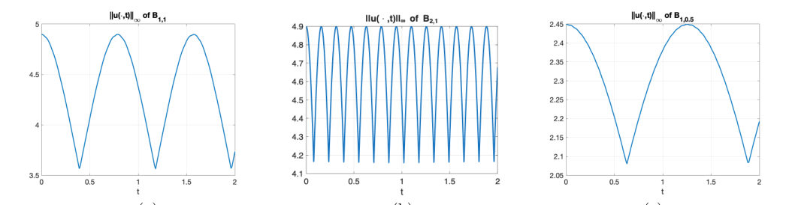 
Figure 4. Time dependence of the L∞norm of the numerically computed mKdV breathers: (a) B1,1(x, t), (b) B2,1(x, t), and (c) B1,0.5(x, t).

📷 Fig 5

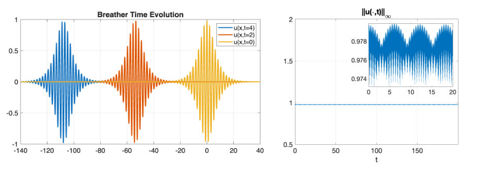 
Figure 5. Example of a constant L∞norm in a breather with u0(x) = B3,0.2(x, 0): profiles at t = 0, t = 2, and t = 4 (left), L∞norm up to t = 200 with the zoomed-in subplot (right).

**Summary.** This work numerically investigates the stability of breather solutions in the mKdV equation, testing its resilience against various nonlinear perturbations. The authors show that these localized structures remain stable over long timescales, even when the underlying system is non-integrable. The study provides strong numerical evidence for the persistence of coherent structures in complex physical models.

**Why it may be interesting.** While focused on classical nonlinear PDEs, the study of stable, localized structures (solitons/breathers) in perturbed systems relates to the concept of robust excitations in complex quantum many-body systems, particularly those exhibiting integrability breaking.

Detailed structure

**Main problem.** The paper systematically investigates the stability and robustness of breather solutions within the modified Korteweg-de Vries (mKdV) equation under various types of perturbations.

**Main result.** The numerical simulations demonstrate that mKdV breathers exhibit remarkable stability, persisting even when the system is perturbed into non-integrable regimes. Furthermore, the analysis supports the conjecture that complex interactions resolve into stable coherent structures (solitons and breathers) while shedding radiation.

**Method.** The primary method involves extensive numerical simulations to track the long-term time evolution of solutions, coupled with the development of specific diagnostics to monitor conserved quantities and localized structure decay.

**Model / system.** The core model is the mKdV equation ($u_t + u_{xxx} + u^2 u_x = 0$), which is then perturbed by adding nonlinear terms, such as those involving absolute values or other nonlinear functions, creating non-integrable systems.

**Key observables.** Conserved quantities like Mass ($M[u]$) and Energy ($E[u]$), the $L_\infty$ norm, and the mass of the outgoing radiation are key diagnostics used to track stability and energy dissipation.

**Important parameters / regimes.** Perturbation strength ($\epsilon$), the nonlinearity power ($p$), and the breather defining parameters ($\alpha, eta$) are crucial parameters varied throughout the study.

**Assumptions / limitations.** The stability conclusions are based on numerical evidence, and the analysis of interactions in the integrable case assumes that no radiation is generated beyond the numerical resolution used.

**Figures summary.** Figures illustrate the time evolution of the solution profile, tracking the stabilization of local mass over time, and quantifying the mass and energy associated with the dispersed radiation.

**Paper structure.** The paper progresses by first reviewing known analytical solutions (solitons and breathers), then systematically investigating their interactions, followed by detailed studies of specific nonlinear perturbations, and finally analyzing the stability in non-integrable settings.

Abstract

We systematically investigate breather solutions in the modified Korteweg-de Vries (mKdV) equation via numerical simulations. We show that the breather solutions are stable under a variety of perturbations, including amplitude changes, modifications of internal parameters, and perturbations of the nonlinearity of the equation. Our results are not only consistent with the known analytical studies on the stability of breathers in integrable systems, extending them further, but also provide numerical evidence that such breather-type structures can persist and remain stable over the simulated time scales in some non-integrable settings with symmetric potentials.

[↑ back to top](#top)

### [Solid-State Dealloying Enables Local Symmetry Breaking in Ternary Intermetallic Thin Films](http://arxiv.org/abs/2609.28249v1)

**Authors:** Mizuki Ohno, Reiley Dorrian, Veronica Show, Salva Salmani-Rezaie, Joseph Falson  
**Type:** experiment · **Category:** other · **PDF:** <https://arxiv.org/pdf/2609.28249v1>  
**Analysis basis:** full PDF text, analyzed in chunks
**Topic relevance:** `driven-dissipative phase transition` **1/5** · `non-equilibrium universality` **1/5**

📷 Fig 1

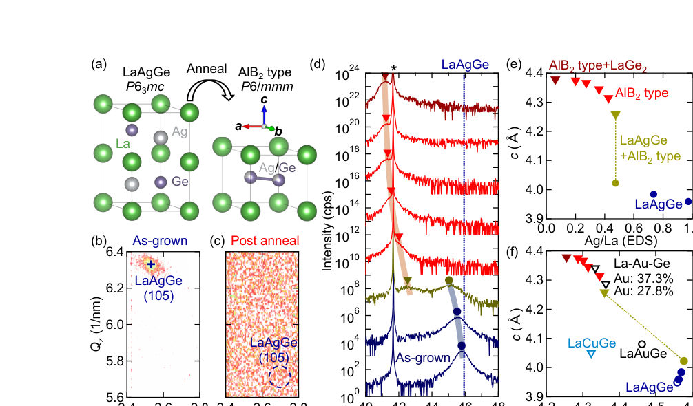 
FIG. 1. Epitaxial solid-state dealloying toward AlB2-type La–Ag–Ge. (a) Crystal struc-

📷 Fig 2

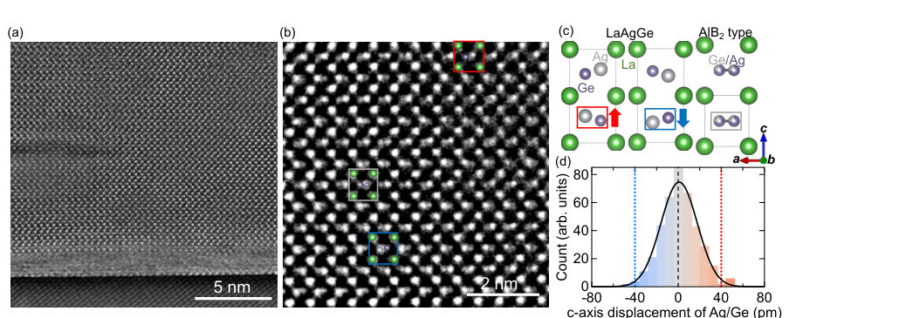 
FIG. 2. Atomic-resolution STEM resolves local Ag–Ge displacements consistent with

📷 Fig 3

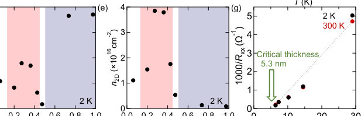 
FIG. 3. Normal-state transport across the composition and thickness series. (a)

📷 Fig 4

 
Figure 3f shows the longitudinal resistance Rxx versus temperature for films of fixed

📷 Fig 5

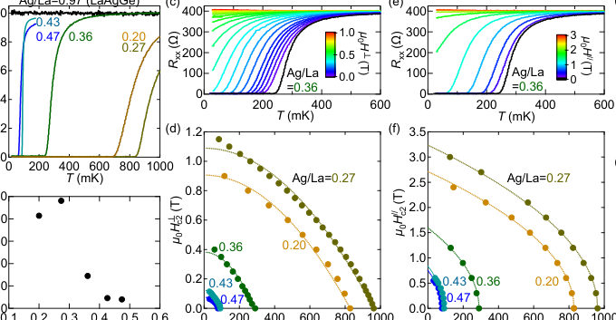 
FIG. 4. Composition (Ag/La) dependence of the superconducting transition and its en-

**Summary.** This work demonstrates that controlled solid-state dealloying can synthesize metastable, centrosymmetric superconducting phases in La-Ag-Ge thin films. By tuning the composition and structure, the researchers achieved superconducting films with enhanced upper critical fields, establishing dealloying as a powerful tool for phase-selective quantum material synthesis.

**Why it may be interesting.** The ability to tune structural symmetry and electronic properties via a controlled, non-equilibrium processing route (dealloying) provides a powerful paradigm for designing novel quantum materials, relevant to understanding symmetry-protected topological phases.

Detailed structure

**Main problem.** The challenge of deterministically synthesizing metastable quantum materials whose local symmetries differ from their equilibrium states.

**Main result.** Epitaxial solid-state dealloying was successfully demonstrated to synthesize a metastable, centrosymmetric superconducting phase, allowing control over atomic-scale structure and emergent electronic properties.

**Method.** The study employed post-growth solid-state dealloying on epitaxial thin films, combined with atomic-resolution electron microscopy and transport measurements.

**Model / system.** The system is ternary intermetallic thin films ($	ext{La–Ag–Ge}$) grown epitaxially, undergoing a structural transition from a polar $	ext{P6}_3mc$ precursor to a centrosymmetric $	ext{AlB}_2$-type $	ext{P6/mmm}$ phase via controlled Ag loss.

**Key observables.** Superconducting critical temperature ($T_c$), in-plane upper critical field ($H_{c2}$), local Ag–Ge displacements, and transport parameters like RRR and carrier density ($n_{2	ext{D}}$).

**Important parameters / regimes.** Annealing temperature ($800–900^\circ	ext{C}$), film thickness ($t$), and chemical composition ($	ext{Ag/La}$ ratio).

**Assumptions / limitations.** The structural assignment relies on the dealloying process stabilizing the $	ext{AlB}_2$-type phase, and the interpretation of $H_{c2}$ requires careful consideration of the Pauli limit and thickness effects.

**Figures summary.** Figures illustrate the structural transformation (polar to centrosymmetric), lattice parameter shifts, and the dependence of superconducting properties and transport measurements on composition and film thickness.

**Paper structure.** The paper systematically investigates the structural evolution via dealloying, characterizes the resulting phase using STEM and XRD, and then probes the resulting electronic properties through normal-state transport and superconducting magnetotransport measurements.

Abstract

Metastable quantum materials often occupy narrow composition windows with local symmetries distinct from competing equilibrium structures. These features open pathways for realizing qualitatively new electronic properties within a similar chemical subspace while at the same time complicating their deterministic synthesis. Here we illustrate a post-growth solid-state dealloying process using epitaxial ternary thin films in the La--Ag--Ge chemical space to realize a diffraction-averaged centrosymmetric superconducting structure. The process converts polar $P6_3mc$-LaAgGe into diffraction-averaged centrosymmetric AlB$_2$-type $P6/mmm$ La-Ag-Ge through net Ag loss during annealing at 800--900 $^\circ$C. Atomic-resolution electron microscopy reveals local Ag--Ge displacements of both signs relative to the planar configuration, consistent with local inversion-symmetry-breaking distortions. The converted films exhibit composition-dependent superconductivity with critical temperatures below 1 K and in-plane upper critical fields that exceed the weak-coupling Pauli-field estimate by a factor of approximately 6 in the thinnest superconducting films. These results establish epitaxial solid-state dealloying as a route to phase-selective synthesis of metastable phases, offering control over atomic-scale structural configurations and their interplay with emergent electronic properties.

[↑ back to top](#top)

### Other secondary papers (4)

Show other secondary papers

### [Anisotropic upper critical field in the van der Waals superconducting quasicrystal (Ta$_{0.7}$Nb$_{0.3}$)$_{1.6}$Te](http://arxiv.org/abs/2609.27352v1)

**Authors:** Koki Kasai, Yuki Tokumoto, Taichi Terashima, Takako Konoike, Keiichi Edagawa  
**Type:** both · **Category:** other · **PDF:** <https://arxiv.org/pdf/2609.27352v1>  
**Analysis basis:** full PDF text, analyzed in chunks

📷 Fig 1

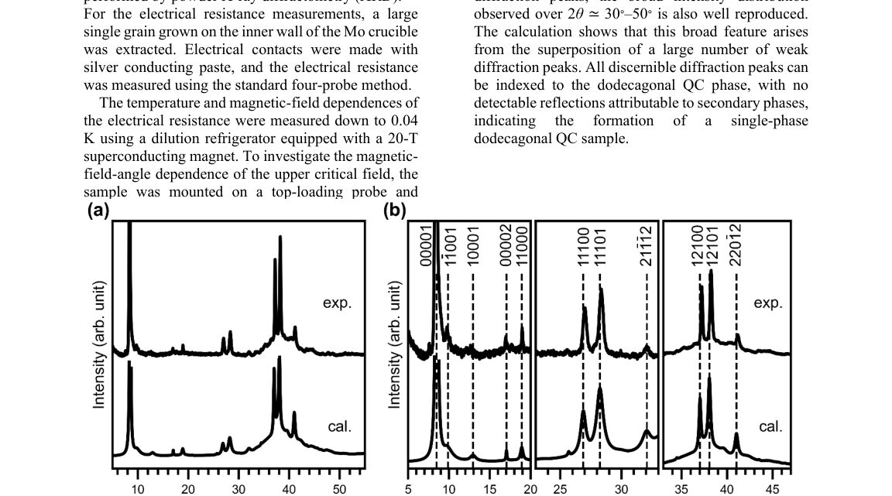 
FIG 1. (a) Experimentally obtained powder XRD profile of the synthesized (Ta0.7Nb0.3)1.6Te sample and the calculated profile for the dodecagonal QC phase. (b) Magnified view of the data shown in (a).

📷 Fig 2

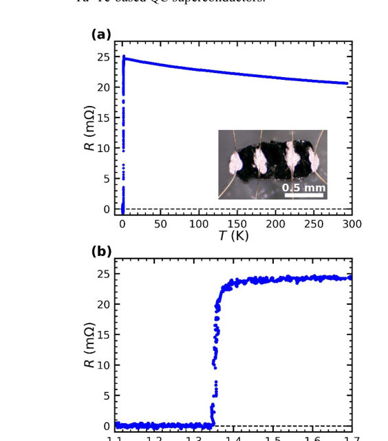 
FIG 2. (a) Temperature dependence of the electrical resistance R from 37 mK to 293 K. The inset shows the single-grain sample with four electrical contacts. (b) Enlarged view of the superconducting transition between 1.1 and 1.7 K.

📷 Fig 3

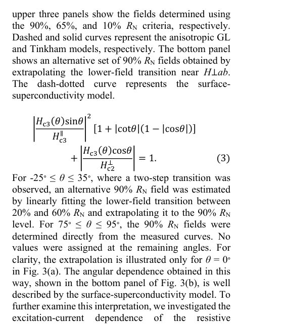 
Figure 4 shows the magnetic-field dependence of the resistance measured with excitation currents of 5, 10, and 50 μA for in-plane and out-of-plane fields. For in-plane fields, the broad resistive transition exhibits a pronounced current dependence: the intermediate- and high-resistance parts of the transition shift appreciably with increasing excitation current, whereas the low- resistance part is much less affected. In contrast, for out-of-plane fields, the characteristic two-step transition shows a much weaker current dependence. These qualitatively different current dependences suggest that the broad transition for in-plane fields and the two-step transition for out-of-plane fields have...

📷 Fig 4

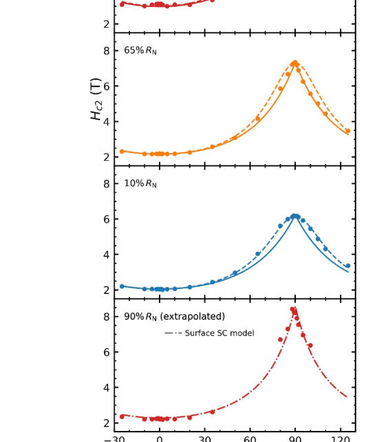 
FIG 3. (a) Magnetic-field dependence of the resistance R at various angles θ at an average temperature of 45 mK. (b) Angular dependence of the critical fields. The inset schematically illustrates the definition of θ. The

📷 Fig 5

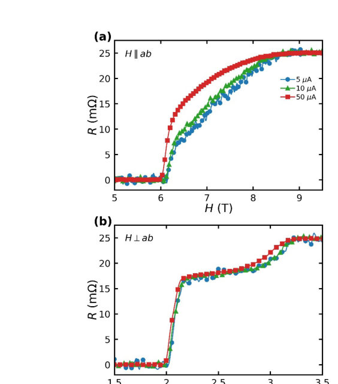 
FIG 4. Magnetic-field dependence of the resistance R measured with various excitation currents at an average temperature of 45 mK for (a) H∥ab and (b) H⊥ab. ξab = 13 nm and ξc = 4.1 nm, respectively, from the relations 𝐻𝐻c2 ∥= Φ0 2𝜋𝜋𝜉𝜉𝑎𝑎𝑎𝑎𝜉𝜉𝑐𝑐 and 𝐻𝐻c2 ⊥= Φ0 2𝜋𝜋𝜉𝜉𝑎𝑎𝑎𝑎 2, where Φ0

**Summary.** This work investigates the superconducting properties of a van der Waals quasicrystal, determining its upper critical field ($H_{c2}$) is strongly anisotropic. By comparing different resistive transition criteria, the authors distinguish between bulk and surface superconductivity effects. The anomalous temperature dependence of $H_{c2}(T)$ is successfully modeled by incorporating spatial variations in electronic diffusivity, suggesting inhomogeneity plays a key role in its superconducting behavior.

**Why it may be interesting.** The investigation into anisotropic critical fields and the use of advanced models (like the modified GLAG) to account for spatial inhomogeneity in a novel material class (quasicrystals) provides insights into unconventional pairing mechanisms and transport limitations in low-dimensional superconductors.

Detailed structure

**Main problem.** To investigate the anisotropic upper critical field ($H_{c2}$) and the nature of the resistive transition in a superconducting quasicrystal to determine its intrinsic superconducting properties.

**Main result.** The $H_{c2}$ exhibits strong anisotropy, and the temperature dependence of $H_{c2}(T)$ deviates from standard predictions, suggesting that spatial variations in electronic diffusivity contribute to the anomalous behavior.

**Method.** The study combines electrical transport measurements (measuring $H_{c2}$ using various resistive criteria) with theoretical modeling using anisotropic Ginzburg-Landau and modified Ginzburg-Landau-Abrikosov-Gorkov models.

**Model / system.** The physical system is the van der Waals superconducting quasicrystal ($	ext{Ta}_{0.7}	ext{Nb}_{0.3}$)$_{1.6}	ext{Te}$. The analysis compares experimental angular and temperature dependencies against theoretical models describing anisotropic superconductivity.

**Key observables.** Superconducting transition temperature ($T_c = 1.35	ext{ K}$), angular dependence of $H_{c2}(	heta)$, and the temperature dependence of $H_{c2}(T)$ for both in-plane and out-of-plane fields.

**Important parameters / regimes.** Anisotropy parameter ($\gamma$), Pauli paramagnetic limit, and the spatial variation parameter ($w$) used in the modified GLAG model.

**Assumptions / limitations.** The $10\% R_N$ criterion is assumed to reflect bulk superconductivity, while higher criteria may reflect surface superconductivity; the anomalous $H_{c2}(T)$ dependence is attributed to spatial inhomogeneity in electronic diffusivity.

**Figures summary.** Figures show the sharp superconducting transition, the angular dependence of $H_{c2}$ compared to GL and Tinkham models, and the temperature dependence of $H_{c2}$ fitted using both WHH and modified GLAG models.

**Paper structure.** The paper first characterizes the material structure (XRD) and measures the superconducting transition. It then analyzes the angular dependence of $H_{c2}$ using different resistive criteria, comparing results to GL and Tinkham models. Finally, it focuses on the temperature dependence of $H_{c2}(T)$, showing deviations from WHH theory and fitting the data with a modified GLAG model incorporating spatial diffusivity variations.

Abstract

We investigated the upper critical field of a large single grain of the Nb-substituted van der Waals layered quasicrystal (Ta$_{0.7}$Nb$_{0.3}$)$_{1.6}$Te. The sample exhibits a sharp superconducting transition at $T_{\mathrm{c}}$ = 1.35 K, the highest value reported to date among quasicrystal superconductors. The angular dependence of the critical field exhibits a pronounced criterion dependence: the field determined using the 10% $R_{\mathrm{N}}$ ($R_{\mathrm{N}}$: normal-state resistance) criterion is well described by the anisotropic Ginzburg-Landau model, whereas those determined using the 65% and 90% $R_{\mathrm{N}}$ criteria exhibit Tinkham-like angular dependence characteristic of two-dimensional superconductivity. The high-field part of the resistive transition is well described by a surface-superconductivity model and exhibits a pronounced excitation-current dependence for magnetic fields close to the $ab$ plane, supporting the presence of surface superconductivity on the quasiperiodic $ab$-plane surfaces. The bulk $H_{\mathrm{c2}}$ is strongly anisotropic, with the in-plane $H_{\mathrm{c2}}$ exceeding the weak-coupling Pauli limit by a factor of approximately 2.5. For both field orientations, $H_{\mathrm{c2}}(T)$ deviates upward from the conventional dirty-limit Werthamer-Helfand-Hohenberg prediction at low temperatures. A phenomenologically modified Ginzburg-Landau-Abrikosov-Gorkov model incorporating a spatial distribution of the electronic diffusivity substantially improves the description of $H_{\mathrm{c2}}(T)$, suggesting that spatial variations in electronic transport properties may contribute to its anomalous temperature dependence.

[↑ back to top](#top)

### [Electronic Effects of a Twisted Graphene Catenoid Bridge](http://arxiv.org/abs/2609.26988v1)

**Authors:** G. M. Delgado, J. E. G. Silva  
**Type:** theory · **Category:** other · **PDF:** <https://arxiv.org/pdf/2609.26988v1>  
**Analysis basis:** full PDF text, analyzed in chunks

📷 Fig 1

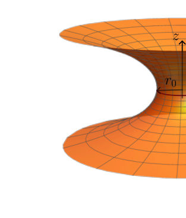 
Figure 1: Coordinate Systems on the Catenoid. Schematic representation of the catenoid surface highlighting the relationship between the two relevant longitudinal co- ordinates: the standard axial coordinate z (straight vertical path), and the meridional arc length coordinate s (curved path along the surface). The parameter r0 denotes the minimum radius at the geometric bottleneck (z = 0, s = 0). Mapping the effective 1D electron dynamics from z to the path s absorbs the local metric variations, allowing the system to be described by a conservative Schrödinger-like equation.

📷 Fig 2

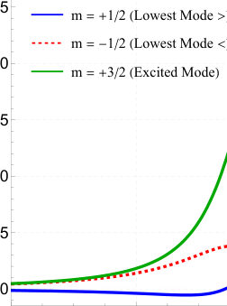 
Figure 2: Spin-Dependent Squared Effective Potential. The profile of the geomet- ric potential U 2 eff(s) is mapped along the meridional coordinate s for the lowest modes m = ±1/2 and the excited mode m = +3/2. The geometry-induced chiral asymmetry is clearly visible: the m = +1/2 state (solid blue line) exhibits a higher potential barrier for s &gt; 0, whereas the m = −1/2 state (dashed red line) encounters the barrier for s &lt; 0. Parameters: r0 = 1nm.

📷 Fig 3

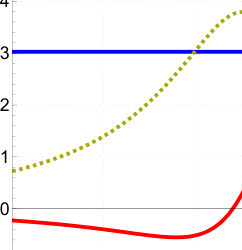 
Figure 3: Energy Landscape and Tunneling Barrier. Comparison between the con- stant squared energy parameter ϵ2 (solid blue line) and the squared effective potential U 2 eff(s) for the lowest angular momentum modes m = ±1/2. The intersections between the energy level and the potential curves define the classical turning points, effectively de- limiting the classically forbidden region (tunneling barrier). The chiral nature is evident: the Spin UP projection (m = +1/2, solid red line) encounters a potential barrier in the right channel (s &gt; 0), whereas the Spin DOWN projection (m = −1/2, dashed yellow line) faces an identical barrier in the left channel (s &lt; 0). Parameters used: r0 = 1 nm...

📷 Fig 4

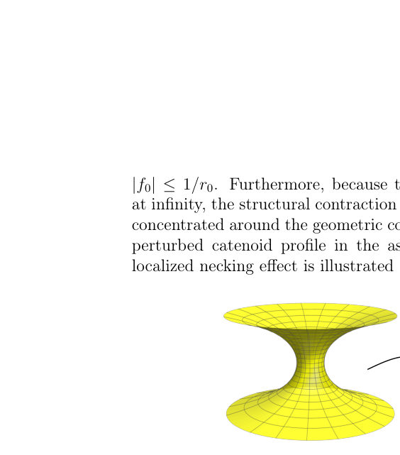 
Figure 4: Twist-induced geometric deformation of the catenoid. The pure catenoid (left, f0 = 0) is mapped into a modified geometry (right) under mechanical torsion. Driven by the topological ansatz, the radial profile undergoes a localized contraction explicitly concentrated around the geometric bottleneck, mimicking the elastic response of the lattice to applied twist.

📷 Fig 5

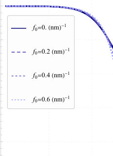 
Figure 5: Twist-induced modification of the Gaussian curvature. Spatial profile of the Gaussian curvature K(z) along the axial coordinate z for selected twist rates f0. The localized radial contraction at the bottleneck (z = 0) strongly intensifies the negative Gaussian curvature, reflecting the mechanical tightening of the graphene wormhole throat. Parameters: r0 = 1nm.

**Summary.** This work theoretically examines the quantum dynamics of electrons on a twisted graphene catenoid bridge, treating the geometry via the curved Dirac equation. The key finding is that the geometric twist introduces a potential barrier that severely suppresses electron tunneling between the two graphene layers. This demonstrates a method to control quantum transport using purely mechanical deformation.

**Why it may be interesting.** The explicit coupling between geometry (torsion/curvature) and quantum transport provides a powerful, tunable mechanism for controlling electronic properties in 2D materials, relevant for designing topological electronic devices.

Detailed structure

**Main problem.** The study investigates how geometric deformations, specifically torsion and curvature, control the quantum electronic transport of massless Dirac fermions confined to a twisted graphene catenoid bridge.

**Main result.** The geometric twist significantly enhances the potential barrier at the catenoid throat, leading to a strong suppression of the inter-layer quantum transmission coefficient.

**Method.** The analysis employs a continuum approach using the covariant curved Dirac equation, solving the resulting effective 1D Klein-Gordon-like equation via separation of variables and numerical scattering methods.

**Model / system.** The system is a twisted graphene catenoid bridge, modeled by massless Dirac fermions whose dynamics are governed by a curved Dirac equation incorporating curvature and torsion terms.

**Key observables.** Inter-layer transmission probability T(epsilon), electronic energy states, and the geometric phase acquired by the wave function.

**Important parameters / regimes.** Torsion rate ($f_0$), incident energy ($\epsilon$), and the characteristic length scale ($r_0$) of the catenoid.

**Assumptions / limitations.** The analysis assumes a linear dispersion relation (graphene-like) and utilizes a continuum approximation, neglecting microscopic lattice changes.

**Figures summary.** Figures illustrate the spatial profile of the twist-induced potential barrier and show the calculated transmission probability T(epsilon) decreasing as the torsion rate $f_0$ increases.

**Paper structure.** The paper progresses from deriving the effective Hamiltonian using the curved Dirac equation, simplifying the coupled equations via coordinate transformations, and finally performing a numerical scattering analysis to calculate the transmission probability.

Abstract

The interplay between non-trivial background geometries and quantum dynamics has emerged as a powerful tool to tailor the electronic properties of 2D materials. In this work, we investigate the effective quantum dynamics of massless Dirac fermions confined to a twisted graphene structure called a catenoid bridge, which connects two single-layer sheets. By adopting a continuum approach, where the electron dynamics is governed by a purely covariant curved Dirac equation, we obtain the effective Hamiltonian containing both curvature and twist interactions. We found that the torsion modifies the electronic states by producing a geometric phase on the wave function. In addition, the twist also deforms the surface geometry, which leads to a new geometric term in the effective Hamiltonian. This twist potential enhances the barrier around the catenoid throat, which increases the suppression of the inter-layer transmission coefficient. Like the spin-curvature interaction, the spin-twist term has a chiral dependence which is invariant under a combined parity and spin flip transformation. As a result, the electronic states can be restricted to the upper or lower layer. These findings provide valuable insights into how mechanical deformations can be harnessed to control quantum transport in graphene-based wormhole architectures.

[↑ back to top](#top)

### [Interlayer-correlated fractional quantum Hall state in a trilayer electron system](http://arxiv.org/abs/2609.26916v1)

**Authors:** Chengyu Wang, C. T. Tai, N. Toemtrisna, A. Gupta, L. N. Pfeiffer, K. W. Baldwin, M. Shayegan  
**Type:** experiment · **Category:** strongly correlated electrons · **PDF:** <https://arxiv.org/pdf/2609.26916v1>  
**Analysis basis:** full PDF text, analyzed in chunks

📷 Fig 1

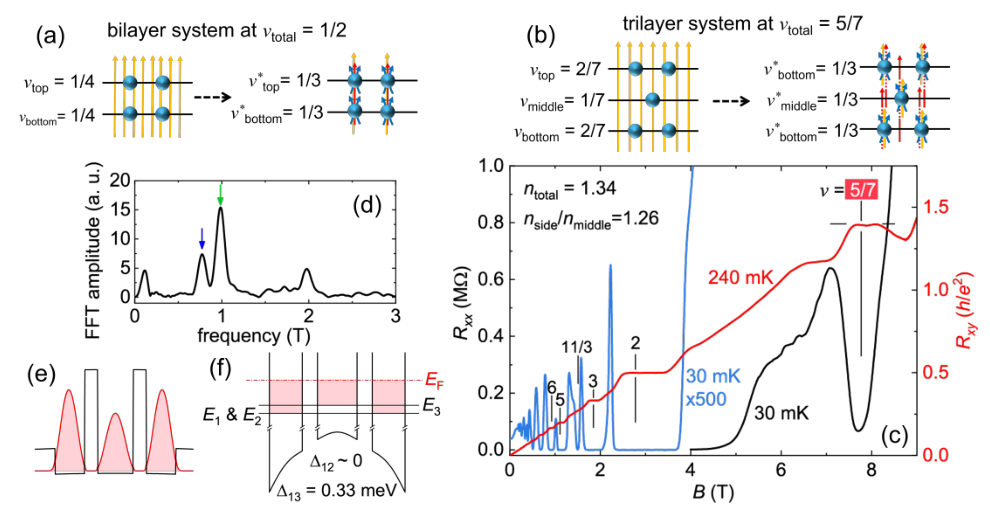 
FIG. 1. Interlayer-correlated FQHS in a trilayer 2DES. (a, b) Schematic descriptions of the interlayer-correlated FQHSs in the weakly-interacting CF picture for: (a) bilayer 2DESs at νtotal = 1/2, and (b) trilayer 2DESs at νtotal = 5/7. The blue spheres represent electrons, and the yellow vertical arrows the magnetic field flux quanta. Each electron captures two flux quanta from its own layer (blue curved arrows) and one flux quantum from its neighboring layer(s) (red arrows), forming a multi-component (2 + 1)-flux CF. νtop, νmiddle, and νbottom are the actual layer fillings and ν∗ top, ν∗ middle, and ν∗ bottom are the effective layer fillings that reflect the intralayer correlation. (c)...

📷 Fig 2

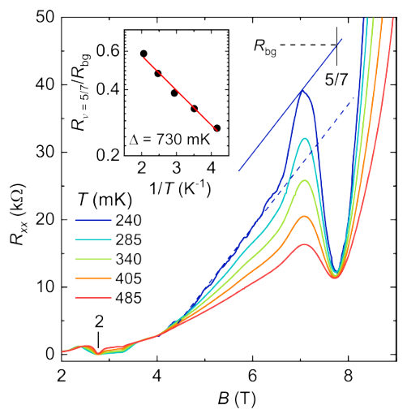 
FIG. 2. Temperature dependence data. Rxx vs B traces at ntotal = 1.34 × 1011 cm−2, measured at different temperatures. The dashed and solid lines illustrate, using the 240 mK data as an example, the method used to determine the background resistance Rbg at each temperature [48]. Inset shows the Arrhenius plot of Rν=5/7/Rbg, where Rν=5/7 is the Rxx value at νtotal = 5/7. Slope of the linear fit provides an estimate of the energy gap for the 5/7 FQHS, ∆≃730 mK.

📷 Fig 3

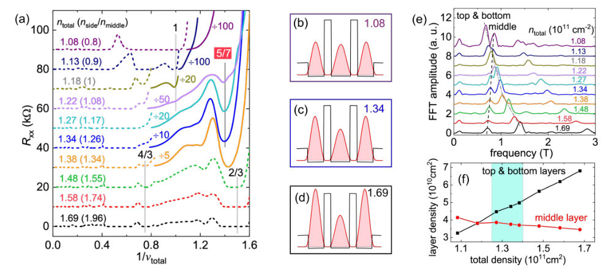 
FIG. 3. Evolution of FQHSs with symmetric gating. (a) Rxx vs 1/νtotal traces measured at different total densities, while the front and back gates are used to ensure that the top and bottom QWs have equal densities. Each trace is vertically shifted by 10 kΩfor clarity. (b-d) Charge distributions and potentials for ntotal = 1.08, 1.34, and 1.69, calculated self-consistently at zero magnetic field. (e) FFT spectra of low-B SdH oscillations at different ntotal. From the frequencies of the FFT peaks, we determine the layer densities, as shown in (f). The density range where a νtotal = 5/7 FQHS is observed is highlighted.

📷 Fig 4

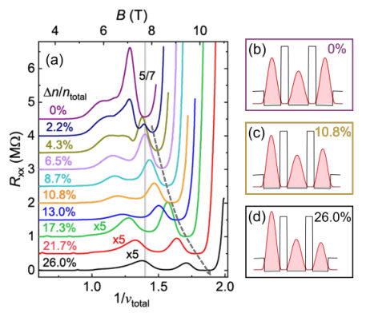 
FIG. 4. Effect of layer imbalance. (a) Rxx vs B traces measured at fixed ntotal = 1.34, but different ∆n/ntotal (shown on the left for each trace), where ∆n is the density difference between the top and bottom layers. The traces for ∆n/ntotal = 17.3%, 21.7%, and 26.0% are multiplied by 5 to show the features clearly. (b-d) Self-consistently calculated charge distributions at B = 0, for ∆n/ntotal = 0, 10.8%, and 26.0%.

**Summary.** This experiment reports the discovery of an exotic Fractional Quantum Hall State ($\nu=5/7$) in a trilayer electron system using GaAs quantum wells. By analyzing transport measurements and layer densities, the authors confirm that the state exhibits genuine interlayer correlation across three coupled layers. This extends the understanding of correlated electron physics beyond previously studied bilayer systems.

**Why it may be interesting.** This work directly probes the limits of electron correlation physics in multi-component systems, providing experimental evidence for theoretical predictions regarding higher-order generalizations of Laughlin states, which is a key area in strongly correlated electron physics.

Detailed structure

**Main problem.** The study investigates exotic, multi-component, many-body states, specifically Fractional Quantum Hall States (FQHSs), in systems involving three or more coupled quantum layers.

**Main result.** The authors observed a novel interlayer-correlated FQHS at total filling factor $\nu=5/7$ in a trilayer electron system, confirming the existence of generalized Laughlin states extending coherence to three layers.

**Method.** The research combines transport measurements (measuring $R_{xx}$ and $R_{xy}$ vs. magnetic field) with Fast Fourier Transform (FFT) analysis of Shubnikov-de Haas oscillations to characterize the correlated state and layer densities.

**Model / system.** The physical system is a trilayer two-dimensional electron system realized in ultra-high-quality GaAs triple quantum wells. The theoretical framework involves generalized Laughlin wave functions, extending concepts from bilayer systems.

**Key observables.** Deep longitudinal resistance minimum ($R_{xx}$) and quantized Hall plateau ($R_{xy}$), specifically observed at $\nu_{total} = 5/7$ (quantized at $7h/5e^2$).

**Important parameters / regimes.** Total filling factor $\nu_{total}$, interlayer distance $d$, magnetic length $l_B$, and layer density ratios ($n_{side}/n_{middle}$).

**Assumptions / limitations.** Interlayer tunneling between neighboring layers is assumed to be negligible for the primary state description; careful averaging of $B^+$ and $B^-$ data is necessary to mitigate $R_{xx}$ mixing into $R_{xy}$ measurements.

**Figures summary.** Figures show $R_{xx}$ and $R_{xy}$ vs. $B$ confirming the $\nu=5/7$ FQHS, temperature dependence confirming the energy gap, and FFT analysis used to determine layer densities.

**Paper structure.** The paper progresses by first establishing the experimental platform and analyzing layer densities via FFT. It then presents transport measurements showing the $\nu=5/7$ FQHS, followed by detailed analysis of how charge imbalance ($\Delta n$) affects the state, leading to the conclusion of genuine trilayer correlation.

Abstract

In multilayer quantum Hall systems, when the layer separation is sufficiently small, the interplay between intralayer and interlayer Coulomb interactions can lead to exotic, multi-component, many-body states. A particular example is the even-denominator fractional quantum Hall state (FQHS) at total filling factor $ν=1/2$ in bilayer systems with negligible interlayer tunneling. This state can be understood as a generalized Laughlin state described by the Halperin-Laughlin $Ψ_{331}$ wavefunction. While such correlated states have been extensively explored in bilayers, little is known about their counterparts in systems with more than two layers. Here, we investigate a trilayer two-dimensional electron system confined to ultrahigh-quality GaAs triple quantum wells. We observe an exotic FQHS at total filling factor $ν=5/7$, evinced by a deep longitudinal resistance minimum and a quantized Hall plateau, when the side layers have a density larger than the middle layer and $d/l_B \simeq 2.2$ ($d$ is the interlayer distance and $l_B$ the magnetic length). This state is naturally interpreted as the long-predicted trilayer, generalized Laughlin ($Ψ_{33311}$) state, characterized by $ν=1/3$-like intralayer correlation within each layer and $ν=1$-like interlayer correlation between neighboring layers. Our observation establishes a new member of the Halperin-Laughlin many-body states that extends interlayer coherence to three coupled layers.

[↑ back to top](#top)

### [On quantum confinement without barriers](http://arxiv.org/abs/2609.27054v1)

**Authors:** I. A. Kokurin  
**Type:** theory · **Category:** other · **PDF:** <https://arxiv.org/pdf/2609.27054v1>  
**Analysis basis:** full PDF text, analyzed in chunks

📷 Fig 1

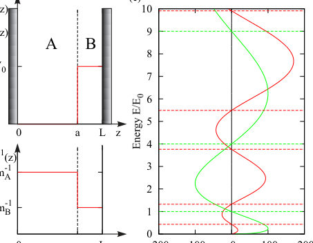 
FIG. 1. (a) The SQW potential profile U(z)+V (z) is schemat- ically depicted. The shaded regions (z &lt; 0 and z &gt; L) are impenetrable to the charge carrier. The regions A (0 &lt; z &lt; a) and B (a &lt; z &lt; L) are designated. (b) Spatial profile of the inverse effective mass m−1(z) in SQW. (c) Function f(E) (solid red line) at k = 0 and mB/mA = 10. Intersection with vertical axis [f(E) = 0] yields the subband energies En(0) (horizontal red dashed lines). The function f(E) at mA = mB (solid green line) is presented for comparison. Corresponding energy levels (horizontal green dashed lines) are En = E0n2, n = 1, 2, 3, ....

📷 Fig 2

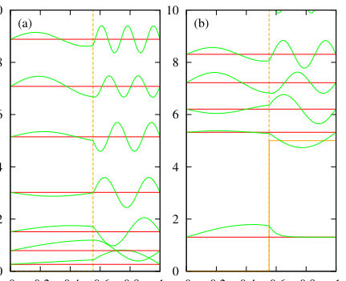 
FIG. 2. Subband energies Ei(0) (solid red lines) and cor- responding wave functions (solid green line) for electron in SQW. The heterointerface position a/L = 1 −1/ √

📷 Fig 3

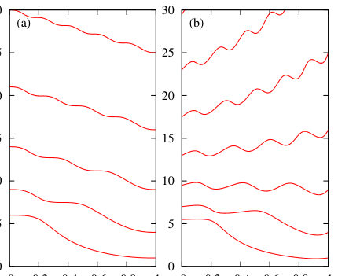 
FIG. 3. Dependences of the subband energies Ei(0) on the heterointerface position a (0 &lt; a &lt; L). (a) Equal effec- tive masses, mA = mB. (b) Non-equal effective masses, mB/mA = 2. The band offset V0 is the same in both cases, V0 = 5E0.

**Summary.** This paper analyzes quantum confinement in semiconductor heterostructures, showing that confinement depends critically on both potential barriers and the spatial variation of the effective mass. By modeling a Structured Quantum Well, the authors demonstrate that the wave function localization can be engineered by controlling the mass profile, which is highly relevant for advanced semiconductor device design.

**Why it may be interesting.** The explicit inclusion of the kinetic energy contribution via the effective mass term provides a powerful extension to standard quantum well models, offering new design rules for semiconductor devices like quantum cascade lasers.

Detailed structure

**Main problem.** To investigate quantum confinement in semiconductor heterostructures where the confinement mechanism is governed not only by band offsets but also by the spatial variation of the effective mass.

**Main result.** The localization of carrier wave functions can be controlled by engineering the effective mass profile, allowing different electronic subbands to localize in distinct spatial regions.

**Method.** The problem is solved by treating the effective mass Hamiltonian as a 1D spectral problem, utilizing both boundary condition matching and matrix diagonalization techniques.

**Model / system.** The model is a Structured Quantum Well (SQW) consisting of multiple semiconducting layers with varying effective masses and potential barriers. The governing equation is the effective mass Hamiltonian: H = -hbar^2/(2) * div(1/m(z)) * div + U(z) + V(z).

**Key observables.** Subband energy spectrum E_i(k) and the spatial wave functions psi_i(z; k).

**Important parameters / regimes.** Effective masses (m_A, m_B), barrier height (V_0), and heterointerface position (a).

**Assumptions / limitations.** The analysis is performed using a simple model system and assumes the effective mass approximation is valid.

**Figures summary.** Figure 1 shows the potential and inverse effective mass profiles. Figure 2 compares wave functions for zero and non-zero barriers. Figure 3 illustrates the non-monotonic dependence of subband energies on the heterointerface position a when effective masses differ.

**Paper structure.** The paper establishes the general effective mass Hamiltonian, derives the spectral problem, and then applies both boundary condition and matrix diagonalization methods to analyze how the total energy (potential + kinetic) dictates carrier localization.

Abstract

Usually in semiconductor heterostructures, such as quantum wells, the quantum confinement is realized by means of heterobarriers, which are simply the band offsets in adjacent materials. Here the arguments are provided, that the energy dispersions in materials (in simple case determined by effective masses) are important as well. Using a simple model system, such as quantum well with an additional heterojunction, it is shown the predominant localization of the carrier density in the regions with higher effective mass. The possibility of different spatial localization of wave function for different subbands is predicted. This can be applied in semiconductor structures such as quantum cascade lasers.

[↑ back to top](#top)

