
# arxiv digest (quant-ph + cond-mat) — 2026-09-29

*121 papers · 21 relevant · 1 highlighted*

## 🔥 Most relevant (21)

*Every paper with at least one nonzero topic score, sorted by best-matching score. 🔥 marks scores ≥4/5. Click the title to jump to the full entry below; click [arXiv] to open the paper page. `(secondary)` marks papers from de-prioritized cond-mat archives.*

Show 21 relevant papers

- [Steady--State Current Signatures of Strong Light--Matter Coupling in Single--Molecule Junctions](#paper-2609.31265) [[arXiv]](http://arxiv.org/abs/2609.31265v1) — 🔥 `Keldysh / 2PI / non-Gaussian methods` **4/5** · 🔥 `methods for driven-dissipative` **4/5** · `Tavis-Cummings & cavity-many-emitter` **3/5** · `analog quantum simulation` **3/5** · `driven-dissipative phase transition` **3/5** · `correlated / nonlocal dissipation` **2/5** · `non-equilibrium universality` **2/5** · `interference shaping light` **1/5** · `quantum measurements` **1/5**
- [Slow-fast dynamics of the McKean model with stochastic resetting and diffusion](#paper-2609.31153) [[arXiv]](http://arxiv.org/abs/2609.31153v1) — 🔥 `methods for driven-dissipative` **4/5** · `Keldysh / 2PI / non-Gaussian methods` **3/5** · `driven-dissipative phase transition` **3/5** · `non-equilibrium universality` **3/5** · `quantum measurements` **2/5** · `scars & prethermalization` **2/5** · `Frenkel-Kontorova` **1/5** · `analog quantum simulation` **1/5** · `correlated / nonlocal dissipation` **1/5**
- [Angular momentum conservation in two-atom superradiance](#paper-2609.31433) [[arXiv]](http://arxiv.org/abs/2609.31433v1) — 🔥 `Dicke superradiance` **4/5** · 🔥 `free-space correlated emission` **4/5** · `correlated / nonlocal dissipation` **3/5** · `superradiant laser` **3/5** · `Keldysh / 2PI / non-Gaussian methods` **1/5** · `Tavis-Cummings & cavity-many-emitter` **1/5** · `driven-dissipative phase transition` **1/5** · `interference shaping light` **1/5** · `methods for driven-dissipative` **1/5**
- [Locality and filter design for dissipative ground-state preparation](#paper-2609.31266) [[arXiv]](http://arxiv.org/abs/2609.31266v1) — 🔥 `methods for driven-dissipative` **4/5** · `analog quantum simulation` **3/5** · `correlated / nonlocal dissipation` **3/5** · `driven-dissipative phase transition` **3/5** · `Keldysh / 2PI / non-Gaussian methods` **2/5** · `non-equilibrium universality` **2/5** · `quantum measurements` **2/5**
- [Causal Query Compression for Lindblad Dynamics: Optimal Queries and Nearly Linear Local Simulation](#paper-2609.31312) [[arXiv]](http://arxiv.org/abs/2609.31312v1) — 🔥 `methods for driven-dissipative` **4/5** · `correlated / nonlocal dissipation` **3/5** · `driven-dissipative phase transition` **3/5** · `Keldysh / 2PI / non-Gaussian methods` **2/5** · `non-equilibrium universality` **2/5** · `quantum measurements` **2/5** · `analog quantum simulation` **1/5**
- [A General Non-Markovian Electronic Friction and Langevin Dynamics Framework for Nonequilibrium Systems](#paper-2609.31254) [[arXiv]](http://arxiv.org/abs/2609.31254v1) `(secondary)` — 🔥 `methods for driven-dissipative` **4/5** · `Keldysh / 2PI / non-Gaussian methods` **3/5** · `driven-dissipative phase transition` **2/5** · `non-equilibrium universality` **2/5** · `quantum measurements` **2/5** · `Frenkel-Kontorova` **1/5** · `correlated / nonlocal dissipation` **1/5** · `scars & prethermalization` **1/5**
- [Spatiotemporal Non-Hermitian Skin Effect with Floquet-Engineered Ultracold Atoms](#paper-2609.31474) [[arXiv]](http://arxiv.org/abs/2609.31474v1) — 🔥 `analog quantum simulation` **4/5** · `driven-dissipative phase transition` **3/5** · `Keldysh / 2PI / non-Gaussian methods` **2/5** · `methods for driven-dissipative` **2/5** · `non-equilibrium universality` **2/5** · `correlated / nonlocal dissipation` **1/5**
- [Scalable Hybrid Device Architecture on Thin-Film Lithium Tantalate for Long Distance Quantum Network Nodes with Atomic Frequency Comb Quantum Memories](#paper-2609.31598) [[arXiv]](http://arxiv.org/abs/2609.31598v1) — 🔥 `QC/QI experiment` **4/5** · `quantum optics experiment` **3/5** · `analog quantum simulation` **2/5** · `Tavis-Cummings & cavity-many-emitter` **1/5** · `driven-dissipative phase transition` **1/5** · `quantum measurements` **1/5**
- [Quantum environment afterglow from broadband excitation spectroscopy in superconducting qubits](#paper-2609.31280) [[arXiv]](http://arxiv.org/abs/2609.31280v1) — 🔥 `QC/QI experiment` **4/5** · `methods for driven-dissipative` **2/5** · `quantum measurements` **2/5** · `correlated / nonlocal dissipation` **1/5** · `driven-dissipative phase transition` **1/5** · `quantum optics experiment` **1/5**
- [Feedback cooling of a levitated nanoparticle in a radially polarized vector beam trap](#paper-2609.31068) [[arXiv]](http://arxiv.org/abs/2609.31068v1) — 🔥 `quantum measurements` **4/5** · `interference shaping light` **3/5** · `quantum optics experiment` **3/5**
- [Single-shot coherent process tomography and mid-infrared polarimetry with undetected photons](#paper-2609.31043) [[arXiv]](http://arxiv.org/abs/2609.31043v1) — 🔥 `quantum optics experiment` **4/5** · `interference shaping light` **3/5** · `quantum measurements` **3/5**
- [Electron lattice potentials for ultracold atoms using circular Rydberg orbitals](#paper-2609.31267) [[arXiv]](http://arxiv.org/abs/2609.31267v1) — 🔥 `analog quantum simulation` **4/5** · `Rydberg arrays` **3/5** · `Frenkel-Kontorova` **2/5**
- [Rydberg-Atom-Mediated Strong Antisymmetric Spin Exchange in Molecular Arrays](#paper-2609.31147) [[arXiv]](http://arxiv.org/abs/2609.31147v1) — 🔥 `Rydberg arrays` **4/5** · 🔥 `analog quantum simulation` **4/5** · `QC/QI experiment` **1/5**
- [Computational aberration-retrieval with entangled photons](#paper-2609.31049) [[arXiv]](http://arxiv.org/abs/2609.31049v1) — 🔥 `quantum optics experiment` **4/5** · `quantum measurements` **3/5** · `interference shaping light` **1/5**
- [Synthetic Berry curvature in atom-cavity systems](#paper-2609.31067) [[arXiv]](http://arxiv.org/abs/2609.31067v1) — 🔥 `analog quantum simulation` **4/5** · `Tavis-Cummings & cavity-many-emitter` **3/5** · `methods for driven-dissipative` **1/5**
- [Critical escape dynamics of an active particle moving on curved surfaces](#paper-2609.30455) [[arXiv]](http://arxiv.org/abs/2609.30455v1) — 🔥 `non-equilibrium universality` **4/5** · `Frenkel-Kontorova` **1/5** · `driven-dissipative phase transition` **1/5**
- [Quantum advantage in learning single mode bosonic channels](#paper-2609.30374) [[arXiv]](http://arxiv.org/abs/2609.30374v1) — 🔥 `quantum optics experiment` **4/5** · `quantum measurements` **2/5**
- [Distinct Feedback-Strength Requirements for Quantum-State Ensemble Preparation under Channel-Equivalent Monitoring](#paper-2609.31221) [[arXiv]](http://arxiv.org/abs/2609.31221v1) — 🔥 `quantum measurements` **4/5** · `correlated / nonlocal dissipation` **1/5**
- [Quantum-HPC Workflows Across Multiple Quantum Computing Platforms: Two Case Studies](#paper-2609.31528) [[arXiv]](http://arxiv.org/abs/2609.31528v1) — 🔥 `QC/QI experiment` **4/5** · `analog quantum simulation` **1/5**
- [Residual Fisher Information in Measurement-Error Uncertainty](#paper-2609.31311) [[arXiv]](http://arxiv.org/abs/2609.31311v1) — 🔥 `quantum measurements` **4/5** · `Keldysh / 2PI / non-Gaussian methods` **1/5**
- [Emergent frustrated magnetism in strain-patterned graphene](#paper-2609.31581) [[arXiv]](http://arxiv.org/abs/2609.31581v1) — 🔥 `analog quantum simulation` **4/5**

## ⭐ Highlighted (1)

*Papers by authors on your watch list. Click the title to jump to the full entry below; click [arXiv] to open the paper page.*

Show 1 highlighted papers

- ⭐ [Optimal noisy sequential multiparameter quantum sensing](#paper-2609.30398) [[arXiv]](http://arxiv.org/abs/2609.30398v1) — Alexey V. Gorshkov

## All papers (83, sorted by relevance)

*Papers from quant-ph and your primary cond-mat archives (quant-gas, stat-mech, str-el, dis-nn). Highlighted papers (⭐) come first, then everything else sorted by topic-relevance score, highest first.*

### ⭐ [Optimal noisy sequential multiparameter quantum sensing](http://arxiv.org/abs/2609.30398v1)

**Highlighted author(s):** Alexey V. Gorshkov  
**Authors:** Andrew Tanggara, Lorcán O Conlon, Alexey V. Gorshkov, Kishor Bharti  
**Type:** theory · **Category:** quantum information and computing · **PDF:** <https://arxiv.org/pdf/2609.30398v1>  
**Analysis basis:** full PDF text, analyzed in chunks
**Topic relevance:** `quantum measurements` **3/5**

📷 Fig 1

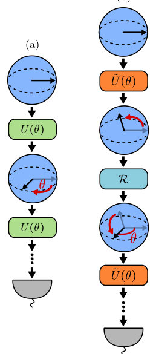 
FIG. 1: (a) Sequential quantum sensing for estimating the parameter θ of parameterized unitary U(θ) which ap- plies a θ-angle rotation on the probe state. (b) Sequential sensing for noisy parameterized unitary ˜U(θ) where the noise causes a rotation that erroneously deviates from the noiseless case of U(θ). A control operation R detects and corrects the error to recover the correct θ rotation.

📷 Fig 2

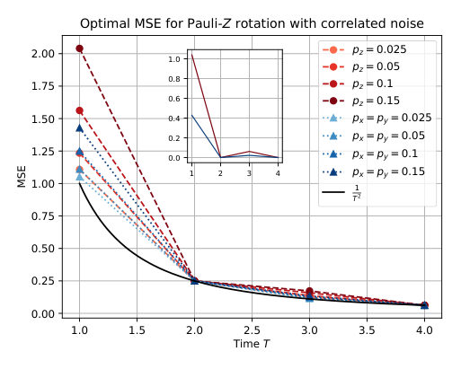 
FIG. 2: Optimal mean-squared error (MSE) computed from the SDP in Theorem 1 for sequential Pauli-Z ro- tation angle estimation with strongly correlated Pauli noise. The x-axis shows the number of time steps, where a single use of the channel counts as a single time step, whereas the y-axis shows the MSE. The colored lines show the optimal MSEs for different types of correlated noise on the Z-rotation channels at different probabil- ities. Correlated Pauli X,Y,Z error probabilities are shown in the legend as px,py,pz, respectively. Red lines are MSEs in the case of noise with non-zero pz error rate (with px = py = 0) and blue lines are lower bounds in the case of noise with non-zero px = py...

📷 Fig 3

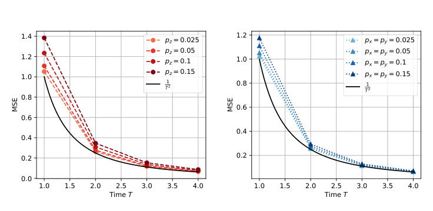 
FIG. 3: Optimal mean-squared error (MSE) computed from the SDP in Theorem 1 for sequential Pauli-Z rotation angle estimation with weakly correlated Pauli noise. The x-axis shows the number of time steps, where a single use of the channel counts as a single time step, whereas the y-axis shows the MSE. In panel (a), the correlated noise applies Pauli noise channel Ez at every step with probability pz. In panel (b), the correlated noise applies Pauli noise channel Ex or Ey at every step with probability px,py, respectively. In both cases, as the noise strength p gets smaller, the MSE approaches the noiseless benchmark 1/T 2 shown by the solid black line. The finite-T separation from this...

📷 Fig 4

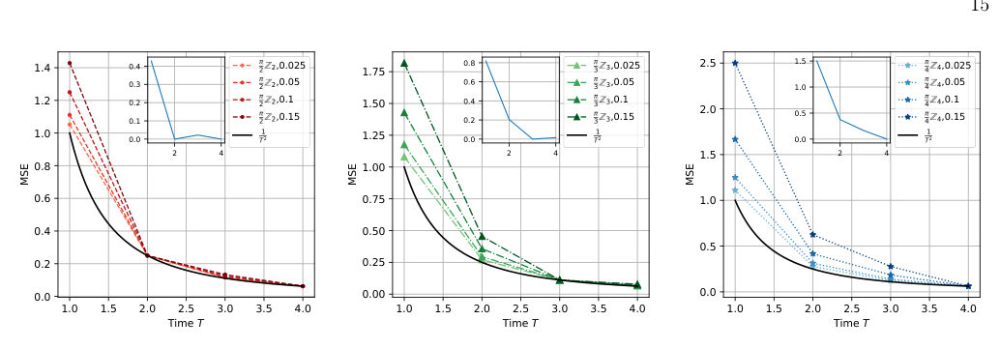 
FIG. 4: Optimal mean-squared error (MSE) computed from the SDP in Theorem 1 for Pauli-Z rotations with correlated random noise direction. Panels (a), (b), and (c) correspond to l = 2,3,4, respectively. The x-axis shows the number of time steps, where a single use of the channel counts as a single time step, whereas the y-axis shows the MSE. The line labeled by π

📷 Fig 5

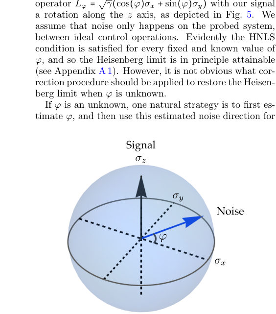 
FIG. 5: Estimating θ with unknown noise charac- terized by φ. The signal is a rotation about the z axis of the Bloch sphere. The noise is characterized by an operator Lφ = √γ((cosφ)σx + (sinφ)σy) with unknown φ.

**Summary.** This paper develops a powerful Semidefinite Programming (SDP) framework to establish lower bounds on the Mean-Squared Error (MSE) for estimating parameters of quantum channels through sequential probing. It generalizes existing quantum estimation bounds to account for multiple time steps and correlated noise. The results provide new, rigorous benchmarks for designing optimal quantum sensing protocols in various physical systems.

**Why it may be interesting.** This work provides rigorous, computationally tractable bounds (via SDP) on the ultimate precision limits for quantum metrology in complex, realistic settings involving sequential measurements and correlated noise, which is crucial for designing practical quantum sensors.

Detailed structure

**Main problem.** The paper addresses the notoriously difficult problem of finding the optimal strategy to estimate parameters of a quantum channel when the channel is probed multiple times sequentially.

**Main result.** The authors propose a general lower bound for the Mean-Squared Error (MSE) of any physically implementable sequential sensing strategy, formulated as a Semidefinite Program (SDP). This bound is shown to be tight for single-parameter tasks.

**Method.** The core method involves deriving an SDP-based lower bound that generalizes the Nagaoka-Hayashi bound to the regime of sequential measurements, utilizing concepts like the quantum comb formalism.

**Model / system.** The model involves estimating parameters $	heta$ of a quantum channel $\Lambda_	heta$ by sequentially probing the channel multiple times ($T$ steps) using coherent ancillary systems and performing final measurements.

**Key observables.** Mean-Squared Error ($	ext{MSE}_	heta$), Quantum Fisher Information ($	ext{QFI}$), and the covariance matrix of the parameter estimates.

**Important parameters / regimes.** Number of time steps ($T$), number of parameters ($m$), and the specific noise model (e.g., correlated Pauli noise).

**Assumptions / limitations.** The analysis assumes the existence of an optimal strategy and provides local attainability results for the SDP bound in single-parameter cases.

**Figures summary.** Figures illustrate the MSE lower bound for sequential estimation tasks (e.g., Pauli-Z or X/Y rotations) under various noise levels, comparing the bound to the expected Heisenberg scaling ($1/T^2$).

**Paper structure.** The paper progresses by first establishing the general SDP lower bound for sequential sensing, then applying it to specific physical scenarios like single-parameter estimation (e.g., Pauli rotations) under both independent and correlated noise models, and finally comparing multi-step vs. single-step protocols.

Abstract

The most general strategy for estimating parameters of a quantum channel is to probe the channel many times sequentially with the help of coherent ancillary systems. However, finding the strategy that minimizes the mean-squared error (MSE) is a notoriously hard problem, requiring optimization over the initial probe state, intermediate evolutions, final measurement, and classical postprocessing. In this work, we study how the minimum attainable MSE can be bounded from below in this setting. We propose a lower bound for the MSE of any physically implementable sequential sensing strategy that applies to estimating parameters of any physical quantum evolution, including quantum channels probed over multiple time steps under temporally correlated noise and general temporally correlated quantum processes. We show that this lower bound can be formulated as a semidefinite program (SDP). Our bound generalizes the Nagaoka-Hayashi lower bound (that applies to parameter estimation tasks with separable measurements) to the regime where the quantum channel can be accessed sequentially multiple times. For regular finite-dimensional single-parameter sequential estimation tasks admitting an optimal strategy, we show that our SDP bound is tight and provide a procedure to obtain a locally optimal strategy from the SDP optimizer. Using our optimization bound, we compute the MSE lower bound and derive new protocols for several other physically motivated problems including error-corrected quantum sensing under an unknown correlated noise model, multiparameter estimation, and estimation with qudit systems.

[↑ back to top](#top)

### [Steady--State Current Signatures of Strong Light--Matter Coupling in Single--Molecule Junctions](http://arxiv.org/abs/2609.31265v1)

**Authors:** Kritanjan Polley, Norah M. Hoffmann  
**Type:** theory · **Category:** other · **PDF:** <https://arxiv.org/pdf/2609.31265v1>  
**Analysis basis:** full PDF text, analyzed in chunks
**Topic relevance:** 🔥 `Keldysh / 2PI / non-Gaussian methods` **4/5** · 🔥 `methods for driven-dissipative` **4/5** · `Tavis-Cummings & cavity-many-emitter` **3/5** · `analog quantum simulation` **3/5** · `driven-dissipative phase transition` **3/5** · `correlated / nonlocal dissipation` **2/5** · `non-equilibrium universality` **2/5** · `interference shaping light` **1/5** · `quantum measurements` **1/5**

📷 Fig 1

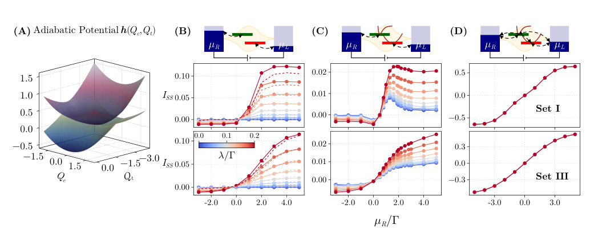 
FIG. 1. (A) Adiabatic 2D potential (c.f. Eqs. (S28)-(S29)) landscape governing nuclear motion (R ≡{Qc, Qt}) in units of coupling strength (Γ). (B)-(D) Illustrate the three scenarios of the model and two model parameters examined. The top panels show a molecule between left (µR) and right (µL) electrodes, mediated by a photonic cavity (light yellow). (B) and (C) represent a model with selective connectivity between electrode and molecule, with µR connecting only to the green level and µL connecting only to the red level. In contrast, (D) shows that both electronic levels are connected to two electrodes. (B) lacks a nuclear structure, while both (C) and (D) incorporate a nuclear potential, as...

📷 Fig 2

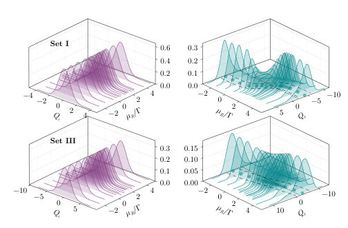 
FIG. 2. The distributions of the nuclear modes at steady state for Set I &amp; III, with λ = 0.1Γ, for different bias voltages. The left side of the figure shows the Qc distributions, while the right side displays the Qt distributions. For the Qt distributions, the mean and standard deviation are indicated on the base plane by the dotted line and long-dashed boundaries, respectively.

📷 Fig 3

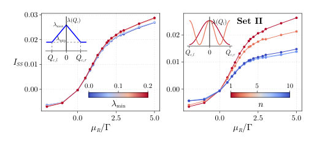 
FIG. 3. The spatial dependence of λ and its impact on current. On the left, the light-matter coupling is a function of the coupling mode, and its shape of λ(Qc) is shown in the inset. We set λmax = 0.2Γ. On the right, it is dependent on the tuning mode. The dependence of λ on Qt, for the figure on the right is sinusoidal as shown in the inset, and the exact form is given in the main text. n is the mode number for the sinusoidal form of the light-matter coupling.

📷 Fig 4

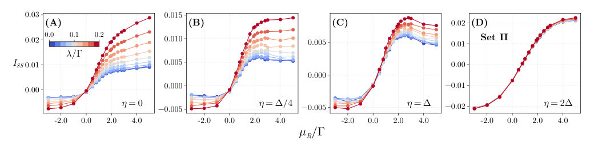 
FIG. 4. Steady-state currents for varying bias voltage and light-matter coupling in the presence of nuclear modes, similar to Fig. 1, are plotted above for Set II parameters in the presence of a bath. (A) illustrates the variation for a system devoid of bath modes, akin to panel (C) in Fig. 1. (B) presents a similar distribution, but in the presence of nuclear modes where the reorganization energy is in the inverted Marcus regime. (C) exhibits the effect of coupling between the system and the bath modes at activationless crossing, whereas (D) shows the normal Marcus regime. The same colormap is used across all panels. ∆ is the diabatic energy gap of the spinless fermionic system.

**Summary.** The authors demonstrate that the steady-state current flowing through a single-molecule junction acts as a sensitive electrical fingerprint of strong light-matter coupling. By using semiclassical transport methods, they show that the current is not passive but actively reflects the coherent coupling between the molecule and the photonic cavity. This establishes current measurement as a powerful tool for interpreting and controlling light-matter interactions in nanoscale junctions.

**Why it may be interesting.** This work directly bridges quantum optics (strong coupling, polaritons) with condensed matter transport (junction currents), providing a novel, measurable electrical diagnostic tool for cavity QED effects in nanoscale devices.

Detailed structure

**Main problem.** To determine if strong light-matter coupling leaves a measurable signature in the steady-state current of single-molecule junctions, offering a probe beyond optical spectroscopy.

**Main result.** The steady-state current carries a direct, measurable signature of single-molecule strong coupling, which is sensitive to the coupling strength and its spatial profile.

**Method.** The study employs a semiclassical mapping approach for nonequilibrium quantum transport, comparing results against benchmark methods like HEOM.

**Model / system.** The system is a single-molecule junction in an STM-BJ setup, modeled by a Hamiltonian coupling molecular, electrode, and photonic cavity modes. The analysis incorporates environmental baths and nuclear dynamics.

**Key observables.** Steady-state current (I), distributions of nuclear modes (Qc, Qt), and population dynamics.

**Important parameters / regimes.** Light-matter coupling strength (λ), bias voltage ($\mu_L, \mu_R$), reorganization energy ($\eta$), and environmental coupling strength.

**Assumptions / limitations.** Approximations include neglecting the dipole self-energy term and using semiclassical mappings for transport calculations.

**Figures summary.** Figures illustrate current signatures under varying coupling strengths and connectivity, show distributions of nuclear modes, and compare current results across different theoretical methods (HEOM vs. semiclassical).

**Paper structure.** The paper develops the model Hamiltonian, applies semiclassical mapping techniques to calculate current, and systematically tests the signature's robustness against environmental factors, connectivity, and coupling profile.

Abstract

Strong light-matter coupling offers exciting opportunities for controlling molecular properties, yet resolving single-molecule behavior from collective effects remains a challenge. Recent experiments in scanning tunneling microscope break junctions (STM-BJs) have demonstrated strong light-matter coupling at the single-molecule level. Because STM-BJs provide direct access to molecular-junction currents, we investigate whether strong coupling leaves a measurable fingerprint in transport, potentially probing polaritonic states beyond optical spectroscopy. Using a semiclassical mapping approach for nonequilibrium quantum transport, we find that steady-state current indeed carries a direct signature of single-molecule strong coupling. We test the robustness of this signature against electrode connectivity, nuclear motion, spatially structured electromagnetic modes, and solvent effects. While environmental factors and nuclear motion reshape the signature, the current is not a passive response but is actively influenced by coupled molecular dynamics. Our work establishes current as a tool to interpret and control strong light-matter interactions in nanoscale junctions.

[↑ back to top](#top)

### [Slow-fast dynamics of the McKean model with stochastic resetting and diffusion](http://arxiv.org/abs/2609.31153v1)

**Authors:** Jude Swaby, Paul C. Bressloff  
**Type:** theory · **Category:** statistical mechanics · **PDF:** <https://arxiv.org/pdf/2609.31153v1>  
**Analysis basis:** full PDF text, analyzed in chunks
**Topic relevance:** 🔥 `methods for driven-dissipative` **4/5** · `Keldysh / 2PI / non-Gaussian methods` **3/5** · `driven-dissipative phase transition` **3/5** · `non-equilibrium universality` **3/5** · `quantum measurements` **2/5** · `scars & prethermalization` **2/5** · `Frenkel-Kontorova` **1/5** · `analog quantum simulation` **1/5** · `correlated / nonlocal dissipation` **1/5**

📷 Fig 1

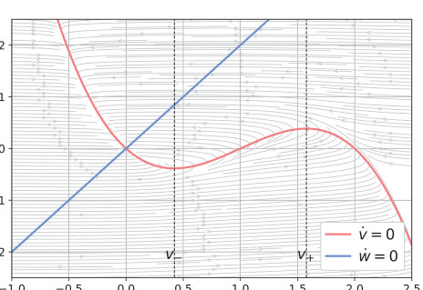 
FIG. 1. FN phase-plane plot in the excitable regime, with the fast nullcline depicted in red and the slow nullcline in blue. The parameters are I0 = −1, α = 0.4, ε = 0.1, and γ = 1.0. The unique fixed point lies on the left branch of the cubic fast null- cline and is stable. The dashed vertical lines mark the turning points v−and v+.

📷 Fig 2

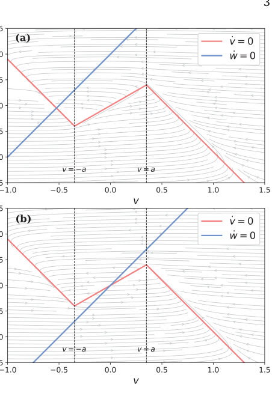 
FIG. 2. McKean phase-plane plots in (a) the excitable regime with I0 = −1 and (b) the oscillatory regime with I0 = 0. The fast nullcline is depicted in red and the slow nullcline in blue. The remaining parameters are a = 0.35, ε = 0.1, γ = 0.5, m± = −2 and m0 = 1.14.

📷 Fig 3

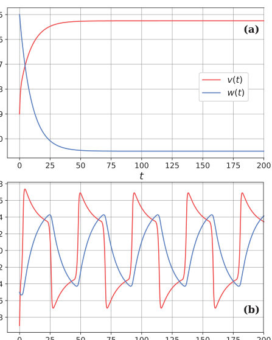 
FIG. 3. Numerical time series plots of the slow and fast vari- ables in (a) the excitable regime with I0 = −1 and (b) the oscillatory regime with I0 = 0. Other parameter values are the same as Fig. 2.

📷 Fig 4

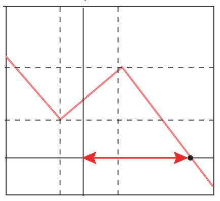 
FIG. 4. Schematic diagram illustrating the support of the layer dynamics when −a &lt; vr &lt; a. The intercept of the v-nullcline w = f(v) + I0 with the horizontal line w = w is unique when w &lt; w−, where w± are the turning points of the v-nullcline. In this scenario the support of v is the interval linking the reset point vr to v+.

📷 Fig 5

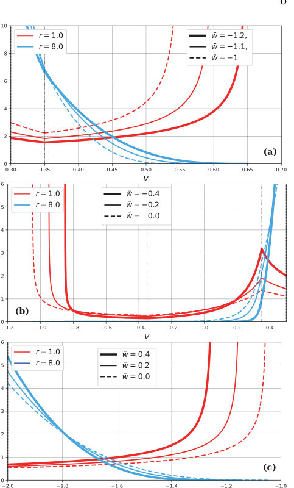 
FIG. 5. Plots of p∗(v) with resetting in the non-diffusive ex- citable regime for different values of the frozen slow variable w and the resetting rate r. Other parameters are I0 = −1, a = 0.35, m± = −2 and m0 = 1.14. (a) vr = 0.3 (resetting to the middle branch), (b) vr = 0.5 (resetting to the right-hand branch), and (c) vr = −2 (resetting to the left-hand branch). As the resetting rate increases, probability accumulates more strongly near the reset point vr rather than near the fixed point v+.

**Summary.** This paper analyzes the complex dynamics of the McKean model by incorporating both diffusion and stochastic resetting into a slow-fast framework. Using adiabatic approximations and Fokker-Planck methods, the authors determine how the system's long-term behavior is governed by the interplay between noise, resetting, and the system's inherent slow dynamics. This provides a theoretical understanding of noise-induced steady states in non-equilibrium systems.

**Why it may be interesting.** The techniques used—analyzing non-equilibrium steady states in slow-fast systems with external stochastic driving (resetting)—are highly relevant to open quantum systems and quantum dynamics where dissipation and external noise are key components.

Detailed structure

**Main problem.** The paper investigates the combined effects of stochastic resetting and diffusion on a slow-fast dynamical system described by the McKean model.

**Main result.** The slow variable's long-time behavior converges to a stable fixed point dependent on diffusion, resetting rate, and reset value, or exhibits noisy oscillations in the non-diffusive case.

**Method.** The analysis employs the adiabatic approximation, solving a modified Fokker-Planck equation for the fast variable's Non-Equilibrium Steady State (NESS), and then averaging this NESS to derive an equation for the slow dynamics.

**Model / system.** The system is a stochastic version of the piecewise-linear McKean model, a slow-fast planar system involving a slow variable (w) and a fast variable (v). The fast variable is subjected to Gaussian white noise (diffusion D) and stochastic resetting (Poisson process rate r).

**Key observables.** Non-Equilibrium Steady State (NESS) probability density, the stable fixed point of the slow variable ($w^*$), and the slow variable's time evolution (oscillations).

**Important parameters / regimes.** Diffusivity (D), resetting rate (r), reset value ($v_r$), and the timescale separation parameter ($\epsilon$).

**Assumptions / limitations.** The primary approximations include the adiabatic approximation (assuming fast resetting) and analyzing the system in the small-diffusion limit.

**Figures summary.** Figures illustrate the phase-plane dynamics, time series showing slow variable switching, and analytical profiles of stationary branch densities in the non-diffusive slow-resetting regime.

**Paper structure.** The paper first establishes the deterministic slow-fast model, then analyzes the fast-resetting regime by deriving the NESS and averaging to find the slow fixed point. It extends this to the diffusive case and finally analyzes the slow-resetting regime, deriving analytical solutions for the resulting noisy oscillations.

Abstract

In this paper we investigate the combined effects of stochastic resetting and diffusion on a slow--fast dynamical system given by the piecewise-linear McKean model. That is, the fast variable $v$ is subject to Gaussian white noise with effective diffusivity $D$ and is reset to a fixed value $v_r$ at a random sequence of times generated from a Poisson process with rate $r$. Assuming that resetting occurs on the fast timescale, we freeze the slow variable \(w\) under an adiabatic approximation and determine the resulting non-equilibrium stationary state (NESS) of the fast variable as the solution of a modified Fokker--Planck equation. We show that the NESS can be expressed in terms of parabolic cylinder functions, whose asymptotic behavior allows us to recover the corresponding NESS without diffusion in the small-diffusion limit. The NESS is used to derive an averaged equation for the slow dynamics, whose solution converges to a stable fixed point \(w^*\) that depends on \(D\), \(r\) and \(v_r\). This fixed point effectively determines the long-time behaviour of the full system. Finally, we analyze the regime in which resetting occurs on the same timescale as the slow variable. We show how the slow variable now undergoes noisy oscillations due to resetting-induced switching between branches of the fast nullcline and derive the corresponding NESS for $w$ in the non-diffusive case.

[↑ back to top](#top)

### [Angular momentum conservation in two-atom superradiance](http://arxiv.org/abs/2609.31433v1)

**Authors:** P. R. Berman, Zeyuan Wang, A. Kuzmich  
**Type:** theory · **Category:** other · **PDF:** <https://arxiv.org/pdf/2609.31433v1>  
**Analysis basis:** full PDF text, analyzed in chunks
**Topic relevance:** 🔥 `Dicke superradiance` **4/5** · 🔥 `free-space correlated emission` **4/5** · `correlated / nonlocal dissipation` **3/5** · `superradiant laser` **3/5** · `Keldysh / 2PI / non-Gaussian methods` **1/5** · `Tavis-Cummings & cavity-many-emitter` **1/5** · `driven-dissipative phase transition` **1/5** · `interference shaping light` **1/5** · `methods for driven-dissipative` **1/5**

📷 Fig 1

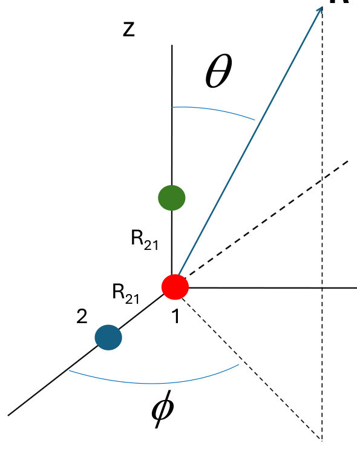 
FIG. 1: A schematic representation of the geometry used in the calculation. The radiated fields

📷 Fig 2

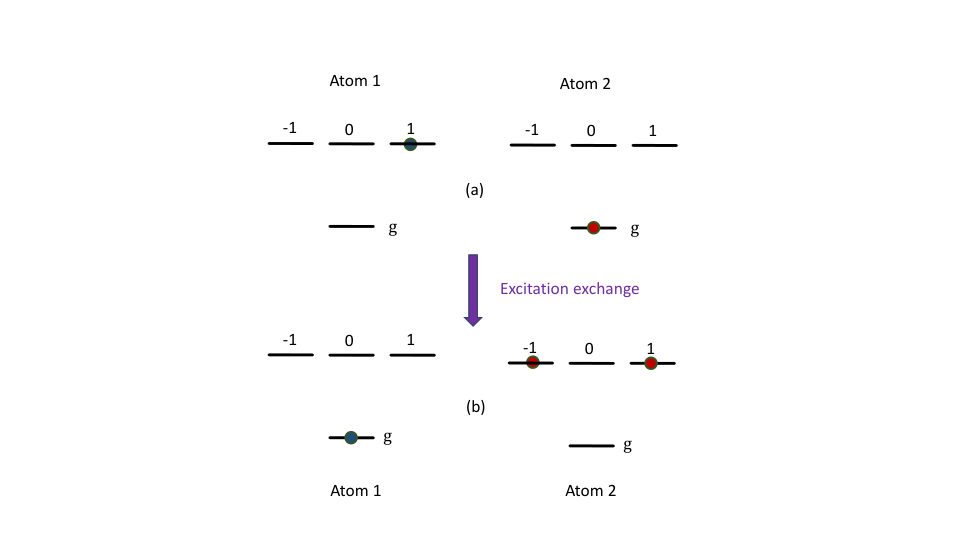 
FIG. 2: Schematic representation of the excitation exchange process. (a) Atom 1 is initially in its

📷 Fig 3

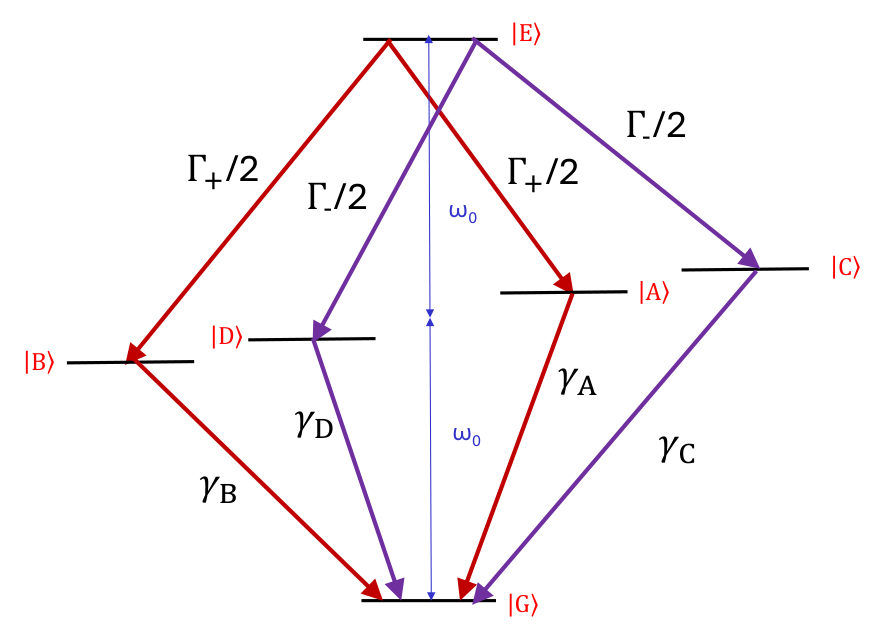 
FIG. 3: Molecular basis level scheme. The intermediate state eigenfrequencies are ωA = ω0 +

📷 Fig 4

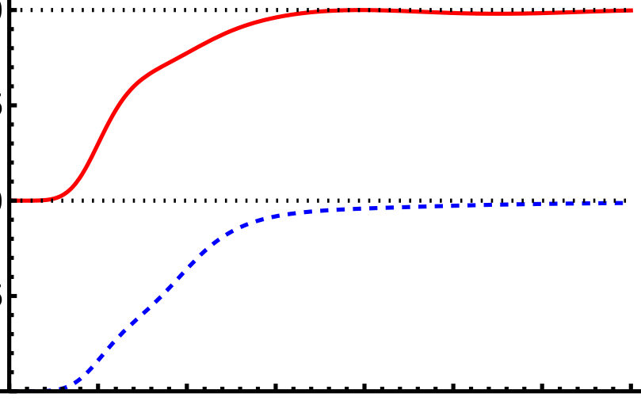 
FIG. 4: Plots of the z−component of the final field angular momentum, Lfz, (in units of ℏ) as

**Summary.** This theoretical study analyzes angular momentum conservation in two-atom superradiance, finding that the total angular momentum is conserved only when the orbital angular momentum of the atoms is included. By comparing results from source-field and Schrödinger picture methods, the authors demonstrate that the missing angular momentum is precisely accounted for by the atoms' orbital motion.

**Why it may be interesting.** This work provides a detailed, rigorous treatment of angular momentum conservation in an open quantum system (superradiance), showing how non-local effects (orbital angular momentum) must be included for a complete picture, which is highly relevant for quantum optics.

Detailed structure

**Main problem.** The paper investigates the conservation of total angular momentum during two-atom superradiance when the atoms are separated along the x-axis.

**Main result.** Angular momentum is not necessarily conserved in the field alone; the missing angular momentum is accounted for by the orbital angular momentum of the two-atom system.

**Method.** The authors employ two complementary theoretical approaches—a source-field approach and a Schrödinger picture approach—to calculate the final field and orbital angular momentum.

**Model / system.** The system consists of two identical atoms, each with a J=0 ground state and a J=1 excited state, excited by a $\sigma^+$-polarized laser pulse. The analysis models the interaction dynamics using coupled differential equations for state amplitudes and density matrices.

**Key observables.** Final angular momentum in the field ($\langle L_{	ext{field}} 
angle$), initial angular momentum in the two-atom system ($\langle L_{	ext{atoms}} 
angle$), and the final orbital angular momentum ($	ext{L}_{	ext{orb}}$).

**Important parameters / regimes.** The separation distance $R_{21}$ relative to the wavelength $\lambda$ (parameter $x_0 = k_0R_{21}$), and the initial excitation conditions (Double Excitation (DE) vs. Single Excitation (SE)).

**Assumptions / limitations.** The calculations assume infinitely massive atoms (neglecting atomic motion) and utilize approximations like the Rotating Wave Approximation (RWA) and Weisskopf-Wigner Approximation (WWA).

**Figures summary.** Figures schematically illustrate the geometry of the two atoms on the x-axis and show the excitation exchange processes between magnetic sublevels.

**Paper structure.** The paper develops the theory by deriving evolution equations for state amplitudes and density matrices, solving these equations for different initial conditions, and then calculating the final field and orbital angular momentum using both source-field and Schrödinger picture formalisms.

Abstract

Two-atom superradiance is studied for atoms having a J=0 ground state and a J=1 excited state. The atoms lie on the x-axis and are excited by a σ_{+}-polarized laser pulse propagating in the z-direction. We use two, complementary approaches to obtain the final angular momentum in the field, a source-field approach and a Schrodinger picture approach. Both approaches give identical answers, but it is necessary to include terms in both calculations that, at first glance, might not be expected to contribute. We show that, owing to an exchange between a state in which atom 1 is in its m=1 excited state and atom 2 is in its ground state to one in which atom 2 is in its m=-1 excited state and atom 1 in its ground state, the final angular momentum in the field is not necessarily equal to the initial angular momentum in the two-atom system. The missing angular momentum appears as orbital angular momentum of the two atoms.

[↑ back to top](#top)

### [Locality and filter design for dissipative ground-state preparation](http://arxiv.org/abs/2609.31266v1)

**Authors:** Samuel J. Elman  
**Type:** theory · **Category:** other · **PDF:** <https://arxiv.org/pdf/2609.31266v1>  
**Analysis basis:** full PDF text, analyzed in chunks
**Topic relevance:** 🔥 `methods for driven-dissipative` **4/5** · `analog quantum simulation` **3/5** · `correlated / nonlocal dissipation` **3/5** · `driven-dissipative phase transition` **3/5** · `Keldysh / 2PI / non-Gaussian methods` **2/5** · `non-equilibrium universality` **2/5** · `quantum measurements` **2/5**

📷 Fig 1

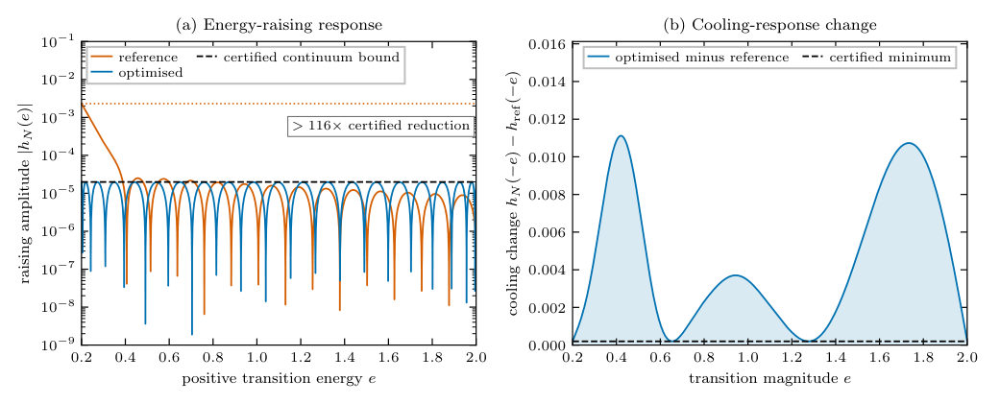 
FIG. 1. Finite-filter improvement at ∆= 0.2, W = 2, on N = 81 nodes tj = jπ/5, |j| ≤40, with T = 8π and coefficient one-norm at most 1.470919199. (a) Heating response hopt of the optimised filter and its certified continuum bound, which holds at every energy in the band (Appendix B), L∆[hopt] &lt; 1.9881 × 10−5, against the Gevrey response at the gap (dotted), above 2.3073 × 10−3: an improvement greater than 116. (b) Difference between the optimised and Gevrey cooling responses; its certified lower bound between samples stays positive, so the optimised filter cools at least as strongly as the Gevrey filter.

📷 Fig 2

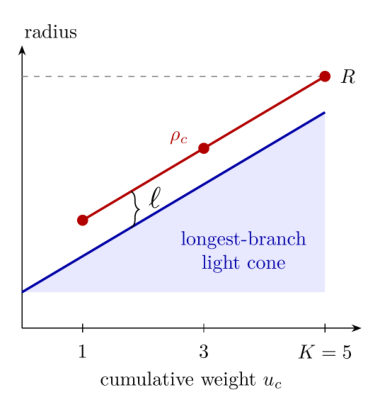 
FIG. 2. Radius grading by cumulative evolution time. Ordered weights (w1, w2, w3) = (1, 2, 2) sum to K = 5 and give cumulative weights (u1, u2, u3) = (1, 3, 5), where uc = P

📷 Fig 3

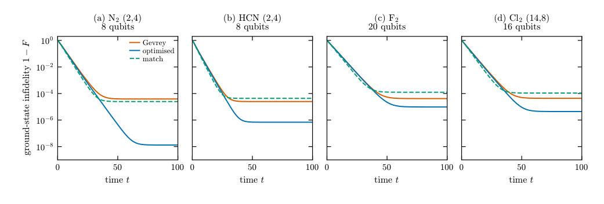 
FIG. 3. Ground-state infidelity 1 −F(t), F(t) = ⟨ψ0|ρ(t)|ψ0⟩, under Lindblad evolution from the highest-energy state of the fixed-electron-number, Sz = 0 sector, for the Gevrey filter, the optimised filter at equal cost and the match filter at matched design-grid leakage (whole-band for F2), all with full-Hamiltonian branches; a molecular Hamiltonian has no locality to grade, so there is no patch panel. (a) N2 and (b) HCN in (2, 4) active spaces. (c) F2 in its full STO-3G space, sector dimension 100. (d) Cl2 in a (14, 8) active space, sector dimension 64. The F2 match curve uses the re-solved coefficients of Appendix F. All panels show 0 ≤t ≤100; the F2 and Cl2 runs continue to t = 160,...

📷 Fig 4

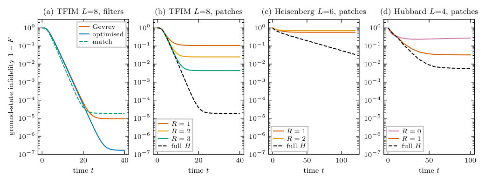 
FIG. 4. Convergence of the Lindblad dynamics from a zero-overlap initial state. (a) Eight-site transverse-field Ising chain: ground-state infidelity against time for the Gevrey filter, the optimised filter at equal cost, and the match filter at matched design-grid leakage, all with full-Hamiltonian branches. The curves show comparable early relaxation and distinct late-time plateaux; the match cost is 61% of the reference. (b) The match filter with light-cone radii rj(R∗) = min{R∗, 1 + ⌈2vLR|tj|⌉} around each coupling, with vLR = 2eJ/α, bond norm J and spectral half-width α; the light cone of the longest branch spans the whole chain, so every patch shown truncates it. (c) and (d) The same...

**Summary.** This paper details a novel, cost-optimized method for preparing the ground state of complex quantum systems using engineered dissipation. By combining linear programming with locality constraints derived from Lieb-Robinson bounds, the authors drastically reduce simulation errors and computational overhead compared to previous techniques. This advances the practical feasibility of quantum simulation for many-body physics.

**Why it may be interesting.** This work provides concrete, resource-aware techniques for simulating open quantum systems, directly impacting the feasibility of quantum simulation algorithms for chemistry and materials science.

Detailed structure

**Main problem.** The paper addresses the fundamental challenge of preparing the ground state of a quantum many-body system using dissipative dynamics, while minimizing the computational cost associated with simulating the required quantum operations.

**Main result.** The authors introduce an optimized filter design that significantly reduces the worst-case heating response (leakage) by over 116-fold at equal cost, and achieves substantial cost reductions (up to 56%) across various molecular and chain systems.

**Method.** The approach combines linear programming to optimize filter weights in the time domain with leveraging Lieb-Robinson bounds to restrict the required quantum evolution to local spatial patches.

**Model / system.** The system involves quantum many-body Hamiltonians whose dynamics are driven to the ground state via a Lindbladian coupling to a bath. The analysis focuses on constructing and optimizing filtered jump operators that approximate the desired ground-state evolution.

**Key observables.** Ground-state fidelity, worst-case heating response (leakage), and computational cost (e.g., Toffolis per jump).

**Important parameters / regimes.** Spectral gap ($\Delta_{	ext{spec}}$), patch radius ($R$), and the time grid size ($T$).

**Assumptions / limitations.** The cost model excludes outer loop overheads, and the locality-exploiting algorithms are distinct from the patch bounds used for the jump operators.

**Figures summary.** The notes reference tables comparing costs for different filter types (e.g., TFIM, Heisenberg) and showing scaling laws based on lattice size and constraints.

**Paper structure.** The paper builds from defining the problem (ground-state preparation) to proposing three key observations (LP optimization, Lieb-Robinson bounds, stability under truncation), culminating in numerical validation and cost analysis.

Abstract

Ground-state preparation is a fundamental challenge in quantum many-body physics, chemistry and materials science. Dissipative state-preparation techniques engineer a Lindbladian coupling to a bath that drives the system to its ground state, needing no initial overlap. Their cost is dominated by the Hamiltonian simulations inside the filtered jump operators, since each jump is a weighted sum of Heisenberg-evolved copies, or branches, of a coupling operator. We reduce this cost by following three simple observations to their logical end. First, on a fixed time grid, linear programming optimises the branch weights, trading the heating response against the circuit cost. Second, Lieb--Robinson bounds let each branch evolve on a patch whose radius grows with its duration. Third, if the dynamics converges quickly and truncation changes the jumps only slightly, the stationary state stays near the ground state even on patches smaller than the light cone. We validate our approach numerically. On a grid of $81$ evolution times, the optimised filter reduces the worst-case heating response, or leakage, more than $116$-fold at equal cost. Across fifteen molecules and six chains, the cost falls by 27 to 56\% at matched design-grid leakage; at matched cost, the molecular leakage falls by a factor of $2.9$ to $2\times10^{3}$. Density-matrix simulations show high ground-state fidelity for both filters, and on Ising and Hubbard chains the cheaper filter keeps a ground-state population of at least $0.89$ on patches of three or four sites. The same patches fail on a Heisenberg chain whose truncation error falls more slowly with patch size and whose Lindbladian gap is 12 times smaller than the Ising chain's, pointing to a role for the gap in how far patches can be truncated. At fixed radius the per-branch cost becomes independent of system size, reducing the cost of dissipative state preparation.

[↑ back to top](#top)

### [Causal Query Compression for Lindblad Dynamics: Optimal Queries and Nearly Linear Local Simulation](http://arxiv.org/abs/2609.31312v1)

**Authors:** Jacob Kitchen  
**Type:** theory · **Category:** quantum information and computing · **PDF:** <https://arxiv.org/pdf/2609.31312v1>  
**Analysis basis:** full PDF text, analyzed in chunks
**Topic relevance:** 🔥 `methods for driven-dissipative` **4/5** · `correlated / nonlocal dissipation` **3/5** · `driven-dissipative phase transition` **3/5** · `Keldysh / 2PI / non-Gaussian methods` **2/5** · `non-equilibrium universality` **2/5** · `quantum measurements` **2/5** · `analog quantum simulation` **1/5**

📷 Fig 1

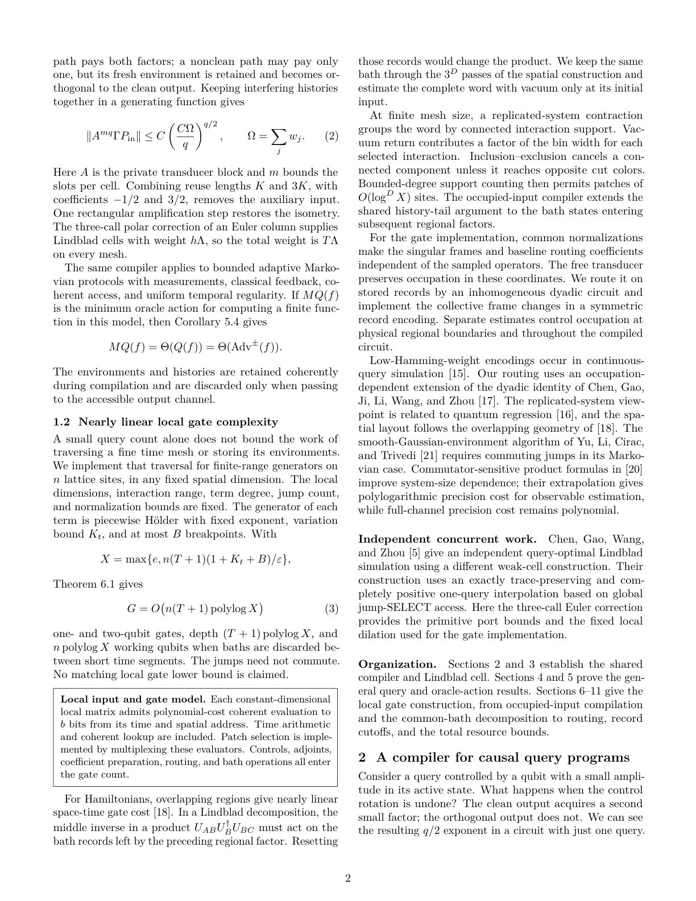 
Low-resolution page preview, page 2

📷 Fig 2

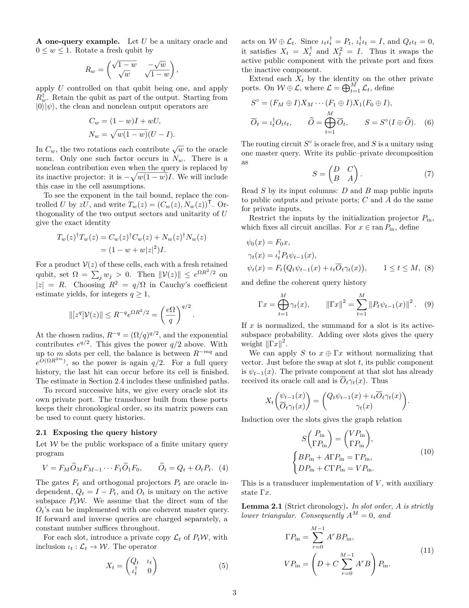 
Low-resolution page preview, page 3

📷 Fig 3

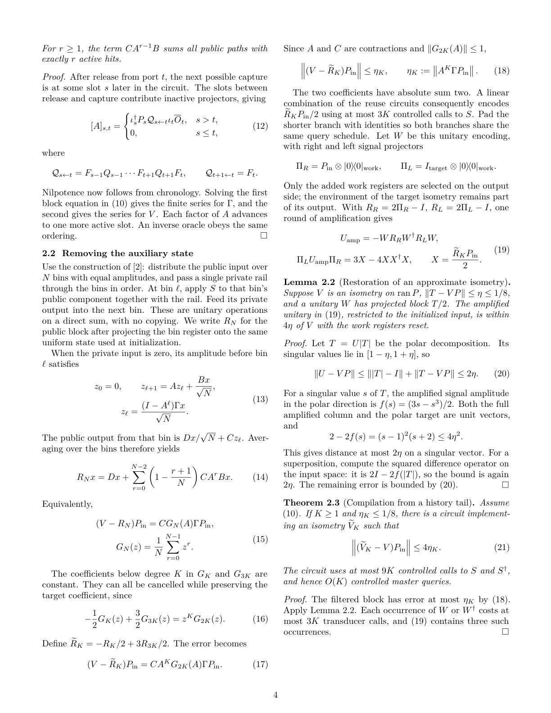 
Low-resolution page preview, page 4

📷 Fig 4

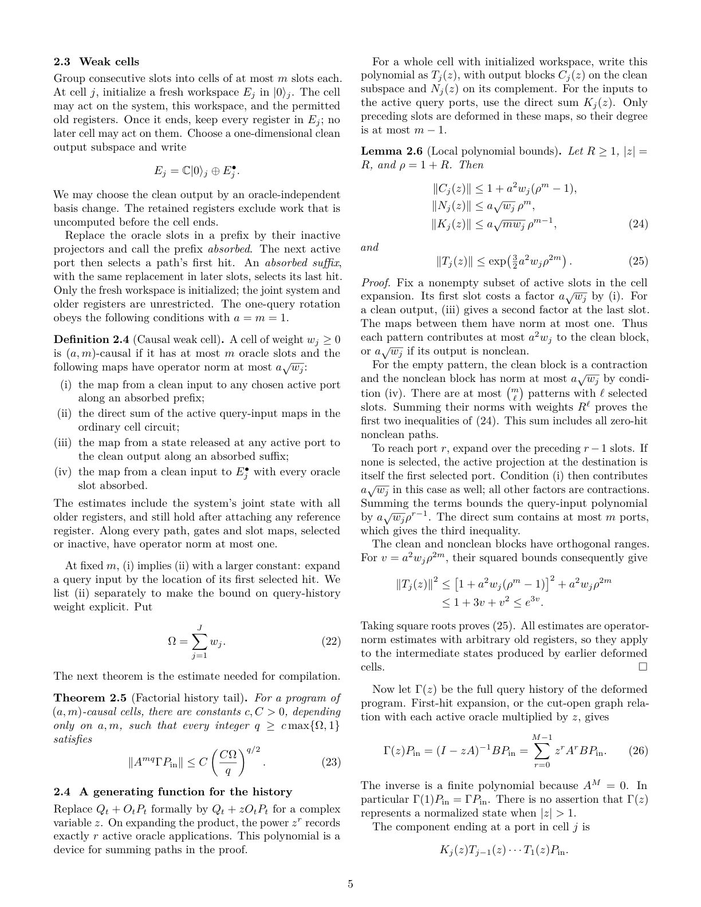 
Low-resolution page preview, page 5

📷 Fig 5

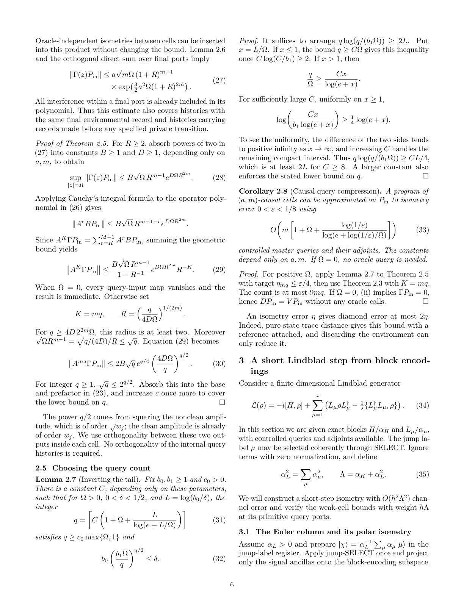 
Low-resolution page preview, page 6

**Summary.** This paper presents a causal query compiler for simulating time-dependent Lindblad dynamics, aiming for optimal resource usage. It derives specific query bounds for the required oracle calls and establishes a near-linear scaling for the elementary gate count when simulating local dynamics on a lattice. This advances the field by providing concrete, resource-efficient quantum algorithms for open quantum systems.

**Why it may be interesting.** This work provides rigorous, resource-aware quantum circuit compilation techniques for open quantum systems, directly impacting the feasibility of simulating complex quantum dynamics on near-term quantum hardware.

Detailed structure

**Main problem.** To construct a causal query compiler for simulating time-dependent Lindblad dynamics with optimal resource bounds.

**Main result.** The paper establishes query bounds that are worst-case optimal for Lipschitz generators and derives a near-linear gate complexity for local simulation on lattice sites.

**Method.** The approach involves developing a causal query compiler that tracks query history using techniques like clean return and active entry, combined with spatial decomposition for local gate estimation.

**Model / system.** The dynamics are governed by time-dependent Lindblad master equations, $\dot{
ho} = \Lambda(t) 
ho$, where $\Lambda(t)$ is defined by a Hamiltonian $H(t)$ and jump operators $L_\mu(t)$. The system can be modeled on $n$ lattice sites.

**Key observables.** Diamond-norm error ($\epsilon$), query complexity, and elementary gate count/depth/space.

**Important parameters / regimes.** Total time $T$, generator variation parameters ($K_t, B$), and the time scale $	au = T(\alpha_H + \sum_\mu \alpha_\mu^2)$.

**Assumptions / limitations.** The analysis assumes coherent block encodings for the Hamiltonian and jump operators, and relies on piecewise Hölder generators for the local gate bound.

**Figures summary.** Not specified.

**Paper structure.** The paper progresses by first establishing the query complexity bound for general Lipschitz generators, then detailing the construction of the compiler using history tracking, and finally deriving the efficient, near-linear gate complexity for finite-range dynamics on a lattice.

Abstract

We construct a causal query compiler for time-dependent Lindblad dynamics and establish query and gate bounds under distinct input models. With coherent block encodings of the Hamiltonian and individual jump operators, a Lipschitz generator can be simulated to diamond-norm error $\varepsilon$ using $O(1+τ+\log(1/\varepsilon)/\log(e+\log(1/\varepsilon)/τ))$ controlled queries, where $τ=T(α_H+\sum_μα_μ^2)$. This bound is independent of the time-grid size and is worst-case optimal for $τ\ge1$. Weak active entry and clean return yield a factorial history tail; combining two reuse lengths removes the auxiliary input. A three-call polar correction supplies the Lindblad cells. The compiler also characterizes the minimum oracle action of bounded adaptive Markovian protocols by quantum query complexity and the general adversary bound, up to constant factors. For finite-range dynamics on $n$ lattice sites, efficient coherent evaluation of the local matrices and fixed local parameters give $O(n(T+1)\operatorname{polylog}X)$ elementary gates, where $X=\max\{e,n(T+1)(1+K_t+B)/\varepsilon\}$, for piecewise Hölder generators with fixed exponent, local variation bound $K_t$, and at most $B$ breakpoints per term. The jumps need not commute. This gate bound includes evaluation, arithmetic, selection, routing, and environment storage. Its proof combines a spatial decomposition on a common bath, compilation on occupied inputs, and routing on compressed records. Reusing bath storage between short segments gives depth $(T+1)\operatorname{polylog}X$ and space $n\operatorname{polylog}X$.

[↑ back to top](#top)

### [Spatiotemporal Non-Hermitian Skin Effect with Floquet-Engineered Ultracold Atoms](http://arxiv.org/abs/2609.31474v1)

**Authors:** Weijie Liang, Weiping Zhang, Keye Zhang  
**Type:** both · **Category:** other · **PDF:** <https://arxiv.org/pdf/2609.31474v1>  
**Analysis basis:** full PDF text, analyzed in chunks
**Topic relevance:** 🔥 `analog quantum simulation` **4/5** · `driven-dissipative phase transition` **3/5** · `Keldysh / 2PI / non-Gaussian methods` **2/5** · `methods for driven-dissipative` **2/5** · `non-equilibrium universality` **2/5** · `correlated / nonlocal dissipation` **1/5**

📷 Fig 1

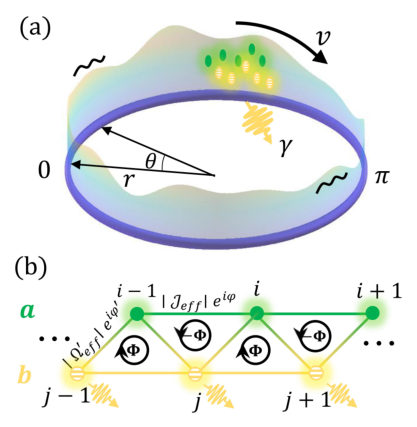 
FIG. 1. (a) Ultracold atoms rotating at velocity v in a ring trap of radius r, subjected to a time-periodic spatial pertur- bation (shaded cylinder with a modulated top edge). Two internal atomic states are coupled, with state |ψb⟩(striped circle) subject to dissipation at rate γ. (b) Zigzag ladder syn- thesized by the driving protocol of (a) in the Floquet phase space. Clockwise and counterclockwise circulations around each triangular plaquette acquire opposite geometric phases ±Φ (circled arrows). The upper and lower legs denote the internal states |ψa⟩and |ψb⟩, respectively.

📷 Fig 2

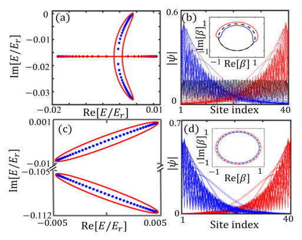 
FIG. 2. Complex energy spectra under PBC (red solid) and OBC (blue dotted) for (a) γ = 3|Ω′ R| and (c) γ = 10|Ω′ R|. (b),(d) Spatial profiles of OBC eigenstates |ψa,b|2 correspond- ing to (a) and (c), respectively. Insets: GBZ in the complex β-plane (blue/red solid) and the unit circle (black dashed). Parameters: |Jeff| = 0.002Er, ℏ|Ω′ eff| = 5.5|Jeff|, φ = 1.47, φ′ = −2.25, s = 40, and Er = ℏ2s2/(2Mr2).

📷 Fig 3

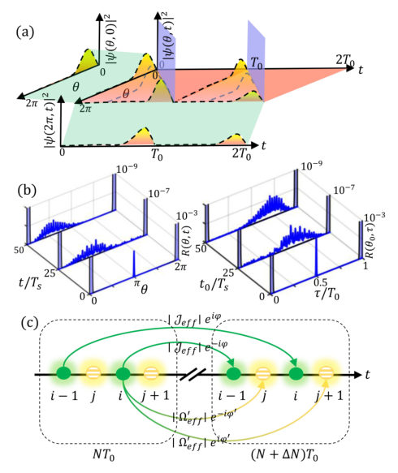 
FIG. 3. (a) Spatiotemporal NHSE dynamics with skin-mode wave functions mapped onto temporal and spatial domains. (b) Probability decay rate distributions. Left: spatial dis- tribution R(θ, t) versus θ ∈[0, 2π) at stroboscopic times t = 0, 25Ts, amd 50Ts. Right: intra-period distribution R(θ0, t0 +τ) with τ ∈[0, T0) at a fixed position θ0 = 0, where t0 takes the same stroboscopic times. Blue shaded regions denote the effective boundaries in both panels. Parameters are: Ω= 200Er/ℏ, ω = sΩ, ΩR = 0.2Er/ℏ, ωs = 0.5Er/ℏ, A1 = 0.95, A2 = 1.5, Vs = Er, γ = 0.05Er/ℏ, with recoil en- ergy Er = ℏ2s2/(2Mr2) and s = 40. (c) Schematic of causal temporal hopping, where the forward arrow of time strictly...

**Summary.** This paper pioneers the concept of spatiotemporal Non-Hermitian Skin Effect (NHSE) using ultracold atoms driven by time-periodic potentials. By mapping the system dynamics into a Floquet phase space, the authors show that the NHSE can be engineered by coupling spatial and temporal degrees of freedom. This opens a powerful, boundary-free route to studying non-Hermitian topology in time.

**Why it may be interesting.** This work directly applies advanced concepts from non-Hermitian physics (NHSE) to a highly controllable, state-of-the-art platform (ultracold atoms), providing a novel route to engineering time-dependent topological phenomena.

Detailed structure

**Main problem.** The primary goal is to generalize the Non-Hermitian Skin Effect (NHSE) from spatial dimensions to the genuine spatiotemporal domain.

**Main result.** The authors establish a unified spatiotemporal paradigm for NHSE using Floquet engineering, demonstrating that the effect manifests as time-domain nonreciprocity and periodic temporal funneling.

**Method.** The study employs a semiclassical Floquet-phase-space (FPS) approach, deriving effective Hamiltonians and analyzing the resulting complex energy spectra under both periodic and open boundary conditions.

**Model / system.** The system utilizes an ultracold atomic gas trapped in a ring and subjected to time-periodic driving potentials (Floquet engineering). The dynamics are analyzed by mapping the system onto the FPS, which treats time as a synthetic spatial dimension.

**Key observables.** Time-domain nonreciprocity, periodic temporal funneling, complex energy spectra loops, and the tunability of skin locations.

**Important parameters / regimes.** Dissipation ($\gamma$), geometric phase ($\Phi$), and the driving frequency ($\Omega$).

**Assumptions / limitations.** Interatomic collisions are neglected, and the analysis relies on specific approximations like the secular approximation and the tight-binding description in the FPS.

**Figures summary.** Figures illustrate the physical setup (ring trap), the synthesized zigzag ladder in the FPS, and dynamics showing probability accumulation (spatial projection) and time-domain funneling (temporal projection).

**Paper structure.** The paper progresses by first introducing the concept of spatiotemporal NHSE, deriving the effective Hamiltonian in the FPS, and then analyzing the consequences of non-zero geometric phase and dissipation on both spatial and temporal projections.

Abstract

Non-Hermitian skin effect, the accumulation of bulk eigenstates at edges under open boundary conditions, has been observed across classical, quantum, and synthetic platforms. Whether it can be generalized to the genuine time dimension remains open. We propose a spatiotemporal NHSE in the Floquet phase space via Floquet engineering of a ring-trapped ultracold atomic gas. Placing spatial and temporal degrees of freedom on an equal footing, we show that a single parent skin effect projects onto either domain. The spatial projection yields an NHSE with arbitrarily tunable skin locations, eliminating the need for physical open boundaries. The temporal projection gives time-domain nonreciprocity and periodic temporal funneling, consistent with causality. This establishes a unified spatiotemporal paradigm for NHSE and opens a route to non-Hermitian topological physics in time.

[↑ back to top](#top)

### [Scalable Hybrid Device Architecture on Thin-Film Lithium Tantalate for Long Distance Quantum Network Nodes with Atomic Frequency Comb Quantum Memories](http://arxiv.org/abs/2609.31598v1)

**Authors:** Ayed Sayem, Towsif Taher  
**Type:** both · **Category:** quantum information and computing · **PDF:** <https://arxiv.org/pdf/2609.31598v1>  
**Analysis basis:** full PDF text, analyzed in chunks
**Topic relevance:** 🔥 `QC/QI experiment` **4/5** · `quantum optics experiment` **3/5** · `analog quantum simulation` **2/5** · `Tavis-Cummings & cavity-many-emitter` **1/5** · `driven-dissipative phase transition` **1/5** · `quantum measurements` **1/5**

📷 Fig 1

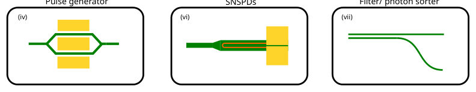 
FIG. 1. (a) Schematic of the unit cell of the proposed device architecture for on-chip quantum communication link. (b) Block diagram of three nodes, here each node is connected to the neighboring ones through optical fibers. (c) Simplified schematic of entangled photon sources (EPS), (ii) switch (iii) hybrid quantum memory (HQM) (iv) pulse generator (PG), (v) superconducting nanowire single-photon detectors (SNSPDs), (vi) filter/ photon sorter).

📷 Fig 2

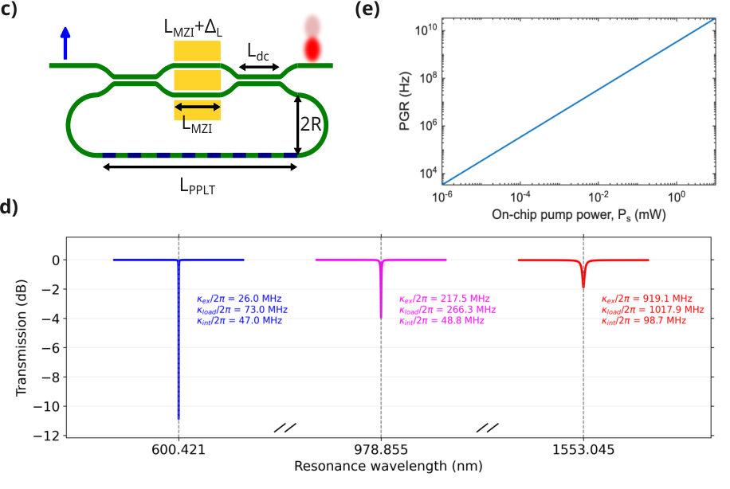 
FIG. 2. (a) Energy conversion diagram for the photon pair generation with spontaneous parametric down-conversion using three wave mixing process. (b) Idler photon wavelength as a function of the pump wavelength with signal photon fixed at λQM = 978.85 nm, the shaded regions are represent the O-band and C-band. (c) Schematic of the PP-MRZI entangled photon pair source. (d) Simulated transmission from the device for the three modes with the corresponding coupling (loss) rates, external coupling rate, κex, intrinsic coupling rate, κint, and loaded coupling rate, κload. (e) Photon pair generation rate as a function of on-chip pump power. Here, the device parameters used in the simulation are,...

📷 Fig 3

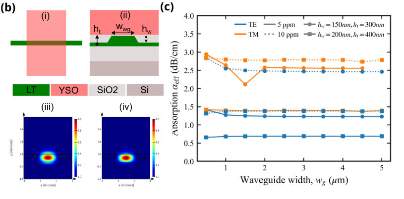 
FIG. 3. Hybrid YSO waveguide memory. (a) Simplified hyperfine-level structure of 171Yb3+ : Y2SiO5, indicating the 979-nm AFC optical transition, the optical control transition, and the ground-state spin-wave coherence used for on-demand storage. (b) Cross sections of the two hybrid YSO–TFLT waveguide geometries considered here, together with representative fundamental TE-mode intensity profiles. (c) Effective Yb absorption coefficient, αeff, as a function of waveguide width, wg, for TE and TM modes, for Yb concentrations of 5 and 10 ppm and the waveguide geometries indicated in the legend. The simulated absorption remains large over a broad range of waveguide widths, enabling strong...

📷 Fig 4

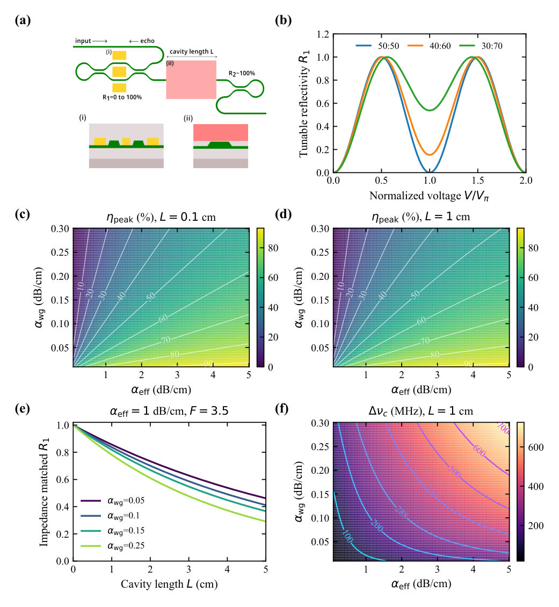 
FIG. 4. Tunable cavity design and performance of the integrated AFC quantum memory. (a) Schematic of the proposed cavity architecture, where a tunable Mach–Zehnder-interferometer-based input coupler controls the effective front-mirror reflectivity R1, while the back reflector is taken to be R2 = 100%. Insets show the corresponding cross-sectional device geometries. (b) Tunable reflectivity R1 as a function of normalized drive voltage V/Vπ for different directional-coupler splitting ratios. (c,d) Peak AFC memory efficiency ηpeak as a function of effective AFC absorption αeff and waveguide propagation loss αwg for cavity lengths L = 0.1 cm and L = 1 cm, respectively. (e) Impedance-matched...

📷 Fig 5

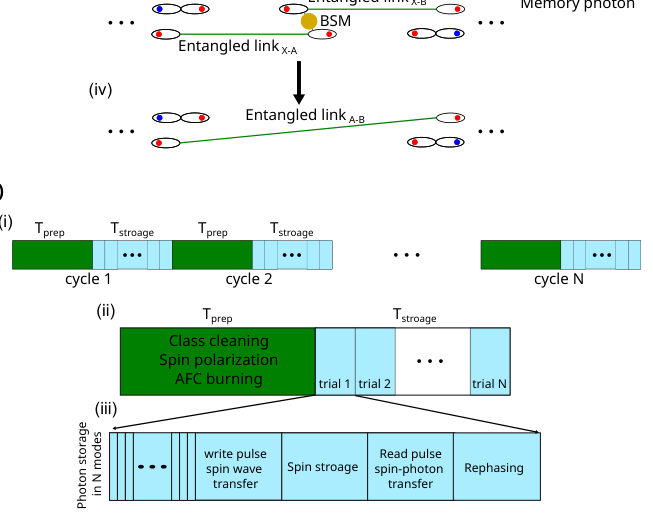 
FIG. 5. Schematic of the end to end entanglement link. Each node is connected to the neighboring ones through the flying photons from EPS from each node. (i)-(iv) Example entanglement link between node A and node B through node X. Successful BSMs of the telecom photons between node A-X and X-B establish the entanglement between the memory photons between node A-X and X-B. BSM of the extracted memory photons entangle the memory photons at node A and B establishing the entanglement between node A and B. (b) Timing sequence for the AFC-based quantum memory operation. (i) The memory is operated periodically over multiple cycles, where each cycle consists of a preparation stage, Tprep, followed...

**Summary.** This paper proposes a scalable hybrid device architecture for quantum network nodes by integrating rare-earth-ion atomic frequency comb quantum memories into thin-film lithium tantalate (TFLT) photonic circuits. By selecting TFLT, the authors overcome scalability challenges associated with other materials, presenting a viable pathway for building large-scale quantum communication infrastructure.

**Why it may be interesting.** This work directly addresses the engineering bottleneck in quantum networking by proposing a specific, manufacturable material stack (TFLT/YSO) to integrate quantum memories, which is crucial for advancing quantum information processing beyond lab demonstrations.

Detailed structure

**Main problem.** The primary challenge is realizing practical, scalable quantum networks by integrating quantum memories with robust, chip-scale photonic circuits.

**Main result.** The authors propose a promising and scalable hybrid architecture using thin-film lithium tantalate (TFLT) nanophotonic circuits coupled with ytterbium-doped yttrium orthosilicate (Yb:YSO) crystals.

**Method.** The work involves a systematic investigation and comparison of various material platforms (e.g., TFLT vs. TFLN) to determine the best combination for hybrid integration, supported by rate and fidelity calculations.

**Model / system.** The system is a hybrid quantum node combining a low-loss photonic circuit (optical routing layer) made of TFLT with a rare-earth-doped crystal (quantum memory layer) containing $	ext{Yb}^{3+}$ ions.

**Key observables.** Forward readout efficiency ($\approx 19\%$), spin coherence times (up to seconds), and calculated quantum network rates and fidelities.

**Important parameters / regimes.** TFLT's superior DC-bias stability under cryogenic conditions, and the ability to achieve low-loss coupling between the chip and the memory crystal.

**Assumptions / limitations.** The analysis relies on modeling the quantum network link using specific parameters for source statistics (e.g., two-mode-squeezed-vacuum) and assumed efficiencies for components like the Bell-state measurement.

**Figures summary.** The notes reference tables comparing material properties (Table I) and comparing material platforms (Table II), and a final table (TABLE IV) detailing parameters for rate and fidelity calculations in the quantum network link.

**Paper structure.** The paper progresses by identifying the need for scalable quantum networks, reviewing limitations of existing platforms (diamond, bulk crystals), proposing the hybrid TFLT-YSO architecture, detailing the material selection process (favoring TFLT over TFLN), and finally quantifying the system performance using detailed rate and fidelity calculations.

Abstract

Scalable photonic circuits are essential for realizing practical quantum networks beyond proof-of-principle demonstrations. Although diamond-based integrated photonics has been extensively investigated over the past two decades for quantum networking applications, its integration into scalable photonic platforms remains challenging. Quantum memories based on rare-earth-ion atomic frequency combs (AFCs) offer an attractive alternative; however, most demonstrations to date have relied on bulk free-space crystals, limiting their scalability for practical implementations. In this work, we systematically investigate the potential for hybrid integration of AFC-based quantum memories with a scalable integrated photonic platform. We propose a device architecture combining thin-film lithium tantalate (TFLT) nanophotonic circuits with ytterbium-doped yttrium orthosilicate (Yb:YSO) crystals for long-distance quantum communication. Our analysis shows that the hybrid TFLT-YSO platform offers a promising and scalable pathway toward integrated quantum memories and, ultimately, large-scale quantum networks.

[↑ back to top](#top)

### [Quantum environment afterglow from broadband excitation spectroscopy in superconducting qubits](http://arxiv.org/abs/2609.31280v1)

**Authors:** J. R. Guimarães, Y. Liu, Y. Gao, Y. Haddad, A. Galicia, D. A. Volkov, J. T. Schmieder, H. Bhardwaj, M. Neis, J. Cereijo, M. Jerger, P. A. Bushev, R. Barends  
**Type:** both · **Category:** quantum information and computing · **PDF:** <https://arxiv.org/pdf/2609.31280v1>  
**Analysis basis:** full PDF text, analyzed in chunks
**Topic relevance:** 🔥 `QC/QI experiment` **4/5** · `methods for driven-dissipative` **2/5** · `quantum measurements` **2/5** · `correlated / nonlocal dissipation` **1/5** · `driven-dissipative phase transition` **1/5** · `quantum optics experiment` **1/5**

📷 Fig 1

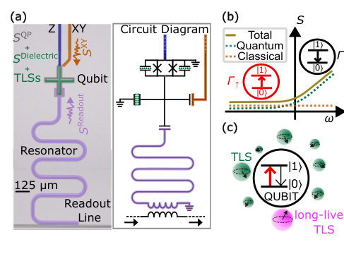 
FIG. 1. (a) An optical-microscope image of the flux-tunable transmon together with its equivalent circuit. The qubit envi- ronment contains extrinsic noise from the drive line (orange) and the readout line (purple). Internal noise originates from TLSs (green) and quasiparticles (gray). (b) Schematic of the total noise PSD (solid olive line), decomposed into classical noise (dashed orange line) and quantum noise (dashed green line). Negative (positive) frequency corresponds to the exci- tation (relaxation) process, characterized by the rate Γ↑(Γ↓). The excitation process used to disentangle these noise sources is indicated in red. (c) Schematic of a fuzzy TLS environment. The long-lived TLS...

📷 Fig 2

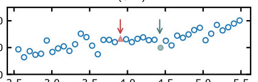 
FIG. 2. (a) Measured P1 as a function of f and ∆t after applying excitation spectroscopy. The inset shows the pulse sequence. (b) Example 1d slices for the hot region (red trian- gles) and the cold region (teal circles). (c) Extracted Γ↑and Γ↓as a function of f (yellow circles). Here Γ↑corresponds to the negative frequency, while Γ↓corresponds to the positive frequency. The modeled Γ from classical noise is shown as a red dashed line. The fitted Γ from quantum noise is plotted as a green dashed line. (d) Effective temperature as a func- tion of qubit frequency.

📷 Fig 3

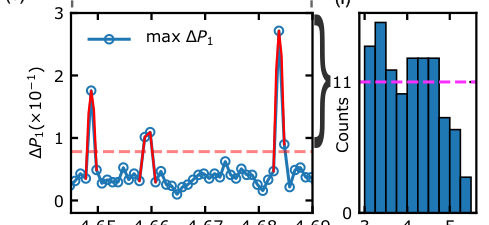 
FIG. 3. (a) Pulse sequence used to separate Marko- vian and non-Markovian environments. It consists of an environmental-pump operation followed by a probe operation using excitation spectroscopy. The red dotted arrows signify the interaction between the qubit, the TLS and the environ- ment. (b) Measured results are shown as ∆P1 versus f and ∆t. Here, ∆P1 denotes the measured P1 after subtraction of the thermal excitation background. (c) A zoomed-in plot of ∆P1 versus f and ∆t is shown. (d) Example 1d slices of ∆P1 versus ∆t for Markovian (cyan circles) and non-Markovian (magenta triangles) environments. (e) The maximum ∆P1 for each frequency is plotted as blue circles. The extracted peaks...

📷 Fig 4

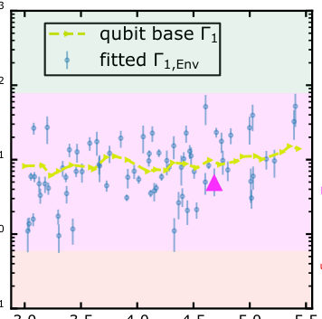 
FIG. 4. (a) Pulse sequence used to extract T1,Env. The red dotted arrows signify the interaction among the qubit, the TLS and the environment. (b) Measured results are shown as P1 versus f and ∆t. (c) A zoomed-in plot of P1 versus f and ∆t. (d) Example 1d slices of P1 versus ∆t for Markovian (cyan circles) and non-Markovian (magenta triangles) envi- ronments. (e) The measured Γ1,Env versus f is shown as the blue circles with error bars obtained from the fit. The yellow dashed line represents the qubit baseline Γ1. The Marko- vian regime is defined by an environmental relaxation rate sufficiently large that the excitation decays before being re- excited by the qubit, precluding data points...

**Summary.** This research introduces time-resolved broadband spectroscopy to overcome limitations in characterizing superconducting qubit environments. By probing excitation dynamics, the authors successfully reconstruct the noise spectrum and identify long-lived Two-Level Systems (TLSs). The findings demonstrate that these TLSs induce non-Markovian noise, presenting a critical roadblock for achieving fault-tolerant quantum computation.

**Why it may be interesting.** This work provides a detailed, experimental roadmap for characterizing non-Markovian noise sources in superconducting qubits, directly impacting the feasibility and error budgeting for quantum computation architectures.

Detailed structure

**Main problem.** Characterizing the quantum environment of superconducting qubits is crucial for fault-tolerant computation, but traditional methods fail to fully explore the excitation dynamics.

**Main result.** The study reveals that long-lived Two-Level Systems (TLSs) are intrinsic to the environment, causing non-Markovian dynamics that can limit gate fidelity and require new characterization techniques.

**Method.** The authors employ time-resolved broadband excitation spectroscopy, combined with postselection and feed-forward, to reconstruct the full noise power spectral density and probe environmental memory effects.

**Model / system.** The system is a frequency-tunable transmon superconducting qubit coupled to an environment containing intrinsic noise sources, primarily TLSs. The analysis uses master equations and time-dependent population measurements to model the qubit-TLS interaction.

**Key observables.** Qubit excitation spectrum, full noise power spectral density (PSD), effective temperature ($T_{eff}$), and environmental memory time ($T_{1,Env}$).

**Important parameters / regimes.** TLS relaxation times spanning microseconds to milliseconds; coupling strength ($g_{q-TLS}$); non-Markovianity.

**Assumptions / limitations.** The analysis assumes the ability to separate environmental contributions from intrinsic qubit decay, and that the coupling strength is sufficient to populate TLSs for detection.

**Figures summary.** Figures illustrate the setup, the decomposition of total noise PSD into classical and quantum components, and time-dependent measurements ($\Delta P_1$ vs $\Delta t$) used to distinguish Markovian from non-Markovian environmental coupling.

**Paper structure.** The paper progresses from identifying the limitation of standard relaxation measurements to introducing broadband spectroscopy. It then details the analysis to separate noise sources, quantify the impact of long-lived TLSs, and concludes by proposing methods to bypass these environmental roadblocks.

Abstract

Understanding the qubit environment is central to fault-tolerant superconducting quantum computation. Characterization typically relies on relaxation, leaving excitation largely underexplored. Here, we access this information with time-resolved broadband excitation spectroscopy. The resulting qubit excitation spectrum reveals a highly structured landscape, interspersed with cold regions. Combined with postselection, this technique enables full reconstruction of the noise power spectral density (PSD) and separates quantum from classical noise. With feed-forward, it exposes long-lived two-level-systems (TLSs), whose relaxation times span tens of microseconds to milliseconds - uncovering an intrinsic link between the qubit-TLS coupling and TLS relaxation. The data suggest that the long-lived TLSs are intrinsic to the qubit environment, and can cause excitation that lasts for many qubit operation cycles. Consequently, the environment retains a memory of prior dynamics, and properties like gate fidelity become non-Markovian and protocol-dependent. The presented approach enables identifying and bypassing the hidden roadblocks formed by long-lived TLSs in fault-tolerant quantum computation.

[↑ back to top](#top)

### [Feedback cooling of a levitated nanoparticle in a radially polarized vector beam trap](http://arxiv.org/abs/2609.31068v1)

**Authors:** Felipe Almeida, M. Rademacher, J. M. H. Gosling, P. F. Barker  
**Type:** experiment · **Category:** other · **PDF:** <https://arxiv.org/pdf/2609.31068v1>  
**Analysis basis:** full PDF text, analyzed in chunks
**Topic relevance:** 🔥 `quantum measurements` **4/5** · `interference shaping light` **3/5** · `quantum optics experiment` **3/5**

📷 Fig 1

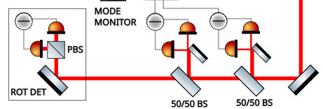 
FIG. 1: A schematic diagram of the experimental setup used to levitate nanoparticles in the radially polarized beam trap. The radial beam is created by a vortex plate (VP) and is characterized by a polarizer and a CCD (mode monitor) when the flip mirror is raised. After characterization, the radial beam is sent to an aspherical lens with high numerical aperture (NA = 0.77) to form the optical trap. The scattered light from the nanopar- ticle is collected by a collector lens (NA = 0.55). A bal- anced detection scheme is used to measure displacement of the nanoparticle and to cool the center of mass mo- tion along the transverse x and axial z trap axes. A third channel (ROT DET) is also used...

📷 Fig 2

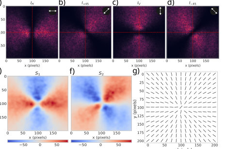 
FIG. 2: Polarization characterization of the radially po- larized beam. The radial beam is filtered by rotating a polarizer from 0,45 , 90 and 135 degrees when positioned in front of the CCD camera. It generates four polariza- tion states a) IH, b) I+45, c) IV and d) I−45. The Stokes vectors e) S1 = IH −IV and f) S2 = I+45 −I−45 are computed and the reconstructed polarization map of the radial beam is shown in g).

📷 Fig 3

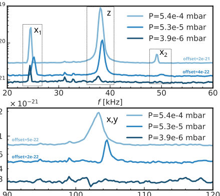 
FIG. 4: Recorded power spectral densities under feed- back cooling for a levitated particle with nominal radius R = 78 nm at three different pressures. Motion is cooled to the noise floor level. The nonlinear peak denoted by X1 dominates the spectra at P = 3.9 × 10−6 mbar.

📷 Fig 4

 
FIG. 3: a) Transverse intensity for different filling factor 1/β0. Low filling factors prevent formation of a central intensity maximum. b) Transverse intensity profile for 1/β0 = 2.5 assumed in the simulations.

📷 Fig 5

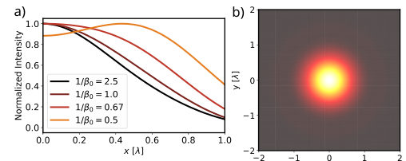 
Figure 4 shows the experimental displacement power spectrum density (PSD) when cold damping is applied along the x and z axes. Plots for three different pres- sures are shown. Unlike trapping in a linearly polar- ized Gaussian beam trap, which has three trap frequen- cies, the radially polarized beam trap is characterized

**Summary.** The authors demonstrated optical levitation and feedback cooling of a nanoparticle trapped by a radially polarized vector beam (RVB). By utilizing RVBs, they created tighter optical potentials than conventional traps, achieving cooling temperatures in the millikelvin range. This work advances the use of structured light for high-precision levitated quantum optomechanics experiments.

**Why it may be interesting.** This work directly addresses the experimental realization of quantum control in mechanical oscillators by using structured light, which is a key area bridging quantum optics and cavity QED.

Detailed structure

**Main problem.** To develop optical traps that overcome the heating limitations of conventional Gaussian beam traps for use in levitated quantum optomechanics.

**Main result.** The experiment successfully demonstrated feedback cooling of a nanoparticle trapped in a radially polarized vector beam (RVB) to the mK temperature range.

**Method.** Cold-damping feedback was applied using FPGA control based on measured particle displacement to cool the center-of-mass motion in radial and axial directions.

**Model / system.** The system involves a silica nanoparticle levitated in a high vacuum, trapped by a radially polarized vector beam (RVB) generated using a vortex wave plate and aspheric lens.

**Key observables.** Center-of-mass temperatures ($T_{CM,X}, T_{CM,Z}$), trap frequencies ($\Omega_z, \Omega_x$), and the Power Spectrum Density (PSD) of the particle motion.

**Important parameters / regimes.** Cooling temperatures in the mK range; trap frequencies like $2\pi 	imes 38 	ext{ kHz}$ and $2\pi 	imes 104 	ext{ kHz}$; vacuum pressure ($10^{-6} 	ext{ mbar}$).

**Assumptions / limitations.** The analysis assumes the trapping potential is determined by the intensity gradient, and the detection system response is linear for calibration purposes.

**Figures summary.** Figures show the experimental setup, polarization characterization of the RVB, transverse intensity profiles for varying pupil filling factors, and the PSD measurements demonstrating cooling effects.

**Paper structure.** The paper details the experimental setup, the generation and characterization of the RVB trap, the implementation of cold-damping feedback, and the measurement of cooling performance and nonlinear dynamics.

Abstract

We demonstrate optical levitation and feedback cooling of a silica nanoparticle (radius = 78~nm) trapped within a radial vector beam (RVB) in high vacuum. Radial vector beams, when focused by a high-NA lens, produce a smaller focal spot than conventional Gaussian beams, yielding tighter optical potentials and potentially reduced photon-recoil heating rates. A vortex wave plate was used to generate the RVB using an aspheric lens (NA = 0.77) to form the trap. Cold-damping feedback was used to cool the center of mass motion in the radial and axial trap directions to temperatures in the mK range. At higher temperatures and pressures, additional trap frequencies arising from the nonlinear RVB optical potential are observed. This demonstration is a step toward exploiting structured light for levitated quantum optomechanics where these traps can be used to suppress bulk and motional heating.

[↑ back to top](#top)

### [Single-shot coherent process tomography and mid-infrared polarimetry with undetected photons](http://arxiv.org/abs/2609.31043v1)

**Authors:** Marthe Zeja, Wen-Zhe Yan, Zhibo Hou, Sven Ramelow  
**Type:** experiment · **Category:** other · **PDF:** <https://arxiv.org/pdf/2609.31043v1>  
**Analysis basis:** full PDF text, analyzed in chunks
**Topic relevance:** 🔥 `quantum optics experiment` **4/5** · `interference shaping light` **3/5** · `quantum measurements` **3/5**

📷 Fig 1

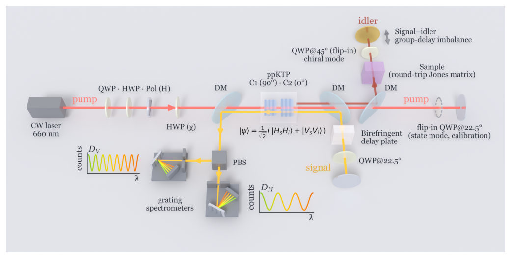 
FIG. 1. Folded nonlinear interferometer for single-shot coherent process tomography. A continuous-wave laser at 660 nm is prepared in H by a quarter-wave plate, a half-wave plate and a polarizer; a further half-wave plate sets the pump angle χ, which equals 45◦at the balanced working point (Sec. VI D). The crossed type-0 crystals (periodically poled KTiOPO4, ppKTP) generate signal–idler pairs by parametric down-conversion and are double-passed: the pump meets C1 (90◦, generating the V pair) first and C2 (0◦, generating the H pair) second; see App. A. The state label is the first-pass pair at the balanced point χ = 45◦[Eq. (4), with κ absorbed into the calibration constants of App. A]....

📷 Fig 2

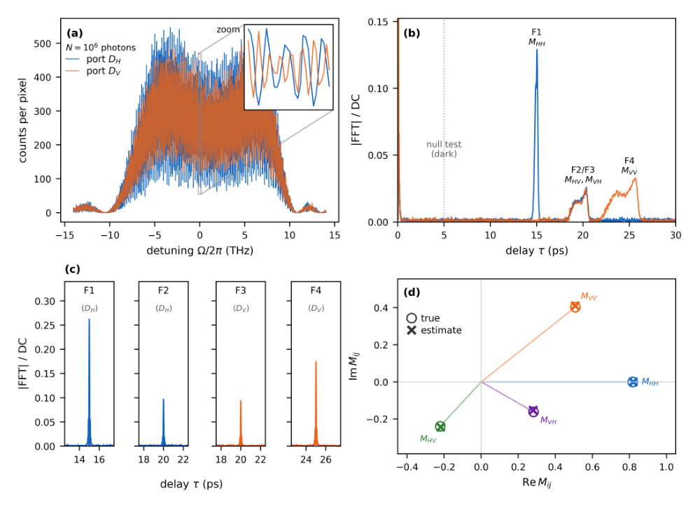 
FIG. 2. Single-frame readout, simulated end to end with the crystal dispersion of Sec. V C included. The carriers sit at the nominal placement ∆τ = 15 ps and d1 = 5 ps, net of the crystal walk-off (App. B). The channel is a generic non-reciprocal contraction (retarder 0.8 rad at 30◦, diattenuation 0.9/0.7, circular rotation 20◦), so all four Jones elements are populated and MHV ̸= MV H. (a) One simulated frame: both spectrometer traces, pixelated at the 20 pm pitch of Table III with a Gaussian instrument function of the same width and per-pixel Poisson noise, N = 106 detected photons per frame over both traces. The spectral envelope is the phase-matching envelope of App. C, side lobes...

📷 Fig 3

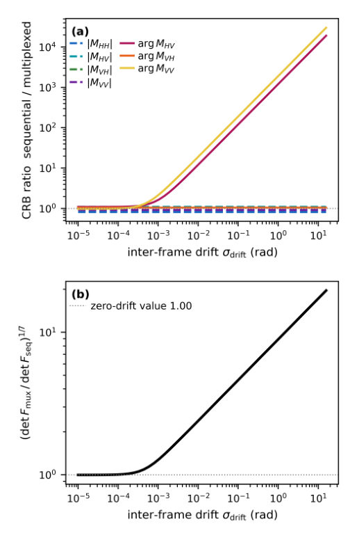 
FIG. 3. Delay-multiplexed against sequential process tomog- raphy at equal photon budget: N = 108 detected photons per campaign, i.e., 100 frames of 106, with Poisson pixel noise and the example channel of Fig. 2. (a) Ratio of the CRBs, sequential over multiplexed, for each of the seven parameters as a function of the inter-frame phase drift σdrift. Beyond the shot-noise floor (about 10−3 rad at this budget) the sequen- tial scheme loses the two phases that connect the columns of M, their bounds growing in proportion to σdrift, while the parameters read within a single frame stay near parity. (b) The same comparison aggregated into the geometric mean (det Fmux/ det Fseq)1/7 over the seven...

**Summary.** This paper presents a novel technique for performing coherent process tomography and mid-infrared polarimetry using photons that are never directly measured. By employing a folded nonlinear interferometer and exploiting birefringent walk-off as a frequency multiplexer, the authors read all necessary polarization parameters simultaneously in a single measurement frame. This breakthrough enables broadband, drift-immune characterization of optical channels, extending to depth-resolved polarimetry.

**Why it may be interesting.** This work represents a significant advancement in quantum optics measurement techniques, providing a robust, single-shot, and drift-immune method for characterizing complex quantum channels using non-detected light.

Detailed structure

**Main problem.** Developing a method for single-shot coherent process tomography and mid-infrared polarimetry using light that is never directly detected (undetected photons).

**Main result.** The authors demonstrate a protocol that reconstructs all seven parameters of the beam's round-trip Jones matrix in a single spectrometer frame, achieving wavelength-resolved mid-IR polarimetry.

**Method.** A folded nonlinear interferometer pumped diagonally is used, where birefringent group-delay walk-off acts as a frequency multiplexer to read all Jones parameters simultaneously via a single Fourier transform.

**Model / system.** The experiment utilizes a folded nonlinear interferometer with a diagonally pumped crossed-crystal source (ppKTP) to probe the unknown channel's round-trip Jones matrix M. The measurement transfers mid-infrared information onto silicon-friendly wavelengths.

**Key observables.** The full complex Jones spectrum M(lambda), including all four moduli and three relative phases across the bandwidth.

**Important parameters / regimes.** The seven real parameters defining the Jones matrix M; the spectral bandwidth (3.5-4.2 microns); and the photon number N for precision analysis.

**Assumptions / limitations.** The technique relies on the multiplexing capability provided by birefringent group-delay walk-off and assumes the validity of the Fisher-information analysis for this novel measurement scheme.

**Figures summary.** Figure 1 illustrates the folded nonlinear interferometer setup, detailing components like QWP/HWP and the crossed-crystal source.

**Paper structure.** The paper introduces the problem of single-shot tomography, details the folded interferometer setup and the multiplexing mechanism, presents the results for reconstructing the full Jones spectrum, and concludes with a Fisher-information analysis comparing the new method to sequential protocols.

Abstract

Measurements with undetected photons infer properties of a probe beam that is never detected, transferring mid-infrared information onto silicon-friendly wavelengths. Tomography in this paradigm has so far relied on switched settings or scanned phases, referenced across a drift-sensitive campaign; no protocol reads all Jones parameters from one frame. We show that a folded nonlinear interferometer with a diagonally pumped crossed-crystal source performs coherent process tomography of the undetected beam in a single spectrometer frame: it reconstructs all seven parameters of the beam's round-trip Jones matrix, the coherent part of the channel. Birefringent group-delay walk-off, normally a calibration nuisance, acts as a frequency multiplexer: each Jones-matrix element is assigned its own carrier, a spectral fringe period paired with a detector port. Because the multiplexing exploits the down-conversion bandwidth rather than merely tolerating it, a single Fourier transform per detector trace returns all four moduli and all three relative phases across that bandwidth, i.e., the full round-trip Jones spectrum up to a global phase, with no scan or setting change (after a one-time reference frame). Simultaneity makes every relative phase immune to common-mode drift, and a dark carrier, a self-interference term that unitarity forces to vanish, provides a built-in null test. For realistic parameters of a periodically poled KTP source the scheme yields wavelength-resolved mid-infrared polarimetry across 3.5-4.2 microns (~80 spectral points per Jones element) on a silicon camera, extending to depth-resolved Jones matrices, i.e., polarization-sensitive optical coherence tomography with undetected photons. A Fisher-information analysis, the first we are aware of in undetected-photon tomography, sets the precision budget and compares delay multiplexing to sequential protocols at equal photon number.

[↑ back to top](#top)

### [Electron lattice potentials for ultracold atoms using circular Rydberg orbitals](http://arxiv.org/abs/2609.31267v1)

**Authors:** Aileen A. T. Durst, Einius Pultinevicius, Homar Rivera-Rodríguez, Tilman Pfau, Matthew T. Eiles, Florian Meinert  
**Type:** theory · **Category:** other · **PDF:** <https://arxiv.org/pdf/2609.31267v1>  
**Analysis basis:** full PDF text, analyzed in chunks
**Topic relevance:** 🔥 `analog quantum simulation` **4/5** · `Rydberg arrays` **3/5** · `Frenkel-Kontorova` **2/5**

📷 Fig 1

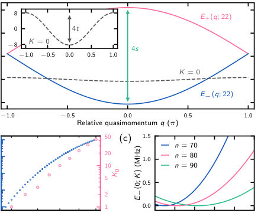 
FIG. 2. Band structure dictating the relative motion of two atoms in the electron lattice. (a) Lowest-band energy dis- persions E±(q; K) for center-of-mass momenta K = 0 and K = 22. The inset shows a zoom into the K = 0 band. Ar- rows indicate the K = 0 bandwidth 4t and the K = 22 band splitting 4s = 4(JℓK)g, respectively. (b) Intralattice tunnel- ing parameter t and center-of-mass angular momentum K0 at which the trimer system has its lowest band energy as a function of principal quantum number n. K0 sets the effec- tive mass of interlattice tunneling dynamics via the interband tunneling JℓK0g. (c) Lowest band energy E−(0; K) as a func- tion of K for exemplary values of n as indicated. For...

📷 Fig 2

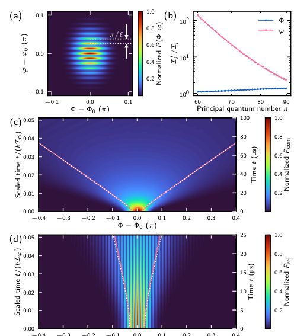 
FIG. 3. Two-atom tunneling dynamics in the electronic lat- tice. (a) Density of the initial state in the combined circular state and tweezer potential after integrating over the elec- tronic degree of freedom for κ/h = 2.06 MHz, Φ0 = π, and φ0 = −π. (b) Ratio of the effective moment of inertia for center-of-mass (blue) and relative (pink) motion in the elec- tronic lattice to the bare moment of inertia without the lat- tice. (c,d) Time evolution of the two-atom correlators Pcom and Prel in the center-of-mass and relative motion after a sud- den removal of the tweezer potential Utw. The solid line indi- cates the fitted rms-width of the numerical data, whereas the dashed line shows the width...

📷 Fig 3

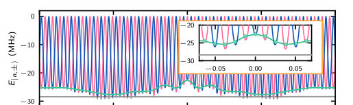 
FIG. 5. Electronic lattice including admixture of hydrogenic states at an electric field F ′. Perturbed eigenenergies of elec- tronic lattice states |n, +⟩(blue) and |n, −⟩(pink) have min- ima modulated with a period of π/2 along φ. Integration over a vibrational ground state at multiples of π/l results in re- duced site-to-site fluctuations (see inset) and slightly reduced well depths. Avoided crossings with |n, k = 0, |m| = n −3⟩ (gray) can be minimized.

📷 Fig 4

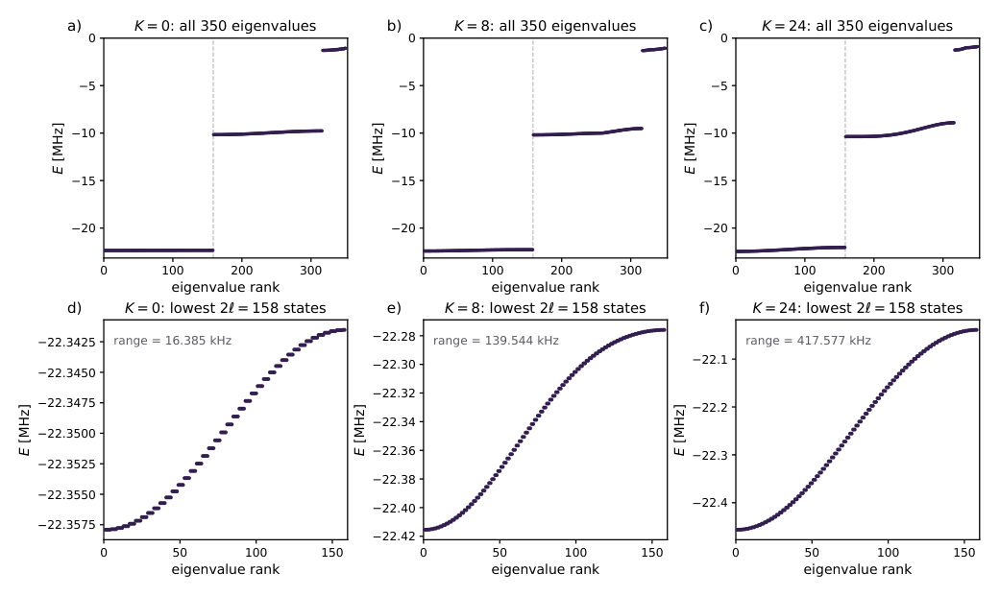 
FIG. 6. Numerically calculated circular-state Rydberg trimer spectra for three different values of the center-of-mass rotational angular momentum K. Panels (a–c) show the lowest 350 energy eigenvalues for n = 80 for K = 0, K = 8, and K = 24, respectively. The vertical dashed line marks position of the first band gap; the lowest band contains 2ℓ= 158 states for ℓ= n −1 = 79. Panels (d–f) show the lowest band alone for the corresponding K values. The bandwidths for each K value are 16.385 kHz, 139.544 kHz, and 417.577 kHz, respectively. The increasing width with K results from the spin-orbit coupling in ˆHK.

**Summary.** The authors demonstrate how circular Rydberg electrons can generate a dynamic, standing-wave lattice potential for ultracold atoms. This lattice potential is formed by the electron's matter wave and couples the atomic degrees of freedom. The study predicts correlated tunneling dynamics, opening a pathway to engineer complex many-body interactions in quantum gas experiments.

**Why it may be interesting.** This work provides a novel mechanism for creating tunable, dynamic lattice potentials using highly excited Rydberg states, offering a platform to study long-range, electronically mediated atom-atom interactions.

Detailed structure

**Main problem.** To realize and investigate an electronic lattice potential for ultracold atoms, where the lattice is formed dynamically by the matter wave of a weakly bound electron, rather than being a static optical lattice.

**Main result.** The system exhibits correlated tunneling motion in the electronic lattice, where individual atoms behave as free rotors, but the relative motion is governed by the lattice potential.

**Method.** The dynamics are analyzed by deriving an effective low-energy angular Hamiltonian and solving the resulting Bloch Hamiltonian in momentum space.

**Model / system.** The system involves ultracold atoms interacting with a single electron prepared in a circular Rydberg state, forming an effective electronic lattice potential via the electron-atom interaction.

**Key observables.** Band structure $E_{\pm}(q; K)$, effective moment of inertia ($I^*_\Phi, I^*_\varphi$), and two-atom correlation functions ($P_{com}, P_{rel}$).

**Important parameters / regimes.** Electron-atom scattering length ($a_s$), Rydberg principal quantum number ($n$), and the ratio $J/V \sim n m_e / m_a a_0$.

**Assumptions / limitations.** The analysis uses the Born-Oppenheimer approximation by averaging over fast radial and axial oscillations, and assumes the azimuthal motion is slow.

**Figures summary.** Figures illustrate the electronic standing wave and resulting single/two-atom potentials, the band structure $E_{\pm}(q; K)$ showing tunneling parameters, and the time evolution of two-atom correlators after a quench.

**Paper structure.** The paper progresses from deriving the effective angular Hamiltonian from the full trimer Hamiltonian, analyzing the resulting band structure for relative motion, and finally simulating the time evolution of two-atom correlations after switching off the trapping potential.

Abstract

Recent advances in experiments using individually trapped atoms have enabled precise control over circular Rydberg electrons with exceptionally long lifetimes. We show that these giant and stable electron orbits can form toroidal lattice potentials for ultracold atoms with a period set by the electron's de Broglie wavelength. Unlike conventional static optical lattices, this electron lattice is formed via the electron-atom interaction, which mixes Rydberg circular states with opposite azimuthal phase winding into a standing electronic matter wave. The lattice phase is thereby intrinsically coupled to the atom position. For a pair of atoms, this results in ballistic tunneling motion in the two-atom spatial correlations along the ring, while the single particle dynamics is essentially free rotation. We simulate the dynamics for an experimentally realistic setting that exploits optical tweezers for individual atom control. Our results open a route toward incorporating long range atom-atom interactions mediated by a single electron and, ultimately, realizing small Bose and Fermi gases confined in these microscopic electronic atom traps.

[↑ back to top](#top)

### [Rydberg-Atom-Mediated Strong Antisymmetric Spin Exchange in Molecular Arrays](http://arxiv.org/abs/2609.31147v1)

**Authors:** Yunqing Jiao, Jin-Zhu Jiang, Bo-Wen Guan, Jie Ma, Liantuan Xiao, Chi Zhang, Weibin Li, Feng Mei, Suotang Jia  
**Type:** theory · **Category:** other · **PDF:** <https://arxiv.org/pdf/2609.31147v1>  
**Analysis basis:** full PDF text, analyzed in chunks
**Topic relevance:** 🔥 `Rydberg arrays` **4/5** · 🔥 `analog quantum simulation` **4/5** · `QC/QI experiment` **1/5**

📷 Fig 1

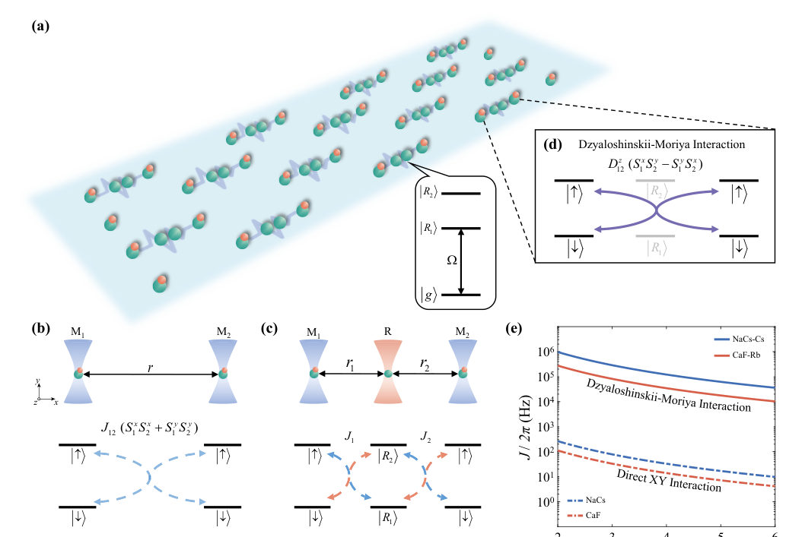 
FIG. 1: Rydberg-atom-mediated strong spin-exchange interaction between molecules. (a) Schematic illustration of a hybrid optical tweezer array of ultracold molecules and Rydberg atoms. (b) Dipole-dipole interaction between ultracold molecules (top) with its resulting XY spin-exchange interaction (bottom). (c) Dipole-dipole interaction between Rydberg atoms and ultracold molecules (top) and the corresponding spin-exchange interaction (bottom), with the intermolecular distance being r = r1 + r2. (d) Rydberg-atom-mediated DM spin-exchange interaction between ultracold molecules. (e) Spin-exchange strengths of the DM interaction (solid line) and the XY interaction (dashed line) as a function of...

📷 Fig 2

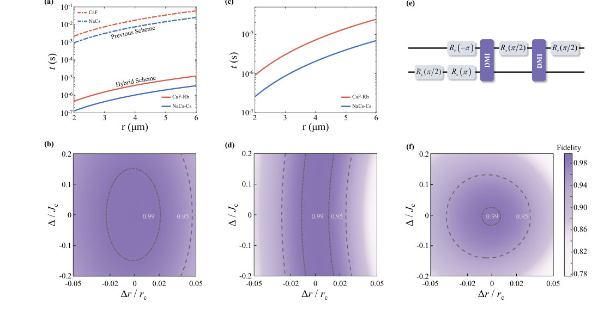 
FIG. 2: Fast entangling gates between molecules. (a) Bell-state preparation time varying with intermolecular distance r for molecule-only and hybrid schemes. (b) Bell-state fidelity as a function of detuning ∆and atomic-position uncertainty ∆r, obtained from Lindblad master-equation simulations. The chosen parameters are: r1α = 1.708 µm, r2α = 2.292 µm, corresponding to J1α = 2π × 0.898 MHz, J2α = 2π × 0.372 MHz. (c) SWAP gate time varying with intermolecular distance r and (d) gate fidelity for our hybrid scheme. The calculations use r1α = 2.292 µm, r2α = 1.708 µm, r1β = 1.708 µm and r2β = 2.292 µm. (e) Quantum circuit for constructing a CNOT gate through the DM interaction and...

📷 Fig 3

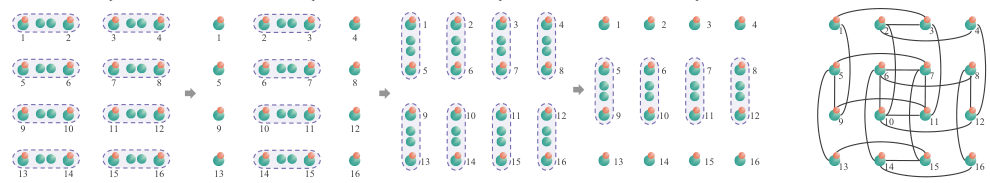 
FIG. 3: Scalable cluster-state generation via parallel DM interactions. (a) Interaction sequence for generating a one-dimensional cluster state. Starting with all molecules initialized in |+⟩, the sequence first activates the DM interaction simultaneously across all odd-indexed bonds, followed by a second parallel round on all even-indexed bonds, thereby fully connecting the nearest-neighbor molecular qubits and producing the linear cluster state shown in (b). (c) Interaction sequence for generating a two-dimensional square-lattice cluster state. Starting with all molecules initialized in |+⟩, the DM interaction is then applied in four layers: two parallel layers on horizontal bonds,...

📷 Fig 4

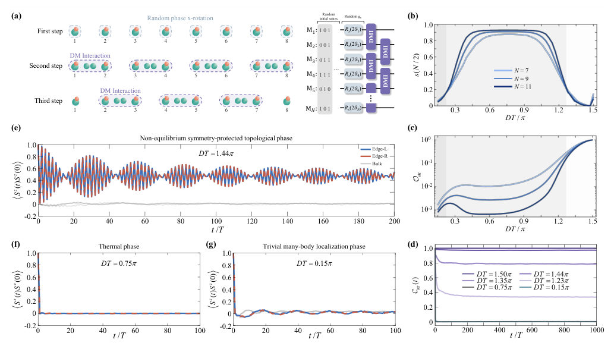 
FIG. 4: Implementation and detection of a non-equilibrium symmetry-protected topological phase via DM interactions. (a) Three-step periodic drive realizing a Z2 non-equilibrium symmetry-protected topological phase using DM interactions. Disordered onsite rotations promote many-body localization, followed by two staggered DM interaction steps acting on odd and even bonds, respectively; the equivalent quantum circuit representation is shown alongside. (b) Normalized bipartite entanglement entropy s(N/2) as a function of interaction parameter DT, distinguishing thermal and localized regimes under periodic driving. (c) Eigenstate-averaged nonlocal string-order diagnostic Ostr, which identifies...

**Summary.** This paper presents a method to significantly boost spin-exchange interactions in ultracold molecular arrays by mediating the coupling through highly polarizable Rydberg atoms. This engineered interaction realizes a strong, controllable Dzyaloshinskii-Moriya (DM) type exchange. The results demonstrate that this technique enables fast, high-fidelity quantum gate operations and the simulation of complex topological quantum phases.

**Why it may be interesting.** This work directly addresses the bottleneck of weak interactions in molecular quantum simulators by engineering strong, controllable couplings using Rydberg mediators, which is a major theme in modern AMO physics.

Detailed structure

**Main problem.** The primary challenge is overcoming the weak spin-exchange couplings in ultracold molecules, which limits the speed of quantum information processing and simulation.

**Main result.** The use of Rydberg atoms mediates a strong, effective antisymmetric Dzyaloshinskii-Moriya (DM) spin-exchange interaction, enhancing coupling strength by up to three orders of magnitude.

**Method.** The authors employ a two-step Rydberg-mediated protocol and utilize Floquet Hamiltonian theory and the Magnus expansion to engineer desired spin interactions.

**Model / system.** The system involves ultracold polar molecules (e.g., NaCs, CaF) whose spins act as qubits, coupled via auxiliary Rydberg atoms placed in an optical tweezer array.

**Key observables.** Gate fidelities (e.g., Bell state, SWAP, CNOT), entanglement generation rates, and the coherence of edge spins in topological phases.

**Important parameters / regimes.** Interaction strength enhancement (up to $10^3$), detuning ($\Delta$), atomic-position uncertainty ($\Delta r$), and the specific solvable point $DT = 1.5\pi$.

**Assumptions / limitations.** The analysis assumes resonant molecular and Rydberg transitions, and for topological analysis, it relies on specific solvable points in the driving sequence.

**Figures summary.** Figures illustrate the setup, comparing molecule-only vs. Rydberg-mediated interactions, and show gate performance metrics like Bell-state preparation time and fidelity versus system parameters.

**Paper structure.** The paper progresses from establishing the weak coupling problem to introducing the Rydberg-mediated protocol, demonstrating gate operations (Bell, SWAP, CNOT) using the resulting DM interaction, and finally analyzing the realization of non-equilibrium topological phases.

Abstract

Ultracold molecular systems have recently emerged as a versatile platform for quantum computation and simulation. Spin-exchange interactions arising from direct molecular dipolar interactions constitute the key mechanism for generating quantum entanglement and simulating quantum spin models. However, the relatively small electric dipole moments result in weak spin-exchange couplings, fundamentally limiting the speed of quantum information processing and interaction cycle of many-body dynamics. Here, we introduce a framework that employs Rydberg atoms with large electric dipole moments to mediate strong interactions between molecules in optical tweezer arrays that enables individually laser addressing both the Rydberg atom and molecules. Our result reveals that the mediated coupling can realize an effective molecular spin-exchange interaction with an intrinsic Dzyaloshinskii-Moriya character, with the Rydberg atoms dynamically decoupled from the molecular degrees of freedom, and the effective interaction strength enhanced by up to three orders of magnitude. We further demonstrate its versatility through rapid entanglement generation, high-fidelity two-qubit gate operations, and the realization of non-equilibrium symmetry-protected topological phase with long-lived edge coherence. Our work establishes a route toward strong molecular spin interactions and opens opportunities for fast, scalable quantum information processing and quantum simulation of long-time non-equilibrium quantum many-body physics in optical tweezer arrays of ultracold molecules.

[↑ back to top](#top)

### [Computational aberration-retrieval with entangled photons](http://arxiv.org/abs/2609.31049v1)

**Authors:** Baptiste Courme, YoonSeok Baek, Hugo Defienne  
**Type:** experiment · **Category:** other · **PDF:** <https://arxiv.org/pdf/2609.31049v1>  
**Analysis basis:** full PDF text, analyzed in chunks
**Topic relevance:** 🔥 `quantum optics experiment` **4/5** · `quantum measurements` **3/5** · `interference shaping light` **1/5**

📷 Fig 1

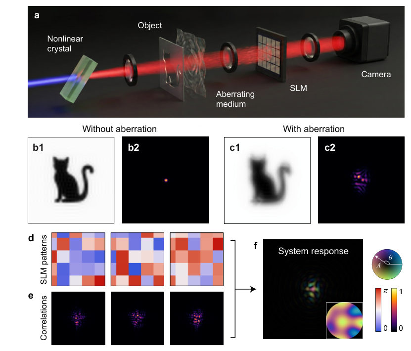 
FIG. 1. Principle and simulations. (a) An object is illuminated by a source of entangled photon pairs exhibiting strong spatial correlations. In the example considered here, the photons are strongly anti-correlated in the object plane i.e. when a signal photon is detected at position rs, the associated idler photon is detected around position ri ≈−rs. Such illumination can be generated, for example, by placing the object in the Fourier plane of a thin nonlinear crystal illuminated by a large- diameter pump laser. In this configuration, photon pairs are produced via spontaneous parametric down-conversion (SPDC), and the strong spatial anti-correlations are ensured by momentum conservation....

📷 Fig 2

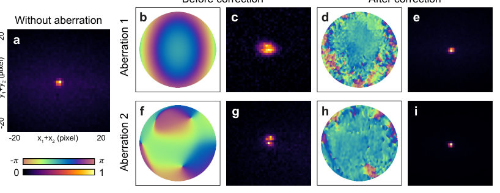 
FIG. 2. Experimental results of aberration correction. (a) Experimentally measured C+ correlation image in the absence of aberrations. (b, f) Phase masks programmed onto the SLM to artificially induce aberrations in the imaging system. The masks are constructed by superimposing Zernike modes corresponding to defocus and astigmatism for Aberration 1 (b), and by using the phase of complex Gaussian speckle field with a speckle grain size of 150 SLM pixels for Aberration 2 (f). (c, g) Corresponding distorted C+ correlation images measured prior to correction. (d, h) Phase masks displayed on the SLM resulting from the subtraction of the algorithm-retrieved phase from the initially programmed...

📷 Fig 3

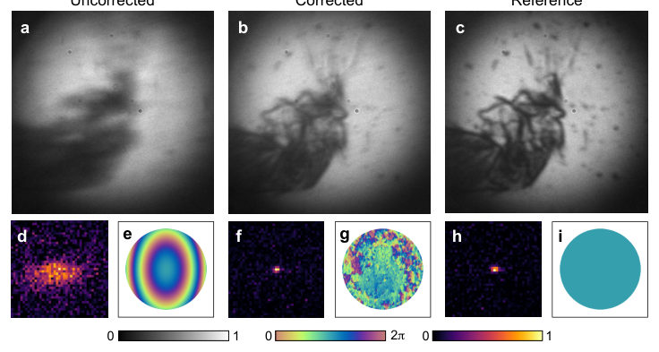 
FIG. 3. Experimental results of adaptive optics. In the presence of aberrations, the intensity image (a) becomes blurred, and the C+ correlation image (d) is distorted. These aberrations are emulated by displaying a phase pattern (e) on the SLM, constructed by superimposing Zernike polynomials for defocus and astigmatism. After applying our approach, the retrieved phase correction is superimposed onto the initial aberration pattern on the SLM, resulting in a nearly flat effective phase profile (g). Consequently, the corrected intensity image (b) is sharp, and the C+ correlation image (f) exhibits a restored sharp central peak. For comparison, the reference intensity image (c) and C+...

**Summary.** This paper presents a novel adaptive optics technique that uses the spatial correlations of entangled photons to directly measure and correct optical aberrations. By analyzing the second-order correlation function, the authors achieve aberration retrieval non-iteratively, significantly reducing the measurement burden compared to conventional methods. This offers a quantum-enhanced pathway for high-resolution microscopy in challenging regimes.

**Why it may be interesting.** This work bridges quantum optics diagnostics with classical imaging challenges, providing a quantum-enhanced, measurement-efficient tool for wavefront sensing that bypasses traditional iterative optimization bottlenecks.

Detailed structure

**Main problem.** Conventional adaptive optics (AO) methods for high-resolution microscopy suffer from measurement burdens that increase with aberration complexity, especially when photon budgets are limited.

**Main result.** The authors demonstrate a non-iterative AO correction strategy that successfully retrieves optical aberrations using only a few measurements based on entangled photon correlations.

**Method.** The method exploits the second-order correlation function of entangled photon pairs, $C^+$, which is sensitive to aberrations, allowing phase retrieval without iterative optimization or image-based feedback.

**Model / system.** The experiment uses entangled photon pairs generated via SPDC and employs a Spatial Light Modulator (SLM) to apply known perturbations to measure the system's transfer function and reconstruct the phase profile.

**Key observables.** The second-order intensity correlation function, $C^+$, and the restored sharp correlation peak after correction.

**Important parameters / regimes.** The number of required perturbations (as few as 3–5) and the constraint of limited temporal windows.

**Assumptions / limitations.** The approach assumes strong spatial correlations in the entangled photon pairs and that controlled modulation via the SLM can encode the necessary phase information.

**Figures summary.** Figures illustrate the principle by showing the degradation of the $C^+$ correlation peak due to aberrations and the subsequent restoration of the sharp peak after applying the computationally retrieved phase correction.

**Paper structure.** The paper details the physical setup, introduces the correlation-based diagnostic, develops the non-iterative phase retrieval algorithm, and presents experimental validation showing successful aberration correction in both correlation measurements and object imaging.

Abstract

Adaptive optics (AO) is central to high-resolution microscopy, yet conventional implementations often require repeated correction-and-measurement cycles whose number increases with aberration complexity. This measurement burden can become prohibitive when the available temporal window for correction is short or when photon budgets are constrained. Here, we demonstrate an AO strategy that exploits the spatial correlations of entangled photon pairs to retrieve aberrations directly. By using the second-order correlation function as an aberration-sensitive metric, the required correction can be determined with only a few measurements, without relying on image-based feedback or iterative optimization. This correlation-based approach establishes an efficient framework for AO leveraging quantum light, offering a new route toward quantum-enhanced microscopy in regimes where conventional correction strategies become challenging.

[↑ back to top](#top)

### [Synthetic Berry curvature in atom-cavity systems](http://arxiv.org/abs/2609.31067v1)

**Authors:** Zheng Tang, Rui-Lin Zhang, Xiaotian Nie, Li Chen, Wei Zheng  
**Type:** theory · **Category:** other · **PDF:** <https://arxiv.org/pdf/2609.31067v1>  
**Analysis basis:** full PDF text, analyzed in chunks
**Topic relevance:** 🔥 `analog quantum simulation` **4/5** · `Tavis-Cummings & cavity-many-emitter` **3/5** · `methods for driven-dissipative` **1/5**

📷 Fig 1

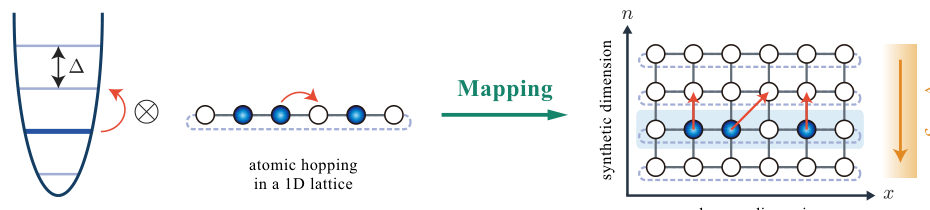 
FIG. 1. Mapping from an atom–cavity system to a synthetic two-dimensional lattice. (a) The physical Hilbert space is the direct product of the cavity photon Fock ladder and many-atom Hilbert space in one-dimensional lattice. The detuning term ∆ˆa†ˆa separates neighboring photon sectors, while cavity-assisted hopping changes the atomic position together with the photon state. (b) In the single-particle representation the basis |i, n⟩forms a synthetic lattice whose horizontal direction is real space and whose vertical direction is the photon-number coordinate. The detuning acts as a uniform electric field En ∝∆along the synthetic direction, and the atomic current is interpreted as a Hall...

📷 Fig 2

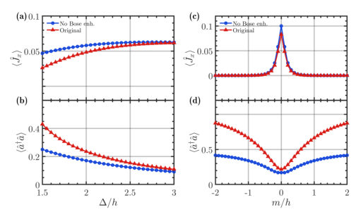 
FIG. 2. Ground-state observables via exact diagonalization. (a,b) Atomic current and mean photon number versus cavity detuning at m/h = 0.1. (c,d) The corresponding quantities versus m/h at ∆/h = 2. The sharp current feature at m/h = 0 follows from the jump of the selected collective synthetic momentum q∗and its slice Hall conductance. The blue data shows the model with the no-Bose-enhancement. Here L = 6, ν = 0.5, δh/h = 0.4 and δm/h = 0.7.

📷 Fig 3

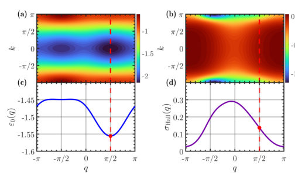 
FIG. 3. Synthetic band and many-body block structure with- out Bose enhancement. (a) Single-atom lower-band energy E−(q, k), and (b) its Berry curvature. (c) Ground state energy in the q block. The global ground state selects the minimum- energy block q∗, which is indicated by the dashed line. (d) Fixed-q slice Hall conductance obtained from occupied-state Berry curvature. It is not quantized. Here ν = 0.5, m/h = 0.1, δh/h = 0.4 and δm/h = 0.7.

📷 Fig 4

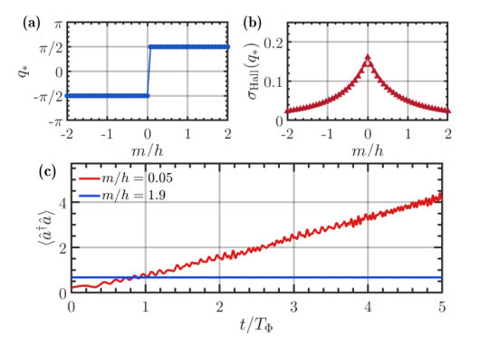 
FIG. 4. (a) Ground-state collective synthetic momentum q∗ as a function of m/h, obtained by minimizing the half-filled many-body energy over the q blocks. The selected block changes abruptly at m/h = 0. (b) Hall conductance σHall(q∗) evaluated in the ground state block. The jump of q∗pro- duces a cusp-like feature of σHall(q∗) near m = 0. (c) Photon number during a Laughlin-pumping protocol, where a flux is adiabatically threaded through the real-space ring. Here L = 4, ν = 0.5, δh/h = 0.4, δm/h = 0.7, ∆/h = 1.5, and pumping period is TΦ = 20π.

**Summary.** This theoretical work investigates atom-cavity systems, demonstrating that mean-field theory fails to predict the correct ground state atomic current. The failure is fundamentally linked to the non-zero Berry curvature arising in a synthetic dimension. The paper establishes synthetic Berry curvature as a key mechanism governing the quantum response, such as the Hall effect, in these coupled systems.

**Why it may be interesting.** This work provides a concrete, topological mechanism (synthetic Berry curvature) explaining the breakdown of standard mean-field treatments in interacting quantum systems like cavity QED.

Detailed structure

**Main problem.** The paper addresses the failure of mean-field theory in atom-cavity systems when calculating the ground state atomic current, where the mean-field approach incorrectly predicts zero current.

**Main result.** The failure is traced to the non-zero Berry curvature in the synthetic dimension spanned by the photon Fock ladder and real space, which the mean-field approximation discards.

**Method.** The authors employ a synthetic dimension mapping to treat the system as moving on a synthetic lattice, allowing the calculation of the Berry curvature and the Hall response.

**Model / system.** The system is an atom-cavity setup involving spinless fermions on a bipartite chain coupled to a quantized cavity mode. The analysis uses both the full quantum Hamiltonian and a mean-field approximation.

**Key observables.** Atomic current (J_x), Berry curvature (Omega), and the Hall response of the cavity detuning.

**Important parameters / regimes.** Cavity detuning (Delta), coupling strengths (m, h), and the synthetic momentum (q).

**Assumptions / limitations.** The analysis relies on mapping the system to a synthetic 2D lattice and making approximations to isolate the underlying band geometry in momentum space.

**Figures summary.** Figures illustrate the mapping to a synthetic lattice, showing how the atomic current and mean photon number vary with detuning, highlighting sharp features.

**Paper structure.** The paper first establishes the discrepancy between mean-field and quantum current calculations. It then maps the system to a synthetic dimension, calculates the Berry curvature, and finally relates the finite quantum current to the Hall response mechanism.

Abstract

In atom-cavity systems, mean field theory is widely used, in which the quantum cavity operator is replaced by a classical amplitude. Then the problem is converted into atoms moving in a self-consistent potential. The mean field treatment captures the physics of cavity mediated interactions, and predicts the self-organized superradiant phase. In this work, however, we show that it fails for certain atom-cavity coupling: it predicts zero ground state atomic current where the fully quantum calculation exhibits a finite one. We find that the origin of this failure is the non-zero Berry curvature in the synthetic dimension spanned by the photon Fock ladder and real space. In this synthetic picture, the atomic current can be understood as Hall response of cavity detuning, whereas mean field collapses this dimension and discards the atom--photon correlations required for its Hall response. The same beyond-mean-field geometry predicts Laughlin-like photon generation under adiabatic flux insertion. Our work identifies synthetic Berry curvature as a concrete mechanism for the breakdown of static mean field in atom--cavity physics.

[↑ back to top](#top)

### [Critical escape dynamics of an active particle moving on curved surfaces](http://arxiv.org/abs/2609.30455v1)

**Authors:** Maxim Root, Hartmut Löwen, Peter Sollich, Lorenzo Caprini, Alexander P. Antonov  
**Type:** theory · **Category:** statistical mechanics · **PDF:** <https://arxiv.org/pdf/2609.30455v1>  
**Analysis basis:** full PDF text, analyzed in chunks
**Topic relevance:** 🔥 `non-equilibrium universality` **4/5** · `Frenkel-Kontorova` **1/5** · `driven-dissipative phase transition` **1/5**

📷 Fig 1

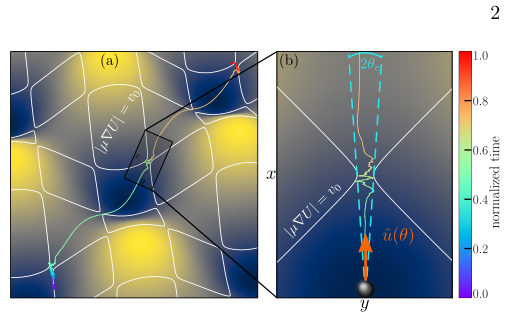 
FIG. 2. (a) Three-dimensional view of the dynamical motion of an athermal active Brownian particle on the periodic poten- tial U(x, y), with potential maxima colored yellow and min- ima blue. The white isolines correspond to |µ∇U| = v0, where the active velocity matches the magnitude of the gradient- induced drift; while the particle’s position over time is en- coded by the trajectory color. (b) Magnified view of the escape bottleneck in the xy-plane. Here the particle orienta- tion needs to stay within the orientation interval (lime dashed lines) for a successful escape. The color map on the right cor- responds to the time evolution in both panels (a) and (b).

📷 Fig 2

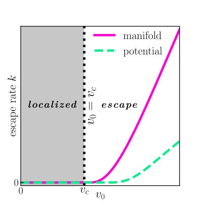 
FIG. 1. Sketch of the escape rate k for the motion of the active particle in an external potential (green dashed line) and within a curved manifold with additional gravity (magenta solid line). There is a dynamical transition at v0 = vc (black dotted line) between a localized state (k = 0) and an escape situation (k &gt; 0). In the latter regime, the escape rate follows the universal scaling form for v0 &gt; vc (Eq. (1)) with γ = 3/2 for the potential and γ = 1/2 for the manifold.

📷 Fig 3

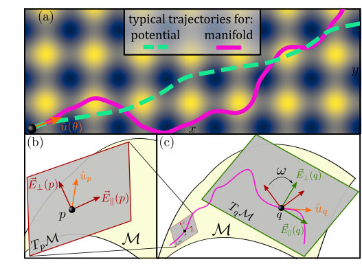 
FIG. 3. (a) Multiple escape events for a large opening pa- rameter δ = 3/4 in the deterministic regime (Dr = 0), for a particle in the potential landscape (dashed green, Eqs. (2)) and in the corresponding identical landscape on the manifold with additional gravity (magenta, Eqs. (16)). The initial con- ditions are identical, r(0) = 0, θ = π/8; the difference between the resulting trajectories highlights the impact of geometric contributions from the manifold on the resulting motion. (b) Schematic of an active particle with orientation ˆu moving on a curved manifold M. At point p ∈M, the particle orienta- tion is represented in the local orthonormal basis { ⃗E∥, ⃗E⊥} of the tangent space...

📷 Fig 4

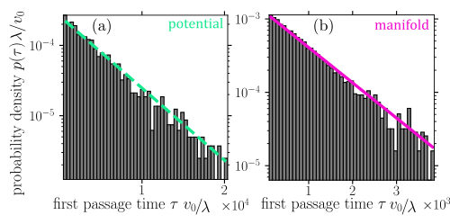 
FIG. 5. Distribution of escape (first passage) times in semi- log scaling, obtained from numerical simulations of (a) poten- tial gradient, Eq. (2), and (b) manifold, Eq. (16). Parameters used: Dr = 10−4v0/λ, δ = 10−3, U0 = √

📷 Fig 5

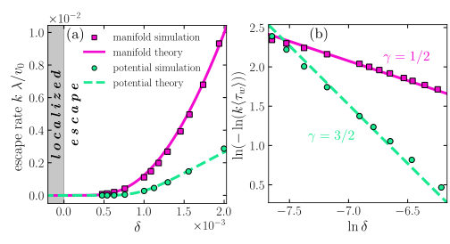 
FIG. 4. Escape rate k for various opening parameters δ on (a) a linear scale and (b) as ln(−ln(k⟨tw⟩)) vs ln δ, where the slope yields the exponent γ in the scaling (1) k⟨tw⟩∼ exp  −δ−γ ; plotted for potential gradient (dashed green) and manifold (solid magenta) obtained analytically (Eq. (29) with Eq. (50) for potential gradient and Eq. (51) for manifold). The prefactors of the exponential laws are adjusted to match the numerical data (dots), with the resulting agreement in the scaling trends supporting the analytical predictions. Panel (a) reveals faster escape from the manifold, while panel (b) makes the characteristic exponents of Eq. (1) apparent. Parameters used: Dr = 10−4v0/λ, and...

**Summary.** This paper analyzes how active particles escape confinement, comparing motion in a simple potential well to motion on a curved surface under gravity. It finds that the critical escape rate follows universal scaling laws, with the exponent changing significantly depending on whether the geometry is flat or curved. This highlights that surface curvature fundamentally alters the dynamics of self-propelled matter.

**Why it may be interesting.** The study of non-equilibrium escape dynamics and the role of geometry (curvature) in modifying transport rates is highly relevant to understanding energy landscapes and barrier crossing in complex quantum or classical systems.

Detailed structure

**Main problem.** The paper investigates the critical dynamics governing the escape of active particles from metastable states, comparing motion in a simple potential gradient versus motion constrained on a curved manifold.

**Main result.** The critical escape rate exhibits universal scaling laws, yielding distinct exponents ($\gamma=3/2$ for potential, $\gamma=1/2$ for curved manifold) that reveal how surface geometry modifies activity-driven escape dynamics.

**Method.** The study employs theoretical derivations based on the Fokker-Planck equation, analyzing the escape rate as the lowest eigenvalue, and comparing these results with numerical simulations.

**Model / system.** The model consists of Active Brownian Particles (ABPs) self-propelled on either a 2D external potential $U(\mathbf{r})$ or a curved manifold $M$ defined by a height function $h(x, y)$, subjected to external forces like gravity.

**Key observables.** Escape rate ($k$), Mean First Passage Time ($\langle	au
angle$), and the scaling exponent ($\gamma$).

**Important parameters / regimes.** Self-propulsion velocity ($v_0$), critical velocity ($v_c$), and the opening parameter ($\delta = (v_0 - v_c)/v_0$).

**Assumptions / limitations.** The analysis assumes the absence of translational noise in the critical scaling regime and utilizes approximations near the escape bottleneck ($	heta_c \ll 1$).

**Figures summary.** Figures illustrate the escape rate dependence on $v_0$, showing the transition at $v_c$ and the characteristic scaling forms with different exponents for the two geometries.

**Paper structure.** The paper first establishes the general problem in two settings (potential vs. manifold), derives the equations of motion, analyzes the escape probability using the Fokker-Planck formalism, and concludes by comparing the resulting universal scaling exponents.

Abstract

On the macroscopic scale, active (self-propelled) objects moving through complex environments are often subject to effects arising from both the curvature of the surrounding surface and external influences such as gravity. We study the Kramers escape problem for active Brownian particles in two settings: motion in an external potential driven solely by gradient forces, and motion on a curved manifold subject to an additional constant gravitational force. In the absence of translational noise, a sharp dynamical transition occurs when the self-propulsion velocity $v_0$ reaches a critical velocity $v_c$ required for an escape. Above this threshold, the escape rate $k$ follows a universal scaling form, $k \propto \exp\left[-\mathrm{const}(v_0-v_c)^{-γ}\right]$, with an exponent $γ=3/2$ for the escape in a potential and $γ=1/2$ for the escape on a curved manifold in the presence of gravity. These distinct exponents reveal how the interplay of activity, surface curvature, and gravity determines the critical escape dynamics. Our theoretical predictions are verified by numerical simulations.

[↑ back to top](#top)

### [Quantum advantage in learning single mode bosonic channels](http://arxiv.org/abs/2609.30374v1)

**Authors:** Angela Anna Baiju, Aritra Das, Özlem Erkılıç, Jiayi Qin, Li Gong, Syed M Assad, Ping Koy Lam, Biveen Shajilal, Lorcán O Conlon, Jie Zhao  
**Type:** both · **Category:** quantum information and computing · **PDF:** <https://arxiv.org/pdf/2609.30374v1>  
**Analysis basis:** full PDF text, analyzed in chunks
**Topic relevance:** 🔥 `quantum optics experiment` **4/5** · `quantum measurements` **2/5**

📷 Fig 1

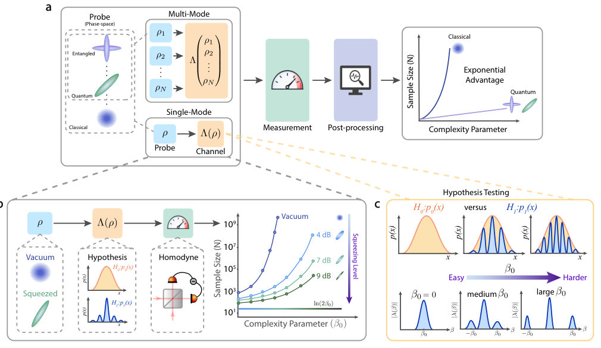 
FIG. 1. Exponential quantum learning advantage from a single squeezed mode. (a) General framework for quantum channel learning. A probe state is sent through an unknown channel Λ, measured, and the outcomes are post-processed to infer the channel’s properties. The choice of probe states—classical, squeezed, or entangled states—and the measurement strategy jointly determine the sample complexity: the number of channel uses required to achieve a prescribed learning accuracy. Prior work has established that multi-mode entangled probes can reduce sample complexity exponentially compared to any classical strategy (right panel), but has left open whether such an advantage necessitates...

📷 Fig 2

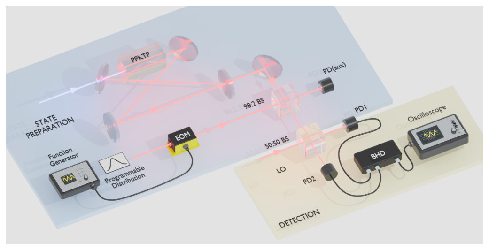 
FIG. 2. Experimental schematic. The experiment consists of two stages: state preparation and homodyne detection. In the state preparation stage, squeezed vacuum is generated via parametric down-conversion in a PPKTP crystal inside a bowtie cavity (squeezer). The displacement is introduced by combining the squeezed vacuum with a bright coherent beam on a 98:2 beamsplitter; the coherent beam is phase-modulated by an electro-optic modulator (EOM) driven by a function generator programmed with the desired displacement distribution, implementing the random displacement channel. An auxiliary pho- todetector (PD aux) monitors the displacement beam power and is used to lock the displacement to the...

📷 Fig 3

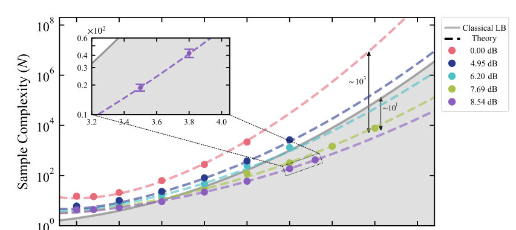 
FIG. 3. Hypothesis tesing: exponential advantage in sample complexity. Minimum number of homodyne measure- ments Nmin required to distinguish H0 from H1 with success probability ≥2/3 using the log-likelihood ratio (LLR) decision rule, as a function of peak separation β0. Dashed lines show simulation results and solid markers show experimental data using vacuum probe (red), and squeezed probe with squeezing levels of 4.95 dB, 6.2 dB, 7.69 dB and 8.54 dB. The gray solid line shows the classical lower bound from Theorem 1. At β0 = 4.5, the vacuum probe requires ∼1.5 × 107 samples while a strongly squeezed probe requires only ∼104, a separation of three orders of magnitude that grows...

📷 Fig 4

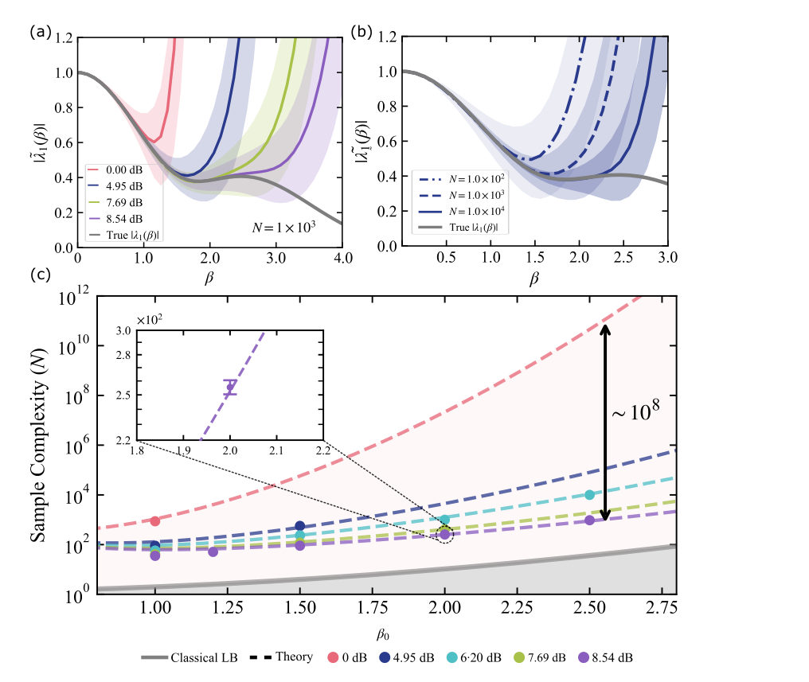 
FIG. 4. Full-bandwidth reconstruction of characteristic functions. (a) Experimental characteristic function recon- struction λ(β) whose highest frequency component β0 = 2.5 for a fixed number of homodyne samples to be N = 1 × 103 but using probes of different variances. The solid lines represent the average outcome of 2000 runs of reconstruction task as a function of number of homodyne samples and the shadings are 1σ standard deviation. (b) The same reconstruction task as given in panel (a) at β0 = 2.5 but for a given probe of variance -4.95 dB and varying the number of homodyne samples (N) (c) Minimum number of homodyne measurements Nmin required to estimate λ(β) with success probability...

**Summary.** This paper proves that exponential quantum advantages in learning bosonic channels do not necessarily require entanglement or increased system size. By utilizing single-mode squeezing, the authors show that controlling the accessible Fourier bandwidth allows for a dramatic, exponential reduction in the required number of samples for tasks like channel characterization. This identifies bandwidth control as a key, non-entanglement-based quantum resource.

**Why it may be interesting.** This work directly addresses the resource quantification in quantum learning, showing that non-entanglement-based resources like controlled bandwidth (squeezing) can yield exponential quantum advantages, which is highly relevant for quantum sensing and estimation protocols.

Detailed structure

**Main problem.** The paper investigates whether exponential quantum learning advantages can be achieved in a fixed, unentangled quantum system, specifically when learning the parameters of a single-mode bosonic channel.

**Main result.** It demonstrates that single-mode squeezing can provide an exponential reduction in sample complexity compared to vacuum or coherent probes, establishing accessible Fourier bandwidth as a fundamental quantum resource.

**Method.** The authors established information-theoretic lower bounds and used quantum estimation theory, comparing the performance of vacuum, coherent, and squeezed probes for tasks like binary hypothesis testing and characteristic-function reconstruction.

**Model / system.** The system is a single bosonic mode subjected to an unknown random-displacement channel. The theoretical analysis uses the characteristic function, while the experimental realization involves squeezing generated via parametric down-conversion and homodyne detection.

**Key observables.** Sample Complexity ($N$), characteristic function $\lambda(eta)$, Log-Likelihood Ratio (LLR), and the achievable Fourier bandwidth.

**Important parameters / regimes.** Squeezing level ($r$), complexity parameter ($eta_0$), and the ratio of sample complexities ($N_{	ext{vac}} / N_{	ext{sq}}$).

**Assumptions / limitations.** The analysis relies on approximations like Taylor expansions for the LLR and assumes the ability to implement the random displacement channel and perform homodyne detection.

**Figures summary.** Figures illustrate the comparison of probe states (vacuum vs. squeezed) in single-mode learning, showing exponential outperformance of squeezed probes in hypothesis testing and reconstruction tasks.

**Paper structure.** The paper progresses from establishing the fundamental question regarding entanglement vs. single-mode advantage, to deriving information-theoretic bounds, and finally presenting both theoretical derivations and experimental validation using homodyne measurements.

Abstract

Quantum resources can dramatically reduce the data required to learn physical systems, with exponential improvements in sample complexity demonstrated in several quantum learning tasks. However, these advantages have typically relied on quantum resources that scale with problem complexity, most notably increasing system dimension or entanglement. This raises a fundamental question: can exponential quantum learning advantages arise within a fixed, unentangled quantum system? In this paper, we address this question by considering the learning of an unknown random-displacement distribution whose complexity is determined not by the dimensionality of the physical system, but by the Fourier resolution of its features. We show that the quantum-limited noise of vacuum probes progressively obscures high-frequency features, leading to an exponential growth in sample complexity. We establish an information-theoretic lower bound for arbitrary classical-state probes and show that squeezing overcomes this classical limit by extending the accessible Fourier bandwidth. Experimentally, we demonstrate an exponential reduction in sample complexity using squeezed vacuum probes for both binary hypothesis testing and characteristic-function reconstruction. Our results show that a single bosonic mode can exhibit exponential quantum learning advantages without entanglement or an increase in system size, identifying accessible Fourier bandwidth as a fundamentally distinct resource for quantum-enhanced learning.

[↑ back to top](#top)

### [Distinct Feedback-Strength Requirements for Quantum-State Ensemble Preparation under Channel-Equivalent Monitoring](http://arxiv.org/abs/2609.31221v1)

**Authors:** Haitao Huang, Qinglin Zhao, Xiaoyu Li  
**Type:** theory · **Category:** quantum information and computing · **PDF:** <https://arxiv.org/pdf/2609.31221v1>  
**Analysis basis:** full PDF text, analyzed in chunks
**Topic relevance:** 🔥 `quantum measurements` **4/5** · `correlated / nonlocal dissipation` **1/5**

📷 Fig 1

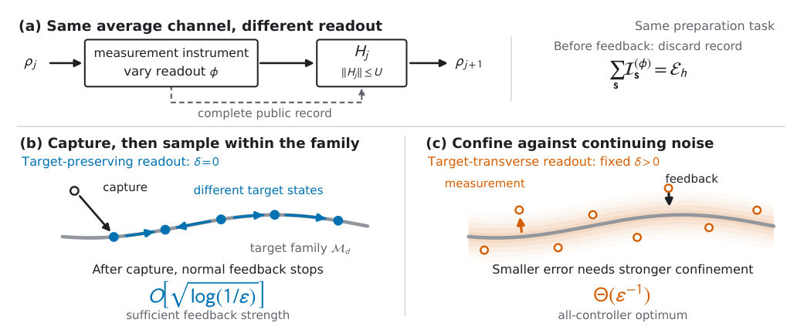 
FIG. 1. Same average channel, different feedback scaling. (a) Readout phases vary at fixed discarded-record channel. The solid line carries the system; the dashed complete public record conditions the subsequent Hamiltonian. (b) At δ = 0, successful capture is followed by monitored motion within Md; normal feedback stops. (c) At fixed δ &gt; 0, measurement continually displaces states from Md. Inward feedback maintains a characteristic distance ℓ⊥∼κδ/U at large U. Gray curves depict the same target-family slice in pure-state space, rather than a trajectory. Dots and shading illustrate states and confinement, not sampled data or hard support. The scalings show a sufficient construction in (b)...

📷 Fig 2

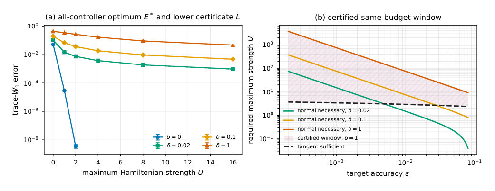 
FIG. 2. Continuous-time resource separation for d = 4. Here Γ = 4, κ = 0.5, and T = 1. (a) Deterministic evaluations of the finite-time all-controller optimum E∗(U, T) (markers and solid lines). Dashed curves are the analytic stationary lower certificates L(U) for δ &gt; 0; the resolved δ = 0 points show the tangent case. Error bars are twice the sum of successive spatial and temporal differences and are resolution proxies, not rigorous error bounds. (b) Inverting L(U) = ϵ gives necessary budgets for the normal instruments (solid). The black dashed curve is the sufficient tangent construction in Eq. (6). The shaded δ = 1 region illustrates the analytically certified same-budget window: the...

**Summary.** This theoretical work distinguishes the resource requirements for preparing a quantum state ensemble based on the specific measurement readout used, even if the overall average channel is the same. It proves a dramatic separation in required feedback strength between different monitoring types. This highlights that the measurement process itself dictates the necessary control resources for high-fidelity quantum state preparation.

**Why it may be interesting.** It provides fundamental theoretical bounds on the resources needed for quantum control under measurement, which is crucial for understanding realistic quantum feedback protocols in quantum optics and open quantum systems.

Detailed structure

**Main problem.** The paper investigates the distinct resource costs (feedback strength) required to prepare a target quantum state ensemble when continuous monitoring is performed, even if the average quantum channel remains unchanged.

**Main result.** A significant separation is established: preparing the ensemble under fixed transverse noise requires a strength scaling of $\Theta(\epsilon^{-1})$, whereas tangent noise requires only $O(\sqrt{\log(1/\epsilon)})$, proving measurement realization is part of the control specification.

**Method.** The analysis uses the trace-Wasserstein distance to quantify ensemble error and compares resource costs derived from different monitoring regimes (e.g., tangent vs. transverse monitoring).

**Model / system.** The model is a multiqubit register undergoing continuous monitoring and feedback control, targeting the uniform ensemble of real-amplitude pure states.

**Key observables.** Terminal ensemble error ($\epsilon$), required Hamiltonian strength ($U$), and the feedback strength parameter ($\delta$).

**Important parameters / regimes.** The separation is quantified by comparing $C_{d,\delta}(\epsilon)$ for $\delta>0$ versus $\delta=0$.

**Assumptions / limitations.** Assumes unit detection efficiency and bounded Hamiltonian feedback; the tangent construction provides an upper bound, but a matching lower bound is noted as open.

**Figures summary.** Figures illustrate the scaling difference in required feedback strength between different monitoring scenarios (e.g., sustained vs. normal feedback).

**Paper structure.** The paper establishes the problem by comparing monitoring types, derives lower bounds using Wasserstein distance, and culminates in a theorem quantifying the distinct resource scaling based on the measurement readout realization.

Abstract

Different measurements of the same environment can preserve the average quantum channel yet change the feedback strength needed to prepare a state ensemble. We establish this distinction for a multiqubit register under complete Pauli monitoring, targeting the uniform ensemble of real-amplitude pure states. With unit detection efficiency, public records, and bounded Hamiltonian feedback, fixed transverse noise requires a minimum peak strength proportional to $ε^{-1}$ at distributional error $ε$. Tangent noise instead admits a construction requiring only $O[\sqrt{\log(1/ε)}]$. At fixed preparation time, we determine the optimum over all allowed feedback policies and derive a geometric lower bound beyond radial symmetry. The separation identifies the measurement realization as part of the control-resource specification for monitored ensemble preparation.

[↑ back to top](#top)

### [Quantum-HPC Workflows Across Multiple Quantum Computing Platforms: Two Case Studies](http://arxiv.org/abs/2609.31528v1)

**Authors:** Philipp Seitz, Miwako Tsuji, John Children, Yuta Kikuchi, Riku Masui, Juan Pedersen, Kentaro Yamamoto, Ross Duncan  
**Type:** both · **Category:** quantum information and computing · **PDF:** <https://arxiv.org/pdf/2609.31528v1>  
**Analysis basis:** full PDF text, analyzed in chunks
**Topic relevance:** 🔥 `QC/QI experiment` **4/5** · `analog quantum simulation` **1/5**

📷 Fig 1

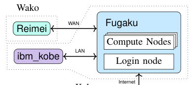 
Fig. 1: The Quantum-HPC System Overview.

📷 Fig 2

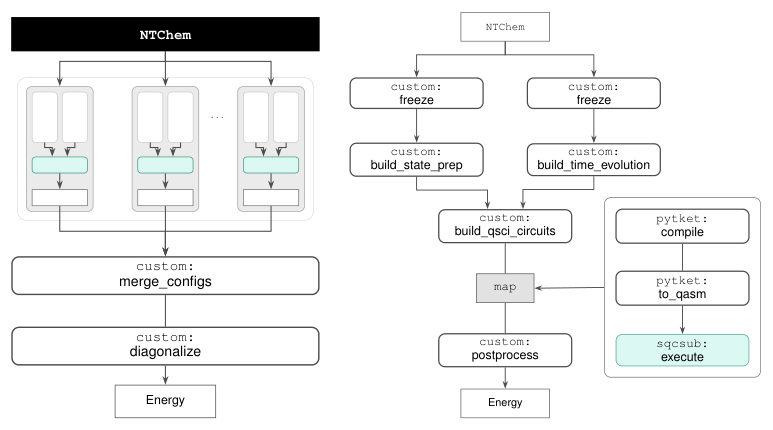 
Fig. 2: The Biomolecular Excited States Workflow. (a) Overview: Overview of the workflow structure. Target molecular eigenstates are evaluated in parallel through the workflow (b); depicted as outline. NTChem runs on HPC to compute the initial molecular electronic structure. Other tasks are executed on the workflow server (login node), except for the circuit execution which is submitted to Reimei. The sampled determinants are then merged and diagonalized to obtain the final results. (b) Eigenstate Workflow: The workflow for a single target eigenstate. The workflow generates quantum circuits for state preparation and time evolution. All circuits are compiled in parallel and executed on...

📷 Fig 3

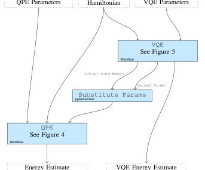 
Fig. 3: Complete Workflow

📷 Fig 4

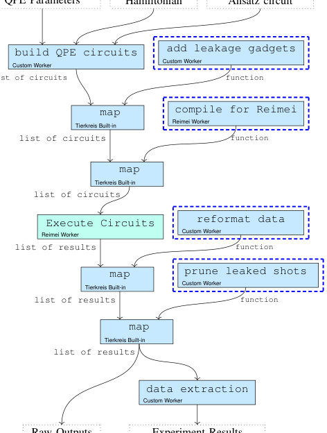 
Fig. 4: QPE Workflow. The dashed boxes indicate sub- workflows which are treated as data, to be used in the higher- order map operation.

📷 Fig 5

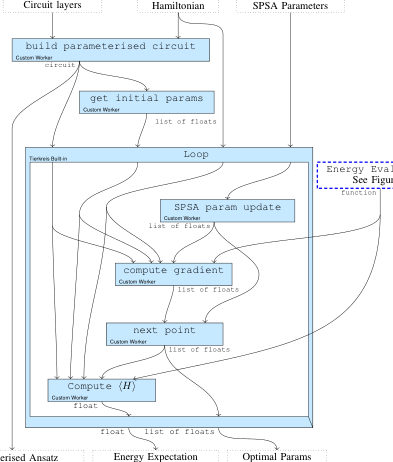 
Fig. 5: VQE Workflow.

**Summary.** This paper presents a comprehensive Quantum-HPC hybrid system integrating supercomputers like Fugaku with multiple quantum processors (Quantinuum Reimei and ibm_kobe). It demonstrates the feasibility of complex, end-to-end workflows, such as calculating molecular excited states and ground state energies, by managing data flow across disparate classical and quantum hardware resources.

**Why it may be interesting.** The focus on orchestrating workloads across different quantum modalities (trapped-ion vs. superconducting) using a standardized workflow layer is crucial for realizing large-scale quantum simulations in chemistry and materials science.

Detailed structure

**Main problem.** Developing and demonstrating a robust Quantum-HPC hybrid workflow management system capable of executing complex quantum algorithms requiring significant classical computation.

**Main result.** The work successfully demonstrates two end-to-end, reusable hybrid workflows integrating classical HPC resources (Fugaku) with multiple quantum computing platforms (Quantinuum Reimei and ibm_kobe).

**Method.** The authors utilize and adapt the Tierkreis workflow management system, modeling workflows as Directed Acyclic Graphs (DAGs) to coordinate tasks across diverse classical and quantum backends.

**Model / system.** The system integrates the Fugaku supercomputer, the trapped-ion QPU Quantinuum Reimei, and the superconducting QPU ibm_kobe. Demonstrations include computing biomolecular excited states and running combined VQE + QPE workflows.

**Key observables.** Ground state energy of a simple system, excited states of a biomolecular system, and workflow execution times across different backends.

**Important parameters / regimes.** VQE/QPE parameters (e.g., $k_{max}=20$, $\lambda = 0.01\pi/J$), shot counts (e.g., 200 to 20,000 shots), and system sizes for molecular calculations.

**Assumptions / limitations.** The scope is limited to the development and demonstration of the workflow management system itself, rather than introducing a novel quantum algorithm or micro benchmark.

**Figures summary.** Figures illustrate the system overview connecting Fugaku, Reimei, and ibm_kobe, and detail the structure of the hybrid workflows for molecular simulation and energy estimation.

**Paper structure.** The paper introduces the Quantum-HPC system architecture, presents two case studies—biomolecular excited states and combined VQE+QPE—to demonstrate the workflow's capability, and concludes by detailing the modularity and reusability of the workflow management layer.

Abstract

We describe the Quantum-HPC hybrid system comprising the supercomputer Fugaku, the QPUs Quantinuum Reimei and ibm_kobe, and the Tierkreis hybrid workflow software. We present two demonstrations of the system at work. In the first, we compute the excited states of a biomolecular system using Fugaku and Reimei (simulator) to handle classical and quantum parts of the workflow respectively. In the second, Fugaku coordinates Reimei and ibm_kobe working together in a combined VQE + QPE workflow to compute the ground state energy of a simple system.

[↑ back to top](#top)

### [Residual Fisher Information in Measurement-Error Uncertainty](http://arxiv.org/abs/2609.31311v1)

**Authors:** Masayuki Ohzeki, Taiga Suzuki  
**Type:** theory · **Category:** other · **PDF:** <https://arxiv.org/pdf/2609.31311v1>  
**Analysis basis:** full PDF text, analyzed in chunks
**Topic relevance:** 🔥 `quantum measurements` **4/5** · `Keldysh / 2PI / non-Gaussian methods` **1/5**

📷 Fig 1

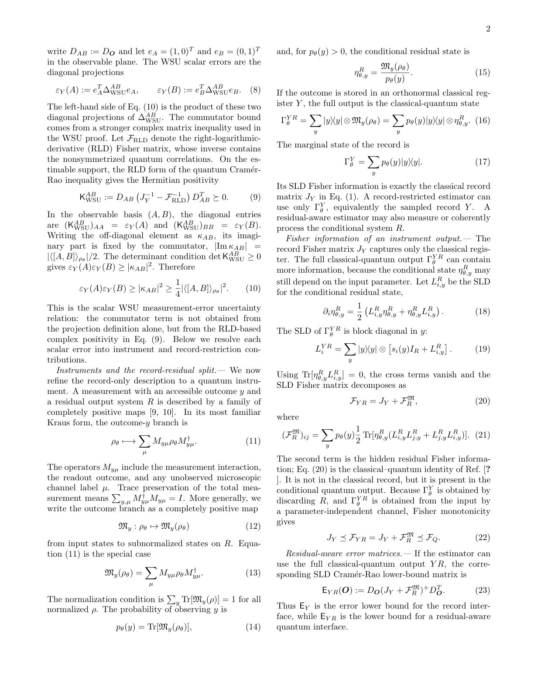 
Low-resolution page preview, page 2

📷 Fig 2

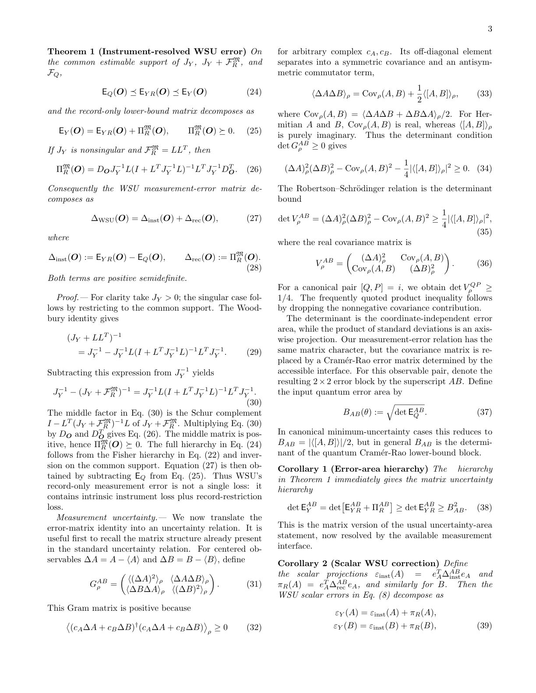 
Low-resolution page preview, page 3

📷 Fig 3

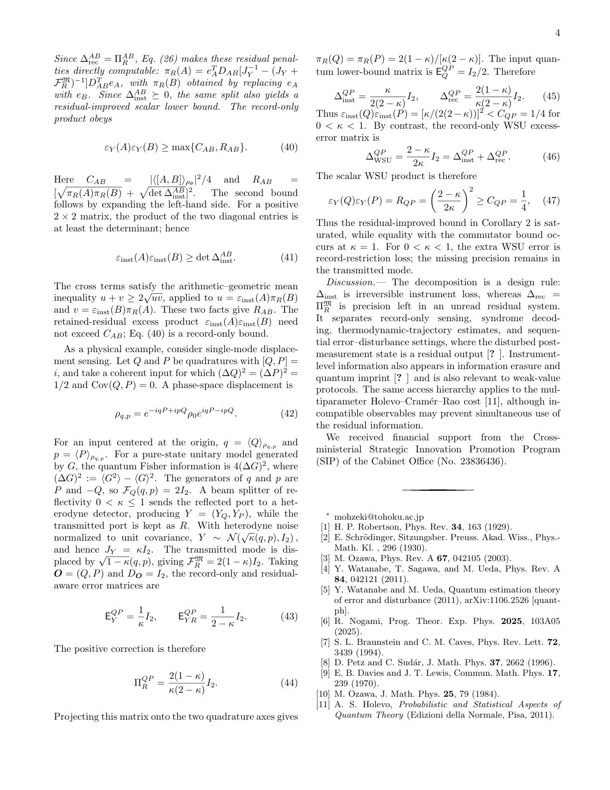 
Low-resolution page preview, page 4

**Summary.** This paper develops a theoretical framework to decompose the total measurement error in quantum estimation into two distinct physical components: intrinsic instrument loss and record-restriction loss. By analyzing the structure of the error matrix, it provides a deeper understanding of how measurement limitations arise from both the physical apparatus and the information retained in unread quantum residuals. This has broad implications for quantum sensing and information theory.

**Why it may be interesting.** This work provides a rigorous, fundamental decomposition of measurement uncertainty in quantum estimation, which has implications for understanding the limits of sensing in open quantum systems and quantum metrology.

Detailed structure

**Main problem.** The paper analyzes the excess estimation error in quantum measurements, specifically decomposing the measurement error uncertainty derived from the Watanabe-Sagawa-Ueda (WSU) formulation.

**Main result.** The total measurement error separates exactly into two positive semi-definite components: intrinsic instrument loss ($\Delta_{inst}$) and record-restriction loss ($\Delta_{rec}$), providing a fundamental decomposition of measurement uncertainty.

**Method.** The analysis uses quantum information theory tools, relating the error area derived from the full classical-quantum output to bounds involving residual quantum states and Fisher information matrices.

**Model / system.** The framework applies to general quantum measurements described by POVMs and quantum instruments, illustrated by an example of single-mode displacement sensing using quadratures (Q and P) via a beam splitter.

**Key observables.** Measurement Error ($\Delta_{WSU}$), Intrinsic Instrument Loss ($\Delta_{inst}$), Record-Restriction Loss ($\Delta_{rec}$), Quantum Error Area ($B_{AB}$), and various error product bounds ($\epsilon_Y(A)\epsilon_Y(B)$).

**Important parameters / regimes.** The reflectivity $\kappa$ of the beam splitter, which controls the magnitude of the residual information.

**Assumptions / limitations.** The analysis assumes the existence of a common estimable support for the relevant Fisher matrices, and the decomposition formulas rely on the non-singularity of the record Fisher matrix $J_Y$ for explicit forms.

**Figures summary.** Not specified in the notes, but the structure implies showing the hierarchy of error determinants and the saturation of the residual-improved bounds in the displacement sensing example.

**Paper structure.** The paper establishes the decomposition theorem for the WSU error matrix, proves the error-area hierarchy relating record-only bounds to the full quantum bound, and then applies this framework to a concrete example (displacement sensing) to demonstrate saturation.

Abstract

Measurement error in the Watanabe-Sagawa-Ueda formulation is the excess estimation error of a classical record over the quantum statistical limit. We show that, at the quantum-instrument level, this excess has an exact decomposition. The record-only error matrix equals a residual-aware error matrix plus a positive Schur-complement term fixed by Fisher information left in the unread post-measurement system. Thus measurement error separates into intrinsic instrument loss and record-restriction loss

[↑ back to top](#top)

### [Emergent frustrated magnetism in strain-patterned graphene](http://arxiv.org/abs/2609.31581v1)

**Authors:** Yu-Chiang Hsieh, Wen-Han Kao, Christophe De Beule, Sheng-Zhu Ho, Ru-Long Gou, Bo-Nian Chen, Kuan-Yu Chou, Kuo-En Chang, Chin-Chia Chang, Ying-Mei Yang, Ching-Hua Kao, Hao-Chien Chiang, Jyun-Lin Chen, Sheng-Chin Ho, Kenji Watanabe, Takashi Taniguchi, Ming-Hao Liu, Ching-Hao Chang, Yi-Chun Chen, Ying-Jer Kao, Tse-Ming Chen  
**Type:** both · **Category:** strongly correlated electrons · **PDF:** <https://arxiv.org/pdf/2609.31581v1>  
**Analysis basis:** full PDF text, analyzed in chunks
**Topic relevance:** 🔥 `analog quantum simulation` **4/5**

📷 Fig 1

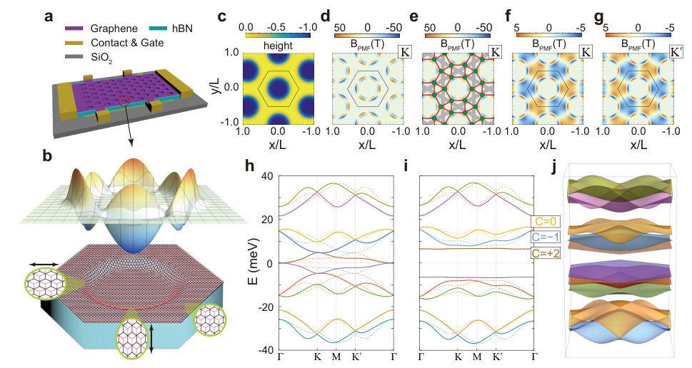 
Figure 1: Pseudo-magnetic field (PMF) superlattice and flat bands engineered in strain-patterned graphene. a, Schematic of strain-patterned graphene devices. Devices are fabricated by transferring graphene onto a lithographically patterned hBN substrate containing a hexagonal array of nanoholes, where the lattice deforms to define a strain superlattice. b, 3D visualization of the PMF landscape from nanohole-induced strain. Radial strain around each nanohole produces a PMF distribution that is maximized when aligned with graphene’s armchair directions and vanishes along zigzag directions. The top panel shows the simulated PMF intensity in the K valley, and the bottom panel illustrates the...

📷 Fig 2

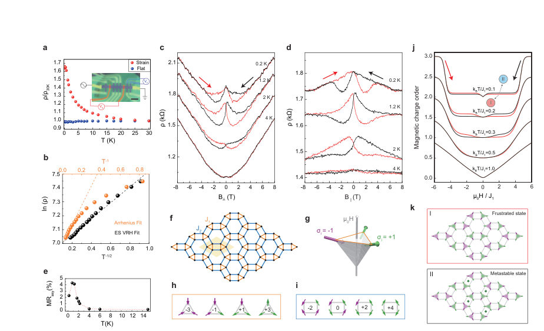 
Figure 2: Emergent strongly correlated frustrated behavior revealed by transport and simulation. a, Normalized resistivity (ρ/ρ30K) as a function of temperature, measured in the same trilayer graphene device from strain-patterned (red dots) and unstrained flat (blue dots) regions. The strain-patterned graphene exhibits a pronounced insulating upturn, whereas the unstrained region displays weakly metallic behavior. Inset: Optical micrograph of the device, with the dashed rectangle indicating the strain-patterned region (scale bar, 5 µm). b, Fits of the strain-patterned region’s resistivity to Arrhenius activation and Efros–Shklovskii variable-range hopping (ES-VRH) models. The good agreement...

📷 Fig 3

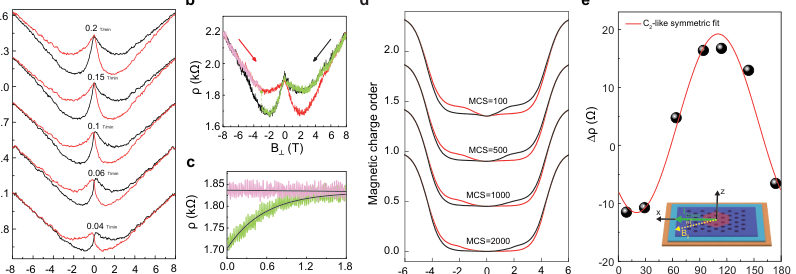 
Figure 3: Dynamic signatures of magnetic frustration in strain-patterned graphene. a, Sweep-rate dependence of magnetic hysteresis at T = 1.2 K, showing non-equilibrium dynamics. b, Relaxation measurements of the magnetoresistivity at 200 mK, measured with a sweep rate of 0.2 T/min. Red and black lines denote the forward and backward field sweeps, respectively. Pink and green lines indicate the field-sweep protocols used to prepare the metastable and frustrated states, respectively, before holding the magnetic field at −3 T. c, Time evolution of the resistivity for the metastable and frustrated states at −3 T, corresponding to the conditions shown in (b). The metastable state remains highly...

📷 Fig 4

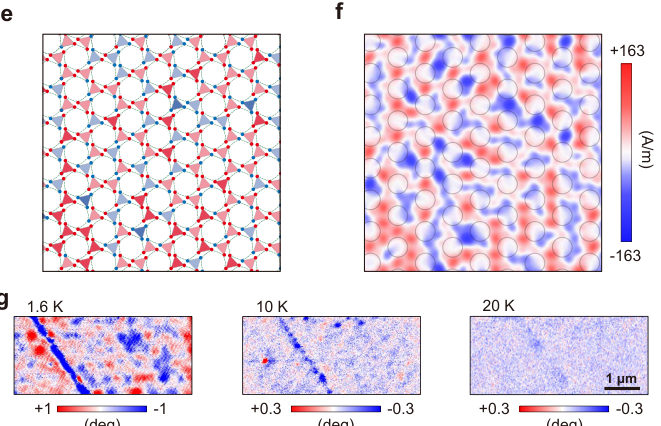 
Figure 4: Imaging the geometrically frustrated magnetism. a, Atomic force microscopy (AFM) topography of a strain-patterned graphene device. b, Kelvin probe force microscopy (KPFM) map of the surface potential from the region marked by the red hexagon in (a). Higher surface potential areas coincide with strong PMFs, consistent with the strain-induced deformation potential. c, Schematic illustration of the PMF configuration, forming an expanded honeycomb (distorted ruby) superlattice. The graphene zigzag axis is rotated by 7◦relative to the x-axis, with the orientation determined using the long-edge alignment method for this device. Blue and orange dots mark PMF maxima with opposite...

**Summary.** This paper reports the realization of emergent frustrated magnetism in non-magnetic graphene by applying lithographically controlled strain patterns. The strain creates a pseudo-magnetic field that induces strongly correlated electronic states, leading to magnetic behavior analogous to spin ice. This establishes strain engineering as a versatile, scalable method for creating programmable quantum matter.

**Why it may be interesting.** The work provides a concrete, tunable solid-state platform (graphene) to engineer complex quantum magnetic interactions, which is highly relevant for simulating exotic quantum phases without relying on rare magnetic elements.

Detailed structure

**Main problem.** The research addresses the fundamental challenge of realizing and studying emergent frustrated magnetism within an intrinsically non-magnetic material.

**Main result.** The authors demonstrate that lithographically patterned strain in graphene can induce correlated electronic states exhibiting robust, emergent frustrated magnetism, establishing a scalable platform for programmable quantum matter.

**Method.** The study combines advanced experimental techniques, including transport measurements and cryogenic magnetic force microscopy, with theoretical modeling using spin-ice-like effective Hamiltonians and Monte Carlo simulations.

**Model / system.** The physical system is graphene patterned into a superlattice via strain engineering, which generates a pseudo-magnetic field (PMF). This PMF induces flat electronic bands and strong electron correlations, leading to magnetic frustration analogous to spin ice.

**Key observables.** Anisotropic magnetic hysteresis, slow relaxation dynamics, insulating behavior characterized by Efros–Shklovskii variable-range hopping (ES-VRH), and spatially complex magnetic textures observed via MFM.

**Important parameters / regimes.** The effective magnetic moment ($\mu_{eff} \approx 9.0 \mu_B$), the critical magnetic fields ($H_{c,1}, H_{c,2}$) governing charge ordering phases, and the bandwidth of the induced flat bands ($< 6$ meV).

**Assumptions / limitations.** The primary assumption is that the strain patterning is perfectly programmable via lithography, and the magnetic response can be effectively modeled using spin-ice-like constraints derived from the PMF landscape.

**Figures summary.** Figures illustrate the device structure and PMF profiles, temperature-dependent resistivity showing insulating behavior, magnetotransport hysteresis loops, and MFM images confirming field-dependent magnetic textures.

**Paper structure.** The paper progresses from establishing the physical platform (strain-patterned graphene) to characterizing the electronic state (flat bands, correlated regime) via transport measurements, and finally modeling the emergent magnetic behavior using spin-ice analogies and simulating field-dependent charge ordering.

Abstract

Geometrically frustrated magnetism conventionally arises from pre-existing magnetic moments on lattices whose geometry prevents their interactions from being simultaneously satisfied, giving rise to highly degenerate states and rich collective behavior. Creating such frustration in an intrinsically non-magnetic material presents a fundamentally different challenge, requiring both the magnetism and the competing interactions to emerge from correlated electrons. Here we show that this can be realized in graphene through lithographically programmable strain engineering. Patterning strain and the associated pseudo-magnetic field (PMF) into superlattices creates a correlated electronic system with flat bands and strong interactions. Transport measurements reveal interaction-driven insulating behavior, anisotropic magnetic hysteresis, and slow relaxation dynamics reminiscent of spin freezing, qualitatively captured by Monte Carlo simulations of competing magnetic moments on the PMF-defined ruby superlattice. Cryogenic magnetic force microscopy further reveals magnetic textures associated with the PMF landscape. These observations demonstrate frustrated magnetism emerging from correlated electrons in otherwise non-magnetic graphene. Our results establish lithographic strain engineering as a general and scalable route to flat bands and correlated states in van der Waals materials, providing a versatile platform for programmable quantum matter.

[↑ back to top](#top)

### [A Mechanism for the Rényi Hierarchy of Decoherence-Induced Phase Transitions](http://arxiv.org/abs/2609.30377v1)

**Authors:** Zhou Yang, Yuri D. Lensky, Chao-Ming Jian  
**Type:** theory · **Category:** statistical mechanics · **PDF:** <https://arxiv.org/pdf/2609.30377v1>  
**Analysis basis:** full PDF text, analyzed in chunks
**Topic relevance:** `correlated / nonlocal dissipation` **3/5** · `driven-dissipative phase transition` **3/5** · `non-equilibrium universality` **3/5** · `Keldysh / 2PI / non-Gaussian methods` **2/5** · `analog quantum simulation` **2/5** · `methods for driven-dissipative` **2/5** · `quantum measurements` **1/5**

📷 Fig 1

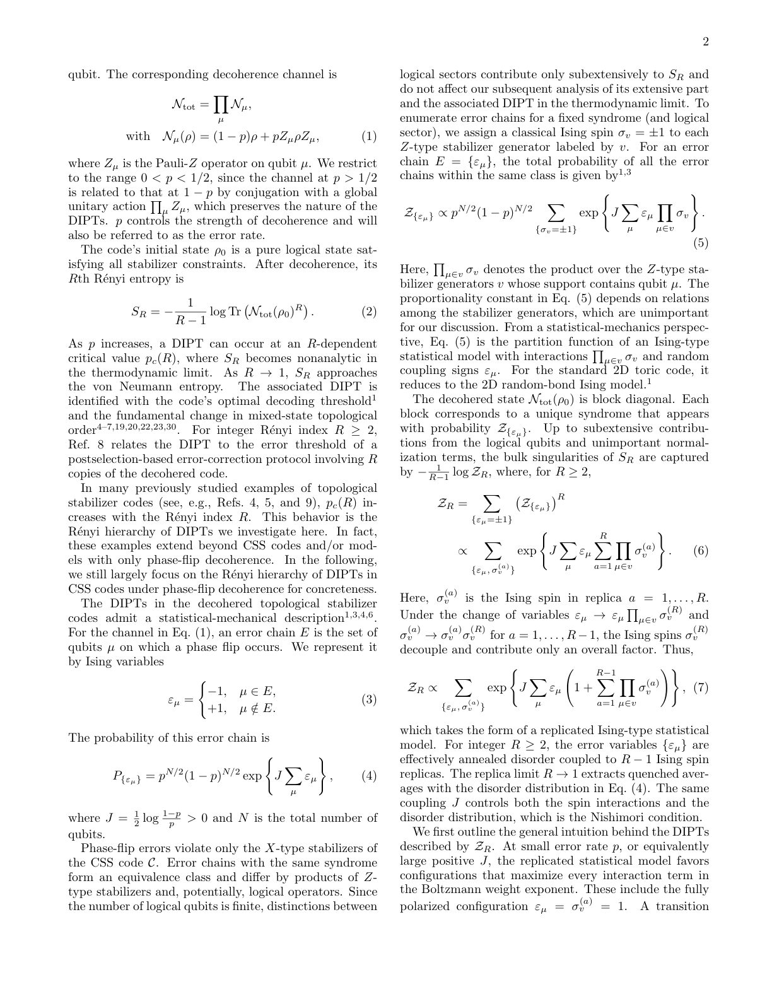 
Low-resolution page preview, page 2

📷 Fig 2

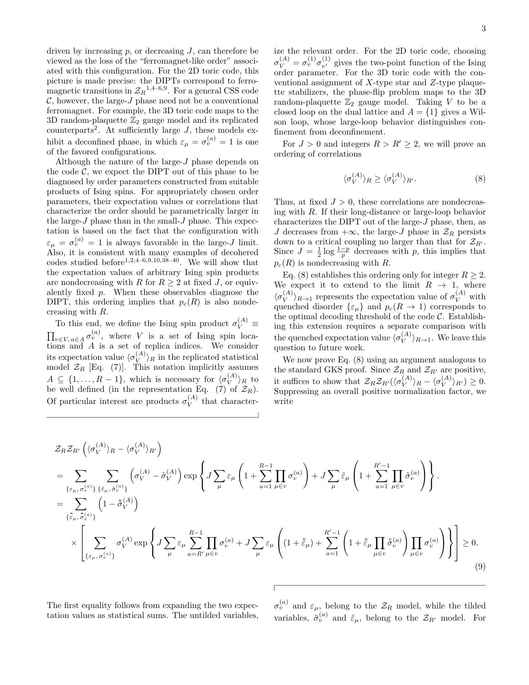 
Low-resolution page preview, page 3

📷 Fig 3

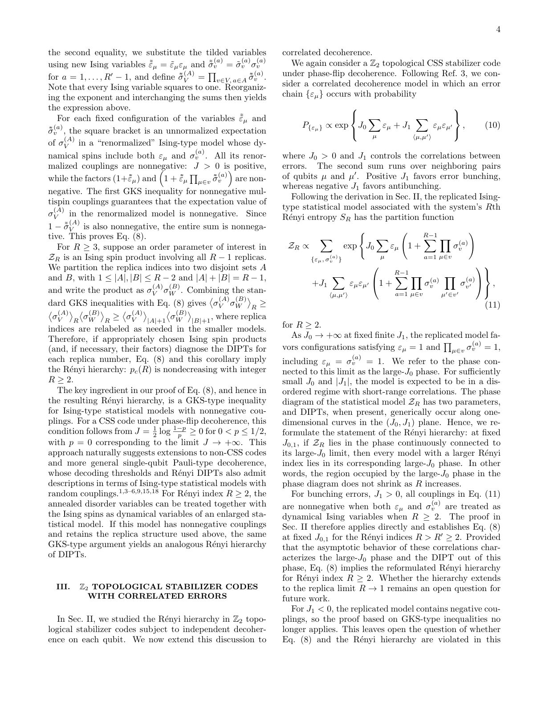 
Low-resolution page preview, page 4

📷 Fig 4

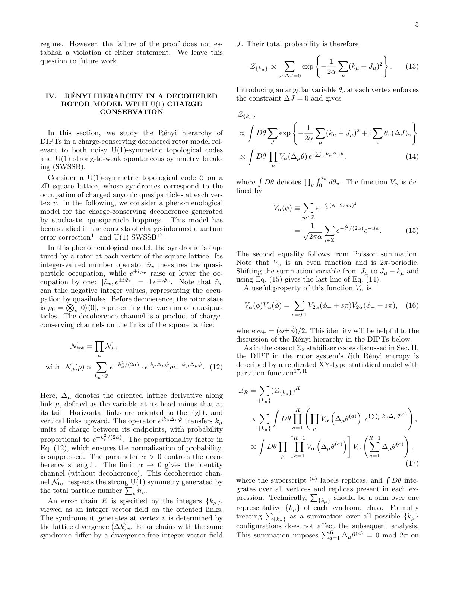 
Low-resolution page preview, page 5

📷 Fig 5

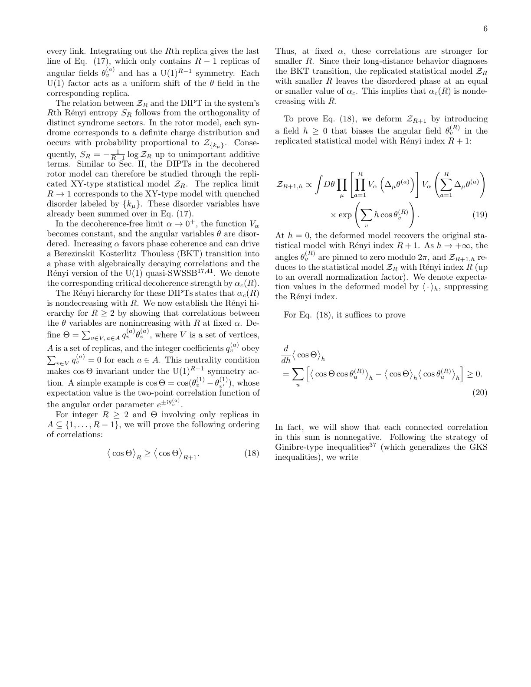 
Low-resolution page preview, page 6

**Summary.** This theoretical paper establishes a general mechanism for the Rényi hierarchy of Decoherence-Induced Phase Transitions (DIPTs) by analyzing correlation inequalities in replicated statistical models. Using models like topological codes and rotor systems, the authors prove that the critical decoherence strength increases monotonically with the Rényi index $R$ for $R \ge 2$. This provides a deep mathematical understanding of how entanglement diagnostics reveal the structure of quantum phase boundaries under noise.

**Why it may be interesting.** This work provides a powerful, general mathematical tool—the correlation inequality approach—to predict and understand the structure of quantum phase transitions driven by environmental coupling, which is crucial for understanding quantum error correction and open quantum systems.

Detailed structure

**Main problem.** The paper aims to identify a general, underlying mechanism responsible for the Rényi hierarchy observed in Decoherence-Induced Phase Transitions (DIPTs). This hierarchy dictates that the critical decoherence strength increases monotonically with the Rényi index $R$ for $R \ge 2$.

**Main result.** A general mechanism is established using correlation inequalities within replicated statistical models, proving that the critical decoherence strength $p_c(R)$ is non-decreasing with $R$ for $R \ge 2$ in various models.

**Method.** The analysis involves mapping the decohered quantum system to a replicated statistical model (e.g., Ising-type model) and proving the ordering of expectation values of spin products, $\langle \sigma(A)_V 
angle_R \geq \langle \sigma(A)_V 
angle_{R'}$, which serves as the core diagnostic.

**Model / system.** The study applies to $Z_2$ topological stabilizer codes subjected to phase-flip decoherence, and a decohered rotor model exhibiting strong U(1) symmetry. The physics is analyzed via replicated partition functions $Z_R$.

**Key observables.** Rényi entropy $S_R$, expectation values of Ising spin products $\langle \sigma(A)_V 
angle_R$, and the critical decoherence strength $p_c(R)$ or $\alpha_c(R)$.

**Important parameters / regimes.** Rényi index $R$ (integer, $R \ge 2$), decoherence strength $p$ or $\alpha$, and coupling constants $J$ or $J_0, J_1$.

**Assumptions / limitations.** The primary mathematical tool relies on establishing correlation inequalities analogous to GKS inequalities, which are proven for integer $R \ge 2$. The extension to the $R 	o 1$ (von Neumann) limit remains an open question.

**Figures summary.** The notes do not provide a summary of figures, but the analysis focuses on deriving correlation inequalities (Eq. (8) and Eq. (18)) that establish the required ordering.

**Paper structure.** The paper systematically develops the mechanism by first analyzing $Z_2$ codes using Ising spin products, then extending the proof to correlated decoherence, and finally applying the framework to the U(1)-symmetric decohered rotor model.

Abstract

Decoherence-induced phase transitions (DIPTs) are associated with singular changes in a quantum system's entanglement structure as the decoherence strength varies. In many cases, their critical strengths depend monotonically on the Rényi index of the entanglement diagnostic, forming a Rényi hierarchy. We identify a general mechanism for this hierarchy based on correlation inequalities in replicated statistical models that describe these DIPTs. We demonstrate it in $\mathbb{Z}_2$ topological stabilizer codes subject to independent phase-flip decoherence on each qubit and in a decohered rotor model with strong $\text{U}(1)$ symmetry. When the relevant correlations diagnose the DIPTs, these inequalities imply that the critical decoherence strength is nondecreasing with integer Rényi index $R\geq2$. We show that this mechanism also applies to a class of models with correlated decoherence.

[↑ back to top](#top)

### [Chiral Transfer and Entanglement Generation of Even-Parity Bell States with Engineered Two-Photon Loss](http://arxiv.org/abs/2609.31239v1)

**Authors:** Lin Xiao, Jian Li, Mu Zhou, Bin Wei, Qing-Xu Li, Jia-Ji Zhu  
**Type:** theory · **Category:** quantum information and computing · **PDF:** <https://arxiv.org/pdf/2609.31239v1>  
**Analysis basis:** full PDF text, analyzed in chunks
**Topic relevance:** `correlated / nonlocal dissipation` **3/5** · `driven-dissipative phase transition` **3/5** · `methods for driven-dissipative` **3/5** · `Keldysh / 2PI / non-Gaussian methods` **2/5** · `analog quantum simulation` **2/5** · `non-equilibrium universality` **2/5** · `quantum measurements` **1/5**

📷 Fig 1

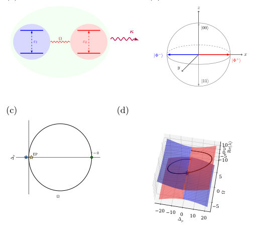 
Fig. 1. (a) A system composed of two interacting qubits with two-photon dissipation into the environment at rate κ. (b) Bloch-sphere representation of the even-parity subspace spanned by |11⟩and |00⟩, where z = |11⟩⟨11| −|00⟩⟨00|. The target Bell states |Φ±⟩are marked on the sphere. (c) Clockwise (CW) and counterclockwise (CCW) evolution tra- jectories of Ω(t) and ∆p(t) in the parameter space (Ω, ∆p). The asterisk marks the second-order exceptional point (EP) of Heff even. (d) Riemann surfaces corresponding to the eigenval- ues of Heff even. The branch with stronger decay (more negative imaginary part) is shown in red, and the black trajectories correspond to the parameter loop (Ω(t), ∆p(t)).

📷 Fig 2

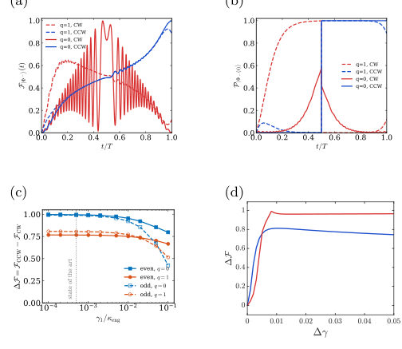 
Fig. 2. (a) Time evolution of the fidelity F|Φ−⟩(t) for a pro- tocol that starts from |Φ+⟩and targets |Φ−⟩. The red and blue curves correspond to CW and CCW encircling, respec- tively. (b) Projection probability of the evolving state onto the instantaneous eigenstate |Φ−(t)⟩. Panels (c) and (d) de- note robustness of the chiral effect ∆F = FCCW −FCW. (c) ∆F when the present even-parity scheme (solid lines, filled markers) and the odd-parity scheme of Ref. [33] (dashed lines, open markers) are subjected to the same parasitic pertur- bation: an unmonitored local single-photon loss of rate γ1 on each qubit, expressed in units of the engineered dissipa- tion scale κeng of each scheme (κeng = κ...

📷 Fig 3

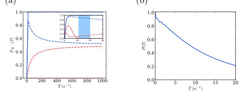 
Fig. 3. (a) Final-state fidelity F|Φ−⟩(T) as a function of the driving period T. The inset shows a magnified view of the range T ∈[0, 30], and the light-blue shaded region highlights the intermediate window T ∈[11, 20]κ−1. (b) Post-selection success probability P(T) = Tr[ρ(T)] as a function of the pe- riod T for q = 0. The other parameters are the same as in Fig. 2.

📷 Fig 4

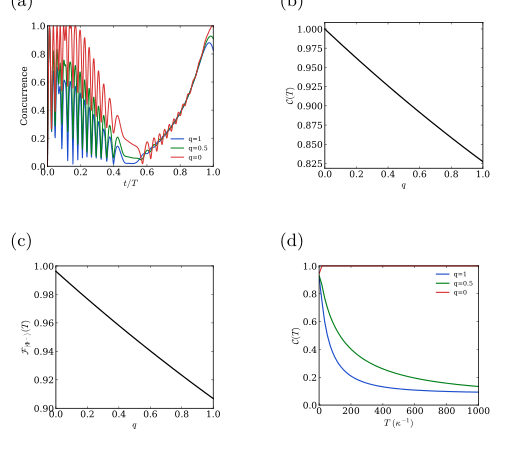 
Fig. 4. (a) Time evolution of the concurrence C as a function of t/T for CCW loops with q = 0, 0.5, and 1. (b) Final concurrence C(T) as a function of the recycling parameter q for the CCW loop. (c) Final fidelity F|Φ−⟩(T) as a function of q for the CCW loop. (d) Final concurrence C(T) as a function of the driving period T for the CCW loop. The initial state is |00⟩in all cases. For panels (a)–(c), Tκ = 11. Other parameters are the same as in Fig. 2.

📷 Fig 5

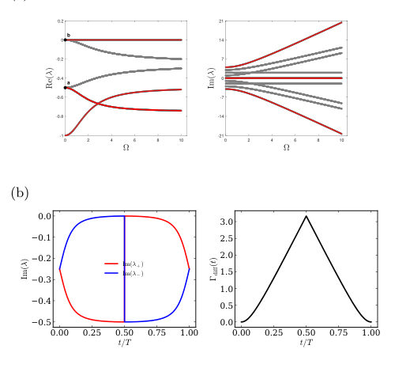 
Fig. 5. (a) Comparison between the spectrum of the full Li- ouvillian superoperator L and that of the reduced Liouvil- lian L1 restricted to the even-parity subspace. Gray thick lines: all 16 eigenvalues of L (left: real parts; right: imag- inary parts). Red thin lines: the 4 eigenvalues of L1. The red spectrum overlaps with a subset of the gray spectrum, and no avoided level repulsion appears at the marked cross- ings (e.g., a, b). Parameters: κ = 1, ϕ = 0, ∆1 = 3κ, ∆2 = 1κ. (b) Left: evolution of the imaginary parts Im(λ±) of the eigenvalues of the effective Hamiltonian Heff along the CCW loop. The shaded regions indicate the instantaneous low-loss branches. Right: evolution of the...

**Summary.** This paper details a method to control even-parity Bell states in a two-qubit system using engineered two-photon loss. By adiabatically encircling an exceptional point, the system exhibits chiral state transfer between $|\Phi^+
angle$ and $|\Phi^-
angle$. Crucially, the same engineered process simultaneously generates strong even-parity entanglement, unifying two key quantum control mechanisms.

**Why it may be interesting.** This work provides a concrete, engineered platform demonstrating how non-Hermitian physics (EPs) can be harnessed to perform fundamental quantum information tasks (state transfer and entanglement) in a robust, dissipative manner.

Detailed structure

**Main problem.** The research aims to extend chiral state transfer and dissipative entanglement generation protocols from odd-parity to even-parity Bell states in a two-qubit system.

**Main result.** The authors demonstrate that adiabatically encircling a second-order exceptional point induces chiral transfer between $|\Phi^+
angle$ and $|\Phi^-
angle$, and that the same loop can deterministically generate strong even-parity entanglement from a separable state.

**Method.** The dynamics are analyzed using a hybrid Liouvillian description, which interpolates between conditional no-jump dynamics and standard Lindblad evolution, coupled with the theoretical framework of non-Hermitian physics.

**Model / system.** The system is a two-qubit platform driven by coherent two-photon processes and engineered two-photon loss. The dynamics are confined to the even-parity subspace, which is structurally protected by parity symmetry.

**Key observables.** Bell-state fidelity ($F_{|\Phi^\pm
angle}$), Concurrence ($C(
ho)$), and the chiral contrast ($\Delta F$).

**Important parameters / regimes.** The recycling parameter $q \in [0, 1]$, the driving period $T$, and the engineered two-photon loss rate $\kappa$.

**Assumptions / limitations.** The analysis relies on the Markov approximation, and the structural protection of the even-parity subspace is key to robustness.

**Figures summary.** Figures illustrate the Bloch-sphere representation of the even-parity subspace, the parameter loops used to encircle the EP, and the time evolution of fidelity and concurrence as a function of the loop parameters.

**Paper structure.** The paper first establishes the physical model and the effective Hamiltonian in the even-parity subspace. It then introduces the hybrid Liouvillian dynamics to analyze the interplay between chiral transfer (via EP encirclement) and entanglement generation, comparing the conditional ($q=0$) and unconditional ($q=1$) limits.

Abstract

We investigate chiral transfer and dissipative generation of even-parity Bell states in a two-qubit system with coherent two-photon driving and engineered two-photon loss. We find that adiabatic encirclement of a second-order exceptional point induces direction-dependent transfer between the Bell states $|Φ^+\rangle$ and $|Φ^-\rangle$, governed by a time-integrated low-loss branch-selection mechanism. We develop a hybrid-Liouvillian description with a control parameter $q$ that interpolates between conditional no-jump dynamics and unconditional Lindblad evolution, and use it to assess how exceptional-point-induced chirality survives in the presence of quantum jumps. When the same parameter loop is initialized in the separable state $|00\rangle$, it directly generates strong even-parity entanglement. Together, these results extend dissipative Bell-state control beyond the single-excitation manifold. They further demonstrate that exceptional-point-based protocols can unify chiral state transfer and entanglement generation within a single engineered two-photon platform.

[↑ back to top](#top)

### [High-gain vortex transfer via activated forbidden transitions in molecular magnets](http://arxiv.org/abs/2609.31134v1)

**Authors:** Fan Meng, Hao Zhu, Xin-Yao Huang, Guo-Feng Zhang  
**Type:** theory · **Category:** other · **PDF:** <https://arxiv.org/pdf/2609.31134v1>  
**Analysis basis:** full PDF text, analyzed in chunks
**Topic relevance:** `interference shaping light` **3/5** · `Keldysh / 2PI / non-Gaussian methods` **2/5** · `methods for driven-dissipative` **2/5** · `analog quantum simulation` **1/5** · `correlated / nonlocal dissipation` **1/5** · `driven-dissipative phase transition` **1/5** · `quantum measurements` **1/5**

📷 Fig 1

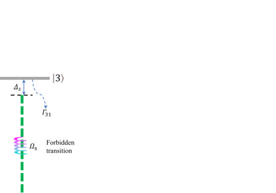 
Fig. 1. A three-level ladder-type configuration with broken symmetry. The weak probe field p 

📷 Fig 2

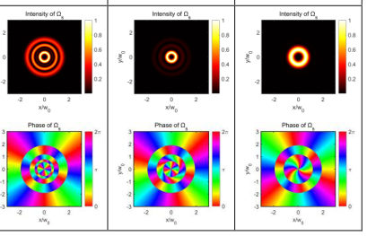 
Fig. 2(a). When the probe field ( ) 0 p  is prepared in the 3 2 LG vortex mode, the intensity and

📷 Fig 3

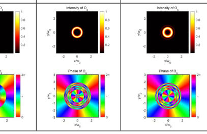 
Fig. 2(b). When the probe field ( ) 0 p  is prepared in the 3 2 LG vortex mode, the intensity and

📷 Fig 4

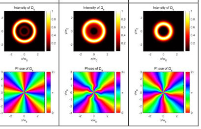 
Fig. 3(a). When the probe field ( ) 0 p  and the control field c  are prepared in the vortex modes

📷 Fig 5

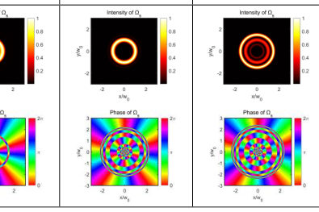 
Fig. 3(b). When the probe field ( ) 0 p  and the control field c  are prepared in the vortex modes

**Summary.** This work demonstrates high-gain vortex light transfer in molecular magnets by exploiting symmetry-breaking mechanisms to activate forbidden optical transitions. The theoretical analysis shows that the Autler-Townes splitting effect surpasses EIT in enhancing the signal gain, challenging the universal dominance of EIT in nonlinear optics. The results suggest potential applications for quantum information processing in solid-state quantum systems.

**Why it may be interesting.** It provides a concrete, solid-state platform (molecular magnets) to study fundamental quantum optics phenomena like forbidden transition enhancement, offering a novel comparison between EIT and ATS in a highly controllable solid-state environment.

Detailed structure

**Main problem.** The paper aims to achieve high-gain vortex light transfer in molecular magnets by enabling optical transitions that are otherwise forbidden by selection rules.

**Main result.** The Autler-Townes splitting (ATS) effect was shown to yield a significantly larger signal field gain than Electromagnetically Induced Transparency (EIT) in this specific nonlinear three-wave mixing process.

**Method.** The study employs a theoretical analysis using a three-level ladder-type configuration and solving the Maxwell-Bloch equations under perturbative approximations.

**Model / system.** The physical system is the molecular magnet $[	ext{Cr}(	ext{C}_3	ext{S}_5)_3]^{3-}$, modeled by a spin Hamiltonian. The dynamics are analyzed using a three-level ladder configuration, where symmetry breaking allows nominally forbidden transitions.

**Key observables.** Intensity and phase of the generated vortex signal field; the topological charges of the incident and generated fields.

**Important parameters / regimes.** Detuning of the probe field, strength of the control field, and the ratio of signal gain between ATS and EIT.

**Assumptions / limitations.** The analysis assumes the absence of nuclear spins to suppress decoherence and relies on the perturbative approximation for weak probe and signal fields.

**Figures summary.** Figure 1 illustrates the three-level ladder configuration with broken symmetry, showing the nonlinear three-wave mixing process generating a signal field.

**Paper structure.** The paper establishes the physical model using a three-level ladder system, derives the coupled equations for field propagation, calculates the field amplitudes using steady-state solutions, and compares the gain mechanisms (ATS vs. EIT).

Abstract

Vortex light has garnered considerable interest in recent years owing to its distinctive properties and broad application potential. In this paper, we employ a conventional three-level ladder-type configuration in molecular magnets to realize high-gain vortex light transfer by enabling otherwise forbidden transitions. We demonstrate that the intensity and phase of the generated vortex signal field are governed by the detuning of the probe field and the strength of the control field, and that the topological charges of the incident and generated fields obey a well-defined algebraic relation during the vortex transfer process. Furthermore, we show that, in molecular magnets, the Autler-Townes splitting (ATS) effect yields a larger vortex signal field gain than electromagnetically induced transparency (EIT) over a broad parameter range in nonlinear three-wave mixing. This result suggests that the widely accepted view of EIT as the dominant enhancer of nonlinear optical effects may not hold universally. In addition, we revisit previous studies and re-examine the characterization of vortex beam transfer efficiency, emphasizing the need for a more careful interpretation in multi-beam interaction systems. Leveraging the long spin coherence and microwave transitions of molecular magnets, our results may enable quantum information transfer, storage, computing, and radar imaging in solid-state platforms.

[↑ back to top](#top)

### [Frequency- and Power-Dependent Optical Response of a Cesium Rydberg Microwave Receiver](http://arxiv.org/abs/2609.31241v1)

**Authors:** Jure Pirman, Ema Stopar, Katja Gosar, Erik Zupanič, Peter Jeglič  
**Type:** experiment · **Category:** other · **PDF:** <https://arxiv.org/pdf/2609.31241v1>  
**Analysis basis:** full PDF text, analyzed in chunks
**Topic relevance:** `quantum optics experiment` **3/5** · `analog quantum simulation` **2/5** · `interference shaping light` **2/5** · `Rydberg arrays` **1/5** · `driven-dissipative phase transition` **1/5** · `quantum measurements` **1/5**

📷 Fig 1

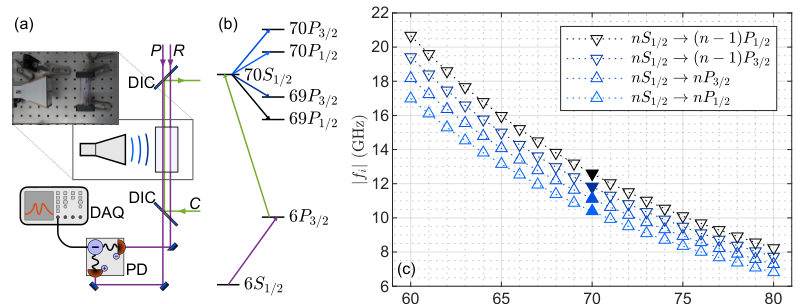 
Figure 1: (a) Schematic of the experiment. Probe beam (P) and reference beam (R) propagate through the cesium vapor cell. The probe beam is overlayed with the counter-propagating coupling (c) beam. Probe and coupling beams are combined and separated using dichroic mirrors (DIC). An RF horn antenna is used to generate microwave fields. The probe and reference beams are separated using D-shaped mirror and is guided onto the differential photodetector (PD), where the reference signal is subtracted from the probe. The electric signal is then acquired using a digital acquisition board (DAQ). (b) Energy level diagram used throughout the experiment. (c) Transition frequencies for different...

📷 Fig 2

 
Figure 2: Normalized EIT signals for different RF powers, at RF frequencies (a) 11.062 GHz, (b) 11.107 GHz, and (c) 11.152 GHz. These correspond to detunings δRF of −57, −12, and +33 MHz from the experimentally determined transition frequency f0 = 11.119 GHz (theoretical value f0 = 11.124 GHz, per Table (1).

📷 Fig 3

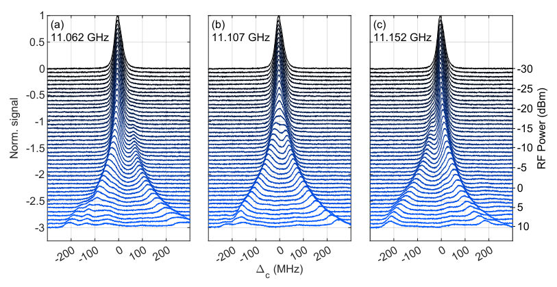 
Fig. 4(a) clearly shows spectral features associated with four nearby Rydberg–Rydberg tran- sitions. Their calculated frequencies are marked by horizontal dash-dotted lines and are listed in Table 1. The position of the smaller peak follows the large-detuning behavior predicted by Eq. (4). The direction or sign of the slope corresponds to the sign of the transition frequency listed in Table 1. The expected high-detuning positions of the smaller peaks are indicated by dashed lines. Additional weaker features can be attributed to degenerate two-photon RF resonances for 70S1/2 →69S1/2 and 70S1/2 →71S1/2 transitions. Here two microwave photons are absorbed simultaneously and therefore excite a...

📷 Fig 4

 
Fig. 5(a) shows the transmission signal as a function of RF frequency and applied RF power for zero coupling-laser detuning. Spectral features associated with the same four Rydberg–Rydberg transitions can again be observed, together with the aforementioned degenerate two-photon RF resonance. The white arrow marks the RF frequencies at which vertical cuts through the map

📷 Fig 5

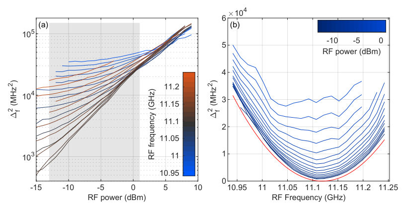 
Figure 3: Square of frequency difference ∆2 f between largest peaks observed in the EIT signal for different RF powers and frequencies. Frequencies are chosen near the 70S1/2 →70P3/2 transition. (a) depicts the dependence on the RF power. At high RF powers or low detunings from resonance ∆f has a power law scaling. (b) shows the dependence of splitting ∆f as a function of detuning from resonance. Red line shows the limit value where the RF power approaches 0. Increasing the RF power shifts the ∆2 f parabola to higher values without modifying the general shape.

**Summary.** This paper experimentally characterizes a cesium vapor cell acting as a Rydberg microwave receiver using Electromagnetically Induced Transparency (EIT). By measuring the optical response across varying microwave frequencies and powers, the authors map out the system's frequency- and power-dependent behavior. This demonstrates the feasibility of using Rydberg atoms for high-sensitivity radio frequency sensing and metrology.

**Why it may be interesting.** This work provides a concrete, measurable platform for studying nonlinear quantum optics effects (EIT) driven by microwave fields, offering insights into how external fields modify atomic energy level couplings in Rydberg systems.

Detailed structure

**Main problem.** To experimentally investigate the frequency- and power-dependent optical response of a room-temperature cesium vapor cell used as a Rydberg microwave receiver.

**Main result.** The experiment successfully characterized the system's response across various RF frequencies and power levels, resolving multiple Rydberg-Rydberg transitions and demonstrating its potential as a high-sensitivity RF sensor.

**Method.** The study measures probe transmission through the vapor cell while sweeping the microwave frequency and applied RF power, analyzing the resulting Electromagnetically Induced Transparency (EIT) spectra.

**Model / system.** The system utilizes Cesium atoms in a Rydberg state within an EIT configuration. The microwave field couples the $70S_{1/2}$ state to nearby P-states, and the response is analyzed using a driven two-level system model.

**Key observables.** EIT spectra, peak separation ($\Delta_f$), midpoint power ($P_0$), and transition frequency ($f_0$).

**Important parameters / regimes.** RF frequencies (9 to 13.5 GHz), RF power (40 dB range), and coupling laser detuning ($\Delta_c$).

**Assumptions / limitations.** The analysis relies on the two-level model for microwave coupling, and the measurements are performed without active magnetic-field compensation.

**Figures summary.** Figures show normalized EIT signals at different RF powers across varying frequencies, and plots detail the dependence of the peak splitting ($\Delta_f$) on both RF power and detuning.

**Paper structure.** The paper details the experimental setup, presents measurements of the EIT spectra across a wide parameter space, analyzes the resulting spectral splittings in different power regimes, and characterizes the power-dependent response using sigmoidal fitting.

Abstract

We show experimentally obtained frequency- and power-dependent optical response of a room-temperature cesium vapor cell used as a Rydberg microwave receiver based on electromagnetically induced transparency. An applied microwave field couples the ${70S_{1/2}}$ Rydberg state to the nearby ${70P_{1/2}}$, ${70P_{3/2}}$, ${69P_{1/2}}$, and ${69P_{3/2}}$ states, modifying the probe-transmission spectrum. Probe transmission is recorded over a 800 MHz range of coupling laser detunings. These EIT spectra are measured for RF frequencies from 9 to 13.5 GHz and over a 40 dB range of RF power. We analyze the RF induced splittings in the recorded EIT spectra. We observe both limiting cases, where the EIT peak separation is either dominated by the RF detuning or by the RF power. At higher powers we are also able to observe complex features due to coupling of multiple nearby Rydberg states. We further analyze the probe-transmission signal at zero coupling-laser detuning. Sigmoidal fits to the power-response curves are used to determine the midpoint power and the 10-90% transition interval as functions of RF frequency.

[↑ back to top](#top)

### [A Novel $q$-Derivative Framework with Applications to $q$-Deformed Thermodynamics and Leakage Suppression in Superconducting Qubits](http://arxiv.org/abs/2609.30632v1)

**Authors:** André A. A. Marinho, Gisele B. Freitas, Clovis A. C. Filho  
**Type:** theory · **Category:** quantum information and computing · **PDF:** <https://arxiv.org/pdf/2609.30632v1>  
**Analysis basis:** full PDF text, analyzed in chunks
**Topic relevance:** `QC/QI experiment` **3/5** · `Keldysh / 2PI / non-Gaussian methods` **1/5** · `correlated / nonlocal dissipation` **1/5** · `driven-dissipative phase transition` **1/5** · `methods for driven-dissipative` **1/5** · `quantum measurements` **1/5**

📷 Fig 1

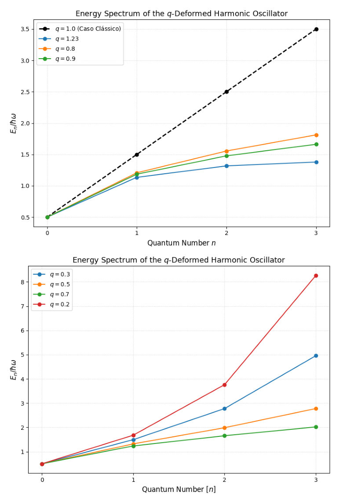 
Figure 1. Relative energy levels En/ℏω as a function of the quantum number n for different values

📷 Fig 2

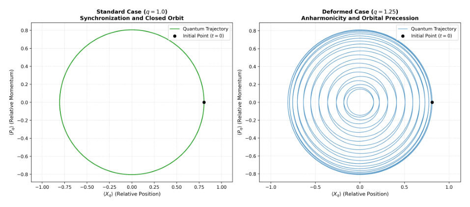 
Figure 2. Time evolution of the expectation value of the annihilation operator in phase space for

📷 Fig 3

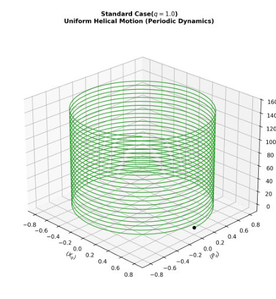 
Figure 3. Trajectory in phase space for d = 3.

**Summary.** This paper introduces a novel q-derivative framework to study physical systems under algebraic deformation. It applies this theory to derive corrections for superconducting qubits, offering a robust method to suppress computational leakage during fast quantum gates. Furthermore, it demonstrates the framework's utility in consistently describing q-deformed thermodynamic properties.

**Why it may be interesting.** It bridges abstract mathematical structures (q-calculus) with concrete, cutting-edge hardware challenges (superconducting qubit control), providing a generalized theoretical tool for error mitigation.

Detailed structure

**Main problem.** The paper develops a novel q-derivative framework to model physical systems, specifically addressing q-deformed thermodynamics and suppressing computational leakage in superconducting qubits.

**Main result.** The framework successfully derives analytical pulse-shaping corrections for superconducting qubits, generalizing the DRAG technique to suppress leakage, while also showing that q-deformation induces intrinsic anharmonicity in quantum oscillator spectra.

**Method.** The authors utilize a novel q-derivative operator built from Jackson's q-number formulation and apply it to analyze q-deformed Heisenberg algebras and superconducting qubit Hamiltonians.

**Model / system.** The primary physical platform is superconducting transmon qubits, modeled in a three-level subspace. The theoretical framework involves q-deformed algebras, q-Fock spaces, and the application of the Biedenharn-Macfarlane realization.

**Key observables.** Leakage suppression fidelity ($F > 99.99\%$), $q$-deformed energy spectrum ($E_n$), internal energy ($U_q$), and specific heat ($C_V(q)$).

**Important parameters / regimes.** The deformation parameter $q$, the anharmonicity parameter $\delta_q$, and the gate time $T_{	ext{gate}}$ are crucial parameters.

**Assumptions / limitations.** The analysis assumes the validity of the q-derivative framework to maintain structural consistency across different physical regimes, and it models the qubit dynamics within a three-level subspace.

**Figures summary.** Not specified, but the notes reference equations detailing the q-deformed Hamiltonian, the leakage condition, and the pulse-shaping cancellation condition.

**Paper structure.** The paper introduces the novel q-derivative, applies it to q-deformed thermodynamics (dilute gas limits), analyzes the resulting anharmonic spectra, and culminates in applying the formalism to derive pulse-shaping corrections for superconducting qubits.

Abstract

We propose a new $q$-derivative operator built directly from Jackson's $q$-number formulation, designed to preserve the structural properties of standard differential calculus while incorporating deformation effects. By analyzing $q$-deformed Heisenberg algebras, we demonstrate that this formulation maintains the consistency of thermodynamic quantities-such as internal energy, particle number, and specific heat-in dilute gas limits without requiring ad-hoc chain-rule modifications. Furthermore, we explore the physical implications of algebraic deformation using the Biedenharn-Macfarlane realization, showing how $q$-deformation induces intrinsic anharmonicity in quantum oscillator spectra and affects multi-level quantum systems ($d \ge 3$). Applying this algebraic scheme to superconducting transmon qubits, we derive analytical pulse-shaping corrections that generalize the Derivative Removal by Adiabatic Gate (DRAG) technique, offering a robust method to suppress computational leakage in ultra-fast quantum logic operations.

[↑ back to top](#top)

### [Adaptive Dissipative State Preparation through Reinforcement Learning](http://arxiv.org/abs/2609.31370v1)

**Authors:** Nathan M. Myers, Chenxu Liu, Yulong Dong, Nicholas P. Bauman, Karol Kowalski  
**Type:** theory · **Category:** quantum information and computing · **PDF:** <https://arxiv.org/pdf/2609.31370v1>  
**Analysis basis:** full PDF text, analyzed in chunks
**Topic relevance:** `methods for driven-dissipative` **3/5** · `quantum measurements` **2/5** · `analog quantum simulation` **1/5** · `correlated / nonlocal dissipation` **1/5** · `driven-dissipative phase transition` **1/5**

📷 Fig 1

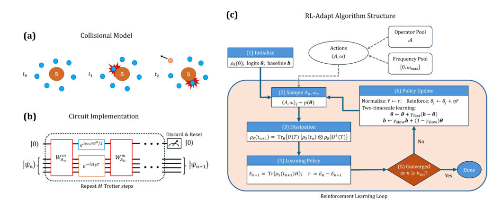 
FIG. 1. (a) Illustration of the collisional model of thermalization. (b) Quantum circuit for one collisional model time step of the dissipative algorithm, corresponding to step (3) of the schematic flowchart. (c) Schematic illustration of the RL-based, adaptive dissipative algorithm.

📷 Fig 2

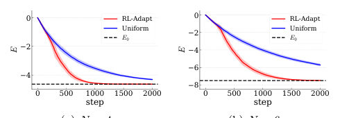 
FIG. 2. Energy as a function of time for the two-timescale re- inforcement learning dissipative algorithm applied to the 1D XY model with (a) 4 sites and (b) 6 sites. Plotted curves are averages over 50 realizations of the algorithm, with the shaded regions corresponding to one standard deviation. Hamilto- nian parameters are J = 1, h = −0.7. RL parameters are nω = 40, η = 2.0, γfast = 40/n and γslow = 2/n.

📷 Fig 3

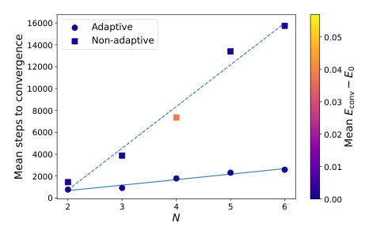 
FIG. 3. Average steps to ground state convergence as a func- tion of system size for the 1D XY-model. Solid and dashed lines are linear best fits for the RL-Adapt and non-adaptive implementations respectively. The color scale gives the mean error in the converged ground state energy. Hamiltonian pa- rameters are J = 1, h = −0.7. RL parameters are nω = 40, η = 2.0, γfast = 40/ntot and γslow = 2/ntot.

📷 Fig 4

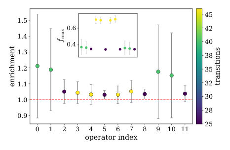 
FIG. 5. Average enrichment (defined as the factor by which the probability mass assigned to aligned pairs exceeds the uniform distribution) over 50 shots of the RL-Adapt dissi- pative algorithm for the 4-site XY model with an operator pool, A, consisting of each single-qubit Pauli operator. The color scale indicates the number of eigenstate transitions in- duced by each operator. The dashed red line indicates the baseline enrichment expected from a uniform assignment of probability mass. The error bars indicate one standard devi- ation. The inset plot provides the enrichment normalized by the enrichment ceiling Nω/Ntarget. Hamiltonian parameters are J = 1, h = −0.7. RL parameters are nω =...

📷 Fig 5

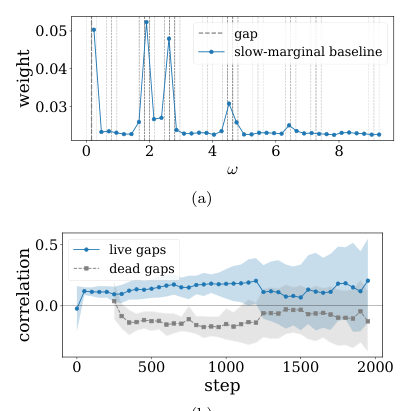 
FIG. 4. (a) Average final ω distribution weights for the slow baseline marginal overlaid with the spectral gaps of HS for the XY-model with N = 4. The blue dots show the weights from the learned, slow-timescale RL baseline (b in Eq. (11)) for choosing the corresponding ω, while the dashed lines show energy gaps of the problem Hamiltonian, ∆u,v for all energy eigenstates |ψu⟩and |ψv⟩. (b) Average correlation between ω values with above-baseline weight and gaps corresponding to feasible “live” (blue) or infeasible “dead” (gray) transitions in ρS as a function of time step. The shaded region corresponds to one standard deviation. In both panels, averages are taken over 50 shots of the...

**Summary.** This paper introduces RL-Adapt, an adaptive algorithm that uses reinforcement learning to optimize the parameters of a dissipative quantum simulation for ground state preparation. By learning which system-bath interactions are most effective at driving energy dissipation, RL-Adapt achieves significantly faster and more robust convergence compared to random or non-adaptive methods. This represents a powerful ML-driven tool for simulating open quantum systems.

**Why it may be interesting.** This work directly addresses the practical implementation challenges of simulating open quantum dynamics, providing a machine learning-driven optimization layer to enhance convergence for state preparation protocols relevant to quantum hardware.

Detailed structure

**Main problem.** The primary goal is the efficient preparation of the ground state of many-body quantum systems using dissipative dynamics.

**Main result.** The proposed RL-Adapt algorithm significantly reduces convergence times and successfully finds the ground state even when non-adaptive methods fail due to suboptimal operator selection.

**Method.** The authors employ single-shot reinforcement learning (RL) to adaptively optimize the selection of the ancilla frequency and system-bath interaction operator during the dissipative evolution.

**Model / system.** The system is an open quantum system undergoing thermalization, modeled by coupling the system to a simulated low-temperature environment via a single ancilla qubit. The dynamics are governed by a collisional model.

**Key observables.** Energy decrease expectation value (used for the RL reward function), convergence time, and the correlation between learned weights and spectral gaps.

**Important parameters / regimes.** The system Hamiltonian (e.g., 1D XY-model), the RL learning rate parameters (fast/slow residuals), and the energy gap tolerance ($\delta$).

**Assumptions / limitations.** The success of the algorithm relies on the ability of the operator pool to connect all occupied initial energy eigenstates to the ground state, and the RL framework assumes that optimizing energy dissipation leads to ground state convergence.

**Figures summary.** Figures illustrate the collisional model, the quantum circuit for one time step, and the schematic of the RL-based adaptive algorithm. Later figures compare convergence rates and show correlation analyses between learned weights and spectral gaps.

**Paper structure.** The paper introduces the dissipative algorithm, details the limitations of non-adaptive approaches, proposes the RL-Adapt framework using two-timescale RL, and validates its performance by showing faster convergence and analyzing the learned spectral information via correlation and enrichment diagnostics.

Abstract

Dissipative algorithms approach the problem of ground state preparation by mimicking the natural thermalization of a quantum system in contact with a large, low-temperature thermal environment. The environment can be efficiently simulated by a single ancilla qubit with a variable energy gap that is repeatedly coupled to the system qubits to generate a dissipative channel, and then reset after each interaction. Here we present an adaptive implementation of the dissipative algorithm, RL-Adapt, that uses single-shot reinforcement learning to optimize the selection of ancilla frequency and system-bath interaction operator to maximize energy dissipation without relying on a priori knowledge of the system spectrum. The adaptive implementation results in significantly reduced convergence times and can successfully find the ground state even for non-ideal operator pools that fail to converge using non-adaptive, uniform random operator and ancilla frequency selection.

[↑ back to top](#top)

### [Collective order reorganizes dissipation and powers an active engine](http://arxiv.org/abs/2609.31059v1)

**Authors:** Michael Riedl, Vincent Wattiez, Étienne Fodor, Jan Brugués, Francesco Romanò  
**Type:** both · **Category:** statistical mechanics · **PDF:** <https://arxiv.org/pdf/2609.31059v1>  
**Analysis basis:** full PDF text, analyzed in chunks
**Topic relevance:** `driven-dissipative phase transition` **3/5** · `non-equilibrium universality` **3/5** · `Frenkel-Kontorova` **1/5** · `correlated / nonlocal dissipation` **1/5**

📷 Fig 1

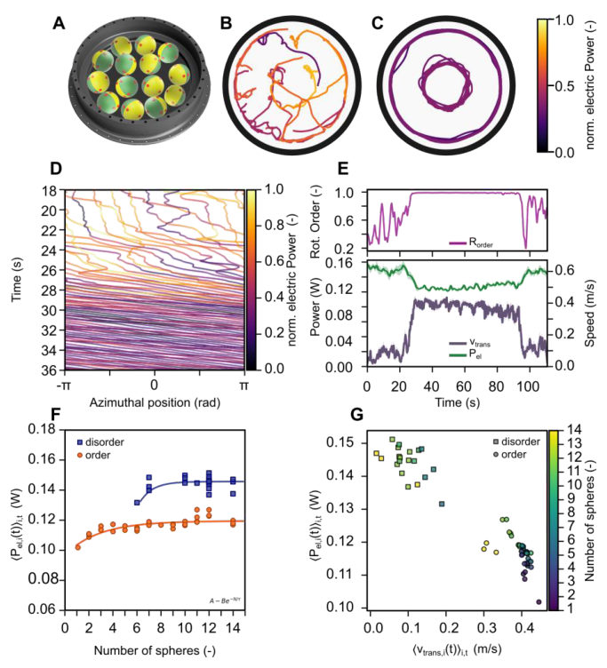 
Fig. 1. The transition to ordered motion reduces energy consumption and increases translational velocity. (A) Schematic of the active-sphere system in a circular confinement (𝑅𝑐𝑜𝑛𝑓= 180 𝑚𝑚). Representative 6𝑠 trajectories in the (B) disordered state and (C) ordered state (𝑁𝑠𝑝ℎ𝑒𝑟𝑒𝑠= 14). (D) Space-time representation showing the azimuthal position of the active spheres over time. The transition from irregular trajectories to bands with constant slope marks the transition from disordered to ordered motion (𝑁𝑠𝑝ℎ𝑒𝑟𝑒𝑠= 14). (B, C, D) Colors show normalized electrical input power which decreases during transition. (E) Time series from a representative experiment (𝑁𝑠𝑝ℎ𝑒𝑟𝑒𝑠= 12) showing (Top)...

📷 Fig 2

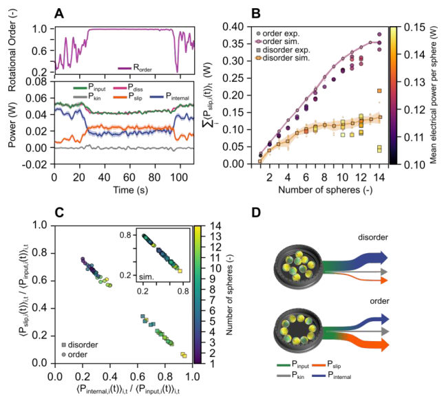 
Fig. 2. Collective ordering reorganizes dissipation from internal to external pathways. (A) Representative power-budget time series (𝑁𝑠𝑝ℎ𝑒𝑟𝑒𝑠= 12) during the transition from disordered to ordered motion, showing (Top) rotational order and (Bottom) input power (𝑃𝑖𝑛𝑝𝑢𝑡), total dissipation (𝑃𝑑𝑖𝑠𝑠), kinetic power (𝑃𝑘𝑖𝑛), slip dissipation (𝑃𝑠𝑙𝑖𝑝), and internal dissipation (𝑃𝑖𝑛𝑡𝑒𝑟𝑛𝑎𝑙). (B) Total slip dissipation increases linearly with increasing number of active spheres in the ordered state both in experiments and simulations. (C) Ordered (circles) and disordered (squares) states separate into distinct dissipation regimes, with the ordered state characterized by greater slip dissipation and...

📷 Fig 3

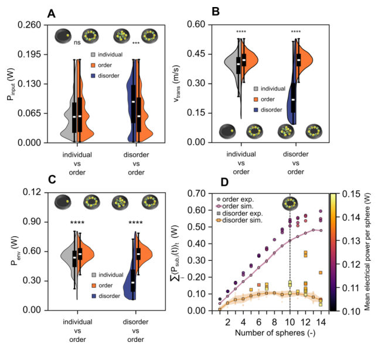 
Fig. 3. Ordered collectives move faster and increase the mechanically transferable power to the environment without increasing input power. (A) Distributions of input power for isolated spheres and for spheres in disordered and ordered collective states. (B) Distributions of translational speed for the same three conditions show a significant increase of the collective compared to the isolated spheres. (C) The ordered collective has a significantly higher transferable power to the environment compared to isolated or disordered collectives. (D) The total transferable power increases with the number of spheres. Colors indicate the mean electrical input power per sphere. An optimum between...

📷 Fig 4

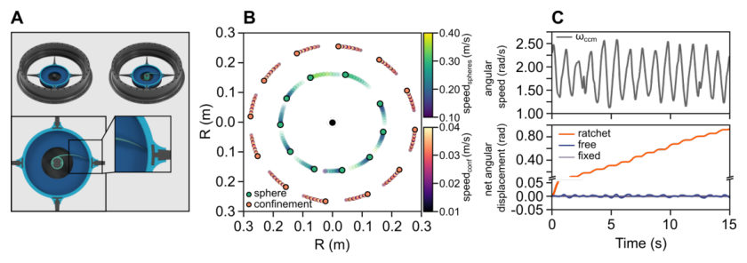 
Fig. 4. A mechanical ratchet converts collective forcing into directional rotation of the confinement. (A) Schematic of the ratchet mechanism. (Top left) Confinement without pawl. (Top right) Confinement with pawl. (Bottom) Top view showing the ratchet and the interaction between the tooth geometry and the pawl. (B) Sphere and confinement marker trajectories. (C) (Top) Angular velocity of the collective center of mass for the ensemble of the active spheres. (Bottom) Net angular displacement of a fixed confinement, the oscillating motion of a freely rotating confinement on the ratchet mechanism without a pawl, and the sustained rotation of the confinement on the ratchet mechanism with the...

📷 Fig 5

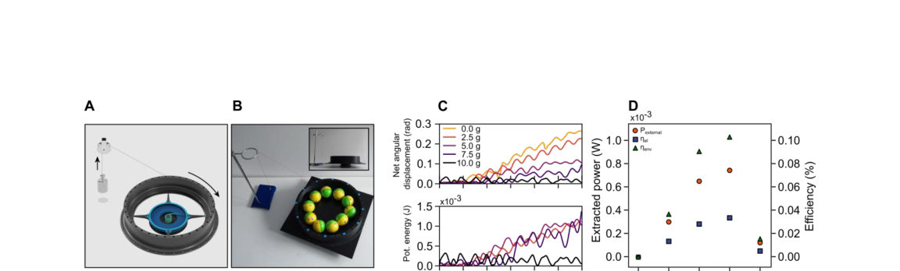 
Fig. 5. The ordered collective performs mechanical work lifting an external load. (A) Schematic of the active engine, in which rotation of the confinement is coupled to a pulley that lifts a suspended mass. (B) Photograph of the experimental realization. (C) (Top) Net angular displacement of the confinement over time for different applied loads. (Bottom) The corresponding increase in gravitational potential energy of the lifted mass. Increasing the external load reduces the displacement per forcing cycle, but the corresponding gain in potential energy stays constant until the rotation stalls. (D) Extracted mechanical power and efficiencies as a function of the external load.

**Summary.** This work experimentally investigates how collective order emerges in active matter systems by performing a detailed power budget analysis. It demonstrates that the transition to an ordered state reorganizes energy dissipation, shifting energy loss to the environment. This reorganization allows the collective motion to function as a measurable active engine capable of performing external mechanical work.

**Why it may be interesting.** The concept of harnessing collective energy reorganization to perform directed work is highly relevant to non-equilibrium statistical mechanics and active matter theory, providing quantitative metrics for state transitions beyond simple energy conservation.

Detailed structure

**Main problem.** The study aims to understand how energy consumption and dissipation change when motile active matter systems transition between disordered and ordered collective states.

**Main result.** The transition to an ordered state reorganizes dissipation pathways, shifting energy loss from internal friction to external slip, which allows the collective motion to power an active engine capable of performing mechanical work.

**Method.** The researchers used a minimal experimental system of synthetic motile spheres to perform time-resolved power-budget characterization, linking energy input, dissipation, and mechanical work output.

**Model / system.** The system consists of synthetic motile spheres, each equipped with an unbalanced motor, which exhibit collective transitions between disordered and ordered states. The analysis involves measuring electrical power input, kinetic energy, and decomposing total dissipation into internal and external slip components.

**Key observables.** Locomotion efficiency, instantaneous electrical power ($P_{el}$), kinetic energy ($P_{kin}$), internal dissipation ($P_{internal}$), external slip dissipation ($P_{slip}$), and measurable mechanical work output.

**Important parameters / regimes.** Motor parameters, restitution coefficient ($\epsilon$), external load applied to the engine, and the degree of collective order (e.g., rotational order parameter).

**Assumptions / limitations.** The analysis relies on the power balance equation ($P_{el} = P_{diss} + P_{kin}$), and the engine demonstration assumes the collective forcing can be rectified by a mechanical ratchet.

**Figures summary.** Figures illustrate the transition visualization (kymographs), the decomposition of dissipation pathways (internal vs. slip), the comparison of power budgets between collective and independent spheres, and the final demonstration of the active engine lifting an external load.

**Paper structure.** The paper first establishes the energetic challenge in active matter, then presents the experimental setup and power budget measurements to show energy reorganization upon ordering. Finally, it leverages this reorganization to construct and test a mechanical active engine.

Abstract

Motile active matter systems, from animal groups to synthetic particles, exhibit spontaneous self-organized transitions between disordered and ordered collective states. These transitions are driven by continuous energy injection, yet how energy consumption and dissipation change during these transitions remains poorly understood due to the challenge of measuring individual energetic fluxes. Here, we introduce a minimal experimental system of synthetic motile spheres that enables the first time-resolved power-budget characterization of collective motion. We show that the transition to an ordered state is accompanied by increased locomotion efficiency and a reorganization of dissipation pathways, shifting dissipation from internal friction to external slip with the environment. Leveraging this energetic reorganization, we construct an active engine powered by collective motion, capable of performing mechanical work against an external load. These findings establish energetic fluxes as quantitative observables for understanding collective state transitions and demonstrate how collective order can be harnessed for work extraction in active matter.

[↑ back to top](#top)

### [Disentangling Expressibility, Symmetry Protection, and Hardware Noise in Variational Quantum Simulation of the Two-Flavor Schwinger Model](http://arxiv.org/abs/2609.30496v1)

**Authors:** Karthikeya Machiraju, Krishna Sujith, Kaustav Bhowmick  
**Type:** theory · **Category:** quantum information and computing · **PDF:** <https://arxiv.org/pdf/2609.30496v1>  
**Analysis basis:** full PDF text, analyzed in chunks
**Topic relevance:** `analog quantum simulation` **3/5** · `QC/QI experiment` **2/5** · `Keldysh / 2PI / non-Gaussian methods` **1/5** · `methods for driven-dissipative` **1/5** · `quantum measurements` **1/5**

📷 Fig 1

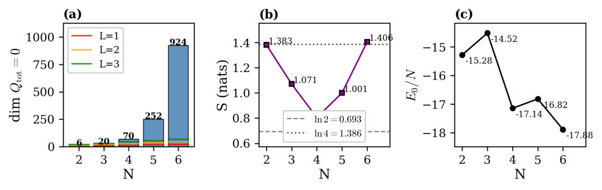 
FIG. 1. Exact-diagonalization baseline (K = 0, x = 16, F = 2), computed in this work. (a) Physical-sector dimension d = 2N N 

📷 Fig 2

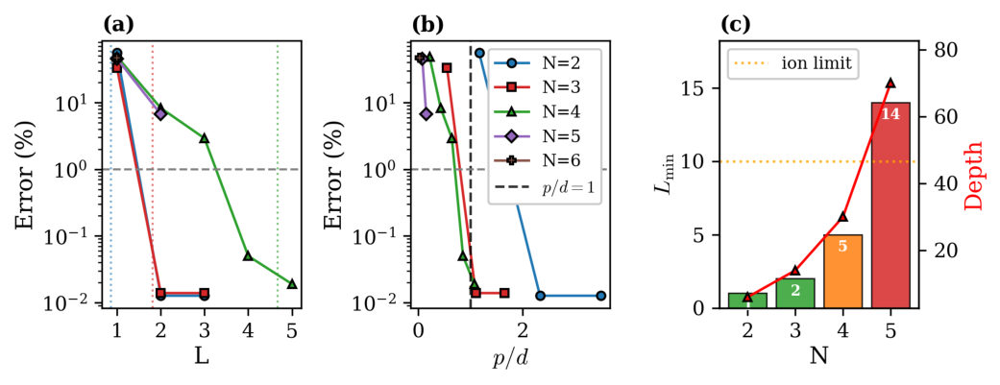 
FIG. 2. Expressibility. (a) Relative energy error versus ansatz layers L; dotted verticals mark Lmin. The crossings for N = 5 and N = 6 lie at L = 14 and L = 41 and are outside the plotted range. (b) The same data collapse onto a single function of p/d, with the error transition at p/d ≈1. (c) Minimum-layer two-qubit depth 4Lmin + 4N −6 for N = 2 to 5, color-coded by trapped-ion feasibility (green: feasible; orange: marginal; red: infeasible). The dashed horizontal line in panels (a) and (b) marks 1% relative error. Symbol and color coding in panel (a) is shared with panel (b).

📷 Fig 3

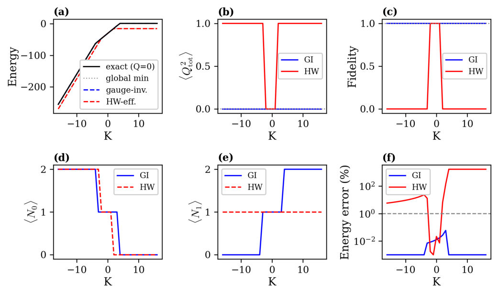 
FIG. 3. Gauge-invariant (GI) vs. hardware-efficient (HW) ansatz across the chemical potential at N = 2, L = 2 (33-point sweep). (a) Ground-state energy: the HW result drops below the physical ground state outside the window K ∈[−2, 1] (charge- sector leakage), while GI tracks it, and the global minimum over all charge sectors is shown for reference. (b) Global-charge violation ⟨Q2 tot⟩: identically zero for GI, and unity for HW outside the window K ∈[−2, 1]. (c) Fidelity with the physical ground state: unity for GI, collapsing to zero for HW. (d) Flavor-0 particle number, integer-valued and stepping down from 2 to 0 as K increases for GI, displaced for HW. (e) Flavor-1 particle number,...

📷 Fig 4

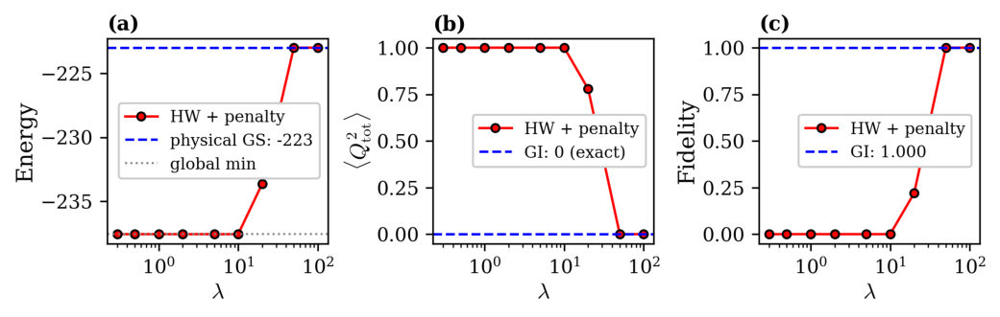 
FIG. 4. Penalty-term sweep for the hardware-efficient ansatz at K = −14, N = 2, L = 2. (a) Recovered energy versus λ: it can reach the physical ground state only for λ ≳16.5, the charge-sector gap of Eq. (8) (dash-dotted), and sits at the global minimum below that. (b) Charge-sector leakage ⟨Q2 tot⟩versus λ, falling from unity to zero across the same crossover, against the identically zero GI reference. (c) Fidelity with the physical ground state versus λ, rising from zero to unity at the crossover, against the GI reference.

📷 Fig 5

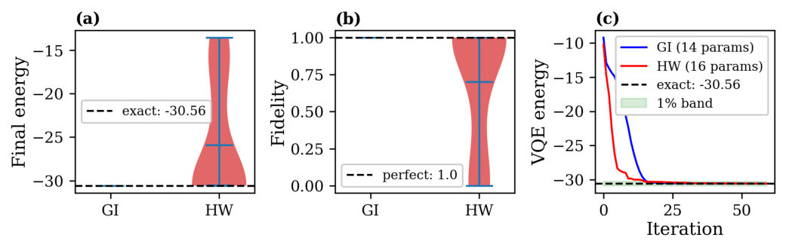 
FIG. 5. Optimization stability and convergence (K = 0, N = 2, L = 2). Across 20 random restarts the gauge-invariant ansatz is deterministic (σE = 1.0 × 10−4, mean fidelity 0.99) while the hardware-efficient ansatz scatters (σE = 5.38, mean fidelity 0.84): the (a) final-energy spread and (b) fidelity spread collapse to a line at the exact value for the gauge-invariant ansatz but spread widely for the hardware-efficient one. (c) Representative convergence traces: the gauge-invariant optimizer reaches the ground state in ∼10 iterations, whereas the hardware-efficient optimizer plateaus in nonphysical regions before descending to the physical ground state.

**Summary.** This work investigates the scalability of quantum simulation for the two-flavor Schwinger model using VQE. By analyzing the interplay between circuit expressibility, symmetry constraints, and hardware noise across increasing lattice sizes, the authors conclude that hardware noise is the primary bottleneck. They establish N=3 as a near-term, achievable target for trapped-ion quantum computers.

**Why it may be interesting.** It provides a concrete, quantitative benchmark for assessing the feasibility of simulating complex lattice gauge theories on near-term quantum hardware, directly addressing the interplay between algorithmic design and physical hardware limitations.

Detailed structure

**Main problem.** To determine the limiting factor—expressibility, symmetry protection, or hardware noise—when using Variational Quantum Eigensolver (VQE) to simulate the two-flavor Schwinger model.

**Main result.** The binding constraint limiting simulation size at reachable lattice sites is identified as hardware noise, not circuit expressibility or trainability. The study pinpoints N=3 as the immediately viable extension for current trapped-ion quantum hardware.

**Method.** The authors employ VQE on a mapped Hamiltonian, systematically varying the lattice size (N) and comparing the energy error under different noise models and ansatz constraints.

**Model / system.** The physical system is the two-flavor Schwinger model (QED in 1+1 dimensions), mapped to a qubit Hamiltonian using the Kogut–Susskind staggered formulation. The simulation is performed on a lattice of size N, restricted to the charge-neutral physical subspace.

**Key observables.** Energy error, ratio of variational parameters to physical sector dimension (p/d), normalized gradient variance, and entanglement entropy.

**Important parameters / regimes.** Lattice size N (tested up to 6), circuit depth L, and the degree of hardware noise (e.g., 1.00% depolarizing noise).

**Assumptions / limitations.** The analysis assumes a consistent framework to compare the three failure mechanisms (expressibility, symmetry protection, noise) across varying lattice sizes.

**Figures summary.** Figures compare the combinatorial growth of the physical sector dimension against the linear growth of the parameter budget, and show the collapse of the energy error onto a function of p/d.

**Paper structure.** The paper systematically analyzes the scaling of VQE for the Schwinger model, first establishing the theoretical limits set by expressibility, then quantifying the protection afforded by charge conservation, and finally demonstrating that hardware noise dominates the error budget at larger lattice sizes.

Abstract

Existing quantum simulations of the two-flavor Schwinger model have run at a single lattice size, and it is not known how far the variational approach can be pushed or which weakness stops it first. Following the model from N = 2 to 6 staggered lattice sites, we find that the binding constraint at reachable sizes is hardware noise rather than circuit expressibility or trainability, and identify N = 3 as the immediately viable extension of existing trapped-ion experiments. The energy error of a charge-conserving ansatz collapses onto one function of p/d, the ratio of variational parameters to physical-sector dimension, and falls by more than two orders of magnitude as p/d rises through order unity, giving the expressibility condition L(4N - 1) >= binom(2N,N) for L circuit layers. The condition is local in chemical potential: at N = 3 the layer count sufficient at zero chemical potential leaves a 74.38% error near the first-order boundary, while one further layer reaches 0.08%. Charge conservation also protects trainability and prevents charge-sector leakage: as the qubit count doubles from 4 to 8, the normalized gradient variance falls to 1/3.56 of its starting value for the constrained ansatz, versus 1/13.57 for an unconstrained circuit. Comparing a global contraction with per-gate local noise, a fixed-parameter control shows that the noise model, not whether the optimizer runs inside the noisy loop, sets how strongly noise degrades the first-order transition. At N = 4, a noiseless control reaches 0.12% mean error, whereas the same circuit at 1.00% depolarizing noise reaches 25.69 to 52.81%.

[↑ back to top](#top)

### [Phase-accumulating hyperfine strain sensing with rare-earth-ion phase memories](http://arxiv.org/abs/2609.31151v1)

**Authors:** Mustafa Gündoğan  
**Type:** both · **Category:** other · **PDF:** <https://arxiv.org/pdf/2609.31151v1>  
**Analysis basis:** full PDF text, analyzed in chunks
**Topic relevance:** `quantum measurements` **3/5** · `quantum optics experiment` **3/5** · `interference shaping light` **2/5**

📷 Fig 1

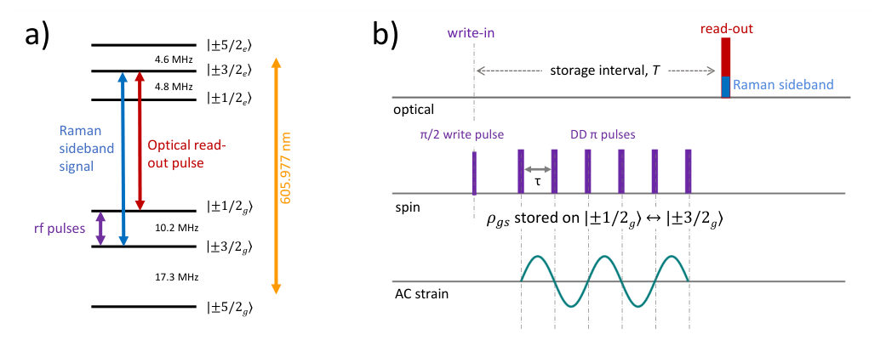 
FIG. 1. Proposed strain measurement scheme. (a) Relevant Pr3+:Y2SiO5 hyperfine levels and optical transitions near 605.977 nm. The ground state transition | ± 1/2g⟩↔| ± 3/2g⟩is controlled by rf fields. An optical read field on | ± 1/2g⟩↔| ± 3/2e⟩ generates a coherent Raman sideband on | ± 3/2g⟩↔| ± 3/2e⟩. (b) Timing sequence. Before the sequence shown, optical pumping polarizes the addressed spectral class, ideally into | ± 1/2g⟩. A phase-controlled rf π/2 pulse with phase ϕw creates the ground state coherence ρgs. During the storage interval, synchronized rf π pulses provide dynamical decoupling while the ac strain contributes the accumulated phase Φϵ. The final optical read field generates the...

📷 Fig 2

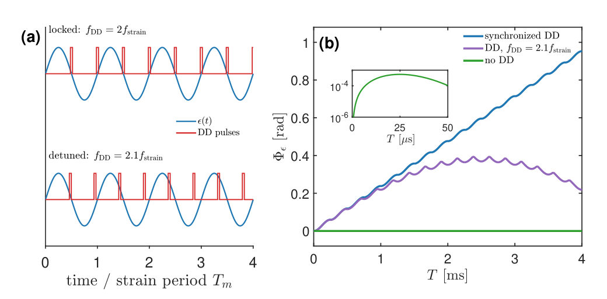 
FIG. 2. Synchronization and phase accumulation. (a) The normalized ac strain (blue) and finite-width rf π-pulse envelope (red), drawn in the same waveform convention as the accompanying time-domain simulation. Here fDD denotes the π-pulse repetition rate, so the locked condition is fDD = 2fstrain; the lower row shows the slip produced by the 5% mismatch fDD = 2.1fstrain. The illustrated pulse duty cycle is tπfDD = 0.08. During each pulse the sensing function is set to zero as a pulse-blanking approximation, rather than a full driven Bloch-equation treatment. (b) Representative accumulated strain phase for Gsϵ0 = 60 Hz and fstrain = 2 kHz using the same finite-pulse model. Synchronized DD...

📷 Fig 3

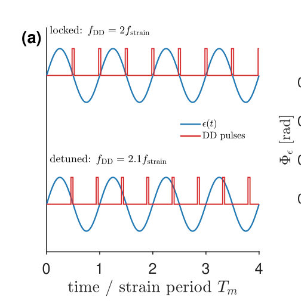 
Figure 3 shows the matched-DD optical shot-noise strain floor as a function of storage time. For fixed

📷 Fig 4

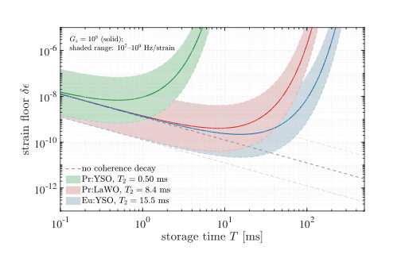 
FIG. 3. Single-shot strain sensitivity in the presence of coher- ence decay. The grey dashed line shows the ideal limit with- out coherence decay. The coloured curves assume exponential coherence decay, C(T) = exp(−T/T2), using representative zero-field coherence times for Pr:YSO (T2 = 0.50 ms) [38], Pr:LaWO (T2 = 8.4 ms) [3], and Eu:YSO (T2 = 15.5 ms) [39]. For Pr:LaWO, T2 = 8.4 ms is the coherence-amplitude life- time corresponding to the measured 4.2 ms 1/e retrieval inten- sity decay under CPMG. Solid curves use Gs = 108 Hz/strain, while the shaded regions span Gs = 107–109 Hz/strain. We assume Nsb(0) = 106, V = 1, and ideal homodyne readout.

**Summary.** This paper outlines an advanced quantum sensing protocol to measure strain effects on hyperfine transitions in rare-earth-ion crystals. It uses long-lived hyperfine coherence, enhanced by dynamical decoupling pulses, to accumulate a phase proportional to the applied strain. The method is theoretically derived and compared against other quantum memory readout techniques, providing a route to understanding strain-induced couplings in solid-state quantum systems.

**Why it may be interesting.** This work is highly relevant to AMO physics and quantum optics as it details a sophisticated quantum sensing protocol that leverages long-lived coherence in solid-state systems, combining concepts from quantum memory, dynamical decoupling, and high-precision spectroscopy.

Detailed structure

**Main problem.** The paper addresses the challenge of developing a sensitive method to measure strain-induced shifts in the ground state hyperfine transitions of rare-earth-ion-doped (REID) crystals, a measurement difficult via conventional spectroscopy.

**Main result.** A protocol is proposed that uses phase-accumulating hyperfine coherence, enhanced by synchronized dynamical decoupling pulses, to measure the strain-dependent hyperfine coupling coefficient ($G_s$).

**Method.** The method involves optically preparing a hyperfine state, creating a transverse coherence via an rf $\pi/2$ pulse, allowing the coherence to evolve under an oscillating strain field, and finally reading out the accumulated phase using Raman heterodyne detection.

**Model / system.** The system is based on rare-earth ions (e.g., Pr$^{3+}$) in crystals, modeled using a Hamiltonian incorporating crystal field, hyperfine, Zeeman, and strain terms. The strain dependence is derived by expanding effective quadrupole and Zeeman tensors around an operating point.

**Key observables.** The primary observable is the accumulated phase ($\Phi_{\epsilon}$), which is proportional to the strain ($\epsilon_a$) via the measurable strain coefficient ($G_s$).

**Important parameters / regimes.** The protocol utilizes dynamical decoupling (DD) pulses to ensure the accumulated phase grows linearly with time under AC strain, and the measurement is optimized near a Zero-First-Order-Zeeman (ZEFOZ) point.

**Assumptions / limitations.** The analysis assumes the ability to perform a differential measurement to isolate the strain phase, and comparisons between readout schemes rely on specific scaling laws and approximations regarding coherence amplitude.

**Figures summary.** Figure 1 illustrates the entire measurement sequence: optical pumping, rf $\pi/2$ write pulse, the storage interval with DD pulses and AC strain, and the final optical read field generating the Raman sideband.

**Paper structure.** The paper moves from defining the physical problem and Hamiltonian to detailing the experimental protocol (preparation, evolution, readout). It then provides theoretical derivations for the strain coupling tensors and compares the sensitivity limits of the proposed RF-write/Raman-read scheme against alternative optical memory techniques.

Abstract

Long-lived hyperfine coherences in rare-earth-ion crystals provide controlled phase evolution windows for metrology. We use this resource to propose an experimental protocol for accessing strain shifts of ground state hyperfine transitions in non-Kramers rare-earth-ion doped (REID) materials, a quantity that is difficult to access directly with conventional spectroscopic methods. Starting from the crystal field Hamiltonian, we relate the response to strain-dependent effective quadrupole and Zeeman tensors, including changes in electronic wave functions, virtual electronic admixtures, and the bare nuclear quadrupole interaction. The protocol optically prepares a selected hyperfine class, uses a phase-controlled rf $π/2$ pulse to create the sensing coherence, and applies synchronized dynamical decoupling pulses during the phase evolution interval so that a coherent ac strain drive accumulates phase rather than averaging away. The accumulated phase is then retrieved by Raman heterodyne readout. The resulting framework provides a route to understanding strain-induced hyperfine couplings in non-Kramers REID systems.

[↑ back to top](#top)

### [Large-deviations theory for growing chemical reaction networks](http://arxiv.org/abs/2609.30970v1)

**Authors:** Praful Gagrani, Ignacio Madrid, Tetsuya J Kobayashi  
**Type:** theory · **Category:** statistical mechanics · **PDF:** <https://arxiv.org/pdf/2609.30970v1>  
**Analysis basis:** full PDF text, analyzed in chunks
**Topic relevance:** `Keldysh / 2PI / non-Gaussian methods` **3/5** · `analog quantum simulation` **1/5** · `driven-dissipative phase transition` **1/5** · `methods for driven-dissipative` **1/5** · `non-equilibrium universality` **1/5**

📷 Fig 1

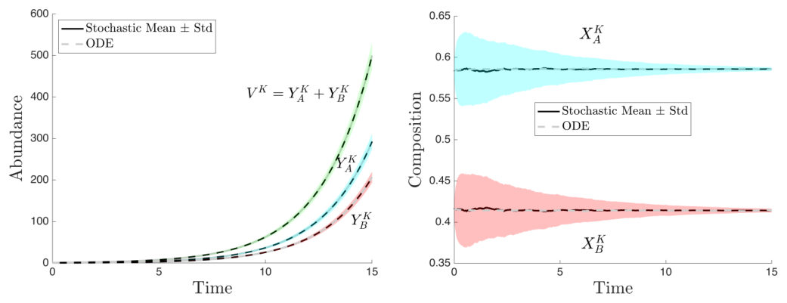 
FIG. 1: Abundance and composition dynamics for the two-species autocatalytic network. We simulated 2000 stochastic trajectories with system-scale parameter K = 101, initialized at (nA, nB) = (59, 42). The abundance variables and total volume grow exponentially, while the composition remains near the attracting balanced-growth composition. The composition variance decreases as the volume grows.

📷 Fig 2

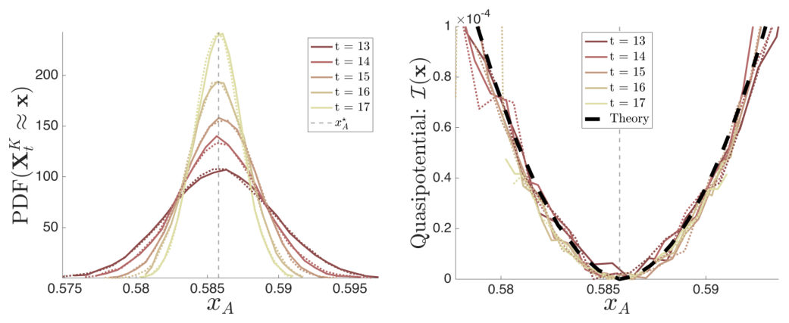 
FIG. 2: Composition distributions and quasipotential for the two-species autocatalytic network. The left panel shows composition probability densities at increasing volumes or nominal balanced-growth times. The right panel shows the empirical quasipotential, −log(PDF)/(Kv), overlaid with the solution of Eq. (36). Solid curves correspond to fixed-volume sampling; dotted curves correspond to physical-time sampling. Their close agreement in this example indicates that volume fluctuations are subleading for the displayed compositions and times.

📷 Fig 3

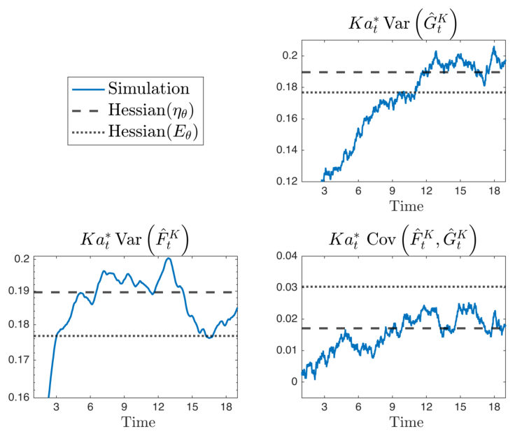 
FIG. 3: Variances and covariance of the accumulated-volume-averaged observables in Eq. (36). The variance and covariance at each time t are scaled by the deterministic accumulated-volume level a⋆ t = v0(eΛt −1)/Λ. The theoretical predictions are obtained from the Hessian of the SCGF ηθ. An approximation using the Hessian of the fixed point energy Eθ is also shown.

📷 Fig 4

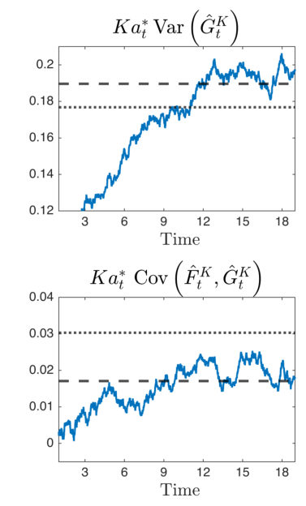 
Figure 4 shows the same fluctuations without rescal- ing and compares them with the conventional time- averaged estimators defined in Sec. II D. Both averag- ing schemes approach the same balanced-growth means, but their variances have different asymptotic behavior. The accumulated-volume estimators weight later times more strongly, when the system is larger and more re- action events are observed, and their covariances decay on the scale 1/(KAt). In the simulations this leads to substantially smaller long-time fluctuations than for the corresponding time-averaged estimators.

📷 Fig 5

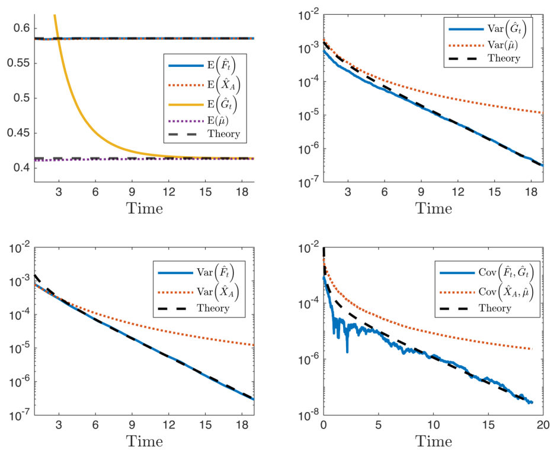 
FIG. 4: Fluctuations of composition and growth-rate estimators in the two-species autocatalytic network. Accumulated-volume-averaged estimators are compared with the theoretical covariance prediction and with the corresponding conventional time-averaged estimators. Both averaging schemes converge to the same balanced-growth means, but their fluctuations decay differently: the accumulated-volume estimators decay on the accumulated-volume scale, whereas the time-averaged estimators decay O(t−1) in physical time. For the parameters shown, the accumulated-volume estimators consequently attain smaller variances at long times.

**Summary.** This paper establishes a rigorous large-deviation theory for stochastic chemical reaction networks that undergo exponential growth. It decomposes the system state into volume and composition, showing that composition fluctuations are governed by a quasipotential. The theory provides a powerful stochastic null model for interpreting single-cell heterogeneity in biochemical systems.

**Why it may be interesting.** While focused on chemical kinetics, the mathematical machinery—large deviations, Hamilton-Jacobi equations, and fluctuation theorems—is highly relevant to non-equilibrium statistical mechanics in open quantum systems.

Detailed structure

**Main problem.** Developing a large-deviation and fluctuation theory for stochastic Chemical Reaction Networks (CRNs) operating in a growing, non-stationary regime.

**Main result.** The composition fluctuations satisfy a large-deviation principle governed by a quasipotential derived from a contact Hamilton-Jacobi equation, and observable covariances decay with accumulated-volume.

**Method.** The theory decomposes the stochastic abundance into volume and composition coordinates, utilizing large-deviation theory and variational methods.

**Model / system.** The model is a stochastic CRN, exemplified by a coarse-grained cellular growth model, where the state is tracked by normalized abundance, volume, and composition.

**Key observables.** Composition quasipotential, growth-rate fluctuations, and covariances of accumulated-volume-averaged observables.

**Important parameters / regimes.** The system operates in a supercritical, exponentially growing regime ($\Lambda > 0$), with the fluctuation speed scaling with the accumulated volume.

**Assumptions / limitations.** The system exhibits balanced growth, and the reaction rates are assumed to be homogeneous functions of degree one (scalable).

**Figures summary.** Figures show empirical quasipotential collapse under volume scaling and confirm the predicted decay scaling for covariances using accumulated-volume estimators.

**Paper structure.** The paper introduces the setup, develops the large-deviation theory for composition fluctuations, and then applies the framework to analyze the moments and covariances of accumulated-volume-averaged observables.

Abstract

Growing biochemical systems are intrinsically noisy, with one important source of stochasticity arising from the discrete reaction events of the underlying biochemical network. Because growing systems do not generally admit stationary abundance distributions, it is unclear how to separate this intrinsic chemical noise from other sources of variability in population and single-cell data. Here we develop a large-deviation theory for exponentially growing stochastic chemical reaction networks by decomposing abundance into volume and composition. In these coordinates, balanced growth corresponds to a stable composition together with exponentially increasing volume. We show that composition fluctuations satisfy a large-deviation principle with speed equal to the volume of the growing system, and the corresponding quasipotential is selected by a solution of the contact Hamilton--Jacobi equation. We also derive a fluctuation theory for accumulated observables and show that their covariances decay with accumulated-volume, rather than with physical time. Applications to a minimal autocatalytic network and a coarse-grained cellular growth model demonstrate how the theory predicts composition quasipotentials, growth-rate fluctuations, and correlations between observables. The framework therefore provides a stochastic null model for single-cell heterogeneity generated by the intrinsic stochasticity of the underlying chemical reaction network.

[↑ back to top](#top)

### [Measurement protocol for non-adiabatic geometric phases of Floquet states](http://arxiv.org/abs/2609.31052v1)

**Authors:** Carlos Martín-Fernández, Gloria Platero, Sigmund Kohler  
**Type:** theory · **Category:** other · **PDF:** <https://arxiv.org/pdf/2609.31052v1>  
**Analysis basis:** full PDF text, analyzed in chunks
**Topic relevance:** `quantum measurements` **3/5** · `analog quantum simulation` **2/5** · `interference shaping light` **1/5** · `quantum optics experiment` **1/5**

📷 Fig 1

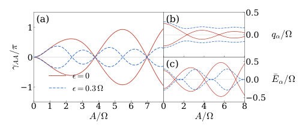 
FIG. 1. Floquet spectrum for detunings ε = 0 (solid red) and ε = 0.3Ω(dashed blue) and tunneling ∆= Ω/2. The panels show the AA phases (a), the quasienergies (b), and the mean energies (c).

📷 Fig 2

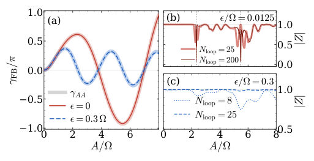 
FIG. 3. Simulation of the protocol sketched in Fig. 2 with prepara- tion in the ground state for tunneling ∆= Ω/2 and various detunings. (a) Phase of the overlap Z (thin lines) compared to the theoretically expected value 2γFB [broad matte line of same color, cf. Fig. 1(a)] for protocol time Tloop = 25T. The detunings are ε = 0 (red) and 0.3Ω(blue). (b,c) Loop fidelity |Z| for detunings ε = 0.0125Ω(b) and 0.3Ω(c) for various protocol times Tloop = NloopT. The vertical dotted lines mark positions of the quasienergy crossings in the ab- sence of detuning.

📷 Fig 3

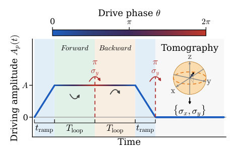 
FIG. 2. Protocol for the cancellation of the dynamical phase. After preparation of the qubit in the ground state, the amplitude is ramped up with driving phase θ = 0. After time tramp, the amplitude is kept constant, while the drive phase θ is adiabatically increased during N driving periods until it reaches the value 2π. Next, a σy-pulse is applied, and the parameters are tuned back in the same way. A fi- nal σy-pulse restores the ground state. For Ramsey interference, a σy-pulse is applied initially to create a superposition between ground and excited state. Finally, the populations are measured by tomogra- phy.

📷 Fig 4

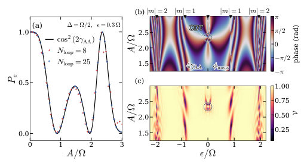 
FIG. 4. (a) Population of the excited state after the protocol with Ramsey pulses for various loop times (symbols) compared to the expectation in Eq. (5). Tunneling and detuning are ∆= 0.5Ωand ε = 0.3Ω, respectively. (b) Theoretically expected value γAA from Eq. (1) (left half) compared to the simulated measurement (right half). The result is independent of the sign of ε due to the sym- metry relation σxH(A,ε,θ)σx = H(A,−ε,θ + π). (c) Visibility of the Ramsey pattern for the simulated measured phase as a function of the detuning and amplitude for Nloop = 25.

📷 Fig 5

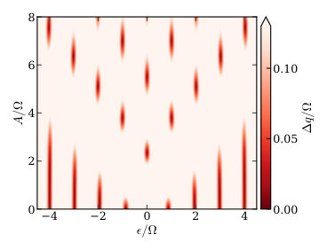 
FIG. 5. Quasienergy gap ∆q in the (ε,A) plane. The dark areas mark accidental degeneracies found for integer detuning [26] and at m-photon resonances for A = 0. There, adiabatic following breaks down.

**Summary.** This paper details a novel measurement protocol to experimentally detect the Aharonov-Anandan geometric phase in quantum systems driven periodically (Floquet systems). By adapting spin-echo techniques and utilizing Ramsey interferometry, the authors show how to isolate this non-adiabatic phase from the dominant dynamical phase. This provides a powerful tool for characterizing geometric properties in driven quantum matter.

**Why it may be interesting.** This work provides a detailed, experimentally relevant blueprint for measuring non-adiabatic geometric phases in driven quantum systems, bridging the gap between theoretical Floquet theory and measurable quantum optics experiments.

Detailed structure

**Main problem.** The paper proposes a concrete measurement protocol for the Aharonov-Anandan (AA) geometric phase associated with Floquet states in periodically driven quantum systems.

**Main result.** The protocol successfully links the non-adiabatic AA phase to the adiabatic Floquet-Berry phase, allowing for measurement by adapting spin-echo techniques to cancel dynamical phases.

**Method.** The measurement relies on adiabatically ramping the driving parameters and employing a sequence involving $\sigma_y$-pulses (similar to spin-echo) to isolate and measure the accumulated geometric phase via Ramsey interferometry.

**Model / system.** The analysis uses a general periodically time-dependent Hamiltonian, illustrated by a driven two-level system (TLS) Hamiltonian, which models the quantum dynamics under periodic driving.

**Key observables.** The primary observable is the excitation probability ($P_e$) measured via Ramsey interferometry, which is related to the accumulated phase as $\cos^2(2\gamma_{AA})$.

**Important parameters / regimes.** Key parameters include the driving frequency ($\Omega$), the detuning ($\epsilon$), and the time scale of the measurement loop ($T_{	ext{loop}}$).

**Assumptions / limitations.** The protocol assumes the ability to perform adiabatic following during parameter changes and requires applying $\pi$-pulses at multiples of the driving period ($t=kT$).

**Figures summary.** Figures illustrate the Floquet spectrum, the step-by-step measurement protocol (preparation, phase tuning, $\sigma_y$-pulse), and simulations showing fidelity and excitation probability dependence on detuning and loop time.

**Paper structure.** The paper first introduces the AA phase in Floquet systems, develops the measurement protocol by adapting spin-echo techniques, and then analyzes the protocol's feasibility and sensitivity to noise.

Abstract

Periodically time-dependent quantum systems have Floquet solutions. They consist of a phase factor and a Floquet mode which shares the periodicity of the driving. Consequently, any such solution possesses a non adiabatic geometric phase known as the Aharonov-Anandan (AA) phase. It is gauge-invariant and, therefore, is experimentally accessible. We propose a protocol for the measurement of AA phases based on the adiabatic change of the phase of the non-adiabatic driving. We argue that the experimental requirements of the protocol are those of previous measurements of adiabatic phases.

[↑ back to top](#top)

### [Room-temperature quantum-sensing molecular crystals grown in minutes](http://arxiv.org/abs/2609.30899v1)

**Authors:** Madhur Parashar, Guangzhao Chen, Emanuel Druga, Liang Z. Tan, Jeffrey Reimer, Ashok Ajoy  
**Type:** experiment · **Category:** other · **PDF:** <https://arxiv.org/pdf/2609.30899v1>  
**Analysis basis:** full PDF text, analyzed in chunks
**Topic relevance:** `quantum measurements` **3/5** · `analog quantum simulation` **2/5** · `QC/QI experiment` **1/5** · `quantum optics experiment` **1/5**

📷 Fig 1

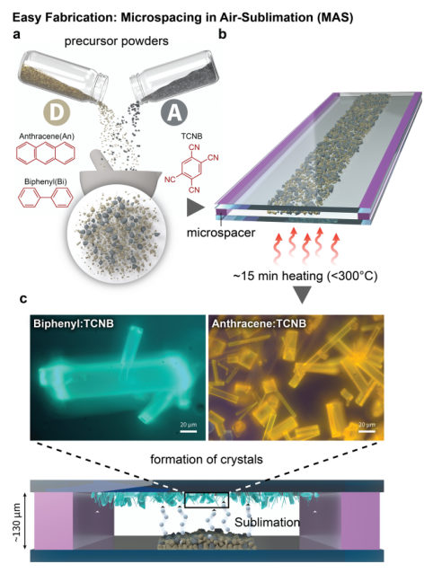 
Fig. 1: MAS growth of photoexcited triplet-hosting co-crystals. (a) Anthracene (An) or biphenyl (Bi) donors are combined with 1,2,4,5-tetracyanobenzene (TCNB) acceptor and co-ground as a mixed precursor. D/A indicate precursors of donor(D):acceptor(A) or chromophore(D):lattice(A) co- crystals (b) Microgram-scale precursor is loaded between glass substrates separated by a micrometre-scale spacer. Heating for ∼15 min at &lt; 300 ◦C drives co-sublimation and short- path transport across the confined air gap. (c) Crystallization on the upper substrate yields green-emitting Bi:TCNB and orange-emitting An:TCNB under 405 nm excitation. Cross- section shows substrate-bound crystals within a...

📷 Fig 2

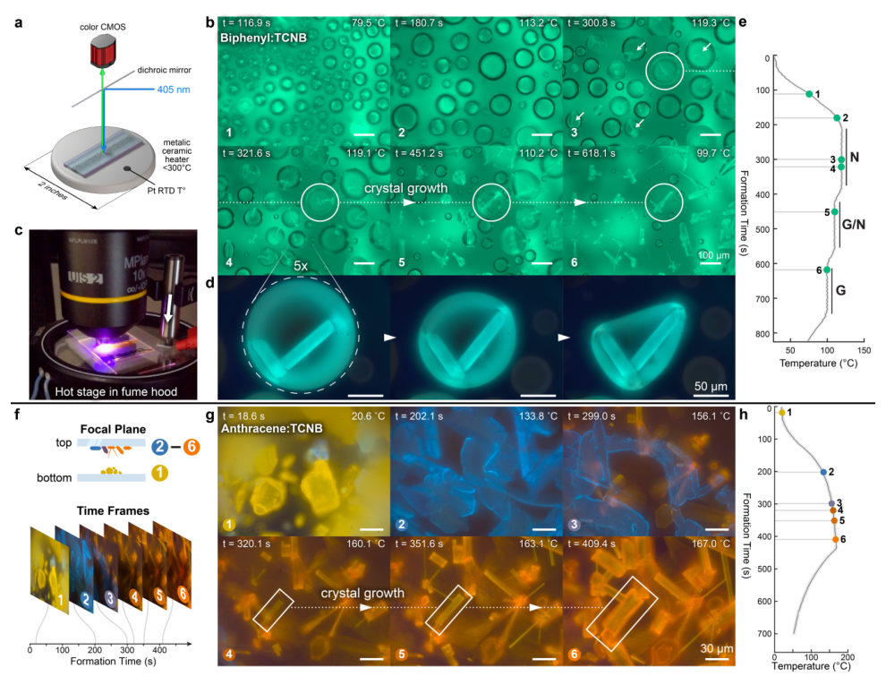 
Fig. 2: In situ tracking of temperature-programmed MAS co-crystal growth. (a) Wide-field fluorescence microscope and hot-stage assembly with 405 nm excitation, colour CMOS detection and resistance temperature detector (RTD) readout. Droplet-mediated Bi:TCNB. (b) Frames 1–6 show melt condensation and ripening, droplet nucleation (white arrows), crystal expansion and subsequent cooling. (c) In-fume-hood implementation; arrow marks the RTD. (d) Fivefold-magnified Bi:TCNB crystal consuming its parent droplet. (e) Temperature trajectory for (b), with nucleation (N) and growth (G) regimes. Vapour- mediated An:TCNB. (f) Focal-plane and timing schematic: frame 1 images precursor on the lower...

📷 Fig 3

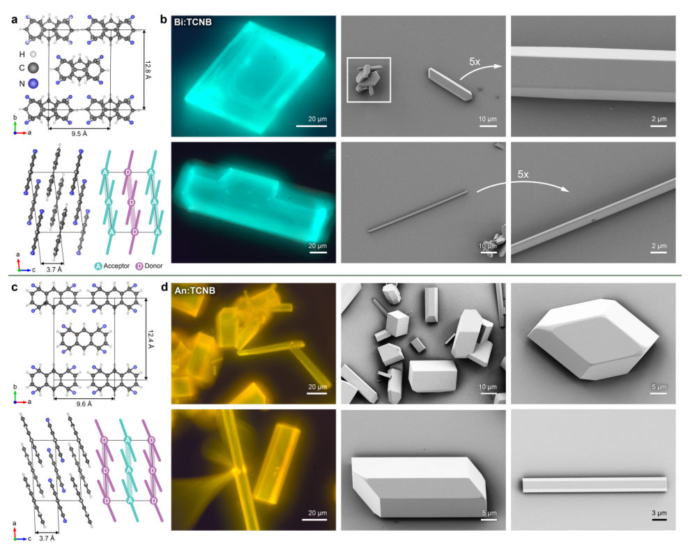 
Fig. 3: Crystal structure and morphology of MAS-grown co-crystals. (a,b) Biphenyl–tetracyanobenzene (Bi:TCNB). (a) Triclinic P1 1:1 Bi:TCNB packing (CIF 1116344, [36]) viewed in the ab and ac planes; N atoms are blue, with unit-cell dimensions and donor–acceptor layer separation (c/2) marked. (b) UV-excited fluorescence and SEM of MAS- grown plates and needles; rightmost panels show ∼5× magnified views and nanoscale-uniform surfaces. (c,d) Anthracene– tetracyanobenzene (An:TCNB). (c) Monoclinic C2/m 1:1 An:TCNB packing (CIF 1103089, [37]) viewed in the ab and ac planes. (d) UV-excited fluorescence and SEM of faceted, mirror-symmetric crystals consistent with C2/m symmetry. Scale bars as...

📷 Fig 4

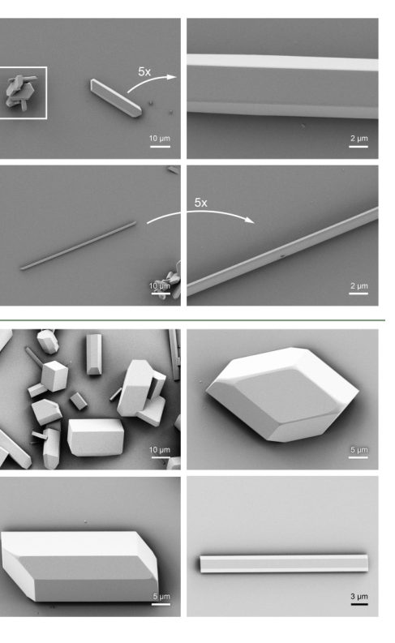 
Fig. 3c next shows the monoclinic C2/m An:TCNB lattice (CIF 1103089) [37]. Its alternating layers re- tain this ∼3.7 ˚A spacing within a distinct unit cell. Fig. 3d then shows bright-orange plates and needles with mirror-symmetric facets and preferential axial growth, highlighting anisotropic growth along preferred crys- tallographic directions consistent with the underlying C2/m symmetry. High-magnification SEM again re- veals smooth faces and sharply defined edges. Thus, the same ambient, minute-scale process accommodates distinct triclinic and monoclinic lattices while preserv- ing their symmetry-dependent morphologies and surface quality. The confined MAS geometry naturally yields this...

📷 Fig 5

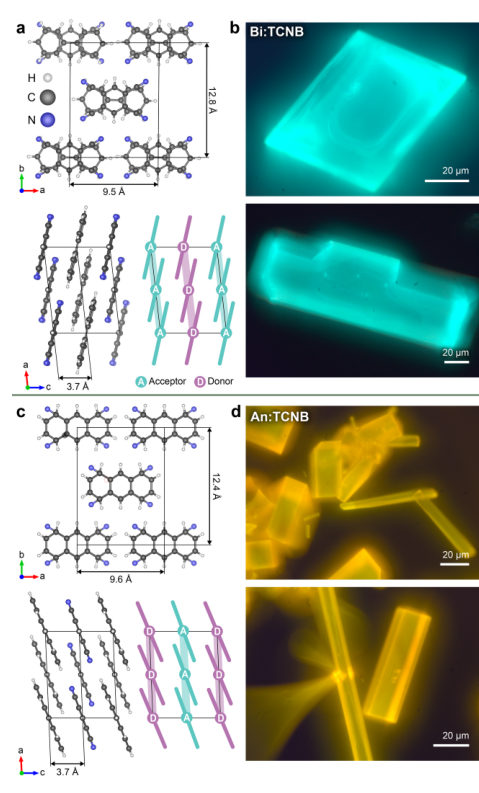 
Fig. 3a first shows the triclinic P1 Bi:TCNB lattice (CIF 1116344) [36]. Alternating 1:1 donor–acceptor lay- ers form ordered, triplet-hosting stacks separated by ∼3.7 ˚A. Fig. 3b then links this packing to the MAS- grown morphology. Green fluorescence reveals plates and elongated needles, with intense edge and corner emission demonstrating excellent intrinsic optical waveguiding. SEM resolves isolated plates, high-aspect-ratio needles and multi-nucleated “floral” assemblies. Magnified views show nanoscale-uniform basal planes and sharply defined sidewalls, consistent with high single-crystal quality. The coexisting plate and needle habits are consistent with packing-directed anisotropic...

**Summary.** This paper introduces Microspacing In-Air Sublimation (MAS) as a revolutionary, low-cost method to grow single-crystal molecular quantum-sensing materials at room temperature. By applying MAS to various co-crystals, the authors successfully demonstrate that these materials exhibit measurable spin coherence and magnetic resonance signals. This establishes MAS as a powerful, accessible tool for engineering molecular quantum sensors.

**Why it may be interesting.** This work directly bridges materials science (low-cost, ambient crystal growth) with fundamental quantum physics (spin coherence and sensing), providing a practical platform for realizing quantum devices outside of vacuum or specialized high-vacuum environments.

Detailed structure

**Main problem.** The challenge is developing a rapid, accessible fabrication method for molecular crystals that exhibit room-temperature optical spin addressability and coherent quantum control for sensing applications.

**Main result.** The authors successfully demonstrated that Microspacing In-Air Sublimation (MAS) can rapidly grow high-quality single crystals of various molecular co-crystals, which exhibit measurable room-temperature Optically Detected Magnetic Resonance (ODMR) and coherent spin control.

**Method.** The core method is MAS, a simple, ambient-condition sublimation technique applied to microgram quantities of precursors, allowing for *in situ* monitoring of crystal growth and subsequent quantum characterization using ODMR and coherence measurements.

**Model / system.** The physical systems are molecular co-crystals, such as donor-acceptor charge-transfer stacks (An:TCNB, Bi:TCNB) and localized-exciton pairs (P:PQ). Quantum sensing relies on the triplet spin manifold within these materials, whose properties are tunable by the molecular structure.

**Key observables.** Room-temperature ODMR resonance linewidths (down to $<4$ MHz), spin coherence times ($T_2 = 0.56 \mu	ext{s}$), and magnetic-field sensitivity ($\eta$ in $\mu	ext{T}/\sqrt{	ext{Hz}}$).

**Important parameters / regimes.** Room temperature operation, microgram scale, and the ability to tune the electronic state via the choice of molecular pair.

**Assumptions / limitations.** The primary assumption is that the quantum properties measured (ODMR, coherence) are preserved and measurable in the rapidly grown, ambient-fabricated crystal geometry.

**Figures summary.** Figures illustrate the MAS growth setup, temperature-programmed growth trajectories showing distinct crystal formation pathways (droplet vs. vapor), and ODMR spectra confirming spin resonance signals.

**Paper structure.** The paper progresses from establishing the need for accessible quantum material fabrication to demonstrating the MAS technique, characterizing the resulting crystals' structural diversity, and finally quantifying their quantum sensing capabilities via ODMR and coherence measurements.

Abstract

Quantum sensing increasingly demands materials combining room-temperature optical spin addressability and coherent control with rapid, accessible fabrication. Yet semiconductor platforms require costly materials and specialized processing, while molecular systems often depend on bespoke synthesis or involved crystal growth. Here we apply microspacing in-air sublimation (MAS) to rapidly fabricate quantum-sensing materials within minutes. Microgram quantities of commercially available precursors crystallize on glass, in air and without vacuum or inert-gas handling. Monitored in situ, growth yields optically clear, stoichiometric single crystals of excellent quality, including plates and needles with intrinsic optical waveguiding. Donor-acceptor charge-transfer co-crystals pairing anthracene or biphenyl with tetracyanobenzene, together with localized-exciton pentacene:pentacenequinone (P:PQ), exhibit room-temperature optically detected magnetic resonance (ODMR). Charge-transfer ODMR resonances reach linewidths below $4\mathrm{MHz}$, consistent with motional narrowing of mobile triplet excitons, while P:PQ supports coherent ensemble spin control with $T_2=0.56μ\mathrm{s}$. Functionality across chemically and electronically distinct pairs establishes MAS as an accessible screen for molecular quantum-sensing materials, connecting molecular crystal engineering with low-cost, chemically tunable thin triplet-spin layers and waveguiding sensor geometries for quantum sensing and microscopy.

[↑ back to top](#top)

### [Anyonic molecules through the trion looking glass](http://arxiv.org/abs/2609.30380v1)

**Authors:** Hao-Ran Cui, Vladimir Calvera, Umang Mehta, Hart Goldman  
**Type:** theory · **Category:** strongly correlated electrons · **PDF:** <https://arxiv.org/pdf/2609.30380v1>  
**Analysis basis:** full PDF text, analyzed in chunks
**Topic relevance:** `Keldysh / 2PI / non-Gaussian methods` **3/5** · `analog quantum simulation` **1/5** · `methods for driven-dissipative` **1/5**

📷 Fig 1

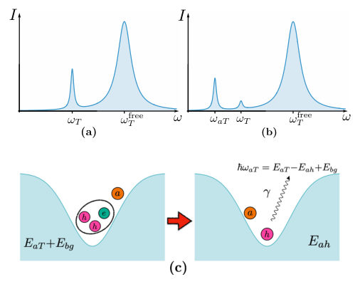 
Figure 1. Sketch of the PL intensity seen at defect ‘traps’ in Ref. [5]. (a) Deep in the FQAH plateau, a trapped trion peak is seen at a red-shifted frequency ωT relative to the un- trapped trion peak at ωfree T . (b) On doping, an additional peak is observed exhibiting a further red-shift. (c) We model the corresponding bound state as an anyonic molecule localized to a potential trap. This exotic object is made up of an anyon attached to a trion –two holes and an electron– with energy EaT . When the exciton recombines, the anyon and remaining hole are deposited back into the trap region with energy Eah, and a photon of frequency ωaT = EaT −Eah +Ebg is emitted, where Ebg is the band gap.

📷 Fig 2

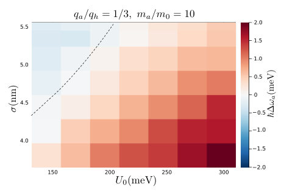 
Figure 2. Anyon-induced shift ℏ∆ωa[ Eq. (8)] of the anyonic molecule PL peak relative to the bound trion, as a function of the bare potential depth U0 and trap size σ. The dashed line marks ℏ∆ωa = 0, demarcating the boundary between red-shift (ℏ∆ωa &gt; 0) and blue-shift (ℏ∆ωa &lt; 0). Note that the bare potential U0 is not to be confused with the defect energy scale felt by the anyon, which is the combined effect of the bare potential with a trapped hole or trion.

📷 Fig 3

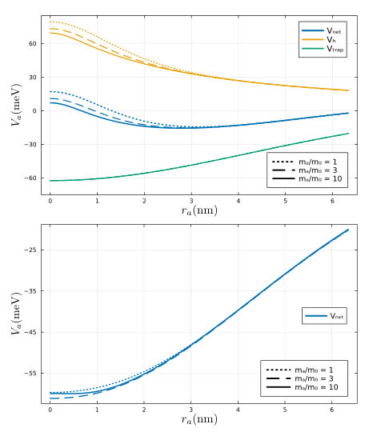 
Figure 3. Effective potential on the anyon (qa/qh = 1/3) for different anyon masses in the anyon-hole bound state (top panel) and the anyon-trion bound state (bottom panel). ra is the absolute distance from the center of the trap. Vnet = Vtrap + Vh for the anyon-hole state, and Vnet = Vtrap + 2Vh + Ve for the anyon-trion state. Plots are evaluated with trap parameters U0 = 190 meV and σ = 4.2 nm.

📷 Fig 4

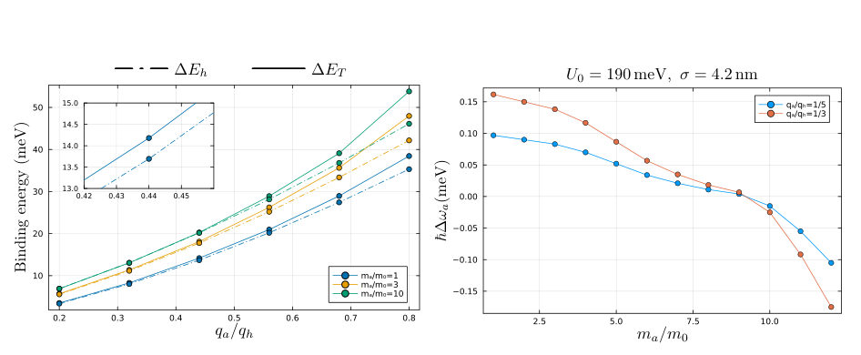 
Figure 4. Energetics of bound states in the trap with parameters U0 = 190meV and σ = 4.2nm. Left panel: binding energy of the anyon to the trapped hole ∆Eh and trapped trion ∆Et (Eq. (14) in the main text). The binding energies exhibit linear dependence for qa/qh ≲2/5. Inset: guide to the eye for difference in energy between the binding energies for ma/m0 = 1 and qa/qh ≈4/9. Right panel: difference between emitted photon energies with and without a valence anyon (c.f. Eq. 8 in the main text) as a function of anyon mass ma in units of the bare electron mass m0, for two representative values of the anyon charge qa in units of the hole charge qh. The anyonic molecule is red-shifted (∆ωa &gt; 0)...

📷 Fig 5

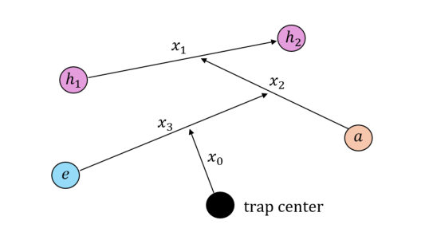 
Figure 5. Schematic illustration of the center of mass coordinate ⃗x0 and three Jacobi coordinates ⃗x1, ⃗x2, ⃗x3 for the anyon-trion system.

**Summary.** This theoretical study models the binding of fractional anyons to electronic trions within defects in materials like twisted MoTe2. By using variational quantum mechanics, the authors predict that this binding forms an 'anyonic molecule' characterized by a measurable red-shift in photoluminescence. This work provides a quantitative link between fundamental fractional statistics and observable optical signatures in condensed matter systems.

**Why it may be interesting.** The work bridges concepts from fractional quantum Hall physics (anyons) with solid-state defect physics (trions/traps), providing a quantitative prediction (meV scale shift) that can be tested against optical measurements in 2D materials.

Detailed structure

**Main problem.** The study investigates the formation and properties of 'anyonic molecules' resulting from the binding of itinerant anyons to ordinary electronic bound states (trions) within a defect potential.

**Main result.** The formation of such molecules can lead to a measurable photoluminescence red-shift on the meV scale, which depends on both the anyon's fractional charge and its kinetic energy.

**Method.** The research employs variational quantum mechanics using explicitly correlated Gaussian basis sets to solve the few-body Schrödinger equation for the interacting system.

**Model / system.** The system models anyons, electrons, and holes in a platform like twisted MoTe2, confined by a Gaussian trapping potential. The Hamiltonian includes kinetic and long-range electrostatic interactions (Keldysh-Rytova potential).

**Key observables.** Photoluminescence (PL) frequency shift ($\Delta\omega$), binding energies ($\delta E$), and particle density distributions ($P_i(r)$).

**Important parameters / regimes.** Anyon fractional charge ($q_a$), anyon kinetic energy, trap depth ($U_0$), and trap size ($\sigma$).

**Assumptions / limitations.** The defect structure is modeled by a simple Gaussian potential, and the analysis assumes the trapped hole remains localized and does not re-fractionalize.

**Figures summary.** Figures illustrate the PL intensity showing the red-shifted anyonic molecule peak, and density plots show the spatial localization of anyons, holes, and electrons within the trap.

**Paper structure.** The paper progresses from defining the minimal few-body model and Hamiltonian, through variational calculations to find bound states, and finally analyzing the observable PL shifts and spatial density profiles.

Abstract

Motivated by recent optical measurements in twisted MoTe$_2$ homobilayers, we numerically study the binding of itinerant anyons to ordinary electronic bound states. Using a minimal few-body model of an anyon alongside holes and electrons in a Gaussian trapping potential, we show that a fractionally charged bound state comprised of an anyon and an ordinary electronic trion can become favorable nearby local electrostatic defects. The resulting object is an anyonic molecule wherein the anyon is bound to the trion ``nucleus,'' which in turn is localized to the defect and can be excited optically. We find that the resulting anyon-trion can exhibit a photoluminescence red-shift relative to the ordinary trapped trion, with binding on the meV scale for parameters relevant to twisted MoTe$_2$. We find that the value of this red-shift depends on $\textit{both}$ the anyon's fractional charge and its kinetic energy, thereby encoding both universal and non-universal anyon properties. Our results are qualitatively consistent with observations in twisted MoTe$_2$.

[↑ back to top](#top)

### [Counterdiabatic quantum optimization for efficient state preparation in the Schwinger model](http://arxiv.org/abs/2609.31400v1)

**Authors:** Ethan Laval, Bipasha Chakraborty, Stefano Cipolla  
**Type:** theory · **Category:** quantum information and computing · **PDF:** <https://arxiv.org/pdf/2609.31400v1>  
**Analysis basis:** full PDF text, analyzed in chunks
**Topic relevance:** `analog quantum simulation` **3/5** · `Keldysh / 2PI / non-Gaussian methods` **1/5** · `quantum measurements` **1/5**

📷 Fig 1

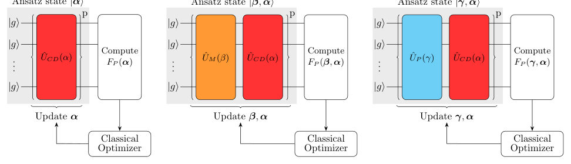 
Figure 1: The circuit diagrams for the algorithms QAOA in (a), DC-QAOA in (b), CD-inspired in (c), CD-mixer in (d) and CD-prob in (e). The expectation values FP (γ, β), FP (γ, β, α), FP (α), FP (β, α) and FP (γ, α) are defined in (6), (14), (17), (20) and (23) respectively.

📷 Fig 2

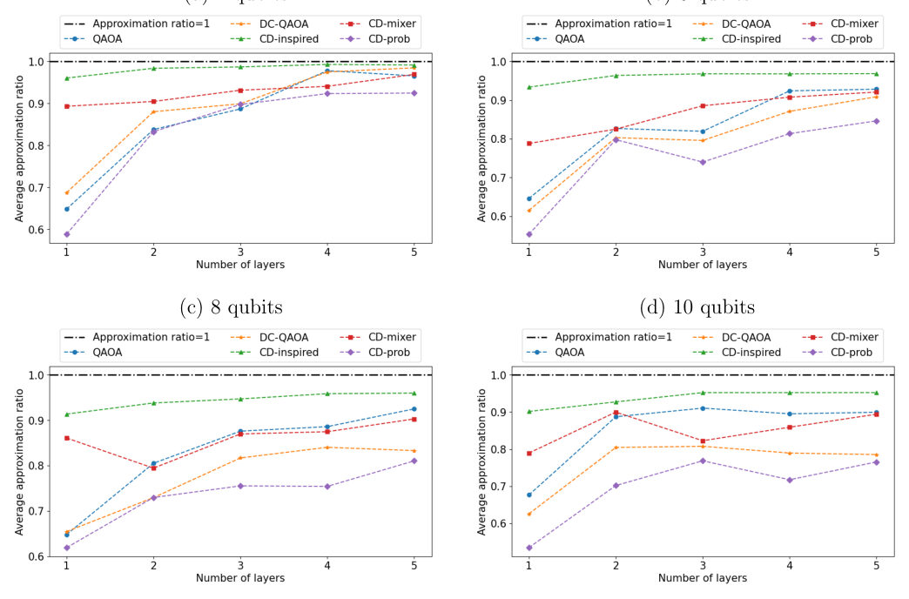 
Figure 2: The average approximation ratios of the algorithms with an XY mixer for the Schwinger model against the number of layers for 4 qubits in (a), 6 qubits in (b), 8 qubits in (c), and 10 qubits in (d). The model parameters are m = 0.35, w = 0.6, J = 5/12 and θ = 0.

📷 Fig 3

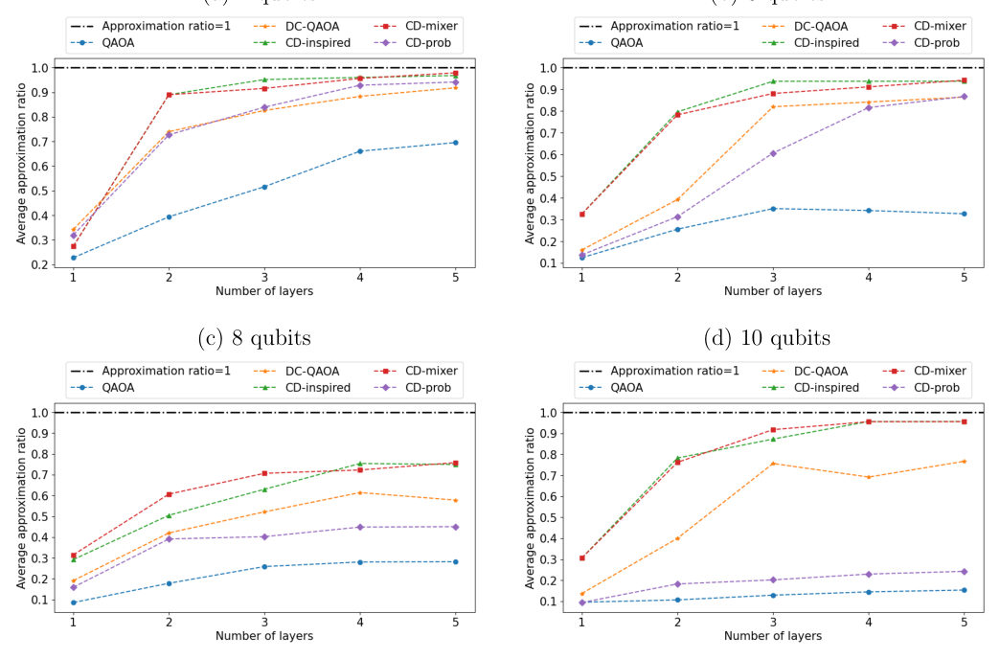 
Figure 3: The average approximation ratios of the algorithms with an X mixer for the Schwinger model against the number of layers for 4 qubits in (a), 6 qubits in (b), 8 qubits in (c), and 10 qubits in (d). The model parameters are m = 0.35, w = 0.6, J = 5/12 and θ = 0.

📷 Fig 4

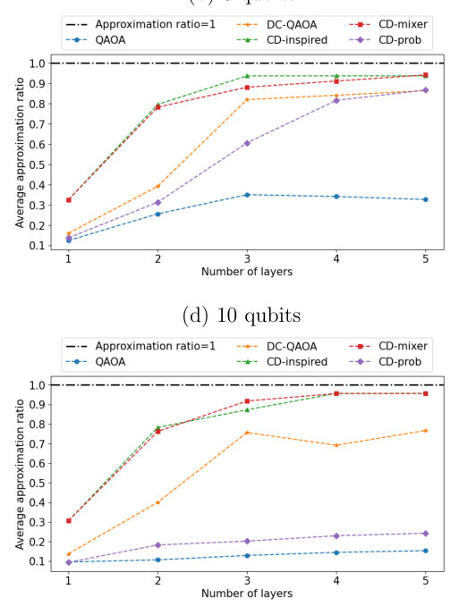 
Figure 2 shows the average approximation ratios from running the 5 different algorithms with an XY mixer for the Schwinger model using 1 to 5 layers and 4, 6, 8 and 10 qubits. We also present, in Figure 3, the results obtained using an X mixer. The average approximation ratios reported for the Counterdiabatic (CD) algorithms are the average approximation ratios obtained for the fixed CD term from the pool for that layer (calculated from 20 runs). And indeed, the results for the runs obtained by other CD terms were used solely for the CD term fixing procedure and were not included in the average. This gives both QAOA and the CD algorithms an equal number of runs (20) when calculating their...

📷 Fig 5

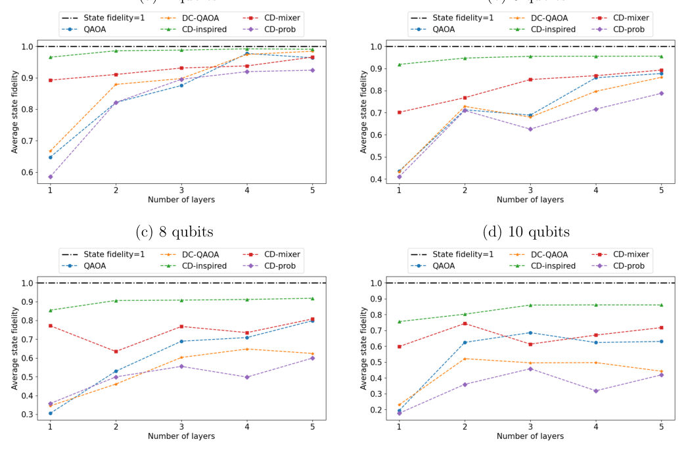 
Figure 4: The average state fidelity between the ˆHSchwinger ground state and the final ansatz state of the algorithms with an XY mixer for the Schwinger model against the number of layers for 4 qubits in (a), 6 qubits in (b), 8 qubits in (c), and 10 qubits in (d). The model parameters are m = 0.35, w = 0.6, J = 5/12 and θ = 0.

**Summary.** This paper investigates using counterdiabatic driving to enhance quantum algorithms for finding the ground state of the Schwinger model. By comparing DC-QAOA and related CD variants against standard QAOA, the authors demonstrate that CD protocols offer a practical and resource-efficient route for simulating lattice gauge theories on quantum hardware.

**Why it may be interesting.** The work directly compares resource-efficient quantum algorithms (CD-QAOA) against standard variational methods (QAOA) for simulating complex quantum field theories, providing benchmarks for NISQ-era quantum simulation.

Detailed structure

**Main problem.** The paper addresses the challenge of efficiently preparing the ground state of lattice gauge theories, specifically the Schwinger model, using quantum computation.

**Main result.** Counterdiabatic (CD) driving protocols, implemented in DC-QAOA, are shown to improve ground-state preparation compared to standard QAOA, achieving better performance in terms of circuit depth and resource cost.

**Method.** The authors systematically analyze and compare several quantum algorithms, including QAOA, DC-QAOA, and CD-inspired variants, by minimizing expectation values derived from the Hamiltonian.

**Model / system.** The study focuses on the Schwinger model, a paradigmatic (1+1)-dimensional lattice gauge theory, whose Hamiltonian is mapped onto Pauli gates via the Jordan-Wigner transformation.

**Key observables.** Best approximation ratio and best state fidelity between the final ansatz state and the true ground state of the Hamiltonian.

**Important parameters / regimes.** Number of qubits (up to 10), number of QAOA layers ($p$), and variational parameters ($\gamma, eta, \alpha$).

**Assumptions / limitations.** The analysis relies on approximating continuous evolution using Trotterization and assumes that CD driving can accelerate the adiabatic process significantly.

**Figures summary.** Figures compare best approximation ratios and state fidelities for QAOA vs. CD variants across varying qubit numbers and layers, showing CD methods often outperform QAOA.

**Paper structure.** The paper develops the theoretical framework for CD-QAOA, details the specific CD-QAOA variants (CD-inspired, CD-mixer, CD-prob), and concludes with systematic computational benchmarking comparing these methods against standard QAOA.

Abstract

The Quantum Approximate Optimization Algorithm (QAOA), whose design is underpinned by the adiabatic theorem, is one of the leading variational quantum algorithms for preparing the ground states of gauge theories. A recently proposed variant, DC-QAOA, incorporates counterdiabatic driving to accelerate the adiabatic process, reducing both circuit depth and runtime. In this work, we present a systematic analysis, from both theoretical and computational perspectives, of DC-QAOA and related counterdiabatic variants for preparing the ground state of the Schwinger model, the paradigmatic (1+1)-dimensional lattice gauge theory. Benchmarking these methods against standard QAOA, we show that counterdiabatic driving improves ground-state preparation while lowering circuit depth requirements. Our results establish counterdiabatic protocols as a practical route towards efficient quantum simulation of gauge theories.

[↑ back to top](#top)

### [Observation of the electronic Pomeranchuk effect in generalized Wigner crystals of twisted MoS$_2$](http://arxiv.org/abs/2609.30788v1)

**Authors:** Xinjie Fang, Linfeng Wu, Naitian Liu, Le Zhang, Wenqiang Zhou, Jing Ding, Zhangyuan Chen, Hanxiao Xiang, Yue Xiao, Kenji Watanabe, Takashi Taniguchi, Shuigang Xu  
**Type:** experiment · **Category:** strongly correlated electrons · **PDF:** <https://arxiv.org/pdf/2609.30788v1>  
**Analysis basis:** full PDF text, analyzed in chunks
**Topic relevance:** `analog quantum simulation` **3/5** · `Frenkel-Kontorova` **1/5** · `driven-dissipative phase transition` **1/5**

📷 Fig 1

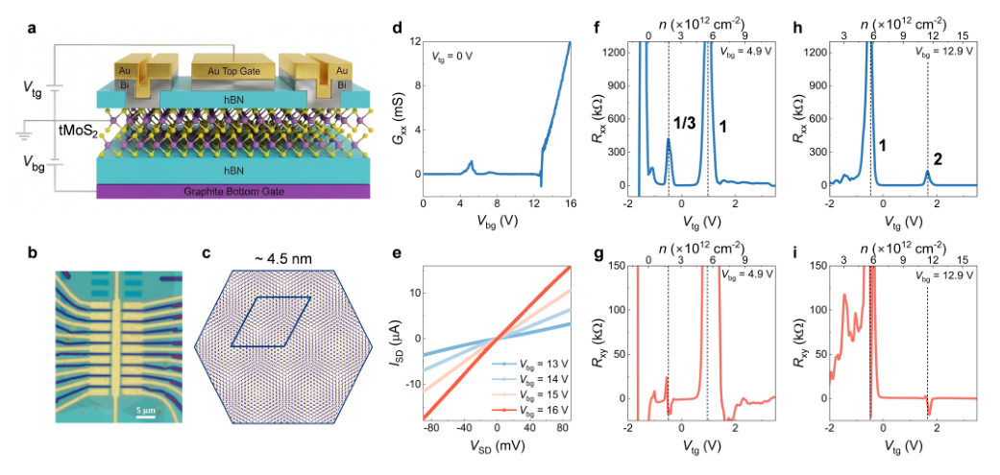 
FIG. 1. Device structure and electrical performance of the tMoS2 FET. a-c, Schematic illustration (a), optical image (b) of the device D1, and depiction of the twisted bilayer MoS2 moir´e superlattice (c). d, Four-terminal conductance as a function of Vbg at fixed Vtg = 0 V. e, Two-terminal ISD-VSD characteristics of a representative tMoS2 device measured at 1.5 K. f, h, Longitudinal resistance Rxx plotted as a function of Vtg at fixed Vbg = 4.9 V (f) and Vbg = 12.9 V (h). g, i, Corresponding transverse resistance Rxy plotted as a function of Vtg, at Vbg = 4.9 V (g) and Vbg = 12.9 V (i) under an applied magnetic field B = 6 T. The resistance peaks of correlated insulator at ν = 1/3, the...

📷 Fig 2

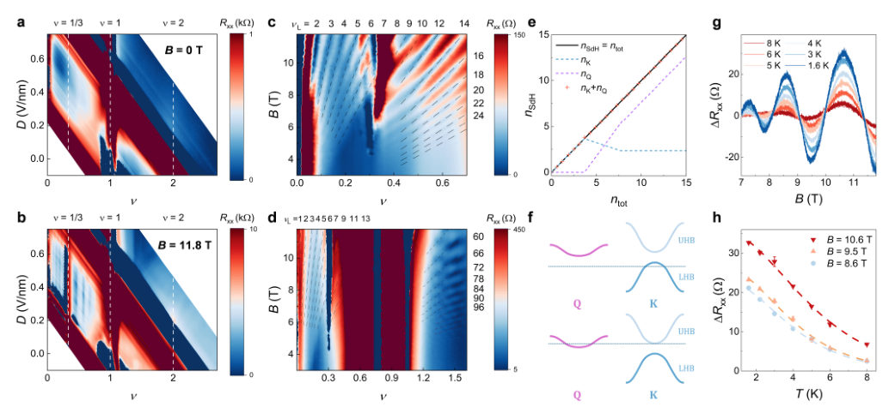 
FIG. 2. Quantum oscillations in tMoS2 (device D1). a, b, Color map of four-terminal resistance Rxx as a function of ν and D at B = 0 T (a) and B = 11.8 T (b) at 1.5 K. The filling factors of ν = 1/3, ν = 1, and ν = 2 are marked. c, d, Rxx as a function of ν and B at fixed D = 0.425 V nm−1 (c) and D = 0.650 V nm−1 (d). e, Electron carrier density extracted from SdH oscillations (nSdH) as a function of total carrier density induced by gates (ntot). Black solid curve represents nSdH = ntot. The blue and purple dashed curves denote the electron densities inferred to be in the K/K′ bands nK and Q/Q′ bands nQ, respectively (degeneracy g = 1 in 0 &lt; n &lt; 1.4×1012 cm−2, g = 2 in n &gt; 1.4×1012 cm−2 for...

📷 Fig 3

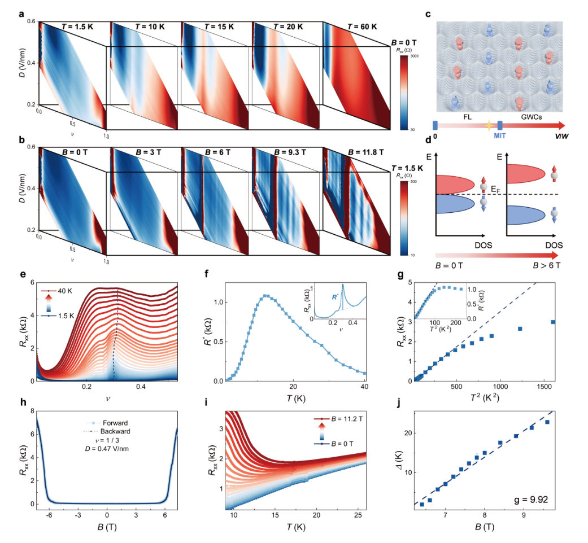 
FIG. 3. Pomeranchuk effect at ν = 1/3 in tMoS2 (device D1). a, b, Evolution of Rxx(ν, D) maps near ν = 1/3 as a function of T (a) and B (b). c, Up panel: Schematic of spatial charge distribution on the moir´e superlattice at ν = 1/3. Bottom panel: Schematic phase diagram of MIT transition at ν = 1/3. The yellow star marks that our system lies on the left boundary of the MIT. d, Schematic of the magnetic field induced Zeeman splitting with gap opening. e, Rxx as a function of ν at various temperature from 1.5 K to 40 K at fixed Vbg = 5.9 V. The dashed curve guides the shift of the correlated peaks. f, Temperature dependence of R∗, where R∗is extracted by subtracting a smooth background (see...

📷 Fig 4

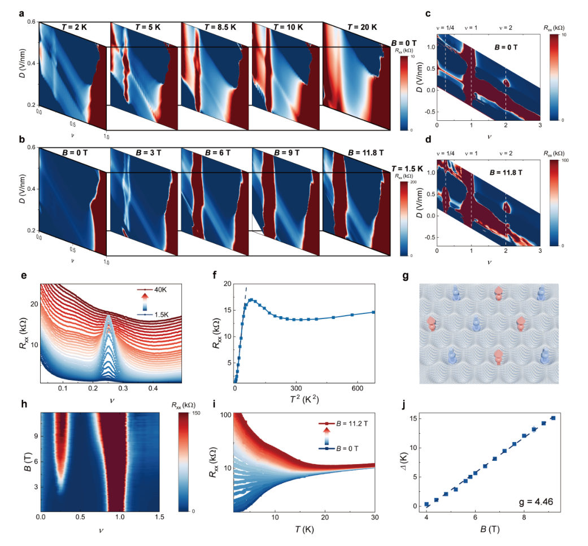 
FIG. 4. Pomeranchuk effect at ν = 1/4 in tMoS2 (device D2). a, b, Evolution of Rxx(ν, D) maps near ν = 1/4 as a function of T (a) and B (b). c, d, Color map of four-terminal resistance Rxx as a function of ν and D at B = 0 T (c) and B = 11.8 T (d) at 1.5 K. The dashed lines mark the position of ν = 1/4, ν = 1, and ν = 2. e, Rxx as a function of ν at various temperature from 1.5 K to 40 K at fixed Vbg = 5.1 V. f, Rxx plotted as a function of T 2 at fixed D = 0.350 V nm−1. The dashed line denotes the linear fit at low-temperature region. g, Schematic of spatial charge distribution on the moir´e superlattice at ν = 1/4. h, Color map of Rxx as a function of ν and B at fixed Vbg = 5.0 V. i, Rxx...

**Summary.** This experimental work reports the observation of the electronic Pomeranchuk effect in twisted bilayer MoS2 moiré superlattices at fractional fillings. The system transitions from a conducting Fermi liquid at low temperatures to a localized Wigner crystal upon heating, a transition driven by the entropy associated with degenerate isospin degrees of freedom. This highlights moiré heterostructures as a key platform for studying entropy-driven correlated electronic phase transitions.

**Why it may be interesting.** The observation of an entropy-driven phase transition in a solid-state moiré system provides a concrete experimental realization of theoretical concepts regarding the interplay between entropy, correlation, and dimensionality, relevant to understanding exotic quantum states.

Detailed structure

**Main problem.** The study aims to observe the electronic Pomeranchuk effect, where increasing temperature drives a transition from an itinerant Fermi liquid to a localized Wigner crystal state, stabilized by isospin entropy.

**Main result.** The authors report observing this entropy-driven transition at fractional fillings ($
u=1/3$ and $
u=1/4$) in twisted bilayer MoS2, characterized by an anomalous increase in longitudinal resistivity upon heating.

**Method.** The research utilizes temperature-dependent and magneto-transport measurements (e.g., Rxx, SdH oscillations) on high-quality twisted bilayer MoS2 devices.

**Model / system.** The platform is AB-stacked twisted bilayer MoS2 moiré superlattices, which provide a tunable environment for strongly correlated phases like generalized Wigner crystals. The physics is governed by the competition between itinerant electron behavior and charge localization driven by long-range Coulomb interactions.

**Key observables.** Longitudinal resistivity (Rxx) vs. Temperature (T), Shubnikov-de Haas (SdH) oscillations, effective mass ($m^*$), and fractional resistance features.

**Important parameters / regimes.** Fractional filling factors ($
u = 1/3$ and $
u = 1/4$), twist angles ($	heta = 4.1^\circ$ and $3.9^\circ$), and temperature dependence.

**Assumptions / limitations.** The transition is modeled as an electronic analogue of the Pomeranchuk effect, where isospin entropy drives the system into a localized, charge-ordered state.

**Figures summary.** Figures show Rxx vs. T/V_tg, SdH oscillations revealing valley-dependent effective masses, and real-space electron configurations illustrating the GWC state.

**Paper structure.** The paper presents transport measurements across different filling factors and temperatures, analyzing the low-T Fermi-liquid behavior, the intermediate-T anomalous resistance increase (the Pomeranchuk signature), and the resulting charge-ordered GWC state.

Abstract

Moire superlattices in transition metal dichalcogenides provide a highly tunable platform for exploring strongly correlated electronic phases, such as generalized Wigner crystals. While these crystalline states typically melt with increasing thermal fluctuations, an electronic analogue of the Pomeranchuk effect can stabilize the localized solid phase at elevated temperature through isospin entropy. Here, we report the observation of an electronic Pomeranchuk effect at the fractional filling factors of $ν= 1/3$ and $ν= 1/4$ in AB-stacked twisted bilayer MoS$_2$ with twist angles of 4.1$^\circ$ and 3.9$^\circ$, respectively. At ultra-low temperature, the system exhibits a highly conducting, itinerant behavior at these fractional fillings, characteristic of a compressible Fermi-liquid ground state. Upon heating, the system exhibits a counterintuitive increase in the longitudinal resistivity, signaling an isospin-entropy-driven transition into a localized generalized Wigner crystal state. Our findings highlight the unique capacity of flat bands in twisted bilayer MoS$_2$ for stabilizing highly degenerate magnetic configurations, offering new insights into the thermodynamic phase diagrams of low-dimensional correlated systems.

[↑ back to top](#top)

### [Shaping of the finite-size chaos crossover in Floquet circuits by coherent-mismatch architecture](http://arxiv.org/abs/2609.31391v1)

**Authors:** Xiangjun Tan, Wenqi Liu, Hanjie Zhu, Wenkai Bai, Zhanning Wang  
**Type:** theory · **Category:** other · **PDF:** <https://arxiv.org/pdf/2609.31391v1>  
**Analysis basis:** full PDF text, analyzed in chunks
**Topic relevance:** `analog quantum simulation` **3/5** · `non-equilibrium universality` **1/5** · `scars & prethermalization` **1/5**

📷 Fig 1

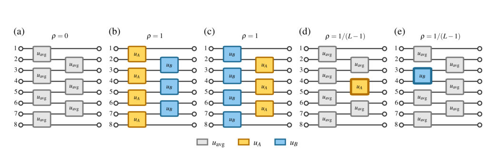 
FIG. 1. Five gate patterns for one period of the open-boundary brickwall circuit, illustrated for L = 8. Time runs from left to right, with the first layer acting on odd bonds and the second layer acting on even bonds. Grey, yellow, and blue denote uavg, uA, and uB, respectively. (a) The homogeneous reference H uses uavg on every bond. (b) and (c) The full-support circuits AB and BA alternate uA and uB with opposite starting gates. (d) Circuit DA places uA on bond bA = L/2 and uses uavg elsewhere. (e) Circuit DB places uB on bond bB = L/2 −1 and uses uavg elsewhere. The corresponding source fractions are 0, 1, 1, 1/(L −1), and 1/(L −1).

📷 Fig 2

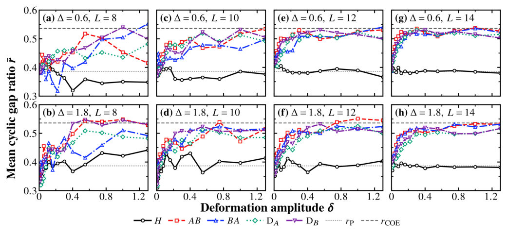 
FIG. 2. Symmetry-resolved cyclic gap-ratio flow across contrast architectures and system sizes. The mean cyclic adjacent-gap ratio ¯r is shown as a function of δ for the XXZ parents ∆= 0.6 (top row) and ∆= 1.8 (bottom row), with L = 8, 10, 12, 14 from left to right. The homogeneous reference H, full-support circuits AB and BA, and single-defect circuits DA and DB are defined in Fig. 1. At δ = 0, the exact spin-flip and reflection blocks are resolved, whereas the full half-filled sector is used at positive δ. The dotted and dashed horizontal lines mark rP and rCOE, respectively. The full-support flow toward COE shifts to smaller local amplitudes as L increases, while the homogeneous...

📷 Fig 3

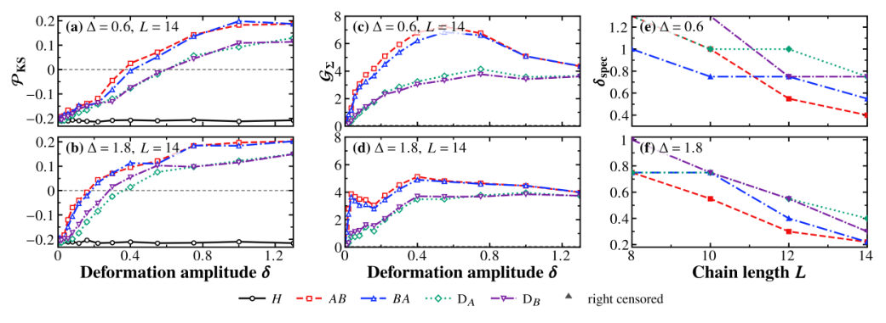 
FIG. 3. Spacing distributions, spectral rigidity, and the joint spectral-response scale in finite-size circuits. Panels (a) and (b) show the spacing-reference preference PKS at L = 14 for ∆= 0.6 and 1.8, respectively. Panels (c) and (d) show the corresponding rigidity gain GΣ at ℓ= 5 relative to the shared homogeneous reference H. Panels (e) and (f) show the persistent joint spectral-response scale δspec as a function of L. The joint condition requires χr,env ≥0.5, PKS &gt; 0, and GΣ ≥0.05 at two consecutive deformation points. Upward carets mark right-censored cases for which no persistent joint response is found through δ = 1.30. The positive spacing preference and rigidity gain confirm...

📷 Fig 4

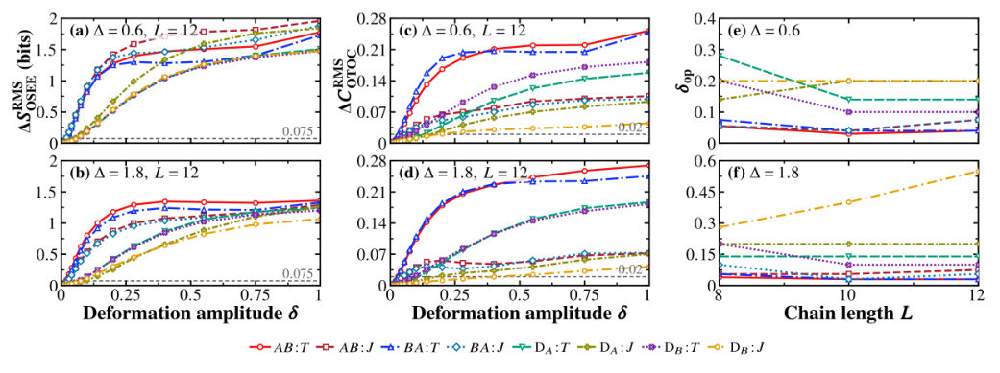 
FIG. 4. Neutral-operator response across mismatch extent. Panels (a) and (b) show the reference-relative RMS response of the charge-resolved half-chain OSEE at L = 12 for ∆= 0.6 and 1.8, respectively. Panels (c) and (d) show the corresponding far-bond OTOC response. The initial and far probes are both hopping operators T or both current operators J. The OSEE response is evaluated at t = 2, 4, . . . , 48, whereas the OTOC response is evaluated at t = 1, . . . , 48. Horizontal lines mark the thresholds 0.075 bits and 0.020. Panels (e) and (f) show the persistent joint operator-response scale δop for L = 8, 10, 12. For both probes and parents, full support reaches the joint operator threshold...

📷 Fig 5

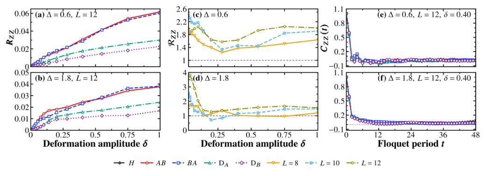 
FIG. 5. Centered local-charge memory across mismatch extent. Panels (a) and (b) show the reference-relative RMS response RZZ at L = 12 for ∆= 0.6 and 1.8, respectively. The measured site is jc = L/2, the common endpoint of the two single-defect bonds. Panels (c) and (d) show the conservative ratio RZZ for L = 8, 10, 12 over the fixed analysis window 0.03 ≤δ ≤1. The dashed line marks RZZ = 1. Panels (e) and (f) show representative autocorrelation traces at L = 12 and δ = 0.40. At L = 12, RZZ &gt; 1 at every sampled amplitude in the stated window for both parents, so local charge memory distinguishes the tested families. A larger RZZ measures a stronger change in the autocorrelation, which can...

**Summary.** This paper analyzes how the spatial pattern of local gate perturbations affects the onset of chaos in Floquet XXZ quantum circuits. By comparing single-defect versus alternating perturbation patterns, the authors show that the placement of defects, not just their total number, dictates the system's approach to random matrix statistics. This highlights the importance of spatial coherence in controlling quantum dynamics.

**Why it may be interesting.** This work directly addresses how local perturbations shape the transition to chaos in quantum many-body systems, which is highly relevant for understanding quantum thermalization and scrambling in engineered quantum simulators.

Detailed structure

**Main problem.** The study investigates how the spatial pattern of a deterministic coherent gate perturbation influences the finite-size chaos crossover and operator dynamics in U(1)-symmetric XXZ Floquet circuits.

**Main result.** The spatial arrangement of perturbations is crucial; alternating circuits show faster chaotic crossover than single defects, and the response is nonmonotonic, meaning bond density alone is insufficient.

**Method.** The authors use perturbative analysis, comparing different circuit architectures (single-defect vs. alternating full-support) by analyzing bond-averaged generators and spectral statistics.

**Model / system.** The system is a one-dimensional Floquet circuit based on the XXZ model, characterized by a conserved U(1) charge. The dynamics are governed by the Floquet operator, which is perturbed by local coherent gates.

**Key observables.** Finite-size quasienergy statistics (e.g., gap ratios), operator-space entanglement, and out-of-time-order correlations (OTOCs).

**Important parameters / regimes.** The local amplitude of the perturbation ($\delta$), the number of modified bonds ($K$), and the spatial placement of these bonds.

**Assumptions / limitations.** The analysis often compares the system to known integrable forms and assumes the validity of perturbative expansions for small perturbations.

**Figures summary.** Figures compare gap ratios for various gate assignments (central vs. alternating full support) and show the evolution of operator distances ($D_{loc}(t)$) when defects are displaced from the center.

**Paper structure.** The paper systematically compares different circuit architectures (homogeneous, single-defect, alternating full-support) by analyzing their bond-averaged generators, testing for deviations from integrability, and measuring spectral statistics.

Abstract

We study how the spatial profile of a deterministic coherent gate perturbation affects finite-size quasienergy statistics and operator dynamics in U(1)-symmetric XXZ Floquet circuits. Using a shared homogeneous reference, we compare a single modified bond with an alternating perturbation applied across the whole chain. After separating symmetry sectors and checking several known integrable forms, we find that the alternating circuits move toward circular orthogonal ensemble level statistics and change operator-space entanglement and out-of-time-order correlations at smaller local amplitudes than the single defects. For intermediate numbers of modified bonds, the response is nonmonotonic and also depends on where the bonds are placed, so bond density alone is not enough. A perturbative analysis identifies the additive weight of many modified bonds, while coherent spatial interference reshapes the coupling between nearby eigenstates.

[↑ back to top](#top)

### [A Three-Party W-State Quantum Secret Sharing Protocol with X-Gate Encoding and Forbidden-Outcome Detection](http://arxiv.org/abs/2609.31472v1)

**Authors:** Timur R. Teregulov, Elena R. Loubenets  
**Type:** both · **Category:** quantum information and computing · **PDF:** <https://arxiv.org/pdf/2609.31472v1>  
**Analysis basis:** full PDF text, analyzed in chunks
**Topic relevance:** `quantum measurements` **3/5** · `QC/QI experiment` **1/5**

📷 Fig 1

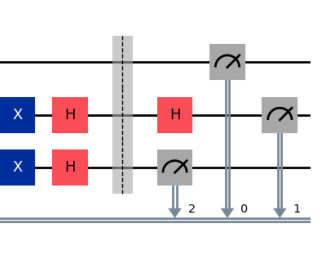 
Figure 1. Circuit representation of a complete protocol round

**Summary.** This work introduces a three-party Quantum Secret Sharing protocol utilizing the W state and X-gate encoding for secure bit distribution. It analyzes the protocol's efficiency and proves its security by demonstrating that an eavesdropper attempting to gain information will inevitably cause detectable errors during security test rounds. The protocol is implemented and tested on quantum processors.

**Why it may be interesting.** The rigorous security analysis, particularly the link between information gain and detectable disturbance (forbidden outcomes), provides a concrete, experimentally verifiable measure of security for quantum communication protocols.

Detailed structure

**Main problem.** The paper develops and analyzes a novel three-party Quantum Secret Sharing (QSS) protocol based on the W state to securely distribute a secret quantum bit.

**Main result.** The protocol is shown to be secure against internal adversaries because any attempt to gain information (entangle-and-measure attack) results in a non-zero probability of detecting the intrusion via forbidden outcomes.

**Method.** The protocol uses X-gate encoding on a three-qubit W state, incorporates random Hadamard operations, and involves distinct information and security-test rounds for verification.

**Model / system.** The system is a three-qubit quantum state initialized in a W state. Operations include X-gate encoding, random Hadamard gates, and measurements performed in randomly chosen bases (Z or X).

**Key observables.** Quantum Bit Error Rate (QBER), detection probabilities for specific attacks, and the probability of an informational round ($P(R_i \in I) = 5/12$).

**Important parameters / regimes.** The efficiency is quantified by the qubit efficiency ($\eta_q \approx 13.89\%$), and performance is noted to depend on the specific quantum processor used.

**Assumptions / limitations.** The security analysis focuses on internal adversaries, and the efficiency calculations assume uniform probability over all combinations of gate applications and measurement bases.

**Figures summary.** Table 1 illustrates quantum states resulting from X-gate applications and the corresponding secret bits. Table 2 summarizes round types based on Hadamard applications and measurement bases. Figure 1 shows the circuit for one protocol round.

**Paper structure.** The paper details the protocol construction using the W state and X-gate encoding, analyzes its efficiency by calculating round probabilities, and rigorously proves security by analyzing the detection probability against intercept-and-resend and entangle-and-measure attacks.

Abstract

We develop a new three-party quantum secret-sharing (QSS) protocol based on a three-qubit W state. This protocol encodes the secret-sequence bits using X gates and employs randomly selected Hadamard operations and measurement bases to generate information and security-test rounds. We evaluate the efficiency of the proposed protocol and analyze its security against an internal adversary performing intercept-and-resend and entangle-and-measure attacks, deriving the corresponding detection probabilities. The analysis of the entangle-and-measure attack shows that extracting information through an ancillary system leads to a nonzero probability of forbidden outcomes in the test rounds, thereby enabling the detection of the attack. The proposed protocol is implemented in Python using the Qsikit framework and executed on quantum processors. Its performance is evaluated in terms of the quantum bit error rate (QBER) for information rounds under different secret-bit encoding configurations. The experimental results demonstrate that the QBER depends noticeably on the quantum processor used.

[↑ back to top](#top)

### [Categorical spin-networks: state-sum invariants of 4-manifolds from higher-gauge theory](http://arxiv.org/abs/2609.31365v1)

**Authors:** Hank Chen, Zhian Jia, Ran Luo, Wei Cui  
**Type:** theory · **Category:** other · **PDF:** <https://arxiv.org/pdf/2609.31365v1>  
**Analysis basis:** full PDF text, analyzed in chunks
**Topic relevance:** `analog quantum simulation` **3/5** · `methods for driven-dissipative` **1/5**

📷 Fig 1

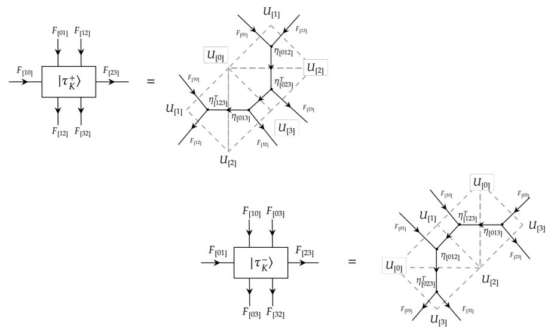 
Figure 1: The tensor networks and the string diagrams corresponding to the (contracted) tetrahedron states (3.4) (left) and (3.5) (right). The regions are coloured by objects Ur0s, . . . Ur3s P C. The graphs given by the gray dashed lines depict the 2-simplices ∆`, ∆´.

📷 Fig 2

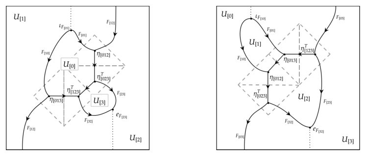 
Figure 2: The tetrahedral states upon contracting pairs of its free ends as in Proposition 3.2. The dotted lines indicate identity 1-morphisms.

📷 Fig 3

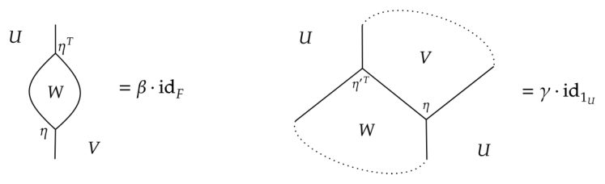 
Figure 3: The planar string diagrams for the þ-net (left) and the θ-net (right). They are named after their shapes. Similar θ-nets have also appeared in the Crane-Yetter construction [64, 83, 111].

📷 Fig 4

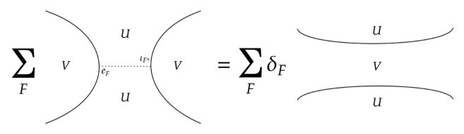 
Figure 4: The surface diagram arising from the operation (4.5). The scalar δF “ dim F appears due to the normalization of the projectors pF (4.4). This is precisely the Kirby colour of [112].

📷 Fig 5

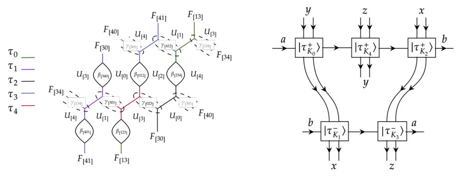 
Figure 5: The string diagram (left) and tensor network (right) representing a 4-simplex scattering vector ψK P H` Bσ (4.7). On the left, the colours label contributions from the different tetrahedra. On the right, the symbols a, b , x, y, z label the external tensor legs that can be contracted to form the scattering amplitude; the way these labels are contracted makes the diagram non-planar.

**Summary.** This paper develops a sophisticated mathematical framework to calculate topological invariants for 4-manifolds by generalizing spin-network constructions using higher-gauge theory. It introduces a $20j$-symbol formalism and constructs a corresponding 3D lattice Hamiltonian model. This work advances the understanding of TQFTs by connecting them to advanced categorical structures.

**Why it may be interesting.** While highly abstract, the connection between lattice Hamiltonians (like Levin-Wen models) and topological invariants is fundamental to understanding quantum phases of matter, which is a core theme in condensed matter theory.

Detailed structure

**Main problem.** The work aims to define and compute state-sum invariants for 4-manifolds using the framework of higher-gauge theory.

**Main result.** The authors develop a $20j$-symbol formalism that computes these invariants and construct an explicit 3D Levin-Wen-type lattice Hamiltonian model realizing the state-sum invariant.

**Method.** The methodology involves decorating triangulated manifolds with input data from a presemisimple locally fusion pivotal tensor 2-category, leading to a higher-categorical analogue of spin-network constructions.

**Model / system.** The theoretical framework models $(3+1)$-dimensional Topological Quantum Field Theories (TQFTs) and their lattice realizations, drawing parallels to the Turaev-Viro invariant and 4D Yetter-Dijkgraaf-Witten theory.

**Key observables.** State-sum invariants of 4-manifolds ($Z_C pM^4$), $20j$-symbols, and the resulting lattice Hamiltonian.

**Important parameters / regimes.** The input data is governed by a pivotal fusion 2-category equipped with a shadow trace.

**Assumptions / limitations.** The framework requires the input 2-category $C$ to be 'sufficiently good' and relies on the mathematical structure of higher-gauge theory.

**Figures summary.** Not specified in the notes; the notes mention Table 1 describing the construction layout from higher-group gauge theories.

**Paper structure.** The paper builds from defining the TQFT framework using 2-categories, developing the $20j$-symbol formalism for 4-simplex amplitudes, proving topological invariance via Pachner moves, and concluding with the explicit construction of a 3D lattice Hamiltonian.

Abstract

In this work, we define $(3+1)$-dimensional topological quantum field theories (TQFTs) and their lattice realizations with input data given by a pivotal fusion 2-category; more precisely, our framework applies in wider generality to presemisimple locally fusion pivotal tensor $2$-categories, which are equipped with a so-called \textit{shadow trace}. We introduce a decoration of triangulated manifolds by the input data, and develop a $20j$-symbol formalism for computing 4-simplex scattering amplitudes. We verify the topological invariance of 20$j$-symbol summations under the 4-dimensional Pachner moves. Furthermore, we also construct explicitly a 3-dimensional Levin-Wen-type lattice Hamiltonian model realizing the state-sum invariant. Our construction can be understood as a higher-dimensional analogue of the spin-networks construction for the Turaev-Viro invariant. Examples arising from $2$-groups are discussed from the perspective of higher gauge theory.

[↑ back to top](#top)

### [Excitation exchange between identical atoms having arbitrary angular momentum](http://arxiv.org/abs/2609.31316v1)

**Authors:** P. R. Berman, Zeyuan Wang  
**Type:** theory · **Category:** other · **PDF:** <https://arxiv.org/pdf/2609.31316v1>  
**Analysis basis:** full PDF text, analyzed in chunks
**Topic relevance:** `analog quantum simulation` **3/5** · `Tavis-Cummings & cavity-many-emitter` **1/5**

📷 Fig 1

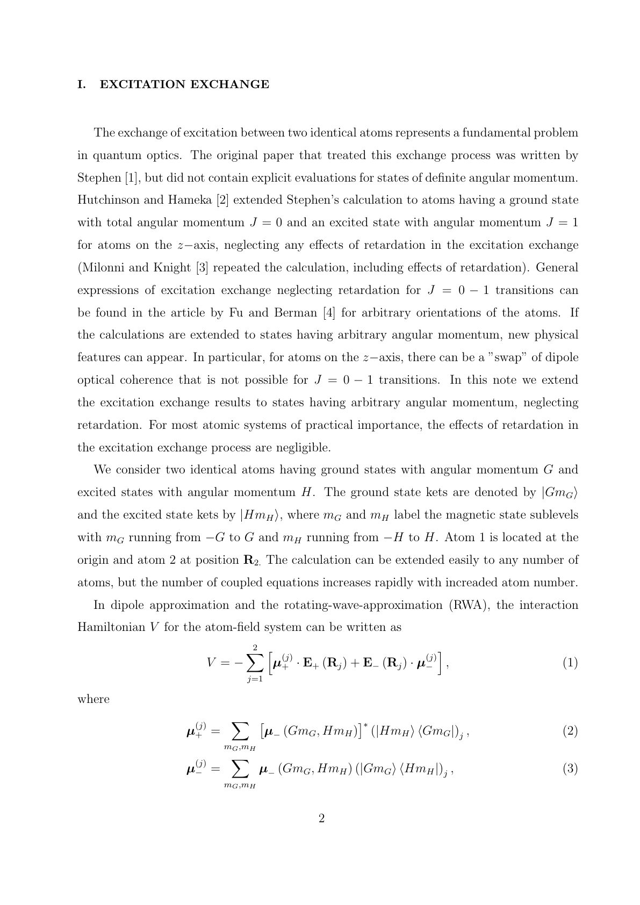 
Low-resolution page preview, page 2

📷 Fig 2

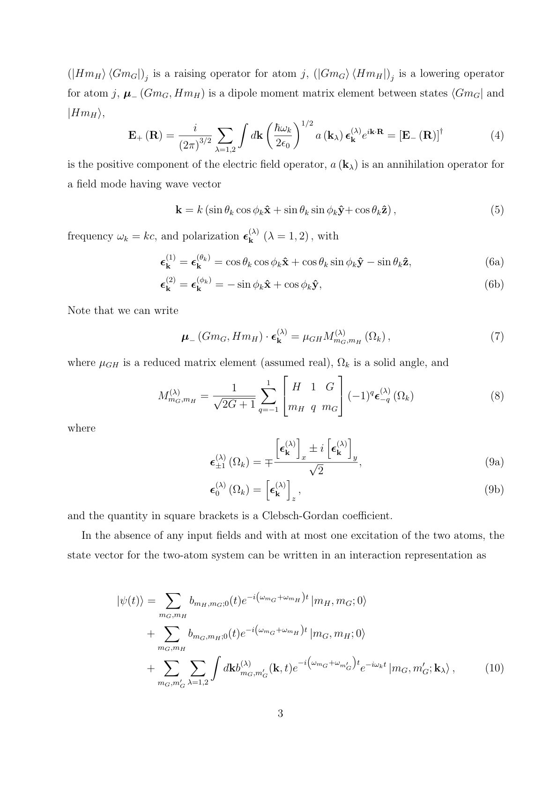 
Low-resolution page preview, page 3

📷 Fig 3

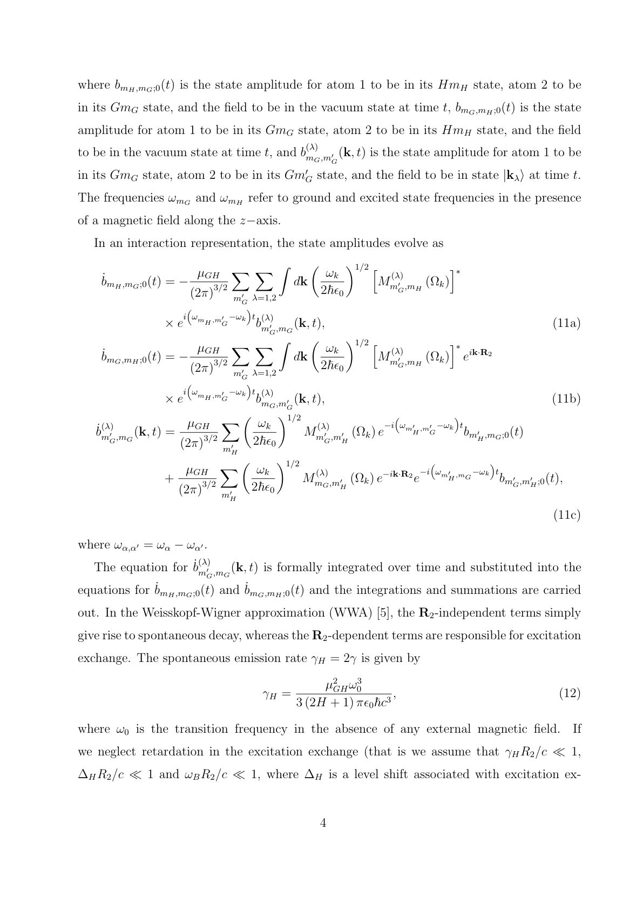 
Low-resolution page preview, page 4

📷 Fig 4

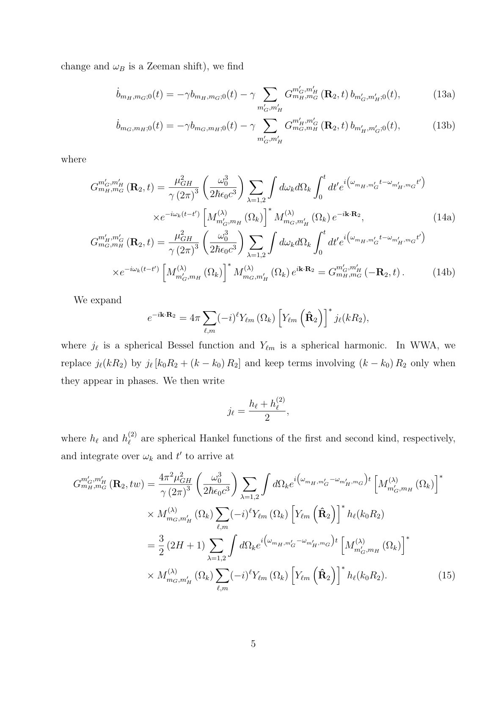 
Low-resolution page preview, page 5

📷 Fig 5

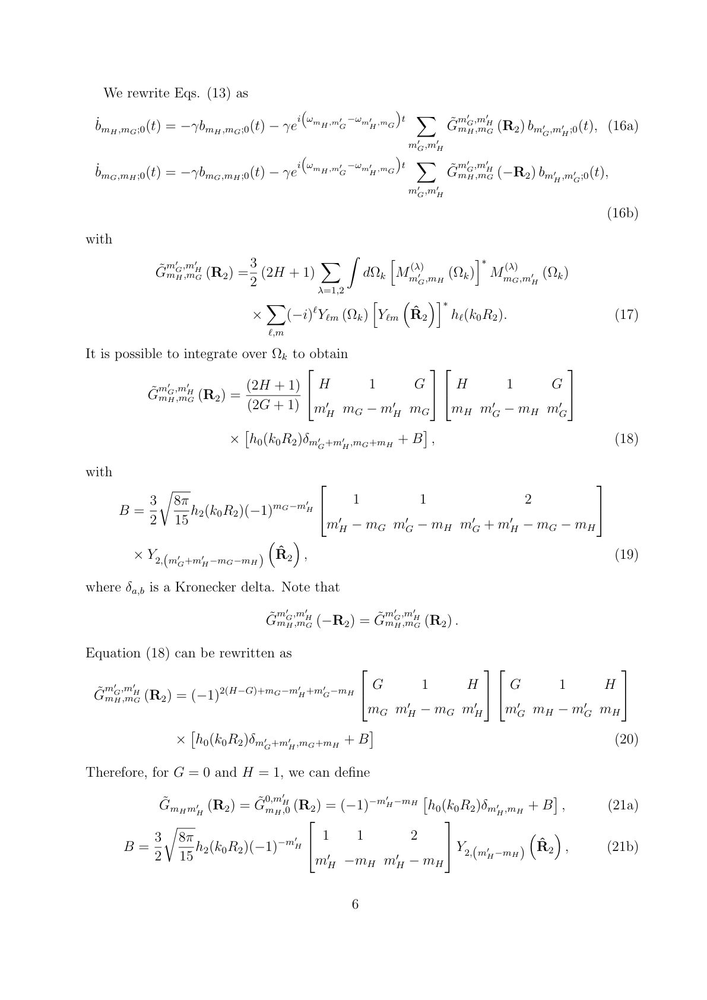 
Low-resolution page preview, page 6

**Summary.** This paper develops the theoretical framework for describing how excitation energy is exchanged between two identical atoms with arbitrary angular momenta. By deriving the equations of motion and calculating the exchange amplitude, it generalizes previous results in quantum optics. This is important for understanding coherent energy transfer dynamics in complex atomic ensembles.

**Why it may be interesting.** This work provides a generalized theoretical framework for understanding coherent energy transfer (excitation exchange) in multi-level atomic systems, extending established models to arbitrary angular momentum, which is crucial for advanced quantum simulation and quantum networking protocols.

Detailed structure

**Main problem.** The paper derives the equations of motion governing the excitation exchange process between two identical atoms that possess arbitrary angular momentum.

**Main result.** The excitation exchange amplitude is calculated using spherical Bessel functions and spherical harmonics, showing specific selection rules for the exchange process.

**Method.** The time evolution is derived using state amplitudes in the interaction representation, building upon previous theoretical frameworks.

**Model / system.** The system consists of two identical atoms, each having ground and excited states characterized by arbitrary angular momenta ($G$ and $H$). The interaction is modeled using a Hamiltonian derived in the dipole approximation and the rotating-wave approximation (RWA).

**Key observables.** State amplitudes ($b_{m_H, m_G; 0}(t)$, etc.) and the excitation exchange amplitude ($	ilde{G}_{m'_G, m'_H}^{m_H, m_G}(R_2)$).

**Important parameters / regimes.** Spontaneous emission rate ($\gamma_H$), interatomic distance ($R_2$), and angular momentum quantum numbers ($G, H, m, m'$).

**Assumptions / limitations.** The calculation neglects retardation effects and relies on the dipole approximation and the rotating-wave approximation (RWA).

**Paper structure.** The paper proceeds by deriving the equations of motion for the state amplitudes in the interaction picture, calculating the excitation exchange amplitude $	ilde{G}$ in terms of spherical functions, and presenting specific results for the $G=0, H=1$ case.

Abstract

Equations of motion are derived for excitation exchange between two atoms having arbitrary angular momentum.

[↑ back to top](#top)

### [Front-based construction of quantum droplets, bubbles, and hole states in a Bose mixture](http://arxiv.org/abs/2609.30807v1)

**Authors:** Sherzod R. Otajonov, Fatkhulla Kh. Abdullaev  
**Type:** theory · **Category:** quantum gases · **PDF:** <https://arxiv.org/pdf/2609.30807v1>  
**Analysis basis:** full PDF text, analyzed in chunks
**Topic relevance:** `analog quantum simulation` **3/5** · `Keldysh / 2PI / non-Gaussian methods` **1/5**

📷 Fig 1

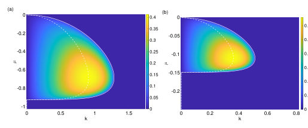 
FIG. 1. Modulational instability gain, G = Im(Ω−), as a function of the perturbation wavenumber k and chemical po- tential µ for the lower constant-amplitude branch at fixed δg = 1: (a) gLHY = 0.4 and (b) gLHY = 1.

📷 Fig 2

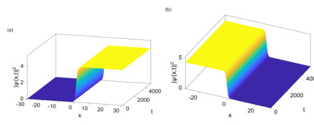 
FIG. 2. Stable evolution of the kink (a) and antikink (b) solutions at µ = −0.72 under small random perturbations. The perturbation amplitude is ǫ = 10−3, and the remaining parameters are δg = 1 and gLHY = 0.4.

📷 Fig 3

 
Figure 2 shows the typical time evolution of the kink and antikink solutions in panels (a) and (b), respectively, after a small random perturbation is added to the ini- tial stationary profiles. To assess dynamical stability, we define the initial conditions as follows: ψ(x, 0) = ψ0(x) [1 + ǫR(x)] , here, ψ0(x) denotes the stationary kink or antikink profile, R(x) is a random function uni- formly distributed over [−1, 1], and ǫ = 10−3 represents the perturbation amplitude. The simulations indicate

📷 Fig 4

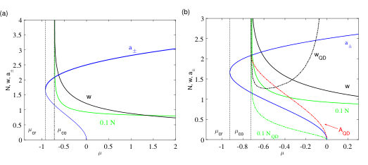 
FIG. 3. (a) Parameters of 1D symmetric holes versus the chemical potential µ. The left and right vertical dotted lines mark µcr [Eq. (7)] and µco [Eq. (32)], respectively. The green curve shows the redefined norm N(µ), scaled by 0.1 for clarity, while the black curve gives the notch width w(µ). The blue curves represent the constant-background branches a±(µ), with the thick upper and thin lower segments correspond- ing to a+(µ) and a−(µ), respectively. (b) Zoom of panel (a), including the norm NQD(µ), amplitude AQD(µ), and width wQD(µ) of symmetric self-bound 1D quantum droplets, ob- tained from a super-Gaussian function-based variational ap- proach. Other parameters are δg = 1 and gLHY =...

📷 Fig 5

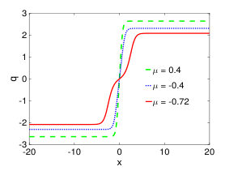 
FIG. 4. Representative hole profiles for different values of the chemical potential µ. From top to bottom, the curves correspond to µ = 0.4 (green dashed line), µ = −0.4 (blue dotted line), and µ = −0.72 (red solid line). Other parameters are δg = 1 and gLHY = 0.4.

**Summary.** This paper theoretically explores nonlinear structures like quantum droplets and bubbles in Bose mixtures governed by an extended Gross-Pitaevskii equation. By analyzing the stability of background states and constructing solutions from nonlinear fronts, the authors map out a unified picture connecting these self-bound states. The findings are crucial for understanding the complex dynamics and stability of interacting quantum gases beyond mean-field theory.

**Why it may be interesting.** This work provides a comprehensive theoretical framework connecting mean-field interactions, quantum fluctuations (LHY), and topological defects (kinks/holes) in Bose-Einstein condensates, which is central to modern AMO physics.

Detailed structure

**Main problem.** The study investigates the existence and properties of nonlinear structures, such as quantum droplets, bubbles, and hole states, within a Bose mixture.

**Main result.** The paper establishes a unified front-based picture connecting these localized states, showing that collisions exhibit phase-dependent dynamics and that deep bubbles possess finite-time robustness.

**Method.** The research combines analytical methods, including Bogoliubov-de Gennes spectrum analysis and grand-potential calculations, with real-time numerical simulations of the time-dependent Gross-Pitaevskii equation.

**Model / system.** The system is an elongated Bose mixture modeled by an extended Gross-Pitaevskii equation incorporating both attractive cubic mean-field interactions and repulsive quartic Lee-Huang-Yang contributions.

**Key observables.** Modulational stability gain, density deficit/bubble depth, collision dynamics (merging, particle transfer), and the background amplitude $a$.

**Important parameters / regimes.** The chemical potential ($\mu$), the relative phase between components, and the separation distance between nonlinear fronts.

**Assumptions / limitations.** The analysis relies on classifying constant-amplitude backgrounds and assumes the quasi-one-dimensional regime for the effective LHY term.

**Figures summary.** Figures illustrate the modulational instability gain for the lower background branch, the time evolution of perturbed asymmetric holes showing stability near the coexistence limit, and the phase-dependent merging dynamics during droplet collisions.

**Paper structure.** The paper systematically analyzes the stable background states, determines their stability via the Bogoliubov-de Gennes spectrum, constructs kink/antikink solutions, and then applies these fronts to model holes, bubbles, and droplet collisions in both scalar and two-component systems.

Abstract

We study nonlinear holes, bubbles, kink fronts, and quantum-droplet-like states in an elongated Bose mixture governed by an extended Gross-Pitaevskii equation with attractive cubic mean-field interactions and repulsive quartic Lee-Huang-Yang contribution. We classify the constant-amplitude backgrounds: the Bogoliubov-de Gennes spectrum shows that the upper branch is modulationally stable, whereas the lower branch is unstable to long-wavelength perturbations. Grand-potential and pressure determine the vacuum-finite-density coexistence point and the unique background supporting stationary kink and antikink fronts. Symmetric holes on the stable background have a density deficit and integral width that diverge near coexistence as the hole separates into two nonlinear fronts. A multiplicative kink-antikink construction connects bell-shaped states to broad flat-top droplets and approaches the stationary quantum-droplet family as the front separation increases. An antikink-kink sum with equal signs generates bubble-like density depletions without a phase jump, whereas their difference produces dark-hole-like profiles with a $π$ phase difference between the asymptotic backgrounds. Bubble depth increases with front separation, distinguishing gray-like and dark-like profiles. Real-time simulations show that deep bubbles persist under weak random perturbations, demonstrating finite-time robustness without establishing spectral stability. In the asymmetric two-component model, localized relative-density modes can induce spinor-driven breakup on a modulationally stable background, while robust holes persist near the kink limit. Collisions of kink-antikink droplet-like states display phase-dependent merging, asymmetric particle transfer, and effective reflection. These results connect nonlinear fronts with bubbles, phase-jump holes, and self-bound droplets in beyond-mean-field Bose mixtures.

[↑ back to top](#top)

### [Emergent Wigner magnon crystals in a fully frustrated Heisenberg four-leg tube](http://arxiv.org/abs/2609.30596v1)

**Authors:** Azam Zoshki, Hamid Arian Zad, Jozef Strecka  
**Type:** theory · **Category:** statistical mechanics · **PDF:** <https://arxiv.org/pdf/2609.30596v1>  
**Analysis basis:** full PDF text, analyzed in chunks
**Topic relevance:** `analog quantum simulation` **3/5**

📷 Fig 1

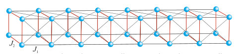 
FIG. 1. Schematic illustration of a fully frustrated four-leg tube. The blue balls represent lattice position of spin-1/2 particles, thick red lines indicate intra-plaquette interaction J2, and thin black lines represent inter-plaquette interaction J1. For better clarity, the diagonal inter-plaquette couplings J1 are shown only for top and front square plaquettes.

📷 Fig 2

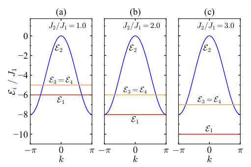 
FIG. 2. The one-magnon energy bands of the fully frustrated spin-1/2 Heisenberg four-leg tube given by Eq. (4) at zero magnetic field for three selected values of the interaction ratio: (a) J2/J1 = 1.0; (b) J2/J1 = 2.0; (c) J2/J1 = 3.0.

📷 Fig 3

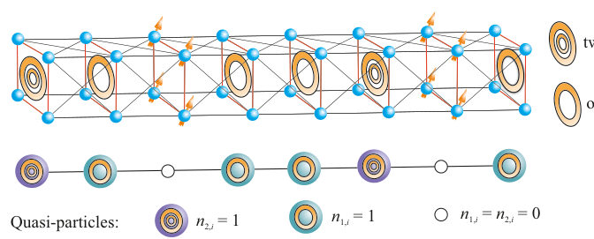 
FIG. 3. Schematic representation of a selected eigenstate of the fully frustrated spin-1/2 Heisenberg four-leg tube (a) and its equivalent representation within the effective two-component lattice-gas model (b). The single and double orange circles denote the bound one- and two-magnon states of a square plaquette, respectively, which are represented in the effective description by the two kinds of hard-core monomer quasi-particles illustrated by green and violet balls. Fully polarized square plaquettes correspond to empty (unoccupied) lattice sites.

📷 Fig 4

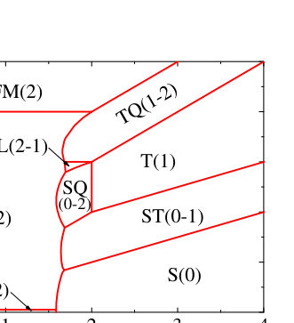 
FIG. 4. Ground-state phase diagram of the fully frustrated spin-1/2 Heisenberg four-leg tube in the J2/J1 −h/J1 plane obtained from DMRG calculations for a finite-size system with Nu = 120 unit cells (N = 480 spins). The individual ground states are denoted as follows: S(0) - singlet phase, ST(0-1) - singlet-triplet phase, T(1) - triplet phase, TQ(1-2) - triplet-quintuplet phase, SQ(0-2) - singlet-quintuplet phase, FM(2) - ferromagnetic phase, H(2) - Haldane phase, TL(2) and TL(2-1) - Tomonaga-Luttinger quantum spin liquids. The numbers in round brackets specify the composite quan- tum spin numbers Ti of the square plaquettes.

📷 Fig 5

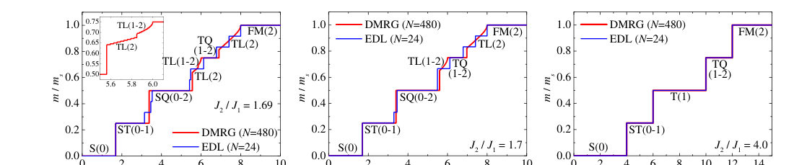 
FIG. 5. Zero-temperature magnetization curves of the fully frustrated spin-1/2 Heisenberg four-leg tube calculated by EDL (blue lines) and DMRG (red lines) methods for six selected values of the interaction ratio: (a) J2/J1 = 1.0, (b) J2/J1 = 1.6, (c) J2/J1 = 1.65, (d) J2/J1 = 1.67, (e) J2/J1 = 1.7, and (f) J2/J1 = 4.0. The magnetization is normalized with respect to its saturation value m/ms, the EDL and DMRG results are presented for N = 24 and N = 480 spins, respectively. The inset in panel (a) illustrates finite-size effects in the low-field DMRG magnetization curves for the systems involving N = 360 and N = 480 spins, while the inset in panel (d) provides an enlarged view of the...

**Summary.** This work analyzes a frustrated quantum spin chain, revealing the emergence of Wigner magnon crystals in the highly frustrated regime. By modeling the system using an effective lattice-gas approach, the authors demonstrate that the thermodynamic performance of a quantum Stirling engine is strongly dictated by these crystal phases, achieving peak efficiency within their stable regions.

**Why it may be interesting.** The direct connection drawn between the sequence of field-induced quantum phases (Wigner crystals) and the maximum efficiency of a quantum heat engine provides a concrete, measurable signature of quantum phase transitions in a many-body system.

Detailed structure

**Main problem.** The study investigates the ground state, thermodynamics, and heat engine performance of a fully frustrated spin-1/2 Heisenberg four-leg tube.

**Main result.** The system exhibits Wigner magnon crystals in the highly frustrated regime, and the efficiency of a quantum Stirling engine is maximized deep within the stability regions of these crystal phases, not at the phase boundaries.

**Method.** The research employs a combination of exact diagonalization, density matrix renormalization group (DMRG), and mapping the low-energy physics onto an effective interacting lattice-gas model.

**Model / system.** The system is a fully frustrated spin-1/2 Heisenberg four-leg tube described by a Hamiltonian involving inter-plaquette ($J_1$) and intra-plaquette ($J_2$) couplings, subjected to a magnetic field ($h$).

**Key observables.** Ground state phase diagram, magnetization curves, low-temperature thermodynamics (entropy, specific heat), work output, and efficiency ($\eta$) of a quantum Stirling heat engine.

**Important parameters / regimes.** Frustration ratio ($J_2/J_1$), magnetic field strength ($h$), and temperature ratios ($T_H/J_1, T_L/J_1$).

**Assumptions / limitations.** The low-energy physics is accurately captured by an effective interacting lattice-gas model of two monomer quasi-particle species, which neglects higher-energy excitations.

**Figures summary.** Figure 1 schematically illustrates the fully frustrated four-leg tube structure, detailing the $J_2$ and $J_1$ couplings.

**Paper structure.** The paper systematically analyzes the system's behavior across different frustration regimes, first establishing the magnon spectrum and Wigner crystal states using localized-magnon theory, then deriving an effective lattice-gas model, and finally applying this framework to calculate the thermodynamic properties and heat engine performance.

Abstract

The ground state, magnetization curves, low-temperature thermodynamics, and heat-engine performance of the fully frustrated spin-$1/2$ Heisenberg four-leg tube with antiferromagnetic inter- and intra-plaquette coupling constants J1 and J2 are examined using exact diagonalization, density matrix renormalization group, and localized-magnon theory. In the unfrustrated to weakly frustrated regime J2/J1 << 2, the system exhibits a continuous field-driven quantum phase transition between the gapped Haldane phase and a gapless Tomonaga-Luttinger quantum spin liquid. In the highly frustrated regime J2/J1 > 2, the system contrarily displays discontinuous field-driven quantum phase transitions between the Wigner magnon crystals, which are manifested in zero-temperature magnetization curves as intermediate plateaus at zero, one-quarter, one-half, and three-quarters of the saturation magnetization. The low-temperature magnetic and thermodynamic properties in this regime are accurately captured by an effective interacting lattice-gas model of two monomer quasi-particle species constructed from localized one- and two-magnon states. Finally, we explore a quantum Stirling heat engine using the fully frustrated four-leg tube as the working medium. The work output and efficiency are strongly suppressed near discontinuous field-induced transitions and reach pronounced local maxima well inside the stability regions of the Wigner magnon crystals.

[↑ back to top](#top)

### [Measurement-Based Uncomputation from an Error Correction Perspective](http://arxiv.org/abs/2609.31605v1)

**Authors:** Minjun Jeon, Po-Wei Huang, Zhenyu Cai  
**Type:** theory · **Category:** quantum information and computing · **PDF:** <https://arxiv.org/pdf/2609.31605v1>  
**Analysis basis:** full PDF text, analyzed in chunks
**Topic relevance:** `quantum measurements` **3/5**

📷 Fig 1

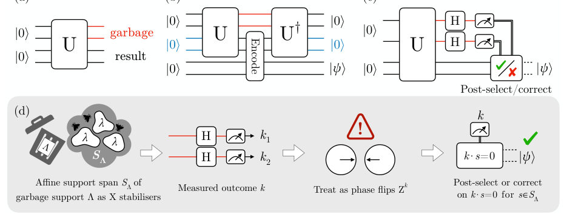 
FIG. 1. Conceptual overview of measurement-based uncomputation (MBU) as quantum error correction (QEC). (a) Standard reversible computation generates a useful result together with a garbage register. (b) Conventional uncomputation restores the garbage register by coherently applying the inverse circuit U †, requiring the garbage qubits to remain coherent until the end of the computation. Before the uncomputation, the result (usually) is copied or encoded into a separate register. (c) In MBU, the garbage register is measured in the X basis instead of being coherently uncomputed. The measurement outcome is accepted only if it satisfies the required acceptance condition (pure post-selection in...

📷 Fig 2

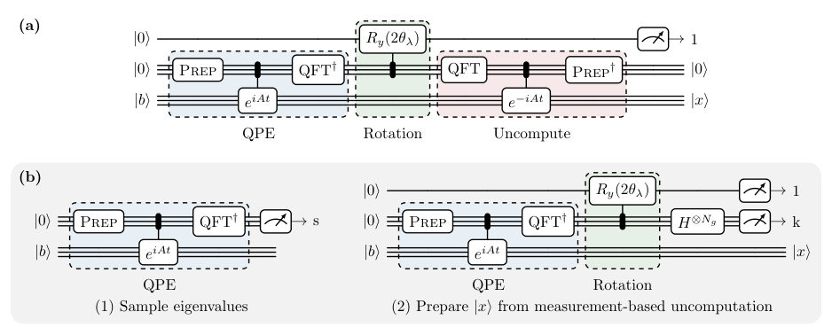 
FIG. 2. Comparison between coherent and post-selected uncomputation in HHL. (a) Standard coherent HHL implementation. After QPE computes the eigenvalue estimate into the phase register and the controlled rotation implements the factor proportional to 1/λ, the eigenvalue register is disentangled by applying inverse QPE. This requires the phase-estimation workspace to remain coherent until the end of the inverse block. (b) Post-selected measurement-based replacement. A preliminary sampling stage estimates the populated eigenvalue support Λ and hence the affine support span SΛ. In the state-preparation run, the controlled rotation is followed by an X-basis measurement of the eigenvalue...

📷 Fig 3

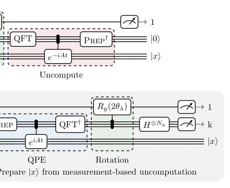 
Fig. 2 illustrates the replacement of the coherent inverse- QPE block in standard HHL with post-selected MBU, i.e., an X-basis measurement of the eigenvalue register fol- lowed by a post-selection on the syndrome-zero subspace, i.e., on the outcomes k ∈S⊥ Λ .

📷 Fig 4

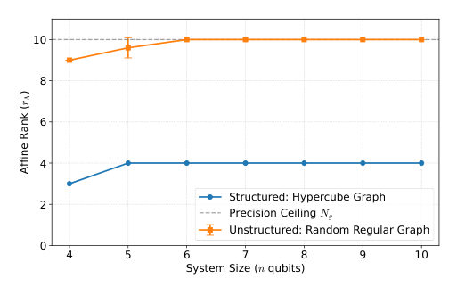 
FIG. 3. Numerical validation of MBU for structured graph Laplacians. Affine rank rΛ as a function of system size n for a smooth physical signal (exponential spatial decay). For the structured hypercube graph, the affine rank remains func- tionally decoupled from the exponentially growing system volume over the simulated range. In contrast, eigenvalues of an unstructured random regular graph (RRG) lack algebraic correlation, causing the discretised labels to behave as inde- pendent bitstrings and rΛ to rapidly saturate the precision ceiling Ng = 10. For the random regular graph, the affine rank is averaged over 10 independent graph instances with error bars denoting one standard deviation....

📷 Fig 5

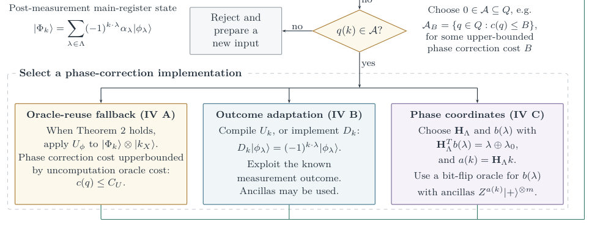 
FIG. 4. Phase-corrected MBU. X-basis measurement of G yields outcome k and syndrome q(k). The induced phase can be corrected at the implementation cost c(q). Zero syndromes require no correction; accepted nonzero syndromes use oracle reuse under Theorem 2, outcome-adapted compilation, or optimised phase coordinates. Other outcomes are rejected. Choosing the accepted syndrome set A interpolates between pure post-selection, partial correction and deterministic MBU. All accepted outputs recover the target state up to a global phase.

**Summary.** This paper proposes Measurement-Based Uncomputation (MBU) as an efficient alternative to complex inverse quantum circuits. By interpreting the measurement process through a Quantum Error Correction lens, the authors show that post-selection on zero-syndrome outcomes yields the desired uncomputation state. This approach significantly reduces overhead by linking success probability to the low-dimensional affine rank of the system's support.

**Why it may be interesting.** While focused on computation, the rigorous mathematical framework connecting measurement outcomes to error syndromes and the use of algebraic rank to bound resource requirements is highly relevant to understanding noise and error mitigation in any physical quantum system.

Detailed structure

**Main problem.** Developing an efficient method for Measurement-Based Uncomputation (MBU) to replace the costly coherent inverse circuits required in fault-tolerant quantum computation.

**Main result.** Post-selected MBU achieves the necessary uncomputation by accepting only zero-syndrome measurement outcomes, with a success probability determined by the low-dimensional affine rank of the garbage support.

**Method.** The authors recast MBU into a Quantum Error Correction (QEC) framework, analyzing measurement outcomes as syndrome measurements that induce relative phases.

**Model / system.** The model involves a quantum computation with a main register and a garbage register ($G$). The process is analyzed by measuring $G$ in the X basis, relating the outcome to error syndromes.

**Key observables.** Success probability ($P_{	ext{succ}}$), relative phases induced by measurement outcomes, and the affine rank ($r_\Lambda$) of the populated garbage support.

**Important parameters / regimes.** The affine rank $r_\Lambda$ dictates the success probability ($P_{	ext{succ}} \propto 2^{-r_\Lambda}$), which is much smaller than the number of garbage qubits.

**Assumptions / limitations.** The analysis relies on post-selecting on outcomes that yield zero relative phase, and later extends to bounding deviations from the ideal orthogonal case using coherence measures.

**Figures summary.** Figure 1 conceptually maps the process from standard computation to MBU and its QEC interpretation. Other figures detail the comparison between standard and MBU implementations in algorithms like HHL.

**Paper structure.** The paper builds from the conceptual problem of uncomputation to the algebraic framework of MBU via QEC, deriving the success probability based on the affine rank, and finally detailing structural conditions for deterministic correction.

Abstract

Coherent uncomputation can be as costly as the computation itself, creating substantial spacetime overheads that can be prohibitive on early fault-tolerant quantum computers. We develop an algebraic framework for measurement-based uncomputation (MBU) through a quantum error-correction picture: measurements of the garbage register induce relative phases analogous to errors causing non-trivial syndromes. Accepting only zero-syndrome outcomes achieves post-selected MBU, removing the need for an uncomputation oracle at the cost of a probabilistic success rate determined by the affine rank of the populated garbage support. This rank can be much smaller than the number of garbage qubits, as illustrated through an example of the HHL algorithm. We then derive a structural condition under which the original uncomputation oracle can be reused to correct the phase for all measurement outcomes. No correction is required for the zero syndrome, while corrections for non-zero syndromes can be further adapted to individual measurement outcomes for simpler circuits, as illustrated by existing modular-arithmetic, QROM, and QRAM MBU constructions. Phase-correction circuits can be further simplified by co-optimising their implementation with the representation of the measurement-induced phases. Selecting which syndrome classes to correct interpolates between post-selected, partially corrected, and deterministic MBU, enabling trade-offs among correction cost, workspace, and repetitions.

[↑ back to top](#top)

### [Non-vanishing Density of States in Disordered Weyl Semimetals](http://arxiv.org/abs/2609.30372v1)

**Authors:** Justin H. Wilson  
**Type:** theory · **Category:** disordered systems and neural networks · **PDF:** <https://arxiv.org/pdf/2609.30372v1>  
**Analysis basis:** full PDF text, analyzed in chunks
**Topic relevance:** `Keldysh / 2PI / non-Gaussian methods` **3/5**

📷 Fig 1

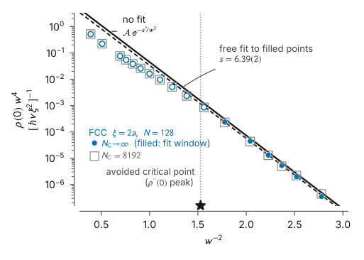 
FIG. 1. Zero-energy density of states. 𝜌(0) 𝑤4 where 𝑤= 𝑊𝜉∕ℏ𝑣and 𝜌is in units of 1∕ℏ𝑣𝜉2. Data points from the single- cone calculations in Ref. [5] (𝑘-space fcc discretization, 𝜉= 2𝑎, 𝑁= 128): blue circles are extrapolated in Chebyshev order, 𝑁C →∞; grey squares are the largest computed order, 𝑁C = 8192; error bars are smaller than the markers. Equation (1) is the straight solid line with slope −𝑠∗with no fitted parameters. The dashed line is a fit over the lowest six data points (filled): the exponent agrees to 1–2% and the amplitude is 27% below the analytic one-loop value (×0.73). Open circles are at or after the avoided quantum critical point (star and dotted vertical line found via...

📷 Fig 2

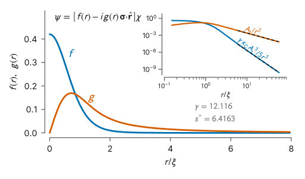 
FIG. 2. The instanton. Radial profile of the 𝑗= 1 2 hedgehog solution of Eq. (10) for the Gaussian correlator, with self-consistent coupling 𝛾= 12.116 and action 𝑠∗= 6.4163. Inset: the same plot on logarithmic axes taken out to 𝑟= 60 𝜉to show the asymptotic tails 𝑔→𝐴𝑡∕𝑟2 and 𝑓→𝛾𝜅𝐶𝐴3 𝑡∕5𝑟5 (dashed).

📷 Fig 3

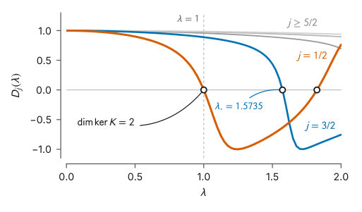 
FIG. 3. Normalized radial matching determinant scan of the fermion kernel. 𝐷𝑗(𝜆) for each channel 𝑗as the coupling is scaled by 𝜆; roots (circles) mark kernel elements. At the physical coupling 𝜆= 1 only the 𝑗= 1

📷 Fig 4

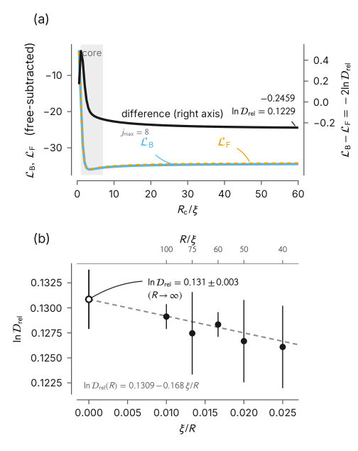 
FIG. 4. The fluctuation determinant. (a) Radial attribution of the fluctuation weight, Eq. (36): each eigenvalue’s logarithm is weighted in proportion to its eigenvector’s norm in 𝑟&lt; 𝑅𝑐, so the curves show the free-subtracted partial log determinants ℒB, ℒF accumulated out to radius 𝑅𝑐(𝑗max = 8, 𝑅= 60 𝜉): each separately runs to ≈−34, and they cancel to the residual −0.2459 = −2 ln 𝒟rel at this truncation (right axis), exactly the supersymmetric cancel- lation of determinants which enables Eq. (6). The shaded band marks the instanton core, 1 ≤𝑟∕𝜉≤7, where the difference accu- mulates; beyond 𝑅𝑐= 20 𝜉only −0.028 remains. (b) ln 𝒟rel after 𝑗max extrapolation versus 𝜉∕𝑅for 𝑅∕𝜉= 40–100 (top...

**Summary.** This theoretical work resolves a major conflict in the literature concerning the density of states in disordered Weyl semimetals. By performing a comprehensive saddle-point calculation including quantum fluctuations, the authors prove that the zero-energy density of states remains finite regardless of the disorder strength. This provides a crucial theoretical benchmark for understanding topological materials in realistic, imperfect environments.

**Why it may be interesting.** The rigorous application of advanced field theory (supersymmetry, instanton calculus) to determine a fundamental transport property ($
ho(0)$) in a topological material under disorder is highly relevant for understanding robustness in quantum devices.

Detailed structure

**Main problem.** The paper resolves a long-standing theoretical disagreement regarding whether the zero-energy density of states ($
ho(0)$) in a 3D Weyl semimetal vanishes when subjected to weak short-range disorder.

**Main result.** The authors establish that $
ho(0)$ is finite for any disorder strength, providing an analytical expression that matches exact numerical calculations over several orders of magnitude.

**Method.** The calculation employs a full saddle-point approximation within a supersymmetric field-theoretic framework, combining instanton calculations with the computation of one-loop fluctuations via a convergent Fredholm determinant.

**Model / system.** The system is a three-dimensional Weyl semimetal described by a Hamiltonian subjected to weak, short-range, Gaussian-correlated disorder. The analysis utilizes advanced techniques from supersymmetric quantum field theory and replica methods.

**Key observables.** Zero-energy density of states, $
ho(0)$, and the associated non-vanishing prefactor $\mathcal{A}$ and exponent $s^*$.

**Important parameters / regimes.** Disorder strength $w$, and the calculated constants $s^* = 6.4163(2)$ and $\mathcal{A} = 27.47(8)$.

**Assumptions / limitations.** The analysis relies on the supersymmetric formulation of disorder and the validity of the saddle-point approximation for the functional integral.

**Figures summary.** Figure 1 compares the calculated $
ho(0)$ with exact numerics, showing agreement over four orders of magnitude. Other figures illustrate the radial profiles of the hedgehog solution and the convergence of determinant calculation methods.

**Paper structure.** The paper progresses by first setting up the problem using supersymmetric functional integrals, solving the nonlinear Weyl equation for the instanton solution, and then calculating the fluctuations by determining the reduced superdeterminant as a Fredholm determinant. The final result is the explicit, finite expression for $
ho(0)$.

Abstract

There is disagreement in the literature concerning whether the nodal point of a three-dimensional Weyl semimetal survives weak short-range disorder: instanton calculations including fluctuations claim that the zero-energy density of states $ρ(0)$ vanishes, while exact numerics find a systematically finite number. We settle this disagreement with a full saddle-point calculation, including both instanton and fluctuations. Within the supersymmetric formulation for disorder, the instanton obeys a nonlinear Weyl equation whose solution is an exact $j=1/2$ hedgehog whose full functional form we numerically compute. We then compute the fluctuations about this saddle point, carefully identifying all zero modes, and computing the reduced superdeterminant as a convergent Fredholm determinant. No fermionic zero mode beyond a Kramers doublet exists, and at finite disorder $w$, the fluctuations become a finite one-loop prefactor, $ρ(0)=\mathcal{A} w^{-4} \exp(-s^*/w^2)(1+O(w^2))$, in normalized units with $s^* = 6.4163(2)$ and $\mathcal{A} = 27.47(8)$ for Gaussian-correlated disorder. This expression matches exact numerics on a single Weyl cone over four orders of magnitude with no fitted parameters (the amplitude is $\times 0.76$ the one-loop value), establishing that the density of states is finite for any disorder strength.

[↑ back to top](#top)

### [On the applicability of Kolmogorov's theory of probability to the description of quantum phenomena. Part II: Bell inequalities](http://arxiv.org/abs/2609.31075v1)

**Authors:** Maik Reddiger  
**Type:** theory · **Category:** other · **PDF:** <https://arxiv.org/pdf/2609.31075v1>  
**Analysis basis:** full PDF text, analyzed in chunks
**Topic relevance:** `quantum measurements` **3/5**

📷 Fig 1

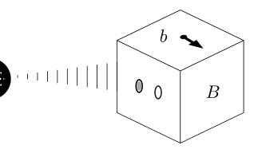 
Figure 1: Sketch of the measurement setup for a general Bell experiment. In this particular trial, detector A with setting a records the value +1. Detector B with setting b records the value −1. Bell inequalities are tested by recording multiple outcomes for various settings.

📷 Fig 2

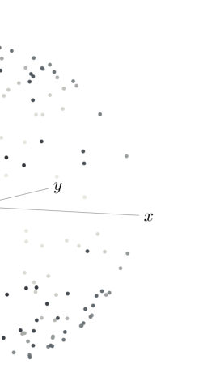 
Figure 2: Plot of numerical sample data for the values of ⃗sA in the file BCHSH break.dat. Data points with larger y-values are depicted in a lighter color.

**Summary.** This paper re-examines Bell inequalities by analyzing them through the lens of Kolmogorov's probability theory, introducing the concept of contextuality. It demonstrates that even 'classical' models can be contextual, and crucially, that contextual models can violate Bell inequalities even under strong locality assumptions. This suggests that the physical conclusions drawn from Bell tests might stem from a conceptual misunderstanding regarding the nature of probability itself.

**Why it may be interesting.** It challenges the fundamental assumptions underlying the interpretation of quantum nonlocality, which is crucial for understanding measurement processes in quantum information and open quantum systems.

Detailed structure

**Main problem.** The paper analyzes the applicability of Kolmogorov's theory of probability to quantum phenomena, specifically focusing on the implications of violating Bell inequalities.

**Main result.** Contextuality reveals a conceptual misunderstanding in the physical conclusions drawn from Bell inequality violations, suggesting that 'nonlocality' does not necessarily follow from empirical violations while respecting locality.

**Method.** The analysis involves a comprehensive mathematical study of Bell experiments, focusing on the BCHSH inequality and introducing the notion of contextuality into the probabilistic framework.

**Model / system.** The study uses the framework of Bell experiments, analyzing correlations between detector outcomes (A and B) for various settings (a, b), and comparing classical probabilistic models against quantum predictions.

**Key observables.** Expectation values, such as $\langle A(a), B(b) 
angle$, and the violation magnitude of the BCHSH inequality.

**Important parameters / regimes.** The settings of the detectors ($a, b$) and the underlying assumptions of locality and noncontextuality.

**Assumptions / limitations.** The work critically examines the assumption of noncontextuality, which is a core assumption in the standard derivation of Bell inequalities.

**Figures summary.** Not specified.

**Paper structure.** The work is presented as Part II of a series, building upon foundational discussions of quantum mechanics and probability theory, and focusing specifically on the mathematical and physical interpretation of Bell inequalities.

Abstract

Among the various "no-go theorems" in the foundations of quantum mechanics, Bell inequalities are among the few, which do not implicitly rely on the mathematical structure of quantum mechanics. Instead, Bell inequalities are commonly understood to rest on Kolmogorov's theory of probability and a "locality" assumption. Physical evidence supporting their violation is hence taken as evidence against at least one of these two assumptions.   This work provides a comprehensive analysis of the physical debate on Bell inequalities from the point of view of Kolmogorov's theory of probability, focusing on the Bell-Clauser-Horn-Shimony-Holt inequality (BCHSH inequality). The central contribution is the motivation and mathematical study of the notion of contextuality in Bell experiments: in so-called contextual Bell models the detectors themselves behave randomly and the distribution of the random detector parameters depends on the chosen detector settings. It is shown how even "classical" Bell experiments motivate such a description. The need to account for contextuality was pointed out before by de la Peña, Cetto, Brody, Lochak, Bohm, Hiley and others. A broad class of contextual models is proven to satisfy the BCHSH inequality, thereby generalizing a previous result by Gill and Lambare. Nonetheless, even under strong locality requirements, contextual Bell models may violate the BCHSH inequality: based on work by Popescu and Rohrlich, we consider a "proof of concept" example exhibiting the maximum possible violation.   Contrary to the much debated "loopholes" in empirical tests of Bell inequalities, contextuality thus reveals a conceptual misunderstanding in the physical conclusions commonly drawn from Bell inequality violations.

[↑ back to top](#top)

### [Preparation Changes the Cost of Calibration for Quantum Control](http://arxiv.org/abs/2609.30910v1)

**Authors:** Xiu-Hao Deng  
**Type:** theory · **Category:** quantum information and computing · **PDF:** <https://arxiv.org/pdf/2609.30910v1>  
**Analysis basis:** full PDF text, analyzed in chunks
**Topic relevance:** `quantum measurements` **3/5**

📷 Fig 1

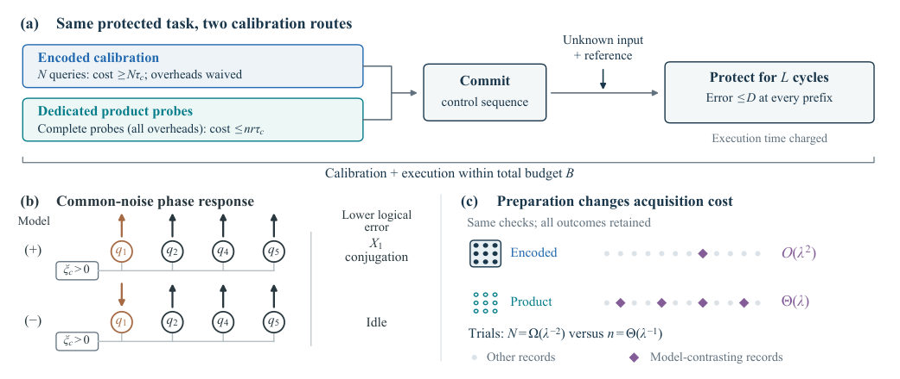 
FIG. 1. Preparation changes the cost of learning a useful control. (a) The two branches are alternative calibration routes, completed before the unknown logical/reference input, that commit a control for the same protected idle. N and n count encoded queries and product probes; τc is one protected-cycle duration, and rτc upper-bounds a complete product probe. The budget charges calibration and execution; encoded overheads are waived in the lower bound. (b) Arrows show phase responses to a positive common fluctuation ξc; independent fluctuations are omitted. Only qubit 1 (copper) reverses between models. All arrows reverse when ξc changes sign. The right column gives the lower-error control...

📷 Fig 2

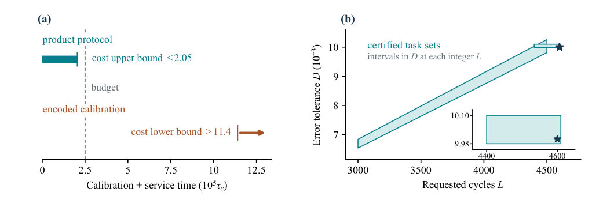 
FIG. 2. Calibration preparation changes which tasks fit the budget. (a) At the task starred in (b), the teal capped segment is the product-protocol total-cost upper bound, the orange rightward arrow is the encoded-calibration necessary lower bound, and the gray dashed line is the budget: 2.05 &lt; 2.5 &lt; 11.4 in units of 105τc. Thus the product protocol is certified within budget while encoded calibration is excluded; the marks are bounds, not measured costs. (b) Teal shading marks sufficient certified task sets for which the product protocol meets the target while encoded calibration is excluded at the same budget and deadline. The sloped band and rectangle give intervals of allowed error...

**Summary.** This work analyzes the resource overhead required to calibrate quantum controls in error-corrected systems under noise. By comparing encoded calibration against product probing, the authors show that product probes offer a substantial reduction in required measurement samples. This improvement allows for the execution of protected quantum tasks within operational budgets that would otherwise be insufficient.

**Why it may be interesting.** It provides a concrete, resource-aware comparison of quantum control techniques, which is highly relevant for designing fault-tolerant quantum computation protocols on near-term hardware.

Detailed structure

**Main problem.** The paper compares the resource cost of learning necessary quantum control information using standard encoded calibration versus using dedicated product probes within a finite operational budget.

**Main result.** Product probes significantly reduce the required sample complexity for learning control correlations, enabling protected quantum tasks under tighter budget constraints where encoded calibration fails.

**Method.** The analysis uses information-theoretic bounds, comparing the sample complexity derived from KL divergence and analyzing the scaling of logical dephasing rates for both calibration methods.

**Model / system.** The study models quantum error correction on a surface code subjected to Gaussian dephasing noise. The comparison is between two distinct calibration protocols: encoded calibration and product probing.

**Key observables.** Logical phase-flip probabilities, sample complexity scaling (inverse-square vs. inverse-linear in phase variance), and the total operational cost.

**Important parameters / regimes.** Phase variance ($\lambda$), total budget ($B$), and the depth/size of the task ($L$).

**Assumptions / limitations.** The analysis assumes ideal pulses and fixed recovery operations, and the results are certified sufficient subsets rather than optimized boundaries.

**Figures summary.** Figures compare the resource costs (Product vs. Encoded) against a fixed budget, showing the product protocol remains feasible while the encoded calibration requirement exceeds the budget.

**Paper structure.** The paper progresses by establishing the theoretical cost bounds for both calibration methods, deriving the scaling laws for information gain, and finally demonstrating through quantitative comparisons that the product probe method provides a superior, budget-compliant alternative.

Abstract

Error-correction records can reveal noise yet supply the information needed for control too slowly. In a surface code under Gaussian dephasing, encoded calibration learns a correlation that reverses the preferred control mainly through rare events. A product probe exposes it more often through the same checks, reducing ideal-record sample complexity from inverse-square to inverse-linear in phase variance. Counting both calibration and execution costs, we show that this gain can repay probe overhead and enable protected tasks within budgets that exclude encoded calibration.

[↑ back to top](#top)

### [Quantum algorithms for the exponentiation of Toeplitz matrices and applications in partial differential equations](http://arxiv.org/abs/2609.31372v1)

**Authors:** Xabier Gutiérrez, Nicola Mariella, Javier González-Conde, Sergiy Zhuk, Mikel Sanz  
**Type:** theory · **Category:** quantum information and computing · **PDF:** <https://arxiv.org/pdf/2609.31372v1>  
**Analysis basis:** full PDF text, analyzed in chunks
**Topic relevance:** `analog quantum simulation` **3/5**

📷 Fig 1

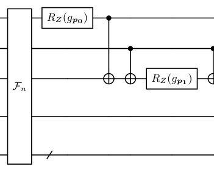 
Figure 2: Structure of the circuit applying an approximation to the exp P

**Summary.** This paper presents quantum algorithms to compute the exponential of banded Toeplitz matrices, which arise when discretizing PDEs. By relating these matrices to circulant generators diagonalized by the QFT, the authors circumvent the computational bottleneck associated with large matrix norms. This provides an efficient quantum simulation tool for physical systems like the heat equation.

**Why it may be interesting.** This work provides a concrete, quantum-algorithmic pathway for simulating physical systems governed by differential operators (like the Laplacian) that are typically hard to encode quantumly due to large norms, making it highly relevant for quantum simulation.

Detailed structure

**Main problem.** The paper develops quantum algorithms to efficiently approximate the matrix exponential of banded Toeplitz matrices, which are crucial for simulating time evolution governed by Partial Differential Equations (PDEs).

**Main result.** The authors construct a quantum framework that bypasses the limitations of direct block encoding by exploiting the relationship between Toeplitz matrices and diagonal operators derived from the Quantum Fourier Transform (QFT).

**Method.** The approach involves decomposing the Toeplitz matrix into a sum of circulant and skew-circulant generators, which are then exponentiated using specialized QFT-Trotter product formulas.

**Model / system.** The underlying model involves discretizing PDEs (like the heat equation) into linear time evolution $\partial_t u = A u$, where the matrix $A$ is a banded Toeplitz matrix. The simulation is performed on qubits using block encoding techniques.

**Key observables.** The primary observables are the matrix exponential $e^{At}$ and the error bounds associated with the approximation, such as $\eta(\delta, k)$ and the Trotter error.

**Important parameters / regimes.** The key parameters include the bandwidth of the Toeplitz matrix, the number of qubits ($n$), and the frequency cutoff ($\delta$) used in the approximation.

**Assumptions / limitations.** The method relies on approximating the diagonal eigenvalue matrix of circulant generators using truncated Pauli-string decompositions and assumes that the error introduced by this approximation remains controllable.

**Figures summary.** The notes mention Figure 1 illustrating the circuit implementation of the unitary $C_k^n$ using the QFT, and various appendices detail mathematical identities and error bounds.

**Paper structure.** The paper builds mathematically, first establishing the connection between Toeplitz matrices and diagonalizable circulant/skew-circulant generators (using QFT). It then develops the quantum encoding and approximation techniques, culminating in the application to the heat equation propagator and analyzing the resulting error bounds.

Abstract

We present quantum algorithms to approximate the exponential of banded Toeplitz matrices. These matrices have central importance in many PDE related problems, but their quantum implementation is hindered by their possibly large norms. Constructing directly the exponential we can circumvent this limitation. By relating the lower/upper shift operators to circulant and skewcirculant generators, which are diagonalised by the QFT, we construct (i) an LCU-based block encoding of banded Toeplitz matrices, (ii) an efficient, controllably truncated Pauli-string decomposition of the circulant eigenphases with a closed-form error bound, and (iii) a specialized QFT-Trotter product formula. As an application we build a block encoding of the propagator of the discretised heat equation with periodic, Dirichlet and Neumann boundary conditions, using a frequency cutoff.

[↑ back to top](#top)

### [Solving Graph Coloring Problems Using Feedback-Based Algorithm for Quantum Optimization](http://arxiv.org/abs/2609.30991v1)

**Authors:** Yuika Kawatomi, Yukina Tatsuta, Kazue Kudo  
**Type:** theory · **Category:** quantum information and computing · **PDF:** <https://arxiv.org/pdf/2609.30991v1>  
**Analysis basis:** full PDF text, analyzed in chunks
**Topic relevance:** `quantum measurements` **3/5**

📷 Fig 1

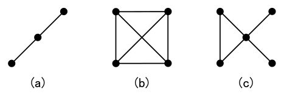 
Fig. 1. Graphs to be colored. (a) Graph consisting of three nodes and two edges to be colored using up to

📷 Fig 2

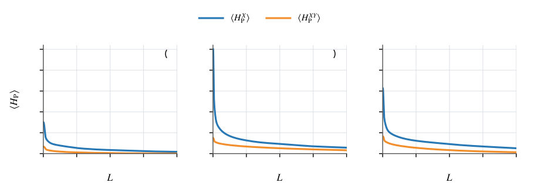 
Fig. 2. Expectation values of the problem Hamiltonians for FALQON as functions of the number of layers.

📷 Fig 3

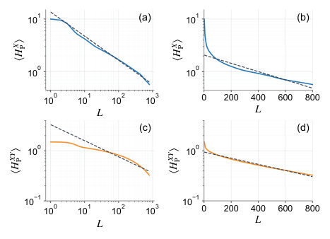 
Fig. 3. Log-log and semi-log plots of Fig. 2(b) and their regression curves. (a) and (b) plot the X-FALQON

📷 Fig 4

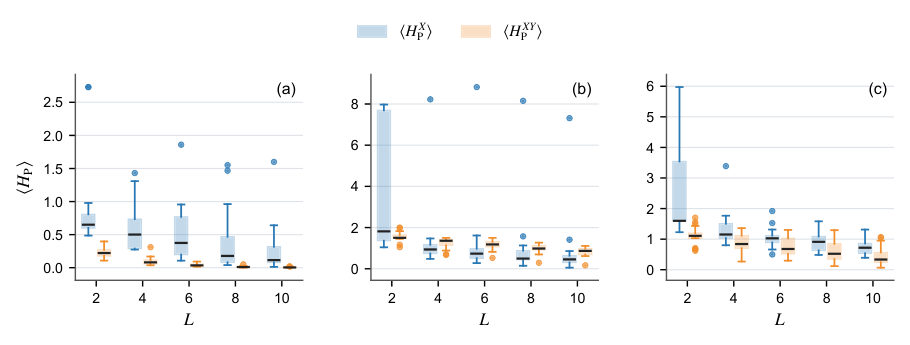 
Fig. 4. Box-and-whisker plots of expectation values of the problem Hamiltonians for the QAOA with L =

📷 Fig 5

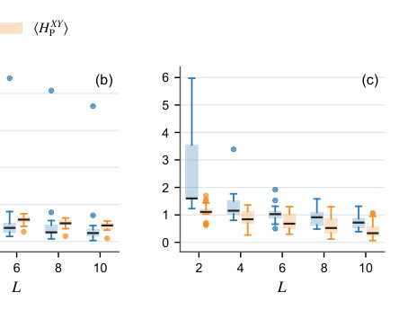 
Figure 4 illustrates ⟨HX p ⟩and ⟨HXY p ⟩for the X-QAOA and XY-QAOA. Although the ex-

**Summary.** This work applies quantum optimization techniques, specifically the FALQON algorithm, to solve graph coloring problems. By comparing X and XY mixers, the authors show that the XY mixer yields better performance metrics, suggesting a more robust approach for quantum computation in this domain.

**Why it may be interesting.** The comparison between FALQON and QAOA, along with the specific analysis of mixer types (X vs. XY), provides concrete benchmarks for quantum optimization algorithms applicable to hard combinatorial problems.

Detailed structure

**Main problem.** The paper addresses the challenge of solving constrained combinatorial optimization problems, specifically graph coloring, using quantum computation.

**Main result.** The Feedback-Based Algorithm for Quantum Optimization (FALQON) utilizing an XY mixer demonstrated superior performance compared to the conventional X mixer in terms of success probability and fair sampling.

**Method.** The authors compare FALQON, which uses feedback from measurements to avoid parameter optimization, against QAOA, which requires classical optimization of variational parameters.

**Model / system.** The model involves mapping graph coloring to a quantum Hamiltonian, utilizing two types of mixers (X and XY) and evolving the state according to a time-dependent Hamiltonian derived from the problem and mixer terms.

**Key observables.** Expectation value of the problem Hamiltonian ($\langle H_p 
angle$), success probability of graph coloring, and fair sampling error ($R_{err}$).

**Important parameters / regimes.** The number of layers ($L$) for QAOA and FALQON, and the fixed constraint parameter $\lambda=0.5$.

**Assumptions / limitations.** The XY mixer derivation assumes that the vertices $v$ and $w$ are distinct when simplifying commutators. The simulation uses noiseless statevector methods.

**Figures summary.** Figures illustrate the three tested graph coloring problems, show the decay of expectation values ($\langle H_p 
angle$) with increasing layers ($L$), and compare success probabilities and fair sampling errors between X and XY mixers.

**Paper structure.** The paper introduces the problem, details the FALQON framework and the XY mixer derivation, and then presents comparative simulations showing the performance metrics (expectation value, success probability, fair sampling) for different mixer types and algorithms.

Abstract

The feedback-based algorithm for quantum optimization (FALQON), which is an extension of the quantum approximate optimization algorithm (QAOA), is a promising approach for finding approximate solutions to combinatorial optimization problems. The FALQON avoids the optimization of variational parameters by using information derived from iterative measurements. To solve a constrained combinatorial optimization problem, it is sometimes more efficient to use an XY mixer rather than the conventional X mixer. We applied the FALQON with the XY mixer to graph coloring and investigated the expectation value of the problem Hamiltonian, success probability of graph coloring, and fair sampling for several small-scale problems. The FALQON with the XY mixer exhibited better performance than that with the X mixer.

[↑ back to top](#top)

### [Unified description of random motions and generalized Fokker-Planck equations](http://arxiv.org/abs/2609.30424v1)

**Authors:** Luca Angelani  
**Type:** theory · **Category:** statistical mechanics · **PDF:** <https://arxiv.org/pdf/2609.30424v1>  
**Analysis basis:** full PDF text, analyzed in chunks
**Topic relevance:** `Keldysh / 2PI / non-Gaussian methods` **2/5** · `correlated / nonlocal dissipation` **2/5** · `methods for driven-dissipative` **2/5** · `analog quantum simulation` **1/5** · `driven-dissipative phase transition` **1/5** · `non-equilibrium universality` **1/5**

📷 Fig 1

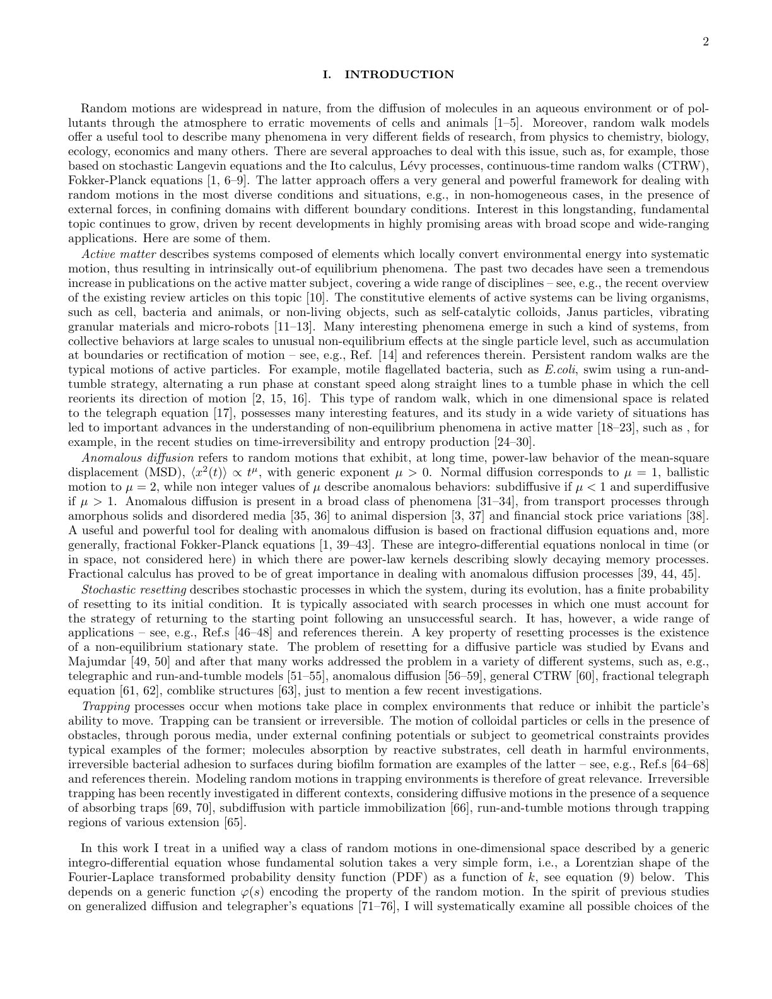 
Low-resolution page preview, page 2

📷 Fig 2

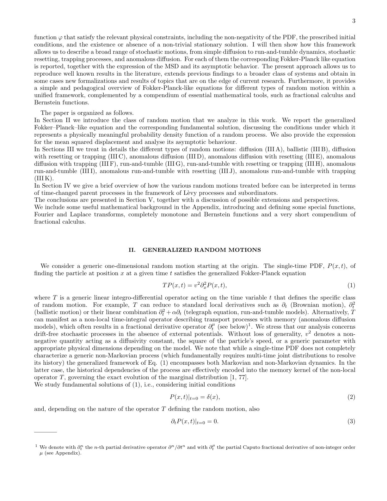 
Low-resolution page preview, page 3

📷 Fig 3

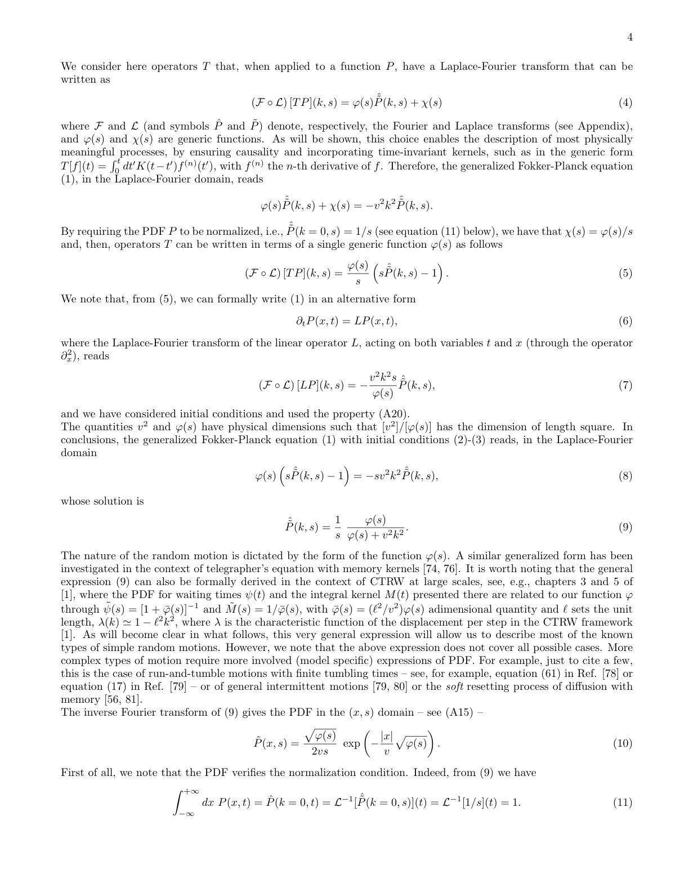 
Low-resolution page preview, page 4

📷 Fig 4

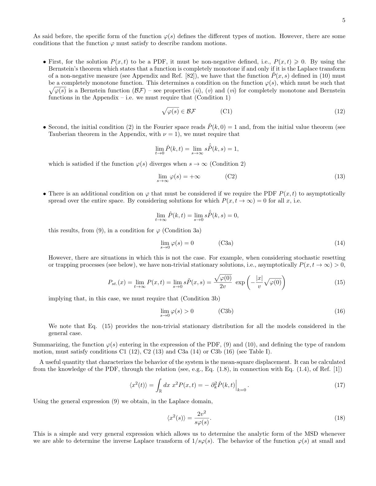 
Low-resolution page preview, page 5

📷 Fig 5

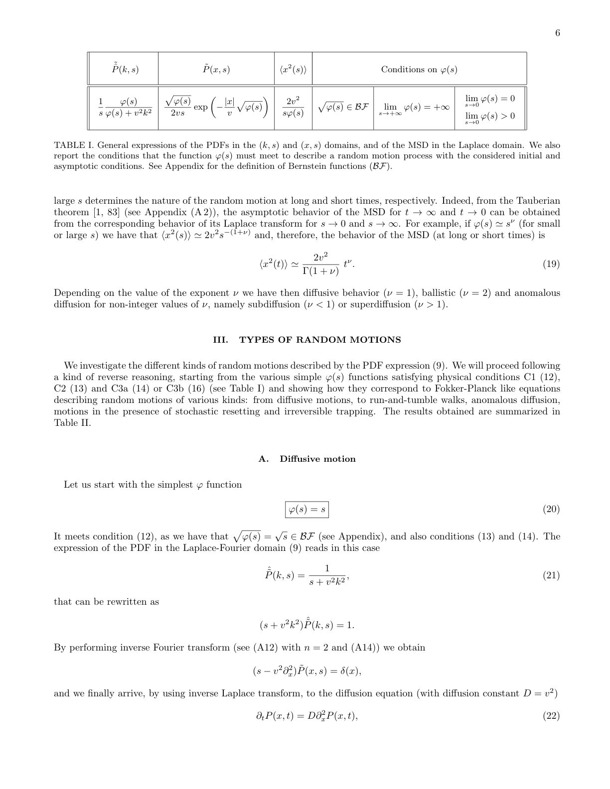 
Low-resolution page preview, page 6

**Summary.** This review unifies the description of various random motions, from simple diffusion to anomalous transport, using a generalized Fokker-Planck equation approach. By analyzing the fundamental solution in the Laplace-Fourier domain via a function $\varphi(s)$, the authors derive a broad class of stochastic dynamics. This provides a powerful mathematical tool for characterizing non-Markovian processes in condensed matter and statistical physics.

**Why it may be interesting.** The mathematical tools developed (Bernstein functions, fractional calculus) are central to modeling non-Markovian dynamics, which are crucial for describing complex open quantum systems or transport phenomena in mesoscopic physics.

Detailed structure

**Main problem.** To provide a unified mathematical framework for describing diverse types of random motions in one dimension, particularly those governed by generalized Fokker-Planck-like equations.

**Main result.** The framework successfully unifies descriptions for simple diffusion, anomalous diffusion, active motion, and processes with stochastic resetting by relating them to the functional form of a generic function $\varphi(s)$ in the Laplace-Fourier domain.

**Method.** The analysis uses Laplace and Fourier transforms to solve the generalized integro-differential equation, identifying constraints on the function $\varphi(s)$ using concepts from Bernstein functions and fractional calculus.

**Model / system.** The model is a generic one-dimensional random motion characterized by a single-time Probability Density Function $P(x, t)$, which is governed by a generalized Fokker-Planck equation. Specific physical examples include Brownian motion, active transport, and processes with trapping.

**Key observables.** The Probability Density Function $P(x, t)$, the Mean-Square Displacement (MSD) $\langle x^2(t) 
angle$, and the long-time power-law exponent $\mu$ of the MSD.

**Important parameters / regimes.** The function $\varphi(s)$ dictates the dynamics; key parameters include diffusion coefficients ($D$) and the time-scaling exponent $
u$ derived from $\varphi(s) \sim s^
u$.

**Assumptions / limitations.** The analysis focuses on drift-free stochastic processes in the absence of external potentials, and the mathematical simplification relies on the fundamental solution having a Lorentzian shape in the Fourier-Laplace domain.

**Paper structure.** The paper proceeds by establishing the general theory using the Laplace-Fourier domain, deriving the universal solution form involving $\varphi(s)$, and then systematically applying this framework to derive and analyze specific stochastic dynamics, including interpretations via time-changed processes and subordinators.

Abstract

This review surveys diverse types of random motion within a unified framework, introducing essential mathematical tools, including special functions and fractional calculus, in a pedagogical manner. We focus on generalized random motions in one-dimensional space described by Fokker-Planck like equations, whose fundamental solutions take a universal and simple form in the Laplace-Fourier domain in terms of a generic function $\varphi(s)$. By exploring the functional forms of $\varphi(s)$ consistent with physical constraints, we derive a broad class of stochastic dynamics. This includes Brownian and active motion, simple and anomalous diffusion, and processes featuring stochastic resetting or trapping mechanisms. For each case, we provide the corresponding kinetic equation, explicit solutions (where available), and mean-square displacements alongside their asymptotic behaviors. Finally, we discuss the physical interpretation of these motions through the lens of time-changed processes and subordinators.

[↑ back to top](#top)

### [Bypassing no-go theorems on mixed classical-quantum systems: the (counter)example of hybrid van Hove theory](http://arxiv.org/abs/2609.31209v1)

**Authors:** Marcel Reginatto, Andrés Darío Bermúdez Manjarres, Sebastian Ulbricht  
**Type:** theory · **Category:** other · **PDF:** <https://arxiv.org/pdf/2609.31209v1>  
**Analysis basis:** full PDF text, analyzed in chunks
**Topic relevance:** `Keldysh / 2PI / non-Gaussian methods` **2/5** · `methods for driven-dissipative` **2/5** · `analog quantum simulation` **1/5** · `correlated / nonlocal dissipation` **1/5** · `driven-dissipative phase transition` **1/5** · `quantum measurements` **1/5**

📷 Fig 1

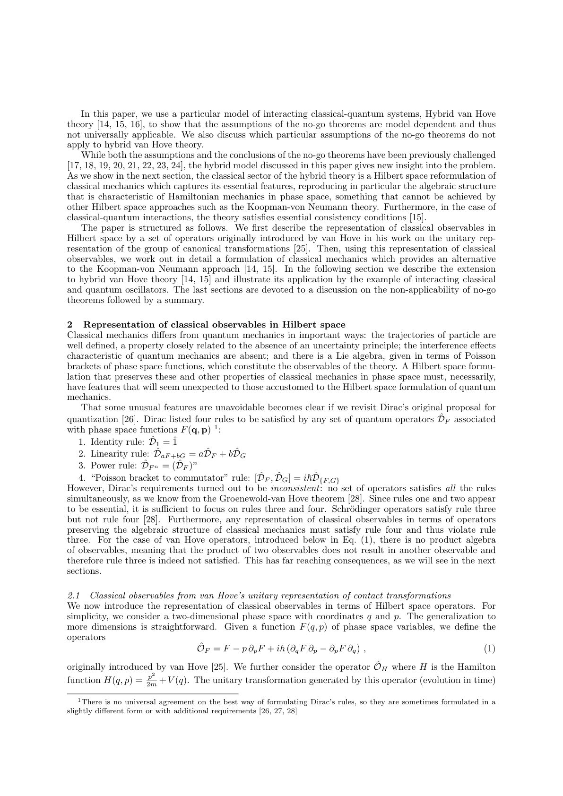 
Low-resolution page preview, page 2

📷 Fig 2

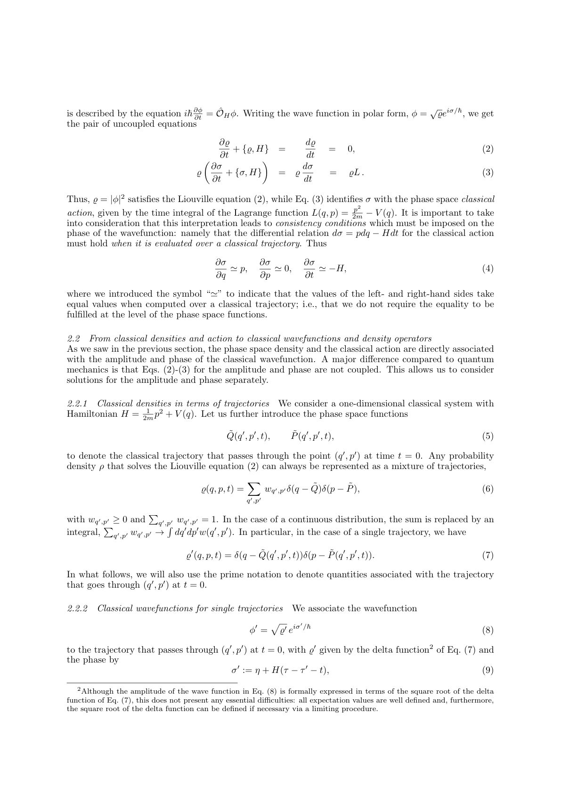 
Low-resolution page preview, page 3

📷 Fig 3

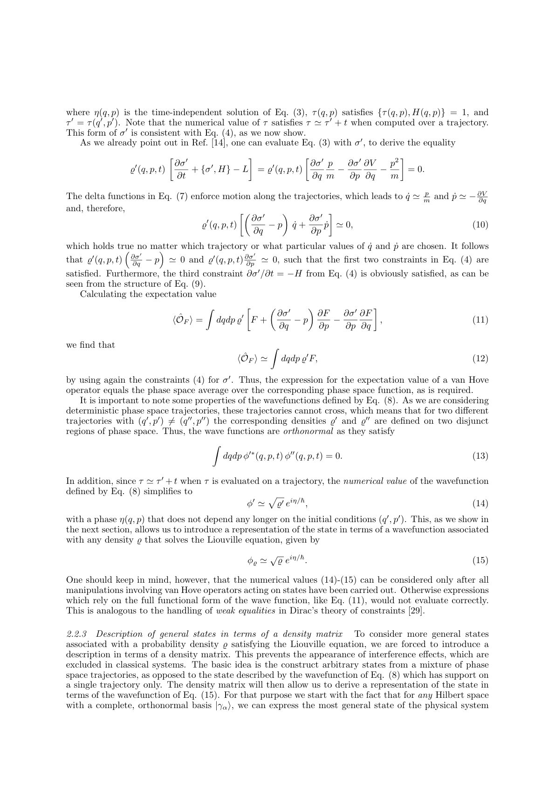 
Low-resolution page preview, page 4

📷 Fig 4

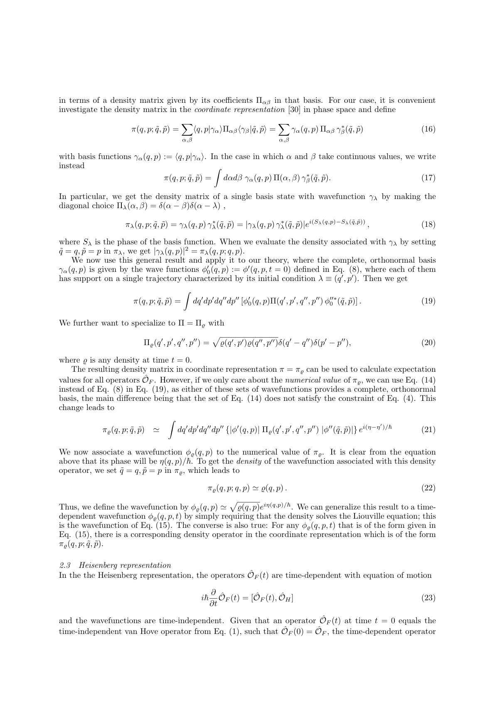 
Low-resolution page preview, page 5

📷 Fig 5

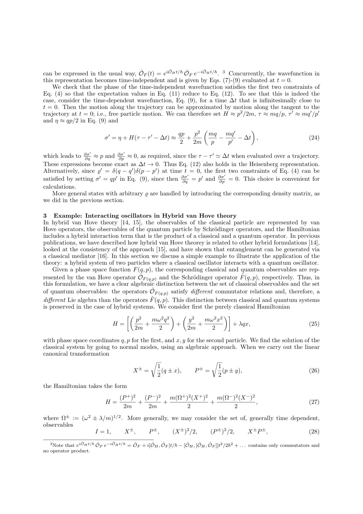 
Low-resolution page preview, page 6

**Summary.** This paper develops the hybrid van Hove theory to model mixed classical-quantum systems, reformulating classical observables as operators within a Hilbert space. By demonstrating that this approach maintains the algebraic structure of classical mechanics, the authors show how to consistently calculate expectation values in hybrid systems. Crucially, this framework challenges the universality of existing no-go theorems by showing they rely on overly restrictive assumptions.

**Why it may be interesting.** This work is highly relevant for theoretical physicists working on open quantum systems or quantum optics, as it provides a concrete, algebraically consistent framework for modeling systems where classical dynamics and quantum evolution are coupled.

Detailed structure

**Main problem.** The paper addresses the challenge of constructing consistent theoretical frameworks for mixed classical-quantum systems that can bypass established 'no-go theorems' in the field.

**Main result.** The authors introduce and validate the hybrid van Hove theory, demonstrating that its specific algebraic structure allows it to reproduce classical expectation values while remaining consistent with quantum mechanics, thereby circumventing the restrictive assumptions of existing no-go theorems.

**Method.** The core method involves representing classical observables as operators satisfying a commutation algebra isomorphic to the classical Poisson algebra, utilizing van Hove's unitary representation of contact transformations.

**Model / system.** The theory is applied to hybrid systems, such as interacting classical and quantum oscillators, where the Hamiltonian is promoted to a unique hybrid operator acting on the mixed system.

**Key observables.** Phase space density $\varrho(q, p, t)$, expectation values $\langle \hat{O}F 
angle$, and the time evolution of hybrid normal mode coordinates $\hat{\Theta}X_{\pm}(t)$.

**Important parameters / regimes.** Planck's constant ($\hbar$), coupling constants ($\lambda$), and characteristic frequencies ($\Omega_{\pm}$).

**Assumptions / limitations.** The approach requires imposing specific consistency conditions on the phase of the classical wavefunction, and it critically challenges the universality of the assumptions underpinning existing no-go theorems.

**Figures summary.** Not specified.

**Paper structure.** The paper first establishes the algebraic framework for classical mechanics using van Hove operators. It then extends this to hybrid systems, applying it to interacting oscillators, and finally uses the resulting structure to argue that the no-go theorems are based on overly restrictive assumptions.

Abstract

Motivated by models of mixed quantum-classical hybrid theories, we consider the representation of classical observables as Hilbert-space operators based on van Hove's unitary representation of contact transformations. This leads to a reformulation of classical mechanics where the phase space density satisfies the Liouville equation and, more importantly, classical observables are represented by van Hove operators that satisfy a commutation algebra isomorphic to the classical Poisson algebra of functions in phase space. Thus, this Hilbert space approach captures all the essential features of the phase space formulation of classical mechanics in that it reproduces its algebraic structure -- something that is not achieved by other approaches such as the Koopman-von Neumann theory. As an important feature, the definition of appropriate physical states in this formalism imposes certain natural requirements on the phase of the classical wave function, which ensure correct expectation values for the observables. Furthermore, we discuss how to extend the approach to the hybrid van Hove theory of mixed classical-quantum systems and illustrate its application with the example of interacting classical and quantum oscillators. Finally, we focus on the question of how hybrid van Hove theory evades no-go theorems on mixed classical-quantum systems and point to the various assumptions of the no-go theorems that do not apply to our approach. This demonstrates that these no-go theorems are not universally applicable, contrary to their original claims.

[↑ back to top](#top)

### [Optical characterization of excited-state spin Hamiltonians and clock transitions at telecommunication wavelength in Tm3+:YAlO3](http://arxiv.org/abs/2609.31194v1)

**Authors:** Akshay Babu Karyath, Luozhen Li, Julien Bertrand, Alexandre Kings, Tianyang Shen, Gabriel Aeppli, Simon Gerber, Guy Matmon, Wolfgang Tittel  
**Type:** experiment · **Category:** other · **PDF:** <https://arxiv.org/pdf/2609.31194v1>  
**Analysis basis:** full PDF text, analyzed in chunks
**Topic relevance:** `quantum measurements` **2/5** · `QC/QI experiment` **1/5** · `analog quantum simulation` **1/5** · `quantum optics experiment` **1/5** · `superradiant laser` **1/5**

📷 Fig 1

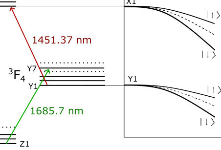 
FIG. 1. Energy level diagram of Tm3+:YAlO3 where 3H6 is the ground-state manifold ; 3F4 and 3H4 are excited-state manifolds. At right, a schematic of the evolution of the lowest Stark levels of the 3F4 and 3H4 manifolds (Y1 and X1, respectively) with applied magnetic field. Each level shifts quadratically (dashed line, due to the quadratic Zeeman shift) and splits linearly into two nuclear-spin sublevels (solid line, caused by the enhanced nuclear Zeeman effect), with total splittings δeX1 and δeY1, respectively. |↑⟩and |↓⟩denotes the nuclear spin states. Energy axes not to scale.

📷 Fig 2

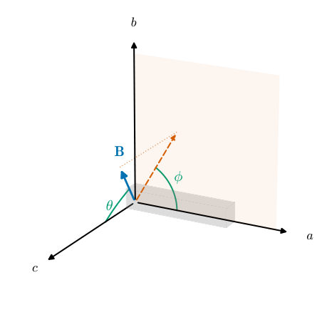 
FIG. 2. Definition of the magnetic-field coordinate system relative to the crystal axes (a, b, c) of Tm3+:YAlO3. The magnetic field B is parametrized by the polar angle θ, mea- sured with respect to the c axis and the azimuthal angle ϕ, measured in the ab plane with respect to the a axis. The gray box indicates the cut of the Tm3+:YAlO3 crystal.

📷 Fig 3

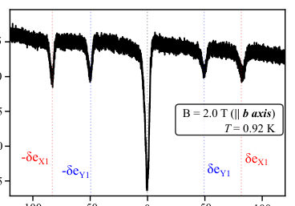 
FIG. 3. Spectral holes of the 1451 nm Y1-X1 transition at T=0.92 K with an applied magnetic field of 2 T oriented along the b-axis of the crystal. The figure shows a central hole at zero detuning together with four side holes located symmetri- cally about it, which arise from the inhomogeneous broaden- ing of the transition along with atomic level splittings. When B ∥b, the detunings of the inner pair (blue dotted lines) and the outer pair (red dotted lines) correspond to the enhanced nuclear Zeeman splittings δeY1 and δeX1 of the Y1 and X1 levels, respectively.

📷 Fig 4

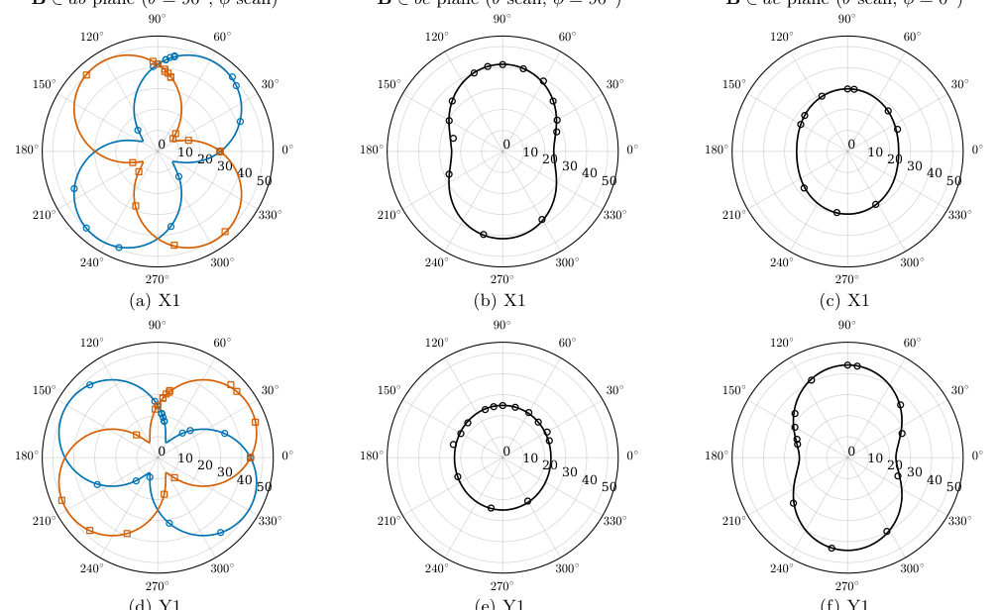 
FIG. 4. Angular dependence of the enhanced nuclear Zeeman splitting rate for the X1 level of the 3H4 manifold and the Y1 level of the 3F4 manifold of Tm3+:YAlO3. Top row (a)-(c): X1; bottom row (d)-(f): Y1. For B within the ab plane (panels (a),(d)) site 1 and site 2 are magnetically inequivalent, resulting in distinct splittings (blue circles, site 1; orange squares, site 2), whereas for B within the bc and ac planes (panels (b),(e) and (c),(f), respectively), the sites are magnetically equivalent and yield the same splittings. Markers depict measured data; solid lines are fits using Eq. (8). Radial axis: splitting rate in MHz/T. The procedure for assigning measurements to site 1 and site...

📷 Fig 5

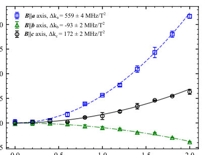 
FIG. 5. Detuning of the center of the inhomogeneous broad- ened line of the excited-state transition (Y1 - X1) as a func- tion of magnetic field amplitude, for B oriented along the three crystal axes of Tm3+:YAlO3. Each set of data is fitted with a quadratic function ∆ν = ki · B2 (i=a,b,c), after sub- tracting the zero-field (B = 0 T) baseline detuning. The fitted quadratic shift rates ∆ki are indicated, including uncertain- ties. The error bars of the individual data points characterize the uncertainty with which the center of the inhomogeneous absorption line could be established.

**Summary.** This experimental study characterizes the magnetic spin Hamiltonians of $	ext{Tm}^{3+}$ ions in $	ext{YAlO}_3$ using high-resolution spectroscopy at telecom wavelengths. By measuring field-dependent spectral splittings, the authors quantified the effects of the nuclear and electron Zeeman interactions. The results enable the prediction of stable optical clock transitions, advancing the use of these materials for quantum information applications.

**Why it may be interesting.** This work is highly relevant as it uses precise spectroscopic techniques to map out the fundamental quantum mechanical interactions (hyperfine, Zeeman) governing rare-earth ion energy levels, which is crucial for developing solid-state quantum memories and quantum sensors.

Detailed structure

**Main problem.** The paper aims to characterize the magnetic properties of the lowest Stark levels of the $3F_4$ and $3H_4$ excited-state manifolds of $	ext{Tm}^{3+}$ in $	ext{YAlO}_3$ to establish their spin Hamiltonians.

**Main result.** The authors successfully determined the spin Hamiltonians by measuring field-dependent splittings (enhanced nuclear Zeeman effect) and quadratic shifts, allowing them to predict specific optical clock transitions.

**Method.** Measurements were performed using spectral hole burning on the $1451 	ext{ nm}$ Zero-Phonon Line (ZPL) while applying controlled external magnetic fields up to $2 	ext{ T}$.

**Model / system.** The system is $	ext{Tm}^{3+}$ ions in $	ext{YAlO}_3$, analyzed using a generalized spin Hamiltonian incorporating hyperfine, Zeeman, and crystal-field interactions. The analysis focuses on the $	ext{Y1} \leftrightarrow 	ext{X1}$ transition between the $3H_4$ and $3F_4$ manifolds.

**Key observables.** Frequency detuning of side holes, inhomogeneous line shift (quadratic Zeeman effect), and the magnetic field dependence of these shifts.

**Important parameters / regimes.** Cryogenic temperatures ($\sim 800 	ext{ mK}$), magnetic fields up to $2 	ext{ T}$, and the telecom E-band wavelength ($\sim 1451 	ext{ nm}$).

**Assumptions / limitations.** The determination of the Hamiltonian relies on fitting measured splittings to theoretical models, and the estimation of coherence time ($	ext{T}_2$) using the Hessian matrix provides only a lower bound.

**Figures summary.** Figures illustrate energy level diagrams showing transitions, the magnetic field coordinate system relative to crystal axes, and spectral hole profiles demonstrating central and side-hole splittings.

**Paper structure.** The paper progresses from establishing the physical context and the general Hamiltonian, through detailed measurements of Zeeman splittings and quadratic shifts using spectral hole burning, culminating in the derivation of the spin Hamiltonians and the prediction of clock transition points.

Abstract

The zero-phonon line (ZPL) between the two excited-state manifolds 3F4 and 3H4 of the trivalent thulium ion in yttrium aluminum perovskite (Tm3+:YAlO3) lies within the telecom E-band at around 1451 nm and exhibits an optical coherence time of a few μs at cryogenic temperatures. To improve this time in view of potential applications, e.g. single-photon sources and optical quantum memory, we characterized the magnetic properties of the lowest Stark levels of these two manifolds. Varying the external magnetic field amplitude and orientation, we measured the enhanced nuclear Zeeman splitting by probing the field-dependent frequency detuning of side holes created by means of spectral hole burning, and we characterized the inhomogeneous line shift caused by the quadratic Zeeman interaction. Together, this allowed us to establish the spin Hamiltonians for the lowest Stark level of the 3F4 and 3H4 manifolds, and to predict optical clock transitions for particular orientations and magnitudes of the magnetic field

[↑ back to top](#top)

### [Cooper pair charge Kondo effect in a hybrid quantum dot - superconductor device](http://arxiv.org/abs/2609.30381v1)

**Authors:** Luca Gonfiantini, Lorenzo Maffi, Michele Burrello  
**Type:** theory · **Category:** strongly correlated electrons · **PDF:** <https://arxiv.org/pdf/2609.30381v1>  
**Analysis basis:** full PDF text, analyzed in chunks
**Topic relevance:** `Keldysh / 2PI / non-Gaussian methods` **2/5** · `correlated / nonlocal dissipation` **1/5** · `methods for driven-dissipative` **1/5**

📷 Fig 1

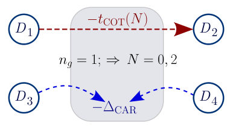 
Figure 1. Sketch of the poor man’s tetron. (a) The four quantum dots Dα are realized within two parallel nanowires (blue) through suitable electrostatic gates, depicted in gold alongside them. The two nanowires are connected by a cen- tral floating superconducting island (gray). Each quantum dot is tunnel-coupled to the central superconducting region and an external lead. (b) Graphical representation of the cotunneling (red) and crossed Andreev reflection (blue) pro- cesses dictating the dynamics of electrons at low energy close to the charge degeneracy point.

📷 Fig 2

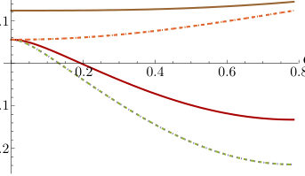 
Figure 2. Energy of the ground states of the sectors with 1 ≤Nt ≤5 as a function of the spin-orbit parameter α at the charge degeneracy point ng = 1, µD = µSC = 0, for ∆= 5t and EC = 0.5t. The energies are calculated based on the effective Hamiltonian (5) and expressed in units of the tunneling amplitude t. The PH symmetric ground states with Nt = 2, 4 and Pd = +1 are the global ground states for α &gt; 0. At α = π/6, tCOT(0) ≈0.02t and ∆CAR ≈0.19t.

📷 Fig 3

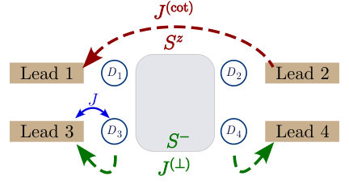 
Figure 3. Main processes in the Hamiltonian HK. The blue arrow represents the (first-order) lead-dot couplings HJ. The dashed red and green arrows respectively depict the J(cot) and J(⊥) second-order terms in Eqs. (20) and (21).

📷 Fig 4

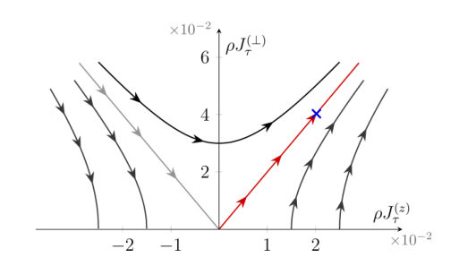 
Figure 4. RG flow of the Kondo couplings based on the second-order equations. A typical value of the bare couplings ρJ(⊥) τ ≃0.04, ρJ(z) τ ≃0.02 is indicated in the plot by a blue cross. It corresponds to the estimates in Eq. (C7,C8) in a strong coupling regime, J ≃δE(3), and for the following pa- rameter choice: ∆= 2.5t, EC = t, α = π/6, ρ = 3.4meV−1.

📷 Fig 5

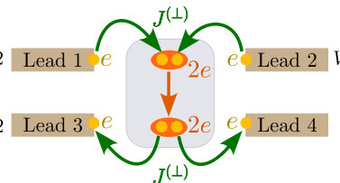 
Figure 5. Sketch of the processes generating the interwire Andreev conductance. The two nanowires are subject to a voltage bias Vb and the Andreev conductance GCAR accounts for processes in which a Cooper pair is formed by electrons in leads 1 and 2, and split into two correlated electrons injected in leads 3 and 4.

**Summary.** This theoretical work predicts a charge Kondo effect in a quantum dot coupled to a superconductor, utilizing a 'poor man's tetron' geometry. By applying Renormalization Group techniques, the authors determine that the system exhibits non-Fermi liquid behavior characterized by a universal, quantized conductance. This work is significant for understanding how superconducting correlations can mediate strong electron-electron interactions in nanoscale devices.

**Why it may be interesting.** The study bridges superconducting proximity effects (Andreev reflections) with strongly correlated electron physics (Kondo effect), providing a concrete platform for observing exotic many-body phenomena in solid-state devices.

Detailed structure

**Main problem.** The paper investigates the onset and characteristics of a charge Kondo effect mediated by Cooper pairs in a hybrid quantum dot-superconductor device.

**Main result.** The theory predicts a two-channel charge Kondo effect, leading to non-Fermi liquid signatures characterized by a fixed-point conductance of $e^2/\pi$.

**Method.** The analysis employs Renormalization Group (RG) techniques and second-order perturbation theory to study the effective Hamiltonian derived from the system's coupling to the superconducting leads.

**Model / system.** The physical system is a 'poor man's tetron'—a tunable hybrid device comprising four quantum dots coupled to a floating superconducting island. The physics is governed by the interplay between single-particle tunneling, charging energy, and crossed Andreev reflections.

**Key observables.** Fractional conductance ($	ext{G}_{	ext{CAR}}$), non-Fermi liquid signatures, and the fixed-point conductance value ($e^2/\pi$).

**Important parameters / regimes.** Charging energy ($E_C$), superconducting gap ($\Delta$), and the system being tuned near the particle-hole symmetric point.

**Assumptions / limitations.** The analysis assumes the system is tuned near the particle-hole symmetric point, and in some calculations, it assumes the weak-tunneling limit or uses approximations for gapless bulk modes.

**Figures summary.** Figure 1 sketches the poor man's tetron structure, illustrating cotunneling and crossed Andreev reflection. Figure 8 shows the ratio $	ilde{R}^{-1}$ dependence on the superconducting potential $\mu_{	ext{SC}}$.

**Paper structure.** The paper systematically analyzes the system by first describing the poor man's tetron, then applying RG techniques to analyze the weak and strong coupling regimes, and finally calculating the conductance using perturbation theory to find the fixed-point behavior.

Abstract

We consider a tunable hybrid device composed of four quantum dots and a floating superconducting island -- the so-called poor man's tetron -- close to its effective particle-hole symmetric point and coupled to four external leads. We predict the onset of a charge Kondo effect mediated by Cooper pairs, resulting from the strong crossed Andreev reflections that dominate its low-energy behavior. This two-channel Kondo effect makes the poor man's tetron behave as a double Cooper pair splitter, turning uncorrelated incoming electrons into spatially separated Cooper pairs. Based on renormalization group techniques, we analyze both its weak and strong coupling regimes and we determine its non-Fermi liquid signatures. Our estimates indicate that the fractional conductance and transport features associated to this two-channel charge Kondo effect can be observed over a broad range of temperatures and anisotropies in realistic experimental conditions.

[↑ back to top](#top)

### [Nonstabilizerness of quantum tensor network states is intractable in two dimensions](http://arxiv.org/abs/2609.31459v1)

**Authors:** Gianluca Esposito, Georgios Styliaris  
**Type:** theory · **Category:** other · **PDF:** <https://arxiv.org/pdf/2609.31459v1>  
**Analysis basis:** full PDF text, analyzed in chunks
**Topic relevance:** `methods for driven-dissipative` **2/5** · `analog quantum simulation` **1/5**

📷 Fig 1

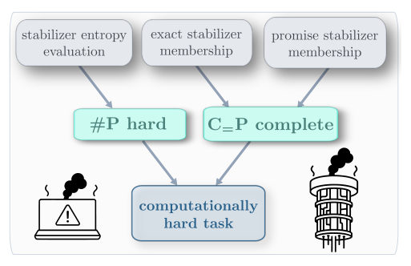 
FIG. 1. We establish that computing SE of 2D PEPS or just deciding whether a PEPS is a stabilizer state, exactly or approximately, are hard computational tasks for classical and quantum computers. An efficient classical algorithm for either of those tasks would imply the collapse of the polynomial hierarchy, and an efficient quantum algorithm would imply the collapse NP ⊆BQP: both implications are considered highly unlikely.

📷 Fig 2

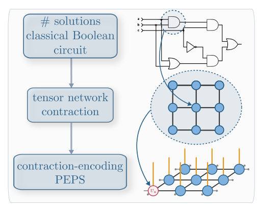 
FIG. 2. Graphical schematizations of the proofs of compu- tational hardness in this work. The main idea is always to encode the number of satisfying assignments of a Boolean cir- cuit in a scalar TN contraction, then embed its result in the 1-qubit amplitude of a specific PEPS.

📷 Fig 3

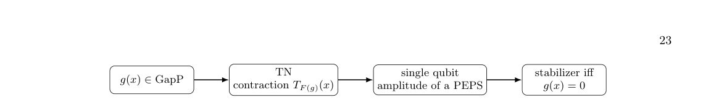 
FIG. 3. Reduction proving C=P-hardness of exact PEPS stabilizer membership. The zero test for a function g ∈GapP is encoded in the amplitude of a single marked qubit of a specifically built PEPS, through the argument of a rational function. The resulting state is a stabilizer state if and only if g(x) = 0.

**Summary.** This paper proves that determining if a quantum state described by a 2D Tensor Network (PEPS) is nonstabilizable, or even just checking if it is a stabilizer state, is computationally extremely hard. The hardness results show that these problems are at least as hard as counting problems ($\#	ext{P}$) or solving $	ext{C}=	ext{P}$ problems. This implies that no efficient classical or quantum algorithm can solve these diagnostics for general 2D quantum systems.

**Why it may be interesting.** This work provides a rigorous complexity barrier, suggesting that characterizing non-classicality in realistic 2D quantum materials using current tensor network formalisms is computationally intractable for general cases.

Detailed structure

**Main problem.** The paper determines the computational complexity of quantifying nonstabilizerness for quantum states represented by 2D Tensor Networks (PEPS).

**Main result.** Both computing the Stabilizer Entropy (SE) and deciding stabilizer membership for 2D PEPS are proven to be computationally hard, specifically $\#	ext{P}$-hard and $	ext{C}=	ext{P}$-complete, respectively.

**Method.** The hardness results are established via reductions from known hard computational problems, such as $	ext{C}=	ext{P}$ languages, to the evaluation of SE or the stabilizer membership test on PEPS.

**Model / system.** The study focuses on quantum many-body states described by Projected Entangled Pair States (PEPS) on a 2D lattice, which are used to compactly represent states obeying the entanglement area law.

**Key observables.** Nonstabilizerness, quantified by the Stabilizer Entropy ($\alpha$-SE), and the membership of the state in the set of stabilizer states ($	ext{STAB}_N$).

**Important parameters / regimes.** The bond dimension ($D$) of the PEPS, and the Rényi parameter $\alpha \ge 2$.

**Assumptions / limitations.** The hardness results are established under standard complexity assumptions and apply to the worst-case scenario for the PEPS input model.

**Figures summary.** The figures illustrate the constructions used in the proofs of computational hardness, specifically showing how to encode zero-testing problems into the PEPS structure.

**Paper structure.** The paper progresses by first establishing the physical relevance of nonstabilizerness, then contrasting the tractability of 1D (MPS) vs. 2D (PEPS) systems, and finally proving the computational hardness results for SE evaluation and stabilizer membership using complexity theory reductions.

Abstract

Nonstabilizerness is a necessary resource for quantum systems to lie beyond the classically simulable regime. With the advent of stabilizer $α$-Rényi entropies, nonstabilizerness has also become a many-body diagnostic, complementary to entanglement. While deciding whether an arbitrary quantum state has nonstabilizerness is provably hard, such states already require a description exponentially large in the number of qubits and are thus out of reach for many-body physics. Here we instead consider 2D tensor network (TN) states, which compactly capture states obeying an entanglement area law, and ask whether they admit a simpler algorithm for the same task. In contrast to the 1D case, we prove that, even at small, constant bond dimension, computing the stabilizer entropy of 2D TN states is $\# P$ hard for any integer $α\ge 2$, and deciding stabilizer membership is $\rm C_{=} P $ complete. Hence, under standard complexity assumptions, no classical or quantum algorithm with polynomial resources can solve either problem in the worst case. Both hardness results persist even when the problems are formulated up to constant additive accuracy.

[↑ back to top](#top)

### [Repulsion-Driven $p - i p$ Superconductivity in a Single Valley Revealed by DMRG](http://arxiv.org/abs/2609.30365v1)

**Authors:** Cesar A. Gallegos, Omid Tavakol, Christopher Yang, Steven R. White, Thomas Scaffidi  
**Type:** theory · **Category:** strongly correlated electrons · **PDF:** <https://arxiv.org/pdf/2609.30365v1>  
**Analysis basis:** full PDF text, analyzed in chunks
**Topic relevance:** `analog quantum simulation` **2/5** · `methods for driven-dissipative` **1/5**

📷 Fig 1

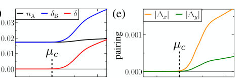 
FIG. 1. (a) Illustration of the QWZ model with two orbitals on a square lattice and (b) its non-interacting band struc- ture with a Dirac point at the center of the Brillouin zone. Color indicates Berry curvature. (c) In the strong U limit, the Hartree bands open an effective mass gap ∝U at the Dirac point (the band gap has been artificially reduced for ease of plotting). The superconducting phase emerges upon doping (we dope with holes without loss of generality, for µ &lt; µc). (d), (e) DMRG scan on an 84×8 cylinder for U = 6, B = 0.5, with a linearly decreasing µ from µ = −2.6 to µ = −2.9, and µc ∼−2.7 indicating the lower edge of the charge gap. (d) Average occupation nA and hole-doping...

📷 Fig 2

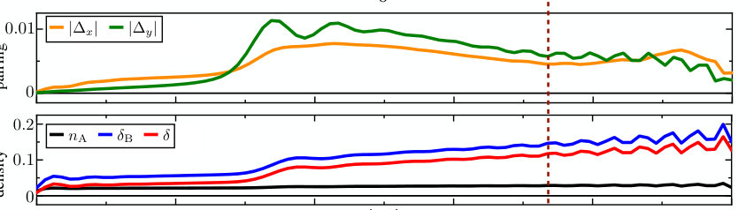 
FIG. 2. DMRG scan on an 84×8 cylinder for U =6 and B=0.5, with the chemical potential decreasing linearly along the cylinder from µ=−2.9 to µ=−3.4 and a 10−4 pair field with p −ip winding applied across the cylinder. (a) DMRG cylinder showing the p −ip superconducting (SC) phase at lower doping and the phase with coexisting pair-density-wave order and uniform superconductivity (PDW+SC) at higher doping. The bond thickness is proportional to the nearest-neighbor (NN) pairing strength on the B orbitals, |∆| = |⟨ci,Bcj,B⟩|, while the color indicates the phase arg(∆) relative to the bottom-row horizontal bond of each column. Column-averaged (b) NN pairing strengths |∆x| and |∆y| in the x and y...

📷 Fig 3

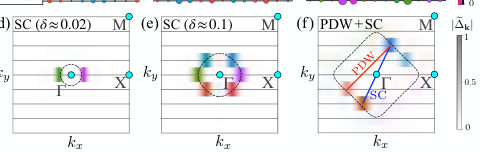 
FIG. 4. Same DMRG non-scans as in Fig. 3. (a)–(c) The real-space pair amplitude ⟨c0ci⟩, measured relative to the cen- tral site marked by a star, with symbol size and color indi- cating its magnitude and phase, respectively. (d)–(f) The magnitude (gray scale) and phase (color) of the normalized zero-momentum pair amplitude e∆k = ∆k/ max(|∆k|), with ∆k =⟨ckc−k⟩. The blue and red lines in (f) connect the mo- menta involved in uniform SC and finite-momentum PDW pairing, respectively. The dashed contours indicate the Fermi surfaces obtained from the mean field band structure with an effective mass meff = U/2 and where the doping was matched to the average one observed in DMRG. The horizontal...

📷 Fig 4

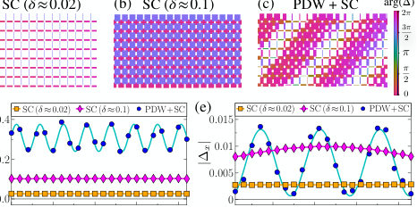 
FIG. 3. DMRG non-scan results on 84×8 cylinders for U =6, B = 0.5, and a 10−4 pair field with p −ip winding applied across the cylinder. The DMRG cylinders on the (a), (b) SC phase at δ ≈0.02 (µ = −2.9) and δ ≈0.1 (µ = −3.2), respectively, and the (c) PDW+SC phase at δ ≈0.3 (µ = −3.8). Bond thickness is proportional to the nearest-neighbor pairing strength |∆|=|⟨ci,Bcj,B⟩|, and bond color indicates the phase arg(∆) measured relative to a horizontal bond in the center. The (d) total hole density δ and (e) pairing strength in the x direction, |∆x|, along a single row. The light-blue curves are independent fits of the PDW+SC data to a constant plus a cosine. Only the central region of each...

📷 Fig 5

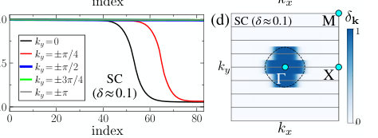 
FIG. 5. Same DMRG non-scans as in the main text, at doping δ ≈0.02 and δ ≈0.1. Sorted eigenvalues of the one-body reduced density matrix in each ky sector are shown in (a) and (c), and the corresponding hole momentum distributions δk in (b) and (d). The dashed contours in (b) and (d) show the Fermi surfaces obtained from the noninteracting model with the effective mass meff = U/2 and the horizontal gray lines indicate the discrete ky values allowed on the width-8 cylinder.

**Summary.** This paper uses DMRG simulations on the QWZ model to show that strong repulsive interactions can induce topological p-ip superconductivity in a single valley of Dirac fermions. The SC state is robustly found upon doping and coexists with a pair-density-wave component at higher doping levels. This work highlights the crucial role of strong correlations and non-trivial band geometry in realizing exotic superconducting phases.

**Why it may be interesting.** The work provides a concrete theoretical realization of topological superconductivity driven purely by repulsive interactions in a geometrically constrained system, offering insights applicable to strongly correlated electronic materials.

Detailed structure

**Main problem.** The study aims to demonstrate the existence and nature of repulsion-driven topological superconductivity in a single valley of Dirac fermions.

**Main result.** The authors find robust evidence for spinless chiral p-wave superconductivity ($p-ip$) upon doping, which is driven by strong repulsive interactions and non-trivial band geometry.

**Method.** Density-Matrix Renormalization Group (DMRG) calculations are extensively used on lattice cylinders to map out the phase diagram as a function of doping and interaction strength.

**Model / system.** The system is modeled using the interacting Qi-Wu-Zhang (QWZ) lattice model, which captures physics relevant to valley-polarized 2D materials like rhombohedral graphene. The Hamiltonian includes kinetic terms and a strong on-site repulsive interaction ($U$).

**Key observables.** Superconducting order parameter ($\Delta$), average occupation ($n_A, n_B$), pair-density-wave (PDW) component, and the momentum distribution $n(\mathbf{k})$ across the Fermi surface.

**Important parameters / regimes.** Strong repulsion regime ($U$ large), hole-doping ($\mu < \mu_c$), and the specific topological nature of the parent state (anomalous Hall metal).

**Assumptions / limitations.** The analysis relies on DMRG on cylinders, which is suitable for identifying phase boundaries, and the focus is on the minimal case of a single Dirac fermion.

**Figures summary.** Figures illustrate the QWZ model, the non-interacting band structure, and DMRG scans showing the transition from an insulator to the $p-ip$ SC phase, and subsequently to a PDW+SC phase.

**Paper structure.** The paper progresses by establishing the model (QWZ), applying DMRG to find the SC phase upon doping, detailing the crossover from quasi-1D to isotropic SC, and finally characterizing the coexisting PDW+SC state using momentum-space analysis.

Abstract

We demonstrate repulsion-driven topological superconductivity of a single species of Dirac fermions, motivated by valley-polarized phases observed in two-dimensional materials such as rhombohedral graphene. Using density-matrix renormalization group calculations on the Qi-Wu-Zhang lattice model on cylinders of width up to eight, we find a robust phase of spinless chiral $p$-wave superconductivity. Pairing already starts at low doping and thus occurs on a small, nearly isotropic Fermi pocket, and is therefore not tied to the particular details or anisotropy of the dispersion but instead seems tied to the non-trivial quantum geometry of the bands. In fact, the winding of the superconductor order parameter is opposite ("$p-ip$") to that of the anomalous Hall metal which forms the parent state, in agreement with expectations recently derived from weak coupling calculations. At larger doping, we find that a pair-density-wave component develops alongside zero-momentum pairing. Our work shows that the combination of strong repulsion, absence of time-reversal in the parent state, and non-trivial quantum geometry form a promising platform to realize topological superconductivity.

[↑ back to top](#top)

### [Disentangling the Toric Code](http://arxiv.org/abs/2609.30363v1)

**Authors:** Lei Gioia, Salvatore D. Pace, Ruben Verresen, Shu-Heng Shao, Ryan Thorngren  
**Type:** theory · **Category:** other · **PDF:** <https://arxiv.org/pdf/2609.30363v1>  
**Analysis basis:** full PDF text, analyzed in chunks
**Topic relevance:** `analog quantum simulation` **2/5**

📷 Fig 1

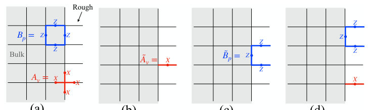 
FIG. 1. Possible boundary operators in the absence of ancilla degrees of freedom for a rough boundary. (a) Only toric code terms fully contained within the boundary are kept. In this case both e and m anyons are condensed at the boundary. (b) In addition to (a) we may add ˜Av which causes e to be an excitation at the boundary, however m is still condensed. (c) Instead, to (a) we may add ˜Bp which causes m to be a boundary excitation, however with e still condensed. (d) If we add both ˜Av and ˜Bp, the boundary is governed by the 1+1d transverse Ising model which generically does not feature a quantized energy spectrum.

📷 Fig 2

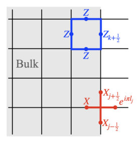 
FIG. 2. Rough boundary of the toric code with modified star operator (red) where the vertical links are embedded into rotors.

**Summary.** This work analyzes the concept of 'on-siteability' for symmetries in models like the Toric Code, showing that achieving this property requires the inclusion of infinite-dimensional ancillae. This suggests that the lattice description aligns with continuum QFT predictions only when these infinite degrees of freedom are accounted for.

**Why it may be interesting.** The distinction between finite and infinite ancillae provides a rigorous way to connect lattice models to continuum quantum field theory expectations, which is crucial for understanding topological order.

Detailed structure

**Main problem.** The paper investigates the conditions under which symmetries generated by Hamiltonians, such as the Ising ferromagnet and the Toric Code, can be made 'on-site' when considering the presence of ancilla degrees of freedom.

**Main result.** On-site symmetries can be achieved for these models only when infinite-dimensional ancillae are allowed, suggesting an agreement between lattice and quantum field theory anomaly structures in this limit.

**Method.** The authors use concepts like 'on-siteability' and 'blendability' to analyze the ground state algebra of the Hamiltonians, comparing results based on whether finite or infinite-dimensional ancillae are assumed.

**Model / system.** The study focuses on lattice Hamiltonians, specifically the 1+1d Ising ferromagnet and the 2+1d Toric Code, which possess non-trivial ground state order and associated $U(1)$ symmetries.

**Key observables.** On-siteability, blendability, and the nature of the obstruction to on-siteability (e.g., non-invertible vs. solvable).

**Important parameters / regimes.** The dimensionality (1+1d vs 2+1d) and the type of ancilla (finite vs. infinite-dimensional).

**Assumptions / limitations.** The analysis relies on comparing results derived from finite-depth quantum circuits (finite ancillae) versus those allowing unbounded ancillae (infinite-dimensional rotors).

**Figures summary.** Table I compares on-siteability for $U(1)_{SSB}$ and $U(1)_{TC}$ based on ancilla type; Figure 1 illustrates boundary conditions for the Toric Code, and Figure 2 shows the boundary algebra structure.

**Paper structure.** The paper develops concepts like on-siteability and blendability, applies these tools to the Ising model, and then extends the analysis to the Toric Code, culminating in a comparison of results across different ancilla types.

Abstract

Commuting-projector Hamiltonians with integer spectrum such as the 1+1d Ising ferromagnet and the 2+1d toric code may be regarded as the generators of non-on-site $U(1)$ symmetries. In this paper we study whether these symmetries can be made on-site in the presence of finite and infinite-dimensional ancillae. In the finite-dimensional case, we prove that the fractionalized excitations, such as domain walls and anyons, make it impossible to on-site these Hamiltonians. On the other hand, we show that when infinite dimensional ancillae (e.g., rotors) are allowed, both the 1+1d Ising ferromagnet and the 2+1d toric code can be disentangled, yielding on-site symmetries. This is not in contradiction with the non-trivial ground state order of these Hamiltonians, since the ancilla Hamiltonians are no longer bounded from below. Our results indicate agreement between lattice and quantum field theory anomalies in the presence of infinite-dimensional ancillae, while with finite-dimensional ancillae the obstruction to on-siteability may even be non-invertible.

[↑ back to top](#top)

### [Exact Characterization of the Holevo Bound by a Quantum Fisher Information Family](http://arxiv.org/abs/2609.31601v1)

**Authors:** Koji Yamaguchi, Hiroyasu Tajima  
**Type:** theory · **Category:** quantum information and computing · **PDF:** <https://arxiv.org/pdf/2609.31601v1>  
**Analysis basis:** full PDF text, analyzed in chunks
**Topic relevance:** `quantum measurements` **2/5**

📷 Fig 1

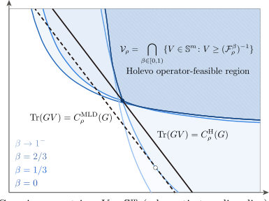 
FIG. 1. Schematic two-dimensional slice of the space of co- variance matrices. Each β-LD QFI defines a Cram´er–Rao- type constraint region {V : V ≥(Fβ ρ )−1} (region above each curve; four members of the family are shown). By Theorem 1, the operator-feasible region Vρ of the Holevo bound is the in- tersection of these regions, T

**Summary.** This paper rigorously characterizes the Holevo bound for multiparameter quantum parameter estimation by introducing a continuous family of Quantum Fisher Information matrices ($eta$-LD QFI). It proves that the true bound is determined by the intersection of constraints derived from this entire family, providing a unified geometric understanding of quantum estimation limits.

**Why it may be interesting.** This work provides a powerful, unified mathematical framework for understanding quantum estimation limits, showing how a continuous family of Fisher information metrics can characterize complex bounds that are otherwise defined via difficult optimization procedures.

Detailed structure

**Main problem.** The paper aims to provide an exact characterization of the Holevo bound, which sets the ultimate precision limit for multiparameter quantum parameter estimation.

**Main result.** The Holevo bound is shown to be equivalent to minimizing a weighted cost over a common feasible region defined by the intersection of constraints derived from an entire family of Quantum Fisher Information matrices ($eta$-LD QFI).

**Method.** The authors introduce a $eta$-Logarithmic Derivative ( $eta$-LD) QFI family that interpolates between known bounds (SLD and RLD QFIs). They reformulate the variational definition of the Holevo bound into a matrix feasibility problem solvable by analyzing this continuous family of constraints.

**Model / system.** The analysis applies to general, locally identifiable, finite-dimensional quantum estimation problems parameterized by multiple variables ($	heta \in \Theta \subset \mathbb{R}^m$).

**Key observables.** Holevo bound ($\mathcal{C}_H^
ho(G)$), $eta$-LD QFI matrix ($\mathbf{F}_eta^
ho$), and the weight matrix ($G$).

**Important parameters / regimes.** The parameter $eta \in [0, 1)$ defining the interpolation family, and the weight matrix $G$.

**Assumptions / limitations.** The problem must be locally identifiable, and the characterization is restricted to finite-dimensional estimation problems.

**Figures summary.** Figure 1 illustrates the difference between the Holevo bound (requiring the intersection of all $eta$-LD constraint regions) and the Maximum Logarithmic Derivative (MLD) bound (which only considers the largest single-$eta$ bound).

**Paper structure.** The paper progresses by first establishing the limitations of single-parameter bounds (SLD QFI) versus multiparameter bounds (Holevo bound). It then introduces the $eta$-LD QFI family to bridge this gap, culminating in the main theorem that equates the Holevo bound to the intersection of all $eta$-LD constraints.

Abstract

The quantum Cramér-Rao bound constrains the precision of parameter estimation through the symmetric logarithmic derivative quantum Fisher information (SLD QFI). It is asymptotically achievable for regular single-parameter estimation models, but generally not in the multiparameter setting, where optimal measurements for different parameters may be incompatible. For multiparameter estimation, allowing collective measurements, the corresponding asymptotically achievable precision limit is the Holevo bound, whose standard formulation is an optimization over auxiliary Hermitian operators. We bridge this apparent difference in formulation by giving an exact characterization of the Holevo bound in terms of a family of QFIs interpolating between the SLD and right logarithmic derivative (RLD) QFIs. Specifically, for any locally identifiable finite-dimensional estimation problem, we prove that the operator-feasible region in the standard variational definition of the Holevo bound coincides with the intersection of the regions defined by the corresponding Cramér-Rao-type matrix constraints for the entire QFI family. This characterization also applies to rank-deficient states and does not require any prior choice of weight matrix. Consequently, the conventional weight-dependent Holevo bound is recovered by minimizing the corresponding weighted cost over the resulting common feasible region.

[↑ back to top](#top)

### [Multiorbital periodic Anderson model for CeRh2As2](http://arxiv.org/abs/2609.31001v1)

**Authors:** Nico A. Hackner, Changhee Lee, P. M. R. Brydon  
**Type:** theory · **Category:** strongly correlated electrons · **PDF:** <https://arxiv.org/pdf/2609.31001v1>  
**Analysis basis:** full PDF text, analyzed in chunks
**Topic relevance:** `Keldysh / 2PI / non-Gaussian methods` **2/5**

📷 Fig 1

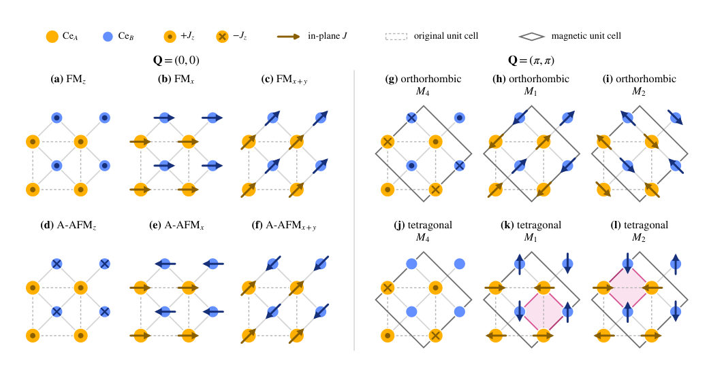 
Figure 1. The dipole moments on the Ce atoms for magnetic states in Table I, as seen looking along the c-axis of the crystal. The shaded plaquettes for the tetragonal states highlight the vortex and all-in–all-out nature of the M1 and M2 states, respectively.

📷 Fig 2

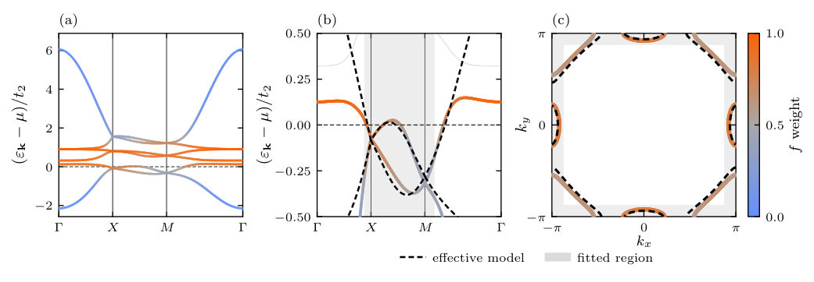 
Figure 2. The paramagnetic saddle point of the PAM and its low-energy effective f-electron description. (a) Band structure of the full renormalized PAM Eq. (13). (b) Low-lying bands of the PAM and the effective f-electron model Eq. (23) fitted to them. (c) Fermi surfaces of the PAM and of the fitted effective model. Here, we let t2 = 1 set the energy scale and solve self- consistently for the paramagnetic saddle point at fixed t1 = −0.20t2, ϵΓ7 = −1.0t2, ϵΓ6 = −0.5t2, vΓ7 1 = 0.30t2, vΓ7 2 = 0.20t2, vΓ6 1 = 0 (symmetry enforced), vΓ6 2 = 0.20t2, n = 2.30, √

📷 Fig 3

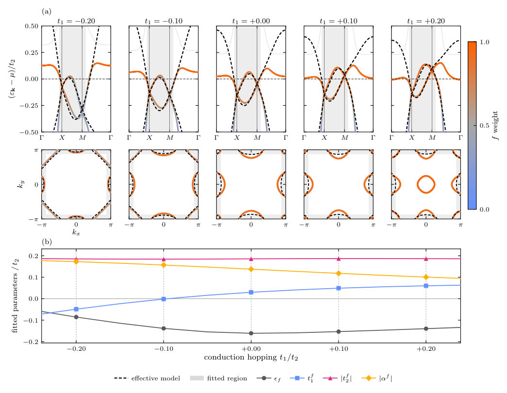 
Figure 3. Impact of the next-nearest-neighbor hopping of the conduction d electrons, t1, on the effective low-energy f-electron model Eq. (23) fitted to the low-lying PAM bands as in Fig. 2. (a) Low-energy bands of the PAM and effective model fit (upper row), and the corresponding Fermi surfaces (lower row), at the varying values of t1. (b) The fitted parameters of Eq. (23) over the same range of t1. Here, we solve for the paramagnetic saddle point at fixed ϵΓ7 = −1.0t2, ϵΓ6 = −0.5t2, vΓ7 1 = 0.30t2, vΓ7 2 = 0.20t2, vΓ6 1 = 0, vΓ6 2 = 0.20t2, n = 2.30, √

📷 Fig 4

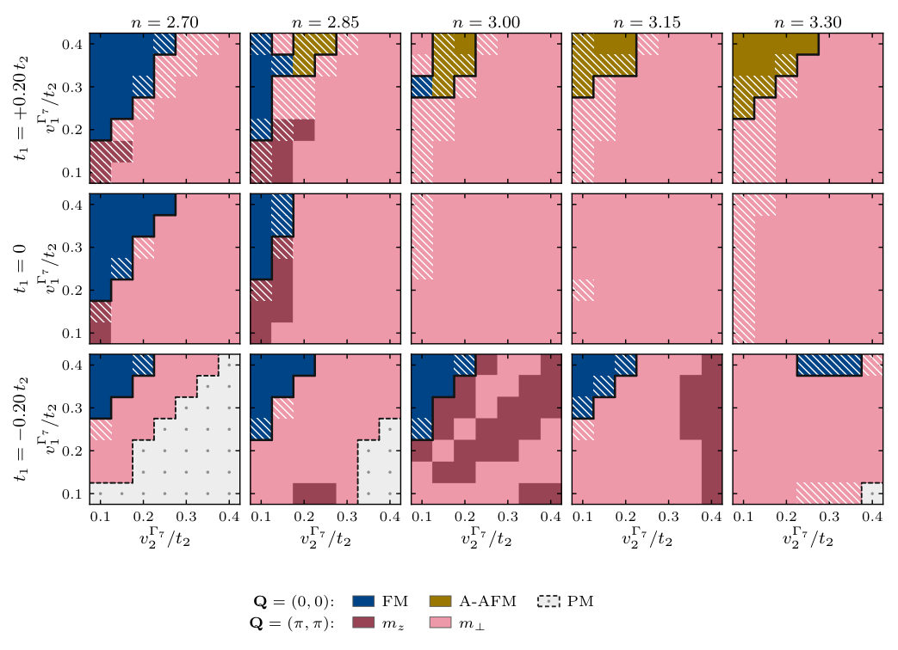 
Figure 4. Ground-state magnetic order across the hybridization plane (vΓ7 2 , vΓ7 1 ), at varying electron filling n (columns) and next-nearest-neighbor hopping of the conduction d electrons, t1 (rows). Each cell is colored by the lowest free-energy state among the candidate orders of Table I: the Q = (0, 0) orders are grouped by dipole pattern into FM and A-AFM, and the Q = (π, π) orders by moment axis, which we categorize as either out-of-plane or in-plane and denote by mz and m⊥, respectively. Hatching marks the cells in which the lowest Q = (0, 0) and Q = (π, π) states lie within 10−3t2 of one another. Solid black lines separate regions of different Q, while dashed lines bound the cells...

📷 Fig 5

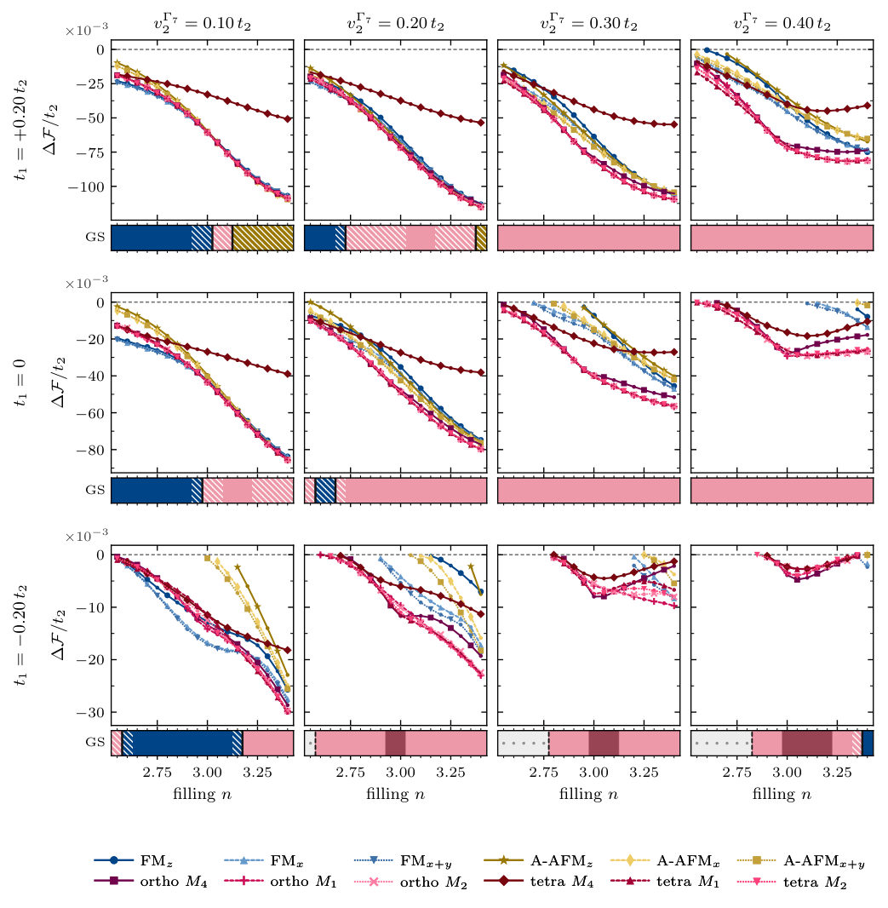 
Figure 5. Free energy of each candidate magnetic order of Table I relative to the paramagnet, ∆F = F −FPM in units of t2 and negative where the order is stable, against electron filling n, at varying hybridization vΓ7 2 (columns) and next-nearest-neighbor hopping of the conduction d electrons, t1 (rows). The ground-state strip beneath each panel marks the lowest group at each filling, and uses the same colors and the same hatching as the phase diagram, Fig. 4. Here, we fix ϵΓ7 = −1.0t2, ϵΓ6 = −0.5t2, vΓ7 1 = 0.30t2, vΓ6 1 = 0, vΓ6 2 = 0.20t2, √

**Summary.** This work develops a multiorbital periodic Anderson model for CeRh2As2 to address the complex interplay between superconductivity, magnetism, and crystal field effects. Using a slave-boson mean-field approach, the authors predict the nature of the magnetic ground state and establish the conditions under which quadrupolar degrees of freedom become important. The results provide a detailed microscopic framework for understanding itinerant heavy-fermion physics in this material.

**Why it may be interesting.** While focused on heavy fermions, the rigorous use of symmetry analysis (e.g., in Chunk 4) and the development of a complex interacting Hamiltonian framework are highly relevant to understanding correlated quantum materials dynamics.

Detailed structure

**Main problem.** The paper aims to microscopically understand the superconductivity and magnetic/quadrupolar ordering in the heavy-fermion superconductor CeRh2As2, focusing on the role of the Ce 4f electrons.

**Main result.** The model predicts stable metallic antiferromagnetic order with Q=(pi, pi) and shows that quadrupolar moments become substantial only when the relevant f-electron doublets are nearly degenerate.

**Method.** The authors developed and applied a multiorbital periodic Anderson model within the rotationally invariant slave-boson formalism, followed by a mean-field treatment.

**Model / system.** The system is CeRh2As2, modeled by a PAM incorporating the lowest-lying $\Gamma_7$ and $\Gamma_6$ doublets of the Ce 4f electrons and nonlocal hybridization with conduction d electrons.

**Key observables.** Magnetic order parameters (AFM Q=(pi, pi)), quadrupolar moments, and the effective low-energy Hamiltonian.

**Important parameters / regimes.** Hybridization strength, electron filling, and the degeneracy between the $\Gamma_7$ and $\Gamma_6$ doublets.

**Assumptions / limitations.** The use of the slave-boson formalism enforces single occupancy of 4f states, and the analysis relies on mean-field approximations.

**Figures summary.** Figures illustrate the paramagnetic saddle point and the dipole moments associated with various candidate magnetic states (e.g., FMz, A-AFMz).

**Paper structure.** The paper systematically develops the multiorbital PAM, applies the slave-boson formalism, minimizes the free energy to find stable ordered states, and analyzes the symmetry constraints on these magnetic and quadrupolar orders.

Abstract

CeRh2As2 is a heavy-fermion superconductor that exhibits distinct low- and high-field superconducting phases, widely interpreted as reflecting a field-induced change in the parity of the order parameter. However, the superconductivity develops in close proximity to magnetic order whose microscopic origin and nature remain unclear. Moreover, the low-lying crystal-electric-field-split doublets of the Ce 4f electrons appear to realize an unusual "quasi-quartet" structure. This has motivated proposals that quadrupolar degrees of freedom play an important role in the low-temperature physics. Here we develop a microscopic heavy-fermion description of CeRh2As2 that incorporates both the quasi-quartet structure and the nonsymmorphic symmetry. Within a multiorbital periodic Anderson model, we include the lowest-lying $Γ_7$ and $Γ_6$ doublets of the Ce 4f electrons, and allow for nonlocal hybridization with the conduction d electrons. Single occupancy of the 4f states is enforced within the rotationally invariant slave-boson formalism. Adopting a mean-field treatment, we first show that the effective low-energy Hamiltonian is accurately captured by a single-orbital tight-binding model, justifying the minimal descriptions widely employed in the literature. Allowing for a magnetic ground state, we find that our model displays metallic $\mathbf{Q}=(π,π)$ antiferromagnetic order over a wide parameter regime. Ferromagnetic solutions also occur, but in a smaller region of parameter space and with greater sensitivity to carrier concentration and the form of the f-d hybridization. Quadrupolar moments appear only within magnetically ordered phases and are generally small, becoming substantial only when the $Γ_7$ and $Γ_6$ doublets are nearly degenerate. Our results provide a microscopic basis for understanding the itinerant heavy-fermion physics and ordered phases of CeRh2As2.

[↑ back to top](#top)

### [Nuclear spin-lattice relaxation rate near a two-dimensional antiferromagnetic quantum critical point](http://arxiv.org/abs/2609.30518v1)

**Authors:** Yutaka Itoh  
**Type:** both · **Category:** strongly correlated electrons · **PDF:** <https://arxiv.org/pdf/2609.30518v1>  
**Analysis basis:** full PDF text, analyzed in chunks
**Topic relevance:** `Keldysh / 2PI / non-Gaussian methods` **2/5**

📷 Fig 1

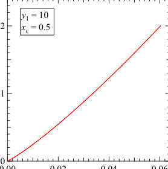 
FIG. 1. y(0) vs. y0 for y1 = 0.05 and xc = 1.0 (a) and y1 = 10 and xc = 0.5 (b).

📷 Fig 2

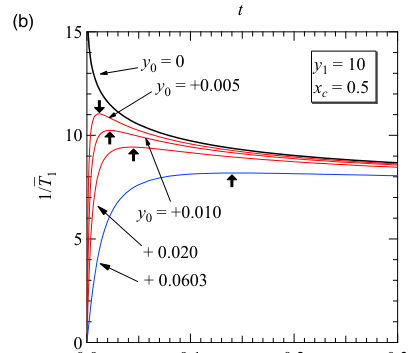 
FIG. 3. Strong mode–mode coupling y1 = 10 in the range of y0 from 0 to +0.0603 : (a) y plotted against t. (b) 1/T 1 plotted against t. Short arrows indicate the temperature tmax at which 1/T 1 takes its local maximum.

📷 Fig 3

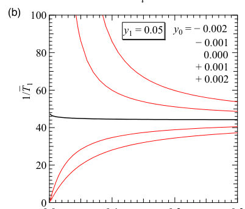 
FIG. 2. Weak mode–mode coupling y1 = 0.05 in the range of y0 from −0.002 to +0.002 : (a) y plotted against t. (b) 1/T 1 plotted against t.

📷 Fig 4

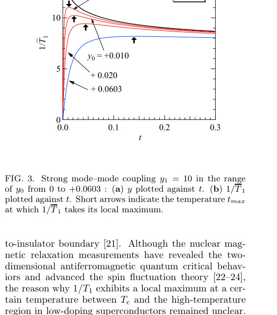 
Figure 5a shows the experimental 63Cu nuclear spin–lattice relaxation rate 1/63T1 for lightly–doped La2−xSrxCuO4 reproduced from the experimental re- sults [22, 25–27]. 1/63T1 takes its local maximum at Tmax = 200 K for x = 0.06. As x increases, Tmax rises to about 400 K for x = 0.10. Such a local maximum is also found in 1/T 1 ≡T (1/TG)2 with Gaussian decay rate 1/TG for underdoped YBa2Cu3O6.5 and YBa2Cu4O8 [28]. The lo-

📷 Fig 5

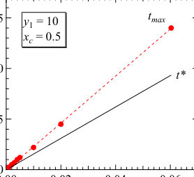 
FIG. 4. tmax (closed circles) and crossover temperature t∗

**Summary.** This paper theoretically examines how zero-point spin fluctuations affect the nuclear spin-lattice relaxation rate near an antiferromagnetic quantum critical point in cuprate superconductors. Using the SCR theory, the authors show that strong fluctuations predict a characteristic local maximum in $1/T_1$ vs. temperature, which aligns with experimental findings in La2-xSr_xCuO_4.

**Why it may be interesting.** The connection between zero-point quantum fluctuations, critical points, and measurable transport/relaxation properties in strongly correlated materials is highly relevant to understanding exotic quantum phases.

Detailed structure

**Main problem.** The study investigates the influence of zero-point spin fluctuations on the nuclear spin-lattice relaxation rate (1/T_1) near a two-dimensional antiferromagnetic quantum critical point (QCP).

**Main result.** The theoretical model predicts that for strong mode-mode coupling, 1/T_1 exhibits a local maximum as a function of temperature, a feature experimentally observed in underdoped cuprate superconductors.

**Method.** The authors employ the Self-Consistent Renormalization (SCR) theory, extending it to include zero-point spin fluctuations, and perform numerical solutions for the relaxation rate.

**Model / system.** The research focuses on the physics of underdoped superconductors, specifically La2-xSr_xCuO_4, near an antiferromagnetic QCP. The theoretical framework uses the SCR equation to model the spin susceptibility and the resulting nuclear spin relaxation rate.

**Key observables.** Nuclear spin-lattice relaxation rate (1/T_1) as a function of temperature, and the staggered spin susceptibility $\chi^{-1}$.

**Important parameters / regimes.** Mode-mode coupling constant ($y_1$), distance to QCP ($y_0$), and reduced temperature ($t$).

**Assumptions / limitations.** The theory incorporates zero-point spin fluctuations into the standard SCR framework, and the analysis distinguishes between weak and strong coupling regimes defined by $y_1$.

**Figures summary.** Figures illustrate numerical calculations of the spin susceptibility parameter $y$ and the relaxation rate $1/T_1$ versus reduced temperature $t$ for different coupling strengths, highlighting the temperature-dependent maximum.

**Paper structure.** The paper develops the SCR theory to account for zero-point fluctuations, analyzes the resulting temperature dependence of $1/T_1$ for weak and strong coupling constants, and compares the resulting theoretical predictions, particularly the local maximum, with experimental data from La2-xSr_xCuO_4.

Abstract

We study the effects of zero-point spin fluctuations on the nuclear spin-lattice relaxation rate 1/$T_1$ around a two-dimensional antiferromagnetic quantum critical point in the self-consistent renormalization theory. For a weak mode-mode coupling constant $y_1 < $ 0.1, the finite temperature behavior of 1/$T_1$ across the quantum critical point resembles that for only the thermal spin fluctuations. For a strong mode-mode coupling constant $y_1 > $ 0.1, 1/$T_1$ takes its local maximum as a function of temperature in the nearly antiferromagnetic state. Experimental observation of the local maximum in the $^{63}$Cu nuclear spin-lattice relaxation rate 1/$T_1$ of lightly-doped superconductors La$_{2-x}$Sr$_x$CuO$_4$ with $x$ = 0.06-0.10 is associated with the effects of the zero-point spin fluctuations. The two-dimensional magnetic quantum critical point and the role of the zero-point spin fluctuations are discussed in the electron spin dynamics of underdoped superconductors La$_{2-x}$Sr$_x$CuO$_4$.

[↑ back to top](#top)

### [Oracle Distillation](http://arxiv.org/abs/2609.31596v1)

**Authors:** Ruohan Shen, Soonwon Choi  
**Type:** theory · **Category:** quantum information and computing · **PDF:** <https://arxiv.org/pdf/2609.31596v1>  
**Analysis basis:** full PDF text, analyzed in chunks
**Topic relevance:** `quantum measurements` **2/5**

📷 Fig 1

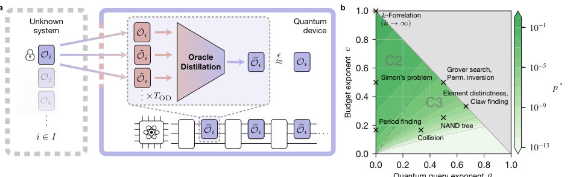 
FIG. 1. (a) The quantum device interacts with an unknown external system only through queries to an oracle. The oracle is promised to be a member Oi of the known family OI = {Oj}j∈I, marked by the lock. The device does not know the index i, but i remains fixed throughout, so every query calls the same oracle Oi. Due to noise, each query applies a noisy version ˜Oi. Oracle distillation (OD) consumes TOD noisy queries and outputs a distilled oracle b Oi that is ϵ-close to the ideal oracle Oi in diamond norm. Each oracle call in the downstream quantum algorithm (bottom circuit) uses a freshly distilled oracle, and each distillation consumes a new batch of noisy queries. (b) Advantage threshold...

📷 Fig 2

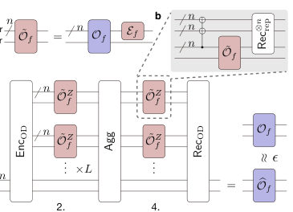 
FIG. 2. The two-stage protocol for distilling noisy Boolean oracles. a The noise model. The noisy Boolean oracle ˜Oadv f is the ideal oracle Of followed by an adver- sarial noise channel Ef on the index register. b The stage 1 gadget, which converts adversarial noise into phase noise with no query overhead. Each of the n index qubits is encoded into a length-3 repetition code, and the noisy oracle ˜Oadv f acts on the third qubit of each code block together with the response qubit. Recovery on each code block corrects all X-type errors, while Z-type errors re- main unaffected and are corrected in stage 2. c The stage 2 circuit, which distills phase-noisy Boolean oracles into ideal Boolean...

📷 Fig 3

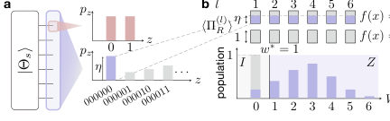 
FIG. 3. a The seed state |Θs⟩, which generates all query states via Eq. (19), shown here for n = 6 and r = 1. The seed state must generate query states that are indistin- guishable to local Z noise, so the probability distribution p(z) := | ⟨z|Θs⟩|2 has uniform marginals on every sub- set of at most 2r bits (top). It must also retain a large matched query power η = p(0n), which sets the strength of the response each query extracts (bottom). b Illus- tration of response aggregation. When f(x) = 1, every query block responds with population η, so the popu- lation on the eigenspaces of the response count W, the number of responding query blocks, follows a binomial distribution peaked at ηL....

📷 Fig 4

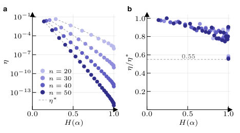 
FIG. 4. Matched query power of Construction 4, ob- tained by solving the LP (31) in exact rational arithmetic for n = 20, 30, 40, 50 and 1 ≤r ≤n/2, plotted against H(α) with α = r/n. (a) The LP optimum η (dots), to- gether with the optimal value η∗= M −1 r (dashed, one curve per n). (b) The ratio η/η∗, which stays above 0.55 for every (n, r) computed.

**Summary.** This paper introduces Oracle Distillation, a protocol designed to purify an unknown, noisy quantum oracle by querying it many times. It proves that this distillation process can successfully protect quantum advantages for key algorithms, such as Grover search, even when the error rate is non-zero but below a critical threshold. This opens a path for robust quantum sensing and computation.

**Why it may be interesting.** The work provides a robust theoretical framework for quantum sensing and machine learning by showing how quantum advantages can be maintained against realistic noise models, which is crucial for experimental quantum information science.

Detailed structure

**Main problem.** The central challenge is developing a method to preserve quantum computational advantages in learning and sensing tasks when the underlying system interaction (the oracle) is unknown and corrupted by noise.

**Main result.** The authors introduce Oracle Distillation, proving that quantum advantage for problems like Grover search is retained at low error rates, provided the noise is below a specific constant threshold.

**Method.** The core technique is Oracle Distillation (OD), which consumes many noisy queries to synthesize a single, high-fidelity oracle. This relies on using 'weak queries' to facilitate error correction while preserving necessary information.

**Model / system.** The system is modeled by an unknown unitary 'oracle' acting as the interface between the quantum device and the external system. Noise is modeled using both adversarial corruption and i.i.d. depolarizing noise.

**Key observables.** Fidelity of the distilled oracle ($\epsilon$-closeness), quantum advantage over classical methods, and the threshold error rate ($p^*$).

**Important parameters / regimes.** The per-qubit depolarizing rate ($p$), the required fidelity ($\epsilon$), and the query complexity ($TOD$).

**Assumptions / limitations.** The protocol assumes a universal quantum computer with ideal gates, focusing noise only on the oracle itself.

**Figures summary.** Figure 1 illustrates the OD process, showing noisy queries distilling to a high-fidelity oracle, and Figure 1b plots the advantage threshold versus noise parameters.

**Paper structure.** The paper first introduces the problem of noise in unknown-oracle tasks, then constructs the OD protocol for adversarial noise, establishes its near-optimality, and finally proves a threshold theorem for i.i.d. depolarizing noise, extending the concept to continuous time.

Abstract

Learning and sensing are among the most promising applications of quantum technology, often with provable quantum advantages. In any realistic experiment, however, noise threatens to erase these advantages as the problem size grows. We introduce oracle distillation, a procedure that distills many queries to a noisy oracle into a single high-fidelity oracle. Here the oracle, an unknown unitary from a known family, models the interface through which a quantum device learns about an unknown system. We construct an explicit protocol that distills any Boolean oracle, both under adversarial noise that corrupts a constant fraction of the input qubits and under i.i.d. depolarizing noise at a constant rate on every qubit. At the heart of the protocol is the weak query, in which the device deliberately queries the oracle only weakly, trading response strength for the ability to correct errors. Our protocol is near-optimal among all protocols that distill the oracle while keeping its errors correctable, revealing a fundamental tension between these two requirements. An important implication of the protocol is a threshold theorem: every Boolean oracle problem whose quantum advantage is polynomial in the domain size, including Grover search, $k$-forrelation, and Simon's problem, retains a quantum advantage whenever the per-qubit depolarizing rate is below a constant threshold. In particular, the quadratic quantum advantage of Grover search, long believed fragile under noise, survives nearly intact at low error rates even when almost every query involves errors on one or more qubits. We further extend the protocol to fractional and continuous-time Boolean oracles. Quantum error correction can thus protect not only prescribed operations but also unknown dynamics. Our results make a large family of quantum advantages in learning robust against noise and open a path toward robust computational sensing.

[↑ back to top](#top)

### [Rényi Phase Transitions and Analytic Continuation to the von Neumann Entropy](http://arxiv.org/abs/2609.30386v1)

**Authors:** Ayush Raj, Akash Vijay, Hong-Chen Jiang, Laimei Nie  
**Type:** theory · **Category:** statistical mechanics · **PDF:** <https://arxiv.org/pdf/2609.30386v1>  
**Analysis basis:** full PDF text, analyzed in chunks
**Topic relevance:** `analog quantum simulation` **2/5**

📷 Fig 1

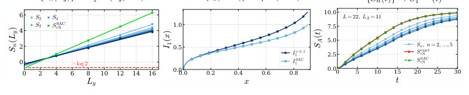 
Figure 1. Stabilized analytic continuation of R´enyi entropies and representative applications. (a) Schematic of the noiseless SAC construction. Integer R´enyi data are mapped from the complex R´enyi-index plane to the unit disc, where SAC selects a minimum-norm analytic continuation to the von Neumann point n = 1. For a fixed set of R´enyi entropies and conformal-map parameters, the resulting estimator is a state-independent linear combination, SSAC vN = P

📷 Fig 2

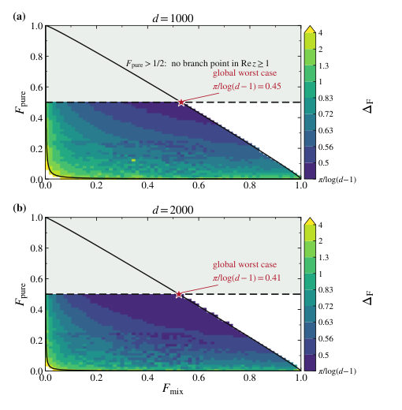 
Figure 2. Fisher-zero clearance in the joint-fidelity plane. Empirical minimum of the Fisher-zero clearance ∆F over sampled spectra in the (Fmix, Fpure) plane, for d = 1000 (top) and d = 2000 (bottom). Solid curves delimit the kine- matically accessible fidelity region, whose upper boundary approaches Fmix + Fpure = 1 as d →∞. For Fpure &gt; 1/2, Theorem 4 excludes all Fisher zeros from Re z ≥1. The star marks the balanced two-sector state ρ⋆, which attains the exact global minimum ∆F = π/ log(d −1). The color scale shows the smallest clearance observed among spectra sampled within each fidelity bin and should therefore be interpreted as an empirical lower envelope rather than a rigorous...

📷 Fig 3

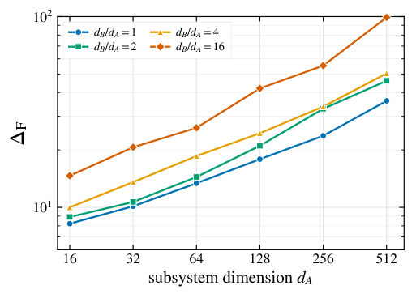 
Figure 3. Fisher-zero clearance for Haar-random re- duced states. For each subsystem dimension dA and ratio dB/dA, we show the lower 10% of the empirical ∆F distribu- tion obtained from 150 Haar-random states. The clearance increases with subsystem size for all ratios shown, in agree- ment with Theorem 6.

📷 Fig 4

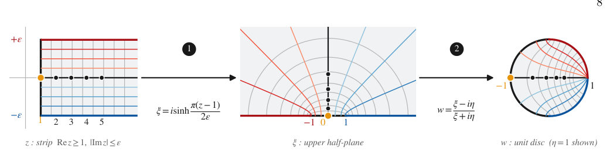 
Figure 4. Two-step conformal transformation. The semi-infinite strip {Re z ≥1, | Im z| ≤ϵ} is mapped to the upper half-plane by ξ = i sinh[π(z −1)/(2ϵ)], and subsequently to the unit disc by w = (ξ −iη)/(ξ + iη). The colored curves track a coordinate net through the two transformations. The three boundary segments of the strip map to the unit circle. Black dots denote the integer R´enyi inputs z = n, while the orange point denotes the von Neumann target point, z = 1 7→w = −1. The figure is drawn with η = 1 for clarity; decreasing η moves the mapped integer R´enyi points toward w = 1.

📷 Fig 5

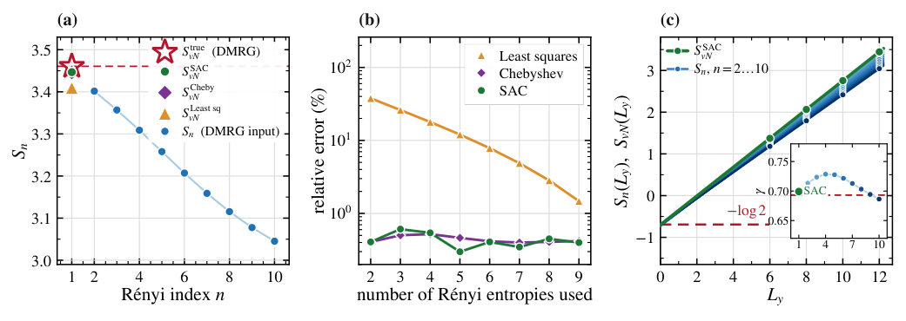 
Figure 5. Topological entanglement entropy in the toric code. Results for Lx = 48, hx = 0.3, hz = 0, and nmax = 10. (a) Integer R´enyi entropies, the von Neumann entropy directly from DMRG, and estimates from SAC and traditional methods for Ly = 12. The Chebyshev result (purple diamond) nearly overlaps with the DMRG and SAC results and is therefore obscured by the DMRG marker. (b) Relative reconstruction error versus the number of R´enyis used. (c) Finite-circumference scaling of the integer R´enyi entropies and the SAC reconstruction. The latter gives γSAC ≃0.69924, close to log 2 ≃0.69315.

**Summary.** This paper presents Stabilized Analytic Continuation (SAC) as a robust method to calculate the von Neumann entropy from limited integer Rényi entropy measurements. The authors provide deep theoretical insights into the limitations of this process, particularly identifying how zeros of the trace function $	ext{Tr} 
ho^z$ can cause analytic continuation to fail, leading to observable phase transitions.

**Why it may be interesting.** The rigorous mathematical framework connecting entanglement entropy calculation to complex analysis (RKHS theory) provides powerful, general tools for analyzing quantum correlations in strongly correlated systems.

Detailed structure

**Main problem.** The central challenge is extracting the physically meaningful von Neumann entropy ($S_{	ext{vN}}$) from numerical data that only provides access to integer Rényi entropies ($S_n$).

**Main result.** The authors developed and rigorously analyzed Stabilized Analytic Continuation (SAC), showing it is robust but can fail when the Rényi function develops singularities (Fisher zeros) due to zeros of $	ext{Tr} 
ho^z$.

**Method.** The work combines analytic continuation techniques, mapping the problem onto a Reproducing Kernel Hilbert Space (RKHS) framework, and deriving universal bounds on the location of singularities based on spectral properties.

**Model / system.** The analysis is applied to general many-body quantum systems, benchmarking performance on the toric code, Kagome Heisenberg models, and $(1+1)d$ compact-boson CFTs.

**Key observables.** Von Neumann entropy ($S_{	ext{vN}}$), mutual information, integer Rényi entropies ($S_n$), and the function $	ext{Tr} 
ho^z$ in the complex $z$-plane.

**Important parameters / regimes.** The rank ($r$) of the density matrix, the number of input Rényi samples ($N$), and the location of zeros of $	ext{Tr} 
ho^z$.

**Assumptions / limitations.** The analysis often assumes a noiseless setting for the theoretical derivations, and the SAC method relies on the minimum-norm interpolant within a specific RKHS structure.

**Figures summary.** Figures illustrate the SAC construction, the extraction of topological entanglement entropy for the Kagome model, and the reconstruction of mutual information across various physical benchmarks.

**Paper structure.** The paper first introduces SAC as a robust alternative to conventional extrapolation. It then provides theoretical derivations establishing zero-free domains for $	ext{Tr} 
ho^z$ and deriving bounds on singularities. Finally, it benchmarks SAC performance across three distinct physical settings: topological entropy, mutual information, and quantum dynamics.

Abstract

Extracting operationally meaningful quantities such as von Neumann entropy and mutual information is central to characterizing many-body quantum systems, yet experiments and numerics often provide direct access only to integer Rényi entropies. Whereas conventional extrapolation relies on a prescribed fitting ansatz, in PRL 137, 100202 we introduced an alternative approach based on stabilized analytic continuation (SAC), which avoids such an ansatz and is inherently robust to noise. Here, we further develop this framework in the noiseless setting and benchmark its performance across several nontrivial many-body problems. We first show that, besides the intrinsic ambiguity of reconstructing the von Neumann entropy from finitely many Rényi samples, analytic continuation can also fail because of genuine nonanalyticities in the Rényi function arising from zeros of $\text{Tr}ρ^z$. We derive universal zero-free domains for $\text{Tr}ρ^z$ and systematically sharpen these bounds using additional spectral information about $ρ$. We then benchmark the performance of SAC in three settings: ($i$) extracting topological entanglement entropy from DMRG Rényi data for the toric code and Kagome Heisenberg models; ($ii$) reconstructing the mutual information between disjoint intervals in a $(1+1)d$ compact-boson CFT; and ($iii$) recovering finite-time ballistic growth of the von Neumann entropy from integer Rényi entropies that cross over toward subballistic growth in diffusive quantum dynamics. In the latter setting, analytic continuation is expected to fail in the long time limit. We illustrate this mechanism with a physically motivated two-sector model, where the asymptotic separation between von Neumann and higher-Rényi growth is accompanied by a zero of $\text{Tr}ρ^z$ pinching the real axis at $z=1$, thereby producing a first-order Rényi phase transition.

[↑ back to top](#top)

### [Informational and algebraic renormalization group](http://arxiv.org/abs/2609.30362v1)

**Authors:** Takato Mori, Teruaki Nagasawa  
**Type:** theory · **Category:** statistical mechanics · **PDF:** <https://arxiv.org/pdf/2609.30362v1>  
**Analysis basis:** full PDF text, analyzed in chunks
**Topic relevance:** `Keldysh / 2PI / non-Gaussian methods` **1/5** · `analog quantum simulation` **1/5** · `driven-dissipative phase transition` **1/5** · `methods for driven-dissipative` **1/5** · `non-equilibrium universality` **1/5** · `quantum measurements` **1/5**

📷 Fig 1

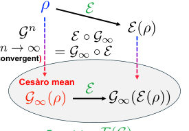 
FIG. 1. RG as a quantum channel and its resource theory. (a) One RG step G = V ◦C coarse grains a state (C) and rescales it back to the original Hilbert space by an isometry (V). Iteration proceeds through the reduced map bG = C ◦V on the coarse-grained space. (b) Resource theory of RG. The Ces`aro mean G∞maps a UV state ρ to a fixed point in the set F(G) of free states (IR), even when the iterates Gn(ρ) do not converge. Free operations E commute with G∞and cannot increase the resource IG(ρ) = D(ρ∥G∞(ρ)).

📷 Fig 2

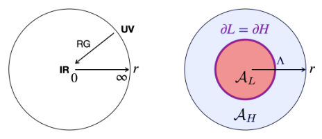 
FIG. 2. Holographic setup on a time slice of global AdS3. Left: The radial coordinate r sets the RG scale, from the UV at r = r∞to the IR at r = rIR. Right: AL and AH are the algebras of L = {r ≤Λ} and its complement H, separated at the cutoff r = Λ.

**Summary.** This work unifies the Renormalization Group concept using quantum information theory, treating RG as a quantum channel. It develops an algebraic framework for coarse-graining and establishes a resource theory where fixed points are free states. The authors derive key physical metrics, such as the BKM metric, using relative entropy, providing a rigorous mathematical toolset for analyzing critical phenomena across different physical regimes.

**Why it may be interesting.** The rigorous connection between quantum information measures (relative entropy) and fundamental physical concepts like RG flow and thermal metrics (BKM) provides powerful new diagnostic tools for analyzing quantum many-body systems.

Detailed structure

**Main problem.** The paper aims to formulate the Renormalization Group (RG) in a general quantum-information framework that extends beyond standard momentum-space, factorized settings, specifically addressing the information loss during coarse-graining.

**Main result.** They develop an algebraic RG framework and construct a resource theory of RG, showing that the relative entropy monotone quantifies the distance from the IR fixed point, and they derive the BKM metric for thermal states.

**Method.** The authors employ quantum information tools, treating RG as a quantum channel, defining the low-energy algebra via conditional expectation, and using relative entropy as a resource monotone.

**Model / system.** The analysis applies to general quantum systems, including finite-dimensional ones, and models quantum field theories (QFTs) undergoing RG flow, particularly focusing on thermal states parameterized by couplings.

**Key observables.** Relative entropy monotone ($I_G(
ho)$), BKM metric ($\chi_{ij}$), and the complementary measure of discarded UV information.

**Important parameters / regimes.** Temperature ($eta$), coupling parameters ($g_i$), and the scale/momentum cutoff ($\Lambda$ or $u$).

**Assumptions / limitations.** Assumptions include the existence of a low-energy algebra constructed from the one-particle spectrum and the use of specific functional forms for the relative entropy calculation.

**Figures summary.** Figure 1 illustrates RG as a quantum channel (coarse-graining followed by rescaling) and its resource theory flow via the Cesàro mean.

**Paper structure.** The paper progresses by first formulating the RG as a quantum channel (IRG), then developing an algebraic extension (ARG) using conditional expectation, establishing a resource theory, and finally deriving and comparing physical metrics like the BKM metric using relative entropy differentiation.

Abstract

Renormalization group (RG) is a core concept in physics from statistical mechanics to quantum field theory, yet its schemes differ widely between field theory and many-body physics. We formulate the Wilsonian RG as a quantum channel, whose Kraus representation yields pure conditional trajectories for pure inputs and recovers mixed-state flows upon averaging. We then develop an algebraic extension applicable beyond the usual momentum-space, factorized setting: the low-energy algebra is constructed from the one-particle spectrum, and coarse graining is a conditional expectation onto it. We further construct a resource theory of RG whose free states are fixed points. Under stated assumptions, the resulting relative-entropy monotone is proportional to $c-c_{\rm IR}$ to quadratic order along a single stable RG direction near a two-dimensional IR fixed point. We also introduce a complementary measure of the UV information discarded by coarse graining, establish its monotonicity for successive coarse-graining maps, and discuss its holographic realization.

[↑ back to top](#top)

### [The conductance filtration: sink-relative persistence and exact edge sensitivity for heat transport in particle-filled composites](http://arxiv.org/abs/2609.30810v1)

**Authors:** Daisuke Yasufuku  
**Type:** theory · **Category:** disordered systems and neural networks · **PDF:** <https://arxiv.org/pdf/2609.30810v1>  
**Analysis basis:** full PDF text, analyzed in chunks
**Topic relevance:** `Keldysh / 2PI / non-Gaussian methods` **1/5** · `analog quantum simulation` **1/5** · `correlated / nonlocal dissipation` **1/5** · `driven-dissipative phase transition` **1/5** · `methods for driven-dissipative` **1/5** · `non-equilibrium universality` **1/5**

📷 Fig 1

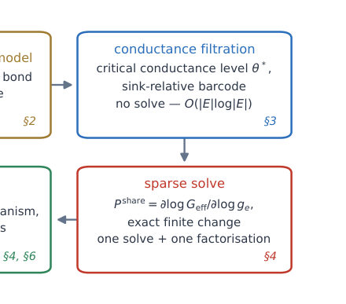 
Figure 1: The design loop closes on a single graph representation. The four design variables of Section 1 enter on the left; the branch conductances, the conductance filtration and the dissipation share are computed on one graph; and the diagnosis returns to the design variables.

📷 Fig 2

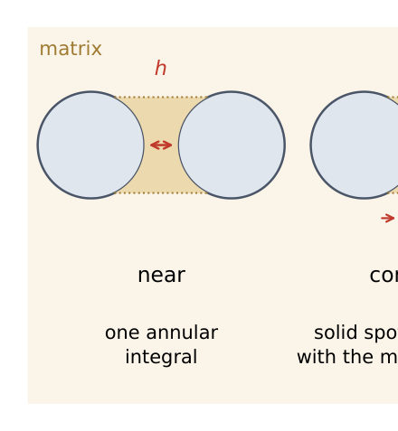 
Figure 2: The three branch types. A pair separated only by a thin film of matrix (near-contact), a pair whose solids touch (contact), and a pair inside the same continuous solid (bond).

📷 Fig 3

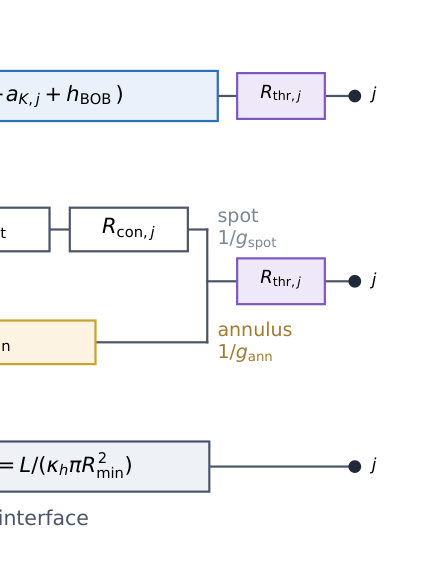 
Figure 3: The thermal resistance network of each branch type, in the same order as the text. The through-particle resistance Rthr is in series with the whole edge, not inside the contact spot.

📷 Fig 4

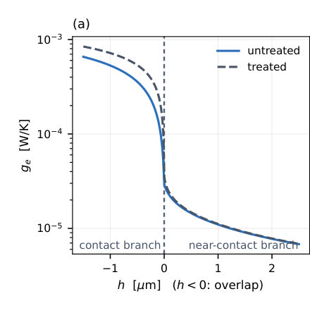 
Figure 4: (a) ge against the surface separation h for a pair of equal spheres of diameter 20µm: the

📷 Fig 5

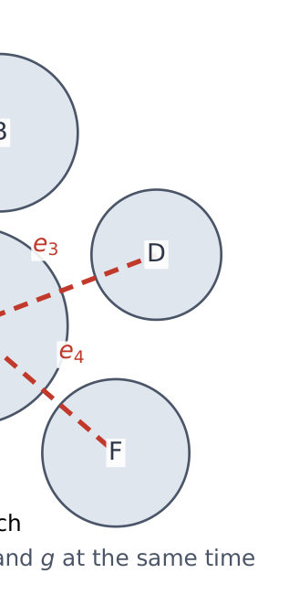 
Figure 5: One edge carries three weights at once. The complex is fixed by the interaction cut-off; only the function on it is changed.

**Summary.** This work develops a sophisticated mathematical framework to analyze heat transport in composite materials by treating the system's conductance through a 'conductance filtration'. It introduces the concept of dissipation share, which quantifies how much the overall heat flow is limited by specific physical mechanisms like particle interfaces or matrix bonds. This provides a powerful diagnostic tool for materials design.

**Why it may be interesting.** While focused on thermal physics, the use of persistent homology (filtration, barcode) and sensitivity analysis (logarithmic derivatives) provides advanced mathematical tools applicable to characterizing complex, disordered energy landscapes in quantum systems.

Detailed structure

**Main problem.** The paper aims to improve the understanding of thermal conductivity in particle-filled composites by moving beyond single effective quantity evaluations.

**Main result.** It establishes that the dissipation share is exactly the logarithmic sensitivity of the effective conductance, providing a diagnostic tool to pinpoint the limiting heat transfer mechanism.

**Method.** The authors introduce the conductance filtration, combining thermal conductance ($g_e$) as the filtration axis with persistence relative to the sink boundary.

**Model / system.** The system modeled is particle-filled composites, where heat transport is analyzed by decomposing the conductance of particle pairs into three types: contact, near-contact, and bond.

**Key observables.** Dissipation share ($	ext{P}_{	ext{share}}$), allocation of dissipation among branch types, and the idealisation ratio of each mechanism.

**Important parameters / regimes.** Conductance ($g_e$), effective conductance ($G_{	ext{eff}}$), and the sink boundary conditions ($	ext{src}, 	ext{snk}$).

**Assumptions / limitations.** The branch-conductance model assumes isothermal nodes, and the analysis relies on mapping the system onto a weighted graph structure.

**Figures summary.** Figure 1 illustrates the entire 'design loop' closing on a single graph representation, linking structure, branch conductances, filtration, and diagnosis.

**Paper structure.** The paper develops a framework by first formulating the thermal conductance using three branch types, then introducing the conductance filtration and sink-relative persistence, culminating in the derivation of the dissipation share and a closed-form prediction for edge sensitivity.

Abstract

We formulate the thermal conductance $g_e$ of a particle pair as three branch types -- contact, near-contact and bond -- within a single construction, and we introduce the filtration that takes this $g_e$ as its axis (the conductance filtration) together with persistence taken relative to the sink boundary. We then show that the dissipation share is exactly the logarithmic sensitivity of the effective conductance, and that a finite change of a single edge is predicted exactly in closed form. The allocation of the dissipation among branch types, and the idealisation ratio of each mechanism (interface, matrix and particle), are thereby obtained as diagnostic quantities on one and the same graph representation.

[↑ back to top](#top)

### [2D target search with boundary-induced resetting](http://arxiv.org/abs/2609.31085v1)

**Authors:** Kevin Chen, Paul C. Bressloff  
**Type:** theory · **Category:** statistical mechanics · **PDF:** <https://arxiv.org/pdf/2609.31085v1>  
**Analysis basis:** full PDF text, analyzed in chunks
**Topic relevance:** `Keldysh / 2PI / non-Gaussian methods` **1/5** · `driven-dissipative phase transition` **1/5** · `methods for driven-dissipative` **1/5** · `non-equilibrium universality` **1/5** · `quantum measurements` **1/5**

📷 Fig 1

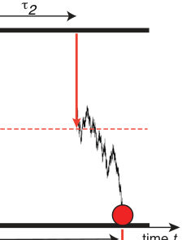 
Figure 1. Schematic illustration of a sample path of a Brownian particle in [0, L] with a non-absorbing sticky boundary at x = L and an absorbing target at x = 0. The particle hits x = L twice prior to finding the target. In each case the particle sticks to the boundary for a random waiting time τj, j = 1, 2, after which it desorbs and immediately resets to its initial position x0.

📷 Fig 2

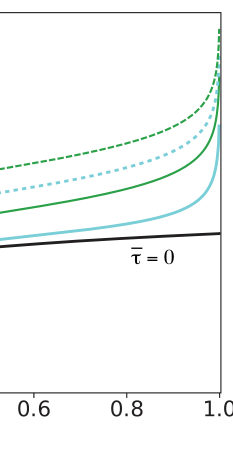 
Figure 2. MFPT T(x0) given by equation (2.17) plotted on a log-scale with D, L = 1. The MFPT blows up as x0 →L for all τ &gt; 0.

📷 Fig 3

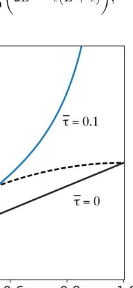 
Figure 3. MFPT T(x0) with boundary resetting and a sticky boundary at x = L for various mean waiting times τ. The dashed curve shows the classical MFPT T0(x0) without resetting and a reflecting boundary at x = L. We take D = L = 1 in all cases so that τD = 1/2. It can be seen that for τ &lt; τD boundary resetting is advantageous in some part of the domain, but for τ &gt; τD, no choice of x0 makes boundary resetting worthwhile.

📷 Fig 4

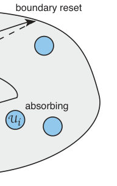 
Figure 4. Particle diffusing in a singularly perturbed domain Ω⊂R2 containing N totally absorbing interior compartments Uj centred at the positions xj, j = 1, . . . , N. The particle resets to its initial position x0 whenever it desorbs from the exterior boundary ∂Ω.

📷 Fig 5

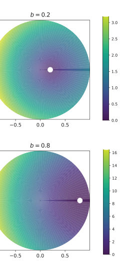 
Figure 5. Polar contour plots of the MFPT T(x0; x1) given by equation (5.3) as a function of x0 = (a cos θ, a sin θ) for different target locations x1 = (b, 0) and τ = 0. The colouring of each plot is on a log-scale. Other parameters are D = 1 and ν = 0.2. Top left: b = 0; Top right: b = 0.3; Bottom left: b = 0.7; Bottom right: b = 0.95. The figure is generated using a discretization in polar coordinates, with a 50-point radial grid taken from 0.001 to 0.995, which accounts for singularities and blowups, and a 60-point angular grid taken from 0 to 2π.

**Summary.** This paper analyzes the Mean First Passage Time for diffusion in a bounded 2D domain subjected to boundary-induced resetting. It compares this time to the case without resetting, showing that the benefit of resetting is highly dependent on the geometry and the proximity of the reset point to the target. The methodology combines renewal theory with advanced asymptotic analysis.

**Why it may be interesting.** The study provides a rigorous theoretical framework for non-equilibrium dynamics in confined spaces, which is relevant for understanding transport phenomena in mesoscopic systems or engineered quantum environments.

Detailed structure

**Main problem.** The paper investigates how boundary-induced resetting affects the Mean First Passage Time (MFPT) for a particle diffusing in a bounded 2D domain containing absorbing targets.

**Main result.** Boundary-induced resetting only reduces the MFPT compared to a reflecting boundary if the particle's reset point is sufficiently close to the target(s), unlike some simpler 1D cases.

**Method.** The analysis employs renewal theory, matched asymptotic expansions, and Green's functions to calculate the unconditional MFPT.

**Model / system.** The model is single-particle diffusion in a 2D bounded domain ($\Omega$) with absorbing interior targets and a sticky exterior boundary ($\partial\Omega$) that causes resetting to a fixed interior point $x_0$.

**Key observables.** Unconditional Mean First Passage Time (MFPT) for absorption by any target.

**Important parameters / regimes.** The mean waiting time ($	au$) at the sticky boundary, the initial position ($x_0$), and the geometry of the domain ($\Omega$) and targets.

**Assumptions / limitations.** Targets are assumed to be small and well-separated from each other and the exterior boundary; the analysis often relies on approximations for the leading order behavior.

**Figures summary.** Figures illustrate contour plots showing the MFPT and the sign of the benefit function ($\chi$) for single and dumbbell target configurations in 2D, comparing resetting effects in 1D vs 2D.

**Paper structure.** The paper first analyzes the simpler 1D interval case, then generalizes the methodology to the 2D domain $\Omega$, deriving the necessary renewal equations and calculating the MFPT using advanced mathematical techniques.

Abstract

Most studies of stochastic search processes with resetting focus on spontaneous resetting events that occur at a random sequence of times typically generated by a Poisson process. One of the major consequences of spontaneous resetting is that it yields a finite mean first passage time (MFPT) in unbounded domains, resulting in an optimal resetting rate that minimises the MFPT. An optimal resetting rate can also occur in bounded domains provided that the reset point is not too far from the target. Recently, there has been growing interest in event-based rather than spontaneous resetting, where resetting is triggered when a specific threshold is reached. Identifying the threshold with a physical non-target boundary then leads to so-called boundary-induced resetting. In this paper, we explore the effects of boundary-induced resetting on single-particle diffusive search in a two-dimensional (2D) bounded domain $Ω$ containing one or more small interior targets. The interior target boundaries are totally absorbing, whereas the exterior boundary $\partial Ω$ is sticky. That is, whenever the particle reaches a point on $\partial Ω$ it remains attached for a random waiting time $τ$ after which it immediately resets to a fixed interior point $\x_0\in Ω$. Using renewal theory, matched asymptotic analysis and Green's functions we calculate the unconditional MFPT for absorption by any of the targets and compare this with the corresponding MFPT of a search process on the same domain with a reflecting surface $\partial Ω$ and no resetting. We show that boundary-induced resetting only reduces the MFPT relative to the no resetting case if the searcher's reset point $\x_0$ is sufficiently close to one of the targets.

[↑ back to top](#top)

### [Gottesman-Kitaev-Preskill error-correction with decohered resources](http://arxiv.org/abs/2609.31462v1)

**Authors:** Rajendra S. Bhati, T. Bazylewicz, Jarosław K. Korbicz  
**Type:** theory · **Category:** quantum information and computing · **PDF:** <https://arxiv.org/pdf/2609.31462v1>  
**Analysis basis:** full PDF text, analyzed in chunks
**Topic relevance:** `Keldysh / 2PI / non-Gaussian methods` **1/5** · `correlated / nonlocal dissipation` **1/5** · `methods for driven-dissipative` **1/5** · `quantum measurements` **1/5**

📷 Fig 1

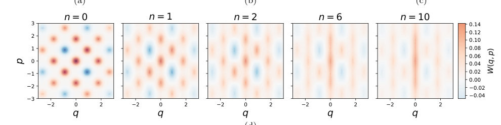 
FIG. 1. (a) Leakage out of the GKP subspace as a function of successive GKP–EC rounds, averaged over the logical Pauli basis states for varying τ. Homodyne outcomes are fixed to (0, 0) in each round, so that no unitary correction is applied. (b) Uhlmann fidelity of teleportation as a function of the dimensionless time ωct for the input state |0β⟩, with homodyne outcomes (0, 0), for varying values of γT/ωc and a Lorentz–Drude cutoff, Eq. (7). The results for the exponential cutoff, Eq. (8), are qualitatively similar. (c) Leakage for the same parameters as in (b). (d) Wigner functions of the +1 eigenstate of the GKP Pauli operator ˆσy, with β = 0.1 and τ = 0.5, after n = 0, 1, 2, 6, 10...

**Summary.** This work investigates the performance of GKP error correction when the necessary entangled ancillary resources suffer from environmental decoherence. The authors show that this decoherence transforms the error correction into a correlated noise process that causes the encoded quantum state to leak out of the logical subspace. This finding is critical for designing robust quantum computing architectures based on bosonic modes.

**Why it may be interesting.** It provides a crucial, non-trivial extension to fault-tolerance theory by quantifying how realistic environmental noise fundamentally breaks the self-correcting nature of leading bosonic quantum error-correcting codes.

Detailed structure

**Main problem.** The paper analyzes how environmental decoherence affects the Gottesman-Kitaev-Preskill (GKP) error-correction protocol, which typically assumes ideal ancillary resources.

**Main result.** Under pure-dephasing, the GKP protocol degrades into a correlated Pauli-Gaussian noise process, meaning the code fails to self-correct and the encoded state leaks out of the logical subspace over successive rounds.

**Method.** The analysis uses the Quantum Brownian Motion (QBM) model to derive the decoherence factor and the resulting noisy teleportation Kraus operator, quantifying leakage and fidelity degradation.

**Model / system.** The system involves bosonic quantum states undergoing GKP error correction, modeled with a system-bath interaction Hamiltonian ($\hat{H}_{int}$) coupling to a bath of harmonic oscillators.

**Key observables.** Leakage of the encoded state out of the logical subspace ($L_n$), and the Uhlmann fidelity ($F$) of the encoded state.

**Important parameters / regimes.** Decoherence strength ($\gamma$), cutoff frequency ($\omega_c$), and the number of correction rounds ($n$).

**Assumptions / limitations.** The decoherence is modeled using the QBM framework, focusing on the pure-dephasing limit, and the analysis assumes the ancillary states are subject to environmental noise.

**Figures summary.** Figures illustrate the accumulation of leakage ($L_n$) versus the number of rounds, and the decay of Uhlmann fidelity and leakage versus dimensionless time for different environmental spectral densities.

**Paper structure.** The paper first establishes the problem of decoherence in GKP-EC, derives the decoherence factor using QBM, characterizes the resulting noise as correlated Pauli-Gaussian noise, and finally demonstrates the failure of self-correction via leakage accumulation.

Abstract

Teleportation-based Gottesman-Kitaev-Preskill (GKP) error correction typically assumes a decoherence-free GKP ancilla Bell pair, an idealization that is difficult to reconcile with the ubiquitous environmental decoherence in bosonic systems. Here, we analyze the performance of the GKP protocol subject to pure-dephasing processes, ubiquitous in realistic situations. We show that, under this class of interactions, teleportation, instead of projecting the input onto the GKP subspace, transforms GKP error correction into a correlated Pauli-Gaussian noise process that can accumulate over successive correction rounds. Thus, unlike in previously studied noisy GKP scenarios, the code no longer self-corrects. Moreover, repeated noisy GKP teleportation drives the encoded modes out of the logical subspace, progressively degrading the encoded codewords. We show that the resulting leakage rapidly saturates with the number of correction rounds. Finally, we investigate the implications of our results for motional-oscillator-based GKP error-correction platforms.

[↑ back to top](#top)

### [When Can Quantum Extreme Learning Machines Replace Quantum Reservoirs?](http://arxiv.org/abs/2609.31027v1)

**Authors:** Markus Baumann, Gerhard Stenzel, Jonas Stein, Claudia Linnhoff-Popien  
**Type:** theory · **Category:** disordered systems and neural networks · **PDF:** <https://arxiv.org/pdf/2609.31027v1>  
**Analysis basis:** full PDF text, analyzed in chunks
**Topic relevance:** `analog quantum simulation` **1/5** · `correlated / nonlocal dissipation` **1/5** · `driven-dissipative phase transition` **1/5** · `methods for driven-dissipative` **1/5**

📷 Fig 1

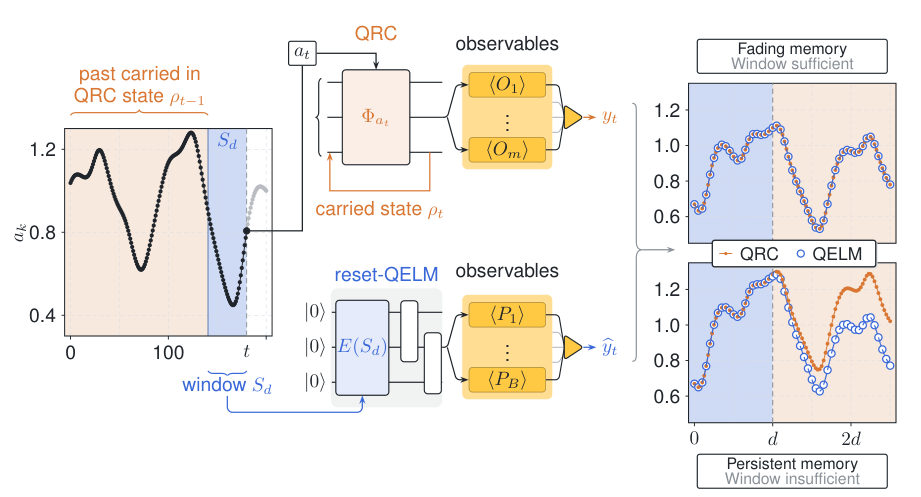 
Figure 1: Two ways to provide memory: the QRC carries its quantum state forward, while the reset-QELM receives a window of recent inputs. Right: an old input leaves the window at the dashed line. Above, its influence has vanished by then, so the curves stay identical. Below, its influence becomes more visible and a gap remains. Orange denotes the QRC; blue denotes an ideal window prediction. These are schematic examples, not trained-model results: time advances while the window length stays fixed (Section 2). Here E encodes the window, O j and Pj are measured observables, m and B count QRC outputs and QELM features, and k indexes inputs while t marks the current step.

📷 Fig 2

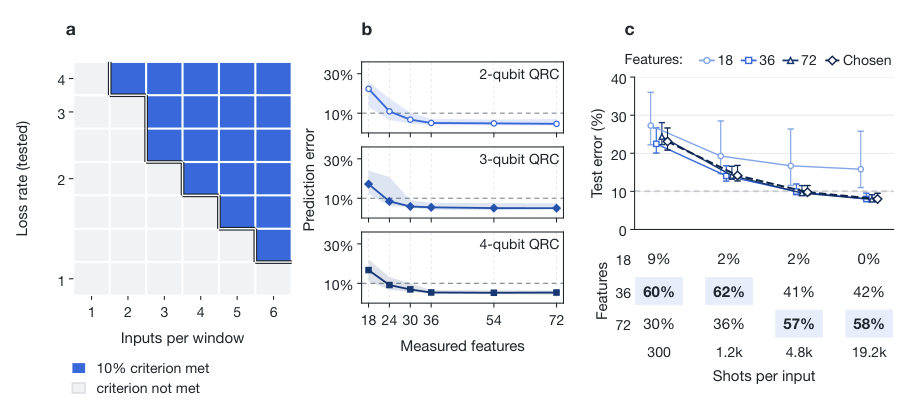 
Figure 2: Three resources, three different questions. a Blue windows meet the 10% old-history criterion in all three target sizes; gray windows do not. Rows show tested loss rates ≥1; lower rates also fail. b More features help, with little improvement beyond 36. c Test error falls with more shots; diamonds use validation-selected feature counts. Points are offset within shot tiers; the horizontal dashed line marks 10% error. Lower percentages summarize 192 pre-test validation choices per tier (12 roots, 16 repeats), rounded; bold marks the most frequent count. Errors are sampled NRMSE percentages, not worst-case bounds. Medians and 10th–90th percentiles (bands in b, whiskers in c) describe...

📷 Fig 3

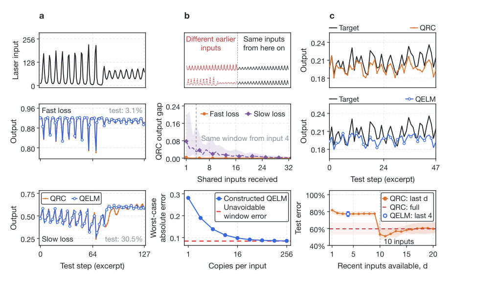 
Figure 3: Memory in emulation and prediction. a Faster forgetting improves QELM emulation of laser-driven QRC (full- test NRMSE labelled; differing output scales), not laser forecasting. b Distinct pasts receive identical continuations (top). Constructed QELMs approach the red analytical window-error floor without readout training (bottom), not a laser/NARMA bound. c Synthetic NARMA10 traces share output scales. Replay resets the same QRC on its last d inputs and refits its readout at every d = 1,...,48 (displayed: 1–20), costing extra evolution. Red dashes: empirical full-history QRC reference, not a floor; blue: QELM(4). Medians and 10th–90th root percentiles (12 roots/loss in b; 24 in...

**Summary.** This work determines the precise conditions under which a memory-limited Quantum Extreme Learning Machine can replace a quantum reservoir computer. The central finding is that perfect emulation requires the influence of the omitted past history to vanish uniformly, establishing a fundamental limit on what finite-window models can reconstruct about a system's true history.

**Why it may be interesting.** It provides a rigorous theoretical boundary for using machine learning models (QELMs) to simulate physical systems with inherent memory (QRCs), which is crucial for understanding the limits of quantum machine learning in physics.

Detailed structure

**Main problem.** The paper investigates the fundamental conditions under which a memory-less Quantum Extreme Learning Machine (QELM) can accurately emulate the temporal memory retention capabilities of a Quantum Reservoir Computer (QRC).

**Main result.** Accurate emulation is possible if and only if the influence of the omitted past history becomes uniformly negligible as the input window grows, otherwise, a persistent error floor remains regardless of model capacity.

**Method.** The analysis compares the QRC output to the QELM prediction by quantifying the worst-case output variation ($D_d$) when the input window is fixed but the past history varies.

**Model / system.** The models involve quantum reservoir dynamics (QRC) and reset-window QELMs operating on quantum states ($
ho_t$). The dynamics are governed by input-dependent Hamiltonians and local dissipation terms.

**Key observables.** The primary observable is the error floor $D_d$, which quantifies the output variation due to missing history; other observables include the trace distance ($	ext{D}_{	ext{tr}}$) and the joint spectral radius ($	ext{r}_{	ext{vis}}$).

**Important parameters / regimes.** Window length ($d$), the decay rate characterized by $	ext{r}_{	ext{vis}}$, and the error tolerance ($\epsilon$).

**Assumptions / limitations.** The analysis assumes exact expectation values and focuses on the theoretical limits of representation capability, distinguishing this from practical training efficiency.

**Figures summary.** Figure 1 schematically compares QRC memory retention (state evolution) versus QELM window usage, illustrating cases where memory influence vanishes versus where a gap persists.

**Paper structure.** The paper establishes the theoretical framework by defining the memory difference between QRCs and QELMs, deriving the necessary condition for emulation ($	ext{D}_d 	o 0$), and then providing rigorous bounds and counterexamples using specific quantum models.

Abstract

Quantum reservoir computers (QRCs) retain information from earlier inputs, whereas reset-window quantum extreme learning machines (QELMs) start afresh and receive only a recent input window. We establish when this window can replace the reservoir's memory. Under our stated assumptions and with exact expectation values, sufficiently expressive QELMs can reproduce reservoir outputs arbitrarily accurately as their windows grow precisely when the influence of the omitted past becomes uniformly negligible. However, longer windows do not always solve the problem. We construct a simple two-qubit reservoir that performs temporal recall exactly, while every fixed-window predictor faces the same positive worst-case error over unbounded delays, regardless of model capacity. Analytical benchmarks and simulations distinguish missing history from limited features and finite measurements. The central conclusion is simple: better representations can improve how available information is used, but cannot recover a past the model never receives.

[↑ back to top](#top)

### [Modern triad for magnetic material science: geometric shape, electronic bands and spin textures](http://arxiv.org/abs/2609.31171v1)

**Authors:** Denys Makarov, Oleksandr Pylypovskyi, Rui Xu, Carmine Ortix  
**Type:** theory · **Category:** other · **PDF:** <https://arxiv.org/pdf/2609.31171v1>  
**Analysis basis:** full PDF text, analyzed in chunks
**Topic relevance:** `Keldysh / 2PI / non-Gaussian methods` **1/5** · `analog quantum simulation` **1/5** · `quantum measurements` **1/5**

📷 Fig 1

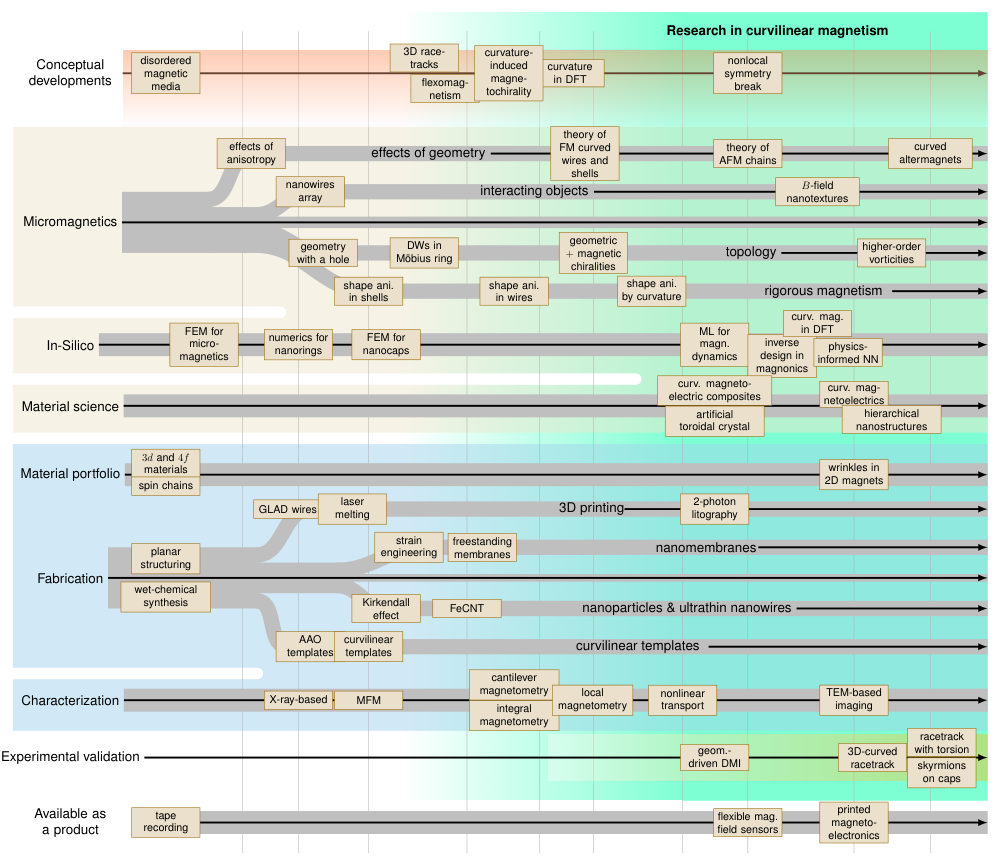 
FIG. 1. Research timeline of curvilinear magnetism. Numerous works on micromagnetics [17–29], in-silico research [30– 37], material science development [38–41] and experimental techniques [42–59] have been supplemented by the conceptual developments in solid state [60–66] and entering market. Up to now, several theoretical predictions have been validated experimentally [12, 67–69]. Abbreviations used: DFT (density functional theory), DWs (domain walls), FEM (finite-element mesh), ML (machine learning), GLAD (glancing-angle deposition), AAO (anode aluminum oxide), MFM (magnetic force microscopy), TEM (transition electron microscopy).

📷 Fig 2

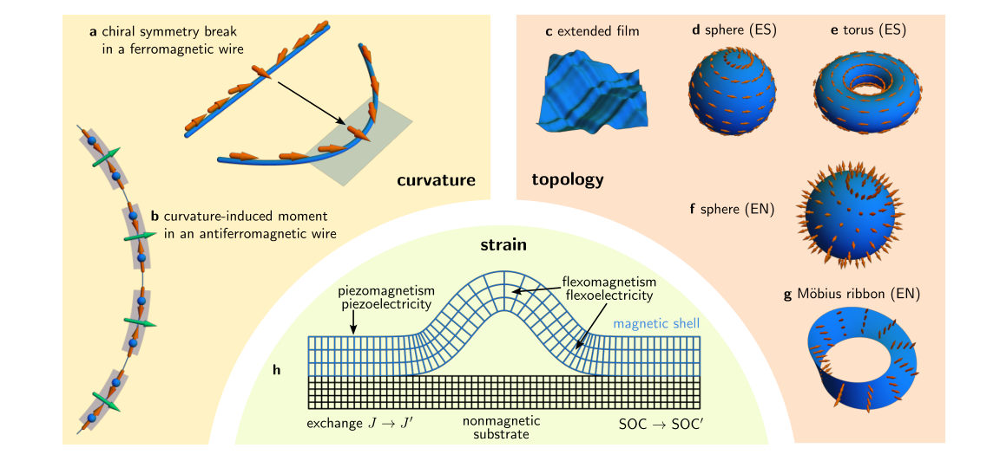 
FIG. 2. Components of construction of a curvilinear magnet: (a,b) geometric curvatures, (c–g) topology and (h) strain. (a) In a strain ferromagnetic wire chirality (magnetization direction shown by orange arrows) of a head- to-head domain wall is arbitrary. In a bent sample, the geometry-driven anisotropy fixes magnetization in the plane of bend (semitransparent blue plane), and gDMI fixes the outward chirality. (b) Schematics of the geometry-induced magnetic uncompensation per dimer (green arrows, not in scale) in an antiferromagnetic spin chain when magnetic moments (orange arrows) are tangential to the chain. (c) In comparison with an extended magnetically soft film, (d) topology of a...

📷 Fig 3

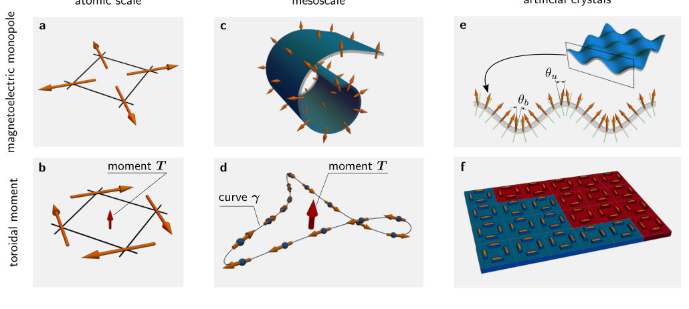 
FIG. 3. Magnetoelectric monopoles (a,c,e) and toroidal moments (b,d,f) at different length scales. Atomic scale ordering of the (a) magnetoelectric monopole A (pseudoscalar) and (b) toroidal moment T at the square lattice formed by magnetic moments (orange arrows). (c) Rolled-up thin magnetoelectric film with the out-of-plane anisotropy has a finite monopolar moment in addition to non-extensive toroidal moment (here and in the following panels, magnetization direction is shown by orange lines). (d) A ferromagnetic spin chain arranged along a closed space curve γ with the easy magnetic axis along tangential direction of γ forms a finite toroidal moment T perpendicular to the chain’s plane...

📷 Fig 4

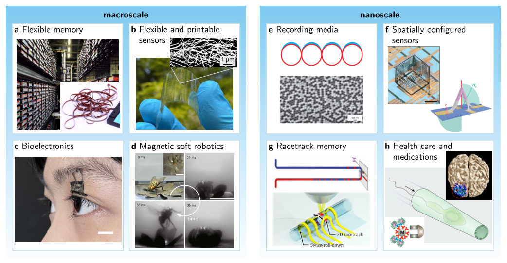 
FIG. 4. Representative applications of curvilinear magnetic architectures in functional devices, spanning from macroscopic implementations (a–d) to nanoscale systems (e–h). (a) Commercial magnetic tapes realized through flexible magnetic substrates, illustrating large-scale utility of curved architectures. (b) Printable magnetoresistive sensors based on aligned nanowires, featuring mechanical flexibility and optical transparency, positioning them as potential candidates for wearable electronics. (c) Mechanically adaptive biosensors for precise decoding of fatigue levels. (d) Soft robotic actuators exhibiting ultrafast mechanical response through integration of magnetic composites. (e)...

📷 Fig 5

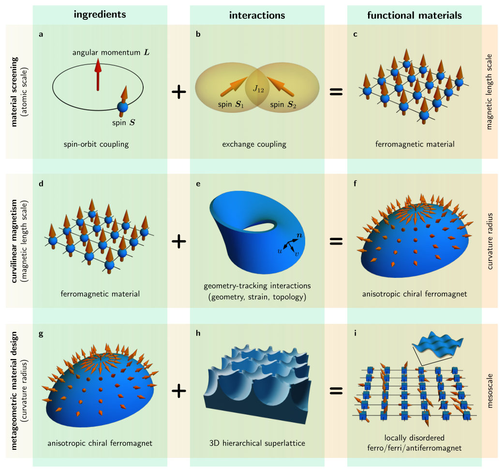 
FIG. 5. Approaches in material science from the atomic to mesoscale. A classical methodology relies on (a) the design of the local atomic environment and (b) coupling between spins to achieve (c) the magnetic material with the desired properties. This material, e.g. specific ferromagnet serves as (d) the ingredient for the modern field of curvilinear magnetism. (e) Using toolbox that includes geometry-tracking interactions (shape anisotropy, strain and others) for the sample with the specific topology and geometry, (f) the anisotropic chiral ferromagnet that could host, e.g., curvature-stabilized skyrmions, is obtained. Intrinsically, the material remains the same. Future of curvilinear...

**Summary.** This review outlines a modern framework for designing 'metageometric' materials by simultaneously considering the interplay between a material's physical shape, its electronic band structure, and its magnetic spin textures. It moves beyond simple micromagnetics by incorporating geometric constraints and strain effects, promising new avenues for energy-efficient nanoelectronics and sensing.

**Why it may be interesting.** While primarily condensed matter/materials science, the explicit coupling between geometry (topology/curvature) and quantum-like order parameters (magnetization) echoes concepts in geometric phases and topological quantum matter, which are relevant to AMO physics.

Detailed structure

**Main problem.** The paper addresses the need to design novel functional materials by coupling three fundamental aspects: geometric shape, electronic band structure, and magnetic spin textures.

**Main result.** It proposes that accounting for the explicit coupling between geometry, strain, and electronic degrees of freedom allows for the design of 'metageometric' materials with controlled anisotropic and chiral responses.

**Method.** The review synthesizes concepts from differential geometry, mean-field micromagnetics, and solid-state physics to model these coupled effects.

**Model / system.** The focus is on thin magnetic shells and curved geometries (e.g., bent shells, N-tori), where the local magnetic order parameter is influenced by the manifold's curvature and induced strain.

**Key observables.** Curvature-induced anisotropy, topological constraints on magnetization (soliton number), magnetoelectric coupling, and strain-gradient effects.

**Important parameters / regimes.** Nanoscale dimensions, curvature ($\kappa_u, \kappa_v$), strain ($\epsilon_{ij}$), and topological invariants.

**Assumptions / limitations.** The review extends beyond contemporary mean-field micromagnetics to incorporate lattice structure and electronic degrees of freedom, though strain gradient effects are noted as areas for further development.

**Figures summary.** Figures illustrate the historical development of curvilinear magnetism, geometric curvatures, and the topological constraints on magnetization fields in various curved geometries.

**Paper structure.** The review progresses from defining the limitations of current micromagnetics to detailing the mathematical framework using differential geometry, and finally outlining the resulting novel physical phenomena and technological prospects.

Abstract

To enable novel concepts in nanotechnologies, it is insightful to design materials with qualitatively new performances originating from recent discoveries in fundamental material science and physics. Curvilinear magnetism emerged as a tool to design chiral and anisotropic responses of materials at the nanoscale using the effects of the geometric shape and topology of the object. This concept is distinct yet complementary to material screening, which is primarily based on the optimization of intrinsic microscopic properties to modify magnetic textures for specific applications. Contemporary curvilinear magnetism focuses on mean-field micromagnetics, while the explicit contribution of the lattice structure and electronic degrees of freedom remains beyond consideration. In this review, we will emphasize on the effects which appear when this coupling is accounted for and that have resulted in novel concepts for the design of ``metageometric'' materials. Further development of this field will provide appealing technological prospects for fundamental understanding of curvilinear magnetic nanostructures and their applications in energy efficient and scalable nanoelectronics.

[↑ back to top](#top)

### [Quantum-circuit simulation of three-flavor neutrino oscillations: vacuum, matter, and CP diagnostics](http://arxiv.org/abs/2609.30875v1)

**Authors:** Daming Li  
**Type:** theory · **Category:** quantum information and computing · **PDF:** <https://arxiv.org/pdf/2609.30875v1>  
**Analysis basis:** full PDF text, analyzed in chunks
**Topic relevance:** `correlated / nonlocal dissipation` **1/5** · `driven-dissipative phase transition` **1/5** · `methods for driven-dissipative` **1/5**

📷 Fig 1

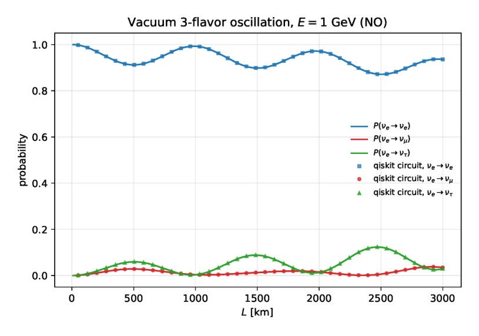 
Figure 1: Vacuum three-flavor oscillation at E = 1 GeV. Solid curves: analytic Pα→β from Eq. (17); markers: Qiskit two-qubit circuit (statevector).

📷 Fig 2

 
Figure 2: Suzuki–Trotter convergence for the vacuum evolution (L = 500 km, E = 1 GeV). Markers: measured εU(N) for p = 1, 2; dotted lines: expected N −p slopes.

📷 Fig 3

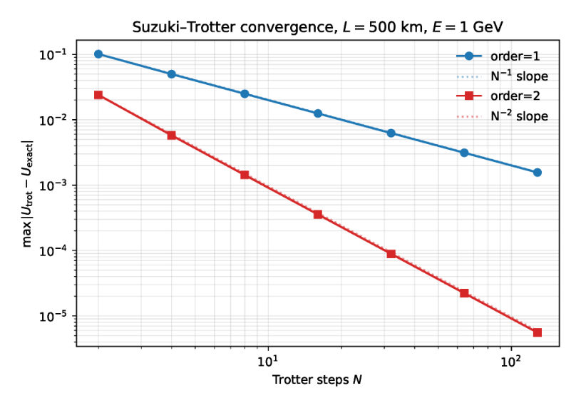 
Figure 3 shows P(νe →νe) at L = 2000 km, E = 1 GeV as a function of the matter potential A. Here the Hamiltonian is H = Hvac + A diag(1, 0, 0) with constant A from (Eq. 8) and Eq. (9). A sharp suppression of ee survival develops as A approaches ∆m2 31, signalling an MSW resonance that converts νe into νµ, ντ. Numerically the minimum is P(νe →νe) ≃0.08 at Amin ≃2.4 × 10−3 eV2, to be compared with the atmospheric splitting ∆m2 31 = 2.517×10−3 eV2; the positional agreement confirms that this is the νe–νµ/τ (resonant) conversion driven

📷 Fig 4

 
Figure 3: Constant-density MSW: P(νe →νe) versus A at L = 2000 km, E = 1 GeV. Dashed line marks A = ∆m2 31.

📷 Fig 5

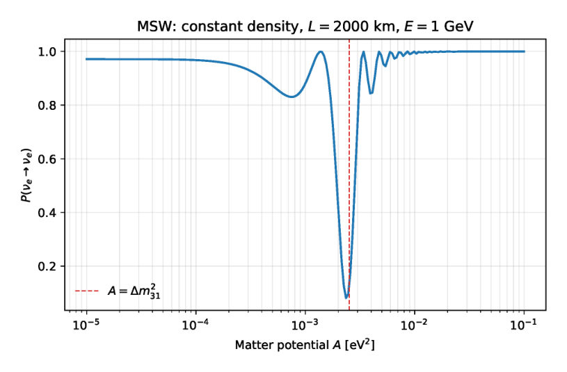 
Figure 4 displays the flavor probabilities of a 50 MeV neutrino traversing an exponentially decreasing density profile mimicking a supernova shock shell. The Hamiltonian is H(r) = Hvac + A(r) diag(1, 0, 0) with matter potential A(r) = A0 e−r/r0, r0 = 0.15 L, L = 500 km (peak value A0 = 2.537×10−28nmax e E with nmax e = 6×1025

**Summary.** This work develops a quantum circuit simulation framework to model three-flavor neutrino oscillations under various physical conditions, including vacuum, matter effects, and decoherence. It rigorously verifies the simulation against known analytical results while also calculating quantum information diagnostics like entanglement and CP asymmetry. The paper establishes a reproducible quantum pipeline connecting particle physics observables to quantum information theory.

**Why it may be interesting.** The explicit use of quantum circuits to model fundamental particle physics processes, combined with the calculation of quantum information measures, provides a novel computational bridge between particle physics phenomenology and quantum information theory.

Detailed structure

**Main problem.** The paper simulates three-flavor neutrino oscillations across various astrophysical environments (vacuum, matter, supernova) using quantum circuits.

**Main result.** The quantum circuit framework successfully reproduces analytical results for oscillation probabilities and establishes a quantitative link between low-energy oscillation observables and quantum-information measures like mode entanglement and CP asymmetry.

**Method.** The evolution is simulated by encoding the flavor space into a two-qubit system and applying time evolution via quantum circuits, utilizing Suzuki-Trotter splitting for time discretization.

**Model / system.** The system is three-flavor neutrino oscillation governed by a Hamiltonian that includes vacuum terms and density-dependent matter potentials. The simulation is extended to open quantum systems using a Lindblad master equation.

**Key observables.** Oscillation probabilities ($P_{\alpha	oeta}$), mode entanglement (Concurrence), and CP asymmetry ($\Delta P$).

**Important parameters / regimes.** NuFIT 5.3 parameters, matter potential $A(r)$, and simulation parameters like Trotter order and step number.

**Assumptions / limitations.** The $|	ext{11}
angle$ sector is assumed inert, and the simulation uses a minimal two-qubit encoding, excluding neutrino-neutrino self-interactions.

**Figures summary.** Figures illustrate the successful reproduction of vacuum oscillation results to high precision, the resonance behavior in MSW matter, and the convergence rates of the Trotter approximation.

**Paper structure.** The paper systematically verifies the simulation across three regimes: vacuum propagation, constant-density MSW matter, and varying-density supernova shock-shell propagation. It then extends the model to include quantum information diagnostics and open-system decoherence.

Abstract

We simulate three-flavor neutrino oscillations on two-qubit quantum circuits. The flavor space is embedded as $\ket{00}=ν_e$, $\ket{01}=ν_μ$, $\ket{10}=ν_τ$ with the $\ket{11}$ channel kept inert, and the input mixing parameters (NuFIT~5.3, normal ordering) follow the global fit. We verify three physical settings against analytic or exact references: vacuum propagation, reproduced by a mass-eigenstate phase circuit to $\sim 10^{-16}$; constant-density Mikheev--Smirnov--Wolfenstein (MSW) matter effects, showing resonant flavor conversion when the matter potential $A$ crosses $Δm^2_{31}$; and varying-density (supernova shock-shell) propagation by slicing plus second-order Suzuki--Trotter splitting, agreeing with exact evolution to $\sim 10^{-6}$. We report a Suzuki--Trotter precision--resource calibration varying order, step number, and matrix/probability error. It delimits brute-force Trotterization on solar baselines: we quantify both standard alternatives, coherence averaging and adiabatic MSW. We also compute quantum-information diagnostics from the same model parameters, namely mode entanglement and the CP asymmetry. Finally, we extend the framework to open quantum systems via a Lindblad master equation with dephasing and absorptive channels. These results provide a reproducible link between low-energy oscillation observables and quantum-information measures.

[↑ back to top](#top)

### [The memory equation of a characteristic function in surface diffusion: a sum rule](http://arxiv.org/abs/2609.31344v1)

**Authors:** S. Miret-Artés  
**Type:** theory · **Category:** statistical mechanics · **PDF:** <https://arxiv.org/pdf/2609.31344v1>  
**Analysis basis:** full PDF text, analyzed in chunks
**Topic relevance:** `Keldysh / 2PI / non-Gaussian methods` **1/5** · `correlated / nonlocal dissipation` **1/5** · `methods for driven-dissipative` **1/5**

📷 Fig 1

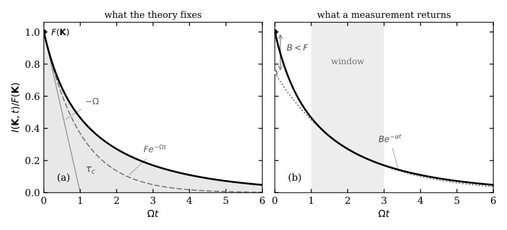 
Figure 1: The two sets of quantities, drawn on one and the same decay and described in the text. The solid curve is the exact intermediate scattering function of an admissible relaxation spectrum, chosen arbitrarily and normalized so that Ω= 1; it stands for any admissible decay, no model of the adlayer entering it. The origin of the time is that of the diffusive regime, the motion within a well having been averaged over. (a) What the theory fixes, the shaded area being the correlation time τc(K). (b) What a measurement returns, over the window shown.

**Summary.** This paper develops a rigorous theoretical framework to describe the decay dynamics of density waves in adlayers using the Mori-Zwanzig formalism. It establishes an exact memory equation and a corresponding sum rule that connects the measured decay rate to static structural properties and single-jump probabilities. This framework successfully predicts the known hydrodynamic limit (Darken relation) while remaining general for various interaction models.

**Why it may be interesting.** The rigorous derivation of transport relations (like the Darken relation) from fundamental memory function theory, applicable to many systems exhibiting diffusive dynamics, provides a powerful theoretical tool for analyzing relaxation spectra.

Detailed structure

**Main problem.** Deriving an exact memory equation for the decay of a density wave in an interacting adlayer and establishing a general sum rule governing the local rate.

**Main result.** The local rate obeys a sum rule relating its momentum dependence to the single-jump characteristic function and the static structure factor. In the hydrodynamic limit, this reduces to a Darken-type relation.

**Method.** The theory employs the Mori-Zwanzig projection formalism to derive the memory equation, utilizing detailed balance and equilibrium averages to constrain the coefficients.

**Model / system.** The system is an adlayer undergoing surface diffusion on a crystal surface, modeled by dynamics governed by a master equation for the pair correlation function.

**Key observables.** Intermediate Scattering Function (ISF), Static Structure Factor (SSF), Local Rate, Effective Hop Rate, and the ratio $R(K)$ derived from moment analysis.

**Important parameters / regimes.** Wavevector $K$, correlation time $	au_c$, and the long-wavelength limit ($K 	o 0$).

**Assumptions / limitations.** The dynamics must satisfy conservation, fixed jump sets, detailed balance, and translational invariance (H1-H4).

**Figures summary.** Not specified, but the notes reference a Table 1 showing measured values for amplitude, rate, and other diagnostic quantities across various wavevectors.

**Paper structure.** The paper builds from the general Mori equation for the ISF, derives the sum rule connecting the decay rate to single-jump correlations, and then analyzes the long-wavelength limit to recover known transport relations like the Darken equation.

Abstract

The decay of a density wave in an interacting adlayer obeys an exact memory equation of Mori's form. Being a Fourier component of a conserved density, its correlation function is a characteristic function, and the kernel is built from a second one, that of a single jump. The local rate obeys a sum rule whose momentum dependence is one minus the characteristic function of a single jump, divided by the static structure factor. Detailed balance makes the decay a superposition of relaxation modes of non-negative weight whose moments are static equilibrium averages, so that the truncations of the associated continued fraction form a convergent hierarchy of closed forms, each of them a bound on the decay itself. The single rate a fit returns is shown to be the mean of the instantaneous rate over a time window, hence never above the local rate. At long wavelength, the two coincide, the relaxation spectrum separating there, one collective mode taking almost the whole weight of the density wave and the single exponential usually fitted to spin-echo data being the decay itself. What an experiment reaches at every wavevector is also the area under the decay, a correlation time. Together with the static structure factor and the single-jump geometry, it forms one combination which the theory identifies with the effective hop rate divided by the product of the local rate and the correlation time. That product never falls below unity and tends to unity at long wavelength whenever the rate at which an adparticle leaves a site is independent of the site it leaves for. In the hydrodynamic limit, the sum rule becomes a relation of Darken type in which the rate multiplied by the thermodynamic factor is the effective hop rate and not the mobility of a labelled adparticle.

[↑ back to top](#top)

### [Colored Weingarten Calculus for Block-Unitary Ensemble](http://arxiv.org/abs/2609.30385v1)

**Authors:** Daniele Iannotti, Elisa Vallini  
**Type:** theory · **Category:** statistical mechanics · **PDF:** <https://arxiv.org/pdf/2609.30385v1>  
**Analysis basis:** full PDF text, analyzed in chunks
**Topic relevance:** `analog quantum simulation` **1/5** · `scars & prethermalization` **1/5**

📷 Fig 1

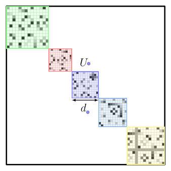 
FIG. 1. Example of a block-unitary matrix Lm i=1 Ui with m = 5 blocks, each associated with a distinct color, drawn from the Block-Unitary Ensemble U(H|M). The blocks Ui are independent Haar-random unitary matrices, each of di- mension di.

📷 Fig 2

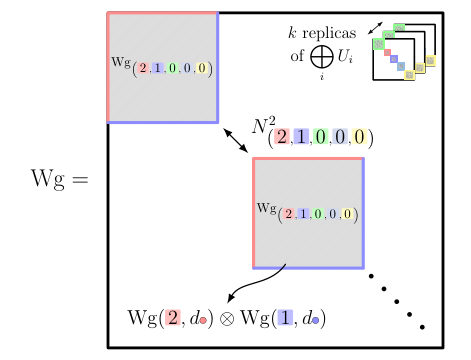 
FIG. 2. Pictorial representation of the block-diagonal struc- ture of the Weingarten matrix for the Block-Unitary Ensem- ble (3) for k = 3 replicas (top right) and m = 5 colors. The occupation vector n = {ni}m i=1 specifies how many of the k replicas are associated with each color (block). For each fixed n, the Weingarten matrix contains N 2 n equivalent blocks. Each block factorizes into ordinary unitary Wein- garten matrices Wg(ni, di), one for each occupied color. In the figure, we show two of the N 2 n = 9 blocks for n = 

📷 Fig 3

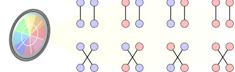 
FIG. 3. Diagrammatic representation of the elements of Comk(U(H|M)) for k, m = 2. Each color-preserving permu- tation graph between two colored words is such that there are k columns and m possible colors for each filled circle.

📷 Fig 4

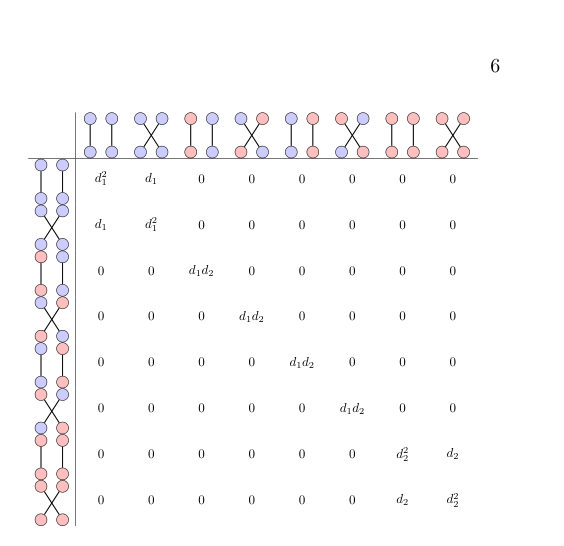 
FIG. 4. Gram matrix of the color-preserving permutation operators for two replicas and two sectors (k = m = 2), with sector dimensions d1 and d2. Rows and columns are labeled by diagrams DA, and each entry is the Hilbert–Schmidt overlap GA,B = Tr  D† ADB  . Graphically, this overlap is evaluated by composing the adjoint of the first diagram with the second and closing the remaining wires. Each closed loop of color i contributes a factor di, while incompatible colors give zero. The same-color diagrams form the two 2 × 2 blocks G(2, d1) and G(2, d2); the four mixed-color diagrams are then d1d2.

📷 Fig 5

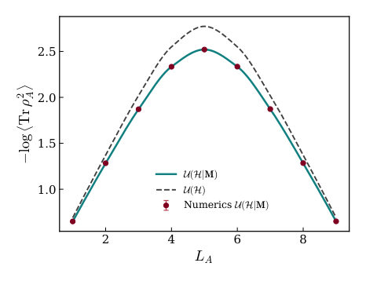 
FIG. 5. Annealed second-R´enyi Page curve −log Tr ρ2 A for a system of L = 10 spin-1/2 degrees of freedom with fixed total charge Q = 4. The solid curve is obtained via Eq. (74). The circles are numerical Haar samples in the fixed-charge sector. The gray dashed curve is the ordinary full-Haar Page curve on HA ⊗HB, shown for comparison.

**Summary.** This paper introduces a 'Colored Weingarten Calculus' to analyze quantum systems constrained by symmetries, modeled by the Block-Unitary Ensemble. It develops a mathematical framework showing that the system's dynamics are governed by color-preserving permutations rather than standard permutations. This has direct applications to understanding thermalization in many-body systems and quantum information theory.

**Why it may be interesting.** This work provides powerful, general mathematical tools (Weingarten Calculus) to analyze thermalization and quantum scrambling in many-body systems that possess underlying symmetries, bridging quantum information theory and condensed matter physics.

Detailed structure

**Main problem.** The paper develops a constructive Weingarten Calculus for the Block-Unitary Ensemble to provide a unified mathematical framework for systems where quantum randomness is constrained by symmetries.

**Main result.** The calculus reveals a symmetry-resolved Schur-Weyl duality, showing that the average of operators is governed by color-preserving permutations, leading to a block-diagonal structure in the Gram matrix.

**Method.** The authors calculate Haar moments and Gram matrix elements by analyzing the commutant of the collective unitary action, generalizing permutation group theory to color-preserving permutations.

**Model / system.** The model is the Block-Unitary Ensemble, $U(H|M) = U(H_1) 	imes \cdots 	imes U(H_m)$, which describes quantum systems whose Hilbert space is decomposed into independent symmetry-resolved subspaces. This is motivated by contexts like the Eigenstate Thermalization Hypothesis (ETH).

**Key observables.** The $k$-th order twirling map $\Phi^{(k)} U(H|M)(O^{\otimes k})$ and the resulting correlation functions $\langle O^U_{ij} 
angle$ are key observables.

**Important parameters / regimes.** The number of subspaces ($m$), the replica number ($k$), the dimension of each subspace ($d_i$), and the occupation vector $\mathbf{n}$ are crucial parameters.

**Assumptions / limitations.** The analysis assumes that the system dynamics can be effectively modeled by independent Haar-random unitaries acting on symmetry-constrained subspaces, allowing for the use of the Block-Unitary Ensemble.

**Figures summary.** Figures illustrate the block-unitary matrix structure (Fig. 1) and the block-diagonal factorization of the Weingarten matrix based on the occupation vector (Fig. 2).

**Paper structure.** The paper progresses by first defining the Block-Unitary Ensemble and its commutant (Chunk 2), then deriving the general form of the Gram matrix elements using color-preserving permutations (Chunk 3), and finally applying this calculus to calculate correlation functions in the energy eigenbasis (Chunk 4).

Abstract

Haar randomness is the standard null model for quantum typicality, scrambling, and random-matrix formulations of thermalization. In many physical settings, however, randomness is naturally constrained to subspaces of Hilbert space. This structure arises, in particular, both in systems with symmetry-resolved sectors and in the Eigenstate Thermalization Hypothesis (ETH), where mesoscopic energy windows define subspaces in which nearby energy eigenstates are mixed. Motivated by these settings, we consider a Block-Unitary Ensemble consisting of independently Haar-random unitaries acting on each subspace. We develop a constructive Weingarten Calculus for this ensemble, providing a unified framework across quantum information and many-body physics. This construction reveals a symmetry-resolved Schur-Weyl duality, where the relevant commutant is not the ordinary permutation algebra, but the one of color-preserving permutations. We apply this framework to quantum states under symmetry constraints and to energy-resolved ensembles for ETH.

[↑ back to top](#top)

### [Exact series formulas for the capacities of the amplitude damping channel](http://arxiv.org/abs/2609.31609v1)

**Authors:** Stefano Pirandola  
**Type:** theory · **Category:** quantum information and computing · **PDF:** <https://arxiv.org/pdf/2609.31609v1>  
**Analysis basis:** full PDF text, analyzed in chunks
**Topic relevance:** `Keldysh / 2PI / non-Gaussian methods` **1/5** · `methods for driven-dissipative` **1/5**

📷 Fig 1

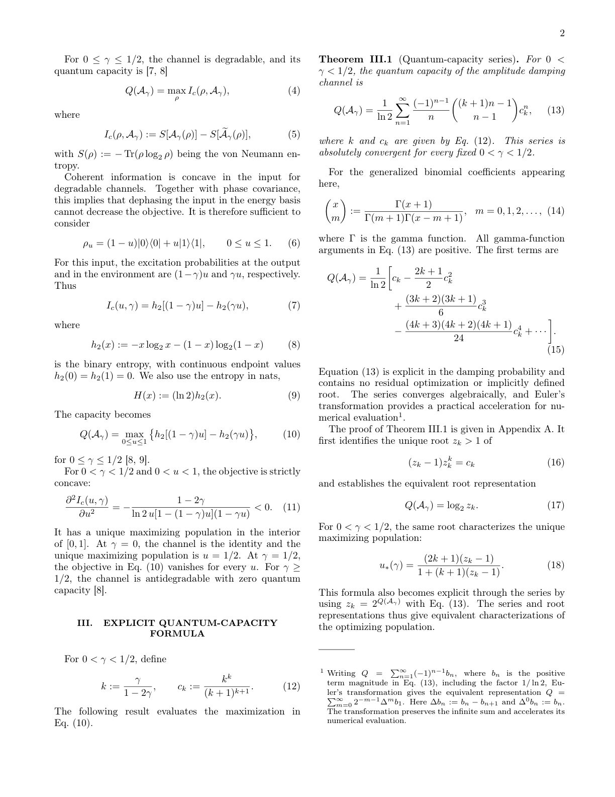 
Low-resolution page preview, page 2

📷 Fig 2

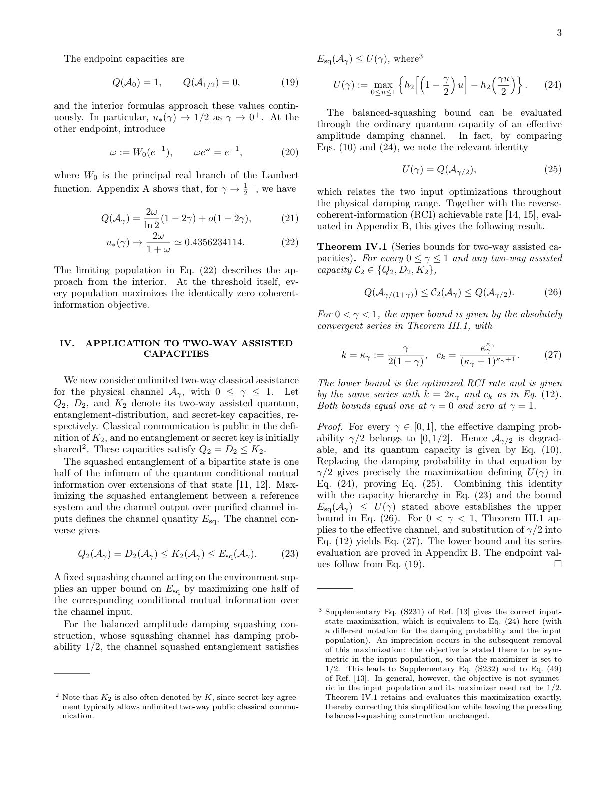 
Low-resolution page preview, page 3

📷 Fig 3

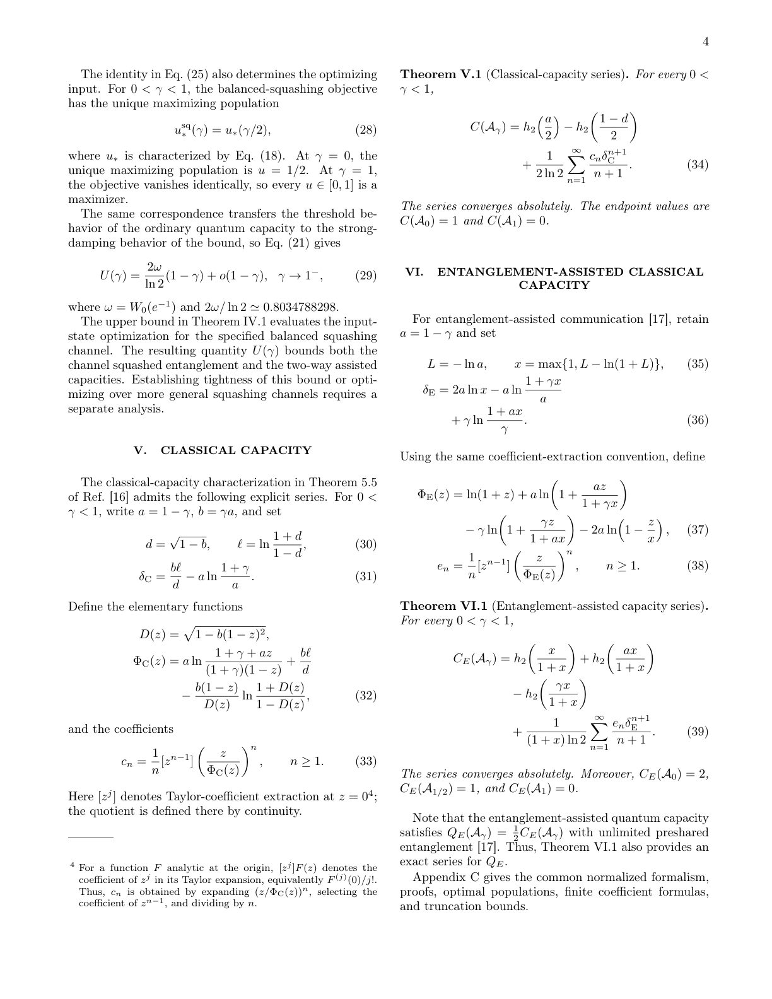 
Low-resolution page preview, page 4

📷 Fig 4

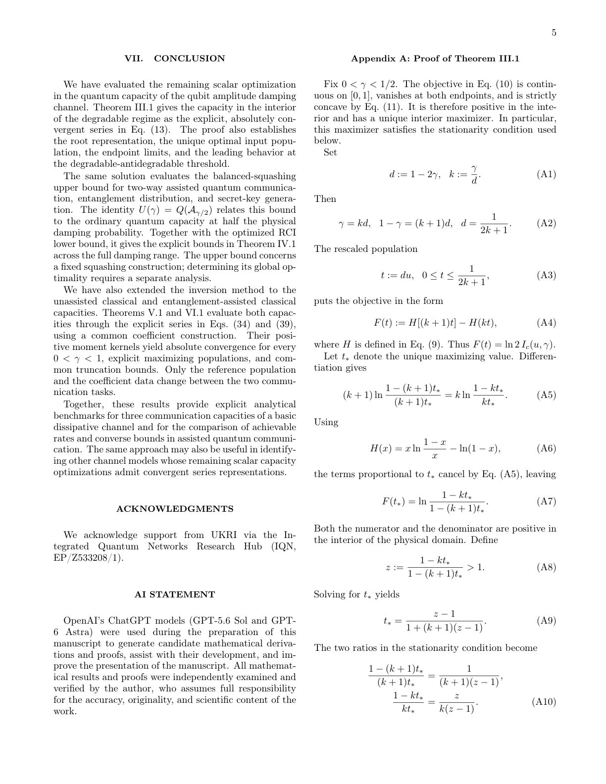 
Low-resolution page preview, page 5

📷 Fig 5

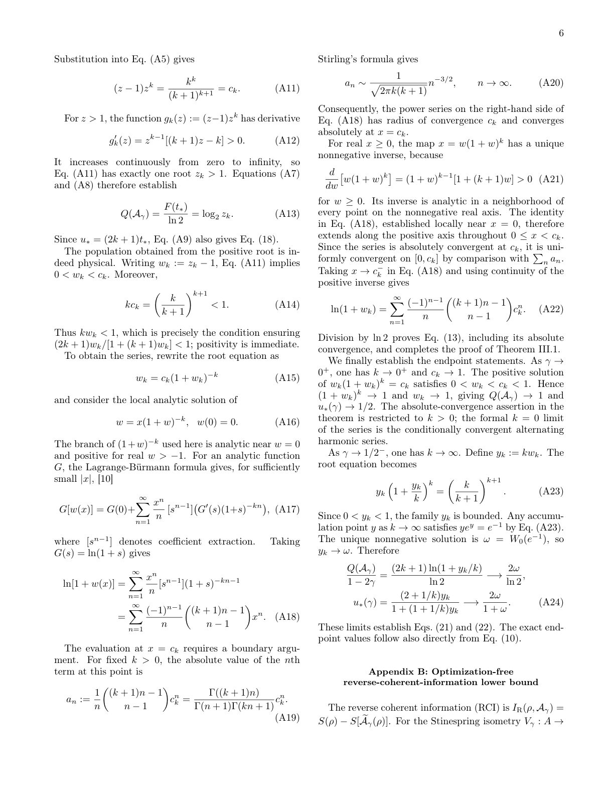 
Low-resolution page preview, page 6

**Summary.** This paper provides exact, convergent series formulas for calculating the quantum, classical, and entanglement-assisted capacities of the qubit amplitude damping channel. By employing advanced mathematical techniques, the authors characterize the limits of information transmission over this common noisy quantum channel. The results offer crucial analytical benchmarks for quantum communication theory.

**Why it may be interesting.** This work provides rigorous, exact mathematical characterizations of information loss in a fundamental open quantum system (amplitude damping), which is crucial for understanding quantum communication protocols in realistic noisy environments.

Detailed structure

**Main problem.** The paper aims to derive exact, explicit series formulas for the various information-carrying capacities (quantum, classical, entanglement-assisted) of the qubit amplitude damping channel.

**Main result.** It provides convergent series representations for these capacities, characterizing the optimal input states and establishing analytical bounds for two-way assisted communication.

**Method.** The authors employ advanced techniques including Lagrange-Bürmann inversion, optimization of coherent information, and the use of normalized moment formalisms to derive closed-form series.

**Model / system.** The primary model is the qubit amplitude damping channel, $A_\gamma$, which models energy dissipation in a quantum system characterized by the damping probability $\gamma$.

**Key observables.** Quantum Capacity $Q(A_\gamma)$, Unassisted Classical Capacity $C(A_\gamma)$, Entanglement-Assisted Capacity $CE(A_\gamma)$, and the lower bound for two-way assisted capacity $	ext{RRCI}(\gamma)$.

**Important parameters / regimes.** The damping probability $\gamma$ ($0 \le \gamma \le 1$), and derived parameters like $k = \gamma/(1-2\gamma)$ and optimal input populations $u^*_\gamma$.

**Assumptions / limitations.** The analysis often restricts optimization to diagonal input states ($
ho_u$) and relies on the absolute convergence of the derived series representations.

**Figures summary.** Not specified in the provided notes, but the structure implies comparisons between derived capacity formulas and known limits at $\gamma=0$ and $\gamma=1/2$.

**Paper structure.** The paper systematically derives formulas for different capacities (Quantum, Classical, Entanglement-Assisted) using series expansions, establishes bounds for two-way communication, and analyzes the behavior in different regimes of the damping parameter $\gamma$.

Abstract

We derive explicit, absolutely convergent series formulas for the quantum, unassisted classical, and entanglement-assisted classical capacities of the qubit amplitude damping channel, eliminating residual optimizations and implicit roots. We also obtain analytical upper and lower bounds on two-way assisted quantum and private communication capacities by evaluating a balanced-squashing bound and optimizing the reverse coherent information. Our results characterize the optimal input populations, establish convergence and truncation properties, and provide analytical benchmarks for quantum and classical communication over dissipative channels.

[↑ back to top](#top)

### [A Flatness-Generalization Relation in the Teacher-Student Tree-Committee Machine](http://arxiv.org/abs/2609.31101v1)

**Authors:** Brandon Livio Annesi, Davide Straziota, Enrico Maria Malatesta  
**Type:** theory · **Category:** disordered systems and neural networks · **PDF:** <https://arxiv.org/pdf/2609.31101v1>  
**Analysis basis:** full PDF text, analyzed in chunks
**Topic relevance:** `Keldysh / 2PI / non-Gaussian methods` **1/5**

📷 Fig 1

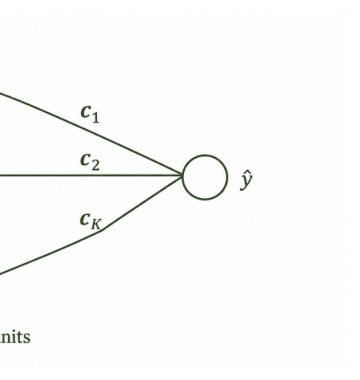 
Figure 1. Schematic representation of a tree committee machine.

📷 Fig 2

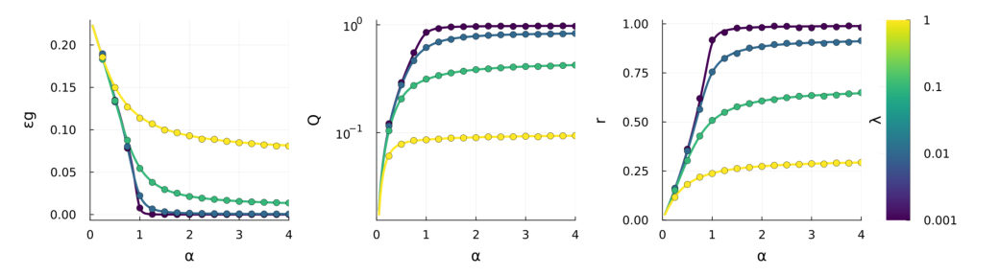 
Figure 2. Generalization error and order parameters for regression. The RS theory predicts the test error ϵg, squared norm Q, and teacher–student overlap r as functions of sample complexity α and regularization strength λ. Curves are theoretical predictions; markers report finite-size (N = 2000, K = 20) GD simulations, averaged over 20 seeds. Error bars are not shown because they are very small.

📷 Fig 3

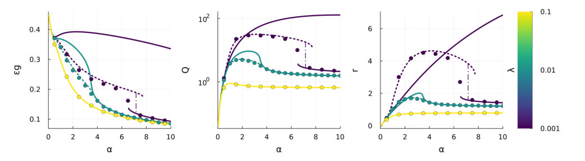 
Figure 3. Classification order parameters. Solid curves denote RS solutions, while dashed curves denote 1RSB solutions. Markers report finite-size GD simulations for N = 2000, K = 20, averaged over 20 seeds. Error bars are not shown because they are very small.

📷 Fig 4

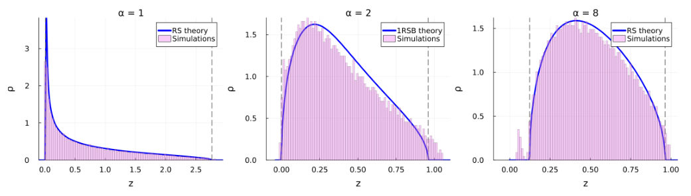 
Figure 4. Empirical spectrum vs theoretical spectrum for N = 2000, K = 20 and λ = 0.01. The left panel shows regression; the middle and right panels show classification.

📷 Fig 5

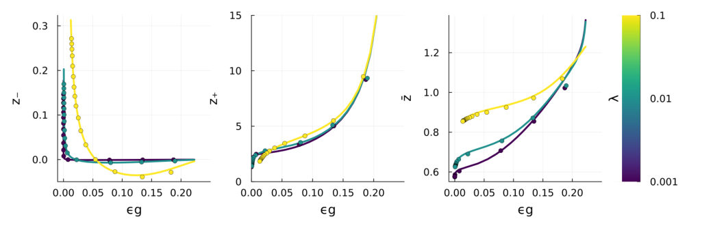 
Figure 5. Flatness observables versus generalization error in regression. Markers are given by GD simulations with N = 2000, K = 20. In the phases where the empirical spectrum develops outliers, we show the smallest eigenvalue of the continuous bulk.

**Summary.** This theoretical paper analyzes the flatness-generalization relationship in a specific neural network model using advanced statistical mechanics techniques. By calculating the Hessian spectrum and generalization error analytically, the authors show that the correlation between flatness and generalization is highly conditional, depending critically on whether the network is over- or under-parameterized and the specific learning task.

**Why it may be interesting.** The rigorous application of statistical physics tools (replica method, free energy calculations) to analyze generalization bounds in deep learning models provides deep theoretical insights into the relationship between local geometry (flatness) and global performance (generalization).

Detailed structure

**Main problem.** The paper investigates the controversial 'flatness-generalization relation' in neural networks, determining if a flat loss landscape at the minimizer implies good generalization performance.

**Main result.** The correlation between flatness measures (left/right edge, spectral mean) and generalization error strongly depends on the learning task (regression vs. classification) and the ratio of parameters to data points.

**Method.** The authors use advanced theoretical tools like the zero-temperature Gibbs formulation, Edwards-Jones formalism, and the replica method to analytically derive predictions for the Hessian spectrum and generalization error.

**Model / system.** The model studied is a teacher-student tree-committee machine, analyzed in the proportional high-dimensional limit. The analysis involves calculating observables related to the empirical loss and the Hessian matrix.

**Key observables.** Flatness measures (left edge, right edge, spectral mean) of the Hessian spectrum, generalization error ($\epsilon_{	ext{regr}}^g$, $\epsilon_{	ext{class}}^g$), and order parameters ($Q, q_{ab}^l, r_a^l$).

**Important parameters / regimes.** Dataset size ($\alpha$), regularization strength ($\lambda$), and the ratio of parameters to data points (overparametrized vs. underparametrized regimes).

**Assumptions / limitations.** The analysis relies on the tractability of the teacher-student committee machine model and utilizes approximations like the 1RSB solution and the annealed ansatz in the replica method.

**Figures summary.** Figure 1 schematically represents the tree committee machine. Figure 2 shows theoretical predictions for test error, squared norm, and teacher-student overlap versus $\alpha$ and $\lambda$ for regression.

**Paper structure.** The paper progresses by first setting up the model and defining observables, then employing the replica method to calculate the free energy and Hessian spectrum in the high-dimensional limit, and finally analyzing the correlation between flatness and generalization error across different learning tasks and parameter regimes.

Abstract

The flatness of the loss landscape at a minimizer is a widely used heuristic for reasoning about neural-network generalization, yet evidence for this relation is mostly empirical and controversial. We study this relation in a teacher-student tree committee machine, where both the ERM estimator and the Hessian spectrum are analytically tractable in the proportional high-dimensional limit. First, we use a zero-temperature Gibbs formulation to obtain predictions for the observables of the typical minimizers of the empirical loss. Secondly, we use Edwards-Jones formalism to derive the limiting Hessian resolvent around these typical minimizers. All predictions agree with finite-size gradient-descent simulations. Finally, we study three measures of flatness, namely the left and right edges and the spectral mean, and check if a decrease in generalization error as the dataset size is increased corresponds to an increase in flatness. We find that the answer strongly depends on the learning task and on the ratio of the number of parameters to the number of data points. In regression, the spectral mean and right edge correlate with the generalization error, while the left edge does so only in the overparametrized regime. In classification this correlation reliably holds only in the highly overparametrized phase, while for underparametrized networks it can even reverse.

[↑ back to top](#top)

### [A Generalized Stein Lemma for Quantum Channels](http://arxiv.org/abs/2609.30762v1)

**Authors:** Minbo Gao, Zhengfeng Ji, Chenghua Liu  
**Type:** theory · **Category:** quantum information and computing · **PDF:** <https://arxiv.org/pdf/2609.30762v1>  
**Analysis basis:** full PDF text, analyzed in chunks
**Topic relevance:** `quantum measurements` **1/5**

📷 Fig 1

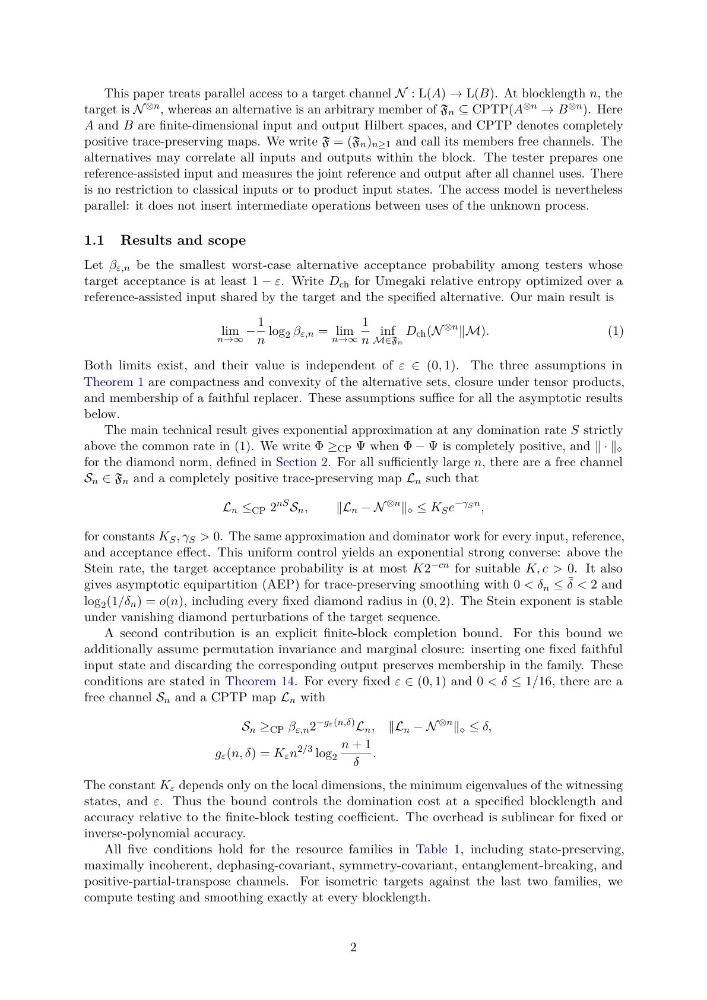 
Low-resolution page preview, page 2

📷 Fig 2

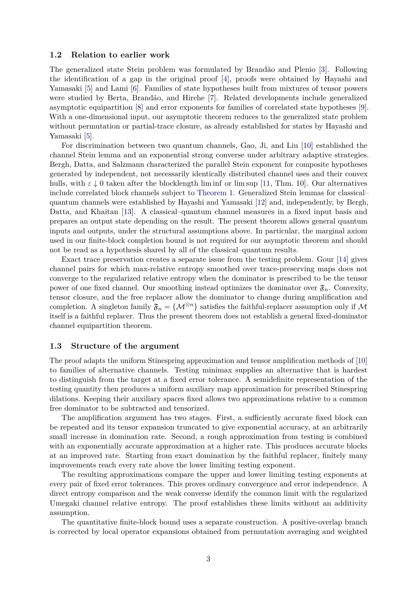 
Low-resolution page preview, page 3

📷 Fig 3

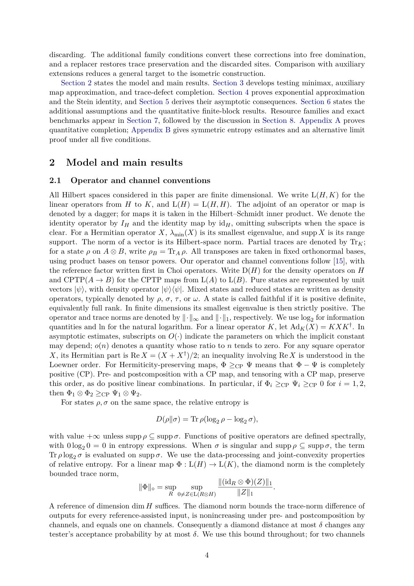 
Low-resolution page preview, page 4

📷 Fig 4

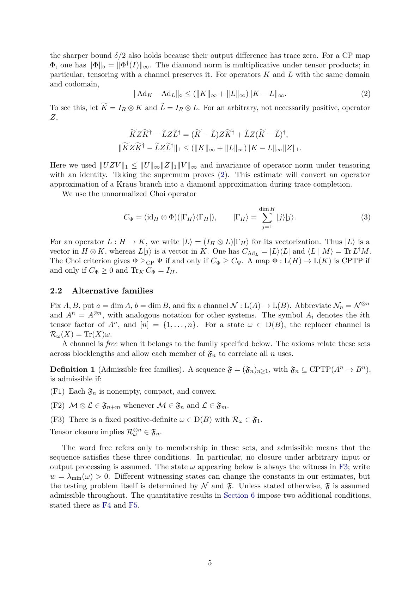 
Low-resolution page preview, page 5

📷 Fig 5

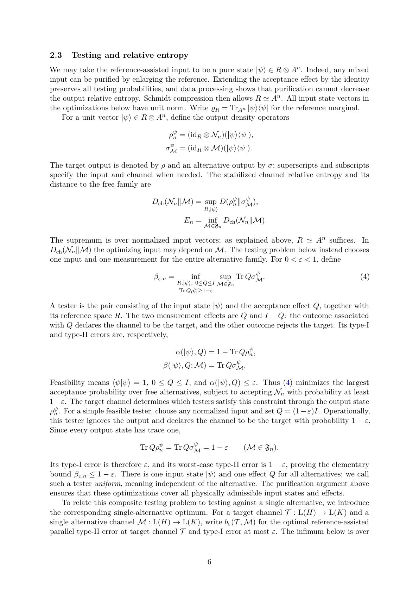 
Low-resolution page preview, page 6

**Summary.** This paper generalizes the quantum Stein lemma to analyze the discrimination of quantum channels. It proves that the asymptotic error exponent in quantum hypothesis testing is governed by the minimum regularized Umegaki relative entropy over alternative channels. The work provides strong theoretical guarantees, including an exponential strong converse and finite-block bounds, applicable to various quantum processes.

**Why it may be interesting.** It provides rigorous mathematical tools (Stein's Lemma) to quantify the distinguishability of quantum processes, which is fundamental for understanding channel capacity and resource quantification in open quantum systems.

Detailed structure

**Main problem.** The paper aims to prove a generalized quantum Stein lemma for the parallel discrimination of a target quantum channel against families of alternative channels.

**Main result.** It establishes an asymptotic equivalence between the optimal type-II error exponent in hypothesis testing and the regularized Umegaki channel relative entropy minimized over the alternatives.

**Method.** The proof combines advanced techniques including uniform auxiliary map approximation, iterative reduction of the domination rate, and tensor amplification.

**Model / system.** The system involves quantum channels (CPTP maps) acting on finite-dimensional Hilbert spaces. Inputs can be entangled across multiple channel uses and with an auxiliary reference system.

**Key observables.** Type-I and Type-II error probabilities ($\alpha_n, eta_n$), the Umegaki relative entropy $D(
ho\|\sigma)$, and the asymptotic testing exponent.

**Important parameters / regimes.** The error tolerance $\epsilon$, the number of uses $n$, and the rate $S$ (related to the entropy limit).

**Assumptions / limitations.** The alternative channels must be compact and convex, closed under tensor products, and contain a faithful replacer for the main result to hold.

**Paper structure.** The paper develops the model and main results in Section 2, details the testing minimax problem in Section 3, proves the exponential approximation/Stein identity in Section 4, and derives asymptotic consequences in Section 5.

Abstract

We prove a generalized quantum Stein lemma for parallel discrimination of an arbitrary finite-dimensional channel against families of alternative channels. The alternatives are compact and convex, closed under tensor products, and contain a faithful replacer. At every fixed type-I error tolerance, the optimal type-II error exponent equals the regularized Umegaki channel relative entropy minimized over the alternatives, and both defining limits exist. Inputs may be entangled across channel uses and with a reference system. The main technical result constructs exactly trace-preserving approximations with exponentially small diamond error, dominated in completely positive order by free channels at every rate above the common exponent. The proof combines uniform auxiliary map approximation, iterative reduction of the domination rate, and tensor amplification. It yields asymptotic equipartition with trace-preserving smoothing at every subexponentially vanishing error, an exponential strong converse, and stability under vanishing diamond-norm perturbations. Under additional permutation invariance and closure under insertion of a fixed faithful input state and discarding of its output, we also prove an explicit finite-block completion bound. This quantitative construction uses weighted discarding, local operator corrections, and comparison with auxiliary extensions. Applications include state-preserving, coherence-restricted, covariant, entanglement-breaking, and positive-partial-transpose channels. For isometric targets against entanglement-breaking or positive-partial-transpose alternatives, we obtain exact finite-block testing and smoothing formulas.

[↑ back to top](#top)

### [Bound States in 2d Yukawa Theory from Hamiltonian Truncation](http://arxiv.org/abs/2609.31504v1)

**Authors:** Olivier Delouche, Kara Farnsworth, Francesco Riva  
**Type:** theory · **Category:** strongly correlated electrons · **PDF:** <https://arxiv.org/pdf/2609.31504v1>  
**Analysis basis:** full PDF text, analyzed in chunks
**Topic relevance:** `Keldysh / 2PI / non-Gaussian methods` **1/5**

📷 Fig 1

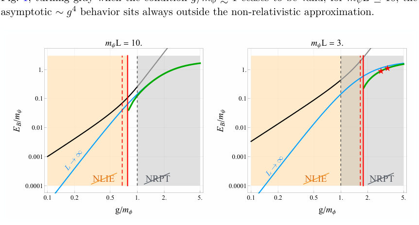 
Figure 1: Finite-volume binding energy in units of mψ in the Thirring/Sine-Gordon model computed with NRPT (black – turning gray outside its regime of validity) and the NLIE (green), compared with the infinite-volume result (blue). In the gray (orange) area NRPT (the NLIE) breaks down; red solid (dashed) lines denote numerical (analytic) breakdown of the NLIE. Red stars compare our results with those of Ref. [69]. For NRPT and the Thirring/Sine-Gordon model there is no distinction between input and physical masses: mψ = mψ,phys = Ms.

📷 Fig 2

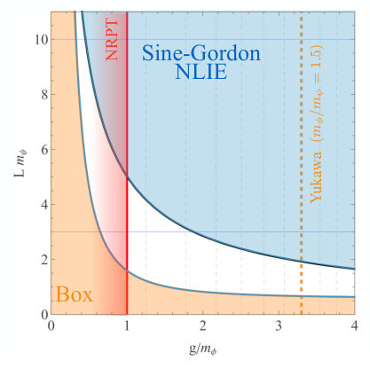 
Figure 2: Sketch of the parameter-space coupling/volume, where the different approxima- tions to compute the binding energy are reliable. At small coupling/volume L ≲LB, the bound state doesn’t fit in the box and the best approach is perturbation theory around free finite-volume states (orange area). Below g/mϕ ≲1 NRPT is reliable. The NLIE results of Eq. (A.1) are accurate at larger coupling/volume (in the Sine-Gordon limit), but it breaks down at small coupling/volume, see Eq. (A.6). At large coupling the bound state might become smaller than the Yukawa reach for small enough mϕ, as given by the example dashed-orange line. Light-gray vertical dashed lines correspond to thresholds where...

📷 Fig 3

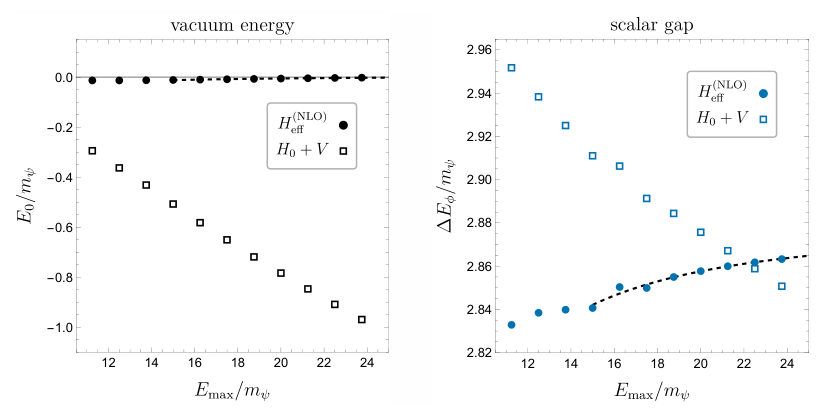 
Figure 3: The Emax dependence of the vacuum energy and scalar gap for mϕ/mψ = 3 and g/mϕ = 0.5. Squares are the raw results from H0 + V , while circles are the EFT- corrected results from Eq. (3.44) and Eq. (3.46). Dashed lines denote m2 ψ/E2 max fits to the EFT-corrected data over the range Emax/mψ ≥15.

📷 Fig 4

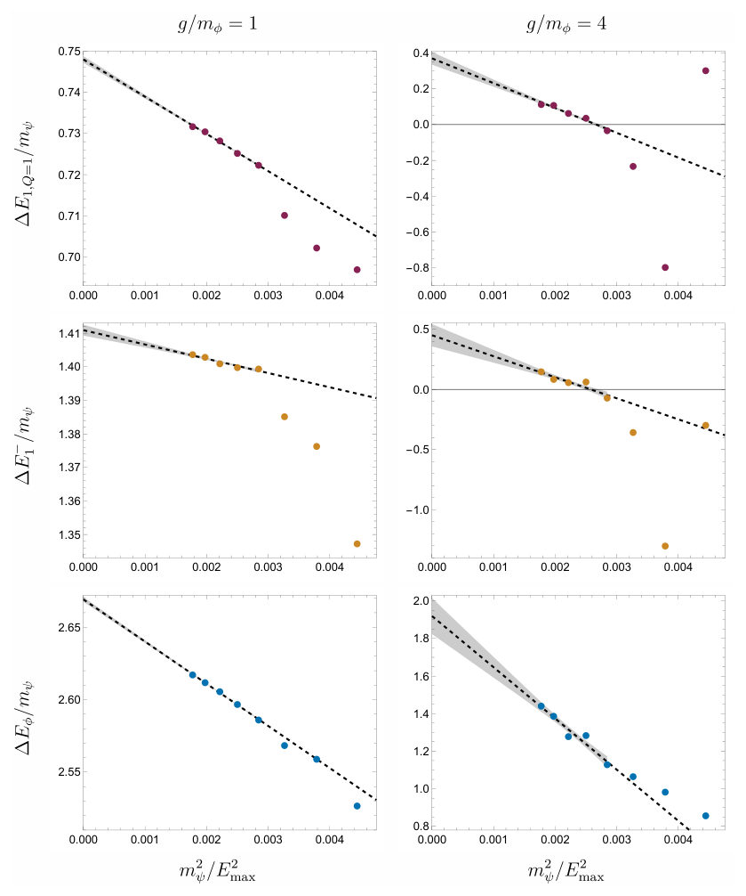 
Figure 4: The remaining Emax dependence for three low-lying states with mϕ/mψ = 3, at g/mϕ = 1 (left) and g/mϕ = 4 (right). From top to bottom: the physical fermion mass (Q = 1 sector), the lowest C−gap, and the C+ gap associated with the one-particle scalar state (both Q = 0 sector). Dashed lines are fits in m2 ψ/E2 max to the data with Emax/mψ ≥18.75, extrapolated to Emax →∞, and the gray bands are the 1σ error bars,

📷 Fig 5

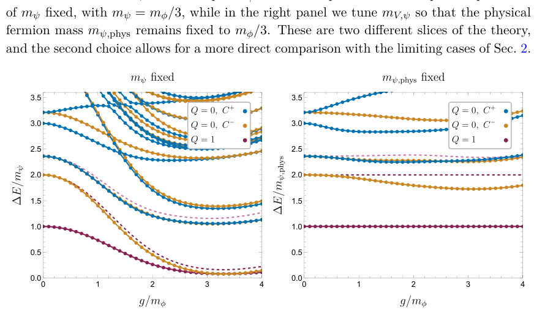 
Figure 5: Spectrum of the lowest P = 0 states in the Q = 0 and Q = 1 sectors for Emax/mψ = 23.75. In the left plot the input fermion mass mψ is kept fixed, while on the right mV,ψ is numerically tuned so that mψ,phys is fixed. The lowest Q = 1, P = 0 gap, which we identify with the physical fermion mass, is shown in purple. The remaining states are in the Q = 0, P = 0 sector, separated by their charge conjugation eigenvalue, C+

**Summary.** This work investigates the bound states in 2D Yukawa theory using advanced numerical techniques like Hamiltonian Truncation. By extending the theory to include necessary divergences, the authors map out the binding energy evolution across coupling strengths. The results provide non-perturbative insights into strongly interacting quantum field models, relevant for condensed matter physics.

**Why it may be interesting.** The techniques developed—Hamiltonian Truncation and EFT extensions—are powerful, non-perturbative tools for analyzing strongly coupled quantum field theories, which is highly relevant for understanding strongly correlated electron systems.

Detailed structure

**Main problem.** The study focuses on determining the energy spectrum, particularly the bound states, of two-dimensional Yukawa theory, especially in regimes where standard perturbation theory fails.

**Main result.** The authors successfully track the evolution of fermion-antifermion bound states from weak to strong coupling, finding agreement with finite-volume perturbation theory at weak coupling.

**Method.** The primary method employed is Hamiltonian Truncation (HT) and its extension, Hamiltonian Truncation Effective Theory (HTET), which is used to study the spectrum by restricting the Hilbert space up to a cutoff energy.

**Model / system.** The system is the two-dimensional Yukawa theory, described by a Lagrangian involving a scalar field ($\phi$) and a fermionic field ($\psi$). The theory can be related to the massive Thirring/Sine-Gordon models in certain limits.

**Key observables.** Binding energy ($E_B$) of fermion-antifermion bound states, and the energy spectrum of the system.

**Important parameters / regimes.** Coupling constants ($g$), masses ($m_\phi, m_\psi$), and the energy cutoff ($E_{	ext{max}}$). The analysis explores weak, strong, and large $m_\phi$ coupling regimes.

**Assumptions / limitations.** The calculations rely on Hamiltonian Truncation, which is computationally limited by the exponential growth of the Hilbert space. The analysis also involves approximations like the non-relativistic limit and the large $m_\phi$ limit.

**Figures summary.** Figure 1 compares finite-volume binding energy computed via NRPT, NLIE, and infinite-volume results for the Thirring/Sine-Gordon model. Figure 11 compares the perturbative result with Hamiltonian truncation results for the binding energy, showing cutoff dependence.

**Paper structure.** The paper develops the theory by first establishing the general framework using HTET, then analyzing specific limits (like the non-relativistic and large $m_\phi$ limits) to calculate the binding energy, and finally comparing these results against established perturbative and finite-volume methods.

Abstract

We study the spectrum of two-dimensional Yukawa theory using Hamiltonian truncation, with a focus on bound states. We extend the framework of Hamiltonian truncation effective theory to include fermions and logarithmic UV divergences. With these corrections, the energy levels converge as a function of the cutoff with the scaling predicted by power counting. We identify a strategy to follow the evolution of fermion-antifermion bound states from weak to strong coupling, and investigate its binding energy, finding good agreement with finite-volume perturbation theory at weak coupling. Finally, we explore the heavy-scalar regime toward the massive Thirring/Sine-Gordon limit, recovering the expected weak-coupling behavior and outlining how the calculation can be extended toward this limit.

[↑ back to top](#top)

### [COFI-DQI: Curve-based Optimal Function Intersection via Decoded Quantum Interferometry](http://arxiv.org/abs/2609.31484v1)

**Authors:** Gretchen L. Matthews, Julia Shapiro  
**Type:** theory · **Category:** quantum information and computing · **PDF:** <https://arxiv.org/pdf/2609.31484v1>  
**Analysis basis:** full PDF text, analyzed in chunks
**Topic relevance:** `quantum measurements` **1/5**

📷 Fig 1

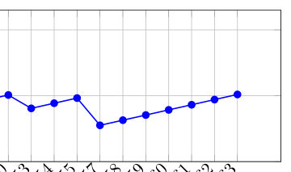 
Figure 1. Comparison of DQI and Prange for Suzuki one-point codes over F8 in the balanced case r = q/2 = 4. Panel (a) plots the expected satisfaction fraction s/n, while panel (b) plots the advantage sDQI/n −sPrange/n.

**Summary.** This work develops COFI, a generalized framework for applying Decoded Quantum Interferometry (DQI) to solve complex optimization problems over finite fields. By analyzing various Algebraic Geometry codes, the authors prove that advanced code families, like Suzuki codes, offer superior performance guarantees compared to simpler constructions when used within the DQI quantum framework.

**Why it may be interesting.** While the focus is on classical coding theory applied to quantum algorithms, the rigorous comparison of code structures and the derivation of performance bounds are highly relevant to understanding the resource scaling and limitations of quantum algorithms in quantum information theory.

Detailed structure

**Main problem.** The paper addresses the Maximum Linear Satisfiability (max-LINSAT) problem, framing it as a structured optimization task solvable via quantum decoding.

**Main result.** The authors demonstrate that using advanced Algebraic Geometry (AG) codes, such as Suzuki or two-point Hermitian codes, leads to a strictly larger expected performance improvement (DQI satisfaction fraction) compared to standard constructions like one-point Hermitian codes.

**Method.** The core method is Decoded Quantum Interferometry (DQI), which maps the classical optimization problem onto a syndrome-decoding problem for the dual of a linear code, leveraging quantum Fourier transforms.

**Model / system.** The theoretical model involves constructing quantum states $|P(f)\rangle$ whose measurement probabilities bias towards solutions that maximize the satisfaction of linear constraints defined over a finite field $\mathbb{F}_q$. The underlying structure is defined by algebraic geometry codes on projective curves.

**Key observables.** DQI Satisfaction Fraction ($s/n$), advantage over classical algorithms (e.g., Prange's algorithm), and the decoding radius ($\ell$).

**Important parameters / regimes.** Code parameters such as genus ($g$), length ($n$), and the field size ($q$); the comparison between different code families (Suzuki vs. Hermitian).

**Assumptions / limitations.** The analysis relies on the ability to uniquely decode errors up to a certain weight $\ell$ using the dual code, and the comparison results are contingent on suitable assumptions regarding the divisor degree.

**Figures summary.** Figure 1 compares the expected satisfaction fraction and the advantage of DQI versus Prange's algorithm for Suzuki codes over $\mathbb{F}_8$. Tables compare satisfaction bounds for various code families.

**Paper structure.** The paper builds upon the connection between max-LINSAT and decoding theory. It introduces COFI as a generalization of OPI, then systematically compares the performance of different AG code families (Extended Norm-Trace, Suzuki, Two-point Hermitian) against established benchmarks (Hermitian, Reed-Solomon) using explicit propositions and examples.

Abstract

In 2025, Jordan et al. introduced Decoded Quantum Interferometry (DQI), a quantum algorithm for combinatorial optimization based on decoding. They considered Reed-Solomon decoding and its associated optimization problem, called Optimal Polynomial Intersection (OPI), which may be viewed as a polynomial regression problem over a finite field. DQI exhibits provable speedups on certain problem instances and establishes a connection between decoding problems and optimization tasks. Leveraging the well-understood dual structure and decoding theory of algebraic geometry codes from other curve families, we introduce COFI: Curve-based Optimal Function Intersection. By considering two-point Hermitian codes, Suzuki codes, and extended norm-trace codes, we broaden the range of algebraic geometry codes used in DQI and identify families that offer further improvements over one-point Hermitian codes in the Hermitian Optimal Polynomial Intersection framework considered by Jordan and Gu. Depending on the family and parameter regime, these curves can reduce quantum resource requirements or increase the number of constraints that can be considered.

[↑ back to top](#top)

### [Connes Distance in Discrete-Time Quantum Walks](http://arxiv.org/abs/2609.31488v1)

**Authors:** Rayan Trabelsi, A. F. Reyes-Lega, Pablo Arrighi  
**Type:** theory · **Category:** other · **PDF:** <https://arxiv.org/pdf/2609.31488v1>  
**Analysis basis:** full PDF text, analyzed in chunks
**Topic relevance:** `analog quantum simulation` **1/5**

📷 Fig 1

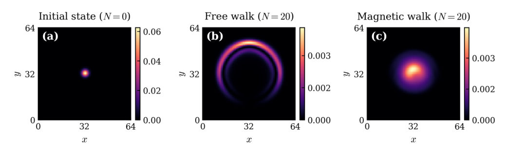 
Figure 1. Wavepacket probability densities for the discrete quantum walk. (a) Initial localized Gaussian state at t = 0. (b) Free walk evolution at N = 20 showing the macroscopic ballistic ring. (c) Magnetic walk evolution at N = 20 demonstrating spatial suppression and Landau-like confinement.

📷 Fig 2

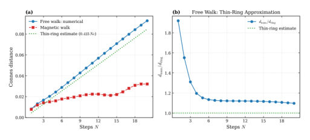 
Figure 2. (a) Numerical evaluation of the Connes distance for the free and magnetic quantum walks compared to their theoretical limits. (b) The numerical-to-asymptotic ratio R(N) for the free walk, which rapidly stabilizes near 1.12.

📷 Fig 3

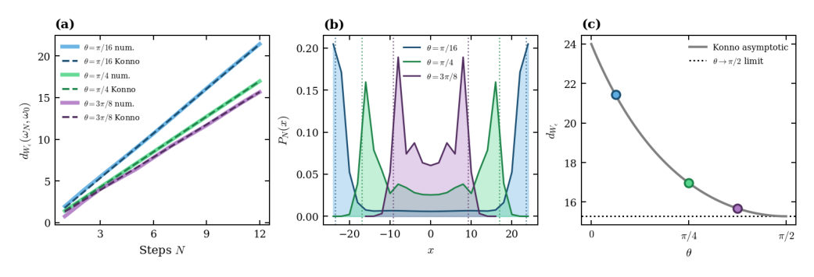 
Figure 3. Spread of the homogeneous 1+1D plastic quantum walk. (a) The numerical Connes distance plotted against walk steps N for different values of θ. (b) The spatial probability density PN(x) at N = 12 for different values of θ. The dotted vertical lines are the causal edges x = ±2Nϵ cos θ. (c) Connes distance as a function of the coin parameter θ at fixed N, comparing the numerical values (colored markers) with the analytical asymptotic prediction.

📷 Fig 4

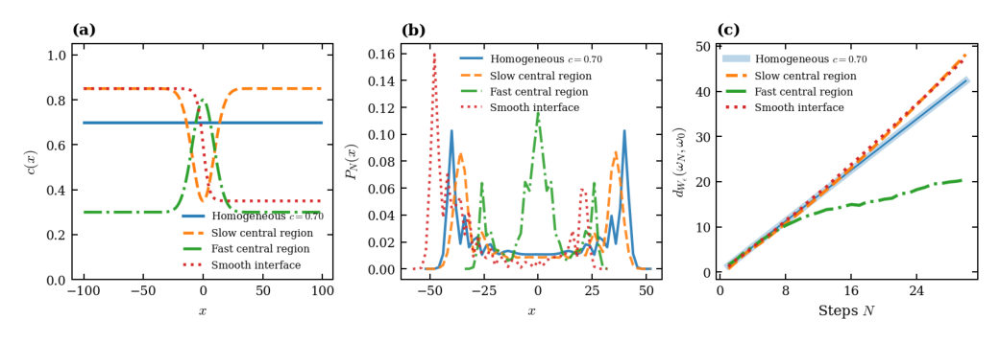 
Figure 4. Numerical evaluation of the Connes distance in an inhomogeneous spatial metric. (a) Spatial profiles of the speed of light c(x) = cos θ(x) (setting κ = 1), which encode the simulated metric g11. (b) Distorted wavepacket probability densities PN(x) at N = 30. (c) The numerical Connes distance plotted against walk steps N.

**Summary.** This work develops a discrete analogue of Connes' distance to measure the geometric spread of quantum walks on lattices. By applying this metric to 2+1D and 1+1D models, the authors demonstrate that the distance quantifies how magnetic fields constrain propagation and how the metric naturally adapts to spatially varying geometries.

**Why it may be interesting.** The application of Noncommutative Geometry tools like Connes' distance to quantum walks provides a powerful, mathematically rigorous way to quantify geometric effects (like magnetic fields or varying metrics) on quantum transport.

Detailed structure

**Main problem.** The paper investigates the geometric spread of discrete-time quantum walks by adapting Connes' distance formula from continuous spectral geometry to a discrete lattice setting.

**Main result.** The discrete Connes distance successfully measures wavepacket spread, showing that magnetic fields suppress long-time expansion, and the framework naturally captures inhomogeneous spatial metrics.

**Method.** The authors adapt the Connes distance, defined via spectral triples, by replacing the continuous Dirac operator with a discrete unitary step operator, analyzing the resulting commutator norms.

**Model / system.** The study focuses on discrete-time quantum walks (DTQWs) simulating systems ranging from free particles in (2+1)D space to walks on lattices simulating inhomogeneous metrics in (1+1)D.

**Key observables.** Connes Distance ($d_D$), dynamical spread of Gaussian wavepackets, and the commutator norm of the step operator.

**Important parameters / regimes.** Dimensionality (1+1D, 2+1D), magnetic field strength (gauge-induced phases), and the time step $\epsilon$.

**Assumptions / limitations.** The analysis assumes the convergence of the discrete step operator to the continuous Dirac Hamiltonian in the limit $\epsilon 	o 0$.

**Paper structure.** The paper progresses by first defining the discrete analogue of the Connes distance, then applying it to analyze the 2+1D case (free vs. magnetic field), and finally extending the framework to model inhomogeneous metrics in 1+1D using convex optimization.

Abstract

We study the geometric spread of discrete-time quantum walks using Connes' distance formula. We introduce its discrete analogue by adapting the continuous spectral metric to the lattice, with the Dirac operator replaced by the unitary step operator. Focusing first on a (2+1)-dimensional quantum walk, we evaluate the dynamical spread of localized wavepackets to compare propagation in free space against that under a uniform magnetic field. We find that while the free walk shows linear ballistic growth, gauge-induced phases in the magnetic walk constrain the admissible test operators, suppressing the long-time geometric expansion. Furthermore, we apply this discrete framework to a (1+1)-dimensional plastic quantum walk simulating an inhomogeneous spatial metric. The results demonstrate that the discrete Connes distance naturally captures the underlying spatially varying metric, providing a robust measure of the wavepacket's spread that adapts directly to the local simulated geometry.

[↑ back to top](#top)

### [Criticality enabled long-range order in a U(1)-symmetric spin-1 Heisenberg chain with biquadratic interactions](http://arxiv.org/abs/2609.31319v1)

**Authors:** Natalia Chepiga, Fabian H. L. Essler  
**Type:** theory · **Category:** strongly correlated electrons · **PDF:** <https://arxiv.org/pdf/2609.31319v1>  
**Analysis basis:** full PDF text, analyzed in chunks
**Topic relevance:** `analog quantum simulation` **1/5**

📷 Fig 1

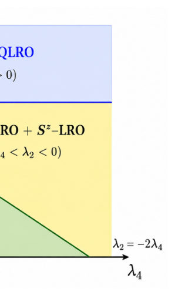 
Figure 1: Phase diagram of the field theory (4) according to Ref. [13].

📷 Fig 2

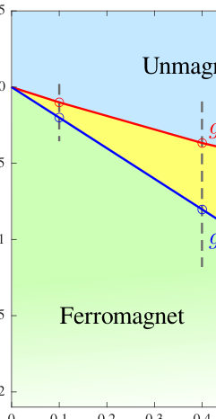 
Figure 2: Numerically obtained ground-state phase diagram of the ferromagnetic spin-1 chain with a single-ion anisotropy g1 and a biquadratic coupling g2. The Nahum transition between the unmagnetized and magnetized Luttinger liquids (red line, gc 2) is the main focus of this paper. The magnetized Luttinger-liquid phase is sep- arated from a saturated ferromagnetic phase by a Japaridze-Nersesyan-Pokrovsky- Talapov transition [17, 18] (blue line, gc 1). We probe the nature of the transitions numerically along vertical cuts (dashed gray lines) at fixed values of g2 = 0.1,0.4,1.

📷 Fig 3

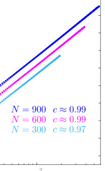 
Figure 3: Scaling of the bipartite entanglement entropy S(n, N) in the unmag- netized Luttinger-liquid phase at g1 = 0, g2 = 0.4 with OBC and system sizes N = 300,600,900. The central charge extracted by fitting the DMRG data (dots) to the Calabrese-Cardy formula in Eq.18 (lines) is in excellent agreement with the Luttinger-liquid prediction c = 1.

📷 Fig 4

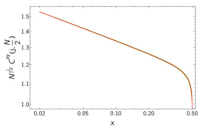 
Figure 4: Finite-size scaling collapse for longitudinal and transverse spin correla- tion functions in the unmagnetized Luttinger-liquid phase for g1 = 0, g2 = 0.4 and N = 600,900,1500. The Luttinger-liquid scaling functions with K = 5.98525 are shown as the red lines.

📷 Fig 5

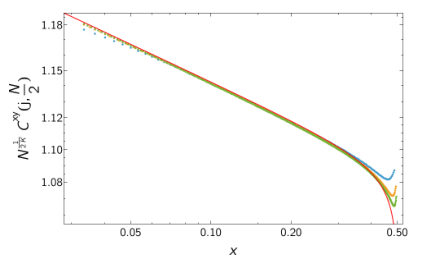 
Figure 5: Approximate scaling collapse in the unmagnetized Luttinger-liquid phase for g1 = −0.3, g2 = 0.4 and N = 300,600,900. The Luttinger-liquid scaling func- tions with fitted value K = 16.436 of the Luttinger parameter are shown as the red lines.

**Summary.** This paper analyzes a spin-1 Heisenberg chain model to study the emergence of true long-range order in a U(1) symmetric system. Using DMRG and CFT, the authors find numerical evidence supporting a critical point predicted by field theory. The key finding is that the divergence of the Luttinger parameter at this transition confirms the existence of long-range order, which is crucial for understanding quantum criticality in low dimensions.

**Why it may be interesting.** The work provides a detailed numerical confirmation of a non-trivial quantum critical point where symmetry breaking occurs in 1D, offering insights into how dimensionality and interaction terms can circumvent strict theorems.

Detailed structure

**Main problem.** The paper investigates the emergence of true long-range order in one-dimensional quantum spin chains with continuous U(1) symmetry, challenging standard theorems that forbid such order.

**Main result.** Numerical results confirm critical behavior predicted by Nahum's field theory, showing that the divergence of the Luttinger parameter and the critical exponent $\beta \approx 0.29$ support the existence of true long-range order at the quantum critical point.

**Method.** The study employs Density Matrix Renormalization Group (DMRG) simulations, combined with Conformal Field Theory (CFT) analysis, to calculate entanglement entropy and critical exponents.

**Model / system.** The system is an anisotropic spin-1 Heisenberg chain model incorporating biquadratic interactions, described by a specific Hamiltonian. The analysis maps the low-energy physics to a Luttinger liquid theory.

**Key observables.** Magnetization exponent ($\beta$), Luttinger parameter ($K$), central charge ($c$), and the dynamical critical exponent ($z_{eff}$).

**Important parameters / regimes.** The coupling constants $g_1$ and $g_2$ define the phase diagram, with critical points $g_c^1$ and $g_c^2$ marking transitions between different ordered phases.

**Assumptions / limitations.** The analysis relies on mapping the system to a continuum field theory (Luttinger liquid) and comparing numerical results against $\epsilon$-expansion predictions.

**Figures summary.** Figures illustrate the phase diagram, the scaling of entanglement entropy confirming $c=1$ for the Luttinger liquid, and the divergence of the Luttinger parameter $K$ near the critical point $g_c^2$.

**Paper structure.** The paper systematically analyzes the phase diagram, first confirming Luttinger liquid behavior via entanglement entropy, then determining critical exponents ($\beta$) and the dynamical exponent ($z$) by analyzing finite-size scaling of excitation energies and the Luttinger parameter divergence.

Abstract

In a recent paper Nahum argued on the basis of a renormalization-group analysis that, contrary to standard lore, ground states of 1D spin chains with short-range interactions can spontaneously break U(1) ``easy-plane'' spin rotation symmetry. True long-range order of $(S^x,S^y)$ arises at the phase transition between two quasi-long-range-ordered phases. Here we present detailed numerical results for an anisotropic spin-1 chain model. We find a magnetization exponent $β\approx0.29$, consistent with the $ε$-expansion prediction $β\approx0.28$, a divergence of the Luttinger parameter on approaching the transition from both sides with an exponent that we relate to Nahum's transition, and finite-size spectra consistent with a dynamical critical exponent $z\approx2$. Our results support the critical behavior predicted by Nahum's field theory.

[↑ back to top](#top)

### [Emergence of Nanoscale Modulation in Liquid Crystals as a Result of Short-Range Order Parameter Condensation](http://arxiv.org/abs/2609.30916v1)

**Authors:** E. I. Kats  
**Type:** theory · **Category:** statistical mechanics · **PDF:** <https://arxiv.org/pdf/2609.30916v1>  
**Analysis basis:** full PDF text, analyzed in chunks
**Topic relevance:** `Frenkel-Kontorova` **1/5**

📷 Fig 1

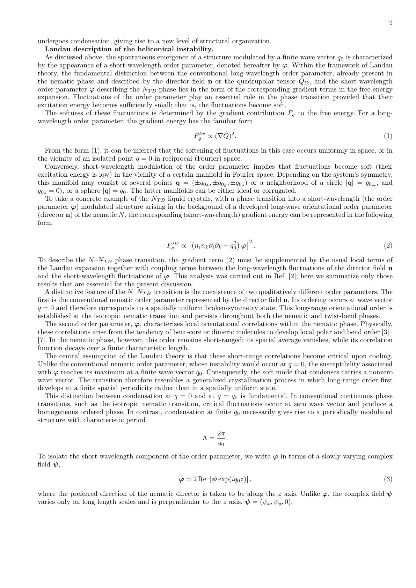 
Low-resolution page preview, page 2

📷 Fig 2

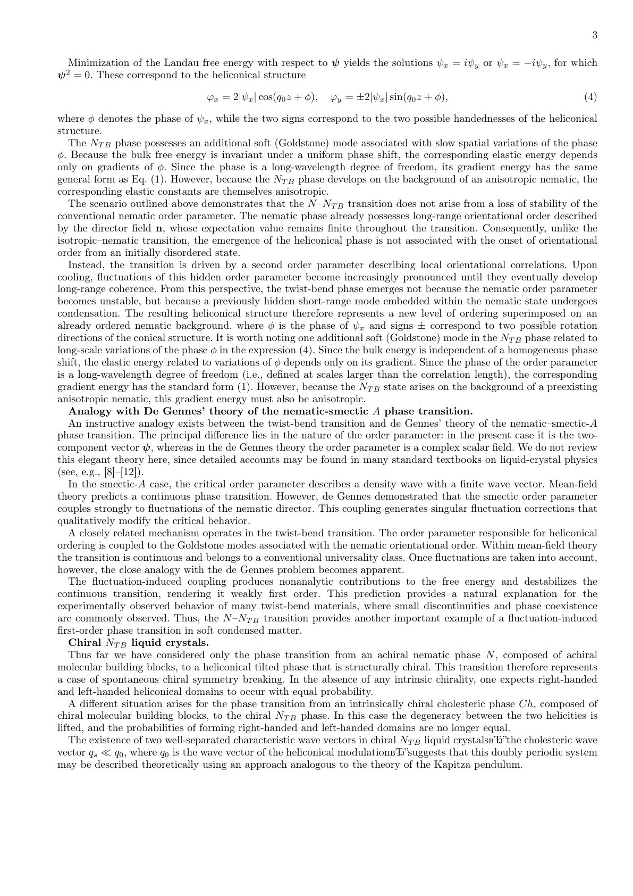 
Low-resolution page preview, page 3

📷 Fig 3

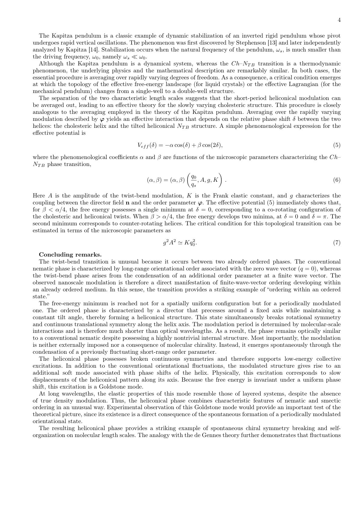 
Low-resolution page preview, page 4

📷 Fig 4

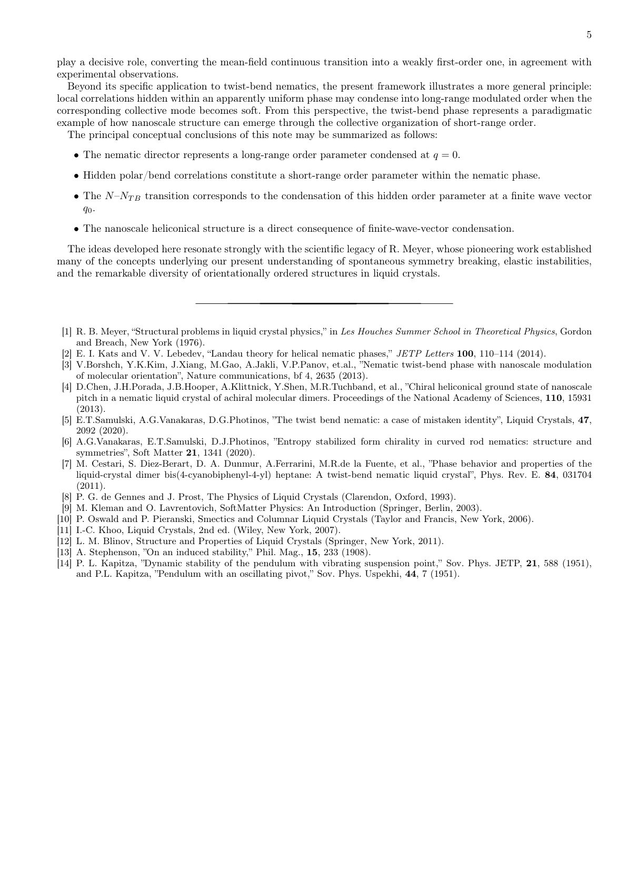 
Low-resolution page preview, page 5

**Summary.** This theoretical work explains the emergence of nanoscale heliconical structures in liquid crystals by proposing that the transition is driven by the condensation of a short-range orientational order parameter. Using Landau theory, the authors show this mechanism is analogous to other known phase transitions, predicting the resulting modulated phase and associated Goldstone modes.

**Why it may be interesting.** The concept of a secondary, hidden order parameter condensing at a finite wave vector to drive a phase transition is a general mechanism in condensed matter physics, relevant to understanding modulated phases in complex systems.

Detailed structure

**Main problem.** The paper addresses the spontaneous formation of nanoscale periodic structures, specifically the heliconical modulation, observed in the twist-bend nematic phase of liquid crystals.

**Main result.** This modulation arises from the condensation of a secondary, short-range orientational order parameter ($\varphi$) at a finite wave vector ($\mathbf{q}_0$), rather than a simple loss of conventional nematic order.

**Method.** The analysis employs a Landau phenomenological theory, drawing analogies to established phase transitions like the de Gennes nematic-smectic-A transition.

**Model / system.** The system is liquid crystals (bent-core/dimeric molecules) exhibiting the N-NTB transition. The theory models the free energy using two order parameters: the long-range nematic director ($\mathbf{n}$) and the short-range correlation parameter ($\varphi$).

**Key observables.** Heliconical modulation pitch ($\Lambda = 2\pi/q_0$), the secondary order parameter ($\varphi$), and the associated Goldstone mode.

**Important parameters / regimes.** The wave vector $\mathbf{q}_0$, and parameters governing the effective potential (e.g., $\alpha, eta$ in the chiral case).

**Assumptions / limitations.** The theory assumes the transition is driven by the condensation of $\varphi$ and predicts the transition is weakly first-order due to fluctuation effects.

**Paper structure.** The paper develops the Landau theory by first establishing the role of the secondary order parameter $\varphi$ condensing at $\mathbf{q}_0$. It then analyzes the resulting heliconical structure, drawing parallels to known phase transitions and discussing the implications of fluctuation corrections.

Abstract

The discovery of the twist-bend nematic phase in liquid crystals composed of bent-core and dimeric molecules has revealed an unexpected mechanism for the spontaneous formation of nanoscale periodic structures in soft condensed matter. Unlike conventional liquid-crystalline phases, the twist-bend phase exhibits a nanoscale heliconical modulation despite the absence of molecular chirality. In this note, dedicated to the late R. Meyer, we discuss a Landau phenomenological interpretation of this phenomenon. The central idea is that a short-range orientational order parameter undergoes condensation, giving rise to a heliconical structure characterized by a finite wave vector. We emphasize that the conventional nematic order is already long-ranged, whereas the additional order parameter describes local orientational correlations hidden within the nematic state. The resulting phase transition bears a close analogy to the de Gennes theory of the nematic--smectic-A transition. Fluctuation effects are expected to drive the transition weakly first order. The theory also predicts a new Goldstone mode associated with the spontaneously broken continuous symmetry of the heliconical state

[↑ back to top](#top)

### [Is the fractional Chern insulator-superconductor transition in twisted MoTe$_2$ direct?](http://arxiv.org/abs/2609.30368v1)

**Authors:** Tevž Lotrič, Steven H. Simon  
**Type:** both · **Category:** strongly correlated electrons · **PDF:** <https://arxiv.org/pdf/2609.30368v1>  
**Analysis basis:** full PDF text, analyzed in chunks
**Topic relevance:** `analog quantum simulation` **1/5**

📷 Fig 1

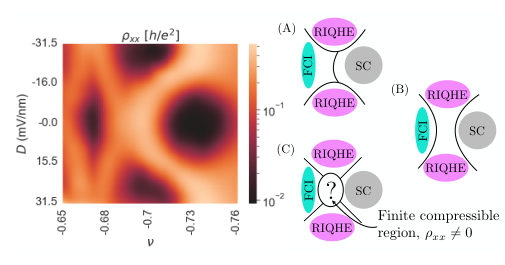 
Figure 1. Left: Replotted ρxx(ν, D) from Ref. [2], showing four minima, associated with the fractional Chern insulator (FCI), reentrant integer quantum Hall (RIQHE), and super- conducting (SC) phases at the lowest temperature achieved in experiment. The phases are separated by peaks in ρxx. Right: As temperature approaches zero, the resistive peaks are ex- pected to become narrower. We sketch three possible natural topologies of the zero-temperature quantum phase diagram. In the present work, we argue that scenario (B), where the RIQHE is always an intervening phase between the FCI and SC, naturally explains the observed transport signatures.

📷 Fig 2

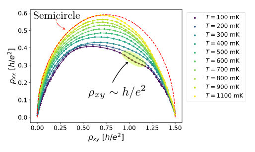 
Figure 2. The resistive peak in ρxx as a function of ρxy for various temperatures in the D = 0 cut of the phase diagram. The higher temperatures show a dependence reminiscent of a scaled semicircle in the (ρxy, ρxx) plane (red dashes), while at lower temperatures the peak in ρxx is suppressed, and a knee in the data appears near ρxy ∼h/e2. [Data from Ref. [2]]

📷 Fig 3

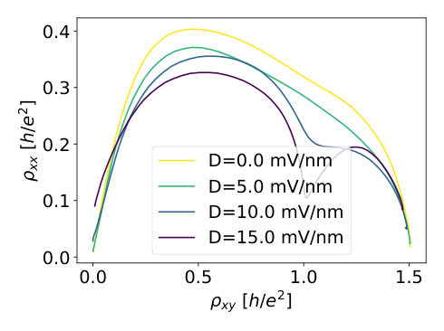 
Figure 4. The faint feature near ρxy = h/e2 in Fig. 2 is amplified by introducing a displacement field D. This sta- bilises the RIQHE phase, and the shape of the resistivity curve evolves towards the simulated behaviour in Fig. 3 for a better- developed RIQHE phase [Data from Ref. [2]].

📷 Fig 4

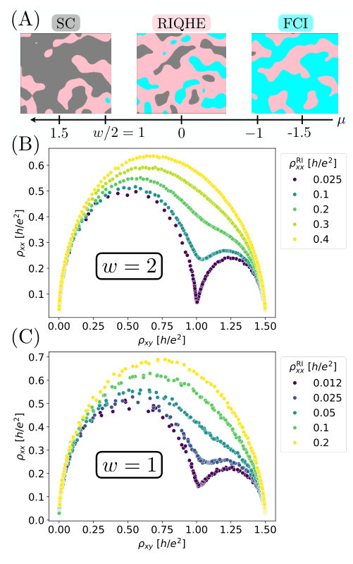 
Figure 3. Theoretical evolution of the effective resistivity as the background potential µ is varied for different values of ρRI xx. (A) Typical configurations evolve from being dominated by the FCI, to an intervening RIQHE phase, and finally into the SC phase. For all parameters, the RIQHE regions lie be- tween the FCI and SC phases (w = 2 for those plots). (B) The derived effective resistivity evolution. For a strong RIQHE (ρRI xx = ϵ), we see two semicircles, describing a pair of perco- lation transitions. For a weak RIQHE (ρRI xx = 0.4h/e2), the resistivity is similar to that expected for an FCI-SC semicir- cle, and intermediate values interpolate between the extremes. Note that all...

**Summary.** This paper re-examines transport data in twisted MoTe2 to study the transition between a Fractional Chern Insulator and a superconductor. By modeling the material as an inhomogeneous patchwork of three phases, the authors argue that the transition is mediated by a Re-entrant Integer Quantum Hall Effect (RIQHE) phase, predicting that the apparent direct transition should split into two distinct transitions at low temperatures.

**Why it may be interesting.** The work connects topological superconductivity (SC) with fractional quantum Hall physics (FCI) via a mechanism involving integer quantum Hall physics (RIQHE), which is highly relevant to understanding emergent topological phases in correlated materials.

Detailed structure

**Main problem.** The paper investigates the nature of the transition between a fractional Chern insulator (FCI) and a superconducting (SC) phase in twisted MoTe2, specifically determining if it is direct or mediated by an intermediate phase.

**Main result.** The analysis strongly suggests that the transition is not direct, but rather involves a Re-entrant Integer Quantum Hall Effect (RIQHE) phase acting as an intervening state at low temperatures.

**Method.** The authors re-analyzed experimental transport data and developed a theoretical model treating the sample as an inhomogeneous 'patchwork' of three distinct phases (FCI, RIQHE, SC).

**Model / system.** The physical system is twisted MoTe2, which exhibits FCI, SC, and RIQHE phases. The model uses a quenched disorder potential to assign local regions to one of these three phases, allowing for percolation-based calculations of transport properties.

**Key observables.** Longitudinal resistivity (rho_xx) and Hall resistivity (rho_xy) as functions of temperature and displacement field (D).

**Important parameters / regimes.** Filling fraction (nu), displacement field (D), and the disorder potential parameters ($\mu, w$).

**Assumptions / limitations.** The system is assumed to be inhomogeneous, composed of puddles of different topological phases. The low-temperature regime requires ignoring the local-conductivity approximation near the SC end.

**Figures summary.** Figure 1 sketches the possible zero-temperature topologies (A, B, C) for the transition. Figure 2 shows the resistive peak behavior, and Figure 3/4 illustrate the theoretical evolution of resistivity as the disorder mean ($\mu$) or displacement field ($D$) is varied.

**Paper structure.** The paper progresses by first analyzing the experimental data to identify the resistive peak structure, proposing the RIQHE as the missing link. It then develops a theoretical model based on quenched disorder to reproduce the observed temperature and field dependence, culminating in the prediction of a split transition.

Abstract

The observation of superconducting behaviour near a fractional Chern insulator in twisted MoTe$_2$ has sparked excitement about a possible direct "anyon superconducting" transition between a topologically ordered and a symmetry-broken phase. We carefully examine the experimentally measured transport data in the relevant region of the low-temperature tMoTe$_2$ phase diagram and propose a scenario where the nearby reentrant integer quantum Hall effect (RIQHE) acts as an intervening phase between the two. While the RIQHE is most prominent at large displacement fields, we propose that it extends to smaller fields at very low temperatures. Based on this picture, we model the sample as a patchwork of the three phases and show that such a model can explain the main qualitative features of the transport phase diagram, including its dependence on temperature and displacement field. The model predicts that at lower electronic temperatures the apparent FCI-SC transition at zero displacement field should split into two transitions separated by a narrow RIQHE region.

[↑ back to top](#top)

### [Quantum Diffusion Models for Medical Image Analysis](http://arxiv.org/abs/2609.31070v1)

**Authors:** Francesco Aldo Venturelli, Stefano Martina, Marco Parigi, Filippo Caruso, Alba Cervera-Lierta, Miguel A. González Ballester  
**Type:** both · **Category:** quantum information and computing · **PDF:** <https://arxiv.org/pdf/2609.31070v1>  
**Analysis basis:** full PDF text, analyzed in chunks
**Topic relevance:** `QC/QI experiment` **1/5**

📷 Fig 1

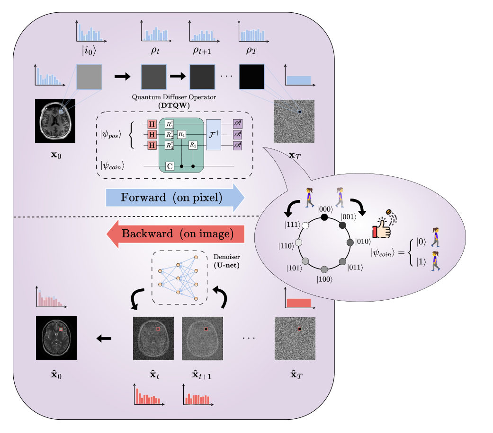 
FIG. 1. Hybrid quantum diffusion model. Given an initial image x0 at time t = 0, every single pixel is associated with a quantum walker whose corresponding color i0 is initially encoded in the quantum state |i0⟩. The depicted quantum circuit visualizes only one of the multiple time steps of the DTQW algorithm, where |ψpos⟩≡|i0⟩, |ψcoin⟩≡|0⟩, H are Hadamard gates, Rk are gates diag(1, exp(2πi/2k)) (and their controlled versions diag(1, 1, 1, exp(2πi/2k))), F† is the inverse Quantum Fourier Transform [57], and C is the coin operation (implemented in our case with a Hadamard gate). The green-shaded block is repeated for the needed time steps. To obtain the pixel values of xt at time t we...

📷 Fig 2

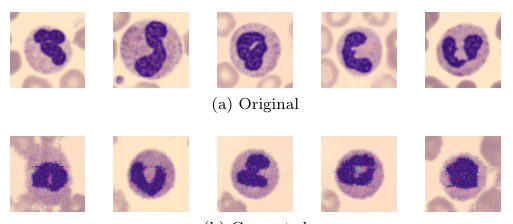 
FIG. 2. Five samples of the original set of BloodMNIST images Fig. 2a and five samples of images generated by our model Fig. 2b. Each image has a shape of 64 × 64 with 32 intensity levels for each RGB channel.

📷 Fig 3

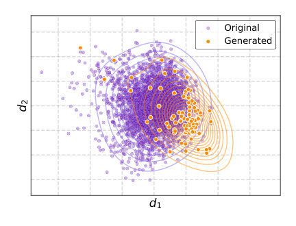 
FIG. 3. BloodMNIST distribution of the two largest eigen- values of the PCA for 3 000 original samples (purple) and 100 generated samples (orange). The contours represent the KDE.

📷 Fig 4

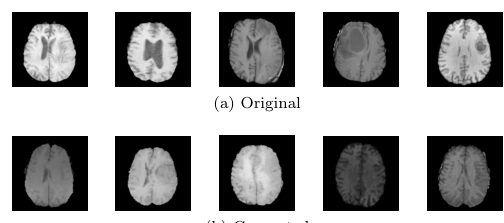 
FIG. 4. Five samples of the original set of BraTS2020 images Fig. 4a and five samples of the brain images generated by our model Fig. 4b. Each image has a shape of 190 × 190 with 64 intensity levels.

📷 Fig 5

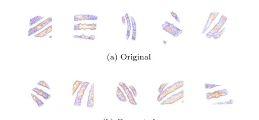 
FIG. 6. Volume rendering of 5 distinct samples from Fig. 6a the original dataset FractureMNIST3D and Fig. 6b generated volumes produced by the 3D U-Net. Renderings generated using 3D Slicer.

**Summary.** This paper proposes a novel Quantum Diffusion Model architecture for medical image analysis by combining a quantum walk for the forward noise process and a classical neural network for the reverse denoising step. By executing the quantum component on real quantum hardware, the authors demonstrate a scalable method capable of handling large medical datasets. The results show that this quantum-enhanced approach is highly competitive with state-of-the-art classical diffusion models.

**Why it may be interesting.** The integration of quantum walks (a quantum algorithm) directly into the generative modeling framework of diffusion models provides a novel computational pathway for simulating complex physical processes in imaging.

Detailed structure

**Main problem.** The paper addresses the application of Quantum Diffusion Models (QDMs) for the complex task of medical image analysis.

**Main result.** The proposed hybrid model, utilizing a quantum forward process and a classical backward process, shows competitive and promising results when benchmarked against classical diffusion models.

**Method.** It employs a hybrid approach where the forward diffusion dynamics are modeled using a Discrete-Time Quantum Walk (DTQW) on a real quantum device, while the reverse denoising step is handled by a classical U-Net model.

**Model / system.** The system involves modeling data corruption via a DTQW circuit on NISQ devices, which is then reversed by a U-Net trained to approximate the reverse conditional probabilities. The data tested includes grayscale, RGB 2D images, and 3D volumes from medical datasets.

**Key observables.** Kullback-Leibler (KL) divergence, Fréchet Inception Distance (FID), and Structural Similarity Index Measure (SSIM) are used to benchmark image generation quality.

**Important parameters / regimes.** The process is sensitive to the noise level ($eta_t$) and the specific quantum hardware capabilities (NISQ devices).

**Assumptions / limitations.** The method assumes that the quantum forward process can be effectively implemented on current noisy quantum hardware, and that the classical U-Net can accurately invert the quantum noise process.

**Figures summary.** Figures compare the diffusion process evolution (PDF tracking) across time steps for BloodMNIST, and show PCA projections comparing generated samples from the quantum model versus classical Markov chain counterparts.

**Paper structure.** The paper introduces the hybrid QDM framework, details the DTQW for the forward process, describes the U-Net for the classical backward process, and validates the approach by benchmarking performance across various medical datasets and topologies.

Abstract

Quantum Machine Learning is a novel field of research aimed at devising machine learning approaches exploiting principles of quantum mechanics, such as superposition, entanglement and interference. In this context, we present a scalable hybrid Quantum Diffusion Model, and evaluate its use for medical image analysis. Specifically, our method is based on a Discrete-Time Quantum Walk algorithm, executed on a real quantum device, to model the forward dynamics of the diffusion model. For the backward step of the diffusion model, we devise and evaluate a classical learning model, which is used to reversely denoise the data. In contrast with other existing attempts at applying quantum machine learning for image analysis tasks, severely limited by the size of existing quantum devices, our method allows to process real-world large size medical data. In particular, we present results on grayscale and RGB images, as well as 3D volumes of moderate sizes. We benchmark our results by reproducing an alternative classical counterpart model, based on diffusion models on discrete state spaces. By doing so, we compare the generation capabilities of both models in terms of three distinct state-of-the-art metrics in the field of image generation, showing the competitive, promising results of our approach.

[↑ back to top](#top)

### [Quantum Representation Selects Neutral Skyrmion Molecules](http://arxiv.org/abs/2609.31618v1)

**Authors:** Vishnu Jejjala  
**Type:** theory · **Category:** strongly correlated electrons · **PDF:** <https://arxiv.org/pdf/2609.31618v1>  
**Analysis basis:** full PDF text, analyzed in chunks
**Topic relevance:** `analog quantum simulation` **1/5**

📷 Fig 1

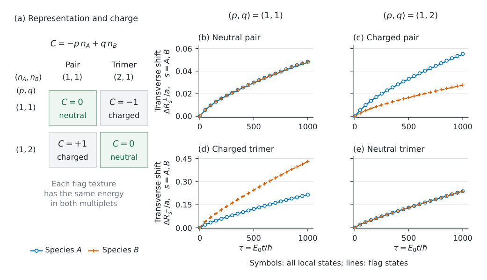 
FIG. 1. Changing the local multiplet exchanges the neutral composition. (a) The gyroscopic charges of species A and B are −p and +q; the same flag texture has the same energy in either multiplet. (b,c) A common stretched pair gives approximately equal species displacements in (1, 1) and a 2:1 ratio in (1, 2). (d,e) A common trimer preparation gives the reciprocal 1:2 and 1:1 responses. Symbols let all local amplitudes evolve; lines keep each site in a flag state. ∆R⊥ s is the displacement of the center of species s = A, B, measured perpendicular to the preparation axis. For full states, the winding centers use the highest and lowest eigenlines of the local SU(3) moment [9]. For a trimer,...

📷 Fig 2

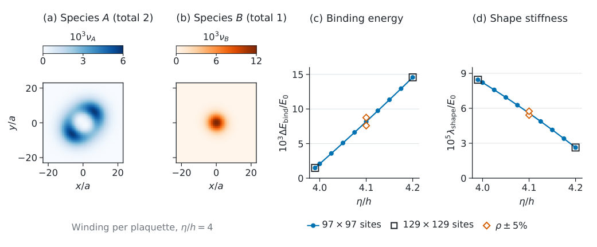 
FIG. 2. The neutral trimer remains bound while becoming easier to deform. (a,b) Winding per plaquette at η/h = 4, with the sign of the core winding taken as positive: νA = −qv and νB = −qw. The complete sums are two and one; the color scales are independent. Two A lobes at ±(5.73, 5.73)a flank the central B lobe, forming a diagonal molecule. (c) Binding energy ∆Ebind = EA2 + EB −EA2B relative to separately optimized fragments. (d) Shape stiffness λshape, the lowest energy curvature for a change of shape, excluding translation and rotation from the plot. Both remain positive across ten sampled attraction strengths. Squares increase the lattice size; diamonds change the exchange stiffness ρ...

📷 Fig 3

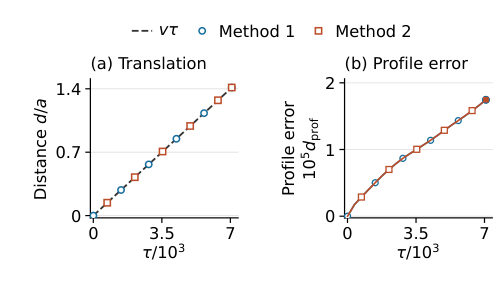 
FIG. 3. A prepared neutral trimer translates with little de- formation. (a) Displacement in lattice units, d/a, follows vτ, with dimensionless speed v = 2 × 10−4 and time τ = E0t/ℏ; the physical speed is vE0a/ℏ. (b) The global profile error dprof compares the evolved state with a translated initial profile; filled endpoints use an exact lattice shift by (1, −1)a. The two methods are specified in the Supplemental Material. The total travel, 1.4a, is about 9% of the 16a distance between the outer A lobes.

**Summary.** This paper explores how the quantum state available at each site in an SU(3) magnet determines the required composition of a stable, neutral skyrmion molecule. By analyzing the cancellation of gyroscopic forces, the authors show that the local quantum representation dictates whether the molecule is a pair or a trimer. The findings confirm the stability and predictable motion of these neutral structures, offering insights into topological matter in strongly correlated systems.

**Why it may be interesting.** The work connects topological defects (skyrmions) to underlying quantum symmetries (local representations), providing a mechanism for controlling macroscopic properties (motion) via microscopic quantum constraints, which is relevant to emergent phenomena in correlated materials.

Detailed structure

**Main problem.** The study investigates how the local quantum state (representation) in a magnet dictates the composition of a 'gyroscopically neutral' skyrmion molecule, which is necessary to cancel the inherent sideways gyroscopic force experienced by individual skyrmions.

**Main result.** The local quantum representation selects a specific neutral composition (e.g., pair vs. trimer), and the resulting neutral molecules remain bound and locally stable even when the local quantum amplitudes are allowed to relax away from the classical order parameter.

**Method.** The research employs mean-field calculations on a lattice model, analyzing energy terms, binding energies, and the gyroscopic charge to confirm stability and composition selection.

**Model / system.** The system is modeled on a square lattice with SU(3) degrees of freedom per site, describing skyrmion molecules. The physics is governed by an effective Hamiltonian containing exchange, stiffness, and anisotropy terms.

**Key observables.** Gyroscopic Charge (C) for neutrality, Binding Energy (Delta E_bind), Shape Stiffness (lambda_shape), and Transverse Shift (Delta R_perp).

**Important parameters / regimes.** The local quantum multiplet (e.g., (1, 1) vs. (1, 2)), and the ratio of attraction to anisotropy strengths (eta/h).

**Assumptions / limitations.** The analysis relies on mean-field calculations, and the results are limited to short-distance dynamics; rigorous proof of global stability or long-distance transport is not achieved.

**Figures summary.** Figures illustrate the change in neutral composition based on the local multiplet, confirm the binding and shape stiffness of the neutral trimer across varying interaction strengths, and show the molecule's stable translation over short distances.

**Paper structure.** The paper progresses by establishing the physical problem (gyroscopic force cancellation), detailing the theoretical framework using SU(3) models and local quantum states, presenting calculations comparing different molecular compositions, and concluding with stability checks and dynamic simulations.

Abstract

Skyrmions experience a sideways gyroscopic force when they move. Bound molecules can cancel this force; we call them gyroscopically neutral. We show that the quantum states available on each site of a magnet select the composition needed for cancellation. In two models of $SU(3)$ magnetism, this composition changes from a pair to a trimer. Both models assign exactly the same energy to every configuration of their common classical order parameter, isolating the effect of the local quantum states. Neutral molecules can also unwind when additional local states are allowed. Mean field calculations nevertheless find both compositions bound and locally stable, with the neutral trimer surviving sampled interaction changes. Comparing their motion reveals the changed cancellation rule, and prepared neutral molecules translate over short distances with little deformation.

[↑ back to top](#top)

### [Sipser-Spielman meets Dijkgraaf-Witten: non-Abelian qLDPC codes via twisted sheaf gauge theory and almost-constant-overhead magic state fountain](http://arxiv.org/abs/2609.31541v1)

**Authors:** Guanyu Zhu, Shi Jie Samuel Tan, Ryohei Kobayashi, Po-Shen Hsin  
**Type:** theory · **Category:** quantum information and computing · **PDF:** <https://arxiv.org/pdf/2609.31541v1>  
**Analysis basis:** full PDF text, analyzed in chunks
**Topic relevance:** `analog quantum simulation` **1/5**

📷 Fig 1

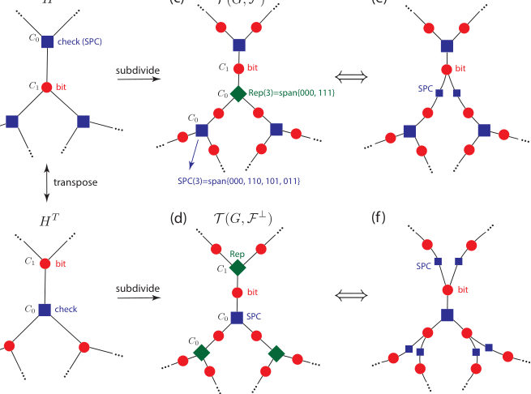 
FIG. 1. Subdivision of an arbitrary classical code into a sheaf code. (a) The Tanner graph of C = ker H, drawn as a hypergraph Gh: each check is a vertex vh (blue square) carrying a single-parity-check (SPC) constraint on C0, and each bit is a hyperedge on C1 (red dot) joining the checks in which it participates. (b) The transposed code C⊤= ker H⊤on the same hypergraph, with the roles of bits (hyperedges) and checks (vertices) exchanged. (c) The subdivided sheaf code T (G, F): every hyperedge of (a) is split into wc ordinary edges meeting at a new vertex v′

📷 Fig 2

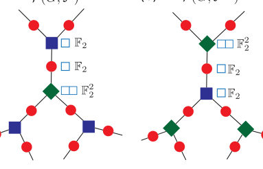 
FIG. 2. Stalk dimensions of the subdivided sheaf (blue boxes), for (a) T (G, F) and (b) T (G, F⊥) on the same graph G as in Fig. 1(c, d). Every edge carries the scalar stalk F(e) = F2, holding the single bit on that edge. A vertex carrying the single-parity-check code (blue square) imposes one constraint and hence has the scalar stalk F2, whereas a degree-3 vertex carrying the repetition code (green diamond) imposes two indepen- dent constraints and hence has the two-dimensional stalk F2 2; in general dim F(v) = m(v) is the number of rows of the local parity-check matrix Hv. Passing from F to F⊥

📷 Fig 3

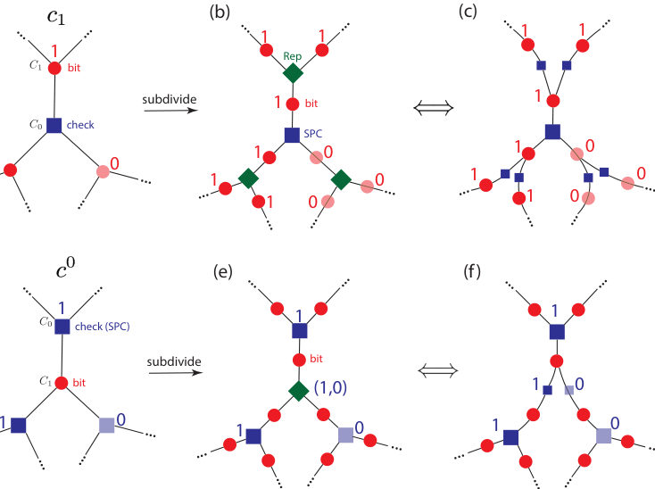 
FIG. 3. Codewords c1 ∈ker(H) and c0 ∈ker(H⊤) being subdivided. (a) A codeword c1 of the original code, with bit values 1 and 0 on the hyperedges (red dots). (b) Its image under subdivision: the repetition local code at each new vertex (green diamond) forces all wc edges of a hyperedge to carry the common value of that bit, and the SPC constraint at each original check vertex (blue square) is the original parity check; the map is the isomorphism Φ of Proposition II.4. (c) An equivalent redrawing of (b). (d)–(f) The same for a codeword c0 of the transposed code C⊤= ker H⊤, which subdivides on the same graph with the local codes interchanged. Here the 0-cochain is stalk- valued: the value on...

📷 Fig 4

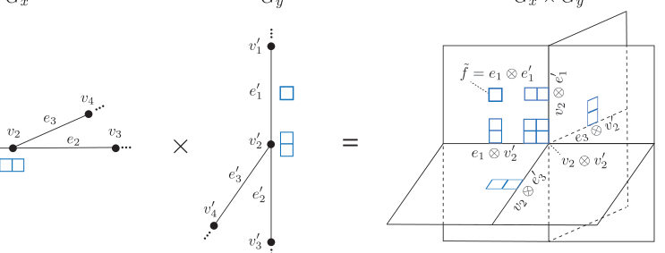 
FIG. 4. Hypergraph product of two sheaf codes. (a) The two factor graphs Gx (vertices v1, . . . , v4, edges e1, e2, e3) and Gy (vertices v′ 1, . . . , v′ 4, edges e′ 1, e′ 2, e′ 3), each carrying a sheaf whose stalk dimensions are indicated by the blue boxes: F2 on an edge and Fm(v) 2 on a vertex. (b) The product complex L = Gx × Gy, a branched square complex whose cells are products of cells of the factors: faces ˜f = e ⊗e′, horizontal edges e ⊗v′, vertical edges v ⊗e′, and vertices v ⊗v′. The stalks multiply accordingly [Eq. (39)]: a face carries the scalar F2 ⊗F2 ∼= F2, an edge the vector space Fm(v′) 2 or Fm(v) 2 , and a vertex the rank-two tensor Fm(v) 2 ⊗Fm(v′) 2 , drawn as a grid of...

📷 Fig 5

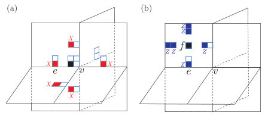 
FIG. 5. The two stabilizer types of the untwisted sheaf code on a branched square complex, in which the edge e is shared by three faces. Filled boxes are stalk compo- nents; the qubits sit on the edge stalks. (a) The X-type generator Av,s of Eq. (44) is labelled by a vertex v to- gether with a component s of its stalk (black box at v), and applies X to those components of the incident edge stalks that are selected by the co-restriction Fve(⃗es) (red boxes). It is the row (v, s) of HX = (d0)T . (b) The Z-type generator Bf of Eq. (47) is labelled by a face f alone, with no vector index, because the stalk on a top cell is the scalar F(f) ∼= F2 (black box on f); it applies Z to the edge stalk...

**Summary.** This work merges concepts from coding theory (Sipser-Spielman) and topological field theory (Dijkgraaf-Witten) using sheaf cohomology to define novel non-Abelian qLDPC codes. These codes possess non-Abelian D4 topological order and are shown to enable the efficient preparation of magic states, crucial for scaling quantum computation.

**Why it may be interesting.** It provides a deep mathematical connection between topological order, algebraic coding theory, and quantum resource generation (magic states), which is fundamental to fault-tolerant quantum computation.

Detailed structure

**Main problem.** The paper unifies Sipser-Spielman codes and Dijkgraaf-Witten twisted gauge theories to construct a new framework for non-Abelian quantum low-density parity-check (qLDPC) codes.

**Main result.** This framework yields qLDPC codes with non-Abelian D4 topological order and provides a method to realize a magic state fountain achieving an almost-constant magic rate.

**Method.** The construction relies on sheaf cohomology to define the code by gauging a specific 0-form sub-complex symmetry within a sheaf complex structure.

**Model / system.** The model involves quantum error-correcting codes (qLDPC) exhibiting non-Abelian D4 topological order, analyzed using sheaf gauge theory on complex structures.

**Key observables.** The magic state rate (aiming for almost-constant overhead) and the topological order (non-Abelian D4).

**Important parameters / regimes.** Code parameters like $[[n, \Theta(n), \Omega(n^{1/2})]]$ and the field structure $\mathbb{F}_q$.

**Assumptions / limitations.** The work assumes the validity of using sheaf cohomology to bridge coding theory and topological field theory concepts.

**Figures summary.** Figures illustrate the subdivision process of codes, the structure of transversal CZ gates labeled by sheaf 0-cocycles, and the path integral representation as a slab of twisted theory.

**Paper structure.** The paper progresses by first unifying the theoretical concepts, then detailing the construction of the qLDPC code via gauging symmetries, and finally applying this to the realization of magic state fountains and achieving improved magic state rates.

Abstract

Sipser-Spielman codes and Dijkgraaf-Witten twisted gauge theories are among the most profound ideas in the last few decades in the areas of computer science and mathematical physics respectively. This work unifies them in the same framework using the language of sheaf cohomology, and produces a new framework of twisted sheaf guage theories describing a class of quantum low-density parity-check (qLDPC) codes with non-Abelian $D_4$ topological order. The corresponding twisted qLDPC code can be obtained from gauging a new type of 0-form sub-complex $\mathbb{Z}_2^3$ symmetry from a qLDPC code defined on a sheaf complex, and can be interpreted as a topological defect network of non-Abelain $D_4$ patches glued together with proper gapped interfaces. As an application, one can use this to realize a \textit{magic state fountain} via the gauging measurement of the addressable logical CZ gates as 0-form subcomplex symmetries in a 2D hypergraph-product on a sheaf complex. This includes a scheme of subdividing an arbitrary constant-rate 2D hypergraph-product code with parameter $[[n,Θ(n), Ω(n^{1/2})]]$ into a quantum sheaf code which allows preparation of $Θ(n^{1/2})$ in parallel, equivalent to the recent geometric construction using the code-to-manifold mapping in (arXiv:2601.06736). Moreover, using the recent sheaf complex and algebraic code constructions by Golowich-Tamo-Zhu (arXiv:2609.27801) with parameter $[[n,Θ(n^{1-ε}), Ω(n^{(1-ε)/2})]]$ for arbitrary small $ε$, one can prepare $Θ(n^{1-ε})$ CZ magic states in parallel and hence achieve an almost-constant magic rate.

[↑ back to top](#top)

### [Thermodynamics of the $q$-deformed Kittel--Shore model for spin-1 particles](http://arxiv.org/abs/2609.31094v1)

**Authors:** V. Mariscal, J. J. Relancio  
**Type:** theory · **Category:** statistical mechanics · **PDF:** <https://arxiv.org/pdf/2609.31094v1>  
**Analysis basis:** full PDF text, analyzed in chunks
**Topic relevance:** `analog quantum simulation` **1/5**

📷 Fig 1

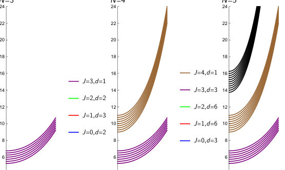 
Figure 3: Energy levels (in the units |I|) for N = 2, 3, 4, 5 spins j = 1 respectively coupled antiferromagnetically as a function of the deformation parameter η displaced from the ground level with an external magnetic field (h = 0.25).

📷 Fig 2

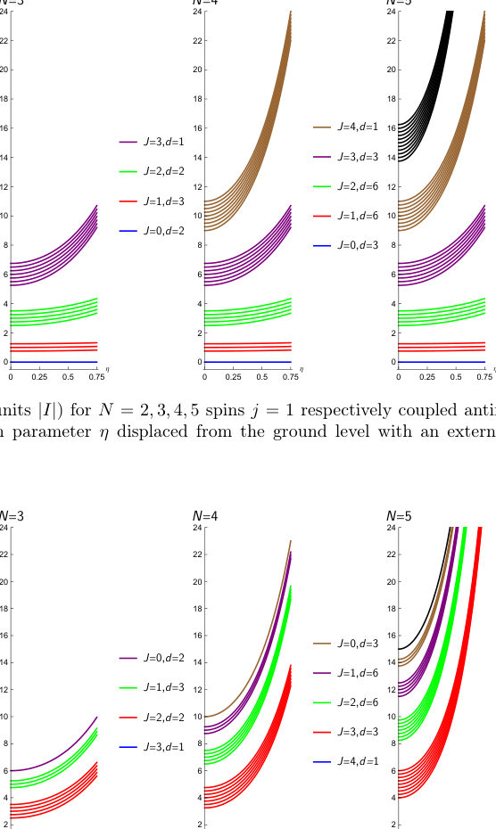 
Figure 4: Energy levels (in the units |I|) for N = 2, 3, 4, 5 spins j = 1 respectively coupled ferromagnetically as a function of the deformation parameter η displaced from the ground level with an external magnetic field (h = 0.25).

📷 Fig 3

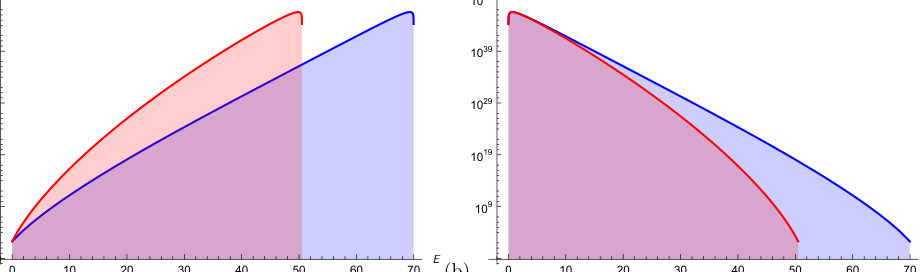 
Figure 6: Density of energy levels for N = 100 as a function of the parameter η = 0 (red) and η = 0.02 (blue) (a) for the ferromagnetic case and (b) for the antiferromagnetic case.

📷 Fig 4

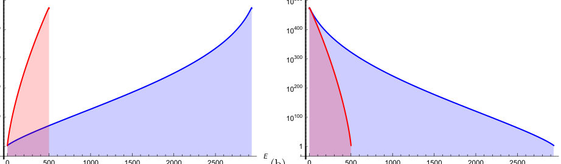 
Figure 7: Density of energy levels for N = 1000 as a function of the parameter η = 0 (red) and η = 0.005 (blue) (a) for the ferromagnetic case and (b) for the antiferromagnetic case.

📷 Fig 5

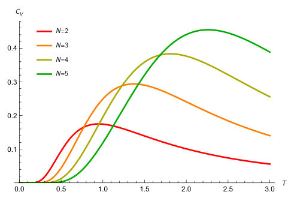 
Figure 8: Specific heat as a function of temperature for values of the number of particles N = 2 red), 3 (orange), 4 (yellow) and 5 (green) for the ferromagnetic case.

**Summary.** This work studies the thermodynamics of the Kittel–Shore model for spin-1 systems after applying a $q$-deformation derived from quantum algebras. The authors calculate key observables like specific heat and susceptibility, finding that the deformation significantly alters the system's energy spectrum and phase transition behavior compared to the standard model. This research connects quantum group theory to the statistical mechanics of quantum magnetic materials.

**Why it may be interesting.** The study provides a concrete example of how algebraic deformations (quantum groups) can modify fundamental thermodynamic quantities in condensed matter models, offering insights into how microscopic symmetries affect macroscopic phase transitions.

Detailed structure

**Main problem.** The paper investigates how quantum algebra deformation affects the thermodynamic properties and phase transitions of the Kittel–Shore model for spin-1 particles.

**Main result.** The $q$-deformation significantly alters the thermodynamic functions, causing shifts in energy profiles and breaking the universal scaling behavior observed in the undeformed model.

**Method.** The analysis involves calculating the partition function and deriving thermodynamic observables (specific heat, susceptibility, magnetization) for the $q$-deformed Hamiltonian.

**Model / system.** The system is the Kittel–Shore (KS) model applied to spin-1 particles, whose Hamiltonian is deformed using the $U_q(\mathfrak{su}(2))$ quantum algebra.

**Key observables.** Specific heat ($C_V$), magnetic susceptibility ($\chi$), magnetization ($M$), and the Curie temperature.

**Important parameters / regimes.** Deformation parameter ($q$ or $\eta$), spin value ($j=1$), interaction constant ($I$), and external magnetic field ($h$).

**Assumptions / limitations.** The analysis compares results in the thermodynamic limit ($N 	o \infty$) against finite-size scaling results, and uses low-temperature approximations in some parts.

**Figures summary.** Figures illustrate the energy levels and degeneracies for $j=1$ as a function of the deformation parameter $\eta$, and show the density of energy levels $D(E)$ for various system sizes.

**Paper structure.** The paper systematically analyzes the model by first presenting the undeformed case, then examining the ferromagnetic and antiferromagnetic regimes separately, and finally conducting finite-size scaling analyses for both.

Abstract

Quantum algebras ($q$-algebras) have been used in the literature to deform spin-chain models. In particular, in previous works by the present authors, the Kittel--Shore Hamiltonian was deformed using $\mathfrak{su}_q(2)$ algebra. The deformed Hamiltonian was presented for a general spin, and the thermodynamic properties were studied for spin-1/2 particles. In this paper, we focus on the $q$-deformation of the Kittel--Shore model for spin-1 systems. We analyse the impact of this deformation on the thermodynamic properties and phase transitions of the system as a function of the deformation parameter $q$. Specifically, we study the specific heat, magnetic susceptibility, and magnetisation, including a detailed analysis of the Curie temperature characterising the ferromagnetic phase. Furthermore, a finite-size scaling analysis is conducted for both the ferromagnetic and antiferromagnetic cases. Results are systematically compared with those of the undeformed model to reveal the physical effects of the $q$-deformation.

[↑ back to top](#top)

### [Three-uniform edge-ordered hypergraph quantum states: entanglement and its relation to hypergraph properties](http://arxiv.org/abs/2609.30399v1)

**Authors:** N. A. Susulovska, Kh. P. Gnatenko  
**Type:** theory · **Category:** quantum information and computing · **PDF:** <https://arxiv.org/pdf/2609.30399v1>  
**Analysis basis:** full PDF text, analyzed in chunks
**Topic relevance:** `analog quantum simulation` **1/5**

📷 Fig 1

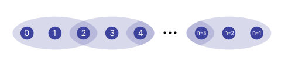 
Figure 1: A 3-uniform chain hypergraph with single-vertex overlap between adjacent hyperedges representing multiqubit states of structure (6), α = 1.

📷 Fig 2

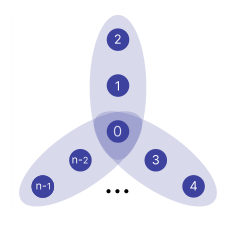 
Figure 3: A 3-uniform star hypergraph with single-vertex overlap between adjacent hyperedges representing multiqubit states of structure (7).

📷 Fig 3

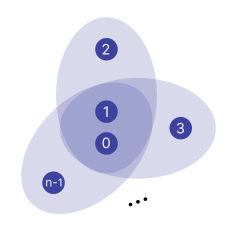 
Figure 4: A 3-uniform star hypergraph with double-vertex overlap between adjacent hyperedges representing multiqubit states of structure (8).

📷 Fig 4

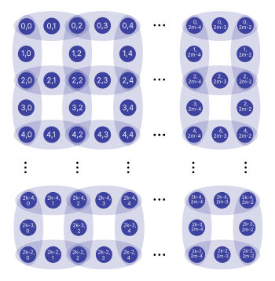 
Figure 5: A 3-uniform hypergraph corresponding to a regular lattice with k rows and m columns, k ≥2, m ≥2, and representing multiqubit states of structure (9).

📷 Fig 5

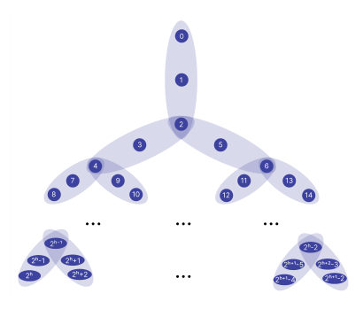 
Figure 6: 3-uniform hypergraph corresponding to a binary tree oh height h and representing multiqubit states of structure (10).

**Summary.** This paper develops a method to encode 3-uniform hypergraphs into multiqubit quantum states and quantifies the entanglement within these states. It establishes a direct, quantitative link showing that the entanglement of a qubit depends explicitly on the local structure and weights of the hyperedges connected to that vertex. This opens a new avenue for studying graph theory using quantum computation.

**Why it may be interesting.** This work provides a concrete, mathematically rigorous method to map abstract graph theory properties (hypergraph structure) directly onto measurable quantum information properties (entanglement), which is highly relevant for quantum simulation and resource theory.

Detailed structure

**Main problem.** The paper investigates the relationship between the entanglement properties of multiqubit quantum states and the structural characteristics of the underlying 3-uniform edge-ordered hypergraphs.

**Main result.** A direct framework is established connecting the entanglement of individual qubits to the local structure (like vertex degree) and the specific weights of the incident hyperedges.

**Method.** The authors derive an analytical expression for the geometric measure of entanglement and apply it to specific hypergraph structures, comparing analytical results with quantum simulation measurements.

**Model / system.** The system involves multiqubit quantum states $|\psi_{HG}
angle$ encoded from 3-uniform edge-ordered weighted hypergraphs, prepared using parameterized RZZY entangling operators.

**Key observables.** Geometric measure of entanglement ($E$), expectation values of Pauli observables ($\langle\sigma_x^l
angle, \langle\sigma_y^l
angle, \langle\sigma_z^l
angle$), and the dependence of entanglement on vertex degree.

**Important parameters / regimes.** Hyperedge weights ($	heta_{ijk}$), vertex degree, and the specific connectivity patterns of the hypergraphs (e.g., chain, star, lattice).

**Assumptions / limitations.** The analysis focuses specifically on 3-uniform hypergraphs, and the state preparation relies on a specific choice of interaction type ($R_{ZZY}$) to ensure a one-to-one mapping.

**Figures summary.** Figures illustrate the structure of various 3-uniform hypergraphs (chain, star, lattice, binary tree) and show the calculated geometric measure of entanglement for specific vertices within these structures.

**Paper structure.** The paper first proposes the encoding method and derives the entanglement measure. It then analyzes specific, well-known hypergraph topologies (chain, star, lattice, binary tree) by calculating the entanglement for individual qubits based on the incident hyperedge weights. Finally, it confirms consistency between analytical and simulated results.

Abstract

The encoding of 3-uniform edge-ordered weighted hypergraphs into multiqubit quantum states is proposed. We derive an analytical expression for the geometric measure of entanglement of hypergraph quantum states and establish its relation to hypergraph properties. The results establish a direct connection between the local structure of hypergraphs, hyperedge weights, and the entanglement of the corresponding quantum states. For equally weighted hypergraphs, it is shown that the entanglement depends explicitly on the vertex degree. The dependence of entanglement on hypergraph parameters is studied analytically and using quantum computing. Hypergraph states associated with chain, star, regular lattice, and binary-tree hypergraphs are examined, and their entanglement is quantified using quantum computing. These results open up the possibility of studying hypergraph properties with quantum programming.

[↑ back to top](#top)

## Other papers (22)

*Papers from primary archives without highlighted authors or any topic match. Click to expand.*

Show other papers

### [A Unified Spin-Fermion Framework for Magnetic Diversity in Chromium Monopnictides](http://arxiv.org/abs/2609.31616v1)

**Authors:** Ruoshi Jiang, Bartomeu Monserrat  
**Type:** theory · **Category:** strongly correlated electrons · **PDF:** <https://arxiv.org/pdf/2609.31616v1>  
**Analysis basis:** full PDF text, analyzed in chunks

📷 Fig 1

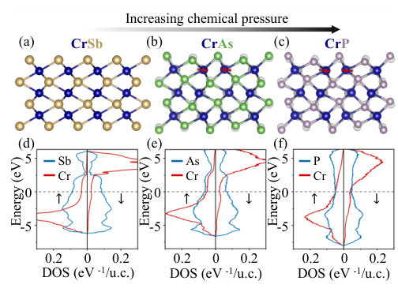 
FIG. 1. Chemical-pressure-driven structural and electronic evolution in CrX (X= Sb, As, P). (a–c) NiAs-type CrSb and MnP-type CrAs and CrP viewed along the same crystallographic direction. Grey frameworks in (b)(c) indicate the idealized NiAs parent lattice; red arrows mark Cr displacements away from the high-symmetry po- sitions. (d–f) Corresponding spin-resolved local densities of states in the non-collinear Curie-paramagnetic state. Blue and red curves show pnictogen and Cr contributions, respectively. The Fermi level is set to zero.

📷 Fig 2

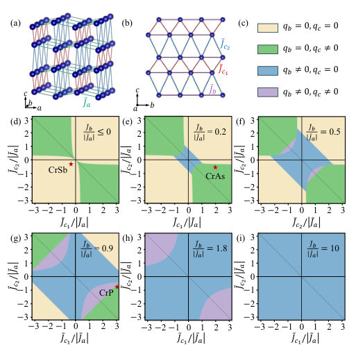 
FIG. 2. Exchange network and classical ground-state phase dia- grams of the effective four-sublattice Heisenberg model. (a) Three- dimensional Cr exchange network, with ˜Ja, ˜Jb, ˜Jc1, and ˜Jc2 shown in green, purple, red, and blue, respectively. (b) Projection onto the bc plane, highlighting triangular motifs formed by ˜Jb, ˜Jc1, and ˜Jc2. (c) Color key classifying the ground states according to whether the components qb and qc are zero or finite. (d)–(i) Phase diagrams in the ˜Jc1/| ˜Ja|, ˜Jc2/| ˜Ja| plane for the indicated ˜Jb/| ˜Ja|. Red stars indi- cate the estimated exchange ratios for CrSb, CrAs, and CrP.

**Summary.** This work develops a unified spin-fermion framework to explain the magnetic diversity observed across the $	ext{CrX}$ monopnictides as the pnictogen element changes. By analyzing the evolution of exchange interactions under chemical pressure, the authors demonstrate that a common electronic structure can yield vastly different magnetic ground states, ranging from altermagnetism to incommensurate magnetism.

**Why it may be interesting.** The concept of using a unified spin-fermion framework to explain magnetic transitions driven by chemical substitution is highly relevant to understanding correlated electron behavior in novel materials.

Detailed structure

**Main problem.** The paper investigates how chemical pressure drives the dramatic evolution of magnetic ordering in the Chromium monopnictides ($	ext{CrX}$) series.

**Main result.** It establishes chemical-pressure-driven exchange reconstruction as a general mechanism capable of generating contrasting magnetic phases from a common spin-fermion electronic structure.

**Method.** The study combines first-principles calculations (DFT+U) with the construction of a unified spin-fermion model and a four-sublattice Heisenberg model.

**Model / system.** The system is the $	ext{CrX}$ series ($	ext{X}=	ext{Sb}, 	ext{As}, 	ext{P}$), modeled using a spin-fermion Hamiltonian that describes localized $	ext{Cr}$ moments coupled to itinerant pnictogen carriers.

**Key observables.** Magnetic ordering vector ($\mathbf{q}$), effective $	ext{Cr}$ spin amplitude ($	ilde{S}$), and exchange parameters ($	ilde{J}_{ij}$).

**Important parameters / regimes.** Chemical pressure (substitution from $	ext{Sb}$ to $	ext{P}$), crystal structure type ($	ext{NiAs}$-type to distorted $	ext{MnP}$-type), and the Hubbard $U$ parameter.

**Assumptions / limitations.** The framework assumes a common spin-fermion electronic structure underlies the magnetic diversity, and that the magnetic behavior can be mapped onto a generalized Heisenberg model.

**Figures summary.** Figures illustrate the structural and electronic evolution across the $	ext{CrX}$ series, showing spin-resolved LDOS changes corresponding to different magnetic states.

**Paper structure.** The paper systematically analyzes the structural changes, derives the effective exchange interactions using an A-type AFM reference, and maps the resulting magnetic phase diagram to explain the observed transition from altermagnetism to helimagnetism.

Abstract

Isoelectronic compounds are generally expected to exhibit related electronic, structural, and magnetic behavior. Chromium monopnictides CrX (X= Sb, As, P), however, display a striking evolution from high-temperature altermagnetism in NiAs-type CrSb, through double-helical antiferromagnetism in MnP-type CrAs, to the absence of resolved long-range magnetic order in MnP-type CrP. Here, combining first-principles calculations in the non-collinear Curie-paramagnetic state, structural analysis, magnetic phase-diagram calculations, and exchange-parameter extraction, we establish a unified microscopic framework for this evolution. All three compounds share a formal high-spin $d^5$ configuration, nominally Cr$^{1+}$, coupled to itinerant states of predominantly pnictogen character. From Sb to P, chemical pressure enhances ligand itinerancy and drives the structural evolution from the high-symmetry NiAs lattice to increasingly distorted MnP-type networks. The accompanying reconstruction of competing Cr-Cr exchanges favors A-type antiferromagnetism in CrSb and double-helical order in CrAs, while placing CrP near a frustrated regime with closely competing magnetic tendencies. Our results establish chemical-pressure-driven exchange reconstruction as a general mechanism through which a common spin-fermion electronic structure can generate contrasting magnetic phases in strongly correlated materials.

[↑ back to top](#top)

### [Active-Space Quantum Simulation of N$_2$ Hydrogenation at a Ru Single-Atom Site on Ru(0001)](http://arxiv.org/abs/2609.30958v1)

**Authors:** Geet Gupta  
**Type:** theory · **Category:** strongly correlated electrons · **PDF:** <https://arxiv.org/pdf/2609.30958v1>  
**Analysis basis:** full PDF text, analyzed in chunks

📷 Fig 1

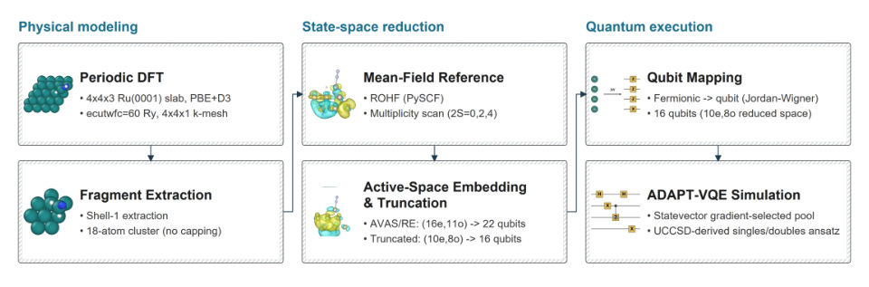 
Figure 1: Computational workflow. The six stages are grouped into three parts: physical mod- eling (periodic DFT relaxation, fragment extraction), state-space reduction (mean-field reference, active-space embedding and natural-orbital truncation), and quantum execution (fermionic-to-qubit mapping, ADAPT-VQE).

📷 Fig 2

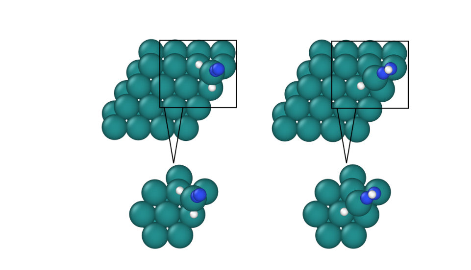 
Figure 2: The two configurations considered throughout this work, reactant (left) vs. product (right) in each row. Top: the converged periodic Ru(0001) slab region around the active site. Bottom: the finite, non-periodic 18-atom Ru14N2H2 fragment extracted. Teal: Ru; blue: N; white: H.

📷 Fig 3

 
Figure 3: Natural-orbital active-space truncation error vs. retained active-orbital count nactive, relative to the full (16e,11o) CASCI reference, for both reaction states (log scale). Open markers at nactive = 4 denote the rejected reduction. The error drops sharply between nactive = 7 and 8, the adopted value (dotted line): by about three orders of magnitude for the reactant and about one order of magnitude for the product.

📷 Fig 4

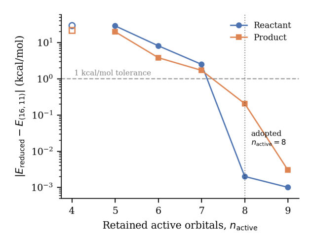 
Fig. 4 shows the full natural-occupation spectrum behind this sharp drop (Table S6, SI): for both

📷 Fig 5

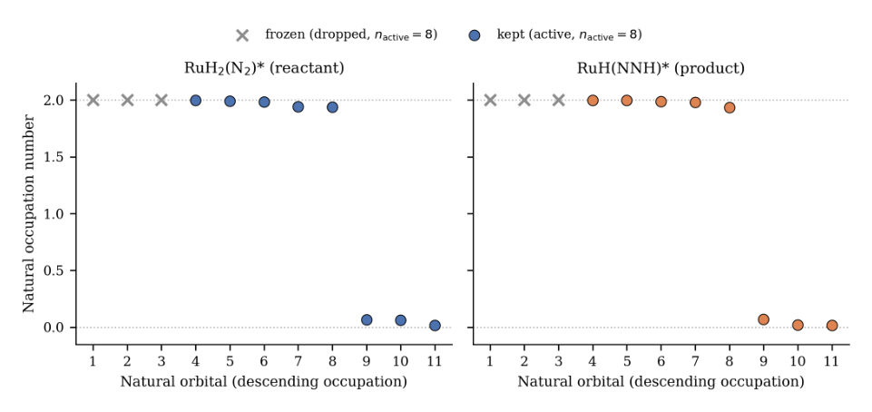 
Figure 4: Natural-orbital occupation-number spectrum of the (16e,11o) CASCI active space, both reaction states, sorted in descending order. The three frozen orbitals (crosses) sit within 2×10−4 of a fully doubly occupied integer occupation for both states; the eight retained orbitals (filled markers, nactive = 8) span a continuous range down to ∼0.02, reflecting fractional/multireference character.

**Summary.** This work develops a comprehensive computational workflow to simulate the difficult $	ext{N}_2$ hydrogenation reaction at a single-atom catalyst site. It combines periodic DFT with active-space quantum simulation, reducing the problem to a manageable qubit system solved by ADAPT-VQE. The methodology successfully quantifies the reaction energy while rigorously testing the limitations of various correlation correction schemes.

**Why it may be interesting.** The integration of quantum computing methods (ADAPT-VQE) with high-level quantum chemistry (NEVPT2/DSRG-MRPT2) to solve strongly correlated chemical problems is highly relevant for simulating complex molecular dynamics.

Detailed structure

**Main problem.** The primary challenge is selectively activating the extremely strong triple bond of dinitrogen ($	ext{N}_2$) under mild conditions for hydrogenation catalysis.

**Main result.** The proposed workflow successfully maps the complex electronic structure problem onto a manageable qubit system, achieving high accuracy for the reaction energy ($	ext{error} = 0.2 	ext{ kcal/mol}$) using a reduced active space.

**Method.** The study combines periodic DFT calculations with advanced quantum chemistry techniques, specifically using Active Atomic Valence Space (AVAS) selection, natural-orbital truncation, and solving the resulting Hamiltonian via ADAPT-VQE.

**Model / system.** The system modeled is the hydrogenation reaction ($	ext{RuH}_2(	ext{N}_2)^* 
ightarrow 	ext{RuH}(	ext{NNH})^*$) occurring at an isolated single-atom $	ext{Ru}$ site embedded on a $	ext{Ru}(0001)$ surface.

**Key observables.** Reaction energy ($\Delta E_{	ext{hydrog}}$), CASCI state energies, and convergence metrics for quantum simulation.

**Important parameters / regimes.** The active space size is reduced from 22 qubits (AVAS) to 16 qubits (truncated), and correlation corrections are tested using NEVPT2 and DSRG-MRPT2.

**Assumptions / limitations.** The methodology relies on extracting a finite, non-periodic fragment from the periodic DFT structure, and the accuracy of the final result depends on the chosen active space reduction and correlation treatment.

**Figures summary.** Figures summarize the multi-step workflow: DFT relaxation $
ightarrow$ fragment extraction $
ightarrow$ active-space reduction $
ightarrow$ quantum execution using ADAPT-VQE.

**Paper structure.** The paper details a computational pipeline: first, periodic DFT relaxation is performed; second, a finite cluster is extracted; third, the active space is rigorously selected and truncated; finally, the reduced Hamiltonian is mapped to qubits and solved using ADAPT-VQE, supplemented by higher-level correlation corrections.

Abstract

Selective activation of dinitrogen (N$_2$) under mild conditions is difficult: N$\equiv$N is one of the strongest bonds in chemistry, and most heterogeneous catalysts capable of breaking it require high temperature and pressure. Atomically dispersed transition-metal sites offer a computationally tractable route to studying the strongly correlated intermediates involved. We connect periodic DFT calculations with correlated active-space calculations on a finite, non-periodic surface fragment, demonstrating the workflow for the hydrogenation step RuH$_2$(N$_2$)* $\rightarrow$ RuH(NNH)* at an isolated Ru$_1$ site on Ru(0001). A first-shell fragment is extracted from the periodically relaxed structure, an active space is selected with Active Atomic Valence Space (AVAS) around the Ru-N/N-H bond reorganization, and natural-orbital truncation reduces its cost while retaining the relevant correlated degrees of freedom. The reduced Hamiltonian is mapped to qubits with the Jordan-Wigner transformation and solved with the adaptive derivative-assembled pseudo-Trotter variational quantum eigensolver (ADAPT-VQE). Dynamic correlation beyond the active space is examined with strongly contracted NEVPT2 and DSRG-MRPT2. AVAS gives a 22-qubit active space, which natural-orbital truncation compresses to 16 qubits, reproducing the untruncated CASCI state energies to within 0.21 kcal/mol (reaction-energy error 0.2 kcal/mol). Statevector ADAPT-VQE in this reduced space converges for both reaction states under a fixed pool-gradient stopping criterion. NEVPT2 yields anomalously large, state-imbalanced corrections for the finite Ru fragment, while DSRG-MRPT2 retains an endothermic reaction energy at its default flow parameter, although its magnitude depends strongly on that parameter.

[↑ back to top](#top)

### [Classification of Generalised Triorthogonal Codes through Length 54](http://arxiv.org/abs/2609.30860v1)

**Authors:** Adam Wills, Shubham P. Jain, Shraddha Singh  
**Type:** theory · **Category:** quantum information and computing · **PDF:** <https://arxiv.org/pdf/2609.30860v1>  
**Analysis basis:** full PDF text, analyzed in chunks

📷 Fig 1

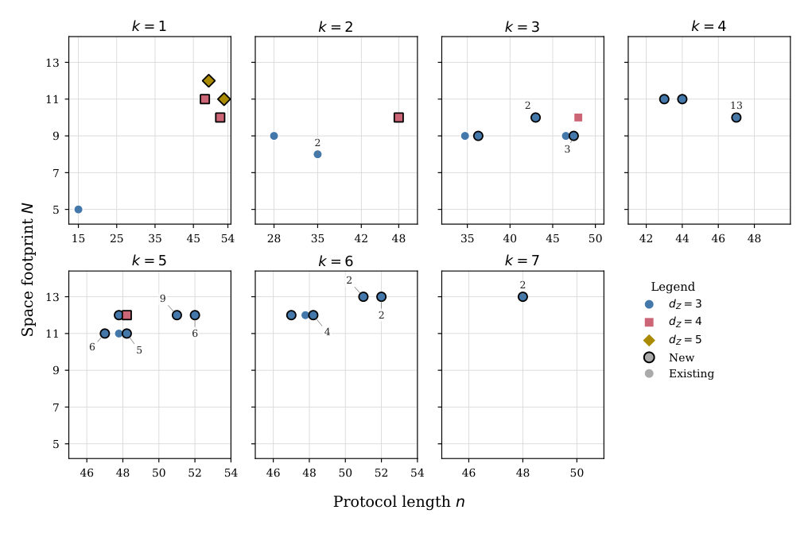 
FIG. 1. Complete classification of generalised triorthogonal protocols with n ≤54 and dZ ≥3, under CNOT + S output equivalence, and discarding those that are worse than another protocol with the same output in their distance, input |T⟩count, and space footprint N. Each panel fixes the output qubit count k. We do not state the outputted k-qubit magic state class here; full details are given in Table II. In general, the outputted magic state is a different class to |T⟩⊗k. Solid black outlines mark new points; unoutlined markers denote existing points, including those obtained by simple operations on existing protocols. Numerical labels count multiple protocols with inequivalent outputs that...

**Summary.** This paper provides a comprehensive, systematic classification of generalized triorthogonal codes used in magic state distillation for fault-tolerant quantum computing. By extending the search space up to input lengths of 54, the authors identified 74 optimal protocols, many of which are novel. The methodology relies on advanced algebraic techniques applied to stabilizer codes, providing a crucial resource for quantum information theory.

**Why it may be interesting.** This work provides a rigorous, exhaustive catalog of fundamental building blocks (magic states) required for scaling up quantum computation, directly impacting the feasibility analysis of fault-tolerant quantum algorithms.

Detailed structure

**Main problem.** The paper aims to systematically classify all optimal generalized triorthogonal codes used for magic state distillation (MSD) in fault-tolerant quantum computation.

**Main result.** The authors found 74 optimal generalized triorthogonal protocols for input lengths up to 54, with 65 of these protocols being new to the literature.

**Method.** The classification extends prior work using a directional derivative method applied to the structure of unital triorthogonal spaces, allowing the search space to be expanded from length 38 to 54.

**Model / system.** The context is fault-tolerant quantum computation, specifically the preparation of high-fidelity non-Clifford resources (T states) via Magic State Distillation. The protocols are mathematically modeled using generalized triorthogonal matrices defining a quantum CSS code structure.

**Key observables.** The key observables are the protocol's length ($n$), space footprint ($N$), and the distance ($d_Z$), which determine the protocol's efficiency and robustness.

**Important parameters / regimes.** The primary parameters are the input length $n$ (up to 54), the output qubit count $k$, and the distance $d_Z \ge 3$. Optimality is defined based on Pareto criteria across $(n, N)$ for a given $k$.

**Assumptions / limitations.** The classification assumes the protocol is run on logical qubits supporting fault-tolerant stabilizer operations, and the equivalence relation for magic states is defined up to CNOT and S gates.

**Figures summary.** Figure 1 illustrates the complete Pareto frontier mapping protocols based on output qubit count $k$. Table II provides the comprehensive catalogue of the 74 optimal protocols found.

**Paper structure.** The paper first establishes the problem in MSD, then details the mathematical framework using triorthogonal spaces and directional derivatives to extend the classification boundary. The bulk of the work involves the recursive, computationally intensive classification process, culminating in the presentation of the final catalogue of 74 optimal protocols.

Abstract

Magic state distillation is a widely considered primitive in fault-tolerant quantum computation for the preparation of high-fidelity non-Clifford resources. The most commonly considered class of such protocols are generalised triorthogonal codes; these distil $n$ noisy input $\mathrm{T}$ states into purified third-level diagonal magic states. Extensive prior work has searched this space of protocols, often using heuristic methods that do not guarantee optimality. Existing classification work is limited to protocols distilling $k$ output $\mathrm{T}$ states with $n+k\leq 38$ (Nezami and Haah, Phys. Rev. A 106, 012437 (2022)). In this work, we significantly expand this classification to all protocols with lengths $n\leq 54$. We restrict to distance $d\geq 3$ to keep the classification to a sensible size, and because efficient searches are well understood at distance $2$ (Singh et al., arXiv:2606.28518). Moreover, our results are complementary to synthillation (Campbell and Howard, Phys. Rev. A 95, 022316 (2017)), which can distil third-level states from $\mathrm{T}$ states, but only at distance $2$. Under optimality in terms of input count, space footprint, and distance for a given output, we find $74$ optimal generalised triorthogonal protocols in our range, $65$ of which are new to the literature. To achieve our classification, we extend the classification of unital triorthogonal spaces of Nezami and Haah from length $38$ to $54$ using a directional derivative method. Using these as the stabiliser spaces, we add logical rows that satisfy the triorthogonality constraints to create full protocols.

[↑ back to top](#top)

### [Complexity Barriers to State Preparation in Quantum Approximate Optimization](http://arxiv.org/abs/2609.31520v1)

**Authors:** Stuart Hadfield  
**Type:** theory · **Category:** quantum information and computing · **PDF:** <https://arxiv.org/pdf/2609.31520v1>  
**Analysis basis:** full PDF text, analyzed in chunks

📷 Fig 1

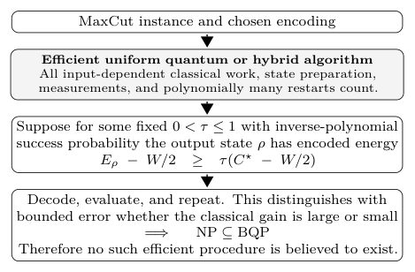 
FIG. 1. Complexity consequences of worst-case state prepara- tion performance guarantees for MaxCut-Gain. Here W is the total edge weight, C⋆−W/2 is the optimal classical gain, and Eρ −W/2 is the encoded energy gain of the prepared quantum state. All input-dependent preprocessing, training, prepara- tion, measurement, feedback, and repetition count toward the cost. Local decoding and polynomial repetition would decide the NP-hard MaxCut-Gain gap in bounded-error quantum polynomial time, implying NP ⊆BQP, which is believed false.

📷 Fig 2

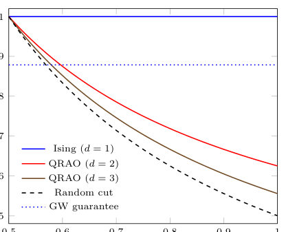 
FIG. 2. Gain and ordinary approximation ratio for the stan- dard Ising (d = 1) and compressed QRAO (d = 2, 3) encod- ings. For fixed 0 &lt; τ ≤1, the encoded energy condition Eρ −W/2 ≥τ(C⋆−W/2) relates the centered energy of the quantum state to the optimal classical gain of the problem instance and yields decoded gain ratio at least τ/d2. The solid curves show the resulting conditional bounds on R at the classical-threshold target τ = 1, equivalent to Eρ ≥C⋆. They show consequences of that target, not guarantees achieved by known efficient algorithms. The dashed curve is the uni- form classical random cut ratio, and the dotted line is the Goemans-Williamson guarantee. As c approaches 1/2, the...

**Summary.** This paper establishes a strong complexity barrier for quantum approximate optimization algorithms applied to problems like MaxCut. By relating the problem's inherent classical hardness gap to quantum state preparation, the authors show that achieving a constant positive gain over random guessing would imply NP is solvable by quantum computers (NP in BQP). This work refines how performance must be measured in quantum optimization benchmarking.

**Why it may be interesting.** The work provides deep theoretical insights into the fundamental computational barriers inherent in quantum optimization, which is crucial for understanding the limits of quantum simulation and computation.

Detailed structure

**Main problem.** The paper addresses the theoretical limitations of quantum algorithms for approximate optimization problems, specifically distinguishing between simple approximation ratios and performance gains above random chance.

**Main result.** It proves that achieving a fixed positive fraction of the optimal classical gain above random for MaxCut implies that NP is contained in BQP, a result believed to be impossible.

**Method.** The analysis leverages the classical MaxCut-Gain hardness gap and relates it to the quantum expectation value of the Hamiltonian in various encoding schemes (standard vs. QRAO compression).

**Model / system.** The model is the MaxCut problem, analyzed using quantum Hamiltonians ($H_d$) and density operators ($
ho$) for both standard and compressed Quantum Random Access Optimization (QRAO) encodings.

**Key observables.** Performance gain above random assignments (MaxCut-Gain), the decoded mean gain, and the ratio of encoded energy gain to decoded mean gain.

**Important parameters / regimes.** The analysis considers relative quantum relaxation excess $\Theta(1/n)$ and the multiplicative factor $1/d^2$ relating encoded to decoded gain.

**Assumptions / limitations.** The result assumes that the quantum or hybrid procedure is uniformly efficient across all aspects (state preparation, measurement, classical processing).

**Figures summary.** Figure 1 illustrates the complexity consequence: achieving a state preparation guarantee implies NP is contained in BQP.

**Paper structure.** The paper first establishes the performance metrics (ordinary ratio vs. gain) and then uses the MaxCut-Gain hardness gap to derive a state-preparation barrier that survives QRAO compression, concluding with constructions showing the barrier's persistence.

Abstract

For many important optimization problems we are restricted to approximate solutions in practice due to computational complexity. Distinct from the exact optimization setting, approximate optimization admits performance measures beyond whether the optimum is found, with different tradeoffs and complexity. For MaxCut, a near-unity (ordinary) approximation ratio can coexist with near-zero improvement (gain) over a random cut. For the standard encoding, the unconditional classical MaxCut-Gain hardness gap implies that \emph{any uniformly efficient quantum or hybrid procedure recovering a fixed positive fraction of the optimal classical gain on every input, with at least inverse-polynomial success probability, would place} NP \emph{in} BQP. Such a procedure is therefore believed impossible under standard assumptions. We broadly address where our worst-case barriers do or do not apply across the quantum algorithm landscape. We prove that the barrier survives quantum random access optimization (QRAO) compression and applies between the classical and relaxed optimal values. For every input, a product state attains the classical optimum. Thus the barrier to reaching the classical threshold does not arise from a need for entanglement. For $d\in\{2,3\}$ variables per qubit, the known decoder transfers encoded energy gain to decoded mean gain by the exact factor $1/d^2$. Combining this identity with MaxCut-Gain hardness gives an operational preparation barrier for QRAO. We also construct hard $n$-qubit families with relative quantum relaxation excess $Θ(1/n)$, while the maximally mixed state has energy approximation ratio $1-Θ(1/n)$, zero encoded energy gain, and hence zero decoded mean gain. Our results separate the effects of relaxation tightness and energy approximation from operational accessibility, motivating more comprehensive accounting in benchmarking and performance assessment.

[↑ back to top](#top)

### [Complexity drives the symmetry breaking of temperature fluctuations](http://arxiv.org/abs/2609.31521v1)

**Authors:** D. Rosales Herrera, M. Y. Gallegos Ruiz, A. Fernández Téllez, J. R. Alvarado García, J. E. Ramírez  
**Type:** theory · **Category:** statistical mechanics · **PDF:** <https://arxiv.org/pdf/2609.31521v1>  
**Analysis basis:** full PDF text, analyzed in chunks

📷 Fig 1

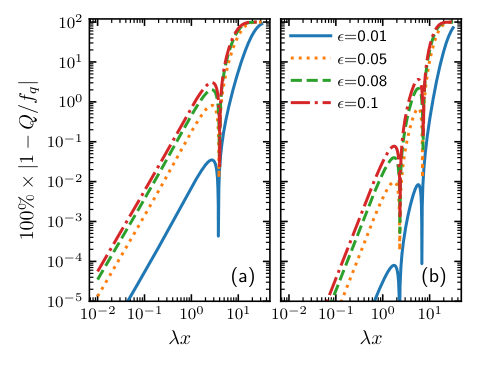 
Figure 1. Absolute percentage difference between the qua- sithermal and the q-exponential distributions as a function of λx, for (a) m = 1 and (b) m = 2. The distinct lines repre- sent different values of the nonextensivity parameter: ϵ = 0.01 (solid), ϵ = 0.05 (dashed), ϵ = 0.08 (dash-dotted), and ϵ = 0.1 (dotted).

📷 Fig 2

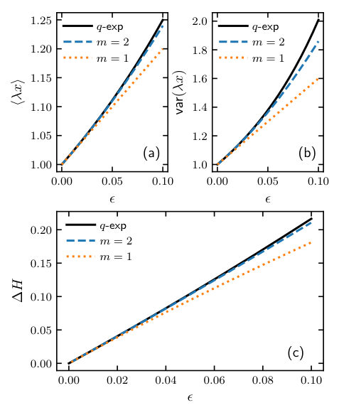 
Figure 2. (a) Mean value, (b) variance, and (c) entropy pro- duction of the quasithermal distributions for m = 1 (dotted lines), m = 2 (dashed lines), and the q-exponential function (solid lines) as a function of ϵ.

📷 Fig 3

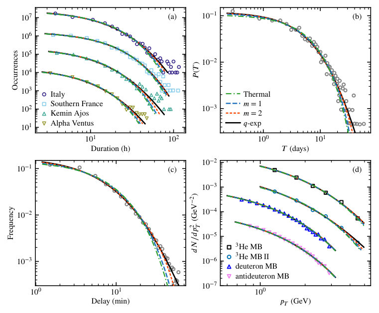 
Figure 3. Fit of the q-exponential and the quasithermal distributions to the analyzed data sets: (a) Duration of low-wind persis- tence periods at four European locations [23]. (b) Interevent time distribution of the declustered Greek seismicity catalog [24]. (c) Train delay distribution on the Reading-London Paddington route [25]. (d) Transverse momentum spectra of light ions produced in pp collisions at different center of mass energies reported by the ALICE-LHC Collaboration: (anti)deuterons at √s = 7 TeV [26] and (anti)3He at √s = 13 TeV [27]. In all panels, the solid line corresponds to the q-exponential distribution, the dashed and dotted lines correspond to the quasithermal fits up...

📷 Fig 4

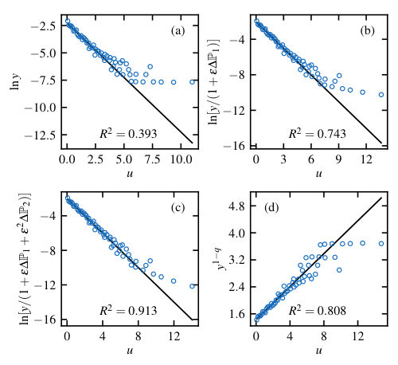 
Figure 4. Data linearization of the Greek seismicity interevent time for the models: (a) the thermal distribution, the qua- sithermal distribution at (b) first and (c) second truncation order, and (d) the q-exponential distribution. In all panels, the solid line corresponds to the linearized models. In the “y”-axis labels of panels (b) and (c), ∆Pn = Pn −Pn−1.

📷 Fig 5

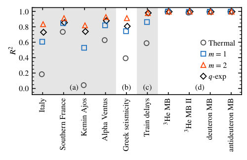 
Figure 5. Coefficient of determination (R2) for each fitted model (markers) for all the analyzed data sets: (a) wind power persistence, (b) Greek seismicity, (c) train delays, and (d) light-nuclei production.

**Summary.** This theoretical work analyzes systems exhibiting nonextensive behavior using the $q$-exponential distribution. By deriving the statistics of temperature fluctuations, the authors demonstrate that the emergence of nonextensivity is mathematically linked to the symmetry breaking of these temperature fluctuations. This provides a generalized statistical tool for analyzing complex, non-equilibrium physical processes.

**Why it may be interesting.** The connection drawn between nonextensive statistical mechanics (Tsallis statistics) and fundamental thermodynamic concepts like temperature fluctuations provides a generalized framework for analyzing non-equilibrium dynamics in complex physical systems.

Detailed structure

**Main problem.** The paper investigates the relationship between the emergence of nonextensivity, characterized by the Tsallis $q$-exponential distribution, and the symmetry breaking observed in temperature fluctuations.

**Main result.** Nonextensivity is shown to be an emergent phenomenon directly associated with the symmetry breaking of temperature fluctuations, transitioning from symmetric to nonsymmetric statistics as the nonextensive parameter increases.

**Method.** The authors use perturbative series expansions of the $q$-exponential function to derive the quasithermal probability density function and analyze its statistical moments, including temperature fluctuations derived via Laplace transforms.

**Model / system.** The study models systems near thermal equilibrium using the Tsallis $q$-exponential distribution, analyzing both single-variable and joint bivariate probability distributions.

**Key observables.** Temperature fluctuations, mean $\langle x 
angle$, variance $	ext{var}(x)$, and entropy production ($\Delta H$).

**Important parameters / regimes.** The nonextensivity parameter $q$ (or $\epsilon = q-1$), which is analyzed in the limit where $q^{-1} \ll 1$.

**Assumptions / limitations.** The analysis relies on the validity of the perturbative series expansion for small deviations from equilibrium ($q \approx 1$), and assumes the system can be modeled by the quasithermal distribution.

**Figures summary.** Figures compare the quasithermal and $q$-exponential distributions against data for various complex systems (e.g., seismicity, wind power) and plot the evolution of moments and entropy production as a function of $\epsilon$.

**Paper structure.** The paper proceeds by deriving the perturbative series for the $q$-exponential, applying this to calculate statistical moments and temperature fluctuations, and finally demonstrating that the observed symmetry breaking in these fluctuations confirms the link between nonextensivity and thermal departure.

Abstract

Frequently, nonextensive systems are described through $q$-exponential functions, where the $q$-parameter determines how far a system is from equilibrium. In this work, we study systems constrained to $q-1\ll1$ to describe systems near thermal equilibrium, and derive the probability density function and temperature fluctuations. To this end, we derive the series expansion of the $q$-exponential function, yielding a perturbative series that is a superposition of gamma distributions. On the other hand, the temperature fluctuations are expressed as a superposition of Dirac delta functions and their derivatives, meaning that the bulk of the system remains at a constant temperature, while point-temperature variations emerge, marking the system's departure from thermal equilibrium. The statistics of the temperature fluctuations exhibit a transition from a symmetric to a nonsymmetric distribution as the nonextensive parameter increases. These results provide evidence of the association between the emergence of nonextensivity and the symmetry breaking of temperature fluctuations.

[↑ back to top](#top)

### [Construction of Partial Join Graphs with Perfect State Transfer in Shunt Decomposition-Based Quantum Walks](http://arxiv.org/abs/2609.30490v1)

**Authors:** Banita Katuwal, Y Lakshmi Naidu, Srinath M S, Supriyo Dutta  
**Type:** theory · **Category:** quantum information and computing · **PDF:** <https://arxiv.org/pdf/2609.30490v1>  
**Analysis basis:** full PDF text, analyzed in chunks

📷 Fig 1

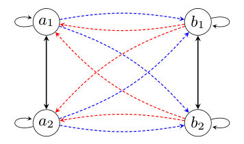 
Figure 1. The full join K⟲ 2 ∨K⟲ 2 , shown with bidirectional internal edges and loops, representing a complete graph K⟲ 4 with loops.

📷 Fig 2

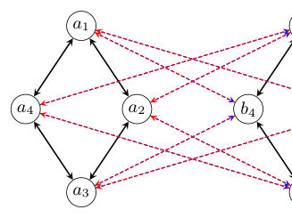 
Figure 2. Here A(J1) = A(J2) = A(G1) = A(G2): the directed partial join C4

📷 Fig 3

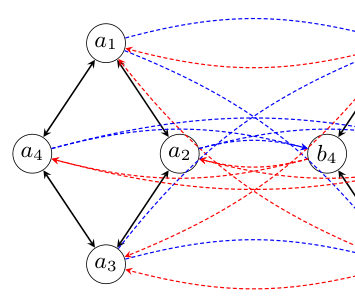 
Figure 3. Here A(G1) = A(G2) ̸= A(J1) = A(J2): the directed partial join C4

📷 Fig 4

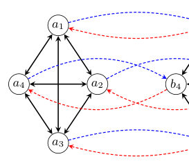 
Figure 4. The directed partial join K4

**Summary.** This paper develops a comprehensive mathematical framework to study quantum state transfer in quantum walks on complex graph structures called partial join graphs. By using shunt decomposition, the authors derive conditions for Perfect State Transfer (PST), showing that this operation can successfully induce PST in graphs that would otherwise fail to exhibit it individually. This expands the known class of graph families supporting robust quantum information transport.

**Why it may be interesting.** The work provides powerful mathematical tools (shunt decomposition, partial joins) to analyze quantum transport phenomena, which is directly relevant to designing quantum communication channels or quantum simulation architectures.

Detailed structure

**Main problem.** The paper investigates the conditions under which Perfect State Transfer (PST) occurs in quantum walks defined on complex graph structures called directed partial join graphs.

**Main result.** The authors establish a unified framework showing that the partial join operation can induce PST in graphs (like $K_n$'s partial join) even when the individual constituent graphs do not exhibit PST.

**Method.** The analysis relies on constructing discrete-time quantum-walk transition operators using the shunt-decomposition framework and deriving necessary and sufficient spectral conditions for PST and periodicity.

**Model / system.** The model is a discrete-time quantum walk (DTQW) operating on directed partial join graphs with signed couplings. The evolution is governed by a transition operator derived from the shunt decomposition of the graph's adjacency matrix.

**Key observables.** Perfect State Transfer (PST) (lossless state transfer between vertices/components) and periodicity of the quantum walk.

**Important parameters / regimes.** The size of the graph ($n$), the structure of the partial join, and the specific coupling signs are critical parameters.

**Assumptions / limitations.** The analysis assumes the applicability of the shunt-decomposition framework to model the quantum walk dynamics on the defined graph joins.

**Figures summary.** The notes reference figures illustrating the full join $K_{\vec{	op}}^2 \vee K_{\vec{	op}}^2$ and the reciprocal partial join $C_4(2,2) \vec{\lor} C_4$, demonstrating the graph structures analyzed.

**Paper structure.** The paper systematically defines the partial join graphs, constructs the transition operators via shunt decomposition, analyzes PST/periodicity for known families (complete graphs, bipartite graphs), and culminates in a double-cover construction to handle non-commuting operators.

Abstract

In this paper, we define directed partial join graphs with signed couplings and construct discrete-time quantum-walk transition operators for these graphs using the shunt-decomposition framework. The resulting transition operators apply to several important graph families, including complete graphs with loops, circulant partial joins, complete bipartite graphs, tensor powers of complete bipartite graphs, all with signed couplings. For each family, we identify the corresponding structure of the transition operator and derive necessary and sufficient conditions for periodicity and perfect state transfer (PST), when one of the two directed regular graphs admits PST. Based on these results, we identify two types of state transfer; internal PST, which occurs between vertices within the same graph, and coupling PST, which occurs between two components of join graphs. We further develop a double-cover construction for directed partial join graphs and derive conditions for periodicity and PST when the associated transition operators do not necessarily commute. Using this construction, we establish PST results for double covers of complete graphs with loops. In particular, we provide an example in which the complete graph \(K_n\) does not exhibit PST for \(n\geq4\), whereas a suitable partial join of \(K_n\) exhibits PST when \(n=2^m\), \(m\geq2\). Hence, these results extend the class of graph families admitting PST in shunt-decomposition-based quantum walks and provide a unified framework for studying quantum state transfer in graph joins, products, and covers.

[↑ back to top](#top)

### [Encryptability As a Coordinate Choice: Depth-One Homomorphic Federated Learning of Quantum Neural Networks](http://arxiv.org/abs/2609.30581v1)

**Authors:** Marcel Mordarski, Nathan Mani, Arshad Patel, William Knottenbelt, Roberto Bondesan  
**Type:** both · **Category:** quantum information and computing · **PDF:** <https://arxiv.org/pdf/2609.30581v1>  
**Analysis basis:** full PDF text, analyzed in chunks

📷 Fig 1

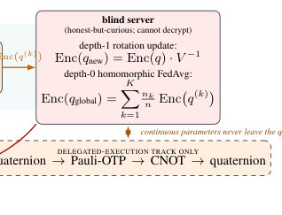 
Figure 2: One federated round. Clients train in the clear, encode each trainable angle as a unit quaternion (Eq. 2) and encrypt its four components under keys shared among clients. The server applies plaintext rotations at one multiplicative level and the weighted FedAvg sum at zero, never decrypting; clients decrypt, renormalise and recover angles by atan2. The Pauli-OTP detour is entered only on the delegated execution track (Lemma 2).

📷 Fig 2

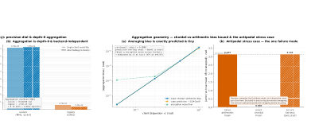 
Figure 3: The three load-bearing measurements. (a) With initialisation and batch order held identical, encrypted and plaintext arms are indistinguishable. (b) Weighted FedAvg adds no error beyond per-client encoding on either backend. (c) The realised aggregation bias is predicted by Eq. 3 and sits below the encryption noise floor throughout.

📷 Fig 3

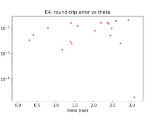 
Figure 4: E4: recovered versus true θ for RZZ(θ) through the encrypted pipeline, with the shot-noise band. The encrypted entangler adds no angle error resolvable at 4096 shots.

📷 Fig 4

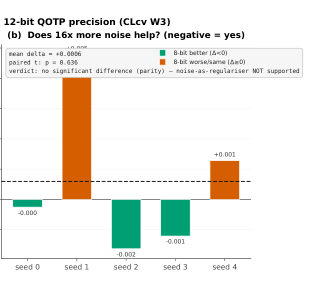 
Figure 5: E5: 8-bit versus 12-bit encrypted arms, paired by seed. A 16× increase in quantisation noise produces no detectable change in final loss.

📷 Fig 5

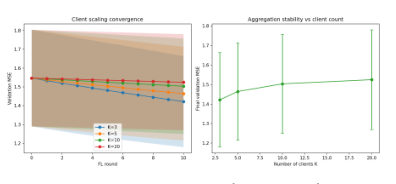 
Figure 6: E6: client scaling replicates on an unrelated dataset, with no aggregation blow-up at 20 clients.

**Summary.** This paper solves the computational bottleneck in training quantum neural networks using federated learning under encryption. By reformulating the rotation parameters using unit quaternions, the authors reduce the required multiplicative depth in homomorphic encryption from prohibitive levels to just one. This enables a practical, non-interactive protocol validated across multiple cryptographic and hardware platforms.

**Why it may be interesting.** This work directly addresses the practical implementation gap in quantum machine learning by providing a concrete, resource-efficient cryptographic protocol for training quantum models in a decentralized, privacy-preserving manner.

Detailed structure

**Main problem.** Developing an efficient, non-interactive protocol for encrypted federated training of quantum neural networks (QNNs) while preserving privacy.

**Main result.** By using the unit-quaternion (spin) chart, the rotation update cost drops to one multiplicative level, eliminating the need for computationally expensive bootstrapping in homomorphic encryption.

**Method.** The authors leverage the bilinear nature of quaternion group composition to fit the entire federated averaging and update process within a single multiplicative depth of the homomorphic scheme.

**Model / system.** The system involves hybrid quantum-classical models where trainable parameters are continuous rotations in SU(2), represented by unit quaternions. The protocol combines lattice-based homomorphic encryption (for classical aggregation) with information-theoretic security for the quantum layer.

**Key observables.** Mean Squared Error (MSE), state fidelity (e.g., 0.9918), and the required multiplicative depth (shown to be $\le 1$).

**Important parameters / regimes.** The core parameters are the choice of coordinate system (quaternions vs. Euler angles) and the multiplicative depth of the HE scheme.

**Assumptions / limitations.** The security relies on the hardness of (Ring-)LWE for classical layers, while the quantum layer's security is information-theoretic. The protocol assumes an honest-but-curious server and peers.

**Figures summary.** Figures illustrate the hybrid encryption scheme, contrasting Pauli-OTP and Quaternion-OTP, and showing the end-to-end flow of a federated round through the encrypted stack.

**Paper structure.** The paper first identifies the computational bottleneck of QNN training under HE due to transcendental coordinates. It then introduces the quaternion chart solution, demonstrating how this algebraic property enables a depth-one, non-interactive federated protocol. Finally, it validates this protocol through extensive empirical and hardware testing.

Abstract

Encrypted training relies on keeping server-side updates low-degree. This constraint traditionally excludes models whose weights inhabit a compact Lie group (notably variational quantum circuits, where every trainable weight is an $\mathrm{SU(2)}$ rotation). Expressed in Euler angles or discrete alphabets, these updates appear transcendental, historically demanding prohibitive costs: one client--server round per gate, or upwards of $25{,}000$ operations per weight. This penalty is strictly an artefact of coordinates. In the unit-quaternion (spin) chart, group composition is exactly bilinear (degree two, with coefficients in $\{-1,0,+1\}$). Consequently, encrypted rotation updates cost one multiplicative level and federated averaging costs zero in any levelled homomorphic scheme, completely eliminating bootstrapping. This implementation-independent algebraic property is confirmed across two cryptographic backends, introducing only $0.0$ and $-2.0\times10^{-12}$ rad of aggregation error. Leveraging this reduction yields a non-interactive protocol for encrypted federated training of hybrid quantum--classical networks. It includes correctness proofs for aggregation and sign handling, plus a compilation lemma proving parameterised entanglers add only constant-factor overhead without altering the depth class. Empirically, a paired five-seed study confirms zero measurable utility tax ($Δ=+9\times10^{-6}$ MSE, $p=0.92$), and a noise-budget ablation falsifies the hypothesis that encryption noise regularises. These convergence trends replicate across datasets and scale to $20$ clients. Finally, hardware validation on a $156$-qubit processor achieves $0.9918$ fidelity against a $0.99957$ unencrypted control.

[↑ back to top](#top)

### [Entanglement transitions in holographic conformal interfaces](http://arxiv.org/abs/2609.30369v1)

**Authors:** Evangelos Afxonidis, Rotem Berman, Ignacio Carreño Bolla, Shira Chapman, Carlos Hoyos, Osher Shoval  
**Type:** theory · **Category:** statistical mechanics · **PDF:** <https://arxiv.org/pdf/2609.30369v1>  
**Analysis basis:** full PDF text, analyzed in chunks

📷 Fig 1

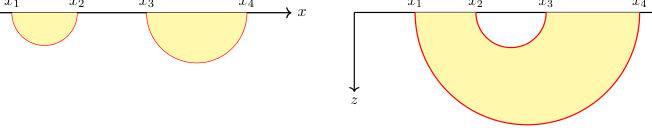 
Figure 1. Candidate RT geodesic configurations for the boundary region A∪B = [x1, x2]∪[x3, x4] in pure AdS3. Panel (a) shows the disconnected configuration, with geodesics homologous to each interval separately. Panel (b) shows the connected configuration, with geodesics connecting x1 to x4 and x2 to x3. The dominant contribution to the entanglement entropy is obtained by choosing the configuration with smaller total length.

📷 Fig 2

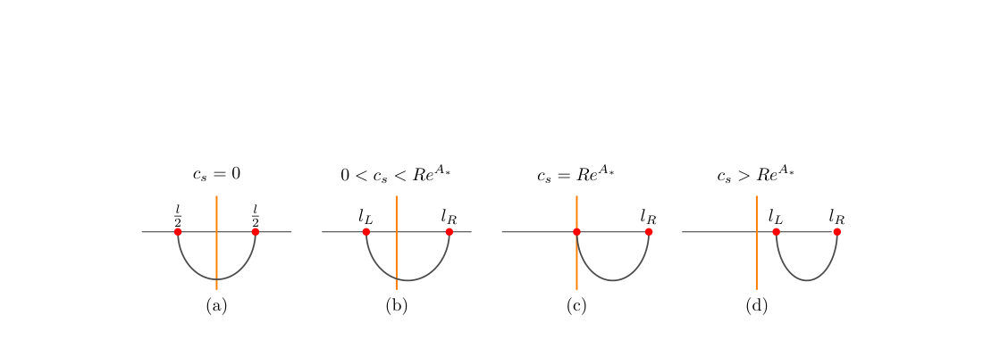 
Figure 2. We qualitatively depict here the four cases described in the main text, where the orange vertical line is the interface at r = 0 and the horizontal black line represents the boundary where the CFT resides. We depict the fully symmetric case cs = 0 (a), the generic interface crossing case 0 &lt; cs &lt; R eA∗(b), the interface touching case cs = R eA∗(c) and finally the non-crossing case cs &gt; R eA∗(d).

📷 Fig 3

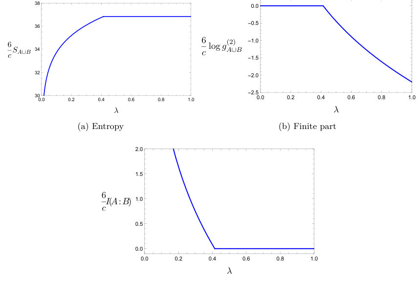 
Figure 3. Entanglement transition for the union A ∪B of two equal-size intervals, arranged symmetrically around the origin as in equation (4.3), in pure AdS3 as a function of λ = h/l. Panel (a) shows the entropy SA∪B of the dominant RT configuration, evaluated for l/ϵ = 104. Panel (b) shows the corresponding finite contribution log g(2) A∪B, obtained by subtracting the divergent contributions from the geodesic lengths and using the log g(2) prescription (4.4). Panel (c) shows the mutual information I(A : B). The transition occurs at λCFT C = √

📷 Fig 4

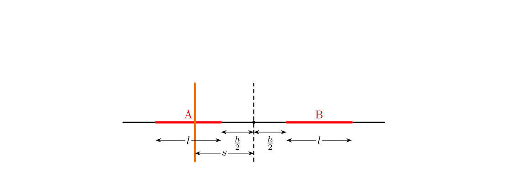 
Figure 4. Setup for two disjoint boundary intervals A and B of equal length l, separated by a distance h. The orange vertical line marks the interface, taken to be at the origin, while the dashed line marks the midpoint between the two intervals. The parameter s denotes the coordinate displacement of this midpoint from the interface. The figure shows the case s &gt; 0.

📷 Fig 5

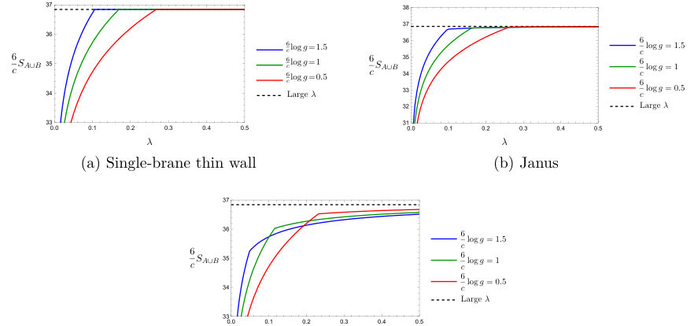 
Figure 5. Entropy transitions of intervals arranged in a symmetric configuration around the interface, for various values of log g. The different panels correspond to the different models: (a) Single-brane thin wall, (b) Janus, and (c) Super Janus. The plots are made fixing l/ϵ = 104.

**Summary.** This work analyzes entanglement transitions across holographic conformal interfaces using the Ryu-Takayanagi formula. By studying various holographic models, the authors show that interfaces selectively weaken correlations across the boundary while maintaining or strengthening correlations within the same side. The findings reveal a universal behavior independent of the specific interface parameters.

**Why it may be interesting.** The concept of entanglement structure across boundaries is highly relevant to understanding quantum information flow in complex physical systems, analogous to interfaces or defects in condensed matter systems.

Detailed structure

**Main problem.** The paper investigates how the presence of a conformal interface modifies entanglement transitions for pairs of disjoint intervals in two-dimensional holographic conformal field theories.

**Main result.** The interface weakens correlations across itself while preserving or enhancing correlations between regions on the same side, and a universal 'Silver Blaze' transition point is identified.

**Method.** The analysis uses the Ryu-Takayanagi prescription and the mutual information to locate transitions between connected and disconnected geodesic configurations in holographic duals.

**Model / system.** The study focuses on 2D holographic interface conformal field theories (ICFTs), modeled using thin-wall geometries, the Janus solution, and the super-Janus solution.

**Key observables.** Entanglement entropy, mutual information, and the critical separation distance for entanglement transitions.

**Important parameters / regimes.** Boundary entropy ($\log g$), brane tensions ($\Sigma_1, \Sigma_2$), and the separation distance between the intervals.

**Assumptions / limitations.** The analysis assumes the CFTs on the two asymptotic sides of the interface have equal central charges for the primary results, though single-interval entropy is more general.

**Figures summary.** Figure 1 illustrates the two competing Ryu-Takayanagi geodesic configurations (disconnected vs. connected) for two intervals in pure AdS3.

**Paper structure.** The paper first discusses the single-interval entropy contribution, then uses mutual information to analyze the transition for two intervals, comparing results across different holographic models (thin-wall, Janus) and highlighting the universal 'Silver Blaze' configuration.

Abstract

We study entanglement transitions for pairs of disjoint intervals in two-dimensional holographic interface conformal field theories. We consider several holographic models with equal central charges on the two sides of the interface: thin-wall geometries with one and two branes, the Janus solution, and the super-Janus solution. We first discuss the finite interface contribution to the entanglement entropy of a single interval, distinguishing intervals that cross the interface from those that lie entirely on one side. We then use the mutual information to locate the transition between connected and disconnected Ryu--Takayanagi geodesic configurations for two intervals. When the interface lies between the two intervals, increasing the boundary entropy $\log g$, which provides a measure of interface strength in the models considered here, generally decreases the critical separation at which the connected configuration ceases to dominate. When both intervals lie on the same side of the interface, the behavior is model dependent: the connected phase persists to larger separations in the Janus and super-Janus models, while the critical separation is unchanged in the thin-wall models. Thus, as diagnosed by the two-interval transition, the interface weakens correlations across the interface while preserving or enhancing correlations between regions on the same side. We also identify a universal ``Silver Blaze'' configuration, in which the interface lies inside one of the intervals and the transition occurs at the same location as in a CFT without an interface, independently of the interface parameters and of the holographic model. This universality follows from a cancellation between crossing and non-crossing interface contributions to the mutual information.

[↑ back to top](#top)

### [From Received Power to Certified Secret Keys: A General Method for Bridging Classical FSO Link Budgets and Decoy-State QKD](http://arxiv.org/abs/2609.30874v1)

**Authors:** Hasan Abbas Al-Mohammed  
**Type:** theory · **Category:** quantum information and computing · **PDF:** <https://arxiv.org/pdf/2609.30874v1>  
**Analysis basis:** full PDF text, analyzed in chunks

📷 Fig 1

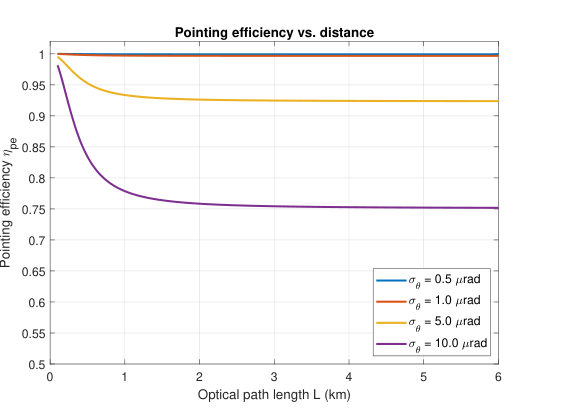 
Fig. 1. Relative pointing efficiency for residual one-axis jitter. The factor is a residual-jitter model and is not an elevation-angle loss.

📷 Fig 2

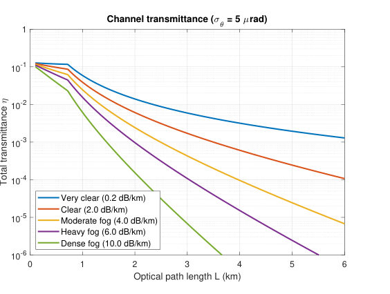 
Fig. 2. Per-photon detection efficiency for the five attenuation labels using the budget-compatible collection approximation.

📷 Fig 3

 
Figure 5 gives the expected finite key versus distance. Figure 6 plots the ratio of the finite-key rate ℓfrep/N to the asymptotic reference frepR∞= 5.208 × 104 bit/s at L = 0.5 km and γ = 0.2 dB/km. The ratio is zero below about N ≈107, where the construction aborts, and then increases monotonically, reaching 66.1% at N = 108 and 94.5% at N = 1012. It cannot reach 100% because (20) uses the exact single-photon yield, whereas the two-decoy bound recovers only about 97% of it. Vacuum-probability results are in Table V. Holding pν = 0.15 and pµ = 0.85 −p0 fixed, the distance decreases as p0

📷 Fig 4

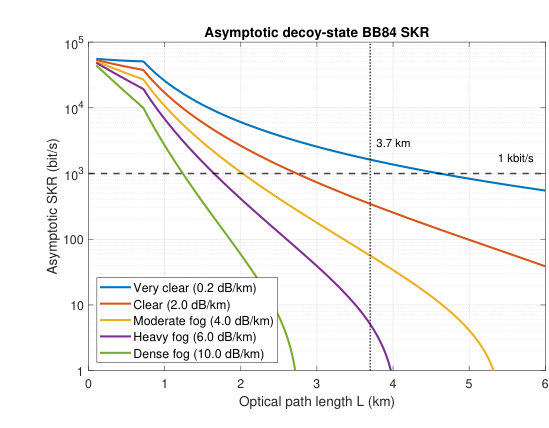 
Fig. 3. All-intensity asymptotic secret-key rate versus optical distance for the attenuation sweep.

📷 Fig 5

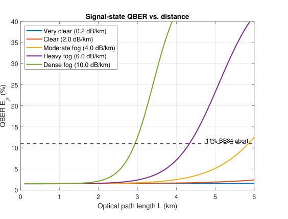 
Fig. 4. Signal QBER versus optical distance. The conventional 11% line is a visual reference, not the finite-decoy abort rule.

**Summary.** This paper develops a general framework to connect classical Free-Space Optical (FSO) link budgets to the security analysis required for Quantum Key Distribution (QKD). It uses decoy-state methods and finite-key analysis to predict achievable secret key rates and maximum communication distances. The result is a powerful tool for assessing the practical feasibility of quantum communication over atmospheric links.

**Why it may be interesting.** This work is highly relevant as it provides a crucial engineering bridge, translating macroscopic, classical engineering metrics (like link budget attenuation) into rigorous, quantum-secure key rate predictions, which is vital for practical quantum network deployment.

Detailed structure

**Main problem.** The paper addresses the critical gap between classical Free-Space Optical (FSO) link budgets, which predict received optical power, and the quantum requirement of certifying a secret key based on photon arrival flux.

**Main result.** The authors provide a general, deployment-independent framework that translates classical FSO link parameters into finite-key, decoy-state QKD security predictions, yielding specific distance limits under various atmospheric conditions.

**Method.** The methodology involves creating a parameter-symbolic interface to convert classical link losses into quantum transmittance, followed by applying finite-key analysis using Hoeffding and Chernoff bounds derived from decoy-state estimation.

**Model / system.** The system modeled is Free-Space Optical (FSO) communication, applicable across diverse platforms including satellites, drones, and terrestrial links. The quantum process analyzed is phase-randomized weak coherent pulse BB84 QKD, utilizing decoy-state estimation.

**Key observables.** Predicted one-kilobit-per-second distance limits (e.g., 2.727 km in clear air), finite key length ($\ell$), and the ratio of finite-key to asymptotic secret-key rates.

**Important parameters / regimes.** Link transfer ($\eta_{link}$), geometric collection ($\eta_g$), atmospheric extinction ($\eta_{atm}$), residual pointing ($\eta_{pe}$), and the number of emitted pulses ($3.33 	imes 10^8$).

**Assumptions / limitations.** The predicted rates are explicitly stated as *conditional performance predictions*, not experimental security certificates. The framework relies on established security tools and assumes specific bounds for key and test basis counts.

**Figures summary.** Figures illustrate the comparison of distance limits (Classical vs. QKD) across fog conditions, the ratio of finite-key to asymptotic rates vs. block size, and the dependence of finite limits on vacuum preparation probability ($p_0$) and key-basis selection probability ($p_X$).

**Paper structure.** The paper establishes the problem by contrasting power vs. flux, introduces the link budget interface, details the decoy-state and finite-key analysis using advanced bounding techniques, and concludes with numerical results comparing classical and quantum distance limitations across various atmospheric models.

Abstract

Received optical power determines photon arrival flux, but photon arrival flux does not certify a quantum key. This paper gives a deployment-independent interface from a classical free-space optical (FSO) link budget to phase-randomized weak coherent pulse BB84, decoy-state estimation, and composable finite-key postprocessing. The channel interface separates geometric collection, atmospheric extinction, residual pointing, and detector efficiency, and states when common geometric and pointing expressions are approximations. The finite-key output follows the decoy-state analysis of Lim et al., with key- and test-basis counts estimated separately and an infinite-decoy asymptotic reference. The numerical study covers a five-level attenuation sweep, basis- and vacuum-probability sensitivities, a conditional Chernoff comparison, and integer-count Monte Carlo. For $3.33 \times 10^8$ emitted pulses, the Hoeffding-based predicted one-kilobit-per-second distance limits are 2.727, 1.883, 1.472, 1.236, and 0.962 km from very clear to dense-fog parameterizations. These are conditional performance predictions, not experimental security certificates. Satellite, drone, high-altitude-platform, terrestrial, and train links enter through the same interface but require their own propagation, acquisition, and device inputs. The framework integrates established security tools into an engineering procedure without claiming a new security proof or a universal range.

[↑ back to top](#top)

### [Generation of Photonic Graph States with minimal number of quantum emitters](http://arxiv.org/abs/2609.30400v1)

**Authors:** Konstantinos-Rafail Revis, Nils Tomke Ottink, Pierre-Emmanuel Emeriau, Paul Hilaire  
**Type:** theory · **Category:** quantum information and computing · **PDF:** <https://arxiv.org/pdf/2609.30400v1>  
**Analysis basis:** full PDF text, analyzed in chunks

📷 Fig 1

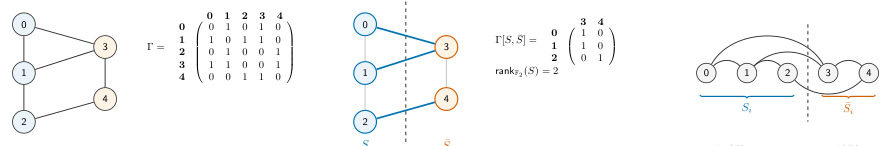 
FIG. 1. (a) An example of a graph with 5 vertices and its corresponding adjacency matrix. (b) An example of the cutrank of a graph with the corresponding adjacency submatrix. For a specified bipartition, the cut-rank of a graph is equal to the Schmidt Rank, which is an entanglement monotone. (c) The linear rank-width of the graph. In the figure, one of the cuts of the graph is presented. For a given ordering, we must calculate the adjacency submatrix for every cut ranging from 0 until n −1 and then minimize over all possible permutations. The labeling that satisfies the linear rank-width of a graph yields the emission ordering that requires the minimum number of emitters for the quantum...

📷 Fig 2

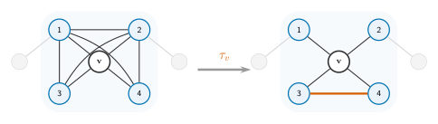 
FIG. 2. An example of local complementation applied to the vertex v with the neighborhood Nv = {1, 2, 3, 4}.

📷 Fig 3

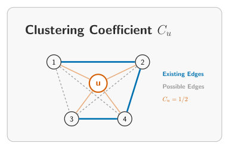 
FIG. 3. A schematic presentation of the calculation of the clustering coefficient for a graph at the vertex u.

📷 Fig 4

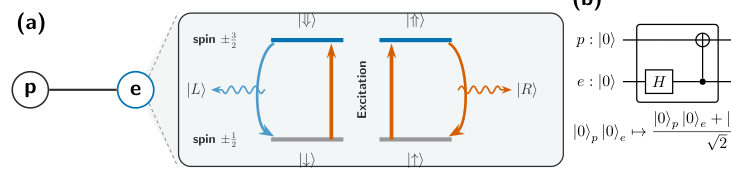 
FIG. 4. Schematic presentation of photonic graph state generation (a). As [38] proposed an energy level structure, with doubly degenerate ground and excited states with spin ±1/2 and ±3/2. Due to the selection rules, polarization of the emitted photon (p), which is either left (L) or right (R), becomes entangled with the spin of the emitter. The process can be repeated, and along with the local gates, any caterpillar or LC equivalent to them in any state can be created using only one emitter. (b) The emission of a single photon is represented as a quantum circuit. Initially the state we have is |↑⟩e + |↓⟩e. After the excitation we have |⇑⟩e + |⇓⟩e. Then the emission follows that yields,...

📷 Fig 5

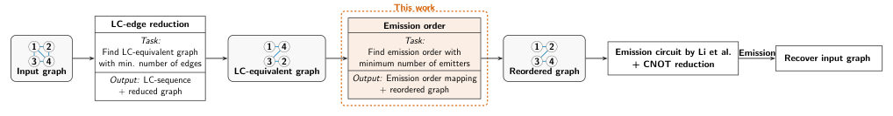 
FIG. 5. A schematic description of obtaining the emission circuit for an arbitrary graph state. We firstly apply an LC reduction by applying a series of local complementations to every vertex with a clustering coefficient above 1/2. We then find an emission ordering that reduces the number of emitters (ne) required to generate the circuit. Then, given the reordered graph, we are using the emission algorithm presented by Ref. [49] and the CNOT reduction algorithms from Ref. [54].

**Summary.** This paper tackles the resource optimization challenge in generating photonic graph states by focusing on minimizing the required number of quantum emitters. The authors propose and compare several heuristic algorithms to circumvent an NP-hard problem related to emission ordering. The results show significant reductions in required emitters, providing a more practical pathway toward building large-scale quantum processors based on photonic entanglement.

**Why it may be interesting.** This work provides crucial algorithmic advances for realizing complex quantum circuits using photonic platforms, directly impacting the feasibility and resource estimation for large-scale quantum computation and networking.

Detailed structure

**Main problem.** The core problem is developing efficient, deterministic methods to generate photonic graph states using the minimum possible number of quantum emitters.

**Main result.** The proposed heuristic algorithms demonstrate up to 30% reduction in required emitters on random graphs, with further potential savings of 20% when combined with existing gate optimization techniques.

**Method.** The authors developed and compared several heuristic polynomial algorithms (e.g., spectral ordering, simulated annealing variants) to optimize the emission ordering, which is computationally linked to the NP-hard linear rank-width problem.

**Model / system.** The system involves generating photonic graph states, which are fundamental entangled resources for measurement-based quantum computing and quantum error correction. The generation process models entanglement mediated by quantum emitters (like quantum dots) emitting photons.

**Key observables.** Number of emitters required, number of CNOT gates, total gate count, and runtime scaling across different graph structures (e.g., QECC families).

**Important parameters / regimes.** Graph structure (e.g., random graphs, specific QECCs like Steane or Shor), graph density ($p$), and system size ($n$).

**Assumptions / limitations.** The minimum number of emitters is determined by the graph's linear rank-width, and the authors bypass the NP-hard computation by using polynomial heuristics.

**Figures summary.** Figures compare the resource overhead (Emitters, CNOTs, Gates) and runtime scaling of four different optimization algorithms across varying graph densities and sizes, particularly for Quantum Error Correcting Codes.

**Paper structure.** The paper first establishes the theoretical link between graph state generation and the linear rank-width. It then introduces and compares multiple heuristic algorithms designed to minimize emitters by optimizing the emission sequence. Finally, it rigorously tests these algorithms' performance by comparing resource overheads across various complex graph families, such as those used in quantum error correction.

Abstract

Graph states are a fundamental resource for measurement and fusion-based quantum computing, quantum networks, and sensing. Preparing them in a photonic system deterministically is, in principle, possible, but finding efficient schemes to prepare them was a long-standing problem addressed recently. Additionally, heuristic optimization schemes for reducing the required number of two-qubit gates were developed. However, the problem of reducing the number of emitters by optimizing the emission ordering was not addressed, due to its computational complexity, as it is connected to a well-known NP-hard problem from graph theory, the linear rank width computation. In this work, we focus on developing heuristic polynomial algorithms to reduce the number of emitters required. In total, we propose four distinct algorithms, which demonstrate up to $30\%$ emitter reduction on random graphs. Furthermore, we provide numerical and statistical evidence that the combination of our optimization schemes with the preexisting algorithms for optimizing the two-qubit gates of the preparation protocol can further reduce them by around $20\%$. Finally, we examine the developed algorithms for various useful graph state families, such as graphs useful for measurement-based quantum algorithms, and cluster states and graph codes used for quantum error correction, to determine the performance of each algorithm.

[↑ back to top](#top)

### [Genuine Multi-Entropy of Fully Symmetric Gaussian States](http://arxiv.org/abs/2609.30754v1)

**Authors:** Hugo A. Camargo, Mitsuhiro Nishida  
**Type:** theory · **Category:** statistical mechanics · **PDF:** <https://arxiv.org/pdf/2609.30754v1>  
**Analysis basis:** full PDF text, analyzed in chunks

📷 Fig 1

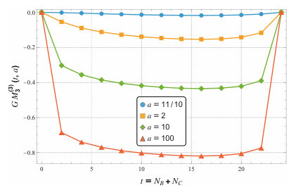 
Figure 1. R´enyi genuine multi-entropy curves GM(3) 3 (t,a) for different values of a = 11/10,2,10,100 and for t = NB + NC ∈[0,24], where N = NA + NB + NC = 24 and NB = NC.

📷 Fig 2

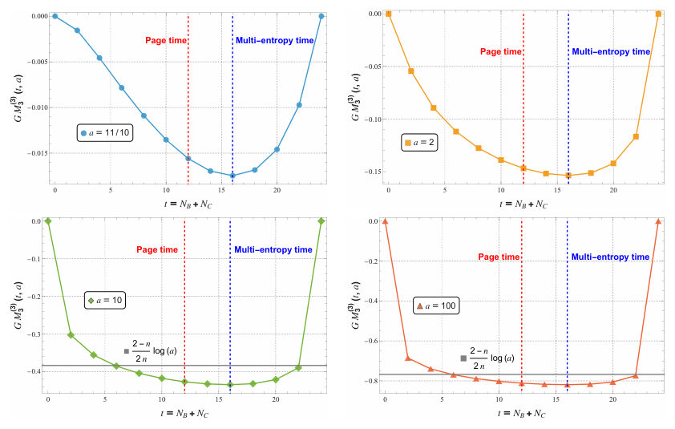 
Figure 2. Individual n = 3 R´enyi genuine multi-entropy curves GM(3) 3 (t,a) for different values of a and for t = NB + NC ∈[0,24], where N = NA + NB + NC = 24 and NB = NC. The vertical dashed lines represent the Page time (red) given by tP age = (NB + NC)∣NB+NC=NA = 12 and the multi-entropy time (blue) given by tME = (NB + NC)∣NA=NB=NC = 16. The (gray) horizontal line in the plots for a = 10,100 (bottom two) correspond to the behavior of the proper CV GHZ state (2.18) with µ = 1/a and n = 3.

📷 Fig 3

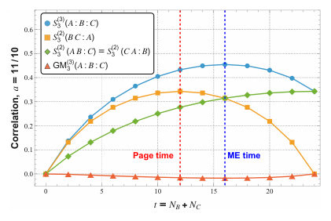 
Figure 3. Comparison of n = 3 R´enyi entropies for different subsystems S(2) 3 (AB ∶C), S(2) 3 (BC ∶A), S(2) 3 (CA ∶B), R´enyi multi-entropy S(3) 3 (A ∶B ∶C) and genuine R´enyi multi-entropy GM(3) 3 (A ∶B ∶C) with a = 11/10 (shown in detail in the top-left plot of Fig. 2) for t = NB + NC ∈[0,24], where N = NA + NB + NC = 24 and NB = NC. The vertical dashed lines represent the Page time (red) given by tP age = (NB + NC)∣NB+NC=NA = 12 and the multi-entropy (ME) time (blue) given by tME = (NB + NC)∣NA=NB=NC = 16.

**Summary.** This paper calculates the genuine multi-entropy for fully symmetric Gaussian states, a measure of multipartite entanglement in bosonic systems. Using the replica method, the authors derive exact results and asymptotic formulas, notably proving that the genuine multi-entropy vanishes for $n=2$. This work connects fundamental concepts of quantum information theory to physical scenarios like black hole evaporation.

**Why it may be interesting.** The study provides rigorous, analytical results for a complex entanglement measure (multi-entropy) in continuous variable systems, which is highly relevant for understanding quantum correlations in quantum optics and quantum field theory.

Detailed structure

**Main problem.** The paper investigates the genuine multi-entropy of fully symmetric Gaussian states, connecting it to multipartite entanglement measures in continuous-variable systems.

**Main result.** It analytically proves that the genuine $n=2$ Rényi multi-entropy for any pure bosonic Gaussian state is zero, and it derives asymptotic formulas for the genuine multi-entropy in the large squeezing limit.

**Method.** The analysis employs the replica method to calculate the multi-entropy using replica partition functions, which are evaluated using Gaussian integral formulas involving determinants of matrices.

**Model / system.** The system under study consists of fully symmetric Gaussian states of bosonic modes, which are ground states of quadratic Hamiltonians invariant under the full symmetric group $S_N$. The analysis is motivated by concepts from black hole evaporation and holographic entanglement.

**Key observables.** Genuine R\'enyi multi-entropy ($	ext{GM}^{(3)}_n$), local purity ($\mu$), and the replica index ($n$).

**Important parameters / regimes.** Squeezing parameter ($\mu$), replica index ($n$), and the number of bosonic modes in the subsystems ($N_A, N_B, N_C$).

**Assumptions / limitations.** The study focuses on highly symmetric, fully symmetric Gaussian states, and specific analytic continuations (like $n=2$ for the multi-entropy) are utilized.

**Figures summary.** Not specified, but the notes mention plotting the genuine Rényi multi-entropy as a function of the number of modes in the subsystems.

**Paper structure.** The paper defines the multi-entropy using the replica method, derives specific formulas for Gaussian states, proves the vanishing of $	ext{GM}^{(3)}_2$, and discusses asymptotic behavior and comparisons to random states.

Abstract

We study the tri-partite genuine Rényi multi-entropy of fully symmetric Gaussian states as a function of the squeezing parameter for different total number of bosonic modes under different subsystem configurations. Exact results for a few modes are obtained, and we conjecture an asymptotic formula at the limit of large squeezing parameter as a function of the replica index $n$, while also finding subleading subsystem-size dependent terms for $n=3$ under a specific tripartition. We analytically show that the genuine $n=2$ Rényi multi-entropy of any pure bosonic Gaussian states is zero for any number of modes and for any tripartition. Furthermore, to investigate the dependence on subsystem size, we plot the curve of genuine Rényi multi-entropy as a function of the number of modes in the subsystems while keeping the total number of modes fixed. We discuss differences and similarities between this result and studies of the multi-entropy curve for Haar random states. In particular, we identify a subsystem size configuration related with the multi-entropy time in an evaporating black hole for which the behavior of the genuine multi-entropy changes.

[↑ back to top](#top)

### [Highly elastic collisions of ultracold asymmetric top molecules in a static electric field](http://arxiv.org/abs/2609.31317v1)

**Authors:** Reuben R. W. Wang  
**Type:** theory · **Category:** other · **PDF:** <https://arxiv.org/pdf/2609.31317v1>  
**Analysis basis:** full PDF text, analyzed in chunks

📷 Fig 1

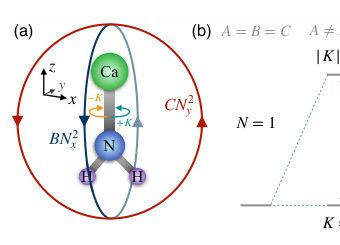 
FIG. 1. Molecular rotations of an asymmetric top. (a) Visualization of the principal rotation axes in CaNH2. (b) Rotational structure resulting from the asymmetric top ge- ometry of CaNH2, restricted to the N = 1 manifold ignoring fine and hyperfine structure. The degeneracy in states of dif- ferent |K| is lifted when spherical symmetry is broken, while the degeneracy in K = ±1 states is lifted when cylindrical symmetry along the molecular axis is broken.

📷 Fig 2

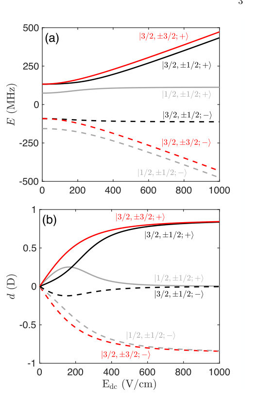 
FIG. 2. (a) The molecular spectrum of CaNH2 in the reduced N = 1, |K| = 1 subspace, as a function of electric field. (b) Corresponding induced dipole moments as a function of elec- tric field. In both subplots, the energies and dipole moments correspond to states labeled by the field-dressed quantum numbers | ˜J, mJ; ˜ϵK⟩. The J = 3/2 states with mJ = ±1/2 (±3/2) manifold are colored black (red), while the J = 1/2 states are colored gray. Even parity states are plotted as solid curves whereas the odd parity states are dashed.

📷 Fig 3

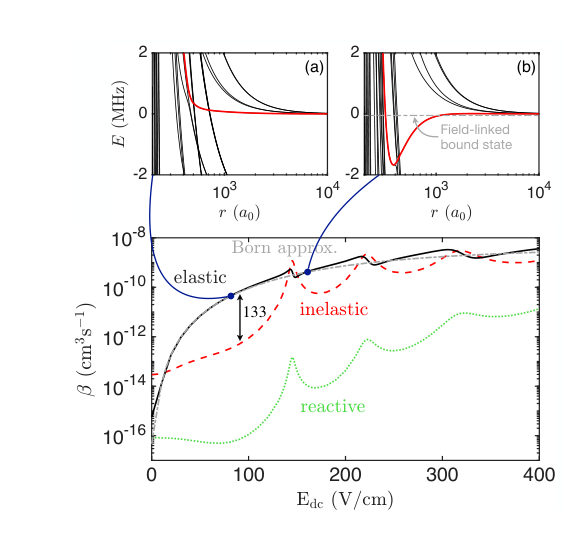 
FIG. 3. Upper panels: Close up plots of the potential en- ergy curves that adiabatically connect to the |3/2, +3/2; +⟩ state at (a) Edc = 80 V/cm and at (b) Edc = 160 V/cm. The latter field value results in a field-linked bound state (gray dashed line), existing in the red highlighted potential curve that interpolates across narrow non-adiabatic cross- ings. Lower panel: Elastic (solid black), inelastic (dashed red) and reactive (dotted green) rate coefficients as a func- tion of applied electric field for colliding molecules prepared in the | ˜J, mJ; ˜ϵK⟩= |3/2, +3/2; +⟩state. The elastic rate co- efficient obtained from the Born approximation is plotted as the dashed-dotted gray curve.

📷 Fig 4

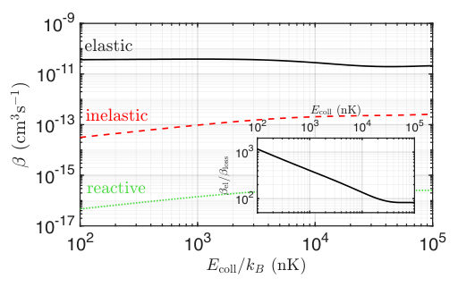 
FIG. 5. Collisional elastic (solid black), inelastic (dashed red) and reactive (dotted green) rate coefficients of CaNH2 prepared in | ˜J, mJ; ˜ϵK⟩= |1/2, +1/2; +⟩and subject to Edc = 150 V/cm, as a function of collision energy. The inset plots the ratio of elastic-to-loss rate coefficients as a function of collision energy.

📷 Fig 5

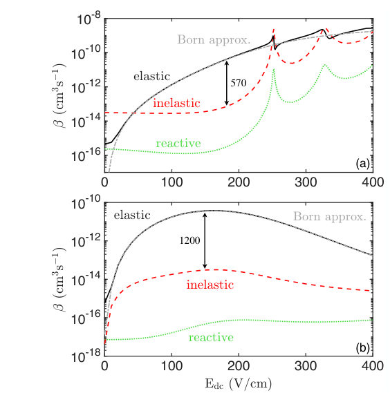 
FIG. 4. Elastic (solid black), inelastic (dashed red) and reactive (dotted green) rate coefficients as a function of ap- plied electric field for colliding molecules prepared in the | ˜J, mJ; ˜ϵK⟩= |3/2, +1/2; +⟩state (upper panel) and the | ˜J, mJ; ˜ϵK⟩= |1/2, +1/2; +⟩state (lower panel).

**Summary.** This theoretical study shows that applying static electric fields to asymmetric top molecules like $	ext{CaNH}_2$ can engineer strong, long-range dipole-dipole interactions. These interactions suppress inelastic loss channels, leading to highly elastic collisions at ultracold temperatures. This establishes a viable pathway for evaporative cooling and creating quantum degenerate gases of complex molecules.

**Why it may be interesting.** This work directly addresses the challenge of cooling and trapping complex, polar molecules, which is a major frontier in AMO physics, by engineering favorable long-range interactions.

Detailed structure

**Main problem.** To demonstrate that applying static electric fields to ultracold asymmetric top molecules can induce highly elastic collisions, thereby enabling the formation of quantum degenerate gases.

**Main result.** The study shows that dipolar interactions can cause the elastic collision rate to dominate over lossy collisions by up to three orders of magnitude at ultracold temperatures.

**Method.** Theoretical calculations involving the diagonalization of molecular Hamiltonians and close-coupling scattering calculations using the dipole-dipole interaction potential.

**Model / system.** The system involves reactive $	ext{CaNH}_2$ molecules, modeled as asymmetric tops, whose rotational and spin-rotation structure is modified by an external static electric field ($\mathbf{E}_{	ext{dc}}$).

**Key observables.** Elastic-to-loss collisional rate ratio, induced dipole moments, and the existence of field-linked bound states.

**Important parameters / regimes.** Electric field strength ($E_{	ext{dc}} < 1 	ext{ kV/cm}$), ultracold temperatures, and molecular constants for $	ext{CaNH}_2$ and $	ext{SrNH}_2$.

**Assumptions / limitations.** The analysis is restricted to the lowest rotational manifold ($N=1, |K|=1$) and assumes dipole-dipole interaction dominates the long-range potential.

**Figures summary.** Figures illustrate the molecular spectrum and induced dipole moments vs. electric field, and plot rate coefficients (elastic vs. loss) vs. electric field or collision energy.

**Paper structure.** The paper systematically develops the molecular Hamiltonian, analyzes the effect of the electric field on the molecular eigenstates (K-doublets), and then uses scattering theory to calculate the resulting elastic and lossy collision rates.

Abstract

We propose that the application of static electric fields to reactive CaNH$_2$ molecules can result in large ratios of elastic to lossy collisions at ultracold temperatures. In the first rotationally excited manifold, the asymmetric top structure of CaNH$_2$ results in a $\approx 226$ MHz splitting of the opposite parity $K$-doublet states. This modest splitting allows electric fields below a kilovolt per centimeter to polarize the molecules and induce long-range dipole-dipole interactions. By increasing the electric field, we find that dipole-dipole attraction can become sufficiently large to induce weakly bound octatomic field-linked states of [CaNH$_2$]$_2$. In the absence of these field-linked states, we identify select molecular states where dipolar interactions allow elastic collisions to dominate over lossy collisions by up to three orders of magnitude, while maintaining loss rate coefficients at the $10^{-14}$ cm$^3$s$^{-1}$ level. These results establish that evaporative cooling is a viable route to quantum degenerate gases of laser coolable asymmetric top molecules. Access to such low entropy ensembles of asymmetric top molecules holds promise to push the frontiers of quantum simulation, state-resolved chemistry, and searches for beyond the Standard Model physics.

[↑ back to top](#top)

### [Modeling quantum neural network gradient with reinforcement learning](http://arxiv.org/abs/2609.31066v1)

**Authors:** Nhan Trong Luu, Duong Trung Luu, Nam Ngoc Pham, Thang Cong Truong  
**Type:** theory · **Category:** quantum information and computing · **PDF:** <https://arxiv.org/pdf/2609.31066v1>  
**Analysis basis:** full PDF text, analyzed in chunks

📷 Fig 1

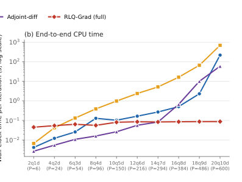 
Figure 3: End-to-end memory (a, CPU RAM) and per-iteration CPU wall-clock time (b) of QNN gradient computation methods from 2 to 20 qubits (log scale, mean over 12 trials after 4 warm-up iterations). RLQ-Grad costs cover the full training pipeline: PPO rollout, actor and critic updates, gradient buffers, and Adam optimizer states. Hollow markers denote measurements below the 0.1 MB resolution. Exact values are listed in Appendix D.6.

📷 Fig 2

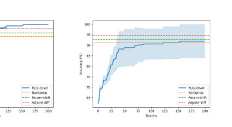 
Figure 4: Accuracy convergence of RLQ-Grad (with PPO) variants (with (a) both last layer of policy and value function SN, (b) only last layer of value function SN [25] and (c) no SN applied) on BC dataset (denoted blue with fluctuation region) when compare with maximum achievable accuracy of other gradient calculating methods on 2-qubits HEA.

📷 Fig 3

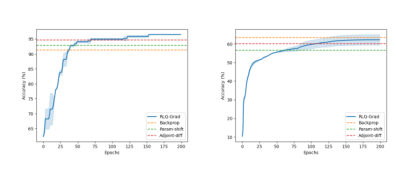 
Figure 5: Accuracy convergence of RLQ-Grad (denoted blue with fluctuation region) when compare with maximum achievable accuracy of other gradient calculating methods on 2-qubits HEA.

📷 Fig 4

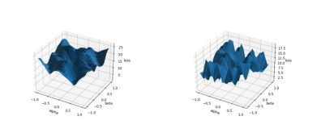 
Figure 6: Loss landscape visualization across benchmarked gradient computation methods over HEA- 2b1q on BC and F-MNIST. Loss landscape change from smooth on BC dataset (overparameterized) to becomes more noisy (underparameterized) with sharp local minima in F-MNIST.

**Summary.** This paper introduces RLQ-Grad, a novel reinforcement learning optimizer designed to train Quantum Neural Networks (QNNs). It overcomes the critical challenges of barren plateaus and exponential computational cost associated with calculating quantum gradients. By using a classical policy to propose updates, RLQ-Grad achieves massive speedups and maintains robust gradient variance across large qubit systems.

**Why it may be interesting.** It provides a novel, computationally tractable optimization framework for QML models, directly addressing the primary bottleneck (gradient calculation) that limits the practical application of variational quantum algorithms.

Detailed structure

**Main problem.** Training Quantum Neural Networks (QNNs) is severely limited by the barren plateau phenomenon (vanishing gradient variance) and the exponential computational cost of calculating quantum gradients.

**Main result.** The proposed RLQ-Grad optimizer bypasses explicit gradient computation by using a classical RL policy, achieving massive speedups and preserving gradient variance where traditional methods fail.

**Method.** The authors formulate QNN training as an RL problem, training a PPO agent to propose parameter updates directly, conditioned on the current state (parameters, loss, accuracy).

**Model / system.** The model involves QNNs built on hardware-efficient ansatz circuits using $n$ qubits and $L$ layers, trained for supervised quantum machine learning tasks.

**Key observables.** Gradient variance (showing decay for standard methods vs. flatness for RLQ-Grad), Top-1 validation accuracy, and computational time/memory complexity.

**Important parameters / regimes.** Number of qubits ($n$), number of layers ($L$), and the complexity scaling (linear in parameters vs. exponential in $n$).

**Assumptions / limitations.** The RL agent operates entirely in the classical domain, decoupling the optimization signal from the quantum circuit's intrinsic geometry.

**Figures summary.** Figures compare gradient variance across methods, and tables compare end-to-end memory and CPU time, demonstrating RLQ-Grad's superior resource efficiency.

**Paper structure.** The paper first identifies the limitations of QNN training (barren plateaus, high cost). It then introduces RLQ-Grad, detailing the RL formulation, proving its theoretical advantages (gradient variance preservation, polynomial scaling), and finally benchmarking its performance against state-of-the-art gradient estimation techniques.

Abstract

Training quantum neural networks (QNNs) on near-term hardware remains hampered by two compounding difficulties: the exponential vanishing of gradient variance known as the barren plateau, and the $\mathcal{O}(L \cdot 2^n)$ time and memory cost of differentiating through an $n$-qubit, $L$-layer circuit. We propose RLQ-Grad, a reinforcement-learning-based optimizer in which a classical policy $π_φ$ (a spectrally-normalized PPO agent) learns to propose parameter updates directly, conditioned on the QNN's current parameters, loss, accuracy, and previous update. Because the surrogate gradient is emitted by a classical network rather than obtained by differentiating through the unitary $U(θ)$, its variance is not constrained by the barren plateau concentration bound, and its cost scales with the number of trainable parameters rather than the Hilbert-space dimension. We prove these properties formally and verify them on a hardware-efficient ansatz across four supervised benchmarks with up to $n=20$ qubits. RLQ-Grad preserves a near-flat gradient-variance curve where backpropagation, parameter-shift, and adjoint differentiation decay by 1 to 2 orders of magnitude. Accounting for the full training pipeline (PPO rollouts, actor-critic updates, and optimizer states), RLQ-Grad needs under 2 MB of memory and runs $2490\times$, $7876\times$, and $673\times$ faster per iteration than these three methods at $n=20$. It improves top-1 accuracy by up to $+10\%$ over gradient-based baselines on circuits of up to 12 qubits, and matches dedicated barren plateau mitigation methods on CIFAR-10 at 14 to 20 qubits, where evolutionary and gradient-free optimizers collapse to chance.

[↑ back to top](#top)

### [Non-factor quantum dynamics and relativity](http://arxiv.org/abs/2609.30942v1)

**Authors:** Octave Mestoudjian, Matt Wilson  
**Type:** theory · **Category:** other · **PDF:** <https://arxiv.org/pdf/2609.30942v1>  
**Analysis basis:** full PDF text, analyzed in chunks

📷 Fig 1

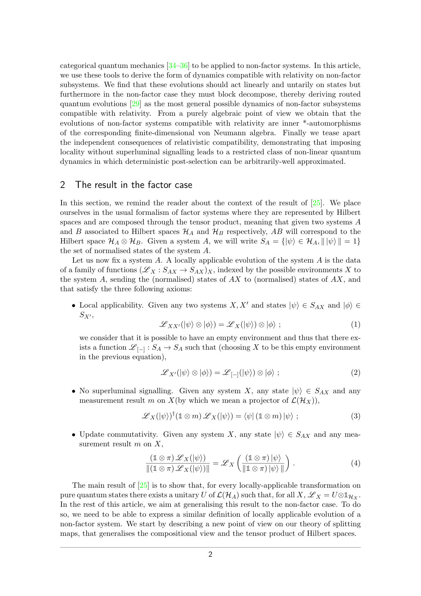 
Low-resolution page preview, page 2

📷 Fig 2

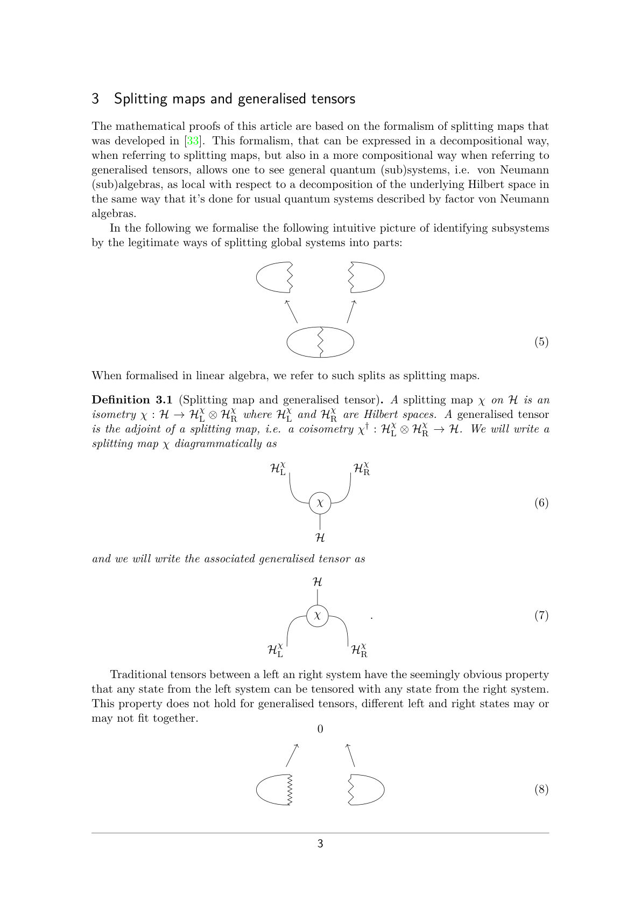 
Low-resolution page preview, page 3

📷 Fig 3

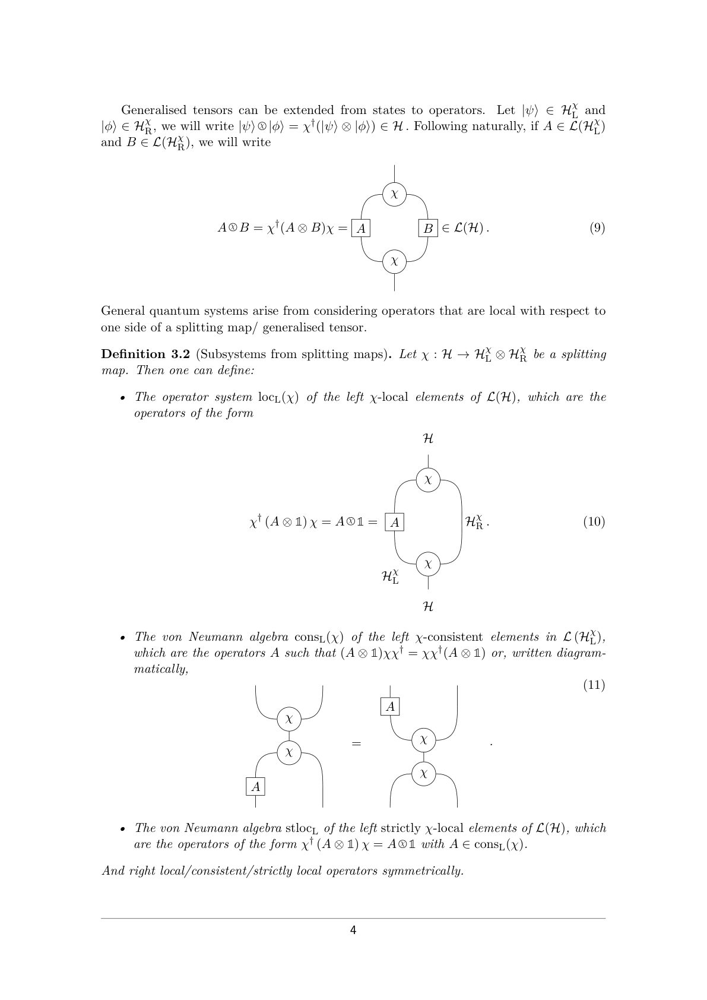 
Low-resolution page preview, page 4

📷 Fig 4

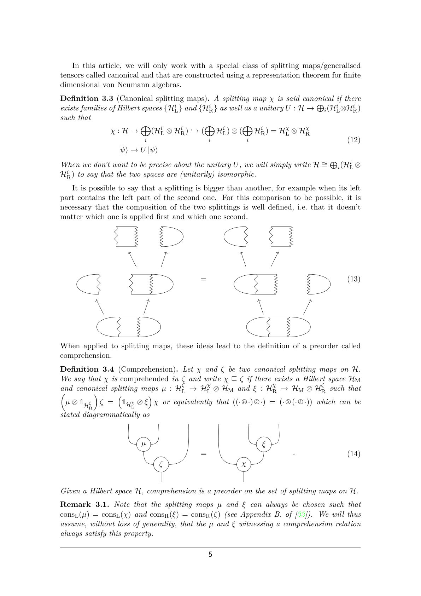 
Low-resolution page preview, page 5

📷 Fig 5

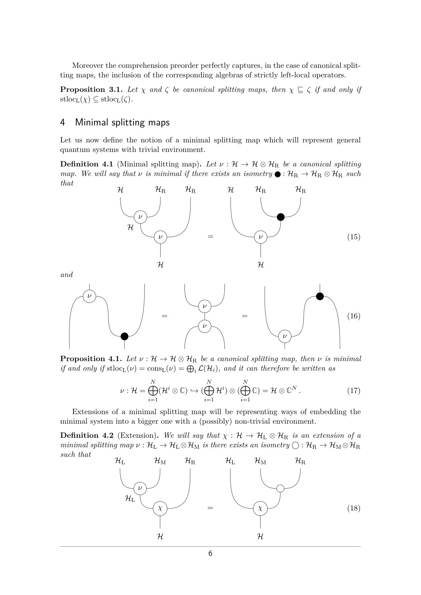 
Low-resolution page preview, page 6

**Summary.** This theoretical paper derives the mathematical constraints on local quantum dynamics when those dynamics must respect relativistic principles like locality and causality. By generalizing concepts from factor systems to non-factor quantum algebras, the authors prove that the evolution must be linear, unitary, and block-decomposable. This work provides a rigorous framework for understanding quantum evolution in complex, non-factor quantum settings relevant to quantum gravity.

**Why it may be interesting.** The derivation of the required structure of quantum dynamics from fundamental principles like causality and locality is crucial for developing a consistent quantum theory of gravity or spacetime structure.

Detailed structure

**Main problem.** The paper investigates the constraints imposed by relativistic principles, specifically locality and the absence of superluminal signaling, on the local evolution of quantum systems.

**Main result.** For non-factor quantum systems, any compatible local evolution must be linear, unitary, and must respect the block decomposition of the system, leading to 'routed quantum evolutions'.

**Method.** The analysis employs advanced mathematical formalism involving 'splitting maps' and 'generalised tensors' to characterize local operations in non-factor algebras.

**Model / system.** The system under study is a general quantum system described by non-factor algebras, relevant in theoretical contexts like quantum spacetimes and causal structures.

**Key observables.** The structure of the local evolution map ($L_\chi$), which must be linear and unitary.

**Important parameters / regimes.** The structure of the splitting maps ($\chi, 
u$) and the requirement of no superluminal signaling.

**Assumptions / limitations.** The analysis relies on generalizing concepts from factor systems and restricting the focus to canonical splitting maps.

**Paper structure.** The paper builds from generalizing known results for factor systems to non-factor systems, defining local evolution via postulates (locality, no superluminal signaling), and culminating in a characterization theorem (Theorem 5.1) that dictates the form of the evolution map.

Abstract

We consider the effect of relativistic principles on the structure of the local evolutions of non-factor quantum systems such as those which naturally arise in quantum spacetimes and causal structures. Generalising a former result that had been given for factor systems, we show that any evolution which can be applied locally on a direct sum of factor systems and without producing superluminal signals must be linear, unitary, and respect the block decomposition of the system.

[↑ back to top](#top)

### [Parallel and Distributed Fermionic Simulation via Dynamic Encoding](http://arxiv.org/abs/2609.31502v1)

**Authors:** Michael Williams de la Bastida, Peter V. Coveney  
**Type:** theory · **Category:** quantum information and computing · **PDF:** <https://arxiv.org/pdf/2609.31502v1>  
**Analysis basis:** full PDF text, analyzed in chunks

📷 Fig 1

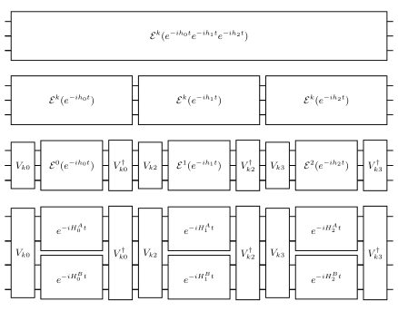 
FIG. 1. Qubit circuit for parallelized first order Trotterization with 3 circuit slices.

📷 Fig 2

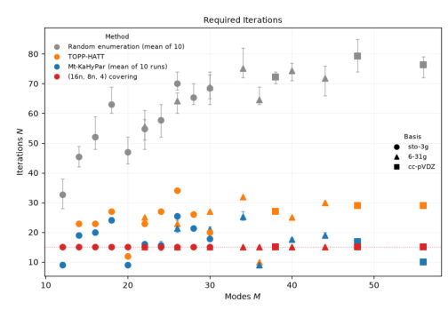 
FIG. 2. Required number of encodings to parallelize molec- ular Hamiltonians across two QPUs. Results are given for a range of molecules in sto-3g, 6-31g and cc-pVDZ bases. Data points in grey are random enumerations, orange are TOPP- HATT optimised, blue are hypergraph bisections using mt- KaHyPar and in red are (16n,8n,4) covering results.

**Summary.** This paper presents a novel, efficient method to parallelize the simulation of fermionic systems on multiple QPUs by optimizing the qubit encoding using combinatorial covering designs. By achieving a communication cost scaling of O(Mr), it significantly improves resource estimates compared to existing techniques. This advancement is crucial for scaling quantum simulations of molecular and condensed matter physics to larger systems.

**Why it may be interesting.** This work directly addresses the resource scaling challenges (communication overhead) inherent in simulating complex quantum many-body systems on near-term quantum hardware.

Detailed structure

**Main problem.** The core problem is efficiently parallelizing and distributing the Trotterized simulation of fermionic Hamiltonians across multiple Quantum Processing Units (QPUs).

**Main result.** The authors demonstrate that using combinatorial covering designs achieves a communication cost scaling of O(Mr), which is superior to previous bounds and other optimization methods.

**Method.** They propose using combinatorial covering designs to define a minimal set of fermion-qubit encodings, allowing the Hamiltonian simulation to be partitioned and executed in parallel across multiple QPUs.

**Model / system.** The system involves fermionic modes governed by the Electronic Structure Hamiltonian (ESH), which is simulated via time evolution using the Trotter-Suzuki approximation.

**Key observables.** Communication cost (measured by the number of inter-QPU fSWAP gates) and the complexity scaling of the required encodings.

**Important parameters / regimes.** M (number of fermionic modes), r (Trotter number), and the specific structure of the Hamiltonian terms.

**Assumptions / limitations.** The method assumes that all parallelized slices can be implemented without error, and it compares its performance against various encoding and partitioning strategies.

**Figures summary.** Figure 1 illustrates the qubit circuit diagram for parallelized first-order Trotterization using multiple circuit slices. Table I provides numerical comparisons of required encodings for various molecules using different methods.

**Paper structure.** The paper progresses by introducing the Trotterization of the ESH, detailing fermion-qubit encodings (like JW), introducing the concept of combinatorial coverings, and finally presenting the method for distributed fermionic Trotterization.

Abstract

We demonstrate a simple and efficient method to parallelize and distribute Trotterized Hamiltonian simulation of fermionic systems across multiple QPUs. Using combinatorial covering designs to define a minimal set of fermion-qubit encodings, we demonstrate communication cost scaling as $\mathcal{O}(M r)$ for a system of $M$ fermionic modes and Trotter number $r$, improving on the static encoding bound for $q$ QPUs, $\mathcal{O}(M^4 q r)$. We compare this approach to dynamic encoding using a randomised method, Pauli-weight based optimisation and hypergraph partitioning. Applying this to the Hamiltonians of a range of molecular systems, we find the combinatorial covering approach results in the lowest communication cost in all but the sparsest Hamiltonians.

[↑ back to top](#top)

### [Planar Contact Structures with Calabi-Yau Fillings and Topological Quantum Computation](http://arxiv.org/abs/2609.30406v1)

**Authors:** Atsuhide Mori  
**Type:** theory · **Category:** quantum information and computing · **PDF:** <https://arxiv.org/pdf/2609.30406v1>  
**Analysis basis:** full PDF text, analyzed in chunks

📷 Fig 1

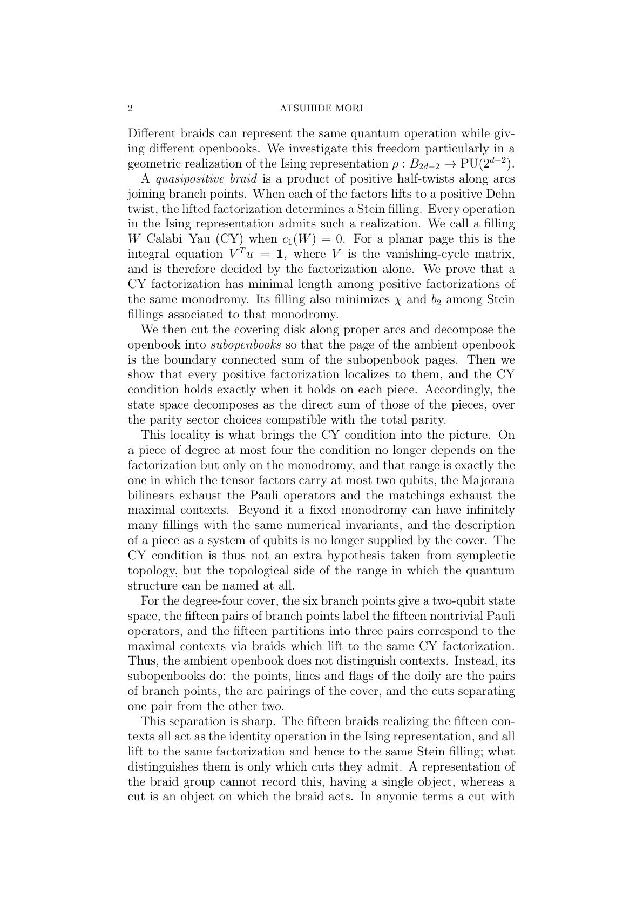 
Low-resolution page preview, page 2

📷 Fig 2

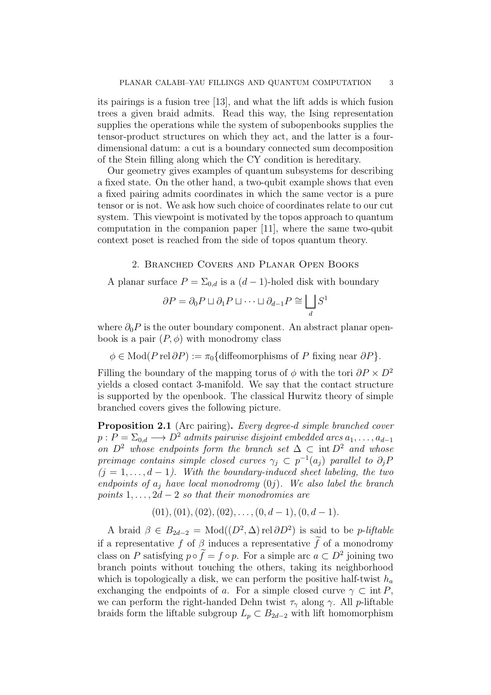 
Low-resolution page preview, page 3

📷 Fig 3

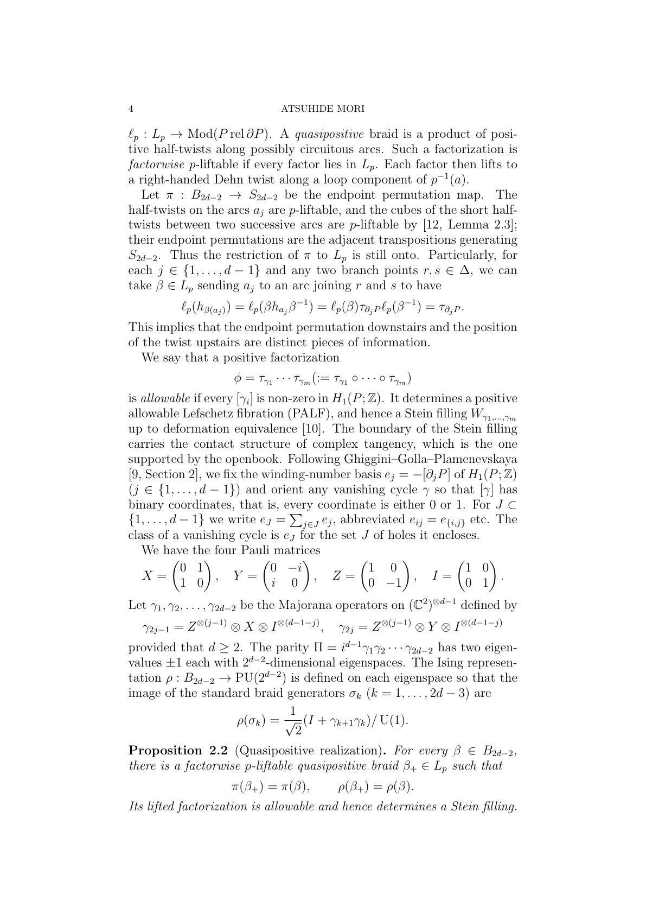 
Low-resolution page preview, page 4

📷 Fig 4

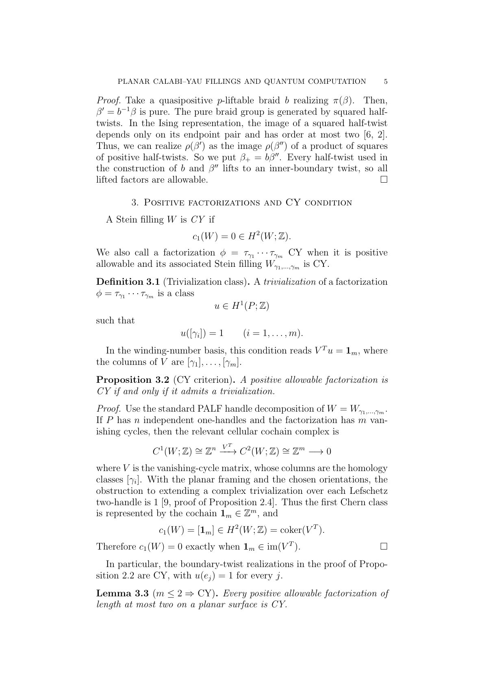 
Low-resolution page preview, page 5

📷 Fig 5

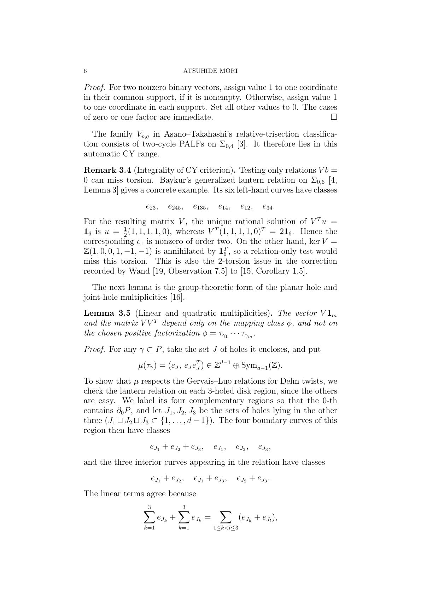 
Low-resolution page preview, page 6

**Summary.** This theoretical paper connects the geometry of planar contact structures to quantum computation by studying the Calabi-Yau condition on associated Stein fillings. The authors derive a criterion for this condition based on the factorization of a monodromy, showing that the topological constraints dictate the structure of the quantum state space. This suggests a fundamental link between contact topology and quantum entanglement.

**Why it may be interesting.** It provides a deep, mathematically rigorous link between advanced geometric topology (contact manifolds, Calabi-Yau geometry) and the fundamental structure of quantum computation, suggesting that topological constraints dictate quantum entanglement structure.

Detailed structure

**Main problem.** The paper investigates the relationship between the geometric properties of planar contact structures (specifically their associated Stein fillings) and the constraints imposed by topological quantum computation.

**Main result.** A criterion is established showing that the Calabi-Yau (CY) condition on the filling is equivalent to the existence of a specific 'trivialization' related to the factorization of the monodromy. Furthermore, the structure suggests that the choice of tensor product decomposition is determined by the lift, not just the braid group representation.

**Method.** The authors use techniques from contact topology, analyzing planar open books derived from lifting braids through branched covers, and applying algebraic criteria (like the trivialization condition) to determine the CY nature of the associated Stein fillings.

**Model / system.** The physical system involves planar open books derived from lifting braids through branched covers of the disk $D^2$. The quantum aspect is modeled via the Ising representation of the braid group acting on quantum state spaces, which relates to topological quantum computation.

**Key observables.** The first Chern class $c_1(W)$ (for the CY condition), the length of the factorization, and the structure of the resulting tensor product state space (e.g., qubits in the two-qubit doily).

**Important parameters / regimes.** The degree $d$ of the branched cover (with special attention paid to $d=3, 4, \ge 6$), and the specific monodromy $\phi$.

**Assumptions / limitations.** The analysis relies on the existence of a positive allowable factorization and the localization of the CY condition to subopenbook pieces. Uniqueness of the filling is only guaranteed for $d \le 3$.

**Paper structure.** The paper progresses by first establishing the geometric framework (planar open books, Stein fillings) and the CY criterion. It then analyzes the factorization structure, showing how the CY condition localizes to subcomponents. Finally, it connects this topological structure to quantum information by examining the resulting tensor product state spaces and the role of the lift versus the braid group representation.

Abstract

We study planar open books obtained by lifting braids through branched covers of the disk D^2, together with the quantum operations in the Ising representation. We note a criterion for the associated Stein fillings to be Calabi-Yau (CY). Among positive factorizations of a fixed monodromy, every CY factorization has minimal length, and its filling minimizes χand b_2. An application to Baykur's recent examples gives one planar contact 3-manifold with infinitely many non-homeomorphic CY fillings. The cover there is of degree \ge 6. At degree 4 a single CY filling forces every filling to be CY, and the filling is unique in a certain case; at degree \le 3 the filling is unique and is CY under a mild condition. Admissible cuts of the covering disk decompose the openbook into subopenbooks. Every positive factorization then localizes to the pieces, and the CY condition holds exactly when it holds locally. This makes the state space a direct sum of tensor products indexed by the compatible parity choices with at most two qubits in each factor when the pieces have degree \le 4, which is also the range in which the CY condition depends only on the monodromy. For a particular degree 4 cover, the points, lines and flags of the two-qubit doily are realized by the system of its subopenbooks. Fifteen liftable braids there share the same quantum operation and the same Stein filling, and are separated only by which subopenbook systems they admit. A choice of tensor-product structure is thus carried by the lift and not by the braid group representation, which suggests a link between contact topology and quantum entanglement.

[↑ back to top](#top)

### [Quantum Approximate Optimisation Algorithm for Protein Sidechain Packing](http://arxiv.org/abs/2609.31077v1)

**Authors:** Sebastian O. M. Stewart, Nick Chancellor, Jonte R Hance, Ittoop Vergheese Puthoor  
**Type:** theory · **Category:** quantum information and computing · **PDF:** <https://arxiv.org/pdf/2609.31077v1>  
**Analysis basis:** full PDF text, analyzed in chunks

📷 Fig 1

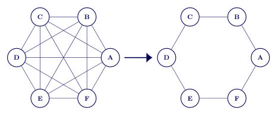 
Fig. 1. Transition from the complete-graph mixer to the cyclic-ring mixer within a residue sub-register, reducing the two-qubit gate count from O(MN2) to O(MN) while preserving full reachability of the valid one-hot subspace across QAOA layers.

📷 Fig 2

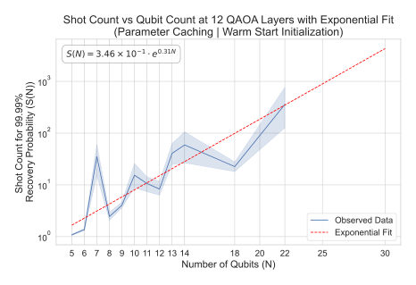 
Fig. 2. Asymptotic shot scaling S(N) at circuit depth p = 12 on the 5PTI protein, for a 99.99% recovery probability, pooled across all evaluated residue subsections and their 30 seeds at each qubit count. The shaded area is a bootstrapped 95% CI over this distribution. Shot count appears to grow exponentially in qubit count; the fitted model stays below 500 shots through N = 22. N = 7 is an outlier; the bands widen at the sparsely sampled large-N points.

📷 Fig 3

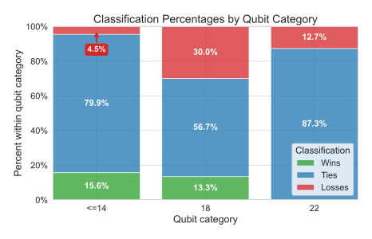 
Fig. 3. Classification outcomes by qubit category, high AlphaFold-confidence regions (pLDDT &gt; 90), ∆E against the AlphaFold baseline. Wins decline from 15.6% (≤14 qubits) to zero at 22. Losses peak in frequency at 18 qubits (30.0%, penalties up to +3.973 kcal/mol) but in magnitude at 22 (12.7% of runs, up to +4.393 kcal/mol), where outcomes are otherwise 87.3% ties.

**Summary.** This paper presents a quantum-classical pipeline using QAOA to solve the NP-hard sidechain packing problem in protein folding, utilizing the backbone predicted by AlphaFold2. By developing a constraint-preserving ansatz with a ring mixer, the authors efficiently encode the energy minimization as a QUBO problem on qubits. The method successfully lowers the calculated conformational energy compared to the established AlphaFold baseline.

**Why it may be interesting.** The work demonstrates a sophisticated application of QAOA to a complex, classically hard problem in structural biology, specifically by engineering a novel, efficient ansatz (ring mixer) to manage qubit scaling.

Detailed structure

**Main problem.** The paper addresses the NP-hard problem of sidechain packing in protein folding, which involves finding the lowest-energy rotamer assignment for sidechains attached to a fixed protein backbone.

**Main result.** The proposed hybrid quantum-classical pipeline successfully lowers the conformational energy compared to the AlphaFold baseline when tested on the 5PTI protein.

**Method.** It employs the Quantum Approximate Optimisation Algorithm (QAOA) to map the energy minimization problem onto a Quadratic Unconstrained Binary Optimisation (QUBO) formulation.

**Model / system.** The system models protein sidechains, where rotamer assignments are encoded onto qubits using one-hot encoding. The optimization is performed on a Hamiltonian derived from the one- and two-body interaction energies.

**Key observables.** Conformational energy ($\Delta E$), the asymptotic shot-scaling metric ($S(N)$), and the cumulative success probability ($P_c(N)$).

**Important parameters / regimes.** Qubit count ($N$), rotamer count ($R$), and the confidence level of the AlphaFold prediction ($	ext{pLDDT}$).

**Assumptions / limitations.** The method assumes the backbone structure provided by AlphaFold2 is reliable enough to serve as a fixed scaffold, and it relies on a constraint-preserving ansatz to enforce one-hot validity.

**Figures summary.** Figures illustrate the reduction in gate scaling from $O(MN^2)$ to $O(MN)$ by using a cyclic ring mixer, and show the trend of the shot-scaling metric $S(N)$ versus qubit count for the 5PTI protein.

**Paper structure.** The paper details a multi-step pipeline: preprocessing with PyRosetta to define flexible regions, followed by QAOA optimization using a specialized constraint-preserving ansatz, and concluding with performance evaluation using specialized metrics against the AlphaFold baseline.

Abstract

Sidechain packing is a critical stage in protein folding, with direct implications for structure-based drug discovery. Google DeepMind's tool, AlphaFold2, predicts protein backbone reliably but sidechain positioning less accurately. Recovering the lowest-energy rotamer assignment over a fixed backbone is NP-hard. We present a hybrid quantum-classical pipeline that repacks sidechains on the AlphaFold backbone using the Quantum Approximate Optimisation Algorithm (QAOA), encoding the one- and two-body energies as a quadratic unconstrained binary optimisation (QUBO) problem. We introduce a constraint-preserving ansatz, pairing a W-state initialisation with a cyclic XY ring mixer, that enforces one-hot rotamer validity without penalty terms while keeping two-qubit gate scaling linear in the rotamer count. We also define an asymptotic shot-scaling metric, measured against the experimentally resolved conformation, that fixes optimiser quality independently of the baseline; its fitted growth stays below the classical exhaustive-search rate at moderate rotamer flexibility. Evaluated on bovine pancreatic trypsin inhibitor (5PTI) across high- and moderate AlphaFold-confidence regions, the pipeline lowers conformational energy against the AlphaFold baseline.

[↑ back to top](#top)

### [Quantum interaction can superactivate cheating under parallel repetition](http://arxiv.org/abs/2609.31223v1)

**Authors:** Archishna Bhattacharyya, Laura Mančinska, Yuming Zhao  
**Type:** theory · **Category:** quantum information and computing · **PDF:** <https://arxiv.org/pdf/2609.31223v1>  
**Analysis basis:** full PDF text, analyzed in chunks

📷 Fig 1

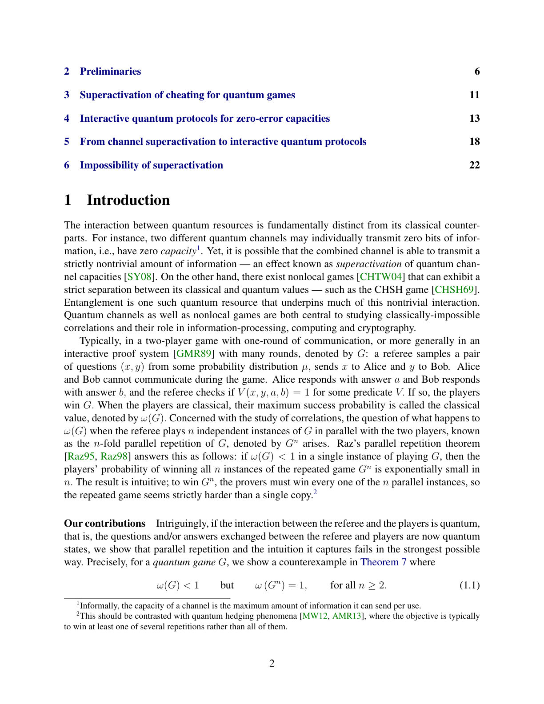 
Low-resolution page preview, page 2

📷 Fig 2

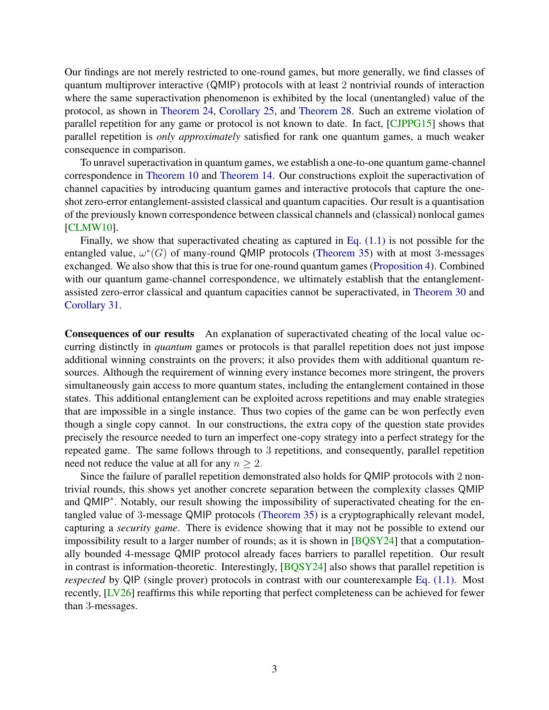 
Low-resolution page preview, page 3

📷 Fig 3

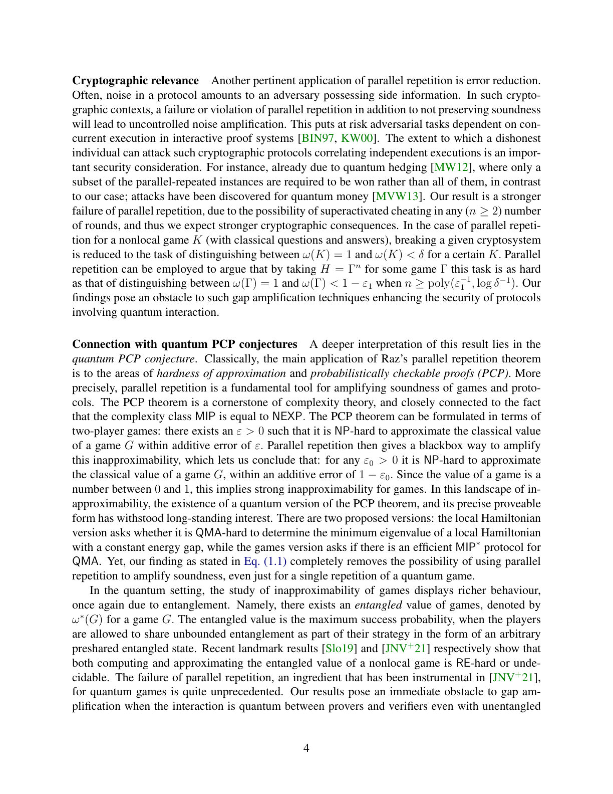 
Low-resolution page preview, page 4

📷 Fig 4

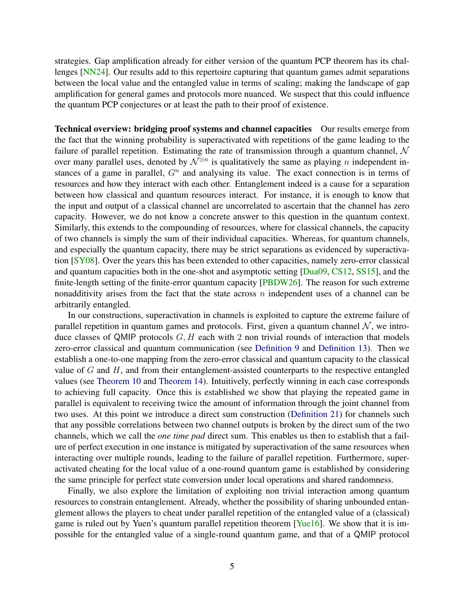 
Low-resolution page preview, page 5

📷 Fig 5

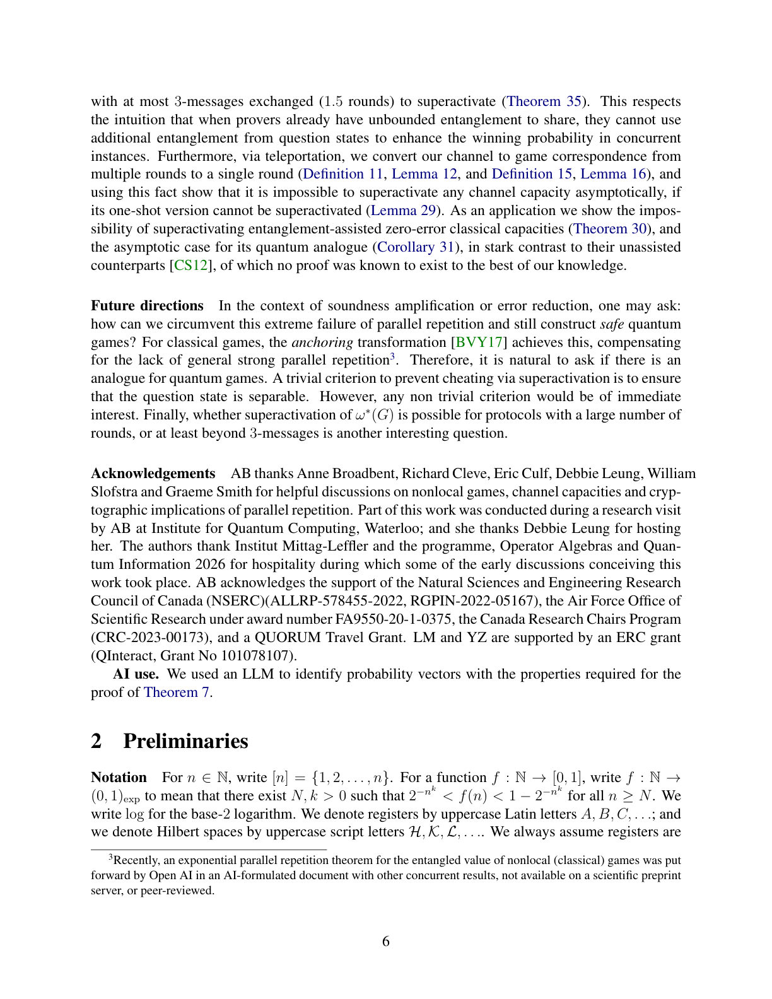 
Low-resolution page preview, page 6

**Summary.** This paper explores the counterintuitive phenomenon of 'superactivation' in quantum interactive proof systems, showing that quantum communication can cause the cheating probability to increase dramatically upon parallel repetition. The authors prove that while the single-shot cheating value can be low, repeating the game multiple times forces the cheating probability to one. This work has significant implications for quantum complexity theory and the security analysis of quantum protocols.

**Why it may be interesting.** The finding that quantum resources can be 'superactivated' by repetition challenges standard assumptions about error amplification in quantum protocols, which is a core topic in quantum information theory.

Detailed structure

**Main problem.** The paper investigates how quantum communication affects the soundness error of interactive multiprover games (QMIP) under parallel repetition, contrasting this with classical results.

**Main result.** The authors demonstrate that quantum communication can cause 'superactivation' of cheating, where the cheating probability increases from a value less than one for a single instance to exactly one under parallel repetition.

**Method.** The work establishes a correspondence between quantum games and quantum channels, using techniques like teleportation-based reductions and analyzing the behavior of zero-error capacities.

**Model / system.** The model involves quantum interactive proof systems (QMIP) and quantum channels, analyzing the success probability of cheating provers (the 'value' of the game).

**Key observables.** The local value $\omega(G)$ versus the parallel repetition value $\omega(G^n)$, and the zero-error classical/quantum capacities ($C_0, Q_0$).

**Important parameters / regimes.** The number of parallel repetitions ($n$), and the number of messages exchanged (limited to 3 for certain impossibility results).

**Assumptions / limitations.** The impossibility results for entangled values are shown only for a limited number of messages (at most 3), and the analysis relies on establishing specific orthogonality relations.

**Paper structure.** The paper builds by first contrasting classical and quantum parallel repetition effects, then introducing the quantum game-channel correspondence, proving the superactivation phenomenon for the local value, and finally proving the impossibility of superactivation for the entangled value under certain constraints.

Abstract

We study interactive multiprover games and many-round protocols in which the communication between the verifier and the provers is quantum. Parallel repetition is known to suppress soundness error of classical two-prover games arbitrarily close to zero, as shown by Raz (STOC '95), even with quantum strategies as shown by Yuen (ICALP '16), and Bavarian, Vidick and Yuen (STOC '17). Yet, we show that quantum communication can have the opposite, unexpected effect. Specifically, we exhibit a one-round quantum game and two-round $\mathsf{QMIP}$ protocols whose local (unentangled) value is strictly less than one for a single instance, yet equals one under $n$-fold parallel repetition for every $n \geq 2$. The key is that parallel repetition not only imposes additional winning conditions but also supplies additional quantum resources as entanglement in the exchanged states can be exploited jointly across copies.   Our multiround examples build on superactivation of zero-error capacities of quantum channels. To establish this connection, we introduce quantum games and interactive protocols which capture the one-shot zero-error classical and quantum capacities, both with and without entanglement assistance. Our constructions use quantum-state verification and a teleportation-based reduction from two rounds to one.   In contrast, when shared entanglement is allowed, we show that parallel repetition cannot increase the entangled value when at most $3$ messages are exchanged, consistent with classical results of Bellare, Impagliazzo and Naor (FOCS '97), and that of single-prover systems by Kitaev and Watrous (STOC '00). Combining this monotonicity with our quantum game-channel correspondence, we show that entanglement-assisted zero-error classical and quantum capacities cannot be superactivated.

[↑ back to top](#top)

### [Representation-Aware Transport-Information Measure for Non-inclusive Discrete Supports](http://arxiv.org/abs/2609.30944v1)

**Authors:** Koretaka Yuge  
**Type:** theory · **Category:** statistical mechanics · **PDF:** <https://arxiv.org/pdf/2609.30944v1>  
**Analysis basis:** full PDF text, analyzed in chunks

📷 Fig 1

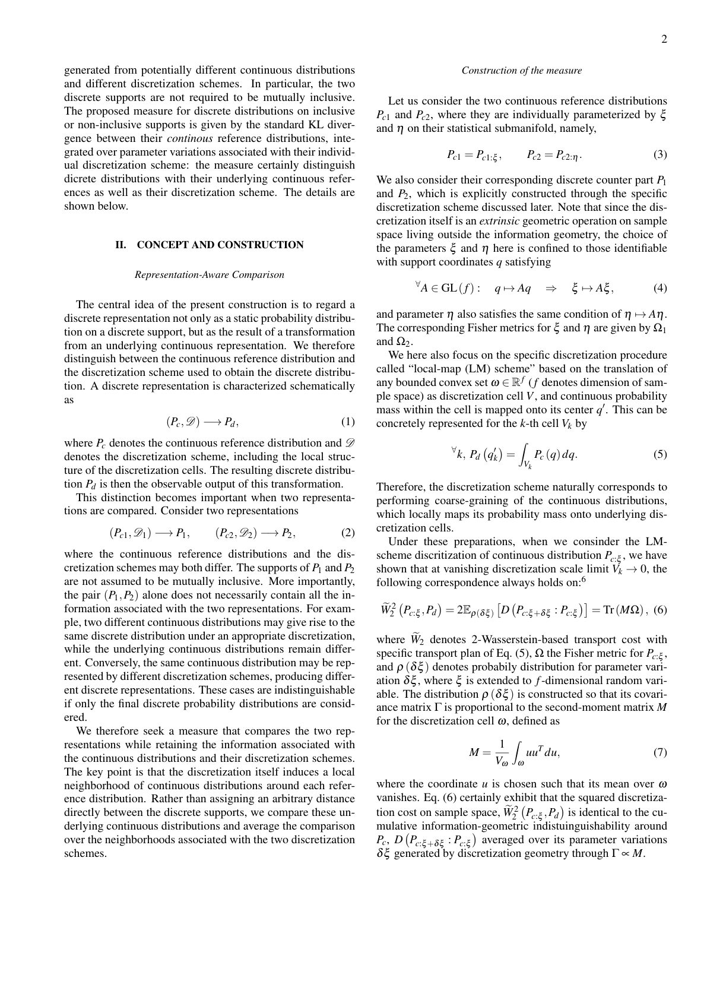 
Low-resolution page preview, page 2

📷 Fig 2

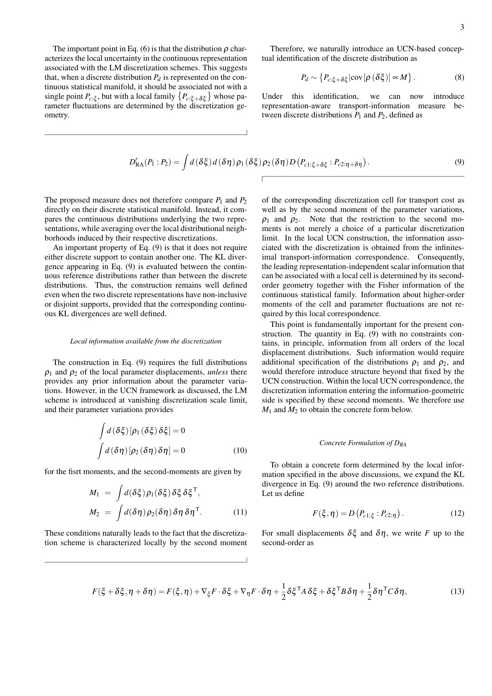 
Low-resolution page preview, page 3

📷 Fig 3

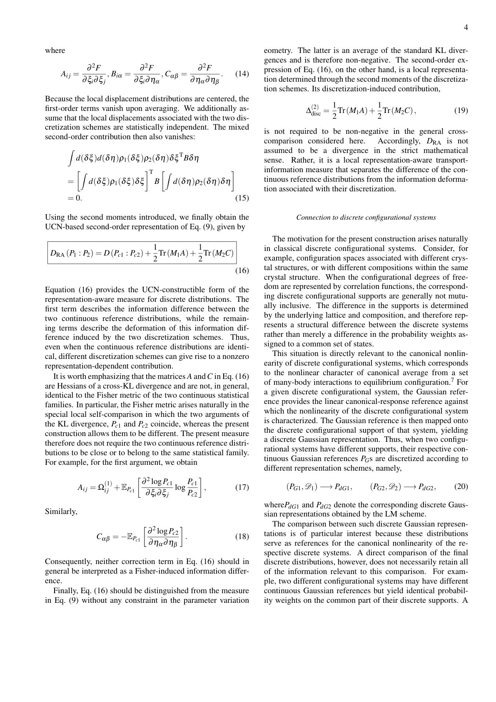 
Low-resolution page preview, page 4

📷 Fig 4

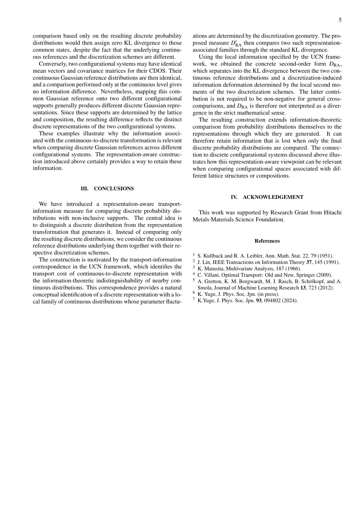 
Low-resolution page preview, page 5

**Summary.** This work develops a sophisticated information-theoretic measure to compare discrete probability distributions whose supports may not overlap. It achieves this by moving beyond comparing only the final discrete states, instead incorporating information about the continuous distributions and the specific discretization processes used to generate them. This provides a powerful tool for analyzing physical systems where the underlying continuous physics is more informative than the resulting coarse-grained data.

**Why it may be interesting.** While the core topic is information geometry, the rigorous mathematical framework connecting extrinsic geometric operations (discretization) to intrinsic information metrics is highly relevant for developing robust comparison tools in complex many-body systems where approximations or coarse-graining are inevitable.

Detailed structure

**Main problem.** The paper addresses the challenge of comparing discrete probability distributions, particularly when their supports are non-inclusive, while retaining crucial information about the underlying continuous distributions and the discretization schemes used to generate them.

**Main result.** A novel representation-aware transport-information measure ($D_{RA}$) is introduced that successfully quantifies the difference between two discrete distributions by combining the divergence between their continuous references with a term quantifying the information deformation caused by their respective discretization processes.

**Method.** The measure is formulated using the framework of unavoidable canonical nonlinearity (UCN), linking the 2-Wasserstein transport cost of discretization to the information-geometric indistinguishability of nearby continuous distributions.

**Model / system.** The theory is applied to general comparison of probability distributions, finding relevance in physical systems like configurational degrees of freedom (e.g., crystal structures) where the resulting discrete supports may be non-inclusive.

**Key observables.** The representation-aware transport-information measure ($D_{RA}$), the 2-Wasserstein-based transport cost ($	ext{eW}^2/2$), and the local information deformation terms ($	ext{Tr}(M_1A) + 	ext{Tr}(M_2C)$).

**Important parameters / regimes.** The continuous reference distributions ($P_{c1}, P_{c2}$), the discretization schemes ($D_1, D_2$), and the vanishing discretization scale limit ($	ext{V}_k 
ightarrow 0$).

**Assumptions / limitations.** The derivation assumes the local-map (LM) scheme for discretization and relies on the local UCN correspondence, which equates the discretization cost to the information-geometric indistinguishability at the leading order.

**Paper structure.** The paper first establishes the limitations of standard information measures for non-inclusive supports. It then introduces the UCN framework to relate discretization geometry to information geometry. Finally, it derives and presents the concrete, second-order form of the representation-aware measure, separating the continuous difference from the discretization-induced deformation.

Abstract

Information-theoretic measures for comparing probability distributions are widely used across physics and other fields. When two discrete distributions have non-inclusive supports, however, the Kullback-Leibler (KL) divergence is in general not directly applicable, and various alternative divergences and distances have been introduced. These measures compare the resulting distributions themselves, but do not generally retain information about the representation transformations by which the discrete distributions are generated from underlying continuous ones. Here we introduce a representation-aware transport-information measure for discrete distributions with non-inclusive supports, formulated based on the standard KL divergence. We consider two continuous reference distributions, each transformed into a discrete representation through its own discretization scheme. Rather than comparing only the resulting discrete distributions or their continuous references, we additionally retain local information associated with the representation-change schemes. The resulting measure can therefore distinguish discrete representations that may have identical discrete probability landscapes but originate from different continuous references or discretization schemes. The construction is based on the transport-information cost of continuous-to-discrete representation in the framework of unavoidable canonical nonlinearity (UCN). UCN provides a non-arbitrary correspondence between the transport cost of discretization as an extrinsic geometric operation and the information-theoretic indistinguishability of nearby continuous distributions, thereby allowing a discrete representation to be associated with a local family of underlying continuous distributions on the statistical manifold.

[↑ back to top](#top)

### [Sharp Data-Processing Region for Quantum Conditional Rényi Entropies](http://arxiv.org/abs/2609.31350v1)

**Authors:** Milad M. Goodarzi, Yucheng Bao, Marco Tomamichel  
**Type:** theory · **Category:** quantum information and computing · **PDF:** <https://arxiv.org/pdf/2609.31350v1>  
**Analysis basis:** full PDF text, analyzed in chunks

📷 Fig 1

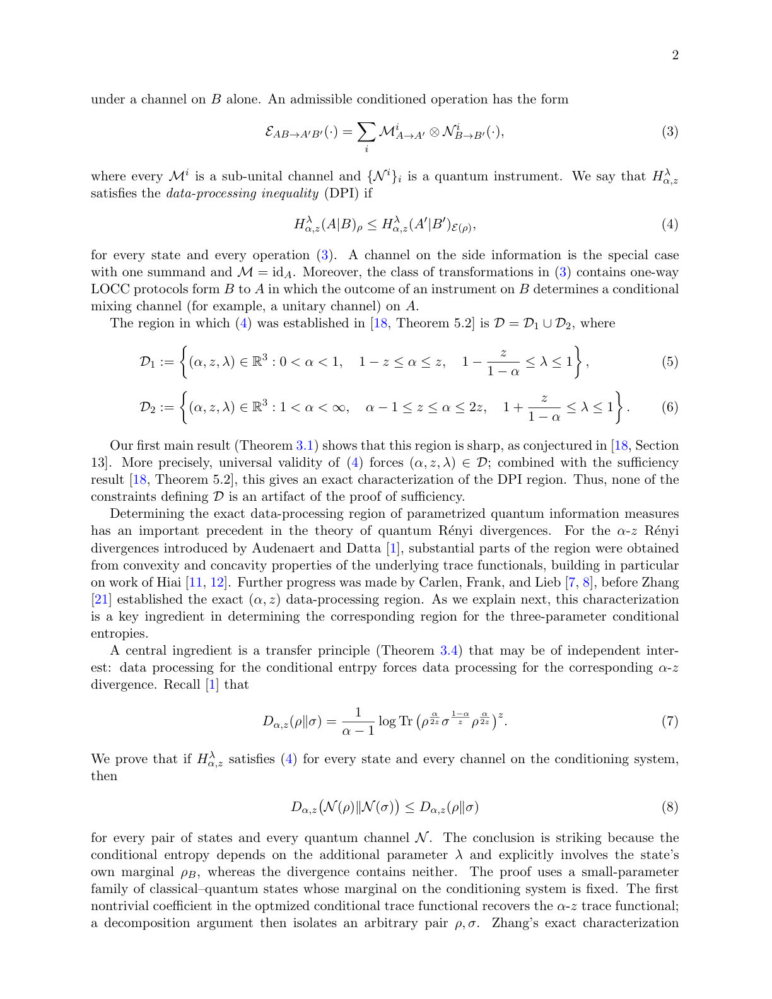 
Low-resolution page preview, page 2

📷 Fig 2

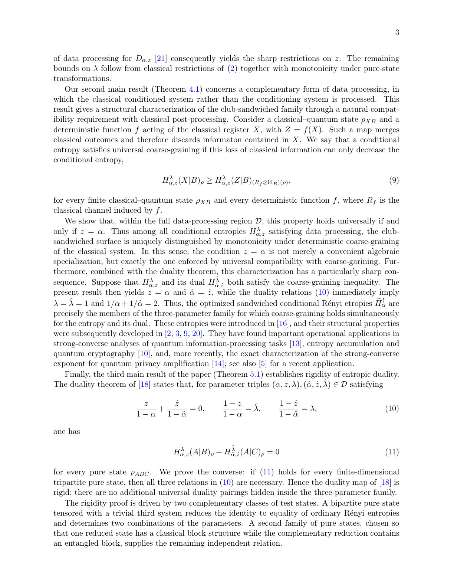 
Low-resolution page preview, page 3

📷 Fig 3

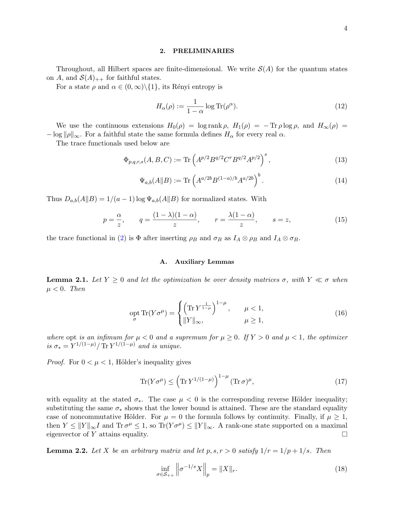 
Low-resolution page preview, page 4

📷 Fig 4

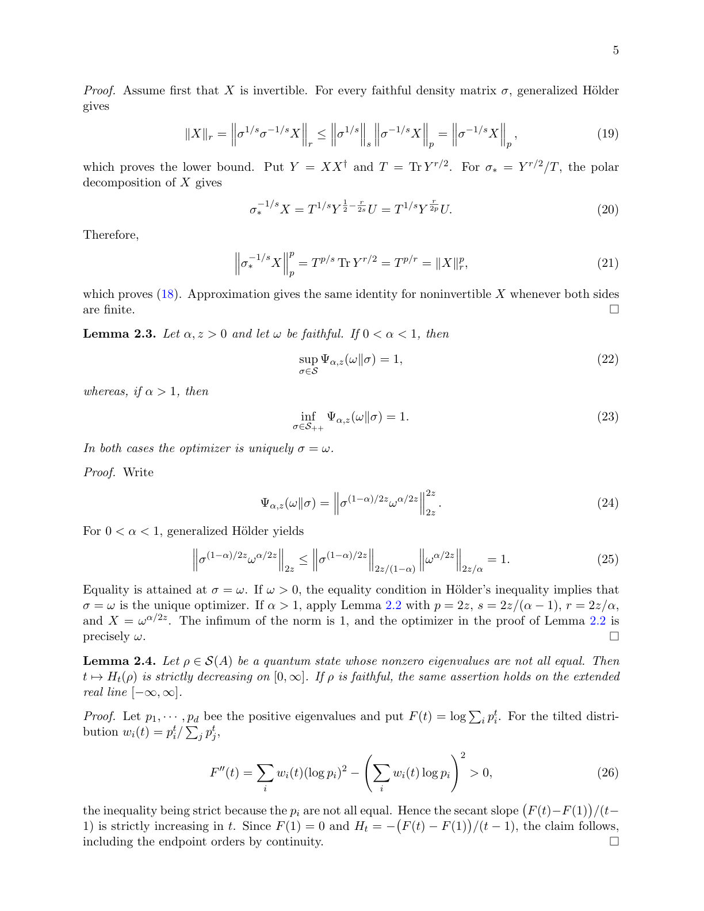 
Low-resolution page preview, page 5

📷 Fig 5

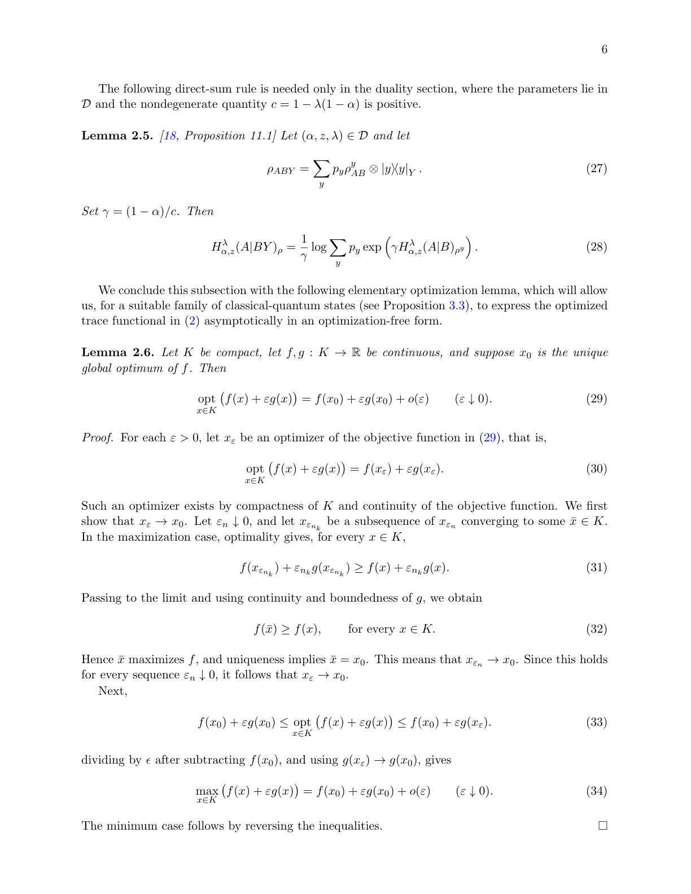 
Low-resolution page preview, page 6

**Summary.** This paper provides a comprehensive mathematical characterization of the data-processing properties for a generalized family of quantum conditional Rényi entropies. By proving the sharpness of the data-processing region and deriving necessary conditions from universal monotonicity and entropic duality, the authors uniquely determine the structural constraints on these entropy measures. This work solidifies the mathematical understanding of information flow in quantum systems.

**Why it may be interesting.** The rigorous characterization of fundamental information-theoretic quantities like conditional entropy and their associated inequalities provides deep structural insights into quantum correlations, which underpins quantum computation theory.

Detailed structure

**Main problem.** The paper aims to characterize the data-processing region, the club-sandwiched subfamily, and the entropic duality for a three-parameter family of quantum conditional Rényi entropies.

**Main result.** It proves that the data-processing region is sharp, that universal monotonicity under coarse-graining forces the parameter $z$ to equal $\alpha$, and that the entropic duality relations are rigid.

**Method.** The analysis uses rigorous mathematical proofs involving the application of specific test states (e.g., pure states, quantum-classical marginals) to derive necessary and sufficient conditions for various inequalities to hold.

**Model / system.** The study focuses on the generalized quantum conditional Rényi entropy, $H_{\lambda}^{\alpha, z}(A|B)
ho$, defined for bipartite quantum states $
ho_{AB}$ in finite-dimensional Hilbert spaces.

**Key observables.** Quantum conditional Rényi entropies ($H_{\lambda}^{\alpha, z}$), the data-processing inequality (DPI), and the entropic duality relation.

**Important parameters / regimes.** The entropy depends on three parameters: $\alpha > 0, \alpha 
eq 1$, $z > 0$, and $\lambda \in \mathbb{R}$.

**Assumptions / limitations.** The analysis assumes finite-dimensional Hilbert spaces and relies on testing the functional against specific classes of pure and mixed states to constrain the parameters.

**Paper structure.** The paper proceeds by first establishing the sharpness of the DPI region using various test states, then uses the condition of universal coarse-graining monotonicity to constrain the parameters, and finally uses the duality relation to uniquely characterize the entire structure.

Abstract

We study the three-parameter family of quantum conditional Rényi entropies $H_{α,z}^λ$ introduced in \textit{Commun. Math. Phys.} 407, 180 (2026). We prove that the previously established data-processing region is sharp. We then characterize the club-sandwiched family through a classical coarse-graining principle: within the full data-processing region, universal monotonicity under deterministic coarse-graining of the classical conditioned register holds if and only if $z = α$. Finally, we establish rigidity of entropic duality by showing that any universal duality relation for finite-dimensional tripartite pure states must satisfy the known parameter relations. Thus, the data-processing region, the club-sandwiched subfamily, and the duality transformation are each uniquely characterized by their respective universal properties.

[↑ back to top](#top)

### [Supporting functionals and singular boundary geometry of two-qubit entanglement of formation](http://arxiv.org/abs/2609.31097v1)

**Authors:** Wei Song, Xiao-Lan Zong  
**Type:** theory · **Category:** quantum information and computing · **PDF:** <https://arxiv.org/pdf/2609.31097v1>  
**Analysis basis:** full PDF text, analyzed in chunks

📷 Fig 1

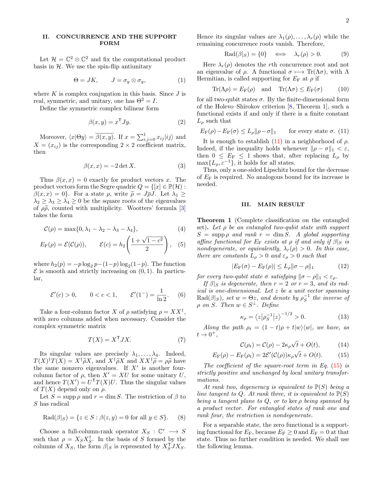 
Low-resolution page preview, page 2

📷 Fig 2

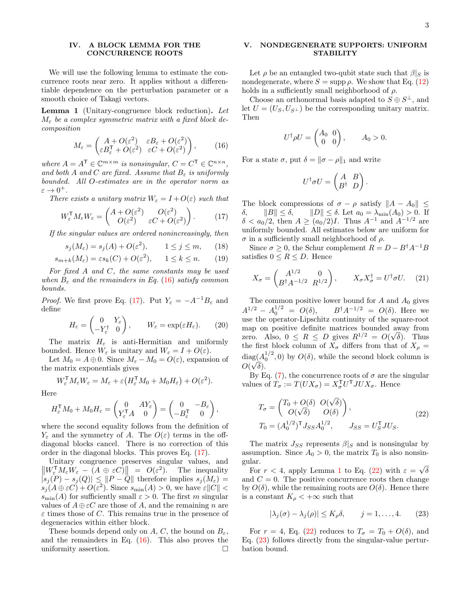 
Low-resolution page preview, page 3

📷 Fig 3

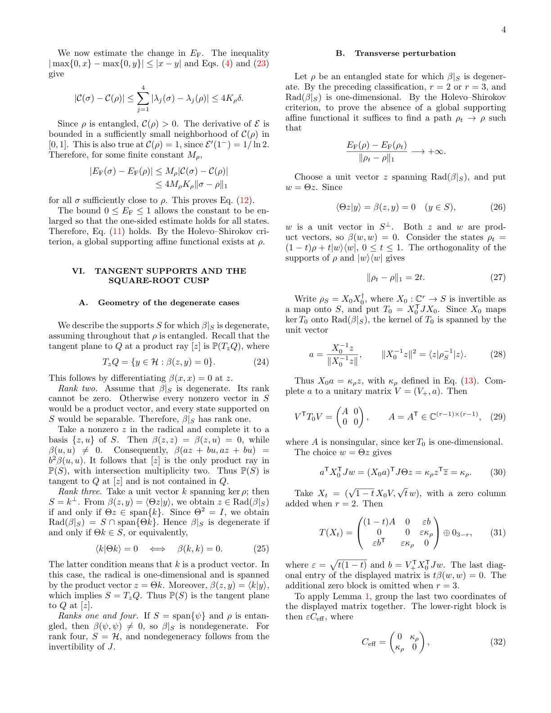 
Low-resolution page preview, page 4

📷 Fig 4

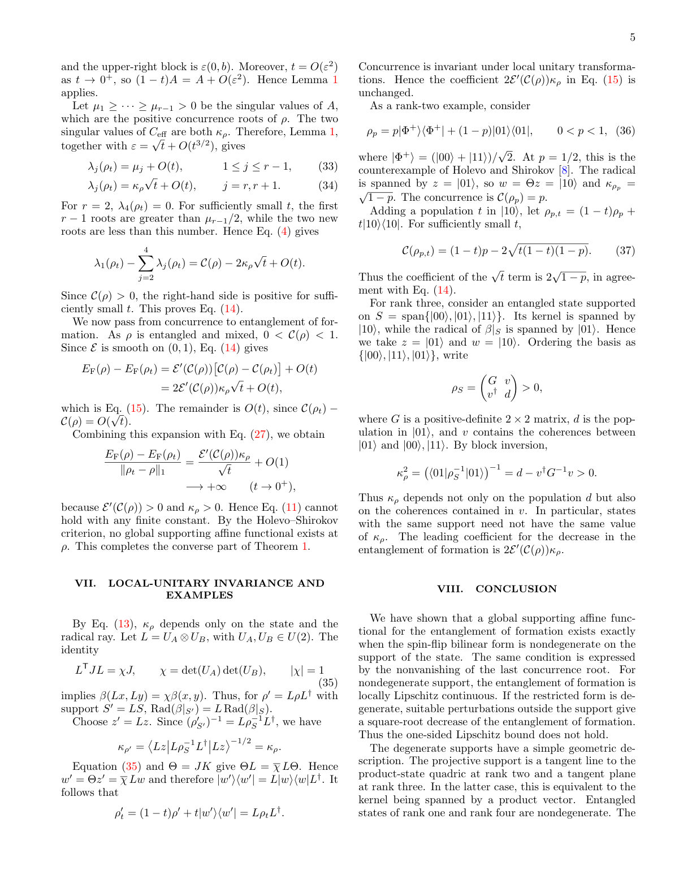 
Low-resolution page preview, page 5

📷 Fig 5

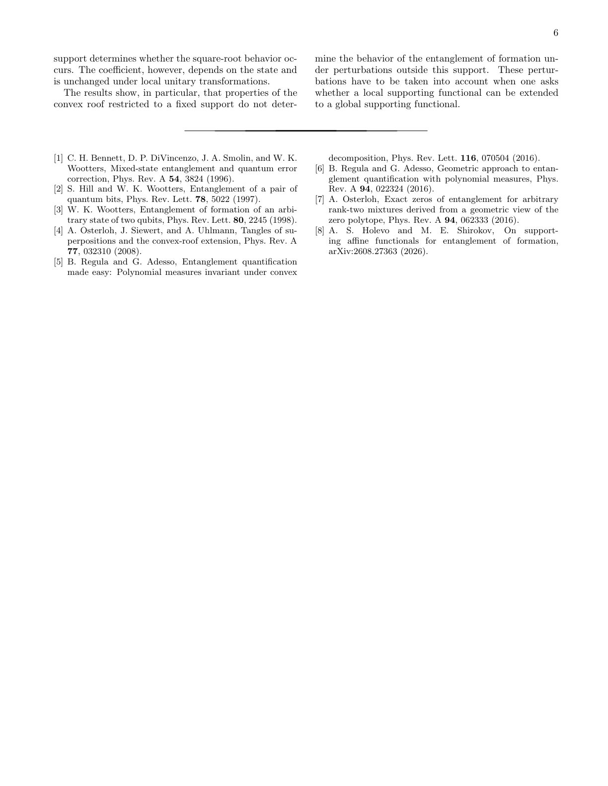 
Low-resolution page preview, page 6

**Summary.** This theoretical paper provides a precise mathematical criterion for determining if the entanglement of formation ($	ext{EF}$) for a two-qubit state possesses a global supporting affine functional. The existence hinges on the nondegeneracy of the state's support with respect to the spin-flip bilinear form. Failure of this condition leads to a characteristic square-root decay of $	ext{EF}$ under perturbation, demonstrating a fundamental limitation in the measure's global differentiability.

**Why it may be interesting.** The rigorous mathematical characterization of when entanglement measures are well-behaved under small perturbations is crucial for developing robust quantum information protocols and understanding the boundaries of quantum correlations.

Detailed structure

**Main problem.** The paper aims to establish necessary and sufficient conditions for the existence of a global supporting affine functional for the entanglement of formation ($	ext{EF}$) for an entangled two-qubit state.

**Main result.** A global supporting affine functional exists if and only if the spin-flip bilinear form restricted to the state's support is nondegenerate. In the degenerate case, $	ext{EF}$ decreases as the square root of the mixing parameter, violating the required bound.

**Method.** The analysis combines mathematical criteria involving the nondegeneracy of the spin-flip bilinear form with perturbation theory applied to the $	ext{EF}$ functional along specific paths.

**Model / system.** The study focuses on two-qubit quantum systems, characterized by density matrices $
ho$. The mathematical tools involve the concurrence, the spin-flip bilinear form ($eta$), and the state's support ($S$).

**Key observables.** Entanglement of Formation ($	ext{EF}$), Concurrence ($C$), Spin-flip bilinear form ($eta$), and Concurrence roots ($\lambda_i$).

**Important parameters / regimes.** The degeneracy of $eta|_S$ (nondegenerate vs. rank two/three), and the small perturbation parameter $t$ or $\epsilon$.

**Assumptions / limitations.** The analysis assumes the state $
ho$ is entangled and relies on local Lipschitz continuity established for nondegenerate supports.

**Figures summary.** Not specified in the provided notes.

**Paper structure.** The paper establishes the mathematical criterion for the supporting functional's existence, analyzes the nondegenerate case where local Lipschitz continuity holds, and then investigates the degenerate case using perturbation analysis to show the failure of the global bound.

Abstract

We give a criterion for the existence of a global supporting affine functional for the entanglement of formation at an entangled two-qubit state. It exists if and only if the spin-flip bilinear form is nondegenerate on the support of the state, or equivalently, if the last concurrence root associated with the support is nonzero. In this case the entanglement of formation is locally Lipschitz continuous. In the degenerate case the state has rank two or three, and its projective support is tangent to the product-state quadric. For suitable perturbations outside the support, the entanglement of formation decreases as the square root of the mixing parameter. The leading term is obtained explicitly. This square-root decrease violates the one-sided Lipschitz bound required for a global supporting affine functional.

[↑ back to top](#top)

### [Systematic Evolution of Magnetic Anisotropy and Crystal-electric-field Ground States in SmTr2Ge2](http://arxiv.org/abs/2609.30871v1)

**Authors:** Ryuji Higashinaka, Kokoro Higo, Tatsuma D. Matsuda, Yuji Aoki  
**Type:** experiment · **Category:** strongly correlated electrons · **PDF:** <https://arxiv.org/pdf/2609.30871v1>  
**Analysis basis:** full PDF text, analyzed in chunks

📷 Fig 1

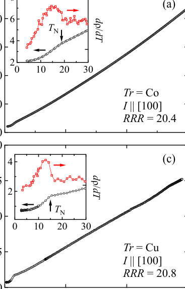 
Fig. 1.

📷 Fig 2

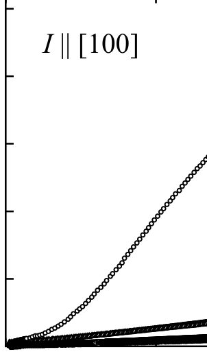 
Fig. 2.

📷 Fig 3

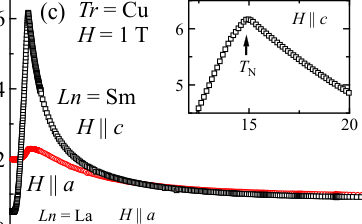 
Fig. 3.

📷 Fig 4

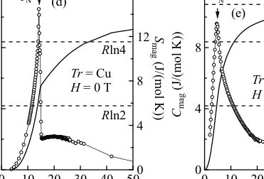 
Fig. 4.

📷 Fig 5

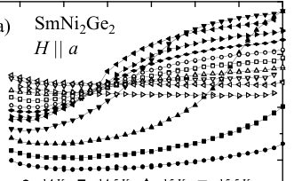 
Fig. 6.

**Summary.** This work experimentally investigates how the magnetic anisotropy and Crystal-Electric-Field (CEF) ground states evolve across the $	ext{SmTr}_2	ext{Ge}_2$ series by varying the transition metal $	ext{Tr}$. By measuring magnetization, specific heat, and susceptibility, the authors demonstrate a clear transition in magnetic behavior linked to the underlying CEF state and the local structural environment around the $	ext{Sm}$ ion.

**Why it may be interesting.** The systematic tuning of magnetic anisotropy via ligand environment (changing $	ext{Tr}$) provides a clear experimental platform to study how crystal fields dictate the low-energy magnetic excitations in $4f$ electron systems.

Detailed structure

**Main problem.** To systematically investigate the evolution of magnetic anisotropy and crystal-electric-field (CEF) ground states in the $	ext{SmTr}_2	ext{Ge}_2$ series.

**Main result.** The magnetic anisotropy systematically changes from easy $ab$ plane ($	ext{Co}, 	ext{Ni}$) to easy $c$ axis ($	ext{Cu}, 	ext{Ag}$), correlating with the evolution of the CEF ground state and local structural parameters.

**Method.** Measurements include magnetization, specific heat, and magnetic susceptibility ($\chi$) as a function of temperature and applied field, complemented by structural analysis.

**Model / system.** The study focuses on the $	ext{SmTr}_2	ext{Ge}_2$ compounds ($	ext{Tr} = 	ext{Co}, 	ext{Ni}, 	ext{Cu}, 	ext{Ag}$) with the $	ext{ThCr}_2	ext{Si}_2$-type structure, where magnetism originates from the $	ext{Sm}^{3+}$ $4f$ electrons.

**Key observables.** Magnetic anisotropy (easy plane vs. easy axis), CEF ground state evolution, magnetic entropy, and resistivity ($
ho(T)$) changes below $T_N$.

**Important parameters / regimes.** Transition metal identity ($	ext{Tr}$), applied magnetic field ($H=1	ext{ T}$), and temperature ($T$).

**Assumptions / limitations.** The analysis uses $	ext{La}$ nonmagnetic analogs to isolate the $	ext{Sm}$ contribution to magnetic susceptibility and specific heat.

**Figures summary.** Figures show $
ho(T)$ vs $T$ for various $	ext{Tr}$ elements, $\chi(T)$ vs $T$ for $H \parallel a$ and $H \parallel c$, and $C_p$ vs $T$ data used to track magnetic entropy evolution.

**Paper structure.** The paper systematically analyzes magnetic measurements ($\chi, C_p, M$) across the $	ext{Tr}$ series, correlating the observed changes in magnetic anisotropy and CEF ground state with the local structural environment determined by X-ray measurements.

Abstract

We investigated the crystal-electric-field (CEF) states in SmTr2Ge2 (Tr= Co-Cu and Ag) with the ThCr2Si2-type structure by magnetization and specific heat measurements. The magnetic anisotropy evolves systematically with Tr, changing from an easy ab plane for Tr = Co and Ni to an easy c axis for Tr = Cu and Ag. Combined analyses of the low-temperature susceptibility and magnetic entropy indicate a level crossing of the CEF ground state between Ni and Cu, together with a systematic evolution of the first excited CEF energy. The evolution of the magnetic properties correlates with changes in local structural parameters, providing an experimental basis for discussing how the ligand environment around the Sm ion is related to the 4f electronic state.

[↑ back to top](#top)

## Secondary cond-mat archives

*Papers from  mes-hall, other, soft, supr-con. These archives are de-prioritized — they appear at the end regardless of relevance score.*

### Relevant in secondary archives (14)

### [A General Non-Markovian Electronic Friction and Langevin Dynamics Framework for Nonequilibrium Systems](http://arxiv.org/abs/2609.31254v1)

**Authors:** S. L. Rudge, R. J. Preston, D. S. Kosov, M. Thoss  
**Type:** theory · **Category:** statistical mechanics · **PDF:** <https://arxiv.org/pdf/2609.31254v1>  
**Analysis basis:** full PDF text, analyzed in chunks
**Topic relevance:** 🔥 `methods for driven-dissipative` **4/5** · `Keldysh / 2PI / non-Gaussian methods` **3/5** · `driven-dissipative phase transition` **2/5** · `non-equilibrium universality` **2/5** · `quantum measurements` **2/5** · `Frenkel-Kontorova` **1/5** · `correlated / nonlocal dissipation` **1/5** · `scars & prethermalization` **1/5**

📷 Fig 1

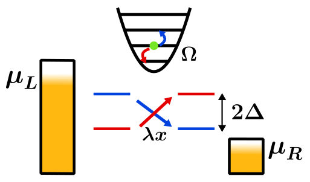 
FIG. 1. Schematic of the vibrationally coupled donor- acceptor model. Two electronic energy configurations are shown: ∆&gt; 0 and ∆&lt; 0, which correspond to driving and dissipation of the harmonic vibrational mode, respectively.

📷 Fig 2

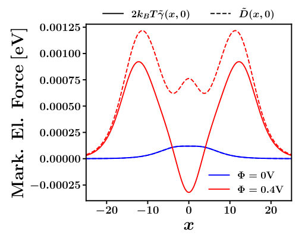 
FIG. 2. Markovian electronic friction (solid lines) and correla- tion function of the stochastic force (dashed lines) plotted as a function of vibrational coordinate, x, and for two voltages: Φ = 0V (blue) and Φ = 0.4V (red). The electronic energies are chosen as ∆= 100meV and all other parameters are given in Tbl. I.

📷 Fig 3

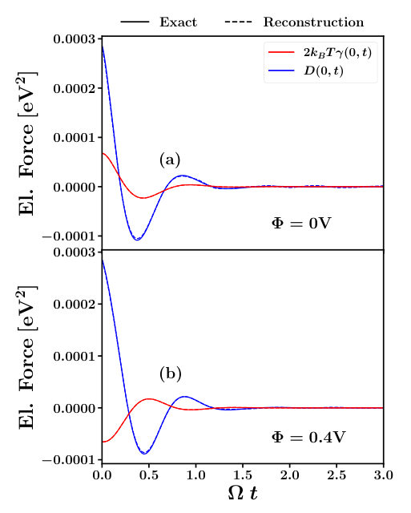 
FIG. 4. Exact (solid) and reconstructed (dashed) time- dependent non-Markovian electronic forces at vibrational co- ordinate x = 0 and for voltages (a) Φ = 0V and (b) Φ = 0.4V. Parameters are the same as in Fig. 3. Nγ = 6 terms were used to represent γ(x, t), while ND = 20 terms were required for an accurate representation of D(x, t).

📷 Fig 4

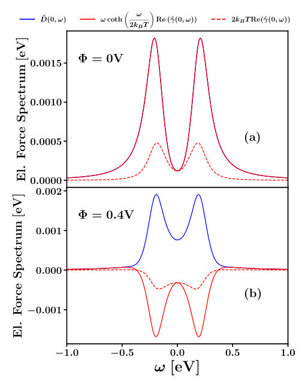 
FIG. 3. Frequency spectrum of the non-Markovian electronic forces at vibrational coordinate x = 0 and for voltages (a) Φ = 0V and (b) Φ = 0.4V. The electronic energies are chosen as ∆= 100 meV. In order to compare to the correlation function of the stochastic force (blue), the electronic friction (red) has been scaled by the quantum (solid lines) and classical (dashed lines) fluctuation-dissipation theorem factors.

📷 Fig 5

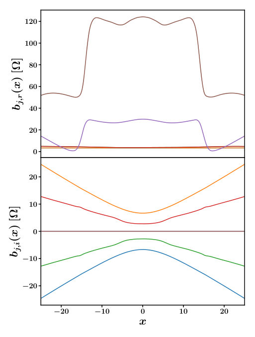 
FIG. 5. Coordinate-dependent frequencies of the elec- tronic friction, bj(x), obtained by performing the pole- decomposition approach outlined in Sec. IV A to each vibra- tional coordinate at Φ = 0V. The varying colors denote the Nγ = 6 terms used in this pole decomposition. The frequen- cies are split into real (upper) and imaginary (lower) compo- nents.

**Summary.** This paper introduces a general Non-Markovian Electronic Friction and Langevin Dynamics framework to simulate molecular dynamics coupled to metal leads. It demonstrates that retaining non-Markovian electronic memory effects is essential for accurately describing non-equilibrium charge transport and vibrational energy exchange. The method successfully reproduces exact quantum benchmarks where simpler Markovian approximations fail.

**Why it may be interesting.** This work directly tackles open quantum systems dynamics by providing a rigorous, non-perturbative method to incorporate electronic memory effects into vibrational dynamics, which is crucial for understanding energy transfer in nanoscale devices.

Detailed structure

**Main problem.** The paper addresses the challenge of accurately simulating the non-equilibrium vibronic dynamics of molecules coupled to metal surfaces, particularly when electronic memory effects are significant.

**Main result.** The proposed Non-Markovian Electronic Friction and Langevin Dynamics (NM-EFLD) framework is shown to be significantly more accurate and robust than the conventional Markovian approximation, especially under finite bias conditions.

**Method.** The authors develop a general framework utilizing a Markovian embedding scheme to sample coordinate-dependent quantum colored noise, allowing the simulation of non-Markovian electronic friction effects.

**Model / system.** The model involves a molecule coupled to metal leads, described by a Hamiltonian decomposed into molecular, metal, and interaction terms. The demonstration uses a vibrationally coupled donor-acceptor nanojunction.

**Key observables.** Nonequilibrium charge transport, steady-state vibrational excitation ($\langle N_{vib} 
angle_{ss}$), and the comparison of energy dissipation rates.

**Important parameters / regimes.** Bias voltage ($\Phi$), temperature ($T$), and the relative importance of non-Markovian vs. Markovian electronic memory effects.

**Assumptions / limitations.** The core assumption is that the Markovian approximation fails in non-equilibrium regimes where electronic memory is crucial; the method overcomes this by systematically decomposing memory kernels.

**Figures summary.** Figures illustrate the comparison between NM-EFLD and HEOM benchmarks, showing the failure of the Markovian approach at high bias, and visualizing the dependence of friction and noise on vibrational coordinate and voltage.

**Paper structure.** The paper progresses from defining the general Hamiltonian and the need for non-Markovian treatments, detailing the NM-EFLD equations, and finally presenting numerical results comparing the full non-Markovian approach against the Markovian limit and exact quantum benchmarks.

Abstract

We present a general framework for simulating the nonequilibrium vibronic dynamics of molecules interacting with metal surfaces, which utilizes non-Markovian electronic friction and the corresponding generalized Langevin equation. The method employs a Markovian embedding scheme to sample coordinate-dependent quantum colored noise, with the underlying memory kernels represented systematically by exponential decompositions obtained directly from the electronic forces. In doing so, the approach extends the widely used electronic friction and Langevin dynamics formalism beyond the conventional Markovian approximation while retaining the coordinate dependence of the electronic back-action. We demonstrate the method for nonequilibrium charge transport through a vibrationally coupled molecular junction, where comparisons with numerically exact hierarchical equations of motion simulations show that the non-Markovian formulation is both more accurate and more robust than its Markovian counterpart. In particular, we find that non-Markovian electronic forces play a decisive role in the nonequilibrium vibrational dynamics, stabilizing regimes in which the conventional Markovian approximation fails.

[↑ back to top](#top)

### [Energy-selective control of noise-assisted multipulsing by weak optical seeding in the dissipative-soliton-resonance regime](http://arxiv.org/abs/2609.30522v1)

**Authors:** Vladimir L. Kalashnikov, Alexander Rudenkov, Evgeni Sorokin, Irina T. Sorokina  
**Type:** theory · **Category:** statistical mechanics · **PDF:** <https://arxiv.org/pdf/2609.30522v1>  
**Analysis basis:** full PDF text, analyzed in chunks
**Topic relevance:** `driven-dissipative phase transition` **3/5** · `methods for driven-dissipative` **3/5** · `interference shaping light` **2/5** · `non-equilibrium universality` **2/5** · `Keldysh / 2PI / non-Gaussian methods` **1/5** · `correlated / nonlocal dissipation` **1/5** · `quantum measurements` **1/5**

📷 Fig 1

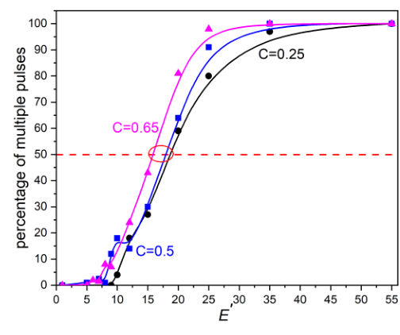 
FIG. 1. Multipulse probability versus normalized energy E′

📷 Fig 2

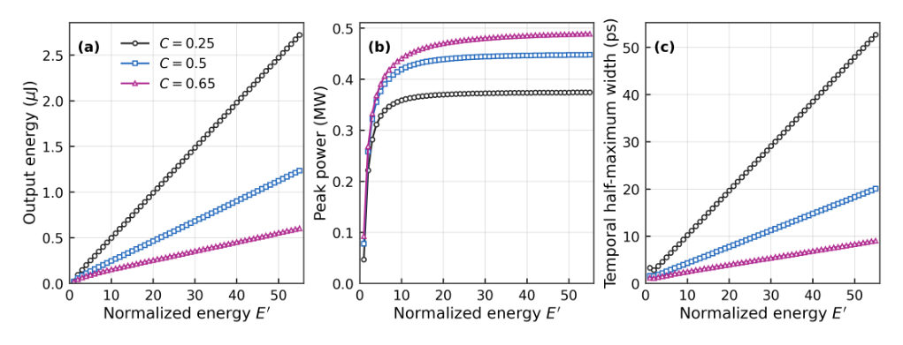 
FIG. 2. Fully deterministic results for DS with A = 0, W = 0, no seed-phase or timing process, and 104 round trips. Every one of the 165 initial conditions in Eq. (21) terminates as a stationary single pulse from the fixed single-pulse initial state. Shown are (a) final output energy, (b) final peak power, and (c) temporal half-maximum width. Black circles, blue squares, and magenta triangles denote C = 0.25, 0.50, and 0.65, respectively. Lines connect deterministic scan points and do not represent statistical fits.

📷 Fig 3

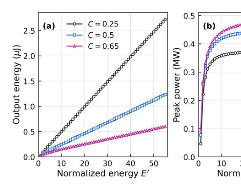 
Figure 2 also verifies the expected DS energy scaling. From E′ = 15 to 55, the output energy increases by fac- tors 3.65, 3.49, and 2.95 for C = 0.25, 0.50, and 0.65, whereas the peak power changes by only 2.0%, 3.5%, and 6.3%. Over the same interval, the temporal half- maximum width grows by factors 3.53, 3.34, and 2.78. Linear fits of output energy versus E′ on this interval give R2 &gt; 0.99999 for all three values of C. Thus, energy scaling proceeds predominantly by pulse broadening with approximate peak-power clamping.

📷 Fig 4

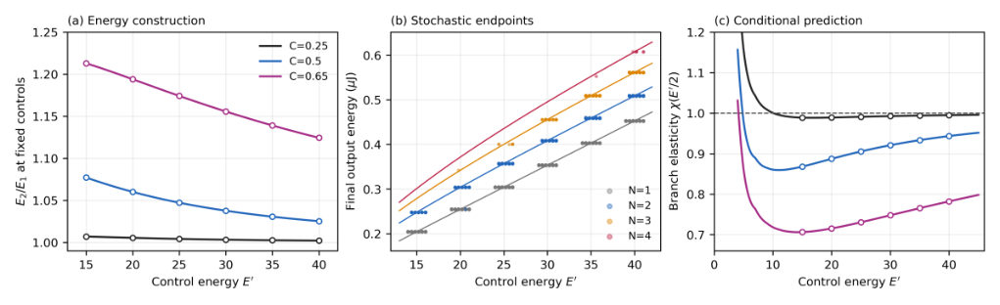 
FIG. 3. Deterministic N-pulse generation. (a) Total output energy of the 216 two-pulse samples relative to the single-pulse ones at the same (C, E′) and the prediction 2E1(E′/2)/E1(E′) of Eq. (34), computed from the single-pulse control alone (lines). (b) Final output energies of all 10,788 trajectories of the noise scan (C = 0.65, A = 10 mW) by noise level for visibility; lines show NE1(E′/N) for N = 1–4 from the deterministic case. (c) Single-pulse elasticity χ of Eq. (44) evaluated at the component control point E′/2; symbols mark the resulting points. The line χ = 1 marks a threshold of the conditional energy reduction, Eq. (45).

📷 Fig 5

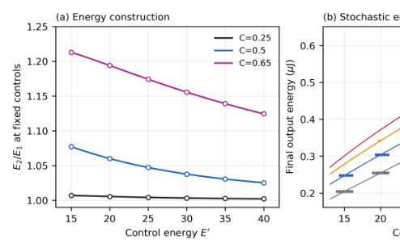 
Figure 5(a) shows the A = 1 mW DS endpoint statis- tics. The seed displaces and broadens the crossover threshold. Thus, the weak seeding signal broadens the DSR domain. The dependence of the multipulse genera- tion probability on the C-parameter is weak. Phase jitter slightly worsens DSR stability, but time jitter improves it.

**Summary.** This paper analyzes pulse selection in a laser system operating near a dissipative-soliton-resonance regime using a stochastic Ginzburg-Landau model. The key finding is that injecting a weak optical seed actively suppresses the formation of multiple pulses, thereby stabilizing the single-pulse state and broadening the operational energy window. The methodology relies heavily on advanced numerical simulations and careful statistical analysis to distinguish true resonance effects from controlled stabilization.

**Why it may be interesting.** This work bridges nonlinear optics, stochastic processes, and non-equilibrium statistical mechanics by showing how external coherent control can stabilize complex, dissipative states against inherent noise-driven instabilities.

Detailed structure

**Main problem.** The study investigates how weak optical seeding controls the competition between single-pulse operation and noise-induced multipulsing in a laser operating in the dissipative-soliton-resonance (DSR) regime.

**Main result.** Weak optical seeding suppresses the tendency toward multipulsing, thereby enhancing the energy scalability of dissipative solitons and the DSR window. This control mechanism is distinct from canonical stochastic resonance.

**Method.** The research employs numerical simulations solving the stochastic cubic–quintic complex Ginzburg–Landau (CGLE) equation, analyzing endpoint statistics across various noise and energy parameter grids.

**Model / system.** The system is modeled by a stochastic CGLE equation, representing a weakly seeded, normal-dispersion laser. The analysis is applied to a physical realization using a Cr2+:ZnS Cavity Photonic Oscillator (CPO).

**Key observables.** Pulse number (single vs. multi-pulse), DSR energy window, relative probability of multipulsing (P2), and coherence-sensitive diagnostics like the directional slope (Theta_s).

**Important parameters / regimes.** The dissipative-soliton-resonance (DSR) regime, weak optical seed strength, and noise levels (modeled via Gaussian white noise or phase diffusion).

**Assumptions / limitations.** The authors distinguish between stationary DS existence, seeded DS robustness, and the accessible DSR range; they caution against equating stationary energy windows with resonance evidence.

**Figures summary.** The notes reference aggregate probability plots (Fig. 6) showing endpoint classifications, and plots detailing the relationship between spectral coordinates (r) and energy (E') (Fig. 2).

**Paper structure.** The paper progresses by first establishing the stochastic model (CGLE), then detailing the simulation methods (noise sources, scans), presenting the core findings regarding seeding control, and concluding with a careful discussion distinguishing their results from established resonance phenomena.

Abstract

We study pulse-number selection in a stochastic cubic--quintic complex Ginzburg--Landau model of a weakly seeded, normal-dispersion laser in the dissipative-soliton-resonance (DSR) regime. Optical seed injection suppresses energy-dependent multipulsing and produces a nonmonotonic DSR energy window. The noise-induced formation statistics do not establish canonical stochastic resonance or escape from a pre-existing soliton. Deterministic control by a weak monochromatic seed yields persistent single-pulse behavior within a noticeably broader energy window, enhancing dissipative-soliton energy scalability and DSR.

[↑ back to top](#top)

### [Plasmonic Modes in hybrid Josephson Junction Arrays](http://arxiv.org/abs/2609.31069v1)

**Authors:** Alex Kirchner, Simon Feyrer, Vjeko Dimić, Johanna Berger, Davide Curcio, Giorgio Biasiol, Michael Prager, Matthias Kronseder, Dominique Bougeard, Nicola Paradiso, Christoph Strunk, Leandro Tosi  
**Type:** experiment · **Category:** other · **PDF:** <https://arxiv.org/pdf/2609.31069v1>  
**Analysis basis:** full PDF text, analyzed in chunks
**Topic relevance:** `QC/QI experiment` **3/5** · `analog quantum simulation` **2/5** · `quantum measurements` **2/5** · `interference shaping light` **1/5** · `quantum optics experiment` **1/5**

📷 Fig 1

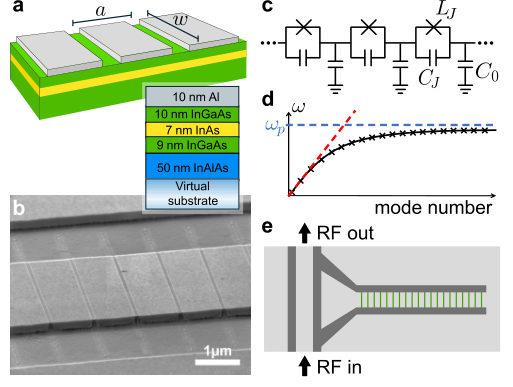 
Figure 1. Device layout. a, Schematic of the Joseph- son junction array (JJA) based on a proximitized 2DEG. The inset shows the heterostructure of device A. The supercon- ducting top layer is depicted in gray, the 2DEG in yellow. b, Scanning electron micrograph of one of the devices, taken prior to the deposition of the AlOx dielectric. c, Circuit model used to describe the electrodynamics of the array. The Josephson junctions are modeled by their Josephson induc- tance LJ. d, Dispersion relation of the circuit model assum- ing C0/CJ = 2/3. The red line indicates the linear regime for small mode number, the blue line indicates the plasma frequency. The black crosses show the expected...

📷 Fig 2

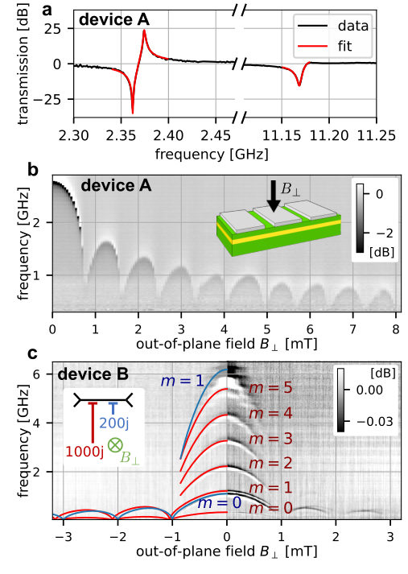 
Figure 2. Transmission measurement and interference pattern. a, Transmission trace of device A at zero magnetic field. The two resonances are fitted by the formula given in [94]. The background is subtracted using a reference mea- surement at higher temperature and magnetic field. b, Inter- ference pattern of the same device. The colorbar shows the transmission parameter S21 with the background subtracted as in panel a. c, Interference pattern of device B. In this device, two JJA resonators with 1000 and 200 junctions, re- spectively, are coupled to the same transmission line. Thus modes of both devices are visible in the colorplot. The red and blue line in the left half are guides to the...

📷 Fig 3

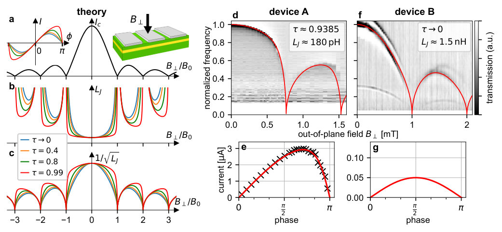 
Figure 3. Extracting the CPR from the measurement of the interference pattern. a, Interference pattern of the critical current, assuming a Beenakker-Furusaki type current phase relation, as shown in the inset. It is numerically identical for all values of the transparency τ. b, Interference pattern of the Josephson inductance for different values of the transparency τ. c, Interference pattern of the inverse squared Josephson inductance. d, Colorplot of the measured interference pattern of device A. A fit of the first lobe is shown in red. e, Extracted CPR of device A. The resonance curves within the first lobe are fitted (black crosses) and fitted to the Beenakker-Furusaki form. f,...

**Summary.** This paper uses microwave spectroscopy to characterize Josephson Junction Arrays (JJAs) made from Al/InAs heterostructures. By measuring the plasmonic resonance frequency as a function of an out-of-plane magnetic field, the authors extract the Josephson inductance and the current-phase relation. This demonstrates the utility of JJAs as tunable testbeds for studying superconducting phenomena in hybrid quantum devices.

**Why it may be interesting.** The work provides a direct experimental platform to probe the microscopic superconducting properties (like Andreev states) in semiconductor-superconductor interfaces using macroscopic circuit measurements (plasmon resonance), which is highly relevant for superconducting quantum circuit development.

Detailed structure

**Main problem.** The paper aims to characterize the Josephson inductance and study the plasmonic modes of Josephson Junction Arrays (JJAs) fabricated on hybrid superconductor-semiconductor heterostructures.

**Main result.** The measurements successfully demonstrated the tunability of the Josephson inductance over a broad range of out-of-plane magnetic fields, allowing for the extraction of the current-phase relation (CPR) and effective transparency.

**Method.** Microwave characterization measurements were performed by probing the low-energy plasmonic modes of the JJA, analyzing the resulting Fraunhofer-like diffraction patterns.

**Model / system.** The physical system is a JJA built on an Al/InAs heterostructure, configured as the center conductor of a coplanar waveguide resonator. The analysis relies on fitting the magnetic field dependence of the resonance frequency to extract the Josephson inductance and CPR.

**Key observables.** Josephson inductance ($L_J$), plasmonic modes dispersion relation $\omega(k)$, and the Fraunhofer-like diffraction pattern of the resonance frequency.

**Important parameters / regimes.** Out-of-plane magnetic field ($B_{\perp}$), temperature ($T \approx 20 - 100 	ext{ mK}$), and the superconducting gap parameter ($\Delta^*N \approx 16 	ext{ meV}$).

**Assumptions / limitations.** The model assumes $C_0/C_J = 2/3$ for dispersion relation calculations, and background subtraction is performed using reference measurements.

**Figures summary.** Figures show the device layout and circuit model, the plasmon dispersion relation, and microwave transmission traces illustrating the interference patterns (Fraunhofer patterns) for different devices at various magnetic fields.

**Paper structure.** The paper follows a structure of presenting the physical setup (JJA on Al/InAs), detailing the microwave measurement technique (probing plasmon modes), and then analyzing the magnetic field dependence of the resonance to extract fundamental superconducting parameters like $L_J$ and the CPR.

Abstract

We present microwave characterization measurements of Josephson junction arrays (JJAs) based on epitaxial Al-InAs quantum well heterostructure. The Josephson inductance of the constituent planar junctions can be derived by probing the low-energy plasmon modes of these devices. Applying an out-of-plane magnetic field gives rise to a Fraunhofer-like diffraction pattern, from which the current-phase relation and the effective transparency can be extracted. JJAs can be used to achieve high inductances, suitable for the implementation of quantum circuits. They also provide an excellent test-bed for studying the microscopic excitations of hybrid superconductor-semiconductor devices associated with the presence of Andreev states. Here, we demonstrate their tunability over a broad range of out-of-plane magnetic fields.

[↑ back to top](#top)

### [Strain-controlled topology and quantum control at a cubic Ce$^{3+}$ crystal-field crossing](http://arxiv.org/abs/2609.30737v1)

**Authors:** A. Ghosh, J. T. Haraldsen  
**Type:** theory · **Category:** strongly correlated electrons · **PDF:** <https://arxiv.org/pdf/2609.30737v1>  
**Analysis basis:** full PDF text, analyzed in chunks
**Topic relevance:** `analog quantum simulation` **3/5** · `Keldysh / 2PI / non-Gaussian methods` **1/5** · `quantum measurements` **1/5**

📷 Fig 1

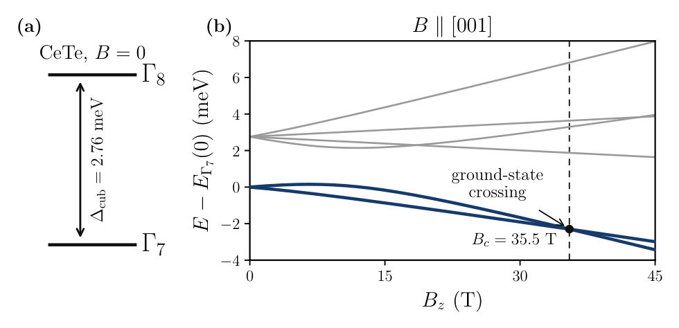 
FIG. 1. Cubic Ce3+ spectrum at the CeTe CEF scale. (a) The zero-field Γ7 doublet and Γ8 quartet are separated by ∆cub = 2.76 meV. (b) Exact six-level spectrum for B ∥[001], measured from the zero-field Γ7 energy. The two lowest branches belong to different C2z sectors and cross at Bc ≃35.5 T.

📷 Fig 2

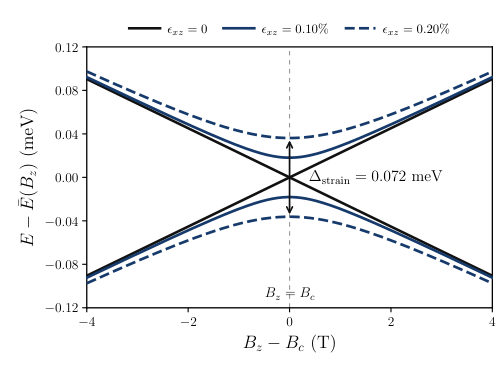 
FIG. 2. Projected avoided crossing for ϵyz = 0 and tensor shears ϵxz = 0, 0.10%, and 0.20%, using the CeTe bench- mark |αT2g| = 18.1 meV per unit tensor strain obtained from the calibrated point-charge calculation described in Sec. III B. The corresponding minimum gaps are 0, 0.0362, and 0.0724 meV.

📷 Fig 3

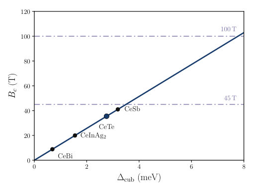 
FIG. 3. Ideal cubic single-ion crossing field as a function of the zero-field CEF splitting, with Bc ≃12.87 ∆cub T when ∆cub is expressed in meV. The markers use representative re- ported CEF splittings for CeBi, CeInAg2, CeTe, and CeSb [22, 26, 27]. Horizontal lines indicate representative 45 T dc and 100 T pulsed-field capabilities demonstrated experimen- tally [28, 29]. The plotted values are screening estimates, not complete high-field phase-diagram predictions.

📷 Fig 4

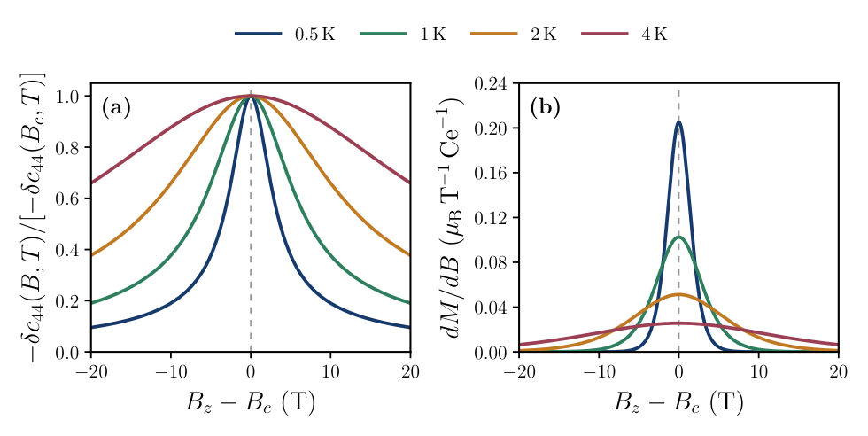 
FIG. 4. Ideal two-level responses for T = 0.5, 1, 2, and 4 K. (a) Normalized magnitude of the T2g elastic softening around the crossing. (b) Crossing contribution to the differential magnetization. Its integral through the reconstructed crossing is 0.78137 µB per Ce in the linear two-level model. The plotted curves show the equilibrium local response; quantitative ultrasound in field can contain additional rotational and dynamical magnetoelastic contributions.

📷 Fig 5

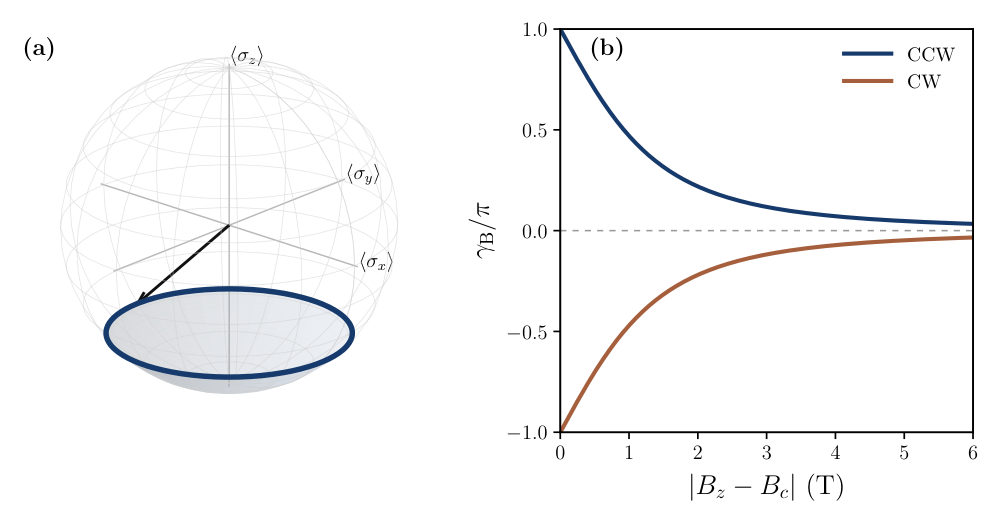 
FIG. 5. Geometric phase from circular shear control. (a) Bloch-sphere trajectory of the lower eigenstate for a circular T2g shear drive. The displayed example uses |αT2g| = 18.1 meV per unit tensor strain, ϵ0 = 0.20%, and |Bz −Bc| = 1.5 T. (b) Lower-state Berry phase for counterclockwise (CCW) and clockwise (CW) loops on the Bz ≤Bc side. Circulation is defined as viewed from positive dz, and phases are defined modulo 2π.

**Summary.** This work develops a theoretical framework showing how strain and magnetic fields can control the topology of electronic states at a crystal-field crossing in Ce3+. By analyzing the effective Hamiltonian, the authors predict the existence of a topologically non-trivial point (Chern charge = 1) that can be accessed by tuning strain and magnetic field, offering a route for quantum control in rare-earth materials.

**Why it may be interesting.** It provides a concrete, symmetry-dictated pathway to engineer topological quantum states (diabolical points) using external, controllable parameters like mechanical strain, which is highly relevant for quantum control in solid-state systems.

Detailed structure

**Main problem.** To establish a symmetry-based framework connecting high-field crystal-field reconstruction, strain response, and parameter-space topology in rare-earth systems.

**Main result.** The combination of strain and field detuning can generate an isolated diabolical point with unit-magnitude Chern charge in the 3D control space of a cubic Ce3+ ion.

**Method.** Theoretical derivation using an effective two-level Hamiltonian, analyzing the topological features (Chern charge) generated by independent strain and magnetic field controls.

**Model / system.** The system is modeled using the cubic Ce3+ ion ($4f^1$) crystal-field splitting, governed by an effective Hamiltonian that incorporates strain ($\epsilon_{xz}, \epsilon_{yz}$) and magnetic field detuning ($\delta B$).

**Key observables.** Chern charge ($|C|=1$), gap opening ($\propto |\epsilon_{\perp}|$), elastic susceptibility ($\delta c_{44}$), and geometric phase ($\gamma_{\pm}$).

**Important parameters / regimes.** Ideal crossing field near $35.5 	ext{ T}$ (for CeTe); representative shear coupling $|\alpha_{T2g}| \simeq 18.1 	ext{ meV}$ per unit tensor strain.

**Assumptions / limitations.** The analysis uses a single-ion point-charge model, which neglects full hybridization effects in the actual compound.

**Figures summary.** Figures illustrate the spectrum at the CeTe scale, the gap opening due to strain, and the Bloch-sphere trajectory used to calculate the Berry phase for quantum control.

**Paper structure.** The paper progresses from defining the symmetry-protected crossing, deriving the effective Hamiltonian, calculating the topological invariant (Chern charge) using strain and field detuning as controls, and finally discussing the experimental signatures (elastic/magnetic).

Abstract

Field-tuned crystal-field crossings provide a route to synthetic topology in localized rare-earth degrees of freedom when symmetry-resolved perturbations can independently control the crossing states. Here we show that a field-induced crossing in cubic Ce$^{3+}$ has precisely this structure. For $B\parallel[001]$, the crossing is protected by a twofold rotation, while the $T_{2g}$ shears $ε_{xz}$ and $ε_{yz}$ break that protection and mix the two states through orthogonal pseudospin components. Together with magnetic-field detuning, these controls generate an isolated diabolical point with unit-magnitude Chern charge in a three-dimensional parameter space. Using the CeTe crystal-field scale gives an ideal single-ion crossing near $35.5$ T. A calibrated point-charge calculation gives a representative projected shear coupling $|α_{T_{2g}}|\simeq18.1$ meV per unit tensor strain, corresponding to gaps of $0.036$ and $0.072$ meV for tensor shears of $0.10\%$ and $0.20\%$. We identify the associated elastic and magnetic signatures, discuss the limitations of the electrostatic estimate in a hybridizing Ce compound, and determine the adiabatic and coherence requirements for cyclic geometric control. The result is a symmetry-based framework that connects high-field crystal-field reconstruction, strain response, and parameter-space topology in rare-earth systems.

[↑ back to top](#top)

### [Topological Superconducting Phases in a Strained Altermagnet-Superconductor Heterostructure](http://arxiv.org/abs/2609.30791v1)

**Authors:** Keita Yoshizawa, Ryo Okugawa, Takami Tohyama  
**Type:** theory · **Category:** other · **PDF:** <https://arxiv.org/pdf/2609.30791v1>  
**Analysis basis:** full PDF text, analyzed in chunks
**Topic relevance:** `analog quantum simulation` **3/5**

📷 Fig 1

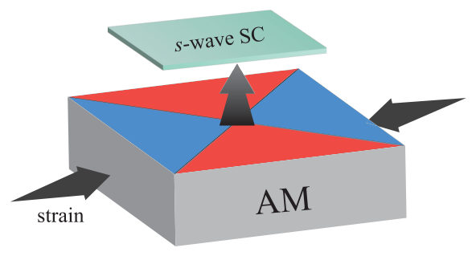 
Fig. 1. Schematic of a heterostructure consisting of a two-dimensional s-wave superconducting layer (SC) and a d-wave altermagnet (AM).

📷 Fig 2

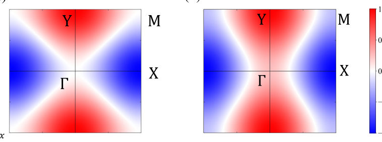 
Fig. 2. Momentum dependence of the normalized effective magnetic field ˜M(k) for (a) b = 1 and (b) b = 0.6.

📷 Fig 3

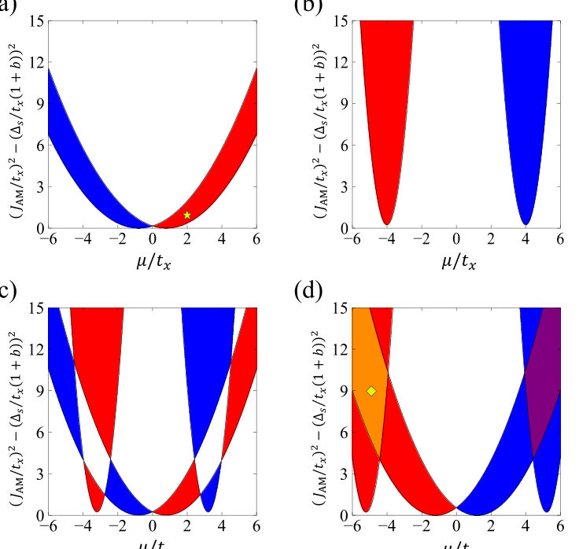 
Fig. 3. Topological phase diagrams of the heterostructure for (a) b = 1 and ty = 0.6tx, (b) b = 0.6 and tx = ty, (c) b = 0.6 and ty = 0.6tx, and (d) b = 0.6 and ty = 1.6tx. The red, blue, orange, and purple regions indicate C = 1, C = −1, C = 2, and C = −2, respectively. The star in (a) and the diamond in (d) indicate the parameter sets used to calculate the edge spectra in Fig. 4.

📷 Fig 4

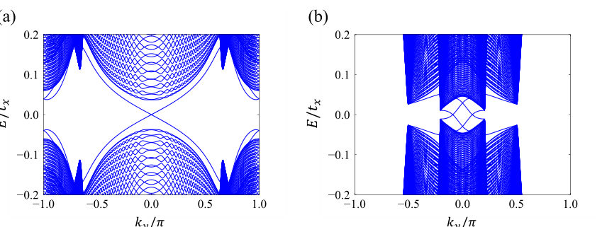 
Fig. 4. Energy spectra for the parameter sets indicated by (a) the star in Fig. 3(a) and (b) the diamond in Fig. 3(d). The star and diamond correspond to µ = 2tx and JAM = tx, and µ = −5tx and JAM = 3tx, respectively.

**Summary.** This theoretical study explores topological superconductivity in an altermagnet-superconductor heterostructure, focusing on the role of strain and hopping anisotropy. By calculating the Chern number, the authors demonstrate that structural distortions can induce robust topological phases. This work suggests that strain offers a powerful, controllable route to realizing topological superconductivity in magnetic heterostructures.

**Why it may be interesting.** The explicit connection between lattice strain (a structural parameter) and the realization of exotic topological superconducting states is highly relevant for designing novel quantum materials and superconducting devices.

Detailed structure

**Main problem.** The study investigates the emergence and control of topological superconductivity within a heterostructure composed of an s-wave superconductor and a d-wave altermagnet.

**Main result.** Strain-induced lattice distortion and hopping anisotropy are shown to be effective mechanisms that allow topological superconducting phases with high Chern numbers (up to |C|=2) to emerge over broad parameter regions.

**Method.** The authors calculate the Chern number using the Bogoliubov-de Gennes Hamiltonian and confirm the topological nature by observing gapless Majorana edge modes under open boundary conditions.

**Model / system.** The system is a 2D heterostructure combining an s-wave superconductor and a d-wave altermagnet, modeled using the Bogoliubov–de Gennes Hamiltonian. The model incorporates strain effects via a parameter 'b' and Rashba spin-orbit coupling.

**Key observables.** Topological phase diagrams characterized by the Chern number (C), and the existence of gapless Majorana edge modes.

**Important parameters / regimes.** Strain parameter (b), chemical potential ($\mu$), and hopping anisotropy ($t_x$ vs $t_y$).

**Assumptions / limitations.** The analysis assumes fixed parameters for the superconducting gap ($\Delta_s$) and spin-orbit coupling ($\alpha$), and simplifies gap closing analysis by setting $\sin k_x = \sin k_y = 0$ at high-symmetry points.

**Figures summary.** Figures illustrate the schematic of the heterostructure, the momentum dependence of the effective magnetic field under strain, the resulting topological phase diagrams showing |C| regions, and energy spectra confirming gapless Majorana edge modes.

**Paper structure.** The paper proceeds by defining the model Hamiltonian, calculating the Chern number to map out topological phase diagrams as a function of strain and anisotropy, and finally confirming the physical realization of the topological phases via the detection of Majorana edge modes.

Abstract

We investigate topological superconductivity in a heterostructure consisting of a two-dimensional $s$-wave superconductor and a $d$-wave altermagnet with Rashba spin-orbit coupling. In particular, we study the effects of strain and hopping anisotropy on the topological superconducting phases. By calculating the Chern number, we obtain topological phase diagrams as functions of the chemical potential and the strength of the effective magnetic field induced by the magnetic proximity effect. We find that strain-induced lattice distortion allows topological superconducting phases to emerge over a broad parameter region. Our findings suggest that strain that lowers symmetry can serve as a route to realizing topological superconductivity in altermagnet-superconductor heterostructures.

[↑ back to top](#top)

### [A quantitative phase-field model for grain boundary trapping and diffusion of hydrogen](http://arxiv.org/abs/2609.31367v1)

**Authors:** Vincent Feyen, Martin Diehl, Nele Moelans  
**Type:** theory · **Category:** statistical mechanics · **PDF:** <https://arxiv.org/pdf/2609.31367v1>  
**Analysis basis:** full PDF text, analyzed in chunks
**Topic relevance:** `Keldysh / 2PI / non-Gaussian methods` **2/5** · `analog quantum simulation` **2/5** · `methods for driven-dissipative` **2/5** · `Frenkel-Kontorova` **1/5** · `correlated / nonlocal dissipation` **1/5** · `driven-dissipative phase transition` **1/5** · `non-equilibrium universality` **1/5** · `quantum measurements` **1/5**

📷 Fig 1

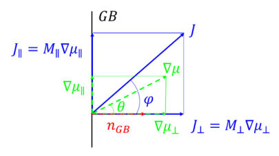 
Figure 1: Projection of the mobility onto the GB, which results in a decomposition of the overall flux into the per- pendicular flux 𝐽⟂and the parallel flux 𝐽∥.

📷 Fig 2

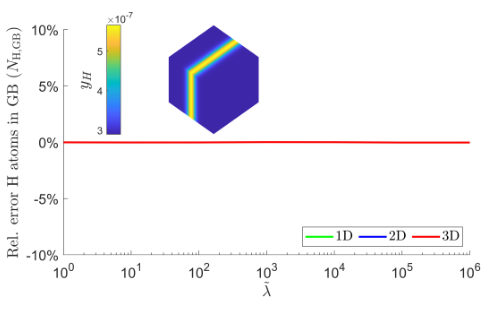 
Figure 2: Benchmark 1: Relative error in the total amount of hydrogen trapped at the GB compared to the analytical solution as a function of the normalized interfacial thickness. The error remains below 0.02% for all cases, indicating that all formulations are equivalent for practical applications.

📷 Fig 3

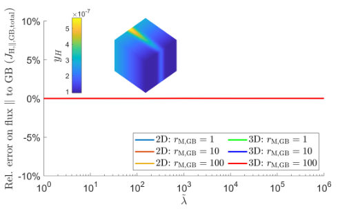 
Figure 4: Benchmark 3: Relative error in the steady-state flux parallel to the GB compared to the analytical solution as a function of the normalized interfacial thickness. The error remains below 1% for all cases, indicating that all formulations are equivalent for practical applications.

📷 Fig 4

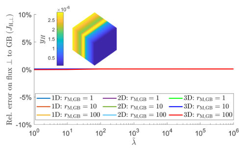 
Figure 3: Benchmark 2: Relative error in the steady-state flux perpendicular to the GB compared to the analytical solution as a function of the normalized interfacial thickness. The error remains below 1% for all cases, indicating that all formulations are equivalent for practical applications.

📷 Fig 5

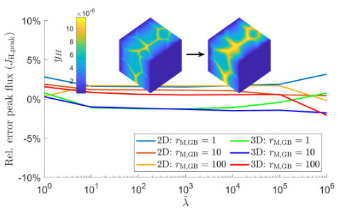 
Figure 5: Benchmark 4: Relative error in the peak flux of the TDS spectrum, compared with the corresponding fine- mesh simulation, for different GB mobility ratios (𝑟M,GB = 𝑀at,H,GB,0∕𝑀at,H,B,0) in two and three dimensions. The abso- lute errors remain below 3%, reflecting the unavoidable loss of accuracy associated with the coarser spatial resolution. Nevertheless, as long as the grain structure is properly re- solved, the formulation is identical for practical applications.

**Summary.** This work introduces a quantitative phase-field model to accurately simulate hydrogen diffusion and trapping in polycrystalline metals, explicitly accounting for the interconnected nature of grain boundaries. It corrects deficiencies in older models by treating GBs as continuous pathways rather than isolated traps. The results show that grain boundary transport fundamentally alters measurable properties like TDS spectra and effective diffusion coefficients.

**Why it may be interesting.** While focused on materials science, the rigorous development of a coupled, multi-scale transport model involving equilibrium constraints and anisotropic diffusion echoes complex non-equilibrium dynamics found in open quantum systems or reaction-diffusion processes.

Detailed structure

**Main problem.** The paper addresses the limitations of conventional hydrogen trapping models that fail to account for the interconnected nature of grain boundaries (GBs) in polycrystalline metals.

**Main result.** The quantitative phase-field model demonstrates that grain boundary diffusion significantly shifts TDS peaks, invalidating simple Kissinger-type analyses, and shows effective diffusion coefficients depend strongly on multiple material parameters.

**Method.** A quantitative phase-field model is developed to simulate coupled hydrogen diffusion, trapping, and transport along grain boundaries.

**Model / system.** The system is hydrogen diffusing and trapping in polycrystalline metals with a static microstructure. The model uses phase-field methods to describe the microstructure and solves coupled differential equations for hydrogen site fractions in both the bulk lattice and the GB regions.

**Key observables.** Total trapped hydrogen content, hydrogen fluxes (parallel/perpendicular to GBs), effective diffusion coefficients ($D_{eff,ss}$), and TDS peak shifts.

**Important parameters / regimes.** Grain size, trapping free energy ($\Delta\mu_{H,b,GB}$), temperature, and grain boundary mobility.

**Assumptions / limitations.** The microstructure is assumed static (no grain movement), and the model neglects mechanical effects like stress-assisted diffusion.

**Figures summary.** Figure 12 shows the relative error in total hydrogen concentration over time for a perpendicular flux benchmark. Figure 13 compares simulated effective steady-state diffusion coefficients against an analytical fit.

**Paper structure.** The paper first introduces the quantitative phase-field model framework, then applies it to benchmark simulations (e.g., perpendicular flux) to validate the methodology, and finally applies it to interpret experimental observables like TDS spectra and effective diffusion coefficients.

Abstract

Grain boundaries influence hydrogen transport in polycrystalline metals by acting as both trapping sites and interconnected diffusion pathways. Conventional interpretations of thermal desorption spectroscopy (TDS) and permeation experiments often treat traps as isolated defects, neglecting grain boundary connectivity and potentially misinterpreting experimental data. Here, we develop a quantitative phase-field model for hydrogen diffusion, grain boundary trapping, and grain boundary-assisted transport. The formulation preserves the physical grain boundary volume independently of the numerical interface thickness and accounts for anisotropic diffusion parallel and perpendicular to grain boundaries. Benchmark simulations verify quantitative behavior under interface upscaling. The model shows that grain boundary diffusion can significantly shift TDS peaks, making Kissinger-type analyses unreliable when grain boundary transport is significant. Effective diffusion coefficients are also shown to depend strongly on grain size, trapping free energy, temperature, and grain boundary mobility. These results highlight the coupled role of trapping thermodynamics, bulk diffusion, and grain-boundary transport.

[↑ back to top](#top)

### [Energetically Driven Structure Matching for Autonomous Total X-ray Scattering Experiments](http://arxiv.org/abs/2609.30852v1)

**Authors:** Emil J. P. Frost, Martin A. Karlsen, Jonas H. Jensen, Rodrigo Moreno, Jørn Lambertsen, Jonathan Quinson, Andy S. Anker, Alexander Bagger, Tejs Vegge  
**Type:** both · **Category:** numerical methods · **PDF:** <https://arxiv.org/pdf/2609.30852v1>  
**Analysis basis:** full PDF text, analyzed in chunks
**Topic relevance:** `Keldysh / 2PI / non-Gaussian methods` **2/5** · `methods for driven-dissipative` **2/5** · `quantum measurements` **2/5** · `analog quantum simulation` **1/5**

📷 Fig 1

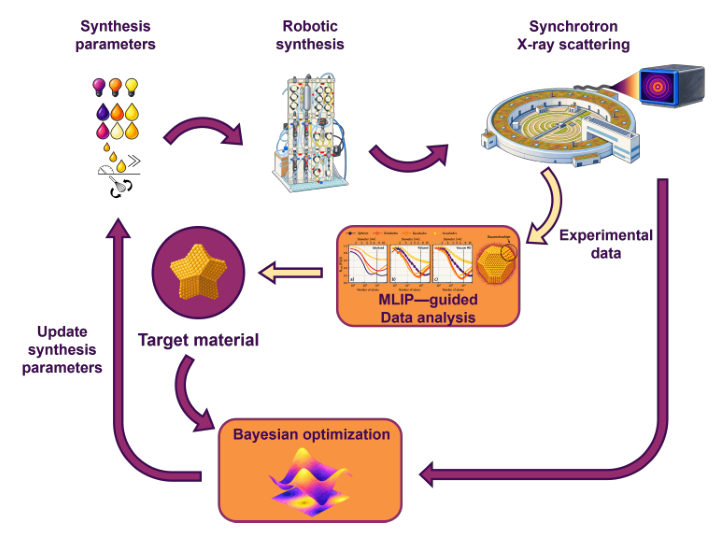 
Figure 1: Conceptual extension of the ScatterLab workflow with MLIP-guided in-line structure analysis. Synthesis is performed by the robotic platform, followed by characterization using synchrotron X-ray scattering. Experimental scattering data feed directly into the Bayesian optimizer, which selects synthesis parameters for the next iteration. The yellow arrows indicate the proposed extension to the original ScatterLab workflow: experimental data are analysed against energetically informed candidate structures, and the resulting structural information is fed back to enable updating of the target structure during an autonomous campaign.

📷 Fig 2

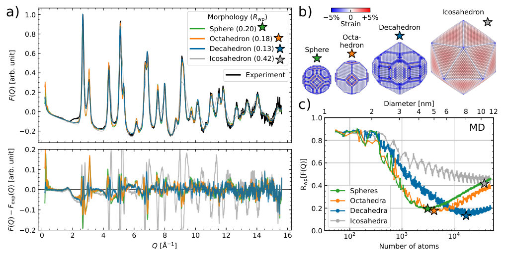 
Figure 2: Fitting experimental scattering with MD-sampled gold NPs. Panel (a) shows the reduced total scattering function from the experiment (black) along with the best-fitting NP in each considered morphology. The weighted profile residuals, Rwp[F(Q)], (Equation (10)) between simulated and experimental F(Q) are found in the legend. The F(Q) residuals are shown in the bottom of panel (a). These NPs are the marked minima in (c) whose relaxed geometry (colored by local strain) is shown in (b) in the correct relative sizes. Panel (c) shows goodness-of-fit scans within each morphology as a function of NP size.

📷 Fig 3

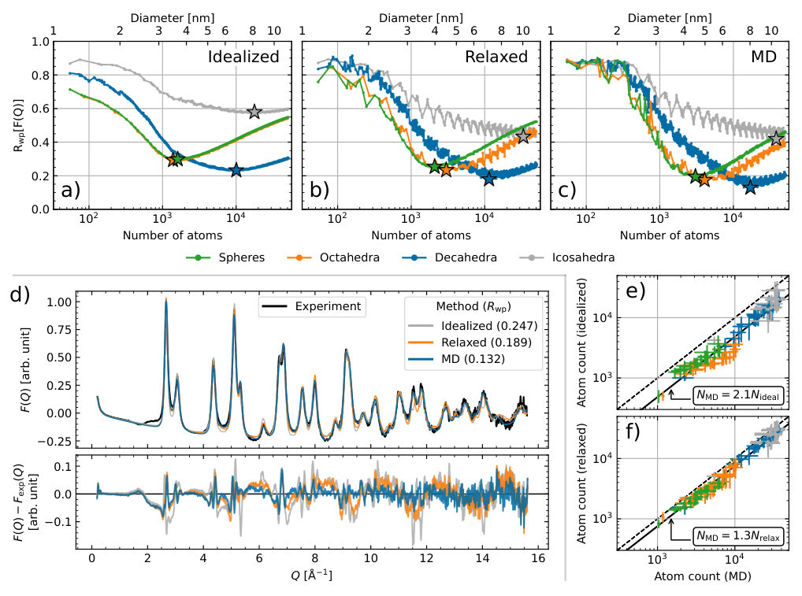 
Figure 3: Comparison between sampling approaches. (a-c) Size scans with (a) idealized, (b) relaxed, and (c) MD- sampled NPs (same as Figure 2c). (d) Reduced total scattering structure functions between the methods using the best-fitting NP in the MD approach (blue star in (c)). Residuals from experiment are shown in the bottom panel. (e-f) Size predictions of 20 experimental samples shown as parity plots between methods. Error bars show the mean and standard deviation of the distribution of particle sizes within ∆Rwp = 0.01 of the minimum. The dashed line is the parity line and the full line is the best linear fit (slope written in inset).

📷 Fig 4

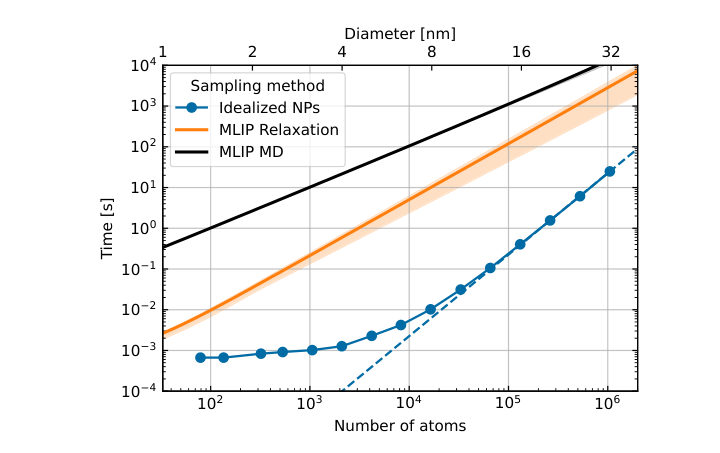 
Figure 4: Time usage for simulating scattering from a NP on an NVIDIA H200 for the three proposed sampling methods: idealized, geometry-relaxed, or MD-sampled NPs. Idealized sampling only computes simulated scattering – the others also update geometries with a finetuned MACE-MATPES-PBE-0 model as the MLIP. We assume an MLIP troughput of 400 000 atoms × steps/s (see Figure S17c) and use 4000 energy/force evaluations for MD (10 ps equilibration + 10 ps sampling with a 5 fs time step). Shaded areas indicate uncertainty in the number of required relaxation steps; the boundary is from power law fits to the number of relaxation steps required for each morphology (using the data in Figure S4). The...

📷 Fig 5

 
Figure 3d compares the simulated reduced total scattering structure functions across the three approaches using the best-fitting MD-sampled NP. To this comparison, we make two remarks. First, the idealized structure results in sharper features than the more disordered relaxed and MD-sampled structures with modified strain. Second, the static methods fail to capture the decay of F(Q) at high Q; the MD-sampled structure exhibits a more realistic decay and a flatter residual than the two static methods. Thus, temperature effects are not properly captured with a Debye-Waller correction. Direct sampling of the PES through MD is more accurate, although computationally more expensive.

**Summary.** This work introduces an energetically driven framework to analyze total X-ray scattering data from nanoparticles in real-time for autonomous experiments. By comparing idealized, MLIP-relaxed, and MD-sampled structures, the authors demonstrate that advanced sampling methods are crucial for accurately determining particle morphology and size. This provides a pathway for integrating computational structure refinement directly into closed-loop experimental campaigns.

**Why it may be interesting.** While focused on materials science, the core methodology—developing robust, computationally efficient simulation pipelines (MLIPs, MD sampling) to interpret complex, noisy experimental data—is highly relevant to developing simulation tools for quantum many-body systems.

Detailed structure

**Main problem.** Developing a real-time, energetically driven framework to convert total X-ray scattering data into reliable, atomistic structural models for autonomous materials discovery.

**Main result.** A hierarchical workflow combining rapid idealized screening with targeted MLIP relaxation and MD refinement significantly improves structural feedback compared to idealized models, leading to better size and morphology determination.

**Method.** The authors compare three structural sampling methods—idealized, MLIP-relaxed, and MD-sampled—to fit experimental total X-ray scattering data using a weighted profile residual ($R_{wp}$).

**Model / system.** The study uses gold nanoparticles (NPs) with various crystal morphologies (spherical, octahedral, decahedral, icosahedral) whose structures are modeled using MLIPs and sampled via MD simulations.

**Key observables.** Total X-ray scattering data, weighted profile residual ($R_{wp}$), particle size, and internal strain ($\epsilon_i$).

**Important parameters / regimes.** Temperature (e.g., 300 K, 250 K), scattering momentum transfer ($Q$), and the tolerance for size estimation ($\Delta R_{wp} = 0.01$).

**Assumptions / limitations.** Idealized models neglect surface relaxation, strain, and thermal disorder; MD simulations often approximate explicit water solvation for computational feasibility.

**Figures summary.** Figures compare scattering results across idealized, relaxed, and MD-sampled geometries, showing that MD sampling yields the best fit and size estimates. Other figures detail convergence, strain analysis, and computational speed-ups.

**Paper structure.** The paper progresses by first establishing the need for real-time analysis in autonomous labs, then comparing the accuracy of idealized vs. MLIP/MD sampling on gold NPs, and finally detailing the hierarchical workflow for iterative structure refinement.

Abstract

The emergence of autonomous laboratories motivates rapid conversion of experimental data into reliable atomistic models on time-scales compatible with closed-loop optimization. Here we develop an energetically driven structure matching framework for analysis during ongoing total X-ray scattering experiments. Using data from gold nanoparticles, we match against idealized spherical, octahedral, decahedral, and icosahedral geometries, their machine-learned interatomic potential (MLIP)-relaxed structures, and molecular dynamics (MD) ensembles. Idealized models are fast to generate but can misassign morphology and systematically underestimate size by neglecting surface relaxation, strain, and thermal disorder. MLIP relaxation markedly improves both, while MD ensemble averaging agrees best with experiment. We therefore introduce a hierarchical workflow combining rapid idealized screening with targeted MLIP and MD refinement of top candidates, delivering improved structural feedback without interrupting autonomous operation. This framework provides a route towards autonomous campaigns in which the target structure itself can be updated in response to the evolving energy landscape of structures compatible with the experimental data.

[↑ back to top](#top)

### [Orbital photoinduced Faraday effect in a lattice of conducting disks](http://arxiv.org/abs/2609.31203v1)

**Authors:** A. A. Gunyaga, M. V. Durnev  
**Type:** theory · **Category:** other · **PDF:** <https://arxiv.org/pdf/2609.31203v1>  
**Analysis basis:** full PDF text, analyzed in chunks
**Topic relevance:** `Keldysh / 2PI / non-Gaussian methods` **2/5** · `interference shaping light` **2/5** · `methods for driven-dissipative` **2/5**

📷 Fig 1

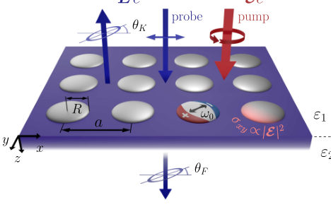 
FIG. 1. Photoinduced Faraday and Kerr effects in a square lattice of conducting disks. A circularly polarized pump wave induces a high-frequency Hall conductivity of electrons in the disks, σxy = −σyx, resulting in Faraday and Kerr rotation of a linearly polarized probe wave. The rotation is resonantly enhanced when the pump and probe frequencies are close to the disk plasmon frequency ω0.

📷 Fig 2

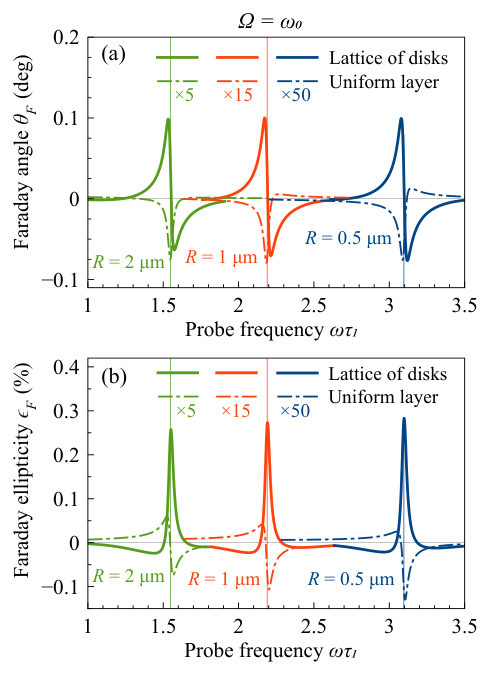 
FIG. 2. (a) Pump-induced Faraday rotation angle θF and (b) the accompanying ellipticity ϵF in lattices of conducting disks for fixed pump frequencies Ωset to be resonant with the lattice plasmon frequencies ω0 (shown by vertical lines). The three solid curves correspond to lattices with different disk radii R = 0.5, 1 and 2 µm, while the ratio R/a is fixed at 1/3. For comparison, the dash-dotted lines show results for a uniform electron layer with the same average density of elec- trons per unit area as in the lattices. The dash-dotted lines are calculated for the same values of Ωas the corresponding solid lines. The pump intensity is I = 1 kW/cm2, relaxation times τ1 = τ2 ∝(εp)−1/2; other...

📷 Fig 3

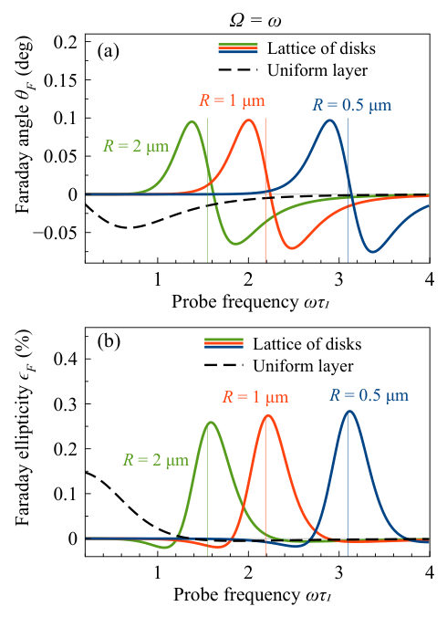 
FIG. 3. (a) Pump-induced Faraday rotation angle θF and (b) the accompanying ellipticity ϵF in lattices of conducting disks for coinciding pump and probe frequencies, ω = Ω. The three solid curves correspond to lattices with different disk radii R = 0.5, 1 and 2 µm, while the ratio R/a is fixed at 1/3. The lattice plasmon frequencies ω0 are shown by vertical lines. For comparison, the dashed lines show the results for a uniform electron layer with the same average density of electrons per unit area as in the lattices. The pump intensity is I = 1 kW/cm2, relaxation times τ1 = τ2 ∝(εp)−1/2; other parameters are listed in the text.

📷 Fig 4

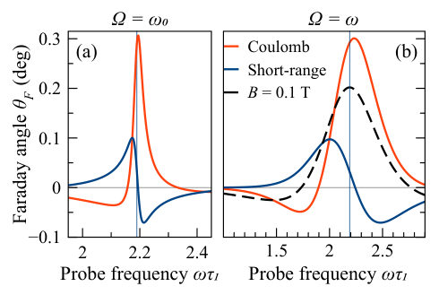 
FIG. 4. Role of the scattering potential. Pump-induced Fara- day rotation angle (a) for a fixed pump frequency Ω= ω0 and (b) for coinciding pump and probe frequencies, ω = Ω, for two types of scattering potential: short-range scatterers (blue solid curves) and charged scatterers with the Coulomb poten- tial (red solid curves). For comparison, the black dashed line shows Faraday rotation by the same disk lattice in an external magnetic field B = 0.1 T. R = 1 µm, I = 1 kW/cm2.

**Summary.** This theoretical work analyzes the Faraday and Kerr effects in lattices of conducting disks, proposing that the rotation arises from a nonlinear, pump-induced Hall conductivity ($\sigma_{xy}$). The theory predicts significant enhancement of these optical responses when the pump and probe frequencies approach the plasmon resonance, successfully explaining large rotation angles observed experimentally.

**Why it may be interesting.** The mechanism relies on nonlinear optical response ($\sigma_{xy} \propto |E|^2$) rather than the standard Inverse Faraday Effect, providing a novel theoretical understanding of giant optical responses in structured materials.

Detailed structure

**Main problem.** The study investigates the mechanism and magnitude of pump-induced Faraday and Kerr rotation in a two-dimensional lattice of conducting disks.

**Main result.** The rotation is shown to originate from a third-order nonlinear response inducing a Hall-like conductivity ($\sigma_{xy} = -\sigma_{yx}$), leading to giant enhancement near plasmon resonance, matching experimental observations.

**Method.** The analysis uses a theoretical framework involving solving Maxwell's equations and calculating the nonlinear conductivity tensor ($\sigma_{xy}$) using time-dependent perturbation theory.

**Model / system.** The system modeled is a square lattice of conducting disks (oblate spheroids) embedded in a dielectric medium, analyzed using a quasi-two-dimensional approximation.

**Key observables.** Faraday and Kerr rotation angles ($	heta_F, 	heta_K$) and ellipticities ($\epsilon_F, \epsilon_K$).

**Important parameters / regimes.** Plasmon resonance frequency ($\omega_0$), pump intensity ($1 	ext{ kW/cm}^2$), lattice period ($a$), and dielectric constants ($\epsilon_1, \epsilon_2$).

**Assumptions / limitations.** The analysis assumes the low-intensity regime ($|\sigma_{xy}| \ll |\sigma_{xx}|$) and utilizes approximations for the current density and field components.

**Figures summary.** Figures illustrate the photoinduced Faraday/Kerr effects, showing resonances in $	heta_F$ and $\epsilon_F$ vs. probe frequency ($\omega$) when the pump frequency ($\Omega$) is tuned to the plasmon resonance ($\omega_0$).

**Paper structure.** The paper develops the theory by deriving the nonlinear $\sigma_{xy}$ from the electron gas response, then calculates the resulting Faraday/Kerr response using transmission/reflection coefficients, and finally analyzes the resonance enhancement near the plasmon frequency.

Abstract

We present a theoretical study of pump-induced Faraday and Kerr rotation in a two-dimensional lattice of conducting disks. We propose a mechanism of Faraday and Kerr responses in which a circularly polarized pump directly induces a high-frequency Hall component $σ_{xy}=-σ_{yx}$ of the electron conductivity tensor at the probe frequency. Microscopically, $σ_{xy}$ originates from the third-order nonlinear response of the electron gas rather than from the real magnetic field created by solenoidal charge currents in the inverse Faraday effect. We show that the Faraday and Kerr rotation angles are significantly enhanced when the pump and probe frequencies are tuned close to the plasmon resonance of the disks, reaching $\sim 0.1^\circ$ per 1~kW/cm$^2$ of incident pump intensity in the terahertz range. This mechanism can explain recently observed giant pump-induced Faraday rotation in graphene disk lattices.

[↑ back to top](#top)

### [Engineering nonlinear spin-orbit torque driven by intra-band transport in MoSe$_2$/CrI$_3$ and WSe$_2$/CrI$_3$ van der Waals heterostructures](http://arxiv.org/abs/2609.30430v1)

**Authors:** Leyla Majidi, Azadeh Faridi, Reza Asgari  
**Type:** theory · **Category:** other · **PDF:** <https://arxiv.org/pdf/2609.30430v1>  
**Analysis basis:** full PDF text, analyzed in chunks
**Topic relevance:** `Keldysh / 2PI / non-Gaussian methods` **2/5** · `methods for driven-dissipative` **2/5**

📷 Fig 1

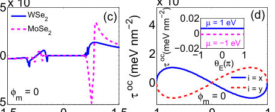 
FIG. 1. Chemical potential dependence of the non-zero components of the non-equilibrium spin polarization Soc in WSe2/CrI3 bilayer with different magnetization directions θm [(a)-(b)] and the strength of the in-plane spin-orbit torque τoc in WSe2- and MoSe2-based bi- layers with θM = π/4 (c). (d) The strength of the spin-orbit torque τoc

📷 Fig 2

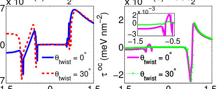 
FIG. 2. Left (Right) panel: The chemical potential dependence of the in-plane spin-orbit torque τoc for WSe2- (MoSe2-) based bilayer in the absence and presence of twisting (with θtwist = 30◦), when θm = π/4 and ϕm = 0. Inset of (b) shows the zoomed-in view of τoc

📷 Fig 3

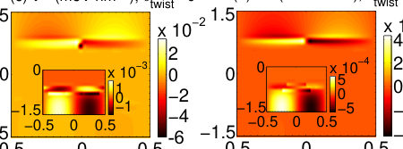 
FIG. 3. Top (Bottom) panel: The strength of the spin-orbit torque τoc in terms of the magnetization direction θm and the chemical po- tential µ in the absence and presence of twisting with θtwist = 30◦for WSe2/CrI3 [(a)-(b)] (MoSe2/CrI3 [(c)-(d)]) bilayer, when ϕm = 0.

📷 Fig 4

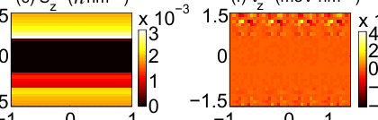 
FIG. 4. Left (Right) panel: The spin polarization (spin-orbit torque) components in terms of the magnetization direction ϕm and the chem- ical potential µ in untwisted WSe2-based bilayer, when θm = π/4.

📷 Fig 5

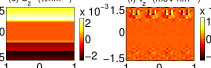 
FIG. 5. Left (Right) panel: The spin polarization (spin-orbit torque) components in terms of the magnetization direction ϕm and the chem- ical potential µ in twisted WSe2-based bilayer with θtwist = 30◦, when θm = π/4.

**Summary.** This work theoretically investigates how nonlinear carrier dynamics govern the spin-orbit torque (SOT) in TMDC/CrI3 heterostructures. It establishes that symmetry forbids linear spin responses, making nonlinear intra-band transitions the dominant mechanism. The findings highlight that the resulting SOT is highly tunable by external fields and material choice, positioning these bilayers as key platforms for low-power spintronics.

**Why it may be interesting.** While focused on condensed matter spintronics, the detailed analysis of non-equilibrium carrier dynamics and symmetry-protected nonlinear responses provides theoretical tools applicable to understanding current-driven phenomena in quantum materials.

Detailed structure

**Main problem.** The study investigates the role of nonlinear carrier dynamics in generating spin-orbit torque (SOT) within van der Waals magnetic heterostructures.

**Main result.** The SOT is dominated by nonlinear intra-band transitions, generating a purely field-like torque whose magnitude and sign are highly tunable by doping, twist angle, and gate electric field.

**Method.** The analysis employs a single-band steady-state Boltzmann approach, focusing on nonlinear transport beyond the linear-response regime.

**Model / system.** The system is the TMDC/CrI3 bilayer (e.g., WSe2/CrI3, MoSe2/CrI3), where the TMDC layer interacts with the 2D ferromagnet CrI3 via proximity exchange.

**Key observables.** Spin polarization, Spin-Orbit Torque (SOT), and the dependence of SOT on chemical potential and doping type.

**Important parameters / regimes.** Zero-Rashba SOC limit, chemical potential ($\mu$), doping type ($n$- vs $p$-doped), twist angle, and gate electric field.

**Assumptions / limitations.** The linear spin polarization is forbidden by symmetry, necessitating the focus on nonlinear intraband transitions.

**Figures summary.** Figures illustrate the chemical potential dependence of non-zero spin polarization components and the resulting SOT for both MoSe2/CrI3 and WSe2/CrI3 bilayers under varying magnetization directions.

**Paper structure.** The paper develops a theoretical model for nonlinear SOT, presents numerical results for non-equilibrium spin polarization, and concludes by summarizing the findings regarding the tunability of the SOT.

Abstract

The role of nonlinear carrier dynamics in current-driven spin phenomena remains poorly understood in van der Waals magnetic heterostructures. Here, we investigate the spin polarization and the resulting spin-orbit torque (SOT) in transition-metal dichalcogenide/chromium iodide (TMDC/CrI$_3$) heterostructures, focusing on WSe$_2$/CrI$_3$ and MoSe$_2$/CrI$_3$, in the zero-Rashba spin-orbit coupling (SOC) limit and beyond the linear-response regime. We find that linear spin polarization is forbidden by symmetry, making nonlinear intraband transitions the dominant mechanism in this regime. Consequently, the current-driven spin response differs fundamentally from conventional linear-response predictions. The resulting nonlinear spin polarization generates a purely field-like torque whose magnitude and sign depend sensitively on the chemical potential and doping type, with pronounced asymmetries between n- and p-doped systems. A strong material dependence is also observed: n-doped MoSe$_2$/CrI$_3$ exhibits a torque nearly an order of magnitude larger than that of WSe$_2$/CrI$_3$, together with two sign reversals, reflecting differences in their SOC and proximity-exchange parameters. Structural and electrostatic control through the twist angle and gate electric field provides additional means of tuning the nonlinear torque, including substantial modulation and controllable sign reversals. These findings establish TMDC/CrI$_3$ bilayers as a versatile platform for engineering nonlinear spin-orbit phenomena in ultrathin, low-power spintronic devices.

[↑ back to top](#top)

### [Non-Uniform Quantum Well and Barrier Thickness Engineering for Robust Ultra-High TER and Low RA Ferroelectric Tunnel Junctions](http://arxiv.org/abs/2609.31411v1)

**Authors:** Balram Khattar, Adarsh Tripathi, Manish Anand, Abhishek Sharma  
**Type:** theory · **Category:** other · **PDF:** <https://arxiv.org/pdf/2609.31411v1>  
**Analysis basis:** full PDF text, analyzed in chunks
**Topic relevance:** `Keldysh / 2PI / non-Gaussian methods` **2/5** · `methods for driven-dissipative` **2/5**

📷 Fig 1

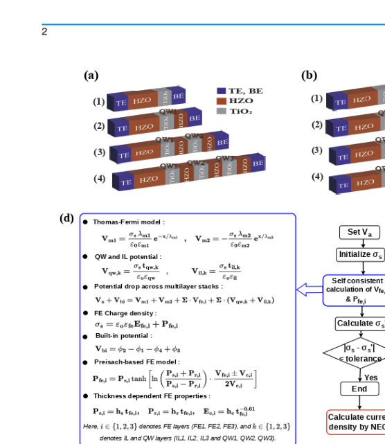 
Fig. 1.

📷 Fig 2

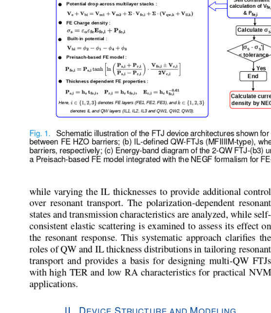 
Fig. 1 illustrates the proposed QW-engineered FTJ archi- tectures. Two distinct architectures are considered with 0— 3 QWs, namely, FE layer-defined QW-FTJs, in which TiOy QWs are formed between ferroelectric HZO barriers, and IL-defined QW-FTJs, in which TiO; and HfO, layers form the QWs and tunneling barriers, respectively. The FE layer- defined QW-FTJs in Fig. 1(a) consist of TiN top and bottom electrodes (TE and BE), HZO FE layers, and TiOy QWs, with the corresponding 0-3 QW configurations shown in Fig. 1(al)}-1(a4). In contrast, the IL-defined QW-FTJs in Fig. 1(b) comprise TiN electrodes, a single HZO FE layer, TiO2, QWs, and HfO, ILs, with the corresponding 0-3 QW configurations shown...

📷 Fig 3

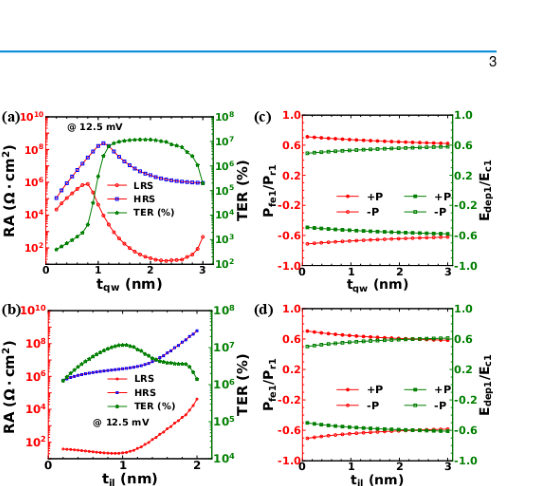 
Fig. 3. Variation of the RA and TER, evaluated at V,=12.5mV, as a function of (a) the equal QW thickness (bqw1=bqwa=tqw) With fixed IL thicknesses of tuy =tiiz=1nm, and (b) the equal IL thickness (tin =tia=ta) with fixed QW thicknesses of tquw1 =tqwa=2nm for the FTJ-(b3) stack. The corresponding Pres /Pry and Eqeps /Eex, evalu- ated at 0V, are shown in (c) and (d), respectively.

📷 Fig 4

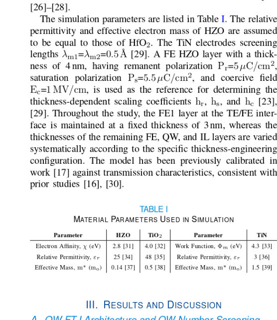 
Fig. 2(a) and Fig. 2(b) compare the TER and RA char- acteristics of the FE layer-defined and IL-defined QW-FTJ architectures with 0-3 QWs, corresponding to the structures shown in Fig. 1(a) and Fig. 1(b), respectively, at a read voltage of V,=12.5mV. The FE and IL layers, excluding the

📷 Fig 5

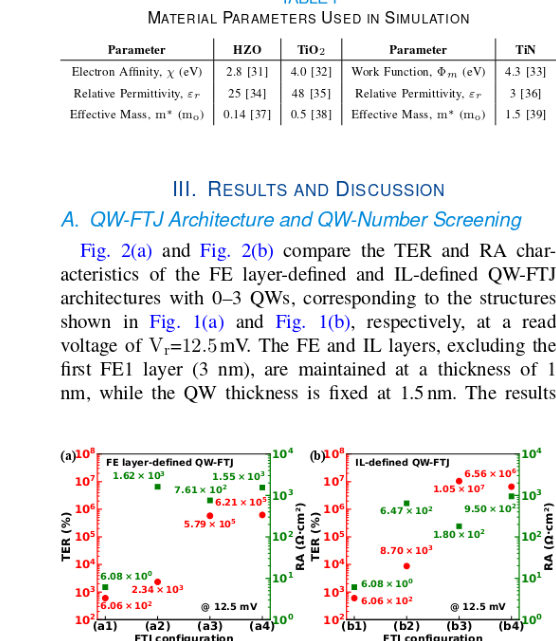 
Fig. 2. TER and RA for different QW-FTJ structures evaluated at V,—12.5mV. (a) and (b) correspond to FE layer-defined and IL-defined QW-FTJs, respectively. Configurations (a1)-(a4) and (b1)-(b4) denote devices containing 0-3 QWs.

**Summary.** This work proposes using non-uniform quantum well and barrier thickness engineering in HfO2-based ferroelectric tunnel junctions to solve the trade-off between high TER and low RA. By coupling a ferroelectric model with NEGF, the authors demonstrate that precise structural control can align resonant states to achieve record performance metrics for next-generation non-volatile memory.

**Why it may be interesting.** The detailed quantum transport modeling of resonant tunneling in ferroelectrics provides insights into how engineered nanoscale structures can control electronic properties, which is relevant to understanding open quantum systems dynamics in solid-state devices.

Detailed structure

**Main problem.** The primary challenge is simultaneously achieving a high Tunneling Electro-Resistance Ratio (TER) and a low Resistance-Area (RA) product in HfO2-based ferroelectric tunnel junctions (FTJs).

**Main result.** Non-uniform quantum well (QW) and barrier thickness engineering is shown to be a robust design parameter that controls resonant-state alignment, leading to high TER (up to 1x10^8%) and low LRS RA (as low as 1 $\Omega\cdot\text{cm}^2$).

**Method.** The study employs a self-consistent Non-Equilibrium Green's Function (NEGF) formalism coupled with a Preisach-based ferroelectric (FE) model.

**Model / system.** The system is an HfO2-based multi-QW FTJ structure. The model integrates the FE polarization state (via Preisach model) with quantum transport calculations (via NEGF) to determine current density.

**Key observables.** Tunneling Electro-Resistance Ratio (TER), Resistance-Area (RA) product, and resonant transmission characteristics.

**Important parameters / regimes.** Non-uniform QW and barrier thicknesses ($t_{	ext{qw1}}, t_{	ext{qw2}}$, etc.), and the inclusion of self-consistent elastic scattering terms.

**Assumptions / limitations.** The analysis assumes that transport changes are primarily due to thickness-dependent resonant tunneling rather than major changes in the ferroelectric polarization state.

**Figures summary.** Figures illustrate the schematic of the FTJ architectures, the simulation framework, and show how varying QW/IL thicknesses and incorporating elastic scattering positively influence the TER and RA performance.

**Paper structure.** The paper systematically investigates the impact of QW/barrier non-uniformity, first establishing the baseline using NEGF/Preisach models, then optimizing the structure by tuning thicknesses, and finally demonstrating the positive influence of elastic scattering on the resulting high-performance junction.

Abstract

HfO$_2$-based ferroelectric tunnel junctions (FTJs) are promising candidates for scalable non-volatile memory, but simultaneously achieving a high tunneling electro-resistance ratio (TER) and a low resistance-area (RA) product remains challenging. To address this challenge, this work introduces non-uniform quantum well (QW) and barrier thickness engineering in HfO$_2$-based multi-QW FTJs using a self-consistent Preisach-based ferroelectric (FE) model integrated with the coherent and inelastic non-equilibrium Green's function (NEGF) formalism. The non-uniform well and barrier configuration produces a wide range of FTJ design landscapes due to closely spaced, broad resonant states in the low resistance state (LRS) and a larger separation in the high resistance state (HRS), resulting in strong polarization-dependent resonant transmission with TER reaching the order of $\mathbf{1\times10^{8}\%}$ and an LRS RA product as low as $\mathbf{1~Ω\cdot\mathrm{cm}^{2}}$ at read bias and in the presence of scattering. By incorporating self-consistent elastic scattering into the NEGF framework, we also show that elastic scattering can positively influence the TER and RA performance of non-uniform FTJs by progressively increasing the overlap of the closely spaced resonances. Overall, the results establish non-uniform QW and barrier thickness as an effective and robust design parameter for controlling resonant-state alignment and achieving a favorable combination of high TER and low RA in HfO$_2$-based multi-QW FTJs.

[↑ back to top](#top)

### [Superconductivity in Noncentrosymmetric NbReSi: Beyond Harmonic and Adiabatic Limits](http://arxiv.org/abs/2609.30564v1)

**Authors:** Shashi B. Mishra, Sohair ElMeligy, Pratibha Dev  
**Type:** theory · **Category:** other · **PDF:** <https://arxiv.org/pdf/2609.30564v1>  
**Analysis basis:** full PDF text, analyzed in chunks
**Topic relevance:** `Keldysh / 2PI / non-Gaussian methods` **2/5**

📷 Fig 1

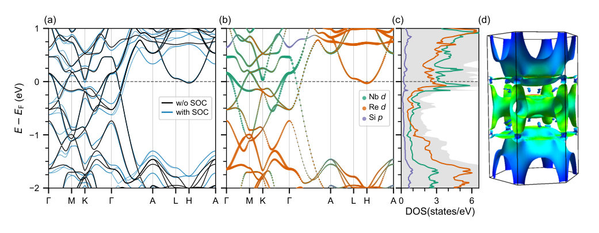 
FIG. 1. Electronic structure of NbReSi. (a) Band structure without (black) and with (blue) SOC; the dashed line marks the Fermi level εF. (b) Orbital-projected bands; marker size is proportional to the Nb-d (teal), Re-d (orange), and Si-p (purple) weight. (c) Total and orbital-resolved density of states per unit cell. (d) Fermi surface without SOC, colored by the Fermi velocity (blue: low, green: high).

📷 Fig 2

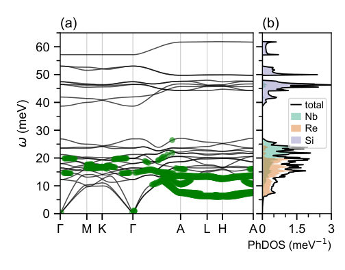 
FIG. 2. Harmonic phonons in NbReSi. (a) Phonon dispersion with circle size proportional to the mode-resolved coupling λqν. (b) Total and atom-projected phonon DOS.

📷 Fig 3

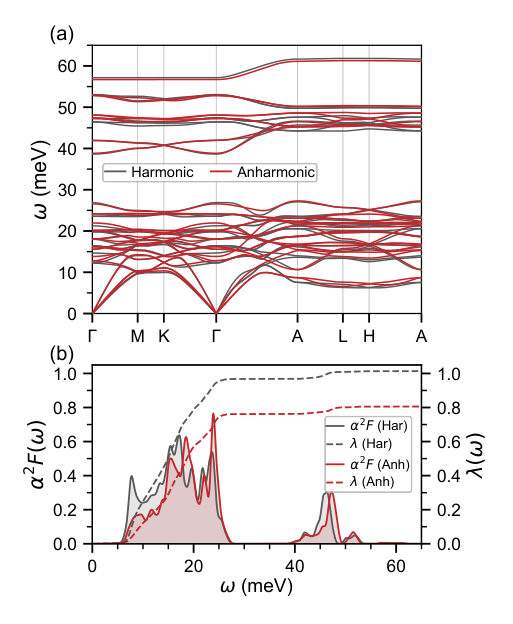 
FIG. 3. Anharmonic renormalization of the lattice dynam- ics. (a) Phonon dispersion with harmonic (black) and anhar- monic (red) approximations. (b) Eliashberg spectral function α2F(ω) (solid, left axis) and cumulative electron-phonon cou- pling λ(ω) (dashed, right axis).

📷 Fig 4

 
Figure 1(a) compares the electronic bands without and with SOC. The largest SOC splittings, about 0.2 eV at Γ- and A-points, agree with the earlier report [2]. These splittings arise in the bands that are mostly derived from the d-orbitals of the heavy elements – Nb and Re. The Kramers’ degeneracy is preserved at Γ and A since these are time-reversal-invariant-momenta points. The bands crossing εF split by less than 25 meV, so ASOC leaves the Fermi-level electronic structure essentially unchanged and modifies the electron-phonon coupling by only 4% (Fig. S4 [25]), indicating its minor role in superconduct- ing pairing, if any. The projected bands and density of states (DOS) [Fig. 1(b,c)]...

📷 Fig 5

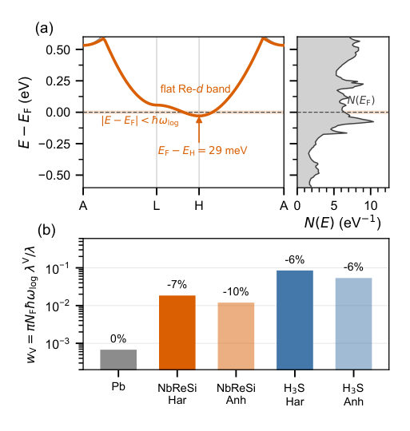 
FIG. 5. Electronic origin of the nonadiabatic correction. (a) Bands along A–L–H–A and corresponding DOS. The nearly dispersionless Re-d band reaches its minimum 29 meV below εF at H; shading marks |E −εF| &lt; ℏωlog. (b) Nonadiabatic weight wV for Pb, NbReSi, and H3S (Appendix B; Pb and H3S from Ref. [14]). Labels give the vertex-induced relative change δTc/Tc = (T FBW+ver c −T FBW c )/T FBW c .

**Summary.** This work investigates superconductivity in NbReSi, finding that while the pairing is phonon-mediated, standard theoretical models overestimate the critical temperature. The authors successfully reconcile theory with experiment by rigorously including anharmonic lattice effects and electron-phonon vertex corrections, establishing a quantitative understanding of the pairing mechanism.

**Why it may be interesting.** While focused on solid-state physics, the rigorous application of advanced many-body perturbation theory (Eliashberg equations) to model emergent quantum phenomena like superconductivity is relevant to understanding strongly coupled quantum systems.

Detailed structure

**Main problem.** To determine the microscopic origin of superconductivity in the noncentrosymmetric material NbReSi and to accurately calculate its critical temperature ($T_c$).

**Main result.** The superconductivity is established as phonon-mediated, but quantitative agreement with experiment requires going beyond harmonic Migdal-Eliashberg theory by including anharmonic lattice dynamics and vertex corrections.

**Method.** The study uses first-principles calculations (DFT/DFPT) to solve the isotropic Eliashberg equations, incorporating anharmonic phonon renormalization and lowest-order electron-phonon vertex corrections.

**Model / system.** The system is the noncentrosymmetric superconductor NbReSi. The theory models electron-phonon coupling ($\lambda$) and the superconducting gap ($\Delta$) using advanced many-body techniques.

**Key observables.** Superconducting critical temperature ($T_c$), superconducting gap ($\Delta(0)$), electron-phonon coupling constant ($\lambda$), and phonon frequencies ($\omega$).

**Important parameters / regimes.** The necessity of anharmonicity and vertex corrections to match the experimental $T_c$ of 6.5 K.

**Assumptions / limitations.** The initial assumption of conventional phonon-mediated pairing is tested against advanced theoretical limits (harmonic vs. anharmonic, with/without vertex corrections).

**Figures summary.** Figures illustrate electronic structure, phonon dispersion (comparing harmonic and anharmonic treatments), and the Eliashberg spectral function $\alpha^2F(\omega)$ under various theoretical approximations.

**Paper structure.** The paper progresses by first establishing the electronic structure, then calculating the electron-phonon coupling using harmonic theory, demonstrating its overestimation of $T_c$, and finally refining the calculation by incorporating anharmonicity and vertex corrections to match experimental results.

Abstract

The noncentrosymmetric superconductor NbReSi (Tc=6.5 K) is being actively explored for unconventional pairing that is allowed by its broken inversion symmetry. Despite broad experimental interest, what drives its superconductivity remains an open question. We show that the electronic states at the Fermi level are dominated by Nb and Re $d$-states. Vibrations of the same heavy-metal framework contribute more than 95% of the electron-phonon coupling, with the strongest coupling arising from the sublattice-selective breathing mode involving strongly bonded Re atoms. Harmonic Migdal-Eliashberg theory overestimates Tc by more than 60%. The zero-point anharmonic hardening of these modes reduces the coupling by 20%. The leading vertex correction becomes important as well despite low phonon energies due to the contribution of spatially localized Re-d orbitals to the electronic band structure near the Fermi level. Together, anharmonicity and vertex corrections bring the calculated Tc and superconducting gap into close agreement with experiment, establishing NbReSi as a moderately coupled, phonon-mediated superconductor whose quantitative description requires going beyond harmonic Migdal--Eliashberg theory.

[↑ back to top](#top)

### [Rydberg excitons in core-shell nanostructures II. Plasmon-exciton interaction and enhancement](http://arxiv.org/abs/2609.31500v1)

**Authors:** David Ziemkiewicz, Gerard Czajkowski, Sylwia Zielińska-Raczyńska  
**Type:** theory · **Category:** other · **PDF:** <https://arxiv.org/pdf/2609.31500v1>  
**Analysis basis:** full PDF text, analyzed in chunks
**Topic relevance:** `Keldysh / 2PI / non-Gaussian methods` **1/5** · `Tavis-Cummings & cavity-many-emitter` **1/5** · `analog quantum simulation` **1/5** · `interference shaping light` **1/5** · `methods for driven-dissipative` **1/5**

📷 Fig 1

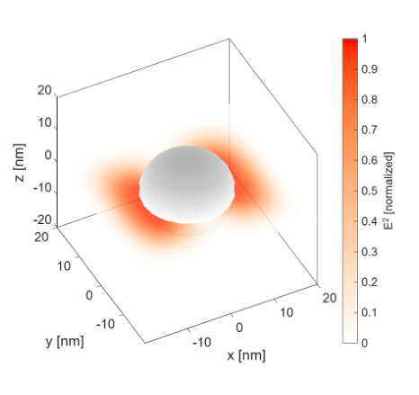 
FIG. 1: Numerically calculated electric field intensity in the vicinity of a metal sphere.

📷 Fig 2

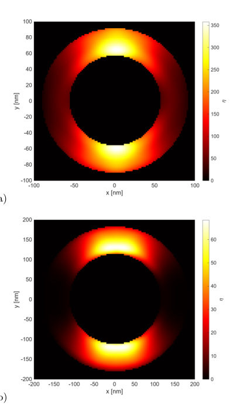 
FIG. 2: Local amplification (color) of the quadrupole transition to 3S state for 100 nm and 200 nm diameter core. Shell thickness is half of the core radius.

📷 Fig 3

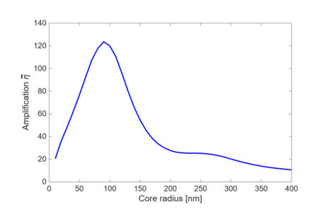 
FIG. 3: Averaged amplification of the quadrupole transition to 3S state in a core-shell structure.

📷 Fig 4

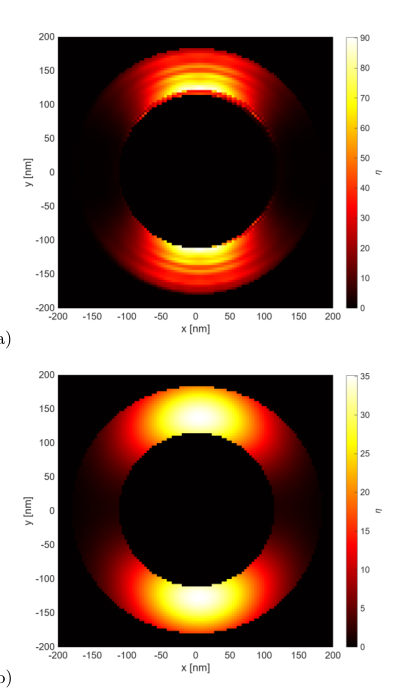 
FIG. 4: Local amplification (color) of the quadrupole transition to a) 1S and b) 6S state for 200 nm diameter core and 50 nm shell.

📷 Fig 5

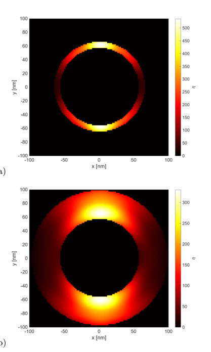 
FIG. 5: Local amplification (color) of the quadrupole transition to 3S state for 100 nm diameter core and a) 10 nm and b) 40 nm shell.

**Summary.** This paper theoretically analyzes how surface plasmons enhance the weak quadrupole transitions of Rydberg excitons confined within core-shell nanostructures. By modeling the near-field enhancement and incorporating the large size of Rydberg excitons, the authors predict optimal structural dimensions that maximize this quantum optical effect.

**Why it may be interesting.** This work directly bridges quantum optics (Rydberg atoms/excitons) with nanophotonics (plasmons), providing a quantitative framework for engineering light-matter interactions to enhance otherwise weak, forbidden transitions.

Detailed structure

**Main problem.** The paper investigates the enhancement of quadrupole transitions in Rydberg excitons due to their interaction with surface plasmons within core-shell nanostructures.

**Main result.** The plasmonic near-field significantly enhances these transitions, with optimal enhancement factors ($\eta$) observed at specific core radii ($\sim 80-100$ nm) that match the spatial scales of highly excited Rydberg states.

**Method.** The study employs theoretical modeling combining near-field electrodynamics (FDTD/analytical solutions) with quantum mechanical descriptions of excitons, utilizing averaging techniques for large excitons.

**Model / system.** The system involves core-shell nanostructures (e.g., Cu2O excitons) where the excitons interact with localized surface plasmons. The exciton states are modeled using modified Schrödinger-like equations leading to Whittaker equations.

**Key observables.** Local field gradient ($
abla\vec{E}$), transition rate ($\gamma$) for quadrupole transitions, and the plasmonic amplification factor ($\eta$).

**Important parameters / regimes.** Rydberg principal quantum number ($n$), core radius ($r$), and the matching condition between plasmon resonance and exciton resonance frequencies.

**Assumptions / limitations.** The analysis relies on the near-field approximation, the use of an averaging method for large excitons, and the assumption of zero confinement potential inside the nanostructure volume for simplified solutions.

**Figures summary.** Figures illustrate the calculated electric field intensity and the averaged local field amplification ($	ilde{\eta}$) as a function of the core radius, highlighting optimal enhancement regions.

**Paper structure.** The paper progresses from establishing the physical interaction (plasmon-exciton coupling) to deriving the necessary mathematical frameworks (Hamiltonians, differential equations like the Whittaker equation) and finally presenting numerical results showing the size-dependent enhancement of quadrupole transitions.

Abstract

Interaction between Rydberg excitons in core-shell Cu$_2$O nanostructures and surface plasmons is investigated. An enhancement of a quadrupole transitions to the Rydberg exciton states in copper oxide plasmonic nanaostructures is examined. A possibility of a modification of plasmonic enhancment (i.e., an average amplification factor) of electric field distributions in the vicinity of nanostructures, which depends on its shape and geometrical size, is also discussed.

[↑ back to top](#top)

### [Electrochemical Growth of Full Volume Meissner Effect Superconducting BKBO](http://arxiv.org/abs/2609.30677v1)

**Authors:** Oleksandr Foyevtsov, Kateryna Foyevtsova, Mohamed Oudah, Dan Bizzotto, George Sawatzky  
**Type:** experiment · **Category:** other · **PDF:** <https://arxiv.org/pdf/2609.30677v1>  
**Analysis basis:** full PDF text, analyzed in chunks
**Topic relevance:** `analog quantum simulation` **1/5** · `driven-dissipative phase transition` **1/5** · `methods for driven-dissipative` **1/5** · `quantum measurements` **1/5**

📷 Fig 1

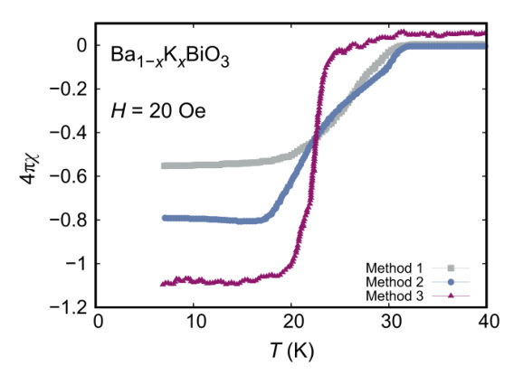 
Figure 1: Comparison of magnetic susceptibility for the three successive growth configura- tions (Methods 1–3) described in the text (H = 20 Oe).

📷 Fig 2

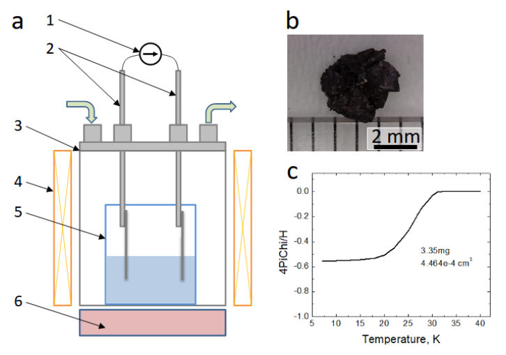 
Figure 2: Method 1 – Simple electrochemical growth setup (a). Here, 1 – constant current source, 2 – movable electrodes, 3 – sealed growth chamber, 4 thermal insulation, 5 – 320 ml Teflon crucible with growth solution shown in blue, 6 – spinner and a hot plate. BKBO crystals (b) grown with the setup to the left, and (c) magnetic susceptibility of the crystal above.

📷 Fig 3

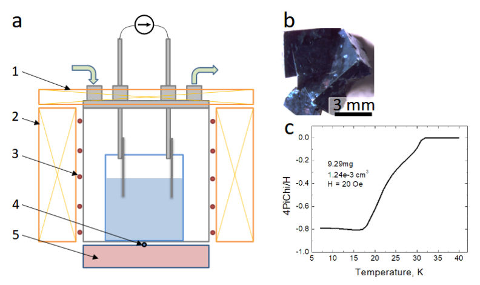 
Figure 3: Method 2 – An improved growth setup (a), here, in addition to the setup in Fig. 2(a) added top thermal insulation (1), increased thickness of the side walls insulation (2), added evenly winded tape heating element (3), feedback thermocouple (4), and only spinner used in (5). BKBO crystals (b) grown with the setup to the left, and (c) magnetic susceptibility of the crystal above.

📷 Fig 4

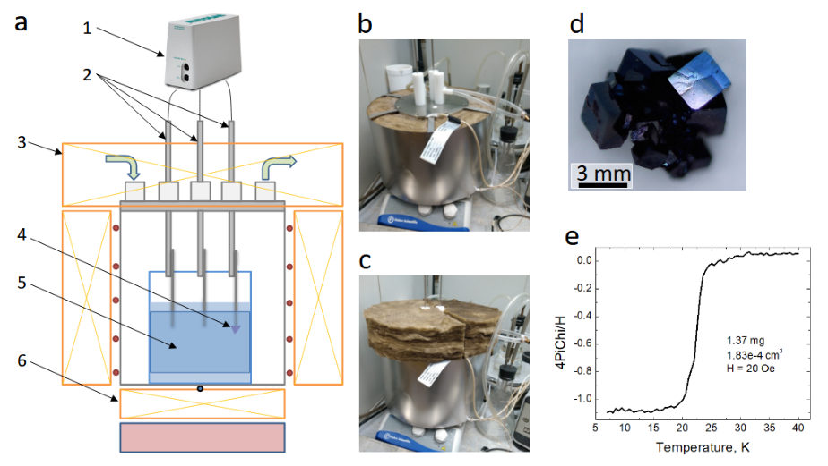 
Figure 4: Method 3 – The final setup used in this work (a), here the additional improvements include a potentiostat (1), three-electrode configuration (2), top thermal insulation with increased thickness (3), reference BKBO electrode (4), large area Pt foil in a shape of a cylinder used as a counter electrode (5), and bottom thermal insulation (6). The actual view of the growth chamber with insulation and electrodes are shown in (b) and (c). BKBO crystals (d) grown with the setup to the left, and (e) magnetic susceptibility of the crystal above.

📷 Fig 5

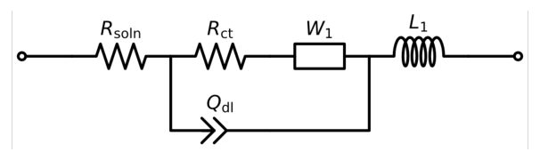 
Figure 5: Equivalent circuit model used to fit the EIS data: Rsoln – solution resistance; Qdl – constant phase element modeling the double layer capacitance; Rct – charge transfer resistance modelling the electrochemical crystal growth kinetics; W1 – Warburg impedance modelling the mass transport of the reactants; L1 – inductance modelling the non-ideal connectors and influence of the environment on the EIS measurement.

**Summary.** This work details the electrochemical synthesis of superconducting BKBO crystals, demonstrating that upgrading from simple two-electrode setups to a precise three-electrode potentiostatic system is crucial. This advanced control allows researchers to achieve highly homogeneous crystals exhibiting a full volume Meissner effect and a sharp superconducting transition. The combination of magnetic and electrochemical diagnostics provides a powerful pathway for tuning superconducting properties.

**Why it may be interesting.** While focused on superconductivity, the rigorous application of electrochemical control (potentiostats, EIS) to tune material stoichiometry and crystal homogeneity mirrors techniques used in controlling interfaces in quantum devices.

Detailed structure

**Main problem.** The primary goal was to synthesize high-quality, single-crystal superconducting $	ext{Ba}_{1-x}	ext{K}_x	ext{BiO}_3$ (BKBO) crystals exhibiting a full volume Meissner effect with a sharp superconducting transition.

**Main result.** Implementing a comprehensive three-electrode potentiostatic setup significantly improved crystal quality, leading to a markedly sharper superconducting transition and achieving a full Meissner response.

**Method.** The study employed electrochemical synthesis (anodic electrocrystallization) and characterized the results using magnetic susceptibility measurements and in-situ Electrochemical Impedance Spectroscopy (EIS).

**Model / system.** The physical system is the perovskite superconductor $	ext{Ba}_{1-x}	ext{K}_x	ext{BiO}_3$ (BKBO). The growth is controlled electrochemically, comparing basic two-electrode constant current methods against advanced three-electrode potentiostatic control.

**Key observables.** Magnetic susceptibility ($\chi$) across the superconducting transition, superconducting transition width, Meissner phase volume fraction, and EIS parameters ($R_{ct}$, $Q_{dl}$, CPE exponent).

**Important parameters / regimes.** Growth temperature ($225^\circ	ext{C}$), applied overpotential/voltage, and the control mechanism transitioning from two-electrode to three-electrode potentiostatic control.

**Assumptions / limitations.** The interpretation of $T_c$ alone is insufficient to uniquely determine potassium content, and the EIS analysis assumes interface changes are slow enough for local measurements.

**Figures summary.** Figures compare magnetic susceptibility ($\chi$) for different growth methods, showing the progressive sharpening of the transition. Other figures detail the electrochemical setups and the Equivalent Circuit Model (ECM) used for EIS fitting.

**Paper structure.** The paper systematically compares three electrochemical growth setups (Method 1, 2, and 3). It uses magnetic measurements to assess superconducting quality and employs in-situ EIS analysis to diagnose the underlying electrochemical processes governing nucleation and growth kinetics.

Abstract

In this work we show the results of electrochemical synthesis of BKBO crystals using three different experimental setup configurations. The setups differ between each other by varying level of control over physical variables and progressing from a two-electrode to a three-electrode configuration using highly oriented platinum counter electrode. By systematic analysis of the temperature dependence of the magnetic susceptibility at the superconducting transition of the collected crystals we observe that an order of magnitude sharper superconducting transition is achieved for the most comprehensive three-electrode setup. In addition, the level of chemical substitution can be controlled by the value of the overpotential versus reference electrode. We demonstrate that with this technique a full volume Meissner effect can be achieved with a sharp transition temperature for the superconducting crystal.

[↑ back to top](#top)

### [Prevalence and the rate of antigenic evolution are jointly determined in an eco-evolutionary SIR model](http://arxiv.org/abs/2609.30515v1)

**Authors:** Daniel Gomez, Joshua B. Plotkin  
**Type:** theory · **Category:** other · **PDF:** <https://arxiv.org/pdf/2609.30515v1>  
**Analysis basis:** full PDF text, analyzed in chunks
**Topic relevance:** `non-equilibrium universality` **1/5**

📷 Fig 1

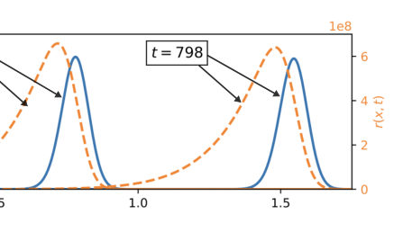 
Figure 1. Numerical simulation of (9) for parameters Q = 3 × 108, b0 = 2, R0 = 2, ε = 10−1, m = 1 × 10−2, and w = 1 × 10−6. The solid blue (resp. orange dashed) curves indicate the infected (resp. recovered) population distributions over antigenic space at the indicated times.

📷 Fig 2

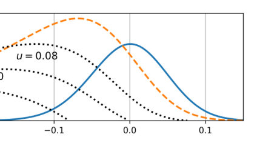 
Figure 2. Schematic of the endemic infected (solid blue curve) and recovered (dashed orange curve) distributions in a moving reference frame. Superimposed are the curves K(u −v)r(v) (dotted black curves) at indicated values of u, whose integral determines the infected growth rate due to reinfection. The quantities ie(v), re(v), and K(u −v)re(v) have been rescaled for illustrative purposes. The rescaling for K(u −v)re(v) is constant for each choice of u to highlight their relative magnitudes.

📷 Fig 3

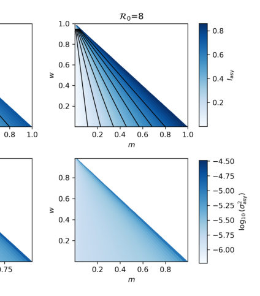 
Figure 3. Solutions of the nonlinear system (39) with the exponential cross-immunity kernel. The top (resp. bottom) panels show Iasy (resp. log10 σ2 asy) versus m and w with R0 = 2 (left), 4 (middle), and 8 (right). In the top row contours are uniformly distributed in 0.1 ≤Iasy ≤0.4 (left), 0.1 ≤Iasy ≤0.6 (middle), and 0.1 ≤Iasy ≤0.7 (right). The colorbar applies to each row and ε = 10−6.

📷 Fig 4

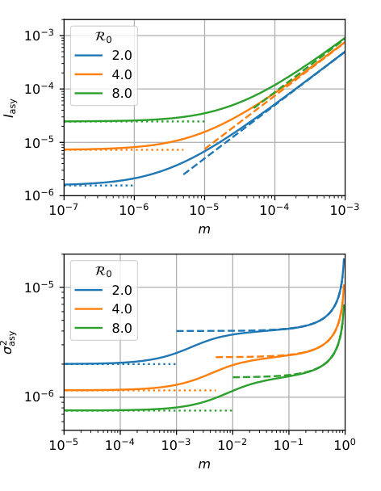 
Figure 4. Comparison of full numerical simulations of the nonlinear system (solid) with the m ≪ε (dotted) and m ≫√ε (dashed) asymptotics. In the left column m = 10−4 and w = 10−2 while in the right column ε = 10−6 and w = 10−8.

📷 Fig 5

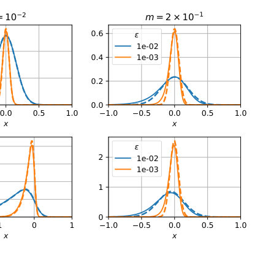 
Figure 5. Numerics (solid) and asymptotics (dashed) for w = 10−6 and R0 = 2.

**Summary.** This theoretical paper models how influenza evolves by tracking antigenic drift within an eco-evolutionary SIR framework. It shows that the rate of evolution and the disease's prevalence are intrinsically linked, predicting that higher prevalence slows down antigenic change. The mathematical analysis uses advanced PDE techniques to derive these key ecological trade-offs.

**Why it may be interesting.** While the subject is epidemiology, the mathematical machinery—solving nonlocal PDEs for traveling wave solutions and deriving asymptotic scaling laws—shares techniques with non-equilibrium statistical mechanics and pattern formation in complex systems.

Detailed structure

**Main problem.** The paper investigates the joint determination of influenza A's prevalence and its rate of antigenic evolution, recognizing that these two ecological and evolutionary processes are coupled.

**Main result.** The speed of antigenic evolution decreases as prevalence rises, and the total number of infected hosts is maximized at an intermediate virulence level under certain conditions.

**Method.** The authors use asymptotic analysis to construct traveling pulse solutions to nonlocal partial differential equations describing the system's dynamics.

**Model / system.** The model is an eco-evolutionary SIR framework tracking infected and recovered hosts as distributions over a one-dimensional antigenic space, incorporating cross-immunity and potential host mortality.

**Key observables.** Speed of antigenic evolution, prevalence ($I_{asy}$), antigenic variance ($\sigma^2_{asy}$), and total number of infected hosts.

**Important parameters / regimes.** Virulence ($\omega$), host birth rate, immune evasion rate ($\epsilon$), and infection duration parameter ($m$).

**Assumptions / limitations.** The analysis relies on the assumption of a one-dimensional antigenic space and uses asymptotic approximations valid in specific parameter regimes.

**Paper structure.** The paper builds upon an established SIR model, analyzes the endemic state as a traveling pulse, and derives asymptotic relationships between key epidemiological and evolutionary parameters by solving the underlying nonlocal PDEs.

Abstract

Influenza A persists by continually changing the antigens that its host population recognizes. How fast it evolves and how many hosts it infects are not independent, because the immunity that selects new variants is produced by the infections the pathogen has already caused. We analyze a model of Andreasen et.\ al.\ that captures this eco-evolutionary feedback, and we extend it to the case where infection may kill the host. In the model infected and recovered hosts are distributions over a one-dimensional antigenic space coupled by cross-immunity. The endemic state is a traveling pulse: the infected distribution keeps a fixed shape and advances through antigenic space at constant speed. In the limit of weak antigenic mutation we construct the pulse asymptotically and find that: (i) the speed of antigenic evolution decreases as prevalence rises, (ii) less standing antigenic variation accompanies either faster or slower antigenic evolution, depending on whether pathogens differ in immune evasion or host lifespan (iii) the total number of infected hosts is largest at an intermediate virulence when the host birth rate is sufficiently low.

[↑ back to top](#top)

### Other secondary papers (2)

Show other secondary papers

### [Electrically controlled spin-splitting and asymmetric tunnel magnetoresistance in anti-altermagnets](http://arxiv.org/abs/2609.31006v1)

**Authors:** Abhiram Soori  
**Type:** theory · **Category:** strongly correlated electrons · **PDF:** <https://arxiv.org/pdf/2609.31006v1>  
**Analysis basis:** full PDF text, analyzed in chunks

📷 Fig 1

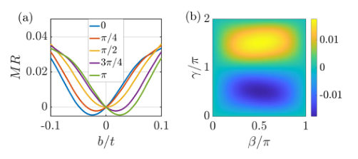 
FIG. 3. (a) MR as a function of the Zeeman field b for vari- ous choices of the angle β, defined between the N´eel vector of the AAM and the spin polarization direction of the FM leads, evaluated at a finite chemical potential mismatch ∆µ = 0.05t. (b) Dependence of ∆MR/∆b on the spherical polar angles (β, γ) relative to the N´eel vector of the AAM in the absence of a chemical potential mismatch (∆µ = 0). All other param- eters are identical to those in Fig. 2(a).

📷 Fig 2

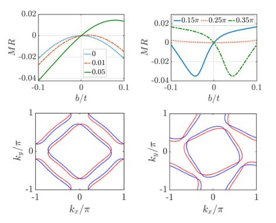 
FIG. 2. (a,b) MR as a function of the Zeeman field strength, which parameterizes the magnetization of the ferromagnetic leads. (c,d) Momentum-space Fermi surface contours of the central AAM region. In (a), the MR curves are evaluated for varying values of the chemical potential mismatch ∆µ at a fixed crystallographic orientation ϕ = 0. In (b), the curves illustrate the MR dependence on varying orientations ϕ at a fixed ∆µ = 0.1t. Panels (c) and (d) display the Fermi contours for ϕ = 0.25π and ϕ = 0.15π, respectively, for ∆µ = 0.3t. This enhanced value of ∆µ, compared to pan- els (a) and (b), is selected to visually resolve the band spin- splitting induced by the broken spatial inversion...

**Summary.** This theoretical work proposes using a dual-gated junction to electrically probe the hidden magnetic order in Anti-altermagnets (AAMs). By applying an electric field, the system's spin degeneracy is lifted, causing a measurable, asymmetric tunnel magnetoresistance (TMR). The findings establish a tunable spintronic framework for exploiting these novel magnetic materials.

**Why it may be interesting.** The work connects magnetic order, symmetry breaking via electric fields, and transport signatures, which are core concepts in understanding emergent quantum phenomena in condensed matter systems.

Detailed structure

**Main problem.** To develop an all-electrical method to manipulate and probe the hidden magnetic order in Anti-altermagnets (AAMs), which possess a globally spin-degenerate band structure.

**Main result.** The study shows that applying an electric field breaks the spin degeneracy, leading to a strongly asymmetric tunnel magnetoresistance (TMR), while specific crystallographic orientations can restore symmetry due to momentum-space compensation.

**Method.** Quantum transport calculations using the Landauer formalism applied to a tight-binding Hamiltonian.

**Model / system.** The system is an Anti-altermagnet (AAM) sandwiched between two ferromagnetic (FM) leads, configured in a dual-gated transport junction. The magnetic order is characterized by opposite spin-splitting in adjacent layers.

**Key observables.** Tunnel Magnetoresistance (TMR) as a function of the lead magnetization ($b$) and the applied gate-induced displacement field ($\Delta\mu$).

**Important parameters / regimes.** Perpendicular displacement field ($\Delta\mu$), Rashba spin-orbit coupling ($\alpha$), and crystallographic orientation ($\phi$).

**Assumptions / limitations.** The analysis relies on the dual-gated FM-AAM-FM device architecture and the specific Hamiltonian terms governing the magnetic exchange and SOC.

**Figures summary.** Figures illustrate the schematic transport setup, TMR vs. Zeeman field showing asymmetry/symmetry dependence on angle, and momentum-space contours detailing the splitting and compensation effects.

**Paper structure.** The paper progresses by first establishing the theoretical framework for probing AAMs via transport, demonstrating how gate-induced splitting causes TMR asymmetry, then analyzing the conditions (like specific angles or SOC strength) under which symmetry is maintained or enhanced.

Abstract

Anti-altermagnets (AAMs) are a recently identified class of layered magnetic materials where opposite spin-splitting in adjacent layers creates a globally spin-degenerate band structure, rendering conventional spectroscopic detection highly difficult. In this paper, we theoretically demonstrate an all-electrical method to manipulate and probe this hidden magnetic order using a dual-gated transport junction. By applying a perpendicular displacement field, we break the spatial inversion symmetry of the lattice, explicitly lifting the global spin degeneracy. We attach ferromagnetic (FM) leads on either side of the AAM. Using quantum transport calculations, we show that this gate-induced spin-splitting manifests as a strongly asymmetric tunnel magnetoresistance (TMR) as a function of the lead magnetization. We identify specific crystallographic orientations where the TMR retains its symmetry despite the fully split bands, a direct consequence of exact momentum-space compensation. We further reveal that Rashba spin-orbit coupling guarantees robust, highly directional transport asymmetries even in the absence of an explicit chemical potential mismatch between the layers. Our findings establish a clear, electrically tunable framework for exploiting AAMs in next-generation spintronic architectures.

[↑ back to top](#top)

### [Maximal Chern Numbers from Finite-Range Hopping](http://arxiv.org/abs/2609.31437v1)

**Authors:** Christopher Arriagada Cortés, Vladimir Juričić  
**Type:** theory · **Category:** other · **PDF:** <https://arxiv.org/pdf/2609.31437v1>  
**Analysis basis:** full PDF text, analyzed in chunks

📷 Fig 1

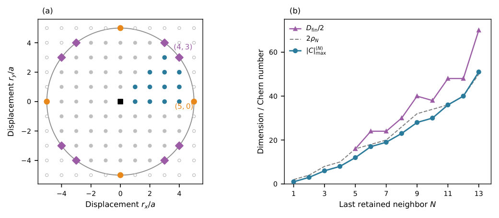 
FIG. 1. Hopping geometry and maximal Chern numbers. (a) Sites within the cutoff R = 5a (circle) around the origin (black square); open symbols lie outside. Blue marks the twelve inner orbit representatives, filled gray their partners, and orange and purple the independent (5, 0) and (4, 3) orbits at ρ13 = 25. (b) Maximal |C| for Eqs. (1)–(3), compared with Dfin/2 for N = 5, . . . , 13 and 2ρN. Here Dfin counts finite complex hybridization zeros. Lines connecting symbols guide the eye. Proofs and saturating Hamiltonians are given in Secs. SIII–SXVI of SM [51].

📷 Fig 2

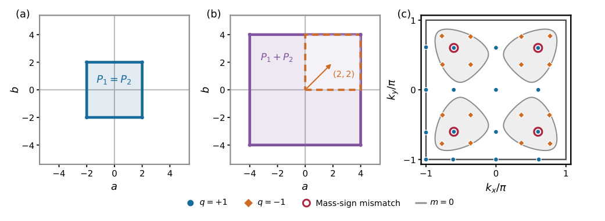 
FIG. 2. From hopping exponents to Dirac points for the fifth-neighbor Hamiltonian in Eq. (6). (a) The hybridization components f1 = X and f2 = Y have Newton polygons P1 = P2 = [−2, 2]2, each of area 16. Dots mark vertices; (a, b) labels the harmonic ei(akx+bky). (b) Their Minkowski sum is [−4, 4]2, of area 64. The dashed square shows P1 +(2, 2), with the translation indicated by the arrow. Bernshtein’s theorem, Eq. (8), gives the generic complex zero count D = 64 −16 −16 = 32. (c) All N0 = 32 zeros are simple and physical, shown once on [−π, π)2. Blue circles and orange diamonds denote vortex charges q = +1 and −1; gray regions have m &lt; 0, bounded by m = 0. Red rings identify η = 4...

**Summary.** This work investigates the fundamental limits on the Chern number in lattice models by restricting the hopping interactions to a finite range. By analyzing the interplay between the number of Dirac points and the allowed mass sign patterns, the authors establish sharp upper bounds. The key finding is that the 13th-neighbor hopping can achieve a Chern number (51) that surpasses bounds set by shorter-range interactions, providing a design principle for high-Chern band engineering.

**Why it may be interesting.** The geometric viewpoint provided for constraining the Chern number via mass-sign patterns offers a general design principle applicable to moiré systems and other lattice models relevant to topological physics.

Detailed structure

**Main problem.** The paper aims to determine the maximum absolute Chern number achievable in a lattice model when the hopping amplitudes are restricted to a finite range.

**Main result.** The maximal Chern numbers found for 11th, 12th, and 13th-neighbor hopping are 36, 40, and 51, respectively, with the 13th-neighbor case exceeding previous theoretical bounds.

**Method.** The analysis uses algebraic zero counting and mass-weighted sum rules derived from the Hamiltonian structure to establish global bounds on the Chern number.

**Model / system.** The study analyzes a finite-range extension of the Qi--Wu--Zhang model on a square lattice, characterized by a Hamiltonian involving hybridization and mass terms dependent on hopping neighbors.

**Key observables.** Chern number ($|C|$), number of Dirac points ($N_0$), and the mass sign pattern at these points.

**Important parameters / regimes.** The hopping range, specified by the maximum neighbor shell considered (e.g., 11th, 12th, 13th neighbor).

**Assumptions / limitations.** The constraints are derived by considering how finite-range hopping limits the independent contributions of the mass terms to the total Chern number.

**Figures summary.** Figure 1 compares calculated $|C|_{	ext{max}}$ values for different neighbor shells, while Figure 2 illustrates the zero-counting process for the fifth-neighbor case.

**Paper structure.** The paper establishes the physical problem, derives theoretical bounds using zero counting and mass constraints, calculates the maximum Chern numbers for increasing hopping ranges, and discusses the implications of these bounds being broken by larger hopping ranges.

Abstract

Finite-range hopping constrains both the number of Dirac points and the masses that gap them. We determine the maximal absolute Chern numbers of an isotropic finite-range extension of the Qi--Wu--Zhang model on a square lattice through thirteenth-neighbor hopping. Algebraic zero counting and mass-weighted sum rules yield global bounds, and we construct explicit Hamiltonians that saturate them. We find $|C|_{\max}=36,40,51$ for eleventh-, twelfth-, and thirteenth-neighbor hopping. Equal numbers of Dirac points can produce different maxima because finite-range mass harmonics distinguish opposite vortex charges differently. Twice the squared hopping radius bounds every maximum through twelfth-neighbor hopping and is saturated at the eleventh and twelfth, but the thirteenth-neighbor maximum exceeds it. Thus finite-range hopping constrains the maximal Chern number in two complementary ways: through the number of Dirac vortices it can generate and through the mass-sign patterns it can assign to them. This geometric viewpoint provides a design principle for high-Chern bands and a route to analogous bounds in moiré and other lattice systems.

[↑ back to top](#top)

